# Can Vision Models Read the Radar Display? On the Feasibility of Radar Imagery for Air Trafic Complexity Estimation

Hyewook Kima, Byul Kangb, Seokbin Yoonb and Keumjin Leeb,∗

aKorea Aerospace Research Institute, 169-84, Gwahak-ro, Yuseong-gu, Daejeon, 34133, Republic of Korea

bKorea Aerospace University, 76-10, Hanggongdaehak-ro, Deogyang-gu, Goyang, 10540, Republic of Korea

## A R T I C L E I N F O

Keywords: Air Trafic Complexity Radar Screen Image Deep Learning Vision Transformer

## A BS T R AC T

Air trafic controllers perceive trafic complexity through the radar display, suggesting that a computer vision model operating on the same imagery may provide a natural architecture for modeling controller-perceived complexity; however, whether radar imagery is a viable input format for deep learning vision models remains unclear. Unlike natural images, radar images are extremely sparse and self-similar, consisting primarily of a black background and a few visually identical aircraft blobs, while small changes in aircraft positions can substantially alter sector-level complexity. To test whether a vision model can capture these operationally important diferences, we encode each trafic situation as a position image supplemented by five channels representing aircraft state variables, including heading, speed, and altitude, and train a Vision Transformer (ViT) to regress four intrinsic complexity components derived from pairwise geometric relations among aircraft. The model achieves �2 > 0.96 for all four components, and a one-aircraft-removal perturbation study shows that its response changes proportionally to how much the removed aircraft contributed to sector complexity rather than treating every removal as equivalent. These results demonstrate that, despite its atypical visual characteristics, radar imagery is a viable input format for air trafic complexity modeling.

## 1. Introduction

Air trafic complexity refers to the dificulty of managing a given trafic situation within controlled airspace. Controllers assess this dificulty by interpreting the radar display: they read each aircraft’s position and motion relative to the surrounding trafic and anticipate how the pattern of interactions—converging pairs, tightening clusters, narrowing separation margins—will evolve in the near term. Studies of controller behavior confirm this picture: controllers process trafic as a spatial pattern rather than as isolated aircraft states (Chatterji and Sridhar, 1999), relying on trafic flow patterns, aircraft groupings, and critical convergence points (Histon, Hansman, Aigoin, Delahaye, and Puechmorel, 2002). Because the radar display is the primary medium through which controllers perceive trafic, we hypothesize that a computer vision provides a natural framework for modeling, and ultimately emulating, controllerperceived complexity by using the same radar imagery available to the controller. This hypothesis motivates the present work. Before investigating it directly, however, we first ask whether radar imagery itself is an appropriate representation for modeling air trafic complexity.

Existing complexity models estimate air trafic complexity from handcrafted numerical descriptors of the trafic situation rather than directly from the radar display. For instance, The Dynamic Density framework (Chatterji and Sridhar, 2001; Laudeman, Shelden, Branstrom, and Brasil, 1998; Wyndemere, 1996; Kopardekar, Schwartz, Magyarits, and Rhodes, 2009; Kopardekar and Magyarits, 2002) summarizes radar tracks into counts of interacting pairs and maneuvering aircraft, combined into a complexity estimate through weighted sums or other forms of regression model. Similarly, Gianazza (2010) selects a reduced set of complexity metrics via principal component analysis, Cao, Zhu, Tian, Chen, Wu, and Du (2018) classify sector trafic scenarios into low, normal, and high complexity levels from a pool of 28 handcrafted factors. Lee, Feron, and Pritchett (2007) define complexity as the heading-change cost of integrating a new aircraft into conflict-resolved trafic, and graph neural network methods such as Li, Li, Chen, Yan, Lv, and Du (2024) model the airspace as a sector graph whose node features consist of handcrafted complexity factors. Notably, Manning and Pfleiderer (2006) showed that a composite of such factors ofered little improvement over aircraft count alone, suggesting that reducing the trafic situation to handcrafted descriptors inevitably discards information relevant to complexity.

Another line of work retains the image itself. Chatterji and Sridhar (1999) proposed viewing the trafic pattern as an image, in which each aircraft is a pixel and its kinematic variables are the gray-level intensities. Their model, however, ultimately relied on numerical features extracted from the trafic pattern rather than on the image itself. More recently, Xie, Zhang, Ge, Dong, and Chen (2021) demonstrated that a convolutional neural network (CNN) trained directly on trafic images can outperform handcrafted-feature baselines. Their evaluation, however, was limited to classifying trafic situations into five coarse complexity levels, and the channels of their constructed images encode hand-designed derived quantities, so heuristic feature engineering was not fully eliminated. This leaves two questions unexamined. First, prior work does not examine why radar imagery is a challenging input for vision models. In particular, the visual characteristics that distinguish radar imagery from natural images remain undiscussed. Second, it remains untested whether the model’s estimate responds appropriately to small but operationally significant changes in the radar image, such as when a single aircraft moves or leaves the sector, a property that coarse classification accuracy alone cannot reveal.

Whether radar imagery is a suitable input format for deep learning vision models is, in fact, an open question. Modern computer vision—classification, object detection and segmentation, image generation—has been developed and validated primarily on natural images, in which the visual evidence distinguishing one class from another is abundant: a cat difers from a dog in texture, color, contour, and shape, distributed over most of the image. Radar imagery, by contrast, ofers no such abundance, as illustrated in Figure 1. Instead, it exhibits two characteristics that fundamentally distinguish it from natural images:

• (C1) Extreme sparsity and self-similarity. A radar image consists of a nearly uniform black background populated by a small number of visually identical aircraft blobs, making diferent radar images highly similar in appearance. Figures 1c and 1d contain the same number of aircraft located at diferent positions within the same sector, yet represent diferent trafic situations: in the former, all aircraft fly with suficient separation, whereas in the latter, three closely spaced aircraft converge toward the route-merging fix, requiring controller intervention to restore safe separation. Despite this semantic diference, the two images difer in only 1.05% of their pixels—confined to a few white blobs—whereas the cat and dog images in Figures 1a and 1b difer in 99.66% of their pixels.

• (C2) High sensitivity of the complexity to few-pixel changes. The mapping from radar imagery to air trafic complexity is highly sensitive: displacing, adding, or removing a single aircraft can substantially change sectorlevel complexity. A domain expert (e.g., an air trafic controller) reads such diferences of the display without dificulty, but modern vision models are deliberately designed to be invariant to small pixel perturbations through augmentation, pooling, and translation-robust design. This task requires the opposite behavior: the few pixels that a robust model is trained to ignore are the ones that carry the complexity signal.

  
(a) Cat

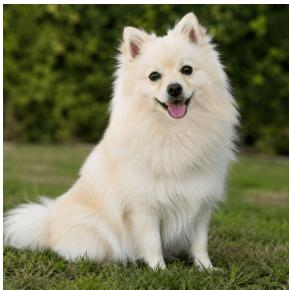  
(b) Dog

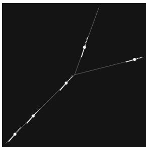  
(c) Radar image A

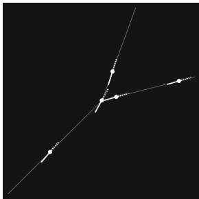  
(d) Radar image B  
Figure 1: Natural images versus radar images. The two radar images (c) and (d) follow the standard configuration of a radar display: on a black background, thin white lines trace the fixed route structure, and each aircraft appears as a white blob, with a solid line indicating its heading direction and a dotted line marking its short past trail.

In combination, (C1) and (C2) place radar imagery outside the regime in which the success of deep vision models has been demonstrated. Whether such models can operate reliably under these conditions therefore remains an open question, determining whether radar imagery is a feasible input representation for air trafic complexity modeling at all.

We address this question through a feasibility study set up as follows. Rather than engineering numerical descriptors from the trafic situation, we preserve the radar image itself as the spatial representation. Specifically, the input consists of the original radar image as the position channel, supplemented by five additional channels that encode each aircraft’s state variables at its image location. No handcrafted features, such as pairwise distances or conflict indicators, are computed (Section 3). A Vision Transformer (ViT) (Dosovitskiy et al., 2021) is trained to regress complexity directly from this representation. Because the extreme sparsity of radar images also afects how attention should be distributed, the encoder applies a diferentiated masking strategy that keeps patch-to-patch attention unrestricted while confining the readout to aircraft-bearing patches (Section 4.4). Reference labels are generated with the intrinsic complexity metric of Delahaye and Puechmorel (2000), which defines complexity through pairwise geometric relations and yields four sector-level components: density, convergence, divergence, and insensitivity to control actions (Section 3.3).

The two characteristics motivate the two evaluations. Prediction accuracy on a diverse test set addresses (C1): can the model discriminate among visually sparse and highly similar radar images enough to recover four continuous complexity components? A one-aircraft-removal perturbation study addresses (C2): although removing a single aircraft produces only a minute change in pixel space, the model should respond strongly when the removed aircraft was a major contributor to sector complexity and respond only weakly when the aircraft contributed little.

This work makes two contributions:

1. Feasibility of radar imagery as a data format. We identify the two characteristics that set radar imagery apart from natural images: extreme sparsity with near-identical samples (C1) and high sensitivity of the complexity to few-pixel changes (C2). Despite both, we show experimentally that radar imagery is a viable representation for complexity estimation. A ViT regresses four intrinsic complexity components with $R ^ { 2 } > 0 . 9 6 .$ , and the model’s response under one-aircraft removal tracks the removed aircraft’s actual contribution to sector complexity rather than its mere presence.

2. Diferentiated attention masking. To handle the sparsity of radar imagery, we propose a masking strategy that treats the two levels of attention diferently: patch-to-patch attention is left unmasked, so that empty background patches can carry the spatial relations among aircraft, while each readout query token attends only to aircraftbearing patches, so that the few informative patches are not averaged away among the many empty patches.

The remainder of this paper formalizes the problem (Section 2), describes data generation and labeling (Section 3), presents the model (Section 4) and experimental design (Section 5), and reports results (Section 6) before concluding (Section 7).

## 2. Problem Formulation

Let $X \in \mathbb { R } ^ { H \times W \times C }$ denote the input tensor defined on a spatial grid of size $H \times W$ . The first channel corresponds to the radar image itself, while the remaining �−1 channels that embed each aircraft’s state variables at the pixel locations that aircraft occupies in the position channel. Let $Y \in \mathbb { R } ^ { K }$ denote a label vector of � intrinsic complexity components computed from the geometric relations among aircraft at a given instant. We train a model $f _ { \theta } : X \mapsto { \hat { Y } }$ to minimize a regression loss over the � outputs. The model operates on a single radar frame and receives only this image-based input; no handcrafted complexity descriptors, aircraft counts, or pairwise interaction features are provided.

## 3. Data Generation and Labeling

## 3.1. Synthetic radar images and simulation setup

We generate synthetic radar images using the BlueSky ATM simulator (Hoekstra and Ellerbroek, 2016) rather than real-world flight trajectories. Real trafic is shaped by ATC procedures, separation standards, and controller interventions that suppress rare but complex geometries. Synthetic simulation provides direct control over trafic density, interaction structure, and scenario diversity, enabling systematic evaluation across a wider range of conditions.

We define three route configurations—single, crossing, and merging—as shown in Figure 2. Each aircraft follows a flight plan specifying its aircraft type, route, cruise speed, and altitude. Each scenario is generated by Monte Carlo sampling: aircraft count (2–10), cruise speed (450–500 kt), altitude (FL300–FL380), and spawn intervals at route entry points are drawn randomly, as are the timing and vertical speed of climbs and descents. The simulated radar display is recorded as a grayscale image $\boldsymbol { I } \in \mathbb { R } ^ { H \times W }$ covering a 100 × 100 NM sector.

The resulting sim-to-real gap, including the absence of procedural regularities, controller interventions, and environmental variability, is intentional. As this study tests the feasibility of radar imagery as an input representation, a controlled testbed is preferable, because it keeps the result attributable to the trafic geometry itself rather than to operational factors that difer from one airspace to another. Evaluation on real-world data is left for subsequent work.

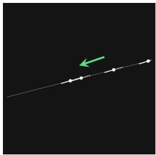  
(a) Single route

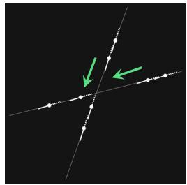  
(b) Crossing routes

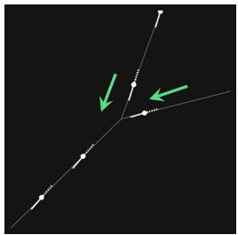  
(c) Merging routes  
Figure 2: Route configuration scenarios used in simulation. All configurations feature one-directional trafic flow along each route, as indicated by the green arrows.

## 3.2. Position image with supplementary state channels

Aircraft positions alone are insuficient for inferring trafic complexity, as they omit the kinematic information controllers use to anticipate near-term trajectories and potential conflicts. On operational radar displays, this information appears in the data block associated with each aircraft symbol. We therefore use the radar image � as the position channel $X _ { \mathrm { P O S } }$ and add five state channels encoding heading, speed, current altitude, requested altitude, and vertical speed, yielding $X \in \mathbb { R } ^ { H \times W \times 6 }$ :

$$
X = [ X _ { \mathrm { P O S } } , X _ { \mathrm { H D G } } , X _ { \mathrm { S P D } } , X _ { \mathrm { A L T } } , X _ { \mathrm { R A L T } } , X _ { \mathrm { V S } } ] .\tag{1}
$$

In the position channel, routes are rendered as white line segments and aircraft as small white blobs with pixel value 255 on a black background with value 0, directly encoding both route configuration and aircraft positions. The five state channels are sparse arrays rather than visual images: each aircraft’s state value is assigned to the pixels occupied by its blob in the position channel, as illustrated in Figure 3. This spatial alignment allows the model to process positiona and kinematic information jointly. Let $B _ { i }$ denote the blob pixels of aircraft �; for example, the speed channel is defined by $( X _ { \mathrm { S P D } } ) _ { p _ { x } , p _ { y } } = s _ { i }$ for all $( p _ { x } , p _ { y } ) \in B _ { i }$ , where $s _ { i }$ is the aircraft’s speed.

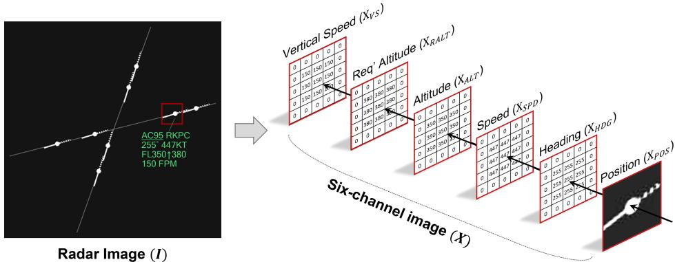  
Figure 3: Input construction: the red-boxed aircraft region in radar image � defines the blob pixels in the position channel, and the same pixel region in each supplementary state channel is filled with the corresponding state variable value.

## 3.3. Intrinsic complexity labels

We label each image using the intrinsic complexity metric of Delahaye and Puechmorel (2000), which characterizes the geometric disorder of the velocity field through pairwise relative distances and speeds, yielding per-aircraft indicators for density, convergence, divergence, and insensitivity to control actions. Because these labels are computed directly from trafic geometry, they provide objective targets for the feasibility test without relying on sector-specific procedures, equipment standards, or subjective human complexity ratings. We extend the original horizontal-plane formulation to three-dimensional Euclidean space by replacing its two-dimensional position and velocity vectors with three-dimensional counterparts, thereby capturing altitude-based proximity as well as vertical convergence and divergence.

For a trafic situation containing � aircraft, let aircraft � have position $\mathbf { p } _ { i } ~ = ~ ( x _ { i } , y _ { i } , z _ { i } ) ~ \in ~ \mathbb { R } ^ { 3 }$ and velocity $\mathbf v _ { i } = ( \dot { x } _ { i } , \dot { y } _ { i } , \dot { z } _ { i } ) \in \mathbb R ^ { 3 }$ . For each pair (�, �), define the relative position $\mathbf { d } _ { i j } = \mathbf { p } _ { j } - \mathbf { p } _ { i }$ , relative velocity $\mathbf { u } _ { i j } = \mathbf { v } _ { j } - \mathbf { v } _ { i }$ , and 3-D separation distance $r _ { i j } = \| \mathbf { d } _ { i j } \| _ { 2 }$ . The separation rate is

$$
\dot { r } _ { i j } = \frac { { \bf d } _ { i j } ^ { \top } { \bf u } _ { i j } } { r _ { i j } } ,\tag{2}
$$

where $\dot { r } _ { i j } < 0$ and $\dot { r } _ { i j } > 0$ indicate converging and diverging pairs, respectively.

The local density of aircraft � is defined by exponentially weighting neighboring aircraft:

$$
\mathrm { D e n s } ( i ) = 1 + \sum _ { j \neq i } \exp \left( - a \frac { r _ { i j } } { R } \right) ,\tag{3}
$$

where � is the neighborhood scale and � controls the rate at which the influence of neighboring aircraft decays with distance. The convergence and divergence indicators measure how fast surrounding aircraft approach or move away, with nearer pairs receiving greater weight:

$$
\mathrm { D i v } ( i ) = \sum _ { \stackrel { j \neq i } { \dot { r } _ { i j } > 0 } } \dot { r } _ { i j } \exp \left( - a \frac { r _ { i j } } { R } \right) ,\tag{4}
$$

$$
\mathrm { C o n v } ( i ) = \sum _ { \stackrel { j \neq i } { \dot { r } _ { i j } < 0 } } ( - \dot { r } _ { i j } ) \exp \left( - a \frac { r _ { i j } } { R } \right) .\tag{5}
$$

The insensitivity indicator reflects how dificult a converging situation is to resolve. When a small change in heading, speed, or vertical rate barely alters how fast two aircraft are closing on each other, the situation is harder for a controller to resolve, and complexity is correspondingly higher. The original metric defines separate sensitivity branches for converging and diverging pairs; we retain only the convergent branch, since convergence is what drives conflict risk and hence controller monitoring efort. For each aircraft, the control-parameter vector $\eta _ { i } = [ s _ { i } , \psi _ { i } , \gamma _ { i } ]$ comprises speed magnitude, horizontal track angle, and flight-path angle, providing a three-dimensional extension of the original speed– direction parameterization. For each pair, $G _ { i j } = \| \nabla _ { ( \eta _ { i } , \eta _ { j } ) } \dot { r } _ { i j } \| _ { 2 }$ measures the sensitivity of the pairwise range rate to small control changes by either aircraft. This responsiveness is aggregated over closing pairs:

$$
\mathrm { S d } ( i ) = \sum _ { { j \neq i } \atop { \dot { r } _ { i j } < 0 } } G _ { i j } \exp \left( - a \frac { r _ { i j } } { R } \right) .\tag{6}
$$

The corresponding insensitivity score is

$$
\operatorname { I S d } ( i ) = \left\{ { \frac { 1 } { \varepsilon + \operatorname { S d } ( i ) } } , \exists j \neq i : { \dot { r } } _ { i j } < 0 , \right.\tag{7}
$$

where $\varepsilon > 0$ prevents division by zero. Higher responsiveness therefore produces lower insensitivity, reflecting that a converging pair is easier to resolve when a small control action can readily slow the closure rate.

Air trafic complexity is managed at the sector level: a controller is responsible for the trafic situation as a whole, and this study estimates complexity at that same level. Whereas the original metric defines complexity at the aircraft level, we sum the indicators over all � aircraft present in the sector to obtain scalar regression targets: $Y _ { \mathrm { D e n s } } = \sum _ { i = 1 } ^ { N }$ Dens(�), and analogously for $Y _ { \mathrm { C o n v } } , Y _ { \mathrm { D i v } }$ , and $Y _ { \mathrm { I S d } }$

## 4. Method

Figure 4 provides an overview of the proposed architecture. The model encodes the six-channel input, consisting of the position image and its supplementary state channels, into a sequence of patch tokens. Four dedicated component query tokens (CQTs), one for each intrinsic complexity component, are then prepended to the patch sequence. The resulting token sequence is processed through a Transformer encoder governed by the diferentiated attention masking policy described in Section 4.4.

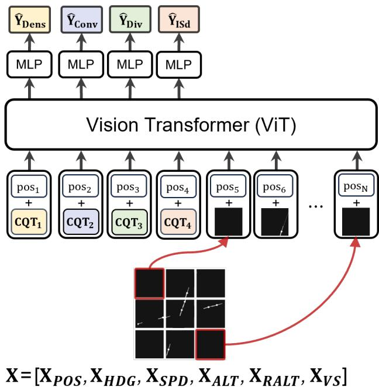  
Figure 4: Overview of the proposed model architecture. The six-channel input is partitioned into $N _ { p }$ patch tokens. Four component query tokens $\mathrm { C Q T } _ { k } \ ( k = 1 , \dots , 4 )$ are prepended to the sequence and processed jointly through � Transformer layers. Each $\mathrm { C Q T } _ { k }$ is then passed through its own MLP head to produce the scalar complexity estimate $\hat { Y } _ { k }$

## 4.1. Backbone: Vision Transformer

We adopt a Vision Transformer (ViT) as the backbone (Dosovitskiy et al., 2021), which partitions the input into fixed-size patches, embeds each patch as a token, and models their interactions through stacked Transformer layers (Vaswani et al., 2017). In our setting, the ViT directly processes the six-channel input tensor, enabling joint reasoning over the spatial layout represented by the position image and the aircraft-state information encoded in the supplementary channels.

## 4.2. Patch embedding for the six-channel input

Consider $X \in \mathbb { R } ^ { H \times \bar { W } \times C }$ with � = 6. We partition � into $N _ { p } = H W / P ^ { 2 }$ non-overlapping patches of size $P \times P$ across all channels. Each patch is a tensor in ℝ $P { \times } P { \times } C$ and is flattened and linearly projected into a �-dimensional patch token. Stacking all tokens yields $\boldsymbol { Z } \in \mathbb { R } ^ { N _ { p } \times D }$

Instead of using a single global readout token, as in the standard ViT, we prepend four learnable component query tokens $\mathrm { C Q T } _ { k } , k = 1 , \ldots , 4 ,$ each dedicated to one intrinsic component $( Y _ { \mathrm { D e n s } } , Y _ { \mathrm { C o n v } } , Y _ { \mathrm { D i v } } , Y _ { \mathrm { I S d } } )$ . This multioutput readout design gives each component its own aggregation pathway and regression head, so the readout for

each component can weight the patch tokens independently rather than forcing all four targets through a single shared summary vector. Learnable positional embeddings are added to all tokens to preserve spatial identity, producing the input sequence $Z ^ { 0 } \in \mathbb { R } ^ { ( N _ { p } + \hat { 4 } ) \times D }$

## 4.3. Transformer encoder and regression head

The input sequence $Z ^ { 0 }$ is processed by a stack of � Transformer layers with multi-head self-attention:

$$
{ \mathrm { A t t e n t i o n } } ( Q , K , V ) = { \mathrm { S o f t m a x } } \left( { \frac { Q K ^ { \top } } { \sqrt { d _ { k } } } } \right) V ,\tag{8}
$$

where �, �, and � are linear projections of the token sequence into $\mathbb { R } ^ { ( N _ { p } + 4 ) \times d _ { k } }$ , and $d _ { k } = D / n _ { h }$ is the per-head key dimension for a model with $n _ { h }$ attention heads. After � layers, we obtain $Z ^ { L } \in \mathbb { R } ^ { ( N _ { p } ^ { \star } + 4 ) \times D }$ . Each $Z _ { \mathrm { C Q T } _ { k } } ^ { L ^ { ^ { \bullet } } } \in \mathbb { R } ^ { D }$ is extracted and routed through a dedicated MLP regression head to produce the scalar complexity estimate $\hat { Y } _ { k }$ , yielding $\hat { Y } = [ \hat { Y } _ { \mathrm { D e n s } } , \hat { Y } _ { \mathrm { C o n v } } , \hat { Y } _ { \mathrm { D i v } } , \hat { Y } _ { \mathrm { I S d } } ^ { - } ] \in \mathbb { R } ^ { 4 }$

## 4.4. Diferentiated attention masking

The sparsity of radar images (C1) imposes two conflicting demands on the self-attention mechanism: when patch tokens exchange information, the empty background should be kept, since it carries the spatial relations among aircraft; when the readout aggregates the image into a complexity estimate, the background should be set aside, since it far outnumbers the few aircraft-bearing tokens. We therefore apply distinct masking rules at the two levels, as illustrated in Figure 5.

(i) Patch-to-patch attention: no masking. All patch tokens, including empty ones, attend to one another. Empty patches encode the spatial geometry that sector complexity depends on. For example, the number of empty patches separating two aircraft is what tells the model how far apart they are. Additionally, empty patches along route segments (e.g., Patch in Fig. 5) signal an aircraft’s proximity to a merging or crossing region. Across successive layers, each aircraft-bearing tokens accumulates this spatial context alongside its own state.

(ii) CQT-to-patch attention: aircraft-bearing patches only. Because aircraft occupy only a small fraction of the image, a readout attending to every patch would average the few informative tokens together with a large number of near-identical background tokens. This dilutes what the aircraft contribute and flattens exactly the few-token diferences that distinguish one trafic situation from another. Restricting each $\mathrm { C Q T } _ { k }$ to aircraft-bearing patches loses no spatial information: by the readout stage, each aircraft token has already absorbed the spatial context through the unmasked patch-to-patch layers, so it carries its own state together with its separation from other aircraft and its position relative to the route configuration.

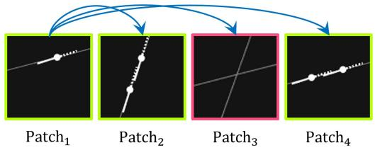

(a) Patch-to-patch attention  
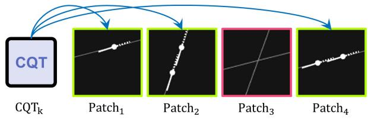  
(b) CQT-to-patch attention  
Figure 5: Diferentiated attention masking strategy. (a) In patch-to-patch attention, all patch tokens attend to each other without restriction, preserving the spatial scafold including empty background patches (red). (b) In CQT-to-patch attention, each $\mathrm { C Q T } _ { k }$ attends only to aircraft-bearing patches (green), masking out empty background patches.

## 5. Experimental Design

## 5.1. Dataset and splits

We generate 100,000 synthetic trafic situations, each represented by a position image with five supplementary state channels at resolution 264 × 264, yielding $X \in \mathbb { R } ^ { 2 6 4 \times 2 6 4 \times 6 }$ . The dataset is evenly distributed across the three route configurations, with approximately 33,300 images per configuration. Each image is labeled with the four complexity components described in Section 3.3. The dataset is partitioned into training, validation, and test sets using a stratified split by route configuration, yielding near 80/10/10 split.

Table 1 summarizes the distribution of the normalized complexity labels over the full dataset. Divergence exhibits a lower mean and greater positive skewness than convergence, consistent with the predominantly one-directional route design: aircraft traveling along similar headings rarely diverge substantially, concentrating divergence values toward the lower end of the range. In contrast, convergence spans a broader and more symmetric distribution, as crossing and merging configurations produce a wider range of closure rates depending on route geometry and aircraft spacing. Density and insensitivity display moderate spread with approximately symmetric distributions.

Table 1  
Distribution statistics of intrinsic complexity labels after component-wise min–max normalization.
<table><tr><td>Component</td><td>Mean</td><td>Std</td><td>Skewness</td><td>Range</td></tr><tr><td>Density</td><td>0.3831</td><td>0.3049</td><td>0.4776</td><td>[0, 1]</td></tr><tr><td>Convergence</td><td>0.2745</td><td>0.3226</td><td>0.8182</td><td>[0, 1]</td></tr><tr><td>Divergence</td><td>0.1834</td><td>0.2634</td><td>1.5029</td><td>[0, 1]</td></tr><tr><td>Insensitivity</td><td>0.4923</td><td>0.2868</td><td>0.3013</td><td>[0, 1]</td></tr></table>

## 5.2. Training configuration and computational cost

The model follows the ViT-Base architecture with � = 12 encoder layers, embedding dimension $D = 7 6 8$ , feedforward dimension $D _ { f f } = 3 0 7 2 , n _ { h } = 1 2$ attention heads, and patch size $P = 2 4 .$ yielding $N _ { p } = 1 2 1$ patch tokens per image. Training uses AdamW (Loshchilov and Hutter, 2019) with batch size 512, initial learning rate $1 0 ^ { - 4 }$ , and cosine annealing with warm restarts, optimizing the Huber loss $( \delta = 1 . 0 )$ . Early stopping with a patience of five epochs is employed. All experiments are conducted in PyTorch (Paszke et al., 2019) with a single NVIDIA A6000 GPU.

## 6. Results

The proposed model is evaluated from the two perspectives motivated by the radar-image characteristics identified in the Introduction: (i) prediction accuracy, assessing whether the model discriminates among sparse, near-identical radar images suficiently well to recover geometry-based intrinsic complexity (C1), and (ii) an aircraft-removal perturbation study, assessing whether the model’s response to a minimal pixel-level perturbation reflects how much the removed aircraft contributed to sector complexity rather than its mere presence (C2).

## 6.1. Prediction Performance

Table 2 reports mean absolute error (MAE), standard deviation (STD), root mean squared error (RMSE), and coeficient of determination $( R ^ { 2 } )$ for each intrinsic component on the test set. Performance is strong across all four components $( R ^ { 2 } > 0 . 9 6 )$ . In absolute terms, the overall MAE values of 0.0148–0.0271 remain small relative to the full range of each component, and the RMSE values, which penalize large errors more heavily than MAE, remain only within 1.7 times the corresponding MAE values across all components. This level of accuracy indicates that the model can distinguish among radar images that are nearly identical at the pixel level—difering only in the number and positions of a few aircraft blobs—finely enough to recover four distinct continuous complexity components. The position image and its supplementary state channels therefore preserve the geometric structure from which the labels are computed.

Among the four components, density is predicted most robustly, as it primarily depends on spatial proximity, the geometric property most directly represented in the image. Insensitivity is predicted consistently across all three route configurations $( R ^ { \bar { 2 } } > 0 . 9 8 )$ , indicating that the radar image sufices for the model to capture this second-order quantity. Divergence is the weakest $( R ^ { 2 } = 0 . 9 6 7 7 , \mathrm { M A E } = 0 . 0 2 7 1 )$ , though its absolute error remains comparable to that of the other components.

Across route configurations, prediction quality varies in ways that mirror the geometric diversity of each scenario type. For the single-route configuration, density and insensitivity are predicted accurately $( R ^ { 2 } = 0 . 9 9 1$ and 0.984), whereas convergence and divergence exhibit substantially lower $R ^ { 2 }$ (0.782 and 0.774). In contrast, the crossing and merging configurations, in which aircraft approach from diferent directions, ofer richer interaction trafic patterns and correspondingly yield higher $R ^ { 2 }$ for convergence and divergence. Among these configurations, divergence in the crossing-route scenario exhibits the highest MAE (0.0428): crossing is the configuration in which substantial divergence actually occurs—pairs pass the intersection and separate at rates that vary with crossing angle and spacing— so divergence values there are the largest and most varied, and predicting larger values naturally comes with larger absolute errors.

The low $R ^ { 2 }$ of convergence and divergence in the single-route configuration should, however, be interpreted as a property of the evaluation metric rather than a limitation of the model. Because $R ^ { 2 }$ measures the fraction of label variance explained, the one-directional single-route trafic concentrates convergence and divergence values near zero, leaving little variance to explain. Under such conditions, even small absolute errors can substantially reduce $R ^ { 2 }$ . Consistent with this interpretation, the single-route configuration attains the lowest MAE for both components (0.0126 and 0.0161)—smaller than in the crossing and merging configurations despite their much higher $R ^ { 2 }$ values. The comparatively low divergence $R ^ { 2 }$ in the merging configuration (0.9142) arises for the same reason: once aircraft have merged onto a common route, divergence values again vary little, while the absolute error remains small $( \mathbf { M A E } = \mathbf { 0 . 0 2 2 2 } )$ . The weak overall divergence performance noted above has the same origin, since every route configuration carries one-directional trafic. Overall, the model maintains consistently low absolute errors across all route configurations, whereas the observed diferences in $R ^ { 2 }$ primarily reflect diferences in the amount of label variance available to explain.

Taken together, every case with lower performance—divergence overall, and convergence and divergence in the single-route configuration—is one in which the label values cluster near zero and so vary little. The primary limitation is thus the limited variety of trafic flow evaluated. Future work could include bi-directional trafic flows to introduce trafic patterns that produce a wider range of divergence values.

Table 2  
Test-set prediction performance for each intrinsic component by route configuration.
<table><tr><td>Configuration</td><td>Component</td><td>MAE</td><td>STD</td><td>RMSE</td><td> $R ^ { 2 }$ </td></tr><tr><td rowspan="4">Overall</td><td>Density</td><td>0.0148</td><td>0.0194</td><td>0.0244</td><td>0.9936</td></tr><tr><td>Convergence</td><td>0.0247</td><td>0.0315</td><td>0.0400</td><td>0.9846</td></tr><tr><td>Divergence</td><td>0.0271</td><td>0.0389</td><td>0.0474</td><td>0.9677</td></tr><tr><td>Insensitivity</td><td>0.0166</td><td>0.0224</td><td>0.0279</td><td>0.9906</td></tr><tr><td rowspan="4">Single</td><td>Density</td><td>0.0084</td><td>0.0136</td><td>0.0160</td><td>0.9910</td></tr><tr><td>Convergence</td><td>0.0126</td><td>0.0204</td><td>0.0240</td><td>0.7820</td></tr><tr><td>Divergence</td><td>0.0161</td><td>0.0280</td><td>0.0323</td><td>0.7739</td></tr><tr><td>Insensitivity</td><td>0.0160</td><td>0.0268</td><td>0.0312</td><td>0.9837</td></tr><tr><td rowspan="4">Crossing</td><td>Density</td><td>0.0213</td><td>0.0238</td><td>0.0319</td><td>0.9881</td></tr><tr><td>Convergence</td><td>0.0345</td><td>0.0359</td><td>0.0498</td><td>0.9759</td></tr><tr><td>Divergence</td><td>0.0428</td><td>0.0511</td><td>0.0667</td><td>0.9572</td></tr><tr><td>Insensitivity</td><td>0.0160</td><td>0.0187</td><td>0.0246</td><td>0.9923</td></tr><tr><td rowspan="4">Merging</td><td>Density</td><td>0.0147</td><td>0.0170</td><td>0.0225</td><td>0.9950</td></tr><tr><td>Convergence</td><td>0.0268</td><td>0.0319</td><td>0.0417</td><td>0.9831</td></tr><tr><td>Divergence</td><td>0.0222</td><td>0.0271</td><td>0.0350</td><td>0.9142</td></tr><tr><td>Insensitivity</td><td>0.0178</td><td>0.0210</td><td>0.0275</td><td>0.9922</td></tr></table>

## 6.2. Complexity Response to Aircraft Removal

Air trafic complexity is inherently relational: complexity components are defined through pairwise interactions, and each aircraft’s contribution depends on the surrounding trafic. Removing a single aircraft therefore does not merely eliminate its own contribution; it also alters the interaction neighborhoods of the remaining aircraft, requiring their intrinsic complexity values to be recomputed under the modified trafic geometry. From the image perspective, however, removing one aircraft constitutes only a minimal change: a small group of pixels revert to background, and the visual change appears essentially identical regardless of which aircraft is removed. In contrast, the resulting change in true air trafic complexity can range from negligible to substantial depending on how much the removed aircraft contributed to the surrounding trafic situation.

For each test image, we compute the original ground-truth complexity $C _ { \mathrm { o r i g } }$ and the corresponding model prediction $\hat { C } _ { \mathrm { o r i g } } .$ . We then randomly remove one aircraft and re-render the model input (i.e., the position image and all supplementary state channels), recompute ground-truth complexity $C _ { \mathrm { r e m } }$ for the remaining trafic, and obtain the updated prediction $\hat { C } _ { \mathrm { r e m } }$ . The change in complexity caused by the removal—the aircraft’s marginal contribution—is defined as

$$
\Delta C = C _ { \mathrm { o r i g } } - C _ { \mathrm { r e m } } , \quad \Delta \hat { C } = \hat { C } _ { \mathrm { o r i g } } - \hat { C } _ { \mathrm { r e m } } .\tag{9}
$$

A model that has learned the underlying trafic interactions should produce $\Delta \hat { C }$ that closely tracks Δ�: large values of Δ� should correspond to large values of $\Delta \hat { C }$ , whereas small values of $\Delta C$ should correspond to small values of $\Delta \hat { C } .$ We evaluate this relationship using identity-line regression, $R ^ { 2 }$ , and RMSE. Algorithm 1 details the procedure.

Algorithm 1 One-Aircraft Removal Perturbation Study (per test image)   
Require: Test image $X$ with aircraft set ${ \mathcal { A } } ,$ trained model $f _ { \theta }$   
Ensure: Marginal changes $\Delta C , \Delta \hat { C }$   
1: Compute ground-truth complexity $C _ { \mathrm { o r i g } }$ from full trafic geometry   
2: Obtain model prediction ${ \hat { C } } _ { \mathrm { o r i g } } \gets f _ { \theta } ( X )$   
3: Sample one aircraft $i ^ { * }$ ∼ Uniform()   
4: Remove $i ^ { * }$ from $\boldsymbol { A }$ and update image $X ^ { \prime }  X \setminus \{ i ^ { * } \}$   
5: Recompute ground-truth complexity $C _ { \mathrm { r e m } }$ from remaining trafic  ⧵ {�∗}   
6: Obtain model prediction $\hat { C } _ { \mathrm { r e m } } \gets f _ { \theta } ( X ^ { \prime } )$   
7: $\Delta C \gets C _ { \mathrm { o r i g } } - C _ { \mathrm { r } }$ em   
8: $\Delta \hat { C } \gets \hat { C } _ { \mathrm { o r i g } } - \hat { C } _ { \mathrm { r e m } }$   
9: return $\Delta C , \Delta \hat { C }$

Figure 6 summarizes the results for density, convergence, and divergence. All three components exhibit strong proportionality $( R ^ { 2 } ~ \ge ~ 0 . 9 2 )$ . Density is predicted most accurately, with the regression line closely following the identity line $( y = x )$ (slope = 1.10, $R ^ { 2 } = 0 . 9 4 .$ , RMSE = 0.02). Convergence and divergence also achieve strong fit (slope = 0.89, $R ^ { 2 } = 0 . 9 2$ and slope = 0.84, $R ^ { 2 } = 0 . 9 3$ , respectively), although both slightly underestimate the structural impact of aircraft removal.

This proportional response also shows that the model has learned more than simply counting aircraft. Removing a single aircraft eliminates approximately the same number of pixels regardless of which aircraft is removed. A model relying only on aircraft count, or equivalently on the amount of foreground pixels in the image, would therefore produce nearly the same complexity decrement for every removal, so the points in Figure 6 would lie in a flat horizontal band regardless of the true change. Instead, the observed alignment with the identity line across the full range of $\Delta C$ shows that the model assigns each aircraft a marginal contribution determined by its relation to the surrounding aircraft: removing a peripheral aircraft (small $\Delta C )$ barely changes the prediction, while removing an aircraft embedded in a converging cluster (large Δ�) produces a substantially larger response.

The systematic underestimation of large complexity changes, reflected in slopes of 0.89 and 0.84 for convergence and divergence, also admits a natural interpretation. Removals with $\Delta C > 0 . 5$ correspond to rare, geometrically pivotal aircraft, visible as the sparse points at large Δ� in Figure $6 ;$ because such cases occupy only a small fraction of the training distribution, a regression model tends to compress these extremes toward the mean. In other words, for these rare pivotal aircraft, the predicted complexity changes are somewhat smaller than the ground-truth values, whereas predictions for small and moderate Δ� remain closely aligned with the identity line.

Taken together, the removal study demonstrates the property described by characteristic (C2): the model responds to the complexity consequences of removing a single aircraft, even though every such removal changes roughly the same number of pixels. The insensitivity component is excluded from this analysis. Insensitivity is defined relative to the set of converging pairs present in a given geometry, and removing an aircraft changes that set. The before- and after-removal values are therefore computed over two diferent trafic geometries and are not comparable in the way Δ� is for the other three components. A dedicated perturbation study, in which heading, speed, and vertical speed are systematically varied while the trafic geometry is held fixed, is left for future work.

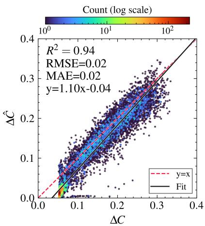  
(a) Density

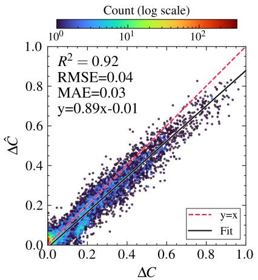  
(b) Convergence

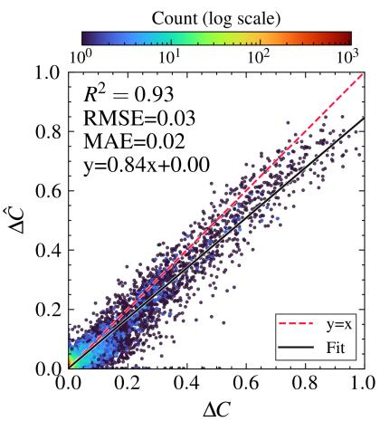  
(c) Divergence  
Figure 6: One-random-aircraft removal perturbation analysis. Ground-truth marginal complexity changes Δ� versus predicted changes $\Delta \hat { C }$ for each intrinsic component.

## 7. Conclusion

The central question of this study was whether radar imagery—an image format that departs from the natural images on which modern computer vision was established—can serve as a data format for air trafic complexity modeling. The concern was twofold: radar images are extremely sparse and self-similar, such that any two images difer in only a small fraction of pixels (C1); and the image-to-complexity mapping is highly sensitive, so that those few difering pixels can correspond to substantial changes in air trafic complexity (C2). The experimental results provide afirmative evidence for both characteristics.

First, a Vision Transformer trained on radar position images augmented with supplementary state channels recovers four geometry-based intrinsic complexity components with $R ^ { \bar { 2 } } > 0 . 9 6$ and its accuracy varies across route configurations, providing evidence that the model reads trafic geometry rather than superficial pixel statistics (C1). Second, under one-aircraft removal, the predicted change is proportional to the ground-truth change $( R ^ { 2 } \ge 0 . 9 2 )$ . This sensitivity is not encouraged by conventional vision training and therefore cannot be taken for granted (C2).

Together, these results support the conclusion that radar imagery, despite its atypical visual characteristics, is a viable data format for air trafic complexity modeling. This clears the ground for the hypothesis that motivated this work: that a vision model operating directly on the same visual information available to air trafic controllers can learn to model, and ultimately approximate, the complexity perceived by human controllers.

Several limitations bound this conclusion and define the path forward. The model was trained and tested on synthetic scenarios within a fixed route configuration; its transferability to real radar data, diferent sector geometries, and varying operational procedures remains open. The one-directional route configurations leave divergence values clustered near zero, and richer bi-directional scenarios are needed so that all four components are tested over a wide range of values. The model operates on single radar snapshots, whereas controllers continuously integrate the evolution of the trafic picture over time; incorporating temporal context is therefore a natural extension. Finally, the reference labels are geometry-based rather than perception-based. Having established radar imagery as a viable representation for air trafic complexity modeling, the natural continuation is to relate image-based complexity estimates to the complexity rated by controllers themselves.

## CRediT authorship contribution statement

Hyewook Kim: Conceptualization, Methodology, Software, Formal analysis, Visualization, Writing - Original draft. Byul Kang: Conceptualization, Writing - Original draft. Seokbin Yoon: Conceptualization, Methodology, Software, Writing - Original draft. Keumjin Lee: Conceptualization, Supervision, Writing - Review & editing.

## References

G. B. Chatterji, B. Sridhar, Neural network based air trafic controller workload prediction, in: Proc. Amer. Control Conf. (ACC), San Diego, CA, USA, 1999, pp. 2620–2624. doi:10.1109/ACC.1999.786543.

G. Chatterji, B. Sridhar, Measures for air trafic controller workload prediction, in: Proc. 1st AIAA Aircraft, Technology, Integration, and Operations Forum, Los Angeles, CA, USA, 2001, Paper AIAA 2001-5242. doi:10.2514/6.2001-5242.

I. V. Laudeman, S. G. Shelden, R. Branstrom, C. L. Brasil, Dynamic Density: An Air Trafic Management Metric, NASA/TM-1998-112226, NASA Ames Research Center, Mofett Field, CA, USA, 1998.

Wyndemere, Inc., Dynamic Resectorization and Coordination Technology: An Evaluation of Air Trafic Control Complexity, Final Rep., Contract NAS2-14284, Boulder, CO, USA, 1996.

P. Kopardekar, A. Schwartz, S. Magyarits, J. Rhodes, Airspace complexity measurement: An air trafic control simulation analysis, International Journal of Industrial Engineering 16 (1) (2009) 61–70.

P. Kopardekar, S. Magyarits, Dynamic density: Measuring and predicting sector complexity, in: Proc. 21st Digital Avionics Systems Conference (DASC), Irvine, CA, USA, 2002, pp. 2.C.4-1–2.C.4-6.

K. Lee, E. Feron, A. Pritchett, Air trafic complexity: An input–output approach, in: Proc. 2007 American Control Conference (ACC), New York, NY, USA, 2007, Paper WeA14.6.

D. Gianazza, Forecasting workload and airspace configuration with neural networks and tree search methods, Artificial Intelligence 174 (7–8) (2010) 530–549.

X. Cao, X. Zhu, Z. Tian, J. Chen, D. Wu, W. Du, A knowledge-transfer-based learning framework for airspace operation complexity evaluation, Transportation Research Part C: Emerging Technologies 95 (2018) 61–81.

B. Li, Z. Li, J. Chen, Y. Yan, Y. Lv, W. Du, MAST-GNN: A multimodal adaptive spatio-temporal graph neural network for airspace complexity prediction, Transportation Research Part C: Emerging Technologies 160 (2024) Art. no. 104521.

C. A. Manning, E. M. Pfleiderer, Relationship of Sector Activity and Sector Complexity to Air Trafic Controller Taskload, Tech. Rep. DOT/FAA/AM-06/29, Federal Aviation Administration, Ofice of Aerospace Medicine, Washington, DC, USA, 2006.

J. M. Histon, R. J. Hansman, G. Aigoin, D. Delahaye, S. Puechmorel, Introducing structural considerations into complexity metrics, Air Trafic Control Quarterly 10 (2) (2002) 115–130.

H. Xie, M. Zhang, J. Ge, X. Dong, H. Chen, Learning air trafic as images: A deep convolutional neural network for airspace operation complexity evaluation, Complexity 2021 (2021) Art. no. 6457246, 1–16. doi:10.1155/2021/6457246.

A. Dosovitskiy, L. Beyer, A. Kolesnikov, D. Weissenborn, X. Zhai, T. Unterthiner, M. Dehghani, M. Minderer, G. Heigold, S. Gelly, J. Uszkoreit, N. Houlsby, An image is worth 16×16 words: Transformers for image recognition at scale, in: Proc. Int. Conf. Learn. Represent. (ICLR), 2021.

A. Vaswani, N. Shazeer, N. Parmar, J. Uszkoreit, L. Jones, A. N. Gomez, L. Kaiser, I. Polosukhin, Attention is all you need, in: Adv. Neural Inf. Process. Syst. (NeurIPS), Vol. 30, 2017.

D. Delahaye, S. Puechmorel, Air trafic complexity: Towards intrinsic metrics, in: Proc. 3rd USA/Europe Air Trafic Management R&D Seminar (ATM2000), Napoli, Italy, 2000.

J. M. Hoekstra, J. Ellerbroek, BlueSky ATC simulator project: An open data and open source approach, in: Proc. 7th Int. Conf. Res. Air Transp. (ICRAT), Philadelphia, PA, USA, 2016.

I. Loshchilov, F. Hutter, Decoupled weight decay regularization, in: Proc. Int. Conf. Learn. Represent. (ICLR), 2019.

A. Paszke, S. Gross, F. Massa, A. Lerer, J. Bradbury, G. Chanan, T. Killeen, Z. Lin, N. Gimelshein, L. Antiga, A. Desmaison, A. Köpf, E. Yang, Z. DeVito, M. Raison, A. Tejani, S. Chilamkurthy, B. Steiner, L. Fang, J. Bai, S. Chintala, PyTorch: An imperative style, high-performance deep learning library, in: Adv. Neural Inf. Process. Syst. (NeurIPS), Vol. 32, 2019, pp. 8024–8035.