# Kernel Methods for Learning Operators with Multiple Inputs and Outputs

Adrien Weihs\*a, Chunyang Liao †b, Jingmin Sunc, and Hayden Schaeffera

aDepartment of Mathematics, University of California Los Angeles, Los Angeles, CA 90095, USA.

bDepartment of Mathematical Sciences, University of Arkansas, Fayetteville, AR, 72701, USA.

cDepartment of Applied Mathematics and Statistics, Johns Hopkins University, Baltimore, MD 21218 , USA.

## Abstract

Learning mappings between infinite-dimensional objects is a central challenge in scientific machine learning. We introduce a general kernel-based encoder-decoder framework for operator learning that separates observation, representation, learning, and reconstruction. We develop this framework for multi-input, multioutput operator learning, where operators map between products of potentially distinct function spaces. Our approximation theory shows that, although the number of inputs and outputs can increase, the convergence rate is governed by the most challenging constituent approximation problem rather than the overall problem dimension. The framework leads to practical kernel methods with closed-form training and inference, combining mathematical tractability with computational efficiency. We further specialize the approach to multiple operator learning by introducing KernelMO, a family of kernel methods with complementary operatorvalued and product-space formulations. Across five families of parametric partial differential equations, the proposed methods achieve competitive or state-of-the-art predictive accuracy while reducing training and inference costs relative to neural operator architectures and deep learning based models, offering an efficient and lightweight alternative.1

Keywords and phrases. Multiple operator learning, operator learning, kernel methods, encoder–decoder methods, operator-valued kernels, scientific machine learning, parametric partial differential equations. Mathematics Subject Classification. 46E22, 65D15, 41A05

## 1 Introduction

Learning families of related operators between function spaces is an increasingly important problem in scientific machine learning, arising from parametric partial differential equations, inverse problems, and multifidelity simulation [51]. This setting, commonly referred to as multiple operator learning or multi-task operator learning, seeks to learn a map

$$
G : W \longrightarrow \{ G [ \alpha ] : U  V \} _ { \alpha \in W } ,
$$

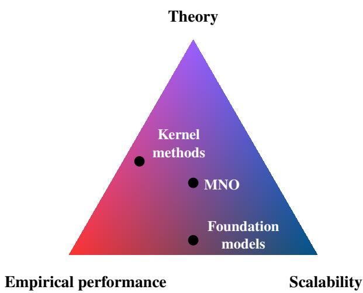  
Figure 1: Conceptual illustration of the trade-offs between theoretical guarantees, empirical performance, and scalability in learning operators with multiple inputs and outputs. Foundation models prioritize scalability across large collections of operators, dedicated neural architectures such as MNO seek a balance between scalability and predictive performance, while the kernel-based methods proposed in this work target the moderate-data regime by emphasizing theoretical guarantees together with competitive predictive accuracy.

which assigns to each parameter (or task) $\alpha \in W$ an operator $G [ \alpha ] : U \to V ,$ where W, U, and V are typically function spaces. A variety of approaches have been proposed for multiple operator learning, see for example [11, 21, 26, 33, 34, 37, 46, 50, 53, 58, 61]. As illustrated conceptually in Figure 1, existing methods can be viewed as occupying different positions in the trade-off between scalability, empirical performance, and theoretical guarantees. Large-scale foundation models leverage massive datasets to learn highly expressive representations across diverse families of PDEs and scientific simulations. These models have demonstrated remarkable empirical performance and excellent scalability, although their theoretical understanding remains comparatively limited. Dedicated architectures, such as Multiple Neural Operators (MNO) [51–53], instead exploit the structure of the learning problem to achieve strong empirical performance while benefiting from increasing theoretical support.

Many scientific computing applications; however, are not constrained by scalability to large training datasets. Instead, they prioritize predictive accuracy, mathematical guarantees, and computational efficiency in moderatedata settings. This motivates the development of learning architectures tailored to this regime by utilizing the general encoder-decoder formulation illustrated in Figure 2a: inputs and outputs are first encoded into latent spaces, a surrogate is learned between these representations, and the prediction is subsequently decoded to the original output space. A key feature of this framework is that the surrogate can be chosen independently of the encoders and decoders: whereas existing approaches predominantly employ deep neural networks for this purpose [25, 29, 35], we instead utilize kernel-based surrogate models.

Importantly, the proposed kernel-based encoder-decoder approach naturally extends beyond classical multiple operator learning to general multi-input, multi-output operator learning problems, i.e., learning maps of the form

$$
G : X _ { 1 } \times \cdot \cdot \cdot \times X _ { m } \longrightarrow Y _ { 1 } \times \cdot \cdot \cdot \times Y _ { n } ,\tag{1}
$$

where each $X _ { i }$ and $Y _ { j }$ may be a distinct function space. We show that our approach is mathematically tractable in this generalized setting: it admits rigorous approximation guarantees, scales favorably with the numbers of input and output tasks, and leads to highly efficient computational implementations.

## 1.1 Main Contributions

The main contributions of this work can be summarized as follows.

1. A general kernel framework for encoder–decoder learning. We develop a general kernel-based framework for learning maps between Hilbert spaces within an encoder–decoder architecture. Specifically, in Theorem 3.3, we show that every kernel defined on the latent surrogate space induces a corresponding kernel on the original input and output spaces. In addition, in Corollary 3.4, we establish an equivalence between learning in the latent reproducing kernel Hilbert space and learning with the induced kernel on the original spaces. Together, these results provide a rigorous theoretical foundation for kernel-based encoder–decoder learning.

2. An encoder–decoder error decomposition. We derive an encoder–decoder error decomposition in Theorem 3.7 of the form

$$
\mathrm { \ A p p r o x i m a t i o n \ c r r o r ~ \lesssim ~ R e p r e s c n t a t i o n ~ c r r o r + L e a r n i n g ~ c r r o r + D a t a ~ c o n s i s t e n c y ~ e r r o r } ,
$$

thereby separating the contributions of the encoder–decoder architecture, the learned surrogate, and the measurement process.

3. Approximation theory for multi-input, multi-output operator learning. We specialize this framework to generalized multi-input, multi-output operator learning on product Hilbert spaces of functions. For a map as in (1), we establish rigorous approximation guarantees for the proposed kernel-based encoder–decoder architecture in Theorem 3.15:

$$
\begin{array} { r l } { \pm \mathrm { { A p p r o x i m a t i o n } \ e r r o r \ \lesssim \ \operatorname* { m a x } _ { 1 \leq i \leq m } \{ I n p u t \ r e c o n s t r u c t i o n \ e r r o r _ { i } \} } + \operatorname* { m a x } _ { 1 \leq j \leq n } \{ \mathrm { O u t p u t \ r e c o n s t r u c t i o n \ e r r o r } _ { j } \} } \\ & { \quad + \mathrm { { L e a r n i n g \ e r r o r } + D a t a \ c o n s i s t e n c y \ e r r o r } . } \end{array}
$$

Importantly, these guarantees scale favorably with the numbers of input and output tasks: the approximation rate is governed by the most challenging individual task rather than deteriorating with the overall problem dimension.

4. Kernel formulations for multiple operator learning. In Section 3.4, we instantiate the proposed framework for multiple operator learning through the KernelMO family of methods. Depending on the representation of the target map, this yields the operator-valued formulation KernelMO-OV, which directly approximates $G : W \to \{ G [ \alpha ] : U \to V \} _ { \alpha \in W }$ , or the product-space formulation KernelMO-PS, which instead approximates the equivalent map $G : W \times U \to V .$ Both formulations inherit the approximation guarantees of the general framework while exhibiting different computational complexities and scalability with respect to the number of training samples.

5. Comprehensive empirical evaluation. We validate the proposed methods on a diverse collection of multiple operator learning benchmarks arising from parametric PDEs in Section 4. Our experiments demonstrate competitive predictive accuracy, substantial reductions in training and inference time compared with state-of-the-art neural operator architectures, and illustrate the practical advantages of kernelbased encoder–decoder learning in moderate-data regimes.

## 1.2 Related Works

Multi-operator learning Multiple operator learning arises in a variety of settings where one seeks to approximate not a single operator, but an entire collection of related input–output mappings. Such collections may emerge naturally from parameterized models, changing geometries, varying boundary conditions, or different governing equations. Alternatively, they may be constructed deliberately to enable information sharing across related learning tasks, with the goal of improving sample efficiency, robustness, and generalization. These viewpoints have motivated a rapidly expanding literature on multiple operator learning and related frameworks; see, for example, [7, 11, 21, 26, 33, 34, 37, 46, 47, 50, 51, 53, 55, 56, 58, 60, 61, 63, 64, 66]. Recently, [57] extended the analysis to the general multi-input, multi-output operator learning framework.

From a modeling perspective, existing approaches can largely be grouped into two categories. The first treats each operator as an independent learning problem, training a separate surrogate for every member of the collection. While simple, this approach cannot exploit relationships between operators and therefore offers limited transfer to new tasks. The second instead represents the collection as a single parameterized operator family, in which an auxiliary variable identifies the desired operator. This variable may encode, for example, physical parameters, a task identifier, the governing equations, or even textual descriptions of the problem [32,34,39,46,51–53,56]. By conditioning on such auxiliary information, a single model can share information across related operators and often exhibits improved transfer, zero-shot capabilities, and out-of-distribution generalization. This structure forms the basis of most recent work on PDE foundation models.

Kernel-based surrogate modeling Kernel-based methods have long served as a fundamental framework for surrogate modeling due to their strong approximation property and rigorous theoretical foundations. By representing the target function in a reproducing kernel Hilbert space (RKHS), these methods provide flexible, nonparametric approximations from scatter data while naturally supporting interpolation, regularization, and uncertainty quantification. Classical kernel surrogates include kernel interpolation, kernel ridge regression, and Gaussian process regression, all of which have found widespread use in scientific computing; see, for example, [8, 13, 20, 22, 23, 45].

These ideas have been extended to operator learning, where the objective is to learn nonlinear mappings between function spaces rather than finite-dimensional input-output pairs [7,9,24,28,38,62,65]. By extending reproducing kernel Hilbert space (RKHS) techniques from finite-dimensional regression to mappings between function spaces, it provides a principled framework for learning nonlinear operators while admitting rigorous analyses of approximation accuracy, stability, and generalization. Numerical studies have demonstrated that kernel-based operator learning models can achieve competitive performance compared with neural networksbased operator learning methods. These advantages make kernel operator learning both a mathematically principled framework for constructing surrogates of complex solution operators and an important benchmark for evaluating the accuracy and generalization capability.

Although kernel operator learning has a theoretical foundation, simple implementation, and competitive performance, existing methods rely on computationally expensive kernel representation. This motivates the development of scalable kernel surrogate models that retain the theoretical advantages of kernel-based methods while providing computational efficiency; see, for example, [31, 40, 59].

Organization of the paper The remainder of the paper is organized as follows. In Section 2, we introduce the assumptions and mathematical framework underlying our analysis. Section 3 presents the main theoretical results, including the general encoder–decoder framework, its approximation theory for multi-input, multi-output operator learning, and its specialization to the KernelMO family of methods for multiple operator learning. In Section 4, we numerically evaluate the proposed methods across a range of multiple operator learning problems. Proofs of all theoretical results are collected in Appendix A.

## 2 Background

In this section, we review the mathematical background required throughout the paper. We begin by introducing the framework of minimum-norm recovery from bounded linear measurements, which provides a canonical reconstruction procedure and forms the basis for the encoder–decoder construction developed in subsequent sections. We then briefly recall the theory of operator-valued reproducing kernel Hilbert spaces, which serves as the learning space for the latent surrogate operators considered in this work.

## 2.1 General Notation

For a space X, the map Id denotes the identity map on X. We write ${ \mathcal { L } } ( X )$ for the set of bounded linear operators mapping X to X. For a map L, we denote its domain by $D ( L )$ , its adjoint by $L ^ { * }$ , its kernel by ker(L), and its range by ran(L). We say that a map is boundedly invertible if it is bijective and its inverse is bounded. For $x \in \mathbb { R }$ , we write $( x ) _ { + } : = \operatorname* { m a x } \{ x , 0 \}$ for its positive part. For $x \in X$ and $r > 0 .$ , we denote by $B _ { X } ( x , r ) : = \{ y \in X : \| x - y \| _ { X } < r \}$ the open ball of radius r centered at $x ,$ and write $B _ { X } ( r ) : = B _ { X } ( 0 , r )$ For an open set $\Omega \subset \mathbb { R } ^ { d }$ , we denote by $\mathrm { W } ^ { s , p } ( \Omega )$ the Sobolev space of order $s \geq 0$ and integrability exponent $1 \leq p \leq \infty$ . Its seminorm is denoted by $| \cdot | _ { \mathrm { W } ^ { s , p } ( \Omega ) }$ , and its norm by $\| \cdot \| _ { \mathrm { W } ^ { s , p } ( \Omega ) }$ . When $p = 2$ , we write $\mathrm { H } ^ { s } ( \Omega ) : = \mathrm { W } ^ { s , 2 } ( \Omega )$

## 2.2 Optimal Recovery from Linear Measurements

In this section, we introduce minimum-norm recovery from bounded linear measurements in a Hilbert-space setting. This provides a canonical way of reconstructing functions from observations. We allow the observation space to be an arbitrary Hilbert space, thereby encompassing finite collections of measurements as well as infinite-dimensional observation spaces. Typical examples include local averages [6], integral functionals, and Fourier coefficients [36, 41]. In operator learning, the most common setting is a finite collection of pointwise measurements of the input and output functions [9]. The following result gives explicit formulas for the reconstructed function. For completeness, we provide a proof in Section A.1.

Theorem 2.1 (Minimum-norm recovery). Let X and Z be Hilbert spaces and let $L : X \to Z$ be a bounded linear measurement operator. Given a measurement vector $S \in Z$ and $\gamma > 0 ,$ , consider the minimum-norm recovery problem

$$
{ \overline { { x } } } ( S ) = \underset { x \in X } { \operatorname { a r g m i n } } \{ \| x \| _ { X } | L x = S \} .
$$

and the regularized recovery problem

$$
\overline { { x } } _ { \gamma } ( { \cal S } ) = \underset { x \in { \cal X } } { \operatorname { a r g m i n } } \left\{ \| x \| _ { \cal X } ^ { 2 } + \gamma ^ { - 1 } \| L x - { \cal S } \| _ { { \cal Z } } ^ { 2 } \right\} .
$$

1. If L is surjective, the unique minimizer ${ \overline { { x } } } ( S )$ is given by

(2)

$$
\overline { { x } } ( S ) = L ^ { * } ( L L ^ { * } ) ^ { - 1 } S .
$$

2. The unique minimizer $\overline { { x } } _ { \gamma } ( S )$ is given by

(3)

$$
\overline { { { x } } } _ { \gamma } ( S ) = L ^ { * } ( L L ^ { * } + \gamma I _ { Z } ) ^ { - 1 } S .
$$

In the encoder–decoder framework developed in Section 3.2, the measurement operator L of Theorem 2.1 will play the role of an encoder, while the corresponding minimum-norm or regularized recovery map will provide a natural choice of decoder.

## 2.3 Reproducing Kernel Hilbert Spaces

In this section, we review the necessary background on kernels and RKHSs. In particular, RKHSs are of interest because their structure equips the general encoder–decoder framework with mathematical structure and leads to well-posed learning problems (see Theorem 3.3 and Corollary 3.4). Moreover, RKHSs that embed continuously into Sobolev spaces (see Remark 3.1), provide a setting in which quantitative reconstruction error estimates can be derived, as developed in Section 3.3.

We first define an operator-valued kernel and then the corresponding function-valued RKHS, which were introduced in [27]. Let X and Y be separable Hilbert spaces endowed with the inner products $\langle \cdot , \cdot \rangle _ { \mathscr { X } }$ and $\langle \cdot , \cdot \rangle _ { \mathscr { V } } .$

Definition 2.2 (Operator-valued Kernel). We call $K : \mathcal { X } \times \mathcal { X } \to \mathcal { L } ( \mathcal { Y } )$ an operator-valued kernel if

1. K is Hermitian, i.e. $K ( x , x ^ { \prime } ) = K ( x ^ { \prime } , x ) ^ { \top }$ for all $x , x ^ { \prime } \in \mathcal { X }$ , writing $A ^ { \top }$ for the adjoint of the operator A with respect to $\langle \cdot , \cdot \rangle _ { \mathscr { V } }$

2. K is non-negative, i.e. for all $m \in \mathbb { N }$ and any set of points $\{ ( x ^ { ( i ) } , y ^ { ( i ) } \} _ { i = 1 } ^ { m } \subset \mathcal { X } \times \mathcal { y }$ it holds that $\begin{array} { r } { \sum _ { i , j = 1 } ^ { m } \langle y ^ { ( i ) } , K ( x ^ { ( i ) } , x ^ { ( j ) } ) y ^ { ( j ) } \rangle _ { \mathcal { V } } \geq 0 } \end{array}$

We call K non-degenerate if $\begin{array} { r } { \sum _ { i , j = 1 } ^ { m } \langle y ^ { ( i ) } , K ( x ^ { ( i ) } , x ^ { ( j ) } ) y ^ { ( j ) } \rangle _ { \mathcal { V } } = 0 } \end{array}$ implies $\boldsymbol y ^ { ( i ) } = 0$ for all i whenever $\boldsymbol { x } ^ { ( i ) } \neq \boldsymbol { x } ^ { ( j ) }$ for all $i \neq j$

Definition 2.3 (Function-valued Reproducing Kernel Hilbert Space). A Hilbert space H of functions from X to Y is called a function-valued reproducing kernel Hilbert space if there is a nonnegative $\mathcal { L } ( \mathcal { y } )$ -valued kernel K on $\mathcal { X } \times \mathcal { X }$ such that:

1. the function $z \mapsto K ( w , z ) g$ belongs to H, for every $z , w \in \mathcal { X }$ and $g \in \mathcal { V }$

2. for every $H \in { \mathcal { H } } , w \in { \mathcal { X } } ,$ , and $g \in \mathcal { V } , \langle H , K ( w , \cdot ) \rangle _ { \mathcal { H } } = \langle H ( w ) , g \rangle _ { \mathcal { V } }$

There exists a bijection between non-negative kernel and RKHS, which is summarized in the following theorem [27, Theorem 2].

Theorem 2.4 (Bijection between function-valued RKHS and operator-valued kernel). $A ~ { \mathcal { L } } ( { \mathcal { V } } )$ -valued kernel K on $\mathcal { X } \times \mathcal { X }$ is the reproducing kernel of some Hilbert space H, if and only if it is non-negative.

The above theorem is parallel to the theorem of bijection between scalar-valued kernels and RKHS, which was first established by Aronszajn in [5].

We note that the classical scalar- and vector-valued RKHS can be viewed as special cases of the functionvalued RKHS. In particular, when we take the output space $\mathcal { V } = \mathbb { R }$ , the kernel function $K : \mathcal { X } \times \mathcal { X } \to \mathcal { L } ( \mathcal { Y } )$ reduces to a scalar-valued function $K : \mathcal { X } \times \mathcal { X } \to \mathbb { R }$ , which is exactly the classical scalar-valued kernel function [18]. When the output space is $\mathcal { V } = \mathbb { R } ^ { d }$ , then bounded linear operators mapping $\mathbb { R } ^ { d } : _ { \mathrm { t o } } \mathbb { R } ^ { d }$ are simply all d×d matrices, i.e. $\mathcal { L } ( \mathcal { y } ) = \mathbb { R } ^ { d \times d }$ . Therefore, we obtain a matrix-valued kernel function $K : \mathcal { X } \times \mathcal { X }  \mathbb { R } ^ { d \times d }$ corresponding to the classical vector-valued RKHS setting [2]. Scalar- and matrix-valued kernels are widely used in scalar- and vector-valued function approximation problems [2, 54]. In practice, a simple choice of a matrix-valued kernel is the block-diagonal kernel

$$
K ( x , x ^ { \prime } ) = S ( x , x ^ { \prime } ) \mathrm { I d } _ { d \times d } ,
$$

where $S ( x , x ^ { \prime } ) : \mathcal { X } \times \mathcal { X } \to \mathbb { R }$ is a scalar-valued kernel. The block-diagonal matrix-valued kernel also implies that we can separately approximate each component of a vector-valued function.

Remark 2.5 (RKHS interpolation as minimum-norm recovery). Minimum-norm recovery from Theorem 2.1 encompasses classical interpolation in reproducing kernel Hilbert spaces. When the ambient Hilbert space is an operator-valued RKHS and the observations consist of pointwise evaluations, the minimum-norm recovery problem is precisely the standard RKHS interpolation problem and the minimum-norm interpolant is therefore given by the classical vector-valued kernel interpolant (see the proof of Corollary 3.4).

## 3 Main Results

In this section, we develop the main theoretical framework of the paper. We first establish an abstract encoder– decoder formulation together with a decomposition of the prediction error into representation, learning, and data consistency terms. We then derive approximation guarantees for the multi-input, multi-output operator learning problem and characterize its approximation complexity in terms of the approximation complexities of the individual input-output operator learning tasks. Finally, we specialize the general framework to multiple operator learning, yielding practical learning algorithms.

## 3.1 Assumptions

We review the assumptions used throughout our results.

Assumptions 1. We make the following assumption on our spaces.

S.1 The spaces $\mathcal { H } \big ( J , ( \Omega _ { j } ) _ { j = 1 } ^ { J } , ( n _ { j } ) _ { j = 1 } ^ { J } , ( s _ { j } ) _ { j = 1 } ^ { J } , ( p _ { j } ) _ { j = 1 } ^ { J } , ( t _ { j } ) _ { j = 1 } ^ { J } , ( q _ { j } ) _ { j = 1 } ^ { J } , ( A _ { j } ) _ { j = 1 } ^ { J } \big )$ and $X \left( J , ( \Omega _ { j } ) _ { j = 1 } ^ { J } , ( t _ { j } ) _ { j = 1 } ^ { J } \right.$ 2 $( q _ { j } ) _ { j = 1 } ^ { J } )$ are function sets such that

(a) $\Omega _ { j } \subset \mathbb { R } ^ { n _ { j } }$ is a bounded domain with Lipschitz boundary;

(b) the space $\begin{array} { r } { \mathcal { H } = \prod _ { j = 1 } ^ { J } \mathcal { H } _ { j } } \end{array}$ is the Hilbert product of spaces $\mathcal { H } _ { j }$ of real-valued functions on $\Omega _ { j }$ each satisfying the continuous embedding $\mathcal { H } _ { j } \hookrightarrow \operatorname { W } ^ { s _ { j } , p _ { j } } ( \Omega _ { j } )$ , and is equipped with the canonical product norm $\begin{array} { r } { \| u \| _ { \mathcal { H } } ^ { 2 } = \sum _ { j = 1 } ^ { J } \| u _ { j } \| _ { \mathcal { H } _ { i } } ^ { 2 } } \end{array}$

(c) the space X is given by $\begin{array} { r } { X = \prod _ { j = 1 } ^ { J } \mathrm { W } ^ { t _ { j } , q _ { j } } ( \Omega _ { j } ) } \end{array}$ and is equipped with the the product norm $\| u \| _ { X } ^ { 2 } =$ $\begin{array} { r } { \sum _ { j = 1 } ^ { J } \| u _ { j } \| _ { \mathrm { W } ^ { t _ { j } , q _ { j } } ( \Omega _ { i } ) } ^ { 2 } . } \end{array}$

(d) for each $j = 1 , \dots , J , p _ { j } , q _ { j } \in [ 1 , \infty ]$ and

$$
s _ { j } \geq n _ { j } \quad { \mathrm { i f ~ } } p _ { j } = 1 , \qquad s _ { j } > { \frac { n _ { j } } { p _ { j } } } \quad { \mathrm { i f ~ } } 1 < p _ { j } < \infty , \qquad s _ { j } \in \mathbb { N } ^ { * } \quad { \mathrm { i f ~ } } p _ { j } = \infty ;
$$

(e) for each $j = 1 , \dots , J ,$ defining $\begin{array} { r } { \ell _ { 0 , j } : = s _ { j } - n _ { j } \left( \frac { 1 } { p _ { j } } - \frac { 1 } { q _ { j } } \right) _ { + } } \end{array}$ , we have

$$
t _ { j } \in \mathbb { N } _ { 0 } , \qquad 0 \le t _ { j } < \ell _ { 0 , j } ;
$$

(f) for each $j = 1 , \dots , J ,$ let $A _ { j } = \{ x _ { j } ^ { 1 } , \ldots , x _ { j } ^ { m _ { j } } \} \subset \Omega _ { j }$ be a finite sampling set with fill distance

$$
h _ { j } : = \operatorname* { s u p } _ { x \in \Omega _ { j } } \operatorname* { m i n } _ { a \in A _ { j } } \| x - a \| _ { 2 } ;
$$

Since $\begin{array} { r } { s _ { j } - t _ { j } > n _ { j } \left( \frac { 1 } { p _ { j } } - \frac { 1 } { q _ { j } } \right) _ { + } } \end{array}$ , the Sobolev embedding theorem [1], together with the finite-measure embedding when $q _ { j } < p _ { j }$ , yields $\dot { \mathrm { W } ^ { s _ { j } , p _ { j } } } ( \Omega _ { j } ) \hookrightarrow \mathrm { W } ^ { t _ { j } , q _ { j } } ( \Omega _ { j } )$ continuously. Consequently, $\mathcal { H } _ { j } \hookrightarrow \operatorname { W } ^ { t _ { j } , q _ { j } } ( \Omega _ { j } )$ continuously for every j, and hence $\mathcal { H } \hookrightarrow X$ continuously. Moreover, the Sobolev embedding theorem also yields the continuous embedding $\mathcal { H } _ { j } \hookrightarrow W ^ { s _ { j } , p _ { j } } ( \Omega _ { j } ) \hookrightarrow C ^ { 0 } ( \overline { { \Omega _ { j } } } )$ .

The spaces H and X play distinct roles throughout the paper. The space $X$ is the domain of the operator $G ,$ and all approximation errors are measured in the weaker norm of $X .$ In contrast, H serves as a regularity space: its stronger norm quantifies the additional smoothness required to obtain interpolation and reconstruction estimates from finitely many observations. This separation mirrors classical approximation theory, where errors are typically measured in a weak norm while convergence rates depend on higher-order regularity. For example, finite element estimates take the form

$$
\lVert u - I _ { h } u \rVert _ { \mathrm { L } ^ { 2 } ( \Omega ) } \leq C h ^ { k } \lVert u \rVert _ { \mathrm { H } ^ { k } ( \Omega ) } ,
$$

where the error is measured in the weaker $\mathrm { L ^ { 2 } } { \mathrm { - n o r m } }$ , whereas the rate is governed by the stronger $\mathrm { H } ^ { k _ { - \mathrm { n o r m } } }$

Remark 3.1 (Hilbert spaces embedded in Sobolev spaces). An important class of examples for H is provided by reproducing kernel Hilbert spaces. Indeed, for several kernels used in approximation theory, such as Matérn and Wendland kernels, the associated RKHS is continuously embedded in, or is norm-equivalent to, a Sobolev space of finite smoothness (see [54, Chapter 10]).

Assumptions 2. We make the following assumptions on our encoding and decoding maps.

M.1 For $R > 0$ , we have $D _ { X } E _ { X } B _ { R } ( X ) \subset B _ { R } ( X )$

M.2 The encoding/decoding maps and measurement space $\left( E _ { \mathcal { H } } , D _ { \mathcal { H } } , Z _ { \mathcal { H } } \right)$ associated with a space

$$
\mathcal { H } \big ( J , ( \Omega _ { j } ) _ { j = 1 } ^ { J } , ( n _ { j } ) _ { j = 1 } ^ { J } , ( s _ { j } ) _ { j = 1 } ^ { J } , ( p _ { j } ) _ { j = 1 } ^ { J } , ( t _ { j } ) _ { j = 1 } ^ { J } , ( q _ { j } ) _ { j = 1 } ^ { J } , ( A _ { j } ) _ { j = 1 } ^ { J } \big )
$$

satisfying Assumption S.1 are defined as follows:

(a) we define the point-evaluation map $E _ { j } : \mathcal { H } _ { j } \to \mathbb { R } ^ { m _ { j } }$ by $E _ { j } u _ { j } : = \big ( u _ { j } ( x _ { j } ^ { 1 } ) , \dots , u _ { j } ( x _ { j } ^ { m _ { j } } ) \big )$ and let $Z _ { j } : = \operatorname { R a n } ( E _ { j } )$ ;

(b) let $D _ { j } : Z _ { j }  \mathcal { H } _ { j }$ denote the minimum-norm interpolant from Theorem 2.1;

(c) we define the measurement space $\begin{array} { r } { Z _ { \mathcal { H } } : = \prod _ { j = 1 } ^ { J } Z _ { j } } \end{array}$ , together with the componentwise encoding and decoding maps

$$
\begin{array} { r } { E _ { \mathcal { H } } : \mathcal { H }  Z _ { \mathcal { H } } , \qquad E _ { \mathcal { H } } u : = ( E _ { j } u _ { j } ) _ { j = 1 } ^ { J } , } \end{array}
$$

and

$$
D _ { \mathcal { H } } : Z _ { \mathcal { H } } \to \mathcal { H } , \qquad D _ { \mathcal { H } } U : = ( D _ { j } U _ { j } ) _ { j = 1 } ^ { J } .
$$

As shown in the proof of Theorem 2.1, if $D _ { X }$ is the minimum-norm interpolant, then Assumption M.1 holds automatically.

Assumptions 3. We make the following regularity assumptions on the map $G : X  Y$

O.1 There exist $R > 0$ and a nondecreasing function $\omega : [ 0 , \infty ) \to [ 0 , \infty )$ with $\omega ( 0 ) = 0$ such that, $B _ { R } ( X ) \subset { \mathcal { D } } ( G )$ and, for every $x , x ^ { \prime } \in B _ { R } ( X )$ ,

$$
\| G ( x ) - G ( x ^ { \prime } ) \| _ { Y } \leq \omega \left( \| x - x ^ { \prime } \| _ { X } \right) .
$$

O.2 Let $\mathcal { H } _ { X } = \mathcal { H } \big ( J _ { X } , ( \Omega _ { X , j } ) _ { j = 1 } ^ { J _ { X } } , ( n _ { X , j } ) _ { j = 1 } ^ { J _ { X } } , ( s _ { X , j } ) _ { j = 1 } ^ { J _ { X } } , ( p _ { X , j } ) _ { j = 1 } ^ { J _ { X } } , ( t _ { X , j } ) _ { j = 1 } ^ { J _ { X } } , ( q _ { X , j } ) _ { j = 1 } ^ { J _ { X } } , ( A _ { X , j } ) _ { j = 1 } ^ { J _ { X } } \big )$ and $X =$ $X \left( J _ { X } , ( \Omega _ { X , j } ) _ { j = 1 } ^ { J _ { X } } , ( t _ { X , j } ) _ { j = 1 } ^ { J _ { X } } , ( q _ { X , j } ) _ { j = 1 } ^ { J _ { X } } \right)$ satisfy Assumption S.1. Likewise, let H ${ \bf \Lambda } _ { Y } = \mathcal { H } \big ( J _ { Y } , ( \Omega _ { Y , k } ) _ { k = 1 } ^ { J _ { Y } }$ $( n _ { Y , k } ) _ { k = 1 } ^ { J _ { Y } } , ( s _ { Y , k } ) _ { k = 1 } ^ { J _ { Y } } , ( p _ { Y , k } ) _ { k = 1 } ^ { J _ { Y } } , ( t _ { Y , k } ) _ { k = 1 } ^ { J _ { Y } } , ( q _ { Y , k } ) _ { k = 1 } ^ { J _ { Y } } , ( A _ { Y , k } ) _ { k = 1 } ^ { J _ { Y } } )$ and $Y = X \big ( J _ { Y } , ( \Omega _ { Y , k } ) _ { k = 1 } ^ { J _ { Y } } , ( t _ { Y , k } ) _ { k = 1 } ^ { J _ { Y } } .$ $( q _ { Y , k } ) _ { k = 1 } ^ { J _ { Y } } )$ satisfy Assumption S.1.

• There exist $R > 0$ and a nondecreasing function $\omega : [ 0 , \infty ) \to [ 0 , \infty )$ with $\omega ( 0 ) = 0$ such that $B _ { R } ( \mathcal { H } _ { X } ) \subset \mathcal { D } ( G )$ and, for every $x , x ^ { \prime } \in B _ { R } ( \mathcal { H } _ { X } )$

$$
\| G ( x ) - G ( x ^ { \prime } ) \| _ { Y } \leq \omega \left( \| x - x ^ { \prime } \| _ { X } \right) .
$$

• The operator $G$ maps $B _ { R } ( \mathscr { H } _ { X } )$ into $\mathcal { H } _ { Y }$ , and there exists a constant $M _ { R } > 0$ such that

$$
\operatorname* { s u p } _ { x \in B _ { R } ( \mathcal { H } _ { X } ) } \| G ( x ) \| _ { \mathcal { H } _ { Y } } \leq M _ { R } .
$$

Assumption O.1 is an abstract continuity assumption on the operator $G : X  Y$ , expressed solely in terms of the natural spaces X and Y . It is sufficient to control the error introduced by reconstructing the input. Assumption O.2 specializes to the Sobolev setting. Besides continuity in the weaker Y-norm, it requires that G maps sufficiently regular inputs into the stronger space $\mathcal { H } _ { Y }$ with uniformly bounded ${ \mathcal { H } } _ { Y ^ { - } { \mathrm { n o r m } } }$ on bounded subsets of $\mathcal { H } _ { X }$ . This additional regularity is needed to derive quantitative Sobolev reconstruction rates.

Assumptions 4 (Kernel learning in the encoder-decoder framework). We make the following assumptions on our learning setup.

L.1 Let Γ : $Z _ { X } \times Z _ { X } \to { \mathcal { L } } ( Z _ { Y } )$ be an operator-valued kernel with reproducing kernel Hilbert space $\mathcal { H } _ { \Gamma }$ Let $x _ { 1 } , \dots , x _ { N } \in X$ be training inputs and define measurements $U _ { i } : = E _ { X } x _ { i } \in Z _ { X }$ . Let $S _ { i } \in Z _ { Y }$ , for $i = 1 , \ldots , N$ be prescribed measured output data. Define the observation operator

$$
L _ { \Gamma , A } : \mathcal { H } _ { \Gamma } \to Z _ { Y } ^ { N } , \qquad L _ { \Gamma , A } f : = ( A f ( U _ { 1 } ) , \dots , A f ( U _ { N } ) ) ,
$$

where $A : = E _ { Y } D _ { Y } : Z _ { Y }  Z _ { Y }$ . Write $\mathbf { U } = ( U _ { 1 } , \ldots , U _ { N } ) , \mathbf { S } = ( S _ { 1 } , \ldots , S _ { N } )$ , and define the block operator $\Gamma _ { A } ( { \bf U } , { \bf U } ) : Z _ { Y } ^ { N } \to Z _ { Y } ^ { N }$ by

$$
\left( \Gamma _ { A } ( \mathbf { U } , \mathbf { U } ) c \right) _ { i } : = \sum _ { j = 1 } ^ { N } A \Gamma ( U _ { i } , U _ { j } ) A ^ { * } c _ { j } , \qquad c = ( c _ { 1 } , \dots , c _ { N } ) \in Z _ { Y } ^ { N } .
$$

For $U \in Z _ { X }$ , define $\Gamma _ { A } ( U , { \bf U } ) : Z _ { Y } ^ { N }  Z _ { Y }$ by

$$
\Gamma _ { A } ( U , { \bf U } ) c : = \sum _ { j = 1 } ^ { N } \Gamma ( U , U _ { j } ) A ^ { * } c _ { j } .
$$

Whenever $A = \operatorname { I d } _ { Z _ { Y } }$ , we simply write Γ(U, U) and $\Gamma ( U , \mathbf { U } )$

L.2 Assume Assumption L.1. In addition, let $S _ { i } = E _ { Y } G ( x _ { i } )$ and define $G _ { \mathrm { e n c } } ( U _ { i } ) : = E _ { Y } G ( D _ { X } U _ { i } ) \in Z _ { Y }$ for $i = 1 , \ldots , N$ . Let $\lambda \geq 0$ . If $\lambda = 0$ , assume that $\Gamma ( \mathbf { U } , \mathbf { U } ) : Z _ { Y } ^ { N } \to Z _ { Y } ^ { N }$ is boundedly invertible. Denote by $\widehat { G } _ { \lambda } ( z )$ and $\widehat { G } _ { \mathrm { e n c } , \lambda } ( z )$ the kernel interpolant (for $\lambda = 0 )$ or kernel ridge-regression estimator of the measured data $S _ { i }$ and ideal encoded data $G _ { \mathrm { e n c } } ( U _ { i } )$ , respectively. Let $\widehat { G } = \widehat { G } _ { \lambda }$ and define $\overline { { G } } : =$ $D _ { Y } \circ \widehat { G } _ { \lambda } \circ E _ { X } : X  Y$ . Define the residual smoother

$$
\mathcal { R } _ { \mathbf { U } , \lambda } \eta : Z _ { X } \to Z _ { Y } , \qquad ( \mathcal { R } _ { \mathbf { U } , \lambda } \eta ) ( U ) : = \Gamma ( U , \mathbf { U } ) \bigl ( \Gamma ( \mathbf { U } , \mathbf { U } ) + \lambda \mathrm { I d } _ { Z _ { Y } ^ { N } } \bigr ) ^ { - 1 } \eta , \qquad U \in Z _ { X } \to Z _ { Y } .
$$

where $\eta = ( \eta _ { 1 } , \dots , \eta _ { N } ) \in Z _ { Y } ^ { N }$ with $\eta _ { i } : = S _ { i } - G _ { \mathrm { e n c } } ( U _ { i } )$

L.3 Let $\mathcal { H } _ { X } = \mathcal { H } \big ( J _ { X } , ( \Omega _ { X , j } ) _ { j = 1 } ^ { J _ { X } } , ( n _ { X , j } ) _ { j = 1 } ^ { J _ { X } } , ( s _ { X , j } ) _ { j = 1 } ^ { J _ { X } } , ( p _ { X , j } ) _ { j = 1 } ^ { J _ { X } } , ( t _ { X , j } ) _ { j = 1 } ^ { J _ { X } } , ( q _ { X , j } ) _ { j = 1 } ^ { J _ { X } } , ( A _ { X , j } ) _ { j = 1 } ^ { J _ { X } } \big )$ and $X =$ $X \left( J _ { X } , ( \Omega _ { X , j } ) _ { j = 1 } ^ { J _ { X } } , ( t _ { X , j } ) _ { j = 1 } ^ { J _ { X } } , ( q _ { X , j } ) _ { j = 1 } ^ { J _ { X } } \right)$ satisfy Assumption S.1. Likewise, let H ${ \bf \Lambda } _ { Y } = \mathcal { H } \big ( J _ { Y } , ( \Omega _ { Y , k } ) _ { k = 1 } ^ { J _ { Y } }$ $( n _ { Y , k } ) _ { k = 1 } ^ { J _ { Y } } , ( s _ { Y , k } ) _ { k = 1 } ^ { J _ { Y } } , ( p _ { Y , k } ) _ { k = 1 } ^ { J _ { Y } } , ( t _ { Y , k } ) _ { k = 1 } ^ { J _ { Y } } , ( q _ { Y , k } ) _ { k = 1 } ^ { J _ { Y } } , ( A _ { Y , k } ) _ { k = 1 } ^ { J _ { Y } } )$ and $Y = X \big ( J _ { Y } , ( \Omega _ { Y , k } ) _ { k = 1 } ^ { J _ { Y } } , ( t _ { Y , k } ) _ { k = 1 } ^ { J _ { Y } } ,$ $( q _ { Y , k } ) _ { k = 1 } ^ { J _ { Y } } )$ satisfy Assumption S.1. Let G satisfy Assumption O.2. Assume Assumption L.2. In addition, suppose that $Z _ { \mathcal { H } _ { X } } \subseteq \mathbb { R } ^ { d _ { X } }$ and $Z _ { \mathcal { H } _ { Y } } \subset \mathbb { R } ^ { d _ { Y } }$ . Let $\Upsilon \subset Z _ { \mathcal { H } _ { X } }$ be a bounded domain with Lipschitz boundary such that $E \varkappa _ { X } \big ( B _ { R } ( \mathcal { H } _ { X } ) \big ) \subset \Upsilon$ . Define the encoded operator by $G _ { \mathrm { e n c } } : = E _ { { \mathcal { H } } _ { Y } } \circ G \circ D _ { { \mathcal { H } } _ { X } } :$ $\Upsilon  Z _ { \mathcal { H } _ { Y } }$ . Assume that the operator-valued kernel is defined on $\Gamma : \Upsilon \times \Upsilon  \mathcal { L } ( \mathbb { R } ^ { d _ { Y } } )$ , and that its associated RKHS satisfies, for some $\tau > d _ { X } / 2 .$ , we have $\mathcal { H } _ { \Gamma } \hookrightarrow \operatorname { H } ^ { \tau } ( \Upsilon ; \mathbb { R } ^ { d _ { Y } } )$ continuously. Assume furthermore that $G _ { \mathrm { e n c } } \in \mathcal { H } _ { \Gamma }$

Let the training inputs satisfy $x _ { 1 } , \ldots , x _ { N } \in B _ { R } ( \mathcal { H } _ { X } )$ , so that

$$
U _ { i } = E _ { { \mathcal { H } } _ { X } } x _ { i } \in \Upsilon , \qquad S _ { i } = E _ { { \mathcal { H } } _ { Y } } G ( x _ { i } ) , \qquad i = 1 , \dots , N .
$$

Define the fill distance of the encoded training inputs in Υ by $h _ { \mathrm { t r } } : = \mathrm { s u p } _ { U \in \Upsilon } \operatorname* { m i n } _ { 1 \leq i \leq N } \| U - U _ { i } \| _ { 2 }$

Assumptions L.1-L.3 introduce increasingly specialized learning settings. Assumption L.1 specifies the abstract kernel learning framework on the encoded spaces, including the training data and kernel notation, without making any assumptions on the origin of the measurements. Assumption L.2 specializes this framework to the encoder–decoder setting by assuming that the measurements arise from an underlying operator G, thereby introducing the encoded operator, its kernel approximation, and the associated reconstruction operator. Finally, Assumption L.3 specializes further to the Sobolev setting, where the encoder and decoder are constructed from product Sobolev spaces, the encoded domain is a bounded Lipschitz subset of a Euclidean space, and additional Sobolev regularity assumptions are imposed on both the kernel RKHS and the encoded operator. These assumptions enable the quantitative approximation estimates derived in the subsequent sections.

Remark 3.2 (Regularity of the encoded operator). The assumption that the encoded operator $G _ { \mathrm { e n c } }$ belongs to the RKHS $\mathcal { H } _ { \Gamma }$ in Assumption S.1 can be verified from regularity assumptions on the original operator G. Indeed, if the encoders and decoders are bounded linear operators (for example, the decoders are the minimumnorm interpolants from Theorem 2.1), Fréchet differentiability is preserved under composition. More precisely, if $G \in C ^ { k } ( X , Y )$ , then $G _ { \mathrm { e n c } } = E _ { Y } \circ G \circ D _ { X }$ also belongs to $C ^ { k } ( Z _ { X } , Z _ { Y } )$ , with

$$
\| D ^ { k } G _ { \mathrm { e n c } } ( U ) \| \le \| E _ { Y } \| \| D _ { X } \| ^ { k } \| D ^ { k } G ( D _ { X } U ) \|
$$

by [9, Lemma 3.3]. If the chosen RKHS $\mathcal { H } _ { \Gamma }$ contains sufficiently smooth functions (for example, through a continuous embedding of an appropriate Sobolev space into $\mathcal { H } _ { \Gamma } )$ , then the assumption $G _ { \mathrm { e n c } } \in \mathcal { H } _ { \mathrm { I } }$ follows directly from corresponding regularity assumptions on G.

## 3.2 General Learning Framework

The diagrams in Figure 2 summarize the abstract encoder–decoder formulation used throughout this section.   
The proofs of the results in this section can be found in Appendix A.2.1.

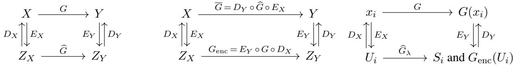  
(a) Encoder-decoder framework.  
(b) Approximation and ideal encoded map.  
(c) Training data.

Figure 2: Schematic description of the proposed learning framework. (a) Encoder–decoder formulation for learning a map $G : X  Y$ . The maps $E _ { X } : X \to Z _ { X }$ and $E _ { Y } : Y \to Z _ { Y }$ encode inputs and outputs into measurement spaces, while $D _ { X } : Z _ { X } \to X$ and $D _ { Y } : Z _ { Y }  Y$ reconstruct representatives in the original spaces. The surrogate ${ \widehat { G } } : { \bar { Z } } _ { X } \to Z _ { Y }$ is learned between the measurement spaces. (b) The learned surrogate induces the approximation $\bar { \cal G } = D _ { Y } \circ \widehat { \cal G } \circ E _ { X }$ on the original spaces, while the target map induces the encoded-space map $G _ { \mathrm { e n c } } : = E _ { Y } \circ G \circ D _ { X }$ . Theorem $3 . 7$ bounds the error between G and G. (c) Location of the training data in the encoder–decoder framework. The training inputs $x _ { i } \in X$ are observed through the measurements $U _ { i } = E _ { X } x _ { i } \in Z _ { X }$ , while the measured outputs are $S _ { i } \in Z _ { Y }$ . Learning is performed entirely on the measurement spaces $Z _ { X }$ and $Z _ { Y }$ through a kernel learner $\widehat { G } _ { \lambda }$ (see Corollary 3.4). The diagram also highlights the encoded target values $G _ { \mathrm { e n c } } ( U _ { i } ) = E _ { Y } G ( D _ { X } U _ { i } )$ . When the training outputs are chosen as $S _ { i } = E _ { Y } G ( x _ { i } )$ , one error term in Theorem 3.7 depends on the discrepancy $\eta _ { i } : = S _ { i } - G _ { \mathrm { e n c } } ( U _ { i } )$ , which measures the mismatch between the measured data and the ideal encoded target.

Our goal is to approximate a target map $G : X  Y$ between Hilbert spaces from measured data. In many settings, however, the data do not provide direct access to elements of X and Y. Instead, inputs and outputs are observed only through bounded linear measurement, or encoding, maps $E _ { X } : X \to Z _ { X }$ and $E _ { Y } : Y \to Z _ { Y }$ where $Z _ { X }$ and $Z _ { Y }$ are Hilbert measurement spaces. We therefore pose the learning problem on the latter spaces: given measured input–output pairs $( E _ { X } ( x _ { i } ) , E _ { Y } ( G ( x _ { i } ) ) ) \in Z _ { X } \times Z _ { Y }$ , one first constructs a surrogate

$$
{ \widehat { G } } : Z _ { X } \to Z _ { Y } .
$$

To obtain an approximation of the original map $G : X  Y$ , we then decode the predicted output measurement and define

$$
{ \overline { { G } } } : = D _ { Y } \circ { \widehat { G } } \circ E _ { X } : X \to Y ,\tag{4}
$$

where $D _ { Y } : Z _ { Y }  Y$ is an output reconstruction map. Thus, the method learns where the data are observed and then lifts the learned prediction back to the original output space. This formulation is particularly useful when X and Y are infinite-dimensional function spaces, while $Z _ { X }$ and $Z _ { Y }$ are finite-dimensional, lowerdimensional, or otherwise computationally tractable representations.

If the target map G were known, the natural map to use between the measurement spaces would be

$$
G _ { \mathrm { e n c } } : = E _ { Y } \circ G \circ D _ { X } : Z _ { X } \to Z _ { Y } ,
$$

where $D _ { X } : Z _ { X } \to X$ is a chosen input reconstruction map. Indeed, if the decoding maps are chosen so that $D _ { X } \circ E _ { X } \approx \operatorname { I d } _ { X }$ and $D _ { Y } \circ E _ { Y } \approx \operatorname { I d } _ { Y }$ , then using $G _ { \mathrm { e n c } }$ in place of $\widehat { G }$ in (4) gives

$$
D _ { Y } \circ G _ { \mathrm { e n c } } \circ E _ { X } = D _ { Y } \circ E _ { Y } \circ G \circ D _ { X } \circ E _ { X } \approx G .
$$

This observation separates the encoder–decoder construction in Figure 2a into two coupled tasks:

• Reconstruction: choose decoding maps $D _ { X }$ and $D _ { Y }$ that lift measurements back to meaningful representatives in the original spaces;

• Learning: approximate the unknown measurement-space map $G _ { \mathrm { e n c } } : Z _ { X }  Z _ { Y }$ from measured training pairs by constructing a surrogate ${ \widehat { G } } : Z _ { X } \to Z _ { Y }$

We first address the reconstruction task. The given maps $E _ { X }$ and $E _ { Y }$ typically aim to produce simpler or more tractable representations of objects in X and Y, and are therefore not expected to be injective. A single measurement may consequently correspond to many elements of the original space, so the decoding maps $D _ { X }$ and $D _ { Y }$ cannot be obtained by ordinary inversion. To resolve this ambiguity, we choose a canonical decoder by minimum-norm recovery:

$$
D _ { X } ( U ) : = \underset { x \in X } { \mathrm { a r g m i n } } \{ \| x \| _ { X } : E _ { X } x = U \} , \qquad D _ { Y } ( S ) : = \underset { y \in Y } { \mathrm { a r g m i n } } \{ \| y \| _ { Y } : E _ { Y } y = S \} .
$$

This selects, among all elements compatible with the measurements, the one of smallest Hilbert norm, where the norm encodes the chosen notion of complexity on the underlying space.

In some situations however, exact consistency with the measurements may be undesirable or ill-conditioned, for instance when the measurements are noisy or when the operators $E _ { X } \circ E _ { X } ^ { * }$ and/or $E _ { Y } \circ E _ { Y } ^ { * }$ are poorly conditioned. One may then replace the hard constraints by a regularized recovery problem. For $\gamma > 0$ , this gives

$$
D _ { X , \gamma } ( U ) : = \underset { x \in X } { \mathrm { a r g m i n } } \left. \| x \| _ { X } ^ { 2 } + \gamma ^ { - 1 } \| E _ { X } x - U \| _ { Z _ { X } } ^ { 2 } \right. ,
$$

and

$$
D _ { Y , \gamma } ( { \cal S } ) : = \underset { y \in { \cal Y } } { \mathrm { a r g m i n } } \left. \| y \| _ { \cal Y } ^ { 2 } + \gamma ^ { - 1 } \| E _ { \cal Y } y - { \cal S } \| _ { Z _ { \cal Y } } ^ { 2 } \right. .
$$

A major advantage of both the constrained and regularized formulations is that they lead to explicit reconstruction formulas given in Theorem 2.1.

We now turn to the learning task. The choice of learning method depends on the structure of the measurement spaces $Z _ { X }$ and $Z _ { Y }$ , and involves a trade-off between expressivity, numerical complexity, and theoretical tractability. In this way, richer model classes may capture more complex maps between measurements, while more structured methods often lead to explicit formulas and sharper analysis. We focus on kernel methods for the learning step. This choice is motivated by the analytical and computational structure they provide: minimum-norm interpolation, regularized regression, deterministic error bounds, and kernel-based uncertainty quantification can all be written in closed form. In addition, kernel methods interact naturally with the encoder– decoder construction. As our first result shows, a kernel on the measurement spaces induces a corresponding kernel on the original spaces. Specifically, any operator-valued kernel

$$
\Gamma : Z _ { X } \times Z _ { X } \to { \mathcal { L } } ( Z _ { Y } )
$$

induces an operator-valued kernel

$$
K : X \times X \to { \mathcal { L } } ( Y ) .
$$

Theorem 3.3 (Encoder–decoder induced operator-valued kernel). Assume that $D _ { Y } : Z _ { Y }  Y$ is a bounded linear output decoder. Let $\Gamma : Z _ { X } \times Z _ { X } \to { \mathcal { L } } ( Z _ { Y } )$ be an operator-valued kernel with associated RKHS $\mathcal { H } _ { \Gamma }$ of maps $Z _ { X } \to Z _ { Y }$ . Define $K : X \times X \to { \mathcal { L } } ( Y )$ by

$$
K ( x , x ^ { \prime } ) : = D _ { Y } \Gamma ( E _ { X } x , E _ { X } x ^ { \prime } ) D _ { Y } ^ { \ast } .
$$

Then K is an operator-valued kernel on X with values in $\mathcal { L } ( Y )$ . Moreover, the associated RKHS is

$$
\mathcal { H } _ { K } = \{ D _ { Y } \circ f \circ E _ { X } : f \in \mathcal { H } _ { \Gamma } \} ,
$$

equipped with the minimal-representative norm

$$
\| F \| _ { \mathcal { H } _ { K } } = \operatorname* { i n f } \left\{ \| f \| _ { \mathcal { H } _ { \Gamma } } : F = D _ { Y } \circ f \circ E _ { X } \right\} .
$$

Suppose, in addition, that $E _ { X }$ and $E _ { Y }$ are surjective and that the decoders $D _ { X } : Z _ { X } \to X$ and $D _ { Y }$ $Z _ { Y } \to Y$ are given by the exact minimum-norm recovery maps from Theorem 2.1. Then, the representation

$$
F = D _ { Y } \circ f \circ E _ { X }
$$

is unique and the minimal-representative norm reduces to the identity

$$
\| D _ { Y } \circ f \circ E _ { X } \| _ { \mathcal { H } _ { K } } = \| f \| _ { \mathcal { H } _ { \Gamma } } .
$$

As a consequence of Theorem 3.3, when the surrogate $\widehat { G }$ is constructed by kernel interpolation or regression on the measurement spaces, the full approximation

$$
{ \overline { { G } } } = D _ { Y } \circ { \widehat { G } } \circ E _ { X } : X \to Y
$$

can itself be interpreted as a kernel method acting directly from X to $Y$ . In other words, although the learning problem is posed on the measurement spaces $Z _ { X }$ and $Z _ { Y }$ , the resulting reconstructed operator belongs to an operator-valued RKHS of maps from X to $Y$

We now detail the equivalence of learning frameworks.

Corollary 3.4 (Equivalence of induced and measurement-space learning problems). Assume the setting of Theorem 3.3 and that Assumption L.1 is satisfied. For $\lambda \geq 0 ,$ , consider the induced RKHS problem

$$
\operatorname* { m i n } _ { F \in \mathcal { H } _ { K } } \left\{ \lambda ^ { - 1 } \sum _ { i = 1 } ^ { N } \| E _ { Y } F ( x _ { i } ) - S _ { i } \| _ { Z _ { Y } } ^ { 2 } + \| F \| _ { \mathcal { H } _ { K } } ^ { 2 } \right\} .
$$

For $\lambda = 0$ , this is understood as the minimum-norm interpolation problem

$$
\operatorname* { m i n } _ { F \in \mathcal { H } _ { K } } \| F \| _ { \mathcal { H } _ { K } } ^ { 2 } \quad s u b j e c t t o \quad E _ { Y } F ( x _ { i } ) = S _ { i } , \qquad i = 1 , \dots , N .
$$

This problem is equivalent to the encoded measurement-space problem

$$
\operatorname* { m i n } _ { f \in \mathcal { H } _ { \Gamma } } \left\{ \lambda ^ { - 1 } \sum _ { i = 1 } ^ { N } \| A f ( U _ { i } ) - S _ { i } \| _ { Z _ { Y } } ^ { 2 } + \| f \| _ { \mathcal { H } _ { \Gamma } } ^ { 2 } \right\} .
$$

Again, for $\lambda = 0$ , this is understood as the minimum-norm interpolation problem

$$
\operatorname* { m i n } _ { f \in \mathcal { H } _ { \Gamma } } \| f \| _ { \mathcal { H } _ { \Gamma } } ^ { 2 } \quad s u b j e c t t o \quad A f ( U _ { i } ) = S _ { i } , \qquad i = 1 , \dots , N .
$$

$H \lambda = 0 ,$ ,further assume that $\boldsymbol { L } _ { \Gamma , A }$ is surjective, equivalently that $\Gamma _ { A } ( \mathbf { U } , \mathbf { U } ) = L _ { \Gamma , A } L _ { \Gamma , A } ^ { * }$ is boundedly invertible on $Z _ { Y } ^ { N }$ . Then, the encoded measurement-space solution and the corresponding induced RKHS solution are

$$
\overline { { f } } _ { \lambda } ( U ) = \Gamma _ { A } ( U , \mathbf { U } ) \big ( \Gamma _ { A } ( \mathbf { U } , \mathbf { U } ) + \lambda \mathrm { I d } _ { Z _ { \mathrm { V } } ^ { N } } \big ) ^ { - 1 } \mathbf { S } \quad a n d \quad \overline { { F } } _ { \lambda } ( x ) = D _ { Y } \Gamma _ { A } ( E _ { X } x , \mathbf { U } ) \big ( \Gamma _ { A } ( \mathbf { U } , \mathbf { U } ) + \lambda \mathrm { I d } _ { Z _ { \mathrm { V } } ^ { N } } \big ) ^ { - 1 } \mathbf { S } .
$$

Suppose now, in addition, that $E _ { X } , ~ E _ { Y }$ are surjective and that $D _ { X } , ~ D _ { Y }$ are the exact minimum-norm recovery maps from Theorem 2.1. Then, the encoded measurement-space problems reduce to the standard measurement-space problems

$$
\operatorname* { m i n } _ { f \in \mathcal { H } _ { \Gamma } } \| f \| _ { \mathcal { H } _ { \Gamma } } ^ { 2 } \quad s u b j e c t t o \quad f ( U _ { i } ) = S _ { i } , \qquad i = 1 , \dots , N ,
$$

and

$$
\operatorname* { m i n } _ { f \in \mathcal { H } _ { \Gamma } } \left\{ \lambda ^ { - 1 } \sum _ { i = 1 } ^ { N } \| f ( U _ { i } ) - S _ { i } \| _ { Z _ { Y } } ^ { 2 } + \| f \| _ { \mathcal { H } _ { \Gamma } } ^ { 2 } \right\} .
$$

$I f \lambda = 0 ,$ further assume that $\Gamma ( \mathbf { U } , \mathbf { U } )$ is boundedly invertible. Then, the encoded measurement-space solution and the corresponding induced RKHS solution are

$$
\overline { { f } } _ { \lambda } ( U ) = \Gamma ( U , { \bf U } ) \big ( \Gamma ( { \bf U } , { \bf U } ) + \lambda { \bf I d } _ { Z _ { \mathrm { Y } } ^ { \mathrm { N } } } \big ) ^ { - 1 } { \bf S } , \quad \overline { { F } } _ { \lambda } ( x ) = E _ { Y } ^ { \ast } \big ( E _ { Y } E _ { Y } ^ { \ast } \big ) ^ { - 1 } \Gamma ( E _ { X } x , { \bf U } ) \big ( \Gamma ( { \bf U } , { \bf U } ) + \lambda { \bf I d } _ { Z _ { \mathrm { Y } } ^ { \mathrm { N } } } \big ) ^ { - 1 } { \bf S } .
$$

Remark 3.5 (Pointwise learning in the encoded space). While the encoders $E _ { X }$ and $E _ { Y }$ may be constructed from arbitrary bounded linear measurements, the induced learning problem is simply a pointwise regression problem on the encoded spaces $Z _ { X }$ and $Z _ { Y }$ , where the training data consist of the encoded pairs $( U _ { i } , S _ { i } )$ . Consequently, the kernel learning theory depends only on the geometry of the encoded spaces and is independent of the particular measurement modality used to construct $E _ { X }$ and $E _ { Y }$

Remark 3.6 (Measurement transferability). The encoder–decoder construction in Figure 2a naturally induces a notion of measurement transferability, as illustrated in Figure 3 and similarly discussed in [9, Section 2.4]. Consider an alternative pair of measurement spaces $\widetilde { Z } _ { X }$ and ${ \widetilde { Z } } _ { Y }$ , together with measurement and reconstruction maps

$$
{ \widetilde { E } } _ { X } : X \to { \widetilde { Z } } _ { X } , \qquad { \widetilde { D } } _ { X } : { \widetilde { Z } } _ { X } \to X ,
$$

and

$$
{ \widetilde E } _ { Y } : Y  { \widetilde { Z } } _ { Y } , \qquad { \widetilde D } _ { Y } : { \widetilde Z } _ { Y }  Y .
$$

The previously learned surrogate $\widehat { G }$ then induces an alternative measurement-space surrogate

$$
\widetilde { G } : = \widetilde { E } _ { Y } \circ D _ { Y } \circ \widehat { G } \circ E _ { X } \circ \widetilde { D } _ { X } : \widetilde { Z } _ { X }  \widetilde { Z } _ { Y } .
$$

Thus, data represented in $\widetilde { Z } _ { X }$ can first be reconstructed in $X$ , encoded into the original learning space $Z _ { X }$ propagated through ${ \widehat { G } } ,$ reconstructed in $Y$ , and finally remeasured in ${ \widetilde { Z } } _ { Y }$ . The corresponding approximation of the original map is

$$
{ \widetilde { D } } _ { Y } \circ { \widetilde { G } } \circ { \widetilde { E } } _ { X } : X \to Y .
$$

In this sense, the learned surrogate is transferable across different choices of input and output measurements: it can be transported to alternative measurement systems through the associated reconstruction and remeasurement maps, without retraining ${ \widehat { G } } .$

A particularly important case arises when X and Y are spaces of continuous functions and

$$
E _ { X } : X \to \mathbb { R } ^ { c _ { W } } , \qquad E _ { Y } : Y \to \mathbb { R } ^ { c _ { Y } }
$$

are point-evaluation maps on prescribed input and output grids. Alternative maps $\widetilde { E } _ { X }$ and $\widetilde { E } _ { Y }$ then correspond to different sets of evaluation points. In this setting, measurement transferability becomes mesh transferability: a surrogate trained using one pair of grids can be transferred to another pair of grids through reconstruction and resampling. This mesh transferability is a defining feature of (multiple) operator learning. Indeed, methods such as DeepONet [35], FNO [30], MNO [51–53] and related architectures are designed to learn mappings between function spaces rather than between fixed finite-dimensional vectors, allowing predictions on discretizations different from those used during training. Remark 3.19 discusses an alternative approach in which the learned representation is directly evaluable independently of a prescribed output mesh.

The next result separates the total error into an encoder–decoder error and a learning error. The first term measures how well the measurement and reconstruction maps preserve the action of the continuum map $G .$ The second term measures how well the surrogate $\widehat { G }$ approximates the encoded-space target $G _ { \mathrm { e n c } }$ . When $\widehat { G }$ is chosen by kernel interpolation on the measurement space, the learning error can be further bounded by a kernel residual term, together with a data-consistency term accounting for the possible mismatch between the measured training outputs $E _ { Y } G ( x _ { i } )$ and the encoded target values $G _ { \mathrm { e n c } } ( E _ { X } x _ { i } )$ (see Figure 2c).

Theorem 3.7 (Encoder–decoder and learning error decomposition). We have the following error decompositions.

1. Let ${ \widehat { G } } : Z _ { X } \to Z _ { Y }$ be any surrogate, and define ${ \overline { { G } } } : = D _ { Y } \circ { \widehat { G } } \circ E _ { X } : X \to Y .$ Then, for every $x \in X$

$$
\begin{array} { r l } & { \| G ( x ) - \overline { { G } } ( x ) \| _ { Y } \leq \| G ( x ) - D _ { Y } E _ { Y } G ( D _ { X } E _ { X } x ) \| _ { Y } } \\ & { \qquad + \| D _ { Y } ( G _ { \mathrm { e n c } } - \widehat { G } ) ( E _ { X } x ) \| _ { Y } . } \end{array}
$$

2. Assume that Assumption L.2 is satisfied.

(a) For every $x \in X$

$$
\begin{array} { r l } & { \| G ( x ) - \overline { { G } } ( x ) \| _ { Y } \leq \| G ( x ) - D _ { Y } E _ { Y } G ( D _ { X } E _ { X } x ) \| _ { Y } + \| D _ { Y } \| _ { \mathrm { o p } } \| ( G _ { \mathrm { e n c } } - \widehat { G } _ { \mathrm { e n c } , \lambda } ) ( E _ { X } x ) \| _ { Z _ { Y } } } \\ & { \qquad + \| D _ { Y } \| _ { \mathrm { o p } } \| \mathcal { R } _ { \mathbf { U } , \lambda } \eta ( E _ { X } x ) \| _ { Z _ { Y } } . } \end{array}
$$

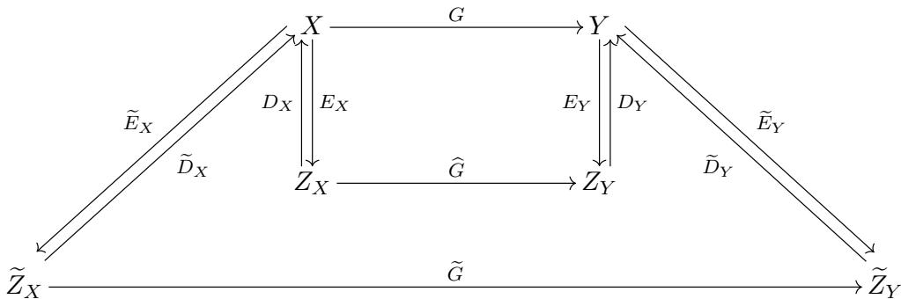  
Figure 3: Measurement transferability of the encoder-decoder learning framework. The maps $E _ { X } : X \to Z _ { X }$ and $E _ { Y } : Y \to Z _ { Y }$ encode inputs and outputs into measurement spaces, while $D _ { X } : Z _ { X } \to X$ and $D _ { Y } : Z _ { Y }  Y$ reconstruct representatives in the original spaces. The surrogate ${ \widehat { G } } : Z _ { X } \to Z _ { Y }$ is learned between the measurement spaces. The additional measurement and reconstruction maps induce an alternative surrogate $\widetilde { G } : = \widetilde { E } _ { Y } \circ D _ { Y } \circ \widehat { G } \circ E _ { X } \circ$ ${ \hat { D } } _ { X } : { \widetilde { Z } } _ { X } \to { \widetilde { Z } } _ { Y }$ and approximation $\widetilde { D } _ { Y } \circ \widetilde { G } \circ \widetilde { E } _ { X }$ of G.

(b) Define the regularized residual kernel

$$
\Gamma _ { \lambda } ^ { \perp } ( U , U ^ { \prime } ) : = \Gamma ( U , U ^ { \prime } ) - \Gamma ( U , { \bf U } ) \big ( \Gamma ( { \bf U } , { \bf U } ) + \lambda { \bf I d } _ { Z _ { V } ^ { N } } \big ) ^ { - 1 } \Gamma ( { \bf U } , U ^ { \prime } ) , \qquad U , U ^ { \prime } \in { \cal Z } _ { X }
$$

andfurthermore assume that,for every $U \in Z _ { X } , \operatorname { T r } \left[ \Gamma _ { \lambda } ^ { \perp } ( U , U ) \right] < \infty$ . With

$$
Q _ { N , \lambda } ( U ) : = \left( \mathrm { T r } \big [ \Gamma _ { \lambda } ^ { \perp } ( U , U ) \big ] + \lambda \mathrm { T r } ( \mathrm { I d } _ { Z _ { Y } } ) \right) ^ { 1 / 2 } ,
$$

for every $x \in X$

$$
\begin{array} { r l } & { \| G ( x ) - \overline { { G } } ( x ) \| _ { Y } \leq \| G ( x ) - D _ { Y } E _ { Y } G ( D _ { X } E _ { X } x ) \| _ { Y } + \| D _ { Y } \| _ { \mathrm { o p } } Q _ { N , \lambda } ( E _ { X } x ) \| G _ { \mathrm { e n c } } \| _ { \mathcal { H } _ { \Gamma , \lambda } } } \\ & { \qquad + \| D _ { Y } \| _ { \mathrm { o p } } \| \mathcal { R } _ { \mathbf { U } , \lambda } \eta ( E _ { X } x ) \| _ { Z _ { Y } } } \end{array}
$$

where $\mathcal { H } _ { \Gamma , \lambda }$ is the RKHS with kernel $\Gamma ( U , U ^ { \prime } ) + \lambda \mathrm { I d } _ { Z _ { Y } } \delta _ { U , U ^ { \prime } }$

The goal of Section 3.3 is to progressively sharpen the error decomposition of Theorem 3.7 by imposing additional assumptions on the operator $G ,$ the spaces X and $Y ,$ the encoder–decoder pairs $( E _ { X } , D _ { X } )$ and $\left( E _ { Y } , D _ { Y } \right)$ , and the available data.

## 3.3 Kernel Learning for Multi-Input, Multi-Output Operators

In this section, we focus on the setting of multi-input, multi-output operator learning, where the underlying function spaces are Sobolev spaces, the encoders are given by pointwise sampling operators, and the decoders reconstruct functions from these pointwise observations. This setting encompasses many problems arising from partial differential equations and allows us to derive explicit error bounds. The proofs of the results in this section can be found in Appendix A.2.2.

We begin by examining the data-consistency term in Theorem 3.7.

Remark 3.8 (Consistent measured training data). If the measured training outputs are consistent with the encoded-space target, namely

$$
E _ { Y } G ( x _ { i } ) = G _ { \mathrm { e n c } } ( E _ { X } x _ { i } ) = E _ { Y } G ( D _ { X } E _ { X } x _ { i } ) , \qquad i = 1 , \dots , N ,
$$

then $\eta _ { i } = S _ { i } - G _ { \mathrm { e n c } } ( U _ { i } ) = 0$ . Consequently, $\mathcal { R } _ { \mathbf { U } , \lambda } \eta = 0$ and the data-consistency term in Theorem 3.7 vanishes: for every $x \in X$

$$
\begin{array} { r } { \| G ( x ) - \overline { { G } } ( x ) \| _ { Y } \leq \| G ( x ) - D _ { Y } E _ { Y } G ( D _ { X } E _ { X } x ) \| _ { Y } + \| D _ { Y } \| _ { \mathrm { o p } } \| ( G _ { \mathrm { e n c } } - \widehat G _ { \mathrm { e n c } , \lambda } ) ( E _ { X } x ) \| _ { Z _ { Y } } . } \end{array}
$$

A sufficient condition for this consistency is exact input reconstruction on the training data, that is

$$
D _ { X } E _ { X } x _ { i } = x _ { i } , \qquad i = 1 , \dots , N .
$$

Next, we analyze the reconstruction error of the map $G .$

Proposition 3.9 (Encoder–decoder reconstruction error). Suppose that there existfunctions $\delta _ { X } : X \to [ 0 , \infty )$ and $\delta _ { Y } : Y \to [ 0 , \infty )$ , such that

$$
\left\{ \begin{array} { l l } { \| x - D _ { X } E _ { X } x \| _ { X } \leq \delta _ { X } ( x ) , } & { x \in X , } \\ { \| y - D _ { Y } E _ { Y } y \| _ { Y } \leq \delta _ { Y } ( y ) , } & { y \in Y . } \end{array} \right.\tag{5}
$$

Assume that G satisfies Assumption O.1 and that Assumption M.1 is satisfied.

Then, for every $x \in B _ { R } ( X )$

$$
\| G ( x ) - D _ { Y } E _ { Y } G ( D _ { X } E _ { X } x ) \| _ { Y } \leq \omega \left( \delta _ { X } ( x ) \right) + \delta _ { Y } \left( G ( D _ { X } E _ { X } x ) \right) .
$$

If, in addition, $\begin{array} { r } { X = \prod _ { j = 1 } ^ { J _ { X } } X _ { j } } \end{array}$ , and $\begin{array} { r } { Y = \prod _ { j = 1 } ^ { J _ { Y } } Y _ { j } } \end{array}$ , with product norms $\begin{array} { r } { \| { \boldsymbol { x } } \| _ { X } ^ { 2 } = \sum _ { j = 1 } ^ { J _ { X } } \| { \boldsymbol { x } } _ { j } \| _ { X _ { j } } ^ { 2 } } \end{array}$ , and $\| y \| _ { Y } ^ { 2 } =$ $\textstyle \sum _ { j = 1 } ^ { J _ { Y } } \| y _ { j } \| _ { Y _ { j } } ^ { 2 }$ , and there exist componentwise reconstruction bounds

$$
\begin{array}{c} \begin{array} { r } { \left\{ \| x _ { j } - ( D _ { X } E _ { X } x ) _ { j } \| _ { X _ { j } } \leq \delta _ { X , j } ( x ) , \quad x \in X , j = 1 , \ldots , J _ { X } , \right.} \\ { \| y _ { j } - ( D _ { Y } E _ { Y } y ) _ { j } \| _ { Y _ { j } } \leq \delta _ { Y , j } ( y ) , \quad y \in Y , j = 1 , \ldots , J _ { Y } , } \end{array}   \end{array}
$$

then

$$
\| G ( x ) - D _ { Y } { \cal E } _ { Y } G ( D _ { X } { \cal E } _ { X } x ) \| _ { Y } \leq \omega \left( \left[ \sum _ { j = 1 } ^ { J _ { X } } \delta _ { X , j } ( x ) ^ { 2 } \right] ^ { 1 / 2 } \right) + \left[ \sum _ { j = 1 } ^ { J _ { Y } } \delta _ { Y , j } \left( G ( D _ { X } { \cal E } _ { X } x ) \right) ^ { 2 } \right] ^ { 1 / 2 } .
$$

Remark 3.10 (Componentwise and coupled measurements). Proposition 3.9 does not require the encoder or decoder to act componentwise. While independent measurements of each component are the most common situation in operator learning, more general measurement procedures naturally arise in several applications [44, 49].

When one considers products of Sobolev space, we can explicitly bound the reconstruction errors in terms of the fill distance as the next result shows.

Lemma 3.11 (Recovery estimate for products of Sobolev-embedded Hilbert spaces). Let $\mathcal { H } = \mathcal { H } \big ( \boldsymbol { J } , ( \Omega _ { j } ) _ { j = 1 } ^ { J } .$ $( n _ { j } ) _ { j = 1 } ^ { J } , ( s _ { j } ) _ { j = 1 } ^ { J } , ( p _ { j } ) _ { j = 1 } ^ { J } , ( t _ { j } ) _ { j = 1 } ^ { J } , ( q _ { j } ) _ { j = 1 } ^ { J } , ( A _ { j } ) _ { j = 1 } ^ { J } )$ and $X \ = \ X \left( J , ( \Omega _ { j } ) _ { j = 1 } ^ { J } , ( t _ { j } ) _ { j = 1 } ^ { J } , ( q _ { j } ) _ { j = 1 } ^ { J } \right)$ satisfy Assumption S.1, and let $\left( E _ { \mathcal { H } } , D _ { \mathcal { H } } , Z _ { \mathcal { H } } \right)$ be the associated encoding/decoding maps and measurement space from Assumption M.2.

Then, there exist constants $h _ { j } ^ { 0 } > 0$ and $C _ { j } > 0$ , independent of $\mathbf { \dot { \Pi } } h _ { j }$ and $u _ { j } ,$ such that, whenever $h _ { j } \leq h _ { j } ^ { 0 }$ one has

$$
\begin{array} { r } { \| u _ { j } - D _ { j } E _ { j } u _ { j } \| _ { \mathsf { W } ^ { t _ { j } , q _ { j } } ( \Omega _ { j } ) } \le C _ { j } h _ { j } ^ { { s _ { j } } - { t _ { j } } - { n _ { j } } \left( \frac { 1 } { { p _ { j } } } - \frac { 1 } { { q _ { j } } } \right) } + \| u _ { j } \| _ { \mathcal { H } _ { j } } } \end{array}
$$

for every $u _ { j } \in \mathcal { H } _ { j }$ . Consequently, for every $u \in \mathcal { H }$

$$
\| u - D _ { \mathcal { H } } E _ { \mathcal { H } } u \| _ { \boldsymbol { X } } \le ( \sum _ { j = 1 } ^ { J } C _ { j } ^ { 2 } h _ { j } ^ { 2 }  ^ { 2 ( s _ { j } - t _ { j } - n _ { j } ( \frac { 1 } { p _ { j } } - \frac { 1 } { q _ { j } } ) _ { + } ) } \| u _ { j } \| _ { \mathcal { H } _ { j } } ^ { 2 } ) ^ { 1 / 2 } .
$$

Remark 3.12 (Fractional Sobolev orders). For simplicity, Lemma 3.11 is stated for integer Sobolev orders $t _ { j } \in$ $ { \mathbb { N } } _ { 0 }$ . This is because its proof relies on [3, Theorem 4.1], which establishes the required sampling inequalities for integer target orders. By instead appealing to [4, Theorem 3.1], the same argument extends to fractional Sobolev orders, yielding an analogous result for arbitrary $t _ { j } \geq 0$ within the admissible range.

We continue by considering the learning-error term. The latter can be estimated in several ways. In this work, we adopt an approach based on Sobolev embeddings and sampling inequalities, which yields explicit convergence rates under suitable regularity assumptions on the reproducing kernel Hilbert space. This framework naturally accommodates vector-valued kernels and is particularly well suited to the encoder–decoder setting considered here.

Lemma 3.13 (Learning error in a finite-dimensional RKHS). Let $\Upsilon \subset \mathbb { R } ^ { d _ { X } }$ be a bounded domain with Lipschitz boundary, and le $\mathbf { U } = \{ U _ { 1 } , \ldots , U _ { N } \} \subset \Upsilon$ be a finite sampling set with fill distance

$$
h _ { \mathrm { t r } } : = \operatorname* { s u p } _ { U \in \Upsilon } \operatorname* { m i n } _ { 1 \leq i \leq N } \| U - U _ { i } \| _ { 2 } .
$$

Let $\Gamma : \Upsilon \times \Upsilon  \mathcal { L } ( \mathbb { R } ^ { d _ { Y } } )$ be an operator-valued kernel with associated RKHS $\mathcal { H } _ { \Gamma }$ . Assume that,for some $\begin{array} { r } { \tau > \frac { d _ { X } } { 2 } } \end{array}$ , there is a continuous embedding $\mathcal { H } _ { \Gamma } \hookrightarrow \mathrm { H } ^ { \tau } ( \Upsilon ; \mathbb { R } ^ { d _ { Y } } ) \simeq \mathrm { H } ^ { \tau } ( \Upsilon ) ^ { d _ { Y } }$

Let $f \in \mathcal { H } _ { \Gamma }$ , and denote by $\widehat { f } _ { \lambda }$ the kernel interpolant, when $\lambda = 0 ,$ , or the kernel ridge-regression estimator, when $\lambda > 0 ,$ , associated with the exact data $\left\{ ( U _ { i } , f ( U _ { i } ) ) \right\} _ { i = 1 } ^ { N } . \ : I f \lambda = 0$ , assume that $\Gamma ( \mathbf { U } , \mathbf { U } ) : ( \mathbb { R } ^ { d _ { Y } } ) ^ { N } \to$ $( \mathbb { R } ^ { d _ { Y } } ) ^ { N }$ is boundedly invertible. Define $\begin{array} { r } { e _ { \lambda } : = f - \widehat { f _ { \lambda } } } \end{array}$

Let $q \in [ 1 , \infty ]$ , set $\gamma : = \operatorname* { m a x } \{ 2 , q \}$ , and let $0 \leq s \leq \ell ( \tau , q , d _ { X } )$ , where

$$
\ell ( \tau , q , d ) = \left\{ \begin{array} { l l } { \ell _ { 0 } ( \tau , q , d ) , } & { i f \tau \in \mathbb { N } a n d e i t h e r q = 2 o r q > 2 w i t h \ell _ { 0 } ( \tau , q , d ) \in \mathbb { N } , } \\ { \lceil \ell _ { 0 } ( \tau , q , d ) \rceil - 1 , } & { o t h e r w i s e , } \end{array} \right.
$$

with

$$
\ell _ { 0 } ( \tau , q , d ) : = \tau - d \left( \frac { 1 } { 2 } - \frac { 1 } { q } \right) _ { + } .
$$

When $q = \infty$ , assume additionally that $s \in  { \mathbb { N } } _ { 0 }$

Then, there exist constants $h _ { 0 } > 0$ and $C > 0$ , independent of $h _ { \mathrm { t r } } , \lambda ,$ , and f, such that, whenever $h _ { \mathrm { t r } } \leq h _ { 0 }$ one has

$$
\begin{array} { r } { | e _ { \lambda } | _ { \mathrm { W } ^ { s , q } ( \Upsilon ; \mathbb { R } ^ { d _ { Y } } ) } \leq C \left( h _ { \mathrm { t r } } ^ { \tau - s - d _ { X } \left( \frac { 1 } { 2 } - \frac { 1 } { q } \right) _ { + } } + h _ { \mathrm { t r } } ^ { d _ { X } / \gamma - s } \sqrt { \lambda } \right) \| f \| _ { \mathcal { H } _ { \mathrm { r } } } . } \end{array}
$$

Consequently, for every $U \in \Upsilon$

$$
\| e _ { \lambda } ( U ) \| _ { 2 } \leq C \left( h _ { \mathrm { t r } } ^ { \tau - d _ { X } / 2 } + \sqrt { \lambda } \right) \| f \| _ { \mathcal { H } _ { \Gamma } } .
$$

Remark 3.14 (Alternative estimates via the power function). The Sobolev-based approach of Lemma 3.13 is not the only way to estimate the learning error. An alternative is to bound the interpolation error directly in terms of the associated power function (see Theorem 3.7). For example, in the scalar-valued kernel case, the decay of the power function can be estimated from the smoothness of the reproducing kernel, leading to convergence rates in terms of the fill distance; see, for example, [54].

Theorem 3.15 (Reconstruction guarantees for kernel multi-input, multi-output learning). Let $\mathcal { H } _ { X } = \mathcal { H } \vert \mathcal { I } _ { X }$ $( \Omega _ { X , j } ) _ { j = 1 } ^ { J _ { X } } , ( n _ { X , j } ) _ { j = 1 } ^ { J _ { X } } , ( s _ { X , j } ) _ { j = 1 } ^ { J _ { X } } , ( p _ { X , j } ) _ { j = 1 } ^ { J _ { X } } , ( t _ { X , j } ) _ { j = 1 } ^ { J _ { X } } , ( q _ { X , j } ) _ { j = 1 } ^ { J _ { X } } , ( A _ { X , j } ) _ { j = 1 } ^ { J _ { X } } )$ and $X = X \big ( J _ { X } , ( \Omega _ { X , j } ) _ { j = 1 } ^ { J _ { X } }$ $( t _ { X , j } ) _ { j = 1 } ^ { J _ { X } } , ( q _ { X , j } ) _ { j = 1 } ^ { J _ { X } } )$ satisfy Assumption S.1. Likewise, let $\mathcal { H } _ { Y } = \mathcal { H } \big ( J _ { Y } , ( \Omega _ { Y , k } ) _ { k = 1 } ^ { J _ { Y } } , ( n _ { Y , k } ) _ { k = 1 } ^ { J _ { Y } } , ( s _ { Y , k } ) _ { k = 1 } ^ { J _ { Y } } ;$ $( p _ { Y , k } ) _ { k = 1 } ^ { \middle / J _ { Y } } , ( t _ { Y , k } ) _ { k = 1 } ^ { \middle / J _ { Y } } , ( q _ { Y , k } ) _ { k = 1 } ^ { \middle / J _ { Y } } , ( A _ { Y , k } ) _ { k = 1 } ^ { \rule { J _ { Y } } { J _ { Y } } } )$ and $Y = X \big ( J _ { Y } , ( \Omega _ { Y , k } ) _ { k = 1 } ^ { J _ { Y } } , ( t _ { Y , k } ) _ { k = 1 } ^ { J _ { Y } } , ( q _ { Y , k } ) _ { k = 1 } ^ { J _ { Y } } \big )$ satisfy Assumption S.1. Let $( E _ { \mathcal { H } _ { X } } , D _ { \mathcal { H } _ { X } } , Z _ { \mathcal { H } _ { X } } )$ and $( E _ { \mathcal { H } _ { Y } } , D _ { \mathcal { H } _ { Y } } , Z _ { \mathcal { H } _ { Y } } )$ be the associated encoding maps, decoding maps, and measurement spacesfrom Assumption M.2. Assume that G satisfies Assumption O.2. Let $\begin{array} { r } { d _ { X } : = \sum _ { j = 1 } ^ { J _ { X } } m _ { X , j } } \end{array}$ and $\begin{array} { r } { d _ { Y } : = \sum _ { k = 1 } ^ { J _ { Y } } m _ { Y , k } } \end{array}$ , so that $Z _ { \mathcal { H } _ { X } } \subseteq \mathbb { R } ^ { d _ { X } }$ and $Z _ { \mathcal { H } _ { \mathrm { v } } } \subseteq \mathbb { R } ^ { d _ { Y } }$ . Assume that Assumption L.3 is satisfied.

Then, there exist constants $C > 0 , h _ { \mathrm { t r } } ^ { 0 } > 0 , h _ { X , j } ^ { 0 } > 0 , h _ { Y , k } ^ { 0 } > 0$ independent ofthefill distances, λ, and the functions being reconstructed, such that, $w h e n e v e r \tilde { h } _ { \mathrm { t r } } \le h _ { \mathrm { t r } } ^ { 0 } , h _ { X , j } \le h _ { X , j } ^ { 0 } f o r j = 1 , \dots , J _ { X } a n d h _ { Y , k } \le h _ { Y , k } ^ { 0 }$ for $k = 1 , \dots , J _ { Y }$ , one has, for every $x = ( x _ { 1 } , \dots , x _ { J _ { X } } ) \in B _ { R } ( \mathcal { H } _ { X } )$ , the estimate

$$
\begin{array} { r l } & { \| G ( x ) - \overline { { G } } ( x ) \| _ { Y } \leq \omega \left( C R \underset { 1 \leq j \leq J _ { X } } { \operatorname* { m a x } } h _ { X , j } - t _ { X , j } - n _ { X , j } \left( \frac { 1 } { p _ { X , j } } - \frac { 1 } { q _ { X , j } } \right) _ { + } \right) } \\ & { \qquad + C M _ { R } \underset { 1 \leq k \leq J _ { Y } } { \operatorname* { m a x } } h _ { Y , k } - \nu _ { k } - n _ { Y , k } \left( \frac { 1 } { p _ { Y , k } } - \frac { 1 } { q _ { Y , k } } \right) _ { + } } \\ & { \qquad + \| D _ { Y } \| _ { \infty } C \left( h _ { \mathrm { t r } } ^ { \tau - d _ { X } / 2 } + \sqrt { \lambda } \right) \| G _ { \mathrm { e n c } } \| _ { \mathcal { H } _ { \mathrm { r } } } + \| D _ { Y } \| _ { \infty } \| \mathcal { R } _ { \mathrm { U } , \lambda } \eta ( E _ { X } x ) \| _ { 2 } } \end{array}
$$

Remark 3.16 (Sample-sensor complexity trade-off). One important results would be to derive a joint complexity bound that balances the number of sensors against the number of sampled training operators. Such a result is difficult because the statistical learning error depends on the fill distance of the encoded training samples in $Z _ { X }$ , which is generally not directly tractable. The encoded training points are obtained by applying the encoder to the original training inputs, and there is no reason for them to form a quasi-uniform or otherwise space-filling design in the encoded space. Existing convergence results in kernel-based operator learning typically circumvent this difficulty by assuming that the encoded training points become dense in the encoded domain (see [9, Theorem 3.4]), without explicitly quantifying the decay of the corresponding fill distance as a function of the number of training samples. A possible approach towards such quantitative estimates would be to study optimal experimental design in $Z _ { X }$ , selecting training inputs whose encoded representations minimize the fill distance. Under suitable geometric assumptions on the encoded manifold, or by constructing quasi-uniform designs directly in the encoded space and mapping them back to admissible inputs via suitable preimages or the decoder, one may then obtain explicit trade-offs between the number of sensors and the number of required training operators.

Remark 3.17 (Scaling with the number of tasks). The reconstruction terms in Theorem 3.15 exhibit the same qualitative scaling behaviour as the approximation results obtained for multiple operator learning with neural operators. As shown in [52], passing from a single operator to multiple related operators, either through concatenation [52, Theorem 3.29] or through dedicated architectures [52, Theorem 3.19], need not alter the approximation exponent, i.e., the approximation rates are governed by the least regular (or most difficult) task, rather than suffering from a compounding deterioration of the approximation exponent with the number of tasks. An analogous phenomenon appears in the reconstruction part of the present kernel-based estimate. The input and output reconstruction errors are controlled by the largest componentwise discretization errors. Consequently, the associated convergence exponents are determined by the least favorable Sobolev regularity among the component spaces, rather than by the number of components itself.

The kernel-learning term requires a separate discussion. Its convergence rate is governed by $h _ { \mathrm { t r } } ^ { \tau - d _ { X } / 2 }$ , and therefore depends on the dimension $d _ { X }$ of the encoded measurement space and the regularity of the encoded operator $G _ { \mathrm { e n c } }$ . Since adding tasks typically increases the total number of measurements, and hence the dimension of the encoded measurement space, the learning rate may deteriorate accordingly. This dependence is inherited from the underlying single-operator kernel approximation theory rather than from the multi-task formulation itself.

Remark 3.18 (Extension to other measurement operators). The Sobolev reconstruction results presented in Theorem 3.15 are derived for pointwise measurements. However, as noted in Remark 3.5, the subsequent learning analysis is independent of the particular choice of measurements and only requires the encoded training data $E _ { X } ( x _ { i } ) \in Z _ { X }$ and $E _ { Y } ( y _ { i } ) \in Z _ { Y }$ . Consequently, as noted in [9], the present framework extends immediately to other bounded linear measurement operators, provided that suitable reconstruction estimates are available (i.e. analogues of Lemma 3.11).

More precisely, suppose that the encoders $E _ { X }$ and $E _ { Y }$ are constructed from a family of bounded linear measurements (e.g., local averages as in [43, Lemma 14.34], moments, Fourier coefficients, or other sensor functionals), and that the corresponding decoders satisfy approximation estimates analogous to those established here for point evaluations. Then the encoder–decoder error decomposition, the RKHS construction, and all subsequent kernel learning results remain unchanged. Only the reconstruction estimates need to be replaced by the corresponding sampling inequalities for the chosen measurements. This separation highlights the modular structure of the framework: the measurement modality enters exclusively through the approximation properties of the encoder-decoder pair, whereas the kernel learning theory depends only on the resulting finite-dimensional encoded spaces.

Extending the framework to genuinely infinite-dimensional measurement spaces $Z _ { X }$ and $Z _ { Y }$ would require two additional ingredients. First, one would need sampling inequalities for bounded linear measurement operators taking values in infinite-dimensional Hilbert spaces, such as trace operators, distributed observation operators, or other function-valued measurements. Second, the Sobolev reconstruction theory developed in this section would need to be extended to encoder–decoder pairs with infinite-dimensional encoded spaces, yielding approximation estimates analogous to Lemma 3.13. Once such reconstruction results are available, the abstract encoder–decoder framework and the subsequent kernel learning analysis apply without essential modification.

## 3.4 Kernel Methods for Multi-Task Operator Learning

Theorem 3.15 provides a general error estimate for kernel-based encoder–decoder learning of maps between product spaces of functions,

$$
G : X _ { 1 } \times \cdots \times X _ { J _ { X } } \longrightarrow Y _ { 1 } \times \cdot \cdot \cdot \times Y _ { J _ { Y } } ,
$$

where each component may represent a different modality, parameter, or function space. As a special case, it naturally recovers the kernel operator learning framework of [9], depicted in figure 4a and corresponding to the choice $J _ { X } = J _ { Y } = 1$ . As a further important example and application, we now specialize this framework to multi-task/multiple operator learning, where the objective is to learn

$$
G : W \longrightarrow \{ G [ \alpha ] : U \to V \} _ { \alpha \in W } ,
$$

assigning to each task parameter $\alpha \in W$ an operator $G [ \alpha ] : U \to V$ . While we focus on this representative application, the insights developed below, including the different formulations, their statistical and computational properties, and the settings in which each formulation is most appropriate, apply equally to general product-space learning problems.

We begin by introducing two equivalent viewpoints of the multiple operator learning problem. These are illustrated in figures 4b and 4c. The first learns the operator-valued map assigning an operator to each parameter, while the second casts the same problem as learning the product-space map

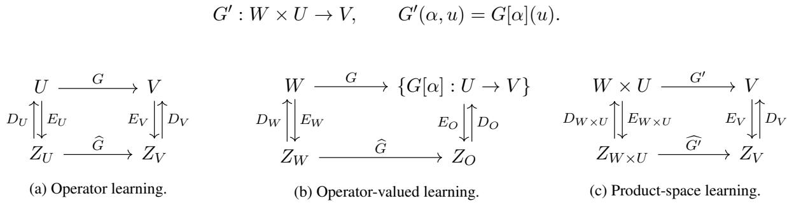  
Figure 4: Encoder–decoder formulations for classical operator learning and multiple operator learning. (a) Classical operator learning, where a single operator $G : U  V$ is learned from measurements in the Hilbert spaces $Z _ { U }$ and $Z _ { V } [ 9 ]$ (b) Operator-valued multiple operator learning, where the objective is to learn the map $G : W \to \{ G [ \alpha ] : U \to V \} _ { \alpha \in W }$ that assigns an operator to each parameter, using measurement spaces $Z _ { W }$ and $Z _ { O }$ . (c) Product-space multiple operator learning, where the same problem is represented by the map $G ^ { \prime } : W \times U \to V .$ , defined by $G ^ { \prime } ( \alpha , u ) = G [ \alpha ] ( u )$ , with measurement spaces $Z _ { W \times U }$ and $Z _ { V }$ . In each formulation, the encoder maps E map the original inputs and outputs into abstract Hilbert measurement spaces, the decoder maps D reconstruct representatives in the original spaces, and $\widehat { G }$ (or ${ \widehat { G } } ^ { \prime }$ in figure (c)) denotes the learned surrogate.

Although both formulations solve the same learning problem, they represent different prediction tasks. The operator-valued formulation learns an entire solution operator $G [ \alpha ] : U \to V$ for each parameter $\alpha ,$ so that a prediction consists of reconstructing the complete operator: this is therefore particularly attractive when one wishes to repeatedly query the same operator for many different input functions. In contrast, the product-space formulation learns individual operator evaluations through the map $G ^ { \prime } : W \times U \to V$ . Thus, it directly predicts the solution corresponding to a single parameter–input pair $( \alpha , u )$ , making it a natural choice when only isolated evaluations are required or when different parameters are associated with different input functions.

These differing representations lead to distinct statistical and computational properties. The operatorvalued formulation generalizes only across the parameter space W, while the product-space formulation simultaneously generalizes across both the parameter space W and the input space U. On the other hand, the operator-valued formulation requires one training sample per operator, whereas the product-space formulation requires one sample for every parameter–input pair. As a result, the size of the kernel matrix in the operatorvalued approach scales with the number of operators, while the product-space formulation scales with the total number of parameter–input pairs. The operator-valued formulation is therefore expected to be considerably more computationally efficient whenever each operator is observed on many input functions, whereas the product-space formulation offers greater flexibility by learning directly over the joint parameter–input domain. Table 1 summarizes the principal differences between the two formulations. In Section 4, we compare both approaches empirically in terms of predictive performance and computational efficiency.

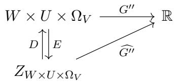

Figure 5: Complete product-space formulation of multiple operator learning. Instead of learning the operator-valued map $G : W \to \{ U \to V \}$ or the product-space map $G ^ { \prime } : W \times U \to V$ , this formulation learns the pointwise evaluation map $G ^ { \prime \prime } : W \times U \times \Omega _ { V }  \mathbb { R }$ , defined by $G ^ { \prime \prime } ( \alpha , u , x ) = G [ \alpha ] ( u ) ( x )$ . The encoder $E$ maps parameter–input–location triples into a measurement space, while the decoder D reconstructs representatives in the original product space. The learned surrogate $\widehat { G ^ { \prime \prime } }$ predicts the solution value at individual spatial locations.

<table><tr><td></td><td>Operator-valued learning</td><td>Product-space learning</td></tr><tr><td>Learned map</td><td> $G : W \to \{ U \to V \}$ </td><td> $G ^ { \prime } : W \times U \to V$ </td></tr><tr><td>Prediction</td><td>Entire operator  $G [ \alpha ]$ </td><td>Single operator evaluation  $G [ \alpha ] ( u )$ </td></tr><tr><td>Generalization</td><td>Parameter space  $W$ </td><td>Parameter space W and input space U</td></tr><tr><td>Typical setting</td><td>tions</td><td>Multiple tasks sharing common input func- Multiple tasks with varying input functions</td></tr><tr><td>Training samples</td><td> $n _ { \alpha }$  operators</td><td> $n _ { \alpha } n _ { u }$  parameter-input pairs</td></tr><tr><td>Size of kernel matrix</td><td> $n _ { \alpha } \times n _ { \alpha }$ </td><td> $( n _ { \alpha } n _ { u } ) \times ( n _ { \alpha } n _ { u } )$ </td></tr><tr><td>Theoretical guaran- Theorem 3.15 with tees</td><td> $J _ { X } = J _ { Y } = 1$  (for integral operators)</td><td>Theorem 3.15 with  $J _ { X } = 2 , \ J _ { Y } = 1$ </td></tr></table>

Table 1: Comparison of the two multiple operator learning formulations. The operator-valued formulation predicts entire operators and generalizes across the parameter space, whereas the product-space formulation predicts individual operator evaluations and simultaneously generalizes across both the parameter and input spaces. Here, $n _ { \alpha }$ denotes the number of operators (or parameter instances) in the training set, and $n _ { u }$ denotes the number of input functions associated with each operator.

Remark 3.19 (Alternative mesh-transferability). An alternative formulation to those depicted in Figure 4 is obtained by learning the pointwise evaluation map

$$
G ^ { \prime \prime } : W \times U \times \Omega _ { V } \to \mathbb { R } , \qquad ( \alpha , u , x ) \mapsto G [ \alpha ] ( u ) ( x ) ,
$$

rather than the operator-valued map $G : W \to \{ U \to V \}$ or the product-space map $G ^ { \prime } : W \times U \to$ V; see Figure 5. In this setting, the spatial coordinate is treated as an additional input variable, so that the learned surrogate directly predicts the solution value at any query location. Consequently, the resulting model is naturally mesh-independent and can be evaluated on arbitrary output discretizations directly.

The increased flexibility comes at a significant computational cost. Each training sample now corresponds to a parameter–input–location triple $( \alpha , u , x )$ , so that the number of training examples grows proportionally to the product of the number of parameters, input functions, and output locations. Accordingly, kernel methods require solving linear systems whose size scales with the total number of such triples, leading to substantially higher memory and computational complexity than either the operator-valued or product-space formulations. For this reason, we focus on the two formulations in Figures 4b and 4c, which already provide mesh-transferability through the encoder–decoder framework while remaining computationally tractable.

Among the two formulations introduced above, the product-space formulation in Figure 4c fits directly within the setting of Theorem 3.15 by choosing $J _ { X } = 2$ and $J _ { Y } = 1$ , with input space $W \times U$ and output space V. As a consequence, all approximation, reconstruction, and learning guarantees developed in Section 3.2 apply immediately.

The operator-valued formulation of Figure 4b is more subtle. Although the encoder-decoder framework itself is formulated abstractly, the quantitative reconstruction theory developed in this work specializes to products of Hilbert spaces of functions admitting Sobolev embedding so that Sobolev sampling inequalities provide reconstruction error estimates as in Lemma 3.11. Consequently, applying the present theory to operator-valued learning requires the operator space to admit an appropriate realization as a function space. This is naturally the case for many important classes of operators, including integral operators [10, 14]

$$
( T f ) ( x ) = \int _ { \Omega } k ( x , y ) f ( y ) \mathrm { d } y ,
$$

which are canonically identified with their kernels k. Such operators arise throughout scientific computing, for example as Green’s operators for boundary value problems, kernel integral transforms such as the Fourier and

Laplace transforms, and many classes of nonlocal operators [15–17]. Under this identification, the operatorvalued learning problem becomes a classical operator learning problem in which the outputs are the kernel functions k. In other words, the operator-valued map $G : W \to \{ U \to V \}$ is identified with a functionvalued map $G : W \to K$ , so that the general encoder-decoder theory of Theorem 3.15 applies directly with $J _ { X } = J _ { Y } = 1$ . The resulting learning guarantees are therefore those of kernel operator learning. From the perspective of the encoder–decoder framework, the principal difference is that the outputs now belong to a Sobolev space over the product domain $\Omega \times \Omega$ , rather than Ω. Thus, the reconstruction rates inherited from the Sobolev sampling inequalities depend on the dimension of the product domain, typically leading to more stringent sampling requirements than in the standard setting.

We leave the extension of the reconstruction theory developed here directly to general spaces of operators, without relying on an underlying functional representation, as a future work. Such a theory would substantially broaden the applicability of kernel-based encoder-decoder learning and could enable analogous approximation, reconstruction, and learning guarantees for genuinely operator-valued prediction problems.

Remark 3.20 (Learning maps between measures). As with the integral operators discussed above, the encoder– decoder framework can also accommodate learning problems involving measures that are absolutely continuous with respect to a fixed reference measure and whose densities belong to the function spaces considered in Section 3.3. Identifying each measure with its density reduces the measure-valued learning problem to a function-valued one, allowing the approximation theory developed above to be applied directly.

## 4 Numerical Experiments

In this section, we evaluate the performance and efficiency of our proposed kernel-based multiple operator learning methods for both operator-valued learning and product-space learning, depicted in Figures 4b and $4 \mathrm { c } ,$ , respectively. The code implementing both methods and reproducing all numerical experiments is publicly available at https://github.com/liaochunyang/kernelMO.

Learning task. We consider five representative parametric PDEs which were also studied in [53]. In all experiments, we learn the solution operator $( \alpha , u _ { 0 } ) \mapsto u _ { : }$ , mapping a parametric function/parameters α and an initial condition $u _ { 0 }$ to the complete solution trajectory $u : ( 0 , 2 ] \times [ 0 , 2 ] \to \mathbb { R } , ( t , x _ { \mathrm { s p a t i a l } } ) \mapsto u ( t , x _ { \mathrm { s p a t i a l } } )$ Thus, our models predict the full spatio-temporal evolution of the PDE solution, whereas the experiments in [9] predict the solution only at a fixed time $t = t _ { 0 }$

Sampling of initial conditions and parameter functions. We generate the initial conditions using the sinusoidal construction proposed in [48]:

$$
u _ { 0 } ( x ) = \sum _ { i = 1 } ^ { 2 } A _ { i } \sin ( \pi n _ { i } x + \phi _ { i } ) ,\tag{6}
$$

where the amplitudes $A _ { i }$ are sampled uniformly from [0, 1], the frequencies $n _ { i }$ are sampled uniformly from the integers $\{ 1 , \ldots , 4 \}$ , and the phases $\phi _ { i }$ are sampled uniformly from (0, 2π). As in [48], each sampled initial condition is post-processed by flipping its sign with probability 0.5. The construction of the parameter functions α is PDE-specific and is described below.

Training datasets For each learning formulation, we train all models on the same underlying collection of parametric functions and initial conditions. The two learning formulations differ only in how this data is organized. For the operator-valued formulation, each training sample consists of an entire operator represented through its evaluations on a common set of probe functions. The training dataset is therefore

$$
\mathcal { D } _ { \mathrm { o p } } = \left\{ \left( \alpha _ { i } , \left\{ G [ \alpha _ { i } ] ( u _ { j } ) \right\} _ { j = 1 } ^ { 2 0 } \right) \right\} _ { i = 1 } ^ { 3 2 0 } ,
$$

where the initial conditions $u _ { 1 } , \ldots , u _ { 2 0 }$ are fixed across all parameter instances. In contrast, the product-space formulation treats each parameter–input pair as an individual training sample. The corresponding dataset is

$$
{ \mathcal D } _ { \mathrm { p r o d } } = \{ ( \alpha _ { i } , u _ { j } , G [ \alpha _ { i } ] ( u _ { j } ) ) ~ : ~ i = 1 , \ldots , 2 0 0 , ~ j = 1 , \ldots , 5 0 \} .
$$

<table><tr><td>Test set</td><td>Setting</td><td> $\#$  parametric functions</td><td> $\#$  initial conditions</td><td> $N _ { \mathrm { t e s t } }$ </td></tr><tr><td rowspan="2">In-distribution</td><td>Operator-valued</td><td>80</td><td>20</td><td> $8 0 \times 2 0$ </td></tr><tr><td>Product-space</td><td>80</td><td>50</td><td> $8 0 \times 5 0$ </td></tr><tr><td rowspan="2">Out-of-distribution</td><td>Operator-valued</td><td>40</td><td>20</td><td> $4 0 \times 2 0$ </td></tr><tr><td>Product-space</td><td>80</td><td>50</td><td> $8 0 \times 5 0$ </td></tr></table>

Table 2: Number of parametric functions, number of initial conditions, and number of test samples for in-distribution and out-of-distribution sets under both settings. In the operator-valued setting, the initial conditions are fixed across all settings. In the product-space setting, the initial conditions are distinct.

Remark 4.1 (Fixed initial conditions in the operator-valued formulation). In the operator-valued learning formulation in figure 4b, the initial conditions are kept fixed across all parameter instances. This reflects the fact that each training sample corresponds to an entire operator rather than a single operator evaluation. More precisely, $E _ { O }$ is the common encoder, mapping each operator to its evaluations on a fixed collection of input functions together with a fixed discretization of the output domain. This ensures that all operators are represented in the same measurement space $Z _ { O }$ . Varying the initial conditions would represent different encoding maps and thus alter the operator-valued learning problem. In contrast, the product-space formulation naturally permits different initial conditions for each parameter instance, since each training sample corresponds to a single parameter–input pair rather than an entire operator.

We additionally evaluate the generalization capabilities of each framework using several out-of-distribution (OOD) datasets. In the operator-valued formulation, the initial conditions are fixed and shared across all parameter instances, so we only consider OOD parameter functions. In the product-space formulation, where both the parameter functions and initial conditions are sampled, we consider OOD parameter functions, OOD initial conditions, and the joint OOD setting in which both are sampled from distributions not encountered during training. Details of the construction of all OOD datasets are provided in Appendix B.1. In Table 2, we report the numbers of parametric functions, initial conditions, and test samples in in-distribution and out-ofdistribution test sets under both settings.

Methods and benchmarks. We evaluate the proposed kernel-based multiple operator learning framework against both classical operator learning methods and existing multiple operator learning architectures.

• Proposed methods. We consider the proposed kernel-based multiple operator learning framework, denoted by KernelMO, with operator-valued and product-space variants KernelMO-OV and KernelMO-PS, respectively.

• Classical Operator Learning benchmarks. These methods do not explicitly account for multiple operators. We consider:

– KernelO [9], the single operator learning kernel method corresponding to the formulation in figure 4a;

– DeepONet [35], the standard neural operator architecture corresponding to the same formulation.

Both methods treat the initial condition as the sole input and the PDE solution as the output, without incorporating the parameter function.

• Multiple Operator Learning benchmarks. We compare against several architectures specifically designed or adapted for multiple operator learning:

– DeepONet-C [52, 53], a variant of DeepONet in which the parameter function and initial condition are concatenated into a single input function;

– MIONet [25], which employs separate branch networks for each input function and combines their latent representations through a tensor-product operation;

– MNO [53], which uses separate neural networks for the parametric function, input function, and spatial coordinates before combining their latent representations.

All kernel-based models are trained by solving a minimum-norm interpolation optimization problem. All neural-network-based method are trained with mean squared loss.

Remark 4.2 (Well-posedness of the operator-valued learning problem). The classical operator learning baselines (KernelO and DeepONet) cannot be accurately trained in the operator-valued setting because they ignore the parameter function α. Their induced training set would be

$$
\{ ( u _ { j } , G [ \alpha _ { i } ] ( u _ { j } ) ) \} _ { i = 1 , \dots , N } ^ { j = 1 , \dots , m } ,
$$

where the probe functions $u _ { 1 } , \ldots , u _ { m }$ are fixed across all parameter instances (see Remark 4.1). Since there generally exist $\alpha _ { 1 } \neq \alpha _ { 2 }$ such that $G [ \alpha _ { 1 } ] ( u _ { j } ) \neq G [ \alpha _ { 2 } ] ( u _ { j } )$ , the same input $u _ { j }$ is paired with multiple outputs. Thus, the induced training set does not define a function $U  V$ , and classical operator learning methods are not applicable. In contrast, the product-space formulation is trained on individual triples $( \alpha , u , G [ \alpha ] ( u ) )$ rather than collections of outputs evaluated on a fixed set of probe functions. Thus, every input is associated with a unique output, and the resulting supervised learning problem is well defined.

For the proposed KernelMO methods, the theoretical framework employs matrix-valued kernels. In practice, we use separable kernels of the form

$$
K ( x , x ^ { \prime } ) = k ( x , x ^ { \prime } ) \operatorname { I d } ,
$$

where k is a scalar-valued kernel and Id denotes the identity matrix of appropriate dimension. For KernelMO-OV, the inputs consist solely of the parametric functions, and we therefore choose

$$
k : W \times W \to \mathbb { R } .
$$

For KernelMO-PS, the inputs are pairs $( \alpha , u ) \in W \times U$ and we use the product kernel

$$
k { \big ( } ( \alpha _ { 1 } , u _ { 1 } ) , ( \alpha _ { 2 } , u _ { 2 } ) { \big ) } = k _ { W } ( \alpha _ { 1 } , \alpha _ { 2 } ) k _ { U } ( u _ { 1 } , u _ { 2 } )
$$

for kernels $k _ { W } : W \times W \to \mathbb { R }$ and $k _ { U } : U \times U \to \mathbb { R }$ . The hyperparameters for $k , k _ { W }$ , and $k _ { U }$ are selected independently. For completeness, we also train KernelMO-PS on the Cartesian set of $( \alpha , u )$ pairs underlying the operator-valued dataset. This allows the two kernel formulations to be compared using exactly the same PDE evaluations.

We also consider two representations of the sampled data for the proposed kernel methods. In the first, each function is represented directly by its pointwise values at the observation locations, and kernel regression is performed on these high-dimensional observations. Since numerical simulations only provide sampled function values, this corresponds to the standard discrete kernel learning setting. Although this does not employ the encoder–decoder framework, it still constitutes a novel kernel-based multiple operator learning method under the proposed operator-valued and product-space formulations. We therefore include it as a high-dimensional baseline to isolate the effect of the encoder–decoder approach. In the second, we employ principal component analysis (PCA) to obtain a low-dimensional latent representation of the sampled observations. Kernel regression is then performed in this latent space, and the learned representation is mapped back to the observation space through the inverse PCA transform. This corresponds to the full encoder–decoder framework analyzed in Section 3.2. Throughout the experiments, we refer to the corresponding operator-valued and product-space variants as KernelMO-OV (PCA) and KernelMO-PS (PCA), respectively.

Remark 4.3 (Construction of the PCA representation). The PCA bases are computed from the training data. In the product-space formulation, we construct a single PCA basis for the parametric functions, a single PCA basis for the initial conditions, and a single PCA basis for the solution functions. These bases are shared across all training samples. In the operator-valued formulation, a single PCA basis is likewise constructed for the parametric functions. The probe functions $u _ { 1 } , \ldots , u _ { m }$ are fixed and are therefore not encoded. Instead, for each probe function uj, we compute a separate PCA basis from the collection of corresponding solution functions

$$
\{ G [ \alpha _ { i } ] ( u _ { j } ) \} _ { i = 1 } ^ { N } .
$$

Thus, the outputs associated with each fixed probe function are encoded in their own latent space, which is shared across all parameter instances.

Evaluation metric. We evaluate all models on withheld test datasets consisting of in-distribution samples and out-of-distribution samples (see Table 2). For each test case, the predicted and reference solution functions are evaluated on a $1 2 8 \times 6 4$ spacetime grid over $[ 0 , 2 ] \times [ 0 , 2 ]$ . For each test sample, we compute the relative $\mathrm { L ^ { 2 } }$ error

$$
e _ { i } = \frac { \lVert u _ { \mathrm { p r e d } } ^ { ( i ) } - u _ { \mathrm { t a r g e t } } ^ { ( i ) } \rVert _ { 2 } } { \lVert u _ { \mathrm { t a r g e t } } ^ { ( i ) } \rVert _ { 2 } }
$$

where $( u _ { \mathrm { p r e d } } ^ { ( i ) } , u _ { \mathrm { t a r g e t } } ^ { ( i ) } )$ corresponds to the i-th pair of predicted and reference solution functions, each evaluated at all points of discretized spacetime grid. We report the mean relative $L ^ { 2 }$ error

$$
\frac { 1 } { N _ { \mathrm { t e s t } } } \sum _ { i = 1 } ^ { N _ { \mathrm { t e s t } } } e _ { i } ,
$$

together with the corresponding standard deviation computed over the test samples.

Hyperparameter optimization. For the kernel-based methods, we consider both radial basis function (RBF, denoted by R) and Matérn (denoted by M) kernels and perform a simple hyperparameter search. We denote the corresponding methods by appending the latent representation and kernel choice. For example, KernelMO-OV (PCA) / R and KernelMO-OV (PCA) / M denote the operator-valued method with a PCA representation and an RBF or Matérn kernel, respectively. For the product-space formulation, we specify the kernel family used on each input component separately. Thus, KernelMO-PS (PCA) / M × M denotes Matérn kernels on both the parameter and initial-condition spaces, while KernelMO-PS (PCA) / R × R denotes an RBF kernel on the parameter space and a RBF kernel on the initial-condition space. The same notation applies to the KernelO method as well.

For the RBF kernel, we search over the length-scale parameter $\gamma = \{ 0 . 0 1 , 0 . 1 , 1 , 1 0 , 1 0 0 \}$ . For the Matérn kernel, we search over the length-scale parameter $\gamma = \{ 0 . 0 1 , 0 . 1 , 1 , 1 0 , 1 0 0 \}$ and the smoothness parameter $\nu = \{ 1 / 2 , 3 / 2 , 5 / 2 , 7 / 2 \}$ . Exact hyperparameter choices are detailed in Appendix B.2. For neural-networksbased methods, we consider three different network sizes, referred to as small, medium, and large. In Table 3, we summarize the architectures and the corresponding numbers of trainable parameters.

<table><tr><td></td><td>small</td><td>medium</td><td>large</td><td></td></tr><tr><td>DeepONet</td><td>0.29M</td><td>2.15M</td><td>9.48M</td><td rowspan="5"></td></tr><tr><td>DeepONet-C</td><td>0.31M</td><td>2.17M</td><td>9.53M</td></tr><tr><td>MIONet</td><td>0.32M</td><td>2.22M</td><td>9.73M</td></tr><tr><td>MNO</td><td>0.60M</td><td>1.22M</td><td>16.70M</td></tr></table>

Table 3: Summary of number of trainable parameters for each architecture and network size. "M" denotes million.

## 4.1 Performance

We begin this section with a summary of the main experimental findings. Figures 6 and 7 provide an overview of the relative performance of all methods across the five PDE benchmarks for the operator-valued and productspace formulations, respectively. In addition, Figures 8 and 9 show representative sample trajectories from the test datasets for both formulations on all PDE benchmarks. Detailed quantitative results for each PDE benchmark are presented in the subsequent subsections, while representative results on some of the out-ofdistribution datasets are shown in Figures 10-19.

Across the five PDE benchmarks, the proposed kernel-based methods are consistently competitive with, and in most cases substantially outperform, the neural operator baselines, as illustrated by the predominance of light-colored cells for the proposed methods in Figures 6 and 7. Their largest gains are generally observed on the in-distribution test sets, where the prediction error is often reduced by one or two orders of magnitude. For example, in operator-valued learning, on the conservation law the best kernel methods reduce the error from 1.23% for MIONet to 0.01%, while on the nonlinear Klein–Gordon equation the error decreases from 4.63% for MNO to 0.21%. The proposed methods also frequently attain the lowest out-of-distribution errors, although the relative improvement depends more strongly on the governing PDE and the type of distribution shift.

<table><tr><td rowspan=1 colspan=1>KernelMO-OV / M</td><td rowspan=1 colspan=1>1.00</td><td rowspan=1 colspan=1>1.52</td><td rowspan=1 colspan=1>1.32</td><td rowspan=1 colspan=1>1.00</td><td rowspan=1 colspan=1>1.71</td></tr><tr><td rowspan=1 colspan=1>KernelMO-OV /R</td><td rowspan=1 colspan=1>4.55</td><td rowspan=1 colspan=1>1.03</td><td rowspan=1 colspan=1>2.24</td><td rowspan=1 colspan=1>10.3</td><td rowspan=1 colspan=1>5.18</td></tr><tr><td rowspan=1 colspan=1>KernelMO-OV (PCA) / M</td><td rowspan=1 colspan=1>90.0</td><td rowspan=1 colspan=1>1.89</td><td rowspan=1 colspan=1>1.98</td><td rowspan=1 colspan=1>19.8</td><td rowspan=1 colspan=1>1.31</td></tr><tr><td rowspan=1 colspan=1>KernelMO-OV (PCA) / R</td><td rowspan=1 colspan=1>90.3</td><td rowspan=1 colspan=1>1.47</td><td rowspan=1 colspan=1>2.88</td><td rowspan=1 colspan=1>20.5</td><td rowspan=1 colspan=1>1.02</td></tr><tr><td rowspan=1 colspan=1>KernelMO-PS /M×M</td><td rowspan=1 colspan=1>1.00</td><td rowspan=1 colspan=1>1.79</td><td rowspan=1 colspan=1>1.32</td><td rowspan=1 colspan=1>2.17</td><td rowspan=1 colspan=1>1.71</td></tr><tr><td rowspan=1 colspan=1>KernelMO-PS / R×R</td><td rowspan=1 colspan=1>76.0</td><td rowspan=1 colspan=1>5.25</td><td rowspan=1 colspan=1>27.7</td><td rowspan=1 colspan=1>16.7</td><td rowspan=1 colspan=1>1.72</td></tr><tr><td rowspan=1 colspan=1>KernelMO-PS (PCA) / M×M</td><td rowspan=1 colspan=1>90.0</td><td rowspan=1 colspan=1>2.11</td><td rowspan=1 colspan=1>1.98</td><td rowspan=1 colspan=1>19.8</td><td rowspan=1 colspan=1>1.29</td></tr><tr><td rowspan=1 colspan=1>KernelMO-PS (PCA) / R×R</td><td rowspan=1 colspan=1>120</td><td rowspan=1 colspan=1>5.33</td><td rowspan=1 colspan=1>27.7</td><td rowspan=1 colspan=1>23.3</td><td rowspan=1 colspan=1>1.01</td></tr><tr><td rowspan=1 colspan=1>DeepONet-C</td><td rowspan=1 colspan=1>202</td><td rowspan=1 colspan=1>4.74</td><td rowspan=1 colspan=1>31.7</td><td rowspan=1 colspan=1>14.7</td><td rowspan=1 colspan=1>6.66</td></tr><tr><td rowspan=1 colspan=1>MIONet</td><td rowspan=1 colspan=1>65.3</td><td rowspan=1 colspan=1>9.27</td><td rowspan=1 colspan=1>23.5</td><td rowspan=1 colspan=1>12.7</td><td rowspan=1 colspan=1>7.49</td></tr><tr><td rowspan=1 colspan=1>MNO</td><td rowspan=1 colspan=1>94.6</td><td rowspan=1 colspan=1>2.52</td><td rowspan=1 colspan=1>13.3</td><td rowspan=1 colspan=1>9.19</td><td rowspan=1 colspan=1>7.27</td></tr></table>

Figure 6: Summary of normalized performance in the operator-valued-learning experiments. For each method $m , { \mathrm { P D E } } p ,$ and associated test dataset $d ,$ we compute the normalized error $\begin{array} { r l } { { } } & { { } \operatorname { E r r o r } _ { m , p , d } / \operatorname* { m i n } _ { m ^ { \prime } } \operatorname { E r r o r } _ { m ^ { \prime } , p , d } } \end{array}$ , where Error $^ { m , p , d }$ denotes the mean relative error. Consequently, the best-performing method on each test dataset attains the value 1. For each PDE, the displayed value is obtained by averaging the normalized errors over all associated test datasets (one in-distribution and all out-of-distribution datasets). Lighter colors indicate better performance.

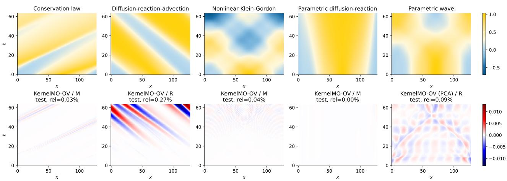

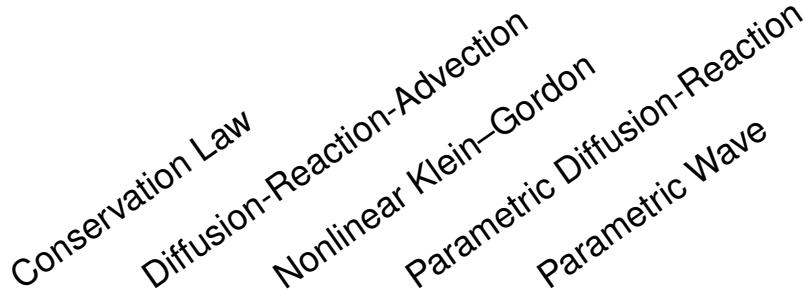

<table><tr><td rowspan=6 colspan=1>KernelO / MKernelO / RKernelO (PCA) / MKernelO (PCA) / RKernelMO-PS /M×M</td><td></td><td></td><td></td><td></td><td></td></tr><tr><td rowspan=1 colspan=1>3.97</td><td rowspan=1 colspan=1>5.89</td><td rowspan=1 colspan=1>28.0</td><td rowspan=1 colspan=1>4.90</td><td rowspan=1 colspan=1>15.3</td></tr><tr><td rowspan=1 colspan=1>2.25</td><td rowspan=1 colspan=1>139</td><td rowspan=1 colspan=1>141</td><td rowspan=1 colspan=1>3.96</td><td rowspan=1 colspan=1>125</td></tr><tr><td rowspan=1 colspan=1>2.20</td><td rowspan=1 colspan=1>4.39</td><td rowspan=1 colspan=1>27.8</td><td rowspan=1 colspan=1>4.91</td><td rowspan=1 colspan=1>15.7</td></tr><tr><td rowspan=1 colspan=1>1.88</td><td rowspan=1 colspan=1>26.7</td><td rowspan=1 colspan=1>56.5</td><td rowspan=1 colspan=1>3.81</td><td rowspan=1 colspan=1>22.6</td></tr><tr><td rowspan=1 colspan=1>1.23</td><td rowspan=1 colspan=1>1.04</td><td rowspan=1 colspan=1>1.10</td><td rowspan=1 colspan=1>1.45</td><td rowspan=1 colspan=1>1.67</td></tr><tr><td rowspan=1 colspan=1>KernelMO-PS / R×R</td><td rowspan=1 colspan=1>1.94</td><td rowspan=1 colspan=1>1.27</td><td rowspan=1 colspan=1>3.04</td><td rowspan=1 colspan=1>14.4</td><td rowspan=1 colspan=1>1.79</td></tr><tr><td rowspan=6 colspan=1>KernelMO-PS (PCA) / M×MKernelMO-PS (PCA) / R×RDeepONetDeepONet-CMIONetMNO</td><td rowspan=1 colspan=1>1.32</td><td rowspan=1 colspan=1>1.03</td><td rowspan=1 colspan=1>1.20</td><td rowspan=1 colspan=1>14.8</td><td rowspan=1 colspan=1>1.13</td></tr><tr><td rowspan=1 colspan=1>1.82</td><td rowspan=1 colspan=1>1.26</td><td rowspan=1 colspan=1>2.02</td><td rowspan=1 colspan=1>21.8</td><td rowspan=1 colspan=1>1.00</td></tr><tr><td rowspan=1 colspan=1>2.10</td><td rowspan=1 colspan=1>3.61</td><td rowspan=1 colspan=1>20.6</td><td rowspan=1 colspan=1>4.25</td><td rowspan=1 colspan=1>10.7</td></tr><tr><td rowspan=1 colspan=1>1.36</td><td rowspan=1 colspan=1>1.24</td><td rowspan=1 colspan=1>8.13</td><td rowspan=1 colspan=1>1.83</td><td rowspan=1 colspan=1>4.08</td></tr><tr><td rowspan=1 colspan=1>2.30</td><td rowspan=1 colspan=1>3.34</td><td rowspan=1 colspan=1>10.4</td><td rowspan=1 colspan=1>3.11</td><td rowspan=1 colspan=1>5.27</td></tr><tr><td rowspan=1 colspan=1>1.23</td><td rowspan=1 colspan=1>1.14</td><td rowspan=1 colspan=1>3.35</td><td rowspan=1 colspan=1>1.46</td><td rowspan=1 colspan=1>5.11</td></tr></table>

Figure 7: Summary of normalized performance in the product-space-learning experiments. For each method $m ,$ PDE $p ,$ and associated test dataset $d ,$ we compute the normalized error Errorm,p,d/ minm′ Error $m ^ { \prime } , p , d$ , where Error $_ { m , p , d }$ denotes the mean relative error. Consequently, the best-performing method on each test dataset attains the value 1. For each PDE, the displayed value is obtained by averaging the normalized errors over all six associated test datasets (one in-distribution and five out-of-distribution datasets). Lighter colors indicate better performance.  
Figure 8: Qualitative summary across PDEs for operator-valued learning. Columns correspond to conservation law, diffusion-reaction-advection, nonlinear Klein-Gordon, parametric diffusion-reaction, parametric wave. The top row shows the reference solution for one selected trajectory from the test split; the bottom row shows the signed predic tion error for the kernel method with the smallest mean relative error.

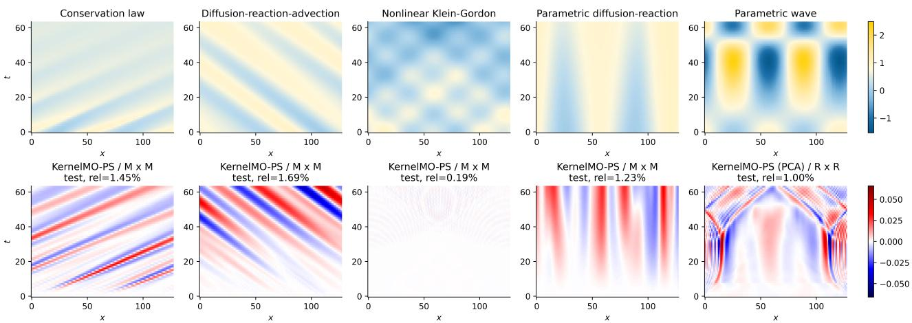  
Figure 9: Qualitative summary across PDEs for product-space learning. Columns correspond to conservation law, diffusion-reaction-advection, nonlinear Klein-Gordon, parametric diffusion-reaction, parametric wave. The top row shows the reference solution for one selected trajectory from the test split; the bottom row shows the signed prediction error for the kernel method with the smallest mean relative error.

The operator-valued and product-space formulations exhibit complementary strengths. The KernelMO-OV methods are particularly well-suited to operator-valued learning, generally outperforming the KernelMO-PS variants and obtaining the lowest in-distribution errors on the conservation law (0.01%), diffusion–reaction– advection equation (0.38%), nonlinear Klein–Gordon equation (0.21%), and parametric diffusion–reaction equation (0.06%). Its PCA-based variants also frequently provide the best out-of-distribution performance. For product-space learning, KernelMO-PS consistently outperforms the corresponding single-kernel baseline KernelO (e.g. 2.13% versus 59.28% for the parametric wave equation) and remains competitive with, or superior to, the neural operator baselines across most benchmarks.

The comparison between the full and PCA-based variants reveals no universal ordering. PCA substantially reduces the dimensionality of the encoded inputs and outputs while often preserving most of the predictive accuracy and, in several experiments, improving out-of-distribution generalization. For example, on the nonlinear Klein–Gordon equation in operator-valued learning, the OOD error decreases from 6.72% for KernelMO-OV / M to 4.11% for KernelMO-OV (PCA) / M. Likewise, for the parametric wave equation in product-space learning, KernelMO-PS (PCA) / R × R substantially improves the most challenging distribution shifts compared with its non-PCA counterpart (46.20% versus 99.55%). On the other hand, PCA introduces a moderate loss of in-distribution accuracy on some benchmarks; for instance, in operator-valued learning, on the conservation law, the error increases from 0.01% to 1.77%, while on the parametric diffusion–reaction equation it increases from 0.06% to 3.04%. Thus, PCA should primarily be viewed as a computationally efficient representation that can additionally provide a regularization effect, rather than as a uniformly accuracy-improving transformation.

The choice of kernel is similarly problem dependent. Matérn kernels generally provide the strongest and most stable performance, particularly for the conservation law, nonlinear Klein–Gordon equation, and parametric diffusion–reaction equation. For example, in operator-valued learning, on the conservation law, KernelMO-OV / M achieves an OOD error of 0.77%, compared with 5.47% for the RBF kernel. Likewise, on the parametric diffusion–reaction equation, KernelMO-OV / M attains OOD errors of 3.53%, 4.05%, and 0.12% on the three distribution shifts, whereas KernelMO-OV / R reaches 56.22%, 83.90%, and 0.33%. RBF kernels can nevertheless attain extremely small in-distribution errors. The clearest example is the product-space parametric diffusion–reaction experiment, where KernelMO-PS / R × R achieves the lowest in-distribution error (0.75%).

Finally, the experiments reveal no universal out-of-distribution trend across all PDEs. Generalization depends strongly on both the governing equation and the nature of the distribution shift. Overall, OOD prediction is consistently more challenging than in-distribution prediction for all methods, highlighting the intrinsic difficulty of extrapolating beyond the training distribution. Changes in initial-condition amplitude are, for example, particularly challenging for the nonlinear Klein–Gordon equation in product-space learning, where all methods incur large OOD errors, although KernelMO-PS still achieves the lowest overall error. Across operatorvalued and product-space learning, in the parametric wave equation, changing the Gaussian-process kernel (OOD\_matern) or its length scale (OOD\_scale) is also challenging. Across several benchmarks, we further note that PCA-based variants exhibit improved robustness under distribution shift, suggesting that the reduced latent representation can provide a useful regularization effect (e.g. from 3.37% to 2.47% for KernelMO-PS/ M×M in product-space learning for the nonlinear Klein Gordon equation).

## 4.1.1 Conservation Laws

We consider the following one-dimensional conservation law with periodic boundary conditions:

$$
\begin{array} { c } { u _ { t } + ( \alpha _ { 1 } u + \alpha _ { 2 } u ^ { 2 } + \alpha _ { 3 } u ^ { 3 } ) _ { x } = \alpha _ { 4 } u _ { x x } , \quad ( t , x ) \in [ 0 , 2 ] \times [ 0 , 2 ] } \\ { u ( 0 , x ) = u _ { 0 } ( x ) , } \\ { u ( t , 0 ) = u ( t , 2 ) , } \end{array}
$$

where the components of parameter vector $\alpha = [ \alpha _ { 1 } , \alpha _ { 2 } , \alpha _ { 3 } , \alpha _ { 4 } ] ^ { \top }$ are sampled from the ranges $\alpha _ { i } \in [ 0 . 9 \alpha _ { i } ^ { c } .$ 1.1αc], with the reference values given by $\alpha ^ { c } = [ 1 , 1 , 1 , 0 . 1 ] ^ { \top }$

Operator-Valued Learning. The mean relative errors and standard deviations are summarized in Table 4, while the implementation details and hyperparameter choices are summarized in Table 17. Overall, the proposed kernel-based methods achieve the lowest prediction errors on both the in-distribution and out-ofdistribution datasets and the best performance is obtained with the Matérn kernel. Compared with the bestperforming neural operator baselines, the proposed methods can improve the prediction accuracy by approximately two orders of magnitude on the in-distribution test set (from 1.23% for MIONet to 0.01% for KernelMO-OV/ M and KernelMO-PS/ M × M) and by a factor of approximately five on the out-of-distribution dataset (from 3.97% for MNO to 0.77% for KernelMO-OV/ M and KernelMO-PS/ M × M). Applying PCA substantially reduces the dimensionality of the learning problem while incurring a loss of accuracy, however, the PCA-based variants remain highly competitive. For example, KernelMO-OV (PCA) / M and KernelMO-PS (PCA) / M × M achieve prediction errors of 1.77% on the in-distribution test set and 2.32% on the out-ofdistribution dataset, compared with 1.23% for MIONet and 3.97% for MNO, respectively.

<table><tr><td>Method / kernel</td><td>Test</td><td>OOD</td></tr><tr><td>KernelMO-OV/M</td><td>0.01% (0.02%)</td><td>0.77% (1.54%)</td></tr><tr><td>KernelMO-OV/R</td><td>0.02% (0.02%)</td><td>5.47% (6.40%)</td></tr><tr><td>KernelMO-OV (PCA) / M</td><td>1.77% (0.43%)</td><td>2.32% (1.21%)</td></tr><tr><td>KernelMO-OV (PCA) / R</td><td>1.77% (0.43%)</td><td>2.82% (1.65%)</td></tr><tr><td>KernelMO-PS/ M x M</td><td>0.01% (0.02%)</td><td>0.77% (1.54%)</td></tr><tr><td>KernelMO-PS/ R x R</td><td>1.46% (1.09%)</td><td>4.63% (5.02%)</td></tr><tr><td>KernelMO-PS (PCA) / M x M</td><td>1.77% (0.43%)</td><td>2.32% (1.21%)</td></tr><tr><td>KernelMO-PS (PCA) / R x R</td><td>2.34% (0.90%)</td><td>5.15% (4.74%)</td></tr><tr><td>DeepONet-C</td><td>3.96% (0.74%)</td><td>5.56% (2.75%)</td></tr><tr><td>MIONet</td><td>1.23% (0.28%)</td><td>5.86% (7.64%)</td></tr><tr><td>MNO</td><td>1.84% (0.34%)</td><td>3.97% (4.09%)</td></tr></table>

Table 4: Operator-valued learning: performance comparison on the conservation laws. We report mean relative errors with standard deviations in parentheses on in-distribution and out-of-distribution datasets.

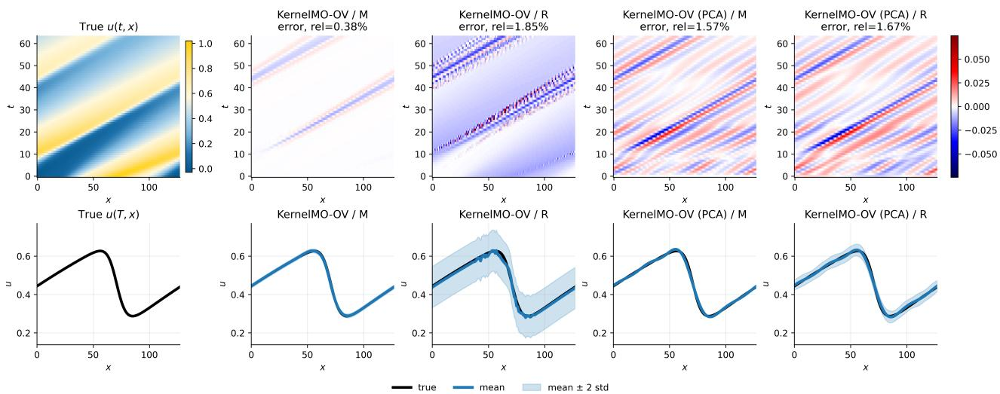  
Figure 10: Operator-valued learning: qualitative prediction and uncertainty comparison for the conservation law on the OOD dataset. The first row shows a reference solution and signed prediction errors for four kernel variants; the relative error for the displayed trajectory is reported in each error-figure title. The second row shows the final-time solution, predictive mean, and an uncertainty band of ±2 predictive standard deviations.

Product-Space Learning. The mean relative errors and standard deviations are summarized in Table 5, while the implementation details and hyperparameter choices are summarized in Table 18. Overall, the proposed kernel-based methods achieve the lowest prediction errors on the in-distribution test set, with the best performance obtained by KernelMO-PS / M × M using the Matérn kernel. Compared with the best-performing neural operator baseline, the proposed method improves the prediction accuracy by approximately a factor of two on the in-distribution test set (from 3.29% for MNO to 1.76% for KernelMO-PS / M × M). Across the out-of-distribution datasets, different methods achieve the best performance under different distribution shifts. Nevertheless, the proposed product-kernel methods consistently rank among the top-performing approaches, demonstrating strong robustness and improved generalization ability. Applying PCA substantially reduces the dimensionality of the learning problem while incurring only a moderate loss of accuracy. For example, KernelMO-PS (PCA) / M × M achieves a prediction error of 2.96% on the in-distribution test set while maintaining competitive performance across all out-of-distribution datasets.

<table><tr><td>Method / kernel</td><td>Test</td><td>OOD_par</td><td>OOD_init_GP</td><td>OOD_init_amp</td><td>OOD_par_init_GP</td><td>OOD_par_init_amp</td></tr><tr><td>KernelO /M</td><td>6.67% (5.45%)</td><td>3.98% (3.28%)</td><td>14.18% (8.47%)</td><td>46.93% (20.19%)</td><td>17.41% (9.52%)</td><td>47.18% (19.88%)</td></tr><tr><td>KernelO /R</td><td>4.76% (3.21%)</td><td>7.50% (5.17%)</td><td>10.29% (3.50%)</td><td>16.32% (6.36%)</td><td>14.65% (6.48%)</td><td>16.93% (6.20%)</td></tr><tr><td>KernelO (PCA) / M</td><td>6.97% (5.11%)</td><td>4.82% (2.84%)</td><td>13.28% (7.60%)</td><td>10.31% (4.10%)</td><td>16.63% (9.21%)</td><td>11.21% (4.70%)</td></tr><tr><td>KernelO (PCA) / R</td><td>5.34% (2.88%)</td><td>7.87% (4.92%)</td><td>10.30% (3.53%)</td><td>7.20% (1.86%)</td><td>14.63% (6.49%)</td><td>8.15% (2.63%)</td></tr><tr><td>KernelMO-PS / M x M</td><td>1.76% (1.52%)</td><td>6.24% (4.24%)</td><td>5.57% (3.69%)</td><td>6.18% (1.99%)</td><td>10.80% (7.57%)</td><td>9.05% (3.49%)</td></tr><tr><td>KernelMO-PS / R x R</td><td>2.97% (2.15%)</td><td>9.36% (6.46%)</td><td>8.59% (3.65%)</td><td>10.38% (3.61%)</td><td>16.25% (9.51%)</td><td>14.84% (7.75%)</td></tr><tr><td>KernelMO-PS (PCA) / M x M</td><td>2.96% (1.13%)</td><td>6.10% (3.60%)</td><td>5.81% (3.38%)</td><td>6.35% (1.90%)</td><td>10.04% (7.17%)</td><td>8.63% (3.11%)</td></tr><tr><td>KernelMO-PS (PCA) / R x R</td><td>3.79% (1.73%)</td><td>9.21% (5.84%)</td><td>8.56% (3.65%)</td><td>6.68% (1.82%)</td><td>15.65% (9.19%)</td><td>11.61% (7.45%)</td></tr><tr><td>DeepONet</td><td>6.77% (2.80%)</td><td>8.49% (4.16%)</td><td>10.55% (3.62%)</td><td>8.36% (2.29%)</td><td>14.70% (6.46%)</td><td>9.23% (3.03%)</td></tr><tr><td>DeepONet-C</td><td>4.42% (0.92%)</td><td>4.88% (1.22%)</td><td>6.22% (1.68%)</td><td>7.66% (2.11%)</td><td>6.92% (2.61%)</td><td>7.83% (2.10%)</td></tr><tr><td>MIONet MNO</td><td>4.32% (1.31%) 3.29% (1.05%)</td><td>8.90% (9.79%) 4.79% (2.88%)</td><td>6.37% (2.83%)</td><td>21.98% (11.22%)</td><td>10.74% (11.55%)</td><td>21.09% (10.83%)</td></tr><tr><td></td><td></td><td></td><td>5.46% (1.71%)</td><td>7.04% (2.11%)</td><td>8.25% (4.96%)</td><td>7.49% (2.30%)</td></tr></table>

Table 5: Product-space learning: performance comparison on the conservation law. We report mean relative errors with standard deviations in parentheses on in-distribution and out-of-distribution datasets.

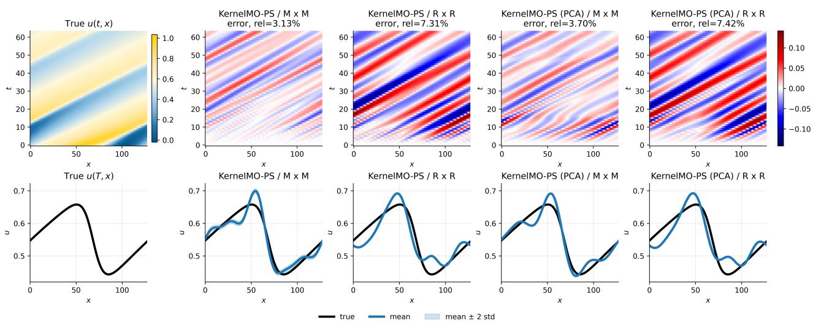  
Figure 11: Product-space learning: qualitative prediction and uncertainty comparison for the conservation law on the OOD\_par dataset. The first row shows a reference solution and signed prediction errors for four kernel variants; the relative error for the displayed trajectory is reported in each error-figure title. The second row shows the final-time solution, predictive mean, and an uncertainty band of ±2 predictive standard deviations.

## 4.1.2 Diffusion-Reaction-Advection

We consider the following one-dimensional diffusion-reaction-advection equation:

$$
\begin{array} { r l } & { \quad u _ { t } = \alpha _ { 1 } u _ { x x } + \alpha _ { 2 } u _ { x } + \alpha _ { 3 } u ^ { \alpha _ { 4 } } ( 1 - u ^ { \alpha _ { 5 } } ) , \quad ( t , x ) \in [ 0 , 2 ] \times [ 0 , 2 ] } \\ & { \quad u ( 0 , x ) = u _ { 0 } ( x ) , } \\ & { \quad u ( t , 0 ) = u ( t , 2 ) , } \end{array}
$$

where the first three components of parameter vector $\alpha = [ \alpha _ { 1 } , \alpha _ { 2 } , \alpha _ { 3 } , \alpha _ { 4 } , \alpha _ { 5 } ] ^ { \top }$ are sampled from the ranges $\alpha _ { i } \in [ 0 . 9 \alpha _ { i } ^ { c } , 1 . 1 \alpha _ { i } ^ { c } ]$ , with the reference values given by $\alpha ^ { c } = [ 0 . 0 1 , 1 , 1 ] ^ { \top }$ , while $\alpha _ { 4 }$ and $\alpha _ { 5 }$ are drawn uniformly from [1, 3].

Operator-Valued Learning. The mean relative errors and standard deviations are summarized in Table $^ { 6 , }$ while the implementation details and hyperparameter choices are summarized in Table 19. Overall, the proposed kernel-based methods achieve the lowest prediction errors on both the in-distribution and out-ofdistribution datasets. The best in-distribution performance is obtained by KernelMO-OV / R, while the lowest out-of-distribution error is achieved by KernelMO-OV (PCA) / R. Compared with the best-performing neural operator baseline, the proposed methods improve the prediction accuracy by more than a factor of three on the in-distribution test set (from 1.21% for MNO to 0.38% for KernelMO-OV / R) and by nearly a factor of two on the out-of-distribution dataset (from 6.58% for MNO to 3.53% for KernelMO-OV (PCA) / R). Applying PCA substantially reduces the dimensionality of the learning problem while preserving the strong predictive performance of the proposed methods, and even slightly improves the out-of-distribution accuracy for the RBF kernel.

<table><tr><td>Method / kernel</td><td>Test</td><td>OOD</td></tr><tr><td>KernelMO-OV / M</td><td>0.60% (0.51%)</td><td>5.18% (4.80%)</td></tr><tr><td>KernelMO-OV / R</td><td>0.38% (0.38%)</td><td>3.72% (3.94%)</td></tr><tr><td>KernelMO-OV (PCA) / M</td><td>0.88% (0.46%)</td><td>5.17% (4.63%)</td></tr><tr><td>KernelMO-OV (PCA) / R</td><td>0.74% (0.34%)</td><td>3.53% (3.50%)</td></tr><tr><td>KernelMO-PS / M x M</td><td>0.79% (0.66%)</td><td>5.33% (4.59%)</td></tr><tr><td>KernelMO-PS / R x R</td><td>2.87% (1.41%)</td><td>10.42% (6.48%)</td></tr><tr><td>KernelMO-PS (PCA) / M x M</td><td>1.03% (0.60%)</td><td>5.30% (4.44%)</td></tr><tr><td>KernelMO-PS (PCA) / R x R</td><td>2.93% (1.38%)</td><td>10.43% (6.46%)</td></tr><tr><td>DeepONet-C</td><td>2.89% (0.63%)</td><td>6.61% (3.59%)</td></tr><tr><td>MIONet</td><td>5.56% (1.43%)</td><td>13.80% (7.08%)</td></tr><tr><td>MNO</td><td>1.21% (0.34%)</td><td>6.58% (5.85%)</td></tr></table>

Table 6: Operator-valued learning: performance comparison on the diffusion-reaction-advection equation. We report mean relative errors with standard deviations in parentheses on in-distribution and out-of-distribution datasets.

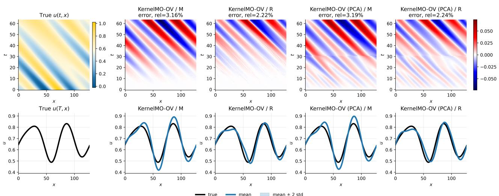  
Figure 12: Operator-valued learning: qualitative prediction and uncertainty comparison for the diffusion-reactionadvection equation on the OOD dataset. The first row shows a reference solution and signed prediction errors for four kernel variants; the relative error for the displayed trajectory is reported in each error-figure title. The second row shows the final-time solution, predictive mean, and an uncertainty band of ±2 predictive standard deviations.

Product-Space Learning. The mean relative errors and standard deviations are summarized in Table 7, while the implementation details and hyperparameter choices are summarized in Table 20. On the in-distribution test set, the proposed product-kernel methods achieve prediction errors comparable to the best-performing neural operator baseline, with KernelMO-PS / M × M attaining a mean relative error of 2.55%, compared with 2.25% for MNO. On the out-of-distribution datasets, however, the proposed methods consistently outperform the neural operator baselines. In particular, KernelMO-PS (PCA) / M × M achieves the lowest prediction errors on four of the five out-of-distribution datasets, while KernelMO-PS / M × M achieves the best performance on the remaining one. Applying PCA substantially reduces the dimensionality of the learning problem while preserving the strong predictive performance of the proposed methods. Moreover, the proposed productkernel methods consistently outperform the corresponding vanilla kernel methods, highlighting the advantage of explicitly modeling the product-space structure inherent in multiple operator learning problems.

<table><tr><td>Method / kernel</td><td>Test</td><td>OOD_par</td><td>OOD_init_GP</td><td>OOD_init_amp</td><td>OOD_par_init_GP</td><td>OOD_par_init_amp</td></tr><tr><td>KernelO / M</td><td>18.81% (10.19%)</td><td>8.27% (4.83%)</td><td>23.00% (14.71%)</td><td>48.20% (19.41%)</td><td>28.09% (16.11%)</td><td>48.77% (18.81%)</td></tr><tr><td>KernelO / R</td><td>12.63% (5.46%)</td><td>15.83% (7.18%)</td><td>233.85% (153.11%)</td><td>2589.43% (1249.39%)</td><td>233.85% (155.23%)</td><td>2590.93% (1250.92%)</td></tr><tr><td>KernelO (PCA) / M</td><td>18.80% (10.23%)</td><td>8.30% (4.80%)</td><td>22.46% (15.23%)</td><td>15.59% (6.05%)</td><td>27.65% (16.62%)</td><td>17.48% (6.71%)</td></tr><tr><td>KernelO (PCA) / R</td><td>12.64% (5.45%)</td><td>15.84% (7.17%)</td><td>115.56% (122.83%)</td><td>347.07% (255.06%)</td><td>116.17% (113.67%)</td><td>347.40% (255.15%)</td></tr><tr><td>KernelMO-PS / M x M</td><td>2.55% (1.54%)</td><td>4.57% (3.74%)</td><td>3.16% (1.50%)</td><td>7.29% (2.74%)</td><td>6.16% (3.76%)</td><td>8.16% (2.84%)</td></tr><tr><td>KernelMO-PS / R x R</td><td>2.77% (2.54%)</td><td>5.92% (5.13%)</td><td>3.88% (2.07%)</td><td>7.28% (2.69%)</td><td>9.37% (6.11%)</td><td>9.92% (5.75%)</td></tr><tr><td>KernelMO-PS (PCA) / M x M</td><td>2.61% (1.50%)</td><td>4.61% (3.67%)</td><td>3.15% (1.50%)</td><td>6.86% (2.44%)</td><td>6.15% (3.76%)</td><td>7.77% (2.70%)</td></tr><tr><td>KernelMO-PS (PCA) / R x R</td><td>2.83% (2.44%)</td><td>5.88% (5.02%)</td><td>3.85% (2.05%)</td><td>7.15% (2.64%)</td><td>9.25% (6.03%)</td><td>9.74% (5.67%)</td></tr><tr><td>DeepONet</td><td>13.14% (5.11%)</td><td>15.98% (6.83%)</td><td>15.33% (6.18%)</td><td>13.76% (4.52%)</td><td>21.37% (9.38%)</td><td>15.40% (5.30%)</td></tr><tr><td>DeepONet-C MIONet</td><td>3.46% (0.73%)</td><td>5.91% (3.32%)</td><td>3.65% (0.96%)</td><td>8.37% (2.85%)</td><td>6.34% (3.97%)</td><td>9.10% (2.90%)</td></tr><tr><td>MNO</td><td>5.71% (1.35%)</td><td>16.22% (13.97%)</td><td>9.66% (3.88%)</td><td>30.24% (14.11%)</td><td>17.47% (13.65%)</td><td>28.18% (13.38%)</td></tr><tr><td></td><td>2.25% (0.74%)</td><td>5.62% (4.48%)</td><td>3.33% (1.32%)</td><td>8.16% (2.90%)</td><td>7.15% (5.14%)</td><td>9.27% (3.23%)</td></tr></table>

Table 7: Product-space learning: performance comparison on the diffusion-reaction-advection equation. We report mean relative errors with standard deviations in parentheses on in-distribution and out-of-distribution datasets.

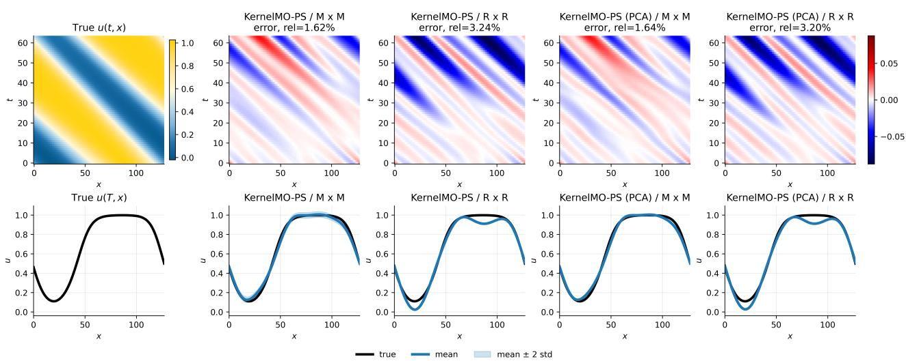  
Figure 13: Product-space learning: qualitative prediction and uncertainty comparison for the diffusion-reaction-advection equation on the OOD\_init\_GP dataset. The first row shows a reference solution and signed prediction errors for four kernel variants; the relative error for the displayed trajectory is reported in each error-figure title. The second row shows the final-time solution, predictive mean, and an uncertainty band of ±2 predictive standard deviations.

## 4.1.3 Nonlinear Klein-Gordon

We consider the following nonlinear Klein–Gordon equation:

$$
\begin{array} { r l } & { ~ u _ { t t } = \alpha _ { 1 } ^ { 2 } u _ { x x } - \alpha _ { 2 } ^ { 2 } \alpha _ { 1 } ^ { 4 } u - \alpha _ { 3 } u ^ { 3 } , \quad ( t , x ) \in [ 0 , 2 ] \times [ 0 , 2 ] } \\ & { u ( 0 , x ) = u _ { 0 } ( x ) , } \\ & { u _ { t } ( 0 , x ) = 0 , } \\ & { u ( t , 0 ) = u ( t , 2 ) . } \end{array}
$$

The components of the parameter vector $\alpha = [ \alpha _ { 1 } , \alpha _ { 2 } , \alpha _ { 3 } ] ^ { \top }$ are sampled from the ranges $\alpha _ { i } \in [ 0 . 9 \alpha _ { i } ^ { c } , 1 . 1 \alpha _ { i } ^ { c } ]$ with reference values $\alpha ^ { c } = [ 1 , 1 , 1 ] ^ { \top }$

Operator-Valued Learning. The mean relative errors and standard deviations are summarized in Table 8, while the implementation details and hyperparameter choices are summarized in Table 21. Overall, the proposed kernel-based methods achieve the lowest prediction errors on both the in-distribution and out-ofdistribution datasets. The best in-distribution performance is obtained by KernelMO-OV / M and KernelMO-PS $/ \mathbf { M } \times \mathbf { M }$ , while the lowest out-of-distribution error is achieved by their PCA-based variants. Compared with the best-performing neural operator baseline, the proposed methods improve the prediction accuracy by more than one order of magnitude on the in-distribution test set (from 4.63% for MNO to 0.21% for KernelMO-OV / M and KernelMO-PS / M × M) and by more than a factor of four on the out-of-distribution dataset (from 18.50% for MNO to 4.11% for KernelMO-OV (PCA) / M and KernelMO-PS (PCA) / M × M). Applying PCA substantially reduces the dimensionality of the learning problem while further improving the out-of-distribution performance.

<table><tr><td>Method / kernel</td><td>Test</td><td>OOD</td></tr><tr><td>KernelMO-OV / M</td><td>0.21% (0.19%)</td><td>6.72% (9.13%)</td></tr><tr><td>KernelMO-OV / R</td><td>0.37% (0.24%)</td><td>11.17% (24.33%)</td></tr><tr><td>KernelMO-OV (PCA) / M</td><td>0.62% (0.28%)</td><td>4.11% (6.96%)</td></tr><tr><td>KernelMO-OV (PCA) / R</td><td>0.68% (0.33%)</td><td>10.39% (23.80%)</td></tr><tr><td>KernelMO-PS / M x M</td><td>0.21% (0.19%)</td><td>6.72% (9.13%)</td></tr><tr><td>KernelMO-PS / R x R</td><td>10.22% (6.85%)</td><td>27.57% (27.58%)</td></tr><tr><td>KernelMO-PS (PCA) / M x M</td><td>0.62% (0.28%)</td><td>4.11% (6.96%)</td></tr><tr><td>KernelMO-PS (PCA) / R x R</td><td>10.23% (6.84%)</td><td>27.57% (27.58%)</td></tr><tr><td>DeepONet-C</td><td>12.17% (3.64%)</td><td>22.06% (14.84%)</td></tr><tr><td>MIONet</td><td>8.41% (2.83%)</td><td>28.46% (31.09%)</td></tr><tr><td>MNO</td><td>4.63% (1.46%)</td><td>18.50% (19.36%)</td></tr></table>

Table 8: Operator-valued learning: performance comparison on the nonlinear Klein-Gordon equation. We report mean relative errors with standard deviations in parentheses on in-distribution and out-of-distribution datasets.

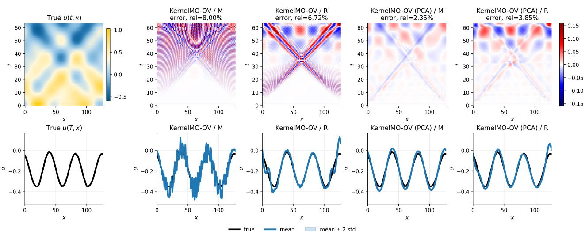  
Figure 14: Operator-valued learning: qualitative prediction and uncertainty comparison for the Nonlinear Klein-Gordon equation on the OOD dataset. The first row shows a reference solution and signed prediction errors for four kernel variants; the relative error for the displayed trajectory is reported in each error-figure title. The second row shows the final-time solution, predictive mean, and an uncertainty band of ±2 predictive standard deviations.

Product-Space Learning. The mean relative errors and standard deviations are summarized in Table 9, while the implementation details and hyperparameter choices are summarized in Table 22. Overall, the proposed product-kernel methods achieve the lowest prediction errors on the in-distribution test set and consistently outperform the neural operator baselines across the out-of-distribution datasets. In particular, KernelMO-PS / M × M attains the lowest in-distribution test error of 0.31%, compared with 2.84% for the best-performing neural operator baseline MNO, corresponding to an improvement of approximately one order of magnitude. Across the out-of-distribution datasets, KernelMO-PS (PCA) / M × M achieves the best performance on four of the five datasets, while KernelMO-PS / M × M performs best on the remaining one. Applying PCA substantially reduces the dimensionality of the learning problem while preserving the strong predictive performance of the proposed methods. Finally, we observe that the datasets involving out-of-distribution initial-condition amplitudes (OOD\_init\_amp and OOD\_par\_init\_amp) are substantially more challenging for all methods, as the unseen initial conditions contain higher-frequency modes that are absent from the training data, leading to more oscillatory solution dynamics and larger prediction errors.

<table><tr><td>Method / kernel</td><td>Test</td><td>OOD_par</td><td>OOD_init_GP</td><td>OOD_init_amp</td><td>OOD_par_init_GP</td><td>OOD_par_init_amp</td></tr><tr><td>KernelO /M</td><td>41.28% (27.25%)</td><td>28.12% (15.75%)</td><td>24.95% (14.78%)</td><td>59.59% (16.29%)</td><td>35.95% (20.22%)</td><td>65.80% (14.20%)</td></tr><tr><td>KernelO / R</td><td>28.94% (14.46%)</td><td>42.95% (19.50%)</td><td>434.20% (297.77%)</td><td>5811.74% (2849.27%)</td><td>431.33% (289.06%)</td><td>5672.18% (2787.12%)</td></tr><tr><td>KernelO (PCA) / M</td><td>41.25% (27.26%)</td><td>28.12% (15.74%)</td><td>24.64% (14.83%)</td><td>46.81% (12.42%)</td><td>35.78% (20.42%)</td><td>57.36% (14.91%)</td></tr><tr><td>KernelO (PCA) / R</td><td>28.94% (14.46%)</td><td>42.95% (19.50%)</td><td>214.07% (218.27%)</td><td>766.86% (609.60%)</td><td>213.33% (202.18%)</td><td>750.18% (594.53%)</td></tr><tr><td>KernelMO-PS / M x M</td><td>0.31% (0.24%)</td><td>8.36% (12.27%)</td><td>2.10% (1.33%)</td><td>31.79% (12.65%)</td><td>3.37% (2.18%)</td><td>32.90% (11.56%)</td></tr><tr><td>KernelMO-PS / R x R</td><td>0.90% (0.66%)</td><td>15.81% (25.30%)</td><td>7.79% (5.67%)</td><td>90.45% (40.93%)</td><td>9.13% (5.77%)</td><td>90.30% (38.01%)</td></tr><tr><td>KernelMO-PS (PCA) / M x M</td><td>0.68% (0.35%)</td><td>7.18% (11.64%)</td><td>2.02% (1.27%)</td><td>31.94% (12.74%)</td><td>2.47% (1.68%)</td><td>32.75% (11.78%)</td></tr><tr><td>KernelMO-PS (PCA) / R x R</td><td>1.01% (0.66%)</td><td>14.86% (24.83%)</td><td>4.22% (4.19%)</td><td>36.08% (14.83%)</td><td>5.86% (4.84%)</td><td>40.08% (16.84%)</td></tr><tr><td>DeepONet DeepONet-C</td><td>28.58% (12.44%)</td><td>45.35% (19.29%)</td><td>18.55% (8.38%)</td><td>42.43% (9.25%)</td><td>31.65% (16.22%)</td><td>53.09% (12.07%)</td></tr><tr><td>MIONet</td><td>10.25% (3.58%) 11.19% (2.60%)</td><td>23.42% (17.12%)</td><td>8.23% (2.08%)</td><td>36.52% (12.09%)</td><td>14.55% (10.46%)</td><td>43.00% (12.97%)</td></tr><tr><td>MNO</td><td></td><td>35.97% (35.71%) 18.94% (20.61%)</td><td>13.26% (9.19%)</td><td>72.59% (32.71%) 32.50% (12.60%)</td><td>26.00% (26.60%)</td><td>66.93% (29.43%)</td></tr><tr><td></td><td>2.84% (0.70%)</td><td></td><td>3.98% (1.69%)</td><td></td><td>10.29% (9.00%)</td><td>37.93% (12.55%)</td></tr></table>

Table 9: Product-space learning: performance comparison on the nonlinear Klein-Gordon equation. We report mean relative errors with standard deviations in parentheses on in-distribution and out-of-distribution datasets.

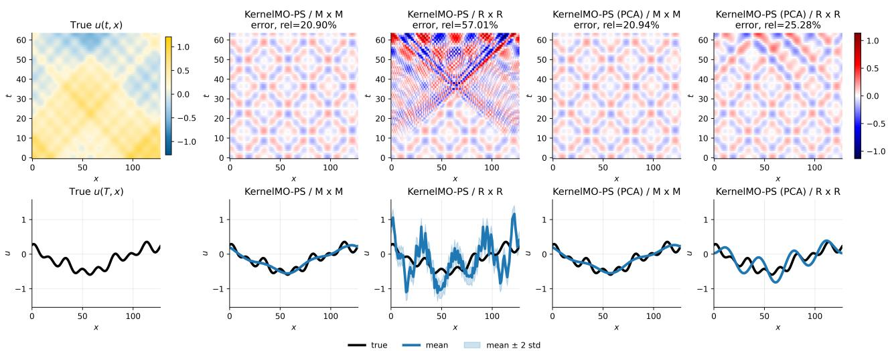  
Figure 15: Product-space learning: qualitative prediction and uncertainty comparison for the nonlinear Klein-Gordon equation on the OOD\_par\_init\_amp dataset. The first row shows a reference solution and signed prediction errors for four kernel variants; the relative error for the displayed trajectory is reported in each error-figure title. The second row shows the final-time solution, predictive mean, and an uncertainty band of ±2 predictive standard deviations.

## 4.1.4 Parametric Diffusion-Reaction Equation

We consider the following parametric diffusion-reaction equation:

$$
\begin{array} { r l } & { u _ { t } = ( \alpha ( x ) u _ { x } ) _ { x } + u ( 1 - u ) , \quad ( t , x ) \in [ 0 , 2 ] \times [ 0 , 2 ] } \\ & { u ( 0 , x ) = u _ { 0 } ( x ) , } \\ & { u ( t , 0 ) = u ( t , 2 ) , } \end{array}
$$

where the spatially varying diffusivity $\alpha ( x )$ is sampled from a Gaussian random process with RBF kernel (length scale=1) and with variance $0 . 0 1 ^ { 2 }$ . The parametric function $\alpha ( x )$ is evaluated at 129 sensor points corresponding to the boundaries of uniformly spaced cells, $\{ x _ { i } ^ { b } \} _ { i = 1 } ^ { 1 2 9 }$ , and the resulting values $\alpha ( x _ { i } ^ { b } )$ are encoded within the operator-valued learning and product-space learning methods.

Operator-Valued Learning. The mean relative errors and standard deviations are summarized in Table 10, while the implementation details and hyperparameter choices are summarized in Table 23. Overall, the proposed kernel-based methods achieve the lowest prediction errors on both the in-distribution and out-ofdistribution datasets. The best in-distribution performance is jointly attained by KernelMO-OV / M and KernelMO-PS / M × M, while KernelMO-OV / M achieves the lowest prediction errors on the OOD\_matern and OOD\_var datasets and KernelMO-OV (PCA) / M achieves the best performance on OOD\_scale. Compared with the best-performing neural operator baseline, the proposed methods improve the prediction accuracy by more than one order of magnitude on the in-distribution test set (from 1.34% for MNO to 0.06% for KernelMO-OV / M and KernelMO-OV / M × M). Applying PCA substantially reduces the dimensionality of the learning problem while preserving competitive predictive performance, particularly under distribution shifts

in the coefficient functions. Overall, the operator-valued formulation demonstrates stronger out-of-distribution generalization than the product-space formulation on this benchmark.
<table><tr><td>Method / kernel</td><td>Test</td><td>OOD_matern</td><td>OOD_scale</td><td>OOD_var</td></tr><tr><td>KernelMO-OV / M</td><td>0.06% (0.15%)</td><td>3.53% (1.56%)</td><td>4.13% (1.67%)</td><td>0.12% (0.37%)</td></tr><tr><td>KernelMO-OV / R</td><td>0.12% (0.34%)</td><td>56.22% (48.91%)</td><td>83.90% (72.76%)</td><td>0.33% (1.08%)</td></tr><tr><td>KernelMO-OV (PCA) / M</td><td>3.04% (1.90%)</td><td>3.77% (1.67%)</td><td>4.05% (1.59%)</td><td>3.19% (1.92%)</td></tr><tr><td>KernelMO-OV (PCA) / R</td><td>3.04% (1.90%)</td><td>7.25% (6.29%)</td><td>10.34% (10.19%)</td><td>3.19% (1.92%)</td></tr><tr><td>KernelMO-PS / M x M</td><td>0.06% (0.15%)</td><td>10.12% (8.30%)</td><td>14.80% (11.56%)</td><td>0.14% (0.42%)</td></tr><tr><td>KernelMO-PS / R x R</td><td>2.48% (1.07%)</td><td>6.48% (3.22%)</td><td>8.19% (3.63%)</td><td>2.60% (1.12%)</td></tr><tr><td>KernelMO-PS (PCA) / M x M</td><td>3.04% (1.90%)</td><td>3.81% (1.69%)</td><td>4.12% (1.62%)</td><td>3.19% (1.92%)</td></tr><tr><td>KernelMO-PS (PCA) / R x R</td><td>3.58% (1.82%)</td><td>4.44% (1.60%)</td><td>4.91% (1.52%)</td><td>3.73% (1.86%)</td></tr><tr><td>DeepONet-C</td><td>2.22% (0.88%)</td><td>4.19% (1.41%)</td><td>4.68% (1.44%)</td><td>2.34% (0.99%)</td></tr><tr><td>MIONet</td><td>1.88% (0.78%)</td><td>4.98% (1.69%)</td><td>5.42% (1.63%)</td><td>2.02% (0.89%)</td></tr><tr><td>MNO</td><td>1.34% (0.50%)</td><td>4.18% (1.62%)</td><td>4.68% (1.52%)</td><td>1.45% (0.62%)</td></tr></table>

Table 10: Operator-valued learning: performance comparison on the parametric diffusion-reaction equation. We report mean relative errors with standard deviations in parentheses on in-distribution and out-of-distribution datasets.

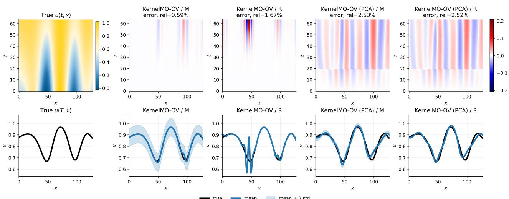  
Figure 16: Operator-valued learning: qualitative prediction and uncertainty comparison for the parametric diffusionreaction equation on the OOD\_var dataset. The first row shows a reference solution and signed prediction errors for four kernel variants; the relative error for the displayed trajectory is reported in each error-figure title. The second row shows the final-time solution, predictive mean, and an uncertainty band of ±2 predictive standard deviations.

Product-Space Learning. The mean relative errors and standard deviations are summarized in Table 11, while the implementation details and hyperparameter choices are summarized in Table 24. Overall, the proposed product-kernel methods achieve prediction errors comparable to those of the best-performing neural operator baseline across both the in-distribution and out-of-distribution datasets. In particular, KernelMO-PS / R × R attains the lowest in-distribution test error of 0.75%, compared with 1.77% for MNO. However, this variant exhibits poor generalization under most distribution shifts, with substantially larger errors on the OOD\_init, OOD\_par\_init, OOD\_par\_kernel, and OOD\_par\_scale datasets. By contrast, KernelMO-PS / M × M achieves consistently strong performance across all evaluation settings, obtaining prediction errors comparable to MNO on every out-of-distribution dataset and outperforming it on the OOD\_par\_var dataset (1.30% versus 1.73%). These results highlight the superior robustness of the Matérn product-kernel method under distribution shifts, even though the RBF variant achieves the lowest in-distribution error.

<table><tr><td>Method / kernel</td><td>Test</td><td>OOD_init</td><td>OOD_par_init</td><td>OOD_par_kernel</td><td>OOD_par_scale</td><td>OOD_par_var</td></tr><tr><td>KernelO / M</td><td>9.21% (5.27%)</td><td>12.48% (3.52%)</td><td>12.51% (3.47%)</td><td>8.20% (3.50%)</td><td>8.01% (3.47%)</td><td>8.64% (5.11%)</td></tr><tr><td>KernelO / R</td><td>6.76% (2.54%)</td><td>18.96% (7.00%)</td><td>19.02% (6.95%)</td><td>4.98% (1.78%)</td><td>5.18% (1.67%)</td><td>6.87% (2.64%)</td></tr><tr><td>KernelO (PCA) / M</td><td>8.96% (4.72%)</td><td>15.70% (5.20%)</td><td>15.74% (5.14%)</td><td>7.77% (3.12%)</td><td>7.62% (3.08%)</td><td>8.62% (4.53%)</td></tr><tr><td>KernelO (PCA) / R</td><td>6.97% (2.74%)</td><td>10.76% (3.62%)</td><td>10.78% (3.57%)</td><td>5.11% (1.91%)</td><td>5.30% (1.83%)</td><td>7.09% (2.84%)</td></tr><tr><td>KernelMO-PS / M x M</td><td>1.50% (0.75%)</td><td>11.88% (3.53%)</td><td>12.73% (3.43%)</td><td>5.40% (1.98%)</td><td>7.35% (2.57%)</td><td>1.30% (0.70%)</td></tr><tr><td>KernelMO-PS / R x R</td><td>0.75% (0.44%)</td><td>127.42% (47.76%)</td><td>188.16% (88.56%)</td><td>105.53% (50.74%)</td><td>157.30% (77.91%)</td><td>0.76% (0.45%)</td></tr><tr><td>KernelMO-PS (PCA) / M x M</td><td>3.94% (2.01%)</td><td>104.63% (68.48%)</td><td>150.65% (81.94%)</td><td>104.76% (68.56%)</td><td>154.17% (91.24%)</td><td>4.04% (2.04%)</td></tr><tr><td>KernelMO-PS (PCA) / R x R</td><td>4.27% (1.96%)</td><td>156.18% (102.47%)</td><td>243.60% (144.65%)</td><td>155.33% (109.85%)</td><td>235.54% (162.35%)</td><td>4.39% (1.96%)</td></tr><tr><td>DeepONet</td><td>7.75% (2.76%)</td><td>11.56% (3.38%)</td><td>11.56% (3.36%)</td><td>6.27% (1.95%)</td><td>6.37% (1.85%)</td><td>7.86% (2.91%)</td></tr><tr><td>DeepONet-C</td><td>2.48% (0.78%)</td><td>11.03% (3.73%)</td><td>11.66% (3.67%)</td><td>5.02% (1.51%)</td><td>5.52% (1.58%)</td><td>2.52% (0.76%)</td></tr><tr><td>MIONet</td><td>3.49% (1.00%)</td><td>36.36% (16.85%)</td><td>37.00% (16.77%)</td><td>5.43% (1.74%)</td><td>6.60% (2.50%)</td><td>3.51% (0.95%)</td></tr><tr><td>MNO</td><td>1.77% (0.66%)</td><td>11.26% (3.77%)</td><td>11.43% (3.66%)</td><td>4.42% (1.82%)</td><td>5.00% (1.82%)</td><td>1.73% (0.61%)</td></tr></table>

Table 11: Product-space learning: performance comparison on parametric diffusion-reaction equation. We report mean relative errors with standard deviations in parentheses on in-distribution and out-of-distribution datasets.

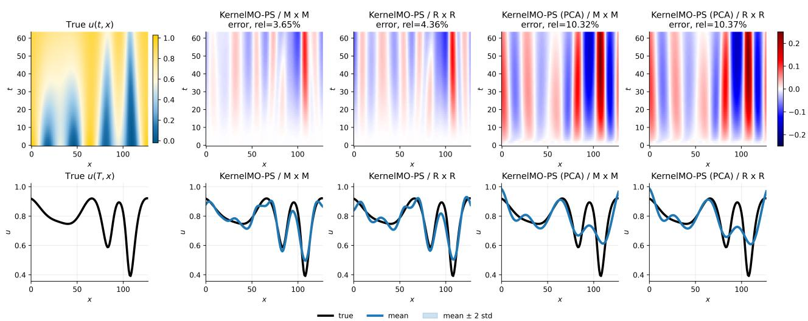  
Figure 17: Product-space learning: qualitative prediction and uncertainty comparison for the parametric diffusion reaction equation on the OOD\_par\_var dataset. The first row shows a reference solution and signed prediction errors for four kernel variants; the relative error for the displayed trajectory is reported in each error-figure title. The second row shows the final-time solution, predictive mean, and an uncertainty band of ±2 predictive standard deviations.

Remark 4.4 (Hyperparameter selection and out-of-distribution performance). The out-of-distribution performance of the proposed kernel methods can be sensitive to the choice of kernel hyperparameters. In all experiments, we select these hyperparameters using only in-distribution validation data and do not tune them separately for the OOD test cases. Consequently, a hyperparameter choice that yields strong in-distribution performance need not be optimal under distribution shift. Table 12 illustrates this effect for KernelMO-PS with an RBF kernel on the parametric diffusion–reaction problem. In particular, the length scale selected based on in-distribution performance can lead to substantially larger errors for some OOD shifts, whereas other length scales yield considerably better OOD performance despite being less accurate in distribution.

<table><tr><td>Length-scale</td><td>Test</td><td>OOD_init</td><td>OOD_par_init</td><td>OOD_par_kernel</td><td>OOD_par_scale</td><td>OOD_par_var</td></tr><tr><td>1</td><td>5.43% (3.40%)</td><td>78.10% (23.07%)</td><td>78.11% (23.05%)</td><td>4.44% (1.88%)</td><td>4.84% (1.87%)</td><td>3.81% (2.21%)</td></tr><tr><td>10</td><td>0.75% (0.44%)</td><td>127.42% (47.76%)</td><td>188.16% (88.56%)</td><td>105.53% (50.74%)</td><td>157.30% (77.91%)</td><td>0.76% (0.45%)</td></tr><tr><td>100</td><td>1.51% (0.68%)</td><td>251.19% (158.00%)</td><td>458.95% (284.88%)</td><td>276.53% (146.44%)</td><td>408.37% (227.92%)</td><td>1.56% (0.70%)</td></tr><tr><td>1000</td><td>3.16% (1.21%)</td><td>516.14% (344.66%)</td><td>937.77% (641.70%)</td><td>575.36% (332.08%)</td><td>811.18% (501.40%)</td><td>3.29% (1.23%)</td></tr></table>

Table 12: Product-space learning: performance of KernelMO-PS with an RBF kernel on the parametric diffusion–reaction equation for different length scales. The first column reports the length scale of the kernel $k _ { U }$ acting on the initial conditions, while the remaining columns report the corresponding in-distribution and OOD prediction errors.

## 4.1.5 Parametric Wave Equation

We consider the following parametric wave equation:

$$
\begin{array} { c } { { u _ { t t } = \alpha ^ { 2 } ( t ) u _ { x x } , \quad ( t , x ) \in [ 0 , 2 ] \times [ 0 , 2 ] } } \\ { { u ( 0 , x ) = u _ { 0 } ( x ) , } } \\ { { u _ { t } ( 0 , x ) = 0 , } } \\ { { u ( t , 0 ) = u ( t , 2 ) , } } \end{array}
$$

where the time-dependent parametric function α(t) is drawn from a Gaussian random process with RBF kernel (length scale = 1) and with variance 1. The parametric function $\alpha ( t )$ is evaluated at 64 sensor points corresponding to the boundaries of spaced cells, $\{ t _ { i } ^ { b } \} _ { i = 1 } ^ { 6 4 }$ , and the resulting values $\alpha ( t _ { i } ^ { b } )$ are encoded within the operator-valued learning and product-space learning methods.

Operator-Valued Learning. The mean relative errors and standard deviations are summarized in Table 13, while the implementation details and hyperparameter choices are summarized in Table 25. Overall, the proposed kernel-based methods achieve the lowest prediction errors on the in-distribution test set, with the best performance obtained by KernelMO-OV (PCA) / R. Compared with the best-performing neural operator baseline, the proposed method improves the prediction accuracy by more than one order of magnitude on the indistribution test set (from 17.83% for DeepONet-C to 1.59% for KernelMO-OV (PCA) / R). On the OOD\_var dataset, the proposed methods also substantially outperform all neural operator baselines, achieving the lowest prediction error of 1.29% compared with 17.11% for DeepONet-C. By contrast, all methods experience a significant degradation in performance on the OOD\_matern and OOD\_scale datasets, indicating that these distribution shifts are particularly challenging for this PDE. This behavior differs from that observed for the parametric diffusion–reaction equation (Table 10), demonstrating that out-of-distribution generalization depends strongly on the underlying PDE. Applying PCA substantially reduces the dimensionality of the learning problem while consistently improving the out-of-distribution performance of the proposed kernel-based methods.

<table><tr><td>Method / kernel</td><td>Test</td><td>OOD_matern</td><td>OOD_scale</td><td>OOD_var</td></tr><tr><td>KernelMO-OV / M</td><td>2.63% (5.86%)</td><td>56.69% (17.61%)</td><td>71.93% (13.38%)</td><td>2.05% (3.22%)</td></tr><tr><td>KernelMO-OV / R</td><td>9.37% (25.42%)</td><td>209.27% (247.77%)</td><td>117.14% (69.91%)</td><td>6.65% (10.34%)</td></tr><tr><td>KernelMO-OV (PCA) / M</td><td>2.50% (4.42%)</td><td>32.90% (16.17%)</td><td>43.27% (20.56%)</td><td>1.98% (2.33%)</td></tr><tr><td>KernelMO-OV (PCA) / R</td><td>1.59% (2.34%)</td><td>31.57% (15.71%)</td><td>43.60% (20.86%)</td><td>1.29% (1.04%)</td></tr><tr><td>KernelMO-PS / M x M</td><td>2.63% (5.86%)</td><td>56.69% (17.61%)</td><td>71.93% (13.38%)</td><td>2.05% (3.22%)</td></tr><tr><td>KernelMO-PS / R x R</td><td>2.37% (5.13%)</td><td>66.05% (17.44%)</td><td>79.51% (13.45%)</td><td>1.68% (2.29%)</td></tr><tr><td>KernelMO-PS (PCA) / M x M</td><td>2.50% (4.42%)</td><td>32.27% (16.31%)</td><td>42.40% (21.19%)</td><td>1.98% (2.33%)</td></tr><tr><td>KernelMO-PS (PCA) / R x R</td><td>1.64% (2.46%)</td><td>30.42% (15.96%)</td><td>42.36% (21.68%)</td><td>1.31% (1.05%)</td></tr><tr><td>DeepONet-C</td><td>17.83% (7.29%)</td><td>35.91% (17.51%)</td><td>41.90% (23.91%)</td><td>17.11% (5.98%)</td></tr><tr><td>MIONet</td><td>19.08% (8.44%)</td><td>67.88% (20.60%)</td><td>70.41% (20.11%)</td><td>18.13% (6.75%)</td></tr><tr><td>MNO</td><td>19.46% (8.38%)</td><td>40.09% (19.75%)</td><td>46.28% (24.27%)</td><td>18.60% (7.19%)</td></tr></table>

Table 13: Operator-valued learning: performance comparison on the parametric wave equation. We report mean relative errors with standard deviations in parentheses on in-distribution and out-of-distribution datasets.

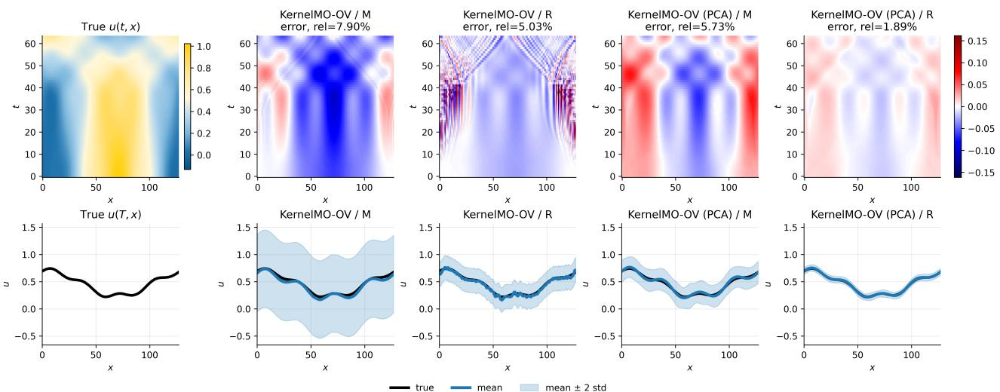  
Figure 18: Operator-valued learning: qualitative prediction and uncertainty comparison for the parametric wave equation on the OOD\_var dataset. The first row shows a reference solution and signed prediction errors for four kernel variants; the relative error for the displayed trajectory is reported in each error-figure title. The second row shows the final-time solution, predictive mean, and an uncertainty band of ±2 predictive standard deviations.

Product-Space Learning. The mean relative errors and standard deviations are summarized in Table 14, while the implementation details and hyperparameter choices are summarized in Table 26. Overall, the proposed PCA-based product-kernel methods achieve the lowest prediction errors across both the in-distribution and out-of-distribution datasets. In particular, KernelMO-PS (PCA) / R × R attains the lowest in-distribution test error of 2.13%, compared with 18.20% for the best-performing neural operator baseline DeepONet-C, corresponding to an improvement of nearly one order of magnitude. Moreover, KernelMO-PS (PCA) / R × R achieves the best performance on four of the five out-of-distribution datasets, while KernelMO-PS (PCA) / M × M performs best on the remaining one. By contrast, although the original product-kernel methods achieve competitive in-distribution prediction errors, their performance deteriorates substantially under several distribution shifts, particularly on the OOD\_par\_init, OOD\_par\_kernel, and OOD\_par\_scale datasets. These results demonstrate that combining the product-kernel formulation with PCA substantially improves the robustness and out-of-distribution generalization of the proposed approach.

<table><tr><td>Method / kernel</td><td>Test</td><td>OOD_init</td><td>OOD_par_init</td><td>OOD_par_kernel</td><td>OOD_par_scale</td><td>OOD_par_var</td></tr><tr><td>KernelO / M</td><td>83.16% (40.26%)</td><td>80.02% (26.03%)</td><td>84.30% (28.92%)</td><td>74.34% (38.37%)</td><td>72.95% (37.89%)</td><td>75.26% (39.70%)</td></tr><tr><td>KernelO / R</td><td>59.29% (21.32%)</td><td>13473.96% (6245.11%)</td><td>15134.50% (6361.41%)</td><td>50.63% (19.00%)</td><td>52.13% (20.95%)</td><td>55.35% (20.30%)</td></tr><tr><td>KernelO (PCA) / M</td><td>83.14% (40.25%)</td><td>124.30% (39.58%)</td><td>135.55% (41.91%)</td><td>74.32% (38.36%)</td><td>72.93% (37.89%)</td><td>75.24% (39.69%)</td></tr><tr><td>KernelO (PCA) / R</td><td>59.28% (21.32%)</td><td>1415.03% (1126.69%)</td><td>1585.64% (1200.96%)</td><td>50.62% (19.00%)</td><td>52.13% (20.95%)</td><td>55.35% (20.30%)</td></tr><tr><td>KernelMO-PS / M x M</td><td>3.33% (6.75%)</td><td>38.15% (22.19%)</td><td>97.65% (0.34%)</td><td>60.48% (17.09%)</td><td>76.32% (11.83%)</td><td>2.67% (4.98%)</td></tr><tr><td>KernelMO-PS / R x R</td><td>3.52% (6.25%)</td><td>37.89% (22.21%)</td><td>99.55% (0.21%)</td><td>68.31% (19.36%)</td><td>83.82% (12.27%)</td><td>2.88% (5.35%)</td></tr><tr><td>KernelMO-PS (PCA) / M x M</td><td>2.84% (4.51%)</td><td>37.72% (22.24%)</td><td>46.29% (5.58%)</td><td>32.06% (17.45%)</td><td>41.43% (19.02%)</td><td>2.37% (3.53%)</td></tr><tr><td>KernelMO-PS (PCA) / R x R</td><td>2.13% (3.38%)</td><td>37.47% (22.24%)</td><td>46.20% (5.55%)</td><td>31.46% (17.10%)</td><td>41.73% (18.62%)</td><td>1.69% (2.00%)</td></tr><tr><td>DeepONet</td><td>56.93% (21.72%)</td><td>54.88% (19.86%)</td><td>55.52% (14.22%)</td><td>48.72% (19.18%)</td><td>50.37% (20.99%)</td><td>53.70% (21.09%)</td></tr><tr><td>DeepONet-C</td><td>18.20% (7.00%)</td><td>42.10% (20.72%)</td><td>108.17% (14.57%)</td><td>35.87% (17.08%)</td><td>42.41% (19.92%)</td><td>17.43% (6.70%)</td></tr><tr><td>MIONet</td><td>20.54% (10.85%)</td><td>45.40% (20.06%)</td><td>170.46% (16.33%)</td><td>97.25% (28.43%)</td><td>110.74% (28.18%)</td><td>19.07% (10.51%)</td></tr><tr><td>MNO</td><td>25.04% (11.75%)</td><td>43.36% (20.27%)</td><td>73.84% (19.56%)</td><td>46.96% (27.01%)</td><td>53.72% (28.81%)</td><td>22.58% (10.79%)</td></tr></table>

Table 14: Product-space learning: performance comparison on the parametric wave equation. We report mean relative errors with standard deviations in parentheses on in-distribution and out-of-distribution datasets.

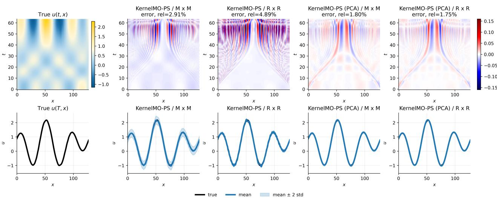  
Figure 19: Product-space learning: qualitative prediction and uncertainty comparison for the parametric wave equation on the OOD\_par\_var dataset. The first row shows a reference solution and signed prediction errors for four kernel variants; the relative error for the displayed trajectory is reported in each error-figure title. The second row shows the final-time solution, predictive mean, and an uncertainty band of ±2 predictive standard deviations.

## 4.2 Efficiency

In this section, we compare the computational efficiency of the proposed kernel-based methods with the neural network-based baselines in terms of training time and prediction time. For brevity, we report the results for the conservation law problem only, as similar trends are observed across the other PDE models.

Table 15 summarizes the computational cost of the operator-valued learning problem shown in Fig. 4b. Although both KernelMO-OV and KernelMO-PS rely on kernel regression, KernelMO-OV is substantially more efficient during training. As explained in Section 3.4 (see also Table 1), the reason is that its kernel matrix has dimensions $n _ { \alpha } \times n _ { \alpha }$ and therefore contains $3 2 0 ^ { 2 } = 1 0 2 4 0 0$ entries, whereas the kernel matrix of KernelMO-PS has dimensions $( n _ { \alpha } n _ { u } ) \times ( n _ { \alpha } n _ { u } )$ and contains $3 2 0 ^ { 2 } 2 0 ^ { 2 } = 4 0 9 6 0 0 0 0$ entries. Thus, without PCA, KernelMO-OV trains approximately 13–14× faster than KernelMO-PS. For the PCA-based variants, the corresponding speedup is approximately 48–55×.

Compared with the neural operator baselines, the kernel methods are also considerably more efficient. The fastest KernelMO-OV variants require less than 0.5 seconds for training, compared with 158–250 seconds for the neural operators, corresponding to speedups of more than two orders of magnitude. At inference time, KernelMO-OV also provides the fastest predictions, requiring approximately 0.04 ms per sample. This corresponds to prediction times that are approximately 4–9× faster than the neural operator baselines. With PCA, the prediction time is further reduced to approximately 0.004 ms per sample, yielding speedups of roughly 40–80× over the neural operators. Although KernelMO-PS is slower due to its larger kernel matrix, it remains competitive with the neural operator baselines while providing comparable or better predictive accuracy.

Applying PCA yields an additional reduction in computational cost. For KernelMO-OV, PCA decreases the training time from approximately 0.47 s to 0.036 s and reduces the prediction time by almost an order of magnitude. Similar improvements are observed for KernelMO-PS. These computational savings are obtained with only a modest reduction in predictive accuracy, indicating that PCA provides an attractive trade-off between computational efficiency and accuracy.

<table><tr><td>Method / kernel</td><td>Train time (s)</td><td>Test pred. (ms/sample)</td></tr><tr><td>KernelMO-OV / M</td><td>0.472</td><td>0.0375</td></tr><tr><td>KernelMO-OV / R</td><td>0.464</td><td>0.0377</td></tr><tr><td>KernelMO-OV(PCA) / M</td><td>0.0357</td><td>0.00407</td></tr><tr><td>KernelMO-OV (PCA) / R</td><td>0.0361</td><td>0.00412</td></tr><tr><td>KernelMO-PS / M x M</td><td>6.56</td><td>0.538</td></tr><tr><td>KernelMO-PS / R x R</td><td>6.24</td><td>0.497</td></tr><tr><td>KernelMO-PS (PCA) / M x M</td><td>1.96</td><td>0.24</td></tr><tr><td>KernelMO-PS (PCA) / R x R</td><td>1.72</td><td>0.19</td></tr><tr><td>DeepONet-C</td><td>250.44</td><td>0.334</td></tr><tr><td>MIONet</td><td>157.95</td><td>0.17</td></tr><tr><td>MNO</td><td>180.54</td><td>0.16</td></tr></table>

Table 15: Operator-valued learning: Training time and prediction time per evaluated sample.

These observations are also illustrated in Fig. 20, which jointly displays predictive accuracy and computational cost. The figure highlights that KernelMO-OV consistently combines the lowest prediction errors with the shortest training and inference times among all methods considered. While the PCA variants incur a modest increase in prediction error, they achieve substantial additional reductions in computational cost. In contrast, the neural operator baselines require significantly longer training times while providing lower predictive accuracy, whereas KernelMO-PS offers a competitive compromise between computational efficiency and predictive performance despite its larger kernel matrix.

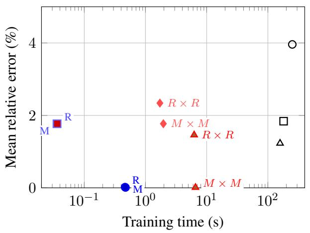

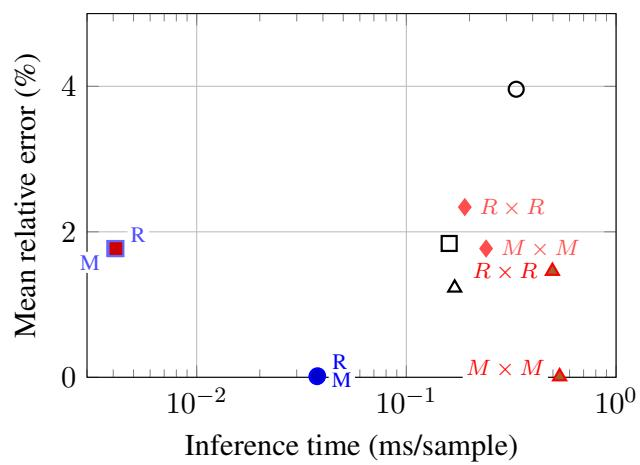  
(b) Inference time.  
Figure 20: Operator-valued learning: trade-off between predictive accuracy and computational cost on the conservationlaw benchmark. Labels beside kernel points indicate the kernel choice: M denotes Matérn and R denotes RBF.

Table 16 summarizes the computational cost of the product-space learning formulation shown in Fig. 4c. As in the operator-valued setting, the proposed kernel-based methods are substantially more computationally efficient than the neural operator baselines. The full-dimensional kernel methods require only 15–16 seconds for training, compared with 227–397 seconds for the neural operators, corresponding to speedups of approximately 15–25×. Applying PCA further reduces the training time to approximately 4–5 seconds, yielding an additional factor of about three. At inference time, the prediction cost of the kernel methods is comparable to that of the neural operator baselines. The full-dimensional methods require approximately 0.8 ms per sample, while the PCA variants reduce this to approximately 0.35–0.42 ms per sample, which is comparable to MIONet and MNO and substantially faster than DeepONet-C. The proposed kernel methods are particularly attractive in applications where both training and inference efficiency are important, such as settings requiring frequent retraining or repeated deployment on new operator families.

One observation is that KernelMO-PS and the corresponding single-operator baseline KernelO exhibit nearly identical training and prediction times, both with and without PCA. This is expected, since both methods solve kernel regression problems of the same size and therefore have essentially identical computational complexity. However, as demonstrated throughout the experimental Section 4.1, KernelMO-PS consistently achieves substantially higher predictive accuracy than KernelO across all benchmarks. These results demonstrate that the proposed product-kernel framework provides a favorable trade-off between computational efficiency and predictive performance, improving accuracy in multiple operator learning without increasing computational cost.

<table><tr><td>Method / kernel</td><td>Train time (s)</td><td>Test pred. (ms/sample)</td></tr><tr><td>KernelMO-PS (PCA) / M x M</td><td>5.19</td><td>0.415</td></tr><tr><td>KernelMO-PS (PCA) / R x R</td><td>4.7</td><td>0.365</td></tr><tr><td>KernelMO-PS / M x M</td><td>15.5</td><td>0.874</td></tr><tr><td>KernelMO-PS / R x R</td><td>14.8</td><td>0.829</td></tr><tr><td>KernelO (PCA) / M</td><td>4.06</td><td>0.339</td></tr><tr><td>KernelO (PCA) / R</td><td>3.9</td><td>0.323</td></tr><tr><td>KernelO / M</td><td>14</td><td>0.815</td></tr><tr><td>KernelO / R</td><td>14</td><td>0.778</td></tr><tr><td>DeepONet</td><td>226.79</td><td>0.23</td></tr><tr><td>DeepONet-C</td><td>397.46</td><td>0.83</td></tr><tr><td>MIONet</td><td>245.41</td><td>0.41</td></tr><tr><td>MNO</td><td>277.59</td><td>0.38</td></tr></table>

Table 16: Product-space learning: Training time and prediction time per evaluated sample.

These observations are further illustrated in Fig. 21, which jointly displays predictive accuracy and computational cost. The figure shows that the proposed product-kernel methods consistently achieve a favorable balance between accuracy and efficiency. In particular, KernelMO-PS occupies a similar computational regime to the corresponding single-operator baseline KernelO while consistently attaining substantially lower prediction errors. The PCA variants further reduce both training and inference times while maintaining competitive predictive performance. Overall, the figure highlights that the proposed multiple-operator kernel construction improves predictive accuracy without increasing computational cost, while remaining significantly more efficient to train than the neural operator baselines.

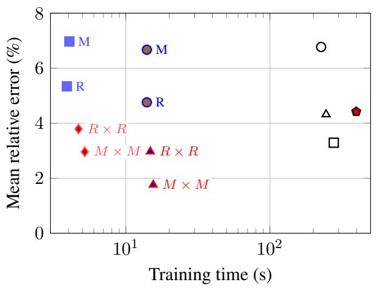

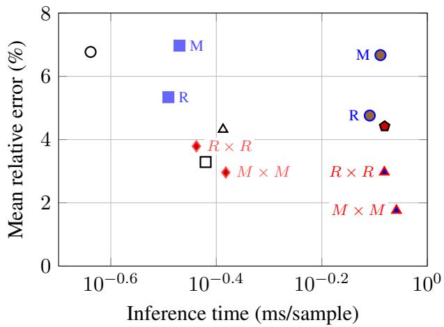  
(a) Training time. (b) Inference time. (b) Inferen KernelMO-PS KernelMO-PS (PCA) KernelO KernelO (PCA) DeepONet DeepONet-C MIONet MNO  
Figure 21: Product-space learning: trade-off between predictive accuracy and computational cost on the conservation-law benchmark. Labels beside kernel points indicate the kernel choice: M denotes Matérn and R denotes RBF.

## 5 Conclusion

We have introduced a general kernel-based framework for learning maps between Hilbert spaces within an encoder–decoder architecture. By showing that kernels defined on the latent surrogate space induce corresponding kernels on the original input and output spaces, we established a rigorous theoretical connection between latent-space learning and learning in the original function spaces. This perspective leads to an encoder–decoder error decomposition and a general approximation theory for learning maps between products of function spaces, yielding approximation guarantees that scale favorably with the numbers of input and output tasks. As an application of the proposed framework, we developed two kernel formulations for multiple operator learning. The resulting methods inherit the theoretical guarantees of the general framework while exhibiting complementary computational characteristics. Our numerical experiments demonstrate that these approaches achieve competitive predictive performance while substantially reducing training and inference times compared with state-of-the-art neural operator architectures.

More broadly, this work suggests that kernel methods constitute a viable alternative to deep neural surrogates for scientific machine learning. Importantly, the kernel learning approaches presented in this work have mathematical guarantees, are computational efficiency, and leverage limited data sampling. At the same time, the proposed encoder-decoder framework is not restricted to multiple operator learning and provides a unified perspective for kernel-based learning of general maps between function spaces.

Several directions for future work naturally arise. From a theoretical perspective, it would be of considerable interest to develop an approximation theory for learning maps whose inputs and outputs are themselves spaces of operators, rather than function spaces, and to establish corresponding guarantees when the encoders and decoders are learned from data. Another important direction is to extend the framework to settings in which the observation spaces are themselves infinite-dimensional, requiring both new theoretical foundations and practical learning algorithms. From a practical perspective, replacing the prescribed encoders and decoders by adaptive learned representations is a natural extension of the present framework. Another promising direction is to investigate the transferability of learned surrogates across different observation operators and to leverage the close connection between kernel methods and Gaussian processes for principled uncertainty quantification.

## Acknowledgments

This work was supported by NSF 2514157. The authors would like to thank Bamdad Hosseini for helpful discussions.

## References

[1] R.A. Adams and J.J.F. Fournier. Sobolev Spaces. Pure and Applied Mathematics. Academic Press, 2003.

[2] Mauricio A. Álvarez, Lorenzo Rosasco, and Neil D. Lawrence. Kernels for vector-valued functions: A review. Foundations and Trends in Machine Learning, 4(3):195–266, March 2012.

[3] Rémi Arcangéli, María Cruz López de Silanes, and Juan José Torrens. An extension of a bound for functions in sobolev spaces, with applications to (m, s)-spline interpolation and smoothing. Numerische Mathematik, 107(2):181–211, 2007.

[4] Rémi Arcangéli, María Cruz López de Silanes, and Juan José Torrens. Extension of sampling inequalities to sobolev semi-norms of fractional order and derivative data. Numerische Mathematik, 121(3):587–608, 2012.

[5] Nachman Aronszajn. Theory of reproducing kernels. Transactions of the American Mathematical Society, 68:337–404, 1950.

[6] Vladyslav Babenko, Vira Babenko, and Oleg Kovalenko. Korneichuk-stechkin lemma, ostrowski and landau inequalities, and optimal recovery problems for l-space valued functions. Numerical Functional Analysis and Optimization, 44(12):1309–1341, 2023.

[7] Aras Bacho, Aleksei G. Sorokin, Xianjin Yang, Théo Bourdais, Edoardo Calvello, Matthieu Darcy, Alexander Hsu, Bamdad Hosseini, and Houman Owhadi. Operator learning at machine precision, 2025.

[8] Pau Batlle, Yifan Chen, Bamdad Hosseini, Houman Owhadi, and Andrew M. Stuart. Error analysis of kernel/GP methods for nonlinear and parametric pdes. Journal of Computational Physics, 520:113488, 2025.

[9] Pau Batlle, Matthieu Darcy, Bamdad Hosseini, and Houman Owhadi. Kernel methods are competitive for operator learning. Journal ofComputational Physics, 496:112549, 2024.

[10] H. Brezis. Functional Analysis, Sobolev Spaces and Partial Differential Equations. Universitext. Springer New York, 2010.

[11] Yadi Cao, Yuxuan Liu, Liu Yang, Rose Yu, Hayden Schaeffer, and Stanley Osher. Vicon: Vision incontext operator networks for multi-physics fluid dynamics prediction. arXiv preprint arXiv:2411.16063, 2024.

[12] C. Carmeli, E. De Vito, A. Toido, and V. Umanità. Vector valued reproducing kernel hilbert spaces and universality. Analysis and Applications, 08(01):19–61, 2010.

[13] Yifan Chen, Bamdad Hosseini, Houman Owhadi, and Andrew M. Stuart. Solving and learning nonlinear pdes with gaussian processes. Journal ofComputational Physics, 447:110668, 2021.

[14] John B. Conway. A Course in Functional Analysis, volume 96 of Graduate Texts in Mathematics. Springer, New York, NY, 2 edition, 2007.

[15] Brian Davies. Integral Transforms and Their Applications. Springer, New York, 3 edition, 2002.

[16] Dean G. Duffy. Green’s Functions with Applications. CRC Press, Boca Raton, FL, 2 edition, 2015.

[17] Lawrence C. Evans. Partial Differential Equations, volume 19 of Graduate Studies in Mathematics. American Mathematical Society, Providence, RI, 2 edition, 2010.

[18] Simon Foucart. Mathematical Pictures at a Data Science Exhibition. Cambridge University Press, 2022.

[19] Quoc Thong Le Gia, Ian Hugh Sloan, and Holger Wendland. Vector-valued gaussian processes for approximating divergence- or rotation-free vector fields. Journal ofMachine Learning Research, 27(74):1– 36, 2026.

[20] John Harlim, Daniel Sanz-Alonso, and Ruiyi Yang. Kernel methods for bayesian elliptic inverse problems on manifolds. SIAM/ASA Journal on Uncertainty Quantification, 8(4):1414–1445, 2020.

[21] Maximilian Herde, Bogdan Raonic, Tobias Rohner, Roger Käppeli, Roberto Molinaro, Emmanuel de Bezenac, and Siddhartha Mishra. Poseidon: Efficient foundation models for PDEs. In The Thirtyeighth Annual Conference on Neural Information Processing Systems, 2024.

[22] Boya Hou, Sina Sanjari, Nathan Dahlin, Subhonmesh Bose, and Umesh Vaidya. Sparse learning of dynamical systems in RKHS: An operator-theoretic approach. In Proceedings of the 40th International Conference on Machine Learning, volume 202 of Proceedings of Machine Learning Research, pages 13325–13352. PMLR, 23–29 Jul 2023.

[23] Yasamin Jalalian, Juan Felipe Osorio Ramirez, Alexander Hsu, Bamdad Hosseini, and Houman Owhadi. Data-efficient kernel methods for learning differential equations and their solution operators: Algorithms and error analysis, 2025.

[24] Jikai Jin, Yiping Lu, Jose Blanchet, and Lexing Ying. Minimax optimal kernel operator learning via multilevel training. In The Eleventh International Conference on Learning Representations, 2023.

[25] Pengzhan Jin, Shuai Meng, and Lu Lu. Mionet: Learning multiple-input operators via tensor product. SIAM Journal on Scientific Computing, 44(6):A3490–A3514, 2022.

[26] Derek Jollie, Jingmin Sun, Zecheng Zhang, and Hayden Schaeffer. Time-series forecasting and refinement within a multimodal pde foundation model. Journal ofMachine Learning for Modeling and Computing, 6(2):77–89, 2025.

[27] Hachem Kadri, Emmanuel Duflos, Philippe Preux, Stéphane Canu, Alain Rakotomamonjy, and Julien Audiffren. Operator-valued kernels for learning from functional response data. Journal of Machine Learning Research, 17(20):1–54, 2016.

[28] Rüdiger Kempf. Kernel-based operator learning: Error analysis, budget allocation, and a physicsinformed extension, 2026.

[29] Samuel Lanthaler. Operator learning with pca-net: upper and lower complexity bounds. J. Mach. Learn. Res., 24(1), January 2023.

[30] Zongyi Li, Nikola Kovachki, Kamyar Azizzadenesheli, Burigede Liu, Kaushik Bhattacharya, Andrew Stuart, and Anima Anandkumar. Fourier neural operator for parametric partial differential equations. In International Conference on Learning Representations (ICLR), 2021. preprint arXiv:2010.08895.

[31] Chunyang Liao, Deanna Needell, and Hayden Schaeffer. Cauchy random features for operator learning in sobolev space. arXiv: 2503.00300, 2025.

[32] Yuxuan Liu, Jingmin Sun, Xinjie He, Griffin Pinney, Zecheng Zhang, and Hayden Schaeffer. Prose-fd: A multimodal pde foundation model for learning multiple operators for forecasting fluid dynamics. arXiv preprint arXiv:2409.09811, 2024.

[33] Yuxuan Liu, Jingmin Sun, and Hayden Schaeffer. Bcat: A block causal transformer for pde foundation models for fluid dynamics. arXiv preprint arXiv:2501.18972, 2025.

[34] Yuxuan Liu, Zecheng Zhang, and Hayden Schaeffer. Prose: Predicting multiple operators and symbolic expressions using multimodal transformers. Neural Networks, 180:106707, 2024.

[35] Lu Lu, Pengzhan Jin, Guofei Pang, Zhongqiang Zhang, and George Em Karniadakis. Learning nonlinear operators via deeponet based on the universal approximation theorem of operators. Nature Machine Intelligence, 3(3):218–229, 2021.

[36] G G Magaril-Il’yaev and K Yu Osipenko. Optimal recovery of functions and their derivatives from Fourier coefficients prescribed with an error. Sbornik. Mathematics, 193(3), January 2025.

[37] Michael McCabe, Bruno Régaldo-Saint Blancard, Liam Holden Parker, Ruben Ohana, Miles Cranmer, Alberto Bietti, Michael Eickenberg, Siavash Golkar, Géraud Krawezik, Francois Lanusse, et al. Multiple physics pretraining for physical surrogate models. arXiv preprint arXiv:2310.02994, 2023.

[38] Carlos Mora, Amin Yousefpour, Shirin Hosseinmardi, Houman Owhadi, and Ramin Bostanabad. Operator learning with gaussian processes. Computer Methods in Applied Mechanics and Engineering, 434:117581, 2025.

[39] Elisa Negrini, Yuxuan Liu, Liu Yang, Stanley J Osher, and Hayden Schaeffer. A multimodal pde foundation model for prediction and scientific text descriptions. arXiv preprint arXiv:2502.06026, 2025.

[40] Nicholas H. Nelsen and Andrew M. Stuart. Operator learning using random features: A tool for scientific computing. SIAM Review, 66(3):535–571, 2024.

[41] K Yu Osipenko. On optimal recovery methods in hardy-sobolev spaces. Sbornik: Mathematics, 192(2):225, feb 2001.

[42] Houman Owhadi. Do ideas have shape? idea registration as the continuous limit of artificial neural networks. Physica D: Nonlinear Phenomena, 444:133592, 2023.

[43] Houman Owhadi and Clint Scovel. Operator-Adapted Wavelets, Fast Solvers, and Numerical Homogenization: From a Game Theoretic Approach to Numerical Approximation and Algorithm Design. Cambridge Monographs on Applied and Computational Mathematics. Cambridge University Press, 2019.

[44] R. Robey and J. K. Lundquist. Behavior and mechanisms of doppler wind lidar error in varying stability regimes. Atmospheric Measurement Techniques, 15(15):4585–4622, 2022.

[45] Andrew M. Stuart. Inverse problems: A bayesian perspective. Acta Numerica, 19:451–559, 2010.

[46] Jingmin Sun, Yuxuan Liu, Zecheng Zhang, and Hayden Schaeffer. Towards a foundation model for partial differential equations: Multioperator learning and extrapolation. Physical Review E, 111(3):035304, 2025.

[47] Jingmin Sun, Zecheng Zhang, and Hayden Schaeffer. Lemon: Learning to learn multi-operator networks. arXiv preprint arXiv:2408.16168, 2024.

[48] Makoto Takamoto, Timothy Praditia, Raphael Leiteritz, Dan MacKinlay, Francesco Alesiani, Dirk Pflüger, and Mathias Niepert. Pdebench: an extensive benchmark for scientific machine learning. In Proceedings ofthe 36th International Conference on Neural Information Processing Systems, NIPS ’22, Red Hook, NY, USA, 2022. Curran Associates Inc. doi: 10.5555/3600270.3600387.

[49] Peter Jan van Leeuwen. Non-local observations and information transfer in data assimilation. Frontiers in Applied Mathematics and Statistics, Volume 5 - 2019, 2019.

[50] Zhuoyuan Wang, Hanjiang Hu, Xiyu Deng, Saviz Mowlavi, and Yorie Nakahira. Opinf-llm: Parametric pde solving with llms via operator inference, 2026.

[51] Adrien Weihs and Hayden Schaeffer. Generalization bounds and statistical guarantees for multi-task and multiple operator learning with mno networks, 2026.

[52] Adrien Weihs and Hayden Schaeffer. Multiple neural operators achieve near-optimal rates for multi-task learning, 2026.

[53] Adrien Weihs, Jingmin Sun, Zecheng Zhang, and Hayden Schaeffer. A deep learning framework for multi-operator learning: Architectures and approximation theory, 2025. arXiv:2510.25379.

[54] Holger Wendland. Scattered Data Approximation. Cambridge Monographs on Applied and Computational Mathematics. Cambridge University Press, 2004.

[55] Liu Yang, Siting Liu, Tingwei Meng, and Stanley J Osher. In-context operator learning with data prompts for differential equation problems. Proceedings of the National Academy of Sciences, 120(39):e2310142120, 2023.

[56] Liu Yang, Tingwei Meng, Siting Liu, and Stanley J Osher. Prompting in-context operator learning with sensor data, equations, and natural language. arXiv preprint arXiv:2308.05061, 2023.

[57] Yahong Yang, Zecheng Zhang, Wei Zhu, Wenjing Liao, and Hao Liu. Generalization guarantees for multi-input neural operator learning in sobolev spaces, 2026.

[58] Zhanhong Ye, Zining Liu, Bingyang Wu, Hongjie Jiang, Leheng Chen, Minyan Zhang, Xiang Huang, Qinghe Meng Zou, Hongsheng Liu, and Bin Dong. Pdeformer-2: A versatile foundation model for twodimensional partial differential equations. arXiv preprint arXiv:2507.15409, 2025.

[59] Xinyue Yu and Hayden Schaeffer. Regularized random fourier features and finite element reconstruction for operator learning in sobolev space. Journal of Machine Learning for Modeling and Computing, 7(3):1–47, 2026.

[60] Benjamin J Zhang, Siting Liu, Stanley J Osher, and Markos A Katsoulakis. Probabilistic operator learning: generative modeling and uncertainty quantification for foundation models of differential equations. arXiv preprint arXiv:2509.05186, 2025.

[61] Zecheng Zhang. Modno: Multi-operator learning with distributed neural operators. Computer Methods in Applied Mechanics and Engineering, 431:117229, 2024.

[62] Zecheng Zhang, Wing Tat Leung, and Hayden Schaeffer. A discretization-invariant extension and analysis of some deep operator networks. Journal of Computational and Applied Mathematics, 456:116226, 2025.

[63] Zecheng Zhang, Christian Moya, Lu Lu, Guang Lin, and Hayden Schaeffer. D2no: Efficient handling of heterogeneous input function spaces with distributed deep neural operators. Computer Methods in Applied Mechanics and Engineering, 428:117084, 2024.

[64] Zecheng Zhang, Christian Moya, Lu Lu, Guang Lin, and Hayden Schaeffer. Deeponet as a multi-operator extrapolation model: Distributed pretraining with physics-informed fine-tuning. Journal of Computational Physics, page 114537, 2025.

[65] Zecheng Zhang, Leung Wing Tat, and Hayden Schaeffer. Belnet: basis enhanced learning, a mesh-free neural operator. Proceedings of the Royal Society A: Mathematical, Physical and Engineering Sciences, 479(2276):20230043, 2023.

[66] Min Zhu, Jingmin Sun, Zecheng Zhang, Hayden Schaeffer, and Lu Lu. Pi-mfm: Physics-informed multimodal foundation model for solving partial differential equations. arXiv preprint arXiv:2512.23056, 2025.

## A Proofs

## A.1 Proofs of the Background Section

Proof of Theorem 2.1. We first note that $L ^ { * }$ exists because $L : X \to Z$ is a bounded linear operator between Hilbert spaces [14, Theorem 2.2].

1. Since L is surjective, the affine constraint set $\mathcal { A } _ { S } : = \{ x \in X : L x = S \}$ is nonempty. If $x _ { 0 } \in \mathcal { A } _ { S }$ , then

$$
\mathcal { A } _ { S } = x _ { 0 } + \ker L .\tag{7}
$$

If $h \in$ ker L, then $L ( x _ { 0 } + h ) = S$ , and conversely, if $x \in A _ { S }$ , then $L ( x - x _ { 0 } ) = 0 , { \textrm s o } x - x _ { 0 } \in$ ker $L .$ Let $x \in A _ { S }$ and decompose it as

$$
x = x _ { \perp } + x _ { \mathrm { k e r } } , \qquad x _ { \perp } \in ( \mathrm { k e r } L ) ^ { \perp } , \quad x _ { \mathrm { k e r } } \in \mathrm { k e r } L .
$$

Then, $L x _ { \perp } = L x = S$ , so $x _ { \perp } \in \mathcal { A } _ { S }$ , and, by $( 7 ) .$ every other feasible point has the form $x _ { \perp } + h$ with $h \in$ ker L. Since $x _ { \perp } \perp h , \| x _ { \perp } + h \| _ { X } ^ { 2 } = \| x _ { \perp } \| _ { X } ^ { 2 } + \| h \| _ { X } ^ { 2 }$ . Thus, the minimum-norm element of $A _ { S }$ , is uniquely defined by having $h = 0 \mathrm { i . e . } \overline { { x } } ( S )$ is orthogonal to ker $L .$

Since L is surjective, the restricted operator

$$
\widetilde L : ( \ker L ) ^ { \perp } \to Z , \qquad \widetilde L x : = L x ,
$$

is a bounded linear bijection. It is injective because if $x \in ( \ker L ) ^ { \perp }$ and $\widetilde { L } x = 0$ , then $x \in$ ker $L \cap$ (ker $L ) ^ { \perp } = \{ 0 \}$ . It is surjective because, for any $z \in Z .$ , surjectivity of L gives some $x \in X$ with $L x = z . \mathrm { { I f } }$

$$
x = x _ { \perp } + x _ { \mathrm { k e r } } , \qquad x _ { \perp } \in ( \mathrm { k e r } L ) ^ { \perp } , \quad x _ { \mathrm { k e r } } \in \mathrm { k e r } L ,
$$

then $L x _ { \perp } = L x = z$ . Thus $\widetilde { L }$ is bijective.

By the bounded inverse theorem [10, Corollary 2.7], we deduce that $\widetilde L ^ { - 1 } : Z \to ( \ker L ) ^ { \perp }$ is bounded. Hence there exists a constant $C > 0$ such that, for every $z \in Z .$ , there exists $x _ { z } \in ( \ker L ) ^ { \perp }$ satisfying

$$
L x _ { z } = z , \qquad \| x _ { z } \| _ { X } \leq C \| z \| _ { Z } .
$$

Using this $x _ { z }$ , we obtain

$$
\begin{array} { r } { \| { z } \| _ { Z } ^ { 2 } = \langle { z } , L { x } _ { { z } } \rangle _ { Z } = \langle L ^ { * } { z } , { x } _ { { z } } \rangle _ { X } \leq \| { L } ^ { * } { z } \| _ { X } \| { x } _ { { z } } \| _ { X } \leq C \| { L } ^ { * } { z } \| _ { X } \| { z } \| _ { Z } . } \end{array}
$$

Therefore, for $z \in Z , \| L ^ { * } z \| _ { X } \geq C ^ { - 1 } \| z \| _ { Z }$ , and it follows that

$$
\langle L L ^ { * } z , z \rangle _ { Z } = \langle L ^ { * } z , L ^ { * } z \rangle _ { X } = \| L ^ { * } z \| _ { X } ^ { 2 } \geq C ^ { - 2 } \| z \| _ { Z } ^ { 2 } .
$$

Thus, the bilinear form

$$
a : Z \times Z \mapsto \mathbb { R } \qquad \mathrm { g i v e n ~ b y } \qquad a ( z , w ) : = \langle L L ^ { * } z , w \rangle _ { Z }
$$

is coercive and bounded, since $\begin{array} { r } { | a ( z , w ) | = | \langle L ^ { * } z , L ^ { * } w \rangle _ { X } | \le \| L ^ { * } \| _ { \mathrm { o p } } ^ { 2 } \| z \| _ { Z } \| w \| _ { Z } = \| L \| _ { \mathrm { o p } } ^ { 2 } \| z \| _ { Z } \| w \| _ { Z } . } \end{array}$

We apply the Lax–Milgram theorem [10, Corollary 5.8] and obtain that for any $F \in Z ^ { * }$ , there exists a unique element $z \in Z$ such that $a ( z , w ) = F ( w )$ for all $w \in Z$ . By picking $F _ { \overline { { z } } } ( w ) = \langle \overline { { z } } , w \rangle z$ , this implies that

$$
a ( z , w ) = \langle L L ^ { * } z , w \rangle _ { Z } = \langle \bar { z } , w \rangle _ { Z }
$$

for all $w \in Z$ , or equivalently $L L ^ { * } z = { \overline { { z } } }$ . This shows that $L L ^ { * } : Z \to Z$ is a linear bijection and, by [10, Corollary 2.7], therefore boundedly invertible.

Finally, we set $\overline { { { x } } } ( S ) = L ^ { * } ( L L ^ { * } ) ^ { - 1 } S . \mathrm { \ T h e n } , L \overline { { { x } } } ( S ) = L L ^ { * } ( L L ^ { * } ) ^ { - 1 } S = S , \mathrm { s o } \overline { { { x } } } ( S ) \in \mathcal { A } _ { S }$ . Moreover, $\overline { { x } } ( S ) \in \mathrm { r a n } ( L ^ { * } )$ , and ran $( L ^ { * } ) \subseteq ( \ker L ) ^ { \perp }$ , because for $h \in$ ker L and $z \in Z$

$$
\langle L ^ { * } z , h \rangle _ { X } = \langle z , L h \rangle _ { Z } = 0 .
$$

This implies that ${ \overline { { x } } } ( S )$ is feasible and orthogonal to ker $L ,$ and therefore it is the unique minimum-norm solution.

2. We start by proving

(8)

$$
\overline { { x } } _ { \gamma } ( S ) = ( L ^ { * } L + \gamma I _ { X } ) ^ { - 1 } L ^ { * } S .
$$

Define the functional

$$
J _ { \gamma } : X \to \mathbb { R } , \qquad J _ { \gamma } ( x ) : = \| x \| _ { X } ^ { 2 } + \gamma ^ { - 1 } \| L x - S \| _ { Z } ^ { 2 } .
$$

The functional $J _ { \gamma }$ is strictly convex, since $x \mapsto \| x \| _ { X } ^ { 2 }$ is strictly convex. Hence $J _ { \gamma }$ has at most one minimizer.

We compute the first-order optimality condition. Let $h \in X$ . For $\varepsilon \in \mathbb { R }$

$$
J _ { \gamma } ( x + \varepsilon h ) = \| x + \varepsilon h \| _ { X } ^ { 2 } + \gamma ^ { - 1 } \| L x + \varepsilon L h - S \| _ { Z } ^ { 2 } .
$$

Differentiating at $\varepsilon = 0$ gives

$$
\frac { d } { d \varepsilon } J _ { \gamma } ( x + \varepsilon h ) \bigg | _ { \varepsilon = 0 } = 2 \langle x , h \rangle _ { X } + 2 \gamma ^ { - 1 } \langle L x - S , L h \rangle _ { Z } .
$$

Using the definition of the adjoint, $\langle L x - S , L h \rangle _ { Z } = \langle L ^ { * } ( L x - S ) , h \rangle _ { X }$ and therefore the first variation is $2 \left. \overset { \cdot } { x } + \gamma ^ { - 1 } L ^ { * } ( L x - S ) , h \right. _ { X }$ . The minimizer hence satisfies $x + \gamma ^ { - 1 } L ^ { * } ( L x - S ) = 0$ or equivalently,

$$
\begin{array} { r } { ( L ^ { * } L + \gamma I _ { X } ) x = L ^ { * } S . } \end{array}
$$

We now show that $L ^ { * } L + \gamma I _ { X }$ is boundedly invertible. For $x \in X$ , we have

$$
\langle ( L ^ { * } L + \gamma I _ { X } ) x , x \rangle _ { X } = \langle L x , L x \rangle _ { Z } + \gamma \| x \| _ { X } ^ { 2 } = \| L x \| _ { Z } ^ { 2 } + \gamma \| x \| _ { X } ^ { 2 } \geq \gamma \| x \| _ { X } ^ { 2 } ,
$$

and hence the bilinear form

$$
a : X \times X \mapsto \mathbb { R } \qquad \mathrm { g i v e n ~ b y } \qquad a _ { X } ( x , h ) : = \langle ( L ^ { * } L + \gamma I _ { X } ) x , h \rangle _ { X }
$$

is coercive. It is also bounded, since $| a _ { X } ( x , h ) | \leq ( \| L \| _ { \mathrm { o p } } ^ { 2 } + \gamma ) \| x \| _ { X } \| h \| _ { X }$ . By the Lax-Milgram theorem [10, Corollary 5.8] and the same argument as part 1 of the proof, $L ^ { * } L + \gamma I _ { X } : X \to X$ is boundedly invertible and (8) therefore has the unique solution

$$
\overline { { x } } _ { \gamma } ( S ) = ( L ^ { * } L + \gamma I _ { X } ) ^ { - 1 } L ^ { * } S .
$$

It remains to show the equivalent measurement-space formula (3). First observe that $L L ^ { * } { + } \gamma I _ { Z } : Z \to Z$ is also boundedly invertible. For $z \in Z$

$$
\langle ( L L ^ { * } + \gamma I _ { Z } ) z , z \rangle _ { Z } = \langle L ^ { * } z , L ^ { * } z \rangle _ { X } + \gamma \| z \| _ { Z } ^ { 2 } = \| L ^ { * } z \| _ { X } ^ { 2 } + \gamma \| z \| _ { Z } ^ { 2 } \geq \gamma \| z \| _ { Z } ^ { 2 } .
$$

Thus $L L ^ { * } + \gamma I _ { Z }$ is coercive and bounded, and hence boundedly invertible. Next, set $x _ { S } : = L ^ { * } ( L L ^ { * } +$ $\gamma I _ { Z } ) ^ { - 1 } S$ . and $c : = ( L L ^ { * } + \gamma I _ { Z } ) ^ { - 1 } S$ . Then, $( L L ^ { * } + \gamma I _ { Z } ) c = S$ and therefore, $L ^ { * } L L ^ { * } c + \gamma L ^ { * } c = L ^ { * } S .$ Since $x _ { S } = L ^ { * } c ,$ , this becomes $( L ^ { * } L + \gamma I _ { X } ) x _ { S } = L ^ { * } S$ and thus $x _ { S }$ solves the normal equation (8). By uniqueness of the solution, we conclude that

$$
{ \overline { { x } } } _ { \gamma } ( S ) = x _ { S } = L ^ { * } ( L L ^ { * } + \gamma I _ { Z } ) ^ { - 1 } S .
$$

## A.2 Proofs of the Main Results

## A.2.1 Proofs for the General Learning Framework

Proof of Theorem 3.3. We prove the result by applying two standard operations for operator-valued reproducing kernels: first a pullback in the input variable, and then a pushforward in the output variable.

We start with the pullback construction. The pullback theorem [12, Proposition 7] with $\Psi = E _ { X } : X \mapsto X \mapsto X$ $Z _ { X }$ gives the kernel

$$
\Gamma _ { E _ { X } } : X \times X \to { \mathcal { L } } ( Z _ { Y } ) , \qquad \Gamma _ { E _ { X } } ( x , x ^ { \prime } ) : = \Gamma ( E _ { X } x , E _ { X } x ^ { \prime } )
$$

with associated RKHS

$$
\mathcal { H } _ { \Gamma _ { E _ { X } } } = \{ f \circ E _ { X } : f \in \mathcal { H } _ { \Gamma } \}\tag{9}
$$

and minimal-representative norm

$$
\| F _ { 0 } \| _ { \mathcal { H } _ { \Gamma _ { E _ { X } } } } = \operatorname* { i n f } \left\{ \| f \| _ { \mathcal { H } _ { \Gamma } } : F _ { 0 } = f \circ E _ { X } \right\} .\tag{10}
$$

We note that we only use the Hilbert-space part of the pullback theorem. The locally compact, second countable assumptions appearing in some formulations of this result are needed for additional topological conclusions [12, Page 4].

We next apply the output transformation. Since $D _ { Y } : Z _ { Y }  Y$ is bounded and linear, the output pushforward theorem [12, Proposition 7] applied to $\Gamma _ { E x }$ with $w = D _ { Y }$ implies that

$$
K : X \times X \to { \mathcal { L } } ( Y ) , \qquad K ( x , x ^ { \prime } ) : = D _ { Y } \Gamma _ { E _ { X } } ( x , x ^ { \prime } ) D _ { Y } ^ { * } = D _ { Y } \Gamma ( E _ { X } x , E _ { X } x ^ { \prime } ) D _ { Y } ^ { * } .
$$

is a Y-valued reproducing kernel on X. The output pushforward theorem also identifies the associated RKHS as

$$
\mathcal { H } _ { K } = \{ D _ { Y } \circ F _ { 0 } : F _ { 0 } \in \mathcal { H } _ { \Gamma _ { E _ { X } } } \} ,
$$

with norm

$$
\| F \| _ { \mathcal { H } _ { K } } = \operatorname* { i n f } \left\{ \| F _ { 0 } \| _ { \mathcal { H } _ { \Gamma _ { E _ { X } } } } : F = D _ { Y } \circ F _ { 0 } \right\} .\tag{11}
$$

Using (9), every $F _ { 0 } \in \mathcal { H } _ { \Gamma _ { E _ { X } } }$ has the form $F _ { 0 } = f \circ E _ { X }$ for some $f \in \mathcal { H } _ { \Gamma }$ . Therefore

$$
\mathcal { H } _ { K } = \{ D _ { Y } \circ f \circ E _ { X } : f \in \mathcal { H } _ { \Gamma } \}
$$

and, inserting (10) into (11), we obtain

$$
\| F \| _ { \mathcal { H } _ { K } } = \operatorname* { i n f } \left\{ \| f \| _ { \mathcal { H } _ { \Gamma } } : F = D _ { Y } \circ f \circ E _ { X } \right\} .\tag{12}
$$

It remains to prove the simplified statement under exact minimum-norm recovery. By Theorem 2.1, we have

$$
D _ { X } = E _ { X } ^ { * } ( E _ { X } E _ { X } ^ { * } ) ^ { - 1 } , \qquad D _ { Y } = E _ { Y } ^ { * } ( E _ { Y } E _ { Y } ^ { * } ) ^ { - 1 } .
$$

Next, we assume that

$$
D _ { Y } \circ f _ { 1 } \circ E _ { X } = D _ { Y } \circ f _ { 2 } \circ E _ { X } .
$$

Then, applying $E _ { Y }$ on the left and $D _ { X }$ on the right gives $f _ { 1 } ~ = ~ f _ { 2 }$ . Hence the infimum in the minimalrepresentative norm in (12) is attained by the unique representative $f ,$ and therefore

$$
\| D _ { Y } \circ f \circ E _ { X } \| _ { \mathcal { H } _ { K } } = \| f \| _ { \mathcal { H } _ { \Gamma } } .
$$

Proof of Corollary 3.4. By Theorem 3.3, every $\boldsymbol { F } \in \mathcal { H } _ { K }$ can be represented as $F = D _ { Y } \circ f \circ E _ { X }$ for some $f \in$ $\mathcal { H } _ { \Gamma }$ . For any such representative, $E _ { Y } F ( x _ { i } ) = E _ { Y } D _ { Y } f ( E _ { X } x _ { i } ) = A f ( U _ { i } )$ . Hence the constraints $E _ { Y } F ( x _ { i } ) =$ $S _ { i }$ and $A f ( U _ { i } ) = S _ { i }$ are equivalent, under the representation $F = D _ { Y } \circ f \circ E _ { X }$ . Since the norm in $\mathcal { H } _ { K }$ , i.e.

$$
\| F \| _ { \mathcal { H } _ { K } } = \operatorname* { i n f } \left\{ \| f \| _ { \mathcal { H } _ { \Gamma } } : F = D _ { Y } \circ f \circ E _ { X } \right\} ,
$$

is the minimal $\mathcal { H } _ { \mathrm { { T } ^ { - } } \mathrm { { n o r m } } }$ over all representatives inducing the same $F ,$ minimizing over $\boldsymbol { F } \in \mathcal { H } _ { K }$ is equivalent to minimizing over representatives $f \in \mathcal { H } _ { \Gamma }$ . This proves the equivalence of the interpolation problems.

We now compute the interpolation formula. The observation map is

$$
L _ { \Gamma , A } : \mathcal { H } _ { \Gamma } \to Z _ { Y } ^ { N } , \qquad L _ { \Gamma , A } f = ( A f ( U _ { 1 } ) , \dots , A f ( U _ { N } ) ) .
$$

This map is bounded and linear because point evaluation is bounded in the RKHS $\mathcal { H } _ { \Gamma }$ and $A = E _ { Y } D _ { Y }$ is bounded and linear by assumption on $D _ { Y }$ . For $c = ( c _ { 1 } , \ldots , c _ { N } ) \in Z _ { Y } ^ { N }$ , using the product inner product on $Z _ { Y } ^ { N }$ , we compute as follows:

$$
\begin{array} { l } { \displaystyle \langle L _ { \Gamma , A } f , c \rangle _ { Z _ { Y } ^ { \mathrm { R } } } = \displaystyle \sum _ { j = 1 } ^ { N } \langle A f ( U _ { j } ) , c _ { j } \rangle _ { Z _ { Y } } } \\ { \displaystyle \qquad = \sum _ { j = 1 } ^ { N } \langle f ( U _ { j } ) , A ^ { * } c _ { j } \rangle _ { Z _ { Y } } } \\ { \displaystyle \qquad = \sum _ { j = 1 } ^ { N } \langle f , \Gamma ( \cdot , U _ { j } ) A ^ { * } c _ { j } \rangle _ { \mathcal { H } _ { \Gamma } } } \\ { \displaystyle \qquad = \left. f , \sum _ { j = 1 } ^ { N } \Gamma ( \cdot , U _ { j } ) A ^ { * } c _ { j } \right. _ { \mathcal { H } _ { \Gamma } } } \end{array}\tag{13}
$$

where (13) follows from the reproducing property on $\mathcal { H } _ { \Gamma }$

Therefore

$$
L _ { \Gamma , A } ^ { * } c = \sum _ { j = 1 } ^ { N } \Gamma ( \cdot , U _ { j } ) A ^ { * } c _ { j }
$$

and

$$
{ \cal L } _ { \Gamma , A } { \cal L } _ { \Gamma , A } ^ { * } = \Gamma _ { A } ( { \bf U } , { \bf U } ) .
$$

If $\boldsymbol { L } _ { \Gamma , A }$ is surjective, equivalently if $\Gamma _ { A } ( \mathbf { U } , \mathbf { U } )$ is boundedly invertible, the minimum-norm formula from Theorem 2.1 gives

$$
\overline { { { f } } } = L _ { \Gamma , A } ^ { * } ( L _ { \Gamma , A } L _ { \Gamma , A } ^ { * } ) ^ { - 1 } \mathbf { S } .
$$

Evaluating at $U \in Z _ { X }$ yields

$$
\overline { { f } } ( U ) = \Gamma _ { A } ( U , { \bf U } ) \Gamma _ { A } ( { \bf U } , { \bf U } ) ^ { - 1 } { \bf S } .
$$

For ridge regression, Theorem 2.1 yields

$$
\overline { { f } } _ { \lambda } ( { \cal U } ) = \Gamma _ { A } ( { \cal U } , { \bf U } ) \big ( \Gamma _ { A } ( { \bf U } , { \bf U } ) + \lambda \mathrm { I d } _ { Z _ { Y } ^ { N } } \big ) ^ { - 1 } { \bf S } .
$$

We note that these formulas correspond to standard kernel interpolation/ridge regression with kernel $A \Gamma ( \cdot , \cdot ) A ^ { * }$ The formulas for ${ \overline { { F } } } _ { \lambda }$ follow by composing with $D _ { Y }$ and $E _ { X }$

Finally, assume that $D _ { X }$ and $D _ { Y }$ are the exact minimum-norm recovery maps. Then, Theorem 2.1 gives $A = E _ { Y } D _ { Y } = I _ { Z _ { Y } }$ and the encoded residuals reduce to $A f ( U _ { i } ) = f ( U _ { i } )$ . The simplified interpolation and ridge-regression formulas follow by setting $A = I _ { Z _ { Y } }$ in the general formulas. □

ProofofTheorem 3.7. For the first statement, observe that

$$
\begin{array} { r l } & { G ( x ) - \overline { { G } } ( x ) = G ( x ) - D _ { Y } \widehat { G } ( E _ { X } x ) } \\ & { \qquad = \big ( G ( x ) - D _ { Y } G _ { \mathrm { e n c } } ( E _ { X } x ) \big ) + D _ { Y } \big ( G _ { \mathrm { e n c } } - \widehat { G } \big ) ( E _ { X } x ) . } \end{array}
$$

Taking norms and applying the triangle inequality gives

$$
\| G ( x ) - \overline { G } ( x ) \| _ { Y } \leq \| G ( x ) - D _ { Y } G _ { \mathrm { e n c } } ( E _ { X } x ) \| _ { Y } + \| D _ { Y } ( G _ { \mathrm { e n c } } - \widehat G ) ( E _ { X } x ) \| _ { Y } .
$$

Using the definition of $G _ { \mathrm { e n c } }$ gives the first estimate.

For the second statement, writing $\mathbf { G } _ { \mathrm { e n c } } : = \left( G _ { \mathrm { e n c } } ( U _ { 1 } ) , \dots , G _ { \mathrm { e n c } } ( U _ { N } ) \right) \in Z _ { Y } ^ { N }$ , we have (analogously to the derivation in the proof of Corollary 3.4)

$$
\widehat { G } _ { \mathrm { e n c } , \lambda } ( z ) = \Gamma ( z , { \bf U } ) \left( \Gamma ( { \bf U } , { \bf U } ) + \lambda \mathrm { I d } _ { Z _ { Y } ^ { N } } \right) ^ { - 1 } { \bf G } _ { \mathrm { e n c } }
$$

and

$$
\widehat { G } _ { \lambda } ( z ) = \Gamma ( z , { \bf U } ) \left( \Gamma ( { \bf U } , { \bf U } ) + \lambda \mathrm { I d } _ { Z _ { Y } ^ { N } } \right) ^ { - 1 } { \bf S } ,
$$

where $\mathbf { S } = ( S _ { 1 } , \ldots , S _ { N } ) \in Z _ { Y } ^ { N }$ . By definition of the data-consistency residuals, we have

$$
\mathbf { S } = \mathbf { G } _ { \mathrm { e n c } } + \eta , \qquad \eta = ( \eta _ { 1 } , \dots , \eta _ { N } ) \in Z _ { Y } ^ { N } .
$$

Therefore, for $z \in Z _ { X }$

$$
\begin{array} { r l } & { \widehat { G } _ { \lambda } ( z ) - \widehat { G } _ { \mathrm { e n c } } ( z ) = \Gamma ( z , { \bf U } ) \left( \Gamma ( { \bf U } , { \bf U } ) + \lambda \mathrm { I d } _ { Z _ { Y } ^ { N } } \right) ^ { - 1 } \left( { \bf S } - { \bf G } _ { \mathrm { e n c } } \right) } \\ & { \quad \quad \quad \quad = \Gamma ( z , { \bf U } ) \left( \Gamma ( { \bf U } , { \bf U } ) + \lambda \mathrm { I d } _ { Z _ { Y } ^ { N } } \right) ^ { - 1 } \eta } \\ & { \quad \quad \quad = ( \mathcal { R } _ { { \bf U } , \lambda } \eta ) ( z ) . } \end{array}
$$

Therefore, $G _ { \mathrm { e n c } } - \widehat { G } _ { \lambda } = \left( G _ { \mathrm { e n c } } - \widehat { G } _ { \mathrm { e n c , } \lambda } \right) - \mathcal { R } _ { \mathbf { U } , \lambda } \eta$ and

$$
\begin{array} { r } { \| ( G _ { \mathrm { e n c } } - \widehat { G } _ { \lambda } ) ( E _ { X } x ) \| _ { Z _ { Y } } \leq \| ( G _ { \mathrm { e n c } } - \widehat { G } _ { \mathrm { e n c } , \lambda } ) ( E _ { X } x ) \| _ { Z _ { Y } } + \| \mathcal { R } _ { \mathbf { U } , \lambda } \eta ( E _ { X } x ) \| _ { Z _ { Y } } . } \end{array}
$$

Plugging this into the first statement proves (a).

Finally, applying [42, Theorem 5.4] yields $\lVert ( G _ { \mathrm { e n c } } - \widehat { G } _ { \mathrm { e n c } , \lambda } ) ( z ) \rVert _ { Z _ { Y } } \leq Q _ { N , \lambda } ( z ) \lVert G _ { \mathrm { e n c } } \rVert _ { \mathcal { H } _ { \Gamma , \lambda } }$ . Inserting this with $z = E _ { X } ( x )$ into (a) yields (b). □

## A.2.2 Proofs for Kernel Learning for Multi-Input, Multi-Output Operators

Proof of Proposition 3.9. Let $x \in B _ { R } ( X )$ . We estimate as follows:

(1

$$
\begin{array} { r l } & { \| G ( x ) - D _ { Y } E _ { Y } G ( D _ { X } { E _ { X } } x ) \| _ { Y } \leq \| G ( x ) - G ( D _ { X } { E _ { X } } x ) \| _ { Y } + \| G ( D _ { X } { E _ { X } } x ) - D _ { Y } { E _ { Y } } G ( D _ { X } { E _ { X } } x ) \| _ { Y } } \\ & { \overset { \mathrm { ( 4 ) } } { \leq } \omega \left( \| x - D _ { X } { E _ { X } } x \| _ { X } \right) + \delta _ { Y } \left( G ( D _ { X } { E _ { X } } x ) \right) } \\ & { \leq \omega \left( \delta _ { X } ( x ) \right) + \delta _ { Y } \left( G ( D _ { X } { E _ { X } } x ) \right) } \end{array}\tag{1}
$$

where we used Assumption O.1 for (14) and (5) for (14) and (15). The proof of the second identity is analogous.

Proof of Lemma 3.11. Throughout the proof, $C > 0$ denotes a generic constant independent of the sampling fill distances and of the functions being reconstructed. Its value may change from line to line.

We first establish the reconstruction estimate for a fixed j-th component. For $u _ { j } ~ \in ~ \mathcal { H } _ { j }$ , define $e : = { }$ $u _ { j } - D _ { j } ( E _ { j } u _ { j } )$ . By Theorem 2.1 and definition of $D _ { j }$ , we have $E _ { j } ( D _ { j } ( E _ { j } u _ { j } ) ) = E _ { j } u _ { j }$ and therefore $E _ { j } e = 0$ or equivalently,

$$
e | _ { A _ { j } } = 0 .\tag{16}
$$

Using (16) in [3, Theorem 4.1] with $\boldsymbol { r } = \boldsymbol { s } _ { j }$ and each integer derivative order $\ell = 0 , \ldots , t _ { j }$ , yields

$$
| e | _ { \mathsf { W } ^ { \ell , q _ { j } } ( \Omega _ { j } ) } \leq C h _ { j } ^ { s _ { j } - \ell - n _ { j } \left( \frac { 1 } { p _ { j } } - \frac { 1 } { q _ { j } } \right) } + | e | _ { \mathsf { W } ^ { s _ { j } , p _ { j } } ( \Omega _ { j } ) }\tag{17}
$$

as soon as $h _ { j } \ \leq \ h _ { j } ^ { 0 }$ . Define $\begin{array} { r } { \alpha _ { j } : = s _ { j } - t _ { j } - n _ { j } \left( \frac { 1 } { p _ { j } } - \frac { 1 } { q _ { j } } \right) } \end{array}$ so that, for every $\ell = 0 , \ldots , t _ { j } , s _ { j } - \ell \ -$ +   
$\begin{array} { r } { n _ { j } \left( \frac { 1 } { p _ { j } } - \frac { 1 } { q _ { j } } \right) _ { + } = \alpha _ { j } + t _ { j } - \ell } \end{array}$ and

$$
h _ { j } ^ { { _ { g } } - \ell - n _ { j } \left( \frac { 1 } { p _ { j } } - \frac { 1 } { q _ { j } } \right) } + = h _ { j } ^ { \alpha _ { j } } h _ { j } ^ { t _ { j } - \ell } \le h _ { j } ^ { \alpha _ { j } } \operatorname* { m a x } \{ 1 , h _ { j } ^ { 0 } \} ^ { t _ { j } - \ell } \le h _ { j } ^ { \alpha _ { j } } \operatorname* { m a x } \{ 1 , h _ { j } ^ { 0 } \} ^ { l _ { 0 , j } } \le C h _ { j } ^ { \alpha _ { j } }
$$

where we used the fact that $h _ { j } \leq h _ { j } ^ { 0 }$ for the first inequality. By definition of the Sobolev norms (with the usual modification when $q _ { j } = \infty )$ and inserting the latter in (17), we conclude that

$$
\lVert e \rVert _ { \mathrm { W } ^ { t _ { j } , q _ { j } } ( \Omega _ { j } ) } \leq C h _ { j } ^ { \alpha _ { j } } \lVert e \rVert _ { \mathrm { W } ^ { s _ { j } , p _ { j } } ( \Omega _ { j } ) } \leq C h _ { j } ^ { \alpha _ { j } } \lVert e \rVert _ { \mathcal { H } _ { j } }
$$

where we used the fact that $\mathcal { H } _ { j } \hookrightarrow \operatorname { W } ^ { s _ { j } , p _ { j } } ( \Omega _ { j } )$ for the last inequality. Moreover, $e = u _ { j } - D _ { j } ( E _ { j } u _ { j } ) \ \in$ ker $( E _ { j } )$ , while $D _ { j } ( E _ { j } u _ { j } ) \in \ker ( E _ { j } ) ^ { \perp }$ , as was shown in the proof of Theorem 2.1. Therefore, $u _ { j } = D _ { j } ( E _ { j } u _ { j } ) +$ e is an orthogonal decomposition in $\mathcal { H } _ { j }$ , and

$$
\| u _ { j } \| _ { \mathcal { H } _ { j } } ^ { 2 } = \| D _ { j } ( E _ { j } u _ { j } ) \| _ { \mathcal { H } _ { j } } ^ { 2 } + \| e \| _ { \mathcal { H } _ { j } } ^ { 2 } \ge \| e \| _ { \mathcal { H } _ { j } } ^ { 2 }
$$

and, combining the preceding estimates, we conclude that

$$
\begin{array} { r } { \| u _ { j } - D _ { j } ( E _ { j } u _ { j } ) \| _ { \mathrm { W } ^ { t _ { j } , q _ { j } } ( \Omega _ { j } ) } \leq C _ { j } h _ { j } ^ { \alpha _ { j } } \| u _ { j } \| _ { \mathcal { H } _ { j } } . } \end{array}
$$

Since the above argument holds for every $j = 1 , \dots , J ,$ the definition of the product norm yields

$$
\Vert u - D E u \Vert _ { X } ^ { 2 } = \sum _ { j = 1 } ^ { J } \Vert u _ { j } - D _ { j } ( E _ { j } u _ { j } ) \Vert _ { \mathrm { W } ^ { t _ { j } , q _ { j } } ( \Omega _ { j } ) } ^ { 2 } \leq \sum _ { j = 1 } ^ { J } C _ { j } ^ { 2 } h _ { j } ^ { 2 \alpha _ { j } } \Vert u _ { j } \Vert _ { \mathcal { H } _ { j } } ^ { 2 } .
$$

Proof of Lemma 3.13. Throughout the proof, $C > 0$ denotes a generic constant independent of the sampling fill distances and of the functions being reconstructed. Its value may change from line to line.

Since $f \in \mathcal { H } _ { \Gamma }$ , it is an admissible competitor in the minimization problem defining $\widehat { f } _ { \lambda }$ . Therefore,

$$
\sum _ { i = 1 } ^ { N } \| \widehat { f } _ { \lambda } ( U _ { i } ) - f ( U _ { i } ) \| _ { 2 } ^ { 2 } + \lambda \| \widehat { f } _ { \lambda } \| _ { \mathcal { H } _ { \Gamma } } ^ { 2 } \leq \lambda \| f \| _ { \mathcal { H } _ { \Gamma } } ^ { 2 } .\tag{18}
$$

Since $e _ { \lambda } ( U _ { i } ) = f ( U _ { i } ) - \widehat { f } _ { \lambda } ( U _ { i } )$ , it follows that $\begin{array} { r } { \sum _ { i = 1 } ^ { N } \| e _ { \lambda } ( U _ { i } ) \| _ { 2 } ^ { 2 } \leq \lambda \| f \| _ { \mathcal H _ { \Gamma } } ^ { 2 } } \end{array}$ , or, equivalently,

$$
\begin{array} { r } { \| e _ { \lambda } \| _ { \ell ^ { 2 } ( \mathbf { U } _ { N } ; \mathbb { R } ^ { d _ { Y } } ) } \leq \sqrt { \lambda } \| f \| _ { \mathcal { H } _ { \Gamma } } . } \end{array}\tag{19}
$$

Similarly, (18) also gives $\| \widehat { f _ { \lambda } } \| _ { \mathcal { H } _ { \Gamma } } \leq \| f \| _ { \mathcal { H } _ { \mathrm { I } } }$ and therefore,

$$
\begin{array} { r } { \| e _ { \lambda } \| _ { \mathcal { H } _ { \Gamma } } = \| f - \widehat { f } _ { \lambda } \| _ { \mathcal { H } _ { \Gamma } } \leq \| f \| _ { \mathcal { H } _ { \Gamma } } + \| \widehat { f } _ { \lambda } \| _ { \mathcal { H } _ { \Gamma } } \leq 2 \| f \| _ { \mathcal { H } _ { \Gamma } } . } \end{array}\tag{20}
$$

We now apply the vector-valued sampling inequality of [19, Theorem 17] to $e _ { \lambda } \in \mathcal { H } _ { \Gamma }$ with input dimension $d _ { X }$ , output dimension $d _ { Y }$ , and discrete exponent $p = 2$ . Since $\gamma = \operatorname* { m a x } \{ 2 , 2 , q \} = \operatorname* { m a x } \{ 2 , q \}$ , we obtain:

(21)

$$
\begin{array} { r l } & { | e _ { \lambda } | _ { \mathrm { W } ^ { s , q } ( \Upsilon ; \mathbb { R } ^ { d } Y ) } \leq C \Bigg ( h _ { \mathrm { t r } } ^ { \tau - s - d _ { X } \left( \frac { 1 } { 2 } - \frac { 1 } { q } \right) } + | e _ { \lambda } | _ { \mathrm { H } ^ { \tau } ( \Upsilon ; \mathbb { R } ^ { d } Y ) } + h _ { \mathrm { t r } } ^ { d _ { X } / \gamma - s } \| e _ { \lambda } \| _ { \ell ^ { 2 } \left( \mathbf { U } _ { N } ; \mathbb { R } ^ { d } Y \right) } \Bigg ) } \\ & { \quad \quad \quad \quad \quad \quad \leq C \Bigg ( h _ { \mathrm { t r } } ^ { \tau - s - d _ { X } \left( \frac { 1 } { 2 } - \frac { 1 } { q } \right) } + \| e _ { \lambda } \| _ { \mathcal { H } _ { \Gamma } } + h _ { \mathrm { t r } } ^ { d _ { X } / \gamma - s } \| e _ { \lambda } \| _ { \ell ^ { 2 } \left( \mathbf { U } _ { N } ; \mathbb { R } ^ { d } Y \right) } \Bigg ) } \\ & { \quad \quad \quad \quad \quad \quad \leq C \Bigg ( h _ { \mathrm { t r } } ^ { \tau - s - d _ { X } \left( \frac { 1 } { 2 } - \frac { 1 } { q } \right) } + \| f \| _ { \mathcal { H } _ { \Gamma } } + h _ { \mathrm { t r } } ^ { d _ { X } / \gamma - s } \sqrt { \lambda } \| f \| _ { \mathcal { H } _ { \Gamma } } \Bigg ) } \end{array}\tag{22}
$$

where we used the continuous embedding $\mathcal { H } _ { \Gamma } \hookrightarrow \mathrm { H } ^ { \tau } ( \Upsilon ; \mathbb { R } ^ { d _ { Y } } )$ for (21) and (20) as well as (19) for (22).

Taking $q = \infty$ and $s = 0$ , we have

$$
\left( { \frac { 1 } { 2 } } - { \frac { 1 } { q } } \right) _ { + } = { \frac { 1 } { 2 } } , \qquad \gamma = \infty , \qquad { \frac { d _ { X } } { \gamma } } = 0
$$

which implies

$$
\begin{array} { r } { \| e _ { \lambda } \| _ { \mathrm { L } ^ { \infty } ( \Upsilon ; \mathbb { R } ^ { d _ { Y } } ) } \le C \left( h _ { \mathrm { t r } } ^ { \tau - d _ { X } / 2 } + \sqrt { \lambda } \right) \| f \| _ { \mathcal { H } _ { \Gamma } } . } \end{array}
$$

Using the latter, we conclude that, for every $x \in X$ such that $E _ { X } x \in \Upsilon$

$$
\begin{array} { r } { \| e _ { \lambda } ( E _ { X } x ) \| _ { 2 } \leq \| e _ { \lambda } \| _ { \mathrm { L } ^ { \infty } ( \Upsilon ; \mathbb { R } ^ { d _ { Y } } ) } \leq C \left( h _ { \mathrm { t r } } ^ { \tau - d _ { X } / 2 } + \sqrt { \lambda } \right) \| f \| _ { \mathcal { H } _ { \mathrm { r } } } . } \end{array}
$$

Proof of Theorem 3.15. For $j = 1 , \dots , J _ { X }$ and $k = 1 , \dots , J _ { Y }$ , define

$$
\alpha _ { X , j } : = s _ { X , j } - t _ { X , j } - n _ { X , j } \left( \frac { 1 } { p _ { X , j } } - \frac { 1 } { q _ { X , j } } \right) _ { + }
$$

and

$$
\alpha _ { Y , k } : = s _ { Y , k } - t _ { Y , k } - n _ { Y , k } \left( \frac { 1 } { p _ { Y , k } } - \frac { 1 } { q _ { Y , k } } \right) _ { + } .
$$

Fix $x \in B _ { R } ( \mathcal { H } _ { X } )$ and for brevity, write $E _ { X } : = E _ { \mathcal { H } _ { X } } , D _ { X } : = D _ { \mathcal { H } _ { X } } , E _ { Y } : = E _ { \mathcal { H } _ { Y } } , D _ { Y } : = D _ { \mathcal { H } _ { Y } }$ . By Theorem 3.7, we have:

$$
\begin{array} { r l } & { \| G ( x ) - G ( x ) \| _ { Y } } \\ & { \leq \| G ( x ) - D _ { Y } E _ { Y } G ( D _ { X } E _ { X } x ) \| _ { Y } + \| D _ { Y } \| _ { \mathrm { o p } } \| ( G _ { \mathrm { e n c } } - \widehat { f } _ { \lambda } ) ( E _ { X } x ) \| _ { 2 } + \| D _ { Y } \| _ { \mathrm { o p } } \| \mathcal { R } _ { \mathrm { U } , \lambda } \eta ( E _ { X } x ) \| _ { 2 } } \end{array}\tag{23}
$$

$$
\begin{array} { l } { \displaystyle \leq \omega \left( \delta _ { X } ( x ) \right) + \delta _ { Y } \left( G ( D _ { X } E _ { X } x ) \right) + \| D _ { Y } \| _ { \infty } \left\| ( G _ { \mathrm { e n c } } - \widehat { G } _ { \mathrm { e n c } , \lambda } ) ( E _ { X } x ) \right\| _ { 2 } + \left\| D _ { Y } \right\| _ { \infty } \left\| \mathcal { R } _ { \mathbb { U } , \lambda } \eta ( E _ { X } x ) \right\| _ { 2 } } \\ { \displaystyle \leq \omega \left( \left[ \sum _ { j = 1 } ^ { J _ { X } } C _ { X , j } ^ { 2 } h _ { X , j } ^ { 2 \alpha _ { X , j } } \| x _ { j } \| _ { \mathcal { H } _ { X , j } } ^ { 2 } \right] ^ { 1 / 2 } \right) + \left[ \sum _ { k = 1 } ^ { J _ { Y } } C _ { Y , k } ^ { 2 } h _ { Y , k } ^ { 2 \alpha _ { Y , k } } \| ( G ( D _ { X } E _ { X } x ) ) _ { k } \| _ { \mathcal { H } _ { Y , k } } ^ { 2 } \right] ^ { 1 / 2 } } \end{array}\tag{24}
$$

$$
\begin{array} { l } { + \| D _ { Y } \| _ { \mathrm { o p } } \| ( G _ { \mathrm { e n c } } - \widehat { G } _ { \mathrm { e n c } , \lambda } ) ( E _ { X } x ) \| _ { 2 } + \| D _ { Y } \| _ { \mathrm { o p } } \| \mathcal { R } _ { \mathrm { U } , \lambda } \eta ( E _ { X } x ) \| _ { 2 } } \\ { \leq \omega \left( \left( \underset { 1 \leq j \leq J _ { X } } { \operatorname* { m a x } } C _ { X , j } h _ { X , j } ^ { \alpha _ { X , j } } \right) \left[ \displaystyle \sum _ { j = 1 } ^ { J _ { X } } \| x _ { j } \| _ { \mathcal { H } _ { X , j } } ^ { 2 } \right] ^ { 1 / 2 } \right) + \left( \underset { 1 \leq k \leq J _ { Y } } { \operatorname* { m a x } } C _ { Y , k } h _ { Y , k } ^ { \alpha _ { Y , k } } \right) \left[ \displaystyle \sum _ { k = 1 } ^ { J _ { Y } } \| ( G ( D _ { X } E _ { X } x ) ) _ { k } \| _ { \mathcal { H } _ { Y , k } } ^ { 2 } \right] ^ { 1 / 2 } } \end{array}\tag{25}
$$

$$
\begin{array} { r l } & { + \| D _ { Y } \| _ { \mathrm { o p } } C \left( h _ { \mathrm { t r } } ^ { \tau - d _ { X } / 2 } + \sqrt { \lambda } \right) \| G _ { \mathrm { e n c } } \| _ { \mathcal { H } _ { \Gamma } } + \| D _ { Y } \| _ { \mathrm { o p } } \| \mathcal { R } _ { \mathbf { U } , \lambda } \eta ( E _ { X } x ) \| _ { 2 } } \\ & { = \omega \left( \left( \underset { 1 \leq j \leq J _ { X } } { \operatorname* { m a x } } C _ { X , j } h _ { X , j } ^ { \alpha _ { X , j } } \right) \| x \| _ { \mathcal { H } _ { X } } \right) + \left( \underset { 1 \leq k \leq J _ { Y } } { \operatorname* { m a x } } C _ { Y , k } h _ { Y , k } ^ { \alpha _ { Y , k } } \right) \| G ( D _ { X } E _ { X } x ) \| _ { \mathcal { H } _ { Y } } } \\ & { + \| D _ { Y } \| _ { \mathrm { o p } } C \left( h _ { \mathrm { t r } } ^ { \tau - d _ { X } / 2 } + \sqrt { \lambda } \right) \| G _ { \mathrm { e n c } } \| _ { \mathcal { H } _ { \Gamma } } + \| D _ { Y } \| _ { \mathrm { o p } } \| \mathcal { R } _ { \mathbf { U } , \lambda } \eta ( E _ { X } x ) \| _ { 2 } } \end{array}\tag{26}
$$

$$
\leq \omega \left( R \underset { 1 \leq j \leq J _ { X } } { \operatorname* { m a x } } C _ { X , j } h _ { X , j } ^ { \alpha _ { X , j } } \right) + M _ { R } \underset { 1 \leq k \leq J _ { Y } } { \operatorname* { m a x } } C _ { Y , k } h _ { Y , k } ^ { \alpha _ { Y , k } } + \| D _ { Y } \| _ { \mathrm { o p } } C \left( h _ { \mathrm { t r } } ^ { \tau - d _ { X } / 2 } + \sqrt { \lambda } \right) \| G _ { \mathrm { e n c } } \| _ { \mathcal { H } _ { \mathrm { r p } } } .\tag{27}
$$

where we used Proposition 3.9 for (23), Lemma 3.11 for (24), Lemma 3.13 for (25) and Assumption O.2 for (27).

## B Experiment Setup

## B.1 Out-of-distribution datasets

In this section, we summarize the details of out-of-distribution datasets for five PDE benchmarks for both operator-valued and product-space learning frameworks.

We first consider the operator-valued learning framework. For PDE examples (conservation law, diffusionreaction-advection equation, and nonlinear Klein Gordon equation) where we only have finite-dimensional parameter vectors, we take the following out-of-distribution parameter vectors:

• Conservation law: The components of parameter vector $\alpha = [ \alpha _ { 1 } , \alpha _ { 2 } , \alpha _ { 3 } , \alpha _ { 4 } ] ^ { \top }$ are sampled from the ranges $\alpha _ { i } \in [ 0 . 8 \alpha _ { i } ^ { c } , 1 . 2 \alpha _ { i } ^ { c } ]$ with reference values given by $\alpha ^ { c } = [ 1 , 1 , 1 , 0 . 1 ] ^ { \top }$ for $i = 1 , 2 , 3 , 4 .$

• Diffusion-reaction-advection: The first three components of parameter vector $\alpha = [ \alpha _ { 1 } , \alpha _ { 2 } , \alpha _ { 3 } , \alpha _ { 4 } , \alpha _ { 5 } ] ^ { \top }$ are sampled from the ranges $\alpha _ { i } \in [ 0 . 8 \alpha _ { i } ^ { c } , 1 . 2 \alpha _ { i } ^ { c } ]$ with reference values given by $\alpha ^ { c } = [ 0 . 0 1 , 1 , 1 ] ^ { \top }$ for $i = { 1 , 2 , 3 }$

• Nonlinear Klein Gordon: The components of parameter vector $\alpha = [ \alpha _ { 1 } , \alpha _ { 2 } , \alpha _ { 3 } ] ^ { \top }$ are sampled from the ranges $\alpha _ { i } \in [ 0 . 8 \alpha _ { i } ^ { c } , 1 . 2 \alpha _ { i } ^ { c } ]$ with reference values given by $\alpha ^ { c } = [ 1 , 1 , 1 ] ^ { \top }$ for $i = { 1 , 2 , 3 }$

For the parametric diffusion–reaction equation and the parametric wave equation, we generate out-of-distribution test samples by randomly drawing the parametric function from Gaussian processes whose distributions differ from the one used for training. In particular, we consider the following three out-of-distribution datasets:

• OOD\_matern: Gaussian process with a Matérn kernel (length scale parameter $\gamma = 1$ and smoothness parameter $\nu = 0 . 5 )$ and variance 1.

• OOD\_scale: Gaussian process with an RBF kernel (length scale parameter $\gamma = 0 . 1 )$ and variance 1.

$\mathbf { O O D \_ v a r } \mathrm { . }$ Gaussian process with an RBF kernel (length scale parameter $\gamma = 1 )$ and variance $0 . 1 ^ { 2 }$

Next, we consider the product-space learning framework. For the conservation law, diffusion–reaction– advection equation, and nonlinear Klein–Gordon equation, we consider the following out-of-distribution datasets:

• OOD\_par: the same out-of-distribution of parameter vectors as above.

• OOD\_init\_GP: the initial conditions are randomly drawn from a Gaussian process with an RBF kernel (length scale parameter $\gamma = 1 )$ and variance 1.

• OOD\_init\_amp: the initial conditions follow the sinusoidal formulation with four sine functions, $n _ { i }$ uniformly sampled integers in [1, 8], and amplitudes $A _ { i }$ sampled uniformly from [−2, 2].

• OOD\_par\_init\_GP: the combination of OOD\_par and OOD\_init\_GP.

• OOD\_par\_init\_amp: the combination of OOD\_par and OOD\_init\_amp.

For the parametric diffusion–reaction equation and the parametric wave equation, we consider the following out-of-distribution datasets:

• OOD\_par\_kernel: the same as OOD\_matern in the operator-valued learning framework.

• OOD\_par\_scale: the same as OOD\_scale in the operator-valued learning framework.

• OOD\_par\_var: the same as OOD\_var in the operator-valued learning framework.

• OOD\_init: the same as OOD\_init\_amp above.

• OOD\_par\_init: the combination of OOD\_par\_scale and OOD\_init.

## B.2 Hyperparameter choices

<table><tr><td>Method</td><td>k</td><td> $k _ { W }$ </td><td> $k _ { U }$ </td><td>PCA</td><td>Configuration</td></tr><tr><td>KernelMO-OV</td><td> $\mathrm { ~ R ~ } ( \gamma = 0 . 1 )$   $\mathbf { M } \left( \gamma = 1 , \nu = 5 / 2 \right)$ </td><td></td><td></td><td>v (10 PCs)</td><td></td></tr><tr><td>KernelMO-PS</td><td></td><td>R (γ = 100)</td><td>R (γ = 100) M (γ = 1, ν = 5/2) M (γ = 1, ν = 5/2)</td><td>u, v (10 PCs)</td><td></td></tr><tr><td>DeepONet-C</td><td>一</td><td></td><td></td><td></td><td>Small</td></tr><tr><td>MIONet</td><td>一</td><td>一</td><td>一</td><td></td><td>Medium</td></tr><tr><td>MNO</td><td></td><td>一</td><td>一</td><td></td><td>Large</td></tr></table>

Table 17: Hyperparameter choices and implementation details for the operator-valued learning experiments on the para metric conservation law.

<table><tr><td>Method</td><td>k</td><td> $k _ { W }$ </td><td> $k _ { U }$ </td><td>PCA</td><td></td><td>Configuration</td></tr><tr><td>KernelO</td><td> $\mathbf { R } \left( \gamma = 1 0 0 \right)$   $\mathbf { M } \left( \gamma = 1 , \nu = 5 / 2 \right)$ </td><td></td><td></td><td></td><td>u, v (10 PCs)</td><td></td></tr><tr><td>KernelMO-PS</td><td></td><td></td><td>R (γ = 1)</td><td>R (γ = 100)</td><td>u, v (10 PCs)</td><td>一</td></tr><tr><td>DeepONet</td><td></td><td></td><td>M (γ = 1, ν = 5/2)</td><td>M (γ = 100, ν = 3/2)</td><td></td><td>Small</td></tr><tr><td>DeepONet-C</td><td></td><td></td><td></td><td></td><td></td><td>Small</td></tr><tr><td>MIONet</td><td></td><td></td><td></td><td></td><td></td><td>Medium</td></tr><tr><td>MNO</td><td></td><td></td><td></td><td></td><td></td><td>Large</td></tr></table>

Table 18: Hyperparameter choices and implementation details for the product-space learning experiments on the parametric conservation law.

<table><tr><td>Method</td><td>k</td><td> $k _ { W }$ </td><td> $k _ { U }$ </td><td>PCA</td><td>Configuration</td></tr><tr><td>KernelMO-OV</td><td>R (γ = 1)  $\mathbf { M } \left( \gamma = 1 0 , \nu = 7 / 2 \right)$ </td><td></td><td></td><td>v (10 PCs)</td><td></td></tr><tr><td>KernelMO-PS</td><td></td><td>R (γ = 100) M (γ = 10, ν = 5/2) M (γ = 10, ν = 5/2)</td><td>R (γ = 100)</td><td>u, v (10 PCs)</td><td></td></tr><tr><td>DeepONet-C</td><td></td><td></td><td></td><td></td><td>Small</td></tr><tr><td>MIONet</td><td></td><td></td><td></td><td></td><td>Small</td></tr><tr><td>MNO</td><td></td><td></td><td>一</td><td></td><td>Large</td></tr></table>

Table 19: Hyperparameter choices and implementation details for the operator-valued learning experiments on the parametric diffusion–reaction–advection PDE.

<table><tr><td>Method</td><td>k</td><td> $k _ { W }$ </td><td> $k _ { U }$ </td><td>PCA</td><td>Configuration</td></tr><tr><td>KernelO</td><td>R (γ = 10)  $\mathbf { M } \left( \gamma = 1 , \nu = 5 / 2 \right)$ </td><td></td><td></td><td> $u , v \ ( 1 0 \mathrm { P C s } )$ </td><td></td></tr><tr><td>KernelMO-PS</td><td></td><td>R (γ = 1) M (γ = 1, ν = 5/2)</td><td>R (γ = 100) M (γ = 100, ν = 3/2)</td><td>u, v (10 PCs)</td><td></td></tr><tr><td>DeepONet</td><td></td><td></td><td></td><td></td><td>Small</td></tr><tr><td>DeepONet-C</td><td></td><td></td><td></td><td></td><td>Small</td></tr><tr><td>MIONet</td><td></td><td></td><td></td><td></td><td>Small</td></tr><tr><td>MNO</td><td></td><td></td><td></td><td></td><td>Large</td></tr><tr><td>KernelMO-OV</td><td>R (γ = 1)  $\mathbf { M } \left( \gamma = 1 , \nu = 5 / 2 \right)$ </td><td></td><td></td><td>v (10 PCs)</td><td></td></tr><tr><td>KernelMO-PS</td><td></td><td>R (γ = 100)</td><td>R (γ = 100) M (γ = 1, ν = 5/2) M (γ = 1, ν = 7/2)</td><td>u, v (10 PCs)</td><td></td></tr><tr><td>DeepONet-C</td><td></td><td></td><td></td><td></td><td>Small</td></tr><tr><td>MIONet</td><td></td><td></td><td></td><td></td><td>Medium</td></tr><tr><td>MNO</td><td></td><td></td><td>一</td><td></td><td>Medium</td></tr></table>

Table 20: Hyperparameter choices and implementation details for the product-space learning experiments on the diffusion–reaction–advection equation.

Table 21: Hyperparameter choices and implementation details for the operator-valued learning experiments on the nonlinear Klein–Gordon equation.

<table><tr><td>Method</td><td>k</td><td> $k _ { W }$ </td><td> $k _ { U }$ </td><td>PCA</td><td>Configuration</td></tr><tr><td>KernelO</td><td> $\mathrm { ~ R ~ } ( \gamma = 1 0 )$   $\mathbf { M } \left( \gamma = 1 , \nu = 5 / 2 \right)$ </td><td></td><td></td><td> $u , v \ ( 1 0 \mathrm { P C s } )$ </td><td></td></tr><tr><td>KernelMO-PS</td><td></td><td>R (γ = 1)</td><td>R (γ = 10)</td><td>u, v (10 PCs)</td><td></td></tr><tr><td>DeepONet</td><td></td><td>M (γ = 1, ν = 5/2)</td><td>M (γ = 100, ν = 5/2)</td><td></td><td>Large</td></tr><tr><td>DeepONet-C</td><td></td><td></td><td></td><td></td><td>Medium</td></tr><tr><td>MIONet</td><td></td><td></td><td></td><td></td><td>Medium</td></tr><tr><td>MNO</td><td></td><td>一</td><td>V</td><td>一 一</td><td>Large</td></tr></table>

Table 22: Hyperparameter choices and implementation details for the product-space learning experiments on the nonlinear Klein–Gordon equation.

<table><tr><td>Method</td><td>k</td><td> $k _ { W }$ </td><td> $k _ { U }$ </td><td>PCA</td><td>Configuration</td></tr><tr><td>KernelMO-OV</td><td> $\mathrm { ~ R ~ } ( \gamma = 0 . 1 )$   $\textbf { M } ( \gamma = 0 . 1 , \nu = 5 / 2 )$ </td><td></td><td></td><td>α, v (10 PCs)</td><td></td></tr><tr><td>KernelMO-PS</td><td></td><td>R (γ = 100)  $\mathbf { M } \left( \gamma = 1 , \nu = 5 / 2 \right)$ </td><td>R (γ = 100)  $\mathbf { M } \left( \gamma = 0 . 1 , \nu = 5 / 2 \right)$ </td><td>α, u, v (10 PCs)</td><td></td></tr><tr><td>DeepONet-C</td><td></td><td></td><td></td><td></td><td>Medium</td></tr><tr><td>MIONet</td><td></td><td></td><td></td><td></td><td>Medium</td></tr><tr><td>MNO</td><td></td><td></td><td></td><td></td><td>Large</td></tr></table>

Table 23: Hyperparameter choices and implementation details for the operator-valued learning experiments on the parametric diffusion–reaction equation.

<table><tr><td>Method</td><td>k</td><td> $k _ { W }$ </td><td> $k _ { U }$ </td><td></td><td>PCA</td><td>Configuration</td></tr><tr><td>KernelO</td><td> $\mathbf { R } \left( \gamma = 1 0 0 \right)$   $\textbf { M } ( \gamma = 1 0 0 , \nu = 3 / 2 )$ </td><td>一</td><td></td><td>一</td><td> $u , v \ ( 1 0 \mathrm { P C s } )$ </td><td></td></tr><tr><td>KernelMO-PS</td><td>一</td><td>R (γ = 1)  $\mathbf { M } \left( \gamma = 1 , \nu = 5 / 2 \right)$ </td><td>R (γ = 1000)</td><td></td><td> $\alpha , u , v \left( 1 0 \mathrm { P C s } \right)$ </td><td>一</td></tr><tr><td>DeepONet</td><td></td><td>一</td><td></td><td> $\textbf { M } ( \gamma = 1 0 0 0 , \nu = 5 / 2 )$ </td><td></td><td>Small</td></tr><tr><td>DeepONet-C</td><td>一</td><td></td><td></td><td>一</td><td>一</td><td>Small</td></tr><tr><td>MIONet</td><td>一</td><td></td><td></td><td>一</td><td>一</td><td>Medium</td></tr><tr><td>MNO</td><td>一 一</td><td></td><td></td><td>一 一</td><td>一 一</td><td>Large</td></tr></table>

Table 24: Hyperparameter choices and implementation details for the product-space learning experiments on the parametric diffusion–reaction equation.

<table><tr><td>Method</td><td>k</td><td> $k _ { W }$ </td><td> $k _ { U }$ </td><td>PCA</td><td>Configuration</td></tr><tr><td>KernelMO-OV</td><td> $\boldsymbol { \mathrm { R } } \left( \gamma = 1 \right)$   $\mathbf { M } \left( \gamma = 1 , \nu = 5 / 2 \right)$ </td><td>一</td><td>一</td><td> $\alpha , v \ ( 1 0 \mathrm { P C s } )$ </td><td>I</td></tr><tr><td>KernelMO-PS</td><td>一</td><td>R (γ = 1)  $\mathbf { M } \left( \gamma = 1 , \nu = 5 / 2 \right)$ </td><td> $\textbf { R } ( \gamma = 1 0 0 0 )$   $\mathbf { M } \left( \gamma = 1 , \nu = 5 / 2 \right)$ </td><td> $\alpha , u , v \left( 1 0 \mathrm { P C s } \right)$ </td><td>一</td></tr><tr><td>DeepONet-C</td><td></td><td></td><td></td><td></td><td>Medium</td></tr><tr><td>MIONet</td><td>一</td><td>一</td><td>一 一</td><td>一 一</td><td>Small</td></tr><tr><td>MNO</td><td>一 一</td><td>一 一</td><td>一</td><td>一</td><td>Large</td></tr></table>

Table 25: Hyperparameter choices and implementation details for the operator-valued learning experiments on the parametric wave equation.

<table><tr><td>Method</td><td>k</td><td> $k _ { W }$ </td><td> $k _ { U }$ </td><td>PCA</td><td>Configuration</td></tr><tr><td>KernelO</td><td> $\mathrm { ~ R ~ } ( \gamma = 1 0 )$   $\textbf { M } ( \gamma = 1 0 0 , \nu = 3 / 2 )$ </td><td></td><td>一</td><td> $u , v \ ( 1 0 \mathrm { P C s } )$ </td><td>一</td></tr><tr><td>KernelMO-PS</td><td></td><td> $\mathbf { R } \left( \gamma = 1 \right)$ </td><td> $\boldsymbol { \mathrm { ~ R ~ } } ( \gamma = 1 0 0 0 )$ </td><td> $\alpha , u , v \left( 1 0 \mathrm { P C s } \right)$ </td><td>一</td></tr><tr><td>DeepONet</td><td>1</td><td> $\mathbf { M } \left( \gamma = 1 , \nu = 5 / 2 \right)$ </td><td> $\textbf { M } ( \gamma = 1 0 0 0 , \nu = 5 / 2 )$ </td><td></td><td>Large</td></tr><tr><td>DeepONet-C</td><td>一</td><td>一</td><td>一</td><td>一</td><td>Medium</td></tr><tr><td>MIONet</td><td>一</td><td>一</td><td>一</td><td>一</td><td>Small</td></tr><tr><td>MNO</td><td>一 一</td><td>一</td><td>一 一</td><td>一 1</td><td>Large</td></tr></table>

Table 26: Hyperparameter choices and implementation details for the product-space learning experiments on the parametric wave equation.