# TOWARDS UNDERSTANDING ON-POLICY DISTILLA-TION THROUGH THE LENS OF TEST-TIME SCALING

Xinmu Ge1,2,3,† Zizhuo Zhang4,† Yu Huang1,3 Jianing Zhu5 Lin Yuan3 Wanli Gu3 Weichang Wu3 Weiran Huang1,2 Xiaolu Zhang3 Bo Han4,∗ Jun Zhou3,∗ Jiangchao Yao1,∗

1Shanghai Jiao Tong University 2Shanghai Innovation Institute 3Ant Group

4Hong Kong Baptist University 5University of Texas at Austin

†Equal contribution ∗Corresponding authors

## ABSTRACT

On-policy distillation (OPD) has emerged as a promising post-training technique for enhancing LLM reasoning. It is commonly believed to enable the student model to distill knowledge from a stronger teacher model, thereby expanding capabilities beyond the pre-OPD base model. In this study, we examine this view through the lens of test-time scaling by varying the sampling budget K and evaluating performance with pass@K and avg@K. Specifically, across several OPD variants, we observe that OPD-trained models maintain superior avg@K performance across sampling budgets, while the advantage in pass@K gradually shifts to the pre-OPD base models as K increases. These results suggest that OPD primarily improves sampling efficiency rather than consistently expanding the student’s reasoning capability boundary. The pass@K dynamics throughout OPD training further reveal a progressive shift toward stronger small-K performance at the expense of the large-K capability boundary. Furthermore, a problem-level solvability analysis using pass@1024 as the criterion reveals an asymmetry: OPD causes more previously solvable problems to become unsolvable than previously unsolvable problems to become solvable. Together, these findings suggest that, from the perspective of capability expansion, OPD behaves more like an “illusory distillation”: its apparent gains arise primarily from improved sampling efficiency rather than from acquiring genuinely new reasoning capabilities from the teacher.

## 1 INTRODUCTION

On-policy distillation (OPD) has emerged as a promising approach for improving the reasoning performance of large language models (LLMs) (Agarwal et al., 2024; Song & Zheng, 2026), with its practical effectiveness demonstrated by recent industry-scale efforts, including DeepSeek-V4 (DeepSeek-AI et al., 2026), Qwen3 (Yang et al., 2025), and Nemotron-Cascade 2 (Yang et al., 2026b). Unlike tradi tional knowledge distillation, which relies on off-policy data generated by a teacher model (Xu et al., 2024), OPD generates on-policy rollouts from the student model and uses token-level distribution of the teacher model to provide guidance, encouraging the student to learn from the teacher.

Similar to the conventional knowledge distillation (Hinton et al., 2015), OPD is widely believed to enable student models to acquire new reasoning capabilities by effectively distilling knowledge from stronger teachers (Li et al., 2026). A range of extensions (Jin et al., 2026; Yang et al., 2026a; Feng et al., 2026; Xing et al., 2026) have subsequently been developed to improve the stability and performance of OPD, or generalize to broader scenarios. However, recent studies (Li et al., 2026; Zhu et al., 2026) have also reported cases where OPD-trained models fail to consistently outperform, and may even underperform, their pre-OPD base models. These mixed observations raise a fundamental question: Does OPD truly expand the reasoning capability boundary of the student model, or does it behave more like RL-style training by primarily reshaping the reasoning distribution and improving access to capabilities already present in the pre-OPD base model (Yue et al., 2025)?

To systematically understand this point, we examine OPD through the lens of test-time scaling (Brown et al., 2024), progressively increasing the sampling budget K and evaluating both pass@K and avg@K across diverse student-teacher pairs and reasoning benchmarks. Specifically, as shown in Figure 1, OPD-trained models consistently improve pass@K at small K, but their advantage diminishes and eventually reverses as K grows, with the pre-OPD base models exhibiting a stronger large-K capability boundary. Meanwhile, our further analysis shows OPD generally improves avg@K across sampling budgets, together with which reveals a trade-off between sampling efficiency and capability boundary: OPD makes correct reasoning paths easier to access under limited sampling budgets, yet does not consistently expand the set of solutions accessible to the student.

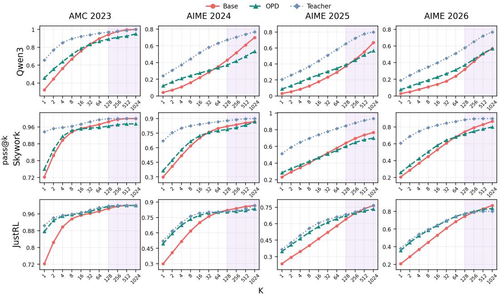  
Figure 1: Pass@K results across four benchmarks AMC2023 and AIME2024/2025/2026 under three OPD settings. OPD-trained models achieve higher pass@K at small sampling budgets, while pre-OPD base models catch up with and surpass them as K increases.

However, this behavior departs from the conventional view of distillation as transferring genuinely new capabilities from a stronger teacher. We thus dive into broader analyses across OPD variants, divergence objectives, problem-level solvability, and trajectory distributions, which consistently suggest that OPD primarily reshapes the student’s reasoning distribution toward more accessible correct trajectories, while potentially losing some rare capabilities already present in the pre-OPD base model. We refer to this phenomenon as an “illusory distillation” effect: the apparent gains from teacher guidance largely reflect improved access to existing reasoning capabilities rather than a consistent expansion of the student’s capability boundary.

Overall, our new findings regarding OPD in this study are summarized as follows:

• OPD improves sampling efficiency but does not expand the student’s capability boundary. OPD-trained models perform better pass@K at small K values, but are surpassed by pre-OPD base models at large K, while consistently attaining higher avg@K across different sampling budgets.

• OPD forgets more solvable problems than it newly learns to solve. Using pass@1024 as solvability criterion, most problems remain both solvable before and after OPD training. Among problems whose solvability changes after OPD, more previously solvable problems become unsolvable than previously unsolvable problems become solvable.

• Several improved OPD variants exhibit similar test-time scaling behaviors to standard OPD. Despite diverse methodological improvements, these variants share the same trend: pass@K gains at small K sampling budget do not translate into capability expansion at large K.

• OPD exhibits an “illusory distillation” effect that differs from off-policy distillation. Unlike off-policy distillation, which improves pass@K across both small and large sampling budgets, OPD mainly guides the student toward correct reasoning paths within its existing capability space, rather than genuine capability expansion through teacher-to-student knowledge transfer.

## 2 PRELIMINARIES

## 2.1 ON-POLICY DISTILLATION

Let π and π denote the student and teacher models, respectively. Given a problem x, the student samples a reasoning trajectory $y = ( y _ { 1 } , y _ { 2 } , \dots , y _ { L } )$ . At the t-th decoding step, the student reaches the prefix state $( x , y _ { < t } )$ , where the teacher provides a dense target distribution over the next token. The standard OPD objective minimizes the reverse KL divergence between the student and teacher distributions over these student-visited states (Li et al., 2026; Agarwal et al., 2024; Gu et al., 2024):

$$
\mathcal { L } _ { \mathrm { O P D } } ( \theta ) = \mathbb { E } _ { x \sim \mathcal { D } , y \sim \pi _ { \theta } ( \cdot \vert x ) } \left[ \sum _ { t = 1 } ^ { L } D _ { \mathrm { K L } } ( \pi _ { \theta } ( \cdot \vert x , y _ { < t } ) \Vert \pi _ { T } ( \cdot \vert x , y _ { < t } ) ) \right] .\tag{1}
$$

Here, $D _ { \mathrm { K L } } ( \cdot | | \cdot )$ denotes the KL divergence over the next-token vocabulary; the student distribution is its first argument and the teacher distribution is the second, yielding the reverse KL direction. In practice, the reverse KL divergence can be implemented in several ways, including full-vocabulary KL (DeepSeek-AI et al., 2026), top-k token KL (Li et al., 2026), and sampled-token KL (Xiao et al., 2026) based on Monte Carlo estimation. In this study, we adopt top-k token KL for OPD training. Notably, a key difference between OPD and off-policy distillation lies in the source of the reasoning trajectories: OPD trains on trajectories sampled from the current student, whereas off-policy distillation typically relies on trajectories generated by the teacher model.

## 2.2 TEST-TIME SCALING: PASS@K AND AVG@K

Test-time scaling allocates additional inference-time computation to improve reasoning performance. A common approach is to increase the sampling budget K by generating multiple independent reasoning trajectories for the same input problem; pass@K and avg@K evaluate this sampling-based scaling. Given a model $\pi _ { \theta }$ and K sampled responses $\left\{ y _ { 1 } , y _ { 2 } , . . . , y _ { K } \right\}$ for a problem x, pass@K measures whether at least one sampled response is correct:

$$
\begin{array} { r } { \mathrm { p a s s @ } K = \mathbb { E } _ { { x } \sim \mathcal { D } , \{ y ^ { ( i ) } \} _ { i = 1 } ^ { K } \sim \pi _ { \theta } ( \cdot | x ) } \left[ \mathbb { I } \left( \exists i \in \{ 1 , . . . , K \} , \mathrm { ~ s . t . ~ } y ^ { ( i ) } \mathrm { ~ i s ~ c o r r e c t } \right) \right] . } \end{array}\tag{2}
$$

Pass@K reflects the model’s ability to discover at least one successful reasoning trajectory with increased sampling opportunities. In particular, pass@K with small K reflects the model’s sampling efficiency under limited sampling budget, while pass@K with large K provides a stronger indication of the model’s capability boundary by allowing broader exploration of its sampling space. On the other hand, avg@K measures the average correctness of all sampled responses:

$$
\arg @ K = \mathbb { E } _ { x \sim \mathcal { D } , \{ y ^ { ( i ) } \} _ { i = 1 } ^ { K } \sim \pi _ { \theta } ( \cdot | x ) } \left[ \frac { 1 } { K } \sum _ { i = 1 } ^ { K } \mathbb { I } \left( y ^ { ( i ) } \mathrm { i s } \mathrm { c o r r e c t } \right) \right] .\tag{3}
$$

Avg@K focuses on the overall quality of the sampled reasoning distribution. Together, pass@K and avg@K provide complementary perspectives for analyzing LLM reasoning behaviors: pass@K reflects budget-dependent reachability and, at large K, probes the capability boundary, while avg@K reflects the efficiency of accessing such capabilities.

## 3 OPD ANALYSIS UNDER TEST-TIME SCALING

Table 1: Three OPD settings conducted in this study.
<table><tr><td>Setting</td><td>Base student model</td><td>Teacher model</td><td>Test-time scaling K</td></tr><tr><td>Qwen3</td><td>Qwen3-1.7B-Base (Yang et al., 2025)</td><td>Qwen3-4B-Base-GRPO (Li et al., 2026)</td><td> $\{ 1 , 2 , . . . , 5 1 2 , 1 0 2 4 \}$ </td></tr><tr><td>Skywork</td><td>R1-Distill-Qwen-1.5B (Guo et al., 2025)</td><td>Skywork-OR1-Math-7B (He et al., 2025b)</td><td> $\{ 1 , 2 , . . . , 5 1 2 , 1 0 2 4 \}$ </td></tr><tr><td>JustRL</td><td>R1-Distill-Qwen-1.5B (Guo et al., 2025)</td><td>JustRL-DeepSeek-1.5B (He et al., 2025a)</td><td> $\left\{ 1 , 2 , . . . , 5 1 2 , 1 0 2 4 \right\}$ </td></tr></table>

In this section, we present a detailed analysis of OPD through the lens of test-time scaling. Our analysis covers three student-teacher OPD settings, as summarized in Table 1. We train the OPD student models on the DAPO-Math-17k (Yu et al., 2025) training set and evaluate the pre-OPD base, OPD-trained, and teacher models on AMC2023 (math-ai, 2023), AIME2024 (HuggingFaceH4,

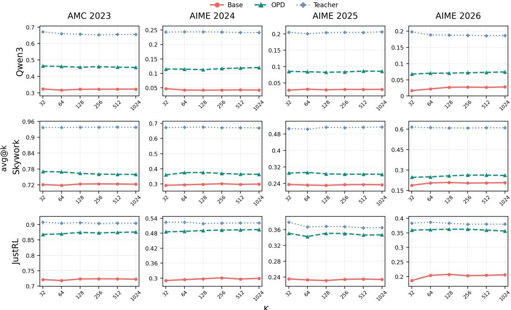  
Figure 2: Avg@K results across four benchmarks AMC2023 and AIME2024/2025/2026 under three OPD settings. OPD-trained models consistently achieve higher avg@K than their pre-OPD counterparts across different sampling budgets, indicating improved sampling efficiency.

2025), AIME2025 (MathArena, 2025), and AIME2026 (MathArena, 2026). Unless otherwise noted, evaluation uses temperature 0.7, top-p 0.95, and seed 0, with a 32,768-token context window, a 1,024-token prompt limit, and a 31,744-token output limit. Additional training and evaluation details are provided in Appendix A. The detailed analysis is organized as follows:

## 3.1 OPD’S EFFECT ON CAPABILITY BOUNDARY AND SAMPLING EFFICIENCY

The capability boundary of OPD-trained student models does not extend beyond that of their pre-OPD base models. At K = 1024, Figure 1 shows that OPD-trained models do not exceed their pre-OPD base models across the three OPD settings and four reasoning benchmarks; some intermediate large-budget comparisons tie or reverse. This pattern holds across different teacher strengths: it appears both when the teacher is generally stronger across benchmarks and budgets (e.g., Qwen3 and Skywork) and when the teacher has an advantage only at small K (e.g., JustRL). These results indicate that, even with guidance from a stronger teacher, OPD does not consistently transfer sufficient new reasoning capabilities to expand the student’s capability boundary.

OPD primarily improves performance at small sampling budgets. At small K, Figure 1 shows that OPD-trained models consistently outperform their pre-OPD counterparts, with the largest gains typically observed at K = 1. This advantage gradually diminishes as the sampling budget increases and reverses at large K values. This pattern suggests that OPD mainly improves the likelihood of reaching correct reasoning paths under limited sampling, rather than increasing the overall set of solutions accessible to the student model.

The performance gains brought by OPD primarily stem from improving the sampling efficiency of the student model. As shown in Figure 2, OPD-trained models generally achieve higher avg@K than their pre-OPD base models across different sampling budgets, student-teacher settings, and reasoning benchmarks. As avg@K measures the average correctness of sampled responses, these consistent improvements indicate that OPD makes correct reasoning paths more likely to be sampled and improves the student model’s overall sampling efficiency.

## 3.2 OPD’S EFFECT ON FORGOTTEN AND NEWLY LEARNED PROBLEMS

We investigate how OPD training affects problem-level solvability by comparing whether each problem can be solved by the pre-OPD base and OPD-trained models under the same sampling budget. Specifically, we use pass@K as the solvability criterion: a problem is considered solvable by a model if at least one correct response is obtained among the K sampled responses. We categorize problems into three groups: (i) retained, where the problem is solvable by both the pre-OPD base and OPD-trained models; (ii) learned, where the problem is solvable only after OPD training; and (iii)forgotten, where the problem is solvable by the pre-OPD base model but becomes unsolvable after OPD training. Problems from four benchmarks (AMC2023 and AIME2024/2025/2026) are aggregated for a unified analysis. We report the proportion of problems in each group and compute the net change as the difference between the learned fraction and the forgotten fraction.

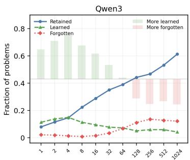

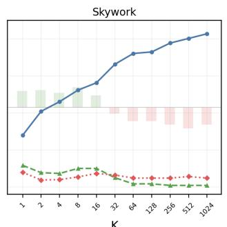

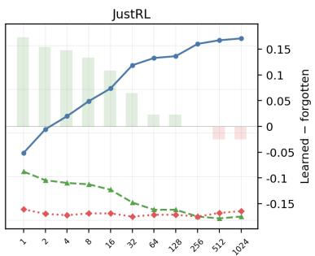  
Figure 3: Problem-level solvability analysis for three OPD settings. Problems from four benchmarks (AMC2023 and AIME2024/2025/2026) are aggregated and categorized into retained, learned, and forgotten groups. Lines show the proportions of problems in each group (left y-axis), while bars represent the net change, calculated as the fraction of learned problems minus the fraction of forgotten problems (right y-axis), across increasing sampling budgets K (x-axis).

From a capability-boundary perspective, OPD-trained models forget more previously solvable problems than they newly learn. Large-K pass@K is commonly used as a proxy for the model’s capability boundary. As shown in Figure 3, under large-K solvability criteria, the forgotten set is surprisingly larger than the learned set. In other words, after OPD training, more previously solvable problems become unsolvable than previously unsolvable problems become solvable. This observation naturally raises a further question: where do the performance gains of OPD actually come from?

OPD’s performance gains primarily stem from improved sampling efficiency on retained problems. As illustrated in Figure 3, we observe that the retained fraction increases with K and becomes substantially larger than either the learned or forgotten fraction in all three settings. This suggests that much of OPD’s performance improvement comes from making already-solvable problems easier to solve under limited sampling, rather than from learning entirely new problems. Intuitively, OPD behaves more like a teacher helping the student perform better on problems it could already solve, rather than teaching the student to solve substantially more new problems. Additional analysis supporting this interpretation is provided in Appendix E.

## 3.3 PASS@K TRENDS DURING OPD TRAINING

Previous analyses primarily focus on the final OPD-trained models. To further examine how test-time scaling behavior changes as training progresses, we track pass@K over training steps, as shown in Figure 4, and our observations are summarized as follows:

A trade-off between sampling efficiency and capability boundary emerges during OPD training. As illustrated in Figure 4, we observe that as OPD training progresses, pass@K at small K values (e.g., K = 1 or 2) generally improves, while pass@K at large K (e.g., K = 512 or 1024) gradually decreases. These opposing trends suggest a trade-off during OPD training: OPD improves the accessibility of correct reasoning paths under limited sampling budgets, while narrowing the capability boundary under sufficient sampling.

The degradation of the capability boundary is unstable and emerges early in OPD training. Another notable pattern in Figure 4 is that the improvement in small-K pass@K is substantially more stable than the degradation observed at large K. Additionally, large-K pass@K exhibits noticeable fluctuations and already shows a clear decline by around 80 training steps. This suggests that capability-boundary degradation can emerge at an early stage of OPD training, even before training has fully converged. This may further reflect the instability of OPD training dynamics.

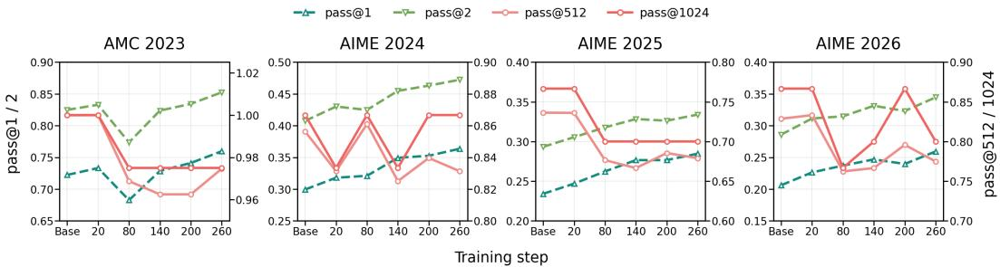  
Figure 4: Pass@K during OPD training. Left y-axis: pass@1 and pass@2. Right y-axis: pass@512 and pass@1024. x-axis: increasing training steps of OPD.

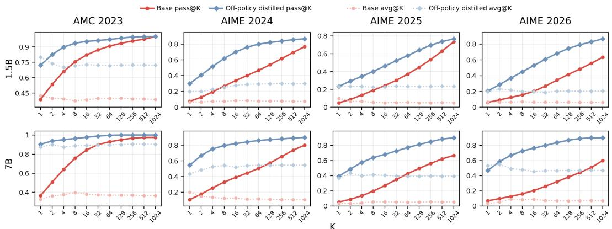  
Figure 5: Pass@K and avg@K analysis of off-policy distillation across four benchmarks. Solid lines denote pass@K, while dashed lines denote avg@K.

## 3.4 OFF-POLICY DISTILLATION’S EFFECT ON CAPABILITY BOUNDARY

As a comparison, we further examine off-policy distillation through the lens of test-time scaling in Figure 5. Specifically, we evaluate DeepSeek-R1-Distill-Qwen-1.5B/7B, which are obtained by fine-tuning Qwen-Math-1.5B/7B on off-policy data generated by DeepSeek-R1. This comparison provides insights into how different distillation paradigms affect the resulting student models.

Off-policy distillation actually transfers teacher’s capability to student, yet OPD not. As illustrated in Figure 5, across both small and large sampling budgets, off-policy distillation-trained models consistently achieve higher pass@K and avg@K than their corresponding base models. This suggests that off-policy distillation can really transfer reasoning patterns from the teacher model and expand the student’s capability boundary, rather than merely improving the sampling efficiency of correct reasoning paths. From this perspective, OPD resembles an “illusory distillation”: although a stronger teacher model is introduced, its primary role is to help the student better utilize capabilities that already exist within its own capability space.

## 4 FURTHER ANALYSIS

In this section, we conduct further analyses to deepen our understanding of OPD. Specifically, we examine several advanced OPD variants under the same test-time scaling framework, perform perplexity analysis on generated reasoning trajectories, and present qualitative case studies.

## 4.1 ADVANCED OPD METHODS

Beyond standard OPD, several recent variants improve OPD from different perspectives. For example, ExOPD (Yang et al., 2026a) treats OPD as KL-regularized dense RL and uses reward extrapolation to amplify the teacher-reference policy shift. Direct-OPD (Feng et al., 2026) uses the log-ratio between a teacher’s post-RL and pre-RL checkpoints as an implicit reward on the student’s own trajectories, transferring the RL-induced policy shift rather than the teacher’s final distribution. EOPD (Jin et al., 2026) adds forward-KL guidance at teacher-high-entropy positions while retaining reverse-KL learning elsewhere. We also consider a pure forward-KL variant that replaces the reverse-KL objective in standard OPD with the forward KL divergence. We investigate whether these alternative methodological improvements exhibit the same behavior as standard OPD, particularly whether they can expand the reasoning capability boundary of the pre-OPD base model.

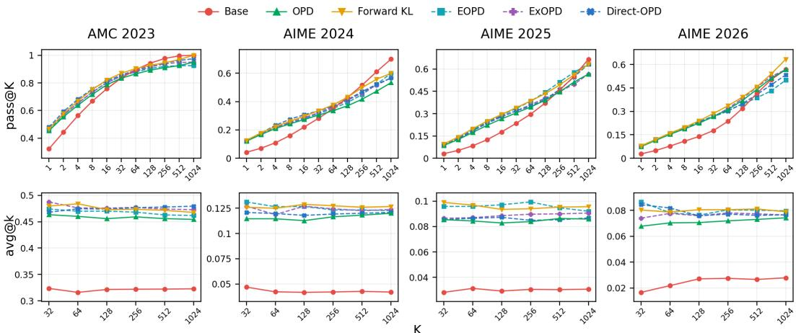  
Figure 6: Pass@K and avg@K results for several improved OPD variants.

Despite introducing diverse methodological improvements over standard OPD, alternative OPD approaches still primarily improve sampling efficiency without consistently expanding the capability boundary of the pre-OPD base model. As shown in Figure 6, compared with pre-OPD base models, EOPD, ExOPD, Direct-OPD, and the pure forward-KL variant achieve higher pass@K at small K and higher avg@K across sampling budgets. At larger sampling budgets, their pass@K values are generally below or match those of the pre-OPD base model across benchmarks. The only exception is the pure forward-KL variant on AIME2026, where pass@1024 is higher than that of the pre-OPD base model. This indicates that, although these alternative objectives improve the sampling efficiency of correct reasoning paths, they do not consistently expand the capability boundary. This behavior is consistent with the pattern observed for standard OPD in our earlier analysis.

## 4.2 PERPLEXITY ANALYSIS

Perplexity is a widely used metric that reflects how familiar a model is with a given reasoning trajectory, where lower perplexity indicates that the reasoning trajectory is more likely under the model distribution. Figure 7 compares the perplexity of reasoning trajectories generated by the pre-OPD base, OPD-trained, and teacher models under the pre-OPD base and teacher model distributions. The trajectory-selection details are provided in Appendix D. We have the following observations:

Reasoning trajectories generated by the OPDtrained model are more favored by the teacher model than those generated by the pre-OPD base model. As illustrated in Figure 7, under the teacher model, $\mathrm { P P L } _ { \mathrm { T e a c h e r } } ( Y _ { \mathrm { O P D } } )$ is lower than $\mathrm { P P L } _ { \mathrm { T e a c h e r } } ( Y _ { \mathrm { B a s e } } )$ This suggests that OPD training makes the student’s generated reasoning trajectories more aligned with those preferred by the teacher model.

Reasoning trajectories generated by the OPDtrained model remain closer to the pre-OPD base distribution. Under the pre-OPD base model, reasoning trajectories generated by the OPD-trained model exhibit lower perplexity than those generated by either the pre-OPD base model or the teacher. This suggests that OPD primarily shifts probability mass toward reasoning trajectories that are already well supported by the pre-OPD base model, rather than introducing reasoning patterns from the teacher that are unfamiliar to the pre-OPD base model.

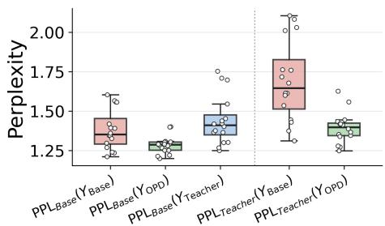  
Figure 7: Perplexity analysis for reasoning trajectories generated from Skywork OPD setting. $\breve { Y } _ { \mathrm { B a s e } } , ~ Y _ { \mathrm { O P D } }$ , and $\dot { Y } _ { \mathrm { T e a c h e r } }$ denote trajectories generated by the Base, OPD, and Teacher models, respectively. $\mathrm { P P L } _ { \mathrm { B a s e } }$ and $\mathrm { P P L } _ { \mathrm { T e a c h e r } }$ denote the perplexity computed by the Base and Teacher models, respectively.

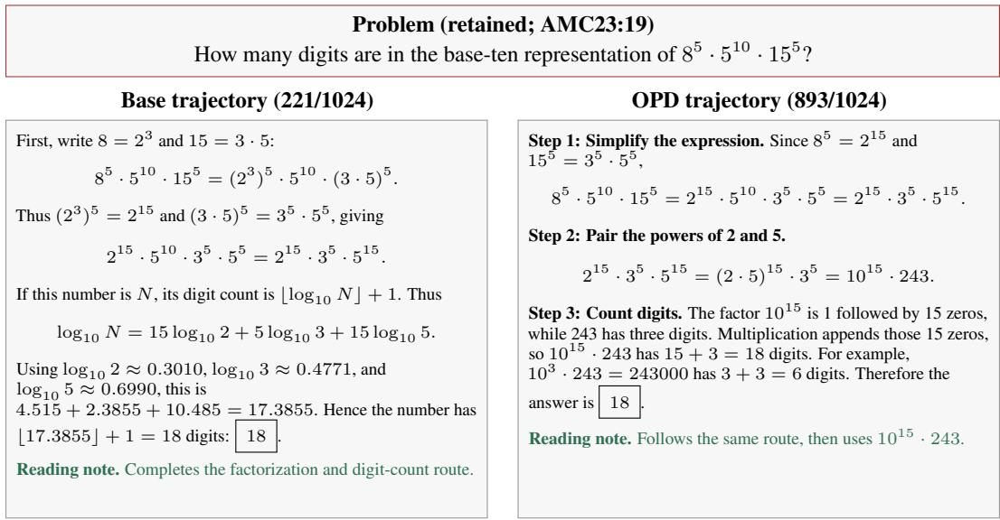  
Figure 8: Case study of a problem solvable by both pre-OPD and OPD-trained models. At K = 1024, the pre-OPD base model achieves an accuracy of 221/1,024, compared with 893/1,024 for the OPD-trained model. Both models generate similar reasoning patterns, such as the same factorization route.

## 4.3 CASE STUDY

To intuitively illustrate how OPD changes reasoning behaviors, we present paired reasoning trajectories generated by the pre-OPD base and OPD-trained models. For the selected problem, both models can solve it, but the pre-OPD base model achieves a lower accuracy at K = 1024 than the OPD-trained model. As illustrated in Figure 8, the two models follow highly similar reasoning patterns, such as the same factorization route, indicating that successful reasoning patterns are already present in the pre-OPD base model and are preserved after OPD training. This suggests that OPD does not necessarily introduce new reasoning patterns, but instead improves the accessibility of successful reasoning patterns that already exist within the pre-OPD base model.

## 5 RELATED WORK

On-policy distillation. GKD and MiniLLM reduce the train–test distribution mismatch of autoregressive distillation by querying teacher feedback on student-generated outputs, with MiniLLM emphasizing reverse-KL optimization (Agarwal et al., 2024; Gu et al., 2024). Recent analyses identify teacher–student compatibility and genuinely novel teacher capabilities as success conditions (Li et al., 2026), or characterize dense guidance as an exploration catalyst while studying signal pathologies (Wang et al., 2026). Method variants use entropy-aware forward KL or trust regions to preserve diversity and stabilize mismatched regions (Jin et al., 2026; Xing et al., 2026); Direct-OPD and ExOPD instead modify the supervision signal to transfer an RL-induced policy shift or extrapolate its reward (Feng et al., 2026; Yang et al., 2026a). Beyond aggregate large-K comparisons, we combine solved-set accounting with fixed-trajectory likelihood to separate learning, forgetting, and path reweighting after successful OPD.

Test-time Scaling and Pass@K. Test-time scaling allocates additional inference-time computation to improve reasoning performance, for example by sampling multiple candidates and selecting among them. Pass@K is a widely used evaluation of this sampling-based scaling: it estimates whether at least one of K sampled responses passes the evaluator (Chen et al., 2021). Recent work has used large-K pass@K curves to analyze the effect of RLVR on the capability boundary (Yue et al., 2025), to study whether prolonged RL can expand that boundary (Liu et al., 2025), and to compare decoding strategies in diffusion language models (Ni et al., 2026). High-budget pass@K has also been used to identify problems that remain beyond the observed reach of base models and to construct more challenging reasoning benchmarks (Mayilvahanan et al., 2026). Best-of-N selects a verifier-ranked candidate (Cobbe et al., 2021), whereas self-consistency selects an answer by marginalizing over sampled reasoning trajectories (Wang et al., 2023); broader test-time scaling work studies how to allocate inference compute among such strategies (Snell et al., 2025). In this study, we use pass@K and avg@K analysis as a diagnostic tool through the lens of test-time scaling to characterize two aspects of reasoning performance of OPD: sampling efficiency and capability boundary.

Distillation and capability transfer. Traditional knowledge distillation has long been studied as a paradigm for transferring knowledge from stronger teachers to smaller students, ranging from matching softened teacher predictions (Hinton et al., 2015) to learning from teacher-generated sequences (Kim & Rush, 2016). Recent advances in reasoning models further extend this paradigm by distilling chain-of-thought rationales and reasoning trajectories from stronger models into smaller ones (Hsieh et al., 2023; Guo et al., 2025). As an emerging distillation paradigm, whether OPD truly transfers new reasoning capabilities from stronger teachers or primarily reshapes the student’s existing capabilities remains an open question. In this study, we examine whether OPD follows the conventional distillation paradigm of transferring new knowledge and capabilities from teachers to students, or instead primarily improves the students within their capability space.

## 6 CONCLUSION

This work provides a systematic understanding of on-policy distillation (OPD) through the lens of test-time scaling. Across diverse OPD settings, we find that OPD improves performance under smaller sampling budgets and increases the likelihood of reaching correct reasoning paths, but does not consistently expand the student’s capability boundary. Instead, at larger sampling budgets, OPD-trained models can lose previously accessible reasoning capabilities, revealing a trade-off between sampling efficiency and capability boundary. Our further analyses show that this phenomenon persists across different OPD variants, while off-policy distillation can effectively expand the capability boundary through teacher-generated reasoning trajectories. These findings suggest that OPD can be viewed as an “illusory distillation”: despite leveraging a stronger teacher model, OPD primarily improves the accessibility of reasoning capabilities already present in the student, rather than consistently transferring new capabilities beyond the student’s original boundary.

## REFERENCES

Rishabh Agarwal, Nino Vieillard, Yongchao Zhou, Piotr Stanczyk, Sabela Ramos Garea, Matthieu Geist, and Olivier Bachem. On-policy distillation of language models: Learning from selfgenerated mistakes. In The Twelfth International Conference on Learning Representations, 2024. URL https://openreview.net/forum?id=3zKtaqxLhW.

Bradley Brown, Jordan Juravsky, Ryan Ehrlich, Ronald Clark, Quoc V Le, Christopher Re, and ´ Azalia Mirhoseini. Large language monkeys: Scaling inference compute with repeated sampling. arXiv preprint arXiv:2407.21787, 2024.

Mark Chen, Jerry Tworek, Heewoo Jun, Qiming Yuan, Henrique Ponde de Oliveira Pinto, Jared Kaplan, Harri Edwards, Yuri Burda, Nicholas Joseph, Greg Brockman, Alex Ray, Raul Puri, Gretchen Krueger, Michael Petrov, Heidy Khlaaf, Girish Sastry, Pamela Mishkin, Brooke Chan, Scott Gray, Nick Ryder, Mikhail Pavlov, Alethea Power, Lukasz Kaiser, Mohammad Bavarian, Clemens Winter, Philippe Tillet, Felipe Petroski Such, Dave Cummings, Matthias Plappert, Fotios Chantzis, Elizabeth Barnes, Ariel Herbert-Voss, William Hebgen Guss, Alex Nichol, Alex Paino, Nikolas Tezak, Jie Tang, Igor Babuschkin, Suchir Balaji, Shantanu Jain, William Saunders, Christopher Hesse, Andrew N. Carr, Jan Leike, Josh Achiam, Vedant Misra, Evan Morikawa, Alec Radford, Matthew Knight, Miles Brundage, Mira Murati, Katie Mayer, Peter Welinder, Bob McGrew, Dario

Amodei, Sam McCandlish, Ilya Sutskever, and Wojciech Zaremba. Evaluating large language models trained on code, 2021. URL https://arxiv.org/abs/2107.03374.

Karl Cobbe, Vineet Kosaraju, Mohammad Bavarian, Mark Chen, Heewoo Jun, Lukasz Kaiser, Matthias Plappert, Jerry Tworek, Jacob Hilton, Reiichiro Nakano, Christopher Hesse, and John Schulman. Training verifiers to solve math word problems. arXiv preprint arXiv:2110.14168, 2021. URL https://arxiv.org/abs/2110.14168.

DeepSeek-AI, Anyi Xu, Bangcai Lin, Bing Xue, Bingxuan Wang, Bingzheng Xu, Bochao Wu, Bowei Zhang, Chaofan Lin, Chen Dong, Chenchen Ling, et al. DeepSeek-V4: Towards highly efficient million-token context intelligence. arXiv preprint arXiv:2606.19348, 2026. doi: 10.48550/arXiv. 2606.19348. URL https://arxiv.org/abs/2606.19348.

Shiyuan Feng, Huan-ang Gao, Haohan Chi, Hanlin Wu, Zhilong Zhang, Zheng Jiang, Bingxiang He, Wei-Ying Ma, Ya-Qin Zhang, and Hao Zhou. Weak-to-strong generalization via direct on-policy distillation. arXiv preprint arXiv:2607.05394, 2026. URL https://arxiv.org/abs/2607. 05394.

Xinmu Ge. math-eval: Reproducible mathematical reasoning generation and evaluation, July 2026a. URL https://doi.org/10.5281/zenodo.21411208. Software, Apache-2.0 license.

Xinmu Ge. math-vault: Curated, traceable snapshots of public mathematical reasoning datasets, 2026b. URL https://doi.org/10.5281/zenodo.21411214. Dataset, version v0.1.0.

Yuxian Gu, Li Dong, Furu Wei, and Minlie Huang. MiniLLM: Knowledge distillation of large language models. In The Twelfth International Conference on Learning Representations, 2024. URL https://openreview.net/forum?id=5h0qf7IBZZ.

Daya Guo, Dejian Yang, Haowei Zhang, et al. DeepSeek-R1 incentivizes reasoning in LLMs through reinforcement learning. Nature, 645(8081):633–638, September 2025. doi: 10.1038 s41586-025-09422-z. URL https://doi.org/10.1038/s41586-025-09422-z.

Bingxiang He, Zekai Qu, Zeyuan Liu, Yinghao Chen, Yuxin Zuo, Cheng Qian, Kaiyan Zhang, Weize Chen, Chaojun Xiao, Ganqu Cui, Ning Ding, and Zhiyuan Liu. JustRL: Scaling a 1.5b LLM with a simple RL recipe. arXiv preprint arXiv:2512.16649, 2025a. URL https://arxiv.org/ abs/2512.16649.

Jujie He, Jiacai Liu, Chris Yuhao Liu, Rui Yan, Chaojie Wang, Peng Cheng, Xiaoyu Zhang, Fuxiang Zhang, Jiacheng Xu, Wei Shen, Siyuan Li, Liang Zeng, Tianwen Wei, Cheng Cheng, Bo An, Yang Liu, and Yahui Zhou. Skywork open reasoner 1 technical report. arXiv preprint arXiv:2505.22312, 2025b. URL https://arxiv.org/abs/2505.22312.

Geoffrey Hinton, Oriol Vinyals, and Jeff Dean. Distilling the knowledge in a neural network. arXiv preprint arXiv:1503.02531, 2015. URL https://arxiv.org/abs/1503.02531.

Cheng-Yu Hsieh, Chun-Liang Li, Chih-kuan Yeh, Hootan Nakhost, Yasuhisa Fujii, Alex Ratner, Ranjay Krishna, Chen-Yu Lee, and Tomas Pfister. Distilling step-by-step! outperforming larger language models with less training data and smaller model sizes. In Anna Rogers, Jordan Boyd-Graber, and Naoaki Okazaki (eds.), Findings of the Association for Computational Linguistics: ACL 2023, pp. 8003–8017, Toronto, Canada, July 2023. Association for Computational Linguistics. doi: 10.18653/v1/2023.findings-acl.507. URL https://aclanthology.org/2023. findings-acl.507/.

HuggingFaceH4. AIME 2024. Hugging Face dataset repository, 2025. URL https:// huggingface.co/datasets/HuggingFaceH4/aime\_2024. AIME I and II; frozen revision 2fe88a2f1091d5048c0f36abc874fb997b3dd99a.

Woogyeol Jin, Taywon Min, Yongjin Yang, Dennis Wei, Yi Zhou, Swanand Ravindra Kadhe, Nathalie Baracaldo, and Kimin Lee. Entropy-aware on-policy distillation of language models. In Forty-third International Conference on Machine Learning, 2026. URL https://openreview.net/ forum?id=J5i09faOOf.

Yoon Kim and Alexander M. Rush. Sequence-level knowledge distillation. In Jian Su, Kevin Duh, and Xavier Carreras (eds.), Proceedings of the 2016 Conference on Empirical Methods in Natural Language Processing, pp. 1317–1327, Austin, Texas, November 2016. Association for Computational Linguistics. doi: 10.18653/v1/D16-1139. URL https://aclanthology. org/D16-1139/.

Yaxuan Li, Yuxin Zuo, Bingxiang He, Jinqian Zhang, Chaojun Xiao, Cheng Qian, Tianyu Yu, Huan-ang Gao, Wenkai Yang, Zhiyuan Liu, and Ning Ding. Rethinking on-policy distillation of large language models: Phenomenology, mechanism, and recipe. In ICML 2026 Workshop on Foundations of Deep Generative Models: Understanding Memorization, Generalization, and Reasoning, 2026. URL https://arxiv.org/abs/2604.13016. Non-archival workshop paper.

Mingjie Liu, Shizhe Diao, Ximing Lu, Jian Hu, Xin Dong, Yejin Choi, Jan Kautz, and Yi Dong. ProRL: Prolonged reinforcement learning expands reasoning boundaries in large language models. In Advances in Neural Information Processing Systems, volume 38, 2025. URL https://proceedings.neurips.cc/paper\_files/paper/2025/ hash/1a22b912945fb7c0bdd079e792b31b6f-Abstract-Conference.html.

math-ai. AMC23: Adapted 2023 AMC 12 benchmark. Hugging Face dataset repository, 2023. URL https://huggingface.co/datasets/math-ai/amc23. Frozen revision 80815d37005feb82cd7f8fbc6901d5d3eff43057.

MathArena. AIME 2025. Hugging Face dataset repository, 2025. URL https:// huggingface.co/datasets/MathArena/aime\_2025. AIME I and II; frozen revision c94da77eb22bbd6439e62a323bec18493a421302.

MathArena. AIME 2026. Hugging Face dataset repository, 2026. URL https:// huggingface.co/datasets/MathArena/aime\_2026. AIME I and II; frozen revision d2de22f3c656b4f56cf8981212186377d1e23bc3.

Prasanna Mayilvahanan, Ricardo Dominguez-Olmedo, Thaddaus Wiedemer, and Wieland Brendel.¨ MATH-Beyond: A benchmark for RL to expand beyond the base model. In The Fourteenth International Conference on Learning Representations, 2026. URL https://openreview. net/forum?id=RNkErKpCAp.

Zanlin Ni, Shenzhi Wang, Yang Yue, Tianyu Yu, Weilin Zhao, Yeguo Hua, Tianyi Chen, Jun Song, Cheng Yu, Bo Zheng, and Gao Huang. The flexibility trap: Rethinking the value of arbitrary order in diffusion language models. arXiv preprint arXiv:2601.15165, 2026. URL https://arxiv.org/abs/2601.15165.

Charlie Victor Snell, Jaehoon Lee, Kelvin Xu, and Aviral Kumar. Scaling LLM test-time compute optimally can be more effective than scaling parameters for reasoning. In The Thirteenth International Conference on Learning Representations, 2025. URL https://openreview.net/ forum?id=4FWAwZtd2n.

Mingyang Song and Mao Zheng. A survey of on-policy distillation for large language models. arXiv preprint arXiv:2604.00626, 2026.

Rui Wang, Hongru Wang, Yi Chen, Boyang Xue, Tianqing Fang, Wenhao Yu, and Kam-Fai Wong. Demystifying on-policy distillation: Roles, pathologies, and regulations. arXiv preprint arXiv:2607.13399, 2026. URL https://arxiv.org/abs/2607.13399.

Xuezhi Wang, Jason Wei, Dale Schuurmans, Quoc V. Le, Ed H. Chi, Sharan Narang, Aakanksha Chowdhery, and Denny Zhou. Self-consistency improves chain of thought reasoning in language models. In The Eleventh International Conference on Learning Representations, 2023. URL https://openreview.net/forum?id=1PL1NIMMrw.

Bangjun Xiao, Bingquan Xia, Bo Yang, Bofei Gao, Bowen Shen, Chen Zhang, Chenhong He, Chiheng Lou, Fuli Luo, Gang Wang, et al. MiMo-V2-Flash technical report. arXiv preprint arXiv:2601.02780, 2026. doi: 10.48550/arXiv.2601.02780. URL https://arxiv.org/abs/ 2601.02780v2.

Xingrun Xing, Haoqing Wang, Boyan Gao, Ziheng Li, and Yehui Tang. Trust region on-policy distillation. arXiv preprint arXiv:2606.01249, 2026. URL https://arxiv.org/abs/2606. 01249.

Xiaohan Xu, Ming Li, Chongyang Tao, Tao Shen, Reynold Cheng, Jinyang Li, Can Xu, Dacheng Tao, and Tianyi Zhou. A survey on knowledge distillation of large language models. arXiv preprint arXiv:2402.13116, 2024.

An Yang, Anfeng Li, Baosong Yang, Beichen Zhang, Binyuan Hui, Bo Zheng, Bowen Yu, Chang Gao, Chengen Huang, Chenxu Lv, et al. Qwen3 technical report. arXiv preprint arXiv:2505.09388, 2025. doi: 10.48550/arXiv.2505.09388. URL https://arxiv.org/abs/2505.09388v1.

Wenkai Yang, Weijie Liu, Ruobing Xie, Kai Yang, Saiyong Yang, and Yankai Lin. Learning beyond teacher: Generalized on-policy distillation with reward extrapolation. arXiv preprint arXiv:2602.12125, 2026a. URL https://arxiv.org/abs/2602.12125.

Zhuolin Yang, Zihan Liu, Yang Chen, Wenliang Dai, Boxin Wang, Sheng-Chieh Lin, Chankyu Lee, Yangyi Chen, Dongfu Jiang, Jiafan He, Renjie Pi, Grace Lam, Nayeon Lee, Alexander Bukharin, Mohammad Shoeybi, Bryan Catanzaro, and Wei Ping. Nemotron-Cascade 2: Post-training LLMs with cascade RL and multi-domain on-policy distillation. arXiv preprint arXiv:2603.19220, 2026b. doi: 10.48550/arXiv.2603.19220. URL https://arxiv.org/abs/2603.19220v2.

Qiying Yu, Zheng Zhang, Ruofei Zhu, Yufeng Yuan, Xiaochen Zuo, Yu Yue, Weinan Dai, Tiantian Fan, Gaohong Liu, Lingjun Liu, Xin Liu, Haibin Lin, Zhiqi Lin, Bole Ma, Guangming Sheng, Yuxuan Tong, Chi Zhang, Mofan Zhang, Wang Zhang, Hang Zhu, Jinhua Zhu, Jiaze Chen, Jiangjie Chen, Chengyi Wang, Hongli Yu, Yuxuan Song, Xiangpeng Wei, Hao Zhou, Jingjing Liu, Wei-Ying Ma, Ya-Qin Zhang, Lin Yan, Mu Qiao, Yonghui Wu, and Mingxuan Wang. DAPO: An open-source LLM reinforcement learning system at scale. arXiv preprint arXiv:2503.14476, 2025. URL https://arxiv.org/abs/2503.14476v2.

Yang Yue, Zhiqi Chen, Rui Lu, Andrew Zhao, Zhaokai Wang, Yang Yue, Shiji Song, and Gao Huang. Does reinforcement learning really incentivize reasoning capacity in LLMs beyond the base model? In Danielle Belgrave, Cheng Zhang, Hsuan-Tien Lin, Razvan Pascanu, Piotr Koniusz, Marzyeh Ghassemi, and Nan Chen (eds.), Advances in Neural Information Processing Systems, volume 38, pp. 57654–57689. Curran Associates, Inc., 2025. URL https://proceedings.neurips.cc/paper\_files/paper/2025/ file/537d5aa768c2d534016a4d06f87bc8fb-Paper-Conference.pdf.

Siqi Zhu, Xuyan Ye, Hongyu Lu, Weiye Shi, and Ge Liu. The many faces of on-policy distillation: Pitfalls, mechanisms, and fixes, 2026. URL https://arxiv.org/abs/2605.11182.

## A EVALUATION DETAILS

We use the curated benchmark snapshots from math-vault (Ge, 2026b) and the math-eval pipeline (Ge, 2026a) for inference, replay, answer extraction, and scoring. Official metrics compare the last complete boxed answer · with the canonical answer. Unless otherwise noted, evaluation uses temperature 0.7, top-p 0.95, seed 0, a 32,768-token context window, a 1,024-token prompt limit, and a 31,744-token output limit.

Prompt format. For completion checkpoints, we pass the following string as a completion; for chat checkpoints, we place the identical string in the user message:

{{problem}} Please reason step by step, and put your final   
answer within \boxed{}.

## B TRAINING CONFIGURATIONS FOR OPD VARIANTS

OPD, Direct-OPD, EOPD, pure forward-KL, and ExOPD are all trained using temperature 1, top-p 1, top-k disabled, one PPO epoch per batch, zero learning-rate warmup, and weight decay 0.01. Table 2 reports the main training settings used in the comparison.

Table 2: Training configurations for OPD variants. Batch gives global / PPO mini-batch size; lengths give the maximum prompt and response lengths. Budget and method controls give the evaluated checkpoint and teacher interface; rollout sampling top-k is disabled for all locally executed rows. Each variant follows the default configuration of its respective repository.
<table><tr><td>Setting</td><td>Batch</td><td>Lengths</td><td>LR / schedule</td><td>Budget and method controls</td></tr><tr><td>OPD (Li et al., 2026)</td><td>64 / 64</td><td>1024 / 7168</td><td>1×10−⁶ / cosine</td><td>student top-16</td></tr><tr><td>Direct-OPD (Feng et al., 2026)</td><td>128 / 32</td><td>1024 / 4096</td><td>3×10−⁶ / cosine</td><td>student top-16</td></tr><tr><td>EOPD (Jin et al., 2026)</td><td>128 /32</td><td>1024 / 4096</td><td>3×10−6 / cosine</td><td>teacher top-16</td></tr><tr><td>FKL</td><td>128 / 32</td><td>1024 / 4096</td><td>3×10−⁶ / cosine</td><td>teacher top-16</td></tr><tr><td>ExOPD (Yang et al., 2026a)</td><td>1024 / 1024</td><td>2048 / 16384</td><td>1× 10−⁵ / constant</td><td>sampled-token log-prob</td></tr></table>

## C NUMERICAL RESULTS FOR TEST-TIME SCALING CURVES

Tables 3-5 report the concrete values in Figures 1 and 2. Three values in each cell correspond to Base / OPD / Teacher (%) models, respectively. Across the three OPD settings and four benchmarks, the OPD-trained models achieve higher pass@K than their pre-OPD base models at the smallest sampling budgets, but this advantage generally diminishes as K increases. At K = 1024, the OPD-trained models no longer outperform their pre-OPD base models, while maintaining higher avg@K across the evaluated budgets. These results show that OPD primarily improves sampling efficiency without expanding the capability boundary of the student model.

## D RANDOM-TRAJECTORY PERPLEXITY ANALYSIS

To construct Figure 7, we use evaluation runs for the Skywork pre-OPD base, OPD-trained, and teacher models on AMC2023 and AIME2024/2025/2026. With seed 0, we independently sample four problems from each benchmark, yielding 16 problems in total. For every selected problem, we sample 32 trajectories from each source model, resulting in 16 × 32 = 512 trajectories per source and 1,536 trajectories overall.

Under the teacher scorer, trajectories generated by the OPD-trained model have lower perplexity than those generated by the pre-OPD base model. Under the pre-OPD base scorer, trajectories generated by the OPD-trained model have lower perplexity than those generated by either the pre-OPD base model or the teacher. Together, these observations suggest that OPD shifts the student’s trajectory distribution toward paths favored by the teacher while remaining supported by the pre-OPD base model, rather than simply reproducing the teacher’s reasoning trajectories.

Table 3: Primary pass@K curves, K = 1-32. Each cell is Base / OPD / Teacher (%).
<table><tr><td>Setting</td><td>Dataset</td><td>1</td><td>2</td><td>4</td><td>8</td><td>16</td><td>32</td></tr><tr><td>Qwen3</td><td>AMC23</td><td>32.3/45.4/65.6</td><td>44.4/55.4/76.9</td><td>56.3/63.9/85.1</td><td>66.8/71.7/89.7</td><td>75.8/78.7/92.2</td><td>83.5/83.4/94.0</td></tr><tr><td></td><td>AIME24</td><td>4.2/12.0/24.2</td><td>7.0/16.7/30.7</td><td>10.9/20.9/37.2</td><td>16.0/24.2/44.4</td><td>22.0/27.3/51.8</td><td>28.2/30.5/58.2</td></tr><tr><td></td><td>AIME25</td><td>3.1/8.6/20.6</td><td>5.3/12.6/26.0</td><td>8.3/17.4/31.1</td><td>12.4/22.2/36.9</td><td>17.7/26.5/43.8</td><td>23.5/30.4/50.9</td></tr><tr><td></td><td>AIME26</td><td>2.8/7.4/18.7</td><td>4.9/11.4/24.6</td><td>7.8/15.3/30.1</td><td>10.9/18.8/34.8</td><td>13.9/22.5/39.8</td><td>17.7/26.6/45.2</td></tr><tr><td>Skywork</td><td>AMC23</td><td>72.2/76.0/93.8</td><td>82.5/85.2/95.2</td><td>89.8/91.6/95.7</td><td>93.6/94.3/96.4</td><td>95.3/95.1/97.3</td><td>96.2/95.4/98.5</td></tr><tr><td></td><td>AIME24</td><td>29.9/36.4/67.0</td><td>40.8/47.2/75.4</td><td>51.7/57.9/80.2</td><td>61.8/66.6/82.6</td><td>70.0/72.3/84.1</td><td>76.0/75.6/85.5</td></tr><tr><td></td><td>AIME25</td><td>23.4/28.5/51.4</td><td>29.3/33.4/59.1</td><td>34.6/37.7/64.9</td><td>40.2/42.0/69.7</td><td>46.2/46.4/74.0</td><td>52.1/50.8/77.9</td></tr><tr><td></td><td>AIME26</td><td>20.6/25.9/60.9</td><td>28.6/34.5/68.9</td><td>36.9/42.5/74.9</td><td>45.0/50.4/79.2</td><td>52.9/58.2/82.1</td><td>60.8/64.3/84.5</td></tr><tr><td>JustRL</td><td>AMC23</td><td>72.2/87.6/90.4</td><td>82.5/92.9/94.1</td><td>89.8/94.9/95.3</td><td>93.6/95.6/95.9</td><td>95.3/96.2/96.7</td><td>96.2/97.1/97.8</td></tr><tr><td></td><td>AIME24</td><td>29.9/49.4/52.1</td><td>40.8/59.5/61.9</td><td>51.7/67.4/70.1</td><td>61.8/73.3/76.1</td><td>70.0/77.2/79.3</td><td>76.0/79.3/80.2</td></tr><tr><td></td><td>AIME25</td><td>23.4/34.7/36.5</td><td>29.3/40.6/42.8</td><td>34.6/46.4/49.4</td><td>40.2/52.2/55.8</td><td>46.2/57.3/60.752.1/61.2/63.8</td><td></td></tr><tr><td></td><td>AIME26</td><td></td><td>20.6/35.6/38.028.6/44.8/47.1 36.9/52.2/54.245.0/58.5/59.652.9/63.9/64.460.8/69.3/69.7</td><td></td><td></td><td></td><td></td></tr></table>

Table 4: Primary pass@K curves, K = 64-1024. Each cell is Base / OPD / Teacher (%).
<table><tr><td>Setting</td><td>Dataset</td><td>64</td><td>128</td><td>256</td><td>512</td><td>1024</td></tr><tr><td>Qwen3</td><td>AMC23</td><td>89.7/86.6/95.7</td><td>94.3/89.2/97.0</td><td>97.7/91.0/97.9</td><td>99.6/92.5/98.7</td><td>100.0/95.0/100.0</td></tr><tr><td></td><td>AIME24</td><td>35.0/33.6/63.1</td><td>42.9/37.0/67.1</td><td>51.6/41.6/70.4</td><td>61.0/47.3/73.7</td><td>70.0/53.3/76.7</td></tr><tr><td></td><td>AIME25</td><td>29.6/34.4/58.0</td><td>37.0/39.0/65.3</td><td>45.7/44.6/72.2</td><td>55.1/51.2/77.6</td><td>66.7/56.7/80.0</td></tr><tr><td></td><td>AIME26</td><td>23.6/31.2/51.0</td><td>31.8/36.9/57.7</td><td>41.4/44.0/65.1</td><td>50.4/51.1/72.0</td><td>56.7/56.7/76.7</td></tr><tr><td>Skywork</td><td>AMC23</td><td>97.2/95.8/99.5</td><td>98.5/96.4/99.9</td><td>99.6/97.1/100.0</td><td>100.0/97.5/100.0</td><td>100.0/97.5/100.0</td></tr><tr><td></td><td>AIME24</td><td>80.0/77.5/86.7</td><td>82.1/78.8/87.9</td><td>83.7/80.6/88.9</td><td>85.6/83.1/89.8</td><td>86.7/86.7/90.0</td></tr><tr><td></td><td>AIME25</td><td>58.0/55.1/81.3</td><td>64.1/60.0/84.7</td><td>69.5/64.7/88.2</td><td>73.6/67.9/91.1</td><td>76.7/70.0/93.3</td></tr><tr><td></td><td>AIME26</td><td>68.2/68.0/86.6</td><td>74.4/71.4/88.5</td><td>79.2/74.8/89.7</td><td>82.9/77.5/90.0</td><td>86.7/80.0/90.0</td></tr><tr><td>JustRL</td><td>AMC23</td><td>97.2/98.4/99.0</td><td>98.5/99.5/99.8</td><td>99.6/100.0/100.0</td><td>100.0/100.0/100.0</td><td>100.0/100.0/100.0</td></tr><tr><td></td><td>AIME24</td><td>80.0/80.1/80.4</td><td>82.1/80.4/80.8</td><td>83.7/80.8/81.7</td><td>85.6/81.7/83.3</td><td>86.7/83.3/86.7</td></tr><tr><td></td><td>AIME25</td><td>58.0/64.5/66.2</td><td>64.1/67.5/68.4</td><td>69.5/69.8/70.8</td><td>73.6/71.6/73.8</td><td>76.7/73.3/76.7</td></tr><tr><td></td><td>AIME26</td><td></td><td>68.2/74.1/74.274.4/77.5/77.1</td><td>79.2/79.9/79.0</td><td>82.9/82.1/79.9</td><td>86.7/83.3/80.0</td></tr></table>

Table 5: Primary avg@K curves. Each cell is Base / OPD / Teacher (%).
<table><tr><td>Setting</td><td>Dataset</td><td>32</td><td>64</td><td>128</td><td>256</td><td>512</td><td>1024</td></tr><tr><td>Qwen3</td><td>AMC23</td><td>32.3/46.3/67.1</td><td>31.6/46.0/66.0</td><td>32.1/45.6/65.7</td><td>32.2/45.9/65.2</td><td>32.2/45.6/65.5</td><td>32.3/45.4/65.6</td></tr><tr><td></td><td>AIME24</td><td>4.7/11.5/24.3</td><td>4.2/11.5/24.4</td><td>4.2/11.3/24.4</td><td>4.2/11.7/24.3</td><td>4.3/11.8/24.1</td><td>4.2/12.0/24.2</td></tr><tr><td></td><td>AIME25</td><td>2.8/8.5/20.5</td><td>3.1/8.4/20.1</td><td>2.9/8.3/20.4</td><td>3.0/8.4/20.5</td><td>3.0/8.6/20.5</td><td>3.1/8.6/20.6</td></tr><tr><td></td><td>AIME26</td><td>1.7/6.8/19.8</td><td>2.2/7.0/18.9</td><td>2.7/7.1/18.8</td><td>2.7/7.2/18.8</td><td>2.7/7.3/18.6</td><td>2.8/7.4/18.7</td></tr><tr><td></td><td>Skywork AMC23</td><td>72.1/77.0/93.8</td><td>71.8/76.9/93.7</td><td>72.3/76.3/93.8</td><td>72.4/76.0/93.8</td><td>72.3/76.0/93.9</td><td>72.2/76.0/93.8</td></tr><tr><td></td><td>AIME24</td><td>29.1/35.9/67.229.4/37.4/67.429.8/37.6/67.630.1/36.9/67.1</td><td></td><td></td><td></td><td></td><td>29.7/36.4/67.129.9/36.4/67.0</td></tr><tr><td></td><td>AIME25</td><td></td><td></td><td></td><td></td><td></td><td>23.5/29.1/50.623.3/29.4/50.323.1/28.7/51.223.4/28.5/51.023.5/28.5/51.323.4/28.5/51.4</td></tr><tr><td></td><td></td><td></td><td></td><td></td><td></td><td></td><td>AIME2618.6/24.6/61.520.4/24.9/61.020.8/25.7/60.920.3/26.2/60.820.5/26.2/60.920.6/25.9/60.9</td></tr><tr><td>JustRL</td><td>AMC23</td><td></td><td></td><td></td><td></td><td></td><td>72.1/86.8/90.871.8/87.0/90.572.3/87.5/90.672.4/87.3/90.472.3/87.5/90.572.2/87.6/90.4</td></tr><tr><td></td><td></td><td></td><td></td><td></td><td></td><td>AIME2429.1/48.5/52.429.4/48.8/52.429.8/49.1/51.930.1/49.3/52.029.7/49.3/52.129.9/49.4/52.1</td><td></td></tr><tr><td></td><td></td><td></td><td></td><td></td><td></td><td>AIME2523.5/35.1/37.923.3/34.3/36.723.1/35.1/36.823.4/35.1/36.823.5/34.7/36.523.4/34.7/36.5</td><td></td></tr><tr><td></td><td></td><td></td><td></td><td></td><td>AIME2618.6/35.9/38.320.4/36.1/38.620.8/36.2/38.320.3/36.2/38.020.5/35.9/38.020.6/35.6/38.0</td><td></td><td></td></tr><tr><td></td><td></td><td></td><td></td><td></td><td></td><td></td><td></td></tr></table>

## E PROBLEM-LEVEL ACCURACY TRANSITIONS

At K = 1024, the accuracy of each problem is defined as the proportion of correct responses among its 1,024 sampled responses. Figure 9 groups the Base and OPD accuracies into four bins and averages the resulting problem fractions over AMC2023 and AIME2024/2025/2026. Columns correspond to the Base accuracy bins and rows to the OPD accuracy bins.

For example, in the JustRL setting, 18.5% of problems move from Base accuracy (.1, .5] to OPD accuracy (.5, 1], indicating substantially more frequent success on these already solvable problems. Across all three settings, more problems move to higher accuracy bins than to lower ones after OPD. Among problems retained at $\bar { K } = 1 0 2 4$ , mean problem-level accuracy rises from 13.5% to 25.9% for Qwen3, from 42.3% to 48.7% for Skywork, and from 42.0% to 60.4% for JustRL. These results indicate that the sampling-efficiency gains of OPD are primarily driven by more frequent success on problems that are already solvable by the pre-OPD base model.

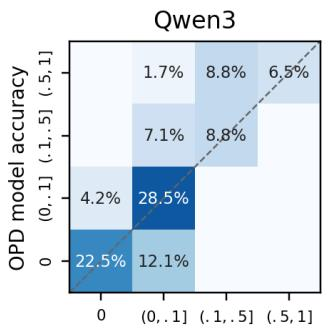

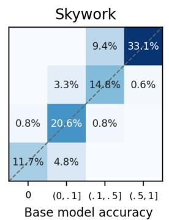

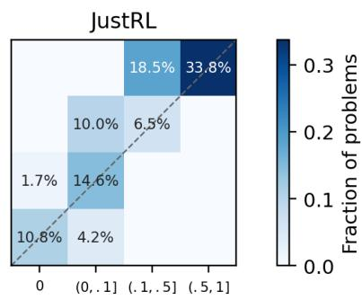  
Figure 9: Base-to-OPD problem-level accuracy transitions at $K = 1 0 2 4$ . Problems from AMC2023 and AIME2024/2025/2026 are aggregated for analysis. Columns denote the Base accuracy bins, rows denote the OPD accuracy bins, and each cell reports the fraction of problems undergoing the corresponding transition. Cells above the diagonal indicate transitions to higher accuracy bins after OPD training.

## F TRAINING-DYNAMICS ENDPOINTS

Table 6 reports the Skywork pre-OPD base model and OPD checkpoints at Steps 20, 80, 140, 200, and 260 on AMC2023 and AIME2024/2025/2026. Each entry gives the dataset-level pass@1 and pass@1024 values, computed from one and 1,024 sampled responses per problem, respectively. These values correspond to the checkpoints shown in Figure 4.

At Step 260, pass@1 exceeds that of the pre-OPD base model on all four benchmarks, whereas pass@1024 becomes lower on AMC2023, AIME2025, and AIME2026, and matches the pre-OPD base model on AIME2024. By Step 80, pass@1024 has already dropped below the pre-OPD base model on three benchmarks, including a 10.0 pp decrease on AIME2026; however, the subsequent checkpoints do not exhibit a monotonic decline. Together, these results show that OPD improves the accessibility of correct reasoning paths under limited sampling budgets, while potentially narrowing the capability boundary at large sampling budgets. Moreover, the degradation in large-budget performance can emerge early during OPD training.

Table 6: Skywork checkpoint endpoints. Entries are pass@1 / pass@1024 (%).
<table><tr><td>Dataset</td><td>Base</td><td>Step 20</td><td>Step 80</td><td>Step 140</td><td>Step 200</td><td>Step 260</td></tr><tr><td>AMC23</td><td>72.2 / 100.0</td><td>73.3 / 100.0</td><td>68.3 / 97.5</td><td>72.9 / 97.5</td><td>74.1 / 97.5</td><td>76.0 / 97.5</td></tr><tr><td>AIME24</td><td>29.9/ 86.7</td><td>31.8 / 83.3</td><td>32.1 / 86.7</td><td>34.9 / 83.3</td><td>35.3 / 86.7</td><td>36.4 / 86.7</td></tr><tr><td>AIME25</td><td>23.4 / 76.7</td><td>24.7 / 76.7</td><td>26.2 / 70.0</td><td>27.6 / 70.0</td><td>27.7 / 70.0</td><td>28.5 / 70.0</td></tr><tr><td>AIME26</td><td>20.6 / 86.7</td><td>22.6 / 86.7</td><td>23.7 / 76.7</td><td>24.7 / 80.0</td><td>24.0 / 86.7</td><td>25.9 / 80.0</td></tr></table>