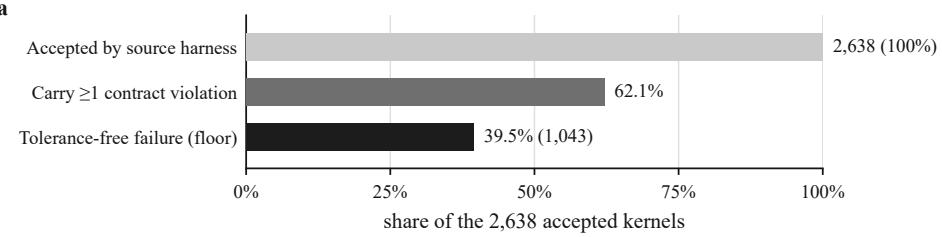
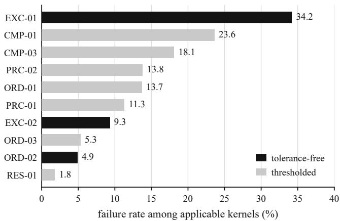
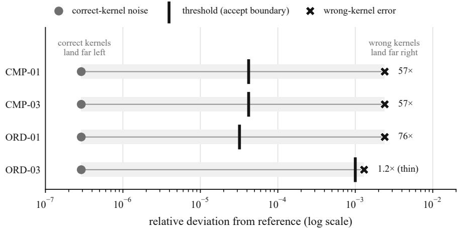
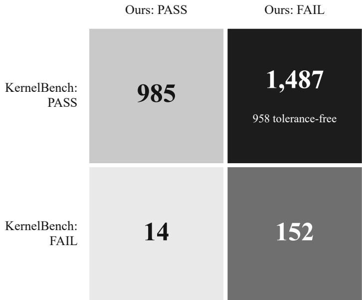

# A Contract-Grade Verifier for LLM-Generated GPU Kernels, and a Native Blackwell Backward for the Gated-Linear-Recurrence Family

Rishi Shah   
Machine Learning Engineer E3A Healthcare   
rishishah994@gmail.com   
Rishav Shrestha   
Chief Technical Oficer   
E3A Healthcare   
rishav@e3ahealth.com

Preprint. DOI: 10.5281/zenodo.21563213

## Abstract

Systems that generate GPU kernels with language models report high correctness rates. Those rates come from a single loose test: run the kernel on a few random inputs at one fixed shape and accept it if the output is close to a reference. A kernel can pass that test and still be silently wrong. It can return an ordinary number where the true answer is a NaN or an infinity, produce a diferent result on each run, break the moment the shape changes, or accumulate in fp16 where the reference keeps an fp32 total. We build the instrument that checks correctness properly: a contract-grade verifier of twelve adversarial gates, each a property a correct kernel must satisfy, several of them tolerance-free so that no choice of threshold can explain a failure away. We aim it in two directions. Aimed outward, the verifier audits 2,638 machine-generated kernels that a public system’s own harness had already accepted as correct. It finds 39.5% broken beyond any tolerance argument, and 62.1% carrying at least one violation. The field’s standard test accepts 1,487 kernels the verifier rejects, against only 14 the other way. We defend the finding in four independent ways: a 7/7 positive control, a threshold-calibration sweep, 98.5% agreement with the reference benchmark’s own correctness code, and a stratified hand-audit. Aimed inward, we test the verifier on a kernel of our own: the first native Blackwell tcgen05 training backward for the gated-linear-recurrence (GDN) family, including the reverse-state stage the field still runs on a fallback. We establish this kernel’s correctness independently of the verifier, against a double-precision oracle, and train five family members through it, so it is a subject whose correctness we have already established. Running it through the battery is then a direct check that the battery is not tuned to flatter its author. The correctness signal behind reported progress in kernel generation is far weaker than the numbers suggest, and a set of tolerance-free contracts would close most of the gap.

## 1 Introduction

Generating GPU kernels with large language models has become an active research program, and its benchmarks report that a large fraction of outputs are correct and often faster than a reference [8, 5, 2, 4, 6]. Those reports are only as trustworthy as the correctness signal beneath them, and that signal is almost universally a single test: draw a few random inputs at one fixed shape and accept the kernel if its output is close, in the allclose sense, to a reference. A kernel can pass this test and still be wrong in ways the test never probes. It can return an ordinary number where the reference returns a NaN or an infinity, produce a diferent result on each run, break the moment the sequence length or batch changes, or accumulate its reduction in fp16 while the reference keeps an fp32 running total. If the acceptance signal is this weak, an unknown share of the reported wins is illusory.

This paper is about that gap and the instrument that measures it. We build a contract-grade verifier that operationalizes the Kernel Contracts taxonomy [12]: twelve adversarial gates, each a property a correct kernel must satisfy, graded against a slow high-precision reference. Some gates need no tolerance at all and compare by exact mask or byte equality; the rest use tolerances derived from a floating-point error model rather than chosen by hand. The verifier is the spine of the paper, and we aim it in two directions.

Aimed outward, the verifier audits a public corpus of machine-generated kernels that the source system’s own harness has already accepted as correct, and measures how far those acceptances overstate correctness: 39.5% are broken in a way no tolerance can excuse. The obvious objection is that our checker is simply stricter than everyone else’s, so foreign kernels fail by construction. We answer it in four independent ways: a positive control on a kernel we can independently vouch for, a threshold-calibration sweep, 98.5% agreement with KernelBench’s own correctness code [8], and a stratified hand-audit of disputed cases. The standard by which we judge is therefore not ours alone.

Aimed inward, the same verifier judges a kernel of our own: a hand-written native Blackwell tcgen05 training backward for the gated-linear-recurrence (GDN) family, whose reverse-state stage open implementations still run on a fallback. It is a genuine first in its own right, and we establish its correctness against an independent double-precision oracle. Running it through the verifier is then a positive control: the same battery that rejects the foreign corpus is turned on a kernel we already know is correct, and it passes. That pass is the direct check that the battery is not merely tuned to fail foreign code. The two uses meet in the data, since the failure modes that most often sink the foreign kernels are detected by the same gates that surfaced real defects in our own kernel during development. Because the checker that rejects our failed ideas also clears a kernel we can independently vouch for, its acceptances carry weight and its rejections are diagnostic rather than arbitrary.

Contributions.

• A twelve-gate contract-grade verifier (Section 3) that operationalizes the Kernel Contracts taxonomy [12] at scale, with tolerance-free gates that need no threshold and thresholded gates whose bounds are derived, not guessed, and a red team of nineteen deliberately-broken kernels that demonstrates, in both directions, that the referee has teeth.

• An at-scale rigor-gap audit of 2,638 accepted kernels (Section 3): a tolerance-free floor of 39.5%, with 62.1% carrying a contract violation. Four independent defenses hold the finding up: a 7/7 positive control, a threshold-calibration sweep, 98.5% agreement with KernelBench’s own correctness code, and a stratified hand-audit. A diferential against the standard test shows that it certifies 1,487 broken kernels, against 14 in the reverse direction.

• The first native Blackwell tcgen05/tensor-memory training backward for the GDN family (Section 4), including the reverse-state stage others keep in Triton. It is verified to 3.3 × 10−3 against an fp64 oracle, it is bit-for-bit deterministic, it trains five family members through one backward, and it handles correctly the tensor-memory constraint behind the open #904 bug.

• Supporting results and methodology (Appendix C): five further results, among them six contract-verified Mamba-3 kernels that bypass #904 on Blackwell, a 1.1B-parameter model trained end-to-end on those kernels, and a from-scratch GRPO system that autotunes them, each reported with the number behind it.

We interpret and stress-test these results in Section 5 and state their limitations plainly. All quantitative claims are backed by committed artifacts under a fixed software environment; single-row reproduction of any audited kernel requires only the public verifier and the public MIT-licensed corpus.

## 2 Background and Related Work

Generating GPU kernels, and how their correctness is judged. A line of work trains or prompts language models to emit GPU kernels that replace a reference operator, and grades them on suites such as KernelBench [8] and TritonBench [5], or on system-specific corpora such as Dr. Kernel / KernelGYM [2] and the Sakana AI CUDA Engineer archive [4]. Across these, correctness is decided by an approximate equality check (torch.allclose at $\scriptstyle \mathtt { a t o l } = \mathtt { r t o l } = 1 0 ^ { - 2 }$ in the common KernelBench setting) over a handful of random inputs at a single fixed shape. This is inexpensive and reproducible, but it probes a narrow slice of a kernel’s behavior.

The correctness illusion, and how our work difers. The observation that loose checks accept broken kernels is not new. Sarkar [9] argues the point on a hand-built set of twenty-four kernels but reports no rate on any real accepted corpus. A separate strand documents performance loopholes, kernels that game the timing harness by reusing an output bufer, returning a lazily-evaluated tensor, or exploiting a fixed input, in the Sakana [4] and CUDA-L1 [6] systems, with a companion line of work hardening harnesses against such exploits [18]; this is an axis orthogonal to the numerical silent-wrongness we measure. The Kernel Contracts taxonomy [12] enumerates correctness classes for GPU kernels. That taxonomy is theirs and we cite it as such; what is ours is the first runnable, at-scale operationalization of it, to the best of our knowledge. Our distinct contributions over this literature are a tolerance-free correctness measure that needs no approximate-equality threshold, a quantified audit on thousands of accepted, real kernels, and a certified native artifact the same verifier passes.

The gated-linear-recurrence family. Sub-quadratic sequence models replace attention’s quadratic cost with a fixed-size recurrent state. Mamba [3] and its structured-state-space-duality successor Mamba-2/SSD [1], gated linear attention (GLA) [15], DeltaNet [16] and its gated variant [14], and Mamba-3 [7] all instantiate one gated linear recurrence. As we make precise in Section 4, roughly 80% of the parameterization is shared, so a single backward diferentiating the general recurrence yields the training gradients for all of them. The training backward is dominated by two hard stages, a reverse-time inter-chunk state scan and a WY / triangular-inverse vector-Jacobian product, and the reference open-source implementation of both is the Triton flash-linear-attention (fla) library [17], which is our speed baseline.

Blackwell tcgen05, tensor memory, and #904. NVIDIA’s Blackwell generation (the B200, architecture sm\_100) adds a fifth-generation tensor core, tcgen05, whose matrix-multiply operands reside in a new scarce on-chip space, Tensor Memory (TMEM), governed by a hard 512-column budget per warpgroup. A multi-GEMM kernel must manage TMEM allocation and release lifecycles by hand; a lifecycle error yields illegal machine code or a deadlock. This constraint is the crux of the open issue state-spaces/mamba#904 [11]: the oficial Mamba-3 backward uses the tensor-core matmul (tl.dot), and at the normal performance setting a compiler pass requests 544 TMEM columns against the hardware’s 512, so the kernel fails to compile and falls back to a path reported as 38.7× slower on GB200/B200. The tensor-memory half of the failure is addressed by a merged Triton change (PR #9093) not yet shipped in a Mamba release, so a pinned pre-#9093 stack still reproduces it. Both of our headline contributions also engage this constraint: the verifier’s RES-02 gate detects it, and the native backward gets the lifecycle right where the oficial kernel does not.

## 3 A Contract-Grade Verifier and the Rigor-Gap Audit

We first describe the verifier and its fairness properties, then the audit and its four independent defenses, then the diferential against the benchmark’s own harness, and finally the robustness of the finding across a second stack and a second corpus.

## 3.1 The twelve gates

A kernel that passes a single random-input, fixed-shape check can still be wrong on extreme inputs, wrong at a diferent shape, nondeterministic, secretly low-precision, or wrong about non-finite values. The verifier therefore asks twelve questions, each an adversarial contract graded against a slow reference (Table 1). The reference for every operator is a plain high-precision loop that is defined to be ground truth and refuses to execute in reduced precision so that it cannot be misused as a candidate.

Table 1: The twelve contract gates, operationalizing the Kernel Contracts taxonomy [12]. Gates in the tolerance-free group (EXC-01, EXC-02, ORD-02, plus aliasing and crash detection) compare by exact mask or byte equality and admit no tolerance argument; the remaining gates use scale-aware derived tolerances.
<table><tr><td>Gate</td><td>Property checked</td></tr><tr><td>CMP-01</td><td>correct on many random and adversarial inputs (zeros,  $1 0 ^ { 6 } , 1 0 ^ { - 6 } .$  , denormals, long L)</td></tr><tr><td>CMP-02</td><td>the gradients are correct, not only the outputs (autograd versus finite difference)</td></tr><tr><td>CMP-03</td><td>correct across shapes (batch, length, width), not only the one tested</td></tr><tr><td>ORD-01</td><td>reordered summation stays within a derived ∝ √N rounding bound</td></tr><tr><td>ORD-02</td><td>byte-for-byte identical across five repeats, and does not alias a shared buffer</td></tr><tr><td>ORD-03</td><td>correct on an input constructed to expose a bad summation order</td></tr><tr><td>PRC-01</td><td>correct in fp32, fp16, and bf16</td></tr><tr><td>PRC-02</td><td>fed fp16, still keeps an internal fp32 running total</td></tr><tr><td>EXC-01</td><td>infinities and NaNs land in exactly the same positions and signs as the reference</td></tr><tr><td>EXC-02</td><td>flush-to-zero handling of subnormals matches the reference</td></tr><tr><td>RES-01</td><td>output lives on the same device as the input</td></tr><tr><td>RES-02</td><td>the compiled kernel fits real hardware limits (registers, shared memory, TMEM budget)</td></tr></table>

Two design choices make the battery rigorous. First, every tolerance is derived rather than chosen: ORD-01’s bound follows how floating-point error actually accumulates over a reduction, atol $\approx 4 \varepsilon \sqrt { N }$ · scale, so a correct kernel passes with wide margin and a wrong one misses by orders of magnitude, and every knob is set at the loosest point that still sides with the candidate. Second, each gate re-seeds the random number generator from a fixed value before drawing inputs, so a verdict depends on the kernel and not on luck. We report a structural caveat: on a forward-only inference corpus, CMP-02 (gradient) has no autograd graph to check and RES-02 (resource metadata) has no compile-time metadata to read, so ten of the twelve gates carry the audit. Of those ten we treat seven as load-bearing: CMP-01/03, ORD-01/02, EXC-01/02, and PRC-01. The other three are set aside for stated reasons rather than by fail rate. ORD-03 is the deliberately-relaxed backstop whose coverage is carried by CMP-01 and ORD-01; PRC-02 is not a band-gate and is graded by a separate accumulator mechanism; and RES-01 is low-signal at 1.8%. Both idle gates are exercised by the positive control of Section 3.3.

To show the verifier has teeth, the repository ships nineteen deliberately-broken kernels, each embodying one trick: returning its input, caching an answer, accumulating in fp16, behaving nondeterministically, flipping an infinity to a finite value, working at only one shape, or silently moving data to another device. A test asserts that the verifier rejects every one and clears the honest reference. Catching all nineteen while clearing the honest operator is the two-sided check that makes the referee trustworthy before it is ever aimed at foreign code.

## 3.2 The audit

We ran the verifier over Dr. Kernel / KernelGYM [2] (hkust-nlp/drkernel-coldstart-8k, MIT license), a public corpus of 8,920 supervised-fine-tuning trajectories each ending in a Triton kernel that replaces a PyTorch module in the KernelBench Model/ModelNew convention. This corpus was the richest auditable release among the systems we surveyed. Auditing its SSM-adjacent operator classes (matmul, attention, softmax, scan, norm, conv, reduction) yields 3,134 kernels, each run on a B200 (torch 2.12 / triton 3.7) in its own sandboxed subprocess. After excluding toolchain and compile artifacts, 2,638 of these were accepted as correct by the source system’s own harness (final\_speedup > 0). That predicate records their correctness verdict and not merely a successful timing run: in this corpus a kernel is timed, and a speedup written, only once it has passed the harness’s own correctness check. This accepted-only set is therefore the headline denominator, the population whose correctness has already been certified.

Fairness is enforced in code by eighteen rules, each pinned by its own unit test. Inputs that the reference itself cannot run are marked not-applicable and never counted as candidate failures; tolerances sit at the loosest defensible point; positions at which candidate and reference agree on a NaN or an infinity are not charged as value mismatches, since a non-finite admits no tolerance comparison, while a swallowed non-finite is still caught by EXC-01; a candidate is charged only for its own declared compute precision; and the mixed-precision and shape conventions are fixed in advance. These rules move every ambiguous case toward the candidate.

  
Figure 1: The rigor-gap finding. Top: of the 2,638 kernels a public system’s own harness accepted as correct, 62.1% carry at least one contract violation and 39.5% (1,043) fail a tolerance-free gate, the floor no tolerance argument can reach. Bottom: per-gate failure rate among the kernels where each gate applies (tolerance-free gates in solid black). The modal defect, EXC-01 non-finite non-propagation, is the failure mode that turns a training-time error into silent data corruption. Per-gate rates use per-gate applicability denominators and are therefore not additive to the corpus-level floor above; exact counts are in Appendix B.

Headline. Among the 2,638 accepted kernels, 62.1% carry at least one contract violation, and 39.5% (1,043 of 2,638) fail a tolerance-free gate, meaning they are broken in a way no tolerance argument can excuse. Figure 1 presents the finding as an acceptance funnel over the 2,638 kernels together with the per-gate failure rates (exact counts in Appendix B). The modal defect is a kernel silently replacing a NaN or infinity with an ordinary number (EXC-01), the failure mode that converts a training-time error into silent data corruption. Both figures are robust to aggressive re-slicing. The tolerance-free floor rises to 41.1% once CMP-03 shape rejection is added to it. The 62.1% violation rate survives stripping the entire matmul class, the worst case for the TF32 tolerance argument, at 61.9%, and survives an all-contested-channels strip at 60.6%.

## 3.3 Four independent defenses of the finding

We return to the objection raised in Section 1, that the checker is simply stricter than everyone else’s and foreign kernels therefore fail by construction. We answer it in four ways, each falsifiable on its own.

(1) Positive control: 7/7. Our own six Mamba-3 Triton kernels (Appendix C.1) and the native GDN backward (Section 4) run through the same battery in the same Model/ModelNew convention. All seven pass every applicable gate and are clean on every tolerance-free channel, the exact classes that sink the foreign corpus. One of the seven is independent by construction. The verifier’s tolerance model was calibrated against those six Triton kernels, whereas the native GDN backward played no part in calibration, so it is a control the thresholds were never fitted to. The tolerance-free channels carry no threshold to calibrate in any case, which makes a clean result on those channels calibration-independent for all seven. The control is not a formality: it caught a genuine gap in our own code. C5 (fused\_block\_forward) inferred its channel dimension from the input tensor without checking it against the convolution-weight channels, a missing input-validation guard rather than a wrong-answer bug. We surfaced and fixed it (a one-line channel-mismatch guard, commit 7f46226), after which the control reads 7/7. A checker tuned to flatter its author would not have flagged the author’s own kernel.

(2) Threshold calibration. This is the graded version of the positive control. For each band-gate on a known-correct operator, we inject a perturbation of known magnitude and locate the exact pass-to-fail trip point, bracketed between the honest noise floor (the error a correct kernel emits) and the real-error onset (the error a wrong kernel emits). Every band-gate shows clean separation (Figure 2; the precise margins are tabulated in Appendix B). We disclose the one thin margin: ORD-03 sits only 1.2× below its real-error onset because it is the deliberately-relaxed gate, and its coverage is carried by CMP-01 and ORD-01.

  
Figure 2: Threshold calibration. For each band-gate, the chosen threshold (bar) sits inside the safe margin between the noise a correct kernel emits (circle, left) and the error a wrong one emits (cross, right), on a log scale of relative deviation from the reference. The thresholds are neither too tight, so a correct kernel is never flagged, nor too loose, so a wrong one is always caught. ORD-03’s upper margin is disclosed as thin (1.2×); it is the deliberately-relaxed gate, and its coverage is carried by CMP-01 and ORD-01. PRC-02 is graded by a diferent mechanism (an fp16-carry accumulator crosses its threshold for �≥2048) and is omitted here.

(3) The benchmark’s own harness agrees (98.5%). To close the objection that our replica of the standard check is not faithful to it, we ran KernelBench’s own correctness code [8] at the pinned commit 48642c5c on the accepted pairs and joined their verdict against our reimplementation. Agreement is 98.5% over 1,030 pairs (844 pass/pass, 171 fail/fail, 15 disagreements). Of the 15 disagreements, 7 are our replica being stricter, which cannot inflate the finding, and 8 are seed-borderline flips in the loose paper-era allclose. The two patches we needed were scoped to loading, not checking (device-index resolution and importing from a temporary file so that Triton traces the source), so the correctness logic under test is byte-for-byte theirs. The diferential of Section 3.4 therefore rests on their code.

(4) Stratified hand-audit. We hand-traced 31 disputed cases from the load-bearing cell (accepted by the benchmark, rejected by us), stratified across every channel, and classified each from the gate semantics and the failure signature: 16 are genuinely broken (the tolerance-free core), 8 are real but tolerance-dependent (the class a loose allclose hides, and the reason the diferential cell exists), and 7 are reclassified as out of scope and dropped from the strict floor. That the audit discards 7 of the 31 as out of scope, rather than confirming all of them, is evidence that it does not rubber-stamp its own conclusion. Representative rows a reader can spot-check: id 179, a scan of by $1 . 1 \times 1 0 ^ { 2 \dot { 2 } }$ on plain random input that the fixed-shape allclose accepted; id 518, a 36× “speedup” from a candidate whose output is unparseable; and id 123, a softmax correct at native shape but wrong by 0.30 at four times the sequence length.

## 3.4 The diferentia

Running the same accepted kernels through KernelBench’s standard paper-era check (allclose $\scriptstyle \mathtt { a t o l } = \mathbf { r t o l } = 1 0 ^ { - 2 }$ , five random-input trials, fixed shapes) [8] produces the 2 × 2 contingency table of Figure 3. The benchmark accepts 93.7% (2,472 of 2,638) of these kernels. The load-bearing cell, external PASS and our FAIL, is 1,487 (56.4% of the accepted set), of which 958 fail on a tolerance-free gate. The reverse cell, external FAIL and our PASS, is only 14 (0.5%), so our battery is not simply a stricter allclose that flags everything; the two checks disagree almost entirely in one direction. Under KernelBench’s hardened per-dtype variant (fp32 tolerance $1 0 ^ { - 4 } )$ the accept rate falls to $8 4 . 6 \%$ , but 1,263 kernels still pass their check and fail ours, so the finding survives the tightened check. The standard test certifies nearly 1,500 broken kernels as correct.

  
Figure 3: The diferential, a 2 × 2 contingency table with each cell shaded by its count. KernelBench’s own paper-era check accepts 93.7% of these kernels; the load-bearing cell (accepted by the benchmark, rejected by us) holds 1,487 kernels, 958 of them on a tolerance-free gate, while only 14 go the other way. The near-unidirectional disagreement is the signature of a systematic blind spot in the acceptance signal, not of two checks tuned to diferent strictness.

## 3.5 Robustness: a second stack and a second corpus

The finding reproduces on a diferent software stack: a 300-kernel re-audit on torch 2.11.0+cu128, against the audit’s 2.12, returns 68.6% on the same B200 silicon. It runs above the 62.1% headline only because the smaller sample over-weights the high-rate reduction class. The pre-registered kill criterion was a re-audit rate below 5%; the observed 68.6% clears it by more than thirteen times. A second corpus of native CUDA kernels, the Sakana AI CUDA Engineer archive [4] graded by the system’s own Correct boolean (213 kernels), shows a related but weaker pattern. Its raw 100% fail rate is precision-dominated, because the kernels are fp32-only by design, so we do not report it as a headline figure. The environment-robust residual is 20.2% (43 of 213), driven by CMP-03 shape rigidity (37), EXC-02 subnormal handling (9), ORD-02 nondeterminism (4), and CMP-01 value (1). These per-gate counts total 51 across 43 distinct kernels, because 8 kernels fail more than one non-precision gate. There is no mass silent-wrongness (CMP-01 1/213; median maximum diference 0.001). We read this as the same rigor gap recurring in native CUDA along a complementary and weaker axis of precision and shape rigidity, rather than as a second 62%.

## 4 A Native tcgen05 Backward for the GDN Family

The second contribution is a piece of systems software that the verifier and a double-precision oracle jointly certify: a hand-written native Blackwell tcgen05 tensor-memory training backward for the gated-linear-recurrence family.

## 4.1 One recurrence, five models

A Mamba-style selective scan keeps a vector state ℎ and updates $h _ { t } \ = \ \bar { a } _ { t } \odot h _ { t - 1 } + \bar { b } _ { t } \odot u _ { t }$ $y _ { t } = C _ { t } ^ { \top } h _ { t } + D \odot u _ { t }$ , where the per-step decay ${ { \bar { a } } _ { t } }$ and write ${ { \bar { b } } _ { t } }$ are recomputed from the input at every step. That input dependence, known as selectivity, is what makes the model expressive and what forbids precomputing the scan as one matrix multiply. The models we target use a matrix state � of shape $d _ { k } \times d _ { \nu }$ and the stronger gated DeltaNet (GDN) update. Writing $q _ { t } , k _ { t }$ for queries and keys, $\nu _ { t }$ for values, and three gates $g _ { t }$ (per-channel log-decay), $b _ { t }$ (erase), and $w _ { t }$ (write),

$$
S _ { t } = \left( I - k _ { t } ( b _ { t } \odot k _ { t } ) ^ { \top } \right) \operatorname { D i a g } ( e ^ { g _ { t } } ) S _ { t - 1 } + k _ { t } ( w _ { t } \odot \nu _ { t } ) ^ { \top } , \qquad o _ { t } = S _ { t } ^ { \top } q _ { t } .\tag{1}
$$

Equation (1) combines channel-wise decay, the delta rule (the model subtracts what � already predicts for a key before writing, so it stores the correction rather than the raw value), a rank-one write, and a read with $q _ { t }$ . The delta rule couples every step to the entire state, and the backward must unwind that coupling in reverse.

Equation (1) is a superset. Fixing its gates recovers named models (Table 2), and because roughly 80% of the parameterization is shared, one backward diferentiating (1) once produces the training gradients for all five. We verify this rather than assert it: each member is re-derived independently from its own definition and checked against its own reference, not by setting knobs on the GDN path. Two reductions are exact enough to serve as built-in tests: $\scriptstyle b = w = \beta$ reduces (1) to the KDA equation at machine precision, and �=0 makes an entire triangular-solve stage vanish $( M { = } 0 \Rightarrow T { = } I )$ .

Table 2: One recurrence, five models. Each named model is a gate setting of the general recurrence, so a single hand-written backward trains them all, and each is verified against its own independent reference.
<table><tr><td>Model</td><td>Recurrence  $S _ { t } = . . .$ </td><td>gate setting</td></tr><tr><td>LA (linear attention)</td><td> $S _ { t - 1 } + k _ { t } \nu _ { t } ^ { \top }$ </td><td> $g = b = 0 , \ w = 1$ </td></tr><tr><td>GLA (gated linear attention)</td><td> $\mathrm { D i a g } ( e ^ { g _ { t } } ) S _ { t - 1 } + k _ { t } \nu _ { t } ^ { \top }$ </td><td> $b = 0 , \ w = 1$ </td></tr><tr><td>SSD / Mamba-2 (scalar decay)</td><td> $e ^ { g _ { t } } S _ { t - 1 } + k _ { t } \nu _ { t } ^ { \top }$ </td><td>scalar g</td></tr><tr><td>KDA (Kimi Delta Attention)</td><td> $\left( I - \beta _ { t } k _ { t } k _ { t } ^ { \top } \right) \mathrm { D i a g } \left( e ^ { g _ { t } } \right) S _ { t - 1 } + \beta _ { t } k _ { t } \nu _ { t } ^ { \top }$ </td><td> $\scriptstyle b = w = \beta _ { t }$ </td></tr><tr><td>GDN (gated DeltaNet)</td><td>the full recurrence (1)</td><td>per-channel  $b , w , g$ </td></tr></table>

## 4.2 The two hard kernels

The scan is sequential; the GPU wants parallelism. The standard resolution is chunking: split the sequence into chunks of 64 steps, do the parallelizable work inside all chunks at once, then run a short sequential carry between chunks. The backward runs this in reverse, and two stages are genuinely hard.

• K#1, the reverse inter-chunk state scan. A reverse-time walk accumulating the state gradient �� (shape $d _ { k } \times d _ { \nu } , \tt f p 3 2 )$ backward across chunks, with a rank-one correction at each step from the delta rule. This is the sequential, carried stage, and it is the exact piece that open libraries still run on a Triton fallback. Making it native tcgen05 with the $d S$ accumulator resident in TMEM across the whole loop is the sharpest single element of the contribution.

• K#2, the WY / triangular-inverse VJP. Inside each chunk the delta rule requires a small triangular solve $T = ( I + M ) ^ { - 1 }$ , and its vector-Jacobian product is the numerically nastiest piece. The forward already computed �, so the backward reuses it as two triangular matrix multiplies and never re-inverts.

Everything else in the backward is genuine work, but it is supporting glue. The design keeps K#1 and K#2 as native kernels while the glue is torch, and the glue is progressively fused in.

## 4.3 Scope of the novelty claim

As surveyed: NVIDIA ships an SSD forward but no backward in either of its two stacks; cuLA has a KDA backward that is a hybrid (one native CuTe kernel for the WY stage, but the reverse-state K#1 stage still in fla Triton); FlashKDA is forward and inference only; and tilelang has GDN/KDA backward examples with no tcgen05/TMEM in them. The contribution is therefore two firsts: a native Blackwell tcgen05/TMEM training backward for the GDN family, and a native tcgen05 reverse-state backward, the stage others still run in fla Triton. We do not claim the first native backward kernel for the family (cuLA’s WY predates ours), the first non-Triton GDN/KDA backward (tilelang exists), or bit-for-bit parity (our parity is fp64-tight, not bitwise).

## 4.4 Clearing the tensor-memory constraint

The first attempt to run two or more matrix multiplies in one kernel produced illegal machine code or a deadlock, the same failure class behind #904. The root cause, established by reading NVIDIA’s own mamba2\_ssd.py in the same pinned toolchain, was a lifecycle error: the kernel reserved the full 512-column TMEM budget and released it per matrix multiply, which the hardware forbids. NVIDIA’s kernel instead runs four tcgen05 MMAs, including the cross-chunk recurrence, with a single reservation, fixed per-accumulator column ofsets, and one release at the end. Porting that lifecycle, ofset-partitioned accumulators with alloc-once and relinquish-once, cleared the blocker. What it unblocked is the contribution itself: the native reverse-state scan and WY-VJP for the GDN family, hand-written on the (128, 64, 128) tcgen05 tile with TMA data movement and async pipelines, the backward stages that open implementations otherwise keep in fla Triton.

## 4.5 Verification and the oracle chain

Correctness is anchored by a layered ground-truth ladder, each rung checked against the one below: a token-serial fp64 oracle, a chunkwise reference, an fp64 torch assembly of the K#1/K#2 references with glue, and finally the tcgen05 kernels on the B200. Applied to the native backward, the ladder gives the following:

• Double-precision spec pins on the reverse-state-scan tile and the WY-VJP tile, about $7 \times 1 0 ^ { - 1 6 }$ against the closed-form spec (machine-exact).

• The full assembled backward against an independent fp64 oracle: worst relative error $\mathbf { 3 . 2 9 \times 1 0 ^ { - 3 } }$ (scalar) and $\mathbf { 3 . 3 1 \times 1 0 ^ { - 3 } }$ (channel-wise), both under the $5 \times 1 0 ^ { - 3 }$ acceptance bound, and bit-for-bit deterministic across runs. One configuration sits outside that bound, and we report it here rather than in the limitations: the widest $d _ { \nu } { = } 1 2 8$ save-forward arm reaches $5 . 2 1 \times 1 0 ^ { - 3 }$ , a 4% overrun. It is a property of the assembled pipeline arm and not of the kernel, which measures $5 . 5 \times 1 0 ^ { - 4 }$ against the same fp64 oracle, and the acceptance claim is scoped accordingly.

• It trains. The native backward runs real 300-step training loops with zero numerical blow-ups, once a masked-exp2 fix corrected an exponent overflow that had produced a NaN. Every family member trains through the native path with the reference fallback disabled, that is, on the real kernels: the four reductions (LA, GLA, SSD, KDA), with LA run at �=64 over 4000 steps, and the full GDN recurrence, which the backward diferentiates directly. Fresh-input graph replay is bit-exact against eager execution.

• Positive control. The native backward passes the full twelve-gate battery of Section 3, clean on every tolerance-free channel.

Verification envelope. The committed CPU test suite validates the mathematical scafolding, the references, the assembly, and the fp64 spec pins. The tcgen05 kernels themselves are exercised only on the B200, over a narrow shape envelope $( d _ { k } \mathrm { = } 1 2 8$ , chunk=64, $d _ { \nu }$ ∈ {64, 128}) at a loose fp16 tolerance. This is a real limitation and we return to it in Section 5.

## 4.6 Speed

The native GDN backward is slower than the fla Triton library [17], by roughly 8× at �=512 rising to about 78× at �=2048; we do not claim parity. The gap is structural: fla sits near a 0.9 ms latency floor because it reuses the delta-rule inverse saved in the forward pass, while our reverse-state scan is inherently sequential and most of our runtime is spent in the surrounding fp32 glue rather than in the tensor-core kernels. The speedups we report are over our own earlier pipeline, not fla: a channel-wise fusion campaign cut the captured backward 2.75× (from 52.9 to 19.2 ms), and a tensor-memory tiling optimization cut the $d _ { \nu } = 1 2 8$ save-forward variant 2.98× (from 24.50 to 8.23 ms). The contribution is that the kernel is native, general across the family, and verified; speed is future work.

## 4.7 The bridge: the audit’s failure modes are the gates that judged our own kernel

The verifier’s two uses, the outward audit of Section 3 and the inward acceptance gate of this section, are joined not only by shared code but by shared data. The defects that most often sink foreign kernels are, gate for gate, detected by the same gates that caught real errors in our own kernel during development, and the hardware constraint the native backward had to clear is the same one the verifier’s RES-02 gate is built to detect. Table 3 aligns the two. We read the alignment as the strongest available evidence that the instrument’s outward and inward uses are one argument: a checker that flattered its author would neither have caught the author’s own bugs nor shared a failure surface with the corpus it indicts.

Table 3: The bridge. Each row aligns a failure mode the audit finds in foreign kernels with the same gate acting on our own kernel. The first three rows are the substantive alignments (a caught bug or a shared hardware constraint); the last two are pass-by-design robustness. All figures are drawn from Section 3 and Section 4; no new numbers are introduced.
<table><tr><td>Gate (foreign fail rate)</td><td>Failure mechanism</td><td>Where our kernel was at risk</td><td>How the gate resolved it</td><td>Bridge strength</td></tr><tr><td>RES-02 (idle in audit; = #904 class)</td><td>Requests 544 TMEM columns vs. the 512 budget, so the kernel yields illegal code, a deadlock, or a slow fallback</td><td>First multi-GEMM attempt hit the same failure class (Section 4.4): reserved 512 and released per-MMA, which the hardware forbids</td><td>RES-02 detects #904; cleared with alloc-once / relinquish-once and offset-partitioned accumulators</td><td>Strong (shared hardware constraint)</td></tr><tr><td>CMP-03 shape breakage (18.1%)</td><td>Correct at the tested shape, wrong at another</td><td>C5 fused_block_forward inferred channel dim from input without checking conv-weight channels (Section 3.3)</td><td>Positive control flagged it; one-line channel guard (commit 7f46226); control then 7/7</td><td>Strong (real bug, fixed not reclassified)</td></tr><tr><td>EXC-01 non-finite non-propagation (34.2%, modal)</td><td>Silently returns a finite number where the reference is NaN/Inf</td><td>Two NaN-generating bugs: masked-exp2 exponent overflow (Section 4.5); A_1og drift, decay  $e ^ { \delta A } > 1$  state blow-up (Appendix C.3)</td><td>Caught because our kernel propagated the NaN instead of swallowing it, the inverse of the foreign defect</td><td>Strong (propagation makes bugs catchable)</td></tr><tr><td>accumulator (13.8%)</td><td>PRC-02 dropped fp32 Reduction accumulates in fp16, losing precision</td><td>dS state gradient is the whole reverse-state loop by lapse design</td><td>Passes by construction; fp64 fp32-resident in TMEM across oracle chain would expose any</td><td>Supporting (pass-by- design)</td></tr><tr><td>ORD-02 nondeterminism (4.9%)</td><td>Different output across runs / n/a (not at risk) buffer aliasing</td><td></td><td>Bit-for-bit deterministic across runs; graph replay bit-exact vs. eager (Section 4.5)</td><td>Supporting (pass-by- design)</td></tr></table>

Three alignments are substantive. The tensor-memory constraint is the sharpest: the lifecycle error described in Section 4.4 is the exact failure class behind the open #904 bug, and it is the constraint the verifier’s RES-02 gate exists to detect. Because the audit corpus is forward-only, RES-02 contributes no foreign failure count, so this row bridges through the taxonomy and through our own reproduction of #904 rather than through a measured rate. We state that limitation rather than let the table imply otherwise.

The second alignment is shape rigidity. CMP-03, shape breakage, fails 18.1% of applicable foreign kernels, and it is the gate that surfaced the C5 channel-inference defect described in Section 3.3. That the same gate which rejects foreign kernels also flagged our own, and that we fixed the kernel rather than reclassified the verdict, is the concrete form of the fairness argument.

The third alignment is the modal foreign defect, and it carries the sharpest form of the thesis. EXC-01, non-finite non-propagation, is the single most common failure in accepted foreign kernels (34.2%): a kernel silently returns an ordinary number where the reference returns a NaN or an infinity. Our own kernel generated non-finite values twice during development, an exponent overflow fixed by a masked-exp2 (Section 4.5), and a drifted A\_log parametrization that made the state decay exceed one and blow up over long sequences, fixed by the standard � = − exp(A\_log) form (Appendix C.3). The instructive point is the asymmetry: the foreign defect is swallowing a non-finite, whereas our kernels propagated theirs, and it was precisely that propagation which made the errors visible at step 250 and during training. Non-finite propagation is not merely a gate to pass; it is the property that makes a kernel’s own failures catchable. A kernel that had silently substituted a finite value, the foreign failure mode, would have hidden the same bugs from us.

Two further gates, PRC-02 (fp32 accumulation) and ORD-02 (determinism), our kernel passes by construction rather than by catching a bug: the reverse-state gradient �� is fp32-resident in TMEM across the whole loop, and the backward is bit-for-bit deterministic across runs with graph replay bit-exact against eager execution (Section 4.5). We list them in Table 3 for completeness and mark them as pass-by-design, because a positive control that passed only by design would be weaker evidence than one that caught something; the substantive alignments are the first three.

## 5 Discussion

Why a tolerance-free floor is the right lens. Every prior treatment of generated-kernel correctness ultimately parameterizes acceptance by a tolerance, and a debate over the number follows. The tolerance-free floor sidesteps that debate. A kernel that returns a finite value where the reference returns a NaN, or a diferent answer on each run, or a wrong shape, is wrong under any tolerance, and 39.5% of an accepted corpus fails in exactly this way. We therefore lead with the floor as the conservative claim and treat the 62.1% as the wider, tolerance-dependent superset above it. The modal defect is instructive: EXC-01 non-finite non-propagation is not a rounding matter but a silent substitution of an ordinary number for a NaN or an infinity, which converts a detectable training-time error into undetectable data corruption. That the single most common failure in accepted kernels is of this kind, rather than a near-tolerance value mismatch, is the clearest evidence that the acceptance gap is qualitative and not a matter of a slightly-too-loose threshold.

The diferential is directional, and that is the point. A stricter checker that simply flagged more kernels would disagree with the loose check in both directions. Ours does not: the reverse cell, kernels the benchmark rejects but we accept, is 14 of 2,638 (0.5%). The disagreement is almost entirely one-directional, 1,487 to 14, which is the signature of a systematic blind spot in the acceptance signal rather than of two checks calibrated to diferent strictness. Combined with the 98.5% agreement against KernelBench’s own correctness code, this supports a specific claim: the gap is a property of what the standard check probes, not of a disagreement about how close is close enough.

On the fairness of the referee. The strongest threat to any audit like this is that the verifier is tuned to fail foreign code. We designed the four defenses to be falsifiable rather than rhetorical. The positive control could have failed and did surface a real gap in our own code, which we fixed rather than reclassified. The calibration sweep could have shown a gate firing inside the honest-noise band and instead shows clean separation on every gate but the one we disclose as thin. The external-agreement check could have diverged from KernelBench’s code and instead matches it 98.5% of the time, with every disagreement either our being stricter or a seed-borderline flip. The hand-audit could have confirmed all 31 disputed rows and instead discards 7 as out of scope. We read the convergence of four independent and separately falsifiable defenses as the reason the finding should be believed.

A slow certified kernel is not a contradiction of the thesis. The native backward is slower than fla, and we report the gap as structural rather than soften it. This is consistent with, not counter to, the paper’s stance. The contribution of the native kernel is that it is native, general across the family, and verified, closing a real implementation gap (the reverse-state stage open implementations run on a fallback) and getting the tensor-memory lifecycle right where the oficial kernel does not. That the same verifier which exposes foreign kernels also lets us state our own speed deficit precisely, with the structural mechanism named and one numerical caveat disclosed, shows the methodology working as intended.

Threats to validity. We note four. Corpus dependence: the headline rests on one primary corpus, a dependence mitigated by the cross-stack reconfirmation (68.6% on torch 2.11) and by the second, native-CUDA corpus (20.2% residual), which together show that the efect is neither toolchain-bound nor Triton-specific, though it is weaker on CUDA. Gate coverage: on a forward-only corpus, two of twelve gates are idle, so the audit rests on ten and efectively seven load-bearing gates; both idle gates are exercised by the positive control, but a corpus carrying autograd graphs would exercise CMP-02 directly. Reference correctness: the audit is only as good as its references, which is why the red team of nineteen cheats and the positive control on known-good kernels both run, and why the references refuse reduced precision. Native-kernel envelope: the tcgen05 kernels are verified on a narrow shape envelope at a loose fp16 tolerance on a single GPU generation, so their correctness claim is scoped to that envelope and not asserted beyond it.

Limitations. Beyond the envelope above, the native backward is kernel-accelerated rather than fully native: stage-B, the normalization gradient, packing, and masks remain in torch and are progressively fused in. The one accuracy exception, the $d _ { \nu } { = } 1 2 8$ save-forward arm at $5 . 2 1 \times 1 0 ^ { - 3 }$ , is reported and scoped in Section 4.5.

Implications and future work. The practical implication is that acceptance criteria for kernelgeneration benchmarks understate the correctness gap, and that a small set of tolerance-free contracts (non-finite propagation, determinism, shape polymorphism) would close most of it at modest cost; we suggest such contracts as a benchmark standard. On the systems side, the structural speed gap points to a specific lever (a tl.dot path on a post-#9093 Triton, and reducing the surrounding fp32 glue) rather than a general redesign.

## 6 Conclusion

Every reported result in GPU-kernel generation rests on a claim of correctness, and that claim rests on a test too weak to carry it. We built the instrument that tests it properly, a contract-grade verifier of twelve adversarial gates, several of them tolerance-free, and we aimed it in two directions. Aimed outward at a corpus of machine-generated kernels that a public system’s own harness had already accepted as correct, it found 62.1% carrying a contract violation and 39.5% broken in a way no tolerance argument can excuse. Aimed inward, the same battery judged a kernel of our own: the first native Blackwell tcgen05 training backward for the gated-linear-recurrence family, including the reverse-state stage the field still runs on a fallback. That kernel’s correctness was established independently of the verifier, against a double-precision oracle, machine-exact on the core tiles and $3 . 3 \times 1 0 ^ { - 3 }$ end to end, so its passing is a genuine positive control rather than a self-assessment. The same instrument that clears it is what lets us state its speed deficit against the frontier Triton library precisely, and we report that deficit as a structural negative rather than soften it. One instrument, two directions, and the same standard in both: the defects the verifier found in our own work are what make the defects it found in everyone else’s worth believing. The correctness behind the field’s reported progress is far weaker than its numbers suggest, and the same twelve contracts that expose the gap are enough to begin closing it.

## A Mathematical Details

Every formula here is traceable to the Mamba-3 paper [7] and the oficial state-spaces/mamba source.

Mamba-3 SISO forward. The continuous-time complex state-space model is ${ \dot { h } } = \operatorname { D i a g } ( A + i \theta ) h +$ $( B + i \hat { B } ) x , y = \operatorname { R e } \big ( ( C + i \hat { C } ) ^ { \top } h \big )$ . After exponential-Euler discretization it becomes a real SSM

$$
\begin{array} { r } { h _ { t } = e ^ { \Delta _ { t } A _ { t } } R _ { t } h _ { t - 1 } + \Delta _ { t } B _ { t } x _ { t } , \qquad y _ { t } = C _ { t } ^ { \top } h _ { t } , } \end{array}
$$

where $B _ { t } = [ B _ { t } ; \hat { B } _ { t } ] \in \mathbb { R } ^ { N }$ and $C _ { t } = [ C _ { t } ; - \hat { C } _ { t } ] \in \mathbb { R } ^ { N }$ stack the real and imaginary halves into one $N { = } d _ { \mathrm { s t a t e } }$ vector, and $R _ { t }$ is the block-diagonal rotation built from $\left[ \begin{array} { l } { \mathrm { c o s } { \Delta _ { t } \theta _ { t , k } } - \mathrm { s i n } { \overline { { \Delta } } _ { t } \theta _ { t , k } } } \\ { \mathrm { s i n } { \Delta _ { t } \theta _ { t , k } } \mathrm { c o s } { \Delta _ { t } \theta _ { t , k } } } \end{array} \right]$ over dimension pairs �. The RoPE angle is data-dependent and cumulative, $\textstyle \theta _ { t } = \sum _ { s \leq t }$ tanh $\left( \mathrm { a n g l e } _ { s } \right) \Delta _ { s } \pi$ (mod 2�), so the rotation at step � depends on the whole history and needs its own causal cumsum before the scan.

Mamba-3 MIMO. With input rank � and output rank �, the state decomposes into $R ^ { 2 }$ independent SISO scans with no cross-terms,

$$
h _ { t } ^ { ( j ) } = \alpha _ { t } h _ { t - 1 } ^ { ( j ) } + \Delta _ { t } B _ { t } ^ { ( j ) } x _ { t } ^ { ( j ) } , \quad h _ { t } = \sum _ { j = 0 } ^ { R - 1 } h _ { t } ^ { ( j ) } , \quad y _ { t } ^ { ( i ) } = ( C _ { t } ^ { ( i ) } ) ^ { \top } h _ { t } , \quad y _ { t } = \sum _ { i = 0 } ^ { R - 1 } y _ { t } ^ { ( i ) } \phi _ { i } ,
$$

where $x _ { t } ^ { ( j ) } = x _ { t } \odot \psi _ { j }$ is applied before the state update and $\phi _ { i }$ after the readout, both learnable and data-independent. The backward accumulates $d S$ over all output ranks first, then contracts per input rank; the two sums decouple.

The GDN backward’s two hard stages. For the general recurrence (1), the training backward reduces to the reverse-state scan $d S _ { t } = \mathrm { D i a g } ( e ^ { g _ { t } } ) d S _ { t + 1 } +$ (rank-one delta correction), walked backward, and the WY / triangular-inverse VJP, which diferentiates the chunk-local solve $T = ( I + M ) ^ { - 1 }$ by reusing the forward’s � as two triangular matrix multiplies. The channel-wise path folds the per-channel decay $\mathrm { D i a g } ( e ^ { g _ { t } } )$ inside those contractions; the scalar path $\scriptstyle ( b = w = \beta )$ recovers only channel sums of some gradients, which is why it serves as a reduced de-risking check while the channel-wise path carries the headline result.

## B Detailed Numerical Results

This appendix tabulates the exact numbers behind Figures 1 and 2.

Table 4: Per-gate results among the 2,638 accepted kernels (Figure 1, bottom panel). Count is the number of kernels that failed the gate; rate is that count over the kernels where the gate applied (rows the reference could not run are excluded), so the two columns are not directly divisible, and the per-gate rates are not additive to the corpus-level 39.5% floor. Tolerance-free gates are bold. CMP-02 and RES-02 have no applicable rows in this forward-only corpus, as Section 3.1 explains, and are exercised instead by the positive control.

<table><tr><td>Gate</td><td>Fail count</td><td>Fail rate</td></tr><tr><td>EXC-01 non-finite propagation (NaN/Inf swallowed)</td><td>868</td><td>34.2%</td></tr><tr><td>CMP-01 value on varied input</td><td>608</td><td>23.6%</td></tr><tr><td>CMP-03 breaks on a new shape</td><td>420</td><td>18.1%</td></tr><tr><td>PRC-02 missing full-precision accumulator</td><td>352</td><td>13.8%</td></tr><tr><td>ORD-01 reduction-order tolerance</td><td>351</td><td>13.7%</td></tr><tr><td>PRC-01 precision regimes</td><td>287</td><td>11.3%</td></tr><tr><td>EXC-02 subnormal handling</td><td>238</td><td>9.3%</td></tr><tr><td>ORD-03 adversarial reduction</td><td>136</td><td>5.3%</td></tr><tr><td>ORD-02 nondeterministic output</td><td>126</td><td>4.9%</td></tr><tr><td>RES-01 device residency</td><td>45</td><td>1.8%</td></tr></table>

Table 5: Threshold calibration (Figure 2). Each gate’s threshold sits between the noise a correct kernel emits and the error a wrong one emits. ORD-03’s thin upper margin (1.2×) is disclosed; it is the deliberately-relaxed gate. Lower noise floor and higher real-error onset are better; a wide margin on both sides is the goal. Margins are computed from unrounded measurements, while the noise-floor, threshold, and onset columns are displayed to two significant figures, so the printed ratios are not exactly reproducible from the printed values; ORD-03’s disclosed upper margin, for instance, is 1.243× unrounded.
<table><tr><td>Gate</td><td>Noise floor</td><td>Threshold</td><td>Real-error onset</td><td>Margin below</td><td>Margin above</td></tr><tr><td>CMP-01</td><td>2.9e-7</td><td>4.2e-5</td><td>2.4e-3</td><td>147×</td><td>57×</td></tr><tr><td>CMP-03</td><td>2.9e-7</td><td>4.2e-5</td><td>2.4e-3</td><td>147×</td><td>57×</td></tr><tr><td>ORD-01</td><td>2.9e-7</td><td>3.2e-5</td><td>2.4e-3</td><td>110×</td><td>76x</td></tr><tr><td>ORD-03</td><td>2.9e-7</td><td>1.0e-3</td><td>1.3e-3</td><td>3591×</td><td>1.2x</td></tr><tr><td>PRC-02</td><td>passes ∀N</td><td>2e-2</td><td>3.5e-2 (N=2048)</td><td>n/a</td><td>crosses N≥2048</td></tr></table>

## C Supporting Results

Around the two headlines sit five supporting results, each reported with the number behind it.

## C.1 Six contract-verified Mamba-3 kernels

We hand-wrote six Triton kernels for the Mamba-3 model (Table 6), with no tl.dot anywhere. Because they never touch the broken compiler pass, they compile and run at num\_warps 2/4/8 on Blackwell, where the oficial kernel loses every num\_warps≥4 configuration to the TMEM budget. This is an availability advantage, categorical and independent of any latency ratio. The six serve double duty: they are the forward and backward pieces used by the applied demonstration, and, because they were verified against hand-derived referencesfirst, they are the known-correct kernels against which the verifier’s tolerance model was calibrated before it was ever aimed at foreign code. We keep the two roles apart deliberately. These six fixed the thresholds; the positive control of Section 3.3 tests the verdicts, and the native GDN backward of Section 4 played no part in calibration, which makes it the one control among the seven that the thresholds were never fitted to. Four of the six drove three calibration findings that were folded back into the verifier: the scale-aware atol model from C1, PRC-02 fp16-carry separation from C2, C3, and C5, and EXC-02 subnormal-flush handling for afine ops from C5. The CMP-03 shape-rigidity convention sits on top of these as a cross-kernel design rule rather than a finding any one kernel surfaced. All six pass every applicable gate on B200, and the full GPU test suite passes at 1,197 tests.

Table 6: The six hand-written, contract-verified Mamba-3 Triton kernels, separate from the native GDN backward of Section 4.
<table><tr><td>#</td><td>Kernel</td><td>What it is</td></tr><tr><td>C1</td><td>forward_chunked_scan</td><td>the forward scan; surfaced the  $\varepsilon { \sqrt { N } }$  scale calibration model the verifier uses</td></tr><tr><td>C2</td><td>backward_selective_scan</td><td>the training backward that avoids the #904 trap and compiles where the official one fails</td></tr><tr><td>C3</td><td>mimo_backward</td><td>the multi-input/output backward; the first open Triton MIMO backward we are aware of</td></tr><tr><td>C4</td><td>complex_scan_rope</td><td>a fused complex-valued rotation-and-scan kernel (data-dependent RoPE and decay in one pass)</td></tr><tr><td>C5</td><td>fused_block_forward</td><td>conv1d, SiLU, selective scan, and RMSNorm fused into one kernel</td></tr><tr><td>C6</td><td>fused_block_backward</td><td>the training-bottleneck backward for that fused block</td></tr></table>

## C.2 A faithful reproduction of #904

We reproduced #904 on a B200 (torch 2.12 / triton 3.7). A batch-2 / �=2048 run and a batch-4 / �=4096 run both trip Required: 544, Hardware limit: 512 together with an out-of-resource error, forcing the slow fallback, and a ptxas C7907 internal error appears on high-num\_warps configurations.

We reproduced the bug, our kernels survive it, and RES-02 detects it; we did not fix it upstream. This is the failure class that motivates both Strategy A (avoid tl.dot, the six kernels above) and Strategy B (master tcgen05, the native backward).

## C.3 An applied demonstration: a 1.1B-parameter model

To show the kernels train a real model end-to-end, we trained a 1.10B-parameter Mamba-3 SISO model $( d _ { \mathrm { m o d e l } } { = } 4 0 9 6 , 3 2$ layers, $d _ { \mathrm { s t a t e } } { = } 6 4 , \pm { \tt p } 3 2 )$ as a 12-lead physiological-signal classifier on the public PTB-XL dataset [13] (five diagnostic superclasses, multi-label), with data-parallel training across eight Blackwell GPUs and the forward pass running through our C5 fused kernel. It reaches a macro-AUC of 0.880 from random initialization with zero NaN (0.820 at step 500, then 0.859, 0.871, and a peak of 0.880 at step 2000; stopped at 2500 as validation loss rose, the overfitting onset). Two fixes unblocked training: the standard $A = - \exp ( A _ { \log } )$ parametrization (the stored log � had drifted positive, so $\bar { a } { = } e ^ { \delta A } > 1$ blew up the state over $L { = } 1 0 0 0$ and produced a NaN near step 250; the oficial form makes � strictly negative and guarantees contraction), and moving the evaluation all\_reduce onto the NCCL device. This is a demonstration that the stack trains a real model, not a domain result: 0.880 sits below the published state of the art for this dataset, which is a matter of training recipe (no pretraining, a mean-pool head, fp32-only, a fixed learning rate, and the SISO rather than MIMO block), not kernel correctness.

## C.4 Reinforcement learning: an autotuner win and a discovery negative

Given a referee that scores any kernel objectively, a natural question is whether a code-writing policy in a loop can discover fast, correct kernels. We built the apparatus from scratch, GRPO [10] with a reward ladder that pays a speed bonus only after every contract passes (no compile → 0.0; compiles but fails the $\mathrm { g a t e s \to 0 . 1 ; }$ passes all gates → 1.0 plus a bounded speed bonus), so a fast-but-wrong kernel can never out-score a correct one. The result is a clean split. config-RL (the policy emits only correctness-invariant launch knobs) is a modest win: it beats our shipped default by 1.167× at long sequences and selects the right shape-to-mode boundary. But this is autotuning, not discovery, and the shape-gated selector we already ship captures the same optimum deterministically (2.174× geomean over the old serial default), so config-RL’s standing contribution is that RL reproduces a hand-derivable heuristic. edit-RL (the policy emits source edits graded through the full untrusted battery) is a negative result: over 320 attempts, 208 (65%) of edits did not apply, because the model could not reproduce exact source lines; 52 applied and passed every gate but ran no faster; 37 applied but broke correctness and were caught by the gates; 19 failed at execution; and 4 failed inside the sandbox for reasons not attributable to the edit. The maximum speedup was 0.183× (roughly 5× slower) and no edit beat the baseline. The verifier rejected every incorrect edit. We read this as a useful negative: source generation is the weakest action space for pointing a policy at this problem, and the result is credible because of how strictly it was judged.

## C.5 Speed baselines and killed levers

We record the Triton kernels’ speed against three baselines, kept strictly separate so a ratio is never ambiguous, and we state the direction of each. Against the #904-crippled oficial Mamba-3 backward we are about 4× slower (0.22 to 0.36×), a structural cost of avoiding tl.dot to survive #904; the real win over that baseline is availability rather than latency: our kernels compile at every num\_warps setting where the oficial one fails. Against healthy Mamba-1 SSD CUDA we range from slower to near-parity on the forward (0.21 to 1.04×, beating it only at the largest shape) and are slower on the backward (0.13 to 0.75×). Against our own earlier default a shape-gated selector is 2.174× faster (geomean); this is internal autotuning, not a claim of external speed. Separately, four optimizations were built or probed and measured to give no benefit. We record each with its mechanism so that it is not attempted again: a K#1 two-level scan (1.11× kernel-only, below the 1.3× gate, because halving the step count is cancelled by a 3×-wider carry); a stage-B GEMM fusion (a measured negative, fusible ceiling 0.47 ms or 8% of the save-forward time); activation-checkpointing for the C6 backward (zero speedup, reverted); and an archived CUDA warp-scan experiment kept for the record.

## References

[1] Tri Dao and Albert Gu. Transformers are SSMs: Generalized models and eficient algorithms through structured state space duality. In International Conference on Machine Learning (ICML), 2024. arXiv:2405.21060.

[2] Dr. Kernel (KernelGYM) Authors. Dr. Kernel (KernelGYM): A cold-start corpus for Triton kernel generation. arXiv preprint arXiv:2602.05885, 2026. Dataset: hkust-nlp/drkernel-coldstart-8k.

[3] Albert Gu and Tri Dao. Mamba: Linear-time sequence modeling with selective state spaces. arXiv preprint arXiv:2312.00752, 2023.

[4] R. Lange et al. The AI CUDA engineer and robust kernel benchmarking. arXiv preprint arXiv:2509.14279, 2025.

[5] J. Li et al. TritonBench: Benchmarking large language model capabilities for generating Triton operators. arXiv preprint arXiv:2502.14752, 2025.

[6] X. Li et al. CUDA-L1: Reinforcement learning for CUDA kernel optimization. arXiv preprint arXiv:2507.14111, 2025.

[7] Mamba-3 Authors. Mamba-3: Structured state-space models with complex and multi-inputmulti-output recurrences. International Conference on Learning Representations (ICLR); arXiv:2603.15569, 2026. OpenReview id HwCvaJOiCj.

[8] A. Ouyang et al. KernelBench: Can LLMs write eficient GPU kernels? arXiv preprint arXiv:2502.10517, 2025.

[9] A. Sarkar. The correctness illusion in LLM-generated GPU kernels. arXiv preprint arXiv:2606.20128, 2026.

[10] Zhihong Shao et al. DeepSeekMath: Pushing the limits of mathematical reasoning in open language models. arXiv preprint arXiv:2402.03300, 2024. Introduces Group Relative Policy Optimization (GRPO).

[11] state-spaces/mamba contributors. Issue #904: Mamba-3 SISO backward is 38.7× slower on GB200/B200. https://github.com/state-spaces/mamba/issues/904, 2026. Open; companion Triton PR #9093 (merged).

[12] T. Veit. Kernel contracts: A taxonomy of correctness classes for gpu kernels. arXiv preprint arXiv:2604.22032, 2026.

[13] Patrick Wagner, Nils Strodthof, Ralf-Dieter Bousseljot, Dieter Kreiseler, Fatima I. Lunze, Wojciech Samek, and Tobias Schaefter. PTB-XL, a large publicly available electrocardiography dataset. Scientific Data, 7(1):154, 2020.

[14] Songlin Yang, Jan Kautz, and Ali Hatamizadeh. Gated delta networks: Improving mamba2 with delta rule. In International Conference on Learning Representations (ICLR), 2025. arXiv:2412.06464.

[15] Songlin Yang, Bailin Wang, Yikang Shen, Rameswar Panda, and Yoon Kim. Gated linear attention transformers with hardware-eficient training. In International Conference on Machine Learning (ICML), 2024. arXiv:2312.06635.

[16] Songlin Yang, Bailin Wang, Yu Zhang, Yikang Shen, and Yoon Kim. Parallelizing linear transformers with the delta rule over sequence length. In Advances in Neural Information Processing Systems (NeurIPS), 2024. arXiv:2406.06484.

[17] Songlin Yang and Yu Zhang. FLA: A triton-based library for hardware-eficient implementations of linear attention mechanisms. https://github.com/fla-org/flash-linear-attenti on, 2024.

[18] Y. Zhong et al. Hardening agent benchmarks against reward hacking. arXiv preprint arXiv:2606.08960, 2026.