# A Multispectral Framework for the Detection of Calcium Carbide-Induced Ripening and Shelf-Life Estimation in Climacteric Fruits

Gurbhit Chaurakotia, Harshit Kumara, Hani Kumara, Anurag Singhb,∗, Ram Asreyc

aDepartment of Electrical Engineering, National Institute of Technology Delhi, New Delhi, 110036, India bDepartment of Computer Science and Engineering, National Institute of Technology Delhi, New Delhi, 110036, India cDivision of Food Science and Post Harvest Technology, ICAR-Indian Agricultural Research Institute, New Delhi, 110012, India

## Abstract

Significant health risks are associated with the illegal, yet commonly practiced use of industrial-grade Calcium Carbide $\displaystyle ( \mathrm { C a C } _ { 2 } )$ for ripening of climacteric fruits like mango and banana, which leaves behind trace residues of arsenic and phosphorus. To address this, the proposed study explores a novel, non-invasive multispectral framework for distinguishing safely ripened fruits (naturally ripened and ethephon-induced) from calcium carbide-ripened samples, while also estimating their ripening progression (in percentage) and remaining shelf life (in days). The spectral profiles of Mango (Mangifera indica) and Banana (Musa acuminata) at 18 discrete wavelengths in the visible-near infrared (NIR) range (410 nm – 940 nm) are studied using the AS7265x spectral triad sensor. $\mathrm { C a C } _ { 2 }$ treated samples exhibit sharper spectral intensity drops in the visible region wavelengths, consistent with accelerated chlorophyll degradation and carotenoid development. To characterize these physiological changes, the feature engineering strategy integrates inter-method spectral variance, intensity ratios at distinct wavelengths, and environmental parameters including temperature and humidity. Dimensionality reduction using Principal Component Analysis (PCA) retains >90% of spectral variance within the first 5–7 components. The resulting feature set is used to train three independent eXtreme Gradient Boosting (XGBoost) based learning algorithms for ripening method classification along with quantitative estimation of remaining shelf life and ripening progression. A classification accuracy of 95% along with carbide class recall of 0.67 is observed for mango samples, while the model achieves an accuracy of 81% and carbide class recall of 0.74 for banana. This instrumentation and data-driven approach demonstrates the efectiveness of the proposed non-invasive framework.

Keywords: Spectroscopy, Non-Invasive, Calcium Carbide, Shelf Life, PCA

## 1. Introduction[

Mango and banana are among the most consumed fruit crops globally (Heng and House, 2017). Both of these fruits are climacteric, which means that they continue to mature even after being picked from the trees. Consequently, to minimize damage during transit and meet market demand, the application of artificial ripening agents post-harvest is often required. Calcium. Carbide $\mathrm { ( C a C _ { 2 } ) }$ is widely used for this purpose due to its low cost and easy availability (Vidhya et al., 2025). However, $\mathrm { C a C } _ { 2 }$ poses serious health risks due to the presence of trace impurities such as arsenic (As) and phosphorus (P), leading to a ban on its use as a ripening agent for fruits in most countries across the world, including Malaysia (Food Act 1983), Sri Lanka (Food Act No 26, 1980), the Philippines (Food Safety Act, 2013) and India (Prevention of Food Adulteration Act, 1955 and the Food Safety and Standards Regulations, 2011) (Vidhya et al., 2025). Yet, an increase in the use of industrial grade CaC for fruit ripening has been reported in recent times (Okeke et al., 2022). To address this challenge, the proposed study explores a noninvasive framework using visible-near infrared spectroscopy to distinguish calcium carbide-ripened mango and banana samples, from naturally ripened ones, along with estimating the remaining shelf life of the fruit.

The natural ripening of climacteric fruits is a process driven by the plant hormone ethylene $\mathrm { ( C _ { 2 } H _ { 4 } ) }$ . Ethylene starts a series of enzymatic reactions that lead to the transition of fruit from an unripe state to one ready for consumption. Key changes include the breakdown of chlorophyll pigments, which reveals underlying carotenoids such as xanthophylls and carotenes. Consequently, noticeable changes in the spectral profile of fruits are also observed (Chidangil et al., 2017). A safe method of postharvest ripening, also permitted by the Food Safety and Standards Authority of India (FSSAI) (Food Safety and Standards Authority of India (FSSAI), 2020), is controlled expo sure of fruits to ethylene gas in ripening chambers that maintain an optimal temperature $( 1 5 ^ { \circ } - 2 5 ^ { \circ } \mathrm { C } )$ and relative humid ity (90–95%), with ethylene concentration not exceeding 100 ppm. Maduwanthi and Marapana (2021) reported that liquid ethephon (2-chloroethylphosphonic acid); also known as ethrel breaks down into ethylene when mixed with water. Ethephon sachets are often used as exogenous ripening agents for raw fruit samples, especially during transportation. However, $\mathrm { C a C } _ { 2 }$ is more commonly used to induce post-harvest ripening in fruits. $\mathrm { C a C } _ { 2 }$ when in contact with moisture, produces acetylene $( \mathrm { C } _ { 2 } \mathrm { H } _ { 2 } ) ;$ ; which is an analogue of ethylene and mimics its efect on fruits. The acetylene gas produced from $\mathrm { C a C } _ { 2 }$ contains traces of phosphine and arsine up to 95 and 3 ppm, respectively (Siddiqui and Dhua, 2010; Maduwanthi and Marapana, 2019). While acetylene efectively induces ripening, it simultaneously leads to the accumulation of arsenic, phosphorus, and other toxic heavy metals, such as lead (Pb), cadmium (Cd), iron (Fe), and mercury (Hg), within the fruit tissues. Consumption of arsenic is linked to serious health problems (Hong et al., 2014) including higher chances of various cancers (skin, lung, liver, bladder), skin lesions, heart disease, nerve disorders, kidney damage, and issues in immune system. Arsenic poisoning leads to stomach pain, weakness, trouble swallowing, numbness, low blood pressure, and can be lethal. A study by Nasir et al. (2025) on mangoes found a cancer risk (CR) value of $1 . 4 \times 1 0 ^ { - 3 }$ for arsenic, which exceeds the acceptable upper limit of $1 . 0 \times 1 0 ^ { - 4 }$ , indicating that the consumption of $\mathrm { C a C } _ { 2 }$ ripened mangoes poses carcinogenic risk. High quantities of phosphorus can upset mineral balance, resulting in bone loss, kidney problems, and artery calcification (Richard, 2022). Moreover, the acetylene gas produced during the ripening process acts as a nervous system depressant. Inhalation of these byproducts can induce headaches, dizziness, mood changes, memory loss, and seizures. Workers handling calcium carbide are at risk too, facing possible respiratory issues, skin and eye irritation, or burns from direct contact. Despite the legal implications and severe health risks, $\mathrm { C a C } _ { 2 }$ remains readily available and extensively used for artificial ripening in the Indian subcontinent, parts of Africa and South America (Rasdi et al., 2018), which makes it crucial to explore and develop methods for detecting the use of $\mathrm { C a C } _ { 2 }$ in fruit ripening.

Methods for detecting the use of $\mathrm { C a C } _ { 2 }$ in fruit ripening have evolved from very sensitive lab-based techniques to faster, non-invasive technologies. Traditional methods, like HS-SPME-GC-MS (Vemula et al., 2020) and electrochemical biosensors (Prabakaran et al., 2016), are very specific and sensitive. They can identify unique volatile markers, such as 3,5 dimethyl-1,2,4-trithiolane, or measure CaC2 residues at the nanomolar level. However, their complexity, expense, and invasive nature limits their use in large-scale monitoring. As a result, the field is moving toward non-invasive solutions. Techniques based on detecting impurities, like the AuNP-based colorimetric assay (Lakade et al., 2018), have shown efectiveness by using arsenic as a reliable marker. NIR spectroscopy based approaches have proved to be efective (Lakade et al., 2019; Macadaeg, 2025), especially the use of intensity ratios across wavelengths (Ifmalinda and Andasuryani, 2025), that represent ripening progression and biochemical markers of calcium carbide-ripening.

## 1.1. Background

The proposed study is grounded in established frameworks for data characterization and predictive modelling. It leverages some of the widely utilized statistical techniques for data analysis, augmentation and feature engineering. The hardware includes the ESP32 microcontroller, SHT40 temperature and humidity sensor and AS7265x spectral sensor. The ESP32 is a powerful System on Chip (SoC) for Internet of Things (IoT) and embedded applications, widely used for experimental studies. The SHT40 is a digital sensor that provides accurate measurements of temperature and relative humidity, while consuming minimal power and communicating via an Inter-Integrated Circuit (I²C) interface. The AS7265x spectral sensor module has three integrated sensors (AS72651, AS72652, and AS72653). They together ofer 18 distinct spectral channels ranging from 410 nm (violet in visible spectrum) to 940 nm (NIR spectrum) for measuring spectral intensity at the corresponding wavelengths, making it suitable for spectral analysis.

In the proposed study, ratio of spectral intensities at distinct wavelengths, principal components, z-scores, temperature and humidity are identified as potential input features for the learning algorithm. Principal Component Analysis (PCA) is used for reducing dimensionality of spectral data by converting the original feature space with higher dimensions into a new set of orthogonal components that capture majority of spectral variance in fewer dimensions (Vidal et al., 2005; Jollife, 2002).Zscore indicates the number of standard deviations by which a data point difers from the mean (Yan, 2025). Tools such as Spearman’s rank correlation, Interquartile Range (IQR), Analysis of Variance (ANOVA), and SHapley Additive exPlanations (SHAP) are used in the study for identifying relevant patterns in the data and establishing a robust input feature set for training the learning algorithm. Spearman’s rank correlation measures the strength and direction of monotonic association between two rank variables. Spearman’s rank correlation coeficient ranges from −1 to +1, where +1 denotes a perfect positive monotonic association, 0 indicates no monotonic association between the ranked variables, and −1 denotes a perfect negative monotonic association (Wu and Wang, 2022). Since median is not afected by outliers, it provides a reliable measure of central tendency for skewed or non-normally distributed data. In such cases, IQR is used to describe the data dispersion. IQR quantifies the spread of the middle 50% of observations from first quartile $( Q _ { 1 } )$ to third quartile $( Q _ { 3 } )$ (Aznar-Gimeno et al., 2023) which is calculated as,

$$
I Q R = Q _ { 3 } - Q _ { 1 }\tag{1}
$$

Intersection over Union (IoU), also known as the Jaccard Index, is a statistical metric used to quantify the degree of overlap between two sets or distributions (Mohammadi et al., 2025). In the context of assessing an input feature in the proposed study, let A and B represent the IQRs of a specific feature for two distinct ripening methods. The IoU is mathematically defined as the ratio of the magnitude of their intersection to the magnitude of their union:

$$
\operatorname { I o U } ( A , B ) = { \frac { | A \cap B | } { | A \cup B | } }\tag{2}
$$

Where:

|A ∩ B| represents the Intersection: The length of the interval where the feature values for both ripening methods

overlap.

|A ∪ B| represents the Union: The total span covered by both distributions, calculated as $| A | + | B | - | A \cap B |$

This metric provides a normalized value between 0 and 1, where IoU → 0 indicates high class separability, and IoU → 1 indicates a high degree of overlap.

ANOVA is a statistical technique used to determine whether there are significant diferences between the means of independent groups based on a single categorical factor. A one-way ANOVA evaluates the variance between these groups as well as within these groups to assess how the independent variable afects a continuous dependent variable.

The procedure involves testing a null hypothesis $( H _ { 0 } )$ , which is defined as:

$$
H _ { 0 } : \mu _ { 1 } = \mu _ { 2 } = \cdot \cdot \cdot = \mu _ { k }\tag{3}
$$

where $\mu$ represents the population mean of each group. This hypothesis implies that the independent categorical factor has no significant efect on the continuous dependent variable (Kwak et al., 2012). To evaluate these hypotheses, $\mathrm { a } p \mathrm { - }$ value is calculated, which is defined as the probability of obtaining test results at least as extreme as the observed results, assuming the null hypothesis is true. If the calculated p-value is less than or equal to the significance level $( \mathbf { e } . \mathbf { g } . , p \leq 0 . 0 5 )$ , the null hypothesis is rejected. This indicates that the mean values are significantly diferent and there is a significant efect of the independent categorical factor on the dependent variable.

SHAP is used to understand how the model makes decisions by measuring the impact of each input feature on the model’s output. SHAP assigns an importance value to each feature, which reflects how much that feature increases or decreases the predicted outcome as compared to the model’s average prediction or its baseline value. Before labeling the output, model generates continuous output values, called logits or probabilities. SHAP works on these logits instead of the output labels. By comparing the SHAP values, the influence of each feature on the model’s output can be determined to rank them accordingly based on their overall importance (Wu et al., 2025).

In the proposed study, augmentation is performed using noise injection to increase the variability of the training set by creating altered versions of existing samples. Multiplicative Gaussian noise is applied such that each sample is modified as $x _ { \mathrm { a u g } } = x \cdot \epsilon$ . Here, x represents the original value, $x _ { \mathrm { a u g } }$ is the augmented value, and ϵ is a random value of noise taken from a normal (Gaussian) distribution (Beddiar et al., 2023), where $\epsilon { \sim } N ( \mu , \sigma ^ { 2 } )$ .

XGBoost is a gradient boosting algorithm that builds an ensemble of decision trees such that each new tree tries to correct the mistakes made by previous trees. It uses regularization to avoid overfitting. Grid Search Cross-Validation (Grid-SearchCV) is used for hyperparameter tuning to optimize the model. It tests each combination of given hyperparameters and finds the combination that performs best during cross-validation

(Duan et al., 2024).

## 1.2. Literature Survey

Digital image processing represents one of the most accessible and cost-efective techniques for detecting calcium carbideinduced ripening. Smartphone cameras are used with computer vision algorithms to analyse surface-level features (Maheswaran et al., 2017). Sreeram and Kathirvelan (2025) used computer vision and deep learning on RGB images captured by Pi camera using Raspberry Pi in real time to detect chemically ripened mangoes and bananas. Among chemical methods, colorimetric impurity-based tests provide a portable, real-time and low-cost approach, making them suitable for large-scale field inspection and even consumer-level use. For instance, gold nanoparticle (AuNP)-based assays (Lakade et al., 2018) ofer a reliable visual metric, transitioning in color from red to purple in the presence of chemical markers indicative of $\mathrm { C a C } _ { 2 }$ ripening. Electrochemical biosensors and e-noses can be used in handheld devices for field applications, where volatile organic compound (VOC) patterns can be used to train machine learning models. Ghatak et al. (2021) developed a low-cost, portable gas sensing system for identifying artificial ripening in mangoes. Hyperspectral imaging is the most accurate noninvasive method which captures spectral data for each pixel in an image, providing a large volume of data to analyse and find relevant patterns, but the high cost and computational complexity make it infeasible for consumer level applications (Lu et al., 2017).

van Grondelle and Boeker (2017) describe that the variation across the visible spectrum (400 to 700 nm) comes from the light-absorption properties of the pigments involved. The authors state that plant chlorophylls absorb strongly in the blue region (between 400 and 500 nm) and in the red region (around 650 to 680 nm). However, minimal absorption is observed in the green region (around 530 nm). This strong absorption in the blue and red wavelengths, along with weak absorption in the green, explains why chlorophyll appears green. As the amount of chlorophyll increases, visible reflectance decreases significantly, particularly within the blue and red region (Sharpe and Barber, 1972). The paper by van Grondelle and Boeker (2017) also mentions that other pigments, such as carotenoids, afect the overall spectral profile by absorbing light within the visible range. Sharpe and Barber (1972) also concluded that NIR reflectance is closely related to fruit firmness. Firmer fruits, such as apples and pears exhibit high solar NIR reflectance, typically between 53% and 75%. In contrast, softer fruits such as tomatoes and plums show much lower reflectance, usually ranging from 21% to 37%. The authors suggest that changes in spectral reflectance values in the NIR region largely result from internal structural changes. The high reflectance value in firm fruits comes from internal scattering of light caused by large intercellular air spaces. As the fruit softens, the permeability of cell membrane increases, causing the intercellular spaces and cell wall micropores to fill with liquid, reducing the scattering of light. As a result, NIR light penetrates more deeply into the tissue, where it gets absorbed instead of being reflected. These studies make the correlation between fruit physiology and spectral intensity data in the visible-NIR range evident enough to be studied for non-invasive assessment of fruit ripening.

## 1.3. Proposed Solution

This study proposes a novel, multispectral approach for distinguishing mango and banana samples ripened using calcium carbide from safely ripened ones (consisting of naturally ripened and ethylene ripened samples), while simultaneously estimating the ripening progression (in %) and predicting the remaining shelf life (in days).The spectral profile of fruit samples ripened using all three ripening methods is obtained at diferent stages of ripening progression, using the AS7265x spectral triad sensor. While AS7265x has been validated for a number of agricultural applications including estimating the percentage of grass cover and vine vigour (Ducanchez et al., 2022), and evaluating the quality status of intact olive fruits (Noguera et al., 2022), its potential for detecting the use of chemical ripening agents in fruits remains underexplored. To address this gap, the proposed study details the development of an XGBoost-based learning algorithm, utilizing a robust feature set derived from spectral intensity data across 18 discrete wavelengths in conjunction with environmental parameters. This methodology provides a robust framework for the classification of fruit samples on the basis of ripening method and estimating the remaining shelf life, in real time.

The remainder of this manuscript is structured as follows. The materials and methods used, including the experimental design and analytical workflow are detailed in section 2. This includes the data acquisition process, defining the output labels, and detailing the computational procedures such as data augmentation, PCA, Spearman’s rank correlation and the XGBoost based architecture used for training the learning algorithm. The results and analysis are covered in section 3, which includes the spectral progression and its physiological interpretation, feature extraction, handling high dimensionality of spectral data, environmental calibration, and comprehensive model benchmarking. At the end, section 4 summarizes the findings and concludes the study.

## 2. Materials and Methods

The experimental framework for the proposed study consists of three key stages: (i) spectral data acquisition using three distinct ripening methods, (ii) rigorous data visualization and analysis for feature extraction, and (iii) training a learning algorithm for ripening method classification and predicting the shelf life analytics. The following subsections detail the dataset creation process, output labels for learning algorithm, hardware setup, and the analytical tools used.

## 2.1. Dataset Creation

A total of 100 raw fruit samples, comprising 60 bananas and 40 mangoes, are sourced from Azadpur Mandi in Delhi through a vendor on the campus of the National Institute of Technology,

Delhi. These fruits are divided into three batches to be ripened under diferent conditions. The first batch consists of acetyleneripened fruits, where 5 g of $\mathrm { C a C } _ { 2 }$ powder, wrapped in tissue paper (Figure 1), is placed with each kilogram of fruit samples, maintaining the concentration of $\mathrm { C a C } _ { 2 }$ at $5 \mathrm { g } / \mathrm { k g }$ for both banana and mango samples (Adeyemi et al., 2018; Essien et al., 2018). The second batch is ripened using FSSAI-approved ethephon sachets (Food Safety and Standards Authority of India (FSSAI), 2020). One sachet is used per 5 kg of fruits in accordance with the specification on product packaging. The third batch is naturally ripened using dry straw grass. Each batch is further divided into two groups based on storage conditions. One group is kept in an air-conditioned room at a temperature ranging from $2 0 \mathrm { { } ^ { \circ } C }$ to $2 7 ^ { \circ } \mathrm { C }$ and another group is stored outdoors at a temperature between $3 0 ^ { \circ } \mathrm { C }$ and $3 3 ^ { \circ } \mathrm { C }$ . Observation concluded upon the spoilage of all fruit samples within an 11-day period, yielding a dataset of 1,172 unique temporal data points for subsequent analysis. These are longitudinal measurements collected from the same 100 individual fruits over a period of 11 days.

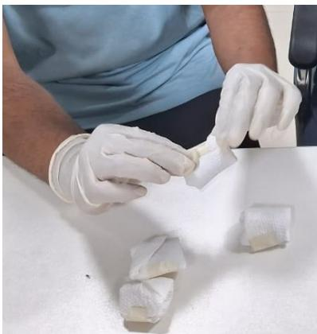

(a) Calcium Carbide sachets  
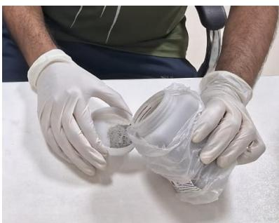  
(b) Calcium Carbide powder  
Figure 1: Preparation of sachets for artificial ripening where $\mathrm { C a C } _ { 2 }$ powder is wrapped in tissue paper prior to placement with fruit samples.

## 2.2. Color and Firmness Stage

The color and firmness of the fruit are used to determine the ripeness percentage. The change in peel color is recorded on a scale from 0 to 7, and firmness is rated on a scale from 0 to 4, depending on the fruit’s softness. Analogous to the Von Loesecke ripening scale (Gomes et al., 2013), the color scale is defined as follows: S0 - Green, S1 - Yellow color break, S2 -

Mostly green with yellow texture, S3 - Mixed yellow and green, S4 - Yellow dominant, S5 - Almost full yellow, S6 - Bright yellow, and S7 - Blackish color. The firmness scale is defined as: S0 - Fully Firm, S1 - Soft patches in some area, S2 - Mixed firmness, S3 - Almost the entire body is soft, S4 - Fully Soft.

## 2.3. Ripeness Percentage and ShelfLife

Ripeness percentage is used in this study as a heuristic index designed to provide a numerical description of ripening progression, rather than a direct biochemical quantification (Abbott, 1999). For mangoes (Mangifera indica), the ripeness percentage is based on the fact that the studied cultivar stays predominantly green throughout the ripening process, while its firmness changes. A higher weight is assigned to firmness as compared to color to take into account this physiological behavior (Jha et al., 2010). Firmness and color are combined using empirically selected weightings (80% to firmness and 20% to color). In contrast, bananas (Musa acuminata) exhibit a noticeable color transition during the entire course of ripening, making surface color a reliable indicator of maturity. Therefore, a higher weight is assigned to color as compared to firmness (60% to color and 40% to firmness) (Dadzie and Orchard, 1997). This index for calculating ripeness percentage is only intended as a relative progression metric for temporal modeling and supervised learning; not as a universal standard. A 5% baseline ofset is included to set a realistic starting point, considering pre-harvest physiological maturity (Blasco et al., 2003).

To determine shelf life, every fruit gets a unique serial number, which is tracked throughout the study. The last recorded day that a fruit’s serial number appears in the dataset is considered its true observed lifespan. The observation for an individual fruit is terminated when the fruit reaches spoilage condition, after which no further measurements are included for that fruit. If D represents the last observed day and d is the current day (the number of days since the observation of ripening started), then the remaining shelf life of the fruit on any day is calculated as (D − d) days.

## 2.4. Hardware Setup

Spectral intensity data of the fruit samples is acquired using a custom-built hardware setup (Figure 3) that integrates an AS7265x multispectral sensor, an SHT40 temperature and humidity sensor, and an ESP32 microcontroller (Figure 2). The setup is housed in a 10 cm × 10 cm × 6 cm cuboidal casing. The AS7265x spectral sensor is mounted on the bottom face (10 cm × 10 cm) of the casing, while the opposite top face features an aperture sized to accommodate a portion of the fruit’s surface. This setup uses the inbuilt LEDs present in spectral sensor for illumination and it is ensured that there is a distance of 5 cm between sensor and fruit surface. The inner surface of box is coated with black felt sheet to suppress secondary internal reflections and stray light. The ESP32 microcontroller and SHT40 sensor are mounted on a breadboard at outer surface of the casing and connections with the microcontroller are made using jumper wires.

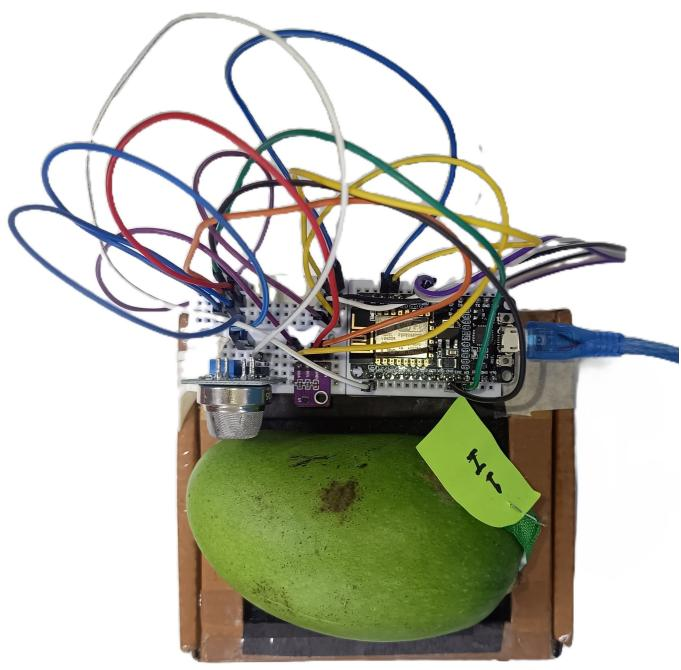

(a) The hardware setup actually used in the study  
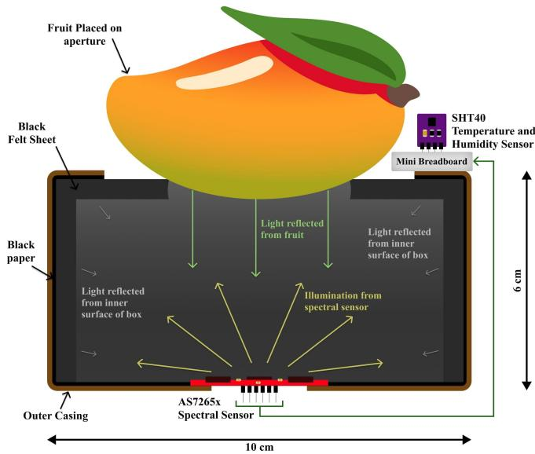  
(b) Schematic diagram detailing the internal structure of hardware setup  
Figure 3: Hardware configuration and spectral sensing mechanism: (a) Physical prototype utilized for the experimental study, and (b) Cross-sectional schematic detailing the optical path and internal geometry. The enclosed sensing chamber is lined with a matte black felt sheet to suppress internal scattering and stray light, ensuring that the intensity data exclusively represents the spectral profile of the fruit.

The ESP32 microcontroller is integrated with Google Sheets using Google Apps Script to automatically log the spectral data being collected through the microcontroller into the spreadsheet. Spectral data for each day is stored in a separate spreadsheet and each sheet includes serial number, fruit type, fruit’s unique sample ID, ripening method, day since observation started, raw spectral readings from all eighteen channels, temperature and humidity readings from the SHT40 sensor, color stage, firmness stage, calculated ripening percentage, and comments on the condition of each fruit sample, as the columns. The results obtained by testing the fruit samples are displayed on a dashboard, as shown in Figure 4.

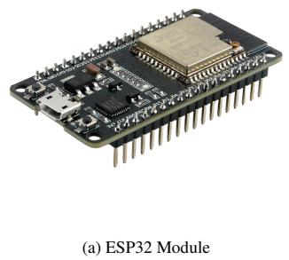

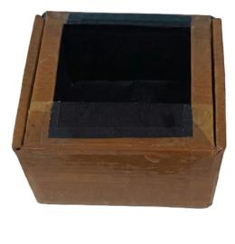

  
Figure 2: Hardware components used in the experimental setup consisting of (a) ESP32 microcontroller, (b)SHT40 temperature and humidity sensor, (c) 10 cm × 10 cm × 6 cm enclosed casing, coated with black felt sheet, (d) and AS7265x spectral triad sensor.

## 2.5. Data Preprocessing and Feature Engineering

In the proposed study, noise with a mean (µ) of 1.0 and a standard deviation (σ) of 0.02 is injected to introduce small variations in the training set. Sampling from the distribution N(1 0 022) ensures that overall scale of the data does not change. Furthermore, the multiplicative noise scales with the magnitude of the data, such that value changes less if original value is smaller and large original values experience greater absolute change. This enhances model stability as addition of these controlled disturbances exposes the model to realistic variations that might occur while taking the readings. Further, PCA is employed for reducing the dimensionality of the 18 wavelength spectral data into principal components that capture the maximum variance (Ding et al., 2018). One-Way Analysis of Variance (ANOVA) is performed independently for each ripening method to evaluate the impact of environmental conditions like temperature and relative humidity on spectral readings. In each analysis, the whole set of samples exposed to a specific ripening treatment serves as the population. This population is then divided into two groups namely "Indoor" and "Outdoor" based on environmental condition with diferent temperature and relative humidity. The grouping of samples based on environmental condition acts as the independent categorical variable, while the spectral intensity measured at each wavelength (410nm - 940nm) acts as continuous dependent variable. The p-value or observed significance level for each wavelength is used to determine whether spectral intensity difers significantly between the indoor and outdoor environmental conditions.

In order to establish a robust set of input features, all possible ratios of raw spectral intensity values at the 18 wavelengths are taken into consideration, and their progression over time is analyzed. It is critical in diferentiating between ripening methods and estimation of shelf life, as spectral ratios efectively amplify relative physiological changes (Thenkabail et al., 2000). The raw spectral intensity values are standardized using their respective z-scores, which ensures that the efect of outliers is minimized. For each fruit type, the mean and standard deviation are calculated using all training observations across the available days and ripening methods, and the resulting parameters are used to standardize the corresponding training, validation, and hold-out test observations. The potential of each feature as a discriminator between ripening methods or indicator of ripening progression is evaluated using two primary metrics. The IoU of IQRs is used to quantify overlap across ripening methods, and the Spearman’s rank correlation coeficient is used to assess the monotonic progression of the features across the three ripening methods. In this way, all the possible input features are identified for each predictive modelling task. These features also include principal components covering variance of spectral intensity across all 18 wavelengths, along with temperature and humidity as environmental parameters. Consequently, to reduce the complexity of model by removing non-contributing features and understand how each input feature is contributing to model performance, SHAP is applied to select the most relevant subset of input features out of all the possible features explored.

## 2.6. Machine Learning Framework

In the proposed study, an XGBoost based machine learning framework is developed for classification of ripening method used while simultaneously estimating the shelf life and ripeness percentage. A dedicated set of three models comprising of one classifier and two regressors is constructed independently for both banana and mango samples. All models are trained using the data acquired from the aforementioned hardware setup and have their own set of optimized input features, validated using SHAP analysis. To prevent data leakage caused by the temporal nature of the dataset, data is split into 80% training and 20% hold-out test sets using a Group Shufle Split based on the fruit’s unique serial numbers. This ensures that all temporal observations of a specific fruit remain strictly within either the training or the test set. Furthermore, augmentation (noise injection), SMOTE, and all datadependent preprocessing and feature-selection operations are performed exclusively within the training partition. Model stability is rigorously evaluated using a 5-fold Group K-Fold cross-validation strategy on the training partition. The final reported performance metrics are computed exclusively on the unaugmented hold-out test set. For classification, the positive class is calcium carbide-ripened fruits and the negative class is safely ripened fruit. The final XGBoost hyperparameters selected by GridSearchCV are task and fruit-specific, including max\_depth, learning\_rate, n\_estimators, subsample, colsample\_bytree, and gamma. For the ripening method classification task, SMOTE is applied only to the training set within the pipeline, which allows the classifier to learn from balanced training data while ensuring that oversampling does not leak information into the test set. The hold-out test set is not used during preprocessing, feature selection, hyperparameter tuning, data augmentation, or SMOTE.

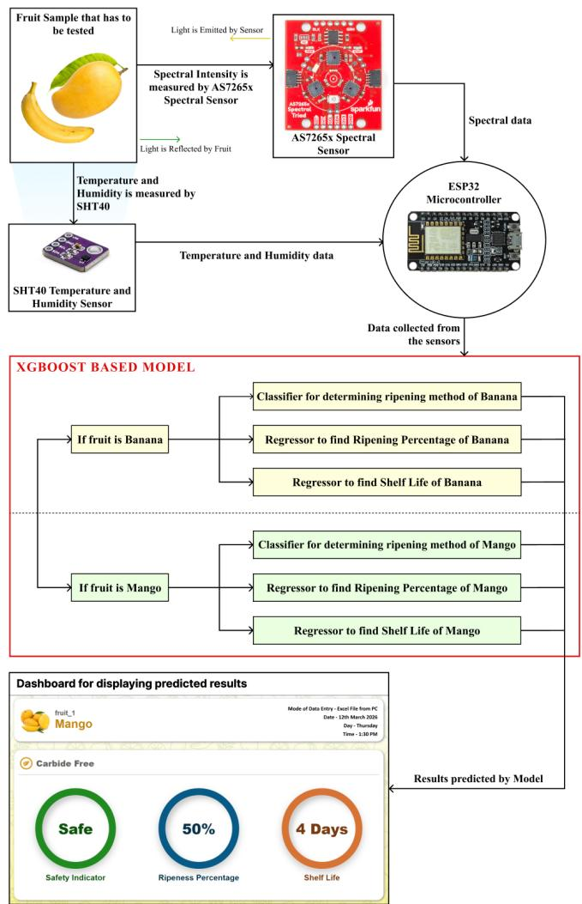  
Figure 4: Comprehensive workflow of the proposed non-invasive ripening assessment system. The architecture integrates the AS7265x spectral triad sensor and SHT40 temperature and humidity sensor via an ESP32 microcontroller. Data is processed through an XGBoost-based learning algorithm consisting of fruit-specific classifiers for ripening method detection and regressors for estimating ripening percentage and remaining shelf life, with final outputs visualized on a real time monitoring dashboard.

## 3. Results and Analysis

This section presents a comprehensive evaluation of the proposed non-invasive fruit assessment system, and discusses the results obtained. The analysis is structured into six parts. First, the temporal progression of spectral intensity across diferent ripening methods is examined, correlating variations in spectral profile to underlying physiological changes in the fruit. Second, statistical techniques, including Spearman’s rank correlation coeficient and Intersection over Union (IoU) metrics, are applied to extract and validate the most discriminative features from the raw spectral data. Third, use of PCA in handling the high dimensional spectral data is studied. Fourth, the impact of environmental parameters, including temperature and humidity on spectral progression is studied. Fifth, the proposed XG-Boost framework and feature sets used are detailed and finally, a thorough benchmarking is performed to analyze the predictive capabilities of various machine learning architectures in both classifying the ripening methods and quantifying the remaining shelf life and ripeness percentage.

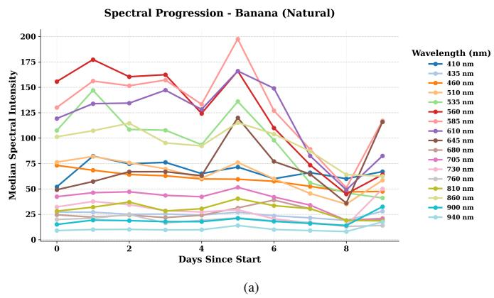

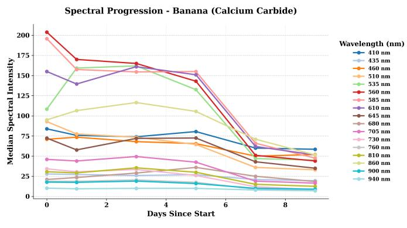  
(b)  
Figure 5: Temporal progression of median spectral intensity for banana samples under (a) natural ripening and (b) calcium carbide-induced ripening conditions. The data represents 18 distinct wavelengths ranging from 410 nm to 940 nm. Note the sharper decline in intensity across visible and NIR bands in carbide-treated samples post Day 5, which is indicative of accelerated chlorophyll degradation and moisture loss compared to the natural ripening progression.

## 3.1. Spectral Progression and Physiological Interpretation

The median spectral intensity profiles of Mangifera indica (mango) and Musa acuminata (banana) across 18 wavelengths, ranging from 410 nm to 940 nm are analyzed to study ripening progression under distinct ripening methods and environmental conditions. The median is preferred over the mean as a measure of central tendency to alleviate the influence of outliers and occasional sensor anomalies (Leys et al., 2013). A consistent trend is obtained where the green-yellow range of visible region (535 nm–585 nm) and the “red edge” or early NIR region (610 nm–705 nm) exhibit pronounced changes during ripening, while spectral intensity at other wavelengths remains comparatively stable. This aligns with the color transformation of fruits (van Grondelle and Boeker, 2017). Chlorophyll degradation reveals underlying carotenoids, driving the macroscopic color transition from green to yellow.

Day 1  
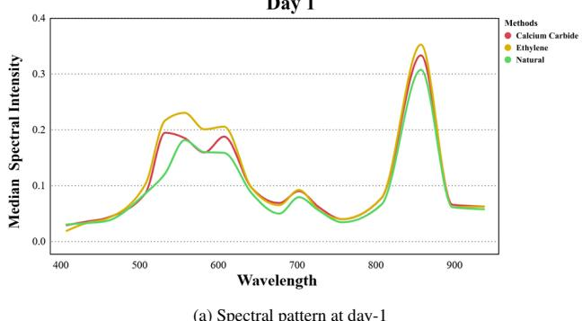  
(a) Spectral pattern at day-1

Day 6  
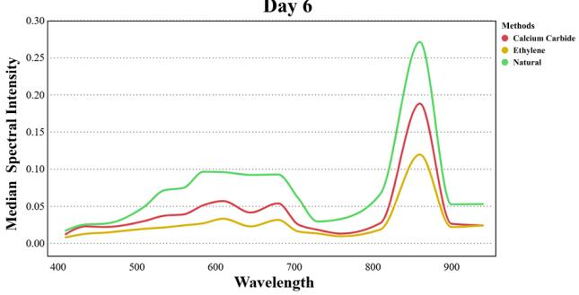  
(b) Spectral pattern at day-6

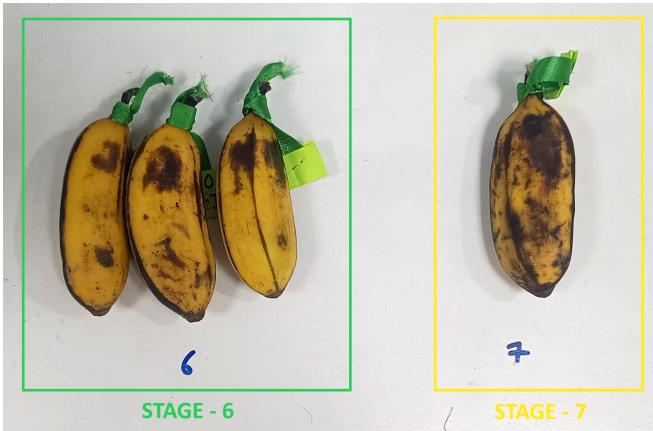  
(c) Naturally ripened Banana at day-6  
Figure 6: As the fruit ripens, the amount of chlorophyll decreases and the internal structure degrades. In case of banana, the overall spectral intensity decreases on day 6 (b) as compared to day 1 (a). The spectral intensity in visible region decreases because black spots begin to form on the banana peel (c), while the intensity in NIR region decreases due to degradation of cells.

As seen in Figure 5, calcium carbide-ripened bananas exhibit sharper intensity drops in the visible region after mid ripening stages (day 4) as compared to naturally ripened samples, indi cating accelerated color transformation, which is not accompanied by a proportionate change in longer wavelengths, within the NIR region (705 nm–900 nm). Across diferent ripening methods, near-infrared bands (760 nm–900 nm) show sensitivity to internal biochemical changes of the fruit rather than just its surface color. Variations in these bands indicate moisture loss, starch to sugar conversion, and loss of firmness. (Pourdarbani et al., 2021). This makes them useful for non-invasive assessment of fruit ripening. Hence, the combined spectral profile of fruit samples in visible and NIR regions captures both external and internal changes that take place as the fruit matures. This behaviour is consistent with the characterization of calcium carbide-induced ripening as predominantly “cosmetic” (Deshi et al., 2024), where the external appearance of fruit advances faster than internal growth. Using the spectral progression of multiple wavelengths simultaneously makes quantitative modelling challenging, making further statistical analysis crucial, in order to identify the most informative features. The spectral intensity in visible spectrum decreases as the amount of chlorophyll increases (van Grondelle and Boeker, 2017; Sharpe and Barber, 1972), therefore the less intensity of visible light in ethylene-ripened and carbide-ripened bananas as compared to naturally-ripened samples (Figure 6) is consistent with the observation made by Maduwanthi and Marapana (2019) that artificially ripened banana has higher levels of chlorophyll at the bright yellow color stage (stage 6) than the naturally ripened banana.

## 3.2. Feature Extraction and Statistical Analysis

Building on the observed spectral trends, discriminative fea tures are extracted for diferentiating between ripening methods (classification task), as well as for estimating the ripeness percentage and shelf life of a fruit sample (regression tasks). Rather than relying on raw spectral intensities alone, statistical techniques are used to identify specific wavelengths, that can be useful in both classification and regression. Initially, Spearman’s rank correlation coeficients between median spectral intensities and temporal progression (days since start) are computed independently across all wavelengths for each ripening method. The IQR containing the 25th-75th percentile of datapoints for each ripening method is also plotted. Wavelengths exhibiting similar Spearman’s rank correlation coeficient magnitude and direction, along with overlapping IQR values; as shown in Figures 7b and 7d, are identified as robust indicators of ripening progression, as they reflect time-dependent physiological changes, independent of the ripening method used. Conversely, wavelengths showing strong divergence in correlation behavior between the ripening methods and separated IQR ranges, are considered informative for classification. Figures 7a and 7c are examples of such wavelengths. The overlap between IQRs is quantified using Jaccard index, also known as IoU.

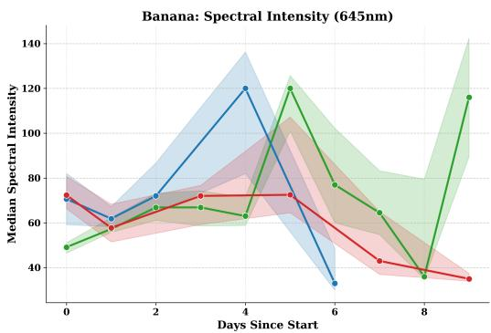  
(a)

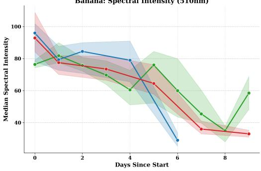

(b)  
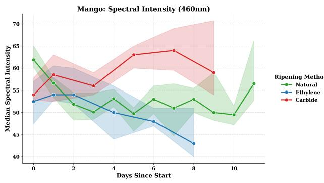  
(c)

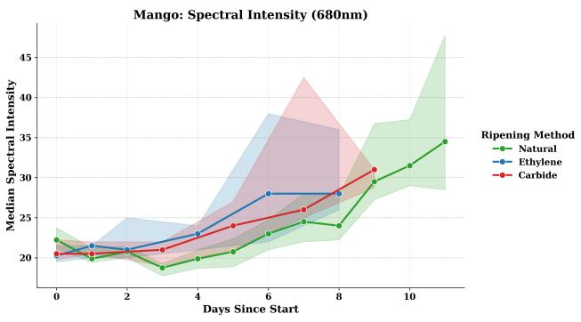  
(d)  
Figure 7: Median spectral intensity of banana samples at (a) 645nm and (b) 510nm, and mango samples at (c) 460nm and (d) 680nm, along with IQR (25th-75th percentiles) showing the overlap of spectral intensity values for all three ripening methods. Refer Table 1 and Table 2.

Among the 18 distinct wavelengths studied, certain wavelengths discriminate well between ripening methods, while some act as indicators of temporal ripening progression. A wavelength is identified as an indicator of temporal progression if it demonstrates a strong monotonic correlation across natural, ethylene, and carbide ripening methods, along with a high degree of IQR overlap. Conversely, a wavelength is identified as a discriminator of ripening methods if it exhibits low IQR overlap and diverging correlation behavior between the three ripening methods.

Further, in order to identify wavelengths that are more sensitive to fruit ripening over time; regardless of the method employed, standard deviation in the spectral intensity values at all 18 wavelengths is studied, and higher standard deviation is considered more informative for modelling ripening progression. As evident from Figure 8, wavelengths in visible region; specifically 535nm-610nm (green to orange/red) exhibit higher sensitivity to ripening progression of fruit.

Table 1: Spearman’s rank correlation coeficient values (ρ) of natural (N), Ethylene (E), and Carbide (C) ripening methods, along with extent of overlap of interquartile range (IQR) values in terms of IoU and the interpretation of these measures for median spectral intensity at mentioned wavelengths with respect to “day since start”, for mango samples.
<table><tr><td>Wavelength  $\rho \left( \mathbf { N } \right)$ </td><td> $\rho \left( \mathbf { E } \right)$ </td><td> $\rho \left( \mathbf { C } \right)$  IoU</td><td></td><td>Interpretation</td></tr><tr><td>410 nm 460 nm</td><td>-0.09 -0.94 -0.43-0.81</td><td>-0.60</td><td>0.476 0.77 0.663</td><td>Good class separability</td><td>Moderate class separabil-</td></tr><tr><td></td><td></td><td></td><td></td><td></td><td>ity due to diverging cor- relation behavior despite substantial IQR overlap</td></tr><tr><td>610 nm</td><td>0.94</td><td>0.60</td><td>0.77</td><td>0.815</td><td>Strong indicator of Tem- poral progression</td></tr><tr><td>680 nm</td><td>0.84</td><td>0.93</td><td>0.99</td><td>0.917</td><td>Strong indicator of Tem- poral progression</td></tr></table>

Table 2: Spearman’s rank correlation coeficient values (ρ) of natural (N), Ethylene (E), and Carbide (C) ripening methods, along with extent of overlap of interquartile range (IQR) values in terms of IoU and the interpretation of these measures for median spectral intensity at mentioned wavelengths with respect to “day since start”, for banana samples.
<table><tr><td>Wavelength  $\rho \left( \mathbf { N } \right)$ </td><td> $\rho \left( \mathbf { E } \right)$   $\rho \left( \mathbf { C } \right)$  IoU</td><td>Interpretation</td></tr><tr><td>460 nm</td><td>-0.99-0.80-0.890.800</td><td>Strong indicator of tem- poral progression</td></tr><tr><td></td><td>510 nm -0.88 -0.90-1.000.569</td><td>Moderate temporal pro- gression indicator due to strong monotonic cor- relation but limited IQR</td></tr><tr><td>645 nm</td><td>0.32-0.10-0.600.821</td><td>overlap Limited class separability due to high IQR overlap and weak/diverging tem-</td></tr><tr><td></td><td>730 nm -0.38 -1.00 -0.94 0.989 Strong Indicator of tem-</td><td>poral correlations poral progression</td></tr></table>

Temporal Sensitivity (Ripening Progression) - Banana  
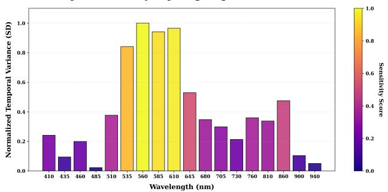  
(a)

Temporal Sensitivity (Ripening Progression) - Mango  
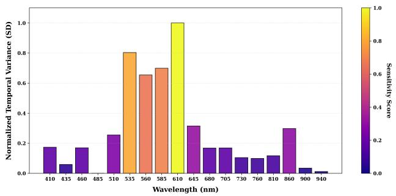  
(b)

Inter-Method Variance - Banana  
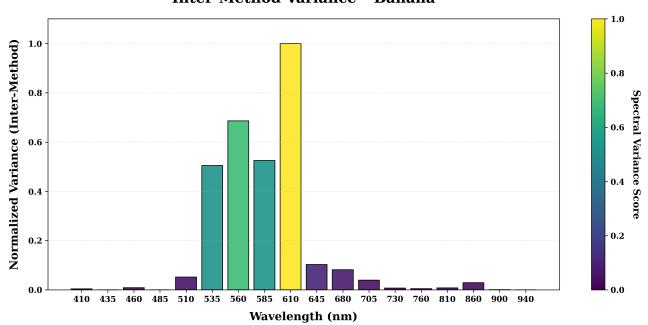  
(c)

Inter-Method Variance - Mango  
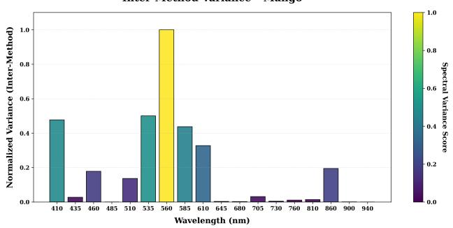  
(d)  
Figure 8: Temporal sensitivity and inter-method variance analysis across the 18 measured wavelengths (410–940 nm). Subplots (a) and (b) illustrate the normalized temporal variance, highlighting the spectral bands that are most sensitive to continuous ripening progression in banana and mango samples, respectively. Subplots (c) and (d) quantify the normalized inter-method variance, illustrating the magnitude of macroscopic spectral separation between the ripening methods at each wavelength.

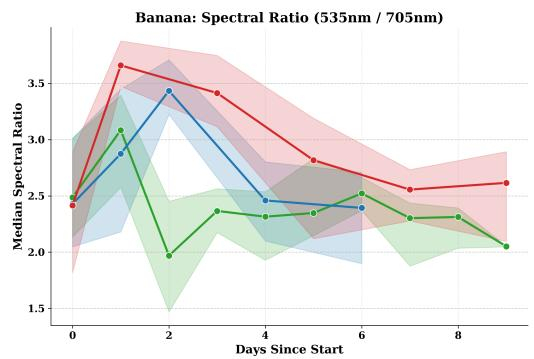  
Ripening Method -- Natural -- Ethylene -- Carbide

(a)  
Banana: Spectral Ratio (560nm / 645nm)  
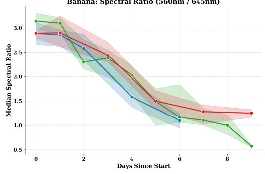  
Ripening Method -- Natural -- Ethylene -- Carbide

(b)  
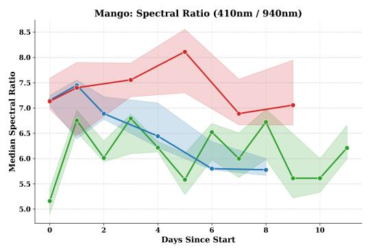  
Ripening Method -- Natural -- Ethylene -- Carbide

(c)  
Mango: Spectral Ratio (730nm / 610nm)  
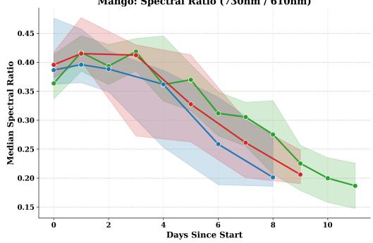  
Ripening Method -0- Natural -- Ethylene -- Carbide  
(d)  
Figure 9: Ratios of median spectral intensity of banana samples at (a) 535 nm / 705 nm and (b) 560 nm / 645 nm, and mango samples at (c) 410 nm / 940 nm and (d) 730 nm / 610 nm , along with IQR (25th-75th percentiles) showing the overlap of spectral intensity values, for all three ripening methods. Refer Table 3 and Table 4.

Similarly, the inter-method variance of spectral intensity values at all 18 wavelengths is studied. The wavelengths exhibiting higher variance (560 nm for mango, and 610 nm for banana), difer the most in intensity values across the three methods. These diferences are consistent with the pigment-related spectral changes expected during ripening, although the present measurements do not directly quantify pigment concentrations (Figure 5).

In order to amplify relative changes and minimize variations caused by sensor drift or illumination diferences, spectral ratios are explored by evaluating all pairwise wavelength ratios. A total of 306 such ratios (since 18 wavelengths) are explored and their relevance checked based on spearman’s rank correlation coeficient values and IQR ranges. Figures 9b and 9d show ratios with similar Spearman’s rank correlation coeficients and overlapping IQR values for banana and mango respectively, making them a good indicator of ripening progression and hence useful for regression. Similarly, Figures 9a and 9c depict ratios with diverging correlation values and separated IQR for the three methods for banana and mango samples, respectively. These wavelengths discriminate well between the three ripening methods used in the study. The ratios which act as either good indicators of ripening progression or discriminate well between ripening methods are presented in Table 3 for mango samples and Table 4 for banana samples, along with their Spearman’s rank correlation coeficient values and IQR characteristics.

Table 3: Spearman’s rank correlation coeficient values (ρ) of natural (N), Ethylene (E), and Carbide (C) ripening methods, along with extent of overlap of interquartile range (IQR) values in terms of IoU and the interpretation of these measures for given ratios of median spectral intensity with respect to “day since start”, for mango samples.
<table><tr><td>Ratios</td><td> $\rho \left( \mathbf { N } \right)$  ρ(E)</td><td> $\rho \left( \mathbf { C } \right)$ </td><td>IoU</td><td>Interpretation</td></tr><tr><td>410 nm/ 940 nm</td><td>-0.11 -0.94</td><td>-0.37</td><td>0.373</td><td>Good class separability</td></tr><tr><td>730 nm / 610 nm</td><td>-0.90-0.83</td><td>-0.83</td><td>0.932</td><td>Strong indicator of tem- poral progression</td></tr><tr><td>610 nm / 705 nm</td><td>0.90</td><td>0.94 1.00</td><td>0.682</td><td>Moderate temporal pro- gression indicator due to strong correlation but limited IQR overlap</td></tr></table>

Table 4: Spearman’s rank correlation coeficient values (ρ) of natural (N), Ethylene (E), and Carbide (C) ripening methods, along with extent of overlap of interquartile range (IQR) values in terms of IoU and the interpretation of these measures for given ratios of median spectral intensity with respect to “day since start”, for banana samples.
<table><tr><td>Ratios</td><td> $\rho \left( \mathbf { N } \right)$   $\rho \left( \mathbf { E } \right)$   $\rho \left( \mathbf { C } \right)$ </td><td>IoU</td><td>Interpretation</td></tr><tr><td>585 nm/ 645 nm</td><td>-0.98 -1.00 -1.00</td><td>0.923</td><td>Strong indicator of tem- poral progression</td></tr><tr><td>560 nm /</td><td>-0.99-1.00</td><td>-0.94 0.912</td><td>Strong indicator of tem- poral progression</td></tr><tr><td>645 nm 535 nm/ 705 nm</td><td>-0.77 -0.60 -0.37 0.744</td><td></td><td>Moderate class separabil- ity</td></tr></table>

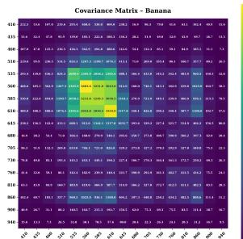

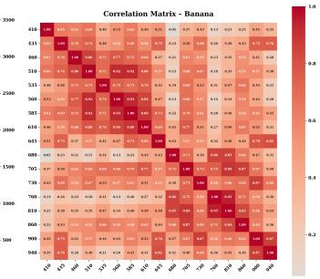

(a) Covariance matrix (left) and correlation matrix (right) for banana  
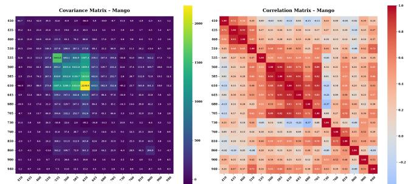  
(b) Covariance matrix (left) and correlation matrix (right) for mango

Figure 10: Covariance (left) and correlation (right) matrices of raw spectral intensities across the 18 measured wavelengths for (a) banana and (b) mango samples. The heatmaps illustrate a high degree of collinearity among adjacent spectral bands, particularly within the visible and NIR regions, justifying the need for dimensionality reduction.

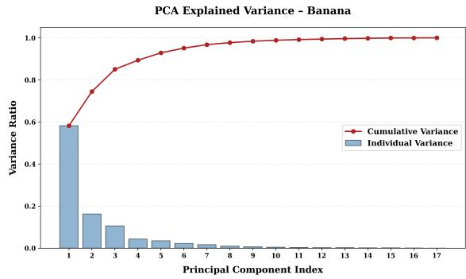  
(a)

PCA Explained Variance - Mango  
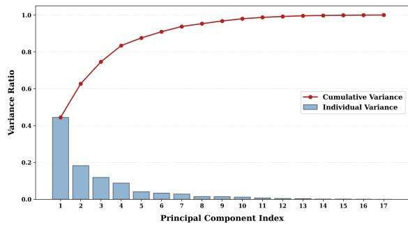  
(b)  
Figure 11: Individual explained variance (bars) and cumulative variance (line) ratios of the principal components derived from the spectral data of (a) banana and (b) mango. The scree plots clearly show that the first few principal components capture majority of the spectral variance, enabling dimensionality reduction without significant information loss.

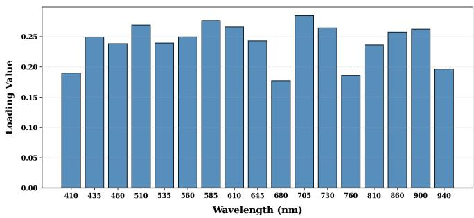  
(a)

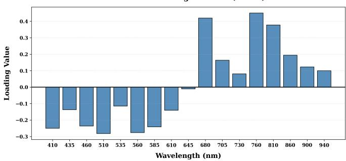  
(b)

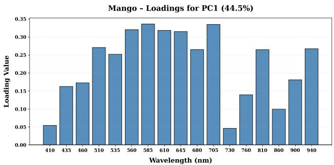  
(c)

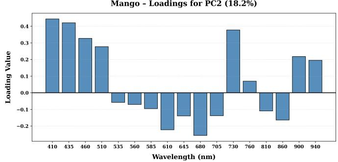  
(d)  
Figure 12: PCA spectral loading values across 18 distinct wavelengths (410–940 nm). Panels (a) and (c) present the first principal component (PC1) for banana and mango samples, while panels (b) and (d) display their corresponding second principal component (PC2).

## 3.3. Dimensionality Reduction

While individual wavelengths and ratios provide valuable information, it is important to study how the spectral intensities at all 18 wavelengths are correlated, in order to reduce the dimensionality of the data and make the learning algorithm less prone to overfitting. Hence, covariance and correlation matrices are computed for spectral intensity values at all wavelengths. As seen in Figure 10, the covariance matrices show extensive positive correlation among adjacent wavelengths, particularly within the visible and near-infrared regions. This confirms redundancy in the spectral data and hence the need of dimensionality reduction, for which PCA is employed. Eigenvalue decomposition of the covariance matrices shows a steep decay, with the first few principal components capturing the majority of spectral variance. Explained variance ratio and cumulative variance plots (Figure 11) consistently indicate that the first 5-7 principal components account for more than 90% of the total spectral variance. Analysis of the Loading values (Figure 12) reveals that the first two principal components are dominated by contributions from visible and NIR wavelengths, aligning with chlorophyll breakdown and carotenoid formation in the visi ble region and changes in spectral intensity patterns in the NIR band, which is associated with softening of the cell walls and moisture loss (Kapoor et al., 2022).

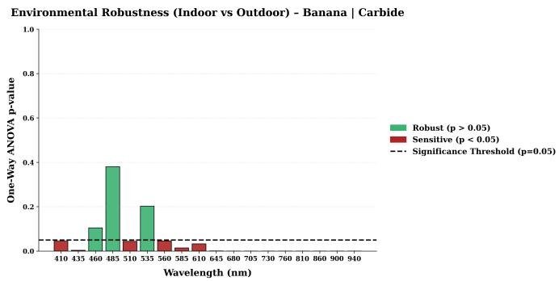  
(a)

Environmental Robustness (Indoor vs Outdoor) - Mango | Carbide  
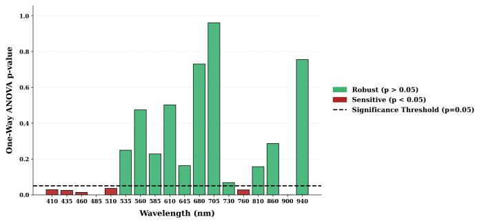  
(b)  
Figure 13: Analysis of environmental robustness of spectral intensity at all 18 wavelengths using one-way ANOVA. The bar charts display the p-values obtained by comparing spectral intensity variations between indoor and outdoor conditions for (a) calcium carbide-ripened bananas and (b) calcium carbideripened mangoes. The dashed significance threshold $( p = 0 . 0 5 )$ separates environmentally robust wavelengths (green bars, $p > 0 . 0 5 ,$ ) from those more sensitive to temperature and humidity. (red bars, $p < 0 . 0 5 )$ .

## 3.4. Environmental Calibration

To take the impact of environmental conditions into account, one-way ANOVA is performed for each wavelength by comparing the spectral intensity values in indoor and outdoor conditions, within the same fruit and ripening method combinations. Wavelengths with a p-value below 0.05 are considered to exhibit significant diferences in spectral intensity between the indoor and outdoor conditions. As observed in Figure 13, the majority of the wavelengths for $\mathrm { C a C } _ { 2 } .$ -ripened bananas exhibit significant sensitivity to environmental conditions. Conversely, the 535 nm to 940 nm range for $\mathrm { C a C _ { 2 } }$ -ripened mangoes remains largely robust against these variations. This suggests that the spectral profiles of chemically ripened bananas are inherently more susceptible to temperature and humidity fluctuations than those of mangoes.

## 3.5. Training the Learning Algorithm

Three independent models are trained, each for a specific predictive task. For the primary goal of identifying the ripening method, an XGBoost classifier is used, which classifies the fruit sample as either ‘Safely’ Ripened (consists of both natural and ethylene ripened classes) and ‘Carbide’ Ripened. The classifier pipeline includes a Synthetic Minority Over-sampling Technique (SMOTE) layer, for ensuring balance in support of both classes. In addition to the classification model, two XG-Boost regression models are trained to predict the remaining shelf life (in days) and the ripening progression (in percentage). The hyperparameters for each model are optimized independently using a comprehensive GridSearchCV strategy to ensure optimal predictive performance. Furthermore, the modeling pipelines are fruit-specific, meaning separate architectures are trained for mango and banana samples. Based on eigenvalue analysis and the obtained loading plots, the first five to seven principal components are used as input features; for both classification and regression tasks. These PCs combined with relevant wavelength ratios, temperature, humidity, and z-score of spectral intensity at 410 nm (for mango classifier only), are used to train the learning algorithms. The entire feature sets used are detailed in Figure 14.

## 3.6. Model Benchmarking and Performance Metrics

To validate the eficacy of the proposed XGBoost architecture, a comparative analysis is performed against three standard machine learning baselines, consisting of support vector machines (SVM), Decision Tree, and multi-layer perceptron (MLP) neural networks. All these models are trained on the same spectral features, as mentioned in subsection 3.5. During 5-fold group cross-validation, the XGBoost classification model demonstrated strong stability across both fruit subsets, yielding a mean accuracy of $8 3 . 6 \% \pm 4 . 0 \%$ for mango and $7 7 . 5 \% \pm 2 . 9 \%$ for banana. When evaluated on the unaugmented hold-out test set, the XGBoost model achieved a classification accuracy of 95% for mango samples and 81% for banana samples, representing the highest overall accuracy among the evaluated classifiers. The ‘Recall’ of carbide class is a crucial metric, as it is a measure of the model’s ability to detect calcium carbide-ripened samples correctly. SVM and Neural Network obtain a recall of 0.70 for mango, slightly better than the proposed XGBoost (0.67) and Decision Tree (0.60). SVM has a higher carbide recall of 0.80 for banana samples, while XG-Boost gets 0.74, which is better than the decision tree (0.60) and neural network (0.55).

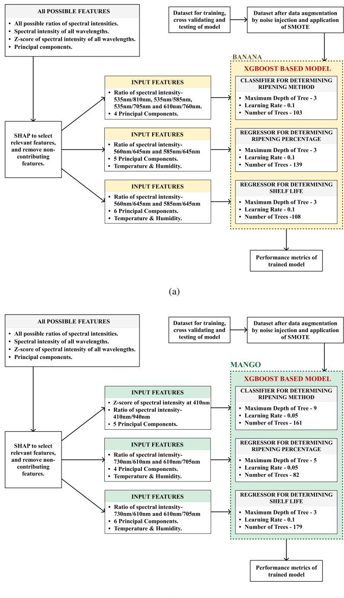  
(b)  
Figure 14: SHAP-based feature selection and XGBoost modeling pipelines for (a) banana and (b) mango samples. The schematic outlines the extraction of relevant input features using SHAP analysis on the training data after augmentation, and details the tuned hyperparameters (maximum depth, learning rate, and number of trees) used for classification and regression tasks.

Table 5: Comparative analysis of evaluated models for classification of ripening method and shelf-life prediction in Mango (Mangifera indica). Metrics include classification accuracy, carbide class recall, and regression coeficients $( R ^ { 2 } ,$ , RMSE).
<table><tr><td rowspan="3">Model Architecture</td><td colspan="2">Classification</td><td colspan="2">Regression</td></tr><tr><td>Accuracy</td><td>Carbide Recall</td><td>Ripeness (R2)</td><td>Shelf Life (RMSE)</td></tr><tr><td>SVM</td><td>0.81</td><td>0.70</td><td>0.810</td><td>1.80</td></tr><tr><td>Decision Tree</td><td>0.79</td><td>0.60</td><td>0.729</td><td>2.27</td></tr><tr><td>Neural Network (MLP)</td><td>0.70</td><td>0.70</td><td>0.677</td><td>1.95</td></tr><tr><td>XGBoost (5-Fold CV)</td><td>0.836 ± 0.040</td><td>一</td><td>0.659 ± 0.136</td><td>一</td></tr><tr><td>XGBoost (Hold-out)</td><td>0.95</td><td>0.67</td><td>0.750</td><td>1.86</td></tr></table>

Table 6: Comparative analysis of evaluated models for classification of ripening method and shelf-life prediction in Banana (Musa acuminata). Metrics include classification accuracy, carbide class recall, and regression coeficients (R2, RMSE).
<table><tr><td rowspan="2">Model Architecture</td><td colspan="2">Classification</td><td colspan="2">Regression</td></tr><tr><td>Accuracy</td><td>Carbide Recall</td><td>Ripeness (R2)</td><td>Shelf Life (RMSE)</td></tr><tr><td>SVM</td><td>0.79</td><td>0.80</td><td>0.850</td><td>1.36</td></tr><tr><td>Decision Tree</td><td>0.73</td><td>0.60</td><td>0.779</td><td>1.62</td></tr><tr><td>Neural Network (MLP)</td><td>0.55</td><td>0.55</td><td>0.847</td><td>1.39</td></tr><tr><td>XGBoost (5-Fold CV)</td><td>0.775 ± 0.029</td><td>一</td><td>0.864 ± 0.055</td><td>1</td></tr><tr><td>XGBoost (Hold-out)</td><td>0.81</td><td>0.74</td><td>0.871</td><td>1.30</td></tr></table>

Banana: Classification (Safe vs. Carbide)  
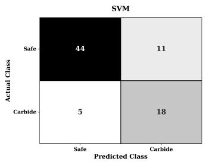

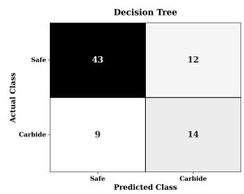

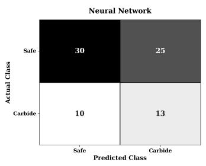

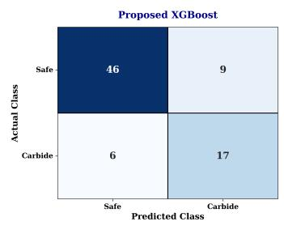  
(a)

Mango: Classification (Safe vs. Carbide)  
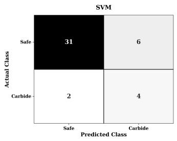

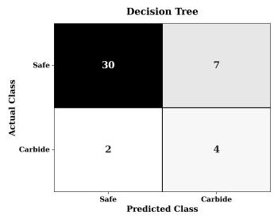

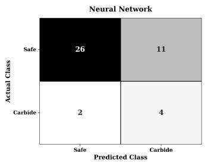

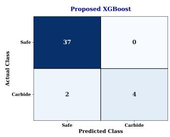  
(b)  
Figure 15: Confusion matrices illustrating the classification performance of the four evaluated models (SVM, Decision Tree, Neural Network, and the Proposed XGBoost) for identifying calcium carbide-induced ripening in (a) Banana and (b) Mango samples. XGBoost achieves the highest overall classification accuracy, while SVM provides higher recall for the calcium carbide class.

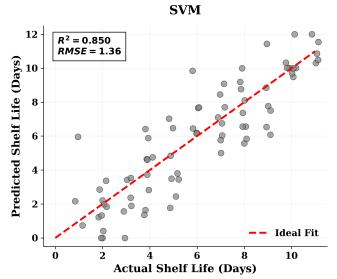

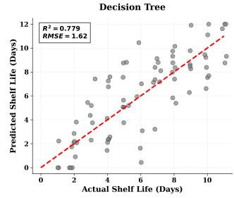

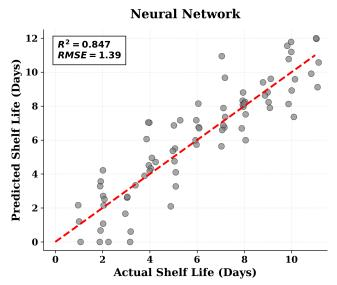

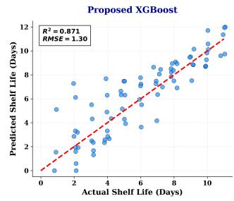  
(a)

Mango: Shelf Life Regression Analysis  
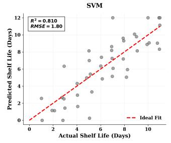

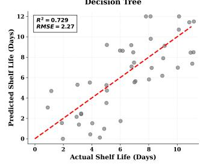

  
(b)  
Figure 16: A comparative analysis of regression performance of the four evaluated models (SVM, Decision Tree, Neural Network, and the Proposed XG-Boost) in estimating the ripening progression in (a) Banana and (b) Mango samples. The XGBoost model demonstrates a tight convergence to the ideal fit line $( R ^ { 2 } = 0 . 8 7 1$ for banana samples and $R ^ { 2 } = 0 . 7 5 0$ for mango samples). This suggests that the gradient boosting framework captures a substantial portion of the non-linear spectral shifts associated with physiological changes in fruits over time.

While SVM has a slight advantage in recall, the proposed XGBoost architecture is preferred for classification as it shows significantly higher overall accuracy (95% for mango and 81% for banana), balancing the detection of safely and carbide ripened samples while minimizing the total number of misclassifications. (Table 5 and Table 6). For regression models predicting ripeness percentage and remaining shelf-life, a nuanced performance divergence is observed between the fruits. In the case of mango samples, SVM actually outperforms the proposed XGBoost architecture, achieving a higher $R ^ { 2 }$ (0.810 vs. 0.750) and a lower shelf-life RMSE (1.80 vs. 1.86 days). Conversely, for banana samples, XGBoost reclaims its position as the most robust model, yielding an $R ^ { 2 }$ of 0.871 and an RMSE of 1.30 days, outperforming SVM (0.850 and 1.36 days, respectively). A visual description of the classification performance is provided in Figure 15 in the form of confusion matrices. XGBoost achieved the highest overall classification accuracy among the evaluated classifiers, although SVM provided higher recall for the calcium carbide class. In Figure 16, the tight clustering of data points along the ideal fit line in the XGBoost plot demonstrates the model’s robustness in handling the changes in spectral profile across the 11-day observation period. Despite SVM’s highly competitive performance, particularly in mango regression, XGBoost is selected as the pri mary architecture for this study. Unlike SVMs and Neural Networks, which act as "black-box" models (Yang et al., 2022), the gradient boosting framework allows for explicit SHAP-based feature interpretability. This transparency is crucial for tracing non-linear spectral shifts back to specific physiological changes (Artamonov et al., 2026).

## 4. Conclusion and Future Scope

The proposed study presents a comprehensive multispectral framework for non-invasive assessment of fruit ripening, with particular focus on distinguishing between safely ripened (including natural and ethylene ripened) and calcium carbide-ripened samples in mango (Mangifera indica) and banana (Musa acuminata). By analyzing spectral intensity data across 18 wavelengths (410–940 nm), this study demonstrates that distinct, method-specific spectral signatures emerge at various maturation stages. Temporal progression of intensity values reveals clear diferences between naturally ripened and calcium carbide-ripened samples, where calcium carbide-treated samples exhibit stronger spectral changes in the visible region, which are consistent with faster chlorophyll breakdown and carotenoid development. However, this is not accompanied by a proportionate change in the measured NIR region response, suggesting that the internal maturation of the fruit does not align with the rapid surface color transformation. Dimensionality reduction of the spectral intensity values at all 18 wavelengths using PCA reveals a low dimensional feature space where first 5-7 principal components capture >90% of the spectral variance. These principal components, combined with targeted spectral intensity ratios and environmental parameters (temperature and relative humidity), form a robust feature set. This set is subsequently utilized to train XGBoost-based learning algorithms for classification of ripening method, predicting the remaining shelf-life in days and estimating the ripening progression. The proposed study achieves a classification accuracy of 95% for mango samples with a recall of 0.67 for calcium carbide-ripened samples. Similarly, banana samples are classified with an accuracy of 81% and calcium carbide class recall of 0.74. This study provides a strong initial validation of the proposed multispectral framework for non-invasive assessment of fruit ripening under controlled experimental conditions.

While the results obtained are promising, broader validation on additional cultivars, independent fruit batches, and varied environmental conditions would strengthen the generalizability of the approach. Future work may focus on extending the framework to other climacteric fruits, integrating larger multiseason datasets, and validating the findings with biochemical and physiological ground-truth measurements. Such extensions will support a more robust deployment of the system in realworld post-harvest monitoring applications.

## Statements and Declarations

## Data Availability

The dataset collected and analyzed during this study is avail able from the corresponding author on reasonable request.

## Author Contributions

Gurbhit Chaurakoti: Conceptualization, Methodology, Investigation, Data curation, Formal analysis, Visualization, Software, Writing – original draft, Writing – review & editing. Harshit Kumar: Conceptualization, Methodology, Resources, Investigation, Visualization, Software, Validation, Writing – original draft, Writing – review & editing. Hani Kumar: Data curation, Investigation, Visualization, Writing – review & editing. Anurag Singh: Supervision, Project administration, Methodology, Writing – review & editing. Ram Asrey: Conceptualization, Validation, Writing – review & editing.

## Declaration of competing interest

The authors have no relevant financial or non-financial interests to disclose.

## Funding

This work is supported by IIT Ropar Technology and Innovation Foundation, one of the Technology Innovation Hubs under DST NM-ICPS (National Mission on Interdisciplinary Cyber-Physical Systems), Government of India (Ref.No. AWaDH/2025/SAMRIDHI4.0/Ideathon/TI06).

## References

Abbott, J.A., 1999. Quality measurement of fruits and vegetables. Postharvest Biology and Technology 15, 207–225. doi:10.1016/S0925-5214(98)00086-6.

Adeyemi, M., Bawa, M., Muktar, B., 2018. Evaluation of the efect of calcium carbide on induce ripening of banana, pawpaw and mango cultivated within kaduna metropolis, nigeria. Journal of Applied Sciences and Environmental Management 43, 108–118. URL: https://api.semanticsc holar.org/CorpusID:56043574.

Artamonov, D.V., Popova, P.I., Korf, E.A., Voitenko, N.G., Chernysheva, A.A., Avdonin, P.V., Jenkins, R.O., Goncharov, N.V., 2026. Interpretable machine learning with shap identifies key biomarkers in a multi-factorial spectrum of age-related neurological and metabolic conditions. International Journal of Molecular Sciences 27. doi:10.3390/ijms 27041805.

Aznar-Gimeno, R., Esteban, L.M., Sanz, G., del Hoyo-Alonso, R., 2023. Comparing the Min–Max–Median/IQR approach with the Min–Max approach, logistic regression and XG-Boost, maximising the youden index. Symmetry 15, 756. doi:10.3390/sym15030756.

Beddiar, D.R., Oussalah, M., Muhammad, U., Seppänen, T., 2023. A deep learning based data augmentation method to improve COVID-19 detection from medical imaging. Knowledge-Based Systems 280, 110985. doi:10.1016/j. knosys.2023.110985.

Blasco, J., Aleixos, N., Moltó, E., 2003. Machine vision system for automatic quality grading of fruit. Biosystems Engineering 85, 415–423. doi:10.1016/S1537-5110(03)00088-6.

Chidangil, S., Karpate, T., Asundi, A., 2017. Fruit ripening using hyperspectral imaging, in: Fifth International Conference on Optical and Photonics Engineering, SPIE. p. 1044919. doi:10.1117/12.2270415.

Dadzie, B.K., Orchard, J.E., 1997. Routine Post Harvest Screening of Banana/Plantain Hybrids: Criteria and Methods. INIBAP Technical Guidelines 2. International Plant Genetic Resources Institute. Rome, Italy. URL: https: //hdl.handle.net/10568/104447.

Deshi, V.V., Siddiqui, M.W., Homa, F., Lata, D., Singh, D.R., 2024. CaC2-induced ripening: Unveiling the bitter truth behind sweet fruit. Food Chemistry 455, 140097. doi:10.101 6/j.foodchem.2024.140097.

Ding, Y., Lee, W.S., Li, M., 2018. Feature extraction of hyperspectral images for detecting immature green citrus fruit. Frontiers of Agricultural Science and Engineering doi:10.15302/J-FASE-2018241.

Duan, C., Huang, Z., Jin, Y., Li, H., Yang, H., Sun, T., Sun, C., Liu, S., Yu, J., 2024. A combination of XGBoost and neural network in LIBS spectrum processing for precise determination of critical elements in 620 iron ore samples of various origins. Spectrochimica Acta Part B: Atomic Spectroscopy 221, 107056. doi:10.1016/j.sab.2024.107056.

Ducanchez, A., Moinard, S., Brunel, G., Bendoula, R., Héran, D., Tisseyre, B., 2022. The AS7265x chipset as an alternative low-cost multispectral sensor for agriculture applications based on NDVI, in: Information and Communication Technologies for Agriculture. doi:10.1007/978-981-19-488 4-8\_21.

Essien, E.B., Onyegeme-Okerenta, B.M., Onyema, J.O., 2018. Calcium carbide as an artificial fruit-ripening agent and its physiological efects on wistar rats. Clinical and Experimental Medical Sciences 6, 47–61. doi:10.12988/cems.2018 .865.

Food Safety and Standards Authority of India (FSSAI), 2020. Guidance note ver 2: Artificial ripening of fruits. URL: ht tps://fssai.gov.in/upload/uploadfiles/files/Gu idanceNoteVer2ArtificialRipeningFruits03012019 Revised10022020.pdf. revised 10.02.2020.

Ghatak, B., Banerjee, S., Ali, S.B., Das, N., Tudu, B., Pramanik, P., Mukherji, S., Bandyopadhyay, R., 2021. Development of a low-cost portable aroma sensing system for identifying artificially ripened mango. Sensors and Actuators A: Physical 331, 113032. doi:10.1016/j.sna.2021.112964.

Gomes, J.F.S., Vieira, R.R., Leta, F.R., 2013. Colorimetric indicator for classification of bananas during ripening. Scientia Horticulturae 150, 201–205. doi:10.1016/j.scienta.20 12.11.014.

van Grondelle, R., Boeker, E., 2017. Limits on natural photosynthesis. The Journal of Physical Chemistry B 121, 7229– 7234. doi:10.1021/acs.jpcb.7b03024.

Heng, Y., House, L.A., 2017. An international comparison of fruit consumption patterns: A cluster analysis. doi:10.220 04/ag.econ.258477.

Hong, Y.S., Song, K.H., Chung, J.Y., 2014. Health efects of chronic arsenic exposure. Journal of Preventive Medicine and Public Health 47, 245–252. doi:10.3961/jpmph.2014 .47.5.245.

Ifmalinda, Andasuryani, 2025. Identification of avocado (Persea americana mill) ripening with calcium carbide (CaC2) using spectroscopic method, in: IOP Conference Series: Earth and Environmental Science, p. 012049. doi:10.1 088/1755-1315/1477/1/012049.

Jha, S.K., Sethi, S., Srivastav, M., Dubey, A.K., Sharma, R.R., Samuel, D.V.K., Singh, A.K., 2010. Firmness characteristics of mango hybrids under ambient storage. Journal of Food Engineering 97, 208–212. doi:10.1016/j.jfoodeng.200 9.10.011.

Jollife, I.T., 2002. Principal component analysis. 2nd ed., Springer-Verlag. doi:10.1007/b98835.

Kapoor, L., Simkin, A.J., George Priya Doss, C., et al., 2022. Fruit ripening: dynamics and integrated analysis of carotenoids and anthocyanins. BMC Plant Biology 22, 27. doi:10.1186/s12870-021-03411-w.

Kwak, J.Y.T., Reddy, R., Sinha, S., Bhargava, R., 2012. Analysis of variance in spectroscopic imaging data from human tissues. Analytical Chemistry 84, 1063–1069. doi:10.102 1/ac2026496.

Lakade, A.J., Sundar, K., Shetty, P.H., 2018. Gold nanoparticlebased method for detection of calcium carbide in artificially ripened mangoes (Mangifera indica). Food Additives & Contaminants: Part A 35, 1078–1084. doi:10.1080/1944 0049.2018.1459050.

Lakade, A.J., Venkataramanan, V., Ramasamy, R., Shetty, P.H., 2019. NIR spectroscopic method for the detection of calcium carbide in artificial ripening of mangoes (Magnifera indica). Food Additives & Contaminants: Part A 36, 989 – 995. doi:10.1080/19440049.2019.1605206.

Leon-Salas, W., Rajendran, J., Vizcardo, M., Postigo, M., 2021. Measuring photosynthetically active radiation with a multichannel integrated spectral sensor, in: 2021 IEEE International Symposium on Circuits and Systems (ISCAS), pp. 1– 5. doi:10.1109/ISCAS51556.2021.9401321.

Leys, C., Ley, C., Klein, O., Bernard, P., Licata, L., 2013. Detecting outliers: Do not use standard deviation around the mean, use absolute deviation around the median. Journal of Experimental Social Psychology 49, 764–766. doi:10.101 6/j.jesp.2013.03.013.

Lu, Y., Huang, Y., Lu, R., 2017. Innovative hyperspectral imaging-based techniques for quality evaluation of fruits and vegetables: A review. Applied Sciences 7, 189. doi:10.339 0/app7020189.

Macadaeg, F., 2025. Multi-spectral NIR-LED-Based spectrometer detects calcium carbide in mango fruit. Natural and Engineering Sciences 10, 27–36. doi:doi:10.28978/nesci ences.1633748.

Maduwanthi, S.D.T., Marapana, R.A.U.J., 2019. Induced ripen ing agents and their efect on fruit quality of banana. International Journal of Food Science doi:10.1155/2019/71209 53.

Maduwanthi, S.D.T., Marapana, R.A.U.J., 2021. Comparison of pigments and some physicochemical properties of banana as afected by ethephon and acetylene induced ripening. Biocatalysis and Agricultural Biotechnology 33, 101997. doi:10.1016/j.bcab.2021.10199.

Maheswaran, S., Sathesh, S., Priyadharshini, P., Vivek, B., 2017. Identification of artificially ripened fruits using smart phones, in: 2017 International Conference on Intelligent Computing and Control (I2C2), pp. 1–6. doi:10.1109/I2C2 .2017.8321857.

Mohammadi, M., Mollazade, K., Behroozi-Khazaei, N., 2025. Under- and over-segmentation: New metrics for image segmentation accuracy measurement. Array 28, 100624. doi:10 .1016/j.array.2025.100624.

Nasir, U., Ismail, A., Riaz, M., Razzaq, K., Mahmood, A., Masry, W., Latif, M., Aslam, F., Sher, A., Oliveira, C., 2025.

Artificial ripening of mangoes marketed in pakistan: Impact on physicochemical properties and occurrence of potentially toxic elements. Journal of Food Safety 45, e70021. doi:10.1111/jfs.70021.

Noguera, M., Millan, B., Aquino, A., Andújar, J.M., 2022. Methodology for olive fruit quality assessment by means of a low-cost multispectral device. Agronomy 12, 979. doi:10.3390/agronomy12050979.

Okeke, E.S., Okagu, I.U., Okoye, C.O., Ezeorba, T.P.C., 2022. The use of calcium carbide in food and fruit ripening: Potential mechanisms of toxicity to humans and future prospects. Toxicology 468, 153112. doi:10.1016/j.tox.2022.153 112.

Pourdarbani, R., Sabzi, S., Arribas, J.I., 2021. Nondestructive estimation of three apple fruit properties at various ripening levels with optimal Vis-NIR spectral wavelength regression data. Heliyon 7, e07942. doi:10.1016/j.heliyon.2021 .e07942.

Prabakaran, L., Bhargavi, M., Nesakumar, N., Krishnan, U., Rayappan, J.B.B., 2016. Calcium carbide in mangoes: An electrochemical way for detection. Anal. Methods 8. doi:10 .1039/C6AY01314G.

Rasdi, I., Zainal Abidin, E., Praveena, S., 2018. Calcium carbide (CaC2) exposure from fruit ripening process and health efects among fruit farmers: A research review. International Journal of Public Health and Clinical Sciences 5, 91–101. URL: https://api.semanticscholar.org/CorpusID: 169271804.

Richard, O.T., 2022. Assessment of calcium carbide and natural ripened pawpaw (Carica papaya) fruits on biochemical parameters of wistar rats. International Journal of Medical Science and Clinical Research Studies 2, 654–658. doi:10.4 7191/ijmscrs/v2-i7-08.

Sharpe, P.J.H., Barber, H.N., 1972. Near infrared reflectance of colored fruits. Applied Optics 11, 2902–2906. doi:10.136 4/AO.11.002902.

Siddiqui, M.W., Dhua, R.S., 2010. Eating artificially ripened fruits is harmful. Current Science , 1664–1668URL: https: //api.semanticscholar.org/CorpusID:88434175.

Sreeram, A., Kathirvelan, J., 2025. Non-invasive detection and classification of chemically ripened mangoes and bananas through multiple deep learning frameworks using realtime dataset. Food Production, Processing and Nutrition 7. doi:10.1186/s43014-025-00324-1.

Thenkabail, P.S., Smith, R.B., De Pauw, E., 2000. Hyperspectral vegetation indices and their relationships with agricultural crop characteristics. Remote Sensing of Environment 71, 158–182. doi:10.1016/S0034-4257(99)00067-X.

Vemula, M., Shaikh, A., Chilakala, S., Tallapally, M., Upadhyayula, V., 2020. Identification of calcium carbide-ripened sapota (Achras sapota) fruit by headspace SPME-GC-MS. Food Additives & Contaminants: Part A 37, 1–9. doi:10.1 080/19440049.2020.1794055.

Vidal, R., Ma, Y., Sastry, S., 2005. Generalized principal component analysis (GPCA). IEEE Transactions on Pattern Analysis and Machine Intelligence 27, 1945–1959. doi:10.1 109/TPAMI.2005.244.

Vidhya, D., Mahanti, N.K., Barun, Dakho, J., Kumar, A., Chaubey, S., Chhetri, K.B., 2025. Calcium carbide (CaC2) ripening in fruits: Health risks, non-destructive detection, quality control, and regulatory frameworks. Comprehensive Reviews in Food Science and Food Safety 24, e70140. doi:10.1111/1541-4337.70140.

Wu, T., Zhu, L., Li, L., Liu, L., Bai, W., Lin, L., Yang, L., 2025. SHAPAttention: A novel approach to enhance model performance and interpretability in agricultural spectral data analysis. Computers and Electronics in Agriculture 236, 110445. doi:10.1016/j.compag.2025.110445.

Wu, Z., Wang, C., 2022. Limiting spectral distribution of large dimensional Spearman’s rank correlation matrices. Journal of Multivariate Analysis 191, 105011. doi:10.1016/j.jm va.2022.105011.

Yan, C., 2025. A review on spectral data preprocessing techniques for machine learning and quantitative analysis. iScience 28, 112759. doi:10.1016/j.isci.2025.112759.

Yang, G., Ye, Q., Xia, J., 2022. Unbox the black-box for the medical explainable ai via multi-modal and multi-centre data fusion: A mini-review, two showcases and beyond. Information Fusion 77, 29–52. doi:10.1016/j.inffus.2021.07 .016.

Zhang, M., Shen, M., Pu, Y., Li, H., Zhang, B., Zhang, Z., Ren, X., Zhao, J., 2022. Rapid identification of apple maturity based on multispectral sensor combined with spectral shape features. Horticulturae 8, 361. doi:10.3390/horticultu rae8050361.