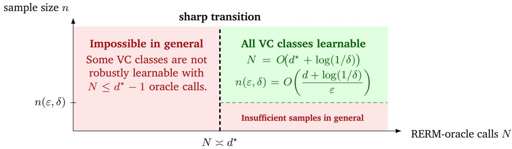

# Bagging Robustly Learns VC Classes with Linear Sample Complexity

Omar Montasser Yale University

OMAR.MONTASSER@YALE.EDU

## Abstract

We revisit the problem of learning predictors robust to adversarial examples at test-time. We prove that VC classes are adversarially robustly learnable with sample complexity linear in the VC dimension $d ,$ providing an exponential improvement over the previous upper bound of Montasser, Hanneke, and Srebro [2019]. Remarkably, this result is achieved with a simple improper algorithm that combines the classic heuristic bagging (bootstrap aggregation) of Breiman [1996] with robust empirical risk minimization (RERM). Our algorithm computes RERMs on $O ( d ^ { \star } )$ indpendent bootstrap samples and outputs their majority-vote, where $d ^ { \star }$ denotes the dual VC dimension. We complement this result with a lower bound showing that this is unavoidable: in general, any learner in this oracle model requires $\Omega ( d ^ { \star } )$ calls to an RERM oracle, even when given arbitrarily many training examples.

## 1. Introduction

Learning predictors robust to adversarial examples is a major contemporary challenge in machine learning. Adversarial examples can be thought of as carefully crafted perturbations of test examples that cause predictors to misclassify. Over the past decade, there has been a significant interest in how deep learning predictors are not robust to adversarial examples [Szegedy et al., 2013, Biggio et al., 2013, Goodfellow et al., 2015], leading to an ongoing effort to devise methods for learning predictors that are adversarially robust [e.g., Madry et al., 2018, Cohen et al., 2019, Zhang et al., 2019].

Given an instance space X and label space $\mathcal { V } = \{ - 1 , 1 \}$ , we formalize an adversary (or perturbation map) we would like to be robust against as $\mathcal { U } : \overset { \cdot \mathrm { ~ \boldsymbol ~ { ~ \chi ~ } ~ } } { \boldsymbol { \mathscr { X } } } \to 2 ^ { \mathcal { X } }$ , where $u ( x ) \subseteq \mathcal X$ is the set of perturbations of x that can be chosen by the adversary at test-time. For example, U could be perturbations of bounded $\ell _ { \infty }$ norm which represents “imperceptible” image perturbations in practice [Goodfellow et al., 2015]. The only (implicit) restriction is that $\mathcal { U } ( x )$ is non-empty for every x. We observe n i.i.d. samples $S = ( ( X _ { i } , Y _ { i } ) ) _ { i = 1 } ^ { n } \sim P ^ { n }$ from an (unknown) distribution P over $\mathcal { X } \times \mathcal { V }$ , and our goal is to learn a predictor ${ \hat { f } } : { \mathcal { X } }  { \mathcal { V } }$ having small population robust risk,

$$
\mathrm { R } _ { \mathcal { U } } ( \hat { f } ; P ) = \operatorname* { \mathbb { E } } _ { ( X , Y ) \sim P } \left[ \operatorname* { s u p } _ { Z \in \mathcal { U } ( X ) } \mathbb { 1 } \left\{ \hat { f } ( Z ) \neq Y \right\} \right] .\tag{1}
$$

A central approach to adversarially robust learning in practice is adversarial training, where model parameters are trained to fit the training examples and their corresponding adversarial perturbations [e.g., Madry et al., 2018, Zhang et al., 2019]. Theoretically, this can be viewed as minimizing the empirical robust risk over a function class $\mathcal { F } \subseteq \mathcal { V } ^ { \mathcal { X } }$ (e.g., neural networks):

$$
\widehat { f } _ { S } \in \mathrm { R E R M } _ { \mathcal { F } } ( S ) : = \operatorname * { a r g m i n } _ { f \in \mathcal { F } } \ \frac { 1 } { n } \sum _ { i = 1 } ^ { n } \operatorname* { s u p } _ { Z _ { i } \in \mathcal { U } ( X _ { i } ) } \mathbb { 1 } \left\{ f ( Z _ { i } ) \neq Y _ { i } \right\} .\tag{2}
$$

This approach is justified by classical uniform convergence arguments applied to the robust risk, i.e., arguing that with sufficiently many training examples, the robust generalization gap $| \mathrm { R } _ { \mathcal { U } } ( f ; P ) -$ $\operatorname { R } _ { \mathcal { U } } ( f ; S ) |$ is small for all $f \in { \mathcal { F } }$ [Cullina, Bhagoji, and Mittal, 2018, Bubeck, Lee, Price, and Razenshteyn, 2019, Yin, Ramchandran, and Bartlett, 2019]. However, empirical evidence shows severe overfitting: adversarial training yields models with low empirical robust risk but high population robust risk [Schmidt, Santurkar, Tsipras, Talwar, and Madry, 2018]. This discrepancy suggests that adversarial training and uniform convergence alone may not guarantee provable robust learning.

This empirical observation is indeed mirrored by a fundamental theoretical limitation. Montasser, Hanneke, and Srebro [2019] showed that minimizing the empirical robust risk as in (2)–or any surrogate thereof–can provably fail, even in simple settings. Specifically, there are function classes $\mathcal { F }$ with VC dimension 1 that are not adversarially robustly learnable with any proper learning algorithm, namely, one constrained to output a predictor $\hat { f } \in \mathcal { F }$ . To bypass the limitation of proper learning, Montasser, Hanneke, and Srebro [2019] designed an improper learning algorithm to adversarially robustly learn classes $\mathcal { F }$ with finite VC dimension. This separation between proper and improper learning stands in sharp contrast to classical (non-robust) PAC learning [Valiant, 1984], where empirical risk minimization (ERM), a proper learning rule, learns VC classes with near-optimal sample complexity [Vapnik and Chervonenkis, 1971, Valiant, 1984, Blumer, Ehrenfeucht, Haussler, and Warmuth, 1989, Ehrenfeucht, Haussler, Kearns, and Valiant, 1989].

Despite this progress in adversarially robust learning, two fundamental challenges remain concerning: sample-efficiency and oracle-efficiency. First, the best known upper bound on the sample complexity is exponential in the VC dimension d [Montasser, Hanneke, and Srebro, 2019]. Second, the improper learning algorithm attaining this bound is quite complex and inefficient; it makes $O ( n ^ { d } )$ oracle calls to RERM (2) with a prohibitive additional computational overhead of $n ^ { 2 ^ { O ( d ) } }$ . These challenges motivate the central question we study in this work:

## Can we design sample-efficient and oracle-efficient adversarially robust learning algorithms? Or are there fundamental limitations prohibiting that?

In addition to our goal of improving the sample complexity of adversarially robust learning, we are especially interested in oracle-efficient algorithms. Just as efficient PAC learning reduces to efficient ERM, this work seeks an analogous recipe for robustness: reducing efficient robust PAC learning of a class $\mathcal { F }$ to efficient RERM. In this context, we view RERM (2) as a natural black-box oracle, since adversarial training methods in practice [e.g., Madry et al., 2018, Zhang et al., 2019] can be viewed as heuristics implementing RERM. Theoretically, oracle-efficient robust learners would strengthen reductions for leveraging non-robust learners [Montasser, Hanneke, and Srebro, 2020b], handling unknown perturbations [Montasser, Hanneke, and Srebro, 2021], and achieving computational efficiency [Montasser, Goel, Diakonikolas, and Srebro, 2020a], thereby unifying algorithmic efficiency with provable robustness.

## 1.1 Main Results

In this work, we prove that VC classes are adversarially robustly learnable with sample complexity linear in the VC dimension, providing an exponential improvement over the best previous bound due to Montasser, Hanneke, and Srebro [2019]. Remarkably, this result is achieved with a simple improper algorithm that combines the classic heuristic bagging (bootstrap aggregation) due to Breiman [1996] with robust empirical risk minimization (RERM, (2)). Given a training sample $S ,$ the algorithm constructs N independent bootstrap samples $S _ { 1 } ^ { \prime } , \ldots , S _ { N } ^ { \prime }$ (as specified below), runs $\mathrm { R E R M } _ { \mathcal { F } }$ on each bootstrap sample $S _ { i } ^ { \prime }$ to produce a predictor $\begin{array} { r } { \dot { f } _ { S _ { i } ^ { \prime } } \in \mathcal { F } , } \end{array}$ , and finally outputs a majority-vote over $\widehat { f } _ { S _ { 1 } ^ { \prime } } , \ldots , \widehat { f } _ { S _ { N } ^ { \prime } }$ . The formal procedure appears in Algorithm 1, followed by its guarantee.

Algorithm 1: Bagging Robust ERMs   
Input: Training set $S = ( ( X _ { j } , Y _ { j } ) ) _ { j = 1 } ^ { n } ,$ confidence δ, and an $\mathrm { R E R M } _ { \mathcal { F } }$ oracle ${ \widehat { f } } \left( 2 \right)$   
1. Set $N = O ( d ^ { \star } + \log ( 1 / \delta ) ) \big ]$ , and $\mathsf { \Delta } J _ { n } = \{ n / 4 , \dots , n - 1 \}$   
2. For each $i = 1 , \ldots , N \colon$   
3. Sample t uniformly from $J _ { n }$   
4. Sample a bootstrap $S _ { i } ^ { \prime }$ of t samples uniformly with replacement from $\begin{array} { r } { S _ { \leq t } = ( ( X _ { j } , Y _ { j } ) ) _ { j = 1 } ^ { t } . } \end{array}$   
5. Run RERMF oracle $\widehat { f }$ on $S _ { i } ^ { \prime } ,$ denoting its output predictor by $\widehat { f } _ { S _ { i } ^ { \prime } }$   
Output: The majority-vote predictor MAJ $\left( \widehat { f } _ { S _ { 1 } ^ { \prime } } , \ldots , \widehat { f } _ { S _ { N } ^ { \prime } } \right)$

Theorem 1 (Realizable). For any function class $\mathcal { F }$ with VC dimension d and dual VC dimension $d ^ { \star }$ any perturbation set $u ,$ any deterministic RERMF oracle ${ \widehat { f } } ,$ any distribution $P$ over $\mathcal { X } \times \mathcal { V }$ where inf $\ O _ { f \in \mathcal { F } } \mathrm { R } _ { \mathcal { U } } ( f ; P ) = 0 ,$ for every $n \geq 4$ and every $\delta \in \mathsf { \Gamma } ( 0 , 1 )$ , letting $N = O ( d ^ { \star } + \log ( 1 / \delta ) )$ , with probability $1 - \delta$ over the random draw of a training dataset $S \sim P ^ { n }$ and N bootstrap samples $S _ { 1 } ^ { \prime } \ldots , S _ { N } ^ { \prime } \subseteq S$

$$
\mathrm { R } _ { \mathcal { U } } \left( \mathrm { M A J } ( \widehat { f } _ { S _ { 1 } ^ { \prime } } , \ldots , \widehat { f } _ { S _ { N } ^ { \prime } } ) ; P \right) = O \left( \frac { d } { n } + \frac { 1 } { n } \log \left( \frac { 1 } { \delta } \right) \right) .
$$

We remark that the oracle complexity (number of calls to RERM) of our algorithm above satisfies $N = O ( d ^ { \star } )$ where $d ^ { \star }$ denotes the dual VC dimension of ${ \mathcal { F } } ^ { 1 }$ , with a computational overhead of just $O ( d ^ { \star } n )$ . This is a significant improvement over the prior improper algorithm of Montasser, Hanneke, and Srebro [2019], which incurred oracle complexity of $O ( n ^ { d } )$ and additional computational overhead of $O ( n ^ { d d ^ { \star } } )$ . Another significant advantage of our bagging algorithm, which is of practical importance, is that it can be parallelized since the N bootstrap samples are independent. The prior improper algorithm of Montasser, Hanneke, and Srebro [2019] relies on boosting which is inherently sequential and cannot be parallelized in general [Karbasi and Larsen, 2024].

By combining the agnostic-to-realizable reduction of Montasser, Hanneke, and Srebro [2019, Theorem 8] with the realizable guarantee of Theorem 1, we obtain the following immediate corollary improving the sample and oracle complexity of agnostic adversarially robust learning.

Corollary 1 (Agnostic). There is an algorithm ALG so that for any class $\mathcal { F }$ with VC dimension d and dual VC dimension $d ^ { \star } ,$ , any perturbation set $u ,$ any deterministic $\mathrm { R E R M } _ { \mathcal { F } }$ oracle ${ \widehat { f } } ,$ the following holds. For any distribution $P$ over $\mathcal { X } \times \mathcal { Y } _ { i }$ , for every $n \geq 4$ and every $\delta \in ( 0 , 1 )$ , with probability $1 - \delta$ over $S \sim P ^ { n }$ and randomness of ALG, ALG makes at most $O ( d ^ { \star } \left( \log ( n ) + \log ( 1 / \delta ) \right) )$ calls to oracle $\widehat { f }$ and returns a predictor $\widehat { h } _ { S }$ satisfying

$$
\mathrm { R } _ { \mathcal { U } } \left( \widehat { h } _ { S } ; P \right) \leq \operatorname* { i n f } _ { f \in \mathcal { F } } \mathrm { R } _ { \mathcal { U } } ( f ; P ) + O \left( \sqrt { \frac { d } { n } \log ^ { 2 } ( n ) + \frac { 1 } { n } \log \left( \frac { 1 } { \delta } \right) } \right) .
$$

The agnostic algorithm ALG works as follows. Denote by W an instantiation of Algorithm 1 with fixed parameters $\varepsilon _ { 0 } = 1 / 3 , \delta _ { 0 } = 1 / 3 $ , to be treated as a weak robust learner. Given a training sample $S ,$ call $\mathrm { R E R M } _ { \mathcal { F } }$ once on $S$ to find a maximal subsequence $S ^ { \prime }$ that is robustly realizable. Then, run a classical boosting algorithm $[ \mathrm { e } . g . , \alpha$ -Boost, Schapire and Freund, 2012, Section 6.4.2] on $S ^ { \prime }$ with W as the weak learner. The final output is majority-of-majority of predictors in ${ \mathcal F } .$

Remark 1 (Computational Efficiency). Our results provide a recipe for computationally efficient robust PAC learning. In particular, if a concept class $\mathcal { F }$ and perturbation set U admit an efficient algorithm implementing RERM (2), then Theorem 1 implies that $\mathcal { F }$ is efficiently adversarially robustly PAC learnable with respect to U in the realizable setting. For the agnostic setting, the same implication follows from Corollary 1 under an additional requirement that the robust loss for $f \in { \mathcal { F } }$ can be evaluated efficiently.

  
Figure 1: A sharp sample–oracle complexity tradeoff: below $d ^ { \star }$ oracle calls, robust learnability can fail regardless of sample size n.

In light of Theorem 1, a natural follow-up question is whether the oracle complexity can be further improved. Because the dual VC dimension satisfies $d ^ { \star } \leq 2 ^ { d + 1 } - 1$ with the inequality being tight for some classes [Assouad, 1983], we ask whether the oracle complexity can instead be bounded by a polynomial or even a linear function of the VC dimension d. Recent advances in classical PAC learning suggest that such an improvement might be possible. Larsen [2023] showed that bagging with $O ( \log n )$ calls to an ERM oracle yields an optimal PAC learner, and subsequent work reduced this number to just three independent ERM calls that are combined by a majority-vote [Aden-Ali, Høandgsgaard, Larsen, and Zhivotovskiy, 2024, Rawal and Zhivotovskiy, 2026]. Can an analogous guarantee be obtained for adversarially robust learning? Our second main result gives a negative answer: unlike in classical PAC learning, the oracle complexity of adversarially robust learning must inherently depend on the dual VC dimension $d ^ { \star }$ . We state this result formally below.

Theorem 2. For every integers $d , m \geq 1$ , there is an instance space $x ,$ a perturbation map $u ,$ and a finite collection of classes $\mathcal { F } = \{ \mathcal { F } \}$ where each class $\mathcal { F }$ has VC dimension d and dual VC dimension $d ^ { \star } = 2 ^ { d + 1 } - 1$ such that thefollowing holds. For any (randomized) learning algorithm ALG making at most $d ^ { \star } - 1$ calls to RERM, there exists a class $\mathcal { F } \in \mathcal { F }$ and a distribution $P$ over $\mathcal { X } \times \mathcal { V }$ such that

• P is robustly realizable, $i . e . , \operatorname* { i n f } _ { f \in \mathscr { F } } \mathrm { R } _ { \mathscr { U } } ( f ; P ) = 0 .$

• With probability at least $1 / 3$ over $S \sim P ^ { m }$ and randomness of ALG, $\operatorname { R } _ { \mathit { 4 } } ( \mathsf { A L G } ( S ) ; P ) > 1 / 5 .$

We remark that this result proves that $\Omega ( d ^ { \star } )$ oracle queries to RERM are necessary regardless of the number of samples m provided to the algorithm. Figure 1 on page 4 illustrates the sample-oracle complexity tradeoff and the sharp transition implied by Theorem 1 and Theorem 2.

## 2. Discussion, Implications, and Related Work

We discuss connections between our work and related literature. We start by discussing several quantitative improvements on prior works that follow from our results. We then situate our work within broader theoretical models of robustness.

Characterization and Optimal Sample Complexity. Montasser, Hanneke, and Srebro [2022] proposed a refined complexity measure denoted dim $( \mathcal { F } , \mathcal { U } )$ that characterizes which classes $\mathcal { F }$ and perturbation sets $\mathcal { U }$ are adversarially robustly learnable. This characterization is based on a generalization of the classical one-inclusion graph of Haussler, Littlestone, and Warmuth [1994]. Our result in Theorem 1, and more directly Lemma $^ { 3 , }$ implies that this complexity measure is bounded by the VC dimension: dim $( { \mathcal { F } } , { \mathcal { U } } ) \leq O ( d )$ , positively resolving Conjecture 3 of Montasser, Hanneke, and Srebro [2022].

Reductions in Adversarially Robust Learning. Several works have explored access to different forms of oracles and studied what robust learning guarantees are possible. This includes access to non-robust learners such as ERM [Montasser, Hanneke, and Srebro, 2020b, Ahmadi, Blum, Montasser, and Stangl, 2024], and access to “attack oracles” for $\mathcal { U }$ [Montasser, Goel, Diakonikolas, and Srebro, 2020a, Montasser, Hanneke, and Srebro, 2021]. A unifying theme across these works is that each specific form of access is leveraged to implement an RERM oracle (2). Consequently, our algorithmic result in Theorem 1 leads to immediate quantitative improvements when combined with those earlier works in their respective settings. For example, Theorem 1 implies an improved polynomial attack-oracle complexity of $O ( \mathrm { p o l y } ( d , d ^ { \star } ) \cdot \mathrm { l i t } ( \mathcal { F } ) )$ in the perfect attack oracle framework of Montasser, Hanneke, and Srebro [2021, Theorem 2] over the previously exponential bound $O ( \exp ( d , d ^ { \star } ) \cdot \operatorname { l i t } ( \mathcal { F } ) )$ , where $\operatorname { l i t } ( { \mathcal { F } } )$ denotes the Littlestone dimension of $\mathcal { F }$ [Littlestone, 1987].

Adversarially Robust Learning with Tolerance. Several prior works have studied a relaxed model of adversarially robust learning where the learner competes with a “larger” perturbation set $\nu \supseteq u ,$ while the adversary is restricted to perturbations in $\mathcal { U }$ [Ashtiani, Pathak, and Urner, 2023, Bhattacharjee, Hopkins, Kumar, ${ \mathrm { Y u } } .$ , and Chaudhuri, 2023, Ashtiani, Pathak, and Urner, 2025]. Concretely, consider metric balls in $p$ dimensions $\mathcal { U } ( x ) = \mathrm { B a l l } _ { r } ( x )$ and $\mathcal { V } ( x ) = \mathrm { B a l l } _ { ( 1 + \alpha ) r } ( x )$ . Previously, the best known upper bound on sample complexity was $\widetilde { O } \left( d \left( \log ( d ) + p \log ( 1 + 1 / \alpha ) \right) + \log ( 1 / \delta ) / \varepsilon \right)$ [Ashtiani, Pathak, and Urner, 2025]. Theorem 1 improves the sample complexity to $O ( d / \varepsilon )$ removing dependence on the ambient dimension p and $\alpha .$

Bounded Cardinality Perturbation Sets. In the special case of adversarially robust learning where $\begin{array} { r } { \operatorname* { m a x } _ { x \in \mathcal { X } } | \mathcal { U } ( x ) | \le k } \end{array}$ for some fixed $k \in \mathbb N ,$ Attias, Kontorovich, and Mansour [2022b] established a sample complexity upper bound of ${ \tilde { O } } ( d \log ( k ) / \varepsilon )$ via a single RERM call and uniform convergence analysis. Theorem 1 improves the sample complexity to $O ( d / \varepsilon )$ removing the $\log ( k )$ factor entirely, albeit with an improper learning algorithm making ${ \cal O } ( d ^ { \star } )$ calls to RERM.

Broader Models of Robust Learning. Our work studies supervised classification under test-time perturbations. Adversarial robustness has also been studied in semi-supervised and regression settings [Carmon, Raghunathan, Schmidt, Duchi, and Liang, 2019, Alayrac, Uesato, Huang, Fawzi, Stanforth, and Kohli, 2019, Attias, Hanneke, and Mansour, 2022a, Attias and Hanneke, 2023]. A complementary line considers adversarial corruptions at training-time, beginning with the malicious- and nasty-noise models of PAC learning [Kearns and Li, 1993, Bshouty, Eiron, and Kushilevitz, 2002], which were recently shown to be equivalent for efficient distribution-independent learning [Blanc, Huang, Malkin, and Servedio, 2026]. Other theoretical works study clean-label and instance-targeted poisoning and robustly reliable prediction under poisoning attacks [Blum, Hanneke, Qian, and Shao, 2021, Hanneke, Karbasi, Mahmoody, Mehalel, and Moran, 2022, Balcan, Blum, Hanneke, and Sharma, 2022], as well as learning with monotone adversaries [Larsen, Pabbaraju, and Shetty, 2026, Mehrotra, 2026]. Beyond modeling adversarial examples through prescribed perturbation sets, abstention can provide meaningful guarantees under arbitrary test inputs. In particular, PQ learning combines labeled samples from a training distribution $P$ with unlabeled samples from an arbitrary test distribution $Q ,$ seeking low error on $Q$ while maintaining a low abstention rate on $P$ [Goldwasser, Kalai, Kalai, and Montasser, 2020, Kalai and Kanade, 2021]. This model is closely connected to reliable learning [Kalai,

Kanade, and Mansour, 2012], testable learning with distribution shifts [Klivans, Stavropoulos, and Vasilyan, 2024, Patel, Klivans, Stavropoulos, and Vasilyan, 2026], and has extensions to sequential adversarial injections [Goel, Hanneke, Moran, and Shetty, 2023, Edelman and Goel, 2026, Yu and Blanchard, 2026].

## 3. Technical Overview

## 3.1 Sample and Oracle Complexity Upper Bound

We highlight the main ideas behind the analysis of Algorithm 1 and proof of Theorem 1. Our proof follows a substantially different route from Montasser, Hanneke, and Srebro [2019]. Instead of relying on sample compression arguments which incur a multiplicative factor of dual VC dimension $d ^ { \star }$ in sample complexity, we proceed with a more direct leave-one-out analysis of bagging RERMs.

Fix an arbitrary class $\mathcal { F }$ with VC dimension $d ,$ a perturbation map $\mathcal { U } : \mathcal { X } \to 2 ^ { \mathcal { X } }$ , an arbitrary RERMF oracle ${ \widehat { f } } \left( 2 \right)$ , and a distribution $P$ over $\mathcal { X } \times \mathcal { V }$ that is robustly realizable $\begin{array} { r l } { ( \operatorname* { i n f } _ { f \in \mathcal { F } } \operatorname { R } _ { \mathcal { U } } ( f ; P ) = } & { { } } \end{array}$ 0). The analysis is divided into three main parts we sketch below.

Distribution over RERMs. The key idea is to the analyze the distribution over the RERMs $\widehat { f } _ { S }$ that are produced from random samples $S \sim P ^ { n }$ . In key Lemma 1, we essentially show that in expectation over random test examples $( X , Y ) \sim P ,$ , for any perturbation $Z \in { \mathcal { U } } ( X )$ , the fraction of RERMs $\widehat { f } _ { S }$ that misclassify $Z , { \widehat { f } } _ { S } ( Z ) \neq Y$ , is small:

$$
\operatorname { \mathbb { E } } _ { \left( X , Y \right) \sim P } \left[ \operatorname* { s u p } _ { Z \in \mathcal { U } \left( X \right) } \operatorname { \mathbb { E } } _ { S \sim P ^ { n } } \left[ \mathbb { 1 } \left\{ \widehat { f } _ { S } ( Z ) \neq Y \right\} \right] \right] = \tilde { O } \left( \frac { d } { n } \right) .\tag{3}
$$

One way of thinking about (3) is that it swaps the order of sup and inner expectation relative to the expected robust risk of a single RERM, which does not vanish to zero in general as implied by [Theorem 1, Montasser, Hanneke, and Srebro, 2019],

$$
\mathbb { E } _ { ( X , Y ) \sim P } \left[ \underset { S \sim P ^ { n } } { \mathbb { E } } \left[ \operatorname* { s u p } _ { Z \in \mathcal { U } ( X ) } \mathbb { 1 } \left\{ \widehat { f } _ { S } ( Z ) \neq Y \right\} \right] \right] = \Omega ( 1 ) .
$$

Bagging Leave-One-Out Analysis. The next idea is to apply (3) on an empirical distribution and establish a leave-one-out bound on the robust risk. Specifically, in Lemma $^ { 3 , }$ , on a fixed robustly realizable sequence $T = ( ( X _ { i } , Y _ { i } ) ) _ { i = 1 } ^ { n }$ , the aggregate vote over all RERMs can be expressed as

$$
\widehat { \mathrm { B } } _ { T } ( x ) : = \underset { S \sim \mathrm { U n i f } ( T ) ^ { n } } { \mathbb { E } } \left[ \widehat { f } _ { S } ( x ) \right] \in [ - 1 , 1 ] .\tag{4}
$$

(4) can be thought of as performing bagging (bootstrap aggregation) over all ordered bootstraps. This idealized full-bagging predictor is analogous to a voting predictor that is analyzed by Larsen [2023] for classical PAC learning, though our analysis follows a fundamentally different route tailored to the robust risk relying on (3) and the leave-one-out analysis we sketch below.

Consider a uniform distribution $D$ over $T$ and $D _ { - i } { \textbf { a } }$ uniform distribution on $T _ { - i }$ (leaving out the $i ^ { \mathrm { t h } }$ tuple) for each $i \in [ n ]$ . Note that the probability the $i ^ { \mathrm { t h } }$ tuple is left out when drawing $n - 1$ samples from $D$ is equal to $( \bar { 1 } - 1 / n ) ^ { n - 1 } \geq 1 / e$ . Combining this with (3), it follows that

$$
\frac { 1 } { n } \sum _ { i = 1 } ^ { n } \operatorname* { s u p } _ { Z _ { i } \in \mathcal { U } ( X _ { i } ) } \operatorname* { P r } _ { S \sim D _ { - i } ^ { n - 1 } } \left[ \widehat { f } _ { S } ( Z _ { i } ) \neq Y _ { i } \right] \leq e \cdot \frac { 1 } { n } \sum _ { i = 1 } ^ { n } \operatorname* { s u p } _ { Z _ { i } \in \mathcal { U } ( X _ { i } ) } \operatorname* { P r } _ { S \sim D ^ { n - 1 } } \left[ \widehat { f } _ { S } ( Z _ { i } ) \neq Y _ { i } \right] = \tilde { O } \left( \frac { d } { n - 1 } \right) .
$$

By applying Markov’s inequality, we establish the following leave-one-out robust error bound on the full bagging predictor (4)

$$
\frac { 1 } { n } \sum _ { i = 1 } ^ { n } \operatorname* { s u p } _ { Z _ { i } \in \mathcal { U } ( X _ { i } ) } \mathbb { 1 } \left\{ Y _ { i } \widehat { \mathrm { B } } _ { T - i } ( Z _ { i } ) \leq 0 \right\} \leq 2 \cdot \frac { 1 } { n } \sum _ { i = 1 } ^ { n } \operatorname* { s u p } _ { Z _ { i } \in \mathcal { U } ( X _ { i } ) } \operatorname* { P r } _ { S \sim D _ { - i } ^ { n - 1 } } \left[ \widehat { f } _ { S } ( Z _ { i } ) \neq Y _ { i } \right] = \tilde { O } \left( \frac { d } { n - 1 } \right) .\tag{5}
$$

We prove a more general version of this bound that provides an additional margin guarantee in Lemma 3, which will be useful for us later in a sparsification argument. Observe that (5), via an exchangeability argument, implies the following bound on the expected robust risk of (4),

$$
\operatorname { \underset { S \sim P ^ { n } } { E } } \left[ \operatorname { R } _ { \mathcal { U } } \left( \operatorname { s i g n } \left( \widehat { B } _ { S } \right) ; P \right) \right] = \tilde { O } \left( \frac d n \right) .
$$

High-Probability Bound and Sparsification. We next apply a suffix averaging technique due to Aden-Ali, Cherapanamjeri, Shetty, and Zhivotovskiy [2023] to extend the bound in (5) to a high probability bound. With the help an additional technical lemma (Lemma 5), we establish in Lemma 6 a high-probability bound on the robust risk of the suffix-bagging predictor ${ \widehat { g } } _ { S } : { \mathcal { X } }  [ - 1 , 1 ]$ defined as

$$
\widehat { g } _ { S } ( x ) : = \frac { 4 } { 3 n } \sum _ { t = n / 4 } ^ { n - 1 } \widehat { B } _ { S \leq t } ( x ) = \underset { t \sim \operatorname { U n i f } ( J _ { n } ) } { \mathbb { E } } \left[ \underset { S ^ { \prime } \sim \operatorname { U n i f } ( S \leq t ) ^ { t } } { \mathbb { E } } \left[ \widehat { f } _ { S ^ { \prime } } \right] \right] .\tag{6}
$$

Observe that the suffix-bagging predictor (6) computes the aggregate vote over a distribution over RERMs ${ \widehat { f } } _ { S ^ { \prime } }$ where $S ^ { \prime }$ is sampled according to the process defined in (6).

Finally, note that the suffix-bagging predictor (6) is intractable to compute. To overcome this challenge, we observe that we can approximate (6) via a sparsification technique (Lemma 7) due to Moran and Yehudayoff [2016] by drawing enough bootstrap samples $S _ { 1 } ^ { \prime } , \ldots , S _ { N } ^ { \prime }$ according to the process defined in (6). Lemma $7$ appeals to uniform convergence over the dual class of $\mathcal { F }$ to show that $N = O ( d ^ { \star } )$ bootstrap samples suffice for approximation, where $d ^ { \star }$ denotes the dual VC dimension. Observe the bagging algorithm performs exactly this sampling process of bootstraps to produce its majority-vote output. This is where the oracle complexity dependence on $d ^ { \star }$ shows up.

## 3.2 Oracle Complexity Lower Bound

Proof Overview. The proof constructs a finite hard family $\{ ( \mathcal { F } _ { \pi } , P _ { \pi , t } ) \} _ { \pi , t }$ and places a prior on it by choosing the target index $T \in [ K ]$ uniformly and independently permuting $N$ copies of a latent instance set (which defines the randomized function class $\mathcal { F } _ { \pi } )$ . The lower bound rests on two distinct forms of hidden information. First, even after observing an arbitrarily large training sample and making fewer than $d ^ { \star }$ oracle calls, the learner is unlikely to have the zero-robust-risk target among the hypotheses returned by the oracle. Second, the returned hypotheses reveal too little information to determine the orientation of a carefully chosen opposite-label pair on a uniformly random unseen block. The second obstruction applies even to an improper learner that combines and evaluates all returned hypotheses arbitrarily.

The Function Class and the Role of $\pi .$ . For suitably chosen integer parameters $K , N ,$ set $B = 2 ^ { d } - 1$ -， so $d ^ { \star } = 2 B + 1$ , and consider the latent instance set

$$
\Theta = \{ ( b , J ) : b \in \{ - 1 , + 1 \} , \ J \subseteq [ K ] , \ | J | \leq B \} .
$$

The (randomized) class $\mathcal { F }$ will consist of $K$ hypotheses. Hypothesis $f _ { i }$ labels $( b , J )$ by $- b \mathrm { i f } i \in J ,$ and by $b$ otherwise. The instance space $\mathcal { X }$ will consist of $N$ disjoint blocks, where each block $Z _ { r }$ is merely a copy of Θ: a bijection $\pi _ { r } : Z _ { r } \to \Theta$ determines the behavior of $\mathcal { F }$ on block $Z _ { r }$ . The permutations $\pi _ { 1 } , \ldots , \pi _ { N }$ are chosen independently and uniformly, so the class behaves identically on every block, up to an unknown permutation of the rows. Thus all combinatorial properties are determined by the behavior on $\Theta ,$ while $\pi$ hides where the relevant rows occur. In Lemma $^ { 8 , }$ we show that the (randomized) function class $\mathcal { F }$ has VC dimension d and dual VC dimension $d ^ { \star } = 2 ^ { d + 1 } - 1$

Robust Realizability and the Hidden Target. A distribution $P _ { \pi , i }$ draws a block $R \in [ N ]$ , a label Y uniformly, and a random set $A \subseteq [ K ] \setminus \{ t \}$ , and places in the perturbation set all types $( Y , J )$ with $J \subseteq A$ . The resulting robust loss has the exact form

$$
\operatorname* { s u p } _ { z \in \mathcal { U } ( X ) } \mathbb { 1 } \{ f _ { i } ^ { \pi } ( z ) \neq Y \} = \mathbb { 1 } \{ i \in A \} .
$$

Since t is always excluded from $A , \ f _ { t } ^ { \pi }$ has zero robust risk. In Lemma 10, we argue that after observing the training sample, every index absent from all sampled sets $A _ { j }$ remains a possible target, and conditional on the training sample the true target is uniform over this version space. The class size K is chosen so that the version space remains large even when the sample size $m$ is arbitrary. Since $q = d ^ { \star } - 1$ oracle calls can return at most $q$ distinct hypotheses, the probability that the returned set contains the target is less than a small constant $\eta = 1 0 ^ { - 3 }$

The Dual-VC Obstruction. Let $Q$ be the set of indices of hypotheses returned by the RERM oracle. Since $| Q | \leq q = 2 B$ , split $Q$ into two parts $Q ^ { + }$ and $Q \setminus Q ^ { + }$ , each of size at most $B ,$ , and define

$$
\theta ^ { + } = ( + 1 , Q ^ { + } ) , \qquad \theta ^ { - } = ( - 1 , Q \setminus Q ^ { + } ) .
$$

Both are valid instances $\theta ^ { + } , \theta ^ { - } \in \Theta$ . By construction of ${ \mathcal { F } } ,$ , one can verify that all returned hypotheses indexed by Q predict the same label on $\theta ^ { + }$ and $\theta ^ { - } \ ( 2 1 )$ , whereas every unreturned hypothesis with index in $[ K ] \backslash Q$ labels $\theta ^ { + }$ by +1 and $\theta ^ { - }  { \mathbf { b } }  { \mathbf { y } } - 1 ( 2 2 )$ . This is the decisive role of the dual VC dimension: fewer than $d ^ { \star } = 2 B + 1$ returned hypotheses necessarily leaves an opposite-label pair that those hypotheses cannot distinguish. On each unseen block during trainin $^ { 1 g , }$ the random permutation $\pi _ { r }$ hides which of two instances in $Z _ { r }$ is assigned to $\theta ^ { + }$ and which is assigned to $\theta ^ { - } ;$ this unknown assignment is the orientation bit.

The Hidden Orientation is Nearly Uniform. The preceding local symmetry is not sufficient by itself. The response of the RERM oracle is adaptive and may depend on all hidden block permutations, including through arbitrary tie-breaking, so the identities of the returned hypotheses can leak information about the orientations. After conditioning on the target, the learner’s randomness, the training sample, and all sampled-block permutations, the unseen permutations remain independent. On each unseen block, reveal every returned hypothesis and the unordered pair of instance assigned to $\theta ^ { + }$ and $\theta ^ { - }$ . Swapping the two assignments preserves all revealed information and flips only their orientation, so the orientation is locally uniform. Lemma 11 then implies that the posterior orientation bias $\Delta _ { R }$ on a uniformly selected unseen test block satisfies

$$
{ \mathbb E } [ \mathbf { 1 } \{ R \mathrm { i s ~ u n s e e n ~ i n ~ t r a i n i n g } \} \Delta _ { R } ] < \eta .
$$

Thus, despite the entire adaptive interaction, the relevant orientation on a fresh block remains nearly uniform.

From Hidden Orientation to Robust Error. For the analysis, we condition on the training sample (and the revealed sampled-block permutations), the learner’s internal randomness, the entire sequence of RERM oracle responses and on the values of every returned hypothesis on the whole domain. This information fixes the, possibly improper, classifier H outputted by the learner. The relevant orientation remains hidden because the two special points are indistinguishable to all returned hypotheses. On the good event that: the test block is unseen, the target was not returned, and $Q \subseteq A$ (32), the point carrying $\theta ^ { + }$ is a valid perturbation when $Y = + 1$ , while the point carrying $\theta ^ { - }$ is valid when $Y = - 1$ . For any fixed values of H at the two points, a uniform label and a uniform orientation produce an error in exactly two of the four possible cases, and hence with probability $1 / 2 \ ( 3 4 )$ . The posterior bias can reduce this probability by at most $\Delta _ { R }$ (35). The good event has probability close to one (37), so averaging gives expected robust risk greater than 0.49. Finally, averaging over the prior fixes a single hard pair $( \mathcal { F } _ { \pi } , P _ { \pi , t } )$ , and boundedness of the risk yields the stated constant-probability lower bound.

## 4. Proof of Theorem 1: Sample and Oracle Complexity Upper Bound

In this section, we provide a complete proof of Theorem 1 which we restate below.

Theorem 1 (Realizable). For any function class F with VC dimension d and dual VC dimension $d ^ { \star }$ any perturbation set $u ,$ any deterministic RERMF oracle ${ \widehat { f } } ,$ any distribution P over $\mathcal { X } \times \mathcal { V }$ where inf $\mathop { f \in \mathcal { F } } \mathrm { R } _ { \mathcal { U } } ( f ; P ) = 0 ,$ for every $n \geq 4$ and every $\delta \in \mathsf { \Gamma } ( 0 , 1 )$ , letting $N = O ( d ^ { \star } + \log ( 1 / \delta ) )$ , with probability $1 - \delta$ over the random draw of a training dataset $S \sim P ^ { n }$ and N bootstrap samples $S _ { 1 } ^ { \prime } \ldots , S _ { N } ^ { \prime } \subseteq S ,$

$$
\mathrm { R } _ { \mathcal { U } } \left( \mathrm { M A J } ( \widehat { f } _ { S _ { 1 } ^ { \prime } } , \ldots , \widehat { f } _ { S _ { N } ^ { \prime } } ) ; P \right) = O \left( \frac { d } { n } + \frac { 1 } { n } \log \left( \frac { 1 } { \delta } \right) \right) .
$$

## 4.1 Leave-One-Out Analysis of Bagging

We begin with proving the following key lemma which establishes an important property: the fraction of RERMs that misclassify a worst-case perturbation of a random example is small.

Lemma 1. For any class $\mathcal { F }$ with VC dimension $d ,$ any $u ,$ any deterministic RERM oracle ${ \widehat { f } } ,$ any distribution $P$ over $\mathcal { X } \times \mathcal { V }$ such that in $\dot { \bar { \cdot } } _ { f \in \mathcal { F } } \operatorname { R } _ { \mathcal { U } } ( f ; P ) = 0 ;$ , and any $\theta \in ( 0 , 1 )$

$$
\operatorname* { P r } _ { ( X , Y ) \sim P } \left[ a ( X , Y ) \ge \theta \right] \le \frac { c } { \theta ^ { 2 } } \cdot \frac { d } { n } , \qquad a ( x , y ) : = \operatorname* { s u p } _ { z \in \mathcal { U } ( x ) } \operatorname* { P r } _ { S \sim P ^ { n } } \left[ \widehat { f } _ { S } ( z ) \ne y \right] .
$$

To prove Lemma 1, we make use of the following recent second-moment bound for consistent VC rules. We note that we could also rely on classical first-moment bounds [Blumer, Ehrenfeucht, Haussler, and Warmuth, 1989], at the expense of an additional $\log ( n / d )$ factor in the resulting bound.

Lemma 2 (Aden-Ali, Høandgsgaard, Larsen, and Zhivotovskiy [2024], Rawal and Zhivotovskiy [2026]). Let P be a distribution on $\mathcal { X } \times \mathcal { V }$ and let C be a class ofsubsets $o f \mathcal { X } \times \mathcal { Y }$ with VC dimension d. Let C be any deterministic selector satisfying $C ( S ) \in { \mathcal { C } } f o r$ every $S \in ( \mathcal { X } { \times } \mathcal { Y } ) ^ { n }$ and ${ \operatorname { P r } } _ { S \sim P ^ { n } } \left[ C ( S ) \cap S = \varnothing \right] =$ 1. Then,

$$
\mathbb { E } _ { ( X , Y ) \sim P } \left[ \operatorname* { P r } _ { S \sim P ^ { n } } \left[ ( X , Y ) \in C ( S ) \right] ^ { 2 } \right] \leq c \frac { d } { n } .
$$

Proof of Lemma 1. By Markov’s inequality, observe that

$$
\operatorname* { P r } _ { ( X , Y ) \sim P } \left[ a ( X , Y ) \ge \theta \right] = \operatorname* { P r } _ { ( X , Y ) \sim P } \left[ a ( X , Y ) ^ { 2 } \ge \theta ^ { 2 } \right] \le \frac { 1 } { \theta ^ { 2 } } \operatorname* { E } _ { ( X , Y ) \sim P } \left[ a ( X , Y ) ^ { 2 } \right] .
$$

Thus, it suffices to show that

$$
\operatorname { \underset { ( X , Y ) \sim P } { \mathbb { E } } } \left[ a ( X , Y ) ^ { 2 } \right] = \underset { ( X , Y ) \sim P } { \mathbb { E } } \left[ \underset { Z \in \mathcal { U } ( X ) } { \operatorname* { s u p } } \underset { S \sim P ^ { n } } { \operatorname* { P r } } \left[ \widehat f _ { S } ( Z ) \neq Y \right] ^ { 2 } \right] \leq c \frac { d } { n } .
$$

We now proceed with analyzing the random variable $a ( X , Y )$ . Fix an arbitrary map $\phi : \mathcal { X } \to \mathcal { X }$ such that $\phi ( x ) \in \mathcal { U } ( x )$ for all $x \in \mathcal { X }$ . Define the collection of error sets

$$
\mathcal { C } _ { \phi } = \{ \{ ( x , y ) \in \mathcal { X } \times \mathcal { Y } : f ( \phi ( x ) ) \neq y \} \ | \ f \in \mathcal { F } \} .
$$

Observe that $\mathrm { V C d i m } ( \mathcal { C } _ { \phi } ) \leq \mathrm { V C d i m } ( \mathcal { F } ) = d _ { : }$ , because we are using a fixed map ϕ. Consider the selector C defined as follows

$$
C ( S ) = \left\{ ( x , y ) \in \mathcal { X } \times \mathcal { Y } : \widehat { f } _ { S } ( \phi ( x ) ) \neq y \right\} .
$$

Because $\widehat { f }$ is an RERM oracle for $\mathcal { F }$ and distribution $P$ is robustly realizable: in $\dot { \bar { \cdot } } _ { f \in \mathcal { F } } \operatorname { R } _ { \mathcal { U } } ( f ; P ) = 0 ;$ , it follows that on any sample $S \sim P ^ { n } , { \widehat { f } } _ { S }$ is robustly correct on $S , \mathrm { i . e . } ,$ , for each $( X , Y ) \in S$ and each $Z \in \mathcal { U } ( X ) , \widehat { f } _ { S } ( Z ) = Y$ . Since $\phi ( x ) \in \mathcal { U } ( x )$ , this implies that ${ \widehat { f } } _ { S } ( \phi ( X ) ) = Y$ for each $( X , Y ) \in S$ Therefore, P $\because S \sim P ^ { n } \left[ C ( S ) \cap S = \varnothing \right] = 1$ . Also, since ${ \widehat { f } } _ { S } \in { \mathcal { F } }$ , it follows that $C ( S ) \in \mathcal { C } _ { \phi }$

We are now ready to invoke Lemma 2 to establish

$$
\underset { ( X , Y ) \sim P } { \mathbb { E } } \left[ \underset { S \sim P ^ { n } } { \operatorname* { P r } } \left[ \widehat { f } _ { S } ( \phi ( X ) ) \neq Y \right] ^ { 2 } \right] = \underset { ( X , Y ) \sim P } { \mathbb { E } } \left[ \underset { S \sim P ^ { n } } { \operatorname* { P r } } \left[ ( X , Y ) \in C ( S ) \right] ^ { 2 } \right] \leq c \frac { d } { n } .\tag{7}
$$

Observe that (7) holds for any map $\phi : \mathcal { X }  \mathcal { X }$ satisfying $\phi ( x ) \in \mathcal { U } ( x )$ for all $x \in \mathcal { X }$ . Fix an arbitrary $f ^ { \star } \in { \mathcal { F } }$ such that $\operatorname { R } _ { \mathcal { U } } ( f ^ { \star } ; P ) = 0$ . For any scalar $\eta > 0 _ { : }$ , we will consider a special arbitrary map $\phi _ { \eta } : \mathcal { X } \to$ X satisfying

$$
\phi _ { \eta } ( x ) \in \mathcal { U } ( x ) \qquad \mathrm { a n d } \qquad \operatorname* { P r } _ { S \sim P ^ { n } } \left[ \widehat { f } _ { S } \big ( \phi _ { \eta } ( x ) \big ) \neq f ^ { \star } ( x ) \right] ^ { 2 } \geq a \left( x , f ^ { \star } ( x ) \right) ^ { 2 } - \eta \qquad \mathrm { f o r ~ a l l ~ } x \in \mathcal { X } .
$$

In words, $\phi _ { \eta }$ maps each $x \in \mathcal { X }$ to a perturbation $\phi _ { \eta } ( x ) = z \in \mathcal { U } ( x )$ that is an approximate maximizer of the probability of disagreement $\mathrm { P r } _ { S \sim P ^ { n } } \left[ \widehat { f } _ { S } ( z ) \neq f ^ { \star } ( x ) \right]$ . Since $f ^ { \star } ( X ) = Y$ with probability 1, it follows then by (7) that

$$
\underset { ( X , Y ) \sim P } { \mathbb { E } } \left[ a ( X , Y ) ^ { 2 } \right] \leq \underset { ( X , Y ) \sim P } { \mathbb { E } } \left[ \underset { S \sim P ^ { n } } { \operatorname* { P r } } \left[ \widehat { f } _ { S } ( \phi _ { \eta } ( X ) ) \neq Y \right] ^ { 2 } \right] + \eta \leq c \frac { d } { n } + \eta .
$$

Taking η arbitrarily close to zero concludes the proof.

Bagging. We introduce notation for bagging. For a sequence $S = ( ( X _ { 1 } , Y _ { 1 } ) , \dots , ( X _ { n } , Y _ { n } ) )$ , let $S ^ { \prime } \sim \operatorname { U n i f } ( S ) ^ { n }$ be a bootstrap drawn uniformly at random (with replacement) from S and let $\hat { f } _ { S ^ { \prime } }$ be the output classifier of RERM (2) on $S ^ { \prime }$ . Equivalently, we can express this as drawing a sequence of integers $I = ( i _ { 1 } , \ldots , i _ { n } ) \in [ n ] ^ { n }$ and denote the bootstrap sample by $S ( I ) = ( ( X _ { i _ { 1 } } , Y _ { i _ { 1 } } ) , \dots , ( X _ { i _ { n } } , Y _ { i _ { n } } ) )$

Define the aggregate vote ${ \widehat { \mathrm { B } } } _ { S } : \mathcal { X } \to [ - 1 , 1 ]$ over all $n ^ { n }$ ordered bootstraps of $S$ as

$$
{ \widehat { \mathrm { B } } } _ { S } ( x ) : = \operatorname* { l g } _ { S ^ { \prime } \sim { \mathrm { U n i f } } ( S ) ^ { n } } \left[ { \widehat { f } } _ { S ^ { \prime } } ( x ) \right] = { \frac { 1 } { n ^ { n } } } \sum _ { I \in [ n ] ^ { n } } { \widehat { f } } _ { S ( I ) } ( x ) .\tag{8}
$$

We now proceed to bound the leave-one-out robust risk of the bagging predictor (8).

Lemma 3 (Leave-One-Out Error). There is a universal constant $C > 0$ such that, for any class $\mathcal { F }$ with VC dimension $d ,$ any $u ,$ any deterministic RERM oracle, any robustly realizable sequence $T = ( ( X _ { 1 } , Y _ { 1 } ) , \dots , ( X _ { n } , Y _ { n } ) )$ with $n \geq 2 ,$ , and any $\gamma \in [ 0 , 1 )$ ,

$$
{ \frac { 1 } { n } } \sum _ { i = 1 } ^ { n } \operatorname* { s u p } _ { Z _ { i } \in \mathcal { U } ( X _ { i } ) } \mathbb { 1 } \left\{ Y _ { i } \cdot { \widehat { \mathrm { B } } } _ { T - i } ( Z _ { i } ) \leq \gamma \right\} \leq { \frac { C } { ( 1 - \gamma ) ^ { 2 } } } \cdot { \frac { d } { n } } .
$$

Remark 2 (Expected Robust Risk). Note that by an exchangeability argument, the leave-one-out-error in Lemma 3 translates to an expected robust risk bound of

$$
\operatorname { \underset { S \sim P ^ { n } } { \mathbb { E } } } \left[ \underset { ( X , Y ) \sim P } { \mathbb { E } } \left[ \operatorname* { s u p } _ { Z \in \mathcal { U } ( X ) } \mathbb { 1 } \left\{ Y \cdot \widehat { \mathbf { B } } _ { S } ( Z ) \leq \gamma \right\} \right] \right] \leq \frac { C } { ( 1 - \gamma ) ^ { 2 } } \frac { d } { ( n + 1 ) } .
$$

Proof of Lemma 3. Let $m = n - 1$ . Let $D = \operatorname { U n i f } ( T )$ be a uniform distribution over $T .$ . Fix an arbitrary $( X _ { i } , Y _ { i } ) \in T$ and an arbitrary $Z _ { i } \in \mathcal { U } ( X _ { i } )$ . Denote by $E _ { i }$ the event that $( X _ { i } , Y _ { i } )$ appears in a random sample $S \sim D ^ { m }$ . By law of total probability,

$$
\operatorname* { P r } _ { S \sim D ^ { m } } \left[ \widehat { f } _ { S } ( Z _ { i } ) \neq Y _ { i } \right] = \operatorname* { P r } \left[ E _ { i } \right] \operatorname* { P r } \left[ \widehat { f } _ { S } ( Z _ { i } ) \neq Y _ { i } \mid E _ { i } \right] + \operatorname* { P r } \left[ \bar { E } _ { i } \right] \operatorname* { P r } \left[ \widehat { f } _ { S } ( Z _ { i } ) \neq Y _ { i } \mid \bar { E } _ { i } \right] .
$$

Because $\widehat { f }$ is an RERM oracle for $\mathcal { F }$ and because distribution D is robustly realizable, it follows that for any sample $S \sim D ^ { n } , { \widehat { f } } _ { S }$ is robustly correct on S: for each $( X , Y ) \in S$ and each $Z \in { \mathcal { U } } ( X )$ , ${ \widehat { f } } _ { S } ( Z ) = Y$ . Under event $E _ { i } , ( X _ { i } , Y _ { i } ) \in S$ , thus, $\widehat { f } _ { S } ( Z _ { i } ) = Y _ { i }$ . This implies that

$$
\operatorname* { P r } _ { S \sim D ^ { m } } \left[ \widehat { f } _ { S } ( Z _ { i } ) \neq Y _ { i } \right] = \operatorname* { P r } \left[ \bar { E } _ { i } \right] \operatorname* { P r } \left[ \widehat { f } _ { S } ( Z _ { i } ) \neq Y _ { i } \mid \bar { E } _ { i } \right] = \left( 1 - \frac { 1 } { n } \right) ^ { m } \operatorname* { P r } \left[ \widehat { f } _ { S } ( Z _ { i } ) \neq Y _ { i } \mid \bar { E } _ { i } \right] .
$$

Let $D _ { - i } = { \mathrm { U n i f } } ( T _ { - i } )$ be a uniform distribution on $T _ { - i }$ . Observe that sampling $S \sim D ^ { m }$ conditioned on event $E _ { i }$ is equivalent to sampling $\tilde { S } \sim D _ { - i } ^ { m }$ ，

$$
\operatorname* { P r } _ { S \sim D ^ { m } } \left[ \widehat { f } _ { S } ( Z _ { i } ) \neq Y _ { i } \mid \bar { E } _ { i } \right] = \operatorname* { P r } _ { \tilde { S } \sim D _ { - i } ^ { m } } \left[ \widehat { f } _ { \tilde { S } } ( Z _ { i } ) \neq Y _ { i } \right] .
$$

Combining the above, we establish that for each $( X _ { i } , Y _ { i } ) \in T$ and each $Z _ { i } \in \mathcal { U } ( X _ { i } )$

$$
\operatorname* { P r } _ { S \sim D ^ { m } } \left[ \widehat { f } _ { S } ( Z _ { i } ) \neq Y _ { i } \right] = \left( 1 - \frac { 1 } { n } \right) ^ { m } \operatorname* { P r } _ { \widetilde { S } \sim D _ { - i } ^ { m } } \left[ \widehat { f } _ { \widetilde { S } } ( Z _ { i } ) \neq Y _ { i } \right] \geq \frac { 1 } { e } \operatorname* { P r } _ { \widetilde { S } \sim D _ { - i } ^ { m } } \left[ \widehat { f } _ { \widetilde { S } } ( Z _ { i } ) \neq Y _ { i } \right] ,\tag{9}
$$

where the last inequality follows from the fact that for $m = n - 1 , ( 1 - 1 / n ) ^ { n - 1 } \geq 1 / e$ for all $n \geq 2$

Fix an arbitrary $( X _ { i } , Y _ { i } ) \in \textit { T }$ and consider the averaging classifier over all bootstraps $\widehat { \mathrm { B } } _ { T _ { - } }$ computed on $T _ { - i }$ . Observe that if

$$
\operatorname* { s u p } _ { Z _ { i } \in \mathcal { U } ( X _ { i } ) } \mathbb { 1 } \left\{ Y _ { i } \cdot \widehat { \mathrm { B } } _ { T _ { - i } } ( Z _ { i } ) \leq \gamma \right\} = 1 ,
$$

then, by definition, there exists $Z _ { i } \in \mathcal { U } ( X _ { i } )$ such that

$$
\operatorname* { P r } _ { \tilde { S } \sim D _ { - i } ^ { m } } \left[ \widehat { f } _ { \tilde { S } } ( Z _ { i } ) \neq Y _ { i } \right] = \frac { 1 } { 2 } \left( 1 - Y _ { i } \widehat { \mathrm { B } } _ { T _ { - i } } ( Z _ { i } ) \right) \geq \frac { 1 - \gamma } { 2 } .
$$

Combining this observation with (9), we can relate the performance of $\widehat { \mathrm { B } } _ { T _ { - } }$ with that of the performance of $\widehat { \mathrm { B } } _ { T }$ as follows

$$
\operatorname* { s u p } _ { Z _ { i } \in \mathcal { U } ( X _ { i } ) } \mathbb { 1 } \left\{ Y _ { i } \cdot \widehat { \mathbb { B } } _ { T _ { - i } } ( Z _ { i } ) \leq \gamma \right\} \leq \operatorname* { s u p } _ { Z _ { i } \in \mathcal { U } ( X _ { i } ) } \mathbb { 1 } \left\{ \operatorname* { P r } _ { S \sim D ^ { m } } \left[ \widehat { f } _ { S } ( Z _ { i } ) \neq Y _ { i } \right] \geq \frac { 1 - \gamma } { 2 e } \right\} = \mathbb { 1 } \left\{ a ( X _ { i } , Y _ { i } ) \geq \frac { 1 - \gamma } { 2 e } \right\} .
$$

By summing over $i = 1 , \ldots , n$ and invoking Lemma 1 with $\theta = ( 1 - \gamma ) / ( 2 e )$ , we obtain

$$
\frac { 1 } { n } \sum _ { i = 1 } ^ { n } \operatorname* { s u p } _ { Z _ { i } \in \mathcal { U } ( X _ { i } ) } \mathbb { 1 } \left\{ Y _ { i } \cdot \widehat { \mathbf { B } } _ { T _ { - i } } ( Z _ { i } ) \leq \gamma \right\} \leq \operatorname* { P r } _ { ( X , Y ) \sim D } \left[ a ( X , Y ) \geq \frac { 1 - \gamma } { 2 e } \right] \leq c \cdot 4 e ^ { 2 } \cdot \frac { 1 } { ( 1 - \gamma ) ^ { 2 } } \cdot \frac { d } { m } .
$$

Since $m = n - 1$ and $n \geq 2 ,$ , it follows that $n / ( n - 1 ) \leq 2$ . This concludes the proof.

## 4.2 High-Probability Bound and Sparsification

Our goal here is to convert the leave-one-out-error bound of Lemma 3 to a high probability bound.

Suffix Averaging. Our first step is to apply the suffix averaging technique due to Aden-Ali, Cherapanamjeri, Shetty, and Zhivotovskiy [2023] on top of bagging (8). Specifically, for a sequence $S = ( ( X _ { 1 } , Y _ { 1 } ) , \dots , ( X _ { n } , Y _ { n } ) )$ where $n / 4$ is an integer, let $J _ { n } = \{ n / 4 , \ldots , n - 1 \}$ . For $t \in J _ { n }$ , let $S _ { \leq t } = ( ( X _ { i } , Y _ { i } ) ) _ { i \leq t }$ be a suffix of length $t ,$ and let $\widehat { B } _ { S _ { < } }$ be the bagging predictor produced on $S _ { \leq t }$

The proof of the following lemma is a straightforward extension of the suffix averaging argument of Aden-Ali, Cherapanamjeri, Shetty, and Zhivotovskiy [2023, Theorem 2.1] applied to our marginrobust loss. We defer it to Appendix A.

Lemma 4 (High-probability suffix average). Suppose that $n / 4$ is an integer. Then, for every distribution $P$ over $\mathcal { X } \times \mathcal { V }$ satisfying in $\dot { \cdot } _ { f ^ { \star } \in \mathcal { F } } \operatorname { R } _ { \mathcal { U } } ( f ^ { \star } ; P ) = 0$ (i.e., robustly realizable), every $\delta \in ( 0 , 1 )$ , and $S \sim P ^ { n }$ with probability at least $1 - \delta ,$

$$
\frac { 4 } { 3 n } \sum _ { t = n / 4 } ^ { n - 1 } \underset { ( X , Y ) \sim P } { \mathbb { E } } \left[ \operatorname* { s u p } _ { Z \in \boldsymbol { U } ( X ) } \mathbb { 1 } \left\{ \boldsymbol { Y } \cdot \widehat { \mathrm { B } } _ { S _ { \le t } } ( Z ) \le \gamma \right\} \right] \leq 4 . 8 2 C \left( \frac { d } { ( 1 - \gamma ) ^ { 2 } n } + \frac { 1 } { n } \log \frac { 2 } { \delta } \right) .
$$

Suffix-Bagging Predictor. Observe that Lemma 4 is not enough by itself as it only guarantees that the average of the margin-robust risk over the suffixes is small. We introduce next the suffix-bagging predictor which averages all the suffix predictors and then proceed to bound its margin-robust risk. Formally, define the suffix-bagging predictor ${ \widehat { g } } _ { S } : { \mathcal { X } }  [ - 1 , 1 ]$ as

$$
\widehat { g } _ { S } ( x ) : = \frac { 4 } { 3 n } \sum _ { t = n / 4 } ^ { n - 1 } \widehat { B } _ { S \leq t } ( x ) = \underset { t \sim J _ { n } } { \mathbb { E } } \left[ \underset { S ^ { \prime } \sim \mathrm { U n i f } ( S \leq t ) ^ { t } } { \mathbb { E } } \left[ \widehat { f } _ { S ^ { \prime } } \right] \right] = \frac { 1 } { | J _ { n } | } \sum _ { t = n / 4 } ^ { n - 1 } \frac { 1 } { t ^ { t } } \sum _ { I \in [ t ] ^ { t } } \widehat { f } _ { S ( I ) } ( x ) .\tag{10}
$$

The next lemma helps us bound the robust-margin loss of the suffix-bagging predictor (10) by the average robust-margin loss of the suffixes.

Lemma 5 (Averaging two margins). Let $g _ { 1 } , \ldots , g _ { k } : \mathcal { X } \to [ - 1 , 1 ]$ and $\textstyle { \bar { g } } : = ( 1 / k ) \sum _ { j = 1 } ^ { k } g _ { j }$ . For every $0 \leq \gamma < \rho < 1$ and every $( x , y )$

$$
\operatorname* { s u p } _ { z \in \mathcal { U } ( x ) } \mathbb { 1 } \left\{ y \bar { g } ( z ) \leq \gamma \right\} \leq \frac { 1 + \rho } { \rho - \gamma } \cdot \frac { 1 } { k } \sum _ { j = 1 } ^ { k } \operatorname* { s u p } _ { z \in \mathcal { U } ( x ) } \mathbb { 1 } \left\{ y g _ { j } ( z ) \leq \rho \right\} .\tag{11}
$$

Proof. Suppose $\begin{array} { r } { \operatorname* { s u p } _ { z \in \mathcal { U } ( x ) } \mathbb { 1 } \left\{ y \bar { g } ( z ) \leq \gamma \right\} = 1 } \end{array}$ , and choose $z \in \mathcal { U } ( x )$ such that $y \bar { g } ( z ) \leq \gamma$ . Let $q$ be the fraction of indices $j \in [ k ]$ for which $y g _ { j } ( z ) \leq \rho .$ . Since every margin lies in $[ - 1 , 1 ]$

$$
y \bar { g } ( z ) = \frac { 1 } { k } \sum _ { j : y g _ { j } ( z ) \leq \rho } y g _ { j } ( z ) + \frac { 1 } { k } \sum _ { j : y g _ { j } ( z ) > \rho } y g _ { j } ( z ) \geq - q + ( 1 - q ) \rho = \rho - ( 1 + \rho ) q .
$$

Since $y \bar { g } ( z ) \leq \gamma$ , by rearranging terms, it follows that $q \geq ( \rho - \gamma ) / ( 1 + \rho )$ . By definition of $q$ and since $z \in \mathcal { U } ( x )$ , it follows that

$$
\frac { 1 } { k } \sum _ { j = 1 } ^ { k } \operatorname* { s u p } _ { z \in \mathcal { U } ( x ) } \mathbb { 1 } \left\{ y g _ { j } ( z ) \leq \rho \right\} \geq q \geq \frac { \rho - \gamma } { 1 + \rho } .
$$

Rearranging terms concludes the proof.

We now bound the margin-robust risk of the suffix-bagging predictor (10) with high-probability. Lemma 6. For any class $\mathcal { F }$ with finite VC dimension $d ,$ any $u ,$ any (deterministic) RERM oracle ${ \widehat { f } } ,$ any distribution P over $\mathcal { X } \times \mathcal { V }$ satisfying in $\displaystyle \mathrm { f } _ { f ^ { \star } \in \mathcal { F } } \mathrm { R } _ { \mathcal { U } } ( f ^ { \star } ; P ) = 0 \ ( i . e . ,$ , robustly realizable), any $n \geq 1$ and confidence parameter $\delta \in ( 0 , 1 )$ , with probability $1 - \delta$ over $S \sim P ^ { n }$ , it holds that

$$
\mathbb { E } _ { ( X , Y ) \sim P } \left[ \operatorname* { s u p } _ { Z \in \mathcal { U } ( X ) } \mathbb { 1 } \left\{ Y \cdot \widehat { g } _ { S } ( Z ) \leq 1 / 2 \right\} \right] \leq C _ { 2 } \left( \frac { d } { n } + \frac { 1 } { n } \log \left( \frac { 2 } { \delta } \right) \right) .
$$

Proof. We start by invoking Lemma 4 to convert the in leave-one-out error bound of Lemma $3$ to a high probability bound, with margin parameter set to a constant equal to $3 / 4$ . It follows that with probability at least $1 - \delta$ over $S \sim P ^ { n }$

$$
\frac { 1 } { | J _ { n } | } \sum _ { t \in J _ { n } } \underline { { \mathbb { E } } } _ { N , Y } \sim P \left[ \operatorname* { s u p } _ { Z \in \mathcal { U } ( X ) } \mathbb { 1 } \left\{ Y \cdot \widehat { \mathbb { B } } _ { S \leq t } ( Z ) \leq 3 / 4 \right\} \right] \leq 6 4 C _ { 1 } \left( \frac { d } { n } + \frac { 1 } { n } \log \left( \frac { 2 } { \delta } \right) \right) .
$$

To finish the proof, we invoke Lemma 5 with margin parameters $\gamma = 1 / 2 , \rho = 3 / 4$ and apply to the classifiers $g _ { t } : = \widehat { \mathrm { B } } _ { S < t }$ for $t \in J _ { n }$ . By definition $( 1 0 ) , \widehat { g } _ { S } = 1 / | J _ { n } | \sum _ { t \in J _ { n } } g _ { t }$ . The resulting constant $C _ { 2 } = ( 1 + \rho ) / ( \rho - \bar { \gamma } ) 6 4 C _ { 1 } = 7 \cdot 6 4 C _ { 1 } = 4 4 8 C _ { 1 }$ □

Note that the suffix-bagging predictor (10) is intractable to compute. To overcome this challenge, we observe that we can approximate (10) via a sparsification technique due to Moran and Yehudayoff [2016] which we state in the lemma below.

Lemma 7 (Sparsification, Moran and Yehudayoff [2016]). Let $\mathcal { F }$ be a function class with finite dual VC dimension $d ^ { \star }$ . Let Q be an arbitrary distribution over F. Then, for any $\varepsilon , \delta \in ( 0 , 1 )$ , letting $\begin{array} { r } { N = O \left( \frac { d ^ { \star } + \log ( 1 / \delta ) } { \varepsilon ^ { 2 } } \right) } \end{array}$ , with probability at least $1 - \delta$ over $f _ { 1 } , \dots , f _ { N } \sim Q _ { ; }$

$$
\forall x \in \mathcal { X } , \qquad \left| \frac { 1 } { N } \sum _ { j = 1 } ^ { N } f _ { j } ( x ) - \underset { f \sim Q } { \mathbb { E } } \left[ f ( x ) \right] \right| \leq \varepsilon .
$$

## 4.3 Putting the Pieces Together

Proof of Theorem 1. We start by presenting the learning guarantee for the idealized suffix-baggingaggregate predictor (10). By invoking Lemma 6, with probability at least $1 - \delta / 2$ over $S \sim P ^ { n }$ , it holds that

$$
\mathbb { E } _ { ( X , Y ) \sim P } \left[ \operatorname* { s u p } _ { Z \in \mathcal { U } ( X ) } \mathbb { 1 } \left\{ Y \cdot \widehat { g } _ { S } ( Z ) \leq 1 / 2 \right\} \right] \leq C _ { 2 } \left( \frac { d } { n } + \frac { 1 } { n } \log \left( \frac { 4 } { \delta } \right) \right) .\tag{12}
$$

By definition (10), observe that the suffix-bagging-aggregate predictor $\widehat { g } _ { S }$ can be viewed as a distribution $Q$ over predictors in the class $\mathcal { F }$ . We can sample from this distribution $Q$ by sampling an index t uniformly at random from $J _ { n }$ and then sampling uniformly at random a bootstrap sample $S ^ { \prime }$ from $S _ { < t }$ . By invoking Lemma 7 with an approximation parameter $\varepsilon = 1 / 4$ , letting $N = O ( d ^ { \star } + \log ( 4 \bar { / } \delta ) )$ ), we have with probability $1 - \delta / 2$ over the bootstrap samples $S _ { 1 } ^ { \prime } , \ldots , S _ { N } ^ { \prime } \subseteq S$

$$
\forall x \in \mathcal { X } , \qquad \left| \frac { 1 } { N } \sum _ { j = 1 } ^ { N } \widehat { f } _ { S _ { j } ^ { \prime } } ( x ) - \widehat { g } _ { S } ( x ) \right| \leq \frac { 1 } { 4 } .\tag{13}
$$

This implies the following guarantee

$$
\forall ( z , y ) \in \mathcal { X } \times \mathcal { Y } , \qquad \mathrm { i f } \ y \widehat { g } _ { S } ( z ) > \frac { 1 } { 2 } \mathrm { t h e n } \ y \left( \frac { 1 } { N } \sum _ { j = 1 } ^ { N } \widehat { f } _ { S _ { j } ^ { \prime } } ( z ) \right) > \frac { 1 } { 4 } .\tag{14}
$$

Combining (12) and (14), with probability at least $1 - \delta$ over the random draw of a training dataset $S \sim P ^ { n }$ and N bootstrap samples $S _ { 1 } ^ { \prime } \ldots , S _ { N } ^ { \prime } \subseteq S$

$$
\mathrm { R } _ { \mathcal { U } } \left( \mathrm { M A J } ( \widehat f _ { S _ { 1 } ^ { \prime } } , \dots , \widehat f _ { S _ { N } ^ { \prime } } ) ; P \right) \leq \underset { ( X , Y ) \sim P } { \mathbb { E } } \left[ \operatorname* { s u p } _ { Z \in \mathcal { U } ( X ) } \mathbb { 1 } \left\{ Y \left( \frac { 1 } { N } \sum _ { j = 1 } ^ { N } \widehat f _ { S _ { j } ^ { \prime } } ( Z ) \right) \leq 1 / 4 \right\} \right]\tag{15}
$$

$$
\leq \underset { ( X , Y ) \sim P } { \mathbb { E } } \left[ \operatorname* { s u p } _ { Z \in \mathcal { U } ( X ) } \mathbb { 1 } \left\{ Y \cdot \widehat { g } _ { S } ( Z ) \leq 1 / 2 \right\} \right]\tag{16}
$$

$$
\leq C _ { 2 } \left( \frac { d } { n } + \frac { 1 } { n } \log \left( \frac { 4 } { \delta } \right) \right) .\tag{17}
$$

This concludes the proof.

## 5. Proof of Theorem 2: Oracle Complexity Lower Bound

In this section, we provide a complete proof of Theorem 2 which we restate below.

Theorem 2. For every integers $d , m \geq 1$ , there is an instance space $x ,$ a perturbation map U, and a finite collection of classes $\mathcal { F } = \{ \mathcal { F } \}$ where each class $\mathcal { F }$ has VC dimension d and dual VC dimension $d ^ { \star } = 2 ^ { d + 1 } - 1$ such that thefollowing holds. For any (randomized) learning algorithm ALG making at most $d ^ { \star } - 1$ calls to RERM, there exists a class $\mathcal { F } \in \mathcal { F }$ and a distribution $P$ over $\mathcal { X } \times \mathcal { V }$ such that

• $P$ is robustly realizable, i.e., inf $\ L _ { f \in \mathcal { F } } \operatorname { R } _ { \mathcal { U } } ( f ; P ) = 0 .$

• With probability at least $1 / 3$ over $S \sim P ^ { m }$ and randomness of ALG, $\mathrm { R } _ { \mathcal { U } } ( \mathsf { A L G } ( S ) ; P ) > 1 / 5$

## 5.1 Construction

Parameters. Let $d , m \geq 1$ . We construct below a family of function classes, each of which has VC dimension d and dual VC dimension $d ^ { \star } = 2 ^ { d + 1 } - 1$ . Parameter m denotes the number of samples provided to the learning algorithm which can be arbitrarily large, and the number of queries the algorithm can make to an RERM oracle is capped to $q = d ^ { \star } - 1$

Set auxiliary parameters $B = ( d ^ { \star } - 1 ) / 2 = 2 ^ { d } - 1 , \eta = 1 0 ^ { - 3 } , \delta = \eta / d ^ { \star } , p = 1 - \delta .$ Let $\begin{array} { r } { K = \left\lceil \frac { d ^ { \star } } { \eta \delta ^ { m } } \right\rceil , } \end{array}$ and $\begin{array} { r } { N = m + \left\lceil \frac { m } { \eta } + \frac { q \log ( K + 1 ) } { 2 \eta ^ { 2 } } \right\rceil } \end{array}$ . K will be the cardinality of each of the function classes, N plays a role in the cardinality of the instance space. Later in the proof we will make use of the following inequalities which can be verified given the choice of parameters:

$$
K \geq d ^ { \star } / \eta > d ^ { \star } > 2 ^ { d } , \qquad \frac { q } { K \delta ^ { m } } < \eta , \qquad \frac { m } { N } < \eta , \qquad \sqrt { \frac { q \log ( K + 1 ) } { 2 ( N - m ) } } < \eta .\tag{18}
$$

Instance Space. Define the finite set of latent instances

$$
\begin{array} { r } { \Theta : = \left\{ ( b , J ) : b \in \{ - 1 , 1 \} , J \subseteq [ K ] , | J | \leq B \right\} . } \end{array}
$$

For every $r \in [ N ]$ , let Zr be an abstract set of cardinality |Θ|, with the $Z _ { r } { } ^ { \prime } s$ being pairwise disjoint. We a priori fix an ordering of $Z _ { r }$ . For every $V \subseteq Z _ { r }$ , introduce a center instance $c _ { r , V }$ . Define the instance space

$$
\mathcal { X } : = \left( \cup _ { r = 1 } ^ { N } Z _ { r } \right) \cup \left\{ c _ { r , V } : r \in [ N ] , V \subseteq Z _ { r } \right\} .
$$

Perturbations. Define the perturbation map

$$
\mathcal { U } ( z ) : = \{ z \} \quad ( z \in Z _ { r } ) , \quad \mathcal { U } ( c _ { r , V } ) : = V .
$$

Family of Function Classes. We will now define the family of function classes based on the set of latent instances Θ and a bijection tuple $\pi = ( \pi _ { 1 } , \ldots , \pi _ { N } )$ where each $\pi _ { r } : Z _ { r } \to \Theta$ is a bijection map. For each π, the function class $\mathcal { F } _ { \pi } = \{ f _ { 1 } ^ { \pi } , \ldots , f _ { K } ^ { \pi } \}$ is defined as follows. If $\pi _ { r } ( z ) = ( b , J )$ , define for every $i \in [ K ]$

$$
f _ { i } ^ { \pi } ( z ) : = \left\{ \begin{array} { l l } { - b , } & { i \in J , } \\ { b , } & { i \notin J , } \end{array} \right. \qquad f _ { i } ^ { \pi } ( c _ { r , V } ) : = + 1 .
$$

Note that the functions $f _ { i } ^ { \pi }$ are distinct since the latent instance $( + 1 , \{ i \} )$ separates $f _ { i } ^ { \pi }$ from every $f _ { j } ^ { \pi }$ , $j \neq i$ . Note also that all functions in $\mathcal { F } _ { \pi }$ label the center instances $c _ { r , V }$ with +1, the nontrivial action happens only in the blocks $Z _ { r } , r \in [ N ]$

This defines the family of function classes $\left\{ \mathcal { F } _ { \pi } \right\} _ { \pi }$ we will use in the lower bound. In the proof, we will draw the block bijections $\pi = ( \pi _ { 1 } , \ldots , \pi _ { N } )$ independently and uniformly at random. It may be helpful to think of the (random) function class $\mathcal { F } ^ { \Pi }$ as a matrix with columns indexed by $1 , \ldots , K$ and rows indexed by the blocks $Z _ { 1 } , \dots , Z _ { N }$

Lemma 8 (Primal and Dual VC dimension). For every π, $\mathrm { V C d i m } ( \mathcal { F } _ { \pi } ) = d$ and $\mathrm { V C d i m } ^ { \star } ( { \mathcal F } _ { \pi } ) = d ^ { \star } =$ $2 ^ { d + 1 } - 1$

Proof. We start by showing VCdim $( { \mathcal { F } } _ { \pi } ) \geq d .$ Choose $2 ^ { d } = B + 1$ distinct indices

$$
\{ i _ { s } : s \in \{ - 1 , + 1 \} ^ { d } \} \subseteq [ K ] .
$$

For $j \in [ d ]$ , let

$$
J _ { j } : = \{ i _ { s } : s _ { j } = - 1 \} .
$$

Then $| J _ { j } | = 2 ^ { d - 1 } \leq B$ . In one block $\pi _ { r } : Z _ { r } \to \Theta _ { \mathrm { : } }$ , choose the instances $z _ { j } \in Z _ { r }$ that map to $( + 1 , J _ { j } )$ For every $s \in \{ - 1 , + 1 \} ^ { d } , f _ { i _ { s } } ^ { \pi } ( z _ { j } ) = s _ { j }$ . Hence $z _ { 1 } , \ldots , z _ { d }$ are shattered.

We now show that $\mathrm { V C d i m } ( { \mathcal { F } } _ { \pi } ) \leq d .$ Suppose that $d + 1$ instances were shattered. Choose one function for each of the $2 ^ { d + 1 } = 2 B + 2$ label vectors on these points. At each selected instance, exactly half of these functions, namely $B + 1$ , must be negative. But, by construction of the class, this is impossible. Specifically, on any $2 B + 2$ functions in $\mathcal { F } _ { \pi } , \mathtt { a }$ latent instance $( b , J ) \in \Theta$ has at most B negative values $( \mathrm { i f } b = 1 )$ or at least $B + 2$ negative values $( \mathrm { i f } b = - 1 )$ , because $\left| J \right| \leq B$ and $K - | J | \ge B + 2$ . Therefore $\mathrm { V C d i m } ( \mathcal { F } _ { \pi } ) = d .$

We proceed to showing VCdim $\displaystyle { } ^ { \star } ( { \mathcal { F } } _ { \pi } ) = d ^ { \star } = 2 B + 1$ . For the lower bound, choose any $G \subseteq [ K ]$ with $| G | = d ^ { \star } = 2 B + 1$ . Given $J \subseteq G , { \mathrm { i f ~ } } | J | \leq B$ , the latent instance $( + 1 , J )$ is labeled negative by every $f _ { i } ^ { \pi } , i \in J$ and positive by every $f _ { i } ^ { \pi } , i \in G \setminus J . \operatorname { I f } | J | \geq B + 1$ , then $| G \setminus J | \leq B$ , and the latent instance $( - 1 , G \backslash J )$ is labeled negative by every $f _ { i } ^ { \pi } , i \in J$ and positive by every $f _ { i } ^ { \pi } , i \in G \backslash J .$ . Hence, the dual class shatters G.

For the upper bound, we claim that the dual class cannot shatter $d ^ { \star } + 1 = 2 B + 2$ functions. Indeed, on such a set, a subset G of size $B + 1$ can not be labeled negative since it is neither small nor the complement of a small set, so no latent instance in Θ can realize this labeling. Thus $\operatorname { V C d i m } ^ { \star } ( \mathcal { F } _ { \pi } ) = d ^ { \star }$ □

The Family of Distributions. For every π and $t \in [ K ]$ , define a distribution $P _ { \pi , t }$ over $\mathcal { X } \times \mathcal { V }$ as follows. A sample $( X , Y ) \sim P _ { \pi , t }$ is generated by:

(i) Draw $R \sim \operatorname { U n i f } ( [ N ] )$ and $Y \sim \mathrm { U n i f } ( \mathcal { V } )$ independently.

(ii) Form $A \subseteq [ K ] \setminus \{ t \}$ by including each $i \neq t$ independently with probability p;

(iii) Form the set of perturbations $V _ { \pi } ( R , A , Y ) : = \{ z \in Z _ { R } : \pi _ { R } ( z ) = ( Y , J )$ for some $J \subseteq A  \}$ and set $X = c _ { R , V _ { \pi } ( R , A , Y ) }$

(iv) Output $( X , Y )$

In the lower bound proof, we will be using the collection $\{ ( { \mathcal { F } } _ { \pi } , P _ { \pi , t } ) : \pi , t \in [ K ] \}$ . The family of distributions $\left\{ P _ { \pi , t } \right\} _ { t \in [ K ] }$ is robustly realizable by the class $\mathcal { F } _ { \pi }$ as given by the following lemma.

Lemma 9 (Robust Realizability). Let $( X , Y ) \sim P _ { \pi , t }$ with corresponding latent random variables $( R , A , Y )$ . For every $i \in [ K ] ,$

$$
\operatorname* { s u p } _ { z \in U ( X ) } \mathbb { 1 } \left\{ f _ { i } ^ { \pi } ( z ) \neq Y \right\} = \operatorname* { s u p } _ { z \in V _ { \pi } ( R , A , Y ) } \mathbb { 1 } \left\{ f _ { i } ^ { \pi } ( z ) \neq Y \right\} = \mathbb { 1 } \left\{ i \in A \right\} .\tag{19}
$$

Consequently, $\mathrm { R } _ { \mathcal { U } } ( f _ { t } ^ { \pi } ; P _ { \pi , t } ) = 0 .$

Proof. Recall that $V _ { \pi } ( R , A , Y ) = \{ z \in Z _ { R } : \pi _ { R } ( z ) = ( Y , J )$ for some $J \subseteq A \}$ . If $i \not \in A ,$ , then every $J \subseteq A$ excludes $i ,$ so $f _ { i } ^ { \pi } ( z ) = Y$ for every $z \in V _ { \pi } ( R , A , Y )$ . Hence the robust loss is zero. $\operatorname { I f } i \in A$ 1, then there is a perturbation $z \in V _ { \pi } ( R , A , Y )$ such that $\pi _ { R } ( z ) = ( Y , \{ i \} )$ , on which $f _ { i } ^ { \pi } ( z ) = - Y$ , so the robust loss is one. Since the distribution $P _ { \pi , t }$ always excludes t from $A ,$ the target $f _ { t } ^ { \pi }$ has zero robust risk. □

Lower Bound Analysis. The bijection maps $\Pi = ( \Pi _ { 1 } , \ldots , \Pi _ { N } )$ are drawn independently and uniformly at random. This determines the random function class $\mathcal { F } _ { \Pi }$ . In addition, the target function is drawn independently $T \sim \operatorname { U n i f } ( [ K ] )$ . This defines the random distribution $P _ { \Pi , T }$ . Then, a training sample $S = ( ( X _ { j } , Y _ { j } ) ) \sim P _ { \Pi , T } ^ { m }$ is generated, with corresponding latent variables $( ( R _ { j } , A _ { j } ) ) _ { j = 1 } ^ { m }$

Upon receiving a training sample $S \sim P _ { \Pi . T } ^ { m }$ as input, the learner ALG makes at most q queries to an RERM oracle for $\mathcal { F } _ { \Pi }$ . We denote by $I = ( I _ { 1 } , \dots , I _ { q } ) \in ( [ K ] \cup \{ \perp \} ) ^ { q }$ the ordered sequence of indices of the returned functions by the oracle where unused queries are padded with ⊥. We denote by $Q = Q ( I ) \subseteq [ K ]$ the set of distinct indices, $| Q | \le q$ . We denote by $\bar { \Phi } _ { I } \bar { = ( f _ { I _ { 1 } } ^ { \Pi } , \ldots , f _ { I _ { a } } ^ { \Pi } ) }$ the returned functions by the oracle. After its interaction and oracle queries, the learner ${ \mathsf { A L G } }$ outputs an arbitrary predictor $H : \mathcal { X }  \mathcal { Y }$ . Note that $H$ depends on $S , I , \Phi _ { I }$ and ALG’s internal randomness. Our goal is to bound from below the expected robust risk

$$
\underset { \substack { \Pi , T S \sim P _ { \Pi , T } ^ { m } } } { \mathbb { E } } \mathrm { R } _ { \boldsymbol { u } } ( H ; P _ { \Pi , T } ) = \underset { \substack { \Pi , T S \sim P _ { \Pi , T } ^ { m } ( X , Y ) \sim P _ { \Pi , T } } } { \mathbb { E } } \left[ \underset { Z \in \boldsymbol { U } ( X ) } { \operatorname* { s u p } } \ \mathbb { 1 } \left\{ H ( Z ) \neq Y \right\} \right] .
$$

## 5.2 The Target is Unlikely to be Returned

Lemma 10. Let $Q \subseteq [ K ]$ be the set of distinct indices of all functions returned to a learner making at most $q$ oracle calls. Then,

$$
\mathbb { P } \left\{ T \in Q \right\} < \eta .
$$

Proof. Given a realization of latent variables $A _ { 1 } , \ldots , A _ { m }$ generating the training sample $S ,$ define the set of sample-consistent target indices

$$
V _ { S } : = [ K ] \setminus \cup _ { j = 1 } ^ { m } A _ { j } .
$$

For any realization of $A _ { 1 } , \ldots , A _ { m }$ and any $t \in V _ { S }$

$$
\mathbb { P } \left\{ A _ { 1 } , \dots , A _ { m } | T = t \right\} = \prod _ { j = 1 } ^ { m } p ^ { | A _ { j } | } ( 1 - p ) ^ { K - 1 - | A _ { j } | } ,
$$

which does not depend on the particular index t. Hence, conditioning on the random permutations Π, the training sample ${ \cal S } = ( X _ { j } , Y _ { j } ) _ { j = 1 } ^ { m }$ and its latent variables $( A _ { j } , R _ { j } ) _ { j = 1 } ^ { m } , T$ is uniform on $V _ { S }$ Therefore,

$$
\mathbb { P } \left\{ T \in Q \mid \Pi , S , ( A _ { j } , R _ { j } ) _ { j = 1 } ^ { m } \right\} = \frac { | Q \cap V _ { S } | } { | V _ { S } | } \leq \frac { q } { | V _ { S } | } .
$$

Conditional on $T ,$ , every other index other than T is absent from all m sets $A _ { 1 } , \ldots , A _ { m }$ with probability $a = ( 1 - p ) ^ { m }$ . Therefore $| V _ { S } | = 1 + X$ where $X \sim \mathrm { B i n } ( K - 1 , a )$ . Using $\textstyle 1 / ( 1 + k ) = \int _ { 0 } ^ { 1 } u ^ { k } d u ;$

$$
\mathbb { E } \left[ \frac { 1 } { 1 + X } \right] = \int _ { 0 } ^ { 1 } ( 1 - a + a u ) ^ { K - 1 } d u = \frac { 1 - ( 1 - a ) ^ { K } } { K a } \leq \frac { 1 } { K a } .
$$

Taking expectations and using the fact that the choice parameters satisfies $K a \ge d ^ { \star } / \eta , q = d ^ { \star } - 1$

$$
\mathbb { P } \left\{ T \in Q \right\} = \mathbb { E } \left[ \mathbb { P } \left\{ T \in Q \mid \Pi , S , ( A _ { j } , R _ { j } ) _ { j = 1 } ^ { m } \right\} \right] \leq q \mathbb { E } \left[ \frac { 1 } { | V _ { S } | } \right] \leq \frac { q _ { 0 } } { K a } \leq \frac { q _ { 0 } } { d ^ { \star } } \eta < \eta .
$$

This concludes the proof.

## 5.3 An Indistinguishable Opposite-Label Pair

In this section, we describe a particular choice of a pair of perturbations of test examples that will have opposite labels but will be indistinguishable from the perspective of the learning algorithm conditioning on all available information during training.

Recall that there is a fixed ordering on each $Z _ { r }$ . For every possible response $i \in ( [ K ] \cup \{ \bot \} ) ^ { q }$ by the oracle, let $Q _ { i } = Q ( i )$ be its set of nondummy indices. Choose

$$
Q _ { i } ^ { + } \subseteq Q _ { i } , \qquad | Q _ { i } ^ { + } | = \left\lfloor { \frac { | Q _ { i } | } { 2 } } \right\rfloor ,
$$

and define

$$
\theta _ { i } ^ { + } = ( + 1 , Q _ { i } ^ { + } ) , \qquad \theta _ { i } ^ { - } = ( - 1 , Q _ { i } \setminus Q _ { i } ^ { + } ) .\tag{20}
$$

Since $| Q _ { i } | \le q = 2 B = d ^ { \star } - 1$ , it follows that $| Q _ { i } ^ { + } | \le B$ and $| Q _ { i } \backslash Q _ { i } ^ { + } | = \lceil | Q _ { i } | / 2 \rceil \leq B$ . Thus both $\theta _ { i } ^ { + } , \theta _ { i } ^ { - }$ in (20) belong to the latent space Θ.

Observe that $\theta _ { i } ^ { + } , \theta _ { i } ^ { - }$ are indistinguishable to all returned predictors indexed by $Q _ { i }$ . By construction of the class $\mathcal { F } , \mathrm { i f } \ j \in Q _ { i } ^ { + }$ , then $f _ { j } ( \theta _ { i } ^ { + } ) = f _ { j } ( \theta _ { i } ^ { - } ) = - 1 . { \mathrm { ~ I f ~ } } j \in Q _ { i } \backslash Q _ { i } ^ { + }$ , then $f _ { j } ( \theta _ { i } ^ { + } ) = f _ { j } ( \theta _ { i } ^ { - } ) = + 1$ Consequently,

$$
f _ { j } ( \theta _ { i } ^ { + } ) = f _ { j } ( \theta _ { i } ^ { - } ) \qquad \mathrm { f o r e v e r y } j \in Q _ { i } .\tag{21}
$$

In contrast, every unreturned predictor assigns opposite labels:

$$
f _ { j } ( \theta _ { i } ^ { + } ) = + 1 , \qquad f _ { j } ( \theta _ { i } ^ { - } ) = - 1 \qquad \mathrm { f o r } \mathrm { e v e r y } j \notin Q _ { i } .\tag{22}
$$

In particular, on the event $T \notin Q _ { i }$ , the target labels $\theta _ { i } ^ { + }$ by +1 and $\theta _ { i } ^ { - } \ \mathrm { b y } - 1$

For a bijection $\rho : Z _ { r } \to \Theta$ , let $z _ { i , r } ^ { + } ( \rho ) = \rho ^ { - 1 } ( \theta _ { i } ^ { + } )$ and $z _ { i , r } ^ { - } ( \rho ) = \rho ^ { - 1 } ( \theta _ { i } ^ { - } )$ be the instances in $Z _ { r }$ to which $\theta _ { i } ^ { + }$ and $\theta _ { i } ^ { - }$ are mapped to. Write

$$
L _ { i , r } ( \rho ) = ( u , v ) , \qquad u < v ,
$$

for the ordered tuple of these two instances (according to the a priori fixed ordering on $Z _ { r } )$ , without specifying which instance is mapped to $\theta _ { i } ^ { + }$ and which is mapped to $\theta _ { i } ^ { - }$ . Define the orientation bit by

$$
\Omega _ { i , r } ( \rho ) = 0 \quad \Longleftrightarrow \quad z _ { i , r } ^ { + } ( \rho ) = u ,\tag{23}
$$

so $\Omega _ { i , r } ( \rho ) = 1$ means that $z _ { i , r } ^ { + } ( \rho ) = v$ instead. Let $\Phi _ { i , r } ( \rho ) = ( f _ { j } | _ { Z _ { r } } ) _ { j \in Q _ { i } } \in \{ - 1 , 1 \} ^ { Z _ { r } \times | Q _ { i } | }$ be the ordered tuple, of the restrictions (or projections) of the predictors with indices in $Q _ { i }$ i to $Z _ { r }$ , and set

$$
\Gamma _ { i , r } ( \rho ) = \big ( \Phi _ { i , r } ( \rho ) , L _ { i , r } ( \rho ) \big ) .\tag{24}
$$

Thus $\Gamma _ { i , r }$ reveals every column (predictor indexed in $Q _ { i } )$ on the block r and also the two relevant instances $u ,$ v defined above, but not their orientation (which is mapped to $\theta _ { i } ^ { + }$ and which is mapped to $\theta _ { i } ^ { - } )$

We now verify that the above setup satisfies the requirements (26) of Lemma 11. Let $\tau _ { i } : \Theta \to \Theta$ exchange $\theta _ { i } ^ { + }$ and $\theta _ { i } ^ { - }$ and be identity otherwise. For a block bijection $\rho ,$ put $\rho ^ { \prime } = \tau _ { i } \circ \rho .$ By (21), replacing $\rho$ by $\rho ^ { \prime }$ leaves every returned column unchanged, $\Phi _ { i , r } ( \rho ) = \Phi _ { i , r } ( \rho ^ { \prime } )$ . It also leaves the unordered location pair $\mathit { L } _ { i , r }$ unchanged, but it flips the orientation $\Omega _ { i , r }$ . Hence, on every set $\{ \rho : \Gamma _ { i , r } ( \rho ) = \gamma \}$ , the mapping $\rho \mapsto \rho ^ { \prime }$ pairs each orientation-0 bijection with a unique orientation-1 bijection. Since Πr is uniform over all block bijections, for every side-information value $\gamma$ of positive probability,

$$
\mathbb { P } \{ \Omega _ { i , r } ( \Pi _ { r } ) = 0 \mid \Gamma _ { i , r } ( \Pi _ { r } ) = \gamma \} = \mathbb { P } \{ \Omega _ { i , r } ( \Pi _ { r } ) = 1 \mid \Gamma _ { i , r } ( \Pi _ { r } ) = \gamma \} = \frac { 1 } { 2 } .\tag{25}
$$

Thus the orientation is uniform even after the returned columns and the two relevant instances have been revealed.

## 5.4 Low Total Variation Distance from Uniform

The following lemma combines the information-usage method for controlling data-dependent selection bias [Russo and Zou, 2020] with the tensorization of relative entropy over independent coordinates [Madiman and Tetali, 2010]; applying data processing and Pinsker’s inequality converts the resulting coordinatewise information budget into an average posterior-bias bound. Related individual-coordinate mutual-information bounds appear in Bu, Zou, and Veeravalli [2020]. Its proof is deferred to Appendix B.

Lemma 11. Let $W _ { 1 } , \ldots , W _ { n }$ be independent random variables taking values in finite sets, and let J be anyfinite-valued random variable jointly distributed with $W = ( W _ { 1 } , \dots , W _ { n } )$ . For each possible value $j$ of J and each $r \in [ n ] ,$ , let $\Omega _ { j , r } = \omega _ { j , r } ( W _ { r } ) \in \{ 0 , 1 \} , \ \Gamma _ { j , r } = \gamma _ { j , r } ( W _ { r } ) ,$ , and put $\Gamma _ { j } = ( \Gamma _ { j , 1 } , \dots , \Gamma _ { j , n } )$ Suppose that, under the prior law of $W _ { r } ,$

$$
\operatorname { L a w } ( \Omega _ { j , r } \mid \Gamma _ { j , r } ) = \operatorname { U n i f } ( \{ 0 , 1 \} ) \qquad f o r e \nu e r y \ j , r .\tag{26}
$$

Thus, for everyfixed $j ,$ the bit $\Omega _ { j , r }$ is fair even after the local side information $\Gamma _ { j , r }$ is revealed. Define the posterior bias

$$
\Delta _ { r } = \mathrm { T V } \big ( \mathrm { L a w } ( \Omega _ { J , r } \mid J , \Gamma _ { J } ) , \mathrm { U n i f } ( \{ 0 , 1 \} ) \big ) .
$$

Then

$$
\mathbb { E } \left[ \frac { 1 } { n } \sum _ { r = 1 } ^ { n } \Delta _ { r } \right] \leq \sqrt { \frac { H ( J ) } { 2 n } } .\tag{27}
$$

In our context, we will condition on the following information. Fix the random target $T ,$ the learner’s randomness $L ,$ the training sample $S = ( ( X _ { j } , Y _ { j } ) ) _ { j = 1 } ^ { m }$ and its latent variables $( ( R _ { j } , A _ { j } ) ) _ { j = 1 } ^ { m } ,$ the permutations of all blocks appearing in the training sample $( \Pi _ { R _ { j } } ) _ { j = 1 } ^ { m }$ . Define the set of unseen blocks in the domain by $U = [ N ] \setminus \{ R _ { 1 } , . . . , R _ { m } \}$ , where $| U | : = n \ge N { \overline { { - } } } m$

We will condition on $G = ( T , L , S , ( R _ { j } , A _ { j } , \Pi _ { R _ { j } } ) _ { j = 1 } ^ { m } )$ . The random variables $( \Pi _ { r } ) _ { r \in U }$ remain independent uniform bijections. Relabeling the n (unseen) coordinates if necessary, we apply Lemma 11 with

$$
W _ { r } = \Pi _ { r } , \qquad J = I , \qquad \Omega _ { i , r } = \Omega _ { i , r } ( \Pi _ { r } ) , \qquad \Gamma _ { i , r } = \Gamma _ { i , r } ( \Pi _ { r } ) .
$$

The uniformity requirement of the orientation bit $\Omega _ { i , r } \ ( 2 6 )$ is satisfied by (25). The oracle response I takes values in $( [ K ] \cup \{ \bot \} ) ^ { q }$ , so for every realization g of $G _ { i }$

$$
H ( I \mid G = g ) \leq q \log ( K + 1 ) .\tag{28}
$$

Let $\Gamma _ { I } = ( \Gamma _ { I , u } ( \Pi _ { u } ) ) _ { u \in \mathsf { U } }$ and, for $r \in \mathsf { U }$ , define

$$
\Delta _ { r } = \mathrm { T V } \big ( \mathrm { L a w } \big ( \Omega _ { I , r } ( \Pi _ { r } ) \mid G , I , \Gamma _ { I } \big ) , \mathrm { U n i f } \big ( \{ 0 , 1 \} \big ) \big ) .\tag{29}
$$

Lemma 11, (28), and $n \geq N - m$ imply, for every realization $g$ of $G _ { i }$

$$
\mathbb { E } [ \frac { 1 } { n } \sum _ { r \in \mathsf { U } } \Delta _ { r } ] G = g ] \leq \sqrt { \frac { q \log ( K + 1 ) } { 2 n } } \leq \sqrt { \frac { q \log ( K + 1 ) } { 2 ( N - m ) } } < \eta .
$$

Averaging over $G$ gives

$$
\mathbb { E } \left[ \frac { 1 } { n } \sum _ { r \in U } \Delta _ { r } \right] < \eta .\tag{30}
$$

Let R be the block index of an independent test example, and put $\Delta _ { R } = 0$ when $R \not \in U$ . The test index R is uniform on $[ N ]$ and independent of the hidden block bijections. Together with (30), this yields

$$
\mathbb { E } [ \mathbb { 1 } \{ R \in U \} \Delta _ { R } ] = \frac { n } { N } \mathbb { E } \left[ \frac { 1 } { n } \sum _ { r \in U } \Delta _ { r } \right] < \eta .\tag{31}
$$

## 5.5 Putting the Pieces Together

Proof of Theorem 2. Draw an independent test example (X, Y) with latent variables $( R , A )$ and define the event

$$
\mathcal { E } = \{ R \in U , T \not \in Q ( I ) , Q ( I ) \subseteq A \} .\tag{32}
$$

On event $\mathcal { E } ,$ both $Q _ { I } ^ { + }$ and $Q ( I ) \backslash Q _ { I } ^ { + }$ are subsets of A. Therefore

$$
z _ { I , R } ^ { + } ( \Pi _ { R } ) \in V _ { \Pi } ( R , A , + 1 ) , \qquad z _ { I , R } ^ { - } ( \Pi _ { R } ) \in V _ { \Pi } ( R , A , - 1 ) .
$$

Define the witness instance

$$
Z ^ { \mathrm { w i t } } = \left\{ \begin{array} { l l } { z _ { I , R } ^ { + } ( \Pi _ { R } ) , } & { \mathrm { i f ~ } Y = + 1 , } \\ { z _ { I , R } ^ { - } ( \Pi _ { R } ) , } & { \mathrm { i f ~ } Y = - 1 . } \end{array} \right.
$$

Then, on event $\mathcal { E } ,$ , the robust loss is bounded from below as follows

$$
\operatorname* { s u p } _ { z \in U ( X ) } \mathbb { 1 } \left\{ H ( z ) \neq Y \right\} = \operatorname* { s u p } _ { z \in V _ { \Pi } ( R , A , Y ) } \mathbb { 1 } \left\{ H ( z ) \neq Y \right\} \geq \mathbb { 1 } \big \{ H ( Z ^ { \mathrm { w i t } } ) \neq Y \big \} .\tag{33}
$$

Condition on $G , I , \Gamma _ { I } , R , A$ and suppose event E holds. Recall that $L _ { I , R } ( \Pi _ { R } ) = ( u , v ) , u < v$ (either $u = z _ { I , R } ^ { + } ( \Pi _ { R } )$ and $v = z _ { I , R } ^ { - } ( \Pi _ { R } )$ , or vice-versa). The classifier values $H ( u ) , H ( v )$ are fixed under this conditioning. Under our convention for $\Omega _ { I , R }$ (23), the four possibilities are summarized in the following table

$$
\begin{array} { r l } {  { \frac { Y = + 1 } { \Omega _ { I , R } = 0 } | \begin{array} { l l } { H ( u ) \stackrel { ? } { = } + 1 } & { H ( v ) \stackrel { ? } { = } - 1 } \\ { H ( v ) \stackrel { ? } { = } + 1 } & { H ( u ) \stackrel { ? } { = } - 1 . } \end{array}  } } \\ & { \Omega _ { I , R } = 1 \ | \begin{array} { l l } { H ( v ) \stackrel { ? } { = } + 1 } & { H ( u ) \stackrel { ? } { = } - 1 . } \end{array}  } \end{array}
$$

If the $\Omega _ { I , R }$ and $Y$ are both uniform, the point u is tested once against +1 and once against −1, so exactly one of those two tests is an error. The same is true for $v .$ Hence, for every fixed pair $H ( u ) , H ( v )$ , exactly two of the four equally likely cases produce an error. Therefore, it follows that

$$
\operatorname { I m } _ { \Omega \sim \operatorname { U n i f } ( \{ 0 , 1 \} ) } \left[ g ( \Omega ) \right] = \frac { 1 } { 2 } , \qquad g ( \omega ) = \operatorname { \mathbb { P } } _ { Y } \{ H ( Z ^ { \mathrm { w i t } } ) \neq Y \mid \Omega _ { I , R } = \omega , G , I , \Gamma _ { I } , R , A \} .\tag{34}
$$

The actual posterior law of $\Omega _ { I , R }$ may not be uniform, but we can relate it to uniform by the variational characterization of total variation,

$$
\mathbb { E } [ g ( \Omega _ { I , R } ) ] \geq \operatorname* { l i m } _ { \Omega \sim \operatorname { U n i f } ( \{ 0 , 1 \} ) } \left[ g ( \Omega ) \right] - \Delta _ { R } \geq \frac { 1 } { 2 } - \Delta _ { R } ,\tag{35}
$$

where $\Delta _ { R }$ is the total variation distance (29).

Combining (33) and (35), then averaging, and then (31), gives

$$
\begin{array} { r l } & { \mathbb { E } \mathrm { { R } } _ { \mathcal { U } } ( H ; P _ { \Pi , T } ) \geq \mathbb { E } \left[ \mathbb { 1 } _ { \mathcal { E } } \mathbb { E } \left[ \mathbb { 1 } \left\{ H ( Z ^ { \mathrm { w i t } } ) \neq Y \right\} \middle | G , I , \Gamma _ { I } , R , A \right] \right] } \\ & { \qquad \geq \mathbb { E } \left[ \mathbb { 1 } _ { \mathcal { E } } \left( \frac { 1 } { 2 } - \Delta _ { R } \right) \right] } \\ & { \qquad \geq \frac { 1 } { 2 } \mathbb { P } ( \mathcal { E } ) - \mathbb { E } [ \mathbb { 1 } \{ R \in \mathsf { U } \} \Delta _ { R } ] } \\ & { \qquad \geq \frac { 1 } { 2 } \mathbb { P } ( \mathcal { E } ) - \eta . } \end{array}\tag{36}
$$

Probability of the good event. It remains to bound the probability of event $\mathcal { E } \ ( 3 2 ) , \mathbb { P } ( \mathcal { E } )$ , from below. Conditioning on $G , I , \Gamma _ { I }$ fixes $T , Q ( I ) , U$ , but A remains random. If $T \in Q$ , then the event $Q \subseteq A$ is impossible because $A \subseteq [ K ] \setminus T$ (as specified in $P _ { \Pi , T } )$ . If $T \not \in Q$ , then every index in $Q$ is included in A with probability $p .$ Thus

$$
\mathbb { P } \left\{ Q \subseteq A \mid G , I , \Gamma _ { I } \right\} = \mathbb { 1 } \left\{ T \not \in Q \right\} p ^ { | Q | } \geq \mathbb { 1 } \left\{ T \not \in Q \right\} p ^ { q } .
$$

Consequently,

$$
\begin{array} { r } { \mathbb { P } ( \mathcal { E } ) = \mathbb { E } \left[ \mathbb { 1 } \left\{ R \in U , T \not \in Q \right\} p ^ { | Q | } \right] \geq p ^ { q } \mathbb { P } \left\{ R \in U , T \not \in Q \right\} . } \end{array}
$$

By a union bound,

$$
\mathbb { P } \left\{ R \in U , T \notin Q \right\} \geq 1 - \mathbb { P } \left\{ R \notin U \right\} - \mathbb { P } \left\{ T \in Q \right\} .
$$

Conditioning on the training blocks $R _ { 1 } , \ldots , R _ { m } , \mathbb { P } \left\{ R \notin U \mid R _ { 1 } , \ldots , R _ { m } \right\} \leq m / N$ . Therefore, $\mathbb { P } \left\{ R \notin U \right\} \le m / N$ . Lemma 10 shows that P $\{ T \not \in Q \} < \eta$ . Thus,

$$
\mathbb { P } ( \mathcal { E } ) \ge p ^ { q } \left( 1 - \frac { m } { N } - \eta \right) .\tag{37}
$$

Note that the choice of parameters in the construction ensures that $m / N < \eta .$ . By definition, recall that $p = 1 - \eta / d ^ { \star }$ and $q = d ^ { \star } - 1$ . By Bernoulli’s inequality, $p ^ { q } = ( 1 - \eta / d ^ { \star } ) ^ { d ^ { \star } - 1 } \geq 1 - ( d ^ { \star } - 1 ) \eta / d ^ { \star } > 1 - \eta$ Combining the above, with the choice of $\eta = 1 / 1 0 0 0$ , it follows that

$$
{ \displaystyle \mathbb E _ { \Pi , T } \left[ \mathrm { R } _ { \mathcal { U } } ( H ; P _ { \Pi , T } ) \right] > \frac { 1 } { 2 } ( 1 - \eta ) ( 1 - 2 \eta ) - \eta > 0 . 4 9 } .
$$

By the probabilistic method, there must exist a fixed pair $\pi , t$ (which may depend on learner A) such that E $[ \mathrm { R } _ { \mathscr { U } } ( H ; P _ { \pi , t } ) ] > 0 . 4 9$ . Applying a variant of Markov’s inequality concludes the proof. □

## AI Disclosure

The author used ChatGPT Pro (5.5 and 5.6) and Codex during the development of several ideas and proofs presented in this paper. The author also used these models to assist with some of the writing.

## References

Ishaq Aden-Ali, Yeshwanth Cherapanamjeri, Abhishek Shetty, and Nikita Zhivotovskiy. Optimal PAC bounds without uniform convergence. In 64th IEEE Annual Symposium on Foundations of Computer Science, FOCS 2023, Santa Cruz, CA, USA, November 6-9, 2023, pages 1203–1223. IEEE, 2023. doi: 10.1109/FOCS57990.2023.00071. URL https://doi.org/10.1109/FOCS57990.2023.00071.

Ishaq Aden-Ali, Mikael Møller Høandgsgaard, Kasper Green Larsen, and Nikita Zhivotovskiy. Majorityof-three: The simplest optimal learner? In The Thirty Seventh Annual Conference on Learning Theory, volume 247 of Proceedings of Machine Learning Research, pages 22–45. PMLR, 2024. URL https://proceedings.mlr.press/v247/aden-ali24a.html.

Saba Ahmadi, Avrim Blum, Omar Montasser, and Kevin M. Stangl. Agnostic multi-robust learning using ERM. In International Conference on Artificial Intelligence and Statistics, 2–4 May 2024, Palau de Congressos, Valencia, Spain, volume 238 of Proceedings of Machine Learning Research, pages 2242–2250. PMLR, 2024. URL https://proceedings.mlr.press/v238/ahmadi24a.html.

Jean-Baptiste Alayrac, Jonathan Uesato, Po-Sen Huang, Alhussein Fawzi, Robert Stanforth, and Pushmeet Kohli. Are labels required for improving adversarial robustness? In Advances in Neural Information Processing Systems 32: Annual Conference on Neural Information Processing Systems 2019, NeurIPS 2019, 8-14 December 2019, Vancouver, BC, Canada, pages 12192–12202, 2019. URL http://papers.nips.cc/paper/ 9388-are-labels-required-for-improving-adversarial-robustness.

Hassan Ashtiani, Vinayak Pathak, and Ruth Urner. Adversarially robust learning with tolerance. In Shipra Agrawal and Francesco Orabona, editors, International Conference on Algorithmic Learning Theory, February 20-23, 2023, Singapore, volume 201 of Proceedings of Machine Learning Research, pages 115–135. PMLR, 2023. URL https://proceedings.mlr.press/v201/ashtiani23a.html.

Hassan Ashtiani, Vinayak Pathak, and Ruth Urner. Simplifying adversarially robust PAC learning with tolerance. In Nika Haghtalab and Ankur Moitra, editors, The Thirty Eighth Annual Conference on Learning Theory, June 30 - July 4, 2025, Lyon, France, volume 291 of Proceedings of Machine Learning Research, pages 147–168. PMLR, 2025. URL https://proceedings.mlr.press/v291/ ashtiani25a.html.

Patrick Assouad. Densit´e et dimension. Annales de l’Institut Fourier, 33(3):233–282, 1983. doi: 10.5802/aif.938. URL https://www.numdam.org/articles/10.5802/aif.938/.

Idan Attias and Steve Hanneke. Adversarially robust PAC learnability of real-valued functions. In Andreas Krause, Emma Brunskill, Kyunghyun Cho, Barbara Engelhardt, Sivan Sabato, and Jonathan Scarlett, editors, International Conference on Machine Learning, ICML 2023, 23-29 July 2023, Honolulu, Hawaii, USA, volume 202 of Proceedings of Machine Learning Research, pages 1172–1199. PMLR, 2023. URL https://proceedings.mlr.press/v202/attias23a.html.

Idan Attias, Steve Hanneke, and Yishay Mansour. A characterization of semi-supervised adversarially robust PAC learnability. In Sanmi Koyejo, S. Mohamed, A. Agarwal, Danielle Belgrave, K. Cho, and A. Oh, editors, Advances in Neural Information Processing Systems 35: Annual Conference on Neural Information Processing Systems 2022, NeurIPS 2022, New Orleans, LA, USA, November 28 - December 9, 2022, 2022a. URL http://papers.nips.cc/paper\_files/paper/2022/hash/ 95a704bd2fdf8ef8242b4adcc7ce3c93-Abstract-Conference.html.

Idan Attias, Aryeh Kontorovich, and Yishay Mansour. Improved generalization bounds for adversarially robust learning. J. Mach. Learn. Res., 23:175:1–175:31, 2022b. URL https://jmlr.org/papers/ v23/20-1353.html.

Maria-Florina Balcan, Avrim Blum, Steve Hanneke, and Dravyansh Sharma. Robustly-reliable learners under poisoning attacks. In Conference on Learning Theory, Proceedings of Machine Learning Research, pages 4498–4534. PMLR, 2022. URL https://proceedings.mlr.press/ v178/balcan22a.html.

Robi Bhattacharjee, Max Hopkins, Akash Kumar, Hantao Yu, and Kamalika Chaudhuri. Robust empirical risk minimization with tolerance. In Shipra Agrawal and Francesco Orabona, editors, International Conference on Algorithmic Learning Theory, February 20-23, 2023, Singapore, volume 201 of Proceedings of Machine Learning Research, pages 182–203. PMLR, 2023. URL https: //proceedings.mlr.press/v201/bhattacharjee23a.html.

Battista Biggio, Igino Corona, Davide Maiorca, Blaine Nelson, Nedim Srndi ˇ ´c, Pavel Laskov, Giorgio Giacinto, and Fabio Roli. Evasion attacks against machine learning at test time. In Joint European conference on machine learning and knowledge discovery in databases, pages 387–402. Springer, 2013.

Guy Blanc, Yizhi Huang, Tal Malkin, and Rocco A. Servedio. Is nasty noise actually harder than malicious noise? In Kasper Green Larsen and Barna Saha, editors, Proceedings of the 2026 Annual ACM-SIAM Symposium on Discrete Algorithms, SODA 2026, Vancouver, BC, Canada, January 11- 14, 2026, pages 6767–6787. SIAM, 2026. doi: 10.1137/1.9781611978971.243. URL https: //doi.org/10.1137/1.9781611978971.243.

Avrim Blum, Steve Hanneke, Jian Qian, and Han Shao. Robust learning under clean-label attack. In Conference on Learning Theory, COLT 2021, Proceedings of Machine Learning Research, pages 591–634. PMLR, 2021. URL http://proceedings.mlr.press/v134/blum21a.html.

Anselm Blumer, Andrzej Ehrenfeucht, David Haussler, and Manfred K. Warmuth. Learnability and the Vapnik-Chervonenkis dimension. J. ACM, 36(4):929–965, 1989. doi: 10.1145/76359.76371. URL https://doi.org/10.1145/76359.76371.

Leo Breiman. Bagging predictors. Mach. Learn., 24(2):123–140, 1996. doi: 10.1007/BF00058655. URL https://doi.org/10.1007/BF00058655.

Nader H. Bshouty, Nadav Eiron, and Eyal Kushilevitz. PAC learning with nasty noise. Theor. Comput. Sci., 288(2):255–275, 2002. doi: 10.1016/S0304-3975(01)00403-0. URL https://doi.org/10. 1016/S0304-3975(01)00403-0.

Yuheng Bu, Shaofeng Zou, and Venugopal V. Veeravalli. Tightening mutual information-based bounds on generalization error. IEEE Journal on Selected Areas in Information Theory, 1(1):121–130, 2020. doi: 10.1109/JSAIT.2020.2991139. URL https://doi.org/10.1109/JSAIT.2020.2991139.

Sebastien Bubeck, Yin Tat Lee, Eric Price, and Ilya Razenshteyn. Adversarial examples from computational constraints. In International Conference on Machine Learning, pages 831–840, 2019.

Yair Carmon, Aditi Raghunathan, Ludwig Schmidt, John C. Duchi, and Percy Liang. Unlabeled data improves adversarial robustness. In Advances in Neural Information Processing Systems 32: Annual Conference on Neural Information Processing Systems 2019, NeurIPS 2019, 8-14 December 2019, Vancouver, BC, Canada, pages 11190–11201, 2019. URL http://papers.nips.cc/paper/ 9298-unlabeled-data-improves-adversarial-robustness.

Jeremy Cohen, Elan Rosenfeld, and J. Zico Kolter. Certified adversarial robustness via randomized smoothing. In Kamalika Chaudhuri and Ruslan Salakhutdinov, editors, Proceedings of the 36th International Conference on Machine Learning, ICML 2019, 9-15 June 2019, Long Beach, California, USA, volume 97 of Proceedings of Machine Learning Research, pages 1310–1320. PMLR, 2019. URL http://proceedings.mlr.press/v97/cohen19c.html.

Daniel Cullina, Arjun Nitin Bhagoji, and Prateek Mittal. Pac-learning in the presence of adversaries. In Advances in Neural Information Processing Systems 31: Annual Conference on Neural Information Processing Systems 2018, NeurIPS 2018, 3-8 December 2018, Montr´eal, Canada, pages 228–239, 2018. URL http://papers.nips.cc/paper/ 7307-pac-learning-in-the-presence-of-adversaries.

Ezra Edelman and Surbhi Goel. Reliable abstention under adversarial injections: Tight lower bounds and new upper bounds. CoRR, abs/2602.20111, 2026. doi: 10.48550/arXiv.2602.20111. URL https://arxiv.org/abs/2602.20111. FORC 2026 Highlights Track.

Andrzej Ehrenfeucht, David Haussler, Michael J. Kearns, and Leslie G. Valiant. A general lower bound on the number of examples needed for learning. Inf. Comput., 82(3):247–261, 1989. doi: 10.1016/0890-5401(89)90002-3. URL https://doi.org/10.1016/0890-5401(89)90002-3.

Surbhi Goel, Steve Hanneke, Shay Moran, and Abhishek Shetty. Adversarial resilience in sequential prediction via abstention. In Advances in Neural Information Processing Systems 36: Annual Conference on Neural Information Processing Systems 2023, NeurIPS 2023, New Orleans, LA, USA, December 10–16, 2023, 2023. URL https://proceedings.neurips.cc/paper\_files/paper/ 2023/hash/1967f962c7c2083618236d80eeb9d1ac-Abstract-Conference.html.

Shafi Goldwasser, Adam Tauman Kalai, Yael Kalai, and Omar Montasser. Beyond perturbations: Learning guarantees with arbitrary adversarial test examples. In Advances in Neural Information Processing Systems 33, 2020. URL https://proceedings.neurips.cc/paper/2020/hash/ b6c8cf4c587f2ead0c08955ee6e2502b-Abstract.html.

Ian J. Goodfellow, Jonathon Shlens, and Christian Szegedy. Explaining and harnessing adversarial examples. In Yoshua Bengio and Yann LeCun, editors, 3rd International Conference on Learning Representations, ICLR 2015, San Diego, CA, USA, May 7-9, 2015, Conference Track Proceedings, 2015. URL http://arxiv.org/abs/1412.6572.

Steve Hanneke, Amin Karbasi, Mohammad Mahmoody, Idan Mehalel, and Shay Moran. On optimal learning under targeted data poisoning. In Sanmi Koyejo, S. Mohamed, A. Agarwal, Danielle Belgrave, K. Cho, and A. Oh, editors, Advances in Neural Information Processing Systems 35: Annual Conference on Neural Information Processing Systems 2022, NeurIPS 2022, New Orleans, LA, USA, November 28 - December 9, 2022, 2022. URL http://papers.nips.cc/paper\_files/paper/ 2022/hash/c6afe9a5d1e1068796d32613ddca1ab7-Abstract-Conference.html.

David Haussler, Nick Littlestone, and Manfred K. Warmuth. Predicting 0,1-functions on randomly drawn points. Information and Computation, 115(2):248–292, 1994. doi: 10.1006/INCO.1994. 1097. URL https://doi.org/10.1006/inco.1994.1097.

Adam Tauman Kalai and Varun Kanade. Efficient learning with arbitrary covariate shift. In Vitaly Feldman, Katrina Ligett, and Sivan Sabato, editors, Algorithmic Learning Theory, 16-19 March 2021, Virtual Conference, Worldwide, volume 132 of Proceedings of Machine Learning Research, pages 850–864. PMLR, 2021. URL http://proceedings.mlr.press/v132/kalai21a.html.

Adam Tauman Kalai, Varun Kanade, and Yishay Mansour. Reliable agnostic learning. J. Comput. Syst. Sci., 78(5):1481–1495, 2012. doi: 10.1016/J.JCSS.2011.12.026. URL https://doi.org/10. 1016/j.jcss.2011.12.026.

Amin Karbasi and Kasper Green Larsen. The impossibility of parallelizing boosting. In Claire Vernade and Daniel Hsu, editors, International Conference on Algorithmic Learning Theory, 25-28 February 2024, La Jolla, California, USA, volume 237 of Proceedings of Machine Learning Research, pages 635–653. PMLR, 2024. URL https://proceedings.mlr.press/v237/karbasi24a.html.

Michael J. Kearns and Ming Li. Learning in the presence of malicious errors. SIAM J. Comput., 22(4): 807–837, 1993. doi: 10.1137/0222052. URL https://doi.org/10.1137/0222052.

Adam R. Klivans, Konstantinos Stavropoulos, and Arsen Vasilyan. Testable learning with distribution shift. In The Thirty Seventh Annual Conference on Learning Theory, Proceedings of Machine Learning Research, pages 2887–2943. PMLR, 2024. URL https://proceedings.mlr.press/ v247/klivans24a.html.

Kasper Green Larsen. Bagging is an optimal PAC learner. In The Thirty Sixth Annual Conference on Learning Theory, volume 195 of Proceedings of Machine Learning Research, pages 450–468. PMLR, 2023. URL https://proceedings.mlr.press/v195/larsen23a.html.

Kasper Green Larsen, Chirag Pabbaraju, and Abhishek Shetty. Learning with monotone adversarial corruptions. In Matus Telgarsky and Jonathan Ullman, editors, Proceedings of the 37th International Conference on Algorithmic Learning Theory, volume 313 of Proceedings of Machine Learning Research, pages 1–18. PMLR, 2026. URL https://proceedings.mlr.press/v313/larsen26a.html.

Nick Littlestone. Learning quickly when irrelevant attributes abound: A new linear-threshold algorithm. Mach. Learn., 2(4):285–318, 1987. doi: 10.1007/BF00116827. URL https://doi. org/10.1007/BF00116827.

Mokshay M. Madiman and Prasad Tetali. Information inequalities for joint distributions, with interpretations and applications. IEEE Transactions on Information Theory, 56(6):2699–2713, 2010. doi: 10.1109/TIT.2010.2046253. URL https://doi.org/10.1109/TIT.2010.2046253.

Aleksander Madry, Aleksandar Makelov, Ludwig Schmidt, Dimitris Tsipras, and Adrian Vladu. Towards deep learning models resistant to adversarial attacks. In 6th International Conference on Learning Representations, ICLR 2018, Vancouver, BC, Canada, April 30 - May 3, 2018, Conference Track Proceedings. OpenReview.net, 2018. URL https://openreview.net/forum?id=rJzIBfZAb.

Anay Mehrotra. Optimal rates for learning with monotone adversaries. CoRR, abs/2608.06337, 2026. URL https://arxiv.org/abs/2608.06337.

Omar Montasser, Steve Hanneke, and Nathan Srebro. VC classes are adversarially robustly learnable, but only improperly. In Conference on Learning Theory, COLT 2019, Proceedings of Machine Learning Research, pages 2512–2530. PMLR, 2019. URL http://proceedings.mlr.press/v99/ montasser19a.html.

Omar Montasser, Surbhi Goel, Ilias Diakonikolas, and Nathan Srebro. Efficiently learning adversarially robust halfspaces with noise. In Proceedings of the 37th International Conference on Machine Learning, ICML 2020, 13-18 July 2020, Virtual Event, volume 119 of Proceedings of Machine Learning Research, pages 7010–7021. PMLR, 2020a. URL http://proceedings.mlr.press/v119/montasser20a. html.

Omar Montasser, Steve Hanneke, and Nati Srebro. Reducing adversarially robust learning to non-robust PAC learning. In Advances in Neural Information Processing Systems 33: Annual Conference on Neural Information Processing Systems 2020, NeurIPS 2020, December 6-12, 2020, virtual, 2020b. URL https://proceedings.neurips.cc/paper/2020/hash/ a822554e5403b1d370db84cfbc530503-Abstract.html.

Omar Montasser, Steve Hanneke, and Nathan Srebro. Adversarially robust learning with unknown perturbation sets. In Mikhail Belkin and Samory Kpotufe, editors, Conference on Learning Theory, COLT 2021, 15-19 August 2021, Boulder, Colorado, USA, volume 134 of Proceedings of Machine Learning Research, pages 3452–3482. PMLR, 2021. URL http://proceedings.mlr.press/v134/ montasser21a.html.

Omar Montasser, Steve Hanneke, and Nathan Srebro. Adversarially robust learning: A generic minimax optimal learner and characterization. In Advances in Neural Information Processing Systems 35, 2022. URL http://papers.nips.cc/paper\_files/paper/2022/hash/ f392c6bbb14548df50092f10c9db440f-Abstract-Conference.html.

Shay Moran and Amir Yehudayoff. Sample compression schemes for VC classes. J. ACM, 63(3): 21:1–21:10, 2016. doi: 10.1145/2890490. URL https://doi.org/10.1145/2890490.

Shyamal Patel, Adam R. Klivans, Konstantinos Stavropoulos, and Arsen Vasilyan. Equivalence of coarse and fine-grained models for learning with distribution shift. In Steve Hanneke and Tor Lattimore, editors, The Thirty Ninth Annual Conference on Learning Theory, June 29 - July 3, 2026, San Diego, California, USA, volume 336 of Proceedings of Machine Learning Research, pages 4022–4049. PMLR, 2026. URL https://proceedings.mlr.press/v336/patel26a.html.

Divit Rawal and Nikita Zhivotovskiy. Majority-of-three is optimal. CoRR, abs/2606.13614, 2026. doi: 10.48550/ARXIV.2606.13614. URL https://doi.org/10.48550/arXiv.2606.13614.

Daniel Russo and James Zou. How much does your data exploration overfit? controlling bias via information usage. IEEE Transactions on Information Theory, 66(1):302–323, 2020. doi: 10.1109/TIT.2019.2945779. URL https://doi.org/10.1109/TIT.2019.2945779.

Robert E. Schapire and Yoav Freund. Boosting: Foundations and Algorithms. Adaptive Computation and Machine Learning. The MIT Press, Cambridge, Massachusetts, 2012. ISBN 978-0-262-01718-3. doi: 10.7551/mitpress/8291.001.0001. URL https://doi.org/10.7551/mitpress/8291.001.0001.

Ludwig Schmidt, Shibani Santurkar, Dimitris Tsipras, Kunal Talwar, and Aleksander Madry. Adversari ally robust generalization requires more data. In Advances in Neural Information Processing Systems 31: Annual Conference on Neural Information Processing Systems 2018, NeurIPS 2018, December 3-8, 2018, Montr´eal, Canada, pages 5019–5031, 2018. URL https://proceedings.neurips.cc/ paper/2018/hash/f708f064faaf32a43e4d3c784e6af9ea-Abstract.html.

Christian Szegedy, Wojciech Zaremba, Ilya Sutskever, Joan Bruna, Dumitru Erhan, Ian Goodfellow, and Rob Fergus. Intriguing properties of neural networks. arXiv preprint arXiv:1312.6199, 2013.

Leslie G. Valiant. A theory of the learnable. Commun. ACM, 27(11):1134–1142, 1984. doi: 10.1145/ 1968.1972. URL https://doi.org/10.1145/1968.1972.

V. N. Vapnik and A. Ya. Chervonenkis. On the uniform convergence of relative frequencies of events to their probabilities. Theory of Probability & Its Applications, 16(2):264–280, 1971. doi: 10.1137/1116025. URL https://doi.org/10.1137/1116025.

Dong Yin, Kannan Ramchandran, and Peter L. Bartlett. Rademacher complexity for adversarially robust generalization. In Proceedings of the 36th International Conference on Machine Learning, ICML 2019, 9-15 June 2019, Long Beach, California, USA, volume 97 of Proceedings of Machine Learning Research, pages 7085–7094. PMLR, 2019. URL http://proceedings.mlr.press/v97/ yin19b.html.

Jialin Yu and Mo”ise Blanchard. Distribution-free sequential prediction with abstentions. In Steve Hanneke and Tor Lattimore, editors, The Thirty Ninth Annual Conference on Learning Theory, June 29 - July 3, 2026, San Diego, California, USA, volume 336 of Proceedings of Machine Learning Research, pages 6976–7011. PMLR, 2026. URL https://proceedings.mlr.press/v336/yu26a.html.

Hongyang Zhang, Yaodong Yu, Jiantao Jiao, Eric P. Xing, Laurent El Ghaoui, and Michael I. Jordan. Theoretically principled trade-off between robustness and accuracy. In Proceedings of the 36th International Conference on Machine Learning, ICML 2019, 9-15 June 2019, Long Beach, California, USA, volume 97 of Proceedings of Machine Learning Research, pages 7472–7482. PMLR, 2019. URL http://proceedings.mlr.press/v97/zhang19p.html.

## Appendix A. Auxiliary Lemmata for Upper Bound

The proof is a straightforward extension of the suffix averaging argument of Aden-Ali, Cherapanamjeri, Shetty, and Zhivotovskiy [2023, Theorem 2.1] applied to our margin-robust loss. Observe that the bagging predictor (8) is permutation invariant. That is, for any sequence S and permutation π, $\widehat { \mathrm { B } } _ { S } = \widehat { \mathrm { B } } _ { S _ { \pi } }$ . Furthermore, by Lemma 3, its leave-one-out error with respect to the margin-robust loss $\begin{array} { r } { ( x , y ) \mapsto \operatorname* { s u p } _ { z \in \mathcal { U } ( x ) } \mathbb { 1 } \{ y \widehat { \mathrm { B } } _ { S } ( z ) \leq \gamma \} } \end{array}$ is bounded from above by $O ( d / n ( 1 - \gamma ) ^ { 2 } )$

The following Lemmas are the margin-robust counterparts of the forward and reverse martingale bounds in Lemmas 4.2 and 4.3 [Aden-Ali, Cherapanamjeri, Shetty, and Zhivotovskiy, 2023]. Their proofs apply verbatim: the displayed margin-robust loss is measurable and takes values in [0, 1], while the reverse martingale argument uses only bounded leave-one-out error (Lemma 3) and permutation invariance.

Lemma 12 (Forward martingale bound, Lemma 4.2 in Aden-Ali, Cherapanamjeri, Shetty, and Zhivotovskiy [2023]). Let $S = ( ( X _ { 1 } , Y _ { 1 } ) , \ldots , ( X _ { n } , Y _ { n } ) ) \sim P ^ { n }$ . For every $\eta , \rho \in ( 0 , 1 )$ , with probability

at least $1 - \rho ,$

$$
\begin{array} { r l } & { \displaystyle \sum _ { t = n / 4 } ^ { n - 1 } \mathbb { E } \mathbb { E } } \\ & { \quad \le \frac { \eta e ^ { \eta } } { e ^ { \eta } - 1 } \displaystyle \sum _ { t = n / 4 } ^ { \operatorname* { s u p } } \mathbb { 1 } \{ Y \widehat { \mathbf { B } } _ { S _ { \le t } } ( Z ) \le \gamma \} ] } \\ & { \quad \le \frac { \eta e ^ { \eta } } { e ^ { \eta } - 1 } \displaystyle \sum _ { t = n / 4 } ^ { n - 1 } \displaystyle \operatorname* { s u p } _ { Z \in \mathcal { U } ( X _ { t + 1 } ) } \mathbb { 1 } \{ Y _ { t + 1 } \widehat { \mathbf { B } } _ { S _ { \le t } } ( Z ) \le \gamma \} + \frac { e ^ { \eta } } { e ^ { \eta } - 1 } \log \frac { 1 } { \rho } . } \end{array}
$$

Lemma 13 (Reverse martingale bound, Lemma $4 . 3$ in Aden-Ali, Cherapanamjeri, Shetty, and Zhivotovskiy [2023]). Suppose that $P$ is a distribution over $\mathcal { X } \times \mathcal { V }$ satisfying inf ${ } _ { f ^ { \star } \in \mathcal { F } } \operatorname { R } _ { \mathcal { U } } ( f ^ { \star } ; P ) = 0 \ ( i . e . , $ robustly realizable). Let $S = ( ( X _ { 1 } , Y _ { 1 } ) , \ldots , ( X _ { n } , Y _ { n } ) ) \sim P ^ { n }$ . Let $M _ { n } = \dot { O } ( d / ( 1 - \gamma ) ^ { 2 } )$ . For every $\lambda , \rho \in ( 0 , 1 )$ , with probability at least $1 - \rho ,$

$$
\sum _ { t = n / 4 } ^ { n - 1 } \operatorname* { s u p } _ { Z \in \mathcal { U } ( X _ { t + 1 } ) } \mathbb { 1 } \left\{ Y _ { t + 1 } \widehat { \mathrm { B } } _ { S _ { \leq t } } ( Z ) \leq \gamma \right\} \leq \frac { e ^ { \lambda } - 1 } { \lambda } M _ { n } \sum _ { m = n / 4 + 1 } ^ { n } \frac { 1 } { m } + \frac { 1 } { \lambda } \log \frac { 1 } { \rho } .
$$

Proof of Lemma 4. Apply Lemma 12 and Lemma 13 with confidence parameter $\rho = \delta / 2$ . By a union bound, with probability at least $1 - \delta _ { i }$

$$
\begin{array} { r l } {  { \sum _ { t = n / 4 } ^ { n - 1 } \operatorname { \mathbb { E } } _ { X , Y \sim P } [ \operatorname* { s u p } _ { Z \in \mathcal { U } ( X ) } 1 \{ Y \widehat { \mathbb { B } } _ { S \leq t } ( Z ) \leq \gamma \} ] } } \\ & { \leq \frac { \eta e ^ { \eta } } { e ^ { \eta } - 1 } ( \frac { e ^ { \lambda } - 1 } { \lambda } M _ { n } \sum _ { m = n / 4 + 1 } ^ { n } \frac { 1 } { m } + \frac { 1 } { \lambda } \log \frac { 2 } { \delta } ) + \frac { e ^ { \eta } } { e ^ { \eta } - 1 } \log \frac { 2 } { \delta } . } \end{array}
$$

Since $x \mapsto 1 / x$ is decreasing,

$$
\sum _ { m = n / 4 + 1 } ^ { n } { \frac { 1 } { m } } \leq \int _ { n / 4 } ^ { n } { \frac { d x } { x } } = \log 4 .
$$

Consequently,

$$
\begin{array} { r l r } {  { \frac { 4 } { 3 n } \sum _ { t = n / 4 } ^ { n - 1 } \bigoplus _ { \substack { X , Y \sim P } } [ \operatorname* { s u p } _ { Z \in \mathcal { U } ( X ) } 1 \{ Y \widehat { \mathrm { B } } _ { S \leq t } ( Z ) \leq \gamma \} ] } } \\ & { } & { \leq \frac { 4 } { 3 } \frac { \eta e ^ { \eta } } { e ^ { \eta } - 1 } \log ( 4 ) \frac { e ^ { \lambda } - 1 } { \lambda } \frac { M _ { n } } { n } + \frac { 4 } { 3 } ( \frac { \eta e ^ { \eta } } { \lambda ( e ^ { \eta } - 1 ) } + \frac { e ^ { \eta } } { e ^ { \eta } - 1 } ) \frac { 1 } { n } \log \frac { 2 } { \delta } . } \end{array}
$$

Taking $\lambda = 0 . 8 2$ and $\eta = 0 . 7 8$ gives

$$
\frac { 4 } { 3 } \frac { \eta e ^ { \eta } } { e ^ { \eta } - 1 } \log ( 4 ) \frac { e ^ { \lambda } - 1 } { \lambda } \approx 4 . 1 2 4 6 < 4 . 8 2 \quad \mathrm { a n d } \quad \frac { 4 } { 3 } \left( \frac { \eta e ^ { \eta } } { \lambda ( e ^ { \eta } - 1 ) } + \frac { e ^ { \eta } } { e ^ { \eta } - 1 } \right) \approx 4 . 8 0 3 7 < 4 . 8 2 .
$$

It follows that

$$
\frac { 4 } { 3 n } \sum _ { t = n / 4 } ^ { n - 1 } \underset { ( X , Y ) \sim P } { \mathbb { E } } \left[ \operatorname* { s u p } _ { Z \in \mathcal { U } ( X ) } \mathbb { 1 } \left\{ Y \widehat { \mathbf { B } } _ { S _ { \leq t } } ( Z ) \leq \gamma \right\} \right] \leq 4 . 8 2 \left( \frac { M _ { n } } { n } + \frac { 1 } { n } \log \frac { 2 } { \delta } \right) ,
$$

which proves the lemma.

## Appendix B. Auxiliary Lemmata for Lower Bound

Lemma 11. Let $W _ { 1 } , \ldots , W _ { n }$ be independent random variables taking values in finite sets, and let J be anyfinite-valued random variable jointly distributed with $W = ( W _ { 1 } , \dots , W _ { n } )$ . For each possible value j of J and each $r \in [ n ] .$ , let $\Omega _ { j , r } = \omega _ { j , r } ( W _ { r } ) \in \{ 0 , 1 \} , \ \Gamma _ { j , r } = \gamma _ { j , r } ( W _ { r } )$ , and put $\Gamma _ { j } = ( \Gamma _ { j , 1 } , \dots , \Gamma _ { j , n } )$ Suppose that, under the prior law of $W _ { r } ,$

$$
\operatorname { L a w } ( \Omega _ { j , r } \mid \Gamma _ { j , r } ) = \operatorname { U n i f } ( \{ 0 , 1 \} ) \qquad f o r e \nu e r y \ j , r .\tag{26}
$$

Thus, for every fixed $j ,$ the bit $\Omega _ { j , r }$ is fair even after the local side information $\Gamma _ { j , r }$ is revealed. Define the posterior bias

$$
\Delta _ { r } = \mathrm { T V } \big ( \mathrm { L a w } ( \Omega _ { J , r } \mid J , \Gamma _ { J } ) , \mathrm { U n i f } ( \{ 0 , 1 \} ) \big ) .
$$

Then

$$
\mathbb { E } \left[ \frac { 1 } { n } \sum _ { r = 1 } ^ { n } \Delta _ { r } \right] \leq \sqrt { \frac { H ( J ) } { 2 n } } .\tag{27}
$$

Proof. The point of the lemma is that the transcript value $J = j$ may select a different bit $\Omega _ { j , r }$ and different side information $\Gamma _ { j , r }$ . We therefore keep j fixed until the last averaging step.

Fix $\it { j }$ and write $\Gamma _ { j } = ( \Gamma _ { j , 1 } , \dots , \Gamma _ { j , n } )$ . Since $\Gamma _ { j }$ is a deterministic function of $W _ { i }$ , the relative-entropy chain rule gives

$$
\begin{array} { r l } & { \mathrm { K L } \big ( \mathrm { L a w } ( W \mid J = j ) \mid \mid \mathrm { L a w } ( W ) \big ) = \mathrm { K L } \big ( \mathrm { L a w } ( \Gamma _ { j } \mid J = j ) \mid \mid \mathrm { L a w } ( \Gamma _ { j } ) \big ) } \\ & { \qquad + \mathrm { E } \left[ \mathrm { K L } \big ( \mathrm { L a w } ( W \mid J = j , \Gamma _ { j } ) \mid \mid \mathrm { L a w } ( W \mid \Gamma _ { j } ) \big ) \mid J = j \right] . } \end{array}\tag{38}
$$

The first term on the right is nonnegative. Multiplying by $\mathbb { P } \{ J = j \}$ , summing over $j ,$ and using the definition of mutual information therefore yields

$$
\sum _ { j } \mathbb { P } \{ J = j \} \mathbb { E } \left[ \mathrm { K L } \big ( \mathrm { L a w } ( W \mid J = j , \Gamma _ { j } ) \mid | \mathrm { L a w } ( W \mid \Gamma _ { j } ) \big ) \mid J = j \right] \leq I ( W ; J ) \leq H ( J ) .\tag{39}
$$

The second law in each summand conditions on the fixed statistic $\Gamma _ { j }$ but not on the event $J = j ;$ the KL divergence therefore measures the additional information supplied by that event.

We next decompose the left side of (39) across coordinates. For fixed $j$ and every $\gamma$ in the support of $\Gamma _ { j }$ , independence of the $W _ { r }$ and the coordinatewise form of $\Gamma _ { j }$ imply

$$
\operatorname { L a w } ( W \mid \Gamma _ { j } = \gamma ) = \bigotimes _ { r = 1 } ^ { n } \operatorname { L a w } ( W _ { r } \mid \Gamma _ { j , r } = \gamma _ { r } ) .\tag{40}
$$

Indeed, before normalization the conditional mass at $w = ( w _ { 1 } , \ldots , w _ { n } )$ factors as

$$
\prod _ { r = 1 } ^ { n } \mathbb { P } \{ W _ { r } = w _ { r } \} \mathbb { 1 } \{ \gamma _ { j , r } ( w _ { r } ) = \gamma _ { r } \} .
$$

For an arbitrary law $P$ on a product space, with marginals $P _ { r }$ , and a product reference law $\otimes _ { r } Q _ { r }$ one has

$$
\mathrm { K L } ( P \| { \overset { n } { \bigotimes } } Q _ { r } ) = \mathrm { K L } ( P \| { \overset { n } { \underset { r = 1 } { \bigotimes } } } P _ { r } ) + \sum _ { r = 1 } ^ { n } \mathrm { K L } ( P _ { r } \| Q _ { r } ) \geq \sum _ { r = 1 } ^ { n } \mathrm { K L } ( P _ { r } \| Q _ { r } ) .\tag{41}
$$

Applying (41) conditionally, with the product reference law in (40), and then averaging gives

$$
\sum _ { j } \mathbb { P } \{ J = j \} \mathbb { E } \left[ \sum _ { r = 1 } ^ { n } \mathrm { K L } \big ( \mathrm { L a w } ( W _ { r } \mid J = j , \Gamma _ { j } ) \| \mathrm { \ L a w } ( W _ { r } \mid \Gamma _ { j , r } ) \big ) \Bigg | J = j \right] \le H ( J ) .\tag{42}
$$

Again, the second law in each summand conditions only on the fixed local statistic $\Gamma _ { j , r } ,$ not on the event $J = j$

For each fixed $j , r ,$ the map $W _ { r } \mapsto \Omega _ { j , r }$ is deterministic. Applying the data processing inequality to every summand in (42), followed by (26), gives

$$
\begin{array} { r l } {  { \mathbb { E } [ \sum _ { r = 1 } ^ { n } \mathrm { K L } \big ( \mathrm { L a w } ( \Omega _ { J , r } \mid J , \Gamma _ { J } ) \big \| \mathrm { U n i f } ( \{ 0 , 1 \} ) \big ) ] } } \\ & { = \sum _ { j } \mathbb { P } \{ J = j \} \mathbb { E } [ \sum _ { r = 1 } ^ { n } \mathrm { K L } \big ( \mathrm { L a w } ( \Omega _ { j , r } \mid J = j , \Gamma _ { j } ) \big \| \mathrm { L a w } ( \Omega _ { j , r } \mid \Gamma _ { j , r } ) \big ) \Bigg | J = j ] } \\ & { \leq \displaystyle \sum _ { j } \mathbb { P } \{ J = j \} \mathbb { E } [ \sum _ { r = 1 } ^ { n } \mathrm { K L } \big ( \mathrm { L a w } ( W _ { r } \mid J = j , \Gamma _ { j } ) \big \| \mathrm { L a w } ( W _ { r } \mid \Gamma _ { j , r } ) \big ) \Bigg | J = j ] } \\ & { \leq H ( J ) . } \end{array}\tag{43}
$$

Applying Pinsker’s inequality, with natural logarithms, gives $\Delta _ { r } ^ { 2 } \leq D _ { r } / 2$ , where $D _ { r } = \mathrm { K L } \big ( \mathrm { L a w } ( \Omega _ { J , r } \mid$ $J , \Gamma _ { J } ) \parallel \operatorname { U n i f } ( \{ 0 , 1 \} )$ and $\Delta _ { i }$ is the total variation distance. Finally, by Cauchy–Schwarz and Jensen’s inequality,

$$
\mathbb { E } \left[ \frac { 1 } { n } \sum _ { r = 1 } ^ { n } \Delta _ { r } \right] \leq \sqrt { \mathbb { E } \left[ \frac { 1 } { n } \sum _ { r = 1 } ^ { n } \Delta _ { r } ^ { 2 } \right] } \leq \sqrt { \mathbb { E } \left[ \frac { 1 } { 2 n } \sum _ { r = 1 } ^ { n } D _ { r } \right] } \leq \sqrt { \frac { H ( J ) } { 2 n } } .
$$

This proves (27).