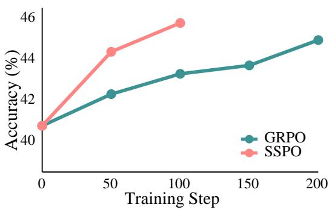
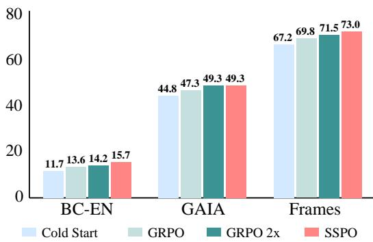
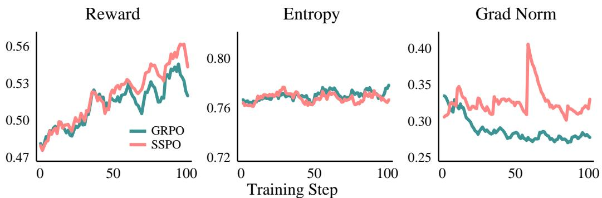
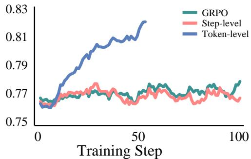
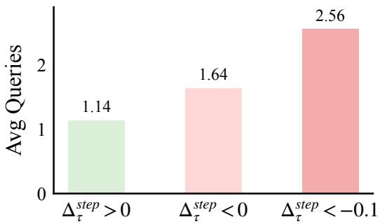
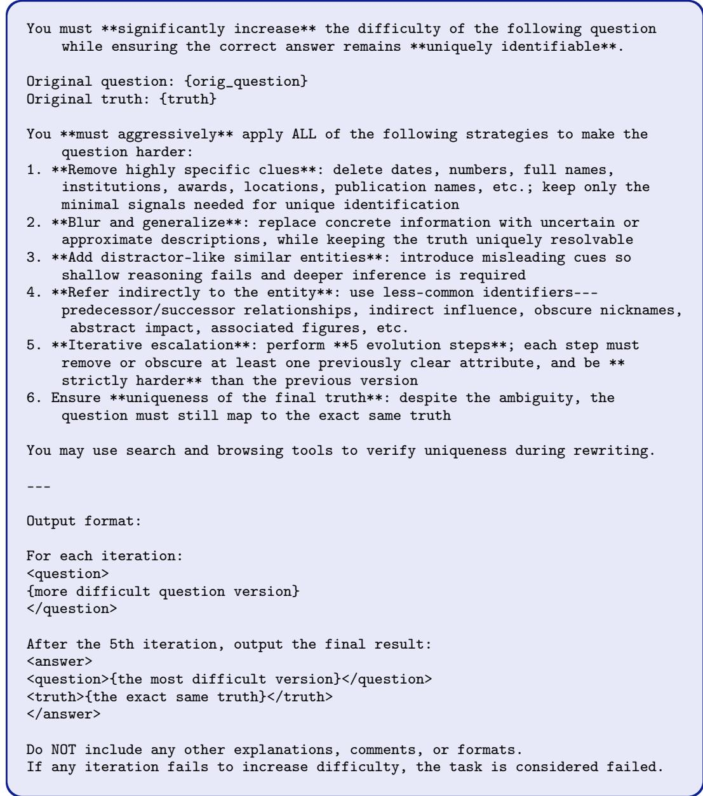
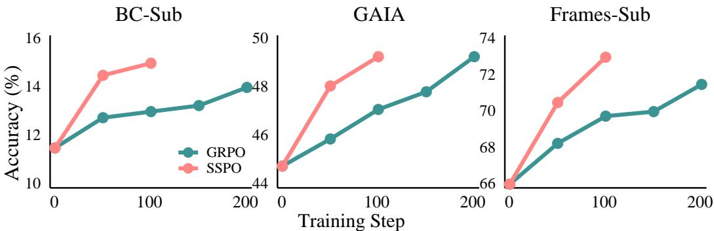
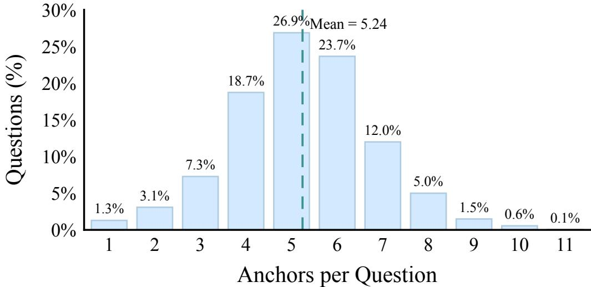
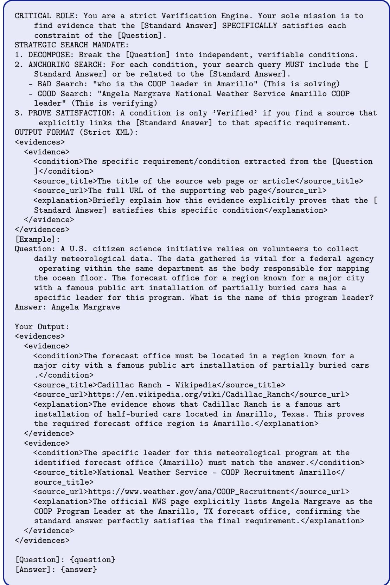

# Beyond Outcome Rewards: Step-Level Self-Distilled Policy Optimization for Deep Search Agents

Haoze Wu<sup>1</sup> Chuqiao Kuang<sup>2</sup> Tianyi Zhuang<sup>2</sup> Xiaoguang Li<sup>2</sup>

<sup>1</sup>The Hong Kong University of Science and Technology <sup>2</sup>Huawei Technologies Ltd.

## Abstract

Deep search agents operate over trajectories spanning dozens of steps, yet standard reinforcement learning provides only a single outcome reward per trajectory — supervision that is far too sparse for effective credit assignment. On-policy selfdistillation (OPSD) addresses this by using the model’s own logits as dense tokenlevel teachers, but extending it to search agents introduces a fundamental tension: the teacher, having access to privileged information such as the correct answer, produces a distribution that differs systematically from the student’s explorationbased reasoning, and naive distillation causes the student to inherit this information asymmetry rather than learn better search strategies. We resolve this tension through two contributions. First, we construct Evidence Anchors — concise, steplevel evidence snippets extracted from the web — as privileged information that captures key reasoning steps without revealing the entire answer path. Second, we propose Step-Level Self-Distilled Policy Optimization (SSPO), which converts teacher–student disagreement into step-level advantage weights within GRPO, applied exclusively to incorrect trajectories. This design decouples what to update from how much to update: the outcome reward determines the direction of policy change, while the teacher modulates its magnitude at each step. Correct trajectories are left untouched, preserving their diversity. On Qwen3-8B, SSPO consistently outperforms GRPO across BrowseComp, GAIA, and FRAMES, surpassing or matching GRPO trained with twice as many gradient steps while adding only about 5% overhead per step from a single additional forward pass.<sup>1</sup>



  
Figure 1: Comparison of performance across training methods. Left: After introducing step-level self-distilled advantage weights (SSPO), performance improves substantially faster during training, surpassing GRPO trained for 200 steps after only 100 steps. Right: We report results for the cold-start model, GRPO after 100 and 200 steps, and SSPO after 100 steps.

## 1 Introduction

Recent Large Language Model paradigms have rapidly evolved from generating appropriate responses to solving real-world tasks through tool use across domains such as coding, office productivity, finance, and research [18, 33, 41, 4, 2, 7, 34, 30, 8]. Among these applications, web search agents must answer vague, underspecified queries by actively exploring the open web — issuing searches, inspecting pages, and refining their reasoning over trajectories that often span dozens of steps [43]. Training agents to perform such long-horizon search reliably requires post-training beyond Supervised Fine-Tuning (SFT), making reinforcement learning (RL) the dominant approach [26, 20, 19, 40]. However, RL in this setting faces a fundamental challenge: trajectories containing 20+ steps receive only a single binary reward. With supervision this sparse, the model receives little guidance on which steps led to success or failure, making credit assignment the central bottleneck for deep search agents.

A natural way to address sparse rewards is to introduce denser supervision. SFT provides token-level feedback through teacher trajectories, but its Off-Policy nature introduces exposure bias and limits generalization to unseen queries [36, 6, 48, 38]. On-Policy Distillation (OPD) [27, 39, 23] combines both benefits: the student performs on-policy rollouts while a teacher model provides token-level scoring. More recent work extends this to self-distillation, where the teacher is constructed from the student itself — using privileged information such as reference solutions or environment feedback as a prefix [63, 54, 13, 38, 35, 17], eliminating the need for a separate teacher model.

Despite this progress, existing self-distillation methods have been developed and evaluated primarily on single-turn reasoning tasks such as math and code. Two properties make self-distillation feasible in those settings: the gap between teacher and student behavior is modest, and a natural form of privileged information — reference solutions or execution feedback — already exists. Extending self-distillation to multi-turn search agents breaks both assumptions. The information asymmetry becomes extreme: the teacher, seeing curated evidence and the answer, collapses to 3.5 tool calls per trajectory, while the student, navigating the open web, requires 17.7 (Table 1). Directly distilling this collapsed distribution causes the student to mimic the teacher’s brevity; when privileged information is unavailable, it abandons tool use prematurely rather than learning better search strategies. An equally serious problem compounds the first: unlike math or code, open-ended web search has no ready-made privileged information. A form of supervision that is both informative to the teacher and safe to distill to the student does not naturally exist, and constructing one is itself an open challenge.

Our key insight is that search supervision is naturally defined at the level of information-seeking actions rather than token generation. We therefore align privileged supervision with the structure of search through two design choices. First, we construct Evidence Anchors: compact, step-level evidence snippets extracted from the web that capture information needed to answer a question without revealing the answer path. Each question is associated with a small set of such anchors, serving as prefixes for the self-teacher. Second, we propose Step-Level Self-Distilled Policy Optimization (SSPO). Rather than minimizing divergence between teacher and student distributions, SSPO converts teacher–student disagreement into step-level advantage weights within GRPO [37, 11], applied only to incorrect trajectories. This design decouples update direction from update magnitude: the outcome reward determines whether to reinforce or suppress a trajectory, while the teacher modulates how much each step contributes. Correct trajectories are left untouched, preserving behavioral diversity.

We evaluate SSPO on Qwen3-8B [53] across three information-seeking benchmarks — BrowseComp [43], GAIA [29], and FRAMES [16]. SSPO consistently outperforms GRPO across all benchmarks, and notably surpasses GRPO trained with twice as many gradient steps while adding only about 5% computational overhead per training step. Our ablation studies further validate two key design decisions. First, directly matching the teacher distribution collapses the student’s tool use and underperforms even GRPO, confirming that decoupling update magnitude from direction is essential. Second, step-level advantage weights consistently outperform token-level counterparts, whose fine-grained signals are misaligned with the natural unit of information-seeking actions.

In summary, our contributions are: (a) We show that extending self-distillation to multi-turn search breaks the assumptions underlying single-turn self-distillation, requiring a fundamentally different design. (b) We introduce Evidence Anchors: compact, step-level evidence snippets as privileged information for open-ended web search, aligned with the natural unit of information-seeking actions. (c) We propose SSPO, which uses step-level self-distilled signals as advantage weights rather than optimization targets, achieving superior sample efficiency over GRPO.

## 2 Preliminaries

## 2.1 Search Agent

We build our search agent based on the ReAct paradigm [56, 50], where the model interleaves reasoning and actions until producing the final answer. Our action space includes two tools connected to the real web: search and browse, their details could be found in Appendix C. After receiving a user query, the agent attempts to provide an accurate answer through multiple Thought Action Observation steps. An agent with $T$ steps can be formulated as follows:

$$
H _ { T } = \left\{ \mathsf { q } _ { u s e r } , \mathsf { t } _ { 1 } , \mathsf { a } _ { 1 } , \mathsf { o } _ { 1 } , \ldots , \mathsf { t } _ { T - 1 } , \mathsf { a } _ { T - 1 } , \mathsf { o } _ { T - 1 } , \mathsf { t } _ { T } \right\}
$$

At time step τ, the agent generates a thought $\mathtt { t } _ { \tau }$ and a tool call $\mathtt { a } _ { \tau }$ (if it is not the final step) conditioned on the full interaction history, i.e., $\mathsf { t } _ { \tau } , \mathsf { a } _ { \tau } \sim \pi ( \mathsf { t } , \mathsf { a } \mid H _ { \tau - 1 } )$ . The output of the tool is treated as the observation $\circ _ { \tau }$ for this step.

## 2.2 On-Policy Learning

Agentic Reinforcement Learning. Deep search, similar to math and logic tasks [37, 50], is typically formulated under the Reinforcement Learning with Verifiable Rewards (RLVR) setting. In this setting, a correctness reward can be assigned by evaluating whether the agent’s prediction is semantically consistent with the ground truth: $R _ { \mathrm { c o r r e c t } } = \mathrm { \bf ~ i s }$ \_equal(pred, ground\_truth) $\in \ \{ 0 , 1 \}$ In addition, training often incorporates a format reward $R _ { \mathrm { f o r m a t } }$ to encourage adherence to the ReAct paradigm [56]. The final training reward is defined as:

$$
R _ { f i n a l } = R _ { c o r r e c t } + 0 . 2 \times R _ { f o r m a t }\tag{1}
$$

Similar to other works [26, 20, 19], we use the Group Relative Policy Optimization (GRPO) algorithm to update the model [37, 11]. It addresses the challenge of estimating baselines in policy gradient methods by comparing responses within a group. Specifically, for each question q, GRPO samples G responses $\mathsf { \bar { \{ y ^ { ( 1 ) } , \ldots , \bar { y } ^ { ( G ) } \} } }$ from the current policy and normalizes the rewards to obtain a sequencelevel advantage estimate:

$$
A ^ { ( i ) } = \frac { R _ { f i n a l } ( q , y ^ { ( i ) } ) - \mu _ { G } } { \sigma _ { G } } ,\tag{2}
$$

where $\mu _ { G }$ and $\sigma _ { G }$ denote the mean and standard deviation of rewards within the group, respectively. The policy is then updated by maximizing a clipped surrogate objective:

$$
\mathcal { L } _ { \mathrm { G R P O } } ( \theta ) = \mathbb { E } _ { q \sim \mathcal { D } } \left[ \frac { 1 } { G } \sum _ { i = 1 } ^ { G } \frac { 1 } { | y ^ { ( i ) } | } \sum _ { t = 1 } ^ { | y ^ { ( i ) } | } \operatorname* { m i n } \left( \rho _ { t } ^ { ( i ) } A _ { t } ^ { ( i ) } , \operatorname { c l i p } \left( \rho _ { t } ^ { ( i ) } , 1 - \epsilon , 1 + \epsilon \right) A _ { t } ^ { ( i ) } \right) \right]\tag{3}
$$

where $\rho _ { t } ^ { ( i ) } = \pi _ { \theta } ( y _ { t } ^ { ( i ) } \mid q ) / \pi _ { \theta _ { \mathrm { o l d } } } ( y _ { t } ^ { ( i ) } \mid q )$ is the per-token importance sampling ratio, and ϵ is the clipping threshold that constrains the policy update to a trust region. All tokens in the trajectory share the sequence-level advantage $A _ { t } ^ { ( i ) } = A ^ { ( i ) }$ . To improve training efficiency, we adopt the duplication strategy proposed in WebSailor [20], where groups with non-zero variance within the batch are duplicated to replace zero-variance groups, as the latter provide no useful training signal.

On-Policy Self Distillation (OPSD). Although GRPO has become the default algorithm for training agents, it has a key limitation in settings with long reasoning chains: relying solely on outcomes lacks process-level supervision. This is especially problematic for incorrect responses, where a small error in the final few tokens may lead to an incorrect answer, yet all preceding tokens receive the same level of penalty. Recent works, including OPSD [54, 63, 13, 38, 57, 35, 17], attempt to alleviate the lack of process-level supervision in long CoT [44] without relying on other teacher models [27]. These methods provide the model with privileged information $c _ { p r i v i l e g e d }$ as a form of self-teaching, such as reference solutions, environment feedback, or better rollouts, thereby enabling token-level supervision for the student. The training objective is formulated as follows:

$$
\mathcal { L } _ { \mathrm { O P S D } } ( \boldsymbol { \theta } ) = \mathbb { E } _ { \boldsymbol { q } \sim \mathcal { D } , \boldsymbol { y } \sim P _ { S } ( \cdot \vert \boldsymbol { q } ) } \left[ \frac { 1 } { \vert \boldsymbol { y } \vert } \sum _ { t = 1 } ^ { \vert \boldsymbol { y } \vert } \mathcal { D } ( P _ { T } \mid \vert \ P _ { S } ) \right]\tag{4}
$$

where D denotes a divergence measure (e.g., KL divergence), and θ represents the parameters of the student model. The teacher and student distributions can be expressed as:

$$
\mathrm { T e a c h e r : } P _ { T } ( y \mid q , y _ { < t } ) = \pi _ { \hat { \theta } } ( \cdot \mid q , y _ { < t } , c _ { p r i v i l e g e d } ) \mathrm { S t u d e n t : } P _ { S } ( y \mid q , y _ { < t } ) = \pi _ { \theta } ( \cdot \mid q , y _ { < t } )\tag{5}
$$

For training stability, the teacher model’s parameters <sup>ˆ</sup>θ are typically not updated through gradient training; common choices include keeping them fixed, updating them via EMA, or synchronizing them with the student model at regular step intervals.

Although significant progress has been made, existing work is largely limited to relatively simple single-turn reasoning tasks. Our work explores how to leverage self-distillation signals to provide more fine-grained supervision for training long-horizon search agents.

## 3 Step-Level Self-Distilled Policy Optimization

Deep search agents operate through information-seeking actions whose utility emerges only at the level of complete search steps. A retrieval action is valuable not because of individual token choices, but because it effectively localizes uncertainty, gathers relevant evidence, and shapes subsequent exploration. Motivated by this observation, both our privileged information and supervision are aligned with the structure of search steps.

## 3.1 Privileged Information: Evidence Anchors

In single-turn settings, constructing privileged information is relatively straightforward. For mathematical tasks, many open-source datasets provide reference solutions [63, 10]; for tool use and coding, error messages can be directly obtained [13]; even in the absence of explicit feedback, the highestscoring rollout among multiple candidates can be selected as privileged teacher information [13]. However, for BrowseComp-style tasks [43], models often require context windows spanning tens or even hundreds of thousands of tokens. In such settings, providing the best rollout as privileged information is impractical, while supplying only the final answer is insufficient to effectively guide multi-step reasoning and action. What is needed is privileged information structured around individual search actions — capable of signaling whether each step retrieves the right evidence.

  
Figure 2: An example question with three evidence anchors. The differently colored evidence anchors correspond to the highlighted conditions in the question.

To construct such privileged information, we construct key pieces of evidence for each QA pair as Evidence Anchors. Specifically, we prompt a SOTA LLM to identify as many pieces of evidence as possible that support the ground-truth answer for each question. The prompt we use can be seen in Figure 12. We collect evidence anchors for over 6,000 QA pairs, with an average of 5.24 anchors per question. Figure 2 presents an example from our training data. Detailed statistics and correctness validation are provided in Appendix G. These privileged signals are incorporated into the teacher model’s prompt only for incorrect trajectories, as illustrated in Figure 3. In practice, in addition to evidence anchors, we explicitly provide the teacher with the incorrect answers generated from the student’s rollouts, preventing the teacher from repeating the same mistakes in its output distribution.

Question: {question}   
You previously attempted to obtain the answer {rollout answer}, but it is   
incorrect.   
The following are some evidence anchors that may help you:   
- {source title}: {explanation}   
[IMPORTANT]: Do not answer directly from the anchors.   
Correctly solve the original question:  
Figure 3: Teacher prompt template incorporating evidence anchors and previously generated incorrect answers from the student model.

## 3.2 Step-Level Self-Distilled Advantage Weights

As discussed in prior work [54], directly optimizing Equation 4 can lead to privileged information leakage, which may degrade model performance in the later stages of training. This issue becomes more pronounced in multi-turn settings, where shortcuts introduced by privileged information affect not only the reasoning process itself but also significantly reduce the number of tool calls required for information gathering. To quantify this effect, we sample 50 examples from the training set and compare the cold-start model’s accuracy and trajectory length under different information conditions. As shown in Table 1, providing evidence anchors in addition to the question improves accuracy from 46 to 82, while reducing the average number of steps from 17.7 to 3.5. When the final answer is further revealed, accuracy increases to 96, and the average number of steps decreases to 2.4. This substantial discrepancy suggests that the teacher’s distribution with privileged information is not an appropriate optimization target for the student. Instead, using self-distillation signals as weighting factors, rather than as gradient directions, helps mitigate this issue [54]. Under this formulation, the update direction remains determined by environment rewards, while the teacher’s privileged distribution only modulates the update magnitude, preventing the student from directly fitting an information-asymmetric target. Beyond privileged-information leakage, SRPO [17] further shows that applying OPSD signals only to incorrect trajectories, while preserving the original GRPO objective for correct ones, yields better performance. Applying distillation to already-correct trajectories introduces optimization ambiguity: the model is pushed toward a specific teacher distribution despite having already solved the task, unnecessarily suppressing the diversity of correct solutions. Together, these two insights motivate our method design: we use self-distillation signals as step-level advantage weights rather than optimization targets, and restrict their application to incorrect search-agent trajectories.

<table><tr><td></td><td>Pass@1</td><td>#Turn</td></tr><tr><td>Question</td><td>46</td><td>17.7</td></tr><tr><td>+ Anchors</td><td>82</td><td>3.5</td></tr><tr><td>+ Answer</td><td>96</td><td>2.4</td></tr></table>

Table 1: Comparison of accuracy and average steps before and after providing privileged information.

For each student-generated step τ in trajectory $\boldsymbol y ^ { ( i ) }$ , its thinking tokens $\mathtt { t } _ { \tau }$ and tool-calling tokens a<sub>τ</sub> jointly constitute one action in the agentic MDP [60]. Under autoregressive factorization, the teacher and student assign the following conditional joint probabilities to this complete step:

$$
P _ { T } ( \mathbf { t } _ { \tau } , \mathbf { a } _ { \tau } ) = \prod _ { k \in \tau } \pi _ { \hat { \theta } } ( y _ { k } \mid c _ { \mathrm { p r i v i l e g e d } } , q , y < k ) , \qquad P _ { S } ( \mathbf { t } _ { \tau } , \mathbf { a } _ { \tau } ) = \prod _ { k \in \tau } \pi _ { \theta } ( y _ { k } \mid q , y < k ) .\tag{6}
$$

Equation 6 follows standard autoregressive factorization, under which the joint probability of a step is the product of its token-level conditional probabilities. We compute both likelihoods by teacherforcing the same student-generated step under the corresponding teacher and student configurations: $P _ { T }$ uses the privileged context and teacher parameters, whereas $P _ { S }$ uses the original context and current policy parameters.

We then define the privileged-information gain as the log joint-likelihood ratio of this step action:

$$
\Delta _ { \tau } ^ { s t e p } = { \bf s g } \left( \log \frac { P _ { T } ( \mathbf { t } _ { \tau } , \mathbf { a } _ { \tau } ) } { P _ { S } ( \mathbf { t } _ { \tau } , \mathbf { a } _ { \tau } ) } \right) ,\tag{7}
$$

where sg denotes stop-gradient. For tokens $y _ { t }$ belonging to step $\tau \left( t \in \tau \right)$ , they share the same step-level advantage weight:

$$
w _ { t } \stackrel { t \in \tau } { = } w _ { \tau } ^ { s t e p } = \operatorname* { m i n } ( \exp ( \operatorname { s i g n } ( A ^ { ( i ) } ) \cdot \Delta _ { \tau } ^ { s t e p } ) , 1 + \epsilon )\tag{8}
$$

where ϵ is a positive hyperparameter, and the min operation prevents extreme gradient magnitudes. It is important to clarify that trajectories with $R _ { f i n a l } < 1$ in Equation 1 are treated as incorrect trajectories, since they fail to produce a factually equivalent final answer<sup>2</sup>. Finally, we replace the advantage term in Equation 3 with $\hat { A } _ { t } ^ { ( i ) } = w _ { t } \dot { A } _ { t } ^ { ( i ) }$ if $R _ { f i n a l } < 1$ else $A ^ { ( i ) }$

As summarized in Table 2, the weight w modulates each token’s contribution along two axes: the sign of the trajectory-level advantage $A ^ { ( i ) }$ and the step-level teacher–student agreement $\Delta _ { \tau } ^ { \mathrm { s t e p } }$ . For incorrect trajectories with $A ^ { ( i ) } < 0 .$ which represent the typical case for failed rollouts, we use the weight min $( P _ { S } / P _ { T } , 1 + \epsilon )$ When the student is overconfident on a step rejected by the teacher $( P _ { S }  1 , P _ { T }  0 .$ , i.e.,

<table><tr><td></td><td> $\Delta _ { \tau } ^ { \mathrm { s t e p } } > 0$ </td><td> $\Delta _ { \tau } ^ { \mathrm { s t e p } } < 0$ </td></tr><tr><td> $A ^ { ( i ) } > 0$ </td><td>w &gt; 1 Reward amplified</td><td> $w < 1$  Reward dampened</td></tr><tr><td> $A ^ { ( i ) } < 0$ </td><td>w &lt; ī Penalty reduced</td><td> $w > 1$  Penalty amplified</td></tr></table>

Table 2: Step-level advantage weight modulation.

$\Delta _ { \tau } ^ { \mathrm { s t e p } } < 0 ) , w \in ( 1 , 1 + \epsilon )$ amplifies the penalty, discouraging repeated mistakes. Conversely, when the student is uncertain on a step endorsed by the teacher $( P _ { S } \to 0 , P _ { T } \to 1 , \mathrm { i . e . , } \Delta _ { \tau } ^ { \mathrm { s t e p } } > 0 )$ $w \in ( 0 , 1 )$ reduces the penalty, preserving valid intermediate reasoning within failed rollouts. For incorrect trajectories with $A ^ { ( i ) } > 0$ , which may occur on challenging questions when a trajectory receives format rewards despite producing an incorrect final answer, we adopt the symmetric weight min $( P _ { T } / P _ { S } , 1 + \epsilon ) \colon$ : a confident teacher paired with an uncertain student amplifies the reward, while a confident student paired with an uncertain teacher dampens it. Across all cases, SSPO adjusts the magnitude of updates at step-level resolution without altering the trajectory-level update direction.

## 4 Experiment

## 4.1 Experimental Setup

Training Data. Before On-Policy learning, we first followed the WebExplorer [26] pipeline to collect approximately 4,000 English reasoning trajectories with correct final answers and without obvious tool-calling errors, which we used for cold-start initialization. Further details of these trajectories are provided in Appendix D. For On-Policy learning, we sampled around 6,000 English QA pairs from the open-source DeepForge dataset [64], using a difficulty ratio of 1.5:3.5:3.5:1.5 across the four levels. We further employed DeepSeek-V3.2 [9] to construct evidence anchors for each QA pair.

Benchmarks. BrowseComp [43] is a highly challenging information-retrieval benchmark introduced by OpenAI. GAIA [29] is a widely used benchmark for general AI assistants; following WebThinker [22], we evaluate on its text-only subset. FRAMES [16], introduced by Google, is used to assess factual accuracy and reasoning capability. Due to API cost constraints, we evaluate intermediate checkpoints on subsets of BrowseComp and FRAMES, denoted as {BC, FRAMES}-Sub. We adopt the Avg@4 metric to reduce variance, with the temperature set to 0.6 and top-p set to 0.95.

More experimental details could be found in Appendix B.

## 4.2 Experimental Results

Main Results. Table 3 presents the performance of representative small-scale search agents, alongside our models trained with cold-start initialization, GRPO, and SSPO, as well as the average number of turns required to solve each problem. Despite differences in search scaffolding and the fact that existing agents of comparable size are typically trained on substantially larger datasets, our models achieve competitive—often superior—performance, validating the effectiveness of our training pipeline. Our primary focus, however, is on the performance gains that SSPO brings over GRPO within the same scaffold. Models trained with SSPO consistently outperform their GRPO counterparts by a significant margin. Using the average score across three benchmarks as a representative metric, GRPO achieves a +2.4 improvement over the cold-start baseline, whereas SSPO delivers a markedly larger gain of +4.8. Importantly, these improvements do not come at the expense of reasoning efficiency. The SSPO-trained model requires only a marginally higher number of turns compared to GRPO (20.5 vs. 20.0), indicating that its performance gains are achieved with minimal additional computational cost. As shown in Figure 1 and Figure 10, SSPO demonstrates substantially higher learning efficiency, consistently outperforming GRPO across all three benchmarks at the same number of training steps. To further examine the impact of process supervision, we double the number of training steps for GRPO; notably, SSPO trained for 100 steps already surpasses GRPO trained for 200 steps, highlighting the superior sample efficiency enabled by process-level supervision. Beyond benchmark scores, these gains come with negligible training cost — only about 5% additional overhead from teacher scoring; detailed wall-clock and compute statistics are provided in Appendix E.

<table><tr><td>Model</td><td>BrowseComp [43]</td><td>GAIA [29]</td><td>Frames [16]</td><td>Average</td></tr><tr><td colspan="5">Small Size Search Agent (&lt;10B)</td></tr><tr><td>WebSailor-7B [20]</td><td>6.7</td><td>37.9</td><td>一</td><td>一</td></tr><tr><td>MiroThinker-8B-DPO-v0.1 [42]</td><td>8.7</td><td>46.6</td><td>64.4</td><td>39.9</td></tr><tr><td>AFM-WebAgent-7B (RL) [21]</td><td>5.8</td><td>40.8</td><td></td><td></td></tr><tr><td>DeepDive-9B (RL) [28]</td><td>6.3</td><td></td><td></td><td></td></tr><tr><td>WebExplorer-8B (RL) [26]</td><td>15.7</td><td>50.0</td><td>75.7</td><td>47.1</td></tr><tr><td>OffSeeker-8B (DPO) [64]</td><td>12.8</td><td>51.5</td><td></td><td></td></tr><tr><td colspan="5">Our Models (based on Qwen3-8B)</td></tr><tr><td>Our-8B (Cold-Start)</td><td> $1 1 . 7 _ { ( 3 7 . 7 ) }$ </td><td> $4 4 . 8 _ { ( 1 4 . 9 ) }$ </td><td> $6 7 . 2 _ { ( 7 . 2 ) }$ </td><td> $4 1 . 2 _ { ( 1 9 . 9 ) }$ </td></tr><tr><td>Our-8B (GRPO)</td><td> $1 3 . 6 _ { ( 3 8 . 0 ) }$ </td><td> $4 7 . 3 _ { ( 1 4 . 5 ) }$ </td><td> $6 9 . 8 _ { ( 7 . 6 ) }$ </td><td> $4 3 . 6 _ { ( 2 0 . 0 ) }$ </td></tr><tr><td>Our-8B (SSPO)</td><td> $1 5 . 7 _ { ( 3 9 . 4 ) }$ </td><td> ${ \bf 4 9 . 3 } _ { ( 1 4 . 5 ) }$ </td><td> $\mathbf { 7 3 . 0 } _ { ( 7 . 7 ) }$ </td><td> $4 6 . 0 _ { ( 2 0 . 5 ) }$ </td></tr></table>

Table 3: Main results on the BrowseComp, GAIA, and Frames benchmarks. Subscripts indicate the average number of search turns required per problem. Underlined values denote the best overall performance in each column, while bold values highlight the best results among our models. Results for other search agents are reported from their respective original publications.

  
Figure 4: Comparison of training dynamics between GRPO and SSPO (EMA Smoothed).

Training Dynamics. Beyond benchmark scores, we analyze the training dynamics in Figure 4. After an initial warm-up phase of approximately 30–50 steps, SSPO achieves higher rewards than GRPO and maintains this advantage throughout training, indicating more effective optimization in our experiments. Notably, the entropy curves of both methods remain closely aligned, suggesting that the performance gains of SSPO are unlikely to stem primarily from increased exploration, but rather from more effective policy updates. This observation is further supported by the gradient norm curves: GRPO exhibits a steadily decreasing gradient norm, indicating early saturation of policy updates, whereas SSPO maintains a relatively higher gradient norm throughout training, reflecting more sustained learning signals. Although SSPO shows a transient spike in gradient norm around step 50, this spike quickly subsides and does not appear to harm training stability, as evidenced by the continued improvement in reward. Overall, these results suggest that SSPO improves upon GRPO mainly by enabling more sustained and effective parameter updates, rather than by substantially altering the exploration–exploitation balance.

## 4.3 Ablation Study

We organize the ablation around three questions: how direct distillation compares with advantage weighting, whether the weighting signal should be defined at token or step level, and what roles the two privileged-information inputs play. Unless otherwise stated, all results are measured on BC-Sub after 50 training steps.
<table><tr><td>Method</td><td>Use of self-distillation signal</td><td>Granularity</td><td>Evidence Anchors</td><td>BC-Sub</td><td>Avg. turns</td></tr><tr><td>GRPO</td><td>None; outcome reward only</td><td></td><td>No</td><td>12.8</td><td>36.1</td></tr><tr><td>OPSD adaptation</td><td>Direct optimization target</td><td>Token</td><td>Yes</td><td>11.8</td><td>30.9</td></tr><tr><td>RLSD/SRPO adaptation</td><td>Advantage weighting</td><td>Token</td><td>Yes</td><td>11.8</td><td>35.5</td></tr><tr><td>Ours (SSPO)</td><td>Advantage weighting</td><td>Step</td><td>Yes</td><td>14.5</td><td>37.5</td></tr></table>

Table 4: Comparison of the outcome-only baseline and self-distillation variants after 50 training steps. The RLSD/SRPO adaptation uses the self-distillation signal as token-level advantage weights, following RLSD, and applies it only to incorrect trajectories, following SRPO.

Direct Distillation vs. Advantage Weighting. GRPO provides the outcome-only baseline, reaching 12.8 accuracy with an average of 36.1 turns. Under the same training budget, the direct OPSD adaptation (Appendix F.1) obtains lower accuracy than GRPO (11.8 vs. 12.8) and produces substantially shorter trajectories (30.9 vs. 36.1 turns). Together with Table 1, this pattern is consistent with privileged-information shortcutting: the teacher can solve the task with much less search, and directly matching its distribution transfers this short-search behavior to the student.

The RLSD/SRPO adaptation instead uses the token-level self-distillation signal as advantage weights on incorrect trajectories. Its average trajectory length recovers to 35.5 turns, close to GRPO’s 36.1 and substantially above the direct OPSD adaptation’s 30.9, while its accuracy remains 11.8. This recovery supports using the teacher signal to modulate the update magnitude rather than as a direct optimization target; however, the unchanged accuracy also shows that token-level weighting alone is insufficient in this setting.

<table><tr><td>Method</td><td></td><td>Evidence Anchors Incorrect feedback BC-Sub</td><td></td><td>Sign agreement with full setting (%)</td><td>Final-step penalty amplified (%)</td></tr><tr><td>GRPO</td><td>No</td><td>No</td><td>12.8</td><td></td><td></td></tr><tr><td>SSPO w/o Evidence Anchors</td><td>No</td><td>Yes</td><td>12.4</td><td>32.8</td><td>92.4</td></tr><tr><td>SSPO w/o Incorrect Feedback</td><td>Yes</td><td>No</td><td>14.0</td><td>81.1</td><td>46.7</td></tr><tr><td>Ours (SSPO)</td><td>Yes</td><td>Yes</td><td>14.5</td><td>100.0</td><td>86.3</td></tr></table>

Table 5: Ablation of the two privileged-information sources. BC-Sub results are measured after 50 training steps. The two rightmost columns are computed by rescoring 512 incorrect trajectories, using the sign under the full setting as a reference. “Final-step penalty amplified” denotes the proportion of trajectories for which the final-step weight is greater than one.

Step-Level Rather Than Token-Level. We then isolate supervision granularity by holding advantage weighting, Evidence Anchors, and incorrect-trajectory routing fixed. The token-level RLSD/SRPO adaptation assigns a separate weight to every token (Appendix F.2), whereas SSPO shares one jointprobability weight across the reasoning and tool-calling tokens that form a complete informationseeking step. This controlled change improves BC-Sub accuracy from 11.8 to 14.5 while maintaining the average trajectory length (35.5 vs. 37.5 turns). The entropy curves in Figure 5 provide complementary evidence: token-level weighting produces steadily increasing entropy, whereas step-level weighting remains more stable. These results support aligning the supervision granularity with the complete search action rather than fragmenting it across individual tokens.

Roles of Evidence Anchors and Incorrect-Answer Feedback. Table 5 separates the two sources of privileged information. Incorrect-answer feedback alone does not improve over GRPO (12.4 vs. 12.8), whereas Evidence Anchors alone improve accuracy to 14.0. Combining both yields the best result, 14.5, showing that Evidence Anchors provide the primary process-supervision signal and incorrect-answer feedback is complementary.

To examine how they contribute to the full step score, we rescore the same 512 incorrect trajectories under each single-information setting. This is a decomposition of the deployed signal rather than an assumption that the full setting is an unbiased ground-truth label. Evidence Anchors alone agree with the sign of the full signal on 81.1% of steps, compared with 32.8% for incorrect-answer feedback alone, indicating that Evidence Anchors primarily determine the evaluation of intermediate information-seeking actions. Conversely, incorrect-answer feedback amplifies the final-step penalty in 92.4% of trajectories, compared with 46.7% under Evidence Anchors alone. Thus, the incorrect answer primarily identifies the failed terminal conclusion, while Evidence Anchors ground credit assignment across the preceding search process.

  
Figure 5: Entropy curves of GRPO, step-level, and token-level supervision during training.

  
Figure 6: Average number of queries under different step-level privileged-information gains.

## 5 Case Study: Which Steps are Exempted from Penalty?

To better understand why SSPO is effective, we analyze how the teacher assigns penalties across different types of steps. We find that the teacher does not simply reward steps based on their lexical overlap with evidence anchors. Instead, it modulates penalties according to whether a step performs a focused and informative verification action.

Specifically, steps that receive reduced penalties are typically compact, well-scoped queries targeting a single local constraint implied by the evidence anchors, as shown in Figure 7. Although these steps may contain fewer anchor words, they effectively reduce uncertainty along the reasoning chain. In contrast, steps that receive stronger penalties are often long, diffuse queries that concatenate multiple surface terms from the question or anchors without forming a precise information need, as shown in Figure 8. Despite their high lexical overlap with anchors, such steps receive amplified penalties, indicating that the teacher prioritizes information quality over word matching. This behavior is further supported by quantitative analysis. Figure 6 shows the relationship between the average number of queries in search tool calls and the privileged-information gain. Steps with positive privilegedinformation gain $\Delta _ { \tau } ^ { s t e p } > 0$ use significantly fewer queries than those with negative gain $\bar { \Delta } _ { \tau } ^ { s t e p } \check { < } 0$ Overall, SSPO encourages targeted, evidence-grounded information-seeking by reducing penalties for precise verification steps while amplifying penalties for broad and unfocused exploration.

## 6 Conclusion

We presented SSPO, a step-level self-distillation method that extends On-Policy Self-Distillation from single-turn reasoning to multi-turn deep search agents. To construct a meaningful self-teacher in a setting where neither reference solutions nor execution feedback are available, we introduced Evidence Anchors—structured, step-aligned privileged information whose granularity matches that of the search process itself. From this teacher, SSPO derives a self-distillation signal, recasts it as steplevel advantage weights, and applies it only to incorrect trajectories, thereby injecting fine-grained process supervision while sidestepping both privileged-information leakage and the ambiguous gradients that direct distillation would otherwise impose on already-correct rollouts.

<think>   
Perhaps the specific ERNI employee referenced is not the person listed in the   
program committee (Florian, Dominik etc). The above LinkedIn snippet for   
Patrick Pfeifer shows "iSAQB - Foundation Level (CPSA-F)", which matches   
the certification.   
Now does Patrick Pfeifer specialize in medical technology software?   
Potentially, as ERNI works in medtech, and "Patrick Pfeifer" might be   
focusing on medical solutions, but we need verification.   
Search "Patrick Pfeifer ERNI medical technology".   
</think>   
<tool\_call>   
"search queries": ["Patrick Pfeifer ERNI medical technology"]   
</tool\_call>  
Figure 7: ∆<sup>step</sup> > 0: compact single-query verification targeting one specific entity-attribute relation.

<think>   
ERNI matches the consultancy with offices across Europe and Asia.   
Now find an ERNI employee who is a "medical technology software specialist"   
and holds a "foundational certification in software architecture". The   
foundation certification could refer to the iSAQB CPSA-F certification.   
We also have that this employee serves on the conference committee for   
BaselOne and recently co-founded an initiative linking local industry and   
academia.   
The program committee includes Ix-chel Ruiz, Dominik Berger, Marcus Fihlon,   
Robin Mezger, Florian Stampe, Frank Baier, etc. Among these, perhaps one   
is a medical technology software specialist.   
But we could also search for "BaselOne conference committee ERNI".   
</think>   
<tool\_call>   
"search queries": [   
"BaselOne conference committee ERNI",   
"ERNI medical technology software architect BaselOne",   
"ERNI medical technology software specialist BaselOne committee",   
"CPSA Foundation ERNI employee"]   
</tool\_call>  
Figure 8: $\Delta _ { \tau } ^ { s t e p } < 0 \dot { \cdot }$ : diffuse multi-query search with high lexical overlap but poor localization.

Across BrowseComp, GAIA, and FRAMES, SSPO surpasses GRPO trained for twice as many gradient steps, while sustaining higher rewards and more stable gradient norms throughout optimization. Beyond the aggregate gains, our analysis reveals a coherent shaping of the policy update: penalties contract on compact, evidence-grounded verification steps and expand on diffuse, underspecified queries. This suggests that step-level self-distillation guides the agent toward more targeted and efficient information-seeking, rather than simply lifting final-answer accuracy.

## References

[1] Zhipu AI. Glm-4.6. https://docs.z.ai/guides/llm/glm-4.6, 2025.

[2] Zhipu AI. Glm-5.1. https://docs.z.ai/guides/llm/glm-5.1, 2026.

[3] Anthropic. Introducing Claude 4 — anthropic.com. https://www.anthropic.com/news/ claude-4, 2025. [Accessed 19-03-2026].

[4] Anthropic. Introducing claude opus 4.7. https://www.anthropic.com/news/ claude-opus-4-7, 2026.

[5] Ziqian Bi, Keyu Chen, Chiung-Yi Tseng, Danyang Zhang, Tianyang Wang, Hongying Luo, Lu Chen, Junming Huang, Jibin Guan, Junfeng Hao, Xinyuan Song, and Junhao Song. Is gpt-oss good? a comprehensive evaluation of openai’s latest open source models, 2025.

[6] Tianzhe Chu, Yuexiang Zhai, Jihan Yang, Shengbang Tong, Saining Xie, Dale Schuurmans, Quoc V Le, Sergey Levine, and Yi Ma. SFT memorizes, RL generalizes. In Proceedings ofthe 42nd International Conference on Machine Learning, pages 10818–10838. PMLR, 2025.

[7] Google Deepmind. Gemini 3.1 pro: Best for complex tasks and bringing creative concepts to life. https://deepmind.google/models/gemini/pro/, 2026.

[8] DeepSeek-AI. Deepseek-v4: Towards highly efficient million-token context intelligence, 2026.

[9] DeepSeek-AI, Aixin Liu, Aoxue Mei, Bangcai Lin, Bing Xue, Bingxuan Wang, Bingzheng Xu, Bochao Wu, Bowei Zhang, Chaofan Lin, Chen Dong, Chengda Lu, Chenggang Zhao, Chengqi Deng, Chenhao Xu, Chong Ruan, Damai Dai, Daya Guo, Dejian Yang, et al. Deepseek-v3.2: Pushing the frontier of open large language models, 2025.

[10] Etash Guha, Ryan Marten, Sedrick Keh, Negin Raoof, Georgios Smyrnis, Hritik Bansal, Marianna Nezhurina, Jean Mercat, Trung Vu, Zayne Sprague, Ashima Suvarna, Benjamin Feuer, Liangyu Chen, Zaid Khan, Eric Frankel, et al. Openthoughts: Data recipes for reasoning models, 2025.

[11] Daya Guo, Dejian Yang, Haowei Zhang, Junxiao Song, Peiyi Wang, Qihao Zhu, Runxin Xu, Ruoyu Zhang, Shirong Ma, Xiao Bi, Xiaokang Zhang, Xingkai Yu, Yu Wu, Z. F. Wu, Zhibin Gou, et al. Deepseek-r1 incentivizes reasoning in llms through reinforcement learning. Nature, 645(8081):633–638, September 2025.

[12] Xanh Ho, Anh-Khoa Duong Nguyen, Saku Sugawara, and Akiko Aizawa. Constructing a multi-hop QA dataset for comprehensive evaluation of reasoning steps. In Proceedings of the 28th International Conference on Computational Linguistics, pages 6609–6625, Barcelona, Spain (Online), December 2020. International Committee on Computational Linguistics.

[13] Jonas Hübotter, Frederike Lübeck, Lejs Behric, Anton Baumann, Marco Bagatella, Daniel Marta, Ido Hakimi, Idan Shenfeld, Thomas Kleine Buening, Carlos Guestrin, and Andreas Krause. Reinforcement learning via self-distillation. arXiv preprint arXiv:2601.20802, 2026.

[14] Bowen Jin, Jinsung Yoon, Priyanka Kargupta, Sercan O Arik, and Jiawei Han. An empirical study on reinforcement learning for reasoning-search interleaved llm agents. arXiv preprint arXiv:2505.15117, 2025.

[15] Bowen Jin, Hansi Zeng, Zhenrui Yue, Jinsung Yoon, Sercan Arik, Dong Wang, Hamed Zamani, and Jiawei Han. Search-r1: Training llms to reason and leverage search engines with reinforcement learning. arXiv preprint arXiv:2503.09516, 2025.

[16] Satyapriya Krishna, Kalpesh Krishna, Anhad Mohananey, Steven Schwarcz, Adam Stambler, Shyam Upadhyay, and Manaal Faruqui. Fact, fetch, and reason: A unified evaluation of retrieval-augmented generation, 2024.

[17] Gengsheng Li, Tianyu Yang, Junfeng Fang, Mingyang Song, Mao Zheng, Haiyun Guo, Dan Zhang, Jinqiao Wang, and Tat-Seng Chua. Unifying group-relative and self-distillation policy optimization via sample routing, 2026.

[18] Junlong Li, Wenshuo Zhao, Jian Zhao, Weihao Zeng, Haoze Wu, Xiaochen Wang, Rui Ge, Yuxuan Cao, Yuzhen Huang, Wei Liu, Junteng Liu, Zhaochen Su, Yiyang Guo, Fan Zhou, Lueyang Zhang, Juan Michelini, Xingyao Wang, Xiang Yue, Shuyan Zhou, Graham Neubig, and Junxian He. The tool decathlon: Benchmarking language agents for diverse, realistic, and long-horizon task execution, 2026.

[19] Kuan Li, Zhongwang Zhang, Huifeng Yin, Rui Ye, Yida Zhao, Liwen Zhang, Litu Ou, Dingchu Zhang, Xixi Wu, Jialong Wu, Xinyu Wang, Zile Qiao, Zhen Zhang, Yong Jiang, Pengjun Xie, Fei Huang, and Jingren Zhou. Websailor-v2: Bridging the chasm to proprietary agents via synthetic data and scalable reinforcement learning, 2025.

[20] Kuan Li, Zhongwang Zhang, Huifeng Yin, Liwen Zhang, Litu Ou, Jialong Wu, Wenbiao Yin, Baixuan Li, Zhengwei Tao, Xinyu Wang, Weizhou Shen, Junkai Zhang, Dingchu Zhang, Xixi Wu, Yong Jiang, Ming Yan, Pengjun Xie, Fei Huang, and Jingren Zhou. Websailor: Navigating super-human reasoning for web agent, 2025.

[21] Weizhen Li, Jianbo Lin, Zhuosong Jiang, Jingyi Cao, Xinpeng Liu, Jiayu Zhang, Zhenqiang Huang, Qianben Chen, Weichen Sun, Qiexiang Wang, Hongxuan Lu, Tianrui Qin, Chenghao Zhu, Yi Yao, Shuying Fan, Xiaowan Li, Tiannan Wang, Pai Liu, King Zhu, He Zhu, Dingfeng Shi, Piaohong Wang, Yeyi Guan, Xiangru Tang, Minghao Liu, Yuchen Eleanor Jiang, Jian Yang, Jiaheng Liu, Ge Zhang, and Wangchunshu Zhou. Chain-of-agents: End-to-end agent foundation models via multi-agent distillation and agentic rl, 2025.

[22] Xiaoxi Li, Jiajie Jin, Guanting Dong, Hongjin Qian, Yongkang Wu, Ji-Rong Wen, Yutao Zhu, and Zhicheng Dou. Webthinker: Empowering large reasoning models with deep research capability, 2025.

[23] Yaxuan Li, Yuxin Zuo, Bingxiang He, Jinqian Zhang, Chaojun Xiao, Cheng Qian, Tianyu Yu, Huan-ang Gao, Wenkai Yang, Zhiyuan Liu, et al. Rethinking on-policy distillation of large language models: Phenomenology, mechanism, and recipe. arXiv preprint arXiv:2604.13016, 2026.

[24] Jiawei Liu and Lingming Zhang. Code-r1: Reproducing r1 for code with reliable rewards. 2025.

[25] Junteng Liu, Yuanxiang Fan, Zhuo Jiang, Han Ding, Yongyi Hu, Chi Zhang, Yiqi Shi, Shitong Weng, Aili Chen, Shiqi Chen, Yunan Huang, Mozhi Zhang, Pengyu Zhao, Junjie Yan, and Junxian He. Synlogic: Synthesizing verifiable reasoning data at scale for learning logical reasoning and beyond, 2025.

[26] Junteng Liu, Yunji Li, Chi Zhang, Jingyang Li, Aili Chen, Ke Ji, Weiyu Cheng, Zijia Wu, Chengyu Du, Qidi Xu, Jiayuan Song, Zhengmao Zhu, Wenhu Chen, Pengyu Zhao, and Junxian He. Webexplorer: Explore and evolve for training long-horizon web agents, 2025.

[27] Kevin Lu and Thinking Machines Lab. On-policy distillation. Thinking Machines Lab: Connectionism, 2025. https://thinkingmachines.ai/blog/on-policy-distillation.

[28] Rui Lu, Zhenyu Hou, Zihan Wang, Hanchen Zhang, Xiao Liu, Yujiang Li, Shi Feng, Jie Tang, and Yuxiao Dong. Deepdive: Advancing deep search agents with knowledge graphs and multi-turn rl, 2025.

[29] Grégoire Mialon, Clémentine Fourrier, Craig Swift, Thomas Wolf, Yann LeCun, and Thomas Scialom. Gaia: a benchmark for general ai assistants, 2023.

[30] MiniMax. Minimax m2.7: Early echoes of self-evolution, 2026.

[31] OpenAI. Gpt-5-nano. https://developers.openai.com/api/docs/models/ gpt-5-nano, 2025.

[32] OpenAI. Introducing gpt-oss. https://openai.com/index/introducing-gpt-oss/, 2025.

[33] OpenAI. Introducing gpt-5.5. https://openai.com/index/introducing-gpt-5-5/, 2026.

[34] Qwen Team. Qwen3.6-Plus: Towards real world agents, April 2026.

[35] Hejian Sang, Yuanda Xu, Zhengze Zhou, Ran He, Zhipeng Wang, and Jiachen Sun. Crisp: Compressed reasoning via iterative self-policy distillation, 2026.

[36] Florian Schmidt. Generalization in generation: A closer look at exposure bias. In Proceedings of the 3rd Workshop on Neural Generation and Translation, pages 157–167. Association for Computational Linguistics, 2019.

[37] Zhihong Shao, Peiyi Wang, Qihao Zhu, Runxin Xu, Junxiao Song, Xiao Bi, Haowei Zhang, Mingchuan Zhang, Y. K. Li, Y. Wu, and Daya Guo. Deepseekmath: Pushing the limits of mathematical reasoning in open language models, 2024.

[38] Idan Shenfeld, Mehul Damani, Jonas Hübotter, and Pulkit Agrawal. Self-distillation enables continual learning, 2026.

[39] Mingyang Song and Mao Zheng. A survey of on-policy distillation for large language models, 2026.

[40] Zhengwei Tao, Jialong Wu, Wenbiao Yin, Junkai Zhang, Baixuan Li, Haiyang Shen, Kuan Li, Liwen Zhang, Xinyu Wang, Yong Jiang, Pengjun Xie, Fei Huang, and Jingren Zhou. Webshaper: Agentically data synthesizing via information-seeking formalization, 2025.

[41] Kimi Team. Kimi k2.6: Advancing open-source coding. https://www.kimi.com/blog/ kimi-k2-6, 2026.

[42] MiroMind Team, Song Bai, Lidong Bing, Carson Chen, Guanzheng Chen, Yuntao Chen, Zhe Chen, Ziyi Chen, Xuan Dong, et al. Mirothinker: Pushing the performance boundaries of open-source research agents via model, context, and interactive scaling. arXiv preprint arXiv:2511.11793, 2025.

[43] Jason Wei, Zhiqing Sun, Spencer Papay, Scott McKinney, Jeffrey Han, Isa Fulford, Hyung Won Chung, Alex Tachard Passos, William Fedus, and Amelia Glaese. Browsecomp: A simple yet challenging benchmark for browsing agents, 2025.

[44] Jason Wei, Xuezhi Wang, Dale Schuurmans, Maarten Bosma, Brian Ichter, Fei Xia, Ed Chi, Quoc Le, and Denny Zhou. Chain-of-thought prompting elicits reasoning in large language models, 2023.

[45] Tongyu Wen, Guanting Dong, and Zhicheng Dou. Smartsearch: Process reward-guided query refinement for search agents, 2026.

[46] Haoze Wu, Cheng Wang, Wenshuo Zhao, and Junxian He. Mirage or method? how model-task alignment induces divergent rl conclusions, 2025.

[47] Haoze Wu, Yunzhi Yao, Wenhao Yu, and Ningyu Zhang. Recode: Updating code api knowledge with reinforcement learning, 2025.

[48] Yongliang Wu, Yizhou Zhou, Zhou Ziheng, Yingzhe Peng, Xinyu Ye, Xinting Hu, Wenbo Zhu, Lu Qi, Ming-Hsuan Yang, and Xu Yang. On the generalization of sft: A reinforcement learning perspective with reward rectification, 2026.

[49] X.AI. Grok 4.1 fast and agent tools api. https://x.ai/news/grok-4-1-fast, 2025.

[50] Tian Xie, Zitian Gao, Qingnan Ren, Haoming Luo, Yuqian Hong, Bryan Dai, Joey Zhou, Kai Qiu, Zhirong Wu, and Chong Luo. Logic-rl: Unleashing llm reasoning with rule-based reinforcement learning, 2025.

[51] Peiran Xu, Zhuohao Li, Xiaoying Xing, Guannan Zhang, Debiao Li, and Kunyu Shi. Principle process reward for search agents, 2026.

[52] Yuanda Xu, Hejian Sang, Zhengze Zhou, Ran He, Zhipeng Wang, and Alborz Geramifard. Tip: Token importance in on-policy distillation, 2026.

[53] An Yang, Anfeng Li, Baosong Yang, Beichen Zhang, Binyuan Hui, Bo Zheng, Bowen Yu, Chang Gao, Chengen Huang, Chenxu Lv, Chujie Zheng, Dayiheng Liu, Fan Zhou, Fei Huang, Feng Hu, Hao Ge, Haoran Wei, Huan Lin, Jialong Tang, Jian Yang, et al. Qwen3 technical report, 2025.

[54] Chenxu Yang, Chuanyu Qin, Qingyi Si, Minghui Chen, Naibin Gu, Dingyu Yao, Zheng Lin, Weiping Wang, Jiaqi Wang, and Nan Duan. Self-distilled rlvr, 2026.

[55] Zhilin Yang, Peng Qi, Saizheng Zhang, Yoshua Bengio, William W. Cohen, Ruslan Salakhutdinov, and Christopher D. Manning. Hotpotqa: A dataset for diverse, explainable multi-hop question answering, 2018.

[56] Shunyu Yao, Jeffrey Zhao, Dian Yu, Nan Du, Izhak Shafran, Karthik Narasimhan, and Yuan Cao. React: Synergizing reasoning and acting in language models, 2023.

[57] Tianzhu Ye, Li Dong, Xun Wu, Shaohan Huang, and Furu Wei. On-policy context distillation for language models, 2026.

[58] Qiying Yu, Zheng Zhang, Ruofei Zhu, Yufeng Yuan, Xiaochen Zuo, Yu Yue, Weinan Dai, Tiantian Fan, Gaohong Liu, Lingjun Liu, Xin Liu, Haibin Lin, Zhiqi Lin, Bole Ma, Guangming Sheng, Yuxuan Tong, Chi Zhang, Mofan Zhang, Wang Zhang, Hang Zhu, Jinhua Zhu, Jiaze Chen, Jiangjie Chen, Chengyi Wang, Hongli Yu, Yuxuan Song, Xiangpeng Wei, Hao Zhou, Jingjing Liu, Wei-Ying Ma, Ya-Qin Zhang, Lin Yan, Mu Qiao, Yonghui Wu, and Mingxuan Wang. Dapo: An open-source llm reinforcement learning system at scale, 2025.

[59] Weihao Zeng, Yuzhen Huang, Qian Liu, Wei Liu, Keqing He, Zejun Ma, and Junxian He. Simplerl-zoo: Investigating and taming zero reinforcement learning for open base models in the wild. In Second Conference on Language Modeling, 2025.

[60] Guibin Zhang, Hejia Geng, Xiaohang Yu, Zhenfei Yin, Zaibin Zhang, Zelin Tan, Heng Zhou, Zhong-Zhi Li, Xiangyuan Xue, Yijiang Li, Yifan Zhou, Yang Chen, Chen Zhang, Yutao Fan, Zihu Wang, Songtao Huang, Francisco Piedrahita Velez, Yue Liao, Hongru WANG, Mengyue Yang, Heng Ji, Jun Wang, Shuicheng YAN, Philip Torr, and LEI BAI. The landscape of agentic reinforcement learning for LLMs: A survey. Transactions on Machine Learning Research, 2026. Survey Certification.

[61] Yabo Zhang, Yihan Zeng, Qingyun Li, Zhen Hu, Kavin Han, and Wangmeng Zuo. Tool-r1: Sample-efficient reinforcement learning for agentic tool use, 2025.

[62] Yaocheng Zhang, Haohuan Huang, Zijun Song, Yuanheng Zhu, Qichao Zhang, Zijie Zhao, and Dongbin Zhao. Criticsearch: Fine-grained credit assignment for search agents via a retrospective critic, 2025.

[63] Siyan Zhao, Zhihui Xie, Mengchen Liu, Jing Huang, Guan Pang, Feiyu Chen, and Aditya Grover. Self-distilled reasoner: On-policy self-distillation for large language models, 2026.

[64] Yuhang Zhou, Kai Zheng, Qiguang Chen, Mengkang Hu, Qingfeng Sun, Can Xu, and Jingjing Chen. Offseeker: Online reinforcement learning is not all you need for deep research agents, 2026.

## A Related Work

## A.1 Reinforcement Learning with Verifiable Rewards (RLVR)

Building on works such as DeepSeek-MATH [37] and DeepSeek-R1 [11], RLVR has become a standard component in LLM training pipelines and is widely regarded as essential for improving reasoning capabilities across domains, including but not limited to mathematics [59, 58], logical reasoning [50, 25, 46], coding [24, 47], and verifiable agent tasks [14, 15, 61]. Although RLVR is considerably more complex to implement than SFT, its On-Policy nature confers a qualitatively distinct advantage: by exploring the environment during training, the model is not confined to imitating fixed teacher trajectories and can autonomously discover effective reasoning strategies. DeepSeek-R1 [11] demonstrates that, without any process-level supervision, RL training can spontaneously elicit sophis ticated behaviors such as backtracking and self-reflection—phenomena collectively referred to as “aha moments.” This stands in contrast to SFT, which by directly fitting a static teacher distribution fundamentally forecloses such exploration [36, 6, 48, 38].

## A.2 Process Rewards in Search Agent Training

To address the sparsity of outcome-only rewards in long-horizon agent settings, several recent works introduce process rewards that evaluate intermediate steps during search. CriticSearch [62] employs a frozen asymmetric critic LLM that retrospectively evaluates each interaction turn using privileged information from the complete trajectory and gold answers, converting these assessments into dense turn-level rewards for policy optimization. PPR [51] trains a dedicated principle-based process reward model that grounds step-wise judgments in interpretable principles such as correctness, relevance, and consistency, and further introduces a reward normalization strategy to balance local process fidelity against global task success. SmartSearch [45] takes a query-centric view, designing a dual-level credit assessment mechanism that scores each intermediate search query for both novelty and usefulness, and uses these scores to selectively refine low-quality queries via a separately trained smaller model.

While these approaches demonstrate the value of fine-grained supervision for search agents, they share two notable limitations. First, their experimental benchmarks are primarily composed of standard multi-hop QA tasks, such as HotpotQA [55] and 2WikiMultiHop [12], which involve relatively shallow retrieval chains. None of them evaluate on BrowseComp-style tasks that require navigating dozens of search and browse steps to resolve highly constrained, multi-conditional queries—precisely the setting where per-step credit assignment is most critical. Second, all three methods rely on a separate LLM as a per-step evaluator, which introduces additional inference cost and a dependency on the quality and calibration of that external scorer. In contrast, SSPO eliminates the need for an explicit step-level reward model by converting self-distillation signals directly into step-level advantage weights, making fine-grained process supervision both practically lightweight and tightly integrated with the on-policy training objective.

## A.3 On-Policy (Self-)Distillation

On-Policy Distillation (OPD) [27, 39, 23, 52] improves upon traditional off-policy supervised finetuning (SFT) by allowing the student to generate its own rollouts while using teacher logits for supervision, thereby reducing the distribution mismatch between training and inference. However, OPD still relies on a teacher model that operates in a compatible vocabulary space and is strictly more capable than the student, which limits its practical applicability.

A growing body of work seeks to remove this dependency by constructing self-teachers from privileged information or environmental feedback. Self-Distilled Reasoner [63] shows that On-Policy Self-Distillation (OPSD), when augmented with reference solutions as privileged prefixes, achieves strong performance on single-turn mathematical reasoning tasks. RL via Self-Distillation [13] extends this paradigm to tool-use and coding scenarios, where environment feedback—such as compiler errors or execution outputs—serves as a form of privileged supervision. Self-Distilled RLVR (RLSD) [54] further identifies a critical limitation of direct OPSD: optimizing the student toward a teacher conditioned on privileged information can introduce information leakage, where the policy implicitly exploits signals unavailable at test time. To address this issue, RLSD [54] proposes converting distillation signals into advantage weights rather than directly using them as gradient targets, thereby preserving the on-policy reward as the primary optimization objective. SRPO [17] further observes that applying self-distillation uniformly across both correct and incorrect trajectories introduces ambiguous optimization signals, and instead advocates restricting OPSD signals to incorrect trajectories. CRISP [35] explores iterative self-policy distillation for compressing reasoning chains, while On-Policy Context Distillation [57] studies distillation from context-augmented teachers in language model settings. More broadly, self-distillation has also been shown to support continual learning without catastrophic forgetting [38].

Our work builds on these insights and extends OPSD to multi-turn deep search agents, a setting that introduces two key challenges not addressed by prior work: (1) how to construct meaningful privileged information for open-ended information retrieval tasks, where neither reference solutions nor execution feedback are directly available; and (2) how to define an appropriate supervision granularity that aligns with the natural unit of search behavior — information-seeking actions — rather than defaulting to token-level signals.

## B More Experimental Details

Scaffold Details. Our scaffold is based on the ReAct paradigm [56], enabling interaction with two tools: search and browse (see Appendix C). We use no specialized system prompts during either training or evaluation, providing only the necessary tool descriptions. Except for the teacher model, the user prompt contains only the question itself. The model is required to invoke a tool at each step, except for the final step where it outputs the answer, until termination or reaching the step limit. If no valid tool call is produced at any step, the trajectory is terminated and scored according to the final response. Following prior work [26, 20], we use an LLM judge to evaluate answer correctness.

Training Details. We use Qwen3-8B [53] as the base model for all experiments. For cold-start Supervised Fine-Tuning (SFT), we set the batch size to 32 and the learning rate to $1 \times 1 0 ^ { - 5 }$ , with linear warmup followed by cosine decay, and train the model for 1k steps. For On-Policy learning, we train on approximately 6k samples using a fixed learning rate of $1 \times \dot { 1 } 0 ^ { - 6 }$ and a batch size of 64, with 8 rollouts per question. For our method, we set $\epsilon = 0 . 2$ , and reinitialize the teacher model with the current policy model every 50 training steps. Throughout training, we set the maximum context length to 128K and the maximum number of agent steps to 100.

Loss Masking. For both SFT and On-Policy learning, we compute the training loss only on agentgenerated tokens, including the Thought and Action segments, as well as the final answer when applicable. Tokens returned by the environment, such as search results and browsed page contents, are provided only as context for subsequent agent decisions and are masked out from the loss. This is because observation tokens are generated by external tools rather than by the agent policy, and therefore should not be predicted or optimized as part of the agent’s action distribution.

## C Agent Tool Schemas

Similar to WebExplorer [26], we provide the LLM with two tools for information retrieval:

Search Tool. Our search tool enables the LLM to issue multi-keyword queries simultaneously. It leverages the Serper API<sup>3</sup> to return relevant information triplets (title, URL, snippet) to the LLM.

```yaml
Search Tool Schema
type: function
function:
name: search
description: Web search.
parameters:
type: object
properties:
queries:
type: array
description:
The queries will be sent to Google via Serper API. You will
get the brief search results with (title, url, snippet)s for
each query.
items:
type: string
required: queries
```

Browse Tool. Our browse tool retrieves and processes content from specific URLs using content extraction and language model capabilities. Specifically, content extraction is powered by Jina’s service<sup>4</sup>, while long-context retrieval is handled by another LLM with a context window exceeding 256k tokens.

```yaml
Browse Tool Schema
type: function
function:
name: browse
description: Explore specific information in a url.
parameters:
type: object
properties:
url:
type: string
description:
The url will be browsed, and the content will be sent to a
Large Language Model (LLM) as the based information to
answer a query.
query:
type: string
description:
The query to this url content.
required: [url, query]
```

## D Cold-Start Trajectory Collection

## D.1 QA Generation

To obtain high-quality teacher trajectories for cold-start initialization, we first require sufficiently challenging QA pairs [20, 19, 40, 26, 22]. However, for a long time, such data has been largely lacking in the open-source community. WebExplorer [26] proposes a model-based approach for QA pair synthesis, enabling the generation of sufficiently challenging examples without constructing large scale web topology graphs. It divides QA pair synthesis into two stages: Model-Based Exploration and Iterative Query Evolution, and employs the costly Claude model in both stages. When using other, lower-cost API models, the difficulty of the generated questions tends to drop significantly, as shown in Table 6.

<table><tr><td>Model</td><td>Accuracy</td><td>#Tool Calling</td><td>#Search</td><td>#Browse</td></tr><tr><td>Claude-4-Sonnet [3]</td><td>58.3</td><td>20.2</td><td>15.0</td><td>5.2</td></tr><tr><td>Grok-4.1-Fast [49]</td><td>81.7</td><td>12.5</td><td>8.0</td><td>4.5</td></tr><tr><td>GLM-4.6 [1]</td><td>75.5</td><td>12.5</td><td>8.2</td><td>4.3</td></tr><tr><td>DeepSeek-V3.2 [9]</td><td>80.0</td><td>8.9</td><td>6.2</td><td>2.7</td></tr><tr><td>DS-V3.2 + Modified Prompt</td><td>62.0</td><td>15.0</td><td>11.1</td><td>3.9</td></tr></table>

Table 6: Comparison of question difficulty across different models, evaluated by accuracy and the average number of tool calls (measured on GPT-5-Nano [31]).

We find that the prompt used in the second stage is somewhat too simplistic, making it difficult for models with weaker instruction-following ability to effectively increase the difficulty of the generated questions. We revise it to the version shown in Figure 9, which substantially improves question difficulty even when using DeepSeek-V3.2 [9] under the same setting. As shown in Table 6, on 100 generated instances, the accuracy of GPT-5-Nano [31] decreases from 80.0 to 62.0, while the average number of tool calls increases from 8.9 to 15. We then use the improved pipeline with the lower-cost DeepSeek-V3.2 [9] to generate over 6,000 QA pairs.

## D.2 Teacher Trajectories

With high-quality QA pairs in hand, we then employ a teacher model to generate ReAct-style reasoning trajectories [56]. We deploy GPT-OSS-120B [32] as the teacher model and set the reasoning effort to high. This setup yields the model’s native long-form reasoning trajectories, rather than user-facing compressed CoTs [44]. In addition, when comparing trajectories from GPT-OSS-120B [32] with those from other commercial flagship models, we observe two key characteristics: (1) Compared to flagship models, GPT-OSS-120B [32] makes more tool calls. (2) When both browse and search tools are available, GPT-OSS-120B [32] invokes browse to retrieve webpage content significantly more frequently than other models.

<table><tr><td>Model</td><td>#Tool Calling</td><td>#Search</td><td>#Browse</td><td>#Browse Frac</td></tr><tr><td rowspan="2">Claude-4-Sonnet [3] GLM-4.6 [1]</td><td>5.67</td><td>4.48</td><td>1.19</td><td>21.0%</td></tr><tr><td>4.92</td><td>3.87</td><td>1.05</td><td>21.3%</td></tr><tr><td>GPT-OSS-120B [32]</td><td>18.14</td><td>11.90</td><td>6.24</td><td>34.4%</td></tr></table>

Table 7: Comparison of Tool Usage Across Different Models.

As shown in Table 7, for the same queries, GPT-OSS-120B [32] performs more than three times as many tool calls as other models and more frequently invokes the browse tool to retrieve detailed information from the web. This highlights differences in reasoning strategies across models: flagship models often narrow down candidate answers to a very small set using internal knowledge in the first step, requiring only minimal verification. In contrast, GPT-OSS-120B [32] does not exhibit similarly rich internal knowledge in domains such as the social sciences and arts [5], making its trajectories more suitable for student models that lack sufficient internal knowledge. Although we use only 4,000 trajectories—significantly fewer than the 13,000 used in WebExplorer [26], we achieve performance on par with, or even surpassing, WebExplorer-8B-SFT [26]. This highlights the advantage of GPT-OSS-120B [32] as a teacher model.

Table 8 presents the statistics of the final teacher trajectories. We ultimately retain only correct trajectories and remove those with obvious tool-calling errors. In addition, we observe that incorrect trajectories are approximately three times longer than correct ones, underscoring both the necessity and urgency of fine-grained supervision for erroneous trajectories.

  
Figure 9: Modified Prompt template used in the Iterative Query Evolution stage.

<table><tr><td></td><td>Accuracy</td><td>#Tool</td><td>#Browse</td><td>#Search</td></tr><tr><td>All</td><td>0.74</td><td>32.1</td><td>10.5</td><td>21.6</td></tr><tr><td>Correct</td><td></td><td>20.5</td><td>8.3</td><td>12.2</td></tr><tr><td>Incorrect</td><td></td><td>65.5</td><td>16.9</td><td>48.6</td></tr></table>

Table 8: Statistics of the teacher trajectories.

## E More Experimental Results

Training Dynamics. As shown in Figure 10, SSPO consistently outperforms GRPO across all three benchmarks throughout training, and achieves stronger performance with fewer training steps, indicating both higher sample efficiency and better final performance.

  
Figure 10: Training dynamics of GRPO and SSPO on BC-Sub, GAIA, and Frames-Sub.

Acceptable Training Overhead. Although SSPO achieves significant performance gains, it requires one additional forward pass to obtain the teacher logits. When training on two 8-accelerator nodes with 140 GB memory each, the time breakdown across different stages of each training step is reported in Table 9. The additional teacher forward pass accounts for only ∼5% of the total step time, making the overhead negligible relative to the performance gains.

<table><tr><td></td><td></td><td>Collect Traj Update Actor Policy logP</td><td></td><td>Teacher logP</td><td>Other</td></tr><tr><td>Proportion (%)|</td><td>59.2</td><td>23.3</td><td>5.5</td><td>6.5</td><td>5.5</td></tr></table>

Table 9: The proportion of time consumed by different components within each training step.

## F More Details about Ablation Study

## F.1 Training Objective of OPSD

We replace the advantage $A _ { t } ^ { ( i ) }$ in Equation 3 with log $P _ { T } ( y \mid c _ { p r i v i l e g e d } , q , y _ { < t } )$ − log $P _ { S } ( y \mid q , y _ { < t } )$ as the training objective of OPSD. This objective is more tractable than computing the KL divergence over the full vocabulary and has been widely shown to be effective [27].

## F.2 Token-Level Advantage Weights

Similar to Step-Level Self-Distilled Advantage Weights in Section 3.2, we can compute the privilegedinformation gain for each token $y _ { t } \in y ^ { ( i ) }$ as:

$$
\Delta _ { t } ^ { t o k e n } = \mathsf { s g } ( \log P _ { T } ( y _ { t } , | c _ { p r i v i l e g e d } , q , y _ { < t } ) - \log P _ { S } ( y _ { t } | q , y _ { < t } ) )\tag{9}
$$

We can then compute the advantage weight for each token:

$$
w _ { t } = \mathrm { m i n } ( \exp ( \mathrm { s i g n } ( A ^ { ( i ) } ) \cdot \Delta _ { t } ^ { t o k e n } ) , 1 + \epsilon )\tag{10}
$$

Finally, we replace the advantage term with $\hat { A } _ { t } ^ { ( i ) } = w _ { t } A _ { t } ^ { ( i ) } \mathrm { ~ i f ~ } R _ { f i n a l } < 1 \mathrm { ~ e l s e ~ } A ^ { ( i ) }$

## G More Details about Evidence Anchors

Evidence Anchor Quality Validation. As shown in Figure 12, during Evidence Anchor collection, we also require the model to provide the URL of each source page. Although URLs themselves contain limited instructional semantic information and are therefore not included in the teacher prefix, we use them for automatic quality validation. Specifically, to reduce the risk that the LLM fabricates non-existent sources, we use Jina to access each provided webpage and verify both URL accessibility and whether the retrieved page title matches the source title reported by the LLM. Encouragingly, thanks to recent improvements in LLM capability and our use of search and browse tools during anchor collection, only a very small fraction of Evidence Anchors contain inaccessible URLs. We filter out these invalid anchors and remove QA pairs containing invalid Evidence Anchors from the training set.

Evidence Anchor Statistics. Figure 11 shows the distribution of the number of evidence anchors per question in our training data. The distribution is centered around 5 anchors per question, with a mean of 5.24. Most questions contain between 4 and 6 anchors, which together account for the majority of the dataset. The frequency drops off on both sides, with very few questions having fewer than 3 or more than 8 anchors. This indicates that our data construction process produces moderately sized evidence sets, balancing coverage and conciseness for effective supervision.

  
Figure 11: Statistics of Evidence Anchor Counts.

## H Limitations and Future Work

Due to the high cost associated with API usage (e.g., Serper, Jina, and LLM services), the scale of both data construction and experimental evaluation is constrained. For both cold-start and onpolicy training, we rely on only a few thousand samples. Moreover, due to computational and time limitations, our experiments are restricted to 8B-scale models, and we do not evaluate performance on larger model sizes. Additionally, due to the English-only chain-of-thought characteristics of the teacher model (GPT-OSS-120B [32]), both training and evaluation are confined to English, without incorporating multilingual data such as Chinese or Japanese. This may limit the generality of our findings to broader multilingual settings.

In future work, we aim to investigate the role of fine-grained supervision in improving existing RLVR methods across more diverse agent scenarios. We also plan to scale up both the data and experimental scope, including exploring larger model sizes and extending the framework to multilingual settings.

  
Figure 12: Prompt template used to collect Evidence Anchors.