# Branch and Bound for Relational Verification of Neural Networks

Kota Fukuda, Zhenya Zhang, Guanqin Zhang and Jianjun Zhao

Abstract—Verification of neural networks against relational specifications, such as global robustness, is crucial for safetycritical applications of cyber-physical systems (CPS), given their increasing adoption of AI components. Compared to simple trace properties (e.g., local robustness), verifying relational specifications requires reasoning about the relationship between multiple network inferences, which brings significant technical challenges. Existing research has explored abstraction techniques based on sound and convex over-approximation of neural network outputs; however, since these approaches are inherently incomplete and may raise false alarms, they further underscore the need of effective abstraction refinement.

In this paper, we propose a branch-and-bound (BaB) framework to mitigate the issue, which iteratively splits the problem until all sub-problems are verified. Specifically, our BaB framework features splitting of relational neurons rather than individual neurons as prior works do, and as the core of our technique, we devise a relational neuron selection strategy based on the dual formulation of the verification problem, which allows us to efficiently select the (most likely) optimal relational neuron that maximizes the refinement brought by problem splitting. We evaluate SABRE on 817 verification problems across ACAS Xu, MNIST-F, MNIST-C, CIFAR and GTSRB. The results show that SABRE outperforms different baseline approaches, in terms of the number of solved instances and verification efficiency, which demonstrates the effectiveness of our proposed techniques.

Index Terms—Neural Network Verification, Relational Verification, Branch and Bound, Global Robustness

## I. INTRODUCTION

Neural networks have been increasingly adopted in safetycritical domains such as autonomous driving, healthcare, power grids, and robotics. Owing to their ability to learn highly nonlinear functions, they have achieved remarkable performance gains over traditional model-based approaches and have emerged as promising solutions across various components of cyber-physical systems (CPS) including the central control units such as perception and planning. Meanwhile, due to the safety-critical nature of CPS, significant concerns arise about the unpredictable behavior of neural networks. For example, existing research has shown that they can easily make wrong predictions under small input perturbations [1], [2]. As central control units in CPS, reliability of neural network components is of utmost importance, and therefore formal verification is a preferred approach capable of certifying their robustness against unforeseen perturbations.

Most existing works [3]–[9] in neural network verification take local robustness as their target, which requires the neural network to predict any perturbed input correctly within an $\ell _ { p } -$ ball of a clean input. However, local robustness has limited expressivity; for example, a neural network controller for an adaptive cruise control system [10] is expected to be globally robust, i.e., given similar environmental inputs, its control actions should not change drastically. It is worth noting that, global robustness is a particularly relevant, and often more demanding property, in the context of CPS, because control systems often require behavioral consistency at a broad scale, e.g., a wide region of the input space. These properties give rise to the relational verification problem, which requires reasoning about the relationships between multiple network inferences and thus cannot be directly handled by techniques designed for local robustness verification.

Despite its importance, relational verification remains much underexplored, compared to classic verification against local robustness. Nevertheless, standing on the shoulder of giants, existing research [11], [12] has explored approximation approaches, which aim to derive a convex abstraction domain to soundly over-approximate the output bounds, in order to cope with the non-linearity of neural network inferences. In particular, instead of each individual inference, these approaches aim to approximate the relationship between different inferences, which can be characterized by relational neurons, each symbolizing the difference between the outputs of the same neuron over different inferences.

While approximation approaches are sound and efficient, they suffer from a completeness issue, i.e., they may raise false alarms, reporting violations that do not actually exist. Branch and bound (BaB) [7] is a widely-recognized approach for abstraction refinement, and has been extensively explored [5], [8], [13]–[16] in classic neural network verification. In the context of relational verification, it has been studied in [17] to handle universal adversarial perturbations, together with some domain-specific heuristics dedicated to the specification. However, due to the problem setting, their approach focuses on individual inferences rather than relationship between inferences, so they may not achieve optimal performances.

Contributions. In this paper, we propose a novel BaBbased verification framework SABRE, standing for Splitting Approximated Bounds for RElational verification. In line with classic BaB, it also aims to reduce approximation error by iterative problem splitting; differently, due to the specific problem setting of relational verification, SABRE targets relational neurons rather than individual neurons for problem splitting. Consequently, our approach remains approximative and is therefore incomplete. Nevertheless, because relational neurons have significant impact on the precision of approximated output bounds, splitting them can maximize the degree of refinement and thereby improve verification efficiency.

There remains a critical factor that affects the efficiency of BaB, namely, the choice of which neuron to split at each step of BaB. To address this, we design a relational neuron selection strategy based on estimating the improvement in verification precision induced by splitting different neurons. Specifically, following the approach [7], we formulate the Lagrangian dual problem in the relational setting, whose objective function soundly approximates the output difference bound. This formulation enables efficient estimation of the impact of splitting each relational neuron, allowing us to select the one that is most likely to maximize bound refinement.

We perform experiments to evaluate our proposed approach, on 817 verification problem instances from commonly-adopted datasets, including ACAS Xu, MNIST, CIFAR-10, and GT-SRB. The results demonstrate that our proposed framework significantly outperforms existing BaB approaches that rely on splitting of individual neurons, in both verification time and the number of solved instances. Moreover, our study also shows the effectiveness of the proposed neuron selection via a comparison with a random baseline. These results demonstrate the strengths of our approach, marking an important step in relational verification.

## II. PRELIMINARIES

We state our problem setting of relational verification with a focus on global robustness properties, and then we introduce a recent solution [12] that proposes to use an approximation technique to solve the problem.

## A. Relational Verification Problem

We follow existing literature [11], [12] and take feedforward neural networks as our target systems.

Definition 1 (Neural networks): A (feed-forward) neural network $N : \mathbb { R } ^ { n }  \mathbb { R } ^ { m }$ maps an n-dim vector to an m-dim vector, by L hidden layers. At the i-th hidden layer, it maps $y ^ { ( i - 1 ) } \in \bar { \mathbb { R } } ^ { n _ { i - 1 } } \mathrm { ~ t o ~ } y ^ { ( i ) } \in \mathbb { R } ^ { n _ { i } }$ (where $n _ { 0 } = n , n _ { L } = m )$ by alternating between affine and activation functions, as follows,

$$
\boldsymbol { x } ^ { ( i ) } = \boldsymbol { W } ^ { ( i - 1 ) } \boldsymbol { y } ^ { ( i - 1 ) } + \boldsymbol { B } ^ { ( i ) } , \quad \boldsymbol { y } ^ { ( i ) } = \sigma ( \boldsymbol { x } ^ { ( i ) } )
$$

where $W ^ { ( i - 1 ) } \in \mathbb { R } ^ { n _ { i } \times n _ { i - 1 } }$ and $B ^ { ( i ) } \in \mathbb { R } ^ { n _ { i } }$ are parameters at i-th layer and $\sigma$ is a non-linear function, such as ReLU: $\sigma ( x ) = \operatorname* { m a x } ( 0 , x )$ . We denote by $y _ { j } ^ { ( i ) } \in \mathbb { R }$ the j-th component of $\boldsymbol y ^ { ( i ) }$ , which is the output of the j-th neuron at i-th layer.

Most existing verification works [18]–[21] consider local robustness as the specification to evaluate, especially in classification tasks, which can be described as follows.

Definition 2 (Local robustness): Given $N : \mathbb { R } ^ { n }  \mathbb { R } ^ { m }$ a neural network, $y \in \mathbb { R } ^ { n }$ a reference input, and $\varepsilon > 0$ a perturbation radius. We define that N is ε-robust at y if the following condition holds:

$$
\begin{array} { r l } & { \forall y ^ { \prime } \in \mathbb { R } ^ { n } , \ \lVert y ^ { \prime } - y \rVert _ { p } \leq \varepsilon } \\ & { \implies \arg \underset { 1 \leq j \leq m } { \operatorname* { m a x } } N _ { j } ( y ^ { \prime } ) = \arg \underset { 1 \leq j \leq m } { \operatorname* { m a x } } N _ { j } ( y ) , } \end{array}
$$

where $\| \cdot \| _ { p }$ a chosen norm, $\begin{array} { r } { \mathrm { e } . \mathrm { g } . , p = \infty . } \end{array}$ , and $N _ { j } ( y )$ denotes the j-th component of $N ( y )$ . In other words, any perturbed input $y ^ { \prime }$ from the reference input y such that $\| y ^ { \prime } - y \| _ { p } \leq \epsilon$ should be classified to the same label as that of $y .$

Essentially, Def. 2 is a safety property that concerns with the reachability of the neural network output. However, it cannot describe more complex relational specifications, such as global robustness, that reason about the relationship between multiple neural network inferences. In this paper, we target global robustness as a representative relational specification to showcase our approach, based on the definition in [11].

Definition 3 (Global robustness $I I I { . }$ Given a neural network $N : \mathbb { R } ^ { n }  \mathbb { R } ^ { m }$ and parameters $( \varepsilon , \delta )$ , let $\Omega \ =$ $\begin{array} { r } { \prod _ { 1 \leq j \leq n } [ \Omega _ { j } , \overline { { \Omega _ { j } } } ] } \end{array}$ be an n-dim rectangular input space, where $\Omega _ { j }$ and $\overline { { \Omega _ { j } } }$ are respectively the lower and upper bounds in each dimension $j .$

N is said to be $( \varepsilon , \delta )$ -globally robust w.r.t. the ℓ-th dimension, if the following condition holds:

$$
\forall y , \hat { y } \in \Omega , \quad \lVert y - \hat { y } \rVert _ { \infty } \leq \varepsilon \implies | N _ { \ell } ( y ) - N _ { \ell } ( \hat { y } ) | \leq \delta .\tag{1}
$$

The essential difference of global robustness in Def. 3 from local robustness in Def. 2 consists in that, while in Def. $^ { 2 , }$ $y ^ { \prime }$ is the only variable to deal with, in Def. 3, both $y$ and $\hat { y }$ are variables necessary to deal with. These specifications are known as a type of hyperproperties [22]. In this paper, we aim to solve the following verification problem against global robustness.

Definition 4 (Global robustness verification problem): Given the above definitions, the global robustness verification problem is to determine whether a neural network N satisfies the (ε, δ)-global robustness condition in Def. 3.

## B. Verification by Over-Approximation

Unlike local robustness verification, relational verification requires reasoning about multiple inferences, so most existing approaches [11], [12], [23] solve the problem by producing multiple copies of the network, each processing one inference. Then, given the setting in Def. 3, the problem can be solved by maximizing the difference of network output—if the maximum of the difference is less than $\delta ,$ we can verify that the network N satisfies global robustness.

To solve this problem efficiently, existing research [11], [12] explores the use of approximation strategies that can soundly over-approximate the differences between network outputs for different inferences, thereby verifying the problem.

Over-approximation approach. Classic verification against local robustness considers a single network inference, and in that case, an approximation verifier can be considered as a function ApxVer that, given a neural network N and an input space $\Omega ,$ returns a range $\left[ y _ { j } ^ { ( i ) } , \overline { { y _ { j } ^ { ( i ) } } } \right]$ for each neuron $y _ { j } ^ { ( i ) }$ that over-approximates the possibly reachable range of $y _ { j } ^ { ( i ) }$ under any input $y ^ { ( 0 ) } \in \Omega$ of the network. In contrast, relational verification needs to reason about multiple inferences. Below, we denote by $y _ { j } ^ { ( i ) }$ and $\hat { y } _ { j } ^ { ( i ) }$ respectively the neuron output of each individual inference, and $\Delta { y } _ { i } ^ { ( i ) }$ the difference between the $y _ { j } ^ { ( i ) }$ and $\hat { y } _ { j } ^ { ( i ) }$ , i.e., $\Delta y _ { j } ^ { ( i ) } = y _ { j } ^ { ( i ) } - \hat { y } _ { j } ^ { ( i ) }$ . Notably, in addition to the original neurons $y _ { j } ^ { ( i ) }$ and $\hat { y } _ { j } ^ { ( i ) }$ (which we call individual neurons), the differences $\Delta { y } _ { i } ^ { ( i ) }$ between corresponding individual neurons constitute additional symbolic nodes, which we call relational neurons. Fig. 2a visualizes these two types of neurons, in which each circle represents an individual neuron, and each square represents a relational neuron.

Accordingly, an approximation verifier for relational verification can be deemed as a function ApxVerRel that, given a neural network N, an input space Ω, and a real parameter $\varepsilon ,$ returns not only the ranges for individual neurons $y _ { j } ^ { ( i ) }$ and $\hat { y } _ { j } ^ { ( i ) }$ , but also a range $\left[ \underline { { \Delta y _ { j } ^ { ( i ) } } } , \overline { { \Delta y _ { j } ^ { ( i ) } } } \right]$ for each relational neuron $\Delta y _ { i } ^ { ( i ) }$ ; similarly, this range over-approximates the possibly reachable region of each relational neuron, under any pair of inputs ${ y ^ { ( 0 ) } , \bar { y } ^ { ( 0 ) } \in \Omega }$ that hold $\| y ^ { ( 0 ) } - \hat { y } ^ { ( 0 ) } \| _ { \infty } \leq \varepsilon$

Below, we elaborate on a recent approach RaVeN [12] to showcase how ApxVerRel works. In particular, RaVeN adopts a convex abstraction domain for approximating the bounds of relational neurons. By the domain, it can propagate the bounds of each relational neuron layer by layer, from the input to the output. The propagation process is briefed as follows:

• At input layer, the difference $\Delta y ^ { ( 0 ) }$ is bounded by ε, i.e., $\Delta y ^ { ( 0 ) } \in [ - \bar { \varepsilon } , \varepsilon ] ^ { n } ;$

• At the i-th layer,

i) Given the difference $\Delta y ^ { ( i - 1 ) }$ of the previous layer, $\Delta x ^ { ( i ) }$ is obtained by the affine function $\begin{array} { r l } { \Delta x ^ { ( i ) } } & { { } = } \end{array}$ $W ^ { ( i - 1 ) } \Delta y ^ { ( i - 1 ) }$ , so the bounds of $\Delta x ^ { ( i ) }$ can also be obtained from the bounds of $\Delta y ^ { ( i - 1 ) }$ accordingly by applying the affine transformation;

ii) Then, given $\Delta x ^ { ( i ) }$ , since $\Delta \boldsymbol { y } ^ { ( i ) }$ is obtained by a nonlinear transformation, the bounds of $\Delta y ^ { ( i ) }$ need to be computed by linear relaxation. To this end, RaVeN adopts a strategy used in [11], which is visualized in Fig. 1 and formulated as follows. Let $\Delta x _ { j } ^ { ( i ) } \ \in$ $\left[ \Delta x _ { j } ^ { ( i ) } , \overline { { \Delta x _ { j } ^ { ( i ) } } } \right]$ , where $\Delta x _ { j } ^ { ( i ) }$ and $\overline { { \Delta x _ { j } ^ { ( i ) } } }$ are respectively the lower and upper bounds of $\Delta x _ { j } ^ { ( i ) }$ ; then, $\Delta { y } _ { i } ^ { ( i ) }$ is bounded by the following two linear constraints, i.e., the two dashed lines in Fig. 1.

$$
\begin{array} { r l } & { \Delta y _ { j } ^ { ( i ) } \in } \\ & { \left[ \frac { \Delta x _ { j } ^ { ( i ) } ( \overline { { \Delta x _ { j } ^ { ( i ) } } } - \Delta x _ { j } ^ { ( i ) } ) } { \overline { { \Delta x _ { j } ^ { ( i ) } } } - \Delta x _ { j } ^ { ( i ) } } , \frac { \overline { { \Delta x _ { j } ^ { ( i ) } } } ( \Delta x _ { j } ^ { ( i ) } - \Delta x _ { j } ^ { ( i ) } ) } { \overline { { \Delta x _ { j } ^ { ( i ) } } } - \Delta x _ { j } ^ { ( i ) } } \right] _ { \widehat { \prime } } } \end{array}
$$

Layer by layer, we can finally obtain the bounds of the relational neurons $\Delta y ^ { ( L ) }$ of the output layer, by which we can decide whether the network satisfies the given specification.

(2)

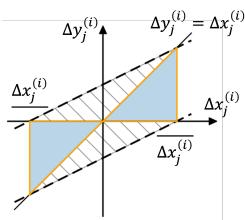

In RaVeN, there is actually more heuristics that takes into account the bounds of individual neurons to fur ther tighten the bounds of relational neurons. For instance, if the ReLU inputs $\boldsymbol { x } _ { j } ^ { ( i ) }$ and $\hat { x } _ { j } ^ { ( i ) }$ of two corre-

Fig. 1: Linear relaxation of the difference of ReLU’s outputs

sponding individual neurons are both negative, despite their difference $\Delta x _ { j } ^ { ( i ) }$ , the ReLU output difference $\Delta y _ { j } ^ { ( i ) }$ must be

0 because both $y _ { j } ^ { ( i ) }$ and $\hat { y } _ { j } ^ { ( i ) }$ are 0. As these details are not our main focus, we skip them and refer interested readers to [12].

Notably, if ApxVerRel decides that a network is not globally robust, it will return a counterexample, i.e., a pair of inputs $\widehat { \left( y ^ { ( 0 ) } , \widehat { y } ^ { ( 0 ) } \right) }$ , as a witness of the violation to the specification. However, this counterexample may be a spurious one (often called a false alarm) that actually does not violate the specification, due to the over-approximation of ApxVerRel. To validate whether a counterexample is real, we can feed it to the neural network N and check whether their outputs violate the requirement of global robustness.

## III. MOTIVATIONS

We first review BaB [7], a state-of-the-art approach in classic neural network verification to refine the approximation brought by approximation approaches, such as RaVeN in §II-B, and then we use an example to motivate the advantages of considering relational neurons, rather than individual neurons as existing approaches do, when applying BaB to solve relational verification problems.

## A. BaB for Abstraction Refinement

While approximation verifiers ApxVerRel, such as RaVeN in §II-B, can provide sound over-approximation and are computationally efficient, they suffer from the completeness issue: as mentioned, the approximated bounds contain the region not reachable by the network, so ApxVerRel may raise spurious counterexamples (i.e., false alarms) that report a violation actually not existent. To mitigate this issue, we need to refine the approximation in order to obtain more precise bounds, and to date, BaB [7] is the state-of-the-art approach in classic neural network verification against local robustness to address this issue. Below, we briefly review the workflow of BaB in the classic context.

Branch and Bound (BaB). Essentially, BaB involves a “divide-and-conquer” strategy, which refines approximation by iterative problem splitting and application of verifiers to sub-problems. As approximation verifiers often introduce less approximation error for sub-problems, BaB can effectively tighten the approximation bounds and improve the precision of verification results. For local robustness, problem splitting is often performed with respect to the ReLU of a selected neuron, namely, it considers separately the cases when the input is positive and when the input is negative for the selected ReLU; by doing so, it can refine the approximation for the selected ReLU, because for each of the cases, ReLU becomes linear so there is no need to approximate its output.

We review the workflow of BaB in classic verification against local robustness.

i) Initially, BaB applies the verifier to the original problem, and checks whether the problem is verified: if yes, it terminates the verification and returns true;

ii) In case it raises a false alarm, BaB splits the problem into two sub-problems. Given ReLU as activation function, as mentioned, this is often achieved by imposing additional constraints to the input of a selected ReLU such that the transformation becomes linear.

iii) For each of the sub-problems, BaB iteratively goes through Step i and Step ii until all the sub-problems are verified, in which case it returns true. It is also possible that BaB encounters a real counterexample during the verification process, in which case it returns false.

Consequently, BaB exploits the strength of approximation verifiers in efficiency and meanwhile complements their completeness issues to strike a balance.

Neuron selection. During the BaB process, a key factor determining its efficiency is the selection of neurons to split at each step. Since neurons have different positions in the network architecture and different input ranges, splitting different neurons can bring different impacts on the final output bounds. To this end, neuron selection aims to maximize such impact and thereby to tighten the output bounds, such that it can verify the problem more efficiently.

Direct estimation of such impact consists in solving verification of different sub-problem candidates, which is not feasible. To address this issue, existing approaches, such as BaBSR [7], propose to utilize the Lagrangian dual formulation [24] for estimation and are known to deliver strong performance. In this approach, a primal problem consists in a linear program that includes all linear constraints for verifying a neural network (based on some specific linear relaxation for ReLU, e.g., by [6]). Then, in the dual formulation, the objective function can soundly over-approximate the output bounds, by a summation of neuron-wise terms, where each term captures the contribution of a specific neuron to the final output under the adopted linear relaxation. These terms are naturally collected during the construction of the dual formulation once the overapproximated bounds for each neuron are already available.

Therefore, by choosing the terms associated with a candidate neuron to split, we can estimate the splitting effect without introducing additional overhead.

## B. Splitting of Relational Neurons

While BaB has been extensively studied in verification against local robustness, it remains much underexplored in relational verification. As an early work, RABBit [17] adopts BaB for verification against universal adversarial perturbations, which is a different type of hyperproperties from the global robustness considered by us. Similarly to classic BaB, RABBit also selects an individual neuron to split in case approximation verifiers raise a false alarm, and then deal with sub-problems until all of them are verified.

In relational verification, in addition to individual neurons, relational neurons may also be selected to split. For example, for the abstraction domain in Fig. 1, problem splitting means to consider the cases when $\Delta x _ { j } ^ { ( i ) } < 0$ and when $\Delta \bar { x } _ { j } ^ { ( i ) } > 0$ separately; as each of the cases involves a reachable region as a blue triangle, the orange lines are sufficient to bound each of them. As a consequence, we can eliminate the shadowed region brought by the linear relaxation in RaVeN and thereby tighten the relational bounds. Existing work, such as RABBit, has shown the effectiveness of BaB in relational verification, however, as it targets individual neurons rather than relational neurons, it fails to exploit the problem structure of relational verification in which the bounds of relational neurons are relevant to the final outputs and thus may not be able to achieve the optimal performance.

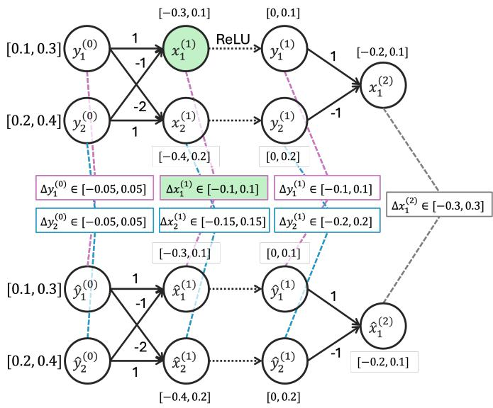

(a) Approximate symbolic bounds propagation  
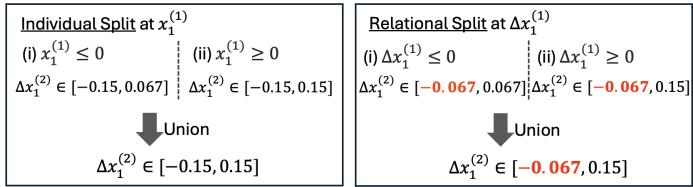  
(b) Splitting of individual neurons vs. relational neurons (solved by Gurobi [26] following our approach in §IV)  
Fig. 2: Symbolic bounds propagation and comparison between splitting of individual and relational neurons

Below, we use an example to demonstrate the strength of splitting relational neurons. The code of the example can be found in our online repository [25].

Example 1: In Fig. 2, we depict a process of verifying a tiny neural network by an approximation verifier (Fig. 2a), and then refining the approximated bound of the output difference by problem splitting (Fig. 2b).

In particular, by splitting an individual neuron $x _ { 1 } ^ { ( 1 ) }$ , the bound of the difference $\Delta \bar { x } _ { 1 } ^ { ( 2 ) }$ between two outputs of two individual inferences is refined to be [−0.15, 0.15].

In contrast, by branching on the relational neuron $\Delta x _ { 1 } ^ { ( 1 ) }$ the bound of $\Delta \dot { x } _ { 1 } ^ { ( 2 ) }$ is refined to be [−0.067, 0.15], which is tighter than the result of splitting individual neurons. ◁

As observed in Example 1, splitting individual neurons in relational verification may lead to suboptimal performance, compared to splitting relational neuron, and therefore may not be the best choice in the context of relational verification. Intuitively, in relational verification, as the differences between individual neurons matter, splitting individual neurons may not be as helpful as directly splitting relational neurons in narrowing down the difference bounds between individual neurons. In light of this, we propose a BaB approach for relational verification, which features problem splitting via

relational neurons.

## IV. THE PROPOSED BAB APPROACH

By §III, it is desirable to refine approximation in relational verification, by using BaB with relational neuron splitting. In this section, we detail this approach, with a focus on the selection of relational neurons in §IV-B.

## A. Approach Overview

Sub-problem construction. We first define sub-problems in our context. A verification problem defined in Def. 4 is identified by a given neural network and a global robustness property. We generalize this problem by introducing relational constraints Φ predicating over $\Delta x _ { j } ^ { ( i ) } \ { = } \ x _ { j } ^ { ( i ) } - \hat { x } _ { j } ^ { \top i ) }$ , i.e., the inputs of the non-linear transformation in relational neurons.

Definition 5 (Relational constraints): Given a pair (i, j), a relational constraint $\varphi$ w.r.t. $( i , j )$ is a proposition either $\Delta x _ { j } ^ { ( i ) } \ \leq \ 0$ (written as $\left( \Delta x _ { j } ^ { ( i ) } \right) ^ { - } ) \mathrm { ~ o r ~ } \Delta x _ { j } ^ { ( i ) } \geq 0$ (written as $\left( \Delta x _ { j } ^ { ( i ) } \right) ^ { + } )$ . Multiple relational constraints, each w.r.t. a different $( \acute { i } , \dot { j } )$ , can form a conjunction $\Phi = \varphi _ { 1 } \wedge \cdot \cdot \cdot \wedge \varphi _ { k }$ which we call a relational constraint sequence. Φ can be empty, in which case we denote it by ⊤.

Definition 6 ((Sub-)problems of relational verification): Given a neural network N, a global robustness property identified by $( \Omega , \varepsilon , \delta )$ (see Def. 3), and a relational constraint sequence Φ, a verification problem is to determine whether N satisfies global robustness under the constraint of Φ.

We also generalize the approximation verifier ApxVerRel introduced in §II-B, by allowing it to handle an additional argument Φ. Notably, an originally given verification problem in Def. 4 can be seen as a special case of Def. 6, by treating Φ of the original problem as ⊤; consequently, we can apply ApxVerRel not only to the original problem but also to its sub-problems. While there can be different ways of accommodating this additional constraint by ApxVerRel, below we introduce a linear programming (LP)-based approach, which allows to obtain tight relational bounds.

In our problem, since we aim to show that the difference $| \Delta y _ { \ell } ^ { ( L ) } | \leq \delta$ , we need to consider both the maximum and the minimum of $\Delta y _ { \ell } ^ { ( L ) }$ . Here we take the minimization of $\Delta y _ { \ell } ^ { ( L ) }$ as an example to showcase our approach; the maximization of $\Delta y _ { \ell } ^ { ( L ) }$ can be computed similarly. The LP program we need to solve is as follows, subject to six categories of constraints:

$$
\begin{array} { l l l } { { \operatorname* { m i n } } } & { { \Delta y _ { \ell } ^ { ( L ) } } } & { { } } \\ { { \mathrm { s . t . } } } & { { \mathsf { C o n s t } _ { \mathrm { i n p } } , } } & { { \mathsf { C o n s t } _ { \mathrm { a f f n } } , \quad \mathsf { C o n s t } _ { \Delta \mathrm { a f f n } } , } } \\ { { } } & { { \mathsf { C o n s t } _ { \mathrm { R e L U } } , } } & { { \mathsf { C o n s t } _ { \Delta \mathrm { R e L U } } , \quad \Phi } } \end{array}\tag{3}
$$

where $\mathtt { C o n s t _ { i n p } }$ denotes the constraints related to the input layer, including that for individual inferences and for the difference between the two inferences:

$$
\begin{array} { r l } & { \bullet \ : y ^ { ( 0 ) } \geq \underline { { \Omega } } , y ^ { ( 0 ) } \leq \overline { { \Omega } } , \hat { y } ^ { ( 0 ) } \geq \underline { { \Omega } } , \hat { y } ^ { ( 0 ) } \leq \overline { { \Omega } } } \\ & { \bullet \ : \Delta y ^ { ( 0 ) } \geq - \varepsilon , \Delta y ^ { ( 0 ) } \leq \varepsilon , } \end{array}
$$

Cons $\mathtt { t _ { a f f r } }$ and Cons $\mathtt { t } _ { \mathtt { \Delta a f f n } }$ respectively denote the constraints associated with the affine transformation of two individual and relational neurons:

$$
\begin{array} { r l } & { \bullet \ x ^ { ( i + 1 ) } = W ^ { ( i ) } y ^ { ( i ) } + b ^ { ( i ) } , \forall i \in \{ 0 , \ldots , L - 1 \} } \\ & { \bullet \ \hat { x } ^ { ( i + 1 ) } = W ^ { ( i ) } \hat { y } ^ { ( i ) } + b ^ { ( i ) } , \forall i \in \{ 0 , \ldots , L - 1 \} } \\ & { \bullet \ \Delta x ^ { ( i + 1 ) } = W ^ { ( i ) } \Delta y ^ { ( i ) } , \forall i \in \{ 0 , \ldots , L - 1 \} , } \end{array}
$$

Cons $\mathtt { t _ { R e L U } }$ denotes the constraints for ReLU functions in each individual neuron:

$$
\begin{array} { r l } & { \bullet \cdot \vartheta _ { ( j ) } ^ { ( k ) } = 0 , \ : \forall i \in \{ 1 , \ldots , L - 1 \} , \ j \in \mathbb { Z } _ { i } ^ { - } } \\ & { \bullet \cdot \vartheta _ { ( j ) } ^ { ( k ) } = x _ { ( j ) } ^ { ( k ) } , \ : \forall i \in \{ 1 , \ldots , L - 1 \} , \ j \in \mathbb { Z } _ { i } ^ { d } } \\ & { \bullet \cdot \vartheta _ { ( j ) } ^ { ( k ) } = 0 , \ : \forall i \in \{ 1 , \ldots , L - 1 \} , \ j \in \hat { \mathcal { X } } _ { i } ^ { - } } \\ & { \bullet \cdot \vartheta _ { ( j ) } ^ { ( k ) } = \hat { \mathcal { X } } _ { ( j ) } ^ { ( k ) } , \ : \forall i \in \{ 1 , \ldots , L - 1 \} , \ j \in \hat { \mathcal { X } } _ { i } ^ { + } } \\ & { \bullet \cdot \vartheta _ { ( j ) } ^ { ( k ) } \geq \omega _ { ( j ) } ^ { ( k ) } , \ : \forall i } \\ & { \bullet \ : ( \overline { { \mathcal { X } _ { i } ^ { ( j ) } } } - \frac { x _ { ( j ) } ^ { ( k ) } } { 2 } ) y _ { ( j ) } ^ { ( k ) } - } \\ & { \quad ( \overline { { \mathcal { X } _ { i } ^ { ( j ) } } } \leq \omega _ { ( j ) } ^ { ( k ) } \frac { x _ { ( j ) } ^ { ( k ) } } { 2 } - \overline { { \mathcal { X } _ { i } ^ { ( k ) } } } \frac { x _ { ( j ) } ^ { ( k ) } } { 2 } \leq 0 \Bigg ) \ : \int \ : \tilde { \mathcal { H } } \ : \mathbb { Z } _ { i } ^ { + } } \\ & { \bullet \ : ( \overline { { \mathcal { X } _ { i } ^ { ( j ) } } } \geq \hat { \mathcal { X } } _ { ( j ) } ^ { ( k ) } \hat { \mathcal { X } } _ { ( j ) } ^ { ( k ) } } \\ &  \bullet \ : ( \overline { { \mathcal { X } _ { i } ^ { ( j ) } } } - \frac  x _ { ( j ) } ^  ( \end{array}
$$

where the bounds $[ x _ { j } ^ { ( i ) } , \overline { { x _ { j } ^ { ( i ) } } } ]$ are obtained by the previous layers, and $\mathcal { T } _ { i } ^ { - } , \mathcal { T } _ { i } ^ { + }$ and $\mathcal { I } _ { i } ^ { \pm }$ respectively represent the set of indexes j for which the ReLU input $\boldsymbol { x } _ { i } ^ { ( i ) }$ is negative, positive, or undecided, as follows; similarly, $\widehat { \cal T } _ { i } ^ { - } , \widehat { \cal T } _ { i } ^ { + }$ and $\widehat { \cal T } _ { i } ^ { \pm }$ represent the cases for the corresponding individual neuron.

$$
\begin{array} { r l } & { \bullet \ \mathcal { T } _ { i } ^ { - } = \{ j \ | \ x _ { j } ^ { ( i ) } \leq 0 \} , } \\ & { \bullet \ \mathcal { T } _ { i } ^ { + } = \{ j \ | \ \underline { { x _ { j } ^ { ( i ) } } } \geq 0 \} , } \\ & { \bullet \ \mathcal { T } _ { i } ^ { \pm } = \{ j \ | \ x _ { j } ^ { ( i ) } < 0 < \overline { { x _ { j } ^ { ( i ) } } } \} } \end{array}
$$

$\mathtt { C o n s t } _ { \Delta \mathtt { R e L U } }$ denotes the constraints of ReLU function for relational neurons based on the abstraction domain shown in Fig. 1. The propagation is similar to that for individual neurons, and has been detailed in §II-B. In practice, we also involve the heuristics imposed by RaVeN, which leverages the bounds of individual neurons to tighten the bounds of relational bounds. Due to the page limit, we do not expand the whole approach here, but we leave it in Appendix B.

The last constraints Φ, i.e., relational constraints, are derived from problem splitting. As these are also linear constraints, LP solvers can handle them effectively.

Algorithm. Similar to classic BaB, the proposed relational BaB also performs verification by iterative problem splitting and application of approximation verifiers, such as RaVeN [12], to the sub-problems.

Alg. 1 presents the workflow of our BaB approach. It adopts a queue Q to record the (sub-)problems yet to be checked, which is initialized to contain the original verification problem, identified by ⊤ only (Line 1). Then, it goes through the loop of problem splitting and bounding (Line 2).

In function RELBAB, a given problem in Q is checked by approximation verifiers and, if necessary, split to sub-problems for further processing. If no problem is in Q, it signifies that all (sub-)problems have been solved, so verification can be terminated and return true (Line 5). Otherwise, a sub-problem, identified by a relational constraint sequence Φ, will be popped from Q and checked by the approximation verifier ApxVerRel (Line 6), using the aforementioned approach. By applying

Algorithm 1 The proposed BaB for relational verification   
Require: A neural network N, global robustness identified by (ε, δ) and Ω   
1: $\mathsf { \bar { Q } } \gets \{ \mathsf { T } \}$ ▷ initialize Q to record problems to be solved   
2: $\mathbf { \check { R e L B A B } } ( N , \varepsilon , \delta , \Omega , Q )$ ▷ invoke the verification process   
3: function REL $\mathbf { B A B } ( N , \varepsilon , \delta , \Omega , Q )$   
4: if EMPTY(Q) then   
5: return true   
6: Φ ← POP(Q) ▷ select a sub-problem   
7: $\underline { { \Delta y _ { j } ^ { ( i ) } } } , \overline { { \Delta y _ { j } ^ { ( i ) } } } , \underline { { y _ { j } ^ { ( i ) } } } , \overline { { y _ { j } ^ { ( i ) } } } , \underline { { \hat { y } _ { j } ^ { ( i ) } } } , \overline { { \hat { y } _ { j } ^ { ( i ) } } } , \overline { { \hat { y } _ { j } ^ { ( i ) } } } , \overline { { \hat { y } ^ { ( i ) } } } ) \gets \mathsf { A p x V e r R e l } ( N , \Omega , \varepsilon , \Phi )$   
8: if $\overline { { \Delta y _ { j } ^ { ( L ) } } } > \delta$ or $\Delta y _ { j } ^ { ( L ) } < - \delta$ then ▷ not verified   
9: if $\left| N ( \widehat { y ^ { ( 0 ) } } ) - \widehat { N ( \hat { y } ^ { ( 0 ) } } ) \right| > \delta$ then ▷ real counterexample   
10: return false   
11: else   
12: $( i , j ) \gets \mathrm { R E L S E L E C T } ( N , \varepsilon , \delta , \Omega , \underline { { \Delta y _ { j } ^ { ( i ) } } } , \overline { { \Delta y _ { j } ^ { ( i ) } } } , \underline { { y _ { j } ^ { ( i ) } } } , \overline { { y _ { j } ^ { ( i ) } } } , \hat { \underline { { y } } } _ { j } ^ { ( i ) } , \overline { { \hat { y } _ { j } ^ { ( i ) } } } , \overline { { \hat { y } _ { j } ^ { ( i ) } } } )$   
13: for $\varphi \in \left\{ \left( \Delta x _ { j } ^ { ( i ) } \right) ^ { + } , \left( \Delta x _ { j } ^ { ( i ) } \right) ^ { - } \right\}$ do   
14: $\mathsf { P U S H } \bigl ( Q , \Phi \wedge \varphi \bigr )$ ▷ push to Q for future verification   
15: return REL $\mathbf { B A B } ( N , \varepsilon , \delta , \Omega , Q )$ ▷ recursive call

ApxVerRel to the sub-problem Φ, ApxVerRel can return the bounds for both relational neurons and individual neurons (Line 7), by which we can check whether the global robustness is satisfied. If not satisfied, we can validate the counterexample $\widehat { \left( y ^ { ( 0 ) } , \widehat { y } ^ { ( 0 ) } \right) }$ returned by ApxVerRel by feeding it into N (Line 9), and terminate the verification by returning false if the counterexample is a real one (Line 10).

If the counterexample is spurious, we split the problem to sub-problems by adding new relational constraints Φ. Unlike conventional BaB approaches [7], [17] that branch on individual neurons, our approach performs branching on relational neurons. While it is possible to consider both individual and relational neurons as candidates for splitting, currently in our approach we select relational neurons exclusively, because given a verification problem reasonably difficult, there are often sufficiently many relational neurons to split within a limited time budget, and so they are preferred to be selected to maximize the refinement. Specifically, we first select a relational neuron identified by its index (i, j) (Line 12), and then add the corresponding propositions, i.e., $\left( \Delta x _ { j } ^ { ( i ) } \right) ^ { + }$ and $\left( \Delta x _ { j } ^ { ( i ) } \right) ^ { - }$ to Φ to construct new sub-problems (Line 13). These two new sub-problems will be added to Q such that they can be later accessed (Line 14). Then, Alg. 1 recursively calls RELBAB with the updated Q to proceed with the verification of sub-problems (Line 15).

It remains an important question in Alg. 1 regarding the selection of relational neurons, i.e., the implementation of RELSELECT in Line 12. Similarly to classic BaB, it is of great significance to select a proper neuron each time that can maximize the refinement of abstraction, thereby solving the problem efficiently. In §IV-B, we elaborate on our proposed neuron selection strategy.

## B. Relational Neuron Selection

As reviewed in §III-A, mainstream BaB-based approaches $[ 7 ] , [ 8 ] ,$ , [17] leverage the dual formulation of verification problems for efficient neuron selection. However, this approach cannot be directly used to select relational neurons in BaB for relational verification. To bridge this gap, we extend the neuron selection approach BaBSR [7] in classic verification to the relational settings, based on the dual formulation of the LP program in §IV-A. Similarly to BaBSR, the objective function of our dual formulation is also a summation of neuron-wise terms, so we can use them to estimate the bounds of relational neurons in the output layer efficiently.

Relational Dual Formulation. In general, to obtain the dual problem of a given primal problem, we need to go through two steps: 1) construct a Lagrangian function by adding Lagrangian multipliers to constraints in the primal problem; and 2) construct the dual problem by using the Karush-Kuhn-Tucker (KKT) condition.

In our context, the primal problem is the linear program formulated in Eq. 3. For clarity, we take the formulation for the original problem where $\Phi = \top$ to illustrate our approach, while the dual problem can be updated as Alg. 1 progresses. Below, we go through the two steps mentioned above to obtain the dual problem. Due to the space limit, the full derivation including technical details are provided in Appendix C. As a result, the derived dual problem is expressed as follows:

$$
\begin{array} { l } { { { \displaystyle \begin{array} { l } { { \displaystyle { \operatorname* { m a x } } } } \\ { { \displaystyle \mathbb { Q } \left[ B ^ { ( 0 ) } \right] _ { - } - \overline { { \Omega } } \left[ B ^ { ( 0 ) } \right] _ { + } + \underline { { \Omega } } \left[ \widehat { B } ^ { ( 0 ) } \right] _ { - } - \overline { { \Omega } } \left[ \widehat { B } ^ { ( 0 ) } \right] _ { + } } } \\ { { \displaystyle - \varepsilon \left[ B ^ { \Delta ( 0 ) } \right] _ { - } - \varepsilon \left[ B ^ { \Delta ( 0 ) } \right] _ { + } } } \\ { { \displaystyle - \sum _ { i = 0 } ^ { L - 1 } ( ( A ^ { ( i + 1 ) } + \widehat { A } ^ { ( i + 1 ) } ) ^ { T } b ^ { ( i ) } ) } } \\ { { \displaystyle + \sum _ { i = 1 } ^ { L - 1 } \sum _ { j } ^ { ( \mu _ { i } ^ { ( i ) } \left[ B _ { j } ^ { ( i ) } \right] _ { + } + \widehat { \mu } _ { j } ^ { ( i ) } \left[ \widehat { B } _ { j } ^ { ( i ) } \right] _ { + } } } } \end{array} } } \\ { { { \boldsymbol { \mathrm { \ell } } } } } \\ { { { \boldsymbol { \ell } } } } \\ { { { \boldsymbol { \ell } } } } \\ { { { \boldsymbol { \ell } } } } \end{array} }  \\ { { { \boldsymbol \ell } } . } \\    \begin{array} { l }  { \displaystyle { \sum _ { i = 1 } ^ { L - 1 } \sum _ { j } ^ { ( \mu ) ( i ) } \left[ B _ { j } ^ { ( \hat { \boldsymbol { \theta } } _ { j } ^ { ( i ) } ) } \right] _ { + } + \widehat { \mu } _ { j } ^ { ( i ) } \left[ \widehat { B } _ { j } ^ { ( i ) } \right] _ { - } } } \\   \displaystyle + \mu _ { j } ^ { + \Delta ( i ) } \left[ B _ { j } ^ { \Delta ( i ) } \right] _ { + } + \mu _ { j } ^ { - \Delta ( i ) } \left[ B _ { j } ^ { \Delta ( i ) } \right] _ { - } )  \end{array}\tag{4}
$$

(5)

(6)

where the operators $[ z ] _ { - } = \operatorname* { m a x } ( 0 , - z )$ and $[ z ] _ { + } = \operatorname* { m a x } ( 0 , z )$ are defined for a given $z \in \mathbb { R }$ , and ${ \mathcal { A } } , { \widehat { \mathcal { A } } } , { \mathcal { A } } ^ { \Delta } , { \mathcal { B } } , { \widehat { \mathcal { B } } }$ and $B ^ { \Delta }$ are the Lagrangian multipliers (in dual context, we call them

TABLE I: Coefficients in dual formulation. In the column “case”, $\tau , { \widehat { \cal T } } ,$ and $\mathcal { T } ^ { \Delta }$ , together with their sign notations, denote the sets of individual and relational neurons categorized according to their pre-activation conditions (details of the categorization are provided in the footnote of the table). This table presents the correspondence between the symbols appearing in the dual formulation (specifically, Eq. 6 and Eq. 9) and the coefficients in Eq. 10 for each combination of the pre-activation conditions.
<table><tr><td>case</td><td> $\nu _ { j } ^ { ( i ) }$ </td><td> $\nu _ { j } ^ { \Delta ( i ) }$ </td><td> $\widehat { \nu } _ { j } ^ { ( i ) }$ </td><td> $\widehat { \nu } _ { j } ^ { \Delta ( i ) }$ </td><td> $\lambda _ { j } ^ { + ( i ) }$ </td><td> $\lambda _ { j } ^ { - ( i ) }$ </td><td> $\mu _ { j } ^ { ( i ) }$ </td><td> $\widehat { \mu } _ { j } ^ { ( i ) }$ </td><td> $\mu _ { j } ^ { + \Delta ( i ) }$ </td><td> $\mu _ { j } ^ { - \Delta ( i ) }$ </td></tr><tr><td> $j \in \mathbb { Z } _ { i } ^ { - } \cap \widehat { \mathbb { Z } } _ { i } ^ { - }$ </td><td>0</td><td>0</td><td>0</td><td>0</td><td>0</td><td>0</td><td>0</td><td>0</td><td>0</td><td>0</td></tr><tr><td> $j \in \mathcal { T } _ { i } ^ { + } \cap \widehat { \mathcal { T } } _ { i } ^ { - }$ </td><td>1</td><td>1</td><td>0</td><td>0</td><td>0</td><td>0</td><td>0</td><td>0</td><td>0</td><td>0</td></tr><tr><td> $j \in \mathcal { T } _ { i } ^ { - } \cap \widehat { \mathcal { T } } _ { i } ^ { + }$ </td><td>0</td><td>0</td><td>1</td><td>-1</td><td>0</td><td>0</td><td>0</td><td>0</td><td>0</td><td>0</td></tr><tr><td> $j \in \mathcal { T } _ { i } ^ { + } \cap \widehat { \mathcal { T } } _ { i } ^ { + }$ </td><td>1</td><td>1</td><td>1</td><td>-1</td><td>0</td><td>0</td><td>0</td><td>0</td><td>0</td><td>0</td></tr><tr><td> $j \in \mathcal { T } _ { i } ^ { \pm } \cap \widehat { \mathcal { T } } _ { i } ^ { - }$ </td><td> $\pi _ { j } ^ { ( i ) }$ </td><td> $\pi _ { j } ^ { ( i ) }$ </td><td>0</td><td>0</td><td>0</td><td>0</td><td> $\omega _ { j } ^ { ( i ) }$ </td><td>0</td><td> $\omega _ { j } ^ { ( i ) }$ </td><td>0</td></tr><tr><td> $j \in \mathcal { T } _ { i } ^ { - } \cap \widehat { \mathcal { T } } _ { i } ^ { \pm }$ </td><td>0</td><td>0</td><td> $\widehat { \pi } _ { j } ^ { ( i ) }$ </td><td> $\widehat { \pi } _ { j } ^ { ( i ) }$ </td><td>0</td><td>0</td><td>0</td><td> ${ \widehat { \omega } } _ { j } ^ { ( i ) }$ </td><td>0</td><td> ${ \widehat { \boldsymbol { \omega } } } _ { j } ^ { ( i ) }$ </td></tr><tr><td> $j \in \mathcal { T } _ { i } ^ { \pm } \cap \widehat { \mathcal { T } } _ { i } ^ { + }$ </td><td> $\pi _ { j } ^ { ( i ) }$ </td><td> $\pi _ { j } ^ { ( i ) }$ </td><td>1</td><td>-1</td><td>0</td><td>0</td><td> $\omega _ { j } ^ { ( i ) }$ </td><td>0</td><td> $\omega _ { j } ^ { ( i ) }$ </td><td>0</td></tr><tr><td> $j \in \mathcal { T } _ { i } ^ { + } \cap \widehat { \mathcal { T } } _ { i } ^ { \pm }$ </td><td>1</td><td>1</td><td> $\widehat { \pi } _ { i } ^ { ( i ) }$ </td><td> $\widehat { \pi } _ { i } ^ { ( i ) }$ </td><td>0</td><td>0</td><td>0</td><td> $\widehat { \omega } _ { i } ^ { ( i ) }$ </td><td>0</td><td> ${ \widehat { \omega } } _ { j } ^ { ( i ) }$ </td></tr><tr><td> $j \in \mathcal { T } _ { i } ^ { \pm } \cap \widehat { \mathcal { T } } _ { i } ^ { \pm } \cap \mathcal { T } _ { i } ^ { \Delta + }$ </td><td> $\pi _ { i } ^ { ( i ) }$ </td><td>(i) π</td><td> $\widehat { \pi } _ { i } ^ { ( i ) }$ </td><td> $\widehat { \pi } _ { i } ^ { ( i ) }$ </td><td>1</td><td>0</td><td> $\boldsymbol { \omega } _ { i } ^ { ( i ) }$ </td><td> $\widehat { \omega } _ { \dot { \boldsymbol { i } } } ^ { ( i ) }$ </td><td>0</td><td>0</td></tr><tr><td> $j \in \mathcal { T } _ { i } ^ { \pm } \cap \widehat { \mathcal { T } } _ { i } ^ { \pm } \cap \mathcal { T } _ { i } ^ { \Delta - }$ </td><td>(i) π</td><td>π</td><td> $\widehat { \pi } _ { i } ^ { ( i ) }$ </td><td> $\widehat { \pi } _ { i } ^ { ( i ) }$ </td><td>0</td><td>-1</td><td> $\omega _ { i } ^ { ( i ) }$ </td><td> $\widehat { \omega } _ { \dot { \cdot } } ^ { ( i ) }$ </td><td>0</td><td>0</td></tr><tr><td> $j \in \mathcal { T } _ { i } ^ { \pm } \cap \widehat { \mathcal { T } } _ { i } ^ { \pm } \cap \mathcal { T } _ { i } ^ { \Delta \pm }$ </td><td>不</td><td>不</td><td></td><td>2</td><td> $\pi _ { j U } ^ { \Delta ( i ) }$ </td><td> $\pi _ { j L } ^ { \Delta ( i ) }$ </td><td> $\boldsymbol { \omega } _ { j } ^ { ( i ) }$ </td><td> $\widehat { \omega } _ { j } ^ { ( i ) }$ </td><td> $\omega _ { j } ^ { \Delta ( i ) }$ </td><td> $\omega _ { j } ^ { \Delta ( i ) }$ </td></tr></table>

\* ∗ I−i = {j | x(i)j ≤ 0}, I+i = {j | x(i)j ≥ 0}, I±i = {j | x(i)j < 0 < x (i)} j cj j j  
† Ib−i = {j | xˆ(i)j ≤ 0}, Ib+i = {j | xˆ(i) j ≥ 0}, Ib±i = {j | xˆ(i ) < 0 < xˆ(i)j }  
‡ I∆−i = {j | ∆x(i)j ≤ 0}, I∆+i = {j | ∆x(i)j ≥ 0}, I∆±i = {j | ∆x(i)j < 0 < ∆x(j i)}

dual variables). These dual variables ${ \mathcal { A } } , { \widehat { \mathcal { A } } } , { \mathcal { A } } ^ { \Delta } , { \mathcal { B } } , { \widehat { \mathcal { B } } }$ and $B ^ { \Delta }$ are derived as constants by backpropagation from the last layer to input layer:

$$
\mathcal { A } ^ { ( L ) } = \widehat { \mathcal { A } } ^ { ( L ) } = 0 , \mathcal { A } ^ { \Delta ( L ) } = - C
$$

$$
\widehat { \omega } _ { j } ^ { ( i ) } = \frac { \overline { { \widehat { x } _ { j } ^ { ( i ) } } } \widehat { x } _ { j } ^ { ( i ) } } { \overline { { \widehat { x } _ { j } ^ { ( i ) } } } - \widehat { x } _ { j } ^ { ( i ) } } , \quad \pi _ { j U } ^ { \Delta ( i ) } = \frac { \overline { { \Delta x _ { j } ^ { ( i ) } } } } { \Delta x _ { j } ^ { ( i ) } - \Delta x _ { j } ^ { ( i ) } } ,\tag{7}
$$

$$
\left. \begin{array} { r l } & { \mathcal { B } ^ { ( i ) } = W ^ { ( i ) T } \mathcal { A } ^ { ( i + 1 ) } , } \\ & { \widehat { \mathcal { B } } ^ { ( i ) } = W ^ { ( i ) T } \widehat { \mathcal { A } } ^ { ( i + 1 ) } , } \\ & { \mathcal { B } ^ { \Delta ( i ) } = W ^ { ( i ) T } \mathcal { A } ^ { \Delta ( i + 1 ) } , } \end{array} \right\} \quad \forall i \in \{ L - 1 , . . . , 0 \}\tag{8}
$$

$$
\begin{array} { r l } & { \mathcal A _ { j } ^ { ( i ) } = \nu _ { j } ^ { ( i ) } \mathcal B _ { j } ^ { ( i ) } + \nu _ { j } ^ { \Delta ( i ) } \mathcal B _ { j } ^ { \Delta ( i ) } } \\ & { \widehat { \mathcal A } _ { j } ^ { ( i ) } = \widehat { \nu } _ { j } ^ { ( i ) } \widehat { \mathcal B } _ { j } ^ { ( i ) } + \widehat { \nu } _ { j } ^ { \Delta ( i ) } \mathcal B _ { j } ^ { \Delta ( i ) } } \\ & { \mathcal A _ { j } ^ { \Delta ( i ) } = \lambda _ { j } ^ { + ( i ) } [ \mathcal B _ { j } ^ { \Delta ( i ) } ] _ { + } + \lambda _ { j } ^ { - ( i ) } [ \mathcal B _ { j } ^ { \Delta ( i ) } ] _ { - } ] ^ { } . } \end{array}\tag{9}
$$

(10)

where C is a vector whose ℓ-th element is 1 and all other elements are 0 to point out the target dimensional output relational bound $( \mathrm { i } . \mathrm { e } . , \ C$ is a one-hot vector based on the global robustness specification in Def. 3), and the coefficients $\overline { { { \nu } } } _ { j } ^ { ( i ) } , \nu _ { j } ^ { \Delta ( i ) } , \widehat { \nu } _ { j } ^ { ( i ) } , \widehat { \nu } _ { j } ^ { \Delta ( i ) } , \lambda _ { j } ^ { + ( i ) } , \lambda _ { j } ^ { - ( i ) } , \mu _ { j } ^ { ( i ) } , \widehat { \mu } _ { j } ^ { ( i ) } , \mu _ { j } ^ { + \Delta ( i ) }$ , and $\bar { \mu _ { j } ^ { - \Delta ( i ) } }$ in Eq. (4, 5, 6) and Eq. (7, 8, 9) are derived based on the conditions of ReLU inputs of individual and relational neurons, as shown in Table I.

In Table I, to group the ReLU input conditions of the individual and relational neurons, we use three categories $\mathcal { T } ,$ ${ \widehat { \cal T } } ,$ , and $\mathcal { T } ^ { \Delta }$ , as annotated in the table. These represent the sets of indexes j grouped according to the pre-activation states of $x _ { j } ^ { ( i ) } , \hat { x } _ { j } ^ { ( i ) }$ , and $\Delta x _ { j } ^ { ( i ) } ~ ( \mathrm { e . g . , ~ } j \in \widehat { \mathcal { T } } _ { i } ^ { \pm } \mathrm { ~ i f ~ } \hat { x } _ { j } ^ { ( i ) } < 0 < \overline { { \hat { x } _ { j } ^ { ( i ) } } } )$ . The symbols in Table I are computed by the pre-activation bounds:

$$
\pi _ { j } ^ { ( i ) } = \frac { \overline { { x _ { j } ^ { ( i ) } } } } { x _ { j } ^ { ( i ) } - \underline { { x _ { j } ^ { ( i ) } } } } , \widehat { \pi } _ { j } ^ { ( i ) } = \frac { \overline { { { \hat { x } _ { j } ^ { ( i ) } } } } } { \overline { { { \hat { x } _ { j } ^ { ( i ) } } } } - \underline { { { \hat { x } _ { j } ^ { ( i ) } } } } } , \omega _ { j } ^ { ( i ) } = \frac { \overline { { x _ { j } ^ { ( i ) } } } \underline { { x _ { j } ^ { ( i ) } } } } { \overline { { x _ { j } ^ { ( i ) } } } - \underline { { x _ { j } ^ { ( i ) } } } } ,
$$

$$
\pi _ { j L } ^ { \Delta ( i ) } = \frac { \Delta x _ { j } ^ { ( i ) } } { \Delta x _ { j } ^ { ( i ) } - \Delta x _ { j } ^ { ( i ) } } , \quad \omega _ { j } ^ { \Delta ( i ) } = \frac { \overline { { \Delta x _ { j } ^ { ( i ) } } } \Delta x _ { j } ^ { ( i ) } } { \overline { { \Delta x _ { j } ^ { ( i ) } } } - \underline { { \Delta x _ { j } ^ { ( i ) } } } }
$$

In the objective of dual problem, Eq. 4, 5, and 6 respectively correspond to the input constraints Cons $\mathtt { t _ { i n p } }$ , affine transformation constraints of individual neurons Cons $\tt t _ { a f f n } ,$ , and ReLU transformation constraints of individual and relational neurons $\mathtt { C o n s t } _ { \mathtt { R e L U } }$ and $\mathtt { C o n s t } _ { \Delta \mathtt { R e L U } }$ . For dual constraints Eq. $7 , 8 ,$ and 9, they are constructed based on the $\mathtt { C o n s t _ { a f f n } , }$ Const∆affn, $\mathtt { C o n s t } _ { \mathtt { R e L U } } ,$ and $\mathtt { C o n s t } _ { \Delta \mathtt { R e L U } }$ through the backward path of the network, while also collecting dual variables from output layer to input layer $( \mathrm { e . g . , } \mathcal { A } ^ { ( L ) } , \widehat { \mathcal { A } } ^ { ( \bar { L } ) } , \mathcal { A } ^ { \Delta ( L ) } , \ldots , \mathcal { B } ^ { ( 0 ) } , \widehat { \mathcal { B } } ^ { ( 0 ) } , \mathcal { B } ^ { \Delta ( \bar { 0 } ) } )$

Consequently, this objective function also consists of the terms, each of which represents the neuron-wise contribution, and so can be used to estimate the impact of neuron splitting, as classic BaBSR does.

Neuron selection. Using the dual formulation in Eq. 4, 5, 6, 7, 8, 9, we estimate the improvement in the bounds of relational neurons in the output layer, resulting from splitting a relational neuron. Note that, for the dual objective in Eq. 4- 6, the splitting affects the relevant parts in Eq. 5 and Eq. $\begin{array} { r } { 6 ; } \end{array}$ in the following, we elaborate on how the value of each part in this dual objective function is affected by neuron splitting.

In line with classic BaBSR, the high-level idea is to estimate the change of the value of the objective function $( \mathrm { E q . ~ } 4 \ – 6 )$ before and after splitting. Given a specific relational neuron $\Delta x _ { j } ^ { ( i ) }$ with index $( i , j )$ , splitting $\Delta x _ { j } ^ { ( i ) }$ can lead to the corresponding changes in $\boldsymbol { x } _ { j } ^ { ( i ) }$ and $\hat { x } _ { j } ^ { ( i ) }$ (due to the relation $\Delta x _ { j } ^ { ( i ) } = x _ { j } ^ { ( i ) } - \hat { x } _ { j } ^ { ( i ) } )$ , which thus further affects the activation conditions of the corresponding ReLUs at $( i , j )$ . By Table I, the activation conditions of a ReLU affects the values of the coefficients $\nu _ { j } ^ { ( i ) } , \nu _ { j } ^ { \Delta ( i ) } , \widehat { \nu } _ { j } ^ { ( i ) } , \widehat { \nu } _ { j } ^ { \Delta ( i ) } , \lambda _ { j } ^ { + ( i ) } , \lambda _ { j } ^ { - ( i ) } , \mu _ { j } ^ { ( i ) } , \widehat { \mu } _ { j } ^ { ( i ) }$ $\mu _ { j } ^ { + \Delta ( i ) }$ , and $\bar { \mu _ { j } } ^ { - \Delta ( i ) }$ , so it yields to a change of the values of these coefficients. Then, these coefficients affect Eq. 9, which finally affect the change of Eq. 5 and Eq. 6 in the objective function of the dual problem.

Below, we denote the variables with prime $( \mathbf { e . g . } , \mathcal { A } _ { j } ^ { \prime ( i ) } , \mu _ { j } ^ { \prime ( i ) } )$ as the updated dual variables or coefficients after splitting. By applying this change to Eq. 9, we obtain the updated $\mathbf { \bar { \mathcal { A } } } _ { j } ^ { \prime ( i ) }$ and $\widehat { A } _ { j } ^ { \prime ( i ) }$ , then the refinement of Eq. 5 in the dual objective is expressed as follows:

$$
\left( \mathcal { A } _ { j } ^ { ( i ) } + \widehat { \mathcal { A } } _ { j } ^ { ( i ) } \right) b _ { j } ^ { ( i - 1 ) } - \left( \mathcal { A } _ { j } ^ { \prime ( i ) } + \widehat { \mathcal { A } } _ { j } ^ { \prime ( i ) } \right) b _ { j } ^ { ( i - 1 ) }\tag{11}
$$

Moreover, as the changes of the coefficients also affect Eq. 6 in the dual objective, so it also brings the following refinement:

$$
\begin{array} { r l } & { - \left( \mu _ { j } ^ { ( i ) } \left[ \mathcal { B } _ { j } ^ { ( i ) } \right] _ { + } + \widehat { \mu } _ { j } ^ { ( i ) } \left[ \widehat { \mathcal { B } } _ { j } ^ { ( i ) } \right] _ { + } + \mu _ { j } ^ { + \Delta ( i ) } \left[ \mathcal { B } _ { j } ^ { \Delta ( i ) } \right] _ { + } \right. } \\ & { \left. + \mu _ { j } ^ { - \Delta ( i ) } \left[ \mathcal { B } _ { j } ^ { \Delta ( i ) } \right] _ { - } \right) + \left( \mu _ { j } ^ { \prime ( i ) } \left[ \mathcal { B } _ { j } ^ { ( i ) } \right] _ { + } + \widehat { \mu } _ { j } ^ { \prime ( i ) } \left[ \widehat { \mathcal { B } } _ { j } ^ { ( i ) } \right] _ { + } \right. } \\ & { \left. + \mu _ { j } ^ { \prime + \Delta ( i ) } \left[ \mathcal { B } _ { j } ^ { \Delta ( i ) } \right] _ { + } + \mu _ { j } ^ { \prime - \Delta ( i ) } \left[ \mathcal { B } _ { j } ^ { \Delta ( i ) } \right] _ { - } \right) } \end{array}\tag{12}
$$

As a result, the total refinement can be considered as the aggregation between these two parts, namely, it can be obtained by taking the sum of Eq. 11 and Eq. 12.

In line with the classic BaBSR, the computation of such refinement estimation can be done very efficiently in a constant time complexity, because at each step, we already know the values of all the terms necessary to compute the values of Eq. 11 and Eq. 12.

## V. EXPERIMENTAL EVALUATION

We evaluate the performance of SABRE for verification problems against global robustness (Def. 3) across various datasets and network architectures. Our code and data are publicly available [25].

## A. Experiment Settings

Evaluation Baselines. To evaluate SABRE, we compare it against RaVeN [12], which is a recent approximation-based approach targeting relational verification. Moreover, our evaluation also covers RABBit [17], which is the only relational verification approach that utilizes BaB, to the best of our knowledge. However, RABBit is not directly applicable to our setting because it targets a different relational property from ours. To compare with it, we extract the essential strategy of RABBit for problem splitting, and adapt it to our setting. Additionally, we also include ablation variants of SABRE, DualIS and RandRS, in our evaluation. Details of the baselines are provided as follows:

• RaVeN [12]: A state-of-the-art approximation verifier without abstraction refinement, as introduced in §II-B. By comparison with RaVeN, we can gain an insight into the effectiveness of the refinement brought by BaB.

• ClasIS: A BaB approach based on problem splitting of individual neurons. It also adopts the BaBSR-style selection, but unlike SABRE, it does not consider relational neurons, but instead, it solely relies on individual inferences (as classic BaBSR does), by which it assesses the impact of individual neuron splitting to the final output bounds. This is somehow in line with the strategy of RABBit [17], the only work using BaB for relational verification, as far as we know. We cannot directly compare with RABBit, because it targets a different specification called universal adversarial perturbations, which derives a different problem setting from ours; nevertheless, our comparison with ClasIS sheds light on the differences, because ClasIS adopts essentially a similar problem splitting strategy with RABBit.

• DualIS: Similar to ClasIS, DualIS splits individual neurons. Unlike ClasIS, DualIS relies on our dual formulation that considers bound propagation for both individual neurons and relational neurons, and selects individual neurons, rather than relational neurons as SABRE does, to split.

• RandRS: An ablation variant of SABRE that retains the relational splitting framework but substitutes the proposed dual-based selection strategy with a uniform random selection from the candidate neurons.

Metrics. We evaluate performance using the following metrics on efficiency, and bound refinement of each approach:

• Number of solved instances $( s ^ { \# } )$ : the number of verification problems successfully resolved within the time budget, serving as the primary indicator of verification capability. For all BaB-based approaches (i.e., ClasIS, DualIS, RandRS and SABRE), $s ^ { \# }$ counts only the instances additionally solved beyond RaVeN, since all BaB methods invoke RaVeN first and branch only on instances RaVeN fails to verify.

• Number of sub-problems $( \mathtt { p } ^ { \# } )$ ): the average number of subproblems explored per solved instance, measuring search efficiency, i.e., fewer splits for the same verdict indicates a more effective branching strategy.

• Time ratio (∆T): as we assign different time budget for different datasets (due to their different complexities), we represent verification time as a percentage of the time budget, i.e., $\Delta \mathrm { T } = ( t / t _ { \mathrm { b u d g e t } } ) { \times } 1 0 0 \%$ , where 100% denotes a timeout. In RQ2 and RQ3, we consider the instances where at least one approach can solve within the time budget for computing this metric.

• Maximum verifiable perturbation $( \varepsilon ^ { * } ) !$ : the largest $\varepsilon$ for which global robustness can be certified, obtained via binary search over ε. This metric evaluates the effectiveness of our approach for handling problems in practice.

Benchmarks. Table II presents the networks and corresponding instances used in our evaluation, where relational verification properties are formulated over standard datasets including ACAS Xu, MNIST, CIFAR-10, and GTSRB. Among these datasets, ACAS Xu has control-related background; GTSRB involves image recognition in autonomous driving tasks; other benchmark sets, including MNIST and CIFAR, consist of more general image classification tasks. These datasets are standard benchmarks adopted in VNN-COMP [27], an annual competition of neural network verification.

TABLE II: Overview of benchmarks and network architectures. # Neu.: the number of neurons, # Ins.: the number of instances, $t _ { \mathrm { b u d g e t } } { \mathrm { : } }$ time budget. Time budgets are used in the experiment for RQ1, RQ2, and RQ3.
<table><tr><td>Benchmark Architecture</td><td></td><td># Neu.</td><td># Ins.</td><td> $t _ { \mathbf { b u d g e t } } ( \mathbf { s } )$ </td></tr><tr><td>ACAS Xu</td><td>FNN (7-layer)</td><td>305</td><td>230</td><td>420</td></tr><tr><td>MNIST-F</td><td>FNN (5-layer)</td><td>1,034</td><td>156</td><td>600</td></tr><tr><td>MNIST-C</td><td>CNN (2 Cnv, 2 Lin)</td><td>9,518</td><td>156</td><td>600</td></tr><tr><td>CIFAR</td><td>CNN (2 Cnv, 2 Lin)</td><td>4,862</td><td>158</td><td>1800/3600/7200</td></tr><tr><td>GTSRB</td><td>CNN (2 Cnv, 2 Lin)</td><td>6,287</td><td>117</td><td>1800/3600/7200</td></tr></table>

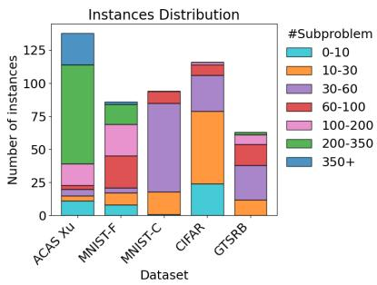  
Fig. 3: Instances distribution

While the original benchmarks typically target local robustness, our evaluation focuses on global robustness, which requires certifying properties over pairs of inputs $( y , \hat { y } )$ over the same network within a bounded domain Ω. To adapt the standard datasets for this relational setting, we formulate the verification instances by defining the domain Ω and the relational bound ε as follows:

• ACAS Xu [3]: Ω is derived directly from the operational envelopes defined in the original benchmark. We fix the relational distance to $\varepsilon = 0 . 1$

• MNIST, CIFAR-10, and GTSRB: The input domain is defined as $\Omega \ = \ \{ x \ | \ \| x - x _ { \mathrm { s e e d } } \| _ { \infty } \ \leq \ i _ { \mathrm { e p s } } / 2 5 6 \}$ and the relational distance as $\varepsilon = d _ { \mathrm { e p s } } / 2 5 6 .$ , where the denominator aligns with pixel values normalized to [0, 1]. For MNIST and CIFAR-10 we evaluate nine $( i _ { \mathrm { e p s } } , d _ { \mathrm { e p s } } )$ $\{ ( 2 , 1 ) , ( 3 , 1 ) , ( 4 , 1 ) , ( 4 , 2 ) , ( 6 , 2 ) , ( 8 , 2 ) , ( 6 , 3 ) , ( 9 , 3 )$ (12, 3)} configurations, spanning a range of perturbation strengths from easy to hard. Since each sub-problem requires much longer time to solve as ε become larger in CIFAR and GTSRB, time limits (1800/3600/7200) are set on each $d _ { \mathrm { e p s } } \ ( 1 / 2 / 3 )$ individually.

These settings cover a wide range of perturbations, ensuring the rigor and fairness of our evaluation. Fig. 3 depicts the distribution of instances across each dataset. This indicates that the selected instances are broadly and evenly distributed, covering a wide and balanced range without bias.

## B. Evaluation Results

## RQ1 Effectiveness of SABRE compared to approximation verifier RaVeN

Table III shows the overall performance comparison between RaVeN and SABRE on various benchmarks and models. In our experiment, we first apply RaVeN and then

TABLE III: RQ1–Comparison with RaVeN
<table><tr><td rowspan="2">Dataset</td><td colspan="2"> $s ^ { \# }$ </td><td colspan="2"> $\mathfrak { p } ^ { \# }$ </td><td colspan="2">∆T (%)</td></tr><tr><td>RaVeN</td><td>SABRE</td><td>RaVeN</td><td>SABRE</td><td>RaVeN</td><td>SABRE</td></tr><tr><td>ACAS Xu</td><td>42</td><td>67</td><td>1</td><td>116.3</td><td>0.79</td><td>20.50</td></tr><tr><td>MNIST-F</td><td>31</td><td>54</td><td>1</td><td>58.6</td><td>0.92</td><td>23.04</td></tr><tr><td>MNIST-C</td><td>23</td><td>27</td><td>1</td><td>25.9</td><td>9.56</td><td>66.07</td></tr><tr><td>CIFAR</td><td>10</td><td>23</td><td>1</td><td>23.5</td><td>2.40</td><td>46.79</td></tr><tr><td>GTSRB</td><td>9</td><td>33</td><td>1</td><td>38.8</td><td>2.22</td><td>39.09</td></tr></table>

SABRE if RaVeN fails to verify the property. Since SABRE is equivalent to RaVeN if a problem can be solved by RaVeN (i.e., the original problem at the root of a BaB tree), the number of solved instances of SABRE is counted only for those that RaVeN could not solve.

From Table III, we can observe that SABRE significantly improves the verification performance compared to RaVeN in terms of the number of solved instances. While SABRE generates more sub-problems and requires additional runtime due to iterative splitting, this additional computational cost is justified by its substantial improvement in the number of successfully verified instances. This result indicates that SABRE effectively enhances the verification capability for global robustness properties by leveraging relational branching strategies.

## RQ2 Neuron splitting: Relational vs. individual

Table IV compares the performance of relational neuron splitting (SABRE) and individual neuron splitting (ClasIS, DualIS) across five benchmarks. We observe that SABRE consistently outperforms both ClasIS and DualIS on ACAS Xu, MNIST-F, MNIST-C, and GTSRB in terms of the number of solved instances $( s ^ { \# } )$ , the number of sub-problems $( \mathtt { p } ^ { \# } )$ and verification time ratio (∆T). For fairness, the time ratio is computed only over instances for which at least one of the approaches successfully completes verification.

On ACAS Xu, SABRE solves 67 instances while DualIS and ClasIS solve only 9 and 12, respectively, completing verification tasks with more than ≈ 30% less number of subproblems by effective splitting and achieving more than a 50% reduction in average time ratio. On MNIST-F, SABRE solves roughly twice as many instances (54 vs. 27 and 23) while reducing the numbers of sub-problems by more than half in both cases and average time from ≈ 76% to 31%. A similar trend appears on MNIST-C, where SABRE verifies 27 instances compared to 8 and 6 for DualIS and ClasIS, with a smaller number of sub-problems (27.5 vs. 33.3 and 32.0) and a lower time ratio (71.37% vs. 90.86% and 89.49%). For GTSRB, SABRE solves 33 instances with a less number of sub-problems and shorter verification time, outperforming DualIS and ClasIS, which solve only 23 and 24 instances, respectively. However, on CIFAR, individual splitting methods outperform SABRE in both solved instances (31 and 28 vs. 23) and time efficiency (68.63% and 71.82% vs. 75.03%).

Fig. 4 confirms that these gains are consistent across the instance distribution: on ACAS Xu, both MNIST, and GT-SRB benchmarks, SABRE’s ∆T concentrates well below the timeout line with a notably lower median, while ClasIS and DualIS accumulate many timeouts; on CIFAR the pattern reverses, consistent with the numbers above. Fig. 5 provides a complementary perspective through cumulative splitlevel circumstances: on ACAS Xu, MNIST-F, and MNIST-C, SABRE’s curve rises more steeply and plateaus higher, indicating that each relational split resolves more instances than an individual split at equivalent depth. For GTSRB, the three approaches perform comparably at small splitting levels. However, as the splitting level increases to 9 and more, SABRE outperforms the other approaches and achieves the largest number of solved instances. On CIFAR, SABRE’s curve rises more slowly, a behavior we analyze below.

TABLE IV: RQ2–Comparison between relational neuron splitting and individual neuron splitting
<table><tr><td rowspan="2">Method</td><td colspan="3">ACAS Xu</td><td colspan="3">MNIST-F</td><td colspan="3">MNIST-C</td><td colspan="3">CIFAR</td><td colspan="3">GTSRB</td></tr><tr><td> $\mathbf { \Lambda } _ { \mathsf { S } } \# \mathbf { \Lambda }$ </td><td> $\boldsymbol { \mathrm { p } } ^ { \# }$ </td><td> $\Delta \mathrm { T }$ </td><td> $\mathbf { \Lambda } _ { \mathsf { S } } \# \mathbf { \Lambda }$ </td><td> $\boldsymbol { \mathrm { p } } ^ { \# }$ </td><td> $\Delta \mathrm { T }$ </td><td> $\mathbf { \Lambda } _ { \mathsf { S } } \# \mathbf { \Lambda }$ </td><td> $\boldsymbol { \mathrm { p } } ^ { \# }$ </td><td> $\Delta \mathrm { T }$ </td><td> $s ^ { \# }$ </td><td> $\boldsymbol { \mathrm { p } } ^ { \# }$ </td><td> $\Delta \mathrm { T }$ </td><td> $s ^ { \# }$ </td><td> $\boldsymbol { \mathrm { p } } ^ { \# }$ </td><td> $\Delta \mathrm { T }$ </td></tr><tr><td>ClasIS</td><td>12</td><td>133.9</td><td>87.51</td><td>23</td><td>135.9</td><td>79.24</td><td>6</td><td>32.0</td><td>89.49</td><td>28</td><td>21.6</td><td>71.82</td><td>24</td><td>50.9</td><td>60.95</td></tr><tr><td>DuallS</td><td>9</td><td>117.3</td><td>89.46</td><td>27</td><td>124.7</td><td>73.22</td><td>8</td><td>33.3</td><td>90.86</td><td>31</td><td>21.4</td><td>68.63</td><td>23</td><td>58.0</td><td>66.83</td></tr><tr><td>SABRE</td><td>67</td><td>83.4</td><td>34.24</td><td>54</td><td>59.9</td><td>30.73</td><td>27</td><td>27.5</td><td>71.37</td><td>23</td><td>28.3</td><td>75.03</td><td>33</td><td>39.6</td><td>50.98</td></tr></table>

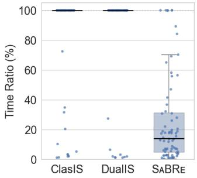

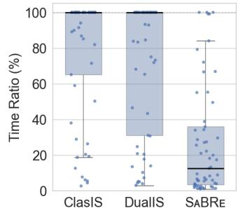

(a) ACAS Xu  
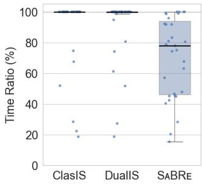  
(c) MNIST-C

(b) MNIST-F  
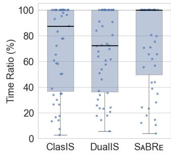  
(d) CIFAR

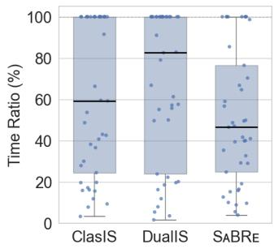  
(e) GTSRB  
Fig. 4: RQ2–Relational splitting (SABRE) vs. individual splitting as verification progresses.

In summary, by relational neuron splitting, SABRE can refine the approximation and verifies the problem more efficiently, compared to individual neuron splitting approaches. This is consistent with our expectation that, although our approach is not complete because of the strategy of splitting relational neurons, this selection also brings higher level of abstraction refinement and thus better performance, which is important to the adoption of verification in practice.

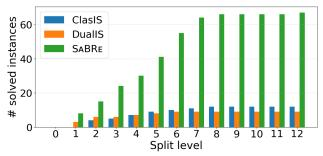

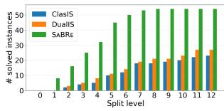  
(b) MNIST-F

(a) ACAS Xu  
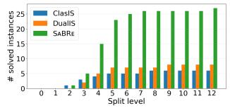

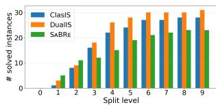

(c) MNIST-C  
(d) CIFAR  
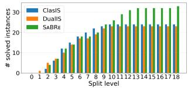  
(e) GTSRB  
Fig. 5: RQ2–Cumulative number of verified instances against split level for each method.

TABLE V: RQ2–Relational neuron splitting vs. individual neuron splitting in CIFAR
<table><tr><td rowspan="3">Method</td><td colspan="3"> $\varepsilon = 1 / 2 5 6$ </td><td colspan="3"> $\varepsilon = 2 / 2 5 6$ </td><td colspan="3"> $\varepsilon = 3 / 2 5 6$ </td></tr><tr><td> $\mathbf { s } ^ { \# }$ </td><td> $\mathtt { p } ^ { \# }$ </td><td> $\Delta \mathrm { T }$ </td><td> $\ l _ { \ l _ { \hat { \tau } } } \#$ </td><td> $\scriptstyle \mathrm { p } ^ { \# }$ </td><td> $\Delta \mathbf { T }$ </td><td> $\ l _ { \mathbb { S } } \#$ </td><td> $\mathsf { p } ^ { \# }$ </td><td> $\Delta \mathrm { T }$ </td></tr><tr><td>ClasIS</td><td>16</td><td>22.1</td><td>56.49</td><td>8</td><td>22.6</td><td>77.34</td><td>4</td><td>19.3</td><td>93.54</td></tr><tr><td>DuallS</td><td>16</td><td>22.3</td><td>56.71</td><td>11</td><td>20.8</td><td>67.03</td><td>4</td><td>21.0</td><td>90.72</td></tr><tr><td>SABRE</td><td>5</td><td>41.2</td><td>87.03</td><td>10</td><td>22.6</td><td>64.55</td><td>8</td><td>15.3</td><td>74.48</td></tr></table>

## Investigation for the performance difference between relational and individual splitting in CIFAR.

Table V presents the comparison of relational and individual splitting under the different ε in CIFAR.

For smaller ε, particularly $\varepsilon \ = \ 1 / 2 5 6$ , individual splitting methods (ClasIS, DualIS) outperform relational splitting (SABRE) in terms of the number of solved instances (16, 16 vs. 5) and time cost (≈ 56.5% vs. 87.03%). However, as ε increases, the performance of relational splitting gradually improves. On $\varepsilon ~ = ~ 2 / 2 5 6$ , relational and individual splitting methods achieve comparable performance, while on $\varepsilon = 3 / 2 5 6$ , relational splitting outperforms individual splitting in both metrics. In contrast to 4 instances where individual splitting approaches achieve, SABRE using relational splitting achieves 8 instances within the shorter time cost.

TABLE VI: RQ3–Performance comparison on different number of dimensional input perturbation. $p \%$ indicates the ratio of the number of input dimensions to add perturbation.
<table><tr><td rowspan="2">Method</td><td colspan="3"> $\mathtt { p 8 } = 0 . 1 2 5$ </td><td colspan="3"> $\mathrm { p } _ { \mathrm { ~ 8 ~ } } ^ { 8 } = 0 . 2 5$ </td><td colspan="3"> $\mathrm { p } _ { 8 } ^ { 8 } = 0 . 5$ </td><td colspan="3"> $\mathrm { p } _ { 8 } ^ { 8 } = 1 . 0$ </td></tr><tr><td> ${ \mathrm { s } } ^ { \# }$ </td><td> $\scriptstyle \mathrm { p } ^ { \# }$ </td><td>∆T</td><td> $\mathbf { s } ^ { \# }$ </td><td> $\mathrm { p } ^ { \# }$ </td><td> $\Delta \mathbf { T }$ </td><td> $\ l _ { \mathbb { S } } \#$ </td><td> $\scriptstyle \mathrm { p } ^ { \# }$ </td><td> $\Delta \mathbf { T }$ </td><td> ${ \mathrm { s } } ^ { \# }$ </td><td> $\mathrm { p } ^ { \# }$ </td><td> $\Delta \mathrm { T }$ </td></tr><tr><td>ClasIS</td><td>39</td><td>31.6</td><td>9.56</td><td>28</td><td>125.6</td><td>37.71</td><td>20</td><td>164.8</td><td>52.62</td><td>15</td><td>144.4</td><td>58.72</td></tr><tr><td>DuallS</td><td>40</td><td>31.6</td><td>9.24</td><td>28</td><td>121.6</td><td>34.91</td><td>18</td><td>152.5</td><td>53.28</td><td>17</td><td>113.4</td><td>49.73</td></tr><tr><td>SABRE</td><td>41</td><td>16.6</td><td>6.89</td><td>40</td><td>38.7</td><td>11.02</td><td>35</td><td>78.0</td><td>27.00</td><td>24</td><td>75.7</td><td>30.01</td></tr></table>

TABLE VII: RQ3–The number of unstable ReLUs in two networks on different $p \%$ . Each cell represents “mean # unstable ReL $\boldsymbol { { \mathrm { J } } } \boldsymbol { { \mathrm { s } } } ^ { , \ast }$ $\prime ~ ^ { 6 4 }$ total Re $\boldsymbol { J } \boldsymbol { s } ^ { \flat }$
<table><tr><td></td><td> $\mathrm { p } _ { \textrm { o } } ^ { \textrm { \tiny { 2 } } } = 0 . 1 2 5$ </td><td> $\mathrm { p } _ { \textrm { o } } ^ { \textrm { \tiny 2 } } = 0 . 2 5$ </td><td> $\mathrm { p } _ { \infty } ^ { \mathrm { q } } = 0 . 5$ </td><td> $\mathrm { p } _ { \infty } ^ { \mathrm { g } } = 1 . 0$ </td></tr><tr><td>Unstable ReLUs</td><td> $1 7 . 2 \ : / \ : 2 0 6 8$ </td><td>36.0 /  2068</td><td>83.4  /  2068</td><td> $4 0 6 . 2 \ : / \ : 2 0 6 8$ </td></tr></table>

These results suggest that relational splitting is less effective when the relational bounds are small, and becomes more effective as the propagated relational bounds increase. This matches the fact that the relational bounds are obtained by propagating input bounds through the network, and thus larger input relational distances produce wider bounds and make relational splitting more effective.

To understand why this performance transition under ε happens only in CIFAR, we further analyze the model characteristics. Although MNIST-C, CIFAR, and GTSRB models share the similar depth and layer structures, we observe that the CIFAR model contains significantly more unstable ReLU neurons $( \mathrm { i . e . , } x _ { j } ^ { ( i ) } < 0 < \overline { { x _ { j } ^ { ( i ) } } } )$ along the reasoning path. These unstable neurons can enlarge the search space and reduce the effectiveness of relational splitting, as each split yields only a small local improvement. Consequently, the refinement from relational splits on the small ε becomes more global and diffuse.

## RQ3 How does the performance of SABRE scale under problems of different complexities?

In this RQ, we investigate how the performances of individual and relational splitting are affected by different factors relevant to problem complexities.

Specifically, we consider the number of perturbed input dimensions as a controllable factor, and vary the number of perturbed input dimensions. We represent different numbers of perturbed input dimensions by p%, i.e., the product of p% and the total number of dimensions. For each p%, we use 45 instances randomly selected from our benchmark set and introduce perturbations to a varying number of input dimensions. The perturbed dimensions are selected randomly.

Table VI presents the performance comparison over different p%. Overall, while the performance of SABRE is comparable to other approaches when $\mathrm { p } _ { \textrm { o } } ^ { \circ } = 0 . 1 2 5$ (especially for $\mathsf { s } ^ { \# } )$ , it is evidently superior to DualIS and ClasIS when $p \%$ increases to a higher level from 0.25 to 1.0, in terms of all metrics $( \mathsf { s } ^ { \# } , \mathsf { p } ^ { \# }$ , and $\Delta \mathrm { T } )$ . For $\mathrm { \Delta p _ { \mathrm { ~ o ~ } } ^ { \circ } = \ 0 . 1 2 5 }$ , although different approaches solve similar numbers of problems, but SABRE performs with lower cost $( 1 6 . 6 \ : \mathrm { o f } \ : \mathrm { p } ^ { \# }$ and 6.89 of $\Delta \mathrm { T } )$ compared to DualIS (31.6 of $\boldsymbol { \mathrm { p } } ^ { \# }$ and 9.24 of $\Delta \mathrm { T } )$ and ClasIS (31.6 of $\mathtt { p } ^ { \# }$ and 9.56 of $\Delta \mathrm { T } )$ . For $\mathrm { \ p _ { \mathrm { ~ o ~ } } ^ { \circ } = \ 0 . 2 5 }$ , compared to 28 instances solved by individual approaches (DualIS and ClasIS), SABRE solved 40 instances. Moreover, SABRE also takes less runtime cost, with 38.7 of $\boldsymbol { \mathrm { p } } ^ { \# }$ and 11.02 of $\Delta \mathrm { T } .$ . For $\mathrm { p } _ { \mathrm { ~ o ~ } } ^ { \mathrm { ~ o ~ } } = 0 . 5 ,$ SABRE outperforms by solving 35 instances with average 78 sub-problems and 27 seconds. In contrast, DualIS and ClasIS respectively solve 18 and 20 with around double runtime cost in terms of both $\boldsymbol { \mathrm { p } } ^ { \# }$ and $\Delta \mathrm { T } .$ . For $\mathrm {  ~ p ~ } _ { \circ } ^ { \circ } = 1 . 0 \ \cdot$ SABRE records 24 solved instances against 17 and 15 of DualIS and ClasIS, respectively. For runtime cost, SABRE takes less effort by ≈ 33% $\boldsymbol { \mathrm { p } } ^ { \# }$ and $\approx 4 0 \% ~ \Delta \mathrm { T }$ . These results demonstrate that, SABRE exhibits consistent and evident performance advantages over the baseline approaches across different numbers of input dimensions, which strengthens the effectiveness of our strategies.

Moreover, in Table VII we also report the numbers of individual and relational unstable ReLUs under the approximation we adopted. As an additional indicator of problem complexity, although we cannot directly control it, we can observe that by increasing the number of input dimensions, the ratio of unstable ReLUs also increase. Therefore, our observations regarding the performance changes with respect to unstable ReLUs ratio, is similar to that with numbers of input dimensions, namely, as ratio of unstable ReLUs increases, our performance advantages are consistent and evident over other approaches.

## RQ4 Performance comparison of neuron selection

Table VIII evaluates the performance of relational neuron selection strategies by comparing our proposed tool SABRE and the RandRS baseline.

The results show that our selection strategy leads to substantial improvements across all benchmarks compared to random selection.

On ACAS Xu, our method solves 67 instances, compared to only 44 solved by random selection, and reduces the subproblem exploration cost by around half and the verification time from 60.35% to 34.24%. On MNIST-F, the number of solved instances increases from 44 to 54, while the number of sub-problems and the average time drops from 117.6 to 67.3 and from 48.11% to 30.73%, respectively. On MNIST-C, our method solves 27 instances, more than double of the 11 solved by random selection, while achieving smaller exploration cost for sub-problems (28.2 vs. 38.7) and a lower time ratio (71.37% vs. 90.43%). On CIFAR, our strategy solves 23 instances compared to only 8 under random selection, and reduces the number of sub-problems from 24.4 to 18 and the verification time from 87.17% to 75.03%. Finally on GTSRB, SABRE achieves 33, which is around 4 times compared to 9 of RandRS. Similar to others, the number of sub-problems and runtime also decrease by ≈ 50 and 50%, respectively.

These results show our selection strategy leads to substantial improvements across all benchmarks compared to random selection, demonstrating that selection strategy plays an important role in relational BaB.

## RQ5 How does SABRE compare in terms of maximum verifiable perturbation?

To demonstrate the usefulness of our approach, we conduct a binary search over ε to obtain the maximum perturbation $\varepsilon ^ { * }$ for each instance and method. The initial search intervals are [0, 1] for ACAS Xu, [0, 12/256] for MNIST, [0, 8/256] for CIFAR, and [0, 12/256] for GTSRB, with a termination tolerance of $1 0 ^ { - 6 }$ . For MNIST and CIFAR, a minimum step size of $1 / 2 5 6$ is enforced to respect pixel-level clamp. We set the time budget for both: a verification step for a single ε and entire process of binary search. The pairs of time (single step(s), entire process(s)) for ACAS Xu, MNIST-F, MNIST-C, CIFAR, and GTSRB are (420, 1200), (600, 2700), (800, 2700), (4000, 18000), and (4000, 18000), respectively.

TABLE VIII: RQ4–Comparison of neuron selection SABRE v.s. RandRS.
<table><tr><td rowspan="2">Method</td><td colspan="3">ACAS Xu</td><td colspan="3">MNIST-F</td><td colspan="3">MNIST-C</td><td colspan="3">CIFAR</td><td colspan="3">GTSRB</td></tr><tr><td> ${ \_ } \#$ </td><td> $\boldsymbol { \mathrm { p } } ^ { \# }$ </td><td> $\Delta \mathrm { T }$ </td><td> $\mathbf { \Lambda } _ { \mathsf { S } } \# \mathbf { \Lambda }$ </td><td> $\boldsymbol { \mathrm { p } } ^ { \# }$ </td><td> $\Delta \mathrm { T }$ </td><td> $s ^ { \# }$ </td><td> $\boldsymbol { \mathrm { p } } ^ { \# }$ </td><td> $\Delta \mathrm { T }$ </td><td> $\mathbf { \Lambda } _ { \mathsf { S } } \# \mathbf { \Lambda }$ </td><td> $\boldsymbol { \mathrm { p } } ^ { \# }$ </td><td> $\Delta \mathrm { T }$ </td><td> $s ^ { \# }$ </td><td> $\boldsymbol { \mathrm { p } } ^ { \# }$ </td><td> $\Delta \mathrm { T }$ </td></tr><tr><td>RandRS</td><td>44</td><td>199.2</td><td>60.35</td><td>44</td><td>117.6</td><td>48.11</td><td>11</td><td>38.7</td><td>90.43</td><td>8</td><td>24.4</td><td>87.17</td><td>9</td><td>92.5</td><td>86.60</td></tr><tr><td>SABRE</td><td>67</td><td>100.8</td><td>34.24</td><td>54</td><td>67.3</td><td>30.73</td><td>27</td><td>28.2</td><td>71.37</td><td>23</td><td>18.0</td><td>75.03</td><td>33</td><td>35.5</td><td>39.09</td></tr></table>

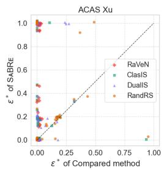

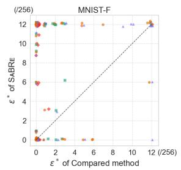

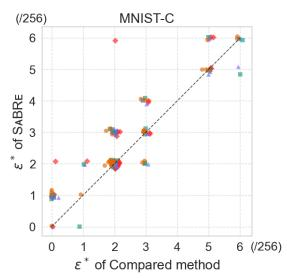

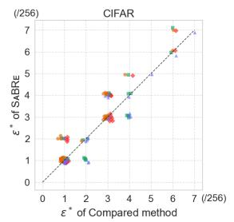

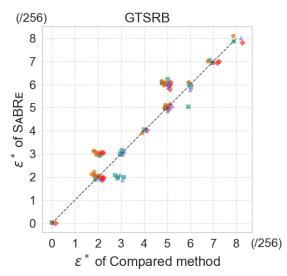  
Fig. 6: RQ5–Maximum verifiable relational input distance $( \varepsilon ^ { * }$ obtained by binary search. Each point is one instance, where the x-axis is the compared method’s $\varepsilon ^ { * }$ and the y-axis is $\mathrm { S A B R E } ^ { \prime } \mathrm { s } .$ . Points above the diagonal indicate $\operatorname { S A B R E }$ certifies a larger perturbation region.

<table><tr><td></td><td>RaVeN</td><td>ClasIS</td><td>DuallS</td><td>RandRS</td><td>SABRE</td></tr><tr><td>RaVeN</td><td>0</td><td>-0.17</td><td>-0.27</td><td>-0.29</td><td>-0.38</td></tr><tr><td>ClasIS</td><td>0.17</td><td>0</td><td>0.02</td><td>-0.24</td><td>-0.31</td></tr><tr><td>DuallS</td><td>0.27</td><td>-0.02</td><td>0</td><td>-0.17</td><td>-0.34</td></tr><tr><td>RandRS</td><td>0.29</td><td>0.24</td><td>0.17</td><td>0</td><td>-0.26</td></tr><tr><td rowspan="2">SABRE</td><td>0.38</td><td>0.31</td><td>0.34</td><td>0.26</td><td>0</td></tr><tr><td colspan="3">-0.4 -0.2 0.0</td><td>0.2</td><td>0.4</td></tr></table>

Fig. 7: RQ5–Pairwise effect size (Cohen’s d) aggregated across all datasets. Positive values favour the row method.

SABRE consistently achieves the largest certifiable perturbation region across the majority of instances, with the advantage being largest on ACAS Xu and MNIST-F with the same time budget. As shown in Fig. 6, on these two benchmarks a substantial fraction of points lie on the vertical axis, where all competing methods return $\varepsilon ^ { * } ~ = ~ 0$ while SABRE produces non-zero bounds. This reflects a qualitative advantage: other methods fail to certify any non-trivial perturbation within the time budget, whereas SABRE still produces meaningful bounds and manages to complete the relational verification task. On MNIST-C, the dominance of SABRE is more uniform, with most points lying above the diagonal line. The CIFAR plot reveals a more nuanced picture: SABRE dominates RaVeN or RandRS and records equivalent performance overall against DualIS. For ClasIS, SABRE reaches larger $\varepsilon ^ { * } = 5 / 2 5 6$ and $\varepsilon ^ { * } = 7 / 2 5 6$ , but in total, achieves one less instances with larger $\varepsilon ^ { * }$ . On GTSRB, SABRE consistently outperforms RaVeN and RandRS. Compared to DualIS, SABRE manages to find larger $\varepsilon ^ { * }$ in 5 instances, while it loses in 2 instances. Compared to ClasIS, SABRE shows similar results in terms of the number of instances with higher values, specifically, in 5 instances SABRE manages to find larger $\varepsilon ^ { * }$ while in 5 instances SABRE fails. While we observe the instances where ClasIS achieves higher certifiable value, i.e., the instances whose $\varepsilon ^ { * } = 3 / 2 5 6$ by ClasIS, we also observe the instance where SABRE wins, such as the instances whose $\varepsilon ^ { * } = 6 / 2 5 6$ by SABRE.

To compare different approaches more rigorously, we apply statistical analysis to analyze the results. As shown in Fig. 7, SABRE holds a consistent advantage over all baselines, with moderate effect sizes ranging from $d \ = \ 0 . 2 6$ to $\textit { d } \ = \ 0 . 3 8$ . Here, each cell reports statistical Cohen’s d [28] computed over the per-instance $\varepsilon ^ { * }$ values, where a positive value indicates that the row method achieves larger certifiable perturbation regions on average. The fact that these gains are stable across five benchmarks spanning different architectures and data domains suggests that the benefit of relational neuron splitting is not tied to any particular network type or perturbation regime.

## VI. RELATED WORK

Verification against local robustness. Neural network verification against local robustness has been extensively studied [3], [4], [6], [29]–[33] and approximated methods are often preferable thanks to their efficiency [34]–[38]. While approximation methods contributes to the scalability, they may raise false alarms due to the completeness issue. To tackle this issue, studies [5], [7], [8], [13]–[16] strike a balance between efficiency and completeness by incorporating with BaB as discussed in §III-A.

Relational verification. This is an emerging topic and the related research still remains at an early stage. Nevertheless, existing research has investigated both exact methods [23] and approximation methods [11], [12], [39]. As exact methods are exhaustive and suffer from scalable issues, we consider approximation methods in our evaluation. As discussed in §II-B, RaVeN provides a systematic approximate bounding approach called DiffPoly. It enables the tighter linear relaxation based on the pre-activation states of individual and relational neurons. However, analogous to the verification against local robustness, approximation approaches including RaVeN suffer from the completeness issue. To address it, RABBit [17] integrates BaB into the relational verification, but its strategy of selecting and splitting individual neurons can bring suboptimal performance when applied in our settings (global robustness), as we show in our evaluation in §V. In comparison to individual neuron splitting, we explore the strategy of relational splitting that aims to directly split relational neurons and effectively reduce the over-approximation on the relational bounds.

Differential/Incremental verification. Several verification settings involve reasoning about multiple network executions but differ from relational verification in key aspects. Differential verification [40]–[42] certifies two distinct networks produce similar outputs on the same input. Incremental verification [43]–[46] reuses intermediate results from verifying an original network to accelerate verification of its updated (i.e., fine-tuned) variant. In contrast, relational verification considers two identical networks and certifies output consistency across different inputs, and our work refines this overapproximation reasoning directly via relational neuron splitting.

## VII. CONCLUSION AND FUTURE WORK

We presented SABRE, a BaB framework for relational neural network verification that splits relational neurons rather than individual neurons, paired with a neuron selection strategy based on dual problem formulation of the relational neuron propagation. Our evaluation on 817 instances across ACAS Xu, MNIST, CIFAR, and GTSRB demonstrates that relational neuron splitting consistently outperforms individual neuron splitting, and that the dual-based selection strategy provides reliable guidance for prioritizing which relational neuron to split at each step. Together, these designs enable SABRE to certify larger perturbation regions and resolve more verification instances within the time budget than existing approaches on most benchmarks.

As future work, we plan to investigate more refined splitting strategies to achieve tighter relational bounds and design neuron selection heuristic to further improve the efficiency and scalability of verification. Moreover, for problem splitting, our current approach selects relational neurons exclusively without considering individual neurons. While it is possible to consider both individual and relational neurons simultaneously, it introduces a non-trivial question about when we should select individual neurons and when we switch back to relational neurons. A possible solution could be based on our dual formulation, in which both individual and relational neurons are involved, however, more algorithmic details require more sophisticated design and comprehensive evaluation.

## REFERENCES

[1] B. Biggio, I. Corona, D. Maiorca, B. Nelson, N. Srndiˇ c, P. Laskov,´ G. Giacinto, and F. Roli, “Evasion attacks against machine learning at test time,” in Joint European conference on machine learning and knowledge discovery in databases. Springer, 2013, pp. 387–402.

[2] I. J. Goodfellow, J. Shlens, and C. Szegedy, “Explaining and harnessing adversarial examples,” in ICLR’15. San Diego, CA, United States: Int. Conf. on Learning Representations, ICLR, 2015.

[3] G. Katz, C. Barrett, D. L. Dill, K. Julian, and M. J. Kochenderfer, “Reluplex: An efficient SMT solver for verifying deep neural networks,” in Computer Aided Verification, R. Majumdar and V. Kuncak, Eds.ˇ Springer Int. Publishing, 2017, pp. 97–117.

[4] X. Huang, M. Kwiatkowska, S. Wang, and M. Wu, “Safety verification of deep neural networks,” in Computer Aided Verification: 29th Int. Conf., CAV 2017, Part I 30. Springer, July 2017, pp. 3–29.

[5] P. Henriksen and A. Lomuscio, “Deepsplit: An efficient splitting method for neural network verification via indirect effect analysis.” in IJCAI, 2021, pp. 2549–2555.

[6] G. Singh, T. Gehr, M. Puschel, and M. Vechev, “An abstract domain for¨ certifying neural networks,” ACM on Programming Languages, vol. 3, no. POPL, pp. 1–30, 2019.

[7] R. Bunel, P. Mudigonda, I. Turkaslan, P. Torr, J. Lu, and P. Kohli, “Branch and bound for piecewise linear neural network verification,” Journal of Machine Learning Research, vol. 21, no. 2020, 2020.

[8] S. Wang, H. Zhang, K. Xu, X. Lin, S. Jana, C.-J. Hsieh, and J. Z. Kolter, “Beta-crown: Efficient bound propagation with per-neuron split constraints for neural network robustness verification,” Neurips, vol. 34, pp. 29 909–29 921, 2021.

[9] G. Singh, T. Gehr, M. Mirman, M. Puschel, and M. Vechev, “Fast and¨ effective robustness certification,” in Advances in Neural Information Processing Systems, vol. 31, 2018.

[10] Z. Zhang, D. Lyu, P. Arcaini, L. Ma, I. Hasuo, and J. Zhao, “Falsifai: Falsification of ai-enabled hybrid control systems guided by time-aware coverage criteria,” IEEE TSE, vol. 49, no. 4, pp. 1842–1859, 2022.

[11] Z. Wang, C. Huang, and Q. Zhu, “Efficient global robustness certification of neural networks via interleaving twin-network encoding,” in DATE 2022. European Design and Automation Association, 2022, p. 1087–1092.

[12] D. Banerjee, C. Xu, and G. Singh, “Input-relational verification of deep neural networks,” Proceedings of the ACM on Programming Languages, vol. 8, no. PLDI, pp. 1–27, 2024.

[13] A. De Palma, R. Bunel, A. Desmaison, K. Dvijotham, P. Kohli, P. H. Torr, and M. P. Kumar, “Improved branch and bound for neural network verification via lagrangian decomposition,” arXiv preprint arXiv:2104.06718, 2021.

[14] Z. Shi, Q. Jin, Z. Kolter, S. Jana, C.-J. Hsieh, and H. Zhang, “Neural network verification with branch-and-bound for general nonlinearities,” in TACAS 2025. Springer, 2025, pp. 315–335.

[15] J. Lu and M. P. Kumar, “Neural network branching for neural network verification,” CoRR, vol. abs/1912.01329, 2019.

[16] C. Ferrari, M. N. Mueller, N. Jovanovic, and M. Vechev, “Complete´ verification via multi-neuron relaxation guided branch-and-bound,” in International Conference on Learning Representations, 2022.

[17] T. Suresh, D. Banerjee, and G. Singh, “Relational verification leaps forward with RABBit,” Advances in Neural Information Processing Systems, vol. 37, pp. 123 328–123 352, 2024.

[18] C. Liu, T. Arnon, C. Lazarus, C. Strong, C. Barrett, M. J. Kochenderfer et al., “Algorithms for verifying deep neural networks,” Foundations and Trends® in Optimization, vol. 4, no. 3-4, pp. 244–404, 2021.

[19] P. Yang, R. Li, J. Li, C.-C. Huang, J. Wang, J. Sun, B. Xue, and L. Zhang, “Improving neural network verification through spurious region guided refinement,” in Int. Conf. on Tools and Algorithms for the Construction and Analysis of Systems. Springer, 2021, pp. 389–408.

[20] G. Anderson, S. Pailoor, I. Dillig, and S. Chaudhuri, “Optimization and abstraction: a synergistic approach for analyzing neural network robustness,” in PLDI 2019, 2019, pp. 731–744.

[21] Z. Zhao, Y. Zhang, G. Chen, F. Song, T. Chen, and J. Liu, “Cleverest: accelerating cegar-based neural network verification via adversarial attacks,” in International Static Analysis Symposium. Springer, 2022, pp. 449–473.

[22] M. R. Clarkson and F. B. Schneider, “Hyperproperties,” Journal of Computer Security, vol. 18, no. 6, pp. 1157–1210, 2010.

[23] X. Xie, F. Zhang, X. Hu, and L. Ma, “Deepgemini: verifying dependency fairness for deep neural network,” in AAAI, vol. 37, no. 12, 2023, pp. 15 251–15 259.

[24] E. Wong and Z. Kolter, “Provable defenses against adversarial examples via the convex outer adversarial polytope,” in Int. Conf. on Machine Learning. PMLR, 2018, pp. 5286–5295.

[25] K. Fukuda, Z. Zhang, G. Zhang, and J. Zhao, “Artifact for the paper “Branch and Bound for Relational Verification of Neural Networks”,” 2026. [Online]. Available: https://doi.org/10.5281/zenodo.21536550

[26] Gurobi Optimization, LLC, “Gurobi Optimizer Reference Manual,” 2023. [Online]. Available: https://www.gurobi.com

[27] C. Brix, S. Bak, T. T. Johnson, and H. Wu, “The fifth international verification of neural networks competition (vnn-comp 2024): Summary and results,” arXiv preprint arXiv:2412.19985, 2024.

[28] J. Cohen, Statistical power analysis for the behavioral sciences. routledge, 2013.

[29] V. Tjeng, K. Y. Xiao, and R. Tedrake, “Evaluating robustness of neural networks with mixed integer programming,” in ICLR, 2018.

[30] R. Ehlers, “Formal verification of piece-wise linear feed-forward neural networks,” in ATVA 2017. Springer, Oct. 2017, pp. 269–286.

[31] C. Muller, G. Singh, M. P ¨ uschel, and M. T. Vechev, “Neural network¨ robustness verification on gpus,” CoRR, abs/2007.10868, 2020.

[32] S. Wang, K. Pei, J. Whitehouse, J. Yang, and S. Jana, “Efficient formal safety analysis of neural networks,” Advances in neural information processing systems, vol. 31, 2018.

[33] Z. Shi, Y. Wang, H. Zhang, J. Z. Kolter, and C.-J. Hsieh, “Efficiently computing local lipschitz constants of neural networks via bound propagation,” Advances in Neural Information Processing Systems, vol. 35, pp. 2350–2364, 2022.

[34] R. Anderson, J. Huchette, C. Tjandraatmadja, and J. Vielma, “Strong convex relaxations and mixed-integer programming formulations for trained neural networks (2018),” 1811.

[35] C. Tjandraatmadja, R. Anderson, J. Huchette, W. Ma, K. K. Patel, and J. P. Vielma, “The convex relaxation barrier, revisited: Tightened singleneuron relaxations for neural network verification,” Advances in Neural Information Processing Systems, vol. 33, pp. 21 675–21 686, 2020.

[36] G. Singh, R. Ganvir, M. Puschel, and M. Vechev, “Beyond the single¨ neuron convex barrier for neural network certification,” Neurips, vol. 32, 2019.

[37] M. N. Muller, G. Makarchuk, G. Singh, M. P¨ uschel, and M. Vechev,¨ “Prima: general and precise neural network certification via scalable convex hull approximations,” ACM on Programming Languages, vol. 6, no. POPL, pp. 1–33, 2022.

[38] A. Raghunathan, J. Steinhardt, and P. S. Liang, “Semidefinite relaxations for certifying robustness to adversarial examples,” Neurips 2018, vol. 31, 2018.

[39] D. Banerjee and G. Singh, “Relational dnn verification with cross executional bound refinement,” in Proceedings of the 41st International Conference on Machine Learning, 2024, pp. 2779–2807.

[40] B. Paulsen, J. Wang, J. Wang, and C. Wang, “Neurodiff: scalable differential verification of neural networks using fine-grained approximation,” in ASE 2020, 2020, pp. 784–796.

[41] B. Paulsen, J. Wang, and C. Wang, “Reludiff: Differential verification of deep neural networks,” in ACM/IEEE 42nd Int. Conf. on Software Engineering, 2020, pp. 714–726.

[42] S. Teuber, P. Kern, M. Janzen, and B. Beckert, “Revisiting differential verification: Equivalence verification with confidence,” in TACAS 2025. Springer, 2025, pp. 257–278.

[43] M. Fischer, C. Sprecher, D. I. Dimitrov, G. Singh, and M. Vechev, “Shared certificates for neural network verification,” in CAV 2022. Springer, 2022, pp. 127–148.

[44] S. Ugare, G. Singh, and S. Misailovic, “Proof transfer for fast certification of multiple approximate neural networks,” ACM on Programming Languages, vol. 6, no. OOPSLA1, pp. 1–29, 2022.

[45] S. Ugare, D. Banerjee, S. Misailovic, and G. Singh, “Incremental verification of neural networks,” ACM on Programming Languages, vol. 7, no. PLDI, pp. 1920–1945, 2023.

[46] G. Zhang, Z. Zhang, H. D. Bandara, S. Chen, J. Zhao, and Y. Sui, “Efficient incremental verification of neural networks guided by counterexample potentiality,” Proceedings of the ACM on Programming Languages, vol. 9, no. OOPSLA1, pp. 85–112, 2025.

## APPENDIX A DUAL FORMULATION FOR RELU SELECTION IN CLASSIC BAB

Before presenting the dual formulation for individual networks, we first summarize the symbolic propagation for linear and ReLU layers for individual networks.

## Linear

$$
\scriptstyle { x ^ { ( i + 1 ) } = W ^ { ( i ) } y ^ { ( i ) } + b ^ { ( i ) } , \forall i \in \{ 0 , . . . , L - 1 \} }
$$

ReLU

$$
\begin{array} { r l } & { y _ { j } ^ { ( i ) } = 0 , \forall i \in \{ 1 , . . . , L - 1 \} , j \in \mathcal { T } _ { i } ^ { - } } \\ & { y _ { j } ^ { ( i ) } = x _ { j } ^ { ( i ) } , \forall i \in \{ 1 , . . . , L - 1 \} , j \in \mathcal { T } _ { i } ^ { + } } \\ & { y _ { j } ^ { ( i ) } \geq \alpha _ { j } ^ { ( i ) } x _ { j } ^ { ( i ) } } \\ & { ( \overline { { x _ { j } ^ { ( i ) } } } - \underline { { x _ { j } ^ { ( i ) } } } ) y _ { j } ^ { ( i ) } - ( \overline { { x _ { j } ^ { ( i ) } } } x _ { j } ^ { ( i ) } - \overline { { x _ { j } ^ { ( i ) } } } \underline { { x _ { j } ^ { ( i ) } } } ) { \leq } 0 \displaystyle \int j \in \mathcal { T } _ { i } ^ { \pm } } \end{array}\tag{13}
$$

where $\alpha _ { j } ^ { ( i ) } ~ \in ~ [ 0 , 1 ]$ handles the slope of lower bound of ReLU relaxation. $\mathcal { T } ^ { - } , \mathcal { T } ^ { + }$ , and $\mathcal { T } ^ { \pm }$ are sets of indexes, representing the pre-activation states of $\boldsymbol { x } _ { j } ^ { ( i ) }$ in layer i where $\overline { { x _ { j } ^ { ( i ) } } } \leq 0 , x _ { j } ^ { ( i ) } \geq 0 ,$ , or $x _ { j } ^ { ( i ) } < 0 < \overline { { x _ { j } ^ { ( i ) } } }$ , respectively.

a) Dual Formulation for Individual Networks: In local robustness verification, the output comparison is typically encoded by an objective vector C for the output vector $\boldsymbol { y } ^ { ( L ) } \in \mathbb { R } ^ { m }$ and given two output dimensions i and $j \colon$

$$
\begin{array} { r l } { \operatorname* { m i n } } & { { } y _ { i } ^ { ( L ) } - y _ { j } ^ { ( L ) } = C y ^ { ( L ) } } \end{array}\tag{14}
$$

where $y _ { i } ^ { ( L ) } \in \mathbb { R }$ denotes i-th dimensional output of the network. This minimization of output difference is converted into maximization dual objective:

$$
\begin{array} { r l } & { \operatorname* { m a x } } \\ & { \quad \quad - ( y + \varepsilon ) ^ { T } [ \mathcal { B } ^ { ( 0 ) } ] _ { - } + ( y - \varepsilon ) ^ { T } [ \mathcal { B } ^ { ( 0 ) } ] _ { + } } \\ & { \quad \quad - { \displaystyle \sum _ { i = 0 } ^ { L - 1 } } A ^ { ( i + 1 ) T } b ^ { ( i ) } + { \displaystyle \sum _ { i = 1 } ^ { L - 1 } } { \displaystyle \sum _ { j } } \frac { \overline { { x _ { j } ^ { ( i ) } } } \underline { { x _ { j } ^ { ( i ) } } } } { \overline { { x _ { j } ^ { ( i ) } } } - \overline { { x _ { j } ^ { ( i ) } } } } [ \mathcal { B } _ { j } ^ { ( i ) } ] _ { + } } \end{array}\tag{15}
$$

where

$$
\begin{array} { r l } & { \begin{array} { l l l } { \cdots } & { \cdots } & \\ { B ^ { ( i ) } = W ^ { ( i ) T } A ^ { ( i + 1 ) } } & { \forall i \in \{ L - 1 , . . . , 0 \} } \\ & { \forall i \in \{ \begin{array} { l l l } { 0 } & { \mathrm { ~ i f ~ } } & { \overline { { x _ { j } ^ { ( i ) } } } \leq 0 } \\ { B _ { j } ^ { ( i ) } } & { \mathrm { ~ i f ~ } } & { 0 \leq \underline { { x _ { j } ^ { ( i ) } } } } \end{array} } \\ & { \begin{array} { l l l } { \underline { { \overline { { x _ { j } ^ { ( i ) } } } } } } & { \qquad \mathrm { ~ i f ~ } } & { \underline { { x _ { j } ^ { ( i ) } } } < 0 < \overline { { x _ { j } ^ { ( i ) } } } } \\ { \overline { { x _ { j } ^ { ( i ) } } } - \underline { { x _ { j } ^ { ( i ) } } } } & { \qquad \mathrm { ~ i f ~ } } & { \underline { { x _ { j } ^ { ( i ) } } } < 0 < \overline { { x _ { j } ^ { ( i ) } } } } \end{array} } \\ & { \forall i \in \{ L - 1 , . . . , 1 \} } \end{array} } \end{array}\tag{16}
$$

Here,

$\mathcal { A } ^ { ( i ) } , B ^ { ( i ) }$ are dual variables associated with the affine and activation constraints in the dual network,

$$
\bullet \ [ z ] _ { - } = \operatorname* { m a x } ( 0 , - z ) , \ [ z ] _ { + } = \operatorname* { m a x } ( 0 , z )
$$

This dual formulation can be derived by following the same flow in Appendix C.

b) Split Impact Estimation in BaBSR: For an unstable neuron $y _ { j } ^ { ( i ) }$ , BaBSR estimates how much the objective bound would improve if this neuron is split.

Let $\mathcal { A } _ { j } ^ { ( i ) }$ denote the dual variable before splitting, and let $\mathcal { A } _ { j } ^ { \prime ( i ) }$ denote the dual variable after imposing the split constraint on one branch (either active or inactive). When a split is performed, the ReLU relaxation for $y _ { j } ^ { ( i ) }$ is replaced by an exact constraint corresponding to the chosen branch. As a result, the linear relaxation constraints of the ReLU transformation are removed. Accordingly, the dual variable $\mathcal { A } _ { j } ^ { ( i ) }$ is updated by following the dual backpropagation rule (Eq. 16) under the selected branch. More concretely, $\mathcal { A } _ { j } ^ { \prime ( i ) }$ becomes either 0 or $B _ { j } ^ { ( i ) }$ , depending on whether the neuron is fixed to the inactive or active, respectively.

Because the relaxation constraints are removed after splitting, the last term in the dual objective (Eq. 15) corresponding to the ReLU relaxation becomes zero.

$$
\frac { \overline { { x _ { j } ^ { ( i ) } } } \underline { { x _ { j } ^ { ( i ) } } } } { \overline { { x _ { j } ^ { ( i ) } } } - \underline { { x _ { j } ^ { ( i ) } } } } [ \mathcal { B } _ { j } ^ { ( i ) } ] _ { + } = 0\tag{17}
$$

Therefore, the change in the dual objective can be estimated by substituting $\mathcal { A } _ { j } ^ { \prime ( i ) }$ into the dual objective and measuring the resulting difference. By considering the second line of the dual objective in Eq. 15, the estimated improvement caused by splitting neuron $\bar { y } _ { j } ^ { ( i ) }$ can be expressed as:

$$
\Big ( \mathcal { A } _ { j } ^ { ( i ) } - \mathcal { A } _ { j } ^ { \prime ( i ) } \Big ) b _ { j } ^ { ( i - 1 ) } + \frac { \overline { { x _ { j } ^ { ( i ) } } } \underline { { x _ { j } ^ { ( i ) } } } } { \overline { { x _ { j } ^ { ( i ) } } } - \underline { { x _ { j } ^ { ( i ) } } } } [ B _ { j } ^ { ( i ) } ] _ { + }\tag{18}
$$

## APPENDIX B DiffPoly: RELU TRANSFORMATION IN RELATIONAL SETTING

As described in § II-B, relational bounds are propagated symbolically layer by layer. Table IX and X summarize the conditional approximate symbolic bound propagation rules at ReLU implemented in DiffPoly (RaVeN [12]). In both tables, the first column shows the conditional case, the second column shows its symbolic lower and upper bound. We denote them $\Delta y _ { j , L } ^ { ( i ) }$ and $\Delta \dot { y } _ { j , U } ^ { ( i ) }$ , respectively. $\tau , { \bar { \tau } } .$ , and $\mathcal { T } ^ { \Delta }$ are the sets of indices j grouped according to the pre-activation states of $x _ { j } ^ { ( i ) } , \hat { x } _ { j } ^ { ( i ) }$ , and $\Delta x _ { j } ^ { ( i ) } \ ( \mathrm { e . g . , \it j \in \widehat { Z } _ { i } ^ { \pm } \ i f \ } \hat { x } _ { j } ^ { ( i ) } < 0 < \overline { { \hat { x } _ { j } ^ { ( i ) } } } )$

The detailed case analysis over the pre-activation states of $y , \ { \hat { y } }$ , and the relational neuron $\Delta y$ enables a more precise approximation of the nonlinear ReLU transformation and significantly reduces relaxation looseness during bounds propagation.

<table><tr><td>Case</td><td>Symbolic bounds for  $\Delta y _ { j } ^ { ( i ) }$ </td></tr><tr><td> $j \in \mathcal { T } _ { i } ^ { - } \cap \widehat { \mathcal { T } } _ { i } ^ { - }$ </td><td> $\Delta y _ { j , L } ^ { ( i ) } = 0 , \ \Delta y _ { j , U } ^ { ( i ) } = 0$ </td></tr><tr><td> $j \in \mathcal { T } _ { i } ^ { + } \cap \widehat { \mathcal { L } } _ { i } ^ { - }$ </td><td> $\Delta y _ { j , L } ^ { ( i ) ^ { \prime } } = x _ { j } ^ { ( i ) } , \Delta y _ { j , U } ^ { ( i ) } = x _ { j } ^ { ( i ) }$ </td></tr><tr><td> $j \in \mathcal { T } _ { i } ^ { - } \cap \widehat { \mathcal { T } } _ { i } ^ { + }$ </td><td> $\Delta y _ { j , L } ^ { ( i ) ^ { \prime } } = - \hat { x } _ { j } ^ { \overline { { ( i ) } } } , \Delta y _ { j , U } ^ { \overline { { ( i ) } } } = - \hat { x } _ { j } ^ { ( i ) }$ </td></tr><tr><td> $j \in \mathcal { T } _ { i } ^ { + } \cap \widehat { \mathcal { T } } _ { i } ^ { + }$ </td><td> $\Delta y _ { j , L } ^ { ( i ) } = \Delta x _ { j } ^ { ( i ) } , \Delta y _ { j , U } ^ { ( i ) } = \Delta x _ { j } ^ { ( i ) }$ </td></tr><tr><td> $j \in \mathcal { T } _ { i } ^ { \pm } \cap \widehat { \mathcal { T } } _ { i } ^ { - }$ </td><td> $\Delta y _ { j , L } ^ { ( i ) } = y _ { L } , \Delta y _ { j , U } ^ { ( i ) } = y _ { U }$ </td></tr><tr><td> $j \in \mathcal { T } _ { i } ^ { - } \cap \widehat { \mathcal { T } } _ { i } ^ { \pm }$ </td><td> $\Delta y _ { j , L } ^ { ( i ) } = - \hat { y } _ { U } , \ \Delta y _ { j , U } ^ { ( i ) } = - \hat { y } _ { L }$ </td></tr><tr><td> $j \in \mathcal { T } _ { i } ^ { \pm } \cap \widehat { \mathcal { T } } _ { i } ^ { + }$ </td><td> $\Delta y _ { j , L } ^ { ( i ) } = y _ { L } - \hat { x } _ { j } ^ { ( i ) } , \Delta y _ { j , U } ^ { ( i ) } = y _ { U } - \hat { x } _ { j } ^ { ( i ) }$ </td></tr></table>

TABLE IX: Systematic ReLU symbolic propagation of relational neuron $\dot { \Delta } y _ { j } ^ { ( i ) }$ based on the states of y and $\hat { y }$

<table><tr><td>Case</td><td>Symbolic bounds for  $\Delta y _ { j } ^ { ( i ) }$ </td></tr><tr><td> $j \in \mathcal { I } _ { i } ^ { \Delta + }$   $j \in \mathcal { I } _ { i } ^ { \Delta - }$ </td><td> $\Delta y _ { j , L } ^ { ( i ) } = 0 , \Delta y _ { j , U } ^ { ( i ) } = \Delta x _ { j } ^ { ( i ) }$   $\Delta y _ { j , L } ^ { ( i ) } = \Delta x _ { j } ^ { ( i ) } , \Delta y _ { j , U } ^ { ( i ) } \underline { { = 0 } }$ </td></tr><tr><td></td><td> $\Delta y _ { j , L } ^ { ( i ) } = \frac { - \Delta x _ { j } ^ { ( i ) } ( \Delta x _ { j } ^ { ( i ) } - \overline { { \Delta x _ { j } ^ { ( i ) } } } ) } { \overline { { \Delta x _ { j } ^ { ( i ) } } } - \underline { { \Delta x _ { j } ^ { ( i ) } } } } ,$ </td></tr><tr><td> $j \in \mathcal { I } _ { i } ^ { \Delta \pm }$  ∆y</td><td>∆xj (i) (∆x (i) 一 ∆x (i) (i) j j j,U ∆x (i) ∆x (i)</td></tr></table>

TABLE X: Systematic ReLU symbolic propagation of relational neuron $\left. \Delta y _ { j } ^ { ( i ) } \right.$ based on the states of $\Delta x _ { j } ^ { ( i ) }$

These propagation rules form the basis for the dual formulation in the relational setting, which we introduce in the following appendix C.

## APPENDIX C DUAL FORMULATION IN RELATIONAL SETTING

In this section we derive Dual formulation for relational setting in § IV-B. We proceed the derivation on one representative ReLU case: $j \in \mathcal { T } _ { i } ^ { \pm } \cap \widehat { \mathcal { T } } _ { i } ^ { - }$ , but all other cases follow it analogously.

## A. Primal problem

The relational verification objective can be expressed as the minimization of the output relational distance between two networks by taking a one-hot vector C, such as:

$$
\begin{array} { r l } { \operatorname* { m i n } } & { \Delta y _ { \ell } ^ { ( L ) } { = } y _ { \ell } ^ { ( L ) } { - } \hat { y } _ { \ell } ^ { ( L ) } } \\ & { { = } C { \cdot } \Delta y ^ { ( L ) } } \end{array}\tag{19}
$$

The constraints corresponding to inputs, affine transformations and ReLU transformation for individual neurons are

$$
\begin{array} { r l } & { \mathbb { E } _ { \rho } ^ { ( k ) } ( \mathbf { x } , \mathbf { u } ) \cdot \mathbf { u } ^ { \rho } ( \mathbf { x } , \mathbf { u } ) } \\ & { \quad \times \left( \mathbf { x } ^ { \rho } + \mathbf { x } ^ { \rho } \right) } \\ & { \quad \times \left( \mathbf { x } ^ { \rho } + \mathbf { x } ^ { \rho } \right) } \\ & { \quad \times \left( \mathbf { x } ^ { \rho } + \mathbf { x } ^ { \rho } \right) } \\ & { \quad \times \left( \mathbf { x } ^ { \rho } + \mathbf { x } ^ { \rho } \right) } \\ & { \quad \times \left( \mathbf { x } ^ { \rho } + \mathbf { x } ^ { \rho } \right) } \\ & { \quad \times \left( \mathbf { x } ^ { \rho } + \mathbf { x } ^ { \rho } \right) } \\ & { \quad \times \left( \mathbf { x } ^ { \rho } + \mathbf { x } ^ { \rho } \right) } \\ & { \quad \times \left( \mathbf { x } ^ { \rho } + \mathbf { x } ^ { \rho } \right) } \\ & { \quad \times \left( \mathbf { x } ^ { \rho } + \mathbf { x } ^ { \rho } \right) } \\ & { \quad \times \left( \mathbf { x } ^ { \rho } + \mathbf { x } ^ { \rho } \right) } \\ & { \quad \times \left( \mathbf { x } ^ { \rho } + \mathbf { x } ^ { \rho } \right) } \\ & { \quad \times \left( \mathbf { x } ^ { \rho } + \mathbf { x } ^ { \rho } \right) } \\ & { \quad \times \left( \mathbf { x } ^ { \rho } + \mathbf { x } ^ { \rho } \right) } \\ & { \quad \times \left( \mathbf { x } ^ { \rho } + \mathbf { x } ^ { \rho } \right) } \\ & { \quad \times \left( \mathbf { x } ^ { \rho } + \mathbf { x } ^ { \rho } \right) } \\ & { \quad \times \left( \mathbf { x } ^ { \rho } + \mathbf { x } ^ { \rho } \right) } \\ & { \quad \times \left( \mathbf { x } ^ { \rho } + \mathbf { x } ^ { \rho } \right) } \\ &  \quad \times \left( \mathbf { x } ^ { \rho } + \mathbf { x } ^ { \rho } \right) \end{array}\tag{20}
$$

and the constraints on ReLU transformation of relational neurons derived from DiffPoly propagation rule (Table IX and X). When it comes to taking the case $j \in \mathcal { I } _ { i } ^ { \pm } \cap \widehat { \mathcal { I } } _ { i } ^ { - }$ as an example, since $\Delta y _ { j } ^ { ( i ) } = y _ { j } ^ { ( i ) }$ , the constraints are derived as:

$$
\begin{array} { r l } & { \Delta y _ { j } ^ { ( i ) } \geq \alpha _ { j } ^ { ( i ) } x _ { j } ^ { ( i ) } , \quad ( \overline { { x _ { j } ^ { ( i ) } } } - x _ { j } ^ { ( i ) } ) \Delta y _ { j } ^ { ( i ) } - ( \overline { { x _ { j } ^ { ( i ) } } } x _ { j } ^ { ( i ) } - \overline { { x _ { j } ^ { ( i ) } } } \underline { { x _ { j } ^ { ( i ) } } } ) \leq 0 } \\ & { \qquad \forall i \in \{ 1 , . . . , L - 1 \} , \quad j \in { \mathbb Z } _ { i } ^ { \pm } \cap { \widehat { \mathbb { Z } } _ { i } ^ { - } } } \end{array}\tag{21}
$$

$\alpha _ { j } ^ { ( i ) } \in [ 0 , 1 ]$ and $\hat { \alpha } _ { j } ^ { ( i ) } \in [ 0 , 1 ]$ denote the slope parameter controlling the lower bound of ReLU linear relaxation. The constraints for the remaining cases are given analogously.

Since all ReLU activations are replaced by linear relaxations, the primal problem is a linear program. Therefore, strong duality holds and the dual problem can be derived via the Karush-Kuhn-Tucker (KKT) conditions.

## B. Lagrangian problem

Then, by utilizing objective and constraints, we can form the Lagrangian function. More concretely, we introduce Lagrangian multipliers to weight all constraints according to the stationary conditions and sum both objective and weighted constraints. The Lagrangian function LF is expressed as:

$$
\begin{array} { r l } & { L F = C \cdot \Delta y ^ { ( L ) } + \mathcal { E } ^ { - } \cdot ( \underline { { \Omega } } - y ^ { ( 0 ) } ) - \mathcal { E } ^ { + } \cdot ( \overline { { \Omega } } - y ^ { ( 0 ) } ) } \\ & { \qquad + \widehat { \mathcal { E } } \cdot ( \underline { { \Omega } } - \hat { y } ^ { ( 0 ) } ) - \widehat { \mathcal { E } } ^ { + } \cdot ( \overline { { \Omega } } - \hat { y } ^ { ( 0 ) } ) } \\ & { \qquad - \mathcal { E } ^ { \Delta - } \cdot ( \varepsilon + \Delta y ^ { ( 0 ) } ) - \mathcal { E } ^ { \Delta - + } \cdot ( \varepsilon - \Delta y ^ { ( 0 ) } ) } \\ & { \qquad - L ^ { - 1 } \cdot ( - A ^ { ( i + 1 ) } \cdot ( W ^ { ( i ) } y ^ { ( i ) } + b ^ { ( i ) } - x ^ { ( i + 1 ) } ) } \\ & { \qquad + \displaystyle \sum _ { i = 0 } ^ { L - 1 } - \widetilde { A } ^ { ( i + 1 ) } \cdot ( W ^ { ( i ) } y ^ { ( i ) } + b ^ { ( i ) } - \widehat { \Delta } ^ { ( i + 1 ) } ) } \\ & { \qquad - A ^ { \Delta ( i + 1 ) } \cdot ( W ^ { ( i ) } \Delta y ^ { ( i ) } - \Delta x ^ { ( i + 1 ) } ) ) } \\ & { \qquad + \displaystyle \sum _ { i = 1 } ^ { L - 1 } \sum _ { j } \left( \begin{array} { c } { \mu ( c ) } \\ { c e \in \mathcal { C } _ { c u u } ( i , j ) } \end{array} \right. } \end{array}\tag{22}
$$

where $\mathcal { E } ^ { - } , \mathcal { E } ^ { + } , \widehat { \mathcal { E } } ^ { - } , \widehat { \mathcal { E } } ^ { + } , \mathcal { E } ^ { \Delta - } , \mathcal { E } ^ { \Delta + } \geq 0$ are Lagrangian multipliers for input inequality constraints and $\mathcal { A } ^ { ( \bar { i } ) } , \bar { \mathcal { A } } ^ { ( i ) } , \mathcal { A } ^ { \Delta ( i ) }$ are Lagrangian multipliers for equality constraint of affine transformations. In addition, $C _ { e q u } ( i , j )$ and $C _ { i n e } ( i , j )$ are respectively sets of equality and inequality constraints for ReLU transformation of $y _ { j } ^ { ( i ) }$ . ce denotes one of the equality constraints in $C _ { e q u } ( i , j ) , \ \mathcal { \vec { \mathrm { e . g . } } } \ c e = 0$ , while ci denotes one of the inequality constraints in $C _ { i n e } ( i , j ) , { \mathrm e . g . } \ c i \ \leq \ 0 . \ \theta ( c )$ is a Lagrangian multiplier for the corresponding constraint c. Note that $\theta ( c i )$ are imposed as non-negative (i.e. $\theta ( c i ) \geq 0 )$ on each inequality constraints, such as $c i \leq 0$ , because of complementary slackness in the KKT conditions. The sign of Lagrangian multipliers of input inequality constraints are also set by following the same rule. KKT conditions are given according to that the primal problem has an optimal solution.

Same as the last example, we provide what the last term of Eq. (22) becomes in the case $j \in \mathcal { I } _ { i } ^ { \pm } \cap \widehat { \mathcal { I } } _ { i } ^ { - }$

$$
\begin{array} { r l } & { \Big ( \mathcal { L } _ { j } ^ { U ( i ) } \big ( ( \overline { { \boldsymbol { x } _ { j } ^ { ( i ) } } } - \underline { { \boldsymbol { x } _ { j } ^ { ( i ) } } } ) { y _ { j } ^ { ( i ) } } - ( \overline { { \boldsymbol { x } _ { j } ^ { ( i ) } } } \boldsymbol { x } ^ { ( i ) } - \overline { { \boldsymbol { x } _ { j } ^ { ( i ) } } } \underline { { \boldsymbol { x } _ { j } ^ { ( i ) } } } ) \big ) } \\ { \displaystyle \sum _ { i = 1 } ^ { L - 1 } \sum _ { j \in \mathbb { Z } _ { i } ^ { \pm } \cap \widehat { \mathbb { Z } } _ { i } ^ { - } } } & { + \mathcal { L } _ { j } ^ { L ( i ) } ( \alpha _ { j } ^ { ( i ) } \overline { { \boldsymbol { x } _ { j } ^ { ( i ) } } } - \boldsymbol { y } _ { j } ^ { ( i ) } ) + \mathcal { P } _ { j } ^ { L ( i ) } ( \alpha _ { j } ^ { ( i ) } \boldsymbol { x } _ { j } ^ { ( i ) } - \Delta \boldsymbol { y } _ { j } ^ { ( i ) } ) } \\ & { + \mathcal { P } _ { j } ^ { U ( i ) } \big ( ( \overline { { \boldsymbol { x } _ { j } ^ { ( i ) } } } - \underline { { \boldsymbol { x } _ { j } ^ { ( i ) } } } ) \Delta { y _ { j } ^ { ( i ) } } - ( \overline { { \boldsymbol { x } _ { j } ^ { ( i ) } } } \boldsymbol { x } _ { j } ^ { ( i ) } - \overline { { \boldsymbol { x } _ { j } ^ { ( i ) } } } \underline { { \boldsymbol { x } _ { j } ^ { ( i ) } } } ) \big ) \Big ) } \end{array}\tag{23}
$$

where $\mathcal { L } _ { i } ^ { U ( i ) }$ and $\mathcal { P } _ { i } ^ { U ( i ) }$ are Lagrangian multipliers corresponding to the ReLU linear relaxation constraints of upper bounds for $y _ { j } ^ { ( i ) }$ and $\Delta y _ { j } ^ { ( i ) }$ , respectively. Similarly, $\mathcal { L } _ { j } ^ { L ( i ) }$ and $\mathcal { P } _ { j } ^ { L ( i ) }$ are the lower ones for $y _ { j } ^ { ( i ) }$ and $\Delta y _ { j } ^ { ( i ) }$ , respectively. Note that there actually exist terms regarding the equality constraints $\hat { y } _ { i } ^ { ( i ) } = 0$ , but we omitted them because they (zero) do not affect. The remaining cases are also expressed in the same way.

Consequently, the primal problem in § C-A is translated into the Lagrangian problem that is minimizing LF with Lagrangian multipliers.

## C. Dual Problem

The Lagrangian problem in § C-B over the primal problem in § C-A can be converted into the Dual problem. Since the primal is an LP and strong duality holds, optimal primal and dual solutions satisfy the KKT conditions. In particular, stationarity requires:

$$
\frac { \partial L F } { \partial v } { = } 0\tag{24}
$$

for every primal $v ~ ( \mathrm { i . e . , ~ } x _ { j } ^ { ( i ) } , \hat { x } _ { j } ^ { ( i ) } , \Delta x _ { j } ^ { ( i ) } , y _ { j } ^ { ( i ) } , \hat { y } _ { j } ^ { ( i ) } , \Delta y _ { j } ^ { ( i ) } ) .$

Since the final form is provided in § IV-B, we show how we can reach it by taking the same case $j \in \mathcal { I } _ { i } ^ { \pm } \cap \widehat { \mathcal { I } } _ { i } ^ { - }$ as an example. The constant terms without relating to the variables corresponding to the case $j \in \mathcal { I } _ { i } ^ { \pm } \cap \widehat { \mathcal { I } } _ { i } ^ { - }$ can be expressed by the summation of all such terms:

$$
\sum _ { i = 1 } ^ { L - 1 } \sum _ { \substack { j \in \mathcal { Z } _ { i } ^ { \pm } \cap \widehat { \mathcal { Z } } _ { i } ^ { - } } } ( - \mathcal { A } _ { j } ^ { ( i + 1 ) } b _ { j } ^ { ( i ) } - \widehat { \mathcal { A } } _ { j } ^ { ( i + 1 ) } b _ { j } ^ { ( i ) }  \\ { \widehat { \Xi } _ { i } \stackrel { } { = } \mathcal { T } _ { j } ^ { \pm } \cap \widehat { \mathcal { Z } } _ { i } ^ { - } } + \mathcal { L } _ { j } ^ { U ( i ) } \overline { { \boldsymbol { x } _ { j } ^ { ( i ) } } } \underline { { \boldsymbol { x } _ { j } ^ { ( i ) } } } + \mathcal { P } _ { j } ^ { U ( i ) } \overline { { \boldsymbol { x } _ { j } ^ { ( i ) } } } \underline { { \boldsymbol { x } _ { j } ^ { ( i ) } } } )\tag{25}
$$

On the other hand, the variable terms are derived from $\nabla L F = 0$ over the variables:

$$
\widehat { A } _ { j } ^ { ( i ) } { = } A _ { j } ^ { \Delta ( i ) } { = } 0\tag{26}
$$

$$
- \mathcal { L } _ { j } ^ { U ( i ) } \overline { { { x _ { j } ^ { ( i ) } } } } + \alpha _ { j } ^ { ( i ) } \mathcal { L } _ { j } ^ { L ( i ) } + \alpha _ { j } ^ { ( i ) } \mathcal { P } _ { j } ^ { L ( i ) } - \mathcal { P } _ { j } ^ { U ( i ) } \overline { { { x _ { j } ^ { ( i ) } } } } + A _ { j } ^ { ( i ) } = 0\tag{27}
$$

$$
\mathcal { L } _ { j } ^ { U ( i ) } ( \overline { { { x _ { j } ^ { ( i ) } } } } - \underline { { { x _ { j } ^ { ( i ) } } } } ) - \mathcal { L } _ { j } ^ { L ( i ) } - ( W ^ { ( i ) T } \mathcal { A } ^ { ( i + 1 ) } ) _ { j } { = } 0\tag{28}
$$

$$
- \mathcal { P } _ { j } ^ { L ( i ) } + \mathcal { P } _ { j } ^ { U ( i ) } ( \overline { { x _ { j } ^ { ( i ) } } } - \underline { { x } } _ { j } ^ { ( i ) } ) - ( W ^ { ( i ) T } \mathcal { A } ^ { \Delta ( i + 1 ) } ) _ { j } = 0\tag{29}
$$

$$
\forall i \in \{ 1 , . . . , L - 1 \} , \quad j \in \mathcal { I } _ { i } ^ { \pm } \cap \widehat { \mathcal { T } } _ { i } ^ { - }
$$

The top line (26) is given from $\partial L F / \partial \hat { x } _ { j } ^ { ( i ) } = \partial L F / \partial \Delta x _ { j } ^ { ( i ) } =$ 0, the second line (27) is derived from $\mathrm { ~ \partial ~ } \partial L F / \partial x _ { j } ^ { ( i ) } = 0 .$ , and the third and forth line (28, 29) are respectively derived from $\partial L F / \partial y _ { i } ^ { ( i ) } = 0$ and $\partial L F / \partial \Delta y _ { i } ^ { ( i ) } = 0$

By taking the KKT conditions into the consideration, Lagrangian multipliers (they are also called Dual variables in Dual context) behave as indicators of constraint tightness. In other words, they become zero whenever the corresponding constraints are inactive, and become non-zero only when they are active. Since the upper and lower bounds of ReLU relaxation constraints cannot be simultaneously active, complementary slackness implies that at most one of the corresponding dual variables is non-zero, i.e., either $\mathcal { L } _ { j } ^ { U ( i ) }$ or $\mathcal { L } _ { i } ^ { L ( i ) }$ is zero. By following this rule and non-negativity of $\mathcal { L } _ { j } ^ { \ ' U ( i ) } , \mathcal { L } _ { j } ^ { L ( i ) } , \mathcal { P } _ { j } ^ { U ( i ) } , \mathcal { P } _ { j } ^ { L ( i ) }$ , we obtain sign-based decomposition from third and fourth line (28, 29):

$$
\begin{array} { r l } & { \mathcal { L } _ { j } ^ { U ( i ) } ( \overline { { x _ { j } ^ { ( i ) } } } - \underline { { x _ { j } ^ { ( i ) } } } ) { = } [ ( W ^ { ( i ) T } \mathcal { A } ^ { ( i + 1 ) } ) _ { j } ] _ { + } } \\ & { \mathcal { L } _ { j } ^ { L ( i ) } { = } [ ( W ^ { ( i ) T } \mathcal { A } ^ { ( i + 1 ) } ) _ { j } ] _ { - } } \\ & { \mathcal { P } _ { j } ^ { U ( i ) } ( \overline { { x _ { j } ^ { ( i ) } } } - \underline { { x _ { j } ^ { ( i ) } } } ) { = } [ ( W ^ { ( i ) T } \mathcal { A } ^ { \Delta ( i + 1 ) } ) _ { j } ] _ { + } } \\ & { \mathcal { P } _ { j } ^ { L ( i ) } { = } [ ( W ^ { ( i ) T } \mathcal { A } ^ { \Delta ( i + 1 ) } ) _ { j } ] _ { - } } \end{array}\tag{30}
$$

where $[ z ] _ { - } ~ = ~ \operatorname* { m a x } ( 0 , - z )$ and $[ z ] _ { + } ~ = ~ \operatorname* { m a x } ( 0 , z )$ . In addition, by substituting Eq. (30) into the second line (27) and using $\dot { B } _ { i } ^ { ( i ) }$ and $B _ { i } ^ { \Delta ( \breve { i } ) }$ as a shorthand for $( W ^ { ( i ) T } \mathcal { A } ^ { ( i + 1 ) } ) _ { j }$ and $( W ^ { ( i ) T } \mathcal { A } ^ { \Delta ( i + 1 ) } ) _ { j } ^ { \prime }$ , we obtain:

$$
A _ { j } ^ { ( i ) } = \frac { \overline { { x _ { j } ^ { ( i ) } } } } { \overline { { x _ { j } ^ { ( i ) } } } - x _ { j } ^ { ( i ) } } ( [ \mathcal { B } _ { j } ^ { ( i ) } ] _ { + } + [ \mathcal { B } _ { j } ^ { \Delta ( i ) } ] _ { + } ) - \alpha _ { j } ^ { ( i ) } ( [ \mathcal { B } _ { j } ^ { ( i ) } ] _ { - } + [ \mathcal { B } _ { j } ^ { \Delta ( i ) } ] _ { - } )\tag{31}
$$

This equation shows that the dual variables propagate backward $(  { \mathrm { e . g . } } , \ A ^ { \Delta ( i + 1 ) } ) _ { j } \  { \mathrm { t o } } \ A ^ { \Delta ( i ) } ) _ { j } )$ through the network in a piecewise-linear manner, where the coefficients depend on the

ReLU relaxation bounds and the sign of the backpropagated quantities. For the remaining cases and terms regarding inputs, we can derive the transformation as shown in Eq. (30) and (31). In practice, we set $\begin{array} { r } { \alpha _ { j } ^ { ( i ) } = \frac { \overline { { x _ { j } ^ { ( i ) } } } } { x _ { j } ^ { ( i ) } - x _ { j } ^ { ( i ) } } } \end{array}$ and $\begin{array} { r } { \hat { \alpha } _ { j } ^ { ( i ) } = \frac { \hat { x } _ { j } ^ { ( i ) } } { \hat { x } _ { i } ^ { ( i ) } - \hat { x } _ { i } ^ { ( i ) } } } \end{array}$ With these choices, the ReLU relaxation is handled by two parallel linear bounds.

Therefore, by eliminating primal variables $( \mathrm { e . g . , } y _ { j } ^ { ( i ) } , \Delta x _ { j } ^ { ( i ) } )$ using the stationary conditions and substituting the signbased decomposition of dual variables, we obtain a backward propagation rule for dual variables. Applying this procedure layer by layer yields the the dual formulation in §C-A.