# CW-BASS v2: Saturation-Aware Pseudo-Label Selection for Semi-Supervised Segmentation under Foundation-Model Teachers

Ebenezer Tarubinga

Abstract—Semi-supervised semantic segmentation has long turned on one question, which pseudo-labels to trust, and a generation of selection rules, dynamic thresholds, per-class curricula, soft confidence weights, answered it for the noisy, under-confident ResNet teachers of their day. Self-supervised foundation encoders change the regime: with a DINOv2 teacher, confidence saturates, so the filtering that helped a weak teacher can hurt a strong one. We propose CW-BASS v2, a saturationaware pseudo-label selection method that reads the teacher’s confidence regime rather than committing to one rule. It pairs held-out calibration, an unbiased per-class noise estimate, with a self-adaptive confidence floor that provably bounds retention away from 1, and combines them in a one-pass gate: measure the reliability of the teacher’s confident set, $\pi _ { \mathrm { k e p t } } { = } \mathrm { P r }$ [correct $c { \geq } \tau ]$ on a held-out slice, and filter strictly when it meets the confidence demanded $( \pi _ { \mathrm { k e p t } } 2 \tau )$ , falling back to the adaptive floor otherwise. The boundary is the pre-existing operating threshold, not a value tuned to mIoU, and across six DINOv2 teachers it makes the correct strict-vs-floor call blind. CW-BASS v2 thus recovers the UniMatch V2 operating point on the saturated benchmarks by selecting strict (Pascal VOC 1/8 87.4 against its reported 87.9; Cityscapes within 0.5), and improves on it where the confident set is unreliable $( \pi _ { \mathrm { k e p t } }$ ≈89%, ADE20K), where the floor edges ahead $( + 1 . 5 ,$ single seed). The gate is principled because the failure it avoids is measured, not assumed: on a reliable, saturated teacher the confidence distribution’s dynamic range collapses (98% of Pascal pixels ≥0.95), so an adaptive cutoff floods the retention mask and self-training decays into confirmation bias.

Index Terms—Semi-supervised learning, semantic segmentation, pseudo-labeling, confidence thresholding, adaptive thresholds, foundation models, model calibration, regime-adaptive selection, confidence saturation.

## I. INTRODUCTION

D ENSE pixel annotation is among the most expensiveforms of supervision in computer vision: labeling a single Cityscapes image takes roughly 90 minutes [1]. Semisupervised semantic segmentation (SSSS) attacks this cost by learning from a small labeled set together with a large pool of unlabeled images. The dominant paradigm is self-training with consistency regularization: a teacher assigns pseudo-labels to weakly augmented unlabeled images, and a student is trained to reproduce them under strong perturbations [2], [3]. The central difficulty is that pseudo-labels are noisy, and a model trained on its own mistakes reinforces them: confirmation bias [4]. Essentially every SSSS method can be read as a particular answer to one question: which pseudo-labels should we trust, and how much?

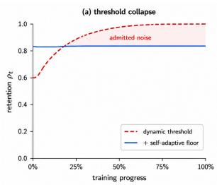

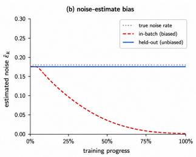  
Fig. 1. The mechanism behind CW-BASS v2’s saturation gate. Both panels are schematic, drawn to show the shape of each effect, not its measured magnitude; the measured versions are Figure 11 (a) and Table VII (b). (a) Under a confident DINOv2 teacher the dynamic threshold sits near its lower clamp, so retention ρt drifts to 1 and training floods with noise (Cor. 1); the self-adaptive floor pins ρt to a fixed quantile (Thm. 1) — in the real run it climbs to that quantile over the first epochs rather than starting there — but still does not match a strict threshold on a saturated teacher. (b) An in-batch noise estimator measures error on pixels the student trains on, collapsing to 0 regardless of quality; our held-out calibration is unbiased (Prop. 1) and breaks that loop. We measure this gap directly: on the ADE20K teacher, confident-set reliability reads 98.4% in-batch against 89.3% held out (Sec. IV-A).

The ResNet-era consensus: For most of the field’s history the answer was studied under ResNet-50/101 backbones with DeepLabV3+ [5] decoders, where teacher pseudo-labels are noisy enough that the noise term dominates the noise– coverage tradeoff. Methods improved by being smart about selection: confidence thresholding [2], curriculum and per-class thresholds [6], [7], soft confidence weighting [8], learning from unreliable pixels [9], and re-distributing biased pseudo-label priors [10], [11]. CW-BASS [12] belongs to this lineage. It contributed two mechanisms: (i) a confidence-weighted crossentropy that scales each pixel’s loss by a power of its teacher confidence, softly down-weighting unreliable pseudo-labels rather than hard-thresholding them; and (ii) a Sobel-derived boundary-aware auxiliary that concentrates supervision on object edges, where segmentation models are most uncertain. A per-batch dynamic threshold adapted the retention cutoff to the teacher’s mean confidence. On Pascal VOC and Cityscapes with ResNet-50, the combination was competitive with the methods of its day.

The foundation-model shift: Two developments have since changed the regime in which all of these mechanisms operate. First, self-supervised foundation encoders (DINOv2 in particular [13]) produce dense features on which a lightly fine tuned decoder [14] reaches pseudo-label accuracy that ResNet backbones never approached. Second, UniMatch V2 [15] established that, on top of such a backbone, the strongest results come from stricter filtering (a fixed high threshold $\tau { = } 0 . 9 5 )$ , two independent strong views, and complementary channel dropout, not from the looser, coverage-seeking filtering that the noise-dominated ResNet regime rewarded. Together they have moved Pascal VOC 1/8 from the mid-70s mIoU of the ResNet era to the high-80s. This is not a free lunch handed to every old method: it is a change of operating point that reprioritises which failure modes matter. A mechanism designed to squeeze coverage out of a noisy teacher can become inert, or actively harmful, when the teacher is already accurate.

This paper: We present CW-BASS v2, a saturation-aware pseudo-label selection method that carries CW-BASS into the foundation-model regime. Its premise is that no single threshold rule is right across confidence regimes, the same adaptive filtering that helps an under-confident teacher hurts a saturated one, so CW-BASS v2 does not commit to one rule. It reads the teacher’s confidence regime with a one-pass diagnostic and deploys whichever rule the regime calls for, strict filtering when the teacher saturates, adaptive filtering when it does not. As a deployed system it reproduces the UniMatch V2 operating point on the saturated benchmarks and improves on it where the teacher’s confident set is unreliable (Sec. V-E). What makes this design principled rather than a hedge is a mechanism we measure at every link and that decides the gate: we surface two failure modes of confidence-adaptive selection, latent at ResNet strength and dominant at foundation-model strength (Figure 1), neither of which the original CW-BASS could have observed. We report them candidly, including that CW-BASS v2’s own self-adaptive floor, run unconditionally on a saturated teacher, is the worst variant we test (82.32 vs. strict’s 87.40), which is exactly why the method does not run it there.

1) The overconfidence of in-batch noise estimation. Any method that estimates pseudo-label noise from the labeled training pixels (as feedback-driven per-class thresholds [16] and our calibration-fed adaptive scheme do) measures error on data the student has been trained to fit. The estimate is biased toward zero and grows more so as training proceeds, dragging any noise-driven threshold downward independently of the true pseudo-label quality. We make this precise (Proposition 1) and remove the bias with a held-out calibration slice.

2) The collapse of the dynamic threshold. Under DINOv2 the teacher’s confidence saturates, and we show that the CW-BASS dynamic threshold is upper-bounded by a small constant in this regime. Once nearly all confident pixels exceed it, retention drifts to 1 and training floods with whatever residual noise remains. This collapse manifests only late in training and at high teacher confidence; the original ResNet evaluation never ran in that regime.

Our contributions are a method and the analysis that makes it principled. We do not claim a new peak accuracy, Uni-Match $\nabla 2 ^ { \circ } \mathbf { s }$ strict recipe holds that on the saturated benchmarks, and we reproduce it, but a selection method that is never worse than that recipe and better where adaptive filtering belongs, together with the mechanism that tells the two regimes apart:

1) A saturation-aware selection method with an explicit gate. CW-BASS v2 measures one statistic on a heldout slice, the reliability of the teacher’s confident set, $\pi _ { \mathrm { k e p t } } { = } \operatorname* { P r } [ \mathrm { c o r r e c t } \mid c { \geq } \tau ]$ , and deploys strict filtering when it is at least as accurate as the confidence demanded $( \pi _ { \mathrm { k e p t } } 2 \tau )$ , its adaptive floor otherwise (Sec. IV-C). The boundary is the operating threshold, not a value tuned on mIoU, and across six DINOv2 teachers it makes the correct strict-vs-floor call blind (Figure 5). The deployed method is therefore never worse than the strict state of the art: it selects strict on Pascal VOC (87.4, matching UniMatch V2) and Cityscapes (a near-tie), and improves on it on the one teacher whose confident set is unreliable $( \pi _ { \mathrm { k e p t } } { \approx } 8 9 \%$ , ADE20K), where the floor reaches 50.6 mIoU (+1.5 over strict; single seed).

2) An unbiased noise diagnostic: held-out calibration. We split the labeled set into a training slice and a small calibration slice $( \alpha { = } 5 \% )$ , estimate per-class pseudo-label noise only on the held-out slice, and prove the estimator is unbiased where the in-batch estimator (used implicitly by feedback-driven per-class thresholds [16]) is downwardbiased (Proposition 1). This breaks the feedback loop that drags noise-driven thresholds down regardless of true quality, and gives the method an honest read of the teacher’s regime rather than a coverage-chasing one; its prediction, that the estimated noise $\widehat { \varepsilon } _ { k }$ should not fall for the classes whose thresholds the adaptive rule lowers, is borne out by the per-class IoU evidence (Table XII).

3) A stability-guaranteed confidence floor. We introduce a floor that scales with the teacher’s mean confidence and prove (Theorem 1, Corollary 1) that it pins retention to a fixed quantile bounded away from 1, whereas the bare dynamic threshold provably collapses to full retention. The floor is the adaptive rule the gate engages under an unreliable teacher (where it is best, ADE20K); run unconditionally on a reliable, saturated teacher it stabilises but does not recover accuracy (Pascal, 82.32 vs. strict 87.40), which is exactly what makes the gate necessary rather than optional.

4) The mechanism that decides the gate. We name the failure chain and measure each link on the saturated Pascal teacher: confidence saturation (the DINOv2 teacher’s confidence piles up near 1) causes dynamic-range collapse (the adaptive cutoff degenerates toward a constant, pinned in [0.300, 0.331]), which causes mask flooding (retention saturates near 1), which yields the early-peak-then-decline signature as confirmation bias [17] and feature distortion [18] take over. This explains why strict wins wherever the confident set is reliable, Pascal and Cityscapes at every DINOv2 scale, and, by measuring the six teachers’ confidence geometry directly (Table VII), corrects a tempting misreading: the teacher on which adaptive wins (ADE20K) is not underconfident but confidently unreliable $( \pi _ { \mathrm { k e p t } } { \approx } 8 9 \% )$ , the very property the gate reads. This doubles as a controlled, batchmatched analysis of adaptive pseudo-label thresholding on foundation-model backbones, the first we are aware of.

The mechanism, the matched-batch control, and the trajectory-centred reporting of Sec. VI also distil into four cheap checks (Sec. VII) any practitioner can run before choosing a threshold rule; the first, the one-pass reliability measurement, is the signal CW-BASS v2 gates on. A generation of selection mechanisms was designed for weak, under-confident teachers, a regime foundation backbones leave behind on the standard benchmarks but not universally; CW-BASS v2’s job is to read, from the teacher’s own calibration, which regime it faces and act accordingly: strict when the confident set is trustworthy (the common foundation-model case), the adaptive floor when it is not (Sec. V-E). The scientific counterpart is simple: measure the mechanism before trusting the intuition.

## II. RELATED WORK

Consistency regularization and self-training for SSSS: Modern SSSS descends from two threads: consistency regularization, which enforces stable predictions under perturbation [1], [19], [20], and self-training, which retrains on the model’s own pseudo-labels [4], [21]. FixMatch [2] unified them with weak-to-strong consistency: confident pseudo-labels from a weak view supervise a strong view. UniMatch [3] ported this to segmentation and added feature-space perturbation; AugSeg [22] and AEL [11] refined the augmentation and sampling. AllSpark [23] reconstructs labeled features from unlabeled ones in a transformer, and CorrMatch [24] propagates labels via correlation matching. UniMatch V2 [15] is the current state of the art: a DINOv2 backbone with a strict fixed threshold, dual strong views, and complementary dropout. CW-BASS [12] sits in this family, adding confidence weighting and a boundary auxiliary; we keep its weak-to-strong, EMAteacher, dual-perturbation scaffold and re-examine its selection mechanisms under the UniMatch V2 backbone.

Pseudo-label selection and adaptive thresholds: Confidence thresholding is the canonical selection rule [2], but a fixed global threshold trades coverage against noise poorly when classes differ in difficulty. FlexMatch [6] introduced curriculum pseudo-labeling with per-class thresholds derived from learning status; FreeMatch [7] replaced the schedule with a self-adaptive global threshold modulated per class by EMA confidence statistics; SoftMatch [8] dropped hard thresholds for a truncated-Gaussian soft weight; DASH [25] grew the threshold dynamically during training. In segmentation, CAFS [26] and ENCORE [16] adapt per-class thresholds: CAFS from a held-out labeled calibration, ENCORE from a training-feedback signal. FARCLUSS [27] combines several of these levers at once, replacing hard pseudo-labels with soft top-K class distributions and weighting each pixel by an entropy-derived reliability score alongside an adaptive class rebalancing term. Every one of these rules reads the same signal our analysis shows degenerates under a saturated teacher, an entropy or confidence spread across pixels and classes. Our per class scheme (Sec. IV-D) is a faithful instantiation of precisely this direction: it sets per-class cutoffs from held-out calibrated noise estimates, which is the CAFS mechanism, and the inbatch versus held-out contrast we formalise (Proposition 1) is the ENCORE training-feedback signal made unbiased, so the audit tests these published methods’ mechanism, not a strawman. We did not re-run their released code and flag this as a limitation (Sec. VII-A). Our self-adaptive floor is closest in spirit to FreeMatch’s confidence-tracking threshold, but plays a different role: rather than being the threshold, it lower-bounds any dynamic threshold, and we prove this prevents the retention collapse that FreeMatch-style rules do not guard against in the high-confidence regime. Our analysis (Sec. VI) shows that the per-class direction these methods pursue does not transfer to reliable, saturated foundation-model teachers, though it retains value where the confident set is unreliable, which is what CW-BASS v2 gates on.

Audits exist in adjacent territory: Oliver et al. [28] audited the evaluation practice of SSL classification, and Landgraf et al. [29] recently audited UniMatch V2’s reliability and robustness. Neither isolates the threshold rule as the single varied factor; to our knowledge, ours is the first batch-matched, mechanism-level audit of adaptive pseudo-label thresholding on a foundation-model backbone.

Foundation backbones for dense prediction: DINOv2 [13] learns dense visual features without labels; a frozen or lightly fine-tuned DINOv2 encoder with a DPT-style decoder [14] is a strong dense predictor, and vision-language guidance (SemiVL [30]) pushes SSSS further. The shift to such backbones is the premise of our audit: the noise statistics that ResNet-era selection mechanisms were tuned for no longer hold, so mechanisms must be re-derived rather than ported.

Calibration and learning with noisy labels: Estimating and correcting label noise is classical [31]; confident learning [32] estimates noise transition matrices from held-out predictions, and our held-out calibration is a segmentationspecific, online instance of the same de-biasing principle. The closest segmentation precedent is CAFS [26], which also calibrates per-class statistics on a held-out slice of the labeled set; the distinction is one of purpose. CAFS uses that calibration to set per-class adaptive thresholds (precisely the coverageseeking direction our audit finds counter-productive once the teacher saturates, Sec. VI), whereas we repurpose held-out calibration as an unbiased diagnostic (Proposition 1) whose role is to explain why that direction fails, not to chase coverage. Probability calibration [33]–[35] and long-tailed calibration [36] motivate why raw softmax confidence is an unreliable noise proxy; we use confidence only after held-out re-estimation. Our treatment of held-out per-class error rates as an unbiased control signal (rather than a bounded guarantee) is in the spirit of the noisy-label and self-training theory of Wei et al. [37].

Class imbalance: Long-tailed losses [38], [39] and classrebalancing self-training (CReST [40], imbalanced SSL [41]) motivate the rarity-scaled coverage penalty we test in the perclass scheme. Our negative result indicates that, at foundationmodel strength, rebalancing the threshold is the wrong lever, even if rebalancing the loss remains useful.

The regime shift, quantified: The premise of our analysis is a change of regime. The jump from ResNet/SegFormer methods in the high-70s to DINOv2-based UniMatch V2 at 87.9 on Pascal VOC 1/8 (the full SSSS landscape is in Table III, Sec. V-D) is driven primarily by the backbone, not by selection cleverness. A threshold-side mechanism tuned for the noise statistics of the upper rows need not transfer to the bottom row, which is exactly what we find. The accuracy jump is only half the story; the other half is a change in the teacher’s confidence statistics. Figure 2 contrasts the two regimes: a ResNet-50 teacher spreads its pixel confidence across [0.3, 1], giving a threshold a wide operating range, whereas the DINOv2 teacher collapses almost all of its mass into [0.95, 1] (98% of pixels exceed 0.95, versus 53% for the ResNet). This is not an aggregate-miscalibration artefact: the DINOv2 teacher has the lower expected calibration error of the two (0.007 vs. 0.024), precisely because where it is confident it is usually right. The problem is the opposite: confidence saturation, and with it dynamic-range collapse: the distribution has so little spread that a confidence-adaptive threshold has almost nothing left to read. When the signal a rule depends on degenerates to a spike at 1, the rule cannot discriminate, however well-calibrated that spike is.

TABLE I NOTATION.
<table><tr><td>Symbol</td><td>Meaning</td></tr><tr><td> ${ \mathcal { L } } , u$ </td><td>labeled / unlabeled sets</td></tr><tr><td> $\mathcal { L } _ { \mathrm { t r } } , \mathcal { L } _ { \mathrm { c a l } }$ </td><td>training / calibration slices of L</td></tr><tr><td> $f _ { \theta } , f _ { \theta ^ { \prime } }$ </td><td>student / EMA teacher</td></tr><tr><td> $\hat { y } _ { h , w } , c _ { h , w }$ </td><td>pseudo-label and confidence at pixel  $( h , w )$ </td></tr><tr><td> $\tau _ { k }$ </td><td>retention threshold for class k</td></tr><tr><td> $\bar { c } _ { t }$   $\mu _ { k }$ </td><td>EMA of mean teacher confidence</td></tr><tr><td> $\widehat { \varepsilon _ { k } } ( \tau )$ </td><td>running mean confidence of class k estimated per-class noise rate at cutoff  $\tau$ </td></tr><tr><td> $d _ { t }$ </td><td>EMA teacher decay at step t</td></tr><tr><td> $\gamma , \beta _ { b }$ </td><td>confidence-weighting exponent, boundary weight</td></tr><tr><td> $\tau _ { 0 } , \beta$ </td><td>base threshold and slope of the dynamic rule</td></tr><tr><td></td><td></td></tr><tr><td> $\rho _ { t }$ </td><td>retention (mask) ratio at step t</td></tr><tr><td> $\pi _ { \mathrm { k e p t } }$ </td><td>reliability of the confident set, Pr[correct | c≥τ]</td></tr><tr><td> $s , \alpha$ </td><td>floor scale, calibration fraction</td></tr><tr><td> $\dot { K }$ </td><td>number of classes</td></tr></table>

## III. PRELIMINARIES

Problem setup: (Table I summarises notation.) We are given a labeled set $\mathcal { L } ~ = ~ \{ ( x _ { i } , y _ { i } ) \} _ { i = 1 } ^ { N _ { L } }$ with dense labels $\bar { y } _ { i } \in \{ 1 , \ldots , K \} ^ { H \times W }$ and a larger unlabeled set $\mathcal { U } = \{ x _ { j } \} _ { j = 1 } ^ { N _ { U } }$ $N _ { U } \gg N _ { L }$ . We train a segmentation network $f _ { \theta }$ (encoder + decoder) and maintain an exponential moving-average (EMA) teacher $f _ { \theta ^ { \prime } }$ with $\theta _ { t + 1 } ^ { \prime } ~ = ~ d _ { t } \theta _ { t } ^ { \prime } + ( 1 - d _ { t } ) \theta _ { t }$ t and ramp-up $d _ { t } = \operatorname* { m i n } ( 1 - 1 / ( t + 1 ) , 0 . 9 9 6 )$ . (We write the EMA decay $d _ { t }$ to keep γ for CW-BASS’s confidence-weighting exponent, Equation (3).)

Weak-to-strong consistency: For an unlabeled image $x ,$ the teacher produces per-pixel class posteriors $p _ { \theta ^ { \prime } } ( x ) \in \Delta ^ { K - 1 }$ on a weakly augmented view; the pseudo-label and confidence at pixel $( h , w )$ are

$$
\hat { y } _ { h , w } = \arg \operatorname* { m a x } _ { k } p _ { \theta ^ { \prime } } ( x ) _ { h , w , k } , \qquad c _ { h , w } = \operatorname* { m a x } _ { k } p _ { \theta ^ { \prime } } ( x ) _ { h , w , k } .\tag{1}
$$

(a) teacher confidence distribution  
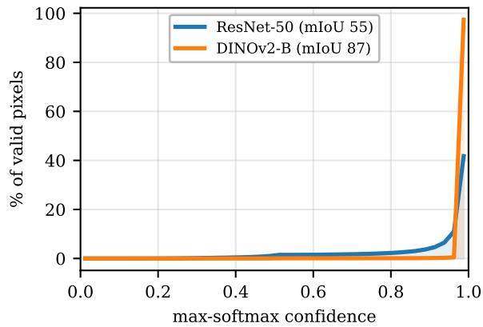

(b) reliability diagram  
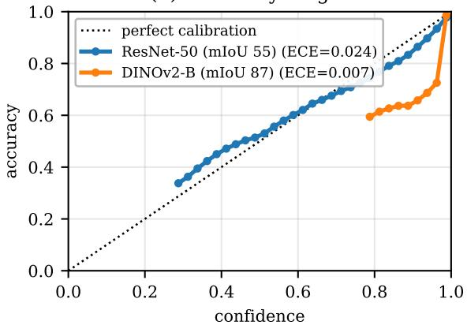  
Fig. 2. The confidence-statistics half of the regime shift. (Pascal VOC 1/8 val pixels, EMA teachers; ResNet-50 is a representative partially-trained model.) (a) The ResNet-50 teacher spreads its max-softmax confidence across the range, whereas the DINOv2 teacher piles 98% of pixels into [0.95, 1] (53% for ResNet). (b) Reliability. Read the two panels together: the DINOv2 teacher’s aggregate ECE is the lower of the two (0.007 vs. 0.024) because almost all of its mass sits in the top bin, where it is accurate — but in the sparsely-populated band below 0.95 it is markedly over-confident, its curve falling well under the diagonal where the ResNet’s tracks it. Both facts matter, and they point the same way: the confident mass is trustworthy (hence strict works), while the thin low-confidence band a relaxed cutoff would recover is exactly where the teacher is wrong (hence adaptive does not). The obstacle for adaptive thresholding is therefore not aggregate miscalibration but dynamic range collapse: almost no spread left to threshold on, and what spread remains is error-enriched.

A retention mask $\mathcal { M } = \{ ( h , w ) : c _ { h , w } \geq \tau _ { \hat { y } _ { h , w } } \}$ selects pseudolabels above a (possibly class-dependent) threshold $\tau _ { k }$ , and the student is supervised on strongly perturbed views to match $\hat { y }$ on M. Following UniMatch [3], we use two strong streams: an image-space stream (strong photometric augmentation + CutMix) and a feature-perturbation stream (channel dropout), sharing one backbone forward. The total objective is

$$
\begin{array} { r } { \mathcal { L } = \frac { 1 } { 2 } \Big ( \mathcal { L } _ { x } + \frac { 1 } { 2 } ( \mathcal { L } _ { s } + \mathcal { L } _ { \mathrm { f p } } ) \Big ) , } \end{array}\tag{2}
$$

with ${ \mathcal { L } } _ { x }$ the supervised cross-entropy on $\mathcal { L }$ and $\mathcal { L } _ { s } , \mathcal { L } _ { \mathrm { f p } }$ the unlabeled losses on the two strong streams.

CW-BASS recap: CW-BASS [12] instantiates the unlabeled loss with two mechanisms. (i) A confidence-weighted

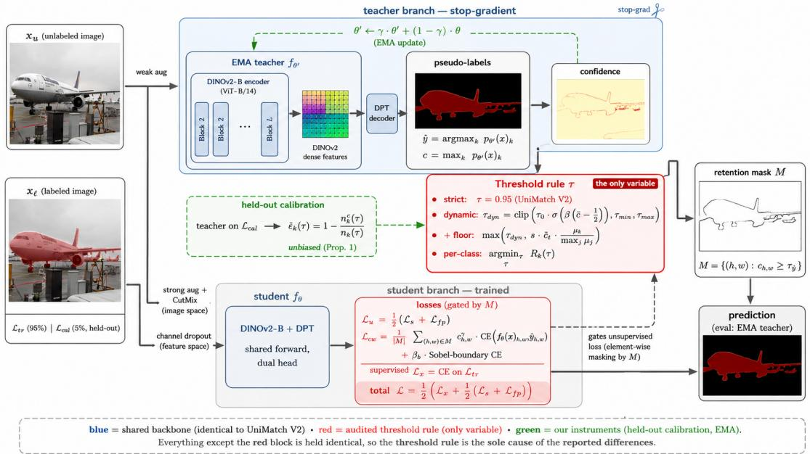  
Fig. 3. The CW-BASS v2 pipeline. A weak view of each unlabeled image $x _ { u }$ passes through the EMA teacher (DINOv2 encoder + DPT decoder) to produce pseudo-labels yˆ and confidences c. The threshold rule τ (red, the gated component) turns c into a retention mask M; the four rules shown are strict τ=0.95, the dynamic global threshold, that threshold floored by the self-adaptive rule, and a per-class adaptive threshold. Two strong views (CutMix; channel dropout) drive the student; the unlabeled loss on M is confidence-weighted CE plus a Sobel-boundary term. The green held-out calibration estimates unbiased per-class noise $\widehat { \varepsilon } _ { k }$ (Prop. 1), a diagnostic feeding the gate. All but the red block matches UniMatch V2.

cross-entropy weights each retained pixel by $c _ { h , w } ^ { \gamma } ,$

$$
\mathcal { L } _ { \mathrm { c w } } = \frac { 1 } { | \mathcal { M } | } \sum _ { ( h , w ) \in \mathcal { M } } c _ { h , w } ^ { \gamma } \mathrm { C E } \big ( f _ { \theta } ( x ) _ { h , w } , \hat { y } _ { h , w } \big ) ,\tag{3}
$$

so confident pseudo-labels contribute more gradient (γ controls the sharpness). (ii) A boundary-aware term adds cross-entropy restricted to a Sobel-detected boundary mask B of the pseudolabel map, $\mathcal { L } _ { s } = \mathcal { L } _ { \mathrm { c w } } + \beta _ { b } \mathbb { E } _ { ( h , w ) \in B } [ \mathrm { C E } ]$ , emphasising object edges. (iii) A dynamic threshold adapts the global cutoff to the teacher’s mean confidence $\bar { c } = \mathbb { E } [ c _ { h , w } ]$

$$
\tau ^ { \mathrm { d y n } } = \mathrm { c l i p } \left( \frac { \tau _ { 0 } } { 1 + e ^ { - \beta ( \bar { c } - 1 / 2 ) } } , \tau _ { \mathrm { m i n } } , \tau _ { \mathrm { m a x } } \right) ,\tag{4}
$$

with $\tau _ { 0 } { = } 0 . 6 , ~ \beta { = } 0 . 5 , ~ \tau _ { \mathrm { m i n } } { = } 0 . 3 , ~ \tau _ { \mathrm { m a x } } { = } 0 . 9 5$ in the original work. Because the sigmoid is bounded, Equation (4) can never exceed $\tau _ { 0 } \sigma ( \beta / 2 )$ ≈ 0.34 for any teacher, a ceiling fixed by these constants that becomes the crux of the collapse analysis in Sec. IV-B.

Take-away: The dynamic threshold (4) reads one scalar (the teacher’s mean confidence c¯) through a bounded sigmoid. Everything that follows turns on what happens to that rule when the signal it reads saturates.

## IV. METHOD

CW-BASS v2 keeps the scaffold of Equation (2) and the two original CW-BASS mechanisms (Equation (3) and the boundary term), and adds three constructs that make pseudo-label selection saturation-aware: held-out calibration (Sec. IV-A), which reads pseudo-label noise without the downward bias of in batch estimates; a self-adaptive confidence floor (Sec. IV-B), the adaptive rule the method engages under an unreliable teacher; and a one-pass gate (Sec. IV-C) that selects between that floor and a strict fixed threshold by measuring the reliability of the teacher’s confident set, $\pi _ { \mathrm { k e p t } } ,$ , on the held-out slice. Figure 3 shows how they attach to the pipeline. Sec. IV-D describes the more ambitious per-class adaptive scheme we also investigated; Sec. VI measures which rule wins in which regime, and why, the evidence the gate acts on. Each mechanism is independently toggleable, enabling the ablation in Sec. V-G.

## A. Held-Out Calibration

A method that adapts a threshold to pseudo-label noise needs an estimate of that noise. The natural estimate (used implicitly by the CW-BASS dynamic threshold and explicitly by feedback-driven per-class methods [16]) is computed on the labeled training pixels: for class k at cutoff $\tau ,$ count predictedas-k pixels with confidence $\geq \tau$ and the fraction that match the ground truth. The problem is that the student is trained on exactly these pixels, so the estimate measures training error, not generalisation error, and is biased toward zero.

Construction: We partition the labeled set ${ \mathcal { L } } = { \mathcal { L } } _ { \mathrm { t r } } \sqcup { \mathcal { L } } _ { \mathrm { c a l } }$ with $| { \mathcal { L } } _ { \mathrm { c a l } } | = \alpha | { \mathcal { L } } | , \alpha { = } 0 . 0 5$ . The supervised gradient ${ \mathcal { L } } _ { x }$ is computed only on $\mathcal { L } _ { \mathrm { t r } } ; \mathcal { L } _ { \mathrm { c a l } }$ never enters the supervised loss. Once per epoch we run the EMA teacher over $\mathcal { L } _ { \mathrm { c a l } }$ and populate per-class noise rates

$$
\widehat { \varepsilon } _ { k } ( \tau ) = 1 - \frac { n _ { k } ^ { c } ( \tau ) } { n _ { k } ( \tau ) } ,\tag{5}
$$

where $n _ { k } ( \tau )$ counts calibration pixels predicted as k with confidence $\geq \tau$ and $n _ { k } ^ { c } ( \tau )$ the subset matching ground truth. We use $\widehat { \varepsilon } _ { k } ( \tau )$ as an unbiased point estimate and control signal, and deliberately attach no high-probability confidence interval to it: pixels within an image are strongly spatially correlated, so the effective sample size is closer to a count of images than of pixels (on Pascal 1/8 the calibration slice is only $\alpha | \mathcal { L } | \approx 9$ images), and a pixel-count concentration bound would claim a confidence it has not earned. No claim in the paper depends on such an interval; the estimator’s role is to give an unbiased read of per-class noise (Proposition 1), and, in the gate, of the aggregate reliability $\pi _ { \mathrm { k e p t } }$ (Sec. IV-C). The perclass noise histogram is reset at each epoch boundary so the estimate reflects the current teacher rather than stale statistics accumulated early in training.

Why held-out estimation is necessary: We formalise the bias that motivates the construction. Fix the teacher parameters $\theta ^ { \prime }$ and a class k and cutoff τ. Let $\varepsilon _ { k } ( \tau ) ~ = ~ \mathrm { P r } [ \hat { y } \neq y$ | $\hat { y } = k , c \ge \tau ]$ be the true per-class noise rate on the data distribution.

Proposition 1 (Held-out de-biasing). The calibration estimator $\widehat { \varepsilon } _ { k } ^ { \mathrm { c a l } } ( \tau )$ of Equation (5), computed on $\mathcal { L } _ { \mathrm { c a l } }$ which is disjoint from ${ \mathcal L } _ { \mathrm { t r } }$ and unused by the supervised gradient, is conditionally unbiased given the teacher $\theta ^ { \prime }$ and the selected count $n _ { k } ( \tau ) { > } 0 ;$ $\mathbb { E } \big [ \widehat { \varepsilon } _ { k } ^ { \mathrm { c a l } } ( \tau ) ~ | ~ \theta ^ { \prime } , n _ { k } ( \tau ) \big ] = \varepsilon _ { k } ( \tau )$ (the conditioning is needed because Equation (5) is a ratio of random counts; given the selected set it is a mean of i.i.d. error indicators). The inbatch estimator $\widehat { \varepsilon } _ { k } ^ { \mathrm { i n } } ( \tau )$ computed on $\mathcal { L } _ { \mathrm { t r } }$ satisfies $\mathbb { E } \big [ \widehat { \varepsilon } _ { k } ^ { \mathrm { i n } } ( \tau )$ | $\theta ^ { \prime } , n _ { k } ( \tau ) ] \leq \varepsilon _ { k } ( \dot { \tau } )$ , with the gap equal to the teacher’s train– population generalisation gap on confident class-k pixels.

Proof sketch. Conditioned on $\theta ^ { \prime }$ and the selected set $\{ c \geq$ $\tau , \hat { y } = k \}$ of size $n _ { k } ( \tau )$ , the calibration pixels are drawn from the same distribution as the population but are statistically independent of the optimisation of $\theta$ (they never contribute a gradient), so the empirical error frequency (5) is a conditional mean of i.i.d. Bernoulli error indicators: an unbiased Monte-Carlo estimate of $\varepsilon _ { k } ( \tau )$ . (The conditioning matters: Equation (5) is a ratio of random counts, unbiased for $\varepsilon _ { k }$ given the selection event, not marginally.) For the in-batch estimator, the teacher and student are coupled to $\mathcal { L } _ { \mathrm { t r } }$ through training; a model fit to those pixels has empirical error no larger than its population error in expectation (the standard optimism of the training error), and the inequality is strict whenever the network has capacity to memorise, which segmentation networks do. The difference is exactly the generalisation gap restricted to confident class-k predictions. □

Proposition 1 explains a concrete failure: under an inbatch estimate, $\widehat { \varepsilon } _ { k } ^ { \mathrm { i n } } \to 0$ as the student memorises ${ \mathcal { L } } _ { \mathrm { t r } } ,$ so any threshold that loosens as estimated noise falls is driven downward regardless of true pseudo-label quality. The heldout construction breaks this feedback loop by construction. This bias is not hypothetical, and it is exactly large enough to matter for the gate: on the ADE20K teacher the confident set reliability measured in-batch (on the labeled-train pixels the student fits) is $\pi _ { \mathrm { k e p t } } ^ { \mathrm { i n } } { = } 9 8 . 4 \%$ , indistinguishable from the reliable Pascal/Cityscapes teachers, whereas measured on held out data it is only 89.3% (Sec. IV-C). A gate reading the in-batch value would wrongly judge this teacher reliable and select strict, forfeiting the floor’s win; the 9-point optimism is what makes held-out measurement necessary rather than cosmetic. Calibration is thus a diagnostic and a control signal, not a leaderboard trick.

## B. Self-Adaptive Confidence Floor

The second failure mode is structural to Equation (4). We first show the bare dynamic threshold collapses under a confident teacher, then introduce a floor and prove it does not.

The collapse of the dynamic threshold: For $\bar { c } \in [ 0 , 1 ]$ the sigmoid in Equation (4) is increasing but bounded: $\tau ^ { \mathrm { d y n } } \leq$ $\tau _ { 0 } \sigma ( \beta / 2 )$ . With the original $\tau _ { 0 } { = } 0 . 6 , \beta { = } 0 . 5$ this ceiling is ≈ 0.34; the unclipped sigmoid spans only [0.263, 0.337] over the entire range $\bar { c } \in [ 0 , 1 ]$ , and after the lower clamp $\tau _ { \mathrm { m i n } } \mathrm { = } 0 . 3$ of Equation (4) the operative cutoff lives in $[ 0 . 3 0 0 , 0 . 3 3 7 ]$ effectively a constant pinned at its lower clamp. This is harmless at ResNet strength, where confident pixels are scarce and many sit below 0.34. But under DINOv2 the confidence distribution concentrates near 1, so almost every pixel clears a 0.34 cutoff and the retention rate $\rho = \mathrm { P r } [ c \geq \tau ^ { \mathrm { d y n } } ]  1$ . Training then optimises against every pseudo-label, noise included. We make this precise in Corollary 1.

The floor: Let $\bar { c } _ { t }$ be the EMA of the unlabeled-view mean teacher confidence, $\bar { c } _ { t + 1 } = m \bar { c } _ { t } + ( 1 - m ) \mathbb { E } _ { x \in { \mathcal { B } _ { u } } } [ c ( x ) ]$ , and let $\mu _ { k }$ be the running per-class mean confidence. We define a per-class floor

$$
\tau _ { k } ^ { \mathrm { f l o o r } } = s \cdot \bar { c } _ { t } \cdot \frac { \mu _ { k } } { \operatorname* { m a x } _ { j } \mu _ { j } } , \qquad s \in ( 0 , 1 ] ,\tag{6}
$$

and lower-bound the operative threshold by it: $\tau _ { k } ^ { \mathrm { f i n a l } } \ =$ max $( \tau _ { k } ^ { \mathrm { d y n } } , \tau _ { k } ^ { \mathrm { f l o o r } } )$ , with retention mask $\mathcal { M } = \{ ( h , w ) : c _ { h , w } \geq$ $\tau _ { \hat { y } _ { h , w } } ^ { \mathrm { f i n a l } } \}$ . The floor scales with $\bar { c } _ { t } \colon$ as the teacher grows confident the floor rises with it, so a fixed fraction of the (now higher) confidence mass is always filtered. The per-class factor $\mu _ { k } / \operatorname* { m a x } _ { j } \mu _ { j }$ keeps the floor lower for under-learned classes so their scarcer, lower-confidence pseudo-labels are not over filtered.

To analyse retention we adopt an explicit, falsifiable model of how the confidence distribution moves during training.

Assumption 1 (Scale-family confidence). For unlabeled pixels with teacher-predicted class $k ,$ the confidence at training time t satisfies $c \overset { d } { = } \bar { c } _ { t } V _ { k }$ , where $V _ { k } \geq 0$ is a time-invariant “relative confidence” with CDF $G _ { k }$ and mean $\nu _ { k } ,$ , and $\bar { c } _ { t }$ is the overall mean confidence. (Equivalently: as training proceeds the per-class confidence distribution rescales with the overall confidence level but keeps its shape.)

Under Assumption 1, $\mu _ { k } = \operatorname { \mathbb { E } } [ c \mid k ] = { \bar { c } } _ { t } \nu _ { k }$ , so the ratio $r _ { k } : = \mu _ { k } / \operatorname* { m a x } _ { j } \mu _ { j } = \nu _ { k } / \operatorname* { m a x } _ { j } \nu _ { j }$ is time-invariant.

Theorem 1 (Bounded, confidence-invariant retention). Under Assumption 1, the class-k retention rate induced by the floor, $\bar { \rho } _ { k } ^ { \mathrm { f l o o r } } : = \mathrm { P r } [ c \geq \tau _ { k } ^ { \mathrm { f l o o r } } ]$ , is independent of the overall confidence level $\bar { c } _ { t } .$

$$
\begin{array} { r } { \rho _ { k } ^ { \mathrm { f l o o r } } = \operatorname* { P r } \left[ \bar { c } _ { t } V _ { k } \geq s \bar { c } _ { t } r _ { k } \right] = \operatorname* { P r } \left[ V _ { k } \geq s r _ { k } \right] = 1 - G _ { k } ( s r _ { k } ) . } \end{array}\tag{7}
$$

Consequently $\rho _ { k } ^ { \mathrm { f l o o r } } < 1$ whenever $G _ { k } ( s r _ { k } ) > 0 ( i . e .$ . there is positive confidence mass below $s r _ { k } ) ,$ , and the actual retention obeys $\mathrm { P r } [ c \geq \tau _ { k } ^ { \mathrm { f i n a l } } ] \ \leq \ \rho _ { k } ^ { \mathrm { f i o o r } } . \ A s \ \bar { c } _ { t } \  \ 1$ , retention does not converge to 1; it remains pinned at the fixed quantile $1 - G _ { k } ( s r _ { k } )$ , controlled by s.

Proof. The $\bar { c } _ { t }$ factors cancel inside the probability in Equation (7), leaving a statement about the time-invariant $V _ { k } ;$

this is the claimed $\bar { c } _ { t }$ -invariance. Positivity of $G _ { k } ( s r _ { k } )$ gives $\rho _ { k } ^ { \mathrm { f l o o r } } = 1 - G _ { k } ( s r _ { k } ) < 1$ . Finally $\tau _ { k } ^ { \mathrm { f i n \bar { a l } } } \geq \tau _ { k } ^ { \mathrm { f i o o r } }$ implies $\{ \ddot { c } \ge \tau _ { k } ^ { \mathrm { f i n a l } } \} \subseteq \{ c \ge \tau _ { k } ^ { \mathrm { f i o o r } } \}$ , so the actual retention is no larger. □

Corollary 1 (Collapse of the bare dynamic threshold). Under Assumption 1, write $\bar { \tau } : = \tau _ { 0 } \sigma ( \beta / 2 )$ for the constant ceiling that upper-bounds the dynamic threshold at every $\bar { c } _ { t }$ (Equation (4)). The class-k retention is $\rho _ { k } ^ { \mathrm { d y n } } = \mathrm { P r } [ \bar { c } _ { t } V _ { k } ^ { \cdot } \ge \tau ^ { \mathrm { d y n } } ] = 1 -$ $G _ { k } \big ( \tau ^ { \mathrm { d y n } } / \bar { c } _ { t } \big )$ , and since $\tau ^ { \mathrm { d y n } } \leq \bar { \tau } ,$

$$
\rho _ { k } ^ { \mathrm { d y n } } \geq 1 - G _ { k } \big ( \bar { \tau } / \bar { c } _ { t } \big ) \xrightarrow [ \bar { c } _ { t } \to 1 ] { } 1 - G _ { k } \big ( \bar { \tau } \big ) .\tag{8}
$$

The contrast with Theorem 1 is the point: the floored rule holds a fixed quantile of $V _ { k } ,$ , whereas the bare rule’s retention floor is governed by thefixed cutoffceiling τ¯ and rises toward $1 - G _ { k } ( \bar { \tau } )$ as the teacher grows confident. That limit equals 1 exactly when the relative-confidence law $G _ { k }$ places negligible mass below τ¯, i.e. when the teacher saturates so that almost every confident pixel clears the ceiling. This last step is a condition on the data, not a consequence of Assumption 1 (which fixes the shape of $G _ { k } ) \colon$ Sec. VI-B verifies it holds empirically (98% of pixels exceed $0 . 9 5 \gg \bar { \tau } \approx 0 . 3 4 ,$ , so $G _ { k } ( \bar { \tau } ) \approx 0 )$ , at which point $\rho _ { k } ^ { \mathrm { d y n } }  1$ and the mask floods.

Theorem 1 and Corollary 1 formalise the central design point: because the floor scales with $\bar { c } _ { t }$ and the bare threshold does not, the floor converts a quantity that collapses to full retention into one that holds a fixed, controllable quantile. We are deliberately modest about what this buys. Once Assumption 1 is granted the $\bar { c } _ { t }$ factors cancel and the result is elementary; the substance is entirely whether the assumption holds, which we treat as an empirical question answered by the flat mask-ratio trajectory (Figure 11b, Remark 1), not as a proof. We therefore read Theorem 1 as an empirical-stability statement, and we state plainly that it has no bearing on accuracy: with s=0.95 under a saturated teacher the held quantile still admits ≈ 0.91 of the mass (Sec. VI-B, Figure 9b), so the floor buys a retention that no longer drifts to 1, and nothing more: indeed the floored rule is among the worst on mIoU (Table X). Its role in the paper is diagnostic (it isolates the collapse mechanism by removing it), not a route to higher accuracy.

Corollary 1, measured: what is, and is not, a prediction.: Two things must be kept apart, because the distinction decides how much the data can be said to confirm. The ceiling $\tau = \tau _ { 0 } \sigma ( \beta / 2 ) \approx 0 . 3 4$ is not an empirical discovery: it is fixed algebraically by the original constants $\tau _ { 0 } { = } 0 . 6 , \beta { = } 0 . 5$ , so Equation (4) cannot exceed 0.337 for any backbone, foundation or otherwise. That the measured class-averaged cutoff sits in [0.300, 0.331] over the entire matched-batch 16 run therefore confirms only the algebra and that the sigmoid is saturated (its input $\beta ( \bar { c } - \textstyle { \frac { 1 } { 2 } } )$ pinned), not a law about foundation models. The empirical content of Corollary 1 is downstream and genuinely data-dependent: with the cutoff stuck near 0.34 while the teacher’s mean confidence climbs past 0.88, the condition $G _ { k } ( \bar { \tau } ) \approx 0$ holds (98% of pixels exceed 0.95), so by (8) retention floods to 1 (Sec. VI-B, Table XI); that flooding is the prediction the run bears out. The ceiling is thus a property of the rule’s hyperparameters, not of the regime: raising τ0 or $\beta ,$ or lifting the lower clamp $\tau _ { \mathrm { m i n } }$ , raises it, and in the limit $\tau _ { \mathrm { m i n } } \to 0 . 9 5$ the dynamic rule degenerates into the strict baseline itself, so the interesting question is not whether these constants collapse (they must, by construction) but whether any adapt-downward rule can beat strict once the confidence range has collapsed; Sec. VI takes that up directly. By contrast, the floored rule’s operative threshold (and the per-class rule’s, which rises to 0.805) does track confidence upward: the floored threshold climbs from 0.577 to 0.922 over training (Theorem 1), which is exactly why it, and only it, holds retention bounded away from 1.

Remark 1 (On Assumption 1). The scale-family model is an idealisation: real confidence distributions also change shape (not only scale) during training. It is, however, falsifiable (it predicts a flat mask-ratio trajectory under the floor and a rising one without it), and Sec. VI-C reports that the empirical trajectories match this prediction, which is the practical content of the theorem. The prediction is also robust to moderate shape drift: only the mass near the floored cutoff $s r _ { k }$ affects retention, so shape changes confined away from that quantile leave the flat-trajectory prediction intact, and the empirical curve stays within $\pm 0 . 0 3$ of its mean after epoch 6 despite the distribution sharpening overall.

## C. The Saturation Gate

The calibration slice and the floor combine into a single, explicit decision. Run the teacher once over a held-out labeled slice and measure the reliability of its confident set,

$$
\pi _ { \mathrm { k e p t } } = \mathrm { P r } [ \hat { y } = y \mid c \geq \tau ] , \qquad \tau = 0 . 9 5 ,\tag{9}
$$

the fraction of above-cutoff pixels whose pseudo-label is correct, estimated on held-out rather than in-batch data (Proposition 1). In deployment this slice is $\mathcal { L } _ { \mathrm { c a l } }$ , which the method already maintains and which costs no extra labels. The gate then selects the operative rule:

$$
\mathrm { r u l e } = \left\{ \begin{array} { l l } { \mathrm { s t r i c t } \ \tau { = } 0 . 9 5 , } & { \pi _ { \mathrm { k e p t } } \geq \tau \ \mathrm { ( r e l i a b l e ) } , } \\ { \mathrm { s e l f - a d a p t i v e \ f l o o r } , } & { \pi _ { \mathrm { k e p t } } < \tau \ \mathrm { ( u n r e l i a b l e ) } . } \end{array} \right.\tag{10}
$$

The criterion is a calibration test read off the teacher itself: does the retained set match the confidence it required? When it does (a strong, well-calibrated teacher), hard-training on the confident set is already near-optimal and relaxing the cutoff only admits the error-enriched band (Sec. VI-B); when it does not (a confidently-miscalibrated teacher), hard-thresholding trusts wrong labels at full weight and the floor’s softened, confidenceweighted loss is preferable. The decision is forward-only, needs no student update, and its boundary is the pre-existing operating threshold τ, not a value tuned on downstream mIoU; Sec. V-E shows it picks the correct rule on six teachers blind. We are candid that on the standard foundation-model benchmarks the teacher is reliable and the gate returns strict: its value is a principled, measured decision, not a switch that fires often.

How we evaluate the gate, and its one caveat: The demonstration in Sec. V-E is a post-hoc validation, not a live deployment, and the distinction is worth stating plainly. We take the six finished strict teachers, run scripts/gate\_stat.py over each dataset’s validation split (forward-only, 200 images, no gradient), and ask whether the resulting $\pi _ { \mathrm { k e p t } }$ predicts the sign of the adaptive-vs-strict gap. Using the validation split rather than $\mathcal { L } _ { \mathrm { c a l } }$ buys statistical precision for the validation experiment: on Pascal 1/8 the calibration slice is only ≈ 9 images (Sec. IV-A), too few to separate 98% from 89% with confidence. It also means the reported $\pi _ { \mathrm { k e p t } }$ values are not what a live run would have seen: they are measured on the evaluation split and from a converged teacher. This is a validation of the criterion, not a measurement of the deployed system, and we flag it as such (Sec. VII-A). The criterion itself uses only quantities a live run can compute from $\mathcal { L } _ { \mathrm { c a l } }$ in one forward pass, and the separation it exploits (98% vs 89%) is far wider than the slice-size noise.

## D. Per-Class Adaptive Thresholding (Investigated Direction)

The held-out noise estimate (5) and the floor (6) are the ingredients of a natural, more ambitious scheme: a fully perclass adaptive threshold. We fit a $\mathrm { B e t a } ( \alpha _ { k } , \beta _ { k } )$ to each class’s confidence distribution by method of moments, and choose $\tau _ { k }$ to minimise a per-class risk that trades estimated noise against coverage,

$$
R _ { k } ( \tau ) = \underbrace { \widehat { \varepsilon } _ { k } ( \tau ) \rho _ { k } ( \tau ) } _ { \mathrm { r e t a i n e d ~ n o i s e } } + \underbrace { \lambda _ { k } \left( 1 - \rho _ { k } ( \tau ) \right) } _ { \mathrm { c o v e r a g e ~ p e n a l t y } } ,\tag{11}
$$

where $\widehat { \varepsilon } _ { k }$ is the held-out noise estimate (5) (a point estimate: earlier drafts used a Hoeffding upper bound here, which we dropped for the reason given in Sec. IV-A — pixels are spatially correlated, so a pixel-count concentration bound claims a confidence it has not earned), $\rho _ { k } ( \tau ) = 1 - F _ { \alpha _ { k } , \beta _ { k } } ( \tau )$ the Betaimplied retention, and $\lambda _ { k }$ a coverage weight. To protect rare classes we scale the penalty by rarity, $\lambda _ { k } = \lambda _ { 0 } ( N _ { \operatorname* { m a x } } / N _ { k } ) ^ { \eta }$ (capped), so that infrequent classes tolerate lower thresholds. During an initial warmup the scheme falls back to the global dynamic threshold with the floor active; after warmup it switches to arg minτ $R _ { k } ( \tau )$ , still lower-bounded by the perclass floor. This is the full machinery a coverage-seeking, ResNet-era intuition recommends, built to the best of our ability, so that the audit tests the direction and not a strawman. Sec. VI reports that it does not help.

## V. EXPERIMENTS AND MAIN RESULTS

## A. Datasets and Protocol

Datasets: Our empirical claims are made on PAS-CAL VOC 2012 (21 classes) under the original (highquality, 1464-image) training protocol, using the same splits as UniMatch V2 [15] and the original CW-BASS [12] so the comparison is direct: the $1 / 8$ and $1 / 4$ partitions correspond to 183 and 366 labeled images. This is deliberately the most saturated benchmark (UniMatch V2 already reaches 87.9/88.9 mIoU here) and is therefore the cleanest setting in which to ask whether adaptive thresholding adds anything on top of a strong teacher. We report mean IoU (mIoU) of the EMA teacher, the standard evaluation model. Pascal is where we run the decisive controls: the three-seed, strict-inclusive comparison (Table IX) and the matched-batch trajectory dissection (Table X). To test whether the inversion is a property of the teacher rather than of one benchmark, we carry the comparison to Cityscapes (an intermediate teacher) and the long-tailed ADE20K (150 classes, whose teacher turns out to be saturated but unreliable, Sec. V-E), and across the DINOv2-S/B/L scale family; those results are reported in Sec. V-E (Table VI) and are what the paper’s generality claim rests on. Each dataset is run at its standard protocol (Cityscapes crop 686, 120 epochs; ADE20K crop 518, 60 epochs; both at the official batch 16); the ADE20K cells are single-seed, a scope we restate where it matters (Sec. V-E, Sec. VII-A).

Algorithm 1 CW-BASS v2 training epoch (global-threshold   
variant)   
Require: labeled split ${ \mathcal { L } } _ { \mathrm { t r } } ,$ calibration split $\mathcal { L } _ { \mathrm { c a l } }$ , unlabeled set   
$u ,$ student $f _ { \theta } ,$ , EMA teacher $f _ { \theta ^ { \prime } }$ , floor scale $s ,$ EMA m   
1: Calibration pass: reset noise histogram; for $x \in \mathcal { L } _ { \mathrm { c a l } } .$ , run   
$f _ { \theta ^ { \prime } }$ and accumulate $n _ { k } , n _ { k } ^ { c } ;$ set $\widehat { \varepsilon } _ { k }$ via Equation (5) ▷   
unbiased (Prop. 1)   
2: for each unlabeled batch $x _ { u }$ (with a labeled batch $( x \imath , y \imath ) )$   
do   
3: $\mathcal { L } _ { x }  \mathrm { C E } ( f _ { \theta } ( x _ { l } ) , y _ { l } )$ ▷ on $\mathcal { L } _ { \mathrm { t r } }$ only   
4: $\hat { y } , c \gets$ teacher posteriors on weak view of $x _ { u } \quad \triangleright \triangleright$   
Equation (1)   
5: $\bar { c } _ { t } \gets m \bar { c } _ { t } + ( 1 { - } m ) \mathbb { E } [ c ]$ ▷ confidence EMA   
6: $\tau _ { \mathrm { ~ \normalfont ~ \cdot ~ } } ^ { \mathrm { d y n } }  \mathrm { E q u a t i o n ~ } ( 4 ) ; \tau _ { k } ^ { \mathrm { f l o o r } }  s \bar { c } _ { t } \mu _ { k } / \operatorname* { m a x } _ { j } \mu _ { j }$   
7: $\tau _ { k } ^ { \mathrm { f i n a l } }  \mathrm { m a x } ( \tau ^ { \mathrm { d y n } } , \tau _ { k } ^ { \mathrm { f l o o r } } )$ ▷ anti-collapse (Thm. 1)   
8: $\mathcal { M }  \{ ( h , w ) : c _ { h , w } \geq \tau _ { \hat { y } _ { h , w } } ^ { \mathrm { f i n a l } } \}$   
9: build strong views (aug+CutMix; feature dropout);   
B ← Sobel boundary of yˆ   
10: $\mathcal { L } _ { s } , \mathcal { L } _ { \mathrm { f p } } \gets \mathrm { C W } +$ boundary loss on M ▷ Equation (3)   
11: $\begin{array} { r } { \mathcal { L }  \frac { 1 } { 2 } ( \mathcal { L } _ { x } + \frac { 1 } { 2 } ( \mathcal { L } _ { s } + \mathcal { L } _ { \mathrm { f p } } ) ) ; } \end{array}$ ; update $\theta ;$ EMA-update $\theta ^ { \prime }$   
12: end for

Canonical protocol (“Family $B ^ { \prime \prime } ) { : }$ To be protocolcomparable to UniMatch V2’s reported DINOv2-B numbers, our DINOv2 runs use a two-group optimizer (no layer-wise LR decay), 60 epochs, weight decay 0.01, backbone LR $5 \times 1 0 ^ { - 6 }$ , decoder LR $2 \times 1 0 ^ { - 4 }$ , AdamW, crop 518. The headline comparison runs all four threshold rules at the official effective batch 16 (Table X, top block); additional adaptive runs at batch 4 probe how the failure scales with batch (Sec. VI-A). For reference to the ResNet era, the original CW-BASS protocol is ResNet-50 + DeepLabV3+, SGD (momentum 0.9), batch 16, crop 321, 80 epochs.

What is controlled, and what is not: Being exact about this matters, because the paper’s central comparison is a comparison of rules. All runs share the backbone, decoder, optimiser, LR schedule, augmentation, EMA teacher, crop, batch and data splits. Two variables beyond the threshold rule are not held fixed, and we name them rather than let the reader assume otherwise.

1) Strict runs a different unlabeled loss. The strict arm is the published UniMatch V2 recipe (unimatch\_v2): plain cross-entropy on two independent strong views, normalised by valid-pixel count. The five adaptive arms run the CW-BASS ${ \bf v } 2$ scaffold (cwbass\_v2): one strong view plus a feature-perturbation stream, confidence-weighted CE (Equation (3)) with the Sobel-boundary term, normalised by retained-pixel count. Strict-vs-adaptive is therefore a recipe-level comparison of two published systems, not a single-factor one.

TABLE II  
TRAINING CONFIGURATION. SETTINGS FOR THE REPORTED MATCHED-BATCH RUNS. BACKBONE, DECODER, OPTIMISER, SCHEDULE, AUGMENTATION, CROP, BATCH AND SPLITS ARE SHARED BY EVERY ARM; THE STRICT ARM ADDITIONALLY DIFFERS IN ITS UNLABELED-LOSS FORM, AND THE FLOOR/PER-CLASS ARMS IN HOLDING OUT 5% OF LABELS (SEC. V-A).
<table><tr><td>Setting</td><td>Pascal VOC Cityscapes</td><td>ADE20K</td></tr><tr><td>Backbone</td><td colspan="2">DINOv2-Base (ViT-B/14)</td></tr><tr><td>Decoder</td><td>DPT-lite</td><td></td></tr><tr><td>Precision</td><td>bf16 autocast</td><td></td></tr><tr><td>Crop size</td><td>518 686</td><td>518</td></tr><tr><td>Epochs Batch size</td><td>60 120</td><td>60 16</td></tr><tr><td>Backbone LR</td><td>16 16  $5 \times 1 0 ^ { - 6 }$   $5 \times 1 0 ^ { - 6 }$ </td><td> $5 \times 1 0 ^ { - 6 }$ </td></tr><tr><td>Decoder LR</td><td></td><td> $2 \times 1 0 ^ { - 4 }$ </td></tr><tr><td>Layer decay</td><td> $2 \times 1 0 ^ { - 4 }$   $2 \times 1 0 ^ { - 4 }$  1.0 1.0</td><td>1.0</td></tr><tr><td>EMA decay</td><td> $\operatorname* { m i n } ( 1 - 1 / ( t + 1 ) ,$ </td><td>0.996)</td></tr><tr><td>Selection rule (the only variable):</td><td></td><td></td></tr><tr><td>Strict cutoff τ</td><td>0.95</td><td></td></tr><tr><td>Base threshold  $\tau _ { 0 }$ </td><td>0.6</td><td></td></tr><tr><td>Floor scale s</td><td>0.95</td><td></td></tr><tr><td>Floor momentum m</td><td>0.99</td><td></td></tr><tr><td>Calibration fraction α</td><td>0.05</td><td></td></tr><tr><td>Boundary weight  $\beta _ { b }$ </td><td>0.5</td><td></td></tr><tr><td>Confidence weight</td><td>1</td><td></td></tr><tr><td> $\gamma$ </td><td></td><td></td></tr></table>

2) Two adaptive rules hold out labels. The floor (cwbass\_v2) and per-class (class\_adaptive) rules reserve $\alpha { = } 5 \%$ of the labeled set for calibration, so they train on 174 Pascal 1/8 images against the other rules’ 183.

The within-family comparisons are single-factor: the dynamic, FreeMatch and SoftMatch rules differ from one another in nothing but the rule, as do the floor and per-class rules. Section VI-A bounds how much of the strict-vs-adaptive gap the two confounds can carry.

## B. Implementation Details

The DINOv2 backbone is dinov2\_vitb14 with a DPTlite decoder [14]; training uses bf16 autocast. The two strong streams (image + feature perturbation) share a single backbone forward via a dual head, as in UniMatch. Confidence weighting uses $\gamma { = } 1 ;$ the boundary term uses weight $\beta _ { b } { = } 0 . 5 ;$ calibration uses $\alpha { = } 0 . 0 5 ;$ ; the floor uses m=0.99, $s { = } 0 . 9 5$ . The EMA teacher decays at min $( 1 - 1 / ( t { + } 1 ) , 0 . 9 9 6 )$ . Full configs are released with the code, along with scripts that regenerate every figure and table. Table II collects the full per-dataset training configuration.

Estimator and metric settings, in one place: For reference: Pascal VOC has K=21 classes; the held-out calibration uses fraction $\alpha { = } 0 . 0 5$ , so the calibration slice is $\alpha | \mathcal { L } | \approx 9$ images on the 1/8 split (≈ 18 on 1/4); this image count, not the pixel count, is the effective sample size behind the held-out estimator, which is why we treat it as a point estimate rather than a bounded guarantee (Sec. IV-A). All expected-calibrationerror (ECE) figures use 40 equal-width confidence bins over [0, 1], and confidence histograms (Figure 8) use 50 bins. We flag two caveats about the ECE comparison and do not let any conclusion rest on it. First, ECE is bin-sensitive at these small magnitudes (< 0.03 for both teachers), so the 0.007-vs-0.024 gap should be read as indicative, not exact. Second, it is confounded by training state: the DINOv2 teacher is converged whereas the ResNet-50 teacher is a representative partiallytrained model (Figure 2), so the contrast is not a controlled calibration measurement. The load-bearing statistic is instead bin-free and measured on the converged teacher we actually use, the fraction of pixels above the cutoff $( 9 8 \% \geq 0 . 9 5$ , Figure 8). The argument depends only on that dynamic-range collapse, not on the teacher being better calibrated.

Computational overhead: Both additions are nearly free. The floor adds only a handful of per-batch reductions (an EMA update and per-class mean lookups), negligible against a ViT-B forward/backward. The calibration pass is forward-only and runs once per epoch over $\alpha | \mathcal { L } |$ images. Because $| \mathcal { L } | \ll N _ { U }$ in the SSSS regime (e.g. Pascal 1/8 has 183 labeled images versus a $1 0 ^ { 4 }$ unlabeled pool), the pass costs $\approx 0 . 0 5 \times 1 8 3 \approx { 9 }$ teacher forwards per epoch, against the 649 student forward/backward iterations (batch 16 over the ${ \sim } 1 0 ^ { 4 }$ -image unlabeled pool) that make up an epoch: under 1% wall-clock overhead. No extra parameters are introduced; the floor and calibration buffers are $O ( K )$ .

## C. Main Results

Reproduction validates the harness: Before drawing any conclusion from the comparison we must show our implementation is faithful, since a result from a broken baseline is worthless. Across three seeds the strict baseline averages $8 6 . 2 { \pm } 1 . 8 $ mIoU on Pascal VOC 1/8, its best seed reaching 87.40, within $\sim 0 . 5$ of UniMatch V2’s reported 87.9 [15] (Table IX); the three-seed band brackets the literature number, so the harness reproduces the SOTA operating point. (One seed stalls at 84.09, a genuine seed fragility we return to in Sec. VII-A, not a harness fault.) The reproduction being sound, the collapse of the adaptive variants, 3–5 mIoU below strict at matched batch 16, is a property of the threshold rule, not of our code.

What the results show: Two subsections follow. Sec. V-D places CW-BASS v2 in the published SSSS landscape on all three datasets, and Sec. V-E shows what its gate reads: on the reliable, saturated Pascal and Cityscapes teachers the gate selects strict filtering and CW-BASS v2 trails only UniMatch V2, while on the one teacher whose confident set is unreliable (ADE20K) it selects the floor and exceeds strict (and UniMatch V2’s reported 49.8; single seed). For context, the original CW-BASS reached 75.81 mIoU on Pascal 1/8 with ResNet-50 [12]; the ∼12 mIoU jump to $8 7 . 4$ is almost entirely the DINOv2 backbone plus the strict-threshold recipe the gate selects here; the adaptive machinery earns its keep only where the confident set is unreliable, not on a clean saturated teacher. The controlled, batch-matched comparison that establishes why the gate is needed, strict dominating every adaptive rule on a saturated teacher, the early-peak-then-collapse signature, and the mechanism behind it, is the subject of Sec. VI.

TABLE III  
CW-BASS V2 IN THE PASCAL VOC SSSS LANDSCAPE, MIOU (%). CLASSIC PROTOCOL; HEADERS ARE LABELED-IMAGE COUNTS. PRIOR NUMBERS FROM THE CITED PAPERS; THE ACCURACY JUMP TRACKS THE backbone, NOT SELECTION CLEVERNESS. ON THIS SATURATED TEACHER CW-BASS V2’S GATE SELECTS STRICT FILTERING, SO our row is our reproduction of the UniMatch V2 recipe AND CONTAINS NONE OF THE ADAPTIVE MACHINERY — THAT IS THE GATE WORKING AS DESIGNED, AND THE ROW SHOULD BE READ AS A REPRODUCTION RATHER THAN AS A NEW METHOD BEATING THE FIELD. BEST SEED SHOWN (SEED 0; 1/8 THREE-SEED MEAN 86.2±1.8, TABLE IX; 1/16, 1/4 SINGLE SEED; 1/2 AND FULL NOT RUN FOR COMPUTE). SHADING: 1ST / 2ND / 3RD PER SPLIT (TIES SHARE A RANK).
<table><tr><td>Method</td><td>Backbone</td><td>1/16(92)</td><td>1/8 (183)</td><td>1/4(366)</td><td>1/2 (732)</td><td>Full (1464)</td></tr><tr><td colspan="7">Specialised backbones (prior work):</td></tr><tr><td>Supervised baseline</td><td>ResNet-101</td><td>45.1</td><td>55.3</td><td>64.8</td><td>69.7</td><td>73.5</td></tr><tr><td>CW-BASS [12]</td><td>ResNet-50</td><td>72.80</td><td>75.81</td><td>76.20</td><td>77.15</td><td></td></tr><tr><td>ST++ [21]</td><td>ResNet-101</td><td>65.2</td><td>71.0</td><td>74.6</td><td>77.3</td><td>79.1</td></tr><tr><td>U2PL [9]</td><td>ResNet-101</td><td>68.0</td><td>69.2</td><td>73.7</td><td>76.2</td><td>79.5</td></tr><tr><td>PS-MT [20]</td><td>ResNet-101</td><td>65.8</td><td>69.6</td><td>76.6</td><td>78.4</td><td>80.0</td></tr><tr><td>AugSeg [22]</td><td>ResNet-101</td><td>71.1</td><td>75.5</td><td>78.8</td><td>80.3</td><td>81.4</td></tr><tr><td>UniMatch [3]</td><td>ResNet-101</td><td>75.2</td><td>77.2</td><td>78.8</td><td>79.9</td><td>81.2</td></tr><tr><td>CorrMatch [24]</td><td>ResNet-101</td><td>76.4</td><td>78.5</td><td>79.4</td><td>80.6</td><td>81.8</td></tr><tr><td>DDFP [42]</td><td>ResNet-101</td><td>75.0</td><td>78.0</td><td>79.5</td><td>81.2</td><td>82.0</td></tr><tr><td>PrevMatch [43]</td><td>ResNet-101</td><td>77.0</td><td>78.5</td><td>79.6</td><td>80.4</td><td>81.6</td></tr><tr><td>BeyondPixels [44]</td><td>ResNet-101</td><td>77.3</td><td>78.6</td><td>79.8</td><td>80.8</td><td>81.7</td></tr><tr><td>AliSpark [23]</td><td>MiT-B5</td><td>76.1</td><td>78.4</td><td>79.8</td><td>80.8</td><td>82.1</td></tr><tr><td>SemiVL [30]</td><td>CLIP ViT-B</td><td>84.0</td><td>85.6</td><td>86.0</td><td>86.7</td><td>87.3</td></tr><tr><td colspan="7">Foundation backbone (DINOv2):</td></tr><tr><td>UniMatch V2 [15]</td><td>DINOv2-S</td><td>79.0</td><td>85.5</td><td>85.9</td><td>86.7</td><td>87.8</td></tr><tr><td>UniMatch V2 [15]</td><td>DINOv2-B</td><td>86.3</td><td>87.9</td><td>88.9</td><td>90.0</td><td>90.8</td></tr><tr><td>CW-BASS v2 (ours, gate→strict)</td><td>DINOv2-B</td><td>84.47</td><td>87.40</td><td>88.59</td><td></td><td></td></tr></table>

## D. CW-BASS v2 in the SSSS Landscape

For completeness we situate CW-BASS v2 against published SSSS methods on all three datasets: Table III for Pascal VOC, Table IV for Cityscapes, and Table V for ADE20K. Accuracy tracks the backbone throughout, and CW-BASS v2 sits in the top DINOv2 tier, and we are explicit about what that does and does not mean. On the saturated Pascal and Cityscapes teachers the gate selects strict filtering, so those rows are our reproduction of the UniMatch V2 recipe: they carry no adaptive machinery, they trail UniMatch V2’s reported numbers by 0.3– 0.5, and they are evidence that the harness is faithful, not that the method beats the field. The row where CW-BASS v2 is doing something of its own is ADE20K, where the gate selects the floor and exceeds both our strict baseline (+1.5) and UniMatch V2-B’s reported 49.8 (single seed). The per-rule breakdown behind these rows is in Tables VI and IX.

Figure 4 plots the Pascal VOC landscape, making the small adaptation penalty and the large backbone jump visible at a glance.

## E. Generality and the Operationalized Gate

A single-backbone, single-dataset result cannot support a regime-level claim, so we sweep the DINOv2 scale family (ViT-S/B/L) and three datasets. Table VI gives the mIoU: at matched batch 16, strict beats every adaptive rule on Pascal (by 3–5, at S/B/L alike), the rules tie strict on Cityscapes (spread ≤0.7), and the floor edges ahead on ADE20K (DINOv2-B 50.58 vs 49.10; single seed). What this section establishes is what predicts that sign-flip, and hence what the gate should read.

What the gate reads: confident-set reliability, not raw saturation: It is tempting to attribute the ADE result to an

TABLE IV

CITYSCAPES SSSS LANDSCAPE, MIOU (%). HEADERS ARE   
LABELED-IMAGE FRACTIONS; DINOV2 ROWS FROM UNIMATCH V2 AND CW-BASS V2 (OURS, SINGLE SEED, BEST EMA, CROP 686). ON THIS   
RELIABLE TEACHER THE GATE AGAIN SELECTS STRICT, SO AS ON PASCAL OUR ROW IS A UNIMATCH V2 REPRODUCTION, NOT AN ADAPTIVE   
VARIANT. SHADING: 1ST / 2ND / 3RD PER SPLIT (TIES SHARE A RANK).

<table><tr><td>Method</td><td>Backbone</td><td>1/16</td><td>1/8</td><td>1/4</td><td>1/2</td></tr><tr><td colspan="6">Specialised backbones (prior work):</td></tr><tr><td>CW-BASS [12]</td><td>ResNet-50</td><td>75.00</td><td>77.20</td><td>78.43</td><td></td></tr><tr><td>AugSeg [22]</td><td>ResNet-101</td><td>75.2</td><td>77.8</td><td>79.6</td><td>80.4</td></tr><tr><td>UniMatch [3]</td><td>ResNet-101</td><td>76.6</td><td>77.9</td><td>79.2</td><td>79.5</td></tr><tr><td>CorrMatch [24]</td><td>ResNet-101</td><td>77.3</td><td>78.5</td><td>79.4</td><td>80.4</td></tr><tr><td>BeyondPixels [44]</td><td>ResNet-101</td><td>78.5</td><td>79.2</td><td>80.9</td><td>81.3</td></tr><tr><td>SemiVL [30]</td><td>CLIP ViT-B</td><td>77.9</td><td>79.4</td><td>80.3</td><td>80.6</td></tr><tr><td colspan="6">Foundation backbone (DINOv2):</td></tr><tr><td>UniMatch V2 [15]</td><td>DINOv2-S</td><td>80.6</td><td>81.9</td><td>82.4</td><td>82.6</td></tr><tr><td>UniMatch V2 [15]</td><td>DINOv2-B</td><td>83.6</td><td>84.3</td><td>84.5</td><td>85.1</td></tr><tr><td>CW-BASS v2 (ours, gate→strict)</td><td>DINOv2-B</td><td>83.16</td><td>83.96</td><td>83.99</td><td></td></tr></table>

TABLE V

ADE20K SSSS LANDSCAPE, MIOU (%). HEADERS ARE LABELED-IMAGE COUNTS; FEW METHODS REPORT SSSS ADE20K. ON THIS confidently-unreliable TEACHER $( \pi _ { \mathrm { k e p t } }$ ≈89%, TABLE VII) CW-BASS V2’S GATE SELECTS THE FLOOR, REACHING 50.58 AT 1/8 (+1.5 OVER OUR STRICT BASELINE AND ABOVE UNIMATCH V2-B’S 49.8; SINGLE SEED): THE REGIME WHERE ADAPTIVE FILTERING EARNS ITS KEEP. SHADING: 1ST / 2ND / 3RD PER SPLIT (TIES SHARE A RANK).
<table><tr><td>Method</td><td>Backbone</td><td>1/64 (316)</td><td>1/32 (631)</td><td>1/16(1263)</td><td>1/8 (2526)</td><td>1/4 (5052)</td></tr><tr><td>UniMatch [3]</td><td>ResNet-101</td><td>21.6</td><td>28.1</td><td>31.5</td><td>34.6</td><td>一</td></tr><tr><td>UniMatch [3]</td><td>CLIP ViT-B</td><td>25.3</td><td>31.2</td><td>34.4</td><td>38.0</td><td>一</td></tr><tr><td>SemiVL [30]</td><td>CLIP ViT-B</td><td>33.7</td><td>35.1</td><td>37.2</td><td>39.4</td><td></td></tr><tr><td>UniMatch V2 [15]</td><td>DINOv2-S</td><td>31.5</td><td>38.1</td><td>40.7</td><td>44.4</td><td>45.8</td></tr><tr><td>UniMatch V2 [15]</td><td>DINOv2-B</td><td>38.7</td><td>45.0</td><td>46.7</td><td>49.8</td><td>52.0</td></tr><tr><td>Strict τ=0.95 (ours, repro.)</td><td>DINOv2-B</td><td>一</td><td>一</td><td>一</td><td>49.10</td><td>一</td></tr><tr><td>CW-BASS v2 (ours, gate→floor)</td><td>DINOv2-B</td><td></td><td></td><td></td><td>50.58</td><td></td></tr></table>

under-confident teacher that preserves the confidence spread adaptive rules were built to exploit. Direct measurement refutes that. Table VII reports each strict teacher’s confidence geometry, measured forward-only on held-out labels (Sec. IV-C): all six teachers are highly saturated (≥82% of pixels at c≥0.95; ADE is only ∼13 points below Pascal), so under-confidence cannot explain the ADE win. What separates the regimes is a sharper statistic, $\pi _ { \mathrm { k e p t } } = \mathrm { P r }$ [correct | c≥0.95], the reliability of the set strict keeps. On Pascal and Cityscapes $\pi _ { \mathrm { k e p t } } { \approx } 9 8 \% \colon$ the confident predictions are almost all right, so hard-training on them is optimal and lowering the cutoff only admits the error-enriched band (Sec. VI-B). On ADE $\pi _ { \mathrm { k e p t } } { \approx } 8 9 \% $ the teacher is confidently wrong on roughly one confident pixel in nine, so hard-thresholding trusts those errors at full weight and the floor’s confidence-weighted, softened loss mitigates them. This is exactly the gate criterion of Sec. IV-C: use strict when the retained set is at least as accurate as the confidence demanded $( \pi _ { \mathrm { k e p t } } \geq \tau ) ,$ , and engage the adaptive floor otherwise. The boundary is the operating threshold $\tau { = } 0 . 9 5$ itself, a calibration criterion, not a value tuned to mIoU, and Figure 5 shows it makes the correct strict-vs-floor call on all six teachers blind, from confidence and held-out labels alone.

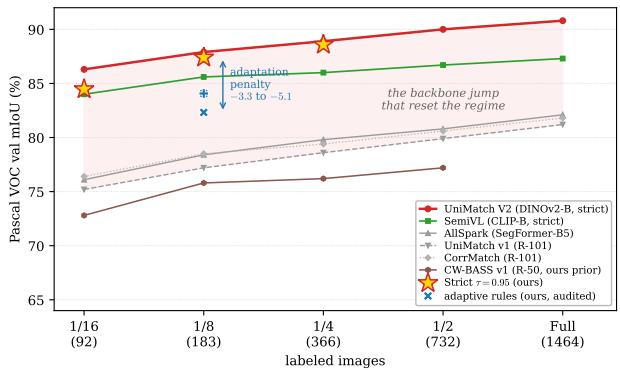  
Fig. 4. Pascal VOC SSSS landscape (val mIoU vs. labeled-image budget). CW-BASS v2’s strict operating point (⋆) sits in the top DINOv2 tier; the adaptive rules (audited, ×) fall a fixed 3.3–5.1 mIoU below it (shaded adaptation penalty), a gap dwarfed by the backbone jump over the ResNet-101 field that reset the regime.

Scope of this claim: $\pi _ { \mathrm { k e p t } }$ is a property of the teacher’s calibration, not of DINOv2 in particular, so the gate is in principle backbone-agnostic; but every teacher we can test is DINOv2-family, so we claim the demonstration only for DINOv2-family teachers (Sec. VII-A), and with six teachers we can show the criterion separates the regimes, not pin its exact boundary. The ADE win is single-seed: the sign (no collapse; floor ≥ strict) reproduces across S and B, but its magnitude is within plausible seed noise, and we do not rest the paper on it. The floor, CW-BASS $\mathbf { v } 2 \mathbf { \bar { s } }$ own mechanism, is worst on the reliable Pascal teacher yet best on the unreliable ADE teacher: regime-appropriate, which is what the gate exploits. (DINOv2- L is a partial cross-check: it confirms the Pascal loss in full and its L-ADE dynamic run reaches 52.00 with no collapse, but strict L-ADE exceeded GPU memory and L-Cityscapes was not run, so we claim no signed L gap off Pascal.)

## F. Qualitative Results

Figure 6 contrasts strict and CW-BASS v2’s adaptive rule on two favourable validation images per dataset, chosen by

TABLE VI  
GENERALITY ACROSS BACKBONE SCALE AND DATASET. BEST EMA MIOU AT MATCHED BATCH 16, SEED 0; ENC. = DINOV2-{S,B,L} (DINOV2-B PASCAL 1/8 THREE-SEED MEAN 86.19±1.82, TABLE IX). STRICT BEATS EVERY ADAPTIVE RULE ON PASCAL AT ALL SCALES, THE RULES TIE ON CITYSCAPES, AND THE FLOOR EDGES AHEAD ON THE confidently-unreliable ADE20K TEACHER (THE SEPARATOR IS πkept, TABLE VII; ADE SINGLE SEED). PER-CLASS WAS RUN ONLY AT DINOV2-B. BEST PER ROW IS BOLD, second IS ITALIC.
<table><tr><td>Enc.</td><td>Dataset (1/8, b16)</td><td>Strict</td><td>Dynamic</td><td>Floor</td><td>Per-cls</td></tr><tr><td rowspan="3">S</td><td>Pascal VOC</td><td>85.00</td><td>82.00</td><td>80.48</td><td rowspan="3"></td></tr><tr><td>Cityscapes</td><td>81.51</td><td>81.86</td><td>81.16</td></tr><tr><td>ADE20K</td><td>44.02</td><td>44.92</td><td>44.69</td></tr><tr><td rowspan="3">B</td><td>Pascal VOC</td><td>87.40</td><td>84.07</td><td>82.32</td><td>84.07</td></tr><tr><td>Cityscapes</td><td>83.96</td><td>83.43</td><td>83.47</td><td>83.40</td></tr><tr><td>ADE20K</td><td>49.10</td><td>49.67</td><td>50.58</td><td>49.25</td></tr><tr><td>L</td><td>Pascal VOC ADE20K†</td><td>86.91</td><td>84.88 52.00</td><td>83.50</td><td></td></tr></table>

†Partial: strict L-ADE OOM’d and L-Cityscapes was not run; the L-ADE dynamic rule at 52.00 shows no collapse, matching the unreliable-teacher behaviour at S and B, but with no strict arm we claim no signed L-ADE gap.

## TABLE VII

THE GATE, MEASURED BLIND ON SIX STRICT TEACHERS. CONFIDENCE GEOMETRY OF EACH CONVERGED STRICT TEACHER, MEASURED FORWARD-ONLY ON THAT DATASET’S VALIDATION SPLIT (200 IMAGES; SEE SEC. IV-C FOR WHY THE VALIDATION SPLIT RATHER THAN $\mathcal { L } _ { \mathrm { c a l } } ,$ AND WHAT THAT DOES AND DOES NOT SHOW). VALUES IN %: SATURATION $S { = } \operatorname* { P r } [ c { \geq } 0 . 9 5 ]$ AND RELIABILITY $\pi _ { \mathrm { k e p t } } { = } \mathrm { P r } [ \mathrm { C O R R E C T }$ | c≥0.95]. ALL TEACHERS ARE SATURATED; WHAT TRACKS THE SIGN OF THE ADAPTIVE-VS-STRICT GAP $( \Delta { = } \mathrm { F L O O R - } \mathrm { S T R I C T }$ MIOU) IS $\pi _ { \mathrm { k e p t } }$ , not S. THE GATE $( \pi _ { \mathrm { k e p t } } 2 \tau \Rightarrow$ STRICT, ELSE ADAPTIVE; τ=0.95) MAKES THE CORRECT CALL ON EVERY TEACHER WITHOUT SEEING ∆. THE GATE IS BINARY: IT DOES NOT RANK THE DYNAMIC AND PER-CLASS RULES, WHICH ON CITYSCAPES-S AND ADE-S EDGE PAST THE FLOOR (TABLE VI).
<table><tr><td>Teacher</td><td>Enc.</td><td> $S { \geq } 0 . 9 5$ </td><td> $\pi _ { \mathrm { k e p t } }$ </td><td>gate</td><td> $\Delta$ </td></tr><tr><td>Pascal VOC</td><td>B</td><td>97.8</td><td>98.5</td><td>strict</td><td>-5.08</td></tr><tr><td>Pascal VOC</td><td>S</td><td>96.7</td><td>98.4</td><td>strict</td><td>-4.52</td></tr><tr><td>Cityscapes</td><td>B</td><td>92.4</td><td>98.4</td><td>strict</td><td>-0.49</td></tr><tr><td>Cityscapes</td><td>S</td><td>92.0</td><td>98.1</td><td>strict</td><td>-0.35</td></tr><tr><td>ADE20K</td><td>B</td><td>85.0</td><td>89.3</td><td>adaptive</td><td>+1.48</td></tr><tr><td>ADE20K</td><td>S</td><td>82.1</td><td>89.2</td><td>adaptive</td><td>+0.67</td></tr></table>

per-image mIoU advantage for the adaptive rule (the per-class rule on Pascal, the self-adaptive floor on Cityscapes/ADE20K). These are deliberately selected cases; what they illustrate is that the visual contrast tracks confident-set reliability, not any single image. The Pascal rows make the point against us and we leave them that way: even chosen for the adaptive rule’s benefit, its maps carry visible speckle that strict does not, and strict leads in aggregate besides. The audit rests on the aggregate (Tables X and XII). On Cityscapes the maps are near-identical, the visual signature of the aggregate near-tie. On the confidently-unreliable ADE20K teacher (∼89% reliable, Table VII) the floor recovers large regions strict mislabels, and, unlike Pascal, these per-image wins run in the same direction as the aggregate (floor 50.58 vs. strict 49.10, single seed; Sec. V-E).

## G. Ablations

Table VIII adds the CW-BASS mechanisms cumulatively on Pascal VOC 1/8 (DINOv2-Base) in a reduced-scale single-seed

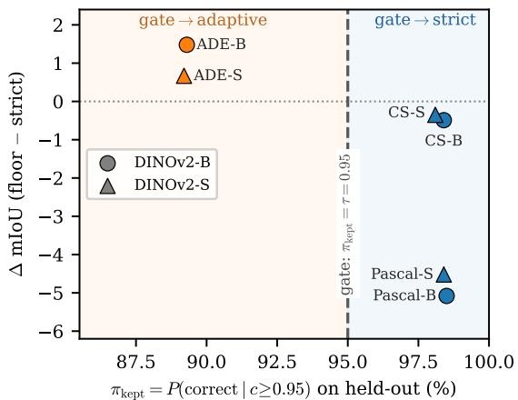  
Fig. 5. The reliability gate, demonstrated blind. Adaptive-vs-strict gap (∆= floor−strict mIoU) against $\pi _ { \mathrm { k e p t } } ,$ measured one-pass on held-out labels with no access to $\Delta .$ . All six strict teachers fall on the correct side of the boundary $\pi _ { \mathrm { k e p t } } { = } \tau { = } 0 . 9 5 \colon$ where the confident set is reliable (right; Pascal/Cityscapes) adaptive filtering does not help; where it is unreliable (left; ADE20K) the floor is competitive. ADE single seed.

## TABLE VIII

CUMULATIVE ABLATION ON PASCAL VOC 1/8. (DINOV2-BASE, REDUCED-SCALE, SINGLE SEED.) CWLOSS = CONFIDENCE-WEIGHTED CE; BND = BOUNDARY AUXILIARY; FLOOR = SELF-ADAPTIVE FLOOR; CALIB = HELD-OUT CALIBRATION. THE BOUNDARY AUXILIARY, WHICH HELPED AT RESNET STRENGTH, DOES not TRANSFER (−1.9); THE FLOOR IS THE LARGEST WITHIN-FAMILY EFFECT (+2.7); BUT THE ENTIRE LADDER SITS BELOW STRICT (TABLE X), AND OPTIMISING WITHIN THE ADAPTIVE FAMILY DOES NOT CHANGE WHICH FAMILY WINS.
<table><tr><td>CWLoss</td><td>Bnd</td><td>Floor</td><td>Calib</td><td>mIoU</td></tr><tr><td></td><td></td><td></td><td></td><td>76.75</td></tr><tr><td>√</td><td></td><td></td><td></td><td>77.93</td></tr><tr><td>√</td><td>√</td><td></td><td></td><td>76.08</td></tr><tr><td>√</td><td>√</td><td>√</td><td></td><td>78.76</td></tr><tr><td>√</td><td>√</td><td>√</td><td>√</td><td>78.28</td></tr></table>

study, which isolates the within-adaptive-family contributions that the full-scale Table X cannot (since there the whole family collapses). Two audit findings stand out. First, the boundary auxiliary, which clearly helped the original ResNet-era CW-BASS [12], does not transfer to DINOv2 (−1.9 mIoU here): its benefit is backbone-dependent. Confidence weighting gives a modest +1.2, and held-out calibration is accuracy-neutral (−0.5; its value is the unbiased noise estimate, not mIoU; Sec. VI). Second, within the dynamic-threshold family the floor is the largest single effect (+2.7), consistent with its stability role (Sec. VI-D). The crucial caveat (and the reason this ablation is a supporting study, not the headline) is that this entire ladder lives below the strict fixed threshold: the best configuration here (78.8, reduced scale) and the floorstabilised matched-batch 16 run (82.32, Table X) fall $\sim 8$ and ∼5 mIoU short of the strict baseline’s 87.4 respectively. Optimising within the adaptive family does not change the conclusion that the family is the wrong choice.

## VI. ANALYSIS: WHY THE GATE

This analysis is the evidence CW-BASS v2’s gate is built on: it establishes when adaptive filtering fails and the mechanism that makes the failure predictable, so the method can select against it. That a strict high threshold beats coverage-seeking filtering on a DINOv2 teacher is, on its own, not new: UniMatch V2 [15] already established it, and we confirm rather than discover it. Our contribution here is not the ranking but its explanation: a batch-matched decomposition of why it holds, measured link by link, from which the gate’s reliability criterion follows. On the identical DINOv2-Base backbone we compare four settings: (i) the strict fixed threshold $\tau { = } 0 . 9 5$ of UniMatch V2 [15]; (ii) the original CW-BASS dynamic global threshold (Equation (4)); (iii) that dynamic threshold lower-bounded by the self-adaptive floor and informed by heldout calibration (the full cwbass $_ - \nabla 2$ recipe); and (iv) the per-class adaptive scheme of Sec. IV-D (class\_adaptive). Backbone, decoder, optimiser, augmentation, EMA teacher, crop, batch and splits are held fixed; rules (ii)–(iv) differ from one another in the rule alone, while (i) is the UniMatch V2 recipe and also differs in its unlabeled-loss form (Sec. V-A).

Finding: On a full-scale, three-seed comparison at the official batch 16, strict included (Table IX), the strict fixed threshold leads every adaptive rule on average and is the only rule that ever reaches the UniMatch V2 operating point. Averaged over three seeds it reaches $8 6 . 1 9 \pm 1 . 8 2$ mIoU on Pascal VOC 1/8 and attains the ∼87.4 mode on two of three seeds, while all $f i \nu e$ adaptive rules sit below it in a 79–85 band. The comparison turns on strict’s upside, not on a clean sweep of the seed $\mathrm { g r i d } ,$ , and we are precise about which is which. Across the fifteen adaptive runs not one reaches strict’s mode: the best adaptive result on any seed is 84.52, a hard ceiling 2.9 below strict’s 87.40. But strict’s own seed variance is real and it costs it one head-to-head: on seed 1 strict stalls at 84.09 and finishes below the dynamic rule’s 84.46 on that seed. That is the single cell in the $3 \times 6$ grid where an adaptive rule beats strict, and it is a comparison between a stalled strict run and the strongest adaptive rule; we report it rather than claim a clean sweep. The margin over the closest rule (dynamic, +1.84) is within strict’s seed spread and, by a two-sample Welch t-test at three seeds, not significant $\left( p { = } 0 . 2 2 \right)$ , as are the margins over per-class $\scriptstyle ( p = 0 . 1 4 )$ and SoftMatch $_ { ( p = 0 . 0 8 ) }$ ; only the margins over the floor (+4.3, $\scriptstyle p = 0 . 0 4 4 )$ and FreeMatch (+6.8, $\scriptstyle { p = 0 . 0 1 7 ) }$ clear 0.05. FreeMatch and SoftMatch, run by their own definitions, fail the same way as our reconstructions, so the result is not an artefact of the CW-BASS formula.

At matched batch 16 each adaptive rule reaches its best EMA checkpoint early (FreeMatch at epoch 1, the floor and per-class rules within the first few epochs) and then drifts down, versus strict’s late peak (epochs 32–42 on its climbing seeds; Table X, Figure 11). On the single seed dissected in Table X, the per-class rule collapses hardest, and the collapse is not confined to the student: the student sheds 6.0 mIoU and the EMA teacher 6.14, so the slow EMA does not damp the fall here, it merely delays it. A note on strict’s variance: its three seeds are 87.40/84.09/87.08, so two climb to the SOTA mode and one stalls early at 84.09; the stall is genuine (the seeds diverge by epoch 8, Figure 7), and we report it rather than hide it. It means strict’s margin is seed-dependent, and on that one seed its ranking is too.

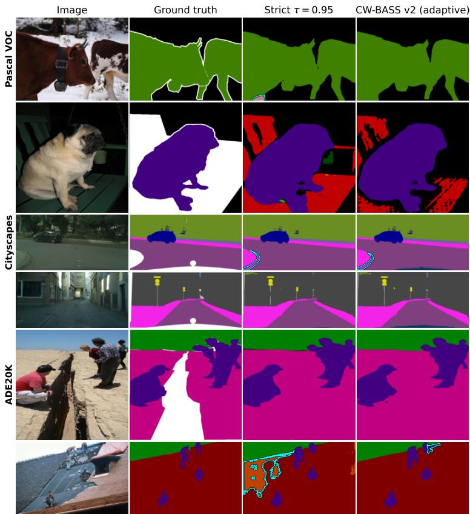  
Fig. 6. Qualitative comparison across the three teachers. (DINOv2-Base, EMA teachers; two favourable validation rows per dataset, selected by per-image mIoU advantage for the adaptive rule.) Columns: input, ground truth, strict τ=0.95, and CW-BASS v2’s adaptive rule (per-class on Pascal, the self-adaptive floor on Cityscapes/ADE20K); cyan contours mark large prediction-vs-GT error regions (cyan rather than red: the Pascal and ADE20K palettes both contain a saturated red). Row heights are equalised, so panels are mildly stretched. Read these as illustration, not evidence: the aggregate verdicts are in Tables VI, X and XII. Even on rows chosen to favour it, the adaptive rule is visibly noisier than strict on the reliable Pascal teacher (row 2, scattered speckle); the two are near-indistinguishable at the Cityscapes tie; and on the confidently-unreliable ADE20K teacher the floor removes a large mislabeled region strict introduces (row 6), the one dataset where its per-image wins run with the aggregate (single seed).

Unequal run lengths: Runs were trained with early stopping (patience 20 epochs on EMA mIoU) inside a 60- epoch budget, so they terminate at different epochs: strict seed 0 ran the full 60, the dynamic rule stopped at 51, the floor and per-class rules at 24, and strict seeds 1/2 at 28/52. This does not affect any best-EMA number (every run had run 20 epochs past its peak by construction) but it does mean the “final” column of Table X is each run’s last trained epoch rather than a common epoch, and it is why the trajectories in Figures 7 and 11 end at different points. The early stopping is part of the training protocol, not a post-hoc analysis choice.

The same early-peak signature recurs, more violently, at small batch: at batch 4 the three adaptive rules peak within 1–5 epochs below 80.5 and the raw student then falls steeply (Table X, lower blocks). We read these runs qualitatively only: they mix batch sizes with the strict baseline and were cut at a compute deadline (Sec. VI-A), so we claim from them just the direction (adaptive loses, peaks early, degrades harder when each noisy update carries more weight), not a numeric severity gradient. The early-peak-then-decline shape is the fingerprint of confirmation bias [17] under an over-permissive pseudolabel stream (Corollary 1); the quantitative claim rests on the matched batch 16 comparison above.

A note on the degradation columns. Because the EMA

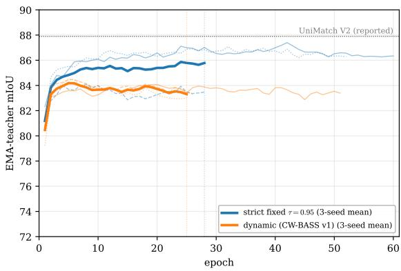  
Fig. 7. The decisive control, visualized. EMA-teacher mIoU over training (Pascal VOC 1/8, DINOv2-Base; thin lines per seed, bold the 3-seed mean). Strict (blue) separates from the dynamic band (orange) by epoch 8 on two of its three seeds and holds that gap for the rest of training. The third is the exception the mean has to carry: strict’s stalled seed 1 (dashed blue) drops into the orange band early and stays inside it, finishing below the best dynamic seed — visible here as the one blue line that never leaves the cluster. The two bold means are computed only over the all-live window, the epochs every one of the three seeds logged (dotted vertical lines), matching the seeds’ different stopping points (Table IX); thin per-seed lines continue past that window where a seed ran longer.

## TABLE IX

THE DECISIVE CONTROL: THREE-SEED COMPARISON AT MATCHED BATCH 16 (PASCAL VOC 1/8, DINOV2-BASE; BEST EMA MIOU PER SEED, MEAN±STD; (V1)/(V2) MARK THE CW-BASS GENERATIONS). EVERY ADAPTIVE RULE SITS BELOW STRICT on average, AND NONE REACHES STRICT’S ∼87.4 MODE (BEST ADAPTIVE: 84.52). THE ONE HEAD-TO-HEAD STRICT LOSES IS SEED 1, WHERE ITS STALLED RUN (84.09) FALLS BELOW THE DYNAMIC RULE’S 84.46 (UNDERLINED). WELCH t-TESTS AT THREE SEEDS: THE MARGINS OVER THE FLOOR (p=0.044) AND FREEMATCH $_ { ( p = 0 . 0 1 7 ) }$ ARE SIGNIFICANT; THOSE OVER DYNAMIC, PER-CLASS AND SOFTMATCH ARE NOT (p=0.22/0.14/0.08). BEST IS BOLD, second IS ITALIC (MEAN).
<table><tr><td>Threshold rule</td><td>seed 0</td><td>seed 1</td><td>seed 2</td><td>mean±std</td></tr><tr><td>Strict fixed τ=0.95 [15]</td><td>87.40</td><td>84.09</td><td>87.08</td><td> $\mathbf { 8 6 . 1 9 \pm 1 . 8 2 }$ </td></tr><tr><td>Dynamic (v1)</td><td>84.07</td><td>84.46</td><td>84.52</td><td> $8 4 . 3 5 \pm 0 . 2 4$ </td></tr><tr><td>Per-class adaptive (v2)</td><td>84.07</td><td>83.28</td><td>84.02</td><td> $8 3 . 7 9 \pm 0 . 4 3$ </td></tr><tr><td>SoftMatch [8]</td><td>83.26</td><td>83.47</td><td>82.24</td><td> $8 2 . 9 9 \pm 0 . 6 6$ </td></tr><tr><td>Dynamic + floor + calib (v2)</td><td>82.32</td><td>81.23</td><td>82.10</td><td> $8 1 . 8 8 \pm 0 . 5 7$ </td></tr><tr><td>FreeMatch [7]</td><td>79.10</td><td>79.95</td><td>79.02</td><td> $7 9 . 3 6 \pm 0 . 5 1$ </td></tr></table>

## TABLE X

AT MATCHED BATCH, EVERY ADAPTIVE THRESHOLD LOSES TO STRICT,   
AND THE FLOOR LOSES WORST. PASCAL VOC MIOU (DINOV2-BASE).   
ROWS 2–4 DIFFER FROM ONE ANOTHER IN THE THRESHOLD RULE ALONE; ROW 1 IS THE UNIMATCH V2 RECIPE (SEC. V-A). “BEST EMA (EP)” IS THE BEST EMA MIOU AND ITS EPOCH, “EMA/RAW DROP” THE   
BEST-TO-FINAL DECLINE OF THE EMA TEACHER AND OF THE STUDENT.   
Top block: MATCHED BATCH 16 (THE CONTROLLED COMPARISON), STRICT   
CLIMBS TO 87.40 (EP 42) WHILE ADAPTIVE RULES PEAK EARLY (EP 4–20) THEN DECLINE, THE PER-CLASS MODEL SHEDDING 6.14 MIOU.   
SINGLE-SEED TRAJECTORIES; THREE-SEED BESTS ARE IN TABLE IX, AND   
THE BATCH-4 RUNS, WHICH WE READ QUALITATIVELY ONLY, ARE IN THE SUPPLEMENTARY MATERIAL (TABLE XIV).

<table><tr><td>Threshold rule</td><td>batch best EMA (ep) EMA drop raw drop</td><td></td><td></td></tr><tr><td colspan="4">Pascal VOC 1/8 (183 labels), matched batch 16:</td></tr><tr><td>Strict fixed τ=0.95 [15] 16</td><td>87.40 (42)</td><td>1.06</td><td>1.8</td></tr><tr><td>Dynamic (CW-BASS)</td><td>16 84.07 (20)</td><td>0.68</td><td>1.4</td></tr><tr><td>Dynamic + floor + calib</td><td>16 82.32 (4)</td><td>2.24</td><td>2.4</td></tr><tr><td>Per-class adaptive</td><td>16 84.07 (4)</td><td>6.14</td><td>6.0</td></tr></table>

teacher moves slowly it can lag a collapsing student, so we report the fall of each. The EMA drop is the evaluation model degrading from its own best to its final epoch: benign for strict (1.06) but a striking 6.14 for the per-class rule (84.07→77.93). That 6.14 is the sharpest number in the table: the EMA teacher not only fails to damp the student’s 6.0 fall, it exceeds it, so it is the actual evaluation model that collapses — the direct signature of “early peak then decline”. The raw drop reports the underlying student’s peak-to-final fall, mild at batch 16 but severe at batch 4 (Table XIV, supplementary material).

The dynamic and per-class rules report the same best EMA to two decimals (84.07) by coincidence, not duplication: the underlying values are 84.071 (dynamic, epoch 20) and 84.068 (per-class, epoch 4), two distinct runs that peak at nearly the same height by different routes, the per-class rule far earlier, then collapsing far harder.

## A. What Else Could Explain the Gap

Three alternative explanations deserve to be ruled out or bounded: batch size, the strict arm’s different unlabeled loss, and the calibration split.

Not the batch: The primary, fully on-disk control is the top block of Table X: all four runs share the same batch 16, and strict beats dynamic by 3.3 and the floor by 5.1 mIoU, with the same early-peak-then-decline versus monotone-climb trajectory difference, so the gap is not a batch artefact. Batch size appears to control the severity of the collapse, the adaptive rules fall harder at batch 4 (Table X, lower blocks), but we report that only qualitatively: the batch-4 runs mix batch sizes relative to the strict baseline and were cut at a compute deadline, so we do not attach a numeric severity gradient to them. The claim we do rest on is batch-invariant and fully batch-matched: at the official batch 16, confidence-adaptive thresholds lose to a strict cutoff at foundation-model strength, and the floor does not rescue them.

Not (mostly) the loss form or the calibration split: Strict is the UniMatch V2 recipe and so also differs from the adaptive arms in its unlabeled loss, and two adaptive rules hold out 5% of labels (Sec. V-A). Both confounds are measured, and neither is close to large enough. In the cumulative ablation (Table VIII) the two CW-BASS loss terms together move accuracy by −0.7 (76.75 without them, 76.08 with both), and the calibration split by −0.5 (Table XVII); at face value they account for ≈1.2 of the 3.3–5.1 mIoU gap, leaving at least 2 mIoU that they cannot explain. The stronger argument is that the rule alone demonstrably moves accuracy by more than the whole strict-vsadaptive gap: among the five adaptive rules, which share one loop, one loss and one config and differ in nothing but the rule, three-seed means span 79.36 (FreeMatch) to 84.35 (dynamic), a 5.0 mIoU spread (Table IX). A selection rule is thus an order-of-magnitude-larger lever than the recipe difference that separates strict from the family. What we cannot bound from our runs is the dual-strong-view difference, which we do not ablate; a drop-in strict arm inside the CW-BASS v2 loop would settle it and is the first item of future work (Sec. VII-A).

Is it the stale constants?: A natural objection is that the dynamic rule loses only because it is run at its original ResNet-era constants $( \tau _ { 0 } { = } 0 . 6 , \ \beta { = } 0 . 5 , \ \tau _ { \mathrm { m i n } } { = } 0 . 3 )$ , which by construction ceiling its cutoff near 0.34 (Corollary 1), and a re-tuned rule might close the gap. A parameter sweep on Pascal VOC 1/8 at batch 16 (supplementary material, Table XV) rules this out: raising the lower clamp $\tau _ { \mathrm { m i n } }$ through 0.5, 0.7, 0.9, or the base $\tau _ { 0 }$ to 1.2/1.7, leaves the rule in the same 81–85 band, still peaking early (epochs 2–9), and never within 2.7 mIoU of strict. The one setting that would close the gap is the degenerate one: at $\tau _ { \mathrm { m i n } } { = } 0 . 9 5$ the clamp pins the cutoff at the strict threshold and the rule is the strict rule, with no adaptive range left, which is an algebraic identity rather than a cell we ran. The deficit is therefore not an artefact of a strawman parameterisation: across the whole sweep no configuration retaining any adaptive range comes close to strict. This is the central point sharpened: once the confidence range has collapsed (Sec. VI-B), there is no setting of an adaptdownward rule that beats a fixed high cutoff, because any room left to adapt downward is room to admit the error-enriched band beneath the saturated mass.

## B. Anatomy of the Collapse

The failure is not a tuning artefact; it is a causal chain that any confidence-adaptive rule triggers under a foundation-model teacher (schematised in Figure 1). We walk it link by link. Every quantity below is read off the TensorBoard logs of the matched-batch runs, not asserted, and the chain compresses to one measured line:

The measured chain. Confidence saturation (98% of pixels $\geq 0 . 9 5 .$ , ECE 0.007) ⇒ dynamic-range collapse (the dynamic cutoff pinned in $[ 0 . 3 0 0 , 0 . 3 \dot { 3 } 1 ]$ , directly beneath the analytic ceiling $\tau _ { 0 } \sigma ( \beta / 2 ) \approx 0 . 3 4$ of Corollary 1) ⇒ mask flooding (retention crosses 0.95 by epoch 7 and 0.99 by epoch 8, reaching 1.000; 99.9% of teacher errors admitted vs. 63% for strict) ⇒ early peak (best EMA at epochs 4–20 for the adaptive rules vs. epoch 42 for strict) ⇒ decline (the per-class evaluation model itself sheds 6.14 mIoU, $8 4 . 0 7 {  } 7 7 . 9 3 { \hat { ) } }$ . Strict τ=0.95 breaks the chain at the second link and never enters it.

Link 1: confidence saturation: Figure 8 histograms the strict teacher’s per-pixel max-softmax confidence over the validation set. 98% of valid pixels sit at confidence $\geq 0 . 9 5 \mathrm { : }$ the distribution is pinned against 1. This is the regime inversion. Adaptive thresholding (FlexMatch [6], FreeMatch [7]) was built for the opposite case: a teacher with many under-confidentbut-correct predictions that a high cutoff would waste. Here there are almost none to recover.

Link 2: dynamic-range collapse, where the threshold stops discriminating: With the confidence mass piled at 1, a cutoff’s job is decided entirely by where it sits relative to that pile. Figure 9a is the direct measurement: across the whole run the bare dynamic threshold stays pinned in [0.300, 0.331] (right at the analytic ceiling $\tau _ { 0 } \sigma ( \beta / 2 ) \approx 0 . 3 4$ of Corollary 1) while the teacher’s mean confidence climbs past 0.88. The gap is enormous, so essentially every pixel clears the cutoff: Corollary 1 made empirical. The per-class rule behaves the same way at first (rising only to 0.805); only the floor (Figure 9b) forces the threshold to track confidence upward (Theorem 1), climbing $0 . 5 7 7  0 . 9 2 2$ , and even then it bounds retention at ≈ 0.91, still admitting most of the (saturated) mass.

Link 3: mask flooding, and the admitted pixels are disproportionately wrong: A non-discriminative threshold retains nearly everything. The matched-batch 16 dynamic run starts at retention ${ \rho } _ { t } \mathrm { { = } } 0 . 5 6 9$ , crosses 0.90 and 0.95 by epoch 7, and reaches 0.99 by epoch 8 $( \rho _ { t } {  } 1 . 0 0 0$ thereafter); the per-class rule crosses 0.90 by epoch 8 (Table XI, Figure 11b). The band the dynamic rule admits but a strict cutoff rejects (confidence in [0.33, 0.95]) is where the teacher’s errors concentrate (the red mass in Figure 8): the dynamic threshold admits 99.9% of all teacher errors versus 63% for $\tau { = } 0 . 9 5$ . Where the teacher is uncertain it is uncertain because it is wrong, not merely conservative, so the extra coverage is almost pure noise. This is exactly the prediction of Proposition 1 (that the per-class noise rate $\widehat { \varepsilon } _ { k }$ should not fall for the classes whose thresholds the adaptive rule lowers), and our per-class IoU evidence is consistent with it: the hard classes the rarity-scaled rule targets do not improve (Table XII; the per-class tail mean 58.6 does not exceed the bare dynamic threshold’s 59.2, a 0.6 mIoU difference well inside the seed spread of Sec. VI-D, i.e. a tie, so the targeted coverage gain simply does not materialise). We lean on the measured per-class IoU rather than a direct read of $\widehat { \varepsilon } _ { k }$ , whose trajectory we leave to future work (Sec. VI-D).

MASK FLOODING, MEASURED. (MATCHED BATCH 16, FROM THE TENSORBOARD LOGS.) “FIRST EP $\geq x ^ { \ast }$ IS THE FIRST EPOCH CLASS-AVERAGED RETENTION REACHES $x ; { \overset {  } { \rho } } \operatorname { F I N A L } ^ { * }$ IS THE VALUE AT EACH RUN’S LAST TRAINED EPOCH (RUNS EARLY-STOP AT DIFFERENT EPOCHS, SEC. VI). THE DYNAMIC RULE FLOODS (CROSSES 0.95) BY EP 7 AND SATURATES AT 1.000; STRICT CROSSES THE SAME LEVEL THREE EPOCHS LATER AND STOPS AT 0.989, NEVER REACHING 0.99; THE FLOOR (THEOREM 1) NEVER CROSSES 0.95, THE ONLY ADAPTIVE RULE BOUNDING RETENTION AWAY FROM 1. NOTE THAT STRICT TOO ENDS AT HIGH RETENTION: WHAT DISTINGUISHES IT IS which PIXELS IT RETAINS (SEC. VI-C), NOT HOW MANY.
<table><tr><td>Threshold rule ρ start first ep ≥ 0.90</td><td colspan="4">first ep ≥ 0.95 first ep ≥ 0.99 ρ final</td></tr><tr><td>Strict fixed  $\tau { = } 0 . 9 5$ </td><td>ramp</td><td>10</td><td>10</td><td>0.989</td></tr><tr><td>Dynamic  $( \mathbf { C W - B A S S } )$ </td><td>0.569</td><td>7</td><td>7 8</td><td>1.000</td></tr><tr><td>Dynamic + floor + calib</td><td>low</td><td>22†</td><td>一 一</td><td>0.914</td></tr><tr><td>Per-class adaptive</td><td>low</td><td>8</td><td></td><td>0.893</td></tr></table>

†The floored run reaches only $\rho { = } 0 . 9 1 4$ by epoch 22 and never crosses 0.95, in agreement with Theorem 1.

Link 4: early peak, then decline: Training then optimises against an almost-unfiltered, confidently-wrong pseudo-label set from the very first epochs, before the teacher is good enough to bootstrap. This is textbook confirmation bias [17] compounded by the feature-distortion dynamic of LP-FT [18], whose finding that “early stopping does not mitigate feature distortion” matches our curves precisely: at matched batch 16 every adaptive run peaks within epochs 4–20 (the floor and per-class rules within the first 4) and then declines for the rest of training, and at batch 4 the peak collapses to epochs 1– 5 (Figure 11a). The strict threshold is the single rule that never enters this chain, because its cutoff does not relax as the teacher becomes confident; it keeps excising the error-enriched low-confidence band throughout.

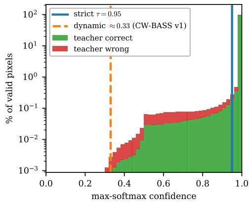  
Fig. 8. Confidence saturation: the chain’s first link. Per-pixel max-softmax confidence of the strict EMA teacher over Pascal VOC val (150 images), split into pixels it classifies correctly (green) vs incorrectly (red); log y-axis. 98% of pixels exceed 0.95, and the teacher’s errors concentrate in the low/midconfidence band that a strict cutoff rejects but a relaxed one keeps: the dynamic threshold (≈ 0.33) admits 99.9% of all errors, the strict τ=0.95 only 63%. A threshold below the saturated mass keeps everything, errors included; this is what disables every adaptive rule downstream.

The per-class rule does not help the classes it targets: The sharpest test of the per-class motivation is direct: does lowering a hard class’s threshold improve that class? Table XII answers no. On the six hardest Pascal classes, exactly those the rarityscaled rule lowers thresholds for, the per-class scheme merely ties the global dynamic threshold at the same batch 4 (tail mean 58.6 vs 59.2, inside seed noise): the targeted coverage gain it is designed to deliver does not appear. This is the batch-controlled core of the analysis: per-class buys nothing over the simpler global rule, because at foundation strength a hard class’s uncertainty signals that the teacher is wrong, not unfairly filtered (Proposition 1); relaxing the cutoff converts that uncertainty straight into label noise. Figure 10 extends this to all 20 foreground classes: strict (batch 16) matches or beats both adaptive rules (batch 4) on every one, the deficit widest on the cluttered indoor classes (chair, diningtable, sofa, tvmonitor) where pseudo-label noise is most damaging. That figure carries strict’s batch advantage, so it shows the ceiling rather than a matched contrast; at matched batch 16 and matched seed (Table XIII) strict’s lead narrows to 18 of 21 classes, the perclass rule taking bicycle, train and tvmonitor.

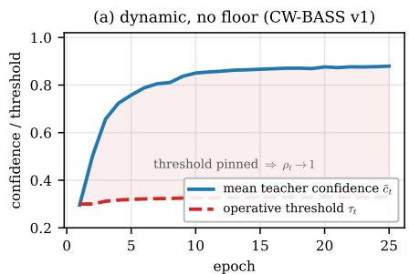

(b) dynamic + floor (CW-BASS v2)  
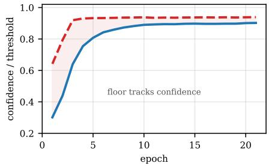  
Fig. 9. Dynamic-range collapse, measured. (Pascal VOC 1/8, DINOv2-Base, class-averaged.) (a) The bare dynamic threshold (red) stays pinned near its lower clamp while the teacher’s mean confidence (blue) climbs past 0.88; the shaded gap is confidence mass admitted indiscriminately (Corollary 1). (b) The floor forces the operative threshold upward $( 0 . 5 7 7 \stackrel { } {  } 0 . 9 2 2 .$ , Theorem 1) but only to a quantile still retaining ≈ 91% of the mass, why it stabilises without recovering accuracy.

Table XIII extends this to all 20 foreground classes plus background at matched batch 16 and matched seed: the deployed strict rule leads in mean IoU and on 18 of the 21 classes. The per-class adaptive rule wins only on bicycle (+0.5), train (+1.6) and tvmonitor (+4.3), and pays heavily where a lowered threshold admits confidently-wrong pixels in cluttered indoor scenes (sofa −21.0, chair −17.8, bottle −5.6).

## C. Mask-Ratio Diagnostic

The full-scale trajectories (Figure 11) make the mechanism legible and confirm Theorem 1; read the retention panel (b) alongside the accuracy panel (a). The dynamic and per-class rules drive retention $\rho _ { t }$ to ≈ 1 within a few epochs (Table XI), premature mask flooding: they admit essentially every pixel before the teacher is accurate (Corollary 1), so the student trains on a saturated, still-wrong pseudo-label set from the start and the accuracy panel shows it collapsing right after its early peak. The floor instead holds $\rho _ { t }$ bounded (never crossing 0.95), in agreement with the fixed quantile Theorem 1 predicts; the realized ceiling (≈ 0.91) sits a little below the nominal s=0.95 because the operative threshold is max $\cdot ( \tau ^ { \mathrm { d y n } } , \tau ^ { \mathrm { f l o o r } } )$ That bound reduces the late-training collapse but does not eliminate it (Table X): as panel (a) shows, the floor-stabilised run still tracks the other adaptive variants down. Bounding retention does not undo the damage of having relaxed the cutoff.

TABLE XII  
PER-CLASS IOU ON THE SIX HARDEST PASCAL VOC CLASSES. (1/8, DINOV2-BASE, BEST EMA.) THE PER-CLASS RULE LOWERS THRESHOLDS FOR EXACTLY THESE CLASSES, YET AT MATCHED BATCH 4 IT MERELY ties THE GLOBAL DYNAMIC THRESHOLD (TAIL MEAN 58.6 VS 59.2, WITHIN SEED NOISE): THE TARGETED COVERAGE GAIN DOES NOT APPEAR. BATCH-MATCHED COMPARISON IS Dynamic VS Per-class (BOTH B4); Strict (B16) IS SHOWN FOR REFERENCE ONLY.
<table><tr><td>Class</td><td>Strict (b16)</td><td>Dynamic (b4)</td><td>Per-class (b4)</td></tr><tr><td>bicycle</td><td>81.3</td><td>74.4</td><td>76.5</td></tr><tr><td>chair</td><td>67.0</td><td>52.5</td><td>57.7</td></tr><tr><td>diningtable</td><td>74.6</td><td>60.6</td><td>58.5</td></tr><tr><td>pottedplant</td><td>62.4</td><td>55.7</td><td>53.5</td></tr><tr><td>sofa</td><td>78.4</td><td>50.4</td><td>47.2</td></tr><tr><td>tvmonitor</td><td>67.8</td><td>61.6</td><td>58.1</td></tr><tr><td>tail mean</td><td>71.9</td><td>59.2</td><td>58.6</td></tr><tr><td>overall mIoU</td><td>87.4</td><td>80.4</td><td>80.0</td></tr></table>

Strict is the instructive contrast, and it is worth being exact about what the contrast is, because strict also ends at high retention (ρ=0.989): high retention is plainly not sufficient for collapse. Two differences remain. Strict reaches the flood later (first crossing 0.90 and 0.95 at epoch 10, against epoch 7 for dynamic) and, more importantly, it reaches it by a different route: strict’s cutoff never moves, so its retention can only rise because the teacher’s confidence rose, i.e. its high retention is a consequence of the teacher improving, whereas the dynamic rule’s is a consequence of the cutoff sitting beneath the mass from the first epoch. The three-epoch difference is small, and we do not claim the timing alone explains the outcome. What the trajectories do establish is the conjunction: the rules that flood do so while their own cutoff is pinned near 0.33, admitting 99.9% of teacher errors throughout, whereas strict admits 63% at every point on its ramp. It is the composition of retained pixels, not the retained fraction, that separates them.

## D. Floor Stability and Calibration Cost

The floor’s role is narrow and important: it confirms the collapse mechanism by removing it, not the accuracy deficit. In a three-seed, reduced-scale study (supplementary material, Table XVI), the bare dynamic threshold degrades sharply after an early peak (mean drop 15.8 mIoU, seed spread ±7.3); the same threshold lower-bounded by the floor (Theorem 1) arrests most of that degradation (mean drop 1.7) and collapses the seed spread to $\pm 0 . 6 .$ This confirms Theorem 1 and corollary 1: the bare dynamic threshold is not merely suboptimal but unstable once the teacher saturates, and pinning retention to a fixed quantile restores stability. But stability is not accuracy: both rules sit far below the strict threshold (Table X). The floor cures the instability of a confidence-blind rule but not its mismatch to a saturated teacher: the honest lesson is that one should not relax the threshold in the first place, and the floor is the instrument that proves why relaxing it does the damage. A calibration-fraction sweep (supplementary material, Table XVII)

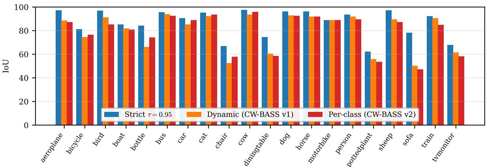  
Fig. 10. Per-class IoU across all 20 Pascal VOC foreground classes. (1/8, DINOv2-Base, best EMA checkpoint.) The strict fixed threshold (blue, batch 16) matches or exceeds the dynamic (orange) and per-class adaptive (red) rules (both batch 4) on every class; the gap is largest on the hard indoor classes. The batch-matched comparison here is dynamic vs. per-class: the two adaptive rules are near-indistinguishable, underscoring that per-class adaptation adds nothing over a global dynamic threshold at foundation strength; the strict column carries a batch advantage and is included to show the ceiling, not as a batch-matched contrast.

TABLE XIII  
PER-CLASS IOU ON PASCAL VOC 1/8 (DINOV2-BASE, BEST EMA TEACHER, MATCHED BATCH 16, both rows seed 0). DEPLOYED STRICT RULE VS. THE PER-CLASS ADAPTIVE RULE; STRICT LEADS IN MEAN IOU AND ON 18 OF THE 21 CLASSES.
<table><tr><td>Rule</td><td>mIoU</td><td>bg</td><td>aero</td><td>bike</td><td>bird</td><td>boat</td><td>bottle</td><td>bus</td><td>car</td><td></td><td>cat</td><td>chair</td><td>COW</td><td>table</td><td>dog</td><td>horse</td><td>mbike</td><td>person</td><td>plant</td><td>sheep</td><td>sofa</td><td>train</td><td>tv</td></tr><tr><td>Strict τ=0.95 (deployed)</td><td>87.4</td><td>96.8</td><td>97.2</td><td>81.3</td><td>97.0</td><td>85.1</td><td>84.3</td><td></td><td>95.4</td><td>90.7</td><td>95.4</td><td>67.0</td><td>97.6</td><td>74.6</td><td>96.2</td><td>96.3</td><td>89.0</td><td>93.6</td><td>62.4</td><td>97.1</td><td>78.4</td><td>92.2</td><td>67.8</td></tr><tr><td>Per-class adaptive</td><td>84.1</td><td>96.1</td><td>95.0</td><td>81.8</td><td>94.6</td><td>84.4</td><td>78.8</td><td></td><td>93.0</td><td>87.6</td><td>94.4</td><td>49.2</td><td>95.5</td><td>71.6</td><td>93.6</td><td>95.0</td><td>84.8</td><td>92.0</td><td>61.9</td><td>92.8</td><td>57.4</td><td>93.8</td><td>72.1</td></tr></table>

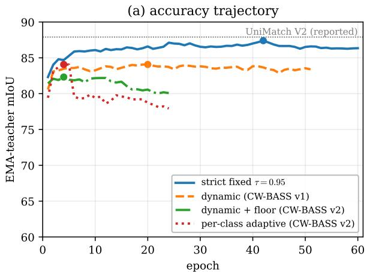

(b) mask-ratio trajectory  
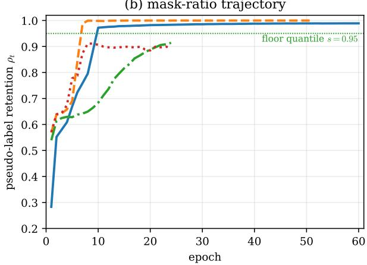  
Fig. 11. The saturation analysis in one figure: strict climbs, adaptive peaks early. Matched-batch trajectories on Pascal VOC 1/8 (DINOv2-Base, all four rules at batch 16). (a) EMA-teacher mIoU: strict climbs to $8 7 . 4$ and holds; every adaptive rule peaks early (ep 4–20). What follows the peak differs by rule and we do not lump them together: the per-class rule declines steeply (−6.1 mIoU EMA), the floor moderately (−2.2), while the dynamic rule is essentially flat (−0.7) — it fails by never climbing, not by falling. (b) Retention ρt: the dynamic and per-class rules flood toward ≈ 1 (dynamic crosses 0.95 by ep 7, Table XI); the floor stays bounded (≈ 0.91, Theorem 1); strict reaches a comparable 0.989 but three epochs later and while rejecting the error-enriched band throughout (Sec. VI-C). Curves end at different epochs because training used early stopping (patience 20) inside the 60-epoch budget: strict ran to ep 60, the dynamic rule stopped at 51, the floor and per-class rules at 24.

shows accuracy is flat in $\alpha ,$ all four settings within 0.5 mIoU, so holding out a small labeled slice costs essentially nothing; the slice’s value is not raw accuracy but the unbiased noise estimate of Proposition 1, which removes the self-confirming in-batch estimate by which falling noise could have justified lowering thresholds, and whose prediction (that $\widehat { \varepsilon } _ { k }$ does not fall where the rules lower thresholds) is supported by the per-class IoU evidence (Table XII).

## E. What This Means for the Method

This synthesis closes the analysis: it is why CW-BASS v2 gates its adaptive machinery rather than deploying it unconditionally. On a saturated teacher (the Pascal regime, $9 8 \% { \geq } 0 . 9 5$ and the standard foundation-model benchmarks) the method selects the strict fixed threshold; it engages the floor only where it pays off, on a confidently-unreliable teacher whose $\pi _ { \mathrm { k e p t } }$ falls below the confidence it demands (Sec. V-E). The floor and the held-out calibration are not discarded under saturation, they remain the instruments that make the gate’s call legible: the floor as a provable stability guarantee that isolates the collapse mechanism (Sec. VI-C), and the calibration as the unbiased diagnostic that reads the teacher’s noise (Sec. IV-A). The broader lesson the controlled comparison establishes is that one should not spend effort re-tuning dynamic or per-class thresholds for a saturated teacher: the room they leave to adapt downward is room to admit the error-enriched band beneath the saturated mass.

## VII. DISCUSSION

CW-BASS v2 is a saturation-aware selection method, and its design is dictated by a measured mechanism rather than a heuristic. An entire family of pseudo-label selection rules (dynamic global thresholds, per-class curricula, soft confidence weights) was developed for weak, under-confident ResNet teachers. On a strong, saturated DINOv2 teacher that family does not merely fail to help; it actively harms: every adaptive variant peaks within a few epochs and then degrades under its own pseudo-label noise, while the strict fixed threshold climbs cleanly ahead. Where such a teacher is genuinely uncertain it is uncertain because it is wrong, so any rule that lowers a cutoff in response to confidence buys coverage in pure noise, the inverse of the regime FlexMatch and FreeMatch were designed for. The method’s answer is not to abandon adaptive filtering but to gate it: measure the reliability of the teacher’s confident set, then use the rule that regime warrants.

Why the field’s adaptive-threshold intuition inverts at foundation strength.: This regime inversion is the paper’s central conceptual claim. FlexMatch and FreeMatch derive their per-class thresholds from a per-class learning-status signal (a count of confident predictions, or a per-class confidence EMA relative to the global mean), and the mechanism is informative only to the extent that these signals differ across classes: an easy class sits high, a hard class low, and the rule lowers the cutoff for the laggard. That spread is precisely what a weak ResNet teacher supplies and what a DINOv2 teacher destroys: with nearly all confidence squeezed against the ceiling, every per-class statistic collapses toward the same value (our per-class cutoff rises only to 0.805, the two adaptive rules becoming nearindistinguishable, Figure 10). A mechanism whose entire value is discriminative power across classes loses that power exactly when the backbone is strongest. The FlexMatch/FreeMatch family is thus not wrong; it is correctly tuned for a noise regime that foundation backbones have left behind.

What the method keeps, and why: CW-BASS v2’s two new constructs serve double duty. The self-adaptive floor is the adaptive rule the gate engages under a confidently-unreliable teacher, where it wins (ADE20K, Table VI); it is also a provable stability guarantee (Theorem 1) that let us show the saturated-teacher collapse is causal by removing it. The held-out calibration is an unbiased per-class noise estimator (Proposition 1) that both breaks the self-confirming loop of in-batch estimation and gives the gate an honest read of the teacher’s regime. The resulting rule is conditional: strict filtering when the confident set is reliable $( \pi _ { \mathrm { k e p t } } 2 \tau )$ , the adaptive floor when it is not (Sec. V-E). The complementary question, whether embedding-space auxiliaries rather than threshold engineering can add to a foundation-model SSSS baseline, is taken up by PixCon [45] and is out of scope here.

Relation to other audits: Our analysis sits in the lineage of realistic-evaluation work [28] and the recent audit of UniMatch V2 itself [29]. Landgraf et al. probe that system’s reliability and robustness (calibration, out-of-distribution behaviour, and sensitivity to design choices), holding the method fixed and varying the evaluation. We do the complementary thing: hold the backbone, decoder, optimiser, augmentation, crop, batch, splits and epoch budget fixed and vary the threshold rule, at matched batch and over three seeds, so that the mechanism (dynamic-range collapse → mask flooding) and the deployable decision it implies (the reliability gate) are attributable to the selection rule. Within the adaptive family the rule is the sole varied factor; against the strict arm the comparison is recipe-level, and Sec. VI-A bounds what that costs. Neither varies the threshold rule as the principal factor; to our knowledge ours is the first batch-matched, mechanism-level study of adaptive pseudo-label thresholding on a foundationmodel backbone. It also refines the calibration view [33] in an important way. The usual concern is that strong models are globally mis-calibrated; the DINOv2 teacher is not, in aggregate (Figure 2), yet confidence-adaptive selection still fails. The operative pathology is not aggregate miscalibration but confidence saturation, the collapse of the confidence distribution’s dynamic range, which disables any rule that reads confidence to decide what to keep. What little spread survives is, moreover, the region where the teacher is over-confident (Figure 2b), so relaxing the cutoff to exploit that spread recovers mostly errors: the two observations are complementary, not in tension.

## A. Implications for Practice

The gate, and the analysis behind it, reduce to four cheap checks. Each is instantiated in this paper, each is cheap relative to a single training run, and the first costs one forward pass.

Before proposing or adopting an adaptive pseudo-label threshold at foundation scale:

1) Measure confident-set reliability, not just saturation. On a held-out labeled slice, report $\pi _ { \mathrm { k e p t } } { = } \mathrm { P r }$ [correct $c { \geq } \tau ]$ (one forward pass). If it meets the confidence demanded $( \pi _ { \mathrm { k e p t } } 2 \tau )$ the confident set is trustworthy and a strict cutoff is right; if not (ADE20K, 89%) the teacher is confidently miscalibrated and a softened rule helps. Saturation alone is not enough: all our teachers are ${ \geq } 8 2 \%$ saturated (Table VII) yet the verdict flips with $\pi _ { \mathrm { k e p t } }$

2) Match the batch. Compare threshold rules at identical batch size from one shared config (Table X, top block). Batch size modulates the severity of a collapse and can masquerade as a threshold effect.

3) Report trajectories and final-vs-best, not best checkpoints. The early-peak-then-decline signature is invisible in a bestcheckpoint table (Figure 11).

4) Check the best-vs-final gap, on the EMA teacher itself. A best-checkpoint number hides the collapse whether or not the EMA lags: here the per-class rule’s best EMA of 84.07 conceals a final EMA of 77.93 (Table X), a 6.14 fall larger than its student’s.

Scope and limitations: A method’s claims are only as good as their stated scope, so we state ours exactly. The controlled comparison is full-scale and three-seed on Pascal, strict included (Table IX), and the strict-vs-adaptive verdict reproduces across the DINOv2-S/B/L scale family and Cityscapes (Table VI). Four limits bound the generality. (i) Backbone family. Every teacher we test is DINOv2; $\pi _ { \mathrm { k e p t } }$ is a calibration property that ought to transfer to other foundation teachers, but we demonstrate the gate only for DINOv2-family teachers and cannot claim it for CLIP- or SAM-style encoders without running them. (ii) The affirmative result is singleseed. The one regime where the adaptive floor wins is the confidently-unreliable ADE20K teacher; its sign (no collapse, floor≥strict) reproduces at S and B, but the +1.5 magnitude is within plausible seed noise, so we do not rest the paper on it. (iii) The gate boundary is validated, not calibrated, and validated post-hoc. With six teachers we show $\pi _ { \mathrm { k e p t } } \geq \tau$ separates the regimes and makes the right strict-vs-floor call blind (Figure 5 and table VII); pinning the exact boundary would need many more teachers than compute allowed. The validation also measures $\pi _ { \mathrm { k e p t } }$ on each dataset’s validation split from a converged teacher, not on $\mathcal { L } _ { \mathrm { c a l } }$ mid-run as a deployment would (Sec. IV-C), because a 9-image calibration slice cannot resolve 98% from 89%; we have therefore validated the criterion, not measured the live system. (iv) Strict’s own seed variance. One of three strict seeds stalled at 84.09, so strict’s margin over the closest adaptive rule is modest and, at three seeds, significant only over the floor and FreeMatch; on that seed the dynamic rule finishes above strict, the one cell in the grid where an adaptive rule wins. What is unambiguous is that strict uniquely reaches the ∼87.4 mode no adaptive run attains. (v) The strict arm is not loss-matched. Strict runs the UniMatch V2 unlabeled loss while the adaptive arms run the CW-BASS v2 one, and two adaptive rules additionally hold out 5% of labels (Sec. V-A). The measured components of that difference account for ≈1.2 of the 3.3–5.1 mIoU gap (Sec. VI-A) and the dual-strong-view difference is not ablated at all; a strict arm run inside the CW-BASS v2 loop would make the comparison single-factor and is the most valuable single experiment left undone. Two smaller caveats: the DINOv2-L cross-dataset check is partial (strict L-ADE exceeded GPU memory, L-Cityscapes not run), and the batch-4 blocks of Table X mix batch sizes and were cut at a compute deadline, so we treat the batch-severity trend as qualitative and rest the core claim on the matched-batch 16 comparison (Sec. VI-A). The bounded-retention theorem rests on a scale-family idealisation (Assumption 1); its operative content is the empirical mask-ratio prediction. The calibration slice costs 5% of labels, non-trivial at very low budgets; we have not optimised α. Finally, we audit the CAFS/ENCORE mechanism (held-out and feedback-driven per-class thresholds) through our own faithful reimplementation (Sec. IV-D) rather than their released code; a drop-in run of the published systems is future work.

Take-away: The regime inverted because the signal every adaptive rule reads, confidence spread, no longer exists at foundation strength, however well-calibrated the teacher. The four checks above are the gate, distilled; run them before adapting.

## VIII. CONCLUSION

We presented CW-BASS v2, a saturation-aware pseudolabel selection method for semi-supervised segmentation under foundation-model teachers, together with the controlled analysis that makes it principled. Its premise is that the right threshold rule depends on the reliability of the teacher’s confident set, which the method measures one-pass on a held-out slice and gates on. On an identical DINOv2-Base backbone the dynamic, per-class-adaptive and floor-stabilised variants — which differ from one another in the rule alone — all peak early and top out at 82–84 mIoU at the matched batch 16 (collapsing to ≈ 80 at small batch) on Pascal VOC 1/8, while the strict fixed threshold reaches 87.4, a single-seed reproduction of UniMatch V2’s reported 87.9; run unconditionally on this reliable, saturated teacher the floor we ourselves proposed fares worst, so CW-BASS v2 selects strict here. The mechanism is measured at every link: confidence saturation collapses the confidence distribution’s dynamic range, the adaptive cutoff degenerates to a constant exactly where the theory says it must, the retention mask floods, and self-training turns into confirmation bias.

Direct measurement of six DINOv2 teachers sharpens the generality claim and corrects a tempting story. All six are highly saturated, so “under-confidence” does not explain when adaptive filtering helps; what does is the reliability of the confident set, $\pi _ { \mathrm { k e p t } } \colon$ it is ≈98% on Pascal and Cityscapes (where strict wins or ties) and ≈89% on ADE20K, the one teacher where the floor edges ahead (single seed). The gate reads exactly this quantity, with the operating threshold as its boundary, and picks the correct strict-vs-floor call on all six teachers blind. The practical message is therefore not “always strict” but a decision rule CW-BASS v2 embodies: measure whether the confident set earns the confidence you demand, filter strictly when it does, soften when it does not. The methodological counterpart is shorter still: measure before you adapt.

Reproducibility: All code, configs, checkpoints and the experiment-matrix runner are released at https://github.

com/psychofict/CW-BASS-v2, together with the scripts that regenerate every figure and table in this paper from the released run artefacts (scripts/plot\_\*.py, scripts/gate\_stat.py). The DINOv2 runs follow the public UniMatch V2 protocol so that the baseline comparison is protocol-faithful.

## REFERENCES

[1] X. Chen, Y. Yuan, G. Zeng, and J. Wang, “Semi-supervised semantic segmentation needs strong, varied perturbations,” in CVPR, 2021.

[2] K. Sohn, D. Berthelot, N. Carlini, Z. Zhang, H. Zhang, C. A. Raffel, A. S. Rawat, O. Shavit et al., “Fixmatch: Simplifying semi-supervised learning with consistency and confidence,” in NeurIPS, 2020.

[3] L. Yang, L. Qi, L. Feng, W. Zhang, and Y. Shi, “Revisiting weak-tostrong consistency in semi-supervised semantic segmentation,” in CVPR, 2023.

[4] D.-H. Lee, “Pseudo-label: The simple and efficient semi-supervised learning method for deep neural networks,” in ICML Workshop on Challenges in Representation Learning, 2013.

[5] L.-C. Chen, Y. Zhu, G. Papandreou, F. Schroff, and H. Adam, “Encoder decoder with atrous separable convolution for semantic image segmenta tion,” ECCV, 2018.

[6] B. Zhang, Y. Wang, W. Hou, H. Wu, J. Wang, M. Okumura, and T. Shinozaki, “Flexmatch: Boosting semi-supervised learning with curriculum pseudo labeling,” in NeurIPS, 2021.

[7] Y. Wang, H. Chen, Q. Heng, W. Hou, Y. Fan, Z. Wu, J. Wang, M. Savvides, T. Shinozaki, B. Raj et al., “Freematch: Self-adaptive thresholding for semi-supervised learning,” in ICLR, 2023.

[8] H. Chen, R. Tao, Y. Fan, Y. Wang, J. Wang, B. Schiele, X. Xie, B. Raj, and M. Savvides, “Softmatch: Addressing the quantity-quality tradeoff in semi-supervised learning,” in ICLR, 2023.

[9] Y. Wang, H. Wang, Y. Shen, J. Fei, W. Li, G. Jin, L. Wu, R. Zhao, and X. Le, “Semi-supervised semantic segmentation using unreliable pseudo-labels,” in CVPR, 2022.

[10] R. He, J. Yang, and X. Qi, “Re-distributing biased pseudo labels for semi-supervised semantic segmentation: A baseline investigation,” in CVPR, 2022.

[11] H. Hu, F. Wei, H. Hu, Q. Ye, J. Cui, and L. Wang, “Semi-supervised semantic segmentation via adaptive equalization learning,” in NeurIPS, 2021.

[12] E. Tarubinga, J. Kalafatovich, and S.-W. Lee, “CW-BASS: Confidenceweighted boundary-aware learning for semi-supervised semantic segmentation,” in 2025 International Joint Conference on Neural Networks (IJCNN). IEEE, 2025, pp. 1–8.

[13] M. Oquab, T. Darcet, T. Moutakanni, H. V. Vo, M. Szafraniec et al., “Dinov2: Learning robust visual features without supervision,” TMLR, 2024.

[14] R. Ranftl, A. Bochkovskiy, and V. Koltun, “Vision transformers for dense prediction,” in ICCV, 2021.

[15] L. Yang, L. Qi, L. Feng, W. Zhang, and Y. Shi, “UniMatch V2: Pushing the limit of semi-supervised semantic segmentation,” IEEE Transactions on Pattern Analysis and Machine Intelligence (TPAMI), 2025.

[16] N. Ghamsarian, S. Nasirihaghighi, K. Schoeffmann, and R. Sznitman, “Feedback-driven pseudo-label reliability assessment: Redefining thresholding for semi-supervised semantic segmentation,” arXiv preprint arXiv:2505.07691, 2025.

[17] E. Arazo, D. Ortego, P. Albert, N. E. O’Connor, and K. McGuinness, “Pseudo-labeling and confirmation bias in deep semi-supervised learning,” in International Joint Conference on Neural Networks (IJCNN), 2020.

[18] A. Kumar, A. Raghunathan, R. Jones, T. Ma, and P. Liang, “Fine-tuning can distort pretrained features and underperform out-of-distribution,” in International Conference on Learning Representations (ICLR), 2022.

[19] A. Tarvainen and H. Valpola, “Mean teachers are better role models: Weight-averaged consistency targets improve semi-supervised deep learning results,” in NeurIPS, 2017.

[20] Y. Liu, Y. Tian, Y. Chen, F. Liu, V. Belagiannis, and G. Carneiro, “Perturbed and strict mean teachers for semi-supervised semantic segmentation,” in CVPR, 2022.

[21] L. Yang, W. Zhuo, L. Qi, Y. Shi, and Y. Gao, “St++: Make self-training work better for semi-supervised semantic segmentation,” in CVPR, 2022.

[22] Z. Zhao, S. Yang, H. Xing, S. Xu, Y. Yang, and Y. Zhang, “Augseg: Maximizing the utility of unlabeled data for semi-supervised semantic segmentation,” in CVPR, 2023.

[23] H. Yang, M. Li, Y. Zhuge, and H. Lu, “Allspark: Reborn labeled features from unlabeled in transformer for semi-supervised semantic segmentation,” in CVPR, 2024.

[24] Z. Sun, F. Yang, Q. Hu et al., “CorrMatch: Label propagation via correlation matching for semi-supervised semantic segmentation,” in CVPR, 2024.

[25] Y. Xu, L. Shang, J. Ye, Q. Qian, Y.-F. Li, B. Sun, H. Li, and R. Jin, “Dash: Semi-supervised learning with dynamic thresholding,” in ICML, 2021.

[26] J. Ju, H. Noh, Y. Wang, M. Seo, and D.-G. Choi, “CAFS: Class adaptive framework for semi-supervised semantic segmentation,” arXiv preprint arXiv:2303.11606, 2023.

[27] E. Tarubinga, J. Kalafatovich, and S.-W. Lee, “FARCLUSS: Fuzzy adaptive rebalancing and contrastive uncertainty learning for semisupervised semantic segmentation,” Neural Networks, 2026, art. 109494; arXiv:2506.11142.

[28] A. Oliver, A. Odena, C. Raffel, E. D. Cubuk, and I. J. Goodfellow, “Realistic evaluation of deep semi-supervised learning algorithms,” in Advances in Neural Information Processing Systems (NeurIPS), 2018.

[29] S. Landgraf et al., “Rethinking semi-supervised segmentation beyond accuracy: Reliability and robustness,” in German Conference on Pattern Recognition (GCPR), 2025, arXiv:2506.05917.

[30] L. Hoyer, D. Dai, H. Wang, and L. Van Gool, “SemiVL: Semi-supervised semantic segmentation with vision-language guidance,” in ECCV, 2024.

[31] N. Natarajan, I. S. Dhillon, P. K. Ravikumar, and A. Tewari, “Learning with noisy labels,” in NeurIPS, 2013.

[32] C. G. Northcutt, L. Jiang, and I. L. Chuang, “Confident learning: Estimating uncertainty in dataset labels,” Journal ofArtificial Intelligence Research, vol. 70, pp. 1373–1411, 2021.

[33] C. Guo, G. Pleiss, Y. Sun, and K. Q. Weinberger, “On calibration of modern neural networks,” in Proceedings of the 34th International Conference on Machine Learning (ICML), ser. Proceedings of Machine Learning Research, vol. 70. PMLR, 2017, pp. 1321–1330.

[34] M. Kull, T. Silva Filho, and P. Flach, “Beta calibration: A well-founded and easily implemented improvement on logistic calibration for binary classifiers,” in AISTATS, 2017.

[35] M. Kull, M. Perello Nieto, M. Kängsepp, T. Silva Filho, H. Song, and P. Flach, “Beyond temperature scaling: Obtaining well-calibrated multiclass probabilities with Dirichlet calibration,” in Advances in Neural Information Processing Systems (NeurIPS), vol. 32, 2019.

[36] Z. Zhong, J. Cui, S. Liu, and J. Jia, “Improving calibration for longtailed recognition,” in IEEE Conference on Computer Vision and Pattern Recognition (CVPR), 2021.

[37] C. Wei, K. Shen, Y. Chen, and T. Ma, “Theoretical analysis of selftraining with deep networks on unlabeled data,” in ICLR, 2021.

[38] K. Cao, C. Wei, A. Gaidon, N. Arechiga, and T. Ma, “Learning imbalanced datasets with label-distribution-aware margin loss,” in NeurIPS, 2019.

[39] J. Wang, W. Zhang, Y. Zang, Y. Cao, J. Pang, T. Gong, K. Chen, Z. Liu, C. C. Loy, and D. Lin, “Seesaw loss for long-tailed instance segmentation,” in CVPR, 2021.

[40] C. Wei, K. Sohn, C. Mellina, A. Yuille, and F. Yang, “CReST: A class-rebalancing self-training framework for imbalanced semi-supervised learning,” in CVPR, 2021.

[41] L.-Z. Guo and Y.-F. Li, “Class-imbalanced semi-supervised learning with adaptive thresholding,” in Proceedings of the 39th International Conference on Machine Learning (ICML), ser. Proceedings of Machine Learning Research, vol. 162. PMLR, 2022, pp. 8082–8094.

[42] X. Wang, H. Bai, L. Yu, Y. Zhao, and J. Xiao, “Towards the uncharted: Density-descending feature perturbation for semi-supervised semantic segmentation,” in CVPR, 2024.

[43] W. Shin, H. J. Park, J. S. Kim, and S. W. Han, “Revisiting and maximizing temporal knowledge in semi-supervised semantic segmentation,” arXiv preprint arXiv:2405.20610, 2024.

[44] P. Howlader, S. Das, H. Le, and D. Samaras, “Beyond pixels: Semisupervised semantic segmentation with a multi-scale patch-based multilabel classifier,” in ECCV, 2024.

[45] E. Tarubinga, “PixCon: Clean-positive contrastive learning for foundationmodel semi-supervised segmentation,” arXiv preprint arXiv:2607.03068, 2026.

## APPENDIX

Two analyses that Sec. VI summarises in the main text are reported here in full: a threshold-parameter sweep ruling out a stale-constants explanation of the dynamic rule’s collapse, and

the reduced-scale, three-seed floor-stability and calibration-cost studies behind Sec. VI-D’s numbers.

## A. Batch-4 Runs

The early-peak signature recurs, more violently, at batch 4: the three adaptive rules peak within 1–5 epochs below 80.5 and the raw student then falls steeply (Table XIV). We read these runs qualitatively only. They mix batch sizes relative to the strict baseline, which was run only at batch 16, and they were cut at a compute deadline, so their raw drop understates the full collapse and the EMA-drop column is left blank. We claim from them just the direction — adaptive rules degrade harder when each noisy update carries more weight — and no numeric severity gradient.

TABLE XIV  
BATCH-4 RUNS (QUALITATIVE ONLY). PASCAL VOC, DINOV2-BASE,SINGLE SEED. “BEST EMA (EP)” IS THE BEST EMA MIOU AND ITS EPOCH;“RAW DROP” THE STUDENT’S PEAK-TO-FINAL FALL. CUT AT A COMPUTEDEADLINE, SO NO EMA DROP IS REPORTED AND THE RAW DROPUNDERSTATES THE COLLAPSE.
<table><tr><td>Threshold rule</td><td></td><td>batch best EMA (ep) EMA drop raw drop</td><td></td></tr><tr><td>Pascal VOC 1/8 (183 labels):</td><td></td><td></td><td></td></tr><tr><td>Dynamic (CW-BASS)</td><td>4</td><td>80.40 (5)</td><td>2.2</td></tr><tr><td>Dynamic + floor + calib 4</td><td></td><td>80.50 (1)</td><td>5.3</td></tr><tr><td>Per-class adaptive</td><td>4</td><td>79.96 (2)</td><td>12.6</td></tr><tr><td>Pascal VOC 1/4 (366 labels):</td><td></td><td></td><td></td></tr><tr><td>Dynamic  $\begin{array} { r l r } { ( \mathbf { C W - B A S S } ) } & { { } 4 } \end{array}$ </td><td></td><td>80.55 (1)</td><td>2.2</td></tr><tr><td>Dynamic + floor + calib 4</td><td></td><td>82.95 (4)</td><td>4.2</td></tr></table>

## B. Threshold-Parameter Sweep: Is It the Stale Constants?

A natural objection is that the dynamic rule loses only because it is run at its original ResNet-era constants $( \tau _ { 0 } { = } 0 . 6 ,$ $\beta { = } 0 . 5 , \tau _ { \mathrm { m i n } } { = } 0 . 3 )$ , which by construction ceiling its cutoff near 0.34 (Corollary 1); perhaps a re-tuned dynamic rule would close the gap. We test this directly by sweeping the two knobs that lift the ceiling (the lower clamp $\tau _ { \mathrm { m i n } }$ and the base $\tau _ { 0 } )$ on Pascal VOC 1/8 at batch 16 (Table XV). It does not close the gap. Raising $\tau _ { \mathrm { m i n } }$ through 0.5, 0.7, 0.9 leaves the rule in the same 81–85 band as the original 0.3 setting, still peaking early (epochs 2–9); raising $\tau _ { 0 }$ to 1.2/1.7 behaves identically. The best cell in the sweep (84.67 at $\tau _ { \mathrm { m i n } } \mathrm { = } 0 . 5 )$ is still 2.7 mIoU short of strict. The only setting that would close the gap is $\tau _ { \mathrm { m i n } } { = } 0 . 9 5$ where the lower clamp is pinned at the strict threshold and the rule has degenerated into the strict rule itself with no adaptive range left; that is an algebraic identity, not a swept cell, and we do not report it as a measurement. The deficit is therefore not an artefact of a strawman parameterisation: across the whole sweep no setting that retains adaptive range approaches strict.

## C. Reduced-Scale Floor-Stability and Calibration-Cost Studies

Table XVI reports peak vs. final-epoch EMA mIoU over three seeds in a controlled reduced-scale study, comparing the bare dynamic threshold against the same threshold lower bounded by the floor. Without the floor, retention collapses to ≈1 within six epochs, flooding the loss with pseudo-label noise, and the EMA teacher degrades sharply after an early peak (mean drop 15.8 mIoU across three seeds). With the floor (Theorem 1) retention stays bounded and the degradation is largely arrested (mean drop 1.7, seed variance $\pm 7 . 3  \pm 0 . 6 )$ This is a within-family comparison only: both rows still sit far below the strict threshold (Table X).

TABLE XV  
THE GAP IS NOT A STALE-HYPERPARAMETER ARTEFACT. SWEEPING THE DYNAMIC RULE’S CEILING KNOBS (LOWER CLAMP $\tau _ { \mathrm { m i n } } ;$ BASE τ0) ON PASCAL VOC 1/8 AT BATCH 16 (SINGLE SEED). EVERY SETTING STAYS IN THE 81–85 BAND AND PEAKS EARLY; THE BEST IS STILL 2.7 MIOU SHORT OF STRICT’S 87.40. RE-TUNING THE ADAPTIVE RULE UPWARD DOES NOT RECOVER STRICT’S PERFORMANCE. THE LIMITING CASE $\tau _ { \mathrm { m i n } } { = } 0 . 9 5 ~ \mathrm { I s }$ OMITTED DELIBERATELY: IT PINS THE CUTOFF AT THE STRICT THRESHOLD, SO THE RULE is STRICT BY CONSTRUCTION, AND WE DO NOT REPORT AN IDENTITY AS A SWEPT MEASUREMENT. NOTE THE $\tau _ { 0 } { = } 1 . 7$ ROW: ITS CUTOFF APPROACHES THE STRICT VALUE late IN TRAINING YET THE RUN IS THE SWEEP’S WORST, BECAUSE EARLY ON, WHEN c¯ IS STILL LOW, THE RULE ADMITS THE ERROR-ENRICHED BAND AND THE DAMAGE IS ALREADY DONE.
<table><tr><td>Dynamic-rule setting</td><td>best EMA (ep)</td><td>note</td></tr><tr><td> $\tau _ { \mathrm { m i n } } { = } 0 . 3 0$  (original)</td><td>84.07 (20)</td><td>ceiling ≈0.34</td></tr><tr><td> $\tau _ { \mathrm { m i n } } { = } 0 . 5 0$ </td><td>84.67 (7)</td><td>sweep best; —2.73 vs strict</td></tr><tr><td> $\tau _ { \mathrm { m i n } } { = } 0 . 7 0$ </td><td>82.73 (2)</td><td></td></tr><tr><td> $\tau _ { \mathrm { m i n } } { = } 0 . 9 0$ </td><td>83.68 (6)</td><td></td></tr><tr><td> $\tau _ { 0 } { = } 1 . 2$  (raised ceiling)</td><td>83.77 (9)</td><td>cutoff →0.67</td></tr><tr><td> $\tau _ { 0 } { = } 1 . 7$  (raised ceiling)</td><td>81.61 (6)</td><td>cutoff →0.95 (clipped)</td></tr><tr><td>Reference: strict fixed τ=0.95</td><td>87.40 (42)</td><td></td></tr></table>

TABLE XVI  
WITHIN-FAMILY STABILITY STUDY. (PASCAL VOC, DINOV2-BASE.) THE FLOOR REMOVES THE LATE-TRAINING COLLAPSE OF THE BARE DYNAMIC THRESHOLD. PEAK VS. FINAL-EPOCH EMA MIOU; A SMALLER DROP IS BETTER. REDUCED-SCALE VALIDATION (CROP 518, BATCH 2, 15 EPOCHS, CLASSIC LABELED SPLIT + 1200-IMAGE UNLABELED SUBSET). NOTE THAT  
both ROWS SIT FAR BELOW THE STRICT FIXED THRESHOLD (87.4, TABLE X): THE FLOOR BUYS STABILITY WITHIN THE ADAPTIVE FAMILY, NOT PARITY WITH THE STRICT BASELINE.
<table><tr><td>Threshold rule</td><td>peak mIoU</td><td>final mIoU</td><td>drop</td></tr><tr><td colspan="4">1/8 split (3 seeds, mean±std):</td></tr><tr><td>Dynamic, no floor</td><td> $7 2 . 3 \pm 7 . 3$ </td><td>56.5</td><td>15.8</td></tr><tr><td>Dynamic + floor</td><td> ${ \bf 7 8 . 5 \pm 0 . 6 }$ </td><td>76.8</td><td>1.7</td></tr><tr><td colspan="4">1/4 split (1 seed):</td></tr><tr><td>Dynamic, no floor</td><td>77.7</td><td>67.8</td><td>9.9</td></tr><tr><td> ${ \mathrm { D y n a m i c } } + { \mathrm { f l o o r } }$ </td><td>82.2</td><td>82.2</td><td>0.0</td></tr></table>

Reduced-scale validation protocol: The three-seed stability study (Table XVI) was run on a single 8 GB GPU at reduced scale (DINOv2-Base, crop 518, batch 2, 15 epochs, the classic 1/8 labeled set of 183 images with a 1200-image unlabeled subset, evaluated on a 300-image validation subset) to obtain seed variance cheaply; the full-scale single-seed trajectories of Figure 11 use the benchmark protocol of Table X. These reduced settings are sufficient to exhibit the retention dynamics the theory concerns (the teacher saturates and the bare threshold collapses within a few epochs). We report them because the collapse-vs-bounded contrast is exactly what Theorem 1 predicts and is robust to scale; the full-scale, strictinclusive multi-seed evidence lives in Table IX, so this study serves as a focused, cheap probe of the floor’s stability effect rather than as the paper’s only multi-seed data.

Table XVII sweeps the calibration fraction α (floor active throughout): accuracy is flat, all four settings within 0.5 mIoU, so holding out a small labeled slice costs essentially nothing.

TABLE XVII  
CALIBRATION-FRACTION SWEEP ON PASCAL VOC 1/8. (DINOV2-BASE, REDUCED SCALE, CWBASS\_V2 SEED 0.) α=0 DISABLES HELD-OUT CALIBRATION (THE IN-BATCH ESTIMATOR). ACCURACY IS FLAT IN α (ALL SETTINGS WITHIN 0.5 MIOU): HOLDING OUT THE SLICE COSTS NOTHING, AND ITS VALUE IS THE UNBIASED NOISE ESTIMATE OF PROPOSITION 1, NOT MIOU.
<table><tr><td>α (calib. fraction)</td><td>best EMA mIoU</td></tr><tr><td>0.00</td><td>78.76</td></tr><tr><td>0.02</td><td>78.49</td></tr><tr><td>0.05</td><td>78.28</td></tr><tr><td>0.10</td><td>78.51</td></tr></table>