# Capability Sheaves for Compositional Agent-Harness Repair: Controlled Quotients and a Real-Repository Stress Test

Saveliy Batruin Independent researcher

saveliy.xo@gmail.com

## Abstract

Agent harnesses combine retrieval, routing, state, provenance, and verification, but locally successful components may disagree on shared state. We model this failure with a finite capability sheaf: stalks encode typed behavior signatures, restriction maps retain shared fields, and accepted runs are useful global sections. An exact finite constraint-satisfaction problem (CSP) defines acceptance, while a linearized relative cohomology class provides a diagnostic and search feature.

A controlled experiment over 20 task clusters introduces hidden interior mediators whose raw states are nuisance variables. Quotienting their coboundaries reduces the candidate budget from 2,000 to 1,000 per cluster; aligning the hidden state removes the gap. Exact CSP matches the quotient, so the result demonstrates invariance to stale representatives, not superiority over exact reasoning.

We then test the method on a discovery split from the SWE-bench Multilingual pool of PatchFuseBench: 160 issues from 20 repositories, 875 real candidate patches, 2,579 source-aware edit atoms, and 153 newly executed patches. A first pool-level construction is constant because $[ b - D x ] = [ b ]$ in coker � and therefore cannot rank configurations. A candidate-indexed repair is nontrivial on 848/875 candidates and varies within 120/160 issues. It resolves 118 issues versus 116 for a matched noncohomological selector, but the diference is not supported across repositories (exact sign-flip $p = 0 . 7 5 )$ . A leave-one-repository-out abstention gate reaches 127/160, tying the strong anchor and exceeding its matched gate by one issue (� = 1.0). The discovery gate therefore fails and the confirmatory split remains sealed. The study supports the controlled invariance mechanism and an identifiability correction, but not a real-world cohomological advantage.

Keywords: AI agents, agent harness optimization, sheaf cohomology, global sections, constraint satisfaction, automated agent design, reproducible evaluation

## 1. Introduction

The behavior of a language-model agent depends on its harness: instructions, retrieval, routing, state, provenance, verification, and recovery. Current systems optimize prompts, programs, workflows, or agent designs through outer-loop search (Khattab et al., 2023; Hu et al., 2025; Zhang et al., 2025; Lee et al., 2026; Ursekar et al., 2026; Chen et al., 2026). Scalar scores rank complete candidates. They do not explain a common failure: each required capability appears locally available, but no execution combines the capabilities coherently.

Consider a repository patch agent. One subsystem can locate the owned file, another can recover its declared API revision, a third can preserve the source commit, and a verifier can select a public contract test. These answers may refer to diferent files or revisions. Each subsystem looks competent; their shared path, revision, commit, and test state do not glue. This is a local-to-global failure of executable behavior.

Sheaf theory gives precise language for local data, shared restrictions, agreement, and gluing (Bredon, 1997; Lane and Moerdijk, 1992; Curry, 2014). Here the objects are finite and executable. We use typed stalks and literal field projections. An exact CSP decides semantic feasibility. Linear cohomology provides a diagnostic and a search score. This separation matters: a cohomological witness can be useful without fully deciding whether an executable candidate exists (Abramsky and Brandenburger, 2011; Abramsky et al., 2012; Car\`u, 2017).

The paper makes four contributions.

1. We construct a finite capability sheaf for five requirements from disjoint typed traces. It includes an exact CSP, relative classes, and independently checked restriction maps.

2. We prove exact gluing, local-score separation, spectral stability, and finite-trace repair recovery, while giving counterexamples to invalid converses of the linear relaxation.

3. We report a controlled hidden-state experiment across 20 independent task clusters. Its aligned- state ablation tests the proposed invariance mechanism directly.

4. We run a real patch-fusion stress test on 20 repositories. It includes oficial execution of new patches, clustered inference, an explicit identifiability counterexample, and a candidate-indexed repair.

The claim is narrower than a general optimizer result. Exact CSP is the decisive control. In the controlled task family, quotienting removes a nuisance interior representative. In the real benchmark, the corrected quotient is configuration-specific but does not pass the development gate. We report both results because the failure marks the current boundary of the method.

## 2. Capability Sheaves

## 2.1. Finite behavior stalks and restrictions

Let � be a finite incidence graph whose vertices are the five registered requirements

$$
L = \mathrm { l o c a l i z a t i o n } , \quad C = \mathrm { c o n t r a c t } , \quad O = \mathrm { o r d e r i n g } , \quad P = \mathrm { p r e s e r v a t i o n } , \quad V = \mathrm { v e r i f i c a t i o n } .
$$

A cellular sheaf $\mathcal { F }$ assigns a finite behavior-signature stalk $\mathcal { F } ( \nu )$ to each vertex, an overlap stalk $\mathcal { F } ( e )$ to each edge, and a restriction $\rho _ { \nu \to e } : \mathcal { F } ( \nu ) \to \mathcal { F } ( e )$ for every incidence. The vertex signatures are

<table><tr><td>requirement</td><td>typed signature fields</td></tr><tr><td>localization</td><td>file path, namespace alias, symbol</td></tr><tr><td>contract</td><td>file path, API revision, source commit</td></tr><tr><td>ordering</td><td>API revision, edit order, test identifier</td></tr><tr><td>preservation</td><td>file path, source commit, namespace alias</td></tr><tr><td>verification</td><td>file path, symbol, test identifier</td></tr></table>

The learned sparse cover has six overlaps: $L { - } V$ shares file and symbol; $L { - } P$ shares file and namespace; $C { - } P$ shares file and commit; $O { - } V$ shares the test identifier; $P { - } V$ shares file; and �–� shares API revision. Every restriction is literal field projection.

For one target in the baseline complex, a boundary behavior is a tuple $s _ { A } = \left( s _ { \nu } \right) _ { \nu \in X ^ { ( 0 ) } }$ on the vertex subcomplex $A = X ^ { ( 0 ) }$ . Each vertex has a registered good subset $G _ { \nu } \subseteq { \mathcal { F } } ( \nu )$ . Compatibility and local usefulness are distinct:

$$
s _ { \nu } \in G _ { \nu } \quad { \mathrm { a n d } } \quad \rho _ { \nu \to e } ( s _ { \nu } ) = \rho _ { w \to e } ( s _ { w } ) { \mathrm { f o r } } e = \nu w .
$$

## 2.2. Exact CSP and gluing

For a candidate harness $^ { c , }$ let $s _ { \nu } ( c )$ be its selected local behavior. The exact feasibility predicate is

$$
\Phi ( c ) = \bigwedge _ { \nu \in X ^ { ( 0 ) } } [ s _ { \nu } ( c ) \in G _ { \nu } ] \ \wedge \bigwedge _ { e = \nu w \in X ^ { ( 1 ) } } [ \rho _ { \nu \to e } s _ { \nu } ( c ) = \rho _ { w \to e } s _ { w } ( c ) ] .\tag{1}
$$

For finite stalks this is an ordinary finite CSP. The sheaf formulation does not remove combinatorial hardness; it separates local existence from gluing and supplies typed linear diagnostics across candidates.

Theorem 1 (Augmented feasibility) Let $\{ U _ { i } \}$ be a cover of a task domain and let $\mathcal { F }$ be a sheaf of feasible behaviors on that cover. Suppose (i) the local predicate for $U _ { i }$ is true exactly when the selected section $s _ { i } \in { \mathcal { F } } ( U _ { i } )$ exists and is useful, and (ii) every overlap needed for the sheaf gluing axiom is registered. Then a candidate represents a global section accepted by the cover-local predicate in Equation (1) if and only if every local predicate holds and every registered pair of restrictions agrees.

Proof If all local predicates hold, assumption (i) supplies the selected local sections. Assumption (ii) turns the overlap bits into equality of every pair of restrictions needed by the cover. The sheaf gluing axiom gives a unique global section with those restrictions, and this section is accepted by the conjunction in Equation (1). Conversely, restrictions of one accepted global section exist locally, satisfy the registered predicates by assumption (i), and agree on every overlap. Both assumptions are necessary: missing local sections can make compatibility vacuous, and an omitted overlap can hide a conflict.

## 2.3. Relative connecting obstruction

Represent each finite field value by an exact one-hot basis vector over $\mathbb { F } _ { 2 }$ . The cellular coboundary is

$$
( \delta ^ { 0 } x ) _ { e } = \rho _ { \nu \to e } x _ { \nu } + \rho _ { w \to e } x _ { w } , \qquad e = \nu w .\tag{2}
$$

The short exact sequence of the pair $( X , A )$ induces a connecting map, and the boundary section has class

$$
\partial [ s _ { A } ] = [ \delta ^ { 0 } s _ { A } ] \in H ^ { 1 } ( X , A ; { \mathcal { F } } ) .\tag{3}
$$

Because � contains every vertex, $C ^ { 0 } ( X , A ; { \mathcal { F } } ) = 0 ;$ ; hence this class vanishes exactly when adjacent typed restrictions agree. It is a genuine relative cellular-sheaf class for the declared pair, although in this experiment it is algebraically a structured edge-mismatch vector rather than a quotient over latent interior completions.

The independently reconstructed one-hot complex has

$$
\dim C ^ { 0 } = 2 4 6 , \qquad \dim C ^ { 1 } = 2 3 3 , \qquad \operatorname { r a n k } \delta ^ { 0 } = 1 7 3 ,
$$

so dim $H ^ { 1 } ( X ; { \mathcal { F } } ) = 6 0$ and dim $H ^ { 1 } ( X , A ; { \mathcal { F } } ) = 2 3 3$ . These dimensions describe the representation, not failure prevalence.

## 2.4. Hidden interior states and a nontrivial quotient

The first experiment fixes $A = X ^ { ( 0 ) }$ . It has no relative degree-zero cochains, so its class is the raw boundary mismatch. The second experiment changes this geometry. For every typed overlap coordinate �, we insert a hidden mediator vertex between the two public requirement vertices. The public vertices form the boundary $A ;$ the mediators lie in $X \setminus A$

Let $V _ { j }$ be the one-hot vector space for coordinate $j .$ . If the public values are $\ell _ { j } , r _ { j } \in V _ { j }$ and the hidden value is $h _ { j } \in V _ { j }$ , one extension of the boundary has relative residual

$$
q _ { j } ( h _ { j } ) = ( \ell _ { j } + h _ { j } , \ h _ { j } + r _ { j } ) \in V _ { j } \oplus V _ { j } .\tag{4}
$$

Changing $h _ { j }$ by � adds the interior coboundary

$$
D _ { j } u = ( u , u ) , \qquad D _ { j } = \left[ I \right] .
$$

Over $\mathbb { F } _ { 2 }$ , the map $P _ { j } = \left[ I I I \right]$ satisfies $P _ { j } D _ { j } = 0$ and ker $P _ { j } = \mathrm { i m } D _ { j }$ . Hence

$$
Q _ { j } = ( V _ { j } \oplus V _ { j } ) / \mathrm { i m } D _ { j } \cong V _ { j } , \qquad [ q _ { j } ( h _ { j } ) ] \longmapsto \ell _ { j } + r _ { j } .\tag{5}
$$

The quotient has positive dimension dim $V _ { j }$ , and its class does not depend on the hidden state. Taking direct sums over coordinates gives $C ^ { 1 } ( X , A ; { \mathcal { F } } ) / \mathrm { i m } \delta _ { \mathrm { i n t } } ^ { 0 }$ . For actual one-hot endpoints, the class is zero exactly when $\ell _ { j } = r _ { j }$ on every registered coordinate.

This construction supports a direct intervention. We hold the public task and candidate fixed and vary the mediator state: stale, aligned with the left endpoint, aligned with the right endpoint, or randomized. The quotient ranking should stay fixed. A raw half-edge score may change. The aligned condition is a negative control: when $h _ { j } = \ell _ { j }$ , the raw mismatch already equals the public endpoint mismatch, so quotienting should not improve the stopping budget.

## 2.5. What linearization does not prove

For an actual one-hot boundary, Equation (3) exactly tests the registered compatibility fields. For a portfolio of executable candidates, one may instead form signatures $\sigma ( c ) \in \mathbb { F } _ { 2 } ^ { d }$ , their span �, and a quotient class $[ t ] \in \mathbb { F } _ { 2 } ^ { d } / S$ for a target signature �.

Proposition 2 (One-sided portfolio certificate) $H [ t ] \neq 0 ,$ , then no candidate has signature �. The converse isfalse.

Proof An exact candidate would put � in $S ,$ so a nonzero quotient is a sound no-candidate certificate. For the converse, take candidates with signatures (1, 0) and (0, 1) and target (1, 1). The target lies in their linear span, but neither candidate realizes it. Therefore quotient vanishing must be followed by exact membership or execution.

Quotient vanishing must therefore be followed by exact candidate membership or execution. Likewise, compatibility cannot substitute for missing useful local sections, which is why Equation (1) retains both obligations.

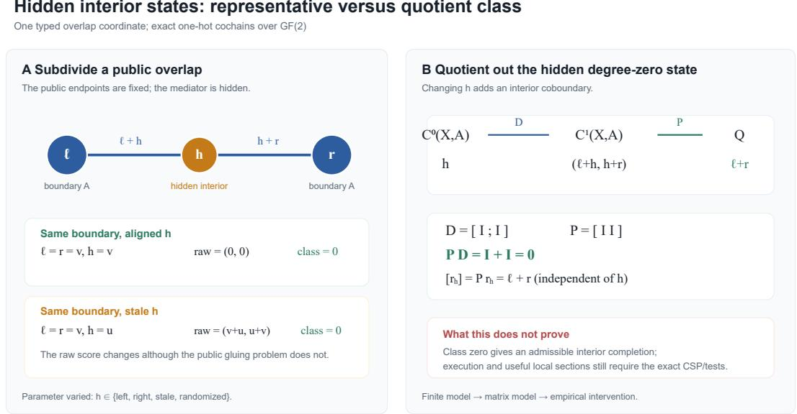  
Figure 1: A finite and matrix model of the hidden-state quotient. The raw half-edge residual changes when the mediator state ℎ changes. The quotient map removes this interior coboundary and keeps only the endpoint disagreement ℓ + �. The picture does not replace the exact CSP: class zero checks the registered gluing fields, while useful local sections and execution are separate requirements.

## 3. Repair and Search

## 3.1. Typed fillers and obstruction-guided completion

The registered library contains five transformations:

• a symbol-index router exposing symbol-to-file retrieval;

• a revision ledger exposing immutable file-to-commit provenance;

• a workspace partition exposing deployment-to-workspace routing;

• a dependency checkpoint exposing API revision and edit order; and

• a test-oracle verifier executing public tests with at most one correction call.

The common candidate pool consists of all nonempty subsets of size at most three, hence 25 bundles. A filler changes typed evidence and the induced local sections; after application we recompute both the exact CSP and the relative class.

The outcome-blind completion operator enumerates the pool and lexicographically minimizes relative obstruction weight, maximizes exact-lift fraction and nomination margin, and then minimizes filler cost. It selects workspace partition plus dependency checkpoint at cost 3 in every task replicate. Before the proposal, the registered all-local structural decoy has nonzero relative weight and no exact lift. After the proposal, relative weight is zero and the exact-lift fraction is one. No confirmatory outcome enters this computation.

## 3.2. Information separation

Theorem 3 (Local-score repair-order separation) Let $c _ { 1 } , \ldots , c _ { K }$ have identical isolated local signatures. Suppose exactly one, $c _ { J } ,$ , has compatible restrictions and every other candidate has a nonzero exact relative class. A top-one selector whose observation is only the isolated signature has minimax success at most $1 / K$ under arbitrary relabeling ofthe candidates. A zero-class-first selector given the exact restriction classes ranks $c _ { J }$ first. For any ordering independent ofthe hiddenfeasible label, under a uniform random permutation the expected rank $o f c _ { J }$ is $( K + 1 ) / 2$

Proof All � candidates induce the same observation for the local-only selector. Place the unique feasible index uniformly on the � labels. Conditional on the common observation, any deterministic top-one choice succeeds with probability $1 / K ;$ randomization cannot improve this average, so Yao’s minimax principle yields the bound against an adversarial relabeling. Exact relative classes identify the unique zero-class candidate by hypothesis. Finally, the position of one distinguished element in a uniform permutation is uniform on $\{ 1 , \ldots , K \}$ and has mean $( K + 1 ) / 2$ ■

The theorem identifies the information missing from isolated scores. It does not imply that a cohomological relaxation outperforms an exact CSP supplied with the same restrictions. The experiment therefore treats exact CSP as the semantic control and adaptive NSGA-II, local marginal, pairwise, shufled, and random orderings as equal-pool search baselines.

## 4. Stability of an Estimated Linear Obstruction

Exact typed restrictions need no estimation. Broader applications may learn a linear coboundary $\boldsymbol { D } \in \mathbb { R } ^ { p \times q }$ and target $b \in \mathbb { R } ^ { p }$ from fresh traces. Naively using the full image of a noisy matrix is invalid because an arbitrarily small perturbation can increase rank.

Theorem 4 (Rank-truncated residual stability) Let � have registered rank $r \geq 1$ , image $U ,$ , and smallest nonzero singular value $\gamma = \sigma _ { r } ( D ) > 0 .$ . Suppose

$$
\| \widehat { D } - D \| _ { 2 } \leq \varepsilon < \gamma , \qquad \| \widehat { b } - b \| _ { 2 } \leq \tau , \qquad \| b \| _ { 2 } \leq B .
$$

Let $\widehat { U } _ { r }$ be the leading �-dimensional left singular subspace $o f { \widehat { D } } ,$ , and put

$$
\rho = \operatorname* { m i n } \left\{ 1 , \frac { 2 \varepsilon } { \gamma - \varepsilon } \right\} , \qquad T = \tau + \rho B .
$$

Then

$$
\left| \mathrm { d i s t } ( \widehat { b } , \widehat { U } _ { r } ) - \mathrm { d i s t } ( b , U ) \right| \leq T .
$$

Consequently, thresholding the estimated residual at $T$ accepts every true lift and rejects every population nonlift whose residual is greater than 2�.

Proof If $\rho = 1$ , the projector-distance bound is automatic for orthogonal projectors. Otherwise $\varepsilon < \gamma / 3$ ; Weyl’s inequalities give $\sigma _ { r } ( \widehat { D } ) \geq \gamma - \varepsilon$ and $\sigma _ { r + 1 } ( \widehat { D } ) \leq \varepsilon ,$ so the leading �-subspace is separated. Wedin’s singular-subspace perturbation theorem then bounds the projector distance between $U$ and $\widehat { U } _ { r }$ by the conservative value $2 \varepsilon / ( \gamma - \varepsilon ) = \rho$ (Wedin, 1972). With projectors $P$ and ${ \widehat { P } } ,$

$$
\begin{array} { r l } & { \left| \| ( I - \widehat { P } ) \widehat { b } \| _ { 2 } - \| ( I - P ) b \| _ { 2 } \right| \leq \| ( I - \widehat { P } ) ( \widehat { b } - b ) \| _ { 2 } + \| ( \widehat { P } - P ) b \| _ { 2 } } \\ & { \qquad \leq \tau + \rho B = T . } \end{array}
$$

The two classification statements follow by applying this interval around a population residual of zero or one strictly larger than 2�. ■

The deterministic statement gives the following finite-trace guarantee.

Corollary 5 (Finite-trace lift/no-lift stability) Suppose each of � independent complete traces contributes unbiased coordinate estimators of � and �, with every coordinate supported on an interval of length at most two. Under the rank, gap, and norm hypotheses of Theorem 4, choose $\varepsilon < \gamma$ and $\tau > 0 .$ . If

$$
n \geq \operatorname* { m a x } \left\{ \frac { 2 p q } { \varepsilon ^ { 2 } } \log \frac { 4 p q } { \delta } , \frac { 2 p } { \tau ^ { 2 } } \log \frac { 4 p } { \delta } \right\} .\tag{6}
$$

then, with probability at least $1 - \delta _ { \mathrm { { z } } }$ , the rank-� estimated residual has error at most $T = \tau +$ � min $\{ 1 , 2 \varepsilon / ( \gamma - \varepsilon ) \}$ . Consequently the threshold-� decision preserves every population lift and every population nonlift with residual strictly greater than 2�.

Proof Coordinatewise Hoefding bounds at tolerances $\varepsilon / { \sqrt { p q } }$ for � and $\tau / { \sqrt { p } }$ for �, followed b a union bound, give $\| \widehat { D } - D \| _ { F } \leq \varepsilon$ and $\| \widehat { b } - b \| _ { 2 } \leq \tau$ with probability at least $1 - \delta$ . Since the operator norm is bounded by the Frobenius norm, Theorem 4 applies on that event. ■

Coordinates within one trace may be dependent; independence is used only across complete traces. Cached duplicates do not increase �. Since the quotient obstruction $[ b ] \in \mathbb { R } ^ { p } / \mathrm { i m } D$ vanishes exactly when dist $( b , U ) = 0$ , Corollary 5 is a statistical stability result for the lift/no-lift decision. It does not assert equality of two separated nonzero quotient classes.

Every displayed hypothesis matters. Without rank truncation, $D = \mathrm { d i a g } ( 1 , 0 ) , b = e _ { 2 }$ , and $\widehat { \cal D } = \mathrm { d i a g } ( 1 , \widehat { \varepsilon } )$ produce a false lift for every $\varepsilon > 0$ . Without a positive gap the image is not stably identifiable; without the strict margin the lift and nonlift residual intervals overlap.

## 4.1. Finite-trace recovery of restriction-aware ordering

The preceding theorem stabilizes a fixed linear obstruction. A complementary question is whether development traces recover the repair ordering itself. Let $C = \{ 1 , \ldots , K \}$ be a finite candidate pool and let $\mu _ { c } \in [ 0 , 1 ] ^ { m }$ be its population face-agreement vector. Define the weakest-face score $h ( c ) = \operatorname* { m i n } _ { f } \mu _ { c f }$ . Here a face may encode either a registered local predicate or an overlap agreement event, so ℎ is a canonical restriction-aware bottleneck score. It is not the lexicographic policy frozen in the experiments; the theorem isolates the sampling obligation for one explicit population objective.

Theorem 6 (Finite-trace repair recovery) Assume $c ^ { \star }$ uniquely maximizes ℎ with gap

$$
\Delta = \operatorname* { m i n } _ { c \neq c ^ { \star } } \{ h ( c ^ { \star } ) - h ( c ) \} > 0 .
$$

For every �, observe � fresh vectors $Z _ { c , t } \in [ 0 , 1 ] ^ { m }$ adapted to a filtration, with fixed conditional mean $\mathbb { E } [ Z _ { c , t } \mid \mathcal { F } _ { t - 1 } ] = \widetilde { \mu } _ { c }$ and $\| \widetilde { \mu } _ { c } - \mu _ { c } \| _ { \infty } \le \eta < \Delta / 2$ . Coordinates within one trace may be dependent. $\begin{array} { r } { P u t { \stackrel { \ldots } { h } } ( c ) = \operatorname* { m i n } _ { f } n ^ { - 1 } \sum _ { t } Z _ { c , t , f } . \ I f } \end{array}$

$$
n \geq \frac { 8 } { ( \Delta - 2 \eta ) ^ { 2 } } \log \frac { 2 K m } { \delta } ,
$$

then arg max� $\widehat { h } ( c ) = c ^ { \star }$ with probability at least $1 - \delta .$

Proof Let $e = ( \Delta - 2 \eta ) / 4 > 0$ . Coordinatewise conditional Hoefding–Azuma bounds (Hoefding, 1963; Azuma, 1967) and a union bound give

$$
\operatorname* { P r } \biggr ( \operatorname* { m a x } _ { c , f } | \widehat { \mu } _ { c f } - \widetilde { \mu } _ { c f } | > e \biggr ) \leq 2 K m \exp ( - 2 n e ^ { 2 } ) \leq \delta .
$$

On the complementary event, $\| \widehat { \mu } _ { c } - \mu _ { c } \| _ { \infty } \leq e + \eta$ . Since the minimum is one-Lipschitz in max norm, every rival satisfies

$$
\widehat { h } ( c ^ { \star } ) - \widehat { h } ( c ) \geq \Delta - 2 ( e + \eta ) = \frac { \Delta - 2 \eta } { 2 } > 0 .
$$

Thus the empirical maximizer is uniquely $c ^ { \star }$

The theorem permits arbitrary dependence among faces of the same trace but requires freshness across complete traces. Cached copies do not increase �. More importantly, it is an identification- conditional result: concentration cannot turn a misspecified face vocabulary into a causal restriction model.

## 5. Trace Construction and Baseline Experiment

## 5.1. Generated repository task

Each task contains two migration tickets and four same-namespace adapter files per ticket. Exactly one file is owned b the de lo ment. A valid res onse must edit that file, install the de endenc -declared API revision, place migration before caller, preserve the owned source commit, and select the public contract test. The model emits only bounded JSON edit operations naming existing tasks, targets, paths, and typed values. Invalid paths, fields, targets, and values are rejected. A separate Python process applies the edits and runs public tests; no model-supplied program is imported or executed.

The five fillers change the actual evidence available to the model: symbol/path retrieval, path/commit provenance, deployment/workspace routing, dependency order, and public-test feedback. The model never sees a complete plan identifier or hidden expected patch.

## 5.2. Trace-induced maps

A disjoint map-training split evaluates 25 candidates on four tasks with two targets each, producing 200 typed target traces. Registered vertex fields are selected from the task schema; filler-stage nomination maps are estimated from the training labels; and the incidence graph is the maximum- weight spanning tree plus the two strongest redundant edges. This yields six overlaps and 3,600 zero-error projection-composition checks.

Before confirmatory outcomes were opened, an independent reconstruction enumerated all 25 structural boundaries on eight fresh tasks and 16 targets. All 7,200 direct-versus-composed restriction coordinates agree. The resulting cochain dimensions are reported in Section 2. This verifies implementation functoriality for the declared fields; heldout calibration tests whether those fields retain semantic information.

## 5.3. First frozen equal-pool design

The experiment uses the exact API identifiers deepseek-ai/DeepSeek-V4-Flash and zai-org/ GLM-5-FP8; the operator attests that the latter serves GLM-5.2. Four fresh screen–heldout task replicates are evaluated by both endpoints. Every model–task block evaluates the same 25 candidates once, giving 200 candidate evaluations. Public-test failure permits at most one correction call, so the final matrix contains 272 model calls.

The primary budget is candidate evaluations to the first bundle passing both screen and heldout tasks. Secondary resource measures are calls to success and provider-reported prompt, completion, and total tokens to success. Token totals include correction calls and are compared between policies only within an exact endpoint; they measure model-mediated token efort, not elapsed time. Other metrics are joint heldout success, successful filler cost, non-target regressions, screen-to-heldout regressions, obstruction calibration, and structural computation.

The registered primary contrast is within-block adaptive-NSGA-II minus full-class candidate evaluations, tested by an exact one-sided sign test. The eight endpoint–task measurements share four task replicates, so we additionally average endpoints within task before a conservative cluster sensitivity.

## 5.4. Baseline search results

Seventy-one of 200 candidate–block rows pass heldout tests, and all 71 are exact joint successes: 35 for DeepSeek and 36 for GLM. These endpoint counts are descriptive, not model-population estimates.

For the primary contrast, seven NSGA-II-minus-full block diferences equal 1.25 candidate evaluations and the remaining diference equals 2.375. All favor full class, with mean diference 1.390625 and one-sided $p = 0 . 0 0 3 9 0 6 2 5$ . Averaging the two endpoints within each shared task gives diferences (1.8125, 1.25, 1.25, 1.25) and $p = 0 . 0 6 2 5$ . Thus the direction holds in every task and endpoint, while task-level replication remains small.

The outcome-blind cost-3 proposal passes exactly in all eight blocks with one call per block and no heldout non-target regression. The registered all-local decoy passes only two blocks. This closes the loop from typed obstruction, through filler generation and recomputation, to executable heldout behavior.

Capability-sheaf confirmatory experiment

One frozen 200-candidate result; token effort is compared only within endpoint

A. Candidate evaluations to first success

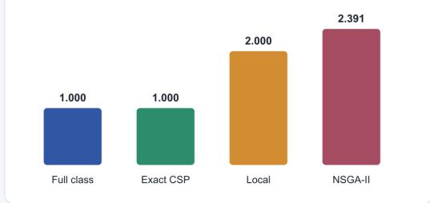  
B. Total tokens to first success

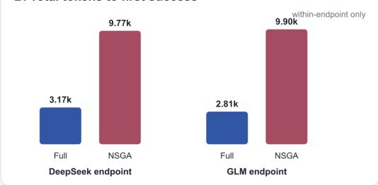  
C. Heldout obstruction calibration

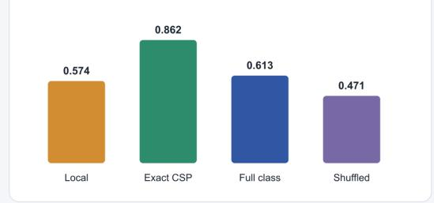

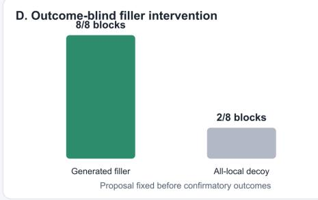  
Figure 2: One confirmatory experiment. Panel A reports the equal-pool stopping budget. Panel B reports total tokens to first success separately inside each endpoint. Panel C shows heldout balanced accuracy of structural criteria. Panel D compares the outcome-blind generated filler with the registered all-local structural decoy.

Table 1: Equal-pool search. Candidate evaluations are primary; calls include public-test corrections. Lower values, regressions, and filler cost are better.
<table><tr><td>policy</td><td>success</td><td>evaluations</td><td>calls</td><td>regressions</td><td>filler cost</td></tr><tr><td>full relative class</td><td>1.000</td><td>1.000</td><td>1.000</td><td>0.000</td><td>6.000</td></tr><tr><td>exact CSP</td><td>1.000</td><td>1.000</td><td>1.000</td><td>0.000</td><td>6.000</td></tr><tr><td>pairwise proxy</td><td>1.000</td><td>2.000</td><td>3.000</td><td>0.000</td><td>6.000</td></tr><tr><td>local marginal</td><td>1.000</td><td>2.000</td><td>3.000</td><td>0.000</td><td>6.000</td></tr><tr><td>shuffled class</td><td>1.000</td><td>2.000</td><td>2.250</td><td>0.000</td><td>5.000</td></tr><tr><td>adaptive NSGA-II</td><td>1.000</td><td>2.391</td><td>2.922</td><td>3.156</td><td>5.633</td></tr><tr><td>random</td><td>1.000</td><td>2.391</td><td>2.922</td><td>3.156</td><td>5.633</td></tr></table>

## 5.5. Token efort and calibration

Relative to NSGA-II, full-class search reduces total tokens to success by 67.5% for DeepSeek and 71.6% for GLM; completion-token reductions are 63.2% and 68.1%. Exact CSP has identical stopping candidates and therefore identical token efort. The token result is consequently evidence for global relational information, not for an incremental cohomological advantage.

Table 2: Mean provider-reported total tokens to first success. Values are policy comparisons within endpoint; absolute counts are not ranked across diferent tokenizers.
<table><tr><td>policy</td><td>DeepSeek endpoint</td><td>GLM endpoint</td></tr><tr><td>full relative class</td><td>3,172.5</td><td>2,808.5</td></tr><tr><td>exact CSP</td><td>3,172.5</td><td>2,808.5</td></tr><tr><td>local marginal</td><td>10,763.5</td><td>9,591.0</td></tr><tr><td>shuffled class</td><td>3,626.5</td><td>11,664.0</td></tr><tr><td>adaptive NSGA-II</td><td>9,770.2</td><td>9,901.5</td></tr></table>

Heldout balanced accuracy is 0.574 for local-only, 0.862 for exact CSP, 0.613 for full relative class, and 0.471 for shufled class. Full class has specificity 1.0 but sensitivity 0.225; exact CSP is the strongest compatibility predictor. Structural feature computation takes a mean 4.45 ms per task replicate on the artifact host, excluding the one-time human and data cost of choosing the vocabulary and training the restriction map.

## 6. Hidden-Interior Quotient Experiment

## 6.1. Frozen design and causal prediction

We froze this experiment before making any new model call. It uses the same two model endpoints and the same pool of 25 filler bundles as the baseline study. The new matrix has 20 independent task clusters. Each cluster has a fresh screen task, a fresh heldout task, and a separate model seed. Both endpoints evaluate every candidate in every cluster. The final matrix therefore contains 1,000 candidate outcomes. Public-test feedback adds at most one correction call, giving 1,360 model calls in total.

The structural score uses the subdivided complex from Section 2.4. Every registered overlap coordinate has one hidden mediator. We evaluate four outcome-blind interventions on that mediator: stale, aligned-left, aligned-right, and randomized. In all 4,000 registered candidate–target–intervention checks, the quotient signature is unchanged. The quotient and stale-raw rankings difer at 24 of 25 positions in every task cluster.

The preregistered primary policy minimizes quotient obstruction weight, then uses interior- completion rate, exact-lift rate, nomination margin, and filler cost. The stale-raw policy scores the two half-edge residuals before the quotient and then uses local coverage and cost. This is a targeted stress test: the stale mediator is distinct from both public endpoint values, so a raw score can treat a compatible boundary as inconsistent. The aligned-left policy is the negative control. In that condition, the raw score already tracks the endpoint mismatch.

The independent statistical unit is the task cluster. For each cluster, we average candidate evaluations to first joint success over the two endpoints. The frozen primary contrast is stale-raw minus quotient. We use an exact one-sided paired sign test over the 20 clusters. Exact CSP is the positive semantic control. Pairwise, local, adaptive NSGA-II, and random search use the same candidate outcomes. NSGA-II and random search each use four registered search seeds per model–cluster block.

Hidden-interior quotient: preregistered causal result 20 independent task clusters · 2 model endpoints · same 25 candidates

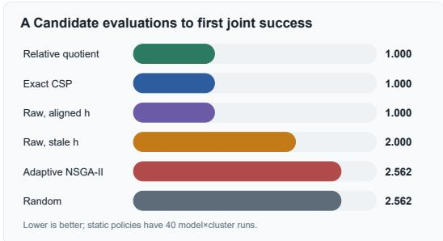

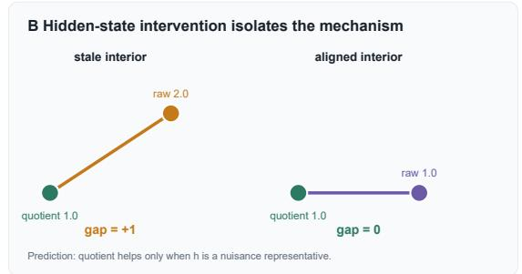

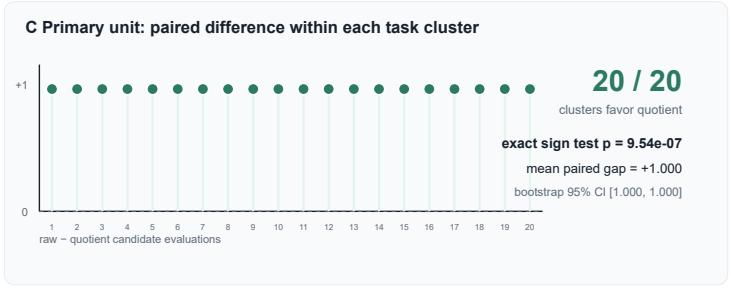

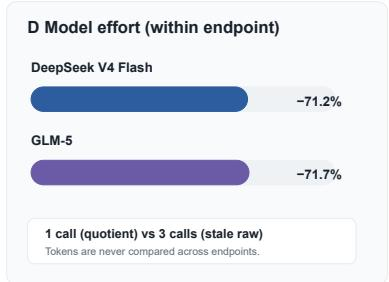  
Figure 3: Preregistered hidden-interior result. Panel A shows the equal-pool stopping budget. Panel B is the causal check: the stale representative creates a gap, while aligning the hidden state removes it. Panel C shows all 20 paired task-cluster diferences, not candidate-level pseudo-replicates. Panel D shows total-token reductions within each endpoint. The figure is computational evidence for this frozen task family, not a theorem about arbitrary harnesses.

## 6.2. Primary result and ablation

The 1,000 outcomes contain 278 candidates that pass both screen and heldout tests. The quotient policy reaches the first success in 1.000 candidate evaluation in every model–cluster block. The stale-raw policy needs 2.000. After averaging endpoints, every task cluster has paired diference +1. Thus all 20 non-tied clusters favor the quotient. The exact one-sided sign-test value is

$$
p = 2 ^ { - 2 0 } = 9 . 5 3 6 7 \times 1 0 ^ { - 7 } .
$$

The mean paired diference is 1.000 candidate evaluation; the cluster bootstrap 95% interval is [1.000, 1.000]. Equivalently, quotienting reduces the candidate stopping budget by 50% relative to the stale raw representative.

The aligned-left raw policy also reaches success in 1.000 evaluation. Its paired diference from the quotient is zero in every cluster. This ablation is important: it shows that the gain is tied to a nuisance interior representative. It is not a generic reward for adding a cohomological label. Exact CSP also matches the quotient in every cluster, as predicted.

Within endpoint, the quotient reduces total tokens to success by 71.2% for DeepSeek and 71.7% for GLM relative to the stale-raw policy. It reduces model calls from 3.000 to 1.000. These are within-endpoint efort comparisons; they do not rank the two model families. The equality with exact CSP sets the claim boundary: the experiment shows value from quotienting hidden-state nuisance over a fixed raw representative, not value beyond an equally informed exact solver.

Table 3: Hidden-interior experiment. All policies reach success. Candidate evaluations are the primary budget. Token means are compared only within an endpoint. Static policies have 40 model–cluster runs; NSGA-II and random have 160 runs because they use four search seeds.
<table><tr><td>policy</td><td>evaluations</td><td>calls</td><td>DeepSeek tokens</td><td>GLM tokens</td></tr><tr><td>relative quotient</td><td>1.000</td><td>1.000</td><td>3,050.8</td><td>2,706.5</td></tr><tr><td>exact CSP</td><td>1.000</td><td>1.000</td><td>3,050.8</td><td>2,706.5</td></tr><tr><td>raw, aligned interior</td><td>1.000</td><td>1.000</td><td>3,088.3</td><td>2,784.5</td></tr><tr><td>raw, stale interior</td><td>2.000</td><td>3.000</td><td>10,587.3</td><td>9,548.4</td></tr><tr><td>pairwise proxy</td><td>2.000</td><td>3.000</td><td>10,587.3</td><td>9,548.4</td></tr><tr><td>local marginal</td><td>2.000</td><td>3.000</td><td>10,587.3</td><td>9,548.4</td></tr><tr><td>adaptive NSGA-II</td><td>2.562</td><td>3.837</td><td>12,768.4</td><td>12,011.6</td></tr><tr><td>random</td><td>2.562</td><td>3.837</td><td>12,768.4</td><td>12,011.6</td></tr></table>

## 7. Real-Repository Stress Test

## 7.1. Benchmark, split, and outcome firewall

We next test whether the controlled efect transfers to real patch fusion. We use the seven-source SWE-bench Multilingual pool from PatchFuseBench (Yang et al., 2026; Jimenez et al., 2024). The pool contains 300 GitHub issues. We split the 41 eligible repositories, not individual issues: 20 repositories and 160 issues form the development split; 21 repositories and 140 issues form a sealed confirmatory split. This section uses only the development split.

The 160 issues contain 1,120 possible source slots. Twenty-three slots are missing, but no issue is removed. Exact duplicate patches are collapsed only after their provenance is retained. The resulting pool has 875 unique source-compatible patches. We decompose them against the base commits into 2,579 lossless edit atoms. Each atom keeps its file, base interval, old bytes, new bytes, mode change, and source-patch support. The fixed conflict graph has 2,022 interval-overlap pairs and 109 source-local semantic-alternative pairs.

GLM-5 assesses each atom against the issue, a source-derived rubric, and the local base context. It never receives benchmark tests, solved labels, or the gold patch. A strong repository-held-out selector supplies the same anchor to all methods. It resolves 127/160 issues. The matched router receives atom evidence, candidate membership, conflicts, and the anchor. The relative router receives the same inputs plus the signed relative block. The exact control uses the same evidence in a deterministic binary optimization.

If a method returns an unchanged pool patch, we use its corrected content-addressed verdict. Every new patch is run with the oficial pinned SWE-bench harness. The final evaluation has 153/153 completed fresh-patch rows and no infrastructure failures. Incomplete Docker calls are not counted as failed tests.

## 7.2. Identifiability counterexample and repair

The first atom construction uses one full-pool matrix

$$
D : \mathbb { R } ^ { m } \longrightarrow \mathbb { R } ^ { p + q + 2 } ,
$$

where the columns are all available atoms, the first � rows are issue obligations, the next � rows are conflict interfaces, and the final rows are build and regression risk. For target �, the router receives the canonical representative of [�] in coker �.

This class is global to the issue, not specific to a binary selection. For any two selections $x _ { 1 } , x _ { 2 }$

$$
\left[ b - D x _ { 1 } \right] - \left[ b - D x _ { 2 } \right] = \left[ D ( x _ { 2 } - x _ { 1 } ) \right] = 0 \quad { \mathrm { i n ~ c o k e r } } D .\tag{7}
$$

Thus the class cannot rank $x _ { 1 }$ against $x _ { 2 }$ . The least-squares atom potentials may still influence a language model, but they are not diferent cohomology classes for diferent patches.

We repair this defect by indexing the complex by the candidate action. If patch � contains atom set �, let $D _ { S }$ contain only those hidden interior columns and the common obligation-and-risk rows. Its score is

$$
q ( S ) = \frac { \| ( I - D _ { S } D _ { S } ^ { + } ) b \| _ { 2 } } { \| b \| _ { 2 } } .\tag{8}
$$

The matched control uses the same atom evidence but replaces the span and projection by coordinate-wise maximum support and maximum risk. Exact candidate scoring is a second control. Of 875 candidate complexes, 848 have positive interior rank and positive quotient dimension. The value $q ( S )$ varies across candidates on 120/160 issues.

## 7.3. Results

Table 4 separates three questions. Full-pool routing asks the model to construct one atom subset. Candidate-restricted selection chooses one submitted patch. Repository-held-out abstention decides whether to keep the strong anchor.

The full-pool relative router resolves 104 issues and the matched router resolves 109. Their paired diference is −5/160; the repository-macro diference is −0.0316, the cluster bootstrap 95% interval is $[ - 0 . 0 8 3 8 , 0 . 0 1 0 2 ]$ , and the exact repository sign-flip value is $p = 0 . 2 8 1 2 5$ . No new fused patch from any of the three methods turns an anchor failure into a success. This rules out a real fusion gain for the present atom evidence and router.

The candidate-indexed quotient is better than its matched control by two issues: four paired wins and two losses. The efect occurs in only three repositories and has exact $p = 0 . 7 5$ . It also remains nine issues below the anchor. A symmetric leave-one-repository-out abstention procedure learns when to keep the anchor. The quotient gate recovers 127/160, while the matched gate gets 126/160. Their only discordant issue favors the quotient, but one nonzero repository gives $p = 1 . 0$

The preregistered development gate requires at least four issue gains, a positive repository-macro efect, six nonzero repositories, and $p \leq 0 . 2$ . Neither corrected experiment passes. We therefore do not open the 21 confirmatory repositories. Further threshold searches on the same outcomes would be post-selection bias.

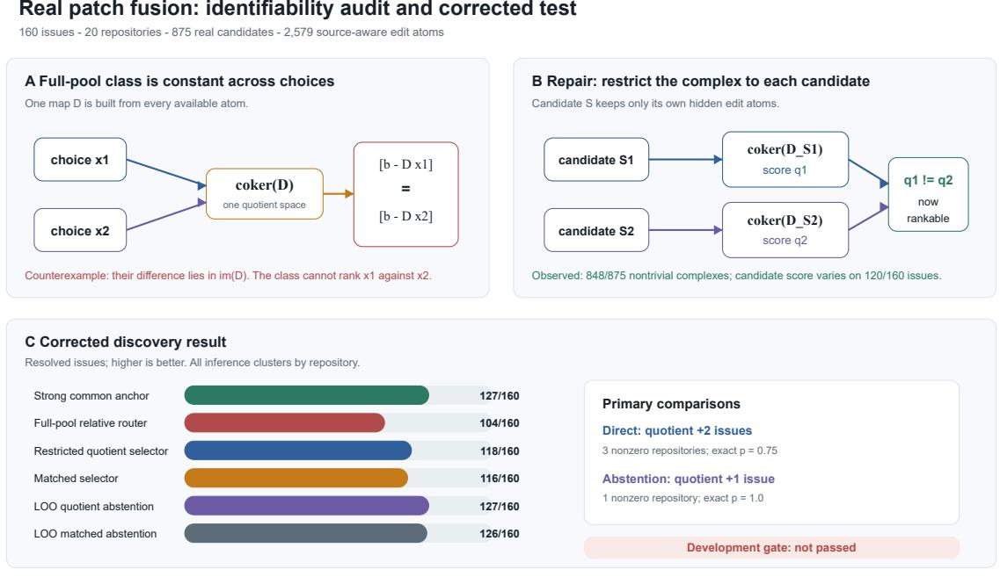

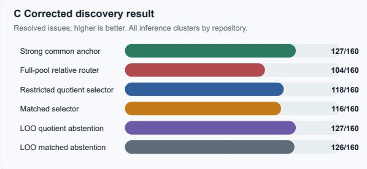  
Computation is evidence for this benchmark. The algebraic equality in panel A is the proof-backed claim.

Figure 4: Real patch-fusion audit. Panel A is a finite and matrix counterexample: the full-pool class is identical for all selections; this is the proof-backed statement in Equation (7). Panel B shows the candidate-indexed repair. Its diferent scores are an algebraic computation, not a correctness theorem. Panel C reports the empirical development results. The corrected quotient is discriminative, but neither direct selection nor abstention passes the repository-level gate.

## 8. Claim Boundary and Threats to Validity

The controlled studies use generated JSON, a bounded edit language, and compact public tests. Their purpose is mechanism identification. They do not estimate performance on natural repositories. The baseline also has only four independent task clusters. The hidden-state study has 20 clusters, but its stale mediator is a deliberate intervention, not an estimate of how often deployed systems contain stale state.

The aligned ablation supports the controlled mechanism: when the nuisance representative is removed, the quotient gap disappears. Exact CSP also matches the quotient. Thus the controlled evidence supports invariance to hidden-state choice, not superiority over an equally informed exact solver.

The real-repository study improves external validity but remains one fixed candidate pool. Its seven sources, issue distribution, and strong anchor may not represent other generation systems. Atom boundaries are lossless at the dif level, but the obligation and risk evidence comes from one GLM-5 pass. Independent GLM-5 and Qwen hunk studies earlier in development showed material evidence-model dependence. Better semantic interfaces, generated tests, or new edit bytes might change the result.

Table 4: Real-repository development results. “Changed” counts outputs that difer from the common anchor. “New” counts patches absent from the submitted pool. All denominators are 160 issues.
<table><tr><td>stage</td><td>method</td><td>resolved</td><td>changed</td><td>new</td></tr><tr><td rowspan="4">full-pool atom routing</td><td>common anchor</td><td>127</td><td>0</td><td>0</td></tr><tr><td>matched router</td><td>109</td><td>79</td><td>26</td></tr><tr><td>relative router</td><td>104</td><td>85</td><td>37</td></tr><tr><td>exact semantic control</td><td>96</td><td>120</td><td>112</td></tr><tr><td rowspan="4">candidate- restricted</td><td>common anchor</td><td>127</td><td>0</td><td>0</td></tr><tr><td>matched selector</td><td>116</td><td>122</td><td>0</td></tr><tr><td>restricted quotient</td><td>118</td><td>123</td><td>0</td></tr><tr><td>exact semantic selector</td><td>119</td><td>122</td><td>0</td></tr><tr><td rowspan="3">LOO abstention</td><td>common anchor</td><td>127</td><td>0</td><td>0</td></tr><tr><td>matched gate</td><td>126</td><td>6</td><td>0</td></tr><tr><td>quotient gate</td><td>127</td><td>7</td><td>0</td></tr></table>

Repositories are the statistical clusters. Candidate patches, model sources, and atom rows within a repository are not independent samples. The direct candidate quotient difers from its matched control in only three repositories; the abstention comparison difers in one. These designs cannot support a small repository-level �-value, even though they include 160 issues.

The exact atom optimization is not computationally hard on this workload. HiGHS solves all 2,579 binary atom variables, including an issue with 338 variables, in 3.45 seconds after presolve. We therefore make no speed claim from the size of the naive binary grid. Likewise, quotient vanishing is not binary semantic feasibility.

Provider-reported tokens in the controlled studies measure efort within one endpoint’s tokenizer and accounting rules. They do not rank model families. The real study also excludes the human cost of defining rubrics, checking source boundaries, and auditing harness failures.

The real development protocols were fixed before their corresponding scores were joined to outcomes, but they followed earlier negative development results. Their �-values are exploratory. The confirmatory repositories remain sealed because the development gate failed. A positive claim requires a new method fixed before those outcomes are opened.

## 9. Related Work

Classical sheaf theory formalizes local data and gluing (Bredon, 1997; Lane and Moerdijk, 1992); cellular sheaves and their Laplacians provide finite computational models (Curry, 2014; Hansen and Ghrist, 2019). Sensor integration illustrates how local consistency can diagnose distributed data (Robinson, 2017). We use the same mathematical machinery for typed agent behavior rather than geometric measurements.

Recent expository work surveys the path from finite-poset sheaves to machine learning (Ayzenberg et al., 2025), while a sheaf-theoretic account of tasks in distributed systems treats solvability through compatible local views (Felber et al., 2025). Our task object is narrower: a frozen finite harness candidate and its executable typed trace.

Knowledge sheaves express schema-constrained knowledge-graph embeddings as approximate global sections (Gebhart et al., 2023). More directly, Olivieri and Hernandez´ (2026) rank finite scientific-theory transitions by transport and gluing obstruction in a controlled AI-agent benchmark. Our setting difers in its object of intervention and validation: fillers change repository operations, models synthesize bounded edits, public tests execute, and search policies are compared behind a prospective outcome firewall.

The sheaf-theoretic account of contextuality characterizes locally consistent families without global sections (Abramsky and Brandenburger, 2011). Cohomological witnesses and known false negatives motivate our exact-plus-linear hierarchy (Abramsky et al., 2012, 2015; Car\`u, 2017). Connections between global sections and robust CSP further support the exact semantics (Abramsky et al., 2013; Conghaile, 2022).

Neural sheaf difusion and connection-Laplacian networks learn sheaf-valued representations on graphs (Bodnar et al., 2022; Barbero et al., 2022). Our object is instead an executable capability abstraction used to repair an agent harness. Persistent homology and stable vectorizations study multiscale topological summaries (Carlsson, 2009; Cohen-Steiner et al., 2007; Adams et al., 2017); persistence is complementary to, but not needed for, the finite relative obstruction tested here.

Automated prompt, program, workflow, and agent optimization motivate the outer loop (Khattab et al., 2023; Hu et al., 2025; Zhang et al., 2025; Lee et al., 2026; Ursekar et al., 2026). HarnessFix is especially close in using failed trajectories to localize harness flaws and validate scoped repairs (Chen et al., 2026). Our contribution is not a new general optimizer. It is a structural observation channel and a typed repair ordering that can sit inside such optimizers when local capability signatures are insuficient.

PatchFusion studies the same post-generation decision problem as our real stress test (Yang et al., 2026). It uses deterministic repeated-atom evidence and reports 236/300 solved issues on its SWE-bench Multilingual pool. We reuse that fixed candidate pool but ask a diferent question: does a hidden-state quotient add information beyond matched semantic evidence? Our negative result does not contradict PatchFusion’s deterministic fusion result. It shows that the present cohomological construction does not improve it.

Table 5 makes the closest distinctions explicit (Khattab et al., 2023; Hu et al., 2025; Zhang et al., 2025; Lee et al., 2026; Ursekar et al., 2026; Chen et al., 2026; Olivieri and Hernandez´ , 2026; Yang et al., 2026).

Table 5: Closest systems by intervention object, structural authority, and validation. “Not declared” means only that the cited work does not use the exact sheaf/CSP object studied here.
<table><tr><td>work</td><td>object changed or diagnosed</td><td>structural authority</td><td>validation</td></tr><tr><td>DSPy / AFlow / ADAS</td><td>prompts, programs, workflows, agent</td><td>task objective and optimizer state; no declared capability sheaf</td><td>heldout task scores</td></tr><tr><td>Meta-Harness</td><td>designs executable harness code</td><td>proposer access to source, prior scores, and traces</td><td>application and agent benchmarks</td></tr><tr><td>VeRO</td><td>versioned target agents</td><td>versions, rewards, observations, and budget</td><td>reproducible budget-controlled</td></tr><tr><td>HarnessFix</td><td>trajectory-localized harness flaws and</td><td>ledger trace IR with provenance and control flow</td><td>evaluation scoped patch validation and heldout</td></tr><tr><td>PatchFusion</td><td>patches one patch from a</td><td>deterministic repeated</td><td>tests official repair</td></tr><tr><td>Olivieri-</td><td>fixed multi-agent pool scientific</td><td>edit-atom evidence chart transport and gluing</td><td>benchmarks controlled</td></tr><tr><td>Hernández</td><td>theory-transition candidates</td><td>obstruction</td><td>transition-card benchmark</td></tr><tr><td>this work</td><td>harness fillers and fixed-pool patches</td><td>finite stalks, exact CSP, and hidden-state relative quotients</td><td>public tests and official SWE-bench execution</td></tr></table>

## 10. Conclusion

A capability sheaf separates local usefulness from shared-state agreement. Its exact CSP is the semantic decision rule. A relative class can add an invariant diagnostic, but it cannot replace exact feasibility or execution.

The controlled hidden-state experiment works as intended. Quotienting a stale interior representative reduces the candidate budget from 2.000 to 1.000 in all 20 clusters. Aligning the hidden state removes the gap, and exact CSP matches the quotient. This is evidence for an invariance mechanism.

The real-repository stress test gives a diferent result. The first full-pool class is identical for every atom selection and therefore cannot rank them. The candidate-indexed repair fixes this mathematical defect and produces nontrivial, varying scores on most of the real pool. It gives a small advantage over its matched selector, but the efect is not distributed across enough repositories. Repository-held-out abstention ties the strong anchor rather than improving it.

We therefore do not claim a real-world cohomological advantage. The main scientific result is a boundary: hidden-state quotienting succeeds in the controlled intervention, while the tested obligation-and-risk complex is too weak for real patch fusion. A stronger construction must encode semantic interfaces that actually glue across edits, rather than attach one global class to an issue. Such a method should be frozen before the sealed confirmatory repositories are opened.

## Acknowledgments

The accompanying artifact contains the controlled protocols, all 1,200 controlled metadata/outcome pairs, the real discovery split and content-addressed candidate pool, 153 completed fresh-patch evaluations, exact tests, source hashes, regenerated figures, and the original hash-bound runtime. No endpoint credential is included.

## Appendix A. Reproducibility Checklist

The standalone repository contains:

• src/capability\_sheaves: task generation, exact CSP, hidden-state and candidate-indexed quotient construction, repository-clustered analysis, and figure rendering;

• configs: controlled protocols, real-benchmark development protocols, restriction maps, and revealed task-generation secrets;

• data/raw: 200 baseline metadata/outcome pairs with complete provider usage and hash bindings;

• data/latent\_quotient/raw: 1,000 hidden-state metadata/outcome pairs, materialized before the corresponding external outcomes;

• data/map\_training: the disjoint trace split used to construct the restriction map;

• data/processed: the frozen aggregate and independent cochain reconstruction;

• results/swebench\_real: the discovery split, label and harness audits, atom inventory, source-aware evidence, fresh-patch checkpoints, candidate-indexed analyses, and publication figure;

• results: baseline outputs plus the frozen hidden-state plan, analysis, report, and other publication figures;

• provenance: the immutable 200-job plan and byte-identical hash-bound execution runtime; and

• tests: scientific, token-accounting, figure, and provenance invariants.

The readable package is a post-execution refactor. Original machine identifiers remain only under provenance where changing them would invalidate frozen hashes. They do not denote additional empirical studies in this paper.

## Appendix B. Additional Counterexamples

Compatibility without local existence. If a required stage has no selected section, every registered equality among the remaining stages may hold. A pairwise all-ones vector therefore does not imply Theorem 1’s local premise.

Linear vanishing without an executable candidate. The signatures (1, 0) and (0, 1) span (1, 1) over $\mathbb { F } _ { 2 }$ , but no member of the portfolio realizes (1, 1). This is why exact candidate membership follows the quotient computation.

One pool-level class for every configuration. Fix the full atom map � and target �. For any binary selections $x _ { 1 } , x _ { 2 }$ , the representatives $b - D x _ { 1 }$ and $b - D x _ { 2 }$ difer by $D ( x _ { 2 } - x _ { 1 } ) \in \mathrm { i m } D$ . They therefore define the same class in coker �. A configuration-specific comparison must change the admissible interior map, for example by using $D _ { S _ { 1 } }$ and $D _ { S _ { 2 } }$

Small perturbation and rank inflation. For $D = \mathrm { d i a g } ( 1 , 0 )$ and $b = e _ { 2 }$ , the target is distance one from im �. The matrix $\widehat { D } = \mathrm { d i a g } ( 1 , \varepsilon )$ is arbitrarily close to � but has full image, making the untruncated residual zero. Registered-rank truncation in Theorem 4 is not optional.

## References

Samson Abramsky and Adam Brandenburger. The sheaf-theoretic structure of non-locality and contextuality. New Journal of Physics, 13(11):113036, 2011.

Samson Abramsky, Shane Mansfield, and Rui Soares Barbosa. The cohomology of non-locality and contextuality. In Proceedings ofthe 8th International Workshop on Quantum Physics and Logic, volume 95 of Electronic Proceedings in Theoretical Computer Science, pages 1–14, 2012.

Samson Abramsky, Georg Gottlob, and Phokion G. Kolaitis. Robust constraint satisfaction and local hidden variables in quantum mechanics. In Proceedings of the Twenty-Third International Joint Conference on Artificial Intelligence, pages 440–446, 2013.

Samson Abramsky, Rui Soares Barbosa, Kohei Kishida, Raymond Lal, and Shane Mansfield. Contextuality, cohomology and paradox. In 24th EACSL Annual Conference on Computer Science Logic (CSL 2015), volume 41 of Leibniz International Proceedings in Informatics, pages 211–228. Schloss Dagstuhl–Leibniz-Zentrum fuer Informatik, 2015. doi: 10.4230/LIPIcs.CSL.2015.211.

Henry Adams, Tegan Emerson, Michael Kirby, Rachel Neville, Chris Peterson, Patrick Shipman, Sofya Chepushtanova, Eric Hanson, Francis Motta, and Lori Ziegelmeier. Persistence images: A stable vector representation of persistent homology. Journal of Machine Learning Research, 18(8): 1–35, 2017.

Anton Ayzenberg, Thomas Gebhart, German Magai, and Grigory Solomadin. Sheaf theory: From deep geometry to deep learning. arXiv:2502.15476, 2025.

Kazuoki Azuma. Weighted sums of certain dependent random variables. Tohoku Mathematical Journal, Second Series, 19(3):357–367, 1967. doi: 10.2748/tmj/1178243286.

Federico Barbero, Cristian Bodnar, Haitz Saez de Oc´ ariz Borde, Michael Bronstein, Petar Veli´ ckoviˇ c,´ and Pietro Lio. Sheaf neural networks with connection laplacians. In \` Proceedings of Topological, Algebraic, and Geometric Learning Workshops 2022, volume 196 of Proceedings of Machine Learning Research, pages 28–36, 2022.

Cristian Bodnar, Francesco Di Giovanni, Benjamin Paul Chamberlain, Pietro Lio, and Michael M.\` Bronstein. Neural sheaf difusion: A topological perspective on heterophily and oversmoothing in GNNs. In Advances in Neural Information Processing Systems, volume 35, pages 18527–18541, 2022.

Glen E. Bredon. Sheaf Theory, volume 170 of Graduate Texts in Mathematics. Springer, second edition, 1997.

Gunnar Carlsson. Topology and data. Bulletin ofthe American Mathematical Society, 46(2):255–308, 2009.

Giovanni Car\`u. On the cohomology of contextuality. arXiv:1701.00656, 2017.

Mengzhuo Chen, Junjie Wang, Zhe Liu, Yawen Wang, and Qing Wang. From failed trajectories to reliable LLM agents: Diagnosing and repairing harness flaws. arXiv:2606.06324, 2026.

David Cohen-Steiner, Herbert Edelsbrunner, and John Harer. Stability of persistence diagrams. Discrete and Computational Geometry, 37(1):103–120, 2007.

Adam O Conghaile. Cohomology in constraint satisfaction and structure isomorphism. In ´ 47th International Symposium on Mathematical Foundations of Computer Science (MFCS 2022), volume 241 of Leibniz International Proceedings in Informatics, pages 75:1–75:16. Schloss Dagstuhl–Leibniz-Zentrum fuer Informatik, 2022. doi: 10.4230/LIPIcs.MFCS.2022.75.

Justin Michael Curry. Sheaves, Cosheaves and Applications. PhD thesis, University of Pennsylvania, 2014. arXiv:1303.3255.

Stephan Felber, Bernardo Hummes Flores, and Hugo Rincon Galeana. A sheaf-theoretic characteri- zation of tasks in distributed systems. arXiv:2503.02556, 2025.

Thomas Gebhart, Jakob Hansen, and Paul Schrater. Knowledge sheaves: A sheaf-theoretic framework for knowledge graph embedding. In Proceedings of the 26th International Conference on Artificial Intelligence and Statistics, volume 206 of Proceedings of Machine Learning Research, pages 9094–9116, 2023.

Jakob Hansen and Robert Ghrist. Toward a spectral theory of cellular sheaves. Journal of Applied and Computational Topology, 3:315–358, 2019.

Wassily Hoefding. Probability inequalities for sums of bounded random variables. Journal ofthe American Statistical Association, 58(301):13–30, 1963.

Shengran Hu, Cong Lu, and Jef Clune. Automated design of agentic systems. In International Conference on Learning Representations, 2025.

Carlos E. Jimenez, John Yang, Alexander Wettig, Shunyu Yao, Kexin Pei, Ofir Press, and Karthik Narasimhan. SWE-bench: Can language models resolve real-world GitHub issues? In International Conference on Learning Representations, 2024. URL https://arxiv.org/abs/2310.06770.

Omar Khattab, Arnav Singhvi, Paridhi Maheshwari, Zhiyuan Zhang, Keshav Santhanam, Sri Vardhamanan, Saiful Haq, Ashutosh Sharma, Thomas T. Joshi, Hanna Moazam, Heather Miller, Matei Zaharia, and Christopher Potts. DSPy: Compiling declarative language model calls into self-improving pipelines. arXiv:2310.03714, 2023.

Saunders Mac Lane and Ieke Moerdijk. Sheaves in Geometry and Logic: A First Introduction to Topos Theory. Springer, 1992.

Yoonho Lee, Roshen Nair, Qizheng Zhang, Kangwook Lee, Omar Khattab, and Chelsea Finn. Meta-harness: End-to-end optimization of model harnesses. arXiv:2603.28052, 2026.

David N. Olivieri and Roque J. Hernandez. Sheaf-theoretic transport and obstruction for detecting ´ scientific theory shift in AI agents. arXiv:2605.14033, 2026.

Michael Robinson. Sheaves are the canonical data structure for sensor integration. Information Fusion, 36:208–224, 2017.

Varun Ursekar, Apaar Shanker, Veronica Chatrath, Yuan Xue, and Sam Denton. VeRO: An evaluation harness for agents to optimize agents. arXiv:2602.22480, 2026.

Per-˚Ake Wedin. Perturbation bounds in connection with singular value decomposition. BIT Numerical Mathematics, 12:99–111, 1972. doi: 10.1007/BF01932678.

Boyang Yang, Xiangliang Hu, Luyao Ren, Yanjun Chen, Bach Le, Tegawende F. Bissyand ´ e, and Haoye´ Tian. A single patch is not enough: Deterministic fusion of repair candidates. arXiv:2607.01597, 2026. URL https://arxiv.org/abs/2607.01597.

Jiayi Zhang, Jinyu Xiang, Zhaoyang Yu, Fengwei Teng, Xionghui Chen, Jiaqi Chen, Mingchen Zhuge, Xin Cheng, Sirui Hong, Jinlin Wang, Bingnan Zheng, Bang Liu, Yuyu Luo, and Chenglin Wu. AFlow: Automating agentic workflow generation. In International Conference on Learning Representations, 2025.