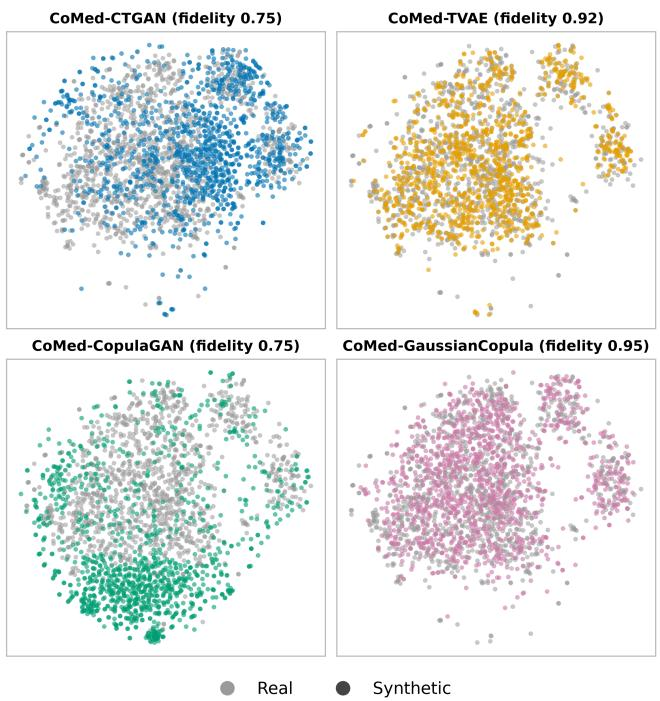
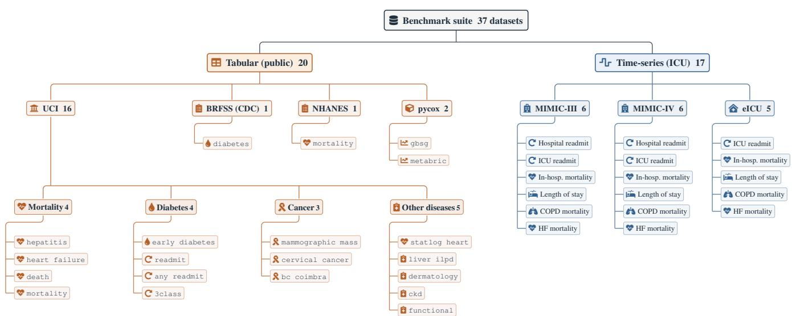
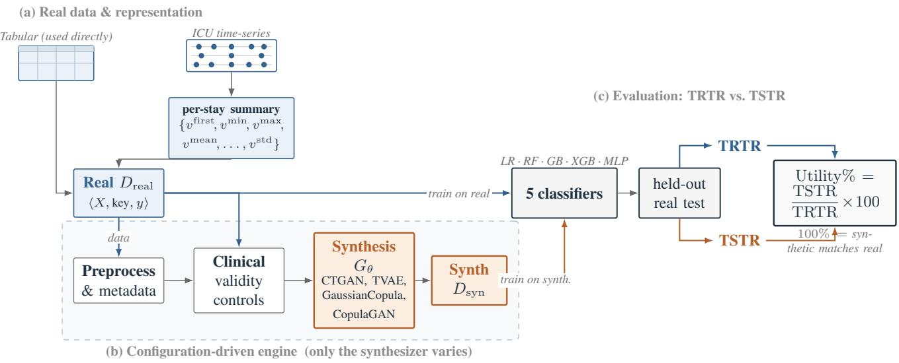
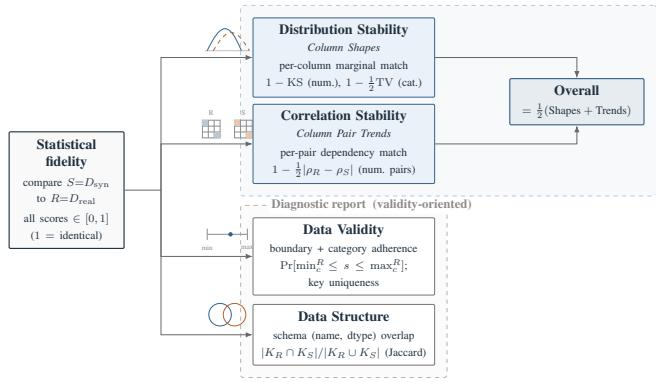
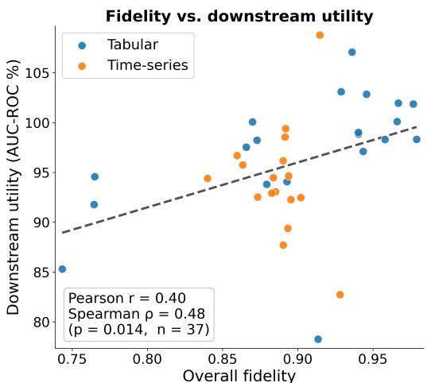

# CoMedBench: A Multi-Source Benchmark of Synthetic Medical Data Fidelity and Downstream Utility

Akanta Das1, Al Amin Farhad1, Mrinmoy Sarkar Anto1, David Rehkopf2, Ayin Vala2, Tanmoy Sarkar Pias2

1Bangladesh University of Engineering and Technology, Dhaka, Bangladesh 2School of Medicine, Stanford University, Stanford, California, United States

## Abstract

Access to clinical data is essential for developing reliable healthcare machine learning systems, but direct use of electronic health records is constrained by privacy regulation, institutional review, data-use agreements, and the risk of re identification. Synthetic data promises a practical alternative: it can preserve useful statistical and clinical structure while reducing exposure of sensitive patient records. Yet the evidence for synthetic data utility in healthcare remains fragmented. Prior studies often evaluate a single generator, one dataset, or a narrow downstream task, making it dificult to know when synthetic data can support model development and when it fails to preserve task-critical signal. We intro duce CoMedBench, a reproducible benchmark that evalu ates a family of generators under a common clinical-validity framework and one shared training and evaluation engine, spanning static tabular and temporal downstream tasks on established critical-care datasets. In total the benchmark spans 37 dataset-task pairs across two modalities consists of 20 static tabular and 17 temporal ICU time-series-drawn from seven public data sources: three intensive-care databases (MIMIC-III, MIMIC-IV, and eICU) together with the UCI Machine Learning Repository, the CDC BRFSS diabetes cohort (2015), NHANES (1999-2014), and the pycox survival datasets ( GBSG and METABRIC). The benchmark evaluates both statistical fidelity and task utility by comparing models trained and tested across real and synthetic data. In these settings, synthetic training data preserves most of the downstream signal: on tabular tasks the reference generato CoMed-CTGAN retains a mean AUROC utility (the synthetic to-real performance ratio) of 90.6%, rising to 97.3% for the strongest generator, CoMed-TVAE. Temporal ICU tasks are harder and more generator-sensitive: CoMed-CTGAN re tains 81.6% (AUROC) and only 64.0% under the imbalancesensitive AUPRC, whereas CoMed-TVAE still retains 95% (AUROC). By organizing evaluation around downstream clin ical prediction rather than visual similarity alone, the benchmark clarifies where synthetic data is useful, where temporal structure remains a bottleneck, and how future generators should be assessed for healthcare AI.

## Introduction

Modern healthcare AI depends on large, representative, and carefully curated clinical datasets (Habehh and Gohel 2021). Electronic health records (EHRs), intensive-care databases, laboratory measurements, and longitudinal monitoring streams contain signals that support mortality prediction, readmission modeling, length-of-stay estimation, and phenotyping. However, the same data are hard to share: clinical datasets include protected health information, rare diagnoses, and combinations of demographic and clinical attributes that can make patients identifiable even after conventional de-identification. As a result, many healthcare machine learning studies depend on a small number of public resources such as MIMIC-III, MIMIC-IV, and eICU, while large institutional datasets remain inaccessible to most researchers (Johnson et al. 2016, 2023; Pollard et al. 2018).

  
Figure 1: Two-dimensional t-SNE (perplexity 30, standardized features) of real vs. synthetic ICU records for the MIMIC-III heart-failure cohort. Generators difer markedly in how well synthetic data covers the real manifold: higherfidelity models (CoMed-TVAE, CoMed-GC) mix throughout the real points, while lower-fidelity models (CoMed-CTGAN, CoMed-CopulaGAN) leave real regions undercovered. This gap between visual/statistical similarity and task usefulness motivates our benchmark.

Synthetic clinical data has emerged as a promising way to reduce this access barrier. Instead of releasing original patient records, a data holder trains a generative model and releases artificial records intended to approximate the distribution of the source data. If successful, synthetic data can enable algorithm prototyping, external benchmarking, software testing, and multi-institutional collaboration without exposing raw records.

The central challenge is that synthetic data must be useful, not merely realistic. A generator can match marginal distributions while distorting rare outcomes, comorbidity structure, medication-laboratory dependencies, or temporal dynamics. These distortions are harmful for downstream tasks because the predictive signal often lies in minority classes, rare events, and time-dependent trajectories (Pias et al. 2025). A synthetic dataset that appears faithful under aggregate statistics may therefore fail when used to train a model for a clinically relevant task; Figure 1 illustrates this gap.

Existing synthetic-data evaluations in healthcare report fidelity, privacy, and utility, but utility is often measured under diferent datasets, models, metrics, and task definitions, which makes comparison dificult. Researchers thus still lack a practical answer to a basic question: for which healthcare downstream tasks can synthetic data act as a useful substitute for real clinical data?

This paper addresses that gap with CoMedBench, a benchmark built to make synthetic-data evaluation controlled and comparable. CoMedBench applies a model-agnostic clinicalvalidity layer and wraps a family of generators in a single training pipeline so that the generator is the only component that varies between runs, and evaluates each synthetic table through two complementary scenarios: statistical fidelity, which measures how closely generated records resemble the source distribution, and downstream utility, which measures how well models trained on synthetic data transfer to real test data. This design separates apparent realism from practical usefulness.

Our work makes the following contributions:

• Controlled evaluation under domain validity. We evaluate four generator families under a common clinicalvalidity framework and one shared training and evaluation pipeline, so performance is compared without confounding diferences in preprocessing, structural validation, or downstream evaluation.

• A multi-source clinical benchmark. 37 dataset-task pairs-20 static tabular and 17 temporal ICU time-series from seven public sources, each evaluated on statistical fidelity and downstream utility.

• Synthetic data preserves downstream signal, but unevenly. The strongest generator, CoMed-TVAE, retains ∼97% of real-data AUROC on tabular tasks and ∼95% on time-series; utility is high on static tabular tasks but degrades on temporal, imbalanced ICU tasks (AUPRC utility as low as ∼64%), and no single generator dominates across the evaluation settings.

• Fidelity is a necessary but insuficient proxy. Overall statistical fidelity correlates with downstream utility only moderately (Overall $r = 0 . 6 7 , \rho = 0 . 7 4 )$ ; utility must therefore be measured directly, with rare-event temporal ICU tasks the main bottleneck.

## Related Works

## Synthetic Data in Tabular and Time-Series Data

Synthetic data for structured data can be grouped into single-table, multi-table, and time-series synthesis. Singletable methods generate one flat table with mixed categorical and continuous columns, focusing on distributional fidelity, privacy, and machine-learning utility; examples include CTGAN-style models, diferentially private normalizing flows, difusion models, and autoencoder-based tabular generators (Xu et al. 2019; Patki, Wedge, and Veeramachaneni 2016; Lee et al. 2022). These methods suit static clinical cohorts but may lose key relationships when a relational EHR database is flattened into one table.

Multi-table synthesis instead preserves dependencies across interconnected tables (e.g., patient-admission, diagnosis-procedure, and laboratory-medication relationships), better reflecting real-world healthcare databases in which downstream labels depend on information distributed across multiple tables. Such relational methods are important for reconstructing realistic EHR structure rather than only generating independent rows.

Time-series synthesis focuses on sequential records where order, missingness, irregular sampling, and temporal dynamics are clinically meaningful. This direction is especially relevant for ICU tasks because prior work using models such as GRU-D and established MIMIC-III benchmarks has shown that temporal trends and missingness patterns are predictive for mortality, decompensation, length of stay, and phenotyping (Che et al. 2018; Harutyunyan et al. 2019).

## Synthetic Data in Downstream Tasks

Synthetic data is most useful when it supports downstream tasks, not only when it looks statistically similar to real data. A common evaluation is train-on-synthetic, test-on-real (TSTR): models trained on generated data are evaluated on a held-out real test set, directly measuring whether synthetic data preserves transferable predictive signal.

Established MIMIC-III and MIMIC-IV benchmarks provide common structured and time-series tasks-mortality, readmission, length-of-stay, and phenotyping-for evaluating whether synthetic clinical data preserves useful predictive signal (Harutyunyan et al. 2019; Che et al. 2018; Gupta et al. 2022b,a; Bui, Warrier, and Gupta 2024; Li et al. 2021; Peng et al. 2022; Qiu et al. 2022; Lin et al. 2019; Adisa 2026; Kakadiaris 2023). These tasks motivate our benchmark because synthetic data may perform well on static tabular prediction while failing to preserve temporal patterns or rare-event signals.

## Synthetic Data in Healthcare AI

Public datasets such as MIMIC-III, MIMIC-IV, and eICU have enabled critical-care research, but broad access to institutional EHR data remains limited (Johnson et al. 2016, 2023; Pollard et al. 2018).

  
Figure 2: Benchmark coverage. The 37 dataset-task pairs split by modality (tabular/public vs. time-series/ICU) and by source; the public UCI datasets are further grouped into clinical subclasses (mortality, diabetes, cancer, and other diseases), while each ICU database (MIMIC-III, MIMIC-IV, eICU) contributes mortality, readmission, and length-of-stay tasks.

  
Figure 3: The CoMedBench pipeline. Real data (used directly as a flat table, or an ICU stay’s multivariate series summarized into a per-stay feature vector) drives a single configuration-driven engine-preprocessing and metadata, clinical-validity controls, and a synthesizer $G _ { \theta }$ -whose only stage that changes across runs is the synthesizer. The resulting synthetic table $D _ { \mathrm { s y n } }$ and the real table $D _ { \mathrm { r e a l } }$ are then compared by training the same five classifiers on each and testing on an identical held-out real set (TRTR vs. TSTR), yielding the utility ratio.

Synthetic healthcare data can support prototyping, testing, education, and benchmarking without exposing raw patient records (Chen et al. 2021; Tucker et al. 2020). However, privacy protection alone is insuficient: generated data must also preserve clinical structure such as outcome prevalence, comorbidity patterns, medication-laboratory relationships, and temporal deterioration. This motivates our benchmark, which evaluates whether synthetic data supports established downstream tasks rather than only matching broad statistical properties.

## Methodology

## Overview of the CoMedBench Framework

CoMedBench treats synthetic clinical-data generation and evaluation as a single, configuration-driven procedure applied uniformly to every (dataset × task) pair. Each experiment is defined by a compact task specification: the input feature matrix, the primary-key column, the prediction label and the feature-typing rule. One shared engine consumes this specification and executes four stages (Figure 3): (1) preprocessing and metadata, which loads the flat feature matrix, imputes missing values, and assigns each column an explicit type; (2) clinical-validity controls, a model-agnostic layer that enforces schema and task-specific validity rules consistently across every generator; (3) synthesis, which fits a generator $G _ { \theta }$ and samples a synthetic table $D _ { \mathrm { s y n } }$ whose label distribution matches the real class proportions; and (4) evaluation, which scores $D _ { \mathrm { s y n } }$ against the real data $D _ { \mathrm { r e a l } }$ along two axes, statistical fidelity and downstream machinelearning utility (TRTR vs. TSTR). Because the same four stages are applied to every dataset, task, and generator, only the synthesis stage (or a single ablated setting) changes between runs, making the study a controlled benchmark rather than a comparison of loosely coupled implementations.

## Datasets, Tasks, and Representation

We evaluate on three intensive-care databases - MIMIC-III, MIMIC-IV, and eICU (Johnson et al. 2016, 2023; Pollard et al. 2018), together with a collection of public clinical and tabular datasets (Strack et al. 2014; Patrício et al. 2018; Ramana et al. 2011; Chicco and Jurman 2020; Katzman et al. 2018; Xie et al. 2019; Pias et al. 2026). Tasks are binary or multi-class prediction: in-hospital mortality, ICU and hospital 30-day readmission, ICU length of stay, and disease/outcome classification. Figure 2 shows how the suite breaks down by modality, source, and task.

Every task is modeled as a single flat table (one row per patient or stay). In the tabular representation the dataset is already a flat feature matrix and is used directly. In the time-series-to-tabular representation, each ICU stay’s multivariate time series is summarized into a per-stay feature vector: each clinical variable v is represented by vfirst, vmin, vmax, and $v _ { \mathrm { m e a n } }$ (and, where available, vlast, vmedian, vstd) alongside demographic and contextual features, yielding one fixed-width row per stay.

## Preprocessing and Metadata

Each table is loaded and assigned a primary key, a native identifier where one exists (e.g., stay id) or a surrogate key otherwise; rows with a missing label are dropped. We build single-table metadata assigning every column an explicit type: the key as an identifier (regenerated at sampling time), the label as categorical, and each feature as categorical or numerical. Missing values follow a domain-aware imputation policy, and low-signal columns are pruned (Tang et al. 2020). High-cardinality categorical fields are encoded so that generators emit only categories observed in training.

## Clinical Validity Controls

To ensure that generated records satisfy basic clinical and structural validity requirements, we apply a model-agnostic domain-validity layer consistently across all evaluated generators. The layer uses schema information and task-specific validity rules to prevent clinically impossible or structurally invalid outputs. This study evaluates the efect of applying the same validity layer across generator families.

  
Figure 4: The CoMedBench fidelity suite. A Quality score combines Distribution Stability (per-column marginals) and Correlation Stability (column-pair trends); a Diagnostic score adds Data Validity and Data Structure. All scores lie in [0, 1] (1 = identical).

## Synthesis: Generator Families

The same clinical-validity layer is applied identically to four single-table generators from distinct families, so the synthesis stage is the only component that changes between runs. CoMed-CTGAN is a conditional tabular generative adversarial network with mode-specific normalization and training-by-sampling for imbalanced discrete columns (Xu et al. 2019). CoMed-TVAE is a tabular variational autoencoder, CoMed-CopulaGAN a copula-augmented conditional GAN, and CoMed-GaussianCopula a statistical Gaussian-copula model with no training epochs. The GANbased and TVAE-based generators use standard published configurations. Because the labels are imbalanced, generation is label-conditioned: the synthetic label distribution matches the real class proportions, and the number of synthetic rows equals the real dataset size.

## Evaluation

We evaluate every synthetic table against the real table on two axes: statistical fidelity and downstream machine-learning utility (TRTR/TSTR). For brevity write $R = D _ { \mathrm { r e a l } }$ and $S =$ $D _ { \mathrm { s y n } } ,$ and let C be the set of modeled columns, partitioned into numerical columns $\mathcal { C } _ { \mathrm { n u m } }$ and categorical columns ${ \mathcal { C } } _ { \mathrm { c a t } } ,$ with P the set of column pairs.

Statistical fidelity. Figure 4 organizes the fidelity metrics used below; each is computed by CoMedBench from standard column and column-pair statistics. Distribution Stability averages a per-column marginal score: the Kolmogorov-Smirnov complement for numerical columns and the totalvariation complement for categorical columns. For a numerical column c with empirical CDFs $\hat { F } _ { c } ^ { R } , \hat { F } _ { c } ^ { S }$

$$
\mathrm { K S C } ( c ) = 1 - \operatorname* { s u p } _ { x } \bigl | \hat { F } _ { c } ^ { R } ( x ) - \hat { F } _ { c } ^ { S } ( x ) \bigr | ,\tag{1}
$$

and for a categorical column c with category set $A _ { c }$ and relative frequencies $R _ { c } ( a ) , S _ { c } ( a )$

$$
\mathrm { T V C } ( c ) = 1 - \textstyle \frac { 1 } { 2 } \sum _ { a \in \mathcal { A } _ { c } } \big | R _ { c } ( a ) - S _ { c } ( a ) \big | .\tag{2}
$$

Distribution Stability is their mean over columns,

$$
\mathrm { S h a p e s } = \frac { 1 } { | \mathcal { C } | } \left( \sum _ { c \in \mathcal { C } _ { \mathrm { n u m } } } \mathrm { K S C } ( c ) + \sum _ { c \in \mathcal { C } _ { \mathrm { c a t } } } \mathrm { T V C } ( c ) \right) .\tag{3}
$$

Correlation Stability averages a per-pair dependency score. For a numerical pair (a, b) with Pearson correlations $\dot { \rho } _ { a b } ^ { R } , \rho _ { a b } ^ { S } ,$

$$
\mathrm { C S } ( a , b ) = 1 - \frac { \left| \rho _ { a b } ^ { R } - \rho _ { a b } ^ { S } \right| } { 2 } ,\tag{4}
$$

and for any pair involving a categorical column (numerical columns discretized into bins) with joint relative frequencies $R _ { a b } ( i , j ) , S _ { a b } ( i , j )$

$$
\mathrm { C T } ( a , b ) = 1 - { \textstyle \frac { 1 } { 2 } } \sum _ { i , j } \bigl | R _ { a b } ( i , j ) - S _ { a b } ( i , j ) \bigr | .\tag{5}
$$

Correlation Stability is

$$
{ \mathrm { T r e n d s } } = { \frac { 1 } { | { \mathcal { P } } | } } \sum _ { ( a , b ) \in { \mathcal { P } } } m ( a , b ) ,\tag{6}
$$

where

$$
m ( a , b ) = \left\{ { \begin{array} { r l } { \mathrm { C S } ( a , b ) , } & { a , b \in \mathcal { C } _ { \mathrm { n u m } } , } \\ { \mathrm { C T } ( a , b ) , } & { { \mathrm { o t h e r w i s e } } , } \end{array} } \right.\tag{7}
$$

and the Overall quality score is the mean of the two properties,

$$
\mathrm { O v e r a l l } = { \frac { 1 } { 2 } } \bigl ( \mathrm { S h a p e s } + \mathrm { T r e n d s } \bigr ) .\tag{8}
$$

The diagnostic report additionally measures Data Validity and Data Structure. Data Validity averages a per-column adherence score: boundary adherence for numerical columns and category adherence for categorical columns,

$$
\mathrm { B A } ( c ) = \frac { 1 } { \lvert S \rvert } \sum _ { s \in S _ { c } } \mathbf { 1 } \Big [ \operatorname* { m i n } _ { c } R \leq s \leq \operatorname* { m a x } _ { c } R \Big ] ,\tag{9}
$$

$$
\mathrm { C A } ( c ) = \frac { 1 } { | S | } \sum _ { s \in S _ { c } } \mathbf { 1 } \big [ s \in \mathcal A _ { c } ^ { R } \big ] ,\tag{10}
$$

with primary keys scored by uniqueness $\mathrm { ~ \textit ~ { ~ K ~ U ~ } ~ } = \mathrm { ~ \textit ~ { ~ 1 ~ - ~ } ~ }$ ${ \frac { 1 } { | S | } } \#$ {missing or duplicate synthetic keys}. Data Structure is the Jaccard overlap of the (column name, dtype) schemas $\kappa ^ { R } , \kappa ^ { S }$ ，

$$
{ \mathrm { S t r u c t u r e } } = { \frac { \left| K ^ { R } \cap K ^ { S } \right| } { \left| K ^ { R } \cup K ^ { S } \right| } } .\tag{11}
$$

All fidelity scores lie in [0, 1] (1 = identical).

Machine-learning utility (TRTR/TSTR). For each task we train five classifiers- Logistic Regression, Random Forest, Gradient Boosting, XGBoost, and an MLP, under two regimes: TRTR (Train Real, Test Real; upper-bound reference) and TSTR (Train Synthetic, Test Real, on the same held-out real test set). We summarize the gap as a Utility ratio,

$$
\mathrm { U t i l i t y } \% = \frac { \mathrm { A U C } _ { \mathrm { T S T R } } } { \mathrm { A U C } _ { \mathrm { T R T R } } } \times 1 0 0 ,\tag{12}
$$

so 100% means synthetic-trained models match real-trained ones.

## Results

We report statistical fidelity across the four generators, downstream utility, and the relationship between them. Fidelity is measured for all four synthesizers, with a per-dataset breakdown in Table 2. Downstream utility is reported per dataset for all four synthesizers in Table 3 (AUROC and AUPRC), each aggregated over the five classifiers.

## Statistical Fidelity

Table 2 reports per-dataset Overall fidelity for all four generators on both modalities. Averaging across datasets, CoMed-TVAE is the most faithful generator on both modalities, attaining the highest mean Overall score (0.902 tabular, 0.887 time-series) and winning on the majority of individual datasets. On tabular data the other three generators are closely grouped (mean Overall 0.85–0.87), with CoMed-GaussianCopula (0.867) slightly ahead of the GAN-based CoMed-CTGAN (0.860) and CoMed-CopulaGAN (0.848). On time-series data CoMed-GaussianCopula is the clear runner-up (mean 0.880), while CoMed-CTGAN (0.833) and CoMed-CopulaGAN (0.831) trail. Table 1 isolates the efect of the clinical-validity layer: it improves Overall fidelity for the GAN-based CoMed-CTGAN and CoMed-CopulaGAN on nearly every afected task (up to +0.098 on cervical cancer), while the CoMed-TVAE and CoMed-GaussianCopula models change only marginally.

## Downstream Utility

Table 3 reports per-dataset downstream utility (AUROC and AUPRC) for all four synthesizers. On tabular tasks the reference generator CoMed-CTGAN preserves most of the real-data signal (mean AUC-ROC utility 90.6%, median 89.3%), and the strongest generator CoMed-TVAE reaches 97.3%; several datasets meet or exceed the real baseline (GBSG 100.5%, Mammographic Mass 100.0%). Timeseries tasks are harder and more generator-sensitive: CoMed-CTGAN retains a mean AUC-ROC utility of 81.6%, whereas CoMed-TVAE still retains ∼95%. The gap widens sharply under AUC-PRC, which is sensitive to minority-class recovery: for CoMed-CTGAN, tabular utility averages 86.4% but time-series falls to 64.0%, with rare-outcome ICU mortality tasks retaining only ∼30-45%. Thus synthetic data transfers well for static tabular prediction, but the weaker generators lose substantial minority-class signal on temporal, highly imbalanced ICU tasks.

The distributions in tabular utility are higher and tighter (median near 93% across classifier-dataset pairs), while timeseries utility is lower and more dispersed. The choice of downstream classifier matters relatively little, so the data modality, not the classifier, drives utility. Notably, on the imbalanced ICU tasks a synthetic dataset can retain acceptable AUROC while its AUPRC collapses, so AUROC alone overstates usefulness for rare-outcome prediction.

## Does Fidelity Predict Utility?

Finally we relate the two axes across all 37 dataset-task pairs: higher fidelity is associated with higher utility, but the strength depends on the property. For the reference generator

<table><tr><td>Dataset</td><td>Task</td><td>CoMed-CTGAN</td><td>CoMed-TVAE</td><td>CoMed-CopulaGAN</td><td>CoMed-GaussianCopula</td></tr><tr><td>UCI Cervical Cancer</td><td>Cervical Cancer</td><td> $0 . 8 6 7 \left( + 0 . 0 9 8 \right)$ </td><td> $0 . 9 1 3 \ : ( - 0 . 0 2 3 )$ </td><td> $0 . 8 2 8 \ : ( + 0 . 0 4 4 )$ </td><td> $0 . 8 7 7 \left( + 0 . 1 0 0 \right)$ </td></tr><tr><td>MIMIC-IV</td><td>Heart Failure Mortality</td><td> $0 . 8 2 5 \left( + 0 . 0 3 8 \right)$ </td><td> $0 . 8 8 3 \left( - 0 . 0 0 7 \right)$ </td><td> $0 . 8 2 2 \left( + 0 . 0 3 0 \right)$ </td><td> $0 . 8 6 6 \left( - 0 . 0 1 6 \right)$ </td></tr><tr><td>MIMIC-III</td><td>Heart Failure Mortality</td><td> $0 . 7 5 4 \ : ( + 0 . 0 1 6 )$ </td><td> $0 . 9 1 5 \left( - 0 . 0 0 6 \right)$ </td><td> $0 . 7 4 9 \left( + 0 . 0 1 3 \right)$ </td><td> $0 . 9 5 5 \left( + 0 . 0 0 0 \right)$ </td></tr><tr><td>MIMIC-III</td><td>Length-of-Stay</td><td> $0 . 8 4 0 \left( + 0 . 0 0 6 \right)$ </td><td> $0 . 8 9 5 \left( - 0 . 0 1 3 \right)$ </td><td> $0 . 8 4 1 \ ( + 0 . 0 1 0 )$ </td><td> $0 . 8 7 1 \ ( - 0 . 0 4 0 )$ </td></tr><tr><td>MIMIC-IV</td><td>Length-of-Stay</td><td> $0 . 9 1 6 \left( + 0 . 0 0 4 \right)$ </td><td> $0 . 9 0 2 \left( - 0 . 0 0 1 \right)$ </td><td> $0 . 9 1 3 \ : ( + 0 . 0 0 3 )$ </td><td> $0 . 9 2 6 \left( + 0 . 0 0 0 \right)$ </td></tr></table>

Table 1: Efect of the clinical-validity layer on statistical fidelity. Each cell reports Overall fidelity with the validity layer, and in parentheses the change relative to the same generator without it (positive = the validity layer improves fidelity). The layer improves fidelity for the GAN-based CoMed-CTGAN and CoMed-CopulaGAN on nearly every task (up to +0.098), while the CoMed-TVAE and CoMed-GaussianCopula models change only marginally $\begin{array} { r } { ( | \Delta | \le 0 . 0 \dot { 4 } ; } \end{array}$ slightly negative for CoMed-TVAE).
<table><tr><td colspan="6">Tabular</td></tr><tr><td>Dataset</td><td>Task</td><td>CoMed- CoMed- CoMed- CoMed- CTGAN TVAE</td><td></td><td>CG</td><td>GC</td></tr><tr><td>Breast Cancer Coimbra</td><td>Breast Cancer</td><td>0.744</td><td>0.893</td><td>0.760</td><td>0.895</td></tr><tr><td>CDC BRFSS</td><td>Diabetes</td><td>0.970</td><td>0.940</td><td>0.940</td><td>0.849</td></tr><tr><td>GBSG (pycox)</td><td>Breast Cancer Survival</td><td>0.935</td><td>0.967</td><td>0.909</td><td>0.883</td></tr><tr><td>METABRIC (pycox)</td><td>Breast Cancer Survival</td><td>0.953</td><td>0.979</td><td>0.929</td><td>0.907</td></tr><tr><td>SUPPORT2</td><td>Death</td><td>0.828</td><td>0.866</td><td>0.825</td><td>0.867</td></tr><tr><td>SUPPORT2</td><td>Functional Outcome</td><td>0.816</td><td>0.879</td><td>0.847</td><td>0.823</td></tr><tr><td>SUPPORT2</td><td>Mortality</td><td>0.846</td><td>0.873</td><td>0.810</td><td>0.863</td></tr><tr><td>UCI Cervical Cancer</td><td>Cervical Cancer</td><td>0.867</td><td>0.913</td><td>0.828</td><td>0.877</td></tr><tr><td>UCI Kidney Disease</td><td>Chronic Kidney Disease</td><td>0.846</td><td>0.870</td><td>0.838</td><td>0.819</td></tr><tr><td>UCI Dermatology</td><td>Dermatological Disease</td><td>0.905</td><td>0.966</td><td>0.899</td><td>0.841</td></tr><tr><td>UCI Diabetes</td><td>30-day Readmission</td><td>0.794</td><td>0.743</td><td>0.788</td><td>0.825</td></tr><tr><td>UCI Diabetes</td><td>Any-Readmission</td><td>0.795</td><td>0.765</td><td>0.786</td><td>0.827</td></tr><tr><td>UCI Diabetes</td><td>Readmission (3-class)</td><td>0.785</td><td>0.765</td><td>0.763</td><td>0.824</td></tr><tr><td>UCI Early Diabetes</td><td>Early Diabetes Risk</td><td>0.886</td><td>0.958</td><td>0.863</td><td>0.922</td></tr><tr><td>UCI Heart Failure</td><td>Heart Failure Mortality</td><td>0.880</td><td>0.929</td><td>0.835</td><td>0.922</td></tr><tr><td>UCI Hepatitis</td><td>Hepatitis Mortality</td><td>0.896</td><td>0.940</td><td>0.884</td><td>0.830</td></tr><tr><td>UCI Indian Liver</td><td>Liver Disease</td><td>0.830</td><td>0.936</td><td>0.855</td><td>0.918</td></tr><tr><td>UCI Mammographic</td><td>Mass Malignancy</td><td>0.951</td><td>0.977</td><td>0.940</td><td>0.839</td></tr><tr><td>UCI Statlog Heart</td><td>Heart Disease</td><td>0.903</td><td>0.946</td><td>0.863</td><td>0.829</td></tr><tr><td>NHANES</td><td>Mortality</td><td>0.767</td><td>0.944</td><td>0.804</td><td>0.944</td></tr></table>

<table><tr><td colspan="6">Time-series</td></tr><tr><td>Dataset</td><td>Task</td><td>CoMed- CoMed- CoMed- CoMed- CTGAN TVAE</td><td></td><td>CG</td><td>GC</td></tr><tr><td>MIMIC-III</td><td>COPD Mortality</td><td>0.796</td><td>0.893</td><td>0.791</td><td>0.904</td></tr><tr><td>MIMIC-III</td><td>Heart Failure Mortality</td><td>0.754</td><td>0.915</td><td>0.749</td><td>0.955</td></tr><tr><td>MIMIC-III</td><td>Hospital Readmission</td><td>0.829</td><td>0.892</td><td>0.829</td><td>0.875</td></tr><tr><td>MIMIC-III</td><td>Length-of-Stay</td><td>0.840</td><td>0.895</td><td>0.841</td><td>0.871</td></tr><tr><td>MIMIC-III</td><td>ICU Readmission</td><td>0.836</td><td>0.892</td><td>0.832</td><td>0.875</td></tr><tr><td>MIMIC-III</td><td>Hospital Mortality</td><td>0.846</td><td>0.873</td><td>0.847</td><td>0.815</td></tr><tr><td>MIMIC-IV</td><td>COD Mortality</td><td>0.805</td><td>0.885</td><td>0.810</td><td>0.858</td></tr><tr><td>MIMIC-IV</td><td>Heart Failure Mortality</td><td>0.825</td><td>0.883</td><td>0.822</td><td>0.866</td></tr><tr><td>MIMIC-IV</td><td>Hospital Readmission</td><td>0.845</td><td>0.928</td><td>0.887</td><td>0.915</td></tr><tr><td>MIMIC-IV</td><td>Length-of-Stay</td><td>0.916</td><td>0.902</td><td>0.913</td><td>0.926</td></tr><tr><td>MIMIC-IV</td><td>ICU Mortality</td><td>0.856</td><td>0.890</td><td>0.857</td><td>0.845</td></tr><tr><td>MIMIC-IV</td><td>ICU Readmission</td><td>0.754</td><td>0.894</td><td>0.749</td><td>0.912</td></tr><tr><td>eICU</td><td>COPD Mortality</td><td>0.800</td><td>0.840</td><td>0.809</td><td>0.865</td></tr><tr><td>eICU</td><td>Heart Failure Mortality</td><td>0.832</td><td>0.860</td><td>0.819</td><td>0.872</td></tr><tr><td>eICU</td><td>Length-of-Stay</td><td>0.857</td><td>0.863</td><td>0.865</td><td>0.863</td></tr><tr><td>eICU</td><td>Mortality</td><td>0.907</td><td>0.884</td><td>0.915</td><td>0.860</td></tr><tr><td>eICU</td><td>Readmission</td><td>0.863</td><td>0.890</td><td>0.854</td><td>0.885</td></tr></table>

Table 2: Per-dataset Overall fidelity for the four generators on tabular (left) and time-series (right) tasks. Bold marks the best model per dataset.  
  
Figure 5: Overall fidelity vs. downstream utility (CoMed-TVAE AUC-ROC utility) across all 37 dataset-task pairs. Overall fidelity is the strongest single predictor of utility (Pearson $r = 0 . 4 0$ , Spearman $\rho = 0 . 4 8 , p = \bar { 0 } . 0 1 4 )$ ; Correlation Stability is intermediate $( r = 0 . 3 3 )$ and marginal Distribution Stability weakest $( r = 0 . 2 5 ) $ while dataset size is not predictive $( r = - 0 . 2 7 , p = 0 . 1 3 )$

CoMed-CTGAN, Overall fidelity is the best single predictor $( r = 0 . 6 7 , \rho = 0 . 7 4 )$ , Correlation Stability is intermediate $( r = 0 . 5 8 )$ , and marginal Distribution Stability is weakest $( r = 0 . 4 5 )$ . Dataset size shows no significant relationship $( r = - 0 . 2 0 , p = 0 . 2 6 )$ . The same ranking of predictors holds for the strongest generator, CoMed-TVAE (Figure 5), although the correlation is attenuated (Overall $r \ = \ 0 . 4 0 ,$ $\rho = 0 . 4 8 )$ because its near-ceiling utility leaves little variance for fidelity to explain. These correlations are positive but imperfect, reinforcing the benchmark’s premise: fidelity is a useful but incomplete proxy, and downstream utility must be measured directly.

## Conclusion

We presented CoMedBench, a reproducible benchmark that evaluates synthetic clinical data under a common clinicalvalidity framework along two axes-statistical fidelity and downstream task utility-using a single configuration-driven engine over three intensive-care databases and a suite of public clinical and tabular datasets. Across four generators, no single one dominates: CoMed-TVAE is the most faithful overall, while the Gaussian-copula model CoMed-GC is competitive or best on several small or highly imbalanced

<table><tr><td rowspan=1 colspan=3>Dataset          Task                    Real</td><td rowspan=1 colspan=2>CoMed-CTGAN</td><td rowspan=1 colspan=1>CoMed-TVAE</td><td rowspan=1 colspan=2>CoMed-CopulaGAN</td><td rowspan=1 colspan=1>CoMed-GaussianCopula</td></tr><tr><td rowspan=1 colspan=3>Tabular</td><td rowspan=1 colspan=2></td><td rowspan=1 colspan=1></td><td rowspan=1 colspan=2></td><td rowspan=2 colspan=1>0.710±0.109,0.781±0.105</td></tr><tr><td rowspan=1 colspan=1>BC Coimbra</td><td rowspan=1 colspan=2>Breast Cancer     0.777±0.124,0.771±0.073</td><td rowspan=1 colspan=2>0.617±0.144,0.671±0.094</td><td rowspan=1 colspan=1>0.731±0.066, 0.778±0.043</td><td rowspan=1 colspan=2>0.646±0.083,0.752±0.051</td></tr><tr><td rowspan=1 colspan=1>CDC BRFSS</td><td rowspan=1 colspan=2>Diabetes         0.819±0.012,0.401±0.030</td><td rowspan=1 colspan=2>0.800±0.015,0.377±0.023</td><td rowspan=1 colspan=1>0.809±0.011, 0.382±0.022</td><td rowspan=1 colspan=2> $0 . 7 5 5 { \pm } 0 . 0 2 0 , 0 . 3 0 9 { \pm } 0 . 0 2 4$ </td><td rowspan=1 colspan=1> $0 . 7 5 8 \pm 0 . 0 3 8 , 0 . 3 2 3 \pm 0 . 0 4 5$ </td></tr><tr><td rowspan=1 colspan=1>GBSG</td><td rowspan=1 colspan=2>BC Survival       0.663±0.022,0.691±0.026</td><td rowspan=1 colspan=2>0.666±0.022,0.710±0.011</td><td rowspan=1 colspan=1>0.676±0.007,0.714±0.009</td><td rowspan=1 colspan=2> $0 . 6 5 4 { \pm } 0 . 0 1 5 , 0 . 6 9 9 { \pm } 0 . 0 0 6$ </td><td rowspan=1 colspan=1> $0 . 6 6 1 { \scriptstyle \pm 0 . 0 0 7 , 0 . 7 0 7 \pm 0 . 0 1 0 }$ </td></tr><tr><td rowspan=1 colspan=1>METABRIC</td><td rowspan=1 colspan=2>BC Survival       0.721±0.014,0.786±0.018</td><td rowspan=1 colspan=2>0.667±0.027,0.724±0.038</td><td rowspan=1 colspan=1>0.708±0.034, 0.781±0.028</td><td rowspan=1 colspan=2>0.690±0.011,0.759±0.013</td><td rowspan=1 colspan=1> $0 . 6 9 6 { \pm } 0 . 0 4 2 , 0 . 7 6 4 { \pm } 0 . 0 3 2$ </td></tr><tr><td rowspan=1 colspan=1>SUPPORT2</td><td rowspan=1 colspan=2>Death           0.848±0.005, 0.922±0.004</td><td rowspan=1 colspan=2>0.658±0.043,0.795±0.028</td><td rowspan=1 colspan=1>0.827±0.005, 0.906±0.003</td><td rowspan=1 colspan=2> $0 . 6 6 0 { \pm } 0 . 0 3 2 , 0 . 8 0 2 { \pm } 0 . 0 2 5$ </td><td rowspan=1 colspan=1> $0 . 7 6 4 \pm 0 . 0 0 8 , 0 . 8 6 8 \pm 0 . 0 0 7$ </td></tr><tr><td rowspan=1 colspan=1>SUPPORT2</td><td rowspan=1 colspan=1>Mortality</td><td rowspan=1 colspan=1>0.949±0.002, 0.893±0.006</td><td rowspan=1 colspan=2>0.847±0.036, 0.665±0.051</td><td rowspan=1 colspan=1> $_ { 0 . 9 3 3 \pm 0 . 0 0 5 , 0 . 8 5 2 \pm 0 . 0 1 0 }$ </td><td rowspan=1 colspan=2> $0 . 8 2 4 \pm 0 . 0 3 7 , 0 . 6 4 8 \pm 0 . 0 7 1$ </td><td rowspan=1 colspan=1> $0 . 8 2 4 \pm 0 . 0 8 5 , 0 . 6 6 0 \pm 0 . 1 1 4$ </td></tr><tr><td rowspan=1 colspan=1>UCI Cervical Cancer</td><td rowspan=1 colspan=1>Cervical Cancer</td><td rowspan=1 colspan=1>0.603±0.108,0.125±0.051</td><td rowspan=1 colspan=2>0.533±0.053, 0.087±0.014</td><td rowspan=1 colspan=1>0.472±0.043,0.091±0.037</td><td rowspan=1 colspan=2> $0 . 4 9 3 \pm 0 . 0 8 4 , 0 . 1 0 6 \pm 0 . 0 3 0$ </td><td rowspan=1 colspan=1> $0 . 4 9 6 { \pm } 0 . 0 5 9 , 0 . 0 7 5 { \pm } 0 . 0 1 3$ </td></tr><tr><td rowspan=1 colspan=1>UCI CKD</td><td rowspan=1 colspan=1>CKD</td><td rowspan=1 colspan=1>0.999±0.002,0.998±0.003</td><td rowspan=1 colspan=1>0.989±0.004,0</td><td rowspan=1 colspan=1>.978±0.009</td><td rowspan=1 colspan=1>0.999±0.001, 0.999±0.001</td><td rowspan=1 colspan=2>0.990±0.005,0.981±0.013</td><td rowspan=1 colspan=1>0.960±0.036,0.934±0.059</td></tr><tr><td rowspan=1 colspan=1>UCI Diabetes-130</td><td rowspan=1 colspan=1>30-day Readmit</td><td rowspan=1 colspan=1>0.666±0.009, 0.216±0.009</td><td rowspan=1 colspan=1> $0 . 5 1 3 \pm 0 . 0 0 9 , 0</td><td rowspan=1 colspan=1>. 1 1 4 \pm 0 . 0 0 2$ </td><td rowspan=1 colspan=1>0.568±0.027, 0.156±0.021</td><td rowspan=1 colspan=2>0.548±0.023,0.132±0.011</td><td rowspan=1 colspan=1> $0 . 5 9 3 \pm 0 . 0 2 8 , 0 . 1 5 4 \pm 0 . 0 2 3$ </td></tr><tr><td rowspan=1 colspan=1>UCI Diabetes-130</td><td rowspan=1 colspan=1>Any Readmit</td><td rowspan=1 colspan=1>0.690±0.014,0.653±0.013</td><td rowspan=1 colspan=1> $0 . 6 1 4 { \pm } 0 . 0 0 8 , 0</td><td rowspan=1 colspan=1>. 5 6 7 { \pm } 0 . 0 1 6$ </td><td rowspan=1 colspan=1>0.653±0.003, 0.609±0.012</td><td rowspan=1 colspan=2> $0 . 6 1 1 \pm 0 . 0 1 3 , 0 . 5 5 9 \pm 0 . 0 1 9$ </td><td rowspan=1 colspan=1> $0 . 6 4 2 { \pm } 0 . 0 0 9 , 0 . 6 0 1 { \pm } 0 . 0 1 6$ </td></tr><tr><td rowspan=1 colspan=1>UCI Early Diabetes</td><td rowspan=1 colspan=1>Early Diabetes</td><td rowspan=1 colspan=1>0.994±0.005,0.997±0.003</td><td rowspan=1 colspan=1>0.988±0.002, 0</td><td rowspan=1 colspan=1>.993±0.001</td><td rowspan=1 colspan=1>0.977±0.026, 0.987±0.015</td><td rowspan=1 colspan=2>0.963±0.006, 0.978±0.004</td><td rowspan=1 colspan=1> $0 . 9 1 7 { \pm } 0 . 0 2 8 , 0 . 9 5 3 { \pm } 0 . 0 1 6$ </td></tr><tr><td rowspan=1 colspan=1>UCI Heart Failure</td><td rowspan=1 colspan=1>HF Mortality</td><td rowspan=1 colspan=1>0.774±0.037,0.599±0.062</td><td rowspan=1 colspan=1> $0 . 6 9 1 \pm 0 . 0 4 7 , 0</td><td rowspan=1 colspan=1>. 5 1 3 \pm 0 . 0 6 8$ </td><td rowspan=1 colspan=1> $\mathbf { 0 . 7 9 8 { \pm } 0 . 0 2 8 , 0 . 6 9 3 { \pm } 0 . 0 7 1 }$ </td><td rowspan=1 colspan=2> $0 . 7 6 8 \pm 0 . 0 2 8 , 0 . 6 7 0 \pm 0 . 0 7 9$ </td><td rowspan=1 colspan=1> $0 . 6 9 0 { \pm } 0 . 0 7 7 , 0 . 5 7 1 { \pm } 0 . 0 7 6$ </td></tr><tr><td rowspan=1 colspan=1>UCI Hepatitis</td><td rowspan=1 colspan=1>Hepatitis Mort.</td><td rowspan=1 colspan=1>0.878±0.033, 0.972±0.009</td><td rowspan=1 colspan=1> $0 . 8 6 7 { \pm } 0 . 0 5 0 , 0</td><td rowspan=1 colspan=1>. 9 6 7 { \pm } 0 . 0 1 5$ </td><td rowspan=1 colspan=1>0.869±0.039, 0.969±0.009</td><td rowspan=1 colspan=2>0.702±0.155,0.922±0.037</td><td rowspan=1 colspan=1> $0 . 6 5 3 \pm 0 . 2 4 7 , 0 . 8 8 6 \pm 0 . 1 0 4$ </td></tr><tr><td rowspan=1 colspan=1>UCI ILPD</td><td rowspan=1 colspan=2>Liver Disease      0.685±0.046, 0.436±0.075</td><td rowspan=1 colspan=1>0.669±0.028, 0</td><td rowspan=1 colspan=1>.428±0.056</td><td rowspan=1 colspan=1>0.734±0.011, 0.472±0.013</td><td rowspan=1 colspan=2>0.603±0.032,0.404±0.025</td><td rowspan=1 colspan=1>0.674±0.091,0.435±0.087</td></tr><tr><td rowspan=1 colspan=1>UCI Mamm. Mass</td><td rowspan=1 colspan=2>Malignancy       0.886±0.016,0.835±0.043</td><td rowspan=1 colspan=1>0.886±0.018,0</td><td rowspan=1 colspan=1>.860±0.024</td><td rowspan=1 colspan=1>0.902±0.008, 0.876±0.026</td><td rowspan=1 colspan=2>0.873±0.016,0.834±0.030</td><td rowspan=1 colspan=1>0.700±0.096, 0.659±0.123</td></tr><tr><td rowspan=1 colspan=1>UCI Statlog Heart</td><td rowspan=1 colspan=2>Heart Disease     0.880±0.016,0.842±0.033</td><td rowspan=1 colspan=1>0.852±0.032, 0</td><td rowspan=1 colspan=1>.825±0.036</td><td rowspan=1 colspan=1>0.905±0.018, 0.888±0.024</td><td rowspan=1 colspan=2>0.846±0.022, 0.795±0.051</td><td rowspan=1 colspan=1>0.669±0.165, 0.639±0.147</td></tr><tr><td rowspan=1 colspan=1>NHANES</td><td rowspan=1 colspan=2>Mortality         0.920±0.005,0.762±0.015</td><td rowspan=1 colspan=1>0.544±0.056,0</td><td rowspan=1 colspan=1>.224±0.038</td><td rowspan=1 colspan=1>0.893±0.029, 0.682±0.101</td><td rowspan=1 colspan=2>0.769±0.027,0.409±0.040</td><td rowspan=1 colspan=1>0.868±0.049, 0.658±0.053</td></tr><tr><td rowspan=1 colspan=1>Time-series</td><td rowspan=1 colspan=2></td><td rowspan=1 colspan=2></td><td rowspan=1 colspan=1></td><td rowspan=1 colspan=2></td><td rowspan=1 colspan=1></td></tr><tr><td rowspan=1 colspan=1>MIMIC-III</td><td rowspan=1 colspan=2>COPD Mort.      0.712±0.010,0.343±0.027</td><td rowspan=1 colspan=1>0.412±0.026,0</td><td rowspan=1 colspan=1>.123±0.013</td><td rowspan=1 colspan=1>0.636±0.026, 0.227±0.026</td><td rowspan=1 colspan=2>0.445±0.045,0.131±0.020</td><td rowspan=1 colspan=1>0.537±0.027,0.190±0.027</td></tr><tr><td rowspan=1 colspan=1>MIMIC-III</td><td rowspan=1 colspan=1>HF Mortality</td><td rowspan=1 colspan=1>0.745±0.155,0.413±0.170</td><td rowspan=1 colspan=1>0.480±0.109,0</td><td rowspan=1 colspan=1>.127±0.023</td><td rowspan=1 colspan=1>0.810±0.027, 0.453±0.030</td><td rowspan=1 colspan=2>0.461±0.059,0.123±0.032</td><td rowspan=1 colspan=1>0.755±0.043, 0.336±0.045</td></tr><tr><td rowspan=1 colspan=1>MIMIC-III</td><td rowspan=1 colspan=1>Hosp. Readmit</td><td rowspan=1 colspan=1>0.600±0.017,0.076±0.003</td><td rowspan=1 colspan=1>0.512±0.030,0</td><td rowspan=1 colspan=1>.058±0.006</td><td rowspan=1 colspan=1>0.596±0.022, 0.078±0.003</td><td rowspan=1 colspan=1>0.517±0.020, 0</td><td rowspan=1 colspan=1>.057±0.005</td><td rowspan=1 colspan=1> $0 . 5 1 3 \pm 0 . 0 5 4 , 0 . 0 5 7 \pm 0 . 0 0 8$ </td></tr><tr><td rowspan=1 colspan=1>MIMIC-III</td><td rowspan=1 colspan=1>Length-of-Stay</td><td rowspan=1 colspan=1>0.757±0.014,0.374±0.021</td><td rowspan=1 colspan=1>0.614±0.038, 0</td><td rowspan=1 colspan=1>.238±0.019</td><td rowspan=1 colspan=1>0.699±0.024, 0.289±0.019</td><td rowspan=1 colspan=1>0.647±0.033,0</td><td rowspan=1 colspan=1>.256±0.016</td><td rowspan=1 colspan=1>0.612±0.063, 0.239±0.048</td></tr><tr><td rowspan=1 colspan=1>MIMIC-III</td><td rowspan=1 colspan=1>In-Hosp. Mortality</td><td rowspan=1 colspan=1>0.835±0.011, 0.467±0.019</td><td rowspan=1 colspan=1>0.690±0.019,0</td><td rowspan=1 colspan=1>.270±0.031</td><td rowspan=1 colspan=1>0.773±0.015, 0.358±0.015</td><td rowspan=1 colspan=2>0.665±0.015,0.245±0.027</td><td rowspan=1 colspan=1>0.623±0.027, 0.210±0.027</td></tr><tr><td rowspan=1 colspan=1>MIMIC-III</td><td rowspan=1 colspan=1>ICU Readmit</td><td rowspan=1 colspan=1>0.601±0.016,0.137±0.009</td><td rowspan=1 colspan=1>0.522±0.036,0</td><td rowspan=1 colspan=1>.107±0.013</td><td rowspan=1 colspan=1>0.592±0.014, 0.135±0.003</td><td rowspan=1 colspan=2>0.497±0.020, 0.099±0.005</td><td rowspan=1 colspan=1>0.512±0.036, 0.105±0.012</td></tr><tr><td rowspan=1 colspan=1>MIMIC-IV</td><td rowspan=1 colspan=1>COPD Mort.</td><td rowspan=1 colspan=1>0.827±0.014,0.512±0.034</td><td rowspan=1 colspan=1>0.556±0.027,0</td><td rowspan=1 colspan=1>.220±0.031</td><td rowspan=1 colspan=1>0.770±0.006, 0.405±0.011</td><td rowspan=1 colspan=2>0.546±0.034, 0.228±0.032</td><td rowspan=1 colspan=1>0.557±0.074, 0.240±0.046</td></tr><tr><td rowspan=1 colspan=1>MIMIC-IV</td><td rowspan=1 colspan=1>HF Mortality</td><td rowspan=1 colspan=1>0.826±0.009,0.474±0.013</td><td rowspan=1 colspan=1>0.555±0.061,0</td><td rowspan=1 colspan=1>.181±0.043</td><td rowspan=1 colspan=1>0.768±0.018, 0.372±0.016</td><td rowspan=1 colspan=2>0.632±0.058,0.230±0.042</td><td rowspan=1 colspan=1>0.561±0.118,0.209±0.083</td></tr><tr><td rowspan=1 colspan=1>MIMIC-IV</td><td rowspan=1 colspan=2>Hosp. Readmit     0.622±0.009, 0.359±0.014</td><td rowspan=1 colspan=2>0.519±0.009, 0.266±0.010</td><td rowspan=1 colspan=1>0.514±0.008, 0.269±0.012</td><td rowspan=1 colspan=2>0.502±0.011,0.258±0.009</td><td rowspan=1 colspan=1>0.511±0.015, 0.265±0.011</td></tr><tr><td rowspan=1 colspan=1>MIMIC-IV</td><td rowspan=1 colspan=2>Length-of-Stay     0.828±0.008, 0.668±0.024</td><td rowspan=1 colspan=2>0.794±0.010,0.606±0.017</td><td rowspan=1 colspan=1>0.766±0.013, 0.577±0.019</td><td rowspan=1 colspan=2>0.788±0.012,0.605±0.018</td><td rowspan=1 colspan=1>0.750±0.026, 0.556±0.032</td></tr><tr><td rowspan=1 colspan=1>MIMIC-IV</td><td rowspan=1 colspan=2>ICU Mort.        0.895±0.004,0.533±0.018</td><td rowspan=1 colspan=2>0.737±0.070,0.239±0.051</td><td rowspan=1 colspan=1>0.861±0.005, 0.407±0.034</td><td rowspan=1 colspan=2>0.746±0.058, 0.252±0.040</td><td rowspan=1 colspan=1>0.675±0.119,0.235±0.087</td></tr><tr><td rowspan=1 colspan=1>MIMIC-IV</td><td rowspan=1 colspan=2>ICU Readmit      0.644±0.022,0.299±0.020</td><td rowspan=1 colspan=2>0.490±0.019,0.191±0.010</td><td rowspan=1 colspan=1>0.609±0.058, 0.265±0.048</td><td rowspan=1 colspan=2>0.510±0.010,0.196±0.005</td><td rowspan=1 colspan=1>0.518±0.023,0.201±0.014</td></tr><tr><td rowspan=1 colspan=1>eICU</td><td rowspan=1 colspan=2>COPD Mort.      0.794±0.010,0.365±0.009</td><td rowspan=1 colspan=2>0.556±0.088, 0.157±0.060</td><td rowspan=1 colspan=1>0.749±0.015, 0.280±0.019</td><td rowspan=1 colspan=2>0.596±0.057,0.153±0.044</td><td rowspan=1 colspan=1>0.547±0.069, 0.154±0.038</td></tr><tr><td rowspan=1 colspan=1>eICU</td><td rowspan=1 colspan=2>HF Mortality      0.739±0.016,0.327±0.015</td><td rowspan=1 colspan=2>0.612±0.042,0.194±0.032</td><td rowspan=1 colspan=1>0.714±0.011, 0.285±0.026</td><td rowspan=1 colspan=2>0.598±0.036,0.186±0.023</td><td rowspan=1 colspan=1>0.661±0.062, 0.246±0.055</td></tr><tr><td rowspan=1 colspan=1>eICU</td><td rowspan=1 colspan=2>Length-of-Stay     0.755±0.008, 0.284±0.012</td><td rowspan=1 colspan=2>0.692±0.033,0.218±0.024</td><td rowspan=1 colspan=1>0.723±0.011, 0.239±0.011</td><td rowspan=1 colspan=2>0.694±0.033,0.223±0.021</td><td rowspan=1 colspan=1>0.648±0.057,0.199±0.044</td></tr><tr><td rowspan=1 colspan=3>eICU            Mortality         0.898±0.006, 0.438±0.028</td><td rowspan=1 colspan=2>0.870±0.016, 0.380±0.021</td><td rowspan=1 colspan=1>0.849±0.028, 0.359±0.051</td><td rowspan=1 colspan=2> $0 . 8 7 0 { \scriptstyle \pm 0 . 0 1 2 , 0 . 3 7 5 { \scriptstyle \pm 0 . 0 2 0 } }$ </td><td rowspan=1 colspan=1>0.737±0.114, 0.222±0.109</td></tr><tr><td rowspan=1 colspan=3>eICU            Readmit          $0 . 6 9 5 { \pm } 0 . 0 2 2 , 0 . 3 5 8 { \pm } 0 . 0 4 2$ </td><td rowspan=1 colspan=2>0.595±0.022, 0.205±0.019</td><td rowspan=1 colspan=1> $0 . 6 0 9 \pm 0 . 0 1 3 , 0 . 2 1 3 \pm 0 . 0 0 7$ </td><td rowspan=1 colspan=2> $0 . 5 7 6 \pm 0 . 0 2 1 , 0 . 1 9 7 \pm 0 . 0 1 7$ </td><td rowspan=1 colspan=1> $0 . 5 2 0 { \pm } 0 . 0 5 0 , 0 . 1 7 3 { \pm } 0 . 0 2 9$ </td></tr><tr><td rowspan=3 colspan=9>MulticlassSUPPORT2       Functional        0.822±0.010, 0.459±0.008 0.578±0.027,0.274±0.018 0.771±0.013, 0.406±0.007 0.576±0.022,0.303±0.007 0.600±0.029,0.321±0.016UCI Dermatology   Dermatological Dis. 0.996±0.003, 0.982±0.011 0.856±0.023,0.593±0.039UCI Diabetes-130   Readmit (3-cls)     $0 . 6 6 9 \pm 0 . 0 1 5 , 0 . 4 6 8 \pm 0 . 0 1 5$   $0 . 5 7 0 { \pm } 0 . 0 1 1 , 0 . 3 8 4 { \pm } 0 . 0 0 7$  0.614±0.007,0.418±0.003</td></tr><tr><td rowspan=1 colspan=1>0.997+0,002, 0.987+0.008</td><td rowspan=1 colspan=2>0.866±0.020.0.576±0.039</td><td rowspan=1 colspan=1>0.740±0.040.0.434±0.065</td></tr><tr><td rowspan=1 colspan=2>0.568±0.008, 0.380±0.005</td><td rowspan=1 colspan=1>0.607±0.016, 0.409±0.007</td></tr></table>

Table 3: Per-dataset downstream utility. Each cell reports AUROC std, AUPRC std (mean std over the five classifiers; Real=TRTR, generators=TSTR). Best synthetic generator per row (by AUROC) in bold. Binary tasks use standard AUROC/AUPRC; the Multiclass block uses macro one-vs-rest AUROC and macro AUPRC.

cohorts.

dataset size is not. Statistical fidelity is therefore a useful but insuficient proxy, and downstream utility must be evaluated directly.

Our central finding concerns usefulness rather than appearance. Synthetic tabular data preserves most downstream signal (mean AUC-ROC utility 90.6% for CoMed-CTGAN, up to 97.3% for CoMed-TVAE), and several datasets match the real-data upper bound. Temporal ICU tasks are harder and more generator-sensitive: under CoMed-CTGAN utility falls to 81.6% under AUC-ROC and to 64.0% under the imbalance-sensitive AUC-PRC, though CoMed-TVAE still retains ∼95% under AUC-ROC. Relating the two axes, fidelity-especially the preservation of pairwise correlation structure-is positively but imperfectly correlated with utility (for CoMed-CTGAN, Overall r = 0.67, ρ = 0.74), while

The practical message is that synthetic data is already a credible substitute for static tabular prototyping and benchmarking, while rare-event imbalance remains the hardest case. Because our pipeline summarizes each ICU stay into a per-stay feature vector, claims about fine-grained temporal dynamics are out of scope; this motivates comparison against sequence-native generators. Integrating privacy tests would complete the fidelity-utility-privacy picture needed for clinical deployment.

Adisa, I. T. 2026. An Integrated Framework for Explainable, Fair, and Observable Hospital Readmission Prediction: Development and Validation on MIMIC-IV. arXiv:2604.22535.

Bui, H.; Warrier, H.; and Gupta, Y. 2024. Benchmarking with MIMIC-IV, an irregular, spare clinical time series dataset. arXiv preprint arXiv:2401.15290.

Che, Z.; Purushotham, S.; Cho, K.; Sontag, D.; and Liu, Y. 2018. Recurrent Neural Networks for Multivariate Time Series with Missing Values. Scientific Reports, 8: 6085.

Chen, R. J.; Lu, M. Y.; Chen, T. Y.; Williamson, D. F. K.; and Mahmood, F. 2021. Synthetic Data in Machine Learning for Medicine and Healthcare. Nature Biomedical Engineering, 5(6): 493–497.

Chicco, D.; and Jurman, G. 2020. Machine learning can predict survival of patients with heart failure from serum creatinine and ejection fraction alone. BMC medical informatics and decision making, 20(1): 16.

Gupta, M.; Gallamoza, B.; Cutrona, N.; Dhakal, P.; Poulain, R.; and Beheshti, R. 2022a. An extensive data processing pipeline for mimic-iv. In Machine learning for health, 311– 325. PMLR.

Gupta, M.; Gallamoza, B.; Cutrona, N.; Dhakal, P.; Poulain, R.; and Beheshti, R. 2022b. MIMIC-IV Data Pipeline for Clinical Prediction Tasks. arXiv:2204.13841.

Habehh, H.; and Gohel, S. 2021. Machine learning in healthcare. Current genomics, 22(4): 291–300.

Harutyunyan, H.; Khachatrian, H.; Kale, D. C.; Ver Steeg, G.; and Galstyan, A. 2019. Multitask Learning and Benchmarking with Clinical Time Series Data. Scientific Data, 6: 96.

Johnson, A. E. W.; Bulgarelli, L.; Shen, L.; Gayles, A.; Shammout, A.; Horng, S.; Pollard, T. J.; Hao, S.; Moody, B.; Gow, B.; Lehman, L.-w. H.; Celi, L. A.; and Mark, R. G. 2023. MIMIC-IV, a Freely Accessible Electronic Health Record Dataset. Scientific Data, 10: 1.

Johnson, A. E. W.; Pollard, T. J.; Shen, L.; Lehman, L.-w. H.; Feng, M.; Ghassemi, M.; Moody, B.; Szolovits, P.; Celi, L. A.; and Mark, R. G. 2016. MIMIC-III, a Freely Accessible Critical Care Database. Scientific Data, 3: 160035.

Kakadiaris, A. 2023. Evaluating the Fairness of the MIMIC-IV Dataset and a Baseline Algorithm: Application to the ICU Length of Stay Prediction. arXiv:2401.00902.

Katzman, J. L.; Shaham, U.; Cloninger, A.; Bates, J.; Jiang, T.; and Kluger, Y. 2018. DeepSurv: personalized treatment recommender system using a Cox proportional hazards deep neural network. BMC medical research methodology, 18(1): 24.

Lee, J.; Kim, M.; Jeong, Y.; and Ro, Y. 2022. Diferentially Private Normalizing Flows for Synthetic Tabular Data Generation. In Proceedings of the AAAI Conference on Artificial Intelligence.

Li, F.; Xin, H.; Zhang, J.; Fu, M.; Zhou, J.; and Lian, Z. 2021. Prediction model of in-hospital mortality in intensive care unit patients with heart failure: machine learning-based,

retrospective analysis of the MIMIC-III database. BMJ open, 11(7): e044779.

Lin, Y.-W.; Zhou, Y.; Faghri, F.; Shaw, M. J.; and Campbell, R. H. 2019. Analysis and prediction of unplanned intensive care unit readmission using recurrent neural networks with long short-term memory. PloS one, 14(7): e0218942.

Patki, N.; Wedge, R.; and Veeramachaneni, K. 2016. The Synthetic Data Vault. In IEEE International Conference on Data Science and Advanced Analytics, 399–410.

Patrício, M.; Pereira, J.; Crisóstomo, J.; Matafome, P.; Gomes, M.; Seiça, R.; and Caramelo, F. 2018. Using Resistin, glucose, age and BMI to predict the presence of breast cancer. BMC cancer, 18(1): 29.

Peng, S.; Huang, J.; Liu, X.; Deng, J.; Sun, C.; Tang, J.; Chen, H.; Cao, W.; Wang, W.; Duan, X.; et al. 2022. Interpretable machine learning for 28-day all-cause in-hospital mortality prediction in critically ill patients with heart failure combined with hypertension: a retrospective cohort study based on medical information mart for intensive care database-IV and eICU databases. Frontiers in cardiovascular medicine, 9: 994359.

Pias, T. S.; Afrose, S.; Tuli, M. D.; Trisha, I. H.; Deng, X.; Nemerof, C. B.; and Yao, D. D. 2025. Low responsiveness of machine learning models to critical or deteriorating health conditions. Communications Medicine, 5(1): 62.

Pias, T. S.; Su, Y.; Tang, X.; Wang, H.; Faghani, S.; and Yao, D. 2026. Enhancing Fairness and Accuracy in Diagnosing Type 2 Diabetes in Young Adult Population. IEEE Journal of Biomedical and Health Informatics, 30(4): 3321–3330.

Pollard, T. J.; Johnson, A. E. W.; Rafa, J. D.; Celi, L. A.; Mark, R. G.; and Badawi, O. 2018. The eICU Collaborative Research Database, a Freely Available Multi-Center Database for Critical Care Research. Scientific Data, 5: 180178.

Qiu, W.; Chen, H.; Dincer, A. B.; Lundberg, S.; Kaeberlein, M.; and Lee, S.-I. 2022. Interpretable machine learning prediction of all-cause mortality. Communications medicine, 2(1): 125.

Ramana, B. V.; Babu, M. S. P.; Venkateswarlu, N.; et al. 2011. A critical study ofselected classification algorithms for liver disease diagnosis. International Journal of Database Management Systems, 3(2): 101–114.

Strack, B.; DeShazo, J. P.; Gennings, C.; Olmo, J. L.; Ventura, S.; Cios, K. J.; and Clore, J. N. 2014. Impact of HbA1c measurement on hospital readmission rates: analysis of 70,000 clinical database patient records. BioMed research international, 2014(1): 781670.

Tang, S.; Davarmanesh, P.; Song, Y.; Koutra, D.; Sjoding, M. W.; and Wiens, J. 2020. Democratizing EHR analyses with FIDDLE: a flexible data-driven preprocessing pipeline for structured clinical data. Journal ofthe American Medical Informatics Association, 27(12): 1921–1934.

Tucker, A.; Wang, Z.; Rotalinti, Y.; and Myles, P. 2020. Generating High-Fidelity Synthetic Patient Data for Assessing Machine Learning Healthcare Software. npj Digital Medicine, 3(1): 147.

Xie, Z.; Nikolayeva, O.; Luo, J.; and Li, D. 2019. Building risk prediction models for type 2 diabetes using machine learning techniques. Preventing chronic disease, 16: E130. Xu, L.; Skoularidou, M.; Cuesta-Infante, A.; and Veeramachaneni, K. 2019. Modeling Tabular Data Using Conditional GAN. In Advances in Neural Information Processing Systems.

# CoMedBench: A Multi-Source Benchmark of Synthetic Medical Data Fidelity and Downstream Utility

Supplementary Material

This supplement provides the complete, non-aggregated benchmark results that the main paper summarizes for space. Results are reported at full granularity: one row per dataset×generator for statistical fidelity, and one row per dataset×task×classifier for downstream utility. Generators: CoMed-CTGAN, CoMed-TVAE, CoMed-CopulaGan(CoMed-CG), CoMed-GaussianCopula(CoMed-GC). Downstream classifiers: Logistic Regression (LR), Random Forest (RF), Gradient Boost ing (GB), XGBoost, MLP. Overall Quality is the mean of Distribution Stability and Correlation Stability. Utility: TRTR = train-real/test-real, TSTR = train-synthetic/test-real, and Retention (Ret.) = TSTR/TRTR. All numerical values match the experiments reported in the main paper; “–” denotes a run that is not available.

## 1 Datasets and Prediction Tasks

Table 1: Tabular datasets and prediction tasks.
<table><tr><td>Dataset</td><td>Task</td><td>Task type</td><td>Rows</td><td>#num / #cat</td></tr><tr><td>Breast Cancer Coimbra</td><td>Breast Cancer</td><td>Binary</td><td>116</td><td>9/0</td></tr><tr><td>CDC BRFSS</td><td>Diabetes</td><td>Binary</td><td>253,680</td><td>3 /18</td></tr><tr><td>GBSG (pycox)</td><td>Breast Cancer Survival</td><td>Binary</td><td>2,232</td><td>4/3</td></tr><tr><td>METABRIC (pycox)</td><td>Breast Cancer Survival</td><td>Binary</td><td>1,904</td><td>5/4</td></tr><tr><td>SUPPORT2</td><td>Death</td><td>Binary</td><td>9,105</td><td>24 / 13</td></tr><tr><td>SUPPORT2</td><td>Functional Outcome</td><td>Multi-class (5)</td><td>7,705</td><td>24 / 13</td></tr><tr><td>SUPPORT2</td><td>Mortality</td><td>Binary</td><td>9,105</td><td>24 / 13</td></tr><tr><td>UCI Cervical Cancer</td><td>Cervical Cancer</td><td>Binary</td><td>858</td><td>6/22</td></tr><tr><td>UCI Chronic Kidney Disease</td><td>Chronic Kidney Disease</td><td>Binary</td><td>400</td><td>11 / 13</td></tr><tr><td>UCI Dermatology</td><td>Dermatological Disease Classification</td><td>Multi-class (6)</td><td>366</td><td>1/33</td></tr><tr><td>UCI Diabetes 130-US Hospitals</td><td>30-day Readmission</td><td>Binary</td><td>101,766</td><td>8/36</td></tr><tr><td>UCI Diabetes 130-US Hospitals</td><td>Any-Readmission</td><td>Binary</td><td>101,766</td><td>8/36</td></tr><tr><td>UCI Diabetes 130-US Hospitals</td><td>Readmission (3-class)</td><td>Multi-class (3)</td><td>101,766</td><td>8/36</td></tr><tr><td>UCI Early-Stage Diabetes</td><td>Early Diabetes Risk</td><td>Binary</td><td>520</td><td>1/ 15</td></tr><tr><td>UCI Heart Faiure</td><td>Heart Failure Mortality</td><td>Binary</td><td>299</td><td>6/5</td></tr><tr><td>UCI Hepatitis</td><td>Hepatitis Mortality</td><td>Binary</td><td>155</td><td>6/13</td></tr><tr><td>UCI Indian Liver Patient</td><td>Liver Disease</td><td>Binary</td><td>583</td><td>9/1</td></tr><tr><td>UCI Mammographic Mass</td><td>Mass Malignancy</td><td>Binary</td><td>961</td><td>1/4</td></tr><tr><td>UCI Statlog Heart</td><td>Heart Disease</td><td>Binary</td><td>270</td><td>5/8</td></tr><tr><td>NHANES</td><td>Mortality</td><td>Binary</td><td>33,654</td><td>70/81</td></tr></table>

Table 2: Time-series (ICU) datasets and prediction tasks.

<table><tr><td>Dataset</td><td>Task</td><td>Task type</td><td>Rows</td><td>#num / #cat</td></tr><tr><td>MIMIC-III</td><td>COPD Mortality</td><td>Binary</td><td>3,285</td><td>109 / 2</td></tr><tr><td>MIMIC-III</td><td>Heart Failure Mortality</td><td>Binary</td><td>1,176</td><td>38 / 10</td></tr><tr><td>MIMIC-III</td><td>Hospital Readmission</td><td>Binary</td><td>29,000</td><td>109 / 2</td></tr><tr><td>MIMIC-III</td><td>Length-of-Stay</td><td>Binary</td><td>32,551</td><td>109 / 2</td></tr><tr><td>MIMIC-III</td><td>ICU Readmission</td><td>Binary</td><td>29,000</td><td>109 / 2</td></tr><tr><td>MIMIC-III</td><td>Hospital Mortality</td><td>Binary</td><td>14,681</td><td>168 / 3</td></tr><tr><td>MIMIC-IV</td><td>COD Mortality</td><td>Binary</td><td>6,385</td><td>126 / 3</td></tr><tr><td>MIMIC-IV</td><td>Heart Failure Mortality</td><td>Binary</td><td>13,838</td><td>130 / 3</td></tr><tr><td>MIMIC-IV</td><td>Hospital Readmission</td><td>Binary</td><td>59,646</td><td>34 /249</td></tr><tr><td>MIMIC-IV</td><td>Length-of-Stay</td><td>Binary</td><td>74,829</td><td>39 /4</td></tr><tr><td>MIMIC-IV</td><td>ICU Mortality</td><td>Binary</td><td>51,838</td><td>126 / 3</td></tr><tr><td>MIMIC-IV</td><td>ICU Readmission</td><td>Binary</td><td>9,648</td><td>62 / 280</td></tr><tr><td>eICU</td><td>COPD Mortality</td><td>Binary</td><td>7,735</td><td>35 /9</td></tr><tr><td>eICU</td><td>Heart Failure Mortality</td><td>Binary</td><td>10,377</td><td>35 /9</td></tr><tr><td>eICU</td><td>Length-of-Stay</td><td>Binary</td><td>91,852</td><td>34/9</td></tr><tr><td>eICU</td><td>Mortality</td><td>Binary</td><td>111,390</td><td>34 /28</td></tr><tr><td>eICU</td><td>Readmission</td><td>Binary</td><td>104,639</td><td>104 / 9</td></tr></table>

## 2 Statistical Fidelity: Full Per-Dataset Results

Table 3 : Per-dataset tabular statistical fidelity (SDV) for the four generators . B est Overall Quality per dataset in bold .
<table><tr><td>Dataset</td><td>Task</td><td>Generator</td><td>Distribution Stability</td><td>Correlation Stability</td><td>Overall Quality</td><td>Data Validity</td><td>Data Structure</td></tr><tr><td>Breast Cancer Coimbra</td><td>Breast Cancer</td><td>CoMed-CTGAN</td><td>0.828</td><td>0.661</td><td>0.744</td><td>1.000</td><td>1.000</td></tr><tr><td>Breast Cancer Coimbra</td><td>Breast Cancer</td><td>CoMed-TVAE</td><td>0.860</td><td>0.925</td><td>0.893</td><td>1.000</td><td>1.000</td></tr><tr><td>Breast Cancer Coimbra</td><td>Breast Cancer</td><td>CoMed-CG</td><td>0.812</td><td>0.708</td><td>0.760</td><td>1.000</td><td>1.000</td></tr><tr><td>Breast Cancer Coimbra</td><td>Breast Cancer</td><td>CoMed-GC</td><td>0.828</td><td>0.963</td><td>0.895</td><td>1.000</td><td>1.000</td></tr><tr><td>CDC BRFSS</td><td>Diabetes</td><td>CoMed-CTGAN</td><td>0.953</td><td>0.988</td><td>0.970</td><td>1.000</td><td>1.000</td></tr><tr><td>CDC BRFSS</td><td>Diabetes</td><td>CoMed-TVAE</td><td>0.953</td><td>0.928</td><td>0.940</td><td>1.000</td><td>1.000</td></tr><tr><td>CDC BRFSS</td><td>Diabetes</td><td>CoMed-CG</td><td>0.905</td><td>0.975</td><td>0.940</td><td>1.000</td><td>1.000</td></tr><tr><td>CDC BRFSS</td><td>Diabetes</td><td>CoMed-GC</td><td>0.934</td><td>0.765</td><td>0.849</td><td>1.000</td><td>1.000</td></tr><tr><td>GBSG (pycox)</td><td>Breast Cancer Survival</td><td>CoMed-CTGAN</td><td>0.931</td><td>0.939</td><td>0.935</td><td>1.000</td><td>1.000</td></tr><tr><td>GBSG (pycox)</td><td>Breast Cancer Survival</td><td>CoMed-TVAE</td><td>0.935</td><td>0.999</td><td>0.967</td><td>1.000</td><td>1.000</td></tr><tr><td>GBSG (pycox)</td><td>Breast Cancer Survival</td><td>CoMed-CG</td><td>0.909</td><td>0.909</td><td>0.909</td><td>1.000</td><td>1.000</td></tr><tr><td>GBSG (pycox)</td><td>Breast Cancer Survival</td><td>CoMed-GC</td><td>0.913</td><td>0.854</td><td>0.883</td><td>1.000</td><td>1.000</td></tr><tr><td>METABRIC (pycox)</td><td>Breast Cancer Survival</td><td>CoMed-CTGAN</td><td>0.935</td><td>0.970</td><td>0.953</td><td>1.000</td><td>1.000</td></tr><tr><td>METABRIC (pycox)</td><td>Breast Cancer Survival</td><td>CoMed-TVAE</td><td>0.968</td><td>0.990</td><td>0.979</td><td>1.000</td><td>1.000</td></tr><tr><td>METABRIC (pycox)</td><td>Breast Cancer Survival</td><td>CoMed-CG</td><td>0.900</td><td>0.958</td><td>0.929</td><td>1.000</td><td>1.000</td></tr><tr><td>METABRIC (pycox)</td><td>Breast Cancer Survival</td><td>CoMed-GC</td><td>0.956</td><td>0.859</td><td>0.907</td><td>1.000</td><td>1.000</td></tr><tr><td>SUPPORT2</td><td>Death</td><td>CoMed-CTGAN</td><td>0.840</td><td>0.816</td><td>0.828</td><td>0.998</td><td>1.000</td></tr><tr><td>SUPPORT2</td><td>Death</td><td>CoMed-TVAE</td><td>0.860</td><td>0.872</td><td>0.866</td><td>1.000</td><td>1.000</td></tr><tr><td>SUPPORT2</td><td>Death</td><td>CoMed-CG</td><td>0.835</td><td>0.814</td><td>0.825</td><td>1.000</td><td>1.000</td></tr><tr><td>SUPPORT2</td><td>Death</td><td>CoMed-GC</td><td>0.886</td><td>0.847</td><td>0.867</td><td>1.000</td><td>1.000</td></tr><tr><td>SUPPORT2</td><td>Functional Outcome</td><td>CoMed-CTGAN</td><td>0.843</td><td>0.789</td><td>0.816</td><td>1.000</td><td>1.000</td></tr><tr><td>SUPPORT2 SUPPORT2</td><td>Functional Outcome</td><td>CoMed-TVAE</td><td>0.861</td><td>0.898</td><td>0.879</td><td>1.000</td><td>1.000</td></tr><tr><td>SUPPORT2</td><td>Functional Outcome</td><td>CoMed-CG</td><td>0.873</td><td>0.822</td><td>0.847</td><td>1.000</td><td>1.000</td></tr><tr><td>SUPPORT2</td><td>Functional Outcome</td><td>CoMed-GC</td><td>0.889</td><td>0.861</td><td>0.875</td><td>1.000</td><td>1.000</td></tr><tr><td>SUPPORT2</td><td>Mortality</td><td>CoMed-CTGAN</td><td>0.846</td><td>0.842</td><td>0.846</td><td>1.000</td><td>1.000</td></tr><tr><td>SUPPORT2</td><td>Mortality</td><td>CoMed-TVAE</td><td>0.859</td><td>0.886</td><td>0.873</td><td>1.000</td><td>1.000</td></tr><tr><td>SUPPORT2</td><td>Mortality</td><td>CoMed-CG</td><td>0.825</td><td>0.796</td><td>0.810</td><td>1.000</td><td>1.000</td></tr><tr><td>UCI Cervical Cancer</td><td>Mortality</td><td>CoMed-GC</td><td>0.887</td><td>0.839</td><td>0.863</td><td>1.000</td><td>1.000</td></tr><tr><td>UCI Cervical Cancer</td><td>Cervical Cancer</td><td>CoMed-CTGAN</td><td>0.899</td><td>0.834</td><td>0.867</td><td>1.000</td><td>1.000</td></tr><tr><td>UCI Cervical Cancer</td><td>Cervical Cancer</td><td>CoMed-TVAE</td><td>0.946</td><td>0.881</td><td>0.913</td><td>1.000</td><td>1.000</td></tr><tr><td>UCI Cervical Cancer</td><td>Cervical Cancer</td><td>CoMed-CG</td><td>0.853</td><td>0.803</td><td>0.828</td><td>1.000</td><td>1.000</td></tr><tr><td>UCI Chronic Kidney Disease</td><td>Cervical Cancer Chronic Kidney Disease</td><td>CoMed-GC</td><td>0.885</td><td>0.869</td><td>0.877</td><td>1.000</td><td>1.000</td></tr><tr><td>UCI Chronic Kidney Disease</td><td>Chronic Kidney Disease</td><td>CoMed-CTGAN</td><td>0.883</td><td>0.808</td><td>0.846</td><td>1.000</td><td>1.000</td></tr><tr><td>UCI Chronic Kidney Disease</td><td>Chronic Kidney Disease</td><td>CoMed-TVAE CoMed-CG</td><td>0.919</td><td>0.821</td><td>0.870</td><td>1.000</td><td>1.000</td></tr><tr><td>UCI Chronic Kidney Disease</td><td>Chronic Kidney Disease</td><td>CoMed-GC</td><td>0.904</td><td>0.771</td><td>0.838</td><td>1.000</td><td>1.000</td></tr><tr><td>UCI Dermatology</td><td>Dermatological Disease Classification</td><td>CoMed-CTGAN</td><td>0.901</td><td>0.736</td><td>0.819</td><td>1.000</td><td>1.000</td></tr><tr><td>UCI Dermatology</td><td>Dermatological Disease Classification</td><td>CoMed-TVAE</td><td>0.934 0.971</td><td>0.877 0.961</td><td>0.905 0.966</td><td>1.000 1.000</td><td>1.000</td></tr><tr><td>UCI Dermatology</td><td>Dermatological Disease Classification</td><td>CoMed-CG</td><td>0.917</td><td>0.881</td><td>0.899</td><td>1.000</td><td>1.000</td></tr><tr><td>UCI Dermatology</td><td>Dermatological Disease Classification</td><td>CoMed-GC</td><td>0.973</td><td>0.709</td><td>0.841</td><td>1.000</td><td>1.000 1.000</td></tr><tr><td>UCI Diabetes 130-US Hospitals</td><td>30-day Readmission</td><td>CoMed-CTGAN</td><td>0.936</td><td>0.653</td><td>0.794</td><td>0.997</td><td>1.000</td></tr><tr><td>UCI Diabetes 130-US Hospitals</td><td>30-day Readmission</td><td>CoMed-TVAE</td><td>0.892</td><td>0.595</td><td>0.743</td><td>0.999</td><td>1.000</td></tr><tr><td>UCI Diabetes 130-US Hospitals</td><td>30-day Readmission</td><td>CoMed-CG</td><td>0.897</td><td>0.680</td><td>0.788</td><td>0.997</td><td>1.000</td></tr><tr><td>UCI Diabetes 130-US Hospitals</td><td>30-day Readmission</td><td>CoMed-GC</td><td>0.921</td><td>0.729</td><td>0.825</td><td>0.998</td><td>1.000</td></tr><tr><td>UCI Diabetes 130-US Hospitals</td><td>Any-Readmission</td><td>CoMed-CTGAN</td><td>0.938</td><td>0.652</td><td>0.795</td><td>0.997</td><td>1.000</td></tr><tr><td>UCI Diabetes 130-US Hospitals</td><td>Any-Readmission</td><td>CoMed-TVAE</td><td>0.898</td><td>0.632</td><td>0.765</td><td>0.999</td><td>1.000</td></tr><tr><td>UCI Diabetes 130-US Hospitals</td><td>Any-Readmission</td><td>CoMed-CG</td><td>0.897</td><td>0.675</td><td>0.786</td><td>0.997</td><td>1.000</td></tr><tr><td>UCI Diabetes 130-US Hospitals</td><td>Any-Readmission</td><td>CoMed-GC</td><td>0.921</td><td>0.734</td><td>0.827</td><td>0.998</td><td>1.000</td></tr><tr><td>UCI Diabetes 130-US Hospitals</td><td>Readmission (3-class)</td><td>CoMed-CTGAN</td><td>0.930</td><td>0.640</td><td>0.785</td><td>0.997</td><td>1.000</td></tr><tr><td>UCI Diabetes 130-US Hospitals</td><td>Readmission (3-class)</td><td>CoMed-TVAE</td><td>0.897</td><td>0.632</td><td>0.765</td><td>0.999</td><td>1.000</td></tr><tr><td>UCI Diabetes 130-US Hospitals</td><td>Readmission (3-class)</td><td>CoMed-CG</td><td>0.890</td><td>0.636</td><td>0.763</td><td>0.996</td><td>1.000</td></tr><tr><td>UCI Diabetes 130-US Hospitals</td><td>Readmission (3-class)</td><td>CoMed-GC</td><td>0.921</td><td>0.728</td><td>0.824</td><td>0.998</td><td>1.000</td></tr><tr><td>UCI Early-Stage Diabetes</td><td>Early Diabetes Risk</td><td>CoMed-CTGAN</td><td>0.921</td><td>0.851</td><td>0.886</td><td>1.000</td><td>1.000</td></tr><tr><td>UCI Early-Stage Diabetes</td><td>Early Diabetes Risk</td><td>CoMed-TVAE</td><td>0.976</td><td>0.940</td><td>0.958</td><td>1.000</td><td>1.000</td></tr><tr><td>UCI Early-Stage Diabetes</td><td>Early Diabetes Risk</td><td>CoMed-CG</td><td>0.896</td><td>0.829</td><td>0.863</td><td>1.000</td><td>1.000</td></tr><tr><td>UCI Early-Stage Diabetes</td><td>Early Diabetes Risk</td><td>CoMed-GC</td><td>0.970</td><td>0.875</td><td>0.922</td><td>1.000</td><td>1.000</td></tr><tr><td>UCI Heart Failure</td><td>Heart Failure Mortality</td><td>CoMed-CTGAN</td><td>0.880</td><td></td><td>0.880</td><td>1.000</td><td>1.000</td></tr><tr><td>UCI Heart Failure</td><td>Heart Failure Mortality</td><td>CoMed-TVAE</td><td>0.929</td><td>一</td><td>0.929</td><td>1.000</td><td>1.000</td></tr><tr><td>UCI Heart Failure</td><td>Heart Failure Mortality</td><td>CoMed-CG</td><td>0.835</td><td>一</td><td>0.835</td><td>1.000</td><td>1.000</td></tr><tr><td>UCI Heart Failure</td><td>Heart Failure Mortality</td><td>CoMed-GC</td><td>0.922</td><td>一</td><td>0.922</td><td>1.000</td><td>1.000</td></tr><tr><td>UCI Hepatitis</td><td>Hepatitis Mortality</td><td>CoMed-CTGAN</td><td>0.873</td><td>0.919</td><td>0.896</td><td>1.000</td><td>1.000</td></tr><tr><td>UCI Hepatitis</td><td>Hepatitis Mortality</td><td>CoMed-TVAE</td><td>0.926</td><td>0.955</td><td>0.940</td><td>1.000</td><td>1.000</td></tr><tr><td>UCI Hepatitis</td><td>Hepatitis Mortality</td><td>CoMed-CG</td><td>0.867</td><td>0.901</td><td>0.884</td><td>1.000</td><td>1.000</td></tr><tr><td>UCI Hepatitis</td><td>Hepatitis Mortality</td><td>CoMed-GC</td><td>0.864</td><td>0.795</td><td>0.830</td><td>1.000</td><td>1.000</td></tr><tr><td>UCI Indian Liver Patient</td><td>Liver Disease</td><td>CoMed-CTGAN</td><td>0.854</td><td>0.805</td><td>0.830</td><td>1.000</td><td>1.000</td></tr><tr><td>UCI Indian Liver Patient</td><td>Liver Disease</td><td>CoMed-TVAE</td><td>0.914</td><td>0.958</td><td>0.936</td><td>1.000</td><td>1.000</td></tr><tr><td>UCI Indian Liver Patient UCI Indian Liver Patient</td><td>Liver Disease</td><td>CoMed-CG</td><td>0.890</td><td>0.819</td><td>0.855</td><td>1.000</td><td>1.000</td></tr><tr><td>UCI Mammographic Mass</td><td>Liver Disease</td><td>CoMed-GC</td><td>0.873</td><td>0.962</td><td>0.918</td><td>1.000</td><td>1.000</td></tr><tr><td>UCI Mammographic Mass</td><td>Mass Malignancy</td><td>CoMed-CTGAN</td><td>0.928</td><td>0.974</td><td>0.951</td><td>1.000</td><td>1.000</td></tr><tr><td>UCI Mammographic Mass</td><td>Mass Malignancy</td><td>CoMed-TVAE</td><td>0.975</td><td>0.978</td><td>0.977</td><td>1.000</td><td>1.000</td></tr><tr><td>UCI Mammographic Mass</td><td>Mass Malignancy</td><td>CoMed-CG</td><td>0.953</td><td>0.927</td><td>0.940</td><td>1.000</td><td>1.000</td></tr><tr><td></td><td>Mass Malignancy</td><td>CoMed-GC</td><td>0.985</td><td>0.694</td><td>0.839</td><td>1.000</td><td>1.000</td></tr><tr><td>UCI Statlog Heart</td><td>Heart Disease</td><td>CoMed-CTGAN</td><td>0.887</td><td>0.939</td><td>0.903</td><td>1.000</td><td>1.000</td></tr><tr><td>UCI Statlog Heart</td><td>Heart Disease</td><td>CoMed-TVAE</td><td>0.940</td><td>0.952</td><td>0.946</td><td>1.000</td><td>1.000</td></tr><tr><td>UCI Statlog Heart</td><td>Heart Disease Heart Disease</td><td>CoMed-CG</td><td>0.866</td><td>0.861</td><td>0.863</td><td>1.000</td><td>1.000</td></tr><tr><td>UCI Statlog Heart</td><td>Mortality</td><td>CoMed-GC</td><td>0.879</td><td>0.780</td><td>0.829</td><td>1.000</td><td>1.000</td></tr><tr><td>NHANES NHANES</td><td>Mortality</td><td>CoMed-CTGAN CoMed-TVAE</td><td>0.893 0.921</td><td>0.640 0.966</td><td>0.767 0.944</td><td>0.992 1.000</td><td>1.000</td></tr><tr><td>NHANES</td><td>Mortality</td><td>CoMed-CG</td><td>0.910</td><td>0.698</td><td>0.804</td><td>0.998</td><td>1.000 1.000</td></tr><tr><td></td><td></td><td></td><td></td><td></td><td></td><td>0.996</td><td></td></tr><tr><td>NHANES</td><td>Mortality</td><td>CoMed-GC</td><td>0.934</td><td>0.954</td><td>0.944</td><td></td><td>1.000</td></tr></table>

Table 4 : Per-dataset time- series statistical fidelity (SDV) for the four generators . B est Overall Quality per dataset in bold .
<table><tr><td>Dataset</td><td>Task</td><td>Generator</td><td>Distribution Stability</td><td>Correlation Stability</td><td>Overall Quality</td><td>Data Validity</td><td>Data Structure</td></tr><tr><td>MIMIC-III</td><td>COPD Mortality</td><td>CoMed-CTGAN</td><td>0.860</td><td>0.733</td><td>0.796</td><td>1.000</td><td>1.000</td></tr><tr><td>MIMIC-III</td><td>COPD Mortality</td><td>CoMed-TVAE</td><td>0.876</td><td>0.910</td><td>0.893</td><td>1.000</td><td>1.000</td></tr><tr><td>MIMIC-III</td><td>COPD Mortality</td><td>CoMed-CG</td><td>0.849</td><td>0.732</td><td>0.791</td><td>1.000</td><td>1.000</td></tr><tr><td>MIMIC-III</td><td>COPD Mortality</td><td>CoMed-GC</td><td>0.846</td><td>0.963</td><td>0.904</td><td>1.000</td><td>1.000</td></tr><tr><td>MIMIC-III</td><td>Heart Failure Mortality</td><td>CoMed-CTGAN</td><td>0.821</td><td>0.688</td><td>0.754</td><td>1.000</td><td>1.000</td></tr><tr><td>MIMIC-III</td><td>Heart Failure Mortality</td><td>CoMed-TVAE</td><td>0.917</td><td>0.912</td><td>0.915</td><td>1.000</td><td>1.000</td></tr><tr><td>MIMIC-III</td><td>Heart Failure Mortality</td><td>CoMed-CG</td><td>0.807</td><td>0.691</td><td>0.749</td><td>1.000</td><td>1.000</td></tr><tr><td>MIMIC-III</td><td>Heart Failure Mortality</td><td>CoMed-GC</td><td>0.923</td><td>0.986</td><td>0.955</td><td>1.000</td><td>1.000</td></tr><tr><td>MIMIC-III</td><td>Hospital Readmission</td><td>CoMed-CTGAN</td><td>0.859</td><td>0.800</td><td>0.829</td><td>0.997</td><td>1.000</td></tr><tr><td>MIMIC-III</td><td>Hospital Readmission</td><td>CoMed-TVAE</td><td>0.836</td><td>0.948</td><td>0.892</td><td>1.000</td><td>1.000</td></tr><tr><td>MIMIC-III</td><td>Hospital Readmission</td><td>CoMed-CG</td><td>0.869</td><td>0.790</td><td>0.829</td><td>0.998</td><td>1.000</td></tr><tr><td>MIMIC-III</td><td>Hospital Readmission</td><td>CoMed-GC</td><td>0.828</td><td>0.921</td><td>0.875</td><td>0.993</td><td>1.000</td></tr><tr><td>MIMIC-III</td><td>Length-of-Stay</td><td>CoMed-CTGAN</td><td>0.867</td><td>0.812</td><td>0.840</td><td>0.998</td><td>1.000</td></tr><tr><td>MIMIC-III</td><td>Length-of-Stay</td><td>CoMed-TVAE</td><td>0.850</td><td>0.941</td><td>0.895</td><td>1.000</td><td>1.000</td></tr><tr><td>MIMIC-III</td><td>Length-of-Stay</td><td>CoMed-CG</td><td>0.870</td><td>0.811</td><td>0.841</td><td>0.998</td><td>1.000</td></tr><tr><td>MIMIC-III</td><td>Length-of-Stay</td><td>CoMed-GC</td><td>0.823</td><td>0.920</td><td>0.871</td><td>0.992</td><td>1.000</td></tr><tr><td>MIMIC-III</td><td>ICU Readmission</td><td>CoMed-CTGAN</td><td>0.871</td><td>0.800</td><td>0.836</td><td>0.997</td><td>1.000</td></tr><tr><td>MIMIC-III</td><td>ICU Readmission</td><td>CoMed-TVAE</td><td>0.842</td><td>0.941</td><td>0.892</td><td>1.000</td><td>1.000</td></tr><tr><td>MIMIC-III</td><td>ICU Readmission</td><td>CoMed-CG</td><td>0.866</td><td>0.797</td><td>0.832</td><td>0.997</td><td>1.000</td></tr><tr><td>MIMIC-III</td><td>ICU Readmission</td><td>CoMed-GC</td><td>0.828</td><td>0.921</td><td>0.875</td><td>0.993</td><td>1.000</td></tr><tr><td>MIMIC-III</td><td>Hospital Mortality</td><td>CoMed-CTGAN</td><td>0.835</td><td>0.857</td><td>0.846</td><td>0.993</td><td>1.000</td></tr><tr><td>MIMIC-III</td><td>Hospital Mortality</td><td>CoMed-TVAE</td><td>0.824</td><td>0.923</td><td>0.873</td><td>0.996</td><td>1.000</td></tr><tr><td>MIMIC-III</td><td>Hospital Mortality</td><td>CoMed-CG</td><td>0.842</td><td>0.853</td><td>0.847</td><td>0.995</td><td>1.000</td></tr><tr><td>MIMIC-III</td><td>Hospital Mortality</td><td>CoMed-GC</td><td>0.761</td><td>0.870</td><td>0.815</td><td>0.995</td><td>1.000</td></tr><tr><td>MIMIC-IV</td><td>COPD Mortality</td><td>CoMed-CTGAN</td><td>0.859</td><td>0.750</td><td>0.805</td><td>1.000</td><td>1.000</td></tr><tr><td>MIMIC-IV</td><td>COPD Mortality</td><td>CoMed-TVAE</td><td>0.845</td><td>0.925</td><td>0.885</td><td>1.000</td><td>1.000</td></tr><tr><td>MIMIC-IV</td><td>COPD Mortality</td><td>CoMed-CG</td><td>0.866</td><td>0.753</td><td>0.810</td><td>1.000</td><td>1.000</td></tr><tr><td>MIMIC-IV</td><td>COPD Mortality</td><td>CoMed-GC</td><td>0.798</td><td>0.918</td><td>0.858</td><td>1.000</td><td>1.000</td></tr><tr><td>MIMIC-IV</td><td>Heart Failure Mortality</td><td>CoMed-CTGAN</td><td>0.851</td><td>0.798</td><td>0.825</td><td>0.998</td><td>1.000</td></tr><tr><td>MIMIC-IV</td><td>Heart Failure Mortality</td><td>CoMed-TVAE</td><td>0.836</td><td>0.930</td><td>0.883</td><td>0.998</td><td>1.000</td></tr><tr><td>MIMIC-IV</td><td>Heart Failure Mortality</td><td>CoMed-CG</td><td>0.853</td><td>0.790</td><td>0.822</td><td>0.998</td><td>1.000</td></tr><tr><td>MIMIC-IV</td><td>Heart Failure Mortality</td><td>CoMed-GC</td><td>0.811</td><td>0.920</td><td>0.866</td><td>0.997</td><td>1.000</td></tr><tr><td>MIMIC-IV</td><td>Hospital Readmission</td><td>CoMed-CTGAN</td><td>0.895</td><td>0.795</td><td>0.845</td><td>0.997</td><td>1.000</td></tr><tr><td>MIMIC-IV</td><td>Hospital Readmission</td><td>CoMed-TVAE</td><td>0.930</td><td>0.927</td><td>0.928</td><td>1.000</td><td>1.000</td></tr><tr><td>MIMIC-IV</td><td>Hospital Readmission</td><td>CoMed-CG</td><td>0.931</td><td>0.861</td><td>0.896</td><td>0.999</td><td>1.000</td></tr><tr><td>MIMIC-IV</td><td>Hospital Readmission</td><td>CoMed-GC</td><td>0.969</td><td>0.862</td><td>0.915</td><td>1.000</td><td>1.000</td></tr><tr><td>MIMIC-IV</td><td>Length-of-Stay</td><td>CoMed-CTGAN</td><td>0.875</td><td>0.957</td><td>0.916</td><td>0.999</td><td>1.000</td></tr><tr><td>MIMIC-IV</td><td>Length-of-Stay</td><td>CoMed-TVAE</td><td>0.870</td><td>0.934</td><td>0.902</td><td>0.994</td><td>1.000</td></tr><tr><td>MIMIC-IV</td><td>Length-of-Stay</td><td>CoMed-CG</td><td>0.878</td><td>0.948</td><td>0.913</td><td>0.997</td><td>1.000</td></tr><tr><td>MIMIC-IV</td><td>Length-of-Stay</td><td>CoMed-GC</td><td>0.884</td><td>0.969</td><td>0.926</td><td>0.980</td><td>1.000</td></tr><tr><td>MIMIC-IV</td><td>ICU Mortality</td><td>CoMed-CTGAN</td><td>0.857</td><td>0.855</td><td>0.856</td><td>0.999</td><td>1.000</td></tr><tr><td>MIMIC-IV</td><td>ICU Mortality</td><td>CoMed-TVAE</td><td>0.835</td><td>0.946</td><td>0.890</td><td>1.000</td><td>1.000</td></tr><tr><td>MIMIC-IV</td><td>ICU Mortality</td><td>CoMed-CG</td><td>0.862</td><td>0.853</td><td>0.857</td><td>0.999</td><td>1.000</td></tr><tr><td>MIMIC-IV</td><td>ICU Mortality</td><td>CoMed-GC</td><td>0.796</td><td>0.893</td><td>0.845</td><td>0.995</td><td>1.000</td></tr><tr><td>MIMIC-IV</td><td>ICU Readmission</td><td>CoMed-CTGAN</td><td>0.844</td><td>0.664</td><td>0.754</td><td>0.999</td><td>1.000</td></tr><tr><td>MIMIC-IV</td><td>ICU Readmission</td><td>CoMed-TVAE</td><td>0.905</td><td>0.883</td><td>0.894</td><td>1.000</td><td>1.000</td></tr><tr><td>MIMIC-IV</td><td>ICU Readmission</td><td>CoMed-CG</td><td>0.830</td><td>0.668</td><td>0.749</td><td>0.999</td><td>1.000</td></tr><tr><td>MIMIC-IV</td><td>ICU Readmission</td><td>CoMed-GC</td><td>0.950</td><td>0.874</td><td>0.912</td><td>1.000</td><td>1.000</td></tr><tr><td>eICU</td><td>COPD Mortality</td><td>CoMed-CTGAN</td><td>0.815</td><td>0.786</td><td>0.800</td><td>1.000</td><td>1.000</td></tr><tr><td>eICU</td><td>COPD Mortality</td><td>CoMed-TVAE</td><td>0.800</td><td>0.880</td><td>0.840</td><td>1.000</td><td>1.000</td></tr><tr><td>eICU</td><td>COPD Mortality</td><td>CoMed-CG</td><td>0.809</td><td>0.808</td><td>0.809</td><td>1.000</td><td>1.000</td></tr><tr><td>eICU</td><td>COPD Mortality</td><td>CoMed-GC</td><td>0.829</td><td>0.902</td><td>0.865</td><td>1.000</td><td>1.000</td></tr><tr><td>eICU</td><td>Heart Failure Mortality</td><td>CoMed-CTGAN</td><td>0.815</td><td>0.848</td><td>0.832</td><td>1.000</td><td>1.000</td></tr><tr><td>eICU</td><td>Heart Failure Mortality</td><td>CoMed-TVAE</td><td>0.808</td><td>0.911</td><td>0.860</td><td>1.000</td><td>1.000</td></tr><tr><td>eICU</td><td>Heart Failure Mortality</td><td>CoMed-CG</td><td>0.795</td><td>0.843</td><td>0.819</td><td>1.000</td><td>1.000</td></tr><tr><td>eICU</td><td>Heart Failure Mortality</td><td>CoMed-GC</td><td>0.835</td><td>0.909</td><td>0.872</td><td>1.000</td><td>1.000</td></tr><tr><td>eICU</td><td>Length-of-Stay</td><td>CoMed-CTGAN</td><td>0.796</td><td>0.919</td><td>0.857</td><td>1.000</td><td>1.000</td></tr><tr><td>eICU</td><td>Length-of-Stay</td><td>CoMed-TVAE</td><td>0.791</td><td>0.935</td><td>0.863</td><td>1.000</td><td>1.000</td></tr><tr><td>eICU</td><td>Length-of-Stay</td><td>CoMed-CG</td><td>0.808</td><td>0.921</td><td>0.865</td><td>1.000</td><td>1.000</td></tr><tr><td>eICU</td><td>Length-of-Stay</td><td>CoMed-GC</td><td>0.842</td><td>0.883</td><td>0.863</td><td>0.998</td><td>1.000</td></tr><tr><td>eICU</td><td>Mortality</td><td>CoMed-CTGAN</td><td>0.871</td><td>0.943</td><td>0.907</td><td>1.000</td><td>1.000</td></tr><tr><td>eICU</td><td>Mortality</td><td>CoMed-TVAE</td><td>0.853</td><td>0.914</td><td>0.884</td><td>1.000</td><td>1.000</td></tr><tr><td>eICU</td><td>Mortality</td><td>CoMed-CG</td><td>0.885</td><td>0.944</td><td>0.915</td><td>1.000</td><td>1.000</td></tr><tr><td>eICU</td><td>Mortality</td><td>CoMed-GC</td><td>0.901</td><td>0.820</td><td>0.860</td><td>0.993</td><td>1.000</td></tr><tr><td>eICU</td><td>Readmission</td><td>CoMed-CTGAN</td><td>0.823</td><td>0.903</td><td>0.863</td><td>1.000</td><td>1.000</td></tr><tr><td>eICU</td><td>Readmission</td><td>CoMed-TVAE</td><td>0.814</td><td>0.967</td><td>0.890</td><td>1.000</td><td>1.000</td></tr><tr><td>eICU</td><td>Readmission</td><td>CoMed-CG</td><td>0.812</td><td>0.895</td><td>0.854</td><td>1.000</td><td>1.000</td></tr><tr><td>eICU</td><td>Readmission</td><td>CoMed-GC</td><td>0.818</td><td>0.951</td><td>0.885</td><td>0.998</td><td>1.000</td></tr></table>

3 Downstream Utility: Tabular (Per-Classifier)

Table 5 : Per-dataset per-classifier tabular downstream utility AUROC (with the clinical-validity layer) Real = TRTR; each generator reports TSTR and Retention = TSTR/TRTR
<table><tr><td>Dataset</td><td>Task</td><td>Classifier</td><td>Paper</td><td>Real (TRTR)</td><td>CoMed-CTGAN TSTR (Ret.)</td><td>CoMed-TVAE TSTR (Ret.)</td><td>CoMed-CG TSTR (Ret.)</td><td>CoMed-GC TSTR (Ret.)</td></tr><tr><td>Breast Cancer Coimbra</td><td>Breast Cancer</td><td>Logistic Regression</td><td></td><td>0.776</td><td>0.762 (98.2%)</td><td>0.678 (87.4%)</td><td>0.769 (99.1%)</td><td>0.615 (79.3%)</td></tr><tr><td>Breast Cancer Coimbra</td><td>Breast Cancer</td><td>Random Forest</td><td></td><td>0.846</td><td>0.647 (76.5%)</td><td>0.783 (92.6%)</td><td>0.573 (67.8%)</td><td>0.787 (93.0%)</td></tr><tr><td>Breast Cancer Coimbra</td><td>Breast Cancer</td><td>Gradient Boosting</td><td></td><td>0.881</td><td>0.622 (70.6%)</td><td>0.776 (88.1%)</td><td>0.587 (66.7%)</td><td>0.755 (85.7%)</td></tr><tr><td>Breast Cancer Coimbra</td><td>Breast Cancer</td><td>XGBoost</td><td></td><td>0.818</td><td>0.678 (82.9%)</td><td>0.776 (94.9%)</td><td>0.608 (74.4%)</td><td>0.818 (100.0%)</td></tr><tr><td>Breast Cancer Coimbra</td><td>Breast Cancer</td><td>MLP</td><td></td><td>0.566</td><td>0.378 (66.7%)</td><td>0.643 (113.6%)</td><td>0.692 (122.2%)</td><td>0.573 (101.2%)</td></tr><tr><td>CDC BRFSS</td><td>Diabetes</td><td>Logistic Regression</td><td></td><td>0.820</td><td>0.812 (99.0%)</td><td>0.815 (99.5%)</td><td>0.768 (93.7%)</td><td>0.799 (97.5%)</td></tr><tr><td>CDC BRFSS</td><td>Diabetes</td><td>Random Forest</td><td></td><td>0.798</td><td>0.775 (97.1%)</td><td>0.791 (99.1%)</td><td>0.739 (92.6%)</td><td>0.715 (89.6%)</td></tr><tr><td>CDC BRFSS</td><td>Diabetes</td><td>Gradient Boosting</td><td></td><td>0.825</td><td>0.809 (98.0%)</td><td>0.817 (99.0%)</td><td>0.779 (94.4%)</td><td>0.785 (95.1%)</td></tr><tr><td>CDC BRFSS</td><td>Diabetes</td><td>XGBoost</td><td></td><td>0.824</td><td>0.799 (96.9%)</td><td>0.809 (98.1%)</td><td>0.732 (88.7%)</td><td>0.722 (87.6%)</td></tr><tr><td>CDC BRFSS</td><td>Diabetes</td><td>MLP</td><td></td><td>0.826</td><td>0.806 (97.6%)</td><td>0.814 (98.6%)</td><td>0.755 (91.4%)</td><td>0.770 (93.3%)</td></tr><tr><td>Dataset</td><td>Task</td><td>Classifier</td><td></td><td>Paper Real (TRTR)</td><td>CoMed-CTGAN TSTR (Ret.)</td><td>CoMed-TVAE TSTR (Ret.)</td><td>CoMed-CG TSTR (Ret.)</td><td>CoMed-GC TSTR (Ret.)</td></tr><tr><td>GBSG (pycox)</td><td>Breast Cancer Survival</td><td>Logistic Regression</td><td></td><td>0.682</td><td>0.677 (99.3%)</td><td>0.673 (98.7%)</td><td>0.667 (97.8%)</td><td>0.669 (98.2%)</td></tr><tr><td>GBSG (pycox)</td><td>Breast Cancer Survival</td><td>Random Forest</td><td></td><td>0.644</td><td>0.657 (102.0%)</td><td>0.667 (103.5%)</td><td>0.652 (101.2%)</td><td>0.660 (102.4%)</td></tr><tr><td>GBSG (pycox)</td><td>Breast Cancer Survival</td><td>Gradient Boosting</td><td></td><td>0.681</td><td>0.682 (100.1%)</td><td>0.683 (100.2%)</td><td>0.651 (95.6%)</td><td>0.653 (95.8%)</td></tr><tr><td>GBSG (pycox)</td><td>Breast Cancer Surviva</td><td>XGBoost</td><td></td><td>0.634</td><td>0.632 (99.7%)</td><td>0.682 (107.5%)</td><td>0.631 (99.5%)</td><td>0.667 (105.1%)</td></tr><tr><td>GBSG (pycox)</td><td>Breast Cancer Survival</td><td>MLP</td><td></td><td>0.674</td><td>0.684 (101.5%)</td><td>0.676 (100.2%)</td><td>0.668 (99.2%)</td><td>0.657 (97.5%)</td></tr><tr><td>METABRIC (pycox)</td><td>Breast Cancer Survival</td><td>Logistic Regression</td><td></td><td>0.737</td><td>0.689 (93.5%)</td><td>0.739 (100.4%)</td><td>0.692 (94.0%)</td><td>0.742 (100.8%)</td></tr><tr><td>METABRIC (pycox)</td><td>Breast Cancer Survival</td><td>Random Forest</td><td></td><td>0.722</td><td>0.647 (89.7%)</td><td>0.694 (96.2%)</td><td>0.683 (94.6%)</td><td>0.686 (95.1%)</td></tr><tr><td>METABRIC (pycox)</td><td>Breast Cancer Survival</td><td>Gradient Boosting</td><td></td><td>0.720</td><td>0.662 (92.0%)</td><td>0.705 (98.0%)</td><td>0.704 (97.9%)</td><td>0.706 (98.2%)</td></tr><tr><td>METABRIC (pycox)</td><td>Breast Cancer Survival</td><td>XGBoost</td><td></td><td>0.699</td><td>0.637 (91.1%)</td><td>0.661 (94.6%)</td><td>0.675 (96.6%)</td><td>0.629 (90.0%)</td></tr><tr><td>METABRIC (pycox)</td><td>Breast Cancer Survival</td><td>MLP</td><td></td><td>0.726</td><td>0.700 (96.3%)</td><td>0.743 (102.2%)</td><td>0.694 (95.6%)</td><td>0.716 (98.5%)</td></tr><tr><td>SUPPORT2</td><td>Death</td><td>Logistic Regression</td><td></td><td>0.841</td><td>0.711 (84.6%)</td><td>0.819 (97.5%)</td><td>0.707 (84.1%)</td><td>0.772 (91.9%)</td></tr><tr><td>SUPPORT2</td><td>Death</td><td>Random Forest</td><td></td><td>0.849</td><td>0.636 (74.9%)</td><td>0.830 (97.7%)</td><td>0.653 (76.9%)</td><td>0.763 (89.9%)</td></tr><tr><td>SUPPORT2</td><td>Death</td><td>Gradient Boosting</td><td></td><td>0.855</td><td>0.632 (73.8%)</td><td>0.829 (96.9%)</td><td>0.626 (73.2%)</td><td>0.764 (89.3%)</td></tr><tr><td>SUPPORT2</td><td>Death</td><td>XGBoost</td><td></td><td>0.847</td><td>0.613 (72.4%)</td><td>0.827 (97.6%)</td><td>0.638 (75.3%)</td><td>0.751 (88.7%)</td></tr><tr><td>SUPPORT2</td><td>Death</td><td>MLP</td><td></td><td>0.846</td><td>0.697 (82.3%)</td><td>0.830 (98.1%)</td><td>0.675 (79.8%)</td><td>0.769 (90.9%)</td></tr><tr><td>SUPPORT2</td><td>Functional Outcome</td><td>Logistic Regression</td><td></td><td>0.807</td><td>0.555 (68.7%)</td><td>0.748 (92.7%)</td><td>0.555 (68.7%)</td><td>0.578 (71.6%)</td></tr><tr><td>SUPPORT2</td><td>Functional Outcome</td><td>Random Forest</td><td></td><td>0.821</td><td>0.607 (73.9%)</td><td>0.773 (94.2%)</td><td>0.598 (72.8%)</td><td>0.634 (77.2%)</td></tr><tr><td>SUPPORT2</td><td>Functional Outcome</td><td>Gradient Boosting</td><td></td><td>0.833</td><td>0.602 (72.3%)</td><td>0.780 (93.5%)</td><td>0.600 (72.0%)</td><td>0.623 (74.8%)</td></tr><tr><td>SUPPORT2</td><td>Functional Outcome</td><td>XGBoost</td><td></td><td>0.823</td><td>0.580 (70.5%)</td><td>0.774 (94.0%)</td><td>0.574 (69.7%)</td><td>0.596 (72.4%)</td></tr><tr><td>SUPPORT2</td><td>Functional Outcome</td><td>MLP</td><td></td><td>0.826</td><td>0.545 (66.0%)</td><td>0.782 (94.6%)</td><td>0.554 (67.0%)</td><td>0.567 (68.6%)</td></tr><tr><td>SUPPORT2</td><td>Mortality</td><td>Logistic Regression</td><td></td><td>0.946</td><td>0.877 (92.7%)</td><td>0.936 (98.9%)</td><td>0.869 (91.8%)</td><td>0.900 (95.1%)</td></tr><tr><td>SUPPORT2</td><td>Mortality</td><td>Random Forest</td><td></td><td>0.949</td><td>0.861 (90.7%)</td><td>0.936 (98.6%)</td><td>0.823 (86.7%)</td><td>0.850 (89.6%)</td></tr><tr><td>SUPPORT2</td><td>Mortality</td><td>Gradient Boosting</td><td></td><td>0.951</td><td>0.848 (89.2%)</td><td>0.934 (98.2%)</td><td>0.827 (86.9%)</td><td>0.852 (89.6%)</td></tr><tr><td>SUPPORT2</td><td>Mortality</td><td>XGBoost</td><td></td><td>0.950</td><td>0.785 (82.6%)</td><td>0.925 (97.4%)</td><td>0.766 (80.7%)</td><td>0.677 (71.3%)</td></tr><tr><td>SUPPORT2</td><td>Mortality</td><td>MLP</td><td></td><td>0.951</td><td>0.863 (90.8%)</td><td>0.932 (98.0%)</td><td>0.834 (87.7%)</td><td>0.842 (88.6%)</td></tr><tr><td>UCI Cervical Cancer</td><td>Cervical Cancer</td><td>Logistic Regression</td><td></td><td>0.574</td><td>0.533 (92.9%)</td><td>0.406 (70.8%)</td><td>0.452 (78.7%)</td><td>0.522 (91.0%)</td></tr><tr><td>UCI Cervical Cancer</td><td>Cervical Cancer</td><td>Random Forest</td><td></td><td>0.698</td><td>0.586 (83.9%)</td><td>0.461 (66.0%)</td><td>0.476 (68.2%)</td><td>0.529 (75.8%)</td></tr><tr><td>UCI Cervical Cancer</td><td>Cervical Cancer</td><td>Gradient Boosting</td><td></td><td>0.665</td><td>0.577 (86.7%)</td><td>0.522 (78.5%)</td><td>0.626 (94.1%)</td><td>0.556 (83.6%)</td></tr><tr><td>UCI Cervical Cancer</td><td>Cervical Cancer</td><td>XGBoost</td><td></td><td>0.651</td><td>0.513 (78.8%)</td><td>0.481 (73.9%)</td><td>0.510 (78.4%)</td><td>0.465 (71.5%)</td></tr><tr><td>UCI Cervical Cancer</td><td>Cervical Cancer</td><td>MLP</td><td></td><td>0.427</td><td>0.456 (106.9%)</td><td>0.490 (114.7%)</td><td>0.402 (94.2%)</td><td>0.410 (96.0%)</td></tr><tr><td>UCI Chronic Kidney Disease</td><td>Chronic Kidney Disease</td><td>Logistic Regression</td><td></td><td>1.000</td><td>0.987 (98.7%)</td><td>1.000 (100.0%)</td><td>0.989 (98.9%)</td><td>0.981 (98.1%)</td></tr><tr><td>UCI Chronic Kidney Disease</td><td>Chronic Kidney Disease</td><td>Random Forest</td><td></td><td>1.000</td><td>0.993 (99.3%)</td><td>1.000 (100.0%)</td><td>0.997 (99.7%)</td><td>0.981 (98.1%)</td></tr><tr><td>UCI Chronic Kidney Disease</td><td>Chronic Kidney Disease</td><td>Gradient Boosting</td><td></td><td>1.000</td><td>0.992 (99.2%)</td><td>0.999 (99.9%)</td><td>0.992 (99.2%)</td><td>0.922 (92.2%)</td></tr><tr><td>UCI Chronic Kidney Disease</td><td>Chronic Kidney Disease</td><td>XGBoost</td><td></td><td>0.999</td><td>0.983 (98.5%)</td><td>1.000 (100.1%)</td><td>0.989 (99.1%)</td><td>0.919 (92.1%)</td></tr><tr><td>UCI Chronic Kidney Disease</td><td>Chronic Kidney Disease</td><td>MLP</td><td></td><td>0.995</td><td>0.991 (99.6%)</td><td>0.998 (100.3%)</td><td>0.984 (98.9%)</td><td>0.996 (100.1%)</td></tr><tr><td>UCI Dermatology</td><td>Dermatological Disease Classification</td><td>Logistic Regression</td><td></td><td>0.999</td><td>0.834 (83.4%)</td><td>0.995 (99.5%)</td><td>0.853 (85.3%)</td><td>0.781 (78.2%)</td></tr><tr><td>UCI Dermatology</td><td>Dermatological Disease Classification Dermatological Disease Classification</td><td>Random Forest</td><td></td><td>0.998</td><td>0.872 (87.4%)</td><td>1.000 (100.1%)</td><td>0.856 (85.7%)</td><td>0.779 (78.1%)</td></tr><tr><td>UCI Dermatology</td><td>Dermatological Disease Classification</td><td>Gradient Boosting</td><td></td><td>0.995</td><td>0.872 (87.7%)</td><td>0.997 (100.2%)</td><td>0.871 (87.6%)</td><td>0.709 (71.2%)</td></tr><tr><td>UCI Dermatology</td><td>Dermatological Disease Classification</td><td>XGBoost</td><td></td><td>0.995 0.994</td><td>0.874 (87.8%)</td><td>0.998 (100.3%)</td><td>0.852 (85.6%)</td><td>0.736 (73.9%)</td></tr><tr><td>UCI Dermatology</td><td>30-day Readmission</td><td>MLP</td><td></td><td>0.653</td><td>0.830 (83.5%) 0.519 (79.5%)</td><td>0.996 (100.2%) 0.571 (87.3%)</td><td>0.898 (90.4%) 0.558 (85.4%)</td><td>0.693 (69.8%)</td></tr><tr><td>UCI Diabetes 130-US Hospitals UCI Diabetes 130-US Hospitals</td><td>30-day Readmission</td><td>Logistic Regression Random Forest</td><td></td><td>0.670</td><td>0.513 (76.6%)</td><td>0.553 (82.5%)</td><td>0.546 (81.4%)</td><td>0.630 (96.5%) 0.596 (88.9%)</td></tr><tr><td>UCI Diabetes 130-US Hospitals</td><td>30-day Readmission</td><td>Gradient Boosting</td><td></td><td>0.676</td><td>0.526 (77.8%)</td><td>0.538 (79.7%)</td><td>0.578 (85.5%)</td><td>0.582 (86.0%)</td></tr><tr><td>UCI Diabetes 130-US Hospitals</td><td>30-day Readmission</td><td>XGBoost</td><td></td><td>0.672</td><td>0.506 (75.4%)</td><td>0.571 (85.0%)</td><td>0.516 (76.8%)</td><td>0.553 (82.4%)</td></tr><tr><td>UCI Diabetes 130-US Hospitals</td><td>30-day Readmission</td><td></td><td></td><td>0.661</td><td>0.503 (76.1%)</td><td>0.609 (92.2%)</td><td>0.541 (81.9%)</td><td>0.604 (91.3%)</td></tr><tr><td></td><td></td><td>MLP</td><td></td></tr><tr><td>Dataset</td><td>Task</td><td>Classifier</td><td>Paper Real (TRTR)</td><td></td><td>CoMed-CTGAN TSTR (Ret.)</td><td>CoMed-TVAE TSTR (Ret.) CoMed-CG TSTR (Ret.)</td><td></td><td>CoMed-GC TSTR (Ret.)</td></tr><tr><td>UCI Diabetes 130-US Hospitals</td><td>Any-Readmission</td><td>Logistic Regression</td><td></td><td>0.669</td><td>0.619 (92.6%)</td><td>0.652 (97.5%)</td><td>0.620 (92.6%)</td><td>0.654 (97.8%)</td></tr><tr><td>UCI Diabetes 130-US Hospitals</td><td>Any-Readmission</td><td>Random Forest</td><td></td><td>0.697</td><td>0.606 (87.0%)</td><td>0.653 (93.7%)</td><td>0.598 (85.8%)</td><td>0.636 (91.3%)</td></tr><tr><td>UCI Diabetes 130-US Hospitals</td><td>Any-Readmission</td><td>Gradient Boosting</td><td></td><td>0.692</td><td>0.625 (90.2%)</td><td>0.648 (93.7%)</td><td>0.619 (89.5%)</td><td>0.636 (91.9%)</td></tr><tr><td>UCI Diabetes 130-US Hospitals</td><td>Any-Readmission</td><td>XGBoost</td><td></td><td>0.706</td><td>0.607 (86.0%)</td><td>0.655 (92.7%)</td><td>0.595 (84.3%)</td><td>0.633 (89.6%)</td></tr><tr><td>UCI Diabetes 130-US Hospitals</td><td>Any-Readmission</td><td>MLP</td><td></td><td>0.688</td><td>0.614 (89.3%)</td><td>0.656 (95.4%)</td><td>0.622 (90.4%)</td><td>0.650 (94.6%)</td></tr><tr><td>UCI Diabetes 130-US Hospitals</td><td>Readmission (3-class)</td><td>Logistic Regression</td><td></td><td>0.646</td><td>0.561 (86.8%)</td><td>0.610 (94.3%)</td><td>0.570 (88.3%)</td><td>0.579 (89.7%)</td></tr><tr><td>UCI Diabetes 130-US Hospitals Readmission (3-class)</td><td></td><td>Random Forest</td><td></td><td>0.672</td><td>0.566 (84.3%)</td><td>0.617 (91.8%)</td><td>0.569 (84.7%)</td><td>0.611 (91.0%)</td></tr><tr><td>UCI Diabetes 130-US Hospitals</td><td>Readmission (3-class)</td><td>Gradient Boosting</td><td></td><td>0.675</td><td>0.589 (87.2%)</td><td>0.614 (90.9%)</td><td>0.555 (82.2%)</td><td>0.621 (92.0%)</td></tr><tr><td>UCI Diabetes 130-US Hospitals</td><td>Readmission (3-class)</td><td>XGBoost</td><td></td><td>0.687</td><td>0.568 (82.7%)</td><td>0.625 (91.0%)</td><td>0.571 (83.1%)</td><td>0.611 (88.9%)</td></tr><tr><td>UCI Diabetes 130-US Hospitals</td><td>Readmission (3-class)</td><td>MLP</td><td></td><td>0.667</td><td>0.566 (84.8%)</td><td>0.607 (90.9%)</td><td>0.577 (86.5%)</td><td>0.615 (92.2%)</td></tr><tr><td>UCI Early-Stage Diabetes</td><td>Early Diabetes Risk</td><td>Logistic Regression</td><td></td><td>0.990</td><td>0.990 (99.9%)</td><td>0.993 (100.3%)</td><td>0.971 (98.0%)</td><td>0.963 (97.2%)</td></tr><tr><td>UCI Early-Stage Diabetes</td><td>Early Diabetes Risk</td><td>Random Forest</td><td></td><td>0.998</td><td>0.988 (99.0%)</td><td>0.993 (99.5%)</td><td>0.961 (96.2%)</td><td>0.897 (89.9%)</td></tr><tr><td>UCI Early-Stage Diabetes</td><td>Early Diabetes Risk</td><td>Gradient Boosting</td><td></td><td>0.994</td><td>0.991 (99.8%)</td><td>0.984 (99.1%)</td><td>0.965 (97.1%)</td><td>0.918 (92.4%)</td></tr><tr><td>UCI Early-Stage Diabetes</td><td>Early Diabetes Risk</td><td>XGBoost</td><td></td><td>1.000</td><td>0.987 (98.7%)</td><td>0.983 (98.3%)</td><td>0.960 (96.0%)</td><td>0.893 (89.3%)</td></tr><tr><td>UCI Early-Stage Diabetes</td><td>Early Diabetes Risk</td><td>MLP</td><td></td><td>0.988</td><td>0.985 (99.6%)</td><td>0.932 (94.3%)</td><td>0.956 (96.7%)</td><td>0.913 (92.4%)</td></tr><tr><td>UCI Heart Failure</td><td>Heart Failure Mortality</td><td>Logistic Regression</td><td>0.643</td><td>0.734</td><td>0.673 (91.6%)</td><td>0.750 (102.1%)</td><td>0.783 (106.6%)</td><td>0.738 (100.5%)</td></tr><tr><td>UCI Heart Failure</td><td>Heart Failure Mortality</td><td>Random Forest</td><td>0.800</td><td>0.791</td><td>0.648 (81.9%)</td><td>0.808 (102.2%)</td><td>0.801 (101.3%)</td><td>0.709 (89.6%)</td></tr><tr><td>UCI Heart Failure</td><td>Heart Failure Mortality</td><td>Gradient Boosting</td><td>0.754</td><td>0.747</td><td>0.706 (94.5%)</td><td>0.795 (106.4%)</td><td>0.777 (104.0%)</td><td>0.573 (76.6%)</td></tr><tr><td>UCI Heart Failure</td><td>Heart Failure Mortality</td><td>XGBoost</td><td>0.754</td><td>0.769</td><td>0.661 (86.0%)</td><td>0.820 (106.7%)</td><td>0.736 (95.7%)</td><td>0.662 (86.1%)</td></tr><tr><td>UCI Heart Failure</td><td>Heart Failure Mortality</td><td>MLP</td><td>0.559</td><td>0.827</td><td>0.766 (92.7%)</td><td>0.815 (98.6%)</td><td>0.743 (89.9%)</td><td>0.770 (93.2%)</td></tr><tr><td>UCI Hepatitis</td><td>Hepatitis Mortality</td><td>Logistic Regression</td><td></td><td>0.867</td><td>0.847 (97.7%)</td><td>0.840 (96.9%)</td><td>0.443 (51.1%)</td><td>0.273 (31.5%)</td></tr><tr><td>UCI Hepatitis</td><td>Hepatitis Mortality</td><td>Random Forest</td><td></td><td>0.903</td><td>0.893 (98.9%)</td><td>0.920 (101.8%)</td><td>0.853 (94.5%)</td><td>0.807 (89.3%)</td></tr><tr><td>UCI Hepatitis</td><td>Hepatitis Mortality</td><td>Gradient Boosting</td><td></td><td>0.907</td><td>0.860 (94.8%)</td><td>0.853 (94.1%)</td><td>0.747 (82.3%)</td><td>0.853 (94.1%)</td></tr><tr><td>UCI Hepatitis</td><td>Hepatitis Mortality</td><td>XGBoost</td><td></td><td>0.887</td><td>0.933 (105.3%)</td><td>0.900 (101.5%)</td><td>0.700 (79.0%)</td><td>0.800 (90.2%)</td></tr><tr><td>UCI Hepatitis</td><td>Hepatitis Mortality</td><td>MLP</td><td></td><td>0.827</td><td>0.800 (96.8%)</td><td>0.833 (100.8%)</td><td>0.767 (92.7%)</td><td>0.533 (64.5%)</td></tr><tr><td>UCI Indian Liver Patient</td><td>Liver Disease</td><td>Logistic Regression</td><td></td><td>0.733</td><td>0.670 (91.3%)</td><td>0.745 (101.6%)</td><td>0.610 (83.1%)</td><td>0.779 (106.2%)</td></tr><tr><td>UCI Indian Liver Patient</td><td>Liver Disease</td><td>Random Forest</td><td></td><td>0.676</td><td>0.683 (101.1%)</td><td>0.744 (110.1%)</td><td>0.564 (83.5%)</td><td>0.619 (91.7%)</td></tr><tr><td>UCI Indian Liver Patient</td><td>Liver Disease</td><td>Gradient Boosting</td><td></td><td>0.648</td><td>0.635 (98.0%)</td><td>0.720 (111.0%)</td><td>0.610 (94.0%)</td><td>0.658 (101.5%)</td></tr><tr><td>UCI Indian Liver Patient</td><td>Liver Disease</td><td>XGBoost</td><td></td><td>0.636</td><td>0.649 (102.1%)</td><td>0.727 (114.2%)</td><td>0.582 (91.4%)</td><td>0.560 (88.0%)</td></tr><tr><td>UCI Indian Liver Patient</td><td>Liver Disease</td><td>MLP</td><td></td><td>0.733</td><td>0.706 (96.3%)</td><td>0.733 (100.0%)</td><td>0.648 (88.3%)</td><td>0.752 (102.6%)</td></tr><tr><td>UCI Mammographic Mass</td><td>Mass Malignancy</td><td>Logistic Regression</td><td></td><td>0.902</td><td>0.878 (97.4%)</td><td>0.908 (100.7%)</td><td>0.876 (97.1%)</td><td>0.786 (87.2%)</td></tr><tr><td>UCI Mammographic Mass</td><td>Mass Malignancy</td><td>Random Forest</td><td></td><td>0.863</td><td>0.867 (100.4%)</td><td>0.889 (103.0%)</td><td>0.847 (98.1%)</td><td>0.601 (69.6%)</td></tr><tr><td>UCI Mammographic Mass</td><td>Mass Malignancy</td><td>Gradient Boosting</td><td></td><td>0.894</td><td>0.915 (102.4%)</td><td>0.910 (101.8%)</td><td>0.891 (99.7%)</td><td>0.740 (82.8%)</td></tr><tr><td>UCI Mammographic Mass</td><td>Mass Malignancy</td><td>XGBoost</td><td></td><td>0.875</td><td>0.883 (101.0%)</td><td>0.899 (102.8%)</td><td>0.873 (99.8%)</td><td>0.593 (67.8%)</td></tr><tr><td>UCI Mammographic Mass</td><td>Mass Malignancy</td><td>MLP</td><td></td><td>0.894</td><td>0.887 (99.1%)</td><td>0.904 (101.0%)</td><td>0.880 (98.4%)</td><td>0.781 (87.3%)</td></tr><tr><td>UCI Statlog Heart</td><td>Heart Disease</td><td>Logistic Regression</td><td></td><td>0.896</td><td>0.858 (95.8%)</td><td>0.932 (104.0%)</td><td>0.874 (97.5%)</td><td>0.569 (63.6%)</td></tr><tr><td>UCI Statlog Heart</td><td>Heart Disease</td><td>Random Forest</td><td></td><td>0.871</td><td>0.871 (100.0%)</td><td>0.901 (103.5%)</td><td>0.850 (97.6%)</td><td>0.828 (95.1%)</td></tr><tr><td>UCI Statlog Heart</td><td>Heart Disease</td><td>Gradient Boosting</td><td></td><td>0.885</td><td>0.810 (91.5%)</td><td>0.904 (102.2%)</td><td>0.812 (91.8%)</td><td>0.703 (79.4%)</td></tr><tr><td>UCI Statlog Heart</td><td>Heart Disease</td><td>XGBoost</td><td></td><td>0.857</td><td>0.831 (96.9%)</td><td>0.908 (106.0%)</td><td>0.846 (98.7%)</td><td>0.807 (94.2%)</td></tr><tr><td>UCI Statlog Heart</td><td>Heart Disease</td><td>MLP</td><td></td><td>0.893</td><td>0.889 (99.5%)</td><td>0.881 (98.6%)</td><td>0.849 (95.0%)</td><td>0.439 (49.1%)</td></tr><tr><td>NHANES</td><td>Mortality</td><td>Logistic Regression</td><td></td><td>0.923</td><td>0.593 (64.3%)</td><td>0.892 (96.6%)</td><td>0.804 (87.1%)</td><td>0.907 (98.2%)</td></tr><tr><td>NHANES</td><td>Mortality</td><td>Random Forest</td><td></td><td>0.914</td><td>0.508 (55.5%)</td><td>0.907 (99.1%)</td><td>0.754 (82.4%)</td><td>0.894 (97.7%)</td></tr><tr><td>NHANES</td><td>Mortality</td><td>Gradient Boosting</td><td></td><td>0.923</td><td>0.596 (64.5%)</td><td>0.908 (98.4%)</td><td>0.772 (83.6%)</td><td>0.905 (98.0%)</td></tr><tr><td>NHANES</td><td>Mortality</td><td>XGBoost</td><td></td><td>0.923 0.915</td><td>0.466 (50.5%) 0.555 (60.6%)</td><td>0.915 (99.2%) 0.844 (92.2%)</td><td>0.732 (79.4%) 0.783 (85.5%)</td><td>0.835 (90.5%) 0.798 (87.2%)</td></tr><tr><td>NHANES</td><td>Mortality</td><td>MLP</td><td></td></tr></table>

Table 6 : Per-dataset per-clas sifier tabular downstream utility AUPRC (with the clinical-validity layer) .
<table><tr><td>Dataset</td><td>Task</td><td>Classifier</td><td>Paper</td><td>Real (TRTR)</td><td>CoMed-CTGAN TSTR (Ret.)</td><td>CoMed-TVAE TSTR (Ret.)</td><td>CoMed-CG TSTR (Ret.)</td><td>CoMed-GC TSTR (Ret.)</td></tr><tr><td>Breast Cancer Coimbra</td><td>Breast Cancer</td><td>Logistic Regression</td><td></td><td>0.831</td><td>0.763 (91.9%)</td><td>0.743 (89.4%)</td><td>0.827 (99.5%)</td><td>0.705 (84.8%)</td></tr><tr><td>Breast Cancer Coimbra</td><td>Breast Cancer</td><td>Random Forest</td><td>0.811</td><td></td><td>0.664 (81.9%)</td><td>0.792 (97.6%)</td><td>0.725 (89.4%)</td><td>0.844 (104.0%)</td></tr><tr><td>Breast Cancer Coimbra</td><td>Breast Cancer</td><td>Gradient Boosting</td><td></td><td>0.807</td><td>0.667 (82.6%)</td><td>0.827 (102.4%)</td><td>0.750 (92.9%)</td><td>0.839 (104.0%)</td></tr><tr><td>Breast Cancer Coimbra</td><td>Breast Cancer</td><td>XGBoost</td><td></td><td>0.754</td><td>0.740 (98.2%)</td><td>0.803 (106.6%)</td><td>0.766 (101.6%)</td><td>0.881 (116.9%)</td></tr><tr><td>Breast Cancer Coimbra</td><td>Breast Cancer</td><td>MLP</td><td>0.651</td><td></td><td>0.523 (80.2%)</td><td>0.724 (111.0%)</td><td>0.690 (105.9%)</td><td>0.636 (97.6%)</td></tr><tr><td>CDC BRFSS</td><td>Diabetes</td><td>Logistic Regression</td><td></td><td>0.393</td><td>0.381 (97.1%)</td><td>0.388 (98.7%)</td><td>0.326 (83.0%)</td><td>0.367 (93.4%)</td></tr><tr><td>CDC BRFSS</td><td>Diabetes</td><td>Random Forest</td><td></td><td>0.351</td><td>0.337 (95.8%)</td><td>0.345 (98.3%)</td><td>0.274 (78.0%)</td><td>0.253 (71.9%)</td></tr><tr><td>CDC BRFSS</td><td>Diabetes</td><td>Gradient Boosting</td><td></td><td>0.420</td><td>0.392 (93.3%)</td><td>0.403 (96.0%)</td><td>0.336 (80.1%)</td><td>0.341 (81.2%)</td></tr><tr><td>CDC BRFSS</td><td>Diabetes</td><td>XGBoost</td><td></td><td>0.419</td><td>0.385 (91.9%)</td><td>0.380 (90.8%)</td><td>0.304 (72.7%)</td><td>0.304 (72.7%)</td></tr><tr><td>CDC BRFSS</td><td>Diabetes</td><td>MLP</td><td></td><td>0.420</td><td>0.392 (93.3%)</td><td>0.392 (93.5%)</td><td>0.305 (72.6%)</td><td>0.350 (83.4%)</td></tr><tr><td>GBSG (pycox)</td><td>Breast Cancer Surviva</td><td>Logistic Regression</td><td></td><td>0.712</td><td>0.715 (100.4%)</td><td>0.706 (99.1%)</td><td>0.702 (98.5%)</td><td>0.702 (98.6%)</td></tr><tr><td>GBSG (pycox)</td><td>Breast Cancer Survival</td><td>Random Forest</td><td></td><td>0.670</td><td>0.703 (105.0%)</td><td>0.715 (106.8%)</td><td>0.698 (104.2%)</td><td>0.710 (106.0%)</td></tr><tr><td>GBSG (pycox)</td><td>Breast Cancer Survival</td><td>Gradient Boosting</td><td></td><td>0.705</td><td>0.717 (101.7%)</td><td>0.715 (101.5%)</td><td>0.691 (98.1%)</td><td>0.714 (101.3%)</td></tr><tr><td>GBSG (pycox)</td><td>Breast Cancer Survival</td><td>XGBoost</td><td></td><td>0.656</td><td>0.695 (105.9%)</td><td>0.728 (110.9%)</td><td>0.696 (106.0%)</td><td>0.716 (109.1%)</td></tr><tr><td>GBSG (pycox)</td><td>Breast Cancer Survival</td><td>MLP</td><td></td><td>0.711</td><td>0.720 (101.3%)</td><td>0.706 (99.3%)</td><td>0.706 (99.4%)</td><td>0.691 (97.2%)</td></tr><tr><td>METABRIC (pycox)</td><td>Breast Cancer Survival</td><td>Logistic Regression</td><td></td><td>0.815</td><td>0.762 (93.6%)</td><td>0.814 (100.0%)</td><td>0.763 (93.6%)</td><td>0.812 (99.7%)</td></tr><tr><td>METABRIC (pycox)</td><td>Breast Cancer Survival</td><td>Random Forest</td><td></td><td>0.777</td><td>0.701 (90.2%)</td><td>0.766 (98.5%)</td><td>0.745 (95.8%)</td><td>0.758 (97.5%)</td></tr><tr><td>METABRIC (pycox)</td><td>Breast Cancer Survival</td><td>Gradient Boosting</td><td></td><td>0.786</td><td>0.714 (90.8%)</td><td>0.781 (99.5%)</td><td>0.761 (96.9%)</td><td>0.763 (97.1%)</td></tr><tr><td>METABRIC (pycox)</td><td>Breast Cancer Survival</td><td>XGBoost</td><td></td><td>0.766</td><td>0.680 (88.7%)</td><td>0.744 (97.1%)</td><td>0.747 (97.5%)</td><td>0.722 (94.3%)</td></tr><tr><td>METABRIC (pycox)</td><td>Breast Cancer Survival</td><td>MLP</td><td></td><td>0.785</td><td>0.765 (97.4%)</td><td>0.801 (102.0%)</td><td>0.777 (98.9%)</td><td>0.765 (97.4%)</td></tr><tr><td>SUPPORT2</td><td>Death</td><td>Logistic Regression</td><td></td><td>0.918</td><td>0.823 (89.7%)</td><td>0.902 (98.3%)</td><td>0.838 (91.3%)</td><td>0.872 (95.0%)</td></tr><tr><td>SUPPORT2</td><td>Death</td><td>Random Forest</td><td></td><td>0.921</td><td>0.771 (83.8%)</td><td>0.906 (98.4%)</td><td>0.793 (86.2%)</td><td>0.867 (94.1%)</td></tr><tr><td>SUPPORT2</td><td>Death</td><td>Gradient Boosting</td><td></td><td>0.927</td><td>0.785 (84.7%)</td><td>0.905 (97.7%)</td><td>0.779 (84.1%)</td><td>0.869 (93.8%)</td></tr><tr><td>SUPPORT2</td><td>Death</td><td>XGBoost</td><td></td><td>0.924</td><td>0.770 (83.3%)</td><td>0.908 (98.2%)</td><td>0.783 (84.8%)</td><td>0.857 (92.7%)</td></tr><tr><td>SUPPORT2</td><td>Death</td><td>MLP</td><td></td><td>0.919</td><td>0.828 (90.1%)</td><td>0.911 (99.1%)</td><td>0.815 (88.7%)</td><td>0.875 (95.1%)</td></tr><tr><td>SUPPORT2</td><td>Functional Outcome</td><td>Logistic Regression</td><td></td><td>0.449</td><td>0.287 (64.0%)</td><td>0.400 (89.2%)</td><td>0.298 (66.3%)</td><td>0.302 (67.3%)</td></tr><tr><td>SUPPORT2</td><td>Functional Outcome</td><td>Random Forest</td><td></td><td>0.454</td><td>0.275 (60.7%)</td><td>0.413 (91.2%)</td><td>0.310 (68.4%)</td><td>0.320 (70.5%)</td></tr><tr><td>SUPPORT2</td><td>Functional Outcome</td><td>Gradient Boosting</td><td></td><td>0.469</td><td>0.257 (54.7%)</td><td>0.410 (87.5%)</td><td>0.301 (64.1%)</td><td>0.312 (66.5%)</td></tr><tr><td>SUPPORT2</td><td>Functional Outcome</td><td>XGBoost</td><td></td><td>0.459</td><td>0.256 (55.8%)</td><td>0.399 (86.9%)</td><td>0.296 (64.6%)</td><td>0.324 (70.6%)</td></tr><tr><td>SUPPORT2</td><td>Functional Outcome</td><td>MLP</td><td></td><td>0.462</td><td>0.296 (64.1%)</td><td>0.410 (88.6%)</td><td>0.311 (67.3%)</td><td>0.345 (74.7%)</td></tr><tr><td>SUPPORT2</td><td>Mortality</td><td>Logistic Regression</td><td></td><td>0.891</td><td>0.723 (81.1%)</td><td>0.861 (96.7%)</td><td>0.723 (81.1%)</td><td>0.782 (87.8%)</td></tr><tr><td>SUPPORT2</td><td>Mortality</td><td>Random Forest</td><td></td><td>0.884</td><td>0.676 (76.4%)</td><td>0.853 (96.5%)</td><td>0.610 (68.9%)</td><td>0.671 (75.8%)</td></tr><tr><td>SUPPORT2</td><td>Mortality</td><td>Gradient Boosting</td><td></td><td>0.902</td><td>0.671 (74.4%)</td><td>0.860 (95.3%)</td><td>0.636 (70.5%)</td><td>0.660 (73.1%)</td></tr><tr><td>SUPPORT2</td><td>Mortality</td><td>XGBoost</td><td></td><td>0.893</td><td>0.583 (65.3%)</td><td>0.835 (93.5%)</td><td>0.556 (62.2%)</td><td>0.476 (53.3%)</td></tr><tr><td>SUPPORT2</td><td>Mortality</td><td>MLP</td><td></td><td>0.893</td><td>0.674 (75.5%)</td><td>0.853 (95.5%)</td><td>0.715 (80.0%)</td><td>0.713 (79.8%)</td></tr><tr><td>UCI Cervical Cancer</td><td>Cervical Cancer</td><td>Logistic Regression</td><td></td><td>0.095</td><td>0.077 (81.9%)</td><td>0.074 (77.9%)</td><td>0.132 (139.1%)</td><td>0.082 (86.8%)</td></tr><tr><td>UCI Cervical Cancer</td><td>Cervical Cancer</td><td>Random Forest</td><td></td><td>0.194</td><td>0.091 (46.8%)</td><td>0.086 (44.4%)</td><td>0.123 (63.3%)</td><td>0.079 (40.5%)</td></tr><tr><td>UCI Cervical Cancer</td><td>Cervical Cancer</td><td>Gradient Boosting</td><td></td><td>0.138</td><td>0.089 (64.4%)</td><td>0.072 (52.4%)</td><td>0.106 (76.5%)</td><td>0.092 (67.0%)</td></tr><tr><td>UCI Cervical Cancer</td><td>Cervical Cancer</td><td>XGBoost</td><td></td><td>0.141</td><td>0.072 (51.1%)</td><td>0.157 (111.5%)</td><td>0.113 (80.4%)</td><td>0.063 (44.6%)</td></tr><tr><td>UCI Cervical Cancer</td><td>Cervical Cancer</td><td>MLP</td><td></td><td>0.059</td><td>0.107 (180.2%)</td><td>0.067 (112.0%)</td><td>0.055 (92.8%)</td><td>0.060 (100.7%)</td></tr><tr><td>UCI Chronic Kidney Disease</td><td>Chronic Kidney Disease</td><td>Logistic Regression</td><td></td><td>1.000</td><td>0.966 (96.6%)</td><td>1.000 (100.0%)</td><td>0.980 (98.0%)</td><td>0.965 (96.5%)</td></tr><tr><td>UCI Chronic Kidney Disease</td><td>Chronic Kidney Disease Chronic Kidney Disease</td><td>Random Forest</td><td></td><td>1.000</td><td>0.986 (98.6%) 0.987 (98.7%)</td><td>1.000 (100.0%)</td><td>0.994 (99.4%)</td><td>0.971 (97.1%)</td></tr><tr><td>UCI Chronic Kidney Disease UCI Chronic Kidney Disease</td><td>Chronic Kidney Disease</td><td>Gradient Boosting XGBoost</td><td></td><td>1.000 0.998</td><td>0.971 (97.3%)</td><td>0.999 (99.9%) 1.000 (100.2%)</td><td>0.987 (98.7%) 0.982 (98.4%)</td><td>0.863 (86.3%)</td></tr><tr><td>UCI Chronic Kidney Disease</td><td></td><td></td><td></td><td>0.992</td><td>0.982 (99.0%)</td><td>0.997 (100.4%)</td><td>0.960 (96.8%)</td><td>0.879 (88.0%) 0.994 (100.1%)</td></tr><tr><td></td><td>Chronic Kidney Disease</td><td>MLP</td><td></td></tr><tr><td>Dataset</td><td>Task</td><td>Classifier</td><td></td><td>Paper Real (TRTR)</td><td>CoMed-CTGAN TSTR (Ret.)</td><td>CoMed-TVAE TSTR (Ret.) CoMed-CG TSTR (Ret.)</td><td></td><td>CoMed-GC TSTR (Ret.)</td></tr><tr><td>UCI Dermatology</td><td>Dermatological Disease Classification</td><td>Logistic Regression</td><td></td><td>0.997</td><td>0.629 (63.1%)</td><td>0.978 (98.2%)</td><td>0.508 (51.0%)</td><td>0.513 (51.5%)</td></tr><tr><td>UCI Dermatology</td><td>Dermatological Disease Classification</td><td>Random Forest</td><td></td><td>0.991</td><td>0.604 (61.0%)</td><td>0.998 (100.7%)</td><td>0.591 (59.6%)</td><td>0.472 (47.7%)</td></tr><tr><td>UCI Dermatology</td><td>Dermatological Disease Classification</td><td>Gradient Boosting</td><td></td><td>0.976</td><td>0.607 (62.2%)</td><td>0.984 (100.8%)</td><td>0.596 (61.1%)</td><td>0.447 (45.8%)</td></tr><tr><td>UCI Dermatology</td><td>Dermatological Disease Classification</td><td>XGBoost</td><td></td><td>0.974</td><td>0.599 (61.5%)</td><td>0.993 (101.9%)</td><td>0.578 (59.3%)</td><td>0.387 (39.7%)</td></tr><tr><td>UCI Dermatology</td><td>Dermatological Disease Classification</td><td>MLP</td><td></td><td>0.973</td><td>0.527 (54.1%)</td><td>0.984 (101.2%)</td><td>0.607 (62.3%)</td><td>0.350 (36.0%)</td></tr><tr><td>UCI Diabetes 130-US Hospitals</td><td>30-day Readmission</td><td>Logistic Regression</td><td></td><td>0.203</td><td>0.116 (57.2%)</td><td>0.171 (83.9%)</td><td>0.135 (66.5%)</td><td>0.194 (95.4%)</td></tr><tr><td>UCI Diabetes 130-US Hospitals</td><td>30-day Readmission</td><td>Random Forest</td><td></td><td>0.218</td><td>0.113 (51.9%)</td><td>0.146 (67.2%)</td><td>0.127 (58.4%)</td><td>0.150 (68.8%)</td></tr><tr><td>UCI Diabetes 130-US Hospitals</td><td>30-day Readmission</td><td>Gradient Boosting</td><td></td><td>0.227</td><td>0.115 (50.9%)</td><td>0.126 (55.6%)</td><td>0.150 (66.1%)</td><td>0.147 (65.0%)</td></tr><tr><td>UCI Diabetes 130-US Hospitals</td><td>30-day Readmission</td><td>XGBoost</td><td></td><td>0.219</td><td>0.112 (51.2%)</td><td>0.159 (72.5%)</td><td>0.119 (54.6%)</td><td>0.133 (61.0%)</td></tr><tr><td>UCI Diabetes 130-US Hospitals</td><td>30-day Readmission</td><td>MLP</td><td></td><td>0.211</td><td>0.115 (54.3%)</td><td>0.179 (85.1%)</td><td>0.131 (62.1%)</td><td>0.146 (69.3%)</td></tr><tr><td>UCI Diabetes 130-US Hospitals</td><td>Any-Readmission</td><td>Logistic Regression</td><td></td><td>0.632</td><td>0.588 (93.0%)</td><td>0.621 (98.2%)</td><td>0.579 (91.5%)</td><td>0.619 (97.8%)</td></tr><tr><td>UCI Diabetes 130-US Hospitals</td><td>Any-Readmission</td><td>Random Forest</td><td></td><td>0.657</td><td>0.547 (83.2%)</td><td>0.600 (91.4%)</td><td>0.536 (81.6%)</td><td>0.587 (89.4%)</td></tr><tr><td>UCI Diabetes 130-US Hospitals</td><td>Any-Readmission</td><td>Gradient Boosting</td><td></td><td>0.653</td><td>0.574 (87.8%)</td><td>0.596 (91.2%)</td><td>0.564 (86.3%)</td><td>0.598 (91.5%)</td></tr><tr><td>UCI Diabetes 130-US Hospitals</td><td>Any-Readmission</td><td>XGBoost</td><td></td><td>0.668</td><td>0.558 (83.6%)</td><td>0.608 (91.0%)</td><td>0.541 (81.0%)</td><td>0.583 (87.3%)</td></tr><tr><td>UCI Diabetes 130-US Hospitals</td><td>Any-Readmission</td><td>MLP</td><td></td><td>0.653</td><td>0.567 (86.8%)</td><td>0.621 (95.1%)</td><td>0.573 (87.8%)</td><td>0.616 (94.3%)</td></tr><tr><td>UCI Diabetes 130-US Hospitals</td><td>Readmission (3-class)</td><td>Logistic Regression</td><td></td><td>0.445</td><td>0.382 (85.8%)</td><td>0.416 (93.3%)</td><td>0.382 (85.8%)</td><td>0.401 (89.9%)</td></tr><tr><td>UCI Diabetes 130-US Hospitals Readmission (3-class)</td><td></td><td>Random Forest</td><td></td><td>0.467</td><td>0.380 (81.4%)</td><td>0.415 (88.9%)</td><td>0.381 (81.6%)</td><td>0.410 (87.8%)</td></tr><tr><td>UCI Diabetes 130-US Hospitals</td><td>Readmission (3-class)</td><td>Gradient Boosting</td><td></td><td>0.474</td><td>0.396 (83.4%)</td><td>0.419 (88.2%)</td><td>0.373 (78.6%)</td><td>0.418 (88.2%)</td></tr><tr><td>UCI Diabetes 130-US Hospitals Readmission (3-class)</td><td></td><td>XGBoost</td><td></td><td>0.487</td><td>0.381 (78.2%)</td><td>0.422 (86.7%)</td><td>0.380 (78.1%)</td><td>0.407 (83.5%)</td></tr><tr><td>UCI Diabetes 130-US Hospitals</td><td>Readmission (3-class)</td><td>MLP</td><td></td><td>0.466</td><td>0.382 (81.8%)</td><td>0.416 (89.3%)</td><td>0.386 (82.7%)</td><td>0.410 (88.0%)</td></tr><tr><td>UCI Early-Stage Diabetes</td><td>Early Diabetes Risk</td><td>Logistic Regression</td><td></td><td>0.994</td><td>0.994 (100.0%)</td><td>0.996 (100.2%)</td><td>0.983 (98.8%)</td><td>0.980 (98.5%)</td></tr><tr><td>UCI Early-Stage Diabetes</td><td>Early Diabetes Risk</td><td>Random Forest</td><td></td><td>0.999</td><td>0.992 (99.3%)</td><td>0.995 (99.7%)</td><td>0.978 (97.9%)</td><td>0.942 (94.3%)</td></tr><tr><td>UCI Early-Stage Diabetes</td><td>Early Diabetes Risk</td><td>Gradient Boosting</td><td></td><td>0.997</td><td>0.995 (99.8%)</td><td>0.992 (99.5%)</td><td>0.980 (98.3%)</td><td>0.956 (95.9%)</td></tr><tr><td>UCI Early-Stage Diabetes</td><td>Early Diabetes Risk</td><td>XGBoost</td><td></td><td>1.000</td><td>0.992 (99.2%)</td><td>0.992 (99.2%)</td><td>0.976 (97.6%)</td><td>0.943 (94.3%)</td></tr><tr><td>UCI Early-Stage Diabetes</td><td>Early Diabetes Risk</td><td>MLP</td><td></td><td>0.994</td><td>0.992 (99.8%)</td><td>0.960 (96.6%)</td><td>0.973 (98.0%)</td><td>0.946 (95.2%)</td></tr><tr><td>UCI Heart Failure</td><td>Heart Failure Mortality</td><td>Logistic Regression</td><td>0.495</td><td>0.591</td><td>0.418 (70.8%)</td><td>0.573 (96.9%)</td><td>0.740 (125.1%)</td><td>0.657 (111.1%)</td></tr><tr><td>UCI Heart Failure</td><td>Heart Failure Mortality</td><td>Random Forest</td><td>0.657</td><td>0.580</td><td>0.491 (84.6%)</td><td>0.745 (128.5%)</td><td>0.735 (126.7%)</td><td>0.565 (97.4%)</td></tr><tr><td>UCI Heart Failure</td><td>Heart Failure Mortality</td><td>Gradient Boosting</td><td>0.594</td><td>0.548</td><td>0.513 (93.6%)</td><td>0.738 (134.6%)</td><td>0.702 (128.2%)</td><td>0.459 (83.8%)</td></tr><tr><td>UCI Heart Failure</td><td>Heart Failure Mortality</td><td>XGBoost</td><td>0.594</td><td>0.569</td><td>0.539 (94.9%)</td><td>0.725 (127.6%)</td><td>0.606 (106.6%)</td><td>0.552 (97.1%)</td></tr><tr><td>UCI Heart Failure</td><td>Heart Failure Mortality</td><td>MLP</td><td>0.750</td><td>0.707</td><td>0.605 (85.6%)</td><td>0.685 (96.9%)</td><td>0.565 (79.9%)</td><td>0.623 (88.2%)</td></tr><tr><td>UCI Hepatitis</td><td>Hepatitis Mortality</td><td>Logistic Regression</td><td></td><td>0.968</td><td>0.963 (99.5%)</td><td>0.960 (99.2%)</td><td>0.866 (89.4%)</td><td>0.715 (73.9%)</td></tr><tr><td>UCI Hepatitis</td><td>Hepatitis Mortality</td><td>Random Forest</td><td></td><td>0.977</td><td>0.976 (99.8%)</td><td>0.981 (100.3%)</td><td>0.965 (98.7%)</td><td>0.950 (97.3%)</td></tr><tr><td>UCI Hepatitis</td><td>Hepatitis Mortality</td><td>Gradient Boosting</td><td></td><td>0.981</td><td>0.965 (98.4%)</td><td>0.965 (98.4%)</td><td>0.925 (94.3%)</td><td>0.963 (98.2%)</td></tr><tr><td>UCI Hepatitis</td><td>Hepatitis Mortality</td><td>XGBoost</td><td></td><td>0.974</td><td>0.986 (101.2%)</td><td>0.977 (100.4%)</td><td>0.915 (94.0%)</td><td>0.945 (97.0%)</td></tr><tr><td>UCI Hepatitis</td><td>Hepatitis Mortality</td><td>MLP</td><td></td><td>0.958</td><td>0.947 (99.0%)</td><td>0.962 (100.5%)</td><td>0.940 (98.2%)</td><td>0.859 (89.7%)</td></tr><tr><td>UCI Indian Liver Patient</td><td>Liver Disease Liver Disease</td><td>Logistic Regression</td><td></td><td>0.517</td><td>0.448 (86.8%)</td><td>0.489 (94.6%)</td><td>0.381 (73.7%)</td><td>0.536 (103.7%)</td></tr><tr><td>UCI Indian Liver Patient</td><td></td><td>Random Forest</td><td></td><td>0.410</td><td>0.463 (112.9%)</td><td>0.467 (113.8%)</td><td>0.396 (96.4%)</td><td>0.388 (94.5%)</td></tr><tr><td>UCI Indian Liver Patient</td><td>Liver Disease Liver Disease</td><td>Gradient Boosting</td><td></td><td>0.357</td><td>0.369 (103.2%)</td><td>0.456 (127.5%)</td><td>0.419 (117.2%)</td><td>0.414 (115.9%)</td></tr><tr><td>UCI Indian Liver Patient</td><td>Liver Disease</td><td>XGBoost</td><td></td><td>0.382 0.514</td><td>0.368 (96.4%)</td><td>0.468 (122.7%)</td><td>0.382 (100.0%)</td><td>0.327 (85.5%)</td></tr><tr><td>UCI Indian Liver Patient UCI Mammographic Mass</td><td>Mass Malignancy</td><td>MLP Logistic Regression</td><td></td><td>0.882</td><td>0.490 (95.3%) 0.851 (96.5%)</td><td>0.480 (93.4%) 0.893 (101.3%)</td><td>0.440 (85.6%) 0.847 (96.0%)</td><td>0.510 (99.3%)</td></tr><tr><td>UCI Mammographic Mass</td><td>Mass Malignancy</td><td>Random Forest</td><td></td><td>0.801</td><td>0.826 (103.0%)</td><td>0.831 (103.8%)</td><td>0.781 (97.5%)</td><td>0.769 (87.2%)</td></tr><tr><td>UCI Mammographic Mass</td><td>Mass Malignancy</td><td>Gradient Boosting</td><td></td><td>0.833</td><td>0.891 (107.0%)</td><td>0.891 (107.1%)</td><td>0.848 (101.8%)</td><td>0.523 (65.2%) 0.678 (81.5%)</td></tr><tr><td>UCI Mammographic Mass</td><td>Mass Malignancy</td><td>XGBoost</td><td></td><td>0.786</td><td>0.872 (110.9%)</td><td>0.877 (111.6%)</td><td>0.842 (107.1%)</td><td>0.540 (68.7%)</td></tr><tr><td>UCI Mammographic Mass</td><td>Mass Malignancy</td><td>MLP</td><td></td><td>0.875</td><td>0.859 (98.2%)</td><td>0.886 (101.3%)</td><td>0.853 (97.6%)</td><td>0.785 (89.8%)</td></tr></table>

continued on next page

Table 6 (continued)
<table><tr><td>Dataset</td><td>Task</td><td>Classifier Paper</td><td colspan="5">Real (TRTR) CoMed-CTGAN TSTR (Ret.) CoMed-TVAE TSTR (Ret.) CoMed-CG TSTR (Ret.) CoMed-GC TSTR (Ret.)</td></tr><tr><td>UCI Statlog Heart</td><td>Heart Disease</td><td>Logistic Regression</td><td>0.865</td><td>0.823 (95.2%)</td><td>0.919 (106.3%)</td><td>0.850 (98.3%)</td><td>0.525 (60.7%)</td></tr><tr><td>UCI Statlog Heart</td><td>Heart Disease</td><td>Random Forest</td><td>0.810</td><td>0.802 (99.1%)</td><td>0.867 (107.1%)</td><td>0.762 (94.1%)</td><td>0.778 (96.1%)</td></tr><tr><td>UCI Statlog Heart</td><td>Heart Disease</td><td>Gradient Boosting</td><td>0.858</td><td>0.791 (92.2%)</td><td>0.879 (102.5%)</td><td>0.741 (86.4%)</td><td>0.701 (81.8%)</td></tr><tr><td>UCI Statlog Heart</td><td>Heart Disease</td><td>XGBoost</td><td>0.803</td><td>0.824 (102.6%)</td><td>0.906 (112.9%)</td><td>0.772 (96.1%)</td><td>0.749 (93.2%)</td></tr><tr><td>UCI Statlog Heart</td><td>Heart Disease</td><td>MLP</td><td>0.875</td><td>0.884 (101.0%)</td><td>0.867 (99.0%)</td><td>0.850 (97.2%)</td><td>0.444 (50.7%)</td></tr><tr><td>NHANES</td><td>Mortality</td><td>Logistic Regression</td><td>0.761</td><td>0.263 (34.5%)</td><td>0.704 (92.5%)</td><td>0.466 (61.3%)</td><td>0.709 (93.1%)</td></tr><tr><td>NHANES</td><td>Mortality</td><td>Random Forest</td><td>0.748</td><td>0.188 (25.1%)</td><td>0.720 (96.2%)</td><td>0.367 (49.1%)</td><td>0.660 (88.2%)</td></tr><tr><td>NHANES</td><td>Mortality</td><td>Gradient Boosting</td><td>0.773</td><td>0.261 (33.8%)</td><td>0.731 (94.7%)</td><td>0.404 (52.2%)</td><td>0.712 (92.2%)</td></tr><tr><td>NHANES</td><td>Mortality</td><td>XGBoost</td><td>0.780</td><td>0.183 (23.5%)</td><td>0.751 (96.2%)</td><td>0.380 (48.7%)</td><td>0.608 (77.9%)</td></tr><tr><td>NHANES</td><td>Mortality</td><td>MLP</td><td>0.747</td><td>0.225 (30.1%)</td><td>0.504 (67.5%)</td><td>0.430 (57.5%)</td><td>0.600 (80.3%)</td></tr></table>

4 Downstream Utility: Time-Series (Per-Classifier)

Table 7 : Per-dataset, per-clas sifier time- series (ICU) downstream utility, AUROC (with the clinical-validity layer) .
<table><tr><td>Dataset</td><td>Task</td><td>Classifier</td><td>Paper</td><td>Real (TRTR)</td><td>CoMed-CTGAN TSTR (Ret.)</td><td>CoMed-TVAE TSTR (Ret.)</td><td>CoMed-CG TSTR (Ret.)</td><td>CoMed-GC TSTR (Ret.)</td></tr><tr><td>MIMIC-III</td><td>Heart Failure Mortality</td><td>Logistic Regression</td><td>0.842</td><td>0.777</td><td>0.533 (68.5%)</td><td>0.816 (105.0%)</td><td>0.556 (71.5%)</td><td>0.824 (106.0%)</td></tr><tr><td>MIMIC-III</td><td>Heart Failure Mortality</td><td>Random Forest</td><td></td><td>0.858</td><td>0.562 (65.5%)</td><td>0.852 (99.3%)</td><td>0.462 (53.9%)</td><td>0.763 (89.0%)</td></tr><tr><td>MIMIC-III</td><td>Heart Failure Mortality</td><td>Gradient Boosting</td><td>一</td><td>0.802</td><td>0.339 (42.3%)</td><td>0.785 (97.9%)</td><td>0.406 (50.6%)</td><td>0.717 (89.4%)</td></tr><tr><td>MIMIC-III</td><td>Heart Failure Mortality</td><td>XGBoost</td><td>一</td><td>0.815</td><td>0.578 (71.0%)</td><td>0.810 (99.5%)</td><td>0.466 (57.3%)</td><td>0.719 (88.3%)</td></tr><tr><td>MIMIC-III</td><td>Heart Failure Mortality</td><td>MLP</td><td></td><td>0.472</td><td>0.388 (82.2%)</td><td>0.787 (166.7%)</td><td>0.417 (88.4%)</td><td>0.753 (159.4%)</td></tr><tr><td>MIMIC-III</td><td>Hospital Readmission</td><td>Logistic Regression</td><td>0.580</td><td>0.611</td><td>0.533 (87.3%)</td><td>0.608 (99.6%)</td><td>0.544 (89.1%)</td><td>0.600 (98.3%)</td></tr><tr><td>MIMIC-III</td><td>Hospital Readmission</td><td>Random Forest</td><td>0.680</td><td>0.616</td><td>0.522 (84.9%)</td><td>0.622 (101.0%)</td><td>0.499 (81.1%)</td><td>0.484 (78.6%)</td></tr><tr><td>MIMIC-III</td><td>Hospital Readmission</td><td>Gradient Boosting</td><td>0.720</td><td>0.606</td><td>0.545 (90.0%)</td><td>0.602 (99.4%)</td><td>0.533 (88.1%)</td><td>0.531 (87.7%)</td></tr><tr><td>MIMIC-III</td><td>Hospital Readmission</td><td>XGBoost</td><td>0.740</td><td>0.575</td><td>0.480 (83.4%)</td><td>0.566 (98.3%)</td><td>0.500 (86.9%)</td><td>0.475 (82.5%)</td></tr><tr><td>MIMIC-III</td><td>Hospital Readmission</td><td>MLP</td><td></td><td>0.591</td><td>0.482 (81.6%)</td><td>0.582 (98.5%)</td><td>0.511 (86.6%)</td><td>0.473 (80.1%)</td></tr><tr><td>MIMIC-III</td><td>Length-of-Stay</td><td>Logistic Regression</td><td></td><td>0.739</td><td>0.648 (87.7%)</td><td>0.668 (90.5%)</td><td>0.649 (87.9%)</td><td>0.699 (94.7%)</td></tr><tr><td>MIMIC-III</td><td>Length-of-Stay</td><td>Random Forest</td><td></td><td>0.765</td><td>0.637 (83.3%)</td><td>0.715 (93.5%)</td><td>0.677 (88.5%)</td><td>0.575 (75.2%)</td></tr><tr><td>MIMIC-III</td><td>Length-of-Stay</td><td>Gradient Boosting</td><td></td><td>0.772</td><td>0.636 (82.4%)</td><td>0.729 (94.3%)</td><td>0.681 (88.2%)</td><td>0.649 (84.0%)</td></tr><tr><td>MIMIC-III</td><td>Length-of-Stay</td><td>XGBoost</td><td></td><td>0.764</td><td>0.558 (73.0%)</td><td>0.698 (91.3%)</td><td>0.608 (79.6%)</td><td>0.538 (70.4%)</td></tr><tr><td>MIMIC-III</td><td>Length-of-Stay</td><td>MLP</td><td></td><td>0.746</td><td>0.592 (79.4%)</td><td>0.684 (91.6%)</td><td>0.620 (83.1%)</td><td>0.599 (80.2%)</td></tr><tr><td>MIMIC-III</td><td>ICU Readmission</td><td>Logistic Regression</td><td>0.570</td><td>0.614</td><td>0.561 (91.5%)</td><td>0.600 (97.8%)</td><td>0.513 (83.7%)</td><td>0.552 (90.0%)</td></tr><tr><td>MIMIC-III</td><td>ICU Readmission</td><td>Random Forest</td><td>0.600</td><td>0.612</td><td>0.536 (87.7%)</td><td>0.606 (99.1%)</td><td>0.501 (81.9%)</td><td>0.517 (84.5%)</td></tr><tr><td>MIMIC-III</td><td>ICU Readmission</td><td>Gradient Boosting</td><td>0.620</td><td>0.612</td><td>0.543 (88.8%)</td><td>0.601 (98.2%)</td><td>0.519 (84.9%)</td><td>0.541 (88.5%)</td></tr><tr><td>MIMIC-III</td><td>ICU Readmission</td><td>XGBoost</td><td>0.600</td><td>0.577</td><td>0.475 (82.3%)</td><td>0.574 (99.5%)</td><td>0.484 (83.8%)</td><td>0.483 (83.7%)</td></tr><tr><td>MIMIC-III</td><td>ICU Readmission</td><td>MLP</td><td></td><td>0.591</td><td>0.494 (83.5%)</td><td>0.581 (98.2%)</td><td>0.470 (79.6%)</td><td>0.468 (79.1%)</td></tr><tr><td>MIMIC-III</td><td>COPD Mortality</td><td>Logistic Regression</td><td></td><td>0.697</td><td>0.444 (63.6%)</td><td>0.656 (94.1%)</td><td>0.517 (74.2%)</td><td>0.573 (82.2%)</td></tr><tr><td>MIMIC-III</td><td>COPD Mortality</td><td>Random Forest</td><td></td><td>0.728 0.704</td><td>0.392 (53.8%)</td><td>0.670 (92.1%)</td><td>0.449 (61.7%)</td><td>0.523 (71.9%)</td></tr><tr><td>MIMIC-III</td><td>COPD Mortality COPD Mortality</td><td>Gradient Boosting XGBoost</td><td></td><td>0.713</td><td>0.428 (60.9%) 0.425 (59.6%)</td><td>0.628 (89.2%)</td><td>0.408 (58.0%)</td><td>0.495 (70.3%)</td></tr><tr><td>MIMIC-III</td><td></td><td></td><td></td><td></td><td></td><td>0.632 (88.6%)</td><td>0.459 (64.3%)</td><td>0.552 (77.5%)</td></tr><tr><td>MIMIC-III</td><td>COPD Mortality</td><td>MLP</td><td></td><td>0.716</td><td>0.373 (52.1%)</td><td>0.594 (83.0%)</td><td>0.389 (54.4%)</td><td>0.542 (75.7%)</td></tr><tr><td>MIMIC-III</td><td>Hospital Mortality</td><td>Logistic Regression</td><td></td><td>0.820</td><td>0.700 (85.4%)</td><td>0.750 (91.5%)</td><td>0.670 (81.7%)</td><td>0.640 (78.0%)</td></tr><tr><td>MIMIC-III</td><td>Hospital Mortality</td><td>Random Forest</td><td></td><td>0.830</td><td>0.690 (83.1%)</td><td>0.770 (92.8%)</td><td>0.670 (80.7%)</td><td>0.620 (74.7%)</td></tr><tr><td>MIMIC-III</td><td>Hospital Mortality</td><td>Gradient Boosting</td><td></td><td>0.840</td><td>0.710 (84.5%)</td><td>0.780 (92.9%)</td><td>0.680 (81.0%)</td><td>0.650 (77.4%)</td></tr><tr><td>MIMIC-III</td><td>Hospital Mortality</td><td>MLP</td><td></td><td>0.850</td><td>0.660 (77.6%)</td><td>0.790 (92.9%)</td><td>0.640 (75.3%)</td><td>0.580 (68.2%)</td></tr><tr><td>MIMIC-IV</td><td>COPD Mortality</td><td>Logistic Regression</td><td></td><td>0.833</td><td>0.590 (70.9%)</td><td>0.772 (92.7%)</td><td>0.569 (68.3%)</td><td>0.663 (79.6%)</td></tr><tr><td>MIMIC-IV</td><td>COPD Mortality</td><td>Random Forest</td><td></td><td>0.816</td><td>0.564 (69.1%)</td><td>0.768 (94.1%)</td><td>0.573 (70.2%)</td><td>0.585 (71.6%)</td></tr><tr><td>MIMIC-IV</td><td>COPD Mortality</td><td>Gradient Boosting</td><td></td><td>0.829</td><td>0.569 (68.6%)</td><td>0.773 (93.3%)</td><td>0.524 (63.2%)</td><td>0.545 (65.8%)</td></tr><tr><td>MIMIC-IV</td><td>COPD Mortality</td><td>XGBoost</td><td></td><td>0.812</td><td>0.527 (64.8%)</td><td>0.775 (95.4%)</td><td>0.497 (61.1%)</td><td>0.531 (65.3%)</td></tr><tr><td>MIMIC-IV</td><td>COPD Mortality</td><td>MLP</td><td></td><td>0.847</td><td>0.530 (62.6%)</td><td>0.761 (89.9%)</td><td>0.565 (66.7%)</td><td>0.462 (54.5%)</td></tr><tr><td>MIMIC-IV</td><td>Heart Failure Mortality</td><td>Logistic Regression</td><td></td><td>0.821</td><td>0.642 (78.2%)</td><td>0.757 (92.2%)</td><td>0.696 (84.7%)</td><td>0.728 (88.7%)</td></tr><tr><td>MIMIC-IV</td><td>Heart Failure Mortality</td><td>Random Forest</td><td></td><td>0.829</td><td>0.574 (69.2%)</td><td>0.773 (93.3%)</td><td>0.649 (78.3%)</td><td>0.582 (70.2%)</td></tr><tr><td>MIMIC-IV</td><td>Heart Failure Mortality</td><td>Gradient Boosting</td><td></td><td>0.839</td><td>0.535 (63.8%)</td><td>0.786 (93.7%)</td><td>0.657 (78.3%)</td><td>0.588 (70.1%)</td></tr><tr><td>MIMIC-IV</td><td>Heart Failure Mortality</td><td>XGBoost</td><td>0.820</td><td>0.828</td><td>0.474 (57.3%)</td><td>0.780 (94.2%)</td><td>0.542 (65.5%)</td><td>0.494 (59.6%)</td></tr><tr><td>MIMIC-IV</td><td>Heart Failure Mortality</td><td>MLP</td><td></td><td>0.815</td><td>0.549 (67.4%)</td><td>0.742 (91.1%)</td><td>0.615 (75.5%)</td><td>0.413 (50.6%)</td></tr><tr><td>MIMIC-IV</td><td>Hospital Readmission</td><td>Logistic Regression</td><td>0.675</td><td>0.620</td><td>0.528 (85.2%)</td><td>0.510 (82.4%)</td><td>0.491 (79.3%)</td><td>0.492 (79.4%)</td></tr><tr><td>MIMIC-IV</td><td>Hospital Readmission</td><td>Random Forest</td><td></td><td>0.632</td><td>0.515 (81.5%)</td><td>0.521 (82.4%)</td><td>0.510 (80.7%)</td><td>0.512 (81.0%)</td></tr><tr><td>MIMIC-IV</td><td>Hospital Readmission</td><td>Gradient Boosting</td><td></td><td>0.627</td><td>0.519 (82.8%)</td><td>0.520 (83.0%)</td><td>0.503 (80.2%)</td><td>0.531 (84.6%)</td></tr><tr><td>MIMIC-IV</td><td>Hospital Readmission</td><td>XGBoost</td><td>0.696</td><td>0.624</td><td>0.506 (81.1%)</td><td>0.517 (82.9%)</td><td>0.515 (82.5%)</td><td>0.516 (82.8%)</td></tr><tr><td>MIMIC-IV</td><td>Hospital Readmission</td><td>MLP</td><td></td><td>0.607</td><td>0.528 (87.1%)</td><td>0.503 (82.9%)</td><td>0.490 (80.8%)</td><td>0.503 (82.9%)</td></tr><tr><td>MIMIC-IV</td><td>Length-of-Stay</td><td>Logistic Regression</td><td></td><td>0.815</td><td>0.801 (98.3%)</td><td>0.756 (92.8%)</td><td>0.794 (97.5%)</td><td>0.779 (95.7%)</td></tr><tr><td>MIMIC-IV</td><td>Length-of-Stay</td><td>Random Forest</td><td></td><td>0.831</td><td>0.789 (95.0%)</td><td>0.776 (93.4%)</td><td>0.788 (94.8%)</td><td>0.740 (89.1%)</td></tr><tr><td>MIMIC-IV</td><td>Length-of-Stay</td><td>Gradient Boosting</td><td>一</td><td>0.829</td><td>0.808 (97.5%)</td><td>0.780 (94.1%)</td><td>0.806 (97.2%)</td><td>0.766 (92.3%)</td></tr><tr><td>MIMIC-IV</td><td>Length-of-Stay</td><td>XGBoost</td><td>0.860</td><td>0.835</td><td>0.782 (93.7%)</td><td>0.769 (92.1%)</td><td>0.775 (92.8%)</td><td>0.712 (85.3%)</td></tr><tr><td>MIMIC-IV</td><td>Length-of-Stay</td><td>MLP</td><td></td><td>0.831</td><td>0.791 (95.1%)</td><td>0.748 (89.9%)</td><td>0.779 (93.7%)</td><td>0.752 (90.5%)</td></tr><tr><td>MIMIC-IV</td><td>ICU Mortality</td><td>Logistic Regression</td><td></td><td>0.889</td><td>0.782 (88.0%)</td><td>0.854 (96.0%)</td><td>0.785 (88.2%)</td><td>0.810 (91.1%)</td></tr><tr><td>MIMIC-IV</td><td>ICU Mortality</td><td>Random Forest</td><td></td><td>0.892</td><td>0.773 (86.7%)</td><td>0.858 (96.2%)</td><td>0.764 (85.7%)</td><td>0.683 (76.7%)</td></tr><tr><td>MIMIC-IV</td><td>ICU Mortality</td><td>Gradient Boosting</td><td></td><td>0.897</td><td>0.799 (89.0%)</td><td>0.867 (96.6%)</td><td>0.793 (88.5%)</td><td>0.769 (85.7%)</td></tr><tr><td>MIMIC-IV</td><td>ICU Mortality</td><td>XGBoost</td><td>0.870</td><td>0.897</td><td>0.634 (70.7%)</td><td>0.863 (96.2%)</td><td>0.649 (72.3%)</td><td>0.527 (58.7%)</td></tr><tr><td>MIMIC-IV</td><td>ICU Mortality</td><td>MLP</td><td></td><td>0.898</td><td>0.696 (77.5%)</td><td>0.861 (95.9%)</td><td>0.738 (82.1%)</td><td>0.588 (65.4%)</td></tr><tr><td>MIMIC-IV</td><td>ICU Readmission</td><td>Logistic Regression</td><td>0.570</td><td>0.650</td><td>0.500 (77.0%)</td><td>0.525 (80.9%)</td><td>0.507 (78.1%)</td><td>0.551 (84.8%)</td></tr><tr><td>MIMIC-IV</td><td>ICU Readmission</td><td>Random Forest</td><td>0.600</td><td>0.660</td><td>0.509 (77.2%)</td><td>0.659 (99.8%)</td><td>0.524 (79.3%)</td><td>0.493 (74.7%)</td></tr><tr><td>MIMIC-IV</td><td>ICU Readmission</td><td>Gradient Boosting</td><td>0.620</td><td>0.667</td><td>0.492 (73.8%)</td><td>0.641 (96.0%)</td><td>0.497 (74.5%)</td><td>0.532 (79.8%)</td></tr><tr><td>MIMIC-IV</td><td>ICU Readmission</td><td>XGBoost</td><td>0.600</td><td>0.614</td><td>0.459 (74.8%)</td><td>0.649 (105.7%)</td><td>0.516 (84.1%)</td><td>0.512 (83.4%)</td></tr><tr><td>MIMIC-IV</td><td>ICU Readmission</td><td>MLP</td><td></td><td>0.628</td><td>0.492 (78.3%)</td><td>0.573 (91.2%)</td><td>0.505 (80.3%)</td><td>0.504 (80.2%)</td></tr><tr><td>eICU</td><td>COPD Mortality</td><td>Logistic Regression</td><td></td><td>0.801</td><td>0.710 (88.7%)</td><td>0.763 (95.3%)</td><td>0.676 (84.4%)</td><td>0.638 (79.7%)</td></tr><tr><td>eICU</td><td>COPD Mortality</td><td>Random Forest</td><td></td><td>0.801</td><td>0.536 (66.9%)</td><td>0.745 (93.1%)</td><td>0.598 (74.7%)</td><td>0.604 (75.4%)</td></tr><tr><td>eICU</td><td>COPD Mortality</td><td>Gradient Boosting</td><td></td><td>0.800</td><td>0.491 (61.3%)</td><td>0.747 (93.3%)</td><td>0.548 (68.5%)</td><td>0.517 (64.6%)</td></tr><tr><td>eICU</td><td>COPD Mortality</td><td>XGBoost</td><td></td><td>0.780</td><td>0.509 (65.3%)</td><td>0.728 (93.3%)</td><td>0.535 (68.5%)</td><td>0.486 (62.3%)</td></tr><tr><td>eICU</td><td>COPD Mortality</td><td>MLP</td><td></td><td>0.787</td><td>0.536 (68.1%)</td><td>0.764 (97.1%)</td><td>0.621 (78.9%)</td><td>0.492 (62.5%)</td></tr><tr><td>eICU</td><td>Heart Failure Mortality</td><td>Logistic Regression</td><td></td><td>0.747</td><td>0.666 (89.1%)</td><td>0.733 (98.0%)</td><td>0.638 (85.3%)</td><td>0.737 (98.7%)</td></tr><tr><td>eICU</td><td>Heart Failure Mortality</td><td>Random Forest</td><td></td><td>0.753</td><td>0.633 (84.1%)</td><td>0.712 (94.5%)</td><td>0.622 (82.6%)</td><td>0.689 (91.4%)</td></tr><tr><td>eICU</td><td>Heart Failure Mortality</td><td>Gradient Boosting</td><td></td><td>0.750</td><td>0.616 (82.1%)</td><td>0.713 (95.1%)</td><td>0.592 (78.9%)</td><td>0.683 (91.1%)</td></tr><tr><td>eICU</td><td>Heart Failure Mortality</td><td>XGBoost</td><td></td><td>0.719</td><td>0.558 (77.7%)</td><td>0.702 (97.7%)</td><td>0.545 (75.9%)</td><td>0.585 (81.4%)</td></tr><tr><td>eICU</td><td>Heart Failure Mortality</td><td>MLP</td><td></td><td>0.724</td><td>0.586 (81.0%)</td><td>0.712 (98.3%)</td><td>0.593 (81.9%)</td><td>0.612 (84.6%)</td></tr><tr><td>eICU</td><td>Length-of-Stay</td><td>Logistic Regression</td><td></td><td>0.746</td><td>0.716 (96.0%)</td><td>0.725 (97.1%)</td><td>0.719 (96.3%)</td><td>0.709 (95.0%)</td></tr><tr><td>eICU</td><td>Length-of-Stay</td><td>Random Forest</td><td></td><td>0.762</td><td>0.697 (91.4%)</td><td>0.729 (95.6%)</td><td>0.699 (91.7%)</td><td>0.620 (81.4%)</td></tr><tr><td>eICU</td><td>Length-of-Stay</td><td>Gradient Boosting</td><td></td><td>0.763</td><td>0.719 (94.2%)</td><td>0.736 (96.5%)</td><td>0.720 (94.4%)</td><td>0.699 (91.6%)</td></tr><tr><td>eICU</td><td>Length-of-Stay</td><td>XGBoost</td><td></td><td>0.747</td><td>0.636 (85.1%)</td><td>0.719 (96.3%)</td><td>0.638 (85.3%)</td><td>0.573 (76.6%)</td></tr><tr><td>eICU</td><td>Length-of-Stay</td><td>MLP</td><td></td><td>0.757</td><td>0.693 (91.5%)</td><td>0.706 (93.2%)</td><td>0.696 (91.9%)</td><td>0.641 (84.6%)</td></tr><tr><td>eICU</td><td>Mortality</td><td>Logistic Regression</td><td></td><td>0.888</td><td>0.879 (99.0%)</td><td>0.802 (90.3%)</td><td>0.878 (98.9%)</td><td>0.850 (95.7%)</td></tr><tr><td>eICU</td><td>Mortality</td><td>Random Forest</td><td></td><td>0.900</td><td>0.875 (97.2%)</td><td>0.855 (95.0%)</td><td>0.870 (96.7%)</td><td>0.723 (80.3%)</td></tr><tr><td>eICU</td><td>Mortality</td><td>Gradient Boosting</td><td></td><td>0.901</td><td>0.887 (98.4%)</td><td>0.868 (96.3%)</td><td>0.882 (97.8%)</td><td>0.821 (91.0%)</td></tr><tr><td>eICU</td><td>Mortality</td><td>XGBoost</td><td></td><td>0.903</td><td>0.847 (93.8%)</td><td>0.874 (96.7%)</td><td>0.852 (94.3%)</td><td>0.557 (61.7%)</td></tr><tr><td>eICU</td><td>Mortality</td><td>MLP</td><td></td><td>0.899</td><td>0.863 (96.0%)</td><td>0.845 (94.0%)</td><td>0.866 (96.3%)</td><td>0.733 (81.6%)</td></tr><tr><td>eICU</td><td>Readmission</td><td>Logistic Regression</td><td></td><td>0.665</td><td>0.585 (87.9%)</td><td>0.589 (88.6%)</td><td>0.562 (84.4%)</td><td>0.585 (87.8%)</td></tr><tr><td>eICU</td><td>Readmission</td><td>Random Forest</td><td>0.680</td><td>0.706</td><td>0.597 (84.5%)</td><td>0.619 (87.7%)</td><td>0.578 (81.8%)</td><td>0.489 (69.3%)</td></tr><tr><td>eICU</td><td>Readmission</td><td>Gradient Boosting</td><td></td><td>0.707</td><td>0.632 (89.3%)</td><td>0.621 (87.9%)</td><td>0.612 (86.5%)</td><td>0.557 (78.8%)</td></tr><tr><td>eICU</td><td>Readmission</td><td>XGBoost</td><td></td><td>0.718</td><td>0.575 (80.2%)</td><td>0.615 (85.7%)</td><td>0.569 (79.3%)</td><td>0.506 (70.6%)</td></tr><tr><td>eICU</td><td>Readmission</td><td>MLP</td><td></td><td>0.679</td><td>0.584 (86.0%)</td><td>0.603 (88.8%)</td><td>0.559 (82.3%)</td><td>0.464 (68.3%)</td></tr></table>

Table 8 : Per-dataset, per-clas sifier time- series (ICU) downstream utility, AUPRC (with the clinical-validity layer) .
<table><tr><td>Dataset</td><td>Task</td><td>Classifier</td><td>Paper</td><td>Real (TRTR)</td><td>CoMed-CTGAN TSTR (Ret.)</td><td>CoMed-TVAE TSTR (Ret.) CoMed-CG TSTR (Ret.)</td><td></td><td>CoMed-GC TSTR (Ret.)</td></tr><tr><td>MIMIC-III</td><td>Heart Failure Mortality</td><td>Logistic Regression</td><td></td><td>0.413</td><td>0.136 (32.9%)</td><td>0.459 (111.1%)</td><td>0.180 (43.5%)</td><td>0.411 (99.4%)</td></tr><tr><td>MIMIC-III</td><td>Heart Failure Mortality</td><td>Random Forest</td><td></td><td>0.548</td><td>0.136 (24.9%)</td><td>0.493 (90.0%)</td><td>0.110 (20.1%)</td><td>0.336 (61.4%)</td></tr><tr><td>MIMIC-III</td><td>Heart Failure Mortality</td><td>Gradient Boosting</td><td></td><td>0.509</td><td>0.089 (17.4%)</td><td>0.415 (81.6%)</td><td>0.102 (20.1%)</td><td>0.316 (62.1%)</td></tr><tr><td>MIMIC-III</td><td>Heart Failure Mortality</td><td>XGBoost</td><td></td><td>0.475</td><td>0.149 (31.4%)</td><td>0.465 (97.9%)</td><td>0.114 (24.0%)</td><td>0.290 (61.1%)</td></tr><tr><td>MIMIC-III</td><td>Heart Failure Mortality</td><td>MLP</td><td></td><td>0.122</td><td>0.123 (100.6%)</td><td>0.435 (355.8%)</td><td>0.110 (89.7%)</td><td>0.325 (265.5%)</td></tr><tr><td>MIMIC-III</td><td>Hospital Readmission</td><td>Logistic Regression</td><td></td><td>0.078</td><td>0.063 (80.6%)</td><td>0.077 (98.9%)</td><td>0.064 (82.8%)</td><td>0.070 (90.6%)</td></tr><tr><td>MIMIC-III</td><td>Hospital Readmission</td><td>Random Forest</td><td></td><td>0.079</td><td>0.056 (70.9%)</td><td>0.082 (104.2%)</td><td>0.051 (64.2%)</td><td>0.054 (68.6%)</td></tr><tr><td>MIMIC-III</td><td>Hospital Readmission</td><td>Gradient Boosting</td><td></td><td>0.077</td><td>0.065 (84.5%)</td><td>0.079 (103.0%)</td><td>0.060 (77.5%)</td><td>0.058 (75.4%)</td></tr><tr><td>MIMIC-III</td><td>Hospital Readmission</td><td>XGBoost</td><td></td><td>0.072</td><td>0.053 (72.8%)</td><td>0.079 (109.1%)</td><td>0.056 (77.5%)</td><td>0.055 (76.7%)</td></tr><tr><td>MIMIC-III</td><td>Hospital Readmission</td><td>MLP</td><td></td><td>0.073</td><td>0.052 (70.9%)</td><td>0.075 (103.4%)</td><td>0.056 (76.6%)</td><td>0.050 (68.3%)</td></tr><tr><td>MIMIC-III</td><td>Length-of-Stay</td><td>Logistic Regression</td><td></td><td>0.340</td><td>0.254 (74.8%)</td><td>0.268 (78.6%)</td><td>0.244 (71.9%)</td><td>0.298 (87.5%)</td></tr><tr><td>MIMIC-III</td><td>Length-of-Stay</td><td>Random Forest</td><td></td><td>0.376</td><td>0.237 (63.0%)</td><td>0.292 (77.7%)</td><td>0.267 (71.0%)</td><td>0.187 (49.9%)</td></tr><tr><td>MIMIC-III</td><td>Length-of-Stay</td><td>Gradient Boosting</td><td></td><td>0.387</td><td>0.259 (67.0%)</td><td>0.317 (81.9%)</td><td>0.280 (72.3%)</td><td>0.269 (69.6%)</td></tr><tr><td>MIMIC-III</td><td>Length-of-Stay</td><td>XGBoost</td><td></td><td>0.396</td><td>0.212 (53.7%)</td><td>0.277 (69.9%)</td><td>0.244 (61.7%)</td><td>0.193 (48.7%)</td></tr><tr><td>MIMIC-III</td><td>Length-of-Stay</td><td>MLP</td><td></td><td>0.370</td><td>0.227 (61.4%)</td><td>0.292 (78.9%)</td><td>0.246 (66.5%)</td><td>0.249 (67.3%)</td></tr><tr><td>MIMIC-III</td><td>ICU Readmission</td><td>Logistic Regression</td><td></td><td>0.149</td><td>0.123 (82.7%)</td><td>0.134 (90.0%)</td><td>0.105 (70.6%)</td><td>0.118 (79.4%)</td></tr><tr><td>MIMIC-III</td><td>ICU Readmission</td><td>Random Forest</td><td></td><td>0.134</td><td>0.108 (80.9%)</td><td>0.139 (104.2%)</td><td>0.096 (72.0%)</td><td>0.104 (77.8%)</td></tr><tr><td>MIMIC-III</td><td>ICU Readmission</td><td>Gradient Boosting</td><td></td><td>0.143</td><td>0.116 (81.2%)</td><td>0.133 (93.1%)</td><td>0.104 (72.8%)</td><td>0.116 (80.6%)</td></tr><tr><td>MIMIC-III</td><td>ICU Readmission</td><td>XGBoost</td><td></td><td>0.128</td><td>0.093 (72.6%)</td><td>0.132 (103.3%)</td><td>0.095 (74.0%)</td><td>0.095 (74.6%)</td></tr><tr><td>MIMIC-III MIMIC-III</td><td>ICU Readmission</td><td>MLP</td><td></td><td>0.131</td><td>0.097 (74.1%)</td><td>0.139 (106.0%)</td><td>0.094 (71.8%)</td><td>0.093 (71.1%)</td></tr><tr><td>MIMIC-III</td><td>COPD Mortality COPD Mortality</td><td>Logistic Regression Random Forest</td><td></td><td>0.296 0.355</td><td>0.146 (49.4%) 0.113 (31.8%)</td><td>0.273 (92.0%)</td><td>0.168 (56.6%)</td><td>0.225 (75.9%)</td></tr><tr><td></td><td>COPD Mortality</td><td>Gradient Boosting</td><td></td><td>0.334</td><td>0.124 (37.0%)</td><td>0.237 (66.7%)</td><td>0.123 (34.5%)</td><td>0.170 (47.9%)</td></tr><tr><td>MIMIC-III MIMIC-III</td><td>COPD Mortality</td><td>XGBoost</td><td></td><td>0.353</td><td>0.122 (34.4%)</td><td>0.209 (62.6%) 0.203 (57.6%)</td><td>0.117 (34.9%)</td><td>0.164 (49.0%)</td></tr><tr><td></td><td></td><td></td><td></td><td></td><td></td><td></td><td>0.134 (37.8%)</td><td>0.170 (48.1%)</td></tr><tr><td>MIMIC-III</td><td>COPD Mortality</td><td>MLP</td><td></td><td>0.376</td><td>0.108 (28.8%)</td><td>0.210 (55.8%)</td><td>0.114 (30.2%)</td><td>0.220 (58.5%)</td></tr><tr><td>Dataset</td><td>Task</td><td>Classifier</td><td>Paper</td><td>Real (TRTR)</td><td>CoMed-CTGAN TSTR (Ret.)</td><td>CoMed-TVAE TSTR (Ret.)</td><td>CoMed-CG TSTR (Ret.)</td><td>CoMed-GC TSTR (Ret.)</td></tr><tr><td>MIMIC-III</td><td>Hospital Mortality</td><td>Logistic Regression</td><td></td><td>0.440</td><td>0.290 (65.9%)</td><td>0.340 (77.3%)</td><td>0.260 (59.1%)</td><td>0.230 (52.3%)</td></tr><tr><td>MIMIC-III</td><td>Hospital Mortality</td><td>Random Forest</td><td></td><td>0.460</td><td>0.270 (58.7%)</td><td>0.350 (76.1%)</td><td>0.250 (54.3%)</td><td>0.200 (43.5%)</td></tr><tr><td>MIMIC-III</td><td>Hospital Mortality</td><td>Gradient Boosting</td><td></td><td>0.480</td><td>0.300 (62.5%)</td><td>0.380 (79.2%)</td><td>0.270 (56.3%)</td><td>0.240 (50.0%)</td></tr><tr><td>MIMIC-III</td><td>Hospital Mortality</td><td>MLP</td><td></td><td>0.490</td><td>0.220 (44.9%)</td><td>0.360 (73.5%)</td><td>0.200 (40.8%)</td><td>0.170 (34.7%)</td></tr><tr><td>MIMIC-IV</td><td>COPD Mortality</td><td>Logistic Regression</td><td></td><td>0.527</td><td>0.268 (51.0%)</td><td>0.389 (73.8%)</td><td>0.257 (48.8%)</td><td>0.312 (59.3%)</td></tr><tr><td>MIMIC-IV</td><td>COPD Mortality</td><td>Random Forest</td><td></td><td>0.488</td><td>0.203 (41.5%)</td><td>0.415 (84.9%)</td><td>0.207 (42.5%)</td><td>0.261 (53.3%)</td></tr><tr><td>MIMIC-IV</td><td>COPD Mortality</td><td>Gradient Boosting</td><td></td><td>0.495</td><td>0.234 (47.3%)</td><td>0.411 (83.1%)</td><td>0.228 (46.0%)</td><td>0.209 (42.2%)</td></tr><tr><td>MIMIC-IV</td><td>COPD Mortality</td><td>XGBoost</td><td></td><td>0.485</td><td>0.205 (42.3%)</td><td>0.411 (84.8%)</td><td>0.188 (38.8%)</td><td>0.208 (42.9%)</td></tr><tr><td>MIMIC-IV</td><td>COPD Mortality</td><td>MLP</td><td></td><td>0.565</td><td>0.192 (34.0%)</td><td>0.399 (70.5%)</td><td>0.262 (46.3%)</td><td>0.211 (37.3%)</td></tr><tr><td>MIMIC-IV</td><td>Heart Failure Mortality</td><td>Logistic Regression</td><td></td><td>0.471</td><td>0.255 (54.2%)</td><td>0.356 (75.6%)</td><td>0.289 (61.5%)</td><td>0.344 (73.1%)</td></tr><tr><td>MIMIC-IV</td><td>Heart Failure Mortality</td><td>Random Forest</td><td></td><td>0.460</td><td>0.162 (35.2%)</td><td>0.365 (79.3%)</td><td>0.202 (43.9%)</td><td>0.169 (36.6%)</td></tr><tr><td>MIMIC-IV</td><td>Heart Failure Mortality</td><td>Gradient Boosting</td><td></td><td>0.492</td><td>0.166 (33.8%)</td><td>0.390 (79.4%)</td><td>0.245 (49.9%)</td><td>0.231 (47.1%)</td></tr><tr><td>MIMIC-IV</td><td>Heart Failure Mortality</td><td>XGBoost</td><td></td><td>0.482</td><td>0.143 (29.6%)</td><td>0.389 (80.7%)</td><td>0.181 (37.7%)</td><td>0.154 (31.9%)</td></tr><tr><td>MIMIC-IV</td><td>Heart Failure Mortality</td><td>MLP</td><td></td><td>0.466</td><td>0.177 (38.0%)</td><td>0.362 (77.8%)</td><td>0.231 (49.7%)</td><td>0.146 (31.3%)</td></tr><tr><td>MIMIC-IV</td><td>Hospital Readmission</td><td>Logistic Regression</td><td></td><td>0.346</td><td>0.277 (80.0%)</td><td>0.256 (74.0%)</td><td>0.251 (72.7%)</td><td>0.252 (72.8%)</td></tr><tr><td>MIMIC-IV</td><td>Hospital Readmission</td><td>Random Forest</td><td></td><td>0.379</td><td>0.256 (67.7%)</td><td>0.278 (73.5%)</td><td>0.265 (70.0%)</td><td>0.267 (70.4%)</td></tr><tr><td>MIMIC-IV</td><td>Hospital Readmission</td><td>Gradient Boosting</td><td></td><td>0.362</td><td>0.258 (71.3%)</td><td>0.280 (77.4%)</td><td>0.257 (70.9%)</td><td>0.282 (77.8%)</td></tr><tr><td>MIMIC-IV</td><td>Hospital Readmission</td><td>XGBoost</td><td></td><td>0.363</td><td>0.262 (72.0%)</td><td>0.273 (75.0%)</td><td>0.268 (73.6%)</td><td>0.267 (73.3%)</td></tr><tr><td>MIMIC-IV</td><td>Hospital Readmission</td><td>MLP</td><td></td><td>0.345</td><td>0.277 (80.2%)</td><td>0.257 (74.4%)</td><td>0.248 (72.1%)</td><td>0.258 (74.9%)</td></tr><tr><td>MIMIC-IV</td><td>Length-of-Stay</td><td>Logistic Regression</td><td></td><td>0.628</td><td>0.613 (97.5%)</td><td>0.562 (89.5%)</td><td>0.612 (97.5%)</td><td>0.592 (94.2%)</td></tr><tr><td>MIMIC-IV</td><td>Length-of-Stay</td><td>Random Forest</td><td></td><td>0.669</td><td>0.586 (87.7%)</td><td>0.582 (87.0%)</td><td>0.590 (88.3%)</td><td>0.526 (78.7%)</td></tr><tr><td>MIMIC-IV</td><td>Length-of-Stay</td><td>Gradient Boosting</td><td></td><td>0.670</td><td>0.630 (94.0%)</td><td>0.599 (89.4%)</td><td>0.633 (94.5%)</td><td>0.579 (86.3%)</td></tr><tr><td>MIMIC-IV</td><td>Length-of-Stay</td><td>XGBoost</td><td>0.750</td><td>0.693</td><td>0.594 (85.7%)</td><td>0.589 (85.0%)</td><td>0.596 (86.1%)</td><td>0.519 (75.0%)</td></tr><tr><td>MIMIC-IV</td><td>Length-of-Stay</td><td>MLP</td><td></td><td>0.681</td><td>0.605 (88.7%)</td><td>0.553 (81.1%)</td><td>0.594 (87.2%)</td><td>0.563 (82.6%)</td></tr><tr><td>MIMIC-IV</td><td>ICU Mortality</td><td>Logistic Regression</td><td></td><td>0.519</td><td>0.265 (51.0%)</td><td>0.365 (70.2%)</td><td>0.268 (51.6%)</td><td>0.322 (62.0%)</td></tr><tr><td>MIMIC-IV</td><td>ICU Mortality</td><td>Random Forest</td><td></td><td>0.511</td><td>0.237 (46.4%)</td><td>0.416 (81.4%)</td><td>0.242 (47.4%)</td><td>0.184 (36.1%)</td></tr><tr><td>MIMIC-IV</td><td>ICU Mortality</td><td>Gradient Boosting</td><td></td><td>0.533</td><td>0.309 (57.9%)</td><td>0.442 (83.1%)</td><td>0.306 (57.4%)</td><td>0.331 (62.2%)</td></tr><tr><td>MIMIC-IV</td><td>ICU Mortality</td><td>XGBoost</td><td>0.520</td><td>0.552</td><td>0.174 (31.5%)</td><td>0.435 (78.8%)</td><td>0.195 (35.4%)</td><td>0.137 (24.8%)</td></tr><tr><td>MIMIC-IV</td><td>ICU Mortality</td><td>MLP</td><td></td><td>0.551</td><td>0.212 (38.4%)</td><td>0.377 (68.4%)</td><td>0.247 (44.8%)</td><td>0.201 (36.5%)</td></tr><tr><td>MIMIC-IV</td><td>ICU Readmission</td><td>Logistic Regression</td><td></td><td>0.312</td><td>0.198 (63.4%)</td><td>0.196 (62.9%)</td><td>0.194 (62.0%)</td><td>0.221 (70.7%)</td></tr><tr><td>MIMIC-IV</td><td>ICU Readmission</td><td>Random Forest</td><td></td><td>0.319</td><td>0.194 (60.9%)</td><td>0.286 (89.5%)</td><td>0.203 (63.6%)</td><td>0.191 (59.9%)</td></tr><tr><td>MIMIC-IV</td><td>ICU Readmission</td><td>Gradient Boosting</td><td></td><td>0.309</td><td>0.202 (65.4%)</td><td>0.303 (98.1%)</td><td>0.199 (64.4%)</td><td>0.210 (67.9%)</td></tr><tr><td>MIMIC-IV</td><td>ICU Readmission</td><td>XGBoost</td><td></td><td>0.273</td><td>0.178 (65.5%)</td><td>0.306 (112.2%)</td><td>0.192 (70.4%)</td><td>0.194 (71.0%)</td></tr><tr><td>MIMIC-IV</td><td>ICU Readmission</td><td>MLP</td><td></td><td>0.283</td><td>0.184 (64.9%)</td><td>0.233 (82.2%)</td><td>0.190 (67.0%)</td><td>0.190 (67.0%)</td></tr><tr><td>eICU</td><td>COPD Mortality</td><td>Logistic Regression</td><td></td><td>0.368</td><td>0.260 (70.6%)</td><td>0.300 (81.5%)</td><td>0.217 (58.9%)</td><td>0.210 (56.9%)</td></tr><tr><td>eICU</td><td>COPD Mortality</td><td>Random Forest</td><td></td><td>0.378</td><td>0.121 (31.9%)</td><td>0.257 (68.1%)</td><td>0.134 (35.4%)</td><td>0.161 (42.5%)</td></tr><tr><td>eICU</td><td>COPD Mortality</td><td>Gradient Boosting</td><td></td><td>0.360</td><td>0.127 (35.2%)</td><td>0.281 (78.1%)</td><td>0.118 (32.7%)</td><td>0.164 (45.5%)</td></tr><tr><td>eICU</td><td>COPD Mortality</td><td>XGBoost</td><td></td><td>0.353</td><td>0.118 (33.5%)</td><td>0.265 (75.2%)</td><td>0.116 (32.7%)</td><td>0.114 (32.3%)</td></tr><tr><td>eICU</td><td>COPD Mortality</td><td>MLP</td><td></td><td>0.365</td><td>0.158 (43.2%)</td><td>0.296 (81.2%)</td><td>0.179 (49.1%)</td><td>0.122 (33.5%)</td></tr><tr><td>eICU</td><td>Heart Failure Mortality</td><td>Logistic Regression</td><td></td><td>0.330</td><td>0.244 (74.1%)</td><td>0.323 (98.2%)</td><td>0.220 (66.9%)</td><td>0.332 (100.9%)</td></tr><tr><td>eICU</td><td>Heart Failure Mortality</td><td>Random Forest</td><td></td><td>0.328</td><td>0.191 (58.3%)</td><td>0.254 (77.6%)</td><td>0.177 (53.9%)</td><td>0.245 (74.9%)</td></tr><tr><td>eICU</td><td>Heart Failure Mortality</td><td>Gradient Boosting</td><td></td><td>0.347</td><td>0.195 (56.2%)</td><td>0.282 (81.2%)</td><td>0.184 (52.9%)</td><td>0.252 (72.5%)</td></tr><tr><td>eICU</td><td>Heart Failure Mortality</td><td>XGBoost</td><td></td><td>0.305</td><td>0.156 (51.1%)</td><td>0.273 (89.5%)</td><td>0.158 (51.7%)</td><td>0.185 (60.7%)</td></tr><tr><td>eICU</td><td>Heart Failure Mortality</td><td>MLP</td><td></td><td>0.325</td><td>0.185 (56.8%)</td><td>0.295 (90.8%)</td><td>0.190 (58.5%)</td><td>0.217 (66.6%)</td></tr><tr><td>eICU</td><td>Length-of-Stay</td><td>Logistic Regression</td><td></td><td>0.270</td><td>0.238 (88.2%)</td><td>0.240 (88.8%)</td><td>0.234 (86.8%)</td><td>0.241 (89.1%)</td></tr><tr><td>eICU</td><td>Length-of-Stay</td><td>Random Forest</td><td></td><td>0.282</td><td>0.204 (72.6%)</td><td>0.242 (86.0%)</td><td>0.215 (76.3%)</td><td>0.152 (54.1%)</td></tr><tr><td>eICU</td><td>Length-of-Stay</td><td>Gradient Boosting</td><td></td><td>0.301</td><td>0.243 (80.7%)</td><td>0.252 (83.8%)</td><td>0.245 (81.4%)</td><td>0.243 (80.9%)</td></tr><tr><td>eICU</td><td>Length-of-Stay</td><td>XGBoost</td><td></td><td>0.279</td><td>0.185 (66.5%)</td><td>0.241 (86.6%)</td><td>0.190 (68.1%)</td><td>0.157 (56.2%)</td></tr><tr><td>eICU</td><td>Length-of-Stay</td><td>MLP</td><td></td><td>0.290</td><td>0.221 (76.3%)</td><td>0.221 (76.3%)</td><td>0.229 (78.9%)</td><td>0.201 (69.2%)</td></tr><tr><td>eICU</td><td>Mortality</td><td>Logistic Regression</td><td></td><td>0.400</td><td>0.388 (97.2%)</td><td>0.287 (71.8%)</td><td>0.385 (96.4%)</td><td>0.353 (88.3%)</td></tr><tr><td>eICU</td><td>Mortality</td><td>Random Forest</td><td></td><td>0.427</td><td>0.356 (83.4%)</td><td>0.377 (88.4%)</td><td>0.355 (83.2%)</td><td>0.117 (27.3%)</td></tr><tr><td>eICU</td><td>Mortality</td><td>Gradient Boosting</td><td></td><td>0.459</td><td>0.406 (88.4%)</td><td>0.397 (86.5%)</td><td>0.400 (87.3%)</td><td>0.308 (67.2%)</td></tr><tr><td>eICU</td><td>Mortality</td><td>XGBoost</td><td></td><td>0.471</td><td>0.361 (76.5%)</td><td>0.407 (86.4%)</td><td>0.356 (75.5%)</td><td>0.111 (23.6%)</td></tr><tr><td>eICU</td><td>Mortality</td><td>MLP</td><td></td><td>0.432</td><td>0.389 (89.9%)</td><td>0.325 (75.0%)</td><td>0.381 (88.1%)</td><td>0.223 (51.5%)</td></tr><tr><td>eICU</td><td>Readmission</td><td>Logistic Regression</td><td></td><td>0.301</td><td>0.197 (65.6%)</td><td>0.205 (68.1%)</td><td>0.186 (61.8%)</td><td>0.213 (71.0%)</td></tr><tr><td>eICU</td><td>Readmission</td><td>Random Forest</td><td></td><td>0.370</td><td>0.199 (53.8%)</td><td>0.209 (56.5%)</td><td>0.189 (51.1%)</td><td>0.151 (40.8%)</td></tr><tr><td>eICU</td><td>Readmission</td><td>Gradient Boosting</td><td></td><td>0.380</td><td>0.238 (62.6%)</td><td>0.222 (58.5%)</td><td>0.225 (59.1%)</td><td>0.192 (50.5%)</td></tr><tr><td>eICU</td><td>Readmission</td><td>XGBoost</td><td></td><td>0.408</td><td>0.193 (47.3%)</td><td>0.216 (53.0%)</td><td>0.200 (48.9%)</td><td>0.167 (40.8%)</td></tr><tr><td>eICU</td><td>Readmission</td><td>MLP</td><td></td><td>0.331</td><td>0.196 (59.1%)</td><td>0.211 (63.6%)</td><td>0.183 (55.1%)</td><td>0.142 (42.9%)</td></tr></table>

## 5 Multi-class Classification Results

Three tasks in the benchmark are multi-class : SUPPORT2 Functional Outcome (5 classes) UCI Dermatology (6 classes) and UCI Diabetes 1 30 Readmission (3 classes) For these tasks AUROC is the macro one-vs-rest AUROC and AUPRC is the macro AUPRC computed across all classes

Table 9 : Multi-class tabular downstream utility macro one-vs-rest AUROC (per classifier) .
<table><tr><td>Dataset</td><td>Task</td><td>Classifier</td><td>Paper</td><td>Real (TRTR) CoMed-CTGAN TSTR (Ret.)</td><td></td><td>CoMed-TVAE TSTR (Ret.)</td><td>CoMed-CG TSTR (Ret.)</td><td>CoMed-GC TSTR (Ret.)</td></tr><tr><td>SUPPORT2</td><td>Functional Outcome</td><td>Logistic Regression</td><td></td><td>0.807</td><td>0.555 (68.7%)</td><td>0.748 (92.7%)</td><td>0.555 (68.7%)</td><td>0.567 (70.3%)</td></tr><tr><td>SUPPORT2</td><td>Functional Outcome</td><td>Random Forest</td><td></td><td>0.821</td><td>0.607 (73.9%)</td><td>0.773 (94.2%)</td><td>0.598 (72.8%)</td><td>0.612 (74.5%)</td></tr><tr><td>SUPPORT2</td><td>Functional Outcome</td><td>Gradient Boosting</td><td></td><td>0.833</td><td>0.602 (72.3%)</td><td>0.780 (93.5%)</td><td>0.600 (72.0%)</td><td>0.603 (72.4%)</td></tr><tr><td>SUPPORT2</td><td>Functional Outcome</td><td>XGBoost</td><td></td><td>0.823</td><td>0.580 (70.5%)</td><td>0.774 (94.0%)</td><td>0.574 (69.7%)</td><td>0.589 (71.6%)</td></tr><tr><td>SUPPORT2</td><td>Functional Outcome</td><td>MLP</td><td></td><td>0.826</td><td>0.545 (66.0%)</td><td>0.782 (94.6%)</td><td>0.554 (67.0%)</td><td>0.568 (68.8%)</td></tr><tr><td>UCI Dermatology</td><td>Dermatological Disease Classification</td><td>Logistic Regression</td><td></td><td>0.999</td><td>0.834 (83.4%)</td><td>0.995 (99.5%)</td><td>0.853 (85.3%)</td><td>0.781 (78.2%)</td></tr><tr><td>UCI Dermatology</td><td>Dermatological Disease Classification</td><td>Random Forest</td><td></td><td>0.998</td><td>0.872 (87.4%)</td><td>1.000 (100.1%)</td><td>0.856 (85.7%)</td><td>0.779 (78.1%)</td></tr><tr><td>UCI Dermatology</td><td>Dermatological Disease Classification</td><td>Gradient Boosting</td><td></td><td>0.995</td><td>0.872 (87.7%)</td><td>0.997 (100.2%)</td><td>0.871 (87.6%)</td><td>0.709 (71.2%)</td></tr><tr><td>UCI Dermatology</td><td>Dermatological Disease Classification</td><td>XGBoost</td><td></td><td>0.995</td><td>0.874 (87.8%)</td><td>0.998 (100.3%)</td><td>0.852 (85.6%)</td><td>0.736 (73.9%)</td></tr><tr><td>UCI Dermatology</td><td>Dermatological Disease Classification</td><td>MLP</td><td></td><td>0.994</td><td>0.830 (83.5%)</td><td>0.996 (100.2%)</td><td>0.898 (90.4%)</td><td>0.693 (69.8%)</td></tr><tr><td>UCI Diabetes 130-US Hospitals</td><td>Readmission (3-class)</td><td>Logistic Regression</td><td></td><td>0.646</td><td>0.561 (86.8%)</td><td>0.610 (94.3%)</td><td>0.570 (88.3%)</td><td>0.579 (89.7%)</td></tr><tr><td>UCI Diabetes 130-US Hospitals</td><td>Readmission (3-class)</td><td>Random Forest</td><td></td><td>0.672</td><td>0.566 (84.3%)</td><td>0.617 (91.8%)</td><td>0.569 (84.7%)</td><td>0.611 (91.0%)</td></tr><tr><td>UCI Diabetes 130-US Hospitals</td><td>Readmission (3-class) Readmission (3-class)</td><td>Gradient Boosting</td><td></td><td>0.675 0.687</td><td>0.589 (87.2%)</td><td>0.614 (90.9%)</td><td>0.555 (82.2%)</td><td>0.621 (92.0%)</td></tr><tr><td>UCI Diabetes 130-US Hospitals</td><td></td><td>XGBoost</td><td></td><td></td><td>0.568 (82.7%)</td><td>0.625 (91.0%)</td><td>0.571 (83.1%)</td><td>0.611 (88.9%)</td></tr><tr><td>UCI Diabetes 130-US Hospitals</td><td>Readmission (3-class)</td><td>MLP</td><td></td><td>0.667</td><td>0.566 (84.8%)</td><td>0.607 (90.9%)</td><td>0.577 (86.5%)</td><td>0.615 (92.2%)</td></tr></table>

Table 1 0 : Multi-clas s tabular downstream utility macro AUPRC (per clas sifier) .
<table><tr><td>Dataset</td><td>Task</td><td>Classifier</td><td rowspan="2">Paper Real (TRTR)</td><td rowspan="2">CoMed-CTGAN TSTR (Ret.) CoMed-TVAE TSTR (Ret.)</td><td colspan="4">CoMed-CG TSTR (Ret.) CoMed-GC TSTR (Ret.)</td></tr><tr><td>SUPPORT2</td><td>Functional Outcome</td><td>Logistic Regression</td><td>0.449</td><td>0.287 (64.0%)</td><td>0.298 (66.3%)</td><td>0.301 (67.0%)</td></tr><tr><td>SUPPORT2</td><td>Functional Outcome</td><td>Random Forest</td><td></td><td>0.454</td><td>0.275 (60.7%)</td><td>0.400 (89.2%) 0.413 (91.2%)</td><td>0.310 (68.4%)</td><td>0.321 (70.7%)</td></tr><tr><td>SUPPORT2</td><td>Functional Outcome</td><td>Gradient Boosting</td><td></td><td>0.469</td><td>0.257 (54.7%)</td><td>0.410 (87.5%)</td><td>0.301 (64.1%)</td><td>0.312 (66.5%)</td></tr><tr><td></td><td>Functional Outcome</td><td></td><td></td><td>0.459</td><td>0.256 (55.8%)</td><td>0.399 (86.9%)</td><td>0.296 (64.6%)</td><td>0.303 (66.0%)</td></tr><tr><td>SUPPORT2</td><td>Functional Outcome</td><td>XGBoost MLP</td><td></td><td>0.462</td><td>0.296 (64.1%)</td><td>0.410 (88.6%)</td><td>0.311 (67.3%)</td><td>0.315 (68.2%)</td></tr><tr><td>SUPPORT2</td><td></td><td></td><td></td><td></td><td></td><td></td><td></td><td></td></tr><tr><td>UCI Dermatology</td><td>Dermatological Disease Classification</td><td>Logistic Regression</td><td></td><td>0.997</td><td>0.629 (63.1%) 0.604 (61.0%)</td><td>0.978 (98.2%)</td><td>0.508 (51.0%)</td><td>0.513 (51.5%)</td></tr><tr><td>UCI Dermatology UCI Dermatology</td><td>Dermatological Disease Classification</td><td>Random Forest</td><td></td><td>0.991</td><td></td><td>0.998 (100.7%)</td><td>0.591 (59.6%)</td><td>0.472 (47.7%)</td></tr><tr><td></td><td>Dermatological Disease Classification Dermatological Disease Classification</td><td>Gradient Boosting</td><td></td><td>0.976</td><td>0.607 (62.2%) 0.599 (61.5%)</td><td>0.984 (100.8%) 0.993 (101.9%)</td><td>0.596 (61.1%)</td><td>0.447 (45.8%)</td></tr><tr><td>UCI Dermatology UCI Dermatology</td><td>Dermatological Disease Classification</td><td>XGBoost MLP</td><td></td><td>0.974</td><td>0.527 (54.1%)</td><td>0.984 (101.2%)</td><td>0.578 (59.3%)</td><td>0.387 (39.7%)</td></tr><tr><td>UCI Diabetes 130-US Hospitals</td><td>Readmission (3-class)</td><td></td><td></td><td>0.973</td><td>0.382 (85.8%)</td><td>0.416 (93.3%)</td><td>0.607 (62.3%)</td><td>0.350 (36.0%)</td></tr><tr><td>UCI Diabetes 130-US Hospitals</td><td>Readmission (3-class)</td><td>Logistic Regression Random Forest</td><td></td><td>0.445 0.467</td><td>0.380 (81.4%)</td><td>0.415 (88.9%)</td><td>0.382 (85.8%) 0.381 (81.6%)</td><td>0.401 (89.9%)</td></tr><tr><td>UCI Diabetes 130-US Hospitals</td><td>Readmission (3-class)</td><td>Gradient Boosting</td><td></td><td>0.474</td><td>0.396 (83.4%)</td><td>0.419 (88.2%)</td><td>0.373 (78.6%)</td><td>0.410 (87.8%) 0.418 (88.2%)</td></tr><tr><td>UCI Diabetes 130-US Hospitals</td><td>Readmission (3-class)</td><td>XGBoost</td><td></td><td>0.487</td><td>0.381 (78.2%)</td><td>0.422 (86.7%)</td><td>0.380 (78.1%)</td><td>0.407 (83.5%)</td></tr><tr><td>UCI Diabetes 130-US Hospitals</td><td>Readmission (3-class)</td><td>MLP</td><td></td><td>0.466</td><td>0.382 (81.8%)</td><td>0.416 (89.3%)</td><td>0.386 (82.7%)</td><td>0.410 (88.0%)</td></tr><tr><td></td><td></td><td></td><td></td><td></td><td></td><td></td><td></td><td></td></tr></table>

## 6 Ablation: Efect of the Clinical-Validity Layer

To isolate the contribution of the model-agnostic clinical-validity layer we re-run the utility evaluation with the layer disabled and report AUROC retention. Only datasets that carry a validity requirement are included; comparing against the main utility tables quantifies how much downstream signal is attributable to enforcing clinical and structural validity

Table 1 1 : Tabular ablation : downstream utility (AUROC, Retention) with the clinical-validity layer disabled.
<table><tr><td>Dataset</td><td>Task</td><td>Classifier</td><td>Paper</td><td>Real (TRTR)</td><td>CoMed-CTGAN TSTR (Ret.)</td><td>CoMed-TVAE TSTR (Ret.)</td><td>CoMed-CG TSTR (Ret.)</td><td>CoMed-GC TSTR (Ret.)</td></tr><tr><td>SUPPORT2</td><td>Death</td><td>Logistic Regression</td><td></td><td>0.841</td><td>0.788 (93.8%)</td><td>0.820 (97.6%)</td><td>0.809 (96.2%)</td><td>0.792 (94.2%)</td></tr><tr><td>SUPPORT2</td><td>Death</td><td>Random Forest</td><td></td><td>0.849</td><td>0.783 (92.2%)</td><td>0.825 (97.2%)</td><td>0.814 (95.9%)</td><td>0.786 (92.6%)</td></tr><tr><td>SUPPORT2</td><td>Death</td><td>Gradient Boosting</td><td></td><td>0.855</td><td>0.789 (92.2%)</td><td>0.827 (96.6%)</td><td>0.809 (94.6%)</td><td>0.776 (90.7%)</td></tr><tr><td>SUPPORT2</td><td>Death</td><td>XGBoost</td><td></td><td>0.847</td><td>0.763 (90.0%)</td><td>0.828 (97.8%)</td><td>0.791 (93.4%)</td><td>0.763 (90.1%)</td></tr><tr><td>SUPPORT2</td><td>Death</td><td>MLP</td><td></td><td>0.846</td><td>0.726 (85.8%)</td><td>0.824 (97.3%)</td><td>0.801 (94.7%)</td><td>0.759 (89.7%)</td></tr><tr><td>SUPPORT2</td><td>Functional Outcome</td><td>Logistic Regression</td><td></td><td>0.807</td><td>0.762 (94.3%)</td><td>0.817 (101.2%)</td><td>0.706 (87.4%)</td><td>0.576 (71.3%)</td></tr><tr><td>SUPPORT2</td><td>Functional Outcome</td><td>Random Forest</td><td></td><td>0.821</td><td>0.757 (92.2%)</td><td>0.819 (99.8%)</td><td>0.767 (93.5%)</td><td>0.570 (69.5%)</td></tr><tr><td>SUPPORT2</td><td>Functional Outcome</td><td>Gradient Boosting</td><td></td><td>0.833</td><td>0.763 (91.5%)</td><td>0.824 (98.9%)</td><td>0.766 (91.9%)</td><td>0.599 (71.9%)</td></tr><tr><td>SUPPORT2</td><td>Functional Outcome</td><td>XGBoost</td><td></td><td>0.823</td><td>0.762 (92.6%)</td><td>0.838 (101.7%)</td><td>0.742 (90.2%)</td><td>0.593 (72.1%)</td></tr><tr><td>SUPPORT2</td><td>Functional Outcome</td><td>MLP</td><td></td><td>0.826</td><td>0.669 (81.0%)</td><td>0.826 (100.0%)</td><td>0.714 (86.5%)</td><td>0.557 (67.4%)</td></tr><tr><td>SUPPORT2 SUPPORT2</td><td>Mortality</td><td>Logistic Regression</td><td></td><td>0.946</td><td>0.929 (98.2%)</td><td>0.943 (99.7%)</td><td>0.929 (98.2%)</td><td>0.919 (97.1%)</td></tr><tr><td>SUPPORT2</td><td>Mortality Mortality</td><td>Random Forest</td><td></td><td>0.949 0.951</td><td>0.933 (98.3%) 0.925 (97.3%)</td><td>0.942 (99.2%)</td><td>0.929 (98.0%)</td><td>0.879 (92.6%)</td></tr><tr><td>SUPPORT2</td><td>Mortality</td><td>Gradient Boosting XGBoost</td><td></td><td>0.950</td><td>0.910 (95.8%)</td><td>0.944 (99.2%) 0.946 (99.6%)</td><td>0.927 (97.5%)</td><td>0.854 (89.8%)</td></tr><tr><td></td><td></td><td></td><td></td><td>0.951</td><td>0.927 (97.6%)</td><td></td><td>0.918 (96.6%)</td><td>0.748 (78.7%)</td></tr><tr><td>SUPPORT2</td><td>Mortality</td><td>MLP</td><td></td><td></td><td></td><td>0.942 (99.1%)</td><td>0.927 (97.5%)</td><td>0.883 (92.8%)</td></tr><tr><td>UCI Cervical Cancer</td><td>Cervical Cancer</td><td>Logistic Regression</td><td></td><td>0.574</td><td>0.392 (68.3%)</td><td>0.473 (82.4%)</td><td>0.452 (78.7%)</td><td>0.385 (67.0%)</td></tr><tr><td>UCI Cervical Cancer</td><td>Cervical Cancer</td><td>Random Forest</td><td></td><td>0.698</td><td>0.577 (82.7%)</td><td>0.580 (83.1%)</td><td>0.411 (58.9%)</td><td>0.643 (92.1%)</td></tr><tr><td>UCI Cervical Cancer</td><td>Cervical Cancer</td><td>Gradient Boosting</td><td></td><td>0.665</td><td>0.430 (64.6%)</td><td>0.600 (90.2%)</td><td>0.403 (60.5%)</td><td>0.468 (70.3%)</td></tr><tr><td>UCI Cervical Cancer</td><td>Cervical Cancer</td><td>XGBoost</td><td></td><td>0.651</td><td>0.531 (81.6%)</td><td>0.504 (77.5%)</td><td>0.289 (44.4%)</td><td>0.432 (66.4%)</td></tr><tr><td>UCI Cervical Cancer</td><td>Cervical Cancer</td><td>MLP</td><td></td><td>0.427</td><td>0.452 (105.8%)</td><td>0.526 (123.3%)</td><td>0.461 (108.1%)</td><td>0.374 (87.7%)</td></tr></table>

Table 1 2 : Time- series ablation : downstream utility (AUROC , Retention) with the clinical-validity layer disabled.
<table><tr><td>Dataset</td><td>Task</td><td>Classifier</td><td>Paper</td><td>Real (TRTR)</td><td>CoMed-CTGAN TSTR (Ret.)</td><td>CoMed-TVAE TSTR (Ret.)</td><td>CoMed-CG TSTR (Ret.)</td><td>CoMed-GC TSTR (Ret.)</td></tr><tr><td>MIMIC-III</td><td>Heart Failure Mortality</td><td>Logistic Regression</td><td>0.842</td><td>0.777</td><td>0.637 (82.0%)</td><td>0.863 (111.0%)</td><td>0.622 (80.0%)</td><td>0.824 (106.0%)</td></tr><tr><td>MIMIC-III</td><td>Heart Failure Mortality</td><td>Random Forest</td><td></td><td>0.858</td><td>0.488 (56.9%)</td><td>0.864 (100.8%)</td><td>0.461 (53.8%)</td><td>0.763 (89.0%)</td></tr><tr><td>MIMIC-III</td><td>Heart Failure Mortality</td><td>Gradient Boosting</td><td></td><td>0.802</td><td>0.365 (45.5%)</td><td>0.840 (104.7%)</td><td>0.517 (64.4%)</td><td>0.717 (89.4%)</td></tr><tr><td>MIMIC-III</td><td>Heart Failure Mortality</td><td>XGBoost</td><td></td><td>0.815</td><td>0.465 (57.0%)</td><td>0.868 (106.5%)</td><td>0.560 (68.8%)</td><td>0.719 (88.3%)</td></tr><tr><td>MIMIC-III</td><td>Heart Failure Mortality</td><td>MLP</td><td></td><td>0.472</td><td>0.536 (113.4%)</td><td>0.829 (175.6%)</td><td>0.452 (95.7%)</td><td>0.753 (159.4%)</td></tr><tr><td>MIMIC-III</td><td>Length-of-Stay</td><td>Logistic Regression</td><td></td><td>0.739</td><td>0.675 (91.3%)</td><td>0.710 (96.1%)</td><td>0.682 (92.3%)</td><td>0.696 (94.3%)</td></tr><tr><td>MIMIC-III</td><td>Length-of-Stay</td><td>Random Forest</td><td></td><td>0.765</td><td>0.691 (90.3%)</td><td>0.724 (94.6%)</td><td>0.696 (91.0%)</td><td>0.565 (73.9%)</td></tr><tr><td>MIMIC-III</td><td>Length-of-Stay</td><td>Gradient Boosting</td><td></td><td>0.772</td><td>0.701 (90.8%)</td><td>0.732 (94.7%)</td><td>0.698 (90.3%)</td><td>0.650 (84.2%)</td></tr><tr><td>MIMIC-III</td><td>Length-of-Stay</td><td>XGBoost</td><td></td><td>0.764</td><td>0.636 (83.2%)</td><td>0.746 (97.6%)</td><td>0.623 (81.5%)</td><td>0.517 (67.7%)</td></tr><tr><td>MIMIC-III</td><td>Length-of-Stay</td><td>MLP</td><td></td><td>0.746</td><td>0.648 (86.8%)</td><td>0.725 (97.2%)</td><td>0.644 (86.3%)</td><td>0.553 (74.0%)</td></tr><tr><td>MIMIC-IV</td><td>Heart Failure Mortality</td><td>Logistic Regression</td><td></td><td>0.821</td><td>0.766 (93.2%)</td><td>0.788 (96.0%)</td><td>0.770 (93.8%)</td><td>0.715 (87.0%)</td></tr><tr><td>MIMIC-IV</td><td>Heart Failure Mortality</td><td>Random Forest</td><td></td><td>0.829</td><td>0.758 (91.4%)</td><td>0.781 (94.2%)</td><td>0.766 (92.4%)</td><td>0.676 (81.5%)</td></tr><tr><td>MIMIC-IV</td><td>Heart Failure Mortality</td><td>Gradient Boosting</td><td></td><td>0.839</td><td>0.767 (91.3%)</td><td>0.792 (94.4%)</td><td>0.775 (92.3%)</td><td>0.625 (74.5%)</td></tr><tr><td>MIMIC-IV</td><td>Heart Failure Mortality</td><td>XGBoost</td><td>0.820</td><td>0.828</td><td>0.709 (85.7%)</td><td>0.808 (97.6%)</td><td>0.750 (90.6%)</td><td>0.566 (68.3%)</td></tr><tr><td>MIMIC-IV</td><td>Heart Failure Mortality</td><td>MLP</td><td></td><td>0.815</td><td>0.691 (84.8%)</td><td>0.787 (96.5%)</td><td>0.732 (89.8%)</td><td>0.467 (57.3%)</td></tr><tr><td>MIMIC-IV</td><td>Length-of-Stay</td><td>Logistic Regression</td><td></td><td>0.815</td><td>0.799 (98.1%)</td><td>0.741 (91.0%)</td><td>0.799 (98.1%)</td><td>0.779 (95.7%)</td></tr><tr><td>MIMIC-IV</td><td>Length-of-Stay</td><td>Random Forest</td><td></td><td>0.831</td><td>0.789 (95.0%)</td><td>0.752 (90.5%)</td><td>0.789 (95.0%)</td><td>0.740 (89.1%)</td></tr><tr><td>MIMIC-IV</td><td>Length-of-Stay</td><td>Gradient Boosting</td><td></td><td>0.829</td><td>0.806 (97.2%)</td><td>0.763 (92.0%)</td><td>0.804 (97.0%)</td><td>0.766 (92.3%)</td></tr><tr><td>MIMIC-IV</td><td>Length-of-Stay</td><td>XGBoost</td><td>0.860</td><td>0.835</td><td>0.773 (92.6%)</td><td>0.744 (89.1%)</td><td>0.776 (92.9%)</td><td>0.712 (85.3%)</td></tr><tr><td>MIMIC-IV</td><td>Length-of-Stay</td><td>MLP</td><td></td><td>0.831</td><td>0.792 (95.2%)</td><td>0.727 (87.4%)</td><td>0.790 (95.1%)</td><td>0.752 (90.5%)</td></tr><tr><td>eICU</td><td>Heart Failure Mortality</td><td>Logistic Regression</td><td></td><td>0.747</td><td>0.718 (96.1%)</td><td>0.748 (100.1%)</td><td>0.723 (96.7%)</td><td>0.726 (97.2%)</td></tr><tr><td>eICU</td><td>Heart Failure Mortality</td><td>Random Forest</td><td></td><td>0.753</td><td>0.668 (88.7%)</td><td>0.731 (97.0%)</td><td>0.694 (92.1%)</td><td>0.691 (91.7%)</td></tr><tr><td>eICU</td><td>Heart Failure Mortality</td><td>Gradient Boosting</td><td></td><td>0.750</td><td>0.663 (88.4%)</td><td>0.746 (99.5%)</td><td>0.705 (94.1%)</td><td>0.676 (90.2%)</td></tr><tr><td>eICU</td><td>Heart Failure Mortality</td><td>XGBoost</td><td></td><td>0.719</td><td>0.613 (85.3%)</td><td>0.753 (104.8%)</td><td>0.642 (89.4%)</td><td>0.611 (85.0%)</td></tr><tr><td>eICU</td><td>Heart Failure Mortality</td><td>MLP</td><td></td><td>0.724</td><td>0.677 (93.5%)</td><td>0.732 (101.1%)</td><td>0.656 (90.7%)</td><td>0.616 (85.1%)</td></tr><tr><td>eICU</td><td>Length-of-Stay</td><td>Logistic Regression</td><td></td><td>0.746</td><td>0.738 (98.9%)</td><td>0.703 (94.2%)</td><td>0.733 (98.2%)</td><td>0.711 (95.3%)</td></tr><tr><td>eICU</td><td>Length-of-Stay</td><td>Random Forest</td><td></td><td>0.762</td><td>0.724 (95.0%)</td><td>0.690 (90.6%)</td><td>0.730 (95.8%)</td><td>0.611 (80.1%)</td></tr><tr><td>eICU</td><td>Length-of-Stay</td><td>Gradient Boosting</td><td></td><td>0.763</td><td>0.746 (97.8%)</td><td>0.718 (94.1%)</td><td>0.743 (97.5%)</td><td>0.690 (90.5%)</td></tr><tr><td>eICU eICU</td><td>Length-of-Stay Length-of-Stay</td><td>XGBoost MLP</td><td></td><td>0.747 0.757</td><td>0.695 (93.0%) 0.734 (96.9%)</td><td>0.709 (94.9%) 0.650 (85.8%)</td><td>0.699 (93.6%) 0.730 (96.4%)</td><td>0.566 (75.7%) 0.609 (80.4%)</td></tr></table>

# 7 Implementation Details: Hyperparameters

All synthetic data generation and downstream evaluation were run on Google Colab with a single NVIDIA L4 GPU.

## Synthetic Data Generators

All four CoMed generators are built on the corresponding SDV single-table synthesizers. The following settings are shared across every dataset and generator: random seed= 42; GPU used when available (cuda); domain-validity constraints applied during fitting; enforce\_min\_max\_values=True and enforce\_rounding=False; categorical columns with at least 20 distinct values re-encoded with an rdt UniformEncoder before fitting; and one synthetic dataset generated at the same row count as the real training split.

• CoMed-CTGAN (CTGANSynthesizer): generator\_lr=discriminator\_lr= 2 × 10−4; generator\_decay=discriminator\_decay= 10−6; discriminator\_steps= 1; pac= 10. Tabular: embedding\_dim= 128, generator\_dim=discriminator\_dim= (256, 256). Time-series: embedding\_dim= 512, generator\_dim=discriminator\_dim= (256, 512, 256).

• CoMed-TVAE (TVAESynthesizer): embedding\_dim, compress\_dims and decompress\_dims mirror the CTGAN dimensions (tabular 128/(256, 256); time-series 512/(256, 512, 256)).

• CoMed-CopulaGAN (CopulaGANSynthesizer): embedding\_dim, generator\_dim, discriminator\_dim, and pac= 10 as in CTGAN.

• CoMed-GaussianCopula (GaussianCopulaSynthesizer): statistical model with no epochs, batch size, or network dimensions; uses only the shared constraint and encoding settings above.

Training epochs and batch size scale with dataset size and are identical across CTGAN, TVAE, and CopulaGAN for a given dataset (GaussianCopula ignores them). For tabular data, total\_epochs ranges from 300 (largest datasets, ≥ 100k rows) through 500–1200 (mid-size) to 1500 (small datasets), and batch\_size ranges from 50 to 2000 (chosen even, divisible by pac= 10, and no larger than the row count). For time-series data, total\_epochs is 1500 (2000 for the readmission tasks) and batch\_size ranges from 500 to 5000, scaled to the number of rows.

## Downstream Classifiers (Tabular)

• Logistic Regression: max\_iter= 2000, class\_weight=“balanced”, solver=“lbfgs”, random\_state= 42.

• Random Forest: n\_estimators= 300, class\_weight=“balanced”, n\_jobs= −1, random\_state= 42.

• Gradient Boosting: n\_estimators= 100 (60 for very large datasets), subsample= 1.0 (0.6 for very large datasets), max\_depth= 3, random\_state= 42.

• XGBoost: n\_estimators= 300, max\_depth= 6, learning\_rate= 0.1, subsample= 0.9, colsample\_bytree= 0.9, eval\_metric=“logloss”, tree\_method=“hist”, n\_jobs= −1, random\_state= 42.

• MLP: hidden\_layer\_sizes= (100, ) (or (128, 64) for larger datasets), max\_iter= 300 (120 for large datasets), early\_stopping=True, n\_iter\_no\_change= 15, random\_state= 42.

Evaluation uses a stratified 80/20 train/test split with random\_state= 42.

## Downstream Classifiers (Time-Series)

• Logistic Regression: max\_iter= 2000, class\_weight=“balanced”, solver=“lbfgs”, random\_state= 42.

• Random Forest: n\_estimators= 400, class\_weight=“balanced”, n\_jobs= −1, random\_state= 42.

• Gradient Boosting: random\_state= 42 (defaults otherwise).

• XGBoost: n\_estimators= 400, max\_depth= 6, learning\_rate= 0.1, subsample= 0.9, colsample\_bytree= 0.9, eval\_metric=“logloss”, scale\_pos\_weight computed from class counts, tree\_method=“hist”, n\_jobs= −1, random\_state= 42.

• MLP: hidden\_layer\_sizes= (128, 64), max\_iter= 500, early\_stopping=True, n\_iter\_no\_change= 15, validation\_fraction= 0.1, random\_state= 42.

The split and evaluation setup use random\_seed= 42.