# Concept Drift Detection and Adaptive Retraining of Malware Classification Models

Christofer Washington Berruz Chungata∗ Martin Jureˇcek† Katerina Potika∗ William B. Andreopoulos∗ Mark Stamp∗‡

August 14, 2026

## Abstract

Concept drift refers to changes over time in the statistical properties of data, as compared to the data that was used to train a learning model. Machine learning models for malware detection or classification are particularly susceptible to performance degradation caused by concept drift, as attackers constantly modify existing malware. In this chapter, we analyze two machine learning-based approaches to automated concept drift detection—a novel approach based on One-Class Support Vector Machines (OCSVM) and a previously-studied technique based on Minibatch �-Means (MK-Means). For comparison we also consider Maximum Mean Discrepancy (MMD), a statistical technique for detecting changes in multidimensional data. We conduct an extensive series of experiments comparing the efectiveness of four learning models, namely, Multilayer Perceptron (MLP), Random Forest (RF), Support Vector Machines (SVM), and eXtreme Gradient Boosting (XGB). For each of these models, we consider three distinct scenarios: A static scenario where no model retraining occurs, a periodic scenario where models are constantly retrained irrespective of concept drift, and a drift-aware scenario where models are only retrained when concept drift is detected. Under the drift-aware scenario, we analyze the tradeof between accuracy and training eficiency using Pareto Front analysis. We find that all three concept drift detection techniques achieve classification accuracy comparable to periodic retraining, while ofering substantially greater eficiency in terms of the number of models that must be retrained. In addition, drift-aware retraining based on our OCSVM technique generally outperforms the MK-Means and MMD approaches. Overall, these results provide strong evidence that we are able to accurately detect concept drift in malware classification models. Furthermore, our concept drift detection techniques are eficient and practical, and the process of updating learning models can easily be fully automated.

Keywords: Concept Drift · Malware · One-Class Support Vector Machines · OCSVM · Maximum Mean Discrepancy · MMD · MK-Means · Pareto Front

## 1 Introduction

Change over time in the statistical properties of data on which learning models have been trained is known as concept drift. Given that machine learning models learn from data, concept drift can degrade the performance of such models during inference.

Concept drift is a particularly important problem in malware detection as malware is constantly evolving. According to [3, 50], attackers modify malware for two purposes—to add or modify functionality and to evade detection. As a result, developers and researchers using machine learning models for malware detection or classification must take concept drift into consideration when deploying these models in real-world systems.

The number of cyberattacks due to malware, such as ransomware attacks, has increased significantly in recent years [6]. A single malware sample that is incorrectly classified as benign can wreak havoc on a system by bringing down machines or holding data hostage for ransom.

One solution to mitigate the efects of concept drift is to constantly retrain the models used for detection. However, the resource demands of this approach may be substantial, in terms of computational resources and energy usage. In an era where significant research eforts focus on minimizing the resource consumption of complex machine learning models, such as Deep Neural Networks (DNN) and Large-Language Models (LLM) [15, 34], constant retraining would seem to be a step backwards.

In this research, we conduct experiments involving two machine learning-based approaches for concept drift detection in malware classification models—one based on Minibatch �-Means (MK-Means) and another based on One-Class Support Vector Machines (OCSVM). For comparison, we also consider concept drift detection using the well-known statistical technique of Maximum Mean Discrepancy (MMD), which can be applied to detect changes in multidimensional data. To demonstrate the efectiveness of these concept drift detection approaches, we consider the following three scenarios, which are discussed in more detail in Section 3.2.

i) A classification model is trained on the initial temporal segment of the training data, and no retraining occurs. This represents a scenario where concept drift is not considered. We refer to this as the static scenario.

ii) As in i), a classification model is trained on the initial temporal segment of the training data. Then the model is retrained at regular periodic intervals. This represents a scenario where concept drift is considered, but no efort is made to minimize the number of models that must be retrained. We refer to this as the periodic retraining scenario.

iii) As in ii), a classification model is trained on the initial temporal segment of the training data and concept drift is considered. However, instead of periodic retraining, we only retrain when concept drift is detected via one of the methods mentioned above. This represents a scenario where we account for concept drift, but we also attempt to minimize model retraining. We refer to this as the drift-aware retraining scenario.

For each of these three scenarios, we consider four classification models, namely, Multilayer Perceptron (MLP), Random Forest (RF), eXtreme Gradient Boosting (XGB), and Support Vector Machines (SVM). Furthermore, for each of these modelscenario combinations, we consider 20 distinct combinations of malware families. Thus, we conduct 80 static experiments, 80 periodic retraining experiments, and 240 drift-aware retraining experiments (80 using each of the OCSVM, MK-Means, and MMD drift detectors), giving us a total of 400 distinct experiments.

The remainder of this chapter is organized as follows. Section 2 provides relevant background information on concept drift, MK-Means, OCSVM, MMD, and the learning models used in our classification experiments. In Section 3, we describe the dataset used in this research, and the development environment for our experiments. In addition, this section describes the static, periodic retraining, and drift-aware retraining scenarios in detail.

Section 4 presents results and analysis for all of our experiments. We demonstrate that using drift-aware retraining yields a large increase in accuracy, as compared to the static case, and only a slight decrease in accuracy, as compared to periodic retraining. We further analyze the drift-aware retraining case, and provide detailed information on the tradeof between accuracy and eficiency. We conclude the chapter in Section 5, where we also provide suggestions for future work.

Note that this chapter expands on and extends the research that appeared in the paper [12]. Specifically, the MMD technique presented in this chapter is analyzed in [12], which in the present chapter, merely serves as a baseline for comparison of the MK-Means and OCSVM techniques.

## 2 Background

In this section, we first discuss concept drift and malware detection. Then we provide details on the OCSVM, MK-Means, and MMD techniques, which form the basis for our automated concept drift detection experiments. Finally, we briefly introduce the learning models that are used in our experiments.

## 2.1 Concept Drift

Concept drift is defined as changes in the statistical properties of data over time, which can afect the performance of machine learning models [5]. Machine learning models deployed in real-world systems may be adversely afected by concept drift, as the data used for training the model can age out or become irrelevant. This is certainly the case for machine learning-based malware detection systems, as malware families generally tend to evolve over time.

Concept drift can occur abruptly, gradually, or it can be recurring [5]. Abrupt concept drift is the easiest to detect, while gradual and recurring concept drift require more sophisticated methods that incorporate previous knowledge of the data and the model [11, 43, 49, 59].

According to [5], any concept drift detection technique can be classified into one of four categories, namely, data distribution-based, performance-based, hybrid, and context-based. Performance-based methods are considered more reliable than data distribution-based methods, as they focus on instances where the model is performing poorly [5]. However, such methods rely on the ability to measure welldefined performance metrics (e.g., accuracy, precision, recall, F1-score), and when using machine learning models to classify malware, such information is generally lacking.

Given the limitations of performance-based methods in the malware domain, we focus our attention on data distribution-based methods. That is, we require drift detection techniques that can be performed by directly analyzing the data, without relying on measures of model performance. We validate that our drift detection approaches succeed by comparing the performance of classification models under three distinct scenarios—details on these scenarios are given in Section 3.2.

## 2.2 Malware Detection

Malware detection is the process of identifying whether a given piece of software is malicious (malware) or benign. Malware detection is a vitally important area of research for at least three reasons. First, false negatives (malware misclassified as benign) can lead to significant damage to a system, such as data loss and system downtime. Second, false positives (benign misclassified as malware) can lead to significant inconvenience to users. Even a relatively small false positive rate can result in a “boy who cried wolf” syndrome, where users lose trust in the system and ignore warnings. Third, malware is constantly evolving, making it challenging to detect new malware variants [3, 50].

Over the past 20 years, malware research has shifted dramatically, to where the focus today is dominated by machine learning (ML) and deep learning (DL) techniques. From classical ML models, such as Support Vector Machines (SVM) and Random Forests (RF), to DL models, such as Convolutional Neural Networks (CNN) and Recurrent Neural Networks (RNN), learning models are now routinely applied to the malware detection and classification problems [4, 35, 42].

In recent years, the impact of concept drift on malware detection has gained some attention from researchers—although certainly not as much attention as the importance of the topic warrants. For example, the authors of [31] proposed a novel technique for detecting and classifying concept drift in malware by learning supposedly drift-invariant features from control flow graphs. Another example of such research can be found in [1], which introduced MORPH, a pseudo-label-based concept drift adaptation method for neural networks as used for malware detection. Additionally, the paper [25] considers DREAM, a semi-supervised system that enhances drift detection in deep learning-based malware classifiers. Note that the approaches considered in our research difer from [1, 25, 31], as we use unsupervised machine learning techniques that are faster, simpler, and more eficient to implement. Our methodology builds on and extends the work in [36].

We note in passing that research into malware evolution is related to concept drift, in the sense that such research deals with changes to malware over time. However, in concept drift research, the focus is on how these changes afect the performance of machine learning models, while malware evolution research deals with the changes themselves. Hidden Markov Models (HMM) [53], Word2Vec [39], SVMs [55], and hierarchical tree models [60] have all been used to study malware evolution.

Research into concept drift detection for malware requires data that contains not only a significant number of malware samples over an extended period of time, but also include reliable timestamps. This is challenging because the time when a malware sample was originally created is not generally available. Therefore, modification or collection dates are used as proxies for the creation date. Prior to the KronoDroid dataset [23], other malware datasets used for research involving temporal aspects of malware analysis included the Malicia dataset [37] and the malware collection in [28].

## 2.3 Concept Drift Detection Techniques

In this section, we introduce the two unsupervised learning techniques that we employ for concept drift detection, namely, Minibatch �-Means (MK-Means) and One-Class Support Vector Machines (OCSVM). Furthermore, we introduce Maximum Mean Discrepancy (MMD), an established technique to detect data drift in multidimensional data. Additional details on precisely how we employ these techniques for concept drift detection are provided in Section 3.2.

## 2.3.1 Minibatch �-Means

Minibatch �-Means (MK-Means) [2] is a more scalable variant of the well-known �-Means clustering algorithm [24]. While many �-means variants exist, such as �- Means++ [27], MK-Means has been optimized for large datasets by using stochastic optimization principles. The main diference between �-Means and MK-Means is that the latter uses small random subsets of the data (i.e., minibatches) to update the centroids, instead of using the entire dataset at each iteration.

As with �-means, MK-Means is an unsupervised clustering algorithm that uses a hill climb approach to find improved centroids of clusters. Formally, the �-Means algorithm aims to minimize Within-Cluster Sum of Squares (WCSS), which is defined as

$$
\underset { \{ S _ { 1 } , . . . , S _ { K } \} } { \operatorname { a r g m i n } } \sum _ { i = 1 } ^ { K } \sum _ { x \in S _ { i } } \| x - \mu _ { i } \| ^ { 2 }
$$

where $\mu _ { i }$ is the mean, or centroid, of the data points in cluster $S _ { i }$ , and the nonempty subsets $S _ { 1 } , S _ { 2 } , \ldots , S _ { K }$ of � form a partition of the set �. Note that a centroid $\mu _ { i }$ need not be an actual data point in its cluster $S _ { i }$

Given that it is a hill climb algorithm, MK-Means is sensitive to the initial placement of the centroids. Hence, MK-Means can produce diferent clustering results, even for a fixed number of clusters �.

Intuitively, a good clustering result should produce clusters that are well separated from each other, while any individual cluster should be relatively compact. The silhouette coeficient provides a single value that incorporates both of these desirable aspects of cluster quality.

For a given clustering, of the � data points $\{ x _ { 1 } , x _ { 2 } , \ldots , x _ { n } \}$ , the silhouette coefficient of a specific data point $x _ { i }$ is defined as

$$
s ( i ) = \frac { b ( i ) - a ( i ) } { \operatorname* { m a x } \left( a ( i ) , b ( i ) \right) }
$$

where $a ( i )$ is the average distance between $x _ { i }$ and all other points in its same cluster, and $b ( i )$ is the minimum of the average distances from $x _ { i }$ to points in each of the other clusters. For a reasonable clustering, we expect $b ( i ) > a ( i )$ , in which case

$$
s ( i ) = 1 - \frac { a ( i ) } { b ( i ) }
$$

In this form, we see that a silhouette coeficient value $s ( i )$ closer to 1 represents a better clustering result for $x _ { i }$ than values closer to 0. Thus, the larger the average silhouette coeficient

$$
s = \frac { 1 } { n } \sum _ { i = 1 } ^ { n } s ( i )
$$

the better the overall quality of a given clustering.

For concept drift detection, we use MK-Means to cluster consecutive (overlapping) pairs of temporal batches of samples, and we compute the average silhouette coeficient for each such clustering. If the change in average silhouette coeficient from one pair of batches to the next exceeds a specified threshold, this implies that the features representing the underlying samples have changed, and hence concept drift has occurred. More details on MK-Means for concept drift detection are provided in Section 3.2.2. We note that our use of MK-Means for concept drift detection in malware closely follows the approach in [36].

## 2.3.2 One-Class Support Vector Machines

Support Vector Machines (SVM) are supervised machine learning models used for classification and regression tasks. One-Class SVMs (OCSVM) are a variant of SVMs that are trained in an unsupervised mode, and hence labeled data is not required. OCSVMs were originally introduced in [45].

OCSVMs are used widely for outlier detection [16, 33]. Outlier detection is a generic problem where, for a given dataset, there exists two regions defined as inliers and outliers. The outliers difer significantly from the inliers, while the inliers form the bulk of the data. Many techniques exist for outlier detection, including Robust Covariance [44], Isolation Forest [32], and Local Outlier Factor [9]; refer to [46] for a visual comparison of the results of these techniques on a synthetic dataset.

OCSVM tries to find the region where the training samples are representative of the dominant distribution of the data. OCSVMs include a regularization parameter $\nu \in ( 0 , 1 )$ , which sets an upper limit on the fraction of training data points that can be considered outliers. Larger values of � can lead to a more complex, but looser, decision boundary, while smaller values of � yield a simpler, but tighter, decision boundary. For a dataset with a high number of outliers, too small of values of � can result in long training times and models that are overly sensitive to noise.

For a given OCSVM model, let $\boldsymbol { n } _ { \mathrm { o u t l i e r s } }$ be the number of outliers and $n _ { \mathrm { i n l i e r s } }$ the number of inliers. We define

$$
r = { \frac { n _ { \mathrm { o u t l i e r s } } } { n _ { \mathrm { i n l i e r s } } } }\tag{1}
$$

If this ratio � changes over time, it is reasonable to assume that the underlying distribution of the data has changed. Therefore, we can use OCSVM to detect concept drift by monitoring the ratio of the number of outliers to the number of inliers. Additional details on how we employ OCSVM for concept drift detection are given in Section 3.2.2. As far as the authors are aware, this is the first time that OCSVM has been used for concept drift detection, although OCSVMs have previously been used for malware anomaly detection [47].

## 2.3.3 Maximum Mean Discrepancy

Concept drift can cause model performance degradation due to changes in the underlying data distribution. The authors of [41] provide an empirical study of various distribution shift detection techniques, with the goal of better understanding the relationship between distribution shift and model performance degradation.

Given two sets of samples, $x = \{ x _ { 1 } , x _ { 2 } , \ldots , x _ { n } \}$ and $x ^ { \prime } = \{ x _ { 1 } ^ { \prime } , x _ { 2 } ^ { \prime } , \ldots , x _ { m } ^ { \prime } \}$ , the goal in distribution shift detection is to determine whether the probability distributions $p ( x )$ and $q ( x ^ { \prime } )$ are similar. To detect whether two distributions are similar, we can use hypothesis testing with a two-sample test. Formally, we want to test the null hypothesis

$$
H _ { 0 } : p ( x ) = q ( x ^ { \prime } )
$$

against the alternative

$$
H _ { A } : p ( x ) \neq q ( x ^ { \prime } )
$$

at a specified significance level �. We note in passing that distribution shift depends on the chosen representation of the samples, which we refer to as the latent space. Depending on the latent space, two-sample tests can give diferent results.

Maximum Mean Discrepancy (MMD) [21] is a popular kernel-based technique for multivariate two sample testing. MMD can distinguish between two distributions � and � based on the mean embeddings $\mu _ { p }$ and $\mu _ { q }$ in a special latent space (i.e., Hilbert space) that we denote as $\mathcal { H }$

MMD uses a kernel � to map samples onto ℋ. The MMD is computed as

$$
\begin{array} { r } { \mathrm { M M D } ( \mathcal { H } , p , q ) = \| \mu _ { p } - \mu _ { q } \| _ { \mathcal { H } } . } \end{array}
$$

Given samples drawn from � and $q$ we compute the unbiased estimator

$$
\mathrm { M M D } ^ { 2 } = \frac { 1 } { n ^ { 2 } } \sum _ { i \neq j } ^ { n } k ( x _ { i } , x _ { j } ) - \frac { 2 } { n m } \sum _ { i = 1 } ^ { n } \sum _ { j = 1 } ^ { m } k ( x _ { i } , x _ { j } ^ { \prime } ) + \frac { 1 } { m ^ { 2 } } \sum _ { i \neq j } ^ { m } k ( x _ { i } ^ { \prime } , x _ { j } ^ { \prime } )
$$

where � is the Gaussian exponential kernel, $k ( x , \tilde { x } ) = e ^ { - \| x - \tilde { x } \| ^ { 2 } / \sigma }$ , and $\sigma$ is the median distance between all pair of points $( x , x ^ { \prime } ) \ [ 2 1 ]$ . The authors of [41] note that we can compute a �-value using permutation tests on the resulting kernel matrix to perform hypothesis testing. Once a $p \textmd { - }$ value is computed, we accept or reject the null hypothesis $H _ { 0 }$ at a chosen significance level � depending on whether �-value $> \alpha$ (accept $H _ { 0 } )$ or �-value $\leq \alpha$ (reject $H _ { 0 } )$ . The Python package Alibi Detect [54] contains implementations of all techniques described in [41]; we use these implementations for our experiments.

## 2.4 Learning Models

In this section, we introduce the four learning models that are consider in our experiments. These are standard learning models that serve to test our concept drift detection techniques.

## 2.4.1 Multilayer Perceptron

A MultiLayer Perceptron (MLP) is a classic type of feedforward Artificial Neural Network (ANN). An MLP consists of an input layer, an output layer, and one or more hidden layers. Each hidden layer is fully connected to the layers above and below. MLPs are usually trained using backpropagation. Training MLPs is done in batches and epochs—one epoch represents a forward and backward pass through the entire training set, which is usually divided into minibatches.

The main hyperparameters of an MLP architecture are the number of hidden layers, the number of neurons in each layer, and the choice of activation functions. For classification tasks, cross-entropy is widely used, and it is available in scikit-learn [48]. For binary classification, Binary Cross Entropy (BCE), also known as Log Loss, is used [51]. Assuming a classifier is a probabilistic model, BCE measures the distance between two Bernoulli distributions—the true distribution and the predicted distribution given by the classifier [51]. Thus, for � samples, the BCE is computed as

$$
\mathrm { B C E } = - \frac { 1 } { n } \sum _ { i = 1 } ^ { n } \left( y _ { i } \log ( p _ { i } ) + ( 1 - y _ { i } ) \log ( 1 - p _ { i } ) \right)
$$

where $y _ { i }$ is the actual label $( 0 \ \mathrm { o r \ 1 } )$ of sample $i ,$ and $p _ { i }$ is the predicted probability of the $i ^ { \mathrm { t h } }$ sample being in class 1. Note that due to the log term, BCE assigns a higher penalty to more confident, but incorrect, predictions.

## 2.4.2 Support Vector Machine

A Support Vector Machine (SVM) is a supervised machine learning model. The goal of an SVM is to find the optimal hyperplane that separates the data into classes.

To achieve separability, SVMs can map the data into a higher dimensional space using a kernel function. The kernel function is selected such that computing the dot product in a higher dimensional space does not incur any significant computational cost in terms of the input data—this is known as the “kernel trick.” The most popular kernel functions are linear, polynomial, and radial basis function (rbf) [57]. For additional details on SVMs, see, for example [14].

## 2.4.3 Random Forest

Random Forest (RF) is an ensemble machine learning technique that combines decision trees to make a prediction. Random Forest uses “bagging” to create uncorrelated decision trees [26]. Random Forest is a classical machine learning model that in practice can often rival more complex neural network models.

An important hyperparameter of RF is the depth of the trees. A deeper depth means that more decisions are included in each tree, which can possibly lead to a higher accuracy, at the cost of a higher training time, as well as an increased chance of overfitting. RF models tend to generalize well given the uncorrelated nature of the component decision trees. For more details on RFs, refer to [8].

## 2.4.4 Extreme Gradient Boosting

Similar to RF, eXtreme Gradient Boosting (XGB) is an ensemble machine learning technique based on decision trees. It is important to note that XGBoost is an optimized version of a general gradient boosting algorithm, with the goal of maximizing performance and eficiency [10].

XGBoost uses boosting instead of bagging, which distinguishes it from RF. In practice, this means that while RF builds independent decision trees by random bagging of the features and samples, XGBoost builds decision trees sequentially. In XGBoost, each new (possibly weak) classifiers aims to predict the errors of the previous classifier [30]. The intuition behind XGBoost is that each new classifier will generally be able to improve on the errors of the previous classifiers.

## 3 Implementation

In this section, we first discuss the dataset that we use in our experiments. Then we present a detailed view of our experimental setup.

## 3.1 Dataset

The study of concept drift in malware detection requires a dataset in which samples can be placed on a relative timeline. We use the KronoDroid dataset, which was introduced in [23]; we retrieved the dataset from [22].

The KronoDroid dataset contains 41,382 Android malware samples belonging to 240 distinct malware families. Note that the KronoDroid dataset contains both real and emulated samples—we only use real samples in this research. Each sample in the dataset includes 200 static features (permissions, intents, hardware/software requirements, etc.) and 289 dynamic features (e.g., system calls).

According to the paper introducing KronoDroid [23], each sample contains four distinct timestamps: Earliest Modification, Last Modification, First Seen VT (on Virus Total) and First Seen ITW (in the wild). However, in the dataset available from Github [22], malware samples contain only two timestamps: EarliestModDate and HighestModDate. In this research, we use the HighestModDate timestamp as it is the best available timestamp in the dataset with the least number of invalid samples, according to [23].

## 3.1.1 Malware Families

Although there are 240 malware families in the KronoDroid dataset, we focus our attention on the five malware families with the largest number of samples. By doing so, we can study concept drift and evaluate model performance for a significant number of samples over meaningful periods of time. In this respect, our approach is analogous to that followed in [36].

The five malware families under consideration are the following.

Airpush/StopSMS is adware that displays unwanted ads and may silently collect and forward user data [17]. Subsequently, we refer this family simply as Airpush.

SMSReg is riskware that, for example, may include a fake “Battery Improve” application [18].

Malap is spyware that collects sensitive information from a device [23].

Boxer is a Trojan that pretends to be a legitimate installer but actually sends premium-rate SMS messages, unbeknownst to the user [19].

Agent is a Trojan that downloads and installs adware or malware onto a victim device [20].

## 3.1.2 Data Preprocessing

As mentioned above, each malware sample in our dataset includes 489 features, 200 of which are static and 289 of which are dynamic. However, some features are not numerical, but are instead text. As a preprocessing step, we remove all non-numerical features using the Polars library [40]. The dimension of each feature vector after this preprocessing is 470.

Additionally, we discard samples whose HighestModDate timestamp seems to be incorrect. In concrete terms, only samples with a timestamp in the format “MM/DD/YYYY” and years in the range of 2000 to 2025 are considered valid. Table 1 summarizes the extracted samples from the KronoDroid dataset; we explain the meaning of the “batches” column in Section 3.2.1.

Table 1: KronoDroid dataset after preprocessing
<table><tr><td rowspan=1 colspan=1>Family</td><td rowspan=1 colspan=1>Samples</td><td rowspan=1 colspan=1>Batches</td><td rowspan=1 colspan=1>Earliest date</td><td rowspan=1 colspan=1>Latest date</td></tr><tr><td rowspan=1 colspan=1>Agent</td><td rowspan=1 colspan=1>2,826</td><td rowspan=1 colspan=1>56</td><td rowspan=1 colspan=1>2008-02-28</td><td rowspan=1 colspan=1>2020-07-17</td></tr><tr><td rowspan=1 colspan=1>Airpush</td><td rowspan=1 colspan=1>7,760</td><td rowspan=1 colspan=1>155</td><td rowspan=1 colspan=1>2008-02-29</td><td rowspan=1 colspan=1>2018-06-15</td></tr><tr><td rowspan=1 colspan=1>Boxer</td><td rowspan=1 colspan=1>3,597</td><td rowspan=2 colspan=1>7180</td><td rowspan=2 colspan=1>2005-01-012008-02-29</td><td rowspan=3 colspan=1>2018-06-152020-11-112020-11-09</td></tr><tr><td rowspan=1 colspan=1>Malap</td><td rowspan=1 colspan=1>4,018</td></tr><tr><td rowspan=1 colspan=1>SMSreg</td><td rowspan=1 colspan=1>4,989</td><td rowspan=1 colspan=1>99</td><td rowspan=1 colspan=1>2008-02-29</td></tr><tr><td rowspan=1 colspan=1>Total</td><td rowspan=1 colspan=1>23,190</td><td rowspan=1 colspan=1>461</td><td rowspan=1 colspan=1>2005</td><td rowspan=1 colspan=1>2020</td></tr></table>

## 3.2 Experiment Setup

As discussed above, in this research we consider three scenarios to evaluate the benefits of employing concept drift detection in the malware domain. We refer to these three scenarios as static training, periodic retraining, and drift-aware retraining. In each scenario, we train each of the four machine learning classifiers discussed above (MLP, SVM, RF, and XGB) on each of 20 distinct classification tasks.

Intuitively, we expect that periodic retraining will yield the highest accuracy while the static training accuracy will be the lowest. If we are able to accurately detect concept drift, then the drift-aware retraining accuracies should be comparable to the periodic retraining accuracies, while reducing the work required to retrain models.

## 3.2.1 Definitions

Let $\mathcal { R } \ = \ \left\{ \mathrm { O C S V M , M K - M e a n s , M M D } \right\}$ denote the set of drift detection techniques considered. We let ℒ = {MLP, SVM, RF, XGB} be the set of learning models under consideration.

Let � denote the samples belonging to a specific malware family. For each experiment, let $F _ { d }$ be the samples of the malware family for which we want to detect where concept drift has occurred, and let $F _ { c }$ be the “control” samples, where $F _ { c }$ is a diferent malware family than $F _ { d }$ . For our binary classification experiments, $F _ { d }$ and $F _ { c }$ are the classes that we train models to distinguish. We employ the notation $\mathcal { F } = \{ ( F _ { d } , F _ { c } ) | F _ { d } \neq F _ { c } \}$ , and since we consider five families, $| { \mathcal { F } } | = 2 0$

For each malware family �, we order the samples from oldest to most recent, based on the HighestModDate timestamp. Let � be the number of samples in $F ,$ and denote the ordered samples of $F$ as $\left( f _ { 0 } , f _ { 1 } , \ldots , f _ { n - 1 } \right)$ , where $f _ { i }$ precedes $f _ { j }$ in the temporal ordering whenever $i < j$

For a malware family $F _ { ; }$ , we partition the samples into consecutive temporal batches, truncating so that all temporal batches are of the same size. Note that the smaller the batch size, the sooner we can detect concept drift, but smaller batch sizes also tend to increase the variance, adding noise to the process. In all of our experiments, we define the batch size as $b = 5 0$ . Small-scale tests showed that the results did not improve significantly for larger values of $b ,$ while adverse variance efects were observed for smaller batch sizes.

Assuming that $| F | = n$ , the number of batches in $F$ is $\lfloor n / 5 0 \rfloor$ . Letting $B _ { i }$ represent the $i ^ { \mathrm { t h } }$ batch, we have

$$
B _ { i } = \{ f _ { i \cdot b } , f _ { i \cdot b + 1 } , \ldots , f _ { ( i + 1 ) \cdot b - 1 } \}
$$

Thus, $B _ { 0 } = \{ f _ { 0 } , f _ { 1 } , \ldots , f _ { 4 9 } \} , B _ { 1 } = \{ f _ { 5 0 } , f _ { 5 1 } , \ldots , f _ { 9 9 } \}$ , and so on.

Let $B _ { i } ^ { \mathrm { t r a i n } }$ be the training subset and $B _ { i } ^ { \mathrm { t e s t } }$ be the testing subset of $B _ { i }$ . We define $B _ { i } ^ { \mathrm { t r a i n } }$ to be the first � samples in $B _ { i }$ and $B _ { i } ^ { \mathrm { t e s t } }$ to be the remaining $b - t$ samples in $B _ { i }$ . We use $t = 3 0$ samples for training and hence the number of samples used for testing per batch is $b - t = 5 0 - 3 0 = 2 0$ . For example, for the first batch $B _ { 0 }$ , we have $B _ { 0 } ^ { \mathrm { t r a i n } } = \{ f _ { 0 } , f _ { 1 } , . . . , f _ { 2 9 } \}$ and $B _ { 0 } ^ { \mathrm { t e s t } } = \{ f _ { 3 0 } , f _ { 3 1 } , . . . , f _ { 4 9 } \}$ . The “batches” column in Table 1 provides the number of batches per family.

## 3.2.2 Concept Drift Detection

As mentioned above, we consider two machine learning-based approaches for concept drift detection—one based on MK-Means, another based on OCSVM—as well as the statistical-based MMD technique. In this section, we describe these three approaches in more detail.

MK-Means — We employ the silhouette coeficient, based on MK-Means clustering, to detect concept drift as follows. Using the notation above, we let $\boldsymbol { B _ { 0 } } = \{ B _ { 0 } , B _ { 1 } \}$ and $\boldsymbol { B } _ { 1 } = \{ B _ { 1 } , B _ { 2 } \}$ . Then we perform MK-Means clustering on the samples in $B _ { 0 }$ and separately perform MK-Means clustering on the samples in $\boldsymbol { B } _ { 1 }$ . Next, we compute the average silhouette coeficient $s _ { 0 }$ for the clustering of $B _ { 0 }$ and compute the average silhouette coeficient $s _ { 1 }$ for the clustering of $\boldsymbol { B } _ { 1 }$ . Then if $| s _ { 1 } - s _ { 0 } | > \mathcal { T } _ { \mathrm { M K - M e a n s } }$ , where $\mathcal { T } _ { \mathrm { M K - M e a n s } }$ is a specified threshold, we assume that concept drift has occurred at batch $B _ { 1 }$ . We repeat this process for subsequent consecutive pairs of batches.

OCSVM — We employ OCSVM to detect concept drift as follows. We train an OCSVM on $B _ { 0 }$ and compute the ratio of outliers to inliers—as per equation (1)—which we denote as $r _ { 0 }$ . The ratio $r _ { 0 }$ represents characteristics of the data in $B _ { 0 }$ . We then reuse this same OCSVM model to compute $r _ { 1 }$ , the ratio of outliers to inliers over $B _ { 1 }$ . If $| r _ { 1 } - r _ { 0 } | > \mathcal { T } _ { \mathrm { o c s v M } }$ , where $\mathcal { T } _ { \mathrm { o c s v M } }$ is a specified threshold, then we assume that the samples in $B _ { 1 }$ difer from those in $B _ { 0 }$ , and hence concept drift has occurred. If concept drift is detected, we then retrain the OCSVM on $B _ { 1 }$ and recompute $r _ { 1 }$ on $B _ { 1 }$ using this updated OCSVM model at the next step. On the other hand, if concept drift is not detected in $B _ { 1 }$ , we do not retrain the OCSVM. In either case, we then move on to consider $B _ { 2 }$ , and the process repeats.

MMD — We employ MMD to detect concept drift as follows. To identify whether concept drift has occurred at batch $B _ { i }$ , we let $B _ { \mathrm { r e f } } = B _ { i - 1 }$ and $B _ { \mathrm { n e w } } = B _ { i }$ We then perform a two-sample test using MMD with a Gaussian kernel and compute a �-value for hypothesis testing as described in Section 2.3.3. Given a confidence level $\alpha ,$ we let $\mathcal { T } _ { \mathrm { M M D } } = \alpha$ to keep notation homogenous across all drift detectors. If �-value $\le \tau _ { \mathrm { M M D } }$ , we conclude that drift has occurred at $B _ { i } ;$ otherwise, no drift is detected.

## 3.2.3 Training a model

Consider a given pair of malware families which, as above, we denoted as $( F _ { d } , F _ { c } )$ with � batches $B _ { i }$ over $F _ { d }$ . Let $X ^ { \mathrm { t r a i n } }$ and $X ^ { \mathrm { t e s t } }$ be two disjoint subsets of $F _ { c } .$ Let $D _ { i } ^ { \mathrm { t r a i n } } = ( B _ { i } ^ { \mathrm { t r a i n } } \cup X ^ { \mathrm { t r a i n } } )$ and $D _ { i } ^ { \mathrm { t e s t } } = ( B _ { i } ^ { \mathrm { t e s t } } \cup X ^ { \mathrm { t e s t } } )$ . This yields a labeled dataset, where the samples in $B _ { i }$ are one class, and the selected samples from $F _ { c }$ namely, $X ^ { \mathrm { t r a i n } } \cup X ^ { \mathrm { t e s t } }$ , are the other class.

A classification model $M _ { i }$ is trained on $D _ { i } ^ { \mathrm { t r a i n } }$ and evaluated on $D _ { i } ^ { \mathrm { t e s t } } .$ From Section 3.2.1, we recall that $| B _ { i } ^ { \mathrm { t r a i n } } | = t$ and $| B _ { i } ^ { \mathrm { t e s t } } | = b - t$ . Ideally, we want a balanced dataset with $| X ^ { \mathrm { t r a i n } } | = t$ and $| X ^ { \mathrm { t e s t } } | = b - t$ . Therefore, in all experiments we let

$$
X ^ { \mathrm { t r a i n } } = \{ f _ { 0 } ^ { c } , f _ { 1 } ^ { c } , \ldots , f _ { t - 1 } ^ { c } \}
$$

and

$$
X ^ { \mathrm { t e s t } } = \{ f _ { t } ^ { c } , f _ { t + 1 } ^ { c } , \ldots , f _ { b - 1 } ^ { c } \}
$$

As mentioned above, in all of our experiments, we let $t = 3 0$ and $b = 5 0$ , and hence $b - t = 2 0$

## 3.2.4 Static Training

For a given drift family $F _ { d } .$ , control family $F _ { c }$ , and learning model $L \ \in \ { \mathcal { L } }$ , we train the model on $D _ { 0 } ^ { \mathrm { t r a i n } }$ . We denote this trained model as $M _ { 0 }$ . Then the accuracy $A _ { \mathrm { s t a t i c } } ( F _ { d } , F _ { c } , L )$ under the static training scenario is computed as

$$
A _ { \mathrm { s t a t i c } } ( F _ { d } , F _ { c } , L ) = \sum _ { i = 0 } ^ { N - 1 } M _ { 0 } ( D _ { i } ^ { \mathrm { t e s t } } ) { \bigg / } \sum _ { i = 0 } ^ { N - 1 } | D _ { i } ^ { \mathrm { t e s t } } |\tag{2}
$$

where $M _ { 0 } ( D _ { i } ^ { \mathrm { t e s t } } )$ is the number of correct predictions made by model $M _ { 0 }$ over $D _ { i } ^ { \mathrm { t e s t } } ,$ and the drift family consists of � batches numbered 0 through $N - 1$ . This experiment represents the scenario where we train one model on the initial temporal batch, and use this model to classify the test samples in all subsequent batches.

## 3.2.5 Periodic Retraining

For a given drift family $F _ { d } .$ , control family $F _ { c } ,$ , and learning model �, we train a model $M _ { i }$ on $D _ { i } ^ { \mathrm { t r a i n } }$ for each batch in the drift family $F _ { d }$ . The overall accuracy for this periodic retraining experiment is given by

$$
A _ { \mathrm { p e r i o d i c } } ( F _ { d } , F _ { c } , L ) = \sum _ { i = 0 } ^ { N - 1 } M _ { i } ( D _ { i } ^ { \mathrm { t e s t } } ) \bigg / \sum _ { i = 0 } ^ { N - 1 } | D _ { i } ^ { \mathrm { t e s t } } |\tag{3}
$$

where $M _ { i } ( D _ { i } ^ { \mathrm { t e s t } } )$ is the number of correct predictions made by $M _ { i }$ over $D _ { i } ^ { \mathrm { t e s t } } ,$ and the drift family consists of � batches numbered 0 through $N - 1$

The periodic retraining experiment simulates the scenario where we train a new instance of the same model type on every batch of samples. Note that it is not necessary that the hyperparameters of the model remain the same across batches, and hence we recompute the hyperparameters for each model $M _ { i }$

## 3.2.6 Drift-Aware Retraining

The drift-aware retraining scenario is slightly more involved. For a given drift family $F _ { d } .$ , control family $F _ { c } .$ and learning model $L ,$ suppose that we detect concept drift at batches $B _ { i _ { 1 } } , B _ { i _ { 2 } } , . . . , B _ { i _ { \ell } }$ , where

$$
0 < i _ { 1 } < i _ { 2 } < \cdot \cdot \cdot < i _ { \ell } < N - 1
$$

with � being the number of batches in the drift family $F _ { d }$ . Then defining $i _ { 0 } = - 1$ and $i _ { \ell + 1 } = N - 1$ , we have

$$
A _ { \mathrm { d r i f t } } ( F _ { d } , F _ { c } , L , R ) = \sum _ { j = 0 } ^ { \ell } \sum _ { k = i _ { j } + 1 } ^ { i _ { j + 1 } } M _ { i _ { j } + 1 } ( D _ { k } ^ { \mathrm { t e s t } } ) \bigg / \sum _ { i = 0 } ^ { N - 1 } | D _ { i } ^ { \mathrm { t e s t } } |\tag{4}
$$

## 3.2.7 Eficiency

The models trained in the drift-aware scenario are a subset of the models trained in the periodic retraining scenario. This follows since the batches where concept drift is detected are a subset of all of the batches in $F _ { d } .$ , and in the periodic retraining scenario, we retrain a model at every batch of $F _ { d }$ . Consequently, one measure of eficiency for the drift-aware scenario is the percentage of batches where concept drift is detected—the more drift points detected, the more models that must be trained, resulting in a higher overall cost for training. In this sense, the periodic retraining scenario has the worst possible eficiency, and the static scenario has the best possible eficiency, since at least one model must be trained.

For specified families $( F _ { d } , F _ { c } )$ and drift detection technique �, let ℓ be the number of drift points detected. Then we define the drift-aware training eficiency as

$$
\mathcal { E } ( F _ { d } , F _ { c } , R ) = \left\{ \begin{array} { l l } { \displaystyle 1 - \frac { \ell } { N - 2 } } & { \mathrm { ~ i f ~ } R = \mathrm { M K \mathrm { - } M e a n s } } \\ { \displaystyle 1 - \frac { \ell } { N - 1 } } & { \mathrm { ~ o t h e r w i s e } } \end{array} \right.\tag{5}
$$

where � is the number of batches in $F _ { d } .$ Since our clustering approach uses pairs of batches, for the MK-Means drift detection technique we have $N - 2$ possible drift points, whereas for the other two drift detection techniques, we have $N - 1$ possible drift points.

Note that by the eficiency measures in equation (5), the static scenario will always achieve the maximum eficiency of 1. However, in any case where concept drift occurs, we expect the static scenario to have the lowest accuracy of our three experimental scenarios. Hence, the tradeof between eficiency and accuracy must be considered. We provide a detailed discussion of this inherent tradeof in Section 3.4.

## 3.2.8 Workflow

The experiment workflow consists of preprocessing the dataset and then conducting the experiments. The preprocessing step includes removing non-numerical features and discarding samples with obviously incorrect timestamps. Details on the workflow for the experiments is given in Algorithm 1.

Algorithm 1 Experiment workflow   
1: // Step 0: Preliminaries   
2: Input: Select drift and control malware families $( F _ { d } , F _ { c } ) \in \mathcal { F }$   
3: Let $N =$ number of batches in $F _ { d }$   
4: Select learning model $L \in { \mathcal { L } } = \{ { \mathrm { M L P } } , { \mathrm { S V M } } , { \mathrm { R F } } , { \mathrm { X G B } } \}$   
5: Select drift detector $R \in \mathcal { R } =$ {ocsvm, mk-means, mmd}   
6: Specify drift detector threshold $\mathcal { T } _ { R }$   
7: Output: Accuracy for static, periodic, and drift-aware scenarios   
8: Eficiency for drift-aware scenario   
9: // Step 1: Train models (including hyperparameter tuning)   
10: for $i = 1 , 2 , \dots , N$ do   
11: Train model $M _ { i }$ (of type �) on batch $B _ { i }$   
12: // Step 2: Static scenario   
13: Use trained $M _ { 0 }$ to compute $A _ { \mathrm { s t a t i c } } ( F _ { d } , F _ { c } , L )$ // equation (2)   
14: // Step 3: Periodic retraining   
15: Use all models $M _ { i }$ to compute $A _ { \mathrm { p e r i o d i c } } ( F _ { d } , F _ { c } , L )$ // equation (3)   
16: // Step 4: Drift-aware retraining   
17: Detect drift points � using � and threshold $\mathcal { T } _ { R } ~ / /$ Section 3.2.2   
18: Use � to compute accuracy $A _ { \mathrm { d r i f t } } ( F _ { d } , F _ { c } , L , R ) / /$ equation (4)   
19: Compute eficiency $\mathcal { E } ( F _ { d } , F _ { c } , R )$ // equation (5)   
20: // Step 5: Return results   
21: Return: $A _ { \mathrm { s t a t i c } } ( F _ { d } , F _ { c } , L ) , A _ { \mathrm { p e r i o d i c } } ( F _ { d } , F _ { c } , L ) , A _ { \mathrm { d r i f t } } ( F _ { d } , F _ { c } , L , R )$   
22: and $\mathcal { E } ( F _ { d } , F _ { c } , R )$

## 3.3 Hyperparameters

Before presenting our experimental results, we need to consider hyperparameters. In this section, we first discuss hyperparameter tuning of the learning models, which afect the classification accuracy of each model. After discussing hyperparameter tuning for our learning models, we consider the hyperparameters for our drift detection techniques, which afect the tradeof between accuracy and eficiency under the drift-aware scenario.

## 3.3.1 Hyperparameter Tuning of Learning Models

An important step in our classification experiments is to perform hyperparameter tuning to obtain optimized learning models. We use Optuna [38], which performs a Tree-Structured Parzen Estimator (TPE) [56] search for the best hyperparameters.

TPE is a Bayesian optimization algorithm. Given an objective function $f _ { \theta }$ where � is a set of parameters, TPE performs multiple trials over $\theta ,$ iteratively searching for optimal values. This approach is diferent from a grid search because TPE does not try every value defined in the space—it uses Bayesian estimates to find better regions. We use a total of 100 trials per model.

The set of hyperparameters considered for each ML model are given in Table 2. Here, we employ the notation $( a , b )$ to indicate that the open interval from � to � was specified for Optuna, while the notation $\{ x , y \}$ denotes a discrete set of values.

Table 2: Hyperparameters for learning models
<table><tr><td rowspan=1 colspan=1>Model</td><td rowspan=1 colspan=1>Hyperparameters</td><td rowspan=1 colspan=1>Search space</td></tr><tr><td rowspan=1 colspan=1>SVM</td><td rowspan=1 colspan=1>c (regularization)kernel</td><td rowspan=1 colspan=1> $( e ^ { - 4 } , e ^ { 4 } )$ {rbf}</td></tr><tr><td rowspan=1 colspan=1>RF</td><td rowspan=1 colspan=1>n_estimatorsmax_depth</td><td rowspan=1 colspan=1>(10,500)(5, 100)</td></tr><tr><td rowspan=1 colspan=1>XGB</td><td rowspan=1 colspan=1>n_estimatorsmax_depthlearning-rate</td><td rowspan=1 colspan=1>(10,300)(5,15){0.01, 0.05, 0.1, 0.2, 0.3}</td></tr><tr><td rowspan=1 colspan=1>MLP</td><td rowspan=1 colspan=1>n_unitsactivationsolver</td><td rowspan=1 colspan=1>(8,256){relu, tanh, logistic}{adam, sgd}</td></tr></table>

Given $\left( F _ { d } , F _ { c } , L \right)$ , where $L$ is the selected type of learning model, the objective function of each model $M _ { i }$ is defined as

$$
f _ { i } ^ { \theta } = \frac { M _ { i } ^ { \theta } ( D _ { i } ^ { \mathrm { t e s t } } ) } { | D _ { i } ^ { \mathrm { t e s t } } | }\tag{6}
$$

where $M _ { i } ^ { \theta }$ is initialized using parameters $\theta ,$ with the model trained on $D _ { i } ^ { \mathrm { t r a i n } }$ and $M _ { i } ^ { \theta } ( { \bar { D } } _ { i } ^ { \mathrm { t e s t } } )$ denotes the number of correct predictions of $M _ { i } ^ { \theta }$ on $D _ { i } ^ { \mathrm { t e s t } }$ , that is, we are optimizing each model based on the test accuracy. All other parameters needed for a model $M _ { i }$ not mentioned in the table are set to their default values in the respective libraries. Since we tune the hyperparameters of one model $M _ { i }$ per $\left( F _ { d } , F _ { c } , L \right)$ combination and per temporal batch, the selected hyperparameters need not be the same. For all models, we use early stopping—if a set of hyperparameters gives an objective function with ideal separation, we stop searching the space.

For each drift family, there are four $( F _ { d } , F _ { c } )$ pairs, we have 461 total temporal batches (accounting for all drift families), and there are four machine learning models. Therefore, we have $4 \cdot 4 \cdot 4 6 1 = 7 { , } 3 7 6$ combinations. Furthermore, for each of these combinations, we run 100 trials, which gives us a total number of $\left( F _ { d } , F _ { c } , L \right)$ combinations for which hyperparameters are determined of

$$
1 0 0 \cdot 7 , 3 7 6 = 7 3 7 , 6 0 0 .
$$

We note in passing that the standard approach would be to tune the hyperparameters using a separate validation set. However, because of the small number of samples, such a validation set is not available. Tuning on the training set would also not be ideal because the reported metrics are computed on the test set, and overfitting is likely, especially given the limited sample size. Thus, the use of testset tuning is intentional and can be interpreted as an oracle-style upper bound on performance rather than as a realistic deployment procedure. The goal of our experimental design is to initially establish the two baseline scenarios (static and periodic retraining), and then compare these two to various concept drift detection strategies under the drift-aware scenario. Under all three of these scenarios, the hyperparameter tuning is conducted in a similar fashion, and hence any change in accuracy in the drift-aware scenario should be attributable to the drift detection mechanism.

## 3.3.2 Hyperparameters for Drift Detectors

It is clear from our experimental design that if all batches are detected as drift points, then the drift-aware scenario is identical to the periodic retraining scenario. Furthermore, in equation (5) we define eficiency so that the larger the number of detected drift points, the lower the eficiency in the drift-aware scenario. In practice, we would want to balance accuracy and eficiency. Since the hyperparameters of the drift detectors determine their respective detection processes, the tradeof between accuracy and eficiency can be analyzed as a function of these hyperparameters.

We can model this problem as a multi-objective optimization of conflicting objectives. This means that an increase in one objective produces a decrease in the other objective. Given a drift detector $R \in \mathcal { R }$ , we denote its hyperparameter space as $\Omega _ { R }$ . The drift-aware accuracy $A _ { \mathrm { d r i f t } }$ and retraining eficiency ℰ are the objective functions. Note that hyperparameter tuning of the models $M _ { i }$ is orthogonal to the hyperparameter tuning of the drift detector, and hence we do not need to retrain the $M _ { i }$ models. Therefore, we can simply rerun Step 4 (lines 16–19) of Algorithm 1 using a grid search over $\Omega _ { R }$ to obtain multiple values for $A _ { \mathrm { d r i f t } }$ and ℰ. Table 3 shows the hyperparameter space that we use in a grid search for our OCSVM, MK-Means, and MMD concept drift detection techniques. We test all learning models and family combinations, and consequently, we run Step 4 of Algorithm 1 a total of

$$
4 \cdot 2 0 \cdot ( 5 4 0 + 2 4 0 + 1 0 0 ) = 7 0 , 4 0 0
$$

times.

## 3.4 Pareto Front

According to Algorithm 1, in the drift-aware scenario, the accuracy $A _ { \mathrm { d r i f t } }$ depends on $F _ { d } , F _ { c } , L _ { \mathrm { { \scriptsize : } } }$ , and �, while the eficiency ℰ depends only on $F _ { d } , F _ { c } ,$ and $R .$ . However, this is not entirely correct, as both accuracy and eficiency depend on the selected hyperparameters $\omega \in \Omega _ { R }$ where, as above, $\Omega _ { R }$ is a set of hyperparameters corresponding to drift detector �. Furthermore, there is an inherent tradeof between accuracy and eficiency. One technique for selecting the hyperparameters $\omega$ is to find Pareto eficient solutions, also known as a Pareto Front [7].

Table 3: Hyperparameters for each drift detector
<table><tr><td rowspan=2 colspan=1>Drift detector R</td><td rowspan=1 colspan=3> $\Omega _ { R }$ </td></tr><tr><td rowspan=1 colspan=1>Hyperparameters</td><td rowspan=1 colspan=1>Values tested</td><td rowspan=1 colspan=1>Total values</td></tr><tr><td rowspan=1 colspan=1>MK-Means</td><td rowspan=1 colspan=1>clusters $\mathcal { T } _ { \mathrm { M K - M e a n s } }$ </td><td rowspan=1 colspan=1>{2, 4, 6, 8} $\{ 0 . 0 1 , 0 . 0 2 , \ldots , 0 . 6 \}$ </td><td rowspan=1 colspan=1> $4 \cdot 6 0 = 2 4 0$ </td></tr><tr><td rowspan=1 colspan=1>OCSVM</td><td rowspan=1 colspan=1>ν $\tau _ { \mathrm { o c s v M } }$ </td><td rowspan=1 colspan=1>{0.1, 0.2, . . . , 0.9} $\{ 0 . 0 1 , 0 . 0 2 , \ldots , 0 . 6 \}$ </td><td rowspan=1 colspan=1> $9 \cdot 6 0 = 5 4 0$ </td></tr><tr><td rowspan=1 colspan=1>MMD</td><td rowspan=1 colspan=1> $\mathcal { T } _ { \mathrm { M M D } } = \alpha$ </td><td rowspan=1 colspan=1> $\{ 0 . 0 0 1 , 0 . 0 0 2 , \ldots , 0 . 1 \}$ </td><td rowspan=1 colspan=1>100</td></tr></table>

Pareto Fronts are widely used in engineering and economics where tradeofs have to be made between two conflicting objectives [13], such as the tradeof between fuel eficiency and engine power. By using a Pareto Front, it is possible to find a set of points where optimal tradeofs can be made—in a sense that is made clear below. The Pareto Front is also referred to as the set of non-dominated solutions.

Formally, we consider a compact parameter space $\mathbb { R } ^ { n }$ and an objective space $\mathbb { R } ^ { m }$ with a mapping function � such that

$$
f : X  \mathbb { R } ^ { m }
$$

where $X \subseteq \mathbb { R } ^ { n }$ . Then, the objective values can be represented as a set of vectors

$$
Y = \{ y \in \mathbb { R } ^ { m } \mid y = f ( x ) , \ x \in X \} .
$$

Let ≻ be a preference operator that dictates whether we want to maximize or minimize the objective. A vector $y ^ { \prime \prime } \in \mathbb { R } ^ { m }$ is said to strictly dominate another vector $y ^ { \prime } \in \mathbb { R } ^ { m }$ if

$$
y ^ { \prime \prime } \succ y ^ { \prime } .
$$

Then the Pareto Front can be expressed as

$$
P ( Y ) = \{ y ^ { \prime } \in Y \mid \{ y ^ { \prime \prime } \in Y \mid y ^ { \prime \prime } \succ y ^ { \prime } , \ y ^ { \prime \prime } \neq y ^ { \prime } \} = \emptyset \} .
$$

Intuitively, the points belonging to the Pareto Front create a boundary that surrounds all other points of the objective. Points forming the boundary have the best possible tradeof, in the sense that moving inside the boundary produces a negative efect on at least one of the objectives.

For a drift detector � and its parameter space $\Omega _ { R } .$ , we perform a Pareto Front analysis per $( F _ { d } , F _ { c } , L )$ combination, that is, for each combination of drift family, control family, and learning model. Suppressing the dependence on $\left( F _ { d } , F _ { c } , L \right)$ , as the objectives, we use $\left( \Delta _ { \mathrm { d r i f t } } , \mathcal { E } \right)$ , where

$$
\Delta _ { \mathrm { d r i f t } } = A _ { \mathrm { d r i f t } } - A _ { \mathrm { s t a t i c } } .
$$

Note that we use $\Delta _ { \mathrm { d r i f t } }$ instead of $A _ { \mathrm { d r i f t } }$ in the objective because it better conveys the desired optimization, which is to maximize the diference from the static baseline. Of course, given $\Delta _ { \mathrm { d r i f t } }$ and the static baseline $A _ { \mathrm { s t a t i c } }$ , we can trivially determine $A _ { \mathrm { d r i f t } }$

We use the Paretoset Python package, which implements the Skyline Query operator [29, 52] to determine the Pareto Front for a set of points in the objective space. We note in passing that finding the Pareto Front without a set of points in the objective space can be achieved through evolutionary methods [13, 58] which fall under multi-objective optimization algorithms. We do not require a multi-objective optimization algorithm since a grid search generates the set of points from which we can directly determine the Pareto Front.

## 3.5 Consolidating Drift-Aware Experiments

We now discuss how to use Pareto Front analysis to obtain meaningful results for comparing our drift detection techniques to the static and periodic scenarios. Again, this additional analysis is required since it is necessary to tune various hyperparameters of each drift detection technique, and when doing so, there is an inherent tradeof between accuracy and eficiency.

Recall that $L \in { \mathcal { L } }$ is the learning model, $R \in \mathcal { R }$ is the drift detection technique, $\Omega _ { R }$ set of all hyperparameters tested for $R ,$ while � represents a specific selection of hyperparameters from $\Omega _ { R }$ . Also, $F _ { d }$ is the drift family, and $F _ { c }$ is the control family, with $( F _ { d } , F _ { c } ) \in \mathcal { F }$ . We require the additional notation

$\Omega _ { R } ^ { * } =$ set of hyperparameters tested corresponding to Pareto Front

$\omega ^ { * }$ = specific selection of hyperparameters from $\Omega _ { R } ^ { * }$

Since we have five malware families, $| \mathcal { F } | = 2 0$ , and the values of $| \Omega _ { R } |$ are given in Table 3.

## 3.5.1 Mean Static and Periodic Accuracies

In the static scenario, the accuracy depends only on $F _ { d } , F _ { c } ,$ and $L ,$ and hence we denote each of these accuracy values as $A _ { \mathrm { s t a t i c } } ( F _ { d } , F _ { c } , L )$ . Then the average accuracy per learning model � is given by

$$
\mathcal { A } _ { \mathrm { s t a t i c } } ( L ) = \frac { 1 } { | \mathcal { F } | } \sum _ { ( F _ { d } , F _ { c } ) \in \mathcal { F } } A _ { \mathrm { s t a t i c } } ( F _ { d } , F _ { c } , L )
$$

Similarly, in the periodic scenario, the average accuracy per learning model is

$$
\mathcal { A } _ { \mathrm { p e r i o d i c } } ( L ) = \frac { 1 } { | \mathcal { F } | } \sum _ { ( F _ { d } , F _ { c } ) \in \mathcal { F } } A _ { \mathrm { p e r i o d i c } } ( F _ { d } , F _ { c } , L )
$$

## 3.5.2 Mean Drift-Aware Accuracy

The drift-aware scenario is more complex. As in the static and periodic scenarios, the accuracy depends on $F _ { d } , F _ { c } ,$ and �. However, in the drift-aware scenario, the

accuracy also depends on the drift detection technique � and, more specifically, the selected hyperparameters $\omega \in \Omega _ { R }$ . Hence, in this scenario, we denote the accuracy as $A _ { \mathrm { d r i f t } } ( F _ { d } , F _ { c } , L , R , \omega )$

For a given $\omega \in \Omega _ { R }$ , we can average over all $( F _ { d } , F _ { c } ) \in \mathcal { F }$ to obtain

$$
A _ { \mathrm { d r i f t } } ^ { \mathcal { F } } ( L , R , \omega ) = \frac { 1 } { | \mathcal { F } | } \sum _ { ( F _ { d } , F _ { c } ) \in \mathcal { F } } A _ { \mathrm { d r i f t } } ( F _ { d } , F _ { c } , L , R , \omega )\tag{7}
$$

On the other hand, for a given $( F _ { d } , F _ { c } ) \in \mathcal { F }$ , we can average over all $\omega \in \Omega _ { R }$ to obtain

$$
A _ { \mathrm { d r i f t } } ^ { \Omega _ { R } } ( F _ { d } , F _ { c } , L , R ) = \frac { 1 } { | \Omega _ { R } | } \sum _ { \omega \in \Omega _ { R } } A _ { \mathrm { d r i f t } } ( F _ { d } , F _ { c } , L , R , \omega )\tag{8}
$$

From equation (7), the mean accuracy per $( L , R )$ pair can be computed as

$$
\mathcal { A } _ { \mathrm { d r i f t } } ^ { x } ( L , R ) = \frac { 1 } { | \Omega _ { R } | } \sum _ { \omega \in \Omega _ { R } } A _ { \mathrm { d r i f t } } ^ { \mathcal { F } } ( L , R , \omega )\tag{9}
$$

Alternatively, based on equation (8), we can compute the mean accuracy per $( L , R )$ pair as

$$
\mathcal { A } _ { \mathrm { d r i f t } } ^ { y } ( L , R ) = \frac { 1 } { | \mathcal { F } | } \sum _ { ( F _ { d } , F _ { c } ) \in \mathcal { F } } A _ { \mathrm { d r i f t } } ^ { \Omega _ { R } } ( F _ { d } , F _ { c } , L , R )\tag{10}
$$

It is clear that

$$
\mathcal { A } _ { \mathrm { d r i f t } } ^ { x } ( L , R ) = \mathcal { A } _ { \mathrm { d r i f t } } ^ { y } ( L , R )
$$

and we denote this common value as $\mathcal { A } _ { \mathrm { d r i f t } } ( L , R )$ . The calculations of $\mathcal { A } _ { \mathrm { d r i f t } } ( L , R )$ 2 using either equation (9) or (10), is illustrated in Table 4.

Table 4: Compute $\mathcal { A } _ { \mathrm { d r i f t } }$ as average of final row or final column $\left( N = | \mathcal { F } | \right)$
<table><tr><td> $A ( F _ { d _ { 0 } } , F _ { c _ { 0 } } , \omega _ { 0 } )$ </td><td> $A ( F _ { d _ { 0 } } , F _ { c _ { 0 } } , \omega _ { 1 } )$ </td><td> $A ( F _ { d _ { 0 } } , F _ { c _ { 0 } } , \omega _ { 2 } )$ </td><td></td><td> $A ( F _ { d _ { 0 } } , F _ { c _ { 0 } } , \omega _ { | \Omega | - 1 } )$ </td><td> $A _ { \mathrm { d r i f t } } ^ { \Omega } ( F _ { d _ { 0 } } , F _ { c _ { 0 } } )$ </td></tr><tr><td> $A ( F _ { d _ { 1 } } , F _ { c _ { 1 } } , \omega _ { 0 } )$ </td><td> $A ( F _ { d _ { 1 } } , F _ { c _ { 1 } } , \omega _ { 1 } )$ </td><td> $A ( F _ { d _ { 1 } } , F _ { c _ { 1 } } , \omega _ { 2 } )$ </td><td></td><td> $A ( F _ { d _ { 1 } } , F _ { c _ { 1 } } , \omega _ { | \Omega | - 1 } )$ </td><td> $A _ { \mathrm { d r i f t } } ^ { \Omega } ( F _ { d _ { 1 } } , F _ { c _ { 1 } } )$ </td></tr><tr><td> $A ( F _ { d _ { 2 } } , F _ { c _ { 2 } } , \omega _ { 0 } )$ </td><td> $A ( F _ { d _ { 2 } } , F _ { c _ { 2 } } , \omega _ { 1 } )$ </td><td> $A ( F _ { d _ { 2 } } , F _ { c _ { 2 } } , \omega _ { 2 } )$ </td><td></td><td> $A ( F _ { d _ { 2 } } , F _ { c _ { 2 } } , \omega _ { | \Omega | - 1 } )$ </td><td> $A _ { \mathrm { d r i f t } } ^ { \Omega } ( F _ { d _ { 2 } } , F _ { c _ { 2 } } )$ </td></tr><tr><td></td><td>…</td><td>…</td><td></td><td>…</td><td></td></tr><tr><td> $A ( F _ { d _ { N - 1 } } , F _ { c _ { N - 1 } } , \omega _ { 0 } )$ </td><td> $A ( F _ { d _ { N - 1 } } , F _ { c _ { N - 1 } } , \omega _ { 1 } )$ </td><td> $A ( F _ { d _ { N - 1 } } , F _ { c _ { N - 1 } } , \omega _ { 2 } )$ </td><td></td><td> $A ( F _ { d _ { N - 1 } } , F _ { c _ { N - 1 } } , \omega _ { | \Omega | - 1 } )$ </td><td> $A _ { \mathrm { d r i f t } } ^ { \Omega } ( F _ { d _ { N - 1 } } , F _ { c _ { N - 1 } } )$ </td></tr><tr><td> $A _ { \mathrm { d r i f t } } ^ { \mathcal { F } } ( \omega _ { 0 } )$ </td><td> $A _ { \mathrm { d r i f t } } ^ { \mathcal { F } } ( \omega _ { 1 } )$ </td><td> $A _ { \mathrm { d r i f t } } ^ { \mathcal { F } } ( \omega _ { 2 } )$ </td><td></td><td> $A _ { \mathrm { d r i f t } } ^ { \mathcal { F } } ( \omega _ { | \Omega | - 1 } )$ </td><td> $\mathcal { A } _ { \mathrm { d r i f t } }$ </td></tr></table>

## 3.5.3 Mean Drift-Aware Accuracy over Pareto Front

Computing of $\mathcal { A } _ { \mathrm { d r i f t } } ( L , R )$ using either equation (9) or (10) treats all hyperpameter combinations $\omega \in \Omega _ { R }$ the same. This is clearly not ideal, as many hyperparameter values will yield suboptimal results. To mitigate this issue, we now consider an approach analogous to that in Section 3.5.2, but restricted to points on the relevant Pareto Front.

For each $\omega \in \Omega _ { R }$ , we first determine $A _ { \mathrm { d r i f t } } ^ { \mathcal { F } } ( L , R , \omega )$ using equation (7). Then we compute

$$
\mathcal { A } _ { \mathrm { d r i f t } } ^ { x * } ( L , R ) = \frac { 1 } { | \Omega _ { R } ^ { * } | } \sum _ { \omega ^ { * } \in \Omega _ { R } ^ { * } } A _ { \mathrm { d r i f t } } ^ { \mathcal { F } } ( L , R , \omega ^ { * } )\tag{11}
$$

where $\Omega _ { R } ^ { * }$ is the set of hyperparameter values on the Pareto Front that correspond to $A _ { \mathrm { d r i f t } } ^ { \mathcal { F } } ( \bar { L } , R , \omega )$ . Note that this computation of $\mathcal { A } _ { \mathrm { d r i f t } } ^ { x * } ( L , R )$ is analogous to that of $\mathcal { A } _ { \mathrm { d r i f t } } ^ { x } ( L , R )$ in equation (9), but restricted to the Pareto Front of $A _ { \mathrm { d r i f t } } ^ { \mathcal { F } } ( L , R , \omega )$ The calculation of ${ \mathcal { A } } _ { \mathrm { d r i f t } } ^ { x * } ( L , R )$ is illustrated in Table 5.

Table 5: Compute $\mathcal { A } _ { \mathrm { d r i f t } } ^ { x * }$ as average of $A _ { \mathrm { d r i f t } } ^ { \mathcal { F } } ( \omega _ { i } ^ { * } )$
<table><tr><td> $A ( F _ { d _ { 0 } } , F _ { c _ { 0 } } , \omega _ { 0 } )$ </td><td> $A ( F _ { d _ { 0 } } , F _ { c _ { 0 } } , \omega _ { 1 } )$ </td><td> $A ( F _ { d _ { 0 } } , F _ { c _ { 0 } } , \omega _ { 2 } )$ </td><td></td><td> $A ( F _ { d _ { 0 } } , F _ { c _ { 0 } } , \omega _ { | \Omega | - 1 } )$ </td></tr><tr><td> $A ( F _ { d _ { 1 } } , F _ { c _ { 1 } } , \omega _ { 0 } )$ </td><td> $A ( F _ { d _ { 1 } } , F _ { c _ { 1 } } , \omega _ { 1 } )$ </td><td> $A ( F _ { d _ { 1 } } , F _ { c _ { 1 } } , \omega _ { 2 } )$ </td><td></td><td> $A ( F _ { d _ { 1 } } , F _ { c _ { 1 } } , \omega _ { | \Omega | - 1 } )$   $A ( F _ { d _ { 2 } } , F _ { c _ { 2 } } , \omega _ { | \Omega | - 1 } )$ </td></tr><tr><td> $A ( F _ { d _ { 2 } } , F _ { c _ { 2 } } , \omega _ { 0 } )$ </td><td> $A ( F _ { d _ { 2 } } , F _ { c _ { 2 } } , \omega _ { 1 } )$ </td><td> $A ( F _ { d _ { 2 } } , F _ { c _ { 2 } } , \omega _ { 2 } )$ </td><td></td><td></td></tr><tr><td></td><td></td><td></td><td></td><td></td></tr><tr><td> $A ( F _ { d _ { N - 1 } } , F _ { c _ { N - 1 } } , \omega _ { 0 } ) \quad A ( F _ { d _ { N - 1 } } , F _ { c _ { N - 1 } } , \omega _ { 1 } ) \quad A ( F _ { d _ { N - 1 } } , F _ { c _ { N - 1 } } , \omega _ { 2 } ) \quad \cdots \quad A ( F _ { d _ { N - 1 } } , F _ { c _ { N - 1 } } , \omega _ { | \Omega | - 1 } )$   $A _ { \mathrm { d r i f t } } ^ { \mathcal { F } } ( \omega _ { 0 } )$ </td><td></td><td></td><td></td><td> $A _ { \mathrm { d r i f t } } ^ { \mathcal { F } } ( \omega _ { | \Omega | - 1 } )$ </td></tr><tr><td></td><td> $A _ { \mathrm { d r i f t } } ^ { \mathcal { F } } ( \omega _ { 1 } )$ </td><td> $A _ { \mathrm { d r i f t } } ^ { \mathcal { F } } ( \omega _ { 2 } )$ </td><td></td><td> $\mathcal { A } _ { \mathrm { d r i f t } } ^ { x * }$ </td></tr></table>

Alternatively, we can first sum over the Pareto Front points for each combination of $( F _ { d } , F _ { c } , L , R )$ . Analogous to equation (8), in this case we compute

$$
A _ { \mathrm { d r i f t } } ^ { \Omega _ { R } ^ { * } } ( F _ { d } , F _ { c } , L , R ) = \frac { 1 } { | \Omega _ { R } ^ { * } | } \sum _ { \omega ^ { * } \in \Omega _ { R } ^ { * } } A _ { \mathrm { d r i f t } } ( F _ { d } , F _ { c } , L , R , \omega ^ { * } )
$$

where $\Omega _ { R } ^ { * }$ is the set of hyperameter values that correspond to Pareto Front points of $( F _ { d } , F _ { c } , L , R )$ . Then averaging $A _ { \mathrm { d r i f t } } ^ { \Omega _ { R } ^ { * } } ( F _ { d } , F _ { c } , L , R )$ over all $( F _ { d } , F _ { c } ) \in \mathcal { F }$ , we obtain

$$
\mathcal { A } _ { \mathrm { d r i f t } } ^ { y * } ( L , R ) = \frac { 1 } { | \mathcal { F } | } \sum _ { ( F _ { d } , F _ { c } ) \in \mathcal { F } } A _ { \mathrm { d r i f t } } ^ { \Omega _ { R } ^ { * } } ( F _ { d } , F _ { c } , L , R )\tag{12}
$$

Note that this computation of $\mathcal { A } _ { \mathrm { d r i f t } } ^ { y * } ( L , R )$ is analogous to that in equation (10), but restricted to the relevant Pareto Front values. The calculation of $\mathcal { A } _ { \mathrm { d r i f t } } ^ { y * } ( L , R )$ is illustrated in Table 6.

Table 6: Compute $A _ { \mathrm { d r i f t } } ^ { y * }$ as average of final column $( N = | { \mathcal { F } } | )$
<table><tr><td> $A ( F _ { d _ { 0 } } , F _ { c _ { 0 } } , \omega _ { 0 } ^ { * } )$ </td><td> $A ( F _ { d _ { 0 } } , F _ { c _ { 0 } } , \omega _ { 1 } ^ { \ast } )$ </td><td> $A ( F _ { d _ { 0 } } , F _ { c _ { 0 } } , \omega _ { 2 } ^ { * } )$ </td><td></td><td> $A ( F _ { d _ { 0 } } , F _ { c _ { 0 } } , \omega _ { | \Omega * | - 1 } ^ { * } )$ </td><td> $A _ { \mathrm { d r i f t } } ^ { \Omega ^ { * } } ( F _ { d _ { 0 } } , F _ { c _ { 0 } } )$ </td></tr><tr><td> $A ( F _ { d _ { 1 } } , F _ { c _ { 1 } } , \omega _ { 0 } ^ { * } )$ </td><td> $A ( F _ { d _ { 1 } } , F _ { c _ { 1 } } , \omega _ { 1 } ^ { * } )$ </td><td> $A ( F _ { d _ { 1 } } , F _ { c _ { 1 } } , \omega _ { 2 } ^ { * } )$ </td><td></td><td> $A ( F _ { d _ { 1 } } , F _ { c _ { 1 } } , \omega _ { | \Omega * | - 1 } ^ { * } )$ </td><td> $A _ { \mathrm { d r i f t } } ^ { \Omega ^ { * } } ( F _ { d _ { 1 } } , F _ { c _ { 1 } } )$ </td></tr><tr><td> $A ( F _ { d _ { 2 } } , F _ { c _ { 2 } } , \omega _ { 0 } ^ { * } )$ </td><td> $A ( F _ { d _ { 2 } } , F _ { c _ { 2 } } , \omega _ { 1 } ^ { \ast } )$ </td><td> $A ( F _ { d _ { 2 } } , F _ { c _ { 2 } } , \omega _ { 2 } ^ { * } )$ </td><td></td><td> $A ( F _ { d _ { 2 } } , F _ { c _ { 2 } } , \omega _ { | \Omega * | - 1 } ^ { * } )$ </td><td> $A _ { \mathrm { d r i f t } } ^ { \Omega ^ { * } } ( F _ { d _ { 2 } } , F _ { c _ { 2 } } )$ </td></tr><tr><td></td><td>…</td><td>…</td><td></td><td>..</td><td>...</td></tr><tr><td></td><td></td><td></td><td></td><td></td><td> $\begin{array}{c} { \begin{array} { l l l l l l } { A ( F _ { d _ { N - 1 } } , F _ { c _ { N - 1 } } , \omega _ { 0 } ^ { * } ) } & { A ( F _ { d _ { N - 1 } } , F _ { c _ { N - 1 } } , \omega _ { 1 } ^ { * } ) } & { A ( F _ { d _ { N - 1 } } , F _ { c _ { N - 1 } } , \omega _ { 2 } ^ { * } ) } & { \cdots } & { A ( F _ { d _ { N - 1 } } , F _ { c _ { N - 1 } } , \omega _ { | \Omega ^ { * } | - 1 } ^ { * } ) } \end{array} } | { \mathrm { ~ } } A _ { \mathrm { d r i t } } ^ { \mathbf { 0 } ^ { * } } ( F _ { d _ { N - 1 } } , F _ { c _ { N - 1 } } )  \end{array} $ </td></tr><tr><td></td><td></td><td></td><td></td><td></td><td> $\mathcal { A } _ { \mathrm { d r i f t } } ^ { y * }$ </td></tr></table>

When considering all of the hyperparameter combinations $\omega \in \Omega _ { R }$ , equations (9) and (10) show that the order of summation can be interchanged. However, when restricting our attention to hyperparameter values of � corresponding to Pareto Front points, this is no longer the case—in general, there is no reason to expect that $\mathcal { A } _ { \mathrm { d r i f t } } ^ { x * } ( L , R )$ will yield the same result as $\mathcal { A } _ { \mathrm { d r i f t } } ^ { y * } ( L , R )$

## 3.5.4 Representative Accuracy over Pareto Front

In practice, we would need to select a specific value for the hyperparameters of the drift detection technique �, and we would almost certainly want to select such a value from the Pareto Front. In this section we define such a representative value that is, in a sense, near the “middle” and, therefore, we refer to it as the median.

For a give pair of malware families $( F _ { d } , F _ { c } )$ , learning model $L ,$ , and drift detection technique $R ,$ let $( x _ { \mathrm { m i n } } , y _ { \mathrm { m i n } } )$ be the point on the Pareto Front that gives the minimum ΔAccuracy and let $( x _ { \mathrm { m a x } } , y _ { \mathrm { m a x } } )$ be the point on the Pareto Front where the maximum $\Delta \mathrm { A }$ ccuracy is attained. Then let

$$
x _ { a } = { \frac { x _ { \operatorname* { m i n } } + x _ { \operatorname* { m a x } } } { 2 } } \mathrm { a n d } y _ { a } = { \frac { y _ { \operatorname* { m i n } } + y _ { \operatorname* { m a x } } } { 2 } }
$$

The equation of the line from the origin through $( x _ { a } , y _ { a } )$ is given by

$$
y = { \frac { y _ { a } } { x _ { a } } } x\tag{13}
$$

Let $\omega _ { m } ^ { * } \in \Omega _ { R } ^ { * }$ to be the hyperparameter values corresponding to the point on the Pareto Front that is closest to the line in equation (13). Then we define the median accuracy for a given (�, �) pair as

$$
\mathcal { A } _ { \mathrm { d r i f t } } ^ { m * } ( L , R ) = \frac { 1 } { | \mathcal { F } | } \sum _ { ( F _ { d } , F _ { c } ) \in \mathcal { F } } A _ { \mathrm { d r i f t } } ( F _ { d } , F _ { c } , L , R , \omega _ { m } ^ { * } )
$$

For each $( L , R )$ pair, we now have four distinct measures of the accuracy, namely,

$$
\mathcal { A } _ { \mathrm { d r i f t } } ( L , R ) , \ \mathcal { A } _ { \mathrm { d r i f t } } ^ { x * } ( L , R ) , \ \mathcal { A } _ { \mathrm { d r i f t } } ^ { y * } ( L , R ) , \ \mathrm { a n d } \ \mathcal { A } _ { \mathrm { d r i f t } } ^ { m * } ( L , R )\tag{14}
$$

Of course, for each of the accuracy measures in equation (14) there is a corresponding eficiency that we denote as

$$
\begin{array} { r } { \mathcal { E } _ { \mathrm { d r i f t } } ( L , R ) , \ \mathcal { E } _ { \mathrm { d r i f t } } ^ { x * } ( L , R ) , \ \mathcal { E } _ { \mathrm { d r i f t } } ^ { y * } ( L , R ) , \ \mathrm { a n d } \ \mathcal { E } _ { \mathrm { d r i f t } } ^ { m * } ( L , R ) } \end{array}\tag{15}
$$

respectively.

## 3.6 Software and Development Environment

Table 7 summarizes the libraries and software used in this research. Note that we primarily use Python for the experiments. In addition, we use Docker to run a PostgreSQL container and a volume to store the hyperparameter tuning trial information generated by Optuna [38]. The best models $M _ { i }$ are stored on disk as .pkl files. We export hyperparameter tuning information and experiment results as .csv files for later analysis using Matplotlib. All experiments were run on a CPU machine; no GPUs were employed. To allow for reproducibility, any machine learning model, function, or library used in this research that requires a random seed as input has been set to a fixed value of 420.

Table 7: Software summary
<table><tr><td rowspan=1 colspan=1>Software</td><td rowspan=1 colspan=1>Purpose</td></tr><tr><td rowspan=1 colspan=1>Python3.10</td><td rowspan=1 colspan=1>Main programming language used</td></tr><tr><td rowspan=1 colspan=1>Poetry</td><td rowspan=1 colspan=1>Python dependency management and packaging tool</td></tr><tr><td rowspan=1 colspan=1>Polars</td><td rowspan=1 colspan=1>Loading and preprocess KronoDroid datasetType inference and data manipulation</td></tr><tr><td rowspan=1 colspan=1>Matplotlib</td><td rowspan=1 colspan=1>Build and visualize graphs and plots</td></tr><tr><td rowspan=1 colspan=1>NumPy</td><td rowspan=1 colspan=1>Numerical computations and array manipulations</td></tr><tr><td rowspan=1 colspan=1>Alibi-Detect</td><td rowspan=1 colspan=1>Implementation for MMD</td></tr><tr><td rowspan=1 colspan=1>Pytorch</td><td rowspan=1 colspan=1>Backend needed to run MMD</td></tr><tr><td rowspan=1 colspan=1>Paretoset</td><td rowspan=1 colspan=1>Find the Pareto Front</td></tr><tr><td rowspan=1 colspan=1>Optuna</td><td rowspan=1 colspan=1>Automatic hyperparameter optimization framework</td></tr><tr><td rowspan=1 colspan=1>scikit-learn</td><td rowspan=1 colspan=1>OCSVM and MK-Means implementationsImplementations of MLP, SVM, and RF classifiers</td></tr><tr><td rowspan=1 colspan=1>XGBoost</td><td rowspan=1 colspan=1>XGB implementation</td></tr><tr><td rowspan=1 colspan=1>Docker</td><td rowspan=1 colspan=1>Postgres container for storing hyperparameters</td></tr><tr><td rowspan=1 colspan=1>Psycopg2</td><td rowspan=1 colspan=1>PostgreSQL database adapter for Python</td></tr></table>

## 4 Experimental Results and Analysis

In this section, we present the results for the concept drift detection experiments discussed above. The primary goal of these experiments is to determine the accuracy and eficiency of each drift detector (MK-Means, OCSVM, and MMD), as compared to the static and periodic retraining scenarios.

## 4.1 Static and Periodic Results

Recall that our static and periodic experiments are independent of any drift detection technique. In subsequent sections, we consider accuracy and eficiency in the drift-aware scenario based on each of the three drift detectors under consideration.

Figures 14 through 17 in the Appendix provides bar graphs of the static accuracies $A _ { \mathrm { s t a t i c } }$ and periodic accuracies $A _ { \mathrm { p e r i o d i c } }$ . These results are provided for all four learning models � and all 20 family combinations for $( F _ { d } , F _ { c } )$

From Figures 14 through 17 we observe that MLP, RF, and MLP all perform well, with XGB lagging. We also generally observe qualitative consistency as, for example, across all models the periodic scenario yields a large improvement in accuracy for (Malap, Agent) and (SMSreg, Malap), while (Airpush, Boxer) and (Boxer, SMSreg) only improve marginally. Furthermore, SVM achieves the highest accuracy in the static scenario for 40% of the family combinations (8 out of 20), followed by MLP and RF at 25% each, with XGB performing best in the remaining 10% of the combinations. However, in the periodic retraining scenario, MLP performs best for 65% of the family combinations, followed by SVM and RF at 25% and 10%, respectively, with XGB being best for only 1 such combination.

In Figure 1 we provide the average $A _ { \mathrm { s t a t i c } }$ and $A _ { \mathrm { p e r i o d i c } }$ for each learning model across all family combinations. This graph clearly demonstrates the value of accounting for concept drift, as the best average accuracy in the static scenario is 0.8416 (SVM model), while the worst average accuracy in the periodic retraining scenario is 0.9334 (XGB model). Furthermore, using the best model in the periodic scenario (MLP), we obtain an average accuracy of 0.9666.

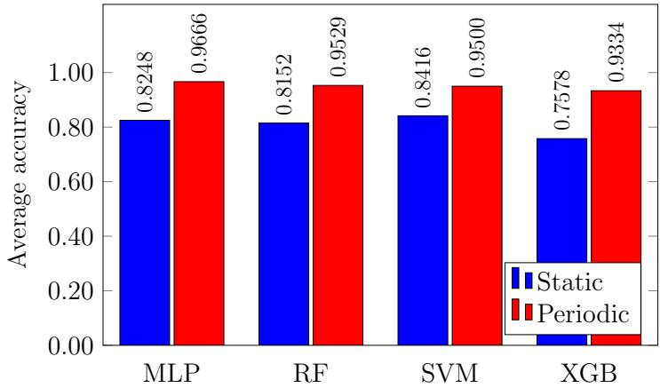  
Figure 1: Average static and periodic accuracy per learning model

Another aspect to consider is the efect of hyperparameter tunning of each learning model instance. If hyperparameter tunning was generally successful for learning model $L ,$ we expect the distribution of its periodic accuracies to be more compact and have a higher median, as compared to the distribution of the static accuracies. This is indeed the case, as illustrated in Figure 2, which validates our use of TPE for hyperparameter tuning.

Overall, these static and periodic results confirm the success of our experimental design and hyperparameter tuning. It is also clear that retraining models is necessary to counter concept drift. However, given the computational expense of training learning models, we would like to achieve comparable results to the periodic scenario with less work. To this end, we now consider drift-aware retraining for each of the three drift detectors introduced in Section 2.3. Our primary goal is to determine whether we can achieve results comparable to periodic retraining, but at a significantly lower cost, in terms of the number of models trained.

## 4.2 MK-Means Drift-Aware Results

Recall that MK-Means has two hyperparameters, $( \mathcal { T } _ { \mathrm { M K - M e a n s } } , \mathsf { c l u s t e r s } )$ . Figure 3 contains a plot of the Pareto Front for the specific case

$$
( F _ { d } , F _ { c } , L , R ) = ( \tt A g e n t , A i r p u s h , M L P , M K \mathrm { - } M e a n s )
$$

Static and Periodic Accuracies per Model  
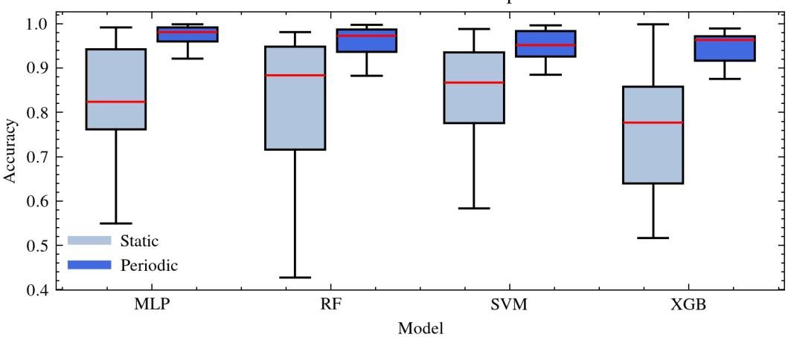  
Figure 2: Box plot of static and periodic accuracy

As previously noted, from the Pareto Front coordinates, it is trivial to determine the corresponding hyperparameters $\left( \mathcal { T } _ { \mathrm { M K - M e a n s } } \right. .$ , clusters).

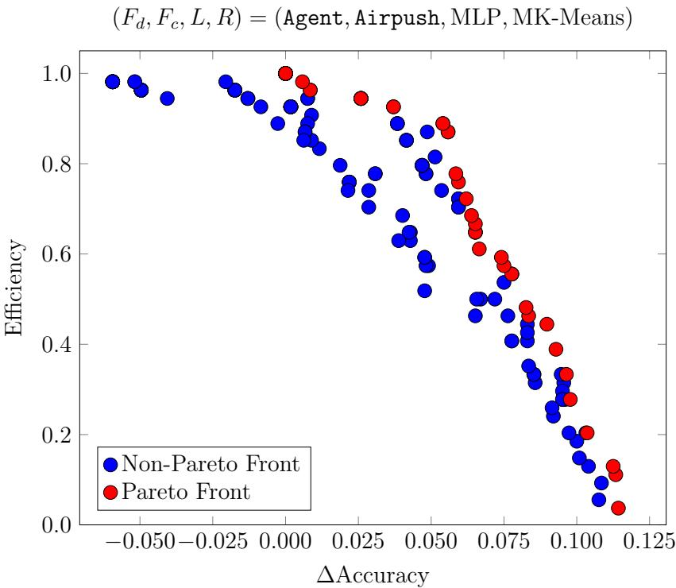  
Figure 3: MK-Means Pareto Front example

From Figure 3 we can see the advantage of choosing hyperparameter values based on the Pareto Front. For example, if we require an eficiency in the range of, say, 60% to 65%, choosing hyperparameter values from the Pareto Front could provide an improvement in accuracy of more than 3%, as compared to values that are not on the Pareto Front.

In Figure 4, we provide a bar graph comparing the average accuracies for each learning model under the static, drift-aware, and periodic scenarios, where the drift detection is based on MK-Means. As discussed in Section 3.5, for the drift-aware scenario, we have four distinct methods for computing the average accuracy, which we denote as ${ \mathcal { A } } _ { \mathrm { d r i f t } } , \ { \mathcal { A } } _ { \mathrm { d r i f t } } ^ { x * } , \ { \mathcal { A } } _ { \mathrm { d r i f t } } ^ { y * }$ , and $\mathcal { A } _ { \mathrm { d r i f t } } ^ { m * }$ . Recall that $\mathcal { A } _ { \mathrm { d r i f t } }$ is the average accuracy over all $( \mathcal { T } _ { \mathrm { M K - M e a n s } } , \mathsf { c l u s t e r s } )$ pairs tested, while the latter three averages are based on Pareto Front analysis.

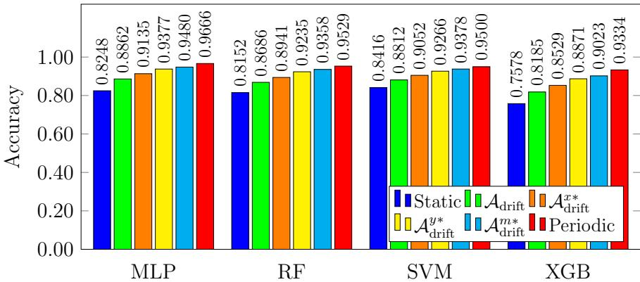  
Figure 4: MK-Means accuracies

From Figure 4, we observe that for all learning models tested, using MK-Means for concept drift detection produces a gain in accuracy, as compared to the static scenario. Also, by most of the measures considered, drift-aware retraining based on MK-Means results in only a relatively small loss in accuracy as compared to the more costly periodic scenario. For example, considering the median $\mathcal { A } _ { \mathrm { d r i f t } } ^ { m * }$ for the MLP model, we see that the drift-aware scenario improves on the static scenario by nearly 15%, since $( 0 . 9 4 8 0 - 0 . 8 2 4 8 ) / 0 . 8 2 4 8 = 0 . 1 4 9 4$ , while being within 2% of the accuracy achieved in the more costly periodic scenario, since $( 0 . 9 6 6 6 - 0 . 9 4 8 0 ) / 0 . 9 6 6 6 = 0 . 0 1 9 2$

Figure 5 shows the analogous eficiency results. The improvement in eficiency for the drift-aware scenario averaged over all hyperparameters $( \mathcal { T } _ { \mathrm { M K - M e a n s } } , \mathsf { c l u s t e r s } )$ tested, as indicated by $\mathcal { E } _ { \mathrm { d r i f t } } .$ , is over 80%, although the improvement when restricted to the better choices of hyperparameters, as represented by the Pareto Front-based values of $\mathcal { E } _ { \mathrm { d r i f t } } ^ { x * } , \mathcal { E } _ { \mathrm { d r i f t } } ^ { y * }$ , and $\mathcal { E } _ { \mathrm { d r i f t } } ^ { m * }$ is not quite as impressive. Nevertheless, for the median $\mathcal { E } _ { \mathrm { d r i f t } } ^ { m * }$ we achieve a savings—in terms of the number of models that must be trained—of more than 58%, as compared to the periodic retraining scenario.

## 4.3 OCSVM Drift-Aware Results

Our analysis of concept drift detection based on OCSVM is similar to that for MK-Means, above. In Figure 6, we give the Pareto Front for the same specific case that we considered for MK-Means, namely,

$$
( F _ { d } , F _ { c } , L , R ) = ( \tt A g e n t , A i r p u s h , M L P , O C S V M )
$$

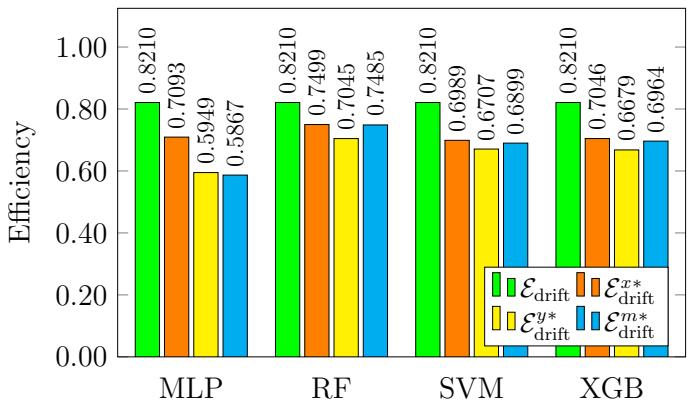  
Figure 5: MK-Means eficiencies

As in the MK-Means case, we again see the value of Pareto Front analysis for selecting hyperparameters to meet a desired balance between accuracy and eficiency.

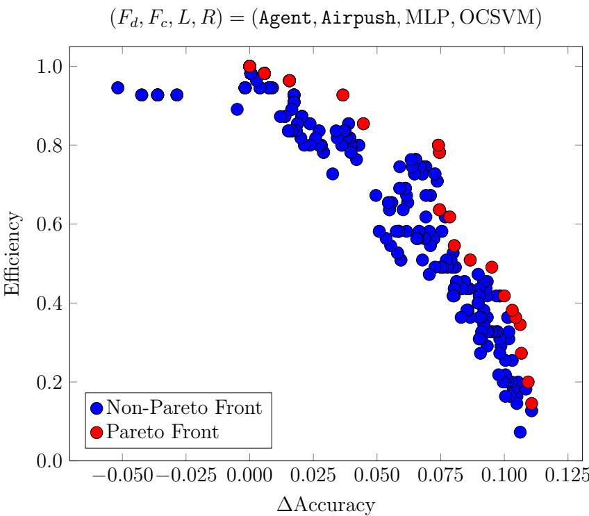  
Figure 6: OCSVM Pareto Front example

In Figures 7 and 8, respecitvely, we provide bar graphs of our various accuracy and eficiency metrics. We note that, similar to MK-Means, OCSVM achieves a substantial accuracy gain over the static baseline at a significant lower retraining cost than the periodic retraining scenario. For example, if we consider the median $\mathcal { A } _ { \mathrm { d r i f t } } ^ { m * }$ for the MLP model, the drift-aware scenario improves on the static scenario by 15% $( ( 0 . 9 4 8 6 - 0 . 8 2 4 8 ) / 0 . 8 2 4 8 = 0 . 1 5 0 1 )$ , while being within 1.9% of the accuracy achieved in the more costly periodic scenario ((0.9666 − 0.9486)/0.9666 = 0.0186), a marginal improvement over MK-Means.

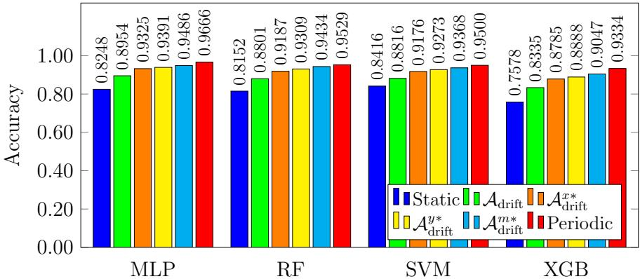  
Figure 7: OCSMV accuracies

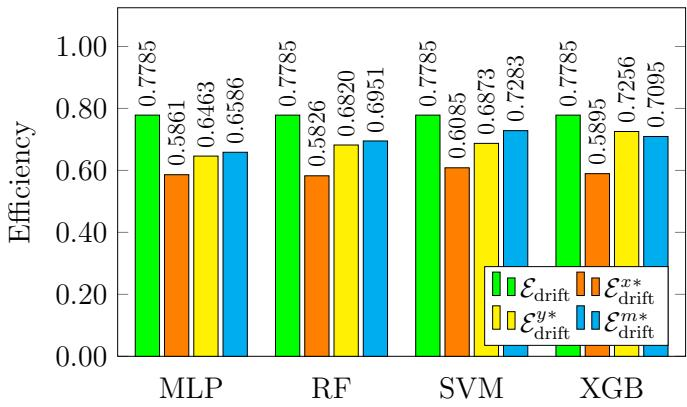  
Figure 8: OCSVM eficiencies

With respect to eficiency, the improvement for the OCSVM-based drift-aware scenario averaged over all hyperparameters tested is more than 77%. The improvement in eficiency when restricted to the median Pareto Front-based value $\mathcal { E } _ { \mathrm { d r i f t } } ^ { m * }$ and MLP model is more than 65%. Recall that the corresponding median value MK-Means is about 58%. Thus, by this measure, OCSVM ofers improved eficiency, as compared to MK-Means.

## 4.4 MMD Drift-Aware Results

Our MMD-based concept drift detection technique difers from MK-Means and OCSVM in that for MMD we only consider one hyperparameter. This hyperparameter, which we denote as $\mathcal { T } _ { \mathrm { M M D } } .$ , is a confidence value for hypothesis testing.

In Figure 9, we give the Pareto Front for the same specific case that we considered for both MK-Means and OCSVM, that is,

$$
( F _ { d } , F _ { c } , L , R ) = \tt ( A g e n t , A i r p u s h , M L P , M M D )
$$

Compared to MK-Means and OCSVM, we observe that for this MMD example, there is more consistency in the sense that points tend to be very close to the Pareto Front, modulo a small number of outliers.

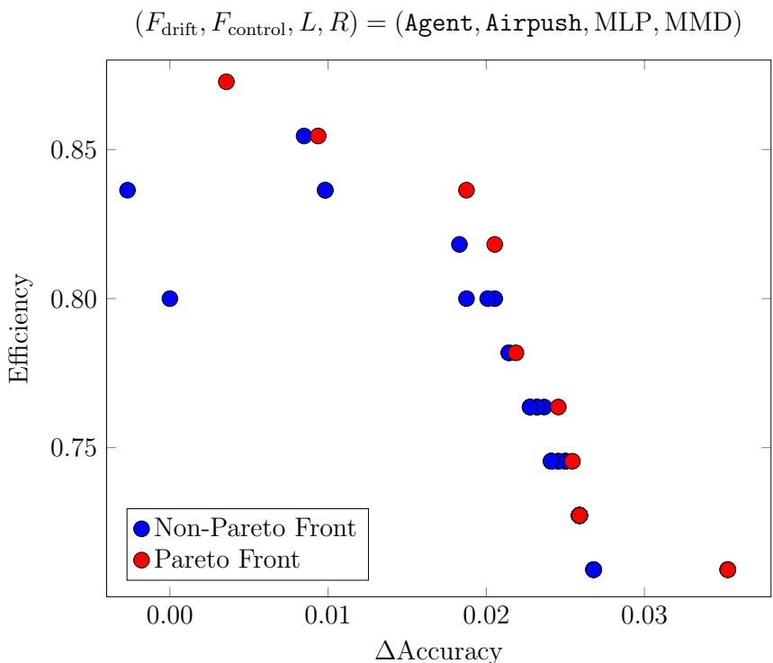  
Figure 9: MMD Pareto Front example

In Figure 10 we provide bar graphs of the various accuracy metrics and in Figure 11 we give the corresponding eficiency results. As with both MK-Means and OCSVM, MMD achieves a substantial gain over the static baseline at a significant lower retraining cost, as compared with the periodic retraining scenario. For example, if we consider the median $\mathcal { A } _ { \mathrm { d r i f t } } ^ { m * }$ for the MLP model, the drift-aware scenario improves on the static scenario by 13.72%, since $( 0 . 9 3 8 0 - 0 . 8 2 4 8 ) / 0 . 8 2 4 8 = 0 . 1 3 7 2 .$ while being within 3% of the accuracy achieved in the much more costly periodic retraining scenario, since $( 0 . 9 6 6 6 - 0 . 9 3 8 0 ) / 0 . 9 6 6 6 = 0 . 0 2 9 6$ . These numbers are slightly worse than the results we obtained using MK-Means and OCSVM.

With respect to eficiency, the improvement over the periodic scenario, averaged over all hyperparameters tested, is more than 64%. On the other hand, the eficiency when restricted to Pareto Front is slightly better—for example, the value $\mathcal { E } _ { \mathrm { d r i f t } } ^ { m * }$ for the MLP model is more than 69%. Recall that the corresponding median value MK-Means is about 58%, and for OCSVM it is about 65%.

For MK-Means and OCSVM, the average eficiency declined significantly when we restricted the hyperparameters to the Pareto Front. This indicates that for MK-Means and OCSVM, many of the hyperparameter choices fail to adequately detect concept drift, while for the better hyperparameter choices (i.e., those on the Pareto Front), we obtain strong results. This is not the case for MMD, where hyperparameter choices yield more consistent eficiency results, regardless of whether we restrict to the Pareto Front. The violin graphs in Figures 18 and 19 serve to further emphasize these points. These results strongly suggest that we could reduce the hyperparameter search space for MK-Means and OCSVM without afecting the accuracy or training eficiency results.

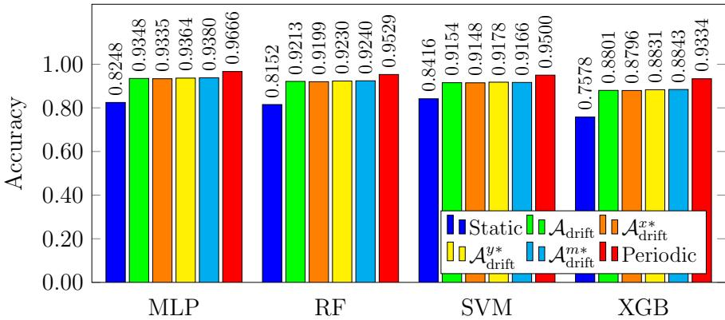  
Figure 10: MMD accuracies

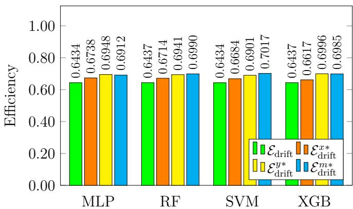  
Figure 11: MMD eficiencies

## 4.5 Comparison of Drift Detection Techniques

In this section we provide a comparative analysis of the three drift detection techniques discussed above, with the emphasis on aggregate results. We pay particular attention to $\mathcal { A } _ { \mathrm { d r i f t } } ^ { m * }$ and $\mathcal { E } _ { \mathrm { d r i f t } } ^ { m * }$ , since since these values correspond to typical selections of drift-detector hyperparameters

In Figure 12(a), we give accuracy results, averaged over all $( F _ { d } , F _ { c } , L )$ , that is, all selections of drift family, control family, and learning model. Figure 12(b) gives the corresponding eficiency averages.

From Figure 12 we see that the best $\mathcal { A } _ { \mathrm { d r i f t } } ^ { m * }$ is obtained with the OCSVM driftdetector, while MK-Means performs only marginally worse. With respect to $\mathcal { E } _ { \mathrm { d r i f t } } ^ { m * }$ 2 OCSVM and MMD are virtually identical.

Recall that we define eficiency in terms of the number of times that concept drift is detected, which necessitates the retraining of the learning models. Since the same learning models are trained for all three drift detectors, the time required to train any individual learning model has no bearing on this measure of eficiency. However, the time required to train each of our three drift detection techniques varies significantly, and this is relevant when selecting between these techniques.

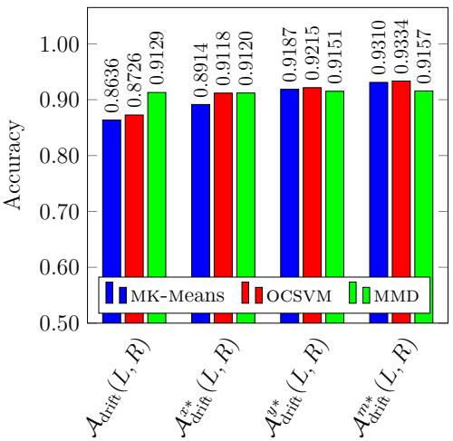  
(a) Accuracy

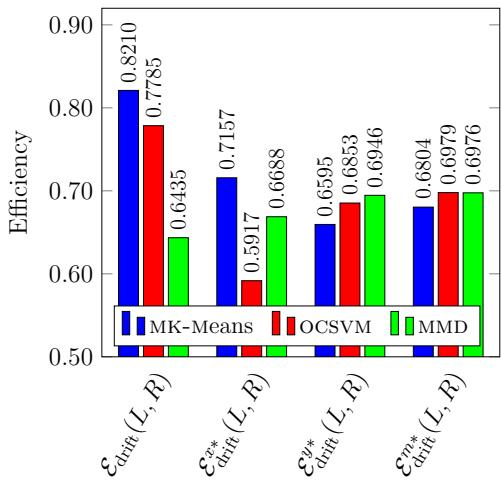  
(b) Eficiency  
Figure 12: Drift detector comparison averaged over all $( F _ { d } , F c , L )$

A comparison of the average time per $( F _ { d } , F _ { c } )$ pair that is required for each of the three drift-detection techniques is given in the form of a bar graph in Figure 13. By this measure, OCSVM requires the least time, by a wide margin, with MK-Means requiring the most time, also by a wide margin. The primary reason for these large discrepancies is that the OCSVM model is only retrained when concept drift is detected, whereas MK-Means and MMD need to be updated for each block, regardless of whether drift is detected. It is also worth noting that OCSVM has the largest number of hyperparameters to test and, as discussed in Section 4.4, this number could likely be significantly reduced, which would further increase its timing advantage.

According to a majority of the metrics considered, our OCSVM concept drift detector outperforms the MK-Means and MMD approaches. Thus, we conclude that OCSVM is the optimal choice from among the three concept drift detection techniques analyzed in this chapter.

## 5 Conclusion and Future Work

In this chapter, we considered the problem of concept drift detection when using machine learning models for malware classification. We analyzed three distinct concept drift detection approaches, two of which use machine learning techniques, namely, Minibatch K-Means (MK-Means) and One-Class Support Vector Machine (OCSVM), and one of which uses Maximum Mean Discrepancy (MMD), a statistical analysis technique. We compared drift-aware detection strategies based on each of these three techniques, and in each case, we compared the results to a static scenario (no model retraining occurs), and to periodic retraining (models are constantly retrained, regardless of whether concept drift has occurred).

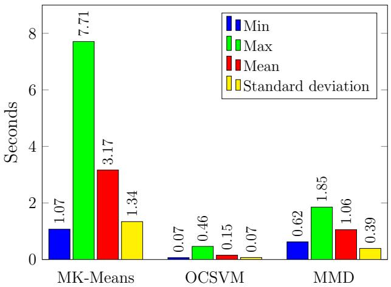  
Figure 13: Time required to detect drift points per $( F _ { d } , F _ { c } )$ pair

We also performed an extensive investigation of the tradeof between accuracy and training eficiency, using Pareto Front analysis. In addition, we analyzed the time required to train each of the concept drift detectors.

Our OCSVM-based concept drift detection technique generally performed best, with respect to accuracy and training time, and with respect to training eficiency, OCSVM was equivalent to MMD. In terms of accuracy, eficiency, and training time, MK-Means was generally the least efective of the three drift detection techniques. Over the set of hyperparameters tested, we found that MMD was the most consistent, but for the best selections of hyperparameters, OCSVM performed somewhat better than MMD.

It is interesting—and perhaps somewhat surprising—that a machine learning based approach (OCSVM) outperformed a statistical based approach (MMD). One plausible explanation is that while MMD is more sensitive to changes in the underlying statistics, OCSVM is better at detecting only those changes that are likely to actually matter, from a machine learning model perspective. This is a topic that is worthy of further investigation.

An additional avenue for future research is refining the window size used for concept drift detection. While we only considered a fixed window of size 50, the smallest practical window size would be preferred, since we want to retrain our models as soon as malware has evolved. Additionally, a deeper analysis of the parameters of MK-Means and OCSVM could yield a better understanding of the underlying data distribution and thereby improve the accuracy and eficiency of these drift detectors.

Another promising topic for further exploration is the use of Long-Short Term Memory (LSTM) models as drift detectors. LSTM models can account for temporal dependencies, which might enable such models to dynamically learn the optimal window size as part of the training process. Finally, evaluating the performance of proposed drift detection techniques in real-time malware detection systems would provide valuable insights into their practical applicability and scalability.

## References

[1] Md Tanvirul Alam, Romy Fieblinger, Ashim Mahara, and Nidhi Rastogi. MORPH: Towards automated concept drift adaptation for malware detection. In Proceedings 2024 Network and Distributed System Security Symposium, NDSS, 2024. https://arxiv.org/abs/2401.12790.

[2] Javier B. Alonso. K-means vs Mini Batch K-means: A comparison. http: //hdl.handle.net/2117/23414, 2013.

[3] John Aycock. Computer Viruses and Malware. Springer, 2006.

[4] Muhammad Azeem, Danish Khan, Saman Iftikhar, Shaikhan Bawazeer, and Mohammed Alzahrani. Analyzing and comparing the efectiveness of malware detection: A study of machine learning approaches. Heliyon, 10(1):e23574, 2024.

[5] Firas Bayram, Bestoun S. Ahmed, and Andreas Kassler. From concept drift to model degradation: An overview on performance-aware drift detectors. Knowledge-Based Systems, 245:108632, 2022.

[6] A. Bertia, Basil Xavier Simon, G. Jaspher W. Kathrine, and G. Matthew Palmer. A study about detecting ransomware by using diferent algorithms. In 2022 International Conference on Applied Artificial Intelligence and Computing, ICAAIC, pages 1293–1300, 2022.

[7] Anna Bogomolnaia, Herv´e Moulin, and Richard Stong. Collective choice under dichotomous preferences. Journal of Economic Theory, 122(2):165–184, 2005.

[8] Leo Breiman. Random Forests. Machine Learning, 45:5–32, 2001.

[9] Markus M. Breunig, Hans-Peter Kriegel, Raymond T. Ng, and J¨org Sander. LOF: identifying density-based local outliers. In Proceedings of the 2000 ACM SIGMOD International Conference on Management of Data, SIGMOD ’00, pages 93–104, 2000.

[10] Tianqi Chen and Carlos Guestrin. XGBoost: A scalable tree boosting system. In Proceedings of the 22nd ACM SIGKDD International Conference on Knowledge Discovery and Data Mining, KDD ’16, pages 785–794, 2016.

[11] Rohgi Toshio Meneses Chikushi, Roberto Souto Maior de Barros, Marilu Gomes N. Monte da Silva, and Bruno Iran Ferreira Maciel. Using spectral entropy and Bernoulli map to handle concept drift. Expert Systems with Applications, 167:114114, 2021.

[12] Christofer Washington Berruz Chungata, Martin Jureˇcek, Katerina Potika, and Mark Stamp. Maximum mean discrepancy for concept drift detection in malware classification models. In Proceedings of the 12th IEEE International

Conference on Big Data Computing Service and Machine Learning Applications, IEEE BigDataServices, 2026.

[13] Carlos A. Coello Coello, B. Gary Lamont, and David A. Van Veldhuizen. Evolutionary Algorithms for Solving Multi-Objective Problems. Springer, 2nd edition, 2007.

[14] Corinna Cortes and Vladimir Vapnik. Support-vector networks. Machine Learning, 20:273–297, 1995.

[15] Radosvet Desislavov, Fernando Mart´ınez-Plumed, and Jos´e Hern´andez-Orallo. Trends in ai inference energy consumption: Beyond the performance-vsparameter laws of deep learning. Sustainable Computing: Informatics and Systems, 38:100857, 2023.

[16] Stephan Dreiseitl, Melanie Osl, Christian Scheibb¨ock, and Michael Binder. Outlier detection with One-Class SVMs: An application to melanoma prognosis. In AMIA Annual Symposium Proceedings, pages 172–176, 2010.

[17] F-Secure Labs: Adware:Android/Airpush. https://www.f-secure.com/swdesc/adware-android-airpush.shtml, 2025.

[18] F-Secure Labs: Riskware:Android/SmsReg. https://www.f-secure.com/swdesc/riskware-android-smsreg.shtml, 2025.

[19] F-Secure Labs: Trojan:Android/Boxer. https://www.f-secure.com/vdescs/trojan-android-boxer.shtml, 2025.

[20] F-Secure Labs: Trojan:W32/Agent. https://www.f-secure.com/v-descs/ agent.shtml, 2025.

[21] Arthur Gretton, Karsten M. Borgwardt, Malte J. Rasch, Bernhard Sch¨olkopf, and Alexander Smola. A kernel two-sample test. Journal of Machine Learning Research, 13:723–773, 2012.

[22] Alejandro Guerra-Manzanares. GitHub - aleguma/kronodroid: KronoDroid dataset. https://github.com/aleguma/kronodroid, 2021.

[23] Alejandro Guerra-Manzanares, Hayretdin Bahsi, and Sven N˜omm. KronoDroid: Time-based hybrid-featured dataset for efective android malware detection and characterization. Computers & Security, 110:102399, 2021.

[24] J. A. Hartigan and M. A. Wong. Algorithm AS 136: A K-means clustering algorithm. Journal of the Royal Statistical Society. Series C (Applied Statistics), 28(1):100–108, 1979.

[25] Yiling He, Junchi Lei, Zhan Qin, Kui Ren, and Chun Chen. Combating concept drift with explanatory detection and adaptation for android malware classification. In Proceedings of the 2025 ACM Conference on Computer and Communications Security, CCS, pages 1–15, 2025.

[26] IBM: Random Forest. https://www.ibm.com/think/topics/random-forest, 2021.

[27] Abiodun M. Ikotun, Absalom E. Ezugwu, Laith Abualigah, Belal Abuhaija, and Jia Heming. K-means clustering algorithms: A comprehensive review, variants analysis, and advances in the era of big data. Information Sciences, 622:178–210, 2023.

[28] Samuel Kim. PE header analysis for malware detection. Master’s thesis, San Jose State University, California, 2018. https://scholarworks.sjsu.edu/ etd\_projects/624/.

[29] H. T. Kung, F. Luccio, and F. P. Preparata. On finding the maxima of a set of vectors. Journal of the ACM, 22(4):469–476, 1975.

[30] Alon Lev. XGBoost versus Random Forest. https://www.qwak.com/post/ xgboost-versus-random-forest, 2022.

[31] Adrian Shuai Li, Arun Iyengar, Ashish Kundu, and Elisa Bertino. Revisiting concept drift in windows malware detection: Adaptation to real drifted malware with minimal samples. In Proceedings 2025 Network and Distributed System Security Symposium, NDSS, 2025. https://arxiv.org/abs/2407.13918.

[32] Fei Tony Liu, Kai Ming Ting, and Zhi-Hua Zhou. Isolation forest. In 2008 Eighth IEEE International Conference on Data Mining, pages 413–422, 2008.

[33] Larry M. Manevitz and Malik Yousef. One-Class SVMs for document classification. Journal of Machine Learning Research, 2:139–154, 2002.

[34] Leo Mei and Mark Stamp. Energy considerations for large pretrained neural networks. https://arxiv.org/abs/2506.01311, 2025.

[35] Hoda El Merabet and Abderrahmane Hajraoui. A survey of malware detection techniques based on machine learning. International Journal of Advanced Computer Science and Applications, 10(1), 2019.

[36] Aniket Mishra and Mark Stamp. Cluster analysis and concept drift detection in malware. Journal of Computer Virology and Hacking Techniques, 21, 2025.

[37] Antonio Nappa, M. Zubair Rafique, and Juan Caballero. The Malicia dataset: Identification and analysis of drive-by download operations. International Journal of Information Security, 14(1):15–33, 2014.

[38] Optuna: Eficient optimization algorithms — Optuna 3.5.0 documentation. https://optuna.readthedocs.io/en/stable/tutorial/10\_key\_ features/003\_efficient\_optimization\_algorithms.html, 2025.

[39] Sunhera Paul and Mark Stamp. Word embedding techniques for malware evolution detection. In Mark Stamp, Mamoun Alazab, and Andrii Shalaginov, editors, Malware Analysis Using Artificial Intelligence and Deep Learning, pages 321–343. Springer, 2021.

[40] Polars: Data types and structures. https://docs.pola.rs/user-guide/ concepts/data-types-and-structures/, 2025.

[41] Stephan Rabanser, Stephan G¨unnemann, and Zachary C. Lipton. Failing loudly: an empirical study of methods for detecting dataset shift. In Proceedings of the 33rd International Conference on Neural Information Processing Systems, 2019.

[42] Ananya Redhu, P. Choudhary, K. Srinivasan, and Tapan Kumar Das. Deep learning-powered malware detection in cyberspace: a contemporary review. Frontiers in Physics, 12, 2024.

[43] Gordon J. Ross, Niall M. Adams, Dimitris K. Tasoulis, and David J. Hand. Exponentially weighted moving average charts for detecting concept drift. Pattern Recognition Letters, 33(2):191–198, 2012.

[44] Peter J. Rousseeuw and Katrien Van Driessen. A fast algorithm for the minimum covariance determinant estimator. Technometrics, 41(3):212–223, 1999.

[45] Bernhard Sch¨olkopf, John C. Platt, John Shawe-Taylor, Alex J. Smola, and Robert C. Williamson. Estimating the support of a high-dimensional distribution. Neural Computation, 13(7):1443–1471, 2001.

[46] scikit-learn: 2.7. novelty and outlier detection. https://scikit-learn.org/ stable/modules/outlier\_detection.html.

[47] Tongxin Shi, Roy A. McCann, Ying Huang, Wei Wang, and Jun Kong. Malware detection for Internet of Things using one-class classification. Sensors, 24(13):4122, 2024.

[48] sklearn.neural network.mlpclassifier scikit-learn 0.20.3 documentation. https://scikit-learn.org/stable/modules/generated/sklearn. neural\_network.MLPClassifier.html, 2010.

[49] Yiliao Song, Guangquan Zhang, Haiyan Lu, and Jie Lu. A fuzzy drift correlation matrix for multiple data stream regression. In 2020 IEEE International Conference on Fuzzy Systems, FUZZ-IEEE, pages 1–6, 2020.

[50] Mark Stamp. Introduction to Machine Learning with Applications in Information Security. Chapman and Hall/CRC, Boca Raton, second edition, 2022.

[51] Juan Terven, Diana-Margarita Cordova-Esparza, Julio-Alejandro Romero-Gonz´alez, Alfonso Ram´ırez-Pedraza, and E. A. Ch´avez-Urbiola. A comprehensive survey of loss functions and metrics in deep learning. Artificial Intelligence Review, 58:195, 2025.

[52] Eleftherios Tiakas, Apostolos N. Papadopoulos, and Yannis Manolopoulos. Skyline queries: An introduction. In 2015 6th International Conference on Information, Intelligence, Systems and Applications, IISA, pages 1–6, 2015.

[53] Lolitha Sresta Tupadha and Mark Stamp. Machine learning for malware evolution detection. In Mark Stamp, Corrado Aaron Visaggio, Francesco Mercaldo, and Fabio Di Troia, editors, Artificial Intelligence for Cybersecurity, pages 183– 213. Springer, 2022.

[54] Arnaud Van Looveren, Janis Klaise, Giovanni Vacanti, Oliver Cobb, Ashley Scillitoe, Robert Samoilescu, and Alex Athorne. Alibi detect: Algorithms for outlier, adversarial and drift detection, 2019.

[55] Mayuri Wadkar, Fabio Di Troia, and Mark Stamp. Detecting malware evolution using support vector machines. Expert Systems with Applications, 143:113022, 2020.

[56] Shuhei Watanabe. Tree-structured parzen estimator: Understanding its algorithm components and their roles for better empirical performance. https: //arxiv.org/abs/2304.11127, 2023.

[57] Kinza Yasar and Fred Tabsharani. What is a support vector machine (SVM)? https://www.techtarget.com/whatis/definition/supportvector-machine-SVM, 2023.

[58] Qingfu Zhang and Hui Li. MOEA/D: A multiobjective evolutionary algorithm based on decomposition. IEEE Transactions on Evolutionary Computation, 11(6):712–731, 2007.

[59] Si-si Zhang, Jian-wei Liu, and Xin Zuo. Adaptive online incremental learning for evolving data streams. Applied Soft Computing, 105:107255, 2021.

[60] Yu Zhang, Qingzhong Liu, and Yuanquan Shi. MANAGE: A novel malware evolution model based on digital genes. In 2022 7th IEEE International Conference on Data Science in Cyberspace, DSC, pages 64–70, 2022.

## Appendix

In this Appendix, we provide additional relevant graphs. Figures 14 through 17 provide bar graphs for each learning model considered, where static and periodic accuracies are given for each combination of malware families $( F _ { d } , F _ { c } )$ . Figure 18 contains violin plots related to accuracy and eficiency over all hyperparameters tested, while Figure 19 has the analogous plots restricted to the corresponding Pareto Front.

Model: MLP  
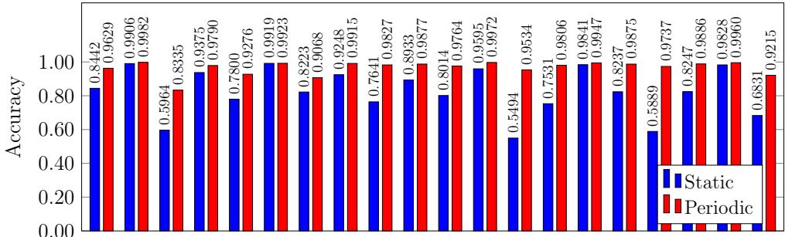  
Figure 14: Static and periodic accuracies for MLP model

Model: SVM

Model: RF  
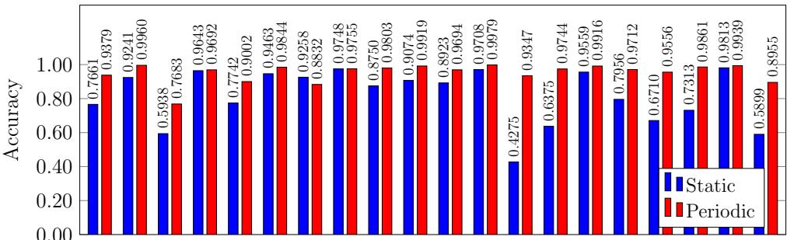  
Figure 15: Static and periodic accuracies for RF model

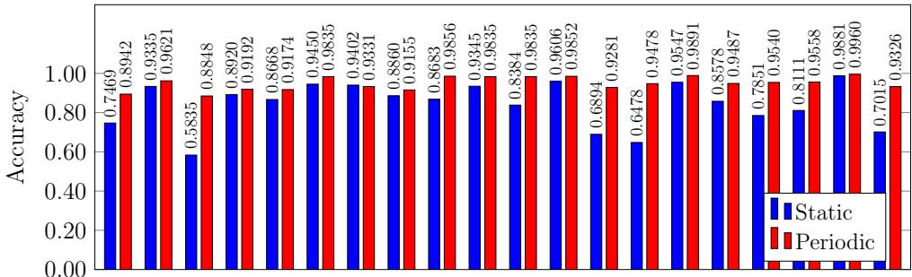  
Figure 16: Static and periodic accuracies for SVM model

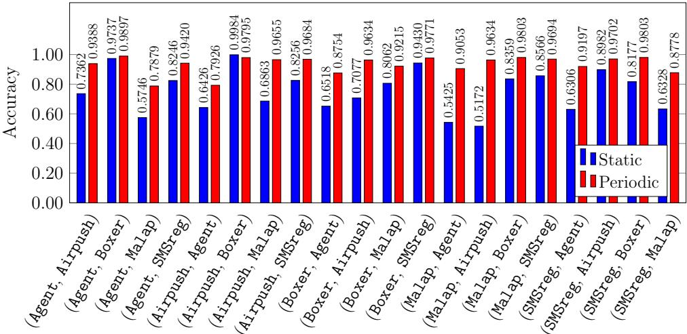  
Figure 17: Static and periodic accuracies for XGB model

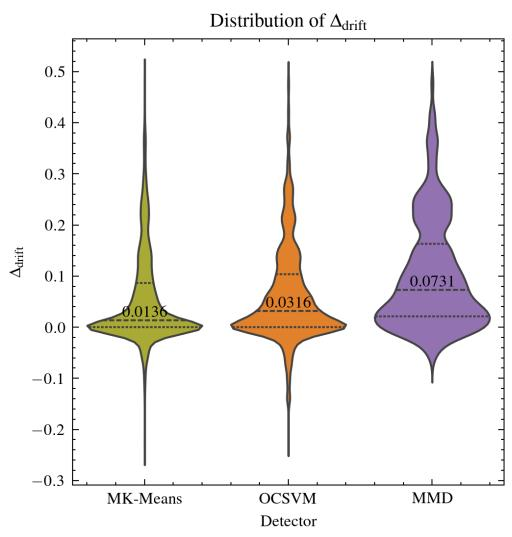

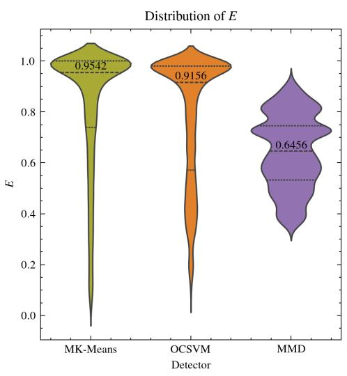  
Figure 18: Violin plots for accuracy and eficiency over all hyperparameters

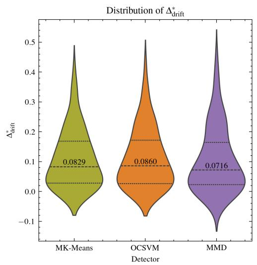

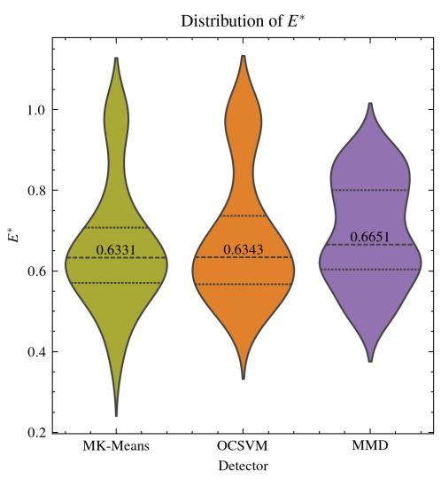  
Figure 19: Violin plots for accuracy and eficiency on Pareto Front