# Defensive Boosting for Online Probabilistic Forecasting

Georgy Noarov

Aaron Roth

## Abstract

We study online probabilistic forecasting of binary outcomes chosen by an adaptive adversary. Given an online learning algorithm for a weak hypothesis class H, we would like to eficiently obtain two incomparable guarantees that existing online boosting techniques provide separately. Online gradient boosting competes in Brier score with the best predictor induced by the span of H on every sequence — but promises nothing when the span does not contain an accurate predictor. Online weak-to-strong boosting drives classification error to zero under a weaklearning condition, but promises little when that condition fails.

We give a simple defensive forecasting algorithm, the Defensive Booster, that obtains both guarantees. On every adaptive sequence, its Brier score is competitive with the best prediction induced by the span of H at the same rate as online gradient boosting; simultaneously, whenever the realized transcript satisfies the smooth weak-learning condition, its Brier score and randomized classification error satisfy the same rate guarantee as online classification boosting. This is achieved by operationalizing the dual view of boosting: When the Defensive Booster’s randomized classification error is persistently high, its mistake weights form a smooth reweighting on which every weak hypothesis has low edge, yielding an ex-post hard-core certificate that the weak-learning condition fails. We also develop a strongly adaptive variant, which satisfies both guarantees and provides local hard-core certificates on every time interval. The Defensive Booster is very eficient: it accesses just one weak-class learner, whereas the prior online boosting methods we compare against maintain large weak-learner ensembles. Experiments on synthetic and real data streams demonstrate its strong predictive performance (sometimes substantially improving over all prior baselines) coupled with orders-of-magnitude faster runtime.

## 1 Introduction

On each round t of an online probabilistic forecasting problem, an adversary reveals a context $x _ { t } \in \mathcal { X }$ , the learner announces a probability $p _ { t } \in [ 0 , 1 ]$ for the binary outcome $Y _ { t } \in \{ 0 , 1 \}$ , and the outcome is then revealed. The sequence may be arbitrary and adaptive to the learner’s past predictions; we make no distributional assumptions. The forecast is scored by the Brier score $( Y _ { t } - p _ { t } ) ^ { 2 } ;$ : the squared-error proper scoring rule, minimized in expectation by the true conditional probability that $Y _ { t } = 1$

We study this problem through the lens of boosting. The learner is given an online learning algorithm for simple, “weak” probability predictors and wants to make forecasts that are more accurate than any weak learner can make alone. There are two established ways to turn an online weak learner into a stronger one, and they come with incomparable guarantees. To put both guarantees in common notation, encode a weak prediction $q ( x ) \in [ 0 , 1 ]$ as $h ( x ) = 2 q ( x ) - 1 \in [ - 1 , 1 ]$ and let H denote the resulting class; likewise, encode $Y _ { t }$ as $\sigma _ { t } = 2 Y _ { t } - 1$ . This normalization is useful for binary classification because it expresses classification advantage as correlation between $h ( x _ { t } )$ and $\sigma _ { t }$

Online gradient boosting (Beygelzimer et al., 2015a) treats boosting as online convex optimization over combinations of weak hypotheses. Run with squared loss, it guarantees Brier score competitive with the best predictor in the convex hull of H, or more generally in the norm-bounded span. This guarantee is assumption free in that it holds on every sequence — but of course there is no guarantee that there is an accurate predictor in the span.

Online weak-to-strong boosting (Beygelzimer et al., 2015b; Chen et al., 2012) instead obtains the “AdaBoost phenomenon” in the online setting under a smooth weak-learning condition: every suficiently smooth reweighting of the examples, meaning one whose weight is not concentrated on too few examples, admits a hypothesis with edge $\gamma$ over random guessing. With the encoding above, the edge of h under weights $w _ { t }$ is its normalized weighted correlation $| \sum _ { t } w _ { t } \sigma _ { t } h ( x _ { t } ) | / \sum _ { t }$ wt. For a binary-valued weak learner, edge γ is equivalent, after possibly flipping its sign, to weighted classification error at most $( 1 - \gamma ) / 2$ . When the condition holds down to the smoothness needed for the target accuracy, boosting drives classification error to zero. The resulting classification accuracy can far exceed what squared-loss competition with the span of $\mathcal { H }$ alone guarantees. But when the weak-learning condition fails, these algorithms promise little, and their natural output is a weighted vote over an ensemble of predictors rather than a probability.

This paper asks whether a single, natural, eficient online algorithm, outputting probability forecasts, can enjoy both guarantees at once: the unconditional comparator guarantee of gradient boosting, and the conditional weak-to-strong guarantee of classification boosting.

## 1.1 Our results

We answer afirmatively with a simple, eficient algorithm — the Defensive Booster (Algorithm 1) — built as a black-box reduction from an online learning algorithm for the weak class H. Write $\begin{array} { r } { B _ { T } = T ^ { - 1 } \sum _ { t < T } ( Y _ { t } - p _ { t } ) ^ { 2 } } \end{array}$ for its average Brier score. Our main guarantees, stated informally, follow. First, we unconditionally obtain the same guarantee as online gradient boosting, at the same rate:

Informal Theorem (Gradient-boosting-style span guarantee; Theorem 4.1). On every adaptive sequence, $f o r$ every f in the Λ-norm-bounded span of H, define $q _ { f } ( x ) = ( 1 + f ( x ) ) / 2$ . Then

$$
B _ { T } \leq \frac { 1 } { T } \sum _ { t = 1 } ^ { T } \left( Y _ { t } - q _ { f } ( x _ { t } ) \right) ^ { 2 } + O \left( \frac { \Lambda } { \sqrt { T } } \right) .
$$

Here $q _ { f } = ( 1 + f ) / 2$ reverses the afine encoding above and, for a general span comparator, is an unrestricted real-valued score. The actual bound is second-order — the regret term scales with the forecaster’s own Brier score rather than with T — yielding a fast $O ( 1 / T )$ bound in the realizable span case (Corollary 4.2).

Next, we simultaneously obtain the guarantee of online weak-to-strong boosting, transforming a smooth weak-learning condition into perfect classification with the same $\gamma , \varepsilon$ dependence that is optimal in the weak-online-learning model of Beygelzimer et al. (2015b):

Informal Theorem (Weak-to-strong boosting guarantee; Corollary 4.5). If the realized transcript satisfies the $( \rho , \gamma )$ -smooth weak-learning condition — every reweighting $w _ { t } \in [ 0 , 1 ]$ of the realized rounds with average weight at least $\rho$ admits some $h \in \mathcal H$ with normalized edge at least $\gamma -$ then the forecaster’s Brier score and randomized classification error $\begin{array} { r } { { \frac { 1 } { T } } \sum _ { t = 1 } ^ { T } | Y _ { t } - p _ { t } | } \end{array}$ are both at most max $\{ \rho , \ \tilde { O } ( 1 / ( \gamma ^ { 2 } T ) ) \}$ . Consequently, for any target $\varepsilon > 0$ , if the weak-learning condition holds with $\rho = O ( \varepsilon )$ , then both errors are at most ε after $T = \tilde { O } ( 1 / ( \gamma ^ { 2 } \varepsilon ) )$ rounds.

Thresholding each forecast at $1 / 2$ gives a deterministic classifier whose average $0 / 1$ error is at most twice the randomized error.

The weak-to-strong guarantee has a complementary certificate (Theorem 4.4). If the forecaster’s error remains large for long enough, its mistake weights $w _ { t } = | Y _ { t } - p _ { t } |$ form a hard-core witness: a smooth reweighting of the realized rounds on which every weak hypothesis has low edge. Thus persistent error explicitly certifies that the weak-learning condition fails on the realized transcript.

Both guarantees can also be made strongly adaptive. A variant using O(log T) active copies of the same weak-class oracle satisfies both guarantees, up to polylogarithmic factors, simultaneously on every contiguous interval (Section 5). On each interval it competes with the best span comparator for that interval; if the smooth weak-learning condition holds on the interval, it obtains the strong-learning guarantee there. It also localizes the certificate above: whenever error remains large on an interval, the mistake weights restricted to that interval form a local hard-core witness. Because the interval may be chosen after observing the transcript, this identifies where and when the smooth weak-learning condition fails, even if the condition holds on the full sequence.

The two guarantees are genuinely diferent: neither implies the other, and prior work that provides either guarantee in isolation does not provide both.

Informal Proposition (Separation; Appendix B). Neither guarantee implies the other. In one direction, for arbitrarily small constants $\gamma > 0$ , there are binary-valued weak classes and transcripts on which every reweighting has edge at least $\gamma - s o$ the weak-to-strong guarantee forces vanishing Brier score and randomized error — yet every score induced by the span has squared loss bounded below by a constant. For every fixed coeficient-norm budget, a constant lower bound also remains after clipping the scores to valid probabilities. Conversely, there are transcripts with an arbitrarily small-loss comparator in the span but a smooth reweighting on which every weak hypothesis has zero edge, so the smooth weak-learning condition fails.

We also evaluate the Defensive Booster empirically (Section 6): on synthetic datasets engineered to favor either gradient boosting or weak-to-strong classification boosting, and on four real binary prediction datasets. The stronger baseline family depends on the instance: gradient boosting can substantially outperform weak-to-strong boosting, and vice versa. On every instance, the Defensive Booster is competitive with, and often outperforms, the stronger baseline, while the ensemble baselines take 20–66× as much time per round: it maintains one online weak learner, whereas they each maintain 100.

A more naive alternative is to run instances of each kind of comparison booster in parallel and combine their probability forecasts with an online aggregator such as multiplicative weights. We include this method as a baseline. It must run every constituent booster, while the Defensive Booster runs one weak-class learner. Moreover, aggregation by Brier loss gives a weaker classification-error guarantee: a Brier guarantee controls randomized classification error only through $T ^ { - 1 } \sum _ { t } | Y _ { t } -$ $p _ { t } | \leq \sqrt { B _ { T } }$ , so an $O ( \varepsilon )$ Brier guarantee yields only $O ( { \sqrt { \varepsilon } } )$ randomized error, whereas the Defensive Booster directly guarantees $O ( \varepsilon )$ under the smooth weak-learning condition. The aggregation scheme also provides no hard-core witness.

Finally, we note that our algorithm also handles arbitrary bounded real-valued outcomes, and its squared-loss span guarantee holds unchanged, just as it does in the binary setting. Appendix D describes this in more detail, and evaluates this extension on three chronological regression streams.

## 1.2 Technique: playing the dual side of the boosting game

The boosting game and its two views. In the batch setting, weak-to-strong boosting can be viewed as a zero-sum game between a learner player, who plays distributions over the weak class H, and a data player, who plays reweightings of the dataset (Freund and Schapire, 1996). A winning strategy for the learner player is a distribution over weak hypotheses whose weighted majority vote attains perfect classification. A winning strategy for the data player is a hard-core distribution: a reweighting of the data on which no weak hypothesis has nontrivial edge (Impagliazzo, 1995). The weak learning assumption says that the data player has no suficiently smooth winning strategy, and minimax duality then supplies a winning majority vote for the learner player.

Existing online weak-to-strong boosting operationalizes the primal view: run many copies of the weak learner in parallel and learn a weighted combination of their predictions (Beygelzimer et al., 2015b; Chen et al., 2012). We operationalize the dual view. Our forecaster never forms an ensemble: it maintains one online learner for H and two scalar adaptive-gradient states, for a per-round cost of one oracle call plus $O ( 1 )$ arithmetic. It makes probability forecasts that are — in particular — multiaccurate with respect to $\mathcal { H }$ (H´ebert-Johnson et al., 2018; Kim et al., 2019): no weak hypothesis correlates with its forecast residuals. Multiaccuracy implies that weighting each round by the forecaster’s randomized prediction error yields a hard-core distribution for $\mathcal { H } .$ . This is the same correlation-to-hard-core principle underlying the complexity-theoretic regularity lemma of Trevisan et al. (2009) — see also recent work deriving related guarantees from strengthenings of multiaccuracy like calibrated multiaccuracy and multicalibration (Casacuberta et al., 2024, 2025). If the prediction error is high, the weights are large on average and so this hard-core distribution is smooth in the standard boosting sense. If the smooth weak-learning condition holds — weak hypotheses have nontrivial edge on every smooth reweighting — no such distribution exists. By contrapositive, the randomized classification error must be low. The remainder of this subsection makes each step concrete.

Defensive forecasting with orthogonality auditors. Using the encoding above, write $\mu _ { t } =$ $2 p _ { t } - 1$ for the signed forecast and $r _ { t } = \sigma _ { t } - \mu _ { t } = 2 ( Y _ { t } - p _ { t } )$ for the residual. The design principle is defensive forecasting (Vovk et al., 2005b): rather than minimizing a loss, the forecaster chooses $p _ { t }$ so that a designated family of statistical tests — auditors — cannot accumulate evidence that the forecasts difer from true probabilities. We use two kinds of auditors. A weak-class auditor enforces multiaccuracy with respect to H: hypotheses $h \in \mathcal H$ should have small empirical correlation with the residuals $r _ { t } .$ . A self-auditor enforces self-orthogonality: the forecast $\mu _ { t }$ itself should have small empirical correlation with its own residuals. Self-orthogonality is implied by, but substantially weaker than calibration, which is important, as calibration is impossible to obtain in the online setting at the rates we desire (Dagan et al., 2025; Qiao and Valiant, 2021). An adaptive-gradient procedure maintains a convex combination of the auditors, which we call the aggregated auditor. On each round the forecast $\mu _ { t }$ is chosen by a one-dimensional root rule: a point where the aggregated auditor gain, viewed as a function of the forecast, changes sign, so that the realized gain is nonpositive no matter how the label is realized (Lemma 3.2); this is a simple instantiation of the more general framework recently introduced by Farina and Perdomo (2026). On every sequence, $\begin{array} { r } { \operatorname* { s u p } _ { h \in \mathcal { H } } | \sum _ { t } h ( x _ { t } ) r _ { t } | \_ } \end{array}$ multiaccuracy — and $| \sum _ { t } \mu _ { t } r _ { t } |$ self-orthogonality — are each at most $A \sqrt { S _ { T } } + B$ , with its own constants determined by the corresponding online-learning primitive, where $\begin{array} { r } { S _ { T } = \sum _ { t } r _ { t } ^ { 2 } } \end{array}$ is the residual energy (Theorem 3.3).

High error yields a smooth hard-core witness. The residuals describe the forecaster’s own randomized classification mistakes. Identify the forecast $p _ { t }$ with the randomized classifier that predicts 1 with probability $p _ { t }$ . Its conditional mistake probability is $w _ { t } = | Y _ { t } - p _ { t } |$ , and these mistake weights satisfy the key identity $w _ { t } \sigma _ { t } = r _ { t } / 2$ . Interpret $w _ { t }$ as weights for a reweighting of the transcript. Their “density” $\rho _ { w } = T ^ { - 1 } \sum _ { t } w _ { t }$ is exactly the randomized classification error, while the identity converts multiaccuracy into an edge bound for the mistake weighting: no weak hypothesis correlates nontrivially with it. So if the forecaster’s randomized error is large enough for w to be smooth, then w is a smooth reweighting of the transcript on which no weak learner has nontrivial “edge” over random guessing — exactly the kind of winning strategy for the data player that the smooth weak-learning condition rules out. By contrapositive, the forecaster must have suficiently low error to avoid this contradiction, and this is what turns the weak-learning condition into a strong-learning guarantee. The self-bounding form of the certificate (error term $\sqrt { S _ { T } }$ with $S _ { T } \leq 4 T \rho _ { w } )$ turns this qualitative contradiction into the target $1 / ( \gamma ^ { 2 } \varepsilon )$ rate (Theorem 4.4). Self-orthogonality is not used in this part of the argument; the hard-core conclusion follows from multiaccuracy alone.

Adding self-orthogonality gives the span guarantee. On the other hand, it is known that multiaccuracy with respect to H together with self-orthogonality gives squared error competitive with every model in the span of $\varkappa \colon$ these are exactly the first-order optimality conditions for squared loss (see e.g. its use in (Kearns et al., 2025)). For a span comparator $f ,$ the excess squared loss of our forecasts over $f$ is controlled by two correlation terms: the residuals against $f ,$ which multiaccuracy bounds because $f$ is a linear combination of weak hypotheses, and the residuals against our own forecasts, which self-orthogonality bounds. Self-orthogonality is one additiona scalar constraint, enforced by one additional auditor at no cost in the rate, and the result is Brier loss competitive with the best predictor in the span on every sequence (Theorem 4.1).

Empirical preview. Figure 1 previews the real-data behavior for both binary probability forecasting and bounded regression; the main comparisons are in Section 6, and the full protocol and additional experiments are in Appendices C–E. The binary baselines are OGB (Beygelzimer et al., 2015a) for online gradient boosting; Online BBM and AdaBoost.OL (Beygelzimer et al., 2015b) and OSBoost (Chen et al., 2012) for online weak-to-strong boosting; and a Brier-loss aggregator that combines the four ensemble forecasts by multiplicative weights. The regression comparison is with OGB, the baseline providing the corresponding squared-loss span guarantee.

Organization. Section 2 defines the setting, the weak-class oracle, and the fixed scalar update. Section 3 gives the algorithm and the multiaccuracy/self-orthogonality certificate. Section 4 derives the Brier/span guarantee, the hard-core mistake weighting, and the weak-to-strong corollary. Section 5 gives a strongly adaptive variant whose guarantees hold on every interval. Section 6 reports synthetic and real-data experiments, and Section 7 discusses related work. Appendix B proves that the two guarantees are incomparable. Appendix C gives complete details for the binary prediction experiments. Appendix D extends the algorithm and its squared-loss span guarantee to bounded real-valued outcomes, and reports the regression experiments. Finally, Appendix E evaluates the strongly adaptive variant.

## 2 Setting and algorithmic ingredients

The interaction is adversarial and sequential. On round t, the environment reveals a context $x _ { t } \in \mathcal { X }$ The learner predicts $p _ { t } \in [ 0 , 1 ]$ , interpreted as the probability of outcome 1. The environment then reveals $Y _ { t } \in \{ 0 , 1 \}$ , and the learner sufers Brier loss $( Y _ { t } - p _ { t } ) ^ { 2 }$ . The sequence may be adaptive to the learner’s past predictions. We use binary outcomes for the probability and classification interpretations; Appendix D generalizes to outcomes in [0, 1].

The weak class H uses the [−1, 1] encoding introduced above and consists of functions $h : \mathcal { X } $ [−1, 1]. We write

$$
\sigma _ { t } = 2 Y _ { t } - 1 , \qquad \mu _ { t } = 2 p _ { t } - 1 , \qquad r _ { t } = \sigma _ { t } - \mu _ { t } = 2 ( Y _ { t } - p _ { t } ) .
$$

Binary probability forecasts  
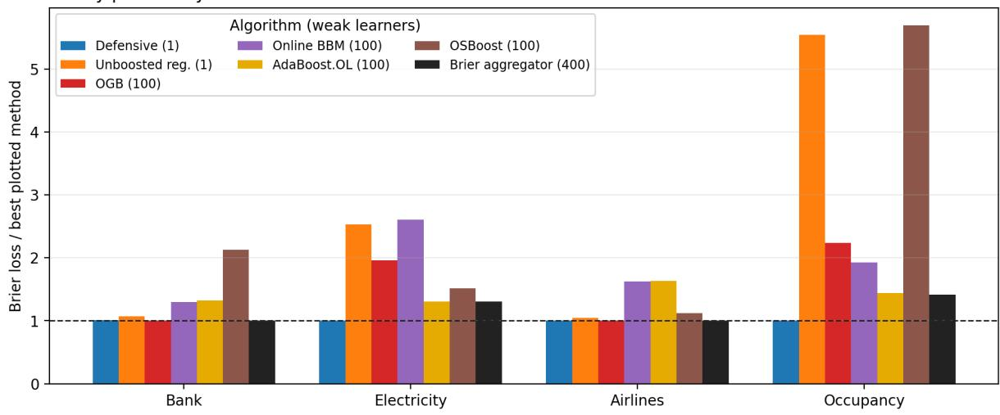

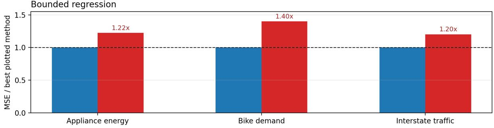  
Figure 1: Empirical preview (details in Section 6). Top: For each of four naturally ordered real binary streams, each method’s Brier loss is divided by the smallest loss among the methods shown. The Defensive Booster has the lowest Brier loss on Electricity and Occupancy, where it substantially outperforms even the 400-learner aggregator. It essentially ties the aggregator and OGB on Airlines and is within .0010 of the aggregator on Bank, while maintaining one weak-class learner. The hardlabel unboosted classifier is omitted for scale and reported in Table 1. Bottom (see Appendix D.1): On three chronological bounded-regression streams, mean squared error is divided by the smaller loss of the Defensive Booster and OGB. The Defensive Booster reduces mean squared error by 17–29% while maintaining one weak learner rather than 100. In both panels lower is better, dashed lines mark the best plotted value, and parentheses give the number of maintained online weak learners.

Thus $\mu _ { t }$ is the [−1, 1]-scaled forecast corresponding to the probability forecast $p _ { t }$

Definition 2.1 (Multiaccuracy and self-orthogonality). For a realized forecast sequence, let $r _ { t } =$ $\sigma _ { t } - \mu _ { t }$ denote the residual. The forecasts are α-multiaccurate with respect to H if

$$
\operatorname* { s u p } _ { h \in \mathcal { H } } \left| \sum _ { t = 1 } ^ { T } h ( x _ { t } ) r _ { t } \right| \leq \alpha .
$$

They are $\beta$ -self-orthogonal $i f$

$$
\left| \sum _ { t = 1 } ^ { T } \mu _ { t } r _ { t } \right| \leq \beta .
$$

After the afine encoding above, these are empirical versions of the squared-loss orthogonality conditions used in e.g. Kearns et al. (2025): multiaccuracy tests the residuals against an external class of functions, while self-orthogonality tests the residuals against the forecast itself.

We assume H is symmetric: if $h \in \mathcal H$ , then $- h \in { \mathcal { H } }$ . Otherwise one replaces H by $\mathcal { H } \cup ( - \mathcal { H } )$ and runs the weak learner on both signs.

Definition 2.2 (Norm-bounded span). For $\Lambda \geq 0$ , the Λ-norm-bounded span of H is

$$
\operatorname { s p a n } _ { \Lambda } ( \mathcal { H } ) = \left\{ f = \sum _ { j = 1 } ^ { m } \alpha _ { j } h _ { j } : m < \infty , \ h _ { j } \in \mathcal { H } , \ \sum _ { j = 1 } ^ { m } | \alpha _ { j } | \leq \Lambda \right\} .
$$

The convex hull of $\mathcal { H }$ is contained in $\operatorname { s p a n } _ { 1 } ( { \mathcal { H } } )$ . For every span comparator $f ,$ write

$$
q _ { f } ( x ) = { \frac { 1 + f ( x ) } { 2 } } .
$$

This is the afine rescaling of $f$ to the $\{ 0 , 1 \}$ outcome scale on which Brier loss is measured. Since $f$ need not take values in $[ - 1 , 1 ] , q _ { f }$ need not lie in [0, 1].

The algorithm has one problem-dependent online primitive: a weak-class oracle for H. We ask for a second-order regret guarantee, meaning that regret scales with the square root of the cumulative squared coeficients rather than with $\sqrt { T }$ . The coeficients supplied to the oracle will be the forecaster’s residuals, so this gives a certificate whose error scales with the residual energy $\begin{array} { r } { S _ { T } = \sum _ { t } ( \sigma _ { t } - \mu _ { t } ) ^ { 2 } } \end{array}$ itself. This self-bounding structure produces the $1 / ( \gamma ^ { 2 } \varepsilon )$ weak-to-strong sample complexity in Corollary 4.5; a first-order $\sqrt { T }$ guarantee would give only $1 / ( \gamma ^ { 2 } \varepsilon ^ { 2 } )$ The former dependence matches the rate shown optimal in the prior weak-online-learning model (Beygelzimer et al., 2015b), although our oracle model is stronger.

Definition 2.3 (Second-order weak-class oracle). A second-order weak-class oracle for H has fixed constants $a _ { \mathcal { H } } , b _ { \mathcal { H } } \ge 0$ . On round t, after observing xt but before seeing a coeficient $c _ { t } \in [ - 2 , 2 ]$ , it outputs $\widehat { h } _ { t } \in [ - 1 , 1 ]$ . For every horizon T and every resulting sequence, it guarantees

$$
\operatorname* { s u p } _ { h \in \mathcal { H } } \sum _ { t = 1 } ^ { T } c _ { t } h ( x _ { t } ) - \sum _ { t = 1 } ^ { T } c _ { t } \widehat { h } _ { t } \leq a _ { \mathcal { H } } \sqrt { \sum _ { t = 1 } ^ { T } c _ { t } ^ { 2 } } + b _ { \mathcal { H } } .\tag{1}
$$

The loss-minimization convention is obtained by replacing $c _ { t } \ b y \ { - c _ { t } }$

The assumption has standard instantiations. If H is finite, a second-order experts algorithm with one expert per $h \in \mathcal H$ gives $a _ { \mathcal { H } } = O ( \sqrt { \log | \mathcal { H } | } )$ and $b _ { \mathcal { H } } = O ( \log | \mathcal { H } | )$ (Cesa-Bianchi et al., 2007). More generally, adaptive or scale-free online linear optimization over conv(H) gives datadependent regret in terms of cumulative gradient norms (Kivinen et al., 2004; Orabona and P´al, 2018; Zinkevich, 2003). For example, for the RKHS ball $\mathcal { H } _ { B } = \{ x \mapsto \langle u , \phi ( x ) \rangle : \| u \| \leq B \}$ with $\lVert \phi ( x ) \rVert \leq \kappa$ and $B \kappa \leq 1$ , these methods give $O ( B \kappa \sqrt { \sum _ { t } c _ { t } ^ { 2 } } )$ regret up to lower-order terms.

All remaining online machinery is class independent. We use two copies of the following fixed one-dimensional routine.

Definition 2.4 (Scalar adaptive OGD). Initialize $a _ { 1 } = 0$ and $V _ { 0 } = 4$ . On round $t ,$ output $a _ { t } \in$ [−1, 1]. After observing a coeficient $g _ { t } \in [ - 2 , 2 ]$ , update

$$
a _ { t + 1 } = \Pi _ { [ - 1 , 1 ] } \left( a _ { t } + \frac { g _ { t } } { \sqrt { V _ { t - 1 } } } \right) , \qquad V _ { t } = V _ { t - 1 } + g _ { t } ^ { 2 } ,
$$

where $\Pi _ { [ - 1 , 1 ] }$ denotes Euclidean projection onto [−1, 1].

Lemma 2.5 (Second-order scalar regret). Scalar adaptive OGD satisfies, for every $a \in [ - 1 , 1 ]$

$$
\sum _ { t = 1 } ^ { T } ( a - a _ { t } ) g _ { t } \leq 4 \sqrt { 4 + \sum _ { t = 1 } ^ { T } g _ { t } ^ { 2 } } \leq 4 \sqrt { \sum _ { t = 1 } ^ { T } g _ { t } ^ { 2 } } + 8 .
$$

The proof is given in Appendix A.1.

## 3 The Defensive Booster

The Defensive Booster combines the weak-class oracle with two copies of the fixed scalar adaptive-OGD routine. The only forecasting step is a one-dimensional root rule on the signed mean $\mu _ { t } .$ The labels of the two scalar states describe their roles: S controls the self-auditor used to establish self-orthogonality, while A aggregates the weak-class and self auditors.

Definition 3.1 (Root rule). For a continuous function $F : [ - 1 , 1 ] \to \mathbb { R }$ , let $\operatorname { R o o t } ( F )$ be any point selected as follows:

(i) if F has a zero in [−1, 1], return any such zero;

(ii) if F is positive throughout [−1, 1], return 1;

(iii) if F is negative throughout [−1, 1], return −1.

Continuity ensures that exactly one of these cases applies.

Lemma 3.2 (Root sign property). For every continuous $F : [ - 1 , 1 ] \ \to \ \mathbb { R }$ , every signed label $\sigma \in [ - 1 , 1 ]$ , and $\mu = \operatorname { R o o t } ( F )$ 2

$$
F ( \mu ) ( \sigma - \mu ) \leq 0 .
$$

Proof. If $F ( \mu ) = 0$ , the claim is immediate. If F is positive throughout the interval, then $\mu = 1$ and $\sigma - \mu \leq 0$ . If F is negative throughout, then $\mu = - 1$ and $\sigma - \mu \geq 0$ □

Algorithm 1 Defensive Booster   
1: Initialize the weak-class oracle over H and two independent copies ${ \sf S }$ (the self-auditor state)   
and A (the auditor-aggregation state) of scalar adaptive OGD (Definition 2.4).   
2: for $t = 1 , 2 , \dots$ do   
3: Observe $x _ { t } .$ . Obtain $\widehat { h } _ { t } \in [ - 1 , 1 ]$ from the weak oracle, $\theta _ { t } \in [ - 1 , 1 ]$ from S, and $\lambda _ { t } \in [ - 1 , 1 ]$   
from A.   
4: Set $q _ { H , t } = ( 1 + \lambda _ { t } ) / 2$ and $q _ { S , t } = ( 1 - \lambda _ { t } ) / 2 .$   
5: Form $F _ { t } ( \mu ) = q _ { H , t } \hat { h } _ { t } + q _ { S , t } \theta _ { t } \mu$ and set $\mu _ { t } = \operatorname { R o o t } ( F _ { t } )$ ▷ Definition 3.1   
6: Forecast $p _ { t } = ( 1 + \mu _ { t } ) / 2 .$   
7: Observe ${ Y } _ { t } \in \{ 0 , 1 \} ;$ ; set $\sigma _ { t } = 2 Y _ { t } - 1$ and $r _ { t } = \sigma _ { t } - \mu _ { t } .$   
8: Set $z _ { H , t } = \dot { h _ { t } } r _ { t } , z _ { S , t } = \theta _ { t } \mu _ { t } r _ { t } , u _ { t } = \mu _ { t } r _ { t } .$ , and $v _ { t } = ( z _ { H , t } - z _ { S , t } ) / 2 .$   
9: Update the weak-class oracle with $c _ { t } = r _ { t }$ , update S with $u _ { t } ,$ and update A with $v _ { t } .$   
10: end for

Since $F _ { t }$ is afine, the root is computed in constant time: return $- q _ { H , t } \widehat { h } _ { t } / ( q _ { S , t } \theta _ { t } )$ when this ratio is defined and lies in $[ - 1 , 1 ]$ , return 0 when $F _ { t }$ is identically zero, and otherwise return the endpoint prescribed by Definition 3.1. The per-round cost is one oracle prediction/update plus

O(1) arithmetic. The resulting forecast need not be a linear combination or weighted vote of weak hypotheses: the algorithm predicts a probability directly rather than maintaining an explicit ensemble. The algorithm can be viewed as a simple one-dimensional, deterministic instance of the online-learning and variational-inequality framework of Farina and Perdomo (2026): their forecastdependent variational inequality is solved here by an exact root of the afine function $F _ { t }$

Multiaccuracy and self-orthogonality guarantees. The weak-class and self auditors have gains $z _ { H , t } = \widehat { h } _ { t } r _ { t }$ and $z _ { S , t } ~ = ~ \theta _ { t } \mu _ { t } r _ { t }$ . The scalar state A chooses their convex weights: writing $v _ { t } = ( z _ { H , t } - z _ { S , t } ) / 2$ , its two endpoint comparators $\lambda = 1$ and $\lambda = - 1$ correspond exactly to always selecting the weak-class auditor and the self auditor, respectively. The root rule makes the resulting weighted gain nonpositive on every round, regardless of the label. Lemma 2.5 therefore forces each auditor’s cumulative gain to be small. The weak-class oracle transfers this to multiaccuracy, while the scalar state S transfers the self-auditor bound to self-orthogonality. Since $| u _ { t } | , | v _ { t } | \leq | r _ { t } |$ , every error term scales with $\sqrt { S _ { T } }$

Theorem 3.3 (Second-order multiaccuracy and self-orthogonality). For every adaptive sequence with $Y _ { t } \in \{ 0 , 1 \}$ , let

$$
S _ { T } = \sum _ { t = 1 } ^ { T } ( \sigma _ { t } - \mu _ { t } ) ^ { 2 } = 4 \sum _ { t = 1 } ^ { T } ( Y _ { t } - p _ { t } ) ^ { 2 } .
$$

The Defensive Booster (Algorithm 1) is $( A _ { H } \sqrt { S _ { T } } + B _ { H } )$ -multiaccurate with respect to $\mathcal { H } .$

$$
\operatorname* { s u p } _ { h \in \mathcal H } \left| \sum _ { t = 1 } ^ { T } h ( x _ { t } ) ( \sigma _ { t } - \mu _ { t } ) \right| \leq A _ { H } \sqrt { S _ { T } } + B _ { H }
$$

and $( A _ { S } \sqrt { S _ { T } } + B _ { S } )$ -self-orthogonal:

$$
\left| \sum _ { t = 1 } ^ { T } \mu _ { t } ( \sigma _ { t } - \mu _ { t } ) \right| \leq A _ { S } \sqrt { S _ { T } } + B _ { S } ,
$$

where

$$
A _ { H } = a _ { \mathcal { H } } + 4 , \qquad B _ { H } = b _ { \mathcal { H } } + 8 , \qquad A _ { S } = 8 , \qquad B _ { S } = 1 6 .
$$

Proof. Let

$$
\bar { z } _ { t } = \frac { z _ { H , t } + z _ { S , t } } { 2 } , \qquad v _ { t } = \frac { z _ { H , t } - z _ { S , t } } { 2 } .
$$

The gain selected by A is

$$
\bar { z } _ { t } + \lambda _ { t } v _ { t } = q _ { H , t } z _ { H , t } + q _ { S , t } z _ { S , t } = F _ { t } ( \mu _ { t } ) ( \sigma _ { t } - \mu _ { t } ) \leq 0
$$

by Lemma 3.2. Competing in Lemma 2.5 with $\lambda = 1$ and $\lambda = - 1$ gives, respectively,

$$
\sum _ { t = 1 } ^ { T } z _ { H , t } - \sum _ { t = 1 } ^ { T } ( \bar { z } _ { t } + \lambda _ { t } v _ { t } ) \leq 4 \sqrt { 4 + \sum _ { t = 1 } ^ { T } v _ { t } ^ { 2 } }
$$

and the same bound with $z _ { S , t }$ in place of $z _ { H , t }$ . Since $| v _ { t } | \leq | r _ { t } |$ and the selected cumulative gain is nonpositive,

$$
\sum _ { t = 1 } ^ { T } z _ { H , t } , \quad \sum _ { t = 1 } ^ { T } z _ { S , t } \leq 4 \sqrt { S _ { T } } + 8 .\tag{2}
$$

The weak-class oracle is updated with $c _ { t } = r _ { t }$ . Hence, for every $h \in \mathcal H$

$$
\sum _ { t = 1 } ^ { T } h ( x _ { t } ) r _ { t } \leq \sum _ { t = 1 } ^ { T } \widehat { h } _ { t } r _ { t } + a _ { \mathcal { H } } \sqrt { S _ { T } } + b _ { \mathcal { H } } \leq ( a _ { \mathcal { H } } + 4 ) \sqrt { S _ { T } } + b _ { \mathcal { H } } + 8 .
$$

Symmetry of H gives the absolute-value multiaccuracy bound.

For self-orthogonality, S is updated with $u _ { t } = \mu _ { t } r _ { t }$ . For every $\theta \in [ - 1 , 1 ]$ , Lemma 2.5 and (2) give

$$
\sum _ { t = 1 } ^ { T } \theta \mu _ { t } r _ { t } \leq \sum _ { t = 1 } ^ { T } \theta _ { t } \mu _ { t } r _ { t } + 4 \sqrt { 4 + \sum _ { t = 1 } ^ { T } \mu _ { t } ^ { 2 } r _ { t } ^ { 2 } \leq 8 \sqrt { S _ { T } } + 1 6 } .
$$

Taking the supremum over $\theta \in [ - 1 , 1 ]$ yields $| \sum _ { t } \mu _ { t } r _ { t } |$

## 4 Main guarantees

This section derives the paper’s guarantees from the two inequalities in Theorem 3.3. They are parallel consequences, not consequences of one another: the hard-core statement uses multiaccuracy alone, whereas the span statement also uses self-orthogonality. Section 4.1 gives the Brier/spanregret guarantee, which holds on every sequence. Section 4.2 shows that the multiaccuracy bound controls the edge of the forecaster’s own mistake weighting. Section 4.3 turns the edge bound into the weak-to-strong boosting statement. Appendix B gives examples showing that the two guarantees are incomparable.

## 4.1 Brier/span-regret guarantee

Theorem 4.1 (Brier/span guarantee). For every adaptive binary sequence, the predictions of the Defensive Booster (Algorithm 1) satisfy, for every $f \in \operatorname { s p a n } _ { \Lambda } ( \mathcal { H } )$ 2

$$
B _ { T } : = \frac { 1 } { T } \sum _ { t = 1 } ^ { T } ( Y _ { t } - p _ { t } ) ^ { 2 } \leq \frac { 1 } { T } \sum _ { t = 1 } ^ { T } ( Y _ { t } - q _ { f } ( x _ { t } ) ) ^ { 2 } + \frac { \Lambda A _ { H } + A _ { S } } { \sqrt { T } } \sqrt { B _ { T } } + \frac { \Lambda B _ { H } + B _ { S } } { 2 T } .
$$

In particular, since $B _ { T } \leq 1$ ，

$$
B _ { T } \leq \frac { 1 } { T } \sum _ { t = 1 } ^ { T } ( Y _ { t } - q _ { f } ( x _ { t } ) ) ^ { 2 } + \frac { \Lambda A _ { H } + A _ { S } } { \sqrt { T } } + \frac { \Lambda B _ { H } + B _ { S } } { 2 T } .
$$

The same bound holds for every $f \in \operatorname { c o n v } ( \mathcal { H } )$ with $\Lambda = 1$

Proof. Let $r _ { t } = \sigma _ { t } - \mu _ { t }$ . Convexity of $\mu \mapsto ( \sigma _ { t } - \mu ) ^ { 2 }$ gives

$$
( \sigma _ { t } - \mu _ { t } ) ^ { 2 } \leq ( \sigma _ { t } - f ( x _ { t } ) ) ^ { 2 } + 2 r _ { t } ( f ( x _ { t } ) - \mu _ { t } ) .
$$

If $\begin{array} { r } { f = \sum _ { j = 1 } ^ { m } \alpha _ { j } h _ { j } } \end{array}$ with $\textstyle \sum _ { j } | \alpha _ { j } | \leq \Lambda$ , Theorem 3.3 gives

$$
\left| \sum _ { t = 1 } ^ { T } f ( x _ { t } ) r _ { t } \right| \leq \Lambda ( A _ { H } \sqrt { S _ { T } } + B _ { H } ) .
$$

The same theorem gives $| \textstyle \sum _ { t } \mu _ { t } r _ { t } | \leq A _ { S } { \sqrt { S _ { T } } } + B _ { S }$ . Substituting these two bounds into the signed convexity inequality gives

$$
S _ { T } \le \sum _ { t = 1 } ^ { T } ( \sigma _ { t } - f ( x _ { t } ) ) ^ { 2 } + 2 ( \Lambda A _ { H } + A _ { S } ) \sqrt { S _ { T } } + 2 ( \Lambda B _ { H } + B _ { S } ) .
$$

Divide by $4 T$ and use $S _ { T } = 4 T B _ { T }$ and $( \sigma _ { t } - f ( x _ { t } ) ) ^ { 2 } = 4 ( Y _ { t } - q _ { f } ( x _ { t } ) ) ^ { 2 }$ . Since $B _ { T } \leq 1$ , the second bound follows. □

Corollary 4.2 (Low-loss span guarantee). In the setting of Theorem $4 . 1 ,$ write

$$
B _ { f } = \frac { 1 } { T } \sum _ { t = 1 } ^ { T } ( Y _ { t } - q _ { f } ( x _ { t } ) ) ^ { 2 } , \qquad C = \Lambda A _ { H } + A _ { S } , \qquad D = \Lambda B _ { H } + B _ { S } .
$$

Then

$$
B _ { T } \leq B _ { f } + C \sqrt { \frac { B _ { f } } { T } } + \frac { 3 C ^ { 2 } } { 2 T } + \frac { 3 D } { 4 T } .
$$

In particular, if $B _ { f } = 0 _ { : }$ , then $B _ { T } = O ( ( C ^ { 2 } + D ) / T )$

The proof is given in Appendix A.2.

## 4.2 The hard-core mistake weighting

Definition 4.3 (Reweighting, smoothness, and edge). A reweighting of the realized transcript is a sequence $w _ { t } \in [ 0 , 1 ]$ . Its density is

$$
\rho ( w ) = \frac { 1 } { T } \sum _ { t = 1 } ^ { T } w _ { t } .
$$

For $\rho > 0$ , the reweighting is $\rho \mathrm { - }$ smooth $i f \rho ( w ) \geq \rho$ . When $\textstyle \sum _ { t } w _ { t } > 0$ , its normalized edge against H is

$$
\mathrm { e d g e } _ { \mathcal { H } } ( w ) = \operatorname* { s u p } _ { h \in \mathcal { H } } \left| \frac { \sum _ { t = 1 } ^ { T } w _ { t } \sigma _ { t } h ( x _ { t } ) } { \sum _ { t = 1 } ^ { T } w _ { t } } \right| .
$$

For $\rho , \gamma > 0$ , the transcript satisfies the $( \rho , \gamma )$ -smooth weak-learning condition $i f$ every ρ-smooth reweighting w has ed $\mathrm { g e } _ { \mathcal { H } } ( w ) \geq \gamma$

When $\mathcal { H } \subseteq \{ - 1 , + 1 \} ^ { \mathcal { X } }$ is a class of binary-valued classifiers, let

$$
\mathrm { e r r } _ { w } ( h ) = \frac { \sum _ { t = 1 } ^ { T } w _ { t } \mathbf { 1 } \{ h ( x _ { t } ) \neq \sigma _ { t } \} } { \sum _ { t = 1 } ^ { T } w _ { t } }
$$

denote the weighted error of $h \in \mathcal H$ . Its normalized weighted correlation is $1 - 2 \mathrm { e r r } _ { w } ( h )$ . Because $\mathrm { e r r } _ { w } ( - h ) = 1 - \mathrm { e r r } _ { w } ( h )$ ，

$$
| 1 - 2 \operatorname { e r r } _ { w } ( h ) | = 1 - 2 \operatorname* { m i n } \{ \operatorname { e r r } _ { w } ( h ) , \operatorname { e r r } _ { w } ( - h ) \} .
$$

Thus the absolute value in the edge compares h with the classifier −h obtained by flipping all of $h \mathrm { { s } }$ predictions. In particular, e $\mathrm { l g e } _ { \mathcal { H } } ( w ) \geq \gamma$ means that, for some $h \in \mathcal H$ , either $h \mathrm { o r } - h$ has weighted error at most $( 1 - \gamma ) / 2$ . If H is closed under negation, both orientations are members of $\mathcal { H } .$

Relation to smooth distributions. The condition in Definition 4.3 is ex post: it is a property of the realized transcript, not an input to the forecaster. If w is ρ-smooth, then its normalization

$$
D _ { w } ( t ) = \frac { w _ { t } } { \sum _ { s } w _ { s } }
$$

is a distribution on the rounds satisfying $D _ { w } ( t ) \le 1 / ( \rho T )$ Conversely, any distribution D on [T] with $D ( t ) \leq 1 / ( \rho T )$ is represented by the ρ-smooth reweighting $w _ { t } = \rho T D ( t )$ Thus bounded smooth reweightings are exactly the unnormalized form of the smooth distributions used by Smooth-Boost (Servedio, 2003) and in boosting-based hard-core constructions (Barak et al., 2009; Klivans and Servedio, 2003). The Defensive Booster does not maintain a distribution over past rounds or train separate weak learners on diferent reweightings. It sends the current signed residual $2 ( Y _ { t } - p _ { t } )$ to one weak-class learner, as required to obtain multiaccuracy. The sequence $w _ { t } = | Y _ { t } - p _ { t } |$ is interpreted only after the fact as the witness analyzed below.

Theorem 4.4 (Hard-core mistake weighting). Let $p _ { 1 } , \ldots , p _ { T }$ be the probability forecasts of the Defensive Booster, and let

$$
B _ { T } = \frac { 1 } { T } \sum _ { t = 1 } ^ { T } ( Y _ { t } - p _ { t } ) ^ { 2 } .
$$

Define the randomized mistake weights

$$
w _ { t } = Y _ { t } ( 1 - p _ { t } ) + ( 1 - Y _ { t } ) p _ { t } = | Y _ { t } - p _ { t } | , \qquad \rho _ { w } = \frac { 1 } { T } \sum _ { t = 1 } ^ { T } w _ { t } .
$$

Then $w _ { t } \in [ 0 , 1 ]$ R

$$
B _ { T } = \frac { 1 } { T } \sum _ { t = 1 } ^ { T } w _ { t } ^ { 2 } \leq \rho _ { w } ,
$$

and every $h \in \mathcal H$ satisfies

$$
\left| \frac { 1 } { T } \sum _ { t = 1 } ^ { T } w _ { t } \sigma _ { t } h ( x _ { t } ) \right| \leq \frac { A _ { H } \sqrt { T B _ { T } } + B _ { H } / 2 } { T } .
$$

Consequently, if $\rho _ { w } > 0$ then

$$
{ \mathrm { e d g e } } _ { \mathcal { H } } ( w ) \leq \frac { A _ { H } \sqrt { T B _ { T } } + B _ { H } / 2 } { T \rho _ { w } } .
$$

Proof. Since $Y _ { t } \in \{ 0 , 1 \}$ and $p _ { t } \in [ 0 , 1 ] , w _ { t } \in [ 0 , 1 ]$ and $( Y _ { t } - p _ { t } ) ^ { 2 } = w _ { t } ^ { 2 }$ . Hence $\begin{array} { r } { B _ { T } = T ^ { - 1 } \sum _ { t } w _ { t } ^ { 2 } \le } \end{array}$ $\rho _ { w }$

The key identity is

$$
w _ { t } \sigma _ { t } = Y _ { t } - p _ { t } = \frac { \sigma _ { t } - \mu _ { t } } { 2 } .
$$

The multiaccuracy part of Theorem 3.3 therefore implies, for every $h \in \mathcal H$

$$
\left| \frac { 1 } { T } \sum _ { t = 1 } ^ { T } w _ { t } \sigma _ { t } h ( x _ { t } ) \right| = \frac { 1 } { 2 T } \left| \sum _ { t = 1 } ^ { T } h ( x _ { t } ) ( \sigma _ { t } - \mu _ { t } ) \right| \leq \frac { A _ { H } \sqrt { T B _ { T } } + B _ { H } / 2 } { T } ,
$$

because $S _ { T } = 4 T B _ { T }$ . Dividing by $\rho _ { w }$ gives the normalized edge bound when $\rho _ { w } > 0$

## 4.3 The smooth weak-learning condition gives classification boosting

The smooth weak-learning condition turns the hard-core alternative around. If no suficiently smooth small-edge weighting exists, the algorithm’s own mistake weighting cannot be smooth.

Corollary 4.5 (Second-order weak-to-strong rate). Let $\rho _ { 0 } , \gamma _ { 0 } > 0$ . Ifthe realized transcript satisfies the $( \rho _ { 0 } , \gamma _ { 0 } )$ -smooth weak-learning condition for ${ \mathcal { H } } ,$ , then the Brier loss $\begin{array} { r } { B _ { T } = T ^ { - 1 } \sum _ { t } ( Y _ { t } - p _ { t } ) ^ { 2 } } \end{array}$ and the randomized classification error $\begin{array} { r } { \rho _ { w } = T ^ { - 1 } \sum _ { t } | Y _ { t } - p _ { t } | } \end{array}$ both satisfy

$$
B _ { T } , \rho _ { w } \leq \operatorname* { m a x } \left\{ \rho _ { 0 } , \frac { 4 A _ { H } ^ { 2 } } { \gamma _ { 0 } ^ { 2 } T } , \frac { B _ { H } } { \gamma _ { 0 } T } \right\} .
$$

The deterministic threshold classifier $\widehat { Y } _ { t } = \mathbf { 1 } \{ p _ { t } \geq 1 / 2 \}$ , with arbitrary tie-breaking at $p _ { t } = 1 / 2$ , has average classification error at most $2 \rho _ { w }$

Proof idea. If the mistake weighting is not ρ0-smooth, then its density $\rho _ { w }$ is already below $\rho _ { 0 }$ as is $B _ { T }$ . Otherwise, the smooth weak-learning condition lower-bounds its edge by $\gamma _ { 0 } .$ whereas Theorem 4.4 upper-bounds the same edge in terms of $B _ { T }$ and $\rho _ { w } .$ . Solving the two resulting inequalities gives the stated bounds. Thresholding adds at most a factor of two because every threshold mistake has $| Y _ { t } - p _ { t } | \ge 1 / 2$ . The complete calculation is given in Appendix A.2.

Taking $\rho _ { 0 }$ to be a suficiently small constant multiple of $\varepsilon$ and

$$
T = \Omega \left( { \frac { A _ { H } ^ { 2 } } { \gamma _ { 0 } ^ { 2 } \varepsilon } } + { \frac { B _ { H } } { \gamma _ { 0 } \varepsilon } } \right)
$$

gives Brier loss, randomized classification error, and deterministic classification error for the thresholded classifier at most ε, up to constants. Thus the smooth weak-learning condition must hold at smoothness $\rho _ { 0 } = O ( \varepsilon )$ for a target error ε. When $B _ { H }$ is logarithmic or lower order, this is the usual $1 / ( \gamma _ { 0 } ^ { 2 } \varepsilon )$ dependence. The lower bound of Beygelzimer et al. (2015b) shows that this dependence is unavoidable in their weak-online-learning model, up to logarithmic and excess-loss terms.

## 5 Boosting on every interval

The preceding guarantees average over the full horizon. We now give a strongly adaptive variant: one forecast sequence satisfies the same two guarantees, up to polylogarithmic factors, on every contiguous interval. The construction uses a standard second-order specialist reduction. We state the reduction first because preserving dependence on the local residual energy is essential; an ordinary $O ( \sqrt { | I | } )$ interval-regret bound would lose the optimal weak-to-strong rate and get a $1 / ( \gamma _ { 0 } ^ { 2 } \varepsilon ^ { 2 } )$ dependence instead.

Proposition 5.1 (Second-order interval wrapper). Fix a horizon $T .$ . Suppose an online learner B, whenever started fresh, outputs $z _ { t } \in [ - 1 , 1 ]$ and, for every comparator sequence $z ^ { \star } = ( z _ { t } ^ { \star } ) _ { t }$ in a fixed class and every coeficient sequence $c _ { t } \in [ - 2 , 2 ]$ , satisfies

$$
\sum _ { t = 1 } ^ { n } c _ { t } \mathopen { } \mathclose \bgroup \left( z _ { t } ^ { \star } - z _ { t } \aftergroup \egroup \right) \leq a \sqrt { \sum _ { t = 1 } ^ { n } c _ { t } ^ { 2 } + b } .
$$

Set

$$
{ \cal L } _ { T } = \log ( 4 T ) , \qquad { \cal M } _ { T } = 2 \left\lceil \log _ { 2 } ( 2 T ) \right\rceil .
$$

There is a wrapper ${ \mathsf { S A } } ( { \mathsf { B } } )$ whose output $\widetilde { z } _ { t } ~ \in ~ [ - 1 , 1 ]$ satisfies, simultaneously for every interval $I \subseteq [ T ]$ and every comparator $z ^ { \star }$

$$
\sum _ { t \in I } c _ { t } ( z _ { t } ^ { \star } - \widetilde z _ { t } ) \leq \alpha _ { T } ( a ) \sqrt { \sum _ { t \in I } c _ { t } ^ { 2 } } + \beta _ { T } ( b ) ,\tag{3}
$$

where, for a universal constant $C _ { 0 }$

$$
\alpha _ { T } ( a ) = \sqrt { M _ { T } } \big ( a + C _ { 0 } \sqrt { L _ { T } } \big ) , \qquad \beta _ { T } ( b ) = M _ { T } \big ( b + C _ { 0 } L _ { T } \big ) .
$$

The wrapper maintains at most $1 + \lceil \log _ { 2 } T \rceil$ active copies of B per round.

The wrapper combines fresh copies of B on dyadic intervals with a second-order confidence-rated experts algorithm. Its standard proof is given in Appendix A.3.

Apply Proposition 5.1 separately to the weak-class oracle and to the two scalar routines S and A in Algorithm 1; use their aggregate outputs in the same root rule and feed the wrappers the same coeficients as before. Call the resulting forecaster the strongly adaptive Defensive Booster. Let $a _ { H } ^ { \mathrm { i n t } } , b _ { H } ^ { \mathrm { i n t } }$ denote the coeficients in (3) for the weak-class wrapper, and let $a _ { \mathrm { s c } } ^ { \mathrm { i n t } } , b _ { \mathrm { s c } } ^ { \mathrm { i n t } }$ denote them for either scalar wrapper. Since scalar adaptive OGD has fresh-run constants $a = 4$ and $b = 8$ Proposition 5.1 gives the explicit values

$$
a _ { H } ^ { \mathrm { i n t } } = \alpha _ { T } ( a _ { \mathcal { H } } ) , \quad b _ { H } ^ { \mathrm { i n t } } = \beta _ { T } ( b _ { \mathcal { H } } ) , \qquad a _ { \mathrm { s c } } ^ { \mathrm { i n t } } = \alpha _ { T } ( 4 ) , \quad b _ { \mathrm { s c } } ^ { \mathrm { i n t } } = \beta _ { T } ( 8 ) .
$$

Theorem 5.2 (Interval certificate). For every adaptive binary sequence, the strongly adaptive Defensive Booster satisfies, simultaneously for every interval $I \subseteq [ T ]$

$$
\operatorname* { s u p } _ { h \in \mathcal { H } } \left| \sum _ { t \in I } h ( x _ { t } ) r _ { t } \right| \leq A _ { H } ^ { \mathrm { i n t } } \sqrt { S _ { I } } + B _ { H } ^ { \mathrm { i n t } } , \qquad \left| \sum _ { t \in I } \mu _ { t } r _ { t } \right| \leq A _ { S } ^ { \mathrm { i n t } } \sqrt { S _ { I } } + B _ { S } ^ { \mathrm { i n t } } ,
$$

where $\textstyle S _ { I } = \sum _ { t \in I } r _ { t } ^ { 2 }$ and

$$
A _ { H } ^ { \mathrm { i n t } } = a _ { H } ^ { \mathrm { i n t } } + a _ { \mathrm { s c } } ^ { \mathrm { i n t } } , \quad B _ { H } ^ { \mathrm { i n t } } = b _ { H } ^ { \mathrm { i n t } } + b _ { \mathrm { s c } } ^ { \mathrm { i n t } } , \qquad A _ { S } ^ { \mathrm { i n t } } = 2 a _ { \mathrm { s c } } ^ { \mathrm { i n t } } , \quad B _ { S } ^ { \mathrm { i n t } } = 2 b _ { \mathrm { s c } } ^ { \mathrm { i n t } } .
$$

The proof repeats the argument of Theorem 3.3 using the interval-regret bounds of Proposition 5.1; details are given in Appendix A.3.

Corollary 5.3 (Strongly adaptive boosting). For an interval $I \subseteq [ T ]$ , let $n = | I |$ and define

$$
B _ { I } = \frac { 1 } { n } \sum _ { t \in I } ( Y _ { t } - p _ { t } ) ^ { 2 } , \qquad \rho _ { I } = \frac { 1 } { n } \sum _ { t \in I } | Y _ { t } - p _ { t } | .
$$

The interval mistake weights $w _ { t } = | Y _ { t } - p _ { t } |$ form a local hard-core witness: $i f \rho _ { I } > 0$ , then

$$
\operatorname* { s u p } _ { h \in \mathcal { H } } \frac { \left| \sum _ { t \in I } w _ { t } \sigma _ { t } h ( x _ { t } ) \right| } { \sum _ { t \in I } w _ { t } } \leq \frac { A _ { H } ^ { \mathrm { i n t } } \sqrt { n B _ { I } } + B _ { H } ^ { \mathrm { i n t } } / 2 } { n \rho _ { I } } .
$$

Simultaneously for every interval I:

(i) for every $f \in \operatorname { s p a n } _ { \Lambda } ( \mathcal { H } )$ 7

$$
B _ { I } \leq \frac { 1 } { n } \sum _ { t \in I } ( Y _ { t } - q _ { f } ( x _ { t } ) ) ^ { 2 } + \frac { \Lambda A _ { H } ^ { \mathrm { i n t } } + A _ { S } ^ { \mathrm { i n t } } } { \sqrt { n } } \sqrt { B _ { I } } + \frac { \Lambda B _ { H } ^ { \mathrm { i n t } } + B _ { S } ^ { \mathrm { i n t } } } { 2 n } ;
$$

(ii) for any $\rho _ { 0 } , \gamma _ { 0 } > 0$ , if every weighting $w \in [ 0 , 1 ] ^ { I }$ with $n ^ { - 1 } \textstyle \sum _ { t \in I } w _ { t } \geq \rho _ { 0 }$ satisfies

$$
\operatorname* { s u p } _ { h \in \mathcal { H } } \frac { \left| \sum _ { t \in I } w _ { t } \sigma _ { t } h ( x _ { t } ) \right| } { \sum _ { t \in I } w _ { t } } \geq \gamma _ { 0 } ,
$$

then

$$
B _ { I } , \rho _ { I } \le \operatorname* { m a x } \left\{ \rho _ { 0 } , \frac { 4 ( A _ { H } ^ { \mathrm { i n t } } ) ^ { 2 } } { \gamma _ { 0 } ^ { 2 } n } , \frac { B _ { H } ^ { \mathrm { i n t } } } { \gamma _ { 0 } n } \right\} .
$$

The threshold classifier has error at most $2 \rho _ { I }$ on I.

The corollary follows by applying the proofs of Theorem 4.1, Theorem 4.4, and Corollary 4.5 on I, with Theorem 5.2 in place of the full-horizon certificate.

Thus, for fixed oracle constants, a target interval error ε requires $n = O ( \log ^ { 2 } ( T ) / ( \gamma _ { 0 } ^ { 2 } \varepsilon ) )$ when the local weak-learning condition holds with $\rho _ { 0 } = O ( \varepsilon )$ , while the span-regret guarantee holds without any weak-learning condition. Since the bounds hold simultaneously, the interval and its span comparator may be selected after observing the transcript. No assumption is made about rounds outside I. The price for this simultaneous interval guarantee is the explicit logarithmic factors in Proposition 5.1 and at most $1 + \lceil \log _ { 2 } T \rceil$ active weak-class oracle copies; the basic Defensive Booster retains its guarantee while maintaining one weak-class oracle. Structurally, one forecast sequence therefore produces a family of data-dependent local hard-core witnesses: whenever error remains high on an interval, the mistake weights on that interval identify a smooth distribution on which the entire weak class has small edge. This conclusion goes beyond interval comparator regret by identifying where and when weak learnability fails; it does not require the algorithm to detect a change point or explicitly construct a hard subset. Figure 14 in Appendix E visualizes the density and weak-class edge of these local witnesses across interval endpoints and time scales on a stream with known change points.

## 6 Experiments

We compare the Defensive Booster with online gradient boosting, online weak-to-strong boosting, and the more naive Brier aggregator strategy on controlled synthetic streams and four naturally ordered real datasets. The synthetic streams separately test settings in which the span contains an informative predictor and settings in which the smooth weak-learning condition holds. The real streams test performance on naturally ordered binary data; Appendix D.1 separately evaluates three chronological regression datasets. Across the binary experiments, the Defensive Booster’s Brier loss is competitive with the best baseline on each dataset and often improves upon it substantially, while the gradient boosting and weak-to-strong boosting ensemble baselines take 20–66× as much time per round. The Brier-loss aggregator over the four ensembles is yet more expensive and does not close the gap on the two real streams where the Defensive Booster performs best.

Protocol. We compare eight methods. Two unboosted controls isolate the benefit of aggregation by simply running the learning algorithm that the boosting techniques take as input: Unboosted reg. performs online squared-loss regression over the weak class, while Unboosted cls. runs the online classifier used as the base learner by the classification boosters. Four ensemble baselines represent the two boosting traditions. OGB is online gradient boosting (Beygelzimer et al., 2015a); Online BBM is the rate-optimal online boost-by-majority algorithm; AdaBoost.OL is the adaptive logistic-loss algorithm from the same paper (Beygelzimer et al., 2015b); and OSBoost is online SmoothBoost (Chen et al., 2012). The Brier aggregator combines the forecasts of these four ensembles by exponential weighting under Brier loss. The Defensive Booster and each unboosted control maintain one online learner over the weak class; each boosting baseline maintains an ensemble of $N = 1 0 0$ such learners, and the aggregator must run all four ensembles, for a total of 400.

We evaluate deterministic $0 / 1$ classification error, Brier loss, and randomized classification error $\begin{array} { r } { T ^ { - 1 } \sum _ { t } | Y _ { t } - p _ { t } | } \end{array}$ . Online BBM and Unboosted cls. output hard labels, which we view as probabilities in {0, 1} when computing Brier loss and randomized error. Consequently, all three metrics coincide for these two methods. AdaBoost.OL randomizes over its partial ensembles; we report its probability of predicting one. Its randomized-error score is therefore the expected classification error of the original randomized output, while its Brier score evaluates that probability directly.

We fix all hyperparameters before examining performance and do not tune them separately for each stream. In particular, Online BBM and OSBoost use the analytically guaranteed weak-learning advantage on controlled synthetic streams where one is known, and the fixed target classification advantage $\gamma = . 1$ on all other streams. All synthetic results use $T = 3 0 0 0$ and report means over 20 seeds. We process each real dataset stream once in its recorded order, without shufling. Appendix C gives the complete details including algorithm hyperparameter settings, data generators and preprocessing steps, standard errors, and runtime tables. Code, public-data loaders, and exact reproduction commands are available at https://github.com/aaroth/defensive-boosting.

We use two synthetic streams to isolate the two guarantees. To test the weak-to-strong guarantee, we use the binary aggregation stream. The weak class contains 200 binary hypotheses, arranged as 100 opposite pairs $\{ \pm h _ { j } \} _ { j = 1 } ^ { 1 0 0 }$ The algorithms see all 200 binary predictions in random order and are not told which orientation in each pair is useful. Signed labels are balanced and randomly ordered. There is a hidden choice of one orientation from each pair such that all 100 chosen rules are correct on half the rounds; on each remaining round exactly 58 are correct and 42 are incorrect, in a cyclically balanced pattern. No single rule is perfect, and averaging all 200 displayed rules gives zero. The hidden average, however, has signed margin at least $2 ( . 5 8 ) - 1 = . 1 6$ on every round and therefore classifies perfectly. Averaging over the chosen orientations shows that every nonzero reweighting admits a displayed rule with edge at least .16. Adding negations and hiding the orientations does not change the span, so the symmetry calculation in Proposition B.1 shows that every fixed afine span score has Brier loss at least $( 1 - . 1 6 ) ^ { 2 } / ( 8 ( 1 + . 1 6 ^ { 2 } ) ) = . 0 8 6 0$ . The stream thus directly instantiates the separation between span prediction and weak-to-strong aggregation.

To test the span guarantee, we use the random-label mixture stream. Here the contexts are normalized vectors in $\mathbb { R } ^ { 3 0 }$ and the weak class is the infinite Euclidean linear class $\mathcal { H } = \{ x \mapsto \langle u , x \rangle$ $\| u \| _ { 2 } \leq 1 \}$ . Independently on each round, with probability .65 the label follows a fixed noisy linear rule and with probability .35 it is an independent random bit. Uniform weighting over the randomlabel rounds is smooth and, with high probability, has low edge, so the smooth weak-learning condition fails for any constant target edge; nevertheless, the linear span remains informative on the structured rounds. These streams are deliberately favorable to diferent baseline families. On the binary aggregation stream, the Bayes classification error is zero and the weak-to-strong boosters approach it. On the random-label mixture stream, OGB is the strongest baseline in Brier loss and approaches the least-squares span benchmark, whereas the classification boosters incur substantially larger Brier loss. Each stream is therefore tailored to one baseline family. The test is whether the Defensive Booster approaches the stronger baseline on each stream while improving on the other family. Figure 2 shows deterministic classification error on the binary aggregation stream and Brier loss on the random-label mixture.

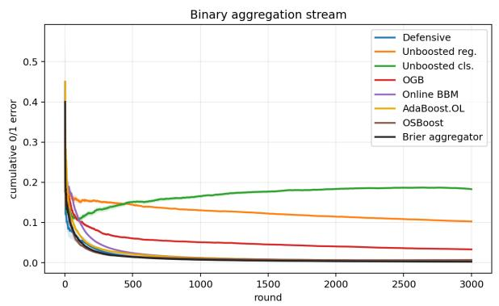

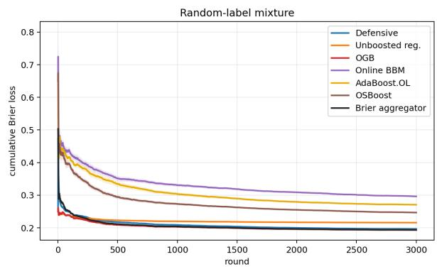  
Figure 2: The two baseline families excel on complementary streams, and the Defensive Booster tracks the better family in each. Left: cumulative $0 / 1$ error on the binary aggregation stream. Online BBM, AdaBoost.OL, and OSBoost approach zero, while OGB retains positive error; the Defensive Booster also approaches zero and is within .0001 of the Brier aggregator’s final mean. Right: cumulative Brier loss on the random-label mixture. OGB has the lowest baseline loss, while the weak-to-strong boosters remain higher; the Defensive Booster tracks OGB. The Brier aggregator tracks the better family in both panels by running all four 100-learner ensembles, whereas the Defensive Booster maintains one learner. Curves are means over 20 seeds. The hard-labe unboosted classifier is omitted from the Brier panel for scale and reported in Table 3.

Results. On the binary aggregation stream at T = 3000, Online BBM reaches hard-prediction error .0041, AdaBoost.OL reaches .0042, and OSBoost reaches .0068. The Defensive Booster reaches .0026, compared with .0331 for OGB and .1829 for the unboosted classifier, while using one learner rather than 100. Its Brier loss is .0018, below every individual ensemble and the .0025 loss of the Brier aggregator.

On the random-label mixture stream, OGB and the Defensive Booster have Brier losses .1933 and .1965, respectively, while OSBoost, AdaBoost.OL, and Online BBM have losses .2467, .2708, and .2963. The Brier aggregator reaches .1937 by running all four ensembles. Thus the Defensive Booster remains competitive with OGB on a sequence where the weak-to-strong guarantee does not apply. The full synthetic table in Appendix C.2 includes standard errors and three additional streams: a planted weak rule among decoys, an infinite linear weak class, and random labels.

The random-label mixture stream also lets us inspect the hard-core guarantee directly. Figure 3 tracks the Defensive Booster’s multiaccuracy and self-orthogonality errors, together with the density of its mistake weighting and the weak class’s edge under that weighting. The two errors and the class edge decay while the density remains nontrivial, so the mistake weights form the smooth, low-edge witness predicted by Theorem 4.4.

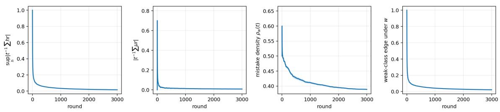  
Figure 3: Multiaccuracy, self-orthogonality, and hard-core diagnostics on the random-label mixture stream, averaged over 20 seeds. The first two panels show the cumulative multiaccuracy and self-orthogonality correlations from Theorem 3.3, divided by the current round $t ;$ the last two show the density and $\mathrm { e d g e } _ { \mathcal { H } } ( w )$ , the weak-class edge under the mistake weighting $w _ { t } = | Y _ { t } - p _ { t } |$ Randomized error remains nontrivial because of the random-label component, but $\mathrm { e d g e } _ { \mathcal { H } } ( w )$ decays: the forecaster’s mistakes are the smooth low-edge witness predicted by Theorem 4.4.

One learner versus an ensemble. Each unboosted control and the Defensive Booster have running time scaling as $C _ { H } + O ( 1 )$ per round, where $C _ { H }$ is the running time of one weak-learner prediction and update. OGB, Online BBM, AdaBoost.OL, and OSBoost have per-round running time $N C _ { H } + O ( N )$ with N learners; OSBoost also projects its combiner onto a simplex. The Brier aggregator runs all four ensemble boosters. Figure 4 compares prediction quality as the ensemble size varies. On this stream, the Defensive Booster has lower Brier loss and randomized error than each $N = 1 0 0$ ensemble and the Brier aggregator. In our implementation, the $N = 1 0 0$ methods take 20–66 times as much wall-clock time per round across the synthetic and real experiments. Absolute constants are implementation-dependent, but the diference in the number of maintained weak learners is part of the algorithms themselves.

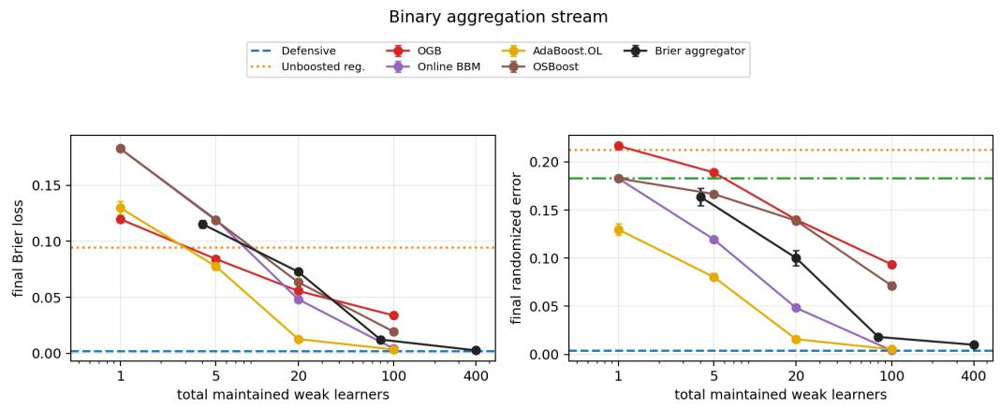  
Figure 4: Prediction quality as a function of the total number of maintained weak learners on the binary aggregation stream. OGB, Online BBM, AdaBoost.OL, and OSBoost use $N \in \{ 1 , 5 , 2 0 , 1 0 0 \}$ learners; the Brier aggregator at each setting runs all four ensembles and is therefore plotted at 4N. The Defensive Booster and the unboosted controls each maintain one learner, so their performance appears as a horizontal line. The hard-label unboosted classifier is omitted from the Brier panel for scale. With one learner, the Defensive Booster achieves Brier loss and randomized error below the 100-learner ensembles and their aggregator.

Real-world data streams. We next evaluate the algorithms on four public binary data streams, each processed in its recorded order. Bank Marketing predicts whether a client subscribes to a term deposit (Moro et al., 2014); Electricity predicts price movement in the New South Wales electricity market (Harries, 1999; MOA, 2011); Airlines predicts flight delays (MOA, 2011); and Occupancy predicts whether an ofice is occupied from contemporaneous sensor measurements (Candanedo and Feldheim, 2016). Figure 1 compares each method’s final Brier loss with the best observed loss on that stream, and Table 1 reports the absolute averages. The Defensive Booster has the lowest Brier loss on Electricity and Occupancy by a wide margin, and it also has the lowest deterministic error on Occupancy. AdaBoost.OL has the lowest classification errors on Electricity and the lowest randomized error on Occupancy. On Bank, the Brier aggregator is best by .0010 over the Defensive Booster. On Airlines, the Defensive Booster, OGB, and the aggregator difer by less than $6 \cdot 1 0 ^ { - 5 }$ Both unboosted controls are substantially worse on Electricity and Occupancy, showing that the gains come from the Defensive Booster’s aggregation rather than merely from maintaining fewer learners. Complete preprocessing, cumulative curves, classification and randomized errors, and runtimes appear in Appendix C.3.

<table><tr><td>Dataset</td><td>Defensive</td><td>Unboosted reg.</td><td>Unboosted cls.</td><td>OGB</td><td>BBM</td><td>AdaBoost.OL</td><td>OSBoost</td><td>Brier agg.</td></tr><tr><td>Bank</td><td>.0800</td><td>.0845</td><td>.1091</td><td>.0791</td><td>.1026</td><td>.1046</td><td>.1679</td><td>.0790</td></tr><tr><td>Electricity</td><td>.0772</td><td>.1957</td><td>.3669</td><td>.1516</td><td>.2010</td><td>.1007</td><td>.1167</td><td>.1006</td></tr><tr><td>Airlines</td><td>.2094</td><td>.2190</td><td>.3901</td><td>.2094</td><td>.3411</td><td>.3417</td><td>.2354</td><td>.2094</td></tr><tr><td>Occupancy</td><td>.0071</td><td>.0396</td><td>.0961</td><td>.0159</td><td>.0138</td><td>.0103</td><td>.0406</td><td>.0101</td></tr></table>

Table 1: Average online Brier loss on four real binary streams processed in recorded order; lower is better. No dataset is shufled. The hard-label methods Unboosted cls. and BBM are scored as 0/1 probability forecasts. Bold marks the lowest unrounded value in each row. The Brier aggregator runs OGB, Online BBM, AdaBoost.OL, and OSBoost, for a total of 400 weak learners. The Defensive Booster is best on Electricity and Occupancy, essentially ties OGB and the aggregator on Airlines, and is within .0010 of the aggregator on Bank.

Regression beyond binary outcomes. Appendix D.1 evaluates the bounded-outcome extension on three chronological regression datasets. Relative to 100-stage OGB, the Defensive Booster lowers normalized mean squared error by 18% on Appliance Energy, 29% on Bike Demand, and 17% on Interstate Trafic, while maintaining one weak learner rather than 100; OGB takes 65–70× as much wall-clock time per round in our implementation.

The synthetic streams isolate the strengths of the two baseline families: OGB is strongest when an informative span comparator is available, while the classification boosters are strongest when the smooth weak-learning condition holds. We use the same tuning protocol for every method rather than retuning each method on each stream. The Defensive Booster remains competitive on both streams, uses one online learner, and its mistake weights expose the smooth, low-edge witness measured in Figure 3. Appendix E evaluates the strongly adaptive variant of the Defensive Booster from Section 5. On the four original real streams, its 16–20 weak-class learners, active at diferent time scales, make it slower than the basic Defensive Booster. It remains 3–10× faster than the 100-learner ensembles and further reduces both forecasting and classification error on Electricity, Airlines, and Occupancy (Table 5). On the INSECTS optical-sensor benchmark, whose released streams have controlled abrupt, gradual, incremental, and recurring distribution shifts, the same adaptive variant improves both errors on four of five drift patterns and essentially ties the basic method on the fifth (Table 7).

## 7 Related work

Our work connects to multiple streams of prior work. The most directly relevant to our application is prior work on online boosting, which is where the baseline algorithms in our experiments are drawn from:

Online gradient boosting. Beygelzimer et al. (2015a) start from an online linear-loss learner for H and use N copies to compete with conv(H) or a norm-bounded span under smooth convex losses. Hu et al. (2017) study gradient boosting on i.i.d. data streams and extend their analysis to adversarial streams under a stronger edge assumption; Hazan and Singh (2021) use a multiplicative weak learner to obtain regret to a convex hull in online convex optimization. Our Brier/span guarantee is closest to the first of these in the squared-loss case: it competes with unrestricted realvalued scores in a norm-bounded span. Under the same online-linear-oracle primitive, however, the Defensive Booster uses one weak-class learner rather than an N-stage ensemble.

Online weak-to-strong boosting. Oza and Russell (2001) initiated work on practical online bagging and boosting methods. The closest classification predecessor to our work is Chen et al. (2012), who adapt SmoothBoost to online binary boosting using smooth distributions. Beygelzimer et al. (2015b) give the rate-optimal online boosting algorithm, Online BBM, under weak online learnability assumptions. They also prove matching lower bounds: in their model, the optimal sample-complexity dependence for error ε is $1 / ( \gamma ^ { 2 } \varepsilon )$ up to logarithmic and excess-loss terms. Our algorithm matches this γ, ε dependence. It also uses only one online linear oracle over H rather than many parallel weak learners. These papers make diferent weak-oracle assumptions. Chen et al. and Beygelzimer et al. assume that the online learner’s own predictions have a fixed positive edge over random guessing on every admissible stream—with smooth importance weights in the former case—up to an excess-loss term. Brukhim et al. (2020) instead assume a multiplicative agnostic oracle that obtains a fixed fraction of the best correlation in H, and boost it to regret against the best $h \in \mathcal H$ . Our primitive is instead a no-regret learning algorithm for H under linear losses: it need not have any absolute edge, but it competes with every $h \in \mathcal H$ on the realized residual losses. Thus H is the final comparator class in the agnostic framework of Brukhim et al., whereas here it supplies weak directions that are aggregated into forecasts competing with span(H); positive edge enters separately through our ex-post smooth weak-learning condition.

AdaBoost as loss optimization. In the ofline setting, weak-to-strong boosting algorithms such as AdaBoost have also been analyzed through the lens of loss minimization. Mason et al. (1999) place boosting inside the broader view of functional gradient descent. Mukherjee et al. (2013) show that AdaBoost converges to the infimum empirical exponential loss over additive combinations of weak hypotheses, without assuming weak learnability or a finite minimizer. This is analogous to our span-regret guarantee: both retain a span-optimization interpretation when weak learning assumptions fail. The objective and setting difer: their guarantee is batch optimization of exponentia margin loss over scores, while ours is an online pathwise Brier-regret guarantee for probability forecasts. Exponential loss rewards large margins and does not by itself produce calibrated probabilities; empirically, Niculescu-Mizil and Caruana (2005) show that boosted outputs can have poor squared error and cross-entropy because they are not well-calibrated posterior probabilities.

Strong adaptivity. Strongly adaptive online learning asks for low regret on every contiguous interval. Generic geometric-cover reductions obtain this guarantee from a standard online learner with

O(log T) active copies (Daniely et al., 2015); second-order confidence bounds preserve dependence on local gradient energy (Cutkosky, 2020; Gaillard et al., 2014). The “adaptive” online booster of Beygelzimer et al. (2015b) is parameter-free rather than strongly adaptive in this interval sense. Section 5 applies the strongly adaptive machinery inside the Defensive Booster’s auditors, preserving both interval span regret and the guarantee that persistent interval error yields a smooth, low-edge mistake weighting. The defensive-forecasting construction therefore extends to strong adaptivity through standard online-learning machinery.

Smooth boosting and hard-core sets. Smooth distributions are central in smooth boosting (Servedio, 2003); Gavinsky (2003) develops smooth adaptive boosting in the agnostic setting. The minimax view of boosting goes back to Freund and Schapire (1996). The connection between boosting and hard-core construction starts from Impagliazzo (1995) and was made algorithmic by Klivans and Servedio (2003) and Barak et al. (2009). Our reweightings are the online transcript analogue of these smooth distributions.

Multicalibration, multiaccuracy, and loss minimization. Multicalibration was introduced by H´ebert-Johnson et al. (2018); multiaccuracy was isolated as a black-box correction criterion by Kim et al. (2019). Outcome indistinguishability and omniprediction turn stronger prediction certificates into simultaneous downstream loss guarantees (Dwork et al., 2021; Gopalan et al., 2022, 2023). Globus-Harris et al. (2023) characterize when batch multicalibration boosts squaredloss regression to Bayes optimality. Kearns et al. (2025) use the weaker pair of conditions used here for loss minimization: multiaccuracy and self-orthogonality.

Multicalibration and hard-core measures. Our weak-to-strong guarantee uses the connection between multiaccuracy and hard-core measures that appears in the complexity-theoretic regularity lemma of Trevisan et al. (2009). Stronger variants derive hard-core measures from multicalibration (Casacuberta et al., 2024) or calibrated multiaccuracy (Casacuberta et al., 2025). Our proof requires only multiaccuracy. This is important online: adversarial sequential calibration error cannot generally be bounded at the O( T) scale achieved here (Collina et al., 2026; Dagan et al., 2025; Qiao and Valiant, 2021).

Defensive forecasting. Our algorithm is developed in the defensive forecasting framework which chooses probabilities that prevent continuous “skeptic” strategies from increasing their capital by betting against the forecasts (Vovk et al., 2005a,b). Vovk (2007) shows that defensive forecasting also handles continuous “second-guessing” experts whose advice depends on the learner’s current forecast; the afine test $F _ { t }$ in our root rule has this form. Many online calibration and multicalibration algorithms can be interpreted in this framework (Bastani et al., 2022; Garg et al., 2024; Ghuge et al., 2025; Gupta et al., 2022; Hu et al., 2026; Noarov and Roth, 2023; Noarov et al., 2025; Perdomo and Recht, 2025). In a recent general result, Farina and Perdomo (2026) give generic reductions from online multicalibration to a no-regret learner plus an expected variational-inequality solver and recover traditional defensive-forecasting algorithms as special cases. The afine root step in Algorithm 1 is a deterministic one-dimensional instance of their framework. To our knowledge, ours is the first online boosting theorem obtained this way. Its additional structure yields the span guarantee and the hard-core mistake weighting.

## Acknowledgments

The authors used AI tools, specifically GPT 5.6 Pro, and GPT 5.6 in the Codex environment in the development of this paper. All of the final theorems and proofs are written and verified by the authors. The code for the empirical evaluation was written via GPT 5.6 Codex.

## References

Boaz Barak, Moritz Hardt, and Satyen Kale. The uniform hardcore lemma via approximate bregman projections. In Proceedings of the Twentieth Annual ACM-SIAM Symposium on Discrete Algorithms, pages 1193–1200. SIAM, 2009. doi: 10.1137/1.9781611973068.129. URL https://epubs.siam.org/doi/10.1137/1.9781611973068.129.

Osbert Bastani, Varun Gupta, Christopher Jung, Georgy Noarov, Ramya Ramalingam, and Aaron Roth. Practical adversarial multivalid conformal prediction. In S. Koyejo, S. Mohamed, A. Agarwal, D. Belgrave, K. Cho, and A. Oh, editors, Advances in Neural Information Processing Systems, volume 35, pages 29362–29373. Curran Associates, Inc., 2022. doi: 10.52202/068431-2129. URL https://proceedings.neurips.cc/paper\_files/paper/2022/ hash/bcdaaa1aec3ae2aa39542acefdec4e4b-Abstract-Conference.html.

Alina Beygelzimer, Elad Hazan, Satyen Kale, and Haipeng Luo. Online gradient boosting. In Advances in Neural Information Processing Systems 28, pages 2458–2466, 2015a. URL https://proceedings.neurips.cc/paper/2015/hash/ 0a1bf96b7165e962e90cb14648c9462d-Abstract.html.

Alina Beygelzimer, Satyen Kale, and Haipeng Luo. Optimal and adaptive algorithms for online boosting. In Francis Bach and David Blei, editors, Proceedings of the 32nd International Conference on Machine Learning, volume 37 of Proceedings of Machine Learning Research, pages 2323–2331, Lille, France, 07–09 Jul 2015b. PMLR. URL https://proceedings.mlr.press/ v37/beygelzimer15.html.

Nataly Brukhim, Xinyi Chen, Elad Hazan, and Shay Moran. Online agnostic boosting via regret minimization. In Advances in Neural Information Processing Systems 33, pages 644–654, 2020. URL https://proceedings.neurips.cc/paper/2020/hash/ 07168af6cb0ef9f78dae15739dd73255-Abstract.html.

Luis Candanedo. Appliances energy prediction. UCI Machine Learning Repository, 2017. URL https://archive.ics.uci.edu/dataset/374/appliances+energy+prediction.

Luis M. Candanedo and V´eronique Feldheim. Accurate occupancy detection of an ofice room from light, temperature, humidity and CO2 measurements using statistical learning models. Energy and Buildings, 112:28–39, 2016. doi: 10.1016/j.enbuild.2015.11.071. URL https://doi.org/10. 1016/j.enbuild.2015.11.071.

S´ılvia Casacuberta, Cynthia Dwork, and Salil Vadhan. Complexity-theoretic implications of multicalibration. In Proceedings of the 56th Annual ACM Symposium on Theory of Computing, pages 1071–1082. ACM, 2024. doi: 10.1145/3618260.3649748. URL https://doi.org/10.1145/ 3618260.3649748.

S´ılvia Casacuberta, Parikshit Gopalan, Varun Kanade, and Omer Reingold. How global calibration strengthens multiaccuracy. In Proceedings of the 66th IEEE Symposium on Foundations of

Computer Science, pages 1198–1227. IEEE, 2025. doi: 10.1109/FOCS63196.2025.00063. URL https://doi.org/10.1109/FOCS63196.2025.00063.

Nicol\`o Cesa-Bianchi, Yishay Mansour, and Gilles Stoltz. Improved second-order bounds for prediction with expert advice. Machine Learning, 66(2–3):321–352, 2007. doi: 10.1007/s10994-006-5001-7. URL https://link.springer.com/article/10.1007/ s10994-006-5001-7.

Shang-Tse Chen, Hsuan-Tien Lin, and Chi-Jen Lu. An online boosting algorithm with theoretical justifications. In John Langford and Joelle Pineau, editors, Proceedings of the 29th International Conference on Machine Learning, pages 1007–1014. Omnipress, 2012. URL https://icml.cc/ 2012/papers/538.pdf.

Natalie Collina, Jiuyao Lu, Georgy Noarov, and Aaron Roth. Optimal lower bounds for online multicalibration. arXiv preprint arXiv:2601.05245, 2026. URL https://arxiv.org/abs/2601. 05245.

Ashok Cutkosky. Parameter-free, dynamic, and strongly-adaptive online learning. In Hal Daum´e III and Aarti Singh, editors, Proceedings of the 37th International Conference on Machine Learning, volume 119 of Proceedings of Machine Learning Research, pages 2250–2259. PMLR, 2020. URL https://proceedings.mlr.press/v119/cutkosky20a.html.

Yuval Dagan, Constantinos Daskalakis, Maxwell Fishelson, Noah Golowich, Robert Kleinberg, and Princewill Okoroafor. Breaking the T2/3 barrier for sequential calibration. In Proceedings of the 57th Annual ACM Symposium on Theory of Computing, pages 2007–2018, 2025. doi: 10.1145/3717823.3718178. URL https://doi.org/10.1145/3717823.3718178.

Amit Daniely, Alon Gonen, and Shai Shalev-Shwartz. Strongly adaptive online learning. In Francis Bach and David Blei, editors, Proceedings of the 32nd International Conference on Machine Learning, volume 37 of Proceedings of Machine Learning Research, pages 1405–1411. PMLR, 2015. URL https://proceedings.mlr.press/v37/daniely15.html.

Cynthia Dwork, Michael P. Kim, Omer Reingold, Guy N. Rothblum, and Gal Yona. Outcome indistinguishability. In Proceedings of the 53rd Annual ACM SIGACT Symposium on Theory of Computing, pages 1095–1108. ACM, 2021. doi: 10.1145/3406325.3451064. URL https://doi. org/10.1145/3406325.3451064.

Hadi Fanaee-T. Bike sharing. UCI Machine Learning Repository, 2013. URL https://archive. ics.uci.edu/dataset/275/bike+sharing+dataset.

Gabriele Farina and Juan Carlos Perdomo. An eficient black-box reduction from online learning to multicalibration, and a new route to Φ-regret minimization. arXiv preprint arXiv:2604.19592, 2026. URL https://arxiv.org/abs/2604.19592.

Yoav Freund and Robert E. Schapire. Game theory, on-line prediction and boosting. In Proceedings of the Ninth Annual Conference on Computational Learning Theory, pages 325–332. ACM Press, 1996. doi: 10.1145/238061.238163. URL https://doi.org/10.1145/238061.238163.

Pierre Gaillard, Gilles Stoltz, and Tim van Erven. A second-order bound with excess losses. In Maria Florina Balcan, Vitaly Feldman, and Csaba Szepesv´ari, editors, Proceedings of the 27th Conference on Learning Theory, volume 35 of Proceedings of Machine Learning Research, pages 176–196. PMLR, 2014. URL https://proceedings.mlr.press/v35/gaillard14.html.

Sumegha Garg, Christopher Jung, Omer Reingold, and Aaron Roth. Oracle eficient online multicalibration and omniprediction. In Proceedings of the 2024 Annual ACM-SIAM Symposium on Discrete Algorithms, pages 2725–2792. SIAM, 2024. doi: 10.1137/1.9781611977912.98. URL https://epubs.siam.org/doi/10.1137/1.9781611977912.98.

Dmitry Gavinsky. Optimally-smooth adaptive boosting and application to agnostic learning. Journal of Machine Learning Research, 4:101–117, 2003. URL https://www.jmlr.org/papers/v4/ gavinsky03a.html.

Rohan Ghuge, Vidya Muthukumar, and Sahil Singla. Improved and oracle-eficient online ℓ1- multicalibration. In Aarti Singh, Maryam Fazel, Daniel Hsu, Simon Lacoste-Julien, Felix Berkenkamp, Tegan Maharaj, Kiri Wagstaf, and Jerry Zhu, editors, Proceedings of the 42nd International Conference on Machine Learning, volume 267 of Proceedings of Machine Learning Research, pages 19437–19457. PMLR, 2025. URL https://proceedings.mlr.press/v267/ ghuge25a.html.

Ira Globus-Harris, Declan Harrison, Michael Kearns, Aaron Roth, and Jessica Sorrell. Multicalibration as boosting for regression. In Proceedings of the 40th International Conference on Machine Learning, volume 202 of Proceedings of Machine Learning Research, pages 11459–11492. PMLR, 2023. URL https://proceedings.mlr.press/v202/globus-harris23a.html.

Parikshit Gopalan, Adam Tauman Kalai, Omer Reingold, Vatsal Sharan, and Udi Wieder. Omnipredictors. In 13th Innovations in Theoretical Computer Science Conference, volume 215 of Leibniz International Proceedings in Informatics, pages 79:1–79:21. Schloss Dagstuhl–Leibniz-Zentrum f¨ur Informatik, 2022. doi: 10.4230/LIPIcs.ITCS.2022.79. URL https://drops. dagstuhl.de/entities/document/10.4230/LIPIcs.ITCS.2022.79.

Parikshit Gopalan, Lunjia Hu, Michael P. Kim, Omer Reingold, and Udi Wieder. Loss minimization through the lens of outcome indistinguishability. In 14th Innovations in Theoretical Computer Science Conference, volume 251 of Leibniz International Proceedings in Informatics, pages 60:1– 60:20. Schloss Dagstuhl–Leibniz-Zentrum f¨ur Informatik, 2023. doi: 10.4230/LIPIcs.ITCS.2023. 60. URL https://drops.dagstuhl.de/entities/document/10.4230/LIPIcs.ITCS.2023.60.

Varun Gupta, Christopher Jung, Georgy Noarov, Mallesh M. Pai, and Aaron Roth. Online multivalid learning: Means, moments, and prediction intervals. In 13th Innovations in Theoretical Computer Science Conference, volume 215 of Leibniz International Proceedings in Informatics, pages 82:1–82:24. Schloss Dagstuhl–Leibniz-Zentrum f¨ur Informatik, 2022. doi: 10.4230/LIPIcs.ITCS.2022.82. URL https://drops.dagstuhl.de/entities/document/ 10.4230/LIPIcs.ITCS.2022.82.

Michael Harries. Splice-2 comparative evaluation: Electricity pricing. Technical Report 9905, School of Computer Science and Engineering, University of New South Wales, 1999. URL https: //cgi.cse.unsw.edu.au/ reports/.

Elad Hazan and Karan Singh. Boosting for online convex optimization. In Marina Meila and Tong Zhang, editors, Proceedings of the 38th International Conference on Machine Learning, volume 139 of Proceedings of Machine Learning Research, pages 4140–4149. PMLR, 18–24 Jul 2021. URL https://proceedings.mlr.press/v139/hazan21a.html.

Ursula H´ebert-Johnson, Michael P. Kim, Omer Reingold, and Guy N. Rothblum. Multicalibration: Calibration for the (computationally-identifiable) masses. In Proceedings of the 35th International

Conference on Machine Learning, volume 80 of Proceedings of Machine Learning Research, pages 1939–1948. PMLR, 2018. URL https://proceedings.mlr.press/v80/hebert-johnson18a. html.

John Hogue. Metro interstate trafic volume. UCI Machine Learning Repository, 2019. URL https://archive.ics.uci.edu/dataset/492/metro+interstate+traffic+volume.

Hanzhang Hu, Wen Sun, Arun Venkatraman, Martial Hebert, and Andrew Bagnell. Gradient boosting on stochastic data streams. In Aarti Singh and Jerry Zhu, editors, Proceedings of the 20th International Conference on Artificial Intelligence and Statistics, volume 54 of Proceedings of Machine Learning Research, pages 595–603. PMLR, 2017. URL https://proceedings.mlr. press/v54/hu17a.html.

Lunjia Hu, Haipeng Luo, Spandan Senapati, and Vatsal Sharan. Eficient swap multicalibration of elicitable properties. In Steve Hanneke and Tor Lattimore, editors, Proceedings of Thirty Ninth Conference on Learning Theory, volume 336 of Proceedings of Machine Learning Research, pages 3314–3348. PMLR, 29 Jun–03 Jul 2026. URL https://proceedings.mlr.press/v336/hu26b. html.

Russell Impagliazzo. Hard-core distributions for somewhat hard problems. In Proceedings of the 36th Annual IEEE Symposium on Foundations of Computer Science, pages 538–545. IEEE Computer Society, 1995. doi: 10.1109/SFCS.1995.492584. URL https://doi.org/10.1109/SFCS.1995. 492584.

Michael Kearns, Aaron Roth, and Emily Ryu. Networked information aggregation via machine learning. arXiv preprint arXiv:2507.09683, 2025. URL https://arxiv.org/abs/2507.09683.

Michael P. Kim, Amirata Ghorbani, and James Zou. Multiaccuracy: Black-box post-processing for fairness in classification. In Proceedings of the 2019 AAAI/ACM Conference on AI, Ethics, and Society, pages 247–254. ACM, 2019. doi: 10.1145/3306618.3314287. URL https://doi.org/ 10.1145/3306618.3314287.

Jyrki Kivinen, Alexander J. Smola, and Robert C. Williamson. Online learning with kernels. IEEE Transactions on Signal Processing, 52(8):2165–2176, 2004. doi: 10.1109/TSP.2004.830991.

Adam R. Klivans and Rocco A. Servedio. Boosting and hard-core set construction. Machine Learning, 51(3):217–238, 2003. doi: 10.1023/A:1022949332276. URL https://link.springer. com/article/10.1023/A:1022949332276.

Llew Mason, Jonathan Baxter, Peter L. Bartlett, and Marcus R. Frean. Boosting algorithms as gradient descent. In Advances in Neural Information Processing Systems 12, pages 512–518. MIT Press, 1999. URL https://proceedings.neurips.cc/paper/1999/hash/ 96a93ba89a5b5c6c226e49b88973f46e-Abstract.html.

MOA. Massive online analysis datasets. Dataset repository, August 2011. URL https://moa.cms. waikato.ac.nz/datasets/. Accessed 2026-07-02.

S´ergio Moro, Paulo Rita, and Paulo Cortez. Bank marketing. UCI Machine Learning Repository, 2014. URL https://archive.ics.uci.edu/dataset/222/bank+marketing.

Indraneel Mukherjee, Cynthia Rudin, and Robert E. Schapire. The rate of convergence of AdaBoost. Journal of Machine Learning Research, 14(70):2315–2347, 2013. URL https://www.jmlr.org/ papers/v14/mukherjee13b.html.

Alexandru Niculescu-Mizil and Richard A. Caruana. Obtaining calibrated probabilities from boosting. In Proceedings of the Twenty-First Conference on Uncertainty in Artificial Intelligence, pages 413–420, 2005. URL https://arxiv.org/abs/1207.1403.

Georgy Noarov and Aaron Roth. The statistical scope of multicalibration. In Andreas Krause, Emma Brunskill, Kyunghyun Cho, Barbara Engelhardt, Sivan Sabato, and Jonathan Scarlett, editors, Proceedings of the 40th International Conference on Machine Learning, volume 202 of Proceedings of Machine Learning Research, pages 26283–26310. PMLR, 2023. URL https:// proceedings.mlr.press/v202/noarov23a.html.

Georgy Noarov, Ramya Ramalingam, Aaron Roth, and Stephan Xie. High-dimensional prediction for sequential decision making. In Aarti Singh, Maryam Fazel, Daniel Hsu, Simon Lacoste-Julien, Felix Berkenkamp, Tegan Maharaj, Kiri Wagstaf, and Jerry Zhu, editors, Proceedings of the 42nd International Conference on Machine Learning, volume 267 of Proceedings of Machine Learning Research, pages 46762–46783. PMLR, 2025. URL https://proceedings.mlr.press/ v267/noarov25b.html.

Francesco Orabona and D´avid P´al. Scale-free online learning. Theoretical Computer Science, 716: 50–69, 2018. doi: 10.1016/j.tcs.2017.11.021. URL https://doi.org/10.1016/j.tcs.2017.11. 021.

Nikunj C. Oza and Stuart J. Russell. Online bagging and boosting. In Thomas S. Richardson and Tommi S. Jaakkola, editors, Proceedings of the Eighth International Workshop on Artificial Intelligence and Statistics, volume R3 of Proceedings of Machine Learning Research, pages 229–236. PMLR, 2001. URL https://proceedings.mlr.press/r3/oza01a.html. Reissued by PMLR on 31 March 2021.

Juan Carlos Perdomo and Benjamin Recht. In defense of defensive forecasting. arXiv preprint arXiv:2506.11848, 2025. URL https://arxiv.org/abs/2506.11848.

Mingda Qiao and Gregory Valiant. Stronger calibration lower bounds via sidestepping. In Proceedings of the 53rd Annual ACM SIGACT Symposium on Theory of Computing, pages 456–466, 2021. doi: 10.1145/3406325.3451050. URL https://doi.org/10.1145/3406325.3451050.

Rocco A. Servedio. Smooth boosting and learning with malicious noise. Journal of Machine Learning Research, 4:633–648, 2003. URL https://www.jmlr.org/papers/v4/servedio03a. html.

Vinicius M. A. Souza, Denis M. dos Reis, Andr´e G. Maletzke, and Gustavo E. A. P. A. Batista. Challenges in benchmarking stream learning algorithms with real-world data. Data Mining and Knowledge Discovery, 34(6):1805–1858, 2020. doi: 10.1007/s10618-020-00698-5. URL https: //doi.org/10.1007/s10618-020-00698-5.

Luca Trevisan, Madhur Tulsiani, and Salil P. Vadhan. Regularity, boosting, and eficiently simulating every high-entropy distribution. In Proceedings of the 24th Annual IEEE Conference on Computational Complexity, pages 126–136. IEEE, 2009. URL https://people.seas.harvard. edu/ salil/research/regularity-abs.html.

Vladimir Vovk. Defensive forecasting for optimal prediction with expert advice. Technical Report Working Paper 20, Game-Theoretic Probability and Finance Project, August 2007. URL https: //arxiv.org/abs/0708.1503.

Vladimir Vovk, Ilia Nouretdinov, Akimichi Takemura, and Glenn Shafer. Defensive forecasting for linear protocols. In Algorithmic Learning Theory, 16th International Conference, ALT 2005, volume 3734 of Lecture Notes in Computer Science, pages 459–473. Springer, 2005a. doi: 10. 1007/11564089 35.

Vladimir Vovk, Akimichi Takemura, and Glenn Shafer. Defensive forecasting. In Robert G. Cowell and Zoubin Ghahramani, editors, Proceedings of the Tenth International Workshop on Artificial Intelligence and Statistics, volume R5 of Proceedings of Machine Learning Research, pages 365– 372. PMLR, 2005b. URL https://proceedings.mlr.press/r5/vovk05a.html. Reissued by PMLR on 30 March 2021.

Martin Zinkevich. Online convex programming and generalized infinitesimal gradient ascent. Technical Report CMU-CS-03-110, Carnegie Mellon University, 2003. URL https://www.cs.cmu. edu/\~maz/publications/techconvex.pdf.

## A Deferred proofs

This appendix contains proofs of the standard online-learning tools and routine consequences used in the main text.

## A.1 Scalar second-order regret

Proof of Lemma 2.5. Let $\eta _ { t } = 1 / \sqrt { V _ { t - 1 } }$ . Nonexpansiveness of projection gives

$$
g _ { t } ( a - a _ { t } ) \leq \frac { ( a - a _ { t } ) ^ { 2 } - ( a - a _ { t + 1 } ) ^ { 2 } } { 2 \eta _ { t } } + \frac { \eta _ { t } g _ { t } ^ { 2 } } { 2 } .
$$

Because $\eta _ { t }$ is nonincreasing and the diameter of [−1, 1] is 2, the sum of the first terms is at most $2 / \eta _ { T } \leq 2 \sqrt { V _ { T } }$ . Moreover, $g _ { t } ^ { 2 } \leq 4 \leq V _ { t - 1 }$ , and hence

$$
\frac { g _ { t } ^ { 2 } } { \sqrt { V _ { t - 1 } } } = \left( 1 + \sqrt { \frac { V _ { t } } { V _ { t - 1 } } } \right) \left( \sqrt { V _ { t } } - \sqrt { V _ { t - 1 } } \right) \leq \frac { 5 } { 2 } \left( \sqrt { V _ { t } } - \sqrt { V _ { t - 1 } } \right) .
$$

Thus the sum of the second terms is at most $\mathit { \Pi } _ { \overline { { 4 } } } ^ { 5 } \sqrt { V _ { T } }$ . Adding the two contributions gives

$$
\sum _ { t = 1 } ^ { T } ( a - a _ { t } ) g _ { t } \leq \left( 2 + { \frac { 5 } { 4 } } \right) { \sqrt { V _ { T } } } = { \frac { 1 3 } { 4 } } { \sqrt { V _ { T } } } \leq 4 { \sqrt { V _ { T } } } .
$$

Finally, ${ \sqrt { 4 + x } } \leq 2 + { \sqrt { x } }$ gives the final inequality.

## A.2 Consequences of the full-horizon certificate

Proof of Corollary 4.2. Theorem 4.1 gives

$$
B _ { T } \leq B _ { f } + \frac { C } { \sqrt { T } } \sqrt { B _ { T } } + \frac { D } { 2 T } .
$$

Let $x = B _ { T } , a = C / \sqrt { T }$ , and $d = D / ( 2 T )$ . For $u = { \sqrt { x } } .$

$$
u ^ { 2 } \leq B _ { f } + a u + d , \qquad \mathrm { s o } \qquad \left( u - \frac { a } { 2 } \right) ^ { 2 } \leq B _ { f } + d + \frac { a ^ { 2 } } { 4 } .
$$

Taking the positive square root gives

$$
u \leq { \frac { a } { 2 } } + { \sqrt { B _ { f } + d + { \frac { a ^ { 2 } } { 4 } } } } .
$$

Hence

$$
x \leq B _ { f } + d + a ^ { 2 } + a \sqrt { B _ { f } + d } \leq B _ { f } + a \sqrt { B _ { f } } + \frac { 3 } { 2 } a ^ { 2 } + \frac { 3 } { 2 } d ,
$$

where the last inequality uses $\sqrt { B _ { f } + d } \leq \sqrt { B _ { f } } + \sqrt { d }$ and $a \sqrt { d } \leq ( a ^ { 2 } + d ) / 2$ . Substituting the definitions of a and d proves the claim. □

Proof of Corollary 4.5. Let $w _ { t } = | Y _ { t } - p _ { t } |$ . If $\rho _ { w } \ < \ \rho _ { 0 }$ , then Theorem 4.4 gives $B _ { T } \le \rho _ { w } < \rho _ { 0 }$ and the randomized-error bound is immediate. Now suppose $\rho _ { w } \geq \rho _ { 0 }$ . The smooth weak-learning condition applies to $w ,$ while Theorem 4.4 gives

$$
\gamma _ { 0 } \leq \mathrm { e d g e } _ { \mathcal { H } } ( w ) \leq \frac { A _ { H } \sqrt { T B _ { T } } + B _ { H } / 2 } { T \rho _ { w } } .
$$

Since $B _ { T } \le \rho _ { w }$ , we have

$$
\gamma _ { 0 } \leq \frac { A _ { H } } { \sqrt { T B _ { T } } } + \frac { B _ { H } } { 2 T B _ { T } } .
$$

The denominator is nonzero: $\rho _ { w } \ge \rho _ { 0 } > 0$ implies that some $w _ { t } > 0$ , and hence $\begin{array} { r } { B _ { T } = T ^ { - 1 } \sum _ { t } w _ { t } ^ { 2 } > } \end{array}$ 0. If both $B _ { T } > 4 A _ { H } ^ { 2 } / ( \gamma _ { 0 } ^ { 2 } T )$ and $B _ { T } > B _ { H } / ( \gamma _ { 0 } T )$ held, then the two terms on the right would each be strictly smaller than $\gamma _ { 0 } / 2$ , a contradiction. This proves the stated bound on $B _ { T }$

For the randomized-error bound, combine the edge inequality with $B _ { T } \leq \rho _ { w } \colon$

$$
\gamma _ { 0 } \leq \frac { A _ { H } \sqrt { T \rho _ { w } } + B _ { H } / 2 } { T \rho _ { w } } = \frac { A _ { H } } { \sqrt { T \rho _ { w } } } + \frac { B _ { H } } { 2 T \rho _ { w } } .
$$

Writing $u = \sqrt { \rho _ { w } }$ , this becomes

$$
u ^ { 2 } \leq \frac { A _ { H } } { \gamma _ { 0 } \sqrt { T } } u + \frac { B _ { H } } { 2 \gamma _ { 0 } T } .
$$

If both $u ^ { 2 } > 4 A _ { H } ^ { 2 } / ( \gamma _ { 0 } ^ { 2 } T )$ and $u ^ { 2 } > B _ { H } / ( \gamma _ { 0 } T )$ held, the right side would be strictly smaller than $u ^ { 2 } .$ , again a contradiction. This proves the randomized-error bound.

Finally, if $\widehat { Y } _ { t } \neq Y _ { t }$ then $| Y _ { t } - p _ { t } | \ge 1 / 2$ . Averaging shows that the deterministic threshold error is at most $2 \rho _ { w }$ □

## A.3 Strongly adaptive extension

Proof of Proposition 5.1. Pad [T] to the next power of two and let J be its canonical family of dyadic intervals. The family has fewer than 4T members, at most $1 + \lceil \log _ { 2 } T \rceil$ of which contain any round, and every interval $I \subseteq [ T ]$ is a disjoint union of at most $M _ { T }$ members of J (Daniely et al., 2015). Start one copy $\mathsf { B } _ { J }$ at the left endpoint of each $J \in \mathcal { I }$ and run it only on J.

Aggregate the active copies with a second-order confidence-rated experts algorithm, treating membership in J as expert $J _ { \mathrm { ~ S ~ } }$ confidence. To see that the standard guarantee applies, let ${ { q } } _ { J , t }$ be the algorithm’s weights on the active intervals and set $\begin{array} { r } { \widetilde { z } _ { t } = \sum _ { J } q _ { J , t } z _ { J , t } } \end{array}$ . Map the linear gain to the loss

$$
\ell _ { J , t } = \frac { 2 - c _ { t } z _ { J , t } } { 4 } \in [ 0 , 1 ] .
$$

The confidence-regret reduction and second-order excess-loss bound of Gaillard et al. (2014) give, for every $J \in \mathcal { I }$ ,

$$
\sum _ { t \in J } c _ { t } ( z _ { J , t } - \widetilde { z } _ { t } ) \leq C _ { 0 } \left( \sqrt { L _ { T } \sum _ { t \in J } c _ { t } ^ { 2 } } + L _ { T } \right) ,
$$

for a universal constant $C _ { 0 }$ . Here we assign a uniform prior to the fewer than 4T dyadic specialists. A geometric grid of learning rates, if needed, contributes only O(log log T), which is absorbed by $C _ { 0 } L _ { T }$ . The loss range used in the second-order bound is valid because $\begin{array} { r } { | \ell _ { J , t } - \sum _ { J ^ { \prime } } q _ { J ^ { \prime } , t } \ell _ { J ^ { \prime } , t } | \leq | c _ { t } | / 2 } \end{array}$

Now partition an arbitrary I into $J _ { 1 } , \hdots , J _ { m } \in \mathcal { I }$ . On each block, insert the prediction of $\mathsf { B } _ { J _ { j } }$ between the comparator and the wrapper. The fresh-run guarantee and the preceding confidenceregret bound give

$$
\begin{array} { r } { \displaystyle \sum _ { t \in I } c _ { t } ( z _ { t } ^ { \star } - \widetilde { z } _ { t } ) \leq \displaystyle \sum _ { j = 1 } ^ { m } \left( a \sqrt { \displaystyle \sum _ { t \in J _ { j } } c _ { t } ^ { 2 } } + b + C _ { 0 } \sqrt { L _ { T } \displaystyle \sum _ { t \in J _ { j } } c _ { t } ^ { 2 } } + C _ { 0 } L _ { T } \right) } \\ { \leq \sqrt { M _ { T } } \big ( a + C _ { 0 } \sqrt { L _ { T } } \big ) \sqrt { \displaystyle \sum _ { t \in I } c _ { t } ^ { 2 } } + M _ { T } \big ( b + C _ { 0 } L _ { T } \big ) , } \end{array}
$$

where the last step uses Cauchy–Schwarz and $m \le M _ { T }$ . Only the $1 + \lceil \log _ { 2 } T \rceil$ copies associated with intervals containing the current round are active. This proves (3).

Advance knowledge of $T$ is not essential. Partition time into epochs $[ 2 ^ { j } , 2 ^ { j + 1 } - 1 ]$ and run the fixed-horizon construction afresh in each epoch. Any interval up to time T meets at most $1 + \lceil \log _ { 2 } T \rceil$ epochs. Summing the fixed-horizon bounds over those pieces and applying Cauchy–Schwarz adds a factor $\sqrt { 1 + \lceil \log _ { 2 } T \rceil }$ to the coeficient of the second-order term and a factor $1 + \lceil \log _ { 2 } T \rceil$ to the additive term. At any time only the wrapper for the current epoch is active. □

Proof of Theorem 5.2. Fix an interval I. The root sign property holds separately on every round, so the aggregated auditor gain is nonpositive on I. Interval regret for the wrapped A against its two endpoint comparators therefore gives

$$
\sum _ { t \in I } z _ { H , t } , \quad \sum _ { t \in I } z _ { S , t } \leq a _ { \mathrm { s c } } ^ { \mathrm { i n t } } \sqrt { S _ { I } } + b _ { \mathrm { s c } } ^ { \mathrm { i n t } } .
$$

For every $h \in \mathcal H$ , interval regret for the wrapped weak-class oracle then gives

$$
\sum _ { t \in I } h ( x _ { t } ) r _ { t } \leq \sum _ { t \in I } z _ { H , t } + a _ { H } ^ { \mathrm { i n t } } \sqrt { S _ { I } } + b _ { H } ^ { \mathrm { i n t } } \leq A _ { H } ^ { \mathrm { i n t } } \sqrt { S _ { I } } + B _ { H } ^ { \mathrm { i n t } } .
$$

Symmetry of H gives the absolute value. Similarly, for $\theta \in \{ - 1 , 1 \}$ , interval regret for the wrapped S gives

$$
\sum _ { t \in I } \theta \mu _ { t } r _ { t } \leq \sum _ { t \in I } z _ { S , t } + a _ { \mathrm { s c } } ^ { \mathrm { i n t } } \sqrt { \sum _ { t \in I } \mu _ { t } ^ { 2 } r _ { t } ^ { 2 } + b _ { \mathrm { s c } } ^ { \mathrm { i n t } } } \leq A _ { S } ^ { \mathrm { i n t } } \sqrt { S _ { I } } + B _ { S } ^ { \mathrm { i n t } } .
$$

Taking both signs proves the self-orthogonality inequality.

## B Separation: the guarantees are incomparable

The Brier/span and weak-to-strong guarantees do not imply one another. Proposition B.1 gives a transcript on which every reweighting has positive weak-class edge, yet every real-valued score induced by the span has constant squared loss. The construction exploits a basic diference between the guarantees: squared loss depends on the numerical values of a score, whereas weak-to-strong boosting can exploit its sign. Proposition B.2 gives the converse separation: a small subset of uninformative rounds defeats the smooth weak-learning condition even though a span comparator has small squared loss.

Proposition B.1 (Separation). For every $\gamma \in ( 0 , 1 )$ and $\eta > 0$ , there are a number $\delta \in [ \gamma$ , min $\{ \gamma +$ $\eta , 1 \}$ , a symmetric binary-valued class $\mathcal { H }$ , and a transcript $( x _ { t } , Y _ { t } ) _ { t \leq T }$ such that:

(i) every reweighting $w \in [ 0 , 1 ] ^ { T }$ with $\textstyle \sum _ { t } w _ { t } > 0$ has ed $\begin{array} { r } { \mathrm { g e } _ { \mathcal { H } } ( w ) \geq \delta , } \end{array}$ in particular the $( \rho , \gamma )$ -smooth weak-learning condition holds for every $\rho > 0$ ;

(ii) no single hypothesis is correct on every round, but a uniform average of hypotheses in H has positive signed margin on every round and therefore classifies the transcript perfectly;

(iii) every afine score $q _ { f } ( x ) = ( 1 + f ( x ) ) / 2$ induced by the span of H, with no range or norm constraint, has average squared loss at least $( 1 - \delta ) ^ { 2 } / ( 8 ( 1 + \delta ^ { 2 } ) )$ .

Proof. Choose an integer k large enough that $2 / k < \mathrm { m i n } \{ \eta , 1 - \gamma \}$ , and set

$$
r = \left\lceil { \frac { ( 1 + \gamma ) k } { 2 } } \right\rceil , \qquad \delta = { \frac { 2 r - k } { k } } .
$$

Then $k / 2 < r < k$ and $\gamma \leq \delta < \operatorname* { m i n } \{ \gamma + \eta , 1 \}$ . Let $h _ { 1 } , \ldots , h _ { k }$ be binary-valued hypotheses and include their negations in H. All labels equal one, so $\sigma _ { t } = 1$ on every round.

The transcript has two equally large parts. On every context in the first part, set $h _ { j } ( x _ { t } ) = 1$ for all $j .$ . The second part contains one context for each r-element subset $A \subseteq [ k ]$ , and on that context set

$$
h _ { j } ( x _ { A } ) = { \left\{ \begin{array} { l l } { 1 , } & { j \in A , } \\ { - 1 , } & { j \not \in A . } \end{array} \right. }
$$

Repeat the all-positive context ${ \binom { k } { r } }$ times so that the two parts have equal size. At every context,

$$
\frac { 1 } { k } \sum _ { j = 1 } ^ { k } \sigma _ { t } h _ { j } ( x _ { t } ) \geq \delta .
$$

Consequently, for every reweighting w with positive mass,

$$
\frac { 1 } { k } \sum _ { j = 1 } ^ { k } \frac { \sum _ { t = 1 } ^ { T } w _ { t } \sigma _ { t } h _ { j } ( x _ { t } ) } { \sum _ { t = 1 } ^ { T } w _ { t } } \geq \delta .
$$

Some $h _ { j }$ must therefore have weighted edge at least $\delta ,$ proving (i). The uniform average $k ^ { - 1 } \textstyle \sum _ { j } h _ { j }$ equals 1 on the first part and $\delta$ on the second, so its sign is always correct. On the other hand, every $h _ { j }$ equals −1 on a positive fraction of the second part because $r < k$ . This proves (ii).

It remains to minimize squared loss over the span. Write $\begin{array} { r } { f = \sum _ { j = 1 } ^ { k } \alpha _ { j } h _ { j } } \end{array}$ . The transcript and its squared-loss objective are invariant under permutations of the k coordinates. Averaging the coeficient vector over all permutations and using convexity therefore cannot increase loss. Hence an optimum has $\alpha _ { 1 } = \cdot \cdot \cdot = \alpha _ { k } = b / k$ for some $b \in \mathbb { R }$ . Its signed score equals b on the first part and $\delta b$ on the second, so its Brier loss is

$$
\psi ( b ) = \frac { ( 1 - b ) ^ { 2 } + ( 1 - \delta b ) ^ { 2 } } { 8 } .
$$

This is minimized at $b ^ { \star } = ( 1 + \delta ) / ( 1 + \delta ^ { 2 } )$ , where it equals $( 1 - \delta ) ^ { 2 } / ( 8 ( 1 + \delta ^ { 2 } ) )$ . This proves (iii).

The separation also survives clipping span scores to the probability range when the coeficient norm is bounded. Fix $\Lambda \geq 1$ , write $\begin{array} { r } { f = \sum _ { j } \alpha _ { j } h _ { j } } \end{array}$ with $\textstyle \sum _ { j } | \alpha _ { j } | \leq \Lambda$ , and clip $f$ to $[ - 1 , 1 ]$ before converting it to a probability. On the second half of the construction, the average of $f$ over all r-subsets is $\delta \textstyle \sum _ { j } \alpha _ { j } \leq \delta \Lambda$ . For every $u \in [ - \Lambda , \Lambda ]$

$$
\dim _ { [ - 1 , 1 ] } ( u ) \leq { \frac { 2 u + \Lambda - 1 } { \Lambda + 1 } } .
$$

If $\delta \leq 1 / ( 2 \Lambda )$ , the average clipped signed score on this half is therefore at most $\Lambda / ( \Lambda + 1 )$ . Jensen’s inequality shows that these rounds have average Brier loss at least $1 / ( 4 ( \Lambda + 1 ) ^ { 2 } )$ , and hence the full transcript has average Brier loss at least $1 / ( 8 ( \Lambda + 1 ) ^ { 2 } )$ . In particular, clipping does not remove the separation for any fixed coeficient-norm budget. Moreover, perfect clipped prediction would require $f ( x _ { A } ) \geq 1$ for every r-subset $A ;$ averaging these inequalities gives $\delta \textstyle \sum _ { j } \alpha _ { j } \geq 1$ , and therefore $\textstyle \sum _ { j } | \alpha _ { j } | \geq 1 / \delta$

$\mathrm { A s } \ \delta  0$ , the span’s best squared loss approaches $1 / 8$ , while Corollary 4.5 forces the Defensive Booster’s Brier score and classification error to vanish as $T$ grows. Thus a Brier/span-regret guarantee alone can leave constant squared loss on transcripts where the smooth weak-learning condition forces near-perfect prediction.

The reverse implication fails for a diferent reason: a small set of rounds can support a zero-edge reweighting while contributing little to average squared loss.

Proposition B.2 (Converse separation). For every $T$ and every even $m \in \{ 2 , \ldots , T \}$ , there is a symmetric binary-valued class $\mathcal { H } = \left\{ h _ { 1 } , - h _ { 1 } , h _ { 2 } , - h _ { 2 } \right\}$ and a transcript $( x _ { t } , Y _ { t } ) _ { t \leq T }$ such that:

(i) the smooth weak-learning condition fails for every $\rho \leq m / T$ and every $\gamma > 0 ,$

(ii) the span comparator $f = ( h _ { 1 } + h _ { 2 } ) / 2 \in \mathrm { s p a n } _ { 1 } ( \mathscr { H } )$ induces the score $q _ { f } = ( 1 + f ) / 2$ with average squared loss $\begin{array} { r } { T ^ { - 1 } \sum _ { t } ( Y _ { t } - q _ { f } ( x _ { t } ) ) ^ { 2 } = m / ( 4 T ) } \end{array}$

Proof. Choose distinct contexts $x _ { 1 } , \ldots , x _ { T }$ , arbitrary binary labels, and let $R \subseteq \{ 1 , \ldots , T \}$ have size m. Split R into equal parts $R _ { 1 }$ and $R _ { 2 }$ . Outside $R ,$ set $h _ { 1 } ( x _ { t } ) = h _ { 2 } ( x _ { t } ) = \sigma _ { t }$ . On $R _ { 1 }$ , set $( \sigma _ { t } h _ { 1 } ( x _ { t } ) , \sigma _ { t } h _ { 2 } ( x _ { t } ) ) = ( 1 , - 1 )$ ; on $R _ { 2 }$ , reverse these two values. Consider the reweighting $w _ { t } =$ ${ \bf 1 } \{ t \in R \}$ . It has density $m / T$ , and

$$
\sum _ { t = 1 } ^ { T } w _ { t } \sigma _ { t } h _ { 1 } ( x _ { t } ) = \sum _ { t = 1 } ^ { T } w _ { t } \sigma _ { t } h _ { 2 } ( x _ { t } ) = 0
$$

and the same holds for their negations, so $\mathrm { e d g e } _ { \mathcal { H } } ( w ) = 0$ . Hence the $( \rho , \gamma )$ -smooth weak-learning condition fails for every $\rho \leq m / T$ and every $\gamma > 0$

The comparator $f = ( h _ { 1 } + h _ { 2 } ) / 2$ equals $\sigma _ { t }$ of R and zero on $R .$ It therefore predicts perfectly of $R$ and induces probability $1 / 2$ on $R ,$ so each round in R contributes squared loss $1 / 4$ . Its average squared loss is therefore $m / ( 4 T )$ □

The random-label mixture experiment in Section 6 instantiates the second separation qualitatively: the randomly labeled rounds support a smooth reweighting with small weak-class edge, while the structured rounds retain an informative least-squares span score.

## C Additional experimental details and results

This appendix section gives the complete protocol and additional results for the binary prediction experiments. The synthetic streams separately examine the two guarantees: Brier loss and an ofline least-squares span comparator measure competition with the span, while randomized classification error $\begin{array} { r } { T ^ { - 1 } \sum _ { t } | Y _ { t } - p _ { t } | } \end{array}$ measures weak-to-strong performance and equals the density of the forecaster’s mistake weighting. The real streams evaluate forecasting and classification performance on examples processed in their recorded order. Appendices D.1 and E report the regression and strongly adaptive experiments, respectively.

## C.1 Protocol and implementation

Algorithms. The main comparison includes eight methods. Defensive implements the Defensive Booster (Algorithm 1), including the two class-independent scalar adaptive-OGD states in Definition 2.4. For the real and distribution-shift experiments, we additionally report Adaptive

Def., the strongly adaptive Defensive Booster from Section $5 ;$ it maintains one weak learner at each active dyadic scale. Section E gives its implementation details and local diagnostics.

The two unboosted controls each maintain a single learner. Unboosted reg. performs online squared-loss regression over the same weak class, using online linear optimization on the squaredloss gradient. Unboosted cls. runs the online binary classifier used as the weak learner by Online BBM, AdaBoost.OL, and OSBoost; it isolates the benefit of boosting from that of the base classification algorithm.

The four ensemble baselines each maintain 100 weak learners. OGB is the online gradient boosting algorithm of Beygelzimer et al. (2015a), specialized to one-dimensional signed squared loss, equivalently Brier loss up to a factor of four, and run with 100 boosting stages and stage step $\eta = ( \log N ) / N$ , as suggested by their theoretical discussion. In the learner-count sweep, the $N = 1$ endpoint uses the admissible step $\eta = 1$ . Online BBM is the boost-by-majority algorithm of Beygelzimer et al. (2015b), the optimal-rate binary online classification booster; we run its importance-weighted version with 100 weak learners and the target advantage described below. Online BBM outputs hard binary predictions, so its Brier score in our tables is the Brier score of the induced $0 / 1$ probability forecast. AdaBoost.OL is the adaptive logistic-loss booster from the same paper. We implement the importance-weighted version used in its experiments: projected online gradient descent learns each weak learner’s coeficient, and exponential weights aggregate the hard predictions of the partial ensembles. The algorithm’s probability of predicting one is used as its forecast. Thus its randomized-error score is the expected $0 / 1$ error of the original randomized classifier, while its Brier score evaluates that probability forecast directly. AdaBoost.OL requires no target-edge parameter. OSBoost is the online SmoothBoost algorithm of Chen et al. (2012) with its online-convex-programming combiner and 100 weak learners, following the experimental convention in that paper. We use the target-selection rule below and importance-weighted updates as in their experiments. We include OSBoost because its smooth reweighting mechanism is especially close to the smooth-distribution mechanism analyzed here.

The Online BBM/AdaBoost.OL paper and the OSBoost paper define $\gamma$ as the amount by which weak classification error improves on $1 / 2 ;$ equivalently, a binary weak prediction has signed correlation $2 \gamma$ . On a synthetic stream with a known guaranteed advantage, we supply that value rather than tune it from the observed results. Thus Online BBM and OSBoost use $\gamma = . 0 8$ on binary aggregation, whose guaranteed correlation edge is .16, and $\gamma = . 1$ on the other streams. This convention keeps the baselines’ classification parameter distinct from the correlation edge in our theorem.

Finally, Brier aggregator runs OGB, Online BBM, AdaBoost.OL, and OSBoost in parallel. Before observing $Y _ { t } ,$ , it predicts the weighted average of their four probabilities and, after observing $Y _ { t }$ , multiplies each weight by exp $\{ - ( Y _ { t } - p _ { t , i } ) ^ { 2 } / 2 \}$ . Since Brier loss is 1/2-exp-concave on [0, 1], its cumulative Brier loss is at most that of the best constituent plus 2 log 4: for each binary outcome y, $p \mapsto \exp ( - ( y - p ) ^ { 2 } / 2 )$ is concave, so the standard exponential-weights potential argument applies to the weighted-average forecast. This baseline maintains all 400 constituent weak learners.

To place all outputs on the same probability scale, we interpret each method’s signed score $s _ { t } ~ \in ~ [ - 1 , 1 ]$ as the probability $p _ { t } ~ = ~ ( 1 + s _ { t } ) / 2$ OGB projects its aggregate score to $[ - 1 , 1 ]$ OSBoost uses its simplex-weighted vote, AdaBoost.OL uses its exponential-weights randomization probabili $\mathrm { t y , }$ and Unboosted cls. and Online BBM return $s _ { t } \in \{ - 1 , 1 \}$ ; we apply no post-hoc calibration. Thus the reported Brier loss evaluates the probability induced directly by each online algorithm’s output.

For each algorithm family, we use one predeclared tuning rule rather than optimizing parameters against the observed performance of each stream. In Defensive, both scalar states use Definition 2.4 with $V _ { 0 } = 4 ;$ no scalar learning rate is tuned. The linear-loss oracles used by Defensive, Unboosted reg., and every OGB stage are second-order. For a finite class with d base hypotheses, we run entropy-FTRL over its symmetric closure with

$$
\eta _ { t } = \operatorname* { m i n } \left\{ . 2 5 , \sqrt { \frac { \log ( 2 d ) } { 4 + \sum _ { s < t } c _ { s } ^ { 2 } } } \right\} ,
$$

where $c _ { s }$ is the scalar multiplying the weak prediction in the round-s linear gain. For the Euclidean unit ball, we use projected adaptive gradient ascent with step $\begin{array} { r } { . 5 / \sqrt { 4 + \sum _ { s < t } \| c _ { s } x _ { s } \| _ { 2 } ^ { 2 } } } \end{array}$ . These choices give the coeficient-energy regret bounds required by the theory. The finite classification learners used by Unboosted cls., Online BBM, AdaBoost.OL, and OSBoost instead share the horizonaware Hedge scale min $\{ . 5 , \sqrt { 8 \log ( d ) / T } \}$ ; their linear-class counterparts share the same weighted projected-perceptron update with a $1 / \sqrt { t }$ step scale.

All synthetic results average 20 random seeds with $T = 3 0 0 0$ rounds, and tables report mean ± standard error. The real datasets have fixed chronological order and deterministic algorithm updates, so we report one run. We never shufle a real stream: each example is predicted in its recorded order before it is used for the update. The experiments/ directory contains the generators, loaders, algorithm implementations, and commands used for every reported result. The synthetic streams are original controlled constructions rather than reproductions of prior benchmarks.

Runtime. Let $C _ { H }$ be the cost of one prediction/update for the online learner over the weak class. Each unboosted control and the Defensive Booster costs $C _ { H } + O ( 1 )$ per round. OGB, Online BBM, AdaBoost.OL, and OSBoost each cost $N C _ { H } + O ( N )$ with N weak learners; OSBoost additionally pays an O(N log N) simplex projection when the OCP combiner updates. We use $N = 1 0 0$ for all ensemble baselines in the main comparison, and additionally evaluate each ensemble baseline with $N \in \{ 1 , 5 , 2 0 , 1 0 0 \}$ learners. The Brier aggregator runs all four ensembles and therefore costs $4 N C _ { H } + O ( N \log N )$ and maintains 4N weak learners.

## C.2 Controlled synthetic streams

Synthetic streams. We use five streams to separate two questions: whether every smooth reweighting has a weak rule with positive edge, and whether the span contains an informative squared-loss comparator. The planted-decoy and binary aggregation streams satisfy the smooth weak-learning condition by construction. The three linear streams instead test span competition with noisy labels or weak signal.

For the two finite-class streams, an algorithm uses a context only through the vector of weakrule values, so we generate that vector directly. Round t is represented by $( h _ { 1 } ( x _ { t } ) , \ldots , h _ { d } ( x _ { t } ) )$ and the linear-loss oracle uses the symmetric closure of the coordinate rules. For the other three streams, the weak class is the Euclidean unit ball $\mathcal { H } = \{ x \mapsto \langle u , x \rangle : \| u \| _ { 2 } \leq 1 \}$

In planted decoy, $\sigma _ { t }$ is uniform on {−1, 1}, the useful rule is $h _ { 1 } ( x _ { t } ) = s _ { t } \sigma _ { t }$ for an independent uniform $s _ { t } \in \{ . 1 2 , 1 \}$ , and the other 199 rule scores are independent uniform signs. Thus the 200 base rules (and their symmetric closure) contain a sign-perfect rule with edge at least .12 under every reweighting.

In binary aggregation, the displayed weak class consists of 100 opposite pairs $\{ \pm h _ { j } \} _ { j = 1 } ^ { 1 0 0 }$ , and signed labels are balanced and randomly ordered. One latent orientation from each pair is designated useful. On half the rounds all 100 useful orientations equal the signed label. On the remaining rounds, we cycle through 100 binary patterns: each pattern has 58 useful orientations correct and 42 incorrect, and every useful orientation occupies each position equally often. Independent sign flips and a column permutation hide the useful orientation in each pair; we also randomly permute the rounds. The algorithms receive only the resulting vector of 200 weak-rule values. On every round,

$$
\frac { 1 } { 1 0 0 } \sum _ { j = 1 } ^ { 1 0 0 } \sigma _ { t } h _ { j } ( x _ { t } ) \geq . 1 6 .
$$

Here the sum uses the latent useful orientation from each pair. After multiplying by any nonzero weights and averaging, at least one displayed rule has edge .16. No individual rule is perfect, and the average of all 200 displayed rules is identically zero, whereas the hidden average above has positive margin on every round.

Adding the opposite rules, applying sign flips, and permuting the columns do not change the span. The same symmetry therefore yields an exact span obstruction. Averaging any coeficient vector over cyclic shifts cannot increase squared loss, so an optimal fixed span score assigns every latent useful orientation the same coeficient. Its signed score is b on the first half of the stream and .16b on the second half. Minimizing the resulting Brier loss gives

$$
\operatorname* { m i n } _ { b \in \mathbb { R } } \frac { ( 1 - b ) ^ { 2 } + ( 1 - . 1 6 b ) ^ { 2 } } { 8 } = \frac { ( 1 - . 1 6 ) ^ { 2 } } { 8 ( 1 + . 1 6 ^ { 2 } ) } = . 0 8 6 0 .
$$

Thus the stream is a finite cyclic version of the binary separation in Proposition B.1: aggregation classifies perfectly, but every fixed afine span score has constant Brier loss.

For the three linear streams, draw $x _ { t } \sim N ( 0 , I _ { d } )$ and normalize it to unit Euclidean norm; draw and normalize a fixed $\beta \sim N ( 0 , I _ { d } )$ . In linear span, $d = 4 0$ and $\sigma _ { t } = \mathrm { s i g n } ( \langle \beta , x _ { t } \rangle + \xi _ { t } )$ for $\xi _ { t } \sim { \cal N } ( 0 , . 0 2 ^ { 2 } )$ . In random-label mixture, $d = 3 0$ and the same model uses noise $N ( 0 , . 0 5 ^ { 2 } )$ , but independently on 35% of rounds its label is replaced by a uniform random sign. The reweighting supported on the replaced labels has density close to .35, and because those labels are independent of the contexts, its weak-class edge tends to zero as $T$ grows. The structured rounds still admit an informative linear score. In random labels, $d = 3 0$ and every signed label is an independent uniform sign. All draws are independent except where the construction explicitly shares $\sigma _ { t }$ or $\beta .$

Ofline span diagnostic. For each realized synthetic transcript, let $\begin{array} { r } { \widehat { \beta } \in \arg \operatorname* { m i n } _ { \beta } \sum _ { t } ( \sigma _ { t } - } \end{array}$ $\ \langle \beta , x _ { t } \rangle ) ^ { 2 }$ . The induced real-valued prediction is $q _ { \widehat { \beta } } ( x ) = ( 1 + \langle \widehat { \beta } , x \rangle ) / 2$ , whose average squared loss is exactly

$$
\frac { 1 } { T } \sum _ { t = 1 } ^ { T } ( Y _ { t } - q _ { \widehat { \beta } } ( x _ { t } ) ) ^ { 2 } = \frac { 1 } { 4 T } \sum _ { t = 1 } ^ { T } ( \sigma _ { t } - \langle \widehat { \beta } , x _ { t } \rangle ) ^ { 2 } .
$$

We report this loss and a norm $\Lambda _ { \mathrm { { L S } } }$ witnessing membership in the comparator class of Theorem 4.1: $\| { \widehat { \beta } } \| _ { 1 }$ for a finite coordinate class and $\| { \widehat { \beta } } \| _ { 2 }$ for the Euclidean linear ball. The score is not clipped, so it is an unrestricted span comparator covered by Theorem 4.1. Because $\widehat { \beta }$ is fit after observing the full transcript, it is a diagnostic benchmark rather than an online algorithm.

Figure 5 reports randomized classification error on the two streams satisfying the smooth weaklearning condition. Figure 6 reports Brier loss on the three linear streams. Tables 2 and 3 give the corresponding span benchmarks and complete numerical results.

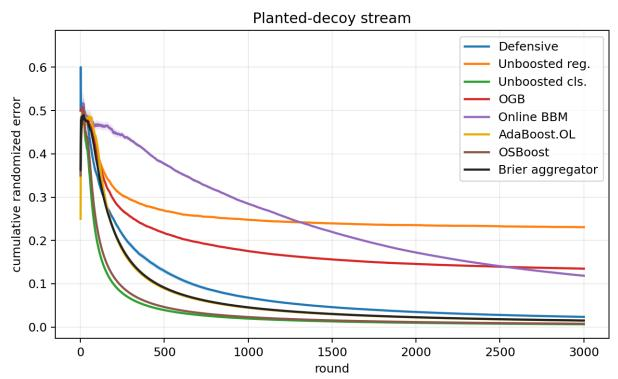

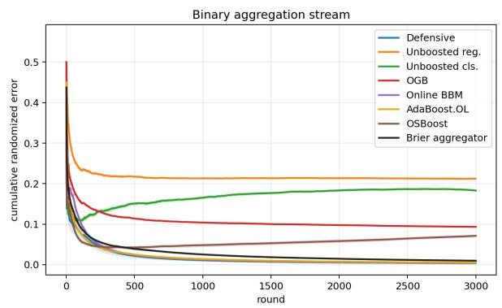  
Figure 5: Randomized classification error on the streams satisfying the smooth weak-learning condition. Left: on planted decoy, one base rule has the correct sign on every round but is hidden among 199 decoys; the unboosted classifier and OSBoost identify it fastest, and the Defensive Booster also reaches low error. Right: on binary aggregation, no individual rule is perfect and the average of all displayed rules is zero, but a hidden choice of one orientation from each opposite pair has positive margin. The Defensive Booster and the three weak-to-strong ensembles all attain low randomized error; the Defensive Booster uses one weak learner.

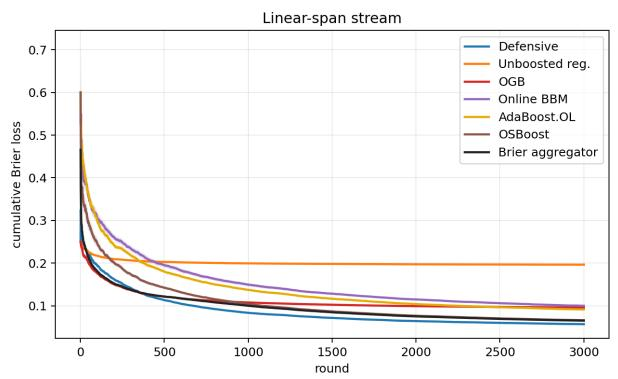

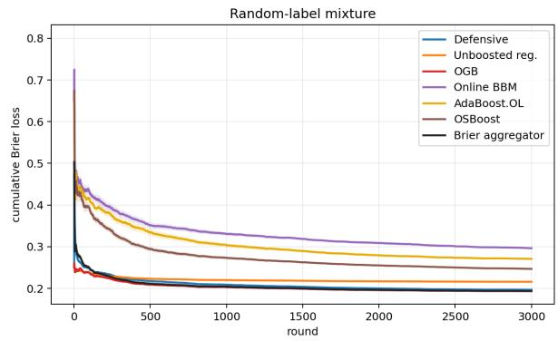

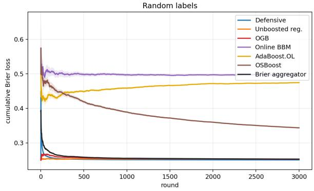  
Figure 6: Brier loss on the three linear streams. Top left: on linear span, the span comparator is informative even though the smooth weak-learning condition can fail on near-margin examples. Top right: on random-label mixture, the structured rounds retain an informative span comparator; OGB, unboosted regression, and the Defensive Booster outperform the classification-boosting baselines. Bottom: on random labels, the Defensive Booster, unboosted regression, and OGB remain near the $p = 1 / 2$ Brier baseline. The hard-label unboosted classifier is omitted from these plots for scale and reported in Table 3.

<table><tr><td>Stream</td><td>LS span squared loss</td><td> $\Lambda _ { \mathrm { { L S } } }$ </td></tr><tr><td>Planted decoy</td><td> $\overline { { . 0 8 8 7 \pm . 0 0 0 4 } }$ </td><td> $\overline { { 2 . 9 8 2 \pm . 0 2 0 } }$ </td></tr><tr><td>Binary aggregation</td><td> $. 0 8 6 0 \pm . 0 0 0 0$ </td><td> $1 . 1 3 1 \pm . 0 0 0$ </td></tr><tr><td>Linear span</td><td> $. 0 9 0 0 \pm . 0 0 0 3$ </td><td> $5 . 0 8 4 \pm . 0 1 7$ </td></tr><tr><td>Random-label mixture</td><td> $. 1 8 4 7 \pm . 0 0 0 7$ </td><td> $2 . 7 9 4 \pm . 0 1 8$ </td></tr><tr><td>Random labels</td><td> $. 2 4 7 2 \pm . 0 0 0 1$ </td><td> $. 5 7 6 \pm . 0 1 3$ </td></tr></table>

Table 2: Ofline least-squares span diagnostics, averaged over the same 20 seeds used for the online results. The score is not clipped. The reported $\Lambda _ { \mathrm { { L S } } }$ is the $\ell _ { 1 }$ norm of the fitted coeficient vector for a finite class or the $\ell _ { 2 }$ norm for the Euclidean linear class. Hence each row is an actual $\mathrm { s p a n } _ { \Lambda _ { \mathrm { L S } } } ( \mathcal { H } )$ comparator covered by Theorem 4.1.

<table><tr><td>Stream</td><td>Algorithm</td><td>0/1</td><td>Brier</td><td> $\overline { { { \mathrm { R a n d . ~ e r r . } } } }$ </td><td></td></tr><tr><td>Planted decoy</td><td>Defensive</td><td> $\overline { { . 0 1 6 6 \pm . 0 0 0 8 } }$ </td><td> $\overline { { . 0 1 1 9 \pm . 0 0 0 5 } }$ </td><td> $\overline { { . 0 2 3 5 \pm . 0 0 1 0 } }$ </td><td></td></tr><tr><td>Planted decoy</td><td>Unboosted reg.</td><td> $. 0 0 7 2 \pm . 0 0 0 4$ </td><td> $. 0 9 9 9 \pm . 0 0 0 4$ </td><td> $. 2 3 0 6 \pm . 0 0 0 9$ </td><td></td></tr><tr><td>Planted decoy</td><td>Unboosted cls.</td><td> $. 0 0 6 5 \pm . 0 0 0 3$ </td><td> $. 0 0 6 5 \pm . 0 0 0 3$ </td><td> $. 0 0 6 5 \pm . 0 0 0 3$ </td><td></td></tr><tr><td>Planted decoy</td><td>OGB</td><td> $. 0 1 6 2 \pm . 0 0 0 5$ </td><td> $. 0 3 9 0 \pm . 0 0 0 2$ </td><td> $. 1 3 4 8 \pm . 0 0 0 5$ </td><td></td></tr><tr><td>Planted decoy</td><td>BBM</td><td> $. 1 1 8 5 \pm . 0 0 0 8$ </td><td> $. 1 1 8 5 \pm . 0 0 0 8$ </td><td> $. 1 1 8 5 \pm . 0 0 0 8$ </td><td></td></tr><tr><td>Planted decoy</td><td>AdaBoost.OL</td><td> $. 0 1 4 7 \pm . 0 0 0 4$ </td><td> $. 0 1 3 5 \pm . 0 0 0 4$ </td><td> $. 0 1 4 8 \pm . 0 0 0 4$ </td><td></td></tr><tr><td>Planted decoy</td><td>OSBoost</td><td> $. 0 0 7 3 \pm . 0 0 0 3$ </td><td> $. 0 0 7 1 \pm . 0 0 0 2$ </td><td> $. 0 0 7 7 \pm . 0 0 0 3$ </td><td></td></tr><tr><td>Planted decoy</td><td>Brier agg.</td><td> $. 0 0 9 6 \pm . 0 0 0 5$ </td><td> $. 0 0 6 9 \pm . 0 0 0 3$ </td><td> $. 0 1 5 2 \pm . 0 0 0 6$ </td><td></td></tr><tr><td>Binary aggregation</td><td>Defensive</td><td> $\overline { { . 0 0 2 6 \pm . 0 0 0 6 } }$ </td><td> $\overline { { . 0 0 1 8 \pm . 0 0 0 5 } }$ </td><td> $\overline { { . 0 0 3 6 \pm . 0 0 0 9 } }$ </td><td></td></tr><tr><td>Binary aggregation</td><td>Unboosted reg.</td><td> $. 1 0 2 6 \pm . 0 0 1 3$ </td><td> $. 0 9 4 4 \pm . 0 0 0 1$ </td><td> $. 2 1 2 4 \pm . 0 0 0 2$ </td><td></td></tr><tr><td>Binary aggregation</td><td>Unboosted cls.</td><td> $. 1 8 2 9 \pm . 0 0 2 8$ </td><td> $. 1 8 2 9 \pm . 0 0 2 8$ </td><td> $. 1 8 2 9 \pm . 0 0 2 8$ </td><td></td></tr><tr><td>Binary aggregation</td><td>OGB</td><td> $. 0 3 3 1 \pm . 0 0 0 9$ </td><td> $. 0 3 3 8 \pm . 0 0 0 2$ </td><td> $. 0 9 3 5 \pm . 0 0 0 3$ </td><td></td></tr><tr><td>Binary aggregation</td><td>BBM</td><td> $. 0 0 4 1 \pm . 0 0 0 2$ </td><td> $. 0 0 4 1 \pm . 0 0 0 2$ </td><td> $. 0 0 4 1 \pm . 0 0 0 2$ </td><td></td></tr><tr><td>Binary aggregation</td><td>AdaBoost.OL</td><td> $. 0 0 4 2 \pm . 0 0 0 4$ </td><td> $. 0 0 3 3 \pm . 0 0 0 2$ </td><td> $. 0 0 5 2 \pm . 0 0 0 5$ </td><td></td></tr><tr><td>Binary aggregation</td><td>OSBoost</td><td> $. 0 0 6 8 \pm . 0 0 0 7$ </td><td> $. 0 1 9 2 \pm . 0 0 1 4$ </td><td> $. 0 7 1 3 \pm . 0 0 3 7$ </td><td></td></tr><tr><td>Binary aggregation</td><td>Brier agg.</td><td> $. 0 0 2 5 \pm . 0 0 0 2$ </td><td> $. 0 0 2 5 \pm . 0 0 0 1$ </td><td> $. 0 0 9 9 \pm . 0 0 0 7$ </td><td></td></tr><tr><td>Linear span</td><td>Defensive</td><td> $\overline { { . 0 7 4 4 \pm . 0 0 0 7 } }$ </td><td> $\overline { { . 0 5 7 0 \pm . 0 0 0 4 } }$ </td><td> $\overline { { . 1 1 2 0 \pm . 0 0 0 8 } }$ </td><td></td></tr><tr><td>Linear span</td><td>Unboosted reg.</td><td> $. 0 9 5 2 \pm . 0 0 1 0$ </td><td> $. 1 9 6 4 \pm . 0 0 0 1$ </td><td> $. 4 4 0 3 \pm . 0 0 0 2$ </td><td></td></tr><tr><td>Linear span</td><td>Unboosted cls.</td><td> $. 1 2 3 3 \pm . 0 0 1 5$ </td><td> $. 1 2 3 3 \pm . 0 0 1 5$ </td><td> $. 1 2 3 3 \pm . 0 0 1 5$ </td><td></td></tr><tr><td>Linear span</td><td>OGB</td><td> $. 0 8 6 6 \pm . 0 0 1 0$ </td><td> $. 0 9 6 0 \pm . 0 0 0 3$ </td><td> $. 2 5 1 1 \pm . 0 0 0 6$ </td><td></td></tr><tr><td>Linear span</td><td>BBM</td><td> $. 1 0 0 2 \pm . 0 0 1 4$ </td><td> $. 1 0 0 2 \pm . 0 0 1 4$ </td><td> $. 1 0 0 2 \pm . 0 0 1 4$ </td><td></td></tr><tr><td>Linear span</td><td>AdaBoost.OL</td><td> $. 0 9 6 6 \pm . 0 0 1 1$ </td><td> $. 0 9 1 5 \pm . 0 0 0 9$ </td><td> $. 0 9 7 1 \pm . 0 0 1 0$ </td><td></td></tr><tr><td>Linear span</td><td>OSBoost</td><td> $. 0 8 4 9 \pm . 0 0 1 1$ </td><td> $. 0 6 6 3 \pm . 0 0 0 8$ </td><td> $. 0 9 5 3 \pm . 0 0 1 1$ </td><td></td></tr><tr><td>Linear span</td><td>Brier agg.</td><td> $. 0 8 1 5 \pm . 0 0 1 1$ </td><td> $. 0 6 5 3 \pm . 0 0 0 8$ </td><td> $. 1 3 2 7 \pm . 0 0 2 8$ </td><td></td></tr><tr><td>Random-label mixture</td><td>Defensive</td><td> $\overline { { . 2 6 6 7 \pm . 0 0 1 7 } }$ </td><td> $\overline { { . 1 9 6 5 \pm . 0 0 0 7 } }$ </td><td> $\overline { { . 3 8 9 0 \pm . 0 0 1 5 } }$ </td><td></td></tr><tr><td>Random-label mixture</td><td>Unboosted reg.</td><td> $. 2 6 7 1 \pm . 0 0 1 7$ </td><td> $. 2 1 5 8 \pm . 0 0 0 3$ </td><td> $. 4 5 7 6 \pm . 0 0 0 3$ </td><td></td></tr><tr><td>Random-label mixture</td><td>Unboosted cls.</td><td> $. 2 7 8 9 \pm . 0 0 1 8$ </td><td> $. 2 7 8 9 \pm . 0 0 1 8$ </td><td> $. 2 7 8 9 \pm . 0 0 1 8$ </td><td></td></tr><tr><td>Random-label mixture</td><td>OGB</td><td> $. 2 6 5 6 \pm . 0 0 1 3$ </td><td> $. 1 9 3 3 \pm . 0 0 0 7$ </td><td> $. 3 8 5 9 \pm . 0 0 1 3$ </td><td></td></tr><tr><td>Random-label mixture</td><td>BBM</td><td> $. 2 9 6 3 \pm . 0 0 2 1$ </td><td> $. 2 9 6 3 \pm . 0 0 2 1$ </td><td> $. 2 9 6 3 \pm . 0 0 2 1$ </td><td></td></tr><tr><td>Random-label mixture</td><td>AdaBoost.OL</td><td> $. 2 7 5 8 \pm . 0 0 2 2$ </td><td> $. 2 7 0 8 \pm . 0 0 2 1$ </td><td> $. 2 7 5 7 \pm . 0 0 2 2$ </td><td></td></tr><tr><td>Random-label mixture</td><td>OSBoost</td><td> $. 3 2 6 0 \pm . 0 0 2 4$ </td><td> $. 2 4 6 7 \pm . 0 0 1 2$ </td><td> $. 3 6 5 5 \pm . 0 0 1 8$ </td><td></td></tr><tr><td>Random-label mixture</td><td>Brier agg.</td><td> $. 2 6 5 8 \pm . 0 0 1 3$ </td><td> $. 1 9 3 7 \pm . 0 0 0 7$ </td><td> $. 3 8 5 9 \pm . 0 0 1 4$ </td><td></td></tr><tr><td>Random labels</td><td>Defensive</td><td> $\overline { { . 4 9 8 0 \pm . 0 0 2 0 } }$ </td><td> $2 5 0 6 \pm . 0 0 0 0$ </td><td> $\overline { { . 4 9 9 9 \pm . 0 0 0 1 } }$ </td><td></td></tr><tr><td>Random labels</td><td>Unboosted reg.</td><td> $. 4 9 7 0 \pm . 0 0 1 6$ </td><td> $. 2 5 2 9 \pm . 0 0 0 1$ </td><td> $. 4 9 9 5 \pm . 0 0 0 2$ </td><td></td></tr><tr><td>Random labels</td><td>Unboosted cls.</td><td> $. 4 9 7 8 \pm . 0 0 1 5$ </td><td> $. 4 9 7 8 \pm . 0 0 1 5$ </td><td> $. 4 9 7 8 \pm . 0 0 1 5$ </td><td></td></tr><tr><td>Random labels</td><td>OGB</td><td> $. 4 9 6 8 \pm . 0 0 1 9$ </td><td> $. 2 5 2 7 \pm . 0 0 0 1$ </td><td> $. 4 9 9 5 \pm . 0 0 0 2$ </td><td></td></tr><tr><td>Random labels</td><td>BBM</td><td> $. 4 9 7 1 \pm . 0 0 2 5$ </td><td> $. 4 9 7 1 \pm . 0 0 2 5$ </td><td> $. 4 9 7 1 \pm . 0 0 2 5$ </td><td></td></tr><tr><td>Random labels</td><td>AdaBoost.OL</td><td> $. 4 9 8 3 \pm . 0 0 2 0$ </td><td> $. 4 7 4 5 \pm . 0 0 1 4$ </td><td> $. 4 9 9 5 \pm . 0 0 1 9$ </td><td></td></tr><tr><td>Random labels</td><td> $\mathrm { O S B o o s t }$ </td><td> $. 4 9 9 4 \pm . 0 0 2 4$ </td><td> $. 3 4 3 7 \pm . 0 0 1 5$ </td><td> $. 4 9 7 7 \pm . 0 0 1 6$ </td><td></td></tr><tr><td>Random labels</td><td> $\mathrm { B r i e r ~ a g g . }$ </td><td> $. 4 9 6 6 \pm . 0 0 1 8$ </td><td> $. 2 5 3 0 \pm . 0 0 0 1$ </td><td> $. 4 9 9 4 \pm . 0 0 0 2$ </td><td></td></tr></table>

Table 3: Average online performance over 20 random seeds, reported as mean ± standard error. “Rand. err.” is $\begin{array} { r } { T ^ { - 1 } \sum _ { t } | Y _ { t } - p _ { t } | } \end{array}$ , the error of the randomized classifier induced by the probability forecast. Unboosted cls. and BBM output hard labels, so their Brier and randomized-error entries equal their $0 / 1$ error. Brier agg. combines the forecasts of OGB, BBM, AdaBoost.OL, and OSBoost before observing the current label, then updates its weights after the label is revealed; it therefore maintains 400 weak learners. AdaBoost.OL’s Brier entry scores its probability of predicting one, while its randomized-error entry is the expected 0/1 loss of its randomized classifier. Entries are rounded to four decimals.

Online BBM is designed to output a hard majority prediction. To check whether its Brier results are merely an artifact of that convention, we also score the normalized raw vote (1 + $\begin{array} { r } { N ^ { - 1 } \sum _ { i } h _ { t , i } ( x _ { t } ) ) / 2 } \end{array}$ as a probability. This diagnostic is not the output analyzed by the Online BBM theorem. Figure 7 shows that the normalized vote lowers planted-decoy Brier loss from .1185 to .0838, but remains far above the best forecasting methods. On binary aggregation, the hard output has Brier loss and randomized error .0041, while the normalized vote has Brier loss .0520 and randomized error .1562. Thus a softer output helps on planted decoy but hurts substantially on binary aggregation; it does not account for the main comparisons.

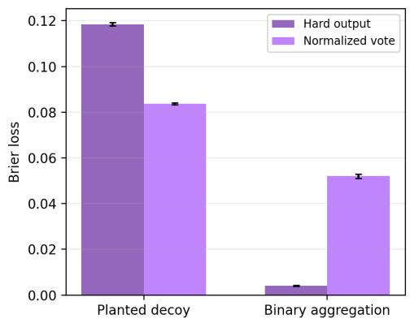

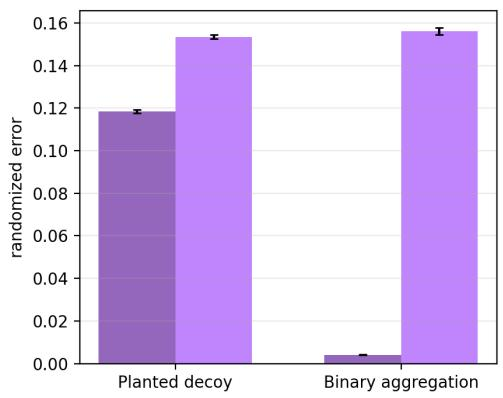  
Figure 7: Online BBM’s specified hard output versus its normalized raw vote, averaged over 20 seeds. The vote is scored directly as a probability, with no post-hoc calibration. It improves Brier loss on planted decoy but worsens randomized error there; on binary aggregation, the specified hard output is substantially better under both metrics.

<table><tr><td>Algorithm</td><td>Weak learners</td><td>Seconds per stream</td><td>Microseconds per round</td></tr><tr><td>Unboosted reg.</td><td>1</td><td>.032</td><td>11</td></tr><tr><td>Unboosted cls.</td><td>1</td><td>.030</td><td>10</td></tr><tr><td>Defensive</td><td>1</td><td>.046</td><td>15</td></tr><tr><td>OGB</td><td>100</td><td>2.959</td><td>986</td></tr><tr><td>BBM</td><td>100</td><td>1.478</td><td>493</td></tr><tr><td>AdaBoost.OL</td><td>100</td><td>2.292</td><td>764</td></tr><tr><td>OSBoost</td><td>100</td><td>1.753</td><td>584</td></tr><tr><td>Brier aggregator</td><td>400</td><td>8.482</td><td>2827</td></tr></table>

Table 4: Runtime summary for the implementation used in the experiments. Wall-clock times are averages over all stream/seed runs, each with T = 3000 rounds. The exact constants are implementation-dependent, but the diference in maintained learners is structural: both unboosted controls and the Defensive Booster maintain one online learner, whereas the ensemble baselines maintain many weak learners in parallel. The Brier aggregator’s time is the sum of its four constituent ensembles because all must be run.

Sensitivity to baseline parameters. The main experiments use one setting for each algorithm family on every stream. Figure 8 varies, one at a time, the OGB stage step, the classification learner’s Hedge rate, and the target-edge parameter on the binary aggregation stream. Each value is .25, .5, 1, 2, or 4 times the reported setting, and each point averages 10 seeds. OGB improves steadily with its stage step but has higher Brier loss than the Defensive Booster at every tested value. Online BBM is stable across both sweeps, and AdaBoost.OL has slightly lower randomized error than the Defensive Booster at the smallest tested learning rate. OSBoost is substantially more sensitive to both its classification learning rate and target edge. Thus the main comparison does not depend on a single narrow baseline setting, although the relative ordering of the lowest-error classification methods can change.

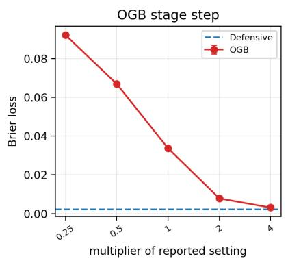

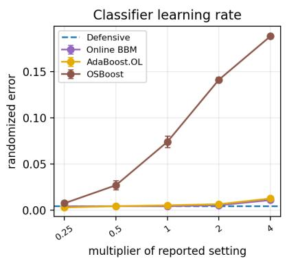

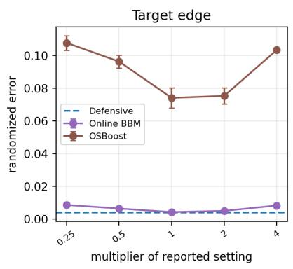  
Figure 8: One-at-a-time parameter sensitivity on the binary aggregation stream. The dashed blue line is the parameter-free Defensive Booster. The middle and right panels show randomized classification error; the left panel shows Brier loss. Error bars are standard errors over 10 seeds. A target-edge multiplier above one deliberately overstates the edge guaranteed by the construction and is included as a misspecification check.

Figure 9 repeats the same sixteen-fold sweep on Electricity and Occupancy, the two real streams on which the Defensive Booster has the largest advantage. It retains the lowest Brier loss under every tested setting. This check does not tune the reported results: the main tables continue to use multiplier one for every dataset.

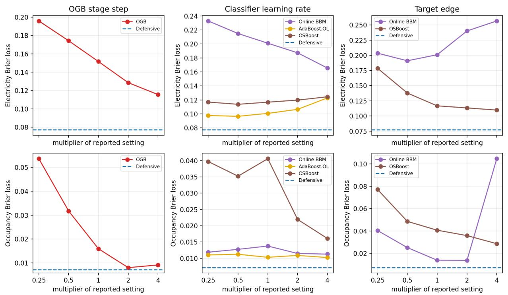  
Figure 9: One-at-a-time parameter sensitivity on the complete Electricity (top) and Occupancy (bottom) streams. Multipliers range from .25 to 4. The dashed blue line is the parameter-free Defensive Booster. Every panel shows final Brier loss; lower is better. AdaBoost.OL has no targetedge parameter and therefore appears only in the middle column.

Takeaways. The planted-decoy stream tests identification within a large weak class, but does not require boosting: one base rule already has the correct sign on every round. Accordingly, the unboosted classifier and OSBoost have the smallest errors, and the Defensive Booster also attains low Brier and randomized error. Unboosted regression has low threshold error but poor Brier and randomized error, illustrating why probability forecasting is stricter than threshold accuracy. The unrestricted least-squares span score has loss .0887, whereas the Defensive Booster reaches .0119; this weak-to-strong behavior is not explained by span fitting.

The binary aggregation stream requires genuine aggregation: no individual binary rule is perfect, and averaging all displayed rules gives zero. A hidden choice of one orientation from each pair nevertheless classifies every round correctly. The unboosted classifier has error .1829, while the Defensive Booster reaches Brier loss .0018 and randomized error .0036 using one weak learner, despite the .0860 loss floor for fixed afine span scores. At $N = 1 0 0$ , all three weak-to-strong ensembles also reach low hard error, but each has higher Brier loss and randomized error than the Defensive Booster. The ensemble-size comparison in Figure 4 shows how these values compare with each ensemble as its number of weak learners grows.

The three linear streams in Figure 6 examine Brier loss when the smooth weak-learning condition need not hold. On linear span, the ofline span score has loss .0900, and the Defensive Booster attains .0570. On random-label mixture, the randomly labeled rounds provide a smooth reweighting with small weak-class edge, while the structured rounds retain an informative span comparator. OGB, the unboosted regressor, and the Defensive Booster have substantially lower Brier loss than the unboosted classifier and the classification-boosting baselines. OSBoost and Online BBM remain more competitive in randomized error than in Brier loss because randomized error depends linearly on their signed margins. Figure 3 examines the random-label mixture more closely: the Defensive Booster’s multiaccuracy and self-orthogonality errors and the weak-class edge under its mistake weighting all decay, although the weighting retains nontrivial density. Finally, on random labels, no method has a real signal; the Defensive Booster, unboosted regressor, and OGB stay near the p = 1/2 Brier-loss baseline, while the unboosted classifier and the classification boosters have larger Brier loss. The weak-class edge under the Defensive Booster’s mistake weighting remains small.

Under these globally fixed tuning rules, the classification boosters are strongest on the binary aggregation stream, while OGB is strongest on the random-label mixture. The Defensive Booster is competitive with the better family in both comparisons. Table 4 shows that it does so while maintaining one online weak learner rather than an ensemble of 100 learners.

## C.3 Naturally ordered real streams

Data and preprocessing. We evaluate four public binary prediction streams in their recorded order. UCI Bank Marketing predicts whether a client subscribes to a term deposit (Moro et al., 2014); we use the date order supplied by the full dataset. The MOA Electricity stream (MOA, 2011) predicts price movement in the New South Wales electricity market; the data originate in Harries’s electricity-pricing study (Harries, 1999). The MOA Airlines stream predicts whether a flight is delayed (MOA, 2011). UCI Occupancy Detection (Candanedo and Feldheim, 2016) predicts whether an ofice is occupied from minute-level sensor measurements, which we merge by recorded timestamp. We do not shufle any dataset: on each round the algorithm receives the next context, predicts, and then observes its label.

We use a 128-dimensional deterministic signed-hash representation and the Euclidean unitball weak class for all four datasets. Each row includes a bias feature and is normalized to unit norm. Categorical values are hashed as indicators; numeric values are standardized using unlabeled covariates from earlier rounds, clipped to five running standard deviations, and then hashed. The current numeric value is transformed using the mean and variance of that feature among preceding contexts and is incorporated into those statistics only afterward. Thus no feature or label from a future round enters the current representation. For Bank Marketing we drop call duration, which is unavailable before the outcome. Occupancy uses contemporaneous temperature, humidity, light, and $\mathrm { C O _ { 2 } }$ measurements, the derived humidity ratio, and cyclic encodings of the recorded time and weekday. The Bank, Electricity, Airlines, and Occupancy runs use all 41,188, 45,312, 539,383, and 20,560 examples, respectively.

Figure 10 plots cumulative average Brier loss over each stream. Table 5 reports the final Brier, deterministic, and randomized classification errors, together with runtime.

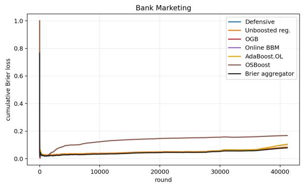

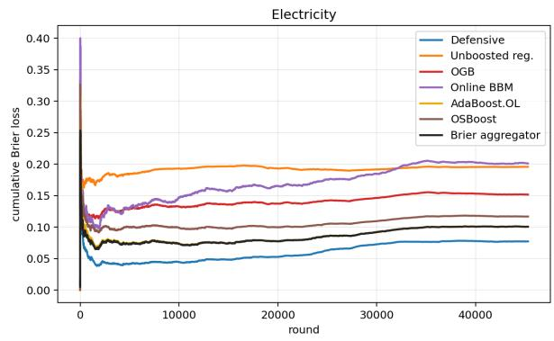

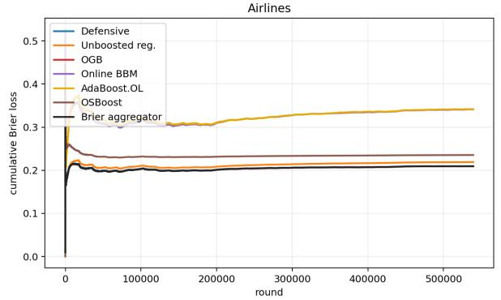

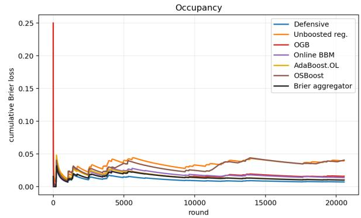  
Figure 10: Cumulative average Brier loss on the real-data streams. Top left: on Bank Marketing, OGB and the Defensive Booster are close. Top right: on Electricity, the Defensive Booster has substantially lower Brier loss than all six plotted baselines. Bottom left: on Airlines, the Defensive Booster, OGB, and the Brier aggregator are nearly indistinguishable. Bottom right: on Occupancy, the Defensive Booster has the lowest Brier loss. Each curve is the average loss incurred up to that point while processing the dataset in recorded order. The hard-label unboosted classifier is omitted for scale and reported in Table 5.

<table><tr><td>Dataset</td><td>Algorithm</td><td>0/1</td><td>Brier</td><td>Base</td><td>Rand. err.</td><td>µs/round</td></tr><tr><td>Bank</td><td>Defensive</td><td>.103</td><td>.080</td><td>.100</td><td>.159</td><td>14</td></tr><tr><td>Bank</td><td>Adaptive Def.</td><td>.103</td><td>.081</td><td>.100</td><td>.159</td><td>86</td></tr><tr><td>Bank</td><td>Unboosted reg.</td><td>.103</td><td>.085</td><td>.100</td><td>.212</td><td>10</td></tr><tr><td>Bank</td><td>Unboosted cls.</td><td>.109</td><td>.109</td><td>.100</td><td>.109</td><td>8</td></tr><tr><td>Bank</td><td>OGB</td><td>.102</td><td>.079</td><td>.100</td><td>.157</td><td>803</td></tr><tr><td>Bank</td><td>BBM</td><td>.103</td><td>.103</td><td>.100</td><td>.103</td><td>300</td></tr><tr><td>Bank</td><td>AdaBoost.OL</td><td>.106</td><td>.105</td><td>.100</td><td>.106</td><td>522</td></tr><tr><td>Bank</td><td>OSBoost</td><td>.131</td><td>.168</td><td>.100</td><td>.387</td><td>356</td></tr><tr><td>Bank</td><td>Brier agg.</td><td>.102</td><td>.079</td><td>.100</td><td>.148</td><td>1981</td></tr><tr><td>Electricity</td><td>Defensive</td><td>.108</td><td>.077</td><td>.244</td><td>.154</td><td>15</td></tr><tr><td>Electricity</td><td>Adaptive Def.</td><td>.085</td><td>.064</td><td>.244</td><td>.129</td><td>86</td></tr><tr><td>Electricity</td><td>Unboosted reg.</td><td>.273</td><td>.196</td><td>.244</td><td>.422</td><td>11</td></tr><tr><td>Electricity</td><td>Unboosted cls.</td><td>.367</td><td>.367</td><td>.244</td><td>.367</td><td>8</td></tr><tr><td>Electricity</td><td>OGB</td><td>.219</td><td>.152</td><td>.244</td><td>.310</td><td>807</td></tr><tr><td>Electricity</td><td>BBM</td><td>.201</td><td>.201</td><td>.244</td><td>.201</td><td>329</td></tr><tr><td>Electricity</td><td>AdaBoost.OL</td><td>.102</td><td>.101</td><td>.244</td><td>.102</td><td>526</td></tr><tr><td>Electricity</td><td>OSBoost</td><td>.111</td><td>.117</td><td>.244</td><td>.280</td><td>349</td></tr><tr><td>Electricity</td><td>Brier agg.</td><td>.102</td><td>.101</td><td>.244</td><td>.102</td><td>2011</td></tr><tr><td>Airlines</td><td>Defensive</td><td>.332</td><td>.209</td><td>.247</td><td>.419</td><td>16</td></tr><tr><td>Airlines</td><td>Adaptive Def.</td><td>.324</td><td>.207</td><td>.247</td><td>.413</td><td>89</td></tr><tr><td>Airlines</td><td>Unboosted reg.</td><td>.348</td><td>.219</td><td>.247</td><td>.451</td><td>11</td></tr><tr><td>Airlines</td><td>Unboosted cls.</td><td>.390</td><td>.390</td><td>.247</td><td>.390</td><td>10</td></tr><tr><td>Airlines</td><td>OGB</td><td>.332</td><td>.209</td><td>.247</td><td>.419</td><td>826</td></tr><tr><td>Airlines</td><td>BBM</td><td>.341</td><td>.341</td><td>.247</td><td>.341</td><td>352</td></tr><tr><td>Airlines</td><td>AdaBoost.OL</td><td>.342</td><td>.342</td><td>.247</td><td>.342</td><td>543</td></tr><tr><td>Airlines</td><td>OSBoost</td><td>.370</td><td>.235</td><td>.247</td><td>.480</td><td>362</td></tr><tr><td>Airlines</td><td>Brier agg.</td><td>.332</td><td>.209</td><td>.247</td><td>.419</td><td>2082</td></tr><tr><td>Occupancy</td><td>Defensive</td><td>.009</td><td>.007</td><td>.178</td><td>.014</td><td>14</td></tr><tr><td>Occupancy</td><td>Adaptive Def.</td><td>.007</td><td>.007</td><td>.178</td><td>.013</td><td>85</td></tr><tr><td>Occupancy</td><td>Unboosted reg.</td><td>.052</td><td>.040</td><td>.178</td><td>.120</td><td>9</td></tr><tr><td>Occupancy</td><td>Unboosted cls.</td><td>.096</td><td>.096</td><td>.178</td><td>.096</td><td>8</td></tr><tr><td>Occupancy</td><td>OGB</td><td>.022</td><td>.016</td><td>.178</td><td>.033</td><td>838</td></tr><tr><td>Occupancy</td><td>BBM</td><td>.014</td><td>.014</td><td>.178</td><td>.014</td><td>288</td></tr><tr><td>Occupancy</td><td>AdaBoost.OL</td><td>.011</td><td>.010</td><td>.178</td><td>.011</td><td>536</td></tr><tr><td>Occupancy</td><td>OSBoost</td><td>.015</td><td>.041</td><td>.178</td><td>.088</td><td>382</td></tr><tr><td>Occupancy</td><td>Brier agg.</td><td>.012</td><td>.010</td><td>.178</td><td>.016</td><td>2044</td></tr></table>

Table 5: Average online performance on the real-data streams. “Base” is the Brier loss of the best constant probability forecast on the evaluated dataset. Unboosted cls. and BBM report the Brier score of their hard binary predictions. Brier agg. runs all four ensemble baselines. Runtime is reported for the same implementation and machine as Table 4. The absolute times are implementation-dependent. The basic Defensive Booster maintains one weak-class learner, Adaptive Def. maintains one at each active dyadic scale (20 for Airlines, 17 for Bank and Electricity, and 16 for Occupancy), each ensemble baseline maintains 100, and the Brier aggregator maintains 400.

Among the eight methods in the main comparison, the Defensive Booster has the lowest Brier loss on Electricity and Occupancy. On Occupancy its Brier loss .007 is less than half OGB’s .016; it also has the lowest deterministic error. AdaBoost.OL has the lowest randomized error on Occupancy and the lowest two classification errors on Electricity. These distinctions are consistent with the algorithms’ objectives: the Defensive Booster is designed to forecast probabilities, while AdaBoost.OL directly optimizes classification. The Brier gains are not explained merely by maintaining fewer learners: both unboosted controls are substantially worse on Electricity and Occupancy. The Brier aggregator is best on Bank by .0010 over the Defensive Booster. On Airlines, OGB has the numerically smallest Brier loss, but it, the aggregator, and the Defensive Booster difer by less than $6 \cdot 1 0 ^ { - 5 }$ . The unboosted regressor is also competitive on these two streams, while the classification methods are worse on Brier loss. On Electricity and Occupancy, however, the Defensive Booster’s Brier loss is respectively 61% and 82% lower than the unboosted regressor’s. The Brier aggregator maintains 400 weak learners. On the four real streams, the $N = 1 0 0$ ensembles take 20–60× as much wall-clock time per round as the Defensive Booster, which maintains one weak learner; the Brier aggregator takes about 130–150× as much. The separate Brier and classification columns matter here: a boosted margin method can classify accurately without producing the most accurate probability forecasts.

## D Extension to bounded real-valued outcomes

It is evident that the Defensive Booster, as it is defined, does not require that the outcomes be binary; it can be applied essentially without modification in a regression setting with bounded scalar labels. We will now briefly state and discuss this natural extension: in a nutshell, the Defensive Booster’s span guarantee is satisfied in the exact same way as in the binary setting. Then, we will evaluate this extension on three chronological regression streams — in these experiments, the Defensive Booster has 17–29% lower normalized mean squared error than 100-stage online gradient boosting while maintaining one weak-class learner; OGB takes 65–70× as much wall-clock time per round in our implementation.

To begin, suppose that ${ Y _ { t } } ~ \in ~ [ 0 , 1 ]$ and that $p _ { t } \in [ 0 , 1 ]$ is interpreted as a prediction of the bounded outcome. Retain the afine encoding

$$
\sigma _ { t } = 2 Y _ { t } - 1 , \qquad \mu _ { t } = 2 p _ { t } - 1 , \qquad r _ { t } = 2 ( Y _ { t } - p _ { t } ) .
$$

The Defensive Booster is unchanged; also note that outcomes in any other fixed bounded interval reduce to this setting by afine rescaling. It is now easy to see that the span guarantee remains the same.

Proposition D.1 (Certificate and span guarantee for bounded outcomes). For every adaptive sequence with $Y _ { t } \in [ 0 , 1 ]$ , the Defensive Booster satisfies the multiaccuracy and self-orthogonality guarantees of Theorem 3.3, with

$$
S _ { T } = 4 \sum _ { t = 1 } ^ { T } ( Y _ { t } - p _ { t } ) ^ { 2 } .
$$

In particular, writing $L _ { 2 , T } = T ^ { - 1 } \sum _ { t } ( Y _ { t } - p _ { t } ) ^ { 2 }$ , for every $f \in \operatorname { s p a n } _ { \Lambda } ( \mathcal { H } )$

$$
L _ { 2 , T } \leq \frac { 1 } { T } \sum _ { t = 1 } ^ { T } ( Y _ { t } - q _ { f } ( x _ { t } ) ) ^ { 2 } + \frac { \Lambda A _ { H } + A _ { S } } { \sqrt { T } } \sqrt { L _ { 2 , T } } + \frac { \Lambda B _ { H } + B _ { S } } { 2 T } .
$$

The low-loss conclusion of Corollary $4 . 2$ also holds with $B _ { T }$ and $B _ { f }$ interpreted as the corresponding average squared errors.

Proof. Lemma 3.2 already permits every $\sigma _ { t } \in [ - 1 , 1 ]$ . The proof of Theorem 3.3 therefore applies unchanged. The proof of Theorem 4.1 then uses only that certificate and the same squared-loss expansion, so it also applies unchanged. □

## D.1 Regression experiments with bounded outcomes

We test the Defensive Booster beyond binary outcomes on three public regression datasets, processed in timestamp order. Appliance energy records household appliance use every ten minutes together with indoor and outdoor sensor measurements (Candanedo, 2017). Bike demand records hourly Capital Bikeshare rentals with calendar and weather variables (Fanaee-T, 2013). Interstate trafic records hourly westbound I-94 trafic volume with calendar and weather variables (Hogue, 2019).

We normalize each target by a fixed upper bound R: 2000 Wh for Appliance Energy, 2000 rentals per hour for Bike Demand, and 10000 vehicles per hour for Interstate Trafic. We map a target $Y _ { t } \in [ 0 , R ]$ to $Y _ { t } / R \in [ 0 , 1 ]$ and map a normalized forecast $p _ { t }$ back to $R p _ { t }$ . Thus

$$
( Y _ { t } / R - p _ { t } ) ^ { 2 } = ( Y _ { t } - R p _ { t } ) ^ { 2 } / R ^ { 2 } ,
$$

so normalized MSE and root mean squared error in the original units difer only by the fixed factor R. Every observed target lies in its stated interval, so this normalization clips no outcome.

We use the first 10% of each stream as a common chronological initialization prefix and report losses on the remaining 90%. Thereafter, each algorithm receives the current context, predicts, observes the target, and updates. Numeric features are standardized using statistics from strictly earlier rows. Each context contains calendar variables and the available sensor or weather measurements. Bike and Trafic additionally use targets observed exactly one hour, one day, and one week earlier when those timestamps exist; Appliance Energy uses lags of ten minutes, one hour, and one day. We omit simultaneous light consumption and two random decoy columns from Appliance Energy. We omit the casual and registered rental counts from Bike because they sum to the target, and collapse duplicate weather reports at a Trafic timestamp.

All learned methods (except the past-outcome mean baseline) receive the same 128-dimensional signed feature-hashed context, rescaled to have Euclidean norm at most one, and use the same unit-ball linear weak class. Algorithmic hyperparameters are fixed across datasets. The Defensive Booster maintains one second-order linear oracle; OGB maintains $N = 1 0 0$ such oracles and uses the stage step $\eta = ( \log N ) / N$ from the binary experiments. Two controls use either one unboosted squared-loss learner or the mean of targets observed before the current round. Figure 11 plots cumulative mean squared error on the normalized targets, and Table 6 reports final normalized MSE and root mean squared error in the original units.

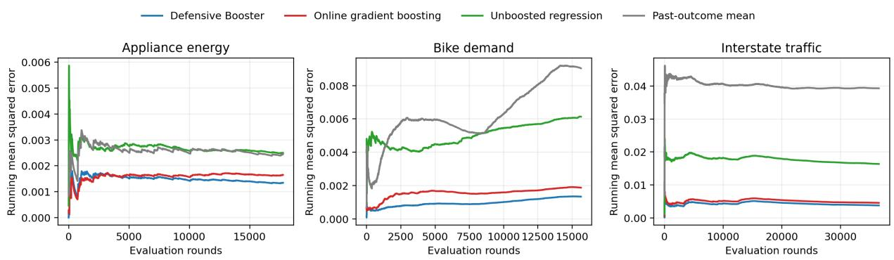  
Figure 11: Cumulative mean squared error after the common chronological initialization prefix. The Defensive Booster and unboosted control each maintain one weak-class learner, whereas online gradient boosting maintains 100. The Defensive Booster has the lowest final loss on all three streams.

<table><tr><td></td><td></td><td colspan="2">Normalized MSE</td><td colspan="2">Raw-unit RMSE</td><td rowspan="2">OGB time Defensive</td></tr><tr><td>Dataset</td><td>Rounds</td><td>Defensive</td><td>OGB</td><td>Defensive</td><td>OGB</td></tr><tr><td>Appliance energy</td><td>17,762</td><td>.0013443</td><td>.0016461</td><td>73.330</td><td>81.145</td><td>64.7×</td></tr><tr><td>Bike demand</td><td>15,642</td><td>.0013440</td><td>.0018824</td><td>73.322</td><td>86.773</td><td>65.9×</td></tr><tr><td>Interstate traffic</td><td>36,518</td><td>.0038040</td><td>.0045762</td><td>616.769</td><td>676.473</td><td>69.6×</td></tr></table>

Table 6: Final regression performance after the common chronological initialization prefix; lower error is better. Raw-unit RMSE is measured in Wh, rentals per hour, and vehicles per hour, respectively. The final column is the ratio of OGB’s wall-clock time per round to the Defensive Booster’s on the same machine. Absolute runtimes depend on the implementation, whereas OGB’s 100 maintained weak-class learners versus the Defensive Booster’s one is an algorithmic diference.

The Defensive Booster reduces normalized MSE relative to OGB by 18% on Appliance Energy, 29% on Bike Demand, and 17% on Interstate Trafic. On Bike and Trafic, both controls are substantially worse, so the improvement does not come merely from predicting the running mean or from applying the shared weak learner once. Thus the empirical advantage extends beyond binary outcomes: on each stream, the Defensive Booster obtains lower squared error than the 100-learner OGB ensemble while maintaining one weak-class learner.

## E Strongly adaptive experiments

We next compare the basic Defensive Booster with its strongly adaptive variant from Section 5. The implementation uses the canonical dyadic interval family and the Adapt-ML-Prod secondorder aggregation rule with the sleeping-expert confidence reduction of Gaillard et al. (2014). The weak-class and scalar states are vectorized across scales, which reduces implementation overhead without changing their updates. This variant introduces no dataset-specific parameter: the same second-order weak oracle and scalar routines are used at every scale.

The Adaptive Def. rows in Table 5 report its full-stream performance. On Electricity, strong adaptivity lowers Brier loss from .0772 to .0644, deterministic error from .1077 to .0851, and randomized error from .1538 to .1289. It also lowers Airlines Brier loss from .2094 to .2066 and Occupancy Brier loss from .0071 to .0069; on Bank it increases Brier loss from .0800 to .0807. The adaptive implementation takes 85–89 microseconds per round, about six times the basic forecaster but still substantially less than the 100-learner ensembles in Table 5. Figure 12 compares the methods’ trailing-window losses and shows when these full-stream improvements occur.

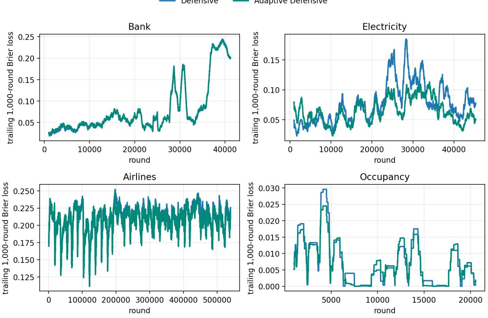  
Figure 12: Local performance of the basic and strongly adaptive Defensive Boosters on all four real streams. Each curve is the trailing 1,000-round Brier loss; the same window is fixed for every dataset. The adaptive variant tracks the basic forecaster closely on Bank and Airlines, while on Electricity it improves substantially during the later high-loss portions of the stream. Occupancy is mixed locally but favors the adaptive variant in full-stream loss. Table 5 reports the corresponding full-stream averages.

Controlled drift benchmark. To isolate adaptation to distribution shift, we additionally use the INSECTS optical-sensor benchmark of Souza et al. (2020). Each example is an optical-sensor recording of mosquito flight. The benchmark orders these examples using a hidden temperature variable to produce known abrupt, incremental-gradual, and recurring drift patterns. We use all five balanced variants and preserve each released order. Because our setting is binary, we fix one target for the entire benchmark: recognize Aedes albopictus (either sex) versus Aedes aegypti or Culex quinquefasciatus. Each of the six source classes has equal frequency, so the binary target has positive rate 1/3. The 33 numeric signal features receive the same prefix-only standardization and row normalization as the other real streams. Neither algorithm is given the temperature, the drift type, or the change points. Table 7 reports full-stream performance for all five released orderings.

<table><tr><td rowspan="2">Drift pattern</td><td rowspan="2">Rounds</td><td colspan="2">Brier loss</td><td colspan="2">0/1 error</td></tr><tr><td>Basic</td><td>Adaptive</td><td>Basic</td><td>Adaptive</td></tr><tr><td>Abrupt</td><td>52,848</td><td>.1307</td><td>.1198</td><td>.1905</td><td>.1697</td></tr><tr><td>Incremental-gradual</td><td>24,150</td><td>.0905</td><td>.0877</td><td>.1321</td><td>.1235</td></tr><tr><td>Incremental-abrupt recurring</td><td>79,986</td><td>.0871</td><td>.0813</td><td>.1231</td><td>.1148</td></tr><tr><td>Incremental recurring</td><td>79,986</td><td>.0829</td><td>.0769</td><td>.1151</td><td>.1064</td></tr><tr><td>Incremental</td><td>57,018</td><td>.1700</td><td>.1711</td><td>.2535</td><td>.2547</td></tr></table>

Table 7: Average online performance on five controlled-drift INSECTS streams; lower is better. “Basic” is the Defensive Booster, which maintains one weak learner; “Adaptive” is its strongly adaptive variant. The binary task and all algorithmic choices are fixed across rows.

The adaptive variant lowers both metrics on the four streams that combine abrupt, gradual, or recurring shifts. On the continuously incremental stream, the methods difer by at most .0012. The adaptive implementation takes 83–85 microseconds per round. On the four original real streams, Table 5 shows that the adaptive method is slower than the basic forecaster but remains 3–10× faster than the 100-learner ensembles. Figure 13 shows the local Brier losses around the published change points for two representative streams.

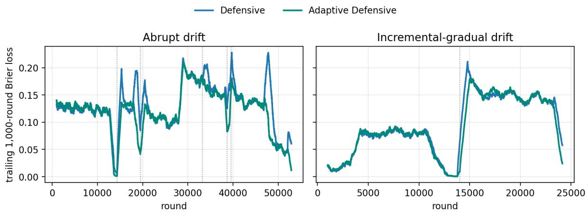  
Figure 13: Local Brier loss on the abrupt and incremental-gradual INSECTS streams. Curves are trailing 1,000-round averages; dotted lines mark the change points published with the benchmark. The adaptive forecaster reduces several of the largest post-shift loss spikes.

The interval guarantee also produces local hard-core witnesses. Figure 14 examines these witnesses on the abrupt INSECTS stream. For each selected endpoint t and dyadic length $L ,$ it computes the mistake weighting on the trailing interval $I = [ t - L + 1 , t ]$ and reports both quantities that define its hard-core quality: density and normalized weak-class edge.

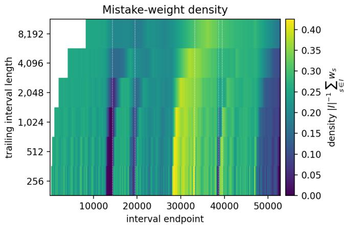

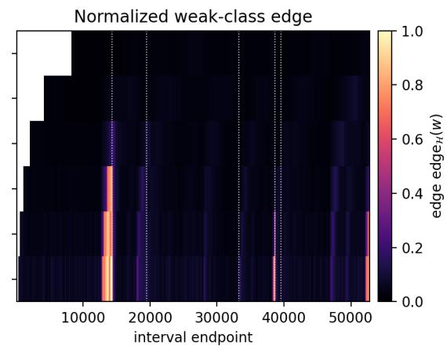  
Figure 14: Evolution of local hard-core witnesses for the strongly adaptive Defensive Booster on the abrupt INSECTS stream. Each pixel represents the mistake weights $\begin{array} { r } { w _ { s } = | Y _ { s } - p _ { s } | } \end{array}$ on one trailing interval $I = [ t - L + 1 , t ]$ : the horizontal axis is its endpoint $t ,$ and the vertical axis is its dyadic length L. The left panel gives the density $\begin{array} { r } { | I | ^ { - 1 } \sum _ { s \in I } w _ { s } ; } \end{array}$ the right gives $\mathrm { e d g e } _ { \mathcal { H } } ( w )$ . Bright regions on the left paired with dark regions on the right are smooth, low-edge local hard-core witnesses. Dotted lines mark the five published abrupt change points; white regions precede the first complete interval at a given scale.