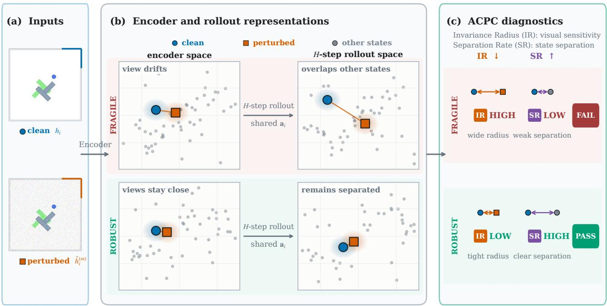
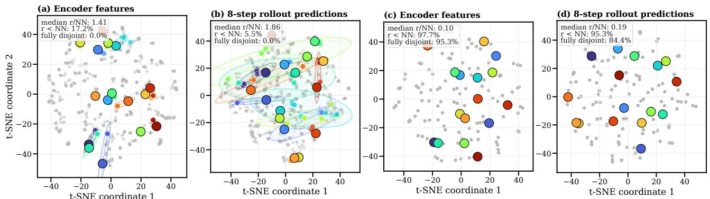
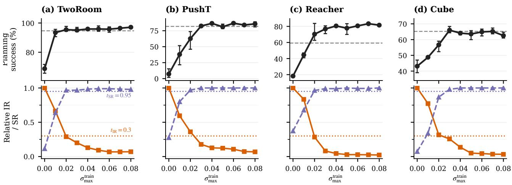
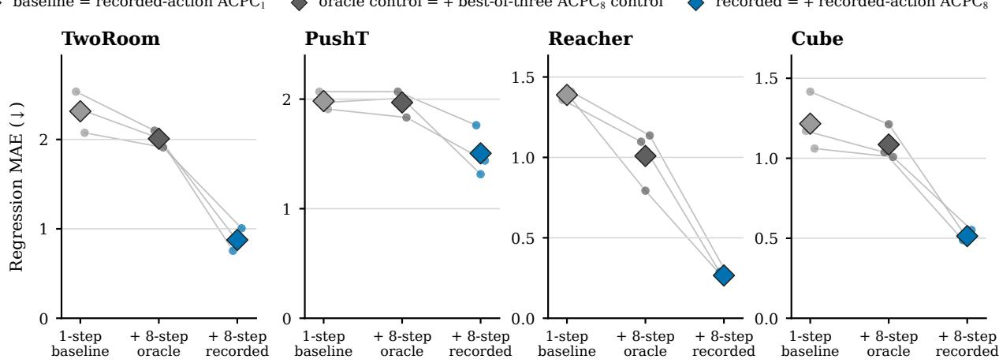
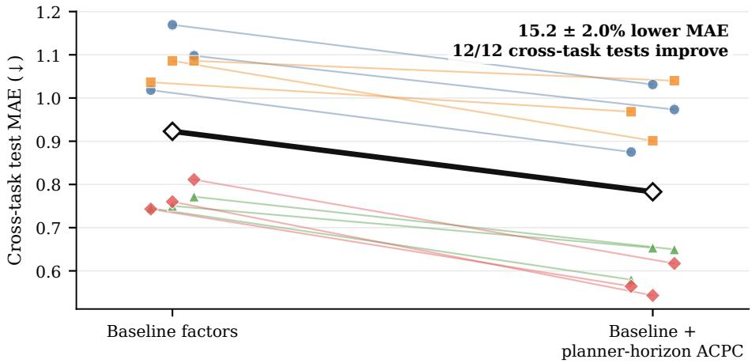
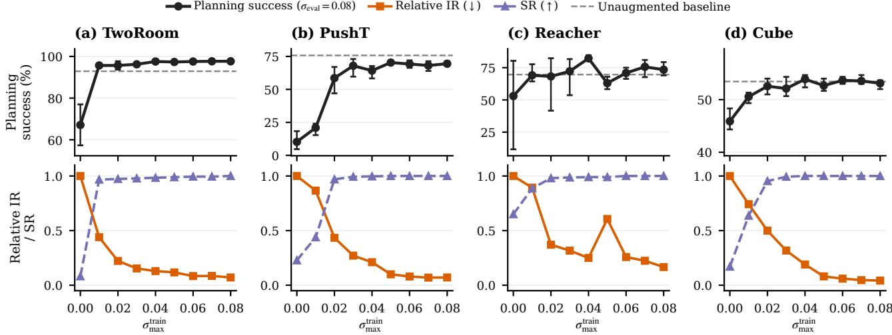
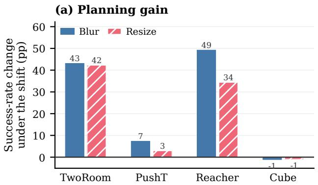
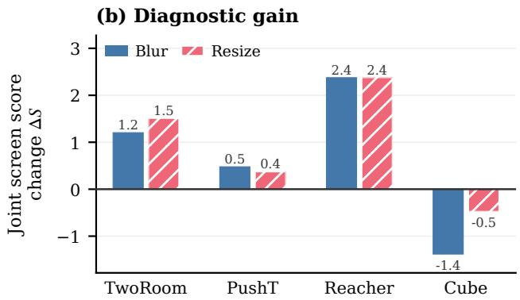
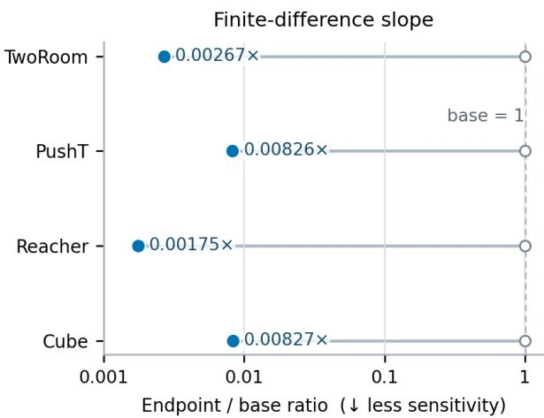
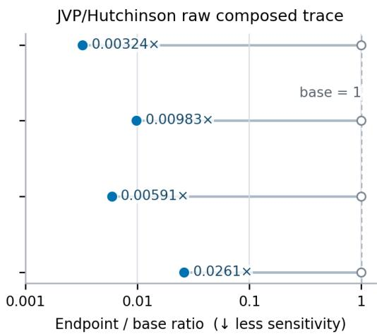

# Diagnosing JEPA World Models with Action-Conditioned Predictive Consistency

Guo An1,∗, Zijing Wu2,∗, Honghua Dong1,∗ Yuhao Yan3, Zixuan Gui4, Haochong Chen4, Shanzhao Ruan5 Xiang Wang2, Yurong Ling6,†, Qi Tian6,1,†

1Huawei 2University of Science and Technology of China 3Zhejiang University 4Tsinghua University 5Harbin Institute of Technology 6Guangdong Laboratory of Artificial Intelligence and Digital Economy (SZ)

## Abstract

Joint-embedding predictive architectures (JEPAs) learn world models that predict in a compact latent space rather than in pixels, reducing the pressure to model nuisance appearance. Yet this provides no guarantee against visual perturbations: they can still alter the encoded representation and afect subsequent action-conditioned predictions. Bisimulation captures this requirement precisely: two observations should be treated as the same state only when their action-conditioned consequences agree. Guided by this criterion, we introduce Action-Conditioned Predictive Consistency (ACPC), a diagnostic that measures how far a clean history and a visually perturbed view of it diverge after being rolled forward under the same action sequence. We prove that this divergence bounds the perturbation-induced change in multi-step prediction error and planner cost. Building on pairwise ACPC, we define two complementary measures: the Invariance Radius (IR) summarizes clean–perturbed rollout spread, while the Separation Rate (SR) checks whether diferent states remain distinguishable after rollout. Experiments on four visual control tasks show that pairwise ACPC predicts perturbation-induced prediction and cost changes. On LeWM, the IR–SR screen transfers across tasks, and the joint diagnostic remains informative under blur and resize. PLDM exhibits similar diagnostic trends under a diferent architecture. Code is available here.

## 1 Introduction

World models support control by predicting the outcomes of candidate actions [1, 2]. Joint-embedding predictive architectures (JEPAs) predict target representations rather than reconstructing pixels, avoiding an explicit requirement to reproduce nuisance visual details [3, 4, 5, 6, 7]. Yet this design alone does not determine which visual diferences matter for control. Such representations should be insensitive to task-irrelevant visual perturbations while preserving distinctions between situations that require diferent actions. This requirement echoes the intuition behind bisimulation, which defines state equivalence through action-conditioned consequences rather than visual appearance [8, 9]. However, encoder distances alone do not show how a perturbation propagates through prediction. Over a multi-step rollout, the predictor may amplify or contract the initial representation diference. Encoder-level and single-transition diagnostics do not directly measure this rollout-level efect. We therefore ask: when a clean history and its perturbed view are rolled forward under the same action sequence, how far apart are their predicted trajectories?

To measure this rollout-level efect, we introduce Action-Conditioned Predictive Consistency (ACPC). ACPC rolls a clean history and its perturbed view forward under the same action sequence and measures the distance between their predicted trajectories. Figure 1 provides a conceptual overview of how this pairwise distance is summarized by IR and complemented by SR. Low ACPC alone, however, does not rule out representational collapse: a constant representation would make every paired rollout identical. We therefore summarize ACPC across histories with the Invariance Radius (IR), where lower values indicate less sensitivity to visual perturbations. The Separation Rate (SR) checks whether diferent states remain distinguishable after rollout, with higher values indicating better separation.

  
Figure 1: Conceptual overview of ACPC, IR, and SR. (a) A logged clean history and a visually perturbed view of it form the paired inputs. (b) A frozen world model encodes both views and rolls them forward for H steps under the same recorded action sequence. ACPC measures the distance between the two predicted trajectories. In the fragile case, perturbation-induced spread grows and overlaps representations of other states (gray); in the robust case, the paired views remain close while other states stay separated. Layouts are schematic: only within-panel proximity is meaningful, and positions enter no reported metric. (c) The Invariance Radius (IR) summarizes perturbation-induced rollout spread across histories, while the Separation Rate (SR) measures how often selected diferent-state rollouts remain separated beyond this spread. A checkpoint passes the diagnostic screen only if IR is low and SR is high; passing is specific to the evaluated visual shift and state labels and does not certify robustness.

We prove that ACPC bounds the perturbation-induced change in multi-step prediction error. When the same candidate action sequences are evaluated from both views, ACPC also yields bounds on changes in their predicted costs (Propositions 1 and 2). These bounds hold for each evaluated pair and require no distributional or smoothness assumptions. Experiments on LeWM [10] show that ACPC is informative about prediction-error change and the extra predicted cost incurred when a visual perturbation causes the cross-entropy method (CEM) [11] to select a diferent plan. Together, IR and SR help identify checkpoints that perform well under visual perturbations across tasks and perturbation types. On PLDM [12], better planning performance under visual perturbation is also generally accompanied by lower IR and higher SR, showing the same qualitative diagnostic pattern under a second world-model architecture.

The contributions are:

1. We introduce Action-Conditioned Predictive Consistency (ACPC), which compares the predicted trajectories of a clean history and its perturbed view under the same action sequence. IR summarizes sensitivity across histories, while SR checks whether diferent states remain distinguishable (Section 3).

2. We prove samplewise bounds on how much a visual perturbation can change multi-step prediction error. When the same candidate action sequences are evaluated from both views, we also bound changes in their predicted costs (Propositions 1 and 2).

3. We evaluate ACPC, IR, and SR across four control tasks and three visual perturbations, and examine their behavior on a second world-model architecture. ACPC provides predictive information about perturbationinduced changes in multi-step prediction error and planning cost, while IR and SR help identify trained models that maintain control performance (Section 4).

## 2 Related Work

World Models. World models predict how an environment evolves under actions and use those predictions for control. DreamerV3 [1] learns from imagined trajectories, while TD-MPC2 [2] plans with learned latent dynamics. Joint-embedding predictive architectures (JEPAs) learn representations by predicting targets in representation space rather than reconstructing pixels [3, 4, 5, 13]. LeWM [10], our primary model family, combines this joint-embedding objective with action-conditioned latent prediction. PLDM [12] provides a diferent joint-embedding dynamics architecture on which we also evaluate ACPC. Earlier work analyzes how joint-embedding predictive objectives can favor slow features [14]. Related training objectives predict future latent observations from histories and actions in PBL [15], or match predicted and target representations under augmentation in SPR [16]. Subsequent work studies collapse in self-predictive learning [17] and the role of action conditioning [18]. Theoretical analyses ask when latent prediction can disregard irrelevant features or favor predictable, high-influence features [6, 7] and when it can recover latent state up to a linear transformation [19]. seq-JEPA [20] further studies invariance and equivariance under known view transformations. These works explain how predictive representations and dynamics are learned; we evaluate how a trained predictor responds when its visual input is perturbed.

Robustness to Visual Perturbations. Training-time augmentation improves visual control in DrQ [21] and DrQ-v2 [22], while SODA [23] uses augmentation in an auxiliary representation-learning objective. ViGMO [24] and VIBR [25] learn invariance in latent or value space. ReOI [26] instead modifies observations at test time to reduce distractor sensitivity in visual model-predictive control. Other methods change world-model training. TPC [27] favors temporally predictable information, and DreamerPro [28] replaces pixel reconstruction with prototype prediction. Task Informed Abstractions [29] and Denoised MDPs [30] use task or reward information to separate useful state from distractors. Iso-Dream [31] separates controllable and noncontrollable dynamics, while other approaches combine temporal masking with bisimulation [32], infer the actions of visually similar distractors [33], or use task-aware reconstruction [34]. These methods reflect a broader principle: robustness should remove irrelevant visual variation without discarding distinctions needed for control. Bisimulation formalizes behavioral similarity through rewards and action-conditioned transitions [8, 9, 35], including a reward-free formulation based only on transitions [36]. Value-equivalent models and value-aware model-learning objectives instead focus on information needed for value prediction or planning [37, 38]. Most closely related, MWM [39] enforces action-conditioned rollout consistency during training. ACPC measures how clean and perturbed latent rollouts diverge in a frozen model under the same action sequence, without retraining it.

Diagnostics for World Models. Model accuracy and control performance do not always move together: one-step likelihood can be a poor guide to downstream performance [40]. This mismatch has motivated methods that connect model learning and evaluation to downstream decisions [41]. World-model evaluation should therefore reflect the intended use of the model, including long rollouts, planning, and policy evaluation [42]. One group of methods tests or enforces whether learned dynamics respect actions. ATM [43] compares action information in encoded and predicted transitions, while Delta-JEPA [44] decodes actions from latent diferences. ACID [45] adds inverse-dynamics cycle consistency to the planning cost. Future-Compatible [46] checks whether generated futures agree with their stated actions, and World Models as Group Actions [47] tests identity, inverse, and composition structure. Related diagnostics expose kinematic failures in long rollouts [48] or use frozen inverse-dynamics probes to test whether latents retain action information under visual corruptions [49]. A second group evaluates downstream failure. WMAttack [50] searches for visual attacks on closed-loop world-model agents, while ARB4WM [51] targets their policy, value, and latent dynamics. Other work compares predicted multi-step latent transitions with those produced by the environment [52], or compares predicted and true plan costs [53]. Finally, CARRL [54] certifies Q-based action choices under bounded observation uncertainty, and CROP [55] certifies per-state actions and finite-horizon reward bounds through smoothing. These certificates cover policy decisions or return, whereas our bounds preserve only the winner or elite set for an evaluated pair and fixed candidate pool. More broadly, existing diagnostics assess action content, rollout validity, model error, or attack sensitivity. ACPC asks how a task-preserving visual perturbation propagates through a shared-action rollout without requiring the true future.

## 3 Action-Conditioned Predictive Consistency as a Diagnostic

A visual perturbation can change the trajectory predicted by a world model. ACPC measures this change by rolling a clean history and its perturbed version forward under the same action sequence and comparing the two trajectories. We first define this pairwise measurement. We then show that it bounds perturbation-induced changes in prediction error and candidate cost, which leads to conditions for preserving a planner’s selected candidate. To summarize ACPC across a checkpoint, IR captures clean–perturbed pairs with high sensitivity, while SR checks that diferent states remain separated and prevents a collapsed representation from appearing robust. Finally, we combine IR and SR into an empirical checkpoint screen.

## 3.1 Pairwise ACPC

Given a clean history and its perturbed version, ACPC compares the rollouts predicted from them under identical actions. Let h denote the clean history and let h˜ be the result of applying the evaluated visual perturbation to h. The frozen encoder maps them to $z = E _ { \theta } ( h )$ and $\tilde { z } = E _ { \theta } ( \tilde { h } )$ . Both representations are then rolled forward under the action sequence $\mathbf { a } = \left( a _ { 0 } , \ldots , a _ { H - 1 } \right)$ . Let $F _ { \theta }$ denote the frozen action-conditioned predictor. After the first k actions, the two predicted representations are

$$
\hat { z } _ { k } = F _ { \theta } ^ { k } ( z , { \bf a } _ { 0 : k - 1 } ) , \qquad \hat { \tilde { z } } _ { k } = F _ { \theta } ^ { k } ( \tilde { z } , { \bf a } _ { 0 : k - 1 } ) .\tag{1}
$$

Here H is the number of autoregressive future steps. ACPC compares predictions in the projected latent space used to evaluate planner costs. Let Π map each predicted representation into this space. To combine all H predicted steps into one trajectory-level distance, we assign nonnegative weights $\alpha _ { k }$ , with $\textstyle \sum _ { k = 1 } ^ { H } \alpha _ { k } = 1$ , and define the weighted rollout vector

$$
\bar { G } _ { \mathbf { a } } ( z ) = \left[ \sqrt { \alpha _ { 1 } } \Pi ( \hat { z } _ { 1 } ) ^ { \top } \quad \cdots \quad \sqrt { \alpha _ { H } } \Pi ( \hat { z } _ { H } ) ^ { \top } \right] ^ { \top } .\tag{2}
$$

Action-Conditioned Predictive Consistency (ACPC) is the distance between the two weighted predicted rollouts:

$$
\mathrm { A C P C } _ { H } ( h , \tilde { h } , \mathbf { a } ) = \left\| \bar { G } _ { \mathbf { a } } ( E _ { \theta } ( h ) ) - \bar { G } _ { \mathbf { a } } ( E _ { \theta } ( \tilde { h } ) ) \right\| _ { 2 } = \left( \sum _ { k = 1 } ^ { H } \alpha _ { k } \left\| \Pi ( \hat { z } _ { k } ) - \Pi ( \hat { z } _ { k } ) \right\| _ { 2 } ^ { 2 } \right) ^ { 1 / 2 } .\tag{3}
$$

Low ACPC means that the two predicted trajectories remain close; high ACPC means that they separate. Encoder shift $\lVert z - \tilde { z } \rVert _ { 2 }$ measures the diference before prediction, whereas ACPC measures it after rollout. Using the same action sequence removes action diferences from the comparison. ACPC measures rollout consistency, not prediction accuracy.

We use uniform weights $\alpha _ { k } = 1 / H$ and $H = 8$ , the longest horizon available for every logged window (Appendix C). The planner analysis uses $H = 5$ to match the CEM planning horizon (Section 4.5).

## 3.2 Prediction-Error Bounds

ACPC itself does not require the observed future. To connect it to prediction error, let $Y _ { \mathbf { a } } ^ { H }$ denote the observed future under the same action sequence, represented in the same weighted space as the predicted rollouts (Equation (2)). Since the perturbed history is created by applying a visual perturbation to the clean history, both predicted rollouts are compared with the same observed future. Their diference in error cannot exceed the distance between the two predictions, which is ACPC.

Proposition 1 (Prediction-error change bound). Define

$$
\begin{array} { r } { e _ { h } = \lVert \bar { G } _ { \mathbf { a } } ( E _ { \theta } ( h ) ) - Y _ { \mathbf { a } } ^ { H } \rVert _ { 2 } , \qquad e _ { \widetilde { h } } = \lVert \bar { G } _ { \mathbf { a } } ( E _ { \theta } ( \widetilde { h } ) ) - Y _ { \mathbf { a } } ^ { H } \rVert _ { 2 } . } \end{array}
$$

Then, for every paired sample,

$$
| e _ { \tilde { h } } - e _ { h } | \leq \mathrm { A C P C } _ { H } ( h , \tilde { h } , \mathbf { a } ) .\tag{4}
$$

In particular, the increase in error caused by the perturbation, $( e _ { \tilde { h } } - e _ { h } ) _ { + }$ , is also bounded by ACPC.

This result follows directly from the reverse triangle inequality; the proof is given in Appendix A. The bound concerns the change in error, not absolute prediction accuracy. Both rollouts can be inaccurate even when ACPC is small. In the experiment, the observed future is used to compute the error change $d = | e _ { \tilde { h } } - e _ { h } |$ , not ACPC itself (Section 4.4).

## 3.3 Selection Stability from Planning-Cost Bounds

A planner ranks candidate action sequences by their predicted costs. Changing the input can change each candidate’s predicted endpoint and therefore its cost. If these cost changes are too small to close the gaps between candidates, the selected candidate remains unchanged. We now formalize this idea.

For each candidate action sequence $\mathbf { a } ^ { j }$ , we roll both inputs forward under that sequence. Let

$$
\begin{array} { r l r l r } { x _ { j } = \Pi \big ( F _ { \theta } ^ { H } \big ( E _ { \theta } ( h ) , \mathbf { a } ^ { j } \big ) \big ) , } & { { } } & { \tilde { x } _ { j } = \Pi \big ( F _ { \theta } ^ { H } \big ( E _ { \theta } ( \tilde { h } ) , \mathbf { a } ^ { j } \big ) \big ) } \end{array}
$$

be the final clean and perturbed predicted representations. Their displacement $r _ { j } = \lVert x _ { j } - \tilde { x } _ { j } \rVert _ { 2 }$ is one component of the candidate-specific ACPC. Whenever $\alpha _ { H } > 0$ ，

$$
r _ { j } \le \frac { \mathrm { A C P C } _ { H } ( h , \tilde { h } , { \bf a } ^ { j } ) } { \sqrt { \alpha _ { H } } } .
$$

Proposition 2 (Planning-cost bounds). Suppose the planner scores candidate j by its squared distance to a fixed goal embedding $g \colon$

$$
C _ { j } = \| x _ { j } - g \| _ { 2 } ^ { 2 } , \qquad \tilde { C } _ { j } = \| \tilde { x } _ { j } - g \| _ { 2 } ^ { 2 } .
$$

Define the candidate-specific cost-change bound

$$
b _ { j } = r _ { j } \big ( \| x _ { j } - g \| _ { 2 } + \| \tilde { x } _ { j } - g \| _ { 2 } \big ) .\tag{5}
$$

Then $| \tilde { C } _ { j } - C _ { j } | \leq b _ { j }$

Let w and w˜ be the winners under the clean and perturbed inputs. If the winner changes, the perturbed winner’s excess cost under the clean prediction satisfies

$$
0 \leq C _ { \tilde { w } } - C _ { w } \leq b _ { \tilde { w } } + b _ { w } .\tag{6}
$$

The bound $b _ { j }$ is computed from the evaluated endpoints and requires no global Lipschitz constant. If the clean winner w leads every competitor $j$ by more than $b _ { w } + b _ { j }$ , the perturbation cannot reverse their order. The same argument preserves the top-k elite set when every clean elite–non-elite gap exceeds the corresponding pair of bounds. Appendix A gives the exact conditions (Proposition 3).

Because $r _ { j }$ is bounded by candidate-specific ACPC, substituting its bound into $b _ { j }$ gives

$$
| \tilde { C } _ { j } - C _ { j } | \le b _ { j } \le \frac { \mathrm { A C P C } _ { H } ( h , \tilde { h } , \mathbf { a } ^ { j } ) } { \sqrt { \alpha _ { H } } } \big ( \| x _ { j } - g \| _ { 2 } + \| \tilde { x } _ { j } - g \| _ { 2 } \big ) ,\tag{7}
$$

Thus, ACPC bounds how much each candidate’s cost can change, while the clean cost gaps determine whether that change can alter the planner’s selection. Checking these bounds requires evaluating every candidate under both inputs. We therefore use them to analyze planner behavior after the runs are complete.

CEM plans in rounds. In each round, it scores a set of candidate action sequences, keeps the best group (the elite set), and uses that group to generate the candidates for the next round [11]. We compare a clean and perturbed run that start from the same proposal and use the same random samples. If the perturbation does not change the elite set in any round, both runs generate the same candidates in the next round and eventually return the same action (Corollary 1). If the elite set changes, the guarantee no longer applies. This result concerns the planner’s model-based choice, not its return in the environment.

## 3.4 Checkpoint-Level IR and SR

Pairwise ACPC measures one clean–perturbed pair under one action sequence. Evaluating a checkpoint requires summarizing this measurement across many histories. The Invariance Radius (IR) measures how sensitive these paired rollouts are to the visual perturbation; lower IR is better. Low IR alone is not enough because a collapsed representation would make every rollout look similar. The Separation Rate (SR) therefore checks whether diferent states remain distinguishable after rollout; higher SR is better. A favorable checkpoint should have both low IR and high SR.

To compute IR, we select n logged history windows as anchors. Anchor i provides a clean history $h _ { i }$ and its recorded action sequence $\mathbf { a } _ { i } = ( a _ { i , 0 } , \ldots , a _ { i , H - 1 } )$ . We apply the visual perturbation M times to obtain $\tilde { h } _ { i } ^ { ( 1 ) } , \dots , \tilde { h } _ { i } ^ { ( M ) }$ , and compute ACPC for each clean–perturbed pair under the same recorded actions.

Raw latent distances can have diferent scales across histories. We therefore divide each ACPC value by the anchor’s typical one-step clean motion, denoted by $s _ { i } .$ . Starting from the final clean history frame, we measure the projected displacement at each of the next H observed transitions and take the median (Equation (23) and appendix C). This expresses ACPC relative to the amount of motion normally seen in that history. With a small numerical stabilizer $\varepsilon _ { \mathrm { n o r m } }$ , define

$$
R _ { i } ^ { ( m ) } = \frac { \mathrm { A C P C } _ { H } ( h _ { i } , \tilde { h } _ { i } ^ { ( m ) } , \mathbf { a } _ { i } ) } { s _ { i } + \varepsilon _ { \mathrm { n o r m } } } , \qquad \bar { R } _ { i } = \frac { 1 } { M } \sum _ { m = 1 } ^ { M } R _ { i } ^ { ( m ) } .\tag{8}
$$

The average $\bar { R } _ { i }$ gives one normalized sensitivity value for each anchor. Let $Q _ { q }$ denote the empirical q-quantile across anchors. The raw IR is

$$
\mathrm { I R } _ { q } ^ { \mathrm { r a w } } ( \theta ) = Q _ { q } \left( \{ \bar { R } _ { i } \} _ { i = 1 } ^ { n } \right) .\tag{9}
$$

IR is one value for the checkpoint. We use $q = 0 . 9 0$ so that IR reflects anchors with relatively high sensitivity, which a mean could hide. The result is stable for q between 0.80 and 0.95 and for the tested rollout horizons (Table 1).

IR checks whether perturbed views remain close to their clean counterparts. SR checks whether this invariance also preserves diferences between states. For each eligible anchor, the protocol selects a nearby logged history with a diferent state-coordinate label. Both histories are rolled forward under the anchor’s recorded actions, so their separation is not caused by diferent action sequences. Their trajectory distance is normalized by the same clean-motion scale used for IR and is denoted by $\bar { D _ { i } ^ { \mathrm { d i f f } } }$ (Equation (24) and appendix C).

Let I be the set of anchors for which such a comparison is available. SR is the fraction whose diferent-state distance exceeds raw IR by a margin δ:

$$
\mathrm { S R } _ { q , \delta } ( \theta ) = \frac { 1 } { | \mathcal { T } | } \sum _ { i \in \mathcal { I } } \mathbf { 1 } \big [ D _ { i } ^ { \mathrm { d i f f } } > \mathrm { I R } _ { q } ^ { \mathrm { r a w } } ( \theta ) + \delta \big ] ,\tag{10}
$$

We use $q = 0 . 9 0$ and $\delta = 0 . 1 0$ . SR therefore reports how often a tested diferent-label pair remains beyond the checkpoint’s perturbation radius plus the fixed margin.

A collapsed representation makes IR small, but it also makes every $D _ { i } ^ { \mathrm { d i f f } }$ zero and therefore fails SR. Conversely, a checkpoint can have high SR while remaining sensitive to visual perturbations, so IR is still needed. Choosing these pairs requires state labels from the dataset. SR therefore applies only to the labels used in the tested pairs. Appendix C gives the exact pairing rules and eligible-pair counts.

## 3.5 Checkpoint Screening

SR uses raw IR because it compares distances within the same checkpoint. To compare a trained checkpoin with its unaugmented reference, we use relative IR. Let $\theta _ { 0 }$ denote the unaugmented checkpoint from the same task, training run, and model family. We define

$$
\mathrm { I R } _ { q } ^ { \mathrm { r e l } } ( \theta ; \theta _ { 0 } ) = \frac { \mathrm { I R } _ { q } ^ { \mathrm { r a w } } ( \theta ) } { \mathrm { I R } _ { q } ^ { \mathrm { r a w } } ( \theta _ { 0 } ) } .\tag{11}
$$

Relative IR equals 1 for the reference checkpoint. Values below 1 indicate lower sensitivity than the reference, while values above 1 indicate higher sensitivity. This comparison is defined within the same task, training run, and model family; it does not make IR directly comparable across them.

A checkpoint passes the screen only when relative IR is below its threshold and SR is above its threshold. We combine these two requirements into one score. Each term measures the checkpoint’s normalized margin from one threshold, and the minimum selects the weaker of the two results.

For model family $\mathcal { F }$ and visual shift υ, let the thresholds be $t _ { \mathrm { I R } }$ and $t _ { \mathrm { S R } }$ . All measurements in a score use the same shift. With a small numerical constant $\varepsilon _ { \mathrm { s c o r e } } ,$ define

$$
S _ { \mathcal { F } , v } ( \theta ; \theta _ { 0 } ) = \operatorname* { m i n } \left\{ \frac { t _ { \mathrm { I R } } - \mathrm { I R } _ { q } ^ { \mathrm { r e l } } ( \theta ; \theta _ { 0 } ) } { \left| t _ { \mathrm { I R } } \right| + \varepsilon _ { \mathrm { s c o r e } } } , \frac { \mathrm { S R } _ { q , \delta } ( \theta ) - t _ { \mathrm { S R } } } { \left| t _ { \mathrm { S R } } \right| + \varepsilon _ { \mathrm { s c o r e } } } \right\} .\tag{12}
$$

The score is nonnegative exactly when both requirements pass. A negative score means that at least one requirement fails.

We choose the two thresholds using planning success on a set of source tasks and apply them unchanged to the remaining tasks. Thresholds are selected separately for each model family. After the thresholds are chosen, planning success is no longer used to score a checkpoint. SR still uses the state labels defined above.

To compare checkpoint $\theta _ { 1 }$ with its reference $\theta _ { 0 } .$ , we report the change in screening score: $\Delta S _ { \mathcal { F } , v } ( \theta _ { 1 } ; \theta _ { 0 } ) =$ $S _ { \mathcal { F } , \upsilon } ( \theta _ { 1 } ; \theta _ { 0 } ) - S _ { \mathcal { F } , \upsilon } ( \theta _ { 0 } ; \theta _ { 0 } )$ . A positive $\Delta S$ means that $\theta _ { 1 }$ receives a better joint IR–SR score than the reference. It does not label either checkpoint as robust.

The experiments evaluate the method at two levels. Pair-level experiments test whether ACPC reflects changes in prediction error and planner selection (Sections 4.4 and 4.5). Checkpoint-level experiments first select an IR–SR screen on some LeWM tasks and test it on the remaining tasks under Gaussian noise. We then ask whether changes in the joint IR–SR score agree with changes in planning success under blur and resize, and whether PLDM shows the same low-IR, high-SR pattern (Sections 4.6 to 4.8). These checkpoint-level findings are empirical; they do not follow from the pairwise bounds.

## 4 Experiments

After describing the evaluation protocol, we evaluate the diagnostic at two levels. At the pair level, we test whether ACPC reflects prediction-error change and the cost of a CEM plan change. At the checkpoint level, we examine how IR and SR vary across LeWM recovery and whether a screen selected on some tasks identifies recovery on the remaining tasks under Gaussian noise. We then compare diagnostic and performance changes under blur and resize and test whether the same low-IR, high-SR pattern appears on PLDM. We begin with a local-geometry case study to visualize the representation pattern behind these measurements.

## 4.1 Evaluation Protocol

Models, Tasks, and Evaluation. Most experiments use LeWM [10]. We also evaluate PLDM [12] to test the diagnostic on a second world-model architecture. We use four control tasks: TwoRoom navigation, PushT planar manipulation, Reacher arm control, and OGBench-Cube (Cube) 3D manipulation. For planning evaluation, CEM uses the frozen world model to optimize five-step action sequences. We report the planning success rate, defined as the percentage of episodes that reach the task goal.

We use visual perturbation for one transformed history and visual shift for the distribution of such transformations. The main experiments add Gaussian noise with $\sigma = 0 . 0 8$ to the history observations while keeping the goal image clean. Additional experiments use Gaussian blur $( k = 1 5 )$ and resize (scale 0.25).

For each task and model family, the Gaussian-noise sweep contains nine training conditions: one without noise augmentation and eight with full-sequence Gaussian-noise augmentation at $\sigma _ { \operatorname* { m a x } } \in \{ 0 . 0 1 , \dots , 0 . 0 8 \}$ . Both LeWM and PLDM have three independent training runs for each task–condition pair (seeds 3072/3073/3074). Each trained checkpoint is evaluated with seeds $4 2 / 4 3 / 4 4$ , using 100 episodes per evaluation seed. We use task–run cell for one task and one training run.

The training run is the unit of replication. The three evaluation seeds measure only within-run variability, so the reported means and dispersions across runs are descriptive rather than population estimates.

Diagnostic Protocol. IR uses 100 logged anchors, five Gaussian-noise draws at the evaluation severity σ = 0.08 (blur and resize diagnostics instead apply the corresponding shift), eight predicted steps, uniform horizon weights, within-anchor draw averaging, and a q90 summary across anchors. To compute SR, the protocol selects, for each anchor, a nearby history with a diferent endpoint-state label and checks whether the two rollouts remain farther apart than raw IR plus 0.10. Appendix C gives the exact pairing, normalization, and threshold rules. Checkpoint comparisons use relative IR from Equation (11).

Threshold Protocol. A checkpoint in the LeWM Gaussian-noise training sweep meets the success-rate criterion if it recovers at least 80% of the improvement from the unaugmented checkpoint to the best checkpoint at evaluation noise $\sigma = 0 . 0 8$ , while losing no more than five percentage points on clean observations. Both constants were fixed a priori. We select (tIR, tSR) on every nonempty proper subset of the four tasks and apply the thresholds unchanged to the remaining tasks. The one-, two-, and three-task selection settings produce 4 + 6 + 4 = 14 directional threshold-selection/test partitions. Metrics first average training runs within each test task and then weight tasks equally; checkpoint rows are never treated as independent replicates. Success rates are used to select and evaluate thresholds, but they are not inputs to ACPC, IR, or SR.

  
Figure 2: Descriptive local-geometry case study motivating the controlled ACPC comparison. Panels (a)–(d) compare a matched pair of PushT checkpoints—the left two unaugmented, the right two trained with Gaussian-noise augmentation at $\sigma _ { \mathrm { m a x } } = 0 . 0 8$ at the encoder output and after eight autoregressive rollout steps. Each color denotes one of 16 highlighted histories: the large black-rimmed marker is its clean anchor, smaller same-color markers are its 18 perturbed views, and the faint ellipse is their 90% t-SNE envelope; gray points show all other histories and views. Under strong contraction, smaller markers and ellipses can lie beneath the clean marker. Each panel’s upper-left summary reports, across all 128 anchors, the median r/NN and the percentages with r < NN and with fully disjoint high-dimensional enclosing balls. The t-SNE coordinates and ellipses are qualitative and enter none of these metrics.

For blur and resize, each task uses the thresholds selected under Gaussian noise on the other three tasks. We compare 24 checkpoint pairs (four tasks × three runs × two shifts). Each pair contains the unaugmented checkpoint and the checkpoint trained at $\sigma _ { \mathrm { m a x } } = 0 . 0 8$ . A pair is positive when success under the shift improves by at least five percentage points and clean success decreases by no more than five points. We make no blur- or resize-specific adjustment. This comparison tests whether the within-family IR–SR ordering remains aligned with relative checkpoint performance under new visual shifts.

## 4.2 Local Geometry of Perturbed Views

We begin with a PushT case study showing how visual noise can make perturbed views of one history overlap with other histories. The ratio r/NN compares the spread of a history’s perturbed views with its distance to the nearest other clean history. The disjoint-ball fraction measures how often neighboring perturbation clouds remain separate. These measurements provide only a local geometric picture. Neighbors are selected in the learned space, and each clean history is rolled forward under its own recorded actions. Representation collapse can also make every radius small. The measurements motivate the controlled ACPC comparison but do not replace it.

Using a fixed PushT case study, we compare a matched pair of LeWM checkpoints: one unaugmented and one trained with full-sequence Gaussian-noise augmentation at $\sigma _ { \mathrm { m a x } } = 0 . 0 8$ . We inspect both the encoder output and the representation after eight autoregressive rollout steps. All ratios and fractions use the original 192-dimensional projected latent space in which the planner computes costs; formal definitions and sampling details are in Appendix B. The t-SNE visualization [56] is qualitative only.

Figure 2 summarizes the case study. Without augmentation, the median r/NN is 1.41 at the encoder and 1.86 after eight rollout steps, and none of the 128 anchor clouds is fully disjoint. After Gaussian-noise augmentation, the corresponding ratios fall to 0.10 and 0.19; the fully disjoint fractions rise to 95.3% at the encoder and 84.4% after the rollout. Thus, in this fixed case study, augmentation makes perturbed views of the same history substantially more compact relative to nearby clean histories. Much of this separation remains after prediction.

This case study shows that augmentation can contract perturbation-induced variation relative to nearby clean histories, including after prediction. It does not establish task-relevant separation or planning robustness. We therefore turn to checkpoint-level IR and SR and their relationship with planning performance across the complete augmentation sweep (Figure 3).

  
Figure 3: Checkpoint-level planning performance and diagnostics across the complete Gaussian-noise training sweep. We report planning success rate at evaluation noise $\sigma = 0 . 0 8$ , relative IR, and SR. Points are across-run means; success-rate error bars span the three training runs, and success-rate axes are scaled per task. The dashed line is the clean success rate of the unaugmented checkpoint; the leftmost black point is that checkpoint evaluated at $\sigma = 0 . 0 8$ . Relative IR equals one there by construction. Lower IR and higher SR are favorable. Dotted lines mark $t _ { \mathrm { I R } } = 0 . 3$ and $t _ { \mathrm { S R } } = 0 . 9 5$ (Section 4.6).

## 4.3 IR and SR across Checkpoint Recovery

At evaluation noise $\sigma = 0 . 0 8 .$ , the unaugmented LeWM checkpoints lose $2 5 . 9 \pm 2 . 4 , 7 4 . 6 \pm 5 . 6 , 4 1 . 0 \pm 1 . 4$ , and $2 2 . 1 \pm 2 . 8$ percentage points in success rate on TwoRoom, PushT, Reacher, and Cube, respectively. Gaussian-noise augmentation recovers performance over a range of training levels whose location difers by task. Figure 3 compares success rate with IR and SR across the complete sweep.

On Reacher, augmentation also raises clean success from 59.2% to 76–82%. Its recovery under noisy evaluation therefore cannot be attributed to robustness alone; the checkpoints also improve on clean observations.

Every augmentation level that meets the success-rate criterion has lower IR and higher SR than its unaugmented reference, although neither measure is monotone at every level. Across the 108 LeWM checkpoint rows, 77 pass the reported IR threshold $t _ { \mathrm { I R } } = 0 . 3$ , and all 77 also pass $t _ { \mathrm { S R } } = 0 . 9 5$ . Thus every accepted checkpoint combines reduced same-history sensitivity with retention of the evaluated state-coordinate distinctions. The diferent-label distance medians are largely stable across augmentation levels, so the rise in SR mainly reflects contraction of the same-history radius rather than expansion of diferent-label distances.

Evaluating SR under representation collapse. To test whether SR detects a loss of state separation, we train LeWM on TwoRoom with four SIGReg weights, keeping all other settings fixed. Without SIGReg, the representation collapses: the median latent distance shrinks from 17.2–18.7 to 0.006, and clean success falls from 96.3–99.3% to 33.3%. Although this model has the lowest raw IR (0.048), its SR falls to 0.066, compared with 0.967–0.984 for nonzero SIGReg. Thus, SR exposes a loss of state separation that raw IR does not capture (Table 3).

IR tracks the recovery region, while SR verifies that the sampled state-coordinate distinctions remain outside the contracted radius. A local sensitivity analysis suggests that checkpoints with lower IR amplify input perturbations less through the encoder and rollout $\left( \mathrm { A p p e n d i x } \mathrm { G } \right)$ . The next two experiments test whether ACPC depends on the recorded actions and whether it reflects the cost of a CEM plan change (Sections 4.4 and 4.5).

## 4.4 ACPC and Prediction-Error Change

Does ACPC help predict how much a visual perturbation changes multi-step prediction error? For each history pair, Proposition 1 shows that the two errors against the same logged future can difer by at most $\operatorname { A C P C } _ { H }$ . We test whether measured ACPC is informative about this bounded quantity, the error drift $d = | e _ { \tilde { h } } - e _ { h } |$ . We evaluate at the protocol horizon $H = 8 .$ , the longest horizon with a complete logged common future for every anchor; Table 1 shows that the checkpoint-level conclusions are stable for $H \in \{ 1 , 2 , 4 , 8 \}$

  
Figure 4: Cross-validated MAE for predicting the error drift d on the unaugmented checkpoints; lower is better. Each model is evaluated on trajectory groups excluded from fitting. Small points are training runs, thin lines join the same run, and diamonds are task means. The in-figure legend labels correspond to Base, Base+Control8, and $_ { \mathrm { B a s e + A C P C _ { 8 } } }$ as defined in Section 4.4. $_ { \mathrm { B a s e + A C P C _ { 8 } } }$ is lowest in all 12 task–run cells; latent-error scales are task-specific, so compare within a panel.

Data and protocol. The analysis uses the unaugmented checkpoint of each task and training run. Trajectories are partitioned into 16 disjoint groups. Each history pair contributes rows at Gaussian-noise standard deviations $\sigma \in \{ 0 . 0 2 , 0 . 0 5 , 0 . 0 8 \}$ with two perturbation draws; zero-severity probes serve only as identity checks. A ridge model is fitted on 15 groups and evaluated on the remaining group, rotating through all 16, and all rows from one trajectory group stay together. We report the mean absolute error (MAE) on groups excluded from model fitting.

Three nested regressions. Every model contains the probe severity and the encoder-history distance $\lVert z - \tilde { z } \rVert _ { 2 }$

• Base adds one-step ACPC under the recorded action: the information available without a multi-step rollout.

• Base+Control8 adds the strongest destroyed-action control: eight-step ACPC recomputed with zeroed actions (every action set to zero), swapped actions (the recorded actions of a diferent trajectory), or shufled actions (the anchor’s own actions in permuted temporal order). Each control performs the same eight-step rollout, so it carries rollout length without the recorded action sequence. For each task–run cell, we report the control with the lowest test MAE among the three, making this a conservative comparison.

$\mathbf { B a s e + A C P C } _ { 8 }$ instead adds eight-step ACPC under the recorded actions—the same actions associated with the observed future, and hence the feature matching the right-hand side of Proposition 1.

All eight-step features use uniform weights $\alpha _ { k } = 1 / 8$ in Equation (3). If Base+ $\mathrm { . A C P C _ { 8 } }$ improves on Base, multi-step information helps; if it also improves on Base+Control , the gain is attributable to the recorded actions rather than to merely rolling out eight steps.

Results. Base $\mathrm { + A C P C _ { 8 } }$ attains the lowest cross-validated MAE in all 12 task–run cells (Figure 4). For each training run we average the four task-level relative MAE reductions equally and report the mean ± sample standard deviation across the three training runs: the reduction is $5 5 . 9 \pm 4 . 7 \%$ relative to Base and $5 1 . 3 \pm 3 . 5 \%$ relative to Base+Control . These results concern prediction of the error drift; they do not compare absolute prediction accuracy across rollout horizons. Appendix D reports the task-level values and selected controls (Tables 5 and 6). Eight-step ACPC carries information about the bounded error change that neither encoder shift, one-step $\mathrm { A C P C , }$ nor any same-horizon destroyed-action control provides.

## 4.5 ACPC and the Cost of CEM Plan Changes

A visual perturbation may cause CEM to select a diferent plan. We ask whether ACPC reflects how costly that change appears to the clean model. Let a and a˜ be the final plans selected from the clean and perturbed histories, respectively. We measure $( C _ { h } ( \tilde { \mathbf { a } } ) - C _ { h } ( \mathbf { a } ) ) _ { + }$ : the extra clean-history model cost incurred by selecting the perturbed-history plan. We refer to this single-decision quantity as CEM selection regret. It uses the model’s squared latent goal cost; it is neither cumulative regret nor simulator return.

  
Figure 5: Adding planner-horizon ACPC improves prediction of the extra model cost associated with changes in the plan selected by adaptive CEM. Each colored line connects the baseline and expanded-model errors for one test task excluded from regression fitting in one training run; the thick black line is the equal-task average across the three runs. The added feature is the 90th percentile of candidate-specific ACPC at the planner’s five-step prediction horizon. The baseline already contains severity, training condition, the corresponding one-step ACPC percentile, and the clean best–second-best cost gap. MAE is computed on log(1 + selection regret).

The fixed-pool bound motivates this comparison. However, adaptive CEM can generate diferent later pools once the two elite sets diverge. We therefore evaluate full paired CEM runs rather than treating the fixed-pool condition as a run-level certificate. The paired CEM branches follow Appendix H: same initial proposal, common random numbers, each branch updating from its own elites. For each candidate pool, we compute one- and five-step ACPC for every action sequence and use the 90th percentile as the pool summary. The five-step value matches the planner’s prediction horizon. We compare two ridge regressions. The baseline uses perturbation severity, training condition, candidate-level one-step ACPC q90, and the clean gap between the best and second-best candidates. The expanded model adds candidate-level five-step ACPC q90. Within each training run, both regressions are fitted on three tasks and tested on the remaining task, rotating which task is excluded from fitting. We evaluate MAE on log(1 + selection regret); Appendix H gives the CEM budget and sample counts.

Adding planner-horizon ACPC lowers cross-task test MAE by 15.2±2.0% (mean ± sample standard deviation across training runs). The error decreases in all 12 task–run test cases (Figure 5). Since the two regressions difer only by the planner-horizon feature, this gain shows that candidate-specific ACPC at CEM’s five-step horizon carries additional cross-task predictive information beyond one-step ACPC and the clean cost gap. The prediction-error experiment separately shows that recorded actions add information beyond same-horizon controls (Section 4.4). Candidate-specific ACPC therefore helps predict the clean-model cost of a perturbation-induced CEM selection change across tasks. The experiment does not test whether using ACPC during planning improves task success.

## 4.6 Checkpoint Screening across Tasks

We test whether thresholds chosen on some tasks identify checkpoint recovery on the remaining tasks. Because the training sweep is discrete and planning success is estimated from a finite number of episodes, we do not attempt to estimate an exact decision boundary. A decision is correct when it matches the success-rate criterion of Section 4.1. We also count the grid steps between the first accepted checkpoint and the first checkpoint that meets that criterion.

Across the 14 source/test splits, 13 choose $( t _ { \mathrm { I R } } , t _ { \mathrm { S R } } ) = ( 0 . 3 , 0 . 9 5 ) $ ; only the Reacher-only split chooses (0.1, 0.95). With two or three source tasks, the first accepted checkpoint is within 0.5 grid steps of recovery on average and never difers by more than one step (balanced accuracy 0.900, precision/recall 0.913/0.953).

Single-source selection is less reliable: balanced accuracy averages 0.855 and ranges from 0.723 to 0.913. Reacher alone chooses the tighter IR threshold and delays acceptance on the other tasks by as many as five levels (Appendix E).

The predominant rule accepts a checkpoint only when relative IR is at most 0.3 and SR is at least 0.95. IR limits same-history sensitivity, while SR requires the tested state-coordinate distinctions to remain separated. Across the sweep, both measures improve over augmentation levels associated with recovery (Figure 3). Because $t _ { \mathrm { I R } } = 0 . 3$ is the largest tested value, the upper edge of the useful range remains unresolved.

## 4.7 Diagnostic Behavior on PLDM

We apply the same ACPC, IR, and SR definitions to PLDM, which uses a diferent architecture and training recipe. The experiment repeats the nine-checkpoint Gaussian-noise training sweep, paired histories, and eight-step rollouts.

Planning success (σeval = 0.08) Relative IR ( ↓ ) SR ( ↑ ) Unaugmented baseline

  
Figure 6: PLDM Gaussian-noise training sweep over three independent training runs. Curves show run means, and success-rate error bars span the run range. The dashed gray line marks clean success of the unaugmented checkpoint, and the leftmost black point is its success at evaluation noise $\sigma = 0 . 0 8$ . Relative IR equals one at that checkpoint. Across tasks, stronger augmentation generally lowers relative IR and raises SR, while planning success under evaluation noise also generally improves from the unaugmented checkpoint.

Across all four PLDM tasks, the augmented checkpoints generally have lower relative IR and higher SR than the unaugmented checkpoint. Planning success under evaluation noise also generally improves from the unaugmented checkpoint. These results reproduce the qualitative low-IR, high-SR pattern under a second world-model architecture.

## 4.8 Checkpoint Comparison under Blur and Resize

To test whether the diagnostics remain informative beyond Gaussian noise, we evaluate one blur severity $( k = 1 5 )$ and one resize severity (scale 0.25). For each task, training run, and visual shift, we compare the unaugmented checkpoint with the checkpoint trained at $\sigma _ { \mathrm { m a x } } = 0 . 0 8 .$ , giving $4 \times 3 \times 2 = 2 4$ pairs. We recompute IR and SR under the evaluated shift and use $\Delta S$ to compare the joint diagnostic scores of the two checkpoints. A positive $\Delta S$ favors the augmented checkpoint. The thresholds selected under Gaussian noise remain fixed, so this experiment evaluates relative checkpoint ordering rather than an absolute pass decision.

In 22 of the 24 comparisons, the sign of ∆S agrees with whether the augmented checkpoint meets the prespecified success criterion (balanced accuracy 0.889). Across all pairs, larger $\Delta S$ is associated with larger gains in planning success (Spearman $\rho = 0 . 8 3 5 )$ . In the remaining two cases, both $\Delta S$ and planning success improve, but the four-point success gain falls just below the five-point criterion. We therefore treat them as boundary cases rather than opposing diagnostic and behavioral trends.

  
Figure 7: Relative checkpoint comparison under blur and resize. Bars average the three training runs for each task and shift; per-pair values are in Table 9. Panel (a) shows the change in planning success from the unaugmented to the $\sigma _ { \mathrm { m a x } } = 0 . 0 8$ checkpoint. Panel (b) shows the change in the IR–SR score of Equation (12); positive favors the augmented checkpoint but is not an absolute pass decision.

## 5 Discussion and limitations

What is supported. For individual clean–perturbed pairs, multi-step ACPC captures changes in prediction error more accurately than encoder distance, one-step ACPC, or controls that remove the recorded action sequence. At the planning horizon, ACPC also helps predict the extra model cost incurred when a perturbation changes the plan selected by CEM, beyond one-step ACPC or the clean CEM margin. Together, these results support the central claim behind our analysis: rolling paired observations forward under the same action sequence reveals downstream efects that encoder-only and one-step comparisons can miss.

Across checkpoints, planning success under Gaussian noise generally improves as relative IR decreases and SR increases. Thresholds chosen using a subset of tasks also identify recovery on tasks that were not used to choose them. Under blur and resize, larger increases in the joint IR–SR score generally correspond to larger gains in planning success. The fixed five-point criterion produces only two boundary cases, each with a four-point success gain.

Why IR and SR are used together. IR can be low even when the representation collapses, because collapse brings all predicted states closer together. SR prevents such a model from being judged favorably by checking that states with diferent labels remain distinguishable after rollout. SR alone is also insuficient because it does not measure whether clean and perturbed observations remain close. IR therefore measures sensitivity to visual perturbations, while SR measures whether relevant state distinctions are preserved. The two measures should be considered together.

Scope and limitations. ACPC diagnoses how visual perturbations afect predicted rollouts and planning costs; it does not modify CEM. Our planner experiment therefore measures whether ACPC reflects the extra predicted cost of a perturbation-induced plan change, rather than whether ACPC-guided planning improves task success. The adaptive-CEM guarantee applies only while its bound verifies that both runs select the same elite candidates. The full IR–SR screen requires an unaugmented reference checkpoint. Unlike pairwise ACPC, it also uses observed future frames to normalize IR and dataset state labels to construct SR pairs. Our checkpoint experiments cover Gaussian-noise augmentation and one severity each of blur and resize. The chosen IR threshold is also at the edge of the tested range, so larger values remain to be evaluated.

Future work. Future work can test whether using ACPC during planning improves task success. Broader evaluation should include multiple perturbation severities, more varied state pairs, additional robustness-training methods, and other JEPA world models.

## 6 Conclusion

ACPC measures how much a clean observation and its visually perturbed counterpart diverge after both are rolled forward under the same action sequence. We show that this divergence bounds changes in multi-step prediction error and predicted planning costs. IR summarizes perturbation sensitivity across a checkpoint, while SR checks whether diferent states remain distinguishable after rollout. Experiments show that multi-step ACPC captures changes in prediction error and the extra predicted cost of CEM plan changes that encoder-only and one-step comparisons miss. Across checkpoints, lower IR and higher SR generally align with better planning performance under visual perturbations, and thresholds selected on some tasks identify recovery on the remaining tasks. PLDM shows the same qualitative low-IR, high-SR pattern, while the blur and resize results extend the evidence beyond Gaussian noise.

## References

[1] Danijar Hafner, Jurgis Pasukonis, Jimmy Ba, and Timothy Lillicrap. Mastering diverse control tasks through world models. Nature, 640(8059):647–653, 2025.

[2] Nicklas Hansen, Hao Su, and Xiaolong Wang. TD-MPC2: Scalable, robust world models for continuous control. In Proceedings of the International Conference on Learning Representations (ICLR), 2024.

[3] Yann LeCun. A path towards autonomous machine intelligence. OpenReview preprint, 2022. Version 0.9.2.

[4] Mahmoud Assran, Quentin Duval, Ishan Misra, Piotr Bojanowski, Pascal Vincent, Michael Rabbat, Yann LeCun, and Nicolas Ballas. Self-supervised learning from images with a joint-embedding predictive architecture. In Proceedings of the IEEE/CVF Conference on Computer Vision and Pattern Recognition (CVPR), pages 15619–15629, 2023.

[5] Adrien Bardes, Quentin Garrido, Jean Ponce, Xinlei Chen, Michael Rabbat, Yann LeCun, Mido Assran, and Nicolas Ballas. Revisiting feature prediction for learning visual representations from video. Transactions on Machine Learning Research, 2024.

[6] Hugues Van Assel, Mark Ibrahim, Tommaso Biancalani, Aviv Regev, and Randall Balestriero. Jointembedding vs reconstruction: Provable benefits of latent space prediction for self-supervised learning. In Advances in Neural Information Processing Systems (NeurIPS), volume 38, pages 21897–21937, 2025.

[7] Etai Littwin, Omid Saremi, Madhu Advani, Vimal Thilak, Preetum Nakkiran, Chen Huang, and Joshua Susskind. How JEPA avoids noisy features: The implicit bias of deep linear self distillation networks. In Advances in Neural Information Processing Systems (NeurIPS), volume 37, pages 91300–91336, 2024.

[8] Carles Gelada, Saurabh Kumar, Jacob Buckman, Ofir Nachum, and Marc G. Bellemare. DeepMDP: Learning continuous latent space models for representation learning. In Proceedings of the 36th International Conference on Machine Learning, volume 97 of Proceedings of Machine Learning Research, pages 2170–2179. PMLR, 2019.

[9] Amy Zhang, Rowan T. McAllister, Roberto Calandra, Yarin Gal, and Sergey Levine. Learning invariant representations for reinforcement learning without reconstruction. In Proceedings of the International Conference on Learning Representations (ICLR), 2021.

[10] Lucas Maes, Quentin Le Lidec, Damien Scieur, Yann LeCun, and Randall Balestriero. LeWorldModel: Stable end-to-end joint-embedding predictive architecture from pixels. arXiv preprint arXiv:2603.19312, 2026.

[11] Dirk P. Kroese, Sergey Porotsky, and Reuven Y. Rubinstein. The cross-entropy method for continuous multi-extremal optimization. Methodology and Computing in Applied Probability, 8(3):383–407, 2006.

[12] Uladzislau Sobal, Wancong Zhang, Kyunghyun Cho, Randall Balestriero, Tim G. J. Rudner, and Yann LeCun. Learning from reward-free ofline data: A case for planning with latent dynamics models. In Advances in Neural Information Processing Systems (NeurIPS), volume 38, pages 43905–43941, 2025.

[13] Mido Assran, Adrien Bardes, David Fan, Quentin Garrido, Russell Howes, Mojtaba Komeili, Matthew Muckley, Ammar Rizvi, Claire Roberts, Koustuv Sinha, Artem Zholus, Sergio Arnaud, Abha Gejji, Ada Martin, Francois Robert Hogan, Daniel Dugas, Piotr Bojanowski, Vasil Khalidov, Patrick Labatut, Francisco Massa, Marc Szafraniec, Kapil Krishnakumar, Yong Li, Xiaodong Ma, Sarath Chandar, Franziska Meier, Yann LeCun, Michael Rabbat, and Nicolas Ballas. V-JEPA 2: Self-supervised video models enable understanding, prediction and planning. arXiv preprint arXiv:2506.09985, 2025.

[14] Vlad Sobal, Jyothir S V, Siddhartha Jalagam, Nicolas Carion, Kyunghyun Cho, and Yann LeCun. Joint embedding predictive architectures focus on slow features. arXiv preprint arXiv:2211.10831, 2022. Self-Supervised Learning: Theory and Practice Workshop at NeurIPS 2022.

[15] Zhaohan Daniel Guo, Bernardo Avila Pires, Bilal Piot, Jean-Bastien Grill, Florent Altché, Rémi Munos, and Mohammad Gheshlaghi Azar. Bootstrap latent-predictive representations for multitask reinforcement learning. In Proceedings of the 37th International Conference on Machine Learning, volume 119 of Proceedings of Machine Learning Research, pages 3875–3886. PMLR, 2020.

[16] Max Schwarzer, Ankesh Anand, Rishab Goel, R. Devon Hjelm, Aaron Courville, and Philip Bachman. Data-eficient reinforcement learning with self-predictive representations. In Proceedings of the International Conference on Learning Representations (ICLR), 2021.

[17] Yunhao Tang, Zhaohan Daniel Guo, Pierre Harvey Richemond, Bernardo Avila Pires, Yash Chandak, Rémi Munos, Mark Rowland, Mohammad Gheshlaghi Azar, Charline Le Lan, Clare Lyle, András György, Shantanu Thakoor, Will Dabney, Bilal Piot, Daniele Calandriello, and Michal Valko. Understanding self-predictive learning for reinforcement learning. In Proceedings of the 40th International Conference on Machine Learning, volume 202 of Proceedings of Machine Learning Research, pages 33632–33656. PMLR, 2023.

[18] Khimya Khetarpal, Zhaohan Daniel Guo, Bernardo Avila Pires, Yunhao Tang, Clare Lyle, Mark Rowland, Nicolas Heess, Diana L. Borsa, Arthur Guez, and Will Dabney. A unifying framework for action-conditional self-predictive reinforcement learning. In Proceedings of the 28th International Conference on Artificial Intelligence and Statistics, volume 258 of Proceedings of Machine Learning Research, pages 181–189. PMLR, 2025.

[19] David Klindt, Yann LeCun, and Randall Balestriero. When does LeJEPA learn a world model? arXiv preprint arXiv:2605.26379, 2026.

[20] Hafez Ghaemi, Eilif B. Muller, and Shahab Bakhtiari. seq-JEPA: Autoregressive predictive learning of invariant-equivariant world models. In Advances in Neural Information Processing Systems (NeurIPS), volume 38, pages 32943–32973, 2025.

[21] Denis Yarats, Ilya Kostrikov, and Rob Fergus. Image augmentation is all you need: Regularizing deep reinforcement learning from pixels. In Proceedings of the International Conference on Learning Representations (ICLR), 2021.

[22] Denis Yarats, Rob Fergus, Alessandro Lazaric, and Lerrel Pinto. Mastering visual continuous control: Improved data-augmented reinforcement learning. In Proceedings of the International Conference on Learning Representations (ICLR), 2022.

[23] Nicklas Hansen and Xiaolong Wang. Generalization in reinforcement learning by soft data augmentation. In Proceedings of the IEEE International Conference on Robotics and Automation (ICRA), pages 13611–13617, 2021.

[24] Mingyu Park, Samyeul Noh, Hyun Myung, and Donghwan Lee. Zero-shot visual generalization in model-based reinforcement learning via latent consistency. OpenReview (ICLR 2026 submission), 2025.

[25] Tom Dupuis, Jaonary Rabarisoa, Quoc-Cuong Pham, and David Filliat. VIBR: Learning view-invariant value functions for robust visual control. In Proceedings of The 2nd Conference on Lifelong Learning Agents, volume 232 of Proceedings of Machine Learning Research, pages 658–682. PMLR, 2023.

[26] Yuxin Chen, Jianglan Wei, Chenfeng Xu, Boyi Li, Masayoshi Tomizuka, Andrea Bajcsy, and Ran Tian. Reimagination with test-time observation interventions: Distractor-robust world model predictions for visual model predictive control. In Proceedings of the IEEE International Conference on Robotics and Automation (ICRA), 2026.

[27] Tung D. Nguyen, Rui Shu, Tuan Pham, Hung Bui, and Stefano Ermon. Temporal predictive coding for model-based planning in latent space. In Proceedings of the 38th International Conference on Machine Learning, volume 139 of Proceedings of Machine Learning Research, pages 8130–8139. PMLR, 2021.

[28] Fei Deng, Ingook Jang, and Sungjin Ahn. DreamerPro: Reconstruction-free model-based reinforcement learning with prototypical representations. In Proceedings of the 39th International Conference on Machine Learning, volume 162 of Proceedings of Machine Learning Research, pages 4956–4975. PMLR, 2022.

[29] Xiang Fu, Ge Yang, Pulkit Agrawal, and Tommi Jaakkola. Learning task informed abstractions. In Proceedings of the 38th International Conference on Machine Learning, volume 139 of Proceedings of Machine Learning Research, pages 3480–3491. PMLR, 2021.

[30] Tongzhou Wang, Simon S. Du, Antonio Torralba, Phillip Isola, Amy Zhang, and Yuandong Tian. Denoised MDPs: Learning world models better than the world itself. In Proceedings of the 39th International Conference on Machine Learning, volume 162 of Proceedings of Machine Learning Research, pages 22591– 22612. PMLR, 2022.

[31] Minting Pan, Xiangming Zhu, Yunbo Wang, and Xiaokang Yang. Iso-Dream: Isolating and leveraging noncontrollable visual dynamics in world models. In Advances in Neural Information Processing Systems (NeurIPS), volume 35, pages 23178–23191, 2022.

[32] Ruixiang Sun, Hongyu Zang, Xin Li, and Riashat Islam. Learning latent dynamic robust representations for world models. In Proceedings of the 41st International Conference on Machine Learning, volume 235 of Proceedings of Machine Learning Research, pages 47234–47260. PMLR, 2024.

[33] Yucen Wang, Shenghua Wan, Le Gan, Shuai Feng, and De-Chuan Zhan. AD3: Implicit action is the key for world models to distinguish the diverse visual distractors. In Proceedings of the 41st International Conference on Machine Learning, volume 235 of Proceedings of Machine Learning Research, pages 51546–51568. PMLR, 2024.

[34] Miles Hutson, Isaac Kauvar, and Nick Haber. Policy-shaped prediction: Avoiding distractions in model-based reinforcement learning. In Advances in Neural Information Processing Systems (NeurIPS), volume 37, pages 13124–13148, 2024.

[35] Yutaka Shimizu and Masayoshi Tomizuka. Bisimulation metric for model predictive control. In Proceedings of the International Conference on Learning Representations (ICLR), 2025.

[36] Leonardo F. Toso, Davit Shadunts, Yunyang Lu, Nihal Sharma, Donglin Zhan, Nam H. Nguyen, and James Anderson. Learning invariant visual representations for planning with joint-embedding predictive world models. arXiv preprint arXiv:2602.18639, 2026.

[37] Christopher Grimm, André Barreto, Satinder P. Singh, and David Silver. The value equivalence principle for model-based reinforcement learning. In Advances in Neural Information Processing Systems (NeurIPS), volume 33, pages 5541–5552, 2020.

[38] Claas A. Voelcker, Anastasiia Pedan, Arash Ahmadian, Romina Abachi, Igor Gilitschenski, and Amir-Massoud Farahmand. Calibrated value-aware model learning with probabilistic environment models. In Proceedings of the 42nd International Conference on Machine Learning, volume 267 of Proceedings of Machine Learning Research, pages 61745–61768. PMLR, 2025.

[39] Han Yan, Zishang Xiang, Zeyu Zhang, and Hao Tang. MWM: Mobile world models for action-conditioned consistent prediction. arXiv preprint arXiv:2603.07799, 2026.

[40] Nathan Lambert, Brandon Amos, Omry Yadan, and Roberto Calandra. Objective mismatch in model-based reinforcement learning. In Proceedings of the 2nd Conference on Learning for Dynamics and Control, volume 120 of Proceedings of Machine Learning Research, pages 761–770. PMLR, 2020.

[41] Ran Wei, Nathan Lambert, Anthony D. McDonald, Alfredo Garcia, and Roberto Calandra. A unified view on solving objective mismatch in model-based reinforcement learning. Transactions on Machine Learning Research, 2024.

[42] Yang Yu, Shiyuan Zhang, Yifei Sheng, Haoxiang Ren, and Haoxin Lin. How should world models be evaluated for embodied decision-making? a decision-making-centric position. arXiv preprint arXiv:2606.15032, 2026.

[43] Jiaheng Chen. ATM: Action-consistency transfer matrix for diagnosing and improving latent world models. arXiv preprint arXiv:2606.09028, 2026.

[44] Zhenghao Zhang, Yuanxiang Wang, Zhenyu Guan, Yujia Yang, Bingkang Shi, Tianyu Zong, Hongzhu Yi, Guoqing Chao, Xingchen Chen, Tiankun Yang, Chenxi Bao, Tao Yu, Jingjing Zhou, and Jungang Xu. Delta-JEPA: Learning action-sensitive world models via latent diference decoding. arXiv preprint arXiv:2606.31232, 2026.

[45] Gawon Seo, Dongwon Kim, and Suha Kwak. ACID: Action consistency via inverse dynamics for planning with world models. arXiv preprint arXiv:2607.02403, 2026.

[46] Bo-Kai Ruan, Teng-Fang Hsiao, Ling Lo, and Hong-Han Shuai. Is the future compatible? Diagnosing dynamic consistency in world action models. arXiv preprint arXiv:2605.07514, 2026.

[47] Zijie Wang, Wei Zhang, Weiming Zhang, Fanqi Zhang, Xiao Tan, Yipeng Qin, and Guanbin Li. World models as group actions. arXiv preprint arXiv:2605.24578, 2026.

[48] Finn Rasmus Schäfer, Korbinian Moller, Yuan Gao, Christian Oefinger, Sebastian Schmidt, and Johannes Betz. Imagined rollouts are kinematic, not dynamic: A diagnosis of long-horizon world-model failure. arXiv preprint arXiv:2607.05966, 2026.

[49] Jewon Yeom, Hanseul Kim, Jeongjae Park, Sungmok Jung, Jaejin Lee, and Taesup Kim. What makes video world model latents action-relevant: Prediction over reconstruction. arXiv preprint arXiv:2606.07687, 2026.

[50] Zhixiang Guo, Siyuan Liang, Shi Fu, Cheng Guo, András Balogh, Márk Jelasity, and Dacheng Tao. WMAttack: Automated attack search for adversarial evaluation of world-model agents. arXiv preprint arXiv:2605.23220, 2026.

[51] Junjian Zhang, Hao Tan, Ruonan Li, Dong Zhu, Aiping Li, and Zhaoquan Gu. ARB4WM: An adversarial robustness benchmark for world models in continuous control. arXiv preprint arXiv:2606.16605, 2026.

[52] Donna Vakalis. Operator-on-F complements value-equivalence: A planning-time diagnostic for latent world models. arXiv preprint arXiv:2607.04464, 2026.

[53] Hanzhe You, Yonggang Zhang, Maohao Ran, Zhiqin Yang, Zhenyuan Zhang, Wei Xue, Jun Song, Xinmei Tian, and Yike Guo. A control theory of predictability in latent world models. arXiv preprint arXiv:2607.10362, 2026.

[54] Björn Lütjens, Michael Everett, and Jonathan P. How. Certified adversarial robustness for deep reinforcement learning. In Proceedings of the Conference on Robot Learning, volume 100 of Proceedings of Machine Learning Research, pages 1328–1337. PMLR, 2020.

[55] Fan Wu, Linyi Li, Zijian Huang, Yevgeniy Vorobeychik, Ding Zhao, and Bo Li. CROP: Certifying robust policies for reinforcement learning through functional smoothing. In Proceedings of the International Conference on Learning Representations (ICLR), 2022.

[56] Laurens van der Maaten and Geofrey Hinton. Visualizing data using t-SNE. Journal of Machine Learning Research, 9(86):2579–2605, 2008.

[57] Salah Rifai, Pascal Vincent, Xavier Muller, Xavier Glorot, and Yoshua Bengio. Contractive auto-encoders: Explicit invariance during feature extraction. In Lise Getoor and Tobias Schefer, editors, Proceedings of the 28th International Conference on Machine Learning, pages 833–840. Omnipress, 2011.

[58] Michael F. Hutchinson. A stochastic estimator of the trace of the influence matrix for laplacian smoothing splines. Communications in Statistics - Simulation and Computation, 18(3):1059–1076, 1989.

## A Proofs and Fixed-Pool Analysis

Proof of Proposition 1. Let $u = \bar { G } _ { \mathbf { a } } ( E _ { \theta } ( h ) ) , v = \bar { G } _ { \mathbf { a } } ( E _ { \theta } ( \tilde { h } ) )$ , and $y = Y _ { \mathbf { a } } ^ { H }$ . Both errors use the same target y in the weighted rollout space of Equation (2). The reverse triangle inequality gives

$$
| e _ { \tilde { h } } - e _ { h } | = { \big | } \| v - y \| _ { 2 } - \| u - y \| _ { 2 } { \big | }\tag{13}
$$

$$
\leq \Vert ( v - y ) - ( u - y ) \Vert _ { 2 } = \Vert v - u \Vert _ { 2 } = \mathrm { A C P C } _ { H } ( h , \tilde { h } , \mathbf { a } ) .\tag{14}
$$

The one-sided error increase satisfies the same bound because $( e _ { \tilde { h } } - e _ { h } ) _ { + } \leq | e _ { \tilde { h } } - e _ { h } |$

The following result uses the cost-change bounds for individual candidates to determine whether the selected candidate or elite set can change.

Proposition 3 (Fixed-pool selection certificates). In the setting of Proposition 2, let w be the unique winner for the clean input. If its cost advantage over every other candidate exceeds the combined cost-change bounds,

$$
\operatorname* { m i n } _ { j \neq w } \bigl ( C _ { j } - C _ { w } - b _ { j } - b _ { w } \bigr ) > 0 ,\tag{15}
$$

then it remains the winner for the perturbed input. Similarly, let E be the clean top-k elite set. If

$$
\operatorname* { m i n } _ { i \in { \mathcal { E } } , j \notin { \mathcal { E } } } \left( C _ { j } - C _ { i } - b _ { j } - b _ { i } \right) > 0 ,\tag{16}
$$

then the perturbed input produces the same elite set.

Corollary 1 (Conditional CEM stability). Consider clean and perturbed CEM runs that start from the same proposal and use the same random samples. Suppose that, at a given iteration, they evaluate corresponding candidate action sequences. If Equation (16) holds, they select the same elite candidates and fit the same proposal for the next iteration. If the condition holds at every iteration, the two runs remain aligned. Because the evaluated solver returns the final proposal mean as its action, the selected actions are also identical.

Proof of Proposition 2. For a single candidate, omit the index. The diference between the two squared costs factors as

$$
| \tilde { C } - C | = \big | \| \tilde { x } - g \| _ { 2 } ^ { 2 } - \| x - g \| _ { 2 } ^ { 2 } \big |\tag{17}
$$

$$
= \left| \langle { \tilde { x } } - x , { \tilde { x } } + x - 2 g \rangle \right|\tag{18}
$$

$$
\leq \| \tilde { x } - x \| _ { 2 } \| \tilde { x } + x - 2 g \| _ { 2 }\tag{19}
$$

$$
\leq r \big ( \| x - g \| _ { 2 } + \| \tilde { x } - g \| _ { 2 } \big ) = b .\tag{20}
$$

The first inequality follows from Cauchy–Schwarz, and the second follows from the triangle inequality.

Let w and w˜ be the winners for the clean and perturbed inputs. Since w˜ minimizes the perturbed cost,

$$
C _ { \tilde { w } } \leq \tilde { C } _ { \tilde { w } } + b _ { \tilde { w } } \leq \tilde { C } _ { w } + b _ { \tilde { w } } \leq C _ { w } + b _ { w } + b _ { \tilde { w } } ,
$$

Since w minimizes the clean cost, $C _ { \tilde { w } } - C _ { w } \ge 0$ . Together, these inequalities prove Equation (6).

For any clean winner w and competitor j,

$$
\tilde { C } _ { j } - \tilde { C } _ { w } \ge C _ { j } - C _ { w } - | \tilde { C } _ { j } - C _ { j } | - | \tilde { C } _ { w } - C _ { w } | \ge C _ { j } - C _ { w } - b _ { j } - b _ { w } .
$$

Therefore, Equation (15) ensures that every competitor remains more costly than w. Applying the same argument to every $i \in \mathcal { E }$ and $j \not \in \mathcal E$ proves that Equation (16) preserves the elite set. The strict inequalities exclude ties and make the result independent of the tie-breaking rule.

Proof of Corollary 1. Index the clean and perturbed runs by $b \in \{ \mathrm { c } , \mathrm { p } \}$ and the CEM iterations by t. Let $\phi _ { t } ^ { b }$ denote the proposal mean and variance for run b. Given shared random samples $\omega _ { t } .$ , the deterministic sampling map $T$ produces the candidate pool

$$
\mathcal { A } _ { t } ^ { b } = T ( \phi _ { t } ^ { b } , \omega _ { t } ) .
$$

Each run selects the indices $\mathcal { E } _ { t } ^ { b }$ of its k lowest-cost candidates. A deterministic, permutation-invariant update U then fits the next proposal:

$$
\phi _ { t + 1 } ^ { b } = U \big ( \{ \mathbf { a } ^ { j } : j \in \mathcal { E } _ { t } ^ { b } \} \big ) .
$$

The evaluated solver satisfies this condition because it uses the unweighted mean and standard deviation of the elite candidates.

The two runs start from the same proposal, so $\phi _ { 0 } ^ { \mathrm { c } } = \phi _ { 0 } ^ { \mathrm { p } }$ . If their proposals agree at iteration t, the shared samples generate the same candidate pool. When Equation (16) holds, the two runs also select the same elite candidates and therefore fit the same next proposal:

$$
\phi _ { t } ^ { \mathrm { c } } = \phi _ { t } ^ { \mathrm { p } } \implies \mathcal { A } _ { t } ^ { \mathrm { c } } = \mathcal { A } _ { t } ^ { \mathrm { p } } \implies \mathcal { E } _ { t } ^ { \mathrm { c } } = \mathcal { E } _ { t } ^ { \mathrm { p } } \implies \phi _ { t + 1 } ^ { \mathrm { c } } = \phi _ { t + 1 } ^ { \mathrm { p } } .
$$

Thus, if the condition holds at every iteration, the proposals and candidate pools remain identical. The evaluated solver returns the final proposal mean, so the selected actions are also identical.

If a solver instead returns the best candidate from the final pool, Equation (15) must also hold at the last iteration. If either certificate cannot be verified, the proof no longer guarantees that the subsequent elite sets, proposals, or candidate pools agree.

Relation to ACPC. The planning-cost bound uses the final-step displacement $r _ { j }$ , whereas ACPC combines displacements across all H rollout steps. From Equation (3),

$$
\begin{array} { r } { \sqrt { \alpha _ { H } } r _ { j } \le \mathrm { A C P C } _ { H } \qquad \mathrm { w h e n } ~ \alpha _ { H } > 0 . } \end{array}
$$

Thus, $r _ { j } \leq \mathrm { A C P C } _ { H } / \sqrt { \alpha _ { H } }$ . In the planner experiments, we compute $r _ { j }$ directly instead of using this upper bound. This gives a tighter candidate-level measurement and does not require the observed future, but it requires rolling out each candidate from both the clean and perturbed histories.

Tightness of the bounds. Both bounds can hold with equality, so their right-hand sides cannot be reduced without additional assumptions. For the prediction-error bound, let u be a unit vector, set the common target to $Y = 0$ , and let the two predicted rollouts be su and tu, where $s , t \geq 0$ . Then

$$
| \mathbf { \tau } | \mathbf { | } t u \mathbf { | } | _ { 2 } - | | s u \| _ { 2 } \bigr | = | | t u - s u | | _ { 2 } ,
$$

so Equation (4) holds with equality. For the planning-cost bound, set $g = 0 , x = s u$ , and $\tilde { x } = t u$ . Then

$$
| \tilde { C } - C | = | t - s | ( t + s ) = r \big ( \| x - g \| _ { 2 } + \| \tilde { x } - g \| _ { 2 } \big ) ,
$$

so the candidate cost-change bound is also attained exactly.

## B Local-Geometry Case-Study Definitions

This section defines the high-dimensional geometric quantities reported in the case study of Section 4.2. We use 128 logged PushT histories. For each history, we generate one clean view and 18 perturbed views, with six draws at each standard deviation in {0.01, 0.04, 0.08}. Each of the four qualitative t-SNE panels uses a separate deterministic projection, so coordinates are not compared across panels.

We evaluate two representation spaces: the encoder output, denoted by $\nu = \mathrm { e n c }$ , and the representation after eight autoregressive rollout steps, denoted by $\mathcal { V } = \mathrm { r o l l }$ . The rollout horizon is H = 8 (Section 3.1). For history $i ,$ let $v _ { i , \nu } ^ { ( 0 ) }$ be its clean representation and let $v _ { i , \nu } ^ { ( m ) } , m = 1 , \ldots , M$ with $M = 1 8$ , be its perturbed representations. In the rollout space, the clean and perturbed views of the same history use the same recorded action sequence. We then define the sampled visual radius, the distance to the nearest other clean history, and their ratio:

$$
\begin{array} { r l } & { r _ { i , \mathcal { V } } ^ { \mathrm { v i s } } = \underset { 1 \leq m \leq M } { \operatorname* { m a x } } \left. v _ { i , \mathcal { V } } ^ { ( m ) } - v _ { i , \mathcal { V } } ^ { ( 0 ) } \right. _ { 2 } , } \\ & { d _ { i , \mathcal { V } } ^ { \mathrm { N N } } = \underset { j \neq i } { \operatorname* { m i n } } \left. v _ { i , \mathcal { V } } ^ { ( 0 ) } - v _ { j , \mathcal { V } } ^ { ( 0 ) } \right. _ { 2 } , \qquad \rho _ { i , \mathcal { V } } ^ { \mathrm { l o c a l } } = \frac { r _ { i , \mathcal { V } } ^ { \mathrm { v i s } } } { d _ { i , \mathcal { V } } ^ { \mathrm { N N } } } . } \end{array}\tag{21}
$$

The figures abbreviate $\rho _ { i , \mathcal { V } } ^ { \mathrm { l o c a l } }$ as $r / \mathrm { N N }$ . A value below one means that every sampled perturbation moves the representation by less than the distance from its clean anchor to any other clean anchor. A value of at least one means that at least one perturbation displacement is as large as the nearest-clean distance. This comparison uses only distance magnitudes: it does not show that a perturbed representation approaches or overlaps another history, and the nearest clean history need not difer across a task-relevant state boundary.

The $r / \mathrm { N N }$ ratio considers only the perturbation radius of anchor i. To account for the perturbation radii of both histories, we also compare their enclosing balls. The ball around anchor i is fully disjoint if it does not intersect the ball around any other anchor:

$$
\left\| v _ { i , \mathcal { V } } ^ { ( 0 ) } - v _ { j , \mathcal { V } } ^ { ( 0 ) } \right\| _ { 2 } > r _ { i , \mathcal { V } } ^ { \mathrm { v i s } } + r _ { j , \mathcal { V } } ^ { \mathrm { v i s } } \quad \mathrm { f o r ~ e v e r y ~ } j \neq i .\tag{22}
$$

Across the 128 anchors, we report three summaries: the median $r / \mathrm { N N }$ ratio, the fraction with $r _ { i , \mathscr { V } } ^ { \mathrm { v i s } } < d _ { i , \mathscr { V } } ^ { \mathrm { N N } }$ , and the fraction satisfying the fully disjoint condition in Equation (22). The second summary compares each perturbation radius with the distance to the nearest other clean anchor. The third also accounts for the perturbation radius around every other anchor. All three summaries are computed in the original high-dimensional representation; overlap between the qualitative t-SNE ellipses is not used.

These summaries are descriptive and depend on the sampled histories and perturbation draws. They compare the encoder output and the final rollout step but do not examine intermediate predictions. They also do not bound changes in prediction error or planning cost; those theoretical links are provided by pairwise ACPC in Section 3.1.

## C Evaluation and Diagnostic Protocol

This appendix specifies the fixed evaluation and diagnostic protocol used in the main tables.

Evaluation grid. We evaluate LeWM on PushT, TwoRoom, Reacher, and Cube. Each checkpoint is evaluated with seeds 42, 43, and 44, using 100 episodes per seed. The primary evaluation adds Gaussian noise with standard deviation 0.08 to the history observations while keeping the goal image clean. For each task, the training grid contains one unaugmented checkpoint and eight checkpoints trained with full-sequence Gaussian-noise augmentation at $\sigma _ { \operatorname* { m a x } } \in \{ 0 . 0 1 , 0 . 0 2 , \dots , 0 . 0 8 \}$

PLDM protocol. PLDM is evaluated on the same four tasks and nine-checkpoint training grid as LeWM, using the same evaluation seeds and number of logged histories. Its diagnostics use the same clean–perturbed pairing, eight-step rollout horizon, and SR definition. In the PLDM plots, raw IR is divided by the value of the unaugmented PLDM checkpoint from the same task and training run.

Success-rate criterion. For each task and training run, let $P _ { \mathrm { b a s e } }$ be the noisy-observation success rate of the unaugmented checkpoint, and let $P _ { \mathrm { b e s t } }$ be the highest noisy-observation success rate in the nine-checkpoint sweep. A checkpoint meets the success-rate criterion if its noisy-observation success rate is at least

$$
P _ { \mathrm { b a s e } } + 0 . 8 ( P _ { \mathrm { b e s t } } - P _ { \mathrm { b a s e } } )
$$

and its clean-observation success rate is no more than five percentage points below that of the unaugmented checkpoint. At the task level, we call an augmentation level recovered only when this criterion holds in at least two of the three training runs.

IR protocol. We compute IR separately for each task, training run, and checkpoint. To express rollout divergence relative to the normal motion in each history, we first compute a clean-motion scale. For anchor $i ,$ let $u _ { i , 0 } ^ { \mathrm { o b s } }$ be the projected embedding of the final history observation, and let $u _ { i , 1 : H } ^ { \mathrm { o b s } }$ be the projected embeddings of the next H observed clean frames. We define

$$
s _ { i } = Q _ { 0 . 5 0 } \left( \left\{ \| u _ { i , k } ^ { \mathrm { o b s } } - u _ { i , k - 1 } ^ { \mathrm { o b s } } \| _ { 2 } \right\} _ { k = 1 } ^ { H } \right) .\tag{23}
$$

Thus, $s _ { i }$ is the median displacement between consecutive clean observations, including the transition from the final history observation to the first future observation.

For each anchor, we generate multiple perturbation draws using the visual shift being evaluated. The Gaussian-noise experiments use $\sigma = 0 . 0 8 ;$ ; the blur and resize experiments apply their corresponding shifts. For every draw, we compute eight-step ACPC with uniform weights $\alpha _ { k } = 1 / H$ and normalize it by $s _ { i } + \varepsilon _ { \mathrm { n o r m } }$ . We average the normalized values across draws for each anchor and then take q90 across anchors. The result is raw IR in Equation (9).

SR compares diferent-state distances with raw IR from the same checkpoint. For the sweep plots, raw IR is divided by the value of the corresponding unaugmented checkpoint, as defined in Equation (11). Only the LeWM cross-task analysis uses relative IR for threshold selection. We use $\varepsilon _ { \mathrm { n o r m } } = 1 0 ^ { - 8 }$ in Equation (8) and $\varepsilon _ { \mathrm { s c o r e } } = 1 0 ^ { - 1 2 }$ in Equation (12). Table 1 reports the results for the tested rollout horizons and summary quantiles.

Table 1: Horizon and quantile sensitivity of the IR reduction at fixed evaluation noise $\sigma = 0 . 0 8 .$ . Each entry is the median, over the three training runs, of the ratio between the IR of the checkpoint trained at the highest augmentation level $( \sigma _ { \mathrm { m a x } } = 0 . 0 8 )$ and that of the unaugmented checkpoint; lower means a larger reduction. These values are descriptive and do not retune any threshold.
<table><tr><td rowspan="2">Task</td><td colspan="4">q = 0.90 by horizon</td><td colspan="3"> $H = 8$  by quantile</td></tr><tr><td>H1</td><td>H2</td><td>H4</td><td>H8</td><td> $\mathbf { q } 8 0$ </td><td> ${ \bf q 9 0 }$ </td><td>q95</td></tr><tr><td>TwoRoom</td><td>0.05</td><td>0.04</td><td>0.05</td><td>0.06</td><td>0.06</td><td>0.06</td><td>0.06</td></tr><tr><td>PushT</td><td>0.06</td><td>0.07</td><td>0.06</td><td>0.09</td><td>0.07</td><td>0.09</td><td>0.09</td></tr><tr><td>Reacher</td><td>0.02</td><td>0.03</td><td>0.03</td><td>0.02</td><td>0.02</td><td>0.02</td><td>0.02</td></tr><tr><td>Cube</td><td>0.04</td><td>0.03</td><td>0.04</td><td>0.04</td><td>0.03</td><td>0.04</td><td>0.04</td></tr></table>

SR protocol. SR follows Equation (10). We first define a local neighborhood using the standardized logged endpoint states. Let $d _ { 0 . 3 5 }$ be the 35th percentile of all pairwise distances between diferent endpoints—that is, the q35 of all of-diagonal Euclidean distances. This cutof keeps the comparisons local while retaining an eligible neighbor for most anchors; Table 2 reports the resulting counts.

For each anchor $i ,$ we select the nearest history $j ( i )$ that has a diferent endpoint-state label and lies within distance $d _ { 0 . 3 5 }$ . If no such history exists, the anchor is excluded from SR. We roll both histories forward under the anchor’s recorded action sequence ai. This sequence was not generally executed by the neighboring history, but using it for both rollouts prevents action diferences from afecting the comparison. Their normalized rollout distance is

$$
D _ { i } ^ { \mathrm { d i f f } } = \frac { \left\| \bar { G } _ { \mathbf { a } _ { i } } ( E _ { \theta } ( h _ { i } ) ) - \bar { G } _ { \mathbf { a } _ { i } } ( E _ { \theta } ( h _ { j ( i ) } ) ) \right\| _ { 2 } } { s _ { i } + \varepsilon _ { \mathrm { n o r m } } } .\tag{24}
$$

The pair counts as separated when $D _ { i } ^ { \mathrm { d i f f } }$ is greater than raw q90 IR plus the fixed margin 0.10.

For pairing, the endpoint state is taken after the eight observed future steps and therefore records the state reached under that trajectory’s own actions. The dataset preprocessor standardizes each state coordinate, and neighborhood distances use the full standardized state vector. Endpoint-state labels are constructed by median splits of the task-specific coordinates listed in Table 2, using the fixed batch of 100 endpoints generated with anchor seed 9101. Because the logged endpoints, labels, and neighborhoods are fixed before checkpoint evaluation, the selected pairs and eligible-anchor counts are identical across checkpoints and training runs.

Table 2: Endpoint-state labels used to construct SR pairs. The state is taken at the eighth observed future step, and its coordinates are standardized using full-dataset statistics. Counts report eligible and skipped histories among the fixed 100 anchors. These labels define operational partitions for the diagnostic; they are not semantic or action-relevance annotations.
<table><tr><td>Task</td><td>Logged state field (dim.) Label construction</td><td> $\ell ( y )$ </td><td>Eligible / skipped</td></tr><tr><td>TwoRoom</td><td>pos_agent (2)</td><td>Median split of the standardized agent x coordinate (pos_agent  $\left[ 0 : 1 \right] )$  Three-bit label from median splits of standardized block x, block y, and</td><td>61  / 39</td></tr><tr><td>PushT</td><td>state (7)</td><td>block angle (state[2:5]).</td><td>98 / 2</td></tr><tr><td>Reacher</td><td>observation (6)</td><td>Three-bit label from median splits of the two standardized joint velocities and their Euclidean norm (observation[4:6]).</td><td>100 / 0</td></tr><tr><td>Cube</td><td>observation (28)</td><td>Three-bit label from median splits of the first two standardized coordi- nates and  $\| r \| _ { 2 } ,$  where  $r = \bar { o } _ { 0 : 3 } - \bar { o } _ { 2 5 : 2 8 } .$ </td><td>100 / 0</td></tr></table>

Evaluating SR under representation collapse. We evaluate whether SR detects representation collapse using a controlled TwoRoom ablation. We train LeWM with SIGReg weights {0, 0.01, 0.02, 0.03} while keeping the architecture, data, training seed, and optimization settings fixed. We measure clean planning success over three evaluation seeds. IR and SR use the same rollout construction and aggregation as the main experiments, with Gaussian noise at $\sigma = 0 . 0 0 5$

Table 3: SR under representation collapse on TwoRoom. Clean success is the mean and standard deviation across evaluation seeds 42, 43, and 44, with 100 episodes per seed. IR and SR are computed from 100 logged histories, five perturbation draws, an eight-step rollout, and Gaussian noise with $\sigma = 0 . 0 0 5$ . Median latent distance is the median pairwise $\ell _ { 2 }$ distance between clean representations at the eighth observed future step. Removing SIGReg collapses latent spread and produces the lowest raw IR, while SR and clean success fall sharply.
<table><tr><td>SIGReg weight</td><td>Clean success (%)</td><td>Median latent distance</td><td>Raw IR</td><td>SR</td></tr><tr><td>0</td><td> $3 3 . 3 \pm 3 . 7$ </td><td>0.006</td><td>0.048</td><td>0.066</td></tr><tr><td>0.01</td><td> $9 6 . 3 \pm 1 . 7$ </td><td>17.174</td><td>1.026</td><td>0.967</td></tr><tr><td>0.02</td><td> $9 9 . 3 \pm 0 . 5$ </td><td>17.633</td><td>0.144</td><td>0.984</td></tr><tr><td>0.03</td><td> $9 8 . 0 \pm 2 . 2 $ </td><td>18.686</td><td>0.138</td><td>0.984</td></tr></table>

Threshold grids. For the LeWM cross-task evaluation, we search

$$
t _ { \mathrm { I R } } \in \{ 0 . 0 5 , 0 . 0 7 5 , 0 . 1 0 , 0 . 1 5 , 0 . 2 0 , 0 . 3 0 \} , \qquad t _ { \mathrm { S R } } \in \{ 0 . 8 0 , 0 . 8 5 , 0 . 9 0 , 0 . 9 5 \} .
$$

For each nonempty subset of tasks used for threshold selection, we evaluate every threshold pair. We first minimize the mean number of augmentation-grid steps between the first checkpoint accepted by the IR–SR screen and the first checkpoint that meets the success-rate criterion. Remaining ties are resolved by, in order, fewer early acceptances, fewer late acceptances, higher balanced accuracy, a smaller $t _ { \mathrm { I R } } ,$ , and a larger t .

The selected thresholds are then applied unchanged to the tasks that were not used for their selection. Success-rate labels from those tasks and all blur or resize results are excluded from threshold selection.

Reproducibility. The commands used to rebuild the paper figures and tables are documented in paper1/scr ipts/README.md and tools/README\_paper1.md. The released machine-readable summaries are suficient for the reader-facing aggregation and plotting steps. Recomputing checkpoint-level diagnostics additionally requires the released checkpoints and datasets. The summaries record the training seeds, evaluation seeds, and protocol hashes used for each result.

Table 4: Summary of the Gaussian-noise training sweep (nine checkpoints per task: no augmentation plus eight noise levels; Figure 3 shows every level). “Best” is the level with the highest mean planning success at evaluation noise $\sigma = 0 . 0 8 \mathrm { ; }$ arrows give the change from the unaugmented checkpoint to that level. Relative IR is lower-is-better, and SR is higher-is-better. The last column lists levels meeting the success-rate criterion (Section 4.1).
<table><tr><td>Task</td><td>No-aug. success (%)</td><td>Best success (%)</td><td>Best  $\sigma _ { \mathrm { m a x } }$ </td><td>Relative IR</td><td>SR</td><td>Levels meeting criterion</td></tr><tr><td>TwoRoom</td><td>68.8</td><td>97.1</td><td>0.08</td><td>1.00→0.07</td><td>0.11→0.98</td><td>0.01-0.08</td></tr><tr><td>PushT</td><td>7.2</td><td>86.8</td><td>0.06</td><td>1.00→0.11</td><td>0.28→1.00</td><td>0.03-0.08</td></tr><tr><td>Reacher</td><td>18.2</td><td>83.3</td><td>0.07</td><td>1.00→0.03</td><td>0.37→0.99</td><td>0.03-0.08</td></tr><tr><td>Cube</td><td>43.1</td><td>66.0</td><td>0.03</td><td>1.00→0.26</td><td>0.07→0.98</td><td>0.03-0.07</td></tr></table>

## D Prediction-Error Scope and Controls

We checked Proposition 1 for every logged eight-step pair and every candidate-specific five-step pair across all tasks, training runs, and training conditions. No numerical violations occurred. This check confirms that the implementation follows the inequality. It is not an independent statistical success count or evidence of model quality, because the inequality holds for every correctly computed pair.

The prediction-error and planning experiments answer diferent questions. The prediction-error experiment measures how a visual perturbation changes rollout error relative to the observed future under the recorded actions. The planning experiment instead computes ACPC for the action candidates evaluated by CEM and relates it to selection regret. We therefore treat the planning analysis as separate evidence rather than infer it from the prediction-error result (Section 4.5).

The prediction-error analysis uses only the unaugmented checkpoints and Gaussian-noise levels $\sigma \in$ $\{ 0 . 0 2 , 0 . 0 5 , 0 . 0 8 \}$ . Table 5 reports the relative reduction in cross-validated MAE for each training run. Table 6 reports the corresponding MAE values and the selected destroyed-action controls. $_ { \mathrm { B a s e + A C P C } _ { 8 } }$ achieves lower MAE than both comparison models on all four tasks in every training run.

Table 5: Relative reduction in out-of-group MAE from Base+ $\mathrm { . A C P C _ { 8 } }$ when predicting the error drift d on the unaugmented checkpoints (protocol and model definitions in Section 4.4). Base+Control uses the per-cell oracle control; higher is better. The last column counts task–run cells in which Base+ACPC is best.
<table><tr><td>Training run (seed)</td><td>vs. Base</td><td>vs. Base+Control8</td><td>Task-run cells improved</td></tr><tr><td>3072</td><td>55.5%</td><td>51.4%</td><td>4/4</td></tr><tr><td>3073</td><td>60.8%</td><td>54.8%</td><td>4/4</td></tr><tr><td>3074</td><td>51.4%</td><td>47.7%</td><td>4/4</td></tr><tr><td> $\mathrm { m e a n } \pm \mathrm { S D }$ </td><td> $5 5 . 9 \pm 4 . 7 \%$ </td><td> $5 1 . 3 \pm 3 . 5 \%$ </td><td>12/12</td></tr></table>

Table 6: Out-of-group MAE (16-fold leave-one-trajectory-group-out) for predicting the error drift d on the unaugmented checkpoints; lower is better, model definitions in Section 4.4. “Selected control” is the destroyed-action control chosen by the per-cell oracle; “paired wins” counts the folds (of 16) in which Base+ACPC8 beats Base+Control8.
<table><tr><td>Task</td><td>run (seed)</td><td>Base</td><td>Base +Control8</td><td>Base  $+ \mathrm { A C P C _ { 8 } }$ </td><td>selected control</td><td>paired wins</td></tr><tr><td>TwoRoom</td><td>3072</td><td>2.535</td><td>2.099</td><td>0.755</td><td>shuffled actions</td><td>15/16</td></tr><tr><td>TwoRoom</td><td>3073</td><td>2.336</td><td>2.015</td><td>0.866</td><td>shuffled actions</td><td>15/16</td></tr><tr><td>TwoRoom</td><td></td><td>3074 2.075</td><td>1.911</td><td>1.006</td><td>swapped actions</td><td>13/16</td></tr><tr><td>PushT</td><td></td><td>3072 2.068</td><td>2.068</td><td>1.762</td><td>shuffled actions</td><td>11/16</td></tr><tr><td>PushT</td><td>3073</td><td>1.969</td><td>2.008</td><td>1.315</td><td>zeroed actions</td><td>13/16</td></tr><tr><td>PushT</td><td>3074</td><td>1.909</td><td>1.833</td><td>1.439</td><td>zeroed actions</td><td>13/16</td></tr><tr><td>Reacher</td><td>3072</td><td>1.358</td><td>1.097</td><td>0.288</td><td>shuffled actions</td><td>16/16</td></tr><tr><td>Reacher</td><td>3073</td><td>1.399</td><td>0.793</td><td>0.247</td><td>shuffled actions</td><td>16/16</td></tr><tr><td>Reacher</td><td>3074</td><td>1.409</td><td>1.136</td><td>0.263</td><td>shuffled actions</td><td>16/16</td></tr><tr><td>Cube</td><td>3072</td><td>1.171</td><td>1.037</td><td>0.489</td><td>zeroed actions</td><td>14/16</td></tr><tr><td>Cube</td><td>3073</td><td>1.416</td><td>1.212</td><td>0.500</td><td>zeroed actions</td><td>14/16</td></tr><tr><td>Cube</td><td>3074</td><td>1.061</td><td>1.008</td><td>0.552</td><td>shuffled actions</td><td>14/16</td></tr></table>

## E Cross-Task Threshold Partitions

With four tasks, there are 14 nonempty choices of tasks for threshold selection: four single-task choices, six two-task choices, and four three-task choices. The selected thresholds are applied to the remaining task or tasks. Each evaluation includes all three training runs and all nine checkpoints for every remaining task. Checkpoints are not counted as independent samples: metrics first average the training runs within each evaluation task and then weight the evaluation tasks equally.

When thresholds are selected using only Reacher, the procedure chooses $( t _ { \mathrm { I R } } , t _ { \mathrm { S R } } ) = ( 0 . 1 , 0 . 9 5 )$ instead of the predominant (0.3, 0.95). Both threshold pairs locate Reacher recovery within one augmentation-grid step, but $t _ { \mathrm { I R } } = 0 . 1$ matches the Reacher onset exactly and therefore wins the tie-break. Recovered Reacher checkpoints have relative IR well below 0.1, whereas the earliest recovered checkpoints on the other tasks remain above 0.1. The Reacher-only threshold therefore accepts recovery on those tasks too late, by as many as five augmentation levels.

Table 7: Joint IR/SR checkpoint screening with thresholds chosen on other tasks. Thresholds are selected on the threshold-selection tasks and applied unchanged to all test tasks. Metrics first average training runs within each test task and then weight tasks equally. Recovery-onset mismatch is measured in training-augmentation grid levels (one level is 0.01 in $\sigma _ { \mathrm { m a x } } )$
<table><tr><td>Selection tasks</td><td>Test tasks</td><td>tIR</td><td>tsR</td><td>BA</td><td>P/R</td><td></td><td>Onset mismatch mean / max</td></tr><tr><td>TwoRoom</td><td>PushT, Reacher,</td><td>0.3</td><td>0.95</td><td>0.888</td><td>0.884</td><td>0.981</td><td>0.3 1.0</td></tr><tr><td>PushT</td><td>Cube TwoRoom, Reacher,</td><td>0.3</td><td>0.95</td><td>0.894</td><td>0.902 / 0.956</td><td></td><td>0.6 / 1.0</td></tr><tr><td>Reacher</td><td>Cube TwoRoom, PushT,</td><td>0.1</td><td>0.95</td><td>0.723</td><td>0.906 / 0.540</td><td></td><td>2.9 / 5.0</td></tr><tr><td>Cube</td><td>Cube TwoRoom, PushT,</td><td>0.3</td><td>0.95</td><td>0.913</td><td>0.950 / 0.938</td><td></td><td>0.6 / 1.0</td></tr><tr><td>TwoRoom, PushT</td><td>Reacher Reacher, Cube</td><td>0.3</td><td>0.95</td><td>0.874</td><td></td><td></td><td></td></tr><tr><td>TwoRoom, Reacher</td><td>PushT, Cube</td><td>0.3</td><td>0.95</td><td>0.887</td><td>0.853 / 1.000 0.873 / 0.972</td><td></td><td>0.3 / 1.0 0.3 / 1.0</td></tr><tr><td>TwoRoom, Cube</td><td>PushT, Reacher</td><td>0.3</td><td>0.95</td><td>0.903</td><td>0.925 / 0.972</td><td></td><td>0.3 / 1.0</td></tr><tr><td>PushT, Reacher</td><td>TwoRoom, Cube</td><td>0.3</td><td>0.95</td><td>0.896</td><td>0.901 / 0.935</td><td></td><td>0.7 / 1.0</td></tr><tr><td>PushT, Cube</td><td>TwoRoom, Reacher</td><td>0.3</td><td>0.95</td><td>0.912</td><td>0.952 / 0.935</td><td></td><td>0.7 / 1.0</td></tr><tr><td>Reacher, Cube</td><td>TwoRoom, PushT</td><td>0.3</td><td>0.95</td><td>0.926</td><td>0.972 / 0.907</td><td></td><td>0.7 / 1.0</td></tr><tr><td>TwoRoom, PushT,</td><td>Cube</td><td>0.3</td><td>0.95</td><td>0.858</td><td>0.802 / 1.000</td><td></td><td>0.3 / 1.0</td></tr><tr><td>Reacher TwoRoom, PushT,</td><td>Reacher</td><td>0.3</td><td>0.95</td><td>0.889</td><td>0.905 / 1.000</td><td></td><td>0.3 / 1.0</td></tr><tr><td>Cube TwoRoom, Reacher,</td><td>PushT</td><td>0.3</td><td>0.95</td><td>0.917</td><td>0.944 / 0.944</td><td></td><td>0.3 / 1.0</td></tr><tr><td>Cube PushT, Reacher, Cube</td><td>TwoRoom</td><td>0.3</td><td>0.95</td><td>0.935</td><td>1.000 / 0.869</td><td></td><td>1.0 / 1.0</td></tr></table>

## F Cross-Stressor Pairs and Boundary Cases

Table 8: IR–SR scores under blur and resize. For each task, thresholds are chosen on the other three Gaussian-noise tasks and then fixed; each pair compares the $\sigma _ { \mathrm { m a x } } = 0 . 0 8$ checkpoint with its unaugmented counterpart. Balanced accuracy (BA), precision, and recall compare the sign of $\Delta S$ with the predefined five-point success criterion (Section 4.8). “Boundary” counts the two pairs with a four-point success gain and a positive $\Delta S .$
<table><tr><td>Visual shift</td><td>Pairs</td><td>BA</td><td>Precision / recall</td><td></td><td>Spearman</td><td>Boundary</td></tr><tr><td>All pairs</td><td>24</td><td>0.889</td><td>0.882</td><td>/1.000</td><td>0.835</td><td>2</td></tr><tr><td>Blur</td><td>12</td><td>0.875</td><td></td><td>0.889 / 1.000</td><td>0.873</td><td>1</td></tr><tr><td>Resize</td><td>12</td><td>0.900</td><td></td><td>0.875 / 1.000</td><td>0.746</td><td>1</td></tr></table>

The remaining two cases lie at the boundary of the success-rate criterion: PushT run 3072 under resize and PushT run 3074 under blur each improve success rate by four percentage points, one point below the prespecified five-point cutof, while their IR–SR scores also increase. Thus, the diagnostic and behavioral changes have the same direction; only the thresholded labels difer. The complete table reports these cases alongside the aggregate classification metrics.

Table 9: All 24 LeWM checkpoint pairs evaluated under blur and resize. $\mathrm { I R } _ { \mathrm { r e l } }$ and SR are measured for the checkpoint trained with Gaussian-noise augmentation $( \sigma _ { \mathrm { m a x } } = 0 . 0 8 )$ ; $\Delta P$ and $\Delta S$ are its success-rate and IR–SR score changes relative to the unaugmented checkpoint. The criterion is met when $\Delta P \ge 5$ percentage points with at most a five-point clean loss. Daggers mark the two boundary cases with a four-point success gain, one point below the fixed cutof, and a positive ∆S.
<table><tr><td>Task</td><td>Seed</td><td>Shift</td><td> $\mathrm { I R } _ { \mathrm { r e l } }$ </td><td>SR</td><td>∆P</td><td>∆S</td><td>Criterion / ∆S sign</td></tr><tr><td>TwoRoom</td><td>3072</td><td>blur</td><td>0.499</td><td>0.885</td><td>55.7</td><td>1.670</td><td>met / positive</td></tr><tr><td>TwoRoom</td><td>3072</td><td>resize</td><td>0.336</td><td>0.967</td><td>52.3</td><td>2.214</td><td>met / positive</td></tr><tr><td>TwoRoom</td><td>3073</td><td>blur</td><td>0.781</td><td>0.262</td><td>36.0 0.729</td><td></td><td>met / positive</td></tr><tr><td>TwoRoom</td><td>3073</td><td>resize</td><td>0.691</td><td>0.361</td><td>40.0</td><td>1.030</td><td>met/ positive</td></tr><tr><td>TwoRoom</td><td>3074</td><td>blur</td><td>0.636</td><td>0.541</td><td>37.7</td><td>1.212</td><td>met / positive</td></tr><tr><td>TwoRoom</td><td>3074</td><td>resize</td><td>0.617</td><td>0.656</td><td>34.3</td><td>1.277</td><td>met / positive</td></tr><tr><td>PushT</td><td>3072</td><td>blur</td><td>0.943</td><td>0.939</td><td>10.7</td><td>0.189</td><td>met positive</td></tr><tr><td>PushT</td><td>3072</td><td>resize</td><td>0.814</td><td>0.969</td><td>4.0</td><td>0.620 not met /</td><td>positive†</td></tr><tr><td>PushT</td><td>3073</td><td>blur</td><td>0.846</td><td>0.918</td><td>7.3</td><td>0.515</td><td>met positive</td></tr><tr><td>PushT</td><td>3073</td><td>resize</td><td>0.682</td><td>0.969</td><td>24.3</td><td>1.060</td><td>met positive</td></tr><tr><td>PushT</td><td>3074</td><td>blur</td><td>0.781</td><td>0.959</td><td>4.0</td><td>0.729</td><td>not met / positive†</td></tr><tr><td>PushT</td><td>3074</td><td>resize</td><td>1.173</td><td>0.939</td><td>-19.7</td><td>-0.577</td><td>not met / nonpositive</td></tr><tr><td>Reacher</td><td>3072</td><td>blur</td><td>0.155</td><td>0.990</td><td>50.7</td><td>2.375</td><td>met / positive</td></tr><tr><td>Reacher</td><td>3072</td><td>resize</td><td>0.210</td><td>0.990</td><td>29.7</td><td>2.375</td><td>met / positive</td></tr><tr><td>Reacher</td><td>3073</td><td>blur</td><td>0.176</td><td>0.990</td><td>52.3</td><td>2.375</td><td>met / positive</td></tr><tr><td>Reacher</td><td>3073</td><td>resize</td><td>0.207</td><td>0.990</td><td>40.0</td><td>2.375</td><td>met / positive</td></tr><tr><td>Reacher</td><td>3074</td><td>blur</td><td>0.190</td><td>0.990</td><td>44.7</td><td>2.375</td><td>met / positive</td></tr><tr><td>Reacher</td><td>3074</td><td>resize</td><td>0.195</td><td>0.990</td><td>33.3</td><td>2.375</td><td>met / positive</td></tr><tr><td>Cube</td><td>3072</td><td>blur</td><td>1.447</td><td>0.330</td><td>-2.7 -1.488</td><td></td><td>not met / nonpositive</td></tr><tr><td>Cube</td><td>3072</td><td>resize</td><td>1.166</td><td>0.530</td><td>1.0 -0.552</td><td>not met /</td><td>nonpositive</td></tr><tr><td>Cube</td><td>3073</td><td>blur</td><td>1.577</td><td>0.260</td><td>2.3 -1.923</td><td>not met</td><td>nonpositive</td></tr><tr><td>Cube</td><td>3073</td><td>resize</td><td>1.218</td><td>0.560</td><td>-1.3 -0.728</td><td>not met</td><td>nonpositive</td></tr><tr><td>Cube</td><td>3074</td><td>blur</td><td>1.220</td><td>0.660</td><td>-3.0</td><td>-0.735 not met</td><td>nonpositive</td></tr><tr><td>Cube</td><td>3074</td><td>resize</td><td>1.040</td><td>0.770</td><td>-2.3</td><td>-0.134 not met</td><td>nonpositive</td></tr></table>

## G Local Sensitivity under Gaussian Noise

To relate ACPC under Gaussian noise to local model sensitivity, consider a small isotropic perturbation $\delta x \sim \mathcal { N } ( 0 , \sigma ^ { 2 } I )$ . Let $J _ { E }$ and $J _ { G }$ be the Jacobians of the encoder and rollout map, evaluated along the clean input. A first-order expansion gives

$$
\Delta G = J _ { G } J _ { E } \delta x + o ( \| \delta x \| _ { 2 } ) .
$$

Writing $A = J _ { G } J _ { E }$ and using $\mathbb { E } [ \delta x \delta x ^ { \top } ] = \sigma ^ { 2 } I ,$ we obtain

$$
\begin{array} { r } { \mathbb { E } \big [ \| A \delta x \| _ { 2 } ^ { 2 } \big ] = \mathrm { t r } \big ( A \mathbb { E } [ \delta x \delta x ^ { \top } ] A ^ { \top } \big ) = \sigma ^ { 2 } \mathrm { t r } ( A A ^ { \top } ) = \sigma ^ { 2 } \| A \| _ { F } ^ { 2 } , } \end{array}\tag{25}
$$

Therefore, for small $\sigma ,$

$$
\mathbb { E } [ \| \Delta G \| _ { 2 } ^ { 2 } ] \approx \sigma ^ { 2 } \| J _ { G } J _ { E } \| _ { F } ^ { 2 } .
$$

The squared Frobenius norm of the composed Jacobian thus measures how strongly the encoder–rollout path locally amplifies Gaussian observation noise. Jacobian Frobenius norms have previously been used to measure and regularize local representation sensitivity [57]. We estimate

$$
\| J _ { G } J _ { E } \| _ { F } ^ { 2 } = \mathrm { t r } \big [ ( J _ { G } J _ { E } ) ^ { \top } ( J _ { G } J _ { E } ) \big ]
$$

with Rademacher probes and the Hutchinson estimator [58]. Jacobian–vector products compute these estimates without constructing the full Jacobian. In every task, both the finite-diference and Jacobian-based estimates are lower for the noise-augmented checkpoint (Figure 8). This result is consistent with Gaussian-noise augmentation reducing ACPC by lowering the local sensitivity of the encoder–rollout path. The analysis applies only near the evaluated inputs and does not provide a global robustness guarantee.

  
Figure 8: Ratio of local sensitivity for the Gaussian-noise-augmented checkpoint to that of the unaugmented checkpoint. We report a finite-diference estimate and a JVP-based Hutchinson estimate of the composed Jacobian’s squared Frobenius norm. Both estimates are below one for every task, indicating lower local sensitivity after augmentation. These local measurements do not establish task performance or global robustness.

## H Adaptive-CEM Selection-Regret Protocol

The selection-regret analysis does not use task-success labels. We evaluate the unaugmented and $\sigma _ { \mathrm { m a x } } = 0 . 0 8$ checkpoints from every task and training run. For each checkpoint, we use 100 histories and apply perturbations at severities 0.02, 0.05, and 0.08. Each clean or perturbed CEM run uses 64 candidate action sequences, eight elite candidates, eight iterations, and a five-step prediction horizon. The paired runs start from the same proposal and use the same random samples, but each run updates its proposal using its own elite candidates.

The implementation averages the squared embedding error across the d embedding coordinates:

$$
C _ { j } = { \frac { \| x _ { j } - g \| _ { 2 } ^ { 2 } } { d } } .
$$

This difers from the summed squared cost in Proposition 2 only by the positive factor $1 / d .$ The factor rescales every $C _ { j }$ and $b _ { j }$ equally, so the regret bound and selection certificates remain unchanged.

For each CEM run, we compute ACPC for every candidate under that candidate’s action sequence. We summarize the candidate pool by the q90 ACPC at horizons one and five. Let a be the plan selected from the clean history and a˜ the plan selected from its perturbed counterpart. The regression target is the extra predicted cost of the perturbed-history plan when both plans are evaluated from the clean history:

$$
\left[ C _ { h } ( \tilde { \mathbf { a } } ) - C _ { h } ( \mathbf { a } ) \right] _ { + } .
$$

Within each training run, we fit ridge regressions on three tasks and evaluate them on the remaining task, rotating through all four choices. MAE is computed on log(1 + selection regret) and averaged equally across the four evaluation tasks. The relative MAE reduction is computed separately for each training run before reporting the mean and sample standard deviation across the three runs. This experiment evaluates whether ACPC reflects the model-cost efect of a CEM selection change; it does not evaluate simulator return.