# Difference-of-Convex Regularization for Graph Learning by Differentiable Programming

Liping Tao and Chee Wei Tan, Senior Member, IEEE

Abstract—Laplacian-regularized minimization is fundamental in signal processing and machine learning, but is limited by the dense and ill-conditioned nature of the graph Laplacian pseudoinverse. While the Laplacian itself is sparse, its pseudoinverse is dense and often ill-conditioned, rendering direct computation impractical at scale. Moreover, pseudoinverse learning is more challenging than Laplacian learning. To address this challenge, this paper considers the setting where the graph Laplacian is given and proposes a Difference-of-Convex Regularizer (DCR) graph learning framework that approximates the spectral action of the Laplacian pseudoinverse without direct inversion via regularized Maximum Likelihood Estimation (MLE). By reformulating Laplacian-Regularized Nonnegative Least Squares (LR-NNLS) through a dual representation, DCR decouples pseudoinverse learning from instance-specific inference and enables efficient primal solution reconstruction via a differentiable dualguided learning scheme. We establish theoretical guarantees on stability and the existence of a unique fixed point for DCR algorithm. Numerical experiments demonstrate improved performance over convex solvers and graph filtering baselines and robust performance across diverse graph topologies.

Index Terms—Laplacian-regularized optimization, Graph learning, Toland duality, Difference-of-convex, Differentiable programming.

## I. INTRODUCTION

Laplacian-regularized minimization [1] is a fundamental optimization paradigm that integrates task-specific objectives with graph-based smoothness priors, enabling learning and estimation to exploit graph structure rather than treating variables independently [2]. It has been widely used in machine learning, computer vision, and statistical estimation. A broad class of Laplacian-Regularized Minimization Problems (LRMPs) can be written as:

$$
\operatorname* { m i n } _ { x \in \mathbb { R } ^ { n } } \ f ( x ) + { \textstyle \frac { 1 } { 2 } } x ^ { \top } L x ,\tag{1}
$$

where $f$ is convex and $L \succeq 0$ is a symmetric, singular graph Laplacian with $L \mathbf { 1 } = 0 .$ , promoting smoothness by penalizing discrepancies across graph-connected components [1].

In many real-world applications, LRMPs arise with intrinsic constraints. The variables often represent physical or semantic quantities such as abundances, activation coefficients, importance scores, or resource allocations that are inherently nonnegative. This naturally leads to constrained formulations that enforce graph-induced smoothness while preserving feasibility and interpretability. A representative example is the Laplacian-Regularized Nonnegative Least-Squares (LR-NNLS) problem:

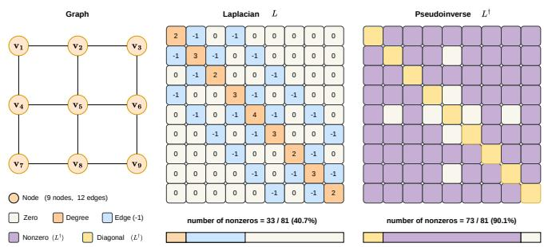  
Fig. 1. While the graph Laplacian L is sparse, its pseudoinverse $L ^ { \dagger }$ is dense, rendering direct computation memory- and compute-intensive at scale.

$$
\operatorname* { m i n } _ { x \succeq 0 } \quad \frac { 1 } { 2 } \| A x - b \| _ { 2 } ^ { 2 } + \frac { 1 } { 2 } x ^ { \top } L x ,\tag{2}
$$

which is widely used in applications such as semi-supervised ranking on graphs [3] and graph-guided nonnegative coding [4]. These ideas can also be extended to matrix problems, such as hyperspectral unmixing [5], graph-regularized nonnegative matrix factorization [6], and Laplacian-regularized nonnegative representation [7]. In all these cases, the nonnegativity constraint plays a key role in defining the solution space and influencing how the problem is solved.

While the Laplacian term enforces smoothness across connected nodes, the singularity of $L$ implies that classical LRMP solutions are characterized through the Moore-Penrose pseudoinverse $L ^ { \dagger }$ [8]. In what follows, we refer to $L ^ { \dagger }$ as the Laplacian pseudoinverse. As shown in Figure 1, although $L$ is sparse, its pseudoinverse is dense and often ill-conditioned, resulting in $\mathcal { O } ( n ^ { 3 } )$ time complexity and $O ( n ^ { 2 } )$ memory complexity for large graphs [9]. This challenge is further exacerbated under additional constraints, such as nonnegativity in (2), which preclude closed-form solutions and require iterative or implicit solvers. More broadly, the difficulty of manipulating dense inverse operators constitutes a recurring bottleneck in modern learning systems [10], where high-dimensional graph or kernel-induced mappings rarely admit direct computation.

Motivation. Typical approaches to LRMPs include projected gradient methods, which provide simple and scalable solutions under constraints without requiring explicit pseudoinverse computation. However, their convergence can be slow for illconditioned Laplacians, and they do not exploit the global spectral structure of the problem. Recent advances suggest replacing intractable operators with efficiently computable surrogates, such as spectral graph filtering and polynomial approximations (e.g., Chebyshev filtering) [11]–[13], a paradigm widely used in graph signal processing [14]–[16]. While these methods avoid explicit pseudoinverse computation, they rely on fixed spectral approximations rather than learning problemadaptive inverse operators, and remain limited under nonnegativity constraints, leaving room for further improvement. This raises a central question: Given Laplacian L, can we design a graph learning framework that approximates $L ^ { \dagger }$ in a problemadaptive manner without direct computation, while naturally supporting nonnegativity constraints?

Graph learning [17] often studies graph structures or graphinduced operators. In this work, we assume the Laplacian is given and focus on learning an approximation of its pseudoinverse, which often leads to a nonconvex problem due to its inherent complexity. Difference-of-Convex (DC) programming [18]-[21] with regularization, i.e., DC regularization [22]- [24], provides a principled way to incorporate structural priors through tractable formulations. Toland duality [25] further offers a useful framework for understanding such DC formulations from a nonconvex duality perspective. Moreover, regularized DC models allow better control of spectral properties while remaining efficiently solvable via the Convex-Concave Procedure (CCCP) [26]–[29]. This motivates learnable approximations of the graph Laplacian pseudoinverse that exploit the underlying graph structure and handle the resulting non-convex optimization via DC regularization and CCCP.

Contributions. To overcome the above limitations, we propose a structured graph learning framework for Laplacianregularized optimization that replaces L† with a learnable approximation via regularized Maximum Likelihood Estimation (MLE) and differentiable programming [30], enabling endto-end optimization of complex programs through automatic differentiation [31]. Our main contributions are:

• We study the LR-NNLS problem (2), derive its dual formulation to decouple A from L†, and use Karush-Kuhn-Tucker (KKT) conditions to reveal the structure underlying primal solution recovery, motivating learnable and problem-adaptive pseudoinverse approximation.

• We propose a Difference-of-Convex Regularizer (DCR) graph learning framework that decouples pseudoinverse learning from instance-specific inference. A learned approximation is obtained via shrinkage-regularized CCCP iterations from regularized MLE, and primal solutions are recovered through dual-guided differentiable learning. The novelty of DCR lies in unifying learning-based pseudoinverse approximation, non-convex DC regularization with CCCP-based spectral control, and KKT-guided nonnegativity-aware reconstruction.

• We establish iteration stability and unique fixed-point guarantees for the DCR algorithm. Experiments across diverse graph topologies and scales demonstrate robustness across graph structures and clear gains over convex solvers and graph filtering baselines. The source code is publicly available.

## II. RELATED WORK

## A. Nonnegative LRMPs

Semi-Supervised Ranking. A closely related line of work is the semi-supervised ranking framework of [3], which studies large-scale graph-based ranking with rich node and edge metadata. The framework formulates ranking as an optimization problem over a nonnegative score vector, combining graph-based smoothness induced by random walks or graph Laplacians with explicit pairwise preference supervision. As a special case, the Laplacian rank formulation minimizes a quadratic objective defined by a directed graph Laplacian, subject to margin-based pairwise preference constraints and a nonnegativity requirement on the ranking vector. This yields a supervised Laplacian-regularized optimization problem that extends PageRank-style models and is closely related to the class of nonnegative LRMPs of our work.

Graph-Aware Dictionary Learning. A related example appears in the badge-based document representation framework of [4], which encodes each document as a nonnegative sparse coefficient vector over a learned badge dictionary. The coding stage solves a nonnegative least-squares/lasso-type problem with a graph-guided fused regularizer on a badge relation graph [32], [33], encouraging correlated badges to take similar coefficients via weighted pairwise differences. This yields a structured nonnegative optimization that combines reconstruction, sparsity, and graph-based smoothness. Although the regularizer is not a quadratic Laplacian form, it is closely related to nonnegative LRMPs in that it integrates nonnegativity with graph-structured regularization for coherent representations.

Hyperspectral Data Unmixing. Graph Laplacian regularization has also been studied in nonnegative matrix-valued optimization problems beyond ranking. In hyperspectral data unmixing, Ammanouil et al. [5] proposed a Laplacianregularized convex formulation to estimate abundance maps under nonnegativity and sum-to-one constraints. The model combines a quadratic data-fidelity term with a graph-based smoothness regularizer, promoting spatial and spectral consistency over a similarity graph. This formulation can also be viewed as a nonnegative Laplacian-regularized least-squares problem, closely related to the nonnegative LRMPs considered in this work, differing mainly in its matrix-valued variables and application setting.

Nonnegative Matrix Factorization. Nonnegative Laplacianregularized problems also arise in nonnegative matrix factorization. Graph regularized nonnegative matrix factorization [6] extends standard nonnegative matrix factorization by incorporating a Laplacian term to preserve data geometry, leading to a quadratic reconstruction loss with a smoothness penalty under elementwise nonnegativity constraints. It is a nonnegative Laplacian-regularized problem where the Laplacian enforces graph smoothness and feasibility is maintained via constrained updates. Although designed for matrix-valued representations in clustering and representation learning, its core structure aligns closely with the nonnegative Laplacianregularized formulations.

Nonnegative Self-Representation. Nonnegative Laplacianregularized formulations have also been studied in selfrepresentation models for clustering and dimensionality reduction. For instance, Laplacian-regularized nonnegative representation [7] learns a nonnegative coefficient matrix under a selfexpressive framework, enhanced with graph-based smoothness regularization. This formulation promotes interpretability via nonnegativity while enforcing smoothness over a similarity graph. It can be viewed as a matrix-valued extension of nonnegative LRMPs, closely related to LR-NNLS, but differing in its self-representation structure and loss design.

## B. Graph Learning

Laplacian / Graph Structure Learning. A major line of work focuses on learning the graph Laplacian. Pavez et al. [34] formulate this task as maximum likelihood estimation of a precision matrix under generalized Laplacian constraints, enabling flexible Gaussian Markov random field modeling. Data-driven approaches further construct graphs via structured representations, such as the nonnegative low-rank and sparse framework in [35], which captures global and local structures, and graph refinement methods like [36], which project an initial similarity matrix onto a nonnegative, low-rank, and positive semidefinite set to obtain a denoised graph.

Laplacian Pseudoinverse Learning. Complementary to structure learning, recent works aim to directly learn or approximate the Laplacian pseudoinverse, which encodes global connectivity and diffusion behavior. Alfke et al. [37] learn the pseudoinverse implicitly from graph signals via algebraic constraints, and Zhu et al. [38] develop structured approximations for large graphs, while Lu et al. [39] improve efficiency and stability via diagonal preconditioning. Our work focus on learning the pseudoinverse of a given Laplacian matrix using regularized MLE and CCCP.

## III. LAPLACIAN-REGULARIZED NONNEGATIVE LEAST SQUARES

Given a data matrix $A \in \mathbb { R } ^ { m \times n }$ and a vector $b \in \mathbb { R } ^ { m }$ , the objective is to obtain a nonnegative decision variable $x \in \mathbb { R } ^ { n }$ by solving:

$$
\operatorname* { m i n } _ { x \succeq 0 } \quad \frac { 1 } { 2 } \| A x - b \| _ { 2 } ^ { 2 } + \frac { 1 } { 2 } x ^ { \top } L x ,\tag{3}
$$

where $\ b { L } \in \mathbb { R } ^ { n \times n }$ is given and denotes the graph Laplacian associated with an undirected weighted graph $( \nu , \mathcal { E } )$ , where $w _ { i j } ~ \geq ~ 0$ denotes the weight of edge $( i , j )$ . The quadratic penalty admits:

$$
x ^ { \top } L x = \sum _ { ( i , j ) \in \mathcal E } w _ { i j } ( x _ { i } - x _ { j } ) ^ { 2 } .\tag{4}
$$

Spectral Challenges. Assuming $L ^ { \dagger }$ is known, solving (3) remains challenging due to spectral ill-conditioning. As shown in Fig. 2, using a chain graph Laplacian $( n = 5 0 0 , m = 2 5$ $w = 0 . 0 1 , \kappa ( A ^ { \top } A + L ) \approx 3 . 6 4 \times 1 0 ^ { 4 } )$ as a representative ill-conditioned instance, although the objective gap decreases rapidly for the first-order methods such as projected gradient descent, $\| G _ { \eta } ( x ) \|$ remains above $1 0 ^ { - 3 }$ throughout 3000 iterations, indicating slow convergence to stationarity. The nonnegativity constraint further complicates the optimization.

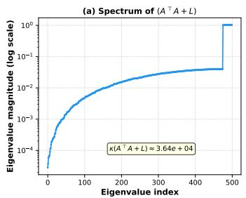

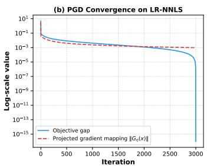  
Fig. 2. Spectral and convergence properties of the LR-NNLS problem (3) $( n = 5 0 0 , m = 2 5$ , chain graph, $w = 0 . 0 1$ 9 $\kappa ( A ^ { \top } A + L ) \approx \dot { 3 . } 6 4 \times 1 0 ^ { 4 } )$ (a) Eigenvalue spectrum of $\mathsf { \Pi } ^ { \circ } ( A ^ { \top } A + L )$ , showing severe ill-conditioning with smallest eigenvalue near $1 \dot { 0 } ^ { - 5 }$ . (b) Although the objective gap decreases rapidly to near machine precision, the projected gradient mapping norm $\| \dot { G } _ { \eta } ( \dot { x } ) \|$ remains above $\mathrm { i } 0 ^ { - 3 }$ throughout 3000 iterations, indicating slow convergence to stationarity under ill-conditioning.

## A. Dual Perspective and KKT Conditions

Since the complexity of the matrix A directly impacts the difficulty of approximating $( A ^ { \top } A + L ) ^ { \dagger }$ , we adopt a dual formulation to decouple pseudoinverse from the specific realization of A. Introducing the auxiliary variable $y = A x - b ,$ dual variables $\lambda \in \mathbb { R } ^ { m }$ with the constraint $y = A x - b$ and $\mu \succeq 0$ with the constraint $x \succeq 0$ , the resulting Lagrangian is:

$$
\begin{array} { r } { \mathcal { L } ( x , y ; \lambda , \mu ) = \frac { 1 } { 2 } \| y \| _ { 2 } ^ { 2 } + \frac { 1 } { 2 } x ^ { \top } L x + \lambda ^ { \top } ( A x - b - y ) - \mu ^ { \top } x . } \end{array}\tag{5}
$$

KKT Conditions. Minimizing $\mathcal { L }$ with respect to y and x yields $y ^ { \star } = \lambda$ and the stationarity condition $L x + A ^ { \top } \lambda - \mu =$ $0 ,$ respectively. Together with feasibility, and complementary slackness, the KKT conditions are:

$$
x ^ { \star } \succeq 0 , \quad y ^ { \star } = A x ^ { \star } - b , \quad \mu ^ { \star } \succeq 0 ,\tag{6}
$$

$$
( \mu ^ { \star } ) ^ { \top } x ^ { \star } = 0 ,\tag{7}
$$

$$
L x ^ { \star } + A ^ { \top } \lambda ^ { \star } - \mu ^ { \star } = 0 .\tag{8}
$$

Theorem 1. Assuming that $L ^ { \dagger }$ is known, from the KKT conditions (6)-(8), the primal solution of (3) can be denoted as:

$$
x ^ { \star } = L ^ { \dagger } ( \mu ^ { \star } - A ^ { \top } \lambda ^ { \star } ) + c \mathbf { 1 } , \quad c \in \mathbb { R } ,\tag{9}
$$

where $\mu ^ { \star }$ and $\lambda ^ { \star }$ are dual solutions, and c must be determined to satisfy the KKT conditions.

Proof. From the KKT condition (8), we obtain:

$$
L x ^ { \star } = \mu ^ { \star } - A ^ { \top } \lambda ^ { \star } .\tag{10}
$$

To characterize the solution structure of (10), we recall   
fundamental properties of linear algebra [8], [40]. For any   
matrix $G \in \mathbb { R } ^ { m \times n }$ and equation $G x = g .$ the range space   
is ${ \mathcal { R } } ( G ) = \{ G x \mid x \in \mathbb { R } ^ { n } \}$ and the null space is ${ \mathcal { N } } ( G ) =$   
$\{ x \mid G x = 0 \}$ . The general solution, when it exists, takes the   
form $x = x _ { p } + x _ { n }$ , where $G x _ { p } = g$ is a particular solution and   
$x _ { n } \in { \mathcal { N } } ( G )$ is an arbitrary null space component. Specifically: • If G is invertible, ${ \mathcal { N } } ( G ) = \{ 0 \}$ and the unique solution is $x = G ^ { - 1 } g$

• If G is singular but $g \in { \mathcal { R } } ( G )$ , the general solution is $x = G ^ { \dagger } g + x _ { n }$ where $x _ { n } \in { \mathcal { N } } ( G )$ and $G ^ { \dagger }$ denotes the Moore-Penrose pseudoinverse.

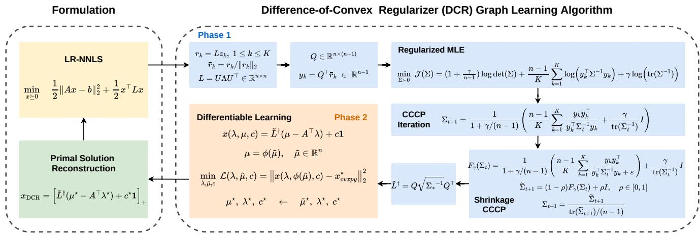  
Fig. 3. DCR algorithm solves (3) in two phases. Phase 1 learns a Laplacian pseudoinverse approximation $\tilde { L } ^ { \dagger }$ via regularized MLE and CCCP iteration with shrinkage regularization, while Phase 2 recovers the primal solution through dual-driven differentiable learning

The graph Laplacian L is symmetric positive semidefinite with $L \mathbf { 1 } ~ = ~ 0$ , where $\mathbf { 1 } \in \mathbb { R } ^ { n }$ denotes the all-ones vector. For a connected graph, ${ \mathcal { N } } ( L ) = { \mathrm { s p a n } } \{ \mathbf { 1 } \}$ is one-dimensional, where “span" describes all the linear combinations of a set of vectors. Therefore, the right-hand side of (10) must lie in $\mathcal { R } ( L )$ , which is guaranteed by the complementary slackness of the KKT conditions. Thus, the general solution of (10) is:

$$
x ^ { \star } = L ^ { \dagger } ( \mu ^ { \star } - A ^ { \top } \lambda ^ { \star } ) + c \mathbf { 1 } , \quad c \in \mathbb { R } .\tag{11}
$$

The constant c in (11) is uniquely determined by primal feasibility in (6) and complementary slackness (7). Let $\mathcal { Z } =$ $\{ i \mid \mu _ { i } ^ { \star } > 0 \}$ denote the active constraint set and $l = L ^ { \dagger } ( \mu ^ { \star } -$ $A ^ { \top } \lambda ^ { \star } )$ . By complementary slackness, $x _ { i } ^ { \star } = 0$ for all $i \in \mathcal { Z } ,$ which yields:

$$
x _ { i } ^ { \star } = l _ { i } + c = 0 \quad \Rightarrow \quad c = - l _ { i } , \quad \forall i \in \mathcal { I } .\tag{12}
$$

If $\mathcal { T } \neq \emptyset$ , consistency of the KKT conditions requires $l _ { i }$ to be constant over $\mathcal { T } ,$ uniquely determining $c ;$ the remaining components $x _ { j } ^ { \star } ~ ( j ~ \notin ~ \mathcal { T } )$ satisfy the nonnegativity constraint. If $\mathcal { T } = \emptyset \mathrm { ~ } ( \mathrm { i . e . , ~ } \mu ^ { \star } = 0 )$ , then $x ^ { \star } \succ 0$ and c can be chosen arbitrarily without affecting the objective, typically $c = 0 .$ In both cases, (11) completely characterizes the optimal solution via $L ^ { \dagger }$ and the dual variables. □

Example 1. To validate (11), we solve an LR-NNLS instance with $m = 5 0$ and $n = 3 0 .$ Given a connected graph Laplacian $L ,$ the primal problem is solved via CVXPY [41], yielding the primal solution $x ^ { \star }$ and dual solutions $( \lambda ^ { \star } , \mu ^ { \star } )$ . We reconstruct $x ^ { \star }$ from the dual solutions via: (i) computing c from active constraints (12), (ii) least-squares itting $\begin{array} { r } { c = \frac { 1 } { n } \mathbf { 1 } ^ { \top } ( x ^ { \star } - l ) } \end{array}$ and (iii) setting $c = 0 .$ Methods (i) and (ii) achieve $\mathcal { O } ( 1 0 ^ { - 6 } )$ error with nearly identical $c .$ In contrast, (iii) yields a 62% relative error.

Objective. Given $L ,$ if $L ^ { \dagger }$ were available, the primal solution could be recovered via (11). However, computing $L ^ { \dagger }$ using eigendecomposition or matrix inversion is computationally prohibitive for large-scale systems. This motivates approximations of $L ^ { \dagger }$ on $\mathcal { R } ( L )$

## IV. LAPLACIAN ESTIMATION

Since $L ^ { \dagger }$ is unknown, we propose the Difference-of-Convex Regularizer (DCR) graph learning framework to enable dualguided primal solution recovery in (9). As shown in Algorithm 1, DCR consists of two phases (cf. Fig. 3). First, given $L ,$ DCR learns a matrix $\tilde { L } ^ { \dagger }$ that approximates the spectral action of $L ^ { \dagger } , \mathrm { i . e . , } \tilde { L } ^ { \dagger } \approx L ^ { \dagger }$ , by solving a regularized MLE problem via the CCCP method [26]-[29]. Second, a differentiable reconstruction loss is introduced to recover the primal solution of (3) through gradient backpropagation using the high-accuracy reference solution $x _ { \mathrm { c v x p y } } ^ { \star }$

## A. Regularized MLE for Laplacian Pseudoinverse Learning

Inspired by the Tyler's estimator [42]–[45], this phase aims at formulating a scale-invariant regularized MLE problem [46] to learn $\tilde { L } ^ { \dag } \in \mathbb { R } ^ { n \times n }$ for achieving $\tilde { L } ^ { \dagger } \approx L ^ { \dagger }$ on $\mathcal { R } ( L )$

1) Tyler's Estimator: Tyler's estimator stems from the $\mathbf { A n - }$ gular Central Gaussian (ACG) model, which describes scaled Gaussian vectors $x _ { i } = \sqrt { \tau _ { i } } \xi _ { i }$ with $\xi _ { i } \sim \mathcal { N } ( 0 , \Sigma )$ and $\tau _ { i } > 0$ To improve robustness over the sample covariance matrix $\begin{array} { r } { \hat { S } \ = \ \dot { \frac { 1 } { n } } \sum _ { i = 1 } ^ { n } x _ { i } x _ { i } ^ { \top } } \end{array}$ , Tyler's estimator identifies the matrix $\Sigma \in \mathbb { R } ^ { j \times p }$ via the fixed-point [43]:

$$
\Sigma = \frac { p } { n } \sum _ { i = 1 } ^ { n } \frac { x _ { i } x _ { i } ^ { \top } } { x _ { i } ^ { \top } \Sigma ^ { - 1 } x _ { i } } ,\tag{13}
$$

which is the stationarity condition of the ACG negative loglikelihood:

$$
\ell ( \Sigma ) = \log \operatorname* { d e t } ( \Sigma ) + \frac { p } { n } \sum _ { i = 1 } ^ { n } \log ( x _ { i } ^ { \top } \Sigma ^ { - 1 } x _ { i } ) .\tag{14}
$$

Due to the scale invariance $\ell ( c \Sigma ) = \ell ( \Sigma ) ( c > 0 )$ , a normalization such as $\operatorname { t r } ( \Sigma ) = p ,$ is typically imposed to ensure solution uniqueness while preserving directional information.

TABLE I  
REPRESENTATIVE REGULARIZERS FOR LAPLACIAN ESTIMATION.
<table><tr><td>Regularizer</td><td>Spectrum</td><td>Remarks</td></tr><tr><td> $\mathrm { t r } ( \Sigma ^ { - 1 } )$ </td><td> $\textstyle \sum _ { i } \lambda _ { i } ^ { - 1 }$ </td><td>Strong penalty on small eigenvalues</td></tr><tr><td> $\mathrm { t r } ( \Sigma ^ { - 1 / 2 } )$ </td><td> $\sum _ { i } \lambda _ { i } ^ { - 1 / 2 }$ </td><td>Moderate spectral shrinkage</td></tr><tr><td> $\log ( \mathrm { t r } ( \Sigma ^ { - 1 } ) )$ </td><td> $\overline { { \log } } ( \sum _ { i } ^ { 2 } \lambda _ { i } ^ { - 1 } )$ </td><td>Scale-invariant and mild regularization</td></tr><tr><td> $\log \dot { \operatorname* { d e t } } ( \dot { \Sigma } )$ </td><td> $\textstyle \sum _ { i } \operatorname { l o g } \lambda _ { i }$ </td><td>Log-barrier against eigenvalue collapse</td></tr><tr><td> $\lVert \Sigma ^ { - 1 } \rVert _ { * }$ </td><td> $\sum _ { i } \lambda _ { i } ^ { - 1 }$ </td><td>Equivalent to  $\mathrm { \bar { t r } ( \Sigma ^ { - 1 } ) }$  for PSD matrices</td></tr><tr><td> $\| \Sigma ^ { - 1 / 2 } \| ,$  X</td><td> $\sum _ { i } { \lambda _ { i } ^ { - 1 / 2 } }$ </td><td>Nuclear-norm form of spectral shrinkage</td></tr></table>

2) Spectral Exploration: In the absence of observed graph signals [34], we generate random directions to explore the spectrum of the Laplacian. For a connected graph, the Laplacian range space $\mathcal { R } ( L )$ has dimension $n \mathrm { ~ - ~ } 1$ Let $Q \in$ $\mathbb { R } ^ { n \times ( n - 1 ) }$ be any orthonormal basis spanning ${ \mathcal { R } } ( L ) , \mathbf { e . g . }$ , the eigenvectors of $L$ associated with its nonzero eigenvalues.

To cover all spectral directions, we sample isotropic Gaussian vectors $z _ { k } \sim \mathcal { N } ( 0 , I _ { n } )$ and construct:

$$
r _ { k } = L z _ { k } , \quad \bar { r } _ { k } = \frac { r _ { k } } { \| r _ { k } \| _ { 2 } } , \quad k = 1 , \ldots , K .\tag{15}
$$

Then $r _ { k } \in \mathcal { R } ( L )$ and hence $\bar { r } _ { k } \in \mathcal { R } ( L )$ . With sufficiently large $K ,$ the set $\{ r _ { k } \}$ spans $\mathcal { R } ( L )$ with high probability. The normalization removes magnitude variability while preserving directional information. Following the Tyler framework [42], [44], each normalized vector admits intrinsic coordinates:

$$
y _ { k } = Q ^ { \top } \bar { r } _ { k } \in \mathbb { R } ^ { n - 1 } ,\tag{16}
$$

so that $\bar { r } _ { k } = Q y _ { k }$ . The subsequent estimation is invariant to the choice of orthonormal basis $Q .$

3) Regularized MLE on ${ \mathcal { R } } ( L ) .$ : To estimate $\tilde { L } ^ { \dagger }$ on $\mathcal { R } ( L )$ we consider a regularized MLE formulation [45]:

$$
\begin{array} { l } { \displaystyle \operatorname* { m i n } _ { \Sigma \succ 0 } J ( \Sigma ) = \displaystyle ( 1 + \frac { \gamma } { n - 1 } ) \log \operatorname* { d e t } ( \Sigma ) + \frac { n - 1 } { K } \sum _ { k = 1 } ^ { K } \log \left( y _ { k } ^ { \top } \Sigma ^ { - 1 } y _ { k } \right) } \\ { \displaystyle ~ + \gamma \mathcal { R } ( \Sigma ^ { - 1 } ) , ~ ( 1 7 ) } \end{array}
$$

where $\mathcal { R } ( \cdot )$ is a spectral regularizer acting on the eigenvalues of $\Sigma ^ { - 1 }$ . Such regularizers are commonly used to control the spectrum of Σ, in particular to prevent eigenvalue degeneracy, i.e., eigenvalues approaching zero. Representative choices are summarized in Table I (see Appendix A for details). In this work, we adopt the scale-invariant regularizer $\mathcal { R } ( \Sigma ^ { - 1 } ) \ =$ log $\left( \operatorname { t r } ( \Sigma ^ { - 1 } ) \right)$ to control the spectrum while preserving scale invariance. The resulting problem is:

$$
\begin{array} { l } { \displaystyle \operatorname* { m i n } _ { \Sigma \succ 0 } J ( \Sigma ) = \big ( 1 + \frac { \gamma } { n - 1 } \big ) \log \operatorname* { d e t } ( \Sigma ) + \frac { n - 1 } { K } \sum _ { k = 1 } ^ { K } \log \big ( y _ { k } ^ { \top } \Sigma ^ { - 1 } y _ { k } \big ) } \\ { \displaystyle ~ + \gamma \log \big ( \mathrm { t r } ( \Sigma ^ { - 1 } ) \big ) , ~ } \end{array}
$$

with $\gamma \geq 0$ .To ensure identifiability under scale invariance, we impose $\operatorname { t r } ( \Sigma ) = n - 1$

Since $r _ { k } = L z _ { k }$ with isotropic $z _ { k } \sim \mathcal { N } ( 0 , I _ { n } )$ , we have $\mathbb { E } [ r _ { k } r _ { k } ^ { \top } ] = L ^ { 2 }$ . Although normalization removes scale variability, the directional structure remains aligned with $L ^ { 2 }$ on $\mathcal { R } ( L )$ . Hence, the optimal solution $\Sigma _ { \star }$ of (18) shares eigenvectors with L and is spectrally aligned with $L ^ { 2 }$ , implying $\Sigma _ { \star } ^ { - 1 } \propto ( L ^ { 2 } ) ^ { \dagger }$ on $\mathcal { R } ( L )$ . Let $\tilde { L } _ { \mathcal { R } ( L ) } ^ { \dag } = \sqrt { \Sigma _ { \star } ^ { - 1 } }$ , defined on $\mathcal { R } ( L )$ and sharing eigenvectors with L. Then $\tilde { L } ^ { \dagger }$ is given by:

Algorithm 1: DCR Algorithm   
Input: ${ \overline { { A , b , L } } } .$   
Output: $\tilde { L } ^ { \dagger }$ and $x _ { \mathrm { D C R } } .$   
1 Phase 1: Pseudoinverse Approximation Learning   
2 Compute an orthonormal basis $Q \in \mathbb { R } ^ { n \times ( n - 1 ) }$ of   
$\mathcal { R } ( L )$ Sample $z _ { k } \sim \mathcal { N } ( 0 , I _ { n } )$ and set $\begin{array} { r } { r _ { k } = L z _ { k } , } \end{array}$   
$\bar { r } _ { k } = r _ { k } / \| r _ { k } \| _ { 2 } ;$ Compute $y _ { k } = Q ^ { \top } { \bar { r } } _ { k } \in \mathbb { R } ^ { n - 1 }$ for   
$k = 1 , \ldots , K ;$   
3 Initialize $\Sigma _ { 1 }  I _ { n - 1 } ;$   
4 for $t = 1 , \ldots , T _ { \mathrm { f p } }$ do   
5 $S \gets \frac { n - 1 } { K } \sum _ { k = 1 } ^ { K } \frac { y _ { k } y _ { k } ^ { \top } } { y _ { k } ^ { \top } \Sigma _ { t } ^ { - 1 } y _ { k } + \varepsilon } ;$   
6 $F _ { \gamma } ( \Sigma _ { t } ) \longleftarrow \frac { 1 } { 1 + \gamma / ( n - 1 ) } \Big ( S + \frac { \gamma } { \mathrm { t r } ( \Sigma _ { t } ^ { - 1 } ) } I \Big ) ;$   
7 $\widetilde { \Sigma } _ { t + 1 }  ( 1 - \rho ) \dot { F } _ { \gamma } ( \Sigma _ { t } ) + \rho I ;$   
8 $\Sigma _ { t + 1 }  \frac { \Sigma _ { t + 1 } } { \mathrm { t r } ( \widetilde { \Sigma } _ { t + 1 } ) / ( n - 1 ) } ;$   
9 Compute $\tilde { L } ^ { \dag }  Q \sqrt { \Sigma _ { \star } ^ { - 1 } } Q ^ { \dag }$   
10 Phase 2: Dual-Driven Differentiable Reconstruction   
11 Initialize auxiliary variables $( \lambda , \tilde { \mu } , c ) ;$   
12 for $t = 1 , \dots , T _ { 1 }$ do   
13 $\mu  \phi ( \tilde { \mu } ) ;$   
14 $x  \tilde { L } ^ { \dagger } ( \mu - A ^ { \top } \lambda ) + c \mathbf { 1 } ;$   
15 $\mathcal { L }  \| x - x _ { \mathrm { c v x p y } } ^ { \star } \| _ { 2 } ^ { 2 } ;$   
16 Update $( \lambda , \tilde { \mu } , c ) \bar { { \bf \mu } }$ by one gradient step on $\mathcal { L } ;$   
17 $c ^ { \star } \gets$ arg min $\| [ \tilde { L } ^ { \dagger } ( \mu ^ { \star } - A ^ { \top } \lambda ^ { \star } ) + c \mathbf { 1 } ] _ { + } - x _ { \mathrm { c v x p y } } ^ { \star } \| _ { 2 } ^ { 2 } ;$   
C   
18 return $x _ { \mathrm { D C R } } = [ \tilde { L } ^ { \dag } ( \mu ^ { \star } - A ^ { \top } \lambda ^ { \star } ) + c ^ { \star } \mathbf { 1 } ] _ { + } .$

$$
\tilde { L } ^ { \dag } = Q \sqrt { \Sigma _ { \star } ^ { - 1 } } Q ^ { \top } ,\tag{19}
$$

which serves as a learned approximation of $L ^ { \dagger }$

## B. CCCP Iteration

For the regularized objective (18), define $S _ { k } \triangleq y _ { k } y _ { k } ^ { \top }$ and introduce $X \triangleq \Sigma ^ { - 1 } \succ 0 .$ then the problem becomes:

$$
\begin{array} { l } { \displaystyle \underset { X \succ 0 } { \operatorname* { m i n } } F ( X ) = - ( 1 + \frac { \gamma } { n - 1 } ) \log \operatorname* { d e t } ( X ) } \\ { \displaystyle \qquad + \frac { n - 1 } { K } \sum _ { k = 1 } ^ { K } \log \bigl ( \mathrm { t r } ( X S _ { k } ) \bigr ) + \gamma \log \bigl ( \mathrm { t r } ( X ) \bigr ) . } \end{array}\tag{20}
$$

Write $F ( X ) = f ( X ) + g ( X )$ with:

$$
f ( X ) = - ( 1 + \frac { \gamma } { n - 1 } ) \log \operatorname* { d e t } ( X ) ,\tag{21}
$$

$$
g ( X ) = \frac { n - 1 } { K } \sum _ { k = 1 } ^ { K } \log ( \operatorname { t r } ( X S _ { k } ) ) + \gamma \log ( \operatorname { t r } ( X ) ) ,\tag{22}
$$

where f(X) is convex and $g ( X )$ is concave.

Defining $h ( X ) \ = \ - g ( X )$ , we can rewrite (20) to the Difference-of-Convex (DC) programming [18]–[21], [27]:

$$
\operatorname* { m i n } _ { X \succ 0 } F ( X ) = f ( X ) - h ( X ) .\tag{23}
$$

According to the definition of the convex conjugate, $h ( X )$ admits the representation:

$$
h ( X ) = \operatorname* { s u p } _ { Y } \{ \langle X , Y \rangle - h ^ { * } ( Y ) \} .\tag{24}
$$

Substituting this representation to (23) yields:

$$
f ( X ) - h ( X ) = \operatorname* { i n f } _ { Y } \{ f ( X ) - \langle X , Y \rangle + h ^ { * } ( Y ) \} ,\tag{25}
$$

which leads to the associated DC dual problem [18]:

$$
\operatorname* { m i n } _ { Y } \ h ^ { * } ( Y ) - f ^ { * } ( Y ) .\tag{26}
$$

At an optimal solution $X ^ { \star }$ , the DC optimality condition [25], [27] requires:

$$
\partial h ( X ^ { \star } ) \subset \partial f ( X ^ { \star } ) ,\tag{27}
$$

which reduces to the stationarity condition:

$$
\nabla f ( X ^ { \star } ) = \nabla h ( X ^ { \star } ) ,\tag{28}
$$

when f and h are differentiable.

The CCCP method [26]–[28] provides an iterative scheme for the stationarity condition (28). Specifically, linearizing the concave part $g ( X )$ in (22) at $X _ { t }$ yields the following convex subproblem:

$$
X _ { t + 1 } \in \arg \operatorname* { m i n } _ { X \succ 0 } f ( X ) + \langle \nabla g ( X _ { t } ) , X \rangle .\tag{29}
$$

The optimality condition gives:

$$
\nabla f ( X _ { t + 1 } ) = - \nabla g ( X _ { t } ) .\tag{30}
$$

Since:

$$
\nabla f ( X ) = - ( 1 + \frac { \gamma } { n - 1 } ) X ^ { - 1 } ,\tag{31}
$$

$$
\nabla g ( X ) = \frac { n - 1 } { K } \sum _ { k = 1 } ^ { K } \frac { S _ { k } } { \operatorname { t r } ( X S _ { k } ) } + \frac { \gamma } { \operatorname { t r } ( X ) } I ,\tag{32}
$$

we obtain:

$$
( 1 + \frac { \gamma } { n - 1 } ) X _ { t + 1 } ^ { - 1 } = \frac { n - 1 } { K } \sum _ { k = 1 } ^ { K } \frac { y _ { k } y _ { k } ^ { \top } } { y _ { k } ^ { \top } X _ { t } y _ { k } } + \frac { \gamma } { \operatorname { t r } ( X _ { t } ) } I .\tag{33}
$$

Using $\Sigma _ { t } = X _ { t } ^ { - 1 }$ yields the regularized fixed-point iteration:

$$
\Sigma _ { t + 1 } = { \frac { 1 } { 1 + \gamma / ( n - 1 ) } } \left( { \frac { n - 1 } { K } } \sum _ { k = 1 } ^ { K } { \frac { y _ { k } y _ { k } ^ { \top } } { y _ { k } ^ { \top } \Sigma _ { t } ^ { - 1 } y _ { k } } } + { \frac { \gamma } { \operatorname { t r } ( \Sigma _ { t } ^ { - 1 } ) } } I \right)\tag{34}
$$

When $\gamma = 0$ , the iteration reduces to (13).

By the standard CCCP descent property [26], i.e., $F ( X _ { t + 1 } ) \leq F ( X _ { t } )$ , we equivalently obtain:

$$
\mathcal { I } ( \Sigma _ { t + 1 } ) \leq \mathcal { I } ( \Sigma _ { t } ) , \qquad \forall t \geq 0 .\tag{35}
$$

We solved (18) using three approaches: the CCCP iteration (34), a convex solver-based method, and the Disciplined Convex-Concave Programming (DCCP) package [19]. All three methods converge to the same stationary point, providing numerical validation of the CCCP iteration.

Remark 1. Alternatively, problem (20) can also be solved using the Frank–Wolfe (FW) algorithm [47], [48], originally developed for minimizing convex quadratic functions over polytopes [49]. Specifically, recall the DC objective (23):

$$
\operatorname* { m i n } _ { X \succ 0 } F ( X ) = f ( X ) - h ( X ) .\tag{36}
$$

Introducing an epigraph variable yields:

$$
\operatorname* { m i n } _ { X , y } y - h ( X ) \quad { \mathrm { s . t . } } \quad f ( X ) \leq y .\tag{37}
$$

Applying the FW algorithm, construct the Lagrangian function and the linear minimization step at $X _ { t }$ solves [49]:

$$
\operatorname* { m i n } _ { X , y } y - \langle \nabla h ( X _ { t } ) , X \rangle \quad { \mathrm { s . t . } } \quad f ( X ) \leq y ,\tag{38}
$$

then we can get $\nabla f ( X _ { t } ^ { * } ) = \nabla h ( X _ { t } )$ . Since:

$$
\nabla f ( X ) = - ( 1 + \frac { \gamma } { n - 1 } ) X ^ { - 1 } ,\tag{39}
$$

$$
\nabla h ( X ) = - \frac { n - 1 } { K } \sum _ { k = 1 } ^ { K } \frac { y _ { k } y _ { k } ^ { \top } } { y _ { k } ^ { \top } X y _ { k } } - \frac { \gamma } { \operatorname { t r } ( X ) } I ,\tag{40}
$$

we obtain:

$$
( 1 + \frac { \gamma } { n - 1 } ) X _ { t + 1 } ^ { - 1 } = \frac { n - 1 } { K } \sum _ { k = 1 } ^ { K } \frac { y _ { k } y _ { k } ^ { \top } } { y _ { k } ^ { \top } X _ { t } y _ { k } } + \frac { \gamma } { \operatorname { t r } ( X _ { t } ) } I .\tag{41}
$$

That is:

$$
\Sigma _ { t + 1 } = \frac { 1 } { 1 + \gamma / ( n - 1 ) } \left( \frac { n - 1 } { K } \sum _ { k = 1 } ^ { K } \frac { y _ { k } y _ { k } ^ { \top } } { y _ { k } ^ { \top } \Sigma _ { t } ^ { - 1 } y _ { k } } + \frac { \gamma } { \operatorname { t r } ( \Sigma _ { t } ^ { - 1 } ) } I \right) ,\tag{42}
$$

which coincides with the iteration update (34). Thus, CCCP is equivalent to applying the FW algorithm for (20). In fact, FWbased methods have increasingly been used to solve related problems arising from CCCP frameworks.

Theorem 2. Let $\{ y _ { k } \} _ { k = 1 } ^ { K } \subset \mathbb { R } ^ { n - 1 }$ satisfy $\begin{array} { r } { \sum _ { k = 1 } ^ { K } { y _ { k } y _ { k } ^ { \top } } \succ 0 . } \end{array}$ For $\gamma \geq 0 ;$ define the mapping $M _ { \gamma } : \mathbb { S } _ { + + } ^ { n - 1 } \xrightarrow { \smile } \mathbb { S } _ { + + } ^ { n - 1 } \ b y .$

$$
M _ { \gamma } ( \Sigma ) = \frac { 1 } { 1 + \gamma / ( n - 1 ) } \left( \frac { n - 1 } { K } \sum _ { k = 1 } ^ { K } \frac { y _ { k } y _ { k } ^ { \top } } { y _ { k } ^ { \top } \Sigma ^ { - 1 } y _ { k } } + \frac { \gamma } { \mathrm { t r } ( \Sigma ^ { - 1 } ) } I \right) .\tag{43}
$$

Then $M _ { \gamma }$ is continuous, order-preserving, positively homogeneous of degree one, and strongly positive. Consequently, there exist $\Sigma _ { \star } \succ 0$ and $\alpha _ { \star } > 0$ such that $M _ { \gamma } ( \Sigma _ { \star } ) = \alpha _ { \star } \Sigma _ { \star } .$ Moreover, the trace-normalized matrix $\begin{array} { r } { \widehat { \Sigma } _ { \star } \triangleq \frac { \widehat { n } - 1 } { \operatorname { t r } ( \Sigma _ { \star } ) } \Sigma _ { \star } } \end{array}$ satisies $\mathrm { t r } ( \widehat { \Sigma } _ { \star } ) = n - 1$ and is a ixed point of the normalized mapping:

$$
{ \widehat { M } } _ { \gamma } ( \Sigma ) \triangleq { \frac { ( n - 1 ) M _ { \gamma } ( \Sigma ) } { \mathrm { t r } ( M _ { \gamma } ( \Sigma ) ) } } ,\tag{44}
$$

$$
i . e . , \widehat { M } _ { \gamma } ( \widehat { \Sigma } _ { \star } ) = \widehat { \Sigma } _ { \star } .
$$

Proof. Firstly, continuity follows from continuity of $\Sigma \mapsto \Sigma ^ { - 1 }$ on $\mathbb { S } _ { + + } ^ { n - 1 }$ . Secondly, for $\alpha > 0$ , using $( \alpha \Sigma ) ^ { - \mathrm { { 1 } } } = \alpha ^ { - 1 } \Sigma ^ { - 1 }$ gives:

$$
\begin{array} { c } { { M _ { \gamma } ( \alpha \Sigma ) = \displaystyle \frac { 1 } { 1 + \gamma / ( n - 1 ) } ( \alpha \frac { n - 1 } { K } \sum _ { k = 1 } ^ { K } \frac { y _ { k } y _ { k } ^ { \top } } { y _ { k } ^ { \top } \Sigma ^ { - 1 } y _ { k } } } } \\ { { + \alpha \frac { \gamma } { { \mathrm { t r } ( \Sigma ^ { - 1 } ) } } I ) = \alpha M _ { \gamma } ( \Sigma ) , } } \end{array}\tag{45}
$$

sO $M _ { \gamma }$ is positively homogeneous. Meanwhile, if $\Sigma _ { 1 } \preceq \Sigma _ { 2 } ,$ then $\dot { \Sigma } _ { 1 } ^ { - 1 } \succeq \Sigma _ { 2 } ^ { - 1 }$ , which implies:

$$
{ \frac { y _ { k } y _ { k } ^ { \top } } { y _ { k } ^ { \top } \Sigma _ { 1 } ^ { - 1 } y _ { k } } } \preceq { \frac { y _ { k } y _ { k } ^ { \top } } { y _ { k } ^ { \top } \Sigma _ { 2 } ^ { - 1 } y _ { k } } } ,\tag{46}
$$

for all k. Moreover, $\mathrm { t r } ( \Sigma _ { 1 } ^ { - 1 } ) \geq \mathrm { t r } ( \Sigma _ { 2 } ^ { - 1 } )$ , which yields:

$$
{ \frac { 1 } { \operatorname { t r } ( \Sigma _ { 1 } ^ { - 1 } ) } } I \preceq { \frac { 1 } { \operatorname { t r } ( \Sigma _ { 2 } ^ { - 1 } ) } } I .\tag{47}
$$

Hence $M _ { \gamma } ( \Sigma _ { 1 } ) \preceq M _ { \gamma } ( \Sigma _ { 2 } )$ and $T _ { \gamma }$ is order-preserving. Additionally, since $y _ { k } ^ { \top } \Sigma ^ { - 1 } y _ { k } > 0$ and $I \succ 0 .$ , the weighted sum defining $M _ { \gamma } ( \Sigma )$ is positive definite, implying strong positivity.

Finally, according to Nonlinear Perron-Frobenius (NPF) theory [50], [51], there exist $\Sigma _ { \star } \succ 0$ and $\alpha _ { \star } > 0$ such that $M _ { \gamma } ( \Sigma _ { \star } ) = \alpha _ { \star } \Sigma _ { \star }$ .. Let $\begin{array} { r } { \widehat { \Sigma } _ { \star } \triangleq \frac { n - 1 } { \operatorname { t r } \left( \Sigma _ { \star } \right) } \Sigma _ { \star } } \end{array}$ and define:

$$
\widehat { M } _ { \gamma } ( \Sigma ) = \frac { \left( n - 1 \right) M _ { \gamma } ( \Sigma ) } { \mathrm { t r } ( M _ { \gamma } ( \Sigma ) ) } .\tag{48}
$$

By homogeneity, we can conclude $\widehat { M } _ { \gamma } ( \widehat { \Sigma } _ { \star } ) = \widehat { \Sigma } _ { \star }$

□

1) Shrinkage-Stabilized CCCP Iteration: Classical Tyler iterations are well defined when $K \geq n - 1$ , but may become ill-posed or unstable in undersampled regimes $( K \ < \ n -$ 1) [52]. While the regularized objective (18) improves spectral stability, additional shrinkage can further enhances robustness. Inspired by [53], we incorporate an isotropic shrinkage step. Given $\Sigma _ { t } .$ we first compute a stabilized update:

$$
\begin{array} { c } { \displaystyle F _ { \gamma } ( \Sigma _ { t } ) = \frac { 1 } { 1 + \gamma / ( n - 1 ) } ( \frac { n - 1 } { K } \sum _ { k = 1 } ^ { K } \frac { y _ { k } y _ { k } ^ { \top } } { y _ { k } ^ { \top } \Sigma _ { t } ^ { - 1 } y _ { k } + \varepsilon } } \\ { \displaystyle + \frac { \gamma } { \mathrm { t r } ( \Sigma _ { t } ^ { - 1 } ) } I ) , } \end{array}\tag{49}
$$

where $\varepsilon > 0$ is a small safeguard parameter for numerical stability. Shrinkage is then applied to the iterate:

$$
\widetilde { \Sigma } _ { t + 1 } = ( 1 - \rho ) F _ { \gamma } ( \Sigma _ { t } ) + \rho I ,\tag{50}
$$

where $\rho \in [ 0 , 1 ]$ is a shrinkage parameter used only for stabilization, while the primary spectral regularization is controlled by γ in (18). In practice, $\rho$ is set to zero or a very small value when $K \geq n - 1$ , and activated when $K < n - 1$

Finally, trace normalization is applied:

$$
\Sigma _ { t + 1 } = \frac { \widetilde { \Sigma } _ { t + 1 } } { \mathrm { t r } ( \widetilde { \Sigma } _ { t + 1 } ) / ( n - 1 ) } .\tag{51}
$$

When $\rho ~ = ~ 0$ and $\varepsilon \ = \ 0$ , the iteration reduces to the regularized Tyler update (34), whose fixed point follows from NPF theory (Theorem 2). For $\rho \in ( 0 , 1 ]$ , although shrinkage breaks positive homogeneity of the mapping, a fixed point still exists as shown in Theorem 3.

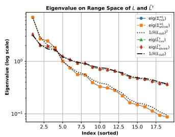

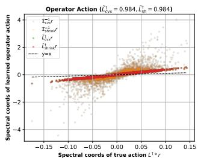  
(a) Eigenvalues  
(b) Spectral Alignment  
Fig. 4. MLE on $\mathcal { R } ( L ) . \ ( \mathrm { a } ) \ \Sigma ^ { - 1 }$ follows the theoretical eigenvalue scaling of $( L ^ { 2 } ) ^ { \dagger }$ on $\mathcal { R } ( L )$ (b): after $\tilde { L } ^ { \dagger } = \sqrt { \Sigma ^ { - 1 } }$ , Ž† aligns with $L ^ { \dagger }$ in spectral coordinates, confirming spectrum approximation of $\Breve { L ^ { \dagger } }$

Theorem 3. Let $\varepsilon > 0 , \rho \in ( 0 , 1 ] .$ and $\gamma \geq 0 .$ Assume $\textstyle \sum _ { k = 1 } ^ { K } y _ { k } y _ { k } ^ { \top } \succ 0$ and define:

$$
F _ { \gamma } ( \Sigma ) = \frac { 1 } { 1 + { \gamma } / { ( n - 1 ) } } ( \frac { n - 1 } { K } \sum _ { k = 1 } ^ { K } \frac { y _ { k } y _ { k } ^ { \top } } { y _ { k } ^ { \top } \Sigma ^ { - 1 } y _ { k } + \varepsilon } + \frac { \gamma } { \mathrm { t r } ( \Sigma ^ { - 1 } ) } I ) ,\tag{52}
$$

$$
\widetilde { \cal M } ( \Sigma ) = ( 1 - \rho ) F _ { \gamma } ( \Sigma ) + \rho { \cal I } ,\tag{53}
$$

$$
M ( \Sigma ) = { \frac { \left( n - 1 \right) \widetilde { M } ( \Sigma ) } { \operatorname { t r } ( \widetilde { M } ( \Sigma ) ) } } .\tag{54}
$$

Then the mapping M admits at least one fixed point $\Sigma _ { \star } \succ 0$ with $\operatorname { t r } ( \Sigma _ { \star } ) = n - 1$ such that $\begin{array} { r } { M ( \Sigma _ { \star } ) = \Sigma _ { \star } } \end{array}$ •

Proof. Let ${ \mathcal { S } } = \{ { \boldsymbol { \Sigma } } \succeq 0 : { \mathrm { t r } } ( { \boldsymbol { \Sigma } } ) = n - 1 \}$ , and obviously, it is convex and compact. For any $\Sigma \succ 0$ , there exists $y _ { k } ^ { \top } \Sigma ^ { - 1 } y _ { k } +$ $\varepsilon > 0$ , hence $F _ { \gamma } ( \Sigma )$ is well defined and bounded. Moreover, since $\rho \in ( 0 , 1 ]$

$$
\widetilde { M } ( \Sigma ) = ( 1 - \rho ) F _ { \gamma } ( \Sigma ) + \rho I \succeq \rho I .\tag{55}
$$

Thus $\widetilde { M } ( \Sigma ) \succ 0$ . After trace normalization:

$$
M ( \Sigma ) = { \frac { ( n - 1 ) \widetilde { M } ( \Sigma ) } { \mathrm { t r } ( \widetilde { M } ( \Sigma ) ) } } \succ 0 , \qquad \mathrm { t r } ( M ( \Sigma ) ) = n - 1 ,\tag{56}
$$

which implies $M ( S ) \subseteq S$ Furthermore, M is continuous on $s$ since all operations involved in $F _ { \gamma } ( \Sigma )$ and $\widetilde { M } ( \Sigma )$ are continuous on $\bar { \mathbb { S } } _ { + + } ^ { n - 1 }$ . Therefore, by Brouwer's fixed-point theorem [54], there exists $\Sigma _ { \star } \in S$ such that $M ( \Sigma _ { \star } ) = \Sigma _ { \star }$ □

Example 2. We evaluate the shrinkage-regularized CCCP iteration (49)–(51) for (18) with $\operatorname { t r } ( \Sigma ) = n - 1$ on a connected random graph $( n ~ = ~ 2 0 )$ . We generate $K \ : = \ : 1 0 n \ : = \ : 2 0 0$ samples $r _ { k } ~ = ~ L z _ { k }$ normalize $\bar { r } _ { k } = r _ { k } / \| r _ { k } \| _ { 2 } ,$ and obtain intrinsic coordinates $\{ y _ { k } \} _ { k = 1 } ^ { K }$ on $\mathcal { R } ( L )$ . A CVXPY-based MM solver is used as a benchmark. Since $K \ \geq \ n - 1 ;$ the method reduces to a stabilized Tyler iteration $( \rho ~ = ~ 1 0 ^ { - 6 } )$ and converges to the same stationary point. The resulting $\Sigma ^ { - 1 }$ closely matches the benchmark (normalized Frobenius inner product 1.0000, relative gap $9 . 7 \times 1 0 ^ { - 5 } )$ . As shown in Fig. 4, $\Sigma ^ { - 1 }$ aligns with $( L ^ { 2 } ) ^ { - 1 }$ on $\mathcal { R } ( L )$ (similarity ≈ 0.987), and $\tilde { L } ^ { \dagger } = \sqrt { \overbrace { \Sigma ^ { - 1 } } }$ matches L† (similarity ≈ 0.992), consistent with theory (cf. Fig. 4a). Spectral tests (cf. Fig. 4b) further show strong agreement with $L ^ { \dagger } r ~ ( \approx ~ 0 . 9 8 4 ) .$ confirming accurate recovery on $\mathcal { R } ( L )$

## C. Dual-Driven Differentiable Primal Reconstruction

In the second phase, the learned $\tilde { L } ^ { \dagger }$ is used to reconstruct a primal solution through a differentiable dual-driven parameterization learning progress. From the primal solution recovery formulation (9), we combine auxiliary dual variables $\lambda \in \mathbb { R } ^ { m }$ $\mu \in \mathbb { R } _ { + } ^ { n }$ , and a scalar bias $c \in \mathbb { R }$ , and define the affine reconstruction map:

$$
x ( \lambda , \mu , c ) = \tilde { L } ^ { \dagger } ( \mu - A ^ { \top } \lambda ) + c { \bf 1 } ,\tag{57}
$$

which is linear in $( \lambda , \mu , c )$ and therefore fully differentiable.

To remove the nonnegativity constraint $\mu \succeq 0$ , we adopt a smooth reparameterization $\mu = \phi ( \tilde { \mu } )$ with $\tilde { \boldsymbol { \mu } } \in \mathbb { R } ^ { n }$ , where $\phi ( \cdot )$ is the softplus function. This converts the constrained dual variables into unconstrained parameters and preserves end-toend differentiability. With the $\tilde { L } ^ { \dagger }$ fixed from previous phase, we learn auxiliary dual variables that induce a primal candidate matching a high-accuracy reference solution $x _ { \mathrm { c v x p y } } ^ { \star }$ Specifically, we solve the smooth differentiable training objective:

$$
\operatorname* { m i n } _ { \lambda , \tilde { \mu } , c } \mathcal { L } ( \lambda , \tilde { \mu } , c ) = \left| \left| x ( \lambda , \phi ( \tilde { \mu } ) , c ) - x _ { \mathrm { c v x p y } } ^ { \star } \right| \right| _ { 2 } ^ { 2 } .\tag{58}
$$

During training, the nonnegativity projection on $x ( \lambda , \mu , c )$ is omitted to preserve a fully differentiable computation graph. The variables $( \lambda , \tilde { \mu } , c )$ are jointly optimized under the smooth loss, where $\mu ~ = ~ \phi ( \tilde { \mu } )$ enforces nonnegativity. After convergence, $( \lambda ^ { \star } , \tilde { \mu } ^ { \star } )$ are fixed and $\mu ^ { \star } ~ = ~ \phi ( \tilde { \mu } ^ { \star } )$ is obtained. The scalar bias c is then further corrected through a onedimensional convex optimization that accounts for the final nonnegativity projection.

Finally, $( \lambda ^ { \star } , \mu ^ { \star } , c ^ { \star } )$ are used to reconstruct the primal solution:

$$
\begin{array} { l } { { \displaystyle x _ { \mathrm { D C R } } = \Big [ \tilde { L } ^ { \dagger } \big ( \mu ^ { \star } - A ^ { \top } \lambda ^ { \star } \big ) + c ^ { \star } \mathbf { 1 } \Big ] _ { + } , } } \end{array}\tag{59}
$$

where $[ \cdot ] _ { + }$ denotes the projection onto the nonnegative orthant

## V. NUMERICAL EXPERIMENTS

## A. Experimental Setup

We evaluate DCR on the problem (3) with $n \_ { \mathrm { ~ \in ~ } }$ {50, 100, 200, 500, 700, 1000, 1500, 2000} and $m = 1 . 5 n$ The matrix $A ~ \in ~ \mathbb { R } ^ { m \times n }$ has column-normalized i.i.d. standard Gaussian entries. Ground-truth signals $x _ { \mathrm { g t } } \in \mathbb { R } ^ { n }$ are 10% sparse with uniform nonzero values, and $b = A x _ { \mathrm { g t } }$ . All experiments are implemented in PyTorch with GPU acceleration.

DCR first learns a symmetric approximation $\widetilde L ^ { \dagger } \approx L ^ { \dagger }$ via fixed-point iterations (49)–(51) using an adaptive number of random samples:

$$
K ( n ) = \operatorname* { m i n } \Bigl \{ K _ { \mathrm { m a x } } , ~ \operatorname* { m a x } \bigl \{ K _ { \mathrm { m i n } } , ~ \mathrm { r o u n d } ( 2 \sqrt { n } ) \bigr \} \Bigr \} .\tag{60}
$$

To improve stability, the shrinkage weight $\rho$ in (50) is selected adaptively:

$$
\rho = \mathrm { c l i p } \ ( \widehat { \rho } _ { \mathrm { p l u g i n } } \cdot \mathrm { m a x } \ \{ 0 , \ 1 - \frac { K } { n - 1 } \} \cdot \frac { 1 } { 1 + c _ { \gamma } \gamma } , \ \rho _ { \mathrm { m i n } } , \ \rho _ { \mathrm { m a x } } ) ,\tag{61}
$$

where $\widehat { \rho } _ { \mathrm { { p l u g i n } } }$ is a data-driven estimate, $K$ controls the number of samples, $( 1 + c _ { \gamma } \gamma ) ^ { - 1 }$ attenuates shrinkage as the regularization parameter $\gamma$ increases, and $[ \rho _ { \mathrm { m i n } } , \rho _ { \mathrm { m a x } } ]$ defines the admissible range.

TABLE II  
EXPERIMENTAL PARAMETERS.
<table><tr><td>Parameter</td><td>Value</td></tr><tr><td>Problem size n</td><td>{50, 100, 200, 500, 700, 1000, 1500, 2000}</td></tr><tr><td>Measurements m</td><td>1.5n</td></tr><tr><td>Laplacian topology</td><td>grid2d, Erdős–Rényi (ER)</td></tr><tr><td>Grid weight jitter</td><td>0.2</td></tr><tr><td>Phase 1 iterations</td><td> $\operatorname* { m i n } \{ 3 0 0 0 , 5 0 0 + 2 ( n - 1 ) \}$ </td></tr><tr><td>Residual samples K</td><td> $\operatorname* { m i n } ( K _ { \operatorname* { m a x } } , \operatorname* { m a x } ( K _ { \operatorname* { m i n } } , \lceil 2 \sqrt { n } \rceil ) )$ </td></tr><tr><td>Shrinkage  $\rho$ </td><td>Adaptive</td></tr><tr><td>Regularization  $( \epsilon , \delta )$ </td><td> $( 1 0 ^ { - 6 } , 1 0 ^ { - 3 } )$ </td></tr><tr><td>Reference solver</td><td>CVXPY (OSQP / SCS)</td></tr><tr><td>Solver tolerance</td><td> $1 0 ^ { - 5 }$ </td></tr><tr><td>Max solver iterations</td><td> $2 \times 1 0 ^ { 5 }$ </td></tr><tr><td>Phase 2 iterations</td><td>30000</td></tr><tr><td>Dual learning rate  $\eta _ { D }$ </td><td> $5 \times 1 0 ^ { - 3 }$ </td></tr><tr><td>Softplus temperature  $\beta$ </td><td>0.5</td></tr></table>

High-accuracy reference solutions are obtained via the convex solver CVXPY [41]. The dual variables $( \lambda , \mu , c )$ are optimized using Adam with Softplus reparameterization $( \mu \succeq 0 )$ , and the primal solution is reconstructed via (59). All hyperparameters are listed in Table II.

1) Baselines: We benchmark DCR against the following methods:

• CVXPY [41]: a convex optimization solver that directly solves (3) using OSQP or SCS, providing high-accuracy reference solutions.

• Chebyshev polynomial approximation [11]-[13]: the action of the Laplacian pseudoinverse $L ^ { \dagger }$ on a vector v is approximated via a degree- $K _ { c b }$ Chebyshev polynomial expansion of the function $1 / \lambda$ over the nonzero spectral interval $[ \lambda _ { 2 } ( L ) , \lambda _ { \mathrm { m a x } } ( L ) ]$ , where $\lambda _ { 2 } ( L )$ and $\lambda _ { \operatorname* { m a x } } ( L )$ denote the second-smallest and largest eigenvalues of $L ,$ respectively. Specifically, $L ^ { \dagger } v$ ≈ $\begin{array} { r } { \sum _ { k = 0 } ^ { K _ { c b } } \alpha _ { k } T _ { k } ( \tilde { L } ) v , } \end{array}$ where $T _ { k } ( \cdot )$ denotes the Chebyshev polynomial and $L$ is the rescaled Laplacian whose spectrum is linearly mapped $\mathrm { t o } \ [ - 1 , 1 ]$ . This approximation enables a matrixfree implementation of inverse filtering and is integrated into a gradient-based iterative solver for (3).

2) Evaluation Metrics: Performance of all methods is quantified using the following metrics:

• Solution reconstruction error, including:

$$
\mathrm { M a x ~ A b s . ~ E r r . : } = \operatorname* { m a x } _ { i } | x _ { i } - x _ { i } ^ { \mathrm { C V X P Y } } | ,\tag{62}
$$

$$
\mathrm { M e a n ~ A b s . ~ E r r . : } = \frac { 1 } { n } \sum _ { i } | x _ { i } - x _ { i } ^ { \mathrm { C V X P Y } } | ,\tag{63}
$$

$$
\mathrm { R e l . ~ S o l . ~ E r r . : } = \frac { \| x - x _ { \mathrm { C V X P Y } } \| _ { 2 } } { \| x _ { \mathrm { C V X P Y } } \| _ { 2 } } .\tag{64}
$$

• Relative objective value gap:

$$
\mathrm { R e l . ~ O b j . ~ G a p : } = \frac { \left| Y - Y _ { \mathrm { C V X P Y } } \right| } { \left| Y _ { \mathrm { C V X P Y } } \right| } ,\tag{65}
$$

where $Y$ and $Y _ { \mathrm { C V X P Y } }$ denote the objective values of (3) evaluated at the solutions obtained by the compared methods and by CVXPY, respectively.

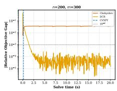

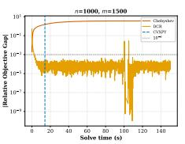  
(a) ER topology

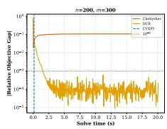

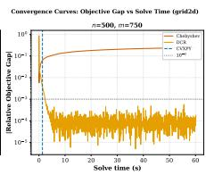

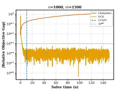  
(b) grid2d topology  
Fig. 5. Convergence curves (objective gap vs. solve time) for DCR and Chebyshev on the LR-NNLS problem (3) under two graph topologies, at $n \in$ {200, 500, 1000} with $m = 1 . 5 n$ . Each subplot shows the absolute relative objective gap (65) versus solve time; the vertical dashed line marks the CVXPY solve time; the horizontal dotted line marks the $1 0 ^ { - 3 }$ accuracy threshold. DCR consistently achieves rapid convergence to high-accuracy solutions (typically below $1 0 ^ { - 4 } )$ , while Chebyshev exhibits slow convergence and stagnates at significantly higher objective gaps, especially for larger problem sizes.

• Runtime (time-to-accuracy): the time required for a method to first satisfy:

$$
\left| \frac { Y - Y _ { \mathrm { C V X P Y } } } { Y _ { \mathrm { C V X P Y } } } \right| \leq 1 0 ^ { - 3 } .\tag{66}
$$

For DCR, only Phase 2 (online) time is counted; Phase 1 is excluded as it is amortized across instances with the same graph.

• Topology robustness: experiments are conducted under both grid2d and Erdős-Rényi (ER) topologies, which exhibit markedly different spectral gaps and conditioning characteristics, to assess sensitivity to graph structure.

## B. Numerical Results

1) Convergence Behavior: Fig. 5 shows the convergence behavior of DCR and Chebyshev in terms of relative objective gap versus solve time under both grid2d and ER topologies.

Grid2d Topology. Fig. 5 (a) shows the convergence results on grid2d graphs. DCR converges rapidly for all problem sizes: for $n = 2 0 0 .$ , the objective gap drops below $1 0 ^ { - 3 }$ within 2.47 s; for $n = 5 0 0$ and $n = 1 0 0 0$ , the time-to-accuracy is 2.27 s and $2 . 7 6 \mathrm { s } ,$ respectively. After the initial fast decrease, the objective gap stabilizes, staying around $1 0 ^ { - 5 }$ to $1 0 ^ { - 3 }$ for $n = 2 0 0$ and $1 0 ^ { - 5 }$ to $1 0 ^ { - 4 }$ for $n = 5 0 0$ , with small variations due to the Adam optimizer. For $n = 1 0 0 0$ , DCR achieves a final relative objective gap of $5 . 9 \times 1 0 ^ { - 1 1 }$ and a relative solution error of $3 . 3 \times 1 0 ^ { - 9 }$ , which are close to machine precision. In contrast, Chebyshev shows poor convergence: for $n = 2 0 0$ and $n =$ 500, the objective gap increases after the first few iterations and then stabilizes around $1 0 ^ { - 1 }$ , while for $n = 1 0 0 0$ it remains above $1 0 ^ { - 1 }$ throughout the entire time budget. In all cases, Chebyshev fails to reach the $1 0 ^ { - 3 }$ threshold, indicating that the fixed polynomial approximation introduces a bias that cannot be reduced by further iterations.

ER Topology. Fig. 5 (b) shows that DCR maintains similar convergence behavior on ER graphs despite their different spectral properties. For $n \ = \ 2 0 0$ , DCR reaches the $1 0 ^ { - 3 }$ threshold at 1.85 s and then converges to a gap around $1 0 ^ { - 4 } -$ $1 0 ^ { - 5 } ;$ for $n \ = \ 5 0 0$ , it reaches the threshold at 1.54s and stabilizes at a similar level; for $n \ = \ 1 0 0 0 .$ it crosses the threshold at 3.19 s and achieves a final gap of $2 . 3 \times 1 0 ^ { - 1 1 }$ The corresponding CVXPY solve times are 0.16 s, 1.67 s, and 14.14 s, showing that DCR remains efficient as the problem size grows. Chebyshev performs even worse on ER graphs: for example, at $n = 5 0 0$ and $n = 7 0 0$ , the relative solution error reaches 1.20 and 1.17, which is significantly larger than the grid2d case (0.36 and 0.74), indicating that the polynomial approximation of $L ^ { \dagger }$ degrades under more irregular spectra. In contrast, DCR maintains stable accuracy across both topologies, with final objective gaps on ER graphs $( 7 . 9 \times 1 0 ^ { - 1 0 }$ $8 . 2 \times 1 0 ^ { - 1 0 }$ , and $2 . 3 \times 1 0 ^ { - 1 1 }$ for $ { n _ { \mathrm { ~ \scriptsize ~ = ~ } } } 5 0 0 , 7 0 0 , 1 0 0 0 )$ comparable to those on grid2d, demonstrating that the learned approximation $\widetilde { L } ^ { \dagger }$ in DCR adapts well to different graph structures without modifying the algorithm.

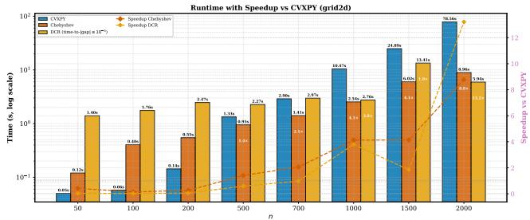  
(a) grid2d topology

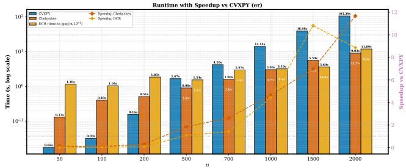  
(b) ER topology  
Fig. 6. Runtime and speedup comparison of DCR and Chebyshev relative to CVXPY on the LR-NNLS problem (3) for $n \in [ 5 0 , 2 0 0 0 ] .$ $m = 1 . 5 n$ (a): grid2d topology. (b): ER topology. Bar heights show runtime. White labels inside Chebyshev and DCR bars indicate the speedup ratio relative to CVXPY. DCR runtime is measured as time-to-accuracy (66). The right axis (dashed lines) shows the speedup ratio of each method relative to CVXPY.

2) Runtime and Speedup Analysis: Fig. 6 compares the runtime and speedup of DCR and Chebyshev relative to CVXPY under both grid2d and ER topologies.

Grid2d Topology. Fig. 6 (a) shows the runtime on grid2d graphs. $\mathrm { C V X P Y ` s }$ runtime increases rapidly with problem size, from 0.05 s at $n = 5 0$ to 78.56s at $n \ : = \ : 2 0 0 0$ , indicating poor scaling with problem size. Chebyshev is faster at small sizes (e.g., 0.12 s at $n ~ = ~ 5 0 )$ , but its runtime still grows steadily and reaches 8.96 s at n = 2000. Moreover, its speedup over CVXPY remains limited, below 4.1 × for $n \leq 1 0 0 0$ and peaking at 8.8× at $n = 2 0 0 0$ , while its low solution accuracy (as shown in Fig. 5 (b)) reduces the practical value of this speed advantage. In contrast, DCR shows stable runtime across a wide range of problem sizes. It requires 1.40 s at $n = 5 0$ $2 . 2 7 s$ at $n = 5 0 0 , 2 . 7 6$ s at $n = 1 0 0 0$ , and 5.94 s at $n = 2 0 0 0$ to reach the target accuracy. As a result, the speedup of DCR increases with $n ,$ reaching 3.8× at $n ~ = ~ 1 0 0 0$ and 13.2× at $n = 2 0 0 0$ . These results show that DCR scales well and becomes more efficient than the convex solver as the problem size grows.

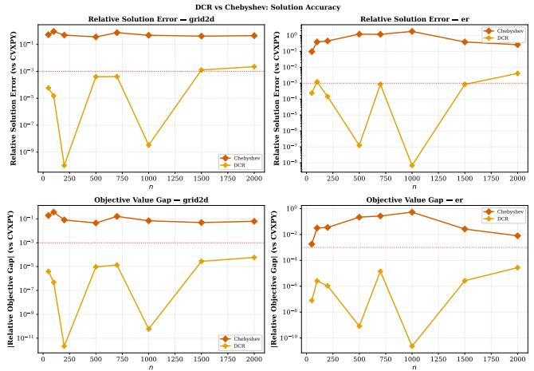  
Fig. 7. Solution accuracy of DCR and Chebyshev on the LR-NNLS problem (3) for n ∈ [50, 2000], $m = 1 . 5 n$ , under grid2d (left column) and ER (right column) topologies. Top row: relative solution error (64) versus n. Bottom row: relative objective gap (65) versus n. The red dotted line marks the $1 0 ^ { - 3 }$ threshold. All metrics are computed relative to the convex solver reference solution. DCR consistently achieves high accuracy (often below $1 0 ^ { - 5 } )$ , while Chebyshev exhibits large errors and fails to reach the desired accuracy across all problem sizes, especially on ER graphs.

ER Topology. Fig. 6 (b) shows the runtime on ER graphs. CVXPY becomes more expensive as n increases, rising from 0.02 s at $n = 5 0$ to 105.39 s at $n = 2 0 0 0$ . DCR maintains stable time-to-accuracy across scales, requiring 1.16 s at $n = 5 0$ 1.54 s at n = 500, 3.19 s at n = 1000, 3.60 s at $n = 1 5 0 0$ , and 11.89 s at $n = 2 0 0 0$ . This leads to increasing speedup over the convex solver, reaching 4.4× at n = 1000, 10.8× at n = 1500, and $8 . 9 \times$ at $n = 2 0 0 0$ Chebyshev achieves a higher speedup at the largest size (up to $1 1 . 7 \times$ at $n = 2 0 0 0 )$ , but this comes at the cost of poor solution quality. As shown in Fig. 5 (a), Chebyshev does not meet the $1 0 ^ { - 3 }$ accuracy threshold at any scale on ER graphs. Thus, its apparent runtime advantage is limited when solution accuracy is taken into account. DCR achieves consistent and increasing speedup with problem size while maintaining high solution accuracy, offering a better efficiency-accuracy trade-off across different graph structures.

3) Solution Accuracy: Fig. 7 compares the solution accuracy of DCR and Chebyshev in terms of relative solution error and objective gap with respect to the CVXPY reference.

Grid2d Topology. Fig. 7 (left column) shows the results on grid2d graphs. DCR consistently achieves high accuracy across all problem sizes, with relative solution error typically below $1 0 ^ { - 3 }$ and often reaching $1 0 ^ { - 5 } \ \mathrm { t o } \ 1 0 ^ { - 1 0 }$ . For example, the relative solution error drops to $1 . 0 \times 1 0 ^ { - 1 0 }$ at $n = 2 0 0$ and

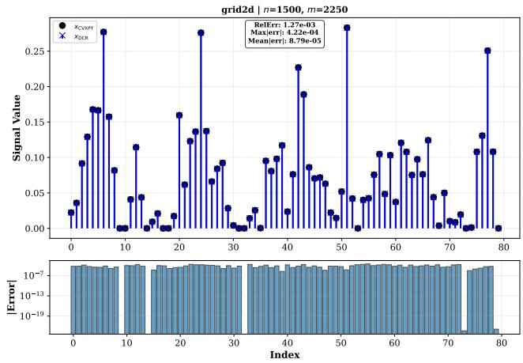  
Fig. 8. Signal reconstruction comparison between DCR and CVXPY on a grid2d instance $( n = 1 5 0 0 , m \stackrel { \cdot } { = } 2 2 5 0 )$ . Top: first 80 components of xCyXPY (black) and xDCR (blue), which are visually indistinguishable. Bottom: elementwise absolute error $\mathsf { \tilde { \Pi } } | x _ { i } ^ { \mathrm { D C R } } - x _ { i } ^ { \mathrm { C V X P \check { Y } } } |$ (log scale), concentrated around $1 0 ^ { - 7 } – 1 0 ^ { - 6 }$ Overall statistics: RelErr $= \stackrel { \cdot } { 1 . 2 7 } \times 1 0 ^ { - 3 }$ (64), Max $| \mathrm { e r r } | = 4 . 2 2 \times 1 0 ^ { - 4 }$ (62), Mean $\lvert \mathrm { e r r } \rvert = 8 . 7 9 \times 1 0 ^ { - 5 } ~ ( 6 3 )$

$3 . 3 \times 1 0 ^ { - 9 }$ at $n = 1 0 0 0$ . The corresponding objective gap is also extremely small, reaching $2 . 1 \times 1 0 ^ { - \hat { 1 } 2 }$ at $n = 2 0 0$ and $5 . 9 \times 1 0 ^ { - 1 1 }$ at $n = 1 0 0 0$ . In contrast, Chebyshev exhibits large errors across all scales, with relative solution error around $0 . 3 \mathrm { - } 0 . 9$ and objective gap around $1 0 ^ { - 2 } ~ \mathrm { t o } ~ 1 0 ^ { - 1 }$ , and it never approaches the $1 0 ^ { - 3 }$ threshold. This suggests that the fixed polynomial approximation introduces a bias that is difficult to reduce by increasing iterations.

ER Topology. Fig. 7 (right column) shows similar trends on ER graphs. DCR again maintains high accuracy, with relative solution error typically below $1 0 ^ { - 3 }$ and reaching as low as $1 . 3 \times 1 0 ^ { - 7 }$ at $n = 5 0 0$ and $6 . 8 \times 1 0 ^ { - 9 }$ at $n = 1 0 0 0$ . The objective gap follows the same pattern, achieving values as small as $8 . 2 \times 1 0 ^ { - 1 0 }$ and $2 . 3 \times 1 0 ^ { - 1 1 }$ . In contrast, Chebyshev performs worse on ER graphs than on grid2d graphs, with relative solution error exceeding 1 at several scales, reaching 1.20 at $n = 5 0 0$ and 1.78 at $n = 1 0 0 0$ , and with objective gap remaining above $1 0 ^ { - 2 }$ in most cases. These results suggest that the polynomial approximation of $L ^ { \dagger }$ may degrade under more irregular spectra, while DCR remains accurate and stable across different graph structures.

4) Signal Reconstruction Accuracy: Fig. 8shows a pointwise comparison between xDCR and the convex solver reference solution for a grid2d instance with $n ~ = ~ 1 5 0 0$ and $m \ = \ 2 2 5 0$ . The two signals are visually indistinguishable across all displayed components, indicating that DCR accurately recovers both support and magnitude. The elementwise absolute solution error remains uniformly small, typically in the range $1 0 ^ { - 8 }$ to $1 0 ^ { - 6 }$ , with no noticeable outliers or structured deviations. Quantitatively, the relative solution error is $1 . 2 7 \times 1 0 ^ { - 3 }$ , with maximum and mean absolute solution errors of $4 . 2 2 \times 1 0 ^ { - 4 }$ and $8 . 7 9 \times 1 0 ^ { - 5 }$ , respectively. The relative objective gap is $2 . 7 8 \times 1 0 ^ { - 5 }$ , confirming that DCR achieves a solution very close to the convex solver reference solution. These results show that DCR provides accurate and stable reconstruction at large problem scale.

TABLE III  
PERFORMANCE SUMMARY OF DCR AND CHEBYSHEV (m = 1.5n, CVXPY AS REFERENCE). DCR RUNTIME IS TIME-TO-ACCURACY. SPEEDUP IS RELATIVE TO THE CONVEX SOLVER CVXPY. BEST RESULTS PER ROW IN BOLD.
<table><tr><td rowspan="2">Topology</td><td rowspan="2">n</td><td rowspan="2">CVXPY Time (s)</td><td colspan="2">Chebyshev</td><td colspan="4">DCR (Ours)</td></tr><tr><td>Rel. Sol. Err.</td><td>Rel. Obj. Gap</td><td> $\operatorname { R e l . } \operatorname { S o l . } \operatorname { E r r . }$ </td><td>Rel. Obj. Gap</td><td>Time (s)</td><td>Speedup</td></tr><tr><td rowspan="8">ridd2d</td><td>50</td><td>0.05</td><td> $5 . 2 6 \times 1 0 ^ { - 1 }$ </td><td> $1 . 9 2 \times 1 0 ^ { - 1 }$ </td><td> $\mathbf { 5 . 7 9 \times 1 0 ^ { - 5 } }$ </td><td> $\mathbf { 3 . 9 3 \times 1 0 ^ { - 6 } }$ </td><td>1.40</td><td>0.04×</td></tr><tr><td>100</td><td>0.06</td><td> $9 . 2 2 \times 1 0 ^ { - 1 }$ </td><td> $3 . 6 6 \times 1 0 ^ { - 1 }$ </td><td> $\mathbf { 1 . 5 1 \times 1 0 ^ { - 5 } }$ </td><td> $\mathbf { 4 . 8 1 \times 1 0 ^ { - 7 } }$ </td><td>1.76</td><td>0.03×</td></tr><tr><td>200</td><td>0.14</td><td> $4 . 9 1 \times 1 0 ^ { - 1 }$ </td><td> $8 . 1 7 \times 1 0 ^ { - 2 }$ </td><td> $\mathbf { 1 . 0 2 \times 1 0 ^ { - 1 0 } }$ </td><td> $\mathbf { 2 . 1 3 \times 1 0 ^ { - 1 2 } }$ </td><td>2.47</td><td>0.06×</td></tr><tr><td>500</td><td>1.33</td><td> $3 . 6 1 \times 1 0 ^ { - 1 }$ </td><td> $4 . 5 4 \times 1 0 ^ { - 2 }$ </td><td> $\mathbf { 3 . 9 6 \times 1 0 ^ { - 4 } }$ </td><td> $\mathbf { 9 . 4 8 \times 1 0 ^ { - 6 } }$ </td><td>2.27</td><td>0.6×</td></tr><tr><td>700</td><td>2.90</td><td> $7 . 4 4 \times 1 0 ^ { - 1 }$ </td><td> $1 . 6 2 \times 1 0 ^ { - 1 }$ </td><td> $\mathbf { 4 . 0 8 \times 1 0 ^ { - 4 } }$ </td><td> $\mathbf { 1 . 3 5 \times 1 0 ^ { - 5 } }$ </td><td>2.97</td><td>1.0×</td></tr><tr><td>1000</td><td>10.47</td><td> $4 . 7 7 \times 1 0 ^ { - 1 }$ </td><td> $6 . 9 4 \times 1 0 ^ { - 2 }$ </td><td> $\mathbf { 3 . 3 2 \times 1 0 ^ { - 9 } }$ </td><td> $\mathbf { 5 . 8 7 \times 1 0 ^ { - 1 1 } }$ </td><td>2.76</td><td>3.8×</td></tr><tr><td>1500</td><td>24.89</td><td> $4 . 1 1 \times 1 0 ^ { - 1 }$ </td><td> $4 . 9 3 \times 1 0 ^ { - 2 }$ </td><td> $\mathbf { 1 . 2 7 \times 1 0 ^ { - 3 } }$ </td><td> $\mathbf { 2 . 7 8 \times 1 0 ^ { - 5 } }$ </td><td>13.41</td><td>1.9×</td></tr><tr><td>2000</td><td>78.56</td><td> $4 . 4 7 \times 1 0 ^ { - 1 }$ </td><td> $6 . 2 4 \times 1 0 ^ { - 2 }$ </td><td> $\mathbf { 2 . 2 2 \times 1 0 ^ { - 3 } }$ </td><td> $\mathbf { 5 . 8 3 \times 1 0 ^ { - 5 } }$ </td><td>5.94</td><td>13.2×</td></tr><tr><td rowspan="8">R</td><td>50</td><td>0.02</td><td> $9 . 6 3 \times 1 0 ^ { - 2 }$ </td><td> $1 . 8 2 \times 1 0 ^ { - 3 }$ </td><td> $\mathbf { 2 . 3 9 \times 1 0 ^ { - 4 } }$ </td><td> $\mathbf { 7 . 8 5 \times 1 0 ^ { - 8 } }$ </td><td>1.16</td><td>0.02×</td></tr><tr><td>100</td><td>0.03</td><td> $3 . 9 1 \times 1 0 ^ { - 1 }$ </td><td> $3 . 1 5 \times 1 0 ^ { - 2 }$ </td><td> $\mathbf { 1 . 2 2 \times 1 0 ^ { - 3 } }$ </td><td> $\mathbf { 2 . 5 9 \times 1 0 ^ { - 6 } }$ </td><td>1.04</td><td>0.03×</td></tr><tr><td>200</td><td>0.16</td><td> $4 . 4 6 \times 1 0 ^ { - 1 }$ </td><td> $3 . 5 1 \times 1 0 ^ { - 2 }$ </td><td> $\mathbf { 1 . 4 5 \times 1 0 ^ { - 4 } }$ </td><td> $\mathbf { 1 . 0 7 \times 1 0 ^ { - 6 } }$ </td><td>1.85</td><td>0.08×</td></tr><tr><td>500</td><td>1.67</td><td> $1 . 2 0 \times 1 0 ^ { 0 }$ </td><td> $2 . 1 8 \times 1 0 ^ { - 1 }$ </td><td> $\mathbf { 1 . 2 5 \times 1 0 ^ { - 7 } }$ </td><td> $\mathbf { 8 . 1 7 \times 1 0 ^ { - 1 0 } }$ </td><td>1.54</td><td>1.1×</td></tr><tr><td>700</td><td>4.20</td><td> $1 . 1 7 \times 1 0 ^ { 0 }$ </td><td> $2 . 6 7 \times 1 0 ^ { - 1 }$ </td><td> $\mathbf { 8 . 4 5 \times 1 0 ^ { - 4 } }$ </td><td> $\mathbf { 1 . 4 1 \times 1 0 ^ { - 5 } }$ </td><td>2.97</td><td>1.4×</td></tr><tr><td>1000</td><td>14.14</td><td> $1 . 7 8 \times 1 0 ^ { 0 }$ </td><td> $5 . 3 2 \times 1 0 ^ { - 1 }$ </td><td> $\mathbf { 6 . 8 5 \times 1 0 ^ { - 9 } }$ </td><td> $\mathbf { 2 . 3 2 \times 1 0 ^ { - 1 1 } }$ </td><td>3.19</td><td>4.4×</td></tr><tr><td>1500</td><td>38.98</td><td> $3 . 8 8 \times 1 0 ^ { - 1 }$ </td><td> $2 . 6 3 \times 1 0 ^ { - 2 }$ </td><td> $\mathbf { 8 . 4 3 \times 1 0 ^ { - 4 } }$ </td><td> $\mathbf { 2 . 6 8 \times 1 0 ^ { - 6 } }$ </td><td>3.60</td><td>10.8×</td></tr><tr><td>2000</td><td>105.39</td><td> $2 . 6 2 \times 1 0 ^ { - 1 }$ </td><td> $7 . 9 2 \times 1 0 ^ { - 3 }$ </td><td> $\mathbf { 4 . 0 9 \times 1 0 ^ { - 3 } }$ </td><td> $\mathbf { 2 . 7 4 \times 1 0 ^ { - 5 } }$ </td><td>11.89</td><td>8.9×</td></tr></table>

5) Summary: Table III summarizes the performance of DCR and Chebyshev across all configurations. First, DCR consistently achieves much higher accuracy, outperforming Chebyshev by several orders of magnitude on both grid2d and ER topologies. While Chebyshev's relative solution error remains above $9 . 6 \times 1 0 ^ { - 2 }$ and even exceeds 1 on ER graphs, DCR attains errors as low as $1 0 ^ { - 1 0 }$ on grid2d and $1 0 ^ { - 9 }$ on ER, with almost all cases satisfying the $1 0 ^ { - 3 }$ criterion. Second, the speedup of DCR over the convex solver increases with problem size. Although DCR is slower at small scales, it achieves up to 13.2× speedup on grid2d graph and 10.8× on ER graph at large n, demonstrating that DCR becomes increasingly competitive as problem size grows. Third, DCR maintains both accuracy and efficiency across different graph topologies, indicating that the learned pseudoinverse approximation $\widetilde { L } ^ { \dagger }$ is robust to variations in graph structure.

## VI. CONCLUSION

This work addresses a key challenge in Laplacianregularized optimization caused by the dense and illconditioned Laplacian pseudoinverse. We propose a Difference-of-Convex Regularizer (DCR) graph learning framework that replaces direct pseudoinverse computation with a differentiable, spectrally structured approximation learned via regularized Maximum Likelihood Estimation (MLE) and Convex-Concave Procedure (CCCP) iterations. By reformulating Laplacian-Regularized Nonnegative Least Squares (LR-NNLS) through a dual representation, DCR decouples pseudoinverse approximation from instance-specific optimization, enabling cross-instance reuse and efficient primal recovery. We further establish theoretical guarantees on fixed-point existence and stability. Experiments across diverse graph topologies and scales show that DCR captures the inverse spectral behavior of the Laplacian, achieving stable convergence and accurate reconstruction under severe ill-conditioning. Compared with convex solvers and graph filtering methods, DCR achieves similar accuracy while significantly improving performance at large scales. Future work will extend the framework to broader graph-regularized problems and dynamic graph settings.

## REFERENCES

[1] J. Tuck, D. Hallac, and S. Boyd, “Distributed majorization-minimization for Laplacian regularized problems," IEEE/CAA Journal of Automatica Sinica, vol. 6, no. 1, pp. 45–52, 2019.

[2] M. Yin, J. Gao, and Z. Lin, "Laplacian regularized low-rank representation and its applications," IEEE Transactions on Pattern Analysis and Machine Intelligence, vol. 38, no. 3, pp. 504–517, 2016.

[3] B. Gao, T.-Y. Liu, W. Wei, T. Wang, and H. Li, "Semi-supervised ranking on very large graphs with rich metadata," in Proceedings of the 17th ACM SIGKDD International Conference on Knowledge Discovery and Data Mining, 2011, pp. 96–104.

[4] K. El-Arini, M. Xu, E. B. Fox, and C. Guestrin, “Representing documents through their readers," in Proceedings of the 19th ACM SIGKDD International Conference on Knowledge Discovery and Data Mining, 2013, pp. 14–22.

[5] R. Ammanouil, A. Ferrari, and C. Richard, “A graph Laplacian regularization for hyperspectral data unmixing," in 2015 IEEE International Conference on Acoustics, Speech and Signal Processing (ICASSP). IEEE, 2015, pp. 1637–1641.

[6] D. Cai, X. He, J. Han, and T. S. Huang, “Graph regularized nonnegative matrix factorization for data representation," IEEE Transactions on Pattern Analysis and Machine Intelligence, vol. 33, no. 8, pp. 1548– 1560, 2010.

[7] Y.-P. Zhao, L. Chen, and C. P. Chen, "Laplacian regularized nonnegative representation for clustering and dimensionality reduction," IEEE Transactions on Circuits and Systems for Video Technology, vol. 31, no. 1, pp. 1–14, 2020.

[8] S. Boyd and L. Vandenberghe, Convex Optimization. Cambridge University Press, 2004.

[9] G. Ranjan, Z.-L. Zhang, and D. Boley, "Incremental computation of pseudoinverse of Laplacian," in International Conference on Combinatorial Optimization and Applications. Springer, 2014, pp. 729–749.

[10] K. Shivashankar, G. Al Hajj, and A. Martini, "Maintainability and scalability in machine learning: Challenges and solutions," ACM Computing Surveys, vol. 57, no. 12, 2025.

[11] D. K. Hammond, P. Vandergheynst, and R. Gribonval, "Wavelets on graphs via spectral graph theory," Applied and Computational Harmonic Analysis, vol. 30, no. 2, pp. 129–150, 2011.

[12] D. I. Shuman, P. Vandergheynst, D. Kressner, and P. Frossard, "Distributed signal processing via Chebyshev polynomial approximation," IEEE Transactions on Signal and Information Processing over Networks, vol. 4, no. 4, pp. 736–751, 2018.

[13] C. Cheng, Q. Sun, and C. Zheng, "Iterative polynomial approximation algorithms for inverse graph filters," in 2025 International Conference on Sampling Theory and Applications (SampTA). IEEE, 2025, pp. 1–5.

[14] J. Choi, H. Wi, J. Kim, Y. Shin, K. Lee, N. Trask, and N. Park, “Graph convolutions enrich the self-attention in transformers!"Advances in Neural Information Processing Systems, vol. 37, pp. 52 891–52936, 2024.

[15] J. Kunegis and A. Lommatzsch, “"Learning spectral graph transformations for link prediction," in Proceedings of the 26th Annual International Conference on Machine Learning, 2009, pp. 561–568.

[16] S.-J. Kim, A. Zymnis, A. Magnani, K. Koh, and S. Boyd, "Learning the kernel via convex optimization," in 2008 IEEE International Conference on Acoustics, Speech and Signal Processing. IEEE, 2008, pp. 1997– 2000.

[17] F. Xia, C. Peng, J. Ren, F. G. Febrinanto, R. Luo, V. Saikrishna, S. Yu, and X. Kong, "Graph learning," Foundations and Trends® in Signal Processing, vol. 19, no. 4, pp. 362–519, 2026.

[18] P. D. Tao and E. B. Souad, “"Duality in DC (difference of convex functions) optimization. Subgradient methods," in Trends in Mathematical Optimization: 4th French-German Conference on Optimization. Springer, 1988, pp. 277–293.

[19] X. Shen, S. Diamond, Y. Gu, and S. Boyd, “"Disciplined convex-concave programming," in 2016 IEEE 55th Conference on Decision and Control (CDC). IEEE, 2016, pp. 1009–1014.

[20] C. Yao and X. Jiang, “A globally convergent difference-of-convex algorithmic framework and application to log-determinant optimization problems," arXiv preprint arXiv:2306.02001, 2023.

[21] X. Shen, A. Ali, and S. Boyd, "Minimizing oracle-structured composite functions," Optimization and Engineering, vol. 24, no. 2, pp. 743–777, 2023.

[22] K. Chen, L. Liang, and S. Pan, “Computing one-bit compressive sensing via zero-norm regularized DC loss model and its surrogate," Journal of Global Optimization, vol. 92, no. 3, pp. 775–807, 2025.

[23] Z. Li, Z. Yang, H. Zhao, and S. Xie, "Direct-optimization-based DC dictionary learning with the MCP regularizer," IEEE Transactions on Neural Networks and Learning Systems, vol. 34, no. 7, pp. 3568–3579, 2021.

[24] P. D. Tao and L. T. H. An, “A DC optimization algorithm for solving the trust-region subproblem," SIAM Journal on Optimization, vol. 8, no. 2, pp. 476–505, 1998.

[25] J. F. Toland, "Duality in nonconvex optimization," Journal of Mathematical Analysis and Applications, vol. 66, no. 2, pp. 399–415, 1978.

[26] A. L. Yuille and A. Rangarajan, "The concave-convex procedure," Neural Computation, vol. 15, no. 4, pp. 915–936, 2003.

[27] T. Lipp and S. Boyd, “Variations and extension of the convex-concave procedure," Optimization and Engineering, vol. 17, no. 2, pp. 263–287, 2016.

[28] A. L. Yuille and A. Rangarajan, “The concave-convex procedure (CCCP)," Advances in Neural Information Processing Systems, vol. 14, 2001.

[29] L. Tao and C. W. Tan, “Accelerating regularized attention kernel regression for spectrum cartography," arXiv preprint arXiv:2604.25138, 2026.

[30] M. Blondel and V. Roulet, "The elements of differentiable programming," arXiv preprint arXiv:2403.14606, 2024.

[31] L. Tao, X. Tong, and C. W. Tan, "Learning to optimize by differentiable programming," arXiv preprint arXiv:2601.16510, 2026.

[32] S. Kim, K.-A. Sohn, and E. P. Xing, “A multivariate regression approach to association analysis of a quantitative trait network," Bioinformatics, vol. 25, no. 12, pp. i204–i212, 2009.

[33] X. Chen, Q. Lin, S. Kim, J. G. Carbonell, and E. P. Xing, “Smoothing proximal gradient method for general structured sparse regression,' 2012.

[34] E. Pavez and A. Ortega, "Generalized Laplacian precision matrix estimation for graph signal processing," in 2016 IEEE International Conference on Acoustics, Speech and Signal Processing (ICASSP). IEEE, 2016, pp. 6350–6354.

[35] L. Zhuang, H. Gao, Z. Lin, Y. Ma, X. Zhang, and N. Yu, "Non-negative low rank and sparse graph for semi-supervised learning," in 2012 IEEE Conference on Computer Vision and Pattern Recognition. IEEE, 2012, pp. 2328–2335.

[36] D. Luo, H. Huang, F. Nie, and C. Ding, "Forging the graphs: A low rank and positive semidefinite graph learning approach," Advances in Neural Information Processing Systems, vol. 25, 2012.

[37] D. Alfke and M. Stoll, “Pseudoinverse graph convolutional networks," Data Mining and Knowledge Discovery, vol. 35, no. 4, pp. 1318–1341, 2021.

[38] H. Zhu, Z. Liu, C. P. Chen, and Y. Liang, "An efficient implementation to compute the pseudoinverse for the incremental broad learning system on added inputs," International Journal of Wavelets, Multiresolution and Information Processing, vol. 22, no. 06, p. 2450026, 2024.

[39] Z. Lu, W. Xu, and Z. Zhang, "Diagonal of pseudoinverse of graph Laplacian: Fast estimation and exact results," Theoretical Computer Science, vol. 1032, p. 115102, 2025.

[40] G. Strang, Introduction to Linear Algebra. SIAM, 2022.

[41] S. Diamond and S. Boyd, "CVXPY: A Python-embedded modeling language for convex optimization," Journal of Machine Learning Research, vol. 17, no. 83, pp. 1–5, 2016.

[42] D. E. Tyler, “A distribution-free M-estimator of multivariate scatter," The Annals of Statistics, pp. 234–251, 1987.

[43] Y. Sun, P. Babu, and D. P. Palomar, "Regularized Tyler's scatter estimator: Existence, uniqueness, and algorithms," IEEE Transactions on Signal Processing, vol. 62, no. 19, pp. 5143–5156, 2014.

[44] I. Soloveychik and A. Wiesel, "Tyler's estimator performance analysis," in 2015 IEEE International Conference on Acoustics, Speech and Signal Processing (ICASSP). IEEE, 2015, pp. 5688–5692.

[45] D. P. Palomar, Portfolio Optimization: Theory and Application. Cambridge, United Kingdom: Cambridge University Press, 2025.

[46] R. A. Fisher, “On the mathematical foundations of theoretical statistics," Philosophical Transactions of the Royal Society of London. Series A, Containing Papers of A Mathematical or Physical Character, vol. 222, no. 594-604, pp. 309–368, 1922.

[47] M. Frank and P. Wolfe, "An algorithm for quadratic programming," Naval Research Logistics Quarterly, vol. 3, no. 1-2, pp. 95–110, 1956.

[48] R. D. Millán, O. P. Ferreira, and J. Ugon, "Frank-Wolfe algorithm for DC optimization problem," arXiv preprint arXiv:2308.16444, 2023.

[49] A. Yurtsever and S. Sra, "CCCP is Frank-Wolfe in disguise," Advances in Neural Information Processing Systems, vol. 35, pp. 35 352–35 364, 2022.

[50] C. W. Tan, “Wireless network optimization by Perron-Frobenius theory," Foundations and Trends in Networking, vol. 9, no. 2-3, pp. 107–218, 2015.

[51] B. Lemmens and R. Nussbaum, Nonlinear Perron-Frobenius Theory Cambridge University Press, 2012, vol. 189.

[52] A. Wiesel, “Unified framework to regularized covariance estimation in scaled Gaussian models," IEEE Transactions on Signal Processing, vol. 60, no. 1, pp. 29–38, 2011.

[53] Y. Chen, A. Wiesel, and A. O. Hero, "Robust shrinkage estimation of high-dimensional covariance matrices," IEEE Transactions on Signal Processing, vol. 59, no. 9, pp. 4097–4107, 2011.

[54] A. Granas, J. Dugundji et al., Fixed Point Theory. Springer, 2003, vol. 14.

## APPENDIX

This appendix derives CCCP iterations for two representative spectral regularizers in Table I. As in the main text, we set $X = \Sigma ^ { - 1 }$ and formulate the objective as a DC program, with $S _ { k } = y _ { k } y _ { k } ^ { \top }$ . Unlike the scale-invariant regularization in IV-A, these variants alter the scaling behavior of the Tyler likelihood. To ensure well-posedness and avoid pathological scaling, we enforce the normalization $\operatorname { t r } ( \Sigma ) = n - 1$

A. Nuclear-Norm Regularization: $\| \Sigma ^ { - 1 / 2 } \|$ 水

Consider the following nuclear-norm regularized MLE:

$$
\begin{array} { l } { \displaystyle \operatorname* { m i n } _ { \Sigma \succ 0 } J ( \Sigma ) = \log \operatorname* { d e t } ( \Sigma ) + \frac { n - 1 } { K } \sum _ { k = 1 } ^ { K } \log \left( y _ { k } ^ { \top } \Sigma ^ { - 1 } y _ { k } \right) } \\ { \displaystyle \qquad + \left. \gamma \right\| \Sigma ^ { - 1 / 2 } \big \| _ { * } . } \end{array}\tag{67}
$$

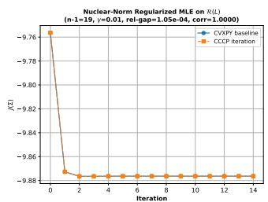

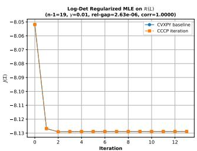  
(a) Nuclear-norm  
(b) Log-Determinant  
Fig. 9. Convergence comparison between the CVXPY baseline and the fixedpoint iterations (75) and (83) for (67) and (76) on R(L). Nearly identical objective trajectories confirm consistency with the CCCP formulation.

Here, the regularizer $\gamma \lVert \Sigma ^ { - 1 / 2 } \rVert$ \* penalizes small eigenvalues of Σ while inducing a milder spectral shrinkage compared with $\mathrm { t r } ( \Sigma ^ { - 1 } )$ . Note that for positive definite matrices Σ:

$$
\| { \Sigma } ^ { - 1 / 2 } \| _ { * } = \mathrm { t r } ( \sqrt { ( { \Sigma } ^ { - 1 / 2 } ) ^ { \top } ( { \Sigma } ^ { - 1 / 2 } ) } ) = \sum _ { i } \lambda _ { i } ^ { - 1 / 2 } .\tag{68}
$$

Then the problem (67) becomes:

$$
\begin{array} { l } { \displaystyle \operatorname* { m i n } _ { \Sigma \succ 0 } J ( \Sigma ) = \log \operatorname* { d e t } ( \Sigma ) + \frac { n - 1 } { K } \sum _ { k = 1 } ^ { K } \log \left( y _ { k } ^ { \top } \Sigma ^ { - 1 } y _ { k } \right) } \\ { \displaystyle \qquad + \gamma \operatorname { t r } ( \Sigma ^ { - 1 / 2 } ) . } \end{array}\tag{69}
$$

CCCP Iteration. Let $X = \Sigma ^ { - 1 } \succ 0$ Since $\mathrm { t r } ( \Sigma ^ { - 1 / 2 } ) =$ $\mathrm { t r } ( X ^ { 1 / 2 } )$ , the objective becomes:

$$
\begin{array} { l } { { \displaystyle { \cal F } ( X ) = - \log \operatorname* { d e t } ( X ) + \frac { n - 1 } { K } \sum _ { k = 1 } ^ { K } \log \bigl ( \mathrm { t r } ( X S _ { k } ) \bigr ) } } \\ { { \displaystyle ~ + \gamma \mathrm { t r } ( X ^ { 1 / 2 } ) . } } \end{array}\tag{70}
$$

Define $f ( X ) = - \log \operatorname* { d e t } ( X )$ and:

$$
g ( X ) = \frac { n - 1 } { K } \sum _ { k = 1 } ^ { K } \log ( \operatorname { t r } ( X S _ { k } ) ) + \gamma \operatorname { t r } ( X ^ { 1 / 2 } ) ,\tag{71}
$$

where $f ( X )$ is convex on $X \succ 0$ , while $g ( X )$ is concave. Linearizing the concave function $g ( X )$ at $X _ { t }$ gives:

$$
X _ { t + 1 } \in \arg \operatorname* { m i n } _ { X \succ 0 } f ( X ) + \langle \nabla g ( X _ { t } ) , X \rangle .\tag{72}
$$

The gradients are $\nabla f ( X ) = - X ^ { - 1 }$ and:

$$
\nabla g ( X ) = \frac { n - 1 } { K } \sum _ { k = 1 } ^ { K } \frac { S _ { k } } { \operatorname { t r } ( X S _ { k } ) } + \frac { \gamma } { 2 } X ^ { - 1 / 2 } .\tag{73}
$$

The optimality condition of (72) yields:

$$
X _ { t + 1 } ^ { - 1 } = \frac { n - 1 } { K } \sum _ { k = 1 } ^ { K } \frac { y _ { k } y _ { k } ^ { \top } } { y _ { k } ^ { \top } X _ { t } y _ { k } } + \frac { \gamma } { 2 } X _ { t } ^ { - 1 / 2 } .\tag{74}
$$

Using $\Sigma _ { t } = X _ { t } ^ { - 1 }$ , we obtain:

$$
\Sigma _ { t + 1 } = \frac { n - 1 } { K } \sum _ { k = 1 } ^ { K } \frac { y _ { k } y _ { k } ^ { \top } } { y _ { k } ^ { \top } \Sigma _ { t } ^ { - 1 } y _ { k } } + \frac { \gamma } { 2 } \Sigma _ { t } ^ { 1 / 2 } ,\tag{75}
$$

followed by the normalization $\mathrm { t r } ( \Sigma _ { t + 1 } ) = n - 1$ . When $\gamma =$ 0, the iteration reduces to the classical Tyler update.

Validation. Fig. 9 (a) compares CVXPY with the fixedpoint iteration (75) for (67) on $\mathcal { R } ( L )$ . The trajectories nearly coincide and converge within a few iterations, confirming the correctness of the CCCP update, with relative Frobenius gap $1 . 0 5 \times 1 0 ^ { - 4 }$ and correlation 1.0000.

B. Log-Determinant Barrier Regularization: —γ log det(Σ) Consider the following log-determinant regularized MLE:

$$
\begin{array} { l } { \displaystyle \operatorname* { m i n } _ { \Sigma \succ 0 } J ( \Sigma ) = \log \operatorname* { d e t } ( \Sigma ) + \frac { n - 1 } { K } \sum _ { k = 1 } ^ { K } \log \left( y _ { k } ^ { \top } \Sigma ^ { - 1 } y _ { k } \right) } \\ { \displaystyle ~ - \gamma \log \operatorname* { d e t } ( \Sigma ) . } \end{array}\tag{76}
$$

The regularizer -γ log det(Σ) acts as a spectral barrier that prevents eigenvalues of Σ from collapsing to zero. Since $\begin{array} { r } { - \log \operatorname* { d e t } ( \Sigma ) = - \sum _ { i } } \end{array}$ log $\lambda _ { i }$ , this penalty grows unbounded as any eigenvalue $\lambda _ { i } \to 0 .$ thereby stabilizing the spectrum of Σ. Combining the log-determinant terms, problem (76) becomes:

$$
\operatorname* { m i n } _ { \Sigma \succ 0 } J ( \Sigma ) = ( 1 - \gamma ) \log \operatorname* { d e t } ( \Sigma ) + \frac { n - 1 } { K } \sum _ { k = 1 } ^ { K } \log \bigl ( y _ { k } ^ { \top } \Sigma ^ { - 1 } y _ { k } \bigr ) .\tag{77}
$$

CCCP Iteration. Let $X = \Sigma ^ { - 1 } \succ 0$ , and (77) becomes:

$$
F ( X ) = - ( 1 - \gamma ) \log \operatorname * { d e t } ( X ) + \frac { n - 1 } { K } \sum _ { k = 1 } ^ { K } \log \bigl ( \mathrm { t r } ( X S _ { k } ) \bigr ) .\tag{78}
$$

Define f(X) = −(1 − γ) log det(X) and:

$$
g ( X ) = \frac { n - 1 } { K } \sum _ { k = 1 } ^ { K } \log ( \operatorname { t r } ( X S _ { k } ) ) ,\tag{79}
$$

where $f ( X )$ is convex on $X \succ 0$ , while $g ( X )$ is concave. Linearizing $g ( X )$ at $X _ { t }$ yields:

$$
X _ { t + 1 } \in \arg \operatorname* { m i n } _ { X \succ 0 } f ( X ) + \langle \nabla g ( X _ { t } ) , X \rangle .\tag{80}
$$

The gradients are $\nabla f ( X ) = - ( 1 - \gamma ) X ^ { - 1 }$ and:

$$
\nabla g ( X ) = { \frac { n - 1 } { K } } \sum _ { k = 1 } ^ { K } { \frac { S _ { k } } { \operatorname { t r } ( X S _ { k } ) } } .\tag{81}
$$

The optimality condition of (80) gives:

$$
( 1 - \gamma ) X _ { t + 1 } ^ { - 1 } = \frac { n - 1 } { K } \sum _ { k = 1 } ^ { K } \frac { y _ { k } y _ { k } ^ { \top } } { y _ { k } ^ { \top } X _ { t } y _ { k } } .\tag{82}
$$

Using $\Sigma _ { t } = X _ { t } ^ { - 1 }$ , we obtain:

$$
\Sigma _ { t + 1 } = \frac { 1 } { 1 - \gamma } \left( \frac { n - 1 } { K } \sum _ { k = 1 } ^ { K } \frac { y _ { k } y _ { k } ^ { \top } } { y _ { k } ^ { \top } \Sigma _ { t } ^ { - 1 } y _ { k } } \right) ,\tag{83}
$$

followed by the normalization $\mathrm { t r } ( \Sigma _ { t + 1 } ) = n - 1$ . When $\gamma =$ $0 ,$ the iteration reduces to the classical Tyler fixed-point update.

Validation. Fig. 9 (b) shows the convergence of CVXPY and the fixed-point iteration (83) for (76) on $\mathcal { R } ( L )$ . The two trajectories almost overlap, confirming the correctness of the CCCP update. Both methods converge within a few iterations and yield nearly identical solutions, with a relative Frobenius gap of $2 . 6 3 \times 1 0 ^ { - 6 }$ and correlation 1.0000.