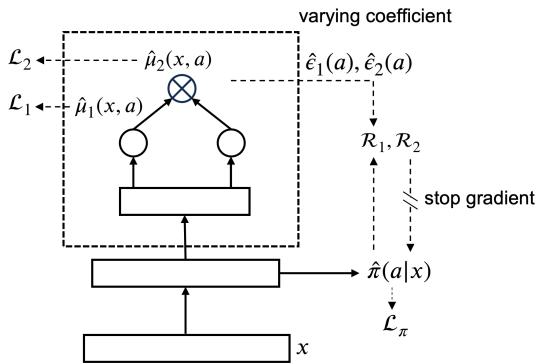
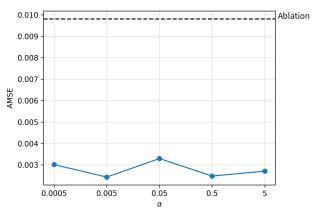
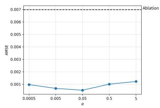
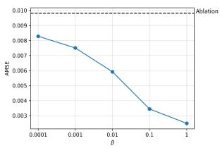
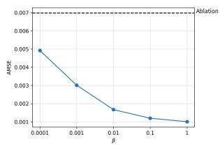
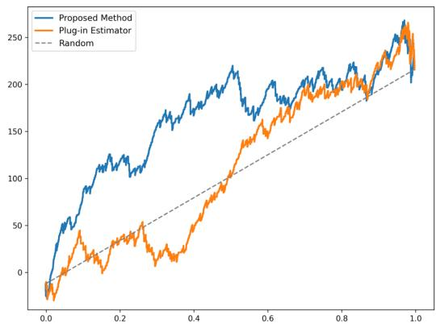

# Doubly Robust Estimation of Causal Effect on CVR with Targeted Regularization

Jiayi Dan 1 Bo Li 1 Lu Deng 2 Yong Wang 2

## Abstract

Post-click conversion rate (CVR) is a key metric in various scenarios including e-commerce and advertising, reflecting the efficiency and user experience in the second stage of the conversion process. Estimating the causal effect on CVR is therefore of great practical importance. However, directly applying existing causal inference methods to clicked samples introduces sample selection bias and increased variance due to the exclusion of non-click data. Recent studies on CVR prediction introduce “ideal loss”, which optimizes model parameters using an unbiased estimate of the loss over the full sample. Nevertheless, there is no guarantee that unbiasedness of the loss implies unbiasedness of the final estimator.

We revisit this challenge from the perspective of semiparametric theory. Specifically, we develop a new doubly robust causal effect estimator for chain-structured outcomes such as CVR, and derive its theoretical properties in detail. It achieves a faster convergence rate compared to nuisance parameters estimation and is therefore more robust when using flexible nonparametric estimators, including neural networks. Based on these theoretical findings, we further design a framework based on targeted regularization to improve numerical stability and practical applicability.

Extensive experiments on synthetic and realworld data demonstrate the effectiveness and robustness of our method. In addition, we find that naively combining loss debiasing with standard causal estimators underperforms our method, highlighting the necessity of developing the new estimator tailored to this CVR-style objective with solid theoretical guarantees.

## 1. Introduction

Causal effect estimation plays a critical role in enterprise decision-making. In e-commerce and ride-hailing scenarios, platforms distribute coupons to stimulate user transactions. Existing research has extensively studied the causal effect of strategies on conversion probability, yet the stage-wise mechanism behind the conversion process has received relatively less attention. For example, high-value coupons with strict usage requirements can substantially increase users’ click probability while simultaneously reducing post-click conversion probability, which indicate potential deterioration in user experience. Industry practitioners have recognized this issue and introduced post-click conversion rate (CVR) as a core metric describing second-stage conversion efficiency. Let $Y _ { 1 }$ and $Y _ { 2 }$ denote whether a user clicks and whether conversion occurs (with $Y _ { 2 } = 1$ implying $Y _ { 1 } = 1 ) ;$ CVR is defined as $\mathbb { P } ( Y _ { 2 } = 1 \ | \ Y _ { 1 } = 1 )$ . A healthy policy should improve overall conversion probabilities while ensuring stage-wise efficiency does not degrade.

Under the potential outcomes framework, let A and X denote treatment and covariates, we define the conditional and average potential outcomes of CVR as:

$$
\begin{array} { c l l } { { \psi _ { a } ( x ) = \mathbb { P } ( Y _ { 2 } ( a ) = 1 \mid Y _ { 1 } ( a ) = 1 , X = x ) , } } \\ { { } } & { { } } \\ { { \psi _ { a } = \mathbb { E } [ \mathbb { P } ( Y _ { 2 } ( a ) = 1 \mid Y _ { 1 } ( a ) = 1 , X ) ] , } } \end{array}
$$

which is defined on the entire population under the strategy.

From a mechanism decomposition perspective, mediation analysis is another classic framework, aiming to decompose the total effect into direct and indirect effects. A key step is estimating cross-world expectations $\mathbb { E } [ Y ( a , M ( a ^ { * } ) ) ]$ where $M$ denotes the mediator. We cannot simply treat $Y _ { 1 }$ as a mediator since $Y _ { 1 }$ and $Y _ { 2 }$ are always defined under the same treatment value, and mediation analysis degenerates into standard causal inference without cross-world quantities, since $\mathbb { E } [ Y ( a , M ( a ) ) ] \ \equiv \ \mathbb { E } [ Y ( a ) ]$ . To circumvent crossworld estimation, (Robins and Greenland, 1992) proposed the controlled direct effect (CDE), which is characterized by the estimand $\mathbb { E } [ \mathbb { E } ( Y ( a , m ) \mid X ) ]$ ]. We cannot adopt related methods for two main reasons: (1) the identifiability assumptions $M \perp \perp Y ( a , m ) \mid A , X$ rarely hold as the dependency between click and conversion cannot be blocked, (2) the key nuisance parameter $\mathbb { E } ( Y _ { 2 } \mid Y _ { 1 } = 1 , X = x , A = a )$ cannot be estimated directly. We cannot regress $Y _ { 2 }$ on $Y _ { 1 } , X$ , and A as in mediation analysis since $Y _ { 2 }$ is strictly dependent on $Y _ { 1 } ( Y _ { 1 } = 0  Y _ { 2 } = 0 )$ , and selecting samples with $Y _ { 1 } = 1$ would introduce selection bias.

The preceding discussion leads to the first challenge: selection bias. Most strategies, such as coupon allocation, are implemented prior to any click behavior, and our focus is on the full population. Therefore, directly treating $Y _ { 2 }$ as the outcome and applying existing causal estimators to samples with $Y _ { 1 } = 1$ would introduce bias due to the distribution shift induced by click selection. (Huang et al., 2024) demonstrated that estimating treatment effect on CVR only with clicked samples will lead to incorrect conclusions. However, its proposed method applies only to RCT data and lacks sound theoretical properties. Another line of work introduces the notion of ideal loss to correct selection bias and develops related CVR prediction models (Wang et al., 2019; Zhang et al., 2020; Guo et al., 2021; Dai et al., 2022; Li et al., 2022b;a). These methods construct unbiased estimators of the loss over full samples, yet no theory directly guarantees that unbiased loss implies unbiased estimation of the target estimand.

To address these limitations, we propose a new estimator for CVR causal effect with both practical applicability and theoretical guarantees. It directly targets the final estimand instead of relying on loss debiasing. Specifically, we derive the influence function and the von Mises expansion of the target estimand based on semiparametric theory. This inspires us to construct a doubly robust estimator, which remains consistent even if one of the nuisance estimators is inconsistent, and achieves desirable asymptotic properties. Leveraging the above theoretical results, we extend the idea of targeted regularization to develop a more stable estimation framework.

## Our contributions can be summarized as follows:

(1) We revisit the problem from a semiparametric perspective. Specifically, we develop a new doubly robust estimator tailored to chain-structured outcomes, especially CVR, which is a nontrivial constructive problem, and further show its desirable theoretical properties based on the von Mises expansion.

(2) Building on the above findings, we develop a practical estimation framework based on targeted-regularization to enhance applicability and empirical performance.

(3) We conduct extensive experiments on synthetic, semisynthetic, and real-world data, demonstrating the strong performance and robustness of our proposed method.

## 2. Related Works

## 2.1. Causal Inference based on Deep Learning

Deep learning has become a key tool for causal effect estimation due to its flexibility. Many studies focus on mitigating confounding bias through balanced representation learning. (Johansson et al., 2016) and (Shalit et al., 2017) first established a generalization bound incorporating empirical risk and Integral Probability Metric (IPM) distance. Building on this, several works introduce weighting strategies(Johansson et al., 2018; Hassanpour and Greiner, 2019; Assaad et al., 2021). (Wang et al., 2022) and (Kazemi and Ester, 2024) extend this paradigm to continuous treatment setting. Meanwhile, another classical neural-based causal estimation paradigm emphasizes propensity-score estimation (Shi et al., 2019; Nie et al., 2021). In particular, (Nie et al., 2021) propose a spline-based variable-coefficient neural network for continuous treatment settings, which prevents the treatment signal from being overshadowed by other high-dimensional covariates. As industry applications continue to grow, some recent studies adopt more flexible network structures(Ke et al., 2021; Zhong et al., 2022; Liu et al., 2023). Beyond standard feedforward networks, specialized architectures have also been explored, including VAE (Louizos et al., 2017), GAN (Yoon et al., 2018) and diffusion models(Sanchez and Tsaftaris, 2022). However, directly applying the above methods to causal effect estimation on CVR can only be conducted on the clicked subset, which may lead to selection bias and data sparsity issues.

## 2.2. Doubly Robust Estimator and Targeted Regularization

To address the estimation bias in the plug-in estimator, the DR learner—first proposed by (Van der Laan, 2005) and further developed by (Chernozhukov et al., 2017) and (Chernozhukov et al., 2018)—achieves doubly robustness by incorporating a bias correction term. Their theoretical work demonstrated that these doubly robust estimators attain $\sqrt { n } -$ convergence rates under appropriate conditions. Following this framework, (Nie and Wager, 2021) introduced the R-Learner, a general class of two-step algorithms for estimating treatment effects. (Kennedy, 2024) provides a comprehensive review of doubly robust estimation, with emphasis on its asymptotic properties and minimax-style efficiency bounds. To overcome the finite-sample instability of the standard doubly robust estimator based on one-step correction(Kennedy, 2024),(Shi et al., 2019) introduced targeted regularization inspired by TMLE (Van der Laan et al., 2011), which corrects estimation bias through an additional perturbation parameter, (Nie et al., 2021) further extends this practical framework to continuous-treatment setting. The above studies provide a solid theoretical foundation for establishing our new framework tailored to CVR. However, our target estimand and nuisance parameters differ fundamentally from those in standard causal-inference problems, requiring corresponding extensions and adaptations.

## 2.3. Debiased CVR Prediction

Sample-selection bias is a major challenge in CVR prediction, motivating many researchers to employ techniques from causal inference to address this problem. (Wang et al., 2019) first propose the “ideal loss” concept, seeking to derive an unbiased estimate of the training loss over the entire sample. Building on this idea, follow-up studies refine the estimation method to improve accuracy and reduce the variance (Zhang et al., 2020; Guo et al., 2021; Dai et al., 2022; Li et al., 2022b;a). However, this series of studies focus on CVR prediction instead of causal effect estimation. Moreover, their starting point is to estimate the loss over the entire sample, not to target the final estimand, while no theoretical results indicate that an unbiased loss necessarily leads to an unbiased final estimate. For causal-effect estimation on CVR, (Huang et al., 2024) demonstrate through real-world data analysis that restricting to clicked samples may yield misleading conclusions, and propose a multitask model for estimation of CTR and CVR treatment effects. This work further corroborates the importance of our problem, but the proposed method is only applicable to randomizedexperiment data. In addition, the approach mainly focuses on network-structure design and can be regarded as a plugin estimator, which lacks desirable theoretical properties including double robustness and consistency.

Research gap: To the best of our knowledge, few studies have directly targeted the final estimand for CVR causal effect estimation while providing both sound theoretical guarantees and strong practical utility.

## 3. Problem Formulation and Notations

Notation We use E to denote expectation, $\mathbb { P } \in \mathcal { P }$ to denote true probability measure and we write $\begin{array} { r } { \mathbb { P } ( f ) = \int f ( \mathbf { z } ) d \mathbb { P } ( \mathbf { z } ) } \end{array}$ where $\mathcal { P }$ is a set of possible probability distributions. Similarly, we use $\mathbb { P } _ { n }$ to denote the empirical measure and we write $\begin{array} { r } { \mathbb { P } _ { n } ( f ) ~ = ~ \int f ( \mathbf { z } ) d \mathbb { P } _ { n } ( z ) ~ } \end{array}$ We denote convergence in distribution by $\xrightarrow { d }$ and convergence in probability by $\xrightarrow { p }$ $X _ { n } ~ = ~ { \cal O } _ { \mathbb { P } } ( r _ { n } )$ means $X _ { n } / r _ { n }$ is bounded in probability and $X _ { n } ~ = ~ o _ { \mathbb { P } } ( r _ { n } )$ means $X _ { n } / r _ { n } \stackrel { p } {  } 0 . \tau$ denotes Rademacher random variables. We denote Rademacher complexity of a function class $\mathcal { F } : \mathcal { X }  \mathbb { R }$ as $\operatorname { R a d } _ { n } ( { \mathcal { F } } ) =$ $\begin{array} { r } { \mathbb { E } ( \operatorname* { s u p } _ { f \in \mathcal { F } } | \frac { 1 } { n } \sum _ { i = 1 } ^ { n } \tau _ { i } f ( X _ { i } ) | ) } \end{array}$ . Given two functions $f _ { 1 } , f _ { 2 }$ $\chi \to \breve { \mathbb { R } }$ , we define $\begin{array} { r } { \vert \vert f _ { 1 } - f _ { 2 } \vert \vert _ { \infty } = \operatorname* { s u p } _ { x \in \mathcal { X } } \vert f _ { 1 } ( x ) - f _ { 2 } ( x ) \vert } \end{array}$ and $\begin{array} { r } { \| f _ { 1 } - f _ { 2 } \| _ { L ^ { 2 } } = ( \int _ { x \in \chi } ( f _ { 1 } ( x ) - \hat { f _ { 2 } } ( x ) ) ^ { 2 } d x ) ^ { 1 / 2 } } \end{array}$ . For a function class ${ \mathcal F } ,$ we define $\begin{array} { r } { \| \mathcal { F } \| _ { \infty } = \operatorname* { s u p } _ { f \in \mathcal { F } } \| f \| _ { \infty } . } \end{array}$ $a _ { n } \asymp b _ { n }$ denotes that both $a _ { n } / b _ { n }$ and $b _ { n } / a _ { n }$ are bounded. $\delta ( \cdot )$ denotes the Dirac measure, which is used only as a notational device in theoretical analysis.

Let $\left( \mathbf { z } _ { 1 } , \ldots , \mathbf { z } _ { n } \right)$ be i.i.d. samples drawn from P, and denote $\mathbf { z } _ { i } = ( \mathbf { x } _ { i } , a _ { i } , y _ { 1 i } , y _ { 2 i } )$ , where $\mathbf { x } _ { i } \in \mathcal { X } \subset \mathbb { R } ^ { d }$ is the covariate vector, and $a _ { i } \in \mathcal { A } \subset \mathbb { R }$ is the treatment. Here $y _ { 1 i } \in \{ 0 , 1 \}$ indicates whether a click occurs, and $y _ { 2 i }$ indicates whether a conversion occurs , where $y _ { 2 i } = 1$ implies $y _ { 1 i } = 1$ . We use uppercase ${ \bf Z } , X , A , Y _ { 1 } , Y _ { 2 }$ to denote random variables corresponding to the observed lower-case ones. To ensure general applicability, we denote the treatment variable A as continuous, which naturally extends to the discrete treatment case (Nie et al., 2021).

Our target estimand is defined as: $\psi _ { a } ( \mathbb { P } ) = \mathbb { E } \big \lvert \mathbb { P } ( Y _ { 2 } ( a ) =$ $1 \mid Y _ { 1 } ( a ) = 1 , \mathbf { X } ) \mid$ ., which is a functional regarding the data-generating distribution P. For standard causal inference problems, the estimand is typically $\psi _ { a } = \mathbb { E } [ \mathbb { E } ( Y ( a ) \mid \mathbf { X } ) ]$ In our setting, A is not randomly assigned, and both $Y _ { 1 }$ and $Y _ { 2 }$ depend on A. A naive strategy is to restrict estimation to samples with $Y _ { 1 } = 1$ and estimate $\mathbb { E } [ \mathbb { P } ( Y _ { 2 } ( a ) = 1 \mid \mathbf { X } ) ]$ with existing methods. However, this introduces bias since $Y _ { 1 }$ is non-random.

We define $\mu _ { 1 } ( \mathbf { x } , a ) = \mathbb { E } ( Y _ { 1 } \mid \mathbf { X } = \mathbf { x } , A = a , \mu _ { 2 } ( \mathbf { x } , a ) =$ $\mathbb { E } ( Y _ { 2 } \ \mid \ \textbf { X } = \ \mathbf { x } , A \ = \ a )$ , and let $\pi ( \boldsymbol { a } \mathrm { ~ \bf ~ \vert ~ } \mathrm { ~ \bf ~ x \rangle ~ }$ denote the treatment density given $\textbf { X } = \textbf { x }$ (propensity score). Our estimation procedure will involve three nuisance parameters $( \mu _ { 1 } , \mu _ { 2 } , \pi )$ For notational simplicity in later derivations, we write $\mu _ { 1 } , \mu _ { 2 } , \pi$ and $\hat { \mu } _ { 1 } , \hat { \mu } _ { 2 } , \hat { \pi }$ to refer to $\mu _ { 1 } ( \mathbf { x } , a ) , \mu _ { 2 } ( \mathbf { x } , a ) , \pi ( a \mid \mathbf { x } )$ and $\hat { \mu } _ { 1 } ( \mathbf { x } , a ) , \hat { \mu } _ { 2 } ( \mathbf { x } , a ) , \hat { \pi } ( a \ |$ $\mathbf { x } )$

Our analysis is based on the following assumptions:

(i) Overlap. There exists a constant $c > 0$ such that for all $\mathbf { x } \in \mathcal { X }$ and $a \in { \mathcal { A } } , \pi ( a \mid \mathbf { x } ) \geq c ;$

(ii) Unconfoundedness. Covariates X block all back-door paths between treatment A and outcomes $Y _ { 1 } , Y _ { 2 } ;$

(iii) There exists a constant $c > 0$ such that $\mu _ { 1 } ( \mathbf { x } , a ) \geq c .$

Assumptions (i) and (ii) are standard in causal inference. Assumption (iii) is reasonable in practice since the population is finite and click probability usually has a positive lower bound, samples with $\mu _ { 1 } = 0$ have undefined CVR and are outside our scope.

Under the assumptions above,

$$
\begin{array} { r l } & { \psi _ { a } ( \mathbb { P } ) = \mathbb { E } \bigg [ \frac { \mathbb { P } \left( Y _ { 2 } ( a ) = 1 , Y _ { 1 } ( a ) = 1 \mid \mathbf { X } = \right) } { \mathbb { P } \left( Y _ { 1 } ( a ) = 1 \mid \mathbf { X } \right) } \bigg ] } \\ & { \quad \quad \quad = \mathbb { E } \bigg [ \frac { \mathbb { E } \left( Y _ { 2 } ( a ) \mid \mathbf { X } \right) } { \mathbb { E } \left( Y _ { 1 } ( a ) \mid \mathbf { X } \right) } \bigg ] = \mathbb { E } \bigg [ \frac { \mathbb { E } \left( Y _ { 2 } \mid \mathbf { X } , A = a \right) } { \mathbb { E } \left( Y _ { 1 } \mid \mathbf { X } , A = a \right) } \bigg ] . } \end{array}
$$

We fully exploit the dependence between $Y _ { 1 }$ and $Y _ { 2 }$ , which

allows all nuisance parameters to be estimated using the full sample.

## 4. Doubly Robust Estimation

## 4.1. Plug-in Estimator and Nuisance Parameter Estimation

We begin with a naive plug-in estimator to illustrate the estimation of nuisance components and the limitations of this approach. To leverage the full dataset, the simplest strategy is to predict $\mu _ { 1 } ( \mathbf { x } , a )$ and $\mu _ { 2 } ( \mathbf { x } , a )$ using covariates and the treatment. The final estimate is obtained by taking their ratio:

$$
\hat { \psi } ^ { \mathrm { p l u g - i n } } = \frac { 1 } { n } \sum _ { i = 1 } ^ { n } \frac { \hat { \mu } _ { 2 } ( \mathbf { x } _ { i } , a ) } { \hat { \mu } _ { 1 } ( \mathbf { x } _ { i } , a ) } .
$$

This is similar to the approach for CVR prediction used in ESMM (Ma et al., 2018). For causal estimation, following (Shi et al., 2019), we extract representations related to the treatment A by predicting $\pi ( \boldsymbol { a } \mid \mathbf { x } )$ before estimating $\mu _ { 2 } ( \mathbf { x } , a )$ and $\mu _ { 1 } ( \mathbf { x } , a )$ , enabling more accurate nuisance estimation with reduced noise. In practice, we add a small constant ϵ $( { \bf e . g . } 1 0 ^ { - 9 } ) \tan \hat { \mu } _ { 1 } ( { \bf x } , a )$ to ensure a strictly positive lower bound.

Under continuous treatment settings, a good estimator should not be dominated by other features, and maintain continuity and smoothness. To achieve this, we adopt the varying coefficient model (Hastie and Tibshirani, 1993; Fan and Zhang, 1999; Chiang et al., 2001) to estimate $\mu _ { 2 } ( \mathbf { x } , a )$ and $\mu _ { 1 } ( \mathbf { x } , a )$ , where the treatment variable a directly determines neural network parameters. Specifically, spline basis functions are used to parameterize weights:

$$
w ( a ) = \sum _ { \ell = 1 } ^ { L } \alpha _ { \ell } \phi _ { \ell } ( a ) ,
$$

where $\alpha _ { \ell }$ are coefficients and $\phi _ { \ell } ( \cdot )$ are polynomial basis functions. Therefore, $\mu _ { 2 } ( \mathbf { x } , a )$ and $\mu _ { 1 } ( \mathbf { x } , a )$ are continuous as long as the network activations are continuous.

For the generalized propensity score $\pi ( \boldsymbol { a } \ \mid \ \mathbf { x } )$ , the key difficulty is ensuring that the estimator forms a valid density for continuous treatment. Following (Nie et al., 2021), we uniformly discretize the interval [0, 1] into B grids and estimate $\pi ( \cdot | \mathbf { x } )$ on these $( B + 1 )$ grid points as $\pi _ { g r i d } ( \mathbf { x } ) = s o f t m a x ( \mathbf { w } \mathbf { x } ) \in \mathbb { R } ^ { B + 1 }$ , and then the conditional density could be given via linear interpolation, i.e., $\pi ( a | { \bf x } ) = \pi _ { g r i d } ^ { a _ { 1 } } ( { \bf x } ) + B ( \pi _ { g r i d } ^ { a _ { 2 } } ( { \bf x } ) - \pi _ { g r i d } ^ { a _ { 1 } } ( { \bf x } ) ) ( a - a _ { 1 } )$ where $a _ { 1 } = [ B a ] , a _ { 2 } = [ B \bar { a } ]$

We estimate the nuisance parameters by minimizing the negative log-likelihood, and the overall training loss is

$$
\mathcal { L } ( \hat { \mu } _ { 1 } , \hat { \mu } _ { 2 } , \hat { \pi } ) = \frac { 1 } { n } \sum _ { i = 1 } ^ { n } \Big [ \ell ( y _ { 1 i } , \hat { \mu } _ { 1 } ) + \ell ( y _ { 2 i } , \hat { \mu } _ { 2 } ) - \log \hat { \pi } \Big ] .
$$

However, the validity of this naive strategy heavily relies on the function class of the prediction models. When using nonparametric methods such as neural networks instead of maximum likelihood, the nuisance estimators often fail to achieve $\sqrt { n }$ convergence and may introduce non-negligible estimation bias. To better understand the estimation error and motivate the method developed later, consider the Taylor expansion of $\begin{array} { r } { \left| \frac { \hat { \mu } _ { 2 } } { \hat { \mu } _ { 1 } } - \frac { \mu _ { 2 } } { \mu _ { 1 } } \right| : } \end{array}$

$$
\begin{array} { c } { { \displaystyle \frac { \hat { \mu } _ { 2 } } { \hat { \mu } _ { 1 } } - \frac { \mu _ { 2 } } { \mu _ { 1 } } = - \frac { \hat { \mu } _ { 2 } } { \hat { \mu } _ { 1 } ^ { 2 } } ( \hat { \mu } _ { 1 } - \mu _ { 1 } ) + \frac 1 { \hat { \mu } _ { 1 } } ( \hat { \mu } _ { 2 } - \mu _ { 2 } ) } } \\ { { + O \big ( ( \hat { \mu } _ { 1 } - \mu _ { 1 } ) ^ { 2 } + | \hat { \mu } _ { 1 } - \mu _ { 1 } | | \hat { \mu } _ { 2 } - \mu _ { 2 } | \big ) . } } \end{array}
$$

The “first-order bias” terms $\hat { \mu } _ { 1 } - \mu _ { 1 }$ and $\hat { \mu } _ { 2 } - \mu _ { 2 }$ imply that the plug-in estimator is not consistent unless all nuisance parameters are consistently estimated. The convergence rate is dominated by the slowest-converging nuisance parameter, which makes the estimator sensitive to model misspecification, especially under flexible nonparametric estimation that trades increased bias for reduced variance. Eliminating first-order bias is precisely the motivation behind doubly robust estimation (Kennedy, 2024),which we will discuss next.

## 4.2. The New Doubly Robust Estimator

A good estimator can achieve lower bias and is robust to model misspecification, i.e., DR property (Bang and Robins, 2005; Kennedy, 2024; Chen et al., 2024). In this section, we propose a new DR estimator tailored to our target estimand, which remains consistent even if not all nuisance parameters are consistently estimated, and achieves a faster convergence than the nuisance estimators. This is a nontrivial constructive problem, and it forms the theoretical basis that supports our later model design. Specifically, we construct the estimator as follows:

$$
\begin{array} { r l } & { \hat { \psi } _ { a } ^ { \mathrm { d r } } = \mathbb { P } _ { n } \bigg [ \frac { \hat { \mu } _ { 2 } } { \hat { \mu } _ { 1 } } \bigg ] + \mathbb { P } _ { n } \bigg [ \frac { \delta ( A = a ) } { \hat { \pi } \hat { \mu } _ { 1 } ^ { 2 } } \big ( ( Y _ { 2 } - \hat { \mu } _ { 2 } ) \hat { \mu } _ { 1 } - ( Y _ { 1 } - \hat { \mu } _ { 1 } ) \hat { \mu } _ { 2 } \big ) \bigg ] } \\ & { \quad \quad : = \psi _ { a } ( \hat { \mathbb { P } } ) + \mathbb { P } _ { n } \big ( \phi _ { a } ( \hat { \mathbb { P } } ) \big ) . } \end{array}
$$

where $\begin{array} { r } { \phi _ { a } ( \mathbb { P } ) = \frac { \delta ( A = a ) } { \pi \mu _ { 1 } ^ { 2 } } \Big [ \mu _ { 1 } \big ( Y _ { 2 } - \mu _ { 2 } \big ) + \mu _ { 2 } \big ( Y _ { 1 } - \mu _ { 1 } \big ) \Big ] + } \end{array}$ $\frac { \mu _ { 2 } } { \mu _ { 1 } } - \psi _ { a } ( \mathbb { P } )$ is the influence function of the target estimand, which can be viewed as the “derivative over the distribution space”(Kennedy, 2024). Pˆ denotes the fitted data-generating distribution.

To gain intuition about the construction and properties of this estimator, we begin with the following lemma, which can be regarded as the ”distributional Taylor expansion” of the target estimand.

Lemma 4.1. ψ confirms the von Mises expansion (Kennedy, 2024):

$$
\psi _ { a } ( \hat { \mathbb { P } } ) - \psi _ { a } ( \mathbb { P } ) = - \int \phi _ { a } ( \hat { \mathbb { P } } ) d ( \mathbb { P } ) + R _ { 2 } ( \hat { \mathbb { P } } , \mathbb { P } ) ,
$$

where

$$
\phi _ { a } ( \mathbb { P } ) = \frac { \delta ( A = a ) } { \pi \mu _ { 1 } ^ { 2 } } \big [ ( Y _ { 2 } - \mu _ { 2 } ) \mu _ { 1 } - ( Y _ { 1 } - \mu _ { 1 } ) \mu _ { 2 } \big ] + \frac { \mu _ { 2 } } { \mu _ { 1 } } - \psi _ { a } ( \mathbb { P } ) ,
$$

$$
\begin{array} { l } { { \displaystyle R _ { 2 } ( \hat { \mathbb { P } } , \mathbb { P } ) = \int \frac 1 { \hat { \pi } \hat { \mu } _ { 1 } } ( \pi - \hat { \pi } ) ( \mu _ { 2 } - \hat { \mu } _ { 2 } ) d \mathbb { P } ( x ) } } \\ { { \displaystyle \phantom { \frac { 1 } { \hat { \pi } \hat { \mu } _ { 1 } } } - \int \frac { \hat { \mu } _ { 2 } } { \hat { \pi } \hat { \mu } _ { 1 } ^ { 2 } } ( \pi - \hat { \pi } ) ( \mu _ { 1 } - \hat { \mu } _ { 1 } ) d \mathbb { P } ( x ) + \int R _ { \mu } d \mathbb { P } ( x ) , } } \end{array}
$$

and

$$
\begin{array} { r } { | R _ { \mu } | \leq C \Big ( ( \hat { \mu } _ { 1 } - \mu _ { 1 } ) ^ { 2 } + | \hat { \mu } _ { 1 } - \mu _ { 1 } | | \hat { \mu } _ { 2 } - \mu _ { 2 } | \Big ) . } \end{array}
$$

Lemma 4.1 suggests how to debias the plug-in estimators, namely by estimating the ”first order bias term $\mathfrak { r } ^ { \prime \prime } - \int \phi _ { a } ( \mathbb { P } )$ and subtracting it off, which leads directly to the construction of $\hat { \psi } _ { a } ^ { d r }$ . This ”one-step correction” approach can be viewed as a generalization of Newton methods. Intuitively, if the first-order bias is eliminated, the estimation error will be dominated by the second-order remainder $R _ { 2 } ( \hat { \mathbb { P } } , \mathbb { P } )$ which only involves second-order errors of the nuisance estimators, and thus yields a faster convergence rate. Formally, we analyze the asymptotic properties of $\hat { \psi } _ { a } ^ { \mathrm { d r } }$ via the decomposition:

$$
\hat { \psi } _ { a } ^ { d r } - \psi _ { a } ( \mathbb { P } ) = ( \mathbb { P } _ { n } - \mathbb { P } ) \{ \phi _ { a } ( \mathbb { P } ) \} + ( \mathbb { P } _ { n } - \mathbb { P } ) \{ \phi _ { a } ( \hat { \mathbb { P } } ) - \phi _ { a } ( \mathbb { P } ) \} + R _ { 2 } ( \hat { \mathbb { P } } , \mathbb { P } ) \underline { { \mathsf { S } } } .
$$

which leads to the following theorem, based on Lemma 4.1.

Theorem 4.2. If

$$
I . ( \mathbb { P } _ { n } - \mathbb { P } ) \{ \phi _ { a } ( \hat { \mathbb { P } } ) - \phi _ { a } ( \mathbb { P } ) \} = o _ { \mathbb { P } } ( 1 / \sqrt { n } ) ;
$$

2. $\| \hat { \pi } ( a | \mathbf x ) - \pi ( a | \mathbf x ) \| = o _ { \mathbb { P } } ( n ^ { - 1 / 4 } ) ;$

3. $\| \hat { \mu } _ { 1 } ( a , \mathbf { x } ) - \mu _ { 1 } ( a , \mathbf { x } ) \| = o _ { \mathbb { P } } ( n ^ { - 1 / 4 } ) ;$

4. $\| \hat { \mu } _ { 2 } ( a , \mathbf { x } ) - \mu _ { 2 } ( a , \mathbf { x } ) \| = o _ { \mathbb { P } } ( n ^ { - 1 / 4 } ) ,$

then

$$
\begin{array} { r } { \hat { \psi } _ { a } ^ { \mathrm { d r } } - \psi _ { a } = ( \mathbb { P } _ { n } - \mathbb { P } ) \{ \phi _ { a } ( \mathbb { P } ) \} + o _ { \mathbb { P } } ( 1 / \sqrt { n } ) , } \end{array}
$$

and so $\hat { \psi } _ { a } ^ { \mathrm { d r } }$ is root-n consistent, asymptotically normal by the central limit theorem and Slutsky’s theorem.

Condition 1 can be satisfied by cross-fitting (Kennedy, 2024). The conversion rate $o _ { \mathbb { P } } \mathrm { ( } n ^ { - 1 / 4 } \mathrm { ) }$ in conditions 2 and 3 can be satisfied by various estimators including neural networks (Chernozhukov et al., 2018; Farrell et al., 2021). In contrast, root-n consistency is a desirable property that is difficult for nonparametric estimators to achieve. Theorem 4.2 shows that $\hat { \psi } _ { a } ^ { \mathrm { d r } }$ attains this property under mild assumptions, allowing us to obtain accurate estimates using flexible nuisance estimators. This is precisely the asymptotic meaning of “double robustness” (Kennedy, 2024; Chen et al., 2024): the final estimator converges faster than any of the nuisance estimators, and is therefore robust to model misspecification. (Kernelized IF can be used to improve smoothness under continuous treatment setting(Kennedy et al., 2017), and it can be extended to heterogeneous causal effects estimation by pseudo-outcome regression (Kennedy, 2023). We do not elaborate on these standard practices in detail since they are not specific to the target estimand and is not the focus of our study.)

The theoretical results above lay the foundation for constructing the models for causal effect estimation on CVR. However, the direct one-step correction approach may be unstable in practice, and can even produce estimates outside the parameter space (Kennedy, 2024). In our setting specifically, µˆ1 appears in the denominator of the correction term $\mathbb { P } _ { n } ( \phi _ { a } ( \hat { \mathbb { P } } ) )$ . Since click-through rates are often low in practice, the correction term may become extremely large, further amplifying this instability. Furthermore, the crossfitting required by condition 1, which estimates nuisance parameters using sample-splitting across multiple folds, introduces additional complexity. To address these issues, we extend the idea of targeted regularization to our target estimand based on the findings above, and develop a more practical framework.

## A Practical Framework Based on Targeted Regularization

As discussed above, the basic one-step correction procedure consists of two stages: (1) estimating nuisance parameters (which typically involves cross-fitting), (2) predicting the correction term and adding it to the plug-in estimator. In practice, this two-stage procedure has been found to be insufficiently stable. Inspired by TMLE(Van der Laan et al., 2011), the widely used DragonNet (Shi et al., 2019) introduces targeted regularization. The idea is to force the correction term $\mathbb { P } _ { n } \big ( \phi _ { a } ( \hat { \mathbb { P } } ) \big ) \approx 0$ with an extra regularizer, and recover it by learning a low-dimensional parameter ϵ. Extensive empirical results demonstrate that this approach yields a more stable and practically friendly framework. Nie et al. (Nie et al., 2021) further extend this framework to continuous treatment settings. However, the above methods are designed for standard causal estimand, and both their methodological construction and theoretical analysis largely rely on the well-studied doubly robust estimator for $\mathbb { E } \big [ \bar { \mathbb { E } } ( \bar { Y } \mid \bar { X } , A = a ) \big ]$ . In contrast, such an established theoretical foundation is not available for our setting, which is a key challenge of this work. Building on the preceding theoretical results, we now extend this framework to our target estimand.

For the standard estimand $\psi ^ { \prime } = \mathbb { E } \left[ \mathbb { E } ( Y \mid X , A = a ) \right]$ , the influence function is $\begin{array} { r } { \frac { \delta ( A = a ) } { \pi ( a | \mathbf { x } ) } ( Y - \bar { \mu ( \mathbf { x } , a ) } ) + \mu ( \mathbf { x } , a ) \bar { \mathbf { \xi } } - \psi ^ { \prime } } \end{array}$ and the targeted regularization is constructed as (Shi et al., 2019; Nie et al., 2021):

$$
\mathcal { R } ^ { \prime } ( y , \hat { \mu } , \hat { \pi } , \hat { \epsilon } ) = \frac { 1 } { n } \sum _ { i = 1 } ^ { n } \left( y _ { i } - \hat { \mu } _ { i } - \frac { \hat { \epsilon } ( a _ { i } ) } { \hat { \pi } _ { i } } \right) ^ { 2 } .
$$

which is minimized directly during the training phase, ϵ is an additional learnable parameter. The final estimator becomes:

$$
\hat { \psi } _ { a } ^ { t r } = \hat { \psi } _ { a } ^ { p l u g - i n } + \frac { 1 } { n } \sum _ { i = 1 } ^ { n } \frac { \hat { \epsilon } ( a ) } { \hat { \pi } _ { i } } .
$$

Intuitively, it trains an additional parameter ϵ to approximate the correction term during the training phase. According to the influence function of our target estimand (as mentioned in the previous section), we adapt targeted regularization as follows:

$$
\mathcal { R } ( \hat { \mu } _ { 1 } , \hat { \mu } _ { 2 } , \hat { \pi } , \hat { \epsilon } ) = \frac { 1 } { n } \sum _ { i = 1 } ^ { n } \left[ \frac { ( y _ { 2 i } - \hat { \mu } _ { 2 i } ) } { \hat { \mu } _ { 1 i } } - \frac { ( y _ { 1 i } - \hat { \mu } _ { 1 i } ) \hat { \mu } _ { 2 i } } { \hat { \mu } _ { 1 i } ^ { 2 } } - \frac { \hat { \epsilon } ( a _ { i } ) } { \hat { \pi } _ { i } } \right] ^ { 2 }
$$

Combining the loss function of plug-in estimator, we define the final loss function as:

$$
\mathcal { L } _ { T R } ( \hat { \mu } _ { 1 } , \hat { \mu } _ { 2 } , \hat { \pi } , \hat { \epsilon } ) = \mathcal { L } ( \hat { \mu } _ { 1 } , \hat { \mu } _ { 2 } , \hat { \pi } ) + \beta \mathcal { R } ( \hat { \mu } _ { 1 } , \hat { \mu } _ { 2 } , \hat { \pi } , \hat { \epsilon } ) ,
$$

Under continuous treatment setting, optimizing $\epsilon ( a )$ over the function space of all mappings from A to R is not feasible in practice, we follow (Nie et al., 2021) to use splines $\{ B _ { k } \} _ { k = 1 } ^ { \bar { K } _ { n } }$ with $K _ { n }$ basis function $B _ { k } ( \cdot )$ to approximate ϵ.

We now leverage Lemma 4.1 and Theorem 4.2 to derive the asymptotic properties of $\hat { \psi } _ { a } ^ { \mathrm { t r } }$ . We first state several standard and mild assumptions commonly adopted in the literature (Nie et al., 2021):

(i) There exists constant $c > 0$ such that for any $a \in { \mathcal { A } }$ $\mathbf { x } \in \mathcal { X } .$ , and ${ \hat { \pi } } \in { \mathcal { U } } ,$ we have $1 / c \le \hat { \pi } ( a \mid \mathbf { x } ) \le c ,$ $1 / c \le \pi ( a \mathrm { ~ | ~ } \mathbf { x } ) \le c , \| \boldsymbol { \mathcal { Q } } \| _ { \infty } \le c$ and $\| \mu _ { 1 } \| _ { \infty } \leq$ $c , \| \mu _ { 2 } \| _ { \infty } \leq c .$

(ii) $\pi , \mu _ { 1 } , \mu _ { 2 }$ and $\hat { \pi } , \hat { \mu } _ { 1 } , \hat { \mu } _ { 2 }$ have bounded second derivatives for any $\hat { \pi } \in \mathcal { Q } \hat { \mu } _ { 1 } \in \mathcal { U } _ { 1 }$ and $\hat { \mu } _ { 2 } \in \mathcal { U } _ { 2 }$

(iii) The Rademacher complexities satisfy $\mathrm { R a d } _ { n } ( { \mathcal { G } } ) , \mathrm { R a d } _ { n } ( { \mathcal { Q } } )$ , Radn(U1), and ${ \mathrm { R a d } } _ { n } ( { \mathcal { U } } _ { 2 } ) \ =$ $O ( n ^ { - 1 / 2 } )$

(iv) ${ \cal B } _ { K _ { \tau } }$ equals the closed linear span of B-spline with equally spaced knots, fixed degree, and dimension $\dot { K _ { n } } \asymp \bar { n } ^ { 1 \bar { / 6 } }$

Theorem 5.1. Under the assumptions above and the loss function $\mathcal { L } _ { T R } ,$ , we have

$$
\begin{array} { r l } { \| \hat { \psi } _ { a } ^ { \mathrm { t r } } - \psi _ { a } \| = O _ { p } \big ( n ^ { - 1 / 3 } \sqrt { \log n } + r _ { 1 } ( n ) r _ { 2 } ( n ) } & { } \\ { \quad } & { \quad + r _ { 1 } ( n ) r _ { 3 } ( n ) + r _ { 2 } ( n ) r _ { 3 } ( n ) + r _ { 2 } ( n ) ^ { 2 } \big ) , } \\ { w h e r e } & { \| \hat { \boldsymbol { \pi } } - \boldsymbol { \pi } \| _ { \infty } = O _ { p } ( r _ { 1 } ( n ) ) , \| \hat { \mu } _ { 1 } - \mu _ { 1 } \| _ { \infty } = O _ { p } ( r _ { 2 } ( n ) ) , } \\ & { \| \hat { \mu } _ { 2 } - \mu _ { 2 } \| _ { \infty } = O _ { p } ( r _ { 3 } ( n ) ) . } \end{array}
$$

The proof of Theorem $5 . 1$ is in the Appendix. The main idea is to decompose $\hat { \psi } _ { a } ^ { \mathrm { t r } } - \psi _ { a }$ into three terms, among which a key component is exactly the remainder $R _ { 2 } ( \hat { \mathbb { P } } , \mathbb { P } )$ derived in the previous section. Once the first-order bias is controlled by targeted regularization, the convergence rate is dominated by this remainder, allowing us to leverage the results established earlier to obtain the conclusion.

Theorem 5.1 shows that under mild regularity conditions, $\hat { \psi } _ { a } ^ { \mathrm { t r } }$ maintains the doubly robust property, i.e. it achieves a convergence rate exceeding the individual convergence rates of the nuisance parameter estimators, and is therefore robust to model misspecification, allowing the use of flexible nonparametric estimators, including neural networks.

As discussed in (Nie et al., 2021), adding the extra regularizer does not affect the consistency of nuisance parameter estimation and can substantially improve estimation stability. The magnitude of the targeted regularization term is controlled by a hyperparameter $\beta ,$ which allows it to be kept on a comparable scale to the main loss function. Intuitively, this approach replaces the “hard” correction in the original DR estimator with a “soft” correction via regularization. In practice, stability can be further enhanced by controlling the learning rate of ϵ or by introducing additional regularization on ϵ. Moreover, this end-to-end method does not involve cross-fitting, which leads to substantially higher efficiency in realistic settings involving complex models. Therefore, we adopt this approach as the primary modeling framework.

As discussed above, obtaining the final estimator requires estimating three nuisance parameters: $\pi , \mu _ { 1 }$ , and $\mu _ { 2 } .$ , where $\mu _ { 1 }$ corresponds exactly to the click probability. A natural idea is that once πˆ and $\hat { \mu } _ { 1 }$ are obtained, one can immediately construct an estimator for the causal effect of the clickthrough rate (CTR):

$$
\psi _ { a } ^ { c t r } = \mathbb { E } [ \mathbb { E } ( Y _ { 1 } \mid \mathbf { X } , A = a ) ] .
$$

Motivated by this observation, we design a multi-task model to jointly estimate the causal effects of CTR and CVR, denoted by $\hat { \psi } _ { a } ^ { c t r }$ and $\hat { \psi } _ { a } ^ { c v r }$ . The overall loss function becomes:

$$
\mathcal { L } _ { m u l t i - t a s k } = \mathcal { L } _ { 1 } + \mathcal { L } _ { 2 } + \alpha \mathcal { L } _ { \pi } + \beta ( \mathcal { R } _ { 1 } + \mathcal { R } _ { 2 } )
$$

where

$$
\mathcal { L } _ { \pi } = \frac { 1 } { n } \sum _ { i = 1 } ^ { n } - \log \big ( \hat { \pi } ( a _ { i } \mid \mathbf { x } _ { i } ) \big ) ,
$$

$$
\mathcal { L } _ { 1 } = \frac { 1 } { n } \sum _ { i = 1 } ^ { n } \Big ( - y _ { 1 i } \log ( \hat { \mu } _ { 1 i } ) - ( 1 - y _ { 1 i } ) \log ( 1 - \hat { \mu } _ { 1 i } ) \Big ) ,
$$

$$
\mathcal { L } _ { 2 } = \frac { 1 } { n } \sum _ { i = 1 } ^ { n } \Big ( - y _ { 2 i } \log ( \hat { \mu } _ { 2 i } ) - ( 1 - y _ { 2 i } ) \log ( 1 - \hat { \mu } _ { 2 i } ) \Big ) ,
$$

$$
\mathcal { R } _ { 1 } = \frac { 1 } { n } \sum _ { i = 1 } ^ { n } \left( y _ { 1 i } - \hat { \mu } _ { 1 i } - \frac { \hat { \epsilon } _ { 1 } ( a _ { i } ) } { \hat { \pi } _ { i } } \right) ^ { 2 } ,
$$

$$
\mathcal { R } _ { 2 } = \frac { 1 } { n } \sum _ { i = 1 } ^ { n } \left[ \frac { y _ { 2 i } - \hat { \mu } _ { 2 i } } { \hat { \mu } _ { 1 i } } - \frac { ( y _ { 1 i } - \hat { \mu } _ { 1 i } ) \hat { \mu } _ { 2 i } } { \hat { \mu } _ { 1 i } ^ { 2 } } - \frac { \hat { \epsilon } _ { 2 } ( a _ { i } ) } { \hat { \pi } _ { i } } \right] ^ { 2 } .
$$

The final estimators are given by

$$
\hat { \psi } _ { a } ^ { c t r } = \frac { 1 } { n } \sum _ { i = 1 } ^ { n } [ \hat { \mu } _ { 1 i } + \frac { \hat { \epsilon } _ { 1 } ( a ) } { \hat { \pi } _ { i } } ] , \hat { \psi } _ { a } ^ { c v r } = \frac { 1 } { n } \sum _ { i = 1 } ^ { n } [ \frac { \hat { \mu } _ { 2 i } } { \hat { \mu } _ { 1 i } } + \frac { \hat { \epsilon } _ { 2 } ( a ) } { \hat { \pi } _ { i } } ] .
$$

Figure 1 illustrates the overall model architecture. To explicitly model the dependency $\mu _ { 2 } < \mu _ { 1 }$ , we construct the prediction of $\mu _ { 2 }$ as $\hat { \mu } _ { 2 } = \hat { \mu } _ { 1 } \times \tilde { \mu } _ { 2 }$ , where $\tilde { \mu } _ { 2 } \in ( 0 , 1 )$ . Motivated by the TMLE, targeted regularization should not affect the estimation of πˆ. Accordingly, gradients from the targeted regularization terms $\mathcal { R } _ { 1 }$ and $\mathcal { R } _ { 2 }$ are blocked from propagating to ${ \hat { \pi } } ,$ which improves the accuracy of propensity score estimation.

  
Figure 1. Model architecture.

## 6. Experiments

Our experiments address the following questions:

• RQ1: For our target estimand, does the proposed method outperform existing baseline models?

• RQ2: Does the targeted regularization lead to improved estimation performance?

• RQ3: Is the proposed method stable under different hyperparameter settings?

• RQ4: Is it necessary to redesign the estimation framework, or can existing loss-debiasing approach developed for CVR prediction be directly combined with standard causal effect estimation methods?

## 6.1. Setup

## 6.1.1. SYNTHETIC AND SEMI-SYNTHETIC DATA GENERATION

To obtain the true value of the target estimand, we generate synthetic datasets following (Nie et al., 2021), each dataset consists of 3,000 training samples and 1,000 test samples. Further, we reuse the 498-dimensional covariates X of the real-word dataset News to generate the assigned treatments and their corresponding outcomes following (Schwab et al., 2020; Bica et al., 2020; Nie et al., 2021), and each dataset is randomly split into a training set (67%) and a test set (33%). Hyperparameters are tuned on 20 extra synthetic datasets disjoint from the test samples. We provide details of data generation in Appendix A.4.

Table 1 reports the means and standard deviations of the observed outcomes $Y _ { 1 }$ and $Y _ { 2 }$ on both simulated and semisynthetic datasets (with one representative sample selected). As shown, the mean of $Y _ { 1 }$ is below 0.5, and overall $P ( Y _ { 2 } =$ $1 \ | \ Y _ { 1 } = 1 ) < P ( Y _ { 1 } = 1 )$ , which is consistent with realworld scenarios.

Table 1. Summary Statistics of Outcomes
<table><tr><td rowspan="2"></td><td colspan="2">Synthetic Data</td><td colspan="2">News</td></tr><tr><td> $Y _ { 1 }$ </td><td> $Y _ { 2 }$   $Y _ { 2 }$  |Y1 = 1|</td><td> $Y _ { 1 }$   $Y _ { 2 }$ </td><td>Y2 | Y1 = 1</td></tr><tr><td>Mean</td><td>0.301 0.052</td><td>0.170</td><td>|0.347 0.080</td><td>0.231</td></tr><tr><td></td><td>Std. Dev. 0.459 0.222</td><td>0.375</td><td>0.476 0.272</td><td>0.421</td></tr></table>

## 6.1.2. BASELINES AND SETTINGS

We compare our method with:

(1) DragonNet (Shi et al., 2019): Introduces targeted regularization for causal effect estimation, requiring discretization for continuous treatments; (2) VCNet (Nie et al., 2021): Extends DragonNet to continuous treatments via varying-coefficient networks and spline functions; (3) DR-Net (Schwab et al., 2020): Estimates continuous treatment effects by partitioning the treatment space while preserving treatment information through hierarchical inputs; (4) TARNet (Shalit et al., 2017): Learns a shared representation across treatment groups; (5) Causal Forest (Athey et al., 2019): Generalizes random forests to estimate causal effects; (6) ECUP (Huang et al., 2024): A recent method focusing on treatment effect estimation for CVR, and leverages attention mechanisms to enhance the interaction between the treatment and other features; (7) DR Estimator: The basic doubly robust estimator proposed in Section 4 with cross-fitting; (8) Ours (w/o. t-reg): Our method without the designed targeted regularization, which reduces to a plug-in estimator;

Since we focus on the underlying methodological framework, our baselines exclude approaches that solely target model architecture design (e.g., (Liu et al., 2023)). Our backbone network can be replaced by arbitrary architectures; here, we unify the model capacity (e.g., the number of layers and hidden layer dimensions) across all methods for fair comparison. Some baselines require adaptation for continuous treatment, and we follow the implementation in (Nie et al., 2021).

Each model is trained for 600 epochs. The loss weights α and $\beta$ are set to 0.5 and 1, respectively. The learning rate and the number of hidden units are selected via grid search within $\{ 1 0 ^ { - 5 } , 1 0 ^ { - 4 } , 5 \times 1 0 ^ { - 4 } , 1 0 ^ { - 3 } \}$ and {8, 32, 128} (we observed that model performance is insensitive to the scale of model capacity). All other settings are kept the same as in (Nie et al., 2021). We replace the MSE loss in baseline models with cross-entropy loss since the outcomes are binary.

## 6.1.3. METRIC

We use the average mean squared error (AMSE) as the primary evaluation metric, which is consistent with prior studies on causal effect estimation with continuous treatment (Nie et al., 2021).

$$
\mathrm { A M S E } = \frac { 1 } { S } \sum _ { s = 1 } ^ { S } \int _ { A } \left[ \hat { \psi } _ { a } ^ { s } - \psi _ { a } \right] ^ { 2 } \pi ( a ) d a ,
$$

where $\hat { \psi } _ { a } ^ { s }$ denotes the estimate obtained in the s-th simulation.

## 6.2. Result and Analysis

## 6.2.1. OVERALL PERFORMANCE AND ABLATION STUDY

Table 2 presents the AMSE of our proposed multi-task framework and baseline models on synthetic data and News, where the “CVR task” and “CTR task” correspond to the estimation of $\hat { \psi } _ { a } ^ { \mathrm { c v r } }$ and $\hat { \psi } _ { a } ^ { \mathrm { c t r } }$ , respectively. Several key observations can be drawn from the results:

• Overall, our proposed method significantly outperforms all baselines on the CVR task across different datasets, demonstrating strong effectiveness. The performance on the CTR task remains desirable when additional task and regularization terms are introduced, validating the feasibility ofjointly estimating the causal effects on CTR and CVR.

• Without the designed targeted regularization, the performance of our method drops significantly, demonstrating its effectiveness and necessity.

• The performance of the basic DR estimator is also competitive; however, it is inferior to our final proposed method, which is consistent with the discussion in previous sections and findings in (Shi et al., 2019; Nie et al., 2021).

## 6.2.2. HYPERPARAMETER SENSITIVITY ANALYSIS

We conduct a sensitivity analysis by varying the propensity score loss weight α and the targeted regularization weight $\beta ,$ and evaluate the resulting AMSE on the CVR task. As shown in the Figure 2, our method exhibits strong stability across a wide range of α values, the AMSE consistently remains substantially lower than that of the ablation study, demonstrating the robustness of our method. In contrast, Figure 3 reveals a monotonic degradation in performance as the targeted regularization weight $\beta$ decreases, which further verifies the effectiveness and necessity of this component.

  
(a) Synthetic Data

  
(b) News

Figure 2. AMSE under different settings of α.  

  
(a) Synthetic Data  
(b) News  
Figure 3. AMSE under different settings of $\beta .$

## 6.2.3. COMPARISON WITH DIRECT LOSS DEBIASING

While our proposed method directly targets the final estimand, a well-established line of prior work that specifically addresses the sample selection bias issue in CVR prediction is based on the concept of the ideal loss (Wang et al., 2019; Zhang et al., 2020; Guo et al., 2021; Dai et al., 2022;

Table 2. Results on Synthetic Data and News. Reported: AMSE (mean ± standard deviation) over 20 simulations.
<table><tr><td rowspan="2"></td><td colspan="2">Synthetic Data</td><td colspan="2">News</td></tr><tr><td>CVR Task</td><td>CTR Task</td><td>CVR Task</td><td>CTR Task</td></tr><tr><td>DragonNet</td><td> $0 . 0 1 1 3 0 { \scriptstyle \pm 0 . 0 0 3 5 9 }$ </td><td> $0 . 0 0 1 1 5 { \scriptstyle \pm 0 . 0 0 0 3 2 }$ </td><td> $0 . 0 0 7 0 6 { \scriptstyle \pm 0 . 0 0 1 5 7 }$ </td><td> $0 . 0 0 1 0 2 { \scriptstyle \pm 0 . 0 0 0 2 5 }$ </td></tr><tr><td>VCNet</td><td> $0 . 0 0 9 3 5 { \scriptstyle \pm 0 . 0 0 2 8 7 }$ </td><td> $0 . 0 0 0 9 3 _ { \pm 0 . 0 0 0 3 1 }$ </td><td> $0 . 0 0 3 2 5 { \scriptstyle \pm 0 . 0 0 1 8 4 }$ </td><td> $0 . 0 0 0 4 0 { \scriptstyle \pm 0 . 0 0 0 1 7 }$ </td></tr><tr><td>DRNet</td><td> $0 . 0 1 3 7 5 { \scriptstyle \pm 0 . 0 0 3 9 2 }$ </td><td> $0 . 0 0 4 2 3 _ { \pm 0 . 0 0 1 7 3 }$ </td><td> $0 . 0 1 1 1 2 _ { \pm 0 . 0 0 3 2 0 }$ </td><td> $0 . 0 0 1 7 8 _ { \pm 0 . 0 0 0 8 3 }$ </td></tr><tr><td>TARNet</td><td> $0 . 0 1 5 2 9 { \scriptstyle \pm 0 . 0 0 3 2 0 }$ </td><td> $0 . 0 0 6 2 1 { \scriptstyle \pm 0 . 0 0 1 4 7 }$ </td><td> $0 . 0 1 1 6 3 _ { \pm 0 . 0 0 2 2 4 }$ </td><td> $0 . 0 0 1 4 9 _ { \pm 0 . 0 0 0 3 9 }$ </td></tr><tr><td>Causal Forest</td><td> $0 . 0 1 0 3 1 { \scriptstyle \pm 0 . 0 0 1 7 2 }$ </td><td> $0 . 0 0 8 7 8 { \scriptstyle \pm 0 . 0 0 0 8 0 }$ </td><td> $0 . 0 0 3 4 1 { \scriptstyle \pm 0 . 0 0 0 5 5 }$ </td><td> $0 . 0 0 1 3 2 { \scriptstyle \pm 0 . 0 0 0 1 4 }$ </td></tr><tr><td>ECUP</td><td> $0 . 0 0 8 1 6 { \scriptstyle \pm 0 . 0 0 2 0 9 }$ </td><td> $0 . 0 0 1 4 5 { \scriptstyle \pm 0 . 0 0 0 6 2 }$ </td><td> $0 . 0 0 2 3 3 { \scriptstyle \pm 0 . 0 0 0 5 7 }$ </td><td> $0 . 0 0 0 6 1 _ { \pm 0 . 0 0 0 3 2 }$ </td></tr><tr><td>DR Estimator</td><td> $0 . 0 0 5 1 1 { \scriptstyle \pm 0 . 0 0 2 9 8 }$ </td><td> $0 . 0 0 3 1 0 { \scriptstyle \pm 0 . 0 0 1 5 3 }$ </td><td> $0 . 0 0 3 2 1 { \scriptstyle \pm 0 . 0 0 2 0 2 }$ </td><td> $0 . 0 0 1 2 9 _ { \pm 0 . 0 0 0 7 6 }$ </td></tr><tr><td>Ours(w/o. t-reg)</td><td> $0 . 0 0 9 8 1 { \scriptstyle \pm 0 . 0 0 3 4 6 }$ </td><td> $0 . 0 0 4 7 3 _ { \pm 0 . 0 0 1 2 2 }$ </td><td> $0 . 0 0 6 9 8 { \scriptstyle \pm 0 . 0 0 2 4 9 }$ </td><td> $0 . 0 0 1 3 2 { \scriptstyle \pm 0 . 0 0 0 7 6 }$ </td></tr><tr><td>Ours</td><td> $\mathbf { 0 . 0 0 2 4 8 _ { \pm 0 . 0 0 0 8 7 } }$ </td><td> $0 . 0 0 0 9 6 { \scriptstyle \pm 0 . 0 0 0 3 1 }$ </td><td> $\mathbf { 0 . 0 0 1 0 1 { \scriptstyle \pm 0 . 0 0 0 5 2 } }$ </td><td> $0 . 0 0 0 4 7 _ { \pm 0 . 0 0 0 2 5 }$ </td></tr></table>

Li et al., 2022b;a). The core idea of this approach is to train models using only clicked samples, while constructing an unbiased estimator of the loss over the full population, typically via reweighting, and then optimize model parameters using this debiased loss. Existing studies primarily apply this methodology to prediction problems, rather than causal effect estimation. This naturally raises a question: can the loss-debiasing idea be straightforwardly combined with standard causal inference methods? Is it necessary to construct a new estimator tailored to the estimand of this work?

To answer this question, we propose an alternative approach that combines loss debiasing with standard causal effect estimation, and compare it with our previously proposed method. Specifically, when using standard causal estimators directly, selection bias mainly arises from the following two components:

• The prediction loss for $\mu _ { 2 } ^ { \prime } = \mathbb { E } ( Y _ { 2 } | Y _ { 1 } = 1 , X =$ $x , A = a )$ , which is similar to that in CVR prediction:

$$
\mathcal { L } _ { 2 } ^ { b i a s e d } = | \mathcal { C } | ^ { - 1 } \sum _ { i \in \mathcal { C } } ( - y _ { 2 i } \log ( \hat { \mu } _ { 2 i } ^ { \prime } ) - ( 1 - y _ { 2 i } ) \log ( 1 - \hat { \mu } _ { 2 i } ^ { \prime }
$$

• The standard targeted regularization term(Nie et al., 2021):

$$
\mathcal { R } _ { 2 } ^ { b i a s e d } = | \mathcal { C } | ^ { - 1 } \sum _ { i \in \mathcal { C } } \left( y _ { 2 i } - \hat { \mu } _ { 2 i } ^ { \prime } - \frac { \hat { \epsilon } _ { 2 } ^ { \prime } ( a _ { i } ) } { \hat { \pi } _ { i } } \right) ^ { 2 } .
$$

where C denotes the clicked $\operatorname { s e t }$ . Therefore, a straightforward solution is to get unbiased estimates of these two terms for backpropagation. Here, we adopt the widely used and most convenient inverse propensity scoring (IPS) method (Schnabel et al., 2016), and replace $\mathcal { L } _ { 2 }$ and $\mathcal { R } _ { 2 }$ in our proposed method with $\mathcal { L } _ { 2 } ^ { \prime }$ and $\mathcal { R } _ { 2 } ^ { \prime } .$ , respectively:

$$
\mathcal { L } _ { 2 } ^ { \prime } = | \mathcal { C } | ^ { - 1 } \sum _ { i \in \mathcal { C } } \frac { 1 } { \hat { \mu } _ { 1 i } } \Bigl ( - y _ { 2 i } \log ( \hat { \mu } _ { 2 i } ^ { \prime } ) - ( 1 - y _ { 2 i } ) \log ( 1 - \hat { \mu } _ { 2 i } ^ { \prime } ) \Bigr ) ;
$$

$$
\mathcal { R } _ { 2 } ^ { \prime } = | \mathcal { C } | ^ { - 1 } \sum _ { i \in \mathcal { C } } \frac { 1 } { \hat { \mu } _ { 1 i } } \left( y _ { 2 i } - \hat { \mu } _ { 2 i } ^ { \prime } - \frac { \hat { \epsilon } _ { 2 } ^ { \prime } ( a _ { i } ) } { \hat { \pi } _ { i } } \right) ^ { 2 } ,
$$

where gradients are blocked from propagating through $\hat { \mu } _ { 1 }$ in both $\mathcal { L } _ { 2 } ^ { \prime }$ and $\mathcal { R } _ { 2 } ^ { \prime }$ . The final estimator becomes:

$$
\hat { \psi } _ { a } ^ { \prime c v r } = \frac { 1 } { n } \sum _ { i = 1 } ^ { n } \left( \hat { \mu } _ { 2 i } ^ { \prime } + \frac { \hat { \epsilon } _ { 2 } ^ { \prime } ( a ) } { \hat { \pi } _ { i } } \right) .
$$

Table 3 compares the performance of this alternative approach with our previously proposed method on the CVR task (the method and performance on the CTR task remain unchanged). It can be observed that the alternative approach consistently outperforms the plug-in estimator without targeted regularization across different datasets, and also achieves better results than most baselines reported in Tables 2. This is because it also leverages a targeted regularization to reduce estimation bias, and obtains an unbiased estimate of the loss terms. However, the alternative approach performs noticeably worse than our proposed method. The key reason is that it focuses on eliminating the estimation );bias of the loss terms, rather than directly targeting the final estimand. There is no theoretical guarantee that unbiased estimation of the loss terms necessarily leads to accurate estimation of the final estimand. Even if the ”unbiased loss” is well approximated over the entire parameter space, its minimizer may still be poorly estimated. Therefore, it is necessary to directly construct estimation procedures tailored to the target estimand with sound theoretical properties, rather than simply combining existing methods.

## 6.3. Performance on Real-World Dataset

To further demonstrate the practical applicability of our method, we conduct experiments and ablation studies on a large-scale real-world dataset CRITEO-UPLIFTv2 (Diemert et al., 2021). It contains approximately 13 million samples with 12 features, a binary treatment variable, and two binary outcomes: visit and conversion. We randomly sample 10% of the data for our experiments, and further split it into a training, validation and a test set with a ratio of 60%, 20% and 20%.

Table 3. Comparison with the Alternative Method. Reported: AMSE (mean ± standard deviation) over 20 simulations.
<table><tr><td>Model</td><td>Synthetic Data News</td></tr><tr><td>Alternative Method  $0 . 0 0 4 9 4 { \scriptstyle \pm 0 . 0 0 1 6 1 }$ </td><td> $0 . 0 0 3 2 3 { \scriptstyle \pm 0 . 0 0 2 6 0 }$ </td></tr><tr><td>Ours</td><td> $\mathbf { 0 . 0 0 2 4 8 _ { \pm 0 . 0 0 0 8 7 } }$   $\mathbf { 0 . 0 0 1 0 1 } _ { \pm 0 . 0 0 0 5 2 }$ </td></tr><tr><td>w/o. t-reg  $0 . 0 0 9 8 1 { \scriptstyle \pm 0 . 0 0 3 4 6 }$ </td><td> $0 . 0 0 6 9 8 { \scriptstyle \pm 0 . 0 0 2 4 9 }$ </td></tr></table>

Since the publicly available datasets contain only binary treatment, we adapt the varying coefficient network to separately predict nuisance parameters $\mu _ { 1 }$ and $\mu _ { 2 }$ for the two treatment groups, and removed the baselines specifically designed for continuous treatments. Moreover, since the true value of ψ cannot be obtained, commonly used evaluation metrics are AUUC and QINI, which require defining the estimand at the individual level. Our previous theoretical analysis are established at an averaged level, which is consistent with the settings adopted in widely used methods such as DragonNet (Shi et al., 2019) and VCNet (Nie et al., 2021). At the individual level, a natural approach is to remove the final averaging step in $\hat { \psi } ^ { t r }$ . In summary, due to the limitations of publicly available datasets, our method may be underestimated. The preceding experiments provide a more comprehensive and rigorous evaluation that better aligns with the settings of our work. This section serves only as a supplementary reference, primarily to further address potential concerns regarding the practical applicability of our method in real-world scenarios.

As shown in Table 4, our method still achieves significantly better performance in estimating the causal effect on CVR than the other models. The ablation study once again demonstrates that the targeted regularization term plays a critical role in improving the performance. The cumulative gain curves shown in Fig. 4 provide an intuitive illustration of the performance gains brought by the targeted regularization and the doubly robust design. These results further validate the effectiveness and practical utility of our method in real-world scenarios.

## 7. Conclusion

In this work, we formulate the CVR causal effect estimation problem from a semiparametric perspective, and propose an estimation framework with both theoretical guarantees and practical value. Specifically, we construct a new doubly robust estimator tailored to the target estimand, and show that it achieves $\sqrt { n } -$ consistency under mild conditions. Building on these theoretical findings, we develop a practical framework based on targeted regularization. Extensive experiments demonstrate the strong performance of the proposed method and the effectiveness of targeted regularization, as well as its advantages over the indirect loss-debiasing approach.

Table 4. Performance on the CVR task (CRITEO).
<table><tr><td rowspan=1 colspan=1>AUUC  QINI</td></tr><tr><td rowspan=1 colspan=1>DragonNet      0.022160.04483</td></tr><tr><td rowspan=1 colspan=1>TARNet         0.020310.04129</td></tr><tr><td rowspan=1 colspan=1>T-Learner       0.017980.03467</td></tr><tr><td rowspan=1 colspan=1>Causal Forest   0.00405 0.00798</td></tr><tr><td rowspan=1 colspan=1>ECUP           0.027650.05253</td></tr><tr><td rowspan=1 colspan=1>Ours             0.03208 0.06014Ours (w/o t-reg) 0.01017 0.01950</td></tr></table>

Following previous work using this dataset (Liu et al., 2023), we compute AUUC and QINI using uplift auc score and qini auc score from sklearn, both of which are normalized by their theoretical maximum values.

  
Figure 4. Cumulative Gain Curve.

## 8. Impact Statement

This paper proposes a general framework for estimating causal effects of chain-structured outcomes such as CVR. Our method can be applied to a wide range of applications, including decision-making in e-commerce and online advertising scenarios.

## References

Serge Assaad, Shuxi Zeng, Chenyang Tao, Shounak Datta, Nikhil Mehta, Ricardo Henao, Fan Li, and Lawrence Carin. 2021. Counterfactual representation learning with balancing weights. In International Conference on Artificial Intelligence and Statistics. PMLR, 1972–1980.

Susan Athey, Julie Tibshirani, and Stefan Wager. 2019. Gen-

eralized random forests. (2019).

Heejung Bang and James M Robins. 2005. Doubly robust estimation in missing data and causal inference models. Biometrics 61, 4 (2005), 962–973.

Ioana Bica, James Jordon, and Mihaela van der Schaar. 2020. Estimating the effects of continuous-valued interventions using generative adversarial networks. Advances in Neural Information Processing Systems 33 (2020), 16434– 16445.

Weilin Chen, Ruichu Cai, Zeqin Yang, Jie Qiao, Yuguang Yan, Zijian Li, and Zhifeng Hao. 2024. Doubly robust causal effect estimation under networked interference via targeted learning. In Proceedings ofthe 41st International Conference on Machine Learning. 6457–6485.

Victor Chernozhukov, Denis Chetverikov, Mert Demirer, Esther Duflo, Christian Hansen, and Whitney Newey. 2017. Double/debiased/neyman machine learning of treatment effects. American Economic Review 107, 5 (2017), 261– 265.

Victor Chernozhukov, Denis Chetverikov, Mert Demirer, Esther Duflo, Christian Hansen, Whitney Newey, and James Robins. 2018. Double/debiased machine learning for treatment and structural parameters.

Chin-Tsang Chiang, John A Rice, and Colin O Wu. 2001. Smoothing spline estimation for varying coefficient models with repeatedly measured dependent variables. J. Amer. Statist. Assoc. 96, 454 (2001), 605–619.

Quanyu Dai, Haoxuan Li, Peng Wu, Zhenhua Dong, Xiao-Hua Zhou, Rui Zhang, Rui Zhang, and Jie Sun. 2022. A generalized doubly robust learning framework for debiasing post-click conversion rate prediction. In Proceedings of the 28th ACM SIGKDD Conference on Knowledge Discovery and Data Mining. 252–262.

Eustache Diemert, Artem Betlei, Christophe Renaudin, Massih-Reza Amini, Theophane Gregoir, and Thibaud´ Rahier. 2021. A large scale benchmark for individual treatment effect prediction and uplift modeling. arXiv preprint arXiv:2111.10106 (2021).

Jianqing Fan and Wenyang Zhang. 1999. Statistical estimation in varying coefficient models. The annals ofStatistics 27, 5 (1999), 1491–1518.

Max H Farrell, Tengyuan Liang, and Sanjog Misra. 2021. Deep neural networks for estimation and inference. Econometrica 89, 1 (2021), 181–213.

Siyuan Guo, Lixin Zou, Yiding Liu, Wenwen Ye, Suqi Cheng, Shuaiqiang Wang, Hechang Chen, Dawei Yin, and Yi Chang. 2021. Enhanced doubly robust learning

for debiasing post-click conversion rate estimation. In Proceedings ofthe 44th International ACM SIGIR Conference on Research and Development in Information Retrieval. 275–284.

Negar Hassanpour and Russell Greiner. 2019. CounterFactual Regression with Importance Sampling Weights.. In IJCAI. Macao, 5880–5887.

Trevor Hastie and Robert Tibshirani. 1993. Varyingcoefficient models. Journal ofthe Royal Statistical Society Series B: Statistical Methodology 55, 4 (1993), 757– 779.

Yinqiu Huang, Shuli Wang, Min Gao, Xue Wei, Changhao Li, Chuan Luo, Yinhua Zhu, Xiong Xiao, and Yi Luo. 2024. Entire chain uplift modeling with context-enhanced learning for intelligent marketing. In Companion Proceed ings ofthe ACM Web Conference 2024. 226–234.

Fredrik Johansson, Uri Shalit, and David Sontag. 2016. Learning representations for counterfactual inference. In International conference on machine learning. PMLR, 3020–3029.

Fredrik D Johansson, Nathan Kallus, Uri Shalit, and David Sontag. 2018. Learning weighted representations for generalization across designs. arXiv preprint arXiv:1802.08598 (2018).

Amirreza Kazemi and Martin Ester. 2024. Adversarially balanced representation for continuous treatment effect estimation. In Proceedings of the AAAI Conference on Artificial Intelligence, Vol. 38. 13085–13093.

Wenwei Ke, Chuanren Liu, Xiangfu Shi, Yiqiao Dai, Philip S Yu, and Xiaoqiang Zhu. 2021. Addressing exposure bias in uplift modeling for large-scale online advertising. In 2021 IEEE International Conference on Data Mining (ICDM). IEEE, 1156–1161.

Edward H Kennedy. 2023. Towards optimal doubly robust estimation of heterogeneous causal effects. Electronic Journal ofStatistics 17, 2 (2023), 3008–3049.

Edward H Kennedy. 2024. Semiparametric doubly robust targeted double machine learning: a review. Handbook ofstatistical methodsfor precision medicine (2024), 207– 236.

Edward H Kennedy, Zongming Ma, Matthew D McHugh, and Dylan S Small. 2017. Non-parametric methods for doubly robust estimation of continuous treatment effects. Journal ofthe Royal Statistical Society Series B: Statistical Methodology 79, 4 (2017), 1229–1245.

Haoxuan Li, Yan Lyu, Chunyuan Zheng, and Peng Wu. 2022a. TDR-CL: Targeted doubly robust collaborative

learning for debiased recommendations. arXiv preprint arXiv:2203.10258 (2022).

Haoxuan Li, Chunyuan Zheng, and Peng Wu. 2022b. StableDR: Stabilized doubly robust learning for recommendation on data missing not at random. arXiv preprint arXiv:2205.04701 (2022).

Dugang Liu, Xing Tang, Han Gao, Fuyuan Lyu, and Xiuqiang He. 2023. Explicit feature interaction-aware uplift network for online marketing. In Proceedings ofthe 29th ACM SIGKDD Conference on Knowledge Discovery and Data Mining. 4507–4515.

Christos Louizos, Uri Shalit, Joris M Mooij, David Sontag, Richard Zemel, and Max Welling. 2017. Causal effect inference with deep latent-variable models. Advances in neural information processing systems 30 (2017).

Xiao Ma, Liqin Zhao, Guan Huang, Zhi Wang, Zelin Hu, Xiaoqiang Zhu, and Kun Gai. 2018. Entire space multi-task model: An effective approach for estimating post-click conversion rate. In The 41st International ACM SIGIR Conference on Research & Development in Information Retrieval. 1137–1140.

Lizhen Nie, Mao Ye, Qiang Liu, and Dan Nicolae. 2021. Vcnet and functional targeted regularization for learning causal effects of continuous treatments. In International Conference on Learning Representations.

Xinkun Nie and Stefan Wager. 2021. Quasi-oracle estimation of heterogeneous treatment effects. Biometrika 108, 2 (2021), 299–319.

James M Robins and Sander Greenland. 1992. Identifiability and exchangeability for direct and indirect effects. Epidemiology 3, 2 (1992), 143–155.

Pedro Sanchez and Sotirios A Tsaftaris. 2022. Diffusion causal models for counterfactual estimation. arXiv preprint arXiv:2202.10166 (2022).

Tobias Schnabel, Adith Swaminathan, Ashudeep Singh, Navin Chandak, and Thorsten Joachims. 2016. Recommendations as treatments: Debiasing learning and evaluation. In international conference on machine learning. PMLR, 1670–1679.

Patrick Schwab, Lorenz Linhardt, Stefan Bauer, Joachim M Buhmann, and Walter Karlen. 2020. Learning counterfactual representations for estimating individual doseresponse curves. In Proceedings of the AAAI Conference on Artificial Intelligence, Vol. 34. 5612–5619.

Uri Shalit, Fredrik D Johansson, and David Sontag. 2017. Estimating individual treatment effect: generalization bounds and algorithms. In International conference on machine learning. PMLR, 3076–3085.

Claudia Shi, David Blei, and Victor Veitch. 2019. Adapting neural networks for the estimation of treatment effects. Advances in neural information processing systems 32 (2019).

Mark J Van der Laan. 2005. Statistical inference for variable importance. (2005).

Mark J Van der Laan, Sherri Rose, et al. 2011. Targeted learning: causal inferencefor observational and experimental data. Vol. 4. Springer.

Xin Wang, Shengfei Lyu, Xingyu Wu, Tianhao Wu, and Huanhuan Chen. 2022. Generalization bounds for estimating causal effects of continuous treatments. Advances in Neural Information Processing Systems 35 (2022), 8605– 8617.

Xiaojie Wang, Rui Zhang, Yu Sun, and Jianzhong Qi. 2019. Doubly robust joint learning for recommendation on data missing not at random. In International Conference on Machine Learning. PMLR, 6638–6647.

Jinsung Yoon, James Jordon, and Mihaela Van Der Schaar. 2018. GANITE: Estimation of individualized treatment effects using generative adversarial nets. In International conference on learning representations.

Wenhao Zhang, Wentian Bao, Xiao-Yang Liu, Keping Yang, Quan Lin, Hong Wen, and Ramin Ramezani. 2020. Largescale causal approaches to debiasing post-click conversion rate estimation with multi-task learning. In Proceedings ofthe web conference 2020. 2775–2781.

Kailiang Zhong, Fengtong Xiao, Yan Ren, Yaorong Liang, Wenqing Yao, Xiaofeng Yang, and Ling Cen. 2022. Descn: Deep entire space cross networks for individual treatment effect estimation. In Proceedings of the 28th ACM SIGKDD conference on knowledge discovery and data mining. 4612–4620.

## A. Appendix

A.1. Proof of Lemma 4.1

Proof.

$$
\begin{array} { r l } & { \gamma _ { 3 } \gamma _ { 4 } = \gamma _ { 5 } \gamma _ { 5 } , ~ \forall \gamma _ { 6 } , ~ \forall \gamma _ { 7 } , ~ \rho _ { 8 } , ~ } \\ & { \int _ { 0 } ^ { 1 } ( \frac { 1 } { \rho _ { 1 } } \frac { \partial \tau _ { 1 } } { \partial x _ { 1 } } - \frac { 1 } { \rho _ { 1 } } ) \delta x _ { 1 } ^ { ( 1 ) } \mathrm { d } \rho _ { 1 } } \\ & { \qquad - \frac { \partial \tau _ { 1 } } { \partial x _ { 1 } } \delta ( \frac { 1 } { \rho _ { 1 } } \frac { \partial \tau _ { 1 } } { \partial x _ { 1 } } - \frac { 1 } { \rho _ { 1 } } ) \delta x _ { 1 } ^ { ( 1 ) } \mathrm { d } \rho _ { 1 } } \\ & { \qquad - \frac { \partial \tau _ { 1 } } { \partial x _ { 1 } } \delta ( \frac { 1 } { \rho _ { 1 } } \frac { \partial \tau _ { 1 } } { \partial x _ { 1 } } - \frac { 1 } { \rho _ { 1 } } ) \delta x _ { 1 } ^ { ( 1 ) } \mathrm { d } \rho _ { 1 } } \\ & { \qquad - \frac { \partial \tau _ { 1 } } { \partial x _ { 1 } } \delta ( \frac { 1 } { \rho _ { 1 } } \frac { \partial \tau _ { 1 } } { \partial x _ { 1 } } - \frac { 1 } { \rho _ { 1 } } ) \delta x _ { 1 } ^ { ( 1 ) } \mathrm { d } \rho _ { 1 } } \\ & { \qquad \quad + \frac { \partial \tau _ { 1 } } { \partial x _ { 1 } } \delta ( \frac { 1 } { \rho _ { 1 } } \frac { \partial \tau _ { 1 } } { \partial x _ { 1 } } - \frac { 1 } { \rho _ { 1 } } ) \delta x _ { 1 } ^ { ( 1 ) } \mathrm { d } \rho _ { 1 } } \\ &  \qquad \quad + \frac { \partial \tau _ { 1 } } { \partial x _ { 1 } } \delta ( \frac { 1 } { \rho _ { 1 } } \frac { \partial \tau _ { 1 } }   \end{array}
$$

Here $p ( \cdot )$ denotes the corresponding probability density. Define $f ( x , y ) = y / x$ . Under the assumption that both $\mu _ { 1 }$ and $\hat { \mu } _ { 1 }$ have positive lower bound, the function $f$ is twice continuously differentiable on this region. By the second-order Taylor expansion of a bivariate function with a Lagrange remainder, we have

$$
\begin{array} { c } { { f ( \mu _ { 1 } , \mu _ { 2 } ) - f ( \hat { \mu } _ { 1 } , \hat { \mu } _ { 2 } ) = \nabla f ( \hat { \mu } _ { 1 } , \hat { \mu } _ { 2 } ) ^ { \top } \left( { \mu } _ { 2 } - \hat { \mu } _ { 1 } \right) + R _ { \mu } } } \\ { { { } } } \\ { { = - \displaystyle \frac { \hat { \mu } _ { 2 } } { \hat { \mu } _ { 1 } ^ { 2 } } ( \mu _ { 1 } - \hat { \mu } _ { 1 } ) + \displaystyle \frac { 1 } { \hat { \mu } _ { 1 } } ( \mu _ { 2 } - \hat { \mu } _ { 2 } ) + R _ { \mu } } } \end{array}
$$

where the remainder term $R _ { \mu }$ satisfies

$$
\begin{array} { r } { | R _ { \mu } | \leq C \Big ( ( \hat { \mu } _ { 1 } - \mu _ { 1 } ) ^ { 2 } + | \hat { \mu } _ { 1 } - \mu _ { 1 } | | \hat { \mu } _ { 2 } - \mu _ { 2 } | \Big ) , } \end{array}
$$

for some bounded constant C. Therefore,

$$
\begin{array} { l } { { R _ { 2 } ( \hat { \mathbb { P } } , \mathbb { P } ) = \displaystyle \int \frac 1 { \hat { \pi } \hat { \mu } _ { 1 } } ( \pi - \hat { \pi } ) ( \mu _ { 2 } - \hat { \mu } _ { 2 } ) d \mathbb { P } ( x ) } } \\ { { \displaystyle \phantom { \frac { 1 } { \hat { \mu } _ { 2 } } } - \int \frac { \hat { \mu } _ { 2 } } { \hat { \pi } \hat { \mu } _ { 1 } ^ { 2 } } ( \pi - \hat { \pi } ) ( \mu _ { 1 } - \hat { \mu } _ { 1 } ) d \mathbb { P } ( x ) + \int R _ { \mu } d \mathbb { P } ( x ) . } } \end{array}
$$

□

## A.2. Proof of Theorem 4.2

Proof. By the decomposition

$$
\hat { \psi } _ { a } ^ { d r } - \psi _ { a } ( \mathbb { P } ) = ( \mathbb { P } _ { n } - \mathbb { P } ) \{ \phi _ { a } ( \mathbb { P } ) \} + ( \mathbb { P } _ { n } - \mathbb { P } ) \{ \phi _ { a } ( \hat { \mathbb { P } } ) - \phi _ { a } ( \mathbb { P } ) \} + R _ { 2 } ( \hat { \mathbb { P } } , \mathbb { P } ) ,
$$

the first term $( \mathbb { P } _ { n } - \mathbb { P } ) \{ \phi _ { a } ( \mathbb { P } ) \}$ } is √n-consistent and asymp- totically normal by the central limit theorem. It therefore suffices to show that under

$$
\begin{array} { r l } & { \quad \| \hat { \boldsymbol { \pi } } ( a | \mathbf { x } ) - { \boldsymbol { \pi } } ( a | \mathbf { x } ) \| = o _ { \mathbb { P } } ( n ^ { - 1 / 4 } ) , } \\ & { \quad \quad \| \hat { \boldsymbol { \mu } } _ { j } ( \mathbf { x } , a ) - { \boldsymbol { \mu } } _ { j } ( \mathbf { x } , a ) \| = o _ { \mathbb { P } } ( n ^ { - 1 / 4 } ) , ~ j = 1 , 2 , } \end{array}
$$

and the existence of a constant $\varepsilon > 0$ such that $\hat { \pi } ( x , a ) \geq \varepsilon$ and $\hat { \mu } _ { 1 } ( x , a ) \geq \varepsilon$ (with probability 1), we have $R _ { 2 } ( \hat { \mathbb { P } } , \mathbb { P } ) =$ $o _ { \mathbb { P } } ( n ^ { - 1 / 2 } )$

By Lemma 4.1 and an application of the Cauchy–Schwarz inequality, we have

$$
\begin{array} { r l } & { | R _ { 2 } ( \widehat { \mathbb { P } } , \mathbb { P } ) | \leq C _ { 1 } \| \widehat { \pi } - \pi \| \big ( \| \widehat { \mu } _ { 1 } - \mu _ { 1 } \| + \| \widehat { \mu } _ { 2 } - \mu _ { 2 } \| \big ) } \\ & { \qquad + C _ { 2 } \Big ( \| \widehat { \mu } _ { 1 } - \mu _ { 1 } \| ^ { 2 } + \| \widehat { \mu } _ { 1 } - \mu _ { 1 } \| \| \widehat { \mu } _ { 2 } - \mu _ { 2 } \| \Big ) . } \end{array}
$$

where $C _ { 1 } , C _ { 2 } < \infty$ . Hence, under the above $o _ { \mathbb { P } } ( n ^ { - 1 / 4 } )$ convergence conditions,

$$
R _ { 2 } ( \hat { \mathbb { P } } , \mathbb { P } ) = o _ { \mathbb { P } } ( n ^ { - 1 / 2 } ) .
$$

Together with Assumption 1, which states that $\left( \mathbb { P } _ { n } \mathrm { ~ - ~ } \right.$ $\mathbb { P } ) \{ \phi _ { a } ( \hat { \mathbb { P } } ) - \phi _ { a } ( \mathbb { P } ) \} = o _ { \mathbb { P } } ( n ^ { - 1 / 2 } )$ , Slutsky’s theorem implies

$$
\begin{array} { r } { \hat { \psi } _ { a } ^ { d r } - \psi _ { a } ( \mathbb { P } ) = o _ { \mathbb { P } } ( n ^ { - 1 / 2 } ) , } \end{array}
$$

and asymptotic normality follows.

## A.3. Proof of Theorem 5.1

Proof. Define

$$
S = \frac { ( Y _ { 2 } - \hat { \mu } _ { 2 } ) } { \hat { \mu } _ { 1 } } - \frac { ( Y _ { 1 } - \hat { \mu } _ { 1 } ) \hat { \mu } _ { 2 } } { \hat { \mu } _ { 1 } ^ { 2 } } , \quad \epsilon _ { n } = \mathbb { P } \biggl [ \frac { S } { \hat { \pi } _ { n } } \bigg | A = a \biggr ] \bigg / \mathbb { P } \bigl [ \hat { \pi } _ { n } ^ { - 2 } \big | A = a \bigr ] .
$$

, From the proof of Lemma 3 in (Nie et al., 2021), which relies only on properties of spline functions and is independent of the target estimand, we have

$$
\| \hat { \epsilon } _ { n } - \check { \epsilon } _ { n } \| = O _ { p } \bigl ( n ^ { - 1 / 3 } \sqrt { \log n } \bigr ) .
$$

Let $\begin{array} { r } { \hat { \psi } _ { a } ^ { \mathrm { t r } } = \frac { 1 } { n } \sum _ { i = 1 } ^ { n } \bigg ( \frac { \hat { \mu } _ { 2 } } { \hat { \mu } _ { 1 } } + \frac { \hat { \epsilon } ( a _ { i } ) } { \hat { \pi } } \bigg ) } \end{array}$ . Then,

$$
\begin{array} { r l } { \hat { \psi } _ { \alpha } ^ { \mathrm { t r } } - \psi _ { \alpha } = \displaystyle \frac { 1 } { n } \sum _ { i = 1 } ^ { n } \left( \frac { \hat { \beta } _ { 2 } } { \hat { \beta } _ { 1 } } + \frac { \hat { \varepsilon } ( a ) } { \hat { \pi } } - \psi _ { \alpha } \right) } & { } \\ { \leq \left\| \boldsymbol { \hat { \varepsilon } } ( a ) \int _ { x } \frac { 1 } { \hat { \pi } } d \mathbb { P } _ { n } ( x ) - \mathbb { P } \left( \frac { \delta ( A = a ) S } { \hat { \pi } } \right) \right\| } & { } \\ { + \left\| \mathbb { P } \left[ \frac { \delta ( A = a ) S } { \hat { \pi } } + \frac { \hat { \beta } _ { 2 } } { \hat { \mu } _ { 1 } } \right] - \psi _ { \alpha } \right\| } & { } \\ { + \left\| \frac { 1 } { n } \sum _ { i = 1 } ^ { n } \frac { \hat { \mu } _ { 2 } } { \hat { \mu } _ { 1 } } - \mathbb { P } \left( \frac { \hat { \mu } _ { 2 } } { \hat { \mu } _ { 1 } } \right) \right\| } & { } \\ { = : \mathcal { T } _ { 1 } + \mathcal { T } _ { 2 } + \mathcal { T } _ { 3 } . } \end{array}
$$

For the first term,

$$
\begin{array} { r l } & { T _ { 1 } =  \xi ( \omega ) \int _ { x } \frac { 1 } { \tilde { \alpha } } d \mathrm { P o } _ { x } ( x ) - \pi ( \alpha ) \mathrm { P } ( \frac { S } { \tilde { \alpha } } ) \ A = \alpha   } \\ & { \quad \le   \tilde { \alpha } ( \alpha ) - \bar { \varepsilon } ( \alpha )  \int _ { x } \frac { 1 } { \tilde { \alpha } } \mathrm { d } \mathcal { P } _ { n } ( x )  } \\ & { \quad \quad +  \xi ( \omega ) \mathrm { P } [ \int _ { x } \frac { 1 } { \tilde { \alpha } } d \mathrm { P e } _ { n } ( x ) - \pi ( \alpha ) \mathrm { P } ( \frac { 1 } { \tilde { \alpha } ^ { 2 } }  \ A = \alpha ) ]  } \\ & { \quad \le  \xi - \bar { \varepsilon }  +  \tilde { \varepsilon } ( \omega ) \int _ { x } \frac { 1 } { \tilde { \alpha } } d ( \mathrm { P e } _ { n } - \mathrm { P } ) ( x )  } \\ & { \quad \quad +  \mathrm { P e } ( \frac { \partial _ { x } - \tilde { \beta } _ { 2 } } { \tilde { \alpha } \tilde { \beta } _ { 1 } }  \ A = \alpha ) \int _ { x } \frac { \hat { \beta } - \pi } { \tilde { \alpha } } \cdot \frac { 1 } { \tilde { \alpha } } \bar { \beta } ( x )  } \\ & { \quad \quad +  \mathrm { P e } ( \frac { ( \partial _ { x } - \tilde { \beta } _ { 1 } ) \tilde { \beta } _ { 2 } } { \tilde { \alpha } \tilde { \beta } _ { 1 } }  \ A = \alpha ) \int _ { x } \frac { \hat { \beta } - \pi } { \tilde { \alpha } } \cdot \frac { 1 } { \tilde { \alpha } } \bar { \beta } ( x )  } \\ &  \quad \quad -  \mathrm { P e } ( \frac { ( \partial _ { x } - \tilde { \beta } _ { 1 } ) \tilde { \beta } _ { 2 } }  \end{array}
$$

For the second term,

$$
T _ { 2 } = \left\| \mathbb { P } \bigg [ \frac { \delta ( A = a ) S } { \hat { \pi } } + \frac { \hat { \mu } _ { 2 } } { \hat { \mu } _ { 1 } } \bigg ] - \psi _ { a } \right\|\tag{1}
$$

$$
= \Big \| \int \phi _ { a } ( \hat { \mathbb { P } } ) + \hat { \psi } _ { a } - \psi _ { a } \Big \| = \| R _ { 2 } ( \hat { \mathbb { P } } , \mathbb { P } ) \| .\tag{2}
$$

From Lemma 4.1 and the proof of Theorem 4.2, we obtain

$$
T _ { 2 } = O _ { p } \big ( r _ { 1 } ( n ) r _ { 2 } ( n ) + r _ { 1 } ( n ) r _ { 3 } ( n ) + r _ { 2 } ( n ) r _ { 3 } ( n ) + r _ { 2 } ( n ) ^ { 2 } \big ) .
$$

Under Assumption (iii),

$$
T _ { 3 } = O _ { p } ( n ^ { - 1 / 2 } ) .
$$

Therefore,

$$
| | \hat { \psi } _ { a } ^ { \mathrm { t r } } - \hat { \psi } _ { a } ^ { \mathrm { d r } } | | = O _ { p } \big ( n ^ { - 1 / 3 } \sqrt { \log n } + r _ { 1 } ( n ) r _ { 2 } ( n ) + r _ { 1 } ( n ) r _ { 3 } ( n ) + r _ { 2 } ( n ) r _ { 3 } ( n ) + r _ { 2 } ( n ) ^ { 2 } \big ) .
$$

## A.4. Synthetic and Semi-synthetic Data Generation

Synthetic data generation. We first generate covariates $\mathbf { X } \sim \mathrm { U n i f } ( 0 , 1 ) \in \mathbb { R } ^ { 8 }$ , and the treatments and outcomes are generated as follows (the basic forms of all components are kept consistent with related work (Nie et al., 2021)):

$$
\begin{array} { r l } & { \tilde { a } \mid x = \frac { 1 0 \sin ( \operatorname* { m a x } ( x _ { 1 } , x _ { 2 } , x _ { 3 } ) ) + \operatorname* { m a x } ( x _ { 3 } , x _ { 4 } , x _ { 5 } , x _ { 8 } ) ^ { 3 } } { 1 + ( x _ { 1 } + x _ { 5 } ) ^ { 2 } } } \\ & { \qquad + \sin ( 0 . 5 x _ { 3 } ) \big ( 1 + \exp ( x _ { 4 } + x _ { 8 } - 0 . 5 x _ { 3 } ) \big ) } \\ & { \qquad + x _ { 3 } ^ { 2 } + 2 \sin ( x _ { 4 } ) + \cos ( x _ { 8 } ) + 2 x _ { 5 } - 6 . 5 + \mathcal { N } ( 0 , 0 . 2 5 ) , } \\ & { a = \sigma ( \tilde { a } ) . } \end{array}
$$

where $\sigma ( \cdot ) = ( 1 + \exp ( - ( \cdot ) ) ) ^ { - 1 }$ denotes the sigmoid function.

$$
\begin{array} { r l } & { Z _ { 1 } \mid x , a = \cos \bigl ( ( t - 0 . 5 ) \cdot 2 \pi \bigr ) \Bigg ( t ^ { 2 } + \frac { 4 \cdot \operatorname* { m a x } ( x _ { 1 } , x _ { 6 } ) ^ { 3 } } { 1 + 2 x _ { 3 } ^ { 2 } } \sin ( x _ { 4 } ) \Bigg ) , } \\ & { \qquad Z _ { 2 } \mid x , a = \sin \bigl ( ( - 0 . 5 t + 0 . 1 ) \cdot 2 \pi \bigr ) ( - t ^ { 2 } + t + \frac { 4 \cdot \operatorname* { m a x } ( x _ { 1 } , x _ { 7 } ) ^ { 3 } } { 0 . 5 + x _ { 3 } ^ { 3 } - x _ { 3 } } \sin ( x _ { 8 } ) ) , } \\ & { \qquad Y _ { 1 } = \mathcal { B } ( 1 , 0 . 7 \sigma ( Z _ { 1 } ) ) , \quad Y _ { 2 } = Y _ { 1 } \times \mathcal { B } ( 1 , 0 . 9 \sigma ( Z _ { 2 } ) ) . } \end{array}
$$

Here, $B ( 1 , p )$ denotes a Bernoulli random variable with mean $p . \ Y _ { 1 }$ and $Y _ { 2 }$ are binary random variables corresponding to whether a click occurs and whether a conversion occurs, respectively. By construction, $Y _ { 2 } = 0 \mathrm { i f } Y _ { 1 } = 0$

Semi-synthetic data generation.We first generate a set of parameters $V _ { i } = { U _ { i } } / { | | U _ { i } | | }$ and $i = { 1 , 2 , 3 , 4 }$ , where $U _ { i }$ is sampled from a normal distribution $\mathcal { N } ( \mathbf { 0 } , \mathbf { 1 } )$ , then:

$$
a \sim \mathrm { B e t a } \bigg ( 2 , \bigg | \frac { v _ { 4 } ^ { \top } { \bf x } } { 2 v _ { 3 } ^ { \top } { \bf x } } \bigg | \bigg ) .
$$

$$
\begin{array} { r l } & { Z _ { 1 } \mid \mathbf { x } , t = 2 \Big ( 4 ( t - 0 . 5 ) ^ { 2 } \sin \big ( 0 . 5 \pi t \big ) \Big ) } \\ & { \qquad \times \left( \operatorname* { m a x } \Big ( - 2 , \operatorname* { m i n } \Big ( 2 , \exp \big ( 0 . 3 ( \pi \frac { v _ { 3 } ^ { \top } \mathbf { x } } { v _ { 4 } ^ { \top } \mathbf { x } } - 1 ) \big ) \Big ) \Big ) + 2 0 v _ { 1 } ^ { \top } \mathbf { x } \right) , } \end{array}
$$

$$
\begin{array} { r l } & { Z _ { 2 } \mid \mathbf { x } , t = 2 \Big ( - 2 ( t + 0 . 1 ) ^ { 2 } \cos \big ( 0 . 5 \pi t ^ { 2 } \big ) \Big ) } \\ & { \qquad \times \left( \operatorname* { m a x } \Big ( - 1 , \operatorname* { m i n } \Big ( 1 , \exp \big ( 0 . 5 ( \pi \frac { v _ { 3 } ^ { \top } \mathbf { x } } { v _ { 4 } ^ { \top } \mathbf { x } } - 1 ) \big ) \Big ) \Big ) + 2 0 v _ { 2 } ^ { \top } \mathbf { x } \right) , } \\ & { \qquad Y _ { 1 } = B \big ( 1 , 0 . 6 \sigma ( Z _ { 1 } ) \big ) , \quad Y _ { 2 } = Y _ { 1 } \times \mathcal { B } \big ( 1 , 0 . 6 \sigma ( Z _ { 2 } ) \big ) . } \end{array}
$$