# EEG Decoding Using CNN and LSTM Network

Athanasios Karagounis

School of Science, Department of Digital Industry Technologies GR34400, Psachna, Greece

akaragun@gs.uoa.gr

## Abstract

Motor imagery (MI) brain–computer interfaces (BCIs) have emerged as a promising approach for establishing flexible communication pathways between the human brain and external devices , particularly for individuals affected by stroke or neurodegenerative disorders. Reliable decoding of motor-imagery electroencephalography (MI-EEG) remains challenging because EEG recordings contain substantial noise and exhibit complex, weakly informative relationships with the underlying brain activity. Although deep learning provides an effective means of learning representations directly from EEG signals, its application to MI-EEG feature learning remains comparatively limited. This study introduces a hybrid deep-learning architecture that integrates a convolutional neural network (CNN) with a bidirectional long short-term memory (bi-LSTM) network. The CNN is used to learn high-level spatial and temporal representations directly from raw MI-EEG recordings, whereas the bi-LSTM models temporal dependencies and relationships among the extracted features. The proposed approach is evaluated using both a publicly available dataset and a privately acquired dataset obtained with an EEG acquisition system. The experimental results indicate that the CNN&bi-LSTM architecture provides robust performance for both two- and three-class motor-imagery classification and demonstrates promising subject-independent decoding capability across the evaluated methods.

Index Terms—brain–computer interfaces, EEG decoding, deep learning, convolutional neural networks, bidirectional long short-term memory.

## 1. Introduction

Brain–computer interfaces (BCIs) [6, 10, 17] provide a direct communication pathway between neural activity and the external environment [28]. Such systems are particularly relevant when conventional peripheral neural pathways are impaired by conditions including stroke and neurodegenerative disorders. An increasingly important BCI application is the monitoring and interpretation of brain activity for recognizing user intentions [22]. Among the available BCI modalities, motor-imagery electroencephalography (MI-EEG) [29] is especially attractive because it can distinguish patterns associated with imagined movements without requiring overt physical motion. Nevertheless, MI-EEG signals are affected by multiple sources of noise and generally exhibit a low signal-to-noise ratio [4]. Consequently, accurate interpretation of EEG activity is a central requirement for achieving reliable EEG-based BCI performance.

Several conventional approaches have been widely employed for MI-EEG classification. Linear Discriminant Analysis (LDA) [5] seeks to express a dependent variable through a linear combination of input features. It can provide satisfactory results for approximately linear problems, but its effectiveness may decrease for nonlinear BCI data. Support Vector Machines (SVMs) [33] can construct nonlinear decision boundaries by mapping observations into higher-dimensional spaces through nonlinear functions, providing useful nonlinear modeling and generalization capabilities. Naive Bayes (NB) [21] is derived from Bayes’ theorem and assumes conditional independence among features; this assumption can be problematic for highly noisy and correlated EEG measurements. Deep neural networks (DNNs) [7], trained using backpropagation (BP) [20], provide strong nonlinear approximation capabilities, although their optimization may be affected by vanishing gradients [24] and training-efficiency issues [8]. More importantly, deep models can learn latent structures directly from raw measurements, thereby reducing reliance on manually designed feature-selection and feature-extraction stages.

Conventional deep-learning pipelines based on individual convolutional neural networks (CNNs) [2, 11, 19] or recurrent neural networks (RNNs) [26] still require substantial effort for model training, parameter optimization, and EEG feature engineering. Manual extraction and selection of features in the time and frequency domains can be computationally demanding and does not necessarily guarantee that the most discriminative features or temporal relationships will be identified. To overcome these limitations, this work combines CNNs with long short-term memory (LSTM) networks [13]. LSTM architectures are well suited to learning dependencies over relatively long temporal intervals and can therefore model the relationship between EEG activity and imagined movements, such as imagining a left-hand movement. CNNs are also attractive for EEG analysis because convolution and pooling operations can naturally perform signal-processing functions, including localized filtering and energy-related feature extraction, while allowing the filters to be learned directly from the data.

CNN-based processing is particularly useful for EEG because convolutional operations can learn signal transformations directly from the training data. In this framework, operations analogous to band-pass filtering and energy extraction can be represented through learned convolutional and pooling layers. This data-driven formulation reduces the need to prescribe all signal-processing characteristics in advance and allows the network to adapt its feature representation to the classification task.

Recurrent neural networks (RNNs) are a class of artificial neural networks in which recurrent connections create directed cycles, as illustrated in Fig. 1. This recurrent structure enables the network to retain information from preceding observations and is therefore suitable for sequential data. In contrast to conventional feedforward networks, where inputs are generally treated independently, RNNs explicitly account for dependencies between successive elements of a sequence. For time-series prediction, the current output can consequently depend on information extracted from earlier observations. Although RNNs are theoretically capable of representing dependencies over arbitrarily long sequences, conventional implementations often struggle to retain information over extended time intervals. Long shortterm memory (LSTM) networks were introduced to alleviate the exploding- and vanishing-gradient problems associated with conventional RNN training [13]. They have subsequently demonstrated strong performance in a broad range of sequential-data applications. Standard LSTMs estimate the current output using preceding inputs, whereas bidirectional LSTMs exploit information propagated from both earlier and later observations [14].

To obtain informative and robust EEG representations for reliable intention classification, we develop a hybrid deep-learning architecture in which a CNN performs feature extraction and a bidirectional LSTM captures temporal dynamics and higher-level feature relationships. The proposed framework, together with the associated data-processing, feature-extraction, and classification procedures, is described in detail below. A series of experiments and visual analyses are subsequently conducted to assess the effectiveness and robustness of the CNN&bi-LSTM approach. The main contributions of this work are summarized as follows.

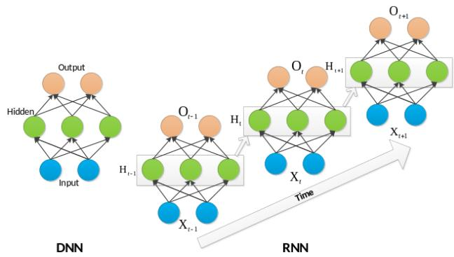  
Figure 1. Schematic representation of a deep neural network and an unfolded recurrent neural network.

1. The proposed CNN&bi-LSTM architecture is designed to retain informative long-range temporal patterns while improving the classification performance of MI-EEGbased BCIs.

2. The recognition framework learns spatial and temporal dependencies directly from raw EEG measurements through the CNN feature extractor. A bidirectional LSTM is then employed to model sequential dynamics and improve the representation of temporal dependencies.

3. The proposed approach is extensively assessed using both a private dataset and a publicly available dataset. The experimental findings demonstrate high classification accuracy together with consistent performance across the evaluated subjects and datasets.

## 2. Dataset Acquisition and Representation

The proposed method is evaluated using two types of data: a private dataset acquired by the authors and publicly available MI-EEG datasets. The recorded sequences were organized into labeled training trials and test trials, with the principal dataset characteristics summarized in Tab. 1. Dataset D1 corresponds to the private recordings obtained with the EEG acquisition equipment illustrated in Fig. 2, whereas D2–D4 are publicly available datasets. During the acquisition procedure, healthy participants with a mean age of 28.7 years wore the EEG device and remained seated in front of a computer display. The screen provided instructions indicating the motor actions that participants were required to imagine.

A sampling frequency of 1000 Hz and a recording duration of 200 s were selected for the experimental recordings in order to maintain consistent signal lengths across subjects. The characteristics of the datasets used in the study

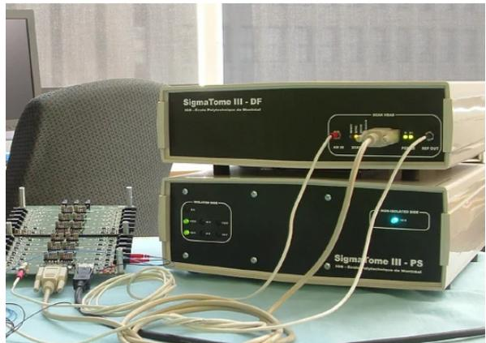  
Figure 2. EEG acquisition equipment and experimental setup.

Table 1. Characteristics of the raw datasets.
<table><tr><td rowspan="2">Datasets</td><td rowspan="2">Private</td><td colspan="3">Public</td></tr><tr><td>D1</td><td>D2 D3</td><td>D4</td></tr><tr><td>Subjects</td><td>6</td><td>7</td><td>12</td><td>5</td></tr><tr><td>Electrodes</td><td>64</td><td>64</td><td>32</td><td>64</td></tr><tr><td>Trials</td><td>240</td><td>128</td><td>278</td><td>200</td></tr><tr><td>Sample rate (Hz)</td><td>500</td><td>1000</td><td>1000</td><td>1000</td></tr><tr><td>Tasks</td><td>left, right hand, tongue</td><td>hand</td><td>left, right left, right left, right hand</td><td>hand</td></tr></table>

are summarized below:

$$
D ^ { j } = \left\{ \left( X _ { 1 } ^ { j } , y _ { 1 } ^ { j } \right) , \left( X _ { 2 } ^ { j } , y _ { 2 } ^ { j } \right) , \ldots , \left( X _ { L } ^ { j } , y _ { L } ^ { j } \right) \right\} ,\tag{1}
$$

where $X _ { L } ^ { j }$ denotes the L-th preprocessed trial of subject $j$ and $y _ { L } ^ { j }$ its associated label. For each trial and subject $j ,$ the preprocessed signal length is denoted by $L = R \times T =$ 200,000 [13]. For dataset D1, the three-dimensional input tensor contains $N \ = \ 2 4 0$ trials, $L \ = \ 2 0 0 { , } 0 0 0$ temporal samples, and E = 64 EEG electrode channels [14].

## 3. Proposed Architecture

## 3.1. Data Pre-processing

Before the EEG recordings were supplied to the deep convolutional network, a sequence of preprocessing operations was performed to improve signal quality and establish a consistent input representation.

1) Referencing [15]. In this experiment, the vertex electrode (Cz) is used as the reference electrode. We construct the $M \times N$ data matrix which contains the two-dimensional information for each electrode along with the Cz-referenced EEG recordings. The process can be denoted as the following transformation:

$$
C _ { z } \left( V _ { m } \right) = \left( I - V _ { C z } \right) V _ { m } ,\tag{2}
$$

where I is the identity matrix and

$$
V _ { C z } = { \left[ \begin{array} { l l l } { 0 } & { \cdots \ 1 \ \cdots } & { 0 } \\ { \vdots } & { \vdots } & { \vdots } \\ { 0 } & { \cdots \ 1 \ \cdots } & { 0 } \end{array} \right] }\tag{3}
$$

is an $M \times M$ matrix with ones only in the column corresponding to the Cz electrode.

2) Electrode selection. The principal MI-EEG electrode locations considered in the processing stage include P3, P4, C3, C4, O1, O2, Pz, Fz, and Cz. The Cz electrode, used as the reference, was positioned at the central region of the scalp.

3) Noise removal. Wavelet-based denoising was applied to reduce unwanted components and obtain cleaner EEG signals before classification.

4) Signal filtering. The signals were filtered within the 8– 23 Hz frequency range, covering the frequency components associated with the $\mu$ and beta rhythms.

## 3.2. Deep Neural Network Architecture

The overall CNN&bi-LSTM architecture is presented in Fig. 3. The framework consists of a preprocessing stage followed by a convolutional neural network and a bidirectional LSTM module for modeling temporal dynamics in the sequential EEG representation. The CNN is a multilayer neural architecture whose parameters are optimized through error backpropagation [3]. The spatial convolution stage is intended to transform the original EEG channels into a more informative, task-oriented feature representation in a common latent space. Eight spatial filters are employed in this layer, producing eight feature representations after convolution. The convolution kernel has a size of $[ 3 6 \times 1 ]$ , and each resulting feature has a size of $( 1 \times 6 0 )$ . The signal is subsequently reshaped to $( L , C , 1 )$ to enable batch normalization [27], where $C$ denotes the effective number of feature channels. The spatial convolution operation therefore performs learned spatial filtering of the EEG input. Following convolution and nonlinear activation [1, 9], the representation from the preceding layer is transformed into the corresponding output feature representation:

$$
O _ { m } ^ { 2 } = f \left( \sum _ { j = 1 } ^ { j \leq 3 6 } X _ { i , j } \times k _ { m } ^ { 2 } + b _ { m } ^ { 2 } \right) ,\tag{4}
$$

where $k _ { m } ^ { 2 }$ and $X _ { i , j }$ are the convolution kernel of $[ 2 8 \times 1 ]$ and the input, respectively, and $b _ { m } ^ { 2 }$ is the bias.

Batch normalization (BN) [16] is incorporated to improve generalization and accelerate optimization by normalizing the network inputs. After feature extraction, the remaining EEG representation is organized according to temporal order. BN is then applied so that each feature dimension is normalized with a mean of zero and a standard deviation of one. For an input with dimensionality $L ,$ each feature dimension is normalized according to the corresponding batch-normalization formulation:

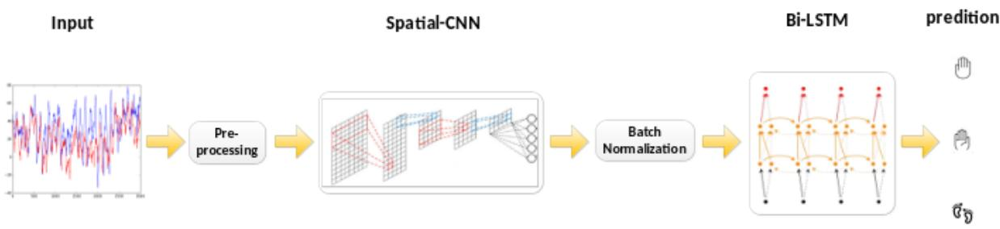  
Figure 3. Overall architecture of the proposed CNN&bi-LSTM framework, including the preprocessing stage, the spatial CNN, batch normalization, and the bidirectional LSTM classifier.

$$
B N ( X _ { i } ) = \frac { X _ { i } - E [ X _ { i } ] } { \sqrt { V a r [ X _ { i } ] } } ,\tag{5}
$$

$$
E \left[ X _ { i } \right] = \frac { 1 } { m } \sum _ { i = 1 } ^ { L } X _ { i } ,\tag{6}
$$

$$
V a r \left[ X _ { i } \right] = \frac { 1 } { m } \sum _ { i = 1 } ^ { L } \left( X _ { i } - E \left[ X _ { i } \right] \right) ^ { 2 } .\tag{7}
$$

Although conventional RNN and LSTM architectures are effective for sequential modeling, their ability to represent complex dependencies occurring at multiple temporal scales can remain limited. To address this issue, the proposed recurrent component is designed to capture complementary dependencies over different timescales and to learn latent temporal structures. The bidirectional LSTM processes the sequence in both directions, thereby incorporating information from preceding as well as subsequent observations. This formulation improves the representation of temporal context and provides greater robustness during training, including against gradient-related difficulties. The network is subsequently trained and evaluated using crossvalidation.

## 3.3. Bidirectional LSTM Network Architecture

The detailed bidirectional LSTM architecture is illustrated in Fig. 4. Each white block represents a forward or backward unit within a hidden layer and corresponds to an LSTM cell.

The LSTM architecture was developed to mitigate the vanishing-gradient problem encountered in conventional RNNs. As shown in the right-hand part of Fig. 4, each LSTM block contains a memory cell together with a forget gate, input gate, and output gate. The cell maintains information over extended time intervals, which provides the memory mechanism that gives the LSTM its name.

A conventional LSTM generates its current output using information from preceding inputs, whereas a bidirectional LSTM incorporates contextual information from both earlier and later observations [12, 30, 32]. The purpose of this configuration is to exploit the complete temporal context when estimating the output by combining the forward and backward representations. In this way, information from both temporal directions can contribute to improved recognition performance. The state update of the forward layer is defined by the corresponding recurrent equations:

$$
c _ { t } = z _ { t } \odot c _ { t - 1 } + i _ { t } \odot \sigma \left( W _ { c } x _ { t } + U _ { c } c _ { t - 1 } + b _ { c } \right) ,\tag{8}
$$

$$
z _ { t } = \sigma \left( W _ { f } x _ { t } + U _ { f } h _ { t - 1 } + b _ { f } \right) ,\tag{9}
$$

$$
i _ { t } = \sigma \left( W _ { i } x _ { t } + U _ { i } h _ { t - 1 } + b _ { i } \right) ,\tag{10}
$$

$$
o _ { t } = \sigma \left( W _ { o } x _ { t } + U _ { o } h _ { t - 1 } + b _ { o } \right) ,\tag{11}
$$

$$
h _ { t } ^ { f } = o _ { t } \odot \operatorname { t a n h } \left( c _ { t } \right) .\tag{12}
$$

The backward layer is computed using the same set of operations but in the reverse temporal direction. In the formulation, $i , o , f$ and c represent the input gate, output gate, forget gate, and cell state, respectively, while the associated weight matrices W, U and biases b are optimized during training. The sigmoid function $\sigma$ is applied element-wise, and the Hadamard product $\odot$ denotes element-wise multiplication. As shown in Fig. 4, the LSTM therefore produces the forward hidden sequence $h _ { t } ^ { f }$ and the backward hidden sequence $h _ { t } ^ { b }$ together with the resulting output sequence $y _ { t }$ through the recurrent update equations:

$$
y _ { t } = \upsilon \left( W _ { h y } h _ { t } ^ { f } + W _ { k y } h _ { t } ^ { b } + b _ { y } \right) ,\tag{13}
$$

where υ denotes the output activation function.

The resulting representation is formed through the combined processing of the LSTM units described above. The bidirectional configuration provides complementary information from the two temporal directions and can therefore improve the overall representation quality. The same processing strategy is subsequently applied to the second bi-LSTM layer.

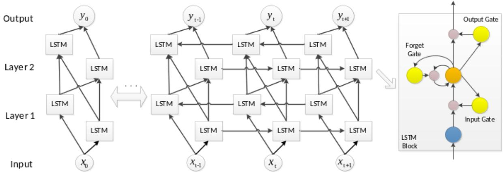  
Figure 4. Structural decomposition of the proposed bidirectional LSTM network.

The initialization procedure begins with one unit whose parameters are independent of the remaining network structure. The coefficients obtained from LASSO are used to initialize the weight matrices W, allowing the hidden unit to begin from a solution corresponding to least-squares regression [34]. The remaining parameters are initialized randomly. Consequently, the network starts from an output representation related to least-angle regression and can then be optimized to learn temporal correlations while reducing the mean squared error [18, 25].

Mean squared error (MSE) is selected instead of crosscorrelation because the filtered MI-EEG recordings contain substantial intervals corresponding to resting states. The training objective is therefore formulated as the minimization of the MSE:

$$
\Gamma [ \{ ( x _ { 1 } , y _ { 1 } ) , \dots , ( x _ { l } , y _ { l } ) \} ] = \sum _ { i = 1 } ^ { l } E [ \| \widetilde { y } _ { i } - y _ { i } \| ] ,\tag{14}
$$

where $y _ { i }$ and $\widetilde { y } _ { i }$ denote the backpropagated outputs associated with the ground-truth and predicted signals, respectively, and ∥·∥ represents the specified $L ^ { 2 }$ error measure. In addition to the conventional training procedure, supervised pre-training is employed to address the multi-task learning problem while maintaining a shared representation in the lower hidden layers. This strategy provides a more informative initialization for the subsequent task-specific training stages.

## 4. Experimental Results

The proposed CNN&bi-LSTM model is evaluated using both the private and public datasets. First, the learning behavior and spatial performance of the proposed architecture are compared with alternative methods. The learned feature patterns at different network layers are then examined visually. Finally, classification accuracy and training efficiency are analyzed to assess the overall effectiveness of the proposed model.

## 4.1. Learning Rates and Spatial Performance

The parameters of neural networks are commonly optimized through gradient descent. During each training iteration, backpropagation calculates the derivative of the loss with respect to each parameter, after which the parameters are updated accordingly. Directly applying these gradients can produce large parameter variations between consecutive iterations and may contribute to unstable optimization or overfitting. A learning-rate coefficient is therefore introduced to scale the gradient before each parameter update. Figure 5 illustrates the behavior of the proposed components under different learning-rate settings. Based on these experiments, learning rates of 0.004 for the CNN and 0.02 for the LSTM were selected.

Figure 6 illustrates how the amount of training data affects the classification performance of the proposed model. When 60% of the available data is used for training, the model achieves approximately 89% accuracy. Increasing the proportion of training data produces only a modest additional improvement. This observation suggests that the proposed architecture is relatively robust to reductions in the amount of training data [23]. The results also indicate that training time increases approximately linearly with the size of the training dataset.

The number of electrodes used during spatial feature extraction is another important parameter [31]. Using an excessive number of channels may increase the risk of overfitting and estimation errors, whereas using too few channels may discard useful discriminative information. Figure 7 compares the classification performance obtained with different numbers of electrodes. The best performance was obtained when 40 electrodes were used. Increasing the number beyond this point resulted in reduced performance, which is attributed to overfitting. The D1 dataset also produced better results than D2, which may be related to external disturbances affecting the latter experimental configuration.

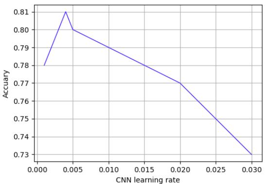  
(a) CNN learning rate

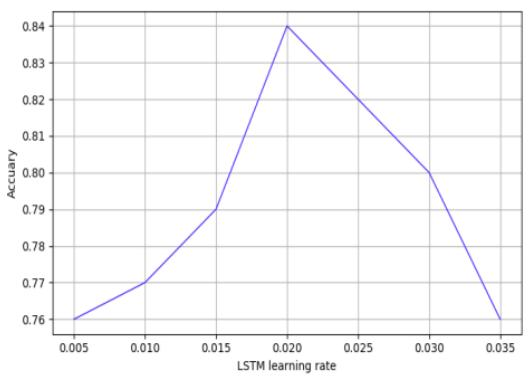  
(b) LSTM learning rate  
Figure 5. Comparison of learning-rate settings for the convolutional and recurrent components.

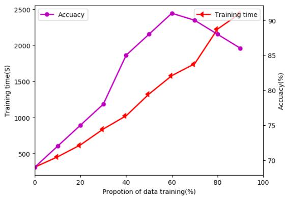  
Figure 6. Classification accuracy and training time as a function of the training-data proportion.

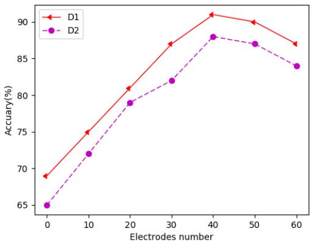

Figure 7. Spatial performance comparison between D1 and D2 using the proposed bidirectional LSTM.  
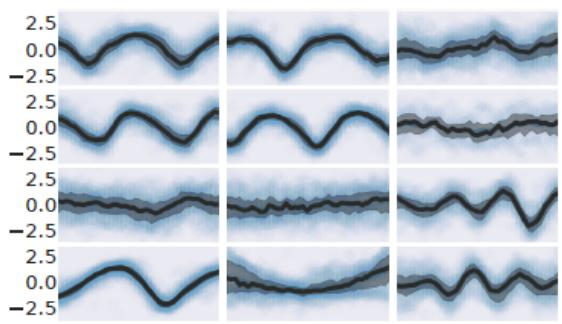  
(a) Layer 1

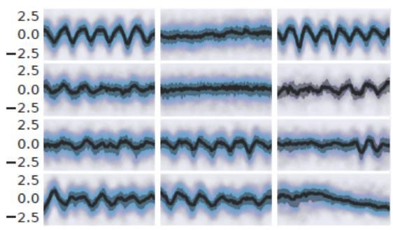  
(b) Layer 2  
Figure 8. EEG representations generated at the different network layers: (a) first layer; (b) second layer.

## 4.2. EEG Feature Patterns at Different Network Layers

Figure 8 presents the EEG representations produced by the first and second layers (upper and lower panels, respectively) for a randomly selected filter and each subject.

The blue points indicate the standardized scores associated with the principal activating input windows for a selected filter, while the median response is represented within the interquartile range. The median patterns in the earlier layer exhibit structures that are closer to portions of sinusoidal waveforms, whereas the representations produced by subsequent layers become progressively more complex.

## 4.3. Classification Accuracy and Training Efficiency Across Subjects

To assess the effectiveness of the proposed bidirectional LSTM architecture for motor-imagery classification, a systematic set of experiments was conducted. The proposed method was compared with LDA, SVM, CNN, and RNN using the private dataset D1 and the public datasets D2–D4. The results for D1 are reported in Tab. 2. Implementations of the comparison methods were developed in Python and their parameters were tuned for the experiments. The proposed architecture performed consistently across the seven subjects and achieved a mean classification accuracy of 85.4%, compared with 69.5% for LDA, 73.0% for SVM, 75.9% for CNN, and 79.5% for RNN. Although the improvement is moderate, it demonstrates the benefit of combining convolutional and bidirectional recurrent processing. The proposed model achieved its highest subject-specific accuracy of 92.5% for subject C, followed by 91.4% for subject E and 90.3% for subject F. Batch normalization also reduced training time for most of the evaluated configurations, as shown in Tab. 3.

The results obtained on the public datasets are summarized in Tab. 4 and compared with the corresponding alternative approaches. The CNN&bi-LSTM model consistently provides higher accuracy than the other evaluated machine-learning and recurrent architectures. For D2, the two-layer ST-CNN and RNN models achieve 74.57% and 77.42%, respectively, whereas the one-layer LSTM reaches 79.56%. For D3, ST-CNN and the two-layer RNN obtain 79.83% and 82.43%, respectively, while the one-layer LSTM reaches 84.78%. For D4, the corresponding accuracies are 81.30% for ST-CNN, 83.10% for RNN, and 82.67% for LSTM. Increasing the LSTM depth alone does not necessarily provide a consistent improvement; however, the proposed CNN&bi-LSTM configuration achieves 81.80%, 87.97%, and 85.32% on D2, D3, and D4, respectively. These results indicate that combining convolutional feature extraction with bidirectional temporal modeling is more effective than simply increasing the number of recurrent parameters or layers.

As illustrated in Fig. 9, the proposed architecture achieves stronger classification performance than the alternative methods considered in the study. The improvement in recognition accuracy supports the suitability of the CNN&bi-LSTM framework for MI-EEG decoding applications.

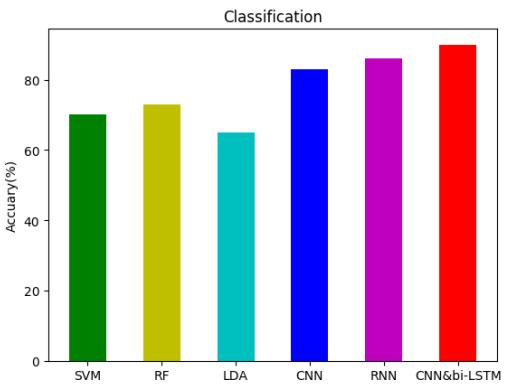  
Figure 9. Accuracy comparison among the evaluated methods for the custom dataset (D1).

## 5. Conclusion

This paper presented a motor-imagery EEG recognition framework that combines convolutional neural networks, batch normalization, and a bidirectional LSTM recurrent architecture to learn spatial and temporal dependencies directly from raw EEG recordings. The spatial convolution layer acts as a learned spatial filter, while batch normalization improves the optimization process and contributes to better generalization during MI-EEG training. The extracted representations are subsequently processed by the bi-LSTM network, which integrates information from both past and future portions of the sequence and can therefore capture more complex temporal relationships. Overall, the proposed CNN&bi-LSTM architecture provides a unified mechanism for transforming lower-level EEG measurements into higher-level representations that incorporate both temporal and frequency-related information. The experimental results demonstrate that the method can effectively emphasize informative components of MI-EEG signals and achieve competitive classification performance across the evaluated datasets and subjects. The use of bidirectional recurrent modeling therefore represents a potential alternative to conventional spectral-feature-based EEG analysis and may support future research and practical applications of MI-EEG-based rehabilitation systems.

## References

[1] Angelos Amanatiadis, Vasileios G Kaburlasos, and Elias B Kosmatopoulos. Interpolation kernels in fully convolutional networks and their effect in robot vision tasks. In 2018 IEEE International Conference on Imaging Systems and Tech niques (IST), pages 1–5, 2018. 3

[2] Angelos Amanatiadis, Vasileios G Kaburlasos, and Elias B Kosmatopoulos. Understanding deep convolutional networks through gestalt theory. In 2018 IEEE international

Table 2. Recognition accuracy (%) obtained with the evaluated methods on the private dataset D1.
<table><tr><td>Method</td><td>SubA</td><td>SubB</td><td>SubC</td><td>SubD</td><td>SubE</td><td>SubF</td><td>SubG</td><td>Mean</td></tr><tr><td>LDA</td><td>67.7</td><td>70.3</td><td>72.4</td><td>68.2</td><td>69.8</td><td>71.5</td><td>66.3</td><td>69.5</td></tr><tr><td>SVM</td><td>70.6</td><td>74.3</td><td>71.3</td><td>75.1</td><td>69.2</td><td>73.1</td><td>77.4</td><td>73.0</td></tr><tr><td>CNN</td><td>75.8</td><td>77.2</td><td>78.3</td><td>79.4</td><td>73.4</td><td>78.3</td><td>69.3</td><td>75.9</td></tr><tr><td>RNN</td><td>82.3</td><td>79.3</td><td>78.8</td><td>79.4</td><td>75.5</td><td>83.5</td><td>78.3</td><td>79.5</td></tr><tr><td>LSTM</td><td>78.3</td><td>82.1</td><td>87.7</td><td>75.7</td><td>82.4</td><td>90.3</td><td>84.5</td><td>83.0</td></tr><tr><td>CNN&amp;bi-LSTM</td><td>82.3</td><td>84.4</td><td>92.5</td><td>78.5</td><td>91.4</td><td>86.3</td><td>82.4</td><td>85.4</td></tr></table>

Table 3. Comparison of training time (hh:mm:ss) with and without batch normalization (BN).
<table><tr><td>Method</td><td>BN</td><td>SubA</td><td>SubB</td><td>SubC</td><td>SubD</td><td>SubE</td><td>SubF</td><td>SubG</td></tr><tr><td>1-layer bi-LSTM</td><td>without with</td><td>00:44:37 00:38:37</td><td>00:35:31 00:33:31</td><td>00:39:14 00:32:14</td><td>00:47:52 00:51:52</td><td>00:35:23 00:28:42</td><td>00:43:19 00:38:23</td><td>00:37:53 00:35:11</td></tr><tr><td>2-layer</td><td>without</td><td>01:11:37</td><td>00:38:37</td><td>00:55:32</td><td>01:04:27</td><td>00:41:37</td><td></td><td></td></tr><tr><td>bi-LSTM</td><td></td><td></td><td></td><td></td><td></td><td></td><td>00:51:33</td><td>00:48:11</td></tr><tr><td></td><td>with</td><td>00:48:33</td><td>00:41:37</td><td>00:43:22</td><td>00:54:31</td><td>00:38:34</td><td>00:49:32</td><td>00:40:03</td></tr></table>

Table 4. Classification accuracy (%) on the public datasets.
<table><tr><td>Method</td><td>D2 (%)</td><td>D3 (%)</td><td>D4 (%)</td></tr><tr><td>SVM</td><td>73.40</td><td>75.20</td><td>77.70</td></tr><tr><td>LDA</td><td>61.37</td><td>66.95</td><td>67.95</td></tr><tr><td>RF</td><td>76.20</td><td>81.16</td><td>80.30</td></tr><tr><td>ST-CNN</td><td>74.57</td><td>79.83</td><td>81.30</td></tr><tr><td>RNN</td><td>75.94</td><td>81.16</td><td>83.10</td></tr><tr><td>LSTM</td><td>77.42</td><td>82.43</td><td>82.67</td></tr><tr><td>bi-LSTM</td><td>79.56</td><td>84.78</td><td>83.53</td></tr><tr><td>CNN&amp;bi-LSTM</td><td>81.80</td><td>87.97</td><td>85.32</td></tr></table>

conference on imaging systems and techniques (IST), page 1–6, 2018. 1

[3] Angelos Amanatiadis, Vasileios G Kaburlasos, Christina Dardani, Savvas A Chatzichristofis, and Athanasios Mitropoulos. Social robots in special education: Creating dynamic interactions for optimal experience. IEEE Consumer Electronics Magazine, 9(3):39–45, 2020. 3

[4] Angelos A Amanatiadis and Ioannis Andreadis. Digital image stabilization by independent component analysis. IEEE Transactions on instrumentation and measurement, 59(7): 1755–1763, 2009. 1

[5] Kais Belwafi, Olivier Romain, et al. An embedded implementation based on adaptive filter bank for brain-computer interface systems. Journal of Neuroscience Methods, 2018. 1

[6] A. M. Chiarelli, P. Croce, A. Merla, et al. Deep learning for hybrid EEG-fNIRS brain-computer interface: application to motor imagery classification. Journal of Neural Engineering, 15(3), 2018. 1

[7] Antonio Maria Chiarelli, Pierpaolo Croce, et al. Deep learning for hybrid EEG-fNIRS brain-computer interface: application to motor imagery classification. Journal of Neural Engineering, 15(3), 2018. 1

[8] Thomas Costecalde, Tetiana Aksenova, et al. A long-term BCI study with ECoG recordings in freely moving rats. Neu romodulation, 21(2):149–159, 2018. 1

[9] Damien Coyle and T. Martin McGinnity. Improving the separability of multiple EEG features for a BCI by neural-timeseries-prediction-preprocessing. Biomedical Signal Processing and Control, 5(3):196–204, 2010. 3

[10] Zahra Emami and Tom Chau. Investigating the effects of visual distractors on the performance of a motor imagery brain-computer interface. Clinical Neurophysiology, pages 1268–1275, 2018. 1

[11] Efstathios Faniadis and Angelos Amanatiadis. Deep learn ing inference at the edge for mobile and aerial robotics. In 2020 IEEE International Symposium on Safety, Security, and Rescue Robotics (SSRR), pages 334–340, 2020. 1

[12] S. Ioffe and C. Szegedy. Batch normalization: accelerating deep network training by reducing internal covariate shift. arXiv preprint arXiv:1502.03167, 2015. 4

[13] Mingai Li, Meng Zhang, and Xinyong Luo. Combined long short-term memory based network employing wavelet coefficients for MI-EEG recognition. In IEEE International Conference on Mechatronics and Automation (ICMA), pages 1971–1976, 2016. 2, 3

[14] M. Li, W. Zhu, and M. Zhang. The novel recognition method with optimal wavelet packet and LSTM based recurrent neural network. In IEEE International Conference on Mecha tronics and Automation (ICMA), 2017. 2, 3

[15] M. Li, W. Zhu, and M. Zhang. The novel recognition method with optimal wavelet packet and LSTM based recurrent neural network. In IEEE International Conference on Mecha tronics and Automation (ICMA), pages 584–589, 2017. 3

[16] M. Lin, Q. Chen, and S. Yan. Network in network. arXiv preprint arXiv:1312.4400, 2013. 3

[17] F. Lotte, L. Bougrain, A. Cichocki, et al. A review of classification algorithms for EEG-based brain-computer interfaces: a 10-year update. Journal of Neural Engineering, 15(3), 2018. 1

[18] Na Lu, Tengfei Li, and Xiaodong Ren. A deep learning scheme for motor imagery classification based on restricted Boltzmann machines. IEEE Transactions on Neural Systems and Rehabilitation Engineering, 25(6):566–576, 2017. 5

[19] Ran Manor and Amir B. Geva. Convolutional neural network for multi-category rapid serial visual presentation BCI. Frontiers in Computational Neuroscience, 9:146, 2015. 1

[20] Ankita Mazumder, Arnab Rakshit, et al. A back-propagation through time based recurrent neural network approach for classification of cognitive EEG states. In IEEE International Conference on Engineering and Technology (ICETECH), pages 55–59, 2015. 1

[21] Minmin Miao, Hong Zeng, and Aimin Wang. Discriminative spatial-frequency-temporal feature extraction and classification of motor imagery EEG: an sparse regression and weighted naive Bayesian classifier-based approach. Journal ofNeuroscience Methods, 278:13–24, 2017. 1

[22] T. Nguyen, S. Nahavandi, A. Khosravi, D. Creighton, and I. Hettiarachchi. EEG signal analysis for BCI application using fuzzy system. In International Joint Conference on Neural Networks (IJCNN), pages 1–8, 2015. 1

[23] Seung-Min Park, Tae-Ju Lee, and Kwee-Bo Sim. Heuristic feature extraction method for BCI with harmony search and discrete wavelet transform. International Journal ofControl, Automation and Systems, 130:127–131, 2017. 5

[24] A. Ramaswamy and S. Bhatnagar. Analysis of gradient descent methods with nondiminishing bounded errors. IEEE Transactions on Automatic Control, 63(5):1465–1471, 2018. 1

[25] A. Ramaswamy and S. Bhatnagar. Analysis of gradient descent methods with nondiminishing bounded errors. IEEE Transactions on Automatic Control, 63(5):1465–1471, 2018. 5

[26] H. Salehinejad, S. Sankar, and J. Barfett. Recent advances in recurrent neural networks. arXiv preprint arXiv:1801.01078, 2017. 1

[27] Aphrodite Sophokleous, Angelos Amanatiadis, Socratis Gkelios, and Savvas A Chatzichristofis. Educational robotics in the service of the gestalt similarity principle. In 2022 IEEE International Conference on Consumer Electronics (ICCE), pages 1–6, 2022. 3

[28] I. Sturm, S. Bach, W. Samek, and K.-R. Muller. Inter-¨ pretable deep neural networks for single-trial EEG classification. Journal of Neuroscience Methods, 274:141–145, 2016. 1

[29] Z. C. Tang, C. Li, and S. Q. Sun. Single-trial EEG classification of motor imagery using deep convolutional neural networks. Optik, 130:11–18, 2016. 1

[30] J. Thomas, T. Maszczyk, and N. Sinha. Deep learning-based classification for brain-computer interfaces. In IEEE International Conference on Systems, Man, and Cybernetics (SMC), pages 234–239, 2017. 4

[31] John Thomas, Tomasz Maszczyk, Nishant Sinha, et al. Deep learning-based classification for brain-computer interfaces. In IEEE International Conference on Systems, Man, and Cybernetics (SMC), pages 234–239, 2017. 5

[32] Z. Xie, O. Schwartz, and A. Prasad. Decoding of finger trajectory from ECoG. Journal of Neural Engineering, 14: 036009, 2018. 4

[33] Sai Chong Yeh, Norrima Mokhtar, Girijesh Prasad, et al. Automated classification and removal of EEG artifacts with SVM and wavelet-ICA. IEEE Journal of Biomedical and Health Informatics, 22(3):664–670, 2018. 1

[34] I. N. Yulita, M. I. Fanany, and A. M. Arymurthy. Combining deep belief networks and bidirectional long short-term memory. In International Conference on Electrical Engineering and Informatics (ICEEI), pages 1–6, 2017. 5