# Eficient Hessian-Free Methods for Multi-Objective Bilevel Optimization with Nonconvex Lower Level

Yicong Jiang∗, Feihu Huang†

## Abstract

Multi-objective bilevel optimization has wide applications in the AI area such as automated learning and multi-task meta-learning. Although recently some works have been begun to study the multi-objective bilevel optimization, the proposed methods rely on the (strongly) convex lower level problems. In fact, these multi-objective bilevel learning problems are generally nonconvex, and particularly their lower level problems are nonconvex. To fill this gap, we propose a class of Multi-Objective Moreau Envelope based Hessian-free Algorithms (MO-MEHA) to solve the multi-objective bilevel learning problems with nonconvex lower level. Specifically, our method uses the Moreau envelope to convert the original problem into a multiobjective single-level optimization with an envelope constraint. In particular, our method retains computational advantages of being single-loop and Hessian-free in the multi-objective setting by incorporating a smooth weighted Tchebychef scalarization. Furthermore, we propose a momentum-based variant of MOMEHA (i.e., MB-MOMEHA) method to solve the stochastic multi-objective bilevel learning problems. In theory, we provide the convergence properties of our algorithms under both deterministic and stochastic setting. Some experiments on few-shot meta-learning and neural architecture search demonstrate that our methods outperform the existing approaches in Pareto front, validating its efectiveness and robustness.

## 1 Introduction

Multi-objective optimization (MOO) Chen et al. [2025] is a fundamental mathematical framework for decision-making under conflicting criteria, with applications spanning engineering design Manguri et al. [2025], finance Gulia et al. [2023] and machine learning Zhong et al. [2024]. Unlike single-objective optimization, where the goal is to find a single best solution, MOO seeks to characterize the Pareto front—a set of solutions representing optimal trade-ofs among the competing objectives, where improving one objective necessarily degrades another. Recently, many gradientbased optimization methods Sener and Koltun [2018], Ye et al. [2024], Momma et al. [2022], Zhang et al. [2025] have been developed to solve the MOO problems regarding AI field. For example, Sener and Koltun [2018] proposed the multiple gradient descent algorithm (MGDA) for MOO by aggregating per-objective gradients to obtain a common descent direction with improving simulta neously all objectives. Subsequently, Momma et al. [2022] proposed a weighted Chebyshev MGDA (WC-MGDA) by decomposing the MOO problem into multiple sub-problems, each associated with a predefined preference vector.

Table 1: Comparison of the gradient-based methods for multi-objective bilevel learning. Scenario indicates whether convergence is analyzed in the deterministic or stochastic setting; LL Assumption refers to the property requirement on the lower-level objective; Loop Structure indicates whether an inner loop structure is used to optimize the lower-level variables per iteration; Hessian-free marks whether the algorithm avoids Hessian information; Preference shows whether the method can explore the Pareto front via user-specified preference vectors.
<table><tr><td>Algorithm</td><td>Scenario</td><td>LL Assumption</td><td>Loop Structure</td><td>Hessian-free</td><td>Preference</td></tr><tr><td>MOML Ye et al. [2021]</td><td>Deterministic</td><td>Singleton Optimality</td><td>Nested</td><td>x</td><td>x</td></tr><tr><td>gMOBA Yang et al. [2024]</td><td>Deterministic</td><td>Strong Convexity</td><td>Single</td><td>x</td><td>x</td></tr><tr><td>FORUM Ye et al. [2024]</td><td>Deterministic</td><td>Strong Convexity</td><td>Nested</td><td>√</td><td>x</td></tr><tr><td>MoCo Fernando et al. [2022]</td><td>Stochastic</td><td>Strong Convexity</td><td>Nested</td><td>x</td><td>x</td></tr><tr><td>WC-MHGD Zhang et al. [2026a]</td><td>Both</td><td>Strong Convexity</td><td>Nested</td><td>x</td><td>√</td></tr><tr><td>WC-penalty Zhang et al. [2026b]</td><td>Both</td><td>General Convexity</td><td>Single</td><td>x</td><td>√</td></tr><tr><td>(MB-)MOMEHA (Ours)</td><td>Both</td><td>Nonconvexity</td><td>Single</td><td>√</td><td>√</td></tr></table>

In many real-world scenarios, meanwhile, the decision-making process exhibits a hierarchical structure Vicente and Calamai [1994], Liu et al. [2021c]: the evaluation of candidate solutions at the upper level depends on the optimal solution of a nested optimization problem at the lower level, which gives rise to bilevel optimization (BLO) Zhang et al. [2024b]. When the upper-level decision involves multiple, potentially conflicting criteria, the problem becomes a type of multi-objective bilevel learning (MOBL) Giovannelli et al. [2024], which can be formulated as:

$$
\begin{array} { r l } & { \underset { x \in \mathbb { R } ^ { d _ { x } } } { \operatorname* { m i n } } F ( x ) : = [ f _ { i } ( x , y ^ { * } ( x ) ) ] _ { i = 1 } ^ { m } } \\ & { \mathrm { s . t . } \quad y ^ { * } ( x ) \in \arg \underset { y \in \mathbb { R } ^ { d _ { y } } } { \operatorname* { m i n } } g ( x , y ) , } \end{array}\tag{1}
$$

where m is the number of upper-level objectives, $f _ { i } ( x , y ^ { * } ( x ) )$ is the i-th upper level objective for $i \in [ m ]$ , and $g ( x , y )$ denotes the lower level objective. This formulation is particularly relevant in some modern machine learning tasks such as federated learning with fairness and robustness trade-of Hu et al. [2022], policy alignment in reinforcement learning for LLM Chakraborty et al. [2024], and multi-objective diferentiable neural architecture search Sukthanker et al. [2024].

Since the above problem (1) is widely used in many AI tasks, more recently, some gradientbased methods have been developed to solve these MOBL problems. For example, multi-objective meta learning (MOML) Ye et al. [2021] is the pioneering work that introduces a multi-objective meta-learning formulation and solves it via gradient-based bilevel optimization, but it provides only asymptotic convergence guarantees. Subsequently, Fernando et al. [2022] proposed a stochas tic multi-objective gradient with correction (MoCo), and established its non-asymptotic convergence rates by leveraging a momentum-assisted hypergradient, it operates with a nested structure, requires computing expensive Hessian-vector products. Ye et al. [2024] proposed an efective firstorder multi-gradient method (FORUM) for MOBL by eliminating the Hessian requirement, which ofers a Hessian-free alternative, yet it maintains the double-loop design and the restrictive strong convexity assumption on the lower level. More recently, Zhang et al. [2026a] proposed a weighted Chebyshev multi-hyper gradient descent (WC-MHGD) by introducing the capability of steering the optimization along a user-specified preference direction, which enables direct exploration of the Pareto front. However, the WC-MHGD still demands Hessian computations, and also assumes strong convexity on the lower level. Subsequently, Zhang et al. [2026b] proposed an efective weighted Chebyshev (WC)-penalty algorithm to solve the MOBL problems with general convex lower levels.

Notably, almost all existing MOBL methods reviewed above are limited by the assumption of lower-level convexity or strong convexity (please see Table 1), which tends to fail in modern deep learning applications such as neural architecture search and policy alignment for LLM. To fill this gap, we propose an efective multi-objective Moreau envelope based Hessian-free method to solve the problem (1) with a nonconvex lower level. Our main contributions are summarized as follows:

1) We propose Multi-Objective Moreau Envelope based Hessian-free Algorithm (MOMEHA) to solve the above MOBL problem (1) with the non-convex lower level, which builds on Moreau envelope Hessian-free framework. In particular, to resolve the infeasibility-induced stationarity dificulty that arises when porting the penalty-based framework to the multiobjective case, our MOMEHA method introduce a relaxed constraint εc-εs-Pareto stationarity concept, thereby enabling a well-defined stationarity condition for the algorithm.

2) We further propose a stochastic variant of MOMEHA (MB-MOMEHA) to solve the stochastic MOBL problem (2) based on momentum technique.

3) We provide a solid non-asymptotic convergence analysis framework for our methods under some mild conditions, and proved our MOMEHA and MB-MOMEHA methods convergence Pareto stationarity under finite iterations. To the best of our knowledge, our stochastic convergence guarantee also establishes the first convergence proof for the Moreau envelope Hessian-free framework Liu et al. [2024] in stochastic gradients with momentum, filling part of the gap left by the original deterministic analysis.

4) We conduct experiments on few-shot meta-learning and neural architecture search, demonstrating that MO-MEHA explores a better Pareto front than prior methods, which underscores the method’s applicability to real-world nonconvex problems.

## 2 Related Works

In this section, we review the gradient-based methods for multi-objective optimization and bilevel optimization, respectively.

## 2.1 Multi-Objective Optimization

Gradient-based methods for MOO follow three main strategies Chen et al. [2025]: The first strat egy finds a single balanced Pareto-optimal solution, including loss-balancing approaches Liu et al. [2021b], Ye et al. [2021], Lin et al. [2021], Ye et al. [2024] and gradient-balancing approaches Sener and Koltun [2018], Yu et al. [2020], Liu et al. [2021a], Fernando et al. [2023] that aggregate perobjective gradients to obtain a common descent direction. The second strategy provides a fi nite discrete set of trade-of solutions and is further divided into preference-based methods that decompose the problem using predefined preference vectors Mahapatra and Rajan [2020, 2021], Momma et al. [2022], Zhang et al. [2024a, 2025] and preference-free methods that directly optimize a solution set Deist et al. [2021], Liu et al. [2021e]. The third strategy learns a continuous (infi nite) preference-to-solution mapping, using architectures such as hypernetworks Tuan et al. [2024], preference-conditioned networks Raychaudhuri et al. [2022], or model combination Dimitriadis et al. [2025]. Existing gradient-based methods in MOBL are primarily developed under the former two MOO strategies: finding a balanced solution or finding a finite discrete Pareto set, with the latter with preference vector being the choice of our work.

## 2.2 Bilevel Optimization

Gradient-based methods for BLO are commonly categorized into three strategies according to how they approximate the implicit gradient. Implicit function (IF) strategy utilized in Hong et al. [2020], Ji et al. [2021], Xiao et al. [2022] computes the hypergradient via the implicit function theorem without explicitly unrolling the lower-level optimizer, which relies on well-defined lower-level Hessian inversion. Stemming from the lower-level singleton solution, the gradient unrolling (GU) strategy implemented in Franceschi et al. [2017, 2018], Shaban et al. [2019], Liu et al. [2020] approximates the lower-level solution by unrolling a fixed number of optimizer steps and then back-propagating through the unrolled computational graph. Both IF and GU strategies hinge on the strong convexity or the singleton solution of the lower level. Value function (VF) strategy in Liu et al. [2021d, 2022], Shen and Chen [2023], Kwon et al. [2023] reformulates the BLO problem as a constrained single-level problem using the lower-level value function, which ofers greater flexibility for handling non-convex lower-level scenarios. Despite their algorithmic diferences, all these methods focus on a single upper-level objective. We adopt the VF-based strategy and generalize it to a multi-objective upper level.

## 3 Preliminaries

## 3.1 Problem Setup

In this paper, we focuses on the MOBL problems with nonconvex lower level. Specifically, we study the deterministic MOBL problem (1) with the weakly convex lower level problem, where the function $g ( x , y )$ is weakly convex on variable $y .$ . Meanwhile, we also study the stochastic MOBL problem defined as follows:

$$
\begin{array} { r l } & { \underset { x \in \mathbb { R } ^ { d _ { x } } } { \mathrm { m i n } } F ( x ) : = \left[ \mathbb { E } _ { \xi \sim \mathcal { D } _ { i } } [ f _ { i } ( x , y ^ { * } ( x ) ; \xi ) ] \right] _ { i = 1 } ^ { m } , } \\ & { \mathrm { s . t . } \quad y ^ { * } ( x ) \in \arg \underset { y \in \mathbb { R } ^ { d _ { y } } } { \mathrm { m i n } } \mathbb { E } _ { \varrho \sim \mathcal { D } _ { g } } [ g ( x , y ; \varrho ) ] , } \end{array}\tag{2}
$$

where m is the number of upper-level objectives, $\mathcal { D } _ { i }$ is the data distribution regarding i-th objective, $\mathcal { D } _ { g }$ is data distribution of the lower level. Here the lower-level objective $g ( x , y ) = \mathbb { E } _ { \varrho \sim \mathcal { D } _ { g } } [ g ( x , y ; \varrho ) ]$ is weakly convex on variable y.

## 3.2 Related Concepts

In MOBL setting, it is rarely possible to optimize all objectives simultaneously. Sometimes, a solution where improving any one objective would inevitably degrade another. This fundamental trade-of is formalized through the concept of Pareto optimality.

Definition 1 (Pareto Optimality). (i) A solution $x _ { 1 }$ dominates another solution $x _ { 2 }$ if and only if $F _ { i } ( x _ { 1 } ) \leq F _ { i } ( x _ { 2 } ) , \forall i \in [ m ]$ , and there exists at least one $j \in [ m ]$ such that $F _ { j } ( x _ { 1 } ) < F _ { j } ( x _ { 2 } )$ . (ii) A solution $x ^ { * }$ reaches Pareto Optimality if there exists no solution x that dominates $x ^ { * }$

The requirement above is actually stringent. In many practical and theoretical settings, one may encounter points that are not Pareto optimal yet cannot be strictly dominated. Therefore, a more feasible concept is weak Pareto Optimality.

Definition 2 (Weak Pareto Optimality). A solution x∗ reaches weak Pareto optimality if and only if there exists no x such that $F _ { i } ( x ) < F _ { i } ( x ^ { * } ) , \forall i \in [ m ]$

Definition 3 (Pareto Front). A (weak) Pareto front is the set of all objective function values of all (weak) Pareto optimal solutions.

Obviously, every Pareto-optimal point is weakly Pareto optimal, but the converse generally fails. If a common descent direction exists, the current point is not even weakly Pareto optimal. For smooth unconstrained problems, a first-order necessary condition gives rise to Pareto stationarity.

Definition 4 (Unconstrained Pareto Stationarity). A solution x is ε-Pareto stationary if there exists $\lambda \in \Delta _ { m - 1 }$ such that

$$
\left\| \sum _ { i = 1 } ^ { m } \lambda _ { i } \nabla F _ { i } ( { \boldsymbol x } ) \right\| \le \varepsilon .
$$

However, when explicit constraints w.r.t. x are present, the definition of Pareto stationarity must be refined. The core subtlety is that even when a common descent direction exists for all objectives, it may not lie within the tangent cone of the feasible set.

Under standard constraint qualifications (e.g., MFCQ), the normal cone (the polar cone of the tangent cone) can be expressed as the nonnegative span of the active constraint gradients, reducing the condition to a KKT-type system. Hence we introduce the following concept.

Definition 5 (Constrained Pareto Stationarity). For MOO problems with equality constraint set E and inequality constraint set I, let $C : = \{ x \mid g ( x ) = 0 \forall g \in \mathcal { E } , h ( x ) \leq 0 \forall h \in \mathcal { T } \}$ denote the feasible set, and let $\mathcal { N } _ { C } ( x )$ be the normal cone to C at x. A solution x is ε-Pareto stationary if there exist $\lambda \in \Delta _ { m - 1 }$ and $n \in \mathcal { N } _ { C } ( x )$ such that

$$
\left\| \sum _ { i = 1 } ^ { m } \lambda _ { i } \nabla F _ { i } ( x ) + n \right\| \leq \varepsilon .\tag{3}
$$

If constraint qualifications (CQ) hold, this is equivalent to: there exist $\lambda \in \Delta _ { m - 1 }$ , multipliers $\mu _ { h } \geq 0$ for each $h \in { \mathcal { A } } ( x )$ , and multipliers $\nu _ { g }$ for each $g \in { \mathcal { E } }$ , such that

$$
\left\| \sum _ { i = 1 } ^ { m } \lambda _ { i } \nabla F _ { i } ( x ) + \sum _ { h \in \mathcal { A } ( x ) } \mu _ { h } \nabla h ( x ) + \sum _ { g \in \mathcal { E } } \nu _ { g } \nabla g ( x ) \right\| \le \varepsilon ,\tag{4}
$$

where $\mathcal { A } ( x ) : = \{ h \in \mathcal { T } \mid h ( x ) = 0 \}$ denotes the set of active inequality constraints at x.

The above characterization assumes that the feasible set is explicitly described by tractable constraints and that suitable constraint qualifications hold. As will be seen in Section 4, the Moreau envelope reformulation leads to an explicit constraint whose satisfaction by a penalty-based method cannot be guaranteed at every iterate, calling for a refined notion of stationarity that we develop in Section 5.

## 4 Our Methods

In this section, we propose MOMEHA and MB-MOMEHA to solve the deterministic MOBL problem (1) and stochastic MOBL problem (2) respectively.

## 4.1 Our MOMEHA Algorithm

In this subsection, we present an efective MOMEHA algorithm to solve the deterministic MOBL problem (1) based on Moreau envelope and smooth Tchebychef scalarization techniques.

For handling the MOBL problem (1) with nonconvex lower level, we adopt the Moreau envelope based reformulation, which is originally proposed in Gao et al. [2023] and further researched in Liu et al. [2024]. The reformulation can be described as follows:

$$
\operatorname* { m i n } _ { ( x , y ) \in \mathbb { R } ^ { d _ { x } } \times \mathbb { R } ^ { d _ { y } } } F ( x , y ) \quad \mathrm { s . t . ~ } g ( x , y ) - v _ { \gamma } ( x , y ) \leq 0 ,\tag{5}
$$

where $\begin{array} { r } { \upsilon _ { \gamma } ( x , y ) : = \operatorname* { m i n } _ { \theta \in \mathbb { R } ^ { d _ { y } } } \left\{ g ( x , \theta ) + \frac { 1 } { 2 \gamma } \left. \theta - y \right. ^ { 2 } \right\} } \end{array}$ and $\gamma > 0 .$

By using Theorem $\mathrm { A . 2 }$ of Liu et al. [2024], ${ \mathrm { i f } } g ( x , y )$ is $\rho _ { y } .$ -weakly convex w.r.t. y and $\begin{array} { r } { \gamma \in \left( 0 , \frac { 1 } { 2 \rho _ { y } } \right) } \end{array}$ the reformulation is equivalent to the problem with a lower-level staionarity as follows:

$$
\begin{array} { r } { \underset { x \in \mathbb { R } ^ { d _ { x } } } { \mathrm { m i n } } F ( x ) : = [ f _ { i } ( x , \tilde { y } ( x ) ) ] _ { i = 1 } ^ { m } , } \\ { \mathrm { s . t . } \quad \tilde { y } ( x ) \in \left\{ y \mid \nabla _ { y } g ( x , y ) = 0 \right\} . } \end{array}\tag{6}
$$

The lower-level optimality condition is transformed from an implicit gradient expression into an explicit scalar constraint, thereby allowing our methods to avoid any Hessian computation.

To equip our methods with the ability to explore the Pareto front, we adopt the smooth Tchebychef scalarization (STCH) proposed in Lin et al. [2024], which is defined as follows:

$$
F _ { w } ^ { ( \mathrm { S T C H } ) } ( x , y ) = \frac { 1 } { \mu } \log \left( \sum _ { i = 1 } ^ { m } \exp ( \mu w _ { i } ( f _ { i } ( x , y ) - z _ { i } ) ) \right) ,\tag{7}
$$

where $\mu$ is the smoothing parameter, $w \in \Delta _ { m - 1 }$ is the preference vector, $z _ { i } < f _ { i } ( x )$ is the ideal value of i-th objective. As $\mu \to + \infty$ , it uniformly approximates the true Tchebychef maximum. As $\mu \to 0$ , it approaches the arithmetic mean. STCH avoids the non-diferentiability and slow convergence caused by the $\operatorname* { m a x } ( { \mathord { \cdot } } )$ operator in the Tchebychef scalarization, while still being able to explore the Pareto front by enumerating preference vectors.

By combining the Moreau envelope reformulation with STCH, we obtain the core optimization problem:

$$
\begin{array} { r l } & { \underset { ( x , y ) \in \mathbb { R } ^ { d _ { x } } \times \mathbb { R } ^ { d _ { y } } } { \operatorname* { m i n } } F _ { w } ^ { ( \mathrm { S T C H } ) } ( x , y ) } \\ & { \mathrm { s . t . } \quad g ( x , y ) - v _ { \gamma } ( x , y ) \leq 0 . } \end{array}\tag{8}
$$

Since the envelope $\boldsymbol { v } _ { \gamma } ( x , y )$ in the constraint satisfies mi $\begin{array} { r } { \iota _ { \theta \in \mathbb { R } ^ { d _ { y } } } \left\{ g ( x , \theta ) + \frac { 1 } { 2 \gamma } \left\| \theta - y \right\| ^ { 2 } \right\} \leq g ( x , y ) } \end{array}$ there by $g ( x , y ) - v _ { \gamma } ( x , y ) \geq 0$ , which allows us to employ a simple penalty-based formulation. $\mathrm { S o }$ the final formulation can be expressed as:

$$
\operatorname* { m i n } _ { ( x , y ) \in \mathbb { R } ^ { d _ { x } } \times \mathbb { R } ^ { d _ { y } } } F _ { w } ^ { ( \mathrm { S T C H } ) } ( x , y ) - \underline { { F } } + c _ { t } ( g ( x , y ) - v _ { \gamma } ( x , y ) ) ,\tag{9}
$$

Algorithm 1 MOMEHA Algorithm   
Input: Iteration number ${ \overline { { \mathbf { \Omega } _ { T , \delta } } } }$ preference w, smoothing parameter $\mu ,$ moreau envelope regularity γ,   
stepsize $\{ \alpha _ { { \theta } , t } \} , \{ \alpha _ { x , t } \} , \{ \alpha _ { y , t } \}$ , penalty factor $\{ c _ { t } \} ;$   
Initialization: Given variables $x _ { 0 } , y _ { 0 }$ , and let $\theta _ { 0 } = y _ { 0 } ;$   
1: for $t = 0 , 1 , \dots , T - 1$ do   
2: Compute $d _ { \theta , t }$ and update $\theta _ { t }$ as in (11);   
3: Compute $d _ { x , t }$ and update $x _ { t }$ as in (12);   
4: Compute $d _ { y , t }$ and update y as in (13).   
5: end for   
Output: $\theta _ { T } ,$ xT, yT.

where F is a constant, $c _ { t }$ is a monotonically non-decreasing penalty factor. For convenience, we denote the value of the penalty problem (9) as $\mathcal { P } _ { c _ { t } } ( x , y )$ . By using standard penalty theory, as $c _ { t } \to + \infty$ , every limit point of the optimal solution to $\mathcal { P } _ { c _ { t } } ( x , y )$ is also the optimal solution to the problem (8).

Given the resulting penalized problem (9), we adopt an alternating gradient descent strategy to update the optimization variables. According to Theorem 5 of Gao et al. [2023], if $g ( x , y )$ is $\rho _ { y } .$ -weakly convex w.r.t. y and $\begin{array} { r } { \gamma \in \left( 0 , \frac { 1 } { 2 \rho _ { y } } \right) } \end{array}$ ,we can obtain:

$$
\nabla v _ { \gamma } ( x , y ) = \left[ \frac { \nabla _ { x } g ( x , \theta _ { \gamma } ^ { * } ( x , y ) ) } { \frac { 1 } { \gamma } ( y - \theta _ { \gamma } ^ { * } ( x , y ) ) } \right] ,\tag{10}
$$

where $\begin{array} { r } { \theta _ { \gamma } ^ { * } ( x , y ) : = \arg \operatorname* { m i n } _ { \theta \in \mathbb { R } ^ { d _ { y } } } \left\{ g ( x , \theta ) + \frac { 1 } { 2 \gamma } \left. \theta - y \right. ^ { 2 } \right\} } \end{array}$ . As the gradient depends on the envelope optimum, we first obtain its approximation. Given the strong convexity of the envelope problem w.r.t. θ, which ensures fast linear convergence, we nonetheless avoid expensive inner iterations by maintaining an auxiliary variable θ and updating it with a single step as follows:

$$
\begin{array} { l } { \displaystyle d _ { \theta , t } = \nabla _ { y } g ( { x } _ { t } , { \theta } _ { t } ) + \frac { 1 } { \gamma } ( \theta _ { t } - y _ { t } ) , } \\ { \displaystyle \theta _ { t + 1 } = \theta _ { t } - \alpha _ { \theta , t } d _ { \theta , t } , } \end{array}\tag{11}
$$

where $\alpha _ { \theta , t }$ is the stepsize for $\theta _ { t }$ . Then for the upper-level variable $x _ { t }$ , we approximate $\nabla _ { x } v _ { \gamma } ( x _ { t } , y _ { t } )$ using the $\theta _ { t + 1 }$ obtained from the update above, and obtain the following update rule for x:

$$
\begin{array} { r l } { d _ { x , t } = } & { \frac { 1 } { c _ { t } } \nabla _ { x } F _ { w } ^ { \mathrm { ( S T C H ) } } ( x _ { t } , y _ { t } ) + \nabla _ { x } g ( x _ { t } , y _ { t } ) - \tilde { \nabla } _ { x } v _ { \gamma } ( x _ { t } , \theta _ { t + 1 } ) } \\ & { = \displaystyle \sum _ { i = 1 } ^ { m } \frac { \exp ( \mu w _ { i } f _ { i } ( x _ { t } , y _ { t } ) - z _ { i } ) w _ { i } \nabla _ { x } f _ { i } ( x _ { t } , y _ { t } ) } { c _ { t } \sum _ { j = 1 } ^ { m } \exp ( \mu w _ { j } f _ { j } ( x _ { t } , y _ { t } ) - z _ { j } ) } + \nabla _ { x } g ( x _ { t } , y _ { t } ) - \nabla _ { x } g ( x _ { t } , \theta _ { t + 1 } ) , } \\ { x _ { t + 1 } = x _ { t } - \alpha _ { x , t } d _ { x , t } , } \end{array}\tag{12}
$$

where $\alpha _ { x , t }$ is the stepsize for $x _ { t }$ . Following a similar rationale, we approximate $\nabla _ { y } v _ { \gamma } ( x _ { t + 1 } , y _ { t } )$ using

Algorithm 2 MB-MOMEHA Algorithm   
Input: Iteration number $^ { - } { }$ preference $w ,$ smoothing parameter $\mu ,$ moreau envelope regularity $\gamma ,$   
stepsize $\{ \alpha _ { \theta , t } \} , \{ \alpha _ { x , t } \} , \{ \alpha _ { y , t } \}$ , penalty factor $\left\{ c _ { t } \right\}$ , momentum parameter $\{ \beta _ { t } \}$ ;   
Initialization: given x0, y0, and let $\begin{array} { r c l c r c l c r c l } { \theta _ { 0 } } & { = } & { y _ { 0 } , } & { m _ { \theta , 0 } } & { = } & { 0 , } & { m _ { x , 0 } } & { = } & { 0 , } & { m _ { y , 0 } } & { = } & { } \end{array}$   
0.   
1: for $t = 0 , 1 , \dots , T - 1$ do   
2: Independently draw mini-batches $\xi _ { t , i }$ from $\mathcal { D } _ { i }$ and $\varrho _ { \theta , t } , \varrho _ { x , t } , \varrho _ { y , t }$ from $\mathcal { D } _ { g }$ with size $B ;$   
3: Compute   
$\begin{array} { r } { \hat { d } _ { \theta , t } = \frac { 1 } { B } \sum _ { k = 1 } ^ { B } \left( \hat { \nabla } _ { y } g ( x _ { t } , \theta _ { t } ; \varrho _ { \theta , t } ^ { ( k ) } ) \right) + \frac { 1 } { \gamma } ( \theta _ { t } - y _ { t } ) ; } \end{array}$   
4: Update $m _ { \theta , t + 1 } = \beta _ { t } m _ { \theta , t } + ( 1 - \beta _ { t } ) \hat { d } _ { \theta , t } ;$   
5: Update $\theta _ { t + 1 } = \theta _ { t } - \alpha _ { \theta , t } m _ { \theta , t + 1 } .$   
6: Compute $\begin{array} { r } { \hat { d } _ { x , t } = \frac { 1 } { B } \sum _ { k = 1 } ^ { B } \biggl ( \hat { \nabla } _ { x } g ( x _ { t } , y _ { t } ; \varrho _ { x , t } ^ { ( k ) } ) } \end{array}$   
$\begin{array} { r l } & { + \sum _ { i = 1 } ^ { m } \frac { \exp ( \mu w _ { i } f _ { i } ( x _ { t } , y _ { t } ; \xi _ { t , i } ^ { ( k ) } ) - z _ { i } ) w _ { i } \hat { \nabla } _ { x } f _ { i } ( x _ { t } , y _ { t } ; \xi _ { t , i } ^ { ( k ) } ) } { c _ { t } \sum _ { j = 1 } ^ { m } \exp ( \mu w _ { j } f _ { j } ( x _ { t } , y _ { t } ; \xi _ { t , i } ^ { ( k ) } ) - z _ { j } ) } - \hat { \nabla } _ { x } g \big ( x _ { t } , \theta _ { t + 1 } ; \varrho _ { x , t } ^ { ( k ) } \big ) \Bigg ) } \end{array}$ ;   
7: Update $m _ { x , t + 1 } = \beta _ { t } m _ { x , t } + ( 1 - \beta _ { t } ) \hat { d } _ { x , t } ;$   
8: Update $x _ { t + 1 } = x _ { t } - \alpha _ { x , t } m _ { x , t + 1 } ;$   
9: Compute   
$\begin{array} { r } { \hat { d } _ { y , t } = \frac { 1 } { \gamma } ( \theta _ { t + 1 } - y _ { t } ) + \frac { 1 } { B } \sum _ { k = 1 } ^ { B } \biggl ( \hat { \nabla } _ { y } g ( x _ { t + 1 } , y _ { t } ; \varrho _ { y , t } ^ { ( k ) } ) } \end{array}$   
$\begin{array} { r l } & { + \sum _ { i = 1 } ^ { m } \frac { \exp ( \mu w _ { i } f _ { i } ( x _ { t + 1 } , y _ { t } ; \xi _ { t , i } ^ { ( k ) } ) - z _ { i } ) w _ { i } \hat { \nabla } _ { y } f _ { i } ( x _ { t + 1 } , y _ { t } ; \xi _ { t , i } ^ { ( k ) } ) } { c _ { t } \sum _ { j = 1 } ^ { m } \exp ( \mu w _ { j } f _ { j } ( x _ { t + 1 } , y _ { t } ; \xi _ { t , i } ^ { ( k ) } ) - z _ { j } ) } \Bigg ) } \end{array}$   
10: Update $m _ { y , t + 1 } = \beta _ { t } m _ { y , t } + ( 1 - \beta _ { t } ) \hat { d } _ { y , t } ;$   
11: Update $y _ { t + 1 } = y _ { t } - \alpha _ { y , t } m _ { y , t + 1 } .$   
12: end for   
Output: $\theta _ { T } , x _ { T } , y _ { T } .$

$\theta _ { t + 1 }$ and $x _ { t + 1 }$ . The alternative update rule for y is given by:

$$
\begin{array} { r l } & { d _ { y , t } = \cfrac { 1 } { c _ { t } } \nabla _ { y } F _ { w } ^ { \mathrm { ( S T C H ) } } ( x _ { t + 1 } , y _ { t } ) + \nabla _ { y } g ( x _ { t + 1 } , y _ { t } ) - \tilde { \nabla } _ { y } v _ { \gamma } ( x _ { t + 1 } , \theta _ { t + 1 } ) } \\ & { \qquad = \displaystyle \sum _ { i = 1 } ^ { m } \frac { \exp ( \mu w _ { i } f _ { i } ( x _ { t + 1 } , y _ { t } ) - z _ { i } ) w _ { i } \nabla _ { y } f _ { i } ( x _ { t + 1 } , y _ { t } ) } { c _ { t } \sum _ { j = 1 } ^ { m } \exp ( \mu w _ { j } f _ { j } ( x _ { t + 1 } , y _ { t } ) - z _ { j } ) } + \nabla _ { y } g ( x _ { t + 1 } , y _ { t } ) + \frac { 1 } { \gamma } ( \theta _ { t + 1 } - y _ { t } ) , } \\ & { y _ { t + 1 } = y _ { t } - \alpha _ { y , t } d _ { y , t } , } \end{array}\tag{13}
$$

where $\alpha _ { y , t }$ is the stepsize for $y _ { t }$

Finally, our MOMEHA algorithm for the MOBL problem (1) is described in Algorithm 1.

## 4.2 Our MB-MOMEHA Algorithm

In this subsection, we propose propose a stochastic variant of MOMEHA (MB-MOMEHA) to solve the stochastic MOBL problem (2) based on momentum technique. Our MB-MOMEHA algorithm for the MOBL problem (2) is described in Algorithm 2.

In our Algorithm 2, we replacing all deterministic gradients $d _ { \theta } , d _ { x } , d _ { y }$ with mini-batch stochastic estimates $\hat { d } _ { \theta } , \hat { d } _ { x } , \hat { d } _ { y }$ and updating $\theta , x , y$ with the same Polyak-style momentum scheme Polyak [1964] (taking θ as an example):

$$
\begin{array} { r } { m _ { \theta , t + 1 } = \beta _ { t } m _ { \theta , t } + ( 1 - \beta _ { t } ) \hat { d } _ { \theta , t } , \ \theta _ { t + 1 } = \theta _ { t } - \alpha _ { \theta , t } m _ { \theta , t + 1 } . } \end{array}
$$

## 5 Theoretical Analysis

In this section, we provide the convergence analysis of MOMEHA and MB-MOMEHA. To begin with, we state some mild assumptions. Specifically, for the deterministic setting, we give the following assumptions.

Assumption 1 (UL Properness). For any $i \in [ m ]$ , the upper-level objectives $f _ { i } ( x , y )$ are proper on $\mathbb { R } ^ { d _ { x } } \times \mathbb { R } ^ { d _ { y } } ;$ Consequently, the corresponding $F _ { w } ^ { ( \bar { S } T \bar { C } H ) } ( x , y )$ is bounded below by a constant $\underline { { F } } > - \infty$ on $\mathbb { R } ^ { d _ { x } } \times \mathbb { R } ^ { d _ { y } }$

Assumption 2 (Smoothness). For any $i \in [ m ] , f _ { i } ( x , y )$ and the lower-level objective $g ( x , y )$ are continuously diferentiable with $L _ { f } .$ and $L _ { g }$ -Lipschitz continuous gradients on $\mathbb { R } ^ { d _ { x } } \times \mathbb { R } ^ { d _ { y } }$ , respectively. Consequently, $F _ { w } ^ { ( S T C H ) } ( x , \dot { y } )$ is diferentiable and the following continuity relations hold: For any $( x ^ { \prime } , y ^ { \prime } ) , ( x , y ) \in \mathbb { R } ^ { d _ { x } } \times \mathbb { R } ^ { d _ { y } }$

$$
\left\| \nabla F _ { w } ^ { ( S T C H ) } ( x ^ { \prime } , y ^ { \prime } ) - \nabla F _ { w } ^ { ( S T C H ) } ( x , y ) \right\| \leq L _ { F } \left\| ( x ^ { \prime } , y ^ { \prime } ) - ( x , y ) \right\| ,
$$

$$
\begin{array} { r } { \| \nabla g ( x ^ { \prime } , y ^ { \prime } ) - \nabla g ( x , y ) \| \leq L _ { g } \left\| ( x ^ { \prime } , y ^ { \prime } ) - ( x , y ) \right\| . } \end{array}
$$

The smoothness of $g ( x , y )$ above implies its $( \rho _ { x } , \rho _ { y } )$ -weakly convexity, which follows from Lemma 5.7 of Beck [2017]. Assumption 2 is fairly standard and have been extensively employed in the literatures Ji et al. [2021], Qiu et al. [2023], Lin et al. [2024], Liu et al. [2024], Zhang et al. [2026a].

Assumption 3 (Nondegenerate Constraint Gradient). Let $\epsilon _ { U } = g ( x _ { 0 } , y _ { 0 } ) - v _ { \gamma } ( x _ { 0 } , y _ { 0 } )$ , for any $( x , y )$ with $0 < g ( x , y ) - v _ { \gamma } ( x , y ) \leq \epsilon _ { U }$ , the following non-degeneracy condition holds: $\nabla g ( x , y ) \_$ $\nabla v _ { \gamma } ( x , y ) \neq 0$

Assumption 3 further implies that Mangasarian-Fromovitz constraint qualification (MFCQ) is satisfied for any ε-relaxed constraint $g ( x , y ) - v _ { \gamma } ( x , y ) < \varepsilon \le \epsilon _ { U }$ , which enable us to characterize the normal cone via the gradients of the according active constraints, and in turn provides a measure of the first-order necessary conditions for stationarity.

For the stochastic setting, we retain all the assumptions made in the deterministic case and impose one additional assumption as follows.

Assumption 4. For any $i \in [ m ]$ , the stochastic gradients of $f _ { i } ( x , y )$ and $g ( x , y )$ are unbiased and have bounded variance, such that $\mathbb { E } _ { \varrho } \left\lceil \hat { \nabla } _ { y } g ( x , y ; \varrho ) \right\rceil = \nabla _ { y } g ( x , y )$ and $\mathbb { E } _ { \xi } \left[ \hat { \nabla } F _ { w } ^ { ( S T C H ) } ( x , y ; \xi ) \right] =$ $\nabla F _ { w } ^ { ( S T C H ) } ( x , y )$ L

$$
\mathbb { E } _ { \varrho } \left[ \left\| \hat { \nabla } _ { y } g ( x , y ; \varrho ) - \nabla _ { y } g ( x , y ) \right\| ^ { 2 } \right] \leq \sigma ^ { 2 } ,
$$

$$
\mathbb { E } _ { \xi } \left[ \left\| \hat { \nabla } F _ { w } ^ { ( S T C H ) } ( x , y ; \xi ) - \nabla F _ { w } ^ { ( S T C H ) } ( x , y ) \right\| ^ { 2 } \right] \leq \sigma ^ { 2 } ,
$$

where $\sigma > 0$

## 5.1 Stationarity Measure

The penalty method produces iterates that may violate the constraint in the problem (8), which causes their normal cones to be undefined, and hence hinders us from directly using Definition 5 as a convergence indicator. Therefore, based on dynamic constraint relaxation, we introduce the following $\varepsilon _ { c } – \varepsilon _ { s } – \mathrm { F }$ areto stationarity.

Definition 6 (εc-εs-Pareto Stationarity for Our Methods). Let $\varepsilon _ { c } > 0 , \varepsilon _ { s } \geq 0$ and $\varepsilon _ { c }$ -relaxed feasible region $\mathcal { F } _ { c } : = \{ ( x , y ) ~ | ~ g ( x , y ) - v _ { \gamma } ( x , y ) \leq \varepsilon _ { c } \} . ~ ( x , y ) \in \mathcal { F } _ { c }$ reaches $\varepsilon _ { c } – \varepsilon _ { s } – P$ areto Stationarity if there exist $\lambda \in \Delta _ { m - 1 }$ and $n \in \mathcal N _ { \mathcal F _ { c } } ( x , y )$ such that:

$$
\left\| \sum _ { i = 1 } ^ { m } \lambda _ { i } \nabla f _ { i } ( x , y ) + n \right\| \leq \varepsilon _ { s } .\tag{14}
$$

Specifically, under the MFCQ of Assumption 3, the stationarity is equivalent to: there exist $\lambda \in$ $\Delta _ { m - 1 }$ and a multiplier $p \geq 0$ such that

$$
\left\| \sum _ { i = 1 } ^ { m } \lambda _ { i } \nabla f _ { i } ( x , y ) + p \left( \nabla g ( x , y ) - \nabla v _ { \gamma } ( x , y ) \right) \right\| \leq \varepsilon _ { s } .\tag{15}
$$

An iteration point $( x _ { T } , y _ { T } )$ satiesfies $\varepsilon _ { c } – \varepsilon _ { s } – \mathrm { P a r e t o }$ startionarity means that the standard ${ \varepsilon _ { s } } -$ Pareto stationarity in Definition 5 holds for $( x _ { T } , y _ { T } )$ in the core problem (8) with a relaxed constraint as follows:

$$
\operatorname* { m i n } _ { ( x , y ) \in \mathbb { R } ^ { d _ { x } } \times \mathbb { R } ^ { d _ { y } } } F _ { w } ^ { ( \mathrm { S T C H } ) } ( x , y )\tag{16}
$$

$$
\begin{array} { r l } { \mathrm { s . t . } } & { { } g ( x , y ) - v _ { \gamma } ( x , y ) \leq \varepsilon _ { c } . } \end{array}
$$

For convenience, we denote (15) as $H _ { p } ( x , y ; \varepsilon _ { c } ) \ \le \ \varepsilon _ { s }$ . Next, we will show that under suitable conditions MOMEHA and MB-MOMEHA drive both $\varepsilon _ { c }$ and $\varepsilon _ { s }$ to zero as the iteration proceeds.

## 5.2 Convergence Result of MOMEHA

Theorem 1 (Non-asymptotic Convergence Rate of MOMEHA). Under Assumptions $\textstyle 1 , \ 2$ and ${ \mathcal { B } } ,$ for any preference w $\in \Delta _ { m - 1 } ^ { + + }$ , suppose $\begin{array} { r } { \gamma \in \left( 0 , \frac { 1 } { 2 \rho _ { y } } \right) , c _ { t } = c _ { 0 } } \end{array}$ with $c _ { 0 } , \underline { { { \alpha } } } _ { \theta } \ > \ 0$ , then there exist $\overline { { \alpha } } _ { x } , \overline { { \alpha } } _ { y } , 0 < C \leq \epsilon _ { U }$ such that when $\alpha _ { x , t } \in \left[ \underline { { \alpha } } _ { x } , \overline { { \alpha } } _ { x } \right] , \alpha _ { y , t } \in \left[ \underline { { \alpha } } _ { y } , \overline { { \alpha } } _ { y } \right]$ with $\underline { { \alpha } } _ { x } , \underline { { \alpha } } _ { y } > 0$ , the iteration point $( x _ { t } , y _ { t } , \theta _ { t } )$ from MOMEHA holds that:

$$
\operatorname* { m i n } _ { 0 \leq t \leq T } H _ { c _ { t } } ( x _ { t + 1 } , y _ { t + 1 } ; C ) = \mathcal { O } \left( T ^ { - \frac { 1 } { 2 } } \right) ,\tag{17}
$$

i.e. $\mathcal { O } \left( 1 \right) - \mathcal { O } \left( T ^ { - \frac { 1 } { 2 } } \right)$ -stationarity in the best case.

Furthermore, i $\textit { f } \mathcal { P } _ { c _ { t } } ( x _ { t } , y _ { t } )$ is upper-bounded and $\begin{array} { r } { c _ { t } = c _ { 0 } ( 1 + t ) ^ { \frac { 1 } { 4 } } , \alpha _ { \theta , t } \in \left[ \underline { { \alpha } } _ { \theta } , \frac { 2 \gamma } { \gamma ( L _ { g } - \rho _ { y } ) + 2 } \right) } \end{array}$ , then the following results hold:

$$
\varepsilon _ { T } : = g ( x _ { T } , y _ { T } ) - v _ { \gamma } ( x _ { T } , y _ { T } ) = \mathcal { O } \left( T ^ { - \frac { 1 } { 4 } } \right) ,
$$

$$
\operatorname* { m i n } _ { 0 \leq t \leq T } H _ { c _ { t } } ( x _ { t + 1 } , y _ { t + 1 } ; \varepsilon _ { T + 1 } ) = \mathcal { O } \left( T ^ { - \frac { 1 } { 4 } } \right) ,
$$

i.e. $\mathcal { O } \left( T ^ { - \frac { 1 } { 4 } } \right) \mathcal { O } \left( T ^ { - \frac { 1 } { 4 } } \right)$ -stationarity in the best case.

In the deterministic full-gradient setting, MOMEHA recovers the same convergence rate as its single objective counterpart–Single-loop Moreau Envelope based Hessianfree Algorithm (MEHA) Liu et al. [2024], indicating that the multi-objective extension incurs no loss in convergence speed.

## 5.3 Convergence Result of MB-MOMEHA

Theorem 2 (Non-asymptotic Convergence Rate of MB-MOMEHA). Under Assumptions $\textstyle 1 , \ 2 , \ 3$ and $^ { 4 , }$ for any preference $w \in \Delta _ { m - 1 } ^ { + + }$ , suppose $\begin{array} { r } { \gamma \in \left( 0 , \frac { 1 } { 2 \rho _ { y } } \right) , c _ { t } = c _ { 0 } } \end{array}$ with $c _ { 0 } > 0 , \delta \in \left( 0 , { \frac { 1 } { 8 } } \right)$ , then there exist suficiently small $\alpha _ { \theta , 0 } > 0$ and monotonically decreasing sequences $\{ \overline { { \alpha } } _ { x , t } \} , \{ \overline { { \alpha } } _ { y , t } \}$ and $0 < C ^ { \prime } \leq \epsilon _ { U }$ such that when $\alpha _ { \theta , t } = \alpha _ { \theta , 0 } ( 1 + t ) ^ { - \left( \frac { 3 } { 8 } + \delta \right) } , 1 - \beta _ { t } = \Theta \left( \alpha _ { \theta , t } ^ { 2 / 3 } \right) , \alpha _ { x , t } \in \left( 0 , \overline { { \alpha } } _ { x , t } \right] , \alpha _ { y , t } \in \mathbb { R } ^ { 3 }$ $( 0 , \overline { { \alpha } } _ { y , t } ]$ , the iteration point $( x _ { t } , y _ { t } , \theta _ { t } )$ from MB-MOMEHA holds that:

$$
\operatorname* { m i n } _ { 0 \leq t \leq T } \mathbb { E } \left[ H _ { c _ { t } } ( x _ { t + 1 } , y _ { t + 1 } ; C ^ { \prime } ) \right] = O \left( T ^ { - \left( \frac { 1 } { 8 } - \delta \right) } \right) ,\tag{18}
$$

i.e. $\mathcal { O } \left( 1 \right) \mathcal { - O } \left( T ^ { - \left( \frac { 1 } { 8 } - \delta \right) } \right)$ -stationarity in the best case.

Furthermore, $i f \mathbb { E } \left[ \mathcal { P } _ { c _ { t } } ( x _ { t } , y _ { t } ) \right]$ is upper-bounded and $c _ { t } = c _ { 0 } ( 1 + t ) ^ { \frac { 1 } { 1 6 } } , \alpha _ { \theta , t } = \alpha _ { \theta , 0 } ( 1 + t ) ^ { - \frac { 3 } { 8 } }$ , then the following results hold:

$$
\begin{array} { r l } & { \varepsilon _ { T } ^ { \prime } : = \mathbb { E } \left[ g ( x _ { T } , y _ { T } ) - v _ { \gamma } ( x _ { T } , y _ { T } ) \right] = \mathcal { O } \left( T ^ { - \frac { 1 } { 1 6 } } \right) , } \\ & { \underset { 0 \leq t \leq T } { \operatorname* { m i n } } \mathbb { E } \left[ H _ { c _ { t } } ( x _ { t + 1 } , y _ { t + 1 } ; \varepsilon _ { T + 1 } ^ { \prime } ) \right] = \mathcal { O } \left( T ^ { - \frac { 1 } { 1 6 } } \sqrt { \ln T } \right) , } \end{array}
$$

i.e. $\mathcal { O } \left( T ^ { - \frac { 1 } { 1 6 } } \right) { \cdot } \mathcal { O } \left( T ^ { - \frac { 1 } { 1 6 } } \sqrt { \ln T } \right)$ -stationarity in the best case.

The joint rate $\mathcal { O } \left( T ^ { - \frac { 1 } { 1 6 } } \right) { \ - - \mathcal { O } \left( T ^ { - \frac { 1 } { 1 6 } } \sqrt { \ln T } \right) }$ reflects the fact that driving the lower-level stationarity toward zero comes at the expense of Pareto stationarity convergence. Concretely, if the lower-level stationarity is only required to reach a neighborhood, the Pareto stationarity measure alone can be driven to zero at the faster rate of $\mathcal { O } \left( T ^ { - \left( \frac { 1 } { 8 } - \delta \right) } \right)$ .

## 6 Numerical Experiments

In this work, we conduct the multi-domain few-shot meta-learning and multi-task neural architecture search (NAS) for validating MOMEHA and MB-MOMEHA respectively. Both experiments involve non-convex lower-level problems. The complete experimental details and supplemeTntary results are provided in the appendix C.

## 6.1 Multi-Domain Few-Shot Meta-Learning

For the deterministic case, a 4-domain 5-way 5-shot meta-learning experiment is performed on the FC-100 dataset Oreshkin et al. [2018] for sensitivity analysis and Caltech-256 dataset Grifin et al. [2007] for comparison, where the MOBL problem seeks for domain-specific learners with the minimal adaptaion losses on the support set and subsequently optimize the meta model based on the learners with the query set.

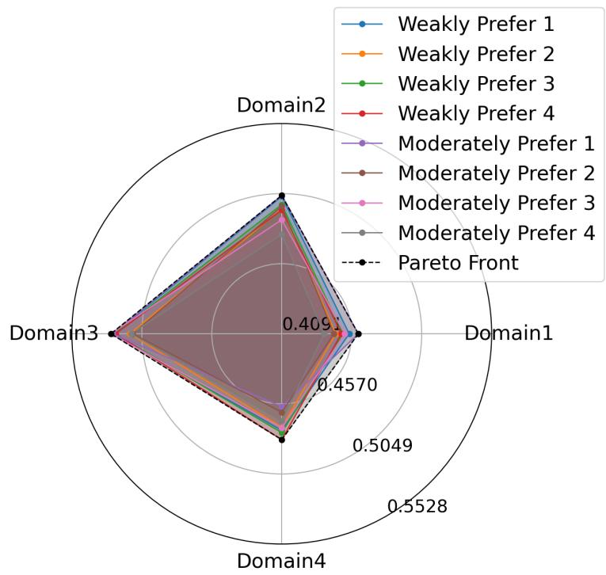  
Figure 1: Pareto front exploration.

Figure 1 illustrates the Pareto front exploration of MOMEHA under diferent preferences in the meta-learning comparison experiment. For each of the four domains, the optimal performance is achieved under the preference setting that favors corresponding domain, demonstrating the effectiveness of the preference-guided search. We only include the weak and moderate preference settings in the figure, as stronger preferences lead to a universal performance degradation across all domains, which is also observed in the WC-penalty baseline (see Appendix C.1).

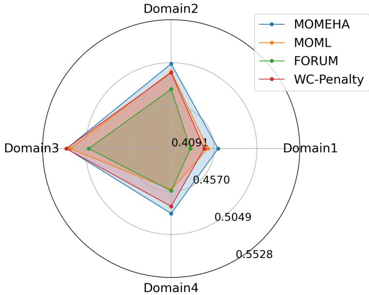  
Figure 2: test accuracy in Meta-Learning.

Figure 2 compares the Pareto fronts (or single solutions) obtained by diferent algorithms in the meta-learning experiment. MOMEHA achieves a broader coverage of the performance space on Domains 1, 2, and 4. On Domain 3, WC-penalty yields a marginally better front than our method, while both still outperform the remaining baselines. Table 2 also shows that MOMEHA obtains the front with better quality than other baselines. WC-MHGD is excluded from the comparison due to its failure to converge in our experiment.

Table 2: hypervolume comparison in Meta-Learning.
<table><tr><td>Alg.</td><td>Ours</td><td>WC-penalty</td><td>MOML</td><td>FORUM</td></tr><tr><td>HV</td><td>1.127</td><td>1.092</td><td>1.072</td><td>1.013</td></tr></table>

## 6.2 Multi-Task Neural Architecture Search

For the stochastic setting, we conduct the NAS experiment on CIFAR-10 dataset Krizhevsky et al. [2009], which alternately optimizes the network parameters and the architecture weights to search for the optimal architecture under the diferent objectives. We consider 4 objectives in this experiment: validation loss, FLOPS loss, skip connection denstiy and pooling density. In addition to the full 4-task setting, we also conduct a comparison experiment on the 2-task setting that includes only the validation loss and FLOPS loss.

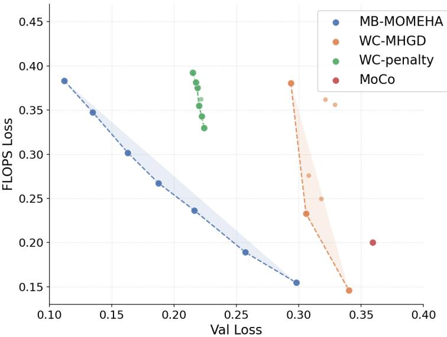  
Figure 3: 2-task NAS comparsion.

Table 3: hypervolume comparsion in 2-task NAS.
<table><tr><td>Alg.</td><td>Ours</td><td>WC-MHGD</td><td>WC-penalty</td><td>MoCo</td></tr><tr><td>HV</td><td>1.522</td><td>1.323</td><td>1.216</td><td>1.192</td></tr></table>

Figure 3 shows the Pareto fronts (or the single solution) obtained by diferent algorithms in the 2-task NAS experiment. Compared with the baselines, MB-MOMEHA achieves superior performance in both the quality and the coverage of the obtained Pareto fronts, which corroborates the quantitative hypervolume comparison in Table 3 and demonstrates the applicability and efectiveness of our algorithm in the non-convex lower-level problem with stochastic setting.

## 7 Conclusion

This work studied multi-objective bilevel optimization with a non-convex lower-level problem. We proposed MOMEHA and MB-MOMEHA, integrating Moreau envelope reformulation with smooth

Tchebychef scalarization to enable eficient Hessian-free, preference-guided optimization. Next, we established ${ \varepsilon } _ { c } { - } { \varepsilon } _ { s }$ -Pareto stationarity convergence guarantees for both the deterministic one and the stochastic variant. Empirically, our methods consistently outperform existing baselines on few-shot meta-learning and neural architecture search, demonstrating the applicability of our methods to the MOBL problems with lower-level nonconvexity.

## References

Amir Beck. First-order methods in optimization. SIAM, 2017.

Souradip Chakraborty, Amrit Bedi, Alec Koppel, Huazheng Wang, Dinesh Manocha, Mengdi Wang, and Furong Huang. Parl: A unified framework for policy alignment in reinforcement learning from human feedback. In International Conference on Learning Representations, volume 2024, pages 24410–24449, 2024.

Weiyu Chen, Baijiong Lin, Xiaoyuan Zhang, Xi Lin, Han Zhao, Qingfu Zhang, and James T Kwok. Gradientbased multi-objective deep learning: Algorithms, theories, applications, and beyond. arXiv preprint arXiv:2501.10945, 2025.

Yuan-Chia Cheng, Ci-Siang Lin, Fu-En Yang, and Yu-Chiang Frank Wang. Few-shot classification in unseen domains by episodic meta-learning across visual domains. In 2021 IEEE International Conference on Image Processing (ICIP), pages 434–438. IEEE, 2021.

Timo M Deist, Monika Grewal, Frank JWM Dankers, Tanja Alderliesten, and Peter AN Bosman. Multi-objective learning to predict pareto fronts using hypervolume maximization. arXiv preprint arXiv:2102.04523, 2021.

Nikos Dimitriadis, Pascal Frossard, and Francois Fleuret. Pareto low-rank adapters: Eficient multi-task learning with preferences. In International Conference on Learning Representations, volume 2025, pages 22323–22346, 2025.

Heshan Fernando, Han Shen, Miao Liu, Subhajit Chaudhury, Keerthiram Murugesan, and Tianyi Chen. Mitigating gradient bias in multi-objective learning: A provably convergent stochastic approach. arXiv preprint arXiv:2210.12624, 2022.

Heshan Devaka Fernando, Han Shen, Miao Liu, Subhajit Chaudhury, Keerthiram Murugesan, and Tianyi Chen. Mitigating gradient bias in multi-objective learning: A provably convergent approach. In The eleventh international conference on learning representations, 2023.

Chelsea Finn, Pieter Abbeel, and Sergey Levine. Model-agnostic meta-learning for fast adaptation of deep networks. In International conference on machine learning, pages 1126–1135. PMLR, 2017.

Luca Franceschi, Michele Donini, Paolo Frasconi, and Massimiliano Pontil. Forward and reverse gradientbased hyperparameter optimization. In International conference on machine learning, pages 1165–1173. PMLR, 2017.

Luca Franceschi, Paolo Frasconi, Saverio Salzo, Riccardo Grazzi, and Massimiliano Pontil. Bilevel programming for hyperparameter optimization and meta-learning. In International conference on machine learning, pages 1568–1577. PMLR, 2018.

Lucy L Gao, Jane J Ye, Haian Yin, Shangzhi Zeng, and Jin Zhang. Moreau envelope based diferenceof-weakly-convex reformulation and algorithm for bilevel programs. arXiv preprint arXiv:2306.16761, 2023.

Tommaso Giovannelli, Grifin D Kent, and Luis Nunes Vicente. Bilevel optimization with a multi-objective lower-level problem: Risk-neutral and risk-averse formulations. Optimization Methods and Software, 39 (4):756–778, 2024.

Gregory Grifin, Alex Holub, and Pietro Perona. Caltech-256 object category dataset. 2007.

Pinki Gulia, Rakesh Kumar, Wattana Viriyasitavat, Arwa N Aledaily, Kusum Yadav, Amandeep Kaur, and Gaurav Dhiman. A systematic review on fuzzy-based multi-objective linear programming methodologies: concepts, challenges and applications. Archives of Computational Methods in Engineering, 30(8):4983– 5022, 2023.

Mingyi Hong, Hoi-To Wai, Zhaoran Wang, and Zhuoran Yang. A two-timescale framework for bilevel opti mization: Complexity analysis and application to actor-critic, dec. 20. arXiv preprint arXiv:2007.05170, 2020.

Zeou Hu, Kiarash Shaloudegi, Guojun Zhang, and Yaoliang Yu. Federated learning meets multi-objective optimization. IEEE Transactions on Network Science and Engineering, 9(4):2039–2051, 2022. doi: 10.1109/TNSE.2022.3169117.

Kaiyi Ji, Junjie Yang, and Yingbin Liang. Bilevel optimization: Convergence analysis and enhanced design. In International conference on machine learning, pages 4882–4892. PMLR, 2021.

Alex Krizhevsky, Geofrey Hinton, et al. Learning multiple layers of features from tiny images. 2009.

Jeongyeol Kwon, Dohyun Kwon, Stephen Wright, and Robert D Nowak. A fully first-order method for stochastic bilevel optimization. In International Conference on Machine Learning, pages 18083–18113. PMLR, 2023.

Baijiong Lin, Feiyang Ye, Yu Zhang, and Ivor W Tsang. Reasonable efectiveness of random weighting: A litmus test for multi-task learning. arXiv preprint arXiv:2111.10603, 2021.

Xi Lin, Xiaoyuan Zhang, Zhiyuan Yang, Fei Liu, Zhenkun Wang, and Qingfu Zhang. Smooth tchebychef scalarization for multi-objective optimization. arXiv preprint arXiv:2402.19078, 2024.

Bo Liu, Xingchao Liu, Xiaojie Jin, Peter Stone, and Qiang Liu. Conflict-averse gradient descent for multi task learning. Advances in neural information processing systems, 34:18878–18890, 2021a.

Bo Liu, Mao Ye, Stephen Wright, Peter Stone, and Qiang Liu. Bome! bilevel optimization made easy: A simple first-order approach. Advances in neural information processing systems, 35:17248–17262, 2022.

Hanxiao Liu, Karen Simonyan, and Yiming Yang. Darts: Diferentiable architecture search. arXiv preprint arXiv:1806.09055, 2018.

Liyang Liu, Yi Li, Zhanghui Kuang, Jing-Hao Xue, Yimin Chen, Wenming Yang, Qingmin Liao, and Wayne Zhang. Towards impartial multi-task learning. In International conference on learning representations, 2021b.

Risheng Liu, Pan Mu, Xiaoming Yuan, Shangzhi Zeng, and Jin Zhang. A generic first-order algorithmic framework for bi-level programming beyond lower-level singleton. In International conference on machine learning, pages 6305–6315. PMLR, 2020.

Risheng Liu, Jiaxin Gao, Jin Zhang, Deyu Meng, and Zhouchen Lin. Investigating bi-level optimization for learning and vision from a unified perspective: A survey and beyond. IEEE Transactions on Pattern Analysis and Machine Intelligence, 44(12):10045–10067, 2021c.

Risheng Liu, Xuan Liu, Xiaoming Yuan, Shangzhi Zeng, and Jin Zhang. A value-function-based interiorpoint method for non-convex bi-level optimization. In International conference on machine learning, pages 6882–6892. PMLR, 2021d.

Risheng Liu, Zhu Liu, Wei Yao, Shangzhi Zeng, and Jin Zhang. Moreau envelope for nonconvex bi-level optimization: A single-loop and hessian-free solution strategy. arXiv preprint arXiv:2405.09927, 2024.

Xingchao Liu, Xin Tong, and Qiang Liu. Profiling pareto front with multi-objective stein variational gradient descent. Advances in neural information processing systems, 34:14721–14733, 2021e.

Debabrata Mahapatra and Vaibhav Rajan. Multi-task learning with user preferences: Gradient descent with controlled ascent in pareto optimization. In International Conference on Machine Learning, pages 6597–6607. PMLR, 2020.

Debabrata Mahapatra and Vaibhav Rajan. Exact pareto optimal search for multi-task learning and multi criteria decision-making. arXiv preprint arXiv:2108.00597, 2021.

Ahmed Manguri, Hogr Hassan, Najmadeen Saeed, and Robert Jankowski. Topology, size, and shape opti mization in civil engineering structures: a review. CMES-COMPUTER MODELING IN ENGINEERING & SCIENCES, 142:933–971, 2025.

Michinari Momma, Chaosheng Dong, and Jia Liu. A multi-objective/multi-task learning framework induced by pareto stationarity. In International Conference on Machine Learning, pages 15895–15907. PMLR, 2022.

Yurii Nesterov et al. Lectures on convex optimization, volume 137. Springer, 2018.

Boris Oreshkin, Pau Rodríguez López, and Alexandre Lacoste. Tadam: Task dependent adaptive metric for improved few-shot learning. Advances in neural information processing systems, 31, 2018.

Boris T Polyak. Some methods of speeding up the convergence of iteration methods. Ussr computational mathematics and mathematical physics, 4(5):1–17, 1964.

Peiwen Qiu, Yining Li, Zhuqing Liu, Prashant Khanduri, Jia Liu, Ness B Shrof, Elizabeth Serena Bentley, and Kurt Turck. Diamond: Taming sample and communication complexities in decentralized bilevel optimization. In IEEE INFOCOM 2023-IEEE conference on computer communications, pages 1–10. IEEE, 2023.

Dripta S Raychaudhuri, Yumin Suh, Samuel Schulter, Xiang Yu, Masoud Faraki, Amit K Roy-Chowdhury, and Manmohan Chandraker. Controllable dynamic multi-task architectures. In Proceedings of the IEEE/CVF Conference on Computer Vision and Pattern Recognition, pages 10955–10964, 2022.

Ozan Sener and Vladlen Koltun. Multi-task learning as multi-objective optimization. Advances in neural information processing systems, 31, 2018.

Amirreza Shaban, Ching-An Cheng, Nathan Hatch, and Byron Boots. Truncated back-propagation for bilevel optimization. In The 22nd international conference on artificial intelligence and statistics, pages 1723–1732. PMLR, 2019.

Han Shen and Tianyi Chen. On penalty-based bilevel gradient descent method. In International conference on machine learning, pages 30992–31015. PMLR, 2023.

Rhea Sanjay Sukthanker, Arber Zela, Benedikt Stafler, Samuel Dooley, Josif Grabocka, and Frank Hutter. Multi-objective diferentiable neural architecture search. arXiv preprint arXiv:2402.18213, 2024.

Tran Anh Tuan, Nguyen Viet Dung, and Tran Ngoc Thang. A hyper-transformer model for controllable pareto front learning with split feasibility constraints. Neural Networks, 179:106571, 2024.

Luis N Vicente and Paul H Calamai. Bilevel and multilevel programming: A bibliography review. Journal of Global optimization, 5(3):291–306, 1994.

Quan Xiao, Han Shen, Wotao Yin, and Tianyi Chen. Alternating implicit projected sgd and its eficient variants for equality-constrained bilevel optimization. arXiv preprint arXiv:2211.07096, 2022.

Xinmin Yang, Wei Yao, Haian Yin, Shangzhi Zeng, and Jin Zhang. Gradient-based algorithms for multiobjective bi-level optimization. Science China Mathematics, 67(6):1419–1438, 2024.

Feiyang Ye, Baijiong Lin, Zhixiong Yue, Pengxin Guo, Qiao Xiao, and Yu Zhang. Multi-objective meta learning. Advances in Neural Information Processing Systems, 34:21338–21351, 2021.

Feiyang Ye, Baijiong Lin, Xiaofeng Cao, Yu Zhang, and Ivor W Tsang. A first-order multi-gradient algorithm for multi-objective bi-level optimization. In ECAI 2024: 27th European Conference on Artificial Intelligence, pages 2621–2628, 2024.

Tianhe Yu, Saurabh Kumar, Abhishek Gupta, Sergey Levine, Karol Hausman, and Chelsea Finn. Gradient surgery for multi-task learning. Advances in neural information processing systems, 33:5824–5836, 2020.

Xiaoyuan Zhang, Genghui Li, Xi Lin, Yichi Zhang, Yifan Chen, and Qingfu Zhang. Gliding over the pareto front with uniform designs. Advances in Neural Information Processing Systems, 37:2215–2245, 2024a.

Xiaoyuan Zhang, Xi Lin, and Qingfu Zhang. Pmgda: A preference-based multiple gradient descent algorithm. IEEE Transactions on Emerging Topics in Computational Intelligence, 2025.

Yihua Zhang, Prashant Khanduri, Ioannis Tsaknakis, Yuguang Yao, Mingyi Hong, and Sijia Liu. An introduction to bilevel optimization: Foundations and applications in signal processing and machine learning. IEEE Signal Processing Magazine, 41(1):38–59, 2024b.

Zhiyao Zhang, Zhuqing Liu, Xin Zhang, Wen-Yen Chen, Jiyan Yang, and Jia Liu. Multi-objective bilevel learning. In Proceedings of the AAAI Conference on Artificial Intelligence, volume 40, pages 28653–28661, 2026a.

Zhiyao Zhang, Myeung Suk Oh, Zhen Qin, Jiaxiang Li, Xin Zhang, and Jia Liu. A tale of two problems: Multi-task bilevel learning meets equality constrained multi-objective optimization. arXiv preprint arXiv:2605.09094, 2026b.

Yifan Zhong, Chengdong Ma, Xiaoyuan Zhang, Ziran Yang, Haojun Chen, Qingfu Zhang, Siyuan Qi, and Yaodong Yang. Panacea: Pareto alignment via preference adaptation for llms. Advances in Neural Information Processing Systems, 37:75522–75558, 2024.

## A Theoretical Proof Details for Deterministic Case

## A.1 Auxiliary Lemmas

Here we first present the useful lemmas for proofing Theorem 1.

Lemma 1. Denote $\begin{array} { r } { h ( \theta ; x , y ) : = g ( x , \theta ) + \frac { 1 } { 2 \gamma } \left\| \theta - y \right\| ^ { 2 } } \end{array}$ . Suppose that $g ( x , y )$ is $( \rho _ { x } , \rho _ { y } )$ -weakly convex, $\begin{array} { r } { \gamma \in \left( 0 , \frac { 1 } { 2 \rho _ { y } } \right) } \end{array}$ , for all $( x ^ { \prime } , y ^ { \prime } ) , ( x , y ) \in \mathbb { R } ^ { d _ { x } } \times \mathbb { R } ^ { d _ { y } }$ we have:

$$
\begin{array} { r } { \left\| \theta _ { \gamma } ^ { * } ( x ^ { \prime } , y ^ { \prime } ) - \theta _ { \gamma } ^ { * } ( x , y ) \right\| \leq L _ { \theta } \left\| ( x ^ { \prime } , y ^ { \prime } ) - ( x , y ) \right\| , } \end{array}
$$

where $\begin{array} { r } { L _ { \theta } : = \operatorname* { m a x } \left\{ \frac { 1 } { \gamma \rho _ { h } } , \frac { L _ { g } } { \rho _ { h } } \right\} } \end{array}$

Proof. Under Assumption $\begin{array} { r } { \mathrm { ~ 2 , ~ } h ( \theta ; x , y ) \mathrm { ~ i s ~ } \left( \frac { 1 } { \gamma } - \rho _ { y } \right) } \end{array}$ -strongly convex (denoted as $\rho _ { h }$ -strongly convex) and $\begin{array} { r } { \left( L _ { g } + \frac { 1 } { \gamma } \right) } \end{array}$ -smooth (denoted as $L _ { h }$ -smooth) in θ. By the definition of strong convexity and the monotonicity of gradients, for any $\theta ^ { \prime } , \theta \in \mathbb { R } ^ { d _ { y } }$ , we have

$$
\rho _ { h } \| \theta ^ { \prime } - \theta \| ^ { 2 } \leq \left. \nabla _ { y } g ( x , \theta ^ { \prime } ) - \nabla _ { y } g ( x , \theta ) + \frac { 1 } { \gamma } ( \theta ^ { \prime } - \theta ) , \ \theta ^ { \prime } - \theta \right. .
$$

Applying the Cauchy–Schwartz inequality yields

$$
\rho _ { h } \| \theta ^ { \prime } - \theta \| ^ { 2 } \leq \left\| \nabla _ { y } g ( x , \theta ^ { \prime } ) - \nabla _ { y } g ( x , \theta ) + \frac { 1 } { \gamma } ( \theta ^ { \prime } - \theta ) \right\| \| \theta ^ { \prime } - \theta \| ,
$$

which simplifies to

$$
\rho _ { h } \| \theta ^ { \prime } - \theta \| \leq \left\| \nabla _ { y } g ( x , \theta ^ { \prime } ) - \nabla _ { y } g ( x , \theta ) + \frac { 1 } { \gamma } ( \theta ^ { \prime } - \theta ) \right\| .\tag{19}
$$

Meanwhile, the first-order optimality condition of h implies that for any $( x , y )$

$$
\nabla _ { y } g ( x , \theta _ { \gamma } ^ { * } ( x , y ) ) + \frac { 1 } { \gamma } ( \theta _ { \gamma } ^ { * } ( x , y ) - y ) = 0 .
$$

Subtracting the equation at $( x , y )$ from that at $( x ^ { \prime } , y ^ { \prime } )$ , we obtain

$$
\nabla _ { y } g ( x ^ { \prime } , \theta _ { \gamma } ^ { * } ( x ^ { \prime } , y ^ { \prime } ) ) - \nabla _ { y } g ( x , \theta _ { \gamma } ^ { * } ( x , y ) ) + \frac { 1 } { \gamma } ( \theta _ { \gamma } ^ { * } ( x ^ { \prime } , y ^ { \prime } ) - \theta _ { \gamma } ^ { * } ( x , y ) ) = - \frac { 1 } { \gamma } ( y ^ { \prime } - y ) .\tag{20}
$$

To control the right-hand side of (19), we decompose the gradient diference in (20) as

$$
\begin{array} { r l } & { \quad \nabla _ { y } g ( x ^ { \prime } , \theta _ { \gamma } ^ { * } ( x ^ { \prime } , y ^ { \prime } ) ) - \nabla _ { y } g ( x , \theta _ { \gamma } ^ { * } ( x , y ) ) } \\ & { = \nabla _ { y } g ( x ^ { \prime } , \theta _ { \gamma } ^ { * } ( x ^ { \prime } , y ^ { \prime } ) ) - \nabla _ { y } g ( x ^ { \prime } , \theta _ { \gamma } ^ { * } ( x , y ) ) + \nabla _ { y } g ( x ^ { \prime } , \theta _ { \gamma } ^ { * } ( x , y ) ) - \nabla _ { y } g ( x , \theta _ { \gamma } ^ { * } ( x , y ) ) . } \end{array}
$$

Substituting this decomposition into (20) gives

$$
\begin{array} { l } { \displaystyle \nabla _ { y } g ( x ^ { \prime } , \theta _ { \gamma } ^ { * } ( x ^ { \prime } , y ^ { \prime } ) ) - \nabla _ { y } g ( x ^ { \prime } , \theta _ { \gamma } ^ { * } ( x , y ) ) } \\ { = - \displaystyle \frac { 1 } { \gamma } \left( y ^ { \prime } - y + \theta _ { \gamma } ^ { * } ( x ^ { \prime } , y ^ { \prime } ) - \theta _ { \gamma } ^ { * } ( x , y ) \right) - \left( \nabla _ { y } g ( x ^ { \prime } , \theta _ { \gamma } ^ { * } ( x , y ) ) - \nabla _ { y } g ( x , \theta _ { \gamma } ^ { * } ( x , y ) ) \right) . } \end{array}
$$

Now, setting $x = x ^ { \prime } , \theta ^ { \prime } = \theta _ { \gamma } ^ { * } ( x ^ { \prime } , y ^ { \prime } )$ , and $\theta = \theta _ { \gamma } ^ { * } ( x , y )$ in (19), and invoking the triangle inequality along with the $L _ { g }$ -smoothness of $g ( x , y )$ , we arrive at

$$
\begin{array} { r l } & { \quad \left\| \nabla _ { y } g ( x , \theta ^ { \prime } ) - \nabla _ { y } g ( x , \theta ) + \frac { 1 } { \gamma } ( \theta ^ { \prime } - \theta ) \right\| } \\ & { = \left\| \frac { 1 } { \gamma } ( y ^ { \prime } - y ) + \nabla _ { y } g ( x ^ { \prime } , \theta _ { \gamma } ^ { * } ( x , y ) ) - \nabla _ { y } g ( x , \theta _ { \gamma } ^ { * } ( x , y ) ) \right\| } \\ & { \leq \frac { 1 } { \gamma } \| y ^ { \prime } - y \| + \left\| \nabla _ { y } g ( x ^ { \prime } , \theta _ { \gamma } ^ { * } ( x , y ) ) - \nabla _ { y } g ( x , \theta _ { \gamma } ^ { * } ( x , y ) ) \right\| } \\ & { \leq \frac { 1 } { \gamma } \| y ^ { \prime } - y \| + L _ { g } \| x ^ { \prime } - x \| . } \end{array}\tag{21}
$$

Combining (19) with (21) yields

$$
\| \theta _ { \gamma } ^ { * } ( x ^ { \prime } , y ^ { \prime } ) - \theta _ { \gamma } ^ { * } ( x , y ) \| \leq \frac { 1 } { \gamma \rho _ { h } } \| y ^ { \prime } - y \| + \frac { L _ { g } } { \rho _ { h } } \| x ^ { \prime } - x \| .
$$

Taking $\begin{array} { r } { L _ { \theta } : = \operatorname* { m a x } \left\{ \frac { 1 } { \gamma \rho _ { h } } , \frac { L _ { g } } { \rho _ { h } } \right\} } \end{array}$ completes the proof.

Lemma 2. Suppose that $\begin{array} { r } { \gamma \in ( 0 , \frac { 1 } { 2 \rho _ { h } } ) } \end{array}$ , for all $( x ^ { \prime } , y ^ { \prime } ) , ( x , y ) \in \mathbb { R } ^ { d _ { x } } \times \mathbb { R } ^ { d _ { y } }$ , we obtain:

$$
\| \nabla v _ { \gamma } ( x ^ { \prime } , y ^ { \prime } ) - \nabla v _ { \gamma } ( x , y ) \| \leq L _ { v } \| ( x ^ { \prime } , y ^ { \prime } ) - ( x , y ) \| ,\tag{22}
$$

where $\begin{array} { r } { L _ { v } : = L _ { g } \operatorname* { m a x } \{ 1 , L _ { \theta } \} + \frac { \operatorname* { m a x } \{ 1 , L _ { g } \} } { \gamma } } \end{array}$

Proof. When $\gamma \in ( 0 , \frac { 1 } { 2 \rho _ { h } } ) , \theta _ { \gamma } ^ { * } ( x , y )$ is uniquely defined, $v _ { \gamma } ( x , y )$ is diferentiable with gradient given by (10). Consequently,

$$
\begin{array} { r l } & { \quad \| \nabla v _ { \gamma } ( x ^ { \prime } , y ^ { \prime } ) - \nabla v _ { \gamma } ( x , y ) \| } \\ & { = \| \nabla _ { x } g ( x ^ { \prime } , \theta _ { \gamma } ^ { * } ( x ^ { \prime } , y ^ { \prime } ) ) - \nabla _ { x } g ( x , \theta _ { \gamma } ^ { * } ( x , y ) ) \| + \frac { 1 } { \gamma } \| y ^ { \prime } - y - ( \theta _ { \gamma } ^ { * } ( x ^ { \prime } , y ^ { \prime } ) - \theta _ { \gamma } ^ { * } ( x , y ) ) \| } \\ & { \le L _ { g } \| ( x ^ { \prime } , \theta _ { \gamma } ^ { * } ( x ^ { \prime } , y ^ { \prime } ) ) - ( x , \theta _ { \gamma } ^ { * } ( x , y ) ) \| + \frac { 1 } { \gamma } \| y ^ { \prime } - y \| + \frac { 1 } { \gamma } \| \theta _ { \gamma } ^ { * } ( x ^ { \prime } , y ^ { \prime } ) - \theta _ { \gamma } ^ { * } ( x , y ) \| } \\ & { = L _ { g } \sqrt { \| x ^ { \prime } - x \| ^ { 2 } + \| \theta _ { \gamma } ^ { * } ( x ^ { \prime } , y ^ { \prime } ) - \theta _ { \gamma } ^ { * } ( x , y ) \| ^ { 2 } } + \frac { 1 } { \gamma } \| y ^ { \prime } - y \| + \frac { 1 } { \gamma } L _ { \theta } \| ( x ^ { \prime } , y ^ { \prime } ) - ( x , y ) \| } \\ & { \le L _ { g } \sqrt { \| x ^ { \prime } - x \| ^ { 2 } + L _ { \theta } ^ { 2 } \| ( x ^ { \prime } , y ^ { \prime } ) - ( x , y ) \| ^ { 2 } } + \frac { 1 } { \gamma } \| y ^ { \prime } - y \| + \frac { 1 } { \gamma } L _ { \theta } \| ( x ^ { \prime } , y ^ { \prime } ) - ( x , y ) \| } \\ &  \le ( L _ { g } \operatorname* { m a x } \{ 1 , L _ { \theta } \} + \frac  \operatorname*  \end{array}\tag{23}
$$

Taking $\begin{array} { r } { L _ { v } : = L _ { g } \operatorname* { m a x } \{ 1 , L _ { \theta } \} + \frac { \operatorname* { m a x } \{ 1 , L _ { \theta } \} } { \gamma } } \end{array}$ completes the proof.

Lemma 3. For any $\begin{array} { r } { \gamma \in ( 0 , \frac { 1 } { 2 \rho _ { y } } ) } \end{array}$ and $\begin{array} { r } { \alpha _ { \theta , t } \in ( 0 , \frac { 2 } { L _ { h } + \rho _ { h } } ] } \end{array}$ , the iteration point $( x _ { t } , y _ { t } , \theta _ { t } )$ of MOMEHA converges at the following rate:

$$
\| \theta _ { t + 1 } - \theta _ { \gamma } ^ { * } ( x _ { t } , y _ { t } ) \| \leq \sigma _ { t } \| \theta _ { t } - \theta _ { \gamma } ^ { * } ( x _ { t } , y _ { t } ) \| ,\tag{24}
$$

where $\sigma _ { t } : = 1 - \alpha _ { \theta , t } \rho _ { h } \in ( 0 , 1 )$

Proof. By the $\rho _ { h }$ -strong convexity and $L _ { h } .$ -smoothness of $h ( \theta ; x , y )$ , for any $( x , y ) \in \mathbb { R } ^ { d _ { x } } \times \mathbb { R } ^ { d _ { y } }$ , the following holds(see (Nesterov et al. [2018], Theorem 2.1.12)):

$$
\langle \nabla h ( \theta ^ { \prime } ) - \nabla h ( \theta ) , ~ \theta ^ { \prime } - \theta \rangle \ge \frac { \| \nabla h ( \theta ^ { \prime } ) - \nabla h ( \theta ) \| ^ { 2 } } { L _ { h } + \rho _ { h } } + \frac { L _ { h } \rho _ { h } } { L _ { h } + \rho _ { h } } \| \theta ^ { \prime } - \theta \| ^ { 2 } .\tag{25}
$$

Setting $\theta ^ { \prime } = \theta _ { t }$ and $\theta = \theta _ { \gamma } ^ { * } ( x _ { t } , y _ { t } )$ in (25), and noting that $\nabla h ( \theta _ { \gamma } ^ { * } ( x _ { t } , y _ { t } ) ; x _ { t } , y _ { t } ) = 0$ , we obtain

$$
\left. \nabla h ( \theta _ { t } ) , \theta _ { t } - \theta _ { \gamma } ^ { * } ( x _ { t } , y _ { t } ) \right. \geq \frac { \| \nabla h ( \theta _ { t } ) \| ^ { 2 } } { L _ { h } + \rho _ { h } } + \frac { L _ { h } \rho _ { h } } { L _ { h } + \rho _ { h } } \| \theta _ { t } - \theta _ { \gamma } ^ { * } ( x _ { t } , y _ { t } ) \| ^ { 2 } .\tag{26}
$$

Furthermore, from the update rule in (11), we have

$$
\begin{array} { r l } & { \quad \| \theta _ { t + 1 } - \theta _ { \gamma } ^ { * } ( x _ { t } , y _ { t } ) \| ^ { 2 } } \\ & { = \| \theta _ { t } - \alpha _ { \theta , t } \nabla h ( \theta _ { t } ) - \theta _ { \gamma } ^ { * } ( x _ { t } , y _ { t } ) \| ^ { 2 } } \\ & { = \| \theta _ { t } - \theta _ { \gamma } ^ { * } ( x _ { t } , y _ { t } ) \| ^ { 2 } + \alpha _ { \theta , t } ^ { 2 } \| \nabla h ( \theta _ { t } ) \| ^ { 2 } - 2 \alpha _ { \theta , t } \langle \theta _ { t } - \theta _ { \gamma } ^ { * } ( x _ { t } , y _ { t } ) , \nabla h ( \theta _ { t } ) \rangle . } \end{array}
$$

Applying (26) yields

$$
\begin{array} { r l } & { \quad \| \theta _ { t + 1 } - \theta _ { \gamma } ^ { * } ( x , y _ { t } ) \| ^ { 2 } } \\ & { \leq ( 1 - \frac { 2 \alpha _ { \theta , t } { L _ { h } \rho _ { h } } } { L _ { h } + \rho _ { h } } ) \| \theta _ { t } - \theta _ { \gamma } ^ { * } ( x _ { t } , y _ { t } ) \| ^ { 2 } + ( \alpha _ { \theta , t } ^ { 2 } - \frac { 2 \alpha _ { \theta , t } } { L _ { h } + \rho _ { h } } ) \| \nabla h ( \theta _ { t } ) \| ^ { 2 } } \\ & { = ( 1 - \frac { 2 \alpha _ { \theta , t } { L _ { h } \rho _ { h } } } { L _ { h } + \rho _ { h } } - \frac { 2 \alpha _ { \theta , t } { \rho _ { h } ^ { 2 } } } { L _ { h } + \rho _ { h } } + \alpha _ { \theta , t } ^ { 2 } { \rho _ { h } ^ { 2 } } ) \| \theta _ { t } - \theta _ { \gamma } ^ { * } ( x _ { t } , y _ { t } ) \| ^ { 2 } } \\ & { \quad + ( \alpha _ { \theta , t } ^ { 2 } - \frac { 2 \alpha _ { \theta , t } } { L _ { h } + \rho _ { h } } ) ( \| \nabla h ( \theta _ { t } ) \| ^ { 2 } - \rho _ { h } ^ { 2 } \| \theta _ { t } - \theta _ { \gamma } ^ { * } ( x _ { t } , y _ { t } ) \| ) } \\ & { = ( 1 - \alpha _ { \theta , t } { \rho _ { h } } ) ^ { 2 } \| \theta _ { t } - \theta _ { \gamma } ^ { * } ( x _ { t } , y _ { t } ) \| ^ { 2 } } \\ &  \quad + \alpha _ { \theta , t } ( \alpha _ { \theta , t } - \frac { 2 } { L _ { h } + \rho _ { h } } ) ( \| \nabla h ( \theta _ { t } ) \| ^ { 2 } - \rho _ { h } ^  2 \end{array}
$$

Since $\lVert \nabla h ( \theta _ { t } ) \rVert ^ { 2 } \geq \rho _ { h } ^ { 2 } \lVert \theta _ { t } - \theta _ { \gamma } ^ { * } ( x _ { t } , y _ { t } ) \rVert ^ { 2 }$ by the $\rho _ { h }$ -strongly convexity of $h$ , and $\begin{array} { r } { \alpha _ { \theta , t } \leq \frac { 2 } { L _ { h } + \rho _ { h } } \leq \frac { 1 } { \rho _ { h } } } \end{array}$ , the last term in the above inequality is non-positive. Therefore,

$$
\begin{array} { r } { \| \theta _ { t + 1 } - \theta _ { \gamma } ^ { * } ( x _ { t } , y _ { t } ) \| ^ { 2 } \leq ( 1 - \alpha _ { \theta , t } \rho _ { h } ) ^ { 2 } \| \theta _ { t } - \theta _ { \gamma } ^ { * } ( x _ { t } , y _ { t } ) \| ^ { 2 } . } \end{array}
$$

Taking the square root on both sides completes the proof.

Lemma 4. Let $\begin{array} { r } { I _ { t } ( x , y ) : = \frac { 1 } { c _ { t } } \mathcal { P } _ { c { t } } ( x , y ) } \end{array}$ , suppose $\begin{array} { r } { \gamma \in \left( 0 , \frac { 1 } { 2 \rho _ { y } } \right) } \end{array}$ , for iteration point $( x _ { t } , y _ { t } , \theta _ { t } )$ of MOMEHA, we deduce:

$$
\begin{array} { l } { \displaystyle I _ { t } ( x _ { t + 1 } , y _ { t + 1 } ) - I _ { t } ( x _ { t } , y _ { t } ) \leq \left( \frac { \alpha _ { x , t } L _ { g } ^ { 2 } } { 2 } + \frac { \alpha _ { y , t } } { \gamma ^ { 2 } } \right) \| \theta _ { t + 1 } - \theta _ { \gamma } ^ { * } ( x _ { t } , y _ { t } ) \| ^ { 2 } - \left( \frac { 1 } { 2 \alpha _ { x , t } } - \frac { L _ { I _ { t } } } { 2 } - \frac { \alpha _ { y , t } L _ { \theta } ^ { 2 } } { \gamma ^ { 2 } } \right) \| x _ { t + 1 } - x _ { t } \| ^ { 2 } } \\ { \displaystyle \qquad - \left( \frac { 1 } { 2 \alpha _ { y , t } } - \frac { L _ { I _ { t } } } { 2 } \right) \| y _ { t + 1 } - y _ { t } \| ^ { 2 } . } \end{array}\tag{27}
$$

Proof. From the smoothness properties stated in Assumption 2, together with Lemma 2, it readily follows that $I _ { t } ( x , y )$ is also gradient Lipschitz continuous. Specifically, we have

$$
\| \nabla I _ { t } ( x _ { t + 1 } , y _ { t + 1 } ) - \nabla I _ { t } ( x _ { t } , y _ { t } ) \| \leq L _ { t } \| ( x _ { t + 1 } , y _ { t + 1 } ) - ( x _ { t } , y _ { t } ) \| ,\tag{28}
$$

with $\begin{array} { r } { L _ { I _ { t } } : = \frac { L _ { S } } { c _ { t } } + L _ { g } + L _ { v } } \end{array}$

To facilitate the subsequent upper-bound analysis, we decompose the diference of $I _ { t }$ as follows:

$$
\begin{array} { r l } & { \quad I _ { t } \big ( x _ { t + 1 } , y _ { t + 1 } \big ) - I _ { t } \big ( x _ { t } , y _ { t } \big ) } \\ & { = \big ( I _ { t } \big ( x _ { t + 1 } , y _ { t + 1 } \big ) - I _ { t } \big ( x _ { t + 1 } , y _ { t } \big ) \big ) + \big ( I _ { t } \big ( x _ { t + 1 } , y _ { t } \big ) - I _ { t } \big ( x _ { t } , y _ { t } \big ) \big ) , } \end{array}\tag{29}
$$

which separates the contributions of the $x -$ and y-updates.

We first examine the x-component. By the quadratic upper bound of $I _ { t }$ with respect to $x ,$ we have

$$
I _ { t } ( x _ { t + 1 } , y _ { t } ) - I _ { t } ( x _ { t } , y _ { t } ) \leq \langle \nabla _ { x } I _ { t } ( x _ { t } , y _ { t } ) , ~ x _ { t + 1 } - x _ { t } \rangle + \frac { L _ { I _ { t } } } { 2 } \| x _ { t + 1 } - x _ { t } \| ^ { 2 } .\tag{30}
$$

To control the inner product term using the gradient Lipschitz property, we introduce $d _ { x , t }$ and rewrite it as

$$
\begin{array} { r l } & { \quad \langle \sqrt { \mathbf { v } _ { x } t } ( x _ { t } , y _ { t } ) , x _ { t + 1 } - x _ { t } \rangle } \\ & { = \langle \sqrt { \mathbf { v } _ { x } t } ( x _ { t } , y _ { t } ) - d _ { z , t } , x _ { t + 1 } - x _ { t } \rangle + \langle d _ { x , t } , x _ { t + 1 } - x _ { t } \rangle } \\ & { = \langle \sqrt { \mathbf { v } _ { x } } \sigma _ { x } ( x _ { t } , \theta _ { t + 1 } ) - \nabla _ { x } v _ { ( x } , y _ { t ) } , x _ { t + 1 } - x _ { t } \rangle - \frac { 1 } { \alpha _ { x , t } } \| x _ { t + 1 } - x _ { t } \| ^ { 2 } } \\ & { \leq \| \bar { \nabla } _ { x } v _ { \mathcal { V } } ( x _ { t } , \theta _ { t + 1 } ) - \nabla _ { x } v _ { \mathcal { V } } ( x _ { t } , y _ { t } ) \| \| x _ { t + 1 } - x _ { t } \| - \frac { 1 } { \alpha _ { x , t } } \| x _ { t + 1 } - x _ { t } \| ^ { 2 } } \\ & { \leq \frac { \alpha _ { x , t } } { 2 } \| \tilde { \nabla } _ { x } v _ { \mathcal { V } } ( x _ { t } , \theta _ { t + 1 } ) - \nabla _ { z } v _ { \mathcal { V } } ( x _ { t } , y _ { t } ) \| ^ { 2 } - \frac { 1 } { 2 \alpha _ { x , t } } \| x _ { t + 1 } - x _ { t } \| ^ { 2 } } \\ & { = \frac { \alpha _ { x , t } } { 2 } \| \nabla _ { x } g ( x _ { t } , \theta _ { t + 1 } ) - \nabla _ { x } g ( x _ { t } , \theta _ { t } ^ { \ast } ( x _ { t } , y _ { t } ) ) \| ^ { 2 } - \frac { 1 } { 2 \alpha _ { x , t } } \| x _ { t + 1 } - x _ { t } \| ^ { 2 } } \\ &  \leq \frac { \alpha _ { x , t } L _ { g } ^ { 2 } }  2  \end{array}\tag{31}
$$

where the second inequality follows from the Cauchy–Schwartz inequality and the inequality 2ab $\leq \alpha a ^ { 2 }$ + $\textstyle { \frac { 1 } { \alpha } } b ^ { 2 } ( \alpha > 0 )$

Combining (30) with (31) yields

$$
I _ { t } ( x _ { t + 1 } , y _ { t } ) - I _ { t } ( x _ { t } , y _ { t } ) \leq \frac { \alpha _ { x , t } L _ { g } ^ { 2 } } { 2 } \| \theta _ { t + 1 } - \theta _ { \gamma } ^ { * } ( x _ { t } , y _ { t } ) \| ^ { 2 } + \left( \frac { L _ { I _ { t } } } { 2 } - \frac { 1 } { 2 \alpha _ { x , t } } \right) \| x _ { t + 1 } - x _ { t } \| ^ { 2 } .\tag{32}
$$

We now turn to the y-component. Following a similar argument, we obtain

$$
I _ { t } ( x _ { t + 1 } , y _ { t + 1 } ) - I _ { t } ( x _ { t + 1 } , y _ { t } ) \leq \langle \nabla _ { y } I _ { t } ( x _ { t + 1 } , y _ { t } ) , \ y _ { t + 1 } - y _ { t } \rangle + \frac { L _ { I _ { t } } } { 2 } \| y _ { t + 1 } - y _ { t } \| ^ { 2 } .\tag{33}
$$

Introducing $d _ { y , { \mathrm { ~ } } }$ t and proceeding analogously gives

$$
\begin{array} { r l } & { \quad | | \nabla _ { x } f _ { i } | | \partial _ { x } x _ { i } , y _ { i } \geq \phi _ { i } - \nabla _ { x } f _ { i } | , } \\ & { = \nabla _ { y } f _ { i } | ( x _ { i - 1 , \cdot , \cdot , y } ) , ~ \phi _ { i , y } - \Delta t ^ { 2 } , } \\ & { = \nabla _ { x } f _ { i } | ( x _ { i - 1 , \cdot , y } ) , ~ \phi _ { i , y } - \Delta t ^ { 2 } , } \\ & { = \nabla _ { y } f _ { i } | ( x _ { i - 1 , \cdot , y } ) , ~ \nabla _ { y } f _ { i } | ( x _ { i - 1 , \cdot , y } ) , ~ \phi _ { i , y } - \Delta t ^ { 2 } , } \\ & { \quad + \nabla _ { y } f _ { i } | ( x _ { i - 1 , \cdot , y } ) , ~ \phi _ { i , y } - \Delta t ^ { 2 } , } \\ & { \leq \frac { c _ { 0 } } { c _ { 0 } } | \nabla _ { y } f _ { i } | ( x _ { i - 1 , \cdot , y } ) , ~ \nabla _ { y } f _ { i } | ( x _ { i - 1 , \cdot , y } ) , ~ \phi _ { i , y } - \Delta t ^ { 2 } , } \\ & { \leq \frac { c _ { 0 } } { c _ { 0 } } | \nabla _ { y } f _ { i } | ( x _ { i - 1 , \cdot , y } ) , } \\ & { \quad - \frac { c _ { 0 } } { c _ { 0 } } | \nabla _ { y } f _ { i } | ( x _ { i - 1 , \cdot , y } ) , } \\ & { = \frac { c _ { 0 } } { c _ { 0 } } | \nabla _ { y } f _ { i } | ( x _ { i - 1 , \cdot , y } ) , } \\ & { \quad + \frac { c _ { 0 } } { c _ { 0 } } | \nabla _ { y } f _ { i } | ( x _ { i - 1 , \cdot , y } ) , } \\ &  \leq \frac { c _ { 0 } } { c _ { 0 } } | | | \partial _ { x } + \partial _ { y } ( x _ { i - 1 , y } )  \end{array}\tag{34}
$$

where the last inequality invokes Lemma 1.

Combining (33) with (34) yields

$$
\begin{array} { r l } & { I _ { t } \big ( x _ { t + 1 } , y _ { t + 1 } \big ) - I _ { t } \big ( x _ { t + 1 } , y _ { t } \big ) \leq \frac { \alpha _ { y , t } } { \gamma ^ { 2 } } \| \theta _ { t + 1 } - \theta _ { \gamma } ^ { * } ( x _ { t } , y _ { t } ) \| ^ { 2 } + \frac { \alpha _ { y , t } L _ { \theta } ^ { 2 } } { \gamma ^ { 2 } } \| x _ { t + 1 } - x _ { t } \| ^ { 2 } } \\ & { \qquad + \left( \frac { L _ { I _ { t } } } { 2 } - \frac { 1 } { 2 \alpha _ { y , t } } \right) \| y _ { t + 1 } - y _ { t } \| ^ { 2 } . } \end{array}\tag{35}
$$

Finally, combining (32) and (35) via (29) gives the overall upper bound:

$$
\begin{array} { l } { \displaystyle I _ { t } ( x _ { t + 1 } , y _ { t + 1 } ) - I _ { t } ( x _ { t } , y _ { t } ) \leq \left( \frac { \alpha _ { x , t } L _ { g } ^ { 2 } } { 2 } + \frac { \alpha _ { y , t } } { \gamma ^ { 2 } } \right) \| \theta _ { t + 1 } - \theta _ { \gamma } ^ { * } ( x _ { t } , y _ { t } ) \| ^ { 2 } - \left( \frac { 1 } { 2 \alpha _ { x , t } } - \frac { L _ { t } } { 2 } - \frac { \alpha _ { y , t } L _ { \theta } ^ { 2 } } { \gamma ^ { 2 } } \right) \| x _ { t + 1 } - x _ { t } \| ^ { 2 } } \\ { \displaystyle \qquad - \left( \frac { 1 } { 2 \alpha _ { y , t } } - \frac { L _ { t } } { 2 } \right) \| y _ { t + 1 } - y _ { t } \| ^ { 2 } . } \end{array}\tag{36}
$$

The proof completes.

□

Lemma 5. Let merit function $\begin{array} { r } { V _ { t } : = \frac { 1 } { c _ { t } } \mathcal { P } _ { c _ { t } } ( x _ { t } , y _ { t } ) + \Big ( L _ { g } ^ { 2 } + \frac { 1 } { \gamma ^ { 2 } } \Big )   \theta _ { t } - \theta _ { \gamma } ^ { * } ( x _ { t } , y _ { t } )  \Big \rvert ^ { 2 } } \end{array}$ , suppose γ $\mathrm { ~  ~ \sigma ~ } _ { \in } \left( 0 , \frac { 1 } { 2 \rho _ { y } } \right) , \alpha _ { \theta , t } \in$ $\left[ \underline { { \alpha } } _ { \theta } , \frac { 2 } { L _ { h } + \rho _ { h } } \right)$ with $\underline { { \alpha } } _ { \theta } \ > \ 0$ , ct is monotonically non-decreasing, $\alpha _ { x , t }$ and $\alpha _ { y , t }$ are also bounded below by $\underline { { \alpha } } _ { x } , \underline { { \alpha } } _ { y } > 0$ accordingly, then for iteration point $( x _ { t } , y _ { t } , \theta _ { t } )$ of MOMEHA, there exists $\overline { { \alpha } } _ { x } , \overline { { \alpha } } _ { y } > 0$ such that:

$$
V _ { t + 1 } - V _ { t } \leq - \alpha _ { \theta , t } ^ { 2 } \rho _ { h } ^ { 2 } \left( L _ { g } ^ { 2 } + \frac { 1 } { \gamma ^ { 2 } } \right) \left. \theta _ { t } - \theta _ { \gamma } ^ { * } ( x _ { t } , y _ { t } ) \right. ^ { 2 } - \frac { 1 } { 4 \alpha _ { x , t } } \left. x _ { t + 1 } - x _ { t } \right. ^ { 2 } - \frac { 1 } { 4 \alpha _ { y , t } } \left. y _ { t + 1 } - y _ { t } \right. ^ { 2 } ,\tag{37}
$$

Proof. We now examine the diference of the potential function. To facilitate the analysis, let $I _ { t } ( x , y ) : =$ $\begin{array} { r } { \frac { 1 } { c _ { t } } \mathcal { P } _ { c _ { t } } ( x , y ) } \end{array}$ . We begin with the following upper bound:

$$
\begin{array} { r l } & { \quad V _ { t + 1 } - V _ { t } } \\ & { = \frac { 1 } { c _ { t + 1 } } \mathcal { P } _ { c _ { t + 1 } } ( x _ { t + 1 } , y _ { t + 1 } ) - \frac { 1 } { c _ { t } } \mathcal { P } _ { c _ { t } } ( x _ { t } , y _ { t } ) } \\ & { \quad + \left( L _ { g } ^ { 2 } + \frac { 1 } { \gamma ^ { 2 } } \right) \left( \| \theta _ { t + 1 } - \theta _ { \gamma } ^ { * } ( x _ { t + 1 } , y _ { t + 1 } ) \| ^ { 2 } - \| \theta _ { t } - \theta _ { \gamma } ^ { * } ( x _ { t } , y _ { t } ) \| ^ { 2 } \right) } \\ & { \leq { I } _ { t } ( x _ { t + 1 } , y _ { t + 1 } ) - { I } _ { t } ( x _ { t } , y _ { t } ) } \\ & { \quad + \left( L _ { g } ^ { 2 } + \frac { 1 } { \gamma ^ { 2 } } \right) \left( \| \theta _ { t + 1 } - \theta _ { \gamma } ^ { * } ( x _ { t + 1 } , y _ { t + 1 } ) \| ^ { 2 } - \| \theta _ { t } - \theta _ { \gamma } ^ { * } ( x _ { t } , y _ { t } ) \| ^ { 2 } \right) . } \end{array}\tag{38}
$$

Applying Lemma 4 yields

$$
\begin{array} { l } { { \displaystyle V _ { t + 1 } - V _ { t } } } \\ { { \le \left( \frac { \alpha _ { x , t } } { 2 } L _ { g } ^ { 2 } + \frac { \alpha _ { y , t } } { \gamma ^ { 2 } } \right) \| \theta _ { t + 1 } - \theta _ { \gamma } ^ { * } ( x _ { t } , y _ { t } ) \| ^ { 2 } + \left( L _ { g } ^ { 2 } + \frac { 1 } { \gamma ^ { 2 } } \right) \| \theta _ { t + 1 } - \theta _ { \gamma } ^ { * } ( x _ { t + 1 } , y _ { t + 1 } ) \| ^ { 2 } } } \\ { { - \left( L _ { g } ^ { 2 } + \frac { 1 } { \gamma ^ { 2 } } \right) \| \theta _ { t } - \theta _ { \gamma } ^ { * } ( x _ { t } , y _ { t } ) \| ^ { 2 } - \left( \frac { 1 } { 2 \alpha _ { x , t } } - \frac { L _ { t } } { 2 } - \frac { \alpha _ { y , t } L _ { \theta } ^ { 2 } } { \gamma ^ { 2 } } \right) \| x _ { t + 1 } - x _ { t } \| ^ { 2 } } } \\ { { - \left( \frac { 1 } { 2 \alpha _ { y , t } } - \frac { L _ { t } } { 2 } \right) \| y _ { t + 1 } - y _ { t } \| ^ { 2 } . } } \end{array}\tag{39}
$$

We now isolate the terms involving $\theta _ { t + 1 }$ and handle the coeficients of $L _ { g } ^ { 2 }$ and $\gamma ^ { - 2 }$ separately. For the former, we have

$$
\begin{array} { r l } & { \quad \frac { \alpha _ { x , t } } { 2 } \big \lVert \theta _ { t + 1 } - \theta _ { \gamma } ^ { * } ( x _ { t } , y _ { t } ) \big \rVert ^ { 2 } + \big \lVert \theta _ { t + 1 } - \theta _ { \gamma } ^ { * } ( x _ { t + 1 } , y _ { t + 1 } ) \big \rVert ^ { 2 } } \\ & { = \frac { \alpha _ { x , t } } { 2 } \big \lVert \theta _ { t + 1 } - \theta _ { \gamma } ^ { * } ( x _ { t } , y _ { t } ) \big \rVert ^ { 2 } + \left. \left( \theta _ { t + 1 } - \theta _ { \gamma } ^ { * } ( x _ { t } , y _ { t } ) \right) + \left( \theta _ { \gamma } ^ { * } ( x _ { t } , y _ { t } ) - \theta _ { \gamma } ^ { * } ( x _ { t + 1 } , y _ { t + 1 } ) \right) \right. ^ { 2 } } \\ & { = \left( \frac { \alpha _ { x , t } } { 2 } + 1 \right) \lVert \theta _ { t + 1 } - \theta _ { \gamma } ^ { * } ( x _ { t } , y _ { t } ) \big \rVert ^ { 2 } + \left. \theta _ { \gamma } ^ { * } ( x _ { t } , y _ { t } ) - \theta _ { \gamma } ^ { * } ( x _ { t + 1 } , y _ { t + 1 } ) \right. ^ { 2 } } \\ & { \quad + 2 \langle \theta _ { t + 1 } - \theta _ { \gamma } ^ { * } ( x _ { t } , y _ { t } ) , \theta _ { \gamma } ^ { * } ( x _ { t } , y _ { t } ) - \theta _ { \gamma } ^ { * } ( x _ { t + 1 } , y _ { t + 1 } ) \rangle } \\ &  \leq \left( \frac { \alpha _ { x , t } } { 2 } + 1 + \delta _ { t } \right) \lVert \theta _ { t + 1 } - \theta _ { \gamma } ^ { * } ( x _ { t } , y _ { t } ) \rVert ^ { 2 } + \left( 1 + \frac { 1 } { \delta _ { t } } \right) \lVert \theta _ { \gamma } ^ { * } ( x _ { t } , y _ { t } ) - \theta _   \end{array}\tag{40}
$$

where the second inequality follows from Young’s inequality, and the last inequality invokes the contraction property of $\theta _ { t }$ and the Lipschitz continuity of $\theta _ { \gamma } ^ { * }$

Since $\sigma _ { t } < 1$ , we have $\sigma _ { t } ^ { 2 } < \sigma _ { t }$ . Setting $\begin{array} { r } { \delta _ { t } = \frac { { \alpha _ { \theta , t } } } { 2 } } \end{array}$ and imposing $\alpha _ { x , t } \in ( 0 , \alpha _ { \theta , t } \rho _ { h } ]$ , we can further bound the coeficient using the diference of squares:

$$
\left( \frac { \alpha _ { x , t } } { 2 } + 1 + \delta _ { t } \right) \sigma _ { t } ^ { 2 } < \left( \frac { \alpha _ { x , t } } { 2 } + 1 + \delta _ { t } \right) \left( 1 - \alpha _ { \theta , t } \rho _ { h } \right) < 1 - \alpha _ { \theta , t } ^ { 2 } \rho _ { h } ^ { 2 } .\tag{41}
$$

Combining (40) with (41) yields

$$
\begin{array} { l } { \displaystyle \quad \frac { \alpha _ { x , t } } { 2 } \| \theta _ { t + 1 } - \theta _ { \gamma } ^ { * } ( x _ { t } , y _ { t } ) \| ^ { 2 } + \| \theta _ { t + 1 } - \theta _ { \gamma } ^ { * } ( x _ { t + 1 } , y _ { t + 1 } ) \| ^ { 2 } } \\ { \displaystyle < ( 1 - \alpha _ { \theta , t } ^ { 2 } \rho _ { h } ^ { 2 } ) \| \theta _ { t } - \theta _ { \gamma } ^ { * } ( x _ { t } , y _ { t } ) \| ^ { 2 } + \left( 1 + \frac { 2 } { \alpha \theta , t } \right) L _ { \theta } ^ { 2 } \left( \| x _ { t + 1 } - x _ { t } \| ^ { 2 } + \| y _ { t + 1 } - y _ { t } \| ^ { 2 } \right) . } \end{array}\tag{42}
$$

For the second term, following a similar argument with $\delta _ { t } = \frac { \alpha _ { \theta , t } } { 2 }$ and $\begin{array} { r } { \alpha _ { y , t } \in ( 0 , \frac { \alpha _ { \theta , t } \rho _ { h } } { 2 } ] } \end{array}$ , we obtain

$$
\begin{array} { l } { \displaystyle \alpha _ { y , t } \| \theta _ { t + 1 } - \theta _ { \gamma } ^ { * } ( x _ { t } , y _ { t } ) \| ^ { 2 } + \| \theta _ { t + 1 } - \theta _ { \gamma } ^ { * } ( x _ { t + 1 } , y _ { t + 1 } ) \| ^ { 2 } } \\ { \displaystyle < ( 1 - \alpha _ { \theta , t } ^ { 2 } \rho _ { h } ^ { 2 } ) \| \theta _ { t } - \theta _ { \gamma } ^ { * } ( x _ { t } , y _ { t } ) \| ^ { 2 } + \left( 1 + \frac { 2 } { \alpha _ { \theta , t } } \right) L _ { \theta } ^ { 2 } \left( \| x _ { t + 1 } - x _ { t } \| ^ { 2 } + \| y _ { t + 1 } - y _ { t } \| ^ { 2 } \right) . } \end{array}\tag{43}
$$

Combining (39), (40), (42), and (43), we arrive at

$$
\begin{array} { r l r } {  { V _ { t + 1 } - V _ { t } } } \\ & { < } & { < - \alpha _ { \theta , t } ^ { 2 } \rho _ { h } ^ { 2 } ( L _ { g } ^ { 2 } + \frac { 1 } { \gamma ^ { 2 } } ) \| \theta _ { t } - \theta _ { \gamma } ^ { * } ( x _ { t } , y _ { t } ) \| ^ { 2 } } \\ & { } & { - ( \frac { 1 } { 2 \alpha _ { x , t } } - \frac { L _ { I _ { t } } } { 2 } - \frac { \alpha _ { y , t } L _ { \theta } ^ { 2 } } { \gamma ^ { 2 } } - ( 1 + \frac { 2 } { \alpha _ { \theta , t } } ) ( L _ { g } ^ { 2 } + \frac { 1 } { \gamma ^ { 2 } } ) L _ { \theta } ^ { 2 } ) \| x _ { t + 1 } - x _ { t } \| ^ { 2 } } \\ & { } & { - ( \frac { 1 } { 2 \alpha _ { y , t } } - \frac { L _ { I _ { t } } } { 2 } - ( 1 + \frac { 2 } { \alpha _ { \theta , t } } ) ( L _ { g } ^ { 2 } + \frac { 1 } { \gamma ^ { 2 } } ) L _ { \theta } ^ { 2 } ) \| y _ { t + 1 } - y _ { t } \| ^ { 2 } . } \end{array}\tag{44}
$$

To further bound the coeficient of $\| x _ { t + 1 } - x _ { t } \| ^ { 2 }$ in (44), we assume a lower bound $\underline { { \alpha } } _ { \theta } > 0$ on $\alpha _ { \theta , t }$ , i.e., $\alpha _ { \theta , t } \geq \underline { { \alpha } } _ { \theta }$ . Since $L _ { I _ { t } } \leq L _ { I _ { 0 } }$ and $\alpha _ { y , t } \leq \frac { \underline { { \alpha } } _ { \theta } \rho _ { h } } { 2 }$ , we have

$$
\begin{array} { r l r } & { } & { - \left( \frac { 1 } { 2 \alpha _ { x , t } } - \frac { L _ { I _ { t } } } { 2 } - \frac { \alpha _ { y , t } L _ { \theta } ^ { 2 } } { \gamma ^ { 2 } } - \left( 1 + \frac { 2 } { \alpha _ { \theta , t } } \right) \left( L _ { g } ^ { 2 } + \frac { 1 } { \gamma ^ { 2 } } \right) L _ { \theta } ^ { 2 } \right) } \\ & { } & { \leq - \left( \frac { 1 } { 2 \alpha _ { x , t } } - \frac { L _ { I _ { 0 } } } { 2 } - \frac { \underline { { \alpha } } _ { \theta } L _ { \theta } ^ { 2 } \rho _ { h } } { 2 \gamma ^ { 2 } } - \left( 1 + \frac { 2 } { \underline { { \alpha } } _ { \theta } } \right) \left( L _ { g } ^ { 2 } + \frac { 1 } { \gamma ^ { 2 } } \right) L _ { \theta } ^ { 2 } \right) . } \end{array}\tag{45}
$$

Define the constant

$$
C _ { 1 } : = \frac { L _ { I _ { 0 } } } { 2 } + \frac { \underline { { \alpha } } _ { \theta } L _ { \theta } ^ { 2 } \rho _ { h } } { 2 \gamma ^ { 2 } } + \left( 1 + \frac { 2 } { \underline { { \alpha } } _ { \theta } } \right) \left( L _ { g } ^ { 2 } + \frac { 1 } { \gamma ^ { 2 } } \right) L _ { \theta } ^ { 2 } .
$$

Similarly, for the coeficient of $\| y _ { t + 1 } - y _ { t } \| ^ { 2 }$ in (44), we obtain

$$
\begin{array} { r l r } & { } & { - \left( \frac { 1 } { 2 \alpha _ { y , t } } - \frac { L _ { I _ { t } } } { 2 } - \left( 1 + \frac { 2 } { \alpha _ { \theta , t } } \right) \left( L _ { g } ^ { 2 } + \frac { 1 } { \gamma ^ { 2 } } \right) L _ { \theta } ^ { 2 } \right) } \\ & { } & { \le - \left( \frac { 1 } { 2 \alpha _ { y , t } } - \frac { L _ { I _ { 0 } } } { 2 } - \left( 1 + \frac { 2 } { \underline { { \alpha } } _ { \theta } } \right) \left( L _ { g } ^ { 2 } + \frac { 1 } { \gamma ^ { 2 } } \right) L _ { \theta } ^ { 2 } \right) . } \end{array}\tag{46}
$$

Define

$$
C _ { 2 } : = \frac { L _ { I _ { 0 } } } { 2 } + \left( 1 + \frac { 2 } { \underline { { \alpha } } _ { \theta } } \right) \left( L _ { g } ^ { 2 } + \frac { 1 } { \gamma ^ { 2 } } \right) L _ { \theta } ^ { 2 } .
$$

Combining (45) and (46) with the upper bound on $\alpha _ { y , t }$ from (45), it follows that whenever

$$
\alpha _ { x , t } \leq u _ { x } : = \operatorname* { m i n } \left\{ { \frac { 1 } { 4 C _ { 1 } } } , \ { \underline { { \alpha } } } _ { \theta } \rho _ { h } \right\} , \qquad \alpha _ { y , t } \leq u _ { y } : = \operatorname* { m i n } \left\{ { \frac { 1 } { 4 C _ { 2 } } } , \ { \frac { \underline { { \alpha } } _ { \theta } \rho _ { h } } { 2 } } \right\} ,\tag{47}
$$

we have

$$
- \left( \frac { 1 } { 2 \alpha _ { x , t } } - \frac { L _ { I _ { t } } } { 2 } - \frac { \alpha _ { y , t } L _ { \theta } ^ { 2 } } { \gamma ^ { 2 } } - \left( 1 + \frac { 2 } { \alpha _ { \theta , t } } \right) \left( L _ { g } ^ { 2 } + \frac { 1 } { \gamma ^ { 2 } } \right) L _ { \theta } ^ { 2 } \right) \le - \frac { 1 } { 4 \alpha _ { x , t } } ,\tag{48}
$$

and

$$
- \left( \frac { 1 } { 2 \alpha _ { y , t } } - \frac { L _ { I _ { t } } } { 2 } - \left( 1 + \frac { 2 } { \alpha _ { \theta , t } } \right) \left( L _ { g } ^ { 2 } + \frac { 1 } { \gamma ^ { 2 } } \right) L _ { \theta } ^ { 2 } \right) \le - \frac { 1 } { 4 \alpha _ { y , t } } .\tag{49}
$$

Finally, under the step-size conditions $\alpha _ { x , t } \leq u _ { x }$ and $\alpha _ { y , t } \leq u _ { y }$ , combining (44), (48), and (49) with $\underline { { \alpha } } _ { \theta } \le \alpha _ { \theta , t }$ yields

$$
V _ { t + 1 } - V _ { t } \leq - \alpha _ { \theta , t } ^ { 2 } \rho _ { h } ^ { 2 } \left( L _ { g } ^ { 2 } + \frac { 1 } { \gamma ^ { 2 } } \right) \left. \theta _ { t } - \theta _ { \gamma } ^ { * } ( x _ { t } , y _ { t } ) \right. ^ { 2 } - \frac { 1 } { 4 \alpha _ { x , t } } \left. x _ { t + 1 } - x _ { t } \right. ^ { 2 } - \frac { 1 } { 4 \alpha _ { y , t } } \left. y _ { t + 1 } - y _ { t } \right. ^ { 2 } .\tag{50}
$$

The proof completes.

Lemma 6. Based on assumptions and conditions of Lemma $^ { 5 , }$ let $c _ { t } = c _ { 0 } ( 1 + t ) ^ { p }$ with $c _ { 0 } > 0 , p \in \left( 0 , \frac { 1 } { 2 } \right)$ , we deduce

$$
\operatorname* { m i n } _ { 0 \leq t \leq T } D _ { t } : = \| \nabla \mathcal { P } _ { c _ { t } } ( x _ { t + 1 } , y _ { t + 1 } ) \| = \mathcal { O } \left( T ^ { p - \frac { 1 } { 2 } } \right) .
$$

Proof. To establish the connection between the gradient of the penalty function and the diference of the potential function, we recall the update rule for $x _ { t }$ in (12), which gives

$$
d _ { x , t } + \frac { 1 } { \alpha _ { x , t } } ( x _ { t + 1 } - x _ { t } ) = 0 .
$$

We first bound the x-component of the penalty gradient. For $\nabla _ { x } \mathcal { P } _ { c t } \left( x _ { t + 1 } , y _ { t + 1 } \right)$ , we have

$$
\begin{array} { r l } & { \quad \| \nabla _ { x } \mathcal { P } _ { c _ { t } } ( x _ { t + 1 } , y _ { t + 1 } ) \| } \\ & { = \left\| \nabla _ { x } \mathcal { P } _ { c _ { t } } ( x _ { t + 1 } , y _ { t + 1 } ) - c _ { t } d _ { x , t } - \frac { c _ { t } } { \alpha _ { x , t } } ( x _ { t + 1 } - x _ { t } ) \right\| } \\ & { \leq \| \nabla _ { x } \mathcal { P } _ { c _ { t } } ( x _ { t + 1 } , y _ { t + 1 } ) - \nabla _ { x } \mathcal { P } _ { c _ { t } } ( x _ { t } , y _ { t } ) \| + \| \nabla _ { x } \mathcal { P } _ { c _ { t } } ( x _ { t } , y _ { t } ) - c _ { t } d _ { x , t } \| + \frac { c _ { t } } { \alpha _ { x , t } } \| x _ { t + 1 } - x _ { t } \| } \\ & { \leq c _ { t } L _ { I _ { 0 } } \| ( x _ { t + 1 } , y _ { t + 1 } ) - ( x _ { t } , y _ { t } ) \| + c _ { t } L _ { g } \| \theta _ { t + 1 } - \theta _ { \gamma } ^ { * } ( x _ { t } , y _ { t } ) \| + \frac { c _ { t } } { \alpha _ { x , t } } \| x _ { t + 1 } - x _ { t } \| } \\ & { \leq c _ { t } L _ { I _ { 0 } } \| ( x _ { t + 1 } , y _ { t + 1 } ) - ( x _ { t } , y _ { t } ) \| + c _ { t } L _ { g } \| \theta _ { t } - \theta _ { \gamma } ^ { * } ( x _ { t } , y _ { t } ) \| + \frac { c _ { t } } { \alpha _ { x , t } } \| x _ { t + 1 } - x _ { t } \| } \\ &  = c _ { t } L _ { I _ { 0 } } \sqrt { \| x _ { t + 1 } - x _ { t } \| ^ { 2 } + \| y _ { t + 1 } - y _ { t } \| ^ { 2 } } + c _ { t } L _ { g } \| \theta _ { t } - \end{array}\tag{51}
$$

where the second inequality follows from the Lipschitz continuity of $\nabla \mathcal { P } _ { c t } \left( x , y \right)$ and the gradient Lipschitz property of $g ( x , y )$ , and the third inequality invokes the contraction of $\theta _ { t }$ established in Lemma 3.

Similarly, for the y-component $\nabla _ { y } \mathcal { P } _ { c t } ( x _ { t + 1 } , y _ { t + 1 } )$ , we obtain

$$
\begin{array} { l } { \displaystyle \left\| \nabla _ { y } \mathcal { P } _ { c _ { t } } ( x _ { t + 1 } , y _ { t + 1 } ) \right\| } \\ { \leq c _ { t } L _ { 0 } \| y _ { t + 1 } - y _ { t } \| + \frac { C _ { t } } { \gamma } \| \theta _ { t + 1 } - \theta _ { \gamma } ^ { * } ( x _ { t + 1 } , y _ { t } ) \| + \frac { C _ { t } } { \alpha _ { y , t } } \| y _ { t + 1 } - y _ { t } \| } \\ { \leq c _ { t } \left( L _ { I _ { 0 } } + \frac { 1 } { \alpha _ { y , t } } \right) \| y _ { t + 1 } - y _ { t } \| + \frac { c _ { t } } { \gamma } \| \theta _ { t + 1 } - \theta _ { \gamma } ^ { * } ( x _ { t } , y _ { t } ) \| + \frac { c _ { t } } { \gamma } \| \theta _ { \gamma } ^ { * } ( x _ { t } , y _ { t } ) - \theta _ { \gamma } ^ { * } ( x _ { t + 1 } , y _ { t } ) \| } \\ { \leq c _ { t } \left( L _ { I _ { 0 } } + \frac { 1 } { \alpha _ { y , t } } \right) \| y _ { t + 1 } - y _ { t } \| + \frac { C _ { t } } { \gamma } \| \theta _ { t } - \theta _ { \gamma } ^ { * } ( x _ { t } , y _ { t } ) \| + \frac { c _ { t } L _ { \theta } } { \gamma } \| x _ { t + 1 } - x _ { t } \| , } \end{array}\tag{52}
$$

where the last inequality uses Lemma 1 and Lemma 3.

Combining (51) and (52) yields

$$
\begin{array} { r l } {  { D _ { t } : = \| \nabla \mathcal { P } _ { c _ { t } } ( x _ { t + 1 } , y _ { t + 1 } ) \| } } \\ & { \le \| \nabla _ { x } \mathcal { P } _ { c _ { t } } ( x _ { t + 1 } , y _ { t + 1 } ) \| + \| \nabla _ { y } \mathcal { P } _ { c _ { t } } ( x _ { t + 1 } , y _ { t + 1 } ) \| } \\ & { \le c _ { t } L _ { I _ { 0 } } \sqrt { \| x _ { t + 1 } - x _ { t } \| ^ { 2 } + \| y _ { t + 1 } - y _ { t } \| ^ { 2 } } + c _ { t } L _ { h } \| \theta _ { t } - \theta _ { \gamma } ^ { * } ( x _ { t } , y _ { t } ) \| } \\ & { \quad + c _ { t } ( \frac { 1 } { \alpha _ { x , t } } + \frac { L _ { \theta } } { \gamma } ) \| x _ { t + 1 } - x _ { t } \| + c _ { t } ( L _ { I _ { 0 } } + \frac { 1 } { \alpha _ { y , t } } ) \| y _ { t + 1 } - y _ { t } \| . } \end{array}\tag{53}
$$

To link (53) with the terms in (50), we apply the Cauchy–Schwartz inequality, which gives

$$
\begin{array} { l } { \displaystyle \frac { D _ { t } ^ { 2 } } { c _ { t } ^ { 2 } } \leq 4 L _ { h } ^ { 2 } \| \theta _ { t } - \theta _ { \gamma } ^ { * } ( x _ { t } , y _ { t } ) \| ^ { 2 } + 4 \left( \left( \frac { 1 } { \alpha _ { x , t } } + \frac { L _ { \theta } } { \gamma } \right) ^ { 2 } + L _ { I _ { 0 } } ^ { 2 } \right) \| x _ { t + 1 } - x _ { t } \| ^ { 2 } } \\ { \displaystyle \qquad + 4 \left( \left( L _ { I _ { 0 } } + \frac { 1 } { \alpha _ { y , t } } \right) ^ { 2 } + L _ { I _ { 0 } } ^ { 2 } \right) \| y _ { t + 1 } - y _ { t } \| ^ { 2 } . } \end{array}
$$

Assume that $\alpha _ { x , t }$ and $\alpha _ { y , t }$ have positive lower bounds $\underline { { \alpha } } _ { x }$ and $\underline { { \alpha } } _ { y } ,$ respectively. Then, invoking $\sigma _ { t } ^ { 2 } < 1$ together, the coeficients in the above inequality can be uniformly bounded by constants. Consequently, there exists a suficiently large constant $C _ { D } > 0$ such that

$$
\begin{array} { r l } & { \displaystyle \frac { D _ { t } ^ { 2 } } { c _ { t } ^ { 2 } } \leq 4 L _ { h } ^ { 2 } \| \theta _ { t } - \theta _ { \gamma } ^ { * } ( x _ { t } , y _ { t } ) \| ^ { 2 } + 4 \left( \left( \frac { 1 } { \underline { { \alpha } } _ { x } } + \frac { L _ { \theta } } { \gamma } \right) ^ { 2 } + L _ { I _ { 0 } } ^ { 2 } \right) \left\| x _ { t + 1 } - x _ { t } \right\| ^ { 2 } } \\ & { \qquad + 4 \left( \left( L _ { I _ { 0 } } + \frac { 1 } { \underline { { \alpha } } _ { y } } \right) ^ { 2 } + L _ { I _ { 0 } } ^ { 2 } \right) \left\| y _ { t + 1 } - y _ { t } \right\| ^ { 2 } } \\ & { \leq C _ { D } \left( \displaystyle \frac { 1 } { 4 \alpha _ { x , t } \| x _ { t + 1 } - x _ { t } \| ^ { 2 } } + \frac { 1 } { 4 \alpha _ { y , t } \| y _ { t + 1 } - y _ { t } \| ^ { 2 } } + \alpha _ { \theta , t } ^ { 2 } \rho _ { h } ^ { 2 } \left( L _ { g } ^ { 2 } + \frac { 1 } { \gamma ^ { 2 } } \right) \left\| \theta _ { t } - \theta _ { \gamma } ^ { * } ( x _ { t } , y _ { t } ) \right\| ^ { 2 } \right) . } \end{array}\tag{54}
$$

Combining (54) with Lemma $5 ,$ we obtain

$$
\sum _ { t = 0 } ^ { T } \frac { D _ { t } ^ { 2 } } { c _ { t } ^ { 2 } } \leq \sum _ { t = 0 } ^ { T } C _ { D } \left( V _ { t + 1 } - V _ { t } \right) = C _ { D } \left( V _ { 0 } - V _ { T + 1 } \right) \leq C _ { D } V _ { 0 } .
$$

Since the penalty parameter $c _ { t }$ is bounded for any finite number of iterations, the sequence $\{ D _ { t } ^ { 2 } \}$ attains a minimum over $t = 0 , \ldots , T$ . Therefore,

$$
\left( \operatorname* { m i n } _ { 0 \le t \le T } D _ { t } ^ { 2 } \right) \sum _ { t = 0 } ^ { T } \frac { 1 } { c _ { t } ^ { 2 } } \le \sum _ { t = 0 } ^ { T } \frac { D _ { t } ^ { 2 } } { c _ { t } ^ { 2 } } \le C _ { D } V _ { 0 } ,
$$

which implies

$$
\operatorname* { m i n } _ { 0 \leq t \leq T } D _ { t } ^ { 2 } \leq C _ { D } V _ { 0 } \cdot \left( \sum _ { t = 0 } ^ { T } \frac { 1 } { c _ { t } ^ { 2 } } \right) ^ { - 1 } .
$$

Finally, using the monotonicity of $\frac { 1 } { c _ { t } ^ { 2 } }$ and the mean value theorem for integrals, we have

$$
\sum _ { t = 0 } ^ { T } \frac { 1 } { c _ { t } ^ { 2 } } \geq \frac { 1 } { c _ { 0 } } \sum _ { t = 0 } ^ { T } \int _ { t } ^ { t + 1 } \frac { d x } { ( 1 + x ) ^ { 2 p } } = \int _ { 0 } ^ { T + 1 } \frac { d x } { ( 1 + x ) ^ { 2 p } } = \frac { ( T + 2 ) ^ { 1 - 2 p } - 1 } { c _ { 0 } ( 1 - 2 p ) } .
$$

For any $p \in ( 0 , \frac { 1 } { 2 } )$ , it follows that

$$
\operatorname* { m i n } _ { 0 \leq t \leq T } D _ { t } \leq \sqrt { \frac { C _ { D } V _ { 0 } c _ { 0 } ( 1 - 2 p ) } { ( T + 2 ) ^ { 1 - 2 p } - 1 } } = \mathcal { O } \left( T ^ { - \left( \frac { 1 } { 2 } - p \right) } \right) .
$$

The proof completes.

## A.2 Proof of Theorem 1

Proof. From the monotonicity of $V _ { t }$ established in Lemma 5, we have $V _ { t } \leq V _ { 0 }$ for all t. Consequently,

$$
\frac { 1 } { c _ { t } } \mathcal { P } _ { c _ { t } } ( x _ { t } , y _ { t } ) \leq V _ { t } \leq V _ { 0 } .
$$

Furthermore, invoking the lower bound of $F _ { w } ^ { \mathrm { ( S T C H ) } } ( x , y )$ from Assumption 1, we obtain

$$
g ( x _ { t } , y _ { t } ) - v _ { \gamma } ( x _ { t } , y _ { t } ) \leq V _ { 0 } - \frac { 1 } { c _ { t } } \big ( F _ { w } ^ { \mathrm { ( S T C H ) } } ( x _ { T } , y _ { T } ) - \underline { { F } } \big ) \leq V _ { 0 } ,
$$

which yields the following trivial bound:

$$
g ( x _ { t } , y _ { t } ) - v _ { \gamma } ( x _ { t } , y _ { t } ) \leq V _ { 0 } .\tag{55}
$$

Moreover, if $\mathcal { P } _ { c _ { t } } ( x _ { t } , y _ { t } )$ admits a uniform upper bound ${ \overline { { \mathcal { P } } } } .$ , then at the final iteration $T ,$

$$
\mathcal { P } _ { c _ { T } } \big ( x _ { T } , y _ { T } \big ) = F _ { w } ^ { \mathrm { ( S T C H ) } } \big ( x _ { T } , y _ { T } \big ) - \underline { { F } } + c _ { T } \big ( g \big ( x _ { T } , y _ { T } \big ) - \upsilon _ { \gamma } \big ( x _ { T } , y _ { T } \big ) \big ) \leq \overline { { \mathcal { P } } } .
$$

It immediately follows that

$$
g ( x _ { T } , y _ { T } ) - \upsilon _ { \gamma } ( x _ { T } , y _ { T } ) \leq \frac { \underline { { F } } - F _ { w } ^ { ( \mathrm { S T C H } ) } ( x _ { T } , y _ { T } ) + \overline { { \mathcal { P } } } } { c _ { T } } \leq \frac { \overline { { \mathcal { P } } } } { c _ { T } } .
$$

In particular, with the choice $c _ { t } = c _ { 0 } ( 1 + t ) ^ { p }$ for $p \in [ 0 , \frac { 1 } { 2 } )$ , we obtain the following convergence rates:

$$
g ( x _ { T } , y _ { T } ) - v _ { \gamma } ( x _ { T } , y _ { T } ) = \mathcal { O } \left( \frac { 1 } { T ^ { p } } \right) .\tag{56}
$$

Let $\epsilon _ { t } : = g ( x _ { t } , y _ { t } ) - v _ { \gamma } ( x _ { t } , y _ { t } ) , \mathcal { F } _ { t } : = \{ ( x , y ) \mid g ( x , y ) - v _ { \gamma } ( x , y ) \leq \epsilon _ { t } \}$ and $\mathcal { N } _ { \mathcal { F } _ { t } } ( x , y )$ the normal cone to $\mathcal { F } _ { t }$ at $( x , y )$ . Under Assumption 3, suppose $\epsilon { \sigma } \geq V _ { 0 }$ , we have

$$
\nabla g ( x _ { t } , y _ { t } ) - \nabla v _ { \gamma } ( x _ { t } , y _ { t } ) \in \mathcal { N } _ { \mathcal { F } _ { t } } ( x _ { t } , y _ { t } ) .
$$

First, note that the gradient of $F _ { w } ^ { \mathrm { ( S T C H ) } }$ can be expressed as

$$
\nabla F _ { w } ^ { ( { \mathrm { S T C H } } ) } ( x _ { T + 1 } , y _ { T + 1 } ) = \sum _ { i = 1 } ^ { m } { \frac { \exp \left( \mu w _ { i } f _ { i } ( x _ { T + 1 } , y _ { T + 1 } ) - z _ { i } \right) } { \sum _ { j = 1 } ^ { m } \exp \left( \mu w _ { j } f _ { j } ( x _ { T + 1 } , y _ { T + 1 } ) - z _ { j } \right) } \nabla f _ { i } ( x _ { T + 1 } , y _ { T + 1 } ) } .\tag{57}
$$

Let the coeficients of $\nabla f _ { i }$ in the above expression be denoted by

$$
\tau _ { i } ( x _ { T + 1 } , y _ { T + 1 } ) : = \frac { \exp \left( \mu w _ { i } f _ { i } ( x _ { T + 1 } , y _ { T + 1 } ) - z _ { i } \right) } { \sum _ { j = 1 } ^ { m } \exp \left( \mu w _ { j } f _ { j } ( x _ { T + 1 } , y _ { T + 1 } ) - z _ { j } \right) } .\tag{58}
$$

Define $\begin{array} { r } { s _ { T + 1 } : = \sum _ { i = 1 } ^ { m } w _ { i } \tau _ { i } \bigl ( x _ { T + 1 } , y _ { T + 1 } \bigr ) } \end{array}$ . Since w $\in \Delta _ { m - 1 } ^ { + + } , \sum _ { i = 1 } ^ { m } \tau _ { i } = 1$ , we have $s _ { T + 1 } \geq \underline { { w } } > 0$ Consequently, the gradient can be rewritten as

$$
\nabla F _ { w } ^ { ( { \mathrm { S T C H } } ) } ( x _ { T + 1 } , y _ { T + 1 } ) = s _ { T + 1 } \sum _ { i = 1 } ^ { m } { \frac { w _ { i } \tau _ { i } \left( x _ { T + 1 } , y _ { T + 1 } \right) } { s _ { T + 1 } } } \nabla f _ { i } ( x _ { T + 1 } , y _ { T + 1 } ) .\tag{59}
$$

Now, following Definition 6, we set

$$
\begin{array} { r l r } & { \lambda _ { i } : = \frac { w _ { i } \tau _ { i } \left( x _ { T + 1 } , y _ { T + 1 } \right) } { s _ { T + 1 } } , \qquad n _ { T + 1 } : = \frac { c _ { T } } { s _ { T + 1 } } \left( \nabla g ( x _ { T + 1 } , y _ { T + 1 } ) - \nabla v _ { \gamma } ( x _ { T + 1 } , y _ { T + 1 } ) \right) . } \end{array}
$$

Combining Definition $^ { 6 , }$ Lemma 6, (58) and (59),when $p \in [ 0 , \frac { 1 } { 2 } )$ we obtain

$$
\begin{array} { r l } & { \underset { 0 \leq t \leq T } { \operatorname* { m i n } } H _ { \frac { c _ { t } } { s _ { t + 1 } } } \big ( x _ { t + 1 } , y _ { t + 1 } ; \epsilon _ { t + 1 } \big ) } \\ & { = \underset { 0 \leq t \leq T } { \operatorname* { m i n } } \left\| \displaystyle \sum _ { i = 1 } ^ { m } \lambda _ { i } \nabla f _ { i } \big ( x _ { t + 1 } , y _ { t + 1 } \big ) + n _ { t + 1 } \right\| } \\ & { = \underset { 0 \leq t \leq T } { \operatorname* { m i n } } \frac { D _ { t } } { s _ { t + 1 } } \leq \frac { D _ { t } } { w } = \mathcal { O } \left( T ^ { p - \frac { 1 } { 2 } } \right) , } \end{array}
$$

where $D _ { T } : = \| \nabla \mathcal { P } _ { c _ { T } } ( x _ { T + 1 } , y _ { T + 1 } ) \|$ is the penalty gradient norm defined as (53) in Lemma 6. □

## B Theoretical Proof Details for Stochastic Case

## B.1 Auxiliary Lemmas

Here we first present the useful lemmas for proofing Theorem 2. Note that all expectations in the stochastic lemmas are understood as full expectations obtained by applying the tower property to the conditional expectations conditioned on the current iterates

Lemma 7. Suppose $\begin{array} { r } { \gamma \in \left( 0 , \frac { 1 } { 2 \rho _ { y } } \right) , \alpha _ { \theta , t } \in \left( 0 , \frac { \rho _ { h } } { 4 L _ { h } ^ { 2 } } \right] } \end{array}$ , then iteration point $( x _ { t } , y _ { t } , \theta _ { t } )$ of MB-MOMEHA satiefies

$$
\mathbb { E } [ \| \theta _ { t + 1 } - \theta _ { \gamma } ^ { * } ( x _ { t } , y _ { t } ) \| ^ { 2 } ] \leq \left( 1 - \frac { \alpha _ { \theta , t } \rho _ { h } } { 2 } \right) \mathbb { E } [ \| \theta _ { t } - \theta _ { \gamma } ^ { * } ( x _ { t } , y _ { t } ) \| ^ { 2 } ] + \frac { 2 \alpha _ { \theta , t } } { \rho _ { h } } \mathbb { E } [ \| e _ { \theta , t } \| ^ { 2 } ] ,\tag{60}
$$

Proof. Let $e _ { \theta , t } : = m _ { \theta , t + 1 } - d _ { \theta , t }$ . We begin by considering the expected squared distance from the stochastic iterate $\theta _ { t + 1 }$ to the inner optimal solution $\theta _ { \gamma } ^ { * } ( x _ { t } , y _ { t } )$ . Expanding the update rule for $\theta _ { t }$ with the stochastic gradient, we have

$$
\begin{array} { r l } & { \quad \mathbb { E } [ \| \theta _ { t + 1 } - \theta _ { \gamma } ^ { * } ( x _ { t } , y _ { t } ) \| ^ { 2 } ] } \\ & { = \mathbb { E } [ \| \theta _ { t } - \theta _ { \gamma } ^ { * } ( x _ { t } , y _ { t } ) - \alpha _ { \theta , t } m _ { \theta , t + 1 } \| ^ { 2 } ] } \\ & { = \mathbb { E } [ \| \theta _ { t } - \theta _ { \gamma } ^ { * } ( x _ { t } , y _ { t } ) \| ^ { 2 } ] - 2 \alpha _ { \theta , t } \mathbb { E } [ \langle \theta _ { t } - \theta _ { \gamma } ^ { * } ( x _ { t } , y _ { t } ) , \ m _ { \theta , t + 1 } \rangle ] + \alpha _ { \theta , t } ^ { 2 } \mathbb { E } [ \| m _ { \theta , t + 1 } \| ^ { 2 } ] . } \end{array}
$$

By decomposing $m _ { \theta , t + 1 } = e _ { \theta , t } + d _ { \theta , t }$ , the above becomes

$$
\begin{array} { r } { = \mathbb { E } [ \Vert \theta _ { t } - \theta _ { \gamma } ^ { \star } ( x _ { t } , y _ { t } ) \Vert ^ { 2 } ] - 2 \alpha \theta _ { t } \mathbb { E } [ \langle \theta _ { t } - \theta _ { \gamma } ^ { \star } ( x _ { t } , y _ { t } ) , \ e _ { \theta , t } \rangle ] - 2 \alpha \theta _ { t } \mathbb { E } [ \langle \theta _ { t } - \theta _ { \gamma } ^ { \star } ( x _ { t } , y _ { t } ) , \ d _ { \theta , t } \rangle ] + \alpha _ { \theta , t } ^ { 2 } \mathbb { E } [ \Vert e _ { \theta , t } + d _ { \theta , t } \Vert ^ { 2 } ] . } \end{array}
$$

Applying Young’s inequality to the inner product involving $e _ { \theta , t }$ , and using the ρh-strong convexity of $h ( \theta ; x , y )$ together with the $L _ { h }$ -smoothness of $d _ { \theta , t }$ (which gives $\lVert d _ { \theta , t } \rVert ^ { 2 } \leq L _ { h } ^ { 2 } \lVert \theta _ { t } - \theta _ { \gamma } ^ { * } ( x _ { t } , y _ { t } ) \rVert ^ { 2 } )$ , we obtain

$$
\begin{array} { r l r } {  { \mathbb { E } [ \| \theta _ { t + 1 } - \theta _ { \gamma } ^ { * } ( x _ { t } , y _ { t } ) \| ^ { 2 } ] } } \\ & { } & { \leq \mathbb { E } [ \| \theta _ { t } - \theta _ { \gamma } ^ { * } ( x _ { t } , y _ { t } ) \| ^ { 2 } ] + \alpha _ { \theta , t } ( \rho _ { h } \mathbb { E } [ \| \theta _ { t } - \theta _ { \gamma } ^ { * } ( x _ { t } , y _ { t } ) \| ^ { 2 } ] + \frac { 1 } { \rho _ { h } } \mathbb { E } \| e _ { \theta , t } \| ^ { 2 } ) } \\ & { } & { \quad - 2 \alpha _ { \theta , t } \mathbb { E } [ \langle \theta _ { t } - \theta _ { \gamma } ^ { * } ( x _ { t } , y _ { t } ) , \ d _ { \theta , t } \rangle ] + 2 \alpha _ { \theta , t } ^ { 2 } ( \mathbb { E } [ \| e _ { \theta , t } \| ^ { 2 } ] + \mathbb { E } [ \| d _ { \theta , t } \| ^ { 2 } ] ) } \\ & { } & { \leq ( 1 - \alpha _ { \theta , t } \rho _ { h } + 2 \alpha _ { \theta , t } ^ { 2 } L _ { h } ^ { 2 } ) \mathbb { E } [ \| \theta _ { t } - \theta _ { \gamma } ^ { * } ( x _ { t } , y _ { t } ) \| ^ { 2 } ] + ( \frac { \alpha _ { \theta , t } } { \rho _ { h } } + 2 \alpha _ { \theta , t } ^ { 2 } ) \mathbb { E } [ \| e _ { \theta , t } \| ^ { 2 } ] , } \end{array}
$$

where we have used the following two standard facts:

$$
\begin{array} { r } { \langle \theta _ { t } - \theta _ { \gamma } ^ { * } ( x _ { t } , y _ { t } ) , \ d _ { \theta , t } \rangle \geq \rho _ { h } \Vert \theta _ { t } - \theta _ { \gamma } ^ { * } ( x _ { t } , y _ { t } ) \Vert ^ { 2 } , } \end{array}
$$

and

$$
\lVert d _ { \theta , t } \rVert ^ { 2 } \leq L _ { h } ^ { 2 } \lVert \theta _ { t } - \theta _ { \gamma } ^ { * } ( x _ { t } , y _ { t } ) \rVert ^ { 2 } .
$$

Now, if the step size satisfies $\textstyle \alpha _ { \theta , t } \in ( 0 , { \frac { \rho _ { h } } { 4 L _ { h } ^ { 2 } } } ]$ , then since $\rho _ { h } < L _ { h }$ , we also have $\begin{array} { r } { \alpha _ { \theta , t } \leq \frac { 1 } { 2 \rho _ { h } } } \end{array}$ . Consequently,

$$
1 - \alpha _ { \theta , t } \rho _ { h } + 2 \alpha _ { \theta , t } ^ { 2 } L _ { h } ^ { 2 } \leq 1 - \frac { \alpha _ { \theta , t } \rho _ { h } } { 2 } ,
$$

and

$$
\frac { \alpha _ { \theta , t } } { \rho _ { h } } + 2 \alpha _ { \theta , t } ^ { 2 } \leq \frac { 2 \alpha _ { \theta , t } } { \rho _ { h } } .
$$

Therefore, we arrive at the following contraction inequality:

$$
\mathbb { E } [ \| \theta _ { t + 1 } - \theta _ { \gamma } ^ { * } ( x _ { t } , y _ { t } ) \| ^ { 2 } ] \leq \left( 1 - \frac { \alpha _ { \theta , t } \rho _ { h } } { 2 } \right) \mathbb { E } [ \| \theta _ { t } - \theta _ { \gamma } ^ { * } ( x _ { t } , y _ { t } ) \| ^ { 2 } ] + \frac { 2 \alpha _ { \theta , t } } { \rho _ { h } } \mathbb { E } [ \| e _ { \theta , t } \| ^ { 2 } ] .\tag{61}
$$

The proof completes.

Lemma 8. Suppose $\beta _ { t } \in ( 0 , 1 )$ , then for iteration point $( x _ { t } , y _ { t } , \theta _ { t } )$ of MB-MOMEHA, we deduce the $f o l -$ lowing momentum error contractions

$$
\begin{array}{c} \mathbb { E } [ \| e _ { \theta , t } \| ^ { 2 } ] \leq \frac { 1 + \beta _ { t } } { 2 } \mathbb { E } [ \| e _ { \theta , t - 1 } \| ^ { 2 } ] + \frac { 2 \beta _ { t } ^ { 2 } } { 1 - \beta _ { t } } \mathbb { E } [ \| d _ { \theta , t - } d _ { \theta , t - 1 } \| ^ { 2 } ] + \frac { ( 1 - \beta _ { t } ) ^ { 2 } \sigma ^ { 2 } } { B } ,  \\ { \mathbb { E } [ \| e _ { x , t } \| ^ { 2 } ] \leq \frac { 1 + \beta _ { t } } { 2 } \mathbb { E } [ \| e _ { x , t - 1 } \| ^ { 2 } ] + \frac { 2 \beta _ { t } ^ { 2 } } { 1 - \beta _ { t } } \mathbb { E } [ \| d _ { x , t - } d _ { x , t - 1 } \| ^ { 2 } ] + \frac { ( 1 - \beta _ { t } ) ^ { 2 } \sigma ^ { 2 } } { B } , } \\ { \mathbb { E } [ \| e _ { y , t } \| ^ { 2 } ] \leq \frac { 1 + \beta _ { t } } { 2 } \mathbb { E } [ \| e _ { y , t - 1 } \| ^ { 2 } ] + \frac { 2 \beta _ { t } ^ { 2 } } { 1 - \beta _ { t } } \mathbb { E } [ \| d _ { y , t - } d _ { y , t - 1 } \| ^ { 2 } ] + \frac { ( 1 - \beta _ { t } ) ^ { 2 } \sigma ^ { 2 } } { B } , } \end{array}\tag{62}
$$

where $e . , \mathrm { { } } t = m . , \mathrm { { } } t + 1 - d . , \mathrm { { } } t$

Proof. We now analyze the recursion of the momentum error $e _ { \theta , t }$ . From the momentum update rule, we have

$$
\begin{array} { r l } & { \mathbb { E } [ \| e _ { \theta , t } \| ^ { 2 } ] = \mathbb { E } [ \| m _ { \theta , t + 1 } - d _ { \theta , t } \| ^ { 2 } ] } \\ & { \qquad = \mathbb { E } [ \| \beta _ { t } m _ { \theta , t } + ( 1 - \beta _ { t } ) \hat { d } _ { \theta , t } - d _ { \theta , t } ] ^ { 2 } ] } \\ & { \qquad = \mathbb { E } [ \| \beta _ { t } ( m _ { \theta , t } - d _ { \theta , t - 1 } ) + ( 1 - \beta _ { t } ) ( \hat { d } _ { \theta , t } - d _ { \theta , t } ) + \beta _ { t } ( d _ { \theta , t - 1 } - d _ { \theta , t } ) \| ^ { 2 } ] } \\ & { \qquad = \beta _ { t } ^ { 2 } \mathbb { E } [ \| e _ { \theta , t - 1 } \| ^ { 2 } ] + 2 \beta _ { t } ^ { 2 } \mathbb { E } [ ( e _ { \theta , t - 1 } , ~ d _ { \theta , t - 1 } - d _ { \theta , t } ) ] + 2 \beta _ { t } ( 1 - \beta _ { t } ) \mathbb { E } [ \langle e _ { \theta , t - 1 } , ~ \hat { d } _ { \theta , t } - d _ { \theta , t } \rangle ] } \\ & { \qquad + 2 \beta _ { t } ( 1 - \beta _ { t } ) \mathbb { E } [ \langle d _ { \theta , t - 1 } - d _ { \theta , t } , ~ \hat { d } _ { \theta , t } - d _ { \theta , t } \rangle ] + \beta _ { t } ^ { 2 } \mathbb { E } [ \| d _ { \theta , t } - d _ { \theta , t - 1 } \| ^ { 2 } ] } \\ & { \qquad + ( 1 - \beta _ { t } ) ^ { 2 } \mathbb { E } [ \| \hat { d } _ { \theta , t } - d _ { \theta , t } , ~ \hat { d } _ { \theta , t - 1 } ^ { 2 } - d _ { \theta , t } ] + \beta _ { t } ^ { 2 } \mathbb { E } [ \| d _ { \theta , t } - d _ { \theta , t - 1 } \| ^ { 2 } ] } \\ &  \qquad + 2 \beta _ { t } ^ { 2 } \mathbb \end{array}\tag{63}
$$

where the last equality holds due to the unbiased stochastic gradients in Assumption 4. Applying Young’s inequality with $\delta > 0$ to the inner product term, we obtain

$$
\mathbb { E } [ \Vert e _ { \theta , t } \Vert ^ { 2 } ] \le \beta _ { t } ^ { 2 } ( 1 + \delta ) \mathbb { E } [ \Vert e _ { \theta , t - 1 } \Vert ^ { 2 } ] + \beta _ { t } ^ { 2 } \left( 1 + \frac { 1 } { \delta } \right) \mathbb { E } [ \Vert d _ { \theta , t } - d _ { \theta , t - 1 } \Vert ^ { 2 } ] + ( 1 - \beta _ { t } ) ^ { 2 } \mathbb { E } [ \Vert \hat { d } _ { \theta , t } - d _ { \theta , t } \Vert ^ { 2 } ] .
$$

By setting $\begin{array} { r } { \delta = \frac { 1 - \beta _ { t } } { 2 \beta _ { t } } } \end{array}$ , we have

$$
\beta _ { t } ^ { 2 } ( 1 + \delta ) = \beta _ { t } + \frac { 1 - \beta _ { t } } { 2 } = \frac { 1 + \beta _ { t } } { 2 } ,
$$

and

$$
\beta _ { t } ^ { 2 } \left( 1 + \frac { 1 } { \delta } \right) = \beta _ { t } ^ { 2 } \left( 1 + \frac { 2 \beta _ { t } } { 1 - \beta _ { t } } \right) = \frac { \beta _ { t } ^ { 2 } ( 1 + \beta _ { t } ) } { 1 - \beta _ { t } } .
$$

Substituting these into the above inequality yields

$$
\mathbb { E } [ \Vert e _ { \theta , t } \Vert ^ { 2 } ] \le \ \frac { 1 + \beta _ { t } } { 2 } \mathbb { E } [ \Vert e _ { \theta , t - 1 } \Vert ^ { 2 } ] + \frac { \beta _ { t } ^ { 2 } ( 1 + \beta _ { t } ) } { 1 - \beta _ { t } } \mathbb { E } [ \Vert d _ { \theta , t } - d _ { \theta , t - 1 } \Vert ^ { 2 } ] + ( 1 - \beta _ { t } ) ^ { 2 } \mathbb { E } [ \Vert \hat { d } _ { \theta , t } - d _ { \theta , t } \Vert ^ { 2 } ] .
$$

Since $\beta _ { t } \in ( 0 , 1 )$ , we have $\begin{array} { r } { \frac { 1 + \beta _ { t } } { 1 - \beta _ { t } } \leq \frac { 2 } { 1 - \beta _ { t } } } \end{array}$ for the second coeficient, giving

$$
\mathbb { E } [ \Vert e _ { \theta , t } \Vert ^ { 2 } ] \leq \ \frac { 1 + \beta _ { t } } { 2 } \mathbb { E } [ \Vert e _ { \theta , t - 1 } \Vert ^ { 2 } ] + \frac { 2 \beta _ { t } ^ { 2 } } { 1 - \beta _ { t } } \mathbb { E } [ \Vert d _ { \theta , t } - d _ { \theta , t - 1 } \Vert ^ { 2 } ] + ( 1 - \beta _ { t } ) ^ { 2 } \mathbb { E } [ \Vert \hat { d } _ { \theta , t } - d _ { \theta , t } \Vert ^ { 2 } ] .
$$

Furthermore, from Assumption 4, the variance bounds imply that there exists a suficiently large constant $\sigma ^ { 2 } > 0$ such that

$$
\mathbb { E } [ \Vert \hat { d } _ { \theta , t } - d _ { \theta , t } \Vert ^ { 2 } ] \leq \frac { \sigma ^ { 2 } } { B } , \quad \mathbb { E } [ \Vert \hat { d } _ { x , t } - d _ { x , t } \Vert ^ { 2 } ] \leq \frac { \sigma ^ { 2 } } { B } , \quad \mathbb { E } [ \Vert \hat { d } _ { y , t } - d _ { y , t } \Vert ^ { 2 } ] \leq \frac { \sigma ^ { 2 } } { B } ,
$$

where B denotes a constant batch size.

Consequently, for the momentum errors $e _ { \theta , t } , e _ { x , t } ,$ , and $e _ { y , t }$ , we obtain the following unified recursion:

$$
\mathbb { E } [ \| e _ { \theta , t } \| ^ { 2 } ] \le \frac { 1 + \beta _ { t } } { 2 } \mathbb { E } [ \| e _ { \theta , t - 1 } \| ^ { 2 } ] + \frac { 2 \beta _ { t } ^ { 2 } } { 1 - \beta _ { t } } \mathbb { E } [ \| d _ { \theta , t } - d _ { \theta , t - 1 } \| ^ { 2 } ] + \frac { ( 1 - \beta _ { t } ) ^ { 2 } \sigma ^ { 2 } } { B } .\tag{64}
$$

Analogous recursions hold for $e _ { x , t }$ and $e _ { y , t }$ with the same structural form.

Lemma 9. Suppose $\gamma \in \mathsf { \Gamma } ( 0 , \frac { 1 } { 2 \rho _ { y } } )$ , then for iteration point $( x _ { t } , y _ { t } , \theta _ { t } )$ of MB-MOMEHA, the following inequality holds

$$
\begin{array} { r l } & { \quad \mathbb { E } [ I _ { t } ( x _ { t + 1 } , y _ { t + 1 } ) ] - \mathbb { E } [ I _ { t } ( x _ { t } , y _ { t } ) ] } \\ & { \leq \mathrm { \scriptsize ~ - ~ } \frac { \alpha _ { x , t } } { 2 } \mathbb { E } [ \| \nabla _ { x } I _ { t } ( x _ { t } , y _ { t } ) \| ^ { 2 } ] + \left( \frac { L _ { I _ { t } } } { 2 } + \frac { 2 \alpha _ { y , t } L _ { \theta } ^ { 2 } } { \gamma ^ { 2 } } - \frac { 1 } { 2 \alpha _ { x , t } } \right) \mathbb { E } [ \| x _ { t + 1 } - x _ { t } \| ^ { 2 } ] } \\ & { \quad + \left( \alpha _ { x , t } L _ { g } ^ { 2 } + \frac { 2 \alpha _ { y , t } } { \gamma ^ { 2 } } \right) \mathbb { E } [ \| \theta _ { t + 1 } - \theta _ { \gamma } ^ { * } ( x _ { t } , y _ { t } ) \| ^ { 2 } ] - \frac { \alpha _ { y , t } } { 2 } \mathbb { E } [ \| \nabla _ { y } I _ { t } ( x _ { t + 1 } , y _ { t } ) \| ^ { 2 } ] } \\ & { \quad + \left( \frac { L _ { I _ { t } } } { 2 } - \frac { 1 } { 2 \alpha _ { y , t } } \right) \mathbb { E } [ \| y _ { t + 1 } - y _ { t } \| ^ { 2 } ] + \alpha _ { x , t } \mathbb { E } [ \| e _ { x , t } \| ^ { 2 } ] + \alpha _ { y , t } \mathbb { E } [ \| e _ { y , t } \| ^ { 2 } ] . } \end{array}
$$

Proof. Following the same decomposition as in the deterministic case Lemma $^ { 4 , }$ we have

$$
\begin{array} { r l } & { \quad \mathbb { E } [ I _ { t } ( x _ { t + 1 } , y _ { t + 1 } ) ] - \mathbb { E } [ I _ { t } ( x _ { t } , y _ { t } ) ] } \\ & { = \mathbb { E } [ I _ { t } ( x _ { t + 1 } , y _ { t + 1 } ) - I _ { t } ( x _ { t + 1 } , y _ { t } ) ] + \mathbb { E } [ I _ { t } ( x _ { t + 1 } , y _ { t } ) - I _ { t } ( x _ { t } , y _ { t } ) ] . } \end{array}\tag{65}
$$

We first examine the inner product term for the upper-level variable. Using the update rule $x _ { t + 1 } - x _ { t } =$ $- \alpha _ { x , t } m _ { x , t + 1 }$ , we have

$$
\begin{array} { r l } & { \mathbb { E } [ \langle \nabla _ { x } I _ { t } ( x _ { t } , y _ { t } ) , \ x _ { t + 1 } - x _ { t } \rangle ] } \\ { = } & { - \alpha _ { x , t } \mathbb { E } [ \langle \nabla _ { x } I _ { t } ( x _ { t } , y _ { t } ) , \ m _ { x , t + 1 } \rangle ] } \\ { = } & { - \frac { \alpha _ { x , t } } { 2 } \mathbb { E } [ \| \nabla _ { x } I _ { t } ( x _ { t } , y _ { t } ) \| ^ { 2 } ] - \frac { 1 } { 2 \alpha _ { x , t } } \mathbb { E } [ \| x _ { t + 1 } - x _ { t } \| ^ { 2 } ] + \frac { \alpha _ { x , t } } { 2 } \mathbb { E } [ \| ( \nabla _ { x } I _ { t } ( x _ { t } , y _ { t } ) - d _ { x , t } ) + ( d _ { x , t } - m _ { x , t + 1 } ) \| ^ { 2 } ] } \\ { \leq } & { - \frac { \alpha _ { x , t } } { 2 } \mathbb { E } [ \| \nabla _ { x } I _ { t } ( x _ { t } , y _ { t } ) \| ^ { 2 } ] - \frac { 1 } { 2 \alpha _ { x , t } } \mathbb { E } [ \| x _ { t + 1 } - x _ { t } \| ^ { 2 } ] + \alpha _ { x , t } \mathbb { E } [ \| \nabla _ { x } I _ { t } ( x _ { t } , y _ { t } ) - d _ { x , t } \| ^ { 2 } ] + \alpha _ { x , t } \mathbb { E } [ \| e _ { x , t } \| ^ { 2 } ] } \\ { \leq } &  - \frac { \alpha _ { x , t } } { 2 } \mathbb { E } [ \| \nabla _ { x } I _ { t } ( x _ { t } , y _ { t } ) \| ^ { 2 } ] - \frac { 1 } { 2 \alpha _ { x , t } } \mathbb { E } [ \| x _ { t + 1 } - x _ { t } \| ^ { 2 } ] + \alpha _ { x , t } L _ { g } ^ { 2 } \mathbb { E } [ \| \theta _ { t + 1 } - \theta _ { \gamma } ^ { * } ( x _ { t } , y _ \end{array}\tag{66}
$$

where the second inequality follows from Young’s inequality and the gradient Lipschitz property of $g ( x , y )$ Combining (30) in Lemma 4 and (66) yields

$$
\begin{array} { r l } & { \quad \mathbb { E } [ I _ { t } ( x _ { t + 1 } , y _ { t } ) ] - \mathbb { E } [ I _ { t } ( x _ { t } , y _ { t } ) ] } \\ & { \leq \ - \frac { \alpha _ { x , t } } { 2 } \mathbb { E } [ \| \nabla _ { x } I _ { t } ( x _ { t } , y _ { t } ) \| ^ { 2 } ] + \bigg ( \frac { L _ { I _ { t } } } { 2 } - \frac { 1 } { 2 \alpha _ { x , t } } \bigg ) \mathbb { E } [ \| x _ { t + 1 } - x _ { t } \| ^ { 2 } ] } \\ & { \quad + \alpha _ { x , t } L _ { g } ^ { 2 } \mathbb { E } [ \| \theta _ { t + 1 } - \theta _ { \gamma } ^ { * } ( x _ { t } , y _ { t } ) \| ^ { 2 } ] + \alpha _ { x , t } \mathbb { E } [ \| e _ { x , t } \| ^ { 2 } ] . } \end{array}\tag{67}
$$

We now turn to the lower-level variable. Following a similar argument, we obtain

$$
\begin{array} { r l } & { \quad \mathbb { E } [ \langle \nabla _ { y } I _ { t } ( x _ { t + 1 } , y _ { t } ) , y _ { t + 1 } - y _ { t } \rangle ] } \\ & { \leq - \frac { \alpha _ { y , t } } { 2 } \mathbb { E } [ \| \nabla _ { y } I _ { t } ( x _ { t + 1 } , y _ { t } ) \| ^ { 2 } ] - \frac { 1 } { 2 \alpha _ { y , t } } \mathbb { E } [ \| y _ { t + 1 } - y _ { t } \| ^ { 2 } ] } \\ & { \quad + \frac { \alpha _ { y , t } } { \gamma ^ { 2 } } \mathbb { E } [ \| \theta _ { t + 1 } - \theta _ { \gamma } ^ { * } ( x _ { t + 1 } , y _ { t } ) \| ^ { 2 } ] + \alpha _ { y , t } \mathbb { E } [ \| e _ { y , t } \| ^ { 2 } ] . } \end{array}\tag{68}
$$

Moreover, by the Lipschitz continuity of $\theta _ { \gamma } ^ { * } ( x , y )$ in Lemma 1, we have

$$
\begin{array} { r l } & { \quad \mathbb { E } [ \| \theta _ { t + 1 } - \theta _ { \gamma } ^ { * } ( x _ { t + 1 } , y _ { t } ) \| ^ { 2 } ] } \\ & { = \mathbb { E } [ \| \big ( \theta _ { t + 1 } - \theta _ { \gamma } ^ { * } ( x _ { t } , y _ { t } ) \big ) - \big ( \theta _ { \gamma } ^ { * } ( x _ { t + 1 } , y _ { t } ) - \theta _ { \gamma } ^ { * } ( x _ { t } , y _ { t } ) \big ) \| ^ { 2 } ] } \\ & { \le 2 \mathbb { E } [ \| \theta _ { t + 1 } - \theta _ { \gamma } ^ { * } ( x _ { t } , y _ { t } ) \| ^ { 2 } ] + 2 \mathbb { E } [ \| \theta _ { \gamma } ^ { * } ( x _ { t + 1 } , y _ { t } ) - \theta _ { \gamma } ^ { * } ( x _ { t } , y _ { t } ) \| ^ { 2 } ] } \\ & { \le 2 \mathbb { E } [ \| \theta _ { t + 1 } - \theta _ { \gamma } ^ { * } ( x _ { t } , y _ { t } ) \| ^ { 2 } ] + 2 L _ { \theta } ^ { 2 } \mathbb { E } [ \| x _ { t + 1 } - x _ { t } \| ^ { 2 } ] . } \end{array}\tag{69}
$$

Combining (33) in Lemma 4, (68), and (69) yields

$$
\begin{array} { r l } & { \quad \mathbb { E } [ I _ { t } ( x _ { t + 1 } , y _ { t + 1 } ) ] - \mathbb { E } [ I _ { t } ( x _ { t + 1 } , y _ { t } ) ] } \\ & { \leq - \frac { \alpha _ { y , t } } { 2 } \mathbb { E } [ \| \nabla _ { y } I _ { t } ( x _ { t + 1 } , y _ { t } ) \| ^ { 2 } ] + \bigg ( \frac { L _ { I _ { t } } } { 2 } - \frac { 1 } { 2 \alpha _ { y , t } } \bigg ) \mathbb { E } [ \| y _ { t + 1 } - y _ { t } \| ^ { 2 } ] } \\ & { \quad + \frac { 2 \alpha _ { y , t } } { \gamma ^ { 2 } } \mathbb { E } [ \| \theta _ { t + 1 } - \theta _ { \gamma } ^ { * } ( x _ { t } , y _ { t } ) \| ^ { 2 } ] + \frac { 2 \alpha _ { y , t } L _ { \theta } ^ { 2 } } { \gamma ^ { 2 } } \mathbb { E } [ \| x _ { t + 1 } - x _ { t } \| ^ { 2 } ] + \alpha _ { y , t } \mathbb { E } [ \| e _ { y , t } \| ^ { 2 } ] . } \end{array}\tag{70}
$$

Combining(65), (67), and (70), we obtain the overall upper bound

$$
\begin{array} { r l } & { \quad \mathbb { E } [ I _ { t } ( x _ { t + 1 } , y _ { t + 1 } ) ] - \mathbb { E } [ I _ { t } ( x _ { t } , y _ { t } ) ] } \\ & { \leq \mathrm { ~ - ~ } \frac { \alpha _ { x , t } } { 2 } \mathbb { E } [ \| \nabla _ { x } I _ { t } ( x _ { t } , y _ { t } ) \| ^ { 2 } ] + \left( \frac { L _ { I _ { t } } } { 2 } + \frac { 2 \alpha _ { y , t } L _ { \theta } ^ { 2 } } { \gamma ^ { 2 } } - \frac { 1 } { 2 \alpha _ { x , t } } \right) \mathbb { E } [ \| x _ { t + 1 } - x _ { t } \| ^ { 2 } ] } \\ & { \quad + \left( \alpha _ { x , t } L _ { g } ^ { 2 } + \frac { 2 \alpha _ { y , t } } { \gamma ^ { 2 } } \right) \mathbb { E } [ \| \theta _ { t + 1 } - \theta _ { \gamma } ^ { * } ( x _ { t } , y _ { t } ) \| ^ { 2 } ] + \alpha _ { x , t } \mathbb { E } [ \| e _ { x , t } \| ^ { 2 } ] + \alpha _ { y , t } \mathbb { E } [ \| e _ { y , t } \| ^ { 2 } ] } \\ & { \quad - \frac { \alpha _ { y , t } } { 2 } \mathbb { E } [ \| \nabla _ { y } I _ { t } ( x _ { t + 1 } , y _ { t } ) \| ^ { 2 } ] + \left( \frac { L _ { I _ { t } } } { 2 } - \frac { 1 } { 2 \alpha _ { y , t } } \right) \mathbb { E } [ \| y _ { t + 1 } - y _ { t } \| ^ { 2 } ] . } \end{array}
$$

Lemma 10. Let the merit function $\hat { V } _ { t }$ in stochastic case defined as follows

$$
\begin{array} { l } { \displaystyle \hat { V } _ { t } = \frac { 1 } { c _ { t } } \mathcal { P } _ { c _ { t } } ( x _ { t } , y _ { t } ) + \alpha _ { \theta , t } C _ { \theta } \left\| \theta _ { t } - \theta _ { \gamma } ^ { * } ( x _ { t } , y _ { t } ) \right\| ^ { 2 } + \frac { 2 \alpha _ { \theta , t } ^ { 2 } \left( 1 + \beta _ { t } \right) C _ { \theta } C _ { e } } { 1 - \beta _ { t } } \left\| e _ { \theta , t - 1 } \right\| ^ { 2 } } \\ { \displaystyle \quad + \frac { 2 \alpha _ { x , t } \left( 1 + \beta _ { t } \right) } { 1 - \beta _ { t } } \left\| e _ { x , t - 1 } \right\| ^ { 2 } + \frac { 2 \alpha _ { y , t } \left( 1 + \beta _ { t } \right) } { 1 - \beta _ { t } } \left\| e _ { y , t - 1 } \right\| ^ { 2 } + C _ { x , t } \left\| x _ { t } - x _ { t - 1 } \right\| ^ { 2 } } \\ { \displaystyle \quad + C _ { y , t } \left\| y _ { t } - y _ { t - 1 } \right\| ^ { 2 } + C _ { \theta , t } ^ { \prime } \left\| \theta _ { t } - \theta _ { t - 1 } \right\| ^ { 2 } , } \\ { \displaystyle \hat { V } _ { 0 } = \frac { 1 } { c _ { 0 } } \mathcal { P } _ { c _ { 0 } } ( x _ { 0 } , y _ { 0 } ) + \alpha _ { \theta , 0 } C _ { \theta } \left\| \theta _ { 0 } - \theta _ { \gamma } ^ { * } ( x _ { 0 } , y _ { 0 } ) \right\| ^ { 2 } , } \end{array}\tag{71}
$$

where

$$
\begin{array} { c c } { { C _ { \upsilon } = L _ { g } ^ { 2 } + \displaystyle \frac { 2 } { \gamma ^ { 2 } } , } } & { { C _ { e } = \displaystyle \frac { 1 } { 2 } + \displaystyle \frac { 2 } { \rho _ { h } } , } } \\ { { C _ { x , t } = \displaystyle \frac { 2 } { 1 - \beta _ { t } } \bigg ( \bigg ( \displaystyle \frac { 2 ( 1 + \beta _ { t } ) } { 1 - \beta _ { t } } + 1 \bigg ) \bigg ( \alpha _ { \theta , t } ^ { 2 } C _ { \upsilon } C _ { e } L _ { h } ^ { 2 } + \alpha _ { x , t } L _ { \eta _ { 0 } } ^ { 2 } + \displaystyle \frac { 4 ( \alpha _ { x , t } + \alpha _ { y , t } ) \beta _ { t } L _ { h } ^ { 2 } L _ { \eta _ { 0 } } ^ { 2 } } { 1 - \beta _ { t } } \bigg ) + 2 \alpha _ { \theta , t } ^ { 2 } C _ { \upsilon , t + 1 } ^ { 2 } L _ { h } ^ { 2 } \bigg ) , } } \\ { { C _ { y , t } = \displaystyle \frac { 2 } { 1 - \beta _ { t } } \bigg ( \bigg ( \displaystyle \frac { 2 ( 1 + \beta _ { t } ) } { 1 - \beta _ { t } } + 1 \bigg ) \bigg ( \alpha _ { \theta , t } ^ { 2 } C _ { \upsilon } C _ { e } L _ { h } ^ { 2 } + ( \alpha _ { x , t } + \alpha _ { y , t } ) L _ { \eta _ { 0 } } ^ { 2 } + \displaystyle \frac { 4 ( \alpha _ { x , t } + \alpha _ { y , t } ) \beta _ { t } L _ { h } ^ { 2 } L _ { \eta _ { 0 } } ^ { 2 } } { 1 - \beta _ { t } } \bigg ) + 2 \alpha _ { \theta , t } ^ { 2 } C _ { \theta , t + 1 } ^ { 2 } L _ { h } ^ { 2 } \bigg ) , } } \\   C _ { \theta , t } ^ { \prime } = \displaystyle \frac { 2 L _ { h } ^ { 2 } } { 1 - \beta _ { t } } \bigg ( 2 \alpha _ { \theta , t } ^ { 2 } C _ { \theta } C _ { e } + \displaystyle \frac  4 \big ( \displaystyle \frac  \end{array}\tag{72}
$$

Suppose $\begin{array} { r } { \gamma \in ( 0 , \frac { 1 } { 2 \rho _ { y } } ) , \alpha _ { x , t } , \alpha _ { y , t } , \alpha _ { \theta , } } \end{array}$ t are monotonically non-increasing, there exists sequences $\{ \overline { { \alpha } } _ { x , t } \} , \{ \overline { { \alpha } } _ { y , t } \} , \{ \overline { { \alpha } } _ { \theta , t } \}$ when $\begin{array} { r } { \alpha _ { x , t } \in ( 0 , \overline { { \alpha } } _ { x , t } ] , \alpha _ { y , t } \in ( 0 , \overline { { \alpha } } _ { y , t } ] , \alpha _ { \theta , t } \in ( 0 , \overline { { \alpha } } _ { \theta , t } ] , 1 - \beta _ { t } = \Theta \left( \alpha _ { \theta , t } ^ { 2 / 3 } \right) } \end{array}$ , for iteration point $( x _ { t } , y _ { t } , \theta _ { t } )$ of MB-MOMEHA, we obtain

$$
\begin{array} { r l } & { \mathbb { E } [ \hat { V } _ { t + 1 } ] - \mathbb { E } [ \hat { V } _ { t } ] } \\ & { \leq - \frac { 1 } { 4 \alpha _ { x , t } } \mathbb { E } [ \Vert x _ { t + 1 } - x _ { t } \Vert ^ { 2 } ] - \frac { 1 } { 4 \alpha _ { y , t } } \mathbb { E } [ \Vert y _ { t + 1 } - y _ { t } \Vert ^ { 2 } ] - ( 1 - \beta _ { t } ^ { 2 } ) C _ { x , t } \mathbb { E } [ \Vert x _ { t } - x _ { t - 1 } \Vert ^ { 2 } ] - ( 1 - \beta _ { t } ^ { 2 } ) C _ { y , t } \mathbb { E } [ \Vert y _ { t } - y _ { t - 1 } \Vert ^ { 2 } ] } \\ & { \quad - \frac { ( 1 - \beta _ { t } ^ { 2 } ) C _ { \theta , t } ^ { \prime \prime } } { 2 } \mathbb { E } [ \Vert \theta _ { t } - \theta _ { t - 1 } \Vert ^ { 2 } ] - \frac { \alpha _ { t , t } ^ { 2 } \rho _ { h } C _ { \theta } } { 8 } \mathbb { E } [ \Vert \theta _ { t } - \theta _ { \star } ^ { \ast } ( x _ { t } , y _ { t } ) \Vert ^ { 2 } ] - \frac { \alpha _ { x , t } ( 1 + \beta _ { t } ) } { 2 } \mathbb { E } [ \Vert e _ { x , t - 1 } \Vert ^ { 2 } ] } \\ & { \quad - \frac { \alpha _ { y , t } ( 1 + \beta _ { t } ) } { 2 } \mathbb { E } [ \Vert e _ { y , t - 1 } \Vert ^ { 2 } ] - \frac { \alpha _ { \theta , t } ^ { 2 } ( 1 + \beta _ { t } ) C _ { \theta } C _ { \epsilon } } { 4 } \mathbb { E } [ \Vert e _ { \theta , t - 1 } \Vert ^ { 2 } ] + \frac { C _ { \sigma } \alpha _ { \theta , t } ^ { 2 } ( 1 - \beta _ { t } ) } { 8 } \sigma ^ { 2 } , } \end{array}\tag{73}
$$

where $0 < C _ { \sigma } \leq 5 \operatorname * { m a x } \left\{ 5 C _ { \theta } C _ { e } , 2 , 4 L _ { I _ { 0 } } ^ { 2 } , 8 C _ { \theta } C _ { e } L _ { h } ^ { 2 } , 1 6 0 L _ { h } ^ { 2 } L _ { I _ { 0 } } ^ { 2 } \right\}$

Proof. Following the similar bounding (38) in Lemma 5 along with non-increasing step sizes, we have

$$
\begin{array} { r l } & { \mathbb { E } [ \hat { V } _ { t + 1 } ] - \mathbb { E } [ \hat { V } _ { t } ] } \\ & { \leq \mathbb { E } [ I _ { t } ( x _ { t + 1 } , y _ { t + 1 } ) ] - \mathbb { E } [ I _ { t } ( x _ { t } , y _ { t } ) ] + \alpha _ { \theta , t } C _ { \theta } \left( \mathbb { E } [ \left\| \theta _ { t + 1 } - \theta _ { \gamma } ^ { * } ( x _ { t + 1 } , y _ { t + 1 } ) \right\| ^ { 2 } ] - \mathbb { E } [ \left\| \theta _ { t } - \theta _ { \gamma } ^ { * } ( x _ { t } , y _ { t } ) \right\| ^ { 2 } ] \right) } \\ & { \quad + \frac { 2 \alpha _ { \theta , t } ^ { 2 } ( 1 + \beta _ { t } ) C _ { \theta } C _ { \theta } } { 1 - \beta _ { t } } \left( \mathbb { E } [ \left\| e _ { \theta , t } \right\| ^ { 2 } ] - \mathbb { E } [ \left\| e _ { \theta , t - 1 } \right\| ^ { 2 } ] \right) + \frac { 2 \alpha _ { x , t } ( 1 + \beta _ { t } ) } { 1 - \beta _ { t } } \left( \mathbb { E } [ \left\| e _ { x , t } \right\| ^ { 2 } ] - \mathbb { E } [ \left\| e _ { x , t - 1 } \right\| ^ { 2 } ] \right) } \\ & { \quad + \frac { 2 \alpha _ { y , t } ( 1 + \beta _ { t } ) } { 1 - \beta _ { t } } \left( \mathbb { E } [ \left\| e _ { y , t } \right\| ^ { 2 } ] - \mathbb { E } [ \left\| e _ { y , t - 1 } \right\| ^ { 2 } ] \right) + C _ { y , t + 1 } \mathbb { E } [ \left\| y _ { t + 1 } - y _ { t } \right\| ^ { 2 } ] + C _ { x , t + 1 } \mathbb { E } [ \left\| x _ { t + 1 } - x _ { t } \right\| ^ { 2 } ] } \\ &  \quad - C _ { x , t } \mathbb { E } [ \left\| x _ { t } - x _ { t - 1 } \right\| ^ { 2 } ] - C _ { y , t } \mathbb \end{array}\tag{74}
$$

Combining (74) and Lemma 9, we obtain the following bound on the expected decrease of the stochastic potential function:

$$
\begin{array} { r l } & { \mathbb { E } [ \widehat { V } _ { + 1 } ] - \mathbb { E } [ \widehat { V } _ { * } ] } \\ & { \leq - \frac { \alpha _ { 0 , t } } { 2 } \mathbb { E } [ \| \nabla _ { x } \lambda ( x _ { t } , y _ { t } ) \| ^ { 2 } ] + \Big ( \frac { L _ { t } } { 2 } + \frac { 2 \alpha _ { 0 , t } } { \gamma ^ { 2 } } \frac { L _ { t } ^ { 2 } } { 2 } - \frac { 1 } { 2 \alpha _ { 0 , t } } + C _ { s , t + 1 } \Big ) \mathbb { E } [ \| x _ { t + 1 } - x _ { t } \| ^ { 2 } ] } \\ & { + \Big ( \alpha _ { 0 , t } L _ { g } ^ { 2 } + \frac { 2 \alpha _ { 0 , t } } { \gamma ^ { 2 } } \Big ) \mathbb { E } [ \| \theta _ { t + 1 } - \sigma _ { \gamma } ^ { * } ( x _ { t } , y _ { t } ) \| ^ { 2 } ] + 2 \alpha _ { 0 , t } C _ { 0 } \mathbb { E } [ \| \theta _ { t + 1 } - \sigma _ { \gamma } ^ { * } ( x _ { t + 1 } , y _ { t + 1 } ) \| ^ { 2 } ] } \\ & { - \alpha _ { 0 , t } C _ { 0 } \mathbb { E } [ \| \theta _ { t } - \theta _ { \gamma } ^ { * } ( x _ { t } , y _ { t } ) \| ^ { 2 } ] - \frac { \alpha _ { 0 , t } } { 2 } \mathbb { E } [ \| \nabla _ { y } \lambda ( x _ { t + 1 } , y _ { t } ) \| ^ { 2 } ] } \\ &  + \Big ( \frac { L _ { t } } { 2 } - \frac { 1 } { 2 \alpha _ { t , t } } + C _ { 0 , t + 1 } \Big ) \mathbb { E } [ \| y _ { t + 1 } - y _ { t } \| ^ { 2 } ] + \frac { 2 \alpha _ { 0 , t } ^ { 2 } ( \lambda _ { t } + \delta _ { t } ) C _ { 0 } C } { 1 - \beta _ { t } } \Big ( \mathbb { E } [ \| \theta _ { t , t } \| ^ { 2 } ] - \mathbb  E  \end{array}\tag{75}
$$

Following the same reasoning as in the deterministic case (cf. (40)), and invoking the upper bound on

the stochastic envelope iteration error in Lemma 7, we have

$$
\begin{array} { r l } & { \quad \alpha _ { x , t } \mathbb { E } [ \| \theta _ { t + 1 } - \theta _ { \gamma } ^ { * } ( x _ { t } , y _ { t } ) \| ^ { 2 } ] + \alpha _ { \theta , t } \mathbb { E } [ \| \theta _ { t + 1 } - \theta _ { \gamma } ^ { * } ( x _ { t + 1 } , y _ { t + 1 } ) \| ^ { 2 } ] } \\ & { \leq \left( \alpha _ { x , t } + \alpha _ { \theta , t } ( 1 + \hat { \delta } _ { t } ) \right) \left( 1 - \frac { \alpha _ { \theta , t } \rho _ { h } } { 2 } \right) \mathbb { E } [ \| \theta _ { t } - \theta _ { \gamma } ^ { * } ( x _ { t } , y _ { t } ) \| ^ { 2 } ] + \left( \alpha _ { x , t } + \alpha _ { \theta , t } ( 1 + \hat { \delta } _ { t } ) \right) \frac { 2 \alpha _ { \theta , t } } { \rho _ { h } } \mathbb { E } [ \| e _ { \theta , t } \| ^ { 2 } ] } \\ & { \quad + \alpha _ { \theta , t } \left( 1 + \frac { 1 } { \hat { \delta } _ { t } } \right) L _ { \theta } ^ { 2 } \mathbb { E } [ \| x _ { t + 1 } - x _ { t } \| ^ { 2 } ] + \alpha _ { \theta , t } \left( 1 + \frac { 1 } { \hat { \delta } _ { t } } \right) L _ { \theta } ^ { 2 } \mathbb { E } [ \| y _ { t + 1 } - y _ { t } \| ^ { 2 } ] . } \end{array}
$$

Setting $\begin{array} { r } { \hat { \delta } _ { t } = \frac { \alpha _ { \theta , t } \rho _ { h } } { 8 } } \end{array}$ and imposing $\begin{array} { r } { \alpha _ { x , t } \in ( 0 , \frac { \alpha _ { \theta , t } ^ { 2 } \rho _ { h } } { 8 } ] } \end{array}$ , we obtain

$$
\begin{array} { r l } & { \quad \alpha _ { x , t } \mathbb { E } [ \| \theta _ { t + 1 } - \theta _ { \gamma } ^ { * } ( x _ { t } , y _ { t } ) \| ^ { 2 } ] + \alpha _ { \theta , t + 1 } \mathbb { E } [ \| \theta _ { t + 1 } - \theta _ { \gamma } ^ { * } ( x _ { t + 1 } , y _ { t + 1 } ) \| ^ { 2 } ] } \\ & { \leq \alpha _ { \theta , t } \left( 1 - \frac { \alpha _ { \theta , t } \rho _ { h } } { 4 } \right) \mathbb { E } [ \| \theta _ { t } - \theta _ { \gamma } ^ { * } ( x _ { t } , y _ { t } ) \| ^ { 2 } ] + \left( \frac { 2 \alpha _ { \theta , t } ^ { 2 } } { \rho _ { h } } + \frac { \alpha _ { \theta , t } ^ { 3 } } { 2 } \right) \mathbb { E } [ \| e _ { \theta , t } \| ^ { 2 } ] } \\ & { \quad + \left( \alpha _ { \theta , t } + \frac { 8 } { \rho _ { h } } \right) L _ { \theta } ^ { 2 } \left( \mathbb { E } [ \| x _ { t + 1 } - x _ { t } \| ^ { 2 } ] + \mathbb { E } [ \| y _ { t + 1 } - y _ { t } \| ^ { 2 } ] \right) } \\ & { \leq \alpha _ { \theta , t } \left( 1 - \frac { \alpha _ { \theta , t } \rho _ { h } } { 4 } \right) \mathbb { E } [ \| \theta _ { t } - \theta _ { \gamma } ^ { * } ( x _ { t } , y _ { t } ) \| ^ { 2 } ] + \alpha _ { \theta , t } ^ { 2 } C _ { e } \mathbb { E } [ \| e _ { \theta , t } \| ^ { 2 } ] } \\ & { \quad + \left( \alpha _ { \theta , t } + \frac { 8 } { \rho _ { h } } \right) L _ { \theta } ^ { 2 } \left( \mathbb { E } [ \| x _ { t + 1 } - x _ { t } \| ^ { 2 } ] + \mathbb { E } [ \| y _ { t + 1 } - y _ { t } \| ^ { 2 } ] \right) , } \end{array}\tag{76}
$$

where $C _ { e } > 0$ is a suficiently large constant absorbing the coeficient of $\mathbb { E } [ \| e _ { \theta , t } \| ^ { 2 } ]$

Analogously, when $\begin{array} { r } { \alpha _ { y , t } \in ( 0 , \frac { \alpha _ { \theta , t } ^ { 2 } \rho _ { h } } { 8 } ] } \end{array}$ , we have

$$
\begin{array} { r l } & { \quad \alpha _ { y , t } \mathbb { E } [ \| \theta _ { t + 1 } - \theta _ { \gamma } ^ { * } ( x _ { t } , y _ { t } ) \| ^ { 2 } ] + \alpha _ { \theta , t + 1 } \mathbb { E } [ \| \theta _ { t + 1 } - \theta _ { \gamma } ^ { * } ( x _ { t + 1 } , y _ { t + 1 } ) \| ^ { 2 } ] } \\ & { \leq \alpha _ { \theta , t } \left( 1 - \frac { \alpha _ { \theta , t } \rho _ { h } } { 4 } \right) \mathbb { E } [ \| \theta _ { t } - \theta _ { \gamma } ^ { * } ( x _ { t } , y _ { t } ) \| ^ { 2 } ] + \alpha _ { \theta , t } ^ { 2 } C _ { e } \mathbb { E } [ \| e _ { \theta , t } \| ^ { 2 } ] } \\ & { \quad + \left( \alpha _ { \theta , t } + \frac { 8 } { \rho _ { h } } \right) L _ { \theta } ^ { 2 } \left( \mathbb { E } [ \| x _ { t + 1 } - x _ { t } \| ^ { 2 } ] + \mathbb { E } [ \| y _ { t + 1 } - y _ { t } \| ^ { 2 } ] \right) . } \end{array}\tag{77}
$$

We now control the historical gradient direction diferences. By the gradient Lipschitz continuity of $h ( \theta ; x , y )$ and $I _ { t } ( x , y )$ , we have

$$
\begin{array} { r l } & { \mathbb { E } [ \| d _ { \theta , t } - d _ { \theta , t - 1 } \| ^ { 2 } ] \leq L _ { h } ^ { 2 } \mathbb { E } [ \| \theta _ { t } - \theta _ { t - 1 } \| ^ { 2 } + \| x _ { t } - x _ { t - 1 } \| ^ { 2 } + \| y _ { t } - y _ { t - 1 } \| ^ { 2 } ] , } \\ & { \mathbb { E } [ \| d _ { x , t } - d _ { x , t - 1 } \| ^ { 2 } ] \leq L _ { { \cal I } _ { 0 } } ^ { 2 } \mathbb { E } [ \| \theta _ { t + 1 } - \theta _ { t } \| ^ { 2 } + \| x _ { t } - x _ { t - 1 } \| ^ { 2 } + \| y _ { t } - y _ { t - 1 } \| ^ { 2 } ] , } \\ & { \mathbb { E } [ \| d _ { y , t } - d _ { y , t - 1 } \| ^ { 2 } ] \leq L _ { { \cal I } _ { 0 } } ^ { 2 } \mathbb { E } [ \| \theta _ { t + 1 } - \theta _ { t } \| ^ { 2 } + \| x _ { t + 1 } - x _ { t } \| ^ { 2 } + \| y _ { t } - y _ { t - 1 } \| ^ { 2 } ] . } \end{array}\tag{78}
$$

Moreover, the diference $\lVert \theta _ { t + 1 } - \theta _ { t } \rVert ^ { 2 }$ can be bounded as follows:

$$
\begin{array} { r l } & { \quad \mathbb { E } [ \| \theta _ { t + 1 } - \theta _ { t } \| ^ { 2 } ] } \\ & { = \alpha _ { \theta , t } ^ { 2 } \mathbb { E } [ \| m _ { \theta , t + 1 } \| ^ { 2 } ] } \\ & { \le 2 \alpha _ { \theta , t } ^ { 2 } \left( \mathbb { E } [ \| m _ { \theta , t + 1 } - d _ { \theta , t } \| ^ { 2 } ] + \mathbb { E } [ \| d _ { \theta , t } \| ^ { 2 } ] \right) } \\ & { \le 2 \alpha _ { \theta , t } ^ { 2 } \left( \mathbb { E } [ \| e _ { \theta , t } \| ^ { 2 } ] + L _ { h } ^ { 2 } \mathbb { E } [ \| \theta _ { t } - \theta _ { \gamma } ^ { * } ( x _ { t } , y _ { t } ) \| ^ { 2 } ] \right) . } \end{array}\tag{79}
$$

Combining Lemma 8, (75) – (79) and assuming $1 - \beta _ { t } = \Omega ( \alpha _ { \theta , t } ^ { 2 / 3 } )$ , the coeficients $C _ { x , t } , C _ { y , t } , C _ { \theta , t } ^ { \prime }$ are

monotonically non-increasing. Consequently, we arrive at

$$
\begin{array} { r l } & { \mathbb { E } \{ \phi _ { \star \star \star } ^ { \star } \} - \frac { 1 } { 2 } \sqrt { \mathbb { E } \{ \phi _ { \star \star \star } } }  \\ & { \leq - \frac { \alpha } { 2 } \| \nabla _ { x } u _ { \xi } \| - \frac { \alpha } { 2 } \| \nabla _ { x } u _ { \xi } \| ^ { 2 } - \frac { \alpha } { 2 } \| \nabla _ { x } u _ { \xi } \| ^ { 2 } \xi _ { \star \star \star } \exp \{ \frac { \alpha } { 2 } \| \nabla _ { x } u _ { \xi } \| ^ { 2 } \xi _ { \star \star } \exp \{ \frac { \alpha } { 2 } \xi _ { \star \star } \} \} } \\ & { + ( \frac { \alpha } { 2 } + \frac { \alpha } { 2 } \alpha \frac { \sigma ^ { 2 } } { 2 } \alpha \frac { \sigma ^ { 2 } } { 2 } - \alpha \alpha \alpha \alpha ( \frac { \sigma ^ { 2 } } { 2 } + \frac { \sigma ^ { 2 } } { 2 } ) \frac { \sigma ^ { 2 } } { 2 } - \frac { \alpha ^ { 2 } ( \sqrt { 2 } \alpha \alpha \sigma ^ { 2 } + 1 ) ^ { 2 } } { 2 } - \frac { \alpha } { 2 } \sqrt { 2 } \alpha \alpha ^ { 2 } \beta \frac { \sigma ^ { 2 } } { 2 } - \frac { \alpha } { 2 } \exp \{ \frac { \alpha } { 2 } \xi _ { \star \star \star } } ) \exp \{ \frac { \alpha } { 2 } \xi _ { \star \star \star } \} - \exp \{ \frac { \alpha } { 2 } \xi _ { \star \star \star } \}  \\ & { - \frac { \alpha } { 2 } \exp \xi _ { \star \star } \exp \{ \frac { \alpha } { 2 } \alpha \sin \xi _ { \xi } \} - \frac { \alpha } { 2 } \exp \xi _ { \star \star \star } \{ \alpha \xi _ { \star \star \star } ^ { \star } \} } \\ &  \leq \frac { 1 } { \alpha } \exp \{ \frac { \alpha ^ { 2 } } { 2 } \end{array}
$$

Now, suppose the step sizes $\alpha _ { \theta , t } , \alpha _ { x , t } , \alpha _ { y , t }$ are monotonically non-increasing and satisfy the following parameter rules:

$$
\begin{array} { r l } & { \alpha _ { x , t } \leq u _ { x , t } : = \operatorname* { m i n } \left\{ \frac { \alpha _ { \theta , t } ^ { 2 } \rho _ { h } } { 8 } , \frac { 1 } { 4 C _ { 1 , t } } \right\} , } \\ & { \alpha _ { y , t } \leq u _ { y , t } : = \operatorname* { m i n } \left\{ \frac { \alpha _ { \theta , t } ^ { 2 } \rho _ { h } } { 8 } , \frac { 1 } { 4 C _ { 2 , t } } \right\} , } \\ & { \alpha _ { \theta , t } \leq u _ { \theta } : = \operatorname* { m i n } \left\{ \frac { \rho _ { h } } { 4 L _ { h } ^ { 2 } } , \sqrt { \frac { 1 } { 8 C _ { 3 , t } } } , \sqrt { \frac { 1 } { 4 C _ { 4 , t } } } , C _ { 5 , t } \right\} , } \end{array}\tag{80}
$$

where the auxiliary constants are defined as

$$
\begin{array} { r l } & { C _ { 1 , t } : = \frac { L _ { I _ { t } } } { 2 } + \frac { 2 u _ { y } , L _ { \theta } ^ { 2 } } { \gamma ^ { 2 } } + \alpha _ { \theta , t } C _ { 0 } L _ { \theta } ^ { 2 } + \frac { 8 C _ { 0 } L _ { \theta } ^ { 2 } } { \rho _ { b } } + \frac { 2 \left( \frac { 2 ( 1 + \beta _ { b } ) } { 1 - \beta _ { t } } + 1 \right) \beta _ { t } ^ { 2 } L _ { 0 } ^ { 2 } } { 1 - \beta _ { t } } + \overline { { C } } _ { x , t } , } \\ & { C _ { 2 , t } : = \frac { L _ { I _ { t } } } { 2 } + \alpha _ { \theta , t } C _ { 0 } L _ { \theta } ^ { 2 } + \frac { 8 C _ { 0 } L _ { \theta } ^ { 2 } } { \rho _ { b } } + \overline { { C } } _ { y , t } , } \\ & { C _ { 3 , t } : = \frac { L _ { t } ^ { 3 } } { 1 - \beta _ { t } } \left( \rho _ { b } \beta _ { t } L _ { 0 } ^ { 2 } + \frac { 2 ( 1 + \beta _ { t } ) } { 1 - \beta _ { t } } + 1 \right) \left( \beta _ { t } + \frac { 4 L _ { b } ^ { 2 } } { 1 - \beta _ { t } } \right) + 8 C _ { \theta } C _ { c } L _ { \theta } ^ { 2 } , } \\ & { C _ { 4 , t } : = \frac { \rho _ { b } \beta _ { t } L _ { 0 } ^ { 2 } } { ( 1 - \beta _ { t } ) C _ { 0 } C _ { e } } \left( \frac { 2 ( 1 + \beta _ { t } ) } { 1 - \beta _ { t } } + 1 \right) \left( \frac { \beta _ { t } } { 2 } + \frac { 2 L _ { b } ^ { 2 } } { 1 - \beta _ { t } } \right) + \frac { 4 L _ { b } ^ { 2 } } { 1 - \beta _ { t } } , } \\ &  C _ { 5 , t } : = \frac  \sqrt { ( 1 - \beta _ { t } ) } ( 1 - \beta _  t \end{array}
$$

and

$$
\begin{array} { r l } & { \overline { { C } } _ { x , t } : = \frac { 2 } { 1 - \beta _ { t } } \bigg ( \bigg ( \frac { 2 ( 1 + \beta _ { t } ) } { 1 - \beta _ { t } } + 1 \bigg ) \bigg ( \frac { \rho _ { h } ^ { 2 } C _ { \theta } C _ { e } } { 1 6 L _ { h } ^ { 2 } } + \frac { \rho _ { h } ^ { 3 } } { 1 2 8 L _ { h } ^ { 4 } } L _ { I _ { 0 } } ^ { 2 } + \frac { \rho _ { h } ^ { 3 } \beta _ { t } L _ { h } ^ { 2 } L _ { I _ { 0 } } ^ { 2 } } { ( 1 - \beta _ { t } ) 1 6 L _ { h } ^ { 4 } } \bigg ) + \frac { \rho _ { h } ^ { 2 } \overline { { C } } _ { \theta , t } ^ { \prime } } { 8 L _ { h } ^ { 2 } } \bigg ) , } \\ & { \overline { { C } } _ { y , t } : = \frac { 2 } { 1 - \beta _ { t } } \bigg ( \bigg ( \frac { 2 ( 1 + \beta _ { t } ) } { 1 - \beta _ { t } } + 1 \bigg ) \bigg ( \frac { \rho _ { h } ^ { 2 } C _ { \theta } C _ { e } } { 1 6 L _ { h } ^ { 2 } } + \frac { \rho _ { h } ^ { 3 } } { 6 4 L _ { h } ^ { 4 } } L _ { I _ { 0 } } ^ { 2 } + \frac { \rho _ { h } ^ { 3 } \beta _ { t } L _ { h } ^ { 2 } L _ { I _ { 0 } } ^ { 2 } } { ( 1 - \beta _ { t } ) 1 6 L _ { h } ^ { 4 } } \bigg ) + \frac { \rho _ { h } ^ { 2 } \overline { { C } } _ { \theta , t } ^ { \prime } } { 8 L _ { h } ^ { 2 } } \bigg ) , } \\ &  \overline { { C } } _ { \theta , t } ^ { \prime } : = \frac { 2 L _ { h } ^ { 2 } } { 1 - \beta _ { t } } \bigg ( \frac { \rho _ { h } ^ { 2 } C _ { \theta } C _ { e } } { 1 6 L _ { h } ^ { 4 } } + \bigg ( \frac  \end{array}
$$

Under the above step-size conditions, the potential diference can be bounded as

$$
\begin{array} { r l } & { \mathbb { E } [ \hat { V } _ { t + 1 } ] - \mathbb { E } [ \hat { V } _ { t } ] } \\ & { \leq - \frac { 1 } { 4 \alpha _ { x , t } } \mathbb { E } [ \Vert x _ { t + 1 } - x _ { t } \Vert ^ { 2 } ] - \frac { 1 } { 4 \alpha _ { y , t } } \mathbb { E } [ \Vert y _ { t + 1 } - y _ { t } \Vert ^ { 2 } ] - ( 1 - \beta _ { t } ^ { 2 } ) C _ { x , t } \mathbb { E } [ \Vert x _ { t } - x _ { t - 1 } \Vert ^ { 2 } ] - ( 1 - \beta _ { t } ^ { 2 } ) C _ { y , t } \mathbb { E } [ \Vert y _ { t } - y _ { t - 1 } \Vert ^ { 2 } ] } \\ & { \quad - \frac { ( 1 - \beta _ { t } ^ { 2 } ) C _ { \theta , t } ^ { \prime } } { 2 } \mathbb { E } [ \Vert \theta _ { t } - \theta _ { t - 1 } \Vert ^ { 2 } ] - \frac { \alpha _ { t , t } ^ { 2 } \rho _ { \Lambda } C _ { \theta } } { 8 } \mathbb { E } [ \Vert \theta _ { t } - \theta _ { \tau } ^ { * } ( x _ { t } , y _ { t } ) \Vert ^ { 2 } ] - \frac { \alpha _ { z , t } ( 1 + \beta _ { t } ) } { 2 } \mathbb { E } [ \Vert e _ { x , t - 1 } \Vert ^ { 2 } ] } \\ & { \quad - \frac { \alpha _ { y , t } ( 1 + \beta _ { t } ) } { 2 } \mathbb { E } [ \Vert e _ { y , t - 1 } \Vert ^ { 2 } ] - \frac { \alpha _ { \theta , t } ^ { 2 } ( 1 + \beta _ { t } ) C _ { \theta } C _ { e } } { 4 } \mathbb { E } [ \Vert e _ { \theta , t - 1 } \Vert ^ { 2 } ] + \frac { C _ { \sigma } \alpha _ { \theta , t } ^ { 2 } ( 1 - \beta _ { t } ) } { B } \sigma ^ { 2 } , } \end{array}\tag{81}
$$

where the constant $C _ { \sigma }$ satisfies

$$
0 < C _ { \sigma } \leq 5 \operatorname * { m a x } \left\{ 5 C _ { \theta } C _ { e } , \ 2 , \ 4 L _ { I _ { 0 } } ^ { 2 } , \ 8 C _ { \theta } C _ { e } L _ { h } ^ { 2 } , \ 1 6 0 L _ { h } ^ { 2 } L _ { I _ { 0 } } ^ { 2 } \right\} .
$$

□

Lemma 11. Based on assumptions and conditions of Lemma 10, let $c _ { t } = c _ { 0 } ( 1 + t ) ^ { p } , \alpha _ { \theta , t } = \alpha _ { \theta , 0 } ( 1 + t ) ^ { - q }$ with $c _ { 0 } , \alpha _ { 0 } > 0$ , when $q \in ( 0 , \frac { 3 } { 8 } ) , p \in [ 0 , \frac { q } { 3 } )$

$$
\operatorname* { m i n } _ { 0 \leq t \leq T } \mathbb { E } [ D _ { t } ] \leq \operatorname* { m i n } _ { 0 \leq t \leq T } \sqrt { \mathbb { E } [ D _ { t } ^ { 2 } ] } = \mathcal { O } \left( T ^ { p - \frac { q } { 3 } } \right) .
$$

When $\begin{array} { r } { q = \frac { 3 } { 8 } , p \in [ 0 , \frac { 1 } { 8 } ) } \end{array}$

$$
\operatorname* { m i n } _ { 0 \leq t \leq T } \mathbb { E } [ D _ { t } ] \leq \operatorname* { m i n } _ { 0 \leq t \leq T } \sqrt { \mathbb { E } [ D _ { t } ^ { 2 } ] } = \mathcal { O } \left( \frac { \sqrt { \ln T } } { T ^ { \frac { 1 } { 8 } - p } } \right) .
$$

When $q \in ( { \frac { 3 } { 8 } } , { \frac { 1 } { 2 } } ) , p \in [ 0 , { \frac { 1 } { 2 } } - q )$

$$
\operatorname* { m i n } _ { 0 \leq t \leq T } \mathbb { E } [ D _ { t } ] \leq \operatorname* { m i n } _ { 0 \leq t \leq T } \sqrt { \mathbb { E } [ D _ { t } ^ { 2 } ] } = \mathcal { O } \left( T ^ { p + q - \frac { 1 } { 2 } } \right) .
$$

Proof. From the update rule for $x _ { t } ,$ we have

$$
m _ { x , t + 1 } + \frac { 1 } { \alpha _ { x , t } } ( x _ { t + 1 } - x _ { t } ) = 0 .
$$

For the x-component of the penalty gradient, following the same reasoning as in (51), we obtain

$$
\begin{array} { r l } & { \quad \mathbb { E } [ \| \nabla _ { x } \mathcal { P } _ { c _ { t } } ( x _ { t + 1 } , y _ { t + 1 } ) \| ] } \\ & { \leq \mathbb { E } [ \| \nabla _ { x } \mathcal { P } _ { c _ { t } } ( x _ { t + 1 } , y _ { t + 1 } ) - \nabla _ { x } \mathcal { P } _ { c _ { t } } ( x _ { t } , y _ { t } ) \| ] + \mathbb { E } [ \| \nabla _ { x } \mathcal { P } _ { c _ { t } } ( x _ { t } , y _ { t } ) - c _ { t } d _ { x , t } \| ] } \\ & { \quad + c _ { t } \mathbb { E } [ \| m _ { x , t + 1 } - d _ { x , t } \| ] + \frac { c _ { t } } { \alpha _ { x , t } } \mathbb { E } [ \| x _ { t + 1 } - x _ { t } \| ] } \\ & { \leq c _ { t } L _ { 0 } \mathbb { E } [ \sqrt { \| x _ { t + 1 } - x _ { t } \| ^ { 2 } + \| y _ { t + 1 } - y _ { t } \| ^ { 2 } } ] + c _ { t } L _ { g } \mathbb { E } [ \| \theta _ { t } - \theta _ { \gamma } ^ { * } ( x _ { t } , y _ { t } ) \| ] + \frac { 2 c _ { t } L _ { g } } { \rho _ { h } } \mathbb { E } [ \| e _ { \theta , t } \| ] } \\ & { \quad + c _ { t } \mathbb { E } [ \| e _ { x , t } \| ] + \frac { c _ { t } } { \alpha _ { x , t } } \mathbb { E } [ \| x _ { t + 1 } - x _ { t } \| ] , } \end{array}\tag{82}
$$

where the second inequality follows from the gradient Lipschitz continuity of $g ( x , y )$ and Lemma 7. Similarly, for the y-component, we have

$$
\begin{array} { r l } & { \mathbb { E } [ \| \nabla _ { y } \mathcal { P } _ { c _ { t } } ( x _ { t + 1 } , y _ { t + 1 } ) \| ] \leq c _ { t } \left( L _ { I _ { 0 } } + \frac { 1 } { \alpha _ { y , t } } \right) \mathbb { E } [ \| y _ { t + 1 } - y _ { t } \| ] + \frac { c _ { t } } { \gamma } \mathbb { E } [ \| \theta _ { t } - \theta _ { \gamma } ^ { * } ( x _ { t } , y _ { t } ) \| ] } \\ & { \qquad + \displaystyle \frac { 2 c _ { t } } { \gamma \rho _ { h } } \mathbb { E } [ \| e _ { \theta , t } \| ] + c _ { t } \mathbb { E } [ \| e _ { y , t } \| ] + \frac { c _ { t } L _ { \theta } } { \gamma } \mathbb { E } [ \| x _ { t + 1 } - x _ { t } \| ] . } \end{array}\tag{83}
$$

Combining (82) and (83) yields

$$
\begin{array} { l } { \displaystyle \mathbb { E } [ D _ { t } ] \leq c _ { t } \Bigg ( L _ { 0 } \mathbb { E } \left[ \sqrt { \| x _ { t + 1 } - x _ { t } \| ^ { 2 } + \| y _ { t + 1 } - y _ { t } \| ^ { 2 } } \right] + \frac { 2 L _ { h } } { \rho _ { h } } \mathbb { E } [ \| e _ { \theta , t } \| ] + \mathbb { E } [ \| e _ { x , t } \| ] + \mathbb { E } [ \| e _ { y , t } \| ] } \\ { \displaystyle \qquad + L _ { h } \mathbb { E } [ \| \theta _ { t } - \theta _ { \gamma } ^ { * } ( x _ { t } , y _ { t } ) \| ] + \left( \frac { 1 } { \alpha _ { x , t } } + \frac { L _ { \theta } } { \gamma } \right) \mathbb { E } [ \| x _ { t + 1 } - x _ { t } \| ] + \left( L _ { { \cal T } _ { 0 } } + \frac { 1 } { \alpha _ { y , t } } \right) \mathbb { E } [ \| y _ { t + 1 } - y _ { t } \| ] \Bigg ) . } \end{array}
$$

Applying the Cauchy–Schwartz inequality, we obtain

$$
\begin{array} { r l } & { \frac { \alpha _ { x , t } \mathbb { E } [ D _ { t } ^ { 2 } ] } { c _ { t } ^ { 2 } } \leq 7 \alpha _ { x , t } \Bigg ( \frac { 4 L _ { h } ^ { 2 } } { \rho _ { h } ^ { 2 } } \mathbb { E } [ \| e _ { \theta , t } \| ^ { 2 } ] + \mathbb { E } [ \| e _ { x , t } \| ^ { 2 } ] + \mathbb { E } [ \| e _ { y , t } \| ^ { 2 } ] + L _ { h } ^ { 2 } \mathbb { E } [ \| \theta _ { t } - \theta _ { \gamma } ^ { * } ( x _ { t } , y _ { t } ) \| ^ { 2 } ] } \\ & { \qquad + \left( \left( \frac { 1 } { \alpha _ { x , t } } + \frac { L _ { \theta } } { \gamma } \right) ^ { 2 } + L _ { 7 _ { 0 } } ^ { 2 } \right) \mathbb { E } [ \| x _ { t + 1 } - x _ { t } \| ^ { 2 } ] + \Bigg ( \left( L _ { I _ { 0 } } + \frac { 1 } { \alpha _ { y , t } } \right) ^ { 2 } + L _ { 7 _ { 0 } } ^ { 2 } \Bigg ) \mathbb { E } [ \| y _ { t + 1 } - y _ { t } \| ^ { 2 } ] \Bigg ) } \\ & { \leq C _ { 6 , t } \mathbb { E } [ \| e _ { \theta , t - 1 } \| ^ { 2 } ] + C _ { 7 , t } \mathbb { E } [ \| e _ { x , t - 1 } \| ^ { 2 } ] + C _ { 8 , t } \mathbb { E } [ \| e _ { y , t - 1 } \| ^ { 2 } ] + C _ { 9 , t } \mathbb { E } [ \| \theta _ { t } - \theta _ { \gamma } ^ { * } ( x _ { t } , y _ { t } ) \| ^ { 2 } ] } \\ &  \qquad + C _ { 1 0 , t } \mathbb { E } [ \| x _ { t + 1 } - x _ { t } \| ^ { 2 } ] + C _ { 1 1 , t } \mathbb { E } [ \| y _ { t + 1 } - y _ { t } \| ^ { 2 } ] + C _ { 1 2 , t } \mathbb { E } [ \| x _ { t } - x _ { t - 1 } \| ^  2 \end{array}
$$

where the second inequality follows from the momentum error recursions established in Lemma 8 and the historical gradient bounds (78) and (79) in Lemma 10, along with the step-size conditions $\alpha _ { x , t } \leq \alpha _ { y , t } \leq$ $\alpha _ { \theta , t } ^ { 2 } \rho _ { h }$ 8 and $1 - \beta _ { t } = \Omega ( \alpha _ { \theta , t } ^ { 2 / 3 } )$

Moreover, the coeficients satisfy the following asymptotic relations:

$$
C _ { 6 , t } , C _ { 7 , t } , C _ { 8 , t } , C _ { 9 , t } = \mathcal { O } ( \alpha _ { x , t } ) , \qquad C _ { 1 0 , t } = \Theta \left( \frac { 1 } { \alpha _ { x , t } } \right) , \qquad C _ { 1 1 , t } = \mathcal { O } \left( \frac { 1 } { \alpha _ { y , t } } \right) ,
$$

$$
C _ { 1 2 , t } , C _ { 1 3 , t } , C _ { 1 4 , t } = \mathcal { O } \left( \frac { \alpha _ { \theta , t } ^ { 2 } } { 1 - \beta _ { t } } \right) ,
$$

and

$$
C _ { \theta , t } ^ { \prime } = \Theta \left( \frac { \alpha _ { \theta , t } ^ { 2 } } { ( 1 - \beta _ { t } ) ^ { 3 } } \right) , \qquad C _ { x , t } = \Theta \left( \frac { \alpha _ { \theta , t } ^ { 2 } } { ( 1 - \beta _ { t } ) ^ { 3 } } \right) , \qquad C _ { y , t } = \Theta \left( \frac { \alpha _ { \theta , t } ^ { 2 } } { ( 1 - \beta _ { t } ) ^ { 3 } } \right) .
$$

Consequently, in the expression

$$
\frac { \alpha _ { x , t } \mathbb { E } [ D _ { t } ^ { 2 } ] } { c _ { t } ^ { 2 } } - \frac { C 1 5 \alpha _ { \theta , t } ^ { 2 } ( 1 - \beta _ { t } ) ^ { 2 } } { B } \sigma ^ { 2 } ,
$$

the coeficients of each term are asymptotically of the same or higher order compared to the corresponding coeficients in Lemma 10 . Therefore, there exists a suficiently large constant $C _ { D } > 0$ such that

$$
\frac { \alpha _ { x , t } \mathbb { E } [ D _ { t } ^ { 2 } ] } { c _ { t } ^ { 2 } } \leq C _ { D } \left( \mathbb { E } [ \hat { V } _ { t } ] - \mathbb { E } [ \hat { V } _ { t + 1 } ] \right) + \frac { C _ { 1 6 } \alpha _ { \theta , t } ^ { 2 } ( 1 - \beta _ { t } ) } { B } \sigma ^ { 2 } ,\tag{84}
$$

where $\begin{array} { r } { C _ { 1 6 } : = \frac { C _ { 1 5 } } { B } + C _ { D } C _ { \sigma } } \end{array}$

From the step-size condition $u _ { x , t } ~ = ~ \mathcal { O } ( \alpha _ { \theta , t } ^ { 2 } )$ in (80) of Lemma 10, there exists a suficiently small constant $C _ { U } > 0$ such that $C _ { U } \alpha _ { \theta , t } ^ { 2 } \leq \alpha _ { x , t } \leq u _ { x , t }$

Now, choose the parameters as

$$
c _ { t } = c _ { 0 } ( 1 + t ) ^ { p } , \qquad \alpha _ { \theta , t } = \alpha _ { \theta , 0 } ( 1 + t ) ^ { - q } , \qquad 1 - \beta _ { t } = \Theta ( \alpha _ { \theta , t } ^ { 2 / 3 } ) .
$$

Case 1: $q \in ( 0 , \frac { 3 } { 8 } ) , p \in [ 0 , \frac { q } { 3 } )$ . Then

$$
\begin{array} { r l } & { \underset { 0 \le t \le T } { \operatorname* { m i n } } \mathbb { E } [ D _ { t } ^ { 2 } ] \le C _ { U } ^ { - 1 } \left( C _ { D } \mathbb { E } [ \hat { V } _ { 0 } ] + C _ { 1 6 } \sigma ^ { 2 } \underset { t = 0 } { \overset { T } { \sum } } \frac { \alpha _ { \theta , t } ^ { 2 } ( 1 - \beta _ { t } ) } { B } \right) \left( \underset { t = 0 } { \overset { T } { \sum } } \frac { \alpha _ { \theta , t } ^ { 2 } } { c _ { t } ^ { 2 } } \right) ^ { - 1 } } \\ & { \qquad \le C _ { U } ^ { - 1 } \left( C _ { D } \mathbb { E } [ \hat { V } _ { 0 } ] + \left( \frac { ( 1 + T ) ^ { 1 - \frac { 8 q } { 3 } } - 1 } { 1 - \frac { 8 q } { 3 } } + 1 \right) C _ { 1 6 } \sigma ^ { 2 } \right) \left( \frac { c _ { 0 } ^ { 2 } ( 1 - 2 ( p + q ) ) } { \alpha _ { \theta , 0 } ^ { 2 } ( T + 2 ) ^ { 1 - 2 ( p + q ) } - 1 } \right) . } \end{array}
$$

By Jensen’s inequality,

$$
\operatorname* { m i n } _ { 0 \leq t \leq T } \mathbb { E } [ D _ { t } ] \leq \operatorname* { m i n } _ { 0 \leq t \leq T } \sqrt { \mathbb { E } [ D _ { t } ^ { 2 } ] } = \mathcal { O } \left( T ^ { p - \frac { q } { 3 } } \right) .
$$

Case 2: $\begin{array} { r } { q = \frac { 3 } { 8 } , p \in [ 0 , \frac { 1 } { 8 } ) } \end{array}$ . Then

$$
\operatorname* { m i n } _ { 0 \leq t \leq T } \mathbb { E } [ D _ { t } ^ { 2 } ] \leq C _ { U } ^ { - 1 } \left( C _ { D } \mathbb { E } [ \hat { V } _ { 0 } ] + \left( \ln ( 1 + T ) + 1 \right) C _ { 1 6 } \sigma ^ { 2 } \right) \left( \frac { c _ { 0 } ^ { 2 } \left( \frac { 1 } { 4 } - 2 p \right) } { \alpha _ { \theta , 0 } ^ { 2 } ( T + 2 ) ^ { \frac { 1 } { 4 } - 2 p } - 1 } \right) ,
$$

and hence

$$
\operatorname* { m i n } _ { 0 \leq t \leq T } \mathbb { E } [ D _ { t } ] \leq \operatorname* { m i n } _ { 0 \leq t \leq T } \sqrt { \mathbb { E } [ D _ { t } ^ { 2 } ] } = \mathcal { O } \left( \frac { \sqrt { \ln T } } { T ^ { \frac { 1 } { 8 } - p } } \right) .
$$

Case 3: $q \in ( \frac { 3 } { 8 } , \frac { 1 } { 2 } ) , p \in [ 0 , \frac { 1 } { 2 } - q )$ . Then

$$
\operatorname* { m i n } _ { 0 \leq t \leq T } \mathbb { E } [ D _ { t } ] \leq \operatorname* { m i n } _ { 0 \leq t \leq T } \sqrt { \mathbb { E } [ D _ { t } ^ { 2 } ] } = \mathcal { O } \left( T ^ { p + q - \frac { 1 } { 2 } } \right) .
$$

## B.2 Proof of Theorem 2

Proof. From the definition of $\hat { V } _ { t }$ in Lemma 10, we have

$$
\frac { 1 } { c _ { t } } \mathbb { E } [ \mathcal { P } _ { c _ { t } } ( x _ { t } , y _ { t } ) ] \leq \mathbb { E } [ \hat { V } _ { t } ] .\tag{85}
$$

Let $\alpha _ { \theta , t } = ( 1 + t ) ^ { - q } , 1 - \beta = \Theta \left( \alpha _ { \theta , t } ^ { 2 / 3 } \right)$ . Combining Lemma 10, when $q \in \left( \frac { 3 } { 8 } , \frac { 1 } { 2 } \right)$ , for any $T > 0$ we obtain

$$
\sum _ { t = 0 } ^ { T - 1 } \Big ( \mathbb { E } [ \hat { V } _ { t + 1 } ] - \mathbb { E } [ \hat { V } _ { t } ] \Big ) = \mathbb { E } [ \hat { V } _ { T } ] - \mathbb { E } [ \hat { V } _ { 0 } ] \leq \sum _ { t = 0 } ^ { T - 1 } \frac { C _ { \sigma } \alpha _ { \theta , t } ^ { 2 } ( 1 - \beta _ { t } ) } { B } \sigma ^ { 2 } \leq \overline { { C } } _ { \sigma } .
$$

It immediately follows that

$$
\frac { 1 } { c _ { t } } \mathbb { E } [ \mathcal { P } _ { c _ { t } } ( x _ { t } , y _ { t } ) ] \leq \mathbb { E } [ \hat { V } _ { t } ] \leq \overline { { C } } _ { \sigma } + \mathbb { E } [ \hat { V } _ { 0 } ] .
$$

Similar to the proof of Theorem 1, we can obtain a trivial upper bound for the envelope constraint error as follows

$$
\mathbb { E } [ g ( x _ { t } , y _ { t } ) - { v _ { \gamma } } ( x _ { t } , y _ { t } ) ] \le \overline { { C } } _ { \sigma } + \mathbb { E } [ \hat { V } _ { 0 } ] .
$$

Moreover, if $\mathcal { P } _ { c _ { t } } ( x _ { t } , y _ { t } )$ admits a uniform upper bound ${ \overline { { \mathcal { P } } } } ,$ the same to the deterministic case, at final iteration $T$ we deduce

$$
\mathbb { E } [ g ( x _ { t } , y _ { t } ) - { v _ { \gamma } } ( x _ { t } , y _ { t } ) ] = \mathcal { O } \left( \frac { 1 } { T ^ { p } } \right) .
$$

Similarly combining Definition 6, Lemma 11, and (58)(59) in the proof of Theorem 1, we obtain

$$
\begin{array} { r l } & { \underset { 0 \leq t \leq T } { \operatorname* { m i n } } \ \mathbb { E } \left[ H _ { \frac { c _ { t } } { s _ { t + 1 } } } ( x _ { t + 1 } , y _ { t + 1 } ; \epsilon _ { t + 1 } ) \right] } \\ & { = \underset { 0 \leq t \leq T } { \operatorname* { m i n } } \ \mathbb { E } \left[ \left\| \sum _ { i = 1 } ^ { m } \lambda _ { i } \nabla f _ { i } ( x _ { t + 1 } , y _ { t + 1 } ) + n _ { t + 1 } \right\| \right] } \\ & { = \underset { 0 \leq t \leq T } { \operatorname* { m i n } } \mathbb { E } [ \frac { D _ { t } } { s _ { t + 1 } } ] \leq \underset { 0 \leq t \leq T } { \operatorname* { m i n } } \ \frac { \mathbb { E } [ D _ { t } ] } { w } . } \end{array}
$$

When $q \in ( 0 , \frac { 3 } { 8 } ) , p \in [ 0 , \frac { q } { 3 } )$

$$
\operatorname* { m i n } _ { 0 \leq t \leq T } \mathbb { E } [ D _ { t } ] \leq \operatorname* { m i n } _ { 0 \leq t \leq T } \sqrt { \mathbb { E } [ D _ { t } ^ { 2 } ] } = \mathcal { O } \left( T ^ { p - \frac { q } { 3 } } \right) .
$$

When $\begin{array} { r } { q = \frac { 3 } { 8 } , p \in [ 0 , \frac { 1 } { 8 } ) } \end{array}$

$$
\operatorname* { m i n } _ { 0 \leq t \leq T } \mathbb { E } [ D _ { t } ] \leq \operatorname* { m i n } _ { 0 \leq t \leq T } \sqrt { \mathbb { E } [ D _ { t } ^ { 2 } ] } = \mathcal { O } \left( \frac { \sqrt { \ln T } } { T ^ { \frac { 1 } { 8 } - p } } \right) .
$$

When $q \in ( { \frac { 3 } { 8 } } , { \frac { 1 } { 2 } } ) , p \in [ 0 , { \frac { 1 } { 2 } } - q )$

$$
\operatorname* { m i n } _ { 0 \leq t \leq T } \mathbb { E } [ D _ { t } ] \leq \operatorname* { m i n } _ { 0 \leq t \leq T } \sqrt { \mathbb { E } [ D _ { t } ^ { 2 } ] } = \mathcal { O } \left( T ^ { p + q - \frac { 1 } { 2 } } \right) .
$$

## C Experiment Details

All experiments are conducted on a machine equipped with an Intel i5-13600K CPU, 32 GB RAM, and a single NVIDIA RTX 4090 GPU. The software environment is Python 3.12.11 with PyTorch 2.5.1 running on Windows 11. All randomized operations in our experiments—including Caltech-256 class clustering, episode sampling in meta-learning, dataset splitting, and the random number generators of NumPy, PyTorch, and CUDA are fixed with the same random seed 42.

## C.1 Multi-Domain Few-Shot Meta-Learning

To verify the efectiveness of MOMEHA in deterministic and nonconvex lower level scenarios, we conduct experiments on the meta-learning Finn et al. [2017], Cheng et al. [2021] with multi-domain and few-shot setting. Within each episode of meta-learning, the data are deterministic. The task of learning features across m domains constitutes potentially conflicting m objectives, which can be formulated mathematically as follows:

$$
\begin{array} { c } { \displaystyle \operatorname* { m i n } _ { x } \big [ \mathcal { L } _ { i } ( x , y _ { i } ^ { * } ; \mathcal { Q } _ { i } ) \big ] _ { i = 1 } ^ { m } , } \\ { \mathrm { s . t . } \quad y ^ { * } \in \arg \operatorname* { m i n } _ { y } \frac { 1 } { m } \displaystyle \sum _ { i = 1 } ^ { m } \mathcal { L } _ { i } ( x , y _ { i } ; S _ { i } ) , } \end{array}
$$

where x is the shared meta model parameter, $y _ { i }$ is the specific parameter of domain $i \ , \ Q _ { i }$ is the query set of domain $i , S _ { i }$ is the support set of domain $i , \mathcal { L } _ { i }$ is the loss function of domain i. The lower level aims to extract the features from all the domains, then the upper level needs to optimize the meta model under the m potentially conflict feature information. Eventually we expect to obtain a meta model that can rapidly learn how to distinguish five classes never seen before.

The sensitivity analysis is conducted on a subset of FC-100 dataset Oreshkin et al. [2018], and the comparison experiment is performed on the Caltech-256 dataset Grifin et al. [2007] resized to $3 2 \times 3 2$ . For the sensitivity analysis, each domain contains 15 classes, which are split into training and test sets with a ratio of 3:2. For the comparation experiment, we group all classes of Caltech-256 dataset into four domains by semantic clustering using features extracted from a pre-trained ResNet-18. Each domain is then split into training, validation, and test sets with a ratio of 2:1:1.

Both experiments adopt the standard 5-way 5-shot protocol and are. We employ a 4-layer convolutional neural network (CNN) as the meta model, with each layer followed by batch normalization, a $2 \times 2$ maxpooling operation, and ReLU activation. All convolutional layers have 64 channels. $\mathcal { L }$ is the Cross-Entropy loss.

Unless otherwise specified, the sensitivity analysis shares the following default hyperparameters: $T =$ 5000, $c _ { t } = ( 1 + t ) ^ { \frac { 1 } { 4 } } , \gamma = 8 . 0 , \mu = 4 . 0 , \alpha _ { x , t } = \alpha _ { y , t } = \alpha _ { \theta , t } = 0 . 0 1 , w = [ 0 . 2 , 0 . 4 , 0 . 2 , 0 . 2 ] ^ { \top }$ . The final test accuracy is derived from the average of 192 random episodes after 8 step adaptation across four domains

In the sensitivity analysis, we examine the test performance of the model under diferent choices of the smoothing parameter $\mu ,$ envelope regularity $\gamma$ and the preference vector w. To investigate the efect of preference strength, we consider four settings using the first objective as the reference: a weakly preferred setting with $w = [ 0 . 3 1 , 0 . 2 3 , 0 . 2 3 , 0 . 2 3 ] ^ { \top }$ , a moderately preferred setting with $w = [ 0 . 4 , 0 . 2 , 0 . 2 , 0 . 2 ] ^ { \top }$ , a strongly preferred setting with $\boldsymbol { w } = [ 0 . 5 2 , 0 . 1 6 , 0 . 1 6 , 0 . 1 6 ] ^ { \top }$ , and a extremely preferred setting with $w =$ $\left[ 0 . 9 7 , 0 . 0 1 , 0 . 0 1 , 0 . 0 1 \right] ^ { \intercal }$ ⊤

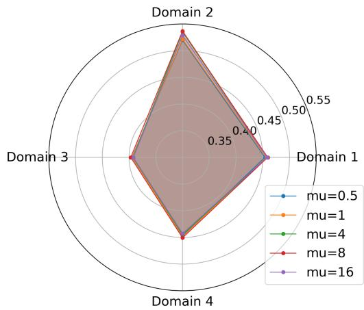

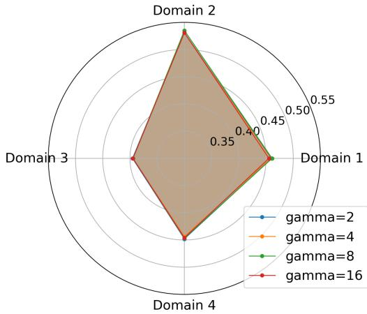  
(a) Per-domain test accuracy under various $\mu .$ (b) Per-domain test accuracy under various $\gamma .$  
Figure 4: The result of the ablation study on $\gamma$ and $\mu .$

Figure 4 presents the per-domain test accuracy under diferent values of the hyperparameters $\mu$ and γ. Overall, both parameters have a relatively small impact on model performance, with $\mu$ exhibiting a slightly more pronounced influence. This indicates that our algorithm enjoys excellent robustness with respect to these hyperparameter choices. In theory, a larger $\mu$ yields a closer approximation to the ideal Tchebychef scalarization, i.e., the algorithm focuses more on the currently worst-case weighted objective. However, in practice, the multiple objectives often exhibit both conflicts and synergies;a moderate $\mu$ allows the algorithm to prioritize the preferred objective while still leveraging beneficial information from other objectives to further improve the performance on the target one. As shown in Figure 4a, $\mu = 8$ achieves the best performance among the tested values under the preference setting, validating this intuition.

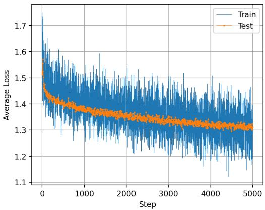  
(a) Average domain loss.

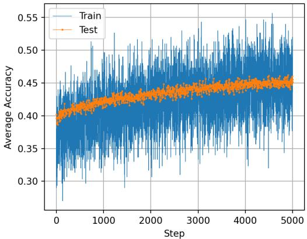  
(b) Average domain accuracy.  
Figure 5: Convergence curves in the sensitivity analysis

Figure 5 shows that the convergence curve under $\mu = 4$ and equal preference consistently improves over training epochs, indicating that our algorithm efectively minimizes the empirical loss. Notably, the training curve exhibits substantial fluctuations, as each point corresponds to only single episode and one adaptaion step; in contrast, the test curve is considerably smoother, since each evaluation point is averaged over 48 episodes.

Figure 6 shows per-domain test accuracy under four diferent preference settings. For reference, we include the ’Single Domain’ baseline, which corresponds to the degenerate case where the algorithm reduces to single-domain meta-learning; this serves as an ideal performance benchmark for each individual domain. Overall, the test accuracy on domain 2-4 increase monotonically with the strength of preference, eventually approaching or even surpassing the corresponding single domain baselines. This observation confirms that our algorithm can efectively navigate the Pareto front in a preference-guided manner. In contrast, domain 1 exhibits a performance degradation under the extreme preference setting compared to the relatively milder ones. Upon examining the single domain training results across domains, we find that the performance of domain 1 under single domain 3 is already comparable to that under single domain 1 (see Figure 7), indicating a strong synergy between domains 1 and 3. Consequently, an excessively strong preference toward domain 1 may cause the information from domain 3 to be overlooked, leading to inferior performance compared to a more balanced preference setting.

In the comparison experiment, we set T (outer loop for the other algorithms) = 2500, $\alpha _ { x , t } = 0 . 1 , \alpha _ { y , t } =$ 0.05 for all the algorithms. The final test accuracy Pareto front is derived from the best accuracy in each domain via enumerating diferent preference settings in the sensitivity analysis. The algorithm-specific parameter settings are presented in Table 4, some of which are chosen from tuning on the same validation set under equal preference. Despite our eforts to adapt WC-MHGD to the experiment, its accuracy performance stayed near 20% under a wide range of hyperparameters, suggesting that the algorithm does not converge under our experiment settings. For this reason, we exclude it from the benchmark to ensure a fair and meaningful comparison.

Figure 8a shows that MOMEHA achieved its best performance on domains 1 and 4 under the moderate preference setting, and on Domains 2 and 3 under the weak preference setting. Figure 8b shows that WCpenalty exhibits a corresponding pattern on Domains 1 and 3. We do not include the strong and extreme preference settings, as they lead to a universal performance degradation across all domains (see Figure 9), with the deterioration becoming more pronounced as the preference intensifies. This observation suggests that the four domains may share certain synergies, and that the benefit of an overly strong single-domain preference may be outweighed by the loss of information from the other domains.

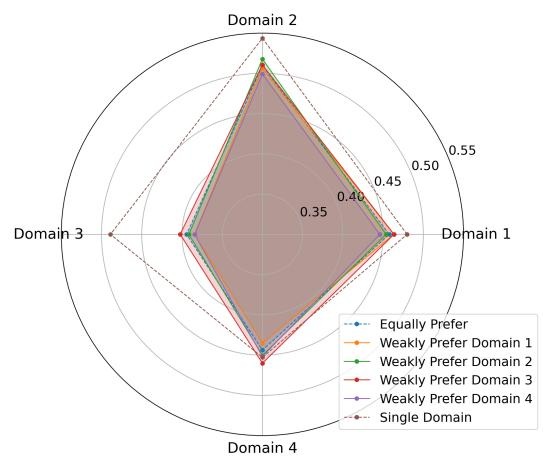  
(a) Weak preference.

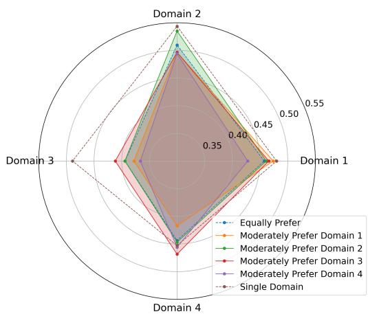  
(b) Moderate preference.

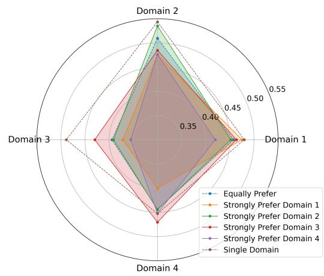  
(c) Strong preference.

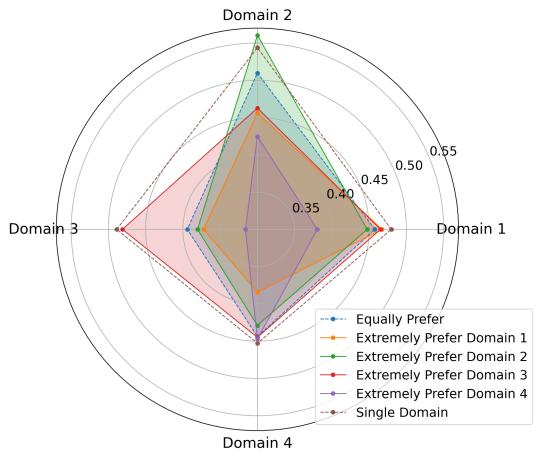  
(d) Extreme preference.  
Figure 6: The four domain test accuracy of various preference intensities in the ablations studies.

Table 4: Parameter settings for all compared algorithms in the meta-learning comparison experiment. The arrays in the Parameter column denote the corresponding parameter search spaces.
<table><tr><td>Algorithm</td><td>Parameter</td><td>Value</td></tr><tr><td rowspan="3">MOMEHA</td><td>µ [1.0, 4.0, 8.0]</td><td>4.0</td></tr><tr><td> $\gamma \ [ 1 . 0 , 4 . 0 , 8 . 0 ]$ </td><td>8.0</td></tr><tr><td> $c _ { t }$   $\alpha _ { \theta , t }$ </td><td>1.0 0.05</td></tr><tr><td rowspan="3">MOML</td><td>K MGDA iteration number</td><td>4</td></tr><tr><td>MGDA lr [0.01, 0.05, 0.1]</td><td>4 0.05</td></tr><tr><td>K</td><td>4</td></tr><tr><td></td><td>ρ [0.1, 0.5, 0.9]  $\beta _ { k }$ </td><td>0.5 (1 + k)− 314</td></tr><tr><td rowspan="3">WC-penalty</td><td>η [0.01, 0.1, 1.0]</td><td>0.01</td></tr><tr><td>u [0.01, 0.05, 0.1]</td><td>0.01</td></tr><tr><td>v [0.1, 0.2, 0.5]</td><td>0.2</td></tr></table>

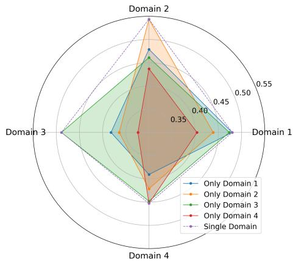  
Figure 7: Single domain test accuracy in the sensitivity analysis.

Figure 10 demonstrates the training convergence curves of domain 1, where MOMEHA and WC-penalty moderately prefer domain 1. Both loss and accuracy curves validate that the algorithm’s behavior follows the preference guidance in the training phase as expected. For better visualization, exponential moving average with $\alpha = 0 .$ 1 is applied to the training loss.

## C.2 Multi-Task Neural Architecture Search

To verify the efectiveness of MB-MOMEHA in stochastic case, we perform an experiment on diferentiable neural architecture search (DARTS) Liu et al. [2018] with multiple tasks, which can be formulated as follows:

$$
\begin{array} { r l } & { \underset { x } { \operatorname* { m i n } } \left[ \mathcal { L } _ { i } ^ { \mathrm { v a l } } ( x , y ^ { * } ; \mathcal { V } ) \right] _ { i = 1 } ^ { m } , } \\ & { \mathrm { s . t . } \quad y ^ { * } \in \arg \operatorname* { m i n } _ { y } \mathcal { L } ^ { \mathrm { t r a i n } } ( x , y ; \mathcal { T } ) , } \end{array}
$$

where x is the architecture parameter, y is the network parameter, $\tau$ is the training set, V is the validation set, $\mathcal { L } _ { i } ^ { \mathrm { v a l } }$ is the loss function of task $i , \mathcal { L } ^ { \mathrm { t r a i n } }$ is the loss function of the currently parameterized architecture. The above MOBL problem seeks for the parameters with the minimal training loss on continuously parameterized architecture, then optimize the architecture parameters for the minimal validation losses in each task.

We implement the experiment on the CIFAR-10 dataset Krizhevsky et al. [2009], which consists of 50,000 color images across 10 classes, each of size $3 2 \times 3 2$ pixels. We split it into training set and validation set with a ratio of 1:1.

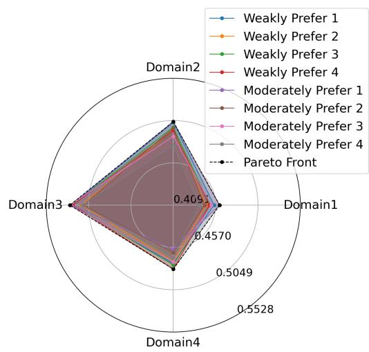  
(a) MOMEHA.

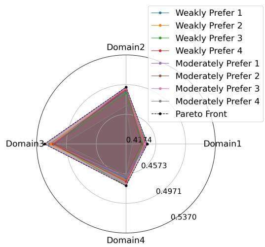  
(b) WC-penalty.  
Figure 8: Test accuray Pareto front exploration.

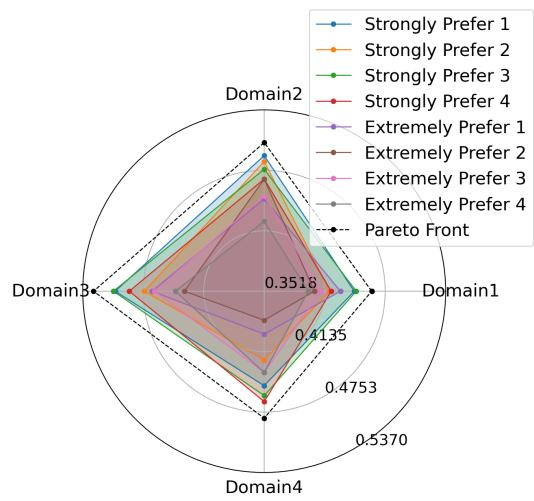  
(a) MOMEHA.

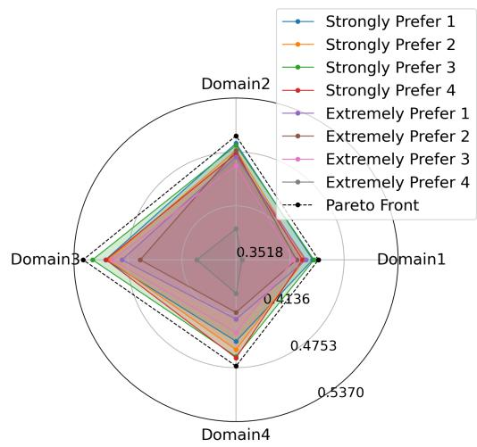  
(b) WC-penalty.  
Figure 9: Performance deterioration in stronger preferences.

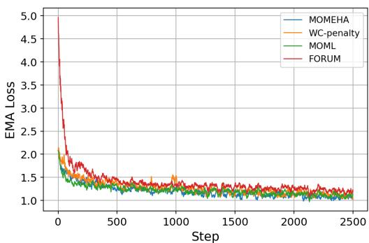  
(a) Training loss.

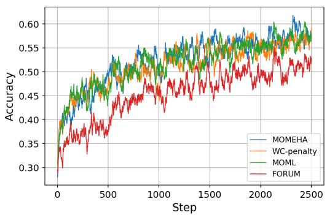  
(b) Training accuracy.  
Figure 10: Training curves of the algorithms in the comparison experiment.

Following DARTS, we adopt the same search space and relevant hyperparameters. The search procedures are performed on a 3-cell network (Normal-Reduction-Normal) for 50 epochs.

We design four tasks for the experiment: validation loss (Task 1), FLOPS loss (Task 2), skip density (Task 3), and pooling density (Task 4). While the first two objectives naturally arise from the multitask nature of DARTS, the latter two serve as regularization terms to discourage the search procedure from converging to architectures dominated by parameter-free operations. we consider the same preference settings to the meta-learning experiment. We additionally conduct a 2-task comparison, where we use four settings using task 1 as the reference: an equally preferred setting with $\boldsymbol { w } = [ 0 . 5 , 0 . 5 ] ^ { \intercal }$ , a weakly preferred setting with $w = [ 0 . 6 , 0 . 4 ] ^ { \top }$ , a strongly preferred setting with $w = [ 0 . 7 5 , 0 . \dot { 2 } 5 ] ^ { \top }$ , an extremely preferred setting with $\boldsymbol { w } = [ 0 . 9 , 0 . 1 ] ^ { \top }$ . Specifically, for the operation vector e of each edge with given space resolution $H , W ,$ channel number $C _ { i n } , C _ { o u t }$ and kernel size $K ,$ we compute the FLOPS loss and densities according to the following formulas:

$$
\mathrm { F L O P S } ( \mathrm { C o n v 2 d } ) = 2 H \cdot W \cdot C _ { \mathrm { i n } } \cdot C _ { \mathrm { o u t } } \cdot K ^ { 2 } , \quad \mathrm { F L O P S } ( \mathrm { P o o l i n g } ( C _ { \mathrm { i n } } \ne C _ { \mathrm { o u t } } ) ) = 2 H \cdot W \cdot C _ { \mathrm { i n } } \cdot C _ { \mathrm { o u t } } ,
$$

$$
\mathrm { F L O P S } ( \mathrm { P o o l i n g } ( C _ { \mathrm { i n } } = C _ { \mathrm { o u t } } ) ) = 0 , \quad \mathrm { F L O P S } ( \mathrm { S k i p C o n n e c t } ) = 0 , \quad \mathrm { F L O P S } ( \mathrm { Z e r o } ) = 0 ,
$$

$$
\begin{array} { r l } & { \mathrm { F L O P S ~ l o s s } = \cfrac { 1 } { | E _ { N } | + | E _ { R } | } \displaystyle \sum _ { e \in E _ { N } \cup E _ { R } } \sum _ { i = 1 } ^ { 8 } \operatorname { s o f t m a x } ( x _ { e } ) _ { i } \cdot \frac { \mathrm { F L O P S } ( e _ { i } ) } { \operatorname { m a x } _ { i } \mathrm { F L O P S } ( e _ { i } ) } , } \\ & { \mathrm { S k i p C o n n e c t ~ d e n s i t y } = \cfrac { 1 } { | E _ { N } | + | E _ { R } | } \displaystyle \sum _ { e \in E _ { N } \cup E _ { R } } \operatorname { s o f t m a x } ( x _ { e } ) _ { \mathrm { S k i p C o n n e c t } } , } \\ & { \mathrm { P o o l i n g ~ d e n s i t y } = \cfrac { 1 } { | E _ { N } | + | E _ { R } | } \displaystyle \sum _ { e \in E _ { N } \cup E _ { R } } \operatorname { s o f t m a x } ( x _ { e } ) _ { \mathrm { P o o l i n g } } , } \end{array}
$$

where K is the size of filter, $E _ { N }$ is the set of the operation vectors in normal cell, $E _ { R }$ is the set of the operation vectors in reduction cell, $x _ { e }$ is the architecture parameter vector of the operation vector e.

We set $\alpha _ { x , t } = 0 . 0 5 , \alpha _ { y , t } = 0 . 0 2 5 , \beta _ { t } = 0 . 9$ and weight decay $= 3 \times 1 0 ^ { - 4 }$ for all the algorithms. The remaining hyperparameters follow the same settings (except for $c _ { t } = ( 1 + t ) ^ { \frac { 1 } { 1 6 } } )$ in the deterministic experiment. For WC-MHGD, we set $u = 1 0 , D = 4$ and implement project gradient descent (8 step, 0.01 learing rate) to solve the QP. In addition, due to VRAM limitation, we approximate the hypergradient of WC-MHGD via finite diferences $( \epsilon = 0 . 0 1 )$

Figure 11 presents the Pareto front exploration of diferent algorithms. Figure 11a shows that MB MOMEHA consistently aligns with the prescribed preferences across all four tasks, achieving better performance on the preferred objectives. Figure 11b and Figure 11c indicate that the other two algorithms exhibit a relatively limited exploration range on Task 1. Note that Tasks 3 and 4 serve as regularization objectives to prevent the architecture from collapsing to parameter-free operations; as such, their values are not necessarily the lower the better. We therefore exclude the extreme preference setting from the figure, as it would impose excessive penalization on these regularization terms and distort the intended search objective. Figure 11d shows that MB-MOMEHA achieves a larger exploration range on Tasks 1 and 4, while its performance on Tasks 2 and 3 is comparable to that of WC-MHGD. MoCo exhibits a significantly larger value on Task 3, but this comes at the cost of efectively abandoning the skip-connection operation, which is undesirable as it severely restricts the expressiveness of the searched architectures.

Figure 12 illustrates the convergence behaviors of the algorithms during the search phase. Each subplot corresponds to a specific task and reports the averaged loss values over the four objectives under both the moderate and strong preference settings. Across all four tasks, the two baseline algorithms exhibit flattening curves toward the end of training, whereas our method not only achieves lower loss values but also maintains a consistently decreasing trend, indicating its superior performance and applicability in the lower-level nonconvex scenario.

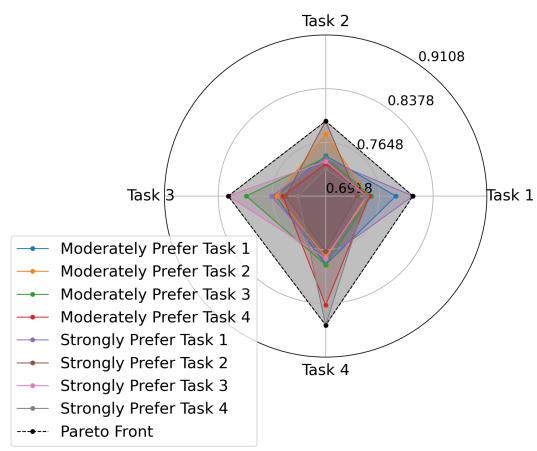  
(a) MB-MOMHEA.

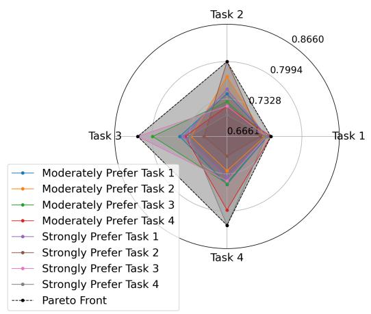  
(b) WC-MHGD.

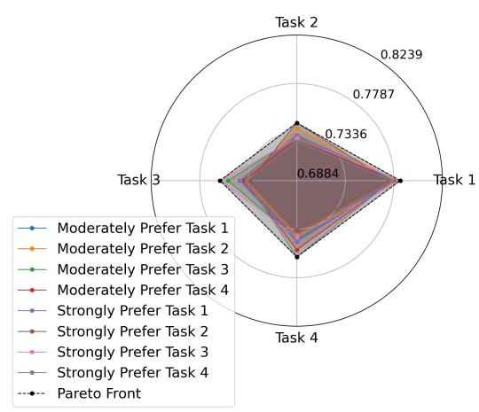  
(c) WC-penalty.

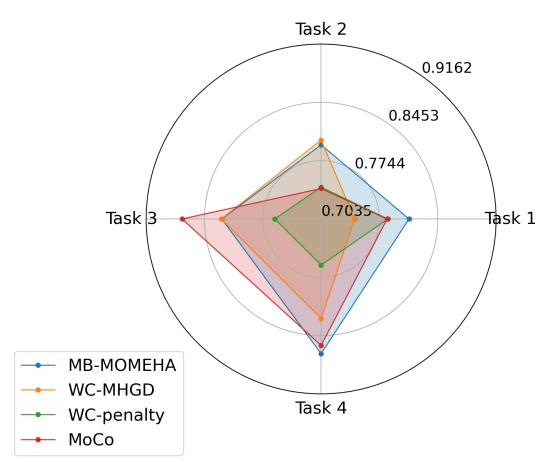  
(d) Comparison.  
Figure 11: Pareto front exploration and comparison. For better visualization and based on the magnitude of the results, the losses for task 2 and task 3 are scaled by factors of 0.67 and 2, respectively, and the final results are plotted as 1 − loss

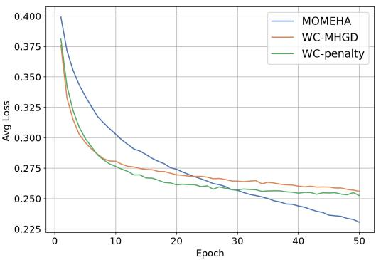  
(a) Prefer task 1.

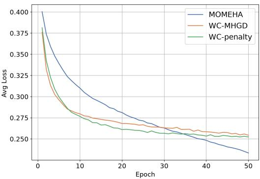  
(b) Prefer task 2.

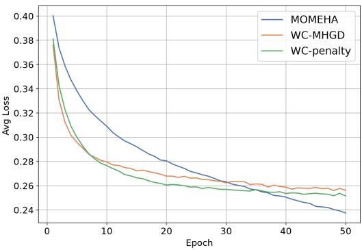  
(c) Prefer task 3.

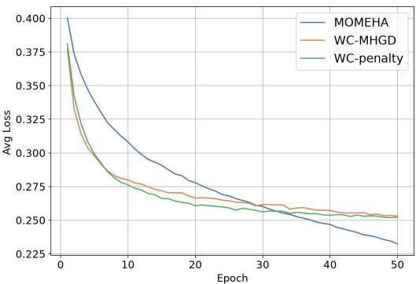  
(d) Prefer task 4.  
Figure 12: Validation convergence curves.