# Equivariant learning of a transferable three-dimensional classical density functional

Bingqing Cheng1, 2, 3, ∗

1Department of Chemistry, UC Berkeley, California 94720, United States

2Chemical Sciences Division, Lawrence Berkeley National Laboratory, Berkeley, California, 94720, United States

3Bakar Institute of Digital Materials for the Planet, UC Berkeley, California 94720, United States (Dated: August 13, 2026)

Liquids exhibit collective behavior that depends sensitively on thermodynamic conditions, interfaces and confinement, yet predicting each new state commonly requires a separate atomistic simulation. Classical density functional theory ofers a reusable variational description, but its central excess free-energy functional is generally unknown, and learned approximations have largely remained restricted to planar or lower-dimensional settings. Here we show that this functional can be learned directly from fully three-dimensional equilibrium density fields while preserving spatial symmetry and variational consistency, without free-energy or chemical-potential labels. A single learned functional transfers across temperatures, system sizes and statistical ensembles, and recovers structure factors, the equation of state, liquid–vapor coexistence and interfacial broadening, none of which are used as training targets. Applied to complex three-dimensional geometries, it predicts the non-monotonic force associated with formation and rupture of a solvent-depleted bridge between colloids and adsorption in an interconnected gyroid pore. These results demonstrate that equilibrium density data can be converted into a transferable thermodynamic generator connecting microscopic liquid structure to response, phase behavior and collective phenomena.

## I. INTRODUCTION

Liquids are paradigmatic many-body systems: even when interparticle interactions are simple, collective structure and thermodynamics emerge from the correlated configurations of all particles. These correlations connect molecular organization to collective behavior across length scales and are strongly reshaped by interfaces and confinement. Atomistic simulations can resolve a chosen state with microscopic accuracy, but must be repeated across thermodynamic conditions and geometries, motivating a reusable field-level theory.

Density functional theory provides such a description by replacing the full many-particle distribution with a variational theory of a one-body density. Electronic density functional theory reformulates the quantummechanical ground-state problem in terms of the electron density [1, 2]; classical density functional theory (cDFT) is its statistical-mechanical analogue for the equilibrium number density ρ(r) [3]. Once known, the intrinsic freeenergy functional determines equilibrium density fields, thermodynamics and response within a common frame work.

The dificulty is that this functional is not known. In electronic DFT, exchange and correlation must be approximated; in classical DFT, the ideal-gas contribution is exact, but the interaction-induced excess free-energy functional $F _ { \mathrm { e x c } } [ \rho ]$ remains unknown for realistic three dimensional fluids. Fundamental measure theory provides highly accurate functionals for hard-sphere systems [4, 5], whereas attractive and long-ranged interactions are commonly treated using perturbative or meanfield approximations [6] whose accuracy is system- and state-dependent. Constructing an accurate $F _ { \mathrm { e x c } } [ \rho ]$ while preserving the variational structure of cDFT is therefore the central theoretical challenge.

Machine learning ofers a data-driven route to approximate this missing functional using atomistic simulation data [7]. Early work fitted nonlocal free-energy corrections from equilibrium planar density profiles [8, 9]. Related approaches have constructed transferable functional approximations for molecular and ionic liquids [10– 12], or learned free energies by matching pair correlations [13–15]. Neural operators instead learn forward and inverse potential–density maps without constructing an explicit thermodynamic functional [16, 17]. Notably, neural functional theory directly learns the one-body direct correlation functional $\begin{array} { r l } { \dot { c } ^ { ( 1 ) } ( \mathbf { r } ; [ \rho ] ) } & { { } = } \end{array}$ $- \beta \delta F _ { \mathrm { e x c } } / \delta \rho ( \mathbf { r } )$ [18]. In its original formulation, grandcanonical Monte Carlo (GCMC) samples of a threedimensional hard-sphere fluid were generated under randomized one-dimensional external fields $V _ { \mathrm { e x t } } ( z )$ The imposed chemical potential and external field provided reference $c ^ { ( 1 ) } ( z )$ labels through the equilibrium Euler– Lagrange balance, and a shared neural network mapped local windows of the planar profile $\rho ( z )$ to $c ^ { ( 1 ) } ( z )$ . Subsequent work incorporated temperature and system size to construct thermal functionals [19], treated the pair interaction as a functional input [20], generalized the representation to binary mixtures [21], or inferred the chemical potentials as latent variables so that canonical molecular dynamics (MD) data could be used [22]. Neural cDFT has also been extended from planar fields to two-dimensional inhomogeneities using convolutional layers [23], and spherical symmetry [24].

Despite this progress, most learned classical density functionals remain restricted to planar or twodimensional inhomogeneity, limiting their direct application to fully three-dimensional settings such as solvation, nucleation, demixing and fluids in contact with nonplanar surfaces. Moving to three dimensions also makes physical symmetry central: the scalar free energy and its functional derivatives should transform consistently under translations and the rotations and reflections of the Cartesian grid.

Here we introduce Equi-cDFT, an Energy-first, EQUIvariant framework for learning the excess freeenergy functional $F _ { \mathrm { e x c } } [ \rho , T ]$ as an extensive scalar on a three-dimensional Cartesian grid. Finite-range density environments are encoded by cubic-symmetry-adapted representations, making the scalar functional invariant and its functional derivatives equivariant under rotations and reflections of the cubic lattice. To learn from canonical MD density fields without chemical-potential labels, we train through local chemical-potential balance and eliminate the unknown constant chemical potential analytically. Minimization and functional diferentiation of the resulting scalar then provide equilibrium densities and direct correlation functions within one variational model.

We demonstrate the approach for the Lennard–Jones fluid truncated and shifted at 2.5σ (LJTS), a prototypical continuum model in which repulsive packing and cohesive attraction generate rich phase and interfacial behavior [19]. Accurate reference equations of state and coex istence data are available for this model [25, 26], making it a controlled but stringent test of whether one learned functional can recover consistent structure and thermodynamics across diverse conditions.

We first test transfer across temperature, system size and statistical ensemble (see Methods section). We then ask whether physical information absent from training emerges from the learned functional, including the structure factor, equation of state, liquid–vapor coexistence and free interfaces. Finally, we apply the same functional, without retraining, to two fully three-dimensional problems: solvent-mediated interactions between colloids and adsorption in a periodic gyroid pore.

## II. THEORY

## A. Equivariant local representation of the excess free-energy functional

At fixed temperature $T ,$ external potential $V _ { \mathrm { e x t } }$ and reservoir chemical potential $\mu ,$ cDFT determines the equilibrium one-body density $\rho ( \mathbf { r } )$ by minimizing the grand-potential functional [3]

$$
\Omega [ \rho ] = F _ { \mathrm { i d } } [ \rho , T ] + F _ { \mathrm { e x c } } [ \rho , T ] + \int \mathrm { d } \mathbf { r } \rho ( \mathbf { r } ) \big [ V _ { \mathrm { e x t } } ( \mathbf { r } ) - \mu \big ] .\tag{1}
$$

Here $F _ { \mathrm { i d } } = k _ { \mathrm { B } } T \int \mathrm { d } \mathbf { r } \rho \{ \ln ( \Lambda ^ { 3 } \rho ) - 1 \}$ is the analytic idealgas contribution, $V _ { \mathrm { e x t } }$ is the known external field, and $F _ { \mathrm { e x c } }$ is the unknown excess free-energy functional containing the efects of interparticle interactions. In the canonical ensemble, the same variational principle applies with $\mu$ acting as the spatially constant Lagrange multiplier that enforces $\begin{array} { r } { \int \mathrm { d } \mathbf { r } \rho ( \mathbf { r } ) = N } \end{array}$

Equi-cDFT learns $F _ { \mathrm { e x c } } [ \rho , T ]$ as a function of temperature and a three-dimensional density field represented on a regular grid with voxel volume $\bar { \Delta } V = ( \bar { \Delta { L } } ) ^ { 3 }$ Shortranged interactions motivate representing each local contribution using a finite neighborhood, but do not imply that fluid correlations are strictly local. We therefore treat the finite receptive field as a modeling approximation that enables transfer across system sizes and test its adequacy in the benchmarks below. As illustrated in Fig. 1, the local environment $\chi _ { g }$ contains the density within a finite neighborhood of grid point $g .$ . We approximate the excess functional as

$$
F _ { \mathrm { e x c } } [ \rho , T ] = \Delta V \sum _ { g } \rho _ { g } a _ { \mathrm { e x c } } ( \chi _ { g } , T ) ,\tag{2}
$$

using the same local free-energy map $a _ { \mathrm { e x c } }$ at every grid point. This shared map makes the functional extensive and allows it to transfer between system sizes.

Within this decomposition, we use a symmetryadapted representation of the local three-dimensional environments $\chi _ { g }$ . A rotation or reflection belonging to the symmetry group of the cubic grid must leave the scalar local free energy $a _ { \mathrm { { e x c } } } ( \chi _ { g } , T )$ unchanged. We construct this representation by adapting the Cartesian atomic cluster expansion (CACE) [27, 28] to a density grid. For a target grid point $\mathbf { r } _ { g } ,$ let $\mathbf { q } = ( q _ { x } , q _ { y } , q _ { z } )$ denote the integer ofsets of neighboring voxels within the cutof. The Cartesian moments are

$$
A _ { \ell } ( \mathbf { r } _ { g } ) = \sum _ { | \mathbf { q } | \leq q _ { \mathrm { c u t } } } \rho _ { g + \mathbf { q } } q _ { x } ^ { \ell _ { x } } q _ { y } ^ { \ell _ { y } } q _ { z } ^ { \ell _ { z } } ,\tag{3}
$$

where ${ \boldsymbol { \ell } } { \mathrm { ~  ~ \Gamma ~ } } = { \mathrm { ~  ~ \Gamma ~ } } ( \ell _ { x } , \ell _ { y } , \ell _ { z } )$ specifies the Cartesian powers. These moments are covariant under the cubic point group $O _ { h }$ , which consists of the 3! axis permutations combined with $2 ^ { 3 }$ independent axis reflections, giving 48 operations in total. Under a group operation $\mathcal { R } \in O _ { h }$ , a moment transforms as

$$
A _ { \ell } \longrightarrow s _ { \ell } ( \mathcal { R } ) A _ { \mathcal { R } \ell } ,\tag{4}
$$

where Rℓ denotes the permutation of the power tuple induced by $\mathcal { R } .$ and $s _ { \ell } ( \mathcal { R } ) = \pm 1$ is the parity acquired from reflections of axes carrying odd powers.

For $K = ( \ell _ { 1 } , \ldots , \ell _ { \nu } )$ , the corresponding invariant feature is obtained by summing the transformed products over $O _ { h }$

$$
B _ { K } ^ { ( \nu ) } ( \mathbf { r } _ { g } ) = \sum _ { \mathcal { R } \in O _ { h } } \prod _ { m = 1 } ^ { \nu } s _ { \ell _ { m } } ( \mathcal { R } ) A _ { \mathcal { R } \ell _ { m } } ( \mathbf { r } _ { g } ) .\tag{5}
$$

The invariant features $B _ { K } ^ { ( \nu ) }$ , together with the center density and temperature, are passed to a shared scalar readout to obtain $a _ { \mathrm { e x c } } ( \chi _ { g } , T )$ at every grid point.

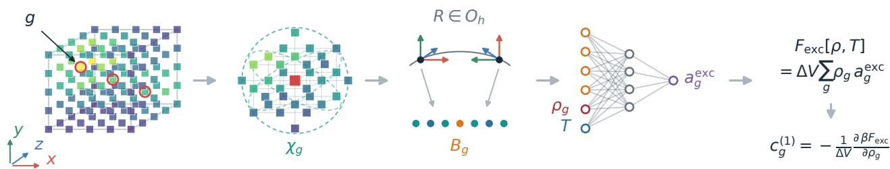  
Figure 1. Equi-cDFT architecture. Local neighborhoods of the three-dimensional density field are encoded using cubicsymmetry-adapted features and processed by a shared neural readout. Summing the local contributions produces an extensive excess free-energy functional, whose derivative gives the one-body direct correlation field. Here g labels a density-grid point, $\chi _ { g }$ is its finite spherical environment, $R \in O _ { h }$ denotes a rotation or reflection of the cubic lattice, $\mathbf { B } _ { g }$ is the resulting symmetryadapted feature vector and T is the temperature. The readout produces the local excess free energy per particle $a _ { g } ^ { \mathrm { e x c } } \colon$ ; summing over the grid densities $\rho _ { g }$ with voxel volume $\Delta V$ gives $F _ { \mathrm { e x c } } [ \rho , T ] . \ c _ { g } ^ { ( 1 ) }$ is the one-body direct correlation, and $\beta = ( k _ { \mathrm { B } } T ) ^ { - 1 }$

## B. Derivative learning from local chemical-potential balance

We learn the excess free energy through its local density gradient, computed by automatic diferentiation,

$$
c _ { g } ^ { ( 1 ) } ( [ \rho ] , T ) = - \frac { \beta } { \Delta V } \frac { \partial F _ { \mathrm { e x c } } [ \rho , T ] } { \partial \rho _ { g } } .\tag{6}
$$

Here $c ^ { ( 1 ) }$ is the one-body direct correlation functional. In comparison, previous neural cDFT approaches commonly learn $c ^ { ( 1 ) }$ directly as a local output field [13, 18, 19].

For an equilibrium density field in either the canonical or grand-canonical ensemble, define the dimensionless local chemical potential

$$
\mu _ { g } ^ { \mathrm { l o c } } = \ln ( \Lambda ^ { 3 } \rho _ { g } ) + \beta V _ { \mathrm { e x t } , g } - c _ { g } ^ { ( 1 ) } ( [ \rho ] , T ) .\tag{7}
$$

The equilibrium condition requires this quantity to be independent of position. A spatial imbalance would drive a redistribution of density; equilibrium is reached when that driving force vanishes everywhere [3].

Equi-cDFT uses this balance condition directly as the learning signal. For a canonical training density field, the constant chemical potential is an unknown Lagrange multiplier, a challenge also addressed in recent neural direct-correlation learning [22]. Rather than supplying it as a label or fitting one latent parameter for every simulation, we eliminate it analytically as the spatial mean of the predicted local chemical potential. The per-field loss is therefore

$$
\mathcal { L } ^ { \Delta \mu } = \sum _ { g } \left| \mu _ { g } ^ { \mathrm { l o c } } - \overline { { \mu ^ { \mathrm { l o c } } } } \right| ^ { 2 } ,\tag{8}
$$

where both the sum and the average are taken over the reliably sampled region of the density field. If the reference data include a chemical-potential label, the spatial

mean in Eq. (8) can instead be replaced by $\beta \mu _ { \mathrm { r e f } }$ , anchoring the absolute chemical-potential reference.

Canonical balance leaves one unavoidable gauge: the loss is unchanged under

$$
F _ { \mathrm { e x c } } [ \rho , T ] \longrightarrow F _ { \mathrm { e x c } } [ \rho , T ] + b ( T ) N .\tag{9}
$$

The added term is constant under fixed-N density variations and has zero second functional derivative. It therefore leaves fixed-N predictions and $c ^ { ( 2 ) }$ unchanged, while shifting the absolute chemical potential by $b ( T )$ . An absolute reservoir chemical potential consequently requires one additive calibration at each temperature.

During training, independent equilibrium density fields collected from canonical molecular dynamics under randomly selected external fields are supplied. For inference, $V _ { \mathrm { e x t } }$ is given and the total free energy is minimized with respect to the grid densities, either at fixed total particle number or fixed chemical potential.

## III. RESULTS

## A. Equation of state, phase behavior, and interfaces

The purpose of this benchmark is to test whether the learned model behaves as a thermodynamic functional rather than merely reproducing the equilibrium fields under external potentials. The training loss contains no explicit supervision for bulk response functions, pressure, phase coexistence or free interfaces. We therefore ask whether these structural and thermodynamic properties can be recovered consistently from the learned cDFT.

The two-body direct correlation function $c ^ { ( 2 ) }$ can be obtained via diferentiation:

$$
c ^ { ( 2 ) } ( \mathbf { r } _ { g } , \mathbf { r } _ { g ^ { \prime } } ; [ \rho ] , T ) = \frac { 1 } { \Delta V } \frac { \partial c ^ { ( 1 ) } ( \mathbf { r } _ { g } ; [ \rho ] , T ) } { \partial \rho ( \mathbf { r } _ { g ^ { \prime } } ) } .\tag{10}
$$

a  
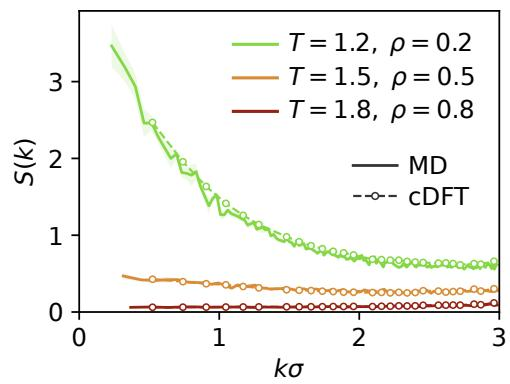

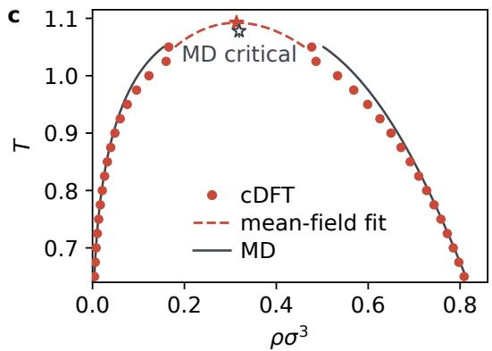

b  
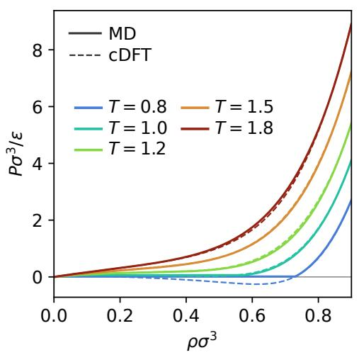

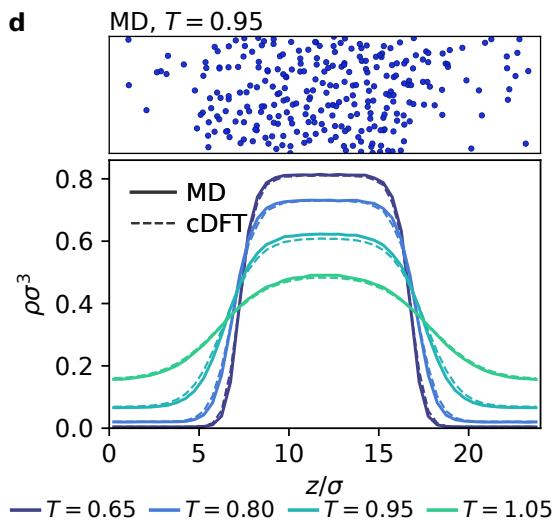  
Figure 2. Equation of state, phase behavior, and interfaces from the learned free-energy functional. a Static structure factors of homogeneous fluids. Solid curves and shaded standard errors are direct MD estimates; dashed curves with open circles follow from twice diferentiating the learned functional and applying the Ornstein–Zernike relation. b Pressure– density isotherms. Dashed curves are cDFT compressibility-route predictions and solid curves are evaluations of the reference EOS [25]. c Liquid–vapor coexistence. Unconnected red circles are plateau densities from cDFT slab solutions; the dashed red segment is a mean-field continuation from the highest solved state to the predicted critical point. The solid gray curve is evaluated from the reference EOS [25], and the unconnected open star is the direct-MD critical point [26]. d A representative atomistic slab at $T = 0 . 9 5$ (top), and planar density profiles from MD and cDFT at four temperatures (bottom).

Because $c ^ { ( 2 ) }$ is the Hessian of a scalar functional, reciprocity under $g  g ^ { \prime }$ follows automatically. While previous work has employed the $c ^ { ( 2 ) }$ term in the learning by pair-correlation matching [13–15], here it is unsupervised.

For a homogeneous fluid, translational invariance reduces the two-body direct correlation function to a function of the separation, and its Fourier transform determines the static structure factor via the Ornstein–Zernike relation,

$$
\widehat { c } ^ { ( 2 ) } ( \mathbf { k } ) = \Delta V \mathrm { F F T } \left[ c ^ { ( 2 ) } ( \mathbf { r } ) \right] , \qquad S ( \mathbf { k } ) = \frac { 1 } { 1 - \rho \widehat { c } ^ { ( 2 ) } ( \mathbf { k } ) } .\tag{11}
$$

The resulting low-wavevector structure factors are compared with direct homogeneous-fluid MD in Fig. 2a. Across the three representative states, the functional reproduces both the magnitude and wavevector depen-

dence of S(k).

The zero-wavevector response determines the inverse isothermal compressibility through

$$
\frac { \partial \beta P } { \partial \rho } = S ( 0 ) ^ { - 1 } = 1 - \rho \widehat { c } ^ { ( 2 ) } ( 0 ; \rho , T ) .\tag{12}
$$

Integrating from the ideal-gas limit gives

$$
\beta P ( \rho , T ) = \int _ { 0 } ^ { \rho } \mathrm { d } \rho ^ { \prime } \left[ 1 - \rho ^ { \prime } \hat { c } ^ { ( 2 ) } ( 0 ; \rho ^ { \prime } , T ) \right] .\tag{13}
$$

Thus the complete equation of state can be reconstructed from the learned second derivative. The dashed predictions in Fig. 2b follow the MD-derived EOS [25]. At the subcritical temperatures $T = 0 . 8$ and 1.0, the learned homogeneous isotherms develop a van der Waals loop, including a mechanically unstable region with $\partial P / \partial \rho < 0 ;$

at the lowest temperature the predicted pressure also be comes negative. This loop continues the homogeneous branch through the two-phase density range, whereas the stable reference EOS replaces that region by the constant coexistence-pressure segment. Its emergence without pair-response or pressure supervision shows that the learned functional captures the nonconvex thermodynamics underlying liquid–vapor separation [19].

Fig. 2c shows that the learned functional also recovers the vapor–liquid phase diagram. The unconnected red points are coexistence densities obtained directly from fixed-N slab solutions through $T ~ = ~ 1 . 0 5$ Only the dashed segment is a mean-field continuation from the highest solved state to the extrapolated critical point (red star), $T _ { c } ^ { \mathrm { c D F T } } = 1 . 0 9$ and $\rho _ { c } ^ { \mathrm { c D F T } ^ { \star } } = 0 . 3 1 \sigma ^ { - 3 }$ . The star is therefore not an independently solved state, and the continuation is not intended to describe the true critical exponent. Its location agrees well with the previous directsimulation estimate (1.08, 0.32) [26]. Fig. 2d further tests the cDFT model prediction on the liquid–vapor interface. The atomistic image shows an actual MD frame. Dashed profiles from the learned model are obtained by minimizing the free energy at the same cell geometry and particle number as the corresponding MD reference. These calculations test relaxation of an interfacial state initialized from the MD profile, rather than spontaneous slab formation from a uniform density. Across the four temperatures, the learned functional captures the progressive broadening of the liquid–vapor interface as the critical region is approached. Together, these results show that response functions, bulk thermodynamics, phase coexistence and interfacial structure emerge consistently from a functional trained only on equilibrium one-body density fields.

## B. Solvent-mediated colloid bridging

Nearby immersed objects can reorganize a solvent collectively and thereby interact even without a direct mutual potential. Such solvation forces are a longstanding application of traditional cDFT [29]. Here exclusion by two soft colloidal cores, which have no direct mutual forces, competes with adsorption in their attractive shells. Changing their separation causes the threedimensional solvation environments to overlap, form a solvent-depleted bridge, rupture and eventually recover two independent solvation shells. Predicting the resulting interaction tests whether the learned functional can translate collective solvent structure into an efective force. The field and simulation parameters are given in Methods.

The mean force between the colliods mediated by the solvents can be obtained directly from the equilibrium solvent density through the classical Feynman–Hellmann identity [30]. At a stationary fixed-N density, the implicit density response does not contribute, and on the grid the

force is

$$
\langle F \rangle _ { D } = - \Delta V \sum _ { g } \rho _ { D , g } \frac { \partial V _ { \mathrm { e x t } , g } ( D ) } { \partial D } ,\tag{14}
$$

where $\rho _ { D , g }$ is the equilibrium density at grid point g and $\Delta V$ is the voxel volume. Thus the learned functional predicts the interaction through its equilibrium density alone; negative force denotes attraction and positive force repulsion. Because the force is a weighted integral over the complete density field, it is more demanding than pointwise density agreement: small but spatially correlated density errors can produce appreciable force errors.

The density fields in Fig. 3b expose the physical origin of the interaction. At $D / \sigma = 5 . 0$ , the solvent-depleted regions surrounding the two cores merge into a continuous neck, producing attraction. At intermediate separation the bridge ruptures and the opposing solvation layers reorganize, generating the pronounced repulsive maximum. At large separation the two density perturbations become independent and the force decays to zero. Across the complete scan, Equi-cDFT follows the strong attraction at $D / \sigma = 4 . 5 $ , the sign reversal and repulsive maximum near $D / \sigma = 6 . 5 $ , and the decay to zero by $D / \sigma = 9 \mathrm { - } 1 0$ while resolving the interaction on a much denser separation grid than sampled directly by MD.

Fig. 3c evaluates the mean force between the two colliods in three ways. Direct MD provides the reference ensemble average. Applying the Feynman–Hellmann quadrature to the gridded MD density reproduces that force, showing that the density field contains the relevant mechanical information and isolating the efect of grid discretization. Replacing it with the independently minimized Equi-cDFT density under the external potential from the colloids leaves the force curve essentially unchanged. The efective interaction is therefore an emergent prediction of the learned free-energy landscape rather than a separately fitted observable.

## C. Adsorption in a soft porous gyroid

Adsorption couples two distinct physical problems: the local organization of a fluid under confinement and the thermodynamic partitioning of particles between the pore and an external reservoir. A predictive density functional must describe both with the same free-energy landscape. Classical DFT is widely used for this purpose, including machine-learning studies of gas solubility in nanopores [31] and fully three-dimensional calculations of adsorbate structure in metal–organic and covalent– organic frameworks [32, 33]. The gyroid makes the test especially demanding: its continuously curved, interconnected pore has no unique wall-normal coordinate and is topologically unlike the external fields used for training. Its geometry and potential are specified in Methods.

The soft gyroid wall drives the density from nearly complete depletion near the excluded region to dense, connected domains in the pore interior. At the fixed loading shown in Fig. 4a– Fig. 4c, Equi-cDFT reproduces this full three-dimensional morphology, including the curved depletion layer and the spatially varying accumulation throughout the interconnected pore. Coloring the density comparison by distance from the wall shows that the agreement extends from the strongly perturbed interfacial region into the pore interior. This is therefore not merely recovery of the mean loading, but of how that loading distributes across local environments with diferent wall distances and curvatures.

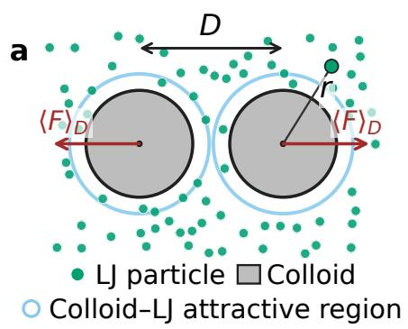

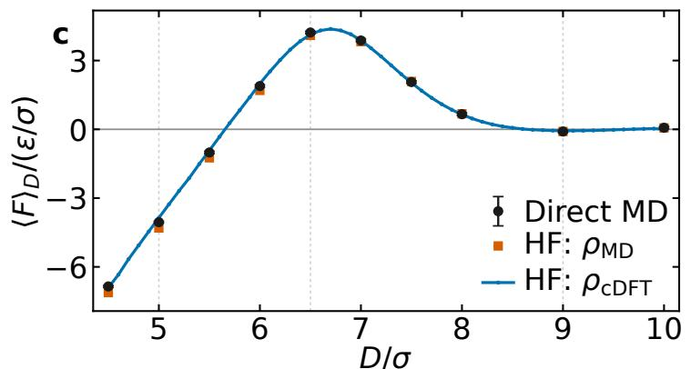

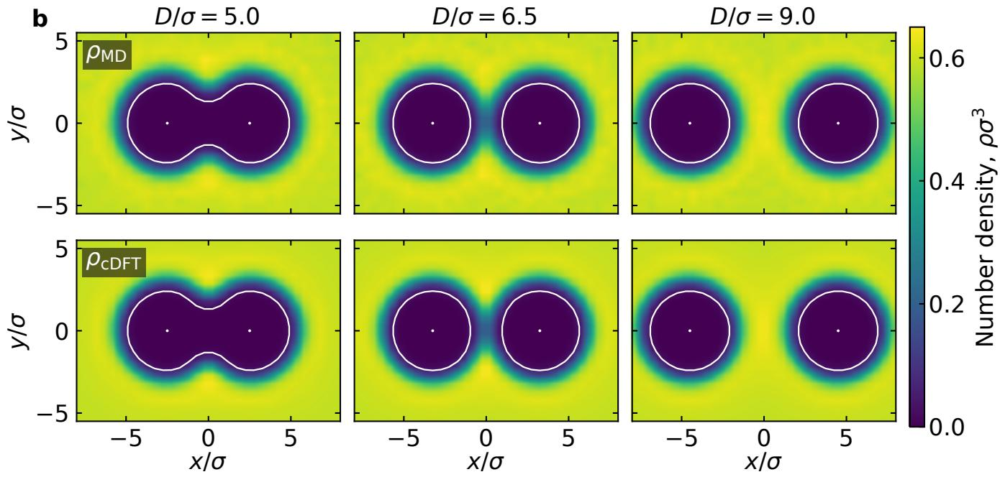  
Figure 3. Solvent-mediated interactions between two fixed colloids. a Schematic of two colloids at center-to-center separation D immersed in a one-component Lennard–Jones fluid. Thin blue contours mark the colloid–fluid attractive regions; the colloids have no direct mutual interaction. Red arrows denote the mean force $\langle F \rangle _ { D } ,$ with negative values corresponding to attraction and positive values to repulsion. b Central 1σ-thick slab averages of the equilibrium number density from MD (top) and fixed-N cDFT solutions (bottom) at $D / \sigma = 5 . 0 $ , 6.5 and 9.0. White contours mark $V _ { \mathrm { e x t } } / \epsilon = 4 \AA$ . c Mean force as a function of separation: direct MD averages with block-standard-error bars (black), the Feynman–Hellmann force evaluated using gridded MD densities (orange), and the same force evaluated using cDFT-predicted densities (blue). Direct MD points are not connected; the cDFT curve uses the denser $D / \sigma = 4 . 5  – 1 0 \ \mathrm { g r i d }$ . Conditions are $T = 1 . 2 ,$ , N = 4600 and $L = 2 0 \sigma$

Adsorption equilibrium additionally requires the confined fluid and homogeneous reservoir to have the same chemical potential. For each measured mean loading, only the particle number is supplied to the fixed-N EquicDFT calculation; the reference density and imposed reservoir chemical potential are withheld. The functional must predict both the equilibrium pore density and the chemical potential required to sustain it. After the single bulk calibration required by the canonical gauge, the same shift is applied to the confined branch (Fig. 4d). Eliminating chemical potential between the independently calculated bulk and confined branches then produces the adsorption isotherm without fitting a separate adsorption model (Fig. 4e). Densities are reported per total box volume to avoid assigning an arbitrary accessible volume to the soft pore.

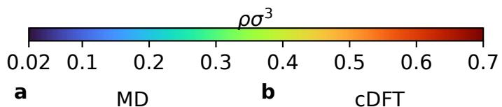

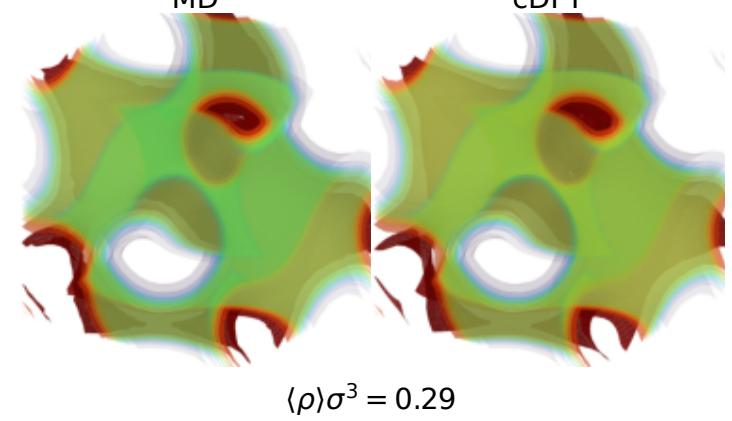

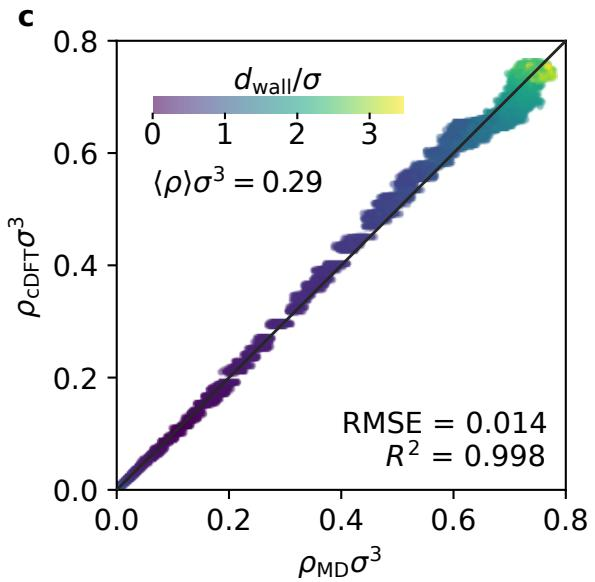

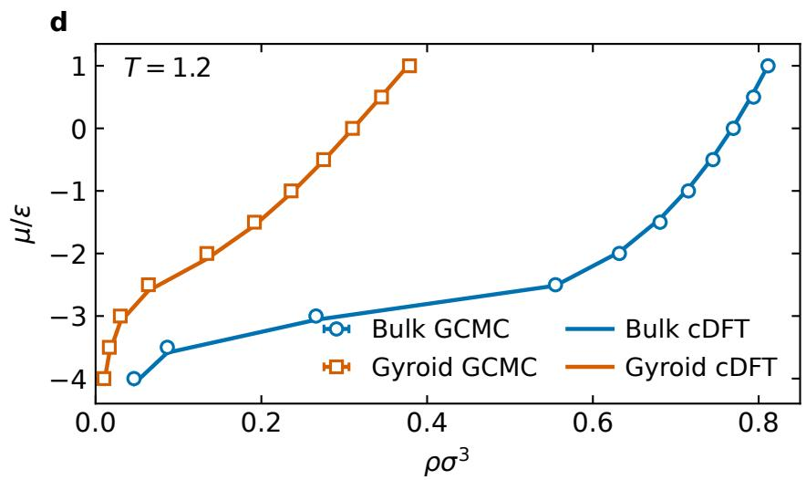

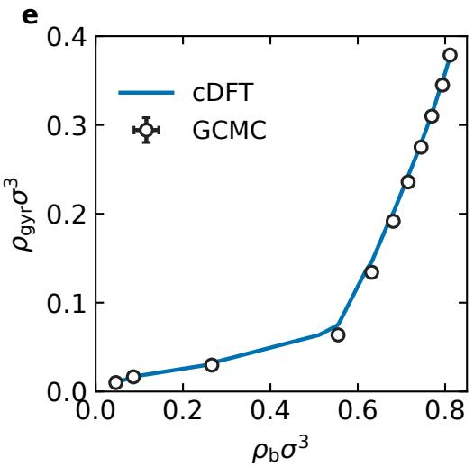  
Figure 4. Gyroid-pore structure and adsorption at $T = 1 . 2 \cdot \mathbf { a } , \mathbf { b }$ Equilibrium MD and cDFT density fields at the matched isosurface levels, for whole-box mean density $\langle \rho \rangle \sigma ^ { 3 } = 0 . 2 9$ . c Grid-point density parity, colored by the minimum periodic distance $d _ { \mathrm { w a l l } }$ to the nominal pore wall $V _ { \mathrm { e x t } } / \epsilon = 4$ d Bulk and gyroid chemical potentials versus whole-box density in the common reservoir gauge. Solid lines denote cDFT predictions from fixed-N solutions and open symbols denote GCMC references. e Adsorption isotherm obtained by matching bulk and gyroid states at equal chemical potential. All confined densities are defined using the full simulation-box volume.

At T = 1.2, above the bulk critical point, filling is continuous rather than a capillary phase transition. It is nevertheless strongly nonlinear: the pore remains weakly populated in a dilute reservoir and fills rapidly as the reservoir enters the dense-fluid regime. Capturing this crossover together with the confined density field shows that the learned functional transfers not only across geometry, but from local packing to reservoir-scale thermodynamic partitioning. In the colloid problem, diferentiating the minimized free energy produces an efective force; here, matching independently calculated freeenergy branches produces adsorption. Both are emergent three-dimensional predictions of the same learned thermodynamic functional.

## IV. DISCUSSION

Equi-cDFT combines three advances needed to learn a reusable classical density functional in three dimensions. First, it learns an explicit scalar excess free-energy functional rather than a direct potential–density map or an independent approximation to $c ^ { ( 1 ) }$ Second, it represents each local three-dimensional density environment with features invariant under the cubic point group $O _ { h }$ ensuring that the predicted scalar is unchanged and its functional derivatives transform equivariantly under grid rotations and reflections. Third, it uses local chemical-potential balance as the training signal. Thus, canonical equilibrium density fields constrain one com mon free-energy landscape without requiring free-energy or chemical-potential labels. Because $c ^ { ( 1 ) }$ and $c ^ { ( 2 ) }$ are derivatives of the same scalar, equilibrium, response and thermodynamic predictions remain mutually consistent. Canonical data leave only the unavoidable $b ( T ) N$ gauge, which does not afect fixed-N predictions or $c ^ { ( 2 ) }$ and requires one calibration only when an absolute reservoir chemical potential is needed.

The benchmarks show both accuracy and generalization. At temperatures excluded from training and validation, Equi-cDFT accurately recovers external fields from densities and reconstructs densities by fixed-N minimization (Fig. 5a and Fig. 5b). Without retraining, it transfers to larger cells (Fig. 5c) and from canonical training to grand-canonical chemical-potential differences (Fig. 5d). These tests probe more than interpolation at reference densities: the inverse calculations explore the constrained free-energy landscape, while the larger-cell test directly examines the locality and extensivity assumptions. The recovery of structure factors, the compressibility-route equation of state, phase coexistence and interfacial broadening (Fig. 2) provides a complementary test of emergent response and thermodynamics, because none of these quantities entered the loss. The largest remaining sensitivities occur in long wavelength finite-cell response and near criticality; in particular, the reported critical point is a mean-field continuation rather than a resolution of critical fluctuations. The present model also uses a fixed real-space discretization: the larger-cell benchmark tests transfer in volume at unchanged grid spacing, while transfer across spatial resolution and multiscale representations remain open directions.

The applications extend this generalization to full three-dimensional density fields and to observables that were not supplied as labels. The two-colloid calculation is performed on a three-dimensional grid without reducing the learned functional to a one-dimensional profile. Equi-cDFT recovers the formation and rupture of the solvent-depleted bridge and, from the minimized density alone, predicts the resulting non-monotonic solventmediated force through the Feynman–Hellmann relation (Fig. 3). The gyroid is an even stronger geometric test: its interconnected curved pore cannot be represented by a single wall-normal coordinate. Nevertheless, the same functional reproduces the structured three-dimensional density and predicts the adsorption isotherm (Fig. 4). These are emergent predictions of one learned thermodynamic generator: generalized forces arise by diferentiating its minimum, while adsorption arises by matching independently computed bulk and confined states at equal chemical potential.

The present LJTS functional is interaction-specific, but the construction suggests several direct extensions. One is to dynamical cDFT simulations, in which the learned equilibrium functional supplies the adiabatic thermodynamic driving force for time-dependent density evolution. A recent study showed that a learned free-energy functional can be used without retraining in overdamped dynamical density functional theory and grand-canonical gradient flows, with accuracy set by the underlying adiabatic approximation [15]. For mixtures, the density of each component can be treated as a species-resolved input channel, with Cartesian moments formed for each channel and coupled through CACE products, analogous to the treatment of chemical species in atomistic CACE [27]. Ionic and polar fluids require an additional long-ranged branch: local molecular field theory already provides one successful separation of learned short-range correlations from analytical electrostatics [11]. Alternatively, reciprocal-space, structurefactor-like features with Coulomb kernels could augment the local functional, in the spirit of latent Ewald summation [34]. Finally, the reference density fields need not come from empirical pair potentials. They can be generated by machine learning interatomic potentials trained on electronic-structure energies and forces [35], creating a route from quantum-mechanical accuracy to mesoscale liquid thermodynamics, as recently demonstrated for planar neural cDFT [12].

More broadly, Equi-cDFT shifts the learning target in classical $\mathrm { D F T }$ from an individual observable or density mapping to a symmetry-preserving thermodynamic generator. Once learned, the same scalar can be minimized, diferentiated and transferred to produce equilibrium structure, response, phase behavior, generalized forces and adsorption in geometries not present in training. This combination of three-dimensional equivariance, variational consistency and supervision from readily generated equilibrium densities provides a practical foundation for data-driven classical density functionals of increasingly realistic fluids.

## V. METHODS

## A. Equi-cDFT model and implementation

Each data record is a complete canonical equilibrium one-body density field $\{ \rho _ { g } \}$ on a regular grid, together with the temperature, total particle number and external potential $V _ { \mathrm { e x t } }$ evaluated at the same grid points. The intrinsic Equi-cDFT model itself takes only $\{ \rho _ { g } \}$ and $T$ as inputs; the $V _ { \mathrm { e x t } }$ enters the local-balance objective but is not an input to the learned intrinsic functional. Although the functional is assembled from local environments, complete fields are processed as individual examples so that the total free energy and the per-field chemical-potential ofset are well defined.

The ideal-gas integral and all other spatial integrals are evaluated by voxel-centered quadrature on the density grid, and canonical minimizations enforce $\Delta V \Sigma _ { g } \rho _ { g } =$ $N$ Automatic diferentiation is taken with respect to the grid density $\rho _ { g } .$ , rather than the voxel occupation $\rho _ { g } \Delta V ;$ ; the factors of $\Delta V$ in Eqs. (6) and (10) convert the result to the corresponding continuum-normalized functional derivatives.

The Equi-cDFT production model represents the excess free energy as the sum of a pointwise baseline and a finite-range lattice-CACE correction,

$$
\begin{array} { r l r } {  { F _ { \mathrm { e x c } , \theta } [ \rho , T ] = \Delta V \sum _ { g } \rho _ { g } \Big [ a _ { \theta } ^ { \mathrm { l o c } } ( \widetilde { \rho } _ { g } , \widetilde { T } ) } } \\ & { } & \\ & { } & { + a _ { \theta } ^ { \mathrm { C A C E } } ( \widetilde { \rho } _ { g } , { \bf B } _ { g } , \widetilde { T } ) \Big ] . } \end{array}\tag{15}
$$

Here $\widetilde { \rho } _ { g }$ and $\widetilde { T }$ denote network inputs normalized by their corresponding dataset means. The physical, unscaled density $\rho _ { g }$ is retained in the quadrature.

For every target voxel, the production representation uses a spherical neighbor stencil with a cutof of three grid spacings, containing the 123 integer ofsets satisfying $| \mathbf { \bar { q } } | ^ { 2 } \leq 3 ^ { 2 }$ . The center is excluded from the moment sums and supplied separately to the readout, leaving $N _ { \mathrm { n b } } ~ =$ 122 noncentral neighbors. We use a single constant radial channel and the 20 raw Cartesian monomials $q _ { x } ^ { \ell _ { x } } q _ { y } ^ { \ell _ { y } } q _ { z } ^ { \ell _ { z } }$ with total degree $| \ell | \le 3$

Products of the Cartesian moments are retained through correlation order $\nu = 2$ and averaged over the 48 signed axis permutations of the cubic grid, following the CACE construction [27]. Products related by cubic symmetry share one orbit representative, and symmetryforbidden products vanish. This gives 15 invariant CACE features: two at first order and thirteen at second order. The CACE readout therefore receives 17 inputs: the center density, the 15 invariants and temperature. Its multilayer perceptron has dimensions $1 7 \to 3 2 \to 1 6 \to 1$ . The pointwise baseline receives the local density and temperature and uses a $2  3 2  1 6  1$ network. Both networks use SiLU hidden activations and linear scalar outputs, for a total of 1,762 trainable parameters.

The model, automatic functional derivatives and equilibrium solvers are implemented in Python using Py-Torch [36]. PyTorch automatic diferentiation is applied to the assembled scalar free energy to obtain $c ^ { ( 1 ) }$ and, when required, $c ^ { ( 2 ) }$ . The implementation is publicly available at https: $: / / \mathfrak { g } \mathrm { . }$ ithub.com/BingqingCheng/ equicdft. For reference, on a four-thread Apple M2 CPU, evaluation of $c ^ { ( 1 ) }$ required 7–110 ms for the $\mathrm { 1 6 ^ { 3 }  – 4 0 ^ { 3 } }$ grids considered here, while representative fixed-N equi librium solves required 0.3–8 s, depending on the grid size and state.

## B. Training-set generation

For this study, we use Lennard–Jones reduced units with $\epsilon = \sigma = m = k _ { \mathrm { B } } = \Lambda = 1$ . Training data were generated for a one-component fluid interacting through the truncated-and-shifted Lennard–Jones (LJTS) potential

$$
u ( r ) = \left\{ \begin{array} { l l } { 4 \epsilon [ ( \sigma / r ) ^ { 1 2 } - ( \sigma / r ) ^ { 6 } ] - u _ { \mathrm { L J } } ( 2 . 5 \sigma ) , } & { r < 2 . 5 \sigma , } \\ { 0 , } & { r \ge 2 . 5 \sigma . } \end{array} \right.\tag{16}
$$

Throughout, $\tau = \sigma \sqrt { m / \epsilon }$ and all simulations use the time step 0.005τ. All canonical MD simulations use a Nos´e–Hoover thermostat with damping time 0.5τ .

All training simulations used the canonical ensemble in cubic periodic cells of side $L = 8 \sigma$ . Every trajectory comprised $4 \times 1 0 ^ { 5 }$ MD equilibration steps and $4 \times 1 0 ^ { 6 }$ production steps. Number density was accumulated every ten production steps, giving 400,000 samples for each equilibrium field.

The external potentials were independently randomized superpositions of periodic one-, two- and threedimensional Gaussian components. Their positions or Cartesian directions, widths, amplitudes and attractive or repulsive signs were randomized, and a single field could combine components of diferent dimensionality. Gaussian widths were typically 0.2–2.0σ, with absolute amplitudes of order 0.5–5ϵ in the energy scale.

The density fields used for learning were represented on a $1 6 ^ { 3 }$ grid with spacing 0.5σ. The analytic external potential was evaluated at the same grid centers and stored with the time-averaged density. Particle numbers ranged from $N = 8$ to 464, corresponding to whole-box mean densities from 0.02 $\sigma ^ { - 3 } \tan \ b _ { 0 } . \dot { 9 } 1 \sigma ^ { - 3 }$ . The final corpus contains 10,957 complete fields and spans the reduced temperatures $T = 0 . 6 2 5 , 0 . 6 5 , 0 . 6 7 5 , 0 . 7 , 0 . 7 2 5 , 0 . 7 5 , 0 . 7 7 5 .$ 0.8, 0.85, 0.9, 0.95, 1.0, 1.05, 1.1, 1.15, 1.2, 1.25, 1.3, 1.4, 1.5, 1.6, 1.7 and 1.8. All retained configurations are liquid; trajectories exhibiting crystalline ordering were removed from the dataset.

All 1,592 fields at $T = 0 . 7 , 1 . 1$ and 1.5 were assigned to the test set to measure interpolation across temperature. Within every remaining source file, 10% of the fields were assigned to validation. This gives 8,427 training fields and 938 validation fields. Splitting was performed at the complete-field level.

## C. Training

Equi-cDFT is trained on complete equilibrium density fields using Eq. (8). For each field, the sum and spatial mean are on grids with $\rho _ { g } > 1 0 ^ { - 3 } \sigma ^ { - 3 }$ . We train in single precision with complete-field batches of two. Optimization uses Adam with an initial learning rate of $\bar { 1 } 0 ^ { - 4 }$ . A reduce-on-plateau scheduler halves the learning rate after three epochs without validation improvement, down to a minimum of $1 0 ^ { - 6 }$ . Training is run for 200 epochs, with checkpoints written every five epochs; the checkpoint with the lowest validation local-chemical-potential loss is used throughout. On a single NVIDIA L40 GPU, the 200-epoch production fit required approximately 1 h 40 min, or about 30 s per epoch.

## D. Benchmark evaluation protocols

## 1. Held-out forward and inverse tests

We first test the functional in both directions on NVT fields at $T = 0 . 7 , 1 . 1$ and 1.5, temperatures omitted entirely from training and validation. The held-out test set contains 1,592 complete fields in $L = 8 \sigma$ cells on $1 6 ^ { 3 }$ grids with spacing 0.5σ, spanning $N = 8 – 4 6 4$

For the forward test, every held-out density field is supplied to the model. Automatic diferentiation gives $c ^ { ( \bar { 1 } ) }$ and hence the external-field prediction

$$
\begin{array} { r } { \beta V _ { \mathrm { r a w } , g } ^ { \mathrm { e x t } } = c _ { g } ^ { ( 1 ) } - \ln ( \rho _ { g } \Lambda ^ { 3 } ) . } \end{array}\tag{17}
$$

Because canonical training does not determine the additive chemical-potential gauge, the least-squares constant equal to the active-voxel mean of reference minus prediction is added independently for each field. Here the comparison uses the training mask $\rho _ { g } > 1 0 ^ { - 3 } \sigma ^ { - 3 }$

The inverse test removes the reference density and supplies only $V ^ { \mathrm { e x t } } , T$ and N. The adaptive fixed-N Euler solver starts from a uniform density, renormalizes N exactly after every update and uses adaptive mixing.

Every field contributes uniformly to the displayed parity clouds: 25 active grid points per field are shown in Fig. 5a, and 25 grid points per field in Fig. 5b. The reported metrics use every eligible grid point from all fields.

## 2. Transfer to larger canonical systems

To test locality and extensivity across system size, the model trained on $L = 8 \sigma$ fields is applied to $L =$ 12σ boxes discretized on $2 4 ^ { 3 }$ grids at the same three heldout temperatures. All 30 fields at each temperature are evaluated, giving 90 fields in total. They span $N = 3 2 -$ 1568 and whole-box mean densities $\rho \sigma ^ { 3 } = 0 . 0 2 – 0 . 9 1$

The same fixed-N solver is used as in the inverse test above. The cloud in Fig. 5c displays 100 uniformly sampled grid points from every field, whereas the reported metrics use all 414,720 grid values at each temperature.

## 3. Grand-canonical chemical-potential diferences

Finally, we assess transfer from canonical training to grand-canonical chemical-potential diferences. The $L =$ 8σ, $1 6 ^ { 3 }$ GCMC test set contains 22 complete fields at each of $T = 1 . 0 , 1 . 2$ and 1.4, giving 66 fields in total. The imposed reservoir chemical potentials span $\mu / \epsilon = - 4$ to $2 .$

For field $^ { a , }$ the raw prediction is the masked spatial mean

$$
\beta \mu _ { a } ^ { \mathrm { r a w } } = \left. \ln ( \rho _ { g } \Lambda ^ { 3 } ) + \beta V _ { g } ^ { \mathrm { e x t } } - c _ { g } ^ { ( 1 ) } \right. _ { \rho _ { g } > 1 0 ^ { - 3 } \sigma ^ { - 3 } } .\tag{18}
$$

Reference and predicted values are then centered independently at each temperature,

$$
\Delta ( \beta \mu ) _ { a } = \beta \mu _ { a } - \langle \beta \mu \rangle _ { T } ,\tag{19}
$$

which is one optimal additive $\beta \mu$ gauge per temperature and involves no statewise fitting. All 22 fields per temperature are evaluated and displayed in Fig. 5d.

## E. Bulk fluid and interface simulations

The structure-factor references in Fig. 2a were obtained from NVT simulations of the homogeneous LJTS fluid in cubic periodic cells. Each state contained 4,000 particles in a cell of length $L ~ = ~ ( N / \rho ) ^ { 1 / 3 }$ One independent trajectory was used per state, with $4 \times 1 0 ^ { 5 }$ target-temperature equilibration steps and $4 \times 1 0 ^ { 6 }$ production steps. The three displayed state points are $( T , \rho \sigma ^ { 3 } ) = ( \bar { 1 } . 2 , 0 . 2 ) , ( 1 . 5 , 0 . 5 )$ and (1.8, 0.8).

For every saved configuration, the microscopic density mode was evaluated at reciprocal vectors of the simula tion cell,

$$
\begin{array} { c } { \displaystyle \rho _ { \bf k } = \sum _ { j = 1 } ^ { N } \exp ( i { \bf k } \cdot { \bf r } _ { j } ) , } \\ { \displaystyle S ( k ) = \frac { 1 } { N } \left. | \rho _ { \bf k } | ^ { 2 } \right. _ { t , | { \bf k } | = k } . } \end{array}\tag{20}
$$

Shaded uncertainties in the figure are standard errors across the sampled frames.

The interfacial references in Fig. 2d were generated in fully periodic 6σ $\times 6 \sigma \times 2 .$ 4σ cells with $N = 2 7 6$ . Each trajectory used $1 0 ^ { 6 }$ target-temperature equilibration steps and $4 \times 1 0 ^ { 6 }$ production steps. Four independent replicas were run at each temperature, and configurations were stored every 1,000 production steps. Because a slab can translate along the elongated direction, every production frame was recentered before averaging. The recentered number density was binned with spacing 0.5σ and averaged over the transverse plane, all production frames and the four replicas.

For the critical-point continuation, the coexistence width $\Delta \rho = \rho _ { l } - \rho _ { v }$ and diameter $\rho _ { d } = ( \rho _ { l } + \rho _ { v } ) / 2$ from the five highest-temperature slab solutions, $T \ : = \ : 0 . 9 5 .$ 0.975, 1.00, 1.025 and $1 . 0 5 ,$ were fitted respectively to $[ \Delta \rho ( T ) ] ^ { 2 } = A ( T _ { c } - T )$ and $\rho _ { d } ( T ) = \rho _ { c } + B ( T _ { c } - T )$ . Only the interval between the highest explicitly solved state and the fitted critical point is plotted as a continuation.

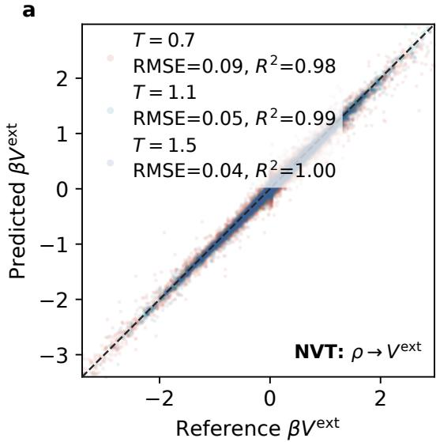

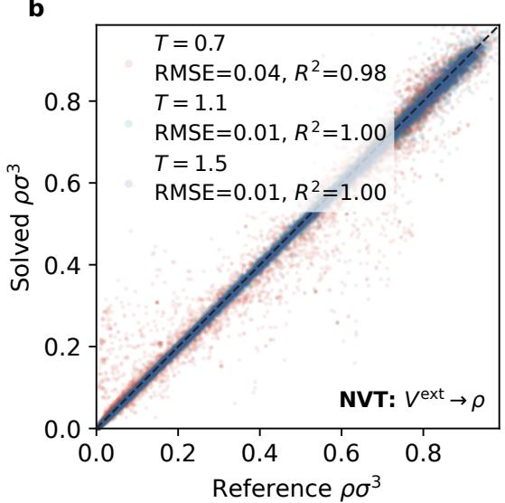

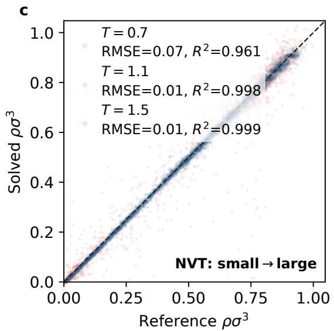

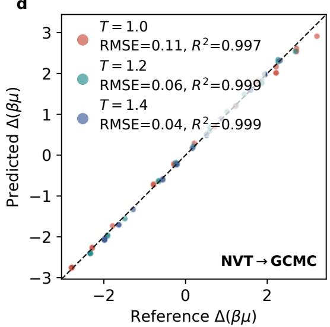  
Figure 5. Combined benchmark of the learned excess free-energy functional. a Gauge-aligned external fields inferred from all 1,592 held-out NVT equilibrium density fields; one spatially constant gauge is aligned for each canonical field. b Fixed-particle-number equilibrium densities obtained from the external fields for all 1,592 held-out fields. c Transfer of the density solver to all 90 test fields in boxes with 3.375 times the training volume. d Gauge-aligned dimensionless chemicalpotential diferences inferred for all 66 GCMC equilibrium fields by the NVT-trained functional. Reference and predicted chemical potentials are centered independently at each temperature, corresponding to one additive gauge per temperature and no statewise fitting. Every complete test configuration contributes to the reported metrics; grid points are sampled only for display. Colors denote temperature, lower-right annotations identify the benchmark task and dashed lines denote exact parity.

## F. Colloid-bridging calculations

Reference densities and solvent-mediated mean forces were obtained from canonical MD of $N = 4 6 0 0$ mobile LJ solvent particles in a periodic cubic box of side $L = 2 0 \sigma$ at $T = 1 . 2$ . The solvent particles interacted with one another through the LJTS pair potential in Eq. (16). The two colloids were not dynamical particles; each was represented by a fixed analytic one-body field acting on the LJ solvent. Their centers were $\mathbf { R } _ { L } = ( L / 2 - D / \hat { 2 } , L / 2 , L / 2 )$

and ${ \bf R } _ { R } = ( L / 2 + D / 2 , L / 2 , L / 2 )$ . Each colliod center generated the potential on the Lennard-Jones particles:

$$
\begin{array} { c } { \phi ( { r } ) = \displaystyle \frac { H } { 1 + \exp [ ( r - R _ { c } ) / w _ { c } ] } } \\ { \displaystyle - \epsilon _ { a } \exp \left[ - \frac { ( r - R _ { s } ) ^ { 2 } } { 2 w _ { s } ^ { 2 } } \right] , } \end{array}\tag{21}
$$

with $R _ { c } = 2 . 6 \sigma , w _ { c } = 0 . 5 \sigma , H = 8 \epsilon , R _ { s } = 3 . 4 \sigma , w _ { s } =$ 0.8σ and $\epsilon _ { a } = 1 . 4 \epsilon$ . The total field was

$$
\begin{array} { r l } { V _ { \mathrm { e x t } } ( \mathbf { r } ; D ) = \phi ( | \mathbf { r } - \mathbf { R } _ { L } ( D ) | ) } & { } \\ { + \phi ( | \mathbf { r } - \mathbf { R } _ { R } ( D ) | ) . } \end{array}\tag{22}
$$

There was no direct colloid–colloid interaction: $U _ { \mathrm { C C } } ( D ) ~ = ~ 0$ , so the reported force is entirely mediated by the LJ solvent.

Independent simulations were performed at $D / \sigma =$ 4.5, 5.0, 5.5, 6.0, 6.5, 7.0, 7.5, 8.0, 9.0 and 10.0. Each trajectory used 400,000 equilibration steps (2000τ) and 4,000,000 production steps (20, 000τ).

During production, the instantaneous generalized force was sampled every ten steps. If $F _ { x , j } ^ { ( L ) }$ and $F _ { x , j } ^ { ( R ) }$ are the forces exerted on solvent particle j by the left and right fields, respectively, the measured quantity was

$$
F _ { D } ^ { \mathrm { i n s t } } = \frac { 1 } { 2 } \left[ \sum _ { j } F _ { x , j } ^ { ( L ) } - \sum _ { j } F _ { x , j } ^ { ( R ) } \right] .\tag{23}
$$

One independent trajectory was used at each separation, providing 400,000 force samples separated by 0.05τ . Uncertainties on the direct-MD points are block standard errors.

MD densities were accumulated every ten steps as number densities on a regular $4 0 ^ { 3 }$ grid with spacing 0.5σ. The analytic external field and $\partial _ { D } V _ { \mathrm { e x t } }$ were evaluated at the same cell centers, so the gridded Feynman–Hellmann force was computed without interpolation using Eq. (14), with $\Delta V = ( 0 . 5 \sigma ) ^ { 3 }$ . Equi-cDFT densities were obtained by fixed-N minimization on the same $4 0 ^ { 3 }$ grid.

## G. Porous adsorption calculations

The gyroid cell containing Lennard–Jones fluid has $L = 1 6 \sigma , q = 2 \pi / L$

$$
g ( \mathbf { r } ) = \sin ( q x ) \cos ( q y ) + \sin ( q y ) \cos ( q z ) + \sin ( q z ) \cos ( q x ) ,
$$

and the potential on the LJ particles is

$$
V _ { \mathrm { g y r } } ( { \bf r } ) = \frac { 8 \epsilon } { 1 + \exp [ g ( { \bf r } ) / 0 . 3 5 ] } .\tag{24}
$$

The accessible side is $g > 0$ , and the nominal wall $g = 0$ corresponds to $V _ { \mathrm { g y r } } = 4 \epsilon .$

The structural reference in Fig. 4a– Fig. 4c is a canonical MD simulation at $T = 1 . 2$ with $N = 1 2 0 0$ , giving $\langle \rho \rangle \sigma ^ { 3 } = 0 . 2 9$ . The trajectory used $4 \times 1 0 ^ { 5 }$ equilibration steps and $4 \times 1 0 ^ { 6 }$ production steps. Number density was accumulated every 10 steps on a $3 2 ^ { 3 }$ grid with spacing 0.5σ, yielding 400,000 sampled fields in the production average. The matched Equi-cDFT calculation used the same field, temperature, box, grid and total particle number.

The adsorption references in Fig. 4d and Fig. 4e comprise paired gyroid and homogeneous GCMC simulations at the eleven chemical potentials $\mu / \epsilon \quad = \quad$ $- 4 . 0 , - 3 . 5 , \hdots , 1 . 0$ , all at $T = 1 . 2$ . Each run uses $4 \times 1 0 ^ { 5 }$ equilibration and $4 \times 1 0 ^ { 6 }$ production steps using NVE dynamics. Twenty insertion/deletion exchanges were attempted every 50 steps. Particle number and the full $3 2 ^ { 3 }$ density field were sampled every 20 steps.

The homogeneous-reservoir GCMC simulations used $L = 8 \sigma$ and $V _ { \mathrm { e x t } } = 0$ at the same eleven chemical potentials. Each state used one independent trajectory with the same equilibration, production, thermostatting and particle-exchange schedule as the gyroid-pore simulations.

For every GCMC mean particle number, Equi-cDFT was solved at fixed N with the same temperature, grid, box and external field, yielding an equilibrium density and raw chemical-potential Lagrange multiplier. A single additive shift fitted to the bulk branch was applied unchanged to the gyroid branch. The adsorption isotherm was constructed by interpolating the two branches and matching them at equal chemical potential.

## DATA AVAILABILITY

The trained model, numerical source data, evaluation and application scripts, and evaluation and reference datasets are available at https://github.com/ BingqingCheng/equicdft-lj-data. The training and validation density fields will be distributed separately due to their larger sizes.

## CODE AVAILABILITY

The Equi-cDFT library is publicly available at https: $/ / { \tt g i }$ thub.com/BingqingCheng/equicdft.

## ACKNOWLEDGEMENTS

Research reported in this publication was supported by the National Institute of General Medical Sciences of the National Institutes of Health under Award Number R35GM159986.

OpenAI Codex assisted with literature organization, manuscript editing, and the development and review of plotting and figure-generation scripts. The author directed its use and independently verified all scientific claims, calculations, code, figures, and references.

## AUTHOR CONTRIBUTIONS

BC designed and performed the study and wrote the paper.

[1] P. Hohenberg and W. Kohn, Inhomogeneous electron gas, Physical Review 136, B864 (1964).

[2] W. Kohn and L. J. Sham, Self-consistent equations including exchange and correlation efects, Physical Review 140, A1133 (1965).

[3] R. Evans, The nature of the liquid-vapour interface and other topics in the statistical mechanics of non-uniform, classical fluids, Advances in Physics 28, 143 (1979).

[4] Y. Rosenfeld, Free-energy model for the inhomogeneous hard-sphere fluid mixture and density-functional theory of freezing, Physical Review Letters 63, 980 (1989).

[5] R. Roth, Fundamental measure theory for hard-sphere mixtures: a review, Journal of Physics: Condensed Matter 22, 063102 (2010).

[6] R. Evans, M. Oettel, R. Roth, and G. Kahl, New developments in classical density functional theory, Journal of Physics: Condensed Matter 28, 240401 (2016).

[7] A. Simon and M. Oettel, Machine learning approaches to classical density functional theory, in Artificial Intelligence and Intelligent Matter , Machine Intelligence for Materials Science, edited by M. te Vrugt (Springer Nature Switzerland, Cham, 2026) pp. 83–113.

[8] S.-C. Lin and M. Oettel, A classical density functional from machine learning and a convolutional neural network, SciPost Physics 6, 025 (2019).

[9] P. Cats, S. Kuipers, S. de Wind, R. van Damme, G. M. Coli, M. Dijkstra, and R. van Roij, Machine-learning free-energy functionals using density profiles from simulations, APL Materials 9, 031109 (2021).

[10] M. M. Kelley, J. Quinton, K. Fazel, N. Karimitari, C. Sutton, and R. Sundararaman, Bridging electronic and classical density-functional theory using universal machine-learned functional approximations, The Journal of Chemical Physics 161, 144101 (2024).

[11] A. T. Bui and S. J. Cox, Learning classical density functionals for ionic fluids, Physical Review Letters 134, 148001 (2025).

[12] A. T. Bui and S. J. Cox, A unified machine-learning framework for ab initio multiscale modeling of liquids, Proceedings of the National Academy of Sciences 123, e2610049123 (2026).

[13] F. Samm¨uller and M. Schmidt, Neural density functionals: Local learning and pair-correlation matching, Physical Review E 110, L032601 (2024).

[14] J. Dijkman, M. Dijkstra, R. van Roij, M. Welling, J.-W. van de Meent, and B. Ensing, Learning neural free-energy functionals with pair-correlation matching, Physical Review Letters 134, 056103 (2025).

[15] K. Ram, J. Dijkman, R. van Roij, J.-W. van de Meent, B. Ensing, M. Welling, and D. Cremers, Learned freeenergy functionals from pair-correlation matching for dynamical density functional theory, Physical Review E 112, 045314 (2025).

[16] R. Pan, X. Fang, K. Azizzadenesheli, M. Liu-Schiafini, M. Gu, and J. Wu, Neural operators for forward and inverse potential-density mappings in classical density

## COMPETING INTERESTS

The author declares no competing interests.

functional theory, The Journal of Chemical Physics 163, 164120 (2025).

[17] J. Yang, R. Pan, J. Sun, and J. Wu, High-dimensional operator learning for molecular density functional theory, Journal of Chemical Theory and Computation 21, 5905 (2025).

[18] F. Samm¨uller, S. Hermann, D. de las Heras, and M. Schmidt, Neural functional theory for inhomogeneous fluids: Fundamentals and applications, Proceedings of the National Academy of Sciences 120, e2312484120 (2023).

[19] F. Samm¨uller, M. Schmidt, and R. Evans, Neural density functional theory of liquid-gas phase coexistence, Physical Review X 15, 011013 (2025).

[20] S. M. Kampa, F. Samm¨uller, M. Schmidt, and R. Evans, Metadensity functional theory for classical fluids: Extracting the pair potential, Physical Review Letters 134, 107301 (2025).

[21] S. Robitschko, F. Samm¨uller, M. Schmidt, and R. Evans, Learning the bulk and interfacial physics of liquid-liquid phase separation with neural density functionals, The Journal of Chemical Physics 163, 161101 (2025).

[22] F. Samm¨uller and M. Schmidt, Determining the chemical potential via universal density functional learning, Physical Review Letters 136, 068202 (2026).

[23] F. Glitsch, J. Weimar, and M. Oettel, Neural density functional theory in higher dimensions with convolutional layers, Physical Review E 111, 055305 (2025).

[24] S. M. Kampa, M. Schmidt, and F. Samm¨uller, Spherical metadensity functional learning for inhomogeneous classical fluids, arXiv preprint arXiv:2606.14370 (2026).

[25] M. Thol, G. Rutkai, R. Span, J. Vrabec, and R. Lustig, Equation of state for the Lennard-Jones truncated and shifted model fluid, International Journal of Thermophysics 36, 25 (2015).

[26] J. Vrabec, G. K. Kedia, G. Fuchs, and H. Hasse, Comprehensive study of the vapour–liquid coexistence of the truncated and shifted Lennard-Jones fluid including planar and spherical interface properties, Molecular Physics 104, 1509 (2006).

[27] B. Cheng, Cartesian atomic cluster expansion for machine learning interatomic potentials, npj Computational Materials 10, 157 (2024).

[28] R. Drautz, Atomic cluster expansion for accurate and transferable interatomic potentials, Physical Review B 99, 014104 (2019).

[29] R. Evans and U. Marini Bettolo Marconi, Phase equilibria and solvation forces for fluids confined between parallel walls, The Journal of Chemical Physics 86, 7138 (1987).

[30] R. P. Feynman, Forces in molecules, Physical Review 56, 340 (1939).

[31] C. Qiao, X. Yu, X. Song, T. Zhao, X. Xu, S. Zhao, and K. E. Gubbins, Enhancing gas solubility in nanopores: A combined study using classical density functional theory and machine learning, Langmuir 36, 8527 (2020).

[32] E. d. A. Soares, A. G. Barreto Jr., and F. W. Tavares, Classical density functional theory reveals structural information of H2 and CH4 fluids adsorbed in MOF-5, Fluid Phase Equilibria 574, 113887 (2023).

[33] R. Stierle, G. Bauer, N. Thiele, B. Bursik, P. Rehner, and J. Gross, Classical density functional theory in three dimensions with GPU-accelerated automatic diferentiation: Computational performance analysis using the example of adsorption in covalent-organic frameworks, Chemical Engineering Science 298, 120380 (2024).

[34] B. Cheng, Latent ewald summation for machine learning of long-range interactions, npj Computational Materials 11, 80 (2025).

[35] J. A. Keith, V. Vassilev-Galindo, B. Cheng, S. Chmiela, M. Gastegger, K.-R. M¨uller, and A. Tkatchenko, Com-

bining machine learning and computational chemistry for predictive insights into chemical systems, Chemical reviews 121, 9816 (2021).

[36] A. Paszke, S. Gross, F. Massa, A. Lerer, J. Bradbury, G. Chanan, T. Killeen, Z. Lin, N. Gimelshein, L. Antiga, A. Desmaison, A. Kopf, E. Yang, Z. DeVito, M. Raison, A. Tejani, S. Chilamkurthy, B. Steiner, L. Fang, J. Bai, and S. Chintala, Pytorch: An imperative style, high-performance deep learning library, in Advances in Neural Information Processing Systems, Vol. 32 (Curran Associates, Inc., 2019).