# Federated Compositional Muon Optimizer for Matrix-Wise Models

Wang Yan∗, Feihu Huang†

## Abstract

Muon, a more recently developed optimizer, is useful for matrix-wise models in AI areas. Although many works have studied Muon and its variants, these methods are still not particularly well-suited for hierarchical structured problems. To fill this gap, we propose an efective federated compositional Muon (FedCoMuon) optimizer to solve distributed matrix-wise compositional optimization problems. Specifically, our FedCoMuon optimizer builds on compositional gradient tracking and orthogonalized momentum. Moreover, we propose a variance reduced variant of FedCoMuon (FedCoMuon-VR) based on a momentum-based variance reduced technique. In theory, we analyze the convergence properties of our algorithms under the non-i.i.d. and non-convex settings. In particular, we prove that our FedCoMuon-VR obtains a lower sample complexity of O(ϵ−3) for finding an ϵ-stationary solution than the existing FedMuon algorithms. Extensive numerical experiments on robust federated learning and task-distributed risk-sensitive meta learning show that our proposed methods are competitive with existing compositional baselines and achieve the best reported accuracy in several settings.

## 1 Introduction

Federated learning (FL) [McMahan et al., 2017, Kairouz et al., 2019, Li et al., 2021] enables multiple clients to collaboratively train a shared model without centralizing their local data, making it attractive for privacy-sensitive and resource-constrained applications such as mobile intelligence, healthcare, recommendation systems, and edge learning. The first federated learning algorithm, i.e., FedAvg [McMahan et al., 2017], established the standard paradigm of alternating local stochastic updates with periodic model aggregation, while subsequent methods such as FedProx [Li et al., 2020], SCAFFOLD [Karimireddy et al., 2020], and FedOpt [Reddi et al., 2020] further improved federated training under client heterogeneity and limited communication. Despite their success, these methods were designed for standard federated empirical risk minimization, where the global objective is typically a single-level weighted average of client losses.

Beyond this standard single-level formulation, many federated applications involve more complex nested objectives [Yang, 2026], especially when the learned model is expected to perform reliably across heterogeneous or adverse client distributions. In distributionally robust FL, for example, a nonlinear risk measure is applied to client-level expected losses, resulting in a nested stochastic compositional objective [Huang and Li, 2021]. Similar nested structures arise in the task-distributed meta learning problem [Huang and Li, 2021, Wang et al., 2023] and federated reinforcement learning [Jin et al., 2022, Tarzanagh et al., 2022]. Since the outer gradient depends on an inner stochastic expectation, directly applying local SGD generally yields biased gradient estimates. Several fed erated compositional optimization methods correct this bias, including ComFedL [Huang and Li, 2021], Local-MOML [Wang et al., 2023], Local-SCGDM [Gao et al., 2022], and FedNest [Tarzanagh et al., 2022]. Although these methods address the nested stochastic structure, their algorithmic formulations do not explicitly exploit the matrix structure of model parameters.

In fact, modern neural networks such as Convolutional Neural Networks (CNN) [LeCun et al., 2015] and Transformers [Vaswani et al., 2017] are matrix-wise models with numerous matrix parameter blocks in attention and linear layers. Since training such models is computationally expensive, designing optimizers that can efectively exploit their matrix structure has attracted increasing attention. Muon [Jordan et al., 2024] updates the matrix parameter blocks of matrix-wise models using an orthogonalized momentum direction, which is eficiently computed through Newton–Schulz iterations. It has demonstrated competitive empirical performance across a variety of large language models (LLMs) [Liu et al., 2025a]. More recently, several studies have extended Muon to federated learning [Takezawa et al., 2026, Liu et al., 2025b, Zhang and Gao, 2025]. However, the existing Muon-type federated algorithms are primarily developed for single-level stochastic objectives, and it remains unclear how Muon can be efectively applied to federated stochastic compositional optimization, where the nested expectation introduces additional gradient estimation errors under heterogeneous client data. This raises a natural question: Could we develop efective Muon-type federated algorithms for matrix-wise compositional optimization under heterogeneous data?

In this paper, we provide an afirmative answer to the above question and develop two effective Muon-type federated learning algorithms (i.e., FedCoMuon and FedCoMuon-VR) to solve distributed matrix-wise stochastic compositional problems. In summary, our main contributions are summarized as follows:

• We develop a class of efective Muon-type federated compositional algorithms (i.e., FedCo-Muon and FedCoMuon-VR) for distributed matrix-wise stochastic compositional optimization. Specifically, our FedCoMuon combines compositional gradient tracking with orthogonalized matrix momentum, while FedCoMuon-VR further incorporates a momentum-based variance-reduction technique [Cutkosky and Orabona, 2019].

• We provide a solid convergence analysis for the proposed algorithms under non-convex and non-i.i.d. settings. To find an ϵ-stationary point, our FedCoMuon requires a sample complexity of $\mathcal { O } ( \epsilon ^ { - 4 } )$ and a communication complexity of $\mathcal { O } ( \epsilon ^ { - 3 } )$ , while our FedCoMuon-VR has a lower sample complexity of $\mathcal { O } ( \epsilon ^ { - 3 } )$ while retaining the same communication complexity. In particular, our FedCoMuon-VR has a lower sample complexity than the existing Federated Muon algorithms [Takezawa et al., 2026, Liu et al., 2025b, Zhang and Gao, 2025, Qian et al., 2026].

• Experiments on the task-distributed meta learning problem and robust federated learning demonstrate efectiveness of the proposed algorithms.

## 2 Related Work

## 2.1 Federated Learning

Federated learning [McMahan et al., 2017] is a popular distributed learning paradigm in machine learning. FedAvg [McMahan et al., 2017] is the first federated learning algorithm, which reduces communication frequency by allowing each client to perform multiple local SGD steps before server aggregation. Under heterogeneous client data, however, repeated local updates may drift from the global descent direction and slow convergence. Subsequently, some efective variants of FedAvg have been developed. For example, FedProx [Li et al., 2020] and SCAFFOLD [Karimireddy et al., 2020] mitigate this issue through proximal regularization and control variances, respectively. Meanwhile, momentum-based, adaptive, and variance-reduced extensions [Khanduri et al., 2021, Cheng et al., 2024, Yan et al., 2025] further improve convergence and communication eficiency.

## 2.2 Compositional Optimization

Compositional optimization [Wang et al., 2017] is a class of efective nested structural optimization problems in machine learning. Since compositional optimization is widely used in many machine learning tasks such as robust learning and federated learning, many algorithms [Wang et al., 2017, Ghadimi et al., 2020, Chen et al., 2021, Zhang and Xiao, 2021] have recently been developed. For example, SCGD [Wang et al., 2017] controls this bias by tracking the inner mapping with a moving average. Subsequently, several accelerated algorithms based on momentum or variance-reduction techniques have been developed for non-convex stochastic compositional optimization [Ghadimi et al., 2020, Chen et al., 2021, Zhang and Xiao, 2021, Jiang et al., 2022].

To solve distributed compositional optimization, some federated compositional algorithms have been developed. For example, ComFedL [Huang and Li, 2021] introduced a federated compositional framework for distributionally robust learning and meta learning. Subsequently, Local MOML [Wang et al., 2023] and Local-SCGDM [Gao et al., 2022] improved sample and communication eficiency through local updates and momentum-based tracking. FedDRO [Khanduri et al., 2026] further studies the interaction between compositional gradient bias and client heterogeneity in distributionally robust federated learning. Tarzanagh et al. [2022], Huang et al. [2026], Gao [2024] proposed variance-reduced federated compositional algorithms for distributed non-convex stochastic composition optimization based on variance-reduction techniques. In fact, the federated setting is more challenging because compositional gradient bias and client drift should be controlled simultaneously.

## 2.3 Muon-Based Optimization

In the last two years, Muon [Jordan et al., 2024] has emerged as a promising optimizer, which directly updates the matrix parameter blocks of matrix-wise models. Specifically, it uses orthogonalization of the matrix-valued momentum by a few Newton–Schulz iterations, which can be interpreted as an LMO-based optimizer over a spectral-norm ball [Pethick et al., 2025]. More recently, its convergence properties have been studied in non-convex stochastic optimization [Shen et al., 2025, Li and Hong, 2025, Riabinin et al., 2025, Kovalev, 2025, Kim and Oh, 2026]. Subsequently, its variance-reduced variants [Sfyraki and Wang, 2025, Huang et al., 2025, Qian et al., 2025, Chang et al., 2025] have also been studied.

More recently, several works Takezawa et al. [2026], Liu et al. [2025b], Zhang and Gao [2025] have begun to study Federated Muon (i.e., FedMuon) algorithms for distributed matrix-wise optimization. Specifically, Takezawa et al. [2026] proposed the FedMuon algorithm based on bias-correction mechanism to address the bias induced by local linear minimization oracles. Liu et al. [2025b] presented the FedMuon algorithm by using momentum aggregation and local-global alignment to mitigate client drift under heterogeneous data. Meanwhile, Zhang and Gao [2025] developed the FedMuon algorithm with hyper-parameter choices independent of problem-specific constants, and established its convergence under both bounded-variance and heavy-tailed stochastic noise. Subsequently, Qian et al. [2026] proposed communication-eficient federated Gluon algorithm based on gradient compression and error feedback. However, these methods focus on standard single-level objectives and do not provide algorithms or convergence guarantees for stochastic compositional optimization under heterogeneous client data.

Notation. Let $[ K ] = \{ 1 , 2 , \dots , K \}$ denote the set of clients. $\| \cdot \|$ denotes Euclidean and spectral norm for vector and matrix, respectively. For matrices $A , B \in \mathbb { R } ^ { m \times n }$ , we use $\langle A , B \rangle = \operatorname { t r } ( A ^ { \top } B )$ to denote the Frobenius inner product, and use $\| A \| _ { F }$ to denote the Frobenius norm. $A \otimes B$ denotes the Kronecker product of matrices A and $B .$

## 3 Preliminaries

In this paper, we study the Muon optimizer to solve the following distributed matrix-wise compositional optimization problem:

$$
\operatorname* { m i n } _ { W \in \mathbb { R } ^ { m \times n } } \frac { 1 } { K } \sum _ { k = 1 } ^ { K } \mathbb { E } _ { \zeta \sim \mathcal { D } _ { f } ^ { k } } \left[ f ^ { k } \left( \mathbb { E } _ { \xi \sim \mathcal { D } _ { g } ^ { k } } [ g ^ { k } ( W ; \xi ) ] ; \zeta \right) \right] ,\tag{1}
$$

where the inner and outer expected mappings are defined as $g ^ { k } ( W ) \triangleq \mathbb { E } _ { \xi \sim { \mathcal { D } } _ { a } ^ { k } } [ g ^ { k } ( W ; \xi ) ] : \mathbb { R } ^ { m \times n } \to$ $\mathbb { R } ^ { d }$ and $f ^ { k } ( y ) \triangleq \mathbb { E } _ { \zeta \sim \mathcal { D } _ { \epsilon } ^ { k } } [ f ^ { k } ( y ; \zeta ) ] : \mathbb { R } ^ { d } \to \mathbb { R }$ , respectively. We write $\begin{array} { r } { F ( W ) = K ^ { - 1 } \sum _ { k = 1 } ^ { K } F ^ { k } ( W ) } \end{array}$ where $F ^ { k } ( W ) = f ^ { k } ( g ^ { k } \dot { ( } W ) )$ ). The inner and outer data distributions, $\mathcal { D } _ { g } ^ { k }$ and $\mathcal { D } _ { f } ^ { k }$ , may difer across clients. This formulation therefore captures both the nested compositional structure and the data heterogeneity inherent in federated settings.

Next, we introduce several mild assumptions for Problem (1).

Assumption 1 (Lower-bounded objective). The global objective $F ( W )$ has a lower bound, $i . e .$ $F _ { * } : = \operatorname* { i n f } _ { W \in \mathbb { R } ^ { m \times n } } F ( W ) > - \infty$

Assumption 2 (Unbiased stochastic oracles and bounded variances). For any client $k \in [ K ]$ , the stochastic oracles are unbiased:

$$
\mathbb { E } _ { \xi ^ { k } } [ g ^ { k } ( W ; \xi ^ { k } ) ] = g ^ { k } ( W ) , \ \mathbb { E } _ { \xi ^ { k } } [ \nabla g ^ { k } ( W ; \xi ^ { k } ) ] = \nabla g ^ { k } ( W ) , \ \mathbb { E } _ { \zeta ^ { k } } [ \nabla _ { y } f ^ { k } ( y ; \zeta ^ { k } ) ] = \nabla _ { y } f ^ { k } ( y ) .
$$

The samples are independent across clients and iterations, and $\xi ^ { k }$ is independent $o f \zeta ^ { k }$ . In addition, there exist constants $\sigma _ { g } , \sigma _ { \nabla g } , \sigma _ { f } > 0$ such that, for any $W \in \mathbb { R } ^ { m \times n }$ and $\boldsymbol { y } \in \mathbb { R } ^ { d }$ 2

$$
\begin{array} { r } { \mathbb { E } _ { \xi ^ { k } } \| g ^ { k } ( W ; \xi ^ { k } ) - g ^ { k } ( W ) \| ^ { 2 } \le \sigma _ { g } ^ { 2 } , } \end{array}
$$

$$
\begin{array} { r } { \mathbb { E } _ { \xi ^ { k } } \| \nabla g ^ { k } ( W ; \xi ^ { k } ) - \nabla g ^ { k } ( W ) \| _ { F } ^ { 2 } \leq \sigma _ { \nabla g } ^ { 2 } , } \end{array}
$$

$$
\begin{array} { r } { \mathbb { E } _ { \zeta ^ { k } } \| \nabla _ { y } f ^ { k } ( y ; \zeta ^ { k } ) - \nabla _ { y } f ^ { k } ( y ) \| ^ { 2 } \leq \sigma _ { f } ^ { 2 } . } \end{array}
$$

Algorithm 1 FedCoMuon Algorithm   
1: Input: $\eta > 0 , \alpha \in [ 0 , 1 ) , \beta \in [ 0 , 1 )$ , and $\tau > 0 .$   
2: Initialize: For all $k \in [ K ]$ , set $W _ { 0 } ^ { k } = W _ { 0 } \in \mathbb { R } ^ { m \times n }$ $u _ { 0 } ^ { k } = g ^ { k } ( W _ { 0 } ^ { k } ; \xi _ { 0 } ^ { k } )$ , and $M _ { 0 } ^ { k } \ =$   
$\nabla g ^ { k } ( W _ { 0 } ^ { k } ; \xi _ { 0 } ^ { k } ) \big ( \nabla _ { y } f ^ { k } ( u _ { 0 } ^ { k } ; \zeta _ { 0 } ^ { \dot { k } } ) \otimes I _ { n } \big )$ for $\xi _ { 0 } ^ { k } \sim \mathcal { D } _ { g } ^ { k }$ and $\zeta _ { 0 } ^ { k } \sim \mathcal { D } _ { f } ^ { \check { k } } ;$   
3: for $t = 0 , 1 , \ldots , T - 1$ do   
4: for each client $k \in [ K ]$ (in parallel) do   
5: $( U _ { t } ^ { k } , \Sigma _ { t } ^ { k } , V _ { t } ^ { k } ) = \mathrm { { { \dot { S V D } } } } { \dot { ( M _ { t } ^ { k } ) } }$ ; // Orthonormalize $M _ { t } ^ { k }$ with the Newton–Schulz ap   
proach   
6: $\begin{array} { r } { \dot { \boldsymbol W } _ { t + 1 } ^ { k } = { \boldsymbol W } _ { t } ^ { k } - \eta U _ { t } ^ { k } ( V _ { t } ^ { k } ) ^ { \top } ; } \end{array}$   
7: Draw two independent samples $\xi _ { t + 1 } ^ { k } \sim \mathcal { D } _ { g } ^ { k }$ and $\zeta _ { t + 1 } ^ { k } \sim \mathcal { D } _ { f } ^ { k } ;$   
8: $u _ { t + 1 } ^ { k } = \alpha g ^ { k } ( W _ { t + 1 } ^ { k } ; \xi _ { t + 1 } ^ { k } ) + ( 1 - \alpha ) u _ { t } ^ { k } ;$   
9: $\begin{array} { r } { \tilde { Z _ { t + 1 } ^ { k } } = \nabla g ^ { k } \tilde { ( W _ { t + 1 } ^ { k } ; \xi _ { t + 1 } ^ { k } ) } \big ( \nabla _ { y } f ^ { k } ( u _ { t + 1 } ^ { k } ; \zeta _ { t + 1 } ^ { k } ) \otimes I _ { n } \big ) } \end{array}$   
10: $M _ { t + 1 } ^ { k } = \beta Z _ { t + 1 } ^ { k } + ( 1 - \beta ) \dot { M } _ { t } ^ { k } ;$   
11: end for   
12: if mod $\ ( t + 1 , \tau ) = 0$ then   
13: Receive $\{ W _ { t + 1 } ^ { k } , M _ { t + 1 } ^ { k } \} _ { k = 1 } ^ { K }$ from all clients;   
14: $\begin{array} { r } { \bar { W } _ { t + 1 } = K ^ { - 1 } \sum _ { k } W _ { t + 1 } ^ { k } ; } \end{array}$   
15: $\begin{array} { r } { \bar { M } _ { t + 1 } = K ^ { - 1 } \sum _ { k } ^ { } M _ { t + 1 } ^ { k } ; } \end{array}$   
16: Send $\bar { W } _ { t + 1 }$ and $\bar { M } _ { t + 1 }$ to each client;   
17: end if   
18: end for   
19: Output: Sampling uniformly from $\{ \bar { W } _ { t } \} _ { t = 0 } ^ { T - 1 }$ (in theory), and $\hat { W } _ { T }$ (in practice).

Assumption 3 (Bounded gradient moments). For any client $k \ \in \ [ K ] _ { : }$ , there exist constants $C _ { g } , C _ { f } > 0$ such that, for any $W \in \mathbb { R } ^ { m \times n }$ and $\boldsymbol { y } \in \mathbb { R } ^ { d }$ , the stochastic Jacobians and outer gradients have bounded second moments:

$$
\begin{array} { r } { \mathbb { E } _ { \xi ^ { k } } \| \nabla g ^ { k } ( W ; \xi ^ { k } ) \| _ { F } ^ { 2 } \le C _ { g } ^ { 2 } , \ \mathbb { E } _ { \zeta ^ { k } } \| \nabla _ { y } f ^ { k } ( y ; \zeta ^ { k } ) \| ^ { 2 } \le C _ { f } ^ { 2 } . } \end{array}
$$

Assumptions 1–3 have been commonly used in the convergence analysis of stochastic compositional optimization algorithms [Tarzanagh et al., 2022, Gao et al., 2022, Jiang et al., 2022, Gao, 2024].

## 4 Federated Compositional Muon Methods

In this section, we propose a class of eficient federated compositional Muon algorithms $( \mathrm { i . e . } ,$ FedCoMuon and FedCoMuon-VR) for large matrix-valued models. Specifically, our FedCoMuon builds on compositional gradient tracking and Muon, while our FedCoMuon-VR further builds on a momentum-based variance-reduction technique.

## 4.1 FedCoMuon Algorithm

In this subsection, we provide an eficient federated compositional Muon (i.e., FedCoMuon) algorithm to solve the problem (1). Algorithm 1 shows the algorithmic framework for FedCoMuon.

Algorithm 2 FedCoMuon-VR Algorithm   
1: Input: $\eta > 0 , \alpha , \beta , \gamma , \rho \in [ 0 , 1 ) , \tau > 0 ,$ and $b > 0 .$   
2: Initialize: For all $k \in [ K ]$ , set $W _ { 0 } ^ { k } = W _ { 0 } \in \mathbb { R } ^ { m \times n }$ , and draw b i.i.d. samples $\{ \xi _ { 0 , j } ^ { k } \} _ { j = 1 } ^ { b }$   
from $\mathcal { D } _ { g } ^ { k }$ and b i.i.d. samples $\{ \zeta _ { 0 , j } ^ { k } \} _ { j = 1 } ^ { b }$ from $\mathcal { D } _ { f } ^ { k }$ , and set $\begin{array} { r } { u _ { 0 } ^ { k } = \frac 1 b \sum _ { j = 1 } ^ { b } g ^ { k } ( W _ { 0 } ^ { k } ; \xi _ { 0 , j } ^ { k } ) } \end{array}$   
$\begin{array} { r } { H _ { 0 } ^ { k } = \frac { 1 } { b } \sum _ { j = 1 } ^ { b } \nabla g ^ { k } ( W _ { 0 } ^ { k } ; \xi _ { 0 , j } ^ { k } ) . } \end{array}$ , and $\begin{array} { r } { v _ { 0 } ^ { k } = \frac { 1 } { b } \sum _ { j = 1 } ^ { b } \dot { \nabla } _ { y } f ^ { k } ( u _ { 0 } ^ { k } ; \zeta _ { 0 , j } ^ { k } ) , M _ { 0 } ^ { k } = \dot { H } _ { 0 } ^ { k } ( v _ { 0 } ^ { k } \otimes I _ { n } ) } \end{array}$ . Set   
$\begin{array} { r } { \bar { M } _ { 0 } = K ^ { - 1 } \sum _ { k = 1 } ^ { K } M _ { 0 } ^ { k } } \end{array}$ and $M _ { 0 } ^ { k } = \bar { M } _ { 0 }$ for all $k \in [ K ] ;$   
3: for $t = 0 , 1 , \dotsc , T - 1$ do   
4: for each client $k \in [ K ]$ (in parallel) do   
5: $( U _ { t } ^ { k } , \Sigma _ { t } ^ { k } , V _ { t } ^ { k } ) = \bar { \mathrm { S V D } } ( \bar { M } _ { t } ^ { k } ) ;$   
6: $W _ { t + 1 } ^ { \bar { k } } = \bar { W } _ { t } ^ { k } - \eta U _ { t } ^ { k } ( V _ { t } ^ { k } ) ^ { \top } ;$   
7: end for   
8: if mod $\ ( t + 1 , \tau ) = 0$ then   
9: Receive $\{ W _ { t + 1 } ^ { k } \} _ { k = 1 } ^ { K }$ from all clients;   
10: $\begin{array} { r } { \bar { W } _ { t + 1 } = \frac { 1 } { K } \sum _ { k = 1 } ^ { K } W _ { t + 1 } ^ { k } ; } \end{array}$   
11: Send $\bar { W } _ { t + 1 }$ to each client;   
12: end if   
13: for each client $k \in [ K ]$ (in parallel) do   
14: Draw $\xi _ { t + 1 } ^ { k } \sim \mathcal { D } _ { g } ^ { k }$ and $\zeta _ { t + 1 } ^ { k } \sim \mathcal { D } _ { f } ^ { k } ;$   
15: $u _ { t + 1 } ^ { k } = g ^ { k } ( W _ { t + 1 } ^ { k } ; \xi _ { t + 1 } ^ { k } ) + ( 1 - \overset { \circ } { \alpha } ) \big ( u _ { t } ^ { k } - g ^ { k } ( W _ { t } ^ { k } ; \xi _ { t + 1 } ^ { k } ) \big ) ;$   
16: $v _ { t + 1 } ^ { k } = \Pi _ { C _ { f } } \big [ \nabla _ { y } f ^ { k } ( u _ { t + 1 } ^ { k } ; \zeta _ { t + 1 } ^ { k } ) + \big ( 1 - \beta \big ) \big ( v _ { t } ^ { k } - \nabla _ { y } f ^ { k } \big ( u _ { t } ^ { k } ; \zeta _ { t + 1 } ^ { k } \big ) \big ) \big ]$   
17: $H _ { t + 1 } ^ { k } = \Pi _ { C _ { g } } ^ { \therefore } \big [ \nabla g ^ { k } ( W _ { t + 1 } ^ { k } ; \xi _ { t + 1 } ^ { k } ) + ( 1 - \gamma ) \big ( H _ { t } ^ { k } - \nabla g ^ { k } ( W _ { t } ^ { k } ; \xi _ { t + 1 } ^ { k } ) \big ) \big ]$ ;   
18: $M _ { t + 1 } ^ { k } = ( 1 \stackrel { \smile } { - } \rho ) M _ { t } ^ { k } + \rho H _ { t + 1 } ^ { k } ( v _ { t + 1 } ^ { k } \otimes I _ { n } ) ;$   
19: end for   
20: if mod $\ ( t + 1 , \tau ) = 0$ then   
21: Receive $\{ M _ { t + 1 } ^ { k } \} _ { k = 1 } ^ { K }$ from all clients;   
22: $\begin{array} { r } { \bar { M } _ { t + 1 } = \frac { 1 } { K } \sum _ { k = 1 } ^ { K } M _ { t + 1 } ^ { k } ; } \end{array}$   
23: Send $\bar { M } _ { t + 1 }$ to each client;   
24: end if   
25: end for   
26: Output: Sampling uniformly from $\{ \bar { W } _ { t } \} _ { t = 0 } ^ { T - 1 }$ (in theory), and $\hat { W } _ { T }$ (in practice).

In our FedCoMuon algorithm, at the t-th iteration, each client k uses its local stochastic samples to update the matrix momentum as

$$
M _ { t + 1 } ^ { k } = \beta Z _ { t + 1 } ^ { k } + ( 1 - \beta ) M _ { t } ^ { k } ,\tag{2}
$$

where $\beta \in [ 0 , 1 )$ is the momentum parameter. Here $Z _ { t + 1 } ^ { k }$ denotes the stochastic compositional gradient, defined as

$$
Z _ { t + 1 } ^ { k } = \nabla g ^ { k } ( W _ { t + 1 } ^ { k } ; \xi _ { t + 1 } ^ { k } ) \big ( \nabla _ { y } f ^ { k } ( u _ { t + 1 } ^ { k } ; \zeta _ { t + 1 } ^ { k } ) \otimes I _ { n } \big ) ,\tag{3}
$$

where $\xi _ { t + 1 } ^ { k }$ and $\zeta _ { t + 1 } ^ { k }$ are fresh stochastic samples. In the above estimator, $u _ { t + 1 } ^ { k }$ tracks the inner function value $g ^ { k } ( \dot { W } _ { t + 1 } ^ { k } )$ , thereby enabling $Z _ { t + 1 } ^ { \bar { k } }$ to form a matrix-form stochastic compositional gradient estimate. The parameter $\alpha \in [ 0 , 1 )$ controls the moving-average update of $u _ { t + 1 } ^ { k }$

Following the Muon algorithm [Jordan et al., 2024], we use Newton–Schulz iterations instead of an expensive exact SVD to obtain the orthogonalized momentum direction.

Every τ local iterations, clients communicate with the server. In each communication round, the server receives $\{ W _ { t + 1 } ^ { k } , M _ { t + 1 } ^ { k } \} _ { k = 1 } ^ { K }$ , averages them to obtain $\bar { W } _ { t + 1 }$ and $\bar { M } _ { t + 1 }$ , and sends the averaged variables back to all clients.

## 4.2 FedCoMuon-VR Algorithm

In this subsection, we provide an eficient federated compositional variance-reduced Muon $( { \mathrm { i . e . } }$ FedCoMuon-VR) algorithm to solve the problem (1) based on the momentum-based variancereduction technique. Algorithm 2 provides the algorithmic framework for FedCoMuon-VR.

In Algorithm 2, after obtaining $W _ { t + 1 } ^ { k }$ , each client k draws fresh samples $\xi _ { t + 1 } ^ { k }$ and $\zeta _ { t + 1 } ^ { k }$ , and recursively updates $u _ { t + 1 } ^ { k } , v _ { t + 1 } ^ { k }$ , and $H _ { t + : } ^ { k }$ to track the inner function value, the outer gradient, and the inner Jacobian, respectively. Each recursive estimator evaluates its function on the same fresh sample at two consecutive iterates, which reduces the stochastic estimation error.

Let $B _ { f } ~ : = ~ \{ v ~ : ~ \| v \| ~ \leq ~ C _ { f } \}$ and $B _ { g } : = \{ H : \| H \| _ { F } \leq C _ { g } \}$ , and let $\Pi _ { C _ { f } }$ and $\Pi _ { C _ { g } }$ denote the Euclidean projections onto $B _ { f }$ and $B _ { g }$ , respectively. These projection operators keep the outergradient estimator and the Jacobian estimator bounded. The resulting estimators form the variancereduced compositional gradient estimate $H _ { t + 1 } ^ { k } ( v _ { t + 1 } ^ { k } \otimes I _ { n } )$ , which is used to update the matrix momentum with parameter $\rho \in [ 0 , 1 )$ . Every τ local iterations, the server averages the local model parameters and momentum matrices, and broadcasts the averaged variables back to all clients.

## 5 Convergence Analysis

In this section, we study the convergence properties of our FedCoMuon and FedCoMuon-VR algorithm under some mild assumptions. All related proofs are provided in the Appendix.

## 5.1 Convergence Properties of Our FedCoMuon

Assumption 4 (Smoothness). For any client $k \in [ K ]$ , the population mappings $g ^ { k }$ and $f ^ { k }$ are $L _ { g } .$ and $L _ { f }$ -smooth, respectively. That is, for any $W _ { 1 } , W _ { 2 } \in \mathbb { R } ^ { m \times n }$ and $y _ { 1 } , y _ { 2 } \in \mathbb { R } ^ { d }$

$$
\| \nabla g ^ { k } ( W _ { 1 } ) - \nabla g ^ { k } ( W _ { 2 } ) \| _ { F } \le L _ { g } \| W _ { 1 } - W _ { 2 } \| _ { F } , \ \| \nabla _ { y } f ^ { k } ( y _ { 1 } ) - \nabla _ { y } f ^ { k } ( y _ { 2 } ) \| \le L _ { f } \| y _ { 1 } - y _ { 2 } \| .
$$

Assumption 5 (Gradient heterogeneity). There exists a constant $\delta \geq 0$ such that, for all $W \in$ $\mathbb { R } ^ { m \times n }$ ，

$$
\frac { 1 } { K } \sum _ { k = 1 } ^ { K } \| \nabla F ^ { k } ( W ) - \nabla F ( W ) \| _ { F } ^ { 2 } \leq \delta ^ { 2 } .
$$

Theorem 1. Suppose Assumptions $_ { 1 - 5 }$ hold. Let $\{ W _ { t } ^ { k } , u _ { t } ^ { k } , M _ { t } ^ { k } \}$ be generated by Algorithm 1 with $0 < \alpha , \beta < 1$ , and $\alpha \tau \leq 1$ . Then, we have

$$
\begin{array} { r l } { \displaystyle \frac { 1 } { T } \sum _ { t = 0 } ^ { T - 1 } \mathbb { E } \| \nabla F ( \bar { W } _ { t } ) \| _ { F } \leq \frac { F ( \bar { W } _ { 0 } ) - F _ { * } } { \eta T } + \frac { 2 \sqrt { n } C _ { g } L _ { f } \sigma _ { g } } { \beta T } + 2 \sqrt { n } \big ( \frac { 1 } { \beta T } + 2 \beta \tau \big ) \big ( C _ { g } \sigma _ { f } + C _ { f } \sigma _ { \nabla g } \big ) } & { } \\ { \displaystyle + 2 \sqrt { n } C _ { g } L _ { f } \big ( 1 + 2 \beta \tau \big ) \bigg ( \frac { 4 \sigma _ { g } ^ { 2 } } { \alpha T } + \frac { 8 6 C _ { g } ^ { 2 } n } { \alpha ^ { 2 } } \eta ^ { 2 } + 8 6 \alpha \sigma _ { g } ^ { 2 } \bigg ) ^ { 1 / 2 } } & { } \\ { \displaystyle + \eta n L _ { F } \big ( \frac { 1 } { 2 } + 4 \tau + \frac { 6 } { \beta } + 8 \beta \tau ^ { 2 } \big ) + 2 \sqrt { n } \beta \tau \delta + \frac { 2 \sqrt { n \beta } } { \sqrt { K } } \sqrt { C _ { g } ^ { 2 } \sigma _ { f } ^ { 2 } + C _ { f } ^ { 2 } \sigma _ { \nabla g } ^ { 2 } } . } & { } \end{array}\tag{4}
$$

Remark 1 (Parameter choice and complexity). By choosing $\eta = T ^ { - 3 / 4 } , \alpha = \beta = T ^ { - 1 / 2 }$ , and $\tau = T ^ { 1 / 4 }$ , Theorem 1 yields $\begin{array} { r } { T ^ { - 1 } \sum _ { t = 0 } ^ { T - 1 } \mathbb { E } \| \nabla F ( \bar { W } _ { t } ) \| _ { F } = O ( T ^ { - 1 / 4 } ) } \end{array}$ . Thus, achieving an ϵ-stationary point requires $T = { \cal O } ( \epsilon ^ { - 4 } )$ . Since each local iteration uses a constant number of stochastic samples, the total sample complexity per client is $O ( T ) = O ( \epsilon ^ { - 4 } )$ . Moreover, the number of communication rounds is $T / \tau = T ^ { 3 / 4 } = { \cal O } ( \epsilon ^ { - 3 } )$

## 5.2 Convergence Properties of Our FedCoMuon-VR

Assumption 6 (Mean-square sample smoothness). For any client $k \in [ K ]$ , the sample mappings are mean-square Lipschitz. That is, for any $W _ { 1 } , W _ { 2 } \in \mathbb { R } ^ { m \times n }$ and $y _ { 1 } , y _ { 2 } \in \mathbb { R } ^ { d }$

$$
\begin{array} { r l } & { \mathbb { E } _ { \xi ^ { k } } \| g ^ { k } ( W _ { 1 } ; \xi ^ { k } ) - g ^ { k } ( W _ { 2 } ; \xi ^ { k } ) \| ^ { 2 } \leq C _ { g } ^ { 2 } \| W _ { 1 } - W _ { 2 } \| _ { F } ^ { 2 } , } \\ & { \mathbb { E } _ { \xi ^ { k } } \| \nabla g ^ { k } ( W _ { 1 } ; \xi ^ { k } ) - \nabla g ^ { k } ( W _ { 2 } ; \xi ^ { k } ) \| _ { F } ^ { 2 } \leq L _ { g } ^ { 2 } \| W _ { 1 } - W _ { 2 } \| _ { F } ^ { 2 } , } \\ & { \mathbb { E } _ { \zeta ^ { k } } \| \nabla _ { y } f ^ { k } ( y _ { 1 } ; \zeta ^ { k } ) - \nabla _ { y } f ^ { k } ( y _ { 2 } ; \zeta ^ { k } ) \| ^ { 2 } \leq L _ { f } ^ { 2 } \| y _ { 1 } - y _ { 2 } \| ^ { 2 } . } \end{array}
$$

Assumption 7 (Client heterogeneity). There exist constants $\Delta _ { g } , \Delta _ { \nabla g } , \Delta _ { f } \geq 0$ such that, for any $k , j \in [ K ] , W \in \mathbb { R } ^ { m \times n }$ and $\boldsymbol { y } \in \mathbb { R } ^ { d }$

$$
\begin{array} { r l } & { \| \nabla _ { y } f ^ { k } ( y ) - \nabla _ { y } f ^ { j } ( y ) \| \le \Delta _ { f } , } \\ & { \| \nabla g ^ { k } ( W ) - \nabla g ^ { j } ( W ) \| _ { F } \le \Delta _ { \nabla g } , } \\ & { \| g ^ { k } ( W ) - g ^ { j } ( W ) \| \le \Delta _ { g } . } \end{array}
$$

Assumption 7 imposes a common bounded-heterogeneity condition for compositional federated learning under non-i.i.d. setting [Tarzanagh et al., 2022, Huang et al., 2026].

Theorem 2. Suppose Assumptions 1–3, 6, and 7 hold. Let $\{ W _ { t } ^ { k } , u _ { t } ^ { k } , v _ { t } ^ { k } , H _ { t } ^ { k } , M _ { t } ^ { k } \}$ be generated by Algorithm 2 with $\eta > 0 , 0 < \alpha , \beta , \gamma , \rho < 1 , b \geq 1$ , and $\tau > 0$ . Then, for any $T \geq 1$ , we have

$$
\begin{array} { r l } { \frac { 1 } { T } \displaystyle \sum _ { t = 0 } ^ { T - 1 } \mathbb { E } \| \nabla F ( \bar { W } _ { t } ) \| _ { F } \leq \frac { F ( \bar { W } _ { 0 } ) - F _ { * } } { \eta T } + \frac { L e m \eta } { 2 } + 2 \sqrt { n } [ \frac { 4 C _ { \sigma } C _ { f } } { \rho T } + \frac { L e \sqrt { n } \eta } { \rho }  } & { } \\ {  \qquad + ( 2 + \sqrt { 6 } \rho \tau ) ( C _ { f } ^ { 2 } \sigma _ { \sigma _ { \sigma } } ^ { 2 } ( \frac { 1 } { \gamma T \bar { b } } + 2 \gamma ) + 2 C _ { \sigma } ^ { 2 } \sigma _ { f } ^ { 2 } ( \frac { 1 } { \beta T \bar { b } }   } \\ {   + 2 \beta ) + 2 C _ { s } ^ { 2 } L _ { f } ^ { 2 } \sigma _ { \sigma } ^ { 2 } [ \frac { 1 } { \alpha T \bar { b } } + 2 \alpha + \frac { 8 \alpha } { \beta T \bar { b } } + \frac { 8 \alpha ^ { 2 } } { \beta ^ { 2 } } ( 1 + 2 \alpha ) ]  } & { } \\ {  \qquad + 4 n \eta ^ { 2 } \tau ( \frac { 2 C _ { \sigma } ^ { 4 } L _ { f } ^ { 2 } } { \alpha } + \frac { 4 C _ { s } ^ { 2 } L _ { f } ^ { 2 } } { \beta } + \frac { 1 6 C _ { s } ^ { 4 } L _ { f } ^ { 2 } \alpha } { \beta }  } & { } \\ {  \qquad + \frac { C _ { \sigma } ^ { 2 } L _ { f } ^ { 2 } } { \gamma } ) + n \eta ^ { 2 } \tau ^ { 2 } ( C _ { f } ^ { 2 } L _ { \sigma } ^ { 2 } + C _ { s } ^ { 4 } L _ { f } ^ { 2 } + \frac { L _ { \sigma } ^ { 2 } } { \rho } ) ^ { 1 / 2 }  } & { } \\   \qquad + \sqrt { 6 } \rho \tau ( C _ { f } ^ { 2 } \Delta _ \end{array}\tag{5}
$$

Remark 2 (Parameter choice and complexity). By setting $\eta = \alpha = \beta = \gamma = T ^ { - 2 / 3 } , \rho = T ^ { - 1 / 3 }$ $b = T ^ { 2 / 3 }$ , and $\tau = O ( 1 )$ , Theorem 2 yields $\begin{array} { r } { T ^ { - 1 } \sum _ { t = 0 } ^ { T - 1 } \mathbb { E } \| \nabla F ( \bar { W } _ { t } ) \| _ { F } = O ( T ^ { - 1 / 3 } ) } \end{array}$ Therefore, FedCoMuon-VR achieves an ϵ-stationary point in $T \stackrel { . } { = } \dot { O } ( \epsilon ^ { - 3 } )$ iterations. The corresponding perclient sample complexity is $O ( b + T ) = O ( T ) = O ( \epsilon ^ { - 3 } )$ , and the communication complexity is ${ \cal O } ( T / \tau ) = { \cal O } ( \epsilon ^ { - 3 } )$

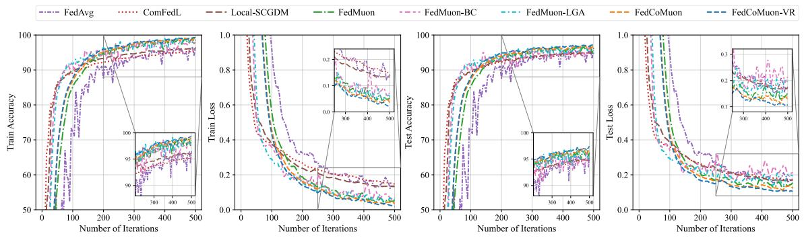  
Figure 1: Training and test performance on the imbalanced MNIST robust federated learning task.

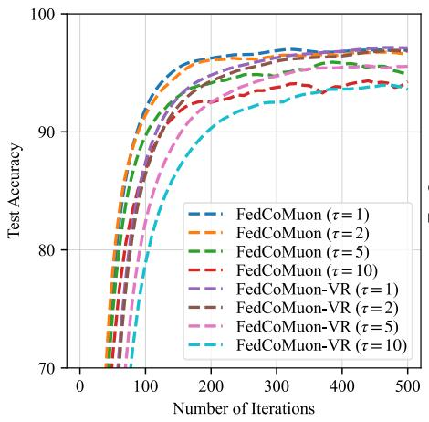

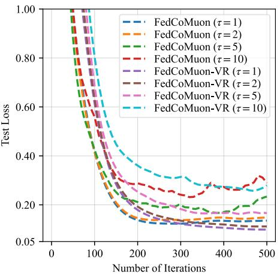  
Figure 2: Efect of the synchronization gap τ on our algorithm for the robust federated learning task.

## 6 Numerical Experiments

In the section, we evaluate FedCoMuon and FedCoMuon-VR on robust federated learning and task-distributed meta learning. In the experiment, we compare our methods with task-specific standard federated baselines: FedAvg [McMahan et al., 2017] for robust federated learning and FedMAML [Fallah et al., 2020] for task-distributed meta learning. We also consider three recent Muon-based federated methods. Since all three methods are named FedMuon in their original papers, we distinguish them as FedMuon [Zhang and Gao, 2025], FedMuon-LGA [Liu et al., 2025b], and FedMuon-BC [Takezawa et al., 2026]. In addition, we include the federated compositional methods ComFedL [Huang and Li, 2021] and Local-SCGDM [Gao et al., 2022]. For all methods, the learning rates and method-specific hyper-parameters are selected via grid search, and we report the best-performing configurations.

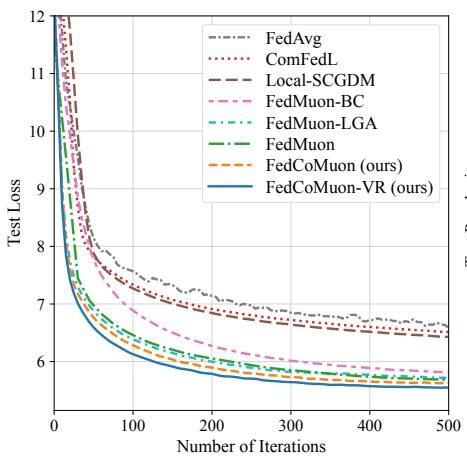

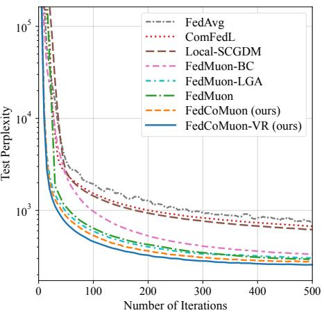  
Figure 3: Test loss and perplexity of each method on the WikiText-2 language-modeling task.

## 6.1 Robust Federated Learning

In this experiment, we evaluate FedCoMuon and FedCoMuon-VR on robust federated learning, which can be formulated as the following distributed compositional optimization problem:

$$
\operatorname* { m i n } _ { W \in \mathbb { R } ^ { m \times n } } \frac { 1 } { K } \sum _ { k = 1 } ^ { K } f \left( g ^ { k } ( W ) / \lambda \right) ,\tag{6}
$$

where $f ( \cdot ) \ = \ \exp ( \cdot )$ and $\lambda > 0$ is a regularization parameter. Other monotonically increasing functions may also be used as $f .$ We implement image classification on the MNIST [LeCun et al., 1998] dataset and language modeling on the WikiText-2 [Merity et al., 2016] dataset. Specifically, we train a 4-layer CNN on MNIST and a Transformer on WikiText-2.

## 6.1.1 Image Classification on MNIST

For image classification, we train a 4-layer CNN on MNIST in a federated system with 10 clients. To create an imbalanced partition, we assign 5000 training images to one client and 20 images to each of the remaining clients. For FedCoMuon and FedCoMuon-VR, the learning rate is set to 0.01. The total number of training iterations is set to 500, and the synchronization gap is set to $\tau = 5$ unless otherwise specified. Additional implementation details and complete hyperparameter settings are provided in the Appendix C.

As shown in Figure 1, FedCoMuon and FedCoMuon-VR outperform the baseline methods in terms of both training and test performance under the highly imbalanced data partition. Our methods outperform the federated compositional baselines, demonstrating the efectiveness of Muonbased updates for robust compositional optimization. In particular, FedCoMuon-VR exhibits more stable convergence and achieves the best overall performance, showing the benefit of the variancereduction mechanism. Figure 2 further shows that our methods perform consistently under diferent synchronization gaps, with $\tau = 1$ yielding the best performance.

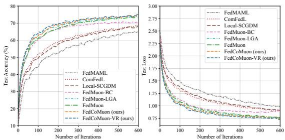  
(a) $\chi = 0 . 3$

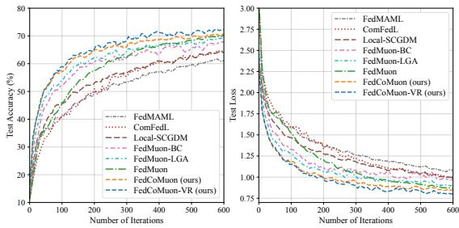

(b) $\chi = 0 . 5$  
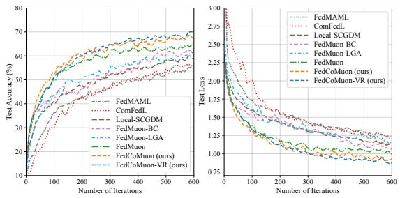  
(c) $\chi = 0 . 7$  
Figure 4: Test accuracy and loss of each method on the task-distributed CNN meta-learning task with heterogeneous CIFAR-10 data for $\chi \in \{ 0 . 3 , 0 . 5 , 0 . 7 \}$

## 6.1.2 Language Modeling on WikiText-2

For language modeling, we conduct experiments on WikiText-2 with an 8-layer Transformer language model. The Transformer has a hidden dimension of 768, 8 attention heads, a feed-forward dimension of 1024, sinusoidal positional encodings, and a sequence length of 128. We split the training data across 10 clients in an imbalanced manner, where one client holds about 50% of the training blocks and the remaining clients equally share the rest. For FedCoMuon and FedCoMuon-VR, the learning rates are set to 0.02 and 0.03, respectively. The total number of training iterations is set to 500. We report test loss and perplexity (PPL) as the evaluation metrics. Additional implementation details and complete hyper-parameter settings are provided in Appendix C.

As shown in Figure 3, both FedCoMuon and FedCoMuon-VR converge faster and achieve lower test loss and perplexity than the baseline methods. These results demonstrate the efectiveness of the proposed Muon-based compositional updates for Transformer language models with many matrix-valued parameters. In particular, FedCoMuon-VR achieves the best overall performance.

## 6.2 Task-Distributed Meta Learning Problem

In this experiment, we conduct task-distributed meta learning experiments on the CIFAR-10 [Krizhevsky, 2009] dataset. We first consider a 7-layer CNN as a standard setting for comparing federated compositional optimization methods under diferent levels of data heterogeneity. We further extend the evaluation to ViT-Tiny [Touvron et al., 2021], a matrix-wise vision model based on the Transformer architecture and containing many matrix-valued parameter blocks. Specifically, we optimize the

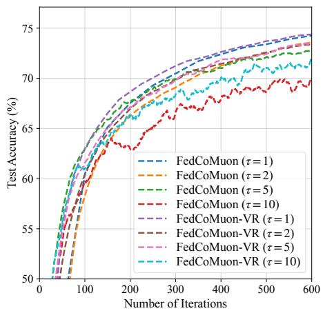

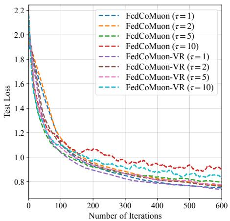  
Figure 5: Efect of the synchronization gap τ on task-distributed CNN meta learning with heterogeneous CIFAR-10 data.

following risk-sensitive compositional MAML objective:

$$
\operatorname* { m i n } _ { W \in \mathbb { R } ^ { m \times n } } \frac { 1 } { K } \sum _ { k = 1 } ^ { K } \exp \left( \ell ^ { k } \left( W - \eta \nabla \ell ^ { k } ( W ) \right) / \lambda \right) ,\tag{7}
$$

where $\ell ^ { k }$ denotes the loss function on client $k , \eta > 0$ is the inner-loop learning rate, and $\lambda > 0$ is a regularization parameter controlling the degree of risk sensitivity.

## 6.2.1 CNN-Based Meta Learning

For CNN-based meta learning, we conduct experiments on CIFAR-10 using a 7-layer CNN in a federated system with 10 clients and one central server. Each client is assigned a distinct dominant class, where a χ fraction of its local samples belongs to the dominant class and a $( 1 - \chi ) / 9$ fraction belongs to each of the remaining classes. We evaluate $\chi \in \{ 0 . 3 , 0 . 5 , 0 . 7 \}$ . For FedCoMuon and FedCoMuon-VR, the inner- and outer-loop learning rates are set to 0.03 and 0.1 respectively. The regularization parameter is set to $\lambda \ : = \ : 0 . 5$ , the synchronization gap is set to $\tau \ = \ 5 .$ , and the total number of training iterations is set to 600. Additional implementation details and complete hyperparameter settings are provided in the Appendix C.

As shown in Figure 4, FedCoMuon and FedCoMuon-VR achieve better overall performance than the baseline methods under diferent levels of data heterogeneity. As $\chi$ increases, the optimization problem becomes more challenging, while the relative advantage of our methods over the baseline methods becomes more pronounced. Figure 5 further shows the sensitivity of our methods to diferent synchronization gaps, with $\tau = 1$ yielding the best performance.

## 6.2.2 ViT-Tiny-Based Meta Learning

For task-distributed meta learning with ViT-Tiny, we conduct experiments on CIFAR-10 using a ViT-Tiny model with 12 Transformer blocks, a hidden dimension of 192, three attention heads, and a patch size of 4. We adopt the same federated setting and dominant-class data partition as in the CNN experiments and set $\chi = 0 . 3$ . For both FedCoMuon and FedCoMuon-VR, the innerand outer-loop learning rates are set to 0.005 and 0.01 respectively. The total number of training iterations is set to 1500. Additional implementation details and complete hyperparameter settings are provided in the Appendix C.

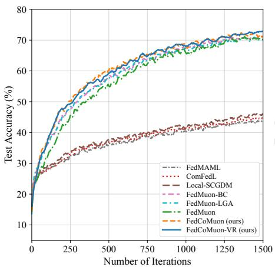

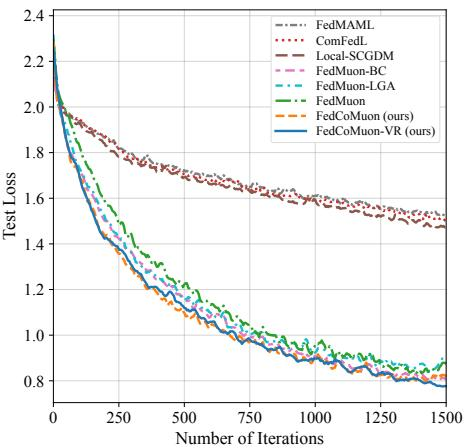  
Figure 6: Test accuracy and loss of each method on the task-distributed ViT-Tiny meta learning task with heterogeneous CIFAR-10 for $\chi = 0 . 3$

As shown in Figure 6, FedCoMuon and FedCoMuon-VR achieve substantially higher test accuracy and lower test loss than FedMAML and the federated compositional baselines. They also remain competitive with the three FedMuon baselines throughout training. These results demonstrate the efectiveness of our compositional Muon methods for task-distributed meta learning with the Transformer-based ViT-Tiny model.

## 7 Conclusion

In this paper, we studied the matrix-wise composition optimization, and proposed a class of efective federated compositional Muon algorithms (i.e., FedCoMuon and FedCoMuon-VR), which build on compositional gradient tracking and orthogonalized momentum. In theory, we established convergence guarantees under non-i.i.d. and non-convex settings. In particular, our FedCoMuon-VR algorithm achieves a lower sample complexity of $O ( \epsilon ^ { - 3 } )$ for finding an ϵ-stationary solution than the existing FedMuon algorithms. Extensive experiments on robust federated learning and the task-distributed meta learning problem demonstrate the efectiveness of our proposed algorithms.

## References

Da Chang, Yongxiang Liu, and Ganzhao Yuan. On the convergence of muon and beyond. arXiv preprint arXiv:2509.15816, 2025.

Tianyi Chen, Yuejiao Sun, and Wotao Yin. Solving stochastic compositional optimization is nearly as easy as solving stochastic optimization. IEEE Transactions on Signal Processing, 69:4937–4948, 2021.

Ziheng Cheng, Xinmeng Huang, Pengfei Wu, and Kun Yuan. Momentum benefits non-IID federated learning simply and provably. In International Conference on Learning Representations (ICLR), 2024.

Ashok Cutkosky and Francesco Orabona. Momentum-based variance reduction in non-convex SGD. In Advances in Neural Information Processing Systems (NeurIPS), 2019.

Alireza Fallah, Aryan Mokhtari, and Asuman Ozdaglar. Personalized federated learning: A meta-learning approach. arXiv preprint arXiv:2002.07948, 2020.

Hongchang Gao. A doubly recursive stochastic compositional gradient descent method for federated multilevel compositional optimization. In Proceedings of the 41st International Conference on Machine Learning, pages 14540–14610, 2024.

Hongchang Gao, Junchi Li, and Heng Huang. On the convergence of local stochastic compositional gradient descent with momentum. In International Conference on Machine Learning (ICML), 2022.

Saeed Ghadimi, Andrzej Ruszczynski, and Mengdi Wang. A single timescale stochastic approximation method for nested stochastic optimization. SIAM Journal on Optimization, 30(1):960–979, 2020.

Feihu Huang and Jian Li. Compositional federated learning: Applications in distributionally robust aver aging and meta learning. arXiv preprint arXiv:2106.11264, 2021.

Feihu Huang, Yuning Luo, and Songcan Chen. LiMuon: Light and fast muon optimizer for large models. arXiv preprint arXiv:2509.14562, 2025.

Feihu Huang, Xinrui Wang, Siqi Zhang, and Soncan Chen. Faster adaptive momentum-based federated methods for distributed composition optimization. Machine Learning, 115(5):106, 2026.

Wei Jiang, Bokun Wang, Yibo Wang, Lijun Zhang, and Tianbao Yang. Optimal algorithms for stochastic multi-level compositional optimization. In International Conference on Machine Learning, pages 10195– 10216. PMLR, 2022.

Hao Jin, Yang Peng, Wenhao Yang, Shusen Wang, and Zhihua Zhang. Federated reinforcement learning with environment heterogeneity. In International Conference on Artificial Intelligence and Statistics (AISTATS), volume 151, pages 18–37. PMLR, 2022.

Keller Jordan, Yuchen Jin, Vlad Boza, Jiacheng You, Franz Cesista, Laker Newhouse, and Jeremy Bernstein. Muon: An optimizer for hidden layers in neural networks. https://kellerjordan.github.io/posts/ muon/, 2024.

Peter Kairouz, H. Brendan McMahan, Brendan Avent, Aurélien Bellet, Mehdi Bennis, Arjun Nitin Bhagoji, Keith Bonawitz, Zachary Charles, Graham Cormode, Rachel Cummings, et al. Advances and open problems in federated learning. arXiv preprint arXiv:1912.04977, 2019.

Sai Praneeth Karimireddy, Satyen Kale, Mehryar Mohri, Sashank Reddi, Sebastian Stich, and Ananda Theertha Suresh. SCAFFOLD: Stochastic controlled averaging for federated learning. In Inter national Conference on Machine Learning (ICML), pages 5132–5143. PMLR, 2020.

Prashant Khanduri, Pranay Sharma, Haibo Yang, Mingyi Hong, Jia Liu, Ketan Rajawat, and Pramod K. Varshney. STEM: A stochastic two-sided momentum algorithm achieving near-optimal sample and communication complexities for federated learning. In Advances in Neural Information Processing Systems (NeurIPS), volume 34, pages 6050–6061, 2021.

Prashant Khanduri, Chengyin Li, Rafi Ibn Sultan, Aditi Sarker, Yao Qiang, Joerg Kliewer, and Dongxiao Zhu. On federated compositional optimization: Algorithms, analysis, and guarantees. Transactions on Machine Learning Research, 2026. ISSN 2835-8856. URL https://openreview.net/forum?id= 4uRlbSNevR.

Gyu Yeol Kim and Min-hwan Oh. Convergence of muon with newton-schulz. arXiv preprint arXiv:2601.19156, 2026.

Dmitry Kovalev. Understanding gradient orthogonalization for deep learning via non-euclidean trust-region optimization. arXiv preprint arXiv:2503.12645, 2025.

Alex Krizhevsky. Learning multiple layers of features from tiny images. Technical report, University of Toronto, 2009.

Yann LeCun, Léon Bottou, Yoshua Bengio, and Patrick Hafner. Gradient-based learning applied to document recognition. Proceedings of the IEEE, 86(11):2278–2324, 1998.

Yann LeCun, Yoshua Bengio, and Geofrey Hinton. Deep learning. nature, 521(7553):436–444, 2015.

Jiaxiang Li and Mingyi Hong. A note on the convergence of muon and further. arXiv preprint arXiv:2502.02900, 2025.

Qinbin Li, Zeyi Wen, Zhaomin Wu, Sixu Hu, Naibo Wang, Yuan Li, Xu Liu, and Bingsheng He. A survey on federated learning systems: Vision, hype and reality for data privacy and protection. IEEE Transactions on Knowledge and Data Engineering, 35(4):3347–3366, 2021.

Tian Li, Anit Kumar Sahu, Manzil Zaheer, Maziar Sanjabi, Ameet Talwalkar, and Virginia Smith. Federated optimization in heterogeneous networks. Proceedings of Machine learning and systems, 2:429–450, 2020.

Jingyuan Liu, Jianlin Su, Xingcheng Yao, Zhejun Jiang, Guokun Lai, Yulun Du, Yidao Qin, Weixin Xu, Enzhe Lu, Junjie Yan, et al. Muon is scalable for LLM training. arXiv preprint arXiv:2502.16982, 2025a.

Junkang Liu, Fanhua Shang, Junchao Zhou, Hongying Liu, Yuanyuan Liu, and Jin Liu. FedMuon: Accelerating federated learning with matrix orthogonalization. arXiv preprint arXiv:2510.27403, 2025b.

Brendan McMahan, Eider Moore, Daniel Ramage, Seth Hampson, and Blaise Aguera y Arcas. Communication-eficient learning of deep networks from decentralized data. In Artificial Intelligence and Statistics (AISTATS), pages 1273–1282. PMLR, 2017.

Stephen Merity, Caiming Xiong, James Bradbury, and Richard Socher. Pointer sentinel mixture models. arXiv preprint arXiv:1609.07843, 2016.

Thomas Pethick, Wanyun Xie, Kimon Antonakopoulos, Zhenyu Zhu, Antonio Silveti-Falls, and Volkan Cevher. Training deep learning models with norm-constrained LMOs. In International Conference on Machine Learning (ICML), 2025.

Xun Qian, Hussein Rammal, Dmitry Kovalev, and Peter Richtarik. Muon is provably faster with momentum variance reduction. arXiv preprint arXiv:2512.16598, 2025.

Xun Qian, Alexander Gaponov, Grigory Malinovsky, and Peter Richtárik. Communication-eficient gluon in federated learning. arXiv preprint arXiv:2604.10689, 2026.

Sashank J. Reddi, Zachary Charles, Manzil Zaheer, Zachary Garrett, Keith Rush, Jakub Konečný, Sanjiv Kumar, and H. Brendan McMahan. Adaptive federated optimization. arXiv preprint arXiv:2003.00295, 2020.

Artem Riabinin, Egor Shulgin, Kaja Gruntkowska, and Peter Richtárik. Gluon: Making muon & scion great again!(bridging theory and practice of lmo-based optimizers for llms). arXiv preprint arXiv:2505.13416, 2025.

Maria-Eleni Sfyraki and Jun-Kun Wang. Lions and muons: Optimization via stochastic frank-wolfe. arXiv preprint arXiv:2506.04192, 2025.

Wei Shen, Ruichuan Huang, Minhui Huang, Cong Shen, and Jiawei Zhang. On the convergence analysis of muon. arXiv preprint arXiv:2505.23737, 2025.

Yuki Takezawa, Anastasia Koloskova, Xiaowen Jiang, and Sebastian U. Stich. FedMuon: Federated learning with bias-corrected LMO-based optimization. In International Conference on Learning Representations (ICLR), 2026.

Davoud Ataee Tarzanagh, Mingchen Li, Christos Thrampoulidis, and Samet Oymak. FedNest: Federated bilevel, minimax, and compositional optimization. In International Conference on Machine Learning (ICML), 2022.

Hugo Touvron, Matthieu Cord, Matthijs Douze, Francisco Massa, Alexandre Sablayrolles, and Hervé Jégou. Training data-eficient image transformers & distillation through attention. In Proceedings of the 38th International Conference on Machine Learning, volume 139, pages 10347–10357. PMLR, 2021.

Ashish Vaswani, Noam Shazeer, Niki Parmar, Jakob Uszkoreit, Llion Jones, Aidan N Gomez, Łukasz Kaiser, and Illia Polosukhin. Attention is all you need. Advances in neural information processing systems, 30, 2017.

Bingcong Wang, Zezhou Yuan, Yiming Ying, and Tianbao Yang. Memory-based optimization methods for model-agnostic meta-learning and personalized federated learning. Journal of Machine Learning Research, 24(145):1–46, 2023.

Mengdi Wang, Ethan X Fang, and Han Liu. Stochastic compositional gradient descent: algorithms for minimizing compositions of expected-value functions. Mathematical Programming, 161(1):419–449, 2017.

Wenjing Yan, Kai Zhang, Xiaolu Wang, and Xuanyu Cao. Problem-parameter-free federated learning. In International Conference on Learning Representations (ICLR), 2025.

Tianbao Yang. Compositional optimization for advanced machine learning, 2026. URL https://opt4ml. org/. Book preprint.

Junyu Zhang and Lin Xiao. MultiLevel composite stochastic optimization via nested variance reduction. SIAM Journal on Optimization, 31(2):1131–1157, 2021.

Xinwen Zhang and Hongchang Gao. On provable benefits of muon in federated learning. arXiv preprint arXiv:2510.03866, 2025.

## A Convergence Analysis of our FedCoMuon Algorithm

In this section, we provide the detailed convergence analysis of FedCoMuon under the assumptions stated in the main paper. We first introduce the following notation: $\begin{array} { r } { \bar { W } _ { t } = \frac { 1 } { K } \sum _ { k = 1 } ^ { K } W _ { t } ^ { k } } \end{array}$ and $\begin{array} { r } { \bar { M } _ { t } = \mathbf { \bar { \Psi } } _ { K } ^ { 1 } \sum _ { k = 1 } ^ { K } M _ { t } ^ { k } } \end{array}$ Moreover, $\begin{array} { r } { F ( W ) = \frac { 1 } { K } \sum _ { k = 1 } ^ { K } f ^ { k } ( g ^ { k } ( W ) ) } \end{array}$ , and

$$
\nabla F ( W ) = \frac { 1 } { K } \sum _ { k = 1 } ^ { K } \nabla g ^ { k } ( W ) \big ( \nabla _ { y } f ^ { k } ( g ^ { k } ( W ) ) \otimes I _ { n } \big ) .
$$

We next establish several auxiliary lemmas used in the convergence analysis.

Lemma 1. Given Assumptions 3, 2, and 4, for each client $k \in [ K ]$ , the local compositional objective $F ^ { k } ( W ) = f ^ { k } ( g ^ { k } ( W ) )$ is LF-smooth, i.e., for any $W _ { 1 } , W _ { 2 } \in \mathbb { R } ^ { m \times n }$

$$
\| \nabla F ^ { k } ( W _ { 1 } ) - \nabla F ^ { k } ( W _ { 2 } ) \| _ { F } \leq L _ { F } \| W _ { 1 } - W _ { 2 } \| _ { F } ,\tag{8}
$$

where $L _ { F } = C _ { f } L _ { g } + C _ { g } ^ { 2 } L _ { f }$ . Consequently, $\begin{array} { r } { F ( W ) = K ^ { - 1 } \sum _ { k = 1 } ^ { K } F ^ { k } ( W ) } \end{array}$ is also $L _ { F } { - } s m o o t h$

Proof. Jensen’s inequality and Assumptions 2 and 3 imply $\| \nabla g ^ { k } ( W ) \| _ { F } ~ \le ~ C _ { g }$ and $\| \nabla _ { y } f ^ { k } ( y ) \| \le C _ { f }$ Consequently, $g ^ { k }$ is $C _ { g ^ { - 1 } }$ ipschitz, i.e., $\| g ^ { k } ( W _ { 1 } ) - g ^ { k } ( W _ { 2 } ) \| \leq C _ { g } \| W _ { 1 } - \dot { W _ { 2 } } \| _ { F }$ . For any $W _ { 1 } , W _ { 2 } \in \mathbb { R } ^ { m \times n }$ , we have

$$
\begin{array} { r l } & { | | \nabla F ^ { k } ( W _ { 1 } ) - \nabla F ^ { k } ( W _ { 2 } ) | | F } \\ & { = | | \nabla \mathcal { G } ^ { k } ( W _ { 1 } ) ( \nabla _ { \mathbf { V } } \mathbf { \tilde { J } } ^ { k } ( \theta ^ { k } ( W _ { 1 } ) ) \mathcal { G } I _ { n } ) - \nabla g ^ { k } ( W _ { 2 } ) ( \nabla _ { \mathbf { V } } \mathbf { \tilde { J } } ^ { k } ( \theta ^ { k } ( W _ { 2 } ) ) \mathcal { G } I _ { n } ) | F } \\ & { = | | \nabla \mathcal { G } ^ { k } ( W _ { 1 } ) ( \nabla _ { \mathbf { V } } \mathbf { \tilde { J } } ^ { k } ( \theta ^ { k } ( W _ { 1 } ) ) \mathcal { G } I _ { n } ) - \nabla g ^ { k } ( W _ { 1 } ) ( \nabla _ { \mathbf { V } } \mathbf { \tilde { J } } ^ { k } ( \theta ^ { k } ( W _ { 2 } ) ) \mathcal { G } I _ { n } ) | F } \\ & { \quad + \nabla g ^ { k } ( W _ { 1 } ) ( \nabla _ { \mathbf { V } } \mathbf { \tilde { J } } ^ { k } ( \theta ^ { k } ( W _ { 2 } ) ) \mathcal { G } I _ { n } ) - \nabla g ^ { k } ( W _ { 2 } ) ( \nabla _ { \mathbf { V } } \mathbf { \tilde { J } } ^ { k } ( \theta ^ { k } ( W _ { 2 } ) ) \mathcal { G } I _ { n } ) } \\ & { \leq | | \nabla g ^ { k } ( W _ { 1 } ) ( ( \nabla _ { \mathbf { V } } \mathbf { \tilde { J } } ^ { k } ( \theta ^ { k } ( W _ { 1 } ) ) - \nabla _ { \mathbf { V } } \mathbf { J } ^ { k } ( \theta ^ { k } ( W _ { 2 } ) ) ) \mathcal { G } I _ { n } ) | F | } \\ &  \quad + | | ( \nabla \mathcal { G } ^ { k } ( W _ { 1 } ) - \nabla g ^ { k } ( W _ { 2 } ) ) ( \nabla _ { \mathbf { V } } \mathbf { \tilde { J } } ^  k \end{array}\tag{9}
$$

Moreover,

$$
\begin{array} { l } { \displaystyle \| \nabla F ( W _ { 1 } ) - \nabla F ( W _ { 2 } ) \| _ { F } = \| \frac { 1 } { K } \sum _ { k = 1 } ^ { K } \left( \nabla F ^ { k } ( W _ { 1 } ) - \nabla F ^ { k } ( W _ { 2 } ) \right) \| _ { F } } \\ { \displaystyle \le \frac { 1 } { K } \sum _ { k = 1 } ^ { K } \| \nabla F ^ { k } ( W _ { 1 } ) - \nabla F ^ { k } ( W _ { 2 } ) \| _ { F } } \\ { \displaystyle \le L _ { F } \| W _ { 1 } - W _ { 2 } \| _ { F } , } \end{array}\tag{10}
$$

where we used Assumptions 3 and $^ { 4 , }$ the triangle inequality, and the submultiplicativity of matrix norms. Lemma 2. Let $M \in \mathbb { R } ^ { m \times n }$ have compact singular value decomposition $M = U \Sigma V ^ { \top }$ . Then

$$
\| U V ^ { \top } \| _ { F } \leq \sqrt { n } , \qquad \langle M , U V ^ { \top } \rangle = \| M \| _ { * } .\tag{11}
$$

Moreover, for any A, $B \in \mathbb { R } ^ { m \times n }$ , if $B = U _ { B } \Sigma _ { B } V _ { B } ^ { \top }$ is a compact singular value decomposition, then

$$
\langle A , U _ { B } V _ { B } ^ { \top } \rangle \geq \| A \| _ { F } - 2 { \sqrt { n } } \| A - B \| _ { F } .\tag{12}
$$

Proof. Let $r = { \mathrm { r a n k } } ( M )$ . Then

$$
\| U V ^ { \top } \| _ { F } ^ { 2 } = \mathrm { t r } \Big ( ( U V ^ { \top } ) ^ { \top } U V ^ { \top } \Big ) = \mathrm { t r } \Big ( V U ^ { \top } U V ^ { \top } \Big ) = \mathrm { t r } \Big ( V V ^ { \top } \Big ) = \mathrm { t r } \Big ( V ^ { \top } V \Big ) = r \leq n ,\tag{13}
$$

and

$$
\begin{array} { r l } & { \langle M , U V ^ { \top } \rangle = \mathrm { t r } \Big ( M ^ { \top } U V ^ { \top } \Big ) } \\ & { \qquad = \mathrm { t r } \Big ( ( U \Sigma V ^ { \top } ) ^ { \top } U V ^ { \top } \Big ) } \\ & { \qquad = \mathrm { t r } \Big ( V \Sigma U ^ { \top } U V ^ { \top } \Big ) = \mathrm { t r } \Big ( V \Sigma V ^ { \top } \Big ) } \\ & { \qquad = \mathrm { t r } \Big ( \Sigma V ^ { \top } V \Big ) = \mathrm { t r } ( \Sigma ) = \| M \| _ { * } . } \end{array}\tag{14}
$$

For any $A , B \in \mathbb { R } ^ { m \times n }$ ，

$$
\begin{array} { r l } & { \langle A , U _ { B } V _ { B } ^ { \top } \rangle = \langle B , U _ { B } V _ { B } ^ { \top } \rangle + \langle A - B , U _ { B } V _ { B } ^ { \top } \rangle } \\ & { \qquad \geq \| B \| _ { * } - \| A - B \| _ { F } \| U _ { B } V _ { B } ^ { \top } \| _ { F } } \\ & { \qquad \geq \| B \| _ { F } - \sqrt { n } \| A - B \| _ { F } } \\ & { \qquad \geq \| A \| _ { F } - \| A - B \| _ { F } - \sqrt { n } \| A - B \| _ { F } } \\ & { \qquad = \| A \| _ { F } - ( 1 + \sqrt { n } ) \| A - B \| _ { F } } \\ & { \qquad \geq \| A \| _ { F } - 2 \sqrt { n } \| A - B \| _ { F } , } \end{array}\tag{15}
$$

where we used the compact SVD, the Cauchy–Schwarz inequality, and the standard nuclear–Frobenius norm relations. □

Lemma 3. Let $\{ W _ { t } ^ { k } , u _ { t } ^ { k } , M _ { t } ^ { k } \}$ be generated by Algorithm 1. Given Assumptions 2 and 3, for any $T , \tau > 0$ and $0 < \alpha < 1$ satisfying $\alpha \tau \leq 1$ , we have

$$
\frac { 1 } { T } \sum _ { t = 0 } ^ { T - 1 } \frac { 1 } { K } \sum _ { k = 1 } ^ { K } \mathbb { E } \| u _ { t } ^ { k } - g ^ { k } ( W _ { t } ^ { k } ) \| ^ { 2 } \leq \frac { 4 } { \alpha T } \frac { 1 } { K } \sum _ { k = 1 } ^ { K } \mathbb { E } \| u _ { 0 } ^ { k } - g ^ { k } ( W _ { 0 } ^ { k } ) \| ^ { 2 } + \frac { 8 6 C _ { g } ^ { 2 } n } { \alpha ^ { 2 } } \eta ^ { 2 } + 8 6 \alpha \sigma _ { g } ^ { 2 } .\tag{16}
$$

Proof. Within each communication block, the update rule, Assumptions 2 and 3, Lemma $^ { 2 , }$ and Young’s inequality give

$$
\begin{array} { r l } & { \mathbb { E } \| u _ { t + 1 } ^ { k } - g ^ { k } ( W _ { t + 1 } ^ { k } ) \| ^ { 2 } } \\ & { = \mathbb { E } \| \big ( 1 - \alpha \Big ) \left( u _ { t } ^ { k } - g ^ { k } ( W _ { t } ^ { k } ) \right) + \big ( 1 - \alpha \big ) \left( g ^ { k } ( W _ { t } ^ { k } ) - g ^ { k } ( W _ { t + 1 } ^ { k } ) \right) + \alpha \left( g ^ { k } ( W _ { t + 1 } ^ { k } ; \xi _ { t + 1 } ^ { k } ) - g ^ { k } ( W _ { t + 1 } ^ { k } ) \right) \| ^ { 2 } } \\ & { \le ( 1 - \alpha ) \mathbb { E } \| u _ { t } ^ { k } - g ^ { k } ( W _ { t } ^ { k } ) \| ^ { 2 } + \frac { 1 } { \alpha } \mathbb { E } \| g ^ { k } ( W _ { t } ^ { k } ) - g ^ { k } ( W _ { t + 1 } ^ { k } ) \| ^ { 2 } + \alpha ^ { 2 } \sigma _ { g } ^ { 2 } } \\ & { \le ( 1 - \alpha ) \mathbb { E } \| u _ { t } ^ { k } - g ^ { k } ( W _ { t } ^ { k } ) \| ^ { 2 } + \frac { C _ { g } ^ { 2 } } { \alpha } \mathbb { E } \| W _ { t + 1 } ^ { k } - W _ { t } ^ { k } \| _ { F } ^ { 2 } + \alpha ^ { 2 } \sigma _ { g } ^ { 2 } } \\ & { = ( 1 - \alpha ) \mathbb { E } \| u _ { t } ^ { k } - g ^ { k } ( W _ { t } ^ { k } ) \| ^ { 2 } + \frac { C _ { g } ^ { 2 } \eta ^ { 2 } } { \alpha } \mathbb { E } \| U _ { t } ^ { k } ( V _ { t } ^ { k } ) ^ { \top } \| _ { F } ^ { 2 } + \alpha ^ { 2 } \sigma _ { g } ^ { 2 } } \\ &  \le ( 1 - \alpha ) \mathbb { E } \| u _ { t } ^ { k } - g ^ { k } ( W _ { t } ^ { k } ) \| ^ { 2 } + \frac  C _ { g } ^  \end{array}\tag{17}
$$

Let $s = q \tau$ be the beginning of a block. Iterating (17) within the block gives

$$
\begin{array} { r l } & { \displaystyle \sum _ { l = - 1 } ^ { N } \frac { N } { K } \sum _ { i = 0 } ^ { N } \mathbb { E } \| u _ { \xi \xi \xi } ^ { \lambda } - g ^ { k } ( W _ { \xi } ^ { k } ) \| ^ { 2 } } \\ & { \displaystyle \sum _ { l = - 1 } ^ { N } \mathbb { E } \left( 1 - \alpha ) ^ { 2 } \frac { 1 } { K } \sum _ { i = 0 } ^ { N } \mathbb { E } \| u _ { \xi \xi } ^ { k } - \alpha ^ { k } ( W _ { \xi } ^ { k } ) \| ^ { 2 } + \sum _ { l = 0 } ^ { N - 1 } ( 1 - \alpha ) ^ { k } \left( \frac { C _ { 2 } ^ { 2 } \pi } { \alpha } n ^ { 2 } + \alpha ^ { 2 } \sigma _ { \xi } ^ { 2 } \right) \right] } \\ & { \displaystyle \leq C _ { - \alpha } ^ { - 1 } \left[ ( 1 - \alpha ) ^ { 2 } \frac { 1 } { K } \sum _ { i = 0 } ^ { N } \mathbb { E } \| u _ { \xi \xi } ^ { k } - g ^ { k } ( W _ { \xi } ^ { k } ) \| ^ { 2 } + \alpha ^ { 2 } \left( \frac { C _ { 2 } ^ { 2 } \pi } { \alpha } n ^ { 2 } + \alpha ^ { 2 } \sigma _ { \xi } ^ { 2 } \right) \right] } \\ & { \displaystyle \leq ( 1 - \alpha ) ^ { \alpha } \mathbb { E } \| u _ { \xi \xi } ^ { k } - g ^ { k } ( W _ { \xi } ^ { k } ) \| ^ { 2 } + \alpha ^ { 2 } \left( \frac { C _ { 2 } ^ { 2 } \pi } { \alpha } n ^ { 2 } + \alpha ^ { 2 } \sigma _ { \xi } ^ { 2 } \right) , } \\ & { \displaystyle \frac { 1 } { K } \sum _ { i = 1 } ^ { N } \mathbb { E } \| u _ { \xi \xi } ^ { k } - g ^ { k } ( W _ { \xi } ^ { k } ) \| ^ { 2 } } \\ &  \displaystyle \leq ( 1 - \alpha ) ^ { \alpha } \frac { 1 } { K } \sum _ { i = 0 } ^ { N } \mathbb { E } \| u _ { \xi } ^ { k } - \end{array}\tag{18}
$$

(19)

At the block end, the server replaces $W _ { s + } ^ { k }$ τ with $\bar { W } _ { s + }$ τ while leaving $u _ { s + \tau } ^ { k }$ unchanged. Young’s inequality with parameter ατ $\cdot / 2$ gives

$$
\begin{array} { r l } & { \frac { 1 } { K } \frac { L } { \rho \omega _ { 1 } } \lVert \omega _ { 1 , 1 } ^ { \varDelta } - \omega ^ { \varDelta } [ W _ { t + \varepsilon } ] ] ^ { \theta } } \\ & { \leq ( \mathbf { i } - \frac { \alpha \alpha } { 2 } )  \frac { 1 } { K } \sum _ { i = 1 } ^ { K } \mathbf { k } \rVert _ { s - i - \rho } ^ { \varDelta } - \omega ^ { \varDelta } [ W _ { t - \varepsilon } ^ { \varDelta } ]  ^ { \theta } + ( ( 1 + \frac { 2 } { \alpha \varepsilon } ) ) \frac { \ L } { K } \sum _ { i = 1 } ^ { K } \lVert \partial _ { t } ^ { \varDelta } ( W _ { t - \varepsilon } ^ { \varDelta } ) - \partial _ { t } ^ { \varDelta } ( W _ { t - \varepsilon } ) \rVert ^ { \theta } } \\ & { \leq ( \mathbf { i } - \frac { \alpha \alpha } { 2 } )  \mathbf { i } - \mathbf { i } - \mathbf { i }  \frac { K } { K } \sum _ { i = 1 } ^ { K } \lVert \omega _ { 1 , i - \rho } ^ { \varDelta } - \partial _ { t } ^ { \varDelta } [ W _ { t - \varepsilon } ^ { \varDelta } ]  ^ { \theta } + \frac { 3 } { 2 } ( \frac { \partial _ { t } ^ { \varDelta } } { \partial \alpha _ { 1 } } - 2 ( \alpha ^ { \varDelta } m _ { 2 } ^ { \varDelta } + \alpha ^ { \varDelta } m _ { 3 } ^ { \varDelta } )  } \\ &  \qquad  ( \mathbf { i } - \frac { \alpha } { 2 } ) ( \partial _ { t } ^ { \varDelta } ) ^ { \theta } K \sum _ { i = 1 } ^ { K } \frac { \partial _ { t - \varepsilon } } { K } \sum _ { i = 1 } ^ { K }  \partial _ { t } ^ { \varDelta } ( X _ { t - \varepsilon } ^ { \varDelta } ) ^ { \varDelta }   \leq \frac { 1 } { K } \frac { L } { K } \sum _ { i = 1 } ^ { K }  \partial _ { t } ^  \varDelta  \end{array}\tag{20}
$$

Let $Q = \lfloor T / \tau \rfloor$ and $R = T - Q \tau < \tau$ . Since $\begin{array} { r } { \sum _ { q = 0 } ^ { Q - 1 } \left( 1 - \frac { \alpha \tau } { 3 } \right) ^ { q } \leq \frac { 3 } { \alpha \tau } } \end{array}$ , combining (18), (20), and (17), we

have

$$
\begin{array} { r l } & { \frac { 1 } { 2 } \sum _ { j = 1 } ^ { 3 } \frac { 1 } { 2 } \sum _ { k = 0 } ^ { 6 } s _ { j } \left( s _ { j } \right) \mathrm { t r } _ { j } ^ { k } } \\ & { = \sum _ { j = 1 } ^ { 6 } \frac { 1 } { 2 } \left( s _ { j } \right) \mathrm { t r } _ { j } ^ { k } \sum _ { k = 0 } ^ { 6 } s _ { j } \left( s _ { j } \right) \mathrm { t r } _ { j } ^ { k } \left( s _ { j } \right) } \\ & { = \sum _ { j = 1 } ^ { 6 } \frac { 1 } { 2 } \sum _ { k = 0 } ^ { 6 } \frac { 1 } { 2 } \sum _ { k = 0 } ^ { 6 } s _ { j } \left( s _ { j } \right) \left( s _ { j } \right) \left( s _ { j } \right) \left( s _ { j } \right) \left( s _ { j } \right) \left( s _ { j } \right) \left( s _ { j } \right) \left( s _ { j } \right) \left( s _ { j } \right) \left( s _ { j } \right) } \\ & { \qquad + \frac { 1 } { 2 } \sum _ { j = 1 } ^ { 6 } s _ { j } \left( s _ { j } \right) \left( s _ { j } \right) \left( s _ { j } \right) \left( s _ { j } \right) \left( s _ { j } \right) \left( s _ { j } \right) \left( s _ { j } \right) } \\ & { \qquad - \frac { 1 } { 2 } \sum _ { k = 0 } ^ { 6 } s _ { j } \left( s _ { j } \right) \left( s _ { j } \right) \left( s _ { j } \right) \left( s _ { j } \right) \left( s _ { j } \right) \left( s _ { j } \right) \left( s _ { j } \right) \left( s _ { j } \right) } \\ & { \qquad - s _ { j } \left( s _ { j } \right) \left( s _ { j } \right) \left( s _ { j } \right) \left( s _ { j } \right) \left( s _ { j } \right) \left( s _ { j } \right) \left( s _ { j } \right) \left( s _ { j } \right) \left( s _ { j } \right) \left( s _ { j } \right) } \\ &  \qquad + \frac { 1 } { 2 } \sum _  j  \end{array}\tag{21}
$$

The second inequality follows by iterating (20), while the last inequality uses $Q \tau \leq T , R < \tau \leq 1 / \alpha$ , and $R \leq T$

Lemma 4. Let $\{ W _ { t } ^ { k } , u _ { t } ^ { k } , M _ { t } ^ { k } \}$ be generated by Algorithm 1. For each client $k \in [ K ]$ and iteration $t \geq 0$ define the stochastic compositional gradient estimator

$$
Z _ { t } ^ { k } = \nabla g ^ { k } ( W _ { t } ^ { k } ; \xi _ { t } ^ { k } ) \left( \nabla _ { y } f ^ { k } ( u _ { t } ^ { k } ; \zeta _ { t } ^ { k } ) \otimes I _ { n } \right) .\tag{22}
$$

Given Assumptions $4 , \ 3 ,$ and ${ \mathcal { Q } } ,$ for any $k \in [ K ]$ and $t \geq 0$ , we have

$$
\begin{array} { r } { \mathbb { E } \| Z _ { t } ^ { k } - \nabla F ^ { k } ( W _ { t } ^ { k } ) \| _ { F } \leq C _ { g } L _ { f } \sqrt { \mathbb { E } \| u _ { t } ^ { k } - g ^ { k } ( W _ { t } ^ { k } ) \| ^ { 2 } + C _ { g } \sigma _ { f } + C _ { f } \sigma _ { \nabla g } } . } \end{array}\tag{23}
$$

□

Proof. For any $k \in [ K ]$ , we have

$$
\begin{array} { r l } & { \mathbb { E } \| \tilde { Z } _ { k } ^ { k } - \nabla ^ { k } \mathcal { E } ^ { k } ( W _ { t } ^ { k } ) \| _ { F } } \\ & { = \mathbb { E } \| \nabla g ^ { k } ( W _ { t } ^ { k } ; \xi _ { t } ^ { k } ) \Big ( \nabla _ { \eta } f ^ { k } ( u _ { t } ^ { k } ; \xi _ { t } ^ { k } ) \otimes I _ { n } \Big ) - \nabla g ^ { k } ( W _ { t } ^ { k } ) \Big ( \nabla _ { \eta } f ^ { k } ( g ^ { k } ( W _ { t } ^ { k } ) ) \otimes I _ { n } \Big ) \| _ { F } } \\ & { \leq \mathbb { E } \| \nabla g ^ { k } ( W _ { t } ^ { k } ; \xi _ { t } ^ { k } ) \Big ( \Big ( \nabla _ { \eta } f ^ { k } ( u _ { t } ^ { k } ; \xi _ { t } ^ { k } ) - \nabla _ { \eta } f ^ { k } ( u _ { t } ^ { k } ) \Big ) \otimes I _ { n } \Big ) \| _ { F } } \\ & { \quad + \mathbb { E } \| \nabla g ^ { k } ( W _ { t } ^ { k } ; \xi _ { t } ^ { k } ) \Big ( \Big ( \nabla _ { \eta } f ^ { k } ( u _ { t } ^ { k } ) - \nabla _ { \eta } f ^ { k } ( g ^ { k } ( W _ { t } ^ { k } ) ) \Big ) \otimes I _ { n } \Big ) \| _ { F } } \\ & { \quad + \mathbb { E } \| \Big ( \nabla g ^ { k } ( W _ { t } ^ { k } ; \xi _ { t } ^ { k } ) \Big ) \Big ( \Big ( \nabla _ { \eta } f ^ { k } ( u _ { t } ^ { k } ) - \nabla _ { \eta } f ^ { k } ( g ^ { k } ( W _ { t } ^ { k } ) ) \Big ) \otimes I _ { n } \Big ) \| _ { F } } \\ &  \quad + \mathbb { E } \Big \| \Big ( \nabla g ^ { k } ( W _ { t } ^ { k } ; \xi _ { t } ^ { k } ) - \nabla g ^ { k } ( W _ { t } ^ { k } ) \Big ) \Big ( \nabla _ { \eta } f ^ { k } ( \theta ^  \end{array}\tag{24}
$$

where we used Assumptions $4 , 2 ,$ and $^ { 3 , }$ together with the Cauchy–Schwarz inequality.

Lemma 5. Let $\begin{array} { r } { \bar { W } _ { t } = K ^ { - 1 } \sum _ { k = 1 } ^ { K } W _ { t } ^ { k } } \end{array}$ and $\begin{array} { r } { \bar { M } _ { t } = K ^ { - 1 } \sum _ { k = 1 } ^ { K } M _ { t } ^ { k } } \end{array}$ , and let $s _ { t } = \tau \lfloor t / \tau \rfloor$ denote the beginning $o f$ the communication block containing iteration t. Then, for every $t \geq 0$

$$
\frac { 1 } { K } \sum _ { k = 1 } ^ { K } \| W _ { t } ^ { k } - \bar { W } _ { t } \| _ { F } \leq 2 \eta \tau \sqrt { n } .\tag{25}
$$

Moreover, under Assumptions $4 , \ 2 , \ 3 ,$ and $^ { 5 , }$ for any $T \geq 1$

$$
\begin{array} { r l } & { \frac { 1 } { T } \displaystyle \sum _ { t = 0 } ^ { T - 1 } \frac { 1 } { K } \sum _ { k = 1 } ^ { K } \mathbb { E } \| M _ { t } ^ { k } - \bar { M } _ { t } \| _ { F } } \\ & { \le \beta \tau \displaystyle \left[ 2 C _ { g } L _ { f } \left( \frac { 1 } { T } \displaystyle \sum _ { t = 0 } ^ { T - 1 } \frac { 1 } { K } \displaystyle \sum _ { k = 1 } ^ { K } \mathbb { E } \| u _ { t } ^ { k } - g ^ { k } ( W _ { t } ^ { k } ) \| ^ { 2 } \right) ^ { 1 / 2 } + 2 C _ { g } \sigma _ { f } + 2 C _ { f } \sigma _ { \nabla g } + 4 \eta \tau \sqrt { n } L _ { F } + \delta \right] . } \end{array}\tag{26}
$$

Proof. For any $t \geq 0$ , since the last synchronization occurs at $s _ { t } = \tau \lfloor t / \tau \rfloor$ , we have $W _ { s _ { t } } ^ { k } = \bar { W } _ { s }$ t and

$$
\begin{array} { r l } { \displaystyle \prod _ { k = 1 } ^ { 1 } \| W _ { t } ^ { k } - \bar { W } _ { t } \| r = \displaystyle \frac 1 { K } \displaystyle \sum _ { i = s _ { t } } ^ { K } \| \bar { W } _ { s _ { t } - \tau } \| _ { \tau = s _ { t } } ^ { k - 1 } \displaystyle \sum _ { i = s _ { t } } ^ { K } { U _ { i } ^ { j } ( V _ { i } ^ { j } ) ^ { \top } - W _ { s _ { t } } ^ { k } + \eta _ { i = s _ { t } } ^ { t - 1 } U _ { i } ^ { k } ( V _ { i } ^ { k } ) ^ { \top } } \| _ { \boldsymbol { s } } } & { } \\ { \displaystyle } & { \leq \eta \displaystyle \frac 1 { K } \displaystyle \sum _ { k = 1 } ^ { K } \| \sum _ { i = s _ { t } } ^ { t - 1 } V _ { i } ^ { k } ( V _ { i } ^ { k } ) ^ { \top } - \sum _ { i = s _ { t } } ^ { t - 1 } \frac 1 { K } \displaystyle \sum _ { j = 1 } ^ { K } U _ { i } ^ { j } ( V _ { i } ^ { j } ) ^ { \top } \| _ { \boldsymbol { I } } } \\ & { \leq \eta \displaystyle \frac 1 { K } \displaystyle \sum _ { k = 1 } ^ { K } \| \sum _ { i = s _ { t } } ^ { K } { U _ { i } ^ { k } ( V _ { i } ^ { k } ) ^ { \top } } \| _ { \boldsymbol { I } } _ { \boldsymbol { I } } _ { \boldsymbol { I } } _ { \boldsymbol { I } } _ { \boldsymbol { I } } _ { \boldsymbol { I } } _ { \boldsymbol { I } } _ { \boldsymbol { I } } _ { \boldsymbol { I } } _ { I } ^ { k } + \eta \displaystyle \frac 1 { K } \sum _ { i = s _ { t } } ^ { K - 1 } \frac 1 { K } \displaystyle \sum _ { i = 1 } ^ { K } U _ { i } ^ { j } ( V _ { i } ^ { j } ) ^ { \top } \| _ { \boldsymbol { I } } _ { \boldsymbol { I } } _ { \boldsymbol { I } } _ { \boldsymbol { I } } ^ { k } } \\ &  \leq \eta \displaystyle \frac 1 { K } \displaystyle \sum _  k =  \end{array}\tag{27}
$$

Under the synchronization convention above, $M _ { s _ { t } } ^ { k } = { \bar { M } } _ { s _ { t } }$ . For $t = s _ { t }$ , the momentum disagreement is zero. For $t > s _ { t } ,$ averaging the momentum recursion over the clients and unrolling it from $s _ { t }$ give

$$
\begin{array} { l } { { { \cal M } _ { t } ^ { k } - \bar { { \cal M } } _ { t } = ( 1 - \beta ) ^ { t - s _ { t } } \left( { \cal M } _ { s _ { t } } ^ { k } - \bar { { \cal M } } _ { s _ { t } } \right) + \displaystyle \sum _ { i = s _ { t } + 1 } ^ { t } \beta ( 1 - \beta ) ^ { t - i } \left( Z _ { i } ^ { k } - \frac 1 K \displaystyle \sum _ { j = 1 } ^ { K } Z _ { i } ^ { j } \right) } } \\ { { { } } } \\ { { { } = \displaystyle \sum _ { i = s _ { t } + 1 } ^ { t } \beta ( 1 - \beta ) ^ { t - i } \left( Z _ { i } ^ { k } - \frac 1 K \displaystyle \sum _ { j = 1 } ^ { K } Z _ { i } ^ { j } \right) . } } \end{array}\tag{28}
$$

Consequently, the triangle inequality gives, for every $t \geq 0$

$$
\begin{array} { r l } & { \displaystyle \frac { 1 } { K } \sum _ { k = 1 } ^ { K } \mathbb { E } \| M _ { t } ^ { k } - \bar { M } _ { t } \| _ { F } } \\ & { \le \displaystyle \frac { 1 } { K } \sum _ { k = 1 } ^ { K } \mathbb { E } \| \sum _ { i = s _ { t } + 1 } ^ { t } \beta ( 1 - \beta ) ^ { t - i } \left( Z _ { i } ^ { k } - \frac { 1 } { K } \sum _ { j = 1 } ^ { K } Z _ { i } ^ { j } \right) \| _ { F } } \\ & { \le \displaystyle \sum _ { i = s _ { t } + 1 } ^ { t } \beta ( 1 - \beta ) ^ { t - i } \frac { 1 } { K } \sum _ { k = 1 } ^ { K } \mathbb { E } \| Z _ { i } ^ { k } - \frac { 1 } { K } \sum _ { j = 1 } ^ { K } Z _ { i } ^ { j } \| _ { F } . } \end{array}\tag{29}
$$

For any $i ,$

$$
\begin{array} { r l } & { \mathrm { 1 } \sum _ { k \geq \rho \leq i \leq \rho } \frac { 1 } { \rho } \sum _ { i = 1 } ^ { \infty } \mu _ { k \leq i } ^ { ( k ) } , } \\ & { \mathrm { 1 } \sum _ { k \geq \rho \leq i \leq \rho } \frac { 1 } { \rho } \sum _ { i = 1 } ^ { \infty } \mu _ { k \leq i } ^ { ( k ) } - \gamma _ { k \leq i } ^ { ( k ) } \mu _ { k \leq i } ^ { ( k ) } - \gamma _ { k \leq i } ^ { ( k ) } \mu _ { k \leq i } ^ { ( k ) } - \gamma _ { k \leq i } ^ { ( k ) } \mu _ { k \leq i } ^ { ( k ) } } \\ & { \mathrm { 2 } \sum _ { k \geq \rho \leq i \leq \rho } \frac { 1 } { \rho } \sum _ { i = 1 } ^ { \infty } \mu _ { k \leq i } ^ { ( k ) } - \gamma _ { k \leq i } ^ { ( k ) } \mu _ { k \leq i } ^ { ( k ) } \mu _ { k \leq i } ^ { ( k ) } \mu _ { k \leq i } ^ { ( k ) } - \frac { 1 } { \rho } \sum _ { k \geq \rho \leq i \leq \rho } \alpha _ { k \leq i } ^ { ( k ) } \mu _ { k \leq i } ^ { ( k ) } } \\ & { \mathrm { 3 } \sum _ { k \geq \rho \leq i \leq \rho } \frac { 1 } { \rho } \sum _ { i = 1 } ^ { \infty } \mu _ { k \leq i } ^ { ( k ) } - \gamma _ { k \leq i } ^ { ( k ) } \mu _ { k \leq i } ^ { ( k ) } \mu _ { k \leq i } ^ { ( k ) } \mu _ { k \leq i } ^ { ( k ) } - \frac { 1 } { \rho } \sum _ { k \geq \rho \leq i \leq \rho } \alpha _ { k \leq i } ^ { ( k ) } \mu _ { k \leq i } ^ { ( k ) } } \\ &  \mathrm { 3 } \sum _ { k \geq \rho \leq i \leq \rho } \frac { 1 } { \rho } \sum _ { i = 1 } ^ { \infty } \mu _ { k \leq i } ^ { ( k ) } - \gamma _ { k \leq i } ^ { ( k ) } \mu _ { k \leq i } ^ { ( k ) } \mu _  \end{array}\tag{30}
$$

Combining (29) and (30), we obtain

$$
\begin{array} { r l } & { \| \frac { 1 } { 2 } \sum _ { i = 1 } ^ { n } \frac { 1 } { 2 } \sum _ { j = 1 } ^ { n } \| \lambda _ { i } ^ { j } \| ^ { 2 } } \\ & { = \sqrt { \frac { 1 } { 2 } \sum _ { i = 1 } ^ { n } \frac { 1 } { 2 } \lambda _ { i } ^ { j } } } \\ &  \leq \frac { \beta } { 2 } \sum _ { i = 1 } ^ { n } \frac { 1 } { 2 } \sum _ { j = 1 } ^ { n } \lambda _ { i } ^ { j } - \sqrt { \alpha _ { i } ^ { j } \sum _ { j = 1 } ^ { n } \frac { 1 } { 2 } \sum _ { i = 1 } ^ { n } \frac { 1 } { \sqrt { \alpha _ { i } ^ { j } ( k _ { i } - n ) ( k _ { i } ^ { j } ) ^ { 2 } } } + \beta _ { i } ^ { 2 } \mu _ { i } ^ { 2 } \mu _ { j } + \lambda _ { i } ^ { 2 } \mu _ { j } \sigma _ { j } + \lambda _ { i } \gamma _ { i } \sigma _ { j } + \lambda _ { j } } \\ & { \leq \frac { \beta } { 2 } \sum _ { i = 1 } ^ { n } \frac { 1 } { 2 } \sum _ { j = 1 } ^ { n } \lambda _ { i } ^ { j } \mu _ { j } \frac { 1 } { \sqrt { \alpha _ { i } ^ { j } ( k _ { i } - n ) ( k _ { i } ^ { j } ) ^ { 2 } } } + \beta _ { i } ^ { 2 } \mu _ { j } ^ { 2 } \frac { 1 } { \sqrt { \alpha _ { i } ^ { j } ( k _ { i } - n ) ( k _ { i } ^ { j } ) ^ { 2 } } } + \beta _ { i } ^ { 2 } \mu _ { j } ^ { 2 } \sigma _ { j } + \lambda _ { i } \gamma _ { i } \sigma _ { j } + \gamma _ { i } \sigma _ { j } + \lambda _ { j } } \\ &  \leq \frac { \beta } { 2 } \sum _ { i = 1 } ^ { n } \frac { 1 } { 2 } \sum _ { j = 1 } ^ { n } \gamma _ { i } \sum _ { i = 1 } ^ { n } \frac { 1 } { 2 }  \end{array}
$$

where we used Lemmas 4 and 5, Assumption 5, and the Cauchy–Schwarz inequality.

Lemma 6. Let $\begin{array} { r } { \bar { W } _ { t } = K ^ { - 1 } \sum _ { k = 1 } ^ { K } W _ { t } ^ { k } } \end{array}$ and $\begin{array} { r } { \bar { M } _ { t } = K ^ { - 1 } \sum _ { k = 1 } ^ { K } M _ { t } ^ { k } } \end{array}$ . Given Assumptions ${ \mathit { 4 } } , { \mathit { 2 } } ,$ and 3, for every $t \geq 0 ,$ , we have

$$
\begin{array} { r l } & { \displaystyle { F ( \bar { W } _ { t + 1 } ) \leq F ( \bar { W } _ { t } ) - \eta \| \nabla { F } ( \bar { W } _ { t } ) \| _ { F } + \frac { \eta ^ { 2 } n L _ { F } } { 2 } + 2 \eta \sqrt { n } \frac { 1 } { K } \sum _ { k = 1 } ^ { K } \| M _ { t } ^ { k } - \bar { M } _ { t } \| _ { F } } } \\ & { \displaystyle { + 2 \eta \sqrt { n } L _ { F } \frac { 1 } { K } \sum _ { k = 1 } ^ { K } \| { W } _ { t } ^ { k } - \bar { W } _ { t } \| _ { F } + 2 \eta \sqrt { n } \| \frac { 1 } { K } \sum _ { k = 1 } ^ { K } \left( \nabla { F } ^ { k } ( { W } _ { t } ^ { k } ) - M _ { t } ^ { k } \right) \| _ { F } } . } \end{array}\tag{32}
$$

Proof.

$$
\begin{array} { r l } { \operatorname { S u p } _ { i \in \mathcal { N } _ { i } \to \{ 1 \} \leq \frac { 1 } { 2 } \leq \frac { 1 } { 3 } } \sum _ { j = 1 } ^ { N } \operatorname { S u p } _ { i \in \mathcal { N } _ { i } \to \{ 1 \} \leq \frac { 1 } { 3 } \leq \frac { 1 } { 3 } } - \operatorname { S u p } _ { i \in \mathcal { N } _ { i } \to \{ 1 \} \leq \frac { 1 } { 3 } \leq \frac { 1 } { 3 } } } & { \frac { 1 } { \sqrt { 3 } } } \\ { \quad } & { \quad \quad \quad \quad \quad \quad \quad \quad \quad \quad \quad \quad \quad \quad \quad \quad \quad \quad \quad \quad \quad \quad \quad \quad \quad \quad \quad \quad \quad \quad \quad \quad \quad \quad \quad \quad \quad \quad \quad \quad \quad \quad \quad \quad \quad \quad \quad \quad \quad \quad \quad \quad \quad \quad \quad \quad \quad \quad \quad \quad \quad } \quad \quad  \\ { \quad \quad } & { \quad \quad \quad \quad \quad \quad \quad \quad \quad \quad \quad \quad \quad \quad \quad \quad \quad \quad \quad \quad \quad \quad \quad \quad \quad \quad \quad \quad \quad \quad \quad \quad \quad \quad \quad \quad \quad \quad \quad \quad \quad \quad \quad \quad \quad \quad \quad \quad \quad \quad \quad \quad \quad \quad \quad \quad \quad \quad \quad \quad \quad \quad } \quad \quad \quad \quad \quad  \\ & { \quad \quad \quad \quad \quad \quad \quad \quad \quad \quad \quad \quad \quad \quad \quad \quad \quad \quad \quad \quad \quad \quad \quad \quad \quad \quad \quad \quad \quad \quad \quad \quad \quad \quad \quad \quad \quad \quad \quad \quad \quad \quad \quad \quad \quad \quad \quad \quad \quad \quad \quad \quad \quad \quad \quad \quad \quad \quad \quad \quad \quad \quad \quad \quad \quad \quad \quad }  \\ &  \quad \quad \quad \quad \quad \quad \quad \quad \quad \quad \quad \quad \quad \quad \quad \quad \quad \quad \quad \quad \quad \quad \quad \quad \quad \quad \quad \quad \quad \quad \quad \quad \quad \quad \quad \quad \quad \quad \quad \quad \quad \quad \quad \quad \quad \quad \quad \quad \quad \quad \quad \quad \quad \quad \quad \quad \quad \quad \quad \quad \quad \quad \quad \quad \quad \end{array}
$$

where we used the $L _ { F }$ -smoothness of $F ,$ Lemma $^ { 2 , }$ and the triangle inequality.

□

Lemma 7. Under Assumptions $4 , \ 2 ,$ and ${ \mathcal { B } } ,$ let $\{ W _ { t } ^ { k } , u _ { t } ^ { k } , M _ { t } ^ { k } \}$ be generated by Algorithm 1. For any integer $T \geq 1 , 0 < \beta < 1$ , and $\tau \in \mathbb { N } _ { + }$ , we have

$$
\begin{array} { r l r } {  { \frac { 1 } { T } \sum _ { t = 0 } ^ { T - 1 } \mathbb { E } \| \frac { 1 } { K } \sum _ { k = 1 } ^ { K } \Big ( M _ { t } ^ { k } - \nabla F ^ { k } ( W _ { t } ^ { k } ) \Big ) \| _ { F } } } \\ & { } & { \leq \frac { 1 } { \beta T } \Bigg [ C _ { g } L _ { f } \sigma _ { g } + C _ { g } \sigma _ { f } + C _ { f } \sigma _ { \nabla g } \Bigg ] + \frac { 3 \eta \sqrt { n } L _ { F } } { \beta } } \\ & { } & { + C _ { g } L _ { f } ( \frac { 1 } { T } \sum _ { t = 0 } ^ { T - 1 } \frac { 1 } { K } \sum _ { k = 1 } ^ { K } \mathbb { E } \| u _ { t } ^ { k } - g ^ { k } ( W _ { t } ^ { k } ) \| ^ { 2 } ) ^ { 1 / 2 } + \frac { \sqrt { C _ { g } ^ { 2 } \sigma _ { f } ^ { 2 } + C _ { f } ^ { 2 } \sigma _ { \nabla g } ^ { 2 } } \sqrt { \beta } } { \sqrt { K } } . } \end{array}\tag{34}
$$

Proof. For each client k and iteration $i \geq 1$ , the stochastic compositional gradient error admits the exact

decomposition

$$
\begin{array} { r l } { Z _ { i } ^ { k } - \nabla F ^ { k } ( W _ { i } ^ { k } ) = \nabla g ^ { k } \left( W _ { i - 1 } ^ { k } - \eta U _ { i - 1 } ^ { k } ( V _ { i - 1 } ^ { k } ) ^ { \top } ; \xi _ { i } ^ { k } \right) \left( \left( \nabla _ { y } f ^ { k } ( u _ { i } ^ { k } ) - \nabla _ { y } f ^ { k } ( g ^ { k } ( W _ { i } ^ { k } ) ) \right) \otimes I _ { n } \right) } & { } \\ { + \nabla g ^ { k } \left( W _ { i - 1 } ^ { k } - \eta U _ { i - 1 } ^ { k } ( V _ { i - 1 } ^ { k } ) ^ { \top } ; \xi _ { i } ^ { k } \right) \left( \left( \nabla _ { y } f ^ { k } ( u _ { i } ^ { k } ; \zeta _ { i } ^ { k } ) - \nabla _ { y } f ^ { k } ( u _ { i } ^ { k } ) \right) \otimes I _ { n } \right) } & { } \\ { + \left( \nabla g ^ { k } \left( W _ { i - 1 } ^ { k } - \eta U _ { i - 1 } ^ { k } ( V _ { i - 1 } ^ { k } ) ^ { \top } ; \xi _ { i } ^ { k } \right) - \nabla g ^ { k } \left( W _ { i - 1 } ^ { k } - \eta U _ { i - 1 } ^ { k } ( V _ { i - 1 } ^ { k } ) ^ { \top } \right) \right) \times \left( \nabla _ { y } f ^ { k } ( g ^ { k } ( W _ { i } ^ { k } ) ) \otimes I _ { n } \right) } & { } \\ { + \left( \nabla g ^ { k } \left( W _ { i - 1 } ^ { k } - \eta U _ { i - 1 } ^ { k } ( V _ { i - 1 } ^ { k } ) ^ { \top } \right) - \nabla g ^ { k } \left( W _ { i } ^ { k } \right) \right) \left( \nabla _ { y } f ^ { k } ( g ^ { k } ( W _ { i } ^ { k } ) ) \otimes I _ { n } \right) . } & { \qquad ( 3 5 ) } \end{array}
$$

Let $\mathcal { F } _ { i - 1 }$ denote the history before $\xi _ { i } ^ { k }$ and $\zeta _ { i } ^ { k }$ are drawn. By the unbiasedness and independence of the stochastic oracles, the two centered stochastic components in (35) are orthogonal in expectation, and the cross terms between distinct clients vanish. Hence,

$$
\begin{array} { r l } & { \quad \quad \quad \quad \quad \quad \quad \quad \quad \quad \quad \quad \quad \quad \quad \quad \quad \quad \quad \quad \quad \quad \quad \quad \quad \quad \quad \quad \quad \quad \quad \quad \quad \quad \quad \quad \quad \quad \quad \quad \quad \quad \quad \quad \quad \quad \quad \quad \quad \quad \quad \quad \quad \quad \quad \quad \quad \quad \quad \quad \quad \quad \quad \quad \quad \quad \quad \quad \quad \quad \quad \quad \quad \quad \quad \quad \quad \quad \quad \quad \quad \quad \quad \quad \quad \quad \quad \quad \quad \quad \quad \quad \quad \quad \quad \quad \quad \quad \quad \quad \quad \quad \quad \quad \quad \quad \quad \quad \quad \quad \quad \quad \quad \quad \quad \quad \quad \quad \quad \quad \quad \quad \quad \quad \quad \quad \quad \quad \quad \quad \quad \quad \quad \quad \quad \quad \quad \quad \quad \quad \quad \quad \quad \quad \quad \quad \quad \quad \quad \quad \quad \quad \quad \quad \quad \quad \quad \quad } \quad \quad \quad \quad \quad \quad \quad \quad \quad \quad \quad \quad \quad \quad \quad \quad \quad \quad \quad \quad \quad \quad \quad \quad \quad \quad \quad \quad \quad \quad \quad  \quad \quad \quad \quad \quad \quad \quad \quad \quad \quad \quad \quad \quad \quad \quad \quad \quad \quad \quad  \quad \quad \quad \quad \quad \quad \quad \quad \quad \quad \quad \quad \quad \quad \quad \quad \quad  \quad \quad \quad \quad \quad \quad \quad \quad \quad \quad \quad \quad \quad \quad \quad \quad \quad \quad \quad \quad \quad \quad \quad \quad \quad \quad \quad \quad \quad \quad \quad \quad \quad \quad \quad \quad \quad \quad \quad \quad \quad \quad  \quad \quad \quad \quad \quad \quad \quad \quad \quad \quad \quad \quad \quad \quad \quad \quad  \quad \quad \quad \quad \quad \quad \quad \quad \quad \quad \quad \quad \quad \quad \quad \quad \quad \quad \quad \quad \quad \quad \quad \quad \quad \quad \quad \quad \quad \quad \quad \quad \quad \quad \quad \quad \quad \quad \quad \quad \quad \quad \quad \quad \quad \quad \quad \quad \quad \quad \quad \quad \quad \quad \quad \quad \quad \quad \quad \quad \quad \quad \quad \quad \quad \quad \quad \quad \quad \quad \quad \quad \quad \quad \quad \quad \quad \quad \quad \quad \quad \quad \quad \quad \quad \quad \quad \quad \quad \quad \quad \ \end{array}
$$

The last inequality follows from Assumptions 2 and 3, together with Jensen’s inequality, which gives $\| \nabla _ { y } f ^ { k } ( y ) \| \le C _ { f }$

Synchronizing $M _ { t } ^ { k }$ does not change its client average. According to the momentum update,

$$
\begin{array} { r l } & { \frac { 1 } { K } \displaystyle \sum _ { k = 1 } ^ { K } \left( \mathcal { A } _ { \xi } ^ { k } - \nabla f ^ { k } ( W _ { \xi } ^ { k } ) \right) } \\ & { = \displaystyle \frac { 1 } { K } \displaystyle \sum _ { k = 1 } ^ { K } \left( ( 1 - \beta ) M _ { \xi - 1 } ^ { k } + \beta \mathcal { A } _ { \xi } ^ { k } - \nabla t ^ { k } \big ( W _ { \xi } ^ { k } \big ) \right) } \\ & { = ( 1 - \beta ) \frac { 1 } { K } \displaystyle \sum _ { k = 1 } ^ { K } \left( M _ { \xi - 1 } ^ { k } - \nabla f ^ { k } ( W _ { \xi - 1 } ^ { k } ) \right) + ( 1 - \beta ) \frac { 1 } { K } \displaystyle \sum _ { k = 1 } ^ { K } \left( \nabla f ^ { k } ( W _ { \xi - 1 } ^ { k } ) - \nabla f ^ { k } ( W _ { \xi } ^ { k } ) \right) } \\ & { \quad + \beta \frac { 1 } { K } \displaystyle \sum _ { k = 1 } ^ { K } \left( \mathcal { Z } _ { \xi } ^ { k } - \nabla F ^ { k } ( W _ { \xi } ^ { k } ) \right) } \\ & { = ( 1 - \beta ) ^ { 1 } \frac { K } { K - 1 } \displaystyle \sum _ { k = 1 } ^ { K } \left( M _ { \xi } ^ { k } - \nabla F ^ { k } ( W _ { \xi } ^ { k } ) \right) + \displaystyle \sum _ { \xi = 1 } ^ { K } ( 1 - \beta ) ^ { \xi - 1 + 1 } \frac { 1 } { K } \displaystyle \sum _ { k = 1 } ^ { K } \left( \nabla f ^ { k } ( W _ { \xi - 1 } ^ { k } ) - \nabla F ^ { k } ( W _ { \xi } ^ { k } ) \right) } \\ & { \quad + \displaystyle \sum _ { \xi = 1 } ^ { K } \beta ( 1 - \beta ) ^ { 1 - 1 } \frac { K } { K } \displaystyle \sum _ { k = 1 } ^ { K } \left( \mathcal { Z } _ { \xi } ^ { k } - \nabla F ^ { k } ( W _ { \xi } ^ { k } ) \right) . } \end{array}\tag{37}
$$

Substituting (35) into (37) and applying the triangle inequality yield

$$
\begin{array} { r l } & { \mathbb { E } _ { \tau _ { h } } \Big [ \frac { \hat { \mathbf { S } } _ { \tau _ { h } } ^ { \tau } } { \Delta t } \Big ( \Delta \tau _ { h } ^ { \tau } - \mathrm { e r r } \big ( \hat { \mathbf { g } } _ { \tau _ { h } } ^ { \tau } \big ) \big ) _ { 1 } \Big ] , } \\ & { \quad \quad \quad \quad \quad \quad \quad \quad \quad \quad \quad \quad \quad \quad \quad \quad \quad \quad \quad \quad \quad \quad \quad \quad \quad \quad \quad \quad \quad \quad \quad \quad \quad }  \\ & { \quad \quad \quad \quad \quad \quad \quad \quad \quad \quad \quad \quad \quad \quad \quad \quad \quad \quad \quad \quad \quad \quad \quad \quad \quad \quad \quad \quad \quad \quad \quad \quad \quad \quad \quad \quad \quad \quad \quad \quad }  \\ & { = \quad \quad \quad \quad \quad \quad \quad \quad \quad \quad \quad \quad \quad \quad \quad \quad \quad \quad \quad \quad \quad \quad \quad \quad \quad \quad \quad \quad \quad \quad \quad \quad \quad \quad \quad \quad \quad \quad \quad \quad \quad \quad \quad \quad \quad \quad } \quad \quad \quad \quad \quad \quad \quad \quad \quad  \\ & { \quad \quad \quad \quad \quad \quad \quad \quad \quad \quad \quad \quad \quad \quad \quad \quad \quad \quad \quad \quad \quad \quad \quad \quad \quad \quad \quad \quad \quad \quad \quad \quad \quad \quad \quad \quad \quad \quad \quad \quad \quad \quad \quad \quad \quad \quad \quad \quad \quad } \quad \quad \quad \quad \quad \quad \quad \quad \quad  \\ & & { = \quad \quad \quad \quad \quad \quad \quad \quad \quad \quad \quad \quad \quad \quad \quad \quad \quad \quad \quad \quad \quad \quad \quad \quad \quad \quad \quad \quad \quad \quad \quad \quad \quad \quad \quad \quad \quad \quad \quad \quad \quad \quad \quad \quad \quad \quad \quad \quad \quad \quad \quad \quad \quad \quad \quad } \\ &  \quad \quad \quad \quad \quad \quad \quad \quad \quad \quad \quad \quad \quad \quad \quad \quad \quad \quad \quad \quad \quad \quad \quad \quad \quad \quad \quad \quad \quad \quad \quad \quad \quad \quad \quad \quad \quad \quad \times \quad \quad \quad \quad \quad \quad \quad \quad \quad \quad \quad \quad \quad \ \end{array}\tag{38}
$$

For ${ \mathcal { T } } _ { 0 } ,$ since $\begin{array} { r } { K ^ { - 1 } \sum _ { k = 1 } ^ { K } M _ { 0 } ^ { k } = K ^ { - 1 } \sum _ { k = 1 } ^ { K } Z _ { 0 } ^ { k } } \end{array}$ , we have

$$
\begin{array} { r l } & { \mathcal { T } _ { 0 } = \mathbb { E } \| \frac { 1 } { K } \displaystyle \sum _ { k = 1 } ^ { K } \Big ( M _ { 0 } ^ { k } - \nabla F ^ { k } ( W _ { 0 } ^ { k } ) \Big ) \| r } \\ & { \quad = \mathbb { E } \| \frac { 1 } { K } \displaystyle \sum _ { k = 1 } ^ { K } \Big ( z _ { 0 } ^ { k } - \nabla F ^ { k } ( W _ { 0 } ^ { k } ) \Big ) \| r } \\ & { \quad \le \frac { 1 } { K } \displaystyle \sum _ { k = 1 } ^ { K } \mathbb { E } \| z _ { 0 } ^ { k } - \nabla F ^ { k } ( W _ { 0 } ^ { k } ) \| r } \\ & { \quad \le \mathcal { C } _ { \theta } L _ { I } \displaystyle \sum _ { k = 1 } ^ { K } \sqrt { \mathbb { E } \| u _ { 0 } ^ { k } - g ^ { k } ( W _ { 0 } ^ { k } ) \| ^ { 2 } } + \mathcal { C } _ { y } \sigma _ { f } + \mathcal { C } _ { j } \sigma \nabla _ { v } } \\ & { \quad \le \mathcal { C } _ { \theta } L _ { I } \Big ( \displaystyle \frac { 1 } { K } \displaystyle \sum _ { k = 1 } ^ { K } \mathbb { E } \| u _ { 0 } ^ { k } - g ^ { k } ( W _ { 0 } ^ { k } ) \| ^ { 2 } \Big ) ^ { 1 / 2 } + \mathcal { C } _ { g } \sigma _ { f } + \mathcal { C } _ { j } \sigma \tau _ { v } } \\ & { \quad \le \mathcal { C } _ { \theta } L _ { I } \displaystyle \sum _ { \ell = 0 } ^ { I } \mathbb { E } \| \frac { 1 } { K } \displaystyle \sum _ { k = 1 } ^ { K } \mathbb { E } \| u _ { 0 } ^ { k } - g ^ { k } ( W _ { 0 } ^ { k } ) \| ^ { 2 } \Big ) ^ { 1 / 2 } + \mathcal { C } _ { g } \sigma _ { f } + \mathcal { C } _ { j } \sigma \tau _ { v } , } \end{array}\tag{39}
$$

The second inequality follows from Lemma 4, the third follows from the Cauchy–Schwarz inequality, and the last uses $u _ { 0 } ^ { k } = g ^ { k } ( W _ { 0 } ^ { k } ; \xi _ { 0 } ^ { k } )$ and Assumption 2.

For $\mathcal { T } _ { 1 }$ , the triangle inequality and Lemma 1 give

$$
\begin{array} { r l r }   { \frac { 1 } { \sqrt { n } } \sum _ { i = 1 } ^ { n } \mu _ { i } ^ { \mu } \sum _ { j = 1 } ^ { n } \frac { \mu _ { i } ^ { \mu - 1 } + 1 } { n }  \mu _ { i } ^ { \mu - 1 } + \frac { 1 } { n } \sum _ { j = 1 } ^ { n } \mu _ { i } ^ { \mu } \mu _ { j } ^ { \mu } \mu _ { j } ^ { \mu } \mu _ { j } ^ { \mu } \mu _ { j } ^ { \mu } \mu _ { j } ^ { \mu } \mu _ { j } ^ { \mu } \mu _ { j } ^ { \mu } \mu _ { j } ^ { \mu } \mu _ { j } ^ { \mu } \mu _ { j } ^ { \mu } \mu _ { j } ^ { \mu } \mu _ { j } ^ { \mu } \mu _ { j } ^ { \mu } \mu _ { j } ^ { \mu } \mu _ { j } ^ { \mu } \mu _ { j } ^ { \mu } \mu _ { j } ^ { \mu } \mu _ { j } ^ { \mu } \mu _ { j } ^ { \mu } \mu _ { j } ^ { \mu } \mu _ { j } ^ { \mu } \mu _ { j } ^ { \mu } \mu _ { j } ^ { \mu } \mu _ { j } ^ { \mu } } \\ & { } &  - \frac { \mu _ { i } ^ { \mu } } { n } \sum _ { i = 1 } ^ { n } \mu _ { i } ^ { \mu } ( \sum _ { j = 1 } ^ { n } ( - 1 ) \frac { \mu _ { i } ^ { \mu } - 1 } { n } ) \frac { 1 } { n } \sum _ { i = 1 } ^ { n } \mu _ { i } ^ { \mu } \sum _ { j = 1 } ^ { n } \mu _ { i } ^ { \mu } \mu _ { i } ^ { \mu } \mu _ { j } ^ { \mu } \mu _ { j } ^ { \mu } \mu _ { j } ^ { \mu } \mu _ { j } ^ { \mu } \mu _ { j } ^ { \mu } \mu _ { j } ^ { \mu } \mu _ { j } ^ { \mu } \mu _ { j } ^ { \mu } \mu _ { j } ^ { \mu } \mu _ { j } ^ { \mu } \mu _  \end{array}
$$

The equality exchanges the sums, and the second inequality uses $\begin{array} { r } { \sum _ { t = i } ^ { T - 1 } ( 1 - \beta ) ^ { t - i + 1 } \le \beta ^ { - 1 } } \end{array}$ . The next three inequalities use the local and synchronized model updates, the variance identity, and Lemma 2. The last inequality uses $\tau \lfloor ( T - 1 ) / \tau \rfloor \leq T - 1 < T$

For ${ \mathcal { T } } _ { 2 } ,$ we have

$$
\begin{array} { r l r } {  { \mathcal T _ { 2 } = \mathbb { E } \| \sum _ { i = 1 } ^ { t } \beta ( 1 - \beta ) ^ { t - i } \frac { 1 } { K } \sum _ { k = 1 } ^ { K } \nabla g ^ { k } ( W _ { i - 1 } ^ { k } - \eta U _ { i - 1 } ^ { k } ( V _ { i - 1 } ^ { k } ) ^ { \top } ; \xi _ { i } ^ { k } ) ( ( \nabla _ { y } f ^ { k } ( u _ { i } ^ { k } ) - \nabla _ { y } f ^ { k } ( g ^ { k } ( W _ { i } ^ { k } ) ) ) \otimes I _ { n } ) \| _ { F } } } \\ & { } & { \leq \sum _ { i = 1 } ^ { t } \beta ( 1 - \beta ) ^ { t - i } \frac { 1 } { K } \sum _ { k = 1 } ^ { K } \mathbb { E } \Big [ \| \nabla g ^ { k } ( W _ { i - 1 } ^ { k } - \eta U _ { i - 1 } ^ { k } ( V _ { i - 1 } ^ { k } ) ^ { \top } ; \xi _ { i } ^ { k } ) \| _ { F } \times \| \nabla _ { y } f ^ { k } ( u _ { i } ^ { k } ) - \nabla _ { y } f ^ { k } ( g ^ { k } ( W _ { i } ^ { k } ) ) \| \Big ] } \\ & { } & { \leq L _ { f } \displaystyle \sum _ { i = 1 } ^ { t } \beta ( 1 - \beta ) ^ { t - i } \frac { 1 } { K } \sum _ { k = 1 } ^ { K } \mathbb { E } \Big [ \| \nabla g ^ { k } ( W _ { i - 1 } ^ { k } - \eta U _ { i - 1 } ^ { k } ( V _ { i - 1 } ^ { k } ) ^ { \top } ; \xi _ { i } ^ { k } ) \| _ { F } \| u _ { i } ^ { k } - g ^ { k } ( W _ { i } ^ { k } ) \| \Big ] } \\ & { } &  \leq C _ { g } L _ { f } \displaystyle \sum _ { i = 1 } ^ { t } \beta ( 1 - \beta ) ^ { t - i } \frac { 1 } { K } \sum _ { k = 1 } ^ { K } \sqrt  \mathbb { E } \| u _ { i } ^  \end{array}\tag{1}
$$

The third step follows from the $L _ { f }$ -smoothness of $f ^ { k }$ , and the last step follows from Assumption 3 and the Cauchy–Schwarz inequality.

For ${ \mathcal { T } } _ { 3 } .$ , we have

$$
\begin{array} { r l }    \mathrm { \mathcal { E } _ { 1 } ^ { \prime } - \sum _ { j = 1 } ^ { N } \sum _ { i = 1 } ^ { N } \sum _ { j = 1 } ^ { N } ( \sum _ { j = 1 } ^ { N } - \gamma _ { i } ^ { j } ) ( \gamma _ { j = 1 } ^ { j } - \gamma _ { j } ^ { j } ) ( \gamma _ { j = 1 } ^ { j } - \gamma _ { j } ^ { j } ) ( \gamma _ { j = 1 } ^ { j } - \gamma _ { j } ^ { j } ) ( \gamma _ { j = 1 } ^ { j } - \gamma _ { j } ^ { j } ) ( \gamma _ { j = 1 } ^ { j } - \gamma _ { j } ^ { j } ) ( \gamma _ { j = 1 } ^ { j } - \gamma _ { j } ^ { j } ) ( \gamma _ { j = 1 } ^ { j } - \gamma _ { j } ^ { j } ) ( \gamma _ { j = 1 } ^ { j } - \gamma _ { j } ^ { j } ) ( \gamma _ { j = 1 } ^ { j } - \gamma _ { j } ^ { j } ) ( \gamma _ { j = 1 } ^ { j } - \gamma _ { j } ^ { j } ) ( \gamma _ { j = 1 } ^ { j } - \gamma _ { j } ^ { j } ) ( \gamma _ { j = 1 } ^ { j } - \gamma _ { j } ^ { j } ) } \\ &  - ( \gamma _ { j = 1 } ^ { j } - \gamma _ { j } ^ { j } ) ( \gamma _ { j = 1 } ^ { j } - \gamma _ { j } ^ { j } ) ( \gamma _ { j = 1 } ^ { j } - \gamma _ { j } ^ { j } ) ( \gamma _ { j = 1 } ^ { j } - \gamma _ { j } ^ { j } ) ( \gamma _ { j = 1 } ^ { j } - \gamma _ { j } ^ { j } ) ( \gamma _ { j = 1 } ^ { j } - \gamma _ { j } ^ { j } ) ( \gamma _ { j = 1 } ^ { j } - \gamma _ { j } ^ { j } ) ( \gamma _ { j = 1 } ^ { j } - \gamma _ { j } ^ { j } ) ( \gamma _  j = 1  \end{array}
$$

Therefore,

$$
\mathcal { T } _ { 3 } \leq \frac { \sqrt { C _ { g } ^ { 2 } \sigma _ { f } ^ { 2 } + C _ { f } ^ { 2 } \sigma _ { \nabla g } ^ { 2 } } \sqrt { \beta } } { \sqrt { K } } .\tag{43}
$$

The first inequality follows from Jensen’s inequality, the second equality follows from the martingale diference property, and the first inequality after that follows from (36). The last inequality uses $0 < \beta < 1$

For $\mathcal { T } _ { 4 }$ , the synchronization rule, the variance identity, and Lemma 2 give

$$
\frac { 1 } { K } \sum _ { k = 1 } ^ { K } \mathbb { E } \| W _ { i - 1 } ^ { k } - \eta U _ { i - 1 } ^ { k } \big ( V _ { i - 1 } ^ { k } \big ) ^ { \top } - W _ { i } ^ { k } \| _ { F } \leq \eta \tau \sqrt { n } \mathbf { 1 } _ { \{ \mathrm { m o d } ( i , \tau ) = 0 \} } .\tag{44}
$$

Therefore, Assumption 4 and $\| \nabla _ { y } f ^ { k } ( y ) \| \le C _ { f }$ imply

$$
\begin{array} { r l } & { \displaystyle \frac { 1 } { T } \sum _ { t = 0 } ^ { T - 1 } \mathcal { T } _ { 4 } \leq \frac { C _ { f } L _ { g } } { T } \displaystyle \sum _ { t = 0 } ^ { T - 1 } \sum _ { i = 1 } ^ { t } \beta ( 1 - \beta ) ^ { t - i } \frac { 1 } { K } \sum _ { k = 1 } ^ { K } \mathbb { E } \| W _ { i - 1 } ^ { k } - \eta U _ { i - 1 } ^ { k } ( V _ { i - 1 } ^ { k } ) ^ { \top } - W _ { i } ^ { k } \| _ { F } } \\ & { \qquad \leq \frac { C _ { f } L _ { g } } { T } \displaystyle \sum _ { i = 1 } ^ { T - 1 } \frac { 1 } { K } \sum _ { k = 1 } ^ { K } \mathbb { E } \| W _ { i - 1 } ^ { k } - \eta U _ { i - 1 } ^ { k } ( V _ { i - 1 } ^ { k } ) ^ { \top } - W _ { i } ^ { k } \| _ { F } } \\ & { \qquad \leq \eta \sqrt { n } C _ { f } L _ { g } \leq \frac { \eta \sqrt { n } L _ { F } } { \beta } . } \end{array}\tag{45}
$$

Combining (38), (39), (40), (41), and (43)–(45), and averaging over $t = 0 , \ldots , T - 1$ , we obtain

$$
\begin{array} { r l } & { \frac { 1 } { T } \sum _ { t = 0 } ^ { T - 1 } \lVert \frac { 1 } { K } \sum _ { k = 1 } ^ { K } \Big ( M _ { t } ^ { k } - \nabla F ^ { k } ( W _ { t } ^ { k } ) \Big ) \rVert r } \\ & { \le \frac { 1 } { \beta T } \left[ C _ { \ell , Z } ( \sigma _ { g } + C _ { g } \sigma _ { f } + C _ { f } \sigma _ { \nabla g } ) _ { \ell } + 3 \frac { 3 \eta \sqrt { n } L _ { F } } { \beta } \right. } \\ & { \quad + \left. \frac { C _ { g } L _ { f } } { T } \sum _ { t = 0 } ^ { T - 1 } \frac { 1 } { K } \sum _ { k = 1 } ^ { K } \sqrt { \mathbb { R } \lVert u _ { t } ^ { k } - g ^ { k } ( W _ { t } ^ { k } ) \rVert ^ { 2 } + \frac { \sqrt { C _ { g } \sigma _ { f } ^ { 2 } + C _ { f } ^ { 2 } \sigma _ { \nabla g } ^ { 2 } } \sqrt { \beta } } { \sqrt { K } } } \right. } \\ & { \le \frac { 1 } { \beta T } \left[ C _ { g } L _ { f } \sigma _ { g } + C _ { g } \sigma _ { f } + C _ { f } \sigma _ { \nabla g } \right] + \frac { 3 \eta \sqrt { n } L _ { F } } { \beta } } \\ & { \quad + C _ { g } L _ { f } \left( \frac { 1 } { T } \sum _ { t = 0 } ^ { T - 1 } \frac { 1 } { K } \sum _ { k = 1 } ^ { K } \lVert u _ { t } ^ { k } - g ^ { k } ( W _ { t } ^ { k } ) \rVert ^ { 2 } \right) ^ { 1 / 2 } + \frac { \sqrt { C _ { g } \sigma _ { f } ^ { 2 } + C _ { f } ^ { 2 } \sigma _ { \nabla g } ^ { 2 } } \sqrt { \beta } } { \sqrt { K } } . } \end{array}\tag{46}
$$

The first inequality uses $\begin{array} { r } { \sum _ { t = 0 } ^ { T - 1 } ( 1 - \beta ) ^ { t } \le \beta ^ { - 1 } } \end{array}$ and $\begin{array} { r } { \sum _ { t = i } ^ { T - 1 } \beta ( 1 - \beta ) ^ { t - i } \le 1 } \end{array}$ , and the second follows from the Cauchy–Schwarz inequality. This proves (34). □

Theorem 1 (Convergence of FedCoMuon). Under Assumptions 1–5, let $\{ W _ { t } ^ { k } , u _ { t } ^ { k } , M _ { t } ^ { k } \}$ be generated by Algorithm 1. Under the synchronization convention stated above, for any integer $T \geq 1 , \eta > 0 , 0 < \alpha , \beta < 1$ and $\tau > 0$ satisfying $\alpha \tau \leq 1$ , we have

$$
\begin{array} { r l } & { \displaystyle \frac { 1 } { T } \sum _ { t = 0 } ^ { T - 1 } \mathbb { E } \| \nabla F ( \bar { W } _ { t } ) \| _ { F } } \\ & { \displaystyle \leq \frac { F ( \bar { W } _ { 0 } ) - F _ { * } } { \eta T } + \frac { 2 \sqrt n C _ { g } L _ { f } \sigma _ { g } } { \beta T } + 2 \sqrt n \left( \frac { 1 } { \beta T } + 2 \beta \tau \right) ( C _ { g } \sigma _ { f } + C _ { f } \sigma _ { \nabla g } ) } \\ & { \quad + \ : 2 \sqrt n C _ { g } L _ { f } ( 1 + 2 \beta \tau ) \left( \frac { 4 \sigma _ { g } ^ { 2 } } { \alpha T } + \frac { 8 6 C _ { g } ^ { 2 } n } { \alpha ^ { 2 } } \eta ^ { 2 } + 8 6 \alpha \sigma _ { g } ^ { 2 } \right) ^ { 1 / 2 } } \\ & { \quad + \ : \eta n L _ { F } \left( \frac { 1 } { 2 } + 4 \tau + \frac { 6 } { \beta } + 8 \beta \tau ^ { 2 } \right) + \frac { 2 \sqrt n \beta } { \sqrt K } \sqrt { C _ { g } ^ { 2 } \sigma _ { f } ^ { 2 } + C _ { f } ^ { 2 } \sigma _ { \nabla g } ^ { 2 } } } \\ & { \quad + \ : 2 \sqrt n \beta \tau \delta . } \end{array}\tag{47}
$$

Proof. Summing Lemma 6 over $t = 0 , \ldots , T - 1$ and using $F ( { \bar { W } } _ { T } ) \geq F ,$ ∗ gives the first inequality below.   
Applying Lemmas 3, 5, and 7 gives the second.

$$
\begin{array} { r l } & { \quad \frac { 1 } { 2 } \sum _ { k = 0 } ^ { \infty } x _ { k } x _ { k } x _ { k } x _ { k } , } \\ & { \quad \le \frac { \| x _ { k } x _ { k } ^ { 2 } - x _ { k } x _ { k } x _ { k } x _ { k } \| ^ { 2 } } { \| x _ { k } ^ { 2 } - x _ { k } x _ { k } x _ { k } ^ { 2 } \| ^ { 2 } } } \\ &  \quad \le \frac { \| x _ { k } x _ { k } x _ { k } ^ { 2 } - x _ { k } x _ { k } x _ { k } x _ { k } ^ { 2 } } { \| x _ { k } ^ { 2 } - x _ { k } x _ { k } x _ { k } ^ { 2 } \| ^ { 2 } } + \frac { \| x _ { k } x _ { k } x _ { k } x _ { k } ^ { 2 } - x _ { k } x _ { k } x _ { k } - x _ { k } x _ { k } \| ^ { 2 } - \sum _ { k = 1 } ^ { \infty } \frac { 1 } { 2 } \sum _ { k = 1 } ^ { \infty } \frac { 1 } { 2 } \sum _ { k = 1 } ^ { \infty } x _ { k } x _ { k } x _ { k } } \\ & { \quad \quad + 2 \frac { \| x _ { k } x _ { k } x _ { k } x _ { k } x _ { k } \| ^ { 2 } } { \| x _ { k } ^ { 2 } - x _ { k } x _ { k } x _ { k } x _ { k } ( k - k ) \| ^ { 2 } } } \\ & { \quad \le \frac { \| x _ { k } x _ { k } x _ { k } x _ { k } x _ { k } ^ { 2 } - x _ { k } x _ { k } x _ { k } x _ { k } ^ { 2 } } { \| x _ { k } ^ { 2 } - x _ { k } x _ { k } x _ { k } x _ { k } ^ { 2 } \| ^ { 2 } } } \\ &  \quad \quad \quad + \frac { \| x _ { k } x _ { k } x _ { k } x _ { k } x _ { k } x _ { k } ^ { 2 } - x _ { k } x _ { k } x _ { k } x _ { k } \| ^ { 2 } }  \| x _ { k } ^ { 2 } - x _  k \end{array}
$$

The last inequality uses the initialization $u _ { 0 } ^ { k } = g ^ { k } ( W _ { 0 } ^ { k } ; \xi _ { 0 } ^ { k } )$ and Assumption 2, which imply $\begin{array} { r } { K ^ { - 1 } \sum _ { k = 1 } ^ { K } { \mathbb { E } } \| u _ { 0 } ^ { k } - } \end{array}$ $g ^ { k } ( W _ { 0 } ^ { k } ) \| ^ { 2 } \leq \sigma _ { g } ^ { 2 }$ □

For $\eta = T ^ { - 3 / 4 } , \alpha = \beta = T ^ { - 1 / 2 }$ , and $\tau = T ^ { 1 / 4 }$ , we have $\alpha \tau = T ^ { - 1 / 4 } \leq 1$ . The non-square-root terms in Theorem 1 are at most $O ( T ^ { - 1 / 4 } )$ , while every term inside the square root is at most $\bar { O ( } T ^ { - 1 / 2 } )$ . Hence, $\begin{array} { r } { T ^ { - 1 } \sum _ { t = 0 } ^ { T - 1 } \mathbb { E } \| \nabla F ( \bar { W } _ { t } ) \| _ { F } = \dot { O } ( T ^ { - 1 / 4 } ) } \end{array}$ .

## B Convergence Analysis of our FedCoMuon-VR Algorithm

In this section, we provide the detailed convergence analysis of FedCoMuon-VR. We write $\begin{array} { r } { \bar { W } _ { t } = K ^ { - 1 } \sum _ { k = 1 } ^ { K } W _ { t } ^ { k } } \end{array}$ and $\begin{array} { r } { \bar { M } _ { t } = K ^ { - 1 } \sum _ { k = 1 } ^ { K } M _ { t } ^ { k } } \end{array}$ . For vectors, ∥ · ∥ denotes the Euclidean norm. For matrices, $\| \cdot \| _ { F } , \| \cdot \|$ , and $\| \cdot \| _ { * }$ denote the Frobenius, spectral, and nuclear norms, respectively. The local data distributions may be non-i.i.d. across clients.

Lemma 8 (Local model drift). For every $t = 0 , \ldots , T$ ，

$$
\frac { 1 } { K } \sum _ { k = 1 } ^ { K } \mathbb { E } \| W _ { t } ^ { k } - \bar { W } _ { t } \| _ { F } ^ { 2 } \leq n \eta ^ { 2 } \tau ^ { 2 } .\tag{48}
$$

Moreover,

$$
\frac { 1 } { K T } \sum _ { i = 0 } ^ { T - 1 } \sum _ { k = 1 } ^ { K } \mathbb { E } \| W _ { i + 1 } ^ { k } - W _ { i } ^ { k } \| _ { F } ^ { 2 } \leq 2 n \eta ^ { 2 } \tau .\tag{49}
$$

Proof. Let $s ( t ) = \tau \lfloor t / \tau \rfloor$ be the latest communication index not larger than t. Since $\| U _ { \ell } ^ { k } ( V _ { \ell } ^ { k } ) ^ { \top } \| _ { F } ^ { 2 } \ =$ rank $( U _ { \ell } ^ { k } ( V _ { \ell } ^ { k } ) ^ { \top } ) \le n$ for every update index $\ell , W _ { s ( t ) } ^ { k } = \bar { W } _ { s ( t ) }$ , and $0 \leq t - s ( t ) \leq \tau - 1$ , we have

$$
\begin{array} { r l } & { \displaystyle \frac { 1 } { K } \sum _ { k = 1 } ^ { K } \mathbb { E } \| W _ { t } ^ { k } - \bar { W } _ { t } \| _ { F } ^ { 2 } = \frac { 1 } { K } \sum _ { k = 1 } ^ { K } \mathbb { E } \| \eta \sum _ { \ell = s ( t ) } ^ { t - 1 } U _ { \ell } ^ { k } ( V _ { \ell } ^ { k } ) ^ { \top } - \eta \sum _ { \ell = s ( t ) } ^ { t - 1 } \frac { 1 } { K } \sum _ { j = 1 } ^ { K } U _ { \ell } ^ { j } ( V _ { \ell } ^ { j } ) ^ { \top } \| _ { F } ^ { 2 } } \\ & { \qquad \le \displaystyle \frac { 1 } { K } \sum _ { k = 1 } ^ { K } \mathbb { E } \| \eta \sum _ { \ell = s ( t ) } ^ { t - 1 } U _ { \ell } ^ { k } ( V _ { \ell } ^ { k } ) ^ { \top } \| _ { F } ^ { 2 } } \\ & { \qquad \le \displaystyle \frac { 1 } { K } \sum _ { k = 1 } ^ { K } \mathbb { E } \left( \sum _ { \ell = s ( t ) } ^ { t - 1 } \eta \| U _ { \ell } ^ { k } ( V _ { \ell } ^ { k } ) ^ { \top } \| _ { F } \right) ^ { 2 } } \\ & { \qquad \le n \eta ^ { 2 } ( t - s ( t ) ) ^ { 2 } \le n \eta ^ { 2 } \tau ^ { 2 } . } \end{array}\tag{50}
$$

Moreover, averaging the local update gives $\begin{array} { r } { \bar { W } _ { i + 1 } = \bar { W } _ { i } - \eta K ^ { - 1 } \sum _ { j = 1 } ^ { K } U _ { i } ^ { j } ( V _ { i } ^ { j } ) ^ { \top } } \end{array}$ at every iteration. If mod $\lfloor ( i + 1 , \tau ) \neq 0$ , then

$$
\frac { 1 } { K } \sum _ { k = 1 } ^ { K } \mathbb { E } \| W _ { i + 1 } ^ { k } - W _ { i } ^ { k } \| _ { F } ^ { 2 } = \frac { \eta ^ { 2 } } { K } \sum _ { k = 1 } ^ { K } \mathbb { E } \| U _ { i } ^ { k } ( V _ { i } ^ { k } ) ^ { \top } \| _ { F } ^ { 2 } \le n \eta ^ { 2 } .\tag{51}
$$

If mo $\begin{array} { r } { \mathsf { l } ( i + 1 , \tau ) = 0 . } \end{array}$ , synchronization and the averaged update give

$$
\begin{array} { l } { \displaystyle \frac { 1 } { K } \sum _ { k = 1 } ^ { K } \mathbb { E } \| W _ { i + 1 } ^ { k } - W _ { i } ^ { k } \| _ { F } ^ { 2 } } \\ { = \displaystyle \frac { 1 } { K } \sum _ { k = 1 } ^ { K } \mathbb { E } \| \bar { W } _ { i } - W _ { i } ^ { k } - \eta \frac { 1 } { K } \sum _ { j = 1 } ^ { K } U _ { i } ^ { j } ( V _ { i } ^ { j } ) ^ { \top } \| _ { F } ^ { 2 } } \\ { \leq \displaystyle \frac { 2 } { K } \sum _ { k = 1 } ^ { K } \mathbb { E } \| W _ { i } ^ { k } - \bar { W } _ { i } \| _ { F } ^ { 2 } + 2 \eta ^ { 2 } \mathbb { E } \| \frac { 1 } { K } \sum _ { j = 1 } ^ { K } U _ { i } ^ { j } ( V _ { i } ^ { j } ) ^ { \top } \| _ { F } ^ { 2 } } \\ { \leq 2 n \eta ^ { 2 } ( \tau - 1 ) ^ { 2 } + \displaystyle \frac { 2 \eta ^ { 2 } } { K } \sum _ { j = 1 } ^ { K } \mathbb { E } \| U _ { i } ^ { j } ( V _ { i } ^ { j } ) ^ { \top } \| _ { F } ^ { 2 } } \\ { \leq 2 n \eta ^ { 2 } \big ( ( \tau - 1 ) ^ { 2 } + 1 \big ) . } \end{array}\tag{52}
$$

Consequently,

$$
\begin{array} { r l } & { \displaystyle \frac { 1 } { K T } \sum _ { i = 0 } ^ { T - 1 } \sum _ { k = 1 } ^ { K } \mathbb { E } \| W _ { i + 1 } ^ { k } - W _ { i } ^ { k } \| _ { F } ^ { 2 } } \\ & { \leq \frac { T - \lfloor T / \tau \rfloor } { T } n \eta ^ { 2 } + \frac { \lfloor T / \tau \rfloor } { T } 2 n \eta ^ { 2 } \big ( ( \tau - 1 ) ^ { 2 } + 1 \big ) } \\ & { \leq n \eta ^ { 2 } \left( 2 \tau - 3 + \frac { 3 } { \tau } \right) \leq 2 n \eta ^ { 2 } \tau , } \end{array}\tag{53}
$$

where we used the synchronization rule, $\| U _ { t } ^ { k } ( V _ { t } ^ { k } ) ^ { \top } \| _ { F } ^ { 2 } \leq n .$ , and the number of communication steps.

Lemma 9 (Tracker recursions). $I f 0 < \alpha , \beta , \gamma < 1$ and $b \geq 1$ , then

$$
\frac { 1 } { K T } \sum _ { t = 0 } ^ { T - 1 } \sum _ { k = 1 } ^ { K } \mathbb { E } \| u _ { t } ^ { k } - g ^ { k } ( W _ { t } ^ { k } ) \| ^ { 2 } \leq \frac { \sigma _ { g } ^ { 2 } } { \alpha T b } + 2 \sigma _ { g } ^ { 2 } \alpha + \frac { 4 C _ { g } ^ { 2 } n \eta ^ { 2 } \tau } { \alpha } .\tag{54}
$$

$$
\frac { 1 } { K T } \sum _ { t = 0 } ^ { T - 1 } \sum _ { k = 1 } ^ { K } \mathbb { E } \| H _ { t } ^ { k } - \nabla g ^ { k } ( W _ { t } ^ { k } ) \| _ { F } ^ { 2 } \leq \frac { \sigma _ { \nabla g } ^ { 2 } } { \gamma T b } + 2 \sigma _ { \nabla g } ^ { 2 } \gamma + \frac { 4 L _ { g } ^ { 2 } n \eta ^ { 2 } \tau } { \gamma } .\tag{55}
$$

$$
\begin{array} { r l } & { \displaystyle \frac { 1 } { K T } \sum _ { t = 0 } ^ { T - 1 } \sum _ { k = 1 } ^ { K } \mathbb { E } \| v _ { t } ^ { k } - \nabla _ { y } f ^ { k } ( g ^ { k } ( W _ { t } ^ { k } ) ) \| ^ { 2 } \leq \frac { 2 \sigma _ { f } ^ { 2 } } { \beta T b } + \frac { 2 L _ { f } ^ { 2 } \sigma _ { g } ^ { 2 } } { \alpha T b } + \frac { 1 6 L _ { f } ^ { 2 } \sigma _ { g } ^ { 2 } \alpha } { \beta T b } + 4 L _ { f } ^ { 2 } \sigma _ { g } ^ { 2 } \alpha + \frac { 1 6 L _ { f } ^ { 2 } \sigma _ { g } ^ { 2 } \alpha ^ { 2 } } { \beta } + \frac { 3 2 L _ { f } ^ { 2 } \sigma _ { g } ^ { 2 } \alpha ^ { 3 } } { \beta } } \\ & { \qquad + 4 \sigma _ { f } ^ { 2 } \beta + \frac { 8 L _ { f } ^ { 2 } C _ { g } ^ { 2 } n \eta ^ { 2 } \tau } { \alpha } + \frac { 1 6 L _ { f } ^ { 2 } C _ { g } ^ { 2 } n \eta ^ { 2 } \tau } { \beta } + \frac { 6 4 L _ { f } ^ { 2 } C _ { g } ^ { 2 } n \eta ^ { 2 } \alpha \tau } { \beta } . } \end{array}\tag{56}
$$

Proof. Condition on the history before drawing the fresh samples. For the u-tracker,

$$
\begin{array} { r l } & { \mathbb { E } \| u _ { t + 1 } ^ { k } - g ^ { k } ( W _ { t + 1 } ^ { k } ) \| ^ { 2 } } \\ & { = \mathbb { E } \| ( 1 - \alpha ) ( u _ { t } ^ { k } - g ^ { k } ( W _ { t } ^ { k } ) ) + \big [ g ^ { k } ( W _ { t + 1 } ^ { k } ; \xi _ { t + 1 } ^ { k } ) - g ^ { k } ( W _ { t } ^ { k } ; \xi _ { t + 1 } ^ { k } ) - g ^ { k } ( W _ { t + 1 } ^ { k } ) + g ^ { k } ( W _ { t } ^ { k } ) \big ] } \\ & { \qquad + \alpha \big [ g ^ { k } ( W _ { t } ^ { k } ; \xi _ { t + 1 } ^ { k } ) - g ^ { k } ( W _ { t } ^ { k } ) \big ] \| ^ { 2 } } \\ & { = ( 1 - \alpha ) ^ { 2 } \mathbb { E } \| u _ { t } ^ { k } - g ^ { k } ( W _ { t } ^ { k } ) \| ^ { 2 } + \mathbb { E } \| \big [ g ^ { k } ( W _ { t + 1 } ^ { k } ; \xi _ { t + 1 } ^ { k } ) - g ^ { k } ( W _ { t } ^ { k } ; \xi _ { t + 1 } ^ { k } ) - g ^ { k } ( W _ { t + 1 } ^ { k } ) + g ^ { k } ( W _ { t } ^ { k } ) \big ] } \\ & { \qquad + \alpha \big [ g ^ { k } ( W _ { t } ^ { k } ; \xi _ { t + 1 } ^ { k } ) - g ^ { k } ( W _ { t } ^ { k } ) \big ] \| ^ { 2 } } \\ & { \leq ( 1 - \alpha ) \mathbb { E } \| u _ { t } ^ { k } - g ^ { k } ( W _ { t } ^ { k } ) \| ^ { 2 } + 2 \mathbb { E } \| g ^ { k } ( W _ { t + 1 } ^ { k } ; \xi _ { t + 1 } ^ { k } ) - g ^ { k } ( W _ { t } ^ { k } ; \xi _ { t + 1 } ^ { k } ) - g ^ { k } ( W _ { t + 1 } ^ { k } ) + g ^ { k } ( W _ { t } ^ { k } ) \| ^ { 2 } } \\ \end{array}\tag{57}
$$

where we used Assumptions 2 and 6. Averaging (57) over $t = 0 , \ldots , T - 1$ and $k \in [ K ]$ , and then using Lemma 8, gives

$$
\begin{array} { r l r } { \displaystyle \frac { 1 } { K T } \sum _ { t = 0 } ^ { T - 1 } \sum _ { k = 1 } ^ { K } \mathbb { E } \| u _ { t } ^ { k } - g ^ { k } ( W _ { t } ^ { k } ) \| ^ { 2 } \leq \frac { 1 } { K \alpha T } \displaystyle \sum _ { k = 1 } ^ { K } \mathbb { E } \| u _ { 0 } ^ { k } - g ^ { k } ( W _ { 0 } ) \| ^ { 2 } + \frac { 2 C _ { g } ^ { 2 } } { \alpha K T } \displaystyle \sum _ { t = 0 } ^ { T - 1 } \sum _ { k = 1 } ^ { K } \mathbb { E } \| W _ { t + 1 } ^ { k } - W _ { t } ^ { k } \| _ { F } ^ { 2 } + 2 \alpha \sigma _ { g } ^ { 2 } } & \\ & { \leq \frac { 1 } { K \alpha T } \displaystyle \sum _ { k = 1 } ^ { K } \mathbb { E } \| \frac { 1 } { b } \displaystyle \sum _ { j = 1 } ^ { b } ( g ^ { k } ( W _ { 0 } ; \xi _ { 0 , j } ^ { k } ) - g ^ { k } ( W _ { 0 } ) ) \| ^ { 2 } + \frac { 4 C _ { g } ^ { 2 } n \eta ^ { 2 } \tau } { \alpha } + 2 \alpha \sigma _ { g } ^ { 2 } } & \\ & { \leq \frac { \sigma _ { g } ^ { 2 } } { \alpha T b } + \frac { 4 C _ { g } ^ { 2 } n \eta ^ { 2 } \tau } { \alpha } + 2 \alpha \sigma _ { g } ^ { 2 } . } & { ( 5 } \end{array}\tag{8}
$$

For the H-tracker, Assumption 3 and Jensen’s inequality imply $\| \nabla g ^ { k } ( W _ { t + 1 } ^ { k } ) \| _ { F } ~ \le ~ C _ { g }$ , and hence

$\Pi _ { C _ { g } } [ \nabla g ^ { k } ( W _ { t + 1 } ^ { k } ) ] = \nabla g ^ { k } ( W _ { t + 1 } ^ { k } )$ . The non-expansiveness of the projection therefore gives

$$
\begin{array} { r l } & { \mathbb { E } \| H _ { t + 1 } ^ { k } - \nabla g ^ { k } ( W _ { t + 1 } ^ { k } ) \| _ { F } ^ { 2 } } \\ & { = \mathbb { E } \| \Pi _ { C _ { g } } \Big [ \nabla g ^ { k } ( W _ { t + 1 } ^ { k } ; \xi _ { t + 1 } ^ { k } ) + \big ( 1 - \gamma \big ) \big ( H _ { t } ^ { k } - \nabla g ^ { k } ( W _ { t } ^ { k } ; \xi _ { t + 1 } ^ { k } ) \big ) \Big ] - \Pi _ { C _ { g } } \big [ \nabla g ^ { k } ( W _ { t + 1 } ^ { k } ) \big ] \| _ { F } ^ { 2 } } \\ & { \leq \mathbb { E } \| \nabla g ^ { k } ( W _ { t + 1 } ^ { k } ; \xi _ { t + 1 } ^ { k } ) + \big ( 1 - \gamma \big ) \big ( H _ { t } ^ { k } - \nabla g ^ { k } ( W _ { t } ^ { k } ; \xi _ { t + 1 } ^ { k } ) \big ) - \nabla g ^ { k } ( W _ { t + 1 } ^ { k } ) \| _ { F } ^ { 2 } } \\ & { = \mathbb { E } \| \big ( 1 - \gamma \big ) ( H _ { t } ^ { k } - \nabla g ^ { k } ( W _ { t } ^ { k } ) \big ) + \big [ \nabla g ^ { k } ( W _ { t + 1 } ^ { k } ; \xi _ { t + 1 } ^ { k } ) - \nabla g ^ { k } ( W _ { t } ^ { k } ; \xi _ { t + 1 } ^ { k } ) - \nabla g ^ { k } ( W _ { t + 1 } ^ { k } ) + \nabla g ^ { k } ( W _ { t } ^ { k } ) \big ] } \\ & { \qquad + \gamma \big [ \nabla g ^ { k } ( W _ { t } ^ { k } ; \xi _ { t + 1 } ^ { k } ) - \nabla g ^ { k } ( W _ { t } ^ { k } ) \big ] \| _ { F } ^ { 2 } } \\ &  = \big ( 1 - \gamma \big ) ^ { 2 } \mathbb { E } \| H _ { t } ^ { k } - \nabla g ^ { k } ( W _ { t } ^ { k } ) \| _ { F } ^ { 2 } + \mathbb { E } \ \end{array}\tag{59}
$$

where we used the non-expansiveness of projection and Assumptions 2 and 6. Averaging (59) over $t =$ $0 , \ldots , T - 1$ and $k \in [ K ]$ , and then using Lemma 8, gives

$$
\begin{array} { r l r } { \displaystyle \frac { 1 } { K T } \sum _ { t = 0 } ^ { T - 1 } \sum _ { k = 1 } ^ { K } \mathbb { E } \| H _ { t } ^ { k } - \nabla g ^ { k } ( W _ { t } ^ { k } ) \| _ { F } ^ { 2 } \leq \displaystyle \frac { 1 } { K \gamma T } \sum _ { k = 1 } ^ { K } \mathbb { E } \| H _ { 0 } ^ { k } - \nabla g ^ { k } ( W _ { 0 } ) \| _ { F } ^ { 2 } + \frac { 2 L _ { g } ^ { 2 } } { \gamma K T } \displaystyle \sum _ { t = 0 } ^ { T - 1 } \sum _ { k = 1 } ^ { K } \mathbb { E } \| W _ { t + 1 } ^ { k } - W _ { t } ^ { k } \| _ { F } ^ { 2 } + 2 \gamma \sigma _ { \nabla g } ^ { 2 } } & \\ & { \leq \displaystyle \frac { 1 } { K \gamma T } \displaystyle \sum _ { k = 1 } ^ { K } \mathbb { E } \| \frac { 1 } { b } \displaystyle \sum _ { j = 1 } ^ { b } \big ( \nabla g ^ { k } ( W _ { 0 } ; \xi _ { 0 , j } ^ { k } ) - \nabla g ^ { k } ( W _ { 0 } ) \big ) \| _ { F } ^ { 2 } + \frac { 4 L _ { g } ^ { 2 } n \eta ^ { 2 } \tau } { \gamma } + 2 \gamma \sigma _ { \nabla g } ^ { 2 } } & \\ & { \leq \displaystyle \frac { \sigma _ { \nabla g } ^ { 2 } } { \gamma T b } + \frac { 4 L _ { g } ^ { 2 } n \eta ^ { 2 } \tau } { \gamma } + 2 \gamma \sigma _ { \nabla g } ^ { 2 } . } & { \mathrm { ( 6 0 ) } } \end{array}
$$

For the v-tracker, Assumption 3 and Jensen’s inequality imply $\| \nabla _ { y } f ^ { k } ( u _ { t + 1 } ^ { k } ) \| \leq C _ { f }$ , and hence $\begin{array} { r l } { \quad } & { { } \Pi _ { C _ { f } } [ \nabla _ { y } f ^ { k } ( u _ { t + 1 } ^ { k } ) ] = } \end{array}$ $\nabla _ { y } f ^ { k } \big ( u _ { t + 1 } ^ { k } \big )$ . Thus, non-expansiveness gives

$$
\begin{array} { r l } & { \mathbb { E } \| v _ { t + 1 } ^ { k } - \nabla _ { v } f ^ { k } ( u _ { t + 1 } ^ { k } ) \| ^ { 2 } } \\ & { \quad = \mathbb { E } \| \Pi _ { C _ { j } } \Big [ \nabla _ { y } f ^ { k } ( u _ { t + 1 } ^ { k } ; \zeta _ { t + 1 } ^ { k } ) + ( 1 - \beta ) \big ( v _ { t } ^ { k } - \nabla _ { y } f ^ { k } ( u _ { t } ^ { k } ; \zeta _ { t + 1 } ^ { k } ) \big ) \Big ] - \Pi _ { C _ { j } } \big [ \nabla _ { y } f ^ { k } ( u _ { t + 1 } ^ { k } ) \big ] \| ^ { 2 } } \\ & { \quad \le \mathbb { E } \| \nabla _ { y } f ^ { k } ( u _ { t + 1 } ^ { k } ; \zeta _ { t + 1 } ^ { k } ) + ( 1 - \beta ) \big ( v _ { t } ^ { k } - \nabla _ { y } f ^ { k } ( u _ { t } ^ { k } ; \zeta _ { t + 1 } ^ { k } ) \big ) - \nabla _ { y } f ^ { k } ( u _ { t + 1 } ^ { k } ) \| ^ { 2 } } \\ & { \quad = \mathbb { E } \| ( 1 - \beta ) \big ( v _ { t } ^ { k } - \nabla _ { y } f ^ { k } ( u _ { t } ^ { k } ) \big ) + \big [ \nabla _ { y } f ^ { k } ( u _ { t + 1 } ^ { k } ; \zeta _ { t + 1 } ^ { k } ) - \nabla _ { y } f ^ { k } ( u _ { t } ^ { k } ; \zeta _ { t + 1 } ^ { k } ) - \nabla _ { y } f ^ { k } ( u _ { t + 1 } ^ { k } ) + \nabla _ { y } f ^ { k } ( u _ { t + 1 } ^ { k } ) + \nabla _ { y } f ^ { k } ( u _ { t } ^ { k } ) \big ] } \\ & { \quad \quad \quad + \beta \big [ \nabla _ { y } f ^ { k } ( u _ { t } ^ { k } ; \zeta _ { t + 1 } ^ { k } ) - \nabla _ { y } f ^ { k } ( u _ { t } ^ { k } ) \big ] \| ^ { 2 } } \\ &   \end{array}\tag{61}
$$

(62)

Combining the last two displays, averaging over t and $k ,$ and substituting (58) gives

$$
\begin{array} { r l } & { \frac { 1 } { K T } \displaystyle \sum _ { t = 0 } ^ { T - 1 } \sum _ { k = 1 } ^ { K } \mathbb { E } \| v _ { t } ^ { k } - \nabla _ { y } f ^ { k } ( u _ { t } ^ { k } ) \| ^ { 2 } } \\ & { \leq \frac { 1 } { K \beta T } \displaystyle \sum _ { k = 1 } ^ { K } \mathbb { E } \| { \frac { 1 } { b _ { j = 1 } ^ { k } } } \sum _ { j = 1 } ^ { k } ( \nabla _ { y } f ^ { k } ( u _ { 0 } ^ { k } ; \zeta _ { 0 , j } ^ { k } ) - \nabla _ { y } f ^ { k } ( u _ { 0 } ^ { k } ) ) \| ^ { 2 } + \frac { 8 L _ { j } ^ { 2 } C _ { g } ^ { 2 } n \eta ^ { 2 } \tau } { \beta } } \\ & { \quad \quad + \frac { 8 L _ { j } ^ { 2 } \alpha ^ { 2 } } { \beta } \left( \frac { \sigma _ { g } ^ { 2 } } { \alpha T b } + 2 \sigma _ { g } ^ { 2 } \alpha + \frac { 4 C _ { g } ^ { 2 } n \eta ^ { 2 } \tau } { \alpha } \right) + \frac { 8 L _ { j } ^ { 2 } \sigma _ { g } ^ { 2 } \alpha ^ { 2 } } { \beta } + 2 \sigma _ { f } ^ { 2 } \beta } \\ & { \leq \frac { \sigma _ { f } ^ { 2 } } { \beta T b } + \frac { 8 L _ { j } ^ { 2 } \sigma _ { g } ^ { 2 } \alpha ^ { 4 } } { \beta T b } + \frac { 8 L _ { j } ^ { 2 } \sigma _ { g } ^ { 2 } \alpha ^ { 2 } } { \beta } + \frac { 1 6 L _ { j } ^ { 2 } \sigma _ { g } ^ { 2 } \alpha ^ { 3 } } { \beta } + 2 \sigma _ { f } ^ { 2 } \beta } \\ & { \quad \quad + \frac { 8 L _ { j } ^ { 2 } C _ { g } ^ { 2 } n \eta ^ { 2 } \tau } { \beta } + \frac { 3 2 L _ { j } ^ { 2 } C _ { g } ^ { 2 } n \eta ^ { 2 } \alpha \tau } { \beta } . } \end{array}\tag{63}
$$

Averaging the Lipschitz bound $\| v _ { t } ^ { k } - \nabla _ { y } f ^ { k } ( g ^ { k } ( W _ { t } ^ { k } ) ) \| ^ { 2 } \leq 2 \| v _ { t } ^ { k } - \nabla _ { y } f ^ { k } ( u _ { t } ^ { k } ) \| ^ { 2 } + 2 L _ { f } ^ { 2 } \| u _ { t } ^ { k } - g ^ { k } ( W _ { t } ^ { k } ) \| ^ { 2 }$ and using (58) and (63) yields

$$
\begin{array} { r l r } {  { \frac { 1 } { K T } \sum _ { t = 0 } ^ { T - 1 } \sum _ { k = 1 } ^ { K } \mathbb { E } \| v _ { t } ^ { k } - \nabla _ { y } f ^ { k } ( g ^ { k } ( W _ { t } ^ { k } ) ) \| ^ { 2 } \leq 2 \frac { 1 } { K T } \sum _ { t = 0 } ^ { T - 1 } \sum _ { k = 1 } ^ { K } \mathbb { E } \| v _ { t } ^ { k } - \nabla _ { y } f ^ { k } ( u _ { t } ^ { k } ) \| ^ { 2 } + 2 L _ { f } ^ { 2 } \frac { 1 } { K T } \sum _ { t = 0 } ^ { T - 1 } \sum _ { k = 1 } ^ { K } \mathbb { E } \| u _ { t } ^ { k } - g ^ { k } ( W _ { t } ^ { k } ) \| ^ { 2 } } } \\ & { } & { \leq \frac { 2 \sigma _ { f } ^ { 2 } } { \beta T b } + \frac { 2 L _ { f } ^ { 2 } \sigma _ { g } ^ { 2 } } { \alpha T b } + \frac { 1 6 L _ { f } ^ { 2 } \sigma _ { g } ^ { 2 } \alpha } { \beta T b } + 4 L _ { f } ^ { 2 } \sigma _ { g } ^ { 2 } \alpha + \frac { 1 6 L _ { f } ^ { 2 } \sigma _ { g } ^ { 2 } \alpha ^ { 2 } } { \beta } + \frac { 3 2 L _ { f } ^ { 2 } \sigma _ { g } ^ { 2 } \alpha ^ { 3 } } { \beta } + 4 \sigma _ { f } ^ { 2 } \beta } \\ & { } & { + \frac { 8 L _ { f } ^ { 2 } C _ { g } ^ { 2 } n \eta ^ { 2 } \tau } { \alpha } + \frac { 1 6 L _ { f } ^ { 2 } C _ { g } ^ { 2 } n \eta ^ { 2 } \tau } { \beta } + \frac { 6 4 L _ { f } ^ { 2 } C _ { g } ^ { 2 } n \eta ^ { 2 } \alpha \tau } { \beta } , \qquad ( 6 4 ) } \end{array}
$$

where we used the non-expansiveness of projection, the $L _ { f }$ -smoothness, and the preceding u-tracker bound. □

Lemma 10 (Product estimator at the averaged model).

$$
\begin{array} { r l } & { \frac { 1 } { T } \displaystyle \sum _ { t = 0 } ^ { T - 1 } \mathbb { E } \| \frac { 1 } { K } \displaystyle \sum _ { k = 1 } ^ { K } H _ { t } ^ { k } \left( v _ { t } ^ { k } \otimes I _ { n } \right) - \nabla F ( \bar { W } _ { t } ) \| _ { F } ^ { 2 } } \\ & { \quad \le \frac { 4 C _ { f } ^ { 2 } \sigma _ { \nabla g } ^ { 2 } } { \gamma T b } + \frac { 8 C _ { g } ^ { 2 } \sigma _ { f } ^ { 2 } } { \beta T b } + \frac { 8 C _ { g } ^ { 2 } L _ { f } ^ { 2 } \sigma _ { g } ^ { 2 } } { \alpha T b } + \frac { 6 4 C _ { g } ^ { 2 } L _ { f } ^ { 2 } \sigma _ { g } ^ { 2 } \alpha } { \beta T b } + 1 6 C _ { g } ^ { 2 } L _ { f } ^ { 2 } \sigma _ { g } ^ { 2 } \alpha + \frac { 6 4 C _ { g } ^ { 2 } L _ { f } ^ { 2 } \sigma _ { g } ^ { 2 } \alpha ^ { 2 } } { \beta } } \\ & { \qquad + \frac { 1 2 8 C _ { g } ^ { 2 } L _ { f } ^ { 2 } \sigma _ { g } ^ { 2 } \alpha ^ { 3 } } { \beta } + 1 6 C _ { g } ^ { 2 } \sigma _ { f } ^ { 2 } \beta + 8 C _ { f } ^ { 2 } \sigma _ { \nabla g } ^ { 2 } \gamma + \frac { 3 2 C _ { g } ^ { 4 } L _ { f } ^ { 2 } n \eta ^ { 2 } \tau } { \alpha } + \frac { 6 4 C _ { g } ^ { 4 } L _ { f } ^ { 2 } n \eta ^ { 2 } \tau } { \beta } } \\ &  \qquad + \frac { 2 5 6 C _ { g } ^ { 4 } L _ { f } ^ { 2 } n \eta ^ { 2 } \alpha \tau } { \beta } + \frac { 1 6 C _ { f } ^ { 2 } L _ { g } ^ { 2 } n \eta ^ { 2 } \tau } { \gamma } + 4 n ( C _ { f } ^ { 2 } L _ { g } ^ { 2 } + C _ { g } ^ { 4 } L _ { f } ^ { 2 } ) \eta ^  \end{array}\tag{65}
$$

Proof. The projection steps imply $\| H _ { t } ^ { k } \| _ { F } \leq C _ { g }$ and $\| v _ { t } ^ { k } \| \leq C _ { f }$ for all $t \geq 0$ and $k \in [ K ]$ . Since $\nabla F ( \bar { W } _ { t } ) =$

$\begin{array} { r } { K ^ { - 1 } \sum _ { k = 1 } ^ { K } \nabla g ^ { k } ( \bar { W } _ { t } ) \left( \nabla _ { y } f ^ { k } ( g ^ { k } ( \bar { W } _ { t } ) ) \otimes I _ { n } \right) } \end{array}$ , we have the expanded product-estimator error

$$
\begin{array} { r l r } & { \quad \quad \frac { 1 } { K } \displaystyle \sum _ { k = 1 } ^ { K } H ( \hat { \sigma } _ { i } ^ { k } \otimes I _ { i } ) - \nabla I ( \hat { \psi } _ { i } ) \mathbb { I } _ { p } ^ { 2 } } & \\ & { = \displaystyle \big [ \frac { 1 } { K } \displaystyle \sum _ { k = 1 } ^ { K } H ( \hat { \sigma } _ { i } ^ { k } \otimes I _ { i } ) - \frac { 1 } { K } \displaystyle \sum _ { k = 1 } ^ { K } \nabla _ { i } ^ { k } \big \langle \hat { \psi } _ { i } \big | \hat { \psi } _ { i } \big \rangle \big | \hat { \psi } _ { i } ^ { k } \big \langle \hat { \psi } _ { i } ^ { k } \big | \hat { \psi } _ { i } ^ { k } \big \rangle \big | \hat { \psi } _ { i } \big \rangle \big | \hat { \psi } } & \\ & { = \displaystyle \big [ \frac { 1 } { K } \displaystyle \sum _ { k = 1 } ^ { K } \left| \big [ H _ { i } ^ { k } \big \langle \hat { \psi } _ { i } ^ { k } \big \rangle _ { i } - \nabla _ { i } ^ { k } \big \langle \hat { \hat { \psi } } _ { i } ^ { k } \big \rangle _ { i } \big | \hat { \psi } _ { i } \big \rangle \big | \hat { \psi } _ { i } \big \rangle \big | \hat { \psi } _ { i } \big ] + \displaystyle \prod _ { k = 1 } ^ { K } \left| \big [ \nabla _ { i } ^ { k } \big \langle \hat { \psi } _ { i } ^ { k } \big \rangle _ { i } \big \langle \hat { \psi } _ { i } ^ { k } \big \rangle _ { i } - \nabla _ { i } ^ { k } \big \langle \hat { \hat { \psi } } _ { i } ^ { k } \big \rangle _ { i } \big | \hat { \psi } _ { i } ^ { k } \big \rangle \big | \hat { \psi } _ { i } ^ { k } \big \langle \hat { \hat { \psi } } _ { i } ^ { k } \big \rangle _ { i } \right] \right| \hat { \psi } } & \\ &  \quad \quad \times \displaystyle \sum _ { k = 1 } ^  K  \end{array}
$$

Averaging this display over t and using Lemmas 8 and 9 gives

$$
\begin{array} { r l } & { \frac { 1 } { T } \displaystyle \sum _ { t = 0 } ^ { T - 1 } \mathbb { E } \| \frac { 1 } { K } \displaystyle \sum _ { k = 1 } ^ { K } H _ { t } ^ { k } \left( v _ { t } ^ { k } \otimes I _ { n } \right) - \nabla F ( \bar { W } _ { t } ) \| _ { F } ^ { 2 } } \\ & { \quad \le \frac { 4 C _ { f } ^ { 2 } \sigma _ { \nabla g } ^ { 2 } } { \gamma T b } + \frac { 8 C _ { g } ^ { 2 } \sigma _ { f } ^ { 2 } } { \beta T b } + \frac { 8 C _ { g } ^ { 2 } L _ { f } ^ { 2 } \sigma _ { g } ^ { 2 } } { \alpha T b } + \frac { 6 4 C _ { g } ^ { 2 } L _ { f } ^ { 2 } \sigma _ { g } ^ { 2 } \alpha } { \beta T b } + 1 6 C _ { g } ^ { 2 } L _ { f } ^ { 2 } \sigma _ { g } ^ { 2 } \alpha + \frac { 6 4 C _ { g } ^ { 2 } L _ { f } ^ { 2 } \sigma _ { g } ^ { 2 } \alpha ^ { 2 } } { \beta } } \\ & { \qquad + \frac { 1 2 8 C _ { g } ^ { 2 } L _ { f } ^ { 2 } \sigma _ { g } ^ { 2 } \alpha ^ { 3 } } { \beta } + 1 6 C _ { g } ^ { 2 } \sigma _ { f } ^ { 2 } \beta + 8 C _ { f } ^ { 2 } \sigma _ { \nabla g } ^ { 2 } \gamma + \frac { 3 2 C _ { g } ^ { 4 } L _ { f } ^ { 2 } n \eta ^ { 2 } \tau } { \alpha } + \frac { 6 4 C _ { g } ^ { 4 } L _ { f } ^ { 2 } n \eta ^ { 2 } \tau } { \beta } } \\ &  \qquad + \frac { 2 5 6 C _ { g } ^ { 4 } L _ { f } ^ { 2 } n \eta ^ { 2 } \alpha \tau } { \beta } + \frac { 1 6 C _ { f } ^ { 2 } L _ { g } ^ { 2 } n \eta ^ { 2 } \tau } { \gamma } + 4 n ( C _ { f } ^ { 2 } L _ { g } ^ { 2 } + C _ { g } ^ { 4 } L _ { f } ^ { 2 } ) \eta ^  \end{array}\tag{67}
$$

where we used the projection bounds and Lemmas 8 and 9.

Lemma 11 (Client product disagreement under non-i.i.d. data). Let $F ^ { k } ( W ) : = f ^ { k } ( g ^ { k } ( W ) )$ and $F ( W ) : =$ $\begin{array} { r } { K ^ { - 1 } \sum _ { k = 1 } ^ { K } F ^ { \dot { k } } ( W ) } \end{array}$ , and set $L _ { F } : = C _ { f } L _ { g } + C _ { g } ^ { 2 } L _ { f }$

$$
\begin{array} { r l } & { \frac { 1 } { T } \displaystyle \sum _ { t = 0 } ^ { T - 1 } \frac { 1 } { K } \displaystyle \sum _ { k = 1 } ^ { K } \mathbb { E } \| H _ { t } ^ { k } ( v _ { t } ^ { k } \otimes I _ { n } ) - \frac { 1 } { K } \displaystyle \sum _ { j = 1 } ^ { K } H _ { t } ^ { j } ( v _ { t } ^ { j } \otimes I _ { n } ) \| _ { F } ^ { 2 } } \\ & { \quad \le \frac { 6 C _ { f } ^ { 2 } \sigma _ { \nabla g } ^ { 2 } } { \gamma T b } + \frac { 1 2 C _ { g } ^ { 2 } \sigma _ { f } ^ { 2 } } { \beta T b } + \frac { 1 2 C _ { g } ^ { 2 } L _ { f } ^ { 2 } \sigma _ { g } ^ { 2 } } { \alpha T b } + \frac { 9 6 C _ { g } ^ { 2 } L _ { f } ^ { 2 } \sigma _ { g } ^ { 2 } \alpha } { \beta T b } + 2 4 C _ { g } ^ { 2 } L _ { f } ^ { 2 } \sigma _ { g } ^ { 2 } \alpha + \frac { 9 6 C _ { g } ^ { 2 } L _ { f } ^ { 2 } \sigma _ { g } ^ { 2 } \alpha ^ { 2 } } { \beta } } \\ & { \qquad + \frac { 1 9 2 C _ { g } ^ { 2 } L _ { f } ^ { 2 } \sigma _ { g } ^ { 2 } \alpha ^ { 3 } } { \beta } + 2 4 C _ { g } ^ { 2 } \sigma _ { f } ^ { 2 } \beta + 1 2 C _ { f } ^ { 2 } \sigma _ { \nabla g } ^ { 2 } \gamma + \frac { 4 8 C _ { g } ^ { 4 } L _ { f } ^ { 2 } n \eta ^ { 2 } \tau } { \alpha } + \frac { 9 6 C _ { g } ^ { 4 } L _ { f } ^ { 2 } n \eta ^ { 2 } \tau } { \beta } } \\ &  \qquad + \frac { 3 8 4 C _ { g } ^ { 4 } L _ { f } ^ { 2 } n \eta ^ { 2 } \alpha \tau } { \beta } + \frac { 2 4 C _ { f } ^ { 2 } L _ { g } ^ { 2 } n \eta ^ { 2 } \tau } { \gamma } + 3 L _ { F } ^ { 2 } \end{array}\tag{68}
$$

Proof. By Assumptions 2 and 3, Jensen’s inequality gives

$$
\| \nabla g ^ { k } ( W ) \| _ { F } \leq C _ { g } , \qquad \| \nabla _ { y } f ^ { k } ( y ) \| \leq C _ { f } .
$$

Moreover, Assumptions 2 and 6, together with Jensen’s inequality, imply

$$
\begin{array} { r l } & { \| g ^ { k } ( W ) - g ^ { k } ( W ^ { \prime } ) \| \leq C _ { g } \| W - W ^ { \prime } \| _ { F } , } \\ & { \| \nabla g ^ { k } ( W ) - \nabla g ^ { k } ( W ^ { \prime } ) \| _ { F } \leq L _ { g } \| W - W ^ { \prime } \| _ { F } , } \\ & { \| \nabla _ { y } f ^ { k } ( y ) - \nabla _ { y } f ^ { k } ( y ^ { \prime } ) \| \leq L _ { f } \| y - y ^ { \prime } \| . } \end{array}\tag{69}
$$

Therefore, for any $W , W ^ { \prime } \in \mathbb { R } ^ { m \times n }$

$$
\begin{array} { r l } & { \| \nabla F ^ { k } ( W ) - \nabla F ^ { k } ( W ^ { \prime } ) \| _ { F } } \\ & { = \| \nabla g ^ { k } ( W ) \big ( \nabla _ { y } f ^ { k } ( g ^ { k } ( W ) ) \otimes I _ { n } \big ) - \nabla g ^ { k } ( W ^ { \prime } ) \big ( \nabla _ { y } f ^ { k } ( g ^ { k } ( W ^ { \prime } ) ) \otimes I _ { n } \big ) \| _ { F } } \\ & { \le \| \nabla g ^ { k } ( W ) - \nabla g ^ { k } ( W ^ { \prime } ) \| _ { F } \| \nabla _ { y } f ^ { k } ( g ^ { k } ( W ) ) \| + \| \nabla g ^ { k } ( W ^ { \prime } ) \| _ { F } \| \nabla _ { y } f ^ { k } ( g ^ { k } ( W ) ) - \nabla _ { y } f ^ { k } ( g ^ { k } ( W ^ { \prime } ) ) \| } \\ & { \le C _ { f } L _ { g } \| W - W ^ { \prime } \| _ { F } + C _ { g } L _ { f } \| g ^ { k } ( W ) - g ^ { k } ( W ^ { \prime } ) \| } \\ & { \le C _ { f } L _ { g } \| W - W ^ { \prime } \| _ { F } + C _ { g } ^ { 2 } L _ { f } \| W - W ^ { \prime } \| _ { F } = L _ { F } \| W - W ^ { \prime } \| _ { F } , } \end{array}\tag{70}
$$

where we used Assumptions 3 and 6. Averaging over clients also gives

$$
\| \nabla F ( W ) - \nabla F ( W ^ { \prime } ) \| _ { F } \le \frac { 1 } { K } \sum _ { k = 1 } ^ { K } \| \nabla F ^ { k } ( W ) - \nabla F ^ { k } ( W ^ { \prime } ) \| _ { F } \le L _ { F } \| W - W ^ { \prime } \| _ { F } .\tag{71}
$$

The non-i.i.d. term is controlled once for later substitution. For any $W \in \mathbb { R } ^ { m \times n }$ and $k , j \in [ K ]$ ], the above population bounds together with Assumption 7 give

$$
\begin{array} { r l r } & { \| \nabla F ^ { k } ( W ) - \nabla F ^ { j } ( W ) \| _ { F } ^ { 2 } } & \\ & { \leq 2 \| \big ( \nabla g ^ { k } ( W ) - \nabla g ^ { j } ( W ) \big ) \big ( \nabla _ { y } f ^ { k } ( g ^ { k } ( W ) ) \otimes I _ { n } \big ) \| _ { F } ^ { 2 } + 2 \| \nabla g ^ { j } ( W ) \big ( \big ( \nabla _ { y } f ^ { k } ( g ^ { k } ( W ) ) - \nabla _ { y } f ^ { j } ( g ^ { j } ( W ) ) \big ) \otimes I _ { n } \big ) \| _ { F } ^ { 2 } } \\ & { \leq 2 C _ { f } ^ { 2 } \Delta _ { \nabla g } ^ { 2 } + 2 C _ { g } ^ { 2 } \| \nabla _ { y } f ^ { k } ( g ^ { k } ( W ) ) - \nabla _ { y } f ^ { j } ( g ^ { j } ( W ) ) \| ^ { 2 } } & \\ & { \leq 2 C _ { f } ^ { 2 } \Delta _ { \nabla g } ^ { 2 } + 4 C _ { g } ^ { 2 } \Delta _ { f } ^ { 2 } + 4 C _ { g } ^ { 2 } L _ { f } ^ { 2 } \Delta _ { g } ^ { 2 } , } & { ( 7 2 ) } \end{array}
$$

and Jensen’s inequality yields

$$
\begin{array} { r l } & { \displaystyle \frac { 1 } { K } \sum _ { k = 1 } ^ { K } \| \nabla F ^ { k } ( W ) - \nabla F ( W ) \| _ { F } ^ { 2 } } \\ & { = \displaystyle \frac { 1 } { K } \sum _ { k = 1 } ^ { K } \| \frac { 1 } { K } \sum _ { j = 1 } ^ { K } \bigl ( \nabla F ^ { k } ( W ) - \nabla F ^ { j } ( W ) \bigr ) \| _ { F } ^ { 2 } } \\ & { \le \displaystyle \frac { 1 } { K ^ { 2 } } \sum _ { k = 1 } ^ { K } \sum _ { j = 1 } ^ { K } \| \nabla F ^ { k } ( W ) - \nabla F ^ { j } ( W ) \| _ { F } ^ { 2 } } \\ & { \le 2 C _ { f } ^ { 2 } \Delta _ { \nabla g } ^ { 2 } + 4 C _ { g } ^ { 2 } \Delta _ { f } ^ { 2 } + 4 C _ { g } ^ { 2 } L _ { f } ^ { 2 } \Delta _ { g } ^ { 2 } , } \end{array}\tag{73}
$$

where we used Assumption 7, the $L _ { f }$ -smoothness, and the bounded-gradient assumptions.

Let $Z _ { t } ^ { k } = H _ { t } ^ { k } ( v _ { t } ^ { k } \otimes I _ { n } )$ and $\begin{array} { r } { \bar { Z } _ { t } = K ^ { - 1 } \sum _ { j = 1 } ^ { K } } \end{array}$ Zj. Since $\bar { Z } _ { t }$ is the Euclidean mean of $\{ Z _ { t } ^ { k } \} _ { k = 1 } ^ { K }$ , the previous bounds imply, for every $t ,$

$$
\begin{array} { r l } & { \frac { 1 } { K } \displaystyle { \sum _ { i = 1 } ^ { K } | z _ { i } ^ { k } - \bar { z } _ { i } | | _ { \mathcal { E } } ^ { 2 } } } \\ & { \le \frac { 1 } { K } \displaystyle { \sum _ { i = 1 } ^ { K } | z _ { i } ^ { k } - \nabla F ( \bar { W } _ { i } ) | _ { \mathcal { E } } ^ { 2 } } } \\ & { \le \frac { 3 } { K } \displaystyle { \sum _ { i = 1 } ^ { K } | z _ { i } ^ { k } - \nabla F ^ { k } ( \bar { W } _ { i } ^ { k } ) | _ { \mathcal { E } } ^ { 2 } + \frac { 3 } { K } \displaystyle { \sum _ { i = 1 } ^ { K } | \nabla F ^ { k } ( \bar { W } _ { i } ^ { k } ) - \nabla F ^ { k } ( \bar { W } _ { i } ^ { k } ) | _ { \mathcal { E } } ^ { 2 } } } } \\ & { \qquad + \frac { 3 } { K } \displaystyle { \sum _ { i = 1 } ^ { K } | \nabla F ^ { k } ( \bar { W } _ { i } ) - \nabla F ^ { \bar { \mu } } ( \bar { W } _ { i } ) | _ { \mathcal { E } } ^ { 2 } } } \\ & { \le \frac { 6 C _ { f } ^ { 2 } } { K } \displaystyle { \sum _ { i = 1 } ^ { K } | \mu _ { i } ^ { k } - \nabla { s } ^ { k } ( \bar { W } _ { i } ^ { k } ) | _ { \mathcal { E } } ^ { 2 } + \frac { 6 C _ { \mathcal { E } } ^ { 2 } } { K } \displaystyle { \sum _ { i = 1 } ^ { K } | \bar { w } _ { i } ^ { k } - \nabla _ { \mathcal { D } } \mathcal { N } ^ { \bar { \mu } } ( \bar { W } _ { i } ^ { k } ) | _ { \mathcal { E } } ^ { 2 } } } } \\ &  \qquad + \frac { 3 L _ { f } ^ { 2 } } { K } \displaystyle  \sum _ { i = 1 } ^ { K } | \mu _ { i } ^ { k } - \bar { W } _ { i } ^ { k } | _ { \mathcal { E } } ^ { 2 } + \frac  6 C  \end{array}\tag{74}
$$

where we used the optimality of the Euclidean mean and the preceding smoothness and heterogeneity bounds. Averaging this inequality over $t ,$ taking expectations, and applying Lemmas 8 and 9, we obtain

$$
\begin{array} { r l } & { \frac { 1 } { T } \frac { T ^ { 2 } - 1 } { C ^ { 3 } } \frac { 1 } { K } \displaystyle \frac { K } { 1 6 } \displaystyle \frac { K } { \rho ^ { 3 } } \frac { K } { \rho ^ { 5 } } \ \mathrm { i } \left. \mathcal { X } _ { k } ^ { 2 } - \mathcal { Z } _ { 5 } \right. ^ { 2 } , } \\ & { \leq 6 \mathcal { C } _ { f } ^ { 2 } \left( \frac { \sigma _ { 0 } ^ { 2 } \sigma _ { g } } { \gamma T ^ { 3 } } + 2 \sigma _ { 0 } ^ { 2 } \sigma _ { g } ^ { 5 } \gamma + \frac { 4 \mathcal { Z } _ { 0 } ^ { 2 } m \gamma ^ { 2 } \tau } { \gamma } \right) + 6 \mathcal { C } _ { g } ^ { 2 } \left( \frac { 2 \sigma _ { f } ^ { 2 } } { \beta T } + \frac { 2 \mathcal { L } _ { g } ^ { 2 } \sigma _ { g } ^ { 2 } } { \alpha T \beta } + \frac { 1 6 \mathcal { L } _ { g } ^ { 2 } \sigma _ { g } ^ { 2 } \alpha } { \beta T \beta } + 4 \mathcal { L } _ { f } ^ { 2 } \sigma _ { g } ^ { 2 } \alpha } \\ & { \qquad + \frac { 1 6 L _ { f } ^ { 2 } \sigma _ { g } ^ { 2 } \alpha ^ { 2 } } { \beta } + \frac { 8 2 L _ { f } ^ { 2 } \sigma _ { g } ^ { 2 } \alpha ^ { 3 } } { \beta } + 4 \sigma _ { f } ^ { 2 } \beta + \frac { 8 L _ { f } ^ { 2 } \mathcal { L } _ { g } ^ { 2 } m \gamma ^ { 2 } } { \alpha } + \frac { 1 6 \mathcal { L } _ { f } ^ { 2 } \mathcal { L } _ { g } ^ { 2 } m \gamma ^ { 2 } } { \beta } + \frac { 6 4 L _ { f } ^ { 2 } \mathcal { L } _ { g } ^ { 2 } m ^ { 2 } \alpha ^ { 2 } } { \beta } \right) } \\ &  \qquad + 3 L _ { f } ^ { 2 } m ^ { 2 } \gamma ^ { 2 } + 6 \mathcal { C } _ { g } ^ { 2 } \alpha ^ { 3 } \sigma _ { g }  \end{array}\tag{75}
$$

Substituting the definition of $Z _ { t } ^ { k }$ gives the stated bound.

Lemma 12 (Average product tracker error). Assume $0 < \rho < 1$ and let $\begin{array} { r } { \bar { M } _ { t } : = K ^ { - 1 } \sum _ { k = 1 } ^ { K } M _ { t } ^ { k } } \end{array}$ . Then

$$
\begin{array} { r l } & { \frac { 1 } { T } \displaystyle \sum _ { t = 0 } ^ { T - 1 } \mathbb { E } \| \bar { M } _ { t } - \nabla F ( \bar { W } _ { t } ) \| _ { F } } \\ & { \leq \frac { 4 C _ { g } C _ { f } } { \rho T } + \frac { L _ { F } \sqrt { n } \eta } { \rho } + [ \frac { 4 C _ { f } ^ { 2 } \sigma _ { \nabla g } ^ { 2 } } { \gamma T b } + \frac { 8 C _ { g } ^ { 2 } \sigma _ { f } ^ { 2 } } { \beta T b } + \frac { 8 C _ { g } ^ { 2 } L _ { f } ^ { 2 } \sigma _ { g } ^ { 2 } } { \alpha T b } + \frac { 6 4 C _ { g } ^ { 2 } L _ { f } ^ { 2 } \sigma _ { g } ^ { 2 } \alpha } { \beta T b } + 1 6 C _ { g } ^ { 2 } L _ { f } ^ { 2 } \sigma _ { g } ^ { 2 } \alpha + \frac { 6 4 C _ { g } ^ { 2 } L _ { f } ^ { 2 } \sigma _ { g } ^ { 2 } \alpha ^ { 2 } } { \beta }  } \\ & { \qquad +  \frac { 1 2 8 C _ { g } ^ { 2 } L _ { f } ^ { 2 } \sigma _ { g } ^ { 2 } \alpha ^ { 3 } } { \beta } + 1 6 C _ { g } ^ { 2 } \sigma _ { f } ^ { 2 } \beta + 8 C _ { f } ^ { 2 } \sigma _ { \nabla g } ^ { 2 } \gamma + \frac { 3 2 C _ { g } ^ { 4 } L _ { f } ^ { 2 } n \eta ^ { 2 } \tau } { \alpha } + \frac { 6 4 C _ { g } ^ { 4 } L _ { f } ^ { 2 } n \eta ^ { 2 } \tau } { \beta } + \frac { 2 5 6 C _ { g } ^ { 4 } L _ { f } ^ { 2 } n \eta ^ { 2 } \alpha \tau } { \beta }  } \\ &  \qquad + \frac { 1 6 C _ { f } ^ { 2 } L _ { g } ^ { 2 } n \eta ^ { 2 } \tau } { \gamma } + 4 n ( C _ { f } ^ { 2 } L _ { g } ^ { 2 } + C _ { g } ^ { 4 } L _ { f } ^ { 2 } ) \end{array}\tag{6}
$$

Proof.

$$
\begin{array} { r l r } & { \| \hat { M } _ { + 1 } - \nabla F ( \hat { W } _ { t + 1 } ) \| _ { F } } \\ & { = \| ( 1 - \rho ) \| \hat { M } _ { t } - \nabla F ( \hat { W } _ { t } ) \} + \rho \left[ \displaystyle { \frac { 1 } { K } \sum _ { i = 1 } ^ { K } { { H } _ { i + 1 } ^ { k } ( \sigma _ { i + 1 } ^ { k } \otimes I _ { n } ) - \nabla F ( \hat { W } _ { t + 1 } ) } } \right] + ( 1 - \rho ) \big ( \nabla F ( \hat { W } _ { t } ) - \nabla F ( \hat { W } _ { t + 1 } ) \big ) \| _ { F } } \\ & { \leq ( 1 - \rho ) \| \hat { M } _ { t } - \nabla F ( \hat { W } _ { t } ) \| _ { F } + \rho \| \displaystyle { \frac { 1 } { K } \sum _ { i = 1 } ^ { K } { { H } _ { i + 1 } ^ { k } ( \sigma _ { i + 1 } ^ { k } \otimes I _ { n } ) - \nabla F ( \hat { W } _ { t + 1 } ) \| _ { F } + ( 1 - \rho ) \| \nabla F ( \hat { W } _ { t } ) - \nabla F ( \hat { W } _ { t + 1 } ) \| _ { F } } } } \\ & { \leq ( 1 - \rho ) \| \hat { M } _ { t } - \nabla F ( \hat { W } _ { t } ) \| _ { F } + \rho \| \displaystyle { \frac { 1 } { K } \sum _ { i = 1 } ^ { K } { { H } _ { i + 1 } ^ { k } ( \sigma _ { i + 1 } ^ { k } \otimes I _ { n } ) - \nabla F ( \hat { W } _ { t + 1 } ) \| _ { F } + L _ { F } \| \| _ { F } + L _ { F } \| \hat { W } _ { t + 1 } - \hat { W } _ { t } \| _ { F } } } } \\ &  \leq ( 1 - \rho ) \| \hat { M } _ { t } - \nabla F ( \hat { W } _ { t } ) \| _ { F } + \rho \| \displaystyle  \frac { 1 } { K } \sum _ { i = 1 } ^ { K }  { H } _ { i + 1 } ^ { k } ( \sigma _  i  \end{array}
$$

where we used the LF-smoothness of $F ,$ the triangle inequality, and $\| U _ { t } ^ { k } ( V _ { t } ^ { k } ) ^ { \top } \| _ { F } \leq \sqrt { n } .$ . Consequently,

$$
\begin{array} { r l } & { \frac { 1 } { T } \frac { \gamma - 1 } { \Gamma ( \kappa ) } \mathbb { E } \| \tilde { u } _ { t } - \nabla F ( \tilde { W } _ { t } ) \| , } \\ & { \le \frac { 1 } { \beta } \frac { \gamma - 1 } { \Gamma ( \kappa ) } \mathbb { E } \| \tilde { u } _ { t } - \nabla F ( \tilde { W } _ { t } ) \| _ { \ell } - \frac { 1 } { \beta T } \displaystyle \sum _ { i = 1 } ^ { \frac { \gamma - 1 } { \Gamma ( \kappa ) } } \mathbb { E } \| \tilde { u } _ { i + 1 } - \nabla F ( \tilde { W } _ { t + 1 } ) \| _ { \ell } , } \\ & { \quad + \frac { 1 } { T } \displaystyle \sum _ { i = 1 } ^ { \frac { \gamma - 1 } { \Gamma ( \kappa ) } } \| \frac { \boldsymbol { X } } { \boldsymbol { K } } \displaystyle \sum _ { i = 1 } ^ { \infty } H _ { \ell + 1 } ^ { * } ( \boldsymbol { v } _ { i + 1 } ^ { 2 } \otimes T _ { i } ) - \nabla F ( \tilde { W } _ { t + 1 } ) \| _ { \ell } + \frac { L _ { \mathrm { P P P } } \sqrt { \kappa } } { \rho } } \\ & { \le \frac { \Xi \| \boldsymbol { X } _ { \ell } - \nabla F ( \tilde { W } _ { 0 } ) \| _ { \ell } } { \beta ^ { d } } + \frac { 1 } { T } \displaystyle \sum _ { i = 1 } ^ { \frac { \gamma } { \Gamma ( \kappa ) } } \mathbb { E } \| \frac { 1 } { K } \displaystyle \sum _ { i = 1 } ^ { \frac { \kappa } { \Gamma } } H _ { \ell } ^ { * } ( \boldsymbol { v } _ { i } ^ { \mathrm { A } } \otimes T _ { n } ) - \nabla F ( \tilde { W } _ { 1 } ) \| _ { \ell } + \frac { L _ { \mathrm { P P } } \sqrt { \kappa } } { \rho } } \\ &  \le \frac { 2 C _ { \mathrm { S } } C _ { \ell } } { \beta ^ { d } } + \frac { 2 C _ { \mathrm { S } } C _ { \ell } } { \gamma } + \frac { 1 } { T } \displaystyle \sum _  i =  \end{array}\tag{78}
$$

By Cauchy–Schwarz and Lemma 10, the remaining average satisfies

$$
\begin{array} { r l } & { \quad \displaystyle \frac { 1 } { T } \sum _ { t = 0 } ^ { T - 1 } \mathbb { E } \| \frac { 1 } { K } \sum _ { k = 1 } ^ { K } H _ { t } ^ { k } ( v _ { t } ^ { k } \otimes I _ { n } ) - \nabla F ( \bar { W } _ { t } ) \| _ { F } } \\ & { \leq [ \frac { 4 C _ { f } ^ { 2 } \sigma _ { \nabla g } ^ { 2 } } { \gamma T b } + \frac { 8 C _ { g } ^ { 2 } \sigma _ { f } ^ { 2 } } { \beta T b } + \frac { 8 C _ { g } ^ { 2 } L _ { f } ^ { 2 } \sigma _ { g } ^ { 2 } } { \alpha T b } + \frac { 6 4 C _ { g } ^ { 2 } L _ { f } ^ { 2 } \sigma _ { g } ^ { 2 } \alpha } { \beta T b } + 1 6 C _ { g } ^ { 2 } L _ { f } ^ { 2 } \sigma _ { g } ^ { 2 } \alpha  } \\ & { \qquad + \frac { 6 4 C _ { g } ^ { 2 } L _ { f } ^ { 2 } \sigma _ { g } ^ { 2 } \alpha ^ { 2 } } { \beta } + \frac { 1 2 8 C _ { g } ^ { 2 } L _ { f } ^ { 2 } \sigma _ { g } ^ { 2 } \alpha ^ { 3 } } { \beta } + 1 6 C _ { g } ^ { 2 } \sigma _ { f } ^ { 2 } \beta + 8 C _ { f } ^ { 2 } \sigma _ { \nabla g } ^ { 2 } \gamma + \frac { 3 2 C _ { g } ^ { 4 } L _ { f } ^ { 2 } n \eta ^ { 2 } \tau } { \alpha } } \\ &  \qquad + \frac { 6 4 C _ { g } ^ { 4 } L _ { f } ^ { 2 } n \eta ^ { 2 } \tau } { \beta } + \frac { 2 5 6 C _ { g } ^ { 4 } L _ { f } ^ { 2 } n \eta ^ { 2 } \alpha \tau } { \beta } + \frac { 1 6 C _ { f } ^ { 2 } L _ { g } ^ { 2 } n \eta ^ { 2 } \tau } { \gamma } + 4 n ( C _ { f } ^ { 2 } L _ { g } ^ { 2 } + C _ { g } ^ { 4 } L _ { f } ^ { 2 } ) \eta ^  2  \end{array}\tag{79}
$$

Combining the preceding two displays proves (76).

Lemma 13 (Client momentum disagreement). Assume $0 < \rho < 1$ . Let $\begin{array} { r } { \bar { M } _ { t } : = K ^ { - 1 } \sum _ { k = 1 } ^ { K } M _ { t } ^ { k } } \end{array}$ and $s ( t ) : =$ $\tau \lfloor t / \tau \rfloor$ . Then

$$
\begin{array} { r l } & { \frac { 1 } { K T } \underset { \dot { \varepsilon } = \eta } { \sum ^ { T - 1 } } \underset { \alpha } { \overset { K } { \prod } } M _ { \varepsilon } ^ { k } - \hat { M } _ { \ell } \vert \vert F } \\ & { \leq \rho \tau [ \frac { 6 C _ { f } ^ { 2 } \sigma _ { \nabla g } ^ { 2 } } { \gamma T ^ { 5 } } + \frac { 1 2 C _ { g } ^ { 2 } \sigma _ { f } ^ { 2 } } { \beta T \delta } + \frac { 1 2 C _ { g } ^ { 2 } L _ { f } ^ { 2 } \sigma _ { g } ^ { 2 } } { \alpha T \delta }  } \\ & { \qquad +  \frac { 9 6 C _ { g } ^ { 2 } L _ { f } ^ { 2 } \sigma _ { g } ^ { 2 } \alpha } { \beta T \delta } + 2 4 C _ { g } ^ { 2 } L _ { f } ^ { 2 } \sigma _ { g } ^ { 2 } \alpha + \frac { 9 6 C _ { g } ^ { 2 } L _ { f } ^ { 2 } \sigma _ { g } ^ { 2 } \alpha ^ { 2 } } { \beta T \delta } + \frac { 1 9 2 C _ { g } ^ { 2 } L _ { f } ^ { 2 } \sigma _ { g } ^ { 2 } \alpha ^ { 3 } } { \beta } + 2 4 C _ { g } ^ { 2 } \sigma _ { f } ^ { 2 } \beta + 1 2 C _ { f } ^ { 2 } \sigma _ { \nabla g } ^ { 2 } \gamma  } \\ & { \qquad +  \frac { 4 8 C _ { g } ^ { 2 } L _ { f } ^ { 2 } m ^ { 2 } \tau } { \alpha } + \frac { 9 6 C _ { g } ^ { 2 } L _ { f } ^ { 2 } m ^ { 2 } \tau } { \beta } + \frac { 3 8 4 C _ { g } ^ { 4 } L _ { f } ^ { 2 } n \eta ^ { 2 } \alpha \tau } { \beta } + \frac { 2 4 C _ { f } ^ { 2 } L _ { g } ^ { 2 } n \eta ^ { 2 } \tau } { \gamma } + 3 L _ { F } ^ { 2 } n \eta ^ { 2 } \tau ^ { 2 }  } \\ &  \qquad + 6 C _ { f } ^ { 2 } \Delta _ { \nabla g } ^  \end{array}\tag{80}
$$

Proof. Averaging the momentum recursion over the clients, subtracting the resulting identity from the local recursion, and using the synchronization condition $M _ { s ( t ) } ^ { k } = \bar { M } _ { s ( t ) }$ , we obtain

$$
\begin{array} { r l } & { \displaystyle \frac { 1 } { K T } \sum _ { i = 0 } ^ { T - 1 } \sum _ { k = 1 } ^ { K } \mathbb { E } \| M _ { i } ^ { k } - \bar { M } _ { i } \| _ { \ell } } \\ & { = \displaystyle \frac { 1 } { K T } \sum _ { i = 0 } ^ { T - 1 } \sum _ { k = 0 } ^ { K } \mathbb { E } \| \ \sum _ { s = 0 } ^ { t } \rho ( 1 - \rho ) ^ { t - \varepsilon } \bigg [ H _ { \ell } ^ { k } ( v _ { \ell } ^ { k } \otimes I _ { n } ) - \frac { 1 } { K } \sum _ { j = 1 } ^ { K } H _ { \ell } ^ { j } ( v _ { \ell } ^ { i } \otimes I _ { n } ) \bigg ] \| v _ { \ell } ^ { k } } \\ &  \leq \frac { \rho } { K T } \sum _ { i = 0 } ^ { T - 1 } \sum _ { t = 0 } ^ { K } \frac { 1 } { ( 1 - \rho ) ^ { t - \varepsilon } \mathbb { E } \| H _ { \ell } ^ { k } ( v _ { \ell } ^ { k } \otimes I _ { n } ) - \frac { 1 } { K } \widetilde { \xi } _ { j - 1 } ^ { K } H _ { \ell } ^ { j } ( v _ { \ell } ^ { j } \otimes I _ { n } ) \| _ { F } } \\ & { \leq \frac { \rho } { T } \sum _ { i = 0 } ^ { T - 1 } \displaystyle \sum _ { k = 0 } ^ { I } \frac { 1 } { K } \mathbb { E } \| H _ { \ell } ^ { k } ( v _ { \ell } ^ { k } \otimes I _ { n } ) - \frac { 1 } { K } \sum _ { j = 1 } ^ { K } H _ { \ell } ^ { j } ( v _ { \ell } ^ { j } \otimes I _ { n } ) \| _ { F } } \\ &  \leq \rho \tau \frac { 1 } { T } \sum _ { t = 0 } ^ { T - 1 } \frac { 1 } { K } \displaystyle \sum _ { k = 1 } ^ { K } \| H _ { \ell } ^ { k } ( v _ { \ell } ^ { k } \otimes I _ { n } ) - \frac { 1 } { K } \sum _ { j = 1 } ^ { K } H _ { \ell } ^ { j } ( v \end{array}\tag{81}
$$

The inequalities above use the triangle inequality, $( 1 - \rho ) ^ { t - \ell } \leq 1$ , and the fact that each ℓ occurs at most τ times. Lemma C.4 then bounds the remaining term:

$$
\begin{array} { r l } & { \quad \frac { 1 } { T } \displaystyle \sum _ { \ell = 0 } ^ { T - 1 } \displaystyle \frac { 1 } { K } \displaystyle \sum _ { k = 1 } ^ { K } \mathbb { E } \| H _ { \ell } ^ { k } ( v _ { \ell } ^ { k } \otimes I _ { n } ) - \frac { 1 } { K } \displaystyle \sum _ { j = 1 } ^ { K } H _ { \ell } ^ { j } ( v _ { \ell } ^ { j } \otimes I _ { n } ) \| _ { \cal F } } \\ & { \le [ \displaystyle \frac { 6 C _ { g } ^ { 2 } \sigma _ { \nabla g } ^ { 2 } } { \gamma T \vartheta } + \displaystyle \frac { 1 2 C _ { g } ^ { 2 } \sigma _ { f } ^ { 2 } } { \beta T \vartheta } + \displaystyle \frac { 1 2 C _ { g } ^ { 2 } L _ { f } ^ { 2 } \sigma _ { g } ^ { 2 } } { \alpha T b } + \displaystyle \frac { 9 6 C _ { g } ^ { 2 } L _ { f } ^ { 2 } \sigma _ { g } ^ { 2 } \alpha } { \beta T b } + 2 4 C _ { g } ^ { 2 } L _ { f } ^ { 2 } \sigma _ { g } ^ { 2 } \alpha  } \\ & { \qquad +  \displaystyle \frac { 9 6 C _ { g } ^ { 2 } L _ { f } ^ { 2 } \sigma _ { g } ^ { 2 } \alpha ^ { 2 } } { \beta } + \displaystyle \frac { 1 9 2 C _ { g } ^ { 2 } L _ { f } ^ { 2 } \sigma _ { g } ^ { 2 } \alpha ^ { 3 } } { \beta } + 2 4 C _ { g } ^ { 2 } \sigma _ { f } ^ { 2 } \beta + 1 2 C _ { f } ^ { 2 } \sigma _ { \nabla g } ^ { 2 } \gamma + \displaystyle \frac { 4 8 C _ { g } ^ { 4 } L _ { f } ^ { 2 } n \eta ^ { 2 } \tau } { \alpha } + \displaystyle \frac { 9 6 C _ { g } ^ { 4 } L _ { f } ^ { 2 } n \eta ^ { 2 } \tau } { \beta }  } \\ &  \qquad +  \displaystyle \frac { 3 8 4 C _ { g } ^ { 4 } L _ { f } ^ { 2 } n \eta ^ { 2 } \alpha \tau } { \beta } + \displaystyle \frac  2 4 C _ { f } ^  2 \end{array}\tag{82}
$$

Combining the last two displays proves (80).

Lemma 14 (Muon descent). For every $t ,$

$$
\mathbb { E } \Vert \nabla F ( \bar { W } _ { t } ) \Vert _ { F } \leq \frac { \mathbb { E } [ F ( \bar { W } _ { t } ) - F ( \bar { W } _ { t + 1 } ) ] } { \eta } + \frac { 2 \sqrt { n } } { K } \sum _ { k = 1 } ^ { K } \mathbb { E } \Vert M _ { t } ^ { k } - \bar { M } _ { t } \Vert _ { F }\tag{83}
$$

Proof. By the $L _ { F ^ { - } }$ -smoothness of $F _ { \mathrm { { ; } } }$

$$
\begin{array} { r l } { F ( \mathbf { W } _ { i - 1 } ) S : F ( \mathbf { W } _ { i - 2 } ) } & { = \displaystyle \int _ { 0 } ^ { \infty } \left( \nabla F ( \mathbf { W } _ { i } ) , \frac { 1 } { K } \frac { S } { K } , \frac { Y } { K } \frac { \gamma } { K } \frac { \gamma } { K } \frac { \gamma } { K } \right) ( \mathbf { W } _ { i } ) ^ { 3 } \Bigg \} + \displaystyle \frac { \int _ { 0 } ^ { \infty } \gamma \gamma \gamma \gamma ^ { 1 } } { 2 } \frac { 1 } { K } \sum _ { i = 1 } ^ { N } \frac { S } { K } \frac { \gamma \gamma \gamma \left( \mathbf { W } _ { i } ^ { 2 } \right) ^ { 2 } \Gamma ^ { 2 } } { K } \Bigg [ \mathbf { W } } \\ & { \quad - \nu ( \mathbf { W } _ { i } ^ { 2 } - \mathbf { W } _ { i } ^ { 2 } ) } \\ & { = \nu ( \mathbf { W } _ { i } ^ { 3 } - \mathbf { W } _ { i } ^ { 2 } ) } \\ & { = \nu ( \mathbf { W } _ { i } ^ { 4 } - \mathbf { W } _ { i } ^ { 4 } ) ( \mathbf { W } _ { i } ^ { 4 } ) ( \mathbf { W } _ { i } ^ { 3 } ) ^ { 3 } \Bigg ] ^ { 2 } - \displaystyle \frac { \int _ { 0 } ^ { \infty } \gamma \gamma \gamma ^ { 1 } } { K } \sum _ { i = 1 } ^ { N } \frac { S } { \gamma } ( \mathbf { W } _ { i } ^ { 3 } ) \sum _ { i = 1 } ^ { N } \frac { \nu ( \mathbf { W } _ { i } ^ { 2 } ) ^ { 2 } \Gamma ^ { 2 } } { K } \Bigg [ \mathbf { W } } \\ &  \quad - \nu ( \mathbf { W } _ { i } ^ { 3 } ) ( \mathbf { W } _ { i } ^ { 4 } ) ( \mathbf { W } _ { i } ^ { 3 } ) ^ { 3 } \Bigg ] ^ { 2 } - \displaystyle \frac { \int _ { 0 } ^ { \infty } \gamma \gamma \gamma ^ { 1 } } { K } \sum _ { i = 1 } ^ { N } \frac  \nu ( \mathbf { W } _ { i } ^ { 3 } ) \end{array}
$$

where we used Lemma $^ { 2 , }$ the triangle inequality, and the standard nuclear–Frobenius norm relations. Rearranging and taking expectation proves the claim. □

Theorem 1 (Convergence of FedCoMuon-VR with first-order product tracker). Suppose Assumptions $\scriptstyle { { 1 - 3 , } }$ $\delta ,$ and 7 hold. Let $L _ { F } = C _ { f } L _ { g } + C _ { g } ^ { 2 } L _ { f }$ . Assume $\eta > 0 , 0 < \alpha , \beta , \gamma , \rho < 1 , b \geq 1$ , and $\tau > 0$ . Then, for any $T \geq 1 .$

$$
\begin{array} { r l } & { \frac { 1 } { T } \frac { \sum _ { i = 1 } ^ { T - 1 } \mathbb { E } \| \nabla F ( \overline { { W } } _ { i } ) \| _ { F } } { \epsilon } } \\ & { \leq \frac { F ( \mathbb { W } _ { i } ) - F } { \eta T } + \frac { L _ { \mathcal { F } } \kappa n q } { 2 } + 2 \sqrt { n } \Bigg [ \frac { \| G _ { \mathcal { G } } G _ { f } \| } { \beta T } + \frac { L _ { \mathcal { F } } \sqrt { n } \eta } { \rho } + ( 2 + \sqrt { 6 } \rho \tau ) } \\ & { \qquad \times ( C _ { f } ^ { 2 } \sigma _ { \mathcal { G } } ^ { 2 } \frac { \rho } { \sqrt { T } \beta } ( \frac { 1 } { \sqrt { T \beta } } + 2 \gamma ) + 2 \mathcal { G } _ { g } ^ { 2 } \sigma _ { f } ^ { 2 } \Bigg ( \frac { 1 } { \sqrt { T \beta } } + 2 \beta \Bigg ) } \\ & { \qquad + 2 C _ { s } ^ { 2 } L _ { f } ^ { 2 } \sigma _ { \mathcal { G } } ^ { 2 } [ \frac { 1 } { \omega T \beta } + 2 \alpha  } \\ & { \qquad + \frac { 8 \alpha } { \beta T \beta } + \frac { 8 \alpha ^ { 2 } } { \beta } ^ { 2 } ( 1 + 2 \alpha ) ] + 4 n \eta ^ { 2 } \tau ^ { 2 } ( \frac { 2 C _ { s } ^ { 2 } L _ { f } ^ { 2 } } { \alpha } + \frac { 4 C _ { s } ^ { 4 } L _ { f } ^ { 2 } } { \beta } + \frac { 1 6 C _ { s } ^ { 4 } L _ { f } ^ { 2 } \alpha } { \beta } + \frac { C _ { f } ^ { 2 } L _ { o } ^ { 2 } } { \gamma } ) } \\ &  \qquad + n \eta ^ { 2 } \tau ^ { 2 } ( C _ { f } ^ { 2 } L _ { g } ^ { 2 } + C _ { g } ^ { 6 } L _ { f } ^ { 2 } + \frac { L _ { o } ^ { 2 } } { 2 } ) \Bigg ] ^ { 1 / 2 } + \sqrt { 6 } \rho \tau ( C  \end{array}\tag{85}
$$

Proof. By Lemma 14, for every $t ,$

$$
\mathbb { E } \| \nabla F ( \bar { W } _ { t } ) \| _ { F } \leq \frac { \mathbb { E } [ F ( \bar { W } _ { t } ) - F ( \bar { W } _ { t + 1 } ) ] } { \eta } + \frac { 2 \sqrt { n } } { K } \sum _ { k = 1 } ^ { K } \mathbb { E } \| M _ { t } ^ { k } - \bar { M } _ { t } \| _ { F }\tag{86}
$$

After summing this inequality over $t = 0 , \ldots , T - 1 .$ dividing by $T ,$ , and using $F ( \bar { W } _ { T } ) \ge F _ { * }$ , it remains to

bound the two averaged error terms. Applying Lemmas 12 and 13 gives

$$
\begin{array} { r l } & { \partial _ { t } ^ { ( 1 ) } \geq \frac { 1 } { 2 } + \operatorname* { m a x } _ { t } - \frac { 2 \sqrt { 2 } } { 2 } \leq \alpha _ { 1 } - \alpha _ { 2 } - \beta _ { 1 } ^ { ( 1 ) } - \alpha _ { 2 } - \gamma _ { 1 } ^ { ( 1 ) } } \\ & { + \beta _ { 1 } ^ { ( 2 ) } - \alpha _ { 2 } - \beta _ { 1 } ^ { ( 1 ) } \geq \alpha _ { 1 } ^ { ( 1 ) } \geq \alpha _ { 2 } + \beta _ { 1 } ^ { ( 1 ) } \geq \alpha _ { 2 } } \\ & { - \alpha _ { 1 } ^ { ( 1 ) } \geq \alpha _ { 1 } ^ { ( 1 ) } \geq \alpha _ { 2 } + \beta _ { 1 } ^ { ( 1 ) } \geq \alpha _ { 2 } } \\ & { + \beta _ { 1 } ^ { ( 2 ) } - \alpha _ { 2 } ^ { ( 1 ) } \geq \alpha _ { 1 } ^ { ( 1 ) } \geq \alpha _ { 2 } + \beta _ { 1 } ^ { ( 1 ) } \geq \alpha _ { 2 } + \beta _ { 1 } ^ { ( 1 ) } \geq \alpha _ { 2 } } \\ & { - \beta _ { 1 } ^ { ( 1 ) } \geq \alpha _ { 1 } ^ { ( 1 ) } \geq \alpha _ { 2 } + \beta _ { 1 } ^ { ( 1 ) } \geq \alpha _ { 2 } } \\ & { + \beta _ { 1 } ^ { ( 2 ) } - \alpha _ { 2 } ^ { ( 1 ) } \geq \alpha _ { 1 } ^ { ( 1 ) } \geq \alpha _ { 2 } + \beta _ { 1 } ^ { ( 1 ) } \geq \alpha _ { 2 } } \\ & { - \beta _ { 1 } ^ { ( 1 ) } \geq \alpha _ { 2 } + \beta _ { 1 } ^ { ( 1 ) } \geq \alpha _ { 2 } + \beta _ { 1 } ^ { ( 1 ) } \geq \alpha _ { 2 } } \\ &  + \beta _ { 1 } ^ { ( 2 ) } - \alpha _ { 2 } ^ { ( 1 ) } \geq \alpha _ { 1 } ^ { ( 1 ) } \geq \alpha _ { 2 } + \beta _ { 1 } ^ { ( 1 ) } \geq \alpha _ { 2 } \leq \beta _   \end{array}
$$

Substituting the last display into the averaged descent inequality gives

$$
\begin{array} { r l } & { \frac { 1 } { T } \frac { T - 1 } { \varepsilon = 0 } \mathbb { E } \| \nabla F ^ { \varepsilon } ( \tilde { W } _ { t } ) \| _ { F } } \\ & { \leq \frac { F ^ { \varepsilon } ( \tilde { W } _ { 0 } ) - F _ { * } } { \eta T } + \frac { L _ { F } n \eta } { 2 } + 2 \sqrt { \pi } \bigg [ \frac { A G _ { s } C _ { f } } { \rho T } + \frac { L _ { F } \sqrt { n } \eta } { \rho } + ( 2 + \sqrt { 6 } \rho \tau ) } \\ & { \qquad \times \bigg ( C _ { f } ^ { 2 } \sigma _ { \nabla _ { s } } ^ { 2 } \bigg ( \frac { 1 } { \sqrt { T b } } + 2 \gamma \bigg ) + 2 C _ { g } ^ { 2 } \sigma _ { f } ^ { 2 } \bigg ( \frac { 1 } { \sqrt { 3 T b } } + 2 \beta \bigg ) + 2 C _ { g } ^ { 2 } L _ { f } ^ { 2 } \sigma _ { g } ^ { 2 } \bigg [ \frac { 1 } { \alpha T b } + 2 \alpha } \\ & { \qquad + \frac { 8 \alpha } { \beta T b } + \frac { 8 \alpha ^ { 2 } } { \beta } ( 1 + 2 \alpha ) \bigg ] + 4 n \eta ^ { 2 } \tau \bigg ( \frac { 2 C _ { u } ^ { 4 } L _ { f } ^ { 2 } } { \alpha } + \frac { 4 C _ { g } ^ { 4 } L _ { f } ^ { 2 } } { \beta } + \frac { 1 6 C _ { g } ^ { 4 } L _ { f } ^ { 2 } \alpha } { \beta } + \frac { C _ { f } ^ { 2 } L _ { g } ^ { 2 } } { \gamma } \bigg ) } \\ &  \qquad + n \eta ^ { 2 } \tau ^ { 2 } \bigg ( C _ { f } ^ { 2 } L _ { g } ^ { 2 } + C _ { g } ^ { 4 } L _ { f } ^ { 2 } + \frac { L _ { f } ^ { 2 } } { 2 } \bigg ) \bigg ) ^ { 1 / 2 } + \sqrt { 6 } \rho \tau \big ( C _ { f } ^ { 2 } \Delta _ { \nabla _ { s } } ^ { 2 } + 2 C _ { g } ^ { 2 } \Delta _ { f } ^ { 2 } + 2 C  \end{array}\tag{88}
$$

This proves the theorem.

For $\eta = \alpha = \beta = \gamma = T ^ { - 2 / 3 } , \rho = T ^ { - 1 / 3 } , b = T ^ { 2 / 3 }$ , and $\tau = O ( 1 )$ , the non-square-root terms in Theorem 1 are at most $O ( T ^ { - 1 / 3 } )$ , while every term inside the square root is at most $\bar { O ( } T ^ { - 2 / 3 } )$ . Moreover, $2 + \sqrt { 6 } \rho \tau = O ( 1 )$ and $\rho \tau = O ( T ^ { - 1 / 3 } )$ . Hence, $\begin{array} { r } { T ^ { - 1 } \sum _ { t = 0 } ^ { T - 1 } \mathbb { E } \| \nabla \bar { F } ( \bar { W } _ { t } ) \| _ { F } = O ( T ^ { - 1 / 3 } ) } \end{array}$

## C Detailed Experimental Settings

All experiments were repeated using two random seeds, 42 and 43, and we report the average results across the two runs. For all Muon-based methods, we use five Newton–Schulz iterations to approximate the orthogonalization of matrix-valued parameters. All learning rates and method-specific hyperparameters are selected through grid search based on validation performance.

## C.1 Robust Federated Learning

## C.1.1 Image Classification on MNIST

The CNN architecture used for MNIST is summarized in Table 1.

<table><tr><td>Layer Type Output Size</td><td></td><td>Kernel Size</td><td>Stride</td><td>Activation</td></tr><tr><td>Input</td><td> $2 8 \times 2 8 \times 1$ </td><td></td><td></td><td></td></tr><tr><td>Convolution</td><td> $2 4 \times 2 4 \times 6$ </td><td> $5 \times 5$ </td><td>1</td><td>ReLU</td></tr><tr><td>Max Pooling</td><td> $1 2 \times 1 2 \times 6$ </td><td> $2 \times 2$ </td><td>2</td><td></td></tr><tr><td>Convolution</td><td> $8 \times 8 \times 1 6$ </td><td> $5 \times 5$ </td><td>1</td><td>ReLU</td></tr><tr><td>Max Pooling</td><td> $4 \times 4 \times 1 6$ </td><td> $2 \times 2$ </td><td>2</td><td></td></tr><tr><td>Flatten</td><td>256</td><td></td><td></td><td></td></tr><tr><td>Dense</td><td>120</td><td></td><td></td><td>ReLU</td></tr><tr><td>Output</td><td>10</td><td></td><td></td><td></td></tr></table>

Table 1: CNN architecture used for MNIST.

For the MNIST experiments, we search the learning rate over $\{ 0 . 0 0 5 , 0 . 0 1 , 0 . 0 2 , 0 . 0 3 , 0 . 0 5 , 0 . 1 , 0 . 2 , 0 . 5 , 1 \}$ We set the batch size to 20 and $\lambda = 0 . 5$ for all algorithms. FedAvg and ComFedL use a learning rate of

0.02, while all other methods use a learning rate of 0.01. For FedMuon, we set $\beta = 0 . 1$ . FedMuon-LGA uses $\alpha = 0 . 2$ and $\beta = 0 . 8 ,$ , while FedMuon-BC uses $\alpha = 0 . 1$ . For Local-SCGDM, we set $\alpha = 0 . 2$ and $\gamma = 0 . 3$ FedCoMuon uses $\alpha = 0 . 2$ and $\beta = 0 . 1$ . For FedCoMuon-VR, we set $\alpha = 0 . 2 , \beta = 0 . 8 , \gamma = 0 . 9 ;$ , and $\rho = 0 . 2$

## C.1.2 Language Modeling on WikiText-2

We use an 8-layer Transformer encoder with an embedding dimension of 768 and eight attention heads per layer. Each Transformer block employs a feed-forward network with a hidden dimension of 1024, together with sinusoidal positional encodings. A dropout rate of 0.1 is applied throughout the network. The final output layer projects the hidden representations to the vocabulary size for next-token prediction.

The learning rates are searched over $\{ 0 . 0 0 5 , 0 . 0 1 , 0 . 0 2 , 0 . 0 3 , 0 . 0 5 , 0 . 1 , 0 . 2 , 0 . 5 , 1 \}$ . In the experiments, we set the batch size to 32 for all algorithms. We set the learning rate to 0.1 for FedAvg. FedMuon and FedMuon-BC use a learning rate of 0.03, with $\beta = 0 . 3$ for FedMuon and $\alpha = 0 . 1$ for FedMuon-BC. FedMuon-LGA uses a learning rate of 0.01, with $\alpha = 0 . 5$ and $\beta = 0 . 8$ . ComFedL and Local-SCGDM use a learning rate of 0.2, while Local-SCGDM additionally uses $\alpha = 0 . 2$ and $\gamma = 0 . 1$ . For FedCoMuon, we set the learning rate to 0.02 and use $\alpha = \beta = 0 . 2$ . For FedCoMuon-VR, we set the learning rate to 0.03, with α = 0.3, β = 0.8, γ = 0.6, and $\rho = 0 . 2$

## C.2 Task-Distributed Meta Learning

## C.2.1 CNN-Based Meta Learning

The architecture of the 7-layer CNN used for CIFAR-10 is summarized in Table 2.

<table><tr><td>Layer Type</td><td>Output Size</td><td>Kernel Size</td><td>Stride</td><td>Activation</td></tr><tr><td>Input</td><td> $3 2 \times 3 2 \times 3$ </td><td></td><td></td><td></td></tr><tr><td>Convolution</td><td> $3 0 \times 3 0 \times 9 6$ </td><td> $3 \times 3$ </td><td>1</td><td>ReLU</td></tr><tr><td>Convolution</td><td> $1 4 \times 1 4 \times 9 6$ </td><td> $3 \times 3$ </td><td>2</td><td>ReLU</td></tr><tr><td>Convolution</td><td> $1 4 \times 1 4 \times 1 9 6$ </td><td> $1 \times 1$ </td><td>1</td><td>ReLU</td></tr><tr><td>Convolution</td><td> $1 4 \times 1 4 \times 1 0$ </td><td>1 × 1</td><td>1</td><td>ReLU</td></tr><tr><td>Flatten</td><td>1,960</td><td></td><td></td><td></td></tr><tr><td>Dense</td><td>1,000</td><td></td><td></td><td>ReLU</td></tr><tr><td>Dense</td><td>1,000</td><td></td><td></td><td>ReLU</td></tr><tr><td>Output</td><td>10</td><td></td><td></td><td></td></tr></table>

Table 2: Architecture of the 7-layer CNN used for CIFAR-10.

Both the inner and outer learning rates are searched over $\{ 0 . 0 0 5 , 0 . 0 1 , 0 . 0 2 , 0 . 0 3 , 0 . 0 5 , 0 . 1 , 0 . 2 , 0 . 5 , 1 \}$ We set the batch size to 64 for all algorithms. We search λ over {0.2, 0.5, 1, 2} and select $\lambda = 0 . 5 .$ . The same hyperparameter search spaces are used for all heterogeneity levels.

For the 7-layer CNN experiments on CIFAR-10, the outer learning rate is set to 0.1 for all methods. FedMAML uses an inner learning rate of 0.03 for $\chi = 0 . 3$ and 0.5, and 0.05 for $\chi = 0 . 7 .$ . FedMuon, FedMuon-LGA, FedMuon-BC, and ComFedL use an inner learning rate of 0.05, whereas Local-SCGDM, FedCoMuon, and FedCoMuon-VR use 0.01, 0.03, and 0.03, respectively. For FedMuon, we set $\beta = 0 . 4$ For FedMuon-LGA, we set $\alpha = 0 . 5$ and $\beta = 0 . 8$ , while FedMuon-BC uses $\alpha = 0 . 1$ . Local-SCGDM uses $\alpha = \gamma = 0 . 9$ . For FedCoMuon, we set $\alpha = \beta = 0 . 7$ across all heterogeneity settings. For FedCoMuon-VR, we set $\alpha = 0 . 1 , \beta = 0 . 8$ , and $\rho = 0 . 2$ for all heterogeneity settings, while $\gamma$ is set to 0.7, 0.7, and 0.9 for $\chi = 0 . 3 , 0 . 5 ,$ , and 0.7, respectively.

## C.2.2 ViT-Tiny-Based Meta Learning

For ViT-Tiny-based meta learning, we conduct experiments on CIFAR-10 using a ViT-Tiny model with 12 Transformer blocks, a hidden dimension of 192, three attention heads, and a patch size of 4. We adopt the same federated setting and dominant-class data partition as in the CNN experiments and set $\chi = 0 . 3$

We set the batch size to 32 for all algorithms. Both the inner and outer learning rates are searched over {0.001, 0.003, 0.005, 0.01, 0.02, 0.05, 0.1, 0.2, 0.5}. FedMAML uses inner and outer learning rates of 0.05 and 0.1, respectively. FedMuon, FedMuon-LGA, and FedMuon-BC use an inner learning rate of 0.005 and an outer learning rate of 0.01. We set $\beta = 0 . 3$ for FedMuon, $\alpha = 0 . 5$ and $\beta = 0 . 8$ for FedMuon-LGA, and $\alpha = 0 . 1$ for FedMuon-BC. ComFedL uses inner and outer learning rates of 0.003 and 0.1, respectively. Local-SCGDM uses inner and outer learning rates of 0.003 and 0.05, with $\alpha = 0 . 3$ and $\gamma = 0 . 9$ . FedCoMuon uses inner and outer learning rates of 0.005 and 0.01, with $\alpha = 0 . 9$ and $\beta = 0 . 3$ . FedCoMuon-VR also uses inner and outer learning rates of 0.005 and 0.01, respectively, with α = 0.8, β = 0.8, γ = 0.9, and $\rho = 0 . 2$