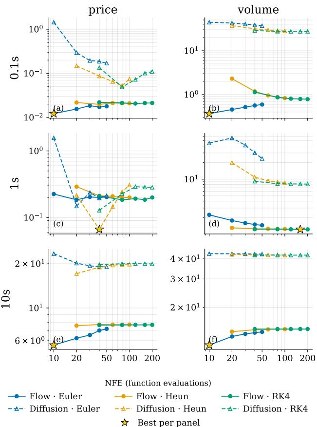
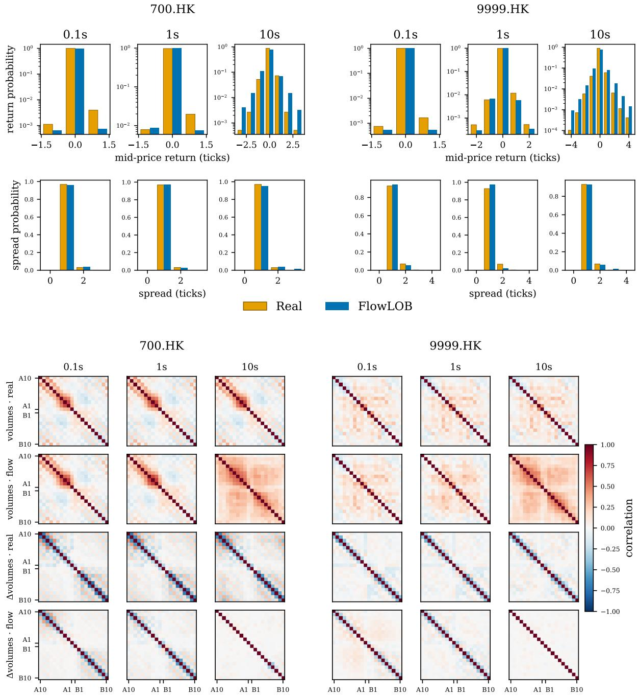
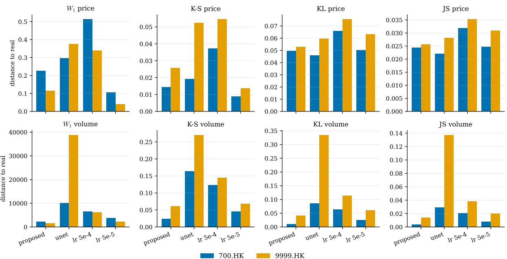

# FlowLOB: Eficient and Controllable Limit Order Book Generation with Flow Matching

Zhuohan Wang Simudyne United Kingdom

Andreea Bacalum Simudyne United Kingdom

Carmine Ventre King’s College London United Kingdom

Namid Stillman   
Simudyne   
United Kingdom   
namid@simudyne.com

Ollie Olby Simudyne United Kingdom

## Abstract

Limit order book (LOB) simulators are most useful to practitioners when they combine realistic market dynamics, computationally efficient sampling, controllable scenario generation, and the ability to generalize beyond the instruments seen during training—properties that existing agent-based and deep generative simulators provide only partially. We present FlowLOB, a conditional flow-matching generator of LOB trajectories, trained on multiple Hong Kong Exchange (HKEX) symbols at three sampling frequencies (0.1s, 1s, 10s) in tick-relative representation that transfers to unseen instruments. Because flow and difusion models admit a common formulation, we train both with identical data, architecture, and budget, and sample both through the same fixed-step ODE solvers, yielding a controlled comparison of sampling eficiency and fidelity. Flow matching attains its best quality with only 10 ODE-solver steps, whereas difusion needs many more function evaluations to ap proach the same fidelity. At this eficient operating point, FlowLOB improves realism over baselines, two learned and two agent-based models, in most distributional metrics at the two finer sampling frequencies. We evaluate counterfactual controllability with a distributional test that asks whether changing a scenario condition moves the generated statistic toward the corresponding real tail regime; FlowLOB satisfies this criterion in most tested settings. Both realism and control efects transfer zero-shot on a held-out symbol. We additionally conduct ablation studies on the network architecture and the learning rate.

## Keywords

Flow models, Limit Order Books, Generative Models

## 1 Introduction

Simulation is central to many workflows in quantitative finance. Backtesting a trading strategy, stress-testing an execution algorithm, and training a reinforcement-learning agent all require far more market data than history provides: for any instrument, the market ofers exactly one realized path [5, 35]. There are no repeated trials and no counterfactuals—no way to observe how the same trading day would have unfolded under higher volatility or thinner liquidity. A simulator of the limit order book (LOB), the fundamental data structure of modern electronic markets, is the standard escape from this constraint [6, 42], and its value hinges on three properties: the realism of what it generates, the cost of generating it, and the degree to which it can be steered toward scenarios of interest.

Existing LOB simulators deliver these properties only in part. Agent-based models—zero-intelligence traders [12, 13] and Hawkesprocess order flow [3], composed into platforms such as ABIDES [6]— are interpretable and easy to steer, but reproduce only a subset of the stylized facts of real markets [9]. Deep generative models close the realism gap: generative adversarial networks [7, 8, 24, 45], autoregressive event models [25, 30], and most recently difusion models [2, 4, 43, 44, 48] produce order books that are dificult to distinguish from real data. But they come at a price. First, difusion sampling is expensive by construction [15, 40]: a single trading day at 0.1-second resolution comprises roughly 200,000 book states, so a 50-step sampler spends 50 network evaluations on each. Fast samplers [29, 37, 38, 47] mitigate this, but treat the symptom rather than the problem. Second, these models are almost universally trained one-model-per-symbol, so nothing can be said about instruments outside the training set. Third, while conditional generation is common, conditional validity is rarely tested: models are conditioned on a regime, but whether the generated data actually belong to that regime is left unmeasured. What practitioners need is a LOB generator that is simultaneously realistic, cheap enough to sample at scale, controllable with measurable efect, and general across instruments. No existing simulator provides all four.

We present FlowLOB, a flow-matching [27, 28] generative model of limit order book trajectories. FlowLOB models windows of book states (ten price levels per side, prices and volumes) with a ∼100Mparameter adaLN-Zero transformer [33], trained jointly on eight Hong Kong Exchange symbols at three diferent sampling frequencies (0.1s, 1s, 10s), and conditioned on four interpretable channels: trend, volatility, liquidity, and order-book imbalance.

Our contributions are fourfold:

• Generality. For each sampling frequency, FlowLOB is trained as a shared simulator across eight HKEX symbols rather than one model per symbol. The tick-relative representation enables zero-shot transfer to a ninth held-out symbol without retraining, and we repeat the evaluation at 0.1s, 1s, and 10s to test this behavior across temporal resolutions.

• Eficient sampling. We place flow models and difusion models on equal footing: one dataset, one backbone, one training recipe, and one family offixed-step ODE solvers [22].

Under this matched setup, 10 Euler steps already put FlowLOB at its best or nearly best quality. At the same sampling compute, its marginal distributional error is $4 { - } 1 2 0 \times$ lower than difusion across price and volume features.

• Realism. We compare the pooled price and volume distributions of generated books against real data under four distance metrics, against two learned baselines (LOB-S5 [30], LOB-GAN [8]) and two agent-based baselines (Hawkes [3, 21], Zero Intelligence traders [12, 13]). FlowLOB attains the smallest distance in 30 of the 32 resulting parameter combinations at the 0.1s and 1s frequencies, on both the in-distribution and the held-out symbol.

• Controllability. Conditioning passes a distributional validity test, moving the generated statistic’s distribution toward the real tail regime in 42 of 48 cases considered, with liquidity and imbalance reliably steerable at every frequency.

From a practitioner perspective, FlowLOB matches key requirements for synthetic market-data engines used in downstream ML development and validation [31, 32]. It samples eficiently enough for large-scale rollouts, steers rare regimes, transfers across instruments including unseen ones, and outputs L2 book states suitable for snapshot-based policies such as dynamic execution.

## 2 Related Work

Realistic and controllable LOB simulation. Market simulation has traditionally been agent-based: zero-intelligence traders [12, 13] and Hawkes-process order flow [3], composed into platforms such as ABIDES [6]. These models are transparent and steerable, but realism audits find they reproduce only part of the stylized facts of real markets [9, 42]. Learned generators progressively closed this gap: GANs over order streams and book states [7, 8, 20, 24], autoregressive event models [25, 30], and most recently difusion models, which set the current realism standard for both messagelevel and book-level generation [2, 4, 43, 48]. The controllability that agent-based models ofered has been rebuilt on top of these learned generators only recently, typically via conditional or guided difusion [16]: DIGMA [19] guides a difusion-based meta agent toward target market dynamics, CoFinDif [41] conditions financial time series on trend and volatility, and DifLOB [44] combines a WaveNet-style difusion backbone with ControlNet-style conditioning to generate counterfactual order books under high and low regimes of book-level statistics. Following DifLOB, we focus on L2 order book states generation rather than order flow generation.

Difusion, flow matching, and eficient sampling. Difusion models generate by learning to invert a gradual noising process [15, 36], a view unified in continuous time by score-based SDEs [39, 40], whose deterministic probability-flow ODE permits sampling by numerical integration. Paired with transformer backbones [33] and guidance [10, 16], this family dominates generative modeling across domains [46], including the financial applications above. Its main practical liability is inference cost: high-quality samples require many network evaluations along the reverse process [15, 40]. One line of work accelerates a trained difusion model post hoc, through implicit samplers [37], high-order and dedicated ODE solvers [22, 29, 47], and distillation into consistency models [38]. A second line changes the training objective itself: flow matching [27] and rectified flow [28] learn near-straight probability paths that are cheap to integrate by construction, are unified with difusion under the stochastic-interpolant view [1, 17], and scale to state-of-the-art generation [11]. In finance, flow matching has reached time-series generation [14, 18] and trading policies [26], but not the order book itself, and no prior work compares the two objectives for market generation under matched data, architecture, and compute.

## 3 Methodology

The methodology section has four parts: a matched flow/difusion training setup, a common ODE sampling protocol, a tick-relative representation for multi-symbol LOB data, and a transformer backbone that aligns market history with scenario controls.

## 3.1 Flow and Difusion Training

Let $x _ { 0 } \sim p _ { \mathrm { d a t a } } ( x \mid$ �) denote a target LOB window and let � denote the conditioning tensor constructed from the preceding market state and scenario variables. We train two conditional generative objectives on the same pairs $( x _ { 0 } , c )$ : flow matching [27, 28] and difusion [15, 40]. This pairing lets us compare two ways of learning a transport from noise to realistic book trajectories while holding the data, conditioning, architecture, and optimizer fixed.

Flow matching learns a velocity field along a prescribed path from Gaussian noise to data. With $z \sim { \cal N } ( 0 , I )$ and linear interpolation $x _ { t } = \big ( 1 - t \big ) z + t x _ { 0 }$ for $t \in [ 0 , 1 ]$ , the target velocity is constant, $x _ { 0 } - z .$ The flow model $v _ { \theta } ( x _ { t } , c , t )$ is trained by

$$
\mathcal { L } _ { \mathrm { F M } } ( \theta ) = \mathbb { E } _ { t , z , ( x _ { 0 } , c ) } \left[ \| v _ { \theta } ( x _ { t } , c , t ) - ( x _ { 0 } - z ) \| _ { 2 } ^ { 2 } \right] .
$$

Sampling then follows the learned velocity field from noise at $t = 0$ to data at $t = 1 .$

The difusion baseline is trained in the same conditional regression template, but uses the variance-preserving noising path $x _ { t } = \alpha _ { t } x _ { 0 } + \sigma _ { t } \epsilon$ , with $\epsilon \sim { \cal N } ( 0 , I )$ and schedule $\left( \alpha _ { t } , \sigma _ { t } \right)$ moving data toward Gaussian noise as � increases. The network predicts the injected noise,

$$
\begin{array} { r } { \mathcal { L } _ { \mathrm { D M } } ( \theta ) = \mathbb { E } _ { t , \epsilon , ( x _ { 0 } , c ) } \left[ | | \epsilon _ { \theta } ( x _ { t } , c , t ) - \epsilon | | _ { 2 } ^ { 2 } \right] . } \end{array}
$$

At sampling time this prediction is converted into the probabilityflow ODE field used in Sec. 3.2.

## 3.2 ODE Sampling and Inference Cost

Both trained objectives are sampled through deterministic ODEs, which gives a common way to measure generation cost. In both cases, sampling can be written as integrating a learned field

$$
\frac { d x _ { t } } { d t } = u ( x _ { t } , t , c ) ,
$$

with the conditioning tensor � held fixed throughout the trajectory. For flow matching, the learned velocity is used directly, $u ( x , t , c ) =$ $v _ { \theta } ( x , c , t ) ,$ , and the ODE is integrated from $t ~ = ~ 0 ~ \mathrm { t o } ~ t ~ = ~ 1$ . For difusion, the noise prediction is converted into the corresponding probability-flow ODE field and integrated in the reverse time direction, from the noisy endpoint toward the data endpoint.

We sample both models with the same family of fixed-step solvers: Euler, Heun, and fourth-order Runge–Kutta (RK4). These solvers require one, two, and four network evaluations per step, respectively, so a run with � solver steps costs �, 2�, or 4� neural function evaluations (NFE). This accounting lets us compare solvers at equal model-call budgets rather than equal step counts. We use NFE, rather than wall-clock time, as the primary inference-cost unit because it isolates the algorithmic cost of sampling from implementation details such as batching, hardware, and kernel eficiency.

This shared sampler is what makes the flow-versus-difusion comparison controlled. Each sweep varies only the numerical method and step count applied to a fixed checkpoint; the training data, conditioning variables, backbone, and optimizer are unchanged. Thus any quality–cost diference observed in Sec. 4.2 reflects the learned generative dynamics and their ease of numerical integration, rather than a diferent architecture or sampling budget.

## 3.3 LOB Representation and Conditioning

The raw order book is first converted into fixed-length windows on a uniform time grid. At each sampling frequency, we resample the top ten ask and bid levels by taking the first observation in each bin and forward-filling empty bins. A training example consists of two consecutive windows: a past window, which provides the observed market state, and a target window. The generated target is represented as $\boldsymbol { x } \in \mathbb { R } ^ { 2 \times 2 0 \times 3 2 }$ , with two channels for price and volume, twenty book levels ordered from the outer ask to the outer bid, and thirty-two future time steps.

Prices are not represented in absolute currency units. This is important for HKEX data because diferent symbols can trade at diferent price levels and under diferent tick sizes. We therefore use a tick-relative local representation: the first price coordinate records the mid-price change between consecutive states, while the remaining coordinates record adjacent level gaps within the book, all measured in ticks. Volumes � are transformed level-wise as log(� + 1). Together, tick normalization for prices and logarithmic normalization for volumes remove much of the instrument-specific scale while preserving the local geometry and depth profile of the book. This makes the pooled multi-symbol training problem better posed and is a key reason the same model can be evaluated zero-shot on a held-out symbol.

The conditioning tensor $c \in \mathbb { R } ^ { 7 \times 2 0 \times 3 2 }$ is aligned with the target window. It contains the past-window price and volume representation, time of day and four scenario channels. We include time of day to capture HKEX’s strong intraday structure, including the midday lunch break and the double-U-shaped volume profile. Unlike Dif fLOB [44], which discards the first and last trading hours, we retain the full continuous-auction period. The computed time-of-day ratio is clamped to [0, 1] at session boundaries. The scenario channels encode trend, volatility, liquidity, and order-book imbalance. Trend and volatility are window-level summaries and are broadcast across levels and time, while liquidity and imbalance are computed at each future time step and broadcast across levels. This construction gives the model both the recent market state and an explicit description of the regime the generated continuation should satisfy.

## 3.4 Architecture

FlowLOB uses an adaLN-Zero transformer [33, 34] backbone. We choose this backbone because adaptive normalization has become a standard scalable way to condition large generative transformers, and because it separates global process-time modulation from local market conditioning. Each cell of the level–time grid is treated as one token, so a target window is represented as 20 × 32 tokens. The noisy state �� and conditioning tensor � are concatenated channelwise before projection, which preserves the alignment between generated quantities and their controls: a liquidity or imbalance value specified for a particular future step is attached to the tokens for that same step.

We use separate learned embeddings for book level and time step, and inject the ODE time � through adaptive layer-normalization blocks. Thus market conditioning enters through the token features, while the generative process time enters through modulation of the transformer dynamics. A linear output head maps the final token representations back to the price and volume channels of the generated LOB window.

## 4 Experimental Results

In this section, we first specify the data, model settings, and baselines. We then compare flow matching and difusion under matched samplers to choose a quality–cost operating point (Sec. 4.2). Using that fixed sampling budget, we evaluate realism against learned and agent-based baselines on both an in-distribution symbol and a held-out symbol (Sec. 4.3). Finally, we test whether the scenario variables defined in Sec. 3.3 produce measurable counterfactual changes (Sec. 4.4) and ablate the main architectural and optimization choices (Sec. 4.5). Unless stated otherwise, each experiment reuses the same trained checkpoints and varies only the factor under study.

## 4.1 Experimental Setup

Data. We use level-2 order book data from the Hong Kong Exchange (HKEX), ten price levels per side, for eight symbols spanning technology, financials, automotive, and semiconductors, i.e., 5, 700, 981, 1024, 1211, 1299, 1810, and 9618 (all .HK). Trading sessions are 09:30– 12:00 and 13:00–16:00, giving 5.5 trading hours per day—198,000, 19,800, and 1,980 grid points at the 0.1s, 1s, and 10s frequencies respectively. Training data covers 2025-09-01 to 2025-11-15, validation 2025-11-16 to 2025-11-30, and all evaluation uses December 2025, which covers a variety of market conditions due to the end of year period. One further symbol, 9999.HK, is excluded from training entirely and evaluated zero-shot. Throughout, we report results on 700.HK as a representative in-distribution symbol and 9999.HK as the zero-shot held-out symbol; results are qualitatively similar across the other in-distribution symbols.

Training settings. All runs share the remaining configuration: AdamW without weight decay, efective batch size 1024 (microbatch 256, 4 accumulation steps), up to 500 epochs with early stopping (patience 20), and conditioning dropout 0.5 for classifier-free guidance. Both transformer and UNet settings use the ∼100M configuration. For every run, we evaluate the checkpoint with the best validation loss.

Baselines. We compare against both agent-based and learned LOB generators. The zero-intelligence (ZI) and compound Hawkes (reported as Hawkes) baselines are adapted from the calibration procedures of Kawawa-Beaudan et al. [23]. ZI samples order side, action type, inter-arrival time, volume, and price depth from fitted marginal distributions, providing a stochastic baseline that reproduces simple empirical marginals but not conditional market dynamics. Hawkes adds temporal dependence by fitting a multivariate Hawkes process to event arrivals grouped by action and side, while sampling volumes and price depths from fitted marginal distributions. We also compare against learned baselines for LOB generation. LOB-GAN follows the conditional GAN architecture of Coletta et al. [8], generating order flow from a real history window. LOB-S5 treats LOB generation as an autoregressive sequence-modelling problem using a structured state-space network [30]. All baseline outputs are converted to the same sampled LOB representation before evaluation.

  
Figure 1: Sample quality versus inference cost. �1 distance to the real pooled price (left) and volume (right) marginals at the three sampling frequencies (rows), against NFE on a log–log scale. Solid: flow matching; dashed: difusion; one curve per solver; the star marks the best point per panel. Flow with Euler at �=10 — the cheapest configuration in the sweep — is the best point in four of six panels.

## 4.2 Inference Quality vs. Cost

For each sampling frequency, we take the trained flow-matching and difusion checkpoints from Sec. 4.1 and vary only the ODE solver and number of solver steps. We sweep Euler, Heun, and RK4 over $N \in \{ 1 0 , 2 0 , 3 0 , 4 0 , 5 0 \}$ , and report inference cost in NFE. We use Wasserstein-1 distance $W _ { 1 }$ as a lightweight quality proxy to compare generated and real pooled marginals of the price and volume features. Figure 1 shows that flow matching reaches its best quality at very small sampling budgets. With Euler sampling at 10 steps, FlowLOB obtains lower $W _ { 1 }$ than the matched difusion sampler by 4–120× across price and volume marginals. Even when difusion is allowed up to 200 NFEs, no difusion configuration in our sweep matches FlowLOB-Euler-10 in five of the six settings. The only exception is the 1s price marginal, where difusion matches at 20 NFEs by Heun; however, the same configurations remain substantially worse on volume.

These patterns suggest that solver error is already small for FlowLOB at low NFE. Flow matching learns a deterministic transport that coarse Euler can follow well, while difusion must resolve a reverse denoising path across noise levels, so errors accumulate at the same NFE. Once flow solver error is small, more ODE steps mainly integrate the same imperfect vector field more accurately, which need not improve distributional quality. Higher-order solvers can also query intermediate of-path states where the learned field is less calibrated, whereas coarse Euler may smooth over local model errors.

This reduction in sampling cost has practical consequences. In applications such as portfolio risk analysis, execution stress testing, or reinforcement learning, a simulator is rarely queried once for a single instrument. Users typically need many trajectories across multiple symbols, regimes, and random seeds. In that setting, the diference between a sampler that is accurate after ten network evaluations and one that requires many tens or hundreds of evaluations directly compounds into the number of scenarios that can be explored under a fixed compute budget.

We therefore use flow matching with Euler sampling at $N =$ 10 as the default operating point for the rest of the paper. This is the cheapest configuration in the sweep and is already on the observed quality–cost frontier. All subsequent FlowLOB realism and controllability experiments inherit this setting unless stated otherwise.

## 4.3 Realism

We next evaluate whether FlowLOB generates realistic book continuations at the operating point selected in Sec. 4.2. Figure 2 first compares generated and real books through derived market statistics and cross-level dependence. The top row shows mid-price return and bid–ask spread distributions for 700.HK and the heldout 9999.HK across all three sampling frequencies. At the finer frequencies, FlowLOB reproduces both the concentration of returns near zero and the small but important spread tail. The bottom row shows that the generated books also recover the main cross-level volume-correlation structure near the touch, as well as the weaker dependence pattern of the less liquid held-out symbol.

We then quantify marginal realism in Table 1, which compares generated and real pooled marginals of the price and volume features. We report Wasserstein-1 $( W _ { 1 } ) _ { : }$ , Kolmogorov–Smirnov (KS), Kullback–Leibler (KL), and Jensen–Shannon (JS) distances, with lower values indicating closer agreement. We do not include DiffLOB as a separate realism baseline because its setting is not directly matched to our multi-symbol task. Moreover, Sec. 4.2 has established the eficiency advantage of flow matching by a controlled difusion–flow comparison. At 0.1s and 1s, FlowLOB gives the closest marginal match across nearly all comparisons, achieving the best distance in 30 of the 32 price/volume metric cells. Relative to the strongest non-FlowLOB baseline, FlowLOB makes a median 4.5× smaller distance. On 700.HK, FlowLOB is best in all cells at 0.1s and in six of eight cells at 1s, where ZI slightly improves the price �1 and price KS distances. On the held-out 9999.HK symbol, FlowLOB is best in every 0.1s and 1s cell. These gains indicates that the selected low-NFE sampler preserves high-frequency LOB structure. Its strong performance at 0.1s and 1s supports the tickrelative representation introduced in Sec. 3.3: by removing much of the symbol-specific price and volume scale, the same generator can transfer to an unseen instrument without retraining.

  
Figure 2: Realism diagnostics beyond pooled marginals. Top subplot is about Mid-price return and bid–ask spread distributions. Bottom subplot is about cross-level correlation of volumes and volume changes across the 20 book levels (A10–A1, B1–B10). Real versus FlowLOB, for 700.HK and the held-out 9999.HK across the three sampling frequencies.

The main limitation appears at the coarsest frequency. At 10s, FlowLOB no longer dominates the marginal metrics: ZI gives the best price distances on both symbols, and LOB-S5 is competitive or best on several volume distances. The diagnostics in Fig. 2 show the same boundary: the generated 10s return distributions are heaviertailed than the real distributions, and the volume-correlation plots show stronger cross-level dependence than observed in the data. We interpret this as a limitation of the current model at coarse sampling frequencies, where the same calendar span provides fewer training windows and where returns occupy a wider multi-tick support. The realism advantage of FlowLOB is therefore clearest at the high-frequency settings where fast sampling is most valuable. This limitation may be mitigated by training on a larger symbol universe and a longer historical period.

Table 1: Realism: distances between generated and real pooled marginals (lower is better; best per frequency–symbol block in bold).
<table><tr><td rowspan="2" colspan="2"></td><td colspan="8">700.HK</td><td colspan="8">9999.HK</td></tr><tr><td colspan="2">W1</td><td colspan="2">KS</td><td colspan="2">KL</td><td colspan="2">JS</td><td colspan="2"> $W _ { 1 }$ </td><td colspan="2">KS</td><td colspan="2">KL</td><td colspan="2">JS</td></tr><tr><td colspan="2">Freq. Method</td><td>price volume</td><td></td><td>price</td><td>volume</td><td>price</td><td>volume</td><td>price</td><td>volume</td><td>price volume</td><td></td><td>price</td><td>volume</td><td>price</td><td>volume</td><td>price</td><td>volume</td></tr><tr><td rowspan="6">0.1s</td><td>FlowLOB LOB-S5</td><td>0.01683</td><td></td><td>791.8 0.002337</td><td>0.01066 0.04304</td><td>6.572e-5 0.009084</td><td>0.01025</td><td>1.923e-5</td><td>0.002559</td><td>0.008337</td><td></td><td>1020 0.01511</td><td>0.02853</td><td>2.785e-5</td><td>0.008375</td><td>6.852e-6 0.02119</td><td>0.002289</td></tr><tr><td></td><td>0.5660</td><td>4610</td><td>0.03852</td><td></td><td></td><td>0.2461</td><td>0.002291</td><td>0.008273</td><td>0.7296</td><td>3709</td><td>0.1392</td><td>0.1590</td><td>0.1173</td><td>0.1868</td><td></td><td>0.04011</td></tr><tr><td>LOB-GAN</td><td>0.8921</td><td>3.150e4</td><td>0.08873</td><td>0.6158</td><td>0.06465</td><td>1.216</td><td>0.01401</td><td>0.2391</td><td>0.7901</td><td>6789</td><td>0.1439</td><td>0.3306</td><td>0.1087</td><td>0.5501</td><td>0.02190</td><td>0.1198</td></tr><tr><td>Hawkes</td><td></td><td>10.73 2.995e4</td><td>0.1137</td><td>0.5321</td><td>0.08033</td><td>1.200</td><td>0.02471</td><td>0.2284</td><td>9.053</td><td>9482</td><td>0.09567</td><td>0.2976</td><td>0.1336</td><td>0.4521</td><td>0.03211</td><td>0.1064</td></tr><tr><td>ZI</td><td>0.1461</td><td>7337</td><td>0.009761</td><td>0.1414</td><td>0.003240</td><td>0.08502</td><td>0.0009035</td><td>0.02087</td><td>0.3941</td><td>7212</td><td>0.06502</td><td>0.1981</td><td>0.01688</td><td>0.2110</td><td>0.004859</td><td>0.05524</td></tr><tr><td>FlowLOB LOB-S5</td><td>0.1518</td><td>3121</td><td>0.01433</td><td>0.02311</td><td>0.001220</td><td>0.01731</td><td>0.0003604</td><td>0.003681</td><td>0.08184</td><td></td><td>1540 0.02445</td><td>0.07212</td><td>0.0006185</td><td>0.05187</td><td>0.0001562</td><td>0.01203</td></tr><tr><td rowspan="7">1s</td><td></td><td>0.5613</td><td>4601</td><td>0.03828</td><td>0.04296</td><td>0.009078</td><td>0.2299</td><td>0.002268</td><td>0.008303</td><td>0.7304</td><td>3703</td><td>0.1392</td><td>0.1590</td><td>0.1170</td><td>0.1854</td><td>0.02114</td><td>0.04001</td></tr><tr><td>LOB-GAN</td><td>0.8904 3.156e4</td><td></td><td>0.08813</td><td>0.6166</td><td>0.06480</td><td>1.195</td><td>0.01401</td><td>0.2396</td><td>0.7933</td><td>6808</td><td>0.1445</td><td>0.3314</td><td>0.1087</td><td>0.5428</td><td>0.02194</td><td>0.1199</td></tr><tr><td>Hawkes</td><td>10.55 2.995e4</td><td></td><td>0.1137</td><td>0.5325</td><td>0.08002</td><td>1.213</td><td>0.02456</td><td>0.2288</td><td>9.023</td><td>9486</td><td>0.09600</td><td>0.2980</td><td>0.1343</td><td>0.4509</td><td>0.03221</td><td>0.1065</td></tr><tr><td>ZI</td><td>0.1454</td><td>7331 0.009527</td><td></td><td>0.1415</td><td>0.003173</td><td>0.08490</td><td>0.0008823</td><td>0.02086</td><td>0.3922</td><td>7217</td><td>0.06490</td><td>0.1988</td><td>0.01693</td><td>0.2112</td><td>0.004868</td><td>0.05536</td></tr><tr><td>FlowLOB</td><td>4.942</td><td>1.541e4</td><td>0.2256</td><td>0.1762</td><td>0.2462</td><td>0.1931</td><td>0.07953</td><td>0.02425</td><td>2.113</td><td>3835</td><td>0.1548</td><td>0.1605</td><td>0.2861</td><td>0.1230</td><td>0.08507</td><td>0.03059</td></tr><tr><td>LOB-S5</td><td>0.5574</td><td>4413</td><td></td><td>0.03816 0.04252</td><td>0.008888</td><td>0.2150</td><td>0.002305</td><td>0.007948</td><td>0.7181</td><td>3745</td><td>0.1368</td><td>0.1631</td><td>0.09986</td><td>0.1825</td><td>0.01986</td><td>0.03869</td></tr><tr><td>LOB-GAN</td><td></td><td>0.8688 3.056e4</td><td>0.08414</td><td>0.5960</td><td>0.04392</td><td>1.172</td><td>0.01014</td><td>0.2267</td><td>0.7752</td><td>7336</td><td>0.1421</td><td>0.3470</td><td>0.1049</td><td>0.5027</td><td>0.02191</td><td>0.1186</td></tr><tr><td>10s</td><td>Hawkes</td><td>10.49</td><td>2.997e4</td><td>0.1138</td><td>0.5314</td><td>0.09067</td><td>1.280</td><td>0.02674</td><td>0.2281</td><td>8.721</td><td>9509</td><td>0.09620</td><td>0.2996</td><td>0.1251</td><td>0.4582</td><td>0.02969</td><td>0.1068</td></tr><tr><td>ZI</td><td></td><td>0.1445</td><td>72500.009626</td><td></td><td>0.1401</td><td>0.0027350.08137</td><td></td><td>0.0007391</td><td>0.02028</td><td>0.3918</td><td>7107 0.06520</td><td></td><td>0.1965</td><td>0.01484</td><td>0.2046</td><td>0.004311</td><td>0.05383</td></tr></table>

## 4.4 Counterfactual Generation

The realism tests above ask whether generated books match market data under realized conditions. We now ask whether the conditioning variables can be used as controls. We use “counterfactual” in the simulator sense: the observed past window is held fixed, while one requested scenario variable is replaced by a high- or low-regime value. Controllability is then evaluated on the generated book itself, by recomputing the controlled statistic and checking whether its distribution moves toward the corresponding real tail regime. For each scenario variable defined in Sec. 3.3—trend, volatility, liquidity, and imbalance—and for each direction, high or low, we generate two sets ofsamples from the same past windows. Reference samples use the realized scenario values. Counterfactual samples replace one scenario variable with values drawn from the corresponding high or low 5% tail of its training-set distribution, while all other conditioning inputs are unchanged. The target regime is the matching high or low 5% tail of the same statistic computed on real test windows. Let $W _ { 1 } ^ { \mathrm { c f } }$ denote the Wasserstein-1 distance between the recomputed statistic of the counterfactual samples and the real test-set tail data, and let $W _ { 1 } ^ { \mathrm { r e f } }$ denote the corresponding distance for the reference samples. We say the control is valid for a cell when $W _ { 1 } ^ { \mathrm { c f } } < W _ { 1 } ^ { \mathrm { r e f } }$ . This criterion is deliberately distributional: it does not reward a model for merely receiving a condition, but only when the generated books themselves exhibit the requested regime more closely than the reference continuation.

Table 2 shows that conditioning moves generated books toward the requested regime in 42 of 48 cells. The most reliable controls are the volume-related variables, liquidity and imbalance, which are valid for all symbols, frequencies, and directions. These variables are computed directly from the generated depth profile at each future step, so their signal is closely aligned with the output tensor. For 700.HK, the less reliable cases are concentrated in trend and volatility. Trend shows near-ties at the finest frequency, where the empirical high- and low-trend tail regimes are weakly separated, and its low-regime control fails at 10s for both symbols. Volatilitylow also fails at 10s. Thus the main failures occur either when the target statistic is weakly expressed over the generated horizon or at the coarsest frequency, consistent with the realism boundary observed in Sec. 4.3. The held-out 9999.HK results are broadly consistent with 700.HK, showing that controllability is not only a symbol-specific efect but also transfers to an unseen symbol.

Table 2: Counterfactual validity: �1 distance from the recomputed statistic of counterfactual (Cf.) and reference (Ref.) samples to the real 5% tail regime. Bold marks the smaller distance; an asterisk indicates a full-precision win that appears tied after rounding.
<table><tr><td rowspan="2">Symbol</td><td rowspan="2">Channel</td><td rowspan="2">Sel.</td><td colspan="2">0.1s</td><td colspan="2"> $1 s$ </td><td colspan="2">10s</td></tr><tr><td>Cf.</td><td>Ref.</td><td>Cf.</td><td>Ref.</td><td>Cf.</td><td>Ref.</td></tr><tr><td rowspan="8">700.HK</td><td rowspan="2">trend</td><td>high</td><td>0.549</td><td>*0.549</td><td>1.40</td><td>1.41</td><td>5.49</td><td>6.65</td></tr><tr><td>low</td><td>0.555</td><td>*0.555</td><td>*1.37</td><td>1.37</td><td>11.5</td><td>6.82</td></tr><tr><td rowspan="2">volatility</td><td>high</td><td>0.192</td><td>0.212</td><td>0.151</td><td>0.323</td><td>0.408</td><td>0.472</td></tr><tr><td>low</td><td>0.006</td><td>0.008</td><td>0.042</td><td>0.067</td><td>0.874</td><td>0.866</td></tr><tr><td rowspan="2">liquidity</td><td>high</td><td>0.205</td><td>0.463</td><td>0.217</td><td>0.505</td><td>0.619</td><td>0.807</td></tr><tr><td>low</td><td>0.404</td><td>0.580</td><td>0.255 0.539</td><td></td><td>0.251</td><td>0.288</td></tr><tr><td rowspan="2">imbalance</td><td>high</td><td>0.517</td><td>0.551</td><td>0.228</td><td>0.562</td><td>0.340</td><td>0.450</td></tr><tr><td>low</td><td>0.327</td><td>0.338</td><td>0.092</td><td>0.326</td><td>0.405</td><td>0.440</td></tr><tr><td rowspan="8">9999.HK</td><td rowspan="2">trend</td><td>high</td><td>*0.536</td><td>0.536</td><td>*1.61</td><td>1.61</td><td>6.34</td><td>6.66</td></tr><tr><td>low</td><td>*0.534</td><td>0.534</td><td>1.65</td><td>1.66</td><td>9.41</td><td>6.14</td></tr><tr><td rowspan="2">volatility</td><td>high</td><td>0.186</td><td>0.196</td><td>0.163</td><td>0.366</td><td>0.632</td><td>0.658</td></tr><tr><td>low</td><td>0.006</td><td>0.008</td><td>0.043</td><td>0.071</td><td>0.827</td><td>0.817</td></tr><tr><td rowspan="2">liquidity</td><td></td><td>0.187</td><td>0.278</td><td>0.047</td><td>0.323</td><td>0.552</td><td>0.585</td></tr><tr><td>high low</td><td>0.520</td><td>0.592</td><td>0.135</td><td>0.547</td><td>0.302</td><td>0.305</td></tr><tr><td rowspan="2">imbalance</td><td></td><td>0.273</td><td>0.283</td><td>0.081</td><td>0.303</td><td>0.247</td><td></td></tr><tr><td>high low</td><td>0.306</td><td>0.318</td><td>0.059</td><td>0.298</td><td>0.288</td><td>0.279 0.325</td></tr></table>

## 4.5 Ablation Study

We finally ablate the two design choices likely to afect the preceding claims: the transformer backbone and the learning rate. The ablation is not intended to exhaust the architecture space; rather, it tests whether the proposed configuration is robust under changes that directly afect realism and zero-shot transfer. For the backbone ablation, we replace the transformer with a UNet of comparable parameter count while keeping the data representation and sampler fixed. For the learning-rate ablation, we compare the default rate 1� − 4 with one higher and one lower rate. All ablations are run at the 1s frequency, sampled with Euler at � = 10, and evaluated with the same marginal distances as in Sec. 4.3.

  
Figure 3: Ablation results at 1s. We compare the proposed transformer configuration against a parameter-matched UNet and two learning-rate variants. Bars show distances between generated and real pooled price and volume marginals for the in-distribution symbol 700.HK and the held-out symbol 9999.HK; lower is better.

Figure 3 shows that the transformer backbone is important, especially out of distribution. A parameter-matched UNet trails the proposed model on most price and volume metrics, and the degradation is largest on the held-out 9999.HK symbol. This suggests that attending over the level–time grid helps the model use the shared tick-relative representation for cross-symbol generalization, rather than merely fitting the in-distribution symbol.

The learning-rate ablation shows a smaller but useful trade-of. A higher learning rate degrades both price and volume realism, while a lower learning rate improves some price marginal distances but weakens volume fidelity. We therefore keep the default learning rate as a balanced operating point rather than selecting a configuration tuned for a single metric. Across the ablations, the qualitative rank ing is similar on 700.HK and 9999.HK, supporting the conclusion that the realism and controllability results above are not artifacts of a lucky training setting.

## 5 Conclusion

We introduced FlowLOB, a conditional flow-matching model for generating limit order book trajectories. The model combines a tickrelative LOB representation, scenario conditioning, and a level–time transformer backbone to train a single generator across multiple

HKEX symbols. Under a matched comparison with difusion, flow matching reaches its best sample quality with only 10 Euler steps, giving a practical low-NFE operating point for generating many market trajectories across symbols and regimes. At this eficient operating point, FlowLOB matches high-frequency price and volume distributions more closely than the evaluated agent-based and learned baselines on most metrics, transfers to a held-out symbol without retraining, and supports measurable control over liquidity and imbalance regimes.

The results should be read as a first step rather than a final account of market simulation. The current model is strongest at the finer sampling frequencies, while its advantage weakens at coarser resolution; trend control is also less reliable over short windows. These limitations are useful because they identify where larger data, broader symbol coverage, longer contexts, and diferent conditioning designs should matter most. More broadly, this paper provides the experimental basis for studying scaling laws in financial market simulation. FlowLOB gives a controlled setting in which data scale, model size, sampling cost, symbol diversity, and controllability can be varied systematically. The next step is to move from showing that flow-based LOB generation is eficient, realistic, and steerable in this setting to quantifying how these properties improve as market simulators are scaled with bigger models and more budgets.

## References

[1] Michael S. Albergo, Nicholas M. Bofi, and Eric Vanden-Eijnden. 2023. Stochastic Interpolants: A Unifying Framework for Flows and Difusions. arXiv preprint arXiv:2303.08797 (2023).

[2] Alfred Backhouse, Kang Li, Jakob Foerster, Anisoara Calinescu, and Stefan Zohren. 2025. Painting the Market: Generative Difusion Models for Financial Limit Order Book Simulation and Forecasting. arXiv preprint arXiv:2509.05107 (2025).

[3] Emmanuel Bacry, Iacopo Mastromatteo, and Jean-François Muzy. 2015. Hawkes Processes in Finance. Market Microstructure and Liquidity 1, 1 (2015), 1550005.

[4] Leonardo Berti, Bardh Prenkaj, and Paola Velardi. 2025. TRADES: Generating Realistic Market Simulations with Difusion Models. arXiv preprint arXiv:2502.07071 (2025).

[5] Hans Bühler, Lukas Gonon, Josef Teichmann, and Ben Wood. 2019. Deep Hedging. Quantitative Finance 19, 8 (2019). arXiv:1802.03042.

[6] David Byrd, Maria Hybinette, and Tucker Hybinette Balch. 2020. ABIDES: Towards High-Fidelity Multi-Agent Market Simulation. In Proceedings ofthe 2020 ACM SIGSIM Conference on Principles ofAdvanced Discrete Simulation. 11–22.

[7] Andrea Coletta, Aymeric Moulin, Svitlana Vyetrenko, and Tucker Balch. 2022. Learning to Simulate Realistic Limit Order Book Markets from Data as a World Agent. In Proceedings ofthe 3rd ACM International Conference on AI in Finance. 428–436.

[8] Andrea Coletta, Matteo Prata, Michele Conti, Emanuele Mercanti, Novella Bartolini, Aymeric Moulin, Svitlana Vyetrenko, and Tucker Balch. 2021. Towards Realistic Market Simulations: A Generative Adversarial Networks Ap proach. In Proceedings ofthe 2nd ACM International Conference on AI in Finance. arXiv:2110.13287.

[9] Rama Cont. 2001. Empirical Properties of Asset Returns: Stylized Facts and Statistical Issues. Quantitative Finance 1, 2 (2001), 223–236.

[10] Prafulla Dhariwal and Alexander Quinn Nichol. 2021. Difusion Models Beat GANs on Image Synthesis. In Advances in Neural Information Processing Systems, Vol. 34. 8780–8794. arXiv:2105.05233

[11] Patrick Esser, Sumith Kulal, Andreas Blattmann, Rahim Entezari, Jonas Müller, Harry Saini, Yam Levi, Dominik Lorenz, Axel Sauer, Frederic Boesel, Dustin Podell, Tim Dockhorn, Zion English, Kyle Lacey, Alex Goodwin, Yannik Marek, and Robin Rombach. 2024. Scaling Rectified Flow Transformers for High Resolution Image Synthesis. In Proceedings ofthe 41st International Conference on Machine Learning. arXiv:2403.03206.

[12] J. Doyne Farmer, Paolo Patelli, and Ilija I. Zovko. 2005. The Predictive Power of Zero Intelligence in Financial Markets. Proceedings ofthe National Academy of Sciences 102, 6 (2005), 2254–2259.

[13] Dhananjay K. Gode and Shyam Sunder. 1993. Allocative Eficiency of Markets with Zero-Intelligence Traders: Market as a Partial Substitute for Individual Rationality. Journal ofPolitical Economy 101, 1 (1993), 119–137.

[14] Panjing He, Mingyue Cheng, Li Li, and XiaoHan Zhang. 2025. TimeFlow: Towards Stochastic-Aware and Eficient Time Series Generation via Flow Matching Modeling. arXiv preprint arXiv:2511.07968 (2025).

[15] Jonathan Ho, Ajay Jain, and Pieter Abbeel. 2020. Denoising Difusion Probabilistic Models. In Advances in Neural Information Processing Systems, Vol. 33. 6840–6851. arXiv:2006.11239.

[16] Jonathan Ho and Tim Salimans. 2022. Classifier-Free Difusion Guidance. In NeurIPS Workshop on Deep Generative Models. arXiv:2207.12598.

[17] Peter Holderrieth and Ezra Erives. 2026. An Introduction to Flow Matching and Difusion Models. arXiv preprint arXiv:2506.02070 (2026).

[18] Yang Hu, Xiao Wang, Zezhen Ding, Lirong Wu, Huatian Zhang, Stan Z. Li, Sheng Wang, Jiheng Zhang, Ziyun Li, and Tianlong Chen. 2024. FlowTS: Time Series Generation via Rectified Flow. arXiv preprint arXiv:2411.07506 (2024).

[19] Yu-Hao Huang, Chang Xu, Yang Liu, Weiqing Liu, Wu-Jun Li, and Jiang Bian. 2026. Controllable Financial Market Generation with Difusion Guided Meta Agent. In Proceedings ofthe AAAI Conference on Artificial Intelligence. arXiv:2408.12991.

[20] Hanna Hultin, Henrik Hult, Alexandre Proutiere, Samuel Samama, and Ala Tarighati. 2023. A Generative Model of a Limit Order Book Using Recurrent Neural Networks. Quantitative Finance 23, 6 (2023), 931–958.

[21] Konark Jain, Nick Firoozye, Jonathan Kochems, and Philip Treleaven. 2024. Limit Order Book dynamics and order size modelling using Compound Hawkes Process. Finance Research Letters 69 (2024), 106157.

[22] Tero Karras, Miika Aittala, Timo Aila, and Samuli Laine. 2022. Elucidating the Design Space of Difusion-Based Generative Models. In Advances in Neural Information Processing Systems, Vol. 35. 26565–26577. arXiv:2206.00364.

[23] Maxime Kawawa-Beaudan, Srijan Sood, Kassiani Papasotiriou, Daniel Borrajo, and Manuela Veloso. 2026. TradeFM: A generative foundation model for trade flow and market microstructure. arXiv preprint arXiv:2602.23784 (2026).

[24] Junyi Li, Xintong Wang, Yaoyang Lin, Arunesh Sinha, and Michael P. Wellman. 2020. Generating Realistic Stock Market Order Streams. In Proceedings ofthe AAAI Conference on Artificial Intelligence, Vol. 34. 727–734.

[25] Yang Li and Zhi Chen. 2025. ByteGen: A Tokenizer-Free Generative Model for Orderbook Events in Byte Space. arXiv preprint arXiv:2508.02247 (2025).

[26] Yang Li, Zhi Chen, and Steve Yang. 2025. FlowHFT: Imitation Learning via Flow Matching Policy for Optimal High-Frequency Trading under Diverse Market Conditions. arXiv preprint arXiv:2505.05784 (2025).

[27] Yaron Lipman, Ricky T. Q. Chen, Heli Ben-Hamu, Maximilian Nickel, and Matt Le. 2023. Flow Matching for Generative Modeling. In International Conference on Learning Representations. arXiv:2210.02747.

[28] Xingchao Liu, Chengyue Gong, and Qiang Liu. 2023. Flow Straight and Fast: Learning to Generate and Transfer Data with Rectified Flow. In International Conference on Learning Representations. arXiv:2209.03003.

[29] Cheng Lu, Yuhao Zhou, Fan Bao, Jianfei Chen, Chongxuan Li, and Jun Zhu. 2022. Dpm-solver: A fast ode solver for difusion probabilistic model sampling

in around 10 steps. Advances in neural information processing systems 35 (2022), 5775–5787.

[30] Peer Nagy, Sascha Frey, Silvia Sapora, Kang Li, Anisoara Calinescu, Stefan Zohren, and Jakob Foerster. 2023. Generative AI for End-to-End Limit Order Book Modelling: A Token-Level Autoregressive Generative Model of Message Flow Using a Deep State Space Network. In Proceedings ofthe 4th ACM International Conference on AI in Finance. arXiv:2309.00638.

[31] Yuqi Nie, John M Mulvey, H Vincent Poor, Chenyu Yu, and Hao Huang. 2026. Deep generative models meet statistical methods: a generalized framework for financial regime identification. Annals ofOperations Research (2026), 1–28.

[32] Ollie Olby, Andreea Bacalum, Rory Baggott, and Namid Stillman. 2025. Right Place, Right Time: Market Simulation-based RL for Execution Optimisation. In Proceedings ofthe 6th ACM International Conference on AI in Finance. 898–905.

[33] William Peebles and Saining Xie. 2023. Scalable Difusion Models with Transformers. In Proceedings of the IEEE/CVF International Conference on Computer Vision. arXiv:2212.09748.

[34] Ethan Perez, Florian Strub, Harm De Vries, Vincent Dumoulin, and Aaron Courville. 2018. Film: Visual reasoning with a general conditioning layer. In Proceedings ofthe AAAI conference on artificial intelligence, Vol. 32.

[35] Vamsi K Potluru, Daniel Borrajo, Andrea Coletta, Niccolò Dalmasso, Yousef El-Laham, Elizabeth Fons, Mohsen Ghassemi, Sriram Gopalakrishnan, Vikesh Gosai, Eleonora Kreačić, et al. 2023. Synthetic data applications in finance. arXiv preprint arXiv:2401.00081 (2023).

[36] Jascha Sohl-Dickstein, Eric A. Weiss, Niru Maheswaranathan, and Surya Ganguli. 2015. Deep Unsupervised Learning using Nonequilibrium Thermodynamics. In Proceedings ofthe 32nd International Conference on Machine Learning. 2256–2265. arXiv:1503.03585.

[37] Jiaming Song, Chenlin Meng, and Stefano Ermon. 2021. Denoising Difusion Implicit Models. In International Conference on Learning Representations. arXiv:2010.02502.

[38] Yang Song, Prafulla Dhariwal, Mark Chen, and Ilya Sutskever. 2023. Consistency Models. In Proceedings ofthe 40th International Conference on Machine Learning. arXiv:2303.01469.

[39] Yang Song and Stefano Ermon. 2019. Generative Modeling by Estimating Gradients of the Data Distribution. In Advances in Neural Information Processing Systems, Vol. 32. arXiv:1907.05600.

[40] Yang Song, Jascha Sohl-Dickstein, Diederik P. Kingma, Abhishek Kumar, Stefano Ermon, and Ben Poole. 2021. Score-Based Generative Modeling through Stochastic Diferential Equations. In International Conference on Learning Representations. arXiv:2011.13456.

[41] Yuki Tanaka, Ryuji Hashimoto, Takehiro Takayanagi, Zhe Piao, Yuri Murayama, and Kiyoshi Izumi. 2025. CoFinDif: Controllable Financial Difusion Model for Time Series Generation. In Proceedings of the Thirty-Fourth International Joint Conference on Artificial Intelligence. 9357–9365. arXiv:2503.04164.

[42] Svitlana Vyetrenko, David Byrd, Nick Petosa, Mahmoud Mahfouz, Danial Dervovic, Manuela Veloso, and Tucker Balch. 2020. Get Real: Realism Metrics for Robust Limit Order Book Market Simulations. In Proceedings ofthe 1st ACM International Conference on AI in Finance. arXiv:1912.04941.

[43] Zhuohan Wang and Carmine Ventre. 2025. DifVolume: Difusion Models for Volume Generation in Limit Order Books. In Proceedings ofthe 6th ACM International Conference on AI in Finance. 587–595. arXiv:2508.08698.

[44] Zhuohan Wang and Carmine Ventre. 2026. DifLOB: Difusion Models for Counterfactual Generation in Limit Order Books. In Proceedings of the 35th International Joint Conference on Artificial Intelligence (IJCAI-ECAI 2026). arXiv:2602.03776.

[45] Magnus Wiese, Robert Knobloch, Ralf Korn, and Peter Kretschmer. 2020. Quant GANs: Deep Generation of Financial Time Series. Quantitative Finance 20, 9 (2020). arXiv:1907.06673.

[46] Ling Yang, Zhilong Zhang, Yang Song, Shenda Hong, Runsheng Xu, Yue Zhao, Wentao Zhang, Bin Cui, and Ming-Hsuan Yang. 2023. Difusion models: A comprehensive survey of methods and applications. ACM computing surveys 56, 4 (2023), 1–39.

[47] Wenliang Zhao, Lujia Bai, Yongming Rao, Jie Zhou, and Jiwen Lu. 2023. Unipc: A unified predictor-corrector framework for fast sampling of difusion models. Advances in Neural Information Processing Systems 36 (2023), 49842–49869.

[48] Zetao Zheng, Guoan Li, Deqiang Ouyang, Decui Liang, and Jie Shao. 2024. Limit Order Book Event Stream Prediction with Difusion Model. Data Science and Engineering (2024). arXiv:2412.09631.