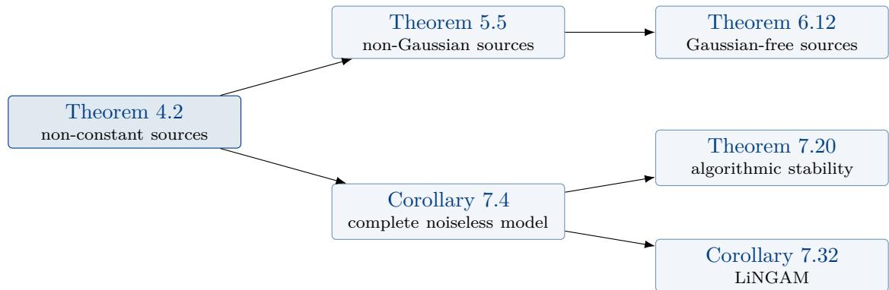

# Foundations of Independent Component Analysis

Patrick Forré

AI4Science Lab Korteweg-de Vries Institute for Mathematics University of Amsterdam p.d.forre@uva.nl

## Abstract

We present the mathematical foundations of linear independent component analysis (ICA) models based on standard literature in a self-contained note. It is aimed at readers with a background in measure-theoretic probability theory. We first develop the theory of the characteristic functions of probability measures on Rd, including their analyticity and the way in which they determine and characterise the distributions. We then focus on several identifiability results of ICA models with successively strengthened assumptions on the sources: from merely non-constant, to non-Gaussian, to Gaussian-free independent sources. Under the strictest assumptions, we show that the independent sources are identifiable up to translation, permutation, scales and signs, and this even in the presence of additive Gaussian noise. Furthermore, we present the online equivariant gradient descent ICA algorithm for recovering the independent sources from data, in the standard complete noiseless non-Gaussian ICA setting.

## Contents

1 Introduction 2   
2 Notation and Conventions 4   
3 Characteristic Functions of Probability Measures on $\mathbb { R } ^ { d }$ 5   
3.1 Definition and elementary properties 5   
3.2 How characteristic functions determine distributions 6   
3.3 Moments, the distinguished logarithm, and cumulants 8   
3.4 Analytic characteristic functions 10   
3.5 Gaussian, sub-Gaussian and super-Gaussian distributions 12   
3.6 Why non-Gaussianity is what makes ICA work 15   
4 Identifiability for Non-Constant Independent Sources 17   
5 Identifiability for Non-Gaussian Independent Sources 20   
6 Identifiability for Gaussian-Free Independent Sources 27   
6.1 Gaussian-free random variables . 27   
6.2 Identifiability in the presence of additive Gaussian noise 31   
7 Complete Noiseless ICA: Estimation by Equivariant Gradient Descent 35   
7.1 The complete noiseless model and its identifiability 35   
7.2 The maximum likelihood objective 38   
7.3 The relative gradient: what the “preconditioner” really is 40   
7.4 Stationary points, stability, and the choice of nonlinearity 42   
7.5 The algorithm . 49   
7.6 LiNGAM: a causal order removes the permutation 49   
7.7 Generalisations: a brief overview 52   
A Proofs of the Classical Results on Characteristic Functions 53   
A.1 Uniqueness and inversion 54   
A.2 Lévy’s continuity theorem 55   
A.3 Entire characteristic functions . 56   
A.4 Marcinkiewicz’ theorem 57   
A.5 Cramér’s decomposition theorem 58   
B A Proof of the Kagan–Linnik–Rao Theorem 59   
B.1 Finite diferences 60   
B.2 Proof of the column dichotomy 62   
References 65

## 1 Introduction

The linear independent component analysis (ICA) model postulates that an observed $p -$ dimensional random vector X is an afine image of a k-dimensional random vector $Z$ with mutually independent components:

$$
X = A Z + \mu ,
$$

$$
A \in \mathbb { R } ^ { p \times k } ,
$$

$$
\mu \in \mathbb { R } ^ { p } .\tag{1}
$$

The components $Z _ { 1 } , \ldots , Z _ { k }$ are called the sources and $A$ is called the mixing matrix; both are unobserved. The identifiability question asks how much of the pair $( A , { \mathcal { L } } ( Z ) )$ is determined by the law of X alone (Comon, 1994; Hyvärinen and $\mathrm { O j a } ,$ , 2000; Eriksson and Koivunen, 2004).

Some ambiguity is unavoidable and built into the model: we may rescale a column of A and inversely rescale the corresponding source, we may permute the columns of A together with the sources, and we may shift a source into the ofset $\mu$ . Written out, for any permutation matrix P, any invertible diagonal matrix Λ and any $\boldsymbol { c } \in \mathbb { R } ^ { k }$ ，

$$
A Z + \mu = ( A P \Lambda ) \bigl ( \Lambda ^ { - 1 } P ^ { - 1 } ( Z - c ) \bigr ) + ( A c + \mu ) ,\tag{2}
$$

and the right hand side is again a representation of the form Eq. (1) with independent sources. The content of the classical identifiability theory is that, under suitable assumptions, this is the only ambiguity – with one important exception: Gaussian sources. That exception is genuine and not an artefact of the proofs. If $Z \sim { \mathcal { N } } ( 0 , I _ { k } )$ then $Q Z \sim \mathcal { N } ( 0 , I _ { k } )$ for every orthogonal $Q ,$ so a purely Gaussian source vector can be rotated arbitrarily without changing the law of X.

The results collected here go back to the characterisation theory of the Gaussian law that grew out of the theorems of Cramér (1936), Marcinkiewicz (1939), Darmois (1953) and Skitovich (1954), and that is developed systematically in the monographs of Kagan et al. (1973) and Linnik and Ostrovskii (1977). The ICA community rediscovered and popularised these results, notably through Comon (1994) and Eriksson and Koivunen (2004), and they underpin causal discovery methods such as LiNGAM (Shimizu et al., 2006).

Prerequisites. These notes are written for readers who have taken a measure-theoretic probability course. We assume laws and weak convergence, product measures and Fubini’s theorem, and basic complex analysis up to Morera’s theorem and the identity theorem. Everything else – in particular the entire theory of characteristic functions that the arguments rest on – is developed in Section $^ { 3 , }$ , with precise references for the standard results and full proofs for everything specific to our setting.

Outline and contributions. Section 2 fixes notation. Section 3 develops characteristic functions of probability measures on Rd: their elementary properties, how they determine and characterise distributions (uniqueness, inversion, the Cramér–Wold device, Lévy’s continuity theorem), why local agreement of two characteristic functions is not enough, moments and cumulants via the distinguished logarithm, analyticity in a strip and the resulting rigidity, and finally the characterisation of the Gaussian law together with the sub- and super-Gaussian (platykurtic and leptokurtic) distributions that ICA is built on. It closes with the precise sense in which kurtosis acts as a contrast function, and with the observation that the identifiability theory needs strictly less than that: non-normality, not non-zero kurtosis. Section 4 treats sources that are merely assumed to be non-constant and states the fundamental result of Kagan et al. (1973) in the form we need; we take the opportunity to reinstate a proportionality constant that is lost in the statement given there (see Footnote 1). Section 5 specialises to non-Gaussian sources. The main technical device is Lemma 5.2, which shows how a Gaussian noise vector can be traded against extra columns of the mixing matrix, and back; this is what allows us to reduce the non-Gaussian case to the non-constant case. Section 6 introduces the stronger requirement that the sources be Gaussian-free, i.e. that no independent Gaussian noise can be split of them at all. We show in Theorem 6.7 that every real-valued random variable decomposes, essentially uniquely, into a Gaussian-free part and independen Gaussian noise, and we then prove the strongest statement of these notes, Theorem 6.12: for full column rank mixing matrices the sources are then identifiable up to permutation, scale and translation even in the presence of additive Gaussian noise with an arbitrary, possibly non-diagonal and degenerate covariance matrix. Section 7 turns to estimation in the case that dominates applications – a square invertible mixing matrix and no noise. We derive the classical identifiability statement as Corollary 7.4, set up the maximum likelihood objective, show that the customary “preconditioner” in the gradient step is not an approximate inverse Hessian but the exact gradient for a natural right-invariant metric, and prove in Theorem 7.20 exactly when a separating solution is a locally asymptotically stable equilibrium of the mean dynamics underlying the online algorithm – which, for correctly specified sources, is precisely when Corollary 7.4 says the model is identifiable. The same section then shows in Corollary 7.32 how a causal ordering removes the last remaining ambiguities, giving the linear non-Gaussian acyclic model LiNGAM, and closes with a short survey of how the model has been generalised. Section A collects the proofs of the four classical results about characteristic functions that Section 3 quotes: the uniqueness and inversion theorem, Lévy’s continuity theorem, Marcinkiewicz’ theorem and Cramér’s decomposition theorem. Section B proves Theorem 4.2, the identifiability theorem of Kagan et al. (1973) on which Section 4 onwards rest. The proof is a self-contained finite-diference argument: it needs only the distinguished logarithm, Marcinkiewicz’ theorem, and Fréchet’s functional equation, which we also prove. With these appendices in place, every result in these notes is proved here, with one exception: Bochner’s Theorem 3.3, which we quote and which is used only once, in Remark 3.8, where it could be replaced by a direct computation. Standard background is of course used throughout and is listed at the start of Section A; Section 7 additionally uses standard matrix calculus and, in Theorem 7.20, the unstable-manifold theorem for maps.

How to read this note. The logical skeleton is short. Everything downstream of Section 4 rests on the single result Theorem 4.2, proved in Section B, and branches from there into the two lines of development that the rest of the note pursues:

  
The upper branch strengthens the hypotheses on the sources and asks how much of the model this buys back; the lower branch fixes the hypotheses at their most convenient and asks how to estimate. A reader interested only in the algorithm may go directly from Section 3 to Section 7, taking Corollary 7.4 on faith.

## 2 Notation and Conventions

Notation 2.1 (Random objects versus deterministic objects). All random objects are defined on one underlying probability space $( \Omega , \mathcal { F } , \mathbb { P } )$ and are denoted by capital Latin letters: X for the observed random vector, Z for the source vector, E, V, G, H, N, U for the various (mostly Gaussian) noise and remainder terms. Deterministic matrices are capital Latin or Greek letters (A, B, P, Q, R, W, Θ, Λ, Σ; in particular W always denotes the deterministic unmixing matrix of Section 7, never a random vector), deterministic vectors and scalars are lower case $( a _ { j } , \ b _ { l } , \ \mu , \ \nu , \ \xi , \ \lambda _ { j } , \ t )$ . Components of a random vector carry a subscript, $Z = [ Z _ { 1 } , \ldots , Z _ { k } ] ^ { \mathsf { T } }$ , and $e _ { j }$ denotes the j-th standard basis vector. Superscripts in brackets, $A ^ { ( 1 ) } , Z ^ { ( 2 ) }$ , index the two competing representations of the same observed vector and are never exponents.

Notation 2.2 (Multi-indices and weak convergence). For a multi-index $\alpha = ( \alpha _ { 1 } , \ldots , \alpha _ { d } ) \in  { \mathbb { N } } _ { 0 } ^ { d }$ we write $| \alpha | : = \alpha _ { 1 } + \cdot \cdot \cdot + \alpha _ { d }$ for its order, and, for $\boldsymbol { x } \in \mathbb { R } ^ { d }$ and a suficiently diferentiable $f \colon  { \mathbb { R } ^ { d } } \to  { \mathbb { C } }$

$$
x ^ { \alpha } : = \prod _ { j = 1 } ^ { d } x _ { j } ^ { \alpha _ { j } } ,
$$

$$
\partial ^ { \boldsymbol { \alpha } } f : = \frac { \partial ^ { | \boldsymbol { \alpha } | } f } { \partial x _ { 1 } ^ { \alpha _ { 1 } } \cdot \cdot \cdot \partial x _ { d } ^ { \alpha _ { d } } } ,\tag{3}
$$

with the convention $x ^ { 0 } : = 1$ and $\partial ^ { 0 } f : = f .$ The symbol ⇒ denotes weak convergence of laws: for random vectors $X _ { n } , X$ in $\mathbb { R } ^ { d }$ we write $X _ { n } \Rightarrow X { \mathrm { ~ i f ~ } } \mathbb { E } [ f ( X _ { n } ) ] \to \mathbb { E } [ f ( X ) ]$ for every bounded continuous $f \colon  { \mathbb { R } ^ { d } } \to  { \mathbb { R } }$

Notation 2.3 (Distributional relations). For a random vector X in $\mathbb { R } ^ { p }$ we write ${ \mathcal { L } } ( X )$ for its law and

$$
\varphi _ { X } ( t ) : = \mathbb { E } \big [ \exp ( i t ^ { \mathsf { T } } X ) \big ] ,
$$

$$
t \in \mathbb { R } ^ { p } ,\tag{4}
$$

for its characteristic function. We reserve

$X \sim { \mathcal { N } } ( \mu , \Sigma )$ for $^ { 6 6 } X$ is distributed according to the law $\mathcal { N } ( \boldsymbol { \mu } , \boldsymbol { \Sigma } ) ^ { * }$ , and

$X { \overset { d } { = } } Y$ for $^ { 6 6 } X$ and Y have the same law”, i.e. $\mathcal { L } ( X ) = \mathcal { L } ( Y )$ , equivalently $\varphi _ { X } = \varphi _ { Y }$ Stochastic independence is written $X \perp \perp Y$ . Mutual independence of a family $\{ X _ { 1 } , \ldots , X _ { k } \}$ always means independence of the whole family, not merely pairwise independence. Statements such as ${ } ^ { 6 6 } Z _ { j }$ is non-constant” are always understood P-almost surely, i.e. $\mathcal { L } ( Z _ { j } )$ is not a Dirac measure $\delta _ { c } .$

Notation 2.4 (Degenerate Gaussian distributions). We call E a (possibly degenerate) Gaussian random vector, $E \sim { \mathcal { N } } ( { \boldsymbol { \mu } } , { \boldsymbol { \Sigma } } )$ with $\mu \in \mathbb { R } ^ { p }$ and a positive semi-definite $\Sigma \in \mathbb { R } ^ { p \times p }$ , if

$$
\begin{array} { r } { \varphi _ { E } ( t ) = \exp \Big ( { i t ^ { \mathsf { T } } \mu } - { \frac { 1 } { 2 } } t ^ { \mathsf { T } } \Sigma t \Big ) , } \end{array}
$$

$$
t \in \mathbb { R } ^ { p } .\tag{5}
$$

This includes the degenerate cases: Σ is allowed to be singular, and for $p = 1 , \sigma ^ { 2 } = 0$ , we have $\mathcal { N } ( \mu , 0 ) = \delta _ { \mu }$ , so that constants count as Gaussian. Whenever we want to exclude this case we say non-degenerate.

## 3 Characteristic Functions of Probability Measures on $\mathbb { R } ^ { d }$

Every argument in these notes is carried out at the level of characteristic functions. This section collects the facts we need, in the generality in which we need them. We assume familiarity with measure-theoretic probability – laws, weak convergence, product measures, Fubini’s theorem – and we cite the standard results rather than reproving them; everything that is specific to the independent component analysis (ICA) setting is proved in full. Standard references are Klenke (2020, Chapter 15) and Kallenberg (2021, Chapters 5–6) for the general theory, Lukacs (1970) for characteristic functions specifically, and Kagan et al. (1973, Chapter 1) for the characterisation-theoretic material.

## 3.1 Definition and elementary properties

Definition 3.1 (Characteristic function). Let $\mu$ be a probability measure on $\bigl ( \mathbb { R } ^ { d } , B ( \mathbb { R } ^ { d } ) \bigr )$ . Its characteristic function (c.f.) is the map

$$
\varphi _ { \mu } \colon \mathbb R ^ { d } \to \mathbb C , \qquad \varphi _ { \mu } ( t ) : = \int _ { \mathbb R ^ { d } } \exp \bigl ( i t ^ { \mathsf { T } } x \bigr ) \mu ( d x ) .\tag{6}
$$

For a random vector $X$ in $\mathbb { R } ^ { d }$ with law ${ \mathcal { L } } ( X ) = \mu$ we write $\varphi _ { X } : = \varphi _ { \mu } ,$ , so that $\varphi _ { X } ( t ) =$ $\mathbb { E } { [ \exp ( i t ^ { \mathsf { T } } X ) ] }$ . The integral is well defined because $| \mathrm { e x p } ( i t ^ { \mathsf { T } } x ) | = 1$ , so the integrand is bounded and measurable.

Proposition 3.2 (Elementary properties). Let X be a random vector in $\mathbb { R } ^ { d }$ with characteristic function $\varphi _ { X }$ . Then:

(i) $\varphi _ { X } ( 0 ) = 1$ and $| \varphi _ { X } ( t ) | \leq 1$ for all $t \in \mathbb { R } ^ { d }$ ;

(ii) $\varphi _ { X }$ is uniformly continuous on $\mathbb { R } ^ { d }$

(iii) $\varphi _ { X } ( - t ) = { \overline { { \varphi _ { X } ( t ) } } }$ , and $\varphi _ { X }$ is real valued if and only $i f X \stackrel { d } { = } - X$ ;

(iv) $\varphi _ { X }$ is positive semi-definite: for all $n \in \mathbb { N }$ , all $t _ { 1 } , \ldots , t _ { n } \in \mathbb { R } ^ { d }$ and all $z _ { 1 } , \dots , z _ { n } \in \mathbb { C }$

$$
\sum _ { j , l = 1 } ^ { n } z _ { j } \overline { { z _ { l } } } \varphi _ { X } ( t _ { j } - t _ { l } ) \geq 0 ;\tag{7}
$$

(v) (afine images) for $A \in \mathbb { R } ^ { m \times d }$ and $b \in \mathbb { R } ^ { m }$

$$
\varphi _ { A X + b } ( t ) = \exp ( i t ^ { \mathsf { T } } b ) \cdot \varphi _ { X } ( A ^ { \mathsf { T } } t ) ,
$$

$$
t \in \mathbb { R } ^ { m } ;\tag{8}
$$

(vi) (independent sums) $i f X \perp \perp Y$ are random vectors in $\mathbb { R } ^ { d }$ , then

$$
\varphi _ { X + Y } ( t ) = \varphi _ { X } ( t ) \cdot \varphi _ { Y } ( t ) ,
$$

$$
t \in \mathbb { R } ^ { d } ;\tag{9}
$$

(vii) (one-dimensional projections) for $u \in \mathbb { R } ^ { d }$ and $s \in \mathbb { R }$

$$
\varphi _ { u ^ { \mathsf { T } } X } ( s ) = \varphi _ { X } ( s u ) .\tag{10}
$$

Proof. (i) is immediate. For (ii) note that $| \varphi _ { X } ( t + h ) - \varphi _ { X } ( t ) | \leq \mathbb { E } \big [ | \exp ( i h ^ { \mathsf { T } } X ) - 1 | \big ]$ , whose right hand side does not depend on t and tends to 0 as $h  0$ by dominated convergence. (iii): the identity ${ \overline { { \exp ( i t ^ { \mathsf { T } } X ) } } } = \exp ( - i t ^ { \mathsf { T } } X )$ gives $\varphi _ { X } ( - t ) = \overline { { \varphi _ { X } ( t ) } }$ , and hence $\varphi _ { X }$ is real as soon as $X { \overset { d } { = } } - X$ , since then $\varphi _ { X } ( - t ) = \varphi _ { - X } ( t ) = \varphi _ { X } ( t )$ . Conversely, if $\varphi _ { X }$ is real then $\varphi _ { - X } ( t ) =$ $\varphi _ { X } ( - t ) = { \overline { { \varphi _ { X } ( t ) } } } = \varphi _ { X } ( t )$ for every t, so $X { \overset { d } { = } } - X$ by Theorem $3 . 4 ( \mathrm { i } )$ below, whose proof does not use this proposition. For (iv) we argue $\begin{array} { r } { \sum _ { j , l } z _ { j } \overline { { z _ { l } } } \exp \big ( i ( t _ { j } - t _ { l } ) ^ { \mathsf { T } } X \big ) = \big | \sum _ { j } z _ { j } \exp ( i t _ { j } ^ { \mathsf { T } } X ) \big | ^ { 2 } \geq 0 } \end{array}$ after taking expectations. For (v), $\mathbb { E } [ \exp ( i t ^ { \mathsf { T } } ( A X + b ) ) ] = \exp ( i t ^ { \mathsf { T } } b ) \mathbb { E } [ \exp ( i \left( A ^ { \mathsf { T } } t \right) ^ { \mathsf { T } } X ) ]$ . (vi) is the factorisation of the expectation of a product of independent bounded random variables, and (vii) is the special case $\boldsymbol { A } = \boldsymbol { u } ^ { \intercal } , \boldsymbol { b } = 0$ of (v). □

Properties (8), (9) and (10) are the three identities that carry all the ICA arguments: a linear ICA model is by definition an independent sum of afine images, so its characteristic function factorises into the characteristic functions of the sources evaluated along the columns of the mixing matrix.

Theorem 3.3 (Bochner’s theorem; see Klenke, 2020, Chapter 15; Lukacs, 1970, Section 4.2). A function $\phi \colon  { \mathbb { R } ^ { d } } \to  { \mathbb { C } }$ is the characteristic function of a probability measure on $\mathbb { R } ^ { d }$ if and only $i f \phi$ is continuous, $\phi ( 0 ) = 1$ , and $\phi$ is positive semi-definite in the sense of Proposition ${ \it 3 . } \it { 2 } \it { ( i v ) }$

Beyond the standard background listed at the start of Section A, Theorem 3.3 is the only result from the theory of characteristic functions that any proof in these notes uses without our having proved it: the dificult direction is a genuinely deep theorem, and reproducing it here would take us too far afield. (Two further classical facts are quoted in remarks – Pólya’s criterion in Remark 3.8 and the Lukacs characterisation in Remark 3.16 – but no proof depends on either.) It is what makes statements of the form $^ { 6 6 } \phi$ is a characteristic function” verifiable without exhibiting the underlying law. We shall repeatedly need such statements – for instance in Theorem 6.7, where a supremum over admissible Gaussian factors is taken – although in practice we usually certify them through the more convenient Theorem 3.7 rather than by verifying positive semi-definiteness. The one place where we do verify positive semi-definiteness directly is Remark 3.8.

## 3.2 How characteristic functions determine distributions

Theorem 3.4 (Uniqueness and inversion). Let $\mu , \nu$ be probability measures on $\mathbb { R } ^ { d }$

(i) $I f \varphi _ { \mu } = \varphi _ { \nu }$ on all $o f \mathbb { R } ^ { d }$ , then $\mu = \nu$ . Equivalently, for random vectors X, Y in $\mathbb { R } ^ { d }$

$$
X \stackrel { d } { = } Y \Longleftrightarrow \varphi _ { X } = \varphi _ { Y } .\tag{11}
$$

(ii) $I f$ in addition $\varphi _ { \mu } \in L ^ { 1 } ( \mathbb { R } ^ { d } )$ , then $\mu$ has a bounded continuous Lebesgue density given by the inversion formula

$$
f ( \boldsymbol { x } ) = ( 2 \pi ) ^ { - d } \int _ { \mathbb { R } ^ { d } } \exp ( - i \boldsymbol { t } ^ { \mathsf { T } } \boldsymbol { x } ) \varphi _ { \mu } ( t ) d \boldsymbol { t } .\tag{12}
$$

The proof is in Section $\mathrm { A . 1 } ;$ see also Klenke, 2020, Chapter 15 and Kallenberg, 2021, Chapter 5.

Theorem 3.5 (Cramér–Wold device; see Klenke, 2020, Chapter 15). Let $X , Y$ be random vectors in $\mathbb { R } ^ { d }$ . Then $X \overset { d } { = } Y \overset { \cdot } { i } f$ and only if $u ^ { \mathsf { T } } X \overset { d } { = } u ^ { \mathsf { T } } Y$ for every $u \in \mathbb { R } ^ { d }$ . Likewise, $X _ { n } \Rightarrow X$ weakly if and only if $u ^ { \mathsf { T } } X _ { n } \Rightarrow u ^ { \mathsf { T } } X$ for every $u \in \mathbb { R } ^ { d }$

Proof. By Eq. (10) we have $\varphi _ { u ^ { \mathsf { T } } X } ( 1 ) = \varphi _ { X } ( u )$ , so knowing the laws of all one-dimensional projections is the same as knowing $\varphi _ { X }$ pointwise, and Theorem 3.4 (i) applies.

For the second statement, suppose first $X _ { n } \Rightarrow X$ . By Theorem $3 . 7 ( \mathrm { i } )$ in $\mathbb { R } ^ { d } , \varphi _ { X _ { n } }  \varphi _ { X }$ pointwise, so $\varphi _ { u ^ { \mathsf { T } } X _ { n } } ( s ) = \varphi _ { X _ { n } } ( s u )  \varphi _ { X } ( s u ) = \varphi _ { u ^ { \mathsf { T } } X } ( s )$ for every s; the limit is continuous at $s = 0$ , so Theorem $3 . 7 ( \mathrm { i i } )$ in $d = 1$ gives $u ^ { \mathsf { T } } X _ { n } \Rightarrow u ^ { \mathsf { T } } X$ . Conversely, suppose $u ^ { \mathsf { T } } X _ { n } \Rightarrow u ^ { \mathsf { T } } X$ for every u. By Theorem $3 . 7 ( \mathrm { i } )$ in $d = 1$ and Eq. (10) at $s = 1$ we get $\varphi _ { X _ { n } } ( u ) \to \varphi _ { X } ( u )$ for every $u \in \mathbb { R } ^ { d }$ , and $\varphi _ { X }$ is continuous at the origin, so Theorem $3 . 7 ( \mathrm { i i } )$ yields a random vector $X ^ { \prime }$ with $\varphi _ { X ^ { \prime } } = \varphi _ { X }$ and $X _ { n } \Rightarrow X ^ { \prime } ;$ by Theorem $3 . 4 ( \mathrm { i } ) , X ^ { \prime } \overset { d } { = } X$ and hence $X _ { n } \Rightarrow X$ □

Remark 3.6 (Two diferent theorems of Cramér). Theorem 3.5 is the Cramér–Wold device, a statement about reducing $\mathbb { R } ^ { d }$ to R. It should not be confused with Cramér’s decomposition theorem, Theorem 3.20 below, which says that a Gaussian law has only Gaussian factors. Both are used in these notes, for entirely diferent purposes.

Theorem 3.7 (Lévy’s continuity theorem). Let $( X _ { n } ) _ { n \in \mathbb { N } }$ be random vectors in $\mathbb { R } ^ { d }$

(i) $I f X _ { n } \Rightarrow X$ weakly, then $\varphi _ { X _ { n } } \to \varphi _ { X }$ pointwise.

(ii) Conversely, if $\varphi _ { X _ { n } } ( t ) \to \phi ( t )$ for every $t \in \mathbb { R } ^ { d }$ and $\phi$ is continuous at $t = 0$ , then $\phi$ is the characteristic function of a random vector X and $X _ { n } \Rightarrow X$ weakly.

The proof is in Section $\mathrm { { A . 2 } ; }$ see also Klenke, 2020, Section 15.3.

The continuity requirement in (ii) is not a technicality: for $X _ { n } \ \sim \ { \mathcal { N } } ( 0 , n )$ we have $\varphi _ { X _ { n } } ( t ) = \exp ( - n t ^ { 2 } / 2 ) \to \mathbf { 1 } _ { \{ t = 0 \} }$ pointwise, and the limit – discontinuous at the origin – is not a characteristic function; the mass has escaped to infinity.

Remark 3.8 (Local equality of characteristic functions is not enough). Theorem 3.4 requires $\varphi _ { \mu } = \varphi _ { \nu }$ on all of $\mathbb { R } ^ { d }$ . Agreement on a neighbourhood of the origin does not sufice. The classical counterexample goes back to Pólya (1949); in the form given by Feller (1971, Chapter XV) and Lukacs (1970, p. 85) it reads as follows. Let

$$
\phi _ { 1 } ( t ) : = \big ( 1 - | t | \big ) _ { + } ,\tag{13}
$$

the “tent function”. It is a characteristic function. Indeed, with $h : = \mathbf { 1 } _ { [ - 1 / 2 , 1 / 2 ] }$ one has, for every $t \in \mathbb { R }$ 2

$$
( h \ast h ) ( t ) = \int _ { \mathbb R } h ( u ) h ( t - u ) d u = ( 1 - | t | ) _ { + } = \phi _ { 1 } ( t ) ,\tag{14}
$$

and since $h$ is real-valued and even, $\begin{array} { r } { \phi _ { 1 } ( t _ { j } - t _ { l } ) = \int _ { \mathbb { R } } h ( t _ { j } - u ) h ( t _ { l } - u ) } \end{array}$ du, whence for all $n \in \mathbb { N }$ $t _ { 1 } , \ldots , t _ { n } \in \mathbb { R }$ and $z _ { 1 } , \dots , z _ { n } \in \mathbb { C }$

$$
\sum _ { j , l = 1 } ^ { n } z _ { j } \overline { { z _ { l } } } \phi _ { 1 } ( t _ { j } - t _ { l } ) = \int _ { \mathbb { R } } \Bigl | \sum _ { j = 1 } ^ { n } z _ { j } h ( t _ { j } - u ) \Bigr | ^ { 2 } d u \ge 0 .\tag{15}
$$

So $\phi _ { 1 }$ is continuous, $\phi _ { 1 } ( 0 ) = 1$ and positive semi-definite, and Theorem 3.3 certifies that $\phi _ { 1 } = \varphi _ { \mu _ { 1 } }$ for a probability measure $\mu _ { 1 }$ on $\mathbb { R } .$ . (Alternatively one may invoke Pólya’s criterion, Feller $( 1 9 7 1$ , Section XV.2): every continuous even $\phi \colon { \mathbb { R } } \to$ R that is convex on $[ 0 , \infty )$ and satisfies $\phi ( 0 ) = 1$ and $\phi ( t ) \to 0$ as t → ∞ is a characteristic function; the tent function is the standard example, being the maximum of two afine functions on $\lbrack 0 , \infty ) . )$ Now Theorem 3.4 (ii) may be applied, since $\phi _ { 1 } \in L ^ { 1 } ( \mathbb { R } )$ : the law $\mu _ { 1 }$ is absolutely continuous with density

$$
f ( x ) = { \frac { 1 } { 2 \pi } } \int _ { - 1 } ^ { 1 } ( 1 - | t | ) e ^ { - i t x } d t = { \frac { 1 } { \pi } } \int _ { 0 } ^ { 1 } ( 1 - t ) \cos ( t x ) d t = { \frac { 1 - \cos x } { \pi x ^ { 2 } } } .\tag{16}
$$

Let $\phi _ { 2 }$ be the 2-periodic extension of $1 - | t |$ from $[ - 1 , 1 ]$ to all of R. Expanding the resulting triangular wave into its Fourier series gives

$$
\phi _ { 2 } ( t ) = \frac { 1 } { 2 } + \sum _ { n ~ \mathrm { o d d } } \frac { 4 } { \pi ^ { 2 } n ^ { 2 } } \cos ( n \pi t ) ,\tag{17}
$$

which is the characteristic function of the discrete law with mass $\begin{array} { l } { { \frac { 1 } { 2 } } } \end{array}$ at 0 and mass $2 / ( \pi ^ { 2 } n ^ { 2 } )$ at each of ±nπ for odd $n \geq 1$ ; the masses do sum to $\begin{array} { r } { { \frac { 1 } { 2 } } + { \frac { 4 } { \pi ^ { 2 } } } \sum _ { n { \mathrm { ~ o d d } } } { \bar { n ^ { - 2 } } } = { \frac { 1 } { 2 } } + { \frac { 4 } { \pi ^ { 2 } } } \cdot { \frac { \pi ^ { 2 } } { 8 } } = 1 } \end{array}$ . Then $\phi _ { 1 } = \phi _ { 2 }$ on $[ - 1 , 1 ]$ , while the two laws are as diferent as they could be: one is absolutely continuous, the other purely atomic.

This is why every local statement in these notes is stated with the explicit qualifier $^ { 6 6 } \mathrm { i n }$ a neighbourhood of the origin”, and why such statements are never silently upgraded to statements about laws. The upgrade is legitimate under an analyticity hypothesis; see Corollary 3.14.

## 3.3 Moments, the distinguished logarithm, and cumulants

Proposition 3.9 (Moments and derivatives). Let X be a random vector in $\mathbb { R } ^ { d }$ and $n \in \mathbb { N }$ with $\mathbb { E } [ \| X \| ^ { n } ] < \infty$ . Then $\varphi _ { X } \in C ^ { n } ( \mathbb { R } ^ { d } ; \mathbb { C } )$ and, for every multi-index α with $| { \boldsymbol { \alpha } } | \leq n$ and every $t \in \mathbb { R } ^ { d } .$

$$
\partial ^ { \alpha } \varphi _ { X } ( t ) = i ^ { | \alpha | } \mathbb { E } \big [ X ^ { \alpha } e ^ { i t ^ { \mathsf { T } } X } \big ] ;
$$

$$
\begin{array} { r l } { i n ~ p a r t i c u l a r } & { { } \partial ^ { \alpha } \varphi _ { X } ( 0 ) = i ^ { | \alpha | } \operatorname { \mathbb { E } } [ X ^ { \alpha } ] . } \end{array}\tag{18}
$$

In the scalar case $d = 1$ this gives the Taylor expansion

$$
\varphi _ { X } ( t ) = \sum _ { m = 0 } ^ { n } { \frac { \operatorname { \mathbb { E } } [ X ^ { m } ] } { m ! } } ( i t ) ^ { m } + o ( | t | ^ { n } ) , \qquad t \to 0 .\tag{19}
$$

Proof. We prove Eq. (18) by induction on $| \alpha |$ , the case $\alpha = 0$ being the definition. Suppose it holds for α with $| \alpha | < n$ and let $j \in \{ 1 , \ldots , d \}$ . For $h \neq 0$

$$
\frac { \partial ^ { \alpha } \varphi _ { X } ( t + h e _ { j } ) - \partial ^ { \alpha } \varphi _ { X } ( t ) } { h } = i ^ { | \alpha | } \mathbb { E } \left[ X ^ { \alpha } e ^ { i t ^ { \Gamma } X } \frac { e ^ { i h X _ { j } } - 1 } { h } \right] ,\tag{20}
$$

and the integrand is dominated in modulus by $| X ^ { \alpha } | | X _ { j } | \leq \| X \| ^ { | \alpha | + 1 }$ , which is integrable because $| { \boldsymbol { \alpha } } | + 1 \leq n ;$ here we used $| e ^ { i h x } - 1 | \leq | h x |$ . Since $( e ^ { i h X _ { j } } - 1 ) / h  i X _ { j }$ pointwise as $h  0$ , dominated convergence gives $\partial _ { j } \partial ^ { \boldsymbol { \alpha } } \varphi _ { X } ( t ) = i ^ { | \alpha | + 1 } \mathbb { E } [ X ^ { \boldsymbol { \alpha } } X _ { j } e ^ { i t ^ { \mathsf { T } } X } ]$ , which is the claim for the multi-index $\alpha + e _ { j }$ . The same domination shows that each such derivative is continuous in t, so $\varphi _ { X } \in C ^ { n } . \ \operatorname { E q . } \ ( 1 9 )$ is Taylor’s theorem with Peano remainder applied to the $C ^ { n }$ function φX, together with Eq. (18) at $t = 0$ □

A partial converse holds, and it needs no moment hypothesis at all: for a real-valued random variable $Y$ and $m \in \mathbb { N }$ , if $\varphi _ { Y }$ is 2m times diferentiable at the single point 0, then $\mathbb { E } [ Y ^ { 2 m } ] < \infty ;$ ; the odd moments up to order 2m are then finite by Lyapunov’s inequality. This is Lemma A.3, proved in Section $\mathrm { A }$

All our arguments manipulate logarithms of characteristic functions. Since a characteristic function is complex valued and may vanish, this requires a small amount of care, which the following lemma settles once and for all.

Lemma 3.10 (Distinguished logarithm). Let X be a random vector in $\mathbb { R } ^ { d }$ . (Uniqueness.) If $U \ni 0$ is a connected open subset $o f \mathbb { R } ^ { d }$ and $\psi , \tilde { \psi } \colon U \to \mathbb { C }$ are continuous with $\psi ( 0 ) = \tilde { \psi } ( 0 ) = 0$ and $\exp \psi = \exp \tilde { \psi } = \varphi _ { X }$ on $U ,$ then $\psi = \tilde { \psi } ;$ so the germ at the origin is well defined and we may compare distinguished logarithms on any such U. (Existence.) There exist $\delta > 0$ and a continuous function $\psi _ { X } \colon B _ { \delta } ( 0 ) \to \mathbb { C }$ with $\psi _ { X } ( 0 ) = 0$ and

$$
\varphi _ { X } ( t ) = \exp ( \psi _ { X } ( t ) ) ,
$$

$$
t \in B _ { \delta } ( 0 ) ,\tag{21}
$$

where $B _ { \delta } ( 0 ) : = \{ t \in \mathbb { R } ^ { d } : \| t \| < \delta \}$ . We call ψX the cumulant generating function of X (near the origin). $I f \mathbb { E } [ \| X \| ^ { n } ] < \infty$ , then $\psi _ { X } \in C ^ { n }$ on $B _ { \delta } ( 0 )$

Proof. By Proposition 3.2 (i)–(ii) the function $\varphi _ { X }$ is continuous with $\varphi _ { X } ( 0 ) = 1$ , so there is a $\delta > 0$ with $| \varphi _ { X } ( t ) - 1 | < 1$ for all $t \in B _ { \delta } ( 0 )$ . Hence $\varphi _ { X }$ maps $B _ { \delta } ( 0 )$ into the open disc of radius 1 around 1, which is contained in the slit plane $\mathbb { C } \setminus \left( - \infty , 0 \right]$ on which the principal branch Log of the complex logarithm is defined and continuous. Put $\psi _ { X } : = \mathrm { L o g } \circ \varphi _ { X }$ ; then $\psi _ { X }$ is continuous, $\psi _ { X } ( 0 ) = \mathrm { L o g } 1 = 0$ and exp $\circ \psi _ { X } = \varphi _ { X }$

For uniqueness, let $U \ni 0$ be any connected open subset of $\mathbb { R } ^ { d }$ and let $\psi , \tilde { \psi } \colon U  \mathbb { C }$ be continuous with $\psi ( 0 ) = \tilde { \psi } ( 0 ) = 0$ and exp $\psi = \exp \tilde { \psi } = \varphi _ { X }$ on $U$ . Then $\exp ( \tilde { \psi } - \psi ) \equiv 1$ on $U _ { : }$ so $( \tilde { \psi } - \psi ) / ( 2 \pi i )$ is a continuous integer-valued function on the connected set U vanishing at the origin, hence identically 0. This covers in particular the case $U = B _ { \delta } ( 0 ) , \psi = \psi _ { X }$ The regularity statement follows from Proposition 3.9 because Log is holomorphic on the slit plane. □

Definition 3.11 (Cumulants). Let X be a real-valued random variable with $\mathbb { E } [ | X | ^ { n } ] < \infty$ and let $\psi _ { X }$ be as in Lemma 3.10. The cumulants $\kappa _ { 1 } ( X ) , \ldots , \kappa _ { n } ( X )$ of X are the coeficients in the expansion

$$
\psi _ { X } ( t ) = \sum _ { m = 1 } ^ { n } { \frac { \kappa _ { m } ( X ) } { m ! } } ( i t ) ^ { m } + o ( t ^ { n } ) , \qquad t \to 0 ,\tag{22}
$$

equivalently $\kappa _ { m } ( X ) = i ^ { - m } \psi _ { X } ^ { ( m ) } ( 0 )$ . The first four cumulants are

$$
\kappa _ { 1 } ( X ) = \mathbb { E } [ X ] , \qquad \kappa _ { 2 } ( X ) = \mathrm { V a r } ( X ) ,\tag{23}
$$

$$
\kappa _ { 3 } ( X ) = \mathbb { E } [ ( X - \mathbb { E } X ) ^ { 3 } ] , \qquad \ \qquad \kappa _ { 4 } ( X ) = \mathbb { E } [ ( X - \mathbb { E } X ) ^ { 4 } ] - 3 \operatorname { V a r } ( X ) ^ { 2 } .\tag{24}
$$

Proposition 3.12 (Cumulant calculus). Let X, Y be real-valued random variables with finite n-th absolute moments and let $a , b \in \mathbb { R }$ . Then, $f o r \ m \leq n$ 2

(i) (additivity) if X ⊥⊥ Y then $\kappa _ { m } ( X + Y ) = \kappa _ { m } ( X ) + \kappa _ { m } ( Y )$ ;

(ii) (homogeneity) $\kappa _ { m } ( a X ) = a ^ { m } \kappa _ { m } ( X ) ,$

(iii) (translation invariance) $\kappa _ { m } ( X + b ) = \kappa _ { m } ( X )$ for m ≥ 2, and $\kappa _ { 1 } ( X + b ) = \kappa _ { 1 } ( X ) + b$

Proof. By Eq. (9) and Lemma 3.10 we have $\psi _ { X + Y } = \psi _ { X } + \psi _ { Y }$ on a neighbourhood of the origin, since both sides are continuous, vanish at 0 and exponentiate to $\varphi _ { X + Y } ;$ comparing Taylor coeficients gives (i). For (ii), $\varphi _ { a X } ( t ) = \varphi _ { X } ( a t )$ by Eq. (8), so $\psi _ { a X } ( t ) = \psi _ { X } ( a t )$ and the m-th coeficient picks up $a ^ { m }$ . For (iii), $\psi _ { X + b } ( t ) = \psi _ { X } ( t ) + i b t$ , which changes only the coeficient of $( i t ) ^ { 1 }$ □

Additivity is the reason cumulants, rather than moments, are the natural bookkeeping device for ICA: a mixture is an independent sum, so its cumulants are sums of the source cumulants.

## 3.4 Analytic characteristic functions

Theorem 3.13 (Analyticity in a strip). Let X be a random vector in $\mathbb { R } ^ { d }$ and suppose that there is an $a > 0$ with

$$
\mathbb { E } [ \exp ( a \| X \| ) ] < \infty .\tag{25}
$$

Then the map

$$
z \longmapsto \mathbb { E } [ \exp ( i z ^ { \mathsf { T } } X ) ]\tag{26}
$$

is well defined and holomorphic on the tube $S _ { a } : = \{ z \in \mathbb { C } ^ { d } : \| \mathrm { I m } z \| < a \}$ , and it restricts to φX on $\mathbb { R } ^ { d }$ . If Eq. (25) holds for every $a > 0$ , then φX extends to an entire function on $\mathbb { C } ^ { d }$

Proof. We give the argument for $d = 1$ , which is the only case used below: every appeal to this theorem in these notes is to a real-valued random variable, and the one place where a multivariate statement is wanted, Corollary 3.14, is reduced to one variable via Theorem 3.5. For general d the same argument applied in each coordinate separately, with |·| replaced by ∥·∥, yields separate holomorphy together with local boundedness on $S _ { a ; }$ joint holomorphy then follows from Osgood’s lemma (or, dispensing with boundedness, from Hartogs’ theorem). For $z = s + i u$ with $| u | < a$ we have | $\exp ( i z X ) | = \exp ( - u X ) \leq \exp ( a | X | )$ , which is integrable by Eq. (25); so $F ( z ) : = \mathbb { E } [ \exp ( i z X ) ]$ is well defined on the strip $S _ { a }$ , and it is continuous there by dominated convergence. For any closed triangle $\Delta \subseteq S _ { a } ,$ Fubini’s theorem applies because $( z , \omega ) \mapsto \exp ( i z X ( \omega ) )$ is jointly measurable and dominated by the integrable exp(a|X|) uniformly on the compact set $\partial \Delta ;$ hence

$$
\oint _ { \partial \Delta } F ( z ) d z = \mathbb { E } \left[ \oint _ { \partial \Delta } \exp ( i z X ) d z \right] = 0 ,\tag{27}
$$

the inner integral vanishing because $z \mapsto \exp ( i z X )$ is entire for each fixed value of X. By Morera’s theorem F is holomorphic on $S _ { a }$ , and $F | _ { \mathbb { R } } = \varphi _ { X }$ by construction. □

Corollary 3.14 (Rigidity of analytic characteristic functions). Let X, Y be random vectors in $\mathbb { R } ^ { d }$ both satisfying Eq. (25) for some $a > 0$ $I f \varphi _ { X } = \varphi _ { Y }$ on some neighbourhood of the origin in $\mathbb { R } ^ { d }$ , then $X { \overset { d } { = } } Y$

Proof. Replacing a by the smaller of the two constants we may assume that X and Y satisfy Eq. (25) with the same $a > 0$ , and let $\delta > 0$ be such that $\varphi _ { X } = \varphi _ { Y }$ on $B _ { \delta } ( 0 )$ . Fix $u \in \mathbb { R } ^ { d } \backslash \{ 0 \}$ By Eq. (10),

$$
\varphi _ { u ^ { \mathsf { T } } X } ( s ) = \varphi _ { X } ( s u ) = \varphi _ { Y } ( s u ) = \varphi _ { u ^ { \mathsf { T } } Y } ( s ) , \qquad | s | < \delta / \| u \| .\tag{28}
$$

Moreover $\vert u ^ { \mathsf { T } } X \vert \leq \vert \vert u \vert \vert \vert X \vert \vert$ , so the real-valued random variables $u ^ { \mathsf { T } } X$ and $u ^ { \mathsf { T } } Y$ satisfy Eq. (25) with the constant $a / \lVert u \rVert$ , and by Theorem 3.13 their characteristic functions extend holomorphically to a strip in C. Two functions holomorphic on a connected open subset of C which agree on a real interval agree on all of it, by the identity theorem in one complex variable; hence $\varphi _ { u ^ { \intercal } X } = \varphi _ { u ^ { \intercal } Y }$ on all of R and therefore $u ^ { \top } X \overset { d } { = } u ^ { \top } Y$ by Theorem 3.4 (i). Since u was arbitrary, Theorem 3.5 gives $X { \overset { d } { = } } Y$ □

We deliberately reduced to one complex variable here. In several variables the naive form of the identity theorem fails: agreement of two holomorphic functions on a set with accumulation points is not suficient, as $f ( z _ { 1 } , z _ { 2 } ) = z _ { 1 }$ , vanishing on the uncountable set $\{ 0 \} \times \mathbb { C }$ , shows. A d-dimensional argument is nevertheless available – at a real point of a real neighbourhood on which h vanishes, every complex partial derivative of h agrees with the corresponding real one and hence vanishes, so $h \equiv 0$ on a polydisc and then on all of the connected $S _ { a } -$ but the reduction to one variable is shorter and is all we need.

Corollary 3.14 is exactly what Remark 3.8 rules out in general: the tent function of that remark is the characteristic function of a law whose density is of order $x ^ { - 2 }$ , which has no exponential moments at all.

Proposition 3.15 (Ridge property). Let $d = 1$ and let X satisfy $E q .$ (25) for some $a > 0$ 2 and denote again by $\varphi _ { X }$ the holomorphic extension of Theorem 3.13. Then for all $s \in \mathbb { R }$ and $| u | < a$ 2

$$
| \varphi _ { X } ( s + i u ) | \leq \varphi _ { X } ( i u ) = \mathbb { E } [ \exp ( - u X ) ] \in \mathbb { R } _ { > 0 } ,\tag{29}
$$

that $i s ,$ on each horizontal line the modulus is maximal on the imaginary axis.

Proof. On the strip we have $\varphi _ { X } ( z ) = \mathbb { E } [ \exp ( i z X ) ]$ , so

$$
| \varphi _ { X } ( s + i u ) | = \big | \mathbb { E } \big [ e ^ { i s X } e ^ { - u X } \big ] \big | \le \mathbb { E } \big [ \big | e ^ { i s X } \big | e ^ { - u X } \big ] = \mathbb { E } \big [ e ^ { - u X } \big ] = \varphi _ { X } ( i u ) ,\tag{30}
$$

which is real and strictly positive because $e ^ { - u X } > 0$

Remark 3.16 (Ridge property and the moment generating function). Evaluating the holomorphic extension of Theorem 3.13 at $z = - i u$ gives $\varphi _ { X } ( - i u ) = \operatorname { \mathbb { E } } [ \exp ( u X ) ] = M _ { X } ( u )$ the moment generating function of X; Eq. (29) then says that $\left| \varphi _ { X } \right|$ is maximal on each horizontal line at its purely imaginary point. If $\varphi _ { X }$ is analytic in some neighbourhood of the origin – equivalently, if 0 lies in the interior of $\lbrace u : M _ { X } ( u ) < \infty \rbrace$ – then its maximal strip of analyticity is exactly the one cut out by that interior (Lukacs, 1970, Theorem 7.1.1); the moment generating function may well be finite at a boundary abscissa while $\varphi _ { X }$ is analytic only on the open strip. Without the hypothesis at the origin the statement is false: a law with an exponential right tail and a $| x | ^ { - 3 }$ left tail has $\{ M _ { X } < \infty \} = [ 0 , 1 )$ with non-empty interior, yet $\mathbb { E } [ X ^ { 2 } ] = \infty$ , so $\varphi _ { X }$ is not even twice diferentiable at the origin, let alone analytic there.

The following theorem is the single most important analytic input for these notes. It says that the exponential of a polynomial is a characteristic function only in the Gaussian case.

Theorem 3.17 (Marcinkiewicz’ theorem, Marcinkiewicz, 1939). Let $Y$ be a real-valued random variable whose characteristic function is of the form

$$
\varphi _ { Y } ( t ) = \exp ( g ( t ) )\tag{31}
$$

in a neighbourhood of the origin, with a (complex) polynomial $g .$ Then $\deg ( g ) \leq 2 ,$ more precisely, after subtracting from g the constant $g ( 0 ) \in 2 \pi i \mathbb { Z }$ , which changes exp(g) not at all and the degree only in the trivial case of a constant $g _ { . }$

$$
\begin{array} { r } { g ( t ) = - \frac { 1 } { 2 } \sigma ^ { 2 } t ^ { 2 } + i \mu t , } \end{array}
$$

$$
\sigma ^ { 2 } \in \mathbb { R } _ { \geq 0 } ,
$$

$$
\mu \in \mathbb { R } ,\tag{32}
$$

and consequently Y has a (possibly degenerate) Gaussian distribution, $Y \sim { \mathcal { N } } ( \mu , \sigma ^ { 2 } )$ , where the degenerate case $\sigma ^ { 2 } = 0$ means $Y \sim { \mathcal { N } } ( \mu , 0 ) = \delta _ { \mu }$

The proof is in Section $\mathrm { A . 4 } ;$ see also Kagan et al. (1973, Lemma 1.4.2) and Lukacs (1970, Section 7.3).

In the language of Definition 3.11: there is no probability distribution whose cumulant generating function equals a polynomial of degree $3$ or higher near the origin. The superficially similar statement that the vanishing of all cumulants of order $> n$ already forces the vanishing of all cumulants of order $> 2$ is also true, but it is not a restatement of Theorem 3.17: vanishing Taylor coeficients do not by themselves make ψY a polynomial, and an additional analytic argument is required, namely a growth bound on the moments strong enough to make $\varphi _ { Y }$ entire. For $n = 2 \mathrm { ~ - ~ }$ the only case we shall need – such a bound is immediate, because then the moments are Gaussian moments; we give the argument inside the proof of Theorem 3.19, in the implication ${ \big ( } \mathrm { v } { \big ) } { \Rightarrow } { \mathrm { ( i i ) } }$ . For general n one argues instead as follows. The number of set partitions of $\{ 1 , \ldots , m \}$ all of whose blocks have size at most n is bounded by $C ( n ) ^ { m } ( m ! ) ^ { 1 - 1 / n }$ , so the moment–cumulant formula gives $| \mathbb { E } [ Y ^ { m } ] | \leq C ^ { \prime m } ( m ! ) ^ { 1 - 1 / n }$ with a constant $C ^ { \prime } \geq 1$ depending on n and on the finitely many non-zero cumulants. Lyapunov’s inequality turns this into a bound of the same shape for the absolute moments, with a larger constant: $\mathbb { E } | Y | ^ { m } \leq \left( \mathbb { E } [ Y ^ { m + 1 } ] \right) ^ { m / ( m + 1 ) } \leq ( C ^ { \prime } ) ^ { m + 1 } \big ( ( m + 1 ) ! \big ) ^ { 1 - 1 / n }$ for odd $m ,$ , and since $\left( ( m + 1 ) ! \right) ^ { 1 - 1 / n } / m ! = ( m + 1 ) ^ { 1 - 1 / n } ( m ! ) ^ { - 1 / n }$ one gets $\textstyle \sum _ { m > 0 } a ^ { m } \operatorname { \mathbb { E } } \vert Y \vert ^ { m } / m ! < \infty$ for every $a > 0$ . By Tonelli’s theorem that sum equals $\mathbb { E } [ \exp ( a | Y | ) ]$ , so Eq. (25) holds for every $a > 0$ and Theorem 3.13 makes $\varphi _ { Y }$ entire; then ψY is holomorphic near 0 and equal to its Taylor polynomial there, and Theorem 3.17 applies. We shall not use this generalisation.

Remark 3.18 (How Theorem 3.17 will be used). We shall use Theorem 3.17 in the following two guises.

(i) If two real-valued random variables $Y _ { 1 } , Y _ { 2 }$ satisfy

$$
\varphi _ { Y _ { 2 } } ( \lambda t ) = \varphi _ { Y _ { 1 } } ( t ) \exp ( g ( t ) )\tag{33}
$$

near the origin with a polynomial $g$ and a scalar $\lambda \in \mathbb { R } \backslash \{ 0 \}$ , then $Y _ { 2 }$ is Gaussian if and only if $Y _ { 1 }$ is Gaussian. Indeed, by Eq. (8) the left hand side is $\varphi _ { \lambda Y _ { 2 } } ( t )$ , so it sufices to treat $\lambda = 1$ and then to note that $\lambda Y _ { 2 }$ is Gaussian if and only if Y2 is, again by Eq. (8) and $\lambda \neq 0$ . For $\lambda = 1 \colon \mathrm { i f } \ Y _ { 1 }$ is Gaussian then $\varphi _ { Y _ { 1 } }$ is itself the exponential of a polynomial of degree $\leq 2$ , hence so is $\varphi _ { Y _ { 2 } }$ near the origin and Theorem 3.17 applies; the converse follows by exchanging the roles and replacing g by $- g .$

(ii) The sum of an independent non-Gaussian random variable and a Gaussian random variable is again non-Gaussian: if $Y = Y _ { 1 } + Y _ { 2 }$ with $Y _ { 1 } \perp \perp Y _ { 2 }$ and $Y _ { 2 }$ Gaussian, then $\varphi _ { Y _ { 1 } } ( t ) = \varphi _ { Y } ( t ) \varphi _ { Y _ { 2 } } ( t ) ^ { - 1 }$ , and $\varphi _ { Y _ { 2 } } ^ { - 1 }$ is the exponential of a polynomial of degree $\leq 2 ;$ so if $Y$ were Gaussian, $Y _ { 1 }$ would be Gaussian as well.

Note that $\varphi _ { Y _ { 2 } }$ has no zeros for Gaussian $Y _ { 2 }$ , so the above quotients are well defined on all of R.

## 3.5 Gaussian, sub-Gaussian and super-Gaussian distributions

Theorem 3.19 (Characterisation of the Gaussian law). Let X be a random vector in $\mathbb { R } ^ { d }$ The following are equivalent.

(i) $X \sim { \mathcal { N } } ( \mu , \Sigma )$ is (possibly degenerate) Gaussian in the sense of Notation ${ 2 . 4 } ;$

(ii) $\begin{array} { r } { \varphi _ { X } ( t ) = \exp ( i t ^ { \mathsf { T } } \mu - \frac { 1 } { 2 } t ^ { \mathsf { T } } \Sigma t ) } \end{array}$ for all $t \in \mathbb { R } ^ { d }$ , for some $\mu \in \mathbb { R } ^ { d }$ and some positive semidefinite $\Sigma ;$

(iii) every one-dimensional projection $u ^ { \mathsf { T } } X , \ u \in \mathbb { R } ^ { d }$ , is a (possibly degenerate) Gaussian real-valued random variable.

For $d = 1$ these are further equivalent to each of:

(iv) $\psi _ { X }$ coincides with a polynomial on a neighbourhood of the origin;

(v) X has moments of all orders and $\kappa _ { m } ( \boldsymbol { X } ) = 0$ for all $m \geq 3$

$P r o o f . \ ( \mathrm { i } ) { \Leftrightarrow } ( \mathrm { i i } )$ is Notation 2.4 combined with Theorem 3.4 (i).

$( \mathrm { i i } ) { \Rightarrow } ( \mathrm { i i i } )$ : Eq. (10) gives

$$
\begin{array} { r } { \varphi _ { u ^ { \mathsf { T } } X } ( s ) = \exp \Big ( i s u ^ { \mathsf { T } } \mu - \frac { 1 } { 2 } s ^ { 2 } u ^ { \mathsf { T } } \Sigma u \Big ) , } \end{array}\tag{34}
$$

which is the characteristic function of $\begin{array} { r } { \mathcal { N } ( u ^ { \mathsf { T } } \mu , u ^ { \mathsf { T } } \Sigma u ) . \quad ( \mathrm { i i i } ) { \Rightarrow } ( \mathrm { i i } ) \colon } \end{array}$ put $\mu _ { u } : = \mathbb { E } [ u ^ { \mathsf { T } } X ]$ and $\sigma _ { u } ^ { 2 } : = \mathrm { V a r } ( u ^ { \mathsf { T } } X )$ , which are finite by (iii); then $\begin{array} { r } { \varphi _ { X } ( u ) = \varphi _ { u ^ { \intercal } X } ( 1 ) = \exp ( i \mu _ { u } - \frac { 1 } { 2 } \sigma _ { \underline { { u } } } ^ { 2 } ) } \end{array}$ , and $u \mapsto \mu _ { u }$ is linear while $u \mapsto \sigma _ { u } ^ { 2 }$ is a positive semi-definite quadratic form, so $\mu _ { u } = u ^ { \mathsf { I } } \mu$ and $\sigma _ { u } ^ { 2 } = u ^ { \mathsf { T } } \Sigma u$ for $\mu : = \mathbb { E } [ X ]$ and $\Sigma : = \operatorname { C o v } ( X ) . \ ( \operatorname { i i } ) { \Rightarrow } ( \operatorname { i v } )$ is clear, and $( \mathrm { i v } ) { \Rightarrow } ( \mathrm { i i } )$ is Marcinkiewicz’ Theorem 3.17. $( \mathrm { i i } ) { \Rightarrow } ( \mathrm { v } )$ is immediate from Eq. (22).

For ${ \big ( } \mathrm { v } ) { \Rightarrow } ( \mathrm { i i } )$ some care is needed, because Eq. (22) is only an asymptotic expansion: knowing all Taylor coeficients of $\psi _ { X }$ does not by itself make ψ a polynomial, so Theorem 3.17 is not directly applicable. Instead, put $\mu : = \kappa _ { 1 } ( X )$ and $\sigma ^ { 2 } : = \kappa _ { 2 } ( X )$ . The moment–cumulant relations express $\mathbb { E } [ X ^ { m } ]$ as a universal polynomial in $\kappa _ { 1 } ( X ) , \ldots , \kappa _ { m } ( X )$ ; with $\kappa _ { m } ( \boldsymbol { X } ) = 0$ for all $m \geq 3$ these are exactly the moments of ${ \mathcal { N } } ( \mu , \sigma ^ { 2 } )$ . Since $\exp ( a | x | ) \leq \exp ( a x ) + \exp ( - a x )$ monotone convergence gives, for every $a > 0$

$$
\mathbb { E } \big [ \exp ( a | X | ) \big ] \leq 2 \sum _ { k \geq 0 } \frac { a ^ { 2 k } } { ( 2 k ) ! } \mathbb { E } \big [ X ^ { 2 k } \big ] = 2 \sum _ { k \geq 0 } \frac { a ^ { 2 k } } { ( 2 k ) ! } \mathbb { E } \big [ N ^ { 2 k } \big ] < \infty ,\tag{35}
$$

where $N \sim \mathcal N ( \mu , \sigma ^ { 2 } )$ . The last series converges because it is dominated by $2 \mathbb { E } [ \exp ( a | N | ) ]$ which is finite. So X satisfies $\operatorname { E q . }$ (25) for every $a > 0 ,$ , and by Theorem 3.13 its characteristic function is entire, hence equal to its everywhere convergent Taylor series about the origin. By Proposition 3.9 that series is determined by the moments of $X$ , which are those of $N$ , so $\varphi _ { X } = \varphi _ { N }$ , which is (ii). □

Theorem 3.20 (Cramér’s decomposition theorem, Cramér, 1936). $I f Y _ { 1 } \perp \perp Y _ { 2 }$ are real-valued random variables such that $Y _ { 1 } + Y _ { 2 }$ is Gaussian, then both $Y _ { 1 }$ and $Y _ { 2 }$ are Gaussian (possibly degenerate).

The proof is in Section A.5; see also Kagan et al., 1973, Theorem 1.1.1.

Theorems 3.17 and 3.20 are dual to each other and together explain the special role of the Gaussian law: it cannot be built out of non-Gaussian independent pieces, and it cannot be approached by “almost polynomial” cumulant generating functions. The next definition quantifies the deviation from normality that ICA exploits.

Definition 3.21 (Excess kurtosis; sub- and super-Gaussian). Let X be a real-valued random variable with $\mathbb { E } [ X ^ { 4 } ] < \infty$ and $\sigma ^ { 2 } : = \mathrm { V a r } ( X ) \in ( 0 , \infty )$ . Its excess kurtosis is

$$
\operatorname { k u r t } ( X ) : = { \frac { \kappa _ { 4 } ( X ) } { \sigma ^ { 4 } } } = { \frac { \mathbb { E } [ ( X - \mathbb { E } X ) ^ { 4 } ] } { \sigma ^ { 4 } } } - 3 .\tag{36}
$$

We call X

• super-Gaussian (or leptokurtic) if kurt $( X ) > 0$

• sub-Gaussian (or platykurtic) if kurt $( X ) < 0$ ，

• mesokurtic if $\ker ( X ) = 0$

This is the convention of the ICA literature (Comon, 1994; Hyvärinen et al., 2001); see Remark 3.25 for the clash with the concentration-theoretic use of the same words, and Remark 3.24 for what the sign of kurt does and does not say about tails. For the laws customarily used as ICA source models the picture is the familiar one: the super-Gaussian ones are peaked at the mode and heavy tailed – the Laplace and Student laws used to model the “sparse” sources of natural images and audio – while the sub-Gaussian ones are flat-topped, the uniform law being the prototype. Remark 3.24 shows that this correspondence is a property of those particular families rather than a general implication.

Proposition 3.22 (Kurtosis through the characteristic function). Let X be a real-valued random variable with $\mathbb { E } [ X ^ { 4 } ] < \infty$ . Then

$$
\kappa _ { 4 } ( X ) = \psi _ { X } ^ { ( 4 ) } ( 0 ) = \frac { d ^ { 4 } } { d t ^ { 4 } } \left. \mathrm { L o g } \varphi _ { X } ( t ) \right| _ { t = 0 } ,\tag{37}
$$

and for independent real-valued random variables $X _ { 1 } , \ldots , X _ { k }$ with finite fourth moments and weights $w \in \mathbb { R } ^ { k }$ ，

$$
\kappa _ { 4 } \Bigl ( \sum _ { j = 1 } ^ { k } w _ { j } X _ { j } \Bigr ) = \sum _ { j = 1 } ^ { k } w _ { j } ^ { 4 } \kappa _ { 4 } ( X _ { j } ) .\tag{38}
$$

Proof. The first identity is Definition 3.11 with $m = 4$ , using $i ^ { - 4 } = 1$ and Lemma 3.10. The second follows from Proposition 3.12 (i)–(ii). □

Remark 3.23 $( \mathrm { k u r t } = 0$ does not mean Gaussian). By Theorem 3.19 (v) a non-degenerate Gaussian random variable is mesokurtic, but the converse fails badly. Consider the symmetric three-point law

$$
\mathbb { P } [ X = a ] = \mathbb { P } [ X = - a ] = p , \qquad \mathbb { P } [ X = 0 ] = 1 - 2 p ,\tag{39}
$$

with $a > 0$ and $p \in ( 0 , \frac { 1 } { 2 } )$ . Then $\varphi _ { X } ( t ) = 1 - 2 p + 2 p \cos ( a t ) , \sigma ^ { 2 } = 2 p a ^ { 2 } , \mathbb { E } [ X ^ { 4 } ] = 2 p a ^ { 4 }$ , and hence

$$
\kappa _ { 4 } ( X ) = 2 p a ^ { 4 } ( 1 - 6 p ) ,
$$

$$
\operatorname { k u r t } ( X ) = { \frac { 1 - 6 p } { 2 p } } .\tag{40}
$$

For $\begin{array} { r } { p = \frac { 1 } { 6 } } \end{array}$ this vanishes, yet X is a three-point law and certainly not Gaussian. Consequently, non-Gaussianity is a strictly weaker requirement than kurt $\neq 0 \mathrm { ~ - ~ }$ which is precisely why the identifiability theorems of Sections 5 and 6 are formulated in terms of non-normality rather than in terms of kurtosis.

Remark 3.24 (Kurtosis and tail weight). Excess kurtosis is routinely glossed as “tail weight”. The gloss is convenient, but it is not a theorem, and it is worth being precise about what kurt does and does not measure.

What it measures. Let $Z : = ( X - \mathbb { E } X ) / \sigma$ be the standardisation of $X ,$ so that $\mathbb { E } [ Z ] = 0$ and $\mathbb { E } [ Z ^ { 2 } ] = 1$ . Since Va $\mathopen { : } \mathopen { } \mathclose \bgroup \left( Z ^ { 2 } \aftergroup \egroup \right) = \mathbb { E } [ Z ^ { 4 } ] - ( \mathbb { E } [ Z ^ { 2 } ] ) ^ { 2 } = \mathbb { E } [ Z ^ { 4 } ] - 1$ , we have the identity

$$
\operatorname { k u r t } ( X ) = \operatorname { \mathbb { E } } [ Z ^ { 4 } ] - 3 = \operatorname { V a r } ( Z ^ { 2 } ) - 2 = \operatorname { \mathbb { E } } [ ( Z ^ { 2 } - 1 ) ^ { 2 } ] - 2 .\tag{41}
$$

The quantity $Z ^ { 2 } - 1$ vanishes exactly at $Z = \pm 1$ , that is at $X = \mathbb { E } X \pm \sigma$ , so excess kurtosis is the dispersion of X about those two points: probability mass moved away from $\mathbb { E } X \pm \sigma$ increases it, whether it moves outwards into the tails or inwards towards the centre. This is Moors’ reading of kurtosis as a measure of dispersion around $\mu \pm \sigma$ (Moors, 1986); Balanda and MacGillivray (1988) phrase it as the location- and scale-free movement of probability mass from the “shoulders” of a distribution into its centre and its tails, and argue that the notion is irreducibly vague, admitting several inequivalent formalisations. Eq. (41) also yields the sharp bound kurt $\geq - 2 .$ , with equality if and only if $Z ^ { 2 } = 1$ almost surely, i.e. exactly when $X$ takes the two values $\mathbb { E } X \pm \sigma$ with probability $\frac { 1 } { 2 }$ each – any afine image of the Rademacher law, whose entry in Table 1 records this value. For the same reason kurtosis is not a measure of peakedness either (Kaplansky, 1945; Darlington, 1970).

What it does not measure. Read “tail weight” as the asymptotic decay of the density, or of $\mathbb { P } [ | X | > x ]$ , relative to a Gaussian. Under that reading the sign of kurt and tail weight are logically independent, in both directions.

(a) Light tails, arbitrarily large kurtosis. The three-point law Eq. (39) is supported on $\{ - a , 0 , a \}$ , so its tails are as light as tails can be; yet kurt $( X ) = ( 1 - 6 p ) / ( 2 p ) \to \infty$ as $p \downarrow 0 ,$ , by Eq. (40).

(b) Heavy tails, negative kurtosis. Let X have the mixture law

$$
{ \mathcal { L } } ( X ) = ( 1 - \varepsilon ) \operatorname { U n i f } [ - 1 , 1 ] + \varepsilon \operatorname { L a p l a c e } ( 1 ) , \qquad \varepsilon = 1 0 ^ { - 3 } .\tag{42}
$$

Then $\sigma ^ { 2 } = 6 7 / 2 0 0$ and kurt $( X ) = - 4 5 1 5 / 4 4 8 9$ ≈ −1.006, so X is sub-Gaussian in the sense of Definition 3.21. Its density equals $\frac { 1 } { 2 } \varepsilon e ^ { - | x | }$ for $| x | > 1$ , and therefore exceeds the density of the Gaussian law of the same variance for $| x | \geq x _ { 0 }$ with $x _ { 0 } \approx 2 . 5 6$ , by a factor of about $3 . 1 \cdot 1 0 ^ { 5 } \mathrm { a t } | x | = 4$

(c) Heavy tails, no kurtosis at all. The Cauchy law, and the Student $t _ { \nu }$ laws with $\nu \leq 4$ ， have $\mathbb { E } [ X ^ { 4 } ] = \infty .$ , so kurt is not even defined; cf. Table 1.

Under a diferent reading of “tail” the verdict changes. If tail weight is taken to mean the propensity to produce observations far from the mean measured in units of σ, rather than asymptotic decay, then kurtosis is a tail functional, and Westfall (2014) argues that this is its only unambiguous interpretation. Example (a) shows what separates the two readings: the three-point law has compact support, but its atoms sit at $\pm a = \pm \sigma / \sqrt { 2 p }$ , that is arbitrarily many standard deviations from the mean.

Convention. In these notes “sub-Gaussian” and “super-Gaussian” always mean Definition 3.21, the sign of kurt, and never a statement about tails. Where tails are meant – in Table 1, in Remark 3.25 and in Corollary 6.9 – they are named explicitly and always refer to asymptotic decay.

Remark 3.25 (Two incompatible meanings of “sub-Gaussian”). In concentration of measure and high-dimensional statistics, a real-valued random variable X is called sub-Gaussian when its tails are dominated by those of a Gaussian law, equivalently – up to the value of the constant σ – when

$$
\begin{array} { r } { \mathbb { E } [ \exp \bigl ( \lambda ( X - \mathbb { E } X ) \bigr ) ] \leq \exp \Bigl ( \frac { 1 } { 2 } \lambda ^ { 2 } \sigma ^ { 2 } \Bigr ) , } \end{array}
$$

$$
\lambda \in \mathbb { R } ,\tag{43}
$$

for some $\sigma > 0$ . By Theorem 3.13 this forces $\varphi _ { X }$ to be entire, and the displayed bound gives $\begin{array} { r } { | \varphi _ { X } ( z ) | \leq \mathbb { E } \big [ e ^ { | \mathrm { I m } z | | X | } \big ] \leq 2 \exp \bigl ( | \mathrm { I m } z | | \mathbb { E } X | + \frac { 1 } { 2 } \sigma ^ { 2 } | \mathrm { I m } z | ^ { 2 } \bigr ) } \end{array}$ , so $\varphi _ { X }$ is of order at most 2. This is not the notion of Definition 3.21, and neither notion implies the other. Indeed, the three-point law Eq. (39) with $\begin{array} { r } { p < { \frac { 1 } { 6 } } } \end{array}$ is bounded, hence sub-Gaussian in the concentration sense, while Eq. (40) gives kurt $( X ) \stackrel { \smile } { = } ( 1 - 6 p ) / ( 2 p ) > 0$ , so it is super-Gaussian in the sense of Definition 3.21. Conversely, the mixture of Remark 3.24 (b) has exponential tails and so is not sub-Gaussian in the concentration sense, while its excess kurtosis is negative, so it is sub-Gaussian in the sense of Definition 3.21. Throughout these notes, “sub-Gaussian” and “super-Gaussian” always refer to Definition 3.21.

## 3.6 Why non-Gaussianity is what makes ICA work

The classical heuristic behind ICA is the central limit theorem: a normalised mixture $w ^ { \mathsf { T } } Z =$ $\textstyle \sum _ { j } w _ { j } Z _ { j }$ of many independent sources looks “more Gaussian” than any individual source, so

<table><tr><td>Law of X</td><td> $\varphi _ { X } ( t )$ </td><td> $\ker ( X )$ </td><td>type</td><td>analyticity of φx</td></tr><tr><td> ${ \mathcal { N } } ( 0 , \sigma ^ { 2 } )$ </td><td> $e ^ { - \sigma ^ { 2 } t ^ { 2 } / 2 }$ </td><td>0</td><td>Gaussian</td><td>entire, order 2</td></tr><tr><td>Uniform on  $[ - a , a ]$ </td><td> $\frac { \sin ( a t ) } { a t }$ </td><td> $- { \frac { 6 } { 5 } }$ </td><td>sub-Gaussian</td><td>entire, order 1</td></tr><tr><td>Rademacher on {±1}</td><td>cos t</td><td>-2</td><td>sub-Gaussian</td><td>entire, order 1</td></tr><tr><td>Three-point Eq. (39)</td><td> $1 - 2 p + 2 p \cos ( a t )$ </td><td> $1 - 6 p$ </td><td> $\operatorname { s u b - i f f } p > { \frac { 1 } { 6 } }$ </td><td>entire, order 1</td></tr><tr><td>Laplace, scale b</td><td> $\frac { 1 } { 1 + b ^ { 2 } t ^ { 2 } }$ </td><td>2p 3</td><td>super-Gaussian</td><td> $\mathrm { s t r i p ~ } | \mathrm { I m } z | < b ^ { - 1 }$ </td></tr><tr><td>Student  $t _ { \nu } , \nu > 4$ </td><td> $( \sqrt { \nu } | t | ) ^ { \nu / 2 } K _ { \nu / 2 } ( \sqrt { \nu } | t | )$ </td><td>6</td><td>super-Gaussian not analytic at 0</td><td></td></tr><tr><td>Cauchy, scale γ</td><td> $\overline { { \Gamma ( \nu / 2 ) 2 ^ { \nu / 2 - 1 } } }$   $e ^ { - \gamma | t | }$ </td><td> $\overline { { \nu - 4 } }$  undefined no moments</td><td></td><td>not differentiable at 0</td></tr></table>

Table 1: Characteristic functions, excess kurtosis and domain of analyticity for the standard examples. $K _ { \nu / 2 }$ denotes the modified Bessel function of the second kind. Power-law tails destroy analyticity at the origin; exponential tails give a strip; bounded or Gaussian tails give an entire function.

one may hope to recover the sources by searching for the directions in which the mixture is least Gaussian. Eq. (38) turns this heuristic into a precise statement.

Proposition 3.26 (Kurtosis as a contrast function). Let $Z _ { 1 } , \ldots , Z _ { k }$ be independent real-valued random variables with $\mathbb { E } [ Z _ { j } ] = 0$ , Var $( Z _ { j } ) = 1$ and $\mathbb { E } [ Z _ { j } ^ { 4 } ] < \infty$ , and let $w \in \mathbb { R } ^ { k }$ with $\| w \| _ { 2 } = 1$ Then Var $( w ^ { \mathsf { T } } Z ) = 1$ and

$$
\big | \mathrm { k u r t } ( w ^ { \mathsf { T } } Z ) \big | = \Big | \sum _ { j = 1 } ^ { k } w _ { j } ^ { 4 } \ \mathrm { k u r t } ( Z _ { j } ) \Big | \ \leq \ \operatorname* { m a x } _ { 1 \leq j \leq k } \big | \mathrm { k u r t } ( Z _ { j } ) \big | .\tag{44}
$$

$I f \operatorname* { m a x } _ { j } | \mathrm { k u r t } ( Z _ { j } ) | > 0$ , then equality holds if and only if $w = \pm e _ { j }$ for an index j attaining the maximum; so the maximisers of $w \mapsto | { \mathrm { k u r t } } ( w ^ { \mathsf { T } } Z ) |$ on the unit sphere are exactly the signed coordinate directions of maximal |kurt|. If instead kurt $( Z _ { j } ) = 0$ for every $j \mathrm { ~ - ~ } i n$ particular if all sources are Gaussian – then both sides vanish for every w and the criterion carries no information at all.

Proof. Since $\mathrm { V a r } ( Z _ { j } ) = 1$ and $\| w \| _ { 2 } = 1$ we get $\kappa _ { 2 } ( w ^ { \mathsf { T } } Z ) = 1$ by Proposition 3.12, so kurt $( w ^ { \mathsf { T } } Z ) = \kappa _ { 4 } ( w ^ { \mathsf { T } } Z )$ , and Eq. (38) gives the stated identity. Then

$$
\Big | \sum _ { j } w _ { j } ^ { 4 } \operatorname { k u r t } ( Z _ { j } ) \Big | \leq \sum _ { j } w _ { j } ^ { 4 } | \operatorname { k u r t } ( Z _ { j } ) | \leq \operatorname* { m a x } _ { j } \lvert \operatorname { k u r t } ( Z _ { j } ) \rvert \cdot \sum _ { j } w _ { j } ^ { 4 } \leq \operatorname* { m a x } _ { j } \lvert \operatorname { k u r t } ( Z _ { j } ) \rvert ,\tag{45}
$$

where the last step uses $\begin{array} { r } { \sum _ { j } w _ { j } ^ { 4 } \le \left( \sum _ { j } w _ { j } ^ { 2 } \right) ^ { 2 } = 1 } \end{array}$ . Write $M : = \mathrm { m a x } _ { j } | \mathrm { k u r t } ( Z _ { j } ) |$ and assume $M > 0$ . Then equality in the last inequality, which reads $M \textstyle \sum _ { j } w _ { j } ^ { 4 } \leq M$ , holds if and only $\begin{array} { r } { \operatorname { i f } \sum _ { j } w _ { j } ^ { 4 } = 1 , \operatorname { i . e } } \end{array}$ . if and only if exactly one coordinate of w is non-zero and thus $w = \pm e _ { j } { \mathrm { : } }$ equality in the middle inequality then forces |kurt $( Z _ { j } ) | = M$ . If $M = 0$ all three quantities vanish for every w, which is the last assertion. □

Proposition 3.26 is the theoretical justification of the kurtosis-based contrast functions of Comon (1994) and Hyvärinen et al. (2001), and it already displays the two phenomena that the rest of these notes make exact:

(i) non-Gaussian sources are recoverable, and the recovery is only ever determined up to sign, scale and the ordering of the coordinates – the ambiguities of Eq. (1);

(ii) Gaussian sources are not recoverable at all, since the contrast degenerates. Compare Remark 3.27.

What the following sections add is that neither fourth moments nor any moments at all are actually needed: the correct hypothesis is non-normality, in the sense of Theorem 3.19, and the correct tool is Theorem 3.17 rather than a contrast function.

Remark 3.27 (Gaussian sources are genuinely unidentifiable). Let $Z \sim \mathcal { N } ( 0 , I _ { k } )$ and let $A \in \mathbb { R } ^ { p \times k }$ . For every orthogonal $Q \in O ( k )$ we have $Q Z \sim \mathcal { N } ( 0 , I _ { k } )$ by Eq. (8), so $Q Z$ again has mutually independent components, while

$$
A Z \ { \stackrel { d } { = } } \ ( A Q ^ { \mathsf { T } } ) ( Q Z ) .\tag{46}
$$

So A and $A Q ^ { \mathsf { T } }$ are indistinguishable from the law of $X = A Z$ , and the ambiguity is a whole orthogonal group rather than only the discrete permutations and the diagonal rescalings of Section 1. This is why every identifiability statement below either excludes Gaussian sources, or explicitly quantifies the remaining Gaussian ambiguity.

## 4 Identifiability for Non-Constant Independent Sources

We begin with the weakest set of assumptions on the sources: they are mutually independent and non-constant, and nothing else. Before any uniqueness statement can be made we have to normalise the representation, because two trivial mechanisms produce genuinely diferent representations of the same random vector: zero columns of the mixing matrix, and columns that are proportional to each other. Remark 4.1 removes both.

Remark 4.1 (Normalising a representation). Consider a representation of a p-dimensional random vector $X \in \mathbb { R } ^ { p }$

$$
X = A Z + \mu = \sum _ { j = 1 } ^ { k } a _ { j } Z _ { j } + \mu ,\tag{47}
$$

where $Z = [ Z _ { 1 } , \ldots , Z _ { k } ] ^ { \mathsf { T } } \in \mathbb { R } ^ { k }$ is a random vector with mutually independent components $\{ Z _ { 1 } , \ldots , Z _ { k } \}$ , where $\boldsymbol { \mu } \in \mathbb { R } ^ { p }$ is a (non-random) column vector, and where $A = [ a _ { 1 } , \dotsc , a _ { k } ] \in$ $\mathbb { R } ^ { p \times k }$ is a (non-random) matrix with column vectors $a _ { j } \in \mathbb { R } ^ { p }$

Step 1: removing zero columns and constant sources. By deleting the zero columns $a _ { j } = 0$ and by absorbing every almost surely constant summand $a _ { j } Z _ { j }$ into $\mu ,$ we arrive at a representation of X in which A has no zero column and in which every component of $Z$ is almost surely non-constant.

Step 2: removing proportional columns. The columns of A may still be proportional to each other, say $a _ { j } = \lambda a _ { l }$ with a proportionality constant $\lambda \in \mathbb { R } \setminus \{ 0 \}$ and $j \neq l .$ This is a true ambiguity of the representation, since we can always merge the two corresponding sources,

$$
a _ { j } Z _ { j } + a _ { l } Z _ { l } = a _ { l } \bigl ( \lambda Z _ { j } + Z _ { l } \bigr ) = : a _ { l } \widetilde { Z } _ { l } .\tag{48}
$$

For a first identifiability result we therefore have to aggregate these variables. Proportionality is an equivalence relation on $\mathbb { R } ^ { p } \setminus \{ 0 \}$ , so we can choose columns $\tilde { a } _ { 1 } , \dots , \tilde { a } _ { k ^ { \prime } }$ of $A$ forming a system of representatives of $( \{ a _ { 1 } , \ldots , a _ { k } \} \setminus \{ 0 \} ) / \infty ;$ that is, a set of non-zero columns of A that are pairwise non-proportional and such that every non-zero $a _ { j }$ is proportional to a (then necessarily unique) $\tilde { a } _ { l }$ , written $a _ { j } \propto \tilde { a } _ { l }$ . Denoting the corresponding proportionality constants

by $\lambda _ { j }$ , i.e. $a _ { j } = \lambda _ { j } \tilde { a } _ { l }$ , we obtain

$$
X = A Z + \mu
$$

$$
= \sum _ { j = 1 } ^ { k } a _ { j } Z _ { j } + \mu\tag{49}
$$

(50)

$$
= \sum _ { l = 1 } ^ { k ^ { \prime } } \tilde { a } _ { l } \underbrace { \left( \sum _ { a _ { j } \propto \tilde { a } _ { l } } \lambda _ { j } Z _ { j } \right) } _ { = : \widetilde { Z } _ { l } } + \mu\tag{51}
$$

$$
\begin{array} { r l } & { = \displaystyle \sum _ { l = 1 } ^ { \tilde { k } } \widetilde { a } _ { l } \widetilde { Z } _ { l } + \displaystyle \sum _ { \underbrace { l = \tilde { k } + 1 } _ { = : \tilde { \mu } } } ^ { k ^ { \prime } } \widetilde { a } _ { l } \widetilde { Z } _ { l } + \mu } \\ & { = \widetilde { A } \widetilde { Z } + \widetilde { \mu } , } \end{array}\tag{52}
$$

(53)

where – after possibly re-indexing $- \ \tilde { k } \ \leq \ k ^ { \prime }$ denotes the number of indices l for which $\widetilde { Z } _ { l }$ is not almost surely constant, so that the sum inside $\tilde { \mu }$ collects exactly the almost surely constant $\widetilde { Z } _ { l }$ and $\tilde { \mu }$ is (a.s. equal to) a deterministic vector, and where $\widetilde { A } : = [ \widetilde { a } _ { 1 } , \dots , \widetilde { a } _ { \widetilde { k } } ]$ and $\widetilde { Z } : = [ \widetilde { Z } _ { 1 } , \ldots , \widetilde { Z } _ { \widetilde { k } } ] ^ { \mathsf { T } }$

If Step 1 has already been carried out, so that every $Z _ { j }$ is non-constant, then in fact $\tilde { k } = k ^ { \prime }$ and the second sum is empty: an independent sum of non-constant random variables is never a.s. constant, because $| \varphi _ { Y _ { 1 } } \varphi _ { Y _ { 2 } } | \equiv 1$ forces $| \varphi _ { Y _ { 1 } } | \equiv 1$ and hence $Y _ { 1 }$ degenerate. We nevertheless state Step 2 in the general form, so that it can be applied on its own.

We have thus found a representation of X in which the columns of $\widetilde { A }$ are non-zero and pairwise non-proportional and in which every component of $\widetilde { Z }$ is almost surely non-constant. Moreover, if the components of $Z$ are mutually independent then so are those of ${ \tilde { Z } } .$ since each $Z _ { j }$ enters exactly one $\widetilde { Z } _ { l }$

Now that the existence of such normalised representations is established, we restrict attention to them and investigate their uniqueness – up to the transformations that are unavoidable.

Theorem 4.2 (Identifiability for independent non-constant sources; Kagan et al., 1973, Chapter 10, Lemma 10.2.3 and Theorem 10.3.1). Let $X \in \mathbb { R } ^ { p }$ be a p-dimensional random vector with two representations

$$
A ^ { ( 1 ) } Z ^ { ( 1 ) } + \mu ^ { ( 1 ) } = X = A ^ { ( 2 ) } Z ^ { ( 2 ) } + \mu ^ { ( 2 ) } ,\tag{54}
$$

with the following properties for $i = 1$ , 2:

(i) $A ^ { ( i ) } \in \mathbb { R } ^ { p \times k ^ { ( i ) } }$ is a (non-random) matrix whose columns are non-zero and pairwise non-proportional;

(ii) $\boldsymbol { \mu } ^ { ( i ) } \in \mathbb { R } ^ { p }$ is a (non-random) column vector;

(iii) $Z ^ { ( i ) } \in \mathbb { R } ^ { k ^ { ( i ) } }$ is a random vector such that

(a) its $k ^ { ( i ) }$ components $\{ Z _ { 1 } ^ { ( i ) } , \ldots , Z _ { k ^ { ( i ) } } ^ { ( i ) } \}$ are mutually independent, and

(b) each component $Z _ { j } ^ { ( i ) }$ is almost surely non-constant, i.e. $\mathcal { L } ( Z _ { j } ^ { ( i ) } )$ is not a Dirac measure, $j = 1 , \ldots , k ^ { ( i ) }$

Then

$$
\mu ^ { ( 2 ) } - \mu ^ { ( 1 ) } \in \mathrm { i m } A ^ { ( 1 ) } = \mathrm { i m } A ^ { ( 2 ) } , \qquad \mathrm { r a n k } ( A ^ { ( 1 ) } ) = \mathrm { r a n k } \big ( A ^ { ( 2 ) } \big ) .\tag{55}
$$

In particular there exist $\boldsymbol { c } ^ { ( 1 ) } \in \mathbb { R } ^ { k ^ { ( 1 ) } }$ and $c ^ { ( 2 ) } \in \mathbb { R } ^ { k ^ { ( 2 ) } }$ with $\mu ^ { ( 2 ) } - \mu ^ { ( 1 ) } = A ^ { ( 1 ) } c ^ { ( 1 ) } = A ^ { ( 2 ) } c ^ { ( 2 ) }$ Furthermore, the following statements hold.

(1) If the l-th column of $A ^ { ( 2 ) }$ is not proportional to any column of $A ^ { ( 1 ) }$ , then $Z _ { l } ^ { ( 2 ) }$ is Gaussian.

(2) Assume that the l-th column of $A ^ { ( 2 ) }$ is proportional to the j-th column of $A ^ { ( 1 ) }$ with proportionality constant1 $\lambda \in \mathbb { R } \setminus \{ 0 \}$ , i.e. $a _ { l } ^ { ( 2 ) } = \lambda \cdot a _ { j } ^ { ( 1 ) }$ . Then there exists a (complex) polynomial g such that the characteristic functions of $Z _ { l } ^ { ( 2 ) }$ and $Z _ { j } ^ { ( 1 ) }$ satisfy, in a neighbourhood of the origin,

$$
\varphi _ { Z _ { l } ^ { ( 2 ) } } ( \lambda t ) = \varphi _ { Z _ { j } ^ { ( 1 ) } } ( t ) \cdot \exp \bigl ( g ( t ) \bigr ) .\tag{56}
$$

In particular, by Marcinkiewicz’ Theorem 3.17 together with Remark 3.18, $Z _ { l } ^ { ( 2 ) }$ is Gaussian if and only $i f Z _ { j } ^ { ( 1 ) }$ is Gaussian.

The proof is in Section B. It is a self-contained finite-diference argument that uses nothing from the sections in between, so the reader may turn to it at any point; we have deferred it only because it is considerably longer than the statement and would interrupt the development here. The first part of the theorem is elementary, and we record it right away as Proposition 4.4 below.

Remark 4.3 (Reading Theorem 4.2). Theorem 4.2 is best read as a dichotomy at the level of columns. Every column of $A ^ { ( 2 ) }$ either

(i) is proportional to a column of $A ^ { ( 1 ) }$ , in which case, by Eq. (56), the two associated sources agree up to that proportionality factor and a factor exp(g) with g a polynomial; or

(ii) is not, in which case its source is forced to be Gaussian, and by Remark 3.27 we should not have expected to recover it in the first place.

In case (i), Theorem 4.2 by itself bounds neither $\deg ( g )$ nor the direction in which the perturbation acts; under the additional hypotheses of Theorem 5.5 the factor becomes an independent Gaussian perturbation of one of the two sources. All the work in the following sections consists of ruling out the second alternative by strengthening the assumptions on the sources, and of bookkeeping the Gaussian perturbation in the first.

Theorem 4.2 is the engine of everything that follows. Its first part – the statement about images, ranks and ofsets – needs none of the machinery of Section B, so we prove it here; only the column dichotomy (1)–(2) is postponed.

Proposition 4.4 (The first part of Theorem 4.2). Under the hypotheses of Theorem $4 . 2 ,$ the afine hull of the support of ${ \mathcal { L } } ( X )$ equals $\mu ^ { ( i ) } + \mathrm { i m } A ^ { ( i ) }$ for $i = 1 , 2$ . Consequently

$$
\mu ^ { ( 2 ) } - \mu ^ { ( 1 ) } \in \mathrm { i m } A ^ { ( 1 ) } = \mathrm { i m } A ^ { ( 2 ) } , \qquad \mathrm { r a n k } ( A ^ { ( 1 ) } ) = \mathrm { r a n k } \big ( A ^ { ( 2 ) } \big ) .\tag{57}
$$

Proof. Fix i and abbreviate $A : = A ^ { ( i ) } , Z : = Z ^ { ( i ) } , \mu : = \mu ^ { ( i ) } , k : = k ^ { ( i ) }$ . Since the components of $Z$ are mutually independent, $\mathcal { L } ( Z )$ is the product of the laws of its components, and the support of a finite product of Borel probability measures on second countable spaces – in particular on $\mathbb { R } -$ is the product of the supports: supp $\begin{array} { r } { \mathcal { L } ( Z ) = \prod _ { j = 1 } ^ { k } \operatorname { s u p p } \mathcal { L } ( Z _ { j } ) } \end{array}$ . Each factor contains at least two points, because $Z _ { j }$ is almost surely non-constant. Hence, for each $j ,$ choosing two distinct points of supp $\mathcal { L } ( Z _ { j } )$ and fixing an arbitrary point of supp $\mathcal { L } ( Z _ { l } )$ in every other coordinate $l \neq j$ produces two elements of supp $\mathcal { L } ( Z )$ whose diference is a non-zero multiple of $e _ { j }$ . The direction space of the afine hull of supp $\mathcal { L } ( Z )$ therefore contains every $e _ { j }$ so

$$
\operatorname { a f f } ( \operatorname { s u p p } { \mathcal { L } } ( Z ) ) = \mathbb { R } ^ { k } .\tag{58}
$$

Now let $T ( z ) : = A z + \mu$ . For a continuous map $T$ one has supp $\mathcal { L } ( T ( Z ) ) = T ( \operatorname { s u p p } \mathcal { L } ( Z ) )$ the inclusion $ { \mathbf { \tilde { \Sigma } } } = 2  { \mathbf { \mathit { s } } }$ holds because $T ^ { - 1 } ( U )$ is an open neighbourhood of any preimage point and therefore has positive mass, and ${ } ^ { 6 6 } \subseteq { \underline { { \underline { { \mathbf { \sigma } } } } } } ^ { 5 }$ because the closed set $T ( \operatorname { s u p p } \mathcal { L } ( Z ) )$ has $\mathcal { L } ( T ( Z ) )$ measure 1. Afine hulls are unchanged by taking closures, since afine subspaces are closed, and they commute with afine maps. Hence

$$
\operatorname { a f f } ( \operatorname { s u p p } { \mathcal { L } } ( X ) ) = T ( \operatorname { a f f } ( \operatorname { s u p p } { \mathcal { L } } ( Z ) ) ) = A \mathbb { R } ^ { k } + \mu = \mu + \operatorname { i m } A .\tag{59}
$$

Applying this to $i = 1$ and $i = 2$ and equating the two descriptions of the same afine subspace gives $\mu ^ { ( 1 ) } +$ im $A ^ { ( 1 ) } = \mu ^ { ( 2 ) } + \mathrm { i m } A ^ { ( 2 ) }$ , whence im $A ^ { ( 1 ) } = \mathrm { i m } A ^ { ( 2 ) }$ (the two direction spaces coincide) and $\mu ^ { ( 2 ) } - \mu ^ { ( 1 ) } \in$ im $A ^ { ( 1 ) }$ . Equality of ranks is equality of the dimensions of these images. □

## 5 Identifiability for Non-Gaussian Independent Sources

Theorem 4.2 exhibits a clear distinction between Gaussian and non-Gaussian components in a representation $X = A Z + \mu { : }$ Gaussian components tend to be non-identifiable. It therefore makes sense to separate them of from the beginning and to work with a representation in which the Gaussian part appears as one additive noise vector.

Remark 5.1 (Separated representations). Start from a normalised representation as in Remark 4.1 and write it as

$$
X = A Z + \mu = \sum _ { j = 1 } ^ { k } a _ { j } Z _ { j } + \mu\tag{60}
$$

$$
\begin{array} { r l } {  { = \sum _ { l = 1 } ^ { \hat { k } } a _ { l } Z _ { l } + \sum _ { \underline { { l = \hat { k } } } + 1 } ^ { k } a _ { l } Z _ { l } + \mu } } \\ & { = \widetilde { A } \widetilde { Z } + \widetilde { E } , } \end{array}\tag{61}
$$

(62)

where – after possibly re-indexing $- ~ \hat { k }$ is the number of non-Gaussian components and the second sum collects all Gaussian components $Z _ { l }$ into a single p-variate (possibly degenerate) Gaussian random vector $\widetilde { E } \sim { \mathcal { N } } ( \widetilde { \mu } , \widetilde { \Sigma } )$ , where $\tilde { Z } : = [ Z _ { 1 } , \ldots , Z _ { \hat { k } } ] ^ { \mathsf { T } }$ is a vector of mutually independent, non-constant, non-Gaussian components with $\widetilde { Z } \perp \perp \widetilde { E }$ , and where the mixing matrix $\widetilde { A } : = [ a _ { 1 } , \ldots , a _ { \hat { k } } ]$ has non-zero, pairwise non-proportional columns.

Before stating the general identifiability result – which will be based on Theorem $4 . 2 \mathrm { ~ - ~ } \mathrm { w e }$ investigate how the above outsourcing of the Gaussian components can be reverted. This is the technical heart of this section: we need to be able to move Gaussian mass back and forth between the noise vector and additional columns of the mixing matrix.

Lemma 5.2 (Trading Gaussian noise against columns of the mixing matrix). Let $X \in \mathbb { R } ^ { p }$ be a p-variate random vector with a representation

$$
X = A Z + E ,\tag{63}
$$

where

$A \in \mathbb { R } ^ { p \times k }$ is a (non-random) matrix with non-zero, pairwise non-proportional columns,

$Z \in \mathbb { R } ^ { k }$ is a random vector with mutually independent, non-constant, non-Gaussian components, and

$E \in \mathbb { R } ^ { p }$ is a (possibly degenerate) Gaussian random vector, $E \sim { \mathcal { N } } ( { \boldsymbol { \mu } } , { \boldsymbol { \Sigma } } )$ , with mean vector $\mu \in \mathbb { R } ^ { p }$ and positive semi-definite covariance matrix $\Sigma \in \mathbb { R } ^ { p \times p }$ of rank $r \leq p .$ , such that $Z \perp \perp E$

Then there exist a matrix $B \in \mathbb { R } ^ { p \times r }$ of rank r and a random vector $V \sim { \mathcal { N } } ( 0 , I _ { r } )$ such that

$$
\boldsymbol { \Sigma } = \boldsymbol { B } \boldsymbol { B } ^ { \intercal } ,
$$

$$
E = B V + \mu ~ a . s . ,
$$

$$
Z \perp \perp V ,\tag{64}
$$

which yields the representation

$$
X = A Z + B V + \mu .\tag{65}
$$

$I f r = 0$ then B is the empty $p \times 0$ matrix, V the empty vector and $E = \mu \ a . s .$ $I f r \geq 2$ then B can moreover be chosen such that no column of B is proportional to any column of A.

Furthermore, for either choice of B and for every $r \geq 0$ , we obtain a normalised representation in the sense of Remark 4.1:

$$
X = \left[ A \quad \widetilde { B } \right] \left[ \begin{array} { l } { { \widetilde { Z } } } \\ { { \widetilde { V } } } \end{array} \right] + \mu ,\tag{66}
$$

where

$\widetilde { B } \in \mathbb { R } ^ { p \times \widetilde { r } }$ with $\tilde { r } \leq r$ consists of those columns of B that are not proportional to any column of A, and $\widetilde { V } \sim { \mathcal { N } } ( 0 , I _ { \widetilde { r } } )$ collects the corresponding components of V ;

$\widetilde { Z } = Z + \widehat { V }$ with $\widehat { V } \sim { \mathcal { N } } ( 0 , \Gamma )$ for a diagonal matrix Γ (possibly with zeros on the diagonal), where $\{ Z , { \widehat { V } } , { \widetilde { V } } \}$ is mutually independent;

• every component of $\widetilde { Z }$ is non-Gaussian, the random vector $[ \tilde { Z } ^ { \top } , \tilde { V } ^ { \top } ] ^ { \top }$ has mutually independent non-constant components, and the matrix $[ A , { \tilde { B } } ]$ has non-zero, pairwise non-proportional columns.

Proof. The first statement follows directly from the spectral decomposition of the symmetric positive semi-definite matrix Σ (equivalently, from its singular value decomposition):

$$
\Sigma = Q \left[ \begin{array} { l l } { \Delta _ { r } } & { 0 } \\ { 0 } & { 0 } \end{array} \right] Q ^ { \intercal } ,\tag{67}
$$

with an orthogonal matrix $Q \in O ( p ) \subseteq \mathbb { R } ^ { p \times p }$ and a diagonal matrix $\Delta _ { r } \in \mathbb { R } ^ { r \times r }$ with strictly positive diagonal entries. We may then put

$$
B : = Q \left[ \begin{array} { c } { { \Delta _ { r } ^ { 1 / 2 } } } \\ { { 0 } } \end{array} \right] ,
$$

$$
\begin{array} { r } { V : = \left[ \Delta _ { r } ^ { - 1 / 2 } \quad 0 \right] Q ^ { \mathsf { T } } ( E - \mu ) , } \end{array}\tag{68}
$$

which yields exactly the desired properties:

$$
\mathrm { r a n k } ( B ) = r , \qquad \Sigma = B B ^ { \mathsf { T } } , \qquad E = B V + \mu { \mathrm { ~ a . s . } } , \qquad V \sim { \mathcal { N } } ( 0 , I _ { r } ) , \qquad Z \perp \sqcup V .\tag{69}
$$

Note that if $G \in O ( r )$ is orthogonal, then replacing B by BG and V by $G ^ { \mathsf { T } } V$ preserves all of these properties. For $r \geq 2$ this freedom can be used to make every column of BG non-proportional to every column of $A { \mathrm { ; } }$ ; the technical details are the content of Lemma 5.4.

In any case, let $\widetilde { B }$ be the matrix consisting of those columns of $B = [ b _ { 1 } , \ldots , b _ { r } ]$ that are not proportional to any column of $A ,$ and let $\widetilde { V }$ be the random vector of the corresponding components of V. After re-indexing we may assume these to be the first $\tilde { r }$ columns of $B .$ so that $\widetilde { B } = [ b _ { 1 } , \ldots , b _ { \widetilde { r } } ]$ . For $l > \tilde { r }$ we then have $b _ { l } = \lambda _ { l } a _ { j _ { l } }$ for a unique index $j _ { l }$ and some $\lambda _ { l } \in \mathbb { R } \setminus \{ 0 \}$ . With this we obtain

$$
X = A Z + E\tag{70}
$$

$$
= A Z + B V + \mu\tag{71}
$$

$$
= \sum _ { j = 1 } ^ { k } a _ { j } Z _ { j } + \sum _ { l = 1 } ^ { r } b _ { l } V _ { l } + \mu\tag{72}
$$

$$
= \sum _ { j = 1 } ^ { k } a _ { j } Z _ { j } + \sum _ { l = 1 } ^ { \tilde { r } } b _ { l } V _ { l } + \sum _ { l = \tilde { r } + 1 } ^ { r } b _ { l } V _ { l } + \mu\tag{73}
$$

$$
= \sum _ { j = 1 } ^ { k } a _ { j } Z _ { j } + \sum _ { l = 1 } ^ { \tilde { r } } b _ { l } V _ { l } + \sum _ { l = \tilde { r } + 1 } ^ { r } a _ { j _ { l } } \lambda _ { l } V _ { l } + \mu\tag{74}
$$

$$
= \sum _ { j = 1 } ^ { k } a _ { j } \underbrace { \left( Z _ { j } + \overbrace { \sum _ { b _ { l } \propto a _ { j } } \lambda _ { l } V _ { l } } ^ { = : \widehat { V } _ { j } } \right) } _ { = : \ \widetilde { Z } _ { j } } + \underbrace { \sum _ { l = 1 } ^ { \tilde { r } } b _ { l } V _ { l } + \mu } _ { l = 1 }\tag{75}
$$

$$
= \sum _ { j = 1 } ^ { k } a _ { j } { \widetilde { Z } } _ { j } + \sum _ { l = 1 } ^ { \tilde { r } } b _ { l } V _ { l } + \mu\tag{76}
$$

$$
= \left[ A \quad \widetilde { B } \right] \left[ \begin{array} { l } { \widetilde { Z } } \\ { \widetilde { V } } \end{array} \right] + \mu .\tag{77}
$$

Each ${ \tilde { Z } } _ { j }$ is non-Gaussian, being the sum of the non-Gaussian $Z _ { j }$ and independent Gaussian noise, by Marcinkiewicz’ Theorem 3.17, cf. Remark 3.18 (ii). The components of $[ \mathcal { \widetilde { Z } ^ { \top } } , \mathcal { \widetilde { V } } ^ { \top } ] ^ { \top }$ are mutually independent because the components of $[ Z ^ { \dagger } , V ^ { \dagger } ] ^ { \mathsf { T } }$ are mutually independent and each component $V _ { l }$ enters exactly one component of $[ \tilde { Z } ^ { \top } , \tilde { V } ^ { \top } ] ^ { \top }$ . The columns of $\widetilde { B }$ are pairwise non-proportional because rank $( B ) = r$ makes the columns of B linearly independent, and they are non-proportional to the columns of A by the very choice of ${ \widetilde { B } } .$ . So the matrix $[ A , { \widetilde { B } } ]$ has non-zero, pairwise non-proportional columns. □

The following lemma provides the rotation used in the proof above. It is the only place where we need a genuinely geometric argument.

Lemma 5.3 (Avoiding finitely many hyperplanes). Let $k \geq 1$ and let $\mathcal { A } \subseteq \mathbb { R } ^ { k } \setminus \{ 0 \}$ be a finite set. Then there exists $q \in \mathbb { R } ^ { k }$ with $q ^ { \mathsf { T } } a \neq 0$ for every $a \in { \mathcal { A } }$ . In fact the set of such q is open and its complement is a Lebesgue null set.

Proof. For $a \neq 0$ the orthogonal complement $a ^ { \perp } = \{ v \in \mathbb { R } ^ { k } : v ^ { \mathsf { T } } a = 0 \}$ is a linear subspace of dimension $k - 1$ , hence closed and a Lebesgue null set. A finite union of null sets is a null set, so $\mathbb { R } ^ { k } \backslash \bigcup _ { a \in \mathcal { A } } a ^ { \perp }$ has full Lebesgue measure and is in particular non-empty; it is open as the complement of a finite union of closed sets. □

Lemma 5.4 (Rotating a frame away from finitely many directions). Let $p \ge k \ge 2$ , let $A \subseteq \mathbb { R } ^ { p } \setminus \{ 0 \}$ be a finite set of non-trivial (column) vectors in $\mathbb { R } ^ { p }$ , and let $B \in \mathbb { R } ^ { p \times k }$ be a matrix with rank $( B ) = k$ . Then there exists an orthogonal matrix $Q \in O ( k ) \subseteq \mathbb { R } ^ { k \times k }$ such that for every $a \in { \mathcal { A } }$ and every column vector c of $C : = B Q \in \mathbb { R } ^ { p \times k }$ the set $\{ a , c \}$ is linearly independent, i.e. a is not proportional to c (and vice versa).

Proof. Put $B ^ { \dagger } : = ( B ^ { \mathsf { T } } B ) ^ { - 1 } B ^ { \mathsf { T } } \ \in \ \mathbb { R } ^ { k \times p }$ , which is a left inverse of B by the assumption $\operatorname { r a n k } ( B ) = k$

We first discard from A those a with $B ^ { \boldsymbol { \mathsf { T } } } \boldsymbol { a } = \boldsymbol { \mathsf { 0 } }$ . Such an a is automatically linearly independent of every column c of $B Q$ , whatever $Q \in O ( k )$ : indeed $c \in$ im $B ,$ so $a = \lambda c$ with $\lambda \neq 0$ would give $a \in$ im $B .$ , whereas $B ^ { \mathsf { T } } a = 0$ says $a \perp$ im $B ,$ , and together these force $a = 0$ which is excluded. Note also that $B ^ { \dagger } a = 0$ if and only if $B ^ { \boldsymbol { \mathsf { T } } } \boldsymbol { a } = 0$ , since $B ^ { \mathsf { T } } B$ is invertible. Replacing A by $\{ a \in \mathcal { A } : B ^ { \mathsf { T } } a \neq 0 \} - \mathrm { i f }$ this is empty any $Q \in O ( k )$ will do – we may therefore assume $B ^ { \dagger } a \neq 0$ for every $a \in A .$ and consider the sets

$$
\begin{array} { r l } & { \tilde { \mathcal { A } } : = \{ B ^ { \dagger } a \vert a \in \mathcal { A } \} \subseteq \mathbb { R } ^ { k } \setminus \{ 0 \} , } \\ & { \mathcal { A } ^ { \prime } : = \tilde { \mathcal { A } } \cup \{ t _ { \tilde { a } } \vert \tilde { a } \in \tilde { \mathcal { A } } \} \subseteq \mathbb { R } ^ { k } , } \end{array}
$$

where for $\tilde { a } \in \mathcal { A }$ the column vector $t _ { \tilde { a } } \in \mathbb { R } ^ { k }$ is any fixed non-trivial vector with $t _ { \tilde { a } } ^ { \mathsf { T } } \tilde { a } = 0 ;$ such a vector exists because $k \geq 2$ . By Lemma 5.3 there exists a vector $q _ { 1 } \in \mathbb { R } ^ { k }$ that is not orthogonal to any vector in $\mathcal { A } ^ { \prime }$ , and without loss of generality we may scale it to unit norm, $\| q _ { 1 } \| _ { 2 } = 1$

It follows that $q _ { 1 }$ is not proportional to any $\tilde { a } \in \mathcal { \tilde { A } } \mathrm { : }$ otherwise $q _ { 1 } = \lambda \tilde { a }$ with $\lambda \in \mathbb { R }$ , and hence $t _ { \tilde { a } } ^ { \top } q _ { 1 } = \lambda t _ { \tilde { a } } ^ { \top } \tilde { a } = 0$ , contradicting the choice of $g _ { 1 }$

Since $q _ { 1 }$ is also not orthogonal to any element of ${ \ddot { A } } ,$ the set $\tilde { \mathcal { A } }$ is disjoint from the orthogonal complement

$$
q _ { 1 } ^ { \perp } : = \{ v \in \mathbb { R } ^ { k } | v ^ { \mathsf { T } } q _ { 1 } = 0 \} ,
$$

which is a $( k - 1 )$ -dimensional subspace of $\mathbb { R } ^ { k }$ and thus admits an orthonormal basis $q _ { 2 } , \ldots , q _ { k }$ We can now build the orthogonal matrix

$$
Q : = [ q _ { 1 } , \dots , q _ { k } ] \in O ( k ) \subseteq \mathbb { R } ^ { k \times k } .
$$

Assume, by way of contradiction, that there exist $a \in { \mathcal { A } }$ and a column vector c of $C : = B Q$ say $c = C e _ { j } = B q _ { j }$ , such that $\{ a , c \}$ is linearly dependent. Since $a , c \neq 0$ there is then a $\lambda \in \mathbb { R } \setminus \{ 0 \}$ with $a = \lambda c .$ , and multiplying by $B ^ { \dagger } { \mathrm { \ g i } }$ ves

$$
\tilde { \boldsymbol { a } } : = \boldsymbol { B } ^ { \dagger } \boldsymbol { a } = \lambda \cdot \boldsymbol { B } ^ { \dagger } \boldsymbol { c } = \lambda \cdot \boldsymbol { B } ^ { \dagger } B Q \boldsymbol { e } _ { j } = \lambda \cdot q _ { j } .
$$

For $j = 1$ this contradicts $q _ { 1 } \neq \lambda ^ { - 1 } \tilde { a }$ for all $\tilde { a } \in \mathcal { A } .$ For $j \geq 2$ it contradicts $\tilde { a } \in \mathcal { A }$ together with $\tilde { \mathcal { A } } \cap$ span $\{ q _ { 2 } , \dots , q _ { k } \} = \emptyset$ . So $\{ a , c \}$ is linearly independent for every $a \in { \mathcal { A } }$ and every column vector c of $B Q$ , which proves the claim. □

Theorem 5.5 (Identifiability for independent non-Gaussian sources). Let $X \in \mathbb { R } ^ { p }$ be a random vector and assume that we have two representations

$$
A ^ { ( 1 ) } Z ^ { ( 1 ) } + E ^ { ( 1 ) } = X = A ^ { ( 2 ) } Z ^ { ( 2 ) } + E ^ { ( 2 ) } ,\tag{78}
$$

with the following properties $f o r i = 1 , 2$

(i) $A ^ { ( i ) } \in \mathbb { R } ^ { p \times k ^ { ( i ) } }$ is a (non-random) matrix whose columns are non-zero and pairwise non-proportional;

(ii) $E ^ { ( i ) } \in \mathbb { R } ^ { p }$ is a p-variate Gaussian random vector, $E ^ { ( i ) } \sim \mathcal { N } ( \mu ^ { ( i ) } , \Sigma ^ { ( i ) } )$ , possibly degenerate, with mean vector $\boldsymbol { \mu } ^ { ( i ) } \in \mathbb { R } ^ { p }$ and positive semi-definite covariance matrix $\Sigma ^ { ( i ) }$ ;

(iii) $Z ^ { ( i ) } \in \mathbb { R } ^ { k ^ { ( i ) } }$ is a random vector such that

(a) its $k ^ { ( i ) }$ components $\{ Z _ { 1 } ^ { ( i ) } , \ldots , Z _ { k ^ { ( i ) } } ^ { ( i ) } \}$ are mutually independent, and

(b) each component $Z _ { j } ^ { ( i ) }$ is a (non-constant) non-Gaussian random variable, for $j =$ $1 , \ldots , k ^ { ( i ) }$ ;

(iv) $E ^ { ( i ) }$ is independent of $Z ^ { ( i ) } \colon E ^ { ( i ) } \bot \bot Z ^ { ( i ) }$

Then $k ^ { ( 1 ) } = k ^ { ( 2 ) } = : k$ , and there exist a permutation matrix $P = P ( \rho ) \in \mathbb { R } ^ { k \times k }$ , given by $P e _ { j } =$ $e _ { \rho ( j ) }$ for a permutation $\rho _ { ; }$ and an invertible diagonal matrix $\Lambda = \mathrm { d i a g } ( \lambda _ { 1 } , \ldots , \lambda _ { k } ) \in \mathbb { R } ^ { k \times k }$ such that

$$
A ^ { ( 2 ) } = A ^ { ( 1 ) } { \cal P } \Lambda ,
$$

$$
\operatorname { r a n k } ( A ^ { ( 2 ) } ) = \operatorname { r a n k } ( A ^ { ( 1 ) } ) ,\tag{79}
$$

and such that for every $j = 1 , \dots , k$ there exists a (complex) polynomial $g _ { j }$ with

$$
\varphi _ { Z _ { j } ^ { ( 2 ) } } ( \lambda _ { j } t ) = \varphi _ { Z _ { \rho ( j ) } ^ { ( 1 ) } } ( t ) \cdot \exp ( g _ { j } ( t ) )\tag{80}
$$

in a neighbourhood of the origin.

Furthermore, and in particular, $A ^ { ( 2 ) }$ has a left inverse $( \mathrm { r a n k } ( A ^ { ( 2 ) } ) = k )$ if and only if $A ^ { ( 1 ) }$ has a left inverse (rank $( A ^ { ( 1 ) } ) = k )$ . If this is the case, then for each $j = 1 , \dots , k$ separately we have deg $( g _ { j } ) \leq 2$ and there exist a constant $\nu _ { j } \in \mathbb { R }$ and a (possibly degenerate) random variable $G _ { j } \sim \mathcal { N } ( 0 , \sigma _ { j } ^ { 2 } )$ such that at least one of the following two cases holds, according to the sign of the degree-two coeficient of $g _ { j }$ :

$$
\begin{array} { r } { \left( \lambda _ { j } Z _ { j } ^ { ( 2 ) } + \nu _ { j } \right) \stackrel { d } { = } Z _ { \rho ( j ) } ^ { ( 1 ) } + G _ { j } , \qquad G _ { j } \perp \perp Z _ { \rho ( j ) } ^ { ( 1 ) } , \qquad i f g _ { j } ^ { \prime \prime } \le 0 , } \end{array}\tag{81}
$$

$$
Z _ { \rho ( j ) } ^ { ( 1 ) } \stackrel { d } { = } \big ( \lambda _ { j } Z _ { j } ^ { ( 2 ) } + \nu _ { j } \big ) + G _ { j } , \qquad G _ { j } \perp \perp Z _ { j } ^ { ( 2 ) } , \qquad i f g _ { j } ^ { \prime \prime } \geq 0 .\tag{82}
$$

If $g _ { j } ^ { \prime \prime } \neq 0$ exactly one of the two cases applies; $i f g _ { i } ^ { \prime \prime } = 0$ then $G _ { j } = 0$ and both hold and coincide. The polynomial $g _ { j }$ is determined near the origin only up to an additive constant in 2πi Z, because $\varphi _ { Z _ { \rho ( j ) } ^ { ( 1 ) } }$ does not vanish there; in particular $\deg ( g _ { j } )$ and $g _ { j } ^ { \prime \prime }$ are well defined.

Proof. Apply Lemma 5.2 to both sides to obtain the representations

$$
\left[ A ^ { ( 1 ) } \quad \widetilde { B } ^ { ( 1 ) } \right] \left[ \begin{array} { l } { \widetilde { Z } ^ { ( 1 ) } } \\ { \widetilde { V } ^ { ( 1 ) } } \end{array} \right] + \mu ^ { ( 1 ) } = X = \left[ A ^ { ( 2 ) } \quad \widetilde { B } ^ { ( 2 ) } \right] \left[ \begin{array} { l } { \widetilde { Z } ^ { ( 2 ) } } \\ { \widetilde { V } ^ { ( 2 ) } } \end{array} \right] + \mu ^ { ( 2 ) } ,\tag{83}
$$

which satisfy the requirements of Theorem 4.2.

Since $\widetilde { Z } _ { j } ^ { ( 2 ) }$ is non-Gaussian, Theorem 4.2 implies that the j-th column $a _ { j } ^ { ( 2 ) }$ of $A ^ { ( 2 ) }$ is proportional to some column of $[ A ^ { ( 1 ) } , \tilde { B } ^ { ( 1 ) } ]$ . All components of $\widetilde V ^ { ( 1 ) }$ are Gaussian whereas those of $\widetilde Z ^ { ( 1 ) }$ are non-Gaussian, so Theorem 4.2 forces $a _ { j } ^ { ( 2 ) }$ to be proportional to a column of $A ^ { ( 1 ) }$ , say to $a _ { \rho ( j ) } ^ { ( 1 ) }$ . The index $\rho ( j )$ is unique because the columns of $A ^ { ( 1 ) }$ are pairwise non-proportional, and $j \mapsto \rho ( j )$ is injective: $\rho ( j ) = \rho ( j ^ { \prime } )$ would give $a _ { j } ^ { ( 2 ) } \propto a _ { \rho ( j ) } ^ { ( 1 ) } \propto a _ { j ^ { \prime } } ^ { ( 2 ) }$ contradicting pairwise non-proportionality of the columns of $A ^ { ( 2 ) }$ ; hence $k ^ { ( 2 ) } \leq k ^ { ( 1 ) }$ . Since the same argument applies to all columns of $A ^ { ( 2 ) }$ , and also with the roles of $A ^ { ( 1 ) }$ and $A ^ { ( 2 ) }$ interchanged, we obtain a bijection between the columns of $A ^ { ( 1 ) }$ and those of $A ^ { ( 2 ) }$ , together with their proportionality constants. This already proves the first part of the claim, namely $k ^ { ( 1 ) } = k ^ { ( 2 ) } = :$ : k and the representation

$$
A ^ { ( 2 ) } = A ^ { ( 1 ) } P \Lambda
$$

for some permutation matrix $P = P ( \rho )$ with permutation $\rho$ and some invertible diagonal matrix $\boldsymbol { \Lambda } = \mathrm { d i a g } ( \lambda _ { 1 } , \dots , \lambda _ { k } )$ . Indeed, multiplying by the unit vector $e _ { j }$ from the right gives

$$
a _ { j } ^ { ( 2 ) } = A ^ { ( 2 ) } e _ { j } = A ^ { ( 1 ) } P \Lambda e _ { j } = A ^ { ( 1 ) } P \lambda _ { j } e _ { j } = A ^ { ( 1 ) } \lambda _ { j } e _ { \rho ( j ) } = \lambda _ { j } a _ { \rho ( j ) } ^ { ( 1 ) } .
$$

Again by Theorem 4.2 there exists a polynomial $\tilde { g } _ { j }$ with

$$
\varphi _ { \widetilde { Z } _ { j } ^ { ( 2 ) } } ( \lambda _ { j } t ) = \varphi _ { \lambda _ { j } \widetilde { Z } _ { j } ^ { ( 2 ) } } ( t ) = \varphi _ { \widetilde { Z } _ { \rho ( j ) } ^ { ( 1 ) } } ( t ) \cdot \exp ( \widetilde { g } _ { j } ( t ) )\tag{84}
$$

in a neighbourhood of the origin. Lemma 5.2 gives us the representations

$$
\widetilde { Z } _ { j } ^ { ( 2 ) } = Z _ { j } ^ { ( 2 ) } + \widehat { V } _ { j } ^ { ( 2 ) } ,
$$

$$
Z _ { j } ^ { ( 2 ) } \perp \perp \hat { V } _ { j } ^ { ( 2 ) } ,\tag{85}
$$

$$
\widetilde { Z } _ { \rho ( j ) } ^ { ( 1 ) } = Z _ { \rho ( j ) } ^ { ( 1 ) } + \widehat { V } _ { \rho ( j ) } ^ { ( 1 ) } ,
$$

$$
Z _ { \rho ( j ) } ^ { ( 1 ) } \perp \perp \hat { V } _ { \rho ( j ) } ^ { ( 1 ) } ,\tag{86}
$$

with Gaussian $\widehat { V } _ { j } ^ { ( 2 ) }$ and $\widehat { V } _ { \rho ( j ) } ^ { ( 1 ) }$ . Taking characteristic functions yields

$$
\varphi _ { \lambda _ { j } \widetilde { Z } _ { j } ^ { ( 2 ) } } ( t ) = \varphi _ { \lambda _ { j } Z _ { j } ^ { ( 2 ) } } ( t ) \cdot \varphi _ { \lambda _ { j } \widehat { V } _ { j } ^ { ( 2 ) } } ( t ) ,\tag{87}
$$

$$
\varphi _ { \widetilde { Z } _ { \rho ( j ) } ^ { \left( 1 \right) } } \left( t \right) = \varphi _ { Z _ { \rho ( j ) } ^ { \left( 1 \right) } } \left( t \right) \cdot \varphi _ { \widehat { V } _ { \rho ( j ) } ^ { \left( 1 \right) } } \left( t \right) .\tag{88}
$$

Combining this with the previous display we get

$$
\varphi _ { Z _ { j } ^ { ( 2 ) } } ( \lambda _ { j } t ) = \varphi _ { \lambda _ { j } Z _ { j } ^ { ( 2 ) } } ( t ) = \varphi _ { \lambda _ { j } \widetilde { Z } _ { j } ^ { ( 2 ) } } ( t ) \cdot \varphi _ { \lambda _ { j } \widehat { V } _ { j } ^ { ( 2 ) } } ( t ) ^ { - 1 }\tag{89}
$$

$$
= { \varphi } _ { \widetilde { Z } _ { \rho ( j ) } ^ { ( 1 ) } } \left( t \right) \cdot \exp \bigl ( \tilde { g } _ { j } ( t ) \bigr ) \cdot { \varphi } _ { \lambda _ { j } \widehat { V } _ { j } ^ { ( 2 ) } } ( t ) ^ { - 1 }\tag{90}
$$

$$
= \varphi _ { Z _ { \rho ( j ) } ^ { ( 1 ) } } ( t ) \cdot \varphi _ { \widehat { V } _ { \rho ( j ) } ^ { ( 1 ) } } ( t ) \cdot \exp \bigl ( \tilde { g } _ { j } ( t ) \bigr ) \cdot \varphi _ { \lambda _ { j } \widehat { V } _ { j } ^ { ( 2 ) } } ( t ) ^ { - 1 } .\tag{91}
$$

$$
\mathbf { \dot { \mu } } = : \exp ( g _ { j } ( t ) )
$$

$$
= \varphi _ { Z _ { \rho ( j ) } ^ { ( 1 ) } } ( t ) \cdot \exp \bigl ( g _ { j } ( t ) \bigr ) ,\tag{92}
$$

where we used that the logarithm of the characteristic function of a (possibly degenerate) Gaussian distribution is a polynomial of degree $\leq 2$ and that such characteristic functions have no zeros. Hence $g _ { j }$ is a well-defined polynomial. This proves the main claim.

Now assume in addition that rank $( A ^ { ( 1 ) } ) = k \leq p .$ Then $A ^ { ( 1 ) }$ has the left inverse

$$
A ^ { ( 1 ) \dag } : = \left( A ^ { ( 1 ) \mathsf { T } } A ^ { ( 1 ) } \right) ^ { - 1 } A ^ { ( 1 ) \mathsf { T } } .\tag{93}
$$

Multiplying the original representation Eq. (78) by $e _ { \rho ( j ) } ^ { \mathsf { T } } A ^ { ( 1 ) \dagger }$ from the left gives

$$
Z _ { \rho ( j ) } ^ { ( 1 ) } + e _ { \rho ( j ) } ^ { \mathsf { T } } A ^ { ( 1 ) \dagger } E ^ { ( 1 ) } = e _ { \rho ( j ) } ^ { \mathsf { T } } A ^ { ( 1 ) \dagger } ( A ^ { ( 1 ) } Z ^ { ( 1 ) } + E ^ { ( 1 ) } )\tag{94}
$$

$$
= e _ { \rho ( j ) } ^ { \mathsf { T } } A ^ { ( 1 ) \dagger } ( A ^ { ( 2 ) } Z ^ { ( 2 ) } + E ^ { ( 2 ) } )\tag{95}
$$

$$
= e _ { \rho ( j ) } ^ { \mathsf { T } } A ^ { ( 1 ) \dagger } ( A ^ { ( 1 ) } P \Lambda Z ^ { ( 2 ) } + E ^ { ( 2 ) } )\tag{96}
$$

$$
= e _ { \rho ( j ) } ^ { \mathsf { T } } P \Lambda Z ^ { ( 2 ) } + e _ { \rho ( j ) } ^ { \mathsf { T } } A ^ { ( 1 ) \dagger } E ^ { ( 2 ) }\tag{97}
$$

$$
= e _ { j } ^ { \mathsf { T } } \Lambda Z ^ { ( 2 ) } + e _ { \rho ( j ) } ^ { \mathsf { T } } A ^ { ( 1 ) \dagger } E ^ { ( 2 ) }\tag{98}
$$

$$
= \lambda _ { j } Z _ { j } ^ { ( 2 ) } + e _ { \rho ( j ) } ^ { \mathsf { T } } A ^ { ( 1 ) \dagger } E ^ { ( 2 ) } ,\tag{99}
$$

with Gaussian

$$
N _ { j } ^ { ( i ) } : = e _ { \rho ( j ) } ^ { \mathsf { T } } A ^ { ( 1 ) \dagger } E ^ { ( i ) } \sim \mathcal { N } ( \nu _ { j } ^ { ( i ) } , ( \tau _ { j } ^ { ( i ) } ) ^ { 2 } ) ,\tag{100}
$$

which are independent of the corresponding $Z ^ { ( i ) }$ . Taking characteristic functions in

$$
Z _ { \rho ( j ) } ^ { ( 1 ) } + N _ { j } ^ { ( 1 ) } = \lambda _ { j } Z _ { j } ^ { ( 2 ) } + N _ { j } ^ { ( 2 ) }\tag{101}
$$

gives

$$
\varphi _ { Z _ { \rho ( j ) } ^ { ( 1 ) } } \left( t \right) \cdot \varphi _ { N _ { j } ^ { ( 1 ) } } ( t ) = \varphi _ { \lambda _ { j } Z _ { j } ^ { ( 2 ) } } ( t ) \cdot \varphi _ { N _ { j } ^ { ( 2 ) } } ( t ) .\tag{102}
$$

Now put

$$
\sigma _ { j } : = \sqrt { \Big | ( \tau _ { j } ^ { ( 2 ) } ) ^ { 2 } - ( \tau _ { j } ^ { ( 1 ) } ) ^ { 2 } \Big | } , \qquad \nu _ { j } : = \nu _ { j } ^ { ( 2 ) } - \nu _ { j } ^ { ( 1 ) } , \qquad G _ { j } \sim \mathcal { N } ( 0 , \sigma _ { j } ^ { 2 } ) .\tag{103}
$$

Treating the two cases $\tau _ { j } ^ { ( 1 ) } \geq \tau _ { j } ^ { ( 2 ) }$ and $\tau _ { j } ^ { ( 1 ) } \leq \tau _ { j } ^ { ( 2 ) }$ separately we obtain

$$
\varphi _ { \lambda _ { j } Z _ { j } ^ { ( 2 ) } } ( t ) = \varphi _ { Z _ { \rho ( j ) } ^ { ( 1 ) } } ( t ) \cdot \varphi _ { N _ { j } ^ { ( 1 ) } } ( t ) \cdot \varphi _ { N _ { j } ^ { ( 2 ) } } ( t ) ^ { - 1 }\tag{104}
$$

$$
= \varphi _ { Z _ { \rho ( j ) } ^ { ( 1 ) } } ( t ) \cdot \varphi _ { G _ { j } - \nu _ { j } } ( t ) ,
$$

$$
\tau _ { j } ^ { \left( 1 \right) } \geq \tau _ { j } ^ { \left( 2 \right) } ,\tag{105}
$$

$$
\varphi _ { Z _ { \rho ( j ) } ^ { ( 1 ) } } ( t ) = \varphi _ { \lambda _ { j } Z _ { j } ^ { ( 2 ) } } ( t ) \cdot \varphi _ { N _ { j } ^ { ( 2 ) } } ( t ) \cdot \varphi _ { N _ { j } ^ { ( 1 ) } } ( t ) ^ { - 1 }\tag{106}
$$

$$
= \varphi _ { \lambda _ { j } Z _ { j } ^ { ( 2 ) } } ( t ) \cdot \varphi _ { G _ { j } + \nu _ { j } } ( t ) ,
$$

$$
\tau _ { j } ^ { ( 1 ) } \leq \tau _ { j } ^ { ( 2 ) } .\tag{107}
$$

This shows that we are in one of the two cases

$$
\begin{array} { r } { \lambda _ { j } Z _ { j } ^ { ( 2 ) } \overset { d } { = } Z _ { \rho ( j ) } ^ { ( 1 ) } + G _ { j } - \nu _ { j } , \qquad G _ { j } \perp \perp Z _ { \rho ( j ) } ^ { ( 1 ) } , \qquad \tau _ { j } ^ { ( 1 ) } \geq \tau _ { j } ^ { ( 2 ) } , } \end{array}\tag{108}
$$

$$
Z _ { \rho ( j ) } ^ { ( 1 ) } \stackrel { d } { = } \lambda _ { j } Z _ { j } ^ { ( 2 ) } + G _ { j } + \nu _ { j } ,
$$

$$
G _ { j } \perp \perp Z _ { j } ^ { ( 2 ) } ,
$$

$$
\tau _ { j } ^ { ( 1 ) } \leq \tau _ { j } ^ { ( 2 ) } ,\tag{109}
$$

which is the claim, once the case distinction is expressed through $g _ { j }$ . For that, compare the two displays above with Eq. (56). Near the origin $\varphi _ { Z _ { \rho ( j ) } ^ { ( 1 ) } }$ does not vanish, so dividing gives

$$
\exp ( g _ { j } ( t ) ) = \frac { \varphi _ { \lambda _ { j } Z _ { j } ^ { ( 2 ) } } ( t ) } { \varphi _ { Z _ { \rho ( j ) } ^ { ( 1 ) } } ( t ) } = \left\{ \begin{array} { l l } { \varphi _ { G _ { j } - \nu _ { j } } ( t ) , } & { \tau _ { j } ^ { ( 1 ) } \geq \tau _ { j } ^ { ( 2 ) } , } \\ { \varphi _ { G _ { j } + \nu _ { j } } ( t ) ^ { - 1 } , } & { \tau _ { j } ^ { ( 1 ) } \leq \tau _ { j } ^ { ( 2 ) } , } \end{array} \right.\tag{110}
$$

near the origin. By Notation 2.4 the right hand side equals exp $( \mp \frac { 1 } { 2 } \sigma _ { j } ^ { 2 } t ^ { 2 } - i \nu _ { j } t )$ in the two cases, so, applying the uniqueness part of Lemma 3.10 to $\varphi _ { G _ { j } \mp \nu _ { j } }$ and its exponent $\pm g _ { j }$ j ,

$$
g _ { j } ( t ) \equiv \mp \frac { 1 } { 2 } \sigma _ { j } ^ { 2 } t ^ { 2 } - i \nu _ { j } t \quad \big ( \mathrm { m o d } 2 \pi i \mathbb { Z } \big ) ,
$$

$$
g _ { j } ^ { \prime \prime } = \mp \sigma _ { j } ^ { 2 } .\tag{111}
$$

In particular deg $\ : ( g _ { j } ) \leq 2 \ :$ , the coeficient $g _ { j } ^ { \prime \prime }$ is real, $\sigma _ { j } ^ { 2 } = | g _ { j } ^ { \prime \prime } |$ , and $g _ { j } ^ { \prime \prime } \leq 0$ holds exactly in the first case and $g _ { j } ^ { \prime \prime } \geq 0$ exactly in the second. □

Remark 5.6 (The four remaining ambiguities). Theorem 5.5 states that, under the assumption of independent non-Gaussian sources and full column rank of the mixing matrix, the distributions of the sources can be recovered up to translation, scale, permutation and componentwise additive Gaussian noise. These are the four ambiguities the theorem leaves. Each of the first three ambiguities can be removed by a normalisation convention:

(1) the translation ambiguity by centring all random variables, e.g. by subtracting their means (assuming these exist);

(2) the scale ambiguity by rescaling, e.g. by dividing by the standard deviations (assuming these exist and are finite). Beware that this pins the scale down to a sign only when the fourth ambiguity is absent: in the setting of Theorem 5.5 the first case gives $\lambda _ { j } ^ { 2 } \operatorname { V a r } ( Z _ { j } ^ { ( 2 ) } ) = \operatorname { V a r } ( Z _ { \rho ( j ) } ^ { ( 1 ) } ) + \sigma _ { j } ^ { 2 }$ , so standardising both source vectors leaves $\lambda _ { j } ~ =$ $\pm \sqrt { 1 + \sigma _ { j } ^ { 2 } }$ . In the noiseless model $\sigma _ { j } = 0$ and only the sign survives, as Corollary 7.4 records with $\Lambda = \mathrm { d i a g } ( \pm 1 , \ldots , \pm 1 )$ ;

(3) the permutation ambiguity by enforcing a recognisable ordering of the sources, as is done for causal models such as the linear non-Gaussian acyclic model (LiNGAM) of Shimizu et al. (2006); there the ordering is not merely a convention but is itself identified, see Corollary 7.32.

The fourth ambiguity – componentwise additive Gaussian noise – is of a diferent nature, since it changes the law of the sources rather than just their parametrisation. Removing it is the subject of Section 6.

## 6 Identifiability for Gaussian-Free Independent Sources

Theorem 5.5 left us with one irreducible ambiguity: the sources are determined only up to an additive Gaussian perturbation. That ambiguity is caused by sources that still contain some Gaussian noise which could equally well be attributed to the noise vector. In this section we remove it by strengthening the hypothesis on the sources from “non-Gaussian” to “no Gaussian noise can be split of at all”.

## 6.1 Gaussian-free random variables

Definition 6.1 (Gaussian-free). A real-valued random variable Z is called Gaussian-free if for every decomposition

$$
Z \stackrel { d } { = } U _ { 1 } + U _ { 2 } ,
$$

$$
U _ { 1 } \perp \perp U _ { 2 } ,\tag{112}
$$

neither $U _ { 1 }$ nor $U _ { 2 }$ is a non-degenerate Gaussian random variable. Equivalently: there is no $\sigma > 0$ and no real-valued random variable Y with $Y \perp \perp G , G \sim \mathcal { N } ( 0 , \sigma ^ { 2 } )$ and $Z \stackrel { d } { = } Y + G ;$ that is, $\mathcal { L } ( Z )$ has no non-degenerate Gaussian convolution factor.

Remark 6.2 (Gaussian-freeness is afine invariant). Whether Z is Gaussian-free depends only on $\mathcal { L } ( Z )$ , and it is invariant under invertible afine maps: if Z is Gaussian-free, $\lambda \neq 0$ and $c \in \mathbb { R }$ then $\lambda Z + c$ is Gaussian-free as well. Indeed, a decomposition $\lambda Z + c \overset { d } { = } U _ { 1 } + U _ { 2 }$ with $U _ { 1 }$ ⊥⊥ $U _ { 2 }$ and $U _ { 2 } \sim \mathcal { N } ( m , \tau ^ { 2 } ) , \tau > 0$ , would give $Z \stackrel { d } { = } \lambda ^ { - 1 } ( U _ { 1 } - c ) + \lambda ^ { - 1 } U _ { 2 }$ with $\lambda ^ { - 1 } U _ { 2 } \sim \mathcal { N } ( m / \lambda , \tau ^ { 2 } / \lambda ^ { 2 } )$ again non-degenerate, contradicting Gaussian-freeness of Z. We use this silently whenever a rescaled source is called Gaussian-free, for instance in the proof of Theorem 6.12.

Remark 6.3 (Gaussian-free versus non-Gaussian). A non-constant Gaussian-free random variable is automatically non-Gaussian: a non-degenerate Gaussian Z fails to be Gaussian-free, because the trivial decomposition $Z { \stackrel { d } { = } } Z + { \bf ( }$ 0 already exhibits a non-degenerate Gaussian factor. The converse fails, by Example 6.10 (d), and constants are Gaussian-free but degenerate – which is why non-constancy has to be assumed separately. Consequently, in Theorem 6.12 the Gaussian-free hypothesis re-derives the non-Gaussianity demanded by Theorem 5.5 for those components that are assumed Gaussian-free, and for them only the non-constancy has to be carried over. In part (1) of that theorem, where only $Z ^ { ( 1 ) }$ is assumed Gaussian-free, the non-Gaussianity of $Z ^ { ( 2 ) }$ remains a genuine hypothesis and cannot be dropped: with $p = 2$ $A ^ { ( 1 ) } = [ e _ { 1 } ] , Z ^ { ( \bar { 1 } ) }$ Rademacher and $E ^ { ( 1 ) } = e _ { 2 } N$ for $N \sim \mathcal { N } ( 0 , 1 )$ , the same $X$ also equals $A ^ { ( 2 ) } Z ^ { ( 2 ) }$ with $A ^ { ( 2 ) } = [ e _ { 1 } , e _ { 2 } ] , Z ^ { ( 2 ) } = [ Z ^ { ( 1 ) } , N ] ^ { \mathsf { T } }$ and $E ^ { ( 2 ) } = 0$ , and the conclusion fails because $Z _ { 2 } ^ { ( 2 ) }$ is Gaussian.

The interpretation is that from a Gaussian-free random variable one cannot shave of any further Gaussian noise: it carries, in this sense, the cleanest possible signal.

Remark 6.4 (Terminology). The classical name for the property in Definition 6.1 is that $\mathcal { L } ( Z )$ has no Gaussian component, or equivalently no normal component, where “component” means convolution factor. This is the vocabulary of the arithmetic of probability distributions of Linnik and Ostrovskii (1977), whose chapters are devoted to distributions “with a Gaussian component”, and it is used in exactly this sense in the ICA literature (Eriksson and Koivunen, 2006). We prefer the adjective Gaussian-free for two reasons: it does not collide with the “components” $Z _ { 1 } , \ldots , Z _ { k }$ of a random vector, which we would otherwise have to call components having no components, and it does not collide with the “Gaussian components” of a Gaussian mixture model, which are mixture summands rather than convolution factors.

A related but genuinely diferent classical notion is the Khinchin–Linnik class $I _ { 0 }$ of distributions having no indecomposable factors. Here a law is a factor of $\mu$ if $\mu$ is its convolution with some law – so every law is a factor of itself – and $\mu$ is indecomposable if it is non-degenerate and in every factorisation $\mu = \mu _ { 1 } * \mu _ { 2 }$ one of $\mu _ { 1 } , \mu _ { 2 }$ is degenerate. The two notions are logically independent: $\mathcal { N } ( 0 , 1 )$ lies in $I _ { 0 }$ by Cramér’s Theorem 3.20, since all its factors are Gaussian and every non-degenerate Gaussian is decomposable, but it is not Gaussian-free; whereas a non-degenerate Bernoulli law is Gaussian-free by Corollary 6.9 below yet is itself indecomposable – a convolution of two laws with $| A |$ and $| B |$ support points has at least $| A | + | B | - 1$ of them, so two non-degenerate factors would force at least three – and hence is not in $I _ { 0 } \ / .$

To make Definition 6.1 quantitative we measure how much Gaussian noise can be split of.

Definition 6.5 (Splittable Gaussian scales). For a real-valued random variable Z and $s \in \mathbb { R } _ { \geq 0 }$ set

$$
\begin{array} { r } { g _ { s } ( t ) : = \varphi _ { Z } ( t ) \exp \Big ( \frac { 1 } { 2 } s ^ { 2 } t ^ { 2 } \Big ) , \qquad t \in \mathbb { R } , } \end{array}\tag{113}
$$

and put

$$
S ( Z ) : = \{ s \in \mathbb { R } _ { \geq 0 } : g _ { s } { \mathrm { ~ i s ~ a ~ c h a r a c t e r i s t i c ~ f u n c t i o n } } \} ,\tag{114}
$$

as well as

$$
\sigma _ { \operatorname* { m a x } } ( Z ) : = \operatorname* { s u p } S ( Z ) \in [ 0 , \infty ] .\tag{115}
$$

We call $\sigma _ { \mathrm { m a x } } ( Z )$ the maximal Gaussian scale of $Z$

The name is not standard. It is justified by the following reading: $s \in S ( Z )$ if and only if a ${ \mathcal { N } } ( 0 , s ^ { 2 } )$ factor can be split of $Z ,$ , so $\sigma _ { \mathrm { m a x } } ( Z )$ is the supremum of the standard deviations of the Gaussians that $Z$ contains as convolution factors – and by Lemma 6.6 (iii) below that supremum is attained, so it really is the largest such standard deviation.

Lemma 6.6 (Structure of $S ( Z ) )$ . Let Z be a real-valued random variable. Then:

(i) for every $s \in S ( Z )$ we have the tail bound

$$
\begin{array} { r } { | \varphi _ { Z } ( t ) | \le \exp \Bigl ( - \frac { 1 } { 2 } s ^ { 2 } t ^ { 2 } \Bigr ) , } \end{array}
$$

$$
t \in \mathbb { R } ;\tag{116}
$$

(ii) $\sigma _ { \mathrm { m a x } } ( Z ) < \infty$ , always;

(iii) $S ( Z ) = [ 0 , \sigma _ { \operatorname* { m a x } } ( Z ) ] ;$ in particular the supremum is attained;

(iv) Z is Gaussian-free if and only $i f \sigma _ { \mathrm { m a x } } ( Z ) = 0$

Proof. (i) If $s \in S ( Z )$ then $g _ { s }$ is a characteristic function, so $| g _ { s } ( t ) | \le 1$ by Proposition 3.2 (i), which is Eq. (116).

(ii) Suppose $S ( Z )$ were unbounded and pick $s _ { n } \in S ( Z )$ with $s _ { n } \to \infty$ . Fix $t \neq 0$ . By Eq. (116), $| \varphi _ { Z } ( t ) | \leq \exp ( - \frac { 1 } { 2 } s _ { n } ^ { 2 } t ^ { 2 } ) \to 0$ , so $\varphi _ { Z } ( t ) = 0$ . Thus $\varphi _ { Z }$ vanishes on $\mathbb { R } \setminus \{ 0 \}$ while $\varphi _ { Z } ( 0 ) = 1$ , contradicting the continuity of $\varphi _ { Z }$ (Proposition $3 . 2 ( \mathrm { i i } ) $ ).

(iii) First, $0 \in S ( Z )$ , and $S ( Z )$ is downward closed: if $s \in S ( Z )$ and $0 \leq s ^ { \prime } \leq s$ , then

$$
\begin{array} { r } { g _ { s ^ { \prime } } ( t ) = g _ { s } ( t ) \cdot \exp \Bigl ( - \frac { 1 } { 2 } \bigl ( s ^ { 2 } - s ^ { \prime 2 } \bigr ) t ^ { 2 } \Bigr ) } \end{array}\tag{117}
$$

is a product of the characteristic function $g _ { s }$ with that of a $\mathcal { N } ( 0 , s ^ { 2 } - s ^ { \prime 2 } )$ variable, hence a characteristic function by Eq. (9). So $S ( Z )$ is an interval containing 0, and it is bounded by (ii). It remains to see that $\sigma : = \sigma _ { \mathrm { m a x } } ( Z )$ itself lies in $S ( Z )$ . Choose $s _ { n } \in S ( Z )$ with $s _ { n } \uparrow \sigma$ For every $t \in \mathbb { R }$ we have the pointwise convergence $g _ { s _ { n } } ( t )  g _ { \sigma } ( t )$ , and $g _ { \sigma }$ is continuous at $t = 0$ because $\varphi _ { Z }$ and exp are. By Lévy’s continuity Theorem 3.7 (ii), $g _ { \sigma }$ is a characteristic function, i.e. $\sigma \in S ( Z )$

(iv) If $\sigma _ { \operatorname* { m a x } } ( Z ) = \sigma > 0$ then, writing $\begin{array} { r } { \varphi _ { Z } ( t ) = g _ { \sigma } ( t ) \exp ( - \frac { 1 } { 2 } \sigma ^ { 2 } t ^ { 2 } ) } \end{array}$ with the characteristic function $g _ { \sigma }$ from (iii), we exhibit a non-degenerate Gaussian convolution factor of $\mathcal { L } ( Z )$ , so $Z$ is not Gaussian-free. Conversely, if $Z$ is not Gaussian-free, say $Z { \overset { d } { = } } U + V$ with $U \perp \perp V$ and $V \sim \mathcal { N } ( \mu , \tau ^ { 2 } ) , \tau > 0$ , then

$$
\begin{array} { r } { \varphi _ { Z } ( t ) \exp \left( \frac { 1 } { 2 } \tau ^ { 2 } t ^ { 2 } \right) = \varphi _ { U } ( t ) \exp ( i \mu t ) = \varphi _ { U + \mu } ( t ) } \end{array}\tag{118}
$$

is a characteristic function, so $\tau \in S ( Z )$ and $\sigma _ { \operatorname* { m a x } } ( Z ) \geq \tau > 0$

Lemma 6.6 puts us in a position to prove the following, which turns the informal wish of the introduction to this section into a theorem: every real-valued random variable splits into a Gaussian-free signal and independent Gaussian noise, and it does so in essentially one way.

Theorem 6.7 (Gaussian splitting). Let Z be a real-valued random variable and put $\sigma : =$ $\sigma _ { \mathrm { m a x } } ( Z ) \in [ 0 , \infty )$ . Then there exist a Gaussian-free random variable Y and a random variable $G \sim { \mathcal { N } } ( 0 , \sigma ^ { 2 } )$ with Y ⊥⊥ G such that

$$
Z \stackrel { d } { = } Y + G .\tag{119}
$$

The decomposition is maximal and unique up to a translation: $i f Z \stackrel { d } { = } Y ^ { \prime } + G ^ { \prime }$ with $Y ^ { \prime }$ ⊥⊥ $G ^ { \prime }$ , $Y ^ { \prime }$ Gaussian-free and $G ^ { \prime } \sim \mathcal { N } ( m , \tau ^ { 2 } )$ , then $\tau = \sigma$ and $Y ^ { \prime } { \overset { d } { = } } Y - m$

Proof. By Lemma 6.6 (iii) we have $\sigma \in S ( Z )$ , so that $\begin{array} { r } { t \mapsto g _ { \sigma } ( t ) = \varphi _ { Z } ( t ) \exp ( \frac { 1 } { 2 } \sigma ^ { 2 } t ^ { 2 } ) } \end{array}$ is the characteristic function of some random variable $Y$ , and

$$
\begin{array} { r } { \varphi _ { Z } ( t ) = g _ { \sigma } ( t ) \cdot \exp \left( - \frac { 1 } { 2 } \sigma ^ { 2 } t ^ { 2 } \right) = \varphi _ { Y } ( t ) \cdot \varphi _ { G } ( t ) } \end{array}\tag{120}
$$

for $G \sim { \mathcal { N } } ( 0 , \sigma ^ { 2 } )$ chosen independent of $Y ;$ this is Eq. (119) by Eq. (9) and Theorem 3.4 (i). We allow the degenerate case $\sigma = 0$ , where $G = 0$ and $Y \ { \overset { d } { = } } Z$

To see that Y is Gaussian-free, suppose $\textstyle Y { \overset { d } { = } } U + V$ with U ⊥⊥ V and $V \sim \mathcal { N } ( \mu , \tau ^ { 2 } ) , \tau > 0$ Then, as in the proof of Lemma $6 . 6 ( \mathrm { i v } ) , \varphi _ { Y } ( t ) \exp ( \frac { 1 } { 2 } \tau ^ { 2 } t ^ { 2 } )$ is a characteristic function, hence so is

$$
\begin{array} { r } { \varphi _ { Z } ( t ) \exp \Bigl ( \frac { 1 } { 2 } ( \sigma ^ { 2 } + \tau ^ { 2 } ) t ^ { 2 } \Bigr ) = \varphi _ { Y } ( t ) \exp \Bigl ( \frac { 1 } { 2 } \tau ^ { 2 } t ^ { 2 } \Bigr ) , } \end{array}\tag{121}
$$

so that $\bar { s } : = \sqrt { \sigma ^ { 2 } + \tau ^ { 2 } } \in S ( Z )$ . But then

$$
\sigma _ { \operatorname* { m a x } } ( Z ) = \sigma < { \sqrt { \sigma ^ { 2 } + \tau ^ { 2 } } } = { \bar { s } } \in S ( Z ) ,\tag{122}
$$

contradicting the definition of $\sigma _ { \mathrm { m a x } }$

For the uniqueness statement, let $Z \stackrel { d } { = } Y ^ { \prime } + G ^ { \prime }$ be as stated. Then $\begin{array} { r } { \varphi _ { Z } ( t ) \exp ( \frac { 1 } { 2 } \tau ^ { 2 } t ^ { 2 } ) = } \end{array}$ $\varphi _ { Y ^ { \prime } } ( t ) \exp ( i m t )$ is a characteristic function, so $\tau \in S ( Z )$ and hence $\tau \leq \sigma$ by Lemma 6.6 (iii). If we had $\tau < \sigma$ , then

$$
\begin{array} { r } { \varphi _ { Y ^ { \prime } } ( t ) \exp \Bigl ( \frac { 1 } { 2 } \bigl ( \sigma ^ { 2 } - \tau ^ { 2 } \bigr ) t ^ { 2 } \Bigr ) = \varphi _ { Z } ( t ) \exp \Bigl ( \frac { 1 } { 2 } \sigma ^ { 2 } t ^ { 2 } \Bigr ) \exp ( - i m t ) = \varphi _ { Y - m } ( t ) } \end{array}\tag{123}
$$

would be a characteristic function, exhibiting a $\mathcal { N } ( 0 , \sigma ^ { 2 } - \tau ^ { 2 } )$ factor of $\mathcal { L } ( Y ^ { \prime } )$ and contradicting that $Y ^ { \prime }$ is Gaussian-free. So $\tau = \sigma$ , and then $\varphi _ { Y ^ { \prime } } ( t ) = \varphi _ { Z } ( t ) \exp ( { \textstyle { \frac { 1 } { 2 } } } \sigma ^ { 2 } t ^ { 2 } ) \exp ( - i m t ) =$ $\varphi _ { Y - m } ( t )$ □

Remark 6.8 (A dichotomy, not a trichotomy). For every real-valued random variable Z exactly one of the following holds.

(1) $\sigma _ { \mathrm { m a x } } ( Z ) = 0$ . Equivalently, Z is Gaussian-free. This is the degenerate case of Theorem 6.7, with $G = 0$ and $Y \ { \overset { d } { = } } Z$

(2) $0 < \sigma _ { \mathrm { m a x } } ( Z ) < \infty$ . Here Theorem 6.7 gives a proper decomposition $Z \stackrel { d } { = } Y + G$ with a non-degenerate Gaussian $G ,$ a Gaussian-free Y, and $Y \perp \perp G$

One might expect a third case, in which arbitrarily large Gaussian factors can be shaved of; Lemma 6.6 (ii) shows that this cannot happen. The reason is Eq. (116): splitting of a ${ \mathcal { N } } ( 0 , s ^ { 2 } )$ factor forces the characteristic function to decay at least as fast as ex $\mathrm { \Sigma } ) ( - \frac { 1 } { 2 } s ^ { 2 } t ^ { 2 } )$ , and no characteristic function can decay faster than every Gaussian without vanishing identically of the origin.

The tail bound Eq. (116) is also the most convenient practical criterion, alongside a support argument.

Corollary 6.9 (Two suficient criteria). Let Z be a real-valued random variable. Each of the following implies that Z is Gaussian-free.

(i) supp $\mathcal { L } ( Z ) \neq \mathbb { R }$ ; this holds in particular if Z is bounded, or bounded from one side.

(ii) $\exp ( \frac { 1 } { 2 } s ^ { 2 } t ^ { 2 } ) | \varphi _ { Z } ( t ) |$ is unbounded in t for every $s > 0 ,$ in particular, this holds whenever lim in $\mathsf { f } _ { | t |  \infty } ( - \log | \varphi _ { Z } ( t ) | ) / t ^ { 2 } = 0$

Proof. (i) The support of a convolution of two laws is the closure of the sum of their supports. A non-degenerate Gaussian law has support R, so any law with a non-degenerate Gaussian convolution factor has support R. (ii) is the contrapositive of Eq. (116), together with Lemma 6.6 (iv). □

Example 6.10 (Which laws are Gaussian-free?). (a) By Corollary 6.9 (i), every law whose support is not all of R is Gaussian-free: the uniform, Rademacher and three-point laws of Table 1, every Bernoulli law, and also the exponential, Gamma, Poisson and $\chi ^ { 2 }$ laws, which are supported on a half line.

(b) By Corollary 6.9 (ii), every law whose characteristic function decays more slowly than any Gaussian is Gaussian-free. This covers the Laplace law, with $\varphi _ { Z } ( t ) = ( 1 + b ^ { 2 } t ^ { 2 } ) ^ { - 1 }$ decaying polynomially; the Cauchy law, with $\varphi _ { Z } ( t ) = \exp ( - \gamma | t | ) ;$ and the Student $t _ { \nu }$ laws, whose characteristic functions decay exponentially. So the standard super-Gaussian sources of ICA are all Gaussian-free.

(c) A non-degenerate Gaussian law is of course not Gaussian-free, with $\sigma _ { \mathrm { m a x } } ( \mathcal { N } ( \mu , \sigma ^ { 2 } ) ) = \sigma$

(d) The instructive example is $Z : = R + G$ with R Rademacher, $G \sim \mathcal { N } ( 0 , 1 )$ and $R \perp \perp G$ i.e. the Gaussian mixture $\begin{array} { r } { \frac { 1 } { 2 } \mathcal { N } ( - 1 , 1 ) + \frac { 1 } { 2 } \mathcal { N } ( 1 , 1 ) } \end{array}$ . Here $\begin{array} { r } { \varphi _ { Z } ( t ) = \cos ( t ) \exp ( - \frac { 1 } { 2 } t ^ { 2 } ) } \end{array}$ , so $\varphi _ { Z } ( t ) \exp ( \frac { 1 } { 2 } s ^ { 2 } t ^ { 2 } ) = \cos ( t ) \exp ( \frac { 1 } { 2 } ( s ^ { 2 } - 1 ) t ^ { 2 } )$ is unbounded for $s >$ 1 and hence $\sigma _ { \operatorname* { m a x } } ( Z ) = 1$ with Gaussian-free part R – determined, as Theorem 6.7 says, only up to a translation. By Remark 3.18 (ii) the variable $Z$ is non-Gaussian, so it is an admissible source for Theorem 5.5, but it is not Gaussian-free and therefore not admissible for Theorem 6.12 below. This shows that the hypothesis of this section is strictly stronger than that of Section 5.

Remark 6.11 (The infinitely divisible case). For readers familiar with the Lévy–Khintchine representation (Kallenberg, 2021, Chapter 7), there is a clean characterisation. Let $Z$ be infinitely divisible with triplet $( a , \nu , \gamma )$ , i.e.

$$
\varphi _ { Z } ( t ) = \exp { \left( i \gamma t - \frac { 1 } { 2 } a t ^ { 2 } + \int _ { \mathbb { R } } \Bigl ( e ^ { i t x } - 1 - i t x \mathbf { 1 } _ { \{ | x | \leq 1 \} } \Bigr ) \nu ( d x ) \right) } ,\tag{124}
$$

with $a \geq 0$ and a Lévy measure ν satisfying $\begin{array} { r } { \int \operatorname* { m i n } ( 1 , x ^ { 2 } ) \nu ( d x ) < \infty } \end{array}$ . Then $Z$ is Gaussian-free if and only if $a = 0$ , and in fact $\sigma _ { \mathrm { m a x } } ( Z ) ^ { 2 } = a$

Indeed, if $a > 0$ then splitting the factor $\exp ( - \frac { 1 } { 2 } a t ^ { 2 } )$ of $\varphi _ { Z }$ leaves the characteristic function of the infinitely divisible law with triplet $( 0 , \nu , \gamma )$ , so ${ \sqrt { a } } \in S ( Z )$ . Conversely, assume $a = 0$ and let $s \in S ( Z )$ . Taking moduli,

$$
- \log | \varphi _ { Z } ( t ) | = \int _ { \mathbb { R } } \bigl ( 1 - \cos ( t x ) \bigr ) \nu ( d x ) ,\tag{125}
$$

and this is $o ( t ^ { 2 } )$ as $| t |  \infty ;$ on $\{ | x | \leq 1 \}$ we have $( 1 - \cos ( t x ) ) / t ^ { 2 } \leq x ^ { 2 } / 2 .$ , which is ν-integrable there and tends to 0 pointwise, so dominated convergence applies; on $\{ | x | > 1 \}$ the integral is bounded by $2 \nu ( | x | > 1 ) < \infty$ . On the other hand Eq. (116) gives $- \log | \varphi _ { Z } ( t ) | \geq { \frac { 1 } { 2 } } s ^ { 2 } t ^ { 2 }$ Comparing the two forces $s = 0$ , so $\sigma _ { \mathrm { m a x } } ( Z ) = 0$

The same comparison gives the identity $\sigma _ { \mathrm { m a x } } ( Z ) ^ { 2 } = a$ for general $a \geq 0$ , not just the two implications. Indeed, without assuming $a = 0$

$$
- \log | \varphi _ { Z } ( t ) | = \frac { 1 } { 2 } a t ^ { 2 } + \int _ { \mathbb { R } } \bigl ( 1 - \cos ( t x ) \bigr ) \nu ( d x ) = \frac { 1 } { 2 } a t ^ { 2 } + o ( t ^ { 2 } ) , \qquad | t | \to \infty ,\tag{126}
$$

by the estimate just given, while Eq. (116) bounds the left hand side below by $\scriptstyle { \frac { 1 } { 2 } } s ^ { 2 } t ^ { 2 }$ for every $s \in S ( Z )$ . Dividing by $t ^ { 2 }$ and letting |t| → ∞ yields $s ^ { 2 } \leq a .$ , hence $\sigma _ { \operatorname* { m a x } } ( Z ) ^ { 2 } \bar { \leq } a ;$ combined with ${ \sqrt { a } } \in S ( Z )$ this is equality. Note that this argument never assumes that the cofactor is itself infinitely divisible – which matters, since factors of infinitely divisible laws need not be infinitely divisible.

## 6.2 Identifiability in the presence of additive Gaussian noise

In the following we explicitly assume that the sources of our ICA model have been separated according to Theorem 6.7, so that they are mutually independent and Gaussian-free. Note that Gaussian random variables are considered noise and are usually not properly identifiable in ICA models anyway, cf. Remark 3.27. Assuming that the proper signals in an ICA model are Gaussian-free is therefore a reasonable assumption, even though it is more restrictive than the usual assumption of mere non-normality – and by Example 6.10 (b) it is satisfied by all the standard super-Gaussian source models. The reward for this stronger assumption is a stronger identifiability result: it identifies the sources inside a mixture even in the presence of additive and dependent Gaussian noise.

Theorem 6.12 (Identifiability for independent Gaussian-free sources with additive Gaussian noise). Let $X \in \mathbb { R } ^ { p }$ be a random vector and assume that we have two representations of X satisfying all the assumptions of Theorem 5.5:

$$
A ^ { ( 1 ) } Z ^ { ( 1 ) } + E ^ { ( 1 ) } = X = A ^ { ( 2 ) } Z ^ { ( 2 ) } + E ^ { ( 2 ) } . \nonumber\tag{127}
$$

Assume furthermore that $A ^ { ( 1 ) }$ (equivalently, by Theorem $5 . 5 , \ A ^ { ( 2 ) } )$ has full column rank, rank $( A ^ { ( 1 ) } ) = k \le p$

(1) If all components $o f Z ^ { ( 1 ) }$ are Gaussian-free, then there exist a permutation matrix $\boldsymbol { P } \in \mathbb { R } ^ { k \times k }$ , an invertible diagonal matrix $\boldsymbol { \Lambda } \in \mathbb { R } ^ { k \times k }$ and a (possibly degenerate) Gaussian random vector $H \sim { \mathcal { N } } ( \xi , \Delta )$ with mean vector $\boldsymbol { \xi } \in \mathbb { R } ^ { k }$ and diagonal, possibly degenerate, covariance matrix $\Delta \in \mathbb { R } ^ { k \times k }$ , independent of $Z ^ { ( 1 ) }$ and of $E ^ { ( 2 ) }$ , such that

$$
A ^ { ( 2 ) } = A ^ { ( 1 ) } { \cal P } \Lambda ,\tag{128}
$$

$$
{ \cal Z } ^ { ( 2 ) } \stackrel { d } { = } \Lambda ^ { - 1 } P ^ { - 1 } \big ( { \cal Z } ^ { ( 1 ) } + H \big ) ,
$$

$$
H \perp \perp ( Z ^ { ( 1 ) } , E ^ { ( 2 ) } ) ,\tag{129}
$$

$$
{ \cal E } ^ { ( 1 ) } \stackrel { d } { = } A ^ { ( 1 ) } H + { \cal E } ^ { ( 2 ) } ,\tag{130}
$$

$$
\mu ^ { ( 1 ) } = A ^ { ( 1 ) } \xi + \mu ^ { ( 2 ) } ,\tag{131}
$$

$$
\Sigma ^ { ( 1 ) } = A ^ { ( 1 ) } \Delta A ^ { ( 1 ) \mathsf { T } } + \Sigma ^ { ( 2 ) } .\tag{132}
$$

(2) If, in addition, all components of $Z ^ { ( 2 ) }$ are Gaussian-free as well, then $H = \xi$ and $\Delta = 0$ and we further get

$$
Z ^ { ( 2 ) } \stackrel { d } { = } \Lambda ^ { - 1 } P ^ { - 1 } ( Z ^ { ( 1 ) } + \xi ) , \qquad E ^ { ( 2 ) } \stackrel { d } { = } E ^ { ( 1 ) } - A ^ { ( 1 ) } \xi , \qquad \Sigma ^ { ( 2 ) } = \Sigma ^ { ( 1 ) } .\tag{133}
$$

Proof. Part $( 1 )$ . By Theorem 5.5 we already have $A ^ { ( 2 ) } = A ^ { ( 1 ) } P \Lambda$ , and for each $j = 1 , \dots , k$ separately one of the two cases

$$
\begin{array} { r } { ( \lambda _ { j } Z _ { j } ^ { ( 2 ) } + \nu _ { j } ) \stackrel { d } { = } Z _ { \rho ( j ) } ^ { ( 1 ) } + G _ { j } , } \end{array}
$$

$$
G _ { j } \perp \perp Z _ { \rho ( j ) } ^ { ( 1 ) } ,\tag{134}
$$

$$
Z _ { \rho ( j ) } ^ { ( 1 ) } \stackrel { d } { = } ( \lambda _ { j } Z _ { j } ^ { ( 2 ) } + \nu _ { j } ) + G _ { j } ,
$$

$$
G _ { j } \perp \perp Z _ { j } ^ { ( 2 ) } ,\tag{135}
$$

with some $\nu _ { j } \in \mathbb { R }$ and $G _ { j } \sim \mathcal { N } ( 0 , \sigma _ { j } ^ { 2 } )$ . Since $Z _ { \rho ( j ) } ^ { ( 1 ) }$ is Gaussian-free, the second case exhibits a Gaussian convolution factor of $\mathcal { L } ( Z _ { \rho ( j ) } ^ { ( 1 ) } )$ and can therefore only occur with $\sigma _ { j } ^ { 2 } = 0$ , i.e. $G _ { j } = 0 ;$ but then it is subsumed by the first case. We may therefore assume the first case for all $j = 1 , \dots , k$ , which we rearrange into

$$
\begin{array} { r } { e _ { j } ^ { \mathsf { T } } Z ^ { ( 2 ) } = Z _ { j } ^ { ( 2 ) } \overset { d } { = } \lambda _ { j } ^ { - 1 } Z _ { \rho ( j ) } ^ { ( 1 ) } - \lambda _ { j } ^ { - 1 } \nu _ { j } + \lambda _ { j } ^ { - 1 } G _ { j } , } \end{array}
$$

$$
G _ { j } \perp \perp Z _ { \rho ( j ) } ^ { ( 1 ) } ,\tag{136}
$$

$$
= e _ { j } ^ { \mathsf { T } } \Lambda ^ { - 1 } P ^ { - 1 } Z ^ { ( 1 ) } - e _ { j } ^ { \mathsf { T } } \Lambda ^ { - 1 } \nu + e _ { j } ^ { \mathsf { T } } \Lambda ^ { - 1 } G ,\tag{137}
$$

$$
= e _ { j } ^ { \mathsf { T } } \Lambda ^ { - 1 } P ^ { - 1 } ( Z ^ { ( 1 ) } - P \nu + P G ) ,\tag{138}
$$

$$
= e _ { j } ^ { \mathsf { T } } \Lambda ^ { - 1 } P ^ { - 1 } ( Z ^ { ( 1 ) } + H ) ,\tag{139}
$$

where we used the abbreviations

$$
\boldsymbol { \nu } : = [ \nu _ { 1 } , \dots , \nu _ { k } ] ^ { \intercal } , \qquad \ \xi : = - P \nu ,\tag{140}
$$

$$
G : = [ G _ { 1 } , \dots , G _ { k } ] ^ { \intercal } \sim { \mathcal { N } } ( 0 , \Gamma ) , \qquad \Gamma : = \mathrm { d i a g } ( \sigma _ { 1 } ^ { 2 } , \dots , \sigma _ { k } ^ { 2 } ) ,\tag{141}
$$

$$
H : = \xi + P G \sim { \mathcal { N } } ( \xi , \Delta ) , \qquad \Delta : = P \Gamma P ^ { \mathsf { T } } .\tag{142}
$$

Note that the $G _ { j }$ were constructed componentwise, so we may and do take G to have independent components; this implies that $\Delta = P \Gamma P ^ { \mathsf { T } }$ is again a diagonal matrix, and hence that H has independent components as well. Together with the fact that the components of $Z ^ { ( 1 ) }$ and of $Z ^ { ( 2 ) }$ are each mutually independent, we may gather all components into the single distributional equation

$$
{ \cal Z } ^ { ( 2 ) } \stackrel { d } { = } \Lambda ^ { - 1 } P ^ { - 1 } ( { \cal Z } ^ { ( 1 ) } + H ) ,
$$

$$
H \perp \perp Z ^ { ( 1 ) } .\tag{143}
$$

By the continuous mapping theorem we may multiply Eq. (143) by $A ^ { ( 2 ) } = A ^ { ( 1 ) } P \Lambda$ and obtain

$$
A ^ { ( 2 ) } Z ^ { ( 2 ) } \stackrel { d } { = } A ^ { ( 1 ) } Z ^ { ( 1 ) } + A ^ { ( 1 ) } H ,
$$

$$
H \perp \perp Z ^ { ( 1 ) } ,\tag{144}
$$

which in terms of characteristic functions reads

$$
\varphi _ { A ^ { ( 2 ) } Z ^ { ( 2 ) } } ( t ) = \varphi _ { A ^ { ( 1 ) } Z ^ { ( 1 ) } } ( t ) \cdot \varphi _ { A ^ { ( 1 ) } H } ( t ) .\tag{145}
$$

Plugging this into the characteristic functions of the original model equation,

$$
\varphi _ { A ^ { ( 2 ) } Z ^ { ( 2 ) } } ( t ) \cdot \varphi _ { E ^ { ( 2 ) } } ( t ) = \varphi _ { A ^ { ( 1 ) } Z ^ { ( 1 ) } } ( t ) \cdot \varphi _ { E ^ { ( 1 ) } } ( t ) ,\tag{146}
$$

we obtain an identity that we would like to divide by $\varphi _ { A ^ { ( 1 ) } Z ^ { ( 1 ) } }$ . Here we may not simply cancel the factor $\varphi _ { A ^ { ( 1 ) } Z ^ { ( 1 ) } }$ , since a characteristic function may well have zeros: for $p = k = 1$ $A ^ { ( 1 ) } = 1$ and ${ \cal Z } ^ { ( 1 ) } \stackrel {  } { \sim } \mathrm { U n i f } [ - 1 , 1 ] -$ an admissible Gaussian-free, non-Gaussian source – one has $\varphi _ { Z ^ { ( 1 ) } } ( t ) = \sin ( t ) / t$ , which vanishes at $t = \pi$ . We argue locally instead. By continuity and $\varphi _ { A ^ { ( 1 ) } Z ^ { ( 1 ) } } ( 0 ) = 1$ there is a $\delta > 0$ with $\varphi _ { A ^ { ( 1 ) } Z ^ { ( 1 ) } } \neq 0$ on the ball $B _ { \delta } ( 0 ) \subseteq \mathbb { R } ^ { p }$ , and cancelling there gives

$$
\varphi _ { A ^ { ( 1 ) } H } ( t ) \cdot \varphi _ { E ^ { ( 2 ) } } ( t ) = \varphi _ { E ^ { ( 1 ) } } ( t ) ,
$$

$$
t \in B _ { \delta } ( 0 ) .\tag{147}
$$

Both sides of Eq. (147) are characteristic functions of (possibly degenerate) multivariate Gaussian distributions, hence of the form $\exp ( q ( t ) )$ with polynomials q of degree $\leq 2$ and $q ( 0 ) = 0 ;$ ; here we may in addition take H independent of $E ^ { ( 2 ) }$ : all assertions here are statements about laws, so we may enlarge the underlying probability space (replacing Ω by $\Omega \times [ 0 , 1 ] )$ and realise an H with law $\mathcal { N } ( \xi , \Delta )$ independent of the pair $( Z ^ { ( 1 ) } , E ^ { ( 2 ) } )$ . Writing the two sides as $\exp ( q _ { 1 } )$ and $\exp ( q _ { 2 } )$ , we get $\exp ( q _ { 1 } - q _ { 2 } ) \equiv 1$ on $B _ { \delta } ( 0 )$ , so the continuous function $( q _ { 1 } - q _ { 2 } ) / ( 2 \pi i )$ takes values in $\mathbb { Z }$ on the connected set $B _ { \delta } ( 0 )$ and vanishes at the origin; hence $q _ { 1 } = q _ { 2 }$ on $B _ { \delta } ( 0 )$ . Two polynomials that agree on a non-empty open subset of $\mathbb { R } ^ { p }$ agree everywhere, so $q _ { 1 } = q _ { 2 }$ identically. Hence Eq. (147) in fact holds for every $t \in \mathbb { R } ^ { p }$ and Theorem 3.4 gives

$$
A ^ { ( 1 ) } H + E ^ { ( 2 ) } \overset { d } { = } E ^ { ( 1 ) } ,
$$

$$
H \perp \perp ( Z ^ { ( 1 ) } , E ^ { ( 2 ) } ) ,\tag{148}
$$

and comparing mean vectors and covariance matrices yields

$$
A ^ { ( 1 ) } \xi + \mu ^ { ( 2 ) } = \mu ^ { ( 1 ) } ,\tag{149}
$$

$$
A ^ { ( 1 ) } \Delta A ^ { ( 1 ) \mathsf { T } } + \Sigma ^ { ( 2 ) } = \Sigma ^ { ( 1 ) } .\tag{150}
$$

This proves all claims of part (1).

Part (2). If the components $Z _ { j } ^ { ( 2 ) }$ are Gaussian-free as well, then so are the afinely transformed variables $\lambda _ { j } Z _ { j } ^ { ( 2 ) } + \nu _ { j }$ by Remark 6.2, and the only possibility left is

$$
\begin{array} { r } { \left( \lambda _ { j } Z _ { j } ^ { ( 2 ) } + \nu _ { j } \right) \stackrel { d } { = } Z _ { \rho ( j ) } ^ { ( 1 ) } + G _ { j } , \qquad G _ { j } \stackrel { \mathrm { ~ \tiny ~ ( ~ \lambda ~ ) ~ } } { \longrightarrow } Z _ { \rho ( j ) } ^ { ( 1 ) } , } \end{array}\tag{151}
$$

with $\sigma _ { j } ^ { 2 } = 0$ and thus $G _ { j } = 0$ . This shows $H = \xi$ and $\Delta = 0$ , and everything else follows from part (1). □

Remark 6.13 (What Theorem 6.12 buys us). Compared with Theorem 5.5, the stronger assumption on the sources removes the fourth ambiguity of Remark 5.6 – but only part (2) removes it entirely. Part (1) makes it one-sided: any residual Gaussian must sit in $Z ^ { ( 2 ) }$ and is exactly compensated in $E ^ { ( 2 ) }$ , which is what the vector H records. It is not vacuous. Take $p = k = 1 , A ^ { ( 1 ) } = A ^ { ( 2 ) } = \lceil 1 \rceil , Z ^ { ( 1 ) }$ Rademacher (Gaussian-free) with $E ^ { ( 1 ) } \sim \mathcal { N } ( 0 , 1 )$ , against $Z ^ { ( 2 ) } = Z ^ { ( 1 ) } + E ^ { ( 1 ) }$ (non-constant and, by Remark 3.18 (ii), non-Gaussian) with $E ^ { ( 2 ) } = 0 \mathrm { : }$ both representations satisfy every hypothesis of part (1), yet $ { \mathcal { L } } ( Z ^ { ( 2 ) } )$ is absolutely continuous while $\mathcal { L } ( Z ^ { ( 1 ) } )$ has two atoms, so no afine map carries one to the other. Three aspects deserve emphasis.

(i) The Gaussian noise vectors $E ^ { ( i ) }$ are not assumed to have independent components, nor a non-degenerate covariance matrix. They may be arbitrarily dependent across the p observed coordinates, and they may be partially deterministic. Nevertheless, under the hypothesis of part (2), the sources are pinned down up to permutation, scale and translation.

(ii) Part (2) is a genuine two-sided statement: as soon as both candidate source vectors are Gaussian-free, not only the sources but also the noise laws agree, $\Sigma ^ { ( 1 ) } = \Sigma ^ { ( 2 ) }$ , so the whole model $( A , { \mathcal { L } } ( Z ) , { \mathcal { L } } ( E ) )$ is identified up to the unavoidable permutation, scaling and shift.

(iii) The Gaussian-free assumption is not a restriction on which observations can be modelled, only on how the model is parametrised. Indeed, by Theorem 6.7 every source splits as $Z _ { j } \overset { d } { = } Y _ { j } + G _ { j }$ with $Y _ { j }$ Gaussian-free and $G _ { j } \sim \mathcal { N } ( 0 , \sigma _ { j } ^ { 2 } )$ independent of $Y _ { j } ,$ and moving the Gaussian part into the noise is the trivial direction of Lemma 5.2: writing $a _ { j }$ for the j-th column of A,

$$
a _ { j } Z _ { j } \overset { d } { = } a _ { j } Y _ { j } + a _ { j } G _ { j } ,
$$

$$
a _ { j } G _ { j } \sim \mathcal { N } ( 0 , \sigma _ { j } ^ { 2 } a _ { j } a _ { j } ^ { \mathsf { T } } ) \perp \perp Y _ { j } ,\tag{152}
$$

so that $a _ { j } G _ { j }$ may simply be added to $E$ – which is why we allow $E$ to have an arbitrary, possibly degenerate covariance matrix. Since the $Z _ { j }$ are mutually independent, the pairs $( Y _ { j } , G _ { j } )$ may be taken jointly independent, so all k Gaussian parts can be moved at once. (Lemma 5.2 proves the harder converse direction, moving Gaussian noise out of E and into extra columns of $A . )$ One caveat: if $Z _ { j }$ was itself Gaussian, then its Gaussian-free part $Y _ { j }$ is a constant, and the corresponding column must then be deleted and absorbed into the ofset $\mu ,$ exactly as in Step 1 of Remark 4.1, before Theorem 6.12 can be applied to the reduced model. What the assumption buys is that this splitting and pruning has been carried out, so that no Gaussian mass is left sitting ambiguously between $Z$ and E.

In practice, part (1) is the statement one applies when a candidate solution is compared against the ground truth, and part (2) is the statement one applies when both are outputs of a procedure that is guaranteed to return Gaussian-free sources.

## 7 Complete Noiseless ICA: Estimation by Equivariant Gradient Descent

The previous sections answered the question of what is identifiable. This section answers the complementary question of how one estimates it, in the special case that is by far the most common in applications: a square invertible mixing matrix and no noise. We first specialise the identifiability theory to that case (Section 7.1), then set up the maximum likelihood objective (Section 7.2), then explain what the customary “preconditioner” in the gradient step really is (Section 7.3), and finally analyse when the resulting algorithm converges to a separating solution (Section 7.4).

Example 7.1 (The cocktail party problem). Two loudspeakers in a room play diferent pieces of music, modelled as real-valued signals $Z _ { 1 } ( t )$ and $Z _ { 2 } ( t )$ indexed by time t. Two microphones at diferent positions each record a mixture of the two,

$$
X _ { 1 } ( t ) = a _ { 1 1 } Z _ { 1 } ( t ) + a _ { 1 2 } Z _ { 2 } ( t ) , \qquad X _ { 2 } ( t ) = a _ { 2 1 } Z _ { 1 } ( t ) + a _ { 2 2 } Z _ { 2 } ( t ) .\tag{153}
$$

The task is to recover the two pieces of music $Z _ { j } ( t )$ from the two recorded mixtures $X _ { i } ( t )$ What makes this more than a matrix inversion is that both the mixing matrix $A = \left( a _ { i j } \right)$ and the sources $Z _ { j }$ are unknown; all that is assumed is that the two sources are statistically independent. Corollary 7.4 below says that this is enough – provided at most one source is Gaussian.

## 7.1 The complete noiseless model and its identifiability

Assumption 7.2 (Complete noiseless ICA model). We observe $X ( 1 ) , \ldots , X ( T )$ in $\mathbb { R } ^ { p }$ , all with the same law, and assume:

(i) Independent sources. There are random vectors $Z ( t ) = [ Z _ { 1 } ( t ) , \ldots , Z _ { k } ( t ) ] ^ { \intercal }$ in $\mathbb { R } ^ { k }$ whose components $\{ Z _ { 1 } ( t ) , \ldots , Z _ { k } ( t ) \}$ are mutually independent for each fixed $t ,$ and almost surely non-constant. Nothing is assumed about the dependence across t.

(ii) Linear noiseless mixing. $X ( t ) = A Z ( t )$ for all $t ,$ with a matrix $A \in \mathbb { R } ^ { p \times k }$ that does not depend on t.

(iii) Completeness. $p = k$ and A is invertible. We write $W : = A ^ { - 1 }$ and denote the rows of W by $w _ { 1 } ^ { \top } , \ldots , w _ { k } ^ { \top }$

(iv) Non-Gaussianity. At most one of the components $Z _ { 1 } ( t ) , \ldots , Z _ { k } ( t )$ is Gaussian.

For the estimation part we shall in addition normalise:

(v) Centring and scale. $\mathbb { E } [ Z _ { j } ( t ) ] = 0$ for all $j$ and $t ,$ and the scale of each $Z _ { j }$ is fixed either by $\mathrm { V a r } ( Z _ { j } ) = 1$ or by the fixed-point normalisation Eq. (182); see Remark 7.3.

Since the law of $X ( t )$ does not depend on $t ,$ we drop the argument and write $X = A Z$ for a generic sample whenever only the common law matters.

Remark 7.3 (The two scale conventions). Rescaling the sources is without loss of generality: it is the reparametrisation $X = ( A D ) ( D ^ { - 1 } Z )$ with D diagonal and invertible, which preserves Assumption $7 . 2 ( \mathrm { i } ) \mathrm { - } ( \mathrm { i } \mathrm { v } )$ . Centring them, however, requires centring the data as well, since Assumption 7.2 (ii) carries no ofset; that is step (1) of Remark 7.9. Two scale conventions appear below, and they are not the same. The first is $\mathrm { V a r } ( Z _ { j } ) = 1$ , used wherever only secondorder quantities matter (Remark 7.9); it requires the extra assumption $\mathbb { E } [ Z _ { j } ^ { 2 } ] < \infty$ , which Assumption 7.2 does not otherwise impose. The second is the fixed-point scale of Lemma 7.18, which is the one Theorem 7.20 needs and which is generically not the unit-variance scale.

The identifiability statement usually quoted in the data-science literature is the following. It is exactly the specialisation of Theorem 4.2 to a square invertible mixing matrix, with the “at most one Gaussian” clause handled by an extra argument at the end of the proof.

Corollary 7.4 (Identifiability of the complete noiseless model; Comon, 1994, Theorem 11). Let X be a random vector in $\mathbb { R } ^ { k }$ with two representations

$$
A ^ { ( 1 ) } Z ^ { ( 1 ) } + \mu ^ { ( 1 ) } = X = A ^ { ( 2 ) } Z ^ { ( 2 ) } + \mu ^ { ( 2 ) } ,\tag{154}
$$

where for $i = 1 , 2 $

(i) $\boldsymbol { A } ^ { ( i ) } \in \mathbb { R } ^ { k \times k }$ is invertible and $\boldsymbol { \mu } ^ { ( i ) } \in \mathbb { R } ^ { k }$ ;

(ii) the components of $Z ^ { ( i ) }$ are mutually independent and almost surely non-constant;

$$
i = 1
$$

(iii) at most one component of $Z ^ { ( 1 ) }$ is Gaussian.

Then there exist a permutation matrix $\boldsymbol { P } \in \mathbb { R } ^ { k \times k }$ , an invertible diagonal matrix $\boldsymbol { \Lambda } \in \mathbb { R } ^ { k \times k }$ and a vector $c \in \mathbb { R } ^ { k }$ such that

$$
A ^ { ( 2 ) } = A ^ { ( 1 ) } { \cal P } \Lambda ,
$$

$$
Z ^ { ( 1 ) } = P \Lambda Z ^ { ( 2 ) } + c \quad a l m o s t \ s u r e l y .\tag{155}
$$

If moreover both source vectors are centred with unit variances, then $\Lambda = \mathrm { d i a g } ( \pm 1 , \ldots , \pm 1 )$ and $c = 0$ : the sources are determined up to permutation and sign, and the columns of the mixing matrix up to permutation and sign.

Proof. An invertible matrix has non-zero, pairwise non-proportional columns, so both representations satisfy the hypotheses of Theorem 4.2.

Step 1: matching the non-Gaussian columns. Let $N _ { i } : = \{ j : Z _ { j } ^ { ( i ) }$ is non-Gaussian}. Let $l \in N _ { 2 }$ . By Theorem 4.2 (1) the column $a _ { l } ^ { ( 2 ) }$ must be proportional to some column $a _ { \rho ( l ) } ^ { ( 1 ) }$ of $A ^ { ( 1 ) }$ and by Theorem 4.2 (2) the source $Z _ { \rho ( l ) } ^ { ( 1 ) }$ is then non-Gaussian, i.e. $\rho ( l ) \in N _ { 1 }$ . The index $\rho ( l )$ is unique because the columns of $A ^ { ( 1 ) }$ are pairwise non-proportional, and the map $\rho \colon N _ { 2 }  N _ { 1 }$ is injective: if $\rho ( l ) = \rho ( l ^ { \prime } )$ then $a _ { l } ^ { ( 2 ) } \propto a _ { \rho ( l ) } ^ { ( 1 ) } \propto a _ { l ^ { \prime } } ^ { ( 2 ) }$ , contradicting pairwise non-proportionality of the columns of $A ^ { ( 2 ) }$ . Hence $| N _ { 2 } | \leq | N _ { 1 } |$ , and by symmetry $| N _ { 1 } | = | N _ { 2 } | = : n$ , with $\rho \colon N _ { 2 }  N _ { 1 }$ a bijection. In particular the two representations have Gaussian sources in equal number, $k - n$ each. This is why hypothesis (iii) needs to be imposed on one of the two representations only: assuming it for $i = 1$ gives $n \geq k - 1$ , and hence at most one Gaussian component of $Z ^ { ( 2 ) }$ as well. In either case $n \in \{ k - 1 , k \}$

Step 2: reduction to a single matrix. Put $C : = ( A ^ { ( 1 ) } ) ^ { - 1 } A ^ { ( 2 ) }$ , which is invertible, so that $A ^ { ( 2 ) } = A ^ { ( 1 ) } C \mathrm { : }$ ; it therefore sufices to prove $C = P \Lambda$ . Multiplying Eq. (154) by $( A ^ { ( 1 ) } ) ^ { - 1 }$ gives, almost surely,

$$
{ \cal Z } ^ { ( 1 ) } = C { \cal Z } ^ { ( 2 ) } + d ,
$$

$$
d : = ( A ^ { ( 1 ) } ) ^ { - 1 } ( \mu ^ { ( 2 ) } - \mu ^ { ( 1 ) } ) ,\tag{156}
$$

so a factorisation $C = P \Lambda$ gives the second assertion as well, with $c : = d .$ For $l \in N _ { 2 }$ we have $a _ { l } ^ { ( 2 ) } = \lambda _ { l } a _ { \rho ( l ) } ^ { ( 1 ) }$ with $\lambda _ { l } \neq 0$ , hence $C e _ { l } = \lambda _ { l } e _ { \rho ( l ) } \colon$ every column of C indexed by $N _ { 2 }$ is a non-zero multiple of a standard basis vector.

Step 3: the case $n = k$ . Here $N _ { 2 } = \{ 1 , \ldots , k \}$ and $\rho$ is a permutation, so every column of C is of that form and $C = P ( \rho ) \Lambda$ with $\boldsymbol { \Lambda } = \mathrm { d i a g } ( \lambda _ { 1 } , \dots , \lambda _ { k } )$ invertible.

Step 4: the case $n = k - 1$ . Let $l _ { 0 } \notin N _ { 2 }$ and $k _ { 0 } \notin N _ { 1 }$ be the two exceptional indices, so that $Z _ { l _ { 0 } } ^ { ( 2 ) }$ and $Z _ { k _ { 0 } } ^ { ( 1 ) }$ are Gaussian, and non-degenerate because they are non-constant. By Step

2 every column of $C$ except the l0-th is a non-zero multiple of a standard basis vector, the corresponding indices $\rho ( l )$ exhausting $\{ 1 , \ldots , k \} \setminus \{ k _ { 0 } \}$ . Reading of rows, Eq. (156) becomes

$$
Z _ { k _ { 0 } } ^ { ( 1 ) } = \beta Z _ { l _ { 0 } } ^ { ( 2 ) } + d _ { k _ { 0 } } , \beta : = C _ { k _ { 0 } l _ { 0 } } ,\tag{157}
$$

$$
Z _ { j } ^ { ( 1 ) } = \lambda _ { \rho ^ { - 1 } ( j ) } Z _ { \rho ^ { - 1 } ( j ) } ^ { ( 2 ) } + \beta _ { j } Z _ { l _ { 0 } } ^ { ( 2 ) } + d _ { j } , \qquad \beta _ { j } : = C _ { j l _ { 0 } } , \qquad j \neq k _ { 0 } .\tag{158}
$$

Invertibility of C forces $\beta \neq 0$ . Suppose, for contradiction, that $\beta _ { j } \neq 0$ for some $j \ne k _ { 0 }$ Abbreviate $U : = Z _ { \rho ^ { - 1 } ( j ) } ^ { ( 2 ) } , \lambda : = \lambda _ { \rho ^ { - 1 } ( j ) } \neq 0$ and $G : = Z _ { l _ { 0 } } ^ { ( 2 ) } \sim \mathcal { N } ( m , \tau ^ { 2 } )$ with $\tau > 0$ ; note U ⊥⊥ G. The components $Z _ { j } ^ { ( 1 ) }$ and $Z _ { k _ { 0 } } ^ { ( 1 ) }$ are independent, so for all $s , t \in \mathbb { R }$

$$
\varphi _ { U } ( s \lambda ) \varphi _ { G } ( s \beta _ { j } + t \beta ) = \varphi _ { U } ( s \lambda ) \varphi _ { G } ( s \beta _ { j } ) \varphi _ { G } ( t \beta ) ,\tag{159}
$$

where the constants $d _ { j } , d _ { k _ { 0 } }$ have cancelled. Since $\varphi _ { U }$ is continuous with $\varphi _ { U } ( 0 ) = 1$ , it is non-zero in a neighbourhood of the origin, so we may cancel it there and take logarithms of the nowhere vanishing Gaussian characteristic functions. The two exponents are the quadratics of Notation 2.4; their diference is continuous, takes values in $2 \pi i \mathbb { Z }$ on the connected set where the identity holds, and vanishes at (0, 0), hence is identically zero. This gives, for all small $s , t ,$

$$
\begin{array} { r } { i m \big ( s \beta _ { j } + t \beta \big ) - \frac { 1 } { 2 } \tau ^ { 2 } \big ( s \beta _ { j } + t \beta \big ) ^ { 2 } = i m \big ( s \beta _ { j } + t \beta \big ) - \frac { 1 } { 2 } \tau ^ { 2 } \Big ( \big ( s \beta _ { j } \big ) ^ { 2 } + \big ( t \beta \big ) ^ { 2 } \Big ) , } \end{array}\tag{160}
$$

i.e. $\tau ^ { 2 } \beta _ { j } \beta s t = 0$ for all small $s , t$ . As $\tau > 0$ and $\beta \neq 0$ this forces $\beta _ { j } = 0$ , a contradiction.

Hence $\beta _ { j } = 0$ for all $j \ne k _ { 0 }$ , so the $l _ { 0 } .$ -th column of $C$ equals $\beta e _ { k _ { 0 } }$ and $C = P \Lambda$ for a permutation matrix P and an invertible diagonal Λ. With Eq. (156) this proves the first display, and $A ^ { ( 2 ) } = A ^ { ( 1 ) } C = A ^ { ( 1 ) } P \Lambda$

The normalised form. If both source vectors are centred, taking expectations in $Z ^ { ( 1 ) } =$ $P \Lambda Z ^ { ( 2 ) } + c$ gives $c = 0$ . If in addition all variances equal 1, then each component of $Z ^ { ( 1 ) }$ equals λ times a component of $Z ^ { ( 2 ) }$ , where λ is the corresponding diagonal entry of $\Lambda ;$ taking variances gives $1 = \lambda ^ { 2 }$ , so $\lambda = \pm 1$ □

Remark 7.5 (Two Gaussian sources already destroy identifiability). Hypothesis (iii) of Corollary 7.4 cannot be weakened. Let $k = 2$ and $Z \sim \mathcal { N } ( 0 , I _ { 2 } )$ $A ^ { ( 1 ) } = I _ { 2 }$ , so $X = Z$ . For any orthogonal $Q \in O ( 2 )$ put $A ^ { ( 2 ) } : = Q ^ { \mathsf { T } }$ and $Z ^ { ( 2 ) } : = Q Z$ . Then $Z ^ { ( 2 ) } \sim \mathcal { N } ( 0 , I _ { 2 } )$ again has independent components and $A ^ { ( 2 ) } Z ^ { ( 2 ) } = Q ^ { \mathsf { T } } Q Z = X$ , so the whole rotation group is compatible with the observed law; cf. Remark 3.27. The same construction applies inside any two-dimensional Gaussian block, which is why at most one Gaussian source is allowed. This degeneracy reappears analytically in Proposition 7.22 below: two Gaussian sources force the stability quantities to satisfy $\zeta _ { j } \zeta _ { l } = 1$ , so the linearised dynamics acquires a neutral direction. With the true score the implication reverses as well, by Corollary 7.23 $( \zeta _ { j } \ge 1$ with equality only in the Gaussian case). When in addition the two source variances agree, the neutral direction is the antisymmetric one, i.e. the infinitesimal version of the rotation $Q$ above; for unequal variances it is $( \sigma _ { j } ^ { 2 } , - \sigma _ { l } ^ { 2 } )$ instead.

Remark 7.6 (Relation to the general theory). Corollary 7.4 is the noiseless, square, full-rank corner of the theory of Sections 5 and 6. Comparing: Theorem 5.5 allows a rectangular A and additive Gaussian noise but must then leave the sources undetermined up to an extra additive Gaussian term; Theorem 6.12 removes that term at the price of the Gaussian-free hypothesis. In the complete noiseless model there is no noise to hide anything in, so the weakest hypothesis – at most one Gaussian source – already sufices, and the conclusion holds almost surely rather than merely in distribution.

## 7.2 The maximum likelihood objective

From here on we work under Assumption 7.2 and additionally assume that each source $Z _ { j }$ has a strictly positive Lebesgue density $p _ { Z _ { j } }$ . The model is parametrised by the unmixing matrix $W = A ^ { - 1 }$ together with k model source densities $p _ { 1 } , \ldots , p _ { k }$ , which are a modelling choice and need not equal the true densities $p _ { Z _ { 1 } } , \ldots , p _ { Z _ { k } }$

$$
\theta = ( W , p _ { 1 } , \ldots , p _ { k } ) , \qquad p _ { Z } ( z ) = p _ { 1 } ( z _ { 1 } ) \cdot \cdot \cdot p _ { k } ( z _ { k } ) .\tag{161}
$$

Proposition 7.7 (Model density and log-likelihood). Under Assumption 7.2, the density of $\boldsymbol { X } = \boldsymbol { W } ^ { - 1 } \boldsymbol { Z }$ induced by the parameter $\theta$ is

$$
q _ { \theta } ( x ) = | \operatorname* { d e t } W | \prod _ { j = 1 } ^ { k } p _ { j } ( w _ { j } ^ { \mathsf { T } } x ) , \qquad x \in \mathbb { R } ^ { k } .\tag{162}
$$

Consequently the population log-likelihood, with X distributed according to the true law $q ,$ is

$$
\mathcal { L } ( \theta ) : = \mathbb { E } _ { X \sim q } \big [ \log q _ { \theta } ( X ) \big ] = \log \lvert \operatorname* { d e t } W \rvert + \sum _ { j = 1 } ^ { k } \mathbb { E } _ { X \sim q } \big [ \log p _ { j } \big ( w _ { j } ^ { \mathsf { T } } X \big ) \big ] ,\tag{163}
$$

and its empirical counterpart is

$$
\mathcal { L } _ { T } ( \theta ) : = \frac { 1 } { T } \sum _ { t = 1 } ^ { T } \mathrm { l o g } q _ { \theta } \big ( X ( t ) \big ) = \mathrm { l o g } \lvert \operatorname* { d e t } W \rvert + \frac { 1 } { T } \sum _ { t = 1 } ^ { T } \sum _ { j = 1 } ^ { k } \mathrm { l o g } p _ { j } \big ( w _ { j } ^ { \mathsf { T } } X ( t ) \big ) .\tag{164}
$$

Moreover, if q has a density and finite diferential entropy,

$$
\begin{array} { r } { \mathcal { L } ( \theta ) = - \operatorname { K L } ( q \parallel q \theta ) - H ( q ) , \qquad H ( q ) : = - \operatorname { \mathbb { E } } _ { X \sim q } [ \log q ( X ) ] . } \end{array}\tag{165}
$$

Proof. Eq. (162) is the change-of-variables formula for the difeomorphism $z = W x$ with Jacobian determinant det $W { : }$ for a Borel set S, $\begin{array} { r } { \mathbb { P } [ X \in S ] = \mathbb { P } [ Z \in W S ] = \int _ { W S } p _ { Z } ( z ) d z = } \end{array}$ $\textstyle \int _ { S } p _ { Z } ( W x )$ |det W| dx. Eqs. (163) and (164) follow by taking logarithms and using log $\textstyle \prod _ { j } =$ $\sum _ { j } \log$ . For $\mathrm { E q . ~ } ( 1 6 5 ) , \mathrm { K L } ( q \| q \theta ) = \mathbb { E } _ { q } [ \log q ] - \mathbb { E } _ { q } [ \log q \theta ] = - H ( q ) - \mathcal { L } ( \theta )$ □

Since $H ( q )$ does not depend on θ, Eq. (165) says that maximising $\mathcal { L }$ is the same as minimising the Kullback–Leibler divergence from the true law to the model.

Remark 7.8 (The empirical objective does not need independence over time). $\operatorname { E q . }$ (164) is the exact log-likelihood only if the samples $X ( 1 ) , \ldots , X ( T )$ are independent. Assumption 7.2 (i) deliberately does not assume this: in the cocktail-party application consecutive samples of an audio signal are strongly dependent. Nothing below breaks, because we never use $\operatorname { E q }$ . (164) as a likelihood. We use it as an M-estimation criterion whose population version Eq. (163) depends only on the common law of $X ( t )$ , and all our statements – the stationarity conditions of Proposition 7.17 and the stability analysis of Theorem 7.20 – are statements about that population criterion. Provided $( Z ( t ) ) _ { t }$ is stationary and ergodic – enough for a law of large numbers, so that $\mathcal { L } _ { T } \to \mathcal { L }$ almost surely – dependence across t afects only the rate of that convergence, not the location of the optima. Some such hypothesis is needed: if $Z ( t ) \equiv Z ( 1 )$ for every $t ,$ then all five conditions of Assumption 7.2 hold, yet $\mathcal { L } _ { T } = \log q _ { \theta } ( x ( 1 ) )$ for every $T _ { i }$ and this is unbounded above (send a row of W towards a direction orthogonal to $x ( 1 )$ while log|det $W |  \infty )$

Remark 7.9 (Centring and whitening). Two preprocessing steps are customary.

(1) Centring: replace $X ( t )$ by $X ( t ) - \mathbb { E } [ X ]$ , so that $\mathbb { E } [ X ] = 0 ;$ since A is invertible this is equivalent to $\mathbb { E } [ Z ] = 0 .$ and being a deterministic shift of each $Z _ { j }$ separately it preserves Assumption $7 . 2 ( \mathrm { i } )$ . In practice one subtracts the sample mean ${ \bar { X } } .$ which is an approximation to this whose validity again needs the law of large numbers of Remark 7.8: subtracting $\bar { X }$ mixes the time points and can destroy the independence of the components at a fixed t.

(2) Whitening: assume $\mathbb { E } \Vert Z \Vert ^ { 2 } < \infty$ (so that $\Sigma _ { X } : = \operatorname { C o v } ( X )$ exists and is invertible) and replace $X$ by $X ^ { \prime } : = \Sigma _ { X } ^ { - 1 / 2 } X$ , whose mixing matrix is $A ^ { \prime } : = \Sigma _ { X } ^ { - 1 / 2 } A$ . With centred unit-variance sources this gives

$$
I _ { k } = \operatorname { C o v } ( X ^ { \prime } ) = A ^ { \prime } \operatorname { C o v } ( Z ) ( A ^ { \prime } ) ^ { \mathsf { T } } = A ^ { \prime } ( A ^ { \prime } ) ^ { \mathsf { T } } ,\tag{166}
$$

with the symmetric square root $\Sigma _ { X } ^ { - 1 / 2 }$ , which exists and is invertible because the $Z _ { j }$ are non-constant with finite variance; that is, the mixing matrix of the whitened data is orthogonal. For algorithms that constrain $W$ to $O ( k )$ this reduces the number of free parameters from $k ^ { 2 }$ to the $k ( k - 1 ) / 2$ dimensions of $O ( k )$ , and it is what most ICA algorithms exploit. The relative-gradient update Eq. (172) does not preserve orthogonality, so it gains no such reduction.

The algorithm developed below needs neither step in order to be well defined. By Proposition 7.15 its trajectory depends on A only through the initial global system matrix $R _ { 0 } = W _ { 0 } A$ so whitening cannot change the shape of the dynamics – but it does change $R _ { 0 }$ , replacing it by an orthogonal matrix when $W _ { 0 } = \Sigma _ { X } ^ { - 1 / 2 }$ , and a better conditioned starting point is a genuine practical benefit. Centring is advisable in any case, because Theorem 7.20 assumes $\mathbb { E } [ Z ] = 0$

Proposition 7.10 (Gradient of the log-likelihood). Fix source densities $p _ { 1 } , \ldots , p _ { k }$ that are diferentiable and strictly positive, and write

$$
\eta _ { j } : = \left( \log p _ { j } \right) ^ { \prime } = \frac { p _ { j } ^ { \prime } } { p _ { j } }\tag{167}
$$

for the model score of the $j - t h$ source (Remark 7.11). Put $C : = W X$ , and write $\eta ( C )$ for the vector with components $\eta _ { j } ( C _ { j } )$ . Then, under integrability conditions permitting diferentiation under the expectation,

$$
\frac { \partial \mathcal { L } } { \partial W _ { i j } } = \mathbb { E } \big [ \eta _ { i } ( C _ { i } ) X _ { j } \big ] + \big ( W ^ { - 1 } \big ) _ { j i } , \qquad t h a t ~ i s ~ \qquad \nabla _ { W } \mathcal { L } = W ^ { - \top } + \mathbb { E } \big [ \eta ( C ) X ^ { \top } \big ] .\tag{168}
$$

Proof. Diferentiating $\operatorname { E q } .$ (163) term by term, $\partial _ { W _ { i j } }$ log $p _ { l } ( w _ { l } ^ { \mathsf { T } } X ) = \delta _ { l i } \eta _ { l } ( w _ { l } ^ { \mathsf { T } } X ) X _ { j }$ by the chain rule, and summing over l leaves the single term $\eta _ { i } ( C _ { i } ) X _ { j }$ . For the determinant, Jacobi’s formula gives $\partial _ { W _ { i j } } \log | \mathrm { d e t } W | = ( W ^ { - 1 } ) _ { j i }$ , i.e. ∇W log|det $\dot { W } | = W ^ { - \top }$ □

Remark 7.11 (Two scores: the model score and the true score). From here to the end of the section, two diferent objects compete for the name “score”, and almost every subtlety in what follows is a statement about their relationship. We keep them notationally apart.

$\eta _ { j } : = ( \log p _ { j } ) ^ { \prime }$ of Eq. (167), the score of the model density $p _ { j }$ . This is a modelling choice, fixed by the user before the algorithm is run, and it is the function the algorithm actually evaluates – in Algorithm 7.28 it is applied to the current estimate $C _ { j }$ of the j-th source. We also call it the nonlinearity. Nothing forces it to be the score of the true source density. The three used in practice are in fact scores of perfectly good densities – just not, in general, of the right one: − tanh is the score of the hyperbolic secant density $\frac { 1 } { \pi }$ sech, with kurt = +2; tanh −id is the score of ∝ cosh $( u ) e ^ { - u ^ { 2 } / 2 }$ , i.e. of the mixture $\frac { 1 } { 2 } \left( \mathcal { N } ( - 1 , 1 ) + \mathcal { N } ( 1 , 1 ) \right)$ , with kurt $= - { \textstyle \frac { 1 } { 2 } } ; \mathrm { a n d } - u ^ { 3 }$ is the score of $\propto e ^ { - u ^ { 4 } / 4 }$ with kurt $\approx - 0 . 8 1$ . Choosing $\eta _ { j }$ thus amounts to positing a source law, and the three choices posit a leptokurtic, a mildly platykurtic and a platykurtic one respectively. Not every nonlinearity is a score, though: $+ u ^ { 3 }$ would require the non-integrable $e ^ { u ^ { 4 } / 4 }$

$\eta _ { j } ^ { \star } : = \left( \log p z _ { j } \right) ^ { \prime }$ , the score of the true density $p _ { Z _ { j } }$ of the source $Z _ { j }$ . This is a property of the data generating process, and it is unknown.

The maximum likelihood derivation of Section 7.2 would use $\eta _ { j } ^ { \star }$ if it could; the algorithm uses $\eta _ { j }$ because it must. Theorem 7.20 is a statement about an arbitrary $\eta _ { j }$ , and this is exactly what makes it useful: it says how far $\eta _ { j }$ may deviate from $\eta _ { j } ^ { \star }$ before the separating solution stops attracting. Corollary 7.23 is the special case $\eta _ { j } = \eta _ { j } ^ { \star }$ . Note that $\eta _ { j }$ is evaluated along the trajectory at $C _ { j } = ( R Z ) _ { j }$ , a mixture of the sources, whereas $\eta _ { j } ^ { \star }$ belongs to $Z _ { j }$ alone; the two are brought into contact only through their values on the sources, i.e. at the fixed point $R = I _ { k }$ , where $C _ { j } = Z _ { j }$ . A third score makes a single appearance, after Proposition 7.17: $( \log p _ { C _ { j } } ) ^ { \prime }$ , the true score of the current estimate, which coincides with $\eta _ { j } ^ { \star }$ at $R = I _ { k }$

## 7.3 The relative gradient: what the “preconditioner” really is

A plain gradient ascent step $\boldsymbol { W } \gets \boldsymbol { W } + \alpha \nabla _ { \boldsymbol { W } } \mathcal { L }$ requires the matrix inverse $W ^ { - \mathsf { T } }$ at every step, which is both expensive and numerically delicate. The standard remedy is to multiply the gradient by $W ^ { \mathsf { T } } W$ on the right, giving the update

$$
\boldsymbol { W }  \boldsymbol { W } + \alpha ( \nabla _ { \boldsymbol { W } } \mathcal { L } ) \boldsymbol { W } ^ { \top } \boldsymbol { W } .\tag{169}
$$

This is often presented as a Newton step with an approximate inverse Hessian. It is not, and Remark 7.14 explains what it is instead: an exact gradient, taken with respect to a diferent – and for this problem far more natural – Riemannian metric on the group of invertible matrices.

Definition 7.12 (Relative gradient). Let F be a diferentiable real-valued function on the group $G L ( k )$ of invertible $k \times k$ matrices. The relative gradient of F at $W$ is the matrix $\nabla ^ { \mathrm { r e l } } F ( W )$ determined by the first-order expansion under multiplicative perturbations,

$$
\begin{array} { r } { F \big ( ( I _ { k } + \varepsilon ) W \big ) = F ( W ) + \big \langle \nabla ^ { \mathrm { r e l } } F ( W ) , \varepsilon \big \rangle + o \big ( \| \varepsilon \| \big ) , \qquad \varepsilon \in \mathbb { R } ^ { k \times k } , } \end{array}\tag{170}
$$

where $\langle M , N \rangle : = \mathrm { t r } ( M ^ { \mathsf { T } } N )$ is the Frobenius inner product.

Proposition 7.13 (Relative gradient of the ICA likelihood). For any diferentiable $F$ on $G L ( k )$ we have $\nabla ^ { \mathrm { r e l } } F ( W ) = ( \nabla F ( W ) ) W ^ { \mathsf { T } }$ , so that a relative gradient ascent step $W $ $( I _ { k } + \alpha \nabla ^ { \mathrm { r e l } } F ( W ) ) W$ is exactly Eq. (169). For the ICA log-likelihood $E q$ . (163),

$$
\nabla ^ { \mathrm { r e l } } { \mathcal { L } } ( W ) = I _ { k } + \mathbb { E } { \left[ \eta ( C ) C ^ { \mathsf { T } } \right] } , \qquad C = W X ,\tag{171}
$$

and the update rule reads

$$
W  \Big ( I _ { k } + \alpha \big ( I _ { k } + \mathbb { E } \big [ \eta ( C ) C ^ { \mathsf { T } } ] \big ) \Big ) W .\tag{172}
$$

Proof. By the ordinary chain rule, $F ( ( I _ { k } + \varepsilon ) W ) = F ( W + \varepsilon W ) = F ( W ) + \langle \nabla F ( W ) , \varepsilon W \rangle +$ $o ( \left. \right. \varepsilon \vert \vert )$ , and $\langle \nabla F ( W ) , \varepsilon W \rangle = \operatorname { t r } ( \nabla F ( W ) ^ { \mathsf { T } } \varepsilon W ) = \operatorname { t r } ( W \nabla F ( W ) ^ { \mathsf { T } } \varepsilon ) = \langle \nabla F ( W ) W ^ { \mathsf { T } } , \varepsilon \rangle$ , which is Eq. (170) with $\nabla ^ { \mathrm { r e l } } F ( W ) = \nabla F ( W ) W ^ { \mathsf { T } }$ . Substituting Eq. (168) and using $W ^ { - \top } \dot { W } ^ { \top } = I _ { k }$ and $X ^ { \dagger } W ^ { \dagger } = C ^ { \dagger }$ ，

$$
\nabla ^ { \mathrm { r e l } } \mathcal { L } ( W ) = \left( W ^ { - \mathsf { T } } + \mathbb { E } \big [ \eta ( C ) X ^ { \mathsf { T } } \big ] \right) W ^ { \mathsf { T } } = I _ { k } + \mathbb { E } \big [ \eta ( C ) X ^ { \mathsf { T } } W ^ { \mathsf { T } } \big ] = I _ { k } + \mathbb { E } \big [ \eta ( C ) C ^ { \mathsf { T } } \big ] .\tag{173}
$$

Remark 7.14 (It is a metric, not a Hessian). Diferentiating Eq. (168) once more gives the true Hessian of $\mathcal { L }$

$$
\frac { \partial ^ { 2 } \mathcal { L } } { \partial W _ { l m } \partial W _ { i j } } = \delta _ { i l } \mathbb { E } \left[ \eta _ { i } ^ { \prime } ( C _ { i } ) X _ { j } X _ { m } \right] - \left( W ^ { - 1 } \right) _ { j l } \left( W ^ { - 1 } \right) _ { m i } ,\tag{174}
$$

using $\partial ( W ^ { - 1 } ) _ { j i } / \partial W _ { l m } = - ( W ^ { - 1 } ) _ { j l } ( W ^ { - 1 } ) _ { m i }$ . The operator implicitly used in Eq. (169) is, in coordinates,

$$
\boldsymbol { K } _ { ( l m ) , ( i j ) } = \delta _ { l i } \big ( \boldsymbol { W } ^ { \mathsf { T } } \boldsymbol { W } \big ) _ { j m } = \delta _ { l i } \sum _ { r = 1 } ^ { k } \boldsymbol { W } _ { r j } \boldsymbol { W } _ { r m } ,\tag{175}
$$

since $\begin{array} { r } { \left[ ( \nabla \mathcal { L } ) W ^ { \mathsf { T } } W \right] _ { l m } = \sum _ { i j } K _ { ( l m ) , ( i j ) } ( \nabla \mathcal { L } ) _ { i j } } \end{array}$ . Two observations settle the matter. First, K does not depend on the data at all, whereas Eq. (174) does, through $\mathbb { E } [ \eta _ { i } ^ { \prime } ( C _ { i } ) X _ { j } X _ { m } ] ;$ ; so K cannot be the inverse of Eq. (174), not even approximately, uniformly in the source distribution. Second, K has an exact interpretation that has nothing to do with curvature: it is the inverse metric tensor of the right-invariant Riemannian metric on $G L ( k )$ in which distances are measured multiplicatively, and Eq. (172) is the corresponding steepest-ascent step. This is Amari’s natural gradient (Amari et al., 1996; Amari, 1998) and Cardoso and Laheld’s relative gradient (Cardoso and Laheld, 1996); MacKay’s derivation of exactly the update $\operatorname { E q } .$ (172) calls it the covariant algorithm (MacKay, 1996). The essential point for what follows is that Eq. (172) involves no approximation whatsoever: it is the exact gradient of the exact objective for the right-invariant metric just described. (Not for a diferent chart: a gradient in a chart is the gradient for the flat metric that chart induces, and no flat left- or right-invariant metric exists on $G L ( k )$ for $k \geq 2 . )$ The only approximation in the whole algorithm is the choice of the model scores ηj – that is, the extent to which they fail to be the true scores $\eta _ { j } ^ { \star } - \mathrm { a n d }$ that is the subject of Section 7.4.

The reason to prefer this particular gradient is the following invariance, which is why the algorithm is used at all.

Proposition 7.15 (Equivariance). Write $R : = W A$ for the global system matrix, so that $C = W X = R Z$ . Then the update Eq. (172) induces on R the update

$$
R \gets \Bigl ( I _ { k } + \alpha \bigl ( I _ { k } + \mathbb { E } \bigl [ \eta ( R Z ) ( R Z ) ^ { \mathsf { T } } \bigr ] \bigr ) \Bigr ) R ,\tag{176}
$$

which does not involve A. Consequently, if $( W _ { n } ) _ { n \geq 0 }$ and $( W _ { n } ^ { \prime } ) _ { n \ge 0 }$ are the iterates produced from data $X = A Z$ and $X ^ { \prime } = A ^ { \prime } Z$ with the same sources and with initialisations satisfying $W _ { 0 } A = W _ { 0 } ^ { \prime } A ^ { \prime }$ , then $W _ { n } A = W _ { n } ^ { \prime } A ^ { \prime }$ and $W _ { n } X = W _ { n } ^ { \prime } X ^ { \prime }$ for all n.

Proof. Multiplying Eq. (172) on the right by A and using $C = W X = W A Z = R Z$ turns the update for W into Eq. (176), in which A no longer appears. The second statement follows by induction: the hypothesis $W _ { n } A = W _ { n } ^ { \prime } A ^ { \prime }$ makes both iterates apply the same map Eq. (176) to the same matrix $R _ { n } ,$ so $W _ { n + 1 } A = W _ { n + 1 } ^ { \prime } A ^ { \prime } ;$ ; and $W _ { n } X = R _ { n } Z = W _ { n } ^ { \prime } X ^ { \prime }$ □

The trajectory of the recovered signal C therefore depends on the mixing matrix only through $R _ { 0 } = W _ { 0 } A \colon$ : two mixings A and MA give identical C-trajectories provided the initialisations are co-transformed, however badly conditioned M is. This is not the statement that the conditioning of A is irrelevant; see Remark 7.16.

Remark 7.16 (Equivariant, relative, natural, covariant). Four names circulate for the same update, and they name four diferent things about it. Equivariant (Cardoso and Laheld,

1996) names the property proved in Proposition 7.15: writing $\Phi _ { n } ( x , W _ { 0 } )$ for the n-th iterate produced from data x and initialisation $W _ { 0 }$ , that proposition says

$$
\Phi _ { n } \bigl ( M x , W _ { 0 } M ^ { - 1 } \bigr ) = \Phi _ { n } ( x , W _ { 0 } ) M ^ { - 1 } , \qquad M \in G L ( k ) ,\tag{177}
$$

which is equivariance of the map $( x , W _ { 0 } ) \mapsto W _ { n }$ under the action x 7→ Mx, $W _ { 0 } \mapsto W _ { 0 } M ^ { - 1 }$ of $G L ( k )$ . Note that the initialisation is co-transformed: for a fixed $W _ { 0 } .$ , such as the default $W _ { 0 } = I _ { k }$ of Algorithm 7.28, the iterates are not equivariant, which is the point already made in Remark 7.9. Relative gradient (Cardoso and Laheld, 1996) names the construction: the gradient with respect to multiplicative perturbations, Definition 7.12. Natural gradient (Amari, 1998) names the same object as steepest ascent for a Riemannian metric on $G L ( k )$ . Covariant (MacKay, 1996) borrows the physicists’ sense of the word – form-invariant under a change of parametrisation.

We prefer equivariant. It names a property of the algorithm that we have actually proved, rather than a property of the metric used to derive it; it is the established term in the sourceseparation literature; and “covariant” is doubly unfortunate here, since it invites confusion with covariance matrices, and since in the tensor-calculus sense of the word the object K of Remark 7.14 raises an index and so produces a contravariant quantity. When the emphasis is on the derivation rather than on the algorithm, “relative gradient” and “natural gradient” are both accurate.

## 7.4 Stationary points, stability, and the choice of nonlinearity

We now address the question that the derivation so far has left open: the true scores $\eta _ { j } ^ { \star }$ are unknown, so the algorithm is run with a fixed guess $\eta _ { j }$ in their place (Remark 7.11). Why should it still work?

Proposition 7.17 (Stationary points are nonlinear decorrelations). W is a stationary point of the relative gradient, i.e. $\nabla ^ { \mathrm { r e l } } { \mathcal { L } } ( W ) = 0$ , if and only if

$$
\mathbb { E } \left[ \eta _ { j } ( C _ { j } ) C _ { l } \right] = - \delta _ { j l } , \qquad j , l = 1 , \dots , k .\tag{178}
$$

Proof. Immediate from $\operatorname { E q } .$ (171): the $( j , l )$ entry of $I _ { k } + \mathbb { E } [ \eta ( C ) C ^ { \mathsf { T } } ]$ is $\delta _ { j l } + \mathbb { E } [ \eta _ { j } ( C _ { j } ) C _ { l } ]$ .

The k diagonal equations of Eq. (178) fix the scale of each recovered component; the $k ( k - 1 )$ of-diagonal equations say that each transformed component $\eta _ { j } ( C _ { j } )$ is orthogonal to every untransformed $C _ { l } , l \neq j$ , and hence – the data being centred – uncorrelated with it. This is a nonlinear decorrelation condition. If the model score $\eta _ { j }$ happens to coincide with the true score $( \log p _ { C _ { j } } ) ^ { \prime }$ of the current estimate $C _ { j }$ , and $c p _ { C _ { j } } ( c )  0$ as $| c | \to \infty$ , then the j-th diagonal equation holds automatically: integration by parts gives $\begin{array} { r } { \mathbb { E } [ \eta _ { j } ( C _ { j } ) C _ { j } ] = \int c p _ { C _ { i } } ^ { \prime } ( c ) d c = - 1 } \end{array}$

By Proposition 7.15 the dynamics lives on the global system matrix R, and by Corollary 7.4 the separating solutions are exactly the matrices $R = P \Lambda$ . Relabelling and rescaling the sources, it sufices to analyse the fixed point $R = I _ { k }$ . When the $\eta _ { j }$ difer across components this relabelling matters: the conditions below are to be read for the pairing of $\eta _ { j }$ with the source that $P$ sends to position $j ,$ and a diferent pairing has diferent $\zeta \mathrm { { s } }$ and its own verdict. That is exactly what makes a wrong assignment of model scores to components unstable. We first record that the scale can always be arranged.

Lemma 7.18 (The fixed-point scale exists and is unique). Let $Y$ be a real-valued random variable that is not almost surely 0 and let the model score η be one of

$$
\eta ( u ) = - \operatorname { t a n h } ( u ) , \qquad \eta ( u ) = \operatorname { t a n h } ( u ) - u , \qquad \eta ( u ) = - u ^ { 3 } ,\tag{179}
$$

with $\mathbb { E } [ | Y | ] < \infty$ in the first case, $\mathbb { E } [ Y ^ { 2 } ] < \infty$ in the second and $\mathbb { E } [ Y ^ { 4 } ] < \infty$ in the third. Then there is exactly one $c > 0$ with

$$
\mathbb { E } \big [ \eta ( c Y ) c Y \big ] = - 1 .\tag{180}
$$

Proof. In all three cases write $h ( c ) : = - \mathbb { E } [ \eta ( c Y ) c Y ] = \mathbb { E } [ \varphi ( c Y ) ]$ with $\varphi ( u ) : = u \operatorname { t a n h } ( u )$ $\varphi ( u ) : = u ( u - \operatorname { t a n h } ( u ) )$ and $\varphi ( u ) : = u ^ { 4 }$ respectively. Each $\varphi$ is non-negative, even, vanishes only at 0 and is strictly increasing in |u|; for the second this is because u − tanh u has the sign of u and $\left| u - \operatorname { t a n h } u \right|$ increases in $| u |$ . Hence $c \mapsto \varphi ( c Y ( \omega ) )$ ) is non-decreasing in $c > 0$ for every ω, and strictly increasing whenever $Y ( \omega ) \neq 0$ . So h is continuous by dominated convergence on compacts, strictly increasing, $h ( 0 ^ { + } ) = 0 ,$ , and $h ( c ) $ ∞ as $c \to \infty$ by monotone convergence. The intermediate value theorem gives a $c > 0$ with $h ( c ) = 1$ , and strict monotonicity makes it unique. □

Remark 7.19 (Why the normalisation makes $\zeta _ { j }$ well defined). The quantities $\beta _ { j } , \gamma _ { j }$ and $\zeta _ { j }$ of Eq. (183) below are not invariant under rescaling the source: replacing $Z _ { j }$ by $c Z _ { j }$ changes $\beta _ { j } = \mathbb { E } [ \eta _ { j } ^ { \prime } ( Z _ { j } ) ]$ and $\sigma _ { j } ^ { 2 } = \mathbb { E } [ Z _ { j } ^ { 2 } ]$ separately, and in general changes their product. This is not a defect but a consequence of the fact that the fixed point under analysis is $R = I _ { k }$ , which presupposes a choice of scale for the sources. Lemma 7.18 says that for the three nonlinearities in use there is exactly one such choice compatible with stationarity up to $s i g n ,$ namely the one making Eq. (182) hold; the sign is invisible to $\beta _ { j } , \gamma _ { j } , \zeta _ { j }$ , because $\eta _ { j } ^ { \prime }$ is even for all three, and it is exactly the sign ambiguity of Corollary 7.4. Once that normalisation is imposed, $\zeta _ { j }$ is a well-defined functional of $\mathcal { L } ( Z _ { j } )$ and of the model score $\eta _ { j }$ alone, and the stability conditions Eq. (186) are statements about the source law rather than about an arbitrary scaling. This is what makes the entries of Table 2 meaningful.

Theorem 7.20 (Local stability of the separating solution). Let $k \geq 2$ , let $Z$ have mutually independent components with $\mathbb { E } [ Z _ { j } ] = 0$ and $\sigma _ { j } ^ { 2 } : = \mathbb { E } [ Z _ { j } ^ { 2 } ] \in ( 0 , \infty )$ , let the model scores $\eta _ { 1 } , \ldots , \eta _ { k }$ of Remark 7.11 be arbitrary twice continuously diferentiable functions, and assume

$$
\operatorname* { s u p } _ { u \in \mathbb { R } } \vert \eta _ { j } ^ { \prime \prime } ( u ) \vert < \infty \quad f o r \ a l l \ j ,
$$

$$
\mathbb { E } [ \| Z \| ^ { 3 } ] < \infty\tag{181}
$$

(see Remark 7.21). Assume finally the normalisation

$$
\mathbb { E } \big [ \eta _ { j } ( Z _ { j } ) Z _ { j } \big ] = - 1 , \qquad j = 1 , \ldots , k ,\tag{182}
$$

holds. Then $R = I _ { k }$ is a stationary point of Eq. (176). Define

$$
\begin{array} { r } { \beta _ { j } : = \mathbb { E } [ \eta _ { j } ^ { \prime } ( Z _ { j } ) ] , \qquad \gamma _ { j } : = \mathbb { E } [ \eta _ { j } ^ { \prime } ( Z _ { j } ) Z _ { j } ^ { 2 } ] , \qquad \zeta _ { j } : = - \beta _ { j } \sigma _ { j } ^ { 2 } . } \end{array}\tag{183}
$$

Writing $R = I _ { k } + \varepsilon$ , the update Eq. (176) linearised at $\varepsilon = 0$ decouples into the k scalar recursions

$$
\varepsilon _ { j j } \longmapsto \left( 1 + \alpha ( \gamma _ { j } - 1 ) \right) \varepsilon _ { j j }\tag{184}
$$

and the $( _ { 2 } ^ { k } )$ two-dimensional recursions

$$
\begin{array} { r } { \left[ \varepsilon _ { j l } \right] \longmapsto \left( I _ { 2 } + \alpha M _ { j l } \right) \left[ \varepsilon _ { j l } \right] , } \end{array} \qquad M _ { j l } : = \left[ \begin{array} { l l } { \beta _ { j } \sigma _ { l } ^ { 2 } } & { - 1 } \\ { - 1 } & { \beta _ { l } \sigma _ { j } ^ { 2 } } \end{array} \right] , \qquad j \neq l .\tag{185}
$$

Consequently the conditions

$$
\gamma _ { j } < 1 f o r a l l j , \qquad \zeta _ { j } > 0 f o r a l l j , \qquad \zeta _ { j } \zeta _ { l } > 1 f o r a l l j \neq l \qquad\tag{186}
$$

are suficient for $R = I _ { k }$ to be locally asymptotically stable for all suficiently small step sizes $\alpha > 0$ ; if any one of them is reversed strictly, then $R = I _ { k }$ is unstable for every $\alpha > 0$

Proof. Stationarity at $R = I _ { k }$ : the $( j , l )$ entry of $I _ { k } + \mathbb { E } [ \eta ( Z ) Z ^ { \mathsf { T } } ]$ is $\delta _ { j l } + \mathbb { E } [ \eta _ { j } ( Z _ { j } ) Z _ { l } ]$ , which vanishes for $j = l$ by Eq. (182) and for $j \neq l$ because independence and $\mathbb { E } [ Z _ { l } ] = 0$ give $\mathbb { E } [ \eta _ { j } ( Z _ { j } ) Z _ { l } ] = \mathbb { E } [ \eta _ { j } ( Z _ { j } ) ] \mathbb { E } [ Z _ { l } ] = 0$

Now let $R = I _ { k } + \varepsilon$ and $C = R Z$ , so $\begin{array} { r } { C _ { j } = Z _ { j } + \sum _ { m } \varepsilon _ { j m } Z _ { m } } \end{array}$ . Write $G ( R ) : = I _ { k } + \mathbb { E } [ \eta ( C ) C ^ { \mathsf { T } } ]$ Since Eq. (176) reads $R \mapsto ( I _ { k } + \alpha G ( R ) ) R$ and $G ( I _ { k } ) = 0$ , the induced map on $\varepsilon$ is $\varepsilon \mapsto$ $\varepsilon + \alpha G ( I _ { k } + \varepsilon ) + \alpha G ( I _ { k } + \varepsilon ) \varepsilon = \varepsilon + \alpha G _ { 1 } ( \varepsilon ) + O ( \| \varepsilon \| ^ { 2 } )$ , where $G _ { 1 }$ is the derivative of G at $I _ { k }$ Expanding to first order,

$$
\eta _ { j } ( C _ { j } ) = \eta _ { j } ( Z _ { j } ) + \eta _ { j } ^ { \prime } ( Z _ { j } ) \sum _ { m } \varepsilon _ { j m } Z _ { m } + O ( \Vert \varepsilon \Vert ^ { 2 } ) ,\tag{187}
$$

so that

$$
\mathbb { E } [ \eta _ { j } ( C _ { j } ) C _ { l } ] = \underbrace { \mathbb { E } [ \eta _ { j } ( Z _ { j } ) Z _ { l } ] } _ { = - \delta _ { i l } } + \sum _ { m } \varepsilon _ { l m } \mathbb { E } [ \eta _ { j } ( Z _ { j } ) Z _ { m } ] + \sum _ { m } \varepsilon _ { j m } \mathbb { E } [ \eta _ { j } ^ { \prime } ( Z _ { j } ) Z _ { m } Z _ { l } ] + O ( \| \varepsilon \| ^ { 2 } ) .\tag{188}
$$

In the second sum $\mathbb { E } [ \eta _ { j } ( Z _ { j } ) Z _ { m } ]$ equals −1 for $m = j$ and 0 otherwise, contributing $- \varepsilon _ { l j }$ In the third sum, independence and $\mathbb { E } [ Z _ { m } ] = 0$ leave only $m = l$ when $l \neq j$ , contributing $\varepsilon _ { j l } \mathbb { E } [ \eta _ { j } ^ { \prime } ( Z _ { j } ) ] \mathbb { E } [ Z _ { l } ^ { 2 } ] = \beta _ { j } \sigma _ { l } ^ { 2 } \varepsilon _ { j l } ;$ and only $m = j$ when $l = j ,$ , contributing $\gamma _ { j } \varepsilon _ { j j }$ . Hence

$$
G _ { j l } ( I _ { k } + \varepsilon ) = \left\{ \begin{array} { l l } { \left( \gamma _ { j } - 1 \right) \varepsilon _ { j j } , } & { l = j , } \\ { \beta _ { j } \sigma _ { l } ^ { 2 } \varepsilon _ { j l } - \varepsilon _ { l j } , } & { l \neq j , } \end{array} \right.\tag{189}
$$

up to ${ \cal O } ( \| \varepsilon \| ^ { 2 } )$ , which is exactly Eqs. (184) and (185).

For the stability criterion, $I _ { k } + \alpha M$ is a contraction for all suficiently small $\alpha > 0$ as soon as every eigenvalue of M has strictly negative real part, and it fails to be one, for every $\alpha > 0$ as soon as some eigenvalue has strictly positive real part; eigenvalues on the imaginary axis are undecided. For the scalar blocks the relevant condition is $\gamma _ { j } - 1 < 0$ . Each $M _ { j l }$ is real symmetric, so its eigenvalues are real and both are negative if and only if tr $M _ { j l } < 0$ and det ${ \cal M } _ { j l } > 0$ , that is

$$
\beta _ { j } \sigma _ { l } ^ { 2 } + \beta _ { l } \sigma _ { j } ^ { 2 } < 0 ,
$$

$$
\beta _ { j } \beta _ { l } \sigma _ { j } ^ { 2 } \sigma _ { l } ^ { 2 } > 1 .\tag{190}
$$

In terms of $\zeta _ { j } = - \beta _ { j } \sigma _ { j } ^ { 2 }$ the second condition reads $\zeta _ { j } \zeta _ { l } > 1$ , and the first reads $\zeta _ { j } \sigma _ { l } ^ { 2 } / \sigma _ { j } ^ { 2 } +$ $\zeta _ { l } \sigma _ { j } ^ { 2 } / \sigma _ { l } ^ { 2 } > 0$ . If $\zeta _ { j } \zeta _ { l } > 1$ then $\zeta _ { j }$ and $\zeta _ { l }$ have the same sign; if both were negative the first condition would fail, so both are positive, and conversely $\zeta _ { j } , \zeta _ { l } > 0$ implies the first condition. This is Eq. (186).

It remains to check that each strict reversal produces an eigenvalue with strictly positive real part. For $\gamma _ { j } > 1$ the diagonal multiplier $1 + \alpha ( \gamma _ { j } - 1 )$ exceeds 1 for every $\alpha > 0$ . For $\zeta _ { j } \zeta _ { l } < 1$ we get det $M _ { j l } = \zeta _ { j } \zeta _ { l } - 1 < 0$ , so $M _ { j l }$ has one positive and one negative eigenvalue. For $\zeta _ { j } < 0$ , pick any $l \neq j$ (possible since $k \geq 2 )$ : if $\zeta _ { i } \zeta _ { l } < 1$ we are in the previous case; otherwise $\zeta _ { j } \zeta _ { l } \geq 1$ forces $\zeta _ { l } < 0$ , and then tr $M _ { j l } = - \zeta _ { j } \bar { \sigma } _ { l } ^ { 2 } / \sigma _ { j } ^ { 2 } - \zeta _ { l } \sigma _ { j } ^ { 2 } / \sigma _ { l } ^ { 2 } > 0$ , so at least one eigenvalue of $M _ { j l }$ is positive. Finally, if $I _ { k } +$ αM has an eigenvalue $1 + \alpha \lambda$ with Re $\lambda > 0$ then $| 1 + \alpha \lambda | ^ { 2 } = 1 +$ 2α Re λ $+ \alpha ^ { 2 } | \lambda | ^ { 2 } > 1$ for every $\alpha > 0$ , so the linearised map is expanding in the corresponding direction. Since the remainder in Eqs. (184) and (185) is ${ \cal O } ( \| \varepsilon \| ^ { 2 } )$ and the linear part is symmetric, the unstable-manifold theorem for maps then makes $R = I _ { k }$ unstable for the nonlinear iteration as well. □

Remark 7.21 (Reading Theorem 7.20). Four comments on the statement.

(i) What the regularity condition is $f o r .$ . The perturbation $\begin{array} { r } { \Delta _ { j } : = \sum _ { m } \varepsilon _ { j m } Z _ { m } } \end{array}$ that appears in the proof is not bounded almost surely – only $| \Delta _ { j } | \leq \| \varepsilon \| \| Z \| - \mathrm { s o }$ the mean value theorem has to be applied at an intermediate point that can be far from $Z _ { j }$ . A bound on $\eta _ { j } ^ { \prime \prime }$ that is uniform on all of R removes the dificulty, and $\mathbb { E } \Vert Z \Vert ^ { 3 } < \infty$ then makes the Taylor remainder ${ \cal O } ( \| \varepsilon \| ^ { 2 } )$ .

(ii) What it covers. Eq. (181) holds for $\eta _ { j } = -$ tanh and $\eta _ { j } = \operatorname { t a n h } - \mathrm { i d }$ , but not for the cubic $\eta _ { j } ( u ) = - u ^ { 3 }$ , whose second derivative $\eta _ { j } ^ { \prime \prime } ( u ) = - 6 u$ is unbounded. For the cubic one uses instead the polynomial variant of the same estimate, valid whenever $\mathbb { E } \Vert Z \Vert ^ { 4 } <$ ∞: there $\mathbb { E } [ \eta _ { j } ( C _ { j } ) C _ { l } ]$ is an explicit polynomial in $\varepsilon$ of degree at most four whose coeficients are moments of Z of order at most four.

(iii) The borderline. The only cases left undecided by the linearisation are $\gamma _ { j } = 1$ and $\zeta _ { j } \zeta _ { l } = 1$ with $\zeta _ { j } , \zeta _ { l } > 0$ . The apparent third borderline case $\zeta _ { j } = 0$ is decided: it gives $\zeta _ { j } \zeta _ { l } = 0 < 1$ , hence instability.

(iv) The case $k = 1$ . There is then nothing to separate, and only the condition $\gamma _ { 1 } < 1$ survives.

Theorem 7.20 is the stability analysis of Amari et al. (1997), recast in the notation of these notes; see also Cardoso (1998b, Section VI).

The quantity $\zeta _ { j }$ therefore decides everything. The next three results compute it in the cases of interest. The first explains, in one line, why Gaussian sources are the exact borderline – for every choice of model score, correctly specified or not.

Proposition 7.22 (Gaussian sources lie exactly on the stability boundary). In the setting of Theorem 7.20, suppose $Z _ { j } \sim \mathcal { N } ( 0 , \sigma _ { i } ^ { 2 } )$ with $\sigma _ { j } > 0$ , and suppose in addition that $\eta _ { j } ( z ) p ( z )  0$ as $| z | \to \infty$ , where p denotes the $\check { \mathcal { N } } ( 0 , \sigma _ { j } ^ { 2 } )$ density (see Remark $\it 7 . 2 4 )$ . Then $\zeta _ { j } = 1$ , whatever the model score $\eta _ { j } ~ -$ correctly specified or not. Consequently, if two sources are Gaussian, then $\zeta _ { j } \zeta _ { l } = 1$ and $E q .$ (186) fails.

Proof. Let $p$ be the $\mathcal { N } ( 0 , \sigma _ { j } ^ { 2 } )$ density, so that $z p ( z ) = - \sigma _ { j } ^ { 2 } p ^ { \prime } ( z )$ . Integration by parts, whose boundary term $[ \eta _ { j } p ] _ { - \infty } ^ { \infty }$ vanishes by hypothesis, gives Stein’s identity

$$
\mathbb { E } [ \eta _ { j } ( Z _ { j } ) Z _ { j } ] = \int \eta _ { j } ( z ) z p ( z ) d z = - \sigma _ { j } ^ { 2 } \int \eta _ { j } ( z ) p ^ { \prime } ( z ) d z = \sigma _ { j } ^ { 2 } \int \eta _ { j } ^ { \prime } ( z ) p ( z ) d z = \sigma _ { j } ^ { 2 } \beta _ { j } .\tag{191}
$$

The normalisation Eq. (182) says that the left hand side is −1, so $\zeta _ { j } = - \beta _ { j } \sigma _ { j } ^ { 2 } = 1$

Corollary 7.23 (The true score: stability matches identifiability exactly). In the setting of Theorem 7.20, but requiring of each $\eta _ { j }$ only one continuous derivative and assuming neither Eq. (181) nor Eq. (182), suppose the model is correctly specified, that is

$$
\eta _ { j } = \eta _ { j } ^ { \star } : = \bigl ( \log p z _ { j } \bigr ) ^ { \prime } , \qquad j = 1 , \ldots , k ,\tag{192}
$$

where $p _ { Z _ { j } }$ is the density of $Z _ { j }$ . Assume that each $p _ { Z _ { j } }$ is strictly positive and twice diferentiable with continuous second derivative, that $( 1 + z ^ { 2 } ) p _ { Z _ { i } } ^ { \prime \prime } \stackrel { , } { \in } L ^ { 1 } ( \mathbb { R } )$ , that the expectations in Eqs. (182) and (183) converge absolutely, and that the boundary conditions

$$
z p _ { Z _ { j } } ( z ) \longrightarrow 0 ,
$$

$$
z ^ { 2 } p _ { Z _ { j } } ^ { \prime } ( z ) \longrightarrow 0 ,
$$

$$
| z | \to \infty\tag{193}
$$

hold. Then $E q .$ (182) holds automatically,

$$
\zeta _ { j } = \mathcal { I } ( Z _ { j } ) \sigma _ { j } ^ { 2 } \geq 1 ,
$$

$$
\begin{array} { r } { \mathbb { Z } ( Z _ { j } ) : = \mathbb { E } \big [ \eta _ { j } ^ { \star } ( Z _ { j } ) ^ { 2 } \big ] , } \end{array}\tag{194}
$$

with equality if and only $i f Z _ { j }$ is Gaussian, and $\gamma _ { j } < 1$ . Hence the inequalities $E q$ . (186) hold if and only if at most one of the sources is Gaussian.

Proof. Write $p : = p _ { Z _ { i } }$ and $\eta : = \eta _ { j } = \eta _ { j } ^ { \star }$ , so that $\eta { p } = p ^ { \prime }$ and $\eta ^ { \prime } p = p ^ { \prime \prime } - ( p ^ { \prime } ) ^ { 2 } / p ;$ it is $\operatorname { E q }$ . (192) that makes the first of these identities available, and it is what turns each of the expectations below into an integral of $p$ and its derivatives. The second boundary condition in $\operatorname { E q }$ . (193)

forces $p ^ { \prime } ( z )  0$ , and $\begin{array} { r } { \int p ^ { \prime \prime } = \operatorname* { l i m } _ { R \to \infty } ( p ^ { \prime } ( R ) - p ^ { \prime } ( - R ) ) = 0 ; } \end{array}$ the integral exists because $p ^ { \prime \prime } \in L ^ { 1 }$ Normalisation: integration by parts, with vanishing boundary term by the first condition in $\operatorname { E q }$ . (193), gives $\begin{array} { r } { \mathbb { E } [ \eta ( Z _ { j } ) Z _ { j } ] = \int z p ^ { \prime } ( z ) d z = - \int p = - 1 } \end{array}$ . For $\beta _ { j }$

$$
\beta _ { j } = \int \Big ( \frac { p ^ { \prime \prime } } { p } - \frac { ( p ^ { \prime } ) ^ { 2 } } { p ^ { 2 } } \Big ) p = \int p ^ { \prime \prime } - \mathbb { E } \big [ \eta ( Z _ { j } ) ^ { 2 } \big ] = - \mathcal { T } ( Z _ { j } ) .\tag{195}
$$

The inequality is Cauchy–Schwarz applied to the normalisation:

$$
1 = \left( \mathbb { E } [ \eta ( Z _ { j } ) Z _ { j } ] \right) ^ { 2 } \le \mathbb { E } [ \eta ( Z _ { j } ) ^ { 2 } ] \mathbb { E } [ Z _ { j } ^ { 2 } ] = \mathcal { I } ( Z _ { j } ) \sigma _ { j } ^ { 2 } = \zeta _ { j } ,\tag{196}
$$

with equality if and only if $\eta ( Z _ { j } )$ and $Z _ { j }$ are almost surely proportional, i.e. $( \log p ) ^ { \prime } ( z ) = - z / \sigma _ { j } ^ { 2 }$ i.e. $p$ is the $\mathcal { N } ( 0 , \sigma _ { j } ^ { 2 } )$ density. For $\gamma _ { j } ,$ integrating by parts twice – the first boundary term vanishing by the second condition in $\operatorname { E q } .$ . (193) and the second by the first condition – we get $\begin{array} { r } { \int z ^ { 2 } p ^ { \prime \prime } = - 2 \int z p ^ { \prime } = 2 } \end{array}$ , so

$$
\gamma _ { j } = \int z ^ { 2 } \big ( \frac { p ^ { \prime \prime } } { p } - \eta ^ { 2 } \big ) p = 2 - \mathbb { E } \big [ \eta ( Z _ { j } ) ^ { 2 } Z _ { j } ^ { 2 } \big ] \leq 2 - \big ( \mathbb { E } [ \eta ( Z _ { j } ) Z _ { j } ] \big ) ^ { 2 } = 1 ,\tag{197}
$$

again by Cauchy–Schwarz, with equality only if $\eta ( Z _ { j } ) Z _ { j }$ is almost surely constant, i.e. $p ( z ) \propto$ $| z | ^ { - 1 }$ , which is not integrable; so $\gamma _ { j } < 1$ strictly. Finally, $\zeta _ { j } \geq 1$ for all $j$ with equality exactly at the Gaussian sources, so $\zeta _ { j } \zeta _ { l } > 1$ for all $j \neq l$ if and only if at most one $\zeta _ { j }$ equals 1.

Remark 7.24 (On the hypotheses of Proposition 7.22 and Corollary 7.23). The decay condition $\eta _ { j } ( z ) p ( z )  0$ of Proposition 7.22 is what makes the boundary term in Stein’s identity vanish; it holds whenever $\eta _ { j }$ has at most polynomial growth, and in particular for all three nonlinearities of Lemma 7.18. In Corollary 7.23 the second derivative of $p _ { Z _ { j } }$ is needed because $\eta _ { j } ^ { \star \prime } = p ^ { \prime \prime } / p - ( p ^ { \prime } / p ) ^ { 2 }$ , so Theorem 7.20 presupposes it anyway, and its continuity is what makes $\eta _ { j }$ continuously diferentiable; Theorem 7.20 asks for one derivative more. Note also what Corollary 7.23 does and does not deliver: it gives the inequalities Eq. (186), and these coincide with the hypothesis of Corollary 7.4; but to turn them into local stability one still needs the regularity Eq. (181), which a true score need not satisfy.

Corollary 7.23 is the conceptual answer to “why does gradient descent find the right answer”. With correctly specified scores, $\eta _ { j } = \eta _ { j } ^ { \star }$ , the inequalities Eq. (186) hold exactly when the identifiability theory declares the model identifiable; subject to the regularity caveat of Remark 7.24, a separating solution is then a locally stable equilibrium of the mean dynamics. The converse is false, and it is worth being explicit about it: stable non-separating equilibria can exist even under a perfectly specified model. For $k = 2$ with $Z _ { 1 } , Z _ { 2 }$ i.i.d. from the smooth, strictly positive, non-Gaussian density $0 . 4 \mathcal { N } ( - 1 . 5 , 0 . 2 5 ^ { 2 } ) + 0 . 2 \mathcal { N } ( 0 , 0 . 2 5 ^ { 2 } ) + 0 . 4 \mathcal { N } ( 1 . 5 , 0 . 2 5 ^ { 2 } )$ and $\eta _ { j } = \eta _ { j } ^ { \star }$ its exact score, the matrix $\begin{array} { r } { R ^ { \star } = 0 . 8 0 9 9 3 \cdot \frac { 1 } { \sqrt { 2 } } \left[ \begin{array} { c c } { 1 } & { 1 } \\ { 1 } & { - 1 } \end{array} \right] } \end{array}$ is a stationary point of Eq. (176) whose linearisation has all four eigenvalues strictly negative, so it is locally attracting – and it is not a generalised permutation matrix, so $C = R ^ { \star } Z$ has dependent components. Theorem 7.20 says which separating solutions attract; it does not say that nothing else does. The remaining question is what happens when $\eta _ { j } \neq \eta _ { j } ^ { \star }$ , which in practice is always.

Corollary 7.25 (The cubic nonlinearity: kurtosis is exactly the criterion). Let $\eta _ { j } ( u ) : = - u ^ { 3 }$ and let $Z _ { j }$ have $\mathbb { E } [ Z _ { j } ] = 0 , \mathbb { E } [ Z _ { j } ^ { 4 } ] < \infty$ and be normalised as in Lemma $\ 7 . 1 \delta _ { ; }$ , so that $\mathbb { E } [ Z _ { j } ^ { 4 } ] = 1$ Then $\gamma _ { j } = - 3$ and

$$
\zeta _ { j } = 3 \sigma _ { j } ^ { 4 } = \frac { 3 } { 3 + \mathrm { k u r t } ( Z _ { j } ) } .\tag{198}
$$

Hence $\zeta _ { j } > 1 \ i f$ and only if kurt $( Z _ { j } ) < 0$ , i.e. if and only $i f Z _ { j }$ is sub-Gaussian in the sense of Definition 3.21.

Proof. $\eta _ { j } ^ { \prime } ( u ) ~ = ~ - 3 u ^ { 2 }$ , so $\beta _ { j } ~ = ~ - 3 \sigma _ { j } ^ { 2 }$ and $\zeta _ { j } ~ = ~ 3 \sigma _ { j } ^ { 4 }$ , while $\gamma _ { j } ~ = ~ - 3 \mathbb { E } [ Z _ { j } ^ { 4 } ] ~ = ~ - 3$ . By Definition 3.21, kur $; ( Z _ { j } ) ~ = ~ \mathbb { E } [ Z _ { j } ^ { 4 } ] / \bar { \sigma } _ { j } ^ { 4 } - 3 ~ = ~ \sigma _ { j } ^ { - 4 } ~ \bar { ~ } 3 .$ , so $\sigma _ { i } ^ { 4 } = ( 3 + \mathrm { k u r t } ( Z _ { j } ) ) ^ { - 1 }$ and $\zeta _ { j } = 3 / ( 3 + \mathrm { k u r t } ( Z _ { j } ) )$ , which exceeds 1 exactly when kurt $( Z _ { j } ) < 0$ □

Remark 7.26 (The hyperbolic tangent, and what the kurtosis rule really is). For the two tanhbased model scores the criterion $\zeta _ { j } > 1$ becomes an explicit inequality. With the normalisation Eq. (182):

$\eta _ { j } ( u ) = - \operatorname { t a n h } ( u )$ , so that E[tanh $( Z _ { j } ) Z _ { j } ] = 1$ and $\beta _ { j } = - \mathbb { E } [ \mathrm { s e c h } ^ { 2 } ( Z _ { j } ) ]$ ; the condition $\zeta _ { j } > 1$ reads

$$
\begin{array} { r } { \mathbb { E } \left[ Z _ { j } ^ { 2 } \right] \mathbb { E } \left[ \mathrm { s e c h } ^ { 2 } ( Z _ { j } ) \right] > \mathbb { E } \left[ \operatorname { t a n h } ( Z _ { j } ) Z _ { j } \right] . } \end{array}\tag{199}
$$

$\eta _ { j } ( u ) = \operatorname { t a n h } ( u ) - u .$ so that $\beta _ { j } = - \mathbb { E } [ \operatorname { t a n h } ^ { 2 } ( Z _ { j } ) ]$ ; here the condition $\zeta _ { j } > 1$ reads

$$
\mathbb { E } \big [ Z _ { j } ^ { 2 } \big ] \mathbb { E } \big [ \mathrm { t a n h } ^ { 2 } ( Z _ { j } ) \big ] > 1 .\tag{200}
$$

Eq. (199) is a Stein discrepancy: by the identity in the proof of Proposition 7.22, its two sides are equal for every Gaussian $Z _ { j }$ and for every test function, so the inequality measures departure from Gaussianity in the direction picked out by tanh. It is exactly the switching statistic of Lee et al. (1999, eq. (2.28)).

It is tempting – and it is what the ICA literature usually says – to summarise this as $^ { 6 6 } \mathrm { u s e \mathrm { ~ - ~ } t a n h }$ for super-Gaussian sources and tanh −id for sub-Gaussian ones”. That rule is a heuristic, not a theorem: the sign of kurt $( Z _ { j } )$ is exactly the criterion only for the cubic nonlinearity (Corollary 7.25), and for tanh the correct criterion is Eq. (199), which must be checked. It does hold for the standard source models; Table 2 lists the values. In general it fails in both directions, and the failures are not exotic. For the symmetric three-point family $\mathbb { P } [ Y = \pm a ] = p / 2 , \mathbb { P } [ Y = 0 ] = 1 - p /$ , normalised as in Lemma 7.18, write $u : = c a$ for the rescaled atom; the normalisation reads p u tanh u = 1 and one computes

$$
\zeta = \frac { u } { \operatorname { t a n h } u } - 1 ,
$$

$$
{ \mathrm { k u r t } } = u \operatorname { t a n h } u - 3 .\tag{201}
$$

So $\zeta = 1$ happens at $u = 2$ tanh u, i.e. at kurt $\approx - 1 . 1 6 6 4$ , and every member of the family with −1.1664 < kurt $< 0$ is sub-Gaussian yet has $\zeta > 1$ , so that − tanh separates it. In the other direction, mass placed far out in units of σ inflates kurt while saturating tanh: the four-atom law with $\mathbb { P } [ Y = \pm M ] = q / 2$ and $\mathbb { P } [ Y = \pm 1 ] = ( 1 - q ) / 2$ has kurt ≈ 451 but $\zeta \approx 0 . 4 6$ for $q = 5 \cdot 1 0 ^ { - 6 } , M = 1 0 0$ , so two such super-Gaussian sources make the separating solution unstable for − tanh. Note finally that the sign of the discrepancy in Eq. (199) is scale dependent – it is proportional to kurt only in the small-scale limit – so the criterion is meaningful only at the fixed-point scale of Lemma 7.18; cf. Remark 7.19.

Remark 7.27 (What is approximate, and why it does not spoil convergence). It is worth separating three things that are easy to confuse.

(i) The step Eq. (172) is exact: it is the gradient of the exact objective for the metric (Proposition 7.13). Nothing is approximated there, and in particular no Hessian is being approximated (Remark 7.14).

(ii) The model scores $\eta _ { j }$ are an approximation to the true scores $\eta _ { j } ^ { \star }$ , since the true source densities are unknown. Their entire efect on whether the algorithm converges to a separating solution is captured by Theorem 7.20: a model score with $\eta _ { j } \neq \eta _ { j } ^ { \star }$ is harmless as long as $\gamma _ { j } < 1 , \zeta _ { j } > 0$ and $\zeta _ { j } \zeta _ { l } > 1 -$ and for the three nonlinearities of Lemma 7.18 the first two are automatic, since $\eta _ { j } ^ { \prime } < 0$ of a Lebesgue null set and $Z _ { j }$ is non-degenerate, so $\gamma _ { j } < 0$ and $\zeta _ { j } > 0$ . This is why one only needs to know each source qualitatively: in practice only the sign of $\zeta _ { j } - 1$ , rather than the density. For the source families of Table 2 that sign is determined by the sign of the excess kurtosis, for each of the three nonlinearities separately, but the correspondence does not hold in general – see the warning and the counterexamples in Remark 7.26, and note that $\zeta _ { j }$ is a statement about neither kurtosis nor tails.

<table><tr><td>Law of  $Z _ { j }$ </td><td> $\operatorname { k u r t } ( Z _ { j } )$ </td><td> $\zeta _ { j }$  for  $\eta = - \operatorname { t a n h }$ </td><td> $\zeta _ { j } \mathrm { ~ f o r ~ } \eta = \operatorname { t a n h - i d }$ </td><td> $\zeta _ { j } \mathrm { ~ f o r ~ } \eta ( u ) = - u ^ { 3 }$ </td></tr><tr><td>Gaussian</td><td>0</td><td>1.000</td><td>1.000</td><td>1.000</td></tr><tr><td>Laplace</td><td>+3</td><td>1.414</td><td>0.726</td><td>0.500</td></tr><tr><td>Student  $t _ { 5 }$ </td><td>+6</td><td>1.254</td><td>0.808</td><td>0.333</td></tr><tr><td>Student  $t _ { 8 }$ </td><td>+1.5</td><td>1.126</td><td>0.895</td><td>0.667</td></tr><tr><td>Logistic</td><td>+1.2</td><td>1.134</td><td>0.889</td><td>0.714</td></tr><tr><td>Uniform</td><td>-1.2</td><td>0.762</td><td>1.273</td><td>1.667</td></tr></table>

Table 2: The stability quantity $\zeta _ { j }$ of $\operatorname { E q } .$ (183) for the three standard nonlinearities. Each law is taken in its standard normalisation $\mathbf { \xi } - \mathcal { N } ( 0 , 1 )$ ; Laplace and logistic with unit scale parameter; $t _ { \nu }$ standard; uniform on [−1, 1] – and is then rescaled by the unique factor $c > 0$ of Lemma 7.18, which is what makes $\zeta _ { j }$ well defined (Remark 7.19); the tabulated values do not depend on the starting normalisation. Stability of a separating solution requires $\zeta _ { j } \zeta _ { l } > 1$ for all $j \neq l ,$ for which $\zeta _ { j } > 1$ for all $j$ is suficient; the remaining condition $\gamma _ { j } < 1$ is automatic here, since $\eta _ { j } ^ { \prime } \le 0$ for all three nonlinearities and hence $\gamma _ { j } \leq 0$ . Every Gaussian entry equals 1 exactly, as Proposition 7.22 predicts, and the cubic column is $3 / ( 3 + \mathrm { k u r t } )$ exactly, as Corollary 7.25 predicts. The values were obtained by numerical quadrature.

(iii) What $\eta _ { j } \neq \eta _ { j } ^ { \star }$ does cost is statistical eficiency. The maximum likelihood estimator with the true scores attains the Cramér–Rao bound asymptotically; with misspecified scores the separating solutions remain stationary points, at the scale fixed by Lemma 7.18, and remain locally attracting whenever Theorem 7.20 applies, but the asymptotic variance of the resulting estimator is larger. This is the semiparametric picture of Amari and Cardoso (1997); see also Cardoso (1998b).

Two caveats should be stated plainly. First, Theorem 7.20 is a local statement. The objective Eq. (163) is not concave in $W$ , and Eq. (176) has stationary points that are not separating, some of which can themselves be attracting. The theorem says when a separating solution attracts, not that the algorithm finds one from an arbitrary start. Second, the online form Algorithm 7.28 below replaces the expectation in $\operatorname { E q . }$ (172) by a single-sample estimate. It is thus a Robbins–Monro stochastic approximation scheme (Robbins and Monro, 1951) for the mean dynamics Eq. (176) – provided the samples are i.i.d. across $t ,$ or at least mixing enough that the single-sample estimate is a martingale diference plus a vanishing bias; with step sizes satisfying $\textstyle \sum _ { n } \alpha _ { n } = \infty$ and $\textstyle \sum _ { n } \alpha _ { n } ^ { 2 } < \infty$ , and under the usual regularity and boundedness conditions, its trajectories track the associated ordinary diferential equation

$$
\dot { R } = \Big ( I _ { k } + \mathbb { E } \big [ \eta ( R Z ) ( R Z ) ^ { \mathsf { T } } \big ] \Big ) R\tag{202}
$$

and converge almost surely to one of its locally stable equilibria – which Theorem 7.20 identifies. $\mathrm { A }$ constant step size $\alpha ,$ as used in practice, gives convergence only to a neighbourhood whose size is $O ( \alpha )$

## 7.5 The algorithm

Algorithm 7.28 (Equivariant online ICA for the complete noiseless model). Input: data $x ( 1 ) , \ldots , x ( T )$ in $\mathbb { R } ^ { k }$ , centred; a step size $\alpha > 0 ;$ model scores $\eta _ { 1 } , \ldots , \eta _ { k }$ chosen according to Theorem 7.20, in practice as in Remark 7.29; an invertible initial $W \in \mathbb { R } ^ { k \times k }$ k, e.g. $W = I _ { k }$ Repeat over the data, until convergence: for each sample x(t),

$$
\begin{array} { r l r } & { \mathrm { ( 1 ) ~ } c : = W x ( t ) } & { \mathrm { ( c u r r e n t ~ e s t i m a t e ~ o f ~ t h e ~ s o u r c e s ) } } \\ & { \mathrm { ( 2 ) ~ } y : = \big [ \eta _ { 1 } ( c _ { 1 } ) , \dots , \eta _ { k } ( c _ { k } ) \big ] ^ { \mathsf { T } } } & { \mathrm { ( n o n l i n e a r i t y ~ a p p l i e d ~ c o m p o n e n t w i s e ) } } \\ & { \mathrm { ( 3 ) ~ } W \gets W + \alpha \big ( W + y c ^ { \mathsf { T } } W \big ) = W + \alpha \big ( I _ { k } + y c ^ { \mathsf { T } } \big ) W . } \end{array}
$$

Output: the unmixing matrix W, and the reconstructed sources obtained by running step (1) once more with the final W, that is $c ( t ) = W \boldsymbol { x } ( t )$ ; they are determined up to permutation and scale.

Remark 7.29 (Reading the algorithm). In practice one takes $\eta _ { j } = -$ tanh for super-Gaussian and $\eta _ { j } = \operatorname { t a n h } - \operatorname { i d }$ for sub-Gaussian sources, with the caveats of Remark 7.26. Step (3) is Eq. (172) with the expectation replaced by the current sample, since $\mathbb { E } [ \eta ( C ) C ^ { \mathsf { T } } ]$ is estimated by $y c ^ { \mathsf { T } }$ . Written out as $W + \alpha ( W + \eta ( W x ) x ^ { \mathsf { T } } W ^ { \mathsf { T } } W )$ it is exactly the update of Amari et al. (1996), Cardoso and Laheld (1996) and MacKay (1996) – see also MacKay (2003, Chapter 34) for the same derivation in an archival source; the infomax algorithm of Bell and Sejnowski (1995) is the same update in its plain-gradient form, and the two objectives coincide, as observed by Cardoso (1997). Each step costs $O ( k ^ { 2 } )$ operations and no matrix inversion or decomposition: $y c ^ { \mathsf { T } } W$ is computed as $y \left( c ^ { \mathsf { T } } W \right)$ , a vector–matrix product followed by an outer product, each $O ( k ^ { 2 } )$ . By Proposition 7.15 the whole dynamics is a dynamics on the global system matrix $R = W A$ , so the mixing matrix enters only through $R _ { 0 } = W _ { 0 } A \colon$ once started, the algorithm behaves identically for every A giving the same $R _ { 0 }$ , however badly conditioned A itself is. This is what distinguishes the update from plain gradient ascent on ${ \mathcal { L } } ,$ whose trajectory depends on A throughout.

## 7.6 LiNGAM: a causal order removes the permutation

Corollary 7.4 leaves the sources determined only up to permutation, sign and scale. In causal discovery one adds structural assumptions that remove exactly those remaining ambiguities. The basic such model is the linear non-Gaussian acyclic model, LiNGAM, of Shimizu et al. (2006). We write Θ for the matrix of structural coeficients, which Shimizu et al. (2006) call $B ;$ the letter B is already taken in these notes, and R is the global system matrix of Proposition 7.15.

Assumption 7.30 (LiNGAM). The observed random vector $X \in \mathbb { R } ^ { k }$ satisfies the structural equations

$$
X = \Theta X + Z ,\tag{203}
$$

where $\boldsymbol \Theta \in \mathbb { R } ^ { k \times k }$ and the disturbance vector $Z \in \mathbb { R } ^ { k }$ satisfy:

(i) Acyclicity. There is a bijection $\pi \colon \{ 1 , \ldots , k \} \to \{ 1 , \ldots , k \}$ , the causal order, such that $\Theta _ { a b } = 0$ whenever $\pi ( a ) \leq \pi ( b )$ . Equivalently, Θ becomes strictly lower triangular after simultaneously permuting rows and columns by $\pi ;$ the associated directed graph, with an edge $b \to a$ whenever $\Theta _ { a b } \neq 0$ , is acyclic.

(ii) Independent disturbances, causal suficiency. The components $Z _ { 1 } , \ldots , Z _ { k }$ of the disturbance vector are mutually independent and almost surely non-constant.

(iii) Non-Gaussianity. At most one $Z _ { j }$ is Gaussian.

Lemma 7.31 (LiNGAM is a complete noiseless ICA model). Under Assumption 7.30 (i) the matrix $I _ { k } - \Theta$ is invertible with det $( I _ { k } - \Theta ) = 1$ , and Eq. (203) is equivalent to

$$
X = A Z , \qquad A : = \left( I _ { k } - \Theta \right) ^ { - 1 } , \qquad W : = A ^ { - 1 } = I _ { k } - \Theta .\tag{204}
$$

This is a complete noiseless ICA model in the sense of Assumption $ { \gamma } _ {  { \cdot }  { \mathcal { Z } } }  { \left( i \right) } { - } ( i v )$ , and the unmixing matrix W has all diagonal entries equal to 1.

Proof. Let $P _ { \pi }$ be the permutation matrix of the causal order, so that $N : = P _ { \pi } \Theta P _ { \pi } ^ { \mathsf { T } }$ is strictly lower triangular and hence $N ^ { k } = 0 ;$ then $\Theta ^ { k } = P _ { \pi } ^ { \mathsf { T } } N ^ { k } P _ { \pi } = 0 .$ , so Θ is nilpotent, $I _ { k } - \Theta$ is invertible with inverse $\textstyle \sum _ { j = 0 } ^ { k - 1 } \Theta ^ { j }$ , and det $( I _ { k } - \Theta ) = \operatorname* { d e t } ( I _ { k } - N ) = 1$ because $I _ { k } - N$ is lower triangular with unit diagonal. Rearranging Eq. (203) gives $( I _ { k } - \Theta ) X = Z .$ , which is Eq. (204). The diagonal of $W = I _ { k } - \Theta$ is 1 because $\Theta _ { a a } = 0$ by (i) with $b = a .$ □

The normalisation Assumption $7 . 2 ( \mathrm { v } )$ is deliberately not imposed here: LiNGAM fixes the scale of the sources through $\mathrm { d i a g } ( W ) = I _ { k }$ rather than through either of the conventions of Remark 7.3.

Corollary 7.32 (Identifiability of LiNGAM). Suppose X satisfies Assumption 7.30 with two parameter sets, that is

$$
\Theta ^ { ( 1 ) } X + Z ^ { ( 1 ) } = X = \Theta ^ { ( 2 ) } X + Z ^ { ( 2 ) } ,\tag{205}
$$

where each $\Theta ^ { ( i ) }$ satisfies (i) and each $Z ^ { ( i ) }$ satisfies (ii) and (iii). Then

$$
\Theta ^ { ( 1 ) } = \Theta ^ { ( 2 ) } ,
$$

$$
Z ^ { ( 1 ) } = Z ^ { ( 2 ) } \quad a l m o s t s u r e l y .\tag{206}
$$

Proof. By Lemma 7.31 we have two representations $X = A ^ { ( i ) } Z ^ { ( i ) }$ with $A ^ { ( i ) } = ( I _ { k } - \Theta ^ { ( i ) } )$ −1 invertible, so Corollary 7.4 applies (with $\mu ^ { ( i ) } = 0 )$ and yields a permutation matrix $P$ and an invertible diagonal Λ with ${ \cal A } ^ { ( 2 ) } = \dot { \cal A } ^ { ( 1 ) } P \Lambda$ , together with $Z ^ { ( 1 ) } = P \Lambda Z ^ { ( 2 ) } + c$ . Inverting, and writing $W ^ { ( i ) } : = I _ { k } - \Theta ^ { ( i ) }$ ，

$$
W ^ { ( 2 ) } = \Lambda ^ { - 1 } P ^ { - 1 } W ^ { ( 1 ) } .\tag{207}
$$

The matrix $M : = \Lambda ^ { - 1 } P ^ { - 1 }$ is a generalised permutation matrix: there are a permutation σ and non-zero scalars $m _ { 1 } , \ldots , m _ { k }$ with $M _ { a c } = m _ { a } \delta _ { c , \sigma ( a ) }$ , so that Eq. (207) reads

$$
W _ { a b } ^ { ( 2 ) } = m _ { a } W _ { \sigma ( a ) , b } ^ { ( 1 ) } , \qquad a , b = 1 , \ldots , k .\tag{208}
$$

Both $W ^ { ( i ) }$ have unit diagonal by Lemma 7.31, so taking $b = a$ in Eq. (208) gives

$$
1 = W _ { a a } ^ { ( 2 ) } = m _ { a } W _ { \sigma ( a ) , a } ^ { ( 1 ) } , \qquad \mathrm { h e n c e } \qquad W _ { \sigma ( a ) , a } ^ { ( 1 ) } \neq 0 \mathrm { f o r ~ a l l } a .\tag{209}
$$

Now use acyclicity of $\Theta ^ { ( 1 ) }$ : for $c \neq b$ we have $W _ { c b } ^ { ( 1 ) } = - \Theta _ { c b } ^ { ( 1 ) }$ , which is non-zero only if $\pi _ { 1 } ( c ) > \pi _ { 1 } ( b )$ , where $\pi _ { 1 }$ is the causal order of $\Theta ^ { ( 1 ) }$ . So Eq. (209) forces, for every a,

$$
\mathrm { e i t h e r } \quad \sigma ( a ) = a \qquad \mathrm { o r } \qquad \pi _ { 1 } ( \sigma ( a ) ) > \pi _ { 1 } ( a ) .\tag{210}
$$

Suppose $\sigma \ne$ id and let a lie on a non-trivial cycle of $\sigma ,$ of length $L \geq 2$ . Then $\sigma ^ { j } ( a ) \neq \sigma ^ { j + 1 } ( a )$ for every j, so

$$
\pi _ { 1 } ( a ) < \pi _ { 1 } ( \sigma ( a ) ) < \cdots < \pi _ { 1 } ( \sigma ^ { L } ( a ) ) = \pi _ { 1 } ( a ) ,\tag{211}
$$

a contradiction. Hence $\sigma = \mathrm { i d }$ , and then Eq. (209) gives $m _ { a } = 1 / W _ { a a } ^ { ( 1 ) } = 1$ , so $M = I _ { k }$ Therefore $W ^ { ( 2 ) } = W ^ { ( 1 ) }$ ), i.e. $\Theta ^ { ( 2 ) } = \Theta ^ { ( 1 ) }$ , and consequently $Z ^ { ( 2 ) } = W ^ { ( 2 ) } X = W ^ { ( 1 ) } X =$ $Z ^ { ( 1 ) }$ □

So the entire structural model – graph, coeficients and disturbance distributions – is determined by the law of $X ;$ ; the causal order itself is identified up to the ordering of variables that are not ancestrally related, which is exactly the freedom a topological sort leaves.

Remark 7.33 (What each assumption does). It is worth seeing which ambiguity of Corollary 7.4 is removed by which structural assumption. The scale ambiguity Λ is removed by the form of Eq. (203): the coeficient of $X _ { a }$ in its own equation is fixed to 1, which is what makes W have unit diagonal. The permutation ambiguity P is removed by acyclicity, through the cycle argument above: a non-trivial relabelling would have to increase the causal order all the way around a cycle. Assumption 7.30 (ii) is causal suficiency: mutual independence of the disturbances says exactly that there are no hidden common causes. Non-Gaussianity is what makes Corollary 7.4 available in the first place; without it one recovers the graph at best up to its Markov equivalence class, and then only under a faithfulness assumption. Note also that Shimizu et al. (2006) assume all disturbances non-Gaussian, whereas Corollary 7.32 needs only “at most one”, because that is all Corollary 7.4 needs.

Algorithm 7.34 (LiNGAM by equivariant ICA, after Shimizu et al., 2006). Input: data $x ( 1 ) , \ldots , x ( T )$ in $\mathbb { R } ^ { k }$

(1) Centre the data.

(2) Run Algorithm 7.28 to obtain an estimate $\widehat { W }$ of the unmixing matrix. By Corollary 7.4 it estimates $\Lambda ^ { - 1 } P ^ { \mathsf { T } } W$ for the true $W = I _ { k } - \Theta$ and some unknown generalised permutation.

(3) Undo the permutation. Find the row permutation $P _ { 1 }$ that makes all diagonal entries of $P _ { 1 } \widehat { W }$ non-zero; in practice one minimises $\textstyle \sum _ { j } \left| ( P _ { 1 } \widehat { W } ) _ { j j } \right| ^ { - 1 }$ over permutations, which is a linear assignment problem. Put $W ^ { \prime } : = P _ { 1 } \widehat { W }$

(4) Undo the scaling. Divide each row of $W ^ { \prime }$ by its own diagonal entry, that is, put $D : = \mathrm { d i a g } ( W _ { 1 1 } ^ { \prime } , \ldots , W _ { k k } ^ { \prime } )$ and $W ^ { \prime \prime } : = D ^ { - 1 } W ^ { \prime }$ , so that $W ^ { \prime \prime }$ has unit diagonal.

(5) Read of the coeficients. $\widehat \Theta : = I _ { k } - W ^ { \prime \prime }$

(6) Read of the causal order. Find the permutation π making $\widehat { \Theta }$ as close to strictly lower triangular as possible, e.g. by repeatedly setting the smallest-magnitude entries to zero until a causal order exists. Optionally prune the remaining small coeficients.

Output: the coeficient matrix $\widehat { \Theta }$ , the causal order $\pi ,$ and the estimated disturbances $\widehat { z } ( t ) : = W ^ { \prime \prime } x ( t )$

Remark 7.35 (Why steps (3) and (6) are well posed). In the population limit, where $\widehat { W } =$ $\Lambda ^ { - 1 } P ^ { \mathsf { T } } W$ exactly, the proof of Corollary 7.32 is precisely the statement that step (3) has a solution and that it is unique: the cycle argument shows that $P _ { 1 } = P$ is the only row permutation producing a nowhere-zero diagonal, and step (4) then recovers W exactly. Likewise step (6) succeeds because the true $\widehat { \Theta }$ is permutable to strictly lower triangular form. Note also that step (2) invokes Algorithm 7.28, which was derived under the standing assumption of Section 7.2 that each source has a strictly positive diferentiable density; Assumption 7.30 does not require this, so the assumption has to be added if the ICA-based route is taken. With finite samples neither search is exact, which is why both become combinatorial problems with tolerances; see Shimizu et al. (2006, Sections 4–5) for the details and Shimizu et al. (2011) for DirectLiNGAM, a later algorithm that estimates the causal order directly by iterated regression and independence testing, and so avoids the ICA step – and with it both the local convergence caveats of Remark 7.27 and the two combinatorial searches above.

## 7.7 Generalisations: a brief overview

The model of these notes – one linear mixture, instantaneous, with independent components – has been extended in many directions. This subsection is a short guide to the landscape, with references rather than derivations.

Relaxing linearity. The obvious generalisation replaces the mixing matrix by a difeomorphism, $X = f ( Z )$ with Z having independent components. This model is never identifiable: Hyvärinen and Pajunen (1999) show that any random vector X with a positive density admits a representation $X = f ( Z )$ with mutually independent $Z _ { j }$ , obtained from the conditionalquantile construction of Darmois (1953), which returns uniform sources; composing that solution with the measure-preserving automorphisms of the unit cube then produces infinitely many further ones. Identifiability has to be bought back with extra structure. The dominant device is an observed auxiliary variable $U - \mathrm { a }$ time index, a segment label, an experimental condition – with respect to which the sources are conditionally independent and suficiently variable,

$$
p _ { Z | U } ( z \mid u ) = \prod _ { j = 1 } ^ { k } p _ { Z _ { j } | U } ( z _ { j } \mid u ) .\tag{212}
$$

Under such assumptions the nonlinear model becomes identifiable up to permutation and componentwise transformations; see Hyvärinen and Morioka (2016) for time-contrastive learning, where U is a time segment label; Hyvärinen and Morioka (2017) for temporally dependent sources, where the role of U is played by the previous time point; and Khemakhem et al. (2020) for the identifiable variational autoencoder, which unifies these results. A diferent route constrains the geometry of $f$ rather than the statistics of $Z { : }$ independent mechanism analysis (Gresele et al., 2021) requires the columns of the Jacobian of $f$ to be orthogonal, which by Gresele et al. (2021, Theorem 4.7) excludes the Darmois solutions of Hyvärinen and Pajunen (1999) without an auxiliary variable. It is not, however, known to deliver full identifiability on its own.

Relaxing independence. If the sources fall into groups that are independent across groups but dependent within, one obtains multidimensional ICA, or independent subspace analysis (Cardoso, 1998a): the mixing matrix is identified only up to a permutation of equal-dimensional blocks and an invertible transformation within each block – the analogue, for a general block, of the orthogonal ambiguity inside a Gaussian block in Remark 7.5.

Several datasets at once. Given M related datasets $X ^ { ( m ) } = A ^ { ( m ) } Z ^ { ( m ) } , m = 1 , \dots , M .$ one may, in addition to independence within each dataset, tie corresponding sources across datasets. Independent vector analysis (Kim et al., 2006) keeps the components independent within a dataset but couples the j-th components across datasets, $j = 1 , \dots , k$ , into a single source component vector; this aligns the permutations across datasets, leaving only one global permutation of the k component vectors. Multi-view ICA goes further and splits the sources into a part shared by all views and parts specific to each,

$$
X ^ { ( m ) } = A ^ { ( m ) } \left[ \begin{array} { c } { { S } } \\ { { Z ^ { ( m ) } } } \end{array} \right] + E ^ { ( m ) } , \qquad m = 1 , \dots , M ,\tag{213}
$$

with a shared source vector $S$ and view-specific sources $Z ^ { ( m ) }$ . In Pandeva and Forré (2023a) each $A ^ { ( m ) }$ is square and invertible and the noise is isotropic Gaussian in the latent space, so that $E ^ { ( m ) } = A ^ { ( m ) } \epsilon ^ { ( m ) }$ with $\epsilon ^ { ( m ) } \sim \mathcal { N } ( 0 , \sigma ^ { 2 } I _ { k _ { m } } )$ and the observed noise covariance is $\sigma ^ { 2 } A ^ { ( m ) } A ^ { ( m ^ { \mathsf { T } } ) }$ . See that paper for identifiability results and an estimation procedure, Pandeva and Forré (2023b) for its use in integrating omics modalities, and Pandeva et al. (2025) for a related multi-view latent-variable model that replaces source independence by a shared sparse precision matrix and targets co-expression network inference.

Noise and overcompleteness. The noisy and overcomplete models $- \ X = A Z + E$ with $A \in \mathbb { R } ^ { p \times k }$ and possibly $k > p \mathrm { ~ - ~ } \mathrm { a r e }$ exactly the setting of Sections 5 and 6; note that identifiability of A there does not entail that the sources can be recovered pointwise. Additive Gaussian noise leaves them determined only up to a Gaussian summand, by Theorem 5.5, even when A has a left inverse; and in the overcomplete case $k > p$ the matrix A has no left inverse at all.

Causal discovery. Beyond LiNGAM, dropping linearity while keeping additive noise gives the additive noise models of Hoyer et al. (2008), in which $X _ { a } = f _ { a } ( X _ { \mathrm { p a } ( a ) } ) + Z _ { a }$ and identifiability again comes from a non-Gaussianity- or nonlinearity-induced asymmetry between cause and efect.

Further reading. Hyvärinen et al. (2001) remains the standard textbook; Comon and Jutten (2010) is a comprehensive edited handbook covering algorithms, identifiability and applications.

## A Proofs of the Classical Results on Characteristic Functions

This appendix proves the four results of Section 3 that were stated there without proof: the uniqueness and inversion theorem (Theorem 3.4), Lévy’s continuity theorem (Theorem 3.7), Marcinkiewicz’ theorem (Theorem 3.17) and Cramér’s decomposition theorem (Theorem 3.20). Together with Section B, which proves Theorem 4.2, this makes every proof in these notes refer only to other results of these notes, together with the following standard background, which we use without proof:

(a) measure theory: monotone and dominated convergence (hence diferentiation under the integral sign), Fatou’s lemma, Fubini’s theorem, and the fact that a Borel probability measure on $\mathbb { R } ^ { d }$ is determined by its integrals against continuous functions of compact support;

(b) Prokhorov’s theorem: a tight sequence of Borel probability measures on $\mathbb { R } ^ { d }$ has a weakly convergent subsequence (Klenke, 2020, Chapter 13), (Kallenberg, 2021, Chapter 5);

(c) complex analysis of one variable: Morera’s theorem, the identity theorem, the mean value property of harmonic functions, and the fact that a nowhere vanishing entire function is exp of an entire function;

(d) elementary real analysis: Taylor’s theorem with Peano remainder, Jensen’s and Lyapunov’s inequalities, existence of a median, the orthogonality relations for the trigonometric system together with termwise integration of uniformly convergent series, and the sub-subsequence criterion for convergence of real sequences.

Lemma A.3 below supplies the converse half of Proposition 3.9. Its proof does use the forward half; but the forward half is proved where it is stated and does not use the converse, so there is no circularity. Two further standard facts are used outside Section 3 and its appendix: Osgood’s lemma in the several-variable half of Theorem 3.13 (which is never applied), and, in

Section 7, matrix calculus – Jacobi’s formula for ∂ log|det W| – together with the unstablemanifold theorem for maps in Theorem 7.20. Apart from these, the only result that a proof in these notes uses without our having proved it is Bochner’s Theorem 3.3, and it is used exactly once, in Remark 3.8, where it could be replaced by an appeal to Pólya’s criterion or by a direct Fourier computation. (Two more classical facts are quoted inside remarks – Pólya’s criterion itself and the Lukacs characterisation in Remark 3.16 – but no proof depends on them.)

## A.1 Uniqueness and inversion

Lemma A.1 (Gaussian Fourier identity). For every $\varepsilon > 0$ and every $x \in \mathbb { R }$

$$
\int _ { \mathbb { R } } e ^ { - i t x } \exp { \Bigl ( } - { \frac { 1 } { 2 } } \varepsilon ^ { 2 } t ^ { 2 } { \Bigr ) } d t = { \frac { \sqrt { 2 \pi } } { \varepsilon } } \exp { \Bigl ( } - { \frac { x ^ { 2 } } { 2 \varepsilon ^ { 2 } } } { \Bigr ) } .\tag{214}
$$

Consequently, for $\boldsymbol { x } \in \mathbb { R } ^ { d }$

$$
( 2 \pi ) ^ { - d } \int _ { \mathbb { R } ^ { d } } e ^ { - i t ^ { \mathsf { T } } x } \exp \Bigl ( - \frac { 1 } { 2 } \varepsilon ^ { 2 } \| t \| ^ { 2 } \Bigr ) d t = \gamma _ { \varepsilon } ( x ) : = \bigl ( 2 \pi \varepsilon ^ { 2 } \bigr ) ^ { - d / 2 } \exp \Bigl ( - \frac { \| x \| ^ { 2 } } { 2 \varepsilon ^ { 2 } } \Bigr ) ,\tag{215}
$$

the Lebesgue density of $\mathcal { N } ( 0 , \varepsilon ^ { 2 } I _ { d } )$

Proof. Write $I ( x )$ for the left hand side of Eq. (214). Diferentiation under the integral sign is legitimate, since $| t | \exp ( - \frac 1 2 \varepsilon ^ { 2 } t ^ { 2 } )$ is integrable, and an integration by parts gives

$$
I ^ { \prime } ( x ) = \int _ { \mathbb R } ( - i t ) e ^ { - i t x } e ^ { - \varepsilon ^ { 2 } t ^ { 2 } / 2 } d t = { \frac { i } { \varepsilon ^ { 2 } } } \int _ { \mathbb R } e ^ { - i t x } { \frac { d } { d t } } { \Big ( } e ^ { - \varepsilon ^ { 2 } t ^ { 2 } / 2 } { \Big ) } d t = - { \frac { x } { \varepsilon ^ { 2 } } } I ( x ) ,\tag{216}
$$

the boundary terms vanishing. Hence $I ( x ) = I ( 0 ) \exp ( - x ^ { 2 } / ( 2 \varepsilon ^ { 2 } ) )$ , and $\begin{array} { r } { I ( 0 ) = \int _ { \mathbb { R } } e ^ { - \varepsilon ^ { 2 } t ^ { 2 } / 2 } d t = } \end{array}$ $\sqrt { 2 \pi } / \varepsilon$ . This is Eq. (214); Eq. (215) follows by taking the product over the d coordinates.

Proof of Theorem $\ 3 . 4 \cdot$ . Let X have law $\mu$ and let $G \sim \mathcal { N } ( 0 , I _ { d } )$ be independent of $X$ , both defined on one probability space. Fix $\varepsilon > 0$ and put $X _ { \varepsilon } : = X + \varepsilon G$ . Conditioning on $X$ shows that $X _ { \varepsilon }$ has the Lebesgue density $\begin{array} { r } { f _ { \varepsilon } ( x ) = \int _ { \mathbb { R } ^ { d } } \gamma _ { \varepsilon } ( x - y ) \mu ( d y ) } \end{array}$ . Inserting Eq. (215) and applying Fubini’s theorem – legitimate because the integrand has modulus $\exp ( - \frac { 1 } { 2 } \varepsilon ^ { 2 } \| t \| ^ { 2 } )$ , which is integrable on $\mathbb { R } ^ { d } \times \mathbb { R } ^ { d }$ against the probability measure $\mu - \mathrm { w e }$ obtain

$$
f _ { \varepsilon } ( x ) = ( 2 \pi ) ^ { - d } \int _ { \mathbb { R } ^ { d } } \int _ { \mathbb { R } ^ { d } } e ^ { - i t ^ { \mathsf { T } } ( x - y ) } e ^ { - \varepsilon ^ { 2 } \| t \| ^ { 2 } / 2 } d t \mu ( d y )\tag{217}
$$

$$
= ( 2 \pi ) ^ { - d } \int _ { \mathbb { R } ^ { d } } e ^ { - i t ^ { \mathsf { T } } x } e ^ { - \varepsilon ^ { 2 } \| t \| ^ { 2 } / 2 } \varphi _ { \mu } ( t ) d t .\tag{218}
$$

So $f _ { \varepsilon }$ , and hence the law of $X _ { \varepsilon }$ , is determined by $\varphi _ { \mu }$ alone.

Now let $g \colon {  { \mathbb { R } } ^ { d } } \to  { \mathbb { R } }$ be bounded and continuous. Since $X _ { \varepsilon } \to X$ pointwise on the underlying probability space as $\varepsilon \downarrow 0$ , dominated convergence gives

$$
\int _ { \mathbb { R } ^ { d } } g ( x ) f _ { \varepsilon } ( x ) d x = \mathbb { E } \big [ g ( X _ { \varepsilon } ) \big ] \underset { \varepsilon \downarrow 0 } { \longrightarrow } \mathbb { E } \big [ g ( X ) \big ] = \int _ { \mathbb { R } ^ { d } } g d \mu .\tag{219}
$$

The left hand side depends on $\mu$ only through $\varphi _ { \mu }$ , so $\textstyle int g d \mu$ is determined by $\varphi _ { \mu }$ for every bounded continuous $^ { g , }$ and therefore $\mu$ is determined by $\varphi _ { \mu }$ . This proves part (i).

For part (ii) assume in addition $\varphi _ { \mu } \in L ^ { 1 } ( \mathbb { R } ^ { d } )$ and define

$$
f ( x ) : = ( 2 \pi ) ^ { - d } \int _ { \mathbb { R } ^ { d } } e ^ { - i t ^ { \mathsf { T } } x } \varphi _ { \mu } ( t ) d t .\tag{220}
$$

Then $f$ is bounded by $( 2 \pi ) ^ { - d } \| \varphi _ { \mu } \| _ { L ^ { 1 } }$ and continuous, by dominated convergence. Comparing with Eq. (217),

$$
\operatorname* { s u p } _ { x \in \mathbb { R } ^ { d } } \left. f _ { \varepsilon } ( x ) - f ( x ) \right. \leq ( 2 \pi ) ^ { - d } \int _ { \mathbb { R } ^ { d } } \left. e ^ { - \varepsilon ^ { 2 } \| t \| ^ { 2 } / 2 } - 1 \right. \left. \varphi _ { \mu } ( t ) \right. d t \xrightarrow [ \varepsilon \downarrow 0 ] { } 0\tag{221}
$$

by dominated convergence, with dominating function $2 | \varphi _ { \mu } |$ . Since every $f _ { \varepsilon }$ is a probability density and $f _ { \varepsilon } \to f$ pointwise, the limit f is real valued and $f \geq 0 ,$ so $\nu ( d x ) : = f ( x )$ dx defines a Borel measure on $\mathbb { R } ^ { d }$ . Let now g be continuous with compact support. Uniform convergence on that compact support gives $\textstyle { \int g f _ { \varepsilon } d x \to \int g f }$ dx, while Eq. (219) gives $\textstyle \int g f _ { \varepsilon } d x \to \int g d \mu .$ so that

$$
\int _ { \mathbb { R } ^ { d } } g d \mu = \int _ { \mathbb { R } ^ { d } } g d \nu , \qquad g \in C _ { c } ( \mathbb { R } ^ { d } ) .\tag{222}
$$

Choosing $g _ { k } \in C _ { c } (  { \mathbb { R } } ^ { d } )$ with $0 \leq g _ { k }$ ↑ 1 pointwise and applying monotone convergence on both sides of Eq. (222) gives $\nu ( \mathbb { R } ^ { d } ) = \mu ( \mathbb { R } ^ { d } ) = 1$ , so ν is a Borel probability measure. By Eq. (222) and background fact $( \mathrm { a } ) , \mu = \nu ;$ that is, $\mu$ has the density $f .$ □

## A.2 Lévy’s continuity theorem

Lemma A.2 (Tail bound from the characteristic function near the origin). Let $Y$ be a real-valued random variable and $\delta > 0$ . Then

$$
\mathbb { P } \Big [ | Y | \geq \frac { 2 } { \delta } \Big ] \leq \frac { 1 } { \delta } \int _ { - \delta } ^ { \delta } \big ( 1 - \mathrm { R e } \varphi _ { Y } ( t ) \big ) \mathop { d t } .\tag{223}
$$

Proof. By Fubini’s theorem, using Re $\varphi _ { Y } ( t ) = \mathbb { E } [ \cos ( t Y ) ]$

$$
\int _ { - \delta } ^ { \delta } \bigl ( 1 - \mathrm { R e } \varphi _ { Y } ( t ) \bigr ) d t = 2 \int _ { 0 } ^ { \delta } \mathbb { E } \bigl [ 1 - \cos ( t Y ) \bigr ] d t = 2 \delta \mathbb { E } \left[ 1 - \frac { \sin ( \delta Y ) } { \delta Y } \right] ,\tag{224}
$$

with the convention sin $( u ) / u : = 1$ at $u = 0$ . The integrand $1 - \sin ( u ) / u$ is non-negative for all $u \in \mathbb { R }$ , and for $| u | \geq 2$ it is at least $\begin{array} { r } { 1 - 1 / | u | \ge \frac { 1 } { 2 } } \end{array}$ . Hence

$$
2 \delta \mathbb { E } \bigg [ 1 - \frac { \sin ( \delta Y ) } { \delta Y } \bigg ] \geq 2 \delta \cdot \frac { 1 } { 2 } \mathbb { P } \big [ | \delta Y | \geq 2 \big ] = \delta \mathbb { P } \big [ | Y | \geq \frac { 2 } { \delta } \big ] ,\tag{225}
$$

which is Eq. (223).

Proof of Theorem 3.7. (i) If $X _ { n } \Rightarrow X$ then, for each fixed t, the functions $x \mapsto \cos ( t ^ { \mathsf { T } } x )$ and $x \mapsto$ sin $( t ^ { \mathsf { T } } x )$ are bounded and continuous, so $\varphi _ { X _ { n } } ( t ) = \mathbb { E } [ \cos ( t ^ { \mathsf { T } } X _ { n } ) ] + i \mathbb { E } [ \sin ( t ^ { \mathsf { T } } X _ { n } ) ]$ converges to $\varphi _ { X } ( t )$

(ii) Assume $\varphi _ { X _ { n } }  \phi$ pointwise with ϕ continuous at 0. Since $\varphi _ { X _ { n } } ( 0 ) = 1$ for all n we have $\phi ( 0 ) = 1$

Tightness. Let $\varepsilon > 0$ . By continuity of ϕ at 0 and $\phi ( 0 ) = 1$ we may choose $\delta > 0$ so small that

$$
\frac { 1 } { \delta } \int _ { - \delta } ^ { \delta } \bigl ( 1 - \operatorname { R e } \phi ( s e _ { j } ) \bigr ) d s < \frac { \varepsilon } { 2 d } , \qquad j = 1 , \ldots , d .\tag{226}
$$

By Eq. (10) the characteristic function of the j-th coordinate $e _ { j } ^ { \mathsf { T } } X _ { n }$ is $s \mapsto \varphi _ { X _ { n } } ( s e _ { j } )$ , and |1 − Re $\varphi _ { X _ { n } } ( s e _ { j } ) | \leq 2$ , so dominated convergence on the bounded interval $[ - \delta , \delta ]$ gives

$$
\frac { 1 } { \delta } \int _ { - \delta } ^ { \delta } \bigl ( 1 - \mathrm { R e } \varphi _ { X _ { n } } ( s e _ { j } ) \bigr ) d s \xrightarrow [ n \to \infty ] { } \frac { 1 } { \delta } \int _ { - \delta } ^ { \delta } \bigl ( 1 - \mathrm { R e } \phi ( s e _ { j } ) \bigr ) d s < \frac { \varepsilon } { 2 d } .\tag{227}
$$

By Lemma A.2 there is therefore an N with $\mathbb { P } [ | e _ { j } ^ { \mathsf { T } } X _ { n } | \ge 2 / \delta ] < \varepsilon / d$ for all $n \geq N$ and all $j = 1 , \dots , d _ { \mathrm { \scriptsize { i } } }$ , whence $\mathbb { P } [ \| X _ { n } \| _ { \infty } \geq 2 / \delta ] < \varepsilon$ for $n \geq N$ . Enlarging the compact set $[ - 2 / \delta , 2 / \delta ] ^ { d }$ so as to accommodate the finitely many laws of $X _ { 1 } , \ldots , X _ { N - 1 }$ as well, we conclude that $( \mathcal { L } ( X _ { n } ) ) _ { n \in \mathbb { N } }$ is tight.

Identification of the limit. Let $( X _ { n _ { l } } ) _ { l }$ be an arbitrary subsequence. By Prokhorov’s theorem it has a further subsequence converging weakly to the law of some random vector X. By part (i) the characteristic function of that limit is lim $\varphi _ { X _ { n _ { l } } } = \phi ;$ in particular $\phi$ is a characteristic function. By Theorem 3.4 (i) every subsequential weak limit has the same law, namely the one with characteristic function $\phi .$ . Now fix a bounded continuous $g \colon  { \mathbb { R } ^ { d } } \to  { \mathbb { R } }$ . By the previous paragraph, every subsequence of the real sequence $\left( \mathbb { E } [ g ( X _ { n } ) ] \right) _ { n }$ has a further subsequence converging to $\mathbb { E } [ g ( X ) ]$ , and a real sequence with that property converges to E $| g ( X ) \bigr |$ ]. As g was an arbitrary bounded continuous function, $X _ { n } \Rightarrow X$ □

## A.3 Entire characteristic functions

Both remaining proofs rest on the following observation: a characteristic function cannot be analytic “by accident”. As soon as it agrees with an entire function near the origin, the underlying law has Gaussian-type integrability.

Lemma A.3 (Moments from diferentiability at the $\mathrm { { o r i g i n } ) }$ . Let Y be a real-valued random variable, $n \in \mathbb { N }$ , and suppose that $\varphi _ { Y }$ is 2n times diferentiable at $t = 0$ . Then $\mathbb { E } [ Y ^ { 2 n } ] < \infty$

Proof. We induct on $n ,$ the case $n = 0$ being trivial. Assume $\varphi _ { Y } ^ { ( 2 n + 2 ) } ( 0 )$ exists. Then $\varphi _ { Y } ^ { ( 2 n + 1 ) }$ exists on a neighbourhood of the origin, so $\varphi _ { Y }$ is in particular 2n times diferentiable at 0 and the induction hypothesis gives $\mathbb { E } [ Y ^ { 2 n } ] < \infty$ . By Proposition 3.9 the function $\varphi _ { Y }$ is $2 n$ times continuously diferentiable on R with $\varphi _ { Y } ^ { ( 2 n ) } ( t ) = ( - 1 ) ^ { n } \mathbb { E } [ Y ^ { 2 n } e ^ { i t Y } ]$ . Put $c : = \mathbb { E } [ Y ^ { 2 n } ]$ . If $c = 0$ then $Y = 0$ almost surely and there is nothing to prove, so assume $c > 0$ and let $\varrho$ be the probability measure with $\varrho ( d y ) : = c ^ { - 1 } y ^ { 2 n } \mathcal { L } ( Y ) ( d y )$ . Then $( - 1 ) ^ { n } c ^ { - 1 } \varphi _ { Y } ^ { ( 2 n ) }$ is the characteristic function $\varphi _ { \varrho }$ of $\varrho ,$ and by assumption it is twice diferentiable at 0. Writing $h : = \varphi _ { \varrho }$ and using $\begin{array} { r } { h ( t ) + h ( - t ) - 2 h ( 0 ) = - 2 \int ( 1 - \cos ( t y ) ) \varrho ( d y ) } \end{array}$ we get, by Fatou’s lemma,

$$
\int _ { \mathbb { R } } y ^ { 2 } \varrho ( d y ) \le \operatorname* { l i m i n f } _ { t \to 0 } \int _ { \mathbb { R } } \frac { 2 \big ( 1 - \cos ( t y ) \big ) } { t ^ { 2 } } \varrho ( d y ) = - \operatorname* { l i m } _ { t \to 0 } \frac { h ( t ) + h ( - t ) - 2 h ( 0 ) } { t ^ { 2 } } = - h ^ { \prime \prime } ( 0 ) < \infty ,\tag{228}
$$

because $2 ( 1 - \cos ( t y ) ) / t ^ { 2 } \to y ^ { 2 }$ pointwise as $t  0$ , and because the second symmetric diference quotient converges to $h ^ { \prime \prime } ( 0 )$ whenever the latter exists, by Taylor’s theorem with Peano remainder. Hence $\begin{array} { r } { \mathbb { E } [ Y ^ { 2 n + 2 } ] = c \int y ^ { 2 } \varrho ( d y ) < \infty } \end{array}$ □

Lemma A.4 (Entire characteristic functions have all exponential moments). Let $Y$ be a real-valued random variable and suppose that there are $\delta > 0$ and an entire function F with $\varphi _ { Y } ( t ) = F ( t )$ for all $t \in ( - \delta , \delta )$ . Then

$$
\mathbb { E } \left[ \exp ( a | Y | ) \right] < \infty \qquad f o r \ e v e r y \ a > 0 ,\tag{229}
$$

the characteristic function $\varphi _ { Y }$ extends to the entire function $z \mapsto \mathbb { E } [ e ^ { i z Y } ]$ , and this extension equals $F$ on all $o f \mathbb { C }$

Proof. Since F is entire, $\varphi _ { Y }$ is infinitely diferentiable on $( - \delta , \delta )$ , so by Lemma A.3 all even moments of Y are finite, hence by Lyapunov’s inequality all moments are, and by

Proposition 3.9 $\varphi _ { Y } ^ { ( m ) } ( 0 ) = i ^ { m } \mathbb { E } [ Y ^ { m } ]$ for every m. These are also the derivatives of $F$ at $0 ,$ so the Taylor series of $F$ at the origin is

$$
F ( z ) = \sum _ { m \geq 0 } { \frac { i ^ { m } \mathbb { E } [ Y ^ { m } ] } { m ! } } z ^ { m } ,\tag{230}
$$

and, $F$ being entire, this series converges absolutely for every $z \in \mathbb { C }$ . In particular, for every $a > 0$

$$
\sum _ { k \geq 0 } { \frac { a ^ { 2 k } } { ( 2 k ) ! } } \mathbb { E } [ Y ^ { 2 k } ] < \infty .\tag{231}
$$

Using $\exp ( a | y | ) \leq \exp ( a y ) + \exp ( - a y )$ and monotone convergence,

$$
{ \mathbb E } \big [ \mathrm { e x p } ( a | Y | ) \big ] \leq { \mathbb E } \big [ e ^ { a Y } \big ] + { \mathbb E } \big [ e ^ { - a Y } \big ] = 2 \sum _ { k \geq 0 } \frac { a ^ { 2 k } } { ( 2 k ) ! } { \mathbb E } \big [ Y ^ { 2 k } \big ] < \infty .\tag{232}
$$

By Theorem 3.13 the map $z \mapsto \mathbb { E } [ e ^ { i z Y } ]$ is therefore entire and restricts to $\varphi _ { Y }$ on $\mathbb { R } .$ . It agrees with $F$ on the interval $( - \delta , \delta )$ , hence on all of C by the identity theorem. □

## A.4 Marcinkiewicz’ theorem

Proof of Theorem 3.17. By assumption $\varphi _ { Y } = e ^ { g }$ on a neighbourhood of the origin, with a polynomial ${ g } ;$ replacing g by $g - g ( 0 ) -$ which changes $e ^ { g }$ not at all, and the degree only in the trivial case of a constant $^ { g , }$ since $e ^ { g ( 0 ) } = \varphi _ { Y } ( 0 ) = 1$ forces $g ( 0 ) \in 2 \pi i \mathbb { Z } -$ we may and do assume $g ( 0 ) = 0$ . The function $e ^ { g }$ is entire, so Lemma $\mathrm { A . 4 }$ applies: $Y$ has all exponential moments, and

$$
\varphi _ { Y } ( z ) = \mathbb { E } \big [ e ^ { i z Y } \big ] = \exp \bigl ( g ( z ) \bigr ) , \qquad z \in \mathbb { C } .\tag{233}
$$

Write $\begin{array} { r } { g ( z ) = \sum _ { m = 0 } ^ { n } c _ { m } z ^ { m } } \end{array}$ with $c _ { n } \neq 0$ and suppose, aiming at a contradiction, that $n \geq 3 .$

Since Y has all exponential moments, Proposition 3.15 applies on every horizontal strip and gives, for $z = x + i y$ with $x , y \in \mathbb { R }$ 2

$$
\exp \bigl ( \mathrm { R e } g ( x + i y ) \bigr ) = \left| \varphi _ { Y } ( x + i y ) \right| \leq \varphi _ { Y } ( i y ) = \exp \bigl ( \mathrm { R e } g ( i y ) \bigr ) ,\tag{234}
$$

where we used that $\varphi _ { Y } ( i y ) = \mathbb { E } [ e ^ { - y Y } ] > 0$ is real, so that $\varphi _ { Y } ( i y ) = \exp ( \operatorname { R e } g ( i y ) )$ . Taking logarithms,

$$
u ( x , y ) \leq u ( 0 , y ) , \qquad u ( x , y ) : = \mathrm { R e } g ( x + i y ) , \qquad x , y \in \mathbb { R } .\tag{235}
$$

Write $c _ { n } = | c _ { n } | e ^ { i \psi }$ and, for $\theta \in [ 0 , 2 \pi )$ and $r > 0$ , put $z = r e ^ { i \theta }$ . Since $g$ is a polynomial of degree $n .$ ,

$$
u ( r \cos \theta , r \sin \theta ) = \mathrm { R e } ( c _ { n } r ^ { n } e ^ { i n \theta } ) + O ( r ^ { n - 1 } ) = | c _ { n } | \cos ( \psi + n \theta ) r ^ { n } + O ( r ^ { n - 1 } ) ,\tag{236}
$$

uniformly in θ. Likewise, for $y \in \mathbb { R }$

$$
u ( 0 , y ) = \mathrm { R e } \bigl ( c _ { n } ( i y ) ^ { n } \bigr ) + { \cal O } \bigl ( | y | ^ { n - 1 } \bigr ) \leq | c _ { n } | | y | ^ { n } + { \cal O } \bigl ( | y | ^ { n - 1 } \bigr ) .\tag{237}
$$

Let $\theta ^ { * }$ be any maximiser of $\theta \mapsto \cos ( \psi + n \theta )$ , i.e. $\cos ( \psi + n \theta ^ { * } ) = 1$ . Applying Eq. (235) with $x = r \cos \theta ^ { * }$ and $y = r$ sin $\theta ^ { * }$ and inserting Eqs. (236) and (237) gives

$$
| c _ { n } | r ^ { n } + O \big ( r ^ { n - 1 } \big ) \leq | c _ { n } | | \sin \theta ^ { * } | ^ { n } r ^ { n } + O \big ( r ^ { n - 1 } \big ) .\tag{238}
$$

Dividing by $r ^ { n }$ and letting $r  \infty$ yields $| c _ { n } | \leq | c _ { n } | | \sin \theta ^ { * } | ^ { n }$ , and since $c _ { n } \neq 0$ and |sin $\theta ^ { * } \vert \le 1$ this forces |sin $\theta ^ { * } | = 1$ , i.e. $\theta ^ { * } \in \{ \pi / 2 , 3 \pi / 2 \}$

But the equation cos $( \psi + n \theta ) = 1$ holds exactly when $\psi + n \theta \in 2 \pi \mathbb { Z }$ , so its solutions form an arithmetic progression of spacing $2 \pi / n$ , of which exactly n lie in $[ 0 , 2 \pi )$ . For $n \geq 3$ there are thus at least three maximisers, while only two values of θ in [0, 2π) satisfy |sin $\theta | = 1$ This contradiction shows $n \leq 2$

It remains to determine the coeficients. We have $g ( t ) = c _ { 1 } t + c _ { 2 } t ^ { 2 }$ with $g ( 0 ) = 0$ . From $\varphi _ { Y } ( - t ) = \overline { { \varphi _ { Y } ( t ) } }$ (Proposition 3.2 (iii)) we get $\exp ( g ( - t ) ) = \exp ( \overline { { g ( t ) } } )$ for all real t, so the polynomial $t \mapsto g ( - t ) - \overline { { g ( t ) } }$ takes values in $2 \pi i \mathbb { Z } ;$ being continuous and vanishing at $t = 0$ , it vanishes identically. Hence $- c _ { 1 } t + c _ { 2 } t ^ { 2 } = { \overline { { c _ { 1 } } } } t + { \overline { { c _ { 2 } } } } t ^ { 2 }$ for all real t, whence $c _ { 2 } = \overline { { c _ { 2 } } }$ is real and $c _ { 1 } = - \overline { { c _ { 1 } } }$ is purely imaginary, say $c _ { 1 } = i \mu$ with $\mu \in \mathbb { R }$ . Then $| \varphi _ { Y } ( t ) | = \exp ( c _ { 2 } t ^ { 2 } ) \leq 1$ for all $t \in \mathbb { R }$ forces $c _ { 2 } \leq 0 , \mathrm { s o } c _ { 2 } = - { \textstyle \frac { 1 } { 2 } } \sigma ^ { 2 }$ with $\sigma ^ { 2 } : = - 2 c _ { 2 } \in \mathbb { R } _ { \ge 0 }$ . Therefore $\begin{array} { r } { \varphi _ { Y } ( t ) = \exp ( i \mu t - \frac { 1 } { 2 } \sigma ^ { 2 } t ^ { 2 } ) } \end{array}$ which by Notation $2 . 4$ and Theorem $3 . 4 ( \mathrm { i } )$ means $Y \overset { - } { \sim } \mathcal { N } ( \mu , \sigma ^ { 2 } )$ □

## A.5 Cramér’s decomposition theorem

The growth estimate needed for Cramér’s theorem is supplied by the following classical coeficient bound, which replaces an appeal to Hadamard’s factorisation theorem.

Lemma A.5 (Borel–Carathéodory coeficient bound). Let h be an entire function with $h ( 0 ) = 0$ and Taylor expansion $\begin{array} { r } { h ( z ) = \sum _ { m > 1 } a _ { m } z ^ { m } } \end{array}$ . Then for every $r > 0$ and every $m \geq 1$ 2

$$
\left| a _ { m } \right| r ^ { m } \leq 4 M ( r ) , \qquad \quad M ( r ) : = \operatorname* { m a x } _ { | z | = r } { \mathrm { R e } } h ( z ) .\tag{239}
$$

Proof. Note first that $M ( r ) \geq \operatorname { R e } h ( 0 ) = 0$ by the mean value property applied to the harmonic function Re h. Write $a _ { m } = \alpha _ { m } + i \beta _ { m }$ with $\alpha _ { m } , \beta _ { m } \in \mathbb { R }$ . On the circle $z = r e ^ { i \vartheta }$ ，

$$
\operatorname { R e } h \big ( r e ^ { i \vartheta } \big ) = \sum _ { m \ge 1 } r ^ { m } \big ( \alpha _ { m } \cos ( m \vartheta ) - \beta _ { m } \sin ( m \vartheta ) \big ) ,\tag{240}
$$

the series converging uniformly in ϑ. Termwise integration gives the Fourier coeficients

$$
{ \frac { 1 } { \pi } } \int _ { 0 } ^ { 2 \pi } \operatorname { R e } h ( r e ^ { i \vartheta } ) \cos ( m \vartheta ) d \vartheta = r ^ { m } \alpha _ { m } , \quad { \frac { 1 } { \pi } } \int _ { 0 } ^ { 2 \pi } \operatorname { R e } h ( r e ^ { i \vartheta } ) \sin ( m \vartheta ) d \vartheta = - r ^ { m } \beta _ { m } ,\tag{241}
$$

while the mean value property gives $\textstyle \int _ { 0 } ^ { 2 \pi }$ Re $h ( r e ^ { i \vartheta } ) d \vartheta = 2 \pi \mathrm { R e } h ( 0 ) = 0$ . Therefore, for either sign,

$$
\pm r ^ { m } \alpha _ { m } = \frac { 1 } { \pi } \int _ { 0 } ^ { 2 \pi } \mathrm { R e } h \big ( r e ^ { i \theta } \big ) \big ( 1 \pm \cos ( m \vartheta ) \big ) d \vartheta \leq \frac { M ( r ) } { \pi } \int _ { 0 } ^ { 2 \pi } \bigl ( 1 \pm \cos ( m \vartheta ) \big ) d \vartheta = 2 M ( r ) \sin ^ { 2 } \vartheta ,\tag{242}
$$

where we used $1 \pm \cos ( m \vartheta ) \geq 0$ and Re $h ( r e ^ { i \vartheta } ) \leq M ( r )$ . Hence $| \alpha _ { m } | r ^ { m } \leq 2 M ( r )$ , and the same argument with $1 \pm \sin ( m \vartheta )$ gives $| \beta _ { m } | r ^ { m } \leq 2 M ( r )$ . Thus $| a _ { m } | r ^ { m } \leq ( | \alpha _ { m } | + | \beta _ { m } | ) r ^ { m } \leq$ $4 M ( r )$ □

Proof of Theorem 3.20. Let $Y _ { 1 } \perp \perp Y _ { 2 }$ with $S : = Y _ { 1 } + Y _ { 2 } \sim { \mathcal { N } } ( \mu , \sigma ^ { 2 } )$

The degenerate case. If $\sigma ^ { 2 } = 0$ then $\varphi _ { S } = \varphi _ { Y _ { 1 } } \varphi _ { Y _ { 2 } }$ has modulus 1 everywhere, and since $| \varphi _ { Y _ { j } } | \leq 1$ this forces $| \varphi _ { Y _ { j } } | \equiv 1$ . Then the symmetrised variable $Y _ { j } - Y _ { j } ^ { \prime }$ , with $Y _ { j } ^ { \prime }$ an independent copy of $Y _ { j }$ , has characteristic function $| \varphi _ { Y _ { j } } | ^ { 2 } \equiv 1$ , hence is almost surely 0 by Theorem $3 . 4 ( \mathrm { i } )$ so $Y _ { j }$ is almost surely constant, i.e. degenerate Gaussian. Assume from now on $\sigma > 0$ , and, replacing $Y _ { 1 }$ by $Y _ { 1 } - \mu ,$ that $\mu = 0$

Step 1: Gaussian tails. Let $( Y _ { 1 } ^ { \prime } , Y _ { 2 } ^ { \prime } )$ be an independent copy of $( Y _ { 1 } , Y _ { 2 } )$ and put $\widetilde { Y } _ { j } : = Y _ { j } - Y _ { j } ^ { \prime }$ and $\widetilde { S } : = \widetilde { Y } _ { 1 } + \widetilde { Y } _ { 2 } \sim { \mathcal N } ( 0 , 2 \sigma ^ { 2 } )$ The variables $\widetilde { Y } _ { 1 } , \widetilde { Y } _ { 2 }$ are independent and symmetric, so $\begin{array} { r } { \mathbb { P } [ \widetilde { Y } _ { 2 } \ge 0 ] \ge \frac { 1 } { 2 } } \end{array}$ and hence, for $x > 0$ ，

$$
\begin{array} { r } { { \mathbb P } [ \widetilde { S } > x ] \ge { \mathbb P } [ \widetilde { Y } _ { 1 } > x , \ \widetilde { Y } _ { 2 } \ge 0 ] = { \mathbb P } [ \widetilde { Y } _ { 1 } > x ] { \mathbb P } [ \widetilde { Y } _ { 2 } \ge 0 ] \ge \frac { 1 } { 2 } { \mathbb P } [ \widetilde { Y } _ { 1 } > x ] . } \end{array}\tag{243}
$$

A Chernof bound for $\widetilde { S } \sim \mathcal { N } ( 0 , 2 \sigma ^ { 2 } )$ gives $\mathbb { P } [ \widetilde { S } > x ] \le \exp ( - x ^ { 2 } / ( 4 \sigma ^ { 2 } ) )$ , so by symmetry

$$
\mathbb { P } \big [ | \widetilde { Y } _ { 1 } | > x \big ] \le 4 \exp \Big ( { - \frac { x ^ { 2 } } { 4 \sigma ^ { 2 } } } \Big ) , \qquad x > 0 .\tag{244}
$$

Let $\theta$ be a median of $Y _ { 1 }$ , so that $\begin{array} { r } { \mathbb { P } [ Y _ { 1 } ^ { \prime } \leq \theta ] \geq \frac { 1 } { 2 } } \end{array}$ and $\begin{array} { r } { \mathbb { P } [ Y _ { 1 } ^ { \prime } \geq \theta ] \geq \frac { 1 } { 2 } } \end{array}$ . Then

$$
\begin{array} { r } { \mathbb { P } \big [ \tilde { Y } _ { 1 } > x \big ] \ge \mathbb { P } \big [ Y _ { 1 } > \theta + x , ~ Y _ { 1 } ^ { \prime } \le \theta \big ] \ge \frac { 1 } { 2 } \mathbb { P } \big [ Y _ { 1 } > \theta + x \big ] , } \end{array}\tag{245}
$$

and symmetrically for the left tail, so Eq. (244) yields $\mathbb { P } [ | Y _ { 1 } - \theta | > x ] \le 1 6 \exp ( - x ^ { 2 } / ( 4 \sigma ^ { 2 } ) )$ . Consequently $\mathbb { E } [ \exp ( a | Y _ { 1 } | ) ] < \infty$ for every $a > 0$ , and the same holds for $Y _ { 2 }$

Step 2: entire extensions. By Theorem 3.13 both $\varphi _ { Y _ { 1 } }$ and $\varphi _ { Y _ { 2 } }$ extend to entire functions, given by $\varphi _ { Y _ { j } } ( z ) = \mathbb { E } [ e ^ { i z Y _ { j } } ]$ . The entire functions $z \mapsto \varphi _ { Y _ { 1 } } ( z ) \varphi _ { Y _ { 2 } } ( z )$ and $z \mapsto \exp \bigl ( - \textstyle { \frac { 1 } { 2 } } \sigma ^ { 2 } z ^ { 2 } \bigr )$ agree on $\mathbb { R } .$ hence on C by the identity theorem:

$$
\begin{array} { r } { \varphi _ { Y _ { 1 } } ( z ) \varphi _ { Y _ { 2 } } ( z ) = \exp \Bigl ( - \frac { 1 } { 2 } \sigma ^ { 2 } z ^ { 2 } \Bigr ) , \qquad z \in \mathbb { C } . } \end{array}\tag{246}
$$

In particular neither factor has a zero in $\mathbb { C } .$

Step 3: growth. Fix $j \in \{ 1 , 2 \}$ and let l be the other index. By Proposition 3.15, for $z =$ $x + i y , | \varphi _ { Y _ { j } } ( z ) | \le \varphi _ { Y _ { j } } ( i y ) = \mathbb { E } [ e ^ { - y Y _ { j } } ]$ . By Eq. (246) at $z = i y , \varphi _ { Y _ { i } } ( i y ) \varphi _ { Y _ { l } } ( i y ) = \exp ( \frac { 1 } { 2 } \sigma ^ { 2 } y ^ { 2 } )$ ), and Jensen’s inequality gives $\varphi _ { Y _ { l } } ( i y ) = \mathbb { E } [ e ^ { - y Y _ { l } } ] \geq \exp ( - y \mathbb { E } [ Y _ { l } ] )$ . Hence, with $C : = | \mathbb { E } [ Y _ { l } ] |$ ，

$$
\left| \varphi _ { Y _ { j } } ( z ) \right| \leq \frac { \exp \bigl ( \frac { 1 } { 2 } \sigma ^ { 2 } y ^ { 2 } \bigr ) } { \varphi _ { Y _ { l } } ( i y ) } \leq \exp \Bigl ( \frac { 1 } { 2 } \sigma ^ { 2 } y ^ { 2 } + C | y | \Bigr ) \leq \exp \Bigl ( \frac { 1 } { 2 } \sigma ^ { 2 } | z | ^ { 2 } + C | z | \Bigr ) .\tag{247}
$$

Step $\it 4 \mathrm { : }$ conclusion. Since $\varphi _ { Y _ { j } }$ is entire and nowhere zero on the simply connected domain $\mathbb { C } ,$ there is an entire $h _ { j }$ with $\varphi _ { Y _ { j } } = e ^ { h _ { j } }$ , and we may normalise $h _ { j } ( 0 ) = 0$ because $\varphi _ { Y _ { j } } ( 0 ) = 1$ By Eq. (247),

$$
\begin{array} { r } { \mathrm { R e } h _ { j } ( z ) = \log \lvert \varphi _ { Y _ { j } } ( z ) \rvert \le \frac { 1 } { 2 } \sigma ^ { 2 } \lvert z \rvert ^ { 2 } + C \lvert z \rvert , } \end{array}\tag{248}
$$

so in the notation of Lemma A.5, $\begin{array} { r } { M ( r ) \leq \frac { 1 } { 2 } \sigma ^ { 2 } r ^ { 2 } + C r } \end{array}$ . For the Taylor coeficients $a _ { m }$ of $h _ { j }$ and every $m \geq 3$ , Eq. (239) gives

$$
| a _ { m } | \leq \frac { 4 M ( r ) } { r ^ { m } } \leq \frac { 2 \sigma ^ { 2 } r ^ { 2 } + 4 C r } { r ^ { m } } \xrightarrow [ r  \infty ] { } 0 ,\tag{249}
$$

so $a _ { m } = 0$ for all $m \geq 3$ and $h _ { j }$ is a polynomial of degree at most 2. Thus $\varphi _ { Y _ { j } } = \exp ( h _ { j } )$ with a polynomial $h _ { j }$ , and Marcinkiewicz’ Theorem 3.17 shows that $Y _ { j }$ is Gaussian, possibly degenerate. □

## B A Proof of the Kagan–Linnik–Rao Theorem

This appendix proves Theorem 4.2, the one result that Sections 4 to $7$ take as given. Its first part – the equality of images and ranks – was already proved in Proposition 4.4; what remains is the column dichotomy Theorem 4.2 (1)–(2).

The strategy is the classical one that goes back to Marcinkiewicz (1939), Darmois (1953) and Skitovich (1954), and that is developed systematically in Kagan et al. (1973, Chapters 3 and 10) and Linnik and Ostrovskii (1977). It has three steps.

(1) Take distinguished logarithms in the identity between the two characteristic functions. Because each representation is an independent sum of one-dimensional sources evaluated along the columns of the mixing matrix, the identity becomes a linear relation among ridge functions $t \mapsto \psi ( a ^ { \mathsf { T } } t )$ on $\mathbb { R } ^ { p }$

(2) Kill all but one of these ridge functions with finite-diference operators: a ridge function in direction a is annihilated by the diference operator in any direction $h \perp a ,$ and the hypothesis that the columns are pairwise non-proportional is exactly what guarantees that each unwanted direction admits such an h that does not annihilate the term we want to keep.

(3) What survives is a one-dimensional function all of whose iterated diferences vanish. By Fréchet’s functional equation such a function is a polynomial, and Marcinkiewicz’ Theorem 3.17 converts “polynomial cumulant generating function” into “Gaussian”.

Everything below uses only the elementary properties of characteristic functions collected in Proposition 3.2 – in particular Eqs. (8) and (9) – the distinguished logarithm of Lemma 3.10, Marcinkiewicz’ Theorem 3.17, Proposition 4.4 for the first part, and elementary calculus.

## B.1 Finite diferences

Definition B.1 (Diference operator). For a function $F$ defined on a subset of $\mathbb { R } ^ { p }$ and a vector $h \in \mathbb { R } ^ { p }$ we write

$$
( \Delta _ { h } F ) ( t ) : = F ( t + h ) - F ( t ) ,\tag{250}
$$

whenever both t and $t + h$ lie in the domain of $F .$ . Diference operators in diferent directions commute, and iterating gives the inclusion–exclusion formula

$$
\bigl ( \Delta _ { h _ { 1 } } \cdot \cdot \cdot \cdot \Delta _ { h _ { m } } F \bigr ) ( t ) = \sum _ { S \subseteq \{ 1 , \ldots , m \} } ( - 1 ) ^ { m - | S | } F \Bigl ( t + \sum _ { r \in S } h _ { r } \Bigr ) ,\tag{251}
$$

which requires F to be defined at the $2 ^ { m }$ points $t + \textstyle \sum _ { r \in S } h _ { r }$

A function of the form $t \mapsto \psi ( a ^ { \mathsf { T } } t )$ , constant along the hyperplane $a ^ { \perp }$ , is called a ridge function in the direction a. The next two lemmas are the whole geometric input.

Lemma B.2 (Ridge functions are annihilated by orthogonal diferences). Let $a \in \mathbb { R } ^ { p }$ , let ψ be a function on a subset of R and put $F ( t ) : = \psi ( a ^ { \mathsf { T } } t )$ . If $h \in \mathbb { R } ^ { p }$ satisfies $a ^ { \mathsf { T } } h = 0$ , then $\Delta _ { h } F = 0$ on the domain of $F$

$$
P r o o f . ~ F ( t + h ) = \psi ( a ^ { \mathsf { T } } t + a ^ { \mathsf { T } } h ) = \psi ( a ^ { \mathsf { T } } t ) = F ( t ) .
$$

Lemma B.3 (Separating two non-proportional directions). Let $b , d \in \mathbb { R } ^ { p } \ \backslash$ {0} be nonproportional. Then there exists $h \in \mathbb { R } ^ { p }$ with

$$
d ^ { \mathsf { T } } h = 0 ,
$$

$$
b ^ { \mathsf { T } } h \neq 0 .\tag{252}
$$

Moreover the set of such h is open in the hyperplane $d ^ { \perp }$ , so h may be chosen with $\| h \|$ arbitrarily small, and sh is admissible for every $s \neq 0$

Proof. Suppose no such h exists, i.e. $d ^ { \perp } \subseteq b ^ { \perp }$ . Taking orthogonal complements reverses the inclusion, so span $\{ b \} = ( b ^ { \perp } ) ^ { \perp } \subseteq ( d ^ { \perp } ) ^ { \perp }$ = span{d}. As $b \neq 0$ this makes b a non-zero multiple of $d ,$ contradicting non-proportionality. The set $\{ h \in d ^ { \perp } : b ^ { \mathsf { T } } h \neq 0 \}$ is the complement in $d ^ { \perp }$ of the closed subspace $b ^ { \perp } \cap d ^ { \perp }$ , hence open in $d ^ { \perp } ;$ and it is invariant under $h \mapsto s h$ for $s \neq 0$ so it contains vectors of arbitrarily small norm. □

The analytic input is the local form of Fréchet’s functional equation. We prove it from scratch; the argument is a smoothing bootstrap followed by one diferentiation.

Lemma B.4 (Fréchet’s functional equation, local form). Let $m \in \mathbb { N }$ and let $\rho > \sigma > 0$ and $\varepsilon > 0$ satisfy $\sigma + m \varepsilon \leq \rho$ . Let $F \colon ( - \rho , \rho )  \mathbb { C }$ be continuous and assume

$$
\bigl ( \Delta _ { c _ { 1 } } \cdot \cdot \cdot \Delta _ { c _ { m } } F \bigr ) ( u ) = 0 \qquad w h e n e v e r | c _ { 1 } | , \ldots , | c _ { m } | < \varepsilon \ a n d \ | u | < \sigma .\tag{253}
$$

Then F coincides on $\left( - \frac { \sigma } { 4 } , \frac { \sigma } { 4 } \right)$ with a polynomial of degree at most $m - 1$

Proof. Note first that the condition $\sigma + m \varepsilon \leq \rho$ makes Eq. (253) meaningful: by $\operatorname { E q } .$ (251) the left hand side only involves the values of $F$ at the points $\textstyle u + \sum _ { r \in S } c _ { r }$ , all of which lie in $( - \rho , \rho )$

Put

$$
\kappa : = \textstyle { \frac { 1 } { 2 } } \operatorname* { m i n } \Bigl ( \varepsilon , \ { \frac { \sigma } { 2 m ^ { 2 } } } \Bigr ) \ > \ 0 ,\tag{254}
$$

and define the symmetric averaging operator

$$
\bigl ( M _ { \kappa } G \bigr ) ( u ) : = \frac { 1 } { 2 \kappa } \int _ { - \kappa } ^ { \kappa } G \bigl ( u + s \bigr ) d s = \frac { 1 } { 2 \kappa } \int _ { u - \kappa } ^ { u + \kappa } G ( v ) d v ,\tag{255}
$$

defined for $| u | < A - \kappa$ whenever G is continuous on $( - A , A )$

Step $\scriptstyle 1 \colon M _ { \kappa }$ raises smoothness. If G is continuous on $( - A , A )$ then, by the fundamental theorem of calculus, $M _ { \kappa } G$ is continuously diferentiable on $( - A + \kappa , A - \kappa )$ with

$$
{ ( M _ { \kappa } G ) } ^ { \prime } ( u ) = \frac { 1 } { 2 \kappa } \big ( G ( u + \kappa ) - G ( u - \kappa ) \big ) .\tag{256}
$$

Consequently, if $G \in C ^ { r }$ on $( - A , A )$ then $M _ { \kappa } G \in C ^ { r + 1 } \mathrm { o n } \left( - A + \kappa , A - \kappa \right)$

Step 2: the hypothesis says $( I - M _ { \kappa } ) ^ { m } F = 0$ . We have

$$
F ( u ) - ( M _ { \kappa } F ) ( u ) = - \frac { 1 } { 2 \kappa } \int _ { - \kappa } ^ { \kappa } ( \Delta _ { s } F ) ( u ) d s ,\tag{257}
$$

and translations – hence all the operators $\Delta _ { s }$ and $M _ { \kappa } \mathrm { - c o m m u t e }$ with one another, so Fubini’s theorem gives

$$
\bigl [ ( I - M _ { \kappa } ) ^ { m } F \bigr ] ( u ) = \frac { ( - 1 ) ^ { m } } { ( 2 \kappa ) ^ { m } } \int _ { - \kappa } ^ { \kappa } \cdot \cdot \cdot \int _ { - \kappa } ^ { \kappa } \bigl ( \Delta _ { s _ { 1 } } \cdot \cdot \cdot \Delta _ { s _ { m } } F \bigr ) ( u ) d s _ { 1 } \cdot \cdot \cdot d s _ { m } = 0\tag{258}
$$

for $| u | < \sigma ;$ every sr occurring in the integral satisfies $| s _ { r } | \leq \kappa < \varepsilon ,$ , so the integrand vanishes identically by Eq. (253).

Step 3: bootstrap. Expanding the binomial in $\operatorname { E q }$ . (258) and solving for the $n = 0$ term,

$$
F = \sum _ { n = 1 } ^ { m } ( - 1 ) ^ { n + 1 } { \binom { m } { n } } M _ { \kappa } ^ { n } F \qquad { \mathrm { o n ~ } } ( - \sigma , \sigma ) .\tag{259}
$$

Every term on the right applies $M _ { \kappa }$ at least once. Hence, by Step 1, if $F \in C ^ { r }$ on $( - A , A )$ for some $A \leq \rho ,$ then the right hand side of Eq. (259) is $C ^ { r + 1 }$ on $( - A + m \kappa , A - m \kappa )$ , and therefore $F \in C ^ { r + 1 }$ on $\left( - A ^ { \prime } , A ^ { \prime } \right)$ with $A ^ { \prime } : = \operatorname* { m i n } ( \sigma , A - m \kappa )$ . Starting from $F \in C ^ { 0 } \mathrm { o n } \left( - \rho , \rho \right)$ and iterating m times, and using $\rho - m \kappa \geq \rho - m \varepsilon \geq \sigma \mathrm { ~ a } 1$ t the first step, we obtain $F \in C ^ { m }$ on $\left( - A _ { m } , A _ { m } \right)$ with $A _ { m } \geq \sigma - ( m - 1 ) m \kappa \geq \sigma - m ^ { 2 } \kappa \geq { \frac { 3 } { 4 } } \sigma$ , where the last inequality uses $\kappa \leq \sigma / ( 4 m ^ { 2 } )$

Step $\it 4 \cdot \ d i f f e r e n t i a t e$ . Fix u with $| u | < \sigma / 4$ and let $c _ { 1 } , \ldots , c _ { m }$ range over $( - \delta , \delta )$ , where $\begin{array} { r } { \delta : = \frac { 1 } { 2 } \operatorname* { m i n } ( \varepsilon , \sigma / ( 2 m ) ) } \end{array}$ , so that $\begin{array} { r } { | u | + m \delta < \frac { 3 } { 4 } \sigma \leq A _ { m } } \end{array}$ and $\delta < \varepsilon$ . By Eq. (251) and Eq. (253),

$$
\sum _ { S \subseteq \{ 1 , \ldots , m \} } ( - 1 ) ^ { m - \left| S \right| } F { \Big ( } u + \sum _ { r \in S } c _ { r } { \Big ) } = 0 ,\tag{260}
$$

identically in $( c _ { 1 } , \ldots , c _ { m } ) \in ( - \delta , \delta ) ^ { m }$ . All terms are $C ^ { m }$ functions of $( c _ { 1 } , \ldots , c _ { m } )$ by Step 3, so we may apply $\partial ^ { m } / \partial c _ { 1 } \cdot \cdot \cdot \partial c _ { m }$ . A summand indexed by $S \neq \{ 1 , \ldots , m \}$ does not depend on $c _ { r _ { 0 } }$ for any $r _ { 0 } \not \in S$ and is therefore annihilated; the summand indexed by $S = \{ 1 , \dots , m \}$ contributes $F ^ { ( m ) } ( u + c _ { 1 } + \cdot \cdot \cdot + c _ { m } )$ . Hence $F ^ { ( m ) } ( u + c _ { 1 } + \cdot \cdot \cdot + c _ { m } ) = 0 ,$ , and setting $c _ { 1 } = \cdots = c _ { m } = 0$ gives $F ^ { ( m ) } ( u ) = 0$ . As u was arbitrary in the interval $\left( - \frac { \sigma } { 4 } , \frac { \sigma } { 4 } \right)$ , which is connected, F is there a polynomial of degree at most $m - 1$ □

Remark B.5 (What the hypotheses of Lemma B.4 do and do not say). Two features of Eq. (253) are essential. First, the steps $c _ { 1 } , \ldots , c _ { m }$ are allowed to vary over a neighbourhood of the origin, which is what makes the averaging in Eq. (258) legitimate; for a single fixed step vector the conclusion is false, as the 1-periodic function $F ( u ) = \sin ( 2 \pi u )$ with $m = 1 , c _ { 1 } = 1$ shows. Second, only continuity of F is assumed; no diferentiability is available a priori, and Step 3 is precisely what manufactures it. The global version of the statement – a continuous $F$ on R with $\Delta _ { c _ { 1 } } \cdots \Delta _ { c _ { m } } F \equiv 0$ for all $c _ { 1 } , \hdots , c _ { m } \in \mathbb { R }$ is a polynomial of degree $< m -$ is due to Fréchet (1909), and the equation carries his name. Restricted-domain versions, in which the increments and the base point are confined to a subset, have been studied since; Ger (1994) shows that a solution on a suficiently regular domain always extends to a polynomial function on the whole space. We have given a direct proof of the one-dimensional continuous case, which is all that is needed below and is short enough not to warrant a detour.

## B.2 Proof of the column dichotomy

Proof of Theorem $4 . \mathcal { Z } \left( 1 \right) - \binom { \mathcal { Q } } { \mathcal { Q } }$ . Write $k _ { i } : = k ^ { ( i ) }$ , let $a _ { 1 } , \ldots , a _ { k _ { 1 } }$ be the columns of $A ^ { ( 1 ) }$ and $b _ { 1 } , \ldots , b _ { k _ { 2 } }$ the columns of $A ^ { ( 2 ) }$ , and put

$$
\phi _ { j } : = \varphi _ { Z _ { j } ^ { ( 1 ) } } ,
$$

$$
\gamma _ { l } : = \varphi _ { Z _ { l } ^ { ( 2 ) } } ,
$$

$$
c : = \mu ^ { ( 2 ) } - \mu ^ { ( 1 ) } .\tag{261}
$$

By Eqs. (8) and (9), the two representations Eq. (54) give, for every $t \in \mathbb { R } ^ { p }$

$$
\exp ( i t ^ { \mathsf { T } } \mu ^ { ( 1 ) } ) \prod _ { j = 1 } ^ { k _ { 1 } } \phi _ { j } ( a _ { j } ^ { \mathsf { T } } t ) = \varphi _ { X } ( t ) = \exp ( i t ^ { \mathsf { T } } \mu ^ { ( 2 ) } ) \prod _ { l = 1 } ^ { k _ { 2 } } \gamma _ { l } ( b _ { l } ^ { \mathsf { T } } t ) .\tag{262}
$$

Step 1: the logarithmic form. By Proposition $3 . 2 ( \mathrm { i } ) { - } ( \mathrm { i i } )$ each $\phi _ { j }$ and each $\gamma _ { l }$ is continuous and equals 1 at the origin, so there is a $\delta _ { 0 } > 0$ such that all of them are non-vanishing on $\big ( - \delta _ { 0 } , \delta _ { 0 } \big )$ , and Lemma 3.10 supplies the cumulant generating functions $\psi _ { j } : = \psi _ { Z _ { i } ^ { ( 1 ) } }$ and $\chi _ { l } : = \psi _ { Z _ { l } ^ { ( 2 ) } }$ , continuous on $\big ( - \delta _ { 0 } , \delta _ { 0 } \big )$ with $\psi _ { j } ( 0 ) = \chi _ { l } ( 0 ) = 0$ and $\phi _ { j } = \exp ( \psi _ { j } ) , \gamma _ { l } = \mathrm { { { e x p } } } ( \chi _ { l } )$ there. Choose $R > 0$ so small that $| a _ { j } ^ { \top } t | < \delta _ { 0 }$ and $| b _ { l } ^ { \mathsf { T } } t | < \delta _ { 0 }$ for all $j , l$ whenever $\| t \| < R$ and define on the ball $B _ { R } ( 0 ) \subseteq \mathbb { R } ^ { p }$

$$
\Phi ( t ) : = \sum _ { j = 1 } ^ { k _ { 1 } } { { \psi } _ { j } \big ( a _ { j } ^ { \mathsf { T } } t \big ) } - \sum _ { l = 1 } ^ { k _ { 2 } } { \chi } _ { l } \big ( b _ { l } ^ { \mathsf { T } } t \big ) - i t ^ { \mathsf { T } } c .\tag{263}
$$

Then $\Phi$ is continuous, $\Phi ( 0 ) = 0 $ , and by Eq. (262) $\exp ( \Phi ) \equiv 1$ on $B _ { R } ( 0 )$ . Hence $\Phi / ( 2 \pi i )$ is a continuous, integer-valued function on the connected set $B _ { R } ( 0 )$ vanishing at the origin, so it

vanishes identically:

$$
\sum _ { j = 1 } ^ { k _ { 1 } } \psi _ { j } \big ( a _ { j } ^ { \mathsf { T } } t \big ) - \sum _ { l = 1 } ^ { k _ { 2 } } \chi _ { l } \big ( b _ { l } ^ { \mathsf { T } } t \big ) = i t ^ { \mathsf { T } } c , \qquad t \in B _ { R } ( 0 ) .\tag{264}
$$

This is a linear relation among ridge functions, and it is the only consequence of the hypotheses that we shall use.

Step 2: choosing the directions. We treat both parts at once. Fix the index $l _ { 0 } \in \{ 1 , \ldots , k _ { 2 } \}$ of the column under consideration and let

$$
e : = \left\{ \begin{array} { l l } { b _ { l _ { 0 } } , } & { \mathrm { i n ~ c a s e ~ ( 1 ) , } } \\ { a _ { j _ { 0 } } , } & { \mathrm { i n ~ c a s e ~ ( 2 ) , ~ w h e r e ~ } b _ { l _ { 0 } } = \lambda a _ { j _ { 0 } } , } \end{array} \right.\tag{265}
$$

and let D be the multiset of the remaining column directions,

$$
\mathcal { D } : = \left\{ \begin{array} { l l } { \{ a _ { 1 } , \dotsc , a _ { k _ { 1 } } \} \not \cup \{ b _ { l } : l \neq l _ { 0 } \} , } & { \mathrm { i n ~ c a s e ~ ( 1 ) , } } \\ { \{ a _ { j } : j \neq j _ { 0 } \} \not \cup \{ b _ { l } : l \neq l _ { 0 } \} , } & { \mathrm { i n ~ c a s e ~ ( 2 ) , } } \end{array} \right.\tag{266}
$$

where ⊎ is the disjoint union, so that $| \mathcal { D } | = k _ { 1 } + k _ { 2 } - 1$ in case (1) and $k _ { 1 } + k _ { 2 } - 2$ in case (2) even if the same vector happens to be a column of both matrices. We claim that no $d \in \mathcal { D }$ is proportional to e. In case (1) this holds for $d = a _ { j }$ by the hypothesis of part (1) and for $d = b _ { l } , l \ne l _ { 0 }$ , because the columns of $A ^ { ( 2 ) }$ are pairwise non-proportional. In case (2) it holds for $d = a _ { j } , j \neq j _ { 0 }$ , because the columns of $A ^ { ( 1 ) }$ are pairwise non-proportional, and for $d = b _ { l } , l \ne l _ { 0 }$ , because $b _ { l } \parallel a _ { j _ { 0 } }$ would give $b _ { l } \parallel \lambda a _ { j _ { 0 } } = b _ { l _ { 0 } }$ , again contradicting pairwise non-proportionality. All columns are non-zero by hypothesis (i), so $e \neq 0$ and $d \neq 0$

Let $m _ { 0 } : = | \mathcal { D } |$ and set $m : = \operatorname* { m a x } ( m _ { 0 } , 2 )$ . For $r = 1 , \ldots , m _ { 0 }$ apply Lemma B.3 to the pair $( e , d _ { r } )$ : it yields $h _ { r } \in \mathbb { R } ^ { p }$ with $d _ { r } ^ { \mathsf { T } } h _ { r } = 0$ and $\alpha _ { r } : = e ^ { \mathsf { T } } h _ { r } \neq 0$ , and $h _ { r }$ may be taken with $\lVert h _ { r } \rVert < R / ( 2 m )$ . For $r = m _ { 0 } + 1 , \ldots , m$ (there are at most two such r, and only when $m _ { 0 } < 2 )$ simply put $h _ { r } : = \tau e / \| e \| ^ { 2 }$ with $\tau > 0$ small, so that $\alpha _ { r } = \tau \neq 0$ and $\lVert h _ { r } \rVert < R / ( 2 m )$ as well. Note that each $h _ { r }$ may be replaced by $s _ { r } h _ { \scriptscriptstyle \ell }$ r for any $s _ { r } \in ( - 1 , 1 ) \setminus \{ 0 \}$ without disturbing any of these properties, and that this replaces $\alpha _ { r }$ by $s _ { r } \alpha _ { r }$

Step 3: annihilating all but one term. Apply the commuting operators $\Delta _ { h _ { 1 } } , \ldots , \Delta _ { h _ { m } }$ to Eq. (264). This is legitimate on $B _ { R / 2 } ( 0 )$ , because $\| t \| < R / 2$ and $\lVert h _ { r } \rVert < R / ( 2 m )$ force $\begin{array} { r } { \| t + \sum _ { r \in S } h _ { r } \| < R } \end{array}$ for every $S \subseteq \{ 1 , \ldots , m \}$ . Each ridge function indexed by a direction $d _ { r } \in \mathcal { D }$ is annihilated by $\Delta _ { h _ { 1 } }$ (Lemma B.2), hence by the whole composition; and the afine term $i t ^ { \mathsf { T } } c$ is annihilated by any two of the operators, of which there are $m \geq 2$ . What survives is

$$
\Delta _ { h _ { 1 } } \cdots \Delta _ { h _ { m } } [ \Xi ( e ^ { \mathsf { T } } t ) ] = 0 , \qquad \| t \| < R / 2 , \qquad \mathrm { w h e r e } \qquad \Xi : = \left\{ \begin{array} { l l } { - \chi _ { l _ { 0 } } , } & { \mathrm { i n ~ c a s e ~ ( 1 ) , } } \\ { \psi _ { j _ { 0 } } - \chi _ { l _ { 0 } } ( \lambda \cdot ) , } & { \mathrm { i n ~ c a s e ~ ( 2 ) . } } \end{array} \right.\tag{267}
$$

In case (2) we used that $b _ { l { \mathrm { { n } } } } ^ { \mathsf { T } } t = \lambda a _ { i { \mathrm { { n } } } } ^ { \mathsf { T } } t = \lambda e ^ { \mathsf { T } } t$ , so that the two surviving ridge functions share the direction e and combine into a single one.

Step 4: Fréchet. Set $\rho : = \| e \| R$ . Every u with $| u | < \rho$ is of the form $u = e ^ { \mathsf { T } } t$ for some $t \in B _ { R } ( 0 )$ , and for such t the choice of R puts every $a _ { j } ^ { \top } t$ and every $b _ { l } ^ { \mathsf { T } }$ t inside $\big ( - \delta _ { 0 } , \delta _ { 0 } \big )$ . In case $( 1 ) , \Xi = - \chi _ { l _ { 0 } }$ is evaluated at $u = b _ { l _ { 0 } } ^ { \mathsf { T } } t ;$ in case (2) it is built from $\psi _ { j _ { 0 } }$ evaluated at $u = a _ { j _ { 0 } } ^ { \mathsf { T } } t$ and from $\chi _ { l _ { 0 } }$ evaluated at $\lambda u = b _ { l _ { 0 } } ^ { \mathsf { T } } t$ . In either case all arguments lie in $\big ( - \delta _ { 0 } , \delta _ { 0 } \big ) , \mathrm { s o } \Xi$ is defined and continuous on $( - \rho , \rho )$ . Because $e \neq 0$ , the linear functional $t \mapsto e ^ { \mathsf { T } } t$ maps $B _ { R / 2 } ( 0 )$

onto $( - \sigma , \sigma )$ with $\sigma : = \| e \| R / 2 = \rho / 2$ , and by Eq. (251) the left hand side of Eq. (267) equals $( \Delta _ { \alpha _ { 1 } } \cdot \cdot \cdot \Delta _ { \alpha _ { m } } \Xi ) ( e ^ { \mathsf { T } } t )$ . Hence

$$
\bigl ( \Delta _ { \alpha _ { 1 } } \cdot \cdot \cdot \Delta _ { \alpha _ { m } } \Xi \bigr ) ( u ) = 0 , \qquad | u | < \sigma .\tag{268}
$$

Replacing each $h _ { r }$ by $s _ { r } h _ { r }$ with $s _ { r } \in ( - 1 , 1 )$ , as permitted in Step 2, replaces $\alpha _ { r }$ by $s _ { r } \alpha _ { r }$ without afecting anything else, and as $s _ { r }$ ranges over $( - 1 , 1 )$ the number $s _ { r } \alpha _ { r }$ ranges over the whole interval $\left( - \left| \alpha _ { r } \right| , \left| \alpha _ { r } \right| \right)$ . So Eq. (268) holds with $\alpha _ { r }$ replaced by any $c _ { r }$ with $0 ~ <$ $\begin{array} { r } { | c _ { r } | < \varepsilon : = \operatorname* { m i n } _ { r } | \alpha _ { r } | ; } \end{array}$ and for $c _ { r } = 0$ it holds trivially, because $\Delta _ { 0 } = 0$ . This is exactly the hypothesis Eq. (253). Finally $| \alpha _ { r } | = | e ^ { \mathsf { T } } h _ { r } | \leq \| e \| \| h _ { r } \| < \| e \| R / ( 2 m ) = \rho / ( 2 m )$ , so σ + mε $< \rho / 2 + \rho / 2 = \rho$ and Lemma B.4 applies. It makes Ξ a polynomial of degree at most $m - 1$ on $\left( - \frac { \sigma } { 4 } , \frac { \sigma } { 4 } \right)$ , a neighbourhood of the origin in R.

Step 5: conclusion. In case (1) we have obtained that $\chi _ { l _ { 0 } } = - \Xi$ is a polynomial near the origin, so

$$
\varphi _ { Z _ { l _ { 0 } } ^ { ( 2 ) } } ( t ) = \exp ( \chi _ { l _ { 0 } } ( t ) )\tag{269}
$$

near the origin with a polynomial exponent. By Marcinkiewicz’ Theorem 3.17, $Z _ { l _ { 0 } } ^ { ( 2 ) }$ is a (possibly degenerate) Gaussian random variable, which is assertion (1).

In case $( 2 ) , \Xi ( t ) = \psi _ { j _ { 0 } } ( t ) - \chi _ { l _ { 0 } } ( \lambda t )$ is a polynomial near the origin; writing $g : = - \Xi$ and exponentiating,

$$
\varphi _ { Z _ { l _ { 0 } } ^ { ( 2 ) } } ( \lambda t ) = \exp ( \chi _ { l _ { 0 } } ( \lambda t ) ) = \exp ( \psi _ { j _ { 0 } } ( t ) ) \exp ( g ( t ) ) = \varphi _ { Z _ { j _ { 0 } } ^ { ( 1 ) } } ( t ) \cdot \exp ( g ( t ) )\tag{270}
$$

near the origin, which is Eq. (56). For the final assertion of (2), note that this is exactly the situation of Remark 3.18 (i) with the factor λ present, which is why that remark was stated with the factor: it gives directly that $Z _ { l _ { 0 } } ^ { ( 2 ) }$ is Gaussian if and only if $Z _ { j _ { 0 } } ^ { ( 1 ) }$ is. (The factor cannot be dropped: by Eq. (8) the left hand side is $\varphi _ { \lambda Z _ { l _ { 0 } } ^ { ( 2 ) } } ( t )$ , and it is only because $\lambda \neq 0$ that $\lambda Z _ { l _ { 0 } } ^ { ( 2 ) }$ being Gaussian is equivalent to $Z _ { l _ { 0 } } ^ { ( 2 ) }$ being Gaussian; cf. Footnote 1.) □

Remark B.6 (Reading the proof). Three points are worth isolating.

Where each hypothesis enters. That the columns are non-zero is used twice: in Step 2, to make Lemma B.3 applicable to the pairs $( e , d _ { r } )$ , and in Step 4, where it makes $e ^ { \mathsf { T } } t$ surject onto an interval, so that a statement about $t \in \mathbb { R } ^ { p }$ becomes a statement about $u \in \mathbb { R }$ . Pairwise non-proportionality is used only in Step 2, to make Lemma B.3 applicable, and only for those columns that have to be separated from e: in case (2) for the columns of both matrices, in case (1) for the columns of $A ^ { ( 2 ) }$ only – there the separation of $b _ { l _ { 0 } }$ from the columns of $A ^ { ( 1 ) }$ is the hypothesis of part (1) itself, and the columns of $A ^ { ( 1 ) }$ may perfectly well be proportional to one another. Mutual independence of the components, hypothesis $\mathrm { ( i i i ) ( a ) }$ , is used once, to factorise the characteristic functions in Eq. (262). Non-constancy of the sources, hypothesis (iii)(b), is not needed for (1)–(2) at all; it enters only through Proposition 4.4, i.e. in the first part of Theorem 4.2.

Why the degree bound is irrelevant. Step 4 produces a polynomial of degree at most $m - 1$ where $m = \operatorname* { m a x } ( k _ { 1 } + k _ { 2 } - 1 , 2 )$ in case (1) and $m = \operatorname* { m a x } ( k _ { 1 } + k _ { 2 } - 2 , 2 )$ in case (2); this bound grows with the number of sources and is of no use by itself. It is Marcinkiewicz’ theorem that collapses it to 2 – which is precisely why Theorem 3.17 was called the single most important analytic input of these notes in Section 3.4.

Why the argument is local. Everything happens on a ball around the origin, because Lemma 3.10 produces the cumulant generating functions only there. This is not a defect: by Remark 3.8 a local identity between characteristic functions carries no information about the laws in general, and the reason it does here is that the local conclusion is “exp of a polynomial”, a form rigid enough for Theorem 3.17 to upgrade it to a global statement about the distribution.

Remark B.7 (Relation to the Darmois–Skitovich theorem). The classical theorem of Darmois (1953) and Skitovich (1954) says this: if $Y _ { 1 } , \dots , Y _ { k }$ are independent and the two linear forms $\begin{array} { r } { L _ { 1 } = \sum _ { j } \alpha _ { j } Y _ { j } } \end{array}$ and $\begin{array} { r } { L _ { 2 } = \sum _ { j } \beta _ { j } Y _ { j } } \end{array}$ are independent of each other, then every $Y _ { j }$ with $\alpha _ { j } \beta _ { j } \neq 0$ is Gaussian. It is the case $p = 2$ of Theorem 4.2. Indeed, put $X : = [ L _ { 1 } , L _ { 2 } ] ^ { \mathsf { T } } \in \mathbb { R } ^ { 2 }$ and compare the two representations

$$
I _ { 2 } \left[ \begin{array} { l } { L _ { 1 } } \\ { L _ { 2 } } \end{array} \right] = X = \left[ \begin{array} { l l l l } { \alpha _ { 1 } } & { \cdot \cdot \cdot } & { \alpha _ { k } } \\ { \beta _ { 1 } } & { \cdot \cdot \cdot } & { \beta _ { k } } \end{array} \right] Y ,\tag{271}
$$

so that $k ^ { ( 1 ) } = 2$ with $A ^ { ( 1 ) } = I _ { 2 }$ , and $k ^ { ( 2 ) } = k$ with $a _ { j } ^ { ( 2 ) } = [ \alpha _ { j } , \beta _ { j } ] ^ { \mathsf { T } }$ . A non-zero column $a _ { j } ^ { ( 2 ) }$ is proportional to a column of $I _ { 2 }$ precisely when $\alpha _ { j } \beta _ { j } = 0$ (zero columns having been removed by Remark 4.1), so for every $j$ with $\alpha _ { j } \beta _ { j } \neq 0$ part (1) declares $Y _ { j }$ Gaussian. Two caveats: the columns $a _ { j } ^ { ( 2 ) }$ need not be pairwise non-proportional, so one first passes to a normalised representation as in Remark 4.1, which merges the sources belonging to proportional columns; and one then recovers the individual $Y _ { j }$ from the merged sum by finitely many applications of Cramér’s Theorem 3.20, the case of an a.s. constant merged source being covered by the convention that constants are degenerate Gaussians (Notation 2.4).

The two-representation formulation of Theorem 4.2 is what makes the result directly usable for identifiability, since it compares two models rather than two forms, and it is proved by the same finite-diference argument. See Kagan et al. (1973, Chapter 3) for the classical statement and Ghurye and Olkin (1962) for a multivariate version.

## References

S. Amari, A. Cichocki, and H. H. Yang. A new learning algorithm for blind signal separation. In D. S. Touretzky, M. C. Mozer, and M. E. Hasselmo, editors, Advances in Neural Information Processing Systems 8 (NIPS 1995), pages 757–763. MIT Press, Cambridge, MA, 1996. https://papers.nips.cc/paper/1115-a-new-learning-algorithm-for-blindsignal-separation.

S. Amari, T.-P. Chen, and A. Cichocki. Stability analysis of learning algorithms for blind source separation. Neural Networks, 10(8):1345–1351, 1997. doi: 10.1016/S0893-6080(97)00039- 7.

S. Amari and J.-F. Cardoso. Blind source separation—semiparametric statistical approach. IEEE Transactions on Signal Processing, 45(11):2692–2700, 1997. doi: 10.1109/78.650095.

S. Amari. Natural gradient works eficiently in learning. Neural Computation, 10(2):251–276, 1998. doi: 10.1162/089976698300017746.

K. P. Balanda and H. L. MacGillivray. Kurtosis: a critical review. The American Statistician, 42(2):111–119, 1988. doi: 10.1080/00031305.1988.10475539.

A. J. Bell and T. J. Sejnowski. An information-maximization approach to blind separation and blind deconvolution. Neural Computation, 7(6):1129–1159, 1995. doi: 10.1162/neco. 1995.7.6.1129.

J.-F. Cardoso and B. H. Laheld. Equivariant adaptive source separation. IEEE Transactions on Signal Processing, 44(12):3017–3030, 1996. doi: 10.1109/78.553476.

J.-F. Cardoso. Infomax and maximum likelihood for blind source separation. IEEE Signal Processing Letters, 4(4):112–114, 1997. doi: 10.1109/97.566704.

J.-F. Cardoso. Multidimensional independent component analysis. In Proceedings of the 1998 IEEE International Conference on Acoustics, Speech and Signal Processing (ICASSP ’98), volume 4, pages 1941–1944, Seattle, WA, 1998a. IEEE. doi: 10.1109/ICASSP.1998.681443.

J.-F. Cardoso. Blind signal separation: statistical principles. Proceedings of the IEEE, 86(10):2009–2025, 1998b. doi: 10.1109/5.720250.

P. Comon. Independent component analysis, a new concept? Signal Processing, 36(3):287–314, 1994. doi: 10.1016/0165-1684(94)90029-9.

P. Comon and C. Jutten, editors. Handbook of Blind Source Separation: Independent Component Analysis and Applications. Academic Press (Elsevier), Oxford, 1st edition, 2010. ISBN 978-0-12-374726-6 (print), 978-0-08-088494-3 (e-book).

H. Cramér. Über eine Eigenschaft der normalen Verteilungsfunktion. Mathematische Zeitschrift, 41(1):405–414, 1936. doi: 10.1007/BF01180430.

R. B. Darlington. Is kurtosis really “peakedness?” The American Statistician, 24(2):19–22, 1970. doi: 10.1080/00031305.1970.10478885.

G. Darmois. Analyse générale des liaisons stochastiques: étude particulière de l’analyse factorielle linéaire. Revue de l’Institut International de Statistique / Review of the International Statistical Institute, 21(1/2):2–8, 1953. doi: 10.2307/1401511.

J. Eriksson and V. Koivunen. Identifiability, separability, and uniqueness of linear ICA models. IEEE Signal Processing Letters, 11(7):601–604, 2004. doi: 10.1109/LSP.2004.830118.

J. Eriksson and V. Koivunen. Complex random vectors and ICA models: identifiability, uniqueness, and separability. IEEE Transactions on Information Theory, 52(3):1017–1029, 2006. doi: 10.1109/TIT.2005.864440. Preprint: https://arxiv.org/abs/cs/0512063.

W. Feller. An Introduction to Probability Theory and Its Applications, volume II. Wiley Series in Probability and Mathematical Statistics. John Wiley & Sons, New York, 2nd edition, 1971. 669 pp. ISBN 978-0-471-25709-7.

M. Fréchet. Une définition fonctionnelle des polynomes. Nouvelles annales de mathématiques, 4e série, 9:145–162, 1909. https://www.numdam.org/item/NAM\_1909\_4\_9\_\_145\_0/.

R. Ger. On extensions of polynomial functions. Results in Mathematics, 26(3–4):281–289, 1994. doi: 10.1007/BF03323050.

S. G. Ghurye and I. Olkin. A characterization of the multivariate normal distribution. The Annals of Mathematical Statistics, 33(2):533–541, 1962. doi: 10.1214/aoms/1177704579.

L. Gresele, J. von Kügelgen, V. Stimper, B. Schölkopf, and M. Besserve. Independent mechanism analysis, a new concept? In Advances in Neural Information Processing Systems 34 (NeurIPS 2021), pages 28233–28248. Curran Associates, 2021. https://proceedings. neurips.cc/paper/2021/hash/edc27f139c3b4e4bb29d1cdbc45663f9-Abstract.html. Preprint: https://arxiv.org/abs/2106.05200.

P. O. Hoyer, D. Janzing, J. M. Mooij, J. Peters, and B. Schölkopf. Nonlinear causal discovery with additive noise models. In Advances in Neural Information Processing Systems 21 (NIPS 2008), pages 689–696, 2008. https://proceedings.neurips.cc/paper/2008/ hash/f7664060cc52bc6f3d620bcedc94a4b6-Abstract.html.

A. Hyvärinen and H. Morioka. Unsupervised feature extraction by time-contrastive learning and nonlinear ICA. In Advances in Neural Information Processing Systems 29 (NIPS 2016), pages 3765–3773. Curran Associates, 2016. https://proceedings.neurips.cc/paper/ 2016/hash/d305281faf947ca7acade9ad5c8c818c-Abstract.html. Preprint: https:// arxiv.org/abs/1605.06336.

A. Hyvärinen and H. Morioka. Nonlinear ICA of temporally dependent stationary sources.

In A. Singh and J. Zhu, editors, Proceedings of the 20th International Conference on Artificial Intelligence and Statistics (AISTATS), volume 54 of Proceedings of Machine Learning Research, pages 460–469. PMLR, 2017. https://proceedings.mlr.press/v54/ hyvarinen17a.html.

A. Hyvärinen and E. Oja. Independent component analysis: algorithms and applications. Neural Networks, 13(4–5):411–430, 2000. doi: 10.1016/S0893-6080(00)00026-5.

A. Hyvärinen and P. Pajunen. Nonlinear independent component analysis: existence and uniqueness results. Neural Networks, 12(3):429–439, 1999. doi: 10.1016/S0893- 6080(98)00140-3.

A. Hyvärinen, J. Karhunen, and E. Oja. Independent Component Analysis. Wiley Series on Adaptive and Learning Systems for Signal Processing, Communications, and Control. John Wiley & Sons, New York, 2001. 504 pp. ISBN 978-0-471-40540-5. doi: 10.1002/0471221317.

A. M. Kagan, Yu. V. Linnik, and C. R. Rao. Characterization Problems in Mathematical Statistics. Wiley Series in Probability and Mathematical Statistics. John Wiley & Sons, New York, 1973. xii+499 pp. ISBN 978-0-471-45421-2. Translated from the Russian by B. Ramachandran; Russian original: Kharakterizatsionnye zadachi matematicheskoi statistiki, Nauka, Moscow, 1972.

O. Kallenberg. Foundations of Modern Probability, volume 99 of Probability Theory and Stochastic Modelling. Springer, Cham, 3rd edition, 2021. xii+946 pp. ISBN 978-3-030- 61870-4. doi: 10.1007/978-3-030-61871-1.

I. Kaplansky. A common error concerning kurtosis. Journal of the American Statistical Association, 40(230):259, 1945. doi: 10.1080/01621459.1945.10501856.

I. Khemakhem, D. P. Kingma, R. P. Monti, and A. Hyvärinen. Variational autoencoders and nonlinear ICA: a unifying framework. In S. Chiappa and R. Calandra, editors, Proceedings of the 23rd International Conference on Artificial Intelligence and Statistics (AISTATS), volume 108 of Proceedings of Machine Learning Research, pages 2207–2217. PMLR, 2020. https://proceedings.mlr.press/v108/khemakhem20a.html. Preprint: https://arxiv. org/abs/1907.04809.

T. Kim, T. Eltoft, and T.-W. Lee. Independent vector analysis: an extension of ICA to multivariate components. In Independent Component Analysis and Blind Signal Separation (ICA 2006), volume 3889 of Lecture Notes in Computer Science, pages 165–172. Springer, Berlin, Heidelberg, 2006. ISBN 978-3-540-32630-4. doi: 10.1007/11679363\_21.

A. Klenke. Probability Theory: A Comprehensive Course. Universitext. Springer, Cham, 3rd edition, 2020. ISBN 978-3-030-56401-8. doi: 10.1007/978-3-030-56402-5. Lévy’s continuity theorem is Section 15.3.

T.-W. Lee, M. Girolami, and T. J. Sejnowski. Independent component analysis using an extended infomax algorithm for mixed subgaussian and supergaussian sources. Neural Computation, 11(2):417–441, 1999. doi: 10.1162/089976699300016719.

Yu. V. Linnik and I. V. Ostrovskii. Decomposition of Random Variables and Vectors, volume 48 of Translations of Mathematical Monographs. American Mathematical Society, Providence, RI, 1977. ix+380 pp. ISBN 978-0-8218-1598-4. Translated from the Russian; translation edited by J. Rosenblatt. doi: 10.1090/mmono/048.

E. Lukacs. Characteristic Functions. Charles Grifin & Company Limited, London, 2nd, revised and enlarged edition, 1970. x+350 pp. ISBN 0-85264-170-2. LCCN 70-513840.

D. J. C. MacKay. Maximum likelihood and covariant algorithms for independent component analysis. Unpublished report, Cavendish Laboratory, University of Cambridge, 1996. https://www.inference.org.uk/mackay/ica.pdf. Version 3.8, 8 January 1999, with

minor corrections of 8 October 2002.

D. J. C. MacKay. Information Theory, Inference, and Learning Algorithms. Cambridge University Press, Cambridge, 2003. xii+628 pp. ISBN 978-0-521-64298-9. Chapter 34, “Independent Component Analysis and Latent Variable Modelling”, pp. 437–444. https: //www.inference.org.uk/mackay/itila/.

J. Marcinkiewicz. Sur une propriété de la loi de Gauss. Mathematische Zeitschrift, 44(1):612– 618, 1939. doi: 10.1007/BF01210677.

J. J. A. Moors. The meaning of kurtosis: Darlington reexamined. The American Statistician, 40(4):283–284, 1986. doi: 10.1080/00031305.1986.10475415.

T. Pandeva and P. Forré. Multi-view independent component analysis with shared and individual sources. In R. J. Evans and I. Shpitser, editors, Proceedings of the 39th Conference on Uncertainty in Artificial Intelligence (UAI), volume 216 of Proceedings of Machine Learning Research, pages 1639–1650. PMLR, 2023a. https://proceedings.mlr.press/ v216/pandeva23a.html. Preprint: https://arxiv.org/abs/2210.02083.

T. Pandeva and P. Forré. Multi-view independent component analysis for omics data integration. ICLR 2023 Workshop on Machine Learning and Global Health, 2023b. https://openreview.net/forum?id=r5KL-AfXt75.

T. Pandeva, M. J. Jonker, L. Hamoen, J. Mooij, and P. Forré. Robust multi-view coexpression network inference. In B. Huang and M. Drton, editors, Proceedings of the 4th Conference on Causal Learning and Reasoning (CLeaR), volume 275 of Proceedings of Machine Learning Research, pages 490–513. PMLR, 2025. https://proceedings.mlr. press/v275/pandeva25a.html. Preprint: https://arxiv.org/abs/2409.19991.

G. Pólya. Remarks on characteristic functions. In J. Neyman, editor, Proceedings of the Berkeley Symposium on Mathematical Statistics and Probability, pages 115–123. University of California Press, Berkeley and Los Angeles, 1949. https://digitalassets.lib.berkeley. edu/math/ucb/text/math\_s1\_article-08.pdf.

H. Robbins and S. Monro. A stochastic approximation method. The Annals of Mathematical Statistics, 22(3):400–407, 1951. doi: 10.1214/aoms/1177729586.

S. Shimizu, P. O. Hoyer, A. Hyvärinen, and A. Kerminen. A linear non-Gaussian acyclic model for causal discovery. Journal of Machine Learning Research, 7:2003–2030, 2006. https://jmlr.org/papers/v7/shimizu06a.html.

S. Shimizu, T. Inazumi, Y. Sogawa, A. Hyvärinen, Y. Kawahara, T. Washio, P. O. Hoyer, and K. Bollen. DirectLiNGAM: a direct method for learning a linear non-Gaussian structural equation model. Journal of Machine Learning Research, 12:1225–1248, 2011. https: //jmlr.org/papers/v12/shimizu11a.html.

V. P. Skitovich. Linear forms of independent random variables and the normal distribution law. Izvestiya Akademii Nauk SSSR, Seriya Matematicheskaya, 18(2):185–200, 1954. In Russian. https://www.mathnet.ru/eng/im3497. Announced in Doklady Akademii Nauk SSSR (N.S.), 89:217–219, 1953.

P. H. Westfall. Kurtosis as peakedness, 1905–2014. R.I.P. The American Statistician, 68(3):191– 195, 2014. doi: 10.1080/00031305.2014.917055.