# I-SDPO: INSTANCE-LEVEL ADAPTIVE SELF-DISTILLATIONPOLICY OPTIMIZATION

Yubo Zhang Xinhong Ma Zezhong Tan Ziqiang Dong Qwen Large Model Application Team, Alibaba

## ABSTRACT

Group Relative Policy Optimization (GRPO) learns from reward differences within a rollout group, but receives no useful relative signal when every sampled response is incorrect. Privileged self-distillation can fill this gap with dense token supervision, yet applying it throughout training creates a different failure mode: the teacher is a biased, low-variance surrogate for the reward objective, so persistent imitation can oppose reward-improving updates after the policy becomes capable of producing successful trajectories. We introduce I-SDPO (Instance-Level Adaptive Self-Distillation Policy Optimization), which treats teacher reliance as capability-dependent. I-SDPO makes one routing decision per input instance and shares it across that instance’s rollout group: all-incorrect groups use a privileged self-distillation objective, whereas any-success groups remain intact for GRPO. This design uses imitation only where group-relative rewards are uninformative. A local analysis characterizes when teacher and reward directions align and shows that a non-vanishing biased distillation weight induces an optimization bias floor. The routing rule automatically reduces the expected distillation rate as success probability rises, withdrawing teacher influence without a hand-designed schedule. On SciKnowEval, I-SDPO obtains the best result in all four scientific domains and improves average mean@16 accuracy from 56.67% with GRPO to 70.31%, with a maximum domain gain of 18.24 points.

## 1 INTRODUCTION

Reinforcement learning (RL) post-training has emerged as a critical paradigm for improving the reasoning capabilities of large language models (LLMs) (Ouyang et al., 2022; Guo et al., 2025). Among RL approaches, Group Relative Policy Optimization (GRPO) (Shao et al., 2024) has gained widespread adoption due to its simplicity and effectiveness: it eliminates the need for a separate critic model by computing advantages relative to other samples within the same rollout group.

However, GRPO suffers from a fundamental limitation that we term the degenerate gradient problem. When all K responses sampled for a given prompt are incorrect, the within-group advantages collapse to near-zero values, as all rewards are similar. Formally, if rewards $r _ { 1 } \approx r _ { 2 } \approx \cdots \approx r _ { K }$ ≈ 0, then the advantage $A _ { i } = r _ { i } - { \bar { r } } \approx 0$ for all i, producing negligible policy gradients. This problem is particularly severe during early training when model capability is low, or on challenging problems where correct solutions are rare—precisely the situations where learning is most needed.

Privileged self-distillation supplies the missing dense signal: a teacher that also observes the groundtruth solution can assign token-level targets along student-generated trajectories, an approach re cently instantiated for LLM reasoning by on-policy self-distillation (Zhao et al., 2026). This signal has a favorable bias–variance profile early in training. It is biased because matching the teacher distribution is not the same objective as maximizing sequence-level reward, but it has much lower variance than waiting for rare successful samples (Menon et al., 2021). Early on, this bias can be preferable to a zero or highly variable RL update.

The same bias becomes consequential later. The privileged teacher is not a reward oracle: it scores tokens under a context containing both the correct solution and the student’s possibly erroneous prefix; it may prefer a particular reasoning style even when the reward accepts multiple valid solutions; and, as an exponential moving average (EMA) of the student, it shares the student’s systematic errors. Thus, a fixed self-distillation objective can continue pulling toward a teacher-specific distribution after reward-bearing trajectories become available. This is not merely “noisy supervision.” It is an objective-mismatch problem whose relative cost grows as the RL estimator becomes more informative. Prior analyses likewise connect distillation to a bias–variance trade-off and show that repeated self-distillation can eventually over-regularize a learner (Menon et al., 2021; Mobahi et al., 2020).

The central question is therefore not whether the teacher is useful in general, but when it should be trusted. We propose I-SDPO (Instance-Level Adaptive Self-Distillation Policy Optimization), based on a capability-dependent rule: make one routing decision per input instance and preserve its complete rollout group. An all-incorrect group has no relative reward signal and is routed to priv ileged self-distillation. If at least one response succeeds, the group remains under GRPO; in mixed groups, this preserves the contrast between successful and unsuccessful trajectories. Unlike samplelevel routing (SRPO), I-SDPO never overwrites the negative samples that make this comparison possible.

This paper makes three contributions:

• We formulate privileged self-distillation as a biased, low-variance surrogate for reward optimization. A token-space alignment criterion and a local quadratic analysis explain both its early utility and the bias floor caused by persistent teacher influence.

• We introduce instance-level routing over rollout groups, which invokes self-distillation exactly on all-incorrect groups and otherwise preserves group-relative RL. Under conditionally independent sampling, its expected distillation rate is $( { \dot { 1 } } - p ) ^ { K }$ and therefore decreases automatically with policy success probability p.

• On four SciKnowEval domains, I-SDPO reaches 70.31% average mean@16 accuracy, outperforming GRPO, pure SDPO, and sample-level SRPO. Training dynamics and KLdirection ablations are consistent with capability-dependent teacher trust.

## 2 RELATED WORK

Reinforcement Learning for LLM Post-Training. RL-based post-training traces back to RLHF (Ouyang et al., 2022), which uses Proximal Policy Optimization (PPO) (Schulman et al., 2017) to align LLMs with human preferences. Direct Preference Optimization (DPO) (Rafailov et al., 2023) simplifies this by eliminating the reward model, directly optimizing preferences via a closed-form objective. More recently, GRPO (Shao et al., 2024) removes the critic model entirely, computing group-relative advantages from multiple sampled responses. DeepSeek-R1 (Guo et al., 2025) demonstrates that GRPO-style training can incentivize strong reasoning capabilities. Dr. GRPO (Liu et al., 2025) identifies and corrects length-dependent biases in the original GRPO formulation. Our work builds on GRPO as the RL backbone and addresses its degenerate gradient problem on all-incorrect rollout groups.

Classical and Online Self-Distillation. Knowledge distillation transfers a teacher’s predictive distribution or representations to a student (Hinton et al., 2015). Self-distillation removes the need for an independently stronger teacher and has taken several forms. Born-Again Networks train successive generations of the same architecture (Furlanello et al., 2018); other methods transfer knowledge between deep and shallow sections of one network (Zhang et al., 2019), from earlier optimization snapshots (Yang et al., 2019), across distorted views of an example (Xu & Liu, 2019), between sameclass samples (Yun et al., 2020), or from progressively refined past predictions (Kim et al., 2021). Online variants construct teachers jointly with the student, using peer networks, native ensembles, or weight-averaged models (Zhang et al., 2018; Lan et al., 2018; Tarvainen & Valpola, 2017). These methods differ in where the target is obtained, but all reuse knowledge already present in the model, training process, or data rather than importing an independent source of task competence.

Theoretical Views of Self-Distillation. Several accounts interpret self-distillation primarily as regularization. Teacher predictions can act as instance-specific label smoothing (Zhang & Sabuncu, 2020); statistically, approximate teacher probabilities trade lower target variance against teacherinduced bias (Menon et al., 2021). In a Hilbert-space setting, repeated self-distillation progressively restricts the learned function: a few rounds can reduce overfitting, while further rounds can underfit (Mobahi et al., 2020). These results do not directly characterize autoregressive Transformers, but they establish an important qualification to the usual “dense supervision” intuition: self-generated targets can help without being unbiased, and continued agreement is not necessarily continued learning.

Distillation for Autoregressive Language Models. Sequence-level distillation trains on teachergenerated sequences (Kim & Rush, 2016), whereas recent white-box methods optimize token distributions on student or mixed trajectories. MiniLLM advocates reverse KL for generative distillation (Gu et al., 2024); GKD generalizes both the divergence and the use of on-policy student generations (Agarwal et al., 2024); and DistiLLM combines a skew-KL objective with adaptive off-policy sampling (Ko et al., 2024). Token-level teaching behavior is heterogeneous, so applying a single teaching mode uniformly can reduce performance (Zhong et al., 2024). Self-distillation has also been adapted to multilingual transfer and low-bit LLM training (Zhang et al., 2024; Du et al., 2024), illustrating its breadth beyond conventional model compression.

Privileged On-Policy Self-Distillation and RL. Most closely related, Self-Distilled Reasoner introduces on-policy self-distillation (OPSD), where the same LLM serves as a student conditioned on the question and as a teacher additionally conditioned on a verified reasoning trace; the two distributions are matched over student-generated rollouts (Zhao et al., 2026). OPSD establishes privileged-context self-distillation as a token-efficient standalone reasoning objective. Our work asks a complementary question exposed by longer training: when should this teacher cease to control optimization? I-SDPO couples the privileged objective to verifiable rewards, applying it only to all-incorrect groups and preserving group-relative RL once successful evidence exists. This capability-dependent routing differs from uniform loss blending, pure OPSD, and self-reward or iterative preference schemes (Yuan et al., 2024; Pang et al., 2024).

## 3 METHOD

## 3.1 PRELIMINARIES

Group Relative Policy Optimization (GRPO). Given a prompt x and a policy $\pi _ { \theta } .$ , GRPO samples K responses $\{ y _ { 1 } , \dotsc , y _ { K } \}$ and scores each with a reward function $r ( x , y _ { i } )$ . The advantage for sample i is computed as:

$$
A _ { i } = r ( x , y _ { i } ) - \frac { 1 } { K } \sum _ { j = 1 } ^ { K } r ( x , y _ { j } )\tag{1}
$$

The policy is updated using a clipped surrogate objective following Dr. GRPO (Liu et al., 2025):

$$
\mathcal { L } _ { \mathrm { G R P O } } = - \sum _ { i = 1 } ^ { K } \sum _ { t = 1 } ^ { T _ { i } } \operatorname* { m i n } \Bigl ( \rho _ { i , t } A _ { i } , \mathrm { c l i p } ( \rho _ { i , t } , 1 - \epsilon , 1 + \epsilon ) A _ { i } \Bigr )\tag{2}
$$

where $\rho _ { i , t } = \pi _ { \theta } ( y _ { i , t } \mid x , y _ { i , < t } ) / \pi _ { \theta _ { \mathrm { o l d } } } ( y _ { i , t } \mid x , y _ { i , < t } )$ is the per-token importance ratio.

Self-Distillation Policy Optimization (SDPO). SDPO provides dense token-level supervision by minimizing the divergence between the student policy πθ and a teacher $\pi _ { \mathrm { t e a } }$ that observes privileged information. Following on-policy distillation over student-generated trajectories (Agarwal et al., 2024; Zhao et al., 2026), we interpolate forward and reverse KL divergences:

$$
{ \mathcal { L } } _ { \mathrm { S D P O } } = ( 1 { - } \alpha ) \mathrm { K L } ( \pi _ { \mathrm { t e a } } \| \pi _ { \theta } ) + \alpha \mathrm { K L } ( \pi _ { \theta } \| \pi _ { \mathrm { t e a } } )\tag{3}
$$

where $\mathbf { K L } ( \pi _ { \mathrm { t e a } } \| \pi _ { \theta } )$ is the forward KL, $\mathrm { K L } ( \pi _ { \theta } \| \pi _ { \mathrm { t e a } } )$ is the reverse $\mathrm { K L , }$ and $\alpha \in [ 0 , 1 ]$ controls their balance. The choice matters for autoregressive generation: reverse KL is more mode-seeking, while forward KL places greater weight on teacher coverage (Gu et al., 2024; Ko et al., 2024). Thus, $\alpha { = } 0$ uses forward KL only, α=1 uses reverse KL only, and $\alpha { = } 0 . 5$ weights both directions equally. We use $\alpha { = } 0 . 5$ by default and analyze this choice in Appendix C.

## 3.2 THE DEGENERATE GRADIENT PROBLEM

We formalize the motivation for I-SDPO. Consider a rollout group where all $K$ samples receive identical (or near-identical) rewards $r _ { i } \approx c$ for some constant c. The GRPO advantages become:

$$
A _ { i } = r _ { i } - \bar { r } \approx c - c = 0 , \quad \forall i \in \{ 1 , \ldots , K \}\tag{4}
$$

Consequently, $\mathcal { L } _ { \mathrm { G R P O } } \approx 0 .$ , and the policy gradient vanishes. With binary rewards, this occurs whenever all responses are incorrect. (An all-correct group is also constant-reward, but it does not represent a failure to discover a successful trajectory.) For a fixed prompt, let $p _ { t }$ denote the persample success probability at step t. Under conditionally independent sampling, the probability of an all-incorrect group is:

$$
f ( t ) = ( 1 - p _ { t } ) ^ { K }\tag{5}
$$

For $p _ { t } = 0 . 1$ and $K = 1 6 , f ( t ) \approx 0 . 1 8 5 -$ —nearly one in five groups has no relative reward signal. At $p _ { t } = 0 . 2$ and 0.3, the same probability falls rapidly to 0.028 and 0.0033, respectively. Prompt heterogeneity changes the dataset average to $\mathbb { E } _ { x } [ ( \dot { 1 } - \dot { p } _ { t } ( x ) ) ^ { K } ]$ but preserves the capability dependence.

## 3.3 WHY TEACHER TRUST SHOULD DEPEND ON CAPABILITY

Dense supervision is not automatically reward-aligned. At token state $s = ( x , y _ { < t } )$ , let $p _ { s } , q _ { s } ,$ , and $u _ { s }$ denote the student distribution, privileged-teacher distribution, and a conceptual reward-compatible target distribution. For the forward-KL component, the descent direction with respect to student logits is $q _ { s } - p _ { s } ,$ , whereas an ideal local direction would be $u _ { s } - p _ { s }$ . Their alignment is

$$
\begin{array} { r } { \Gamma _ { s } = ( q _ { s } - p _ { s } ) ^ { \top } ( u _ { s } - p _ { s } ) = \frac { 1 } { 2 } \big ( \| q _ { s } - p _ { s } \| _ { 2 } ^ { 2 } + \| u _ { s } - p _ { s } \| _ { 2 } ^ { 2 } - \| q _ { s } - u _ { s } \| _ { 2 } ^ { 2 } \big ) . } \end{array}\tag{6}
$$

Thus, teacher supervision is locally helpful only when $\Gamma _ { s } > 0 .$ Privileged context can improve $q _ { s }$ , but it does not guarantee this condition: the teacher is evaluated after the student’s possibly erroneous prefix, and sequence reward may admit many correct continuations that differ from the demonstrated solution. Reverse KL changes the exact logit gradient, but the interpolated objective in Eq. 3 retains the same dependence on a potentially mismatched $q _ { s }$

This yields a capability-dependent bias–variance trade-off. Before the policy discovers successful trajectories, the GRPO direction is zero or estimated from rare events; a biased but dense teacher direction can therefore be substantially more useful. Once successful and unsuccessful samples coexist, the group-relative reward supplies an on-policy comparison. The variance-reduction benefit of imitation then shrinks, while any mismatch between $q _ { s }$ and reward-compatible behavior remains. Moreover, teacher and student share an architecture and are coupled by EMA, so agreement may increase either because the student learns or because the teacher inherits the student’s errors. EMA smooths temporal fluctuations but cannot remove such shared bias.

The following local model makes the persistent-bias mechanism explicit.

Proposition 1 (Bias floor under persistent distillation). Suppose that near a reward optimum $\theta ^ { \star }$ , the reward and distillation losses satisfy $\begin{array} { r } { \mathcal { L } _ { R } ( \theta ) \approx \frac { 1 } { 2 } \| \theta - \theta ^ { \star } \| _ { H } ^ { 2 } } \end{array}$ and $\begin{array} { r } { \mathcal { L } _ { D } ( \theta ) \approx \frac { 1 } { 2 } \| \theta - ( \theta ^ { \star } + b ) \| _ { H } ^ { 2 } } \end{array}$ for $H \succ 0$ . Minimizing $\mathcal { L } _ { R } + \lambda \mathcal { L } _ { D }$ with constant $\lambda \bar { \geq } 0 g$ ives

$$
\theta _ { \lambda } ^ { \star } = \theta ^ { \star } + \frac { \lambda } { 1 + \lambda } b , \qquad \mathcal { L } _ { R } ( \theta _ { \lambda } ^ { \star } ) - \mathcal { L } _ { R } ( \theta ^ { \star } ) \approx \frac { 1 } { 2 } \left( \frac { \lambda } { 1 + \lambda } \right) ^ { 2 } \| b \| _ { H } ^ { 2 } .\tag{7}
$$

The proposition is a local explanatory model, not a global convergence theorem for Transformers; its proof is in Appendix A. It predicts a bias floor whenever teacher mismatch b and effective distillation weight λ both persist. It also explains why pure SDPO can improve rapidly at first yet plateau or deteriorate later: the supervision that replaces an absent reward gradient early can become the dominant, misaligned force once reward optimization is feasible. Related theory connects distillation to imperfect-teacher bias and repeated self-distillation to progressively stronger regularization (Menon et al., 2021; Mobahi et al., 2020).

## 3.4 I-SDPO: INSTANCE-LEVEL ROUTING

I-SDPO addresses the degenerate gradient problem through instance-level routing over rollout groups. Each input instance is a prompt $x _ { i }$ , and the routing variable indexed by i is shared by

its complete rollout group $\{ y _ { i } ^ { 1 } , \ldots , y _ { i } ^ { K } \}$ . We define:

$$
c _ { i } = \mathbf { 1 } \left[ \exists j : r ( x _ { i } , y _ { i } ^ { j } ) \geq \tau \right]
$$

$$
( \mathrm { c o r r e c t n e s s i n d i c a t o r } )\tag{8}
$$

$$
m _ { i } = \mathbf { 1 } [ \mathrm { g r o u n d - t r u t h \ a v a i l a b l e \ f o r \ } x _ { i } ]
$$

$$
( \mathrm { t e a c h e r f e a s i b i l i t y } )\tag{9}
$$

where $\tau$ is a reward threshold for correctness. The routing masks are:

$$
z _ { i } ^ { \mathrm { S D P O } } = ( 1 - c _ { i } ) \cdot m _ { i }
$$

$$
z _ { i } ^ { \mathrm { G R P O } } = 1 - z _ { i } ^ { \mathrm { S D P O } }\tag{10}
$$

(11)

The routing logic is:

• If the instance has any correct response $( c _ { i } = 1 ) \colon$ all samples go to GRPO $( z _ { i } ^ { \mathrm { G R P O } } = 1 ) ;$ a mixed group therefore retains its reward contrast.

• If all responses are wrong and ground-truth exists $( c _ { i } = 0 , m _ { i } = 1 )$ : all samples go to $\mathrm { S D P O } ( z _ { i } ^ { \mathrm { \bf { \bar { S } } D P O } } = 1 )$

• If all responses are wrong but no ground-truth $( c _ { i } = 0 , m _ { i } = 0 )$ : defaults to GRPO.

The combined loss is:

$$
\mathcal { L } _ { \mathrm { I - S D P O } } = \frac { \sum _ { i } \left( z _ { i } ^ { \mathrm { G R P O } } \cdot \mathcal { L } _ { \mathrm { G R P O } } ^ { ( i ) } + z _ { i } ^ { \mathrm { S D P O } } \cdot \mathcal { L } _ { \mathrm { S D P O } } ^ { ( i ) } \right) } { \sum _ { i } \left( z _ { i } ^ { \mathrm { G R P O } } + z _ { i } ^ { \mathrm { S D P O } } \right) }\tag{12}
$$

Contrast with Sample-Level Routing (SRPO). In SRPO, each incorrect sample is routed to SDPO even when a correct peer exists. Consider a group with 15 incorrect and one correct response. SRPO replaces the learning objective on the 15 negative trajectories, weakening the within-group comparison that identifies which behavior led to success. I-SDPO instead keeps the group intact for GRPO and invokes teacher supervision only when the group contains no successful trajectory. The routing decision is therefore also a decision about teacher trust: observed policy success makes reward supervision preferable to imitation.

## 3.5 PRIVILEGED TEACHER FOR SELF-DISTILLATION

For instances routed to SDPO, the teacher model $\pi _ { \mathrm { t e a } }$ generates token-level soft targets for every rollout in the corresponding group. The teacher shares the student’s architecture but receives privileged information: the correct solution is prepended to the prompt context before computing logprobabilities over the student’s response tokens.

Specifically, for a prompt x with ground-truth solution $y ^ { * }$ , the teacher input is constructed as:

$$
x _ { \mathrm { { t e a } } } = [ x \parallel \cdot \lor \subset \mathrm { { c o r r e c t ~ s o l u t i o n } } ; \quad \prime \prime \parallel y ^ { * } \parallel \cdot \lor \subset \mathrm { { c o r r e c t 1 y } ~ s o l v e ~ t h e ~ \ t h e ~ \ t h e ~ \ t o r i g i n a l ~ \cdot ~ q u e s t i o n . ~ ' \prime } ]\tag{13}
$$

The teacher then computes $\pi _ { \mathrm { t e a } } ( \cdot \ | \ x _ { \mathrm { t e a } } , y _ { < t } )$ for the same response tokens $y$ that the student generated. This instantiates privileged on-policy self-distillation (Zhao et al., 2026) and follows the Learning Using Privileged Information (LUPI) paradigm (Vapnik & Vashist, 2009): the teacher leverages information available during training but not at inference.

The teacher model is maintained as an Exponential Moving Average (EMA) of the student (Tarvainen & Valpola, 2017):

$$
\theta _ { \mathrm { t e a } }  ( 1 - \tau _ { \mathrm { e m a } } ) \theta _ { \mathrm { t e a } } + \tau _ { \mathrm { e m a } } \theta _ { \mathrm { s t u d e n t } }\tag{14}
$$

where $\tau _ { \mathrm { e m a } }$ is the update rate. Unrolling Eq. 14 shows that past student parameters receive geometrically decaying weights. With $\tau _ { \mathrm { e m a } } = 0 . 0 5$ , the characteristic averaging horizon is roughly $1 / \tau _ { \mathrm { e m a } } = 2 0$ updates. This smooths short-term target variation, but creates an unavoidable trade-off: faster tracking reduces teacher independence, while slower tracking increases staleness. Neither setting removes systematic teacher–reward mismatch; instance-level routing limits how long that mismatch influences optimization.

Algorithm 1 I-SDPO: Instance-Level Adaptive Self-Distillation Policy Optimization   
Require: Policy $\pi _ { \theta }$ , teacher $\pi _ { \mathrm { t e a } } ,$ prompts D, reward function r, threshold τ , EMA rate $\tau _ { \mathrm { e m a } }$   
1: for each training iteration do   
2: Sample batch of prompts $\{ x _ { i } \}$ from D   
3: Generate $K$ responses per prompt: $\{ y _ { i } ^ { 1 } , \dots , y _ { i } ^ { K } \} \sim \pi _ { \theta } ( \cdot | x _ { i } )$   
4: Compute rewards $r ( x _ { i } , y _ { i } ^ { j } )$ for all samples   
5: for each prompt $x _ { i }$ do   
6: $\mathbf { i f } \exists j : r ( x _ { i } , y _ { i } ^ { j } ) \geq \tau$ then   
7: Route to GRPO: compute $\mathcal { L } _ { \mathrm { G R P O } } ^ { ( i ) }$ via Eq. 2   
8: else if ground-truth $y _ { i } ^ { * }$ available then   
9: Construct teacher input $x _ { \mathrm { t e a } }$ with $y _ { i } ^ { * }$   
10: Compute teacher log-probs: $\pi _ { \mathrm { t e a } } ( \cdot | x _ { \mathrm { t e a } } , y _ { i , < t } ^ { j } )$   
11: Route to SDPO: compute $\mathcal { L } _ { \mathrm { S D P O } } ^ { ( i ) }$ via Eq. 16   
12: else   
13: Route to GRPO (fallback)   
14: end if   
15: end for   
16: Update θ using $\mathcal { L } _ { \mathrm { I } }$ -SDPO (Eq. 12)   
17: Update teacher: $\theta _ { \mathrm { t e a } }  ( 1 - \tau _ { \mathrm { e m a } } ) \theta _ { \mathrm { t e a } } + \tau _ { \mathrm { e m a } } \theta$ (Eq. 14)   
18: end for

## 3.6 ENTROPY-AWARE DYNAMIC WEIGHTING

Not all teacher targets are equally reliable. We use low teacher entropy as a pragmatic confidence proxy and introduce entropy-aware weighting:

$$
w _ { i , t } = \frac { \exp ( - \beta \cdot H _ { t } ^ { \mathrm { t e a } } ) } { \frac { 1 } { | \boldsymbol { S } | } \sum _ { ( j , s ) \in \boldsymbol { S } } \exp ( - \beta \cdot H _ { s } ^ { \mathrm { t e a } } ) }\tag{15}
$$

where $\begin{array} { r } { H _ { t } ^ { \mathrm { t e a } } = - \sum _ { v } p _ { \mathrm { t e a } } ( v ) } \end{array}$ log $p _ { \mathrm { t e a } } ( v )$ is the teacher entropy at position $t , \beta$ controls sensitivity, and S contains all SDPO-routed token positions. Low-entropy positions receive larger weights and high-entropy positions are down-weighted. Importantly, confidence is not correctness: this heuristic reduces exposure to uncertain targets but cannot correct a confidently biased teacher. The weighted SDPO loss becomes:

$$
\mathcal { L } _ { \mathrm { S D P O } } ^ { ( i ) } = \sum _ { t = 1 } ^ { T _ { i } } w _ { i , t } \cdot \ell _ { \mathrm { K L - m i x } } ( i , t )\tag{16}
$$

where $\ell _ { \mathrm { K L - m i x } } ( i , t )$ is the per-token forward–reverse KL interpolation from Eq. 3.

## 3.7 SELF-ANNEALING PROPERTY

Instance-level routing converts policy competence into an adaptive effective distillation weight.

Proposition 2 (Self-Annealing). For a fixed prompt, suppose the K rollouts are conditionally independent with per-sample success probability $p _ { t }$ . $I f p _ { t }$ is non-decreasing, then the expected SDPO routing probability $f ( t ) \dot { = } ( 1 - p _ { t } ) \dot { ^ { K } }$ is non-increasing.

The result follows because $( 1 - p ) ^ { K }$ decreases in p. If the per-routed-group distillation scale is fixed, its expected contribution is nevertheless multiplied by $f ( t )$ . Hence, as reward-bearing groups become common, I-SDPO drives the effective λ in Proposition 1 toward zero and removes the corresponding bias floor. This capability-coupled withdrawal distinguishes I-SDPO from a time-based decay schedule: two prompts at the same training step can receive different supervision according to whether the current policy can solve them.

The complete training procedure is summarized in Algorithm 1.

Table 1: Main results (mean@16 accuracy, %) on SciKnowEval across four scientific domains after 2 epochs of training. Bold indicates the best result per domain.
<table><tr><td>Method</td><td>Biology</td><td>Material</td><td>Chemistry</td><td>Physics</td><td> $\mathbf { A v } \mathbf { g } .$ </td></tr><tr><td>GRPO</td><td>32.12</td><td>70.74</td><td>62.92</td><td>60.88</td><td>56.67</td></tr><tr><td>SDPO</td><td>45.93</td><td>71.41</td><td>76.64</td><td>68.98</td><td>65.74</td></tr><tr><td>SRPO (sample-level)</td><td>44.27</td><td>72.94</td><td>78.69</td><td>68.12</td><td>66.01</td></tr><tr><td>I-SDPO (instance-level)</td><td>50.25</td><td>74.53</td><td>81.16</td><td>75.31</td><td>70.31</td></tr></table>

## 4 EXPERIMENTS

## 4.1 EXPERIMENTAL SETUP

Model and Data. We use Qwen3-8B (Yang et al., 2025) as the base model. Training and evaluation are conducted on the SciKnowEval benchmark (Feng et al., 2024), which assesses scientific knowledge across four domains: biology, material science, chemistry, and physics. Each domain provides problems with verifiable answers, enabling rule-based reward computation.

Baselines. We compare I-SDPO against three baselines:

• GRPO: Standard Group Relative Policy Optimization (Shao et al., 2024) without any selfdistillation.

• SDPO: Pure self-distillation applied to all samples without RL, serving as the distillationonly baseline.

• SRPO: Sample-level routing where each individual incorrect sample receives SDPO, even if correct peers exist in the same rollout group.

Hyperparameters. All methods use a learning rate of $5 \times 1 0 ^ { - 6 }$ , forward–reverse KL interpolation $\alpha = 0 . 5$ , teacher EMA update rate $\tau _ { \mathrm { e m a } } = 0 . 0 5$ , entropy weighting $\beta = 1 . 0 { \ : } .$ , and importance sampling clip ratio of 2.0 for the SDPO branch. The GRPO branch uses a clip ratio $\epsilon = 0 . 2$ following Dr. GRPO (Liu et al., 2025) without standard deviation normalization. Training runs for 2 epochs with 16 rollout samples per prompt. All experiments are conducted using the VERL training framework. For distillation-based methods, we retain the teacher’s 100 highest-probability vocabulary tokens when computing the distillation loss (distillation topk= 100); Appendix C studies the sensitivity to this choice.

Evaluation. We report mean@16 accuracy: for each test problem, 16 responses are sampled and the mean accuracy is computed. This metric captures both the model’s problem-solving ability and the consistency of its responses.

## 4.2 MAIN RESULTS

Table 1 reports final performance. I-SDPO is best in every domain and reaches 70.31% average mean@16 accuracy. It improves over GRPO by 13.64 points on average and by 18.24 points on chemistry, the largest domain-level gain. Pure SDPO also improves the average over GRPO, from 56.67% to 65.74%, showing that dense privileged supervision is valuable when reward-only learning is sparse. Its 4.57-point gap behind I-SDPO is equally informative: teacher supervision is useful, but applying it indiscriminately is not the best final objective.

Routing granularity accounts for a further difference. I-SDPO exceeds sample-level SRPO in biol ogy, material science, chemistry, and physics by 5.98, 1.59, 2.47, and 7.19 points, respectively, for a 4.30-point average gain. These results are consistent with preserving mixed groups for reward learning: once a group contains both outcomes, its incorrect trajectories are valuable negative evidence rather than merely samples to be imitated under privileged context.

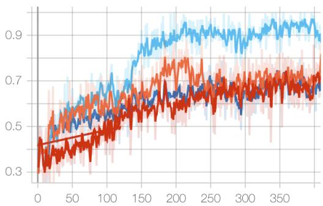  
(a) Biology

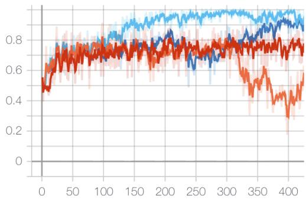  
(b) Material Science

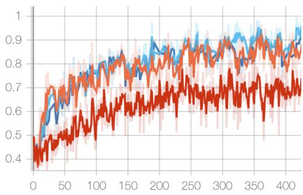  
(c) Chemistry

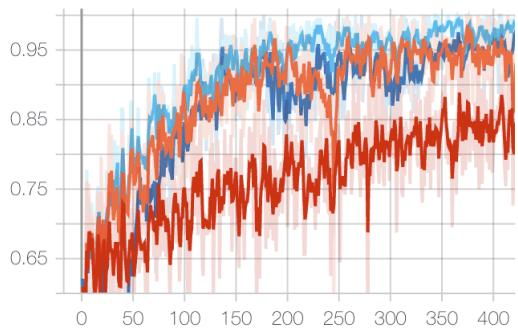  
(d) Physics  
Figure 1: Mean training reward across SciKnowEval domains. Distillation-based methods improve rapidly in the early phase, when reward-bearing rollouts are scarce; I-SDPO retains this bootstrapping effect while reducing teacher use as the policy improves.

## 4.3 TRAINING DYNAMICS ANALYSIS

We next examine whether the optimization dynamics match the capability-dependent account in Section 3.3.

Reward Curves. Figure 1 shows mean training reward. Across domains, methods containing selfdistillation rise faster than pure GRPO early in training. This is the regime in which all-incorrect groups are common and token-level targets replace otherwise absent relative-reward updates. Final accuracy in Table 1, however, favors I-SDPO over pure SDPO. Together, the observations support a phase-dependent interpretation: dense imitation is most useful for bootstrapping, whereas reward optimization should dominate after successful trajectories become available.

Self-Annealing Behavior. Figure 2 shows the fraction of samples routed to GRPO and the allwrong group fraction. The GRPO fraction trends upward (from approximately 0.78 to 0.96 on physics and 0.65 to 0.90 on biology), while all-wrong groups become less frequent. This is the feedback predicted by Proposition 2: improved sampling success directly reduces the effective weight of the biased surrogate rather than relying on elapsed training time.

Lower Intrusion on Moderate-Difficulty Data. A notable difference from SRPO is that I-SDPO assigns a larger fraction to GRPO on material science and physics (approximately 0.90–0.96 versus 0.82–0.90). The stronger final results despite less distillation coverage argue against “more teacher supervision is always better.” They instead favor selective intervention: keep the low-variance teacher for groups with no reward contrast, and preserve on-policy evidence everywhere else.

Forward–Reverse KL Ablation. Figure 3 compares mean@16 accuracy trajectories for $\alpha \in$ {0, 0.5, 1} in Eq. 3. The balanced objective $( \alpha = 0 . 5 )$ has the highest final accuracy in all four domains. This is consistent with combining the mode-covering tendency of forward KL and the

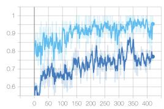  
(a) Biology

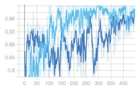

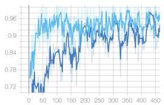  
(b) Material  
(c) Chemistry

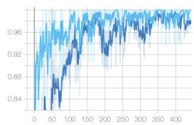

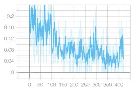  
(e) Biology

(d) Physics  
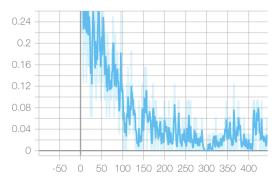  
(f) Material

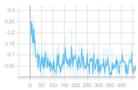  
(g) Chemistry

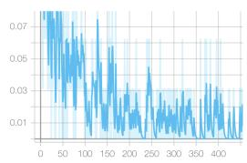  
(h) Physics

Figure 2: Capability-dependent routing in I-SDPO. (Top) The fraction assigned to GRPO generally increases during training. (Bottom) The all-wrong group fraction correspondingly decreases, so teacher influence is withdrawn as successful sampling becomes more likely.

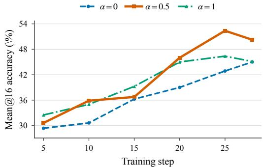  
(a) Biology

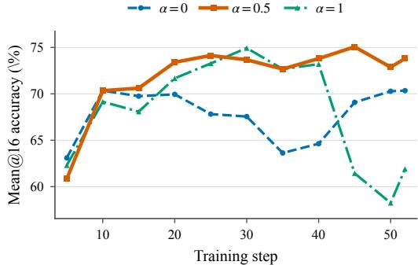

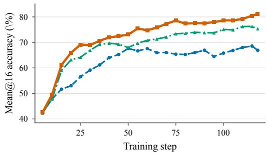  
(c) Chemistry

(b) Material Science  
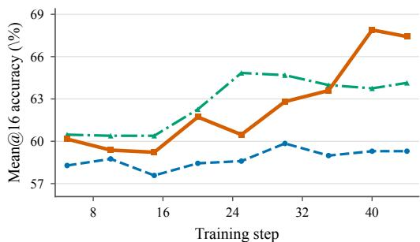  
(d) Physics

Figure 3: Effect of the forward–reverse KL interpolation on I-SDPO across four SciKnowEval domains. $\alpha = 0$ uses forward KL only, $\alpha = 1$ uses reverse KL only, and $\alpha = 0 . 5$ weights both directions equally. Curves show the raw mean@16 evaluation accuracy recorded during training.

sharper mode preference of reverse KL, although balancing divergence directions does not by itself remove teacher–reward mismatch. Appendix C gives the quantitative results.

## 4.4 CAPABILITY-DEPENDENT TEACHER TRUST

The theory and results suggest a single organizing principle: the correct amount of teacher trust is determined by the policy’s current ability to produce endogenous reward supervision. At low capability, GRPO often observes no outcome variation; the teacher then supplies a biased but lowvariance direction. At higher capability, mixed groups expose which sampled behaviors succeed, while the privileged teacher remains tied to a particular solution and to the student’s own EMA history. The signal-to-bias ratio of distillation therefore falls even if the teacher becomes numerically closer to the student.

This view explains why a fixed SDPO objective can help most at the beginning yet become limiting later. Student–teacher disagreement is not a stationary measure of teaching value: easy, aligned disagreements are absorbed first, leaving residual KL pressure concentrated on difficult prefixes, alternative valid modes, and confidently miscalibrated targets. Continued minimization can then reduce KL without improving sequence reward. This mechanism complements views of self-distillation as instance-specific smoothing and progressively stronger regularization (Zhang & Sabuncu, 2020; Mobahi et al., 2020). EMA delays and smooths this process, but cannot create independent knowledge or correct shared error.

I-SDPO operationalizes the principle without estimating gradient alignment directly. The binary event “no successful response among K samples” is an observable proxy for whether relative reward is informative. Its probability $( 1 - p ) ^ { K }$ falls steeply with capability, so the algorithm moves from teacher-led bootstrapping to reward-led refinement at an instance-dependent rate. Instance-level routing matters because the decision is shared by all rollouts of the same input: whenever successful evidence exists, the complete group comparison is preserved, whereas sample-level routing partially discards it.

## 5 DISCUSSION

Connection to Curriculum Learning. I-SDPO resembles a curriculum (Bengio et al., 2009), but the curriculum is over supervision sources, not a fixed ordering of examples. The same prompt receives dense privileged supervision when the current policy fails to sample any success and grouprelative feedback once it does. Difficulty is therefore model- and time-dependent.

Connection to Learning Using Privileged Information. The teacher follows Learning Using Privileged Information (LUPI) (Vapnik & Vashist, 2009): ground-truth solutions are available during training but not inference. Our analysis adds an important qualification. Privilege can make targets more informative without making them identical to the reward-optimal policy, especially when the teacher evaluates an erroneous student prefix. I-SDPO therefore uses privilege as a temporary scaffold rather than a permanent optimization target.

Scope of the theory. Equation 6 is an exact local statement for the forward-KL logit direction, while Proposition 1 is a quadratic approximation around a reward optimum. They identify concrete mechanisms—directional mismatch, persistent bias, and capability-dependent variance reduction— but do not establish global convergence or predict every non-convex training trajectory. The empirical dynamics should consequently be read as consistent with the account, not as proof of its assumptions.

## 6 LIMITATIONS

## We acknowledge two limitations:

Model scale. Our experiments use only Qwen3-8B. Results on other model families and scales may differ, particularly because stronger base policies change the frequency and duration of all-incorrect rollout groups.

Benchmark diversity. Evaluation is limited to SciKnowEval. The relative value of privileged distillation and group-relative rewards may change on general mathematical or open-ended reasoning tasks with different reward structure and solution multiplicity.

## 7 CONCLUSION

We presented I-SDPO, which treats privileged self-distillation as a capability-dependent scaffold rather than a uniformly reliable target. The central distinction is a bias–variance one: distillation supplies a dense, low-variance direction when all sampled rewards are uninformative, but its teacher-specific bias can obstruct reward optimization after the policy begins producing successful trajectories. Instance-level routing uses the existence of such trajectories to choose one objective for the corresponding rollout group and automatically withdraws the teacher as capability improves.

On SciKnowEval, I-SDPO achieves the best result in all four domains and 70.31% average mean@16 accuracy, improving over GRPO, pure SDPO, and sample-level SRPO by 13.64, 4.57, and 4.30 points, respectively. The reward and routing dynamics are consistent with the proposed transition from teacher-led bootstrapping to reward-led refinement. More broadly, our results indicate that the value of self-distillation lies not only in the quality of its targets, but in restricting those targets to the phase in which they are preferable to the policy’s own reward evidence.

## REPRODUCIBILITY STATEMENT

We provide full hyperparameter specifications in Section 4.1. The method description in Section 3 and Algorithm 1 contain sufficient detail for re-implementation. Code will be released upon publication.

## REFERENCES

Rishabh Agarwal, Nino Vieillard, Yongchao Zhou, Piotr Stanczyk, Sabela Ramos, Matthieu Geist, and Olivier Bachem. On-policy distillation of language models: Learning from self-generated mistakes. In The Twelfth International Conference on Learning Representations (ICLR), 2024.

Yoshua Bengio, Jer´ ome Louradour, Ronan Collobert, and Jason Weston. Curriculum learning. Inˆ Proceedings of the 26th Annual International Conference on Machine Learning (ICML), pp. 41– 48, 2009.

DaYou Du, Yijia Zhang, Shijie Cao, Jiaqi Guo, Ting Cao, Xiaowen Chu, and Ningyi Xu. BitDistiller: Unleashing the potential of sub-4-bit LLMs via self-distillation. In Proceedings of the 62nd Annual Meeting of the Association for Computational Linguistics (Volume 1: Long Papers), pp. 102–116, Bangkok, Thailand, 2024. Association for Computational Linguistics. doi: 10.18653/ v1/2024.acl-long.7.

Kehua Feng, Kewen Zhao, Jingyuan Sun, Yujin Zhu, and Guoyin Wang. SciKnowEval: Evaluating multi-level scientific knowledge of large language models. arXiv preprint arXiv:2406.09098, 2024.

Tommaso Furlanello, Zachary C. Lipton, Michael Tschannen, Laurent Itti, and Anima Anandkumar. Born again neural networks. In Proceedings of the 35th International Conference on Machine Learning (ICML), volume 80 of Proceedings of Machine Learning Research, pp. 1607–1616. PMLR, 2018.

Yuxian Gu, Li Dong, Furu Wei, and Minlie Huang. MiniLLM: Knowledge distillation of large language models. In The Twelfth International Conference on Learning Representations, 2024.

Daya Guo, Dejian Yang, Haowei Zhang, Junxiao Song, Ruoyu Zhang, Runxin Xu, Qihao Zhu, Shirong Ma, Peiyi Wang, Xiao Bi, et al. DeepSeek-R1: Incentivizing reasoning capability in LLMs via reinforcement learning. arXiv preprint arXiv:2501.12948, 2025.

Geoffrey Hinton, Oriol Vinyals, and Jeff Dean. Distilling the knowledge in a neural network. arXiv preprint arXiv:1503.02531, 2015.

Kyungyul Kim, ByeongMoon Ji, Doyoung Yoon, and Sangheum Hwang. Self-knowledge distillation with progressive refinement of targets. In Proceedings of the IEEE/CVF International Conference on Computer Vision, pp. 6567–6576, 2021.

Yoon Kim and Alexander M. Rush. Sequence-level knowledge distillation. In Proceedings of the 2016 Conference on Empirical Methods in Natural Language Processing (EMNLP), pp. 1317– 1327, 2016.

Jongwoo Ko, Sungnyun Kim, Tianyi Chen, and Se-Young Yun. DistiLLM: Towards streamlined distillation for large language models. In Proceedings of the 41st International Conference on Machine Learning, volume 235 of Proceedings ofMachine Learning Research, pp. 24872–24895. PMLR, 2024.

Xu Lan, Xiatian Zhu, and Shaogang Gong. Knowledge distillation by on-the-fly native ensemble. In Advances in Neural Information Processing Systems, volume 31, 2018.

Yuxuan Liu, Zhenyu Liu, Lu Yin, Yelong Shen, Dongkuan Xu, Jiawei Han, and Shiwei Liu. Dr. GRPO: Removing bias from group relative policy optimization. arXiv preprint arXiv:2503.20783, 2025.

Aditya K. Menon, Ankit Singh Rawat, Sashank Reddi, Seungyeon Kim, and Sanjiv Kumar. A statistical perspective on distillation. In Proceedings of the 38th International Conference on Machine Learning, volume 139 of Proceedings of Machine Learning Research, pp. 7632–7642. PMLR, 2021.

Hossein Mobahi, Mehrdad Farajtabar, and Peter L. Bartlett. Self-distillation amplifies regularization in hilbert space. In Advances in Neural Information Processing Systems, volume 33, 2020.

Long Ouyang, Jeffrey Wu, Xu Jiang, Diogo Almeida, Carroll Wainwright, Pamela Mishkin, Chong Zhang, Sandhini Agarwal, Katarina Slama, Alex Ray, et al. Training language models to follow instructions with human feedback. In Advances in Neural Information Processing Systems, volume 35, pp. 27730–27744, 2022.

Richard Yuanzhe Pang, Weizhe Yuan, Kyunghyun Cho, He He, Sainbayar Sukhbaatar, and Jason Weston. Iterative reasoning preference optimization. arXiv preprint arXiv:2404.19733, 2024.

Rafael Rafailov, Archit Sharma, Eric Mitchell, Christopher D Manning, Stefano Ermon, and Chelsea Finn. Direct preference optimization: Your language model is secretly a reward model. In Advances in Neural Information Processing Systems, volume 36, 2023.

John Schulman, Filip Wolski, Prafulla Dhariwal, Alec Radford, and Oleg Klimov. Proximal policy optimization algorithms. arXiv preprint arXiv:1707.06347, 2017.

Zhihong Shao, Peiyi Wang, Qihao Zhu, Runxin Xu, Junxiao Song, Xiao Bi, Haowei Zhang, Mingchuan Zhang, Y. K. Li, Y. Wu, and Daya Guo. DeepSeekMath: Pushing the limits of mathematical reasoning in open language models. arXiv preprint arXiv:2402.03300, 2024.

Antti Tarvainen and Harri Valpola. Mean teachers are better role models: Weight-averaged consistency targets improve semi-supervised deep learning results. In Advances in Neural Information Processing Systems, volume 30, 2017.

Vladimir Vapnik and Akshay Vashist. A new learning paradigm: Learning using privileged information. Neural Networks, 22(5-6):544–557, 2009.

Ting-Bing Xu and Cheng-Lin Liu. Data-distortion guided self-distillation for deep neural networks. In Proceedings of the AAAI Conference on Artificial Intelligence, volume 33, pp. 5565–5572, 2019. doi: 10.1609/aaai.v33i01.33015565.

An Yang, Baosong Yang, et al. Qwen3 technical report. arXiv preprint arXiv:2505.09388, 2025.

Chenglin Yang, Lingxi Xie, Chi Su, and Alan L. Yuille. Snapshot distillation: Teacher-student optimization in one generation. In Proceedings of the IEEE/CVF Conference on Computer Vision and Pattern Recognition, pp. 2859–2868, 2019.

Weizhe Yuan, Richard Yuanzhe Pang, Kyunghyun Cho, Sainbayar Sukhbaatar, Jing Xu, and Jason Weston. Self-rewarding language models. arXiv preprint arXiv:2401.10020, 2024.

Sukmin Yun, Jongjin Park, Kimin Lee, and Jinwoo Shin. Regularizing class-wise predictions via self-knowledge distillation. In Proceedings of the IEEE/CVF Conference on Computer Vision and Pattern Recognition, pp. 13876–13885, 2020.

Linfeng Zhang, Jiebo Song, Anni Gao, Jingwei Chen, Chenglong Bao, and Kaisheng Ma. Be your own teacher: Improve the performance of convolutional neural networks via self distillation. In Proceedings of the IEEE/CVF International Conference on Computer Vision, pp. 3713–3722, 2019.

Ying Zhang, Tao Xiang, Timothy M. Hospedales, and Huchuan Lu. Deep mutual learning. In Proceedings of the IEEE Conference on Computer Vision and Pattern Recognition (CVPR), pp. 4320–4328, 2018.

Yuanchi Zhang, Yile Wang, Zijun Liu, Shuo Wang, Xiaolong Wang, Peng Li, Maosong Sun, and Yang Liu. Enhancing multilingual capabilities of large language models through self-distillation from resource-rich languages. In Proceedings of the 62nd Annual Meeting of the Association for Computational Linguistics (Volume 1: Long Papers), pp. 11189–11204, Bangkok, Thailand, 2024. Association for Computational Linguistics. doi: 10.18653/v1/2024.acl-long.603.

Zhilu Zhang and Mert R. Sabuncu. Self-distillation as instance-specific label smoothing. In Advances in Neural Information Processing Systems, volume 33, 2020.

Siyan Zhao, Zhihui Xie, Mengchen Liu, Jing Huang, Guan Pang, Feiyu Chen, and Aditya Grover. Self-distilled reasoner: On-policy self-distillation for large language models. arXiv preprint arXiv:2601.18734, 2026.

Qihuang Zhong, Liang Ding, Li Shen, Juhua Liu, Bo Du, and Dacheng Tao. Revisiting knowledge distillation for autoregressive language models. In Proceedings ofthe 62nd Annual Meeting ofthe Associationfor Computational Linguistics (Volume 1: Long Papers), pp. 10900–10913, Bangkok, Thailand, 2024. Association for Computational Linguistics. doi: 10.18653/v1/2024.acl-long.587.

## A ANALYSIS DETAILS

Token-direction identity. Let $z _ { s }$ be the student logits and $p _ { s } = \mathrm { s o f t m a x } ( z _ { s } )$ . For the forward-KL term, $\nabla _ { z _ { s } } \mathrm { K L } ( q _ { s } \| p _ { s } ) = { p _ { s } } - q _ { s } \mathrm { ; }$ hence its negative-gradient direction is $q _ { s } - p _ { s }$ . Replacing $q _ { s }$ with a conceptual reward-compatible target $u _ { s }$ gives $u _ { s } - p _ { s }$ . Equation 6 then follows from the polarization identity $2 a ^ { \top } b = \| a \| _ { 2 } ^ { 2 } + \| b \| _ { 2 } ^ { 2 } - \| a - b \| _ { 2 } ^ { 2 }$ with $a = q _ { s } - p _ { s }$ and $b = u _ { s } - p _ { s }$

Proof of Proposition 1. Under the stated local approximations, the gradient of the combined objective is

$$
\nabla _ { \boldsymbol { \theta } } ( \mathcal { L } _ { R } + \lambda \mathcal { L } _ { D } ) \approx H ( \boldsymbol { \theta } - \boldsymbol { \theta } ^ { \star } ) + \lambda H ( \boldsymbol { \theta } - \boldsymbol { \theta } ^ { \star } - \boldsymbol { b } ) .\tag{17}
$$

Setting this expression to zero and using $H \ \succ \ 0$ yields $( 1 + \lambda ) ( \theta - \theta ^ { \star } ) = \lambda b ,$ , and therefore $\begin{array} { r } { \theta _ { \lambda } ^ { \star } = \theta ^ { \star } + \frac { \lambda } { 1 + \lambda } b } \end{array}$ . Substitution into the quadratic approximation of $\mathcal { L } _ { R }$ gives Eq. 7. In particular, the excess reward loss is positive whenever $b \neq 0$ and $\lambda > 0$ , and vanishes as routing drives the effective λ to zero.

EMA memory. Unrolling Eq. 14 at update t gives

$$
\theta _ { \mathrm { t e a } , t } = ( 1 - \tau _ { \mathrm { e m a } } ) ^ { t } \theta _ { \mathrm { t e a } , 0 } + \tau _ { \mathrm { e m a } } \sum _ { j = 1 } ^ { t } ( 1 - \tau _ { \mathrm { e m a } } ) ^ { t - j } \theta _ { \mathrm { s t u d e n t } , j } .\tag{18}
$$

Ignoring the vanishing initialization term, these weights form a geometric age distribution with mean age $( 1 - \tau _ { \mathrm { e m a } } ) / \tau _ { \mathrm { e m a } }$ . For $\tau _ { \mathrm { e m a } } = 0 . 0 5$ , the mean age is 19 updates and the half-life is $\log ( 1 / 2 ) / \log ( 0 . 9 5 ) \ \stackrel { . } { \approx } \ 1 3 . 5$ updates. This quantifies smoothing and lag; it does not imply that EMA corrects systematic errors.

## B DETAILED EXPERIMENTAL RESULTS

Table 2 provides a detailed view of the training dynamics metrics at different training checkpoints.

Table 2: Training dynamics at selected checkpoints for I-SDPO on biology.
<table><tr><td>Step</td><td>GRPO Fraction ↑</td><td>All-Wrong Fraction ↓</td><td>Mean Reward ↑</td></tr><tr><td>50</td><td>~0.65</td><td>~0.22</td><td>~0.20</td></tr><tr><td>150</td><td>~0.78</td><td>~0.12</td><td>~0.50</td></tr><tr><td>250</td><td>~0.85</td><td>~0.06</td><td>~0.65</td></tr><tr><td>350</td><td>~0.90</td><td>~0.03</td><td>~0.72</td></tr></table>

## C HYPERPARAMETER SENSITIVITY

Distillation top-k. This experiment tests whether the performance of instance-level and samplelevel routing depends on the number of teacher vocabulary tokens retained by the distillation objective. We vary distillation topk over {20, 40, 60, 80, 100} while keeping all other training settings fixed. Table 3 reports the resulting mean@16 accuracy.

Table 3: Sensitivity to distillation topk for I-SDPO and SRPO on SciKnowEval (mean@16 accuracy, %). Bold indicates the best top-k value within each row. The average is computed across the four domains.
<table><tr><td>Method</td><td>Domain</td><td>20</td><td>40</td><td>60</td><td>80</td><td>100</td></tr><tr><td rowspan="5">I-SDPO</td><td>Biology</td><td>50.13</td><td>54.12</td><td>53.25</td><td>47.00</td><td>50.25</td></tr><tr><td>Material</td><td>75.44</td><td>76.51</td><td>75.37</td><td>74.83</td><td>74.53</td></tr><tr><td>Chemistry</td><td>79.49</td><td>78.13</td><td>77.92</td><td>77.21</td><td>81.16</td></tr><tr><td>Physics</td><td>71.09</td><td>62.42</td><td>72.89</td><td>67.31</td><td>75.31</td></tr><tr><td>Average</td><td>69.04</td><td>67.80</td><td>69.86</td><td>66.59</td><td>70.31</td></tr><tr><td rowspan="5">SRPO</td><td>Biology</td><td>46.88</td><td>46.13</td><td>54.25</td><td>55.87</td><td>44.27</td></tr><tr><td>Material</td><td>71.24</td><td>74.64</td><td>72.91</td><td>72.02</td><td>72.94</td></tr><tr><td>Chemistry</td><td>77.34</td><td>77.35</td><td>78.67</td><td>76.92</td><td>78.69</td></tr><tr><td>Physics</td><td>53.67</td><td>67.27</td><td>60.16</td><td>55.78</td><td>68.12</td></tr><tr><td>Average</td><td>62.28</td><td>66.35</td><td>66.50</td><td>65.15</td><td>66.01</td></tr></table>

Neither routing method improves monotonically with top-k. For I-SDPO, k = 40 performs best on biology and material science, whereas $k = 1 0 0$ performs best on chemistry, physics, and the cross-domain average; SRPO shows a similarly mixed pattern and peaks on average at $k = 6 0$ Smaller values remain competitive, so retaining more teacher tokens does not necessarily strengthen distillation. We hypothesize that many instances are easy enough for the teacher to concentrate taskrelevant mass on a small token set; larger k then mainly adds a low-probability tail. Because we did not measure retained probability mass directly, this remains a hypothesis. We use k = 100 in the main experiments.

Forward–reverse KL balance. We compare $\alpha \in \{ 0 , 0 . 5 , 1 \}$ in Eq. 3 with the remaining settings fixed to test whether distillation benefits from balancing the mode-covering behavior of forward KL and the mode-seeking behavior of reverse KL. Figure 3 reports the raw TensorBoard mean@16 measurements.

The balanced objective $( \alpha = 0 . 5 )$ achieves the highest final accuracy in every domain: 50.25% on biology, 73.80% on material science, 81.16% on chemistry, and 67.42% on physics. Its 68.16% cross-domain average exceeds forward KL alone (60.39%) and reverse KL alone (61.63%). The two directions are complementary: forward KL promotes coverage, whereas reverse KL sharpens high-probability modes but can become overly mode-seeking. Because each curve is a single run, we compare their recorded final values and treat trajectory details descriptively.