# Intern-S2-Preview: Scientific Agentic Foundation Model

Intern-S2-Preview Team, Shanghai AI Laboratory

Scientific discovery increasingly requires AI systems that can reason over scientific evidence of heterogeneous modalities, interact with scientific tools and environments, and sustain progress across long task horizons. We present Intern-S2-Preview, a series of scientific agentic foundation models designed to support multimodal scientific understanding, reasoning, generation, and long-horizon tasks. The training pipeline begins with scientific multimodal pre-training over rendered scientific documents, interleaved image-text data, and diverse scientific corpora. Starting from the pretrained checkpoint, we apply a unified post-training pipeline consisting of supervised fine-tuning, scalable multi-task reinforcement learning (RL), black- and white-box agentic RL, and on-policy distillation. This pipeline is supported by practical techniques that improve rollout and training stability and eficiency, including partial rollout with of-policy correction, adaptive length regularization, online speculative decoding, robust multi-task optimization, and trace-aware experience assembly for agentic tasks. At the architecture level, Intern-S2-Preview-397B extends time series modelling from eficient long-sequence understanding to numerical forecasting, while Memory Decoder is studied as a separate memory-augmented path for rapid scientific specialization without modifying the frozen 397B backbone. Evaluations across scientific, multimodal, agentic, and general-purpose benchmarks show that Intern-S2-Preview-397B achieves competitive or leading results in multiple settings. The time series modules improve scientific signal understanding and forecasting on SciTS, while the separate Intern-MemDec-4B extension improves the Biology-Instructions average score from 56.92 to 60.32 without modifying the frozen 397B backbone.

## 1. Introduction

Recent advances in large language models and multimodal foundation models are reshaping the development of AI for Science, enabling models to reason over diverse scientific knowledge, observations, and computational tools [8, 36, 72, 112]. Scientific multimodal models and benchmarks further extend this direction beyond text by evaluating perception, understanding, and reasoning over scientific figures, microscopy images, remotesensing observations, earth-science phenomena, and numerical time series [11, 77, 86, 105, 110]. However, meaningful scientific discovery involves more than producing a correct response to an isolated question. It requires sustained reasoning and adaptive planning based on heterogeneous evidence, and repeated interaction with tools and external environments over long task horizons [70, 80].

Existing model families remain incomplete for such scientific workflows. General-purpose LLMs [2, 58] provide broad instruction following and reasoning abilities, but are not specialized for heterogeneous scientific modalities, domain protocols, or verifiable tool interaction. Scientific multimodal models [8, 112] improve perception and reasoning over specialized inputs, but are still often evaluated as static question-answering systems rather than long-horizon agents. These limitations motivate Intern-S2-Preview, a series of scientific agentic foundation models designed to move beyond scientific question answering toward iterative, toolgrounded problem solving, with Intern-S2-Preview-397B as the main model evaluated in this report.

At the architecture level, we focus on two complementary requirements for scientific agentic foundation models. First, scientific workflows often require models to both understand long numerical signals and forecast future system states. Intern-S2-Preview-397B therefore extends time series modelling from eficient longsequence understanding to numerical forecasting by adding a dedicated forecasting branch. Second, fast adaptation to new scientific domains is often required, where the model should be specialized to a new domain without losing its general-purpose capabilities. To address this, we explore a strategy for eficient model specialization without rewriting the model parameters, where independently trained parametric memories [78, 84] are attached to the frozen 397B backbone to introduce additional domain knowledge and specialized capabilities.

Intern-S2-Preview is then trained through a staged pipeline. During continual pre-training, we focus on scientific documents and multimodal corpora whose information is distributed across text, figures, tables, equations, and page layout. Visual Pre-training [100, 109] learns from rendered scientific pages by predicting visual latents, allowing the model to absorb document structure that is often weakened by text extraction. In parallel, we construct interleaved PDF data by parsing pages, cropping visually informative units, and restoring text and visual elements into layout-aware sequences, with visual-gain filtering used to retain pages whose visual content contributes to language modelling. We further build a large-scale image retrieval pipeline to recall and rerank high-quality scientific images for multimodal training. Together, these stages provide the pretrained model with scientific text, document-level visual context, and cross-modal image evidence.

Starting from the pretrained checkpoint, post-training converts these pretrained capabilities into controllable reasoning, generation, and agentic behavior. Supervised fine-tuning provides the instruction-following and tool-use initialization for subsequent reinforcement learning. We then apply scalable multi-task reinforcement learning under verifiable objectives to improve reasoning depth, correctness, scientific generation, and response eficiency across heterogeneous scientific and general-purpose tasks. This stage is supported by systems and optimization techniques designed for long rollouts and heterogeneous task mixtures, including partial rollout with of-policy correction, adaptive length regularization, online speculative decoding, and Group-level Entropy-Controlled Policy Optimization (GEPO) [21] for balancing exploration and update strength across task groups with diferent entropy regimes.

For long-horizon agentic tasks, we introduce a black- and white-box agentic RL framework1 based on a harness × task abstraction. The framework decouples agent runtimes from executable task distributions and aligns semantic action–observation trajectories with token-level rollout traces, so that diferent tool-using agents and executable tasks can share a common rollout, verification, and training protocol. We construct tasks from coding and terminal benchmarks as well as a self-evolving generalized task-synthesis system [71] based on diverse community skills. Finally, on-policy distillation consolidates the separately optimized reasoning and agentic expert policies into the unified Intern-S2-Preview model.

We evaluate Intern-S2-Preview-397B across scientific, multimodal, agentic, general-purpose, and time-series benchmarks. These evaluations cover both static scientific problem solving and workflow-oriented settings that require planning, tool use, and iterative execution. The results indicate that Intern-S2-Preview-397B combines general understanding, domain-specific scientific reasoning, scientific generation, and agentic interaction within a single foundation model. It obtains competitive or leading scores on multiple scientific benchmarks, competitive open-model results on general and multimodal tasks, measurable gains on time-series understanding and forecasting, and competitive performance on agentic coding, terminal, and research-oriented tasks. We also evaluate the separate Memory Decoder variant in biology to examine modular specialization without modifying the 397B backbone.

## 2. Architecture

Intern-S2-Preview-397B extends time series modelling from scientific signal understanding to numerical forecasting through upgraded time series modules. Separately, Memory Decoder provides a memory-augmented specialization path in which external parametric memories can be attached to the frozen 397B backbone without modifying the model’s core parameters.

## 2.1. Memory Decoder

Memory Decoder [12, 78, 83, 84] is a separate extension model for continual domain specialization, rather than a component of the base Intern-S2-Preview-397B model. As illustrated in Figure 1, it attaches new knowledge and specialized capabilities through external parametric memories while keeping the Intern-S2-Preview-397B backbone frozen. In this design, a separately trained memory decoder complements the backbone with domainspecific knowledge and capabilities through dynamic fusion of their next-token distributions. At each decoding step, a lightweight token-level router determines how much the memory decoder should contribute [78]. New scientific capabilities can be introduced by attaching independently trained memories without modifying the Intern-S2-Preview-397B backbone.

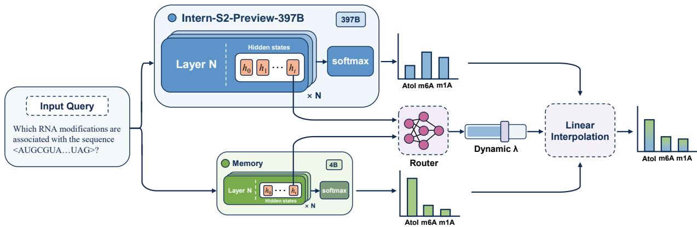  
Figure 1: Architecture of the separate Memory Decoder extension for Intern-S2-Preview-397B. The frozen Intern-S2-Preview-397B backbone and a domain memory process the same input in parallel and produce separate next-token distributions. A lightweight token-level router uses their hidden states and outputdistribution uncertainty features to predict a dynamic fusion weight �, which controls the contribution of the two distributions to the final prediction.

This design is motivated by the long-tailed and continuously evolving nature of scientific expertise. Although Intern-S2-Preview-397B provides a strong general foundation for scientific reasoning, instruction following, multimodal understanding, and tool-augmented problem solving, no fixed post-trained checkpoint can fully cover every specialized subfield, task protocol, or newly emerging domain. Directly fine-tuning the backbone for each new domain is undesirable, because the same parameter updates that improve domain performance may perturb the model’s general reasoning, agentic behavior, and multimodal capabilities. Memory Decoder avoids this trade-of by turning domain extension from backbone rewriting into modular memory attachment. Intern-S2-Preview-397B continues to serve as the general-purpose backbone, while domain knowledge is supplied through plug-and-play memories without compromising general capabilities.

Training. Memory Decoder is trained by compressing retrieval-based domain evidence into a reusable parametric module. Given a domain SFT corpus $\mathcal { D } _ { \mathrm { s f t } } \dot { = } \{ ( q ^ { ( \bar { i } ) } , a ^ { ( i ) } ) \} _ { i = 1 } ^ { N } ,$ we build a token-level datastore over answer side positions. For each target token, the prefix is $c _ { t } ^ { ( i ) } = [ q ^ { ( i ) } ; y _ { < t } ^ { ( i ) } ]$ , the key is $k _ { t } ^ { ( i ) } = \phi ( c _ { t } ^ { ( i ) } )$ , and the value is $y _ { t } ^ { ( i ) }$ , where $\phi ( \cdot )$ is frozen. Nearest neighbor retrieval over this datastore provides a soft next-token teacher distribution [40]:

$$
p _ { \mathrm { r e t } } ( y \mid c _ { t } ) \propto \sum _ { ( k _ { j } , v _ { j } ) \in \mathcal { N } ( k _ { t } ) } \mathbb { I } _ { y = v _ { j } } \exp ( - d ( k _ { t } , k _ { j } ) / \tau ) ,\tag{1}
$$

where $\mathcal { N } ( k _ { t } )$ is the retrieved neighbor set, $d ( \cdot , \cdot )$ is the retrieval distance, and � is a temperature parameter. Memory training combines retrieval distillation with supervision from the gold answer token:

$$
\begin{array} { r } { \mathcal { L } _ { \mathrm { m e m } } ( c _ { t } ) = \beta \mathcal { L } _ { \mathrm { K L } } ( c _ { t } ) + ( 1 - \beta ) \mathcal { L } _ { \mathrm { C E } } ( c _ { t } ) , } \\ { \mathcal { L } _ { \mathrm { K L } } ( c _ { t } ) = \mathrm { K L } ( p _ { \mathrm { r e t } } ( \cdot \mid c _ { t } ) | | p _ { \mathrm { m e m } } ( \cdot \mid c _ { t } ) ) , \quad \mathcal { L } _ { \mathrm { C E } } ( c _ { t } ) = - \log p _ { \mathrm { m e m } } ( y _ { t } \mid c _ { t } ) . } \end{array}\tag{2}
$$

Here $\beta \in [ 0 , 1 ]$ balances the retrieval teacher and the gold SFT answer. Through this objective, the Memory Decoder learns to capture domain knowledge and recurring task patterns as a plug-and-play parametric memory.

Inference. At inference time for a memory-augmented variant, Intern-S2-Preview-397B and Memory Decoder process the same decoding context in parallel. For a prefix $c _ { t } = [ x ; y _ { < t } ]$ , the frozen Intern-S2-Preview-397B backbone produces $p _ { \mathrm { S 2 } } ( \cdot \mid c _ { t } )$ , while the memory decoder produces $p _ { \mathrm { m e m } } ( \cdot \mid c _ { t } )$ . A lightweight token-level router takes the hidden representations from both models together with confidence and entropy features, and predicts a fusion coeficient $\lambda _ { t } \in [ 0 , 1 ]$ . The final next-token distribution is

$$
p _ { \mathrm { f i n a l } } ( \cdot  { | } c _ { t } ) = ( 1 - \lambda _ { t } ) p _ { \mathrm { S 2 } } ( \cdot  { | } c _ { t } ) + \lambda _ { t } p _ { \mathrm { m e m } } ( \cdot  { | } c _ { t } ) .\tag{3}
$$

(a) Structure of the time series encoder.  
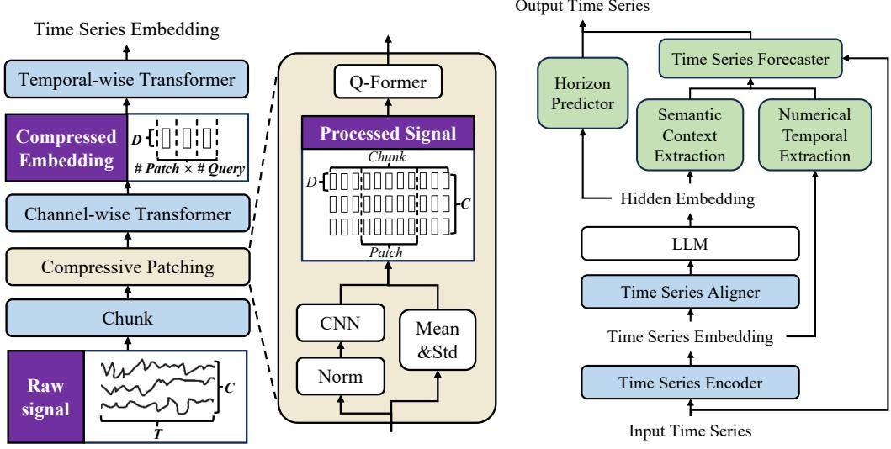  
(b) Structure of the time series forecaster.  
Figure 2: Architecture of the time series modules for long-sequence understanding and numerical forecasting.

During router training, Intern-S2-Preview-397B and Memory Decoder remain frozen, and only the router is optimized on a mixture of domain and general instruction data. In addition to cross-entropy on the fused distribution, we apply a signed linear regularizer to the memory weight:

$$
\begin{array} { r } { \mathcal { L } _ { \mathrm { C E } } ( c _ { t } ) = - \log p _ { \mathrm { f i n a l } } ( y _ { t } \mid c _ { t } ) , \qquad \mathcal { R } ( c _ { t } ) = s _ { t } \lambda _ { t } , } \\ { \mathcal { L } _ { \mathrm { r o u t e r } } ( c _ { t } ) = \mathcal { L } _ { \mathrm { C E } } ( c _ { t } ) + \alpha _ { s } \mathcal { R } ( c _ { t } ) . \qquad } \end{array}\tag{4}
$$

where $s _ { t } ~ < ~ 0$ for domain examples, $s _ { t } ~ > ~ 0$ for general examples, and $\alpha _ { s } \ > 0$ controls the regularization strength.

## 2.2. Time Series Modules

## 2.2.1. Upgraded Time Series Encoder for Eficient Long-Sequence Modelling

Scientific time series often exhibit substantial variations in sequence length, sampling frequency, and channel dependency, making eficient and expressive modelling challenging. Intern-S2-Preview-397B upgrades the time series encoder over Intern-S1-Pro with improved long-sequence processing eficiency and enhanced multi-channel representation learning.

As illustrated in Figure 2a, the input time series is first partitioned into temporal chunks, enabling localized processing of long sequences. Each chunk is processed by a compressive patching module, which consists of normalization, CNN-based local feature extraction, and Q-Former based temporal compression. During normalization, channel-wise mean and standard deviation are retained as auxiliary statistics. The extracted local representations are then divided into temporal patches, where each patch is compressed by a Q-Former with learnable queries into a fixed number of tokens. By dynamically adjusting the temporal patching process according to input length, the encoder maintains a controllable output sequence length for heterogeneous long time series. Compared with the time series encoder in Intern-S1-Pro, which directly aggregated multi-channel representations through mean pooling, Intern-S2-Preview-397B introduces a channel-wise Transformer encoder to model inter-channel dependencies before being fed into the Transformer encoder body for global temporal context modelling. The connection between the time series encoder and the LLM remains unchanged.

Compared with the previous version used in Intern-S1-Pro, the upgraded encoder increases the maximum supported input length from approximately 240,000 to 300,000 time steps. At the maximum sequence length, it achieves approximately $5 \sim 6 \times$ faster inference while reducing GPU memory consumption to around 20% of the previous version. Beyond improving the processing of long sequences, the new architecture also enables efective modelling of signals with high-frequency but short sequence lengths, a setting not supported by

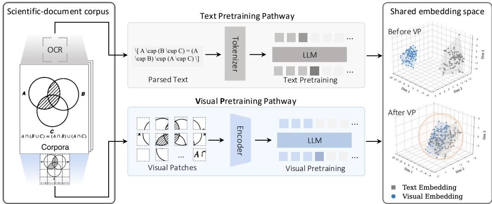  
Figure 3: Overview of matched text and visual pre-training. The text pathway predicts tokens from parsed PDF content, whereas the visual pathway predicts foreground visual latents from rendered pages, improving alignment between textual and visual document representations.

Intern-S1-Pro. This capability further expands the disciplinary coverage of the time series module, extending its existing support for astronomy, geoscience, neuroscience, physiological signal analysis, and bioacoustics to include radar signal analysis (∼MHz).

## 2.2.2. Time Series Generation Module

Beyond time series understanding, time series forecasting is essential for scientific applications as it enables models to predict future system states and support a broader range of scientific tasks. Intern-S2-Preview-397B integrates a time series forecasting module to enable unified time series understanding and generation within the multimodal LLM framework. By introducing a dedicated numerical forecasting branch rather than generating values as discrete text tokens, the model preserves numerical fidelity while maintaining computational eficiency.

As illustrated in Figure 2b, the forecasting module introduces a forecasting branch conditioned on multimodal representations from the LLM and the time series encoder. Semantic context from the LLM and numerical temporal representations from the time series encoder are selectively extracted by Q-Former and integrated to condition a causal Transformer forecaster via cross-attention for future sequence generation. A horizon predictor further interprets the forecasting instruction and determines the required prediction length, enabling flexible forecasting across diferent horizons.

## 3. Pre-training

Scientific corpora contain knowledge in both textual and visual forms. Beyond scaling text tokens, Intern-S2- Preview strengthens its scientific data foundation by preserving document layout, linking visual units with surrounding scientific context, and retrieving high-quality visual samples for multimodal training.

## 3.1. Visual Pre-training

Beyond text-centric scientific training, Intern-S2-Preview introduces Visual Pre-training (VP) as a lightweight stage for modality expansion. Following [100, 109], VP learns from large-scale unlabeled scientific documents rendered as page images, preserving figures, tables, equations, and layout information that may be lost during text extraction. As illustrated in Figure 3, VP complements conventional text pre-training by learning directly from the visual representation of the same document corpus.

Given a page image ℐ, a frozen visual encoder extracts a sequence of visual features $\mathcal { Z } = E _ { \mathrm { v } } ( \mathcal { T } ) =$ $\left( z _ { 1 } , \dots , z _ { N } \right)$ . A foreground mask $m _ { i }$ removes blank regions, after which the retained features are arranged in raster-scan order. The resulting sequence is projected into the LLM hidden space and modeled autoregressively:

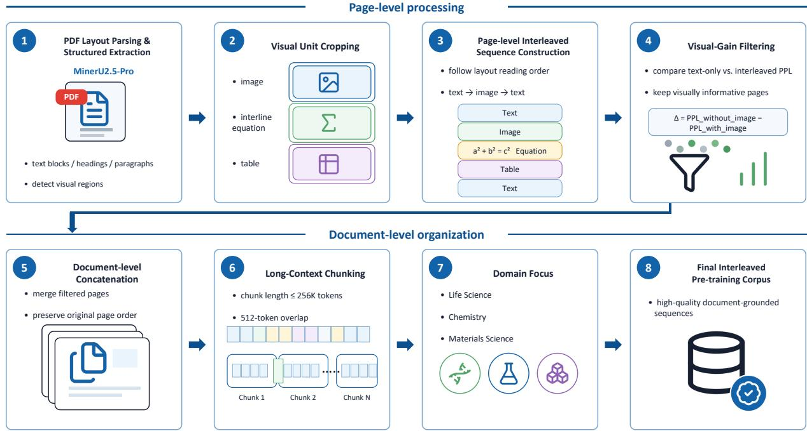  
Figure 4: Pipeline for producing the interleaved image-text pair data from PDF documents, including OCR and layout parsing, visual-unit cropping, visual-gain filtering, and document-level sequence assembly.

$$
\mathcal { U } = \mathrm { R a s t e r S c a n } \{ z _ { i } \mid m _ { i } = 1 \} = ( u _ { 1 } , \ldots , u _ { L } ) , \qquad L \leq N ,\tag{5}
$$

$$
\hat { u } _ { t + 1 } = \psi \big ( [ \Phi _ { \theta } ( W _ { \mathrm { i n } } u _ { \le t } ) ] _ { t } \big ) .\tag{6}
$$

Here, $W _ { \mathrm { i n } }$ denotes the visual input projection, $\Phi _ { \theta }$ is the autoregressive LLM backbone, and $\psi$ is a lightweight visual prediction head. VP is trained with a contrastive next-latent prediction objective. For prediction and target indices $t , j \in B$ , their temperature-scaled cosine similarity and matching probability are

$$
s _ { t j } = \frac { \hat { u } _ { t + 1 } ^ { \top } u _ { j + 1 } } { \tau \lVert \hat { u } _ { t + 1 } \rVert _ { 2 } \lVert u _ { j + 1 } \rVert _ { 2 } } , \qquad p _ { t j } = \frac { \exp ( s _ { t j } ) } { \sum _ { k \in \mathcal { B } } \exp ( s _ { t k } ) } .\tag{7}
$$

The VP loss is defined as

$$
\mathcal { L } _ { \mathrm { V P } } = - \frac { 1 } { \vert B \vert } \sum _ { t \in B } \log p _ { t t } ,\tag{8}
$$

where $u _ { t + 1 }$ is the positive target of $\hat { u } _ { t + 1 . }$ , and the remaining targets in ℬ serve as in-batch negatives. During continued pre-training, text and visual samples are interleaved under the joint objective

$$
\begin{array} { r } { \mathcal { L } = \lambda _ { \mathrm { t e x t } } \mathcal { L } _ { \mathrm { C E } } + \lambda _ { \mathrm { v i s } } \mathcal { L } _ { \mathrm { V P } } . } \end{array}\tag{9}
$$

The visual encoder remains frozen, while the LLM backbone, visual projection, and prediction head are optimized. Since supervision is obtained directly from visual features, VP requires neither OCR and layout parsing nor paired data and manual annotations. It therefore provides a scalable complement to text pretraining, retaining document structures and visual patterns that support both language and multimodal scientific capabilities.

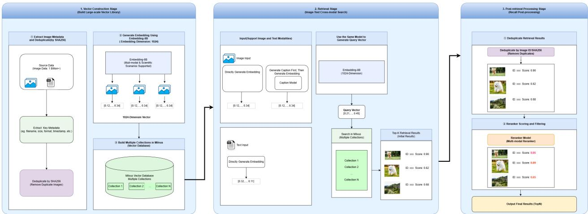  
Figure 5: The pipeline of the image retrieval process, including image encoding, vector database construction, and online text-to-image and image-to-image retrieval with post-processing

## 3.2. Interleaved Text-Image Data

In pre-training of a multi-modal large model, constructing image-text pairs alone is insuficient to fully cover the multi-modal understanding demands of real-world PDF documents. Existing multimodal pre-training strategies heavily rely on image caption data, which captures semantic alignment between an image and a local text span, making them suitable for object recognition, image description, and local visual-semantic modeling. However, the more critical information in PDFs often lies in the contextual relationships between images, equations, tables, and surrounding text, including layout position, explanatory paragraphs before and after visual elements, textual references, cross-page reasoning chains, and the progressive organization of knowledge in long documents. Therefore, we further construct interleaved image-text data from PDFs, as shown in Figure 4, enabling the model to learn not only what an image depicts, but also how it is embedded in document narratives and participates in knowledge expression and reasoning.

Specifically, we first apply MinerU2.5-Pro [76] to perform OCR and layout-aware structural parsing on PDF documents. The system identifies text blocks, headings, paragraphs, and visually informative regions on each page. For visual content, we focus on three types of units: regular images, interline equations, and tables. Each visual unit is cropped from the original PDF page according to its bounding box and saved as a standardized sub-image. We then construct page-level interleaved sequences. For each page, text blocks and visual units are reorganized according to the layout reading order and bounding-box order, forming page-level sequences. To further select high-value pages with genuine visual dependency, we introduce a visual-gain-based quality filtering mechanism. Inspired by Toolformer [64], we compute the language model perplexity of the page text under two conditions: a text-only condition without visual inputs, and an interleaved condition with images, tables, or equations included. Visual gain is defined as the diference between the two perplexities. A significant decrease in PPL after adding visual information indicates that the visual content provides meaningful support for understanding the page. Decorative images, advertisements, or weakly related visual elements typically yield low visual gain, whereas scientific pages containing experimental figures, mechanism diagrams, structural illustrations, tables, or equations often lead to a notable PPL reduction. Therefore, we combine human review with domain-specific thresholds and retain only pages whose visual gain exceeds the corresponding threshold.

Finally, we concatenate the filtered page-level interleaved sequences in the original PDF page order to form document-level sequences, which are further split into chunks suitable for long-context VLM pre-training, with each chunk capped at 256k tokens and sharing a 512-token overlap. This pipeline focuses on life sciences, chemistry, and materials science, yielding high-quality interleaved image-text data for VLM pre-training.

## 3.3. Image Retrieval Enhancement

Retrieval of high-quality data is a common practice in preparing textual pre-training corpus. However, the pipeline of retrieving high-quality image data is underexplored. Thus, as shown in Figure 5, we introduce a large-scale image retrieval pipeline to recall high-quality data and raise their sample ratio during the training to enhance the model’s multimodal ability.

The pipeline relies on building a large-scale image vector database. The main process includes: 1) extracting images and their key metadata from delivered data sources, and deduplicating them according to the SHA256 values of images to ensure the uniqueness of images in the vector database; 2) using an 8B embedding model to encode images and generate 1024-dimensional embedding representations; 3) in order to balance storage and retrieval performance for data at the scale of hundreds of millions, constructing multiple collections based on the Milvus vector database and storing image vectors in shards to support subsequent high-performance retrieval.

Online retrieval stage. The system supports two retrieval modes: text-to-image retrieval and image-to-image retrieval. For both modes, the same embedding model as used in the vector construction stage is adopted for vector encoding, so as to maintain consistency in the vector space.

For diferent types of input, the processing flow is as follows.

• Image input: the input image is directly encoded to obtain its image embedding; meanwhile, a caption model [88] is used to generate a textual description of the image, and the caption text is then encoded into a vector. In this way, joint retrieval is performed from both visual and semantic perspectives, which improves recall and semantic matching ability.

• Text input: the embedding model is directly used to generate the text vector, and cross-modal similarity retrieval is performed in the image vector database.

Post-processing stage after recall. To further improve the quality of retrieved results, the system applies post-processing to recalled results, including: filtering duplicate samples, using a reranker model to rerank candidate results and assign quality scores, and utilizing the scores to finally filter retrieval results.

## 4. Post-Training

## 4.1. Post-Training Framework

Starting from the pretrained checkpoint, we develop a unified post-training pipeline for Intern-S2-Preview. The pipeline strengthens general reasoning, instruction following, tool use, and long-horizon agentic behavior, while further improving three core capabilities for scientific intelligence: scientific reasoning, generation across scientific modalities, and scientific agentic problem solving.

As illustrated in Figure 6, the pipeline consists of three major stages. We first perform supervised finetuning on a broad mixture of high-quality demonstrations to establish fundamental reasoning behaviors, response formats, scientific generation capabilities, and tool-use patterns. We then conduct scalable multitask reinforcement learning over diverse scientific and general-purpose tasks to further improve reasoning, generation, and scientific capabilities. In parallel, we apply black-box agentic reinforcement learning to cultivate specialized policies in interactive environments, where the model solves complex tasks through external tools and environmental feedback. Finally, we employ on-policy distillation to consolidate the capabilities acquired by the general and specialized policies into a single unified model.

## 4.2. Supervised Fine-Tuning

The first post-training stage converts the pretrained model into a controllable assistant before applying reinforcement learning. We perform supervised fine-tuning on a large-scale, high-quality multimodal dataset covering a broad range of domains and interaction settings. The data mixture includes general conversation, instruction following, safety alignment, code generation and reasoning, image–text understanding, visual perception and spatial grounding, tool use, specialized scientific tasks, and long-horizon agentic trajectories. This diverse supervision equips the model with strong foundational capabilities across both general-purpose and scientific scenarios.

To ensure data quality, we apply extensive filtering, cleaning, and deduplication procedures. For tasks requiring explicit reasoning, we construct high-quality chain-of-thought demonstrations through rejection sampling using our previous-generation model, Intern-S1-Pro, together with other leading open-source models. The resulting samples are further validated by language models and human domain experts to improve factual correctness, reasoning quality, and format consistency. This carefully curated SFT stage provides a strong and stable initialization for the subsequent reinforcement learning stages.

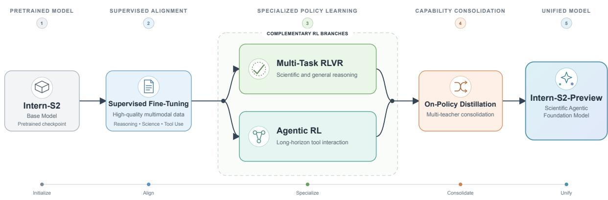  
Figure 6: Overview of the post-training pipeline for Intern-S2-Preview. The pretrained base model is first enhanced through supervised fine-tuning, followed by multi-task RLVR and black-box agentic RL for general and specialized capability improvement. On-policy distillation then consolidates the resulting scientific reasoning and agentic capabilities into a single unified model.

## 4.3. Scalable and Stable Reinforcement Learning

After SFT, reinforcement learning is used to improve correctness, reasoning depth, scientific generation, and response eficiency under verifiable objectives. Scaling the reinforcement learning pipeline introduces several practical challenges. Rollout generation is the primary computational bottleneck in reinforcement learning. Partial and asynchronous rollouts also introduce of-policy efects that require careful control. In addition, balancing reasoning eficiency with model performance remains dificult, while optimization conflicts in multitask training can hinder stable convergence across domains. To address these challenges, we introduce partial rollout with of-policy correction, adaptive length regularization, speculative decoding for faster RL rollouts, and robust multi-task optimization. The following sections describe the individual components of our post-training framework in detail.

## 4.3.1. Eficient Partial Rollout with Of-Policy Correction

Long-reasoning reinforcement learning is particularly susceptible to the long-tail distribution of response lengths. In a synchronous rollout pipeline, a small number of exceptionally long generations may delay the completion of an entire batch, leaving most GPUs idle while waiting for stragglers [30, 62, 111]. Existing systems commonly address this problem either by co-locating training and inference with partial rollouts [62, 67, 111], or by fully disaggregating rollout generation and policy optimization onto separate GPU pools [30].

After evaluating the computational characteristics of the diferent RL stages and our infrastructure, we develop a co-located partial-rollout system based on the XTuner training engine and the LMDeploy inference engine. As illustrated in Figure 7, the inference engine is continuously supplied with new requests during rollout generation to maintain high GPU utilization. Once the number of completed trajectories is suficient to form a training batch, the remaining in-flight rollouts are paused at their current generation positions rather than aborted or discarded. Their generated prefixes and rollout metadata are retained, while the same GPU pool switches from inference to policy training. After the policy update, the training states are ofloaded, the updated model parameters are synchronized to the inference engine, and the paused requests resume generation from their retained prefixes. Only completed trajectories are admitted into the current training batch.

This pause-and-resume mechanism avoids waiting for long-tail generations while preserving the computation already spent on unfinished responses. It also avoids the dificult producer–consumer balancing problem commonly encountered in fully asynchronous systems with disaggregated training and inference resources. However, because a resumed trajectory may contain segments generated before and after one or more policy updates, diferent tokens within the same trajectory can originate from diferent behavior-policy versions. We therefore record the behavior-policy version and generation-time log-probability for every sampled token.

For token $y _ { i , t }$ in trajectory �, we define the importance-sampling ratio as

$$
\rho _ { i , t } ( \theta ) = \frac { \pi _ { \theta } ( y _ { i , t } \mid s _ { i , t } ) } { \pi _ { \mathrm { b e h } ( i , t ) } ( y _ { i , t } \mid s _ { i , t } ) } ,\tag{10}
$$

where $\pi _ { \mathrm { b e h } ( i , t ) }$ denotes the behavior-policy version that generated token $y _ { i , t }$ , and $\pi _ { \theta }$ denotes the current learner policy. We explicitly bound trajectory staleness: a trajectory is discarded if its oldest retained segment was generated more than three policy updates before the current learner.

Following the clipped importance-weight formulation of [55], we truncate the importance ratio as

$$
\bar { \rho } _ { i , t } ( \theta ) = \mathrm { c l i p } \left( \rho _ { i , t } ( \theta ) , 1 - \epsilon _ { \mathrm { l o w } } ^ { \mathrm { I S } } , 1 + \epsilon _ { \mathrm { h i g h } } ^ { \mathrm { I S } } \right) .\tag{11}
$$

The clipped ratio is subsequently used as a detached importance weight in the REINFORCE objective. Unlike PPO-style clipping, which clips the surrogate objective and may completely suppress gradients from tokens outside the trust region, clipping the importance weight bounds update variance while retaining a nonzero policy-gradient contribution from every unmasked token.

For MoE policies, training–inference inconsistency arises from both expert-routing diferences and numerical discrepancies between the two execution engines. We employ Rollout Routing Replay (R3) [52] to address the former: the expert selections made by LMDeploy during rollout are recorded and replayed by XTuner when evaluating the corresponding tokens. This ensures that rollout and training follow the same expert paths. Following Intern-S1-Pro [112], we additionally use an aligned mixed-precision configuration in which expert linear layers operate in FP8, the remaining layers use BF16, and numerically sensitive operations, including apply\_rope, RMSNorm, the MoE router, recurrent states in Gated DeltaNet [95], and the language-model head, are computed in FP32.

After routing replay and operator-level alignment, a small number of tokens may still exhibit large probability discrepancies because of residual numerical diferences. Inspired by KPop [44], we detect these outliers using the bidirectional binary KL divergence. Let $p _ { i , t } ^ { \mathrm { t r a i n } }$ and $p _ { i , t } ^ { \mathrm { r o l l o u t } }$ denote the sampled-token probabilities produced by the training and rollout engines under matched model parameters and replayed routing decisions. We define

$$
D _ { \mathrm { B K L } } ( p \Vert q ) = p \log \frac { p } { q } + ( 1 - p ) \log \frac { 1 - p } { 1 - q } ,\tag{12}
$$

and construct the token mask

$$
m _ { i , t } ^ { \mathrm { B K L } } = \mathbb { I } \left[ D _ { \mathrm { B K L } } \left( p _ { i , t } ^ { \mathrm { t r a i n } } | | p _ { i , t } ^ { \mathrm { r o l l o u t } } \right) \leq \phi \right] \mathbb { I } \left[ D _ { \mathrm { B K L } } \left( p _ { i , t } ^ { \mathrm { r o l l o u t } } | | p _ { i , t } ^ { \mathrm { t r a i n } } \right) \leq \phi \right] .\tag{13}
$$

R3 removes discrete expert-routing mismatch, whereas the BKL mask filters the remaining token-level numerical outliers. The clipped importance weights in Equation (11) and token masks in Equation (13) are incorporated into the unified RL objective described in Section 4.3.5.

## 4.3.2. Adaptive Length Regularization for Eficient Reasoning

Long-CoT reasoning models frequently exhibit overthinking on relatively simple problems, producing unnecessarily long reasoning trajectories even when the correct solution can be reached with substantially less computation [16, 61]. Existing approaches improve reasoning eficiency through explicit length-aware rewards or constraints [3, 73], query-adaptive length penalties [87], or a separate length-control fine-tuning stage [49, 103]. Although efective, reward-based approaches introduce auxiliary optimization objectives that may conflict with task rewards, whereas additional fine-tuning stages complicate the post-training pipeline and may disturb capabilities acquired during earlier RL stages.

We introduce an adaptive length regularization method that directly reweights the advantages of positive responses without adding an independent reward signal. The method follows two principles. First, we do not impose length regularization on negative responses. Since an incorrect response may fail for many diferent reasons, penalizing its length can prematurely suppress potentially useful exploration and consequently degrade model performance. Second, we activate length regularization only when the model achieves a suficiently high pass rate on the corresponding query. This design allows the model to freely explore dificult queries and encourages concise reasoning only after it has largely mastered them.

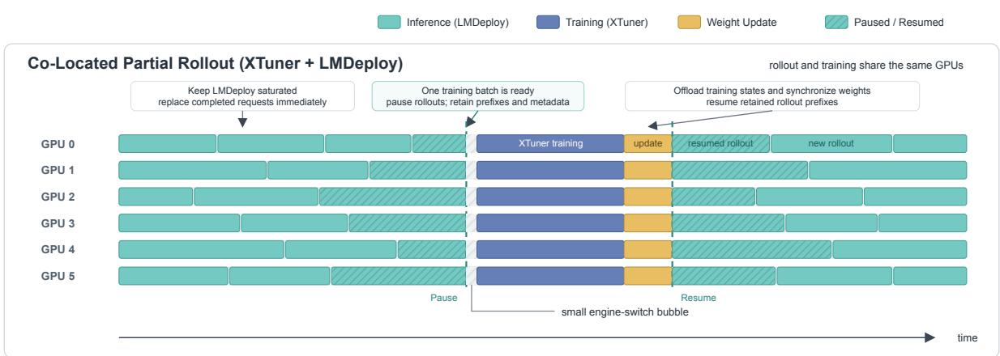  
Figure 7: Overview of our co-located partial-rollout system based on XTuner and LMDeploy. During rollout, completed requests are continuously replaced to keep the inference engine fully utilized. Once suficient completed trajectories have been collected for one training batch, the remaining in-flight rollouts are paused and their generated prefixes are retained. The same GPUs then switch to policy training. After the training states are ofloaded and the updated model weights are synchronized to the inference engine, the paused requests resume generation from their retained prefixes.

For each query $q ,$ let $\mathcal { G } _ { q } = \{ 1 , \ldots , G \}$ index a group of � sampled responses, and let $\hat { A } _ { i }$ denote the original advantage of response �. We define the set of positive responses as

$$
\mathcal { P } _ { q } = \left\{ i \in \mathcal { G } _ { q } \mid \hat { A } _ { i } > 0 \right\} .\tag{14}
$$

The regularized advantage is given by

$$
\widetilde { A } _ { i } = \left\{ \begin{array} { l l } { \frac { \sum _ { j \in \mathcal { P } _ { q } } \hat { A } _ { j } } { \sum _ { j \in \mathcal { P } _ { q } } w _ { j } \hat { A } _ { j } + \epsilon } w _ { i } \hat { A } _ { i } , } & { i \in \mathcal { P } _ { q } , | \mathcal { P } _ { q } | \geq \tau G , } \\ { \hat { A } _ { i } , } & { \mathrm { o t h e r w i s e } , } \end{array} \right.\tag{15}
$$

where $\tau$ controls the minimum fraction of positive responses required to activate length regularization. The length-dependent weight $w _ { i }$ is defined as

$$
w _ { i } = \alpha + \left( 1 - \alpha \right) \left( 1 - \frac { L _ { i } - L _ { \operatorname* { m i n } } ^ { + } } { L _ { \operatorname* { m a x } } ^ { + } - L _ { \operatorname* { m i n } } ^ { + } + \epsilon } \right) ^ { \gamma } , \qquad i \in \mathcal { P } _ { q } ,\tag{16}
$$

with

$$
L _ { \operatorname* { m i n } } ^ { + } = \operatorname* { m i n } _ { j \in \mathcal { P } _ { q } } L _ { j } , \qquad L _ { \operatorname* { m a x } } ^ { + } = \operatorname* { m a x } _ { j \in \mathcal { P } _ { q } } L _ { j } ,\tag{17}
$$

where $L _ { i }$ is the reasoning length of response $i ,$ � specifies the minimum weight assigned to long responses, � controls the shape of the length-dependent decay, and � ensures numerical stability.

Among positive responses, shorter solutions receive larger weights, whereas longer solutions are downweighted while retaining positive advantages. The normalization term approximately preserves the total positive advantage mass, thereby changing the relative preference among successful responses without substantially altering the overall optimization scale. If the positive-response ratio is below $\tau ,$ or if a response has a non-positive advantage, its advantage remains unchanged. The method therefore adaptively transitions from exploration on dificult queries to eficiency optimization on queries that the model has already mastered.

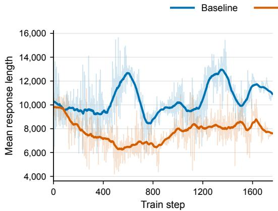

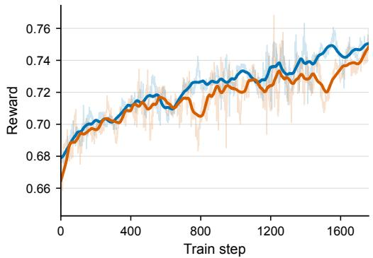  
Figure 8: Comparison of training with and without adaptive length penalty, showing similar reward curves and shorter outputs with regularization.

As shown in Figure 8, we compare Intern-S2-Preview-35B trained with and without adaptive length regularization. Both settings achieve comparable reward curves, while adaptive length regularization substantially reduces the average output length. These results demonstrate that the proposed method improves reasoning eficiency without sacrificing model performance.

## 4.3.3. Speculative Decoding for Faster RL Rollouts

Although the co-located partial rollout system substantially improves GPU utilization, rollout generation remains one of the most time-consuming stages of RL training because long reasoning trajectories must still be generated autoregressively. Speculative decoding provides a complementary approach for accelerating this process. A lightweight draft model first proposes multiple candidate tokens, which are subsequently verified in parallel by the current policy model through an exact rejection-sampling procedure [14, 43]. Since this verification procedure preserves the sampling distribution of the policy model, speculative decoding accelerates rollout generation without introducing additional of-policy bias. Recent studies have explored speculative decoding for RL rollouts through concurrency-aware online draft learning, continuously evolving draft models, tree-structured rollout caches, and system-level integration with RL infrastructure [13, 15, 37, 101].

A central challenge in applying speculative decoding to RL is that the policy model evolves continuously during training. A fixed draft model therefore becomes increasingly stale as the policy is updated, resulting in a growing mismatch between their output distributions and a progressive decline in the token acceptance rate. To address this issue, we train the draft model online using trajectories generated by the latest policy. At each RL iteration, the draft model is updated using the token distributions of the current policy on newly collected rollout states, while gradients are stopped through the policy model. This online adaptation allows the draft model to continuously track the evolving rollout distribution throughout RL training.

We train the draft model using the hybrid LK Loss [63], which combines the stable optimization behavior of forward KL divergence with the direct acceptance-rate optimization of total variation distance. For the �-th draft position at a rollout state $s _ { t , k } ,$ we denote the target-policy and draft-model distributions as

$$
p _ { t , k } ( \boldsymbol { v } ) = \mathrm { s g } \left[ \pi _ { \boldsymbol { \theta } } ( \boldsymbol { v } \mid \boldsymbol { s } _ { t , k } ) \right] , \qquad q _ { t , k } ( \boldsymbol { v } ) = \pi _ { \boldsymbol { \phi } } ^ { \mathrm { d r a f t } } ( \boldsymbol { v } \mid \boldsymbol { s } _ { t , k } ) ,\tag{18}
$$

where both distributions are computed under the rollout sampling temperature and sg[·] denotes the stopgradient operator. The forward KL divergence and total variation distance are respectively defined as

$$
D _ { \mathrm { K L } } \left( p _ { t , k } \parallel q _ { t , k } \right) = \sum _ { v \in \mathcal { V } } p _ { t , k } ( v ) \log \frac { p _ { t , k } ( v ) } { q _ { t , k } ( v ) } ,\tag{19}
$$

and

$$
D _ { \mathrm { T V } } \left( p _ { t , k } , q _ { t , k } \right) = \frac { 1 } { 2 } \sum _ { v \in \mathcal { V } } \left| p _ { t , k } ( v ) - q _ { t , k } ( v ) \right| .\tag{20}
$$

Under lossless speculative sampling, the expected token acceptance probability is equal to the overlap between the target and draft distributions:

$$
\alpha _ { t , k } = \sum _ { v \in \mathcal { V } } \operatorname* { m i n } \left( p _ { t , k } ( v ) , q _ { t , k } ( v ) \right) = 1 - D _ { \mathrm { T V } } \left( p _ { t , k } , q _ { t , k } \right) .\tag{21}
$$

Following the hybrid LK formulation, we combine the two divergence objectives as

$$
\mathcal { L } _ { \mathrm { L K } } ^ { ( t , k ) } = \lambda _ { k } D _ { \mathrm { K L } } \left( p _ { t , k } \Vert q _ { t , k } \right) + \left( 1 - \lambda _ { k } \right) D _ { \mathrm { T V } } \left( p _ { t , k } , q _ { t , k } \right) .\tag{22}
$$

The mixing coeficient is adaptively determined by the acceptance rate:

$$
\lambda _ { k } = \exp \left( - \eta \mathrm { s g } \left[ \bar { \alpha } _ { k } \right] \right) , \qquad \eta > 0 ,\tag{23}
$$

where $\bar { \alpha } _ { k }$ is the acceptance rate for the �-th draft position aggregated over the sequence and batch dimensions. The complete online draft-training objective is

$$
\mathcal { L } _ { \mathrm { d r a f t } } = \frac { 1 } { K } \sum _ { k = 1 } ^ { K } \frac { 1 } { | \mathcal { T } _ { k } | } \sum _ { t \in \mathcal { T } _ { k } } \mathcal { L } _ { \mathrm { L K } } ^ { ( t , k ) } ,\tag{24}
$$

where � is the number of predicted draft positions and $\mathcal { T } _ { k }$ contains the valid training positions for the �-th draft step. In our implementation, the draft model predicts tokens at $K = 4$ future positions, and we set the adaptive coeficient hyperparameter to $\eta = 3$

When the draft model is poorly aligned with the current policy, the acceptance rate $\bar { \alpha } _ { k }$ is low and $\lambda _ { k }$ approaches one. The objective is therefore dominated by the forward KL term, which provides smooth and well-scaled gradients for rapidly aligning the draft distribution with the evolving policy. As the draft model becomes better aligned and the acceptance rate increases, $\lambda _ { k }$ decreases and the TV component receives a larger weight. Since minimizing TV distance is equivalent to maximizing the distributional overlap, the objective gradually shifts from stable distribution matching to direct acceptance-rate optimization.

With online draft adaptation and the hybrid LK objective, the acceptance rate continues to improve as RL training progresses instead of degrading as the policy evolves. In our large-scale training runs, speculative decoding ultimately delivers an approximately 2× speedup in rollout generation and a 1.7× end-to-end speedup for the overall RL training pipeline. These results demonstrate that online draft learning provides a lossless and efective acceleration mechanism that complements our partial rollout system.

## 4.3.4. Robust Multi-Task Optimization

We perform RL for Intern-S2-Preview on mixtures of heterogeneous tasks, which difer in structure, solution diversity, and uncertainty of policy exploration. This induces distinct entropy regimes under the same policy, making global or token-level entropy regulation inadequate for their heterogeneous exploration requirements [20, 22, 66, 94]. This heterogeneity further makes group-based policy optimization methods induce an entropy-dependent bias, making advantage signals across prompt groups statistically non-comparable.

We apply Group-level Entropy-Controlled Policy Optimization (GEPO) [21], which uses group-level entropy, estimated directly from existing grouped samples, as a diagnostic signal to identify and mitigate the optimization bias induced by entropy heterogeneity. Specifically, GEPO attenuates positive advantages in low-entropy groups to prevent over-exploitation that would further amplify the entropy gap, while attenuating negative advantages in high-entropy groups to avoid prematurely suppressing exploration. This scaling is asymmetric because low-entropy groups are more susceptible to aggressive intervention, which may trigger length collapse, and therefore require milder attenuation than high-entropy groups.

In GRPO and RLOO, given group responses $\left\{ y _ { 1 } , \dots , y _ { K } \right\}$ sampled from $\pi _ { \boldsymbol { \theta } } ( \cdot | \boldsymbol { x } )$ for each prompt �, we define group-level entropy as

$$
H _ { \mathrm { g } } ( \boldsymbol { x } ) \ = \ - \frac { 1 } { K } \sum _ { i = 1 } ^ { K } \sum _ { t = 1 } ^ { T _ { i } } \log \pi _ { \theta } ( y _ { i , t } \mid y _ { i , < t } , \boldsymbol { x } ) .\tag{25}
$$

Then, we shape the original advantage $\{ A _ { i } \} _ { i = 1 } ^ { K }$ for each response as

$$
\hat { A } _ { i } = \omega ( g , A _ { i } , \mathcal { H } _ { \mathfrak { g } } ) A _ { i } = \left\{ \begin{array} { l l } { \alpha _ { \mathrm { l o w } } \cdot A _ { i } } & { \mathrm { i f ~ } A _ { i } > 0 \mathrm { ~ a n d ~ } \mathcal { H } _ { \mathfrak { g } } ( x ) < \mathcal { H } _ { \mathrm { l o w } } ^ { ( t ) } , } \\ { \alpha _ { \mathrm { h i g h } } \cdot A _ { i } } & { \mathrm { i f ~ } A _ { i } < 0 \mathrm { ~ a n d ~ } \mathcal { H } _ { \mathfrak { g } } ( x ) > \mathcal { H } _ { \mathrm { h i g h } } ^ { ( t ) } , } \\ { A _ { i } } & { \mathrm { o t h e r w i s e } , } \end{array} \right.\tag{26}
$$

where $\alpha _ { \mathrm { h i g h } } \in ( 0 , 1 ) > \alpha _ { \mathrm { l o w } } \in ( 0 , 1 )$ are the scaling coeficients, and $\mathcal { H } _ { \mathrm { l o w } } ^ { ( t ) }$ and $\mathcal { H } _ { \mathrm { h i g h } } ^ { ( t ) }$ denote the lower and upper entropy thresholds at training step �.

Instead of forcing heterogeneous tasks toward a shared entropy target, GEPO preserves task-dependent exploration regimes while rebalancing their efective contributions to policy updates. It requires neither explicit task annotations nor additional rollouts and can be directly integrated into existing group-based policy optimization pipelines, providing a scalable mechanism for stable joint optimization over heterogeneous post-training tasks.

## 4.3.5. Unified RL Objective and Training Configuration

Our reasoning RL follows the leave-one-out REINFORCE formulation used in Intern-S1-Pro [112], augmented with the stabilization and eficiency techniques introduced above. For each query, we sample a group of � responses and obtain their sequence-level verifier rewards $\{ R _ { i } \} _ { i = 1 } ^ { G }$ . Following the dynamic sampling strategy of DAPO [96], query groups whose rewards are all identical are filtered out online and replaced with newly sampled groups. For each retained group, the initial leave-one-out advantage is computed as

$$
A _ { i } ^ { \mathrm { L O O } } = R _ { i } - \frac { 1 } { G - 1 } \sum _ { j = 1 \atop j \neq i } ^ { G } R _ { j } .\tag{27}
$$

We then apply the two advantage-shaping mechanisms described in the preceding sections. GEPO first adjusts the group-relative advantages according to group-level entropy to balance exploration across heterogeneous tasks. Adaptive length regularization is subsequently applied to the entropy-adjusted advantages, encouraging shorter successful reasoning trajectories only for query groups whose positive-response ratios exceed the activation threshold. The final advantage used for policy optimization can be summarized as

$$
\widetilde { A } _ { i } = \mathcal { R } _ { \mathrm { l e n } } \left( \mathcal { R } _ { \mathrm { G E P O } } \left( A _ { i } ^ { \mathrm { L O O } } \right) \right) ,\tag{28}
$$

where $\mathcal { R } _ { \mathrm { G E P O } }$ and $\mathcal { R } _ { \mathrm { l e n } }$ denote the entropy-control and adaptive length-regularization transformations defined above, respectively. This ordering ensures that the length-dependent weights act on the final entropy-adjusted advantages rather than modifying the verifier rewards.

Given a partial-rollout training bufer ℬ, we optimize the policy using

$$
\mathcal { L } _ { \mathrm { R L } } ( \theta ) = - \mathbb { E } _ { \left( q , \{ y _ { i } \} _ { i = 1 } ^ { G } \right) \sim B } \left[ \frac { 1 } { G } \sum _ { i = 1 } ^ { G } \frac { 1 } { \left| y _ { i } \right| } \sum _ { t = 1 } ^ { \left| y _ { i } \right| } m _ { i , t } ^ { \mathrm { B K L } } \operatorname { s g } \left[ \bar { \rho } _ { i , t } ( \theta ) \right] \widetilde { A } _ { i } \log \pi _ { \theta } \left( y _ { i , t } \mid s _ { i , t } \right) \right] ,\tag{29}
$$

where $\bar { \rho } _ { i , t }$ is the clipped token-level importance weight defined in Equation (11), $m _ { i , t } ^ { \mathrm { B K L } }$ is the numericalconsistency mask defined in Equation (13), and $\mathrm { s g } [ \cdot ]$ denotes the stop-gradient operator. The sequence-level advantage $\widetilde { A } _ { i }$ is shared by all policy-generated tokens in response $y _ { i }$

This objective combines three complementary stabilization mechanisms. The clipped importance weight corrects the policy mismatch introduced by pause-and-resume partial rollouts and repeated mini-batch updates. R3 aligns the expert-routing decisions of the rollout and training engines, while the BKL mask removes the remaining numerical outliers after routing and operator alignment. Meanwhile, GEPO and adaptive length regularization reshape the sequence-level advantages to balance task-dependent exploration and reasoning eficiency. Speculative decoding preserves the sampling distribution of the policy and therefore accelerates rollout generation without modifying Equation (29).

We use the Muon optimizer [39, 48] with a learning rate of $1 \times 1 0 ^ { - 6 }$ and a weight decay of 0.01. Each rollout batch contains 8,192 completed responses and is optimized through 8 mini-batch update steps. The maximum generation length is set to 65,536 tokens. Together, this training configuration and the stabilization mechanisms described above support eficient and stable reasoning RL over heterogeneous scientific and general-purpose tasks.

## 4.4. Large-Scale Black- and White-Box Agentic RL

Reasoning RL improves single-response and generation-oriented behavior, but scientific agents must also learn from interactive sessions that involve tools, files, external programs, and environment feedback. We develop a unified agentic RL framework around a harness × task abstraction that decouples agent execution interfaces from task distributions. A harness specifies how an agent is instantiated, driven, and observed, whereas a task specifies the initial environment, executable objective, and verifier-defined outcome. Their composition converts heterogeneous agent executions into a common form of RL experience: an interactive rollout with an explicit environment, an observable action–observation history, and automatic outcome signals.

This formulation allows agentic training to scale along two complementary axes. Along the harness axis, we support both white-box implementations whose control loops can be directly orchestrated and black-box runtimes integrated through their native CLI, SDK, or model API. Along the task axis, we cover specialized coding and terminal environments as well as general-purpose tasks produced by a self-evolving task-synthesis system. The resulting framework broadens agent behaviors and task distributions while retaining a unified rollout, verification, and training protocol.

Recent agentic RL systems have highlighted the importance of decoupling agent execution from policy optimization and recovering trainable experience from heterogeneous agent runtimes [10, 50, 89]. Intern-S2- Preview builds on a sequence of our studies on agent learning and evaluation. Agent-FLAN examined data and optimization for efective agent tuning; Lagent provided a modular framework for building language agents; T-Eval and CIBench studied stepwise tool use and executable code-interpreter behavior; MindSearch studied long-horizon information seeking and integration; and SciExplore extended agent evaluation to realistic scientific navigation and cross-source synthesis [17–19, 42, 70, 98, 106]. More recent work investigates behavioral alignment through process-continuation learning, the roles of next-chunk RL and SFT under no-chain-of-thought supervision, and self-evolving task synthesis through skill graphs and progressive validation [28, 29, 32, 69, 71, 102]. Together, these eforts motivate the harness × task abstraction developed here: a common system that can vary the agent runtime and task distribution independently while retaining unified rollout, verification, trace assembly, and RL optimization.

## 4.4.1. Unified Agentic RL Infrastructure

As illustrated in Figure 9, our infrastructure consists of a unified rollout runtime and a trace-aware experienceassembly layer. The former composes heterogeneous harnesses with executable tasks and runs them under a common session contract; the latter joins semantic trajectories and verifier feedback with the exact token-level evidence required by policy optimization.

Unified execution runtime. At rollout time, the Agent Rollout Runner receives a harness–task pair, provisions its execution environment, and manages the interaction until normal completion or a termination condition. The harness drives the agent, while Judger Adapters perform outcome verification and process annotation against the same session state and execution artifacts. A Shared Sandbox Provider abstracts environment creation, command and tool execution, isolation, error handling, and resource cleanup across local, remote, and custom backends. Agent control, environment provisioning, and verification can therefore evolve independently and be recombined across tasks without constructing a bespoke rollout pipeline for every pairing.

Harness-agnostic agent integration. Agent Gateway & Adapters expose a stable interface over white-box, black-box, and custom harness implementations. White-box loops can be orchestrated directly, whereas blackbox harnesses—including OpenClaw, Claude Code, OpenCode, OpenHands, and Mini-SWE—retain their native messages, tool loops, and control flow [79, 92]. The adapters translate session lifecycle events, model calls, and interaction artifacts without requiring the runtime to access or reimplement a harness’s internal agent logic. Adding a new harness therefore requires a thin integration adapter rather than a new RL execution stack.

Client-transparent, training-aware model serving. Diferent black-box harnesses expect diferent model protocols. Our LLM serving layer accepts OpenAI Chat Completions, OpenAI Responses, and Anthropic Messages, and supports both regular and streaming generation. Requests are normalized by the gateway and forwarded to distributed inference workers, while streamed text, reasoning, and tool-call events are relayed to the harness in their native form. From the client’s perspective, this remains an ordinary model service. In parallel, the serving layer transparently captures training-only evidence, including exact input and output token IDs, rollout log probabilities, and token-wise MoE router experts, without exposing these extensions to the agent’s control logic.

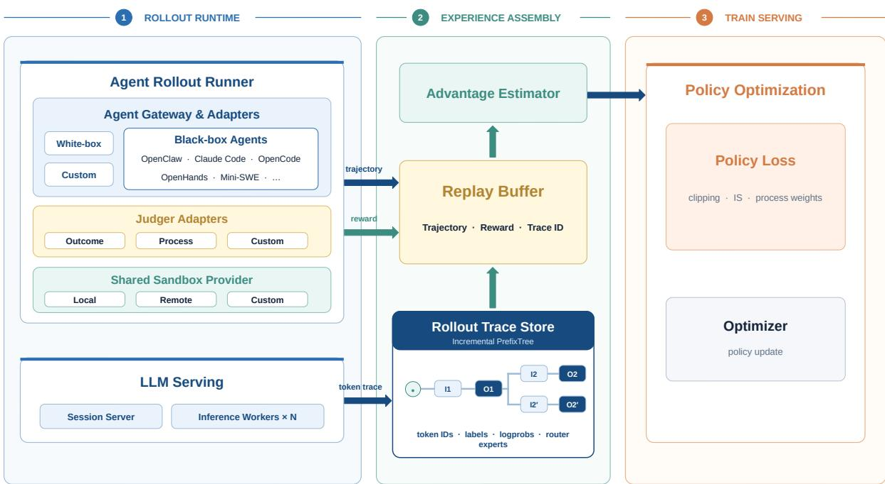  
Figure 9: Overview of our agentic RL infrastructure. Heterogeneous white-box and black-box agents are unified by the Agent Gateway and execute against a shared sandbox and model-serving substrate. Semantic trajectories and verifier feedback are retained in the Replay Bufer, while the Rollout Trace Store preserves exact token-level evidence through a per-session incremental PrefixTree. Experience assembly aligns the two views for advantage estimation and policy optimization.

This serving path implements a token-in–token-out (TITO) interface. For each model call, the Session Server reuses the exact tokenized prefix already recorded for the session, tokenizes only newly appended context, and sends the resulting token IDs directly to the inference engine. The returned tokens and policy statistics are captured from the same response stream delivered to the agent. For sparse MoE models, Rollout Router Replay (R3) additionally records the rollout-time expert choices for reuse during training. TITO therefore preserves the sampled token sequence, while R3 preserves the conditional computation path that produced it.

Trace-aware experience assembly. The rollout runtime produces two complementary views of an interaction. The Agent Runner and Judger Adapters produce the semantic experience—the action–observation trajectory, outcome reward, process annotations, and session metadata—which is retained in the Replay Bufer. LLM Serving produces the model-execution evidence—token IDs, loss labels, behavior log probabilities, and router experts—which is written to the Rollout Trace Store. Keeping these views separate decouples environmentfacing logic from model-specific training representations while retaining a lossless path from an agent action to the policy tokens that generated it.

The Trace Store organizes each session as an incremental PrefixTree. Each node represents a newly appended context delta or assistant response and stores its token IDs, labels, rollout log probabilities, and router experts. Longest-prefix matching reuses the stable history of a session and appends only newly observed segments. When a trajectory is selected for training, the store materializes the corresponding root-to-leaf path. System instructions, user messages, and tool observations are masked from the loss, while eligible policy-generated segments retain their training labels.

Table 1: Public sources used to construct executable coding and terminal tasks.
<table><tr><td>Provider</td><td>Collection</td><td>#Tasks</td><td>#Environments</td></tr><tr><td>SWE-bench</td><td>SWE-smith [93]</td><td>59,136</td><td>222</td></tr><tr><td>SWE-Gym</td><td>SWE-Gym [59]</td><td>2,438</td><td>2401</td></tr><tr><td>R2E-Gym</td><td>R2E-Gym-V1 [38]</td><td>7,480</td><td>8101</td></tr><tr><td>Nebius</td><td>SWE-rebench-V2 [6]</td><td>32,100</td><td>32075</td></tr><tr><td>AweAI-Team</td><td>Scale-SWE[104]</td><td>20,200</td><td>19472</td></tr><tr><td>NVIDIA</td><td>Nemotron-Terminal-Synthetic-Tasks [60]</td><td>80,000</td><td>8</td></tr><tr><td>RUC-AIBOX</td><td>ClawGym-Task [7]</td><td>13,500</td><td>1</td></tr></table>

Beyond incremental storage, the PrefixTree preserves the lineage and exact boundaries of model calls across multi-turn and branching interactions. It thus establishes a stable correspondence between a semantic agent action and its rollout-time token span. Experience assembly joins Replay Bufer records and token traces by session and segment, computes advantages, and exports model-ready experiences to the common RL trainer. This correspondence also provides the basis for the process-aware credit assignment described below.

## 4.4.2. Agentic Task Construction

We construct the task distribution from two complementary sources. For specialized coding and terminal capabilities, we curate executable tasks from publicly released collections containing both mined and synthetic instances. For broader capabilities, a self-evolving task-synthesis system converts community-contributed skills into general-purpose agentic tasks. Tasks from both sources are normalized to a common contract consisting of an initialized execution environment, a natural-language objective, and an automatic verifier. Consequently, heterogeneous tasks can be composed with diferent harnesses and trained within the same RL framework.

Coding and terminal tasks. This branch draws from the public sources summarized in Table 1. Some collections mine real-world GitHub issues, pull requests, and repository histories, whereas others procedurally construct software-engineering environments or synthesize terminal and workspace tasks. Together, they cover repository-level issue resolution, debugging and testing, software setup, file and data manipulation, and broader terminal-based problem solving.

Across sources, we map each instance into the common task contract by materializing its base repository or container and required assets as the initial environment, translating its issue statement or instruction into the task objective, and retaining its tests or reward programs as the verifier. This normalization preserves source-specific execution and reward semantics while exposing a consistent interface to the rollout runtime. In particular, these tasks remain grounded in live environments rather than being reduced to static instruction– response pairs, so their rewards reflect program behavior, repository state, and task-specific execution outcomes.

Self-evolving general agentic tasks. For broader agentic coverage, we build a self-evolving task-synthesis system organized as the closed data loop illustrated in Figure 10. We seed the system with communitycontributed skills collected from multiple sources. These skills describe concrete user workflows and their required tools and dependencies, providing a natural basis for executable task synthesis. We first filter infeasible, unsafe, low-quality, or redundant candidates, including workflows involving unavailable authentication, external transactions, or toxic content, and then perform domain-balanced resampling to prevent frequently occurring skill domains from dominating the synthesis distribution.

Individual skills often describe localized workflows, whereas a general agent must coordinate multiple capabilities over longer horizons. We therefore build a skill-state graph whose nodes denote observable environment states and whose edges denote state-transforming capabilities extracted from skills. Skills are composed only when their input and output states are compatible. Sampling paths of diferent lengths from this graph produces capability sequences with varied horizons and complexity.

Each sampled path is converted into an executable task bundle through a progressive pipeline that constructs the environment, task, and verifier in sequence. Every stage is paired with an executable validator. Rule-based checks verify structural correctness, dependency resolution, and executability, while rubric-based checks evaluate semantic quality and cross-stage consistency. Failures trigger stage-local repair or regeneration, and only validated artifacts are passed downstream. This localizes synthesis errors and reduces inconsistencies among the environment, task specification, and verifier.

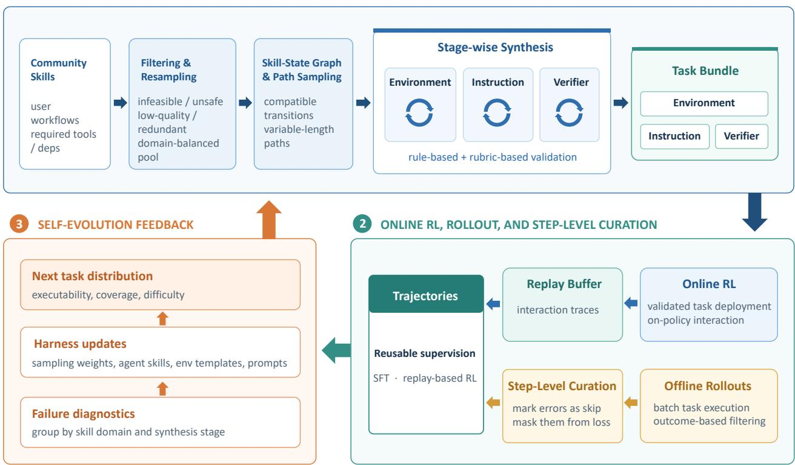  
Figure 10: Self-evolving construction of general agentic tasks. Community skills are filtered and composed through compatible skill-state paths before stage-wise synthesis produces validated task bundles. Online and ofline rollouts yield curated reusable trajectories, while execution failures update sampling and synthesis components to generate the next task distribution.

Validated tasks are deployed in online RL and are also rolled out to construct reusable ofline training data. Candidate trajectories passing outcome-based filtering undergo step-level curation. Each interaction step is annotated by behavior type, covering normal progress as well as tool-use errors, repetitive failed attempts, invalid recovery, premature termination, protocol violations, unsupported assumptions, and hallucinated observations. Erroneous steps remain in the interaction context but can be marked as skip and excluded from the imitation loss, while the remaining responses serve as optimization targets. This selective masking avoids imitating flawed intermediate behavior without destroying the causal context of later actions.

Downstream execution further exposes systematic weaknesses in the synthesized task distribution. We aggregate execution failures and verifier feedback by skill domain and synthesis stage, and use these statistics to update skill sampling weights as well as synthesis skills, environment templates, and stage-specific prompts. The revised system then resamples capability paths and generates the next task distribution, progressively improving executability, coverage, and dificulty from observed agent behavior.

## 4.4.3. Robust Agentic RL Training

Optimizing on agentic experience introduces challenges beyond single-turn response optimization. Verifiers score complete, tool-interleaved sessions, while only selected policy-generated segments are trainable. Moreover, executable environments expose the reward channel to solution leakage, test manipulation, and other forms of reward hacking. We first align terminal outcomes with the trainable segments of a session, then refine this signal with process-aware advantage control, and finally harden the verifier against reward leakage. We conclude by examining the resulting optimization behavior across task families and agent harnesses.

Session-aware outcome credit. An agentic session may contain multiple assistant responses separated by system instructions, user messages, tool calls, and environment observations. Nevertheless, these segments jointly solve one task and receive one final outcome reward. Within each rollout group for the same task, we compute a group-relative advantage $A _ { i }$ from the complete-session reward of rollout �, following the grouprelative optimization paradigm [65]. The same session advantage is assigned to all eligible policy-generated segments in its trace, rather than treating each model call as an independently rewarded episode. Token-level labels exclude non-policy context from the loss, while the PrefixTree preserves the exact boundaries of the trainable response segments.

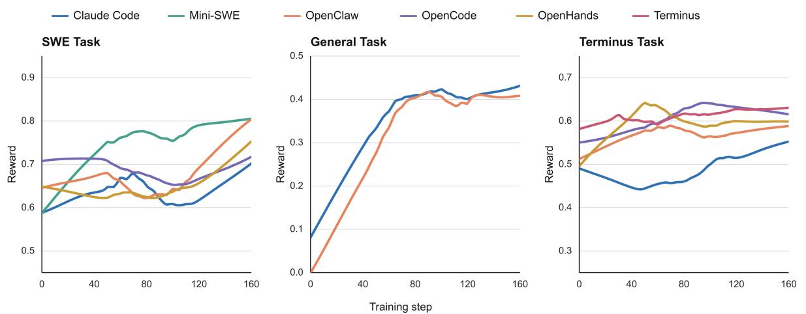  
Figure 11: Reward trajectories across SWE, general-purpose, and terminal tasks under multiple agent harnesses. Each panel presents a representative example over 160 optimization steps. Curves are locally smoothed to highlight the overall optimization trends.

Process-aware advantage control. Outcome-only credit can reinforce undesirable intermediate behavior when a session eventually succeeds despite malformed outputs, invalid or repeated tool calls, unnecessary recovery attempts, or abnormal termination. We keep outcome evaluation and process feedback separate, reflecting the distinction between outcome and process supervision [47]. The outcome verifier determines whether the task is solved, while a process annotator attaches an adv\_penalty to the specific assistant message exhibiting a deterministic process error. These annotations do not change the session reward or the token labels.

The PrefixTree maps each annotated message to its exact trainable token span. Let $w _ { i , k } \in [ - 1 , 1 ]$ denote the process weight for segment � in session �. For a trainable token � in that segment, we use

$$
\widetilde { A } _ { i , k , t } = \left\{ \begin{array} { l l } { w _ { i , k } A _ { i } , } & { A _ { i } > 0 , } \\ { A _ { i } , } & { A _ { i } \leq 0 , } \end{array} \right.\tag{30}
$$

and set the advantage to zero for non-trainable tokens. Process weights can suppress or reverse positive credit for parse and format errors, invalid tool names or arguments, repeated or failed tool calls, and context-, turn-, or session-limit termination. They are applied only to positive advantages, so the negative learning signal of failed trajectories is preserved. In short, the outcome reward determines whether the task is solved, whereas the process weight determines whether an intermediate behavior should receive positive credit.

Verifier integrity and leakage prevention. For executable coding tasks, we isolate agent-visible execution artifacts from grading-only information. Gold patches, held-out tests, and exact scoring test identifiers are excluded from the rollout workspace and made available only to the grading infrastructure after agent execution. Repository histories are sanitized into a single baseline commit and remote references are removed, preventing an agent from recovering target fixes through Git metadata. Task identifiers that directly reveal upstream issues are likewise omitted from agent-facing instructions when necessary.

During evaluation, canonical test files are restored or overlaid after the agent has stopped, and gold test patches are applied on top of the agent’s source changes. Modifications to agent-visible tests therefore cannot directly alter the scoring procedure. We use conservative all-correct semantics for software-engineering tasks, requiring both target-fix and regression checks to pass; for tasks with a canonical expected test-state map, the observed outcomes must match it exactly. Missing grading artifacts, execution failures, and unparseable verifier outputs are tracked separately from genuine task failure, preventing infrastructure errors from being interpreted as successful policy behavior. Together, these measures keep the reward tied to genuine changes in the executable task state rather than access to hidden solutions or corruption of the verifier.

Optimization across tasks and harnesses. The same training and experience-assembly path is used across software engineering, general-purpose, and terminal tasks, without introducing a task-specific RL pipeline for each harness. Figure 11 summarizes representative reward trajectories. General-purpose tasks improve rapidly and then stabilize for both Claude Code and OpenClaw. The longer-horizon SWE and terminal tasks exhibit more harness-dependent transients, but their displayed trajectories improve or recover over the optimization window. These diferent dynamics are expected: a harness determines the interaction policy and context construction, while the task determines the environment and reward semantics. The shared upward trend is therefore evidence that the common trace, credit-assignment, and optimization stack remains efective across distinct harness–task compositions, rather than evidence that their absolute reward scales are directly comparable.

## 4.5. On-Policy Distillation

The final stage merges the complementary strengths of the separately optimized reasoning and agentic policies into the released unified model. Although mixed reinforcement learning enables a single policy to acquire broad capabilities, jointly optimizing highly heterogeneous reasoning and agentic tasks can introduce optimization conflicts and prevent the model from fully exploiting domain-specific training signals. We therefore separately train two expert policies from the same SFT checkpoint: a reasoning expert obtained through mixed reasoning RL and an agentic expert obtained through large-scale black-box and white-box agentic RL. We then employ on-policy distillation (OPD) to consolidate their complementary capabilities into a single unified model. Unlike prior multi-teacher approaches that train a large number of fine-grained domain experts [51, 56, 107, 108], we organize specialization around two broad capability domains. Our preliminary evaluation suggests that independently training teachers for many fine-grained domains incurs substantial RL and infrastructure costs, while providing limited additional benefit for our setting. The two-expert design achieves a favorable balance between specialization quality, training cost, and distillation complexity.

A key challenge in OPD is the distribution mismatch between the student and its teachers. Since teachers are evaluated on prefixes sampled by the student, a large policy discrepancy can cause student trajectories to fall outside the reliable support of the teacher, resulting in noisy or uninformative supervision. In our setting, both expert policies are derived from the same SFT checkpoint and therefore retain broadly compatible generation behaviors. To further reduce the initial discrepancy, we follow the warmup strategy introduced in Nemotron 3 Ultra [56]. Specifically, we use the reasoning and agentic experts to generate high-quality trajectories and perform a lightweight SFT warmup on the original SFT model. The resulting checkpoint serves as the initial student for OPD. This warmup exposes the student to the characteristic reasoning patterns and interaction behaviors of both teachers, increasing the overlap between student-generated trajectories and teacher-supported distributions before OPD optimization begins.

During OPD, each query is assigned to either the reasoning or agentic domain, and the corresponding expert is selected as its teacher. Let $d \in \{ \mathrm { r e a } , \mathrm { a g t } \}$ denote the domain, $\mathcal { D } _ { d }$ its prompt distribution, and $\pi _ { T _ { d } }$ the corresponding teacher policy. Given a query �, the student policy �� first generates an on-policy trajectory $y ,$ and the selected teacher evaluates the student-generated prefixes $s _ { t } = ( q , y _ { < t } )$ . Following Nemotron 3 Ultra [56], the fully on-policy objective maximizes the negative reverse KL divergence:

$$
\mathcal { I } _ { \mathrm { O P D } } ( \theta ) = \sum _ { d \in \{ \mathrm { r e a } , \mathrm { a g t } \} } \lambda _ { d } \mathbb { E } _ { q \sim \mathcal { D } _ { d } , y \sim \pi _ { \theta } ( \cdot | q ) } \left[ \sum _ { t = 1 } ^ { H } ( \log \pi _ { T _ { d } } ( y _ { t } \mid s _ { t } ) - \log \pi _ { \theta } ( y _ { t } \mid s _ { t } ) ) \right] ,\tag{31}
$$

where $\lambda _ { d }$ controls the sampling or loss weight of each domain and � denotes the trajectory length. Equivalently, this objective minimizes

$$
D _ { \mathrm { K L } } \left( \pi _ { \boldsymbol { \theta } } ( \cdot \mid s _ { t } ) \parallel \pi _ { T _ { d } } ( \cdot \mid s _ { t } ) \right)\tag{32}
$$

on states induced by the student itself. In contrast to RL objectives based on sparse trajectory-level rewards, OPD provides dense token-level supervision from the corresponding expert throughout the generated trajectory.

Existing OPD systems may transfer the complete teacher distribution or its top-� approximation at every token position [23, 51]. However, the communication and storage costs of these approaches become substantial for our maximum sequence length of 256K tokens. Transmitting either full-vocabulary logits or even the top-64 teacher logits for every position introduces a large communication payload between teacher-scoring workers and learner workers. Since our teachers share the same SFT origin and the warmup stage further reduces their policy discrepancy with the student, we find that transmitting only the teacher log-probability of each sampled token is suficient for stable distillation. This reduces the teacher payload from $O ( H V )$ or $O ( H k )$ to $O ( H )$ where � is the vocabulary size and � is the number of retained teacher logits.

To support policy updates over trajectories produced by our partial-rollout infrastructure, we use the same clipped importance-weighted REINFORCE formulation as in our reasoning RL. The only diference lies in the construction of the advantage. For each sampled token $y _ { i , t }$ , we define the sampled-token distillation advantage as

$$
\widehat { A } _ { i , t } ^ { \mathrm { O P D } } = \operatorname { s g } \left[ \log \pi _ { T _ { d } } \left( y _ { i , t } \mid s _ { i , t } \right) - \log \pi _ { \mathrm { p r o x } } \left( y _ { i , t } \mid s _ { i , t } \right) \right] ,\tag{33}
$$

where $\pi _ { T _ { d } }$ is the teacher assigned to domain $d , \pi _ { \mathrm { p r o x } }$ is the frozen proximal student policy used to construct the distillation signal, and $\mathrm { s g } [ \cdot ]$ denotes the stop-gradient operator. The advantage is positive when the teacher assigns a higher probability to the sampled token than the proximal student and negative otherwise, thereby increasing or decreasing the probability of the sampled action accordingly.

As in Equation (10), the token-level importance-sampling ratio is defined directly between the current learner policy and the behavior-policy version that generated the token:

$$
\rho _ { i , t } ^ { \mathrm { O P D } } ( \theta ) = \frac { \pi _ { \theta } \left( y _ { i , t } \mid s _ { i , t } \right) } { \pi _ { \mathrm { b e h } ( i , t ) } \left( y _ { i , t } \mid s _ { i , t } \right) } .\tag{34}
$$

We clip this ratio using the same interval as reasoning RL:

$$
\bar { \rho } _ { i , t } ^ { \mathrm { O P D } } ( \theta ) = \mathrm { c l i p } \left( \rho _ { i , t } ^ { \mathrm { O P D } } ( \theta ) , 1 - \epsilon _ { \mathrm { l o w } } ^ { \mathrm { I S } } , 1 + \epsilon _ { \mathrm { h i g h } } ^ { \mathrm { I S } } \right) .\tag{35}
$$

Let $B _ { d }$ denote a partial-rollout batch assigned to domain $d , N _ { d }$ the number of trajectories from this domain, and $\mathcal { T } _ { i }$ the set of policy-generated token positions in trajectory �. We optimize the student using

$$
\mathcal { L } _ { \mathrm { O P D } } ( \theta ) = - \sum _ { d \in \{ \mathrm { r e a } , \mathrm { a g t } \} } \lambda _ { d } \mathbb { E } _ { B _ { d } } \left[ \frac { 1 } { N _ { d } } \sum _ { i = 1 } ^ { N _ { d } } \frac { 1 } { | \mathcal { T } _ { i } | } \sum _ { t \in \mathcal { T } _ { i } } m _ { i , t } ^ { \mathrm { B K L } } \operatorname { s g } \left[ \bar { \rho } _ { i , t } ^ { \mathrm { O P D } } ( \theta ) \right] \widehat { A } _ { i , t } ^ { \mathrm { O P D } } \log \pi _ { \theta } \left( y _ { i , t } \mid s _ { i , t } \right) \right] ,\tag{36}
$$

where $\lambda _ { d }$ controls the contribution of each teacher domain and $m _ { i , t } ^ { \mathrm { B K L } }$ is the same numerical-consistency mask used in reasoning RL. Non-policy tokens, including prompts, environment observations, tool outputs, and padding tokens, are excluded through $\mathcal { T } _ { i }$

Equation (36) has the same optimization form as the unified reasoning RL objective in Equation (29). In both cases, the current policy is optimized using a detached and clipped behavior-to-current importance weight, together with R3 routing alignment and BKL-based numerical masking. The only distinction is the advantage: reasoning RL uses a sequence-level advantage derived from verifier rewards, GEPO, and adaptive length regularization, whereas OPD uses the token-level teacher–student log-probability diference in Equation (33).

Through shared initialization, teacher-trajectory warmup, and sampled-token on-policy supervision, our approach avoids the complexity and communication overhead of full-vocabulary or top-� distillation while maintaining stable optimization over long trajectories. The resulting student consolidates the scientific reasoning capabilities of the mixed-reasoning policy and the long-horizon interaction capabilities of the agentic policy into the unified Intern-S2-Preview model.

## 5. Evaluation

We conduct extensive experiments to evaluate Intern-S2-Preview-397B across a wide range of benchmarks from two perspectives: scientific tasks and general-purpose tasks, covering both text-only and multimodal settings. In this section, we first introduce the evaluation setup, followed by a brief description of the benchmarks employed. We then compare the performance of Intern-S2-Preview-397B with other state-of-the-art models.

## 5.1. Benchmarks

## 5.1.1. Scientific benchmarks

Biology-Instructions [34] is a multi-omics benchmark that evaluates the sequence understanding capabilities of models across diverse biological scales. It integrates biological sequence-based prediction tasks with advanced reasoning requirements, challenging models to interpret complex genomic, transcriptomic, and proteomic data.

Mol-Instructions [27] is designed to bridge the gap in specialized LLM training through three primary categories: molecule-oriented, protein-oriented, and biomolecular text-oriented tasks. It includes a vast collection of instruction-following pairs that facilitate the model’s proficiency in handling complex biomolecular structures and functional descriptions.

MolecularIQ [9] evaluates the ability of language models to reason faithfully over molecular graphs represented as SMILES. It contains 5,111 symbolically verifiable questions involving 849 structurally held-out molecules and organizes them into counting, indexing, and constrained-generation task families. Its sampling procedure balances reasoning depth, multitask load, molecular complexity, and answer distributions, enabling fine-grained localization of failures in molecular-structure reasoning.

SciReasoner [80] evaluates scientific reasoning across diverse disciplines, including physics, chemistry, and medicine, 9 domains in total and 149 concrete tasks. It consists of a unified suite of ten sub-benchmarks with varying question formats such as multiple-choice, fill-in-the-blank, and protocol-based procedural questions, designed to assess both knowledge retrieval and complex deductive reasoning.

TOMG-Bench [45] evaluates open-domain, natural-language-guided molecule generation. It comprises three major tasks—molecule editing, molecular-property optimization, and customized molecule generation— each divided into three subtasks with 5,000 test samples per subtask. An automated evaluation framework measures whether generated molecules are valid, satisfy the requested structural or property constraints, and retain appropriate similarity or novelty.

MP20 is a conditional crystal structure generation benchmark for materials with at most 20 atoms per unit cell. The task requires predicting precise atomic coordinates and lattice parameters from chemical compositions under physical constraints such as periodicity and symmetry. It contains 27,136 training and 9,046 test samples with ground-truth structural targets provided without chain-of-thought reasoning annotations.

ProteinBinder-9 is a focused benchmark for evaluating de novo protein binder design across nine biologically relevant protein targets. The benchmark is designed in the spirit of the protein–protein interaction design setting introduced by ODesign, an all-atom generative world model for biomolecular interaction design [99]. For each target, the task is to generate protein binders that satisfy a predefined binding interface and pass a multi-stage structural and physicochemical evaluation pipeline. Candidate backbones and sequences are generated and evaluated using complementary computational models, including structure-generation methods such as RFdifusion [82] and biomolecular complex prediction with AlphaFold 3 [1]. The resulting candidates are further assessed using interface-confidence, binding-energy, and molecular-contact criteria. ProteinBinder-9 covers diverse target proteins and interface geometries, thereby testing whether a design system can generalize beyond a single protein family or structural context. We report both the number and fraction of candidates that pass the complete evaluation procedure for each target, together with aggregate results across all nine targets. ProteinBinder-9 is intended to provide a reproducible testbed for evaluating end-to-end protein binder design systems, rather than isolated sequence generation or structure prediction performance.

XLRS-Bench [77] focuses on extremely large, ultra-high-resolution remote sensing (RS) imagery; this benchmark defines 16 sub-tasks to evaluate 6 types of perceptual and 4 types of reasoning abilities. It challenges MLLMs to process complex semantic relationships and facilitate real-world decision-making in high-resolution geospatial scenarios.

MicroVQA [11] focuses on microscopy-based research and consists of 1,042 expert-curated multiple-choice questions across diverse imaging modalities. The benchmark assesses three critical reasoning capabilities within biological workflows: expert image understanding, hypothesis generation, and experimental proposal.

SFE [110] is an expert-level benchmark comprising 830 verified visual question answering (VQA) pairs across 66 multimodal tasks. Spanning five high-value scientific disciplines, the dataset utilizes authentic raw scientific data formats to probe the cognitive abilities of models in perception, understanding, and advanced

reasoning.

ObsCrisis-Bench [57] evaluates multimodal reasoning about extreme-weather and geophysical crises from multispectral satellite observations and optional weather-station measurements. Its oficial dataset card reports 4,202 visual-question-answering samples covering 127 events, eight disaster categories, and 61 countries. The tasks span early warning, event-type and timing prediction, impact assessment, and post-event recovery analysis across multiple observation timesteps.

SciCode [75] evaluates the ability of language models to write executable code for realistic scientific research problems rather than conventional algorithmic exercises. It contains 80 main problems decomposed into 338 subproblems across 16 scientific subfields, including physics, mathematics, materials science, biology, and chemistry. Each problem combines scientific knowledge, reasoning, and code synthesis and is accompanied by optional background material, scientist-written reference solutions, and executable tests.

SGI-Bench [90] evaluates Scientific General Intelligence across the complete inquiry cycle defined by the Practical Inquiry Model: deliberation, conception, action, and perception. It contains 1,263 expert-curated samples spanning ten scientific domains and 75 research directions, organized into scientific deep research, idea generation, dry and wet experiments, and multimodal experimental reasoning. Task-specific multidimensional metrics assess evidence synthesis, novelty and feasibility, computational correctness, protocol fidelity, and interpretation of experimental results.

ResearchClawBench [91] evaluates whether autonomous agents can conduct end-to-end scientific research from raw data and related literature to a publication-style research report. It contains 40 tasks derived from real papers across ten scientific domains, while withholding the target paper during evaluation. Expert-authored, multimodal rubrics measure whether agents reproduce the original experimental protocols, evidence chains, analyses, and scientific conclusions while leaving room for findings beyond the source paper. We evaluated ResearchClawBench on ResearchHarness v0.0.49.

## 5.1.2. General benchmarks

MMLU-Pro [81] enhances the original MMLU by increasing the number of choices and focusing on more challenging, reasoning-intensive questions. It covers a broad range of subjects, requiring models to demonstrate deeper multi-task language understanding and more robust problem-solving skills.

SimpleQA-Verified [33] evaluates short-form factuality and parametric knowledge without access to retrieval tools. It consists of 1,000 human-verified prompts derived from SimpleQA through deduplication, topic balancing, source reconciliation, ambiguity removal, and adversarial dificulty filtering. Its revised autorater distinguishes correct, incorrect, and not-attempted responses while handling numeric tolerances, hedging, and answer-format variation more reliably.

AdvancedIF [35] evaluates advanced instruction following under complex single-turn instructions, multiturn carried context, and system-prompt steerability. It contains 1,645 human-written prompts paired with expert-authored rubrics of up to 20 independently verifiable criteria. A response succeeds only when it satisfies all applicable criteria, making the benchmark sensitive to subtle omissions and conflicts across user, conversational, and system-level instructions.

HMMT-2026 [24] evaluates advanced mathematical reasoning using 33 problems from the February 2026 Harvard–MIT Mathematics Tournament released through MathArena. The problems cover algebra, combinatorics, geometry, and number theory and were converted to LaTeX and manually verified together with their reference answers. Because the problems were evaluated soon after the competition, the benchmark also serves as a relatively fresh test of competition-level mathematical problem solving.

MMMU-Pro [97] is a robust extension of the MMMU benchmark. MMMU-Pro introduces more challenging multidisciplinary multimodal tasks. It emphasizes expert-level understanding and complex reasoning across a wide array of professional domains, utilizing high-resolution images and specialized knowledge.

ChartQAPro [53] evaluates visual perception and complex reasoning over realistic charts. The published benchmark contains 1,341 charts collected from 99 diverse sources and 1,948 questions covering mathematical and visual reasoning, conversational queries, fact checking, multiple-choice questions, and hypothetical scenarios. It includes heterogeneous chart types such as dashboards, infographics, maps, bar charts, and line charts, substantially increasing both visual and linguistic diversity over earlier chart-question-answering datasets.

Scientific Tasks  
Table 2: Comprehensive performance comparison across scientific benchmarks. Underline means the best performance among open-sourced models, bold indicates the best performance among all models.
<table><tr><td>Benchmark</td><td>Description</td><td>Intern-S2- Preview-397B</td><td>Qwen3.5- 397B-A17B</td><td>DeepSeek- V4-pro</td><td>Kimi- K2.7-Code</td><td>GLM- 5.2</td><td>GPT- 5.5</td><td>Gemini- 3.1-Pro</td><td>Claude- Opus-4.8</td></tr><tr><td>Biology- Instructions</td><td>Multi-omics Sequence Analysis</td><td>56.92</td><td>4.49</td><td>9.14</td><td>7.68</td><td>6.34</td><td>10.52</td><td>13.87</td><td>6.78</td></tr><tr><td>Mol-Instructions</td><td>Bio-molecular Instruction</td><td>52.37</td><td>11.65</td><td>12.06</td><td>24.56</td><td>19.58</td><td>40.49</td><td>38.84</td><td>38.35</td></tr><tr><td>MolecularIQ</td><td>Molecular Structure Reasoning</td><td>61.49</td><td>41.48</td><td>44.43</td><td>52.81</td><td>60.91</td><td>76.41</td><td>38.94</td><td>66.78</td></tr><tr><td>SciReasoner</td><td>Scientific Reasoning</td><td>63.97</td><td>45.02</td><td>51.11</td><td>51.69</td><td>51.45</td><td>61.15</td><td>60.35</td><td>58.00</td></tr><tr><td>TOMG-Bench</td><td>Molecule Generation</td><td>65.66</td><td>54.06</td><td>57.63</td><td>58.28</td><td>57.89</td><td>69.89</td><td>62.67</td><td>61.38</td></tr><tr><td>MP20</td><td>Material Structure Generation</td><td>67.88</td><td>6.15</td><td>6.75</td><td>8.40</td><td>1.50</td><td>16.12</td><td>16.75</td><td>15.60</td></tr><tr><td>ProteinBinder-9</td><td>Biomolecular Interaction Design</td><td>4.36</td><td>1.64</td><td>1.88</td><td>1.92</td><td>2.01</td><td>2.13</td><td>2.21</td><td>2.40</td></tr><tr><td>MultiModal Tasks</td><td></td><td></td><td></td><td></td><td></td><td></td><td></td><td></td><td></td></tr><tr><td>XLRS-Bench</td><td>Remote Sensing</td><td>51.97</td><td>50.11</td><td>-</td><td>49.90</td><td>-</td><td>50.96</td><td>54.27</td><td>51.84</td></tr><tr><td>MicroVQA</td><td>Biological Microscopy VQA</td><td>68.81</td><td>68.71</td><td>-</td><td>61.04</td><td>-</td><td>63.63</td><td>71.02</td><td>61.80</td></tr><tr><td>SFE</td><td>Scientific Multimodal Tasks</td><td>61.67</td><td>62.97</td><td>-</td><td>50.76</td><td>-</td><td>52.09</td><td>59.57</td><td>59.08</td></tr><tr><td>ObsCrisis-Bench</td><td>Extreme Weather Analysis</td><td>26.07</td><td>19.22</td><td>-</td><td>32.63</td><td>–</td><td>28.33</td><td>25.71</td><td>24.24</td></tr><tr><td>Agentic Tasks</td><td></td><td></td><td></td><td></td><td></td><td></td><td></td><td></td><td></td></tr><tr><td>SciCode</td><td>Agentic Scientific Coding</td><td>49.11</td><td>46.35</td><td>47.53</td><td>43.49</td><td>51.97</td><td>55.92</td><td>54.44</td><td>56.21</td></tr><tr><td>SGI-Bench</td><td>Scientific Agent Interaction</td><td>49.37</td><td>44.44</td><td>45.70</td><td>50.63</td><td>52.41</td><td>42.77</td><td>45.28</td><td>49.06</td></tr><tr><td>ResearchClawBench</td><td>Automated Research</td><td>18.44</td><td>15.86</td><td>13.69</td><td>15.40</td><td>23.35</td><td>17.00</td><td>14.54</td><td>21.74</td></tr></table>

SkillsBench [46] evaluates whether structured packages of procedural knowledge improve the performance of language-model agents on expertise-heavy tasks. Its current inventory contains 87 tasks across eight domains, each paired with curated Skills and deterministic verifiers. The benchmark uses matched evaluations with and without Skills to separate the contribution of procedural guidance from the underlying model and agent harness. We evaluated SkillsBench on OpenClaw 2026.5.7.

Terminal-Bench 2.1 [54, 74] evaluates agents on 89 dificult, realistic tasks executed in isolated commandline environments across software engineering, machine learning, security, data science, and related workflows. Each task provides a dedicated environment, a human-written reference solution, and automated tests for outcome verification. Version 2.1 revises 28 tasks from Terminal-Bench 2.0 and introduces continuous validation to improve task correctness and benchmark reliability. We evaluated Terminal-Bench 2.1 on Terminus 2, and some results were collected from Artificial Analysis.

SWE-Bench Pro [25] evaluates coding agents on long-horizon, enterprise-oriented software-engineering tasks that may require hours or days of professional work. It contains 1,865 human-verified problems from 41 actively maintained repositories, divided into public, held-out, and commercial sets spanning open-source and proprietary codebases. Agents must implement substantial, often multi-file changes that satisfy task-specific tests without regressing existing behavior. We evaluated SWE-Bench Pro on Mini-SWE-Agent, and we modified the oficial evaluation image to avoid agents getting ground truth from git logs.

SWE-bench Multilingual [41, 93] extends SWE-bench-style issue resolution beyond Python with 300 manually curated tasks from 42 repositories and nine programming languages: C, C++, Go, Java, JavaScript, TypeScript, PHP, Ruby, and Rust. Each task provides a real GitHub issue and a pre-solution repository snapshot, requiring an agent to generate a patch that passes both fail-to-pass tests for the requested fix and pass-to-pass tests for existing functionality. It remains compatible with the standard SWE-bench evaluation infrastructure while exposing language-specific diferences in software-engineering performance. We evaluated SWE-Bench Multilingual on Mini-SWE-Agent.

WildClawBench [26] is a native-runtime benchmark designed to evaluate autonomous AI agents on complex, long-horizon tasks within real CLI harness environments. It integrates human-authored bilingual and multimodal workflows with real tools and environments to test agents’ end-to-end tool orchestration and execution capabilities.

## 5.2. Main Results

As shown in Table 2 and Table 3, Intern-S2-Preview-397B demonstrates leading performance across a broad range of scientific benchmarks. It outperforms strong open- and closed-source models on Biology-Instructions (56.92), Mol-Instructions (52.37), and SciReasoner (63.97). The model also achieves state-of-the-art (SOTA)

Table 3: Comprehensive performance comparison across general benchmarks. Underline means the best performance among open-sourced models, bold indicates the best performance among all models.
<table><tr><td>Benchmark</td><td>Description</td><td>Intern-S2- Preview-397B</td><td>Qwen3.5- 397B-A17B</td><td>DeepSeek- V4-pro</td><td>Kimi- K2.7-Code</td><td>GLM- 5.2</td><td>GPT. 5.5</td><td>Gemini- 3.1-Pro</td><td>Claude- Opus-4.8</td></tr><tr><td>MMLU Pro</td><td>Knowledge &amp; Reasoning</td><td>89.75</td><td>87.80</td><td>86.86</td><td>87.10</td><td>87.22</td><td>88.20</td><td>91.00</td><td>90.12</td></tr><tr><td>SimpleQA-Verified</td><td>Factual Question Answering</td><td>69.90</td><td>54.80</td><td>46.60</td><td>38.60</td><td>37.90</td><td>64.30</td><td>75.60</td><td>43.30</td></tr><tr><td>AdvancedIF</td><td>Instruction Following</td><td>74.44</td><td>75.49</td><td>73.83</td><td>76.17</td><td>75.76</td><td>76.20</td><td>79.78</td><td>72.88</td></tr><tr><td>HMMT-2026</td><td>High School Mathematics Competition</td><td>91.57</td><td>87.88</td><td>91.76</td><td>90.34</td><td>92.50</td><td>97.06</td><td>94.70</td><td>95.36</td></tr><tr><td colspan="10">MultiModal Tasks</td></tr><tr><td>MMMU Pro</td><td>Knowledge &amp; Reasoning</td><td>80.46</td><td>80.29</td><td>1</td><td>77.92</td><td>-</td><td>81.68</td><td>83.99</td><td>76.88</td></tr><tr><td>ChartQAPro</td><td>Chart Question Answering</td><td>69.65</td><td>68.61</td><td>、</td><td>54.86</td><td>-</td><td>69.23</td><td>71.18</td><td>58.65</td></tr><tr><td colspan="10">Agentic Tasks</td></tr><tr><td>SkillsBench</td><td>Skill usage in Harness</td><td>50.03</td><td>35.58</td><td>49.53</td><td>55.63</td><td>53.19</td><td>49.59</td><td>37.20</td><td>54.40</td></tr><tr><td>TerminalBench 2.1</td><td>Terminal Mastery</td><td>67.42</td><td>51.30</td><td>64.00</td><td>66.29</td><td>77.90</td><td>79.40</td><td>73.80</td><td>84.60</td></tr><tr><td>SWE-Bench-Pro</td><td>Software Engineering</td><td>61.56</td><td>43.55</td><td>55.40</td><td>57.59</td><td>62.10</td><td>58.60</td><td>54.20</td><td>69.20</td></tr><tr><td>SWE-Bench- Multilingual</td><td>Software Engineering</td><td>81.67</td><td>65.00</td><td>72.44</td><td>78.56</td><td>82.00</td><td>73.33</td><td>44.00</td><td>77.00</td></tr><tr><td>WildClawBench</td><td>Real-World Agent Tasks</td><td>44.68</td><td>34.50</td><td>43.70</td><td>46.89</td><td>54.20</td><td>58.20</td><td>40.80</td><td>64.72</td></tr></table>

Table 4: Results of time series understanding on SciTS benchmark. F1 scores are reported. Higher F1 indicates better performance.
<table><tr><td></td><td>SciTS Task ID</td><td>ASU01</td><td>ASU03</td><td>BIU01</td><td></td><td>BIU03 EAU01</td><td>MEU01</td><td></td><td></td><td>NEU06 PHU01 PHU04 RAU01 RAU02</td><td></td><td></td></tr><tr><td rowspan="3"></td><td>GPT-4.1-mini</td><td>67.2</td><td>15.6</td><td>0.2</td><td>12.7</td><td>67.0</td><td>44.0</td><td>16.1</td><td>24.0</td><td>52.7</td><td>24.6</td><td>10.6</td></tr><tr><td>Text LLM Gemini2.5-Flash</td><td>64.1</td><td>16.3</td><td>1.5</td><td>12.4</td><td>67.6</td><td>60.9</td><td>5.8</td><td>20.7</td><td>64.8</td><td>20.9</td><td>13.5</td></tr><tr><td>DeepSeek-V3</td><td>1.1</td><td>12.3</td><td>0.0</td><td>5.8</td><td>40.2</td><td>59.3</td><td>13.6</td><td>28.9</td><td>50.7</td><td>19.4</td><td>4.2</td></tr><tr><td>VL LLM</td><td>GPT-5-mini</td><td>65.7</td><td>18.9</td><td>0.8</td><td>17.9</td><td>67.6</td><td>30.4</td><td>13.3</td><td>21.4</td><td>47.8</td><td>24.3</td><td>9.1</td></tr><tr><td></td><td>Gemini2.5-Flash</td><td>61.6</td><td>15.2</td><td>0.9</td><td>8.3</td><td>72.5</td><td>64.1</td><td>11.6</td><td>22.7</td><td>59.0</td><td>31.6</td><td>11.3</td></tr><tr><td></td><td>Intern-S1-Pro</td><td>98.0</td><td>75.9</td><td>20.8</td><td>88.3</td><td>99.5</td><td>65.6</td><td>71.3</td><td>36.8</td><td>93.2</td><td>-</td><td></td></tr><tr><td></td><td>Intern-S2-Preview-397B</td><td>97.1</td><td>91.0</td><td>36.5</td><td>98.3</td><td>100.0</td><td>81.8</td><td>70.2</td><td>66.9</td><td>99.9</td><td>88.4</td><td>60.2</td></tr></table>

results on our internal MP20 and ProteinBinder-9 evaluation sets. Furthermore, it delivers the best performance among open-source models on MolecularIQ (61.49), TOMG-Bench (65.66), XLRS-Bench (51.97), and MicroVQA (68.81).

On science-oriented agentic tasks, Intern-S2-Preview-397B generally surpasses DeepSeek-V4-Pro and Qwen3.5-397B, ranking second only to GLM-5.2. The model also performs strongly on general-purpose benchmarks, achieving the best results among open-source models on MMLU-Pro (89.75), SimpleQA-Verified (69.90), MMMU-Pro (80.46), and ChartQAPro (69.65). On general-purpose agentic tasks, it consistently outperforms Qwen3.5-397B and demonstrates performance comparable to that of Kimi-K2.7-Code.

## 5.3. Study of Architectures

Memory Decoder. To evaluate Memory Decoder as a separate extension of Intern-S2-Preview-397B, we select biology as a representative scientific domain and instantiate Intern-MemDec-4B. We evaluate the resulting biology memory on all 21 Biology-Instructions tasks [34] and examine cross-domain behavior on MMLU Pro, Mol-Instructions, MMMU Pro, MicroVQA, IMO-Answer-Bench, and SFE, with Intern-S1-Pro (1T) included as an additional reference model. As shown in Figure 12, the memory-augmented variant improves the Biology-Instructions average score from 56.92 to 60.32 relative to the frozen Intern-S2-Preview-397B backbone. The cross-domain profile is used to check whether the biology memory changes behavior outside the target domain. In these comparisons, Intern-MemDec-4B remains close to the frozen backbone on general knowledge, reasoning, scientific, and multimodal benchmarks while improving the target biology benchmark, indicating that Memory Decoder can provide targeted scientific specialization as an optional extension of the 397B backbone.

Time Series Understanding. Table 4 reports the performance of Intern-S2-Preview-397B on the time series understanding tasks of the SciTS benchmark [86]. Intern-S2-Preview consistently outperforms general-purpose

<table><tr><td rowspan="2">BioIns Task</td><td colspan="2">Intern-S2-Preview-397B</td></tr><tr><td>w/o MemDec</td><td>w/ MemDec-4B</td></tr><tr><td>DNA-cpd</td><td>63.11</td><td>72.57</td></tr><tr><td>DNA-emp</td><td>19.95</td><td>27.25</td></tr><tr><td>DNA-enhancer activity</td><td>53.68</td><td>60.71</td></tr><tr><td>DNA-pd</td><td>84.40</td><td>89.12</td></tr><tr><td>DNA-tf-h</td><td>56.57</td><td>55.99</td></tr><tr><td>DNA-tf-m</td><td>56.96</td><td>67.09</td></tr><tr><td>Multi-sequence antibody-antigen</td><td>40.24</td><td>36.44</td></tr><tr><td>Multi-sequence promoter-enhancer interaction</td><td>22.46</td><td>38.47</td></tr><tr><td>Multi-sequence RNA-protein interaction</td><td>84.74</td><td>87.34</td></tr><tr><td>Multi-sequence siRNA efficiency</td><td>63.05</td><td>60.63</td></tr><tr><td>Protein-Fluorescence</td><td>70.48</td><td>72.23</td></tr><tr><td>Protein-FunctionEC</td><td>61.88</td><td>60.10</td></tr><tr><td>Protein-Solubility</td><td>68.60</td><td>68.00</td></tr><tr><td>Protein-Stability</td><td>69.67</td><td>67.80</td></tr><tr><td>Protein-Thermostability</td><td>58.44</td><td>53.97</td></tr><tr><td>RNA-CRISPROnTarget</td><td>6.61</td><td>17.18</td></tr><tr><td>RNA-Isoform</td><td>82.65</td><td>84.81</td></tr><tr><td>RNA-MeanRibosomeLoading</td><td>56.20</td><td>59.71</td></tr><tr><td>RNA-Modification</td><td>59.64</td><td>60.48</td></tr><tr><td>RNA-NoncodingRNAFamily</td><td>78.80</td><td>85.70</td></tr><tr><td>RNA-ProgrammableRNA Switches</td><td>37.13</td><td>41.23</td></tr><tr><td></td><td></td><td></td></tr><tr><td>AVG score</td><td>56.92</td><td>60.32</td></tr></table>

(a) Biology-Instructions task-level results

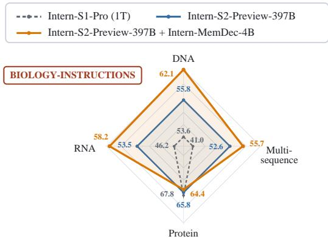

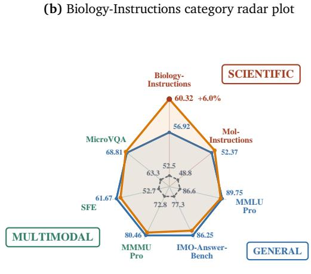  
(c) Cross-domain capability profile  
Figure 12: Evaluation of the separate Memory Decoder extension. (a) Results on all 21 Biology-Instructions tasks [34]. (b) Radar plot of category averages on task-specific normalized axes, with Intern-S2-Preview-397B as the reference square. (c) Radar plot comparing Intern-S1-Pro (1T), Intern-S2-Preview-397B, and Intern-S2- Preview-397B with Intern-MemDec-4B across seven benchmarks. Colors and boxed labels denote task families.

Text LLMs and Vision-Language LLMs, highlighting the importance of directly modelling the underlying time series rather than relying solely on textual descriptions or visualized signals. More importantly, Intern-S2- Preview-397B achieves comparable or even better performance with less than half the number of parameters of the trillion-parameter-scale Intern-S1-Pro, surpassing it on seven of the nine tasks supported by both models. The improvements are particularly pronounced on ASU03, BIU01, BIU03, MEU01, and PHU01, with the F1 score on PHU01 increasing from 36.8 to 66.9. The upgraded time series module further extends the model to radar coding-scheme classification and mode-and-modulation classification, which was not supported by Intern-S1-Pro, and achieves substantially better performance than the baseline models on both tasks.

Time Series Generation. Table 5 benchmarks Intern-S2-Preview against general-purpose Text LLMs, Vision-Language LLMs, and specialised time series forecasting models on the forecasting tasks of SciTS [86]. Text and Vision-Language LLMs often exhibit low success rates because long prediction horizons can exceed their output capacity, while strict sequence-length and formatting requirements frequently lead to instruction-following failures. Moreover, generating forecasts through discrete text tokens can compromise numerical precision, limiting their accuracy on fine-grained scientific signals. By employing a dedicated numerical forecasting branch, Intern-S2-Preview-397B preserves numerical fidelity while enabling reliable forecasting across heterogeneous domains and prediction horizons, outperforming the specialised time series baselines with particularly clear gains on ENG02, ENG03, MEG03, PHG02, and URG05. The horizon predictor achieves an accuracy of 99%, demonstrating its ability to reliably infer the required prediction length from forecasting instructions. Beyond the scientific time series tasks in SciTS, we further evaluate Intern-S2-Preview-397B on GIFT-Eval [4], a benchmark for general time series forecasting, where it achieves a competitive zero-shot MASE of 0.785.

Table 5: Results of time series forecasting on the SciTS benchmark, reported in the format MAPE (success rate %). Lower MAPE indicates better performance, while higher success rate is better.
<table><tr><td></td><td>SciTS Task ID</td><td>ENG02</td><td>ENG03</td><td>MEG03</td><td>NEG03</td><td>PHG02</td><td>URG01</td><td>URG05</td></tr><tr><td rowspan="3">Text LLM</td><td>GPT-4.1-mini</td><td>125.0 (1.4)</td><td>8.3 (96.0)</td><td>42.1 (49.6)</td><td>95.2 (96.4)</td><td>1.1e3 (94.2)</td><td>320.6 (18.6)</td><td>126.6 (100)</td></tr><tr><td>Gemini2.5-Flash</td><td>72.5 (5.9)</td><td>9.6 (99.0)</td><td>62.2 (57.9)</td><td>63.5 (99.2)</td><td>110.8 (99.0)</td><td>246.0 (23.3)</td><td>98.6 (100)</td></tr><tr><td>DeepSeek-V3</td><td>117.2 (46.1)</td><td>7.7 (98.0)</td><td>46.4 (30.9)</td><td>4.3 (3.1)</td><td>200.1 (92.2)</td><td>350.0 (18.6)</td><td>296.7 (93.0)</td></tr><tr><td rowspan="2">VL LLM</td><td>GPT-5-mini</td><td>56.1 (4.5)</td><td>11.2 (76.0)</td><td>37.6 (51.8)</td><td>74.3 (97.2)</td><td>155.3 (97.4)</td><td>182.1 (58.1)</td><td>71.1 (72.9)</td></tr><tr><td>Gemini2.5-Flash</td><td>103.9 (7.4)</td><td>15.6 (53.0)</td><td>53.1 (37.2)</td><td>一</td><td>185.2 (36.9)</td><td>351.9 (16.3)</td><td>114.6 (91.2)</td></tr><tr><td rowspan="5">Time Series Models</td><td>Moirai-Large [85]</td><td>121.2 (100)</td><td>12.8 (100)</td><td>51.7 (100)</td><td>59.1 (100)</td><td>116.9 (100)</td><td>294.7 (100)</td><td>74.6 (100)</td></tr><tr><td>TimeMoE-Large [68]</td><td>70.4 (100)</td><td>11.6 (100)</td><td>39.0 (100)</td><td>70.1 (100)</td><td>80.2 (100)</td><td>218.4 (100)</td><td>84.4 (100)</td></tr><tr><td>Chronos-bolt-Base [5]</td><td>73.7 (100)</td><td>12.0 (100)</td><td>41.5 (100)</td><td>78.5 (100)</td><td>109.3 (100)</td><td>139.3 (100)</td><td>70.6 (100)</td></tr><tr><td>UniTS [31]</td><td>70.1 (100)</td><td>12.8 (100)</td><td>42.0 (100)</td><td>95.2 (46.4)</td><td>135.9 (44.1)</td><td>389.7 (100)</td><td></td></tr><tr><td>TimeOmni [86]</td><td>68.6 (100)</td><td>7.4 (100)</td><td>37.5 (100)</td><td>78.7 (100)</td><td>163.0 (100)</td><td>247.0 (100)</td><td>174.0 (100)</td></tr><tr><td></td><td>Intern-S2-Preview-397B</td><td>60.2 (100)</td><td>7.1 (100)</td><td>32.8 (100)</td><td>59.2 (100)</td><td>72.2 (100)</td><td>138.9 (100)</td><td>60.6 (100)</td></tr></table>

## 6. Conclusion

We presented Intern-S2-Preview-397B as a scientific agentic foundation model for scientific research that requires multimodal understanding, domain-specific reasoning, scientific generation, tool interaction, and iterative execution. Across scientific, multimodal, agentic, general-purpose, and time-series evaluations, the model demonstrates broad capability coverage and supports the main design choices in architecture, pretraining, and post-training. The agentic evaluations further indicate that scientific capability should be assessed not only by isolated benchmark-answer accuracy, but also by whether a model can connect reasoning to executable, verifiable, and iterative workflows. Separately, the Memory Decoder study shows that targeted scientific specialization can be added to the frozen backbone while preserving the role of Intern-S2-Preview-397B as the general model. Intern-S2-Preview remains a preview system; future work should improve reliability over longer scientific workflows, expand domain-specific memories and task environments, strengthen verifiers, and deepen integration with specialized scientific tools.

## Author Contributions

The authors are listed in alphabetical order by their last names.

Lei Bai, Jiaqi Cao, Chiyu Chen, Guanzhou Chen, Kai Chen, Guangran Cheng, Erfei Cui, Xuanlang Dai, Shengyuan Ding, Shangheng Du, Yanhui Duan, Yue Fan, Youqing Fang, Quan Gan, Yuanyuan Gao, Jiaye Ge, Lixin Gu, Yuzhe Gu, Qipeng Guo, Junjun He, Xin Hong, Ming Hu, Zhouqi Hua, Haian Huang, Junhao Huang, Zixian Huang, Minxi Jin, Lingkai Kong, Alexander Lam, Zehao Li, Zonglin Li, Tianhao Liang, Dahua Lin, Junyao Lin, Tianyang Lin, Zhouhan Lin, Jiangning Liu, Jin Liu, Kuikun Liu, Wenran Liu, Yifei Liu, Yuhong Liu, Yuhong Liu, Zhoumianze Liu, Ziyan Liu, Ziyu Liu, Haijun Lv, Han Lv, Chengqi Lyu, Le Ma, Ningsheng Ma, Zerun Ma, Haoyang Peng, Runyu Peng, Jifei Shan, Zixin Shang, Kou Shi, Xiang Shi, Qisheng Su, Xuerui Su, Hao Sun, Xiao Sun, Yanan Sun, Yu Sun, Huanze Tang, Yinghao Tang, Wenhui Tian, Zhongbo Tian, Bingli Wang, Haomin Wang, Jiarui Wang, Jingzhi Wang, Rui Wang, Xiquan Wang, Yi Wang, Zhecan Wang, Ziyi Wang, Zun Wang, Rubin Wei, Lianyi Wu, Wen Wu, Yue Wu, Yuhan Wu, Zhenyu Wu, Zijian Wu, Shuhao Xing, Jun Xu, Xingle Xu, Xuenan Xu, Xiangchao Yan, Ziang Yan, Bowen Yang, Danni Yang, Lin Yang, Zhiqi Yang, Qian Yao, Haochen Ye, Peng Ye, Jinhui Yin, Jiashuo Yu, Dingbo Yuan, Fei Yuan, Yuhang Zang, Bo Zhang, Chao Zhang, Chen Zhang, Hongjie Zhang, Junming Zhang, Wenlong Zhang, Wenwei Zhang, Yiming Zhang, Zhuo Zhang, Ziyang Zhang, Haiteng Zhao, Penghao Zhao, Yibo Zhao, Zhonghan Zhao, Zhihang Zhong, Bowen Zhou, Peiheng Zhou, Xin Zhou, Xinyu Zhou, Yunhua Zhou, Dongsheng Zhu, Yicheng Zou

## References

[1] Josh Abramson, Jonas Adler, Jack Dunger, Richard Evans, Tim Green, Alexander Pritzel, Olaf Ronneberger, Lindsay Willmore, Andrew J Ballard, Joshua Bambrick, et al. Accurate structure prediction of biomolecular interactions with alphafold 3. Nature, 630(8016):493–500, 2024. 5.1.1

[2] Josh Achiam, Steven Adler, Sandhini Agarwal, Lama Ahmad, Ilge Akkaya, Florencia Leoni Aleman, Diogo Almeida, Janko Altenschmidt, Sam Altman, Shyamal Anadkat, et al. Gpt-4 technical report. arXiv preprint arXiv:2303.08774, 2023. 1

[3] Pranjal Aggarwal and Sean Welleck. L1: Controlling how long a reasoning model thinks with reinforcement learning. arXiv preprint arXiv:2503.04697, 2025. 4.3.2

[4] Taha Aksu, Gerald Woo, Juncheng Liu, Xu Liu, Chenghao Liu, Silvio Savarese, Caiming Xiong, and Doyen Sahoo. GIFT-Eval: A benchmark for general time series forecasting model evaluation. arXiv preprint arXiv:2410.10393, 2024. 5.3

[5] Abdul Fatir Ansari, Lorenzo Stella, Caner Turkmen, Xiyuan Zhang, Pedro Mercado, Huibin Shen, Oleksandr Shchur, Syama Sundar Rangapuram, Sebastian Pineda Arango, Shubham Kapoor, Jasper Zschiegner, Danielle C. Maddix, Hao Wang, Michael W. Mahoney, Kari Torkkola, Andrew Gordon Wilson, Michael Bohlke-Schneider, and Yuyang Wang. Chronos: Learning the language of time series. Transactions on Machine Learning Research, 2024. 5

[6] Ibragim Badertdinov, Maksim Nekrashevich, Anton Shevtsov, and Alexander Golubev. SWE-rebench V2: Language-agnostic SWE task collection at scale. arXiv preprint arXiv:2602.23866, 2026. 1

[7] Fei Bai, Huatong Song, Shuang Sun, Daixuan Cheng, Yike Yang, Chuan Hao, Renyuan Li, Feng Chang, Yuan Wei, Ran Tao, et al. Clawgym: A scalable framework for building efective claw agents. arXiv preprint arXiv:2604.26904, 2026. 1

[8] Lei Bai, Zhongrui Cai, Yuhang Cao, Maosong Cao, Weihan Cao, Chiyu Chen, Haojiong Chen, Kai Chen, Pengcheng Chen, Ying Chen, et al. Intern-s1: A scientific multimodal foundation model. arXiv preprint arXiv:2508.15763, 2025. 1

[9] Christoph Bartmann, Johannes Schimunek, Mykyta Ielanskyi, Philipp Seidl, Günter Klambauer, and Sohvi Luukkonen. Moleculariq: Characterizing chemical reasoning capabilities through symbolic verification on molecular graphs, 2026. 5.1.1

[10] Li Boyi, Zhonghan Zhao, Der-Horng Lee, and Gaoang Wang. Adaptive graph pruning for multi-agent communication. CoRR, 2025. 4.4

[11] James Burgess, Jefrey J Nirschl, Laura Bravo-Sánchez, Alejandro Lozano, Sanket Rajan Gupte, Jesus G. Galaz-Montoya, Yuhui Zhang, Yuchang Su, Disha Bhowmik, Zachary Coman, Sarina M. Hasan, Alexandra Johannesson, William D. Leineweber, Malvika G Nair, Ridhi Yarlagadda, Connor Zuraski, Wah Chiu, Sarah Cohen, Jan N. Hansen, Manuel D Leonetti, Chad Liu, Emma Lundberg, and Serena Yeung-Levy. Microvqa: A multimodal reasoning benchmark for microscopy-based scientific research, 2025. 1, 5.1.1

[12] Jiaqi Cao, Jiarui Wang, Rubin Wei, Qipeng Guo, Kai Chen, Bowen Zhou, and Zhouhan Lin. Memory decoder: A pretrained, plug-and-play memory for large language models. In Advances in Neural Information Processing Systems, volume 38, pages 115487–115510, 2025. 2.1

[13] Chi-Chih Chang, Siqi Zhu, Zhichen Zeng, Haibin Lin, Jiaxuan You, Mohamed S Abdelfattah, Ziheng Jiang, and Xuehai Qian. Srt: Accelerating reinforcement learning via speculative rollout with tree-structured cache. arXiv preprint arXiv:2601.09083, 2026. 4.3.3

[14] Charlie Chen, Sebastian Borgeaud, Geofrey Irving, Jean-Baptiste Lespiau, Laurent Sifre, and John Jumper. Accelerating large language model decoding with speculative sampling. arXiv preprint arXiv:2302.01318, 2023. 4.3.3

[15] Qiaoling Chen, Zijun Liu, Peng Sun, Shenggui Li, Guoteng Wang, Ziming Liu, Yonggang Wen, Siyuan Feng, and Tianwei Zhang. Respec: Towards optimizing speculative decoding in reinforcement learning systems. arXiv preprint arXiv:2510.26475, 2025. 4.3.3

[16] Xingyu Chen, Jiahao Xu, Tian Liang, Zhiwei He, Jianhui Pang, Dian Yu, Linfeng Song, Qiuzhi Liu, Mengfei Zhou, Zhuosheng Zhang, et al. Do not think that much for 2+ 3=? on the overthinking of o1-like llms. arXiv preprint arXiv:2412.21187, 2024. 4.3.2

[17] Zehui Chen, Weihua Du, Wenwei Zhang, Kuikun Liu, Jiangning Liu, Miao Zheng, Jingming Zhuo, Songyang Zhang, Dahua Lin, Kai Chen, and Feng Zhao. T-eval: Evaluating the tool utilization capability of large language models step by step. In Proceedings of the 62nd Annual Meeting of the Association for Computational Linguistics (Volume 1: Long Papers), pages 9510–9529. Association for Computational Linguistics, 2024. 4.4

[18] Zehui Chen, Kuikun Liu, Qiuchen Wang, Jiangning Liu, Wenwei Zhang, Kai Chen, and Feng Zhao. Mindsearch: Mimicking human minds elicits deep AI searcher. arXiv preprint arXiv:2407.20183, 2024.

[19] Zehui Chen, Kuikun Liu, Qiuchen Wang, Wenwei Zhang, Jiangning Liu, Dahua Lin, Kai Chen, and Feng Zhao. Agent-FLAN: Designing data and methods of efective agent tuning for large language models. In Findings of the Associationfor Computational Linguistics: ACL 2024, pages 9354–9366. Association for Computational Linguistics, 2024. 4.4

[20] Daixuan Cheng, Shaohan Huang, Xuekai Zhu, Bo Dai, Xin Zhao, Zhenliang Zhang, and Furu Wei. Reasoning with exploration: An entropy perspective. In Proceedings of the AAAI Conference on Artificial Intelligence, volume 40, pages 30377–30385, 2026. 4.3.4

[21] Guangran Cheng, Chengqi Lyu, Songyang Gao, Wenwei Zhang, and Kai Chen. Group entropy-controlled policy optimization, 2026. 1, 4.3.4

[22] Ganqu Cui, Yuchen Zhang, Jiacheng Chen, Lifan Yuan, Zhi Wang, Yuxin Zuo, Haozhan Li, Yuchen Fan, Huayu Chen, Weize Chen, et al. The entropy mechanism of reinforcement learning for reasoning language models. arXiv preprint arXiv:2505.22617, 2025. 4.3.4

[23] DeepSeek-AI. DeepSeek-V4: Towards highly eficient million-token context intelligence. arXiv preprint arXiv:2606.19348, 2026. 4.5

[24] Jasper Dekoninck, Nikola Jovanović, Tim Gehrunger, Kári Rögnvaldsson, Ivo Petrov, Chenhao Sun, and Martin Vechev. Beyond benchmarks: MathArena as an evaluation platform for mathematics with LLMs, 2026. 5.1.2

[25] Xiang Deng, Jef Da, Edwin Pan, Yannis Yiming He, Charles Ide, Kanak Garg, Niklas Laufer, Andrew Park, Nitin Pasari, Chetan Rane, Karmini Sampath, Maya Krishnan, Srivatsa Kundurthy, Sean Hendryx, Zifan Wang, Vijay Bharadwaj, Jef Holm, Raja Aluri, Chen Bo Calvin Zhang, Noah Jacobson, Bing Liu, and Brad Kenstler. SWE-Bench Pro: Can AI agents solve long-horizon software engineering tasks?, 2025. 5.1.2

[26] Shuangrui Ding, Xuanlang Dai, Long Xing, Shengyuan Ding, Ziyu Liu, Yang JingYi, Penghui Yang, Zhixiong Zhang, Xilin Wei, Xinyu Fang, et al. WildClawBench: A benchmark for real-world, long-horizon agent evaluation. arXiv preprint arXiv:2605.10912, 2026. 5.1.2

[27] Yin Fang, Xiaozhuan Liang, Ningyu Zhang, Kangwei Liu, Rui Huang, Zhuo Chen, Xiaohui Fan, and Huajun Chen. Mol-instructions: A large-scale biomolecular instruction dataset for large language models, 2024. 5.1.1

[28] Youqing Fang, Yinhao Tang, Yanan Sun, Jiangning Liu, Ziyi Wang, Xun Zhao, Bin Liu, Weiming Zhang, Kuikun Liu, Wenwei Zhang, and Kai Chen. Mindcompletion: Behavioral alignment for interactive writing via process-continuation learning, 2026. Manuscript. 4.4

[29] Youqing Fang, Yinhao Tang, Yanan Sun, Jiangning Liu, Ziyi Wang, Xun Zhao, Bin Liu, Weiming Zhang, Kuikun Liu, Wenwei Zhang, et al. Mindcopilot: Towards formalizing and evaluating granular human-llm co-writing. arXiv preprint arXiv:2605.23535, 2026. 4.4

[30] Wei Fu, Jiaxuan Gao, Xujie Shen, Chen Zhu, Zhiyu Mei, Chuyi He, Shusheng Xu, Guo Wei, Jun Mei, Jiashu Wang, Tongkai Yang, Binhang Yuan, and Yi Wu. AReaL: A large-scale asynchronous reinforcement learning system for language reasoning. arXiv preprint arXiv:2505.24298, 2025. 4.3.1

[31] Shanghua Gao, Teddy Koker, Owen Queen, Thomas Hartvigsen, Theodoros Tsiligkaridis, and Marinka Zitnik. UniTS: A unified multi-task time series model. In Advances in Neural Information Processing Systems, volume 37, 2024. 5

[32] Yuzhe Gu, Songyang Gao, Zijian Wu, Lingkai Kong, Wenwei Zhang, Zhongrui Cai, Fan Zheng, Tianyou Ma, Junhao Shen, Haiteng Zhao, Duanyang Zhang, Huilun Zhang, Kuikun Liu, Chengqi Lyu, Yanhui Duan, Chiyu Chen, Ningsheng Ma, Jianfei Gao, Han Lyu, Dahua Lin, and Kai Chen. Intern-S1-MO: Long-horizon reasoning agent for olympiad-level mathematical problem solving. arXiv preprint arXiv:2512.10739, 2025. 4.4

[33] Lukas Haas, Gal Yona, Giovanni D’Antonio, Sasha Goldshtein, and Dipanjan Das. SimpleQA Verified: A reliable factuality benchmark to measure parametric knowledge, 2025. 5.1.2

[34] Haonan He, Yuchen Ren, Yining Tang, Ziyang Xu, Junxian Li, Minghao Yang, Di Zhang, Yuan Dong, Tao Chen, Shufei Zhang, Yuqiang Li, Nanqing Dong, Wanli Ouyang, Dongzhan Zhou, and Peng Ye. Biologyinstructions: A dataset and benchmark for multi-omics sequence understanding capability of large language models. In Christos Christodoulopoulos, Tanmoy Chakraborty, Carolyn Rose, and Violet Peng, editors, Findings of the Association for Computational Linguistics: EMNLP 2025, pages 17984–18016, Suzhou, China, November 2025. Association for Computational Linguistics. 5.1.1, 5.3, 12

[35] Yun He, Wenzhe Li, Hejia Zhang, Songlin Li, Karishma Mandyam, Sopan Khosla, Yuanhao Xiong, Nanshu Wang, Xiaoliang Peng, Beibin Li, Shengjie Bi, Shishir G. Patil, Qi Qi, Shengyu Feng, Julian Katz-Samuels, Richard Yuanzhe Pang, Sujan Gonugondla, Hunter Lang, Yue Yu, Yundi Qian, Maryam Fazel-Zarandi, Licheng Yu, Amine Benhalloum, Hany Awadalla, and Manaal Faruqui. AdvancedIF: Rubric-based benchmarking and reinforcement learning for advancing LLM instruction following, 2025. 5.1.2

[36] Ming Hu, Chenglong Ma, Wei Li, Wanghan Xu, Jiamin Wu, Jucheng Hu, Tianbin Li, Guohang Zhuang, Jiaqi Liu, Yingzhou Lu, et al. A survey of scientific large language models: From data foundations to agent frontiers. arXiv preprint arXiv:2508.21148, 2025. 1

[37] Hayate Iso, Tiyasa Mitra, Sudipta Mondal, Rasoul Shafipour, Venmugil Elango, Terry Kong, Yuki Huang, Seonjin Na, Izzy Putterman, Benjamin Chislett, et al. Accelerating rl post-training rollouts via systemintegrated speculative decoding. arXiv preprint arXiv:2604.26779, 2026. 4.3.3

[38] Naman Jain, Jaskirat Singh, Manish Shetty, Liang Zheng, Koushik Sen, and Ion Stoica. R2E-gym: Procedural environments and hybrid verifiers for scaling open-weights SWE agents. arXiv preprint arXiv:2504.07164, 2025. 1

[39] Keller Jordan, Yuchen Jin, Vlado Boza, Jiacheng You, Franz Cesista, Laker Newhouse, and Jeremy Bernstein. Muon: An optimizer for hidden layers in neural networks, 2024. 4.3.5

[40] Urvashi Khandelwal, Omer Levy, Dan Jurafsky, Luke Zettlemoyer, and Mike Lewis. Generalization through memorization: Nearest neighbor language models. arXiv preprint arXiv:1911.00172, 2019. 2.1

[41] Kabir Khandpur, Kilian Lieret, Carlos E. Jimenez, Ofir Press, and John Yang. SWE-bench Multilingual. SWE-bench benchmark release, May 2025. 5.1.2

[42] Lagent Developer Team. Lagent: A lightweight open-source framework for building large language model based agents. https://github.com/InternLM/lagent, 2023. Software. 4.4

[43] Yaniv Leviathan, Matan Kalman, and Yossi Matias. Fast inference from transformers via speculative decoding. In Proceedings of the 40th International Conference on Machine Learning, 2023. 4.3.3

[44] Ang Li et al. Ling and ring 2.6 technical report: Eficient and instant agentic intelligence at trillionparameter scale. arXiv preprint arXiv:2606.15079, 2026. 4.3.1

[45] Jiatong Li, Junxian Li, Yunqing Liu, Dongzhan Zhou, and Qing Li. TOMG-Bench: Evaluating LLMs on text-based open molecule generation, 2024. 5.1.1

[46] Xiangyi Li et al. SkillsBench: Benchmarking how well agent skills work across diverse tasks, 2026. 5.1.2

[47] Hunter Lightman, Vineet Kosaraju, Yuri Burda, Harrison Edwards, Bowen Baker, Teddy Lee, Jan Leike, John Schulman, Ilya Sutskever, and Karl Cobbe. Let’s verify step by step. In ICLR. OpenReview.net, 2024. 4.4.3

[48] Jingyuan Liu, Jianlin Su, Xingcheng Yao, Zhejun Jiang, Guokun Lai, Yulun Du, Yidao Qin, Weixin Xu, Enzhe Lu, Junjie Yan, et al. Muon is scalable for llm training. arXiv preprint arXiv:2502.16982, 2025. 4.3.5

[49] Haotian Luo, Li Shen, Haiying He, Yibo Wang, Shiwei Liu, Wei Li, Naiqiang Tan, Xiaochun Cao, and Dacheng Tao. O1-pruner: Length-harmonizing fine-tuning for o1-like reasoning pruning, 2025. URL https://arxiv. org/abs/2501.12570, 2025. 4.3.2

[50] Xufang Luo, Yuge Zhang, Zhiyuan He, Zilong Wang, Siyun Zhao, Dongsheng Li, Luna K. Qiu, and Yuqing Yang. Agent lightning: Train any AI agents with reinforcement learning. arXiv preprint arXiv:2508.03680, 2025. 4.4

[51] Wenhan Ma, Jianyu Wei, Liang Zhao, Hailin Zhang, Bangjun Xiao, Lei Li, Qibin Yang, Bofei Gao, Yudong Wang, Rang Li, Jinhao Dong, Zhifang Sui, and Fuli Luo. MOPD: Multi-teacher on-policy distillation for capability integration in LLM post-training. arXiv preprint arXiv:2606.30406, 2026. 4.5, 4.5

[52] Wenhan Ma, Hailin Zhang, Liang Zhao, Yifan Song, Yudong Wang, Zhifang Sui, and Fuli Luo. Stabilizing MoE reinforcement learning by aligning training and inference routers. arXiv preprint arXiv:2510.11370, 2025. 4.3.1

[53] Ahmed Masry, Mohammed Saidul Islam, Mahir Ahmed, Aayush Bajaj, Firoz Kabir, Aaryaman Kartha, Md Tahmid Rahman Laskar, Mizanur Rahman, Shadikur Rahman, Mehrad Shahmohammadi, Megh Thakkar, Md Rizwan Parvez, Enamul Hoque, and Shafiq Joty. ChartQAPro: A more diverse and challenging benchmark for chart question answering. In Findings of the Associationfor Computational Linguistics: ACL 2025, pages 19123–19151, Vienna, Austria, July 2025. Association for Computational Linguistics. 5.1.2

[54] Mike A. Merrill et al. Terminal-Bench: Benchmarking agents on hard, realistic tasks in command line interfaces, 2026. 5.1.2

[55] MiniMax, :, Aili Chen, Aonian Li, Bangwei Gong, Binyang Jiang, Bo Fei, Bo Yang, Boji Shan, Changqing Yu, Chao Wang, Cheng Zhu, Chengjun Xiao, Chengyu Du, Chi Zhang, Chu Qiao, Chunhao Zhang, Chunhui Du, Congchao Guo, Da Chen, Deming Ding, Dianjun Sun, Dong Li, Enwei Jiao, Haigang Zhou, Haimo Zhang, Han Ding, Haohai Sun, Haoyu Feng, Huaiguang Cai, Haichao Zhu, Jian Sun, Jiaqi Zhuang, Jiaren Cai, Jiayuan Song, Jin Zhu, Jingyang Li, Jinhao Tian, Jinli Liu, Junhao Xu, Junjie Yan, Junteng Liu, Junxian He, Kaiyi Feng, Ke Yang, Kecheng Xiao, Le Han, Leyang Wang, Lianfei Yu, Liheng Feng, Lin Li, Lin Zheng, Linge Du, Lingyu Yang, Lunbin Zeng, Minghui Yu, Mingliang Tao, Mingyuan Chi, Mozhi Zhang, Mujie Lin, Nan Hu, Nongyu Di, Peng Gao, Pengfei Li, Pengyu Zhao, Qibing Ren, Qidi Xu, Qile Li, Qin Wang, Rong Tian, Ruitao Leng, Shaoxiang Chen, Shaoyu Chen, Shengmin Shi, Shitong Weng, Shuchang Guan, Shuqi Yu, Sichen Li, Songquan Zhu, Tengfei Li, Tianchi Cai, Tianrun Liang, Weiyu Cheng, Weize Kong, Wenkai Li, Xiancai Chen, Xiangjun Song, Xiao Luo, Xiao Su, Xiaobo Li, Xiaodong Han, Xinzhu Hou, Xuan Lu, Xun Zou, Xuyang Shen, Yan Gong, Yan Ma, Yang Wang, Yiqi Shi, Yiran Zhong, Yonghong Duan, Yongxiang Fu, Yongyi Hu, Yu Gao, Yuanxiang Fan, Yufeng Yang, Yuhao Li, Yulin Hu, Yunan Huang, Yunji Li, Yunzhi Xu, Yuxin Mao, Yuxuan Shi, Yuze Wenren, Zehan Li, Zelin Li, Zhanxu Tian, Zhengmao Zhu, Zhenhua Fan, Zhenzhen Wu, Zhichao Xu, Zhihang Yu, Zhiheng Lyu, Zhuo Jiang, Zibo Gao, Zijia Wu, Zijian Song, and Zijun Sun. Minimax-m1: Scaling test-time compute eficiently with lightning attention. arXiv preprint arXiv:2506.13585, 2025. 4.3.1

[56] NVIDIA. Nemotron 3 Ultra: Open, eficient mixture-of-experts hybrid mamba-transformer model for agentic reasoning. Technical report, NVIDIA, June 2026. 4.5

[57] ObsCrisis Team. ObsCrisis-Bench: A multimodal benchmark for extreme weather event analysis, 2025. 5.1.1

[58] OpenAI. OpenAI GPT-5 System Card. arXiv preprint arXiv:2601.03267, 2026. 1

[59] Jiayi Pan, Xingyao Wang, Graham Neubig, Navdeep Jaitly, Heng Ji, Alane Suhr, and Yizhe Zhang. Training software engineering agents and verifiers with SWE-gym. arXiv preprint arXiv:2412.21139, 2024. 1

[60] Renjie Pi, Grace Lam, Mohammad Shoeybi, Pooya Jannaty, Bryan Catanzaro, and Wei Ping. On data engineering for scaling LLM terminal capabilities. arXiv preprint arXiv:2602.21193, 2026. 1

[61] Xiao Pu, Michael Saxon, Wenyue Hua, and William Yang Wang. Thoughtterminator: Benchmarking, calibrating, and mitigating overthinking in reasoning models. arXiv preprint arXiv:2504.13367, 2025. 4.3.2

[62] Zekai Qu, Yinxu Pan, Ao Sun, Chaojun Xiao, and Xu Han. CoPRIS: Eficient and stable reinforcement learning via concurrency-controlled partial rollout with importance sampling. arXiv preprint arXiv:2511.05589, 2025. 4.3.1

[63] Alexander Samarin, Sergei Krutikov, Anton Shevtsov, Sergei Skvortsov, Filipp Fisin, and Alexander Golubev. Lk losses: Direct acceptance rate optimization for speculative decoding. arXiv preprint arXiv:2602.23881, 2026. 4.3.3

[64] Timo Schick, Jane Dwivedi-Yu, Roberto Dessì, Roberta Raileanu, Maria Lomeli, Luke Zettlemoyer, Nicola Cancedda, and Thomas Scialom. Toolformer: Language models can teach themselves to use tools, 2023. 3.2

[65] Zhihong Shao, Peiyi Wang, Qihao Zhu, Runxin Xu, Junxiao Song, Mingchuan Zhang, Y. K. Li, Y. Wu, and Daya Guo. Deepseekmath: Pushing the limits of mathematical reasoning in open language models. CoRR, abs/2402.03300, 2024. 4.4.3

[66] Weizhou Shen, Ziyi Yang, Chenliang Li, Zhiyuan Lu, Miao Peng, Huashan Sun, Yingcheng Shi, Shengyi Liao, Shaopeng Lai, Bo Zhang, et al. Qwenlong-l1. 5: Post-training recipe for long-context reasoning and memory management. arXiv preprint arXiv:2512.12967, 2025. 4.3.4

[67] Guangming Sheng, Chi Zhang, Zilingfeng Ye, Xibin Wu, Wang Zhang, Ru Zhang, Yanghua Peng, Haibin Lin, and Chuan Wu. HybridFlow: A flexible and eficient RLHF framework. In Proceedings of the Twentieth European Conference on Computer Systems, 2025. 4.3.1

[68] Xiaoming Shi, Shiyu Wang, Yuqi Nie, Dianqi Li, Zhou Ye, Qingsong Wen, and Ming Jin. Time-MoE: Billion-scale time series foundation models with mixture of experts. In International Conference on Learning Representations, 2025. 5

[69] Yinhao Tang, Youqing Fang, Yanan Sun, Jiangning Liu, Ziyi Wang, Xun Zhao, Weiming Zhang, Bin Liu, Kuikun Liu, Wenwei Zhang, and Kai Chen. Is next-chunk reasoning RL really better than SFT? revisiting training strategies under no-CoT data, 2026. Manuscript. 4.4

[70] Yinhao Tang, Youqing Fang, Yanan Sun, Wenran Liu, Weiming Zhang, Bin Liu, Kuikun Liu, Wenwei Zhang, and Kai Chen. Sciexplore: Evaluating autonomous agents from scientific navigation to information integration. In Findings of the Association for Computational Linguistics: ACL 2026, pages 22249–22273. Association for Computational Linguistics, 2026. 1, 4.4

[71] Yinhao Tang, Yanan Sun, Youqing Fang, Bin Liu, Kuikun Liu, Wenwei Zhang, and Kai Chen. Skill2task: Self-evolving agentic task synthesis via skills graph and progressive validation, 2026. Manuscript. 1, 4.4

[72] Ross Taylor, Marcin Kardas, Guillem Cucurull, Thomas Scialom, Anthony Hartshorn, Elvis Saravia, Andrew Poulton, Viktor Kerkez, and Robert Stojnic. Galactica: A large language model for science. arXiv preprint arXiv:2211.09085, 2022. 1

[73] Kimi Team, Angang Du, Bofei Gao, Bowei Xing, Changjiu Jiang, Cheng Chen, Cheng Li, Chenjun Xiao, Chenzhuang Du, Chonghua Liao, et al. Kimi k1. 5: Scaling reinforcement learning with llms. arXiv preprint arXiv:2501.12599, 2025. 4.3.2

[74] Terminal-Bench Team. Terminal-Bench 2.1: A revision of terminal-bench 2.0. Terminal-Bench release note, May 2026. 5.1.2

[75] Minyang Tian, Luyu Gao, Shizhuo Dylan Zhang, Xinan Chen, Cunwei Fan, Xuefei Guo, Roland Haas, Pan Ji, Kittithat Krongchon, Yao Li, Shengyan Liu, Di Luo, Yutao Ma, Hao Tong, Kha Trinh, Chenyu Tian, Zihan Wang, Bohao Wu, Yanyu Xiong, Shengzhu Yin, Minhui Zhu, Kilian Lieret, Yanxin Lu, Genglin Liu, Yufeng Du, Tianhua Tao, Ofir Press, Jamie Callan, Eliu Huerta, and Hao Peng. SciCode: A research coding benchmark curated by scientists, 2024. 5.1.1

[76] Bin Wang, Tianyao He, Linke Ouyang, Fan Wu, Zhiyuan Zhao, Tao Chu, Yuan Qu, Zhenjiang Jin, Weijun Zeng, Ziyang Miao, Bangrui Xu, Junbo Niu, Mengzhang Cai, Jiantao Qiu, Qintong Zhang, Dongsheng Ma, Yuefeng Sun, Hejun Dong, Wenzheng Zhang, Jutao Xiao, Jiayong Shi, Pengyu Liao, Xiaomeng Zhao, Huaping Zhong, Liqun Wei, Jing Yu, Jie Yang, Wei Li, Shasha Wang, Qianqian Wu, Xuanhe Zhou, Weijia Li, Zhenxiang Li, Zhongying Tu, Jiang Wu, Lijun Wu, Chao Xu, Kai Chen, Wentao Zhang, Yu Qiao, Bowen Zhou, Dahua Lin, and Conghui He. Mineru2.5-pro: Pushing the limits of data-centric document parsing at scale, 2026. 3.2

[77] Fengxiang Wang, Hongzhen Wang, Zonghao Guo, Di Wang, Yulin Wang, Mingshuo Chen, Qiang Ma, Long Lan, Wenjing Yang, Jing Zhang, Zhiyuan Liu, and Maosong Sun. Xlrs-bench: Could your multimodal llms understand extremely large ultra-high-resolution remote sensing imagery? In Proceedings of the IEEE/CVF Conference on Computer Vision and Pattern Recognition (CVPR), pages 14325–14336, June 2025. 1, 5.1.1

[78] Jiarui Wang, Xiang Shi, Jiaqi Cao, Rubin Wei, Xiquan Wang, Hao Sun, Jingzhi Wang, Zhiqi Yang, Qipeng Guo, Bowen Zhou, et al. Memsft: Mitigating alignment tax with an external parametric memory. arXiv preprint arXiv:2607.25614, 2026. 1, 2.1

[79] Xingyao Wang, Boxuan Li, Yufan Song, Frank F. Xu, Xiangru Tang, Mingchen Zhuge, Jiayi Pan, Yueqi Song, Bowen Li, Jaskirat Singh, et al. Openhands: An open platform for AI software developers as generalist agents. In The Thirteenth International Conference on Learning Representations, 2025. 4.4.1

[80] Yizhou Wang, Chen Tang, Han Deng, Jiabei Xiao, Jiaqi Liu, Jianyu Wu, Jun Yao, Pengze Li, Encheng Su, Lintao Wang, Guohang Zhuang, Yuchen Ren, Ben Fei, Ming Hu, Xin Chen, Dongzhan Zhou, Junjun He, Xiangyu Yue, Zhenfei Yin, Jiamin Wu, Qihao Zheng, Yuhao Zhou, Huihui Xu, Chenglong Ma, Yan Lu, Wenlong Zhang, Chunfeng Song, Philip Torr, Shixiang Tang, Xinzhu Ma, Wanli Ouyang, and Lei Bai. Scireasoner: Laying the scientific reasoning ground across disciplines, 2025. 1, 5.1.1

[81] Yubo Wang, Xueguang Ma, Ge Zhang, Yuansheng Ni, Abhranil Chandra, Shiguang Guo, Weiming Ren, Aaran Arulraj, Xuan He, Ziyan Jiang, Tianle Li, Max Ku, Kai Wang, Alex Zhuang, Rongqi Fan, Xiang Yue, and Wenhu Chen. Mmlu-pro: A more robust and challenging multi-task language understanding benchmark, 2024. 5.1.2

[82] Joseph L Watson, David Juergens, Nathaniel R Bennett, Brian L Trippe, Jason Yim, Helen E Eisenach, Woody Ahern, Andrew J Borst, Robert J Ragotte, Lukas F Milles, et al. De novo design of protein structure and function with rfdifusion. Nature, 620(7976):1089–1100, 2023. 5.1.1

[83] Rubin Wei, Jiaqi Cao, Jiarui Wang, Jushi Kai, Qipeng Guo, Bowen Zhou, and Zhouhan Lin. MLP Memory: A retriever-pretrained memory for large language models. In International Conference on Learning Representations, 2026. 2.1

[84] Rubin Wei, Jiaqi Cao, Jiarui Wang, Junming Zhang, Qipeng Guo, Bowen Zhou, and Zhouhan Lin. Memory decoder at scale: A pretrained, parametric long-term memory. arXiv preprint arXiv:2607.27919, 2026. 1, 2.1

[85] Gerald Woo, Chenghao Liu, Akshat Kumar, Caiming Xiong, Silvio Savarese, and Doyen Sahoo. Unified training of universal time series forecasting transformers. In Proceedings of the 41st International Conference on Machine Learning, volume 235 of Proceedings of Machine Learning Research, pages 53140– 53164. PMLR, 2024. 5

[86] Wen Wu, Ziyang Zhang, Liwei Liu, Xuenan Xu, Junlin Liu, Ke Fan, Qitan Lv, Jimin Zhuang, Chen Zhang, Zheqi Yuan, et al. SciTS: Scientific time series understanding and generation with llms. In Proc. ICLR, Rio de Janeiro, 2026. 1, 5.3, 5.3, 5

[87] Violet Xiang, Chase Blagden, Rafael Rafailov, Nathan Lile, Sang Truong, Chelsea Finn, and Nick Haber. Just enough thinking: Eficient reasoning with adaptive length penalties reinforcement learning. arXiv preprint arXiv:2506.05256, 2025. 4.3.2

[88] Long Xing, Xiaoyi Dong, Yuhang Zang, Yuhang Cao, Jianze Liang, Qidong Huang, Jiaqi Wang, Feng Wu, and Dahua Lin. CapRL: Stimulating dense image caption capabilities via reinforcement learning. In ICLR, volume 2026, 2026. 3.3

[89] Binfeng Xu, Hao Zhang, Shaokun Zhang, Songyang Han, Mingjie Liu, Jian Hu, Shizhe Diao, Zhenghui Jin, Yunheng Zou, Michael Demoret, Jan Kautz, and Yi Dong. Polar: Agentic RL on any harness at scale. arXiv preprint arXiv:2605.24220, 2026. 4.4

[90] Wanghan Xu et al. Probing scientific general intelligence of LLMs with scientist-aligned workflows, 2025. 5.1.1

[91] Wanghan Xu et al. ResearchClawBench: A benchmark for end-to-end autonomous scientific research, 2026. 5.1.1

[92] John Yang, Carlos E. Jimenez, Alexander Wettig, Kilian Lieret, Shunyu Yao, Karthik Narasimhan, and Ofir Press. SWE-agent: Agent-computer interfaces enable automated software engineering. arXiv preprint arXiv:2405.15793, 2024. 4.4.1

[93] John Yang, Kilian Lieret, Carlos E. Jimenez, Alexander Wettig, Kabir Khandpur, Yanzhe Zhang, Binyuan Hui, Ofir Press, Ludwig Schmidt, and Diyi Yang. SWE-smith: Scaling data for software engineering agents. arXiv preprint arXiv:2504.21798, 2025. 1, 5.1.2

[94] Kai Yang, Xin Xu, Yangkun Chen, Weijie Liu, Jiafei Lyu, Zichuan Lin, Deheng Ye, and Saiyong Yang. Entropic: Towards stable long-term training of llms via entropy stabilization with proportional-integral control. arXiv preprint arXiv:2511.15248, 2025. 4.3.4

[95] Songlin Yang, Jan Kautz, and Ali Hatamizadeh. Gated delta networks: Improving Mamba2 with delta rule. In International Conference on Learning Representations, 2025. 4.3.1

[96] Qiying Yu, Zheng Zhang, Ruofei Zhu, Yufeng Yuan, Xiaochen Zuo, Yu Yue, Tiantian Fan, Gaohong Liu, Lingjun Liu, Xin Liu, Haibin Lin, Zhiqi Lin, Bole Ma, Guangming Sheng, Yuxuan Tong, Chi Zhang, Mofan Zhang, Wang Zhang, Hang Zhu, Jinhua Zhu, Jiaze Chen, Jiangjie Chen, Chengyi Wang, Hongli Yu, Weinan Dai, Yuxuan Song, Xiangpeng Wei, Hao Zhou, Jingjing Liu, Wei-Ying Ma, Ya-Qin Zhang, Lin Yan, Mu Qiao, Yonghui Wu, and Mingxuan Wang. DAPO: an open-source LLM reinforcement learning system at scale. CoRR, abs/2503.14476, 2025. 4.3.5

[97] Xiang Yue, Tianyu Zheng, Yuansheng Ni, Yubo Wang, Kai Zhang, Shengbang Tong, Yuxuan Sun, Botao Yu, Ge Zhang, Huan Sun, Yu Su, Wenhu Chen, and Graham Neubig. Mmmu-pro: A more robust multi-discipline multimodal understanding benchmark, 2025. 5.1.2

[98] Chuyu Zhang, Songyang Zhang, Yingfan Hu, Haowen Shen, Kuikun Liu, Zerun Ma, Fengzhe Zhou, Wenwei Zhang, Xuming He, Dahua Lin, et al. Cibench: Evaluating your LLMs with a code interpreter plugin. arXiv preprint arXiv:2407.10499, 2024. 4.4

[99] Odin Zhang, Xujun Zhang, Haitao Lin, Cheng Tan, Qinghan Wang, Yuanle Mo, Qiantai Feng, Gang Du, Yuntao Yu, Zichang Jin, et al. Odesign: A world model for biomolecular interaction design. arXiv preprint arXiv:2510.22304, 2025. 5.1.1

[100] Yiming Zhang, Zhonghan Zhao, Wenwei Zhang, Haiteng Zhao, Tianyang Lin, Huanze Tang, Yunhua Zhou, Demin Song, Kuikun Liu, Haochen Ye, Haian Huang, Yuzhe Gu, Haijun Lv, Qipeng Guo, Bin Liu, Gaoang Wang, and Kai Chen. Scalable visual pretraining for language intelligence. arXiv preprint arXiv:2607.09657, 2026. 1, 3.1

[101] Yizhou Zhang, Ning Lv, Teng Wang, and Jisheng Dang. Fastgrpo: Accelerating policy optimization via concurrency-aware speculative decoding and online draft learning. arXiv preprint arXiv:2509.21792, 2025. 4.3.3

[102] Haiteng Zhao, Chang Ma, Guoyin Wang, Jing Su, Lingpeng Kong, Jingjing Xu, Zhi-Hong Deng, and Hongxia Yang. Empowering large language model agents through action learning. arXiv preprint arXiv:2402.15809, 2024. 4.4

[103] Haoran Zhao, Yuchen Yan, Yongliang Shen, Haolei Xu, Wenqi Zhang, Kaitao Song, Jian Shao, Weiming Lu, Jun Xiao, and Yueting Zhuang. Let LRMs break free from overthinking via self-braking tuning. In Advances in Neural Information Processing Systems, volume 38, pages 1861–1887, 2025. 4.3.2

[104] Jiale Zhao, Guoxin Chen, Fanzhe Meng, Minghao Li, Jie Chen, Hui Xu, Yongshuai Sun, Xin Zhao, Ruihua Song, Yuan Zhang, et al. Immersion in the GitHub universe: Scaling coding agents to mastery. arXiv preprint arXiv:2602.09892, 2026. 1

[105] Xiangyu Zhao, Wanghan Xu, Bo Liu, Yuhao Zhou, Fenghua Ling, Ben Fei, Xiaoyu Yue, Lei Bai, Wenlong Zhang, and Xiao-Ming Wu. Msearth: A multimodal scientific dataset and benchmark for phenomena uncovering in earth science, 2025. 1

[106] Zhonghan Zhao, Wenhao Chai, Xuan Wang, Ke Ma, Kewei Chen, Dongxu Guo, Tian Ye, Yanting Zhang, Hongwei Wang, and Gaoang Wang. Steve series: Step-by-step construction of agent systems in minecraft. arXiv preprint arXiv:2406.11247, 2024. 4.4

[107] Zhonghan Zhao, Kewei Chen, Dongxu Guo, Wenhao Chai, Tian Ye, Yanting Zhang, and Gaoang Wang. Hierarchical auto-organizing system for open-ended multi-agent navigation. arXiv preprint arXiv:2403.08282, 2024. 4.5

[108] Zhonghan Zhao, Ke Ma, Wenhao Chai, Xuan Wang, Kewei Chen, Dongxu Guo, Yanting Zhang, Hongwei Wang, and Gaoang Wang. Do we really need a complex agent system? distill embodied agent into a single model. arXiv preprint arXiv:2404.04619, 2024. 4.5

[109] Zhonghan Zhao, Yiming Zhang, Wenwei Zhang, Haiteng Zhao, Xingguang Wei, Zhangwei Gao, Kuikun Liu, Yuzhe Gu, Size Wu, Haian Huang, Jianfei Gao, Haijun Lv, Demin Song, Yunhua Zhou, Qipeng Guo, Gaoang Wang, and Kai Chen. Exploring visual pretraining for learning language intelligence. In Proceedings of the IEEE/CVF Conference on Computer Vision and Pattern Recognition (CVPR), pages 31493–31503, June 2026. 1, 3.1

[110] Yuhao Zhou, Yiheng Wang, Xuming He, Ao Shen, Ruoyao Xiao, Zhiwei Li, Qiantai Feng, Zijie Guo, Yuejin Yang, Hao Wu, Wenxuan Huang, Jiaqi Wei, Dan Si, Xiuqi Yao, Jia Bu, Haiwen Huang, Manning Wang, Tianfan Fu, Shixiang Tang, Ben Fei, Dongzhan Zhou, Fenghua Ling, Yan Lu, Siqi Sun, Chenhui Li, Guanjie Zheng, Jiancheng Lv, Wenlong Zhang, and Lei Bai. Scientists’ first exam: Probing cognitive abilities of mllm via perception, understanding, and reasoning, 2025. 1, 5.1.1

[111] Yuzhen Zhou, Jiajun Li, Yusheng Su, Gowtham Ramesh, Zilin Zhu, Xiang Long, Chenyang Zhao, Jin Pan, Xiaodong Yu, Ze Wang, Kangrui Du, Jialian Wu, Ximeng Sun, Jiang Liu, Qiaolin Yu, Hao Chen, Zicheng Liu, and Emad Barsoum. APRIL: Active partial rollouts in reinforcement learning to tame long-tail generation. arXiv preprint arXiv:2509.18521, 2025. 4.3.1

[112] Yicheng Zou, Dongsheng Zhu, Lin Zhu, Tong Zhu, Yunhua Zhou, Peiheng Zhou, Xinyu Zhou, Dongzhan Zhou, Zhiwang Zhou, Yuhao Zhou, et al. Intern-s1-pro: Scientific multimodal foundation model at trillion scale. arXiv preprint arXiv:2603.25040, 2026. 1, 4.3.1, 4.3.5