# Into the ORBIT for Time Series: Training Regimes for Foundation Models

Hongjie Xia∗, Yiding Liu∗, Yifan Hu∗, Peiyuan Liu∗, Zewei Dong†

∗ Equal Contribution , †Corresponding Author

# {xiahongjie.xhj, yiding.lyd, hyf476357, peiyuan.liu, zewei.dong}@ant-intl.com

Time series foundation models (TSFMs) have advanced primarily through architectural innovations such as group attention, flow matching, serial-token prediction, and mixture-ofexperts scaling. However, the training regimes governing data exposure over large-scale heterogeneous corpora remain comparatively under-explored. Consequently, the effective pre-training distribution is often poorly controlled along four coupled axes: cross-domain imbalance, frequency-dependent context requirements, variable prediction horizons, and missingness. To address this problem, we introduce ORBIT (Omni-Range Bootstrap Incremental Training), a training paradigm that explicitly controls the effective pre-training distribution. ORBIT comprises two key components. First, Bootstrap Multi-Level Sampling converts prescribed dataset weights into a global source allocation and constructs per-dataset sample indices through stochastic selection of time series records, target variables, context windows, and prediction horizons. Second, Omni-Range Incremental Training assembles and incrementally consumes these variable-length examples throughout a single training run, allowing diverse context lengths and prediction horizons to coexist without stagespecific schedules. Under ORBIT, we train Falcon-2.0, a deliberately simple univariate encoder-only Transformer featuring missingness-aware triple-channel patch tokenization and direct multi-patch quantile prediction. Beyond this backbone, we further investigate how representation rank evolves through Transformer depth and introduce Rank-Guided Cross-Depth Alignment, a training-only objective that uses late-layer states as stop-gradient references for shallow representations and adds no inference cost. Our analysis relates the alignment error to the transfer of non-negligible spectral modes across depth. Evaluations on GIFT-Eval and fev-bench show that Falcon-2.0 achieves strong zero-shot forecasting performance across diverse domains and frequencies. Ablations confirm the importance of stochastic sample construction and simultaneous exposure to diverse context lengths and prediction horizons. Falcon-2.0 is publicly released to support future research.

Date: August 14, 2026 Code: https://github.com/ant-intl/Falcon-TST Model: https://pypi.org/project/falcon-tst/

Ant International

## 1 Introduction

Time series foundation models (TSFMs) have recently emerged as a promising paradigm for learning generalizable forecasting capabilities from large-scale and heterogeneous temporal corpora (Woo et al., 2024; Das et al., 2024; Ansari et al., 2024; Cohen et al., 2026; Auer et al., 2026).

Compared with traditional task-specific forecasting models (Zhou et al., 2022; Hu et al., 2025c,a; Liu et al., 2024a; Nie et al., 2023), TSFMs aim to provide zero-shot or few-shot forecasting across diverse domains, frequencies, and forecasting settings. Recent progress has been driven primarily by architectural innovations, including improved tokenization strategies, attention mechanisms, generative objectives, long-context modeling, and large-scale model scaling (Liu et al., 2026b; Ansari et al., 2025; Grinsztajn et al., 2026; Khwaja et al., 2026; Podest et al., 2026; Liu et al., 2026a). Although these developments have substantially improved forecasting performance, the training regimes that govern the exposure of heterogeneous temporal corpora during pre-training remain comparatively under-explored.

Unlike language or vision foundation models, time series corpora naturally exhibit substantial heterogeneity in their sources, temporal resolutions, observation patterns, and forecasting requirements (Kottapalli et al., 2025; Hu et al.). Importantly, the capability of a TSFM is not solely determined by the nominal size of the collected corpus, but by the effective pre-training distribution induced by the training pipeline (Syed et al., 2026). This distribution is shaped by which datasets, time series records, variables, context windows, and forecasting horizons are sampled, as well as how missing observations and invalid targets are handled throughout optimization (Yeh et al., 2023). Therefore, designing a scalable TSFM requires not only increasing corpus size or model capacity, but also controlling the distribution of training experiences presented to the model.

This challenge introduces several coupled difficulties for large-scale TSFM pre-training. First, heterogeneous datasets often contain highly imbalanced sources, causing dominant datasets to determine the optimization trajectory while under-represented domains receive insufficient exposure (Shao et al., 2024, 2025). Second, different temporal resolutions and recording frequencies naturally require different historical context ranges, making fixed context training insufficient for broad temporal generalization (Zhang et al., 2022; Chung et al., 2024). Third, forecasting tasks involve diverse prediction horizons, while existing models often rely on horizon-specific training or multi-stage context extension (Lim et al., 2021). Finally, missing observations are pervasive in real-world time series and require consistent treatment across normalization, tokenization, attention computation, and loss optimization (Hu et al., 2026; Che et al., 2018). These challenges indicate that effective TSFM training requires a principled strategy for controlling data exposure, temporal coverage, and supervision quality simultaneously.

To address these challenges, we introduce ORBIT (Omni-Range Bootstrap Incremental Training), a training paradigm designed to explicitly control the effective pre-training distribution of heterogeneous time series corpora. ORBIT separates the construction of forecasting examples from their consumption during optimization through two complementary components. ❶ Bootstrap Multi-Level Sampling controls data exposure hierarchically. At the corpus level, prescribed domainaware dataset weights are converted into an ordered global training stream using a low-discrepancy greedy blending rule. Within each retained dataset, Bootstrap Stochastic Sampling constructs an offline sample index through four stochastic selections: a valid time series record, a target variable, a context window, and a compatible prediction horizon. Each indexed example is represented by a five-tuple containing its record, variable, context start, context end, and prediction horizon. In contrast to sequential traversal and sliding-window enumeration used in existing TSFM training pipelines (Goswami et al., 2024a; Shi et al., 2025; Liu et al., 2025b), this construction explicitly randomizes forecasting configurations while preserving reproducibility and efficient random access. ❷ Omni-Range Incremental Training consumes the resulting variable-length examples throughout a single training run. Context lengths and prediction horizons are sampled once during sample-index construction rather than resampled during optimization. During batch assembly, contexts are left-padded and targets are right-padded to their respective mini-batch maxima, with attention and loss masks excluding unsupported positions. The globally interleaved sample stream is then consumed incrementally from memory-mapped storage. Short and long contexts, together with short and long prediction horizons, therefore coexist throughout optimization, avoiding the separate context-extension stages or horizon-specific training schedules adopted by several existing approaches (Ansari et al., 2025; Liu et al., 2026b; Shi et al., 2025).

Under ORBIT, we train Falcon-2.0, a deliberately simple encoder-only Transformer designed to investigate the effectiveness of the proposed training paradigm beyond architectural scaling alone. Rather than introducing highly specialized modules or task-specific architectural branches, Falcon-2.0 adopts a unified patch-based forecasting framework that provides a simple and scalable interface for heterogeneous pre-training following the univariate encoder formulation of Chronos-2 (Ansari et al., 2025). Specifically, Falcon-2.0 treats each variable as an independent temporal sequence and employs a missingness-aware triple-channel patch tokenization scheme to distinguish observed values, missingness patterns, and temporal information. This design allows the model to consistently process incomplete observations and diverse training examples generated by ORBIT. Furthermore, Falcon-2.0 adopts parallel patch prediction, enabling direct forecasting of multiple future segments within a unified objective and supporting the variable prediction horizons sampled during training. The simplicity of Falcon-2.0 allows us to isolate and evaluate the contribution of training strategies rather than relying on architectural complexity.

Beyond the training distribution, we investigate how representations evolve across Transformer depth. Deep layers often capture richer and more diverse temporal structures, while shallow representations may suffer from limited expressive capacity (Yu et al., 2026). Motivated by this observation, we introduce a training-only Rank-Guided Cross-Depth Alignment objective, which uses late-layer representations as stop-gradient teachers to regularize shallow layers. This alignment improves representation consistency across depth without introducing additional inference cost (Hu et al., 2025b; Jiang et al., 2025). We further show that sufficiently small alignment error bounds the perturbation between centered shallow and deep representations and, under an explicit spectralseparation condition, prevents the shallow representation from losing non-negligible modes present in the deep representation. Moreover, we evaluate Falcon-2.0 trained with ORBIT on large scale heterogeneous forecasting benchmarks, including GIFT-Eval (Aksu et al., 2024a) and fevbench (Shchur et al., 2025). The results demonstrate strong zero-shot forecasting capability across diverse domains and frequencies, validating the effectiveness of the proposed training paradigm and the complementary benefit of cross-depth representation alignment.

The principal contributions of this report are:

1. We identify effective pre-training distribution control as a critical but under-explored factor in time series foundation model development, and introduce ORBIT (Omni-Range Bootstrap Incremental Training), a unified training paradigm for heterogeneous temporal corpora.

2. We propose Bootstrap Multi-Level Sampling and Omni-Range Incremental Training, which respectively control heterogeneous data exposure and enable single-stage training over diverse temporal contexts and forecasting horizons.

3. We develop Falcon-2.0, a simple encoder-only Transformer trained under ORBIT, demonstrating that carefully designed training regimes can unlock strong forecasting capability without relying on excessive architectural complexity.

4. We introduce Rank-Guided Cross-Depth Alignment, a training-time representation regularization method that transfers information from deeper Transformer layers to shallow layers without additional inference overhead.

Table 1 Comparison of representative time series foundation models from the perspective of model design.
<table><tr><td>Model</td><td>Architecture</td><td>Input Representation</td><td>Forecasting Formulation</td></tr><tr><td>Chronos</td><td>Encoder-decoder</td><td>Discretized univariate time series via quantization</td><td>Auto-regressive probabilistic forecasting</td></tr><tr><td>MOMENT</td><td>Encoder-only</td><td>Patch-based input</td><td>Masked reconstruction</td></tr><tr><td>TimesFM</td><td>Decoder-only</td><td>Patch-based input</td><td>Auto-regressive next-patch prediction</td></tr><tr><td>Timer</td><td>Decoder-only</td><td>Patch-based input</td><td>Auto-regressive next-patch prediction</td></tr><tr><td>Timer-XL</td><td>Decoder-only</td><td>Patch-based input</td><td>Auto-regressive next-patch prediction</td></tr><tr><td>Timer-S1</td><td>Decoder-only with MoE and STP blocks</td><td>Patch-based input</td><td>Serial-token prediction with multi-patch quantile forecasting</td></tr><tr><td>Time-MoE</td><td>Decoder-only with MoE</td><td>Point-wise tokenization</td><td>Auto-regressive next-patch prediction with multi-resolution forecasting heads</td></tr><tr><td>Moirai</td><td>Encoder-only</td><td>Patch-based input with any-variate processing</td><td>Probabilistic distribution forecasting</td></tr><tr><td>Moirai2</td><td>Decoder-only</td><td>Patch-based input</td><td>Quantile forecasting with multi-patch prediction</td></tr><tr><td>TTM</td><td>MLP-Mixer</td><td>Patch-based input with adaptive patching</td><td>Direct forecasting</td></tr><tr><td>GTM</td><td>Decoder-only with Fourier attention</td><td>Patch-based input with frequency-aware 2D positional encoding</td><td>Unified reconstruction and auto-regressive forecasting</td></tr><tr><td>Sundial</td><td>Decoder-only</td><td>Patch-based input</td><td>Auto-regressive next-patch prediction</td></tr><tr><td>Chronos-2</td><td>Encoder-only with group attention</td><td>Patch-based grouped targets and covariates with meta features</td><td>Quantile forecasting</td></tr><tr><td>TabPFN-TS</td><td>Tabular foundation model</td><td>Time series with tabular features</td><td>Probabilistic forecasting via tabular regression</td></tr><tr><td>TiRex</td><td>Decoder-only xLSTM</td><td>Patch-based input</td><td>Quantile forecasting with contiguous patch masking</td></tr><tr><td>TiRex-2</td><td>Decoder-only xLSTM with asymmetric grouped attention</td><td>Patch-based multivariate input with past and future-known covariates</td><td>Quantile forecasting</td></tr><tr><td>Toto</td><td>Decoder-only with factorized space-time attention</td><td>Patch-based input with causal scaling</td><td>Student-t mixture robust probabilistic forecasting</td></tr><tr><td>Toto-2.0</td><td>Decoder-only with factorized space-time attention</td><td>Patch-based input with causal scaling</td><td>Quantile forecasting with contiguous patch masking</td></tr><tr><td>Falcon-2.0</td><td>Encoder-only</td><td>Patch-based input with meta features</td><td>Quantile forecasting under the ORBIT</td></tr></table>

## 2 Related Work

Time series foundation models (TSFMs) have rapidly evolved along architectural, algorithmic, and methodological dimensions. We organize this section around two core themes: the model architectures themselves, and the data and training regimes that enable their generalization.

## 2.1 Time Series Foundation Models

Recent progress on time series foundation models (TSFMs) has moved forecasting from task-specific training toward large-scale, cross-domain pre-training with strong zero-shot transferability, while differing mainly in tokenization, architectural inductive bias, probabilistic modeling, and efficiency (Kottapalli et al., 2025; Liang et al., 2024). Table 1 provides a structured comparison of existing models along key design dimensions.

Early representative approaches such as Chronos (Ansari et al., 2024) cast time series as a discrete language via scaling and quantization and train language-model-style architectures autoregressively. MOMENT (Goswami et al., 2024b) learns general-purpose time series representations through masked pretraining, enabling transfer to diverse downstream tasks via task-specific fine tuning. TimesFM (Das et al., 2024) shows that a decoder-only Transformer trained on patched continuous-valued time series can already serve as a strong general-purpose forecaster. Building on this generative line, Timer (Liu et al., 2024b), Timer-XL (Liu et al., 2025b), and Timer-S1 (Liu et al., 2026b) progressively scale decoder-based TSFMs toward long-context, multivariate, and sparse mixture-of-experts settings, with Timer-S1 further proposing serial-token prediction to better align model computation with the inherently sequential nature of long-horizon forecasting. Time-MoE (Shi et al., 2025) scales auto-regressive decoder-only TSFMs to 2.4B parameters through sparse mixture-of-experts design. In parallel, Moirai (Woo et al., 2024) formulates universal forecasting through a masked encoder with any-variate attention and probabilistic outputs, while Moirai2 (Liu et al., 2025a) revisits this design and demonstrates that a simpler decoder-only quantile forecasting pipeline can improve both efficiency and performance. Other models explore more specialized directions. TTM (Ekambaram et al., 2024) shows that compact mixer-based architectures can also achieve strong transfer. GTM (HE et al., 2026) pushes TSFMs toward generative-task-agnostic modeling with frequency-domain attention and unified adaptation across forecasting, imputation, and anomaly detection. Sundial (Liu et al., 2025c) introduces continuous generative forecasting through flow matching. Chronos-2 (Ansari et al., 2025) extends TSFMs from univariate to universal forecasting with multivariate structure and covariates via group attention. TabPFN-TS (Hoo et al., 2025) reformulates forecasting as a tabular regression problem via temporal featurization. TiRex (Auer et al., 2026) leverages xLSTM to combine in-context learning with strong state tracking for long-horizon zero-shot forecasting. Extending this recurrent design, TiRex-2 (Podest et al., 2026) generalizes TiRex to multivariate forecasting with past and future-known covariates. Toto (Cohen et al., 2026) designs an observability-oriented TSFM with causal scaling and factorized time–variate attention. Toto 2.0 (Khwaja et al., 2026) further designs contiguous patch masking and scales the decoder-only time–variate Transformer from 4M to 2.5B parameters.

Overall, existing work suggests that TSFMs are evolving along two complementary directions: one focuses on scaling model size, context length, and training corpus diversity to improve universality, while the other emphasizes time-series-native inductive biases and broader task generalization to make foundation models more robust, efficient, and practically useful.

## 2.2 Training Regimes in Time Series Foundation Models

Beyond architecture, TSFMs also differ substantially in how they define the effective pretraining distribution. As summarized in Table 2, we characterize the training regimes of representative TSFMs along five key dimensions: dataset weighting, sequence selection, variable selection, window sampling, and prediction-length assignment. Under this view, early models such as MO-MENT (Goswami et al., 2024a), Time-MoE (Shi et al., 2025), and Timer-XL (Liu et al., 2025b) largely rely on sequential traversal or sliding-window enumeration, together with uniform, sequencecount-aware, and window-count-aware dataset weighting, respectively. When coupled with deterministic enumeration, these pipelines may skew the effective training distribution toward datasets with greater data volume, more constituent sequences, or more candidate training windows, thereby exacerbating cross-dataset imbalance. In contrast, more recent models increasingly adopt stochastic sampling strategies. For instance, Moirai (Woo et al., 2024) combines length-aware dataset weighting with probabilistic sequence sampling, variable subsampling, and random cropping. However, the length-aware dataset weighting setting may still favor datasets with greater aggregate sequence length during the sampling process. The Toto family (Cohen et al., 2026; Khwaja et al., 2026) traverses sequences sequentially and constructs univariate or multivariate samples through random variable composition, random window sampling. Chronos-2 (Ansari et al., 2025) adopts random sampling at both the sequence and window levels and supports grouped multivariate or covariate-informed inputs. By contrast, Falcon-2.0 adopts domain-aware weighting to explicitly control source-level exposure, preventing high-volume datasets from dominating the training distribution while enabling under-represented domains to contribute meaningful supervision. These developments reflect a broader shift from static dataset traversal toward more stochastic, length-diverse, and compositionally flexible sampling schemes.

Table 2 Training regimes comparison of data construction and sampling strategies in representative TSFMs.
<table><tr><td>Model</td><td>Dataset Weighting</td><td>Sequence Selection</td><td>Variable Selection</td><td>Window Sampling</td><td>Prediction Length</td></tr><tr><td>MOMENT1</td><td>Uniform</td><td>Sequential traversal</td><td>All variates retained</td><td>Sliding window with stride</td><td>Fixed length</td></tr><tr><td>Time-MoE²</td><td>Sequence- count-aware</td><td>Sequential traversal</td><td>Univariate samples</td><td>Non-overlapping sliding window</td><td>Next-patch horizon</td></tr><tr><td>Timer-XL³</td><td>Window-count- aware</td><td>Sequential traversal</td><td>All variates retained</td><td>Sliding window with stride</td><td>Next-patch horizon</td></tr><tr><td>Moirai, Moirai24</td><td>Length-aware</td><td>Probabilistic sampling</td><td>Random composition</td><td>Random cropping</td><td>Random sampling</td></tr><tr><td>Toto, Toto 2.05</td><td>Unknown</td><td>Sequential traversal</td><td>Random composition</td><td>Random sampling</td><td>Next-patch horizon</td></tr><tr><td>Chronos-2⁶</td><td>Unknown</td><td>Random sampling</td><td>All variates retained</td><td>Random sampling</td><td>Fixed length</td></tr><tr><td>Falcon-2.0</td><td>Domain-aware</td><td colspan="4">ORBIT: Hierarchical sampling with omni-range contexts and horizons</td></tr></table>

1MOMENT github repository: https://github.com/moment-timeseries-foundation-model/moment-research  
2Time-MoE github repository: https://github.com/Time-MoE/Time-MoE  
3Timer-XL github repository: https://github.com/thuml/OpenLTM  
4Moirai family github repository: https://github.com/SalesforceAIResearch/uni2ts  
5Toto family github repository: https://github.com/DataDog/toto  
6Chronos-2 github repository: https://github.com/amazon-science/chronos-forecasting

A further key distinction among TSFMs concerns the optimization and training pipeline design. MO-MENT (Goswami et al., 2024a) follows the encoder-only masked-reconstruction paradigm, while decoder-style models such as Time-MoE (Shi et al., 2025) and Timer-XL (Liu et al., 2025b) adopt auto-regressive next-patch prediction. Recent TSFMs have increasingly moved beyond point forecasting toward probabilistic forecasting. Moirai (Woo et al., 2024) optimizes likelihood over parametric probabilistic outputs, whereas latest models such as Chronos-2 (Ansari et al., 2025), TiRex-2 (Podest et al., 2026), and Moirai 2.0 (Liu et al., 2025a) favor direct quantile regression. In parallel, normalization and training-inference alignment have become increasingly important. In most cases, RevIN (Kim et al., 2022) is widely used for stabilizing distribution of input data (Goswami et al., 2024a; Liu et al., 2024b; Shi et al., 2025). Chronos-2 (Ansari et al., 2025) adopts masked instance normalization with optional arcsinh scaling to reduce the influence of outliers. Moirai (Woo et al., 2024) uses packed standardization, and Toto (Cohen et al., 2026) introduces causal patch-wise scaling for nonstationary observability data. Several recent models also move beyond single-stage pretraining, most notably Timer-S1 (Liu et al., 2026b), which uses pretraining, continued pretraining, and long-context extension, and Chronos-2 (Ansari et al., 2025), which likewise separates base training from later capability refinement. Taken together, these results suggest that progress in TSFMs depends not only on larger models, but also on the joint design of sampling strategy, forecasting objective, normalization scheme, and inference-consistent training procedure.

Positioning of Falcon-2.0. Existing time series foundation models have advanced primarily through architectural innovations—including group attention (Ansari et al., 2025), flow matching (Liu et al., 2025c), serial-token prediction (Liu et al., 2026b), and any-variate attention (Liu et al., 2025a)—or through scaling data and model capacity (Liu et al., 2025b; Shi et al., 2025). However, the training methodologies governing exposure to heterogeneous temporal corpora remain comparatively under-explored, particularly how time series records, target variables, context windows, and forecasting horizons are sampled and how missing observations are handled during opti mization (Syed et al., 2026; Yeh et al., 2023). Falcon-2.0 targets this gap with a deliberately simple encoder-only Transformer, demonstrating that carefully designed training regimes can unlock strong forecasting capability without relying on excessive architectural complexity. Specifically, Bootstrap Multi-Level Sampling explicitly controls source-level exposure and constructs diverse forecasting tasks, while Omni-Range Incremental Training continuously exposes the model to diverse context lengths and forecasting horizons within a single training stage, with missing observations handled consistently throughout the pipeline.

## 3 Model Architecture

## 3.1 Overview

Falcon-2.0 deliberately adopts a minimally specialized backbone, enabling a controlled assessment of the proposed training regime and representation-level mechanisms. As illustrated in Figure 1, the model follows the univariate encoder formulation of Chronos-2 (Ansari et al., 2025): missingness-aware reversible instance normalization with an arcsinh transform, triple-channel patch tokenization using temporal, value, and indicator features, a learnable REG token, future query patches, and direct multi-patch quantile prediction. Unlike Chronos-2, Falcon-2.0 processes target variables independently and does not use group attention. The encoder consists of Pre-RMSNorm Transformer blocks with RoPE, SwiGLU feed-forward layers, and output-gated self-attention.

Our contribution therefore does not lie in proposing an alternative backbone. Rather, this formulation establishes a controlled setting for studying two questions: how ORBIT shapes the effective pre-training distribution over heterogeneous time series (Section 4), and whether the depth-wise rank structure of a time series Transformer can be exploited through cross-depth representation alignment (Section 3.4).

## 3.2 Input Representation and Backbone

Let $\mathbf { x } = ( x _ { 1 } , \ldots , x _ { L } ) \in ( \mathbb { R } \cup \{ \bot \} ) ^ { L }$ denote a univariate context of length $L ,$ where ⊥ represents a missing observation, and let C denote the maximum admissible context length in time steps. The model uses a common patch size P for context and future segments. After left padding, the context contains $\begin{array} { r } { N = \Big \lceil \frac { L } { P } \Big \rceil } \end{array}$ context patches.

## 3.2.1 Missingness-Aware Reversible Instance Normalization

Let $\mathcal { V } _ { x } = \{ i : x _ { i }$ is observed} denote the observed-index set. When $\mathcal { V } _ { x }$ is nonempty, Falcon-2.0 follows Chronos-2 (Ansari et al., 2025) and computes instance statistics only from observed values:

$$
\mu = \frac { 1 } { | \mathcal { V } _ { x } | } \sum _ { i \in \mathcal { V } _ { x } } x _ { i } , \quad \quad \sigma = \operatorname* { m a x } \left( \sqrt { \frac { 1 } { | \mathcal { V } _ { x } | } \sum _ { i \in \mathcal { V } _ { x } } ( x _ { i } - \mu ) ^ { 2 } } , \epsilon _ { \mathrm { n o r m } } \right) .\tag{1}
$$

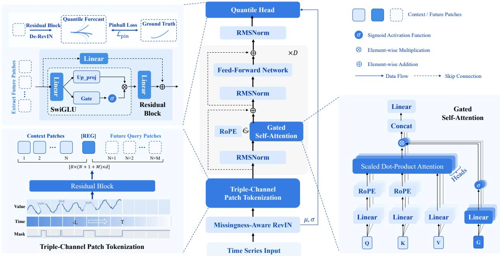  
Figure 1 Falcon-2.0 architecture. Following the univariate encoder formulation of Chronos-2 (Ansari et al., 2025), the model represents each context or future query patch through temporal, value, and indicator channels. Context tokens, a learnable REG token, and future query tokens are jointly processed by a bidirectional Transformer encoder. A quantile head decodes all future patches in parallel.

For an entirely unobserved context, we define $\left( \mu , \sigma \right) = \left( 0 , 1 \right)$ by convention and set every observation indicator to zero. The transformed value and its observation indicator are

$$
\widetilde { \boldsymbol { x } } _ { i } = \left\{ \begin{array} { l l } { \operatorname { a r c s i n h } ( ( \boldsymbol { x } _ { i } - \mu ) / \sigma ) , } & { i \in \mathcal { V } _ { x } , } \\ { 0 , } & { i \notin \mathcal { V } _ { x } , } \end{array} \right. \quad \quad \boldsymbol { a } _ { i } = \mathbb { I } [ i \in \mathcal { V } _ { x } ] .\tag{2}
$$

For a prediction $\widehat { \widetilde { y } } ,$ the original scale is recovered by $\widehat { \boldsymbol { y } } = \sigma \sinh ( \widehat { \widetilde { \boldsymbol { y } } } ) + \mu$

## 3.2.2 Triple-Channel Patch Tokenization

The context is left-padded to NP time steps. We assign each position a relative index $\boldsymbol { r } _ { i } ,$ with $r _ { i } < 0$ for context positions and $r _ { i } \geq 0$ for future positions, and use $\tau _ { i } = \boldsymbol { r } _ { i } / C$ as its temporal feature. For context patch $n \in \{ 1 , \ldots , N \}$ , let $\mathbf { t } _ { n } ^ { \mathrm { c t x } } , \mathbf { v } _ { n } ^ { \mathrm { c t x } }$ , and ${ \pmb a } _ { n } ^ { \mathrm { c t x } }$ in $\mathbb { R } ^ { P }$ denote its temporal, transformed-value, and observation-indicator vectors. Its triple-channel representation is

$$
\begin{array} { r } { { \bf z } _ { n } ^ { \mathrm { c t x } } = \left[ { \bf t } _ { n } ^ { \mathrm { c t x } } ; { \bf v } _ { n } ^ { \mathrm { c t x } } ; { \bf a } _ { n } ^ { \mathrm { c t x } } \right] \in \mathbb { R } ^ { 3 P } . } \end{array}\tag{3}
$$

A shared residual SwiGLU projection $\phi : \mathbb { R } ^ { 3 P }  \mathbb { R } ^ { d }$ maps each patch to the latent dimension:

$$
\begin{array} { r } { \mathbf { h } _ { n } ^ { \mathrm { c t x } } = \phi ( \mathbf { z } _ { n } ^ { \mathrm { c t x } } ) , \qquad \mathbf { H } _ { \mathrm { c t x } } \in \mathbb { R } ^ { N \times d } . } \end{array}\tag{4}
$$

Here, d is the latent representation dimension. Since $\phi$ is a standard two-layer residual projection, we omit its internal parameterization.

## 3.2.3 Parallel Future Queries

Let T denote the prediction length represented in a single encoder evaluation. This requires $M =$ $\lceil T / P \rceil$ future query patches, where $M \leq M _ { \mathrm { m a x } }$ and $M _ { \mathrm { m a x } }$ is the maximum number represented jointly. For a mini-batch $B = \{ 1 , \ldots , B \}$ , let sample b have lengths $\left( L _ { b } , T _ { b } \right)$ and patch counts $N _ { b } = \left\lceil L _ { b } / P \right\rceil$ and $M _ { b } = \lceil T _ { b } / P \rceil$ . We write $N _ { \mathsf { B } } = \mathsf { m a x } _ { b } N _ { b } , M _ { \mathsf { B } } = \mathsf { m a x } _ { b } M _ { b } ,$ , and $S _ { B } = N _ { B } +$ $1 + M _ { B }$ denote the padded token dimensions. Positions outside an individual sample’s context or forecast support are excluded from attention and from the empirical objective. The following equations suppress the sample index. For future patch $j \in \left\{ 0 , \dots , M - 1 \right\}$ and within-patch position $\kappa \in \{ 0 , \ldots , P - 1 \}$ , the temporal feature is

$$
{ \mathfrak { t } } _ { j } ^ { \mathrm { f u t } } [ \kappa ] = { \frac { j P + \kappa } { C } } .\tag{5}
$$

Future target values are unavailable, so the value channel is zero. The indicator channel is set to one to distinguish prospective prediction locations:

$$
\begin{array} { r } { { \bf z } _ { j } ^ { \mathrm { f u t } } = \left[ { \bf t } _ { j } ^ { \mathrm { f u t } } ; { \bf 0 } _ { P } ; { \bf 1 } _ { P } \right] , \qquad { \bf h } _ { j } ^ { \mathrm { f u t } } = \phi ( { \bf z } _ { j } ^ { \mathrm { f u t } } ) . } \end{array}\tag{6}
$$

Collecting these representations gives ${ \bf H } _ { \mathrm { f u t } } = [ { \bf h } _ { 0 } ^ { \mathrm { f u t } } ; \dots ; { \bf h } _ { M - 1 } ^ { \mathrm { f u t } } ] \in \mathbb { R } ^ { M \times d }$ . The indicator channel is interpreted jointly with the relative temporal feature: at context positions it records observation status, whereas at future positions it identifies prospective prediction locations. A separate patchlevel indicator defines the support of self-attention. A context patch belongs to this support if it contains at least one observation; the REG token and future query patches are included by construction.

The context tokens, a learnable REG token $\mathbf { h } _ { \mathrm { r e g } } \in \mathbb { R } ^ { d }$ , and the future query tokens are concatenated as

$$
{ \bf H } ^ { \mathrm { e m b } } = \left[ { \bf H } _ { \mathrm { c t x } } ; { \bf h } _ { \mathrm { r e g } } ; { \bf H } _ { \mathrm { f u t } } \right] \in \mathbb { R } ^ { S \times d } , \qquad S = N + 1 + M .\tag{7}
$$

## 3.2.4 Transformer Encoder

Let D denote the number of encoder blocks. We adopt the indexing convention $\ell \in \{ 0 , \ldots , D -$ 1}, and $\mathbf { H } ^ { [ \ell ] } \in \mathbb { R } ^ { S \times d }$ denotes the output of block ℓ. Each block uses Pre-RMSNorm, RoPE (Su et al., 2024), output-gated multi-head self-attention (Qiu et al., 2026), and a SwiGLU feed-forward layer (Shazeer, 2020). With $n _ { h }$ attention heads and per-head dimension $d _ { h } = d / n _ { h }$ , the gated attention operation is summarized as

$$
\mathbf { O } = \mathrm { s o f t m a x } \left( { \frac { \mathbf { Q } _ { \mathrm { { a t t } } } \mathbf { K } _ { \mathrm { { a t t n } } } ^ { \top } } { \sqrt { d _ { h } } } } + \mathbf { m } \right) \mathbf { V } _ { \mathrm { { a t t n } } } , \qquad { \widetilde { \mathbf { O } } } = \mathbf { O } \odot \mathrm { s i g m o i d } ( \mathbf { G } ) .\tag{8}
$$

Here, $\mathbf { Q } _ { \mathrm { a t t n } } , \mathbf { K } _ { \mathrm { a t t n } } , \mathbf { V } _ { \mathrm { a t t n } } .$ , and G are the query, key, value, and output-gate projections, respectively. The additive attention mask m $\in \ \{ 0 , { \stackrel { \textstyle - } { - } } \infty \} ^ { S \times S }$ assigns zero to admissible query–key pairs and −∞ otherwise. The admissible set comprises observed context support, the REG token, and future query tokens, with bidirectional attention within this set. Because no realized future observation is included in the encoder input, the forecasting information set is preserved.

## 3.3 Quantile Forecasting Head

Let $\mathbf { H } _ { \mathrm { f u t } } ^ { [ D - 1 ] } \ \in \ \mathbb { R } ^ { M \times d }$ denote the final-layer states at future query positions, and let $\mathbf { H } _ { \mathrm { f u t } } ^ { \mathrm { o u t } } \ =$ RMSNorm $( \mathbf { H } _ { \mathrm { f u t } } ^ { [ D - 1 ] } )$ be the final normalized representation. A residual quantile head $\psi$ produces forecasts in the normalized arcsinh space:

$$
\widehat { \widetilde { \mathbf { Y } } } = \psi \big ( \mathbf { H } _ { \mathrm { f u t } } ^ { \mathrm { o u t } } \big ) \in \mathbb { R } ^ { M \times P \times N _ { q } } ,\tag{9}
$$

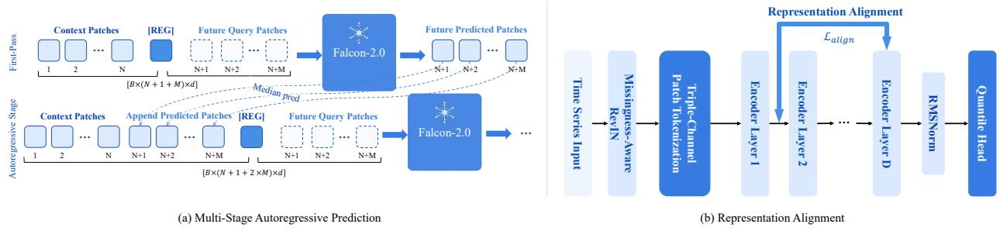  
Figure 2 Falcon-2.0 long-horizon inference and auxiliary representation alignment. (a) Multi-Stage Autoregressive Prediction: each stage predicts up to $M _ { \mathrm { m a x } }$ future patches in parallel; its median forecast is appended to the context before the next stage, and stage-wise outputs are concatenated and truncated to the requested horizon. (b) Rank-Guided Cross-Depth Alignment: a deep encoder block provides a stop-gradient reference representation for a shallow block through a token-wise cosine objective. The auxiliary objective is used only during training.

where $N _ { q } = 2 1$ is the number of quantile levels and

$$
\mathcal { Q } = \{ 0 . 0 1 , 0 . 0 5 , 0 . 1 0 , 0 . 1 5 , 0 . 2 0 , 0 . 2 5 , 0 . 3 0 , 0 . 3 5 , 0 . 4 0 , 0 . 4 5 , 0 . 5 0 , 0 . 5 5 , 0 . 6 0 , 0 . 6 5 , 0 . 7 0 , 0 . 7 5 , 0 . 8 0 , 0 . 8 5 , 0 . 9 0 , 0 . 9 5 , 0 . 9 9 \} .\tag{10}
$$

The patch and within-patch dimensions are flattened in chronological order to obtain $\widehat { \widetilde { \mathbf { Y } } } _ { \mathrm { f l a t } } ~ \in$ $\mathbb { R } ^ { M P \times N _ { q } }$ . When the requested horizon T is not divisible by $P ,$ only the first T positions are retained; the remaining positions of the final patch do not participate in training or evaluation. The head therefore produces a complete conditional quantile function at every represented forecast position, while the median channel $q = 0 . 5$ provides the point forecast used by the multi-stage inference procedure in Section 3.6.

## 3.4 Rank-Guided Cross-Depth Alignment

Motivation. Recent analysis shows that time series patch embeddings have sharply decaying singular spectra and that their numerical rank tends to increase across Transformer depth, a phenomenon termed the flow of ranks (Yu et al., 2026). That work uses the low-rank structure of early layers primarily for compression. We investigate a complementary training hypothesis: when a late-layer representation exhibits a broader non-negligible spectrum, can its geometry guide a shallow layer without adding an external teacher or changing inference?

Asymmetric cross-depth objective. For a batch of size B, let $\mathbf { h } _ { b , u } ^ { [ \ell ] } \in \mathbb { R } ^ { d }$ denote token u of sample b after encoder block ℓ. We align a shallow block $\ell _ { \mathrm { s h } }$ with a deeper block $\ell _ { \mathrm { d p } } ,$ , where $0 \leq \ell _ { \mathrm { s h } } < \ell _ { \mathrm { d p } } \leq$ $D - 1$ . Under this indexing convention, the default 32-layer model uses $\dot { ( } \ell _ { \mathrm { s h } } , \ell _ { \mathrm { d p } } ) = ( 1 , 3 1 )$ .

Inspired by the asymmetric optimization used by TimeAlign (Hu et al., 2025b), gradients are stopped through the deep representation. Unlike TimeAlign, however, both representations here come from different depths of the same encoder rather than from a separate branch that observes future targets. Define

$$
\mathbf { z } _ { b , u } ^ { \mathrm { s h } } = \frac { \mathbf { h } _ { b , u } ^ { [ \ell _ { \mathrm { s h } } ] } } { \left\| \mathbf { h } _ { b , u } ^ { [ \ell _ { \mathrm { s h } } ] } \right\| _ { 2 } } , \qquad \mathbf { z } _ { b , u } ^ { \mathrm { d p } } = \mathrm { s g } \left( \frac { \mathbf { h } _ { b , u } ^ { [ \ell _ { \mathrm { d p } } ] } } { \left\| \mathbf { h } _ { b , u } ^ { [ \ell _ { \mathrm { d p } } ] } \right\| _ { 2 } } \right) ,\tag{11}
$$

where $\operatorname { s g } ( { \mathord { \cdot } } )$ denotes stop-gradient. For numerical stability, each denominator is lower-bounded by

a small positive constant $\epsilon _ { \mathrm { a l i g n } } .$

Let $\omega _ { b , u } \in \{ 0 , 1 \}$ denote the alignment-support indicator. It equals one for valid context patches and future query patches within the sampled horizon, and zero for padding-induced positions and the REG token. The token-wise cosine objective is

$$
\mathcal { L } _ { \mathrm { a l i g n } } = \frac { 1 } { n _ { v } } \sum _ { b = 1 } ^ { B } \sum _ { u = 1 } ^ { S _ { B } } \omega _ { b , u } \left( 1 - \left. \mathbf { z } _ { b , u } ^ { \mathrm { s h } } , \mathbf { z } _ { b , u } ^ { \mathrm { d p } } \right. \right) , \qquad n _ { v } = \sum _ { b , u } \omega _ { b , u } .\tag{12}
$$

The objective updates the shallow representation using the current deep representation as an asymmetric reference signal. It introduces no additional forecasting function and is not evaluated during inference.

Spectral diagnostics. Stack the $n _ { v }$ valid, row-normalized shallow and deep token vectors into $\mathbf { Z } _ { \mathrm { s h } } , \mathbf { Z } _ { \mathrm { d p } } \in \mathbb { R } ^ { n _ { v } \times d }$ . To remove a shared mean direction before measuring spectral breadth, define the centering matrix $\mathbf { C } _ { v } = \mathbf { I } _ { n _ { v } } - n _ { v } ^ { - 1 } \mathbf { 1 1 } ^ { \top }$ and

$$
\begin{array} { r l r } { \overline { { \mathbf { Z } } } _ { \mathrm { s h } } = \mathbf { C } _ { v } \mathbf { Z } _ { \mathrm { s h } } , } & { { } } & { \overline { { \mathbf { Z } } } _ { \mathrm { d p } } = \mathbf { C } _ { v } \mathbf { Z } _ { \mathrm { d p } } . } \end{array}\tag{13}
$$

For a centered representation matrix Z with singular values $s _ { 1 } ( { \overline { { \mathbf { Z } } } } ) \geq s _ { 2 } ( { \overline { { \mathbf { Z } } } } ) \geq \cdot \cdot \cdot$ , we consider the -numerical rank and stable rank

$$
r _ { \varepsilon } ( \overline { { \mathbf { Z } } } ) = \big | \big \{ j : s _ { j } ( \overline { { \mathbf { Z } } } ) > \varepsilon s _ { 1 } ( \overline { { \mathbf { Z } } } ) \big \} \big | , \qquad r _ { \mathrm { s t a b l e } } ( \overline { { \mathbf { Z } } } ) = \frac { \| \overline { { \mathbf { Z } } } \| _ { F } ^ { 2 } } { \| \overline { { \mathbf { Z } } } \| _ { 2 } ^ { 2 } } .\tag{14}
$$

The first counts singular directions that remain non-negligible relative to the dominant mode, whereas the second measures how broadly representation energy is distributed. Both are diagnostics rather than optimization targets: a broader spectrum does not by itself imply more predictive information.

From cosine alignment to spectral transfer. Because every aligned row has unit norm, the tokenwise cosine objective is exactly equivalent to a matrix discrepancy:

$$
\Big \| \mathbf { Z } _ { \mathrm { s h } } - \mathbf { Z } _ { \mathrm { d p } } \Big \| _ { F } ^ { 2 } = 2 n _ { v } \mathcal { L } _ { \mathrm { a l i g n } } .\tag{15}
$$

Since $\| \mathbf { C } _ { v } \| _ { 2 } \leq 1$ , centering cannot amplify this discrepancy. Hence

$$
\delta _ { F } : = \left\| \overline { { \mathbf { Z } } } _ { \mathrm { s h } } - \overline { { \mathbf { Z } } } _ { \mathrm { d p } } \right\| _ { F } \leq \sqrt { 2 n _ { v } \mathcal { L } _ { \mathrm { a l i g n } } } , \qquad \eta : = \left\| \overline { { \mathbf { Z } } } _ { \mathrm { s h } } - \overline { { \mathbf { Z } } } _ { \mathrm { d p } } \right\| _ { 2 } \leq \delta _ { F } .\tag{16}
$$

Standard singular-value perturbation bounds (Stewart and Sun, 1990) then give, for every $j ,$

$$
\begin{array} { r } { \left| s _ { j } ( \overline { { \mathbf { Z } } } _ { \mathrm { s h } } ) - s _ { j } ( \overline { { \mathbf { Z } } } _ { \mathrm { d p } } ) \right| \leq \eta . } \end{array}\tag{17}
$$

Consequently, if the r-th deep singular mode is separated from the numerical-rank threshold by more than the alignment perturbation, namely

$$
s _ { r } ( \overline { { \mathbf { Z } } } _ { \mathrm { d p } } ) - \eta > \varepsilon \left( s _ { 1 } ( \overline { { \mathbf { Z } } } _ { \mathrm { d p } } ) + \eta \right) ,\tag{18}
$$

then $r _ { \varepsilon } ( \overline { { \mathbf { Z } } } _ { \mathrm { s h } } ) \geq r$ . This establishes a conditional transfer result: cosine alignment does not create rank unconditionally, but sufficiently accurate alignment prevents the shallow representation from

retaining fewer than r non-negligible modes when the deep spectrum satisfies the stated separation condition.

The same perturbation also controls stable rank. By the triangle and reverse-triangle inequalities, whenever $\bar { \boldsymbol { \delta } } _ { F } < \| \overline { { \mathbf { Z } } } _ { \mathrm { d p } } \| _ { F } .$

$$
r _ { \mathrm { s t a b l e } } ( \overline { { \mathbf { Z } } } _ { \mathrm { s h } } ) \geq \frac { \left( \lVert \overline { { \mathbf { Z } } } _ { \mathrm { d p } } \rVert _ { F } - \delta _ { F } \right) ^ { 2 } } { \left( \lVert \overline { { \mathbf { Z } } } _ { \mathrm { d p } } \rVert _ { 2 } + \eta \right) ^ { 2 } } .\tag{19}
$$

Thus, a small alignment loss also limits how far the shallow representation’s energy distribution can deviate from that of the deep representation, although the bound may be loose when the deep spectrum is highly concentrated.

Subspace interpretation and directionality. Let $\mathbf { V } _ { r } ^ { \mathrm { s h } }$ and $\mathbf { V } _ { r } ^ { \mathrm { d p } }$ contain the top-r right singular vectors of the centered shallow and deep representations, and define the corresponding projectors $\mathbf { P } _ { r } ^ { \mathrm { s h } } = \mathbf { V } _ { r } ^ { \mathrm { s h } } ( \mathbf { V } _ { r } ^ { \mathrm { s h } } ) ^ { \top }$ and $\mathbf { P } _ { r } ^ { \mathrm { d p } } = \mathbf { V } _ { r } ^ { \mathrm { d p } } ( \mathbf { V } _ { r } ^ { \mathrm { d p } } ) ^ { \hat { \top } }$ . Their normalized chordal discrepancy is

$$
d _ { \mathrm { s u b } } ^ { 2 } ( \boldsymbol { r } ) = \frac { 1 } { 2 r } \left. \mathbf { P } _ { r } ^ { \mathrm { s h } } - \mathbf { P } _ { r } ^ { \mathrm { d p } } \right. _ { F } ^ { 2 } = \frac { 1 } { r } \sum _ { j = 1 } ^ { r } \sin ^ { 2 } \theta _ { j } ,\tag{20}
$$

where $\theta _ { j }$ are the principal angles between the two feature subspaces. When the deep representation has a nonzero spectral gap around its r-th singular value, matrix perturbation theory provides an upper bound on this discrepancy that vanishes with η. We use Equation (20) only as an analysis diagnostic; the training objective remains the less expensive token-wise cosine loss in Equation (12).

Finally, stop-gradient determines the direction of transfer. Without it, the auxiliary loss could decrease by moving the deep representation toward the narrower shallow representation. Treating the deep state as fixed within each update instead directs the alignment gradient to the shallow branch and preceding blocks. The forecasting objective continues to update the full network, so alignment regularizes representation development without freezing the deep encoder during training.

## 3.5 Training Loss

Let sample b have a sampled forecast horizon $T _ { b }$ and targets $\mathbf y _ { b } = ( y _ { b , 1 } , \dots , y _ { b , T _ { b } } )$ . Its observed target set is

$$
\mathcal { V } _ { b } = \left\{ t \in \{ 1 , \dots , T _ { b } \} : y _ { b , t } \mathrm { i s o b s e r v e d } \right\} .\tag{21}
$$

The context statistics $\left( \mu _ { b } , \sigma _ { b } \right)$ from Equation (1) are reused to transform every observed target:

$$
\widetilde { y } _ { b , t } = \mathrm { a r c s i n h } \bigg ( \frac { y _ { b , t } - \mu _ { b } } { \sigma _ { b } } \bigg ) , \qquad t \in \mathcal { V } _ { b } .\tag{22}
$$

Let $\widehat { \widetilde { y } } _ { b , t } ^ { \left( q \right) }$ denote the corresponding quantile-head output for $q \in \mathcal { Q }$ after flattening the patch dimension. With $\begin{array} { r } { N _ { \mathrm { t g t } } = \sum _ { b = 1 } ^ { B } | \mathcal { V } _ { b } | } \end{array}$ , the forecasting loss is the observed-target pinball objective (Koenker and Hallock, 2001)

$$
\mathcal { L } _ { \mathrm { p i n } } = \frac { 1 } { N _ { q } N _ { \mathrm { t g t } } } \sum _ { b = 1 } ^ { B } \sum _ { t \in \mathcal { V } _ { b } } \sum _ { q \in \mathcal { Q } } \rho _ { q } \left( \widetilde { y } _ { b , t } - \widehat { \widetilde { y } } _ { b , t } ^ { ( q ) } \right) , \qquad \rho _ { q } ( e ) = \operatorname* { m a x } ( q e , ( q - 1 ) e ) .\tag{23}
$$

The residual convention is $e = { \widetilde { \boldsymbol { y } } } - { \widehat { \widetilde { \boldsymbol { y } } } } ,$ under which minimizing $\rho _ { q }$ estimates the conditional qquantile. Targets that are unobserved, introduced solely by batch padding, or located beyond the sampled horizon have zero contribution. Samples with $\nu _ { b } = \sigma$ are excluded before the batch objective is formed, ensuring that $N _ { \mathrm { t g t } } > 0$

Training in the normalized arcsinh space prevents high-amplitude series from dominating the batch objective while retaining an invertible map to the original scale. The median prediction, $q = 0 . 5 ,$ minimizes the absolute-error component and is used as the recursive input during long-horizon inference; the remaining quantiles characterize predictive uncertainty and are never collapsed into the median during training.

The complete pre-training objective combines forecasting accuracy with cross-depth representation alignment:

$$
\mathcal { L } _ { \mathrm { t o t a l } } = \mathcal { L } _ { \mathrm { p i n } } + \lambda _ { \mathrm { a l i g n } } \mathcal { L } _ { \mathrm { a l i g n } } ,\tag{24}
$$

where the default run uses $\lambda _ { \mathrm { a l i g n } } = 1 0 . 0$ . The forecasting term updates the patch-embedding map, all encoder blocks, and the quantile head. Because the deep representation is stop-gradient in Equation (11), the auxiliary term updates only the shallow branch and its preceding computation. At evaluation time, $\mathcal { L } _ { \mathrm { a l i g n } }$ is absent and the forecasting architecture is unchanged.

## 3.6 Multi-Stage Autoregressive Prediction

Falcon-2.0 represents at most $M _ { \mathrm { m a x } }$ future patches in one encoder evaluation, giving a per-stage forecasting capacity

$$
T _ { \mathrm { m a x } } = M _ { \mathrm { m a x } } P .\tag{25}
$$

For a requested horizon $T _ { \mathrm { r e q } } .$ , the number of stages is

$$
K = \left\lceil \frac { T _ { \mathrm { r e q } } } { T _ { \mathrm { m a x } } } \right\rceil .\tag{26}
$$

At stage $k \in \{ 1 , \ldots , K \}$ , let

$$
T _ { k } = \operatorname* { m i n } \left( T _ { \mathrm { m a x } } , T _ { \mathrm { r e q } } - ( k - 1 ) T _ { \mathrm { m a x } } \right) , \qquad M _ { k } = \left\lceil \frac { T _ { k } } { P } \right\rceil .\tag{27}
$$

The model constructs $M _ { k }$ future query patches and predicts all $M _ { k } P$ positions in parallel. Only the first $T _ { k }$ positions are retained when the final stage ends inside a patch.

Normalization is performed once. Specifically, $( \mu , \sigma )$ are computed from the original observed context, and the resulting transformed context is denoted by $\mathbf { \widetilde { x } } ^ { ( 0 ) }$ . The same statistics are held fixed at every stage so that observed context values and recursively generated values remain in a common coordinate system. Given the current context $\widetilde { \mathbf { x } } ^ { ( k - 1 ) }$ , stage k produces $\widehat { \mathbf { y } } ^ { ( q , k ) } \in \mathbb { R } ^ { T _ { k } }$ for every $q \in \mathcal { Q }$ . Its median is incorporated into the next context as

$$
\widetilde { \mathbf { x } } ^ { ( k ) } = \mathrm { T a i l } _ { C } \left( \left[ \widetilde { \mathbf { x } } ^ { ( k - 1 ) } ; \widehat { \mathbf { y } } ^ { ( 0 . 5 , k ) } \right] \right) ,\tag{28}
$$

where $\mathrm { T a i l } _ { C }$ retains the most recent C time steps when the accumulated context exceeds the admissible context length. Recursively generated positions receive observation indicator one because they are available as conditioning values in the subsequent stage.

For each quantile level, the final transformed forecast concatenates the stage outputs in temporal order:

$$
\widehat { \widetilde { \mathbf { y } } } ^ { ( q ) } = \mathrm { T r u n c } _ { T _ { \mathrm { r e q } } } \left( \left[ \widehat { \widetilde { \mathbf { y } } } ^ { ( q , 1 ) } ; \cdot \cdot \cdot ; \widehat { \widetilde { \mathbf { y } } } ^ { ( q , K ) } \right] \right) .\tag{29}
$$

The original scale is recovered only after all stages:

$$
\widehat { y } _ { t } ^ { ( q ) } = \sigma \sinh \biggl ( \widehat { \widetilde { y } } _ { t } ^ { ( q ) } \biggr ) + \mu , \qquad t = 1 , \dots , T _ { \mathrm { r e q } } .\tag{30}
$$

Therefore, prediction is parallel within each stage and autoregressive only across stages. When $T _ { \mathrm { r e q } } \leq T _ { \mathrm { m a x } , } K = 1$ and the procedure reduces to direct parallel forecasting without recursive feedback. For longer horizons, only the median trajectory is fed back; all quantile trajectories are nevertheless retained as outputs.

## 3.7 Model Configuration

The default Falcon-2.0 configuration contains D = 32 encoder blocks and 585M trainable parameters. Its latent dimension is $d = 1 0 2 4$ , partitioned across $n _ { h } = 1 6$ attention heads with $d _ { h } = 6 4$ , satisfying $d = n _ { h } d _ { h }$ . Each block expands the representation to $d _ { \mathrm { f f } } = 4 0 9 6$ in its SwiGLU feed-forward sublayer. The stack uses Pre-RMSNorm, RoPE with base 10,000, output-gated self-attention, and bias-free linear maps.

The common patch size is P = 16 for both context and future segments. A maximum context of $C = 8 1 9 2$ time steps therefore contains $N _ { \mathrm { m a x } } = C / P = 5 1 2$ context patches. Together with one REG token and $M _ { \mathrm { m a x } } = 6$ future query patches, the largest encoder sequence contains $S _ { \mathrm { m a x } } = N _ { \mathrm { m a x } } +$ $1 + M _ { \mathrm { m a x } } = 5 1 9$ tokens. The corresponding per-stage forecasting capacity is $T _ { \mathrm { m a x } } = M _ { \mathrm { m a x } } P = 9 6$ time steps; longer horizons use the procedure in Section 3.6. These values specify the model’s representational capacity, whereas the per-example context and horizon are sampled by ORBIT as described in Section 4.

Table 3 summarizes the configuration. We report it for reproducibility and do not treat these conventional architectural choices as the principal contribution.

## 4 ORBIT

Training a time series foundation model on a heterogeneous corpus implicitly defines an effective pretraining distribution: the probability with which each dataset, record, target variable, context window, and prediction horizon contributes to the optimization objective. This distribution is particularly consequential for time series because data sources differ jointly in domain, sampling frequency, record length, variable count, and missingness (Aksu et al., 2024b; Shchur et al., 2025). When training examples are obtained through sequential traversal or deterministic window enumeration, their exposure is determined largely by corpus layout and the number of enumerable windows, rather than by an explicitly specified training objective.

As illustrated in Figure 3, ORBIT separates the construction and consumption of this distribution into two complementary components. Bootstrap Multi-Level Sampling controls source exposure and constructs forecasting examples by sampling records, target variables, temporal split points, and prediction horizons. Omni-Range Incremental Training interleaves the resulting context and horizon ranges throughout a single step-based training run, rather than assigning different ranges to separate training stages. Operationally, the split-point and horizon variables are sampled once during index construction and are subsequently consumed by Omni-Range training; they are not independently resampled by the two components. The channel-independent backbone, triple-channel tokenization, and parallel patch prediction of Falcon-2.0 provide an interface for processing this variable-length and missingness-aware stream, but do not themselves define the pre-training distribution.

Table 3 Model configuration of Falcon-2.0. Encoder blocks follow the indexing convention $\{ 0 , \ldots , D - 1 \}$
<table><tr><td>Parameter</td><td>Value</td></tr><tr><td>Encoder blocks (D)</td><td>32</td></tr><tr><td>Trainable parameters</td><td>585M</td></tr><tr><td>Latent representation dimension (d)</td><td>1024</td></tr><tr><td>FFN hidden size  $( d _ { \mathrm { f f } } )$ </td><td>4096</td></tr><tr><td>Attention heads  $( n _ { h } )$ </td><td>16</td></tr><tr><td>Per-head dimension  $( d _ { h } )$ </td><td>64</td></tr><tr><td>Patch size (P)</td><td>16</td></tr><tr><td>Maximum future patches  $\left( M _ { \mathrm { m a x } } \right)$ </td><td>6</td></tr><tr><td>Maximum per-stage horizon  $( T _ { \mathrm { m a x } } )$ </td><td>96</td></tr><tr><td>Maximum context length (C)</td><td>8192</td></tr><tr><td>Maximum context patches  $( N _ { \mathrm { m a x } } )$ </td><td>512</td></tr><tr><td>Maximum encoder tokens  $( S _ { \mathrm { m a x } } )$ </td><td>519</td></tr><tr><td>Positional encoding</td><td>RoPE (base  $1 0 { , } 0 0 0 )$ </td></tr><tr><td>Normalization</td><td>RMSNorm  $( \epsilon _ { \mathrm { r m s } } = 1 0 ^ { - 5 } )$ </td></tr><tr><td>Attention</td><td>Output-gated self-attention</td></tr><tr><td>FFN activation</td><td>SwiGLU</td></tr><tr><td>Bias terms in linear maps</td><td>Absent</td></tr><tr><td>Quantile levels  $( N _ { q } )$ </td><td>21</td></tr><tr><td>Alignment blocks  $( \ell _ { \mathrm { s h } } , \ell _ { \mathrm { d p } } )$ </td><td>(1,31)</td></tr></table>

## 4.1 Problem Formulation and Motivation

Given a prescribed weighting over the pre-training datasets, consider a dataset D containing $N _ { \mathcal { D } }$ time series records. Record i is represented as $\mathbf { \boldsymbol { x } } _ { i } \in \mathbb { R } ^ { L _ { i } \times V _ { i } }$ , where $L _ { i }$ denotes its temporal length and $V _ { i } \geq 1$ its number of target variables; the v-th target variable is denoted by $\mathbf { x } _ { i , v } \in \mathbb { R } ^ { L _ { i } }$ . The objective is to make the aggregate dataset composition of the global training stream follow these weights while sampling forecasting instances over time series records, target variables, temporal windows, and prediction horizons. At the same time, the data pipeline must support efficient random access so that data loading does not become a bottleneck in large-scale distributed training.

A common baseline is fixed sliding-window sampling, which sequentially enumerates training examples from each record (Goswami et al., 2024a; Shi et al., 2025; Liu et al., 2025b). Although straightforward, fixed window enumeration makes training exposure depend on the number of eligible windows. Adjacent windows often overlap substantially, producing highly redundant training examples. Datasets that yield more windows receive greater exposure. Reusing a fixed set of window boundaries also limits the diversity of context–target configurations. Together, these effects increase the nominal sample count without a corresponding gain in training diversity, potentially skewing data exposure during optimization.

Such distributional biases motivate a sampling strategy that randomizes across multiple dimensions instead of relying on deterministic window traversal. To specify the forecasting examples produced by such a strategy, we introduce the following representation.

Definition 4.1 (Sample Index). For the $N _ { \mathcal { D } }$ records in dataset ${ \mathcal { D } } ,$ a sample index $\mathcal { I } _ { \mathcal { D } }$ with $M _ { D }$ entries

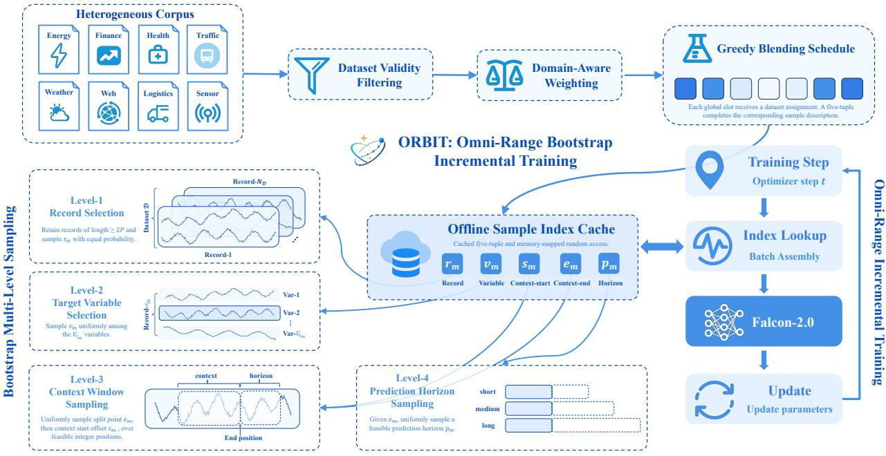  
Figure 3 Overview of ORBIT. At the corpus level, dataset validity filtering and prescribed weights are translated by greedy blending into dataset assignments for the global training stream. Within each retained dataset, record filtering and four-level stochastic sampling construct a sample index of five-tuples over records, target variables, context windows, and prediction horizons. The resulting offline cache supports index lookup and batch assembly for Omni-Range Incremental Training.

maps each sample identifier $m \in \{ 1 , \ldots , M _ { D } \}$ to a valid extraction tuple

$$
\begin{array} { r } { \mathcal { I } _ { \mathcal { D } } ( m ) = ( r _ { m } , v _ { m } , s _ { m } , e _ { m } , p _ { m } ) , } \end{array}
$$

where $r _ { m } \in \{ 1 , \ldots , N _ { D } \}$ denotes the index of a time series record with temporal length $L _ { r _ { m } }$ and $V _ { r _ { m } }$ target variables, and $v _ { m } \in \{ 1 , \ldots , V _ { r _ { m } } \}$ denotes the index of a target variable within that record. $s _ { m } , e _ { m } \in \mathbb { Z }$ denote the starting offset and exclusive endpoint, respectively, of the context window within record $r _ { m } ,$ with $0 \leq s _ { m } < e _ { m } < L _ { r _ { m } }$ and $e _ { m } - s _ { m } \geq P _ { \astrosun }$ , while $p _ { m } \in \mathbb { Z } _ { \geq P }$ denotes an admissible prediction horizon satisfying $p _ { m } \ \leq \ T _ { \mathrm { m a x } }$ and $e _ { m } + p _ { m } \le L _ { r _ { m } }$ . Accordingly, the context is the segment of $\mathbf { x } _ { r _ { m } , v _ { m } }$ spanning offsets $s _ { m }$ through $e _ { m } - 1$ , and the target is the immediately following segment spanning offsets $e _ { m }$ through $e _ { m } + p _ { m } - 1$

Beyond the validity of individual extraction tuples, the sampling scheme should satisfy requirements at two levels. At the corpus level, aggregate dataset exposure over the complete global training stream should follow the prescribed weights. Within each dataset, the construction of the sample index should ensure that every valid record remains eligible for selection and that time series records, target variables, temporal window positions, and prediction horizons are selected stochastically.

## 4.2 Bootstrap Multi-Level Sampling

Bootstrap Multi-Level Sampling addresses these requirements hierarchically. At the corpus level, dataset weighting and blending control how frequently each dataset contributes to the global training stream. Within each dataset, a four-level stochastic procedure constructs the corresponding sample index by selecting the time series record, target variable, context window, and prediction horizon of each indexed example.

## 4.2.1 Dataset Weighting and Blending

We first apply dataset-level validity filtering to exclude datasets with excessive overall missingness or no record long enough to form a valid context–target pair. Across the retained datasets, ORBIT uses domain-aware weighting to balance exposure across domains and prevent high-volume datasets from dominating the training distribution. These weights define the desired dataset composition of an ordered global training stream. The stream length is fixed in advance to match the total sample budget of a single pre-training run.

With the desired composition and stream length specified, we use a low-discrepancy greedy blending rule to materialize the dataset assignments. For each slot, the rule selects the dataset whose cumulative assigned count has the largest deficit relative to its target count at that point. Unlike independent categorical sampling, which matches the prescribed proportions only in expectation, this rule keeps the cumulative dataset composition close to its target after every assignment. Once a dataset has been assigned to each slot, a local sample identifier is selected for that dataset. As described next, the corresponding per-dataset sample index maps this identifier to the five-tuple $\left( r _ { m } , v _ { m } , s _ { m } , e _ { m } , p _ { m } \right)$ . Together with the dataset assignment, this five-tuple completes the indexed extraction description associated with the corresponding slot.

## 4.2.2 Bootstrap Stochastic Sampling

Complementing the corpus-level dataset assignments, Bootstrap Stochastic Sampling operates separately within each retained dataset D to construct its sample index $\mathcal { I } _ { \mathcal { D } }$ . For every sample identifier $m \in \{ 1 , \dots , M _ { D } \}$ , a four-level stochastic procedure generates the extraction tuple $\mathcal { I } _ { \mathcal { D } } ( m ) = \left( r _ { m } , v _ { m } , s _ { m } , e _ { m } , p _ { m } \right)$ by sampling a valid record, a target variable within that record, a context window, and a compatible prediction horizon. This construction avoids deterministic record traversal and fixed window boundaries, helping reduce sequential correlations and increase the diversity of context–target configurations.

Level-1: Record Selection. We first exclude records shorter than 2P time steps, where P is the common patch size introduced in Section 3.2, so that every retained record can provide at least one full patch for both the context and target segments. For each sample identifier $m ,$ the record index $r _ { m }$ is sampled with equal probability from the retained records, without weighting by record length or variable count.

Level-2: Target Variable Selection. Conditioned on the selected record $r _ { m , \astrosun }$ , the procedure draws a target-variable index $v _ { m }$ with equal probability from $\{ 1 , \dots , V _ { r _ { m } } \}$ . Together with the equal probability record sampling in Level-1, this prevents target-variable exposure from scaling with the number of extractable temporal windows.

Level-3: Context Window Sampling. Context requirements vary substantially across records and sampling frequencies, motivating coverage of both short local histories and longer temporal extents. After selecting record $r _ { m }$ and target variable $v _ { m }$ in Levels 1 and 2, respectively, the procedure operates on the resulting univariate series $\mathbf { x } _ { r _ { m } , v _ { m } }$ of length $L _ { r _ { m } }$ . It first samples the exclusive endpoint of the context window, which also serves as the context–target split point, uniformly from the feasible integer positions:

$$
e _ { m } \mid r _ { m } \sim \mathrm { U n i f } \{ P , \dots , L _ { r _ { m } } - P \} .\tag{31}
$$

Here P is the common patch size introduced in Section 3.2; the two bounds reserve at least one full

patch on each side of the split point. Conditioned on $e _ { m , \ l }$ , the context starting offset is then sampled uniformly from its feasible integer range:

$$
s _ { m } \mid e _ { m } \sim \operatorname { U n i f } \{ \operatorname* { m a x } ( 0 , e _ { m } - C ) , \dots , e _ { m } - P \} ,\tag{32}
$$

where C is the maximum admissible context length defined in Section 3.2. Consequently, the sampled context length $e _ { m } - s _ { m }$ ranges from $P$ to min $\left( C , e _ { m } \right)$ , exposing the model to different temporal extents without exceeding its context capacity.

Level-4: Prediction Horizon Sampling. Forecasting applications likewise require prediction horizons ranging from short to long, making a single fixed horizon unnecessarily restrictive. Given the sampled split point $e _ { m } ,$ , the prediction horizon length is sampled uniformly from the feasible integer set

$$
p _ { m } \mid e _ { m } , r _ { m } \sim \mathrm { U n i f } \{ P , \dots , \operatorname* { m i n } ( T _ { \mathrm { m a x } } , L _ { r _ { m } } - e _ { m } ) \} .\tag{33}
$$

Here $T _ { \mathrm { m a x } }$ is the maximum per-stage forecasting capacity defined in Section 3.6. The lower bound supplies at least one full target patch, while the upper bound respects both the model’s per-stage capacity and the number of future observations remaining after $e _ { m }$ . Equivalently, the exclusive endpoint of the target lies between $e _ { m } + P$ and min $( e _ { m } + T _ { \operatorname* { m a x } } , L _ { r _ { m } } )$ . The sampling is therefore uniform over the feasible horizon range determined jointly by the selected record and split point. Earlier split points can admit horizons up to $T _ { \mathrm { m a x } } ,$ whereas later positions are limited by the shorter remaining suffix. Across the entries of the sample index, this construction allows short- to long-range targets to coexist whenever the selected records permit, rather than binding the sample index to a single prediction length.

Repeating the four-level procedure for all $M _ { D }$ sample identifiers yields the sample index $\mathcal { I } _ { \mathcal { D } } \in$ $\mathbb { Z } ^ { \hat { M } _ { \mathcal { D } } \times 5 }$ . Constructed offline and cached for reproducibility and reuse across training runs, the sample index separates the specification of context–horizon configurations from their subsequent consumption during training. Algorithm 1 summarizes the complete construction.

Algorithm 1 Bootstrap Sample Index Construction   
Require: Dataset D with $N _ { \mathcal { D } }$ records, record lengths $\{ L _ { i } \}$ , and variable counts $\{ V _ { i } \} ;$ patch size $P ;$   
maximum context length $C \geq P ;$ maximum per-stage horizon $T _ { \mathrm { m a x } } \geq P ;$ sample-index size $M _ { D }$   
Ensure: Sample index $\mathcal { I } _ { \mathcal { D } } \in \mathbb { Z } ^ { M _ { \mathcal { D } } }$ ×5   
1: Initialize a random generator G   
2: $\mathcal { R } _ { D }  \{ i \in \{ 1 , . . . , \bar { N } _ { D } \} : L _ { i } \geq 2 P \}$   
3: for $m = 1$ to $M _ { D }$ do   
4: ▷ Level-1: Record Selection   
5: $r _ { m } \gets G . \mathrm { c h o i c e } ( \mathcal { R } _ { \mathcal { D } } )$   
6: ▷ Level-2: Target Variable Selection   
7: $v _ { m }  G . c { \mathrm { h o i c e } } ( \{ 1 , . . . , V _ { r _ { m } } \} )$   
8: ▷ Level-3: Context Window Sampling   
9: $e _ { m } \gets G . { \mathrm { c h o i c e } } ( \{ P , \dots , L _ { r _ { m } } - P \} )$   
10: $s _ { m } \gets G . \mathrm { c h o i c e } ( \{ \operatorname* { m a x } ( 0 , e _ { m } - C ) , \dots , e _ { m } - P \} )$   
11: ▷ Level-4: Prediction Horizon Sampling   
12: $p _ { m } \gets G . \mathrm { c h o i c e } ( \{ P , \dots , \operatorname* { m i n } ( T _ { \mathrm { m a x } } , L _ { r _ { m } } - e _ { m } ) \} )$   
13: $\mathcal { T } _ { \mathcal { D } } ( m ) \gets ( r _ { m } , v _ { m } , s _ { m } , e _ { m } , p _ { m } )$   
14: end for   
15: return $\mathcal { T } _ { \mathcal { D } }$

## 4.3 Omni-Range Incremental Training

A time series foundation model must generalize across temporal resolutions and forecasting requirements that call for widely different context lengths and prediction horizons. Training with a fixed context–horizon configuration covers only a narrow operating regime, whereas multi-stage context extension or horizon-specific optimization treats different temporal ranges through separate schedules or objectives and increases training complexity (Ansari et al., 2025; Liu et al., 2026b; Shi et al., 2025). Building on the sample indices defined in Section 4.2.2, Omni-Range training stochastically mixes diverse context–horizon configurations in a single training run, enabling the model to learn across a broad range of temporal scales. Operationally, Omni-Range Incremental Training comprises two complementary components: assembling samples with different context lengths and prediction horizons into mini-batches and incrementally consuming cached sample index entries during optimization.

Omni-Range Batch Assembly. The five-tuples selected for a mini-batch generally encode different context lengths $e _ { m } - s _ { m }$ and prediction horizons $p _ { m }$ and therefore cannot be stacked directly. During batch assembly, context windows are left-padded to the longest context in the mini-batch, aligning their valid endpoints at the context–target split, while target windows are right-padded to the longest prediction horizon, aligning the beginnings of their forecast ranges. Padded context positions are marked invalid in the observation-indicator channel, with fully padded context patches excluded by the attention mask; padded target positions are excluded by the loss mask and therefore make no direct contribution to the training objective. The model can therefore train jointly on examples spanning different context and prediction ranges within a single mini-batch, without any additional runtime cropping or resampling.

Incremental Sample Consumption. Before optimization, the global training stream constructed in Section 4.2.1 is globally shuffled, while the sample identifiers within each dataset are shuffled independently. Together, these shuffling steps establish the sequence in which sample index entries are accessed during the training run. Each entry is a five-tuple of extraction metadata, $\left( r _ { m } , v _ { m } , s _ { m } , e _ { m } , p _ { m } \right)$ , rather than a time series sample that can be consumed directly. At training time, the corresponding context and target segments are loaded on demand from memory-mapped storage as specified by the five-tuple. Loading only the required segments avoids materializing all sampled windows in memory, reducing the memory footprint while supporting efficient batch construction. Overall, the globally interleaved training stream supports incremental consumption of stochastically constructed samples, promoting sample diversity and reducing redundant exposure compared with conventional epoch-based training, which repeatedly traverses a fixed sample collection.

## 5 Pre-training

The preceding section introduced the sampling and horizon-control mechanisms that define the training distribution of Falcon-2.0. This section specifies how those mechanisms are instantiated in the pre-training run, including the corpus, optimization schedule, alignment objective, and distributed execution setup.

Table 4 Pre-training configuration.
<table><tr><td>Configuration</td><td>Setting used in pre-training</td></tr><tr><td>Loss function</td><td>21-quantile pinball regression</td></tr><tr><td>Quantile levels Q</td><td> $\{ 0 . 0 1 , 0 . 0 5 , 0 . 1 0 , \ldots , 0 . 9 0 , 0 . 9 5 , 0 . 9 9 \}$ </td></tr><tr><td>Optimizer</td><td> ${ \mathrm { A d a m W } } \left( \beta _ { 1 } { = } 0 . 9 , \ \beta _ { 2 } { = } 0 . 9 5 \right)$ </td></tr><tr><td>Peak learning rate</td><td> $6 \times 1 0 ^ { - 5 }$ </td></tr><tr><td>LR schedule</td><td>Cosine annealing</td></tr><tr><td>Minimum learning rate</td><td> $6 \times 1 0 ^ { - 6 }$ </td></tr><tr><td>Training iterations</td><td> $1 , 0 0 0 { , } 0 0 0$ </td></tr><tr><td>LR decay iterations</td><td>999,000</td></tr><tr><td>Weight decay</td><td>0.1</td></tr><tr><td>Gradient clipping</td><td>1.0</td></tr><tr><td>Batch size</td><td>64</td></tr><tr><td>Precision</td><td>BF16 mixed precision</td></tr><tr><td>Min prediction length  $p _ { \mathrm { m i n } }$ </td><td>16</td></tr><tr><td>Max prediction length pmax</td><td></td></tr><tr><td></td><td>96</td></tr><tr><td>Alignment blocks  $( \ell _ { \mathrm { s h } } , \ell _ { \mathrm { d p } } )$ </td><td>(1,31), with  $\lambda _ { \mathrm { a l i g n } } = 1 0 . 0$ </td></tr><tr><td>Training schedule</td><td>Step-based</td></tr></table>

## 5.1 Training Data Corpus

Falcon-2.0 is pre-trained on a large-scale heterogeneous corpus spanning seven domains—Energy, Finance, Healthcare, Nature, Sales, Transport, and Cloud/IT—with each domain contributing multiple datasets of varying temporal lengths, sampling frequencies, and variate counts. Following the data leakage prevention principles established by GIFT-Eval (Aksu et al., 2024b), we rigorously separate pre-training data from all evaluation benchmarks, ensuring that zero-shot performance reflects genuine generalization rather than memorization. Detailed information on the corpus composition and dataset statistics can be found in Appendix A.1.

## 5.2 Training Configuration

The full set of training hyperparameters is summarized in Table 4. Falcon-2.0 is trained with 21- quantile regression using the pinball loss (Section 3.3), with quantile levels $\mathcal { Q } = \{ 0 . 0 1 , 0 . 0 5 , \hdots , 0 . 9 9 \}$ providing calibrated coverage from the extreme tails to the median. Optimization is performed with AdamW $( \beta _ { 1 } = 0 . 9 , \beta _ { 2 } = 0 . 9 5 )$ (Loshchilov and Hutter, 2017) for $1 , 0 0 0 { , } 0 0 0$ optimizer steps. The learning rate peaks at $6 \times 1 0 ^ { - 5 }$ and follows cosine decay for 999,000 steps to a minimum of $6 \times 1 0 ^ { - 6 } .$ with a warmup fraction of 0.001. Weight decay is set to 0.1 and gradients are clipped to norm 1.0. Training uses BF16 mixed precision with a per-GPU batch size of 64 on NVIDIA B200-180GB GPU clusters. The Omni-Range parameters are set to $p _ { \operatorname* { m i n } } = 1 6$ and $p _ { \operatorname* { m a x } } = 9 6$ , matching the single-pass horizon $H _ { 1 } = M \times P _ { \mathrm { o u t } } = 6 \times 1 6 = 9 6$ from Section 3.2.3. We additionally enable the alignment auxiliary loss between encoder blocks $\ell _ { \mathrm { s h } } = 1$ and $\ell _ { \mathrm { d p } } = 3 1$ with weight $\lambda _ { \mathrm { a l i g n } } = 1 0 . 0$

## 5.3 Distributed Training

Falcon-2.0 is trained with Megatron-LM (Shoeybi et al., 2019) on an NVIDIA B200-180GB GPU cluster using data parallelism and the distributed optimizer; tensor and pipeline parallel sizes are set to 1 in the reported run. Each optimizer update aggregates per-rank micro-batches across the data-parallel group, while optimizer states are sharded to reduce memory pressure. To keep distributed data access deterministic and inexpensive, sample indices are constructed once on rank 0, cached under a configuration-dependent key, and then loaded by the remaining ranks after synchronization. This preserves identical sample ordering across ranks while avoiding redundant index construction during large-scale pre-training.

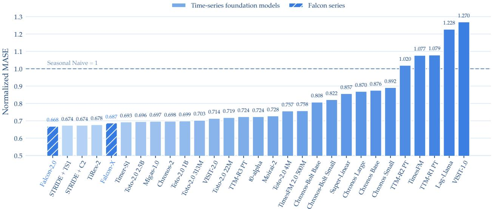  
Figure 4 GIFT-Eval pretrained-model comparison. Seasonal-Naive-normalized MASE for the 29 pretrained models included in the GIFT-Eval leaderboard as of July 2026. Scores are geometrically aggregated over all 97 dataset–frequency– horizon configurations; lower is better.

## 6 Experiments

## 6.1 Evaluation Benchmarks

We evaluate forecasting performance on two complementary benchmarks. GIFT-Eval (Aksu et al., 2024b) contains 23 datasets spanning seven domains and ten sampling frequencies. Its short-, medium-, and long-horizon settings form 97 dataset–frequency–horizon configurations, and its leakage-aware construction makes it a focused test of out-of-distribution generalization. We report Seasonal-Naive-normalized MASE for median point forecasts and Continuous Ranked Probability Score (CRPS) for probabilistic forecasts. Full dataset statistics and horizon definitions are provided in Appendix A.2.

fev-bench (Shchur et al., 2025) broadens the evaluation to 100 tasks across seven domains, including 46 tasks with known-future covariates. We report normalized MASE and Weighted Quantile Loss (WQL), using the geometric mean across tasks as in the released leaderboard. The complete task list, frequency–horizon mapping, and evaluation-window construction are deferred to Appendix A.3.

## 6.2 Main Results

Figures 4 and 5 compare Falcon-2.0 with existing methods using leaderboard results available as of July 2026. For GIFT-Eval, we report all models categorized as pretrained, together with Falcon-2.0; for fev-bench, we include the complete leaderboard. Both comparisons use Seasonal-Naive-normalized MASE, where lower values indicate better point-forecast accuracy.

Overall comparison. Falcon-2.0 establishes the strongest point-forecasting result in the GIFT-Eval comparison. Among the 29 evaluated pretrained models, it achieves both the lowest normalized MASE (0.6684) and the best mean MASE rank (7.81), improving over STRIDE + Timer-S1 (0.6744)

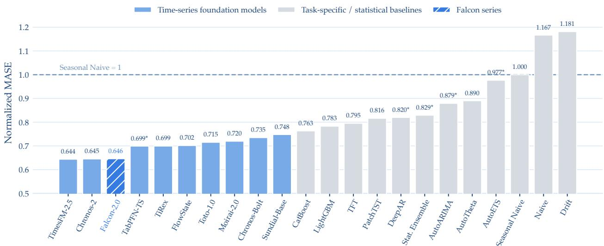  
Figure 5 fev-bench model comparison. Seasonal-Naive-normalized MASE for all 22 models included in the fev-bench leaderboard as of July 2026. Scores are geometrically aggregated over the benchmark tasks; lower is better.

by 0.9%. The consistent agreement between the aggregate MASE and mean rank highlights that Falcon-2.0’s lead is not driven by isolated outsized wins, but rather reflects uniform strength across the 97 configurations. In terms of probabilistic performance, Falcon-2.0 remains highly competitive, securing the seventh-lowest CRPS (0.4843) with a mean CRPS rank of 9.62, though STRIDE + Chronos-2 retains an edge on this specific dimension (0.4544; rank 6.84).

The fev-bench evaluation (Figure 5) further validates the robustness of Falcon-2.0 under a more heterogeneous task suite. Its aggregate normalized MASE of 0.6459 is within 0.3% of the topperforming TimesFM-2.5 (0.6438) and virtually tied with Chronos-2 (0.645), while establishing a superior mean MASE rank (5.15 vs. 5.63). Crucially, Falcon-2.0 achieves the best aggregate WQL (0.4842) among all models while successfully completing all 100 tasks. No single baseline outperforms Falcon-2.0 on both aggregate MASE and WQL simultaneously: TimesFM-2.5 yields slightly better point-forecasts but higher WQL, whereas Chronos-2 offers competitive mean ranks but inferior aggregate WQL. Consequently, Falcon-2.0 occupies a highly desirable operating Paretofrontier, successfully marrying near-optimal point accuracy with state-of-the-art probabilistic calibration.

Taken together, these cross-benchmark results confirm that Falcon-2.0’s capabilities generalize well beyond a narrow subset of tasks. This cross-benchmark strength provides the central empirical support for Falcon-2.0: explicitly controlling source exposure and interleaving context and horizon ranges during training translates into a model that is competitive across distinct forecasting regimes. The remaining GIFT-Eval CRPS gap and the task-level advantages of Chronos-2 define concrete directions for improving probabilistic consistency without diminishing Falcon-2.0’s established point-forecasting strength.

Fine-grained behavior. Figures 6 and 7 dissect the point and probabilistic accuracy of Falcon-2.0 across forecast horizons, variate configurations, and the availability of known-future covariates.

On GIFT-Eval (Figure 6), Falcon-2.0’s normalized MASE changes smoothly from 0.643 on short horizons to 0.683 and 0.725 on medium and long horizons, outperforming both Chronos-2 and Toto-2.0-2.5B at every horizon. A similar advantage is observed across variate settings, where

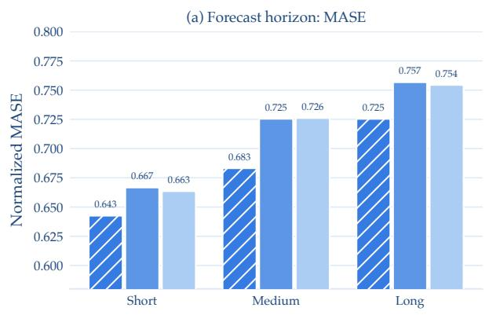

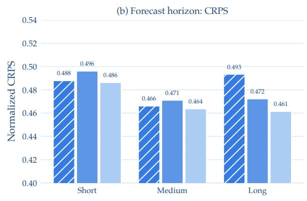

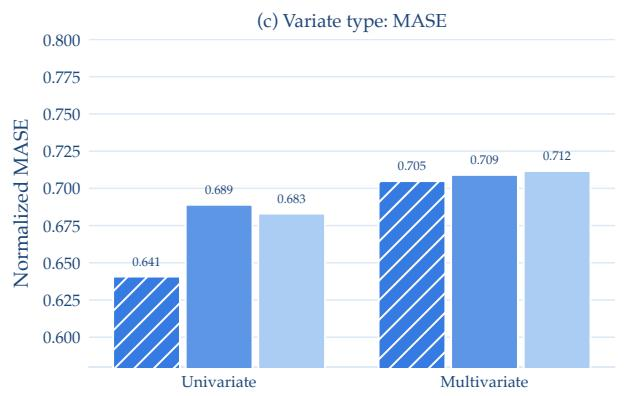

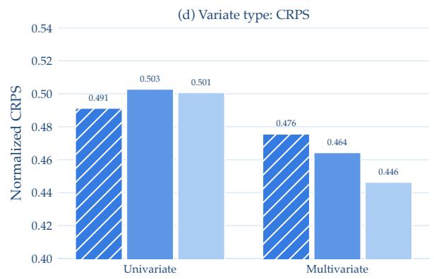  
Figure 6 GIFT-Eval fine-grained comparison. Seasonal-Naive-normalized MASE for Falcon-2.0, Chronos-2, and Toto-2.0-2.5B; lower is better. Panels (a)–(b) report MASE and CRPS by short, medium, and long forecast horizons, while panels (c)–(d) report the same metrics for univariate and multivariate tasks. Bars show subgroup aggregates results.

Falcon-2.0 leads on both univariate (0.641) and multivariate (0.705) tasks. While its probabilistic predictions (CRPS) remain stable across horizons (ranging within 0.466–0.493), the fine-grained split exposes a multivariate bottleneck: Falcon-2.0 leads on univariate probabilistic tasks (0.491 vs. 0.503 and 0.501) but trails Toto-2.0-2.5B on multivariate tasks (0.476 vs. 0.446) and at long horizons (0.493 vs. 0.461).

The fev-bench decomposition (Figure 7) isolates a critical architectural boundary. On the 54 tasks without known-future covariates, Falcon-2.0 significantly outperforms Chronos-2 in both MASE (0.642 vs. 0.663) and WQL (0.467 vs. 0.476). However, on the 46 tasks with covariates, where Falcon-2.0’s autoregressive interface does not ingest future features, this performance ordering reverses (MASE of 0.652 vs. 0.621; WQL of 0.509 vs. 0.498). Crucially, horizon length itself does not degrade performance significantly—MASE/WQL shift minimally from 0.648/0.483 (short) to 0.641/0.489 (medium). These findings suggest that the residual performance gap on fev-bench stems primarily from covariate conditioning limitations rather than sensitivity to the forecast window.

Domain-level analysis. We further analyze domain-specific performance in Figures 8 and 9 to identify where Falcon-2.0’s aggregate gains originate.

On GIFT-Eval (Figure 8), Falcon-2.0 achieves the lowest normalized MASE in four of seven domains: Energy (0.769), Healthcare (0.531), Nature (0.650), and Transport (0.576). The largest margin occurs in Nature (0.650 versus 0.723 for the next-best model, a 10.2% reduction), while Sales and

(a) Forecast horizon: MASE  
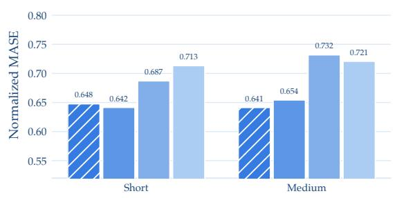  
(c) Variate type: MASE

(b) Forecast horizon: WQL  
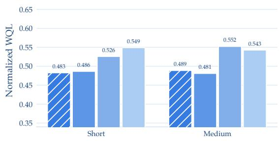  
(d) Variate type: WQL

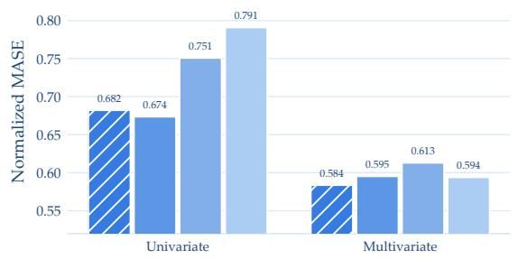  
(e) Future covariates: MASE

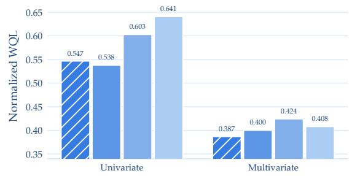

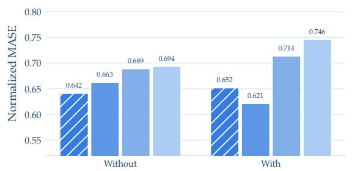

(f) Future covariates: WQL  
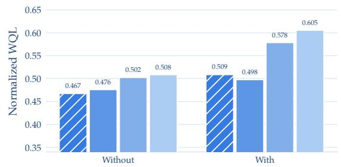  
Figure 7 fev-bench fine-grained comparison. Seasonal-Naive-normalized MASE (left column) and WQL (right column) for Falcon-2.0, Chronos-2, TiRex, and Toto-1.0; lower is better. Panels (a)–(b), (c)–(d), and (e)–(f) decompose performance by forecast horizon, variate type, and availability of known-future covariates, respectively. Bars show subgroup aggregates results.

Web/CloudOps are effectively tied across models. In contrast, Econ/Fin remains a point-forecasting weakness, where Toto-2.0-2.5B dominates (0.739 vs. 0.785). The domain-level CRPS aligns with this trend: Falcon-2.0 leads only in Nature (0.334) and Sales (0.409), whereas Toto-2.0-2.5B leads in five domains, confirming that Falcon-2.0’s global superiority on GIFT-Eval is largely anchored by its highly robust point predictions.

On fev-bench (Figure 9), Falcon-2.0 demonstrates broad domain-level coverage, leading MASE in Cloud (0.566), Economy (0.623), Energy (0.642), and Mobility (0.665), while leading WQL in Economy (0.528), Healthcare (0.581), Mobility (0.553), and Nature (0.346). Its probabilistic performance in the Economy domain is exceptional, providing an 8.8% relative WQL reduction over the next-best model (0.528 vs. 0.579). Nevertheless, Chronos-2 maintains dominance in the Retail domain across both metrics (0.685/0.513 vs. Falcon-2.0’s 0.725/0.530) and secures the top WQL in Cloud and Energy. These findings pinpoint covariate-rich domains and specialized Retail regimes as key frontiers for future refinement of Falcon-2.0’s probabilistic consistency.

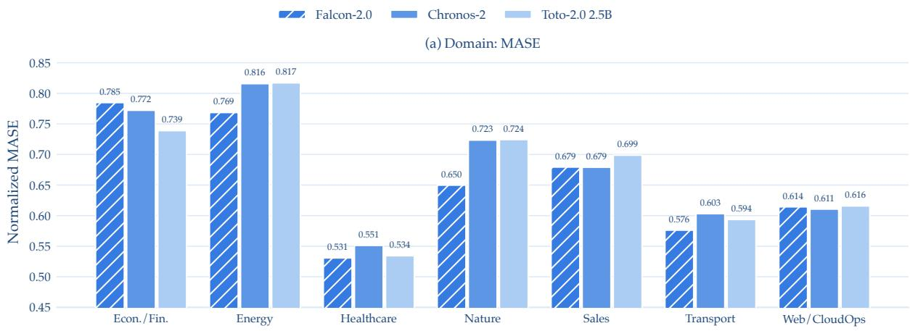

(b) Domain: CRPS  
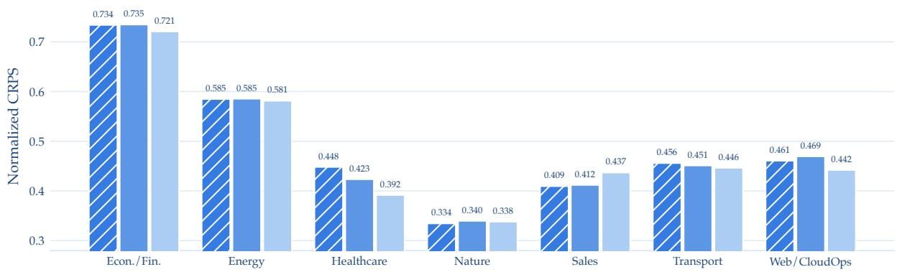  
Figure 8 GIFT-Eval domain-level comparison. Seasonal-Naive-normalized MASE (a) and CRPS (b) across the seven domains for Falcon-2.0, Chronos-2, and Toto-2.0-2.5B; lower is better.

## 6.3 Scaling Behavior

We investigate the scaling behavior of Falcon-2.0 along data exposure and model capacity.

## 6.3.1 Data Scaling

Because Falcon-2.0 reconstructs batches from its bootstrap distribution throughout step-based training, increasing the training budget increases cumulative exposure to heterogeneous records, variables, contexts, and horizons. Holding the 585M-parameter architecture fixed, Figure 10 measures how this additional data exposure affects optimization and forecasting performance.

The smoothed loss decreases throughout training despite occasional evaluation spikes, indicating stable optimization under the heterogeneous sampling regime. Generalization improves in parallel: from 100k to one million steps, MASE falls by 10.6% on GIFT-Eval and 12.1% on fev-bench, while CRPS on GIFT-Eval and WQL on fev-bench fall by 11.2% and 12.8%, respectively. Both benchmarks attain their best checkpoint-level scores at the end of training, with only minor intermediate fluctuations. Thus, the additional sampled-data exposure continues to transfer across benchmarks rather than producing a late-stage generalization reversal, although the flattening loss curve suggests diminishing marginal returns.

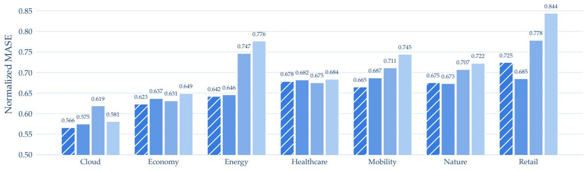

(b) Domain: WQL  
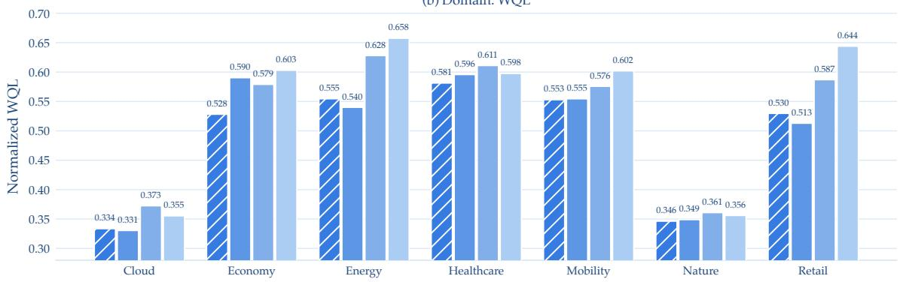  
Figure 9 fev-bench domain-level comparison. Seasonal-Naive-normalized MASE (a) and WQL (b) across the seven domains for Falcon-2.0, Chronos-2, TiRex, and Toto-1.0; lower is better.

## 6.3.2 Model Scaling

We next investigate the effect of model scaling under a fixed training budget of one million iterations. Specifically, we compare the default 585M configuration (D = 32, d = 1024; Table 3) against two progressively smaller variants: a 249M model with D = 24 and d = 768, and a 75M model with D = 16 and d = 512. All three variants are trained and evaluated using the same protocol, ensuring that the comparison primarily reflects differences in model capacity rather than training conditions. Figure 11 summarizes their performance at the final checkpoint.

Increasing capacity improves all four metrics without a reversal. On GIFT-Eval, scaling from 75M to 585M reduces MASE from 0.6839 to 0.6684 and CRPS from 0.4986 to 0.4843, corresponding to relative reductions of 2.3% and 2.9%. On fev-bench, MASE falls from 0.6745 to 0.6459 and WQL from 0.5083 to 0.4842, corresponding to 4.2% and 4.7% reductions. The 249M model already captures much of the fev-bench improvement, whereas the largest GIFT-Eval gain appears between 249M and 585M. Across these three capacities, the consistent direction of change supports a stable capacity–performance relationship.

## 6.4 Ablation Study

## 6.4.1 Architecture

We evaluate four architectural choices in Falcon-2.0: Triple-Channel Patch Tokenization, the shared residual SwiGLU patch projection $\phi ,$ Parallel Patch Prediction, and output gating in self-attention.

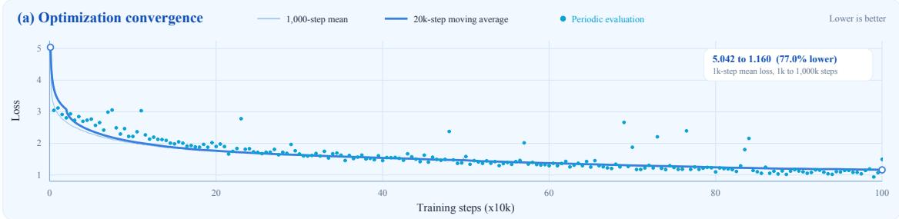

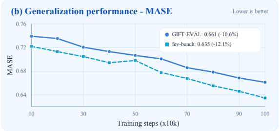

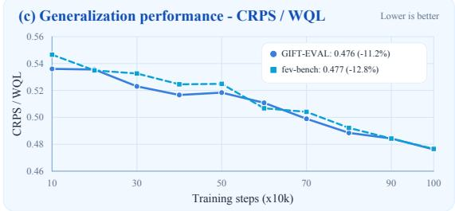

Figure 10 Training convergence and benchmark performance. (a) The 1,000-step mean training loss decreases from 5.042 at the beginning of logging to 1.160 at one million training steps (77.0% reduction); the dark-blue curve denotes a 20k-step moving average and cyan markers denote periodic evaluation loss. (b)–(c) Checkpoint evaluations from 100k to one million training steps show consistent overall improvements on both GIFT-Eval and fev-bench. At the final checkpoint, MASE reaches 0.661 and 0.635 on GIFT-Eval and fev-bench, respectively; CRPS on GIFT-Eval reaches 0.476, while WQL on fev-bench reaches 0.477.  
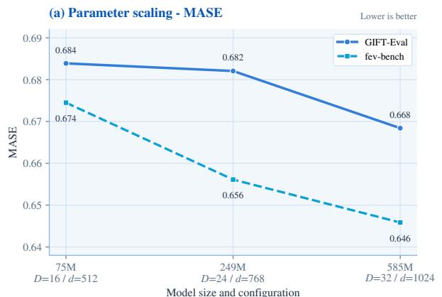

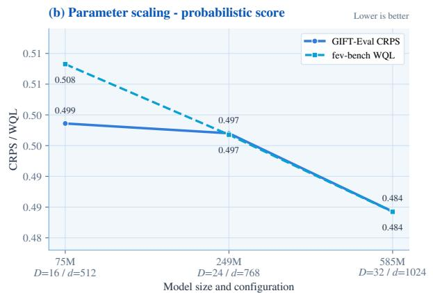  
Figure 11 Parameter scaling at a fixed one-million-iteration budget. Performance of the 75M, 249M, and 585M variants after the same number of training iterations. (a) Seasonal-Naive-normalized MASE on GIFT-Eval and fev-bench. (b) CRPS on GIFT-Eval and WQL on fev-bench. Lower is better.

Each ablated variant removes one component from the full model while following the same training and evaluation protocol. Figure 12 reports the geometrically aggregated scores on both benchmarks; lower values indicate better performance.

Parallel Patch Prediction has the largest and most consistent effect. Relative to the variant without this component, the full architecture reduces MASE and CRPS on GIFT-Eval by 8.0% and 8.7%, respectively, and MASE and WQL on fev-bench by 4.1% and 8.0%, respectively. The degradation across both point and probabilistic metrics indicates that direct multi-patch forecasting makes the largest observed contribution among the architectural choices evaluated here.

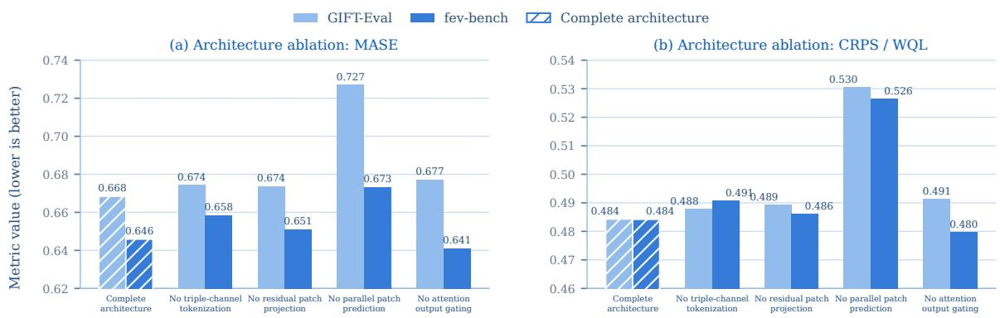  
Figure 12 Architecture ablation of Falcon-2.0. The complete 585M architecture is compared with four variants, each removing one component under the same training and evaluation protocol. Panel (a) reports Seasonal-Naive-normalized MASE on GIFT-Eval and fev-bench. Panel (b) reports CRPS on GIFT-Eval and WQL on fev-bench. Hatched bars denote the complete architecture. Scores are geometrically aggregated over configurations or tasks, and lower values indicate better performance.

Triple-Channel Patch Tokenization and the residual SwiGLU patch projection provide smaller but consistent improvements. Restoring the triple-channel representation lowers the four error metrics by 0.7–1.9% relative to its ablation, while restoring the residual SwiGLU patch projection ϕ lowers them by 0.4–1.0%. Output gating in self-attention has a comparatively modest effect. It lowers GIFT-Eval MASE and CRPS from 0.677 and 0.491 to 0.668 and 0.484, respectively. On fev-bench, the corresponding differences remain below 1% for both metrics. Overall, these results identify Parallel Patch Prediction as the principal architectural contributor, while the remaining components have more modest effects.

## 6.4.2 Sampling

We conduct a controlled ablation to assess how different strategies for constructing samples within each dataset affect forecasting performance. All comparisons use the 585M Falcon-2.0 architecture and the same corpus, training budget, optimization settings, and evaluation protocol. Specifically, we compare Bootstrap Stochastic Sampling with sliding-window enumeration and independently control whether the context length and prediction horizon are fixed or sampled from their feasible ranges. For the sliding-window variants, eligible cutoff positions are enumerated rather than sampled, while the context length and prediction horizon are fixed or sampled as specified by each configuration. Following the evaluation protocol in Section 6.1, metric values are geometrically aggregated over configurations or tasks and reported in Figure 13.

Sampling rule. We first isolate the effect of the sampling rule by comparing Bootstrap Stochastic Sampling with the sliding-window variant that samples context lengths and prediction horizons from the same feasible ranges. Relative to this sliding-window variant, Bootstrap Stochastic Sampling reduces MASE and CRPS on GIFT-Eval by 11.7% and 13.6%, respectively, and MASE and WQL on fev-bench by 5.4% and 6.5%. The gains are consistent across point and probabilistic metrics on both benchmarks. Among the sliding-window variants, fixing both lengths outperforms sampling either or both, yet remains worse than Bootstrap Stochastic Sampling on all four metrics. This pattern suggests that varying context lengths and prediction horizons alone cannot offset the redundancy introduced by enumerating adjacent cutoff positions. Stochastic selection across records, variables, and temporal positions also contributes to sample diversity.

Context and horizon sampling. We next isolate the effects of sampling context lengths and prediction horizons within Bootstrap Stochastic Sampling. Compared with the fixed-horizon variant, joint sampling reduces MASE and CRPS on GIFT-Eval by 6.1% and 7.7%, respectively, and MASE and WQL on fev-bench by 4.2% each, showing that horizon sampling has the larger effect. Compared with the fixed-context variant, joint sampling reduces GIFT-Eval MASE and CRPS by 2.9% and 3.0%, respectively. On fev-bench, the MASE difference is small (0.6459 versus 0.6465), although joint sampling also improves WQL. Joint sampling is the only configuration to achieve the lowest error on all four metrics, supporting the simultaneous sampling of diverse context lengths and prediction horizons within a single training stage.

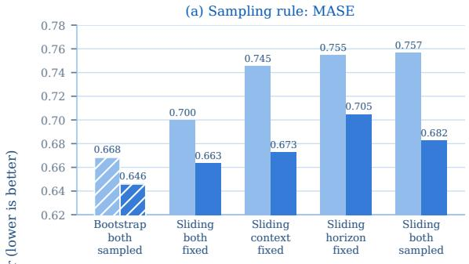

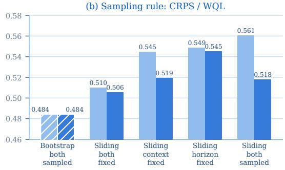

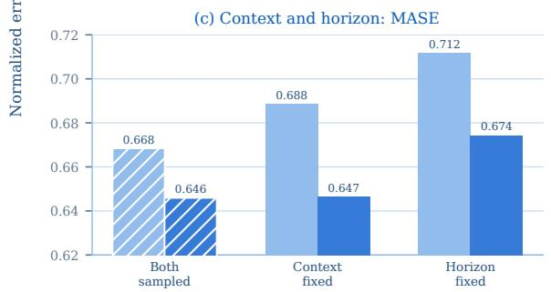

(d) Context and horizon: CRPS / WQL  
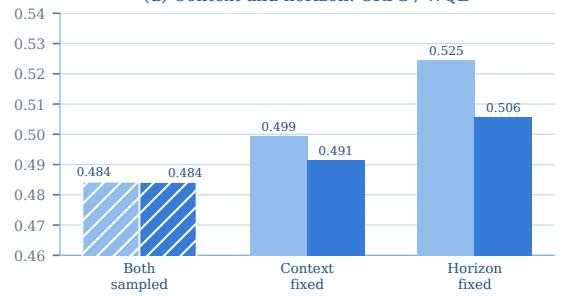  
Figure 13 Sampling ablation of Falcon-2.0. All configurations use the 585M Falcon-2.0 model. Panels (a)–(b) compare Bootstrap Stochastic Sampling with four sliding-window variants covering all combinations of fixed and sampled context lengths and prediction horizons. Panels (c)–(d) assess the individual contributions of context and horizon sampling by comparing joint sampling with variants that fix one length while sampling the other. Panels (a) and (c) report normalized MASE, while panels (b) and (d) report CRPS on GIFT-Eval and WQL on fev-bench. Hatched bars denote the full ORBIT configuration. Lower values indicate better performance.

## 7 Conclusion

We introduce ORBIT, a training paradigm that explicitly controls the effective pre-training distribution of heterogeneous time series corpora. Bootstrap Multi-Level Sampling regulates source exposure and constructs diverse examples across records, variables, temporal windows, and prediction horizons, while Omni-Range Incremental Training jointly covers varying context lengths and horizons within a single stage. Under ORBIT, we train Falcon-2.0, an encoder-only Transformer with missingness-aware triple-channel tokenization and parallel patch prediction, and explore Rank-Guided Cross-Depth Alignment to regularize shallow representations using deeper layers. Evaluations on GIFT-Eval and fev-bench show strong zero-shot forecasting performance, while ablation and scaling studies validate the benefits of controlled sampling, joint context-horizon coverage, and increased training exposure. These results highlight training-distribution design as a key factor in building scalable and generalizable time series foundation models.

## References

Walmart Competition Admin and Will Cukierski. Walmart recruiting - store sales forecasting. https://kaggle.com/ competitions/walmart-recruiting-store-sales-forecasting, 2014. Kaggle.

Taha Aksu, Gerald Woo, Juncheng Liu, Xu Liu, Chenghao Liu, Silvio Savarese, Caiming Xiong, and Doyen Sahoo. Gift-EVAL: A benchmark for general time series forecasting model evaluation. arXiv preprint arXiv:2410.10393, 2024a.

Taha Aksu, Gerald Woo, Juncheng Liu, Xu Liu, Chenghao Liu, Silvio Savarese, Caiming Xiong, and Doyen Sahoo. Gift-eval: A benchmark for general time series forecasting model evaluation. arXiv preprint arXiv:2410.10393, 2024b.

Abdul Fatir Ansari, Lorenzo Stella, Caner Turkmen, Xiyuan Zhang, Pedro Mercado, Huibin Shen, Oleksandr Shchur, Syama Sundar Rangapuram, Sebastian Pineda Arango, Shubham Kapoor, et al. Chronos: Learning the language of time series. Transactions on Machine Learning Research, 2024.

Abdul Fatir Ansari, Oleksandr Shchur, Jaris Küken, Andreas Auer, Boran Han, Pedro Mercado, Syama Sundar Rangapu ram, Huibin Shen, Lorenzo Stella, Xiyuan Zhang, et al. Chronos-2: From univariate to universal forecasting. arXiv preprint arXiv:2510.15821, 2025.

Andreas Auer, Patrick Podest, Daniel Klotz, Sebastian Böck, Günter Klambauer, and Sepp Hochreiter. Tirex: Zero-shot forecasting across long and short horizons with enhanced in-context learning. In The Thirty-ninth Annual Conference on Neural Information Processing Systems, 2026. https://openreview.net/forum?id=v7UqniC9pF.

Zhengping Che, Sanjay Purushotham, Kyunghyun Cho, David Sontag, and Yan Liu. Recurrent neural networks for multivariate time series with missing values. Scientific reports, 8(1):6085, 2018.

Hyunseung Chung, Sumin Jo, Yeonsu Kwon, and Edward Choi. Time is not enough: Time-frequency based explanation for time-series black-box models. In Proceedings of the 33rd ACM International Conference on Information and Knowledge Management, pages 394–403, 2024.

Ben Cohen, Emaad Khwaja, Youssef Doubli, Salahidine Lemaachi, Chris Lettieri, Charles Masson, Hugo Miccinilli, Elise Ramé, Qiqi Ren, Afshin Rostamizadeh, et al. This time is different: An observability perspective on time series foundation models. Advances in neural information processing systems, 38:50907–50951, 2026.

Abhimanyu Das, Weihao Kong, Rajat Sen, and Yichen Zhou. A decoder-only foundation model for time-series forecasting. In Proceedings of the 41st International Conference on Machine Learning, ICML’24. JMLR.org, 2024.

Open Power System Data. Data package time series. version 2020-10-06, 2020. https://doi.org/10.25832/time\_series/ 2020-10-06.

UK COVID-19 data from official UK government sources. UK COVID-19 dashboard data. https://www.kaggle.com/ datasets/happyadam73/uk-covid19-dashboard-data-sqlite-compressed, 2022. Kaggle.

Etienne David, Jean Bellot, and Sylvain Le Corff. HERMES: Hybrid error-corrector model with inclusion of external signals for nonstationary fashion time series. arXiv preprint arXiv:2202.03224, 2022.

S. De Vito, E. Massera, M. Piga, L. Martinotto, and G. Di Francia. On field calibration of an electronic nose for benzene estimation in an urban pollution monitoring scenario. Sensors and Actuators B: Chemical, 129(2):750–757, 2008. ISSN 0925-4005. doi: https://doi.org/10.1016/j.snb.2007.09.060. https://www.sciencedirect.com/science/article/pii/ S0925400507007691.

ECDC. Respiratory viruses weekly data. https://github.com/EU-ECDC/Respiratory\_viruses\_weekly\_data/tree/main, 2025. Open data repository; weekly respiratory virus surveillance in the EU/EEA.

Vijay Ekambaram, Arindam Jati, Pankaj Dayama, Sumanta Mukherjee, Nam H Nguyen, Wesley M. Gifford, Chandra Reddy, and Jayant Kalagnanam. Tiny time mixers (TTMs): Fast pre-trained models for enhanced zero/few-shot forecasting of multivariate time series. In The Thirty-eighth Annual Conference on Neural Information Processing Systems, 2024. https://openreview.net/forum?id=3O5YCEWETq.

Philip J Fleming and John J Wallace. How not to lie with statistics: the correct way to summarize benchmark results. Communications ofthe ACM, 29(3):218–221, 1986.

FlorianKnauer and Will Cukierski. Rossmann store sales. https://kaggle.com/competitions/rossmann-store-sales, 2015. Kaggle.

Rakshitha Wathsadini Godahewa, Christoph Bergmeir, Geoffrey I. Webb, Rob Hyndman, and Pablo Montero-Manso. Monash time series forecasting archive. In The Conference on Neural Information Processing Systems Datasets and Benchmarks Track, 2021. https://openreview.net/forum?id=wEc1mgAjU-.

Mononito Goswami, Konrad Szafer, Arjun Choudhry, Yifu Cai, Shuo Li, and Artur Dubrawski. Moment: a family of open time-series foundation models. In Proceedings of the 41st International Conference on Machine Learning, ICML’24. JMLR.org, 2024a.

Mononito Goswami, Konrad Szafer, Arjun Choudhry, Yifu Cai, Shuo Li, and Artur Dubrawski. MOMENT: A family of open time-series foundation models. In International Conference on Machine Learning, 2024b.

Léo Grinsztajn, Klemens Flöge, Oscar Key, Felix Birkel, Philipp Jund, Brendan Roof, Mihir Manium, Shi Bin Hoo, Magnus Bühler, Anurag Garg, et al. Tabpfn-3: Technical report. arXiv preprint arXiv:2605.13986, 2026.

Cheng HE, Xu Huang, Gangwei Jiang, Zhaoyi Li, Defu Lian, Hong Xie, Enhong Chen, xijie liang, Zhengzengrong, and Patrick Lee. GTM: A general time-series model for enhanced representation learning of time-series data. In The Fourteenth International Conference on Learning Representations, 2026. https://openreview.net/forum?id=PWM6FERWz9.

Tao Hong, Pierre Pinson, and Shu Fan. Global energy forecasting competition 2012. International Journal of Forecasting, 30 (2):357–363, 2014.

Shi Bin Hoo, Samuel Müller, David Salinas, and Frank Hutter. From tables to time: Extending tabpfn-v2 to time series forecasting. arXiv preprint arXiv:2501.02945, 2025.

Addison Howard, Haruka Yui, Mark McDonald, and Will Cukierski. Recruit restaurant visitor forecasting. https: //kaggle.com/competitions/recruit-restaurant-visitor-forecasting, 2017. Kaggle.

Yifan Hu, Jie Yang, Xilin Dai, Wanxu Cai, Kuiye Ding, Yuante Li, Qinghua Liu, Enze Ma, Zhiyuan Qu, Yixin Wang, et al. The landscape of agentic time series systems: Architectures, reliability, and frontiers.

Yifan Hu, Peiyuan Liu, Peng Zhu, Dawei Cheng, and Tao Dai. Adaptive multi-scale decomposition framework for time series forecasting. In Proceedings ofthe AAAI Conference on Artificial Intelligence, volume 39, pages 17359–17367, 2025a.

Yifan Hu, Jie Yang, Tian Zhou, Peiyuan Liu, Yujin Tang, Rong Jin, and Liang Sun. Bridging past and future: Distributionaware alignment for time series forecasting. arXiv preprint arXiv:2509.14181, 2025b.

Yifan Hu, Guibin Zhang, Peiyuan Liu, Disen Lan, Naiqi Li, Dawei Cheng, Tao Dai, Shu-Tao Xia, and Shirui Pan. Timefilter: Patch-specific spatial-temporal graph filtration for time series forecasting. In International Conference on Machine Learning, pages 24893–24911. PMLR, 2025c.

Yifan Hu, Hongzhou Chen, Peiyuan Liu, Yiding Liu, Zewei Dong, and Jiang-Ming Yang. Existence precedes value: Joint modeling of observational existence and evolving states in time series forecasting. arXiv preprint arXiv:2606.13571, 2026.

Dengyang Jiang, Mengmeng Wang, Liuzhuozheng Li, Lei Zhang, Haoyu Wang, Wei Wei, Guang Dai, Yanning Zhang, and Jingdong Wang. No other representation component is needed: Diffusion transformers can provide representation guidance by themselves. arXiv preprint arXiv:2505.02831, 2025.

Emaad Khwaja, Chris Lettieri, Gerald Woo, Eden Belouadah, Marc Cenac, Guillaume Jarry, Enguerrand Paquin, Xunyi Zhao, Viktoriya Zhukov, Othmane Abou-Amal, et al. Toto 2.0: Time series forecasting enters the scaling era. arXiv preprint arXiv:2605.20119, 2026.

Taesung Kim, Jinhee Kim, Yunwon Tae, Cheonbok Park, Jang-Ho Choi, and Jaegul Choo. Reversible instance normalization for accurate time-series forecasting against distribution shift. In International Conference on Learning Representations, 2022. https://openreview.net/forum?id=cGDAkQo1C0p.

Roger Koenker and Kevin F Hallock. Quantile regression. Journal of economic perspectives, 15(4):143–156, 2001.

Siva Rama Krishna Kottapalli, Karthik Hubli, Sandeep Chandrashekhara, Garima Jain, Sunayana Hubli, Gayathri Botla, and Ramesh Doddaiah. Foundation models for time series: A survey. arXiv preprint arXiv:2504.04011, 2025.

Guokun Lai, Wei-Cheng Chang, Yiming Yang, and Hanxiao Liu. Modeling long- and short-term temporal patterns with deep neural networks. In The International ACM SIGIR Conference on Research & Development in Information Retrieval, 2017. https://api.semanticscholar.org/CorpusID:4922476.

lexis Cook, DanB, inversion, and Ryan Holbrook. Store sales – time series forecasting. https://www.kaggle.com/ competitions/store-sales-time-series-forecasting, 2020. Kaggle.

Yuxuan Liang, Haomin Wen, Yuqi Nie, Yushan Jiang, Ming Jin, Dongjin Song, Shirui Pan, and Qingsong Wen. Foundation models for time series analysis: A tutorial and survey. In Proceedings of the 30th ACM SIGKDD Conference on Knowledge Discovery and Data Mining, KDD ’24, page 6555–6565. ACM, August 2024. doi: 10.1145/3637528.3671451. http: //dx.doi.org/10.1145/3637528.3671451.

Bryan Lim, Sercan Ö Arık, Nicolas Loeff, and Tomas Pfister. Temporal fusion transformers for interpretable multi-horizon time series forecasting. International Journal of Forecasting, 37(4):1748–1764, 2021.

Chenghao Liu, Taha Aksu, Juncheng Liu, Xu Liu, Hanshu Yan, Quang Pham, Silvio Savarese, Doyen Sahoo, Caiming Xiong, and Junnan Li. Moirai 2.0: When less is more for time series forecasting. arXiv preprint arXiv:2511.11698, 2025a.

Yiding Liu, Yifan Hu, Hongjie Xia, Peiyuan Liu, Hongzhou Chen, Xilin Dai, Zewei Dong, and Jiang-Ming Yang. Falcon-x: A time series foundation model for heterogeneous multivariate modeling. arXiv preprint arXiv:2605.27286, 2026a.

Yong Liu, Tengge Hu, Haoran Zhang, Chenyu Wu, Shiyu Wang, Lintao Ma, and Mingsheng Long. itransformer: Inverted transformers are effective for time series forecasting. International Conference on Learning Representations (ICLR), 2024a.

Yong Liu, Haoran Zhang, Chenyu Li, Xiangdong Huang, Jianmin Wang, and Mingsheng Long. Timer: generative pre-trained transformers are large time series models. In Proceedings of the 41st International Conference on Machine Learning, ICML’24. JMLR.org, 2024b.

Yong Liu, Guo Qin, Xiangdong Huang, Jianmin Wang, and Mingsheng Long. Timer-XL: Long-context transformers for unified time series forecasting. In The Thirteenth International Conference on Learning Representations, 2025b. https: //openreview.net/forum?id=KMCJXjlDDr.

Yong Liu, Guo Qin, Zhiyuan Shi, Zhi Chen, Caiyin Yang, Xiangdong Huang, Jianmin Wang, and Mingsheng Long. Sundial: A family of highly capable time series foundation models. In Forty-second International Conference on Machine Learning, 2025c. https://openreview.net/forum?id=LO7ciRpjI5.

Yong Liu, Xingjian Su, Shiyu Wang, Haoran Zhang, Haixuan Liu, Yuxuan Wang, Zhou Ye, Yang Xiang, Jianmin Wang, and Mingsheng Long. Timer-s1: A billion-scale time series foundation model with serial scaling. arXiv preprint arXiv:2603.04791, 2026b.

Ilya Loshchilov and Frank Hutter. Decoupled weight decay regularization. arXiv preprint arXiv:1711.05101, 2017.

Spyros Makridakis, Evangelos Spiliotis, and Vassilios Assimakopoulos. The M4 competition: Results, findings, conclusion and way forward. International Journal of Forecasting, 2018.

Spyros Makridakis, Evangelos Spiliotis, and Vassilios Assimakopoulos. M5 accuracy competition: Results, findings, and conclusions. International Journal ofForecasting, 38(4):1346–1364, 2022. ISSN 0169-2070. doi: https://doi.org/10.1016/j. ijforecast.2021.11.013. https://www.sciencedirect.com/science/article/pii/S0169207021001874. Special Issue: M5 competition.

Paolo Mancuso, Veronica Piccialli, and Antonio M Sudoso. A machine learning approach for forecasting hierarchical time series. Expert Systems with Applications, 182:115102, 2021.

Michael W. McCracken and Serena Ng. FRED-MD: A monthly database for macroeconomic research. Journal ofBusiness & Economic Statistics, 34(4):574–589, 2016. doi: 10.1080/07350015.2015.1086655. https://doi.org/10.1080/07350015. 2015.1086655.

Michael W. McCracken and Serena Ng. FRED-QD: A quarterly database for macroeconomic research. Review, 103(1): 1–44, January 2021. doi: 10.20955/r.103.1-44. https://ideas.repec.org/a/fip/fedlrv/90588.html.

MichalKecera. Rohlik sales forecasting challenge. https://kaggle.com/competitions/ rohlik-sales-forecasting-challenge-v2, 2024. Kaggle.

Kamiar Mohaddes and Mehdi Raissi. Compilation, revision and updating of the global var (gvar) database. Mendeley Data, Version 1, 2024. https://doi.org/10.17632/kfp5fhgkvf.1.

Yuqi Nie, Nam H. Nguyen, Phanwadee Sinthong, and Jayant Kalagnanam. A time series is worth 64 words: Long-term forecasting with transformers. In International Conference on Learning Representations, 2023.

General Directorate of Health Affairs and Saudi Arabia Ministry of Health. Riyadh hospital admissions dataset (2020–2024). https://www.kaggle.com/dsv/9992619, 2024.

Santosh Palaskar, Vijay Ekambaram, Arindam Jati, Neelamadhav Gantayat, Avirup Saha, Seema Nagar, Nam Nguyen, Pankaj Dayama, Renuka Sindhgatta, Prateeti Mohapatra, Harshit Kumar, Jayant Kalagnanam, Nandyala Hemachandra, and Narayan Rangaraj. Automixer for improved multivariate time-series forecasting on business and it observability data. Proceedings ofthe AAAI Conference on Artificial Intelligence, 38:22962–22968, 2024.

Patrick Podest, Marco Pichler, Elias Bürger, Levente Zólyomi, Bernhard Voggenberger, Wilhelm Berghammer, Daniel Klotz, Sebastian Böck, Günter Klambauer, and Sepp Hochreiter. Tirex-2: Generalizing tirex to multivariate data and streaming. arXiv preprint arXiv:2607.01204, 2026.

Zihan Qiu, Zekun Wang, Bo Zheng, Zeyu Huang, Kaiyue Wen, Songlin Yang, Rui Men, Le Yu, Fei Huang, Suozhi Huang, Dayiheng Liu, Jingren Zhou, and Junyang Lin. Gated attention for large language models: Non-linearity, sparsity, and attention-sink-free. In The Thirty-ninth Annual Conference on Neural Information Processing Systems, 2026. https://openreview.net/forum?id=1b7whO4SfY.

Zezhi Shao, Fei Wang, Yongjun Xu, Wei Wei, Chengqing Yu, Zhao Zhang, Di Yao, Tao Sun, Guangyin Jin, Xin Cao, et al. Exploring progress in multivariate time series forecasting: Comprehensive benchmarking and heterogeneity analysis. IEEE Transactions on Knowledge and Data Engineering, 37(1):291–305, 2024.

Zezhi Shao, Chengqing Yu, and Fei Wang. Heterogeneity in multivariate time series: Comprehensive analysis and adaptive modeling. In Proceedings of the 19th International Symposium on Spatial and Temporal Data, pages 76–79, 2025.

Noam Shazeer. Glu variants improve transformer. arXiv preprint arXiv:2002.05202, 2020.

Oleksandr Shchur, Abdul Fatir Ansari, Caner Turkmen, Lorenzo Stella, Nick Erickson, Pablo Guerron, Michael Bohlke-Schneider, and Yuyang Wang. fev-bench: A realistic benchmark for time series forecasting. arXiv preprint arXiv:2509.26468, 2025.

Siqi Shen, Vincent Van Beek, and Alexandru Iosup. Statistical characterization of business-critical workloads hosted in cloud datacenters. In IEEE/ACM International Symposium on Cluster, Cloud and Grid Computing, pages 465–474. IEEE, 2015.

Xiaoming Shi, Shiyu Wang, Yuqi Nie, Dianqi Li, Zhou Ye, Qingsong Wen, and Ming Jin. Time-moe: Billion-scale time series foundation models with mixture of experts. In The Thirteenth International Conference on Learning Representations, 2025. https://openreview.net/forum?id=e1wDDFmlVu.

Mohammad Shoeybi, Mostofa Patwary, Raul Puri, Patrick LeGresley, Jared Casper, and Bryan Catanzaro. Megatron-lm: Training multi-billion parameter language models using model parallelism. arXiv preprint arXiv:1909.08053, 2019.

Gilbert W Stewart and Ji-guang Sun. Matrix perturbation theory. 1990.

Jianlin Su, Murtadha Ahmed, Yu Lu, Shengfeng Pan, Wen Bo, and Yunfeng Liu. Roformer: Enhanced transformer with rotary position embedding. Neurocomputing, 568:127063, 2024.

Md Asif Bin Syed, Md Younus Ahamed, and Azmine Toushik Wasi. Position: Time-series foundation models require explicit domain-level benchmarks. In Forty-third International Conference on Machine Learning Position Paper Track, 2026. https://openreview.net/forum?id=W2eEMPjzIQ.

Artur Trindade. ElectricityLoadDiagrams20112014. UCI Machine Learning Repository, 2015. DOI: https://doi.org/10.24432/C58C86.

Alexander van Renen, Dominik Horn, Pascal Pfeil, Kapil Vaidya, Wenjian Dong, Murali Narayanaswamy, Zhengchun Liu, Gaurav Saxena, Andreas Kipf, and Tim Kraska. Why TPC is not enough: An analysis of the amazon redshift fleet. Proc. VLDB Endow., 17(11):3694–3706, July 2024. ISSN 2150-8097. doi: 10.14778/3681954.3682031. https: //doi.org/10.14778/3681954.3682031.

Jingyuan Wang, Jiawei Jiang, Wenjun Jiang, Chengkai Han, and Wayne Xin Zhao. Towards efficient and comprehensive urban spatial-temporal prediction: A unified library and performance benchmark. arXiv preprint arXiv:2304.14343, 2023.

Gerald Woo, Chenghao Liu, Akshat Kumar, Caiming Xiong, Silvio Savarese, and Doyen Sahoo. Unified training of universal time series forecasting transformers. In Proceedings of the 41st International Conference on Machine Learning, ICML’24. JMLR.org, 2024.

Haixu Wu, Jiehui Xu, Jianmin Wang, and Mingsheng Long. Autoformer: Decomposition transformers with auto-correlation for long-term series forecasting. In Neural Information Processing Systems, 2021. https://api. semanticscholar.org/CorpusID:235623791.

Siqiao Xue, Zhaoyang Zhu, Wei Zhang, Rongyao Cai, Rui Wang, Yixiang Mu, Fan Zhou, Jianguo Li, Peng Di, and Hang Yu. QuitoBench: A high-quality open time series forecasting benchmark. arXiv preprint arXiv:2603.26017, 2026.

Chin-Chia Michael Yeh, Xin Dai, Huiyuan Chen, Yan Zheng, Yujie Fan, Audrey Der, Vivian Lai, Zhongfang Zhuang, Junpeng Wang, Liang Wang, et al. Toward a foundation model for time series data. In Proceedings ofthe 32nd ACM International Conference on Information and Knowledge Management, pages 4400–4404, 2023.

Annan Yu, Danielle C. Maddix, Boran Han, Xiyuan Zhang, Abdul Fatir Ansari, Oleksandr Shchur, Christos Faloutsos, Andrew Gordon Wilson, Michael W. Mahoney, and Bernie Wang. Understanding transformers for time series: Rank

structure, flow-of-ranks, and compressibility. In The Fourteenth International Conference on Learning Representations, 2026. https://openreview.net/forum?id=axR2KZwaD3.

Xiang Zhang, Ziyuan Zhao, Theodoros Tsiligkaridis, and Marinka Zitnik. Self-supervised contrastive pre-training for time series via time-frequency consistency. Advances in neural information processing systems, 35:3988–4003, 2022.

Haoyi Zhou, Shanghang Zhang, Jieqi Peng, Shuai Zhang, Jianxin Li, Hui Xiong, and Wancai Zhang. Informer: Beyond efficient transformer for long sequence time-series forecasting. AAAI, 2021.

Jingbo Zhou, Xinjiang Lu, Yixiong Xiao, Jian Tang, Jiantao Su, Yu Li, Ji Liu, Junfu Lyu, Yanjun Ma, and Dejing Dou. SDWPF: A dataset for spatial dynamic wind power forecasting over a large turbine array. Scientific Data, 11(1):649, 2024. doi: 10.1038/s41597-024-03427-5. https://doi.org/10.1038/s41597-024-03427-5.

Tian Zhou, Ziqing Ma, Qingsong Wen, Xue Wang, Liang Sun, and Rong Jin. Fedformer: Frequency enhanced decomposed transformer for long-term series forecasting. In International conference on machine learning, pages 27268–27286. PMLR, 2022.

## A Data Sources and Benchmark Specifications

This appendix documents the data interfaces behind the experiments. For pre-training, the relevant unit is a source collection and its contribution to the overall corpus. For evaluation, the relevant unit is a forecasting task specified by a dataset, sampling frequency, prediction horizon, and set of evaluation windows. The following sections therefore separate corpus composition from benchmark construction.

## A.1 Pre-training Data Inventory

The observed portion of the pre-training corpus is assembled from three complementary releases. The GIFT-Eval pre-training split (Aksu et al., 2024b)1 supplies broad coverage across application domains and temporal resolutions; the Chronos training collection (Ansari et al., 2024)2 contributes several high-volume public forecasting datasets; and the Quito corpus (Xue et al., 2026)3 adds production application-traffic traces at two granularities. Table 5 keeps these source boundaries explicit while reporting the frequency, number of series, variable count, and total observations of every entry.

Two Chronos procedures further augment this pool (Ansari et al., 2024). TSMixup first rescales sampled series and then combines them, allowing temporal motifs drawn from different datasets to appear in new compositions. KernelSynth expands the corpus in a different direction by sampling functions from randomly composed Gaussian-process kernels. The former recombines patterns already present in the public data, whereas the latter introduces controlled trend, smoothness, and periodic structures without requiring an additional observed dataset.

## A.2 GIFT-Eval Task Composition

GIFT-Eval is organized as a grid of forecasting conditions rather than as a single pooled test set (Aksu et al., 2024b). Its 23 datasets are evaluated at the available sampling resolutions and, where applicable, at short-, medium-, and long-range horizons. This expansion produces 97 dataset– frequency–horizon configurations spanning seven domains and ten frequencies. Table 6 exposes the construction in two layers: the data-profile columns describe each dataset–frequency instance, while the evaluation columns give the horizon and number of forecast windows attached to it.

The protocol evaluates the final 10% of each series through non-overlapping rolling windows.   
Standard competition horizons are retained for collections such as M4 (Makridakis et al., 2018);   
other datasets receive horizon scales chosen according to their frequency and application setting.   
Results are then combined across configurations, so comparison is performed at the level of forecasting conditions rather than by pooling observations from datasets of very different sizes.

The resulting evaluation unit is therefore more specific than a dataset name. A series resampled at two frequencies produces two data profiles, and a short, medium, or long horizon attached to either profile defines a separate forecasting condition. Table 6 makes this distinction visible: the main body records one profile for each available frequency, while the bracketed values report how many valid rolling origins are available at the corresponding horizon. This representation avoids making a high-resolution dataset with many observations automatically more influential than a smaller source. It also shows where the benchmark retains a single application-specific horizon and where it probes the same data over multiple forecast ranges.

Table 5 Inventory of the 70 real-world datasets used for pre-training. Rows are organized by the public collection from which each dataset was obtained; frequencies and counts follow the released metadata.
<table><tr><td>Dataset</td><td>Freq.</td><td>Series</td><td>Variables</td><td>Time points</td><td>Domain</td></tr><tr><td>GIFT-Eval pre-training collection</td><td></td><td></td><td></td><td></td><td></td></tr><tr><td>BDG-2</td><td>H</td><td>611</td><td>121</td><td>9,454,968</td><td>Energy</td></tr><tr><td>BEIJING_SUBWAY_30MIN</td><td>30T</td><td>276</td><td></td><td>433,872</td><td>Transport</td></tr><tr><td>CIF 2016</td><td>M</td><td>72</td><td></td><td>6,334</td><td>Finance</td></tr><tr><td>CMIP6</td><td>6H</td><td>270,336</td><td>53</td><td>1,973,452,800</td><td>Nature</td></tr><tr><td>ERA5</td><td>H</td><td>245,760</td><td>45</td><td>2,146,959,360</td><td></td></tr><tr><td></td><td>15T</td><td>80</td><td></td><td></td><td>Nature</td></tr><tr><td>HZMETRO</td><td>5T</td><td>207</td><td></td><td>190,160</td><td>Transport</td></tr><tr><td>LOS_LOOP</td><td>5T</td><td></td><td></td><td>7,094,304</td><td>Transport</td></tr><tr><td>LargeST</td><td>A, M, Q</td><td>42,333</td><td></td><td>4,452,510,528</td><td>Transport</td></tr><tr><td>M1</td><td></td><td>921</td><td></td><td>57,882</td><td>Finance</td></tr><tr><td>M3</td><td>A, M, Q</td><td>3,003</td><td></td><td>209,114</td><td>Finance</td></tr><tr><td>NN5</td><td>D,W</td><td>222</td><td></td><td>93,240</td><td>Finance</td></tr><tr><td>PEMS03</td><td>5T</td><td>358</td><td></td><td>9,382,464</td><td>Transport</td></tr><tr><td>PEMS04</td><td>5T</td><td>307</td><td></td><td>5,216,544</td><td>Transport</td></tr><tr><td>PEMS07</td><td>5T</td><td>883</td><td></td><td>24,921,792</td><td>Transport</td></tr><tr><td>PEMS08</td><td>5T</td><td>170</td><td></td><td>3,035,520</td><td>Transport</td></tr><tr><td>PEMS_BAY</td><td>5T</td><td>325</td><td></td><td>16,941,600</td><td>Transport</td></tr><tr><td>Q-TRAFFIC</td><td>15T</td><td>45,148</td><td></td><td>264,386,688</td><td>Transport</td></tr><tr><td>Residential Power</td><td>T</td><td>504</td><td></td><td>271,333,509</td><td>Energy</td></tr><tr><td>SHMETRO</td><td>15T</td><td>288</td><td></td><td>2,536,992</td><td>Transport</td></tr><tr><td>Tourism</td><td>A, M, Q</td><td>1,212</td><td></td><td>150,822</td><td>Finance</td></tr><tr><td>Traffic</td><td> $\mathrm { H } , \boldsymbol { W }$ </td><td>1,724</td><td></td><td>15,060,864</td><td>Transport</td></tr><tr><td>Uber TLC</td><td> $\mathrm { D , H }$ </td><td>524</td><td>21111113131132111211</td><td>1,176,531</td><td>Transport</td></tr><tr><td>alibaba_cluster_trace_2018</td><td>5T</td><td>58,409</td><td></td><td>95,192,530</td><td></td></tr><tr><td>australian_electricity_demand</td><td> $3 0 \mathrm { T }$ </td><td>5</td><td></td><td>1,153,584</td><td>Web</td></tr><tr><td>azure_vm_traces_2017</td><td>5T</td><td>159,472</td><td></td><td>885,522,908</td><td>Energy</td></tr><tr><td>beijing_air_quality</td><td>H</td><td>12</td><td>11</td><td>420,768</td><td>Web</td></tr><tr><td>bitcoin_with_missing</td><td>D</td><td>18</td><td>1</td><td>81,918</td><td>Nature</td></tr><tr><td>borealis</td><td>H</td><td>15</td><td></td><td>83,269</td><td>Finance</td></tr><tr><td>borg_cluster_data_2011</td><td>5T</td><td>143,386</td><td>12115461111112111</td><td>537,552,854</td><td>Energy</td></tr><tr><td>buildings_900k</td><td>H</td><td>1,792,328</td><td></td><td>15,702,585,608</td><td>Web</td></tr><tr><td>bull</td><td>H</td><td>41</td><td></td><td>719,304</td><td>Energy</td></tr><tr><td>cdc_fluview_ilinet</td><td>W</td><td>75</td><td></td><td>63,903</td><td>Energy</td></tr><tr><td>cdc_fluview_who_nrevss</td><td>W</td><td>74</td><td></td><td>41,760</td><td>Healthcare</td></tr><tr><td>china_air_quality</td><td>H</td><td>437</td><td></td><td>5,739,234</td><td>Healthcare Nature</td></tr><tr><td>cockatoo</td><td>H</td><td>1</td><td></td><td>17,544</td><td>Energy</td></tr><tr><td>covid19_energy</td><td>H</td><td>1</td><td></td><td>31,912</td><td>Energy</td></tr><tr><td>covid_mobility</td><td>D</td><td>362</td><td></td><td>148,602</td><td>Transport</td></tr><tr><td>elecdemand</td><td>30T</td><td>1</td><td></td><td>17,520</td><td>Energy</td></tr><tr><td>elf</td><td>H</td><td>1</td><td></td><td>21,792</td><td>Energy</td></tr><tr><td>extended_web_traffic_with_missing</td><td>D</td><td>145,063</td><td></td><td>370,926,091</td><td>Web</td></tr><tr><td>godaddy</td><td>M</td><td>3,135</td><td></td><td>128,535</td><td>Finance</td></tr><tr><td>hog</td><td>H</td><td>24</td><td></td><td>421,056</td><td>Energy</td></tr><tr><td>ideal</td><td>H</td><td>217</td><td></td><td>1,255,253</td><td>Energy</td></tr><tr><td>kaggle_web_traffic_weekly</td><td>W</td><td>145,063</td><td></td><td>16,537,182</td><td>Web</td></tr><tr><td>1cl</td><td>H</td><td>713</td><td></td><td>9,543,553</td><td>Energy</td></tr><tr><td>london_smart_meters_with_missing</td><td>30T</td><td>5,520</td><td></td><td>166,238,880</td><td>Energy</td></tr><tr><td>oikolab_weather</td><td>H</td><td>8</td><td></td><td>800,456</td><td>Nature</td></tr><tr><td>pdb</td><td>H</td><td>1</td><td></td><td>17,520</td><td>Energy</td></tr><tr><td>pedestrian_counts</td><td>H</td><td>66</td><td></td><td>3,130,762</td><td>Transport</td></tr><tr><td>project_tycho</td><td>W</td><td>1,258</td><td></td><td>1,377,707</td><td>Healthcare</td></tr><tr><td>rideshare_with_missing</td><td>H</td><td>2,304</td><td></td><td>859,392</td><td>Transport</td></tr><tr><td>sceaux</td><td>HH</td><td>15</td><td></td><td>34,223</td><td>Energy</td></tr><tr><td>smart</td><td></td><td></td><td></td><td>95,709</td><td>Energy</td></tr><tr><td>solar_power</td><td>4SH</td><td>1</td><td></td><td>7,397,222</td><td>Energy</td></tr><tr><td>spain</td><td></td><td>1</td><td></td><td>35,064</td><td>Energy</td></tr><tr><td>subseasonal</td><td>DD</td><td>862</td><td></td><td>14,197,140</td><td>Nature</td></tr><tr><td>subseasonal_precip</td><td>D</td><td>862 1</td><td></td><td>9,760,426</td><td>Nature</td></tr><tr><td>sunspot_with_missing vehicle_trips_with_missing</td><td>D</td><td>329</td><td>1411</td><td>73,894</td><td>Nature</td></tr><tr><td>weather</td><td>D</td><td>3,010</td><td>111</td><td>32,512 42,941,700</td><td>Transport Nature</td></tr><tr><td>wiki-rolling_nips</td></table>

Frequency aliases: S = second, T = minute, H = hourly, D = daily, W = weekly, M = monthly, Q = quarterly, and A = annual.

Table 6 GIFT-Eval task specifications grouped by application domain. Short, Medium, and Long report forecast horizon [number of rolling windows]; a dash indicates that the range is not evaluated.
<table><tr><td></td><td></td><td colspan="3">Data profile</td><td colspan="3">Evaluation schedule</td></tr><tr><td>Dataset</td><td>Freq.</td><td>Series</td><td>Avg. length</td><td>Variables</td><td>Short</td><td>Medium</td><td>Long</td></tr><tr><td colspan="8">Nature</td></tr><tr><td>Jena Weather</td><td>10T</td><td>1 1</td><td>52,704</td><td>21</td><td>48 [20]</td><td>480[11]</td><td>720 [8]</td></tr><tr><td></td><td>H</td><td></td><td>8,784</td><td>21</td><td>48[19]</td><td>480 [2]</td><td>720[2]</td></tr><tr><td>Saugeen</td><td>D</td><td>1</td><td>366</td><td>21</td><td>30[2]</td><td></td><td></td></tr><tr><td></td><td>D</td><td>1</td><td>23,741</td><td>1</td><td>30 [20]</td><td></td><td></td></tr><tr><td></td><td>W-THU</td><td>1</td><td>3,391</td><td>1</td><td>8[20]</td><td>一</td><td>一</td></tr><tr><td></td><td>M</td><td>1</td><td>780</td><td></td><td>12[7]</td><td>一</td><td>一</td></tr><tr><td>Temperature Rain</td><td>D</td><td>32,072</td><td>725</td><td>111</td><td>30 [3]</td><td></td><td></td></tr><tr><td>KDD Cup 2018</td><td>H</td><td>270</td><td>10,898</td><td></td><td>48[20]</td><td>480 [2]</td><td>720 [2]</td></tr><tr><td></td><td>D</td><td>270</td><td>455</td><td>1</td><td>30[2]</td><td></td><td></td></tr><tr><td colspan="8">Web/CloudOps</td></tr><tr><td>BizITObs - Application</td><td>10S</td><td>1</td><td>8,834</td><td>2２７</td><td>60[15]</td><td>600 [2]</td><td>900[1]</td></tr><tr><td>BizITObs - Service</td><td>10S</td><td>21</td><td>8,835</td><td></td><td>60[15]</td><td>600[2]</td><td>900[1]</td></tr><tr><td>BizITObs - L2C</td><td>5T</td><td>1</td><td>31,968</td><td></td><td>48[20]</td><td>480[7]</td><td>720 [5]</td></tr><tr><td></td><td>H</td><td>1</td><td>2,664</td><td></td><td>48[6]</td><td>480[1]</td><td>720[1]</td></tr><tr><td>Bitbrains - Fast Storage</td><td>5T</td><td>1,250</td><td>8,640</td><td></td><td>48[18]</td><td>480 [2]</td><td>720[2]</td></tr><tr><td>Bitbrains - rnd</td><td>H</td><td>1,250</td><td>721</td><td>７２２２２</td><td>48[2]</td><td></td><td></td></tr><tr><td></td><td>5T</td><td>500</td><td>8,640</td><td></td><td>48[18]</td><td>480 [2]</td><td>720 [2]</td></tr><tr><td></td><td>H</td><td>500</td><td>720</td><td></td><td>48 [2]</td><td></td><td></td></tr><tr><td colspan="8">Energy ETT1</td></tr><tr><td></td><td>15T H</td><td>1 1</td><td>69,680 17,420</td><td>7</td><td>48 [20]</td><td>480[15]</td><td>720[10]</td></tr><tr><td></td><td>D</td><td>1</td><td>725</td><td>77</td><td>48 [20]</td><td>480[4]</td><td>720[3]</td></tr><tr><td></td><td></td><td>1</td><td>103</td><td>7</td><td>30[3]</td><td></td><td></td></tr><tr><td>ETT2</td><td>W-THU</td><td></td><td></td><td></td><td>8[2]</td><td></td><td></td></tr><tr><td></td><td>15T</td><td>1</td><td>69,680</td><td>7</td><td>48 [20]</td><td>480[15]</td><td>720 [10]</td></tr><tr><td></td><td>H</td><td>1</td><td>17,420</td><td>7</td><td>48[20]</td><td>480 [4]</td><td>720[3]</td></tr><tr><td></td><td>D</td><td>1</td><td>725</td><td>7</td><td>30[3]</td><td></td><td></td></tr><tr><td></td><td>W-THU</td><td>1</td><td>103</td><td>7</td><td>8[2]</td><td></td><td></td></tr><tr><td>Solar</td><td>10T</td><td>137</td><td>52,560</td><td>1</td><td>48[20]</td><td>480[11]</td><td>720 [8]</td></tr><tr><td></td><td>H</td><td>137</td><td>8,760</td><td>1</td><td>48[19]</td><td>480[2]</td><td>720 [2]</td></tr><tr><td></td><td>D</td><td>137</td><td>365</td><td>1</td><td>30[2]</td><td></td><td></td></tr><tr><td>Electricity</td><td>W-FRI</td><td>137</td><td>52</td><td>1</td><td>8[1]</td><td></td><td></td></tr><tr><td></td><td>15T</td><td>370</td><td>140,256</td><td>1</td><td>48[20]</td><td>480 [20]</td><td>720 [20]</td></tr><tr><td></td><td>H</td><td>370</td><td>35,064</td><td>111</td><td>48[20]</td><td>480[8]</td><td>720 [5]</td></tr><tr><td></td><td>D</td><td>370</td><td>1,461</td><td></td><td>30[5]</td><td></td><td></td></tr><tr><td></td><td>W-FRI</td><td>370</td><td>208</td><td></td><td>8[3]</td><td></td><td></td></tr><tr><td colspan="8">Transport</td></tr><tr><td>Loop Šeattle</td><td>5T</td><td>323</td><td>105,120</td><td>1</td><td>48 [20]</td><td>480[20]</td><td>720 [15]</td></tr><tr><td></td><td>H</td><td>323</td><td>8,760</td><td></td><td>48[19]</td><td>480[2]</td><td>720[2]</td></tr><tr><td></td><td>D</td><td>323</td><td>365</td><td>11</td><td>30[2]</td><td></td><td></td></tr><tr><td>SZ-Taxi</td><td>15T</td><td>156</td><td>2,976</td><td>1</td><td>48[7]</td><td>480[1]</td><td>720[1]</td></tr><tr><td></td><td>H</td><td>156</td><td>744</td><td>1</td><td>48[2]</td><td></td><td></td></tr><tr><td>M_DENSE</td><td>H</td><td>30</td><td>17,520</td><td>1</td><td>48 [20]</td><td>480[4]</td><td>720 [3]</td></tr><tr><td></td><td>D</td><td>30</td><td>730</td><td>1</td><td>30 [3]</td><td></td><td></td></tr><tr><td colspan="8">Sales</td></tr><tr><td>Restaurant</td><td>D</td><td>807</td><td>358</td><td>1</td><td>30[1]</td><td></td><td></td></tr><tr><td>Hierarchical Sales</td><td>D</td><td>118</td><td>1,825</td><td></td><td>30[7]</td><td></td><td></td></tr><tr><td></td><td>W-WED</td><td>118</td><td>260</td><td>11</td><td>8[4]</td><td></td><td></td></tr><tr><td>Car Parts</td><td>M</td><td>2,674</td><td>51</td><td>1</td><td>12[1]</td><td></td><td></td></tr><tr><td colspan="8">Econ/Fin M4 Yearly</td></tr></table>

The evaluation data originate from ten public sources. Environmental and infrastructure measurements include Jena Weather, ETT, Electricity, and Solar (Wu et al., 2021; Zhou et al., 2021; Trindade, 2015; Lai et al., 2017); operational workloads are represented by BizITObs and Bitbrains (Palaskar et al., 2024; Shen et al., 2015); and urban mobility data are obtained through LibCity (Wang et al., 2023). Sales, economic, financial, and healthcare tasks are drawn from the Recruit competition, hierarchical-sales data, and the Monash archive (Howard et al., 2017; Mancuso et al., 2021; Godahewa et al., 2021). The benchmark curation keeps its evaluation sources separate from the pre-training split.

## A.3 fev-bench Task Composition

fev-bench treats a forecasting task as a complete evaluation specification: it fixes the data source, target selection, forecast horizon, and rolling evaluation cutoffs (Shchur et al., 2025). The benchmark derives 100 tasks from 96 datasets and emphasizes breadth across applications rather than repeatedly evaluating every dataset at multiple alternative horizons. Competition tasks preserve their published forecast lengths; the remaining horizons follow frequency-aware choices, including week-ahead forecasts for selected hourly datasets. Each task is evaluated at W rolling origins, with W adapted to dataset scale and the amount of history available before the first forecast. Table 7 records the resulting task definitions using standard pandas frequency aliases.

Each row in Table 7 should consequently be interpreted as an evaluation contract. The frequency fixes the temporal grid, T translates the intended forecast interval into a number of future observations, and W states how many rolling origins contribute to the task-level score. A dataset name may appear in several rows when the source supports distinct sampling resolutions; these rows represent different forecasting settings rather than duplicated measurements. The median-length, series, and target columns further expose the amount of usable history and the panel structure presented to the model.

Rolling origins prevent a single terminal cutoff from determining a task result; W is reduced for shorter records, large panels, or fixed competition splits to keep the evaluation feasible. The source-family and application-domain fields serve different purposes as well: the former preserves dataset provenance, while the shaded groups organize tasks by their operational interpretation. Keeping these two axes separate makes it possible to inspect domain coverage without losing traceability to the benchmark or repository from which a task was constructed.

The source-family column in Table 7 reflects three complementary acquisition routes. First, established forecasting resources contribute tasks from GIFT-Eval, Monash, and BOOMLET (Aksu et al., 2024b; Godahewa et al., 2021; Cohen et al., 2026). Second, domain repositories supply macroeconomic and energy measurements, including GVAR, FRED, EPF, ERCOT, and ENTSO-e (Mohaddes and Raissi, 2024; McCracken and Ng, 2016, 2021; Fleming and Wallace, 1986; Ansari et al., 2024; Data, 2020). Third, forecasting competitions add fixed-horizon retail and energy problems from Favorita, M5, Rossmann, Walmart, Rohlik, KDD Cup 2022, and the Global Energy Forecasting Competitions (lexis Cook et al., 2020; Makridakis et al., 2022; FlorianKnauer and Cukierski, 2015; Admin and Cukierski, 2014; MichalKecera, 2024; Zhou et al., 2024; Hong et al., 2014).

Additional tasks cover public health, environmental monitoring, fashion, and cloud systems through ECDC influenza surveillance, UK COVID-19 statistics, UCI air quality, Hermes, hospital admissions, and Redset (ECDC, 2025; data from official UK government sources, 2022; De Vito et al., 2008; David et al., 2022; of Health Affairs and Ministry of Health, 2024; van Renen et al., 2024). Together, they test robustness across domains, temporal scales, and history lengths.

Table 7 fev-bench task specifications arranged by application domain. The source-family column records how each task enters the benchmark; T and W denote the forecast horizon and number of rolling evaluation windows, respectively.
<table><tr><td>Task</td><td>Source family</td><td>Freq.</td><td>T W</td><td>Median length</td><td></td><td>Series</td><td>Targets</td></tr><tr><td colspan="8">Cloud</td></tr><tr><td>BizITObs-L2C</td><td>GIFT-Eval</td><td>5T</td><td>288</td><td>20</td><td>31,968</td><td>1</td><td>7</td></tr><tr><td>BizITObs-L2C</td><td>GIFT-Eval</td><td>H</td><td>24</td><td>20</td><td>2,664</td><td>1</td><td>7</td></tr><tr><td>BOOMLET-1062</td><td>BOOMLET</td><td>5T</td><td>288</td><td>20</td><td>16,384</td><td>1</td><td>21</td></tr><tr><td>BOOMLET-1209</td><td>BOOMLET</td><td>5T</td><td>288</td><td>20</td><td>16,384</td><td>1</td><td>53</td></tr><tr><td>BOOMLET-1225</td><td>BOOMLET</td><td>T</td><td>60</td><td>20</td><td>16,384</td><td>1</td><td>49</td></tr><tr><td>BOOMLET-1230</td><td>BOOMLET</td><td>5T</td><td>288</td><td>20</td><td>16,384</td><td>1</td><td>23</td></tr><tr><td>BOOMLET-1282</td><td>BOOMLET</td><td>T</td><td>60</td><td>20</td><td>16,384</td><td>1</td><td>35</td></tr><tr><td>BOOMLET-1487</td><td>BOOMLET</td><td>5T</td><td>288</td><td>20</td><td>16,384</td><td>1</td><td>54</td></tr><tr><td>BOOMLET-1631</td><td>BOOMLET</td><td>30T</td><td>96</td><td>20</td><td>10,463</td><td>1</td><td>40</td></tr><tr><td>BOOMLET-1676</td><td>BOOMLET</td><td>30T</td><td>96</td><td>20</td><td>10,463</td><td>1</td><td>100</td></tr><tr><td>BOOMLET-1855</td><td>BOOMLET</td><td>H</td><td>24</td><td>20</td><td>5,231</td><td>1</td><td>52</td></tr><tr><td>BOOMLET-1975</td><td>BOOMLET</td><td>H</td><td>24</td><td>20</td><td>5,231</td><td>1</td><td>75</td></tr><tr><td>BOOMLET-2187</td><td>BOOMLET</td><td>H</td><td>24</td><td>20</td><td>5,231</td><td>1</td><td>100</td></tr><tr><td>BOOMLET-285</td><td>BOOMLET</td><td>T</td><td>60</td><td>20</td><td>16,384</td><td>1</td><td>75</td></tr><tr><td>BOOMLET-619</td><td>BOOMLET</td><td>T</td><td>60</td><td>20</td><td>16,384</td><td>1</td><td>52</td></tr><tr><td>BOOMLET-772</td><td>BOOMLET</td><td>T</td><td>60</td><td>20</td><td>16,384</td><td>1</td><td>67</td></tr><tr><td>BOOMLET-963</td><td>BOOMLET</td><td>T</td><td>60</td><td>20</td><td>16,384</td><td>1</td><td>28</td></tr><tr><td>Redset</td><td>Other</td><td>5T</td><td>288</td><td>10</td><td>25,920</td><td>118</td><td>1</td></tr><tr><td>Redset</td><td>Other</td><td>15T</td><td>96</td><td>10</td><td>8,640</td><td>126</td><td>1</td></tr><tr><td>Redset</td><td>Other</td><td>H</td><td>24</td><td>10</td><td>2,160</td><td>138</td><td>1</td></tr><tr><td colspan="8">Economy</td></tr><tr><td>Australian Tourism</td><td>Macro</td><td>Q</td><td>8</td><td>2</td><td>36</td><td>89</td><td>1</td></tr><tr><td>FRED-MD-CEE</td><td>Macro</td><td>M</td><td>12</td><td>20</td><td>798</td><td>1</td><td>3</td></tr><tr><td>FRED-MD-Macro</td><td>Macro</td><td>M</td><td>12</td><td>20</td><td>798</td><td>1</td><td>51</td></tr><tr><td>FRED-QD-CEE</td><td>Macro</td><td>Q</td><td>8</td><td>20</td><td>266</td><td>1</td><td>3</td></tr><tr><td>FRED-QD-Macro</td><td>Macro</td><td>Q</td><td>8</td><td>20</td><td>266</td><td>1</td><td>51</td></tr><tr><td>GVAR</td><td>Macro</td><td>Q</td><td>8</td><td>10</td><td>178</td><td>33</td><td>6</td></tr><tr><td>US Consumption</td><td>Macro</td><td>M</td><td>12</td><td>10</td><td>792</td><td>31</td><td>1</td></tr><tr><td>US Consumption</td><td>Macro</td><td>Q</td><td>8</td><td>10</td><td>262</td><td>31</td><td>1</td></tr><tr><td>US Consumption</td><td>Macro</td><td>Y</td><td>5</td><td>10</td><td>64</td><td>31</td><td>1</td></tr><tr><td>World CO2 Emissions</td><td>Macro</td><td>Y</td><td>5</td><td>9</td><td>60</td><td>191</td><td>1</td></tr><tr><td>World Life Expectancy</td><td>Macro</td><td>Y</td><td>5</td><td>10</td><td>74</td><td>237</td><td>1</td></tr><tr><td>World Tourism</td><td>Macro</td><td>Y</td><td>5</td><td>2</td><td>21</td><td>178</td><td>1</td></tr><tr><td colspan="8">Energy</td></tr><tr><td>ETT</td><td>GIFT-Eval</td><td>15T</td><td>96</td><td>20</td><td>69,680</td><td>2</td><td>7</td></tr><tr><td>ETT</td><td>GIFT-Eval</td><td>H</td><td>168</td><td>20</td><td>17,420</td><td>2</td><td>7</td></tr><tr><td>ETT</td><td>GIFT-Eval</td><td>D</td><td>28</td><td>20</td><td>724</td><td>2</td><td>7</td></tr><tr><td>ETT</td><td>GIFT-Eval</td><td>W</td><td>13</td><td>5</td><td>103</td><td>2</td><td>7</td></tr><tr><td>Solar Solar</td><td>GIFT-Eval</td><td>W</td><td>13</td><td>1</td><td>52</td><td>137</td><td>1</td></tr><tr><td>ENTSO-e Load</td><td>GIFT-Eval</td><td>D</td><td>28</td><td>10</td><td>365</td><td>137</td><td>1</td></tr><tr><td>ENTSO-e Load</td><td>Energy</td><td>15T</td><td>96</td><td>20</td><td>175,292</td><td>6</td><td>1</td></tr><tr><td>ENTSO-e Load</td><td>Energy</td><td>30T</td><td>96</td><td>20</td><td>87,645</td><td>6</td><td>1 1</td></tr><tr><td>EPF-BE</td><td>Energy</td><td>H</td><td>168</td><td>20</td><td>43,822</td><td>6</td><td></td></tr><tr><td>EPF-DE</td><td>Energy</td><td>H H</td><td>24</td><td>20</td><td>52,416</td><td>1</td><td>1</td></tr><tr><td>EPF-FR</td><td>Energy</td><td></td><td>24</td><td>20</td><td>52,416</td><td>1</td><td>1</td></tr><tr><td>EPF-NP</td><td>Energy</td><td>H</td><td>24</td><td>20</td><td>52,416</td><td>1</td><td>1</td></tr><tr><td></td><td>Energy</td><td>H</td><td>24</td><td>20</td><td>52,416</td><td>1</td><td>1</td></tr><tr><td>EPF-PJM</td><td>Energy</td><td>H</td><td>24</td><td>20</td><td>52,416</td><td>1</td><td>1</td></tr><tr><td>ERCOT</td><td>Energy</td><td>D H</td><td>28 168</td><td>20 20</td><td>6,452 154,872</td><td>8 8</td><td>1 1</td></tr><tr><td>ERCOT ERCOT</td><td>Energy Energy</td></tr><tr><td>Task</td><td>Source family</td><td>Freq.</td><td>T</td><td>W</td><td>Median length</td><td>Series</td><td>Targets</td></tr><tr><td>GFC12</td><td>Energy</td><td>H</td><td>168</td><td>10</td><td>39,414</td><td>11</td><td>1</td></tr><tr><td>GFC14</td><td>Energy</td><td>H</td><td>168</td><td>20</td><td>17,520</td><td>1</td><td>1</td></tr><tr><td>GFC17</td><td>Energy</td><td>H</td><td>168</td><td>20</td><td>17,544</td><td>8</td><td>1</td></tr><tr><td>Solar with Weather</td><td>Energy</td><td>15T</td><td>96</td><td>20</td><td>198,600</td><td>1</td><td>1</td></tr><tr><td>Solar with Weather</td><td>Energy</td><td>H</td><td>24</td><td>20</td><td>49,648</td><td>1</td><td>1</td></tr><tr><td>KDD Cup 2022</td><td>Competitions</td><td>D</td><td>14</td><td>10</td><td>243</td><td>134</td><td>1</td></tr><tr><td>KDD Cup 2022</td><td>Competitions</td><td>10T</td><td>288</td><td>10</td><td>35,279</td><td>134</td><td>1</td></tr><tr><td>KDD Cup 2022</td><td>Competitions</td><td>30T</td><td>96</td><td>10</td><td>11,758</td><td>134</td><td>1</td></tr><tr><td>Healthcare</td><td></td><td></td><td></td><td></td><td></td><td></td><td></td></tr><tr><td>Hospital</td><td>GIFT-Eval</td><td>M</td><td>12</td><td>4</td><td>84</td><td>767</td><td>1</td></tr><tr><td>ECDC ILI</td><td>Other</td><td>W</td><td>13</td><td>10</td><td>201</td><td>25</td><td>1</td></tr><tr><td>Hospital Admissions</td><td>Other</td><td>D</td><td>28</td><td>20</td><td>1,731</td><td>8</td><td>1</td></tr><tr><td>Hospital Admissions</td><td>Other</td><td>W</td><td>13</td><td>16</td><td>246</td><td>8</td><td>1</td></tr><tr><td>UK COVID-Nation-Cumulative</td><td>Other</td><td>D</td><td>28</td><td>20</td><td>729</td><td>4</td><td>3</td></tr><tr><td>UK COVID-Nation-Cumulative</td><td>Other</td><td>W</td><td>8</td><td>4</td><td>105</td><td>4</td><td>3</td></tr><tr><td>UK COVID-Nation-New</td><td>Other</td><td>D</td><td>28</td><td>20</td><td>729</td><td>4</td><td>3</td></tr><tr><td>UK COVID-Nation-New</td><td>Other</td><td>W</td><td>8</td><td>4</td><td>105</td><td>4</td><td>3</td></tr><tr><td>UK COVID-UTLA-Cumulative</td><td>Other</td><td>W</td><td>13</td><td>5</td><td>104</td><td>214</td><td>1</td></tr><tr><td>UK COVID-UTLA-New</td><td>Other</td><td>D</td><td>28</td><td>10</td><td>721</td><td>214</td><td>1</td></tr><tr><td>Mobility</td><td></td><td></td><td></td><td></td><td></td><td></td><td></td></tr><tr><td>Loop Seattle</td><td>GIFT-Eval</td><td>D</td><td>28</td><td>10</td><td>365</td><td>323</td><td>1</td></tr><tr><td>Loop Seattle</td><td>GIFT-Eval</td><td>5T</td><td>288</td><td>10</td><td>105,120</td><td>323</td><td>1</td></tr><tr><td>Loop Seattle</td><td>GIFT-Eval</td><td>H</td><td>168</td><td>10</td><td>8,760</td><td>323</td><td>1</td></tr><tr><td>M-DENSE</td><td>GIFT-Eval</td><td>D</td><td>28</td><td>10</td><td>730</td><td>30</td><td>1</td></tr><tr><td>M-DENSE</td><td>GIFT-Eval</td><td>H</td><td>168</td><td>10</td><td>17,520</td><td>30</td><td>1</td></tr><tr><td>SZ Taxi</td><td>GIFT-Eval</td><td>15T</td><td>96</td><td>10</td><td>2,976</td><td>156</td><td>1</td></tr><tr><td>SZ Taxi</td><td>GIFT-Eval</td><td>H</td><td>168</td><td>2</td><td>744</td><td>156</td><td>1</td></tr><tr><td colspan="8">Nature</td></tr><tr><td>Jena Weather</td><td>GIFT-Eval</td><td>10T</td><td>144</td><td>20</td><td>52,704</td><td>1</td><td>21</td></tr><tr><td>Jena Weather</td><td>GIFT-Eval</td><td>D</td><td>28</td><td>11</td><td>366</td><td>1</td><td>21</td></tr><tr><td>Jena Weather</td><td>GIFT-Eval</td><td>H</td><td>24</td><td>20</td><td>8,784</td><td>1</td><td>21</td></tr><tr><td>UCI Air Quality</td><td>Other</td><td>H</td><td>168</td><td>20</td><td>9,357</td><td>1</td><td>4</td></tr><tr><td>UCI Air Quality Retail</td><td>Other</td><td>D</td><td>28</td><td>11</td><td>389</td><td>1</td><td>4</td></tr><tr><td colspan="8"></td></tr><tr><td>Hierarchical Sales</td><td>GIFT-Eval</td><td>D</td><td>28</td><td>10</td><td>1,825</td><td>118</td><td>1</td></tr><tr><td>Hierarchical Sales</td><td>GIFT-Eval</td><td>W</td><td>13</td><td>10</td><td>260</td><td>118</td><td>1</td></tr><tr><td>Favorita Store Sales</td><td>Competitions</td><td>M</td><td>12</td><td>2</td><td>54</td><td>1,579</td><td>1</td></tr><tr><td>Favorita Store Sales</td><td>Competitions</td><td>W</td><td>13</td><td>10</td><td>240</td><td>1,579</td><td>1</td></tr><tr><td>Favorita Store Sales</td><td>Competitions</td><td>D</td><td>28</td><td>10</td><td>1,688</td><td>1,579</td><td>1</td></tr><tr><td>Favorita Transactions Favorita Transactions</td><td>Competitions</td><td>M</td><td>12</td><td>2</td><td>54</td><td>51</td><td>1</td></tr><tr><td>Favorita Transactions</td><td>Competitions</td><td>W</td><td>13</td><td>10</td><td>240</td><td>51</td><td>1 1</td></tr><tr><td>M5</td><td>Competitions Competitions</td><td>D</td><td>28</td><td>10</td><td>1,688 58</td><td>51</td><td>1</td></tr><tr><td>M5</td><td>Competitions</td><td>M W</td><td>12</td><td>1</td><td>257</td><td>30,490</td><td></td></tr><tr><td>M5</td><td>Competitions</td><td>D</td><td>13 28</td><td>1 1</td><td>1,810</td><td>30,490 30,490</td><td></td></tr><tr><td>Restaurant</td><td>Competitions</td><td>D</td><td>28</td><td>8</td><td>296</td><td>817</td><td>1</td></tr><tr><td>Rohlik Orders</td><td>Competitions</td><td>W</td><td>8</td><td>5</td><td>170</td><td></td><td></td></tr><tr><td>Rohlik Orders</td><td>Competitions</td><td></td><td></td><td></td><td></td><td>7</td><td></td></tr><tr><td></td><td></td><td>D</td><td>61</td><td>5</td><td>1,197</td><td>7</td><td></td></tr><tr><td>Rohlik Sales</td><td>Competitions</td><td>W</td><td>8</td><td>1</td><td>150</td><td>5,243</td><td></td></tr><tr><td>Rohlik Sales Rossmann</td><td>Competitions Competitions</td><td>D W</td><td>14 13</td><td>1 8</td><td>1,046 133</td><td>5,390 1,115</td></tr></table>