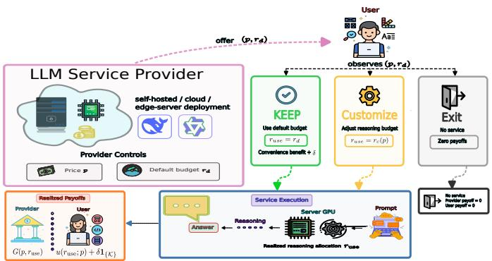
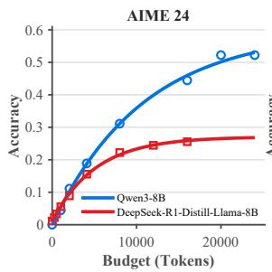
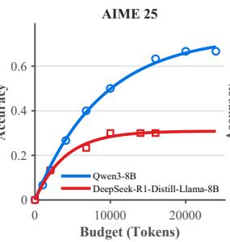
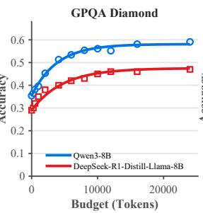
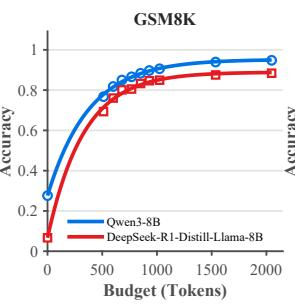
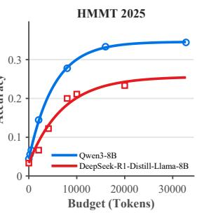
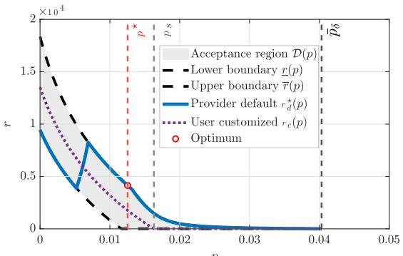
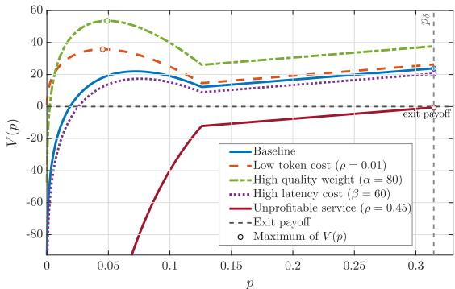
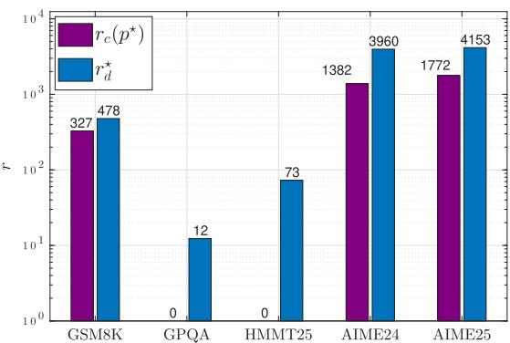
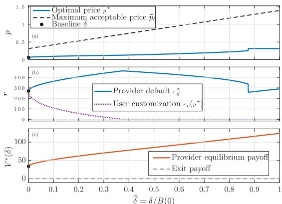

# Keep, Customize, or Exit: Default Design and Token Pricing in LLM Reasoning Services

Ahmet Bugra Gundogan\*, Yigit Turkmen\*, Melih Bastopcu

Department of Electrical and Electronics Engineering

Bilkent University, Ankara, Turkey

bugra.gundogan@bilkent.edu.tr, yigit.turkmen@ug.bilkent.edu.tr, bastopcu@bilkent.edu.tr

Abstract—We study a large language model (LLM) service in which a provider chooses a per-token price and a default reasoning-token allocation, while a user may accept the default, customize the allocation, or exit. Larger allocations can improve accuracy but increase token cost and latency. We model this interaction as a Stackelberg game and derive the user’s unique optimal customized allocation in closed form. For any price, the acceptable defaults form either an empty set or a compact interval. We characterize the provider’s optimal default through a three-regime rule, reduce equilibrium computation to a one-dimensional price optimization, and prove the existence of the equilibrium. We further show that defaults affect the implemented reasoning allocation only when users value the convenience of avoiding customization; otherwise, every serviceproviding outcome implements the user’s optimal customized allocation. Experiments with two compact open-weight reasoning models on five mathematics and science benchmarks support the accuracy–token model and show how model and task characteristics determine equilibrium prices, defaults, and reasoning allocations.

Index Terms—Large language models, reasoning-token allocation, test-time computation, pricing, Stackelberg games, default effects.

## I. INTRODUCTION

Large language models (LLMs) are increasingly offered through services in which users pay for token consumption and experience latency that depends on the amount of inferencetime computation. Many reasoning models additionally allow the reasoning-token budgets to be adjusted, either explicitly through a token allocation or implicitly through service configurations. This creates a joint service-design problem involving price, response quality, latency, and the default reasoning allocation presented to the user.

Recent studies on test-time scaling demonstrate that allocating additional inference-time computation can substantially improve reasoning performance, although the gains depend on the model, task, and inference budget [1], [2]. At the same time, budget-forcing and token-budget-aware methods show that the length of the reasoning process can be explicitly controlled rather than treated as an incidental property of generation [3], [4]. These developments make the reasoning-token allocation a natural service parameter that can be exposed and configured by an LLM provider.

The availability of compact open-weight reasoning models makes this service-design problem particularly relevant. Since the service provider controls the inference stack, it can directly enforce reasoning-token allocations, measure modelspecific generation latency, and expose configurable reasoning allocations to users. This setting is representative of self-hosted and resource-conscious LLM services, including private, onpremises, and accelerator-equipped edge-server deployments.

Existing test-time compute studies typically treat the reasoning allocation as an externally specified constraint or as a quantity selected by an algorithmic controller. In our setting, however, the provider must also determine how the configurable reasoning resource is priced and which allocation is presented to the user by default. The default is strategically distinct from the price: the price determines the marginal cost of additional reasoning, whereas the default determines the initial service configuration encountered by the user. Furthermore, prior work has shown that defaults can influence decisions through convenience, inertia, and status-quo effects [5]–[7].

In this work, we consider a system consisting of an LLM service provider, hereafter referred to as the LLM provider, and a representative user. The LLM provider offers a configurable reasoning-token allocation and a per-token price to the user. After observing the offer, the user may retain the default, customize the allocation, or exit the service. More broadly, testtime scaling enables configurable reasoning-as-a-service, in which inference-time computation is exposed as an adjustable and metered service resource [8]. This emerging paradigm requires principled mechanisms for pricing reasoning and selecting the default allocation presented to users.

## A. Related Work

1) Test-Time Compute and Reasoning Token Allocations: Existing approaches elicit and aggregate intermediate reasoning paths through chain-of-thought prompting, selfconsistency, verification, and search [9]–[13]. Previous work also emphasizes evaluating reasoning methods under matched token allocations [14]. Furthermore, other approaches study adaptive allocation, constrained reasoning, and anytime inference [15]–[17]. These works generally treat the inference allocation as an external constraint or as a quantity selected by an algorithmic or heuristic controller. In contrast, we model the reasoning-token allocation as an internal service-design variable. The provider jointly selects a per-token price and a default reasoning allocation while anticipating whether the user will retain the default, customize the allocation, or exit the service.

2) Pricing and Latency-Aware LLM Serving: Cost-efficient LLM deployment has been extensively studied through model routing, cascading, and ensemble selection. FrugalGPT, RouteLLM, HybridLLM, GraphRouter, and MixLLM route queries among models with different quality, monetary cost, and latency characteristics [18]–[24]. Additionally, Router-Bench provides a benchmark for such routing methods [25]. These approaches make horizontal choices among models, agents, or ensembles, whereas our framework controls service quality in a different way by varying the reasoning depth of a given LLM.

Moreover, Stackelberg games have been widely used for service pricing in cloud, edge, IoT, and computation-offloading markets [26]–[30]. More closely related studies apply Stackelberg pricing to large-model rental and competitive LLM services, where providers set prices and users select among available models or platforms [31], [32]. Accordingly, our focus is not model selection or network routing, but the joint design of pricing and default reasoning allocation within an LLM service.

The closest related works are [32] and [33]. Guo et al. [32] study provider pricing in a competitive LLM routing market and develop a data-calibrated learning method for solving the resulting mathematical program with equilibrium constraints. Velasco et al. [33] study competition among providers over test-time compute. They show that the pay-per-compute equilibrium can be socially inefficient and propose a reverse second-price auction as a remedy, focusing on welfare and mechanism design in a normal-form game. In contrast, we consider a single self-hosted model whose reasoning depth determines service quality. We jointly optimize the per-token price and a user-overridable default reasoning allocation when the user may keep the default, customize the allocation, or exit. To the best of our knowledge, neither prior work models a default reasoning allocation or a default-specific convenience benefit. Consequently, neither contains an analogue of our default-acceptance region or our characterization of when the default has independent allocative power.

## B. Main Contributions

Our main contributions are as follows:

• Unlike prior test-time compute studies that treat the reasoning allocation as an externally specified constraint, we formulate the default reasoning allocation as an endogenous service-design variable in a provider–user Stackelberg game.

• We derive the user’s unique customized reasoning allocation and characterize the complete default-acceptance region, including its feasibility condition and closed-form boundaries.

  
Fig. 1. Interaction between an LLM service provider and a representative user. The provider selects the per-token price p and default reasoning allocation rd, after which the user keeps the default, customizes the allocation, or exits.

• We characterize the provider’s optimal default through a three-regime solution and reduce the equilibrium computation to a one-dimensional price optimization. We also show that the default has allocative power only in the presence of a positive convenience benefit.

• We establish the existence of a Stackelberg equilibrium and reduce the service-provision decision to a scalar comparison: the provider serves if and only if the optimized service value is nonnegative.

• Through our experiments using two compact open-weight reasoning models across five benchmarks, we fit and assess the accuracy–token model and demonstrate how model and task characteristics affect equilibrium prices and reasoning allocations.

## II. SYSTEM MODEL AND PROBLEM FORMULATION

We consider a system where an LLM service provider offers a configurable reasoning-token allocation and a pertoken price to a representative user, as illustrated in Fig. 1. The user submits a task from a fixed task class, while the provider operates an LLM whose reasoning-token allocation can be configured on a per-request basis.1 The provider first commits to a per-token price $p \geq 0$ and a default reasoning allocation $r _ { d } \ge 0$ . After observing $( p , r _ { d } )$ , the user either keep the default, selects a customized reasoning allocation, or exits the service. We adopt a complete-information formulation in which all model parameters and payoff functions are common knowledge. This representative-user model isolates the strategic role of the default; user and task heterogeneity are left for subsequent analysis.

## A. System Model and Utilities

Let $r \geq 0$ denote the reasoning-token allocation enforced by the provider for a service request, where $r = 0$ corresponds to the baseline response without additional reasoning. The allocation is binding: the provider ensures that r reasoning tokens are generated before the final answer is produced. Such allocations can be implemented using decoding-time budget forcing [3]. Thus, r is the realized reasoning-token allocation rather than an expected token count. We treat r as continuous for analytical tractability, while the experiments use discrete enforced allocations. Given a reasoning allocation r, we model the probability of a correct response $Q ( r )$ , the expected service latency $t ( r )$ , and the expected number of billed tokens $T ( r )$ as

$$
Q ( r ) = D + A \left( 1 - e ^ { - b r } \right) ,\tag{1}
$$

$$
t ( r ) = t _ { 0 } + c r , \qquad T ( r ) = T _ { b } + r .\tag{2}
$$

Here, $D \geq 0$ denotes the baseline accuracy obtained without allocating any reasoning tokens, while $A \ > \ 0$ represents the maximum additional accuracy gain attainable through reasoning. The parameter $b > 0$ controls how quickly the gain saturates, thereby capturing diminishing returns from allocating additional reasoning tokens. Moreover, $t _ { 0 } > 0$ is the baseline service latency, $c > 0$ is the incremental latency per reasoning token, and $T _ { b } > 0$ is the expected number of billed non-reasoning tokens, comprising the input prompt and the final-answer segment.2 Thus, under the models in (1) and (2), additional reasoning improves accuracy at a diminishing rate while increasing latency and the number of billed tokens linearly. We abstract the details of the underlying computational infrastructure through the latency model $t ( r )$ and focus on the strategic interaction between the provider’s pricing and default-configuration decisions and the user’s service and reasoning choices. Finally, we impose $D + A \leq 1$ , which guarantees that $Q ( r ) \in [ 0 , 1 ]$ for all $r \geq 0$ . We denote the LLM provider’s price per token by $p \geq 0$

For a given p and $^ { r , }$ the user’s baseline expected utility is

$$
u _ { 0 } ( r , p ) = v Q ( r ) - p T ( r ) - \theta t ( r ) ,\tag{3}
$$

where $v > 0$ is the user’s value of a correct response and $\theta > 0$ is the user’s latency sensitivity. All utility terms are expressed in common monetary-equivalent units. If the user keeps the default, the user’s utility is $U _ { \mathcal { K } } ( p , r _ { d } ) = u _ { 0 } ( r _ { d } , p ) + \delta$ , where $\delta \geq 0$ is a default-specific convenience benefit. It captures the reduced cognitive and interaction costs of accepting a preconfigured option and the status-quo advantage associated with defaults [5]–[7]. Because δ is associated specifically with retaining the default configuration, it enters both the user’s comparison between the default and customization and the user’s participation decision. Thus, δ should not be interpreted as a decision-making cost incurred only under customization.

If the user customizes the reasoning tokens, it solves

$$
B ( p ) = \operatorname * { m a x } _ { r \geq 0 } u _ { 0 } ( r , p ) , \qquad r _ { c } ( p ) = \arg \operatorname * { m a x } _ { r \geq 0 } u _ { 0 } ( r , p ) ,\tag{4}
$$

where the maximizer will be shown to be unique in Lemma 1. The customization utility is therefore $U _ { \cal C } ( p , r _ { d } ) = B ( p )$ , which is not a function of $r _ { d } .$ . The exit utility is normalized to $U _ { \mathcal { E } } ( p , r _ { d } ) = 0$

2We use the term expected because, although the reasoning allocation is fixed to r, the base latency and the number of billed input and output tokens may vary from one task to another; t0 and $T _ { b }$ denote their respective means.

When service is provided with reasoning allocation r, the provider’s expected payoff is

$$
G ( p , r ) = ( p - \rho ) T ( r ) + \alpha Q ( r ) - \beta t ( r ) ,\tag{5}
$$

where $\rho \geq 0$ is the marginal cost per billed token, $\alpha > 0$ is the weight the provider places on response accuracy, and $\beta \geq 0$ is its per-unit latency cost. The $\alpha Q ( r )$ term represents effects such as user retention, reputation, and service-level performance, while the latency term captures resource occupation and delay-related operating costs. If service is not provided, the provider’s payoff is zero. Having defined both players payoffs, we next formalize their interaction as a sequential game in which the provider moves first by selecting the price and the default reasoning allocation.

## B. Stackelberg Game and Problem Formulation

We formulate the interaction as a Stackelberg game in which the provider is the leader and the user is the follower. The provider moves first and either selects $( p , r _ { d } ) ~ \in ~ \mathbb { R } _ { > 0 } ^ { 2 }$ or chooses the no-service action ${ \mathcal { N } } ,$ under which both players receive zero payoff. After observing $( p , r _ { d } )$ , the user selects an action $y \in \mathcal { Y } = \{ \mathcal { K } , \mathcal { C } , \mathcal { E } \}$ , corresponding to keeping the default, customizing, and exiting.

1) Provider’s Payoff and Problem: For an offer $( p , r _ { d } ) \in$ $\mathbb { R } _ { \geq 0 } ^ { 2 }$ and a user action $y \in \mathcal { V }$ , the provider’s payoff is

$$
\Pi ( p , r _ { d } , y ) = { \left\{ \begin{array} { l l } { G ( p , r _ { d } ) , } & { y = K , } \\ { G { \big ( } p , r _ { c } ( p ) { \big ) } , } & { y = { \mathcal { C } } , } \\ { 0 , } & { y = { \mathcal { E } } . } \end{array} \right. }\tag{6}
$$

Let $\mathcal { X } = \{ \mathcal { N } \} \cup \mathbb { R } _ { > 0 } ^ { 2 }$ denote the provider’s action set, and let $B R ( p , r _ { d } ) \in \mathcal { V }$ denote the user’s best response, specified in (9) below. The provider’s induced payoff $J : \mathcal { X } $ R is

$$
J ( x ) = \left\{ \begin{array} { l l } { \Pi \big ( p , r _ { d } , B R ( p , r _ { d } ) \big ) , } & { x = ( p , r _ { d } ) \in \mathbb { R } _ { \ge 0 } ^ { 2 } , } \\ { 0 , } & { x = \mathcal { N } . } \end{array} \right.\tag{7}
$$

An action $x ^ { \star } \in \mathcal { X }$ is a Stackelberg solution if

$$
J ( x ^ { \star } ) \geq J ( x ) , \qquad \forall x \in \mathcal { X } .\tag{8}
$$

If $x ^ { \star } = ( p ^ { \star } , r _ { d } ^ { \star } )$ , the induced user action is $B R ( p ^ { \star } , r _ { d } ^ { \star } )$ ; if $x ^ { \star } = { \mathcal { N } } .$ , service is not offered.

2) User’s Best Response: Given an offer $( p , r _ { d } )$ , the user compares the keep utility $U _ { K } ( p , r _ { d } )$ , the customization utility $B ( p )$ , and the exit utility 0. To make the best response singlevalued on indifference boundaries, we impose the tie-breaking rule ${ \mathcal { K } } \ \succ \ { \mathcal { C } } \ \succ \ { \mathcal { E } } \ :$ : the user keeps the default whenever it is utility-maximizing and, when keeping is not optimal, customizes rather than exits if both yield zero utility. Under this rule,

$$
B R ( p , r _ { d } ) = \left\{ \begin{array} { l l } { K , } & { U _ { K } ( p , r _ { d } ) \geq B ( p ) , \ U _ { K } ( p , r _ { d } ) \geq 0 , } \\ { \ell , } & { B ( p ) > U _ { K } ( p , r _ { d } ) , \ B ( p ) \geq 0 , } \\ { \varepsilon , } & { U _ { K } ( p , r _ { d } ) < 0 , \ B ( p ) < 0 , } \end{array} \right.\tag{9}
$$

where the three cases are mutually exclusive and exhaustive. Because an optimal provider decision may lie on an indifference boundary, the equilibrium characterization is conditional

on this tie-breaking rule; alternative boundary behavior is discussed after the equilibrium analysis.

In the following section, we provide the equilibrium analysis for the Stackelberg game formulated in (8) and (9).

## III. EQUILIBRIUM ANALYSIS

We find an equilibrium of the game by backward induction: we first characterize the user’s customized allocation $r _ { c } ( p )$ and the best response, then determine the set of defaults the user accepts, solve the provider’s problem at a fixed price, and finally optimize over the price.

## A. User’s Best Response

We first characterize the user’s optimal reasoning allocation when the default is rejected. For compactness, we define the auxiliary quantities

$$
a = v A , m ( p ) = p + \theta c , C ( p ) = v ( D + A ) - p T _ { b } - \theta t _ { 0 } .\tag{10}
$$

Since $p \geq 0$ and $\theta , c > 0$ , we have $m ( p ) \geq \theta c > 0$ for every feasible price. Substituting (1) and (2) into the user’s baseline expected utility $u _ { 0 } ( r , p )$ in (3) gives

$$
u _ { 0 } ( r , p ) = C ( p ) - a e ^ { - b r } - m ( p ) r .\tag{11}
$$

Next, we show that $u _ { 0 } ( r , p )$ is strictly concave in $r ,$ which yields the unique customized allocation $r _ { c } ( p )$

Lemma 1: For every $p \geq 0 ,$ , the user’s objective $u _ { 0 } ( r , p )$ is strictly concave in $r ,$ and the customization problem in (4) admits a unique solution given by

$$
r _ { c } ( p ) = \left\{ \begin{array} { l l } { 0 , } & { m ( p ) \geq a b , } \\ { \displaystyle \frac { 1 } { b } \log \left( \frac { a b } { m ( p ) } \right) , } & { m ( p ) < a b . } \end{array} \right.\tag{12}
$$

The corresponding customization value is

$$
B ( p ) = \left\{ \begin{array} { l l } { \displaystyle v D - p T _ { b } - \theta t _ { 0 } , \qquad } & { m ( p ) \geq a b , } \\ { \displaystyle C ( p ) - \frac { m ( p ) } { b } \left( 1 + \log \left( \frac { a b } { m ( p ) } \right) \right) , \ m ( p ) < a b , } \end{array} \right.\tag{13}
$$

where $\log ( \cdot )$ denotes the natural logarithm. Moreover, $B ( p )$ is continuously differentiable and strictly decreasing for $p \geq 0 .$ with derivative

$$
B ^ { \prime } ( p ) = - \bigl ( T _ { b } + r _ { c } ( p ) \bigr ) < 0 ,\tag{14}
$$

and satisfies $\begin{array} { r } { \operatorname* { l i m } _ { p \to \infty } B ( p ) = - \infty . } \end{array}$

Proof: The first and second derivatives of $u _ { 0 } ( r , p )$ in (11) with respect to r are

$$
\frac { \partial u _ { 0 } ( r , p ) } { \partial r } = a b e ^ { - b r } - m ( p ) , \frac { \partial ^ { 2 } u _ { 0 } ( r , p ) } { \partial r ^ { 2 } } = - a b ^ { 2 } e ^ { - b r } < 0 .\tag{15}
$$

Hence, $u _ { 0 } ( r , p )$ is strictly concave in r. Moreover, $m ( p ) > 0$ implies that $u _ { 0 } ( r , p )$ tends $\mathrm { { t o \_ - \infty } }$ as r grows unboundedly; hence the maximum over $r \geq 0$ is attained, and strict concavity implies it is unique.

If $m ( p ) \geq a b$ , then we have $\begin{array} { r } { \left. \frac { \partial u _ { 0 } ( r , p ) } { \partial r } \right| _ { r = 0 } = a b - m ( p ) \leq 0 , } \end{array}$ In this case, since the derivative is strictly decreasing in r, the unique maximizer is $r _ { c } ( p ) = 0$ . This includes the equality case $m ( p ) = a b$

If $m ( p ) ~ < ~ a b ,$ the derivative is positive at $r ~ = ~ 0$ and converges $\mathrm { t o } - m ( p ) < 0$ as r grows large. The unique interior maximizer therefore satisfies $a b e ^ { - b r _ { c } ( p ) } = m ( p )$ , which yields the second case in (12). Substituting the two possible values of $r _ { c } ( p )$ into $u _ { 0 } ( r , p )$ gives (13).

It remains to verify the claimed properties of $B ( p )$ . Within either regime, direct differentiation of (13) gives $B ^ { \prime } ( p ) \ =$ $- \left( T _ { b } + r _ { c } ( p ) \right)$ . At the junction $m ( p ) \ = \ a b ,$ the interior expression $\scriptstyle { \frac { 1 } { b } } \log ( a b / m ( p ) )$ equals zero, so the two branches of (12) coincide and $r _ { c } ( p )$ is continuous. Substituting $m ( p ) = a b$ into the interior expression for $B ( p )$ yields

$$
C ( p ) - \frac { a b } { b } = v D - p T _ { b } - \theta t _ { 0 } ,
$$

which matches the corner branch in (13). Likewise, the interior derivative $- ( T _ { b } + r _ { c } ( p ) )$ equals $- T _ { b }$ at the junction, since $r _ { c } ( p ) = 0$ there, matching the derivative in the corner regime. Thus, $B ( p )$ is continuously differentiable across the junction. Since $T _ { b } > 0$ and $r _ { c } ( p ) \geq 0$ , (14) implies that $B ( p )$ is strictly decreasing. Finally, since $m ( p ) = p + \theta c$ is increasing and unbounded in $p ,$ we have $m ( p ) \geq$ ab for all sufficiently large $p ,$ in which case $B ( p ) = v D - p T _ { b } - \theta t _ { 0 }$ decreases without bound as p grows large.

Lemma 1 shows that the user selects a positive reasoning allocation if and only if

$$
p + \theta c < v A b .\tag{16}
$$

Thus, additional reasoning is selected precisely when the marginal accuracy value of the first reasoning token, $v A b ,$ exceeds its effective marginal cost, p+θc, comprising the price and the per-token latency cost. In particular, if $\theta c \geq v A b$ , then $r _ { c } ( p ) = 0$ for every $p \geq 0$ . Substituting (12) and (13) into (9) completes the characterization of the user’s best response for every given pair $( p , r _ { d } )$

## B. Default Acceptance Region

We next characterize the default reasoning allocations that the provider can induce at a given price. Under the tie-breaking rule in (9), the user keeps a default $r _ { d }$ if and only if keeping yields at least as much utility as both customization and exit. Accordingly, we define the acceptance region

$$
\mathcal { D } ( p ) = \{ r _ { d } \geq 0 : U _ { K } ( p , r _ { d } ) \geq B ( p ) , \ U _ { K } ( p , r _ { d } ) \geq 0 \}\tag{17}
$$

so that $B R ( p , r _ { d } ) ~ = ~ \mathcal { K }$ if and only if $r _ { d } ~ \in ~ \mathcal { D } ( p )$ . Using $U _ { \mathcal { K } } ( p , r _ { d } ) = u _ { 0 } ( r _ { d } ; p ) + \delta _ { : }$ , this set can be written as

$$
\begin{array} { r } { \mathcal { D } ( p ) = \left\{ r _ { d } \geq 0 : u _ { 0 } ( r _ { d } ; p ) \geq h ( p ) \right\} , } \end{array}\tag{18}
$$

where $h ( p ) = \operatorname* { m a x } \left\{ B ( p ) - \delta , - \delta \right\}$ . When $B ( p ) \geq 0$ , the customization constraint determines the threshold, and $h ( p ) =$ $B ( p ) - \delta$ . When $B ( p ) < 0$ , customization is dominated by exit, so the participation constraint determines the threshold, giving $h ( p ) = - \delta$ . Using (10) and (11), we define

$$
K ( p ) = C ( p ) - h ( p ) , \quad z ( p ) = - \frac { a b } { m ( p ) } e ^ { - \frac { b K ( p ) } { m ( p ) } } ,\tag{19}
$$

which will be used in the following lemma.

Lemma $2 \cdot$ For every $p \geq 0 .$ , the acceptance region ${ \mathcal { D } } ( { \boldsymbol { p } } )$ is nonempty if and only if

$$
B ( p ) + \delta \geq 0 .\tag{20}
$$

When (20) holds, we have $z ( p ) \in [ - 1 / e , 0 )$ , and ${ \mathcal { D } } ( { \boldsymbol { p } } )$ is a compact interval (possibly a singleton) given by

$$
\begin{array} { r } { \mathcal D ( p ) = \left\{ \begin{array} { l l } { [ 0 , \overline { { r } } ( p ) ] , } & { K ( p ) \geq a , } \\ { [ \underline { { r } } ( p ) , \overline { { r } } ( p ) ] , } & { K ( p ) < a , } \end{array} \right. } \end{array}\tag{21}
$$

where $\begin{array} { r } { \overline { { r } } ( p ) \ = \ \frac { K ( p ) } { m ( p ) } + \frac { 1 } { b } W _ { 0 } \big ( z ( p ) \big ) } \end{array}$ and $\begin{array} { r } { \underline { { r } } ( p ) \ = \ \frac { K ( p ) } { m ( p ) } \ + } \end{array}$ $\scriptstyle { \frac { 1 } { b } } W _ { - 1 } \left( z ( p ) \right)$ . Here, $W _ { 0 }$ and $W _ { - 1 }$ denote the principal and lower real branches of the Lambert W function, respectively.

Proof: By $( 1 8 ) , \ D ( p )$ is the super-level set $\{ r _ { d } \ge 0$ $u _ { 0 } ( r _ { d } , p ) \ge h ( p ) \}$ }. By Lemma $1 , u _ { 0 } ( \cdot , p )$ is strictly concave and decreases without bound as r grows large; hence every nonempty super-level set over $r \geq 0$ is a compact interval, possibly a singleton, and ${ \mathcal { D } } ( { \boldsymbol { p } } )$ is nonempty if and only if $B ( p ) \geq h ( p )$ . Since $\delta \geq 0$ , the inequality $B ( p ) \geq B ( p ) - \delta$ always holds, while $B ( p ) \geq - \delta$ is equivalent to (20).

By (11), the boundary equation $u _ { 0 } ( r ; p ) = h ( p )$ becomes

$$
a e ^ { - b r } + m ( p ) r = K ( p ) .
$$

Substituting $y = K ( p ) - m ( p ) r ,$ which equals $a e ^ { - b r } > 0$ on the boundary, yields $- { \frac { b y } { m ( p ) } } e ^ { - { \frac { o y } { m ( p ) } } } = z ( p )$ , and the two real branches of the Lambert W function give

$$
r = \frac { K ( p ) } { m ( p ) } + \frac { 1 } { b } W _ { k } \bigl ( z ( p ) \bigr ) , \qquad k \in \{ 0 , - 1 \} .
$$

These roots are real whenever ${ \mathcal { D } } ( { \boldsymbol { p } } )$ is nonempty. If ab $>$ $m ( p )$ , then $B ( p )$ is given by the interior branch of (13), and $B ( p ) \ \geq \ h ( p )$ becomes $\begin{array} { r } { K ( p ) \ge \frac { m ( p ) } { b } \big [ 1 + \log ( a b / m ( p ) ) \big ] } \end{array}$ R which is equivalent to $z ( p ) \geq - 1 / \bar { e } .$ . If $a b \ \leq \ m ( p )$ , then $u _ { 0 } ( \cdot , p )$ is nonincreasing on $r \geq 0 ,$ , nonemptiness reduces to $u _ { 0 } ( 0 , p ) \geq h ( p )$ , i.e., $K ( p ) \geq a ,$ , and setting $q = a b / m ( p ) \leq 1$ gives $z ( p ) \geq - q e ^ { - q } \geq - 1 / e ,$ , since $q e ^ { - q }$ attains its maximum $1 / e$ at $q = 1$ . Since $z ( p ) < 0$ for every $p ,$ both branches are well defined.

Finally, $u _ { 0 } ( 0 , p ) \geq h ( p )$ is equivalent to $K ( p ) \geq a .$ . In this case, the super-level set contains $r = 0 ,$ so its intersection with $r \geq 0 \mathrm { ~ i s ~ } [ 0 , \overline { { r } } ( p ) ]$ with the upper endpoint given by the larger root $W _ { 0 } ,$ , proving the first case of (21). If $K ( p ) < a$ , then $r = 0$ is rejected while nonemptiness guarantees interior points with $u _ { 0 } ( r ; p ) \ \geq \ h ( p )$ ; by concavity, both endpoints are positive roots of the boundary equation, and since $W _ { - 1 } ( z ) \le W _ { 0 } ( z )$ the lower and upper endpoints are generated by $W _ { - 1 }$ and $W _ { 0 } ,$ respectively, proving the second case. The endpoints coincide exactly when $z ( p ) = - 1 / e$

Two boundary implications will be useful in the subsequent analysis. First, if $\delta \ = \ 0 ,$ , then $h ( p ) ~ = ~ B ( p )$ , and nonemptiness in (20) requires $B ( p ) ~ \geq ~ 0$ . Since the value $B ( p )$ is attained uniquely at $r _ { c } ( p )$ , we have $\mathcal { D } ( p ) = \{ r _ { c } ( p ) \}$ when $\delta = 0$ . Thus, without a default convenience benefit, the provider cannot induce any reasoning allocation other than the user’s customized optimum. Second, at any price satisfying $B ( p ) + \delta = 0$ , the participation and customization constraints bind simultaneously, $h ( p ) ~ = ~ B ( p )$ , and $\begin{array} { r } { \mathcal { D } ( p ) ~ = ~ \{ r _ { c } ( p ) \} } \end{array}$ holds again. When $r _ { c } ( p ) > 0$ , this collapse corresponds to $z ( p ) ~ = ~ - 1 / e$ , where the two Lambert branches coincide; when $r _ { c } ( p ) = 0$ , it corresponds to the boundary $K ( p ) = a$ Conversely, i $\dot { x } > 0$ and $B ( p ) + \delta > 0$ , then $h ( p ) < B ( p )$ , and the acceptance region is an interval of positive length. This is the regime in which the provider can use the default to steer the user away from $r _ { c } ( p )$

## C. Provider’s Optimal Default Reasoning for a Fixed Price

We next determine the provider’s optimal default at a fixed price. First, we show that it suffices to consider defaults in the acceptance region. Suppose an offer $( p , r _ { d } )$ induces the user to customize. By (9), customization requires $B ( p ) \geq 0$ . If the provider instead offers the default $r _ { d } = r _ { c } ( p )$ , then

$$
U _ { K } ( p , r _ { c } ( p ) ) = u _ { 0 } ( r _ { c } ( p ) , p ) + \delta = B ( p ) + \delta \geq B ( p ) \geq 0 ,
$$

so $r _ { c } ( p ) \in \mathcal { D } ( p )$ and the user keeps this default under the tie-breaking rule. The implemented allocation and provider payoff remain $r _ { c } ( p )$ and $G ( p , r _ { c } ( p ) )$ , respectively; hence every customization outcome is replicated by an accepted default. Similarly, an offer that induces exit yields the provider payoff zero, which is also attained by the no-service action ${ \mathcal { N } } .$ Therefore, in maximizing Π, it is without loss of optimality to restrict attention to $r _ { d } \in \mathcal { D } ( p )$ whenever $\begin{array} { r } { \boldsymbol { D } ( \boldsymbol { p } ) \neq \boldsymbol { \emptyset } , } \end{array}$ , and to $\mathcal { N }$ otherwise.

Consequently, for any price p with $\mathcal { D } ( p ) \neq \emptyset$ , the provider’s optimal service-providing default solves

$$
r _ { d } ^ { \dag } ( p ) \in \arg \operatorname* { m a x } _ { r _ { d } \in \mathcal { D } ( p ) } G ( p , r _ { d } ) .\tag{22}
$$

By Lemma 2, we write $\mathcal { D } ( p ) = [ \underline { { r } } ( p ) , \overline { { r } } ( p ) ]$ , with the convention $\underline { { r } } ( p ) = 0$ when $K ( p ) \geq a$ . Substituting (1) and (2) into (5) gives

$$
G ( p , r ) = ( p - \rho ) T _ { b } + \alpha D - \beta t _ { 0 } + \gamma ( p ) r + \alpha A \left( 1 - e ^ { - b r } \right)\tag{23}
$$

where

$$
\gamma ( p ) = p - \rho - \beta c\tag{24}
$$

is the provider’s net marginal revenue per reasoning token, after accounting for the token-generation cost $\rho$ and the per-token latency cost $\beta c .$ . In the following proposition, we characterize the provider’s optimal reasoning allocation for a given $p .$

Proposition 1: For every $p \geq 0$ such that $\begin{array} { r l } { \mathcal { D } ( \boldsymbol { p } ) } & { { } = } \end{array}$ $\left[ \underline { { r } } ( p ) , \overline { { r } } ( p ) \right] \neq \emptyset$ , the fixed-price problem in (22) has a unique solution given by

$$
\begin{array} { r } { r _ { d } ^ { \dagger } ( p ) = \left\{ \begin{array} { l l } { \overline { { r } } ( p ) , } & { \gamma ( p ) \geq 0 , } \\ { } & { \gamma ( p ) \leq - \alpha A b , } \\ { \operatorname { P r o j } _ { \mathcal { D } ( p ) } { \big ( } \widehat { r } ( p ) { \big ) } , } & { - \alpha A b < \gamma ( p ) < 0 , } \end{array} \right. } \end{array}\tag{25}
$$

where

$$
\widehat { r } ( p ) = \frac { 1 } { b } \log \left( - \frac { \alpha A b } { \gamma ( p ) } \right)\tag{26}
$$

and $\mathrm { P r o j } _ { \mathcal { D } ( p ) } ( x ) \ =$ min $\{ { \overline { { r } } } ( p )$ , max $\{ \underline { { r } } ( p ) , x \} _ { \perp }$ } denotes the projection onto $\mathcal { D } ( \boldsymbol { p } )$

Proof: For fixed p, differentiating $G ( p , r )$ in (23) with respect to r gives $\begin{array} { r } { \frac { \partial G ( p , r ) } { \partial r } = \gamma ( p ) + \alpha A b e ^ { - b r } } \end{array}$ and $\begin{array} { r } { \frac { \partial ^ { 2 } G ( p , r ) } { \partial r ^ { 2 } } = } \end{array}$ $- \alpha A b ^ { 2 } e ^ { - b r } < 0 \nonumber$ . Thus, $G ( p , r )$ is strictly concave in r with strictly decreasing marginal payoff, and the maximizer over the compact interval $\mathcal { D } ( \boldsymbol { p } )$ is unique.

If $\gamma ( p ) \geq 0$ , then $\frac { \partial \bar { G } ( \boldsymbol { p } , \boldsymbol { r } ) } { \partial \boldsymbol { r } } > 0$ for every $r \geq 0 ,$ , so $G ( p , \cdot )$ is strictly increasing on $\mathcal { D } ( \boldsymbol { p } )$ and the maximizer is $\overline { { r } } ( p )$

If $\gamma ( p ) \leq - \alpha A b .$ , then $\begin{array} { r } { \frac { \partial G ( p , r ) } { \partial r } \bigg | _ { r = 0 } \leq 0 . } \end{array}$ , and since $\frac { \partial \dot { G } ( p , r ) } { \partial r }$ is strictly decreasing, $\frac { \partial G ( p , r ) } { \partial r } < 0$ for every $r > 0$ . Hence $G ( p , \cdot )$ is nonincreasing on $r \geq 0$ and strictly decreasing away from $r = 0$ , so the maximizer is $\underline { { r } } ( p )$

Finally, suppose $- \alpha A b < \gamma ( p ) < 0$ . Then $\left. \frac { \partial G ( p , r ) } { \partial r } \right| _ { r = 0 } >$ 0, while $\frac { \partial G ( p , r ) } { \partial r }$ decreases toward the negative limit $\gamma ( p )$ as r grows large. The unconstrained maximizer is therefore the unique solution of $\left. \frac { \partial G ( p , r ) } { \partial r } \right| _ { r = \widehat { r } ( p ) } = 0$ , which gives (26). By strict concavity, the maximizer over the interval ${ \mathcal { D } } ( { \boldsymbol { p } } )$ is the projection of ${ \widehat { r } } ( p )$ onto $\mathcal { D } ( \boldsymbol { p } )$ , completing the proof.

Proposition 1 identifies three provider regimes. When $\gamma ( p ) \geq 0 .$ , an additional reasoning token yields a nonnegative net margin and a strictly positive accuracy contribution, so the provider selects the largest accepted default. When $\gamma ( p ) \leq - \alpha A b$ , the marginal payoff is nonpositive already at $r = 0 ,$ , and the provider selects the smallest accepted default. In the intermediate regime, the provider has a unique preferred allocation ${ \widehat { r } } ( p )$ and implements the closest allocation permitted by the acceptance region.

For the price-optimization problem, define the optimal accepted-default payoff at price $p$ as

$$
V ( p ) = G \big ( p , r _ { d } ^ { \dag } ( p ) \big ) = \operatorname* { m a x } _ { r _ { d } \in \mathcal { D } ( p ) } G ( p , r _ { d } ) , \quad \mathcal { D } ( p ) \ne \emptyset .\tag{27}
$$

The value $V ( p )$ is the provider’s optimal payoff conditional on serving at price $p ;$ the comparison with the no-service action is deferred to the global Stackelberg game problem.

## D. Price Optimization and Stackelberg Equilibrium

We now optimize the fixed-price value in (27) over p. By Lemma 2, the set of prices at which an accepted default can be induced is

$$
\mathcal { P } _ { \delta } = \{ p \ge 0 : \mathcal { D } ( p ) \neq \emptyset \} = \{ p \ge 0 : B ( p ) + \delta \ge 0 \} .\tag{28}
$$

Whenever ${ \mathcal { P } } _ { \delta } \neq \emptyset ,$ , define the optimal service payoff and an associated maximizer as

$$
V _ { \mathrm { s e r v } } ^ { \star } = \operatorname* { m a x } _ { p \in \mathcal { P } _ { \delta } } V ( p ) , \qquad p ^ { \star } \in \arg \operatorname* { m a x } _ { p \in \mathcal { P } _ { \delta } } V ( p ) ,\tag{29}
$$

with $r _ { d } ^ { \star } = r _ { d } ^ { \dagger } ( p ^ { \star } )$ . The maximizer in (29) need not be unique; $p ^ { \star }$ denotes an arbitrary selection from the set of maximizers, and all subsequent statements involving $( p ^ { \star } , r _ { d } ^ { \star } )$ hold for every such selection. In particular, while the equilibrium value is unique, the equilibrium price may be set-valued.

Theorem 1: If $B ( 0 ) + \delta < 0$ , then $\mathcal { P } _ { \delta } ~ = ~ \emptyset$ and $\mathcal { N }$ is a Stackelberg equilibrium. Otherwise, $\mathcal { P } _ { \delta } = [ 0 , \bar { p } _ { \delta } ]$ , where $\bar { p } _ { \delta }$ is the unique root of $B ( p ) + \delta = 0$ and $\mathcal { D } ( \bar { p } _ { \delta } ) = \{ r _ { c } ( \bar { p } _ { \delta } ) \}$ . The function $V ( p )$ is continuous on $[ 0 , \bar { p } _ { \delta } ]$ , so the maximum in (29) is attained, and the provider’s payoff at the Stackelberg equilibrium is

$$
V _ { \mathrm { S E } } ^ { \star } = \operatorname* { m a x } \{ V _ { \mathrm { s e r v } } ^ { \star } , 0 \} ,\tag{30}
$$

attained by any $( p ^ { \star } , r _ { d } ^ { \star } )$ if $V _ { \mathrm { s e r v } } ^ { \star } \geq 0$ and by N if $V _ { \mathrm { s e r v } } ^ { \star } \le 0$

Proof: Suppose $B ( 0 ) + \delta \ < \ 0$ . Since $B ( p )$ is strictly decreasing (Lemma 1), $B ( p ) + \delta < 0$ for every $p \geq 0 ,$ , so ${ \mathcal { P } } _ { \delta } = \emptyset$ . Moreover, for every $r _ { d } \ge 0 , U _ { \mathcal { K } } ( p , r _ { d } ) = u _ { 0 } ( r _ { d } , p ) +$ $\delta \le B ( p ) + \delta < 0$ , while $B ( p ) < 0$ ; hence the user exits under every offer, every provider decision yields zero payoff, and $\mathcal { N }$ is optimal.

Suppose now $B ( 0 ) + \delta \geq 0 \quad$ . Since $B ( p )$ is continuous, strictly decreasing without bound (Lemma 1), the equation $B ( p ) + \delta = 0$ has a unique solution $\bar { p } _ { \delta } \geq 0 ,$ , and $\mathcal { P } _ { \delta } = [ 0 , \bar { p } _ { \delta } ]$ with $\bar { p } _ { \delta } = 0$ in the boundary case $B ( 0 ) + \delta = 0 . \mathrm { A t } p = \bar { p } _ { \delta }$ , we have $h ( \bar { p } _ { \delta } ) = - \delta = B ( \bar { p } _ { \delta } )$ , so an accepted default must attain the maximum of $u _ { 0 } ( \cdot , \bar { p } _ { \delta } )$ , which is unique; hence $\mathcal { D } ( \bar { p } _ { \delta } ) =$ $\{ r _ { c } ( \bar { p } _ { \delta } ) \}$

We next show that $V ( p )$ is continuous on $[ 0 , \bar { p } _ { \delta } ]$ . Continuity of $B ( p )$ implies continuity of $h ( p ) , \ K ( p )$ , and $z ( p )$ and $z ( p ) \in [ - 1 / e , 0 )$ by Lemma 2. Since $m ( p ) \geq \theta c > 0$ and $W _ { 0 }$ is continuous on $[ - 1 / e , 0 )$ , the upper endpoint $\overline { { r } } ( p )$ is continuous. The lower endpoint is continuous within each regime of (21); it remains to check a junction $p _ { 0 }$ with $K ( p _ { 0 } ) = a .$ . Approaching $p _ { 0 }$ within the regime $K ( p ) \ < \ a$ requires ab $> ~ m ( p )$ , so $a b / m ( p _ { 0 } ) \geq 1 $ ; then $z ( p _ { 0 } ) ~ =$ $- \left( a b / m ( p _ { 0 } ) \right) e ^ { - a b / m ( p _ { 0 } ) }$ and $W _ { - 1 } ( z ( p _ { 0 } ) ) ~ = ~ - a b / m ( p _ { 0 } )$ giving $\underline { { { r } } } ( p _ { 0 } ) \ : = \ : a / m ( p _ { 0 } ) - a / m ( p _ { 0 } ) \ : = \ : 0$ , which matches the regime $K ( p ) \geq a .$ . If instead $a b / m ( p _ { 0 } ) < 1$ , the regime $K ( p ) < a$ is infeasible near $p _ { 0 }$ and no transition occurs. Hence both endpoints are continuous. Moreover, $r _ { d } \in \mathcal { D } ( p )$ implies $m ( p ) r _ { d } \leq a e ^ { - b r _ { d } } + m ( p ) r _ { d } \leq K ( p )$ ; since $m ( p ) \geq \theta c > 0$ and $K ( p )$ is bounded on the compact interval $[ 0 , \bar { p } _ { \delta } ]$ , all accepted defaults lie in a common bounded interval. Thus $\mathcal { D } ( \cdot )$ is a continuous, compact-valued correspondence on $[ 0 , \bar { p } _ { \delta } ]$ ], and since G is continuous, Berge’s maximum theorem implies that $V ( p )$ is continuous; the maximum in (29) is therefore attained.

It remains to compare all provider outcomes. For $p \in { \mathcal { P } } _ { \delta } $ : if the user keeps, the payoff is at most $V ( p ) \leq V _ { \mathrm { s e r v } } ^ { \star } ;$ if the user customizes, then $r _ { c } ( p ) \in \mathcal { D } ( p )$ by the replication argument preceding Proposition 1, so $G ( p , r _ { c } ( p ) ) \leq V ( p ) \leq V _ { \mathrm { s e r v } } ^ { \star } ;$ if the user exits, the payoff is zero. For $p \notin \mathcal { P } _ { \delta } .$ , we have $B ( p ) +$ $\delta \ < \ 0 ,$ , and the argument of the first paragraph shows the user exits, yielding zero. Hence no provider decision exceeds max $\{ V _ { \mathrm { s e r v } } ^ { \star } , 0 \}$ , while $( p ^ { \star } , r _ { d } ^ { \star } )$ attains $V _ { \mathrm { s e r v } } ^ { \star }$ and $\mathcal { N }$ attains zero. This proves (30) and the stated optimality cases.

Tie-breaking robustness: Theorem 1 relies on the tiebreaking rule, under which the acceptance region ${ \mathcal { D } } ( { \boldsymbol { p } } )$ is closed. Under rejection of a default at indifference, the same provider value can be approached whenever an optimal accepted default can be perturbed into the strict interior of the acceptance set, or when it occurs at $p ~ = ~ { \bar { p } } _ { \delta } ~ > ~ 0$ and the price can be reduced. When $\delta = 0 _ { : }$ , customization implements $r _ { c } ( p )$ and preserves the provider value. The boundary case $B ( 0 ) + \delta = 0$ with $\delta > 0$ is exceptional: the keep-favoring rule can change the provider value because $p = 0$ cannot be reduced.

  
Fig. 2. Performance across five reasoning datasets for Qwen3-8B and DeepSeek-R1-Distill-Llama-8B models. Hollow markers denote empirical dataset evaluations, while solid bold lines represent the theoretical accuracy expression $( Q ( r ) = D + A ( 1 - e ^ { - b r } ) )$ fitted to the data.

TABLE I  
AVERAGE BILLED NON-REASONING TOKENS (T ) ALONGSIDE BASELINE LATENCY $\left( t _ { 0 } \right)$ AND MARGINAL GENERATION LATENCY PER TOKEN (c).
<table><tr><td rowspan="2">Dataset</td><td rowspan="2"> $T _ { b }$ </td><td colspan="2">Qwen3-8B</td><td colspan="2">DeepSeek-R1-Distill-8B</td></tr><tr><td> $t _ { 0 } \ \mathrm { ( s ) }$ </td><td>c (s/token)</td><td> $t _ { 0 } \ \mathrm { ( s ) }$ </td><td> $c ~ ( \mathrm { s / t o k e n } )$ </td></tr><tr><td>AIME 25</td><td>102</td><td>0.1775</td><td>0.000903</td><td>0.0878</td><td>0.000679</td></tr><tr><td>AIME 24</td><td>159</td><td>0.2706</td><td>0.000760</td><td>0.1759</td><td>0.000611</td></tr><tr><td>GPQA-D</td><td>213</td><td>0.0899</td><td>0.001257</td><td>0.0057</td><td>0.000356</td></tr><tr><td>GSM8K</td><td>61</td><td>0.0663</td><td>0.000125</td><td>0.0118</td><td>0.000128</td></tr><tr><td>HMMT 25</td><td>108</td><td>0.5198</td><td>0.001008</td><td>0.1787</td><td>0.000738</td></tr></table>

TABLE II  
FITTED ACCURACY PARAMETERS (D, A, b) ACROSS DATASETS.
<table><tr><td rowspan="2">Dataset</td><td colspan="3">Qwen3-8B</td><td colspan="4">DeepSeek-R1-Distill-8B</td></tr><tr><td>D</td><td>A</td><td>b</td><td>D</td><td>A</td><td></td><td>b</td></tr><tr><td>AIME 24</td><td>0</td><td>0.595</td><td> $9 . 2 5 \times 1 0 ^ { - 5 }$ </td><td>0.011</td><td>0.260</td><td></td><td> $1 . 9 4 \times 1 0 ^ { - 4 }$ </td></tr><tr><td>AIME 25</td><td>0</td><td>0.737</td><td> $1 . 1 3 \times 1 0 ^ { - 4 }$ </td><td>0</td><td>0.309</td><td></td><td> $2 . 5 1 \times 1 0 ^ { - 4 }$ </td></tr><tr><td>GPQA Diamond</td><td>0.354</td><td>0.227</td><td> $2 . 6 3 \times 1 0 ^ { - 4 }$ </td><td>0.290</td><td>0.185</td><td></td><td> $2 . 1 1 \times 1 0 ^ { - 4 }$ </td></tr><tr><td>GSM8K</td><td>0.276</td><td>0.677</td><td> $2 . 6 6 \times 1 0 ^ { - 3 }$ </td><td>0.067</td><td>0.822</td><td></td><td> $3 . 0 3 \times 1 0 ^ { - 3 }$ </td></tr><tr><td>HMMT 2025</td><td>0.044</td><td>0.302</td><td> $1 . 8 9 \times 1 0 ^ { - 4 }$ </td><td>0.033</td><td>0.223</td><td></td><td> $1 . 4 1 \times 1 0 ^ { - 4 }$ </td></tr></table>

## IV. EXPERIMENTAL RESULTS

In this section, we provide empirical support for the saturating accuracy–token model, calibrate the service parameters on two open-weight reasoning models, and illustrate the resulting equilibrium structure numerically.

## A. Experimental Setup

We evaluate our framework using two compact open-weight reasoning models: Qwen3-8B [34] and DeepSeek-R1-Distill-Llama-8B [35] (hereafter R1-Distill-Llama-8B) across five reasoning benchmarks: AIME 2024, AIME 2025, GPQA Diamond, GSM8K, and HMMT 2025 [11], [36]. We select open-weight models because they provide direct control over the inference procedure, allowing us to impose reasoningtoken allocations and measure generation latency consistently across budget configurations. For GSM8K, we randomly select 500 examples from the test split using a fixed random seed. For all other benchmarks, we evaluate the complete available evaluation split. For each question and reasoning-allocation configuration, we generate three independently sampled responses. The reported accuracy values are averaged over both the benchmark questions and the three sampled responses.

We perform inference on models using the vLLM framework [37] in a Google Colab runtime equipped with a single NVIDIA RTX PRO 6000 Blackwell Server Edition GPU with 96 GB of memory. Thus, both models are served using a single accelerator, illustrating the feasibility of independently hosted reasoning services based on compact models. For both models, sampling is performed with temperature $\tau \ = \ 0 . 6 ,$ , nucleussampling parameter top- $- p = 0 . 9 5$ , and $\mathrm { { t o p } } \mathrm { { - } } k = 2 0$ . These values follow the recommended thinking-mode configuration for Qwen3 and are also consistent with the sampling configuration used in the DeepSeek-R1 reasoning evaluations. We use the same instruction that is appended to every benchmark question for both models:

Please reason step by step, and put

your final answer within \boxed{}.

Additionally, to control inference-time computation, we employ a budget-forcing procedure inspired by the s1 test-timescaling method [3]. For a benchmark containing N questions, the empirical accuracy at allocation ℓ is computed as

$$
\widehat { Q } ( \ell ) = \frac { 1 } { 3 N } \sum _ { i = 1 } ^ { N } \sum _ { j = 1 } ^ { 3 } \mathbb { 1 } \left\{ \widehat { y } _ { i , j } ( \ell ) = y _ { i } \right\} ,\tag{31}
$$

where ${ \widehat { y } } _ { i , j } ( { \boldsymbol { \ell } } )$ denotes the answer produced by the jth sampled generation for question i, and $y _ { i }$ denotes the corresponding ground-truth answer. The measured accuracy values are then used to fit the accuracy model in (1). The resulting measurements and fits are shown in Fig. 2 and Table II.

We separate the model parameters into two groups according to how they are obtained. The service parameters $T _ { b } , t _ { 0 } .$ and c are taken directly from the measurements reported in Table I, and the accuracy parameters $D , A .$ , and b are the fitted values from Table II. These characterize the underlying LLM service and are held at their measured values throughout. The remaining quantities are economic parameters: the marginal token cost $\rho ,$ the user’s accuracy value v and latency sensitivity $\theta ,$ the provider’s accuracy weight α and latency cost β, and the default convenience benefit δ. Unlike the service parameters above, these are not directly measurable from model execution; we treat them as modeling inputs and examine their influence through sensitivity analysis.

## B. Model Calibration and Validation

We now examine whether the measured model behavior supports the accuracy, token-consumption, and latency models introduced in Section II. Fig. 2 shows the empirical accuracy obtained at different reasoning-allocation configurations together with the fitted exponential model $Q ( r )$ in (1).

The fitted parameters are reported in Table II. Across the evaluated model–benchmark pairs, accuracy generally increases with the reasoning allocation and exhibits diminishing returns, supporting the saturating form assumed in $Q ( r )$ in (1). The fitted parameters also reveal substantial variation across tasks. A larger value of A indicates greater potential benefit from additional reasoning, while a larger value of b indicates that these benefits are realized using fewer reasoning tokens. For example, GSM8K exhibits relatively rapid saturation, whereas the competition mathematics benchmarks require substantially larger reasoning allocations before approaching their fitted accuracy limits. These differences directly affect equilibrium reasoning allocations studied in the following subsections. Table I reports the average input and output token count $T _ { b }$ and the latency parameters $t _ { 0 }$ and $c .$ The parameter $t _ { 0 }$ captures the estimated baseline latency, whereas c represents the marginal generation latency per reasoning token. The differences between the two models demonstrate that reasoning allocations with similar accuracy benefits can nevertheless produce different service latency and, consequently, different equilibrium decisions.

## C. Numerical Results

Having calibrated the service model, we now examine the economic equilibrium. The service parameters $T _ { b } , t _ { 0 } , c , D , A .$ and b are fixed at their calibrated values from Tables I–II, while the economic parameters $\rho , v , \theta , \alpha , \beta ,$ and δ are modeling inputs. Figs. 3 and 5 use the baseline configuration $v = 2 5 0$ $\theta = 5 , \delta = 5 , \rho = 0 . 0 0 5 , \alpha = 8 0$ , and $\beta = 5$ , which places an equilibrium in the interior pricing regime. Fig. 4 instead uses $v = 7 0 , \theta = 2 , \delta = 0 , \rho = 0 . 0 5 , \alpha = 3 0$ , and $\beta = 1 0$ with one parameter varied at a time as indicated in the figure.

Fig. 3 shows the acceptance region ${ \mathcal { D } } ( { \boldsymbol { p } } )$ and the provider’s optimal default policy $r _ { d } ^ { \dag } ( p )$ for AIME 2025. The region narrows as $p$ increases and closes at the maximum feasible price $\bar { p } _ { \delta } \approx 0 . 0 4 0$ . A second threshold visible in the figure is the customization shutoff price $p _ { s } = v A b - \theta c \approx 0 . 0 1 6$ at which (16) holds with equality: for $p < p _ { s } ,$ , the marginal accuracy value of the first reasoning token exceeds its marginal cost and the customized allocation $r _ { c } ( p )$ is positive, whereas for $p \geq p _ { s }$ , the user selects no additional reasoning tokens under customization, i.e., $r _ { c } ( p ) = 0$ , and the customization value reduces to the corner branch of (13). The policy $r _ { d } ^ { \dag } ( p )$ traverses the three regimes of Proposition 1: it starts at the lower boundary, follows the projected interior solution, and terminates at the upper boundary. An optimal price $p ^ { \star } \approx$ $0 . 0 1 2 5$ , marked by the circle, lies on the upper-boundary segment, so $r _ { d } ^ { \star } ~ = ~ \overline { { r } } ( p ^ { \star } )$ . Since $B ( p ^ { \star } ) ~ > ~ 0 .$ , the binding constraint at acceptance is the comparison with customization, $U _ { \mathcal { K } } ( p ^ { \star } , r _ { d } ^ { \star } ) = B ( p ^ { \star } )$ ; that is, the user’s utility loss from the induced allocation relative to customizing at $r _ { c } ( p ^ { \star } )$ exactly equals the convenience benefit δ. Under the tie-breaking rule, the user keeps the default, and the provider extracts the full convenience margin.

  
Fig. 3. Acceptance region $\mathcal { D } ( \boldsymbol { p } )$ and provider-optimal default $r _ { d } ^ { \dag } ( p )$ versus price for AIME 2025 (Qwen3-8B, baseline configuration).

  
Fig. 4. Provider value $V ( p )$ versus price under alternative parameter configurations for Qwen3-8B with $\delta = 0$

Fig. 4 shows $V ( p )$ for GSM8K with $\delta = 0 .$ . With $\delta = 0 ,$ we have $h ( p ) \ = \ B ( p )$ , so a default is accepted only if it attains the customization value; by uniqueness of the maximizer (Lemma 1), $\begin{array} { r } { \mathcal { D } ( p ) ~ = ~ \{ r _ { c } ( p ) \} } \end{array}$ whenever nonempty, and $V ( p ) = G ( p , r _ { c } ( p ) )$ . For $p \ < \ p _ { s }$ , increasing the price raises the net per-token margin $\gamma ( p ) ~ = ~ p - \rho - \beta c$ but reduces the induced allocation $r _ { c } ( p )$ ; the interplay of these two effects produces the interior maxima seen in the low-tokencost and high-accuracy-weight curves. For $p \geq p _ { s }$ , we have $r _ { c } ( p ) = 0$ and $V ( p ) = ( p - \rho ) T _ { b } + \alpha D - \beta t _ { 0 }$ , which increases linearly in $p$ since $T _ { b } > 0$ , until the participation constraint binds at $\bar { p } _ { \delta }$ . Accordingly, the low-token-cost $( \rho = 0 . 0 1 )$ and high-accuracy-weight $( \alpha = 8 0 )$ cases attain interior maxima, whereas the baseline and high-latency-cost $( \beta = 6 0 )$ cases are maximized at the boundary $\bar { p } _ { \delta }$ . For $\rho ~ = ~ 0 . 4 5$ , the service payoff is negative at every feasible price, so the provider selects the no-service action ${ \mathcal { N } } .$

  
Fig. 5. Equilibrium reasoning-token allocations across benchmarks for Qwen3-8B.

  
Fig. 6. Equilibrium price, reasoning allocations, and provider payoff versus the normalized convenience benefi $\widehat { \delta } = \delta / B ( 0 )$ for GSM8K (Qwen3-8B, $\alpha = 5 0 )$

Fig. 5 compares $r _ { c } ( p ^ { \star } )$ and $r _ { d } ^ { \star }$ across the five benchmarks under the baseline configuration. In all instances, $r _ { d } ^ { \star } = \bar { r } ( p ^ { \star } ) > r _ { c } ( p ^ { \star } )$ : the provider pushes the default to the upper acceptance boundary, and the gap $r _ { d } ^ { \star } - r _ { c } ( p ^ { \star } )$ measures the additional reasoning made acceptable by the convenience benefit δ. For GPQA Diamond and HMMT 2025, the optimal price exceeds the customization shutoff price, $p ^ { \star } > p _ { s } ,$ , so $r _ { c } ( p ^ { \star } ) = 0$ and the positive defaults are entirely providerinduced. Across benchmarks, the allocation ordering follows the fitted service parameters: the AIME benchmarks combine large attainable accuracy gains A with slow saturation (small b), producing the largest allocations; GSM8K saturates rapidly (large b); and GPQA Diamond and HMMT 2025 have smaller fitted gains, yielding the lowest allocations.

## D. Effect of the Convenience Benefit

Fig. 6 traces an equilibrium against the normalized convenience benefit $\widehat { \delta } = \delta / B ( 0 )$ for GSM8K when $B ( 0 ) > 0$ To examine a regime in which reasoning is actively induced, we set $\alpha ~ = ~ 5 0$ and retain the remaining parameters from Fig. 4. Fig. 6(a) shows that $\bar { p } _ { \delta }$ increases with ${ \widehat { \delta } } ,$ since the participation condition $B ( \bar { p } _ { \delta } ) + \delta = 0$ is then satisfied at a higher price. An equilibrium price $p ^ { \star }$ remains below this cap over most of the range, so the feasible-price boundary is generally nonbinding. Fig. 6(b) shows that $r _ { c } ( p ^ { \star } )$ decreases to zero as $p ^ { \star }$ crosses the customization shutoff price $p _ { s }$ . In contrast, $r _ { d } ^ { \star }$ first increases, then declines, and undergoes a discrete drop near $\widehat { \delta } ~ \approx ~ 0 . 8 8 . ~ \mathrm { A t } ~ \widehat { \delta } ~ = ~ 0 .$ , the acceptance region is the singleton $\{ r _ { c } ( p ) \}$ , so the provider cannot steer the implemented allocation through the default; for $\widehat \delta > 0$ the gap $r _ { d } ^ { \star } - r _ { c } ( p ^ { \star } )$ measures the additional reasoning made acceptable by the convenience benefit. Fig. 6(c) shows that the equilibrium provider payoff is nondecreasing in ${ \widehat { \delta } } .$ Indeed, increasing $\delta$ weakly enlarges the acceptance region at every price, so every provider outcome feasible at a smaller δ remains feasible. Near $\widehat { \delta } \approx 0 . 8 8$ , the two local maxima of V exchange global optimality. At the crossing, both branches are co-optimal, so the equilibrium price correspondence is set-valued at $\widehat { \delta } \approx 0 . 8 8 ;$ the plotted curves select the global maximizer returned by our grid search, which selects the price branch at the crossing arbitrarily. The apparent discontinuity in $p ^ { \star }$ and $r _ { d } ^ { \star }$ therefore reflects a switch between co-optimal equilibria rather than a discontinuity in the equilibrium value, which Fig. 6(c) confirms is continuous and nondecreasing.

## V. CONCLUSION

In this work, we studied the joint design of token pricing and a default reasoning allocation in an LLM service, modeling the provider–user interaction as a Stackelberg game in which the user may keep the default, customize, or exit. We derived the user’s customized allocation in closed form, characterized the acceptance region through its Lambert-W boundaries, and reduced the provider’s problem to a onedimensional price optimization with a three-regime fixedprice solution, establishing the existence of a Stackelberg equilibrium and reducing the service-provision decision to a sign comparison of the optimized service value. The analysis isolates the strategic role of the default convenience benefit. When $\delta = 0 ,$ every accepted default coincides with the user’s customized allocation: although pricing and service provision remain endogenous, the default has no independent allocative power. When $\delta > 0$ , the acceptance region contains allocations that differ from the user’s optimum, allowing the provider to steer the implemented reasoning allocation. Experiments on two open-weight reasoning models across five benchmarks support the saturating accuracy–token model and show how model- and task-dependent service characteristics translate into distinct equilibrium prices, defaults, and allocations.

Our framework adopts a complete-information, representative-user model to isolate the default mechanism, abstracting from user and task heterogeneity, private valuations, and repeated interactions. Extensions to heterogeneous users, incomplete information, competing providers, and dynamic pricing are natural directions for future work, as is the question of how default design and customization frictions should be governed when they can systematically move reasoning allocations away from users independently chosen levels.

## REFERENCES

[1] C. V. Snell, J. Lee, K. Xu, and A. Kumar, “Scaling LLM test-time compute optimally can be more effective than scaling parameters for reasoning,” in The Thirteenth International Conference on Learning Representations, 2025.

[2] Y. Wu, Z. Sun, S. Li, S. Welleck, and Y. Yang, “Inference scaling laws: An empirical analysis of compute-optimal inference for LLM problemsolving,” in The Thirteenth International Conference on Learning Representations, 2025.

[3] N. Muennighoff, Z. Yang, W. Shi, X. L. Li, L. Fei-Fei, H. Hajishirzi, L. Zettlemoyer, P. Liang, E. Candes, and T. Hashimoto, “s1: Simple\` test-time scaling,” in Proceedings of the 2025 Conference on Empirical Methods in Natural Language Processing. Suzhou, China: Association for Computational Linguistics, Nov. 2025, pp. 20 275–20 321.

[4] T. Han, Z. Wang, C. Fang, S. Zhao, S. Ma, and Z. Chen, “Token-budgetaware LLM reasoning,” in Findings ofthe Associationfor Computational Linguistics: ACL 2025. Vienna, Austria: Association for Computational Linguistics, Jul. 2025, pp. 24 842–24 855.

[5] W. Samuelson and R. Zeckhauser, “Status quo bias in decision making,” Journal of Risk and Uncertainty, vol. 1, no. 1, pp. 7–59, 1988.

[6] B. C. Madrian and D. F. Shea, “The power of suggestion: Inertia in 401(k) participation and savings behavior,” The Quarterly Journal of Economics, vol. 116, no. 4, pp. 1149–1187, 2001.

[7] G. D. Carroll, J. J. Choi, D. Laibson, B. C. Madrian, and A. Metrick, “Optimal defaults and active decisions,” The Quarterly Journal of Economics, vol. 124, no. 4, pp. 1639–1674, November 2009.

[8] G. Liu, H. Du, and K. Huang, “MORES: mobile reasoning-as-aservice via distributed LLM inference-time scaling,” Available on arXiv:2607.08116, 2026.

[9] X. Wang, J. Wei, D. Schuurmans, Q. V. Le, E. H. Chi, S. Narang, A. Chowdhery, and D. Zhou, “Self-consistency improves chain of thought reasoning in language models,” in The Eleventh International Conference on Learning Representations, 2023.

[10] J. Wei, X. Wang, D. Schuurmans, M. Bosma, F. Xia, E. Chi, Q. V. Le, D. Zhou et al., “Chain-of-thought prompting elicits reasoning in large language models,” Advances in Neural Information Processing Systems, vol. 35, pp. 24 824–24 837, 2022.

[11] K. Cobbe, V. Kosaraju, M. Bavarian, M. Chen, H. Jun, L. Kaiser, M. Plappert, J. Tworek, J. Hilton, R. Nakano et al., “Training verifiers to solve math word problems,” Available on arXiv:2110.14168, 2021.

[12] H. Lightman, V. Kosaraju, Y. Burda, H. Edwards, B. Baker, T. Lee, J. Leike, J. Schulman, I. Sutskever, and K. Cobbe, “Let’s verify step by step,” in The Twelfth International Conference on Learning Representations, 2024.

[13] S. Yao, D. Yu, J. Zhao, I. Shafran, T. L. Griffiths, Y. Cao, and K. R. Narasimhan, “Tree of thoughts: Deliberate problem solving with large language models,” in Thirty-seventh Conference on Neural Information Processing Systems, 2023.

[14] J. Wang, S. Jain, D. Zhang, B. Ray, V. Kumar, and B. Athiwaratkun, “Reasoning in token economies: Budget-aware evaluation of LLM reasoning strategies,” in Proceedings of the 2024 Conference on Empirical Methods in Natural Language Processing. Miami, Florida, USA: Association for Computational Linguistics, Nov. 2024, pp. 19 916– 19 939.

[15] Y. Sun, H. Wang, J. Li, J. Liu, X. Li, H. Wen, Y. Yuan, H. Zheng, Y. Liang, Y. Li, and Y. Liu, “An empirical study of LLM reasoning ability under strict output length constraint,” in Proceedings of the 2025 Conference on Empirical Methods in Natural Language Processing. Suzhou, China: Association for Computational Linguistics, Nov. 2025, pp. 7652–7671.

[16] J. Lin, X. Zeng, J. Zhu, S. Wang, J. Shun, J. Wu, and D. Zhou, “Plan and budget: Effective and efficient test-time scaling on reasoning large language models,” in The Fourteenth International Conference on Learning Representations, 2026.

[17] X. Zhang, S. Ashrafi, A. Mirsaidova, A. H. Rezaeian, M. Ballesteros, L. Chilton, Z. Yu, and D. Roth, “Budget-aware anytime reasoning with LLM-synthesized preference data,” in Findings of the Association for Computational Linguistics: ACL 2026. San Diego, California, United States: Association for Computational Linguistics, Jul. 2026, pp. 8587– 8599.

[18] L. Chen, M. Zaharia, and J. Zou, “FrugalGPT: How to use large language models while reducing cost and improving performance,” Transactions on Machine Learning Research, 2024, featured Certification.

[19] I. Ong, A. Almahairi, V. Wu, W.-L. Chiang, T. Wu, J. E. Gonzalez, M. W. Kadous, and I. Stoica, “RouteLLM: Learning to route LLMs from preference data,” in The Thirteenth International Conference on Learning Representations, 2025.

[20] D. Ding, A. Mallick, C. Wang, R. Sim, S. Mukherjee, V. Ruhle, L. V. S.¨ Lakshmanan, and A. H. Awadallah, “Hybrid LLM: Cost-efficient and

quality-aware query routing,” in The Twelfth International Conference on Learning Representations, 2024.

[21] T. Feng, Y. Shen, and J. You, “Graphrouter: A graph-based router for LLM selections,” in International Conference on Learning Representations, Y. Yue, A. Garg, N. Peng, F. Sha, and R. Yu, Eds., vol. 2025, 2025, pp. 26 186–26 203.

[22] Y. Turkmen, B. Buyukates, and M. Bastopcu, “Balancing information accuracy and response timeliness in networked LLMs,” in IEEE INFO-COM 2026 - IEEE Conference on Computer Communications, 2026, pp. 1–9.

[23] X. Wang, Y. Liu, W. Cheng, X. Zhao, Z. Chen, W. Yu, Y. Fu, and H. Chen, “MixLLM: Dynamic routing in mixed large language models,” in Proceedings of the 2025 Conference of the Nations of the Americas Chapter of the Association for Computational Linguistics: Human Language Technologies (Volume 1: Long Papers). Albuquerque, New Mexico: Association for Computational Linguistics, Apr. 2025, pp. 10 912–10 922.

[24] Y. Turkmen, B. Buyukates, and M. Bastopcu, “Don’t always pick the highest-performing model: An information theoretic view of LLM ensemble selection,” Available on arXiv:2602.08003, 2026.

[25] Q. J. Hu, J. Bieker, X. Li, N. Jiang, B. Keigwin, G. Ranganath, K. Keutzer, and S. K. Upadhyay, “Routerbench: A benchmark for multi-LLM routing system,” in Agentic Markets Workshop at ICML 2024, 2024.

[26] V. Cardellini, V. D. Valerio, and F. L. Presti, “Game-theoretic resource pricing and provisioning strategies in cloud systems,” IEEE Transactions on Services Computing, vol. 13, no. 1, pp. 86–98, Jan 2020.

[27] A. Chakraborty, A. Mondal, A. Roy, and S. Misra, “Dynamic trust enforcing pricing scheme for sensors-as-a-service in sensor-cloud infrastructure,” IEEE Transactions on Services Computing, vol. 14, no. 5, pp. 1345–1356, 2021.

[28] Y. Ding, Q. Xu, L. Hao, and Y. Xia, “A Stackelberg game-based robust optimization for user-side energy storage configuration and power pricing,” Energy, vol. 283, p. 128429, 2023.

[29] F. Tut¨ unc¨ uo¨ glu and G. D˘ an, “Optimal service caching and pricing in´ edge computing: A Bayesian Gaussian process bandit approach,” IEEE Transactions on Mobile Computing, vol. 23, no. 1, pp. 705–718, 2024.

[30] D. Saxena and A. K. Singh, “An oversubscription and service pricing exploitation-based profit maximization framework for industry cloud resource management,” IEEE Transactions on Services Computing, vol. 17, no. 5, pp. 2041–2053, 2024.

[31] P. Wu, Q. Liu, Y. Dong, Z. Wang, and F. Wang, “Lmaas: Exploring pricing strategy of large model as a service for communication,” IEEE Transactions on Mobile Computing, vol. 23, no. 12, pp. 12 748–12 760, 2024.

[32] Z. Guo, W. Bai, and J. Jin, “Pricing online LLM services with datacalibrated Stackelberg routing game,” Proceedings of the AAAI Conference on Artificial Intelligence, vol. 40, no. 20, p. 17005–17013, Mar. 2026.

[33] A. A. Velasco, D. Rontogiannis, S. Tsirtsis, and M. Gomez-Rodriguez, “Test-time compute games,” Available on arXiv:2601.21839, 2026.

[34] A. Yang, A. Li, B. Yang, B. Zhang, B. Hui, B. Zheng, B. Yu, C. Gao, C. Huang, C. Lv et al., “Qwen3 technical report,” Available on arXiv:2505.09388, 2025.

[35] D. Guo, D. Yang, H. Zhang, J. Song, P. Wang, Q. Zhu, R. Xu, R. Zhang, S. Ma, X. Bi et al., “Deepseek-r1 incentivizes reasoning in LLMs through reinforcement learning,” Nature, vol. 645, no. 8081, pp. 633– 638, September 2025.

[36] D. Rein, B. L. Hou, A. C. Stickland, J. Petty, R. Y. Pang, J. Dirani, J. Michael, and S. R. Bowman, “GPQA: A graduate-level google-proof q&a benchmark,” in First Conference on Language Modeling, 2024.

[37] W. Kwon, Z. Li, S. Zhuang, Y. Sheng, L. Zheng, C. H. Yu, J. Gonzalez, H. Zhang, and I. Stoica, “Efficient memory management for large language model serving with pagedattention,” in Proceedings of the 29th symposium on operating systems principles, 2023, pp. 611–626.