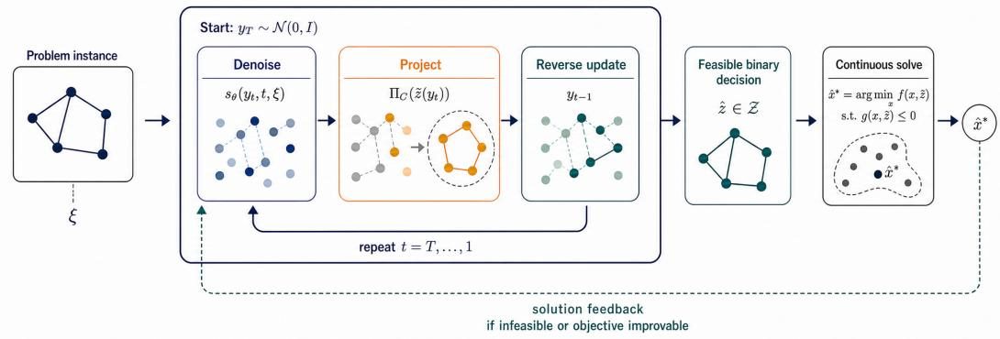
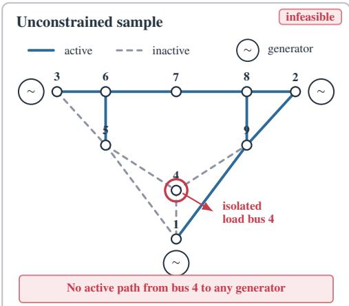
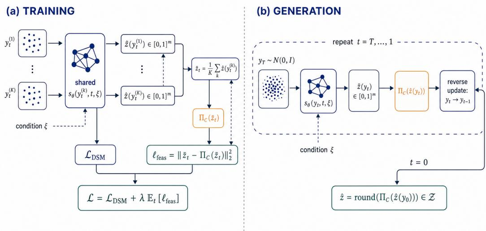
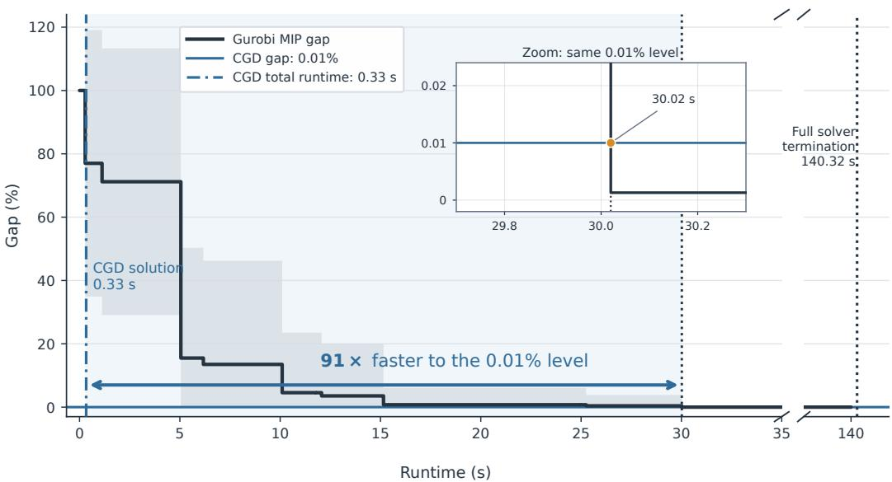
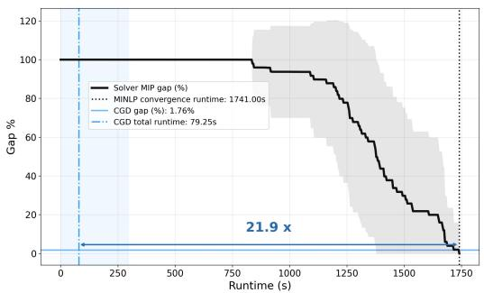
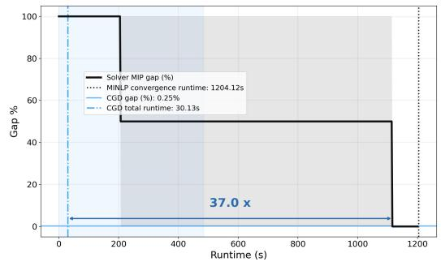
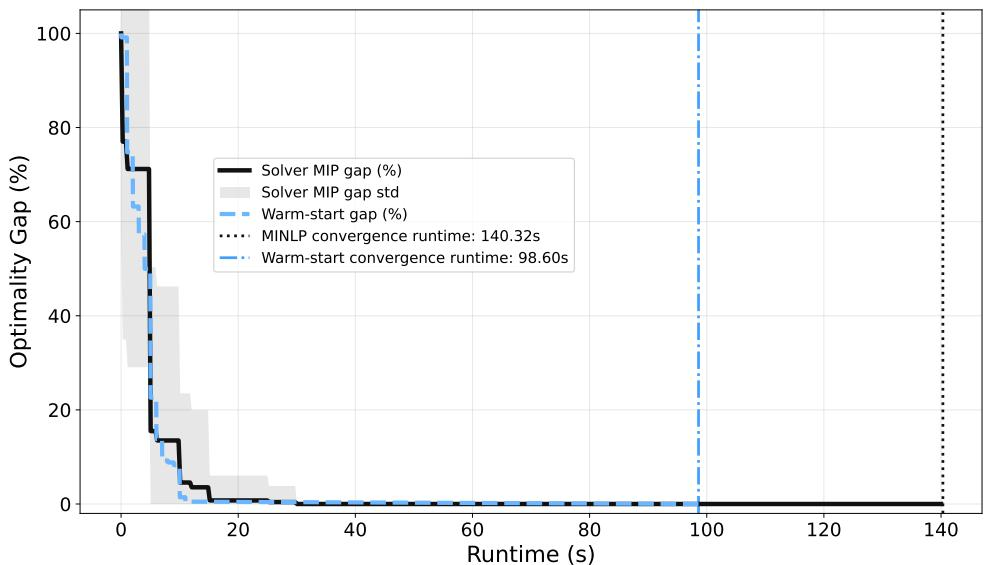
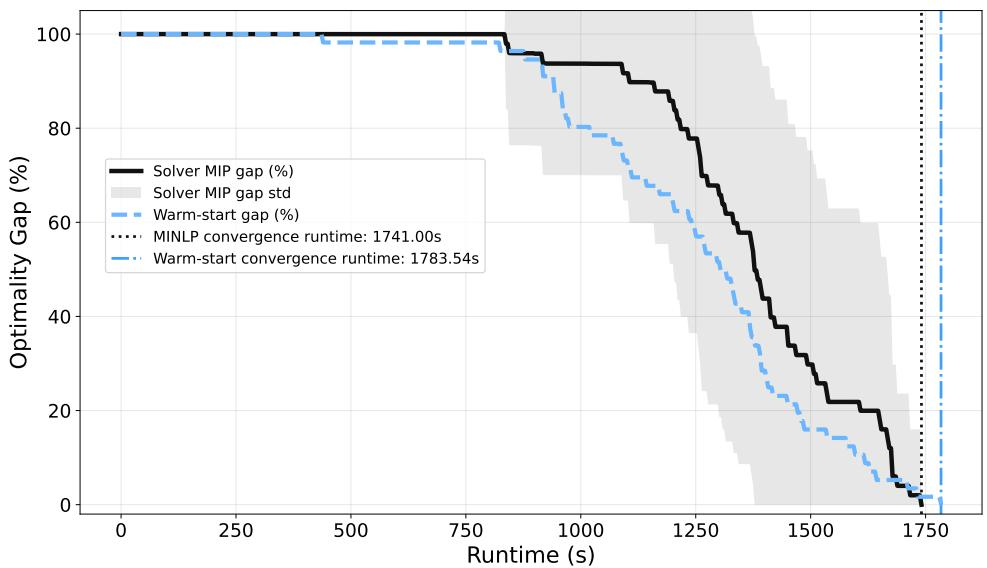
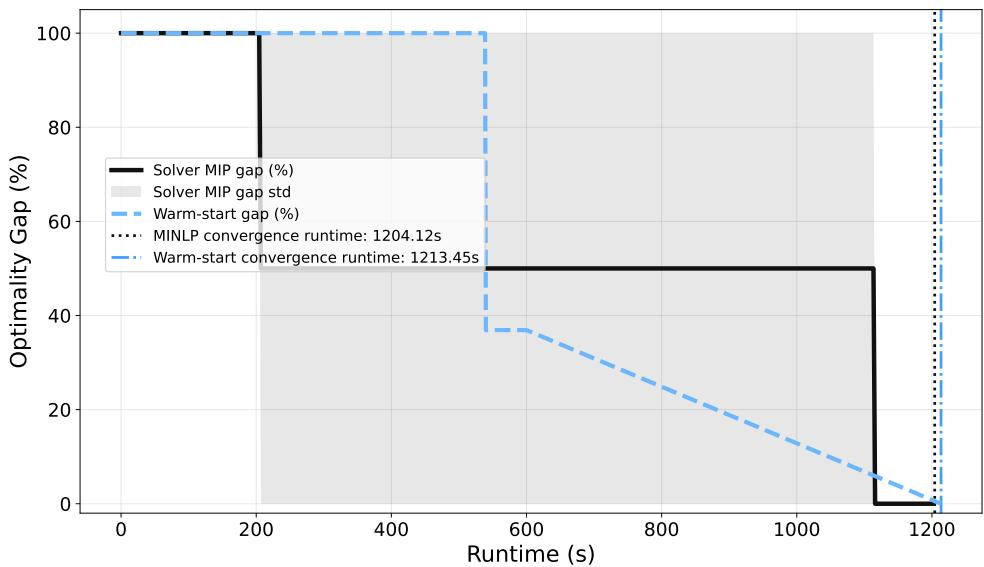

# LEARNING DISCRETE DECISIONS FOR MIPS WITH CONSTRAINT-AWARE DIFFUSION

Vincenzo Di Vito University of Virginia eda8pc@virginia.edu

Mehdi Taghizadeh University of Virginia jrj6wm@virginia.edu

Deepjyoti Deka MIT deepj87@mit.edu

Kaarthik Sundar Los Alamos National Laboratory kaarthik@lanl.gov

Ferdinando Fioretto University of Virginia fioretto@virginia.edu

## ABSTRACT

This paper proposes a novel learning-based approach to approximately solve instances of mixed-integer optimization problems. These problems are computationally challenging, as they require jointly determining discrete and continuous decisions while satisfying complex combinatorial constraints. The proposed method relies on a graph-based generative diffusion model that learns the discrete component of mixed-integer optimization problems while integrating a trainingfree feasibility projection operator directly into the reverse diffusion process to steer intermediate samples toward the feasible set throughout generation. Once the discrete decisions are generated, the remaining optimization reduces to a continuous problem that can be solved efficiently (relative to the original problem) using existing numerical methods. The resulting framework named Constrained Graph Diffusion (CGD), is problem-agnostic and can accommodate a broad class of mixed-integer optimization problems through suitable projection operators. We evaluate CGD on optimal transmission switching for ACOPF and discrete portfolio optimization, demonstrating substantial improvements in feasibility and solution quality over learning-based baselines while achieving speedups of up to 425× over state-of-the-art numerical solvers for MINLPs.

## 1 INTRODUCTION

Mixed-integer optimization provides a powerful framework for modeling decision-making problems involving both discrete and continuous variables. Applications arise in a wide range of domains, including power systems (Hedman et al., 2010), transportation (Bertsimas & Patterson, 1994), logistics (Amiri, 2006), communications (Zhang et al., 2019), finance (Bienstock, 1996), and manufacturing (Pochet & Wolsey, 2006), where binary decisions are often used to represent a finite set of resources, a selection of assets, or a configuration of network structures.

This work considers problems of the form,

$$
\begin{array} { r l r l } { \underset { x , z } { \operatorname* { m i n } } } & { f ( x , z ) } & { \mathrm { s . t . } } & { g ( x , z ) \leq 0 , } \\ & { } & & { x \in \mathcal { X } \subseteq \mathbb { R } ^ { n } , \quad z \in \{ 0 , 1 \} ^ { m } , } \end{array}\tag{1}
$$

where $x \in \mathcal { X }$ are the continuous decision variables, z are the binary decision variables, $f$ is the objective, and $g$ are the constraint functions. We make no convexity or linearity assumptions on f or g. In the most general case, Problem (1) is a nonconvex mixed-integer nonlinear program. In such problems, two distinct sources of difficulty compound: (1) Combinatorial structure: the binary variables z induce a search space of size $2 ^ { m }$ , forcing exact methods to branch over an exponential number of discrete assignments; (2) Nonconvexity: the objective $f$ and the constraints $g$ are nonlinear and nonconvex, so even a single fixed relaxation is a nonconvex program with no guarantee of global optimality.

  
Figure 1: End-to-end CGD pipeline. Starting from $y _ { T } \sim \mathcal { N } ( 0 , \mathbf { I } )$ and conditioning on the problem parameters $\xi ,$ each reverse step evaluates the denoiser $s _ { \theta } ( y _ { t } , t , \xi )$ , projects the resulting relaxed decision onto $C ,$ , and updates $y _ { t - 1 } . \ \mathrm { A t } \ t = 0 .$ , discrete recovery produces $\hat { z } \in \mathcal { Z }$ , which induces the continuous solve for $\hat { x } ^ { \star }$ . The downstream feasibility status and objective quality provide an outer feedback signal: if the induced problem is infeasible or the objective can be improved, CGD initiates another constrained-diffusion attempt.

When instances of Problem (1) share a common structure, the learning to optimize paradigm can be used to accelerate the solution of new ones (Bengio et al., 2021; Kotary et al., 2021). In particular, one line of research uses data to improve decisions made inside a conventional solver, including variable selection in branch-and-bound (Khalil et al., 2016; Gasse et al., 2019) and learned primal and branching heuristics (Nair et al., 2020). Another line learns solution surrogates or differentiable optimization layers that map problem parameters directly to decisions (Wilder et al., 2019a; Ferber et al., 2020). These approaches have shown that when recurring structure across related instances exists, it can be learned and exploited to accelerate optimization. Yet neither paradigm fully address our setting. Solver-embedded policies still require online combinatorial search. Direct predictors instead return a single assignment even when several may be near-optimal, while continuous relaxations can produce fractional or infeasible decisions that require problem-specific repair.

We take a different route: rather than learning a solver policy or a single point prediction for the entire mixed-integer solution, we learn a conditional distribution over its discrete decisions. This choice exploits a useful decomposition of Problem (1). Once a binary assignment z is fixed, the remaining variables x are recovered by solving the induced continuous optimization problem. This does not remove the nonconvexity of the continuous subproblem, but it avoids coupling that non convexity with an online combinatorial search over z. The learned model can therefore amortize the combinatorial part across a distribution of related instances, while a numerical optimizer continues to handle the continuous variables and constraints. In such a context, diffusion models provide a natural mechanism for modeling this high-dimensional distributional view and have recently been adopted for various graph-structured problems (Sun & Yang, 2023; Sanokowski et al., 2024). However, existing diffusion solvers cannot, natively, enforce combinatorial constraints during generation. This is important in mixed-integer optimization because an invalid discrete assignment can render the downstream continuous problem infeasible, as illustrated later in Fig. 2.

Motivated by this gap, we introduce Constrained Graph Diffusion (CGD), a diffusion framework that incorporates feasibility projections directly into the reverse denoising process to generate feasible discrete decisions for a mixed-integer constrained optimization problem. Once a discrete decision is generated, it is fixed in the original problem and the remaining continuous optimization problem is solved using standard numerical methods. An overview of the proposed framework is illustrated in Fig. 1.

Contributions. Specifically, the paper makes the following contributions.

• We propose Constrained Graph Diffusion (CGD), a graph-based diffusion framework that explicitly enforces feasibility of the discrete decision variables throughout the reverse diffusion process.

• We propose a learning-assisted optimization paradigm that exploits the structure of MINLPs. This consists of learning the discrete decision variables with a constrained graph diffusion model, while the continuous decision variables are recovered through a downstream optimization problem. This decomposition isolates the combinatorial component of the MINLP, enabling the remaining continuous optimization problem to be solved efficiently with standard numerical methods.

• We demonstrate the effectiveness of the proposed framework on two challenging mixed-integer optimization problems: optimal transmission switching for AC optimal power flow and mixedinteger portfolio optimization. These domains exhibit fundamentally different combinatorial structures and feasibility requirements. Across both benchmarks, CGD generates feasible discrete decisions, improves solution quality relative to existing learning-based approaches, and achieves substantial speedups compared to state-of-the-art optimization solvers.

## 2 RELATED WORK

Our work lies at the intersection of learning-for-optimization and diffusion models for combinatorial optimization. We briefly review the most closely related literature in these two areas.

Learning for Mixed-Integer Optimization. When many optimization instances share a formulation and differ only in their parameters, learned proxies can amortize computation by mapping instance data to solutions or useful algorithmic decisions (Donti et al., 2017; Kotary et al., 2021; Park & Van Hentenryck, 2023; Chen et al., 2022; Bengio et al., 2021). Although this paradigm is particularly natural for continuous problems with locally regular solution maps, integrality makes the corresponding map discontinuous and potentially set-valued: small parameter changes can switch the optimal discrete assignment, and multiple structurally different assignments can be near-optimal.

One major line of work therefore learns selected components of a conventional MIP solver. Early learning-to-branch methods imitate strong branching using features of candidate variables (Khalil et al., 2016); later work represents a MIP as a bipartite variable–constraint graph and uses graph neural networks to transfer branching policies across instances (Gasse et al., 2019). Hybrid architectures reduce the inference overhead of graph-based branching (Gupta et al., 2020), while Neural Diving and Neural Branching learn primal partial assignments and branching decisions within a solver pipeline (Nair et al., 2020). Related methods learn cut selection (Tang et al., 2020; Paulus et al., 2022) or graph-based construction heuristics (Khalil et al., 2017). For solver-embedded methods, the learned model proposes valid algorithmic actions while the surrounding solver remains responsible for feasibility, bounds, and certification when run to completion. Their scope is nevertheles deliberately local: training often requires expensive expert decisions such as strong-branching or lookahead labels, policy inference adds overhead at many search nodes, and the resulting method still performs online branch-and-bound or solves residual MIPs. Consequently, learned solver components accelerate combinatorial search but do not amortize it away.

A second line learns more direct mappings from parameters to MIP solutions or optimization strategies. Examples include predicting a reusable optimal strategy and reconstructing the associated solution (Bertsimas & Stellato, 2022), training construction or decision-focused models through continuous surrogates (Wilder et al., 2019a;b), differentiating through a cutting-plane representation of a MIP (Ferber et al., 2020), and designing feasibility-aware proxies for mixed-integer nonlinear programs (Tang et al., 2025). These approaches can amortize a larger fraction of the solve, but typically restrict the strategy class, return a single decision, or rely on relaxations, rounding, repair, or a downstream solver. In particular, a deterministic predictor does not represent alternative nearoptimal discrete modes, while interpolation through a continuous relaxation provides no inherent guarantee of integrality or combinatorial feasibility.

CGD occupies a different point in this landscape. It neither learns a branching or cutting policy nor differentiates through the complete mixed-integer solve. Instead, it learns a conditional distribution over the discrete block, incorporates the combinatorial constraints throughout sampling, and then fixes the generated assignment before solving the remaining continuous problem. This removes online branch-and-bound search over the discrete variables and can represent multiple plausible assignments, while retaining a numerical optimizer for the continuous variables. It does not remove continuous nonconvexity or, by itself, provide a global-optimality certificate.

Diffusion Models for Combinatorial Optimization. Recent work has demonstrated that diffusion models provide an effective generative framework for combinatorial optimization by learning distri butions over discrete solution spaces. A seminal contribution in this direction is DIFUSCO (Sun &

Yang, 2023), which introduced graph-based diffusion models for combinatorial optimization problems and demonstrated that iterative denoising can recover high-quality solutions for a variety of graph-structured tasks. Subsequent work has extended this paradigm to unsupervised settings, datafree training, and inference-time adaptation, further demonstrating the flexibility of diffusion-based optimization (Sanokowski et al., 2024; Hong et al., 2024; Feng et al., 2026; Lei et al., 2025).

Despite their success, existing diffusion-based optimization methods typically handle constraints through soft objective formulations or post-processing procedures, rather than explicitly enforcing feasibility throughout the generative process. In mixed-integer optimization, however, the discrete decisions directly affect the feasibility of the continuous variables. This motivates our approach, which integrates the problem combinatorial constraints throughout the generation process, enabling a decomposition in which the discrete decisions are learned by a diffusion model while the continuous variables are subsequently recovered by solving the resulting continuous optimization problem.

## 3 PROBLEM SETTING AND LEARNING-ASSISTED DECOMPOSITION

The proposed approach exploits the fact that the combinatorial difficulty of Problem (1) lies in determining its binary decision variables z. Once these variables are fixed (we write $z = \hat { z } )$ , Problem (1) reduces to the continuous optimization problem

$$
\operatorname* { m i n } _ { x } \quad f ( x , \hat { z } ) \quad \mathrm { s . t . } \quad g ( x , \hat { z } ) \leq 0 ,\tag{2}
$$

This problem still retains the nonlinearity and nonconvexity of the original problem but is entirely free of combinatorial structure. Consequently, standard nonlinear programming solvers can be used to recover a high-quality continuous solution at a fraction of the computational cost of solving the full mixed-integer problem. This decomposition further isolates a subset of constraints that act on the binary variables alone. We collect them in the combinatorial feasible set $\mathcal { Z } = \{ z \in \{ 0 , 1 \} ^ { m } : h ( z ) \leq \bar { 0 } \}$ , where $h ( z )$ denotes the subset of constraints in $g ( x , z )$ that depend only on the discrete variables z. For example, in transmission switching, $z _ { i j } = 1$ indicates that line $( i , j )$ is active, $h ( z ) \leq 0$ encodes topology requirements such as connecting every load bus to a generator, and $\mathcal { Z }$ contains all switching configurations satisfying those requirements. Crucially, as the paper will show next, these requirements can be enforced while generating z, without repeatedly solving the downstream continuous problem.

This decomposition motivates the central premise of this paper: if the optimal combinatorial structure could be identified directly, the mixed-integer problem would collapse to a much easier continuous solve. Thus, rather than learning the full solution of Problem (1), as in learning to optimize methods, we focus on learning only the discrete component of its (local) optimum. Given an in stance $\xi ,$ where $\xi$ denotes the problem-specific parameters (e.g., a cost vector), we seek a generative model that produces a feasible assignment $\hat { z } \in \mathcal { Z }$ approximating the optimal binary solution; the continuous variables are then recovered by solving (2) with zˆ fixed. The problem setting assumes access to a dataset $\mathcal { D } = \{ ( \xi _ { i } , z _ { i } ^ { \star } ) \} _ { i = 1 } ^ { N } ,$ , where $\xi _ { i }$ is the i-th instance and $z _ { i } ^ { \star } \in \mathcal { Z }$ is the corresponding (not necessarily) optimal binary decision obtained from an exact solver. Given an unseen instance $\xi ,$ the goal is thus to learn a generative process that samples a feasible $\hat { z } \in \mathcal { Z }$ close to $z ^ { \star }$ , from which the continuous optimum follows through the induced subproblem (2).

The next section reviews the diffusion framework that forms the basis of our approach and exposes the feasibility gap that motivates the proposed constrained diffusion model.

## 4 DIFFUSION BACKGROUND AND THE FEASIBILITY GAP

Diffusion models generate samples by learning to reverse a noising process that maps data to a simple prior (Song & Ermon, 2019; Song et al., 2021). Let $y _ { 0 } \sim p _ { \mathrm { d a t a } }$ denote a sample in $\mathbb { R } ^ { d }$ The forward diffusion process progressively perturbs $y _ { 0 }$ through a sequence of Markov transitions parameterized by a noise schedule $\{ \beta _ { t } \} _ { t = 1 } ^ { T } . \mathrm { ~ A ~ }$ key property of this process is that the conditional distribution $q ( y _ { t } \mid y _ { 0 } )$ admits the closed-form representation $y _ { t } = \sqrt { \bar { \alpha } _ { t } } y _ { 0 } + \sqrt { 1 - \bar { \alpha } _ { t } } \epsilon$ , with $\bar { \alpha } _ { t } =$ $\textstyle \prod _ { i = 1 } ^ { t } ( 1 - \beta _ { i } )$ and $\epsilon \sim \mathcal { N } ( \mathbf { 0 } , \mathbf { I } )$ , with $y _ { t }$ interpolating between data and noise.

The reverse process is parameterized by a denoising network $s _ { \theta } ( y _ { t } , t , \xi )$ , whose parameters are optimized by minimizing the error between the true noise ϵ and the predicted noise:

$$
\operatorname* { m i n } _ { \theta } \mathbb { E } _ { t , \boldsymbol { p } _ { \mathrm { d a t a } } ( y _ { 0 } ) , \mathcal { N } ( \epsilon ; \mathbf { 0 } , \mathbf { I } ) } \left[ \left| \left| \epsilon - s _ { \theta } \left( y _ { t } , t , \xi \right) \right| \right| _ { 2 } ^ { 2 } \right]\tag{3}
$$

where $y _ { t }$ is the noisy sample obtained from the forward diffusion process at timestep t. Sampling starts from $y _ { T } ~ \sim ~ \mathcal { N } ( \mathbf { 0 } , \mathbf { I } )$ and iterates as $\begin{array} { r } { y _ { t - 1 } = \frac { 1 } { \sqrt { 1 - \beta _ { t } } } \left( y _ { t } - \frac { \beta _ { t } } { \sqrt { 1 - \bar { \alpha } _ { t } } } s _ { \theta } ( y _ { t } , \xi , t ) \right) + \sigma _ { t } \eta , } \end{array}$ , with $\eta \sim \mathcal { N } ( \mathbf { 0 } , I )$ , down to $t = 0$ . The key point for our setting is that the entire reverse trajectory is continuous, even when the final object represents a discrete decision.

## 4.1 LIMITATIONS OF DIFFUSION MODELS FOR COMBINATORIAL DECISIONS

While diffusion models provide an appealing framework for learning distributions over discrete decisions, they provide no mechanism, natively, for enforcing application-specific constraints (Christopher et al., 2024). This is crucial for applications like mixed-integer optimization, where a small error in the generated binary decisions can make the downstream continuous problem infeasible.

Consider the transmission switching problem for AC optimal power flow, which will be formally introduced in Section 6. In this problem, the objective is to determine the network topology together with the corresponding generator dispatch that minimizes operating costs while satisfying the physical and operational constraints of a power system. The network topology is represented by a binary vector $z \in \{ \bar { 0 } , 1 \bar  \} ^ { \bar { m } }$ , where each element $z _ { i }$ indicates whether transmission line i is energized or disconnected. To ensure that the resulting topology admits a feasible power dispatch, every load bus must remain connected, through a sequence of active transmission lines, to at least one generator with sufficient generation capacity.

  
Figure 2: Unconstrained sample on the IEEE 9-bus system. Dashed branches are inactive. Opening (1, 4), (4, 5), and (4, 9) isolates load bus 4, making the downstream AC-OPF infeasible.

Figure 2 illustrates the issue on the IEEE 9-bus system (Babaeinejadsarookolaee et al., 2019). In this sample, the three branches incident to bus 4, namely (1, 4), (4, 5), and (4, 9), are all inactive, isolating bus 4 from every generator. This causes the downstream optimal power flow problem to be infeasible, since the power-balance equations at bus 4 cannot then be satisfied. To cope with this issue, this paper next introduces a constrained diffusion framework that explicitly enforces combinatorial feasibility throughout the reverse denoising process.

## 5 CONSTRAINED GRAPH DIFFUSION FOR COMBINATORIAL DECISIONS

This section develops CONSTRAINED GRAPH DIFFUSION (CGD) to generate a high-quality binary decision that satisfies the combinatorial requirements of an unseen instance ξ. The method couples a conditional graph diffusion model with a differentiable optimization layer implementing a projection operator. The projection plays two key roles: during generation, it provides a plug-and-play mechanism that corrects the relaxed decision throughout the diffusion trajectory; during training, it defines a feasibility regularizer for the denoiser’s expected relaxed prediction. The following subsections present constraint-aware generation, discrete recovery and continuous completion, and constraint-aware training.

Framework overview. CGD consists of a training phase and a four-stage generation pipeline. During training, the conditional graph denoiser learns the distribution of reference binary decisions through a constraint-regularized diffusion objective. Once trained, the framework operates as follows. (1) Given an unseen problem instance ξ, the graph-based denoiser starts from Gaussian noise and estimates a relaxed representation of the binary decision variables through the learned reverse process. (2) At every reverse step, this prediction is projected onto the relaxed set $C _ { \xi }$ and reinserted into the reverse update, steering subsequent predictions toward the application-specific combinatorial constraints. (3) After the terminal reverse step, the projected relaxed estimate is discretized to obtain the binary decision zˆ. (4) Finally, zˆ is fixed in the original mixed-integer problem, reducing it to Problem (2), which is solved with a numerical optimizer to recover the continuous decision xˆ. Figure 3 illustrates the training and generation phases.

  
Figure 3: Training and the four-stage inference protocol in CGD. (a) The shared denoiser maps K perturbations of one training pair and timestep to relaxed decisions; their mean and its correction define the feasibility loss. (b) One reverse trajectory repeats relaxed prediction and correction, stages (i)–(ii), before discrete recovery and continuous completion, stages (iii)–(iv).

## 5.1 CONSTRAINT-AWARE GENERATION

Given an unseen problem instance $\xi ,$ the goal of the reverse diffusion process is to generate a feasible binary decision vector $\hat { z } \in \mathcal { Z } _ { \xi }$ . CGD realizes this goal through a new plug-and-play mechanism for constrained generation, described in Algorithm 1. This subsection develops stages (1) and (2) described above, while Section 5.2 presents stages (3) and (4).

Stage (1): graph-conditioned relaxed decoding. The central constraint-enforcement operator in CGD is a differentiable optimization step (a projection). Notice that the reverse diffusion process operates on the noisy continuous state $y _ { t }$ , but the feasibility projection requires a relaxed decision in $[ 0 , 1 ] ^ { m }$ . Thus, stage (1) must first recover a continuous representation from the noisy diffusion state on which this projection can act. For a training pair $( \xi , z ^ { \star } )$ , the binary vector is embedded antipodally as

$$
y _ { 0 } = e ( z ^ { \star } ) : = 2 z ^ { \star } - 1 \in \{ - 1 , + 1 \} ^ { m } ,\tag{4}
$$

which is centered, preserves Hamming geometry through $\| e ( z ) - e ( z ^ { \prime } ) \| _ { 2 } ^ { 2 } = 4 d _ { \mathrm { H } } ( z , z ^ { \prime } )$ , and has inverse $e ^ { - 1 } ( y ) = ( \dot { y } + { \bf 1 } ) / 2$ . Recall that the embedding is an isometry, so the geometry of the binary space is preserved in the continuous space.

To obtain this continuous representation at reverse timestep $t ,$ the denoiser $s _ { \theta } ( y _ { t } , t , \xi )$ predicts the injected noise and reconstructs the clean embedded signal as

$$
\widetilde { y } _ { 0 , t } = \frac { y _ { t } - \sqrt { 1 - \bar { \alpha } _ { t } } s _ { \theta } ( y _ { t } , t , \xi ) } { \sqrt { \bar { \alpha } _ { t } } } , \qquad \hat { y } _ { 0 , t } = \operatorname { t a n h } ( \widetilde { y } _ { 0 , t } ) .\tag{5}
$$

Here, the tanh map bounds the estimate in $[ - 1 , 1 ] ^ { m }$ , and allowing $e ^ { - 1 }$ to map it differentiably into $[ 0 , 1 ] ^ { m }$ . Accordingly, defining $p _ { \theta } ( z _ { i } = \bar { 1 } \ \bar { | } \ y _ { t } , \bar { \xi } ) : = ( \hat { y } _ { 0 , t , i } + \bar { 1 } ) / 2$ gives the signed confidence

interpretation

$$
\hat { y } _ { 0 , t , i } = ( + 1 ) p _ { \theta } ( z _ { i } = 1 \mid y _ { t } , \xi ) + ( - 1 ) p _ { \theta } ( z _ { i } = 0 \mid y _ { t } , \xi ) = 2 p _ { \theta } ( z _ { i } = 1 \mid y _ { t } , \xi ) - 1 .\tag{6}
$$

The relaxed decision passed to stage (2) is therefore

$$
\hat { z } _ { \theta } ( y _ { t } , t , \xi ) : = \mathbb { E } _ { \theta } [ z \mid y _ { t } , \xi ] = \frac { \hat { y } _ { 0 , t } + \mathbf { 1 } } { 2 } \in [ 0 , 1 ] ^ { m } .\tag{7}
$$

Note that each component $\hat { z } _ { \theta , i }$ is the model’s marginal activation probability. To simplify notation, we denote this relaxed prediction by $\hat { z } _ { t }$ below.

Stage (2): instance-dependent feasibility projection. Stage (1) produces a relaxed prediction $\hat { z } _ { t } \in [ 0 , 1 ] ^ { m }$ , but this prediction need not satisfy the combinatorial constraints of instance ξ. Stage (2) therefore corrects $\hat { z } _ { t }$ before reinserting it into the reverse process. To formalize this correction, define the discrete feasible set $\mathcal { Z } _ { \xi } = \{ z \in \{ \bar { 0 } , 1 \} ^ { m } : h ( z ; \xi ) \leq \bar { 0 } \}$ . Direct projection onto $\mathcal { Z } _ { \xi }$ would require solving a combinatorial problem at every reverse step. CGD instead uses the continuous relaxation

$$
C _ { \xi } = \left\{ u \in [ 0 , 1 ] ^ { m } : \widetilde { h } ( u ; \xi ) \leq 0 \right\} , \qquad C _ { \xi } \cap \{ 0 , 1 \} ^ { m } = \mathcal { Z } _ { \xi } ,\tag{8}
$$

where $\widetilde { h }$ agrees with h on binary points. To project the relaxed prediction $\hat { z } _ { t }$ onto $C _ { \xi }$ , CGD applies a differentiable optimization layer that solves the convex program

$$
\Pi _ { C _ { \xi } } ( v ) \in \arg \operatorname* { m i n } _ { u \in C _ { \xi } } \| u - v \| _ { 2 } ^ { 2 } .\tag{9}
$$

At reverse timestep t, CGD applies this projection to $\hat { z } _ { t }$ and maps the corrected decision back to the antipodal diffusion space:

$$
u _ { t } = \Pi _ { C _ { \xi } } ( \hat { z } _ { t } ) , \qquad y _ { 0 , t } ^ { C } = e ( u _ { t } ) = 2 u _ { t } - \mathbf { 1 } .\tag{10}
$$

The projection leaves a relaxed-feasible prediction unchanged and otherwise makes the smallest Euclidean correction. The affine extension $e ( u _ { t } ) = 2 u _ { t } - \mathbf { 1 }$ is required because the constraints are defined in decision space, whereas the reverse process evolves in diffusion space. When exact projection is impractical, we use $\Pi _ { C _ { \xi } }$ to denote an application-specific correction with the same interface. To reinsert the corrected endpoint $y _ { 0 , t } ^ { C }$ into the reverse process, CGD computes its consistent noise estimate

$$
\epsilon _ { t } ^ { C } = \frac { y _ { t } - \sqrt { \bar { \alpha } _ { t } } y _ { 0 , t } ^ { C } } { \sqrt { 1 - \bar { \alpha } _ { t } } } .\tag{11}
$$

The corrected noise then replaces the raw prediction in the standard reverse update:

$$
\left[ { \frac { \mathcal { R } _ { t } ( y _ { t } , u _ { t } , \xi , \eta _ { t } ) } { \sqrt { 1 - \beta _ { t } } } } \right] : = y _ { t - 1 } = { \frac { 1 } { \sqrt { 1 - \beta _ { t } } } } \left( y _ { t } - { \frac { \beta _ { t } } { \sqrt { 1 - { \bar { \alpha } } _ { t } } } } \epsilon _ { t } ^ { C } \right) + \sigma _ { t } \eta _ { t } \qquad t = T , \dots , 1 .\tag{12}
$$

This step enforces relaxed feasibility in $C _ { \xi } \colon$ ; the recovery map and continuous solver subsequently determine discrete feasibility in $\mathcal { Z } _ { \xi }$ and downstream feasibility, respectively.

The remaining question is whether projection provides a principled correction rather than an arbitrary feasible repair. Proposition 1 answers this question for an exact projection onto a convex relaxation. It shows that the projection residual measures relaxed infeasibility and points along its gradient, while the correction itself cannot increase the distance to any feasible reference decision. These properties justify using the same operator to guide both reverse generation and constraintaware training.

Proposition 1 (Geometry of the feasibility projection). Fix an instance $\xi ,$ and let $C _ { \xi } \subseteq \mathbb { R } ^ { m }$ be nonempty, closed, and convex. Define $\begin{array} { r } { d _ { C _ { \xi } } ^ { 2 } ( v ) : = \operatorname* { m i n } _ { u \in C _ { \xi } } \| v - u \| _ { 2 } ^ { 2 } = \| v - \Pi _ { C _ { \xi } } ( v ) \| _ { 2 } ^ { 2 } } \end{array}$ . Then $\Pi _ { C _ { \xi } } ( v )$ is unique, $d _ { C _ { \xi } } ^ { 2 }$ is continuously differentiable, and

$$
\nabla _ { v } d _ { C _ { \xi } } ^ { 2 } ( v ) = 2 \big ( v - \Pi _ { C _ { \xi } } ( v ) \big ) .\tag{13}
$$

Moreover, for every $z ^ { \star } \in \mathcal { Z } _ { \xi } \subseteq C _ { \xi }$

$$
\left\| \Pi _ { C _ { \xi } } ( v ) - z ^ { \star } \right\| _ { 2 } ^ { 2 } \leq \| v - z ^ { \star } \| _ { 2 } ^ { 2 } - \left\| v - \Pi _ { C _ { \xi } } ( v ) \right\| _ { 2 } ^ { 2 } .\tag{14}
$$

Algorithm 1 Four-stage generation with CGD   
Require: $\xi , s _ { \theta } , { \Pi } _ { C _ { \xi } } , R _ { \xi } ,$ , and $\{ \beta _ { t } , \bar { \alpha } _ { t } , \sigma _ { t } \} _ { t = 1 } ^ { T }$   
1: sample yT $\sim \mathcal { N } ( \mathbf { 0 } , \mathbf { I } )$   
2: for $t = T , \dots , 1$ do   
3: (i) Relaxed estimation: $\hat { z } _ { t } \gets \hat { z } _ { \theta } ( y _ { t } , t , \xi )$ using (5) and (7)   
4: (ii) Projection and reinsertion: $u _ { t } \gets \Pi _ { C _ { \xi } } ( \hat { z } _ { t } )$ and $y _ { 0 , t } ^ { C } \gets 2 u _ { t } - \mathbf { 1 }$   
5: $\epsilon _ { t } ^ { C } \gets ( y _ { t } - \sqrt { \bar { \alpha } _ { t } } y _ { 0 , t } ^ { C } ) / \sqrt { 1 - \bar { \alpha } _ { t } }$   
6: sample $\eta _ { t } \sim \mathcal { N } ( \mathbf { 0 } , \mathbf { I } )$   
7: $y _ { t - 1 } \gets \mathcal { R } _ { t } ( y _ { t } , u _ { t } , \xi , \eta _ { t } )$ using (12)   
8: end for   
9: $\hat { z } _ { 0 } \gets \hat { z } _ { \theta } ( y _ { 0 } , 0 , \xi )$ and $u _ { 0 } \gets \Pi _ { C _ { \xi } } \big ( \hat { z } _ { 0 } \big )$   
10: (iii) Discrete recovery: $\hat { z }  R _ { \xi } ( u _ { 0 } )$   
11: (iv) Continuous completion: solve Problem (2) with $z = \hat { z } ;$ record xˆ and the solver status   
12: return zˆ, xˆ when feasible, and the solver status

The proof is provided in Appendix A.1. For nonconvex or approximate corrections, the projection residual remains a feasible-target surrogate without these guarantees.

To characterize what survives this update, let $\alpha _ { t } = 1 - \beta _ { t }$ and use $\bar { \alpha } _ { t } = \alpha _ { t } \bar { \alpha } _ { t - 1 }$ . For any relaxed endpoint $v \in [ 0 , 1 ] ^ { m }$ , Equation (12) defines the endpoint-conditioned transition

$$
\mathcal { R } _ { t } ^ { v } ( y _ { t } , \eta _ { t } ) : = a _ { t } y _ { t } + b _ { t } e ( v ) + \sigma _ { t } \eta _ { t } , \quad a _ { t } = \frac { \sqrt { \alpha _ { t } } ( 1 - \bar { \alpha } _ { t - 1 } ) } { 1 - \bar { \alpha } _ { t } } , \quad b _ { t } = \frac { \beta _ { t } \sqrt { \bar { \alpha } _ { t - 1 } } } { 1 - \bar { \alpha } _ { t } } .\tag{15}
$$

These are the standard posterior-mean coefficients of the Gaussian forward process (Ho et al., 2020). The following proposition establishes a bound between the posteriors derived by the proposed projected-version and the standard diffusion model.

Proposition 2 (Least-disruptive feasible reverse transition). $F i x \xi , t ,$ and yt. Let $C _ { \xi }$ be nonempty, closed, and convex, let $\boldsymbol { v } _ { t } = \boldsymbol { \hat { z } } _ { t }$ , and let $u _ { t } = \Pi _ { C _ { \xi } } ( v _ { t } )$ . Then,for every $w \in C _ { \xi }$ and a common noise realization ηt,

$$
\begin{array} { r l } & { \| \mathcal { R } _ { t } ^ { u _ { t } } ( y _ { t } , \eta _ { t } ) - \mathcal { R } _ { t } ^ { w } ( y _ { t } , \eta _ { t } ) \| _ { 2 } ^ { 2 } \leq \| \mathcal { R } _ { t } ^ { v _ { t } } ( y _ { t } , \eta _ { t } ) - \mathcal { R } _ { t } ^ { w } ( y _ { t } , \eta _ { t } ) \| _ { 2 } ^ { 2 } } \\ & { \qquad - 4 b _ { t } ^ { 2 } \| v _ { t } - u _ { t } \| _ { 2 } ^ { 2 } . } \end{array}\tag{16}
$$

Moreover, $i f K _ { t } ^ { v } ( \cdot \mid y _ { t } )$ denotes the law of $\mathcal { R } _ { t } ^ { v } ( y _ { t } , \eta _ { t } )$ , then

$$
u _ { t } = \arg \operatorname* { m i n } _ { w \in C _ { \xi } } W _ { 2 } ^ { 2 } ( K _ { t } ^ { v _ { t } } , K _ { t } ^ { w } ) , \qquad W _ { 2 } ( K _ { t } ^ { v _ { t } } , K _ { t } ^ { u _ { t } } ) = 2 b _ { t } \| v _ { t } - u _ { t } \| _ { 2 } ,\tag{17}
$$

where $W _ { 2 }$ is the 2-Wasserstein distance.

The proof is provided in Appendix A.1. Proposition 2 establishes three properties of the correction: (1) Minimal intervention: the projected kernel is the closest fixed-variance kernel whose clean endpoint lies in $C _ { \xi } . \ ( 2 )$ Feasible-reference improvement: for the same current state and noise, projection moves the next transition closer to the transition anchored at every relaxed feasible endpoint. (3) Schedule dependence: the projection residual enters the reverse transition with the exact gain $2  { b _ { t } }$ However, the noisy state $y _ { t - 1 }$ need not belong to $e ( C _ { \xi } )$ , and the one-step inequalities do not telescope through the nonlinear denoiser without additional contractivity assumptions. Repeated projection therefore provides a sequence of locally improved reverse transitions, not a claim that the entire noisy trajectory is feasible or that CGD samples the constrained data distribution. The resulting $y _ { t - 1 }$ is passed back to the conditional denoiser, so every correction still changes the state from which all subsequent decisions are predicted; a terminal-only projection cannot exert this trajectorylevel influence. The experiments in Section 6 bear out this trajectory-level effect: across all reported AC and portfolio settings, projection at every reverse step yields lower downstream objective gaps than both no projection and final-step projection, while matching or improving observed feasibility.

## 5.2 DISCRETE RECOVERY AND CONTINUOUS COMPLETION

Stage (3): discrete recovery. Note that, after projection, the terminal estimate $u _ { 0 }$ remains continuous. Thus a discretization is required. This step is deferred until this point because hard decisions

made at an earlier timestep would discard the uncertainty needed by the remaining reverse process. A recovery map then converts $u _ { 0 }$ into a binary decision:

$$
\hat { z } = R _ { \xi } ( u _ { 0 } ) , \qquad R _ { \xi } : [ 0 , 1 ] ^ { m }  \{ 0 , 1 \} ^ { m } .\tag{18}
$$

The notation round in Figure 3 denotes the element-wise threshold map

$$
T ( u ) _ { i } : = \mathbf { 1 } \{ u _ { i } \geq 1 / 2 \} .
$$

The default recovery uses $R _ { \xi } = T ;$ ; a problem-specific repair can augment this map when available. Membership of $u _ { 0 }$ in $C _ { \xi }$ does not alone imply that $T ( u _ { 0 } )$ belongs to $\mathcal { Z } _ { \xi }$ . The following result quantifies what exact convex projection does preserve through thresholding.

Corollary 3 (Threshold-recovery error). For every $u \in [ 0 , 1 ] ^ { m }$ and $z ^ { \star } \in \{ 0 , 1 \} ^ { m }$

$$
d _ { \mathrm { H } } ( T ( u ) , z ^ { \star } ) \leq 4 \| u - z ^ { \star } \| _ { 2 } ^ { 2 } .\tag{19}
$$

$I f C _ { \xi }$ is nonempty, closed, and convex, $\boldsymbol { u } = \Pi _ { C _ { \xi } } ( \boldsymbol { v } )$ , and $z ^ { \star } \in { \mathcal { Z } } _ { \xi }$ , then

$$
d _ { \mathrm { H } } ( T ( u ) , z ^ { \star } ) \leq 4 \left( \| v - z ^ { \star } \| _ { 2 } ^ { 2 } - \| v - u \| _ { 2 } ^ { 2 } \right) .\tag{20}
$$

In particular, $T ( u ) = z ^ { \star }$ whenever the quantity in parentheses is smaller than $1 / 4 .$

The proof is provided in Appendix A.1. Corollary 3 connects the projection geometry to the Hamming and exact-reconstruction metrics used in Section 6. Projection improves a valid upper bound on the recovery error to every feasible reference decision. However, the bound certifies discrete feasibility only when it implies exact recovery of such a reference. More generally, a recovery map satisfying $R _ { \xi } ( C _ { \xi } ) \subseteq \mathcal Z _ { \xi }$ certifies the combinatorial condition; Appendix $\mathrm { A } . 2$ gives a sufficient slack condition for thresholding to have this property at a particular terminal point.

Stage (4): continuous completion. For a recovered decision z, define its continuous completion set as

$$
\begin{array} { r } { \mathcal { X } _ { \xi } ( z ) : = \left\{ x \in \mathcal { X } : g ( x , z ; \xi ) \leq 0 \right\} . } \end{array}\tag{21}
$$

Proposition 4 (End-to-end feasibility by composition). Suppose the terminal correction returns $u _ { 0 } \in C _ { \xi }$ , the recovery map satisfies $\mathop { R } _ { \xi } \tilde { ( C _ { \xi } ) } \subseteq \mathcal { Z } _ { \xi }$ , and $\chi _ { \xi } ( z )$ is nonempty for $e \nu e r y \ z \ \in \ { \mathcal { Z } } _ { \xi }$ . If the completion procedure returns $\hat { x } \in \mathcal { X } _ { \xi } ( \hat { z } )$ whenever this set is nonempty, then $\hat { z } = R _ { \xi } ( u _ { 0 } )$ and xˆform afeasible solution ofProblem (1). Ifthe completion problem is solved globally, xˆ is optimal conditional on $\hat { z } ;$ this does not imply global optimalityfor the original mixed-integer problem.

The proof is provided in Appendix A.1. Proposition 4 separates the three interfaces at which a guarantee can be lost: relaxed correction, discrete recovery, and continuous completion. For the portfolio problem, a nonempty support satisfying the quadratic combinatorial constraint admits a continuous completion because $x = \mathbf { e } _ { i }$ is feasible for any selected asset i. For AC transmission switching, the component-capacity condition used by CGD is necessary but not sufficient for the nonlinear AC equations, so the proposition does not certify downstream AC feasibility. The evaluation therefore fixes $z = \hat { z }$ , solves Problem (2) with an off-the-shelf numerical optimizer, and reports discrete violations, downstream feasibility, objective quality, and end-to-end runtime separately.

## 5.3 CONSTRAINT-AWARE TRAINING

Training steps. Figure 3(a) summarizes the training procedure. For each training pair, CGD samples one timestep, constructs K independently perturbed states, maps them through the shared denoiser, averages their relaxed decisions, and projects that average to form a feasibility target. The diffusion and feasibility losses are then backpropagated in a single parameter update.

Smooth training surrogate. The hard map $R _ { \xi }$ is discontinuous and is not differentiated. During training, CGD replaces hard recovery with the smooth relaxed score already defined in Equations (5) and (7). For a scalar clean estimate $^ { a , }$ this map is the finite-temperature smoothing

$$
S _ { \tau } ( a ) : = \frac { 1 } { 2 } \left( \mathrm { t a n h } \Big ( \frac { a } { \tau } \Big ) + 1 \right) = \frac { 1 } { 1 + \mathrm { e x p } ( - 2 a / \tau ) } , \qquad \tau > 0 .\tag{22}
$$

Equation (7) uses the unit-temperature case. $\mathrm { A s } \tau \downarrow 0 , S _ { \tau } ( a )$ approaches the hard decision ${ \bf 1 } \{ a \ge 0 \}$ away from the threshold. At finite temperature, its derivative is well defined, so the feasibility residual can be backpropagated through $\hat { z } _ { \theta } .$ , the Monte Carlo mean, and the denoising network. The terminal rounding in (18) is applied only during generation. Thus smoothing supplies a differentiable training path, but it does not make hard rounding differentiable or by itself guarantee discrete feasibility.

Monte Carlo feasibility target. Given $( \xi , z ^ { \star } )$ and a common timestep t, CGD draws K independent noise vectors and constructs

$$
y _ { t } ^ { ( k ) } = \sqrt { \bar { \alpha } _ { t } } e ( z ^ { \star } ) + \sqrt { 1 - \bar { \alpha } _ { t } } \epsilon ^ { ( k ) } , \qquad \epsilon ^ { ( k ) } \overset { \mathrm { i i d } } { \sim } \mathcal { N } ( \mathbf { 0 } , \mathbf { I } ) , \quad k = 1 , \dots , K .\tag{23}
$$

Holding $( \xi , z ^ { \star } , t )$ fixed isolates the variability introduced by the forward corruption. Consequently, the $K$ predictions estimate the denoiser’s expected relaxed decision for one instance at one prescribed noise level, rather than averaging unrelated instances or timesteps. The shared denoiser maps these states to $\hat { z } _ { t } ^ { ( k ) } = \hat { z } _ { \theta } ( y _ { t } ^ { ( k ) } , t , \xi )$ . Their Monte Carlo mean

$$
\bar { z } _ { t } = \frac { 1 } { K } \sum _ { k = 1 } ^ { K } \hat { z } _ { t } ^ { ( k ) } \approx \mathbb { E } _ { \epsilon } \left[ \hat { z } _ { \theta } ( y _ { t } , t , \xi ) \mid z ^ { \star } , \xi , t \right]\tag{24}
$$

summarizes the relaxed decision across independent perturbations. Independence reduces the Monte Carlo variance at the standard $1 / K$ rate, and batching the evaluations preserves parallel training. The mean, rather than each realization, is projected because the regularizer is intended to constrain the denoiser’s expected behavior under forward corruption instead of making the target chase a particular noise draw. The projected result is treated as a fixed target,

$$
p _ { t } = \mathrm { s g } \left[ \Pi _ { C _ { \xi } } \left( \bar { z } _ { t } \right) \right] , \qquad \ell _ { \mathrm { f e a s } } ( t , \xi , z ^ { \star } ) = \| \bar { z } _ { t } - p _ { t } \| _ { 2 } ^ { 2 } ,\tag{25}
$$

where $\mathrm { s g }$ denotes the stop-gradient operator. This choice avoids differentiating through an application-specific projection solver: gradients flow through the relaxed predictions that form $\bar { z } _ { t } .$ while the corrected point supplies the direction in which those predictions should move. The gradient propagated through the $\bar { K }$ denoising evaluations is

$$
\nabla _ { \boldsymbol { \theta } } \ell _ { \mathrm { f e a s } } = \frac { 2 } { K } \sum _ { k = 1 } ^ { K } \left( \nabla _ { \boldsymbol { \theta } } \hat { z } _ { t } ^ { ( k ) } \right) ^ { \top } \left( \bar { z } _ { t } - \Pi _ { C _ { \xi } } \left( \bar { z } _ { t } \right) \right) .\tag{26}
$$

For exact convex projections onto a set that depends on $\xi$ but not on $\theta ,$ Proposition 1 shows that this stop-gradient expression is the exact gradient of the squared distance to $\dot { C _ { \xi } }$ . The envelope theorem already accounts for the optimizing projection point, so no projection Jacobian is missing. For the general correction interface, the same expression defines a feasible-target surrogate.

Combined objective. The denoiser is trained with

$$
\begin{array} { r } { \mathcal { L } ( \boldsymbol { \theta } ) = \mathcal { L } _ { \mathrm { D S M } } ( \boldsymbol { \theta } ) + \lambda \mathbb { E } _ { ( \xi , z ^ { \star } ) , t } \left[ \ell _ { \mathrm { f e a s } } ( t , \xi , z ^ { \star } ) \right] , } \end{array}\tag{27}
$$

where $\lambda > 0$ balances noise prediction and relaxed feasibility. The denoising term prevents the model from collapsing to arbitrary feasible points by preserving fidelity to the reference decision distribution. The feasibility term discourages predictions whose average relaxed realization remains far from the supplied combinatorial relaxation. All K evaluations share parameters and are computed in one batched forward pass. The regularizer acts on their Monte Carlo mean; it does not assert that every individual relaxed prediction belongs to $C _ { \xi }$

## 6 EXPERIMENTS

We evaluate CGD on two mixed-integer optimization problems with fundamentally different combinatorial structures: AC optimal power flow with transmission switching and portfolio optimization with discrete asset selection. The experiments address three questions: (i) Discrete quality: does CGD recover high-quality combinatorial decisions? (ii) Feasibility and downstream quality: do these decisions induce feasible continuous problems with near-optimal objective values? (iii) Computational advantage: does learning the discrete decisions reduce end-to-end solution time relative to solving the joint mixed-integer problem?

Table 1: Scale of the experimental benchmarks. Instance counts are reported per benchmark.
<table><tr><td>Benchmark</td><td>Binary</td><td>Continuous</td><td>Instances</td><td>Test</td></tr><tr><td>IEEE 9-bus</td><td>12</td><td>172</td><td>10,000</td><td>1,000</td></tr><tr><td>IEEE 197-bus</td><td>286</td><td>3,916</td><td>10,000</td><td>1,000</td></tr><tr><td>IEEE 500-bus</td><td>597</td><td>8,651</td><td>10,000</td><td>1,000</td></tr><tr><td>Portfolio</td><td>50</td><td>50</td><td>12,000</td><td>1,200</td></tr></table>

Baselines. We compare CGD against six learning-based baselines. CGD without projection uses the same diffusion architecture without the projection operator and therefore isolates the effect of feasibility guidance. CGD + final-step projection applies the projection only after the last denoising step, representing a post-processing repair strategy. MLP predicts a relaxed decision $\hat { z } \in [ 0 , 1 ] ^ { m }$ with a feed-forward network trained using mean-squared error and thresholds each component at 0.5. GNN replaces the MLP with a graph neural network and directly predicts the binary decisions through message passing over the problem graph. DIFUSCO Sun & Yang (2023) is a graph-based diffusion model that generates discrete solutions without explicitly enforcing application-specific combinatorial constraints during sampling. LTO-MIP Tang et al. (2025) is a learning-to-optimize framework for MINLPs that predicts integer decisions using differentiable integer correction layers followed by a feasibility projection step. Together, these baselines distinguish the contribution of generative modeling, graph structure, and repeated feasibility projection. At inference time, the MLP and GNN baselines each produce a single deterministic prediction per instance, whereas all diffusion-based methods generate K independent relaxed predictions through separate reverse dif fusion trajectories. These predictions are averaged, as in Eq. equation 24, and the resulting Monte Carlo estimate is used to compute the final binary decision. The same value of K is used for all diffusion-based methods.

Evaluation protocol and metrics. Let $z ^ { \star } \in \{ 0 , 1 \} ^ { m }$ denote the discrete decision returned by the reference mixed-integer solver, let $x ^ { \star }$ denote its associated continuous decision, and let zˆ denote the decision predicted by a learned method. We first measure discrete prediction quality with the normalized Hamming distance

$$
\mathrm { H a m } ( \% ) = \frac { 1 0 0 } { N } \sum _ { j = 1 } ^ { N } \frac { 1 } { m } \sum _ { i = 1 } ^ { m } { \bf 1 } \left[ \hat { z } _ { i } ^ { ( j ) } \neq z _ { i } ^ { \star ( j ) } \right] .\tag{28}
$$

We additionally report exact reconstruction,

$$
\operatorname { R e c o n } { ( \% ) } = \frac { 1 0 0 } { N } \sum _ { j = 1 } ^ { N } \mathbf { 1 } \Big [ \hat { z } ^ { ( j ) } = z ^ { \star ( j ) } \Big ] ,\tag{29}
$$

where $N$ is the number of test instances. Hamming distance measures local decision error, whereas exact reconstruction evaluates recovery of the complete discrete structure. Since multiple discrete decisions may attain similar objective values, we treat these metrics as diagnostic and evaluate their operational consequence through the induced continuous problem.

We report the percentage of predicted decisions for which the second-stage problem is infeasible. For the remaining instances, we compare the induced objective $\hat { f } ^ { ( j ) } = f ( \hat { x } ^ { ( j ) } , \hat { z } ^ { ( j ) } )$ with the reference objective $\bar { f ^ { \star ( j ) } } = f ( x ^ { \star ( j ) } , z ^ { \star ( j ) } )$ using

$$
\mathrm { O b j e c t i v e \ : G a p \ : ( \% ) } = \frac { 1 0 0 } { N _ { \mathrm { f e a s } } } \sum _ { j \in \mathcal { I } _ { \mathrm { f e a s } } } \frac { \left| \hat { f } ^ { ( j ) } - f ^ { \star ( j ) } \right| } { \left| f ^ { \star ( j ) } \right| }\tag{30}
$$

, where $\mathcal { T } _ { \mathrm { f e a s } }$ contains the test instances whose induced continuous problem is feasible and $N _ { \mathrm { f e a s } } =$ $| \mathcal { T } _ { \mathrm { f e a s } } |$ . Lower values indicate that the predicted discrete decision induces an objective close to the reference mixed-integer solution. Throughout the experiments, we use the term reference solution to denote the solution returned by the corresponding optimization solver, comprising the binary decision $z ^ { \star }$ and the associated continuous decision $x ^ { \star }$

$$
\begin{array} { r } { \mathrm { v a r i a b l e s : } x = \{ S _ { i } ^ { r } , V _ { i } , S _ { i , j } \} \forall i \in \mathcal { N } , \forall ( i , j ) \in \mathcal { L } , z _ { i j } \in \{ 0 , 1 \} \forall ( i , j ) \in \mathcal { L } } \end{array}
$$

$$
\mathrm { m i n i m i z e : } \ : \ : \sum _ { i \in \mathcal { G } } c _ { 2 i } ( \mathfrak { R } ( S _ { i } ^ { r } ) ) ^ { 2 } + c _ { 1 i } \mathfrak { R } ( S _ { i } ^ { r } ) + c _ { 0 i }\tag{31a}
$$

$$
\mathbf { s u b j e c t \ t o : } v _ { i } ^ { l } \leq | V _ { i } | \leq v _ { i } ^ { u } \forall i \in \mathcal { N }\tag{31b}
$$

$$
- \theta _ { i j } ^ { \Delta } z _ { i j } \le \angle ( V _ { i } V _ { j } ^ { \ast } ) \le \theta _ { i j } ^ { \Delta } z _ { i j } \forall ( i , j ) \in \mathcal { L }\tag{31c}
$$

$$
S _ { i } ^ { r l } \leq S _ { i } ^ { r } \leq S _ { i } ^ { r u } \forall i \in \mathcal { N }\tag{31d}
$$

$$
\vert S _ { i j } \vert \le s _ { i j } ^ { u } z _ { i j } \forall ( i , j ) \in \mathcal { L }\tag{31e}
$$

$$
\begin{array} { r } { S _ { i } ^ { r } - S _ { i } ^ { d } = \sum _ { ( i , j ) \in \mathcal { L } } S _ { i j } \forall i \in \mathcal { N } } \end{array}\tag{31f}
$$

$$
S _ { i j } = z _ { i j } \left( Y _ { i j } ^ { \ast } | V _ { i } | ^ { 2 } - Y _ { i j } ^ { \ast } V _ { i } V _ { j } ^ { \ast } \right) \forall ( i , j ) \in \mathcal { L }
$$

$$
\theta _ { \mathrm { r e f } } = 0\tag{31g}
$$

(31h)

## 6.1 AC OPTIMAL POWER FLOW WITH TRANSMISSION SWITCHING

Problem formulation. We first consider AC optimal power flow with transmission switching on the IEEE 9-, 197-, and 500-bus systems Marot et al. (2021); Babaeinejadsarookolaee et al. (2019). The problem jointly selects the energized transmission lines and the generator dispatch that minimize operating cost subject to the nonlinear AC power-flow equations and operating limits. Model 1 gives the complete formulation. Its binary variables $z _ { i j }$ indicate whether line $( i , j ) \in { \mathcal { L } }$ is energized, while the continuous variables include generator injections $S _ { i } ^ { r }$ , bus voltages $V _ { i }$ , and branch flows $S _ { i j }$ . The benchmarks span 12 to 597 binary variables and 172 to 8,651 continuous variables, as summarized in Table 1. This progression tests whether CGD remains effective as both the combinatorial space and the nonlinear continuous subproblem grow.

Combinatorial feasibility. For a topology z, let $G ( z ) = ( \mathcal { N } , \mathcal { E } ( z ) )$ ) retain the lines for which $z _ { i j } ~ = ~ 1$ , and let $\{ \mathcal { C } _ { k } ( z ) \} _ { k = 1 } ^ { K ( z ) }$ denote its connected components. A necessary condition for AC feasibility is that each component contains sufficient active and reactive generation capacity to serve its demand. We therefore require

$$
\begin{array} { r l r } { \displaystyle \sum _ { g \in \mathcal { G } \cap \mathcal { C } _ { k } ( z ) } \Re ( S _ { g } ^ { r u } ) \geq \displaystyle \sum _ { i \in \mathcal { C } _ { k } ( z ) } \Re ( S _ { i } ^ { d } ) , } & \\ { \displaystyle \sum _ { g \in \mathcal { G } \cap \mathcal { C } _ { k } ( z ) } \Im ( S _ { g } ^ { r u } ) \geq \displaystyle \sum _ { i \in \mathcal { C } _ { k } ( z ) } \Im ( S _ { i } ^ { d } ) , } & \end{array}
$$

for $k = 1 , \ldots , K ( z )$ , where $S _ { i } ^ { d }$ is the complex demand at bus i and $S _ { g } ^ { r u }$ is the complex upper bound on generator injection. The projection detects deficient load components and steers the relaxed line decisions toward reconnection. Load-free islands may remain disconnected. Appendix C presents the complete MILP formulation of the load-relevant connectivity projection. These conditions constrain the combinatorial topology, but they do not by themselves guarantee feasibility of the nonlinear AC equations. We therefore report the observed feasibility of the downstream AC-OPF separately.

Data. For each benchmark, we generate instances by perturbing the problem parameters $\xi \ =$ $\{ S ^ { d } , Y ^ { * } , S ^ { r u } \}$ in Model 1 and solving the resulting nonconvex mixed-integer AC-OPF with GUROBI Gurobi Optimization, LLC (2026). For the IEEE 9-bus benchmark, the active and reactive demand at each load bus are jointly perturbed by up to ±50% of their nominal values using a common uniformly sampled scaling factor, thereby preserving their correlation. For the IEEE 197- and 500-bus benchmarks, load demands are perturbed uniformly between 80% and 120% of their nominal values, transmission line parameters are scaled uniformly between 80% and 125% of their nominal values, and generator upper limits $S ^ { r u }$ are scaled uniformly between 90% and 115% of their nominal values. Finally, line resistance parameters $\Re \{ Y _ { i j } \}$ are perturbed between 75% and

Table 2: Topology prediction and downstream AC-OPF performance on N = 1,000 test instances per network. Objective gaps are averaged over instances with a feasible downstream solve; n/a indicates that no such instance exists. Values are reported as mean (standard deviation).
<table><tr><td></td><td></td><td colspan="2">Discrete quality</td><td>Feasibility</td><td>Downstream quality</td></tr><tr><td>Case</td><td>Method</td><td>Ham. (%)↓</td><td></td><td>Exact (%)↑ Infeasible (%)↓</td><td>Gap (%) ↓</td></tr><tr><td rowspan="7">9-Bus</td><td>CGD (ours)</td><td>0.57 (0.02)</td><td>79.43 (4.36)</td><td>0.00 (0.00)</td><td>0.01 (0.02)</td></tr><tr><td>CGD without projection</td><td>3.86 (0.14)</td><td>55.59 (6.86)</td><td>7.55 (1.21)</td><td>0.55 (0.05)</td></tr><tr><td>CGD + final-step projection</td><td>1.29 (0.09)</td><td>67.51 (9.12)</td><td>0.00 (0.00)</td><td>0.61 (0.10)</td></tr><tr><td>MLP</td><td>11.72 (1.84)</td><td>29.66 (11.92)</td><td>0.00 (0.00)</td><td>0.87 (0.17)</td></tr><tr><td>GNN</td><td>13.71 (2.46)</td><td>9.76 (1.03)</td><td>5.67 (0.84)</td><td>0.28 (0.03)</td></tr><tr><td>DIFUSCO</td><td>5.36 (2.19)</td><td>41.03 (7.59)</td><td>15.63 (9.02)</td><td>0.58 (0.32)</td></tr><tr><td>LTO-for-MIP</td><td>4.52 (1.84)</td><td>47.36 (17.12)</td><td>0.00 (0.00)</td><td>0.67 (0.25)</td></tr><tr><td rowspan="7">197-Bus</td><td>CGD (ours)</td><td>0.14 (0.03)</td><td>51.20 (4.96)</td><td>0.00 (0.00)</td><td>1.76 (0.23)</td></tr><tr><td>CGD without projection</td><td>1.14 (0.27)</td><td>37.17 (10.81)</td><td>4.53 (1.03)</td><td>2.99 (0.51)</td></tr><tr><td>CGD + final-step projection</td><td>2.42 (0.63)</td><td>44.79 (13.28)</td><td>0.00 (0.00)</td><td>2.32 (0.31)</td></tr><tr><td>MLP</td><td>24.55 (4.72)</td><td>0.00 (0.00)</td><td>100.00 (0.00)</td><td>n/a</td></tr><tr><td>GNN</td><td>3.47 (0.52)</td><td>25.80 (8.28)</td><td>25.18 (10.42)</td><td>2.34 (0.51)</td></tr><tr><td>DIFUSCO</td><td>6.36 (2.19)</td><td>21.03 (6.59)</td><td>7.41 (2.02)</td><td>3.64 (1.29)</td></tr><tr><td>LTO-for-MIP</td><td>8.72 (3.61)</td><td>27.12 (6.19)</td><td>0.00 (2.12)</td><td>2.67 (1.10)</td></tr><tr><td rowspan="7">500-Bus</td><td>CGD (ours)</td><td>2.05 (0.31)</td><td>33.24 (5.75)</td><td>0.00 (0.00)</td><td>0.20 (0.04)</td></tr><tr><td>CGD without projection</td><td>4.79 (0.51)</td><td>24.70 (6.73)</td><td>0.00 (0.00)</td><td>0.25 (0.11)</td></tr><tr><td>CGD + final-step projection</td><td>5.31 (0.87)</td><td>22.68 (4.53)</td><td>0.00 (0.00)</td><td>0.41 (0.10)</td></tr><tr><td>MLP</td><td>7.49 (0.89)</td><td>0.00 (0.00)</td><td>100.00 (0.00)</td><td>n/a</td></tr><tr><td>GNN</td><td>5.24 (0.59)</td><td>15.61 (3.41)</td><td>0.00 (0.00)</td><td>0.55 (0.17)</td></tr><tr><td>DIFUSCO</td><td>10.36 (15.19)</td><td>11.03 (2.59)</td><td>21.18 (4.73)</td><td>0.78 (0.23)</td></tr><tr><td>LTO-for-MIP</td><td>6.15 (2.64)</td><td>21.53 (4.70)</td><td>0.00 (0.00)</td><td>0.74 (0.12)</td></tr></table>

125% of their nominal values, while generator costs $c _ { i }$ are perturbed between 80% and 120% of their nominal values. Since the underlying AC-OPF with transmission switching formulation is a nonconvex MINLP, the reference solutions correspond to the best feasible solutions returned by the solver under the implementation settings described in Appendix D, including the prescribed time limit.

Discrete decisions and feasibility. Table 2 shows that CGD consistently achieves the lowest Hamming distance and the highest exact reconstruction rate across all three networks. On the 9-bus benchmark, CGD exactly reconstructs 79.43% of the reference topologies, compared with 67.51% for final-step projection, 55.59% without projection, 47.36% for LTO-for-MIP, and 41.03% for DI-FUSCO. On the 197-bus benchmark, CGD improves exact reconstruction from 37.17% without projection to 51.20% while eliminating the 4.53% downstream infeasibility observed without projection. Among the external baselines, LTO-for-MIP produces no infeasible predictions but attains substantially lower reconstruction accuracy (27.12%), whereas DIFUSCO and GNN incur downstream infeasibility rates of 7.41% and 25.18%, respectively. On the 500-bus benchmark, all diffusion variants except DIFUSCO, together with the GNN, produce no observed infeasible downstream solves, while CGD continues to achieve the highest reconstruction rate (33.24%), improving over the next-best method (CGD without projection, 24.70%). Overall, enforcing feasibility throughout the reverse diffusion process improves both discrete prediction accuracy and downstream feasibility relative to post-processing, unconstrained diffusion, and existing learning-based baselines.

Downstream solution quality. The improvements in discrete prediction quality translate into consistently lower operating costs. CGD achieves objective gaps of 0.01%, 1.76%, and 0.20% on the 9-, 197-, and 500-bus benchmarks, respectively. On the 197-bus benchmark, its objective gap is reduced by 24.1% relative to final-step projection (2.32%), by 41.1% relative to unconstrained diffusion (2.99%), by 24.8% relative to the GNN (2.34%), by 34.1% relative to LTO-for-MIP (2.67%), and by more than 50% relative to DIFUSCO (3.64%). On the 500-bus benchmark, CGD improves upon the next-best method from 0.25% to 0.20%, corresponding to a 20.0% relative reduction, while substantially outperforming DIFUSCO (0.78%) and LTO-for-MIP (0.74%). On the 9-bus benchmark, CGD is nearly exact and reduces the objective gap by over an order of magnitude compared with the best competing baseline (GNN, 0.28%). These results demonstrate that incorporating feasibility guidance throughout the denoising process improves the quality of the generated topology itself, rather than merely repairing infeasible terminal predictions.

Table 3: Average wall-clock time per AC-OPF test instance, in seconds. Speedup is the joint-solver time divided by the end-to-end CGD time.
<table><tr><td>Stage</td><td>9-Bus</td><td>197-Bus</td><td>500-Bus</td></tr><tr><td>GUROBI joint MINLP</td><td>140.32</td><td>1,741.00</td><td>1,204.12</td></tr><tr><td>CGD sampling</td><td>0.03</td><td>0.16</td><td>0.11</td></tr><tr><td>Continuous AC-OPF</td><td>0.30</td><td>79.09</td><td>30.02</td></tr><tr><td>CGD end-to-end</td><td>0.33</td><td>79.25</td><td>30.13</td></tr><tr><td>Speedup</td><td>425.2×</td><td>22.0×</td><td>40.0×</td></tr></table>

  
Figure 4: Runtime diagnostics on the IEEE 9-bus benchmark. The black curve and band show the mean GUROBI MIP gap and one standard deviation. The inset magnifies the time at which the solver reaches the same numerical 0.01% level as CGD: 30.02 s versus 0.33 s, a 91.0× ratio. The broken x-axis retains the full solver termination time of 140.32 s.

Computational performance. Table 3 separates diffusion sampling from the downstream continuous solve. CGD predicts a topology in 0.03, 0.16, and 0.11 s on the 9-, 197-, and 500-bus systems. The continuous AC-OPF then accounts for 0.30, 79.09, and 30.02 s, respectively, and therefore dominates end-to-end latency on the two larger networks. Using the displayed measurements, CGD reduces total runtime from 140.32 to 0.33 s on the 9-bus system, from 1,741.00 to 79.25 s on the 197-bus system, and from 1,204.12 to 30.13 s on the 500-bus system. These values correspond to 425.2×, 22.0×, and 40.0× speedups.

Figures 4–6 provide complementary solver diagnostics. The GUROBI curves report the solver’s optimality certificate, whereas the CGD lines report realized objective error against the reference solution. They therefore support two separate observations: the joint solver spends substantial time tightening its certificate, and CGD returns a low-cost feasible solution after a short sampling stage and a continuous solve. These results are significant: once CGD resolves the combinatorial decisions, the remaining computation is concentrated in a continuous problem that is substantially faster than the joint MINLP on all three networks.

  
Figure 5: Runtime diagnostics on the IEEE 197-bus benchmark. The black curve and band show the mean and one standard deviation of the GUROBI MIP certificate gap. The blue line shows CGD’s realized objective gap. Vertical lines mark the CGD end-to-end time (79.25 s) and joint-solver time (1,741.00 s).  
Figure 6: Runtime diagnostics on the IEEE 500-bus benchmark. The black curve and band show the mean and one standard deviation of the GUROBI MIP certificate gap. The blue line shows CGD’s realized objective gap. Vertical lines mark the CGD end-to-end time (30.13 s) and joint-solver time (1,204.12 s).

## 6.2 MIXED-INTEGER PORTFOLIO OPTIMIZATION

Problem formulation. We next consider a mixed-integer extension of Markowitz portfolio optimization Rubinstein (2002). The binary vector z selects assets, while the continuous vector x assigns their portfolio weights:

$$
\begin{array} { r l } { \underset { x , z } { \operatorname* { m i n } } } & { x ^ { \top } Q x - \mu ^ { \top } x } \\ { \mathrm { s . t . } } & { \mathbf { 1 } ^ { \top } x = 1 , } \\ & { 0 \leq x _ { i } \leq z _ { i } , \qquad i = 1 , \ldots , n , } \\ & { z ^ { \top } P z \leq \rho , } \\ & { z _ { i } \in \{ 0 , 1 \} , \qquad i = 1 , \ldots , n , } \end{array}\tag{32}
$$

Here, $\mu$ contains expected returns, $Q$ is the return covariance matrix, $P \succeq 0$ defines a quadratic constraint on the selected assets, and $\rho$ is its budget. CGD predicts z and recovers x by solving the induced convex quadratic program. This benchmark complements transmission switching: its combinatorial constraint is quadratic rather than connectivity based, and its second stage is convex.

Combinatorial feasibility. The projection targets the relaxed quadratic feasible set defined by

$$
h ( z ) = z ^ { \top } P z - \rho \leq 0 ,
$$

At each reverse step, CGD projects the relaxed asset-selection probabilities toward this set before rounding the final sample. Because the budget constraint $\mathbf { 1 } ^ { \top } x = 1$ also requires a nonempty support, we evaluate both the quadratic violation and feasibility of the induced continuous problem. Appendix A.3 derives a sufficient certificate under which the quadratic slack of the relaxed point absorbs the displacement introduced by thresholding. The certificate also shows why exact relaxed projection does not, by itself, guarantee that the recovered support satisfies $z ^ { \top } P z \leq 0 .$

Data. We use the benchmark construction of Sambharya et al. (2023) and report results for $n = 5 0$ and n = 150 assets. The expected-return vector µ is generated by independently sampling each entry from the uniform distribution $\mathcal { U } ( 0 , 1 )$ , while the quadratic constraint matrix $P$ is randomly generated and constructed to be positive semidefinite. The budget parameter $\rho$ is varied across instances to generate diverse feasible asset-selection problems. The reference MIQP solution supplies the assetselection vector $z ^ { \star }$ . For $n = 5 0$ , the dataset contains 12,000 instances split into 80% training, 10% validation, and 10% test sets, while for $n = 1 5 0$ we generate 10,000 instances using the same split.

Table 4: Portfolio decision quality, quadratic-constraint violation, and downstream objective gap. The violation is max $\{ 0 , z ^ { \top } \hat { P } z - \overline { { \rho } } \}$ ; lower is better. Values are reported as mean (standard deviation).
<table><tr><td colspan="4"></td><td colspan="3">Constraint violation Downstream quality</td></tr><tr><td>Assets Method</td><td></td><td colspan="2">Discrete quality Ham. (%)↓ Exact (%) ↑ Mean↓</td><td></td><td>Max. ↓</td><td>Gap (%) ↓</td></tr><tr><td></td><td colspan="6"></td></tr><tr><td rowspan="7">n = 50</td><td>CGD (ours)</td><td>8.21 (3.91) 15.45 (4.91)</td><td>20.32 (4.38)</td><td>54.31 (5.46) 0.00 (0.00) 0.00 (0.00)</td><td></td><td>4.92 (1.71) 8.43 (2.95)</td></tr><tr><td>CGD without projection</td><td></td><td>34.76 (10.32) 0.00 (0.00) 0.00 (0.00)</td><td>0.51 (0.34) 16.72 (3.63)</td><td></td><td>8.50 (3.12)</td></tr><tr><td>CGD + final-step projection MLP</td><td>11.39 (2.48) 27.15 (5.61)</td><td></td><td></td><td></td><td>19.32 (5.90)</td></tr><tr><td></td><td></td><td></td><td>17.10 (10.53) 0.03 (0.01) 15.81 (3.85)</td><td></td><td></td></tr><tr><td>GNN</td><td>15.44 (2.47)</td><td></td><td>18.20 (11.51) 0.29 (0.24) 7.25 (1.74)</td><td></td><td>8.82 (3.15)</td></tr><tr><td>DIFUSCO</td><td>20.15 (5.89)</td><td>5.90 (4.17)</td><td>0.04 (0.01) 6.55 (0.84)</td><td></td><td>5.79 (3.12)</td></tr><tr><td>LTO-for-MIP</td><td>16.91 (4.63)</td><td>0.40 (0.12)</td><td>0.03 (0.01) 15.80 (0.78)</td><td></td><td>19.28 (6.76)</td></tr><tr><td rowspan="7">n = 150 MLP</td><td>CGD (ours)</td><td>15.84 (4.12)</td><td></td><td></td><td>44.16 (13.65) 0.00 (0.00) 0.00 (0.00)</td><td>6.56 (2.32)</td></tr><tr><td>CGD without projection</td><td>20.29 (5.45)</td><td>29.71 (9.12)</td><td></td><td>0.85 (0.22) 8.14 (4.76)</td><td>11.25 (5.81)</td></tr><tr><td>CGD + final-step projection</td><td>20.26 (3.12)</td><td>28.32 (3.98)</td><td></td><td>0.00 (0.00) 0.00 (0.00)</td><td>10.39 (3.15)</td></tr><tr><td></td><td>26.91 (4.98)</td><td>13.09 (5.22)</td><td></td><td>0.26 (0.01) 17.12 (4.73)</td><td>26.30 (5.62)</td></tr><tr><td>GNN</td><td>12.18 (4.21)</td><td></td><td>47.82 (12.84) 0.48 (0.12) 5.95 (1.73)</td><td></td><td>13.53 (3.86)</td></tr><tr><td>DIFUSCO</td><td>18.48 (5.12)</td><td>35.31 (4.12)</td><td>0.36 (0.18) 5.82 (2.96)</td><td></td><td>18.48 (6.73)</td></tr><tr><td>LTO-for-MIP</td><td>16.33 (7.15)</td><td>33.43 (3.70) 0.12 (0.10) 4.37 (2.22)</td><td></td><td></td><td>19.23 (5.13)</td></tr></table>

Table 5: Average wall-clock time per portfolio test instance, in seconds.
<table><tr><td>Assets</td><td>Stage</td><td>Time (s)</td></tr><tr><td rowspan="4">n = 50</td><td>GUROBI joint MIQP</td><td>0.093</td></tr><tr><td>CGD sampling</td><td>0.014</td></tr><tr><td>Continuous QP</td><td>0.006</td></tr><tr><td>CGD end-to-end Speedup</td><td>0.020 4.6×</td></tr><tr><td rowspan="4">n = 150</td><td>GUROBI joint MIQP</td><td>1.213</td></tr><tr><td>CGD sampling</td><td>0.015</td></tr><tr><td>Continuous QP</td><td>0.010</td></tr><tr><td>CGD end-to-end Speedup</td><td>0.025 48.5×</td></tr></table>

Decision quality and feasibility. For n = 50, CGD achieves the best discrete recovery, reducing the Hamming distance from the next-best 11.39% of final-step projection to 8.21% and increasing exact reconstruction from 34.76% to 54.31%. Among the additional learning-to-optimize baselines, DIFUSCO and LTO-for-MIP attain Hamming distances of 20.15% and 16.91%, respectively, and neither guarantees feasibility of the predicted support. CGD and final-step projection are the only methods with zero observed quadratic violation. Despite both producing feasible supports, CGD improves the downstream objective gap from 8.50% to 4.92%. This difference shows that projection throughout denoising changes which feasible support is generated, rather than only whether the terminal support passes the quadratic test.

The n = 150 results reveal a more nuanced trade-off. The GNN attains the best Hamming distance (12.18%) and exact reconstruction (47.82%), while CGD attains 15.84% and 44.16%, respectively. DIFUSCO and LTO-for-MIP also recover the reference support less accurately than CGD in terms of exact reconstruction (35.31% and 33.43%) and exhibit nonzero constraint violations. More importantly, neither strong discrete recovery nor post-hoc feasibility translates directly into downstream performance: the GNN yields a 13.53% objective gap, DIFUSCO 18.48%, and LTOfor-MIP 19.23%, while final-step projection achieves 10.39%. In contrast, CGD maintains zero observed violation and achieves the lowest objective gap of 6.56%, a 36.9% reduction over the next-best final-step projection. These results indicate that accurately matching the reference support alone is not sufficient: guiding the generative process toward feasible decisions can produce supports with substantially better downstream objectives.

Computational performance. For n = 50, CGD spends 0.014 s generating the discrete support and 0.006 s solving the induced convex QP, resulting in an end-to-end latency of 0.020 s. This corresponds to a 4.6× speedup over the 0.093 s required to solve the joint MIQP with GUROBI. For n = 150, the advantage becomes substantially larger: while the joint MIQP requires 1.213 s, CGD sampling takes 0.015 s and the downstream QP 0.010 s, for a total of 0.025 s and a 48.5× speedup. Notably, CGD’s end-to-end runtime increases only marginally as the problem size grows from 50 to 150 assets, whereas the joint MIQP runtime increases by more than an order of magnitude. These results show that the computational advantage of the discrete-first decomposition becomes increasingly pronounced as the size ofthe mixed-integer problem grows.

## 7 CONCLUSION

We presented Constrained Graph Diffusion (CGD), a graph-based, constraint-aware diffusion framework for mixed-integer optimization problems. The proposed approach learns the discrete decision variables using a graph-based diffusion model while recovering the continuous variables through a downstream optimization problem. By incorporating application-specific constraint functions directly into the diffusion process, CGD steers each reverse step toward the relaxed combinatorial feasible set. Experimental results on AC optimal power flow with transmission switching and mixed-integer portfolio optimization show that CGD offers the strongest feasibility-objective tradeoff among the evaluated learning-based methods. Across both applications, decoupling the combinatorial and continuous components substantially reduces computational cost while maintaining low objective gaps. These results highlight the promise of constraint-aware generative models as a scalable paradigm for solving large-scale mixed-integer optimization problems with complex combinatorial structure.

## REFERENCES

Ali Amiri. Designing a distribution network in a supply chain system: Formulation and efficient solution procedure. European Journal of Operational Research, 171(2):567–576, 2006. ISSN 0377-2217. doi: https://doi.org/10.1016/j.ejor.2004.09.018. URL https://www. sciencedirect.com/science/article/pii/S0377221704006435.

S. Babaeinejadsarookolaee et al. The power grid library for benchmarking AC optimal power flow algorithms, Aug. 2019. URL https://arxiv.org/abs/1908.02788.

Yoshua Bengio, Andrea Lodi, and Antoine Prouvost. Machine learning for combinatorial optimization: a methodological tour d’horizon. European Journal of Operational Research, 290(2): 405–421, 2021.

Dimitris Bertsimas and Sarah Patterson. The air traffic flow management problem with enroute capacities. Operations Research, 46:406–422, 01 1994. doi: 10.1287/opre.46.3.406.

Dimitris Bertsimas and Bartolomeo Stellato. Online mixed-integer optimization in milliseconds. INFORMS Journal on Computing, 34(4):2229–2248, 2022. doi: 10.1287/ijoc.2022.1181.

Daniel Bienstock. Computational study of a family of mixed-integer quadratic programming problems. Mathematical Programming, 74(2):121–140, 1996. doi: 10.1007/BF02592208.

Tianlong Chen, Xiaohan Chen, Wuyang Chen, Howard Heaton, Jialin Liu, Zhangyang Wang, and Wotao Yin. Learning to optimize: A primer and a benchmark. Journal of Machine Learning Research, 23(189):1–59, 2022. URL http://jmlr.org/papers/v23/21-0308.html.

Jacob K Christopher, Stephen Baek, and Ferdinando Fioretto. Constrained synthesis with projected diffusion models. In Advances in Neural Information Processing Systems, volume 37. Curran Associates, Inc., 2024.

Priya Donti, Brandon Amos, and J Zico Kolter. Task-based end-to-end model learning in stochastic optimization. Advances in neural information processing systems, 30, 2017.

Shengyu Feng, Tarun Suresh, and Yiming Yang. Unsupervised diffusion solver for combinatorial optimization via combinatorial adjoint matching, 2026. URL https://arxiv.org/abs/ 2605.30920.

Aaron Ferber, Bryan Wilder, Bistra Dilkina, and Milind Tambe. Mipaal: Mixed integer program as a layer. In Proceedings of the AAAI Conference on Artificial Intelligence, volume 34, pp. 1504–1511, 2020. doi: 10.1609/aaai.v34i02.5509.

Maxime Gasse, Didier Chetelat, Nicola Ferroni, Laurent Charlin, and Andrea Lodi. Exact combi-´ natorial optimization with graph convolutional neural networks. In Advances in Neural Information Processing Systems, volume 32, 2019. URL https://proceedings.neurips.cc/ paper/2019/hash/d14c2267d848abeb81fd590f371d39bd-Abstract.html.

Prateek Gupta, Maxime Gasse, Elias Khalil, Pawan Mudigonda, Andrea Lodi, and Yoshua Bengio. Hybrid models for learning to branch. In Advances in Neural Information Processing Systems, volume 33, 2020. URL https://proceedings.neurips.cc/paper/2020/hash/ d1e946f4e67db4b362ad23818a6fb78a-Abstract.html.

Gurobi Optimization, LLC. Gurobi Optimizer Reference Manual, 2026. URL https://www. gurobi.com.

Kory W. Hedman, Michael C. Ferris, Richard P. O’Neill, Emily Bartholomew Fisher, and Shmuel S. Oren. Co-optimization of generation unit commitment and transmission switching with n-1 reliability. IEEE Transactions on Power Systems, 25(2):1052–1063, 2010. doi: 10.1109/TPWRS. 2009.2037232.

Jonathan Ho, Ajay Jain, and Pieter Abbeel. Denoising diffusion probabilistic models. In Advances in Neural Information Processing Systems, volume 33, pp. 6840–6851, 2020.

Seong-Hyun Hong, Hyun-Sung Kim, Zian Jang, Deunsol Yoon, Hyungseok Song, and Byung-Jun Lee. Unsupervised training of diffusion models for feasible solution generation in neural combinatorial optimization, 2024. URL https://arxiv.org/abs/2411.00003.

Elias Khalil, Pierre Le Bodic, Le Song, George Nemhauser, and Bistra Dilkina. Learning to branch in mixed integer programming. In Proceedings of the AAAI Conference on Artificial Intelligence, volume 30, 2016.

Elias Khalil, Hanjun Dai, Yuyu Zhang, Bistra Dilkina, and Le Song. Learning combinatorial optimization algorithms over graphs. In NIPS, pp. 6348–6358, 2017.

James Kotary, Ferdinando Fioretto, Pascal Van Hentenryck, and Bryan Wilder. End-to-end constrained optimization learning: A survey. In Proceedings of the Thirtieth International Joint Conference on Artificial Intelligence, IJCAI-21, pp. 4475–4482, 2021. doi: 10.24963/ijcai.2021/610. URL https://doi.org/10.24963/ijcai.2021/610.

Haoyu Lei, Kaiwen Zhou, Yinchuan Li, Zhitang Chen, and Farzan Farnia. Boosting cross-problem generalization in diffusion-based neural combinatorial solver via inference time adaptation, 2025. URL https://arxiv.org/abs/2502.12188.

Antoine Marot, Benjamin Donnot, Gabriel Dulac-Arnold, Adrian Kelly, A¨ıdan O’Sullivan, Jan Viebahn, Mariette Awad, Isabelle Guyon, Patrick Panciatici, and Camilo Romero. Learning to run a power network challenge: a retrospective analysis, 2021. URL https://arxiv.org/ abs/2103.03104.

Vinod Nair, Sergey Bartunov, Felix Gimeno, Ingrid von Glehn, Pawel Lichocki, Ivan Lobov, Brendan O’Donoghue, Nicolas Sonnerat, Christian Tjandraatmadja, Pengming Wang, et al. Solving mixed integer programs using neural networks. arXiv preprint arXiv:2012.13349, 2020.

Seonho Park and Pascal Van Hentenryck. Self-supervised primal-dual learning for constrained optimization. In Proceedings of the AAAI Conference on Artificial Intelligence, volume 37, pp. 4052–4060, 2023.

Max B. Paulus, Giulia Zarpellon, Andreas Krause, Laurent Charlin, and Chris Maddison. Learning to cut by looking ahead: Cutting plane selection via imitation learning. In Proceedings of the 39th International Conference on Machine Learning, volume 162 of Proceedings of Machine Learning Research, pp. 17584–17600. PMLR, 2022. URL https://proceedings.mlr. press/v162/paulus22a.html.

Yves Pochet and Laurence A. Wolsey. Production Planning by Mixed Integer Programming. Springer, New York, NY, 2006. doi: 10.1007/0-387-33477-7.

Mark Rubinstein. Markowitz’s” portfolio selection”: A fifty-year retrospective. The Journal of finance, 57(3):1041–1045, 2002.

Rajiv Sambharya, Georgina Hall, Brandon Amos, and Bartolomeo Stellato. End-to-end learning to warm-start for real-time quadratic optimization. In Learning for Dynamics and Control Conference, pp. 220–234. PMLR, 2023.

Sebastian Sanokowski, Sepp Hochreiter, and Sebastian Lehner. A diffusion model framework for unsupervised neural combinatorial optimization. In Proceedings of the 41st International Conference on Machine Learning, pp. 43346–43367, 2024.

Yang Song and Stefano Ermon. Generative modeling by estimating gradients of the data distribution. In Advances in Neural Information Processing Systems, volume 32, 2019.

Yang Song, Jascha Sohl-Dickstein, Diederik P. Kingma, Abhishek Kumar, Stefano Ermon, and Ben Poole. Score-based generative modeling through stochastic differential equations. In International Conference on Learning Representations, 2021.

Zhiqing Sun and Yiming Yang. DIFUSCO: Graph-based diffusion solvers for combinatorial optimization. In Advances in Neural Information Processing Systems, volume 36, 2023.

Bo Tang, Elias B. Khalil, and Jan Drgo´ na. Learning to optimize for mixed-integer non-linearˇ programming with feasibility guarantees, 2025. URL https://arxiv.org/abs/2410. 11061.

Yunhao Tang, Shipra Agrawal, and Yuri Faenza. Reinforcement learning for integer programming: Learning to cut. In Proceedings of the 37th International Conference on Machine Learning, volume 119 of Proceedings ofMachine Learning Research, pp. 9367–9376. PMLR, 2020. URL https://proceedings.mlr.press/v119/tang20a.html.

Bryan Wilder, Bistra Dilkina, and Milind Tambe. Melding the data-decisions pipeline: Decisionfocused learning for combinatorial optimization. In Proceedings of the AAAI Conference on Artificial Intelligence (AAAI), volume 33, pp. 1658–1665, 2019a.

Bryan Wilder, Eric Ewing, Bistra Dilkina, and Milind Tambe. End to end learning and optimization on graphs. Advances in Neural Information Processing Systems, 32, 2019b.

Wenbin Zhang, Yuming Wei, Shaochuan Wu, Weixiao Meng, and Wei Xiang. Joint beam and resource allocation in 5G mmWave small cell systems. IEEE Transactions on Vehicular Technology, 68(10):10272–10277, 2019. doi: 10.1109/TVT.2019.2932190.

## A PROJECTION AND RECOVERY GUARANTEES

## A.1 PROOFS OF THE MAIN RESULTS

Proof of Proposition 1. Let $p = \Pi _ { C _ { \xi } } ( v )$ . Closedness and convexity of $C _ { \xi }$ ensure that $p$ exists and is unique. Danskin’s theorem applied to

$$
d _ { C _ { \xi } } ^ { 2 } ( v ) = \operatorname* { m i n } _ { u \in C _ { \xi } } \| v - u \| _ { 2 } ^ { 2 }
$$

gives $\nabla _ { v } d _ { C _ { \xi } } ^ { 2 } ( v ) = 2 ( v - p )$ . The projection optimality condition also gives

$$
\langle v - p , w - p \rangle \leq 0 \qquad { \mathrm { f o r ~ e v e r y ~ } } w \in C _ { \xi } .
$$

Taking $w = z ^ { \star }$ and expanding around p yields

$$
\begin{array} { r l } & { \| v - z ^ { \star } \| _ { 2 } ^ { 2 } = \| v - p \| _ { 2 } ^ { 2 } + \| p - z ^ { \star } \| _ { 2 } ^ { 2 } + 2 \langle v - p , p - z ^ { \star } \rangle } \\ & { \qquad \geq \| v - p \| _ { 2 } ^ { 2 } + \| p - z ^ { \star } \| _ { 2 } ^ { 2 } , } \end{array}
$$

which proves Equation (14).

Proof of Proposition 2. Substituting Equation (11) into Equation (12) and using $\bar { \alpha } _ { t } = \alpha _ { t } \bar { \alpha } _ { t - 1 }$ gives Equation (15). For two relaxed endpoints $v , w \in [ 0 , 1 ] ^ { m }$ evaluated at the same $y _ { t }$ and $\eta _ { t }$

$$
\begin{array} { r } { \mathcal { R } _ { t } ^ { v } ( y _ { t } , \eta _ { t } ) - \mathcal { R } _ { t } ^ { w } ( y _ { t } , \eta _ { t } ) = b _ { t } \big ( e ( v ) - e ( w ) \big ) = 2 b _ { t } ( v - w ) . } \end{array}
$$

Applying Equation (14) with $v = v _ { t } , p = u _ { t }$ , and any $w \in C _ { \xi }$ , then multiplying by $4 b _ { t } ^ { 2 }$ , proves Equation (16).

For the distributional statement, all kernels $K _ { t } ^ { v } ( \cdot \mid y _ { t } )$ have covariance $\boldsymbol { \sigma } _ { t } ^ { 2 } \mathbf { I } .$ . The 2-Wasserstein distance between equal-covariance Gaussian measures is the Euclidean distance between their means, including when $\sigma _ { t } = 0$ . Therefore,

$$
W _ { 2 } ^ { 2 } ( K _ { t } ^ { v } , K _ { t } ^ { w } ) = b _ { t } ^ { 2 } \| e ( v ) - e ( w ) \| _ { 2 } ^ { 2 } = 4 b _ { t } ^ { 2 } \| v - w \| _ { 2 } ^ { 2 } .
$$

Minimizing this expression over $w \in C _ { \xi }$ is equivalent to the Euclidean projection in Equation (9), which proves Equation (17).

Proof of Corollary 3. If $T ( u ) _ { i } \ \ne \ z _ { i } ^ { \star }$ , then $| u _ { i } - z _ { i } ^ { \star } | \ge 1 / 2$ . Summing over all mismatched coordinates gives

$$
\Vert u - z ^ { \star } \Vert _ { 2 } ^ { 2 } \geq \frac { 1 } { 4 } d _ { \mathrm { H } } ( T ( u ) , z ^ { \star } ) ,
$$

which proves Equation (19). When $\boldsymbol { u } = \Pi _ { C _ { \xi } } ( \boldsymbol { v } )$ and $z ^ { \star } \in \mathcal { Z } _ { \xi } \subseteq C _ { \xi }$ , Equation (14) gives

$$
\| u - z ^ { \star } \| _ { 2 } ^ { 2 } \leq \| v - z ^ { \star } \| _ { 2 } ^ { 2 } - \| v - u \| _ { 2 } ^ { 2 } .
$$

Combining the two inequalities proves Equation (20). If the right-hand side of this last display is smaller than $1 / 4$ , then the Hamming distance is an integer strictly smaller than one and must equal zero.

Proof of Proposition 4. Since $u _ { 0 } \in C _ { \xi }$ and $R _ { \xi } ( C _ { \xi } ) \subseteq { \mathcal { Z } } _ { \xi }$ , the recovered decision $\hat { z } = R _ { \xi } ( u _ { 0 } )$ belongs to $\mathcal { Z } _ { \xi } .$ . The complete-recourse condition gives $\chi _ { \xi } ( \tilde { z } ) \neq \emptyset$ , and the completion procedure returns $\hat { x } \in \mathcal { \dot { X } } _ { \xi } ( \hat { z } )$ . Thus, $( \hat { x } , \hat { z } )$ satisfies the discrete and continuous constraints of Problem (1). A global solution of the completion problem minimizes the objective only over continuous decisions paired with the fixed support $\hat { z } ;$ comparison with other discrete supports requires an additional optimality assumption.

## A.2 A SLACK CERTIFICATE FOR THRESHOLD RECOVERY

Corollary 3 controls discrete error relative to a feasible reference. The next result instead gives a directly checkable sufficient condition for thresholding a relaxed feasible point without violating its discrete constraints.

Proposition 5 (Feasibility after threshold recovery). Suppose

$$
C _ { \xi } = \left\{ u \in [ 0 , 1 ] ^ { m } : \widetilde { h } _ { j } ( u ; \xi ) \leq 0 , j = 1 , \ldots , q \right\} ,
$$

where $\widetilde { h } _ { j }$ agrees with $h _ { j }$ on binary points and is $L _ { j } – L i p s c h i t z$ under a fixed norm. For $u \in C _ { \xi } ,$ , let $z = T ( \dot { u } )$ and define

$$
s _ { j } ( u ) : = - \widetilde { h } _ { j } ( u ; \xi ) , \qquad \delta ( u ) : = \| T ( u ) - u \| .
$$

Then, with $[ r ] _ { + } : = \operatorname* { m a x } \{ r , 0 \}$

$$
\begin{array} { r } { \left[ h _ { j } ( z ; \xi ) \right] _ { + } \leq \left[ L _ { j } \delta ( u ) - s _ { j } ( u ) \right] _ { + } . } \end{array}\tag{33}
$$

Consequently, $T ( u ) \in \mathcal { Z } _ { \xi }$ whenever $L _ { j } \delta ( u ) \leq s _ { j } ( u )$ for every j.

Proof. Since z is binary and $\widetilde { h } _ { j }$ agrees with $h _ { j }$ on binary points, Lipschitz continuity gives

$$
h _ { j } ( z ; \xi ) = \widetilde { h } _ { j } ( z ; \xi ) \le \widetilde { h } _ { j } ( u ; \xi ) + L _ { j } \| z - u \| = - s _ { j } ( u ) + L _ { j } \delta ( u ) .
$$

Taking positive parts proves Equation (33).

Proposition 5 identifies the two quantities governing recovery: the relaxed constraint slack $s _ { j } ( u )$ and the integrality defect $\delta ( u )$ . Relaxed feasibility alone requires only $s _ { j } ( u ) \geq 0 ;$ ; thresholding is certified only when this slack is large enough to absorb the rounding displacement. The condition is sufficient, not necessary, and it applies only when the application admits the stated Lipschitz extension.

## A.3 PORTFOLIO RECOVERY AND CONTINUOUS COMPLETION

Proposition 6 (Quadratic feasibility after portfolio recovery). Let $P = P ^ { \top } \succeq 0 ,$ , let $u \in [ 0 , 1 ] ^ { m }$ satisfy $u ^ { \top } P u \leq \bar { \rho } ,$ , and $l e t z = T ( u )$ . Define

$$
\begin{array} { r } { d : = z - u , \qquad r : = \| d \| _ { 2 } , \qquad s : = \rho - u ^ { \top } P u , \qquad \lambda : = \lambda _ { \operatorname* { m a x } } ( P ) . } \end{array}
$$

Then

$$
\begin{array} { r } { \left[ z ^ { \top } P z - \rho \right] _ { + } \leq \left[ - s + 2 \| P u \| _ { 2 } r + \lambda r ^ { 2 } \right] _ { + } \leq \left[ - s + 2 \sqrt { \lambda u ^ { \top } P u } r + \lambda r ^ { 2 } \right] _ { + } . } \end{array}\tag{34}
$$

In particular, thresholding preserves the quadratic constraint whenever $2 \| P u \| _ { 2 } r + \lambda r ^ { 2 } \leq s .$

Proof. Expanding the recovered decision $z = u + d$ gives

$$
z ^ { \top } P z - \rho = - s + 2 u ^ { \top } P d + d ^ { \top } P d .
$$

Cauchy-Schwarz and positive semidefiniteness give

$$
\begin{array} { r } { 2 u ^ { \top } P d \leq 2 \| P u \| _ { 2 } \| d \| _ { 2 } , \qquad d ^ { \top } P d \leq \lambda \| d \| _ { 2 } ^ { 2 } . } \end{array}
$$

Finally, diagonalizing P gives $\| P u \| _ { 2 } ^ { 2 } \leq \lambda u ^ { \top } P u$ , proving Equation (34).

Corollary 7 (Portfolio completion). For thefixed-support constraints in Problem (32), a continuous completion exists ifand only $i f z \neq \mathbf { 0 } .$ . Consequently, a recovered support induces afeasible portfolio problem whenever $z ^ { \top } P z \leq \dot { \rho }$ and $z \neq \mathbf { 0 }$

Proof. $\operatorname { I f } z _ { i } = 1$ for some asset i, then $x = \mathbf { e } _ { i }$ satisfies $\mathbf { 1 } ^ { \top } x = 1$ and $0 \leq x _ { j } \leq z _ { j }$ for every j. If $z = 0$ , the linking constraints force $x = \mathbf { 0 } ,$ contradicting $\mathbf { 1 } ^ { \top } x = 1$

Proposition 6 explains why exact projection onto the relaxed quadratic set does not alone certify the thresholded support: a projection near the boundary can have insufficient slack s to absorb its integrality defect r. Corollary 7 adds the distinct nonempty-support condition required by the downstream budget equality. These certificates are a posteriori conditions, not additional operations performed by CGD.

  
Figure 7: Warm-start runtime comparison on the IEEE 9-bus benchmark. The black curve reports the average MIP gap of the GUROBI MINLP solver as a function of runtime, with the shaded region indicating one standard deviation across test instances. The light-blue curve shows the MIP gap of the GUROBI MINLP solver when initialized with the feasible solution predicted by CGD. The dotted vertical black line denotes the average runtime required by the default MINLP solver to converge (140.32 s), while the dash-dotted vertical light-blue line indicates the average convergence time of the warm-started solver.

## B WARM-STARTING THE MINLP SOLVER (AC-OPF WITH BRANCH SWITCHING SOLVER).

A natural question is whether the network topology predicted by CGD can be used to warm-start a state-of-the-art MINLP solver and thereby reduce the time required to certify optimality. To evaluate this, we initialize the joint AC-OPF MINLP solver with the feasible solution produced by CGD and compare its convergence against the default solver initialization. Figures 7, 8, and 9 report the evolution of the MIP gap for the default and warm-started solver on the IEEE 9-, 197-, and 500-bus benchmarks, respectively.

Across all three benchmarks, warm-starting does not lead to a meaningful reduction in end-to-end runtime. Although CGD provides a high-quality feasible network topology from the outset, the overall convergence time remains essentially unchanged and, on the IEEE 500-bus benchmark, is even slightly longer than with the default initialization. These results suggest that, for the considered instances, the computational bottleneck lies not in finding a good feasible solution, but rather in certifying global optimality through the branch-and-bound search and the associated nonlinear relaxations.

The effectiveness of warm-starting depends on several implementation-specific aspects of the underlying MINLP solver, including branching strategies, cutting planes, bound-tightening procedures, and primal heuristics. Consequently, simply providing high-quality discrete decisions is insufficient to substantially reduce the overall search effort. Understanding how learning-based predictions can more effectively guide the internal search process of exact MINLP solvers is an interesting direction for future work, but lies beyond the scope of this paper.

## C PROJECTION ONTO THE LOAD-RELEVANT CONNECTIVITY SET

Given a predicted topology $\hat { z } \in \{ 0 , 1 \} ^ { | \varepsilon | }$ , the projection computes the closest topology satisfying the load-relevant connectivity constraints by solving a mixed-integer linear program.

  
Figure 8: Warm-start runtime comparison on the IEEE 197-bus benchmark. The black curve reports the average MIP gap of the GUROBI MINLP solver as a function of runtime, with the shaded region indicating one standard deviation across test instances. The light-blue curve shows the MIP gap of the GUROBI MINLP solver when initialized with the feasible solution predicted by CGD. The dotted vertical black line denotes the average runtime required by the default MINLP solver to converge (1741.00 s), while the dash-dotted vertical light-blue line indicates the average convergence time of the warm-started solver.

  
Figure 9: Warm-start runtime comparison on the IEEE 500-bus benchmark. The black curve reports the average MIP gap of the GUROBI MINLP solver as a function of runtime, with the shaded region indicating one standard deviation across test instances. The light-blue curve shows the MIP gap of the GUROBI MINLP solver when initialized with the feasible solution predicted by CGD. The dotted vertical black line denotes the average runtime required by the default MINLP solver to converge (1204.12 s), while the dash-dotted vertical light-blue line indicates the average convergence time of the warm-started solver (1213.45 s).

Unlike a standard graph-connectivity projection, we do not require the network to form a single connected component. Instead, only buses with nonzero demand are required to remain connected to at least one generator bus. Consequently, islands containing no load are permitted.

Let

$$
d _ { i } = { \left\{ \begin{array} { l l } { 1 , } & { \Re ( S _ { i } ^ { d } ) > \epsilon , } \\ { 0 , } & { { \mathrm { o t h e r w i s e } } , } \end{array} \right. }
$$

where $\epsilon > 0$ is a small threshold used to identify load buses, and let

$$
D = \sum _ { i \in \mathcal { N } } d _ { i } .
$$

The projection introduces binary branch-status variables $z _ { e } ,$ , directed flow variables $f _ { i j , e } \geq 0$ , and generator supply variables $s _ { i } \geq 0$ . The optimization problem is

$$
\operatorname* { m i n } _ { z , f , s } \ : \ : \sum _ { e : \hat { z } _ { e } = 1 } ( 1 - z _ { e } ) + \sum _ { e : \hat { z } _ { e } = 0 } z _ { e }\tag{35}
$$

$$
\begin{array} { r l r } { \mathrm { s . t . } } & { { } f _ { i j , e } \leq D z _ { e } , } & { \quad f _ { j i , e } \leq D z _ { e } , } \end{array}
$$

$$
\forall e = ( i , j ) \in \mathcal { E } ,\tag{36}
$$

$$
s _ { i } = 0 ,
$$

$$
\forall i \notin { \mathcal { G } } ,\tag{37}
$$

$$
\sum _ { e \in \delta ^ { + } ( i ) } f _ { e } - \sum _ { e \in \delta ^ { - } ( i ) } f _ { e } = s _ { i } - d _ { i } ,
$$

$$
\forall i \in { \mathcal { N } } ,\tag{38}
$$

$$
\sum _ { i \in \mathcal { N } } s _ { i } = D ,\tag{39}
$$

$$
z _ { e } \in \{ 0 , 1 \} , \qquad f _ { e } \geq 0 .\tag{40}
$$

The objective minimizes the Hamming distance to the predicted topology zˆ. Constraints 36 activate flow only on energized transmission lines. Constraint 37 restricts flow sources to generator buses, while 38–39 enforce that one unit of flow is delivered to every load bus. Consequently, every connected component containing load must contain at least one generator, whereas components containing no load are allowed to remain disconnected.

The projection is applied during diffusion sampling whenever the predicted topology violates the load-relevant connectivity condition. Because the objective minimizes the Hamming distance, the projection performs the smallest possible modification to the predicted binary topology while restoring generator reachability for every load bus. Since the optimization is free to modify any branchstatus variable, the projection may both energize previously disconnected transmission lines and disconnect energized ones whenever this reduces the total number of edits required to satisfy the connectivity constraints.

## D IMPLEMENTATION DETAILS.

All AC-OPF with tranmission switching instances are solved using GUROBI (v13.0.1), while the portfolio benchmark follows the exact MIQP generation procedure of Sambharya et al. (2023) using the ECOS BB SOLVER. For the AC-OPF benchmark, the diffusion model is trained with $T =$ 100 denoising steps, Monte Carlo sample size $K = 2 0$ , batch size 128. Downstream AC-OPF evaluation uses a 60, 3600 and 3600 s time limit for case 9, 197 and 500, respectively, and a MIP gap tolerance of $1 0 ^ { - 4 }$ . For the portfolio benchmark, we use $T = 3 0$ denoising steps, Monte Carlo sample size $K = 8$ for the constraint penalty during training, batch size 128. Hyperparameters for all learning-based methods were selected using the validation set following standard practice. Training is performed on NVIDIA GPUs, while optimization is carried out on AMD EPYC/Intel Xeon CPU nodes. Unless otherwise stated, the reported end-to-end runtimes include diffusion sampling, the projection operator, and the downstream optimization solve.