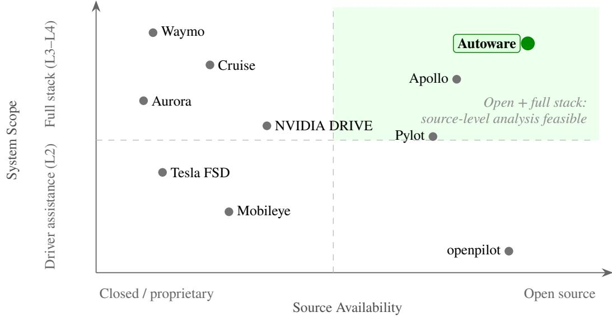
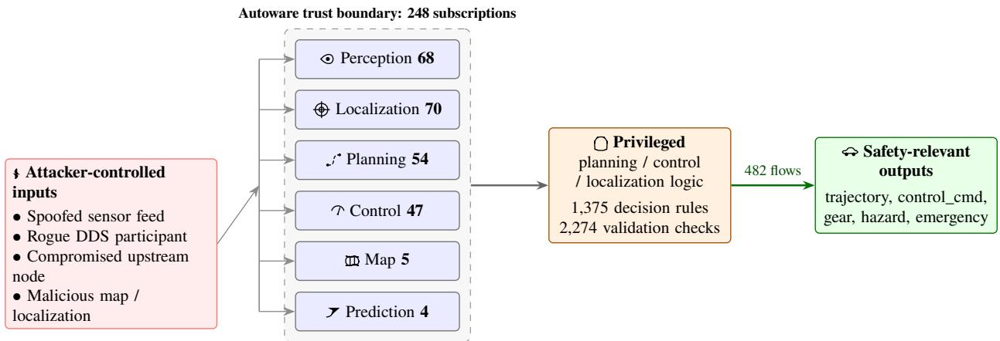
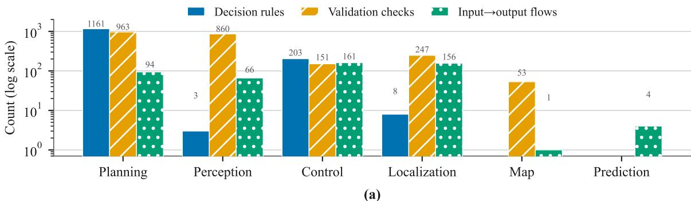
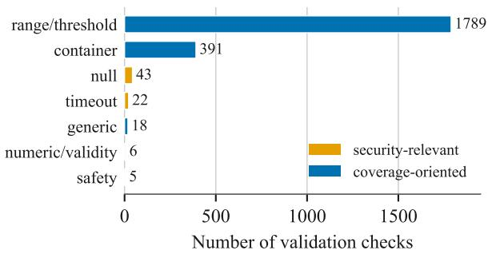
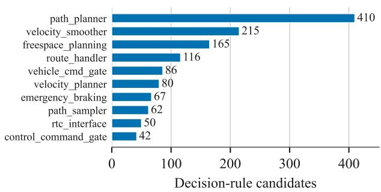
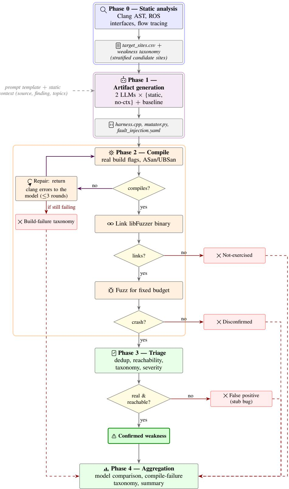
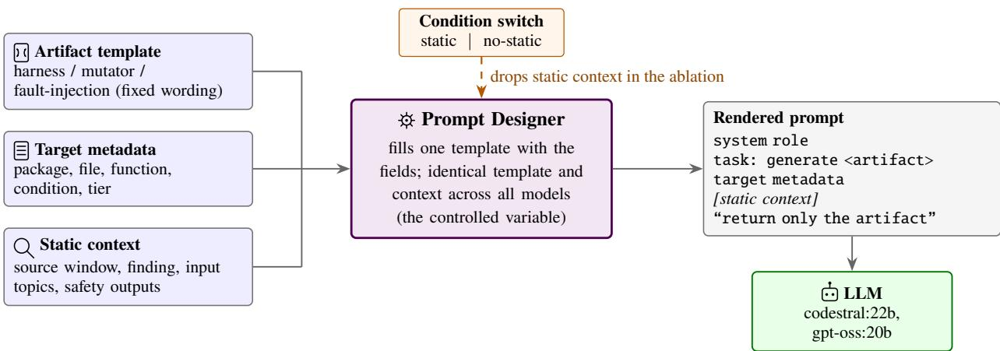
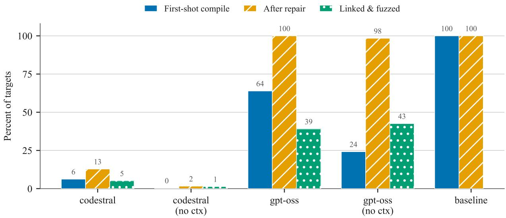
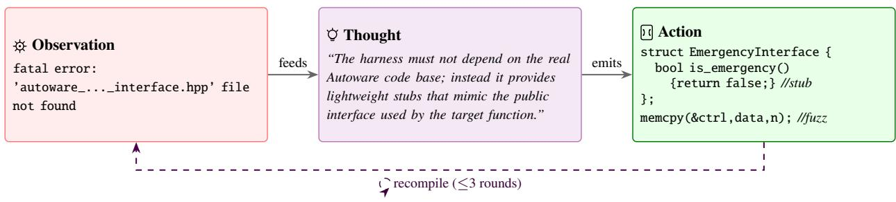
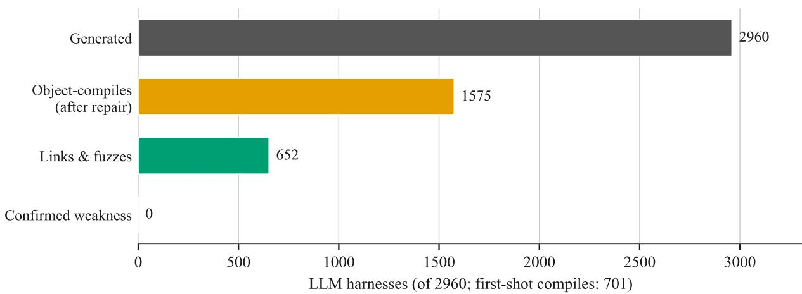

# LLM-Assisted Dynamic Threat Analysis for Attacker-Reachable Software Weaknesses in Autonomous Vehicles

Md. Wasiul Haque\*   
Department of Civil, Construction & Environmental Engineering, The University of Alabama   
2009 Smart Communities and Innovation Building (SCIB), 28 Kirkbride Lane,   
Tuscaloosa, AL 35487-0288   
ORCID: 0009-0007-8417-9261   
Email: mhaque16@crimson.ua.edu Sagar Dasgupta, Ph.D.   
Department of Civil, Construction & Environmental Engineering, The University of Alabama 2009 Smart Communities and Innovation Building (SCIB), 28 Kirkbride Lane,   
Tuscaloosa, AL 35487-0288   
ORCID: 0000-0001-8491-662X   
Email: sdasgupta@ua.edu

## Mizanur Rahman, Ph.D.

Department of Civil, Construction & Environmental Engineering, The University of Alabama   
2007 Smart Communities and Innovation Building (SCIB), 28 Kirkbride Lane,   
Tuscaloosa, AL 35487-0288   
ORCID: 0000-0003-1128-753X   
Email: mizan.rahman@ua.edu Md Rayhanur Rahman, Ph.D.   
Department of Computer Science, The University of Alabama 3017 Cyber Hall, 248 Kirkbride Lane,   
Tuscaloosa, AL 35487-0288   
ORCID: 0000-0003-4980-7350   
Email: mrahman87@ua.edu

Total Number of Pages: 17

\*Corresponding author

Haque, Dasgupta, Rahman, and Rahman

## ABSTRACT

Objectives: As autonomous vehicles reach public roads, their software becomes safety-critical. A defect reachable from an attacker input can change how a vehicle steers or brakes. Static analysis flags many candidate sites, but confirming one is reachable and exploitable needs executable artifacts whose manual construction is the bottleneck. We ask whether large language models (LLMs) can automate this for the open-source stack Autoware.

Methods: We perform a compiler-precise static analysis of Autoware (185 packages), recovering 1,375 decision rules, 2,274 validation checks, and 482 input-to-safety-output flows, from which we derive a weakness taxonomy and a sample of 740 reachable sites. For each site, 2 local open-weight LLMs, a no-static-context ablation, and a naive-template baseline generate artifacts. All 3,700 sets are compiled against the real build under sanitizers, repaired via a compiler in-the-loop stage, and fuzzed when they compile.

Findings: The principal result is a build-integration failure taxonomy that locates the binding constraint one stage before the fuzzer: 80% of first-shot compile failures arise from dependency-wiring rather than program logic. The reasoning model compiled 64% of its harnesses first, against 6% for the code-specialized model, and repair reached full object-compileability for the reasoning model only by stubbing the real target; consequently, under half of its harnesses reached the fuzzer and all 37 crashes came from a stub. Within budget, no candidate weakness was dynamically confirmed, reflecting this build-integration barrier rather than a benign attack surface.

Novelty: The first end-to-end feasibility study of LLM-assisted dynamic analysis on a full AV stack, pairing repositoryscale static candidate identification with LLM-generated confirmation and pinpointing where the automation fails.

Practical Applications: Scalable software-safety assurance is a prerequisite for automated driving. Unaided LLMassisted dynamic analysis is not yet a trustworthy assurance stage; efort is better spent on build integration than on prompt design, while the static analysis already guides safety review.

## INTRODUCTION

Autonomous vehicles (AVs) are moving from controlled test environments to public roads, making software correctness a matter of transportation safety rather than software engineering alone. A modern automated-driving stack is a large, distributed, real-time system that processes sensor and network data and produces steering, acceleration, and braking commands. As externally supplied values may traverse many interacting components before influencing actuation, a reachable software defect may become a safety hazard for the vehicle, its occupants, and other road users. Assuring software of this scale remains fundamentally dificult (Haque et al. 2025; Koopman and Wagner 2016; Kalra and Paddock 2016), and functional-safety and automotive-cybersecurity standards require developers to identify hazardous behavior and demonstrate that it cannot be triggered under relevant operating and threat conditions (International Organization for Standardization 2018; International Organization for Standardization and SAE International 2021).

A central assurance challenge is the gap between identifying a potential weakness and confirming it at run time. Static analysis of the source code can examine an entire repository and locate sites where externally influenced values reach safety-relevant decisions, validation is weak or absent, or data propagate toward consequential outputs (Haque et al. 2025). Such sites are candidates, not confirmed findings. Static evidence alone does not establish runtime reachability, path feasibility, or a security- or safety-relevant efect (Aggarwal and Jalote 2006).

Closing this gap requires an executable artifact that constructs the required state, delivers adversarial inputs to the flagged code, and observes the result (Aggarwal and Jalote 2006). The main obstacle is often not the fuzzer or sanitizer, both of which are mature (Fioraldi et al. 2020; Serebryany et al. 2012; LLVM Project 2024a; Manès et al. 2021), but the construction of the harness itself. A valid harness must satisfy target types, initialization requirements, message formats, middleware dependencies, package boundaries, and build configuration. In AV stacks, generated middleware artifacts like Robot Operating System (ROS) 2 (Macenski et al. 2022) interfaces, lifecycle assumptions, and cross-package dependencies make this process particularly dificult. Recent work shows that large language models (LLMs) can generate fuzz drivers, test programs, and structured inputs with varying success (Deng et al. 2023; Xia et al. 2024; Zhang et al. 2024; Google 2024; Hou et al. 2024). This motivates the central question of the study: can an LLM automate artifact construction for a production-scale automated-driving stack and enable dynamic confirmation at a scale impractical for manual efort?

We investigate this question through an end-to-end feasibility study of Autoware (Autoware Foundation 2026). We first identify sites where externally influenced data interact with safety-relevant decisions, validation logic, or output paths, and use this evidence to characterize the attack surface and derive a weakness taxonomy. From this population, we select a stratified sample and provide the associated code and static context to two local, open-weight LLMs. Each model generates an executable artifact for the selected target. The artifacts are compiled and linked against the native Autoware build with sanitizers enabled. Failed artifacts enter a compiler-in-the-loop repair process, and successful ones are executed under a fixed fuzzing budget. This design evaluates the full path from static candidate identification to dynamic confirmation while exposing the intermediate failures that prevent execution. The study addresses the following research questions:

RQ1: What classes of potentially exploitable weaknesses are reachable from external inputs in a productionscale automated-driving stack, and can LLM-generated dynamic artifacts confirm those weaknesses within a fixed analysis budget?

RQ2: To what extent can LLM-assisted dynamic analysis refine, correct, or extend the conclusions produced by static analysis alone, and what factors prevent it from doing so?

RQ3: How does model choice afect artifact validity, target-code reachability, and the severity of confirmed findings, and, when no findings are confirmed, how does it afect the intermediate outcomes, including compileability, failure mode, and generation cost that determine whether dynamic analysis can proceed?

In our experiment, the results provide a negative but informative assessment of current feasibility. No candidate was dynamically confirmed within the allocated fuzzing budget, primarily because most generated artifacts failed before meaningful execution rather than because Autoware’s attack surface was shown to be benign. Unaided LLM outputs rarely compiled and linked against the native build, while compiler-guided repair raised object compileability to 100% for the stronger model largely by introducing stubs or replacement implementations that bypassed the intended target. The study therefore identifies faithful build integration and verified target execution, rather than input generation alone, as the principal barrier to LLM-assisted dynamic confirmation. Based on this investigation, the paper makes the following contributions:

• We provide a repository-scale, compiler-precise characterization of an open-source AV stack, Autoware’s safety-relevant attack surface, comprising 1,375 decision rules, 2,274 validation checks, and 482 input-tosafety-output paths across 185 packages. From this evidence, we derive a weakness taxonomy grounded in observed Autoware code patterns rather than in a generic vulnerability catalog.

• We develop an end-to-end and reproducible pipeline that carries each static candidate through LLM-based artifact generation, integration with the native Autoware build, sanitizer-enabled compilation, compilerguided repair, fixed-budget fuzzing, and post-execution triage.

• We conduct a controlled comparison of 2 LLMs, together with a no-static-context ablation and a naive baseline, to determine how model capability and contextual information afect artifact construction and target-code reachability.

• We derive a build-integration failure taxonomy that identifies the stages at which LLM-assisted dynamic analysis breaks down on a codebase of this scale and distinguishes genuine target execution from artifacts that achieve nominal compilation by replacing, bypassing, or stubbing the intended implementation.

The remainder of the paper is organized as follows. Section 2 reviews related work on software assurance, fuzzing, and LLM-assisted testing. Section 3 surveys automated-driving software stacks and motivates the selection of Autoware, while Section 4 defines the threat model. Section 5 presents the static analysis and weakness taxonomy. Section 6 describes the analysis pipeline, and Section 7 presents the experimental setup, reports the results, followed by their interpretation in Section 8. Section 9 discusses limitations, threats to validity, and concludes the paper.

## RELATED WORK

Confirming security-relevant weaknesses in automated-driving software requires several complementary capabilities: understanding how untrusted inputs propagate through the stack, identifying suspicious code paths at repository scale, exercising those paths dynamically, and constructing the artifacts needed to make such execution possible. This section reviews the corresponding foundations in automated-driving software assurance, static analysis and fuzzing, and LLM-assisted software testing, and positions the present study at their intersection.

## Automated-Driving Software and Safety Context

Modern AV stacks are distributed, real-time systems spanning perception, localization, prediction, planning, control, and map processing. Open platforms commonly use middlewares like ROS 2, where nodes exchange serialized messages through a Data Distribution Service (DDS)-based publish–subscribe model (Macenski et al. 2022). Deserialization and subscription callbacks mark the point where external bytes become typed C++ objects, making them natural entry points for both attacker-controlled data and fuzzing inputs. System behavior also depends on launch files, parameters, topic remappings, and cross-package dependencies, allowing inputs to traverse several domains before afecting control. SAE J3016 defines automation levels (SAE International 2021), ISO 26262 addresses functional safety (International Organization for Standardization 2018), and ISO/SAE 21434 addresses vehicle cybersecurity (In ternational Organization for Standardization and SAE International 2021). Because the behavioral space cannot be covered by road testing alone (Haque et al. 2025; Koopman and Wagner 2016; Kalra and Paddock 2016), scalable software-level assurance is required.

## Static Analysis, Fuzzing, and Harness Construction

The static stage builds on sound program analysis (Cousot and Cousot 1977) and Low Level Virtual Machine (LLVM)/Clang (Lattner and Adve 2004; LLVM Project 2024b). Clang analyzes each translation unit under its actual build configuration, including generated interfaces, include paths, and preprocessor definitions. Tools like CodeQL provide a complementary repository-scale approach to control- and data-flow analysis (GitHub 2026). Static findings remain candidates because reported paths may be infeasible, unreachable, or harmless at run time. Coverage-guided fuzzing and sanitizers provide the mechanisms needed to test them (Manès et al. 2021; Fioraldi et al. 2020; LLVM Project 2024a; Serebryany et al. 2012), and continuous-fuzzing systems demonstrate their scalability when suitable targets exist (Serebryany 2017). These tools require an executable harness that compiles, links, initializes the target, and carries fuzzer-controlled data into the intended implementation. In Autoware, this may involve generated ROS 2 types, node state, package dependencies, and middleware initialization. Classical fuzz-driver synthesis can infer Application Programming Interface (API) usage from examples (Ispoglou et al. 2020), but is less efective for targets embedded in distributed node architectures and large build graphs.

## LLMs for Software Testing and Security

LLMs are increasingly used for code generation, debugging, testing, vulnerability analysis, and repair (Hou et al. 2024). In fuzzing, they have generated programs and inputs for deep-learning frameworks and general software (Deng et al. 2023; Xia et al. 2024), guided protocol fuzzing (Meng et al. 2024), drafted continuous-fuzzing harnesses (Google 2024), and generated library fuzz drivers (Zhang et al. 2024). LLM agents have also constructed exploits from known vulnerability descriptions (Fang et al. 2024). Many approaches use iterative repair: the artifact is compiled, diagnostics are returned, and the model revises its output. Our compiler-in-the-loop process follows this reasoning-and-acting pattern (Yao et al. 2023). However, compilation alone does not ensure semantic fidelity. A model may remove dependencies, replace implementations, or introduce stubs that bypass the real target. These artifacts cannot confirm the original candidate.

## Positioning of This Study

Most LLM-based fuzz-driver studies evaluate isolated programs, libraries, or APIs. Our study integrates repositoryscale static analysis, candidate-guided LLM generation, native-build compilation and repair, fuzzing, and targetreachability verification. This design distinguishes failures in candidate selection, generation, build integration, and execution. To our knowledge, it is the first end-to-end feasibility study of LLM-assisted dynamic analysis on a complete autonomous driving stack that treats build integration and real target execution as primary outcomes.

## AUTONOMOUS VEHICLE SOFTWARE STACKS AND THE STUDY SUBJECT

Autonomous driving software ranges from proprietary commercial systems to fully open-source platforms (Yurtsever et al. 2020). Because our method requires source code, compiler metadata, package dependencies, and the native build environment, only open platforms are suitable. Table 1 and Figure 1 summarize this landscape. Commercial systems such as Waymo, Cruise, Aurora, Tesla FSD, Mobileye, and NVIDIA DRIVE are proprietary. Waymo has published elements of its Level 4 safety-case methodology (Webb et al. 2020), while Mobileye introduced the Responsibility Sensitive Safety model (Shalev-Shwartz et al. 2017); however, none exposes the source and build system required for our analysis. Among open platforms, Autoware and Apollo provide the most complete deployment-oriented stacks. Autoware is a ROS 2-based Level 3–4 platform maintained by the Autoware Foundation and released under Apache 2.0 (Kato et al. 2018; Autoware Foundation 2026). Apollo is a similarly comprehensive Apache-licensed stack (Baidu 2024; Jung et al. 2025). openpilot is limited to Level 2 driver assistance (comma.ai 2024), while Pylot is primarily a modular research platform (Gog et al. 2021).

TABLE 1 Representative Automated-Driving Software Stacks
<table><tr><td>Stack</td><td>Developer</td><td>Access</td><td>Scope</td></tr><tr><td>Waymo Driver</td><td>Waymo (Alphabet)</td><td>Proprietary</td><td>Level 4 Robotaxi</td></tr><tr><td>Cruise</td><td>General Motors</td><td>Proprietary</td><td>Level 4 Robotaxi</td></tr><tr><td>Aurora Driver</td><td>Aurora</td><td>Proprietary</td><td>Level 4, Autonomous trucking</td></tr><tr><td>Tesla FSD</td><td>Tesla</td><td>Proprietary</td><td>Vision-centric Level 2, Fleet scale</td></tr><tr><td>Mobileye</td><td>Mobileye (Intel)</td><td>Proprietary</td><td>Camera-based ADAS to Level 4; RSS model</td></tr><tr><td>NVIDIA DRIVE</td><td>NVIDIA</td><td>Proprietary</td><td>Compute and software SDK for AD</td></tr><tr><td>Autoware</td><td>Autoware Foundation</td><td>Open (Apache 2.0)</td><td>ROS 2 full Level 3-4 stack</td></tr><tr><td>Apollo</td><td>Baidu</td><td>Open (Apache 2.0)</td><td>Full stack; Widely used</td></tr><tr><td>openpilot</td><td>comma.ai</td><td>Open (MIT)</td><td>Level 2 driver assistance on consumer cars</td></tr><tr><td>Pylot</td><td>Research</td><td>Open (Apache 2.0)</td><td>Modular research AD platform</td></tr></table>

Source and build-system availability were essential because the pipeline analyzes compiler representations and compiles generated artifacts against the native implementation, excluding proprietary platforms. System scope further narrowed the candidates to complete automated-driving stacks, favoring Autoware and Apollo over narrower platforms such as openpilot and Pylot. Autoware was ultimately chosen for its compatibility with the proposed workflow. Its ROS 2 architecture exposes message interfaces, package boundaries, launch configurations, dependencies, and a reproducible colcon-based build with package-level compile databases.

## THREAT MODEL

We consider a software-level adversary capable of influencing one or more inputs to the Autoware node graph. Attacks requiring physical access to the vehicle, sensors, or environment are out of scope. The adversary may act through four channels aligned with the input sources traced in our static analysis: (i) the adversary may inject a malicious or spoofed sensor stream into a perception or localization topic; (ii) a rogue DDS participant may join the ROS 2 graph and publish to or subscribe from safety-relevant topics, without an enforced security policy, DDS discovery may admit previously unknown participants (Macenski et al. 2022; Dieber et al. 2017); (iii) a compromised upstream node may emit well-typed but semantically adversarial messages, including stale, inconsistent, out-of-range, non-finite, or boundary values; and (iv) the adversary may manipulate map, route, or localization inputs consumed at startup or during execution.

  
FIGURE 1 Automated-driving software stacks positioned by source availability and system scope. Autoware, highlighted in the figure, is selected as the subject of this study.

The adversary aims to cause denial of service in a safety-critical node, corrupt perception or localization state, induce unsafe planning or control decisions, or silently degrade motion-related outputs without producing an immediate crash. Figure 2, derived from the static ROS 2 interface inventory, illustrates how these inputs cross into perception, localization, planning, and control logic before reaching safety-relevant outputs. We exclude physical sensor spoofing and adversarial perturbations against learned perception models (Cao et al. 2019; Sato et al. 2021), supply-chain compromise of code, dependencies, models, or build artifacts, and attacks on V2X or roadside infrastructure. All experiments are conducted in software-in-the-loop

  
FIGURE 2 Trust boundary over the Autoware node graph, derived from the static interface inventory. Attackercontrolled inputs reach each domain’s subscription surface, which feeds privileged decision logic and safetyrelevant outputs.

## SAFETY-RELEVANT ATTACK SURFACE OF AUTOWARE

Before dynamic confirmation, we identify where safety-relevant weaknesses may plausibly occur. This section presents the repository-scale static analysis used to characterize Autoware’s attack surface, select candidates for dynamic testing, and derive the weakness taxonomy. All reported counts and figures are generated by the analysis pipeline and released with the accompanying artifacts.

## Analysis Method and Scale

Whole-repository extraction identifies packages, domains, deployed sources, dependencies, and ROS interfaces while excluding non-deployment code. Clang then processes each translation unit under its exported build configuration to recover if and switch conditions and a simplified call graph. Launch and YAML files provide node composition, remappings, and runtime configuration, with CodeQL used as a complementary cross-check (GitHub 2026). Finally, classifiers label safety-relevant decisions and validation checks, and a heuristic package-level analysis links input subscriptions to consequential outputs.

The pipeline analyzes 185 packages and 1,857 source files as listed in Table 2. It recovers 786 ROS interfaces, comprising 248 subscriptions, 500 publishers, and 38 services, together with 1,816 parameter surfaces and 2,749 compiler-precise condition sites. Figure 3(a) summarizes the recovered surface.

  
(b)

  
(c)  
FIGURE 3 Autoware’s safety-relevant static surface. (a) Decision rules, validation checks, and heuristic input to-output flows by domain (log scale) (b) Validation checks by type (c) The ten most decision-dense packages.

## Structure of the Attack Surface

Safety-relevant decision logic is abundant and distributed: the pipeline recovers 1,375 candidates, concentrated in planning (1,161) and control (203), across route management, velocity regulation, command gating, emergency braking, and shared planning infrastructure. The heuristic analysis recovers 482 package-level paths, concentrated in the vehicle command gate, external command selector, and control command gate, with representative examples in Table 3. Because this analysis is not fully interprocedural or taint-precise, it supports prioritization rather than proof of attacker-to-actuation reachability. Validation is also uneven: among 2,274 recovered checks, 1,789 are range or threshold guards and 391 are container checks, compared with 43 null checks, 22 timeout or staleness checks, and 6 numeric-validity checks. These are summarized in Figures 3(b) and 3(c).

TABLE 2 Repository-Scale Static-Analysis Inventory for Autoware
<table><tr><td>Quantity</td><td>Count</td></tr><tr><td rowspan="3">Relevant packages Source files in scope ROS interfaces (subs / pubs / services)</td><td>185</td></tr><tr><td>1,857</td></tr><tr><td>786 (248/500/38)</td></tr><tr><td>Parameter surfaces Compiler-precise condition sites</td><td>1,816</td></tr><tr><td>Decision-rule candidates</td><td>2,749</td></tr><tr><td>Validation checks</td><td>1,375</td></tr><tr><td>Heuristic input-to-output paths</td><td>2,274</td></tr><tr><td>Call-graph edges</td><td>482 1,052</td></tr></table>

TABLE 3 Representative Attacker-Influenced Flows from Input to Safety-Relevant Output  
Domain Input topic → package → safety output   
Control input/external\_emergency\_stop\_heartbeat → vehicle\_cmd\_gate → output/vehicle\_cmd\_emergency   
Planning \~/input/odometry → mission\_planner → output/goal\_pose   
Perception \~/input/image → bevfusion → \~/output/objects   
Localization \~/input/pose\_with\_covariance → yabloc\_particle\_filter → \~/output/weighted\_particles

Table 4 organizes the recovered evidence into four operational weakness classes used for candidate selection, dynamic labeling, and severity analysis under the adapted CVSS/RVSS framework (FIRST.org 2019; Mayoral-Vilches et al. 2018). The taxonomy does not classify every site as vulnerable; it identifies the mechanism through which externally influenced data may afect safety-relevant behavior.

TABLE 4 Weakness Taxonomy Derived from the Static Analysis
<table><tr><td>Category</td><td>Description</td><td>Static basis</td></tr><tr><td>Decision-policy guard</td><td>Conditional controlling a safety-relevant branch (stop, yield, emergency, gate- mode, geometry).</td><td>1,375 rules</td></tr><tr><td>Validation weakness</td><td>Missing or weak range, container, null/optional, timeout, or numeric-validity guard on an externally influenced input.</td><td>2,274 checks</td></tr><tr><td>Input dependency</td><td>Site fed by an attacker-influenced subscription or parameter close to an actuation output.</td><td>482 flows</td></tr><tr><td>State dispatch</td><td>switch or mode selection over an externally influenced state variable.</td><td>subset of conditions</td></tr></table>

## LLM-ASSISTED DYNAMIC ANALYSIS APPROACH

The pipeline spans five phases, as illustrated in Figure 4: (i) static candidate identification (Phase 0); (ii) artifact generation (Phase 1); (iii) build integration and dynamic execution (Phase 2); (iv) triage of each execution outcome (Phase 3); and (v) aggregation across conditions (Phase 4). This section describes static candidate identification in Phase 0 and the dynamic workflow spanning Phases 1–4. To support a controlled comparison, the prompt template, target context, decoding parameters, build environment, and execution budget are held constant across conditions. The model is the only varying factor, except in the ablation condition, where the static-analysis context is withheld.

## Target Selection

The dynamic study evaluates the full set of high-priority candidates identified by the static analysis rather than a manually selected sample. Section 5 recovers 2,749 compiler-precise condition sites across 185 packages and assigns each a safety-relevance score from 0 to 11. The score rewards actuation-related terms (+3), validation or bounds checks (+2), external ROS input exposure (+2), presence on an input-to-safety-output flow (+3), and membership in a safety-critical domain (+1). Sites scoring (≥ 8) are classified as P1, those scoring 5–7 as P2, and the remainder as P3. All P1 and P2 sites are retained, yielding 740 targets: 214 in P1 and 526 in P2, spanning 34 packages and 107 source files. Table 5 presents the composition by domain and tier. The selection is deterministic, reproducible, and exhaustive within these tiers.

  
FIGURE 4 End-to-end LLM-assisted dynamic-analysis pipeline. Solid arrows show progression through the five phases, the purple loop denotes compiler-guided repair, and decision nodes classify each harness as a build failure, not exercised, disconfirmed, false positive, or confirmed weakness before Phase 4 aggregation.

TABLE 5 Composition of the 740-Target Census by Domain and Priority Tier (Every P1 and P2 Site; P3 Excluded)
<table><tr><td>Domain</td><td>P1</td><td>P2</td><td>Total</td></tr><tr><td>Planning</td><td>129</td><td>232</td><td>361</td></tr><tr><td>Control</td><td>59</td><td>79</td><td>138</td></tr><tr><td>Perception</td><td>6</td><td>118</td><td>124</td></tr><tr><td>Localization</td><td>20</td><td>95</td><td>115</td></tr><tr><td>Map</td><td>0</td><td>2</td><td>2</td></tr><tr><td>Total</td><td>214</td><td>526</td><td>740</td></tr></table>

## Artifact Generation

For each target, a fixed prompt template is populated with the target metadata and static-analysis context. The context includes the relevant source window, the candidate description, and the recovered input topics and safety-relevant outputs, as illustrated in Figure 5. The template, context fields, and decoding parameters are identical across models. The no-static-context ablation receives only target metadata, while a deterministic baseline produces metadata-based scafolds as a naive lower bound. All prompts and raw responses are retained for reproducibility.

Each target produces four artifacts: (i) a function-level libFuzzer harness, (ii) a ROS 2 message mutator, (iii) a software-in-the-loop fault-injection specification, and (iv) an ASan/UBSan build configuration. The mutator generates malformed, boundary, and timing-variant messages, while the fault-injection specification defines bounded message drops, delays, stale replays, and NaN/Inf perturbations.

  
FIGURE 5 The prompt designer for Phase 1

## Build Integration and Repair

Each harness is compiled against the pinned Autoware revision using the target translation unit’s include paths, preprocessor definitions, and compiler options from compile\_commands.json. Compilation uses clang++ with AddressSanitizer and UndefinedBehaviorSanitizer. We define compileability as successful object compilation against the real Autoware headers and APIs, a less stringent criterion than linking or execution. All attempts are logged and classified using a fixed error taxonomy. Failed harnesses enter a compiler-in-the-loop repair process for up to 3 rounds. The model receives the failing source and Clang diagnostics, while the original output is retained to distinguish first-shot from post-repair compileability. In the no-static-context condition, repair uses only the generated artifact and compiler feedback; the withheld static context is not reintroduced.

## Triage and Aggregation

Compiled harnesses are linked into libFuzzer executables and run under a fixed budget. A harness is considered valid only if it invokes the intended Autoware implementation and carries fuzzer-controlled input to the target. Crashes are deduplicated and manually assessed for reachability, reproducibility, and security or safety impact. A candidate is classified as confirmed when the real target is exercised and a reproducible weakness is observed, and as a false positive when the crash originates outside the target. A target exercised for the full budget without a relevant failure is disconfirmed within that budget, whereas a harness that does not reach the intended code or fuzzing stage is not exercised. This distinction prevents build and integration failures from being treated as evidence against the static candidate.

## EVALUATION AND RESULTS

This section reports the end-to-end outcomes for the 740 targets selected in Section 5. Across the 5 conditions defined in Section 7, the pipeline generated 3,700 artifact sets, compiled and linked them against the sanitized Autoware build, repaired failures through the compiler-in-the-loop process, and fuzzed the surviving harnesses. Because the results are dominated by failures before execution, we organize them by pipeline stage rather than by research question.

## Model Configuration and Parameters

The experimental setup is designed to compare model behavior under a common execution environment. We evaluate two local, open-weight LLMs served through an Ollama OpenAI-compatible endpoint: one code-specialized model and one general reasoning model. Using models with diferent capabilities helps separate model-specific efects from those introduced by the prompt and pipeline design. All experiments target the same Autoware workspace and use a configured fuzzing budget of 600 seconds per target. For harnesses that successfully linked, the realized execution time was 60 seconds per target. Table 6 summarizes the complete configuration.

## TABLE 6 Experimental Configuration

Field Value   
Target subject Autoware (cloned on 10 February 2026)   
Models (LLM) codestral:22b (code-specialized); gpt-oss:20b (open-weight reasoning)   
Decoding temperature 0.1, max\_tokens 4096   
Conditions 2 models × {static, no-static} + naive baseline   
Build repair compiler-in-the-loop, up to 3 rounds   
Hardware Intel i9-14900F (32 threads); NVIDIA RTX 4090 (24 GB)   
Sample 740 sites, stratified by domain × priority, seed 202707   
Sanitizers AddressSanitizer + UndefinedBehaviorSanitizer

A harness provides evidence about Autoware only if it compiles against the target package, links to the real implementation rather than substituted stubs, and exercises the flagged branch at run time. Only then can a crash, or its absence, be attributed to the target code. We therefore present the results as attrition through these gates: build integration and target reachability, which address RQ1 and RQ2; the efects of model choice and compiler-guided repair, which address RQ3; and the evidence provided by the few harnesses that reach execution.

## Build Integration Analysis (RQ1, RQ2)

No weakness was confirmed across the 5 conditions and 740 targets. Given the thin validation and plausible actuationfacing paths identified in Section 5, this result reflects failure before meaningful fuzzing rather than evidence of a benign attack surface. Of the 2,960 LLM-generated harnesses, 2,259 failed to compile initially. As shown in Table 7, 1,436 omitted required ROS or Autoware headers and 381 included target .cpp files through invalid paths, together accounting for 1,817 of 2,259 failures. The remainder comprised API mismatches (225), signature mismatches (110), syntax errors (81), and 26 other errors. Build integration therefore prevented most artifacts from confirming or refuting their static candidates. Table 7 also shows distinct model behavior: the code-specialized model failed mainly on dependency wiring, whereas the reasoning model more often reached real APIs but failed on call or signature compatibility.

TABLE 7 Compile-integration outcomes and first-shot compile-failure classes by condition (740 harnesses per LLM condition). Columns � and % give the total and share across the four LLM conditions.
<table><tr><td rowspan="2"></td><td colspan="4">LLM conditions</td><td colspan="2">LLM (all four)</td><td rowspan="2"></td></tr><tr><td>codestral</td><td>codestral (no ctx)</td><td>gpt-oss</td><td>gpt-oss (no ctx)</td><td>n</td><td>%</td></tr><tr><td>Compile-integration outcome</td><td></td><td></td><td></td><td></td><td></td><td></td><td></td></tr><tr><td>Compiled, first-shot</td><td>46</td><td>3</td><td>473</td><td>179</td><td>701</td><td>24</td><td>740</td></tr><tr><td>Compiled, after repair</td><td>95</td><td>12</td><td>740</td><td>728</td><td>1,575</td><td>53</td><td>740</td></tr><tr><td>Linked &amp; fuzzed</td><td>38</td><td>10</td><td>289</td><td>315</td><td>652</td><td>22</td><td></td></tr><tr><td>First-shot compile-failure class</td><td></td><td></td><td></td><td></td><td></td><td></td><td></td></tr><tr><td>Missing include</td><td>441</td><td>536</td><td>62</td><td>397</td><td>1,436</td><td>64</td><td>0</td></tr><tr><td>Source file not found</td><td>134</td><td>120</td><td>21</td><td>106</td><td>381</td><td>17</td><td>0</td></tr><tr><td>API mismatch</td><td>64</td><td>53</td><td>65</td><td>43</td><td>225</td><td>10</td><td>0</td></tr><tr><td>Signature mismatch</td><td>37</td><td>22</td><td>44</td><td>7</td><td>110</td><td>5</td><td>0</td></tr><tr><td>Syntax error</td><td>8</td><td>4</td><td>62</td><td>7</td><td>81</td><td>4</td><td>0</td></tr><tr><td>Other</td><td>10</td><td>2</td><td>13</td><td>1</td><td>26</td><td>1</td><td>0</td></tr><tr><td>Total first-shot failures</td><td>694</td><td>737</td><td>267</td><td>561</td><td>2,259</td><td>100</td><td>0</td></tr></table>

## Model Choice, Repair, and Stub Convergence Analysis (RQ3)

Model choice strongly afected first-shot compileability. As shown in Table 7, the reasoning model compiled 473 of 740 harnesses with static context, whereas the code-specialized model compiled only 46 and 3 of 740 harnesses (6% and under 1%) across its two conditions. Removing the source window and finding description reduced the reasoning model’s rate from 63.9% to 24.2%, confirming the value of static context. Figure 6 shows that repair raised its object compileability to 100% in both conditions after a mean of 1.2 rounds with context and 1.3 without; the code-specialized model improved only marginally.

This gain largely reflected stub convergence. As illustrated in Figure 7, the reasoning model often replaced unresolved dependencies with local stubs. Consequently, only 289 of 740 context-enabled harnesses and 315 of 740 no-context harnesses linked and reached the fuzzer; 451 and 413 nominally compilable harnesses, respectively, failed to bind to Autoware symbols. The no-context condition linked more harnesses, 315 versus 289, because it produced simpler self-contained stubs. Repair therefore shifted the bottleneck from compilation to linking, making object compileability an unreliable proxy for valid analysis. The baseline reinforces this distinction: although every harness compiled, none exercised target logic, yielding average libFuzzer feature coverage of 2 compared with approximately 190 for the linked reasoning-model harnesses.

## Confirmation Analysis

The outcomes depend on whether a harness reached and exercised the real target. Figure 8 summarizes this attrition. After repair, 615 LLM harnesses linked and fuzzed for the full budget without a crash: 24 and 10 from the codespecialized model (with and without static context), and 271 and 310 from the reasoning model (with and without context). These runs provide only weak disconfirmation because most surviving harnesses exercised local stubs rather than the intended Autoware implementation. The remaining 2,308 condition–target pairs never reached the fuzzer.

Four cases illustrate the aggregate results as shown in Table 8. First, a P1 control-gate harness compiled and fuzzed cleanly only after replacing real interfaces with no-op stubs and reimplementing the input structure, so it did not exercise the reported Autoware branch. Second, the code-specialized model rarely produced compilable harnesses, mainly because of invalid target paths, missing headers, and leaked Markdown syntax. Third, static context increased the reasoning model’s first-shot compileability from 24.2% to 63.9%, indicating that it improves artifact construction. Finally, a velocity-smoother crash occurred inside a model-reimplemented helper with no Autoware frame on the stack. Together, these cases show that compilation or crashing provides evidence only when the harness demonstrably executes the real target code.

Overall, the results show that the primary obstacle to LLM-assisted dynamic confirmation is not fuzz-input generation but faithful integration with the target software. Static context improves first-shot artifact quality, and compiler-guided repair improves nominal compileability, but neither reliably preserves linkage to the real implementation. For large, dependency-rich automated-driving stacks like Autoware, successful object compilation must therefore be separated from successful linking, target reachability, and genuine dynamic confirmation. The ablation in which static context raised the reasoning model’s first-shot compileability from 24.2% to 63.9%, showing that the static stage improves artifact quality rather than merely selecting targets.

FIGURE 6 First-shot object compileability, post-repair object compileability, and the fraction of harnesses that linked and reached the fuzzer.  
  
FIGURE 7 A compiler-guided repair iteration from a GPT-OSS harness. In response to a missing dependency, the model removes the real dependency and introduces interface stubs. Repeated repair makes the harness compile while moving it away from the intended Autoware implementation

TABLE 8 Summary of the Four Case Studies
<table><tr><td>#</td><td>Setting</td><td>Outcome</td></tr><tr><td>1</td><td>Control command gate, emergency arbitration (P1, control); gpt-oss with static context</td><td>Compiled, linked, and fuzzed for the full budget with no crash, but only by stubbing the real interfaces. A weak disconfirmation; compileability overstates how much real logic is exercised.</td></tr><tr><td>2</td><td>Code-specialized model, all 30 tar- gets</td><td>Compiled 0/30, dominated by including the target . cpp and omitting ROS headers. Code special- ization did not overcome cross-package build integration.</td></tr><tr><td>3</td><td>Static-context ablation (gpt-oss)</td><td>Static context raised first-shot compileability from 13.3% to 56.7%. The static stage materially improves artifact quality, not just target selection.</td></tr><tr><td>4</td><td>Lone crash, velocity smoother (gpt- oss)</td><td>The crash was an unchecked std: :vector: :at in the harness&#x27;s own stub, not in Autoware. A crash is meaningless unless the harness provably drives the real code.</td></tr></table>

## DISCUSSION

The observed failures are systemic rather than target-specific. They arise at the boundary between a syntactically plausible harness and the build graph of a large ROS 2 workspace, where successful integration depends on resolving package dependencies, generated message types, include paths, link targets, and node-construction requirements. This dificulty reflects the scale of the subject system, including hundreds of packages, 786 interfaces, and a distributed validation surface, rather than the characteristics of any single candidate.

The results consistently support this conclusion. The strongest first-shot condition compiled only 473 of 740 harnesses, and 1,817 of the 2,259 initial failures were caused by dependency-wiring errors. Compiler-guided repair raised object compileability to 100% for the reasoning model, yet only 652 of 2,960 LLM-generated harnesses ultimately linked and reached the fuzzer. Thus, compilation is not the principal assurance objective.

## FIGURE 8 Attrition of LLM-generated harnesses across the four conditions

The repair loop fails because it optimizes for satisfying the compiler rather than preserving the connection to the real target. When faced with unresolved dependencies, the model often removes them and introduces local stubs, producing self-contained artifacts that compile but no longer exercise Autoware. The bottleneck therefore shifts from compilation to linking and target reachability rather than being removed. A repair process suitable for software assurance would need to optimize explicitly for integration with the native build. This would require resolving the correct package dependencies and build targets, linking against real implementation objects, and verifying at runtime that the intended Autoware functions appear on the executed path. These requirements extend beyond prompt refinement and call for build-aware tooling that treats semantic target preservation as a first-class constraint.

The results also limit the immediate role of LLM-generated harnesses in autonomous driving continuous integration. On current evidence, they are not yet reliable as an autonomous dynamic-assurance stage. They may nevertheless be useful for producing initial harness drafts that a human engineer completes and validates.

## CONCLUSIONS

This study evaluated whether LLMs can automate the dynamic confirmation of software weaknesses in an AV software stack. The results support a qualified negative. The static analysis identifies a broad safety-relevant attack surface in Autoware, comprising 1,375 decision rules, 2,274 validation checks, and 482 input-to-safety-output paths across 185 packages. However, the dynamic stage shows that the main obstacle is not fuzzing, but faithful integration with the real build. Unaided model outputs rarely compile and link against a stack of this scale. Compiler-in-the-loop repair raises object compileability to 100% for the stronger model, but largely through stub convergence. As a result, only 652 of 2,960 harnesses reach the fuzzer, and all 37 crashes occur in generated stub code rather than in Autoware.

The results are qualified by several limitations. The decision-rule classification and package-level flow analysis are heuristic. As a result, their counts characterize the observed attack surface rather than provide a sound over- or under-approximation. Only packages with available compile commands contribute to the compiler-precise inventory. All experiments are conducted in software-in-the-loop; therefore, we make no claim about exploitability on a physical vehicle. The realized fuzzing time was 60 of the configured 600 seconds per target. Because few harnesses linked and reached execution, this diference does not afect the main finding. Compileability is defined as successful object compilation rather than full linking. Many compiling harnesses also replace real interfaces with local stubs. The reported compileability rates and disconfirmations are therefore optimistic upper bounds on useful analysis. Under a full-link and real-target-execution criterion, the efective success rate approaches zero across all conditions. The repair loop optimizes object compilation, uses a fixed budget of 3 rounds, and relies on the same model for generation and repair. A link-aware repair process should perform better, although the present design clearly exposes the stub-convergence failure mode. Autoware is public and may have appeared in model pretraining data, which would favor the models. Even so, the observed success rates remain low. Because the study evaluates only Autoware and two open-weight models, the reported rates should not be generalized directly. The broader hypothesis is that build integration, rather than input generation, is the binding constraint in large robotics and automated-driving codebases.

Future automation should therefore focus on dependency resolution, native linking, and verified execution of the intended target rather than on prompt refinement or compile-only repair. The static characterization remains valuable independently by prioritizing high-impact sites for human review. We release the prompts, generated artifacts, static-analysis outputs, and execution logs to support reproduction and further study.

## ACKNOWLEDGMENTS

We used the generative AI tools ‘ChatGPT’ and ‘Claude’ to help rephrase parts of our own writing to improve clarity and for editorial purposes.

## AUTHOR CONTRIBUTIONS

Md. Wasiul Haque, Sagar Dasgupta: conceptualization, methodology, coding, data collection, data analysis, and writing – original draft; Mizanur Rahman: conceptualization, methodology, writing – original draft, review and editing, and funding acquisition; Md Rayhanur Rahman: conceptualization, methodology, writing – original draft, review and editing.

## DECLARATION OF CONFLICTING INTERESTS

The authors declared no potential conflicts of interest with respect to the research, authorship, and/or publication of this article.

## FUNDING

This research was supported by the National Center for Transportation Cybersecurity and Resiliency (TraCR) (a U.S. Department of Transportation National University Transportation Center) headquartered at Clemson University, Clemson, South Carolina, USA (Award # 69A3552344812, 69A3552348317) and National Science Foundation (NSF) (Award # 2340456). Any opinions, findings, conclusions, and recommendations expressed in this material are those of the author(s) and do not necessarily reflect the views of funding agencies, and the U.S. Government assumes no liability for the contents or use thereof.

## REFERENCES

Haque, M. W., M. Erfan, S. Dasgupta, M. R. Rahman, and M. Rahman, Security Vulnerabilities in Software Supply Chain for Autonomous Vehicles. arXiv preprint arXiv:2509.16899, 2025.

Koopman, P. and M. Wagner, Challenges in Autonomous Vehicle Testing and Validation. SAE International Journal of Transportation Safety, Vol. 4, No. 1, 2016, pp. 15–24.

Kalra, N. and S. M. Paddock, Driving to Safety: How Many Miles of Driving Would It Take to Demonstrate Autonomous Vehicle Reliability? RAND Corporation, 2016.

International Organization for Standardization, ISO 26262:2018 Road Vehicles — Functional Safety. ISO, Geneva, Switzerland, 2018.

International Organization for Standardization and SAE International, ISO/SAE 21434:2021 Road Vehicles — Cybersecurity Engineering. ISO/SAE, Geneva, Switzerland, 2021.

Aggarwal, A. and P. Jalote, Integrating static and dynamic analysis for detecting vulnerabilities. In 30th Annual International Computer Software and Applications Conference (COMPSAC’06), IEEE, 2006, Vol. 1, pp. 343–350.

Fioraldi, A., D. Maier, H. Eißfeldt, and M. Heuse, AFL++: Combining Incremental Steps of Fuzzing Research. In Proceedings of the 14th USENIX Workshop on Ofensive Technologies (WOOT), 2020.

Serebryany, K., D. Bruening, A. Potapenko, and D. Vyukov, AddressSanitizer: A Fast Address Sanity Checker. In Proceedings of the USENIX Annual Technical Conference (ATC), 2012, pp. 309–318.

LLVM Project, libFuzzer – a library for coverage-guided fuzz testing. https://llvm.org/docs/LibFuzzer.html, 2024a, accessed 2026.

Manès, V. J. M., H. Han, C. Han, S. K. Cha, M. Egele, E. J. Schwartz, and M. Woo, The Art, Science, and Engineering of Fuzzing: A Survey. IEEE Transactions on Software Engineering, Vol. 47, No. 11, 2021, pp. 2312–2331.

Macenski, S., T. Foote, B. Gerkey, C. Lalancette, and W. Woodall, Robot Operating System 2: Design, architecture, and uses in the wild. Science Robotics, Vol. 7, No. 66, 2022, p. eabm6074.

Deng, Y., C. S. Xia, H. Peng, C. Yang, and L. Zhang, Large Language Models Are Zero-Shot Fuzzers: Fuzzing Deep-Learning Libraries via Large Language Models. In Proceedings of the 32nd ACM SIGSOFT International Symposium on Software Testing and Analysis (ISSTA), 2023, pp. 423–435.

Xia, C. S., M. Paltenghi, J. L. Tian, M. Pradel, and L. Zhang, Fuzz4All: Universal Fuzzing with Large Language Models. In Proceedings of the 46th IEEE/ACM International Conference on Software Engineering (ICSE), 2024.

Zhang, C., Y. Zheng, M. Bai, Y. Li, W. Ma, X. Xie, Y. Li, L. Sun, and Y. Liu, How Efective Are They? Exploring Large Language Model Based Fuzz Driver Generation. Proceedings ofthe ACM SIGSOFTInternational Symposium on Software Testing and Analysis (ISSTA), 2024.

Google, OSS-Fuzz-Gen: LLM-aided Fuzz Target Generation. https://github.com/google/oss-fuzz-gen, 2024, accessed 2026.

Hou, X., Y. Zhao, Y. Liu, Z. Yang, K. Wang, L. Li, X. Luo, D. Lo, J. Grundy, and H. Wang, Large Language Models for Software Engineering: A Systematic Literature Review. ACM Transactions on Software Engineering and Methodology, Vol. 33, No. 8, 2024.

Autoware Foundation, Autoware Documentation. https://autowarefoundation.github.io/autoware-documentation/mai n/home/, 2026, accessed 2026.

SAE International, J3016: Taxonomy and Definitions for Terms Related to Driving Automation Systems for On-Road Motor Vehicles. SAE International, 2021.

Cousot, P. and R. Cousot, Abstract interpretation: A unified lattice model for static analysis of programs by construction or approximation of fixpoints. In Proceedings ofthe Fourth Annual ACM SIGPLAN-SIGACT Symposium on Principles of Programming Languages (POPL), 1977, pp. 238–252.

Lattner, C. and V. Adve, LLVM: A Compilation Framework for Lifelong Program Analysis & Transformation. In Proceedings ofthe International Symposium on Code Generation and Optimization (CGO), 2004, pp. 75–88.

LLVM Project, Clang LibTooling and the AST Matcher Reference. https://clang.llvm.org/docs/LibTooling.html, 2024b, accessed 2026.

GitHub, CodeQL. https://codeql.github.com/, 2026, accessed 2026.

Serebryany, K., OSS-Fuzz – Google’s Continuous Fuzzing Service for Open Source Software. In USENIX Security Symposium (invited talk), 2017.

Ispoglou, K., D. Austin, V. Mohan, and M. Payer, FuzzGen: Automatic Fuzzer Generation. In Proceedings of the 29th USENIX Security Symposium, 2020, pp. 2271–2287.

Meng, R., M. Mirchev, M. Böhme, and A. Roychoudhury, Large Language Model Guided Protocol Fuzzing. In Proceedings of the Network and Distributed System Security Symposium (NDSS), 2024.

Fang, R., R. Bindu, A. Gupta, and D. Kang, LLM Agents can Autonomously Exploit One-day Vulnerabilities. arXiv preprint arXiv:2404.08144, 2024.

Yao, S., J. Zhao, D. Yu, N. Du, I. Shafran, K. Narasimhan, and Y. Cao, ReAct: Synergizing Reasoning and Acting in Language Models. In Proceedings of the International Conference on Learning Representations (ICLR), 2023.

Yurtsever, E., J. Lambert, A. Carballo, and K. Takeda, A Survey of Autonomous Driving: Common Practices and Emerging Technologies. IEEE Access, Vol. 8, 2020, pp. 58443–58469.

Webb, N., D. Smith, C. Ludwick, T. Victor, Q. Hommes, F. Favarò, G. Ivanov, and T. Daniel, Waymo’s Safety Methodologies and Safety Readiness Determinations. arXiv:2011.00054, 2020.

Shalev-Shwartz, S., S. Shammah, and A. Shashua, On a Formal Model of Safe and Scalable Self-driving Cars. arXiv:1708.06374, 2017.

Kato, S., S. Tokunaga, Y. Maruyama, S. Maeda, M. Hirabayashi, Y. Kitsukawa, A. Monrroy, T. Ando, Y. Fujii, and T. Azumi, Autoware on board: Enabling autonomous vehicles with embedded systems. In Proceedings ofthe 9th ACM/IEEE International Conference on Cyber-Physical Systems (ICCPS), 2018, pp. 287–296.

Baidu, Apollo: An Open Autonomous Driving Platform. https://github.com/ApolloAuto/apollo, 2024, accessed 2026.

Jung, H.-Y., D.-H. Paek, and S.-H. Kong, Open-Source Autonomous Driving Software Platforms: Comparison of Autoware and Apollo. arXiv preprint arXiv:2501.18942, 2025.

comma.ai, openpilot: An Operating System for Robotics. https://github.com/commaai/openpilot, 2024, accessed 2026.

Gog, I., S. Kalra, P. Schafhalter, M. A. Wright, J. E. Gonzalez, and I. Stoica, Pylot: A Modular Platform for Exploring Latency–Accuracy Tradeofs in Autonomous Vehicles. In Proceedings ofthe IEEE International Conference on Robotics and Automation (ICRA), 2021, pp. 8806–8813.

Dieber, B., B. Breiling, S. Taurer, S. Kacianka, S. Rass, and P. Schartner, Security for the Robot Operating System. Robotics and Autonomous Systems, Vol. 98, 2017, pp. 192–203.

Cao, Y., C. Xiao, B. Cyr, Y. Zhou, W. Park, S. Rampazzi, Q. A. Chen, K. Fu, and Z. M. Mao, Adversarial Sensor Attack on LiDAR-based Perception in Autonomous Driving. In Proceedings ofthe ACM SIGSAC Conference on Computer and Communications Security (CCS), 2019, pp. 2267–2281.

Sato, T., J. Shen, N. Wang, Y. Jia, X. Lin, and Q. A. Chen, Dirty Road Can Attack: Security of Deep Learning based Automated Lane Centering under Physical-World Attack. In Proceedings ofthe 30th USENIX Security Symposium, 2021, pp. 3309–3326.

FIRST.org, Common Vulnerability Scoring System version 3.1: Specification Document. https://www.first.org/cvss/v3 .1/specification-document, 2019.

Mayoral-Vilches, V., E. Gil-Uriarte, I. Z. Ugarte, G. O. Mendia, R. I. Pisón, L. A. Kirschgens, A. B. Calvo, A. H. Cordero, L. Apa, and C. Cerrudo, Towards an Open Standard for Assessing the Severity of Robot Security Vulnerabilities, the Robot Vulnerability Scoring System (RVSS). arXiv preprint arXiv:1807.10357, 2018.