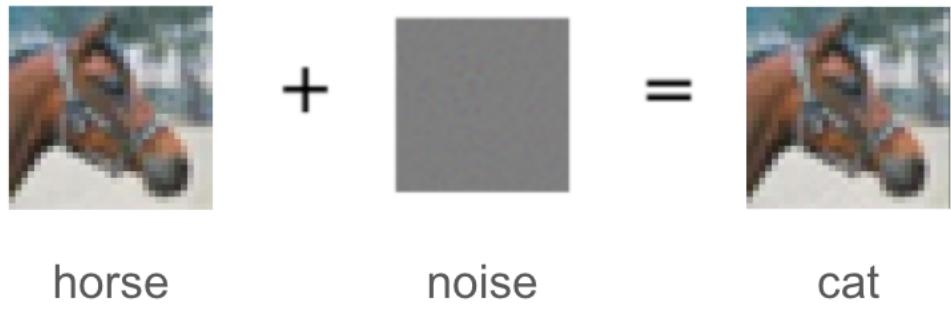
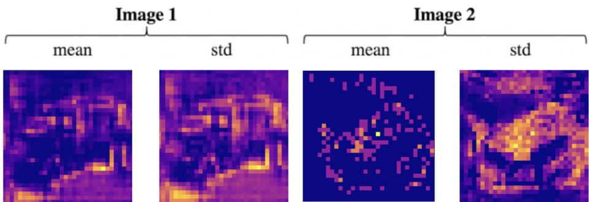
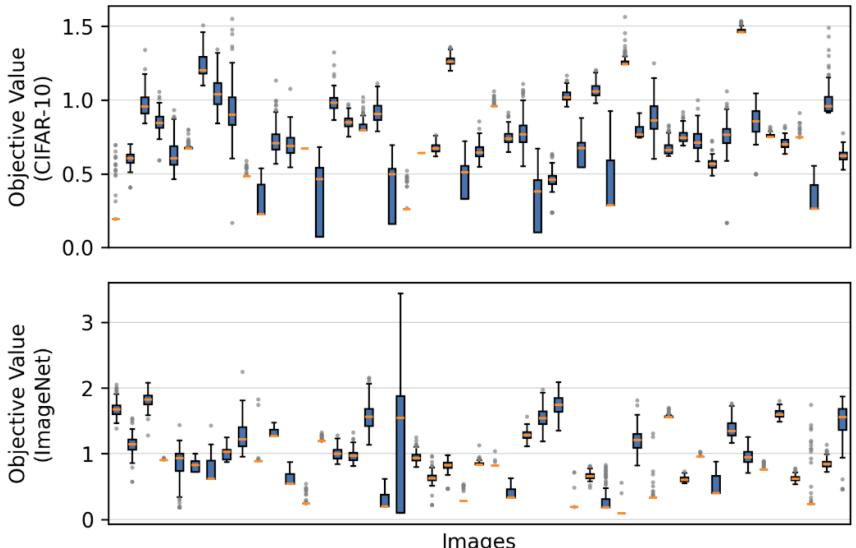
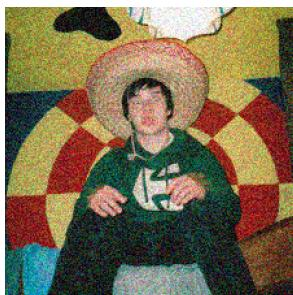

# Large-scale Testing Global Optimization Methods with Black-box Adversarial Attacks

Wojciech Zarzecki and Jarosław Arabas

Warsaw University of Technology, Institute of Computer Science wojciech.zarzecki.stud@pw.edu.pl, jaroslaw.arabas@pw.edu.pl

Abstract. Existing global optimization benchmark suites are of a moderate size and are based on a small number of analytical functions that date back even to the 1970s. This causes a risk of biasing the development of global optimization methods. We argue that the tasks related to the black-box adversarial attack (BBAA) can serve as valuable global optimization benchmark in many-dimensional space. We demonstrate the eficiency of several types of evolutionary algorithms and other metaheuristics in solving example BBAA problems. Thus, we take a step towards convergence of global optimization methods to the challenges and needs that arise in the modern machine learning field.

## 1 Introduction

## 1.1 Evolution of global optimization benchmarking methods

Development of global optimization methods is facilitated by benchmark suites. Experimental analysis of global optimization methods dates back at least to the 1970’s, with the book by Dixon and Szegö [13] being perhaps the most commonly known. The original idea of the authors was to define the test objective functions that are easy to compute, with the known position and value of the global optimum. At the same time, the landscape of the test functions was designed to model the dificulties that were expected to be observed in realworld optimization problems.

The advent of evolutionary computation has broadened the pool of test functions. As a result, there are several famous test functions whose origins date back to the 1980’s or earlier, including functions by Ackley, Griewank, Rastrigin, Rosenbrock, Schafer, and Schwefel (the names are given to honour their inventors), to name a few.

The year 2005 brought the inspiring competition at the CEC conference that was based on the CEC’2005 benchmarking suite [31] that comprised 25 optimization problems. The number of dimensions was 10, 30, and 50. The benchmark suite came with the computer code that implemented the optimization problems to be run by the author of the optimization method. The benchmark suite came with the standardized testing methodology definition. Subsequent years brought a series of CEC benchmark suites [34,26,8,30,27,28,29], with the dimension number not exceeding 100.

Another advance towards the reproducibility of results was the COCO suite [20,19]. The benchmarking process was performed by the COCO software, and the authors of the optimization method had to implement it as a function to be run by the benchmarking procedure. The number of dimensions did not exceed 40.

In CEC and COCO, the benchmarking can be performed many times for the same method, so the optimization method can be tuned for maximum performance for the whole suite. To avoid this, the BBComp competition [39] provided access to the server that allowed the user a maximum number of objective function evaluations. In this way, the organizers planned to avoid the risk of “overfitting” the optimization methods to the benchmarking suite. In this competition, the maximum number of dimensions was 64. Large-scale versions of the CEC suite [36,37] and of COCO [14] were also proposed, where the dimension number was at most 1000 and 640, respectively.

In the benchmarking suites from the CEC and COCO families, the optimization problems were defined with the use of combinations of a few types of objective functions that were introduced in much earlier literature. In contrast to these “synthetic” problems, the CEC real-world optimization suite [12] was based on problems taken directly from practical applications. The maximum number of dimensions was only 30.

One possible application of optimization methods is the field of Machine Learning (ML). In ML, in particular in the training process of neural networks, standard procedures are gradient-based, since the gradient and the value of the loss function can be computed at comparable cost. The number of dimensions in typical neural models is enormous. Therefore, the ML optimization problems, where the global optimization methods can be considered, are rather related to tuning hyperparameters of the learning process - cf. the black-box optimization challenge at NeurIPS’2020 [45], where the number of parameters to optimize is rather moderate.

## 1.2 Adversarial attack problem

Progress in machine learning and computer vision has resulted in a broader application of machine learning models, which has naturally attracted attention to the safety and robustness of these mechanisms. One of the key aspects in this area is the adversarial attack. Its goal is a perturbation of an input image that is imperceptible to a human observer but changes the decision of the model. Figure 1 illustrates an example successful black-box attack where a subtle, optimized perturbation is added to an original image of a horse. As illustrated in Figure 1, the input remains benign to the human eye while causing a wrong decision of the attacked model [43].

Such attacks are worth attention for two main reasons. First, they reveal the scope of possible threats against vision systems, ranging from physical-world attacks against visual classifiers [15] to attacks targeting medical deep learning systems [16]. Second, they have potential for benign applications such as preserving private or copyrighted data, for example, by watermarking deep neural networks through backdooring [1] or by protecting images from malicious difusion-based editing [9].

  
Fig. 1: Example adversarial attack: an image that is originally classified as a horse, after adding the noise, is classified as a cat

Adversarial attacks can be distinguished into model-informed and modelagnostic approaches. The model-informed types of attack make use of the information about the disturbance-related sensitivity of the classifier, e.g., the gradient of the loss function [17], [33], [5]. Following Costa et. al[11], we call attacks from the first group white-box attacks and from the latter — black-box attacks.

One of the approaches for black-box attacks is gradient estimation, represented by [7], where a coordinate-wise finite-diference gradient estimation applied to the objective from [5] is used to optimize the disturbance pattern. This result was improved by the GenAttack method [2], which used a fitnessproportionate selection GA on class-probability feedback. AutoZOOM [44] is another improvement to ZOO that reduces the number of queries needed to perform the attack by 93% thanks to the use of the autoencoder-compressed perturbation space. Ilyas et al. [23] use the NES gradient estimation and demonstrate achieving 2–3 orders of magnitude fewer queries in comparison to the pixel-wise finite diferences.

Some methods try to rely only on the final decision of the model, eg. the chosen class, without accessing the output probability distribution across all classes. One of them is Boundary Attack [4] that consists in performing the random walk along the decision boundary starting from a large adversarial perturbation obtained via progressively added Gaussian noise. This approach was refined in [6], where the authors perform the Monte Carlo boundary gradient estimation and couple it with the binary search. Other methods [38,24] rely on the assumption that the distributions of training data are known. Liu et. al[32] suggested sharing the adversarial perturbations for models that were trained using data from the same distribution.

However, the most prominent direction to perform the black-box attack is the application of some optimization methods to find perturbations that change the decision of the attacked model. The Square Attack [3] used a random search to find adversarial perturbations based on the fitness function constructed with the model’s output probability distribution. This idea was further developed as SimBA [18], where the procedure basis is changed from the Cartesian to the discrete cosine. Other methods use more sophisticated metaheuristics. In PSO Attack [35], the Particle Swarm Optimization searches the perturbation space, and the authors report a 99.6% success rate on CIFAR-10 with fewer queries than ZOO. EvoBA [22] is an application of an Evolution Strategy to minimize $L _ { 0 }$ via sparse pixel-level mutations. Some methods limit the perturbation to one pixel only; for example, One Pixel [42] is an application of Diferential Evolution to find a single modified pixel suficient to flip the class. The eficiency of Genetic Algorithms, Diferential Evolution, and CMA-ES for the one-pixel attacks on CIFAR-10 was compared by Clare et al. [10]. Zheng et. al [48] proposed a benchmark for diferent black-box adversarial attacks, comparing various attacks techniques; however, the impact of the chosen optimization method for score-based attacks remains under-explored.

## 1.3 Scope of the paper

We focus on the Black-Box Adversarial Attack (BBAA), in which only the model output probability distribution can be accessed. We allow for the perturbation of all pixels of the original image.We define the BBAA as an optimization problem that is aimed at finding the perturbation of the original image that results in misclassification and is similar to the noise with the smallest possible variance. We formulate the local search method to demonstrate that the optimization problem is multimodal. For this reason, the BBAA problem can be considered a benchmark to test global optimization methods. We provide an eficiency comparison of several example metaheuristic methods, including the classical Evolutionary Algorithm, four versions of Diferential Evolution, Grey Wolf Optimizer, and the INFO (Eficient Optimizer based on Weighted Mean of Vectors) method.

Furthermore, we give possibility to test new methods, proving a framework at https://anonymous.4open.science/r/black-box-adversarial-attacks/ Under the same address, the reader can find detailed information that would exceed the page limit of this text.

## 2 Optimization task related to the adversarial attack problem

We consider the classification function $c : [ 0 , 1 ] ^ { n } \to \{ 1 , . . . , k \}$ and the model $p : [ 0 , 1 ] ^ { n } \times \mathbb { R } ^ { N }  P ( \{ 1 , . . . , k \} )$ , where $P ( \{ 1 , . . . , k \} )$ is the space of probability distributions over the space of indices $1 , . . . , k$ . We assume that the model assumes $N$ tunable real parameters. Given an input vector x, the model assigns each class j the probability $p _ { j } ( \mathbf { x } , \theta )$ . The class whose probability is highest is considered the winning class that is yielded by the model:

$$
\hat { c } ( \mathbf { x } , \theta ) = \underset { j = 1 , . . . , k } { \arg \operatorname* { m a x } } p _ { j } ( \mathbf { x } , \theta ) ;
$$

While performing BBAA, we assume that the model parameters have been tuned to maximize the classification accuracy.

The adversarial attack to the input vector x consists of defining a disturbance vector $\pmb { \delta } ( \mathbf { x } ) \in [ - \varepsilon , \varepsilon ] ^ { n }$ , where $\varepsilon > 0$ is a hyperparameter controlling the maximum perturbation magnitude. The disturbance is added to the original input, and it is expected that the classifier’s output becomes improper:

$$
\hat { c } ( \mathrm { c l i p } ( { \mathbf x } + \pmb { \delta } ) , \theta ) \neq c ( { \mathbf x } )
$$

where

$$
\mathrm { c l i p } ( \mathbf { y } ) = \left\{ \begin{array} { l l } { 0 } & { y < 0 } \\ { y } & { 0 \leq y \leq 1 } \\ { 1 } & { y > 1 } \end{array} \right.
$$

For the notation brevity, in further text we simply write $p ( \mathbf { x } )$ and $\delta$ instead of $p ( \mathbf { x } , \theta )$ and $\delta ( \mathbf { x } )$

The adversarial attack should be hard to recognize for the human — it is desired that the degree of disturbance is smallest. We model this by the minimization of the squared $L _ { 2 }$ norm of δ. Hence, the adversarial attack for a particular image x is formulated as a bound-constrained minimization problem with the objective function defined as:

$$
\mathcal { L } ( \pmb { \delta } ) = - \log p _ { c ( \mathbf { x } ) } ( \mathbf { x } + \pmb { \delta } ) - \alpha \| \pmb { \delta } \| _ { 2 } ^ { 2 }\tag{1}
$$

where

$c ( \mathbf { x } )$ is the ground-truth class and

α is a hyperparameter to control the importance of the $L _ { 2 }$ norm of the perturbation.

The feasible set is a hypercube $[ - \varepsilon , \varepsilon ] ^ { n }$

The optimization operates in continuous space: the perturbation vector is generated by the optimizer, added element-wise to the original normalized image, and the perturbed image is clipped to the range $[ 0 , 1 ]$ to ensure valid pixel values.

The attack for each image is treated as a separate optimization problem. The adversarial attack is performed only for these input vectors that are properly classified when no disturbance is added.

## 3 Is adversarial attack a global optimization problem?

If the classification model is nonlinear with respect to x, it can be expected that the objective function (1) is multimodal. In this section we validate this claim.

## 3.1 Datasets and models

The experiments are conducted on two standard image classification benchmarks, CIFAR-10 [25] and ImageNet [40]. In their raw form, images are represented as tensors with pixel intensities in the range [0, 255]. During preprocessing, the images are converted to floating-point tensors normalized to the range [0, 1]. CIFAR-10 images are three-channel (RGB) tensors of shape $3 \times 3 2 \times 3 2$ . ImageNet images are in higher resolution and vary in size; we follow the authors’ recommended procedure before passing them to the attacked classification model. First, we resize input images to a tensor of shape $2 5 6 \times 2 5 6 \times 3$ and then crop the central pixel to a tensor of size $2 2 4 \times 2 2 4 \times 3 -$ such a tensor is also the input for the adversarial attack procedure.

Before conducting the adversarial attacks, we trained two classification models to serve as the black-box attack targets. When performing an attack, we access only the predicted probabilities for the target classes. For ImageNet, the model was a standard pre-trained Resnet-18 [21], while for CIFAR-10, we trained a model based on standard convolutional architectures, similar to VGG [41]. To ensure reproducibility, we provide complete information about the architectural and training details in the linked archive.

## 3.2 Local search applied for the adversarial attack

We define a local optimization method, the Stochastic Growth Attack with Binary Search Refinement (SGA-BSR), designed to identify a minimal perturbation δ through a sequential two-phase process. The images are represented in the pixel space as flattened vectors of size 3×32×32 (CIFAR-10) or 224×224×3 (ImageNet).

As described in Algorithm 1, the SGA-BSR first initiates a Stochastic Growth phase. The perturbation vector δ is initialized to zero. During each of the N iterations, the algorithm randomly selects a single pixel index idx and increments its value by a step size $\eta ,$ while ensuring the value remains within the valid pixel range $[ 0 , \varepsilon ]$ via a clipping function. This modification is accepted only if it results in a non-decreasing objective function value $\mathcal { L } ( \delta _ { t m p } ) \geq \mathcal { L } ( \delta )$ This greedy, stochastic progression continues until the model $p _ { \theta }$ fails to correctly identify the ground-truth class $c ( \mathbf { x } )$ , at which point the growth phase terminates.

Once a successful misclassification has been achieved, the algorithm enters the Refinement phase to minimize the magnitude of the disturbance while maintaining the misclassification. The algorithm identifies the set S of all indices that were modified during the first phase. For each modified index in $S ,$ a binary search is performed between zero and the current perturbation value $\delta [ i d x ]$ . The search seeks to find the smallest possible increment best\_val that still results in an incorrect classification. By isolating and minimizing the contribution of each perturbed pixel in sequence, the SGA-BSR efectively identifies a local optimum that satisfies the misclassification constraint with a significantly reduced total perturbation magnitude.

Algorithm 1 Stochastic Growth Attack with Binary Search Refinement   
1: Input: Original image $\mathbf { x } ,$ ground-truth $c ( \mathbf { x } )$ , model $p _ { j }$ , iterations $K ,$ , step size $\eta ,$   
limit $\varepsilon { = } 1$   
2: Output: Adversarial image $\mathbf { x } _ { a d v }$   
3: Initialize perturbation $\delta  { } 0$   
4: Phase 1: Stochastic Growth   
5: for $i = 1$ to $K$ do   
6: Choose a random index idx $\in \{ 1 , \ldots , C \times H \times W \}$   
7: $\delta _ { t m p } \gets \delta$   
8: $\dot { \delta } _ { t m p } [ i d x ] \gets \mathrm { c l i p } ( \delta [ i d x ] + \eta , ~ 0 , \varepsilon )$   
9: if $\mathcal { L } ( \delta _ { t m p } ) \geq \mathcal { L } ( \delta )$ then   
10: $\delta \gets \delta _ { t m p }$   
11: end if   
12: if $\hat { c } ( \mathrm { c l i p } ( { \bf x } + \delta ) ) \neq c ( { \bf x } )$ then   
13: break ▷ Target misclassified   
14: end if   
15: end for   
16: Phase 2: Refinement   
17: Identify indices $S = \{ i d x \mid \delta [ i d x ] > 0 \}$   
18: for each idx $\in S$ do   
19: low $ 0 , h i g h  \delta [ i d x ] .$ best\_val $\gets h i g h$   
20: while low $\leq h i g h$ do   
21: mid $ \lfloor ( l o w + h i g h ) / 2 \rfloor$   
22: $\delta _ { t e s t }  \delta$   
23: $\delta _ { t e s t } [ i d x ]  m i d$   
24: if $\hat { c } ( \mathrm { c l i p } ( { \bf x } + \delta _ { t e s t } ) ) \neq c ( { \bf x } )$ then   
25: best\_val ← mid, high ← mid − 1   
26: else   
27: low ← mid + 1   
28: end if   
29: end while   
30: $\pmb { \delta } [ i d x ]  b e s t _ { - }$ \_val   
31: end for   
32: return ${ \bf x } _ { a d v } \gets { \bf x } + \delta$

We execute SGA-BSR on each image using 1000 diferent random seeds. If the underlying problem were strictly unimodal (a simple local optimization task), attacks originating from diferent seeds would consistently converge to the exact same optimal perturbation. However, our empirical results demonstrate that the resulting perturbations, as well as their quality, are diferent between independent optimization runs.

Figure 2 presents heatmaps of the mean and standard deviation of perturbations yielded by each run of Algorithm 1 for two randomly selected example images. In both cases, it can be observed that for some image regions, the mean disturbance is zero or nearly zero, and the standard deviation is also zero. Yet there are regions of the image for which both the mean and standard deviation of the disturbance are nonzero, which indicates that a diversity of pixels is involved in successful attacks, but there is no need to use all of them to change the model class. In other words, independent runs of SGA-BSR yield diferent alternative disturbance vectors δ.

  
Fig. 2: Pixel-wise mean and standard deviation of the perturbation δ obtained over 100 independent SGA-BSR runs, shown for two example CIFAR-10 images. Regions with a nonzero standard deviation indicate pixels that are used only by some runs. This is evidence that diferent seeds yield diferent successful perturbation vectors; therefore, the attack problem is multimodal.

Figure 3 displays the boxplots of the objective function values across the runs for each image under attack, for CIFAR-10 and ImageNet sets. For many images, the SGA-BSR yielded a variety of results which difered both in the objective function value and the perturbation magnitude. This evidences that the adversarial attack problem has many diferent local optima, since SGA-BSR is a local optimization method.

## 4 Application of global optimization methods to perform black-box adversarial attack

Knowing that the BBAA is a global optimization problem, we test several global optimization methods to check their eficiency in performing the attack. Section 4.1 describes the details of experiments, while Section 4.2 presents results for CIFAR-10 and for ImageNet.

## 4.1 Outline of the experiment

For each image x, we perform 100 independent runs of the optimization method. Each method has the same population size, and in each iteration can test each member of the population only once. The initial population of perturbations generated randomly within the admissible range of $[ - \varepsilon , \varepsilon ] ^ { n }$ . Each run of the optimization process is terminated after exceeding the admissible limit of perturbations (which means that the run was unsuccessful). From each run we record the number of tested perturbations, the attack success rate, and the normalized

  
Fig. 3: Per-image variance of SGA-BSR solutions across 1000 independent runs $( \alpha = 0 . 1 )$ . For each image, Algorithm 1 is run with 100 random seeds. Boxplots for objective function value: top two panels: CIFAR-10, bottom: ImageNet. Columns are images, boxes are IQR over seeds, whiskers 1.5 IQR, dots outliers.

disturbance strength defined as

$$
\mathrm { s t r e n g t h } ( \delta ) = \frac { | | \delta | | _ { 2 } } { \sqrt { n } }\tag{2}
$$

where n is the vector length.

All optimizers were run with their default hyperparameter values as provided by the mealpy library [46]. The two settings shared across every optimizer are the population size $N _ { \mathrm { p o p } } = 5 0 0$ and the maximum number of iterations $T = 5 0 0$ Optimizer-specific defaults are listed in the archive accompanying the paper. SADE, GWO, and INFO require no additional hyperparameters beyond the shared ones, as they perform internal self-adaptation or use fixed algorithmic rules.

## 4.2 Results

Table 1 summarizes the results obtained for the CIFAR-10 set. Each row corresponds to one combination of optimizer, regularization weight α, and maximum pixel disturbance ε. We report the fraction of attacks that succeed in flipping the label (Suc. R.), the number of queries until the first successful perturbation averaged over successful runs only (First Succ.), the strength of successful perturbations, and the best objective function value observed in each run. Results are reported in the form of pairs (mean ± standard deviation). For each $( \alpha , \varepsilon )$ block, the best objective value across optimizers is highlighted in bold, and the second best is underlined.

The pixel perturbation strength ε is the single most decisive factor for the attack success on CIFAR-10: at $\varepsilon = 0 . 0 1$ every optimizer is efectively blocked, while at $\varepsilon = 0 . 1$ and $\varepsilon = 0 . 2$ most methods flip the majority of images. The regularization weight α has a non-monotonic efect: a moderate value of $\alpha = 0 . 1$ helps most optimizers by pulling the population toward perturbations that both cross the decision boundary and keep a tighter perturbation strength, and in particular lifts GWO from near-zero success, while pushing α up to 10 or 100 gives no further eficiency inrease.

Table 1: Results of adversarial attacks on the CIFAR-10-based classifier
<table><tr><td>Optim.</td><td>α</td><td>ε</td><td></td><td>Suc. R. (↑) First Succ. (↓)</td><td> $L _ { 2 }$ </td><td>Obj. fn. (↑)</td></tr><tr><td>DE</td><td>0.0</td><td>0.01</td><td>2.60%</td><td> $1 . 0 \pm 0 . 0$ </td><td> $0 . 0 0 7 1 \pm 0 . 0 0 0 2$ </td><td> ${ \bf 0 . 2 2 \pm 0 . 2 6 }$ </td></tr><tr><td>GEN</td><td>0.00.01</td><td></td><td>2.60%</td><td> $1 . 0 \pm 0 . 0$ </td><td> $0 . 0 0 5 7 \pm 0 . 0 0 0 1$ </td><td> $0 . 1 8 \pm 0 . 2 3$ </td></tr><tr><td>GWO</td><td>0.0</td><td>0.01</td><td>0.00%</td><td> $0 . 0 \pm 0 . 0$ </td><td> $0 . 0 0 0 0 \pm 0 . 0 0 0 0$ </td><td> $0 . 1 9 \pm 0 . 2 4$ </td></tr><tr><td>INFO</td><td>0.0</td><td>0.01</td><td>1.30%</td><td> $1 . 0 \pm 0 . 0$ </td><td> $0 . 0 0 5 2 \pm 0 . 0 0 0 0$ </td><td> $0 . 2 0 \pm 0 . 2 4$ </td></tr><tr><td>JADE</td><td>0.0</td><td>0.01</td><td>1.30%</td><td> $1 . 0 \pm 0 . 0$ </td><td> $0 . 0 0 5 5 \pm 0 . 0 0 0 0$ </td><td> $0 . 2 1 \pm 0 . 2 6$ </td></tr><tr><td>SADE</td><td>0.00.01</td><td></td><td>2.60%</td><td> $1 . 0 \pm 0 . 0$ </td><td> $0 . 0 0 6 2 \pm 0 . 0 0 0 1$ </td><td> $\underline { { 0 . 2 1 \pm 0 . 2 6 } }$ </td></tr><tr><td>SHADE</td><td>0.0</td><td>0.01</td><td>2.60%</td><td> $1 . 0 \pm 0 . 0$ </td><td> $0 . 0 0 6 0 \pm 0 . 0 0 0 5$ </td><td> $0 . 2 1 \pm 0 . 2 6$ </td></tr><tr><td>DE</td><td>0.0</td><td>0.1</td><td>28.57%</td><td> $1 . 0 \pm 0 . 0$ </td><td> $0 . 0 7 0 8 \pm 0 . 0 0 4 4$ </td><td> ${ \bf 0 . 7 5 \pm 0 . 9 5 }$ </td></tr><tr><td>GEN</td><td>0.0</td><td>0.1</td><td>24.68%</td><td> $1 . 0 \pm 0 . 0$ </td><td> $0 . 0 5 6 5 \pm 0 . 0 0 1 9$ </td><td> $0 . 4 1 \pm 0 . 6 9$ </td></tr><tr><td>GWO</td><td>0.0</td><td>0.1</td><td>1.30%</td><td> $1 . 0 \pm 0 . 0$ </td><td> $0 . 0 3 3 5 \pm 0 . 0 0 0 0$ </td><td> $0 . 2 1 \pm 0 . 2 5$ </td></tr><tr><td>INFO</td><td>0.0</td><td>0.1</td><td>25.97%</td><td> $1 . 0 \pm 0 . 0$ </td><td> $0 . 0 5 6 3 \pm 0 . 0 0 4 7$ </td><td> $0 . 4 5 \pm 0 . 6 6$ </td></tr><tr><td>JADE</td><td>0.0</td><td>0.1</td><td>27.27%</td><td> $1 . 0 \pm 0 . 0$ </td><td> $0 . 0 6 1 4 \pm 0 . 0 0 5 0$ </td><td> $0 . 6 0 \pm 0 . 7 5$ </td></tr><tr><td>SADE</td><td>0.0</td><td>0.1</td><td>28.57%</td><td> $1 . 0 \pm 0 . 0$ </td><td> $0 . 0 6 1 0 \pm 0 . 0 0 4 3$ </td><td> $\underline { { 0 . 6 3 \pm 0 . 7 8 } }$ </td></tr><tr><td>SHADE</td><td>0.0</td><td>0.1</td><td>25.97%</td><td> $1 . 0 \pm 0 . 0$ </td><td> $0 . 0 6 2 3 \pm 0 . 0 0 5 9$ </td><td> $0 . 5 9 \pm 0 . 7 3$ </td></tr><tr><td>DE</td><td>0.0</td><td>0.2</td><td>59.74%</td><td> $1 . 0 \pm 0 . 0$ </td><td> $0 . 1 3 8 1 \pm 0 . 0 0 8 5$ </td><td> $\mathbf { 2 . 4 7 \pm 2 . 6 0 }$ </td></tr><tr><td>GEN</td><td>0.0</td><td>0.2</td><td>57.14%</td><td> $1 . 0 \pm 0 . 0$ </td><td> $0 . 1 1 1 0 \pm 0 . 0 0 5 6$ </td><td> $1 . 6 9 \pm 2 . 1 1$ </td></tr><tr><td>GWO</td><td>0.0</td><td>0.2</td><td>10.39%</td><td> $1 . 0 \pm 0 . 0$ </td><td> $0 . 0 6 5 8 \pm 0 . 0 0 0 6$ </td><td> $0 . 3 4 \pm 0 . 4 7$ </td></tr><tr><td>INFO</td><td>0.0</td><td>0.2</td><td>53.25%</td><td> $1 . 0 \pm 0 . 0$ </td><td> $0 . 1 1 0 7 \pm 0 . 0 0 7 8$ </td><td> $1 . 6 2 \pm 2 . 0 5$ </td></tr><tr><td>JADE</td><td>0.0</td><td>0.2</td><td>54.55%</td><td> $1 . 0 \pm 0 . 0$ </td><td> $0 . 1 1 9 8 \pm 0 . 0 0 9 0$ </td><td> $1 . 8 8 \pm 2 . 0 8$ </td></tr><tr><td>SADE</td><td>0.0</td><td>0.2</td><td>55.84%</td><td> $1 . 0 \pm 0 . 0$ </td><td> $0 . 1 2 0 8 \pm 0 . 0 0 7 4$ </td><td> $\underline { { 1 . 9 5 \pm 2 . 2 3 } }$ </td></tr><tr><td>SHADE</td><td>0.0</td><td>0.2</td><td>55.84%</td><td> $1 . 0 \pm 0 . 0$ </td><td> $0 . 1 1 8 9 \pm 0 . 0 1 0 3$ </td><td> $\overline { { 1 . 8 2 \pm 2 . 0 5 } }$ </td></tr><tr><td>DE</td><td>0.1 0.01</td><td></td><td>3.90%</td><td> $1 . 0 \pm 0 . 0$ </td><td> $0 . 0 0 7 0 \pm 0 . 0 0 0 1$ </td><td> $0 . 1 8 \pm 0 . 2 7$ </td></tr><tr><td>GEN</td><td>0.1</td><td>0.01</td><td>2.60%</td><td> $1 . 0 \pm 0 . 0$ </td><td> $0 . 0 0 5 7 \pm 0 . 0 0 0 1$ </td><td> $0 . 1 5 \pm 0 . 2 3$ </td></tr><tr><td>GWO</td><td>0.1</td><td>0.01</td><td>0.00%</td><td> $0 . 0 \pm 0 . 0$ </td><td> $0 . 0 0 0 0 \pm 0 . 0 0 0 0$ </td><td> $0 . 1 7 \pm 0 . 2 5$ </td></tr><tr><td>INFO</td><td>0.1</td><td>0.01</td><td>1.30%</td><td> $1 . 0 \pm 0 . 0$ </td><td> $0 . 0 0 5 6 \pm 0 . 0 0 0 0$ </td><td> ${ \bf 0 . 1 9 \pm 0 . 2 4 }$ </td></tr><tr><td>JADE</td><td>0.1</td><td>0.01</td><td>2.60%</td><td> $1 . 0 \pm 0 . 0$ </td><td> $0 . 0 0 5 9 \pm 0 . 0 0 0 4$ </td><td> $0 . 1 8 \pm 0 . 2 6$ </td></tr><tr><td>SADE</td><td>0.1</td><td>0.01</td><td>1.30%</td><td> $1 . 0 \pm 0 . 0$ </td><td> $0 . 0 0 5 9 \pm 0 . 0 0 0 0$ </td><td> $0 . 1 8 \pm 0 . 2 6$ </td></tr><tr><td>SHADE</td><td>0.1</td><td>0.01</td><td>2.60%</td><td> $1 . 0 \pm 0 . 0$ </td><td> $0 . 0 0 5 7 \pm 0 . 0 0 0 3$ </td><td> $\underline { { 0 . 1 8 \pm 0 . 2 6 } }$ </td></tr><tr><td>DE</td><td>0.1</td><td>0.1</td><td>59.74%</td><td> $1 4 . 9 \pm 2 4 . 6$ </td><td> $0 . 0 7 4 2 \pm 0 . 0 0 5 4$ </td><td> ${ \bf 0 . 6 7 \pm 1 . 0 3 }$ </td></tr><tr><td>GEN</td><td>0.1</td><td>0.1</td><td>61.04%</td><td> $1 1 . 2 \pm 2 9 . 7$ </td><td></td><td></td></tr><tr><td></td><td></td><td></td><td></td><td></td><td> $0 . 0 5 6 9 \pm 0 . 0 0 1 8$ </td><td> $\underline { { 0 . 5 9 \pm 0 . 6 4 } }$ </td></tr></table>

continued on next page. . .

continued on next page. . .
<table><tr><td>Optim.</td><td>α</td><td>ε</td><td>Suc. R. (↑) First Succ. (↓)</td><td></td><td> $L _ { 2 }$ </td><td> $\mathbf { O b j . \ f n . \ ( \uparrow ) }$ </td></tr><tr><td>GWO</td><td>0.1</td><td>0.1</td><td>32.47%</td><td> $1 6 . 4 \pm 2 5 . 8$ </td><td> $0 . 0 8 8 8 \pm 0 . 0 1 4 1$ </td><td> $0 . 3 2 \pm 0 . 7 6$ </td></tr><tr><td>INFO</td><td>0.1</td><td>0.1</td><td>25.97%</td><td> $1 . 1 \pm 0 . 5$ </td><td> $0 . 0 5 5 6 \pm 0 . 0 0 1 7$ </td><td> $0 . 3 7 \pm 0 . 5 5$ </td></tr><tr><td>JADE</td><td>0.1</td><td>0.1</td><td>50.65%</td><td> $8 . 9 \pm 1 2 . 6$ </td><td> $0 . 0 6 3 3 \pm 0 . 0 0 6 8$ </td><td> $0 . 5 0 \pm 0 . 7 0$ </td></tr><tr><td>SADE</td><td>0.1</td><td>0.1</td><td>37.66%</td><td> $1 1 . 8 \pm 3 0 . 4$ </td><td> $0 . 0 6 3 0 \pm 0 . 0 0 6 4$ </td><td> $0 . 3 6 \pm 0 . 7 6$ </td></tr><tr><td>SHADE</td><td>0.1</td><td>0.1</td><td>40.26%</td><td> $6 . 3 \pm 1 1 . 6$ </td><td> $0 . 0 6 0 6 \pm 0 . 0 0 5 6$ </td><td> $0 . 5 3 \pm 0 . 6 2$ </td></tr><tr><td>DE</td><td>0.1</td><td>0.2</td><td>74.03%</td><td> $5 . 4 \pm 2 3 . 5$ </td><td> $0 . 1 4 3 2 \pm 0 . 0 0 9 2$ </td><td> $underline { { 2 . 2 3 \pm 2 . 4 3 } }$ </td></tr><tr><td>GEN</td><td>0.1</td><td>0.2</td><td>97.40%</td><td> $4 . 2 \pm 6 . 7$ </td><td> $0 . 1 1 1 5 \pm 0 . 0 0 5 0$ </td><td> $\mathbf { 2 . 6 3 \pm 1 . 6 0 }$ </td></tr><tr><td>GWO</td><td>0.1</td><td>0.2</td><td>62.34%</td><td> $9 . 4 \pm 3 4 . 9$ </td><td> $0 . 1 4 6 8 \pm 0 . 0 4 7 5$ </td><td> $1 . 4 3 \pm 2 . 1 3$ </td></tr><tr><td>INFO</td><td>0.1</td><td>0.2</td><td>53.25%</td><td> $1 . 0 \pm 0 . 0$ </td><td> $0 . 1 0 9 5 \pm 0 . 0 0 8 2$ </td><td> $1 . 2 2 \pm 1 . 7 1$ </td></tr><tr><td>JADE</td><td>0.1</td><td>0.2</td><td>81.82%</td><td> $6 . 2 \pm 2 1 . 8$ </td><td> $0 . 1 2 2 8 \pm 0 . 0 1 1 1$ </td><td> $1 . 8 5 \pm 1 . 9 2$ </td></tr><tr><td>SADE</td><td>0.1</td><td>0.2</td><td>66.23%</td><td> $4 . 8 \pm 2 3 . 3$ </td><td> $0 . 1 2 6 5 \pm 0 . 0 1 1 8$ </td><td> $1 . 5 8 \pm 2 . 1 7$ </td></tr><tr><td>SHADE</td><td>0.1</td><td>0.2</td><td>89.61%</td><td> $1 5 . 4 \pm 4 2 . 1$ </td><td> $0 . 1 1 7 8 \pm 0 . 0 1 2 3$ </td><td> $1 . 9 3 \pm 1 . 8 1$ </td></tr><tr><td>DE</td><td>1.00.01</td><td></td><td>2.60%</td><td> $1 . 0 \pm 0 . 0$ </td><td> $0 . 0 0 6 8 \pm 0 . 0 0 0 0$ </td><td> $- 0 . 1 8 \pm 0 . 2 7$ </td></tr><tr><td>GEN</td><td>1.00.01</td><td></td><td>2.60%</td><td> $1 . 0 \pm 0 . 0$ </td><td> $0 . 0 0 5 7 \pm 0 . 0 0 0 1$ </td><td> $- 0 . 1 0 \pm 0 . 2 2$ </td></tr><tr><td>GWO</td><td>1.0</td><td>0.01</td><td>0.00%</td><td> $0 . 0 \pm 0 . 0$ </td><td> $0 . 0 0 0 0 \pm 0 . 0 0 0 0$ </td><td> $- 0 . 2 3 \pm 0 . 3 9$ </td></tr><tr><td>INFO</td><td>1.0</td><td>0.01</td><td>2.60%</td><td> $1 . 0 \pm 0 . 0$ </td><td> $0 . 0 0 5 5 \pm 0 . 0 0 0 1$ </td><td> ${ \bf 0 . 1 9 \pm 0 . 2 3 }$ </td></tr><tr><td>JADE</td><td>1.00.01</td><td></td><td>1.30%</td><td> $1 . 0 \pm 0 . 0$ </td><td> $0 . 0 0 5 4 \pm 0 . 0 0 0 0$ </td><td> $- 0 . 1 3 \pm 0 . 2 8$ </td></tr><tr><td>SADE</td><td>1.0 0.01</td><td></td><td>2.60%</td><td> $1 . 0 \pm 0 . 0$ </td><td> $0 . 0 0 5 5 \pm 0 . 0 0 0 0$ </td><td> $- 0 . 1 4 \pm 0 . 2 8$ </td></tr><tr><td>SHADE</td><td>1.0</td><td>0.01</td><td>2.60%</td><td> $1 . 0 \pm 0 . 0$ </td><td> $0 . 0 0 5 9 \pm 0 . 0 0 0 5$ </td><td> $- 0 . 0 6 \pm 0 . 2 4$ </td></tr><tr><td>DE</td><td>1.0</td><td>0.1</td><td>49.35%</td><td> $1 7 . 1 \pm 4 0 . 7$ </td><td> $0 . 0 7 5 2 \pm 0 . 0 0 5 7$ </td><td> $- 2 . 8 7 \pm 1 . 6 9$ </td></tr><tr><td>GEN</td><td>1.0</td><td>0.1</td><td>81.82%</td><td> $1 1 . 9 \pm 2 5 . 1$ </td><td> $0 . 0 5 6 8 \pm 0 . 0 0 2 1$ </td><td> $- 0 . 5 8 \pm 1 . 6 1$ </td></tr><tr><td>GWO</td><td>1.0</td><td>0.1</td><td>64.94%</td><td> $1 3 . 5 \pm 3 4 . 1$ </td><td> $0 . 0 7 9 0 \pm 0 . 0 2 2 1$ </td><td> $- 3 . 3 4 \pm 2 . 1 6$ </td></tr><tr><td>INFO</td><td>1.0</td><td>0.1</td><td>23.38%</td><td> $1 . 0 \pm 0 . 0$ </td><td> $0 . 0 5 3 5 \pm 0 . 0 0 2 9$ </td><td> ${ \bf - 0 . 2 9 \pm 0 . 7 8 }$ </td></tr><tr><td>JADE</td><td>1.0</td><td>0.1</td><td>53.25%</td><td> $2 0 . 0 \pm 3 7 . 8$ </td><td> $0 . 0 6 2 9 \pm 0 . 0 1 0 2$ </td><td> $- 2 . 1 9 \pm 1 . 7 1$ </td></tr><tr><td>SADE</td><td>1.0</td><td>0.1</td><td>33.77%</td><td> $1 . 8 \pm 2 . 3$ </td><td> $0 . 0 6 1 3 \pm 0 . 0 0 8 4$ </td><td> $- 2 . 9 1 \pm 1 . 1 1$ </td></tr><tr><td>SHADE</td><td>1.0</td><td>0.1</td><td>57.14%</td><td> $2 5 . 5 \pm 4 3 . 7$ </td><td> $0 . 0 4 9 6 \pm 0 . 0 0 7 8$ </td><td> $- 0 . 8 9 \pm 1 . 5 7$ </td></tr><tr><td>DE</td><td>1.0</td><td>0.2</td><td>74.03%</td><td> $8 . 3 \pm 3 1 . 0$ </td><td> $0 . 1 4 7 8 \pm 0 . 0 0 9 3$ </td><td> $- 4 . 3 0 \pm 3 . 7 9$ </td></tr><tr><td>GEN</td><td>1.0</td><td>0.2</td><td>92.21%</td><td> $1 3 . 2 \pm 4 1 . 0$ </td><td> $0 . 1 1 1 3 \pm 0 . 0 0 5 1$ </td><td> ${ \bf 0 . 8 5 \pm 3 . 2 4 }$ </td></tr><tr><td>GWO</td><td>1.0</td><td>0.2</td><td>79.22%</td><td> $9 . 1 \pm 2 2 . 4$ </td><td> $0 . 1 5 4 2 \pm 0 . 0 4 4 5$ </td><td> $- 4 . 9 8 \pm 4 . 4 3$ </td></tr><tr><td>INFO</td><td>1.0</td><td>0.2</td><td>54.55%</td><td> $1 . 0 \pm 0 . 0$ </td><td> $0 . 1 0 5 0 \pm 0 . 0 0 7 8$ </td><td> $- 1 . 7 9 \pm 2 . 2 7$ </td></tr><tr><td>JADE</td><td>1.0</td><td>0.2</td><td>74.03%</td><td> $1 2 . 2 \pm 4 5 . 5$ </td><td> $0 . 1 2 7 7 \pm 0 . 0 1 8 0$ </td><td> $- 2 . 7 2 \pm 3 . 6 9$ </td></tr><tr><td>SADE</td><td>1.0</td><td>0.2</td><td>68.83%</td><td> $5 . 6 \pm 1 8 . 8$ </td><td> $0 . 1 2 1 6 \pm 0 . 0 1 5 1$ </td><td> $- 4 . 4 9 \pm 3 . 0 5$ </td></tr><tr><td>SHADE</td><td>1.0</td><td>0.2</td><td>76.62%</td><td> $1 7 . 4 \pm 4 3 . 0$ </td><td> $0 . 1 0 0 6 \pm 0 . 0 1 4 1$ </td><td> $- 0 . 5 2 \pm 3 . 2 1$ </td></tr><tr><td>DE</td><td>10.00.01</td><td></td><td>3.90%</td><td> $1 . 3 \pm 0 . 5$ </td><td> $0 . 0 0 6 8 \pm 0 . 0 0 0 2$ </td><td> $- 3 . 7 7 \pm 0 . 2 7$ </td></tr><tr><td>GEN</td><td>10.00.01</td><td></td><td>5.19%</td><td> $5 . 8 \pm 5 . 1$ </td><td> $0 . 0 0 5 3 \pm 0 . 0 0 0 1$ </td><td> $- 2 . 6 9 \pm 0 . 2 7$ </td></tr><tr><td>GWO</td><td>10.00.01</td><td></td><td>5.19%</td><td> $1 1 . 5 \pm 1 1 . 3$ </td><td> $0 . 0 0 6 9 \pm 0 . 0 0 2 2$ </td><td> $- 5 . 2 2 \pm 0 . 6 2$ </td></tr><tr><td>INFO</td><td>10.0 0.01</td><td></td><td>1.30%</td><td> $1 . 0 \pm 0 . 0$ </td><td> $0 . 0 0 5 5 \pm 0 . 0 0 0 0$ </td><td> ${ \bf 0 . 1 6 \pm 0 . 3 6 }$ </td></tr><tr><td>JADE</td><td>10.0 0.01</td><td></td><td>3.90%</td><td> $7 . 0 \pm 8 . 5$ </td><td> $0 . 0 0 5 3 \pm 0 . 0 0 0 5$ </td><td> $- 3 . 3 4 \pm 0 . 3 5$ </td></tr><tr><td>SADE</td><td>10.0 0.01</td><td></td><td>3.90%</td><td> $1 . 0 \pm 0 . 0$ </td><td> $0 . 0 0 5 8 \pm 0 . 0 0 0 3$ </td><td> $- 3 . 4 4 \pm 0 . 3 2$ </td></tr><tr><td>SHADE</td><td>10.0 0.01</td><td></td><td>3.90%</td><td> $3 4 . 3 \pm 4 7 . 1$ </td><td> $0 . 0 0 4 3 \pm 0 . 0 0 0 9$ </td><td> $- 2 . 3 7 \pm 0 . 2 9$ </td></tr><tr><td>DE</td><td>10.0 0.1</td><td></td><td>49.35%</td><td> $1 7 . 9 \pm 4 1 . 6$ </td><td> $0 . 0 6 8 7 \pm 0 . 0 0 6 1$ </td><td> $- 3 8 . 6 6 \pm 2 . 6 4$ </td></tr><tr><td>GEN</td><td>10.0 0.1</td><td></td><td>51.95%</td><td> $1 4 . 8 \pm 2 7 . 5$ </td><td> $0 . 0 5 3 7 \pm 0 . 0 0 2 4$ </td><td> $- 2 7 . 9 9 \pm 1 . 4 0$ </td></tr><tr><td>GWO</td><td>10.00.1</td><td></td><td>66.23%</td><td> $1 3 . 7 \pm 2 4 . 6$ </td><td> $0 . 0 7 3 0 \pm 0 . 0 2 1 8$ </td><td> $- 4 5 . 5 1 \pm 1 2 . 2 8$ </td></tr></table>

continued on next page. . .

continued on next page. . .
<table><tr><td>Optim.</td><td>α</td><td>ε</td><td></td><td>Suc. R. (↑) First Succ. (↓)</td><td> $L _ { 2 }$ </td><td> $\mathbf { O b j . \ f n . \ ( \uparrow ) }$ </td></tr><tr><td>INFO</td><td>10.0</td><td>0.1</td><td>24.68%</td><td> $1 . 0 \pm 0 . 0$ </td><td> $0 . 0 5 0 1 \pm 0 . 0 0 3 0$ </td><td> $\mathbf { - 6 . 6 6 \pm 1 1 . 8 5 }$ </td></tr><tr><td>JADE</td><td>10.0</td><td>0.1</td><td>48.05%</td><td> $2 8 . 9 \pm 4 7 . 7$ </td><td> $0 . 0 5 5 6 \pm 0 . 0 1 2 1$ </td><td> $- 3 3 . 1 1 \pm 5 . 3 7$ </td></tr><tr><td>SADE</td><td>10.0</td><td>0.1</td><td>31.17%</td><td> $2 . 0 \pm 4 . 4$ </td><td> $0 . 0 5 3 5 \pm 0 . 0 0 5 4$ </td><td> $- 3 3 . 9 6 \pm 3 . 7 2$ </td></tr><tr><td>SHADE</td><td>10.0</td><td>0.1</td><td>38.96%</td><td> $2 8 . 4 \pm 6 3 . 5$ </td><td> $0 . 0 4 3 0 \pm 0 . 0 0 7 6$ </td><td> $- 2 4 . 7 9 \pm 3 . 0 1$ </td></tr><tr><td>DE</td><td>10.0</td><td>0.2</td><td>72.73%</td><td> $5 . 8 \pm 2 3 . 8$ </td><td> $0 . 1 2 8 3 \pm 0 . 0 1 0 0$ </td><td> $- 7 3 . 9 9 \pm 5 . 5 1$ </td></tr><tr><td>GEN</td><td>10.0</td><td>0.2</td><td>75.32%</td><td> $1 6 . 1 \pm 5 3 . 2$ </td><td> $0 . 1 0 6 3 \pm 0 . 0 0 5 9$ </td><td> $- 5 4 . 3 3 \pm 3 . 6 6$ </td></tr><tr><td>GWO</td><td>10.0</td><td>0.2</td><td>77.92%</td><td> $6 . 1 \pm 8 . 1$ </td><td> $0 . 1 1 2 3 \pm 0 . 0 3 8 5$ </td><td> $- 7 4 . 3 3 \pm 2 7 . 8 7$ </td></tr><tr><td>INFO</td><td>10.0</td><td>0.2</td><td>54.55%</td><td> $1 . 1 \pm 0 . 5$ </td><td> $0 . 0 9 6 5 \pm 0 . 0 0 8 6$ </td><td> $\mathbf { - 2 9 . 4 7 \pm 2 7 . 2 3 }$ </td></tr><tr><td>JADE</td><td>10.0</td><td>0.2</td><td>72.73%</td><td> $1 0 . 5 \pm 3 5 . 6$ </td><td> $0 . 0 9 8 4 \pm 0 . 0 1 6 0$ </td><td> $- 5 9 . 5 3 \pm 1 0 . 7 1$ </td></tr><tr><td>SADE</td><td>10.0</td><td>0.2</td><td>68.83%</td><td> $4 . 0 \pm 1 2 . 6$ </td><td> $0 . 1 0 4 9 \pm 0 . 0 1 2 8$ </td><td> $- 6 3 . 6 3 \pm 9 . 2 4$ </td></tr><tr><td>SHADE</td><td>10.0</td><td>0.2</td><td>72.73%</td><td> $2 3 . 0 \pm 6 9 . 7$ </td><td> $0 . 0 8 2 2 \pm 0 . 0 1 4 3$ </td><td> $- 4 7 . 4 3 \pm 7 . 8 0$ </td></tr><tr><td>DE</td><td>100.0 0.01</td><td></td><td>3.90%</td><td> $1 . 3 \pm 0 . 5$ </td><td> $0 . 0 0 7 0 \pm 0 . 0 0 0 4$ </td><td> $- 3 9 . 4 0 \pm 1 . 0 1$ </td></tr><tr><td>GEN</td><td>100.0 0.01</td><td></td><td>3.90%</td><td> $4 6 . 0 \pm 6 3 . 6$ </td><td> $0 . 0 0 5 2 \pm 0 . 0 0 0 1$ </td><td> $- 2 8 . 8 5 \pm 0 . 2 6$ </td></tr><tr><td>GWO</td><td>100.0 0.01</td><td></td><td>5.19%</td><td> $8 . 8 \pm 5 . 4$ </td><td> $0 . 0 0 7 7 \pm 0 . 0 0 1 4$ </td><td> $- 5 4 . 4 6 \pm 3 . 3 1$ </td></tr><tr><td>INFO</td><td>100.0 0.01</td><td></td><td>2.60%</td><td> $1 . 0 \pm 0 . 0$ </td><td> $0 . 0 0 5 4 \pm 0 . 0 0 0 0$ </td><td> $\mathbf { - 0 . 6 0 \pm 4 . 7 6 }$ </td></tr><tr><td>JADE</td><td>100.0 0.01</td><td></td><td>3.90%</td><td> $1 1 . 7 \pm 1 3 . 7$ </td><td> $0 . 0 0 5 5 \pm 0 . 0 0 0 8$ </td><td> $- 3 5 . 3 8 \pm 1 . 5 4$ </td></tr><tr><td>SADE</td><td>100.0 0.01</td><td></td><td>2.60%</td><td> $1 . 0 \pm 0 . 0$ </td><td> $0 . 0 0 5 5 \pm 0 . 0 0 0 1$ </td><td> $- 3 6 . 1 9 \pm 1 . 6 3$ </td></tr><tr><td>SHADE 100.0 0.01</td><td></td><td></td><td>3.90%</td><td> $5 4 . 0 \pm 7 4 . 2$ </td><td> $0 . 0 0 5 0 \pm 0 . 0 0 1 0$ </td><td> $- 2 5 . 7 1 \pm 1 . 4 5$ </td></tr><tr><td>DE</td><td></td><td></td><td>48.05%</td><td> $2 0 . 1 \pm 4 9 . 8$ </td><td> $0 . 0 6 8 0 \pm 0 . 0 0 5 7$ </td><td> $- 3 9 0 . 1 3 \pm 2 2 . 4 4$ </td></tr><tr><td>GEN</td><td>100.00.1</td><td></td><td>33.77%</td><td> $2 2 . 8 \pm 5 3 . 7$ </td><td> $0 . 0 5 1 3 \pm 0 . 0 0 1 8$ </td><td> $- 2 9 0 . 1 5 \pm 1 . 6 1$ </td></tr><tr><td>GWO</td><td>100.00.1</td><td></td><td>64.94%</td><td> $1 0 . 9 \pm 1 4 . 1$ </td><td> $0 . 0 7 2 0 \pm 0 . 0 2 1 7$ </td><td> $- 4 6 0 . 4 8 \pm 1 2 1 . 1 1$ </td></tr><tr><td>INFO</td><td>100.00.1 100.00.1</td><td></td><td>20.78%</td><td> $1 . 0 \pm 0 . 0$ </td><td> $0 . 0 4 9 8 \pm 0 . 0 0 3 0$ </td><td> $\mathbf { - 5 8 . 4 7 \pm 1 1 4 . 7 4 }$ </td></tr><tr><td>JADE</td><td>100.00.1</td><td></td><td>44.16%</td><td> $2 3 . 0 \pm 4 3 . 0$ </td><td> $0 . 0 5 4 8 \pm 0 . 0 1 1 3$ </td><td> $- 3 3 4 . 5 8 \pm 4 7 . 7 2$ </td></tr><tr><td>SADE</td><td>100.00.1</td><td></td><td>35.06%</td><td> $1 . 7 \pm 3 . 4$ </td><td> $0 . 0 5 4 0 \pm 0 . 0 0 5 5$ </td><td> $- 3 4 4 . 9 2 \pm 3 5 . 4 2$ </td></tr><tr><td>SHADE 100.0 0.1</td><td></td><td></td><td>37.66%</td><td> $2 5 . 7 \pm 7 0 . 1$ </td><td> $0 . 0 4 4 4 \pm 0 . 0 0 7 2$ </td><td> $- 2 5 5 . 2 7 \pm 2 5 . 6 1$ </td></tr><tr><td>DE</td><td></td><td></td><td></td><td></td><td></td><td> $- 7 5 2 . 3 7 \pm 5 4 . 1 0$ </td></tr><tr><td>GEN</td><td>100.0 0.2</td><td></td><td>74.03% 63.64%</td><td> $6 . 9 \pm 3 5 . 2$   $1 2 . 7 \pm 4 7 . 6$ </td><td> $0 . 1 2 7 3 \pm 0 . 0 1 1 1$   $0 . 1 0 0 6 \pm 0 . 0 0 4 8$ </td><td> $- 5 7 8 . 9 0 \pm 3 . 7 3$ </td></tr><tr><td>GWO</td><td>100.00.2</td><td></td><td>79.22%</td><td> $9 . 7 \pm 2 0 . 0$ </td><td> $0 . 1 1 3 1 \pm 0 . 0 4 1 0$ </td><td> $- 7 5 0 . 0 2 \pm 2 8 2 . 1 0$ </td></tr><tr><td>INFO</td><td>100.00.2 100.00.2</td><td></td><td>51.95%</td><td> $1 . 0 \pm 0 . 0$ </td><td></td><td> $0 . 0 9 5 8 \pm 0 . 0 0 8 7 - 2 8 5 . 9 3 \pm 2 7 6 . 8 8$ </td></tr><tr><td>JADE</td><td>100.0 0.2</td><td></td><td>72.73%</td><td> $8 . 2 \pm 2 3 . 9$ </td><td> $0 . 0 9 9 3 \pm 0 . 0 1 6 8$ </td><td> $- 6 0 8 . 2 3 \pm 1 0 1 . 6 5$ </td></tr><tr><td>SADE</td><td>100.00.2</td><td></td><td>68.83%</td><td> $3 . 3 \pm 8 . 4$ </td><td> $0 . 1 0 4 7 \pm 0 . 0 1 2 9$ </td><td> $- 6 4 1 . 9 7 \pm 8 4 . 3 9$ </td></tr><tr><td></td><td></td><td></td><td></td><td></td><td></td><td></td></tr><tr><td>SHADE 100.0 0.2</td><td></td><td></td><td>71.43%</td><td> $1 0 . 9 \pm 3 8 . 0$ </td><td> $0 . 0 8 4 3 \pm 0 . 0 1 3 9$ </td><td> $- 4 9 2 . 1 7 \pm 6 8 . 3 9$ </td></tr></table>

Across optimizers, INFO behaves like a greedy local search and plateaus at the lowest success rates, whereas DE, GEN, JADE, and SHADE spend more queries yet discover markedly stronger adversarial directions. The smallest perturbation strength is achieved by GEN and SHADE, while DE and GWO drift toward the corners of the admissible area, probably because they have no selfadaptation of parameters like SADE, JADE, or SHADE.

For ImageNet, the dependence of the results quality on ε mirrors that of CIFAR-10. Yet, low ε values make the attack much more dificult than for CIFAR-10, and no optimizer succeeds at $\varepsilon = 0 . 0 1$ . On the other hand, at $\varepsilon = 0 . 1$ most attacks are successful, and several optimizers obtain even complete success at $\varepsilon = 0 . 2 .$ . The smallest disturbance strength was obtained by GEN, INFO, and

SHADE. Assuming $\alpha = 0 . 1$ helped nearly all optimizers to obtain good results, provided that the budget was large enough. The most striking beneficiary is again GWO, which, without regularization, stalls near a 10-15% success rate, but then it catches up to the other population-based methods. Figure 4 presents examples of successful attacks for an example image.

Table 2: Results of adversarial attacks on the ImageNet-based classifier
<table><tr><td>Optim. α ε</td><td></td><td>Suc. R. (↑) First Succ. (↓)</td><td> $L _ { 2 }$ </td><td>Obj. fn. (↑)</td></tr><tr><td>DE 0.0 0.01</td><td>0.00%</td><td> $0 . 0 \pm 0 . 0$ </td><td>0.0000 ± 0.0000</td><td> ${ \bf 0 . 3 4 \pm 0 . 4 9 }$ </td></tr><tr><td>GEN 0.0 0.01</td><td>0.00%</td><td> $0 . 0 \pm 0 . 0$ </td><td> $0 . 0 0 0 0 \pm 0 . 0 0 0 0$ </td><td> $0 . 2 1 \pm 0 . 3 2$ </td></tr><tr><td>GWO 0.0 0.01</td><td>0.00%</td><td> $0 . 0 \pm 0 . 0$ </td><td></td><td> $0 . 0 0 0 0 \pm 0 . 0 0 0 0 0 . 2 5 \pm 0 . 3 6$ </td></tr><tr><td>INFO 0.0 0.01</td><td>0.00%</td><td> $0 . 0 \pm 0 . 0$ </td><td></td><td> $0 . 0 0 0 0 \pm 0 . 0 0 0 0 0 . 2 5 \pm 0 . 3 6$ </td></tr><tr><td>JADE 0.0 0.01</td><td>0.00%</td><td> $0 . 0 \pm 0 . 0$ </td><td> $0 . 0 0 0 0 \pm 0 . 0 0 0 0 0 . 3 2 \pm 0 . 4 6$ </td><td></td></tr><tr><td>SADE 0.0 0.01</td><td>0.00%</td><td> $0 . 0 \pm 0 . 0$ </td><td>0.0000 ± 0.0000</td><td> $0 . 3 2 \pm 0 . 4 7$ </td></tr><tr><td>SHADE 0.0 0.01</td><td>0.00%</td><td> $0 . 0 \pm 0 . 0$ </td><td> $0 . 0 0 0 0 \pm 0 . 0 0 0 0 0 . 3 2 \pm 0 . 4 7$ </td><td></td></tr><tr><td>DE 0.00.1</td><td>60.00%</td><td> $1 . 0 \pm 0 . 0$ </td><td></td><td> $0 . 0 6 8 6 \pm 0 . 0 0 4 1 \ { \bf 2 . 2 6 } \pm { \bf 2 . 0 9 }$ </td></tr><tr><td>GEN 0.00.1</td><td>55.00%</td><td> $1 . 0 \pm 0 . 0$ </td><td>0.0552 ± 0.0025</td><td> $1 . 5 8 \pm 1 . 7 6$ </td></tr><tr><td>GWO 0.00.1</td><td>10.00%</td><td> $1 . 0 \pm 0 . 0$ </td><td> $0 . 0 3 3 1 \pm 0 . 0 0 0 0$ </td><td> $0 . 4 6 \pm 0 . 8 2$ </td></tr><tr><td>INFO 0.0 0.1</td><td>50.00%</td><td> $1 . 0 \pm 0 . 0$ </td><td> $0 . 0 5 6 7 \pm 0 . 0 0 7 2$ </td><td> $1 . 4 9 \pm 1 . 7 5$ </td></tr><tr><td>JADE 0.00.1</td><td>55.00%</td><td> $1 . 0 \pm 0 . 0$ </td><td> $0 . 0 6 1 0 \pm 0 . 0 0 5 8$ </td><td>1.82 ± 1.80</td></tr><tr><td>SADE 0.00.1</td><td>55.00%</td><td> $1 . 0 \pm 0 . 0$ </td><td> $0 . 0 5 9 6 \pm 0 . 0 0 3 5$ </td><td> ${ \underline { { 1 . 8 5 } } } \pm 1 . 8 1 $ </td></tr><tr><td>SHADE 0.0 0.1</td><td>55.00%</td><td> $1 . 0 \pm 0 . 0$ </td><td> $0 . 0 5 8 5 \pm 0 . 0 0 7 2$ </td><td> $1 . 8 2 \pm 1 . 8 4$ </td></tr><tr><td>DE 0.00.2</td><td>100.00%</td><td> $1 . 0 \pm 0 . 0$ </td><td>0.1325 ± 0.0095 5.61 ± 2.97</td><td></td></tr><tr><td>GEN 0.0 0.2</td><td>85.00%</td><td> $1 . 0 \pm 0 . 0$ </td><td>0.1063 ± 0.0064</td><td> $4 . 1 8 \pm 2 . 8 5$ </td></tr><tr><td>GWO 0.00.2</td><td>15.00%</td><td> $1 . 0 \pm 0 . 0$ </td><td>0.0648 ± 0.0003</td><td> $1 . 1 5 \pm 1 . 6 1$ </td></tr><tr><td>INFO 0.00.2</td><td>85.00%</td><td> $1 . 1 \pm 0 . 5$ </td><td>0.1036 ± 0.0055</td><td> $4 . 1 1 \pm 2 . 7 7$ </td></tr><tr><td>JADE 0.00.2</td><td>90.00%</td><td> $1 . 0 \pm 0 . 0$ </td><td>0.1142 ± 0.0118</td><td> $4 . 7 0 \pm 2 . 8 4$ </td></tr><tr><td>SADE 0.0 0.2</td><td>90.00%</td><td> $1 . 0 \pm 0 . 0$ </td><td>0.1170 ± 0.0086</td><td> $\underline { { 4 . 7 4 \pm 2 . 8 4 } }$ </td></tr><tr><td>SHADE 0.0 0.2</td><td>90.00%</td><td> $1 . 0 \pm 0 . 0$ </td><td>0.1167 ± 0.0105</td><td> $4 . 5 9 \pm 2 . 8 4$ </td></tr><tr><td>DE 0.1 0.01</td><td>0.00%</td><td> $0 . 0 \pm 0 . 0$ </td><td></td><td> $0 . 0 0 0 0 \pm 0 . 0 0 0 0 0 . 0 6 \pm 0 . 4 9$ </td></tr><tr><td>GEN 0.1 0.01</td><td>0.00%</td><td> $0 . 0 \pm 0 . 0$ </td><td></td><td> $0 . 0 0 0 0 \pm 0 . 0 0 0 0 0 . 0 1 \pm 0 . 3 0$ </td></tr><tr><td>GWO 0.1 0.01</td><td>0.00%</td><td> $0 . 0 \pm 0 . 0$ </td><td></td><td> $0 . 0 0 0 0 \pm 0 . 0 0 0 0 - 0 . 0 4 \pm 0 . 4 6$ </td></tr><tr><td>INFO 0.1 0.01</td><td>0.00%</td><td> $0 . 0 \pm 0 . 0$ </td><td></td><td> $0 . 0 0 0 0 \pm 0 . 0 0 0 0 \ 0 . 2 5 \pm 0 . 3 6$ </td></tr><tr><td>JADE 0.1 0.01</td><td>0.00%</td><td> $0 . 0 \pm 0 . 0$ </td><td></td><td> $0 . 0 0 0 0 \pm 0 . 0 0 0 0 0 . 0 . 0 8 \pm 0 . 4 7$ </td></tr><tr><td>SADE 0.1 0.01</td><td>0.00%</td><td> $0 . 0 \pm 0 . 0$ </td><td></td><td> $0 . 0 0 0 0 \pm 0 . 0 0 0 0 0 . 0 7 \pm 0 . 4 7$ </td></tr><tr><td>SHADE 0.1 0.01</td><td>0.00%</td><td> $0 . 0 \pm 0 . 0$ </td><td>0.0000 ± 0.0000</td><td>0.12 ± 0.44</td></tr><tr><td>DE 0.1 0.1</td><td>80.00%</td><td> $1 . 7 \pm 1 . 7$ </td><td>0.0725 ± 0.0041</td><td> $0 . 4 3 \pm 2 . 3 4$ </td></tr><tr><td>GEN 0.1 0.1</td><td>90.00%</td><td> $4 . 5 \pm 8 . 4$ </td><td></td><td> $0 . 0 5 5 5 \pm 0 . 0 0 2 4 \ { \bf 2 . 0 2 } \pm { \bf 2 . 2 5 }$ </td></tr><tr><td>GWO 0.1 0.1</td><td>90.00%</td><td> $5 . 5 \pm 3 . 1$ </td><td>0.0832 ± 0.0180</td><td> $0 . 4 6 \pm 2 . 3 2$ </td></tr><tr><td>INFO 0.1 0.1</td><td>50.00%</td><td> $1 . 0 \pm 0 . 0$ </td><td>0.0537 ± 0.0022</td><td> $0 . 3 7 \pm 1 . 0 6$ </td></tr><tr><td>JADE 0.1 0.1</td><td>80.00%</td><td> $7 . 0 \pm 1 1 . 5$ </td><td> $0 . 0 6 3 7 \pm 0 . 0 0 7 8$ </td><td> $0 . 6 3 \pm 2 . 0 2$ </td></tr><tr><td>SADE 0.1 0.1</td><td>80.00%</td><td> $1 6 . 5 \pm 5 0 . 9$ </td><td> $0 . 0 6 2 0 \pm 0 . 0 0 5 5$ </td><td> $0 . 1 3 \pm 2 . 1 0$ </td></tr><tr><td>SHADE 0.1 0.1</td><td>80.00%</td><td> $1 4 . 2 \pm 2 7 . 3$ </td><td> $0 . 0 5 2 8 \pm 0 . 0 0 5 1$ </td><td> $\underline { { 0 . 7 9 \pm 1 . 7 9 } }$ </td></tr><tr><td>DE 0.1 0.2</td><td>100.00%</td><td> $1 . 0 \pm 0 . 0$ </td><td> $0 . 1 3 9 6 \pm 0 . 0 0 8 8$ </td><td> $1 . 3 2 \pm 2 . 5 5$ </td></tr></table>

continued on next page. . .

continued on next page. . .
<table><tr><td>Optim. α</td><td>ε</td><td>Suc. R. (↑) First Succ. (↓)</td><td></td><td> $L _ { 2 }$ </td><td> $\mathbf { O b j . \ f n . \ ( \uparrow ) }$ </td></tr><tr><td>GEN</td><td>0.1 0.2</td><td></td><td>100.00%  $1 . 4 \pm 1 . 2$ </td><td> $0 . 1 0 6 9 \pm 0 . 0 0 6 1$ </td><td> ${ \bf 3 . 9 0 \pm 2 . 1 3 }$ </td></tr><tr><td>GWO</td><td>0.1 0.2</td><td>100.00%</td><td> $3 . 6 \pm 1 . 4$ </td><td> $0 . 1 4 7 4 \pm 0 . 0 4 5 7$ </td><td> $1 . 4 7 \pm 1 . 9 5$ </td></tr><tr><td>INFO</td><td>0.1 0.2</td><td>85.00%</td><td> $1 . 0 \pm 0 . 0$ </td><td> $0 . 1 0 2 2 \pm 0 . 0 0 7 9$ </td><td> $0 . 4 8 \pm 2 . 1 7$ </td></tr><tr><td>JADE</td><td>0.1 0.2</td><td>100.00%</td><td> $2 . 9 \pm 5 . 7$ </td><td> $0 . 1 2 2 9 \pm 0 . 0 1 8 1$ </td><td> $1 . 5 4 \pm 2 . 1 6$ </td></tr><tr><td>SADE</td><td>0.1 0.2</td><td>100.00%</td><td> $1 . 9 \pm 3 . 7$ </td><td> $0 . 1 2 2 5 \pm 0 . 0 1 3 5$ </td><td> $1 . 0 2 \pm 2 . 8 7$ </td></tr><tr><td>SHADE 0.1 0.2</td><td></td><td>95.00%</td><td> $1 . 1 \pm 0 . 4$ </td><td> $0 . 1 0 3 9 \pm 0 . 0 1 7 7$ </td><td> $\underline { { 1 . 6 9 \pm 2 . 2 4 } }$ </td></tr></table>

  
(a) original class: sombrero  
(b) $\varepsilon = 0 . 1 \colon$ jigsaw puzzle  
(c) ε = 0.2: jigsaw puzzle  
Fig. 4: Example image from ImageNet with two successful attack examples for diferent ε values

At matched (ε, α), the attack is uniformly easier on ImageNet than on CIFAR-10, which we attribute to the much higher input dimensionality and the much larger label set that statistically shrinks the margin to the nearest competing class. The relative ranking of methods remains stable across datasets: GEN and SHADE dominate by achieving high success rates while keeping low disturbance strength, GWO performs worst whenever the objective lacks a regularization signal, and INFO stays the queryeficient but low-ceiling option.

## 5 Discussion and Future Work

We demonstrated that the BBAA is a demanding global optimization task — it is multimodal, and the search space has very many dimensions. We provided results of several ready-for-use optimizers, without any parameter tuning. The next step would be to broaden the portfolio of optimization methods and to tune them to achieve better eficiency. In future work, we plan to extend the evaluation formula to attacks targeted at falsely assigning a specific class. We also plan to add more classifiers and datasets, and to reformulate the objective function (1) by replacing or complementing the $L _ { 2 }$ regularization term with a perceptual loss [47] that better reflects human-visible distortion.

Acknowledgment We gratefully acknowledge Polish high-performance computing infrastructure PLGrid (HPC Center: ACK Cyfronet AGH) for providing computer facilities and support within computational grant no. PLG/2025/018167.

## References

1. Adi, Y., Baum, C., Cisse, M., Pinkas, B., Keshet, J.: Turning your weakness into a strength: Watermarking deep neural networks by backdooring. In: 27th USENIX security symposium (USENIX Security 18). pp. 1615–1631 (2018)

2. Alzantot, M., Sharma, Y., Chakraborty, S., Zhang, H., Hsieh, C.J., Srivastava, M.B.: Genattack: Practical black-box attacks with gradient-free optimization. In: Proceedings of the genetic and evolutionary computation conference. pp. 1111– 1119 (2019)

3. Andriushchenko, M., Croce, F., Flammarion, N., Hein, M.: Square attack: a queryeficient black-box adversarial attack via random search. In: European conference on computer vision. pp. 484–501. Springer (2020)

4. Brendel, W., Rauber, J., Bethge, M.: Decision-based adversarial attacks: Reliable attacks against black-box machine learning models (2017)

5. Carlini, N., Wagner, D.A.: Towards evaluating the robustness of neural networks. 2017 IEEE Symposium on Security and Privacy (SP) pp. 39–57 (2016), https: //api.semanticscholar.org/CorpusID:2893830

6. Chen, J., Jordan, M.I., Wainwright, M.J.: Hopskipjumpattack: A query-eficient decision-based attack. In: 2020 ieee symposium on security and privacy (sp). pp. 1277–1294. IEEE (2020)

7. Chen, P.Y., Zhang, H., Sharma, Y., Yi, J., Hsieh, C.J.: Zoo: Zeroth order optimization based black-box attacks to deep neural networks without training substitute models (2017), https://api.semanticscholar.org/CorpusID:2179389

8. Chen, Q., Liu, B., Zhang, Q., Liang, J., Suganthan, P., Qu, B.: Problem definitions and evaluation criteria for CEC’2015 special session on bound constrained singleobjective computationally expensive numerical optimization (2014)

9. Choi, J.S., Lee, K., Jeong, J., Xie, S., Shin, J., Lee, K.: Difusionguard: A robust defense against malicious difusion-based image editing (2024)

10. Clare, L., Marques, A., Correia, J.: A comparative analysis of evolutionary adversarial one-pixel attacks. In: International Conference on the Applications of Evolutionary Computation (Part of EvoStar). pp. 147–162. Springer (2024)

11. Costa, J.C., Roxo, T., Proença, H., Inacio, P.R.M.: How deep learning sees the world: A survey on adversarial attacks & defenses. IEEE Access 12, 61113–61136 (2024)

12. Das, S., Suganthan, P.N.: Problem definitions and evaluation criteria for the CEC’2011 competition on testing evolutionary algorithms on real world problems. Tech. rep. (2010)

13. Dixon, L.C.W., Szegő, G.P. (eds.): Towards Global Optimisation 2. North-Holland Publishing Company, Amsterdam (1978)

14. Elhara, O., Varelas, K., Nguyen, D., Tusar, T., Brockhof, D., Hansen, N., Auger, A.: COCO: the large scale black-box optimization benchmarking (bbob-largescale) test suite. arXiv preprint arXiv:1903.06396 (2019)

15. Eykholt, K., Evtimov, I., Fernandes, E., Li, B., Rahmati, A., Xiao, C., Prakash, A., Kohno, T., Song, D.: Robust physical-world attacks on deep learning visual classification. In: Proceedings of the IEEE conference on computer vision and pattern recognition. pp. 1625–1634 (2018)

16. Finlayson, S.G., Chung, H.W., Kohane, I.S., Beam, A.L.: Adversarial attacks against medical deep learning systems. arXiv preprint arXiv:1804.05296 (2018)

17. Goodfellow, I.J., Shlens, J., Szegedy, C.: Explaining and harnessing adversarial examples. arXiv preprint arXiv:1412.6572 (2014)

18. Guo, C., Gardner, J.R., You, Y., Wilson, A.G., Weinberger, K.Q.: Simple black-box adversarial attacks. vol. abs/1905.07121 (2019), https://api.semanticscholar. org/CorpusID:86541092

19. Hansen, N., Finck, S., Ros, R., Auger, A.: Real-Parameter Black-Box Optimization Benchmarking 2009: Noisy Functions Definitions. Research Report RR-6869, INRIA (2009), https://inria.hal.science/inria-00369466

20. Hansen, N., Ros, R., Auger, A.: Real-parameter black-box optimization benchmarking 2009: Noiseless functions definitions. Tech. rep. (2009), https://api. semanticscholar.org/CorpusID:270969128

21. He, K., Zhang, X., Ren, S., Sun, J.: Deep residual learning for image recognition. 2016 IEEE Conference on Computer Vision and Pattern Recognition (CVPR) pp. 770–778 (2015), https://api.semanticscholar.org/CorpusID:206594692

22. Ilie, A., Popescu, M., Stefanescu, A.: Evoba: An evolution strategy as a strong baseline for black-box adversarial attacks. In: International Conference on Neural Information Processing. pp. 188–200. Springer (2021)

23. Ilyas, A., Engstrom, L., Athalye, A., Lin, J.: Black-box adversarial attacks with limited queries and information. In: International Conference on Machine Learning (2018), https://api.semanticscholar.org/CorpusID:5046541

24. Ilyas, A., Engstrom, L., Madry, A.: Prior convictions: Black-box adversarial attacks with bandits and priors (2018)

25. Krizhevsky, A., Hinton, G., et al.: Learning multiple layers of features from tiny images (2009)

26. Liang, J.J., Qu, B.Y., Suganthan, P.N.: Problem definitions and evaluation criteria for the CEC’2014 special session and competition on single objective realparameter optimization. Tech. rep., Zhengzhou University and Nanyang Technological University (2013)

27. Liang, J.J., Qu, B.Y., Suganthan, P.N.: Problem definitions and evaluation criteria for the CEC’2019 competition on single objective real-parameter optimization. Tech. rep., Nanyang Technological University (2018)

28. Liang, J.J., Qu, B.Y., Suganthan, P.N.: Problem definitions and evaluation criteria for the CEC’2020 competition on single objective real-parameter optimization. Tech. rep., Nanyang Technological University (2020)

29. Liang, J.J., Qu, B.Y., Suganthan, P.N.: Problem definitions and evaluation criteria for the CEC’2022 competition on single objective real-parameter optimization. Tech. rep., Nanyang Technological University (2022)

30. Liang, J.J., Qu, B.Y., Suganthan, P.N., Chen, Q.: Problem definitions and evaluation criteria for the CEC’2017 competition on single objective real-parameter optimization. Tech. rep., Nanyang Technological University (2017)

31. Liang, J.J., Suganthan, P.N., Deb, K.: Problem definitions and evaluation criteria for the CEC’2005 special session on real-parameter optimization. Tech. rep., Nanyang Technological University (2005)

32. Liu, Y., Chen, X., Liu, C., Song, D.: Delving into transferable adversarial examples and black-box attacks. arXiv preprint arXiv:1611.02770 (2016)

33. Madry, A., Makelov, A., Schmidt, L., Tsipras, D., Vladu, A.: Towards deep learning models resistant to adversarial attacks. arXiv preprint arXiv:1706.06083 (2017)

34. Mallipeddi, R., Suganthan, P.N., Pan, Q., Tasgetiren, M.F.: Problem definitions and evaluation criteria for the CEC’2013 special session on real-parameter optimization. Tech. rep., Nanyang Technological University (2013)

35. Mosli, R., Wright, M., Yuan, B., Pan, Y.: They might not be giants: Crafting blackbox adversarial examples with fewer queries using particle swarm optimization (2019)

36. Omidvar, M.N., Li, X., Tang, K., Mei, Y., Yao, X.: Benchmark functions for the CEC’2012 special session and competition on large scale global optimization. Tech. rep., Nanyang Technological University (2012)

37. Omidvar, M.N., Li, X., Tang, K., Yao, X.: Benchmark functions for the CEC’2018 competition on large scale global optimization. Tech. rep., Nanyang Technological University (2018)

38. Papernot, N., McDaniel, P., Goodfellow, I., Jha, S., Celik, Z.B., Swami, A.: Practical black-box attacks against machine learning. In: Proceedings of the 2017 ACM on Asia conference on computer and communications security. pp. 506–519 (2017)

39. Ruhr University Bochum, Institute for Neural Computation: Black-box optimization competition (bbcomp). https://www.ini.rub.de/PEOPLE/glasmtbl/ projects/bbcomp/index.html

40. Russakovsky, O., Deng, J., Su, H., Krause, J., Satheesh, S., Ma, S., Huang, Z., Karpathy, A., Khosla, A., Bernstein, M., et al.: Imagenet large scale visual recognition challenge. International journal of computer vision 115(3), 211–252 (2015)

41. Simonyan, K., Zisserman, A.: Very deep convolutional networks for large-scale image recognition (2014), https://api.semanticscholar.org/CorpusID:14124313

42. Su, J., Vargas, D.V., Sakurai, K.: One pixel attack for fooling deep neural networks. IEEE Transactions on Evolutionary Computation 23(5), 828–841 (2019)

43. Szegedy, C., Zaremba, W., Sutskever, I., Bruna, J., Erhan, D., Goodfellow, I., Fergus, R.: Intriguing properties of neural networks (2013)

44. Tu, C.C., Ting, P.S., Chen, P.Y., Liu, S., Zhang, H., Yi, J., Hsieh, C.J., Cheng, S.M.: Autozoom: Autoencoder-based zeroth order optimization method for attacking black-box neural networks. In: AAAI Conference on Artificial Intelligence (2018), https://api.semanticscholar.org/CorpusID:44079102

45. Turner, R., Eriksson, D., McCourt, M., Kiili, J., Laaksonen, E., Xu, Z., Guyon, I.: Bayesian optimization is superior to random search for machine learning hyperparameter tuning: Analysis of the black-box optimization challenge 2020. In: NeurIPS 2020 competition and demonstration track. pp. 3–26. PMLR (2021)

46. Van Thieu, N., Mirjalili, S.: Mealpy: An open-source library for latest metaheuristic algorithms in python. Journal of Systems Architecture (2023). https: //doi.org/10.1016/j.sysarc.2023.102871

47. Zhang, R., Isola, P., Efros, A.A., Shechtman, E., Wang, O.: The unreasonable efectiveness of deep features as a perceptual metric. 2018 IEEE/CVF Conference on Computer Vision and Pattern Recognition pp. 586–595 (2018), https://api. semanticscholar.org/CorpusID:4766599

48. Zheng, M., Yan, X., Zhu, Z., Chen, H., Wu, B.: Blackboxbench: A comprehensive benchmark of black-box adversarial attacks (2025), https://arxiv.org/abs/ 2312.16979