# LittleLearner: Language Models Under Pedagogically Controlled Knowledge Exposure

Fanfei Li∗ MPI-IS, Ellis Institute

Thaddäus Wiedemer MPI-IS, Ellis Institute

Jana Zeller∗ MPI-IS, Ellis Institute, ETHZ

Prasanna Mayilvahanan MPI-IS, Ellis Institute

Manuel Prada-Corral MPI-IS, Ellis Institute, ETHZ

Ryan Cotterell ETHZ

Wieland Brendel MPI-IS, Ellis Institute

€ LittleLearner

## Abstract

Modern language models are trained on heterogeneous web-scale text corpora. Consequently, studying knowledge and skill acquisition is difficult, as prior exposure to related content is hard to characterize. To address this challenge, we introduce LITTLECURRICULUM, a curated 88B-token pretraining corpus tailored to U.S. elementary school material, explicitly excluding concepts, facts, and vocabulary taught above Grade 5. Training a 5B-parameter LLM from scratch on LITTLECURRICULUM yields LITTLELEARNER, a model with sufficient language competence for open-ended evaluation, yet with clear knowledge and capability boundaries mapped to interpretable curriculum guidelines. We release LITTLECURRICULUM and LITTLELEARNER as a developmentally restricted sandbox to study how models acquire, represent, and use data under a well-defined training scope. We illustrate the sandbox’s utility in a first suite of experiments on injecting new knowledge through post-training and in-context learning. These methods let LITTLELEARNER better utilize existing knowledge, but do not raise out-of-scope capabilities. Our findings underscore the value of this controlled environment for future investigations. Models and further details are available on the project page.

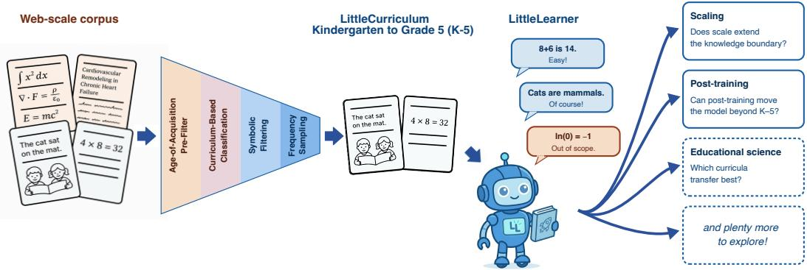  
Figure 1: LITTLECURRICULUM and LITTLELEARNER provide a pedagogically grounded sandbox for studying model behavior under precise data constraints. LITTLECURRICULUM is an 88B-token pretraining corpus filtered from FineWeb-Edu [1] to only contain elementary school (K–5) data. On it, we train a 5B model: LITTLELEARNER. Together, they form a well-curated sandbox to study scaling, post-training, educational science and more.

## 1 Introduction

Modern language models acquire capabilities from massive web-scale text corpora spanning a myriad of heterogeneous sources, making their prior knowledge difficult to characterize. A growing body of evidence suggests that model behavior is strongly shaped by this pretraining exposure: data contamination can inflate benchmark performance [2–6], phenomena such as the reversal curse reveal brittle generalization from observed facts [7], and targeted data patches are often needed to repair missing skills [e.g., 8–10]. When prior exposure is unknown, it is difficult to determine whether methods like in-context learning or post-training lead to genuine capability growth or merely elicit knowledge or skills already present in the training data [cf. 11–15].

Prior work has largely addressed this problem through benchmark design, using increasingly difficult or carefully curated out-of-distribution evaluations [e.g., 16, 17]. While valuable, such evaluations provide only indirect control over prior exposure: novelty must be reassessed for each new evaluation, and knowledge boundaries remain difficult to conceptualize and verify. We take a complementary approach: instead of defining novelty at evaluation time, we constrain the training distribution itself.

Although the cut-off date for pretraining corpora serves as an implicit temporal knowledge boundary (which Levine et al. [18] study concurrently in more detail), this only limits what information is avail able, not the specialized vocabulary and (historical, albeit sophisticated) scientific or mathematical concepts the model sees. Instead, we focus on developmental boundaries that more directly constrain exposure, as age-level curricula provide a pedagogically grounded proxy for the concepts, language, and reasoning demands available at a given developmental stage.

We instantiate this approach with LITTLELEARNER, a 5B-parameter language model trained from scratch under controlled knowledge exposure. LITTLELEARNER is trained on LITTLECURRICULUM, a developmentally constrained 88B-token corpus corresponding to the U.S. kindergarten to elementary school curriculum (denoted as K–5), which we construct using a scalable filtering pipeline. The model and dataset form a controlled sandbox for studying how restricted pretraining exposure shapes learning and later capability growth. In particular, this allows us to study whether in-context learning (ICL) and post-training extend a model’s capabilities beyond pretraining or merely elicit latent knowledge More broadly, LITTLELEARNER supports principled studies of how language models acquire, transfer, calibrate, and extend knowledge under explicitly constrained pretraining exposure.

Table 1: LITTLELEARNER responds appropriately for an elementary school student compared to an UNFILTERED baseline. Qualitative examples on in-scope K–5 and out-of-scope Beyond-K–5 questions. Refer to Section D for more examples.
<table><tr><td>LITTLELEARNER (only exposure to K–5)</td><td>UNFILTERED (control with unfiltered exposure)</td></tr><tr><td>In-scope (K–5) What is gravity?</td></tr><tr><td>Gravity is the force that pulls everything down. Gravity is the force between any two objects that is inversely proportional to the square of the separation between them...</td></tr><tr><td>Out-of-scope (Beyond-K-5) What is Schrödinger&#x27;s cat?</td></tr><tr><td>Schrödinger&#x27;s cat is a cat with two faces. Schrödinger&#x27;s cat is a thought experiment in quan- tum mechanics, proposed by Austrian physicist Erwin</td></tr></table>

In summary, we provide

1. LITTLECURRICULUM, a curated 88B-token dataset to only contain elementary school (K–5) content (Section 3.1).

2. LITTLELEARNER, a 5B model trained on LITTLECURRICULUM. The model and dataset form a sandbox for probing data acquisition, representation, and utilization within a well-defined training scope (Section 3.2).

3. First Experiments with LITTLELEARNER showing that increased model size, post-training, and ICL do not improve out-of-scope performance far beyond training exposure, but can increase performance within scope and at the boundary (Section 4).

## 2 Related Work

Knowledge Boundaries in LLMs Related work characterizes the knowledge boundary of an already-trained model [19], probing what a fixed LLM does and does not know through selfknowledge and unanswerable-question detection, confidence calibration, retrieval-augmented behavior shifts, and prompt-sensitivity-based formalizations [20–23]. Operating over an opaque pretraining distribution, these methods infer the boundary after training. Our setup instead specifies it in advance by controlling the training corpus, allowing mechanisms to be interpreted against known exposure.

Pretraining data dominates downstream behavior A growing body of work shows that the pretraining distribution is the primary determinant of generalization and downstream capability, with architecture and optimization playing comparatively minor roles [5, 6, 24, 25]. Recent analyses of reinforcement learning further suggest that observed gains often elicit reasoning patterns already present in pretraining rather than introduce genuinely new capabilities [26–28]. In the same vein, Dominguez-Olmedo et al. [4] show that training on the test task inflates benchmark scores and confounds emergent-capability claims, as exposure to the evaluation distribution becomes indistinguishable from genuine expansion. These findings motivate our approach to explicitly constrain the pretraining distribution to cleanly separate capability acquisition from latent prior knowledge.

Evaluation beyond training distribution A complementary line of work targets the same confounder from the evaluation side, curating benchmarks designed to minimize overlap with web-scale pretraining, such as Humanity’s Last Exam [29], GPQA [30], MMLU-Pro [31], and MATH-B [17]. As mentioned in Section 1, these provide only indirect control, the underlying training distribution remains opaque, and benchmarks must be continuously refreshed to stay informative.

Constrained pretraining distributions The closest line of work directly constrains the pretraining corpus. BabyLM [32] restricts training to human-scale corpora to study sample efficiency and linguistic generalization, but restricts quantity rather than conceptual scope, leaving the model free to encounter advanced material. Concurrent work [18] imposes a temporal cutoff by training on a pre-1931 English text, yielding a clean historical boundary but no constraint on conceptual complexity within that period. LITTLECURRICULUM complements both by imposing a developmental cutoff: the corpus is filtered to U.S. K–5 material along pedagogically grounded curriculum standards, giving an interpretable conceptual boundary at LLM scale.

## 3 Constructing the LITTLELEARNER-LITTLECURRICULUM Sandbox

## 3.1 Constructing a Developmentally Restricted LITTLECURRICULUM

We divide the web corpus FineWeb-Edu [1] into an elementary school (K–5) and Beyond-K–5 subset, via multi-stage filtering that enforces constraints on knowledge, syntactic complexity, and reasoning.

## 3.1.1 Age-of-Acquisition Pre-filtering

We begin with a lightweight rule-based filter to enforce coarse age alignment. Among several proxies for linguistic and conceptual difficulty, Age-of-Acquisition (AoA) [33] provides the strongest separation between grade levels (see Section A.1). However, 10% of the words in FineWeb-Edu are not covered by AoA. Therefore, we impute missing AoA values using a linear model over the log word frequency of Zipf WordFreq [34], leveraging the reported relationship between AoA and frequency by Kuperman et al. [33]. To be more robust to single-word outliers, we only discard samples in which more than 5% of the words exceed the target age of 12.

## 3.1.2 LLMJ Annotation and Classifier Training

We employ LLM-as-a-judge (LLMJ) to annotate a subset of FineWeb-Edu, which serves as training data for downstream classifiers. We initialize prompts based on Common Core State Standards (CCSS) [35] and refine them through automatic prompt optimization using DSPy [36] and OpenEvolve [37] (see Section A.2). Note that full LLMJ annotation is prohibitively expensive: based on Gemini Flash pricing, labeling the full FineWeb-Edu dataset would cost approximately USD 46M, further motivating our multi-stage approach.

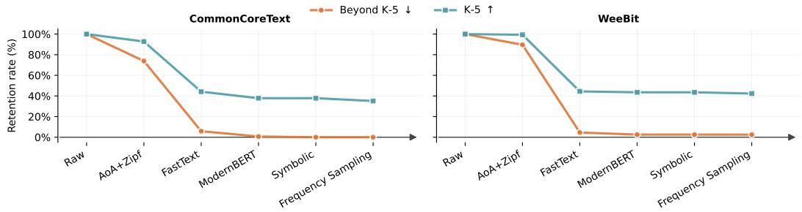  
Figure 2: The filtering yielding LITTLECURRICULUM conservatively enforces the K–5 boundary. Per-stage retention of K–5 and Beyond-K–5 documents on CommonCoreText (left) and WeeBit (right). CommonCoreText contains CCSS-aligned reading materials (see Section A.5) used during the construction of the filtering pipeline. WeeBit is an external benchmark with grade-level labels. On both benchmarks the pipeline achieves a Beyond-K–5 document retention of near-zero while retaining 35–42% of K–5 documents, reflecting a deliberate precision-first design: we sacrifice recall to obtain a sharp, interpretable knowledge boundary.

## 3.1.3 Curriculum-Based Classification

Our filtering pipeline is centered on classifiers trained on LLMJ-annotated data. We first apply a lightweight FastText [38] classifier. For the \~266M samples whose grade band matches the AoA assignment, we apply a stronger, 50× more expensive ModernBERT classifier [39].

## 3.1.4 Symbolic Filtering

Due to the low frequency of formulas and the difficulty in learning reliable signals from LLMJ annotations, we apply a rule-based symbolic filtering step. Each document is scanned using a fixed set of regular expressions covering broad notation families, such as quadratic expressions and operator symbols (e.g., P, Σ, R, ∂). To prioritize precision, we conservatively filter a document upon any match, as recognizable algebraic expressions are typically Beyond-K–5. This step removes an additional \~0.1% of documents retained after the preceding classifier stage, suggesting that symbolic filtering primarily addresses a small residual tail of notation-heavy content rather than serving as a broad mathematics filter. See Section A.3 for details.

## 3.1.5 Frequency Sampling

The post-filter corpus is larger than our training target, allowing the final sampling stage to further tighten the exposure boundary rather than subsample uniformly. Using the grade assignments from the preceding stages, we identify terms that are disproportionately associated with Beyond-K–5 material and remove candidate documents containing these terms. This conservative filtering step is further motivated by Ruis et al. [40], who show that models can acquire factual knowledge from sparse occurrences without degrading downstream reasoning. See Section A.4 for details.

## 3.1.6 Validation

We validate our pipeline using CommonCoreText, a held-out ground-truth dataset constructed from publicly available recommended reading materials and textbooks paired with grade-level labels (see Section A.5). Qualitative filtered examples are provided in Section A.7 . The pipeline successfully reduces the retention of Beyond-K–5 content to 0% while preserving \~35% of K–5 (Figure 2, left). This low K–5 retention reflects our deliberate precision-over-recall design: LITTLECURRICULUM is intended as a sharply-bounded corpus for controlled exposure experiments rather than an exhaustive sample of elementary school material. Importantly, this 65% rejection rate is measured on groundtruth K–5 passages in the CommonCoreText benchmark. We adopt this precision-first design because recovering more K–5 material from the much noisier FineWeb-Edu corpus would require relaxing the filter, thereby reducing confidence that the retained corpus respects the Beyond-K–5 boundary. This interpretation is supported by a manual comparison of retained and removed K–5 documents:

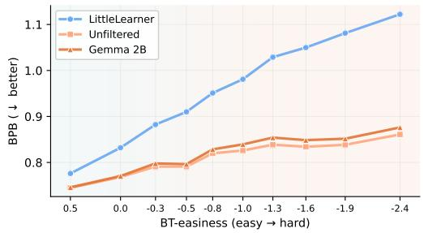  
Figure 3: LITTLELEARNER is increasingly unfamiliar with more difficult text, as shown by increasing bits-per-byte (BPB) [46] on CLEAR [44]. Samples are binned by the pedagogical Bradley-Terry easiness score [45].

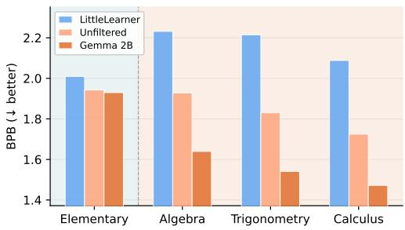  
Figure 4: LITTLELEARNER is unfamiliar with higher grade mathematical content, as indicated by BPB on student responses from studentassistant dialogues on mathematical discourse taken from CoMTA [47].

removed passages are systematically longer and lexically more complex than retained ones. Full statistics are provided in Section A.5.

As an independent check, we apply the same pipeline to WeeBit [41], an external grade-labeled corpus (Figure 2, right). The filter retains 2.48% of 6,000 Beyond-K–5 passages; manual inspection identifies genuinely out-of-scope concepts in only three passages, corresponding to 0.05% of the Beyond-K–5 split (the remaining content are web scraping artifacts, or content without educational value). We further conduct a corpus-wide scan using 126 Beyond-K–5 n-grams drawn from curriculum standards, finding matches in only 0.09% of retained passages. See Section A.6 for details.

LITTLECURRICULUM is a K–5-targeted subset of FineWeb-Edu, built via a precision-first multistage filtering pipeline, verified on a CCSS-aligned dataset (CommonCoreText) and corroborated on an external grade-labeled corpus (WeeBit). See Figure 2.

## 3.2 Training LITTLELEARNER

Using the constructed datasets, we train a 5B-parameter language model from scratch, which we call LITTLELEARNER. We follow the Qwen3 [42] architecture and pretrain the model for 100 hours on 8 NVIDIA B200 GPUs. Refer to Section B for details on model training and parameter count.

## 3.3 Validating LITTLELEARNER’s Knowledge Exposure

We validate the limited exposure of LITTLELEARNER via language complexity and performance on downstream benchmarks. We compare against a model of the same size and type trained on an unfiltered version of FineWeb-Edu (UNFILTERED) and Gemma 2B [43] as an external model of similar size, but trained on 2T instead of 80B tokens.

## 3.3.1 Language Familiarity Validation

Linguistic Complexity In Figure 3 we evaluate linguistic complexity using the CLEAR dataset [44], which provides Bradley–Terry [45] easiness scores for text passages derived from expert teacher judgments. LITTLELEARNER’s bits-per-byte (BPB) [46] steadily rises with increased hardness, while UNFILTERED’s and Gemma 2B’s BPB remain comparatively flat and closely track each other. This divergence can be attributed to pretraining data, since UNFILTERED shares LITTLELEARNER’s training recipe but Gemma 2B’s BPB.

Mathematical Complexity We validate a stronger mathematical familiarity on K–5 and a limited exposure on Beyond-K–5 on CoMTA [47] (Figure 4). This dataset captures real student responses in live tutoring sessions in different math categories, which we map to K–5 and Beyond-K–5 (see Section C.1). We evaluate BPB only on the student turns, making sure to specifically test the mathematical familiarity of the models. In K–5, LITTLELEARNER reports a BPB similar to the two reference models. However, in Beyond-K–5 LITTLELEARNER exhibits a growing unfamiliarity, while the unrestricted reference models remain stable.

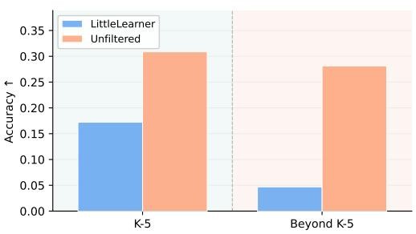  
Figure 5: LITTLELEARNER answers K–5 scientific questions but collapses on Beyond-K– 5. Pass@1 accuracy on Jeopardy science questions [48] split by NGSS-aligned grade scope.

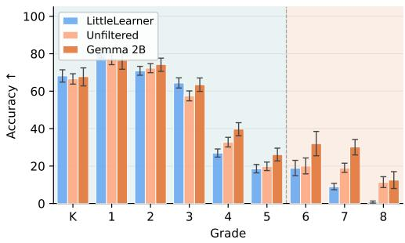  
Figure 6: LITTLELEARNER answers math questions on par in K–5, but disproportionally collapses at higher difficulties. Pass@1 accuracy on MathCAMPS estimated from 1024 rollouts. Whsiskers indicate 95% CIs.

## 3.3.2 Capability Validation

Factual Knowledge We validate LITTLELEARNER’s ability to retrieve factual knowledge within and beyond its training scope on Jeopardy science questions [48] divided into K–5 and Beyond-K–5 (see Figure 5). Gemini Flash [49] annotates each question with its corresponding NGSS (Next Generation Science Standards) curriculum strand [50]. We then split Jeopardy into questions within the NGSS K–5 curriculum and those at the Beyond-K–5 level. LITTLELEARNER shows a sudden drop in factual knowledge beyond its exposure horizon, while UNFILTERED performs comparably across both bins. Since both models are trained using the same training recipe, this drop can be attributed to the limited knowledge available in LITTLECURRICULUM.

Mathematical Reasoning We characterize the mathematical reasoning boundary of LITTLELEARNER using MathCAMPS [51], a dataset of synthetic questions aligned with individual Common Core State Standards (CCSS) (Figure 6). We adapt the dataset for model evaluation as described in Section C.2.1. Compared with UNFILTERED and Gemma 2B, LITTLELEARNER exhibits a disproportionately large decline in performance at higher grade levels. Increasing the sampling budget does not eliminate this gap: on Grade 8 problems, even at pass@1024, LITTLELEARNER solves fewer than half as many questions as UNFILTERED (Section C.2.3). Rather than emerging at a single grade-level threshold, the performance gap gradually widens as the difficulty of the problem increases. This trend partly reflects the limitations of grade-level CCSS labels as a proxy for problem difficulty for language models. Adjacent standards can target the same underlying operation while differing mainly in expected fluency, a distinction that is pedagogically meaningful, but may not translate meaningfully to language models. More generally, LITTLELEARNER’s capabilities do not follow the ordering of a human curriculum. For example, it performs better on division by a multi-digit divisor than on division by a single-digit divisor, despite single-digit division being a prerequisite to multi-digit division in human curricula (Section C.2.2).

LITTLELEARNER’s abilities tightly track its controlled knowledge exposure: it performs strongly on in-scope language, math, and factual tasks, but degrades beyond this scope. See Figures 3 to 6.

## 4 Probing Capabilities with LITTLELEARNER

LITTLELEARNER’s controlled pretraining enables a direct study of whether capabilities can be extended beyond a knowledge boundary or remain tied to pretraining exposure. We use the sandbox to examine three immediate adaptation questions that are difficult to isolate in standard web-scale models: whether increased scale expands the boundary, whether post-training can move the model beyond its K–5 scope, and whether in-context examples can recover out-of-scope Beyond-K–5 performance.

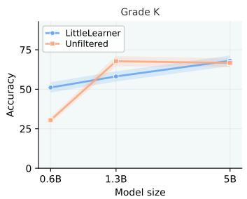

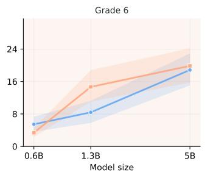

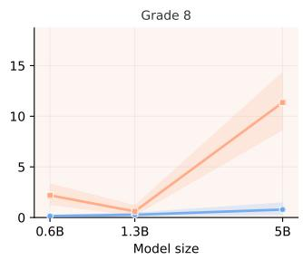  
Figure 7: Scaling model parameters help performance within K–5, and at the boundary, but does not recover performance well in Beyond-K–5 Performance of three differently sized LITTLELEARNERs and UNFILTERED models on MathCAMPS. Shaded regions correspond to 95% CIs. See Figure 17 for all Grades.

## 4.1 Can Model Size Improve Out-of-Scope Performance?

Model scale improves reasoning within the training exposure but does not meaningfully extend the model’s capability boundary. To test whether additional capacity elicits skills outside the training distribution, we train LITTLELEARNER on LITTLECURRICULUM at 0.6B, 1.3B, and 5B parameters and evaluate each on MathCAMPS (Figure 7). Inside the exposure range scaling delivers substantial gains, and at the smallest size LITTLELEARNER actually outperforms the UNFILTERED control: with no high-school algebra or calculus competing for its limited capacity, the small model produces more focused reasoning traces. This specialization advantage disappears as the two models converge within K–5 at larger sizes, but their behavior diverges sharply in Beyond-K–5. Scaling has a partial effect at the boundary of the training exposure (Grades 6 and 7), whose problem structure still overlaps with K–5 arithmetic, but essentially no effect on Grade 8, whose material lies fully outside LITTLECURRICULUM. LITTLELEARNER remains at floor across all three sizes. Curriculum exposure thus sets LITTLELEARNER’s capability frontier, and scale operates only within it.

Scaling model size improves performance within the model’s controlled knowledge exposure and extends modestly to problems along the same learning trajectory, but yields little improvement on problems requiring more advanced capabilities outside the exposure. See Figure 7.

## 4.2 Can Post-Training through GRPO Recover Out-of-Scope Capabilities?

Both post-training on K–5 content as well as a matched unfiltered post-training baseline are unable to recover Beyond-K–5 performance for LITTLELEARNER. To isolate the effect of post-training with reinforcement learning (RL), we employ a two-stage pipeline with Supervised Fine-Tuning (SFT) followed by GRPO [52] (refer to Section C.4 for details). For LITTLELEARNER we first SFT on K–5 data selected using our filtering pipeline from Section 3.1; UNFILTERED is SFT’d on a compute-matched unfiltered version of the same data sources. At the GRPO stage we then ablate LITTLELEARNER between questions that passed our filtering, i.e. are from K–5 and a computed matched, unfiltered, counterpart. The same unfiltered data set is used for GRPO on UNFILTERED. Figure 8 shows Math-CAMPS performance for all three runs. Within K–5, post-training lifts both models above their base performance with slightly larger gains for UNFILTERED. In Beyond-K–5, post-training only modestly improves LITTLELEARNER while producing considerably larger gains for UNFILTERED, widening the observed gap between the two models. Crucially, within the tested post-training budgets, we observe no difference between LITTLELEARNER post-trained on K–5 data versus Beyond-K–5 data. This highlights that bridging the performance gap between LITTLELEARNER and UNFILTERED on out-of-scope content requires more fundamental changes beyond GRPO.

Post-training through GRPO significantly boosts in-scope K–5 capabilities, but fails to recover out-of-scope Beyond-K–5 capabilities, even when training with out-of-scope data. See Figure 8.

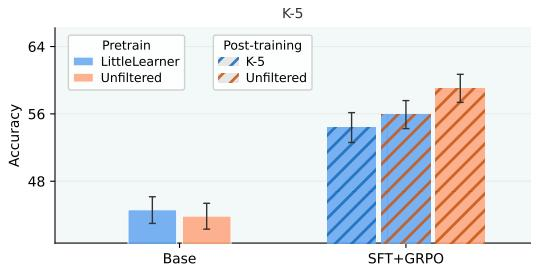

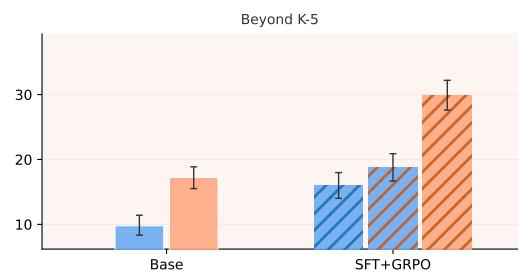

Figure 8: Post-training on unfiltered content increases K–5 capabilities but does not overcome the Beyond-K–5 gap Performance on MathCAMPS for LITTLELEARNER and UNFILTERED and their post-trained versions after SFT and GRPO. Whiskers represent 95% CIs.  
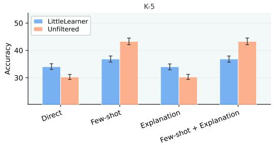

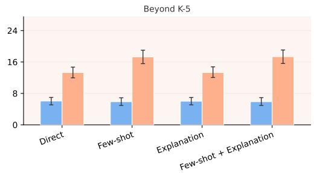  
Figure 9: In-context learning does not recover Beyond-K–5 capabilities LITTLELEARNER evaluated on MathCAMPS with Few Shot evaluation (giving three example traces for each problem category) slightly improves K–5 performance, but not Beyond-K–5. Adding explanations has no effect on performance. Whiskers indicate 95% CIs. See Section C.5.3 for different few-shot examples.

## 4.3 Can In-Context-Learning Recover Performance on Out-of-Scope tasks?

We do not find that for the 5B LITTLELEARNER and the few shot and explanation setups we test, in-context learning (ICL) is able to unlock new reasoning capabilities. Using the MathCAMPS setup, we synthesize three new problems per CCSS standard (Section C.5.1). We then manually author a chain-of-thought (CoT) solution for each question, which we use as few shot examples (see Section C.5.2). Even though we observe that adding few shots steers the model’s output to be more aligned with the shots, e.g. through a shorter response (see Table 5), this steering does not lead to better reasoning abilities. In K–5 using a few shots shows modest gains, and in Beyond-K–5 there is no gain at all. In Section C.5.3 we ablate different ways to present the few shot examples and find that the natural hand-written examples perform the best. When we add explanations instead of few shots, we do not observe the same behavior: Model responses do not change depending on the given explanation, and so does not performance.

In-context learning with the prompts we test does not unlock new reasoning capabilities in Beyond-K–5 for our trained 5B LITTLELEARNER. See Figure 9.

## 4.4 What Determines LITTLELEARNER’s Capability Ceiling?

Across all three interventions we study (model scaling, post-training with SFT+GRPO, and in-context learning), we observe a consistent pattern: each lever amplifies LITTLELEARNER’s capabilities within its K–5 exposure, but provides limited gains in Beyond-K–5 on capabilities not well supported by pretraining. Scaling yields modest gains at the exposure boundary, but little improvement on more advanced out-of-scope material (Figure 7); ICL does not unlock new reasoning capabilities Beyond-K–5 (Figure 9); and post-training amplifies in-scope capability for both bases but does not transfer to Beyond-K–5, even when a LITTLELEARNER base is post-trained on the same unrestricted full-grade data that lift UNFILTERED in Figure 8). In each case, it is the pretraining filter, rather than the intervention, that sets the effective capability ceiling in our tested settings.

These findings are consistent with the line of work surveyed in Section 2, which identified the pretraining distribution as the dominant factor in downstream behavior. We view this not as a negative result but as a starting point: the same controlled exposure that exposes the limits of these standard interventions also makes LITTLELEARNER (and LITTLECURRICULUM) a useful sandbox for studying algorithms and learning paradigms that aim to expand model capabilities beyond their pretraining distribution. We sketch several such directions in the next section.

## 5 Exploration Avenues: Beyond the K–5 Boundary

We view the LITTLECURRICULUM– LITTLELEARNER sandbox as a playground to study how language models acquire and extend knowledge under explicit competency constraints.

RL, discovery, and extrapolation RL has become a central tool for extending language model capabilities beyond pretraining, yet in standard settings it is difficult to determine whether observed gains reflect newly acquired competencies or the re-elicitation of latent pretraining knowledge [26, 27]. Our setup offers a controlled alternative: because the model’s prior is restricted to K–5 material, capabilities that emerge under RL, such as multi-digit arithmetic or multi-step algebraic reasoning, can be cleanly attributed to the RL process itself. We see two directions as particularly natural. First, LITTLELEARNER provides a small-scale analog of frontier discovery: studying whether reward signals, verifiers, self-play, and search can drive a bounded-knowledge agent toward higher-grade or competition-level mathematics offers a tractable proxy for the broader question of whether RL can produce genuine discovery in larger models. Second, the same setting supports controlled studies of algorithmic extrapolation, where RL pushes the model beyond its training range (for instance, from small-operand arithmetic to large numbers or longer sequences), providing a clean test of whether the model has acquired procedures rather than interpolated within its taught distribution.

Continual learning, interpretability, and calibration Continual learning, interpretability, and calibration are difficult to study cleanly in web-scale pretrained models, where broad prior exposure blurs the line between generalization, memorization, and latent knowledge. Our setup offers a controlled alternative: since LITTLELEARNER’s exposure is explicitly specified, behavioral and representational changes can be related more directly to the concepts introduced during training. This suggests three immediate directions. First, introducing new material such as negative numbers or algebraic notation after the initial K–5 phase allows one to measure sample efficiency, retention, and interference between old and new knowledge. Second, the setup enables before-and-after interpretability studies, such as tracking how representations change when the model moves from whole numbers to fractions or from arithmetic expressions to symbolic equations. Third, tasks can be constructed within, near, or beyond the model’s taught scope, enabling controlled evaluation of epistemic behavior: when the model answers correctly, expresses uncertainty, abstains, or hallucinates.

Educational science and human–model comparison Although LITTLELEARNER’s boundary is defined through human curricula, it should not be interpreted as a model of a human child. Human and machine learners acquire language, concepts, and mathematical procedures through different mechanisms [51, 53], and our results reflect this: LITTLELEARNER can sometimes perform better in downstream skills than in prerequisites (see Section C.2). The developmental framing is therefore a tool for controlling exposure, not a claim of human-like development. This makes the sandbox useful as a complementary substrate for educational science: by specifying what the model has and has not seen, one can study how machines acquire skills under curriculum-like constraints and compare their trajectories to human learners along well-defined axes. For example, one could ask whether models and children require similar exposure to learn fractions, or whether they make similar error on multi-step word problems. More broadly, LITTLELEARNER enables controlled human–model comparisons of sample efficiency, prerequisite dependence, transfer, and error structure.

Interactive and memory-based learning Evaluating these mechanisms in web-scale models is difficult because unknown training data obscures whether a capability is newly learned or previously memorized. LITTLELEARNER offers a controlled alternative: since its prior exposure is fully known, mechanisms can be assessed directly. We see three promising directions: First, testing retrieval and external memory to see if bounded models can reliably integrate out-of-domain content at inference. Second, using self-reflection and exploration to see how latent capabilities recombine without new data [54]. Third, studying multi-agent collaboration [20] while precisely tracking the source of newly introduced information.

## 6 Conclusion

We introduce LITTLECURRICULUM and LITTLELEARNER, a developmentally constrained 88B-token corpus and 5B model that provide a controlled sandbox for studying knowledge acquisition. In our experiments knowledge-injection through post-training or in-context learning fail to unlock reasoning patterns or information from out-of-scope domains. Although the 5B scale is small enough for academic feasibility yet large enough for coherent production, we acknowledge that certain emergent behaviors like in-context learning may be less pronounced than at frontier scales. While our experiments instantiate this framework with K–5 exposure and a 5B learner, the same construction naturally extends to other pedagogically inspired constraints and model scales. Ultimately, LITTLECURRICULUM and LITTLELEARNER offer the academic community a tractable foundation for moving beyond the constraints of massive uncurated pretraining and toward controlled studies of true out-of-distribution knowledge acquisition.

## Acknowledgements

The authors would like to thank Thomas Klein, Abhinav Menon, and Florian Windbacher for useful discussions.

Funded, in part, by the Collaborative Research Centre (CRC) “Robust Vision – Inference Principles and Neural Mechanisms” of the German Research Foundation (DFG; SFB1233), project number 276693517. This work was additionally supported by the German Federal Ministry of Education and Research (BMBF): Tübingen AI Center, FKZ: 01IS18039A. WB acknowledges financial support via an Emmy Noether Grant funded by the German Research Foundation (DFG) under grant no. BR 6382/1-1 and via the Open Philanthropy Foundation funded by the Good Ventures Foundation. WB is a member of the Machine Learning Cluster of Excellence, EXC number 2064/1 – Project number 390727645. Authors acknowledge funding by the Federal Ministry of Research, Technology and Space of Germany (BMFTR, formerly BMBF) under grant no. 01IS24085C (OPENHAFM). The authors thank the International Max Planck Research School for Intelligent Systems (IMPRS-IS) for supporting FL, TW, and PM. JZ and MPC are supported by the Max Planck ETH Center for Learning Systems.

## References

[1] Anton Lozhkov, Loubna Ben Allal, Leandro von Werra, and Thomas Wolf. FineWeb-edu: the finest collection of educational content, 2024,. URL https://huggingface.co/datasets/HuggingFaceFW/ fineweb-edu.

[2] Shuo Yang, Wei-Lin Chiang, Lianmin Zheng, Joseph E. Gonzalez, and Ion Stoica. Rethinking benchmark and contamination for language models with rephrased samples, 2023. URL https://arxiv.org/abs/ 2311.04850.

[3] Chunyuan Deng, Yilun Zhao, Xiangru Tang, Mark Gerstein, and Arman Cohan. Investigating data contamination in modern benchmarks for large language models. In Proceedings of the 2024 Conference of the North American Chapter of the Association for Computational Linguistics: Human Language Technologies (Volume 1: Long Papers), page 8706–8719. Association for Computational Linguistics, 2024. doi: 10.18653/v1/2024.naacl-long.482. URL http://dx.doi.org/10.18653/v1/2024.naacl-long. 482.

[4] Ricardo Dominguez-Olmedo, Florian E. Dorner, and Moritz Hardt. Training on the test task confounds evaluation and emergence, 2025. URL https://arxiv.org/abs/2407.07890.

[5] Prasanna Mayilvahanan, Roland S. Zimmermann, Thaddäus Wiedemer, Evgenia Rusak, Attila Juhos, Matthias Bethge, and Wieland Brendel. In search of forgotten domain generalization, 2025. URL https://arxiv.org/abs/2410.08258.

[6] Prasanna Mayilvahanan, Thaddäus Wiedemer, Sayak Mallick, Matthias Bethge, and Wieland Brendel. LLMs on the line: Data determines loss-to-loss scaling laws, 2025. URL https://arxiv.org/abs/ 2502.12120.

[7] Lukas Berglund, Meg Tong, Max Kaufmann, Mikita Balesni, Asa Cooper Stickland, Tomasz Korbak, and Owain Evans. The reversal curse: LLMs trained on "a is b" fail to learn "b is a", 2024. URL https://arxiv.org/abs/2309.12288.

[8] Mengzhou Xia, Sadhika Malladi, Suchin Gururangan, Sanjeev Arora, and Danqi Chen. LESS: Selecting influential data for targeted instruction tuning, 2024. URL https://arxiv.org/abs/2402.04333.

[9] Mayee Chen, Nicholas Roberts, Kush Bhatia, Jue Wang, Ce Zhang, Frederic Sala, and Christopher Ré. Skill-it! a data-driven skills framework for understanding and training language models. In Advances in Neural Information Processing Systems 36, NeurIPS 2023, page 36000–36040. Neural Information Processing Systems Foundation, Inc. (NeurIPS), 2023. doi: 10.52202/075280-1562. URL http://dx. doi.org/10.52202/075280-1562.

[10] Nicholas Lee, Thanakul Wattanawong, Sehoon Kim, Karttikeya Mangalam, Sheng Shen, Gopala Anumanchipalli, Michael Mahoney, Kurt Keutzer, and Amir Gholami. Llm2llm: Boosting LLMs with novel iterative data enhancement. In Findings ofthe Associationfor Computational Linguistics ACL 2024, page 6498–6526. Association for Computational Linguistics, 2024. doi: 10.18653/v1/2024.findings-acl.388. URL http://dx.doi.org/10.18653/v1/2024.findings-acl.388.

[11] Chunting Zhou, Pengfei Liu, Puxin Xu, Srinivasan Iyer, Jiao Sun, Yuning Mao, Xuezhe Ma, Avia Efrat, Ping Yu, Lili Yu, Susan Zhang, Gargi Ghosh, Mike Lewis, Luke Zettlemoyer, and Omer Levy. LIMA: Less is more for alignment. In Advances in Neural Information Processing Systems 36, NeurIPS 2023, page 55006–55021. Neural Information Processing Systems Foundation, Inc. (NeurIPS), 2023. doi: 10.52202/075280-2400. URL http://dx.doi.org/10.52202/075280-2400.

[12] Sewon Min, Xinxi Lyu, Ari Holtzman, Mikel Artetxe, Mike Lewis, Hannaneh Hajishirzi, and Luke Zettlemoyer. Rethinking the role of demonstrations: What makes in-context learning work? In Yoav Goldberg, Zornitsa Kozareva, and Yue Zhang, editors, Proceedings ofthe 2022 Conference on Empirical Methods in Natural Language Processing, pages 11048–11064, Abu Dhabi, United Arab Emirates, December 2022. Association for Computational Linguistics. doi: 10.18653/v1/2022.emnlp-main.759. URL https://aclanthology.org/2022.emnlp-main.759/.

[13] Jane Pan, Tianyu Gao, Howard Chen, and Danqi Chen. What in-context learning “learns” in-context: Disentangling task recognition and task learning. In Findings of the Association for Computational Linguistics: ACL 2023, page 8298–8319. Association for Computational Linguistics, 2023. doi: 10.18653/ v1/2023.findings-acl.527. URL http://dx.doi.org/10.18653/v1/2023.findings-acl.527.

[14] Dayu Wang, Jiaye Yang, Weikang Li, Jiahui Liang, and Yang Li. Beyond alignment: Expanding reasoning capacity via manifold-reshaping policy optimization. arXiv preprint arXiv:2602.02545, 2026.

[15] Tomás Vergara-Browne, Darshan Patil, Ivan Titov, Siva Reddy, Tiago Pimentel, and Marius Mosbach. Operationalising the superficial alignment hypothesis via task complexity. arXiv preprint arXiv:2602.15829, 2026.

[16] Zhaofeng Wu, Linlu Qiu, Alexis Ross, Ekin Akyürek, Boyuan Chen, Bailin Wang, Najoung Kim, Jacob Andreas, and Yoon Kim. Reasoning or reciting? exploring the capabilities and limitations of language models through counterfactual tasks. In Proceedings ofthe 2024 Conference ofthe North American Chapter of the Association for Computational Linguistics: Human Language Technologies (Volume 1: Long Papers), page 1819–1862. Association for Computational Linguistics, 2024. doi: 10.18653/v1/2024.naacl-long.102. URL http://dx.doi.org/10.18653/v1/2024.naacl-long.102.

[17] Prasanna Mayilvahanan, Ricardo Dominguez-Olmedo, Thaddäus Wiedemer, and Wieland Brendel. MATHbeyond: A benchmark for RL to expand beyond the base model, 2025. URL https://arxiv.org/abs/ 2510.11653.

[18] Nick Levine, David Duvenaud, and Alec Radford. Introducing talkie: a 13b vintage language model from 1930. April 2026. URL https://talkie-lm.com/introducing-talkie.

[19] Moxin Li, Yong Zhao, Wenxuan Zhang, Shuaiyi Li, Wenya Xie, See-Kiong Ng, Tat-Seng Chua, and Yang Deng. Knowledge boundary of large language models: A survey. In Proceedings of the 63rd Annual Meeting of the Association for Computational Linguistics (Volume 1: Long Papers), page 5131–5157. Association for Computational Linguistics, 2025. doi: 10.18653/v1/2025.acl-long.256. URL http: //dx.doi.org/10.18653/v1/2025.acl-long.256.

[20] Kirandeep Kaur, Xingda Lyu, and Chirag Shah. Knowing isn’t understanding: Re-grounding generative proactivity with epistemic and behavioral insight. arXiv preprint arXiv:2602.15259, 2026.

[21] Saurav Kadavath, Tom Conerly, Amanda Askell, Tom Henighan, Dawn Drain, Ethan Perez, Nicholas Schiefer, Zac Hatfield-Dodds, Nova DasSarma, Eli Tran-Johnson, et al. Language models (mostly) know what they know. arXiv preprint arXiv:2207.05221, 2022.

[22] Ruiyang Ren, Yuhao Wang, Yingqi Qu, Wayne Xin Zhao, Jing Liu, Hua Wu, Ji-Rong Wen, and Haifeng Wang. Investigating the factual knowledge boundary of large language models with retrieval augmentation. In Proceedings of the 31st international conference on computational linguistics, pages 3697–3715, 2025.

[23] Xunjian Yin, Xu Zhang, Jie Ruan, and Xiaojun Wan. Benchmarking knowledge boundary for large language models: A different perspective on model evaluation. In Proceedings of the 62nd Annual Meeting of the Association for Computational Linguistics (Volume 1: Long Papers), page 2270–2286. Association for Computational Linguistics, 2024. doi: 10.18653/v1/2024.acl-long.124. URL http: //dx.doi.org/10.18653/v1/2024.acl-long.124.

[24] Moritz Hardt. The Emerging Science ofMachine Learning Benchmarks. Princeton University Press, 2026.

[25] Alex Fang, Gabriel Ilharco, Mitchell Wortsman, Yuhao Wan, Vaishaal Shankar, Achal Dave, and Ludwig Schmidt. Data determines distributional robustness in contrastive language image pre-training (CLIP), 2022. URL https://arxiv.org/abs/2205.01397.

[26] Yang Yue, Zhiqi Chen, Rui Lu, Andrew Zhao, Zhaokai Wang, Yang Yue, Shiji Song, and Gao Huang. Does reinforcement learning really incentivize reasoning capacity in LLMs beyond the base model?, 2025. URL https://arxiv.org/abs/2504.13837.

[27] Rosie Zhao, Alexandru Meterez, Sham Kakade, Cengiz Pehlevan, Samy Jelassi, and Eran Malach. Echo chamber: RL post-training amplifies behaviors learned in pretraining, 2025. URL https://arxiv.org/ abs/2504.07912.

[28] Charlie Zhang, Graham Neubig, and Xiang Yue. On the interplay of pre-training, mid-training, and RL on reasoning language models, 2025. URL https://arxiv.org/abs/2512.07783.

[29] Long Phan, Alice Gatti, Nathaniel Li, Adam Khoja, Ryan Kim, Richard Ren, Jason Hausenloy, Oliver Zhang, Mantas Mazeika, Dan Hendrycks, Ziwen Han, Josephina Hu, Hugh Zhang, Chen Bo Calvin Zhang, Mohamed Shaaban, John Ling, Sean Shi, Michael Choi, Anish Agrawal, Arnav Chopra, Aakaash Nattanmai, Gordon McKellips, Anish Cheraku, Asim Suhail, Ethan Luo, Marvin Deng, Jason Luo, Ashley Zhang, Kavin Jindel, Paek, et al. A benchmark of expert-level academic questions to assess AI capabilities. Nature, 649(8099):1139–1146, 1 2026. ISSN 1476-4687. doi: 10.1038/s41586-025-09962-4. URL http://dx.doi.org/10.1038/s41586-025-09962-4.

[30] David Rein, Betty Li Hou, Asa Cooper Stickland, Jackson Petty, Richard Yuanzhe Pang, Julien Dirani, Julian Michael, and Samuel R Bowman. Gpqa: A graduate-level google-proof q&a benchmark. arXiv preprint arXiv:2311.12022, 2023.

[31] Aaran Arulraj, Abhranil Chandra, Wenhu Chen, Rongqi Fan, Shiguang Guo, Xuan He, Ziyan Jiang, Max Ku, Tianle Li, Xueguang Ma, Yuansheng Ni, Weiming Ren, Kai Wang, Yubo Wang, Xiang Yue, Ge Zhang, and Alex Zhuang. MMLU-pro: A more robust and challenging multi-task language understanding benchmark. In Advances in Neural Information Processing Systems 37, NeurIPS 2024, page 95266–95290. Neural Information Processing Systems Foundation, Inc. (NeurIPS), 2024. doi: 10.52202/079017-3018. URL http://dx.doi.org/10.52202/079017-3018.

[32] Alex Warstadt, Leshem Choshen, Aaron Mueller, Adina Williams, Ethan Wilcox, and Chengxu Zhuang. Call for papers – the BabyLM challenge: Sample-efficient pretraining on a developmentally plausible corpus, 2023. URL https://arxiv.org/abs/2301.11796.

[33] Victor Kuperman, Hans Stadthagen-Gonzalez, and Marc Brysbaert. Age-of-acquisition ratings for 30,000 english words. Behavior Research Methods, 44(4):978–990, 5 2012. ISSN 1554-3528. doi: 10.3758/ s13428-012-0210-4. URL http://dx.doi.org/10.3758/s13428-012-0210-4.

[34] Robyn Speer. rspeer/wordfreq: v3.0, 9 2022,. URL https://doi.org/10.5281/zenodo.7199437.

[35] National Governors Association and CCSSO. Common core state standards. https://www. corestandards.org/, 2010. Washington, DC.

[36] Omar Khattab, Arnav Singhvi, Paridhi Maheshwari, Zhiyuan Zhang, Keshav Santhanam, Sri Vardhamanan, Saiful Haq, Ashutosh Sharma, Thomas T. Joshi, Hanna Moazam, Heather Miller, Matei Zaharia, and Christopher Potts. DSPy: Compiling declarative language model calls into self-improving pipelines. 2024.

[37] Asankhaya Sharma. OpenEvolve: an open-source evolutionary coding agent, 2025. URL https:// github.com/algorithmicsuperintelligence/openevolve.

[38] Armand Joulin, Edouard Grave, Piotr Bojanowski, and Tomas Mikolov. Bag of tricks for efficient text classification. In Proceedings of the 15th Conference of the European Chapter of the Association for Computational Linguistics: Volume 2, Short Papers, page 427–431. Association for Computational Linguistics, 2017. doi: 10.18653/v1/e17-2068. URL http://dx.doi.org/10.18653/v1/e17-2068.

[39] Benjamin Warner, Antoine Chaffin, Benjamin Clavié, Orion Weller, Oskar Hallström, Said Taghadouini, Alexis Gallagher, Raja Biswas, Faisal Ladhak, Tom Aarsen, Nathan Cooper, Griffin Adams, Jeremy Howard, and Iacopo Poli. Smarter, better, faster, longer: A modern bidirectional encoder for fast, memory efficient, and long context finetuning and inference, 2024. URL https://arxiv.org/abs/2412.13663.

[40] Laura Ruis, Maximilian Mozes, Juhan Bae, Siddhartha Rao Kamalakara, Dwarak Talupuru, Acyr Locatelli, Robert Kirk, Tim Rocktäschel, Edward Grefenstette, and Max Bartolo. Procedural knowledge in pretraining drives reasoning in large language models. arXiv preprint arXiv:2411.12580, 2024.

[41] Sowmya Vajjala and Detmar Meurers. On improving the accuracy of readability classification using insights from second language acquisition. In Proceedings of the Seventh Workshop on Building Educational Applications Using NLP, pages 163–173, Montréal, Canada, 6 2012. Association for Computational Linguistics. URL https://aclanthology.org/W12-2019/.

[42] An Yang, Anfeng Li, Baosong Yang, Beichen Zhang, Binyuan Hui, Bo Zheng, Bowen Yu, Chang Gao, Chengen Huang, Chenxu Lv, Chujie Zheng, Dayiheng Liu, Fan Zhou, Fei Huang, Feng Hu, Hao Ge, Haoran Wei, Huan Lin, Jialong Tang, Jian Yang, Jianhong Tu, Jianwei Zhang, Jianxin Yang, Jiaxi Yang, Jing Zhou, Jingren Zhou, Junyang Lin, Kai Dang, Keqin Bao, Kexin Yang, Le Yu, Lianghao Deng, Mei Li, Mingfeng Xue, Mingze Li, Pei Zhang, Peng Wang, Qin Zhu, Rui Men, Ruize Gao, Shixuan Liu, Shuang Luo, Tianhao Li, Tianyi Tang, Wenbiao Yin, Xingzhang Ren, Xinyu Wang, Xinyu Zhang, Xuancheng Ren, Yang Fan, Yang Su, Yichang Zhang, Yinger Zhang, Yu Wan, Yuqiong Liu, Zekun Wang, Zeyu Cui, Zhenru Zhang, Zhipeng Zhou, and Zihan Qiu. Qwen3 technical report, 2025. URL https://arxiv.org/abs/2505.09388.

[43] Gemma Team, Morgane Riviere, Shreya Pathak, Pier Giuseppe Sessa, Cassidy Hardin, Surya Bhupatiraju, Léonard Hussenot, Thomas Mesnard, Bobak Shahriari, Alexandre Ramé, et al. Gemma 2: Improving open language models at a practical size. arXiv preprint arXiv:2408.00118, 2024.

[44] Scott Crossley, Aron Heintz, Joon Suh Choi, Jordan Batchelor, Mehrnoush Karimi, and Agnes Malatinszky. A large-scaled corpus for assessing text readability. Behavior Research Methods, 55(2):491–507, 3 2022. ISSN 1554-3528. doi: 10.3758/s13428-022-01802-x. URL http://dx.doi.org/10.3758/ s13428-022-01802-x.

[45] Ralph Allan Bradley and Milton E. Terry. Rank analysis of incomplete block designs: I. the method of paired comparisons. Biometrika, 39(3/4):324, 12 1952. ISSN 0006-3444. doi: 10.2307/2334029. URL http://dx.doi.org/10.2307/2334029.

[46] Linting Xue, Aditya Barua, Noah Constant, Rami Al-Rfou, Sharan Narang, Mihir Kale, Adam Roberts, and Colin Raffel. Byt5: Towards a token-free future with pre-trained byte-to-byte models. Transactions of the Associationfor Computational Linguistics, 10:291–306, 2022. ISSN 2307-387X. doi: 10.1162/tacl\_a\_ 00461. URL http://dx.doi.org/10.1162/tacl\_a\_00461.

[47] Khan Academy. CoMTA: Conversation-Based Math Tutoring Accuracy Dataset. https://github.com/ Khan/tutoring-accuracy-dataset/blob/main/CoMTA\_dataset.json, 2024. GitHub repository. Accessed: 2026-04-28.

[48] Pavle Tunguz. 200,000+ jeopardy! questions. https://www.kaggle.com/datasets/tunguz/ 200000-jeopardy-questions, 2019. Accessed: 2026-05-01.

[49] Google DeepMind. Gemini 2.5 Flash and native capabilities – audio & image model card. https:// storage.googleapis.com/deepmind-media/Model-Cards/Gemini-2-5-Flash-Model-Card. pdf, 2025. Accessed: 2026-01-09.

[50] NGSS Lead States. Next Generation Science Standards: For States, By States. National Academies Press, Washington, DC, 2013.

[51] Shubhra Mishra, Gabriel Poesia, and Noah D Goodman. From next-token to mathematics: The learning dynamics of mathematical reasoning in language models. arXiv preprint arXiv:2407.00900, 2024.

[52] Zhihong Shao, Peiyi Wang, Qihao Zhu, Runxin Xu, Junxiao Song, Xiao Bi, Haowei Zhang, Mingchuan Zhang, Y K Li, Y Wu, and Daya Guo. DeepSeekMath: Pushing the limits of mathematical reasoning in open language models. arXiv preprint arXiv:2402.03300, 2024.

[53] Tyler A. Chang and Benjamin K. Bergen. Word acquisition in neural language models. Transactions ofthe Associationfor Computational Linguistics, 10:1–16, 2022. ISSN 2307-387X. doi: 10.1162/tacl\_a\_00444. URL http://dx.doi.org/10.1162/tacl\_a\_00444.

[54] Kirandeep Kaur, Vinayak Gupta, Aditya Gupta, and Chirag Shah. The proper approach to proactivity: Benchmarking and advancing knowledge gap navigation. arXiv preprint arXiv:2601.09926, 2026.

[55] Rudolph Flesch. A new readability yardstick. Journal ofApplied Psychology, 32(3):221–233, 1948. ISSN 0021-9010. doi: 10.1037/h0057532. URL http://dx.doi.org/10.1037/h0057532.

[56] Edgar Dale and Jeanne S Chall. A formula for predicting readability: Instructions. Educational research bulletin, pages 37–54, 1948.

[57] Charles Browne and Brent Culligan. The new academic word list. http://www. newgeneralservicelist.org, 2013. Retrieved from http://www.newgeneralservicelist.org.

[58] Smart Data Analytics. Wikipedia TF-IDF Dataset. https://github.com/SmartDataAnalytics/ Wikipedia\_TF\_IDF\_Dataset, 1 2020. Pre-computed IDF statistics over 5,989,879 English Wikipedia articles from the 2020-01-01 Wikipedia dump. MIT License. Accessed 2026-05-06.

[59] Marc Brysbaert and Boris New. Moving beyond kucera and francis: A critical evaluation of currentˇ word frequency norms and the introduction of a new and improved word frequency measure for american english. Behavior Research Methods, 41(4):977–990, 2009. doi: 10.3758/BRM.41.4.977. URL https: //www.ugent.be/pp/experimentele-psychologie/en/research/documents/subtlexus.

[60] Mohammad Shoeybi, Mostofa Patwary, Raul Puri, Patrick LeGresley, Jared Casper, and Bryan Catanzaro. Megatron-LM: Training multi-billion parameter language models using model parallelism. arXiv preprint arXiv:1909.08053, 2019.

[61] Keller Jordan, Yuchen Jin, Vlado Boza, You Jiacheng, Franz Cesista, Laker Newhouse, and Jeremy Bernstein. Muon: An optimizer for hidden layers in neural networks, 2024. URL https://kellerjordan. github.io/posts/muon/.

[62] Zengzhi Wang, Fan Zhou, Xuefeng Li, and Pengfei Liu. OctoThinker: Mid-training incentivizes reinforcement learning scaling. arXiv preprint arXiv:2506.20512, 2025. Preprint.

[63] Karl Cobbe, Vineet Kosaraju, Mohammad Bavarian, Mark Chen, Heewoo Jun, Lukasz Kaiser, Matthias Plappert, Jerry Tworek, Jacob Hilton, Reiichiro Nakano, Christopher Hesse, and John Schulman. Training verifiers to solve math word problems. arXiv preprint arXiv:2110.14168, 2021.

## Contents

A Further Details on the Dataset Filtering Pipeline 15   
A.1 Rule Based Pre-Filtering 15   
A.2 LLM-J 16   
A.3 Symbolic Filtering 17   
A.4 Frequency Sampling 18   
A.5 CommonCoreText . 19   
A.6 Independent Leakage Checks . 19   
A.7 Examples of Dropped Samples per Filtering Stage . 20   
B Details on Model Training 24   
C Further Evaluation Details 24   
C.1 Mathematical Reasoning with CoMTA 24   
C.2 Mathematical Reasoning with MathCAMPS 25   
C.3 Details on Scaling Experiments . 27   
C.4 Details on Post-Training Experiments 27   
C.5 Details on ICL Experiments 28   
D More Qualitative Examples 30   
E Existing Assets, Licenses, and Terms of Use 32   
A Further Details on the Dataset Filtering Pipeline   
A.1 Rule Based Pre-Filtering

Comparison of Rule-Based Metrics on CommonCoreText We evaluate different rule based metrics to pre-sort FineWeb-Edu (see Figure 10) and observe that among all tested rule based approaches AoA gives the highest signal. We test different readability metrics (Flesch-Kincaid [55], Dale-Chall [56]), as well as simple linguistic metrics (Type Token Ratio, Average Sentence / Word Length) and frequency metrics through the New Academic Word List (NAWL) [57] and IDF scores from Wikipedia [58]. Throughout all tested rule-based metrics, we observe that AoA leads to the best explanation of different grade bands. However, it still does not explain the separation nearly well enough, and therefore we utilize a multi-stage approach.

Filling In AoA Scores with Word Frequencies Since Kuperman et al. [33] report a high correlation between AoA scores and word frequency metrics, we check which word frequency metric is most aligned with AoA and also adds enough additional words to reduce the out of vocabulary (OOV) words from 10% from AoA alone. Although the word frequencies of SUBTLEX-US [59] are the most aligned with AoA scores, 2.5% of all words remain OOV. Since this corpus consists of spoken text, the most frequent OOV words correspond to common written or web-specific artifacts, like www, uk, or facebook. The word frequencies from Wikipedia cover most words that occur in FineWeb-Edu (leaving only 0.23% OOV). However, the alignment with AoA is low. Therefore, we substitute missing AoA scores with WordFreq Zipf, as the tradeoff between alignment with AoA and new word coverage is the best (see Figure 11).

OOV Words for AoA + Zipf The most frequent words that do not appear in Zipf and AoA in (a subset) of FineWeb-Edu are reported in Table 2.

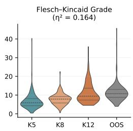

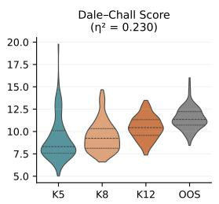

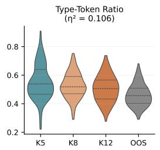

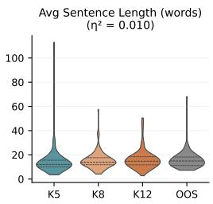

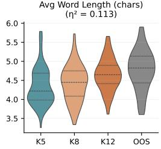

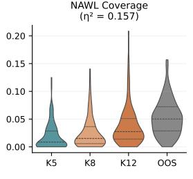

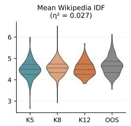

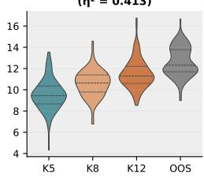

Figure 10: Age-of-Acquisition gives the clearest signal for underlying Grade band Evaluating different rule-based metrics on our CommonCoreText reveals that AoA is the best fit. K5 refers to K–5, K8 to middle school, K12 to high school and OOS to out-of-scope, i.e. beyond school level.  
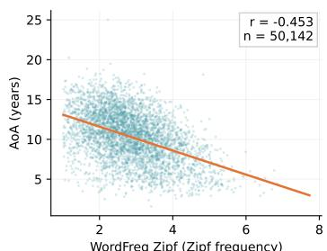

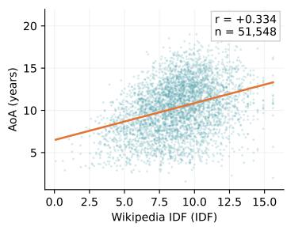

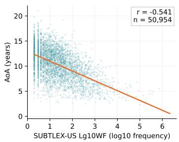  
Figure 11: At higher word coverage Word Freq Zipf gives the best trade-off between more word coverage and alignment to AoA

## A.2 LLM-J

LLM-J Setup Our LLM-J pipeline classifies a text snippet into one of four grade bands (elementary school, middle school, high school, out-of-scope) by majority voting over multiple prompts queried from Gemini 3 Flash. We instantiate three seed prompts targeting orthogonal signals: language complexity, context complexity, and a subject-aggregated prompt covering math, life science, physical science, and earth/space science. All three are then optimized independently with OpenEvolve [37] for 50 iterations using Gemini 3 Flash as both the task and evolution model, with a precisionon-validation fitness signal. As an alternative regime, we also optimize a single chain-of-thought aggregated prompt with DSPy’s GEPA optimizer [36] (auto=medium, GPT-5 as reflection model, seed 42). All judge calls use temperature 0 and a 1024-token cap. Voting takes the majority label across the three setups (seed, OpenEvolve, DSPy); ties are broken toward the higher grade, since under-classification (e.g. surfacing high school content to a K–5 LITTLELEARNER) is more harmful than over-classification.

We additionally evaluated (i) in-context learning, adding two labeled examples per grade band to each prompt, and (ii) confidence-weighted voting, where each vote is weighted by the judge’s self-reported confidence (Figure 12). ICL matches the no-ICL setup in both accuracy and K–5 precision at roughly 2× the cost; the reported confidences were poorly calibrated and confidence-weighting did not improve over uniform majority vote. We also compared per-subject prompts against the aggregated prompt and found no significant accuracy difference, so we kept the aggregated form.

<table><tr><td>Token</td><td>Frequency (Percentage of Tokens)</td></tr><tr><td>chatgpt</td><td>0.0031</td></tr><tr><td>mohill</td><td>0.0026</td></tr><tr><td>doacs</td><td>0.0017</td></tr><tr><td>sgas</td><td>0.0016</td></tr><tr><td>phenprocoumon</td><td>0.0016</td></tr><tr><td>shatavari</td><td>0.0016</td></tr><tr><td>calfresh</td><td>0.0014</td></tr><tr><td>necrozoospermia</td><td>0.0014</td></tr><tr><td>srpf</td><td>0.0013</td></tr><tr><td>fgas</td><td>0.0012</td></tr></table>

Table 2: The most out of vocabulary words for Zipf + AoA correspond to neologisms, misspellings or highly specialized terms We report the 10 most frequent out of vocabulary words for both AoA and Zipf on a subsample of FineWeb-Edu.

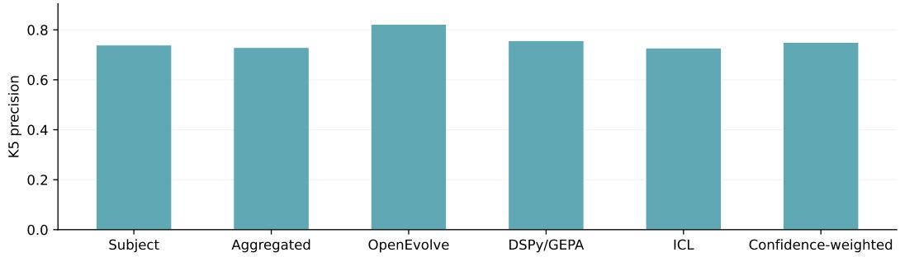  
Figure 12: No tested LLM-J method on Gemini 3 Flash vastly outperforms any other Since no tested LLM-J method vastly outperforms the others, we train classifiers on different labeled datasets and go with the setup yielding the best performing classifier. Refer to Figure 13.

The per-sample inference cost is \$0.0014 for the OpenEvolve ensemble and \$0.0017 for the single GEPA-optimized prompt, versus \$0.0035 for the unoptimized seed prompts. This yields a total cost of \$0.0066 per sample for the entire ensemble or \$45,870,000 for all 6.95B samples in FineWeb-Edu.

LLM-J Ablations with Training of Classifiers We compare single-judge labeling, specifically the Gemini-only setup with agreement across prompt variants, to cross-model aggregation based on Gemini–Llama agreement under multiple prompt variants. Single-judge setup (1) achieves the highest accuracy and lowest under-classification among all labeling setups in Figure 13. We hypothesize that cross-model agreement removes ambiguous but informative examples near the decision boundary.

LLM-J Safety Filtering We also evaluate a safety adjustment that promotes predictions to higher grades when the cumulative probability mass above a threshold exceeds class-specific values. Although this reduces under-classification, it does not improve overall reliability and degrades classspecific recall (Figure 14). We therefore retain the unadjusted predictions in the main results.

## A.3 Symbolic Filtering

Table 3 summarizes the notation families covered by the symbolic filter. Formal notation is sparse in the corpus, so the earlier lexical and semantic classifiers have limited evidence for learning these signals from LLMJ annotations. We therefore use high-precision rules for structured symbolic configurations, such as equations, exponents, roots, inequalities, functions, and calculus operators, rather than isolated symbols.

Across all symbolic patterns, the removal rate is approximately \~0.1% of the corpus after Modern-BERT classification. The largest categories removed are polynomial expressions, exponent notation, and multi-variable equations, which are precisely the cases in which Beyond-K–5 content relies on formal notation rather than advanced vocabulary. The low removal rate indicates that this stage functions as a narrow cleanup pass rather than a general mathematics detector.

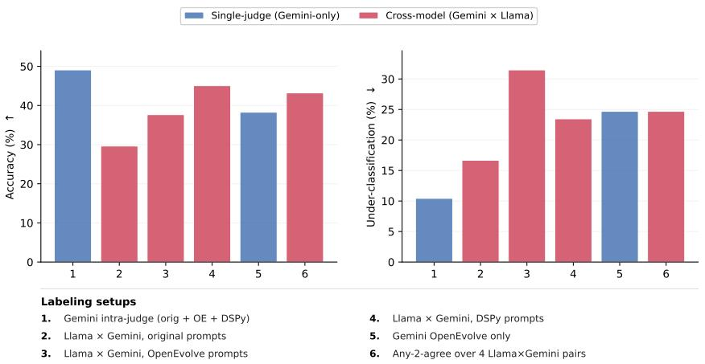  
Figure 13: The single-judge Gemini setup (1) outperforms cross-model agreement on both accuracy (↑) and under-classification (↓)

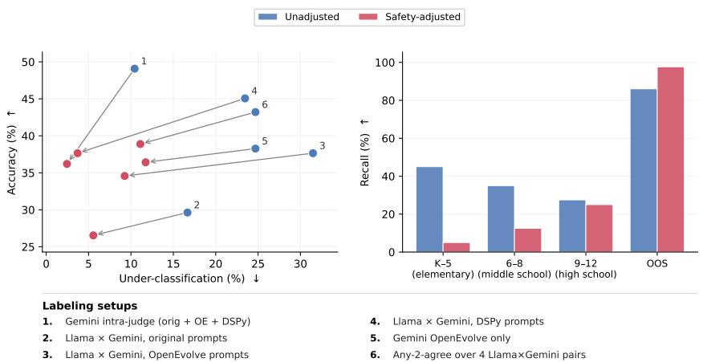  
Figure 14: The safety adjustment trades under-classification gain for a large accuracy loss and collapses recall on K–5 and 6–8 content

## A.4 Frequency Sampling

Since the retained pool contains roughly 100B tokens, exceeding our 80B-token training target, we use the final sampling stage to tighten the exposure boundary rather than uniformly subsampling the retained documents. We use corpus frequency statistics to identify terms that are disproportionately associated with Beyond-K–5 material and preferentially exclude candidate documents that contain them. For each term w, we compute a contrastive frequency-ratio score between the retained K–5 pool and the Beyond-K–5 pool:

$$
\operatorname { s c o r e } ( w ) = \log _ { 2 } { \frac { \operatorname { r a t e } _ { \mathrm { B e y o n d - K } - 5 } ( w ) } { \operatorname { r a t e } _ { \mathrm { K } - 5 } ( w ) } } , \qquad \operatorname { r a t e } ( w ) = { \frac { \operatorname { c o u n t } ( w ) } { \operatorname { t o t a l } \operatorname { t o k e n s } } } .
$$

A positive score indicates that w is more characteristic of Beyond-K–5 material. We discard terms below a minimum frequency threshold to avoid unstable scores from rare strings. The remaining high-scoring terms are compiled into a rank-ordered blocklist, which is used to downsample candidate documents only in the final sampling stage.

Table 3: Symbolic notation families targeted by the rule-based filter The table shows representative matches; each category also includes equivalent unicode, LAT X, and textual variants where applicable.
<table><tr><td>Category</td><td>Examples</td><td>Pattern coverage</td></tr><tr><td>Equations</td><td> $2 x + 3 = 7 , a x + b y = c , x ^ { 2 } + 2 x$ </td><td>Single-variable algebra, multi-variable equations, and polynomial forms</td></tr><tr><td>Exponents</td><td> $x ^ { 2 } , x ^ { n } , 5 ^ { 3 }$ </td><td>Caret, LTEX, unicode, digit-base and programming-style</td></tr><tr><td>Roots</td><td> ${ \sqrt { x } } , \ { \sqrt [ n ] { x } } , x ^ { 1 / 3 }$ </td><td>Square roots, cube roots, n-th roots, cbrt(, and root word forms</td></tr><tr><td>Inequalities</td><td> $a < x < b , a \leq x \leq b$ </td><td>Chained comparisons with  $< , > , \leq ,$  and ≥</td></tr><tr><td>Calculus/operators</td><td> $\Sigma , \textstyle \int , \partial , \infty$ </td><td>Summation, integrals, partial deriva- tives, infinity, and advanced LATEX</td></tr><tr><td>Functions</td><td> $f ( x ) , g ( y ) , h ( z )$ </td><td>commands Restricted to  $f / g / h$  with arguments  $x / y / z$ </td></tr></table>

## A.5 CommonCoreText

Construction We evaluate the filtering pipeline on CommonCoreText, a held-out benchmark of 460 passages sampled from textbooks and reading materials aligned with CCSS [35]. Each passage is associated with a grade level and subject category from the source curriculum. The benchmark spans two domains: science (including mathematics, physical science, life science, and space science), and literature.

The corpus includes a mixture of curriculum-aligned materials (e.g., grade-level textbooks, science coursework, and standardized assessment content), as well as canonical literary texts drawn from CCSS exemplar and recommended reading lists (e.g., Alice’s Adventures in Wonderland, Charlotte’s Web, 1984, Macbeth), ensuring coverage across both instructional and narrative text types. This benchmark is held out from classifier training and is used exclusively to evaluate retention and specificity.

K–5 retained vs. removed analysis Table 4 reports summary statistics for retained and removed K–5 passages after filtering. Removed K–5 passages are consistently longer and more lexically complex than the retained passages, with the median length nearly doubling (115 to 205 words). This pattern aligns with the precision-oriented design of the pipeline, favoring simpler and clearly in-scope content.

Table 4: Summary statistics for retained and removed K–5 passages after filtering.
<table><tr><td></td><td>Retained</td><td>Removed</td></tr><tr><td>Word count (median)</td><td>115</td><td>205</td></tr><tr><td>Word count (mean)</td><td>150</td><td>228</td></tr><tr><td>Avg. sentence length (words)</td><td>13.3</td><td>21.7</td></tr><tr><td>Long words (≥7 chars)</td><td>12.3%</td><td>18.0%</td></tr></table>

## A.6 Independent Leakage Checks

Filtering on WeeBit To test whether our filter’s specificity holds outside CommonCoreText, we apply the full filtering pipeline without retuning to WeeBit [41], a standard external readability corpus of graded educational texts consisting of Weekly Reader articles for younger grades and BBC Bitesize revision pages for older UK school stages (KS3/GCSE). WeeBit provides a clear gap around our boundary: Grades 2–4 (2,218 passages) and Grades 6–10 (6,000 passages). The retention rate on WeeBit provides a conservative upper bound on leakage: of the 6,000 Beyond-K–5 passages, our filter retains only 2.48%, rejecting over 97% of Beyond-K–5 text drawn from a corpus not used during filter development. Upon manual inspection, approximately half of these retained samples are web-scraping artifacts, and approximately a quarter consist of simple narrative prose. Of the remaining educational text, only three passages contain clearly out-of-scope concepts: fractions, exterior angles of polygons, and negative temperatures. These three passages correspond to 0.05% of the full Beyond-K–5 split.

N-gram overlap of out-of-scope concepts To complement the WeeBit [41] evaluation, we conduct a corpus-level terminology audit. We compile 126 Grade-6+ technical n-grams drawn verbatim from the Common Core Standards for Mathematics and English Language Arts and the Next Generation Science Standards. The list is restricted to multi-word phrases (e.g., “kinetic energy,” “textual evidence,” and “Pythagorean theorem”) and excludes n-grams sharing vocabulary with the pipeline’s blocklist, keeping the audit separate from the filtering rules. Scanning the retained corpus, we find that only 0.09% of passages contain at least one match.

Together, these checks provide complementary evidence that Beyond-K–5 leakage through the filtering pipeline is limited.

## A.7 Examples of Dropped Samples per Filtering Stage

We report examples of discarded documents per filtering stage. AoA Pre-filtering drops texts that are clearly outside the knowledge cutoff, discussing topics like neurology and cardiology. The FastText and ModernBert classifiers discard text with longer sentences, as well as discussing topics like the Gardner algorithm that are outside the knowledge cutoff. The Symbolic Filtering specifically filters for mathematical symbols that are outside the knowledge cutoff like exponents, and roots. Finally, frequency sampling makes sure that we sample from the middle of the remaining distribution.

## Step1: AoA Pre-filtering

## Example 1:

In neuroscience, neuromodulation is the process in which several classes of neurotransmitters in the nervous system regulate diverse populations of neurons (one neuron uses different neurotransmitters to connect to several neurons). As opposed to direct synaptic transmission, in which one presynaptic neuron directly influences a postsynaptic partner (one neuron reaching one other neuron), neuromodulatory transmitters secreted by a small group of neurons diffuse through large areas of the nervous system, having an effect on multiple neurons. Examples of neuromodulators include dopamine, serotonin, acetylcholine, histamine and others.

A neuromodulator is a relatively new concept in the field, and it can be conceptualized as a neurotransmitter that is not reabsorbed by the pre-synaptic neuron or broken down into a metabolite. Such neuromodulators end up spending a significant amount of time in the CSF (cerebrospinal fluid), influencing (or modulating) the overall activity level of the brain. For this reason, some neurotransmitters are also considered as neuromodulators. Examples of neuromodulators in this category are serotonin and acetylcholine.

## [...]

## Neuromodulation Other Uses

Neuromodulation also refers to a medical procedure used to alter nervous system function for relief of pain. It consists primarily of electrical stimulation, lesioning of specific regions of the nervous system, or infusion of substances into the cerebrospinal fluid. Electrical stimulation are devices such as Spinal Cord Stimulators (SCS) (surgically implanted) or transcutaneous electrical nerve stimulation devices (externally placed).

Example 2:   
Musings in the life of an internist, cardiologist and cardiac   
electrophysiologist.   
Send them to the ER!   
I think it is aortic aneurysm or mediastinal mass. It also shows   
hyperaeration which reflect chronic lung disease and possible smoking   
history which increase the risk of aneurysm or lung cancer. I also   
concern about right lower lobe patchy infiltrate, blunting of left   
costophrenic angle and haziness in right upper lung field close   
to mediastinum. I’m amazed to see "an asymptomatic patient" was   
hooked with telemetry and got portable CXR rather than regular PA   
and lateral which would yield much more information.More history and   
physical exam, previous CXR and obtaining CXR PA and lateral should   
help.   
Is that the apex of the heart sticking up to the left? It looks   
like the cardiac shadow is sideways. I don’t read xrays but is the   
diaphragm in the right place? Is "something" pushing the heart up   
and to the left?   
Do a needle biopsy in the office.   
It’s not every day you see a descending aortic aneurism that exceeds   
8 cm in diameter (confirmed by CT).Needless to say, we didn’t do   
an atrial flutter ablation until the aneurism was addressed and no   
office-based needle biopsy was performed.:)   
Post a Comment

Step 2: FastText Classification  
Example 1:   
First of all, I currently use a copper immersion chiller to cool my   
wort. It works, but takes at least 30 minutes to get below 100 and   
then i transfer and put it in my fermentation chamber till i reach   
pitching temp.   
I am hoping to get a March Pump (like this but open to other   
recomendations http://goo.gl/Uo3pS) with the idea that i would pair   
this with a plate chiller in order to reduce the cooling time. I’ve   
never seen one in action, so my question is this: Do i need more   
equipment (other than hoses) beyond the plate chiller and pump to   
chill my wort? I already have a 1/2" ball valve off my keggle with   
a false bottom, so i expect all i need to do is get a hose from this   
valve down to the pump, out of the pump into the chiller, out of the   
chiller to the carboy. Am I missing anything? A Hopback? Any sage   
advice would be appreciated.   
Example 2:   
You have 12 coins, one of which is counterfeit, and a balance pan   
scale. The fake coin may be identified by the fact that it’s   
weight is different from the 11 genuine coins. Can you identify   
the counterfeit coin and whether it is heavier or lighter in   
three Background & Techniques This is an old problem with lots of   
literature available on the web. The best reference is probably from   
one of Martin Gardner’s Mathematical Recreations columns published   
in Scientific American magazine about 40 years ago. It apparently   
was reprinted in book form in "Sixth Book of Mathematical Games   
from Scientific American" which is unfortunately out of print.   
I have copied a pretty good summary of the algorithm from the

alt.rec.puzzles newsgroup to this page:   
This program implements the Gardner algorithm to solve the problem   
(or check your solution) for this problem or the simpler case when   
you know whether the coin is heavy or light.   
[...]   
Notes for Programmers   
A TScale object descended from TImage is used to define the scale   
drawing methods and the animation depending on the relative weights   
of the pans. An OnCountWeighing exit is used to inform the parent   
program when a weighing should be counted. A weighibg is ciunted   
whenever the number of weights in each pan is moved the TScale   
definition stuff to a unit named U\_Scale just to simplify browsing   
the main form unit, U\_Counterfeit. U\_Counterfeit contains everything   
else required to let the user select problem type and number of coins,   
and to drag the coins to and from the balance pans and to the answer   
box. The CheckMinMoves function provided the most challenge. It   
implements the Gardner algorithms and builds the "cheat sheet" answer   
form, ResultsForm defined in the U\_Results unit. This form is built   
whenever the problem type or number of coins changes, but remains   
hidden until the user click the "Show me button. 600+ lines of   
code in U\_Counterfeit and 300+ lines in U\_Scale are enough to put   
this well into the Advanced category, but aside from CheckMinMoves,   
nothing is very complex, just a lot of it.

## Step 3: ModernBERT Classification

Example 1:   
When my son decided to stick a Lego up his nose earlier this summer   
requiring a trip to the emergency room, a lot of questions swirled   
through my mind: Is this normal? Why did he do this? Should I ban   
Legos from the house?   
Then in early August a boy in Utah made headlines for having a Lego   
wheel removed from his nose. Apparently it had been there for years,   
causing breathing and sleeping problems. All this activity got me   
wondering — what’s the deal with kids jamming stuff up their noses?   
"This is how children investigate their environment," said Dr.   
Jonathan Powell, a pediatrician with Resurrection Medical Group   
in Chicago. "When they are babies, they stick everything in their   
mouth. As they get a little older, they try other places. It’s very   
common."   
Dr. Michael Pitt, the director of the Pediatric Convenient Care   
Clinic at Lurie’s Children’s Hospital of Chicago, said this happens   
most often in kids between the ages of one and six. "I think there’s   
a misconception that boys do this more than girls but that’s not the   
case," Pitt said. "For items found in the ears, it’s equal between   
girls and boys, but for the nose, it’s 2 to 1 (ratio) girls."   
[...]   
Don’t pretend you’re an expert.   
"If something is lodged in the nose, the first thing you can do is   
close their mouth and blow hard in the other nostril," Powell said.   
"Make sure they are sitting up and leaning forward. If that doesn’t   
work, however, don’t try anything else and get professional help

immediately."   
"Assume it’s an emergency if you don’t know what the item is that’s   
gotten stuck," Pitt said. "A vast majority of the time the first   
line medical team can take care of it. You don’t want to be taking   
out the tweezers and try to do this yourself. You could put it   
further up there and really make things worse."   
Example 2:   
Interactive Tool:How Bad Are Your Urinary Symptoms From Benign   
Prostatic Hyperplasia (BPH)?   
BPH can be a bother, but it is usually not a serious health problem.   
If you are concerned about your symptoms, talk to your doctor about   
your options. They may include:   
- Small changes to your lifestyle and urination habits, plus regular   
checkups to make sure that the problem is not changing or getting   
worse.   
- Medicines to help reduce your symptoms.   
- Surgery to help correct the problem and reduce your symptoms.   
The main thing that helps you decide if and how to treat your   
symptoms is how much the symptoms bother you, not what your score   
is. To learn more, see these topics:   
- Reference Benign Prostatic Hyperplasia (BPH)   
- Opens New Window Enlarged Prostate: Should I Take Medicine? Opens   
New Window   
- Opens New Window Enlarged Prostate: Should I Have Surgery? Opens   
New Window   
Source: Roehrborn CG, et al. (2003, updated 2006). Guideline   
on the management of benign prostatic hyperplasia (BPH). American   
Urological Association Education and Research, Inc. Available   
online: http://www.auanet.org/content/guidelines-and-quality-care/.   
|By:||Reference Healthwise Staff||Last Revised: Reference November   
24, 2010| |Medical Review:||Reference E. Gregory Thompson, MD -   
Internal Medicine Reference J. Curtis Nickel, MD, FRCSC - Urology  
Step 2: Symbolic Filter

## Example 1:

Looking for Cramster? Cramster is now Chegg Homework Help. Learn More WILL RATE LIFESAVER!!! Two parallel plates are connected to a 150-V power supply. The gap between the plates is filled with air, and sparks will fly if the electic field exceeds the breakdown value of E= 3.0 x 10^6 V/m. What is the minimum spacing of the airgap (in mm)? Anonymous answered1 minute later You need a Homework Help subscription to view this answer!

## Example 2:

A speeder passes a parked car at a constant speed of 30 m/s. The police car starts from rest at the instant the speeder passes him and accelerates with a uniform acceleration of 2 m/s^2.

a) What length of time does it take the police officer to catch up with the speeder?

b) What distance do they both go until they are side by side?

c) What is the speed of the police car at the instant it catches up

to the speeder?

Step 2: Frequency Sampling  
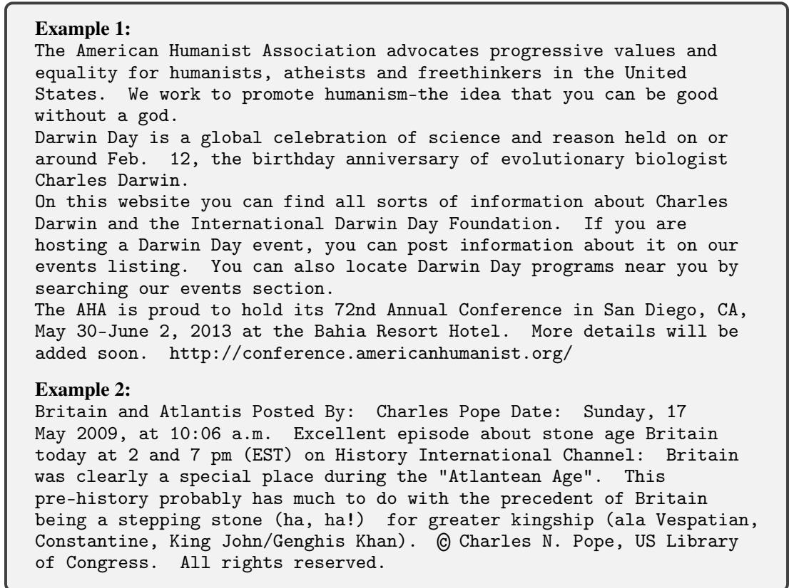

## B Details on Model Training

LITTLELEARNER adopts the Qwen3-dense [42] architecture and is trained from scratch using Megatron-Core 0.17.1 with a custom training recipe [60]. We train using 8-way layer-wise sharded Muon optimization [61] under a pure data-parallel configuration (TP=PP=CP=1), with BF16 parameter storage and MXFP8 computation. The cooloff mixture is composed of 91% K–5-filtered pretraining data, 5% K–5-rewritten mathematical reasoning data and 2% K–5-rewritten mathematical instruction-tuning data, both derived from Gemini Flash [49] rewrites of MegaMath-Pro [62], together with 2% general instruction-tuning data rewritten by Gemini Flash [49] from held-out FineWeb documents not used during pretraining. Annealing positioning is used throughout the cooloff stage. All rewritten data are constrained to the K–5 curriculum to preserve the controlled knowledge boundary.

To prevent leakage of Beyond-K–5 content through the tokenization pipeline, we train a custom tokenizer using only the K–5-filtered LITTLECURRICULUM corpus. To test whether the Beyond-K–5 arithmetic gap is driven by number segmentation, we conduct a matched 2B ablation using single-digit number tokenization while holding all other settings fixed. Beyond-K–5 MathCAMPS pass@1 increases for both LITTLELEARNER (1.1% → 1.8%) and UNFILTERED (4.6% → 10.3%), but LITTLELEARNER remains near floor and the qualitative gap persists.

We hold out a validation stream from the pretraining corpus, monitor validation bits-per-byte throughout training, and retain the checkpoint with the lowest validation bits-per-byte for downstream post-training and evaluation.

## C Further Evaluation Details

## C.1 Mathematical Reasoning with CoMTA

The CoMTA dataset does not come with a CC-aligned label. Therefore, we label the dataset upon manual inspection as Elementary as corresponding to K–5. Dialogs in this category discuss the multiplication of decimals (5.NBT.B.7), adding fractions (5.NF.A.1), and adding up to ten (K.OA.2). Algebra is Beyond-K–5 discussing matrix operations (HSN-VM.A.2) or working with negative exponents (8.EE.A.1). Trigonometry is also well above the K–5 level as trigonometric functions are discussed in high school (for example, in HSF.TF.A.1). Calculus is also well outside the knowledge cutoff discussing, for instance, velocity and the derivative of logarithms. We decided to exclude the Geometry category from our evaluation, since it contains both the calculation of simple volumes (5.MD.C.5) as well as trigonometric ratios, which is well above the K–5 knowledge cutoff.

## C.2 Mathematical Reasoning with MathCAMPS

## C.2.1 Filtering MathCAMPS Standards and Questions

We remove a small subset of MathCAMPS standards and individual questions from our high-pass@k evaluation, as these items do not reliably reflect a model’s true reasoning capability. We apply three filters.

First, we drop standards with fewer than 30 unique gold answers; these are predominantly multiplechoice items or questions whose answer space is small (perfect squares, cubes, and cube roots), and the resulting low entropy in the answer distribution inflates pass@k regardless of the model’s underlying reasoning capability.

Second, we discard individual questions where the gold answer string appears verbatim in the question text. Performance on these questions is up to 23× higher than on otherwise comparable questions within the same standard; inspection of the model traces revealed that the model frequently restates the question without attempting to solve it, and the regex-based grader then registers the embedded gold answer as a correct response.

Finally, we completely exclude the CCSS standard 6.EE.B.7. The CCSS notation places this standard in grade 6 (“Solve real-world and mathematical problems by writing and solving equations of the form x+p = q and $p x = q ^ { \prime \prime } )$ , but the problems generated by MathCAMPS for this standard are structurally indistinguishable from grade-3 add/sub word problems under 3.NBT.A.2. For example, 3.NBT.A.2-15-0 asks “A restaurant started the week with 573 oranges . . . they ended up using 228 oranges. How many oranges do they have left?”, while 6.EE.B.7-18-0 asks “A farmer had 414 grapes. After selling 78 of them, how many grapes do they have left?”. Including 6.EE.B.7 would therefore double-count grade-3 add/sub competence in the grade-6 band, inflating any model’s apparent Beyond-K–5 performance.

We then validate, that the questions in K–5 and Beyond-K–5 have similar readability metrics, in order to rule out that a low performance on Beyond-K–5 stems purely from a linguistic shift rather than a conceptual shift we are want to measure. Section C.2.1 reports the scores for both partitions of MathCAMPS.

<table><tr><td>Metric</td><td>K-5</td><td>Beyond-K-5</td></tr><tr><td>Flesch-Kincaid grade</td><td>5.28</td><td>5.37</td></tr><tr><td>Mean sentence length (words)</td><td>10.7</td><td>10.1</td></tr><tr><td>Mean word length (characters)</td><td>4.29</td><td>4.20</td></tr><tr><td>Mean question length (words)</td><td>28</td><td>23</td></tr></table>

## C.2.2 Performance Across Learning Paths

On the left panel of Figure 15, LITTLELEARNER and UNFILTERED track each other closely across Grades 3–6 and diverge framing-dependent at Grade 7. The similar performance on Grade 6 is not a failure of our filtering pipeline, but rather a mismatch between the human-aligned CCSS and the evaluation of models on these tasks. For instance, 6.NS.B.3 test whether models solve arithmeticfluently, which is hard to dissect for models. 6.NS.B.2 similarly tests whether students are able to solve division using the standard algorithm. This is not measured in MathCAMPS, as only final answers are evaluated. LITTLELEARNER and UNFILTERED diverge sharply only at Grade 7: LITTLELEARNER’s performance drops on rational decimal problems. Specifically those framed as pure arithmetic (7.NS.A.1-decimal) compared to the corresponding word problems (7.NS.A.3-decimal), while UNFILTERED is essentially framing-insensitive. Therefore highlighting that more K–5 aligned framing does help LITTLELEARNER’s performance, but is not able to close the gap to UNFILTERED.

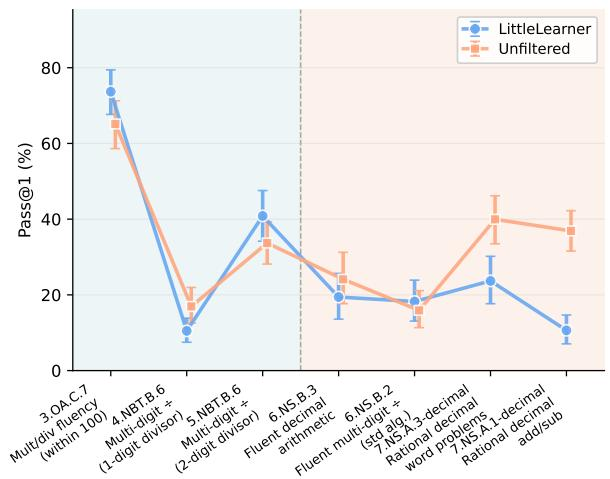

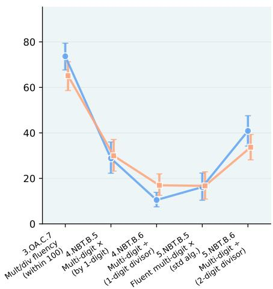  
Figure 15: LITTLELEARNER diverges more strongly on higher grade arithmetic problems (left); LITTLELEARNER and UNFILTERED do not follow CCSS learning paths (right) LITTLELEARNER and UNFILTERED evaluated at pass@1 (estimated from 1024 samples) on MathCAMPS along learning paths in CCSS. Each standard on the left of the axis is a prerequisite for standards to the right on the axis. Left shows the division learning path; Right the division / multiplication learning path.

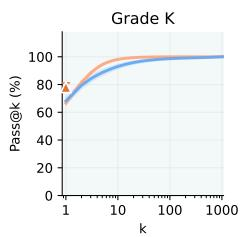

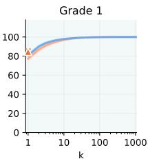

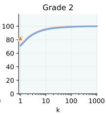

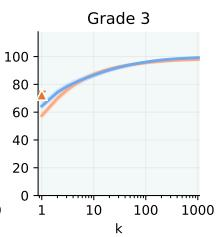

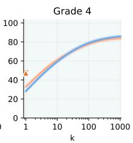

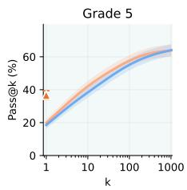

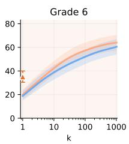

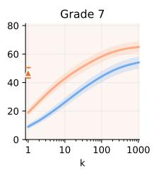

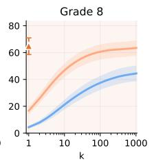  
Figure 16: The gap between LITTLELEARNER and UNFILTERED on Beyond-K–5 remains stable for higher sampling budgets Performance of LITTLELEARNER and UNFILTERED on MathCAMPS at higher pass@k. Shaded regions indicate 95% CIs.

The progression along CCSS prerequisite chains is non-monotonic. LITTLELEARNER is fluent at small mult/div (3.OA.C.7), drops on 1-digit-divisor multi-digit division (4.NBT.B.6), and then recovers on 2-digit-divisor division (5.NBT.B.6). Multi-digit multiplication follows a similarly jagged trajectory: 4th-grade multi-digit multiplication is easier (4.NBT.B.5) than its 5th-grade extension (5.NBT.B.5). Consistent with previous work [51, 53], LITTLELEARNER (and UNFILTERED) acquire skills along orderings that do not match the human curriculum. Therefore, LITTLELEARNER should not be read as a digital 12-year-old, but as a model with skills that arise from a K–5 restricted dataset, limited both by generic model capabilities and by the K–5-restricted training data.

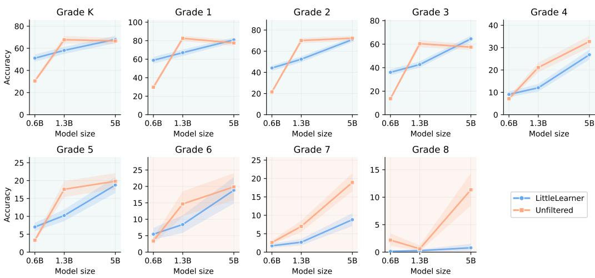  
Figure 17: Scaling model parameters help performance within K–5, and at the boundary, but does not recover performance well in Beyond-K–5 Performance of three differently sized LITTLELEARNERs and UNFILTERED models on MathCAMPS. Shaded regions correspond to 95% CIs.

## C.2.3 Pass@k Performance on MathCAMPS for LITTLELEARNER and UNFILTERED

LITTLELEARNER is competitive with UNFILTERED across K–5 but performance degrades more sharply as the evaluation moves into Beyond-K–5 (Figure 16). At pass@1024, LITTLELEARNER retains essentially all of UNFILTERED’s competence in Grades K–3, retains a comparable share through Grades 4–6, but only about two-thirds of it at Grade 8 with no overlapping CIs. The relative drop is consistent with the intended effect of LITTLECURRICULUM: filtering pretraining toward K–5 content preserves the elementary-school capability while bounding extrapolation to later mathematical topics. This boundedness is visible not only in aggregate pass rates. Within K–5, LITTLELEARNER’s perproblem successes are concentrated on the same problems UNFILTERED solves reliably (Spearman = 0.80): the two models succeed and fail on largely the same items. In Beyond-K–5, however, the pattern loosens UNFILTERED’s per-sample success rate on problems LITTLELEARNER never solves rises to 5.1%, roughly 4 times the equivalent K–5 rate indicating UNFILTERED can solve Beyond-K–5 questions that LITTLELEARNER cannot reach at any tested sample budget.

To probe whether LITTLELEARNER’s low Beyond-K–5 accuracy simply reflects an expression issue rather than a real capability ceiling, we evaluate under high sampling budgets with direct prompting which yields the high per-problem output diversity. On the log-scaled k-axis of Figure 16, both models’ curves flatten well before k=1024: gains slow noticeably by k≈100 and are essentially zero from there to k=1024 in every panel. If LITTLELEARNER carried any latent Beyond-K–5 capability that a larger sample budget could surface, we are confident that it would have surfaced. The Grade-8 plateau is therefore best read as a capability ceiling of LITTLELEARNER’s training exposure, not as a sampling-budget artifact.

## C.3 Details on Scaling Experiments

Figure 17 reports the scaling experiment numbers for each Grade. As outlined in Section C.2.1 the boundary in MathCMAPS right at the knowledge boundary between K–5 and Beyond-K–5 is fuzzy, reflecting in scaling showing some effect in grade bands right at the boundary, whereas at in grade 8 (so well in Beyond-K–5 scaling shows no effect).

## C.4 Details on Post-Training Experiments

The SFT stage uses the Gemini-rewritten chat data described in Section B: grade-school math word problems with chain-of-thought solutions (108k examples) and reading-comprehension question– answer pairs (526k examples). This results in ∼46M tokens used for a single epoch. Note, that pretraining runs fold a small fraction of this chat data into the final learning-rate decay phase (Section B); without it, neither base model is fine-tunable into a coherent chat model.

The GRPO stage is conducted on grade-stratified synthetic problems (generated via the MathCAMPS pipeline and checked for zero overlap with the evaluation set) alongside GSM8K [63], in segments of 150–300 steps between which the training pool is re-banded to the problems the current policy solves 1–15 times out of 16. In the K–5 exposure of GRPO we limit GSM8k to problems that are passing our filtering pipeline.

## C.5 Details on ICL Experiments

## C.5.1 Question and Explanation Construction

Questions are synthesized following MathCAMPS [51]: three questions per CCSS capability, generated with Gemini 3 Flash and paired with a numerically-verified answer. In parallel, we use the same model with the Explanation Generation prompt (below) to produce a grade-appropriate, procedural method-explanation per standard, using an anchor block that names the standard, its grade, and which K–5 prerequisites the student is assumed to know.

Write a CONCRETE, ACTIONABLE method-explanation that teaches a step-by-step procedure for solving any problem matching CCSS standard {standard.id} (grade {grade}). Use only operations and vocabulary at or below grade 5. The student’s solutions look like numbered steps (‘Step 1: 6 - 1 = 5; Answer: 5‘); your explanation should align with that style.

\- 3 to 5 sentences (roughly 60-130 words). Be SPECIFIC and PROCEDURAL. - State the method using CONCRETE NUMERICAL EXAMPLES. NEVER use letter variables OR generic placeholder letters (a, b, c, d, x, y, n, ...). GOOD: ’To multiply 3/5 x 2/7, multiply tops: 3 x 2 = 6; multiply bottoms: 5 x 7 = 35; the answer is 6/35.’ BAD : ’To multiply a/b x c/d, the answer is (a x c) / (b x d).’ BAD : ’Solve x + 5 = 12 by subtracting 5 from both sides. - Match how a grade-5 student writes work: numbered steps, plain ASCII (+ - x / =), fractions as a/b, mixed as ’N a/b’. - If the procedure has cases, such as positive vs. negative inputs, state what to do in EACH case using a concrete example for each case. - Connect the method to a K-5 mental model the student has, such as number-line jumps, inverse operations, parts of a whole, repeated addition, or area of a rectangle. - Do NOT reference real-world scenarios, such as apples, dollars, or students. - For unknowns, write ’?’ or ’the unknown number’; never a letter. - BAN list — vague phrases that will be rejected: ’as usual’, ’in the usual way’, ’look at whether’, ’decide if’, ’depending on the type’, ’the same way as before’ without saying WHICH way, ’just like normal multiplication’ without naming the rule. - Avoid grade-6+ vocabulary: ’rational’, ’integer’, ’variable’, ’coefficient’, ’linear’, ’system’. ’Equation’ is OK; ’variable’ is not. - No LaTeX, no \frac, no \$\$.

=== EXAMPLE OF A GOOD EXPLANATION === For 5.NF.B.4, multiplying fractions, shown for level and style only. This example is DIFFERENT from the standard you are writing about.

Explanation: To multiply a fraction by a whole number, first rewrite the whole number as a fraction over 1: 4 becomes 4/1. Then multiply the top numbers to make the new top, and the bottom numbers to make the new bottom. For example, 4 x 3/8 = 4/1 x 3/8 = (4 x 3) / (1 x 8) = 12/8 = 1 4/8 = 1 1/2. This works because multiplying by a whole number means repeating the fraction that many times: 3/8 + 3/8 + 3/8 + 3/8 = 12/8.

Notice how the example uses ONLY concrete numbers (4, 3, 8) — no letter placeholders, no variables — and connects the rule to repeated addition, an idea the student already knows.

Output exactly one line, prefixed with ’Explanation:’ followed by your 4-to-6-sentence procedural explanation.

Generated Explanation for 6.NS.B.2   
Method for this kind of problem: To divide a large number like 3,432 by 12,   
first find how many times 12 fits into the first two digits: 12 goes into   
34 two times because 12 × 2 = 24. Subtract 24 from 34 to get 10, then bring   
down the next digit, 3, to make 103. Next, find how many times 12 fits into   
103: 12 × 8 = 96, so subtract 96 from 103 to get 7. Finally, bring down   
the last digit, 2, to make 72, and since 12 × 6 = 72, the final answer is   
286. This method works like an area model where you find the missing side of   
a rectangle by taking away known chunks of the total area until zero is left.

## C.5.2 Creating Hand-Authored Natural-Prose CoT

For the in-context demonstrations themselves, we hand-authored the solutions rather than reusing model-generated CoTs. For each of the 43 K–5 CCSS standards used as anchors we wrote three worked examples in a natural-prose style: a one-line orienting sentence (“We need to find the answer.”), one sentence per computation using connective language (“First,. . . ”, “Then,. . . ”), and a final Answer: line matching the format the eval harness parses. The style deliberately matches what a K–5 student explaining their own work would produce, and is close to the free-form output the chat model produces without any exemplars. For instance:

We need to find the answer.   
First, add the stones Leo found to the stones his sister gave him: 27 + 11 =   
38.   
Then, subtract the stones Leo gave to his friend from the total: 38 − 13 = 25.   
Answer: 25

## C.5.3 Comparing Different Few-Shot Examples

In-context example construction We evaluate three families of in-context demonstrations that differ only in the CoT style; the question sets are identical. We outline the styles here with example traces for the question (2.NBT.B.5): Leo found 27 smooth stones at the beach. His sister gave him 11 more stones. Later that day, Leo gave 13 of his stones to his friend. How many stones does Leo have now?

• Compact algebraic — Terse, equation-only demonstrations. No natural-language framing, no wrapping sentences. Mean length: 99 characters. For instance:

3 tens + 7 tens = 10 tens   
30 + 70 = 100   
### Answer: 100

• Natural prose — Hand-authored as above noted above; mean length 374 characters, longest of the three. For instance:

We need to find the answer.   
First, add the stones Leo found to the stones his sister gave him:   
27 + 11 = 38.   
Then, subtract the stones Leo gave to his friend from the total:   
38 − 13 = 25.   
Answer: 25

Table 5: None of the tested in context-learning shots can recover Beyond-K–5 performance, despite steering model behaviour Performance of the SFT’d 5B LITTLELEARNER on MathCAMPS.
<table><tr><td>Method</td><td>K-5</td><td>Beyond-K-5</td><td>Mean output (chars)</td></tr><tr><td>Direct (zero-shot)</td><td>34.0%</td><td>6.0%</td><td>352</td></tr><tr><td>Natural prose</td><td>36.8%</td><td>5.9%</td><td>374</td></tr><tr><td>Compact algebraic</td><td>17.0%</td><td>1.6%</td><td>99</td></tr><tr><td>Q/A only</td><td>9.2%</td><td>0.2%</td><td>41</td></tr></table>

• Q/A only — Ablation: same three exemplars with the CoT stripped, leaving only question and final answer. Mean length: 41 characters. For instance:

Answer: 100

Performance Across Different ICL Strategies On the chat-tuned base (LITTLELEARNER 5B SFT), only natural-prose shots improve over the zero-shot direct baseline; every other format strictly hurts. See Table 5 for an overview of different performances. Despite the model being able to follow the shots by adjusting output length, this does not result in better performance.

## D More Qualitative Examples

We compare generations from the K–5-restricted LITTLELEARNER model and an unrestricted baseline model (UNFILTERED) across prompts of increasing conceptual difficulty (Table 6).

Table 6: Qualitative base-model examples highlight a clear distinction between in-scope and out-of-scope behavior Free-form completions from the released LITTLELEARNER base model and the matched UNFILTERED base model on prompts spanning K–5 and Beyond-K–5 concepts.
<table><tr><td>Prompt</td><td>LITTLELEARNER</td><td>UNFILTERED</td></tr><tr><td></td><td colspan="2">K-5</td></tr><tr><td>What is a magnet?</td><td>A magnet is a piece of metal that is made to attract or pull other metal pieces.</td><td>A magnet is a material that has a property called magnetism.</td></tr><tr><td>What is gravity?</td><td>Gravity is the force that pulls ev- erything down.</td><td>Gravity is the force between any two objects that is inversely pro- portional to the square of the sepa- ration between them...</td></tr><tr><td></td><td colspan="2">Beyond-K-5</td></tr><tr><td>What is DNA?</td><td>DNA is the instructions that tell us how we are going to look when we get old..</td><td>DNA stands for deoxyribonucleic acid. It is a genetic molecule present in all living things, includ- ing humans. It is composed of two long strands of nucleotides. . .</td></tr><tr><td>What is Schrödinger&#x27;s cat?</td><td>Schrödinger&#x27;s cat is a cat with two faces.</td><td>Schrödinger&#x27;s cat is a thought ex- periment in quantum mechanics, proposed by Austrian physicist Er- win Schrödinger in 1935...</td></tr><tr><td>What does E = mc² mean?</td><td>It&#x27;s the name of a mathematical constant. It&#x27;s also the name of a very famous character from the Star Wars movies.</td><td>Einstein&#x27;s famous equation says that energy is equivalent to mass times the square of the speed of light.</td></tr></table>

In the in-scope prompts, LITTLELEARNER produces accurate explanations that reflect the simplified, progressively structured reasoning characteristic of a spiral curriculum, where concepts are introduced early and refined over time. Compared to the general model, its responses are often less detailed, but remain correct and developmentally appropriate.

In contrast, on out-of-scope prompts, the model does not express uncertainty but instead generates structured yet incorrect explanations. These responses are not random: rather than retrieving correct knowledge, the model systematically projects unfamiliar concepts onto familiar reasoning patterns learned during training. For example, Schrödinger’s cat is reinterpreted as a literal cat with fabricated attributes.

This behavior suggests that the model lacks the underlying concepts, but nevertheless attempts to explain them using the available reasoning primitives, leading to coherent but incorrect outputs.

## E Existing Assets, Licenses, and Terms of Use

Table 7 summarizes the existing assets used in this work, their roles, license terms, and whether they are included in our release. Where applicable, version information, access dates, and source URLs are provided through the corresponding citations or release documentation.

<table><tr><td>Asset</td><td>Use in this paper</td><td>License / terms</td><td>Included?</td></tr><tr><td>FineWeb-Edu</td><td>Source corpus for constructing LITTLECURRICULUM</td><td>ODC-BY</td><td>Yes</td></tr><tr><td>Common Core State Standards</td><td>Curriculum alignment</td><td>CCSS Public License</td><td>No</td></tr><tr><td>NGSS</td><td>Curriculum alignment</td><td>NGSS Public License</td><td>No</td></tr><tr><td>CLEAR</td><td>Readability validation</td><td>MIT License</td><td>No</td></tr><tr><td>CoMTA</td><td>Mathematical familiarity evalua- tion</td><td>Khan Academy Evalua- tion Dataset License</td><td>No</td></tr><tr><td>MathCAMPS</td><td>Mathematical reasoning evalua- tion</td><td>MIT License</td><td>No</td></tr><tr><td>nanochat</td><td>Training setup</td><td>MIT License</td><td>No</td></tr><tr><td>Gemma 2B</td><td>External baseline</td><td>Gemma Terms of Use</td><td>No</td></tr><tr><td>Smoltalk</td><td>Post-training data</td><td>Apache-2.0</td><td>No</td></tr><tr><td>MMLU</td><td>Post-training data</td><td>Apache-2.0</td><td>No</td></tr><tr><td>GSM8K</td><td>Post-training data</td><td>MIT</td><td>No</td></tr><tr><td>ARC</td><td>Post-training data</td><td>Apache-2.0</td><td>No</td></tr></table>

Table 7: Existing assets used in the paper. “Included” indicates whether the asset itself, or a derived version of it, is distributed as part of our released artifacts. Unless otherwise indicated, third-party datasets, models, codebases, and curriculum standards are not redistributed.