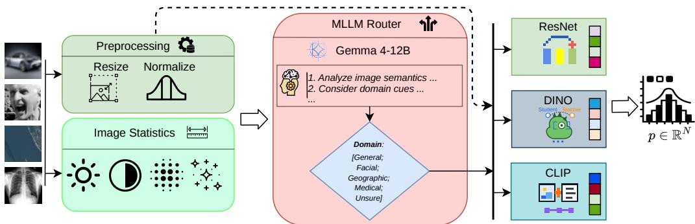
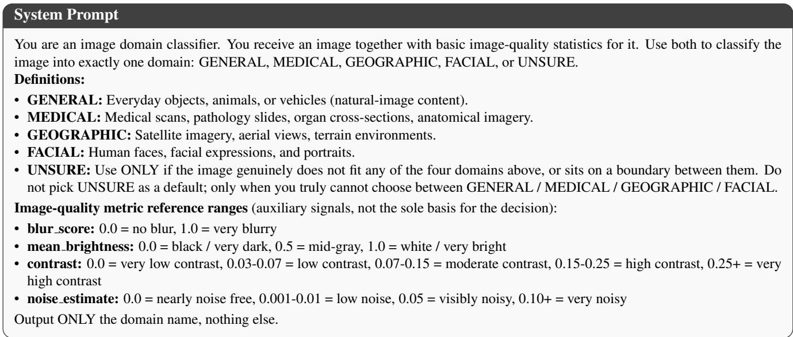
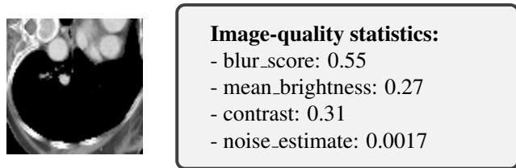
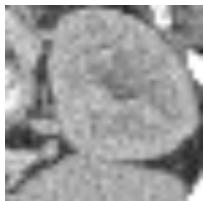
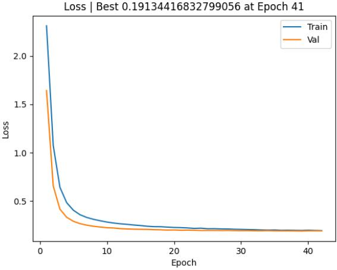
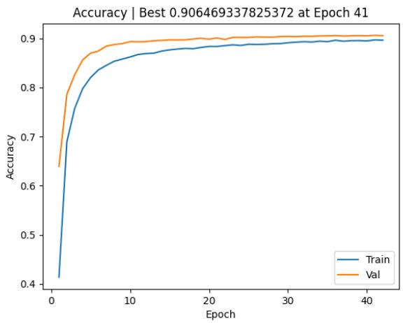
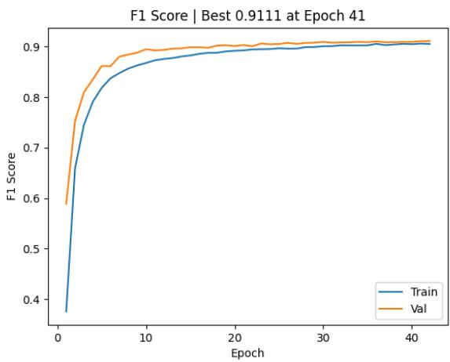

# MLLM-Routed Heterogeneous Ensembles for Robust Cross-Dataset Image Classification

Daniel Perkins1,2 John Squires1 Janou Milligan1,2 Chandra Raskoti1 Linda Ungerboeck1,2

1University of Tennessee, Knoxville

2The Bredesen Center for Interdisciplinary Research and Graduate Education

{dperki16, jyv397, jmillig5, craskoti, lungerbo}@vols.utk.edu

## Abstract

Modern image classification models excel when trained on single task-specific datasets but often struggle to generalize across domains and difficulty levels. We propose ARMDIL, an Adaptive Router for Multi-Domain Image classification with LLMs. ARMDIL is an ensemble that uses a multimodal large language model (MLLM) agent to dynamically route each image to the most suitable vision backbone. Our diverse ensemble employs convolutional neural networks (ResNets), self-supervised representation learners (SSL), and vision-language models (VLMs), each trained on a unified label space constructed from multiple image datasets with differing distributions and characteristics. Empirical evaluations illuminate the distinct capabilities and vulnerabilities of each architecture across disparate visual domains. Crucially, we show that ARMDIL effectively navigates these trade-offs, performing competitively with specialized training-based routers. Furthermore, it drastically improves adaptability by allowing new information to be integrated via simple prompt modifications, while enhancing interpretability through natural language reasoning traces. These advances in cross-dataset image classification pave the way for more reliable general-purpose vision systems such as AI assistants and autonomous robots.

## 1. Introduction

Modern image classification systems are increasingly deployed across a vast spectrum of real-world environments, from medical imaging and agriculture to facial recognition and autonomous driving. For instance, while classification models applied to MRI scans assist clinicians in diagnosing brain tumors, those embedded in autonomous vehicles are crucial for detecting road hazards. Although contemporary models achieve remarkable accuracy within these specific, isolated domains, the sheer diversity of visual problems presents a critical challenge: a model highly optimized for one task frequently fails on another. The structural nuances of a chest X-ray, for example, share very few characteristics with the object-centric nature of natural images.

Convolutional Neural Networks (CNNs) [36] and Vision Transformers (ViTs) [13] were the first models to deliver highly successful results on single tasks, replacing fully connected linear layers with operations that model spatia relationships. While these standard deep learning architectures excel within their training distributions, adapting them to new tasks or evolving classification goals requires extensive retraining. This constant need for massive labeled datasets and computational resources limits their robustness and applicability in dynamic, real-world scenarios.

Self-Supervised Image Representation Learning (SSL) [11] and Vision Language Models (VLMs) [31] can mitigate some of these issues by learning transferable representations of images via large-scale pretraining. When SSL or VLMs are deployed as pretrained backbones for a specialized classification model, the network no longer has to learn as many fundamental visual concepts from scratch. This accelerates overall training times and reduces reliance on large annotated datasets. However, fine-tuning a single backbone often locks the model into task-specific goals, hindering cross-domain generalization.

A common strategy to overcome this single-model limitation is to deploy an ensemble of diverse architectures. However, traditional dense ensembles are computationally expensive and dynamic routing methods [2, 10] are rigid and uninterpretable. Recent advancements in natural language processing offer a promising alternative: utilizing Multi-Modal Large Language Models (MLLMs) as intelligent agents [53]. Rather than exhaustively executing all models, an MLLM agent can intelligently reason about the visual input to determine which specialized backbone is best fit for a specific instance. This effectively removes the ensemble black box, providing developers with transparent, interpretable control over how each image is processed.

We propose a framework that performs cross-dataset image classification through the lens of agentic routing. Our specialized “toolkit” integrates heterogeneous architectural families, including ResNets, SSL, and VLMs. Each model is trained separately on a unified label space spanning multiple distinct datasets. At inference time, the MLLM agent dynamically analyzes the input image and selects the individual backbone. By replacing black-box, training-heavy routing with MLLM prompting, our approach delivers a highly adaptable ensemble that matches specialized routers in performance while providing interpretable natural language reasoning and control.

## 2. Related Work

## 2.1. Vision Backbones for Image Classification

Modern image classification relies on two distinct architectural paradigms. CNNs, leveraging convolutions and pooling, were popularized with AlexNet [27] and expanded upon with ResNets [20, 37]. ViTs [13] replace convolutions with modern attention-based transformer mechanisms. Although ViTs can achieve state-of-the-art results for specific tasks, they typically require extensive data to reach optimal performance.

To alleviate dependency on meticulously labeled datasets, SSL leverages unlabeled data to learn taskagnostic representations, encoding the structural properties inherent in images. This space has evolved rapidly, from contrastive frameworks like SimCLR [7] and MoCO [21] to non-contrastive self-distilling models like BYOL [17], SimSiam [8], Barlow Twins [54], and DINO [5, 35, 43]. These models are often based on ResNets and/or ViTs. These architectures can all be implemented as backbones with a trained classification head.

VLMs, on the other hand, build a shared multimodal space between images and their natural language descriptions. CLIP [38] and SigLIP [55] align image-text pairs to bridge visual patterns with semantic understanding. VLMs were originally designed for zero-shot classification; each image is assigned the label whose text embedding has the highest cosine similarity with the image embedding. However, they have also been used as frozen backbones for supervised classification [56].

## 2.2. Ensembles and Cross-Dataset Robustness

Several studies have explored ensembles that combine ViTs and/or ResNets for specific tasks [1, 3, 28, 34, 39, 41, 44]. Because heterogeneous architectures focus on different semantic features [4, 46], combining them can lead to more accurate and robust results. Standard fusion strategies, which concatenate feature representations or employ majority voting, require passing every input through all models.

Other methods use learned routers as meta-classifiers that dynamically map inputs to individual experts [10]. Expert Gate, for instance, trains autoencoders alongside each expert to learn domain-specific representations. At test time, the input is routed to the expert whose autoencoder produces the lowest reconstruction error [2]. These methods circumvent the exhaustive computation required by other ensembles. However, this internal routing remains a complete black box, offering developers no interpretable or semantic control over the decision process.

Beyond these computational and structural limitations, standard ensembles are almost exclusively designed for narrow domains. Limited work has addressed the challenge of multi-domain image classification, where a system must handle completely disjoint distributions and tasks (e.g., medical, aerial, facial, and natural images). Furthermore, to the best of our knowledge, no existing work tackles this cross-dataset heterogeneity by integrating all major deep learning architectural families (ResNets, SSL, and VLMs) into a unified ensemble.

## 2.3. Multi-Modal Large Language Models

Recent advancements in natural language processing have evolved Large Language Models (LLMs) from passive text generators into goal-oriented agents. Through advanced reasoning frameworks [18, 48, 49] and the integration of external tools [14, 47, 53], modern LLMs can tackle complex tasks by assessing a prompt and dynamically routing it to the most appropriate external software module. This improves results when users need AI to perform tasks that exceed the limitations of its static training data, such as querying real-time databases, executing complex mathematical calculations, or interacting with external APIs.

Systems, such as HuggingGPT [42], VisProg [19], ViperGPT [45], PhenoAssistant [6], and the few-shot planner developed by Meng et al. [33], have demonstrated the viability of using LLMs as central controllers that delegate sub-tasks to specialized vision models. However, these frameworks primarily route text-based instructions to distinct functional tools (e.g., selecting an object detector versus an OCR module). Jiang et al. embed agents directly into classification pipelines [25] but focus on generating humanreadable concepts rather than improving accuracy with a heterogeneous ensemble.

MLLMs [30, 52] extend LLMs by natively integrating visual comprehension. However, recent studies highlight that relying on MLLMs as standalone image classifiers often yields sub-optimal accuracy compared to specialized backbones [32]. The specific extension of leveraging MLLMs to intelligently route visual inputs across heterogeneous foundational architectures for cross-domain classification remains a largely underexplored gap in literature.

  
Figure 1. Overview of the ARMDIL pipeline for cross-domain image classification. Each input image is preprocessed via resizing and normalization. Additionally, an image quality assessment (blur, brightness, contrast, and noise) is computed. The raw image and quality statistics are passed jointly to an MLLM router (Gemma-4-12B), which reasons over the visual content and quality signals to assign the image to one of five domain aliases (GENERAL, FACIAL, GEOGRAPHIC, MEDICAL, or UNSURE) and routes it to the corresponding domain expert. Expert backbones (ResNet, DINO, and CLIP) are trained offline with domain-skewed sampling. Images assigned to UNSURE are redirected to the model with the best overall validation accuracy. All experts have unified N = 38 class classification head, ensuring valid predictions regardless of routing outcome.

## 3. Methodology

We present ARMDIL: an Adaptive Router for Multi-Domain Image classification with LLMs (Figure 1). Given a set of classification models (experts), each excelling in their respective domain, ARMDIL leverages an MLLM to predict the visual domain of a given image. Our framework then routes the image to the optimal expert for classification. This approach provides an interpretable and adaptable alternative to standard ensembles, yielding natural language reasoning traces and allowing us to incorporate new knowledge without retraining.

## 3.1. Cross-Domain Datasets

To establish target domains for ARMDIL and evaluate cross-domain robustness, we first define a unified dataset that aggregates samples and labels over four public image classification benchmarks:

• CIFAR10 [26]: Comprising 60,000 images of diverse natural subjects (e.g., animals and vehicles), this represents a standard object-centric domain where traditional architectures like ResNets typically excel.

• FER2013 [15] Containing 35,887 facial images categorized into seven emotional states, this dataset introduces a highly nuanced and difficult classification task. We hypothesize this domain will benefit from the rich semantic understanding of VLMs or SSL backbones.

• EuroSAT [22]: Consisting of 27,000 satellite images across 10 land-cover classes (e.g., forests, highways, and industrial buildings), this dataset tests robustness to aerial perspectives. In this domain, SSL backbones frequently demonstrate strong transferability.

• OrganAMNIST [50, 51]: Featuring 58,830 medical scans categorized into 11 distinct human organs, this dataset represents a specialized domain. Medical images are conventionally addressed using CNNs, ViTs, and/or SSL. We denote this dataset as O-MNIST.

These datasets were deliberately selected to span distinct visual domains, ensuring a rigorous test of our agent’s routing capabilities. To ensure stable training, our selected datasets are all similar in size, resolution, and number of classes. However, they differ significantly in domain and difficulty, requiring the use of an effective router.

## 3.2. Heterogeneous Experts

Candidates for our ensemble are chosen from the best performing ResNet and ViTs (SSL and VLMs). All models use pretrained weights and undergo fine-tuning over the unified dataset. While ARMDIL can dynamically route to any classifier, we adopt this joint formulation specifically for our evaluation. The shared label space ensures that if the MLLM routes an image to a suboptimal expert, the selected classifier can still output a valid prediction.

<table><tr><td>Bias</td><td>CIFAR10</td><td>FER2013</td><td>EuroSAT</td><td>O-MNIST</td></tr><tr><td>CIFAR10</td><td>70%</td><td>10%</td><td>10%</td><td>10%</td></tr><tr><td>FER2013</td><td>10%</td><td>70%</td><td>10%</td><td>10%</td></tr><tr><td>EuroSAT</td><td>10%</td><td>10%</td><td>70%</td><td>10%</td></tr><tr><td>O-MNIST</td><td>10%</td><td>10%</td><td>10%</td><td>70%</td></tr><tr><td>Balanced</td><td>25%</td><td>25%</td><td>25%</td><td>25%</td></tr></table>

Table 1. Data distribution for each training scenario. The first four rows denote domain-skewed (biased) configurations. For instance, the second row illustrates the distribution when the training set is heavily biased (70%) toward CIFAR10. The last row represents the balanced baseline across all four domains.

While all candidate networks are trained across the unified space, they are specialized into domain experts via weighted sampling. By configuring the data loader to guarantee a 70% representation for a target dataset (Table 1), we force the network to heavily bias its learned features toward that majority domain. This yields an expert highly attuned to its target distribution but intentionally sub-optimal on the underrepresented data. We also train models on a balanced uniform distribution as a baseline.

  
Figure 2. MLLM prompt for ARMDIL’s domain router. The prompt briefly describes the relevant image domains. It provides the model with an option to be unsure (and later apply the model with the best overall accuracy). It encourages the MLLM to think about the blur and other image details to improve its domain classification. Finally, it asks the LLM to output just the domain name at the end.

## 3.2.1. ResNets

ResNets [20] excel at extracting precise local features and are highly parameter-efficient compared to ViTs and VLMs. This makes them particularly effective for domains like medical imagery, which rely heavily on distinct textures, shapes, and edges. However, their tendency to overfit to specific training distributions often degrades their performance when modeling multiple heterogeneous domains simultaneously. For our candidate experts, we initialize ResNet-50 networks with ImageNet pre-trained weights [24] and fine-tune them under the sampling regimes outlined in Table 1.

## 3.2.2. SSL

Our second set of domain experts employs SSL-based ViT models. These models are particularly well-suited for complex visual domains, such as facial recognition, where acquiring densely labeled data is challenging but high-resolution structural understanding is still required. We utilize DINO models due to their state-of-the-art performance; their self-distillation objective produces highly robust representations that require minimal downstream adaptation. Our implementation leverages DINOv2 (ViT-

L/14) [35] and the recently introduced DINOv3 (ViT-L/16) [43]. These models are pre-trained on variations of Meta’s LVD datasets.

## 3.2.3. VLMs

Our final set of domain experts employs VLM-based classifiers. VLMs are well-suited for broad visual domains, where visual characteristics correspond closely to humaninterpretable concepts. Furthermore, because their representations are not constrained to a fixed, predefined label space, they generalize robustly across diverse domains. We employ OpenCLIP’s ViT-L/14, pretrained on LAION-2B [40]. Rather than relying on cosine similarity for classification, we attach a linear classification head over the unified label space. To further adapt the model to our task, we keep the CLIP weights frozen and inject LoRA adapters [23] into the MLP layers of the visual transformer blocks.

## 3.3. ARMDIL

## 3.3.1. MLLM Router

After training the heterogeneous experts, those achieving the highest validation accuracy for each domain are deployed as tools. ARMDIL employs an MLLM as a metaclassifier and domain router. To ensure reproducibility, we use the Unsloth UD-Q5 quantization of Gemma-4- 12B [16], a small model that can be run locally. Given both an image and image quality assessment as input, the MLLM selects one of five domains, routing the image to the corresponding expert for classification (Figure 1).

The MLLM’s objective and instructions are defined in the system prompt (Figure 2). Each dataset is assigned an alias intended to let the MLLM operate at an abstracted level. CIFAR10 is referred to as “GENERAL”, and described in terms of generic elements such as animals, vehicles, or other “everyday objects”. OrganAMNIST is assigned “MEDICAL”, described as medical scans. FER2013 is “FACIAL”, described as human faces, expressions, or portraits. Lastly, EuroSAT is assigned “GEOGRAPHIC”, described as satellite imagery, aerial views, or terrain environments. The special domain, “UNSURE”, is provided as a scapegoat for the MLLM in extreme circumstances, which will route to a non-specialized model.

To guide the MLLM’s decision-making process before it outputs the final domain prediction, we leverage chainof-thought (CoT) reasoning [49]. This improves both the overall classification accuracy and interpretability of each domain prediction.

Furthermore, to supply the MLLM with additional context for its reasoning, we provide an image quality assessment (Figure 3) in each prompt. This assessment includes explicit metrics for image blur, brightness, contrast, and noise. The blur score is calculated using a no-reference perceptual blur metric [9]. Brightness and contrast are calculated as the mean and standard deviation of the image cast to grayscale, respectively. Lastly, noise is estimated based on the median absolute deviation of the wavelet detail coefficients [12]. These low-level visual characteristics serve as valuable heuristic cues for domain differentiation; for instance, a medical scan often exhibits a distinct blur profile and inherently lower brightness than a standard photograph of an animal or human face.

  
Figure 3. Example image quality assessment for an OrganAM-NIST sample.

## 3.3.2. Ensemble Baselines

Two ensemble baselines are evaluated alongside ARMDIL to assess the benefit of MLLM-based routing. The first is a simple Majority Vote (MV) ensemble, where each backbone model independently predicts a class label for a given input and the final output is determined by a plurality vote. While this is a standard training-free approach, it suffers from many limitations. First, every input must be processed by all classifiers, creating computational bottlenecks when multiple experts are large. Second, since it naively weights all experts equally, a majority vote ensemble fails to leverage the domain-specific strengths of individual models. Experts that perform poorly outside their specialized domain may develop shared biases, causing them to confidently converge on the same incorrect prediction. Lastly, this consensus mechanism breaks down entirely if any of the experts are trained on restricted or disjoint label spaces, significantly limiting future adaptability.

The second baseline, substitutes ARMDIL’s MLLM with a neural network router (NN-Router). This network explicitly classifies the visual domain of each input to route it to the appropriate domain-specific expert. While this learned routing function can achieve competitive accuracy on its training distribution, it also suffers from significant limitations compared to our approach. First, it operates as a black box, lacking the language-driven interpretability inherent to an MLLM. Second, because the domain classifier must be explicitly trained on a predefined set of classes, it is fundamentally rigid; introducing or modifying input domains necessitates costly retraining or fine-tuning.

## 4. Results

We evaluate ARMDIL to establish that its dynamic routing performs comparably to traditional baselines while offering clear advantages in adaptability and interpretability. Throughout this analysis, performance is measured using overall and per-dataset top-1 accuracy and F1-scores. We first characterize the unique strengths and weaknesses of the heterogeneous backbones by evaluating them individually. Leveraging the strongest classification models for each domain, we then benchmark ARMDIL against traditional ensemble mechanisms. Finally, we conduct ablation studies to isolate the impact of the router’s core components.

## 4.1. Top Classifier Performance

To shed light on the strengths and weaknesses of each model, we display the results of all the trained experts (Table 2) for each architectural family and training distribution.

Our ResNet classifiers demonstrated high domainspecific accuracy, achieving strong results on EuroSAT and OrganAMNIST. However, they yielded slightly lower overall performance across the combined datasets and exhibited sensitivity to shifts in the training distribution. This variance indicates that while highly effective for specific tasks, these traditional convolutional architectures face limitations in learning a universally shared representation across highly disparate visual domains.

In comparison, the DINO architectures provided a modest improvement in broad generalization. Both DINO variants achieved near-perfect accuracy on CIFAR10 and showed greater resilience when the training distribution was altered. This improvement was particularly significant with DINOv3, which outperformed all other architectures by 2.91% on FER2013, the most challenging dataset. These findings suggest that the attention-based backbones and self-supervised pre-training yield feature representations better equipped to handle complex visual domains without sacrificing overall stability.

<table><tr><td rowspan="2">Backbone</td><td rowspan="2">Test Set</td><td colspan="5">Training Distribution (Top-1 Acc % / F1-Score %)</td></tr><tr><td>CIFAR10</td><td>EuroSAT</td><td>FER2013</td><td>O-MNIST</td><td>Balanced</td></tr><tr><td rowspan="5">ResNet-50</td><td>CIFAR10</td><td>94.36 / 94.36</td><td>91.54 / 91.53</td><td>88.17 / 88.08</td><td>90.05 / 90.19</td><td>92.90 / 92.94</td></tr><tr><td>EuroSAT</td><td>96.07 / 96.01</td><td>98.17 / 98.14</td><td>95.96 / 96.00</td><td>94.98 / 94.92</td><td>97.17 / 97.18</td></tr><tr><td>FER2013</td><td>60.32 / 55.18</td><td>64.61 / 63.31</td><td>66.40 / 65.57</td><td>58.14 / 53.06</td><td>61.86 / 58.79</td></tr><tr><td>O-MNIST</td><td>96.01 / 95.78</td><td>95.89 / 95.58</td><td>94.48 / 94.11</td><td>97.20 / 96.97</td><td>95.15 / 94.79</td></tr><tr><td>Overall</td><td>86.04 / 85.48</td><td>86.56 / 86.76</td><td>85.55 / 85.68</td><td>84.87 / 84.86</td><td>86.69 / 86.81</td></tr><tr><td rowspan="5">DINOv2 (ViT-L/14)</td><td>CIFAR10</td><td>99.24 / 99.27</td><td>99.06 / 99.17</td><td>99.13 / 99.22</td><td>99.04 / 99.14</td><td>99.24 / 99.28</td></tr><tr><td>EuroSAT</td><td>96.02 / 95.96</td><td>96.65 / 96.55</td><td>95.91 / 95.85</td><td>95.74 / 95.63</td><td>96.30 / 96.20</td></tr><tr><td>FER2013</td><td>64.06 / 60.22</td><td>64.03 / 59.73</td><td>65.32 / 62.56</td><td>63.26 / 58.68</td><td>65.34 / 62.57</td></tr><tr><td>O-MNIST</td><td>90.90 / 90.30</td><td>90.12 / 89.52</td><td>90.18 / 89.47</td><td>92.52 / 92.00</td><td>91.83 / 91.34</td></tr><tr><td>Overall</td><td>87.50 / 87.48</td><td>87.69 / 87.63</td><td>87.95 / 87.96</td><td>87.27 / 87.15</td><td>87.95 / 87.94</td></tr><tr><td rowspan="5">DINOv3 (ViT-L/16)</td><td>CIFAR10</td><td>99.02 / 99.02</td><td>98.97 / 99.02</td><td>99.00 / 99.03</td><td>99.02 / 99.06</td><td>99.05 / 99.06</td></tr><tr><td>EuroSAT</td><td>96.87 / 96.81</td><td>97.48 / 97.42</td><td>96.61 / 96.57</td><td>96.46 / 96.40</td><td>97.24 / 97.19</td></tr><tr><td>FER2013</td><td>68.93 / 64.58</td><td>68.97 / 65.16</td><td>70.49 / 67.75</td><td>67.99 / 63.71</td><td>69.82 / 66.63</td></tr><tr><td>O-MNIST</td><td>91.70 / 91.26</td><td>91.44 / 91.02</td><td>91.10 /90.52</td><td>93.29 / 93.17</td><td>92.52 / 92.22</td></tr><tr><td>Overall</td><td>88.90 / 88.77</td><td>89.16 / 89.05</td><td>88.90 / 88.83</td><td>89.16 / 89.05</td><td>89.61 / 89.52</td></tr><tr><td rowspan="5">CLIP (ViT-L/16)</td><td>CIFAR10</td><td>98.33 / 98.33</td><td>97.89 / 97.89</td><td>97.20 / 97.20</td><td>97.48 / 97.48</td><td>97.91 / 97.91</td></tr><tr><td>EuroSAT</td><td>98.56 / 98.51</td><td>98.52 / 98.46</td><td>97.85 / 97.78</td><td>98.30 / 98.27</td><td>98.11 / 98.04</td></tr><tr><td>FER2013</td><td>64.43 / 52.03</td><td>64.36 / 51.87</td><td>67.21 / 62.42</td><td>65.20 / 52.33</td><td>67.58 / 56.77</td></tr><tr><td>O-MNIST</td><td>90.31 / 82.99</td><td>90.72 / 83.33</td><td>84.95 / 77.92</td><td>96.59 / 96.34</td><td>96.54 / 96.08</td></tr><tr><td>Overall</td><td>84.12 / 82.19</td><td>83.77 / 81.75</td><td>83.54 / 82.63</td><td>86.49 / 85.21</td><td>87.53 / 86.58</td></tr></table>

Table 2. Per-dataset cross-distribution performance across all heterogeneous backbone architectures. The training distribution corresponds to the domain-skewed sampling used during training (Table 1). The test set corresponds to the dataset each trained model was evaluated on, with “Overall” reporting global metrics on the unified test dataset. Values represent top-1 accuracy (left) and F1-score (right) percentage values. Bold entries indicate optimal cross-distribution configuration settings within each backbone

Surprisingly, the CLIP models outperformed all other architectures on the EuroSAT dataset. We hypothesize that this is because aerial imagery classification relies more heavily on scene-level semantics than on the local textures and shapes. Similar to the DINO models, CLIP also demonstrated robust resilience to distribution shifts and significantly outperformed the ResNet baseline on CIFAR10.

<table><tr><td>Dataset</td><td>Best Model</td><td>Bias</td><td>Acc</td><td>Macro F1</td></tr><tr><td>CIFAR10</td><td>DINOv2</td><td>Balanced</td><td>99.24</td><td>99.28</td></tr><tr><td>EuroSAT</td><td>CLIP</td><td>CIFAR10</td><td>98.56</td><td>98.51</td></tr><tr><td>FER2013</td><td>DINOv3</td><td>FER2013</td><td>70.49</td><td>67.75</td></tr><tr><td>O-MNIST</td><td>ResNet-50</td><td>O-MNIST</td><td>97.20</td><td>96.97</td></tr><tr><td>Overall</td><td>DINOv3</td><td>Balanced</td><td>89.61</td><td>89.52</td></tr></table>

Table 3. The best performing models for each dataset. “Overall” reports the model that performed best on the unified test set. These are the experts that ARDMIL and our baseline ensembles employ.  
Table 3 displays the best performing classifiers for each

dataset across all trained experts. These models will serve as domain experts for ARMDIL. Ultimately, each expert excels on specific tasks but does not generalize as well across all domains, aligning with the standard premise of ensemble learning.

## 4.2. ARMDIL

To evaluate ARMDIL, we first compare the MLLM’s routing predictions against the ground-truth domains, with the resulting confusion matrix displayed in Table 4. The MLLM achieved exceptional accuracy on FER2013, yielding a true positive rate of 99.82%. However, performance on EuroSAT reflected less confidence, with 12.72% of the images routed to the UNSURE domain. This uncertainty likely stems from the blurry and abstract nature of the aerial imagery, which often lacks distinctive visual features.

<table><tr><td rowspan="2">True Domain</td><td colspan="5">Predicted Domain</td></tr><tr><td>GEN.</td><td>GEO.</td><td>FAC.</td><td>MED.</td><td>UNSURE</td></tr><tr><td>CIFAR-10</td><td>97.80</td><td>0.43</td><td>0.61</td><td>0.93</td><td>0.23</td></tr><tr><td>EuroSAT</td><td>5.24</td><td>78.20</td><td>0.06</td><td>3.78</td><td>12.72</td></tr><tr><td>FER2013</td><td>0.10</td><td>0.00</td><td>99.82</td><td>0.01</td><td>0.07</td></tr><tr><td>O-MNIST</td><td>0.69</td><td>0.78</td><td>1.55</td><td>95.21</td><td>1.76</td></tr></table>

Table 4. Domain classification distribution across datasets.

Overall, these zero-shot results are highly promising, as the MLLM router operated entirely via prompt-based inference without requiring domain-specific training. Refining the descriptions in the prompt or fine-tuning the MLLM, will likely further improve overall routing accuracy.

Table 5 reports the per-dataset and overall results for AR-MDIL (Section 3.3.1) , the best overall expert (DINOv3), and the two ensemble baselines (Section 3.3.2). To establish an upper bound on performance, we also include a theoretical “oracle” router, which mirrors ARMDIL’s configuration but assumes perfect routing accuracy.

<table><tr><td colspan="5">Method</td></tr><tr><td>Dataset</td><td>ARMDIL DINOv3</td><td>MV</td><td>NN-Router</td><td>Oracle</td></tr><tr><td rowspan="2">CIFAR10</td><td>99.02</td><td>99.05 98.87</td><td>99.13</td><td>99.24</td></tr><tr><td>99.05</td><td>99.06 98.87</td><td>99.18</td><td>99.28</td></tr><tr><td>EuroSAT</td><td>97.91 97.88</td><td>97.24 98.42 97.19 98.38</td><td>98.56 98.52</td><td>98.56 98.51</td></tr><tr><td>FER2013</td><td>70.49 67.73</td><td>69.82 66.63</td><td>68.35 69.81 64.64 66.98</td><td>70.49 67.75</td></tr><tr><td>O-MNIST</td><td>96.69 96.38</td><td>92.52 92.22</td><td>96.25 95.84</td><td>97.22 97.20 96.95 96.97</td></tr><tr><td>Overall</td><td>90.78 90.71</td><td>89.61 89.52</td><td>90.47 91.18 89.43 90.41</td><td>91.04 90.99</td></tr></table>

Table 5. Per-dataset performance of the best individual backbone (DINOv3, unbiased), ARMDIL, the two ensemble baselines, and the theoretical oracle router. Each cell reports accuracy (top) and per-dataset macro F1 over that test set’s label set. Overall reports global accuracy on the unified dataset and the mean of per-dataset macro F1 values across unified-dataset domains.

ARMDIL achieves an impressive 90.78% accuracy on the unified test set, outperforming the strongest individual backbone (the balanced DINOv3 expert) by 1.17%. It demonstrates significant gains over DINOv3 on OrganAM-NIST and FER2013, while marginally underperforming on CIFAR10, a dataset where the balanced DINOv3 model already achieves parity with the specialized CIFAR10 expert.

More importantly, ARMDIL surpasses the majority vote ensemble by 0.31% in overall accuracy and 1.28% in macro F1 score. It outperforms this baseline across all datasets with the exception of EuroSAT, a drop that directly aligns with the MLLM router’s lowest confidence scores. This limitation could likely be mitigated by refining the prompt to include a more comprehensive description of the “GEO-GRAPHIC” domain and explicitly instructing the model to minimize “UNSURE” predictions.

When compared to the near-optimal NN-Router, the gap in overall accuracy is a mere 0.40%. Crucially, AR-MDIL achieves this competitive performance without the training required by a NN-Router. Interestingly, despite operating with a routing accuracy of 99.5%, the NN-Router marginally outperformed the theoretical oracle. This anomaly suggests that certain domain misclassifications were actually beneficial, fortuitously directing specific images to alternate experts that possessed more advantageous feature representations for those inputs.

Notably, ARMDIL outperforms all ensemble baselines by 0.68% on FER2013, which represents the most challenging dataset in our evaluation. This strong performance suggests that ARMDIL’s architectural flexibility will yield even greater advantages over standard ensembles in highly complex domains where specialized expertise is indispensable.

## 4.3. Adaptability and Interpretability

The user wants me to classify an image into one of five categories: GENERAL, MEDICAL, GEOGRAPHIC, FACIAL, or UNSURE.

1. Analyze the image:

• The image shows a grayscale, cross-sectional view of what appears to be an internal body part.

• It looks like a CT scan or MRI of a lung or chest area.

• There are distinct anatomical structures, including what looks like lung tissue (darker areas) and soft tissue/vessels (lighter areas).

• This fits the definition of MEDICAL imagery (scans, pathology, etc.).

2. Analyze the statistics:

• blur score: 0.53 (somewhat blurry, common in some medical scans).

• mean brightness: 0.38 (mid-dark).

• contrast: 0.20 (high contrast, typical for medical imaging to distinguish tissue).

• noise estimate: 0.0011 (low noise).

3. Compare with definitions:

• GENERAL: Not everyday objects.

• MEDICAL: Matches (CT/MRI scan).

• GEOGRAPHIC: Not satellite/aerial.

• FACIAL: Not a human face.

• UNSURE: The image is clearly a medical scan.

4. Final Decision: MEDICAL.

Figure 4. Example reasoning trace of ARMDIL’s MLLM. This is for a randomly selected OrganAMNIST image of a left kidney.

A primary advantage of ARMDIL lies in its inherent adaptability. Integrating new domains, expert models, or prior knowledge requires only a straightforward modification to the routing prompt (Figure 2). For example, if operational requirements expand to include military vehicles, the user simply appends a “VEHICLES” domain to the prompt, provides a brief semantic definition, and assigns a corresponding expert classifier. In contrast, traditional ensemble architectures generally require a significant overhaul when introducing new categories, often necessitating the retraining of the entire routing module.

Furthermore, ARMDIL’s routing mechanism offers enhanced interpretability by generating explicit, naturallanguage explanations for its decisions. For instance, as demonstrated in Figure 4, when presented with an OrganAMNIST kidney image, the MLLM generates a stepby-step reasoning trace. It visually identifies the input as a medical scan, albeit misidentifying the kidney as a lung, and verifies this assessment using auxiliary image statistics before finalizing its domain selection. While the MLLM lacks fine-grained anatomical precision, its high-level reasoning remains robust enough to correctly route the image to the MEDICAL domain, where a specialized expert can accurately perform the downstream classification.

## 4.4. Ablation Studies

To isolate and evaluate the contribution of individual components within our MLLM router, we conduct comprehensive ablation studies. Specifically, we investigate the impact of self-consistency [48], chain-of-thought reasoning [49], and image-quality statistics (Figure 3).

To assess the efficacy of self-consistency, we prompt the MLLM four independent times per input and aggregate the domain classifications via majority voting. Due to the computational overhead of deploying the Gemma-4-12B model, we were constrained to four parallel runs and had to omit CoT reasoning for this specific evaluation.

<table><tr><td>Dataset</td><td>ARMDIL</td><td>SC w/o CoT</td><td>SC w/o CoT &amp; IQ</td></tr><tr><td>CIFAR10</td><td>97.80</td><td>97.78</td><td>97.06</td></tr><tr><td>EuroSAT</td><td>78.20</td><td>82.17</td><td>83.87</td></tr><tr><td>FER2013</td><td>99.82</td><td>99.80</td><td>99.82</td></tr><tr><td>O-MNIST</td><td>95.21</td><td>94.88</td><td>94.72</td></tr><tr><td>Average</td><td>92.76</td><td>93.66</td><td>93.87</td></tr></table>

Table 6. Domain classification accuracy (%) for the evaluated LLM routing ablation configurations. The tested ensembles include the original ARMDIL model, ARMDIL with selfconsistency and no CoT reasoning, and ARMDIL with selfconsistency and no CoT reasoning or image-quality statistics.

The routing accuracy for each ablation configuration is detailed in Table 6. While self-consistency slightly reduces accuracy on CIFAR10, FER2013, and OrganAMNIST, with the introduction of image-quality statistics often compounding these marginal declines, it provides a clear performance boost on EuroSAT. Specifically, self-consistency increases EuroSAT’s routing accuracy by 3.97%, with an additional 1.70% gain realized when image-quality statistics are omitted. Given that EuroSAT is the dataset the MLLM is most uncertain about, self-consistency successfully resolves this hesitation by filtering out sporadic “UNSURE” predictions. Additionally, omitting the image-quality statistics is advantageous for this specific domain because standard quality metrics often mischaracterize the uniform textures and lack of prominent edges in aerial imagery as blur.

<table><tr><td>Dataset</td><td>ARMDIL</td><td>SC w/o CoT</td><td>SC w/o CoT &amp; IQ</td></tr><tr><td>CIFAR10</td><td>99.02 / 99.05</td><td>99.07 / 99.09</td><td>99.01 / 99.03</td></tr><tr><td>EuroSAT</td><td>97.91 / 97.88</td><td>98.02 / 97.98</td><td>98.07 / 98.04</td></tr><tr><td>FER2013</td><td>70.49 / 67.73</td><td>70.51 / 67.77</td><td>70.49 / 67.76</td></tr><tr><td>O-MNIST</td><td>96.69 / 96.38</td><td>96.67 / 96.21</td><td>96.59 / 96.04</td></tr><tr><td>Overall</td><td>90.78 / 90.71</td><td>90.71 / 90.65</td><td>90.75 / 90.68</td></tr></table>

Table 7. Per-dataset performance of the ensemble using three Gemma-12B LLM routing configurations. Each cell reports classification accuracy (left) and per-dataset macro F1 (right). Overall reports global accuracy on the unified dataset and the mean of perdataset macro F1 values across unified-dataset domains.

Table 7 details the downstream classification accuracy and F1 scores for each ablation. While the self-consistency models achieve higher overall routing accuracies, their classification accuracies and F1 scores lag behind the ARMDIL baseline. This discrepancy is largely due to ARMDIL’s built-in fault tolerance. The only domain the MLLM struggles with is EuroSAT, and those misclassified inputs are subsequently directed to the balanced expert, which still maintains robust classification on satellite imagery.

## 5. Conclusion

In this paper, we introduced ARMDIL, an ensemble that replaces rigid meta-classifiers with a zero-shot MLLM agent for multi-domain image classification. ARMDIL effectively navigates the strengths and vulnerabilities of each expert within a heterogeneous ensemble of CNNs, SSL models, and VLMs. Our proposed model outperforms the standard majority vote ensemble and is highly competitive with a specialized neural network-based router, all without requiring any routing-specific training. Notably, ARMDIL achieves these impressive results while offering significant added benefits in adaptability and interpretability.

While ARMDIL represents a significant step forward, there remains room for improvement. Because very small LLMs struggle to reason [29], future work will replace our local MLLM with a larger, industry-standard one. Furthermore, modifying the prompt and fine-tuning the MLLM could yield immediate performance gains. Lastly, evaluating ARMDIL on a broad set of larger and more difficult datasets will further demonstrate its capabilities, paving the way for general-purpose vision systems.

## References

[1] Aymen M. Al-Hejri, Riyadh M. Al-Tam, Archana Harsing Sable, Basheer Almuhaya, Sultan S. Alshamrani, and Kaled M. Alshmrany. A hybrid vision transformer with ensemble cnn framework for cervical cancer diagnosis. BMC Medical Informatics and Decision Making, 25(1):411, 2025. 2

[2] Rahaf Aljundi, Punarjay Chakravarty, and Tinne Tuytelaars. Expert gate: Lifelong learning with a network of experts. In Proceedings of the IEEE Conference on Computer Vision and Pattern Recognition (CVPR), 2017. 1, 2

[3] Anonymous or Authors Not Specified in Abstract. Remote sensing image classification using deep ensemble learning. arXiv preprint, arXiv:2603.05844, 2026. Version 1: Submitted on 5 March 2026. Proposes CNN-ViT fusion ensemble achieving 98.10% on UC Merced, 94.46% on RSSCN7, 95.45% on MSRSI. 2

[4] Joao Bernardino. Comparing vision transformers and convo-˜ lutional neural networks for image classification: A literature review. Applied Sciences, 13(9):5521, 2023. 2

[5] Mathilde Caron, Hugo Touvron, Ishan Misra, Herve Jegou,´ Julien Mairal, Piotr Bojanowski, and Armand Joulin. Emerging properties in self-supervised vision transformers. In 2021 IEEE/CVF International Conference on Computer Vision (ICCV), pages 9630–9640, 2021. 2

[6] Feng Chen, Ilias Stogiannidis, Andrew Wood, et al. Phenoassistant: A conversational multi-agent ai system for automated plant phenotyping. Nature Communications, 17:1–15, 2026. 2

[7] Ting Chen, Simon Kornblith, Mohammad Norouzi, and Geoffrey Hinton. A simple framework for contrastive learning of visual representations. In Proceedings of the 37th International Conference on Machine Learning. JMLR.org, 2020. 2

[8] Xinlei Chen and Kaiming He. Exploring simple siamese representation learning. In 2021 IEEE/CVF Conference on Computer Vision and Pattern Recognition (CVPR), pages 15745–15753, 2021. 2

[9] Fred´ erique Cr´ et´ e-Roffet, Thierry Dolmiere, Patricia Ladret,´ and Marina Nicolas. The Blur Effect: Perception and Estimation with a New No-Reference Perceptual Blur Metric. In SPIE Electronic Imaging Symposium ConfHuman Vision and Electronic Imaging, pages EI 6492–16, San Jose, United States, 2007. 5

[10] Rafael M. O. Cruz, Robert Sabourin, and George D. C. Cavalcanti. Dynamic classifier selection: Recent advances and perspectives. Information Fusion, 41:195–216, 2018. 1, 2

[11] Carl Doersch, Abhinav Gupta, and Alexei A. Efros. Unsupervised visual representation learning by context prediction. In Proceedings of the 2015 IEEE International Conference on Computer Vision (ICCV), page 1422–1430, USA, 2015. IEEE Computer Society. 1

[12] David L Donoho and Iain M Johnstone. Ideal spatial adaptation by wavelet shrinkage. Biometrika, 81(3):425–455, 1994. 5

[13] Alexey Dosovitskiy, Lucas Beyer, Alexander Kolesnikov, Dirk Weissenborn, Xiaohua Zhai, Thomas Unterthiner,

Mostafa Dehghani, Matthias Minderer, Georg Heigold, Syl vain Gelly, Jakob Uszkoreit, and Neil Houlsby. An image is worth 16x16 words: Transformers for image recognition at scale. In International Conference on Learning Representa tions, 2021. 1, 2

[14] Lutfi Eren Erdogan, Nicholas Lee, Sehoon Kim, Suhong Moon, Hiroki Furuta, Gopala Anumanchipalli, Kurt Keutzer, and Amir Gholami. Plan-and-act: improving planning of agents for long-horizon tasks. In Proceedings of the 42nd International Conference on Machine Learning. JMLR.org, 2025. 2

[15] Ian J Goodfellow, Dumitru Erhan, Pierre Luc Carrier, Aaron Courville, Mehdi Mirza, Ben Hamner, Will Cukierski, Yichuan Tang, David Thaler, Dong-Hyun Lee, et al. Challenges in representation learning: A report on three machine learning contests. In International conference on neural in formation processing, pages 59–63. Springer, 2015. 3

[16] Google DeepMind. Gemma 4: Open models based on gemini research and technology. Google AI for Developers, 2026. 4

[17] Jean-Bastien Grill, Florian Strub, Florent Altche, Corentin´ Tallec, Pierre H. Richemond, Elena Buchatskaya, Carl Doersch, Bernardo Avila Pires, Zhaohan Daniel Guo, Mohammad Gheshlaghi Azar, Bilal Piot, Koray Kavukcuoglu, Remi´ Munos, and Michal Valko. Bootstrap your own latent a new approach to self-supervised learning. In Proceedings of the 34th International Conference on Neural Information Processing Systems, Red Hook, NY, USA, 2020. Curran Associates Inc. 2

[18] Daya Guo, Dejian Yang, Haowei Zhang, Junxiao Song, Peiyi Wang, Qihao Zhu, Runxin Xu, Ruoyu Zhang, Shirong Ma, Xiao Bi, Xiaokang Zhang, Xingkai Yu, Yu Wu, Z. F. Wu, Zhibin Gou, Zhihong Shao, Zhuoshu Li, Ziyi Gao, Aixin Liu, Bing Xue, Bingxuan Wang, Bochao Wu, Bei Feng, Chengda Lu, Chenggang Zhao, Chengqi Deng, Chong Ruan, Damai Dai, Deli Chen, Dongjie Ji, Erhang Li, Fangyun Lin, Fucong Dai, Fuli Luo, Guangbo Hao, Guanting Chen, Guowei Li, H. Zhang, Hanwei Xu, Honghui Ding, Huazuo Gao, Hui Qu, Hui Li, Jianzhong Guo, Jiashi Li, Jingchang Chen, Jingyang Yuan, Jinhao Tu, Junjie Qiu, Junlong Li, J. L. Cai, Jiaqi Ni, Jian Liang, Jin Chen, Kai Dong, Kai Hu, Kaichao You, Kaige Gao, Kang Guan, Kexin Huang, Kuai Yu, Lean Wang, Lecong Zhang, Liang Zhao, Litong Wang, Liyue Zhang, Lei Xu, Leyi Xia, Mingchuan Zhang, Minghua Zhang, Minghui Tang, Mingxu Zhou, Meng Li, Miaojun Wang, Mingming Li, Ning Tian, Panpan Huang, Peng Zhang, Qiancheng Wang, Qinyu Chen, Qiushi Du, Ruiqi Ge, Ruisong Zhang, Ruizhe Pan, Runji Wang, R. J. Chen, R. L. Jin, Ruyi Chen, Shanghao Lu, Shangyan Zhou, Shanhuang Chen, Shengfeng Ye, Shiyu Wang, Shuiping Yu, Shunfeng Zhou, Shuting Pan, S. S. Li, Shuang Zhou, Shaoqing Wu, Tao Yun, Tian Pei, Tianyu Sun, T. Wang, Wangding Zeng, Wen Liu, Wenfeng Liang, Wenjun Gao, Wenqin Yu, Wentao Zhang, W. L. Xiao, Wei An, Xiaodong Liu, Xiaohan Wang, Xiaokang Chen, Xiaotao Nie, Xin Cheng, Xin Liu, Xin Xie, Xingchao Liu, Xinyu Yang, Xinyuan Li, Xuecheng Su, Xuheng Lin, X. Q. Li, Xiangyue Jin, Xiaojin Shen, Xiaosha Chen, Xiaowen Sun, Xiaoxiang Wang, Xinnan Song,

Xinyi Zhou, Xianzu Wang, Xinxia Shan, Y. K. Li, Y. Q. Wang, Y. X. Wei, Yang Zhang, Yanhong Xu, Yao Li, Yao Zhao, Yaofeng Sun, Yaohui Wang, Yi Yu, Yichao Zhang, Yifan Shi, Yiliang Xiong, Ying He, Yishi Piao, Yisong Wang, Yixuan Tan, Yiyang Ma, Yiyuan Liu, Yongqiang Guo, Yuan Ou, Yuduan Wang, Yue Gong, Yuheng Zou, Yujia He, Yunfan Xiong, Yuxiang Luo, Yuxiang You, Yuxuan Liu, Yuyang Zhou, Y. X. Zhu, Yanping Huang, Yaohui Li, Yi Zheng, Yuchen Zhu, Yunxian Ma, Ying Tang, Yukun Zha, Yuting Yan, Z. Z. Ren, Zehui Ren, Zhangli Sha, Zhe Fu, Zhean Xu, Zhenda Xie, Zhengyan Zhang, Zhewen Hao, Zhicheng Ma, Zhigang Yan, Zhiyu Wu, Zihui Gu, Zijia Zhu, Zijun Liu, Zilin Li, Ziwei Xie, Ziyang Song, Zizheng Pan, Zhen Huang, Zhipeng Xu, Zhongyu Zhang, and Zhen Zhang. Deepseek-r1 incentivizes reasoning in llms through reinforcement learning. Nature, 645(8081):633–638, 2025. 2

[19] Tanmay Gupta and Aniruddha Kembhavi. Visual programming: Compositional visual reasoning without training. In Proceedings of the IEEE/CVF Conference on Computer Vision and Pattern Recognition (CVPR), 2023. 2

[20] Kaiming He, Xiangyu Zhang, Shaoqing Ren, and Jian Sun. Deep residual learning for image recognition. CoRR, abs/1512.03385, 2015. 2, 4

[21] Kaiming He, Haoqi Fan, Yuxin Wu, Saining Xie, and Ross Girshick. Momentum contrast for unsupervised visual representation learning. In 2020 IEEE/CVF Conference on Computer Vision and Pattern Recognition (CVPR), pages 9726– 9735, 2020. 2

[22] Patrick Helber, Benjamin Bischke, Andreas Dengel, and Damian Borth. Eurosat: A novel dataset and deep learning benchmark for land use and land cover classification. IEEE Journal of Selected Topics in Applied Earth Observations and Remote Sensing, 2019. 3

[23] Edward J. Hu, Yelong Shen, Phillip Wallis, Zeyuan Allen-Zhu, Yuanzhi Li, Shean Wang, Lu Wang, and Weizhu Chen. Lora: Low-rank adaptation of large language models. In International Conference on Learning Representations (ICLR), 2022. 4

[24] Pavel Iakubovskii. Segmentation models pytorch. https: / / github . com / qubvel - org / segmentation \_ models.pytorch, 2019. 4

[25] Yiwen Jiang, Deval Mehta, Wei Feng, and Zongyuan Ge. Enhancing interpretable image classification through llm agents and conditional concept bottleneck models. In Proceedings of the Annual Meeting of the Association for Computational Linguistics (ACL), 2025. 2

[26] Alex Krizhevsky. Learning multiple layers of features from tiny images. Technical report, University of Toronto, 2009. 3

[27] Alex Krizhevsky, Ilya Sutskever, and Geoffrey E. Hinton. Imagenet classification with deep convolutional neural networks. page 1097–1105, Red Hook, NY, USA, 2012. Curran Associates Inc. 2

[28] Vinod Kumar, Chander Prabha, Preeti Sharma, Nitin Mittal, S.S. Askar, and Mohamed Abouhawwash. Unified deep learning models for enhanced lung cancer prediction with resnet-50–101 and efficientnet-b3 using dicom images. BMC Medical Imaging, 24, 2024. 2

[29] Tamera Lanham, Anna Chen, Ansh Radhakrishnan, Benoit Steiner, Carson Denison, Danny Hernandez, Dustin Li, Esin Durmus, Evan Hubinger, Jackson Kernion, Kamile Lukosiute, Karina Nguyen, Newton Cheng, Nicholas Joseph, Nicholas Schiefer, Oliver Rausch, Robin Larson, Sam McCandlish, Sandipan Kundu, Saurav Kadavath, Shannon Yang, Thomas Henighan, Timothy Maxwell, Timothy Telleen-Lawton, Tristan Hume, Zac Hatfield-Dodds, Jared Kaplan, Jan Brauner, Samuel R. Bowman, and Ethan Perez. Measuring faithfulness in chain-of-thought reasoning. arXiv preprint, 2023. 8

[30] Haotian Liu, Chunyuan Li, Qingyang Wu, and Yong Jae Lee. Visual instruction tuning. In Advances in Neural Information Processing Systems, 2023. 2

[31] Jiasen Lu, Dhruv Batra, Devi Parikh, and Stefan Lee. ViL BERT: pretraining task-agnostic visiolinguistic representations for vision-and-language tasks. Curran Associates Inc., Red Hook, NY, USA, 2019. 1

[32] Song-Lin Lv, Rui Zhu, Tong Wei, Yu-Feng Li, and Lan-Zhe Guo. Unlabeled data vs. pre-trained knowledge: Rethinking ssl in the era of large models. arXiv preprint arXiv:2505.13317, 2025. 2

[33] Tian Meng, Yang Tao, and Wuliang Yin. Few-shot classification & segmentation using large language models agent, 2023. 2

[34] Akella S. Narasimharaju et al. Exploring vision transformers and xgboost as deep learning ensembles for transforming carcinoma recognition. Scientific Reports, 14(1):30052, 2024. Published online: 2024-12-03. 2

[35] Maxime Oquab, Timothee Darcet, Th ´ eo Moutakanni, Huy V.´ Vo, Marc Szafraniec, Vasil Khalidov, Pierre Fernandez, Daniel HAZIZA, Francisco Massa, Alaaeldin El-Nouby, Mido Assran, Nicolas Ballas, Wojciech Galuba, Russell Howes, Po-Yao Huang, Shang-Wen Li, Ishan Misra, Michael Rabbat, Vasu Sharma, Gabriel Synnaeve, Hu Xu, Herve Jegou, Julien Mairal, Patrick Labatut, Armand Joulin, and Pi otr Bojanowski. DINOv2: Learning robust visual features without supervision. Transactions on Machine Learning Research, 2024. Featured Certification. 2, 4

[36] Keiron O’Shea and Ryan Nash. An introduction to convolu tional neural networks. ArXiv, abs/1511.08458, 2015. 1

[37] Razvan Pascanu, Tomas Mikolov, and Yoshua Bengio. On the difficulty of training recurrent neural networks. In Proceedings of the 30th International Conference on International Conference on Machine Learning - Volume 28, page III–1310–III–1318. JMLR.org, 2013. 2

[38] Alec Radford, Jong Wook Kim, Chris Hallacy, Aditya Ramesh, Gabriel Goh, Sandhini Agarwal, Girish Sastry, Amanda Askell, Pamela Mishkin, Jack Clark, Gretchen Krueger, and Ilya Sutskever. Learning transferable visual models from natural language supervision. In International Conference on Machine Learning, 2021. 2

[39] Rahul, Deborah Adedigba, Raza Hasan, and Salman Mahmood. Ensembling vision transformers and resnet-50 for interpretable lung cancer diagnosis with feature fusion and xai techniques. Journal of Imaging Informatics in Medicine, 2025. Online ahead of print, published November 13, 2025. 2

[40] Christoph Schuhmann, Romain Beaumont, Richard Vencu, Cade W Gordon, Ross Wightman, Mehdi Cherti, Theo Coombes, Aarush Katta, Clayton Mullis, Mitchell Wortsman, Patrick Schramowski, Srivatsa R Kundurthy, Katherine Crowson, Ludwig Schmidt, Robert Kaczmarczyk, and Jenia Jitsev. LAION-5b: An open large-scale dataset for training next generation image-text models. In Thirty-sixth Conference on Neural Information Processing Systems Datasets and Benchmarks Track, 2022. 4

[41] Karthikeyan Shanmugam and Harikumar Rajaguru. Enhanced superpixel-guided resnet framework with optimized deep-weighted averaging-based feature fusion for lung cancer detection in histopathological images. Diagnostics, 15 (7):805, 2025. 2

[42] Yongliang Shen, Kaitao Song, Xu Tan, Dongsheng Li, Weiming Lu, and Yueting Zhuang. Hugginggpt: Solving ai tasks with chatgpt and its friends in hugging face. In Advances in Neural Information Processing Systems, 2023. 2

[43] Oriane Simeoni, Huy V. Vo, Maximilian Seitzer, Federico´ Baldassarre, Maxime Oquab, Cijo Jose, Vasil Khalidov, Marc Szafraniec, Seungeun Yi, Michael Ramamonjisoa,¨ Francisco Massa, Daniel Haziza, Luca Wehrstedt, Jianyuan Wang, Timothee Darcet, Theo Moutakanni, Leonel Sentana, Claire Roberts, Andrea Vedaldi, Jamie Tolan, John Brandt, Camille Couprie, Julien Mairal, Herve Jegou, Patrick Labatut, and Piotr Bojanowski. Dinov3. 2025. 2, 4

[44] D N Sindhura, Radhika M Pai, Shyamasunder N Bhat, and Manohara M M Pai. Vision transformer and deep learning based weighted ensemble model for automated spine fracture type identification with gan generated ct images. Scientific Reports, 15(1):14408, 2025. 2

[45] D’´ıdac Sur´ıs, Sachit Menon, and Carl Vondrick. Vipergpt: Visual inference via python execution for reasoning. In Proceedings of the IEEE/CVF International Conference on Computer Vision (ICCV), pages 11854–11864, 2023. 2

[46] Kirill Vishniakov, Zhiqiang Shen, and Zhuang Liu. Convnet vs transformer, supervised vs clip: Beyond imagenet accuracy. In Proceedings ofthe 41st International Conference on Machine Learning, pages 49545–49557, 2024. 2

[47] Lei Wang, Wanyu Xu, Yihuai Lan, Zhiqiang Hu, Yunshi Lan, Roy Ka-Wei Lee, and Ee-Peng Lim. Plan-and-solve prompting: Improving zero-shot chain-of-thought reasoning by large language models. In Annual Meeting of the Associationfor Computational Linguistics, 2023. 2

[48] Xuezhi Wang, Jason Wei, Dale Schuurmans, Quoc Le, Ed H. Chi, and Denny Zhou. Self-consistency improves chain of thought reasoning in language models. ArXiv, abs/2203.11171, 2022. 2, 8

[49] Jason Wei, Xuezhi Wang, Dale Schuurmans, Maarten Bosma, Brian Ichter, Fei Xia, Ed H. Chi, Quoc V. Le, and Denny Zhou. Chain-of-thought prompting elicits reasoning in large language models. In Proceedings of the 36th International Conference on Neural Information Processing Systems, Red Hook, NY, USA, 2022. Curran Associates Inc. 2, 5, 8

[50] Jiancheng Yang, Rui Shi, and Bingbing Ni. Medmnist classification decathlon: A lightweight automl benchmark for

medical image analysis. In IEEE International Symposium on Biomedical Imaging (ISBI), 2021. 3

[51] Jiancheng Yang, Rui Shi, Donglai Wei, Zequan Liu, Lin Zhao, Bilian Ke, Hanspeter Pfister, and Bingbing Ni. Medmnist v2 - a large-scale lightweight benchmark for 2d and 3d biomedical image classification. arXiv preprint arXiv:2110.14795, 2023. 3

[52] Zhengyuan Yang, Li Li, Jianfeng Zhang, Ziwei Wang, Fiqa Ahmed, Erman Hazar, Zijian Liu, Ce Liu, Ning Zeng, and Lijuan Wang. Mm-react: Prompting chatgpt for multimodal reasoning and action. arXiv preprint arXiv:2303.11381, 2023. 2

[53] Shunyu Yao, Jeffrey Zhao, Dian Yu, Nan Du, Izhak Shafran, Karthik Narasimhan, and Yuan Cao. React: Synergizing reasoning and acting in language models. International Confer ence on Learning Representations (ICLR). 1, 2

[54] Jure Zbontar, Li Jing, Ishan Misra, Yann LeCun, and Stephane Deny. Barlow twins: Self-supervised learning via´ redundancy reduction. In Proceedings of the 38th International Conference on Machine Learning, pages 12310– 12320. PMLR, 2021. 2

[55] Xiaohua Zhai, Basil Mustafa, Alexander Kolesnikov, and Lucas Beyer. Sigmoid loss for language image pre-training. In 2023 IEEE/CVF International Conference on Computer Vision (ICCV), pages 11941–11952, 2023. 2

[56] Jingyi Zhang, Jiaxing Huang, Sheng Jin, and Shijian Lu. Vision-language models for vision tasks: A survey. IEEE Transactions on Pattern Analysis and Machine Intelligence, 46(8):5625–5644, 2024. 2

## A. Acknowledgments

We thank Dr. Amir Sadovnik for his valuable feedback and guidance on this work. We also acknowledge the HPC resources provided by Oak Ridge National Laboratory that we used to train our domain experts.

## B. Implementation Details

## B.1. Hardware

The ResNet and DINO classification models were trained across NVIDIA A100 GPUs. The OpenCLIP VLM was fine-tuned on a single NVIDIA RTX 4090 GPU. Our Gemma-4-12B MLLM was run on a local GPU with 16GB of VRAM for domain routing.

## B.2. Training Specifications And Hyperparameters

## B.2.1. Heterogeneous Experts

Our ResNet and DINO models maintain the same training pipeline and hyperparameter configuration (Table 8) for each distribution. Training images are augmented using geometric and photometric transformations. Each transformation is randomly applied to the images, but with increased probability for certain domains.

<table><tr><td>Hyperparameter</td><td>Value</td></tr><tr><td>Batch size</td><td>32</td></tr><tr><td>Max Epochs</td><td>100</td></tr><tr><td>ηmax</td><td> $1 \times 1 0 ^ { - 4 }$ </td></tr><tr><td>LR warmup epochs</td><td>5</td></tr><tr><td>LR decay epochs</td><td>50</td></tr><tr><td>Optimizer precision</td><td>Mixed precision (AMP)</td></tr><tr><td>Early stopping patience</td><td>3</td></tr><tr><td>Early stopping min delta</td><td>0.0</td></tr></table>

Table 8. Training configuration used across the ResNet and DINO backbone experiments.

Models were optimized through the AdamW optimizer with default hyper-parameters and a combination of focal and weighted class-balanced cross-entropy (WCB-CE) loss.

The learning rate, η, was scheduled using a linear warmup from zero to a maximum learning rate, $\eta _ { m a x }$ , for 5 epochs. This warm-up was followed by a cosine decay of 50 epochs to the minimum learning rate, $\eta _ { m i n }$ , and kept for the remainder of training:

$$
\eta = \left\{ \begin{array} { l l } { \displaystyle \eta _ { \mathrm { m a x } } \frac { t } { T _ { w } } , } & { \quad 0 \leq t < T _ { w } , } \\ { \displaystyle \eta _ { \mathrm { m i n } } + \frac { 1 } { 2 } \left( 1 + \cos \left( \pi \frac { t - T _ { w } } { T _ { d } } \right) \right) } & { \displaystyle T _ { w } \leq t \leq T _ { w } + T _ { d } , } \\ { \quad \times \left( \eta _ { \mathrm { m a x } } - \eta _ { \mathrm { m i n } } \right) } & { \quad t > T _ { w } + T _ { d } } \end{array} \right.\tag{1}
$$

where, t denotes the training epoch, $T _ { w } = 1 0$ is the warmup period, $T _ { d } = 5 0$ is the cosine decay period, $\eta _ { \mathrm { m a x } } = 1 0 ^ { - 4 }$ is the maximum decoder learning rate, and $\eta _ { \mathrm { m i n } }$ is 10% of $\eta _ { m a x }$ . Models can train for a maximum of 100 epochs. However, an early stopping mechanism was implemented to end model training if there was no improvement to validation loss.

## B.2.2. NN-Router Baseline

Our NN-Router is trained with a ResNet-18 backbone. A 4-class head is used to determine which of the four domains (General, Geo-spatial, Medical, Facial) an image belongs to. Because these domains exhibit pronounced visual differences, this lightweight architecture proved highly effective, achieving a domain classification accuracy of 99.5%.

  
Figure 5. The training and validation loss of the balanced DINOv3 model at each epoch.

  
Figure 6. The training and validation accuracy of the balanced DINOv3 model at each epoch.

## C. Additional Results

## C.1. Heterogeneous Experts

To better understand the performance of each expert (Section 4.1), we analyze the loss, accuracy, and macro F1 scores. As an example, we show the results for the balanced DINOv3 model on the unified dataset (Figures 5, 6, and 7)

  
Figure 7. The training and validation macro f1 score of the balanced DINOv3 model at each epoch.

In addition to training the experts displayed in Table 2 of Section 4.1, we also trained ResNet-101 and MobileCLIP-S1 based experts. The results are displayed in Tables 9 and 10. Since these architectures did not perform as well as the ResNet-50 and CLIP ViT-L/14 experts, we excluded them from our paper.

<table><tr><td rowspan="2">Test Set</td><td colspan="4">Training Distribution (Top-1 Acc % / F1-Score %)</td></tr><tr><td>CIFAR10 EuroSAT FER2013 O-MNIST Balanced</td><td></td><td></td><td></td></tr><tr><td rowspan="2">CIFAR10</td><td>99.02</td><td>99.05</td><td>98.87</td><td>99.13 99.24</td></tr><tr><td>99.05</td><td>99.06</td><td>98.87</td><td>99.18 99.28</td></tr><tr><td rowspan="2">EuroSAT</td><td>97.91</td><td>97.24</td><td>98.42</td><td>98.56 98.56</td></tr><tr><td>97.88</td><td>97.19</td><td>98.38 98.52</td><td>98.51</td></tr><tr><td rowspan="2">FER2013</td><td>70.49</td><td>69.82</td><td>68.35</td><td>69.81 70.49</td></tr><tr><td>67.73</td><td>66.63</td><td>64.64</td><td>66.98 67.75</td></tr><tr><td rowspan="2">O-MNIST</td><td>96.69</td><td>92.52</td><td>96.25</td><td>97.22 97.20</td></tr><tr><td>96.38</td><td>92.22</td><td>95.84</td><td>96.95 96.97</td></tr><tr><td rowspan="2">Overall</td><td>90.78</td><td>89.61</td><td>90.47</td><td>91.18 91.04</td></tr><tr><td>90.71</td><td>89.52</td><td>89.43</td><td>90.41 90.99</td></tr></table>

Table 9. Per-dataset performance across training distributions of the ResNet-101 model. Each cell reports Top-1 accuracy and macro F1-score (%). The final column denotes performance under a balanced training distribution.

<table><tr><td colspan="5">Training distribution (Top-1 Acc % / F1-Score %)</td></tr><tr><td>Test set</td><td>CIFAR10 EuroSAT FER2013 O-MNIST Balanced</td><td></td><td></td><td></td></tr><tr><td rowspan="2">CIFAR10</td><td>89.34</td><td>79.38</td><td>70.60</td><td>74.81 88.49</td></tr><tr><td>81.18</td><td>71.89</td><td>63.38 67.95</td><td>80.54</td></tr><tr><td rowspan="2">EuroSAT</td><td>82.83</td><td>97.70</td><td>93.41</td><td>94.61 97.11</td></tr><tr><td>81.24</td><td>97.65</td><td>84.80 94.52</td><td>97.06</td></tr><tr><td rowspan="2">FER2013</td><td>26.08</td><td>50.18</td><td>58.60</td><td>44.05 55.46</td></tr><tr><td>6.97</td><td>31.36</td><td>42.83 25.64</td><td>39.35</td></tr><tr><td rowspan="2">O-MNIST</td><td>75.72</td><td>90.13</td><td>83.11</td><td>95.26 93.60</td></tr><tr><td>63.33</td><td>79.30</td><td>73.22 86.69</td><td>84.62</td></tr><tr><td rowspan="2">Overall</td><td>71.22</td><td>81.37</td><td>77.03</td><td>81.00 86.02</td></tr><tr><td>66.20</td><td>78.11</td><td>75.00</td><td>77.26 83.82</td></tr></table>

Table 10. Per-dataset performance across training distributions of the MobileCLIP-S1 model. Each cell reports Top-1 accuracy and macro F1-score (%). The final column denotes performance under a balanced training distribution.
<table><tr><td colspan="6"></td></tr><tr><td>True / Pred.</td><td>GEN. FAC.</td><td></td><td>GEO. MED.</td><td></td><td>UNSURE</td></tr><tr><td>GEN. FAC. GEO.</td><td>9780 7 283</td><td>61 7165 3</td><td>43 0 4223</td><td>93 1 204</td><td>23 5 687</td></tr><tr><td>MED.</td><td>123</td><td>276</td><td>139</td><td>16927</td><td>313</td></tr><tr><td colspan="6"></td></tr><tr><td>True / Pred.</td><td>GEN.</td><td>FAC.</td><td>GEO.</td><td>SC w/o CoT MED.</td><td>UNSURE</td></tr><tr><td>GEN. FAC. GEO.</td><td>9778 5</td><td>52 7164</td><td>84 0</td><td>83 2</td><td>3 7</td></tr><tr><td>MED.</td><td>209 144</td><td>3 409</td><td>4437 313</td><td>233 16868</td><td>518 44</td></tr><tr><td colspan="6"></td></tr><tr><td>True / Pred.</td><td>GEN.</td><td>FAC.</td><td></td><td>SC w/o CoT &amp; IQ</td><td></td></tr><tr><td>GEN.</td><td></td><td></td><td></td><td>GEO. MED.</td><td>UNSURE</td></tr><tr><td></td><td>9706 6</td><td>50</td><td>139</td><td>104</td><td>1</td></tr><tr><td>FAC.</td><td></td><td>7165</td><td>0</td><td>1</td><td>6</td></tr><tr><td></td><td></td><td></td><td></td><td></td><td></td></tr><tr><td>GEO.</td><td>301</td><td>1</td><td>4529</td><td>211</td><td>358</td></tr><tr><td></td><td></td><td></td><td></td><td></td><td></td></tr><tr><td>MED.</td><td>190</td><td>275</td><td>412</td><td>16840</td><td>61</td></tr></table>

Table 11. MLLM routing confusion matrices for the ablation studies. Rows correspond to the true domain and columns to the predicted domain. Domain abbreviations denote CIFAR10 (GEN.), Fer2013 (FAC.), EuroSAT (GEO.), and O-MNIST (MED.).

## C.2. Ablation Studies

Table 11 expands upon the results of Table 6 of Section 4.4 by presenting the full confusion matrices for the domain predictions from our ablation studies. Notably, introducing self-consistency and removing CoT reasoning resulted in significantly fewer “UNSURE” predictions. While this yielded performance gains in the “GEOGRAPHIC” domain, it also caused a slight degradation in the “MEDICAL” domain.

To determine the effects of self-consistency, we also investigate the variance in the ARMDIL model’s domain predictions using four independent runs per image without CoT reasoning. As shown in Table 12, 98.43% of trials produced unanimous predictions, with 99.47% of individual runs matching the final majority vote. These results indicate that, in the absence of CoT reasoning, self-consistency has no significant impact on domain predictions.

<table><tr><td>Dataset</td><td>Winning Vote Ratio</td><td>% Unanimous</td></tr><tr><td>CIFAR-10</td><td>99.80</td><td>99.37</td></tr><tr><td>EuroSAT</td><td>98.81</td><td>96.44</td></tr><tr><td>FER2013</td><td>100</td><td>100</td></tr><tr><td>O-MNIST</td><td>99.25</td><td>97.89</td></tr><tr><td>Average</td><td>99.47</td><td>98.43</td></tr></table>

Table 12. Average win ratio and unanimous rate across datasets for the ARMDIL model with self-consistency and no CoT reasoning.