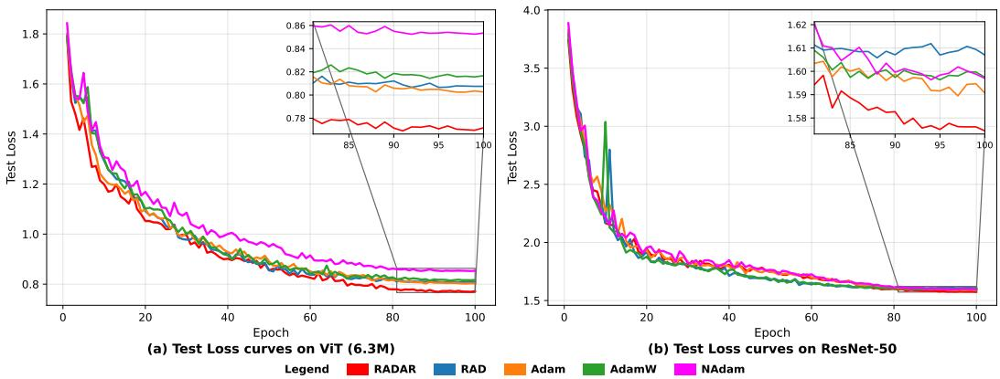
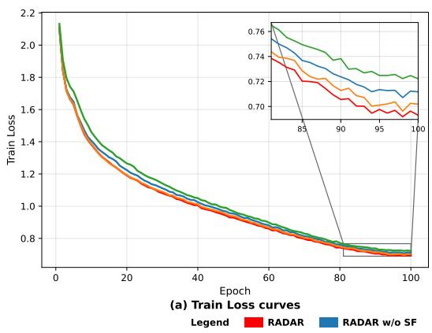
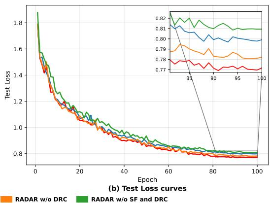
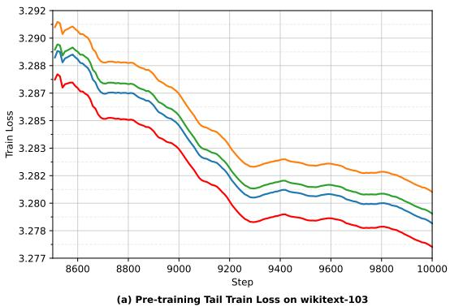
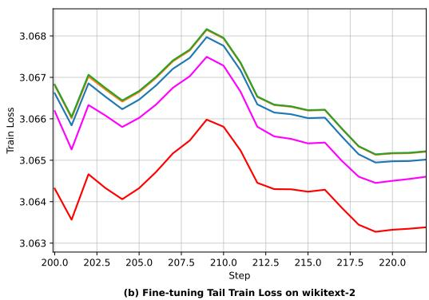
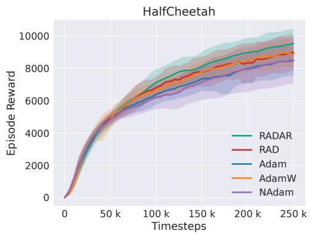
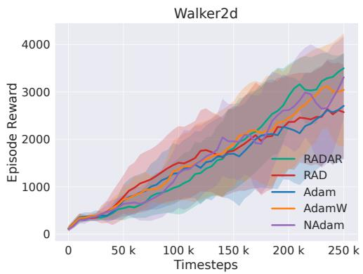
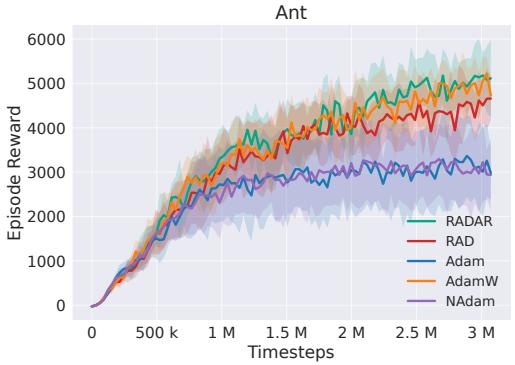
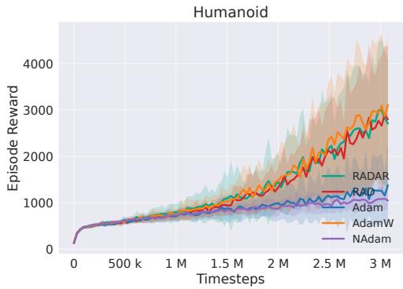

# Momentum as Residual-Driven Multiplier Correction for Deep Learning Optimization

Zhixin Ren1∗, Yau Lyu2∗, Congrong Li3, Liping Zhang1, Shengbo Eben Li2 3† 1 Department of Mathmatical Science, Tsinghua University 2School of Vehicle and Mobility, Tsinghua University 3College of AI, Tsinghua University ∗ Equal contribution †Corresponding author

## Abstract

Momentum-based optimizers are widely used in modern deep learning, yet the relations among momentum recursion, update geometry, and acceleration remain only partially understood. We develop an ADMM-Inspired Momentum (AIM) framework based on residual-penalty variable splitting, which interprets momentum as a multiplier-like correction driven by the splitting residual. AIM recovers the exponential moving average of gradients from an ADMM-style multiplier update and separates two mechanisms that are usually intertwined in practical optimizers: the residual penalty determines the update geometry, whereas the approximation of the objective-related subproblem determines the acceleration form. Building on AIM, we propose Relativistic Adaptive gradient Descent with Accelerated Residual (RADAR), which combines relativistic adaptive geometry, decoupled residual correction, and second-order momentum filtering to improve the update direction and momentum estimation. We establish stochastic convergence through a variance-perturbed Lyapunov drift analysis. Experiments on supervised vision learning, language modeling, and reinforcement learning show that RADAR achieves consistent improvements over strong adaptive optimizer baselines.

## 1 Introduction

Optimization algorithms are a fundamental component of modern deep learning. Among widely used optimizers, SGD with momentum [1] remains a strong baseline due to its generalization ability, while Adam-type methods [2, 3] have become standard choices because of their robustness and adaptive coordinate-wise scaling. Despite their different update rules, many successful optimizers share several recurring ingredients: a momentum estimator that aggregates gradient information, an update geometry that determines the descent direction, and an acceleration-style correction that refines the parameter update. Understanding how these ingredients interact is important for both explaining existing optimizers and designing new ones.

Momentum is commonly interpreted as an exponential moving average of gradients, or equivalently as a low-pass filter that suppresses stochastic gradient noise. This view explains why momentum can improve gradient estimation, but it does not fully explain why the momentum recursion takes its particular form or how it should be coupled with the parameter update. Acceleration-based methods provide another perspective: Nesterov momentum [4] can be viewed as a forward-looking correction to heavy-ball momentum, and NAdam [5] combines such correction with adaptive preconditioning. However, these mechanisms are typically introduced through specific update formulas, leaving the underlying correction principle implicit.

A complementary line of work explains optimizer updates from the viewpoint of geometry and dynamical constraints. Norm-based analyses relate different optimizers to steepest descent under different geometries [6]: Adam-type methods can be understood through coordinate-wise adaptive geometry, while matrix-norm optimizers such as Muon [7] are associated with matrix-level steepest descent. In another direction, RAD [8] introduces relativistic adaptive geometry and conformal symplectic structure into Adam-type updates, aiming to improve long-term training stability through speed-limiting and structure-preserving considerations. These views clarify important aspects of update geometry and training dynamics, but they do not fully explain how momentum estimation, geometric preconditioning, and acceleration-style correction should be coupled in a single optimizer. As a result, momentum is often treated as a filtering heuristic, geometry as a preconditioner, and acceleration as an additional correction rule. A framework that separates these roles while keeping their interactions explicit would therefore provide both a unified interpretation of existing optimizers and a systematic route for designing new momentum-based algorithms.

In this paper, we develop an ADMM-Inspired Momentum (AIM) framework through residualpenalty variable splitting. By introducing an auxiliary descent variable and coupling it with the network parameter through a splitting residual, AIM interprets momentum as a multiplier-like correction driven by the residual. Under this view, the standard momentum recursion can be recovered from an ADMM-style multiplier update, rather than being imposed as an independent heuristic. More importantly, AIM separates two design axes of momentum-based optimization: the residual penalty determines the update geometry, while the approximation of the objective-related subproblem determines the acceleration form. This separation allows us to explain heavy-ball momentum, Nesterov-type momentum, Adam/NAdam-type adaptive updates, and Muon-type matrix updates within a unified residual-geometry and residual-correction framework. Building on this interpretation, we further propose Relativistic Adaptive gradient Descent with Accelerated Residual (RADAR), which instantiates AIM by combining relativistic adaptive residual geometry, decoupled residual correction, and second-order momentum filtering. In this way, RADAR connects the structurepreserving motivation of RAD with the residual correction mechanism identified by AIM, leading to a practical optimizer with improved update direction and momentum estimation.

## Our contributions are summarized as follows:

• We propose the AIM framework, an ADMM-inspired residual-penalty splitting formulation for momentum-based optimization. By introducing an auxiliary descent variable and a splitting constraint, AIM recovers the exponential moving average of gradients from an ADMM-style multiplier update, rather than treating momentum as a standalone filtering heuristic. In the Euclidean case, the splitting residual is further shown to be proportional to the gradient–momentum mismatch, providing a residual-correction interpretation of momentum that complements the conventional low-pass filtering view.

• We use AIM to disentangle two mechanisms that are often intertwined in practical optimizers: update geometry and acceleration form. The residual penalty determines the descent geometry, recovering Euclidean momentum descent, Adam/NAdam-type adaptive diagonal preconditioning, and Muon-type matrix-norm updates. The approximation of the objectiverelated subproblem determines the acceleration form, distinguishing heavy-ball momentum from Nesterov-type momentum. This separation explains multiple optimizer families through a unified residual-geometry and residual-correction mechanism.

• We propose RADAR, a new optimizer derived from the AIM design principle and the structure-preserving motivation of RAD. RADAR combines relativistic adaptive geometry for speed-limited preconditioning, decoupled residual correction for acceleration-like parameter refinement, and second-order momentum filtering for improved momentum estimation. We establish its stochastic convergence via a variance-perturbed Lyapunov drift analysis, and experiments on supervised vision learning, language modeling, and reinforcement learning tasks validate its effectiveness.

## 2 Preliminaries

We briefly recall the Alternating Direction Method of Multipliers (ADMM) [9] for the linearly constrained problem

$$
\operatorname* { m i n } _ { x , z } \phi ( x ) + \varphi ( z ) , \qquad { \mathrm { s . t . ~ } } A x + B z = c ,\tag{1}
$$

where $\phi$ and $\varphi$ are proper closed convex functions. Its augmented Lagrangian is

$$
L _ { \rho } ( x , z , \lambda ) = \phi ( x ) + \varphi ( z ) + \langle \lambda , A x + B z - c \rangle + \frac { \rho } { 2 } \| A x + B z - c \| ^ { 2 } ,\tag{2}
$$

where λ is the Lagrange multiplier and $\rho > 0$ is the penalty parameter. The last term is the standard quadratic penalty on the primal residual. ADMM alternates between two primal minimization steps and a multiplier update:

$$
\boldsymbol { x } _ { k + 1 } = \arg \operatorname* { m i n } _ { \boldsymbol { x } } L _ { \rho } ( \boldsymbol { x } , \boldsymbol { z } _ { k } , \lambda _ { k } ) ,\tag{3}
$$

$$
z _ { k + 1 } = \arg \operatorname* { m i n } _ { z } L _ { \rho } ( x _ { k + 1 } , z , \lambda _ { k } ) ,\tag{4}
$$

$$
\lambda _ { k + 1 } = \lambda _ { k } + \tau \rho ( A x _ { k + 1 } + B z _ { k + 1 } - c ) ,\tag{5}
$$

where $\tau > 0$ is the stepsize of the multiplier update. In the standard case $\tau = 1$ , the multiplier update, together with the optimality condition of (4), implies the KKT condition of Problem (1) with respect to $z .$ . Detailed explanation is provided in Appendix A.1. Therefore, the multiplier can be viewed as being updated by a dual step driven by the primal residual $A x _ { k + 1 } + B z _ { k + 1 } - c .$ . This residual-driven multiplier mechanism is the key ADMM idea that motivates our interpretation of momentum.

## 3 An ADMM-Inspired Framework for Momentum-Based Optimization

Motivated by the residual-driven multiplier update in classical ADMM, we introduce a residualpenalty variable-splitting framework for momentum-based neural network optimization. The framework introduces an auxiliary descent variable, couples it with the network parameter through a splitting residual, and interprets momentum as a multiplier-like correction driven by this residual. It also separates two mechanisms that are usually intertwined in practical optimizers: the residual penalty determines the update geometry, while the approximation of the objective-related subproblem determines the acceleration form.

## 3.1 Residual-Penalty Splitting and Multiplier Momentum

Consider the empirical risk minimization problem as follows:

$$
\operatorname* { m i n } _ { \theta \in \mathbb { R } ^ { d } } \mathcal { L } ( \theta ) : = \frac { 1 } { N } \sum _ { i = 1 } ^ { N } l ( \theta , \xi _ { i } ) ,\tag{6}
$$

where $\mathcal { L } : \mathbb { R } ^ { d }  \mathbb { R }$ is the objective function, $l ( \theta , \xi )$ is the sample-wise loss, and $\theta \in \mathbb { R } ^ { d }$ is the trainable parameter. By introducing an auxiliary descent variable y and the equality constraint $y = \theta ;$ we rewrite (6) as

$$
\operatorname* { m i n } _ { \theta , y } \mathcal { L } ( \theta ) , \qquad \mathrm { s . t . } y - \theta = 0 .\tag{7}
$$

Here, θ carries the original objective, while y is an auxiliary copy introduced to isolate the descent step. During alternating updates, y and θ may differ, and the discrepancy $y - \theta$ is the splitting residual to be controlled.

Motivated by the augmented Lagrangian of ADMM, we define the residual-penalty augmented Lagrangian as follows:

$$
\overline { { L } } _ { \rho } ( \theta , y , m ) = \mathcal { L } ( \theta ) + \langle m , y - \theta \rangle + \frac { \rho } { 2 } \psi ( y - \theta ) ,\tag{8}
$$

where $m$ is a multiplier-like variable, $\rho > 0$ , and ψ is a proper closed convex residual penalty. The classical quadratic penalty corresponds to $\psi ( r ) = \| r \| ^ { 2 }$ , which measures the residual in the Euclidean geometry. Allowing a general convex ψ extends the residual geometry beyond the Euclidean quadratic case and provides a flexible way to describe residual-driven correction.

We refer to this residual-penalty splitting construction as the ADMM-Inspired Momentum (AIM) framework, summarized in Algorithm 1. The y-subproblem contains no objective term and therefore specifies the descent geometry induced by ψ, while the θ-subproblem contains $\mathcal { L } ( \boldsymbol { \theta } )$ and determines how objective-gradient information corrects the tentative descent point $y _ { k + 1 }$ . The two penalty parameters $\rho _ { 1 }$ and $\rho _ { 2 }$ scale the geometry-producing step and the objective-correction step separately.

Algorithm 1 ADMM-Inspired Momentum (AIM) Framework   
Require: $\theta _ { 0 } = y _ { 0 } , m _ { 0 } , \beta _ { 1 } \in [ 0 , 1 ) , \rho _ { 1 } , \rho _ { 2 } > 0 , T$   
1: for $k = 0 , 1 , \ldots , T - 1$ do   
2: $\begin{array} { r } { y _ { k + 1 } = \arg \operatorname* { m i n } _ { y } \left\{ \langle m _ { k } , y - \theta _ { k } \rangle + \frac { \rho _ { 1 } } { 2 } \psi ( y - \theta _ { k } ) \right\} } \end{array}$   
3: $\theta _ { k + 1 }$ ≈ arg minθ $\left\{ \mathcal { L } ( \boldsymbol { \theta } ) + \langle m _ { k } , y _ { k + 1 } - \theta \rangle + \frac { \rho _ { 2 } } { 2 } \tilde { \psi } ( y _ { k + 1 } - \theta ) \right\}$   
4: $\begin{array} { r } { m _ { k + 1 } = m _ { k } + ( 1 - \beta _ { 1 } ) \frac { \rho _ { 2 } } { 2 } \dot { d } _ { k + 1 } , \quad d _ { k + 1 } \dot { \in } \partial \psi \tilde { ( } y _ { k + 1 } - \theta _ { k + 1 } ) ^ { \top } } \end{array}$   
5: end for   
6: return $\theta _ { T }$

The multiplier update is a relaxed ADMM-style residual correction applied to the splitting residual, using the generalized residual subgradient induced by ψ. A detailed derivation is provided in Appendix $\bar { \mathbf { A } } . 1$

We now show that the multiplier-like variable generated by Algorithm 1 naturally satisfies the standard momentum recursion. Consider the idealized case where the θ-subproblem is solved exactly. Its first-order optimality condition gives

$$
0 \in \nabla \mathcal { L } ( \theta _ { k + 1 } ) - m _ { k } - \frac { \rho _ { 2 } } { 2 } d _ { k + 1 } , \qquad d _ { k + 1 } \in \partial \psi ( y _ { k + 1 } - \theta _ { k + 1 } ) .\tag{9}
$$

Substituting this relation into the multiplier update yields

$$
m _ { k + 1 } = m _ { k } + ( 1 - \beta _ { 1 } ) \big ( \nabla \mathcal { L } ( \theta _ { k + 1 } ) - m _ { k } \big ) = \beta _ { 1 } m _ { k } + ( 1 - \beta _ { 1 } ) \nabla \mathcal { L } ( \theta _ { k + 1 } ) .\tag{10}
$$

Thus, the exponential moving average used in momentum is recovered from an ADMM-style multiplier update, rather than being imposed as an independent heuristic. In the usual optimizer view, (10) is a gradient averaging rule. In the proposed variable-splitting view, it is a multiplier correction driven by the splitting residual.

Specifically, for the Euclidean penalty $\psi ( r ) = \| r \| ^ { 2 }$ , we have $d _ { k + 1 } = 2 ( y _ { k + 1 } - \theta _ { k + 1 } )$ . Combining this relation with the multiplier update and (9) gives

$$
\begin{array} { c } { m _ { k + 1 } - m _ { k } = ( 1 - \beta _ { 1 } ) \rho _ { 2 } ( y _ { k + 1 } - \theta _ { k + 1 } ) , } \\ { \rho _ { 2 } ( y _ { k + 1 } - \theta _ { k + 1 } ) = \nabla \mathcal { L } ( \theta _ { k + 1 } ) - m _ { k } . } \end{array}\tag{11}
$$

Therefore, the splitting residual has two roles in the Euclidean case: it drives the ADMM-style multiplier update and, at the same time, measures the scaled mismatch between the current objective gradient and the previous momentum estimate. This gives momentum a residual-correction interpre tation that complements the conventional low-pass filtering view. The gradient–momentum mismatch identified here will serve as the correction signal for the θ-subproblem below.

## 3.2 Nesterov Acceleration from the θ-Subproblem

We next show how Nesterov-type acceleration arises from the approximation of the θ-subproblem. The y-subproblem first produces a tentative descent point along the momentum direction, whereas the θ-subproblem further corrects this point using objective-gradient information. In the Euclidean case, this correction is governed by the gradient–momentum mismatch in (11). Directly setting $\theta _ { k + 1 } = y _ { k + 1 }$ gives heavy-ball momentum, while keeping a first-order explicit approximation of this correction leads to a Nesterov-type update.

Specifically, for $\psi ( r ) = \| r \| ^ { 2 }$ , the y-subproblem gives

$$
y _ { k + 1 } = \theta _ { k } - { \frac { 1 } { \rho _ { 1 } } } m _ { k } .\tag{12}
$$

Taking $\rho _ { 1 } = 1 / \eta$ yields the tentative momentum descent point $y _ { k + 1 } = \theta _ { k } - \eta m _ { k }$ . The exact optimality condition of the θ-subproblem can be written as the implicit fixed-point equation

$$
\theta _ { k + 1 } = y _ { k + 1 } - \eta ( 1 - \beta _ { 1 } ) \bigl ( \nabla \mathcal { L } ( \theta _ { k + 1 } ) - m _ { k } \bigr ) , \qquad \rho _ { 2 } = \frac { 1 } { \eta ( 1 - \beta _ { 1 } ) } .\tag{13}
$$

This equation refines $y _ { k + 1 }$ by a correction proportional to the gradient–momentum mismatch. Since the correction depends on the unknown $\theta _ { k + 1 }$ , the exact update is implicit. Applying a one-step

fixed-point iteration initialized at $\theta _ { k }$ gives the explicit approximation

$$
\begin{array} { r l } & { \theta _ { k + 1 } = y _ { k + 1 } - \eta ( 1 - \beta _ { 1 } ) \bigl ( \nabla { \mathcal { L } } ( \theta _ { k } ) - m _ { k } \bigr ) } \\ & { \qquad = \underbrace { \theta _ { k } - \eta m _ { k } } _ { \mathrm { m o m e n t u m ~ d e s c e n t } } \underbrace { - \eta ( 1 - \beta _ { 1 } ) \bigl ( \nabla { \mathcal { L } } ( \theta _ { k } ) - m _ { k } \bigr ) } _ { \mathrm { r e s i d u a l ~ c o r r e c t i o n } } . } \end{array}\tag{14}
$$

Theorem 1. Consider Algorithm 1 with $\psi ( r ) = \| r \| ^ { 2 } , \rho _ { 1 } = 1 / \eta$ , and $\rho _ { 2 } = 1 / ( \eta ( 1 - \beta _ { 1 } ) )$ . If the θ-subproblem is approximated by (14), the resulting update recovers a Nesterov-type momentum method up to a change of variables. If the simpler approximation $\theta _ { k + 1 } = y _ { k + 1 }$ is used instead, the correction term vanishes and the update reduces to heavy-ball momentum.

Detailed derivations for Theorem 1 are provided in Appendix A.2. Theorem 1 gives an ADMMinspired interpretation of Nesterov acceleration: acceleration does not come from modifying the multiplier update itself, but from retaining an explicit approximation of the residual correction in the θ-subproblem.

## 3.3 Adaptive Geometry from the y-Subproblem

While Section 3.2 shows that the approximation of the θ-subproblem determines the acceleration form, we now turn to the y-subproblem, which determines the update geometry. Since the y-subproblem contains no objective term, changing the residual penalty ψ directly changes the geometry of the descent direction.

For Adam-type methods, let $v _ { k }$ denote the second-moment estimate available at iteration k:

$$
v _ { k } = \beta _ { 2 } v _ { k - 1 } + ( 1 - \beta _ { 2 } ) \nabla \mathcal { L } ( \theta _ { k } ) ^ { 2 } , \qquad Q _ { k } = \mathrm { D i a g } ( \sqrt { v _ { k } } + \epsilon ) ,\tag{15}
$$

where $\beta _ { 2 }$ is the second-moment coefficient. Using the weighted residual penalty $\psi ( r ) = \| r \| _ { Q _ { k } } ^ { 2 }$ changes the y-subproblem into the preconditioned momentum step as follows:

$$
y _ { k + 1 } = \theta _ { k } - \eta Q _ { k } ^ { - 1 } m _ { k } , \qquad \rho _ { 1 } = 1 / \eta .\tag{16}
$$

Thus, the second-moment estimate changes the residual geometry rather than the multiplier-like role of $m _ { k }$ . Under this adaptive geometry, the direct approximation $\theta _ { k + 1 } = y _ { k + 1 }$ recovers Adam without bias correction. The Nesterov-type approximation

$$
\begin{array} { r l } & { \theta _ { k + 1 } = y _ { k + 1 } - \eta ( 1 - \beta _ { 1 } ) Q _ { k } ^ { - 1 } \big ( \nabla { \mathcal { L } } ( \theta _ { k } ) - m _ { k } \big ) } \\ & { \qquad = \theta _ { k } - \eta Q _ { k } ^ { - 1 } m _ { k } - \eta ( 1 - \beta _ { 1 } ) Q _ { k } ^ { - 1 } \big ( \nabla { \mathcal { L } } ( \theta _ { k } ) - m _ { k } \big ) } \end{array}\tag{17}
$$

recovers NAdam without bias correction. Therefore, Adam and NAdam share the same adaptive residual geometry, but differ in how the θ-subproblem is approximated.

The same geometric view also extends beyond coordinate-wise adaptive preconditioning. Replacing the adaptive diagonal geometry with a matrix-level steepest-descent geometry yields a Muon-type update under the direct approximation of matrix-valued variables $\Theta _ { k + 1 } = Y _ { k + 1 }$ We provide the detailed derivation in Appendix A.3. This example further illustrates that AIM treats Euclidean, adaptive diagonal, and matrix-norm updates as different residual geometries under the same multiplier correction structure.

## 4 Relativistic Adaptive Gradient Descent with Accelerated Residual

Building on the AIM framework developed in Section 3, we propose Relativistic Adaptive gradient Descent with Accelerated Residual (RADAR). RADAR instantiates the two AIM design axes with a relativistic adaptive residual geometry and a decoupled residual correction mechanism. The geometry follows the speed-limiting and coordinate-wise adaptivity of RAD [8], while the correction refines the tentative descent point through the gradient–momentum mismatch. Since this correction depends on the quality of the momentum estimate, RADAR further introduces second-order momentum filtering. Together, these components yield a practical optimizer that inherits the structure-preserving motivation of RAD while implementing the residual-correction principle identified by AIM.

## 4.1 Algorithm Design

Following the practical indexing convention of adaptive optimizers, each iteration first uses the current stochastic gradient to update the momentum estimate and the adaptive geometry, and then performs the parameter update. This implementation corresponds to an index-shifted practical version of the AIM update rules.

Relativistic adaptive geometry. Section 3.3 shows that the y-subproblem determines the update geometry. Given a mini-batch $\boldsymbol { B _ { k } } = \{ \xi _ { k , i } \} _ { i = 1 } ^ { B _ { k } }$ , let $\begin{array} { r } { g _ { k } = \frac { 1 } { | \mathcal { B } _ { k } | } \sum _ { \xi \in \mathcal { B } _ { k } } \nabla l ( \theta _ { k } , \xi ) } \end{array}$ be the stochastic gradient estimator of $\nabla \mathcal L ( \theta _ { k } )$ . RADAR updates the second-moment estimate by

$$
v _ { k + 1 } = \beta _ { 2 } v _ { k } + ( 1 - \beta _ { 2 } ) g _ { k } ^ { 2 } ,\tag{18}
$$

where all vector operations are element-wise. We define the relativistic adaptive geometry matrix as

$$
R _ { k + 1 } : = \operatorname { D i a g } \big ( \sqrt { \delta ^ { 2 } v _ { k + 1 } + \zeta } \big ) ,\tag{19}
$$

where $\delta > 0$ is the speed coefficient and $\zeta \in ( 0 , 1 ]$ is the symplectic factor. The speed coefficient controls the strength of gradient normalization, and a larger δ imposes stronger coordinate-wise speed limitation. The symplectic factor controls the adaptivity level and is inherited from the relativistic Hamiltonian interpretation of RAD [8].

Given the filtered momentum estimate $m _ { k + 1 }$ , under this geometry, the AIM y-subproblem gives the tentative descent point as follows:

$$
y _ { k + 1 } = \theta _ { k } - \eta R _ { k + 1 } ^ { - 1 } m _ { k + 1 } .\tag{20}
$$

Decoupled residual correction. The AIM framework shows that the θ-subproblem corrects the tentative descent point using the gradient–momentum mismatch. Under relativistic adaptive geometry (19), this correction takes the preconditioned form $R _ { k + 1 } ^ { - 1 } ( m _ { k + 1 } - g _ { k } )$ . Instead of tying its scale to the main learning rate and the momentum coefficient as in (14), we introduce an independent correction coefficient ℓ:

$$
\begin{array} { r l } & { \theta _ { k + 1 } = y _ { k + 1 } + \ell R _ { k + 1 } ^ { - 1 } ( m _ { k + 1 } - g _ { k } ) } \\ & { \qquad = \underbrace { \theta _ { k } - \eta R _ { k + 1 } ^ { - 1 } m _ { k + 1 } } _ { \mathrm { r e l a t i v i s t i c ~ m o m e n t u m ~ d e s c e n t } } - \underbrace { \ell R _ { k + 1 } ^ { - 1 } ( g _ { k } - m _ { k + 1 } ) } _ { \mathrm { d e c o u p l e d ~ r e s i d u a l ~ c o r r e c t i o n } } . } \end{array}\tag{21}
$$

When $\ell = 0 , { \tt R A D A R }$ reduces to a relativistic adaptive momentum update. When $\ell > 0$ , the residual term provides an acceleration-like correction to the parameter update.

Second-order momentum filtering. The residual correction in (21) depends on the mismatch between the current stochastic gradient $g _ { k }$ and the multiplier-like momentum estimate $m _ { k + 1 }$ . To improve the precision of the momentum estimate, RADAR augments the standard first-order exponential moving average with a gradient-difference term:

$$
m _ { k + 1 } = \beta _ { 1 } m _ { k } + ( 1 - \beta _ { 1 } ) g _ { k } + \gamma ( g _ { k } - g _ { k - 1 } ) ,\tag{22}
$$

where $\gamma \geq 0$ controls the strength of the second-order momentum filtering. When $\gamma = 0 , ( 2 2 )$ reduces to the standard first-order filtering formulation of the momentum update. The term $g _ { k } - g _ { k - 1 }$ captures the recent gradient variation and refines the momentum estimate used in the residual correction.

Combining relativistic adaptive geometry, decoupled residual correction, and second-order momentum filtering gives Algorithm 2.

## 4.2 Convergence Analysis

We present the convergence analysis of RADAR in Algorithm 2. The proof uses a variance-perturbed Lyapunov drift argument that jointly controls the objective value, the momentum residual, and the successive parameter displacement.

Assumption 1 (Smoothness and lower boundedness). For any data sample ξ, the sample-wise loss $l ( \cdot , \xi )$ is L-smooth. Moreover, L is lower bounded by $\mathcal { L } _ { * }$

Algorithm 2 Relativistic Adaptive Gradient Descent with Accelerated Residual (RADAR)   
Require: Initial parameter $\theta _ { 0 } ,$ learning rate $\eta > 0 ,$ , correction coefficient $\ell \geq 0 ,$ momentum coefficients   
$\mathsf { \bar { \beta } } _ { 1 } , \beta _ { 2 } \in [ 0 , \hat { 1 } )$ , filtering coefficient $\gamma \geq 0 ,$ , speed coefficient $\delta > 0 ,$ symplectic factor $\zeta \in ( 0 , 1 ]$ , maximum   
iteration number T   
1: Initialize $m _ { 0 } = 0 , v _ { 0 } = 0 ,$ and $g _ { - 1 } = 0$   
2: for $k = 0 , 1 , \ldots , T - 1$ do   
3: Draw a mini-batch $\boldsymbol { B } _ { k }$ and compute $\begin{array} { r } { g _ { k } = \frac { 1 } { | \mathcal { B } _ { k } | } \sum _ { \xi \in \mathcal { B } _ { k } } \nabla l ( \theta _ { k } , \xi ) } \end{array}$   
4: $m _ { k + 1 } = \beta _ { 1 } m _ { k } + ( 1 - \beta _ { 1 } ) g _ { k } + \gamma ( g _ { k } - g _ { k - 1 } )$   
5: $v _ { k + 1 } = \beta _ { 2 } v _ { k } + ( 1 - \beta _ { 2 } ) g _ { k } ^ { 2 }$   
6: $R _ { k + 1 } = \mathrm { D i a g } \big ( \sqrt { \delta ^ { 2 } v _ { k + 1 } + \zeta } \big )$   
7: $\theta _ { k + 1 } = \theta _ { k } - \eta R _ { k + 1 } ^ { - 1 } m _ { k + 1 } - \ell R _ { k + 1 } ^ { - 1 } ( g _ { k } - m _ { k + 1 } )$   
8: end for   
9: return $\theta _ { T }$

Assumption 2 (Unbiased stochastic gradient and bounded variance). Let gk be the mini-batch stochastic gradient, where the samples are drawn independently. We assume that the single-sample stochastic gradient is unbiased and has bounded variance:

$$
\begin{array} { r } { \mathbb { E } [ \nabla l ( \theta , \xi ) ] = \nabla \mathcal { L } ( \theta ) , \qquad \mathbb { E } \left\| \nabla l ( \theta , \xi ) - \nabla \mathcal { L } ( \theta ) \right\| ^ { 2 } \leq \sigma ^ { 2 } , \quad \forall \theta . } \end{array}
$$

Assumption 3 (Bounded adaptive geometry). Let $R _ { k }$ be the relativistic adaptive geometry matrix in RADAR as defined in (19). There exist constants $0 < \nu _ { \mathrm { m i n } } \le \nu _ { \mathrm { m a x } } <$ ∞ such that

$$
\nu _ { \mathrm { m i n } } I \preceq R _ { k } ^ { - 1 } \preceq \nu _ { \mathrm { m a x } } I , \quad \forall k .\tag{23}
$$

We define $\varepsilon _ { k } : = \nabla \mathcal { L } ( \theta _ { k } ) - g _ { k } , r _ { k + 1 } : = \nabla \mathcal { L } ( \theta _ { k } ) - m _ { k + 1 }$ and consider the Lyapunov function as follows:

$$
V _ { k } : = \mathcal L ( \theta _ { k } ) + c _ { 1 } \| r _ { k } \| ^ { 2 } + c _ { 2 } \| \theta _ { k } - \theta _ { k - 1 } \| ^ { 2 } ,\tag{24}
$$

where $c _ { 1 } , c _ { 2 } > 0$ are specified in Appendix A.4.

Lemma 1 (Lyapunov drift bound). Suppose Assumptions 1–3 hold. If the parameters $\eta , \ell , \beta _ { 1 } , \gamma$ are chosen in the stable regime specified in Appendix A.4, then there exist constants $d _ { 1 } , d _ { 2 } , C _ { v } > 0$ such that

$$
\mathbb { E } V _ { k + 1 } - \mathbb { E } V _ { k } \le - d _ { 1 } \mathbb { E } \| r _ { k + 1 } \| ^ { 2 } - d _ { 2 } \mathbb { E } \| \nabla \mathcal { L } ( \theta _ { k } ) \| ^ { 2 } + C _ { v } \sigma ^ { 2 } \left( \frac { 1 } { | \mathcal { B } _ { k } | } + \frac { 1 } { | \mathcal { B } _ { k - 1 } | } \right) ,\tag{25}
$$

where $B _ { - 1 } : = B _ { 0 } , d _ { 1 } , d _ { 2 } > 0$ are the descent coefficients for the momentum residual and the stationarity measure, while $C _ { v } > 0$ quantifies the amplification of stochastic-gradient variance.

Lemma 1 is a variance-perturbed Lyapunov drift bound. It reduces to a standard Lyapunov descent condition in the full-gradient case and yields a variance-controlled stationary neighborhood in the stochastic case. We define $\begin{array} { r } { R ( T ) = \frac { 1 } { T } \sum _ { k = 0 } ^ { T - 1 } { \mathbb { E } } \| \nabla \mathcal { L } ( \theta _ { k } ) \| ^ { 2 } } \end{array}$ , and give its bound as follows.

Theorem 2 (Sublinear convergence of RADAR). Under the conditions of Lemma 1, the sequence generated by Algorithm 2 satisfies

$$
R ( T ) \leq \frac { \mathbb { E } V _ { 0 } - \mathcal { L } _ { * } } { d _ { 2 } T } + \frac { C _ { v } \sigma ^ { 2 } } { d _ { 2 } T } \sum _ { k = 0 } ^ { T - 1 } \left( \frac { 1 } { \left| \mathcal { B } _ { k } \right| } + \frac { 1 } { \left| \mathcal { B } _ { k - 1 } \right| } \right) .\tag{26}
$$

Therefore, with a fixed mini-batch size, RADAR converges to a variance-controlled stationary neighborhood. If full gradients are used or if the batch-size schedule makes the accumulated variance term uniformly bounded, RADAR achieves an $O ( 1 / T )$ average stationarity bound. The proofs of Lemma 1 and Theorem 2 are provided in Appendix A.4.

## 5 Numerical Experiments

We evaluate RADAR on supervised vision learning, language modeling, and reinforcement learning to assess whether the AIM-derived optimizer provides consistent gains across training regimes with different model architectures, data modalities, and optimization dynamics. We compare RADAR with RAD, Adam, AdamW, and NAdam. For fair comparison, all optimizers use the same model architecture, data split, batch size, learning-rate schedule, training budget, and evaluation protocol within each setting. Optimizer-specific hyperparameters are reported in Appendix B. All reported experiments are conducted on a single NVIDIA RTX 5090 GPU.

  
Figure 1: Test-loss curves of different optimizers on supervised vision learning tasks.

## 5.1 Experimental Setup

Supervised vision learning. We evaluate the image classification performance on CIFAR-10 and CIFAR-100 [10]. We train a Vision Transformer (ViT, 6.3M parameters) [11] on CIFAR-10 and a ResNet-50 [12] on CIFAR-100 with standard data augmentation, following the training configuration of ROOT [13]. Each optimizer is trained for 100 epochs. We report the best test accuracy and the corresponding test loss, and the testing curves are shown in Figure 1.

Language modeling. We evaluate GPT-2 (124M) [14] in both pre-training and fine-tuning settings. For pre-training, we train GPT-2 from scratch on WikiText-103 [15] for 10,000 update steps, with evaluation every 500 steps. For fine-tuning, we fine-tune GPT-2 on WikiText-2 [15] for 3 epochs with a block size of 512 and an effective batch size of 64. We report test perplexity (PPL), where lower is better. Detailed language-modeling settings are provided in the Appendix B.2.

Reinforcement learning. We evaluate long-horizon continuous control on MuJoCo benchmarks [16, 17]. In the main text, we report Soft Actor-Critic (SAC) [18] results on HalfCheetah-v4 and Walker2d-v4, while Proximal Policy Optimization (PPO) [19] results on Ant-v4 and Humanoid-v4 are provided in the Appendix B.3. All optimizers are plugged into the same GOPS [20] implementation with identical training and evaluation protocols. We report the total average return (TAR) and standard deviation over 10 random seeds.

## 5.2 Main Results

Table 1 summarizes the main results in supervised vision learning, language modeling, and reinforcement learning. As shown in Table 1 and Figure 1, RADAR achieves the best test accuracy and test loss in both supervised vision tasks. In CIFAR-10 with ViT, RADAR improves the best baseline test accuracy from 0.8761 to 0.8876 and reduces the test loss from 0.8026 to 0.7696. On CIFAR-100 with ResNet-50, RADAR also obtains the highest accuracy and lowest loss. These results suggest that the proposed update rule improves the optimization behavior between transformer-based and convolutional architectures.

For language modeling, RADAR achieves the lowest PPL in both GPT-2 settings. The gains are relatively modest but consistent across pre-training on WikiText-103 and fine-tuning on WikiText-2. This indicates that RADAR remains effective beyond image classification, including transformerbased sequence modeling, where optimization is sensitive to stochastic gradients and training-scale variation. Additional language-modeling results are provided in the Appendix B.2.

For reinforcement learning, RADAR achieves the highest average test return on both SAC tasks. On HalfCheetah-v4, RADAR improves the strongest baseline from 8996 to 9569, corresponding to a relative gain of 6.37%. On Walker2d-v4, RADAR improves the strongest baseline from 3362 to 3580, corresponding to a relative gain of 6.48%, and also achieves the smallest standard deviation. These results support the motivation that improving the update direction and momentum estimation can benefit long-horizon policy optimization. Additional reinforcement-learning results are provided in the Appendix B.3.

Table 1: Main results across supervised vision learning, language modeling, and reinforcement learning. Best results are in bold and second-best results are underlined.
<table><tr><td>Setting</td><td>Metric</td><td>RADAR</td><td>RAD</td><td>Adam</td><td>AdamW</td><td>NAdam</td></tr><tr><td>CIFAR-10, ViT (6.3M) CIFAR-10, ViT (6.3M)</td><td>Test Acc. ↑ Test Loss ↓</td><td>0.8876 0.7696</td><td>0.8761 0.8075</td><td>0.8723 0.8026</td><td>0.8725 0.8158</td><td>0.8499 0.8524</td></tr><tr><td>CIFAR-100, ResNet-50 CIFAR-100, ResNet-50</td><td>Test Acc. ↑ Test Loss ↓</td><td>0.7797 1.5762</td><td>0.7738 1.6107</td><td>0.7735 1.5907</td><td>0.7725 1.5981</td><td>0.7725 1.5989</td></tr><tr><td>WikiText-103, GPT-2 pre-training WikiText-2, GPT-2 fine-tuning</td><td>Test PPL ↓ Test PPL ↓</td><td>25.6915 21.5462</td><td>25.7142 21.5938</td><td>25.7423 21.5950</td><td>25.7348 21.5953</td><td>26.1606 21.5727</td></tr><tr><td></td><td></td><td></td><td></td><td></td><td></td><td>8582±1493</td></tr><tr><td></td><td></td><td></td><td></td><td></td><td></td><td></td></tr><tr><td></td><td></td><td></td><td></td><td></td><td></td><td></td></tr><tr><td>HalfCheetah-v4, SAC</td><td>TAR ↑</td><td>9569±926</td><td>8996±1025</td><td>8557±939</td><td>8828±790</td><td></td></tr><tr><td></td><td></td><td></td><td></td><td></td><td></td><td></td></tr><tr><td>Walker2d-v4, SAC</td><td>TAR↑</td><td>3580±282</td><td>2687±932</td><td>2798±1117</td><td>3196±1124</td><td>3362±776</td></tr></table>

  
Figure 2: Ablation study of RADAR on CIFAR-10 with ViT (6.3M). We compare the full optimizer with variants removing second-order momentum filtering (w/o SF), decoupled residual correction (w/o DRC), and both components.

## 5.3 Ablation Study

We conducted ablation studies on CIFAR-10 with ViT to isolate the effects of the two RADARspecific components: decoupled residual correction (DRC) and second-order momentum filtering (SF). The coefficient ℓ controls the strength of DRC, while γ controls the strength of SF. All ablated variants use the same training setting as the CIFAR-10 ViT experiment.

Figure 2 compares the entire RADAR optimizer with three variants: RADAR without SF, RADAR without DRC and RADAR without both components. The full RADAR achieves the lowest training and test losses in the late training stage, showing that the two components jointly improve optimization performance. Removing SF leads to a clear degradation in both the training and the test loss, suggesting that the gradient-difference term improves the momentum estimate and stabilizes the update direction. Removing DRC also weakens the performance, confirming that the residual correction contributes beyond the relativistic adaptive geometry alone. The variant without both components performs worst, further supporting the combined design of RADAR.

## 6 Conclusion

In this paper, we propose the AIM framework, which interprets momentum as a residual-driven multiplier-like correction and separates update geometry from acceleration form. Based on this view, we develop RADAR, a new optimizer that combines relativistic adaptive geometry, decoupled residual correction, and second-order momentum filtering. We establish stochastic convergence via a variance-perturbed Lyapunov analysis, and experiments on vision, language modeling, and reinforcement learning tasks demonstrate the effectiveness of RADAR. This study is currently limited to representative momentum-based optimizers and standard stochastic convergence settings. Future work will extend AIM to broader optimizer families, relax current analytical assumptions, and evaluate RADAR in larger-scale and more diverse training scenarios.

## References

[1] Boris T. Polyak. Some methods of speeding up the convergence of iteration methods. USSR Computational Mathematics and Mathematical Physics, 4(5):1–17, 1964.

[2] Diederik P. Kingma and Jimmy Ba. Adam: A method for stochastic optimization. In International Conference on Learning Representations, pages 1–15, 2015.

[3] Ilya Loshchilov and Frank Hutter. Decoupled weight decay regularization. In International Conference on Learning Representations, pages 1–18, 2019.

[4] Yurii E. Nesterov. A method of solving a convex programming problem with convergence rate O(1/k2). Soviet Mathematics Doklady, 27(2):372–376, 1983.

[5] Timothy Dozat. Incorporating nesterov momentum into adam. In International Conference on Learning Representations Workshop Track, pages 1–4, 2016.

[6] Jeremy Bernstein and Laker Newhouse. Old optimizer, new norm: An anthology. In OPT 2024: Optimizationfor Machine Learning (NeurIPS Workshop), pages 1–19, 2024.

[7] Keller Jordan, Yuchen Jin, Vlado Boza, Jiacheng You, Franz Cesista, Laker Newhouse, and Jeremy Bernstein. Muon: An optimizer for hidden layers in neural networks. Blog post, 2024. Accessed: 2026-04-29.

[8] Yao Lyu, Xiangteng Zhang, Shengbo Eben Li, Jingliang Duan, Letian Tao, Qing Xu, Lei He, and Keqiang Li. Conformal symplectic optimization for stable reinforcement learning. IEEE Transactions on Neural Networks and Learning Systems, 36(6):11049–11063, 2025.

[9] Amir Beck. First-Order Methods in Optimization. MOS-SIAM Series on Optimization. Society for Industrial and Applied Mathematics, Philadelphia, PA, 2017.

[10] Alex Krizhevsky and Geoffrey Hinton. Learning multiple layers of features from tiny images. Technical report, University of Toronto, Toronto, Ontario, 2009.

[11] Alexey Dosovitskiy, Lucas Beyer, Alexander Kolesnikov, Dirk Weissenborn, Xiaohua Zhai, Thomas Unterthiner, Mostafa Dehghani, Matthias Minderer, Georg Heigold, Sylvain Gelly, Jakob Uszkoreit, and Neil Houlsby. An image is worth 16x16 words: Transformers for image recognition at scale. In International Conference on Learning Representations, 2021.

[12] Kaiming He, Xiangyu Zhang, Shaoqing Ren, and Jian Sun. Deep residual learning for image recognition. In Proceedings of the IEEE Conference on Computer Vision and Pattern Recognition, pages 770–778, 2016.

[13] Wei He, Kai Han, Hang Zhou, Hanting Chen, Zhicheng Liu, Xinghao Chen, and Yunhe Wang. Root: Robust orthogonalized optimizer for neural network training. arXiv preprint arXiv:2511.20626, 2025.

[14] Alec Radford, Jeffrey Wu, Rewon Child, David Luan, Dario Amodei, Ilya Sutskever, et al. Language models are unsupervised multitask learners. OpenAI blog, 1(8):1–24, 2019.

[15] Stephen Merity, Caiming Xiong, James Bradbury, and Richard Socher. Pointer sentinel mixture models. In International Conference on Learning Representations, pages 1–15, 2017.

[16] Emanuel Todorov, Tom Erez, and Yuval Tassa. MuJoCo: A physics engine for model-based control. In 2012 IEEE/RSJ International Conference on Intelligent Robots and Systems, pages 5026–5033. IEEE, 2012.

[17] Greg Brockman, Vicki Cheung, Ludwig Pettersson, Jonas Schneider, John Schulman, Jie Tang, and Wojciech Zaremba. OpenAI Gym. arXiv preprint arXiv:1606.01540, 2016.

[18] Tuomas Haarnoja, Aurick Zhou, Pieter Abbeel, and Sergey Levine. Soft actor-critic: Off-policy maximum entropy deep reinforcement learning with a stochastic actor. In Proceedings ofthe 35th International Conference on Machine Learning, volume 80 of Proceedings ofMachine Learning Research, pages 1861–1870. PMLR, 2018.

[19] John Schulman, Filip Wolski, Prafulla Dhariwal, Alec Radford, and Oleg Klimov. Proximal policy optimization algorithms. arXiv preprint arXiv:1707.06347, 2017.

[20] Wenxuan Wang, Yuhang Zhang, Jiaxin Gao, Yuxuan Jiang, Yujie Yang, Zhilong Zheng, Wenjun Zou, Jie Li, Congsheng Zhang, Wenhan Cao, Genjin Xie, Jingliang Duan, and Shengbo Eben Li. GOPS: A general optimal control problem solver for autonomous driving and industrial control applications. Communications in Transportation Research, 3:100096, 2023.

## A Technical Proofs and Derivations

## A.1 Derivation of Multiplier Update Rules

We first explain the multiplier update rule in the classical ADMM update (5). The optimality condition of the z-subproblem (4) gives

$$
0 \in \partial \varphi ( z _ { k + 1 } ) + \boldsymbol { B } ^ { \top } \lambda _ { k } + \rho \boldsymbol { B } ^ { \top } ( \boldsymbol { A x } _ { k + 1 } + \boldsymbol { B z } _ { k + 1 } - \boldsymbol { c } ) .\tag{27}
$$

When $\tau = 1$ , the multiplier update (5) becomes

$$
\lambda _ { k + 1 } = \lambda _ { k } + \rho ( A x _ { k + 1 } + B z _ { k + 1 } - c ) .\tag{28}
$$

Combining the above two relations yields

$$
0 \in \partial \varphi ( z _ { k + 1 } ) + B ^ { \top } \lambda _ { k + 1 } .\tag{29}
$$

Therefore, the updated pair $\left( z _ { k + 1 } , \lambda _ { k + 1 } \right)$ satisfies the stationarity condition of Problem (1) with respect $\tan z$ . This shows that the ADMM multiplier update can be viewed as a residual-driven dual correction toward the KKT condition.

We next derive the multiplier update rule in AIM. The optimality condition of the θ-subproblem gives

$$
0 \in \nabla \mathcal { L } ( \theta _ { k + 1 } ) - m _ { k } - \frac { \rho _ { 2 } } { 2 } \partial \psi ( y _ { k + 1 } - \theta _ { k + 1 } ) .\tag{30}
$$

Equivalently, there exists $d _ { k + 1 } \in \partial \psi ( y _ { k + 1 } - \theta _ { k + 1 } )$ such that

$$
\nabla \mathcal { L } ( \theta _ { k + 1 } ) - m _ { k } - \frac { \rho _ { 2 } } { 2 } d _ { k + 1 } = 0 .\tag{31}
$$

For the splitting problem (7), the stationarity condition with respect to θ is

$$
\nabla { \mathcal { L } } ( \theta ) - m = 0 .\tag{32}
$$

Thus, a full residual-driven multiplier correction would update

$$
m _ { k + 1 } = m _ { k } + \frac { \rho _ { 2 } } { 2 } d _ { k + 1 } ,\tag{33}
$$

which, together with (31), gives $m _ { k + 1 } = \nabla \mathcal { L } ( \theta _ { k + 1 } )$ and hence satisfies the above stationarity condition at $\theta _ { k + 1 }$

In AIM, we use a relaxed multiplier update with stepsize $1 - \beta _ { 1 }$

$$
m _ { k + 1 } = m _ { k } + ( 1 - \beta _ { 1 } ) \frac { \rho _ { 2 } } { 2 } d _ { k + 1 } .\tag{34}
$$

Substituting (31) into (34) yields

$$
m _ { k + 1 } = m _ { k } + ( 1 - \beta _ { 1 } ) \big ( \nabla \mathcal { L } ( \theta _ { k + 1 } ) - m _ { k } \big ) = \beta _ { 1 } m _ { k } + ( 1 - \beta _ { 1 } ) \nabla \mathcal { L } ( \theta _ { k + 1 } ) .\tag{35}
$$

Therefore, the AIM multiplier update recovers the standard exponential moving average form of momentum from a relaxed residual-driven multiplier correction.

## A.2 Proof of Theorem 1

Proof. We prove the result by eliminating the auxiliary descent variable y. Under the Euclidean residual penalty $\psi ( r ) = \| r \| ^ { 2 }$ , the y-subproblem in Algorithm 1 becomes

$$
y _ { k + 1 } = \arg \operatorname* { m i n } _ { y } \left\{ \langle m _ { k } , y - \theta _ { k } \rangle + { \frac { \rho _ { 1 } } { 2 } } \| y - \theta _ { k } \| ^ { 2 } \right\} .
$$

Its first-order optimality condition is

$$
m _ { k } + \rho _ { 1 } ( y _ { k + 1 } - \theta _ { k } ) = 0 ,
$$

and hence

$$
y _ { k + 1 } = \theta _ { k } - { \frac { 1 } { \rho _ { 1 } } } m _ { k } .\tag{36}
$$

Taking $\rho _ { 1 } = 1 / \eta$ , we obtain

$$
y _ { k + 1 } = \theta _ { k } - \eta m _ { k } .\tag{37}
$$

Thus, $y _ { k + 1 }$ is the tentative momentum descent point.

We first consider the Nesterov-type approximation of the θ-subproblem used in (14):

$$
\theta _ { k + 1 } = y _ { k + 1 } - \eta ( 1 - \beta _ { 1 } ) \big ( \nabla \mathcal { L } ( \theta _ { k } ) - m _ { k } \big ) .\tag{38}
$$

Substituting (37) into (38) gives

$$
\theta _ { k + 1 } = \theta _ { k } - \eta m _ { k } - \eta ( 1 - \beta _ { 1 } ) \big ( \nabla \mathcal { L } ( \theta _ { k } ) - m _ { k } \big ) .\tag{39}
$$

Equivalently, by defining the corrected momentum direction as follow:

$$
\widetilde { m } _ { k } : = m _ { k } + \big ( 1 - \beta _ { 1 } \big ) \big ( \nabla \mathcal { L } ( \theta _ { k } ) - m _ { k } \big ) ,
$$

we can write

$$
\theta _ { k + 1 } = \theta _ { k } - \eta \widetilde { m } _ { k } .\tag{40}
$$

Therefore, compared with the pure momentum descent direction $m _ { k } ,$ , the update direction is corrected by the gradient–momentum mismatch $\nabla \mathcal { L } ( \boldsymbol { \theta } _ { k } ) - m _ { k }$ . This is the Nesterov-type correction induced by the one-step approximation of the θ-subproblem in (14). Hence, the resulting update recovers a Nesterov-type momentum method up to the change of variables

$$
\widetilde { m } _ { k } = m _ { k } + \left( 1 - \beta _ { 1 } \right) \left( \nabla \mathcal { L } ( \theta _ { k } ) - m _ { k } \right) .
$$

We next consider the simpler approximation as follows:

$$
\theta _ { k + 1 } = y _ { k + 1 } .
$$

Combining it with (37) gives

$$
\theta _ { k + 1 } = \theta _ { k } - \eta m _ { k } .\tag{41}
$$

Together with the momentum recursion derived from the multiplier update,

$$
m _ { k + 1 } = \beta _ { 1 } m _ { k } + ( 1 - \beta _ { 1 } ) \nabla \mathcal { L } ( \theta _ { k + 1 } ) ,
$$

or its usual explicit implementation using the available gradient $\nabla \mathcal { L } ( \theta _ { k } )$ , this is the heavy-ball momentum update up to the standard indexing convention. Hence, the direct approximation $\theta _ { k + 1 } =$ $y _ { k + 1 }$ removes the residual correction term and reduces the update to heavy-ball momentum. □

## A.3 Details for Adaptive and Matrix-Norm Extensions

We first justify the adaptive update in (16). With the weighted residual penalty as follows:

$$
\psi ( r ) = \| r \| _ { Q _ { k } } ^ { 2 } , \qquad Q _ { k } = \mathrm { D i a g } ( \sqrt { v _ { k } } + \epsilon ) ,
$$

the y-subproblem becomes

$$
y _ { k + 1 } = \arg \operatorname* { m i n } _ { y } \left\{ \langle m _ { k } , y - \theta _ { k } \rangle + \frac { \rho _ { 1 } } { 2 } \| y - \theta _ { k } \| _ { Q _ { k } } ^ { 2 } \right\} .
$$

Its first-order optimality condition is

$$
m _ { k } + \rho _ { 1 } Q _ { k } ( y _ { k + 1 } - \theta _ { k } ) = 0 ,
$$

which gives

$$
y _ { k + 1 } = \theta _ { k } - { \frac { 1 } { \rho _ { 1 } } } Q _ { k } ^ { - 1 } m _ { k } .
$$

Taking $\rho _ { 1 } = 1 / \eta$ yields

$$
y _ { k + 1 } = \theta _ { k } - \eta Q _ { k } ^ { - 1 } m _ { k } .
$$

This proves the adaptive preconditioned update used in (16). The direct approximation $\theta _ { k + 1 } = y _ { k + 1 }$ gives the Adam-type update, while the Nesterov-type approximation in (17) gives the NAdam-type update.

We next discuss the matrix-norm case. Let Θ, Y, M denote matrix-valued counterparts of $\theta , y , m$ Under a spectral-norm geometry, the y-step can be interpreted as a normalized steepest-descent step for the local linear model, i.e.,

$$
\operatorname* { m i n } _ { \Delta } \left. M _ { k } , \Delta \right. \qquad \mathrm { s . t . } \quad \| \Delta \| _ { 2 } \leq \eta .
$$

Using the duality between the spectral norm and the nuclear norm, an optimal normalized descent direction is given by the negative polar factor of $M _ { k }$ . If

$$
M _ { k } = U \Sigma V ^ { \top }
$$

is the singular value decomposition of $M _ { k }$ , define

$$
\mathrm { O r t h o g o n a l } ( M _ { k } ) : = U V ^ { \top } .
$$

Then the matrix-valued descent step is

$$
Y _ { k + 1 } = \Theta _ { k } - \eta \mathrm { O r t h o g o n a l } ( M _ { k } ) .
$$

With the direct approximation $\Theta _ { k + 1 } = Y _ { k + 1 }$ , we obtain

$$
\Theta _ { k + 1 } = \Theta _ { k } - \eta \mathrm { O r t h o g o n a l } ( M _ { k } ) ,
$$

which is the Muon-type matrix update.

## A.4 Proofs for the Convergence Analysis of RADAR

## A.4.1 Technical estimates

Recall that

$$
\varepsilon _ { k } = \nabla \mathcal { L } ( \theta _ { k } ) - g _ { k } , \qquad r _ { k + 1 } = \nabla \mathcal { L } ( \theta _ { k } ) - m _ { k + 1 } .
$$

We first record a standard mini-batch variance bound. Under Assumption 2, conditioned on $\theta _ { k }$ , we have

$$
\mathbb { E } [ g _ { k } \mid \theta _ { k } ] = \mathbb { E } \left[ { \frac { 1 } { | \mathcal { B } _ { k } | } } \sum _ { b = 1 } ^ { \mathcal { B } _ { k } } \nabla l ( \theta _ { k } , \xi _ { k , b } ) \mid \theta _ { k } \right] = \nabla { \mathcal { L } } ( \theta _ { k } ) ,
$$

and

$$
g _ { k } - \nabla \mathcal { L } ( \theta _ { k } ) = \frac { 1 } { | \mathcal { B } _ { k } | } \sum _ { b = 1 } ^ { B _ { k } } \left( \nabla l ( \theta _ { k } , \xi _ { k , b } ) - \nabla \mathcal { L } ( \theta _ { k } ) \right) .
$$

Since the mini-batch samples are independent, the cross terms vanish. Therefore,

$$
\mathbb { E } \Vert \varepsilon _ { k } \Vert ^ { 2 } = \mathbb { E } \Vert g _ { k } - \nabla \mathcal { L } ( \theta _ { k } ) \Vert ^ { 2 } = \frac { 1 } { | \mathcal { B } _ { k } | ^ { 2 } } \sum _ { b = 1 } ^ { B _ { k } } \mathbb { E } \left. \nabla l ( \theta _ { k } , \xi _ { k , b } ) - \nabla \mathcal { L } ( \theta _ { k } ) \right. ^ { 2 } \leq \frac { \sigma ^ { 2 } } { | \mathcal { B } _ { k } | } .\tag{42}
$$

We next derive two estimates used in the Lyapunov analysis. From the second-order momentum filtering update, i.e.,

$$
m _ { k + 1 } = \beta _ { 1 } m _ { k } + ( 1 - \beta _ { 1 } ) g _ { k } + \gamma ( g _ { k } - g _ { k - 1 } ) ,
$$

we have

$$
\begin{array} { r } { r _ { k + 1 } = \nabla \mathcal { L } ( \theta _ { k } ) - \beta _ { 1 } m _ { k } - ( 1 - \beta _ { 1 } + \gamma ) g _ { k } + \gamma g _ { k - 1 } } \\ { = \varepsilon _ { k } - \beta _ { 1 } \varepsilon _ { k - 1 } + \beta _ { 1 } r _ { k } + ( \beta _ { 1 } - \gamma ) ( g _ { k } - g _ { k - 1 } ) . } \end{array}\tag{43}
$$

Define

$$
a _ { k } : = \varepsilon _ { k } - \beta _ { 1 } \varepsilon _ { k - 1 } , \qquad b _ { k } : = \beta _ { 1 } r _ { k } , \qquad c _ { k } : = ( \beta _ { 1 } - \gamma ) ( g _ { k } - g _ { k - 1 } ) .
$$

Then $r _ { k + 1 } = a _ { k } + b _ { k } + c _ { k }$ . By Young’s inequality, i.e.,

$$
\| x + y \| ^ { 2 } \leq ( 1 + \tau ) \| x \| ^ { 2 } + \left( 1 + { \frac { 1 } { \tau } } \right) \| y \| ^ { 2 } , \qquad \tau > 0 .
$$

Taking $x = b _ { k } , y = a _ { k } + c _ { k }$ , and using $\| \boldsymbol { a } _ { k } + \boldsymbol { c } _ { k } \| ^ { 2 } \leq 2 \| \boldsymbol { a } _ { k } \| ^ { 2 } + 2 \| \boldsymbol { c } _ { k } \| ^ { 2 }$ , it follows that

$$
\mathbb { E } \Vert r _ { k + 1 } \Vert ^ { 2 } \leq 2 ( 1 + \frac { 1 } { \tau } ) \mathbb { E } \Vert \varepsilon _ { k } - \beta _ { 1 } \varepsilon _ { k - 1 } \Vert ^ { 2 } + ( 1 + \tau ) \beta _ { 1 } ^ { 2 } \mathbb { E } \Vert r _ { k } \Vert ^ { 2 } + 2 ( 1 + \frac { 1 } { \tau } ) ( \beta _ { 1 } - \gamma ) ^ { 2 } \mathbb { E } \Vert g _ { k } - g _ { k - 1 } \Vert ^ { 2 } .\tag{44}
$$

For the first term on the right-hand side of (44), we have

$$
\mathbb { E } \| \varepsilon _ { k } - \beta _ { 1 } \varepsilon _ { k - 1 } \| ^ { 2 } = \mathbb { E } \| \varepsilon _ { k } \| ^ { 2 } + \beta _ { 1 } ^ { 2 } \mathbb { E } \| \varepsilon _ { k - 1 } \| ^ { 2 } \leq \frac { \sigma ^ { 2 } } { | \mathcal { B } _ { k } | } + \frac { \sigma ^ { 2 } } { | \mathcal { B } _ { k - 1 } | } ,\tag{45}
$$

where the first equality holds because $\mathbb { E } \langle \varepsilon _ { k } , \varepsilon _ { k - 1 } \rangle = 0 .$ , and the last inequality follows from (42) and $\beta _ { 1 } \in [ 0 , 1 )$ .

For the third term on the right-hand side of (44), since

$$
g _ { k } = \nabla \mathcal { L } ( \theta _ { k } ) - \varepsilon _ { k } ,
$$

we have

$$
g _ { k } - g _ { k - 1 } = \nabla \mathcal { L } ( \theta _ { k } ) - \nabla \mathcal { L } ( \theta _ { k - 1 } ) - \varepsilon _ { k } + \varepsilon _ { k - 1 } .
$$

Using $\| a + b + c \| ^ { 2 } \leq 3 \| a \| ^ { 2 } + 3 \| b \| ^ { 2 } + 3 \| c \| ^ { 2 }$ , the smoothness of L, and (42), we obtain

$$
\begin{array} { r l } & { \mathbb { E } \| g _ { k } - g _ { k - 1 } \| ^ { 2 } \leq 3 \mathbb { E } \| \nabla \mathcal { L } ( \theta _ { k } ) - \nabla \mathcal { L } ( \theta _ { k - 1 } ) \| ^ { 2 } + 3 \mathbb { E } \| \varepsilon _ { k } \| ^ { 2 } + 3 \mathbb { E } \| \varepsilon _ { k - 1 } \| ^ { 2 } } \\ & { \qquad \leq 3 L ^ { 2 } \mathbb { E } \| \theta _ { k } - \theta _ { k - 1 } \| ^ { 2 } + 3 \displaystyle \frac { \sigma ^ { 2 } } { | { \cal B } _ { k } | } + 3 \displaystyle \frac { \sigma ^ { 2 } } { | { \cal B } _ { k - 1 } | } . } \end{array}\tag{46}
$$

Combining (44), (45), and (46), we obtain

$$
\begin{array} { r l r } {  { \mathbb { E } \| r _ { k + 1 } \| ^ { 2 } \leq ( 1 + \tau ) \beta _ { 1 } ^ { 2 } \mathbb { E } \| r _ { k } \| ^ { 2 } + 6 ( 1 + \frac { 1 } { \tau } ) ( \beta _ { 1 } - \gamma ) ^ { 2 } L ^ { 2 } \mathbb { E } \| \theta _ { k } - \theta _ { k - 1 } \| ^ { 2 } } } \\ & { } & { + [ 2 ( 1 + \frac { 1 } { \tau } ) + 6 ( 1 + \frac { 1 } { \tau } ) ( \beta _ { 1 } - \gamma ) ^ { 2 } ] \sigma ^ { 2 } ( \frac { 1 } { | \mathcal { B } _ { k } | } + \frac { 1 } { | \mathcal { B } _ { k - 1 } | } ) , } \end{array}\tag{47}
$$

Rearranging (47) yields

$$
\begin{array} { r l r } {  { \mathbb { E } \| r _ { k + 1 } \| ^ { 2 } - \mathbb { E } \| r _ { k } \| ^ { 2 } \le - C _ { r } \mathbb { E } \| r _ { k + 1 } \| ^ { 2 } } } \\ & { } & { + \ C _ { \theta } \mathbb { E } \| \theta _ { k } - \theta _ { k - 1 } \| ^ { 2 } + C _ { \varepsilon } \sigma ^ { 2 } ( \frac { 1 } { | \mathcal { B } _ { k } | } + \frac { 1 } { | \mathcal { B } _ { k - 1 } | } ) . } \end{array}\tag{48}
$$

where the constants are chosen as

$$
C _ { r } = \frac { 1 } { ( 1 + \tau ) \beta _ { 1 } ^ { 2 } } - 1 , \qquad C _ { \theta } = \frac { 6 } { \tau \beta _ { 1 } ^ { 2 } } ( \beta _ { 1 } - \gamma ) ^ { 2 } L ^ { 2 } , \qquad C _ { \varepsilon } = \frac { 2 } { \tau } \left[ 1 + 3 ( \beta _ { 1 } - \gamma ) ^ { 2 } \right] .\tag{49}
$$

It remains to bound the successive parameter displacement. From Algorithm 2, we have

$$
\begin{array} { r l } & { \theta _ { k + 1 } - \theta _ { k } = - \eta R _ { k + 1 } ^ { - 1 } m _ { k + 1 } - \ell R _ { k + 1 } ^ { - 1 } ( g _ { k } - m _ { k + 1 } ) } \\ & { \qquad = ( \eta - \ell ) R _ { k + 1 } ^ { - 1 } r _ { k + 1 } + \ell R _ { k + 1 } ^ { - 1 } \varepsilon _ { k } - \eta R _ { k + 1 } ^ { - 1 } \nabla \mathcal L ( \theta _ { k } ) . } \end{array}\tag{50}
$$

By Assumption 3, we have

$$
\begin{array} { r } { \| x \| _ { R _ { k } ^ { - 1 } } ^ { 2 } \leq \nu _ { \operatorname* { m a x } } \| x \| ^ { 2 } , \qquad \| R _ { k } ^ { - 1 } x \| ^ { 2 } \leq \nu _ { \operatorname* { m a x } } ^ { 2 } \| x \| ^ { 2 } . } \end{array}
$$

Using Assumptions 2 and 3, we obtain

$$
\begin{array} { r l } & { \mathbb { E } \| \theta _ { k + 1 } - \theta _ { k } \| ^ { 2 } \leq 3 ( \eta - \ell ) ^ { 2 } \nu _ { \operatorname* { m a x } } ^ { 2 } \mathbb { E } \| r _ { k + 1 } \| ^ { 2 } + 3 \eta ^ { 2 } \nu _ { \operatorname* { m a x } } ^ { 2 } \mathbb { E } \| \nabla \mathcal { L } ( \theta _ { k } ) \| ^ { 2 } + 3 \ell ^ { 2 } \nu _ { \operatorname* { m a x } } ^ { 2 } \frac { \sigma ^ { 2 } } { | \mathcal { B } _ { k } | } . } \end{array}\tag{51}
$$

## A.4.2 Proof of Lemma 1

Proof. By the L-smoothness of ${ \mathcal { L } } ,$ we have

$$
\mathcal { L } ( \theta _ { k + 1 } ) \leq \mathcal { L } ( \theta _ { k } ) + \langle \nabla \mathcal { L } ( \theta _ { k } ) , \theta _ { k + 1 } - \theta _ { k } \rangle + \frac { L } { 2 } \| \theta _ { k + 1 } - \theta _ { k } \| ^ { 2 } .\tag{52}
$$

Substituting (50) into (52) gives

$$
\begin{array} { r l } & { \mathcal { L } ( \boldsymbol { \theta } _ { k + 1 } ) \leq \mathcal { L } ( \boldsymbol { \theta } _ { k } ) - \eta \| \nabla \mathcal { L } ( \boldsymbol { \theta } _ { k } ) \| _ { R _ { k + 1 } ^ { - 1 } } ^ { 2 } } \\ & { \qquad + \left( \eta - \ell \right) \langle \nabla \mathcal { L } ( \boldsymbol { \theta } _ { k } ) , R _ { k + 1 } ^ { - 1 } r _ { k + 1 } \rangle + \ell \langle \nabla \mathcal { L } ( \boldsymbol { \theta } _ { k } ) , R _ { k + 1 } ^ { - 1 } \varepsilon _ { k } \rangle } \\ & { \qquad + \displaystyle \frac { L } { 2 } \| \boldsymbol { \theta } _ { k + 1 } - \boldsymbol { \theta } _ { k } \| ^ { 2 } . } \end{array}\tag{53}
$$

Using Young’s inequality in the weighted norm and $\eta \geq l ,$ , i.e.,

$$
\langle a , R _ { k + 1 } ^ { - 1 } b \rangle \leq \frac { 1 } { 2 } \| a \| _ { R _ { k + 1 } ^ { - 1 } } ^ { 2 } + \frac { 1 } { 2 } \| b \| _ { R _ { k + 1 } ^ { - 1 } } ^ { 2 } ,
$$

we have

$$
( \eta - \ell ) \langle \nabla \mathcal { L } ( \theta _ { k } ) , R _ { k + 1 } ^ { - 1 } r _ { k + 1 } \rangle \leq \frac { \eta - \ell } { 2 } \| \nabla \mathcal { L } ( \theta _ { k } ) \| _ { R _ { k + 1 } ^ { - 1 } } ^ { 2 } + \frac { \eta - \ell } { 2 } \| r _ { k + 1 } \| _ { R _ { k + 1 } ^ { - 1 } } ^ { 2 } ,
$$

and

$$
\ell \langle \nabla \mathcal { L } ( \theta _ { k } ) , R _ { k + 1 } ^ { - 1 } \varepsilon _ { k } \rangle \leq \frac { \ell } { 2 } \| \nabla \mathcal { L } ( \theta _ { k } ) \| _ { R _ { k + 1 } ^ { - 1 } } ^ { 2 } + \frac { \ell } { 2 } \| \varepsilon _ { k } \| _ { R _ { k + 1 } ^ { - 1 } } ^ { 2 } .
$$

Substituting these bounds into (53) yields

$$
\begin{array} { r l } & { \displaystyle \mathcal { L } ( \theta _ { k + 1 } ) \le \mathcal { L } ( \theta _ { k } ) - \frac { \eta } { 2 } \| \nabla \mathcal { L } ( \theta _ { k } ) \| _ { R _ { k + 1 } ^ { - 1 } } ^ { 2 } + \frac { \eta - \ell } { 2 } \| r _ { k + 1 } \| _ { R _ { k + 1 } ^ { - 1 } } ^ { 2 } } \\ & { \quad \quad \quad \quad \quad \quad + \displaystyle \frac { \ell } { 2 } \| \varepsilon _ { k } \| _ { R _ { k + 1 } ^ { - 1 } } ^ { 2 } + \frac { L } { 2 } \| \theta _ { k + 1 } - \theta _ { k } \| ^ { 2 } . } \end{array}\tag{54}
$$

By Assumption 3 and (42), we have

$$
\begin{array} { r l } {  { \| \nabla { \mathcal { L } } ( \theta _ { k } ) \| _ { R _ { k + 1 } ^ { - 1 } } ^ { 2 } \geq \nu _ { \operatorname* { m i n } } \| \nabla { \mathcal { L } } ( \theta _ { k } ) \| ^ { 2 } , } } \\ & { \| r _ { k + 1 } \| _ { R _ { k + 1 } ^ { - 1 } } ^ { 2 } \leq \nu _ { \operatorname* { m a x } } \| r _ { k + 1 } \| ^ { 2 } , } \end{array}
$$

and

$$
\mathbb { E } \| \varepsilon _ { k } \| _ { R _ { k + 1 } ^ { - 1 } } ^ { 2 } \leq \nu _ { \operatorname* { m a x } } \mathbb { E } \| \varepsilon _ { k } \| ^ { 2 } \leq \nu _ { \operatorname* { m a x } } \frac { \sigma ^ { 2 } } { | \mathcal { B } _ { k } | } .
$$

Taking expectation in (54), we obtain

$$
\begin{array} { r l } & { \displaystyle \mathbb { E } \mathcal { L } ( \theta _ { k + 1 } ) - \mathbb { E } \mathcal { L } ( \theta _ { k } ) \leq - \frac { \eta \nu _ { \operatorname* { m i n } } } { 2 } \mathbb { E } \| \nabla \mathcal { L } ( \theta _ { k } ) \| ^ { 2 } + \frac { ( \eta - \ell ) \nu _ { \operatorname* { m a x } } } { 2 } \mathbb { E } \| r _ { k + 1 } \| ^ { 2 } } \\ & { \quad \quad \quad + \frac { L } { 2 } \mathbb { E } \| \theta _ { k + 1 } - \theta _ { k } \| ^ { 2 } + \frac { \ell \nu _ { \operatorname* { m a x } } } { 2 } \frac { \sigma ^ { 2 } } { | \mathcal { B } _ { k } | } . } \end{array}\tag{55}
$$

Combining (55) with the residual estimate (48), we get

$$
\begin{array} { r l } { \displaystyle \mathbb { E } V _ { k + 1 } - \mathbb { E } V _ { k } \leq - \frac { \eta \nu _ { \operatorname* { m i n } } } { 2 } \mathbb { E } \| \nabla \mathcal { L } ( \theta _ { k } ) \| ^ { 2 } } & { } \\ { \displaystyle - \left[ c _ { 1 } C _ { r } - \frac { ( \eta - \ell ) \nu _ { \operatorname* { m a x } } } { 2 } \right] \mathbb { E } \| r _ { k + 1 } \| ^ { 2 } } & { } \\ { \displaystyle - \left( c _ { 2 } - c _ { 1 } C _ { \theta } \right) \mathbb { E } \| \theta _ { k } - \theta _ { k - 1 } \| ^ { 2 } + \left( c _ { 2 } + \frac { L } { 2 } \right) \mathbb { E } \| \theta _ { k + 1 } - \theta _ { k } \| ^ { 2 } } & { } \\ { \displaystyle + \left( c _ { 1 } C _ { \varepsilon } + \frac { \ell \nu _ { \operatorname* { m a x } } } { 2 } \right) \frac { \sigma ^ { 2 } } { | \mathcal { B } _ { k } | } + c _ { 1 } C _ { \varepsilon } \frac { \sigma ^ { 2 } } { | \mathcal { B } _ { k - 1 } | } , } \end{array}\tag{56}
$$

Next, substituting (51) into (56) yields

$$
\begin{array} { r l } & { \mathbb { E } V _ { k + 1 } - \mathbb { E } V _ { k } \leq - d _ { 1 } \mathbb { E } \| r _ { k + 1 } \| ^ { 2 } - d _ { 2 } \mathbb { E } \| \nabla \mathcal { L } ( \theta _ { k } ) \| ^ { 2 } } \\ & { \qquad + \left( c _ { 1 } C _ { \theta } - c _ { 2 } \right) \mathbb { E } \| \theta _ { k } - \theta _ { k - 1 } \| ^ { 2 } + C _ { v , + } \frac { \sigma ^ { 2 } } { | \mathcal { B } _ { k } | } + C _ { v , - } \frac { \sigma ^ { 2 } } { | \mathcal { B } _ { k - 1 } | } , } \end{array}\tag{57}
$$

where

$$
d _ { 1 } : = c _ { 1 } C _ { r } - \frac { ( \eta - \ell ) \nu _ { \mathrm { m a x } } } { 2 } - 3 \left( c _ { 2 } + \frac { L } { 2 } \right) ( \eta - \ell ) ^ { 2 } \nu _ { \mathrm { m a x } } ^ { 2 } ,\tag{58}
$$

$$
d _ { 2 } : = \frac { \eta \nu _ { \mathrm { m i n } } } { 2 } - 3 \left( c _ { 2 } + \frac { L } { 2 } \right) \eta ^ { 2 } \nu _ { \mathrm { m a x } } ^ { 2 } ,\tag{59}
$$

and

$$
C _ { v , + } : = c _ { 1 } C _ { \varepsilon } + \frac { \ell \nu _ { \mathrm { m a x } } } { 2 } + 3 \left( c _ { 2 } + \frac { L } { 2 } \right) \ell ^ { 2 } \nu _ { \mathrm { m a x } } ^ { 2 } , \qquad C _ { v , - } : = c _ { 1 } C _ { \varepsilon } .\tag{60}
$$

Choose $c _ { 1 } , c _ { 2 } > 0$ and the algorithmic parameters in a stable regime such that

$$
c _ { 1 } C _ { \theta } - c _ { 2 } \leq 0 , \qquad d _ { 1 } > 0 , \qquad d _ { 2 } > 0 , \qquad \eta \geq l .
$$

Then the nonpositive term $( c _ { 1 } C _ { \theta } - c _ { 2 } ) \mathbb { E } \| \theta _ { k } - \theta _ { k - 1 } \| ^ { 2 }$ can be dropped from the upper bound. Define

$$
C _ { v } : = \operatorname* { m a x } \{ C _ { v , + } , C _ { v , - } \} > 0 .
$$

We finally obtain

$$
\mathbb { E } V _ { k + 1 } - \mathbb { E } V _ { k } \leq - d _ { 1 } \mathbb { E } \Vert r _ { k + 1 } \Vert ^ { 2 } - d _ { 2 } \mathbb { E } \Vert \nabla \mathcal { L } ( \theta _ { k } ) \Vert ^ { 2 } + C _ { v } \sigma ^ { 2 } \left( \frac { 1 } { \vert \mathcal { B } _ { k } \vert } + \frac { 1 } { \vert \mathcal { B } _ { k - 1 } \vert } \right) .\tag{61}
$$

This proves Lemma 1.

## A.4.3 Proof of Theorem 2

Proof. From (61), we have

$$
d _ { 1 } \mathbb { E } \| r _ { k + 1 } \| ^ { 2 } + d _ { 2 } \mathbb { E } \| \nabla \mathcal { L } ( \theta _ { k } ) \| ^ { 2 } \leq \mathbb { E } V _ { k } - \mathbb { E } V _ { k + 1 } + C _ { v } \sigma ^ { 2 } \left( \frac { 1 } { | \mathcal { B } _ { k } | } + \frac { 1 } { | \mathcal { B } _ { k - 1 } | } \right) .\tag{62}
$$

Since $d _ { 1 } \mathbb { E } \| r _ { k + 1 } \| ^ { 2 } \geq 0$ , dropping it gives

$$
d _ { 2 } \mathbb { E } \| \nabla \mathcal { L } ( \theta _ { k } ) \| ^ { 2 } \leq \mathbb { E } V _ { k } - \mathbb { E } V _ { k + 1 } + C _ { v } \sigma ^ { 2 } \left( \frac { 1 } { | \mathcal { B } _ { k } | } + \frac { 1 } { | \mathcal { B } _ { k - 1 } | } \right) .\tag{63}
$$

Summing (63) from $k = 0$ to $T - 1$ gives

$$
d _ { 2 } \sum _ { k = 0 } ^ { T - 1 } \mathbb { E } \| \nabla \mathcal { L } ( \theta _ { k } ) \| ^ { 2 } \leq \mathbb { E } V _ { 0 } - \mathbb { E } V _ { T } + C _ { v } \sigma ^ { 2 } \sum _ { k = 0 } ^ { T - 1 } \left( \frac { 1 } { | \mathcal { B } _ { k } | } + \frac { 1 } { | \mathcal { B } _ { k - 1 } | } \right) .\tag{64}
$$

Since $V _ { T } \ge \mathcal { L } ( \theta _ { T } ) \ge \mathcal { L } _ { * }$ , we have

$$
\mathbb { E } V _ { 0 } - \mathbb { E } V _ { T } \leq \mathbb { E } V _ { 0 } - { \mathcal { L } } _ { * } .
$$

Therefore,

$$
d _ { 2 } \sum _ { k = 0 } ^ { T - 1 } \mathbb { E } \| \nabla \mathcal { L } ( \theta _ { k } ) \| ^ { 2 } \leq \mathbb { E } V _ { 0 } - \mathcal { L } _ { * } + C _ { v } \sigma ^ { 2 } \sum _ { k = 0 } ^ { T - 1 } \left( \frac { 1 } { | \mathcal { B } _ { k } | } + \frac { 1 } { | \mathcal { B } _ { k - 1 } | } \right) .\tag{65}
$$

Dividing both sides by $d _ { 2 } T$ yields

$$
\frac { 1 } { T } \sum _ { k = 0 } ^ { T - 1 } \mathbb { E } \| \nabla \mathcal { L } ( \theta _ { k } ) \| ^ { 2 } \leq \frac { \mathbb { E } V _ { 0 } - \mathcal { L } _ { * } } { d _ { 2 } T } + \frac { C _ { v } \sigma ^ { 2 } } { d _ { 2 } T } \sum _ { k = 0 } ^ { T - 1 } \left( \frac { 1 } { | \mathcal { B } _ { k } | } + \frac { 1 } { | \mathcal { B } _ { k - 1 } | } \right) ,\tag{66}
$$

which proves Theorem 2.

## B Additional Details and Results on Numerical Experiments

## B.1 Hyperparameters of All Experiments

Table 2 summarizes the RADAR hyperparameters used in the reported experiments. In addition to the hyperparameters listed in the table, we select $\beta _ { 2 } = 0 . 9 9 9 , \bar { \delta } = 1 , \zeta \bar { = } 1 e - 1 6$ . For language modeling, the batch size denotes the effective batch size after gradient accumulation. All other optimizer-specific hyperparameters and task-dependent training configurations are kept consistent with the corresponding RADAR hyperparameters and experimental settings, except that the weight decay for AdamW and RAD is set to 1e-2.

## B.2 Language Modeling

We provide implementation details and additional training curves for the $\mathrm { G P T } { - 2 }$ language modeling experiments described in Section 5.1. We consider two settings: pre-training GPT-2 from scratch on WikiText-103 and fine-tuning a pretrained GPT-2 on WikiText-2. Both experiments are formulated as causal language modeling tasks, and the random seed is fixed to 42. The detailed settings are summarized in Table 3.

Table 2: RADAR hyperparameters used in the reported experiments.
<table><tr><td>Setting</td><td>η</td><td> $\beta _ { 1 }$ </td><td>γ</td><td>l</td><td>Weight decay</td><td>Batch size</td></tr><tr><td>CIFAR-10, ViT (6.3M)</td><td>1e-3</td><td>0.9</td><td>0.1</td><td>1e-5</td><td>5e-5</td><td>128</td></tr><tr><td>CIFAR-100, ResNet-50</td><td>1e-3</td><td>0.9</td><td>0.1</td><td>1e-5</td><td>5e-5</td><td>128</td></tr><tr><td>WikiText-103, GPT-2 pre-training</td><td>3e-4</td><td>0.9</td><td>0.01</td><td>3e-6</td><td>0</td><td>64</td></tr><tr><td>WikiText-2, GPT-2 fine-tuning</td><td>1e-4</td><td>0.9</td><td>0.1</td><td>1e-6</td><td>0</td><td>64</td></tr><tr><td>HalfCheetah-v4, SAC</td><td>1e-3</td><td>0.9</td><td>0.01</td><td>1e-5</td><td>0</td><td>256</td></tr><tr><td>Walker2d-v4, SAC</td><td>1e-3</td><td>0.9</td><td>0.01</td><td>1e-5</td><td>0</td><td>256</td></tr></table>

Table 3: Hyperparameter settings for language modeling experiments.
<table><tr><td>Setting</td><td>WikiText-103 + GPT-2</td><td>WikiText-2 + GPT-2</td></tr><tr><td>Training type</td><td>Pre-training from scratch</td><td>Fine-tuning</td></tr><tr><td>Model initialization</td><td>GPT-2 config</td><td>Pretrained GPT-2</td></tr><tr><td>Sequence length / block size</td><td>512</td><td>512</td></tr><tr><td>Learning rate</td><td>3e-4</td><td>1e-4</td></tr><tr><td>Per-device batch size</td><td>16</td><td>16</td></tr><tr><td>Gradient accumulation</td><td>4</td><td>4</td></tr><tr><td>Effective batch size</td><td>64</td><td>64</td></tr><tr><td>LR scheduler</td><td>Cosine</td><td>Cosine</td></tr><tr><td>Warmup</td><td>500 steps</td><td>0 steps</td></tr><tr><td>Max gradient norm</td><td>1.0</td><td>1.0</td></tr><tr><td>Precision</td><td>FP16</td><td>FP16</td></tr><tr><td>Evaluation frequency</td><td>Every 500 steps</td><td>Every 10 steps</td></tr><tr><td>Seed</td><td>42</td><td>42</td></tr></table>

WikiText-103 pre-training. We pre-train a GPT-2 model from scratch on WikiText-103. The model is initialized from the GPT-2 configuration without loading pretrained weights, while the GPT-2 tokenizer is used for tokenization. Empty lines are removed from the raw corpus, and the remaining text is tokenized, concatenated, and split into fixed-length blocks of 512 tokens. The model is trained for 10,000 update steps with an effective batch size of 64, FP16 mixed precision, a cosine learning-rate scheduler with 500 warmup steps, and gradient clipping with maximum norm 1.0.

WikiText-2 fine-tuning. We fine-tune a pretrained GPT-2 model on the WikiText-2 raw dataset. The input texts are tokenized using the GPT-2 tokenizer, concatenated, and split into blocks of 512 tokens. The model is trained for 3 epochs with an effective batch size of 64, FP16 mixed precision, a cosine learning-rate scheduler without warmup, and gradient clipping with maximum norm 1.0. Validation loss is evaluated every 10 steps, and the checkpoint with the lowest validation loss is used for final test evaluation.

Figure 3 reports the tail training loss curves for the two language modeling settings. The left panel shows the last 15% of WikiText-103 pre-training, and the right panel shows the final stage of WikiText-2 fine-tuning. These tail regions are useful for examining late-stage optimization behavior after training has entered a relatively stable regime. RADAR consistently achieves the lowest training loss in both settings, indicating that its update rule continues to make effective progress in the later phase of optimization. The advantage is observed in both pre-training from scratch and fine-tuning from pretrained weights, suggesting that RADAR remains effective across different language modeling regimes.

## B.3 Reinforcement Learning

We provide additional learning curves for the reinforcement learning experiments. For each optimizer, we run 10 random seeds and report the mean test return, with shaded regions indicating one standard deviation. These curves provide a more detailed view of the training dynamics, stability, and variance of different optimizers throughout the learning process.

Figure 3: Tail training loss curves for GPT-2 language modeling. Left: WikiText-103 pre-training. Right: WikiText-2 fine-tuning.  
  
(a) HalfCheetah-v4

  
(b) Walker2d-v4  
Figure 4: SAC learning curves on MuJoCo continuous control tasks. Solid lines denote the mean test return over 10 seeds, and shaded regions indicate one standard deviation.

SAC results. Figure 4 presents the SAC learning curves on HalfCheetah-v4 and Walker2d-v4. On HalfCheetah-v4, RADAR achieves the highest final average return and maintains a stable upward trend during the later training stage. On Walker2d-v4, where the learning dynamics are more unstable and the variance across seeds is larger, RADAR still reaches the best final average return among the compared optimizers. Although the shaded regions overlap in parts of training, the averaged curves and final results show that RADAR remains competitive and robust under stochastic policy learning and environment interaction.

PPO results. Figure 5 further reports PPO learning curves on Ant-v4 and Humanoid-v4. Compared with SAC, PPO exhibits larger training variance and more pronounced fluctuations, especially on Humanoid-v4. On Ant-v4, RADAR achieves strong final performance and remains among the best-performing optimizers throughout the later training stage. On Humanoid-v4, RADAR does not achieve the highest final return, but it still shows competitive learning behavior compared with the adaptive optimizer baselines. These PPO results suggest that the proposed update rule remains applicable beyond off-policy actor-critic learning, although its advantage can be task- and algorithm dependent in more unstable on-policy settings.

Overall, the reinforcement learning results support the main-text observations: RADAR improves or maintains stable optimization behavior in long-horizon continuous control, and its gains are observed across multiple random seeds rather than from a single favorable run. The SAC results show the clearest improvement, while the PPO results further indicate that RADAR remains competitive under more variable on-policy training dynamics.

  
(a) Ant-v4

  
(b) Humanoid-v4  
Figure 5: PPO learning curves on MuJoCo continuous control tasks. Solid lines denote the mean test return over 10 seeds, and shaded regions indicate one standard deviation.