# Neural Quadratic Forms: A Unified Minimal Model for Sudden Learning and Scaling Laws

Liu Ziyin1,\* , Yizhou Xu2,∗, Tomaso Poggio1, Isaac Chuang1

1Massachusetts Institute of Technology 2Ecole Polytechnique F´ ed´ erale de Lausanne´

August 14, 2026

## Abstract

Neural networks trained by gradient descent on a smooth cost function can nevertheless learn in steps: the cost holds on long plateaus and then drops abruptly. Meanwhile, training losses instead follow smooth power laws. Variants of both behaviors occur in architectures with very different microscopic structures, which is the signature of a few relevant collective variables. We show that a symmetry fixes what those variables are: a network layer is a sum over interchangeable units, so relabeling the units leaves it unchanged; given smoothness and the condition that a unit’s gradient vanish at the origin, symmetry then enforces a universal leading form for the expansion about the near-zero weights present at the start of training, the quadratic Tr[WW A(x)], in which every architectural detail is confined to a single “structure matrix” A(x) that we compute for each architecture. Perceptrons, attention layers, mixtures of experts, and convolutions become one model at different A. Its training dynamics then close on the “order parameter” M = WW and, whenever the data matrices share an eigenbasis, reduce to a Lotka–Volterra equation whose modes switch on one after another. The smaller the initial weights, the further apart the switch-on times, and the plateaus appear as a singular limit of a smooth flow; when many modes are unresolved the same events merge into a power law in training time whose exponent the theory predicts. We confirm both numerically across training methods and architectures.

## 1 Introduction

Neural networks exhibit two apparently incompatible forms of regularity. Along a single training trajectory, the loss can remain nearly constant for long intervals and then fall abruptly as new features are acquired. Across model size, dataset size, or training compute, by contrast, losses often follow smooth power laws over many orders of magnitude, with weak sensitivity to architectural detail [39, 7, 49]. These cross-scale laws are accurate enough to guide large-scale design decisions: compute-optimal scaling can favor a smaller model trained on substantially more data over a much larger, undertrained one [36]. Variants of both behaviors occur across architectures with very different microscopic structure, including multilayer perceptrons, convolutional networks, mixtures of experts, and transformers [62, 46, 75, 43, 37, 40]. Sharp microscopic events together with macroscopic laws that are indifferent to microscopic detail are the familiar signature of a small number of relevant collective variables, and they invite the construction of a minimal model.

To a physicist, these behaviors are not unique to neural networks. Smooth deterministic dynamics can produce sharp, reproducible transitions when different modes cross instability thresholds one at a time, as at the onset of convection in a fluid. Long plateaus followed by rapid changes resemble the induction periods of autocatalytic reactions. Moreover, a transition may remain smooth for every finite value of a parameter but become sharp in a limiting regime, just as phase transitions emerge only in the thermodynamic limit. Finally, the weak dependence on microscopic details suggests universality: the large-scale behavior is governed by a small number of collective variables.

These physical phenomena can be understood by finding the collective variables and the equation they obey. Such a search naturally begins with a symmetry, and neural architectures supply an unusually clean one. Neural networks are canonically assembled from repeated, exchangeable components: hidden units in a perceptron, heads in an attention layer, experts in a mixture, channels in a convolution. Relabeling those components leaves the represented function unchanged, so a module of width d is invariant under the symmetric group $S _ { d }$ acting on its components, in the same way that a collection of identical particles is invariant under exchange. The analogy is more than verbal: the training of two-layer networks has been mapped directly onto the mean-field dynamics of interacting particles [52], permutation symmetry has been proposed as the operational definition of a neuron [77], and the breaking and restoration of parameter symmetries has been argued to organize the order in which features are acquired [79, 80].

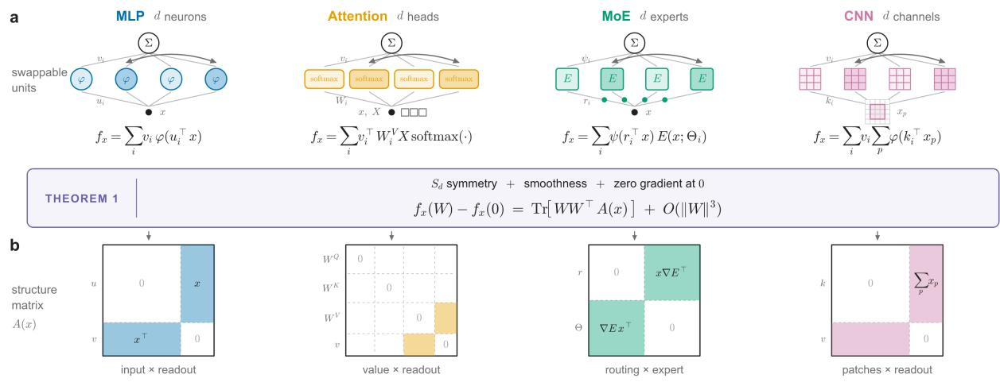  
Figure 1: Permutation symmetry of the units allows us to characterize the model with structure matrices A. (a) Perceptrons, attention layers, mixtures of experts and convolutions are all sums over interchangeable components, so a permutation leaves the represented function unchanged. (b) Training begins with all weights near zero, so each module may be Taylor expanded about that point. Given smoothness and the condition that a component’s gradient vanish whenever that component’s own weights do, symmetry then enforces the same leading quadratic form in every case (Theorem 1), and the architecture survives only in the structure matrix A(x). Here x is a single input to the module.

Symmetry of this kind is the standard point of departure for a Landau construction [44, 32, 21]: identify the symmetry group, identify a small parameter that holds the system near a distinguished point of configuration space, expand about that point, and retain only the lowest-order terms the symmetry permits. Here the group is $S _ { d }$ , the distinguished point is the origin of parameter space, and the small parameter is the initialization scale ϵ. Microscopic detail should then survive only in the phenomenological coefficients of the expansion, which is the sense in which universality across architectures is to be expected and which is the logic underlying the statistical-mechanical tradition in learning theory [63, 25, 74, 8, 20].

Carrying out this program produces a single expression, summarized in Figure 1. We prove (Theorem 1) that any module $f _ { x } ( w _ { 1 } , \ldots , w _ { d } )$ that is $S _ { d }$ -symmetric in its components [Figure 1(a)], is three times continuously differentiable, and satisfies a gradient condition, stated precisely below, obeys

$$
f _ { x } ( W ) - f _ { x } ( 0 ) = \mu ^ { \top } g ( x ) + \mathrm { T r } \big [ W W ^ { \top } A ( x ) \big ] + O \left( \| W \| ^ { 3 } \right) .\tag{1}
$$

Here x is a single input, $W = \left( w _ { 1 } , \ldots , w _ { d } \right) \in \mathbb { R } ^ { p \times d }$ collects the d components, each carrying p parameters, $\begin{array} { r } { \mu = \sum _ { i = 1 } ^ { d } w _ { i } . } \end{array}$ and the symmetric matrix $A ( x ) \in \mathbb { R } ^ { p \times p }$ is fixed by the architecture and by x alone; we call Eq. (1) the neural quadratic form (NQF) and A(x) the structure matrix. It turns out that the term $\mu ^ { \intercal } g ( x )$ vanishes for most of the practical architectures, and so the NQF can often be written with only the second-moment term.

Everything architecture-specific now sits in $A ( x )$ , as a sparsity pattern and a set of couplings [Figure 1(b)]. Attention is the striking case: only its value and readout blocks appear at this order, the query and key matrices entering first at quartic order. What controls the model is likewise not the individual components but the order parameter $M = W W ^ { \top }$ , whose size is set by $p .$

Quadratic parameterizations are not themselves new as proxies for nonconvex learning [33, 5, 18, 12, 48, 23]. Matrix sensing, phase retrieval, diagonal networks and quadratic networks have each been analyzed on their own terms, to explain implicit low-rank bias, spectral initialization, or feature growth; exact analyses of deep linear networks display the same mode-wise plateaus under gradient descent [62, 3]; and recent work argues that quadratic models remain quantitatively accurate even for large language models [53]. What Eq. (1) adds is that these are not a family of analogous models but one model, and that the coupling $A ( x )$ is computed from the architecture [Figure 1(a,b)]. Seventeen models previously studied as separate solvable proxies, including those above, are instances of Eq. (1) at particular A. A practical consequence is that $A ( x )$ can be evaluated for a proposed layer before that layer is ever trained.

Several distinct regularities travel under the name of a neural scaling law, and they are worth separating before any theory is compared. Power laws are reported in the loss against optimization time within a single run; in the trained loss against model or dataset size; and along a compute-optimal frontier trading the two. What follows is a law of the first kind, for excess loss against rescaled training time, controlled by the same spectral structure that enters theories of the other two. How the trained loss depends on model size, dataset size and compute, and how those resources should be traded against one another, is a separate question we do not take up.

Within that scope, the closest theory is that of Bahri et al. [7], who separate a variance-limited regime, where the loss falls as the inverse of model or dataset size, from a resolution-limited one whose exponent is set by the data manifold or the tangent-kernel spectrum. Theirs is a theory of trained loss against scale; ours is of loss against time. Kernel treatments reach power-law learning curves from spectral structure by a related route [15, 17, 49, 14], but they linearize about initialization and freeze the representation [38, 22], suppressing the feature growth that produces abrupt transitions [61, 10]; sudden learning is then treated separately, as saddle-to-saddle transitions for particular targets [1, 54, 56, 11], or as the loss of stability of a trivial symmetric solution [71]. Our question spans the two: can the spectrum behind a macroscopic law emerge from within a feature-learning dynamics, and can that same dynamics produce the abrupt acquisition of individual modes? Answering both questions with one dynamics is tractable only because that dynamics is reducible to a few collective variables.

That reduction is our first result. Under stochastic gradient descent, the dynamics of any NQF close on the pair $\begin{array} { r } { \left( M , \mu \right) = \left( \sum _ { i } { w _ { i } w _ { i } ^ { \top } } , \sum _ { i } { w _ { i } } \right) } \end{array}$ , no matter how many trainable parameters the model contains (Theorem 2). The entire parameter trajectory is therefore represented by these low-dimensional moments; and within the NQF description a module of width d admits a compressed equivalent of width $k _ { \mathcal { V } } + 1$ , set by the rank of the data, which reproduces its predictions on the training data at every step under a rescaling (Theorem 3). This measures the low-dimensional training dynamics [34, 45, 4]. The second result is that the closed dynamics is in many cases solvable. In the common eigenbasis of the data, the flow of M becomes the generalized Lotka–Volterra equation of population ecology [35, 51, 16], with the eigenvalues $z _ { k }$ of M in the role of species abundances, and we solve it in four regimes (Theorems 4–7), each exhibiting a combination of sudden learning and neural scaling law phenomena.

This work is organized as follows. Section 2 derives the normal form and Section 3 computes $A ( x )$ for standard architectures. Section 4 analyzes the dynamics, and Section 5 solves the dynamics for special cases. Section 6 derives the predictions for sudden learning and neural scaling laws. Section 7 tests them numerically, and Section 9 discusses the limitations and the extension to higher orders.

## 2 Neural Quadratic Forms

This sections presents the central result of this paper. We show that permutation symmetry alone gives us a universal norm quadratic expansion, which is the result of Theorem 1. In Section 3 we will show how each neural architecture is different.

Notation. Throughout, x denotes a single input to the module: one training example drawn from a set $\mathcal { X } .$ . The module itself is written $f _ { x } ,$ a scalar-valued function of the parameters at fixed x; the subscript records that x is held fixed while the parameters vary. Its d components carry p parameters each, collected as $w _ { 1 } , \ldots , w _ { d } \in \mathbb { R } ^ { p }$ , so $f _ { x } : \mathbb { R } ^ { p \times d } $ R. Vector-valued outputs are treated in Appendix B.2 and change nothing essential. All notations used in our paper are listed in Table 2.

The starting point of the theory is that there is a universally shared mathematical structure across different types of layers and architectural modules (see Section 3).

Definition 1 (Permutation symmetry). $f _ { x } : \mathbb { R } ^ { p \times d } $ R satisfies the permutation symmetry $( S _ { d }$ - symmetry) $i f f _ { x } ( w _ { 1 } , \dots , w _ { d } ) =$ $f _ { x } \big ( w _ { \sigma ( 1 ) } , \dots , w _ { \sigma ( d ) } \big )$ for any permutation σ.

Leveraging the terminology from MLPs, each $w _ { i }$ can be seen as the weights of a neuron of a hidden layer. It is thus natural to call $w _ { i }$ a “neuron,” and we will stick to this terminology. In fact, permutation symmetries have been suggested as the “right” way to precisely define a neuron in deep learning [77]. To be more precise, one could also call $w _ { i }$ the “coordinate” of the i-th neuron. Thus, in our work, any subset of the weights that is the minimal unit of permutation symmetry will be called a “neuron.” In this terminology, the weights of a self-attention head are also a neuron.

For a simplified presentation of the theory, we assume one further benign condition that is obeyed by almost any neural architecture in use (see Section 3).

Property 1. Zero gradient at zero (ZGZ): for any neuron i and any $w _ { j \neq i } , \nabla _ { w _ { i } } f _ { x } ( w _ { 1 } , \ldots , w _ { d } ) | _ { w _ { i } = 0 } = 0 .$

The following theorem shows that for models with permutation symmetry, their Taylor expansions take a highly universal form. In some sense, this result can be seen as a variant of the fundamental theorem of symmetric polyno mials [69].

Theorem 1 (Neural Quadratic Forms). Le $f _ { x } : \mathbb { R } ^ { p \times d }  \mathbb { R }$ be a three times continuously differentiable model with respect to its neurons $W = \left( w _ { 1 } , \ldots , w _ { d } \right)$ , where $w _ { i } \in { \mathbb { R } } ^ { p }$ . Assume $f _ { x }$ satisfies the permutation symmetry and the ZGZ conditions. Then,

$$
f _ { x } ( W ) = f _ { x } ( 0 ) + \sum _ { i = 1 } ^ { d } \mathrm { T r } [ w _ { i } w _ { i } ^ { \top } A ( x ) ] + O ( \| W \| ^ { 3 } ) ,\tag{2}
$$

where $A ( x ) \in \mathbb { R } ^ { p \times p }$ is a symmetric matrix dependent only on $x ,$ and $f _ { x } ( 0 )$ is the model evaluated at $W = 0 .$ . Equivalently,

$$
\operatorname * { l i m } _ { \phi \to \infty } \phi \big ( f _ { x } \big ( \phi ^ { - 1 / 2 } W \big ) - f _ { x } \big ( 0 \big ) \big ) = \sum _ { i = 1 } ^ { d } \mathrm { T r } \big [ w _ { i } w _ { i } ^ { \top } A ( x ) \big ] .\tag{3}
$$

Remark. We note that the ZGZ condition is nonessential. Removing it leads to essentially the same result but with more complicated notations. We present these results in Appendix B.1. Moreover, in practice, the ZGZ assumption can be replaced by the stronger (but equally common) assumption of having a per-neuron $Z _ { 2 }$ symmetry, meaning $f _ { x } ( \dots , w _ { i } , \dots ) = f _ { x } ( \dots , - w _ { i } , \dots )$ for all i. This means the 1st- and 3rd-order tensors in the Taylor expansion are zero, naturally elevating the error boundfrom $O ( \| W \| ^ { 3 } )$ to $O ( \| W \| ^ { 4 } )$ .

Therefore, we will refer to any model in the form of Eq.(2) as a neural quadratic form (NQF). For example,

$$
f _ { x } ( W ) = c _ { 0 } + \mathrm { T r } [ W W ^ { \top } A ( x ) ]\tag{4}
$$

will be a generic NQF with d as its width and A as its “architecture” or “structure.” We will from now on refer to $A$ as the structure matrix. In Appendix B.2 we extend the results to multidimensional outputs. Note also the dimension of M. Both M and $A ( x )$ are $p \times p .$ where p is the number of parameters of one neuron: the width d having already been summed away. Since the neurons are exchangeable, they may be read as identical particles with a p-dimensional state space, and $\textstyle \sum _ { i } w _ { i }$ and $\begin{array} { r } { M = \sum _ { i } w _ { i } w _ { i } ^ { \top } } \end{array}$ as the first two moments of their empirical distribution, M playing the role of a density matrix.

The next section shows how different forms of A distinguish different architectures. Note that f depends on the neurons only through their second moment $M = W W ^ { \top }$ , a point we take up in Section 4.

## 3 NQF for Different Architectures

In fact, a point often unclear to practitioners is that the existence of permutation symmetries is so universal that essentially any architecture module that has a notion of “width” automatically has the permutation symmetry property. This makes Theorem 1 applicable to almost any neural module one encounters in practice. Thus, in the NQF perspective, it is the structure matrices that determine the learning dynamics of neural networks. See Table 1 for common models that are reducible to an NQF. We now discuss a few examples in more detail.

Two-Layer MLP. Consider a two-layer Multi-Layer Perceptron (MLP) with a scalar output $f _ { x } : \mathbb { R } ^ { d \times ( k + 1 ) }  \mathbb { R }$ without bias terms. Let the parameters associated with the i-th hidden neuron be denoted as a single vector $w _ { i } ~ =$ $[ u _ { i } ^ { \top } , v _ { i } ] ^ { \top }$ , where $u _ { i } \in \mathbb { R } ^ { k }$ is the input weight vector and $v _ { i }$ ∈ R is the readout (output) weight. The model is given by:

$$
f _ { x } ( w _ { 1 } , \ldots , w _ { d } ) = \sum _ { i = 1 } ^ { d } v _ { i } \phi ( u _ { i } ^ { \top } x )\tag{5}
$$

where $\boldsymbol { x } \in \mathbb { R } ^ { k }$ is the input and $\phi : \mathbb { R }  \mathbb { R }$ is the activation function.

Table 1: Six representative models that are instances of the neural quadratic form (1), together with $A ( x )$ that distinguishes them. There are two ways to read the table: many generic architectures reduce approximately to an NQF, and many previously separate models are special cases of the NQF. The complete list appears in Table 3.
<table><tr><td>Model</td><td>NQF notation</td><td colspan="4">Structure matrix  $A ( x )$ </td></tr><tr><td>Two-layer MLP</td><td> $\begin{array} { r } { f _ { x } ( W ) = \sum _ { i = 1 } ^ { d } v _ { i } \phi ( u _ { i } ^ { \top } x ) } \end{array}$ </td><td> $\begin{array} { r } { A ( x ) = \frac { \phi ^ { \prime } ( 0 ) } { 2 } \left. \begin{array} { l l } { 0 _ { k \times k } } & { x } \\ { x ^ { \top } } & { 0 } \end{array} \right. } \end{array}$ </td><td></td><td></td><td>[29,61]</td></tr><tr><td>Single-layer CNN</td><td> $f _ { x } ( W ) =$   $\begin{array} { r } { \dot { \sum _ { i = 1 } ^ { d } v _ { i } } \sum _ { p = 1 } ^ { P } \phi ( k _ { i } ^ { \top } x _ { p } ) } \end{array}$ </td><td></td><td> $\begin{array} { r l } { A ( X ) = \frac { \phi ^ { \prime } ( 0 ) } { 2 } \biggl [ 0 _ { m \times m } } & { { } \sum _ { p } x _ { p } \biggr ] } \\ { \sum _ { p } x _ { p } ^ { \top } } & { { } ~ 0 } \end{array}$ </td><td></td><td>[42, 24]</td></tr><tr><td>Multi-head attention</td><td> $f _ { x } ( W ) =$   $\begin{array} { r } { \sum _ { i = 1 } ^ { d } v _ { i } ^ { \top } W _ { i } ^ { V } X \cdot \operatorname { s o f t m a x } ( \cdot ) } \end{array}$ </td><td></td><td></td><td> $\begin{array} { r } { A ( X ) = \frac { 1 } { 2 } \left[ \begin{array} { c c c } { 0 _ { 2 d _ { k } D } } & { 0 } & { 0 } \\ { 0 } & { 0 } & { x _ { \mathrm { a v g } } \otimes I _ { d _ { v } } } \\ { 0 } & { x _ { \mathrm { a v g } } ^ { \top } \otimes I _ { d _ { v } } } & { 0 } \end{array} \right] } \end{array}$ </td><td>[67]</td></tr><tr><td>Mixture of experts</td><td> $f _ { x } ( W ) =$   $\begin{array} { r } { \sum _ { i = 1 } ^ { d } \psi ( r _ { i } ^ { \top } x ) E ( x ; \Theta _ { i } ) } \end{array}$ </td><td> $G : = \nabla \Theta E ( x ; 0 )$ </td><td> $\begin{array} { r }  A ( x ) = \frac { \psi ^ { \prime } ( 0 ) } { 2 } \biggl [ \begin{array} { c c } { 0 } & { x G ( x ) ^ { \top } \biggr ] , } \\ { G ( x ) x ^ { \top } } & { 0 } \end{array} \end{array}$ </td><td></td><td>[64,57]</td></tr><tr><td>Phase retrieval</td><td> $\hat { y } _ { a } = a ^ { \top } W W ^ { \top } a$ </td><td>Aa = aa</td><td></td><td></td><td>[18,47]</td></tr><tr><td>Diagonal linear network</td><td> $\begin{array} { r } { f _ { x } ( u ) = \sum _ { k } x _ { k } u _ { k } ^ { 2 } / 4 } \end{array}$ </td><td>Ax = 1 Diag(x)</td><td></td><td></td><td>[12,59]</td></tr></table>

Proposition 1. $I f \phi$ is three times continuously differentiable and satisfies $\phi ( 0 ) = 0 ,$ , then the model (5) satisfies the assumptions in Theorem 1 with

$$
A ( x ) = { \frac { \phi ^ { \prime } ( 0 ) } { 2 } } \left[ \begin{array} { l l } { 0 _ { k \times k } } & { x } \\ { x ^ { \top } } & { 0 } \end{array} \right] .\tag{6}
$$

Self-Attention. Consider a Multi-Head Attention (MHA) model computing a scalar output from an input query token $\boldsymbol { x } \in \mathbb { R } ^ { D }$ and a context matrix $X \in \mathbb { R } ^ { D \times N }$ (where N is the sequence length).

Let the parameters associated with the i-th attention head be grouped into a single parameter vector $w _ { i } = \mathrm { v e c } ( W _ { i } ^ { Q } , W _ { i } ^ { K } , W _ { i } ^ { V } , v _ { i } )$ where $W _ { i } ^ { Q } , W _ { i } ^ { K } \in \mathbb { R } ^ { d _ { k } \times D }$ are the query and key matrices, $W _ { i } ^ { V } \in \mathbb { R } ^ { d _ { v } \times D }$ is the value matrix, and $v _ { i } \in \mathbb { R } ^ { d _ { v } }$ is the readout vector for the scalar output. Assuming no bias terms, the model is formulated as:

$$
f _ { x } ( w _ { 1 } , \dots , w _ { d } ) = \sum _ { i = 1 } ^ { d } v _ { i } ^ { \top } W _ { i } ^ { V } X \cdot \mathrm { s o f t m a x } \left( \frac { X ^ { \top } ( W _ { i } ^ { K } ) ^ { \top } W _ { i } ^ { Q } x } { \sqrt { d _ { k } } } \right)\tag{7}
$$

where softmax is applied over the N dimension.

Proposition 2. The MHA model (7) satisfies the assumption in Theorem 1. The matrix $A ( X )$ takes thefollowing block form:

$$
A ( X ) = \frac { 1 } { 2 } \left[ \begin{array} { c c c c } { 0 } & { 0 } & { 0 } & { 0 } \\ { 0 } & { 0 } & { 0 } & { 0 } \\ { 0 } & { 0 } & { 0 } & { x _ { a v g } \otimes I _ { d _ { v } } } \\ { 0 } & { 0 } & { x _ { a v g } ^ { \top } \otimes I _ { d _ { v } } } & { 0 } \end{array} \right]\tag{8}
$$

where $\begin{array} { r } { x _ { a v g } = \frac { 1 } { N } X { \bf 1 } _ { N } \in \mathbb { R } ^ { D } , { \bf 1 } _ { N } \in \mathbb { R } ^ { N } } \end{array}$ is a vector of all ones, and ⊗ denotes the Kronecker product.

This means that to leading order, what determines the behavior of a self-attention head are the value and output matrices, and the self-attention behaves like an averaging operator. In fact, the query and key weights appear only at quartic order.

Query-Key-Only Head. Now, consider a variant of MHA where the readout vector and value matrix are fixed and merged into a constant vector $c \in \mathbb { R } ^ { D }$ . While this is rarely the case in practice, it is actually a common theoretical model of the learning dynamics of attention (e.g., [6, 50], or in which the readout and query-key matrices are trained separately [70]). The model evaluates a scalar output as:

$$
f _ { x } ( w _ { 1 } , \dots , w _ { d } ) = \sum _ { i = 1 } ^ { d } c ^ { \top } X \cdot \mathrm { s o f t m a x } \left( \frac { X ^ { \top } ( W _ { i } ^ { K } ) ^ { \top } W _ { i } ^ { Q } x } { \sqrt { d _ { k } } } \right)\tag{9}
$$

Let the parameters for the i-th head be the query and key matrices $w _ { i } = [ \mathrm { v e c } ( W _ { i } ^ { Q } ) ^ { \top } , \mathrm { v e c } ( W _ { i } ^ { K } ) ^ { \top } ] ^ { \top } \in \mathbb { R } ^ { 2 d _ { k } D }$

Proposition 3. Model (9) satisfies all assumptions in Theorem 1. Furthermore, $A ( X )$ takes the blockform:

$$
A ( X ) = { \frac { 1 } { 2 \sqrt { d _ { k } } } } \left[ \begin{array} { c c } { { 0 } } & { { x u ^ { \top } \otimes I _ { d _ { k } } } } \\ { { u x ^ { \top } \otimes I _ { d _ { k } } } } & { { 0 } } \end{array} \right]\tag{10}
$$

where $u = \Sigma _ { X } c \in \mathbb { R } ^ { D }$ , and $\begin{array} { r } { \Sigma _ { X } = \frac { 1 } { N } X X ^ { \top } - \big ( \frac { 1 } { N } X \mathbf { 1 } _ { N } \big ) \big ( \frac { 1 } { N } X \mathbf { 1 } _ { N } \big ) ^ { \top } \in \mathbb { R } ^ { D \times D } } \end{array}$ is the sample covariance matrix.

Single-head attention logits. Finally, we can also consider the single-head attention model, which can, interestingly, also be regarded as an independent NQF because the query and key weight matrices contain the permutation symmetry as a subgroup.

Proposition 4. By treating the i-th rows of $W ^ { Q }$ and $W ^ { K }$ as $w _ { i } \in \mathbb { R } ^ { 2 D }$ , the single-head attention model

$$
f _ { x } ( w _ { 1 } , . . . , w _ { d _ { k } } ) = c ^ { \top } X \cdot \mathrm { s o f t m a x } \left( \frac { X ^ { \top } ( W ^ { K } ) ^ { \top } W ^ { Q } x } { \sqrt { d _ { k } } } \right)\tag{11}
$$

satisfies all assumptions in Theorem 1. Furthermore, $A ( X ) \in \mathbb { R } ^ { 2 D \times 2 D }$ takes the blockform:

$$
A ( X ) = { \frac { 1 } { 2 { \sqrt { d _ { k } } } } } \left[ { \begin{array} { c c } { 0 } & { x u ^ { \top } } \\ { u x ^ { \top } } & { 0 } \end{array} } \right]\tag{12}
$$

where $u = \Sigma _ { X } c \in \mathbb { R } ^ { D }$ , and $\Sigma _ { X }$ is the sample covariance matrix.

Mixture of Experts. Consider a Mixture of Experts (MoE) model computing a scalar output $f _ { x }$ from an input $\boldsymbol { x } \in \mathbb { R } ^ { k }$ . Let the parameters associated with the i-th expert branch be grouped into a single vector $w _ { i } = [ r _ { i } ^ { \top } , \mathrm { v e c } ( \Theta _ { i } ) ^ { \top } ] ^ { \top }$ where $r _ { i } \in \mathbb { R } ^ { k }$ is the routing (gating) weight vector, and $\Theta _ { i }$ represents the internal parameters of the expert network $E ( x ; \Theta _ { i } )$ . We employ an independent gating mechanism [57]:

$$
f _ { x } ( w _ { 1 } , \ldots , w _ { d } ) = \sum _ { i = 1 } ^ { d } \psi ( r _ { i } ^ { \top } x ) E ( x ; \Theta _ { i } )\tag{13}
$$

where $\psi : \mathbb { R } \to \mathbb { R }$ is a smooth gating activation function (e.g., Tanh or GeLU) satisfying $\psi ( 0 ) = 0$ . Each expert $E ( x ; \Theta _ { i } )$ is a smooth neural network satisfying $E ( x ; 0 ) = 0$

Proposition 5. Assuming the gating function ψ and the expert networks E are at least three times continuously differentiable, the MoE model (13) satisfies the assumption in Theorem 1 with

$$
A ( x ) = \frac { 1 } { 2 } \left[ \begin{array} { c c } { 0 } & { \psi ^ { \prime } ( 0 ) x \nabla _ { \Theta _ { i } } E ( x ; 0 ) ^ { \intercal } } \\ { \psi ^ { \prime } ( 0 ) \nabla _ { \Theta _ { i } } E ( x ; 0 ) x ^ { \intercal } } & { 0 } \end{array} \right] .\tag{14}
$$

Convolutional Neural Networks. Consider a single-layer Convolutional Neural Network (CNN) computing a scalar output $f _ { x }$ from an input feature map X. Let the parameters associated with the i-th convolutional channel be grouped into a single vector $\boldsymbol { w } _ { i } = [ k _ { i } ^ { \top } , v _ { i } ] ^ { \top }$ , where $k _ { i } \in \mathbb { R } ^ { m }$ represents the flattened weights of the convolutional filter, and $v _ { i } \in$ R is the readout weight applied after pooling.

Assuming the network uses global sum-pooling over the P spatial patches of the input (denoted as $\boldsymbol { x } _ { p } \in \mathbb { R } ^ { m }$ for $p = 1 , \ldots , P )$ , the model is formulated as:

$$
f _ { x } ( w _ { 1 } , \ldots , w _ { d } ) = \sum _ { i = 1 } ^ { d } v _ { i } \sum _ { p = 1 } ^ { P } \phi ( k _ { i } ^ { \top } x _ { p } ) ,\tag{15}
$$

where $\phi : \mathbb { R }  \mathbb { R }$ is the activation function.

Proposition 6. $I f \phi$ is three times continuously differentiable and satisfies $\phi ( 0 ) = 0 ,$ then the CNN (15) satisfies the assumption in Theorem 1 with

$$
A ( X ) = \frac { \phi ^ { \prime } ( 0 ) } { 2 } \left[ \begin{array} { c c } { 0 _ { m \times m } } & { \sum _ { p = 1 } ^ { P } x _ { p } } \\ { \sum _ { p = 1 } ^ { P } x _ { p } ^ { \top } } & { 0 } \end{array} \right] .\tag{16}
$$

Notions of Layer and Representation. While the form $\operatorname { T r } [ W A W ^ { \top } ]$ is universal, the matrix A always takes a sparse and strongly off-diagonal form. In particular, for any neural layer above,

$$
A = \frac { 1 } { 2 } \left[ \begin{array} { c c } { { 0 } } & { { C ( x ) } } \\ { { C ^ { \top } ( x ) } } & { { 0 } } \end{array} \right] ,\tag{17}
$$

where $C \in \mathbb { R } ^ { d _ { 1 } \times d _ { 2 } }$ is an arbitrary rectangular matrix with suitable dimensions. This means that one can also divide W into corresponding blocks: $W = { \left[ \begin{array} { l } { Z _ { 1 } } \\ { Z _ { 2 } } \end{array} \right] }$ , such that

$$
M = W W ^ { \top } = { \left[ \begin{array} { l l } { Z _ { 1 } Z _ { 1 } ^ { \top } } & { Z _ { 1 } Z _ { 2 } ^ { \top } } \\ { Z _ { 2 } Z _ { 1 } ^ { \top } } & { Z _ { 2 } Z _ { 2 } ^ { \top } } \end{array} \right] }\tag{18}
$$

This implies that the output of the model only depends on $Z _ { 2 } Z _ { 1 } ^ { \top } \colon f _ { x } = \mathrm { T r } [ Z _ { 2 } Z _ { 1 } ^ { \top } C ]$ . In the case of a vector $C = x ,$ $Z _ { 1 }$ is also a vector and so $f _ { x } = Z _ { 2 } Z _ { 1 } ^ { \intercal } x ,$ a two-layer linear network. Therefore, one can abstractly think of $Z _ { 1 } ^ { \intercal }$ as the first-layer weight and $Z _ { 2 }$ as the second-layer weight. The representation also becomes definable. The first-layer latent representation of $C ( x )$ is thus

$$
h ( x ) = Z _ { 1 } ^ { \top } C ( x ) .\tag{19}
$$

For a structured model, such as above, it is possible to talk about a latent representation and define the notion of layers.   
Whenever the matrix A can be written in this form, we refer to the model as a “feedforward” model.

## 4 Learning Dynamics of the NQF

Sections 2 and 3 concern a model when expanded, and in this section, we study the learning dynamics of these models. A key question this section answers is how many numbers are needed to follow training. The answer is that the number does not grow with the model: whatever the width, the trajectory of an NQF is a flow on the pair $( M , \mu )$ . This is stated as Theorem 2. One consequence follows immediately: learning is highly redundant, in that a model can be compressed with no change to its trajectory at all (Theorem 3).

We work throughout with the most general form of NQF without the ZGZ condition (See Appendix B.1). If we denote $\begin{array} { r } { M : = \sum _ { i = 1 } ^ { d } w _ { i } w _ { i } ^ { \top } } \end{array}$ and $\textstyle \mu : = \sum _ { i = 1 } ^ { d } w _ { i }$ , we can write a general NQF as

$$
f _ { x } ( W ) = f _ { x } ( 0 ) + g ( x ) ^ { \top } { \mu } + { \mu } ^ { \top } B ( x ) { \mu } + \mathrm { T r } [ M A ( x ) ] .\tag{20}
$$

Without loss of generality, A and B matrices can always be regarded as symmetric matrices.

Theorem 2 (Master Theorem for NQF). Let $A ( x ) , B ( x )$ be symmetric. Under SGD

$$
\Delta W = - \eta \sum _ { x \in B } \nabla _ { W } \mathcal { L } ( f _ { x } ( W ) )\tag{21}
$$

with identical data sampling, two neural quadratic models have $M _ { a } ( t ) = M _ { b } ( t ) , \ \mu _ { a } ( t ) = \mu _ { b } ( t )$ at any time t if at initialization:

$$
M _ { a } ( 0 ) = M _ { b } ( 0 ) , \mu _ { a } ( 0 ) = \mu _ { b } ( 0 ) .\tag{22}
$$

The learning dynamics are completely determined by M, µ:

$$
\Delta \mu = - \eta \big ( \boldsymbol { d } \cdot \boldsymbol { v } + H \mu \big )\tag{23}
$$

$$
\begin{array} { r } { \Delta M = - \eta \big ( v \mu ^ { \top } + \mu v ^ { \top } + H M + M H \big ) + \eta ^ { 2 } \big ( d \cdot v v ^ { \top } + v \mu ^ { \top } H + H \mu v ^ { \top } + H M H \big ) } \end{array}\tag{24}
$$

where d is the number ofneurons, $\begin{array} { r } { v : = \sum _ { x \in \mathcal { B } } \ell _ { x } ^ { \prime } \big ( g ( x ) + 2 B ( x ) \mu \big ) } \end{array}$ and $\begin{array} { r } { H : = \sum _ { x \in { \mathcal { B } } } 2 \ell _ { x } ^ { \prime } A ( x ) } \end{array}$ . Here we denote $\begin{array} { r } { \ell _ { x } ^ { \prime } : = \frac { \partial \mathcal { L } } { \partial f _ { x } } } \end{array}$ and B denotes a minibatch.

This theorem can be extended to a form that describes a broad class of optimization methods including vanilla SGD, SGD with weight decay, and Polyak Momentum. With weight decay, a simple decay $- \gamma M$ term appears in the equation, where $\gamma$ is the weight decay strength. See Appendix B.3.

A deep neural network can often be viewed as a composition of multiple layers, each of which can be approximated by an NQF model. We theoretically and empirically study multilayer NQFs in Appendix B.4.

Compressibility of NQF. A key implication of Theorem 2 is that the learning process of neural networks is highly redundant. We will say that two neural networks $f _ { x } ( \theta )$ and $g _ { x } ( \theta ^ { \prime } )$ have the same learning dynamics if for any $x ,$

$$
f _ { x } ( \theta _ { t } ) = g _ { x } ( \theta _ { t } ^ { \prime } ) .\tag{25}
$$

Namely, the identity is defined on the functional side, and it is possible for two models to have the same dynamics even if they have different parameters.

Actually, there exist infinitely many parameter configurations whose learning dynamics are identical. This also implies that the learning process of a very large neural network is identical to and can be fully captured by a much smaller network – a phenomenon that has been termed the “dynamical lottery ticket hypothesis” [28, 69].

Theorem 3. Let an NQF have d neurons, defined byfunctions $g ( x ) , B ( x ) , A ( x )$ , learning rate η, and initial parameter statistics $\mu ( 0 )$ and $M ( 0 )$ . Let $k _ { \mathcal { V } } : = \dim \left( s p a n \bigcup _ { x \in \mathcal { X } } \left( \{ g ( x ) \} \cup C o l ( A ( x ) ) \cup C o l ( B ( x ) ) \right) \right) \leq p$ represent the dimension of the joint subspace spanned by the vectors $g ( x )$ and all column vectors of $B ( x )$ and $A ( x )$ across all $x \in { \mathcal { X } } ,$ , where X denotes the training set. $I f d > k _ { \mathcal { V } } + 1$ , then there exists a smaller NQF with $d ^ { \prime } = k _ { \mathcal { V } } + 1$ neurons, characterized by $\begin{array} { r } { \tilde { g } ( x ) = g ( x ) , \tilde { B } ( x ) = B ( x ) , \tilde { A } ( x ) = \frac { d ^ { \prime } } { d } A ( x ) } \end{array}$ and learning rate $\begin{array} { r } { \tilde { \eta } = \frac { d } { d ^ { \prime } } \eta , } \end{array}$ such that: $\begin{array} { r } { l . \textit { f } _ { d ^ { \prime } } = f _ { d } f o r a l l i n p u t s \ : x \in \mathcal { X } ; } \end{array}$

2. fd′ = fd for all training steps $t \geq 0$ under SGD with identical data sampling.

In fact, independent of the original width d, there exists a finite-size NQF whose learning dynamics is identical to that of the original. This partially explains the commonly observed low dimensionality of the training dynamics [34, 45, 4]. Moreover, when the data is low-rank, this theorem states that the dimension of the learning dynamics is at most that of the data, a direct explanation of the folklore belief that structures in the data make learning simple. In Appendix B.5 we further characterize the compression error.

## 5 Exactly Solvable Cases of Learning Dynamics

The learning dynamics of NQF do not have a general solution. However, with special initialization or data distri butions, solutions of the learning dynamics are obtainable. Here, we focus on training NQF with the gradient flow algorithm. We consider the empirical Mean Squared Error (MSE) loss over a dataset of m samples $\{ x _ { \mu } , y _ { \mu } \} _ { \mu = 1 } ^ { m }$

$$
\mathcal { L } ( W ) = \frac { 1 } { m } \sum _ { \mu = 1 } ^ { m } \left( \mathrm { T r } [ W W ^ { \top } A ( x _ { \mu } ) ] - y _ { \mu } \right) ^ { 2 }\tag{26}
$$

where $W = \left[ w _ { 1 } , \ldots , w _ { d } \right] \in \mathbb { R } ^ { p \times d }$ is the parameter matrix. Let $\Delta _ { \mu } ( t ) = \mathrm { T r } [ W ( t ) W ( t ) ^ { \top } A ( x _ { \mu } ) ] - y _ { \mu }$ denote the residual for the µ-th sample. The gradient flow $\dot { W } = - \nabla _ { W } L ( W )$ is given by:

$$
\dot { W } ( t ) = - \frac { 4 } { m } \sum _ { \mu = 1 } ^ { m } \Delta _ { \mu } ( t ) A ( x _ { \mu } ) W ( t ) = - H ( t ) W ( t )\tag{27}
$$

where $\begin{array} { r } { H ( t ) : = \frac { 4 } { m } \sum _ { \mu = 1 } ^ { m } \Delta _ { \mu } ( t ) A ( x _ { \mu } ) \in \mathbb { R } ^ { p \times p } } \end{array}$

Notice that the network’s output is determined by the positive semi-definite matrix $M \ = \ W W ^ { \top } \ \in \ \mathbb { R } ^ { p \times p }$ . By differentiating $M ( t )$ , we observe that the dynamics naturally close in the space of $M \colon$

$$
\dot { M } ( t ) = \dot { W } W ^ { \top } + W \dot { W } ^ { \top } = - H ( t ) M ( t ) - M ( t ) H ( t )\tag{28}
$$

This kind of equation appears frequently in fluid dynamics and polymer physics, and this dynamical equation can be seen as a zero-dimensional homogeneous flow, and M can be identified as the Reynolds stress [60]. The nonlinear matrix differential equation (28) is generally impossible to solve. However, for some special cases it has exact solutions.

We will assume the following commutativity condition – this is a common assumption for solving the learning dynamics of exactly solvable models, e.g., [62, 33].

Assumption 1. The dataset consists ofm mutually commuting symmetric data matrices: $A ( x _ { \mu } ) = P \Lambda _ { \mu } P ^ { \intercal }$ , where P is an orthogonal matrix and $\Lambda _ { \mu } = \operatorname { d i a g } ( \lambda _ { \mu , 1 } , . . . , \lambda _ { \mu , p } )$

Under Assumption 1, we can project the dynamics into the common eigenbasis defined by P. Let $\tilde { M } ( t ) ~ =$ $P ^ { \top } M ( t ) P$ . The residual can be rewritten as:

$$
\Delta _ { \mu } ( t ) = \mathrm { T r } [ M ( t ) A ( x _ { \mu } ) ] - y _ { \mu } = \mathrm { T r } [ \tilde { M } ( t ) \Lambda _ { \mu } ] - y _ { \mu } = \sum _ { k = 1 } ^ { p } \tilde { M } _ { k k } ( t ) \lambda _ { \mu , k } - y _ { \mu } .\tag{29}
$$

Equation (29) reveals that the network’s output and the loss gradient only depend on the diagonal elements of $\tilde { M } ( t )$ We define $z _ { k } ( t ) : = \tilde { M } _ { k k } ( t ) \geq 0$ as the k-th feature.

Proposition 7. Under Assumption 1, the off-diagonal elements are slaved to the diagonal elements and do not influ ence the predictions or the loss. Their evolution is solved by:

$$
\tilde { M } _ { i j } ( t ) = \tilde { M } _ { i j } ( 0 ) \exp \left( - \int _ { 0 } ^ { t } \left( \tilde { H } _ { i i } ( \tau ) + \tilde { H } _ { j j } ( \tau ) \right) d \tau \right) .\tag{30}
$$

Substituting $\begin{array} { r } { \Delta _ { \mu } ( t ) = \sum _ { j = 1 } ^ { p } \lambda _ { \mu , j } z _ { j } ( t ) - y _ { \mu } } \end{array}$ into (28), we obtain the evolution of the k-th feature:

$$
\dot { z } _ { k } ( t ) = - \frac { 8 } { m } \sum _ { \mu = 1 } ^ { m } \Delta _ { \mu } ( t ) \lambda _ { \mu , k } z _ { k } ( t ) .\tag{31}
$$

Expanding $\Delta _ { \mu } ( t )$ yields:

$$
\dot { z } _ { k } ( t ) = \frac { 8 } { m } \left( \sum _ { \mu = 1 } ^ { m } y _ { \mu } \lambda _ { \mu , k } - \sum _ { j = 1 } ^ { p } \left( \sum _ { \mu = 1 } ^ { m } \lambda _ { \mu , k } \lambda _ { \mu , j } \right) z _ { j } ( t ) \right) z _ { k } ( t ) .\tag{32}
$$

(32) is the Generalized Lotka-Volterra (GLV) equation from population ecology. In general, it still does not have analytic solutions1. For the following sections, we will consider several special cases where the dynamics are actually solvable. The connection to the GLV allows some direct interpretation of $z _ { k }$ as the abundance of a species and $\begin{array} { r } { C _ { k , j } : = \sum _ { \mu } \lambda _ { \mu , k } \lambda _ { \mu , j } } \end{array}$ as the competition (when positive) and cooperation (when negative) between species [35].

## Proportional Samples.

Theorem 4. Suppose Assumption 1 holds, andfurther assume that the data matrices can be expressed as $A ( x _ { \mu } ) = c _ { \mu } A$ $f o r a$ symmetric matrix A and constants $c _ { \mu }$ . Define $\textstyle \alpha : = { \frac { 4 } { m } } \sum _ { \mu = 1 } ^ { m } c _ { \mu } ^ { 2 }$ and $\textstyle { \beta : = { \frac { 4 } { m } } \sum _ { \mu = 1 } ^ { m } c _ { \mu } y _ { \mu } }$ . Then, the trajectory of $W ( t )$ is given by:

$$
W ( t ) = P \exp ( - \xi ( t ) \Lambda ) P ^ { \intercal } W ( 0 )\tag{33}
$$

where ex $\ b ( - \xi ( t ) \Lambda ) = \mathrm { d i a g } \left( \exp ( - \lambda _ { 1 } \xi ( t ) ) , \dots , \exp ( - \lambda _ { p } \xi ( t ) ) \right)$ , and the auxiliary scalar variable ξ(t) satisfies the following implicit integral equation:

$$
t = \int _ { 0 } ^ { \xi ( t ) } \frac { d s } { \alpha \sum _ { j = 1 } ^ { p } \lambda _ { j } z _ { j } ( 0 ) \exp ( - 2 \lambda _ { j } s ) - \beta }\tag{34}
$$

Remark. The exact solution in [73] is a special case of Theorem 4, where Λ only has two eigenvalues and (34) can be integrated explicitly.

## Orthogonal Samples.

Theorem 5. Suppose Assumption 1 holds, andfurther assume that $A ( x _ { \mu } ) A ( x _ { \nu } ) = 0 f o r a l l \mu \neq \nu$ . Then, the trajectory of $W ( t )$ is given by

$$
W ( t ) = P \exp ( - \Sigma ( t ) ) P ^ { \intercal } W ( 0 ) ,\tag{35}
$$

where $\begin{array} { r } { \Sigma ( t ) = \frac { 4 } { m } \sum _ { \mu = 1 } ^ { m } \xi _ { \mu } ( t ) \Lambda _ { \mu } } \end{array}$ is a diagonal matrix, and the auxiliary scalar variable $\xi _ { \mu } ( t )$ for each $\mu \in \{ 1 , \ldots , m \}$ evolves independently according to the following implicit integral equation:

$$
t = \int _ { 0 } ^ { \xi _ { \mu } ( t ) } \frac { d s } { \sum _ { k = 1 } ^ { p } \lambda _ { \mu , k } z _ { k } ( 0 ) \exp \left( - \frac { 8 } { m } \lambda _ { \mu , k } s \right) - y _ { \mu } } .\tag{36}
$$

Orthogonal Features.

Theorem 6. Suppose Assumption 1 holds, and further assume that: $\Sigma _ { \mu = 1 } ^ { m } \lambda _ { \mu , k } \lambda _ { \mu , j } = 0 f o r a l l k \neq j$ . Define

$$
r _ { k } : = \frac 8 m \sum _ { \mu = 1 } ^ { m } \lambda _ { \mu , k } y _ { \mu } , \quad C _ { k k } : = \frac 8 m \sum _ { \mu = 1 } ^ { m } \lambda _ { \mu , k } ^ { 2 } .\tag{37}
$$

Then the trajectory of $W ( t )$ is given by:

$$
W ( t ) = P D ( t ) P ^ { \top } W ( 0 ) ,\tag{38}
$$

where $D ( t ) = \operatorname { d i a g } ( d _ { 1 } ( t ) , \ldots , d _ { p } ( t ) )$ is a diagonal matrix with $d _ { k } ( t ) = { \sqrt { z _ { k } ( t ) / z _ { k } ( 0 ) } } i f z _ { k } ( 0 ) \not = 0 a n d d _ { k } ( t ) = 0$ otherwise. The exact solution $f o r \ z _ { k } ( t )$ is:

$$
z _ { k } ( t ) = \frac { r _ { k } z _ { k } ( 0 ) } { C _ { k k } z _ { k } ( 0 ) + ( r _ { k } - C _ { k k } z _ { k } ( 0 ) ) \exp ( - r _ { k } t ) }\tag{39}
$$

if rk ≠ 0 and $\begin{array} { r } { z _ { k } ( t ) = \frac { z _ { k } ( 0 ) } { 1 + C _ { k k } z _ { k } ( 0 ) t } } \end{array}$ otherwise.

Isotropic Samples. The previous solutions rely on the commutativity assumption (Assumption 1). In this section, we explore a different solvable regime where the data matrices do not commute, but instead satisfy an isotropic condition.

Assumption 2. Assume the dataset consists of $m \ge p ( p + 1 ) / 2$ symmetric data matrices $\{ A ( x _ { \mu } ) \} _ { \mu = } ^ { m }$ and their second moment tensor satisfies:

$$
\frac { 1 } { m } \sum _ { \mu = 1 } ^ { m } A _ { i j } ( x _ { \mu } ) A _ { k l } ( x _ { \mu } ) = \frac { c } { 2 } \big ( \delta _ { i k } \delta _ { j l } + \delta _ { i l } \delta _ { j k } \big )\tag{40}
$$

where $c > 0$ is a constant, and δ is the Kronecker delta.

Theorem 7. Suppose Assumption 2 holds. Let $\begin{array} { r } { Y \ = \ \frac { 4 } { m } \sum _ { \mu = 1 } ^ { m } y _ { \mu } A ( x _ { \mu } ) \ \in \ \mathbb { R } ^ { p \times p } } \end{array}$ . Then, the trajectory of $M ( t ) =$ $W ( t ) W ( t ) ^ { \intercal }$ has a closed-form solution:

$$
M ( t ) = \exp ( Y t ) M ( 0 ) \left[ I + 8 c \Phi ( t ) M ( 0 ) \right] ^ { - 1 } \exp ( Y t ) ,\tag{41}
$$

where I is the identity matrix, and $\begin{array} { r } { \Phi ( t ) = \int _ { 0 } ^ { t } \exp ( 2 Y \tau ) d \tau } \end{array}$ . If Y is non-singular, $\begin{array} { r } { \Phi ( t ) = \frac { 1 } { 2 } Y ^ { - 1 } ( \exp ( 2 Y t ) - I ) } \end{array}$

Furthermore, if the initial state $M ( 0 )$ and $Y$ are simultaneously diagonalizable, then, the eigenvalues of $M ( t )$ denoted as $z _ { k } ( t )$ , evolve according to

$$
z _ { k } ( t ) = \frac { \gamma _ { k } z _ { k } ( 0 ) } { 4 c z _ { k } ( 0 ) + \left( \gamma _ { k } - 4 c z _ { k } ( 0 ) \right) \exp ( - 2 \gamma _ { k } t ) }\tag{42}
$$

$i f \gamma _ { k } \neq 0$ and $\begin{array} { r } { z _ { k } ( t ) = \frac { z _ { k } ( 0 ) } { 1 + 8 c z _ { k } ( 0 ) t } } \end{array}$ otherwise, where $\gamma _ { k }$ is the k-th eigenvalue $o f Y$

In Appendix B.7 we futher propose a general solution which unifies Theorem 6 and the simultaneously diagonalizable case of Theorem 7, as well as the exact solutions of linear networks in [62].

Neural Tangent Kernel and Feature Learning. While the main focus of our work is sudden learning at a small initialization, the NQF models can also be used to study lazy training and feature learning. We discuss this point in Appendix B.6.

## 6 Sudden Learning and Neural Scaling Laws

When learning of single features or data points is step-function-like, they can be naturally composed to give an arbitrary learning curve (as long as it is monotonically decreasing). For example, in this section, we show that when the data correlations follow a power-law structure, the learning curves naturally become power laws with predictable exponents. This leads to a precise prediction of the exponents of neural scaling laws. In this section, we only provide an informal statement. Please refer to Appendix A.17 for formal statements and the proofs.

Feature-wise Descent Under the conditions of Theorem 6 (or Theorem 7 with $M ( 0 )$ and Y simultaneously diagonalizable), define $\zeta _ { k } = r _ { k }$ (in Theorem 6) or $\zeta _ { k } = \gamma _ { k }$ (in Theorem 7), which can be understood as the effective growth rate for the feature z . As the initialization scale $\epsilon \to 0$ , the characteristic time for $z _ { k }$ to be activated is

$$
t _ { k } ^ { * } \sim \frac { 1 } { \zeta _ { k } } \ln { \frac { 1 } { \epsilon } } .\tag{43}
$$

Consequently, the gaps between different feature activations diverge in the limit of small initialization, which exhibits saddle-to-saddle dynamics:

$$
\operatorname* { l i m } _ { \epsilon \to 0 } \left| t _ { k ^ { \prime } } ^ { * } - t _ { k } ^ { * } \right| = \infty\tag{44}
$$

if $\zeta _ { k ^ { \prime } } \neq \zeta _ { k }$

Moreover, define $\begin{array} { r } { V _ { k } : = \frac { r _ { k } ^ { 2 } } { C _ { k k } } } \end{array}$ (under Theorem 6) or $\begin{array} { r } { V _ { k } : = \frac { \gamma _ { k } ^ { 2 } } { c } } \end{array}$ (under Theorem $^ { 7 ) , }$ , which can be understood as the effective target strength. Assume that $\zeta _ { k }$ and $V _ { k }$ exhibit the following power-law decays:

$$
\zeta _ { k } \propto k ^ { - \alpha _ { 2 } } , V _ { k } \propto k ^ { - \alpha _ { 1 } } .\tag{45}
$$

Then, under the infinite-width limit $p  \infty$ and the small initialization limit $\epsilon  0$ , the limiting excess loss has a power-law decay

$$
\begin{array} { r } { \mathcal { E } ( \tau ) = \Theta \left( \tau ^ { - \frac { \alpha _ { 1 } - 1 } { \alpha _ { 2 } } } \right) . } \end{array}\tag{46}
$$

Sample-wise Descent Under the conditions of Theorem 5, suppose $\begin{array} { r } { \zeta _ { \mu } : = \frac { 8 } { m } } \end{array}$ maxk $\lambda _ { \mu , k } y _ { \mu } > 0$ , which can be understood as the effective growth rate of the µ-th sample. When the initialization scale $\epsilon  0 ,$ the empirical MSE converges to a saddle-to-saddle trajectory

$$
\operatorname* { l i m } _ { \epsilon \to 0 ^ { + } } L \left( \tau \ln \frac { 1 } { \epsilon } \right) = \frac { 1 } { m } \sum _ { \mu = 1 } ^ { m } y _ { \mu } ^ { 2 } \cdot \mathbb { I } ( \tau < \tau _ { \mu } ^ { * } ) ,\tag{47}
$$

where I(⋅) denotes the indicator function and $\begin{array} { r } { \tau _ { \mu } ^ { * } : = \frac { 1 } { \zeta _ { \mu } } } \end{array}$

Moreover, suppose that the $\zeta _ { \mu }$ and $y _ { \mu }$ exhibit the following power-law decay:

$$
\zeta _ { \mu } \propto \mu ^ { - \gamma _ { 2 } } , y _ { \mu } \propto \mu ^ { - \gamma _ { 1 } }\tag{48}
$$

for $\gamma _ { 1 } > 1 / 2$ and $\gamma _ { 2 } > 0$ . Then under the infinite sample limit $m  \infty$ and the small initialization limit $\epsilon  0 ,$ the limiting MSE follows a power-law decay:

$$
\begin{array} { r } { \mathcal { L } ( \tau ) = \Theta \left( \tau ^ { - \frac { 2 \gamma _ { 1 } - 1 } { \gamma _ { 2 } } } \right) . } \end{array}\tag{49}
$$

The dynamics in Theorem 4 can be viewed as being mathematically equivalent to the solution in Theorem 5 restricted to $m = 1$ , and thus there is only one plateau.

## 7 Experiments

All the experiments in this section are described in Appendix C. The code that reproduces every figure is available at https://github.com/xu-yz19/Neural-Quadratic-Forms.

NQF approximation To empirically validate the NQF approximation (Theorem 1), we train a two-layer MLP (Proposition 1), a single-layer CNN (Proposition 6), a query-key-only attention head (Proposition 3) and a multi-head attention model (Proposition 2) in Figure 2 with different optimizers (gradient descent, Polyak momentum $\beta = 0 . 9 $ and Adam). All models use Gaussian initialization with scale σ. The input is chosen to be Gaussian, and the label is generated by a low-rank NQF. The NQF tracks the original almost exactly across every architecture and optimizer. At large initialization, the NQF visibly departs from the original, showing that the $\mathrm { N Q F }$ approximation is only valid in the small-initialization regime. In Appendix C, we further provide additional experiments concerning the NQF approximation for the teacher-student setting and real datasets.

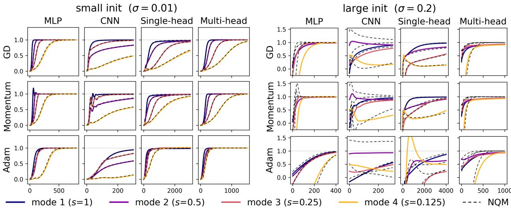  
Figure 2: NQF approximation across initialization, optimizer, and architecture. Two initialization scales are juxtaposed—small init $( \sigma = 0 . 0 1$ , left) and large init (σ = 0.2, right). Within each block, rows are optimizers and columns are architectures. Each module is trained together with its NQF approximation on an NQF teacher with singular values $s = ( 1 , \frac { 1 } { 2 } , \frac { 1 } { 4 } , \frac { 1 } { 8 } )$ . Curves show the recovered k-th singular value $\hat { s } _ { k } ( t ) / s _ { k }$ versus training step; colored solid = original module, black dashed = NQF.

Feature-wise saddle-to-saddle dynamics To validate the feature-wise descent in Section 6, we choose $\{ A ( x _ { \mu } ) \} _ { \mu = 1 } ^ { m }$ to be diagonal matrices satisfying the condition of Theorem 6 and train the model using full-batch GD from a small initialization. As shown in Figure 3, the numerical trajectories match the predictions of Theorem 6. Furthermore, the excess loss exhibits sequential plateaus at the predicted characteristic timescales $t _ { k } ^ { * } .$ . On the right side of Figure 3, we further choose $m = 1 0 0 0 , r _ { k } , V _ { k }$ to follow power laws and confirm that the slope predicted by Section 6 matches the curve obtained by GD.

Sample-wise saddle-to-saddle dynamics To validate the sample-wise descent in Section 6, we construct a synthetic dataset consisting of m mutually orthogonal data matrices. The student model is trained via full-batch GD from a smal initialization scale. As illustrated in Figure 4, the numerical trajectories obtained via GD match the analytical curves in Theorem 5. Specifically, the left panel shows that the MSE for each individual sample remains stagnant at its initia plateau before undergoing a sudden, sharp decay toward zero near $t _ { \mu } ^ { \ast }$ . Consequently, as shown in the right panel, the total MSE loss transitions through m sequential plateaus.

Power law on MLP We consider a Fourier MLP

$$
f ( x ) = \frac { 1 } { \sqrt { P } } \sum _ { k = 1 } ^ { P } W _ { k } \operatorname { t a n h } ( s _ { k } a _ { k } \psi _ { k } ( x ) ) ,\tag{50}
$$

where the trainable parameters are $\boldsymbol { w _ { k } } = \left[ a _ { k } , W _ { k } \right] ^ { \intercal }$ . Here, $\psi _ { k } ( x )$ represents orthonormal Fourier features $\psi _ { k } ( x ) =$ ${ \sqrt { 2 } } \cos ( 2 \pi k x )$ sampled on a uniform 1D grid $x _ { \mu } \in \{ 0 , 1 / M , \ldots , ( M - 1 ) / M \}$ . To induce the power-law structures required by Section 6, we choose $s _ { k } \ = \ k ^ { - \theta }$ and construct a target function $\begin{array} { r } { y ( x ) \ = \ \sum _ { k = 1 } ^ { P } b _ { k } \psi _ { k } ( x ) } \end{array}$ with decaying coefficients $b _ { k } \ = \ k ^ { - \beta }$ . In Appendix C we will show that the NQF of this Fourier MLP satisfies the conditions in Section 6 (feature-wise descent).

We train the model using full-batch GD. We use the Gaussian initialization with a small scale. We compare this architecture against two baselines: (1) its NQF approximation (Proposition 1); and (2) a standard MLP trained on the raw input x. The results are shown in Figure 5, which shows an empirical power-law loss and matches the prediction in Section 6. Meanwhile, the MLP trained on the raw input does not exhibit a power-law loss, which demonstrates the necessity of the structure required by Section 6 to attain the power laws. The small systematic steepening of the empirical power law relative to theory is the finite-initialization effect of Appendix C, which vanishes as ϵ → 0.

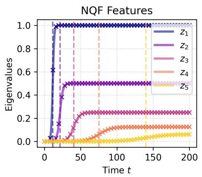

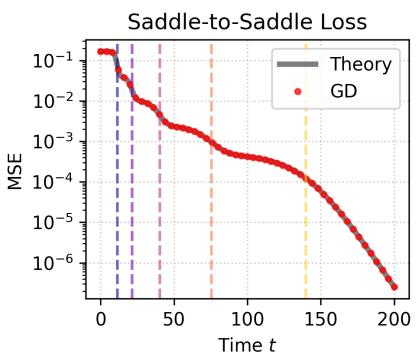

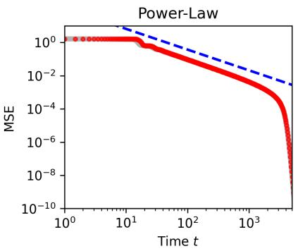  
Figure 3: Sudden learning in a solvable NQF, the phenomenon the theory of this paper is built to explain. The experi ment is under the feature-wise descent setting of Section 6. Solid lines represent the theory in Theorem 6 and markers represent the results obtained by GD. Vertical dashed lines mark the characteristic timescales $\begin{array} { r } { t _ { k } ^ { * } = \frac { 1 } { r _ { k } } \ln \left( \frac { r _ { k } } { C _ { k k } \epsilon } \right) } \end{array}$ where each feature reaches half-saturation. Left: Evolution of the eigenvalues of $W W ^ { \top }$ . Middle: The excess MSE loss over time, which exhibits sequential plateaus. Each sharp drop in the loss aligns with $t _ { k } ^ { * }$ . Right: Under the feature-wise descent setting of Section $^ { 6 , }$ the blue dashed line indicates the theoretical slope and confirms that our predicted slope matches the loss trajectory before the finite-size cutoff.

## 8 Related Works

Quadratic and factorized model classes. Quadratic parameterizations have long served as solvable proxies for nonconvex learning, which includes low-rank matrix factorization [33, 5], phase retrieval [18], diagonal linear networks [12], quadratic networks [48, 23], and so on. These models have been used to explain implicit low-rank bias, spectral initialization, and feature learning. A recent work [53] suggests that quadratic models can even accurately approximate LLMs. NQFs differ from these model-specific analyses by deriving the quadratic features $A ( x )$ from the architecture: matrix sensing, diagonal networks, MLPs, CNNs, attention heads, and MoE branches become instances of the same local normal form.

Learning dynamics and feature learning. Exact analyses of deep linear networks show rapid transitions between mode-wise plateaus under gradient descent [62]. The neural tangent kernel and lazy-training literature describe the opposite regime, in which a network is well approximated by its linearization around initialization and training is governed by a nearly fixed kernel [38, 22]. Feature-learning work has emphasized that realistic networks change their representation during training [61, 10]. NQFs sit between these perspectives: the model is still a local expansion near small initialization, but the retained quadratic term makes the kernel and representation evolve through the finite dimensional order parameter M, giving closed nonlinear dynamics for feature growth and competition.

Sudden learning and scaling laws. Empirical neural scaling laws show that loss often follows power laws in data, model size, or compute [39]. Several theoretical works explain such laws through spectral structure: high-eigenvalue modes are learned earlier, and power-law eigenspectra or task-model alignments induce power-law learning curves [15, 17, 49, 7, 23]. Sudden learning has also been formalized in SGD analyses where target structure is acquired sequentially through saddle-to-saddle transitions [1]. The NQF perspective connects these two viewpoints: individual features or samples undergo sharp activation events at initialization-dependent times, while a power-law distribution of feature alignments, variances, or sample difficulties aggregates these transitions into a smooth scaling law [54, 56, 11].

## 9 Discussion

We have derived a normal form for the training of a smooth nonlinear neural networks from one structural assumption: that the repeated components of a layer are exchangeable. This property is present in essentially every architecture that has a notion of width. Within that scope, the resulting neural quadratic form is architecture independent, and what distinguishes one architecture from another is the sparsity pattern and the strength of its structure matrix A. The learning dynamics of any NQF close on the finite-dimensional order parameters M and $\mu ,$ they reduce in solvable regimes to generalized Lotka–Volterra flows, and they generate saddle-to-saddle transitions whose composition produces neura scaling laws with predictable exponents.

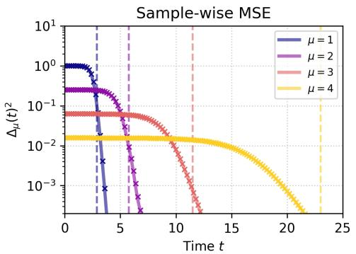

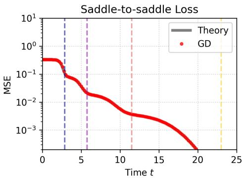

Figure 4: The experiment is under the setting of the sample-wise descent in Section 6. Solid lines represent the theory of Theorem 5 obtained by numerically solving Eq. (36), and markers represent the empirical results obtained by full batch GD. Vertical dashed lines mark the characteristic timescales $t _ { \mu } ^ { * } = \zeta _ { \mu } ^ { - 1 }$ ln $( 1 / \epsilon )$ according to (47). Left: Evolution of the per-sample loss $\Delta _ { \mu } ( t ) ^ { 2 } = ( \mathrm { T r } [ W W ^ { \top } A ( x _ { \mu } ) ] - y _ { \mu } ) ^ { 2 }$ , showing independent and sequential convergence. Right: The total empirical MSE loss over time, which exhibits m sequential plateaus. Each discrete drop in the total loss matches the respective timescale $t _ { \mu } ^ { * }$  
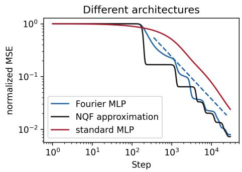

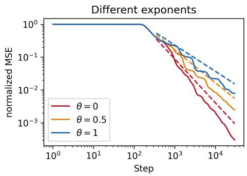  
Figure 5: Curves show the normalized MSE $\mathcal { L } ( t ) / \mathcal { L } ( 0 )$ ; dotted lines are the slopes predicted in Section 6. Left: For $\theta = 1 .$ , the Fourier MLP (blue) descends as the predicted power law $t ^ { - ( 2 \beta - 1 ) / ( \theta + \beta ) }$ (see Appendix C) and is tracked by its NQF approximation (black); a standard tanh MLP trained on the raw input x (red), which does not exhibit the power law. Right: The power-law exponent of the Fourier MLP (solid lines) matches the theory (dashed lines) for $\theta \in \{ 0 , 0 . 5 , 1 \}$

Read as a Landau construction, the calculation says something specific about universality in deep learning. The dictionary is worth setting down carefully, because two of its entries are not the ones a first reading suggests. The symmetry group is $S _ { d } ;$ the expansion is truncated at the lowest symmetry-allowed nonconstant order; and the architecture enters only through the coupling $A ( x )$ , in the same way that microscopic detail enters a Landau functional only through phenomenological coefficients. That much is the standard construction, and it is what makes universality across architectures the expected outcome.

The remaining two entries need more care. The first is the order parameter: $M = W W ^ { \top }$ . It is $S _ { d }$ -invariant by construction, and invariant as well under the larger redundancy $W \mapsto W O , O \in \mathrm { O } ( d )$ , that the quadratic form does not see; it therefore does not transform in a nontrivial representation of the symmetry group, as the order parameter of a textbook Landau construction does. What it shares with the Edwards–Anderson overlap of spin-glass theory, and with the overlaps $w _ { i } ^ { \top } w _ { j }$ that serve as the order parameters of online learning in committee machines [25, 63], is that it is an invariant which nonetheless vanishes in one phase and not in the other: $z _ { k } = 0$ is the unlearned state and $z _ { k } > 0$ the learned one. The symmetry broken at ignition is the freedom of $W$ itself, which the flow on M has quotiented out,

and M is the invariant that registers the breaking.

The second is the control parameter ϵ, which is not the small parameter of the expansion. The initialization scale ϵ does not decide whether a feature is learned, since every mode with $r _ { k } > 0$ will be learned at every $\epsilon > 0 ;$ ; what tunes the transition is r , or $r _ { k } - \gamma$ once weight decay is included, whose sign decides the stability of $z _ { k } = 0$ in the way that a reduced temperature decides the stability of the disordered state – a point we will explore in a future work. What ϵ controls instead is the sharpness of the crossover, and its natural counterpart is system size: the gaps between successive ignitions grow as $\ln ( 1 / \epsilon )$ while the transitions themselves do not, so ln(1/ϵ) plays the role of N, and $\epsilon \to 0$ is the analogue of the thermodynamic limit. Sudden learning is then the ignition of individual modes of M, and the $\epsilon \to 0$ limit is a genuine singular limit in which a smooth flow acquires sharp transitions; they are sharp for the same reason that a phase transition is sharp only in an infinite system.

Limitations. Being a minimal model of training, the model certainly has many limitations, which are worth stating plainly.

1. Small initialization. The NQF is the leading nonconstant term of a local expansion, and it is accurate only when the initialization scale is small compared with the feature length scale set by the data. Figure 2 shows the approximation failing at large initialization, which is the behavior the theory predicts for itself. Appendix B.6 partially relaxes this by treating the lazy and feature-learning regimes within the same framework.

2. Smoothness. Theorem 1 assumes three-times differentiability. Rectified activations at the origin, bias terms, normalization layers, and modules that apply a nonlinearity after aggregating their components each violate one of these and require additional treatment.

3. Other plateaus. Our experiments show plateaus that the NQF does not account for, which we attribute to cubic and higher terms. Extending to neural cubic and quartic forms (Appendix B.1) is the natural next step, as is a systematic treatment of multilayer NQFs, begun in Appendix B.4.

4. Power-law spectra are an assumption, not a prediction. Deriving A(x) from the architecture fixes the operator whose spectrum controls the scaling exponent. It does not, however, predict that the spectrum has a power-law tail. That tail is a hypothesis of the scaling theorem of Section 6, and our Fourier-feature experiment constructs it deliberately. Whether it arises generically, for realistic data and architectures, is the question that would have to be settled in future works.

5. Adaptive optimizers. The linear-update corollary of Appendix B.3 covers gradient descent, weight decay, and Polyak momentum, but not Adam, which is nonetheless tracked accurately by the NQF in our experiments (Fig ure 2).

Outlook. The correspondences to physics suggest that the technical machinery developed for interacting populations, hydrodynamic instabilities, and polymer flow can be brought to bear on learning dynamics, and conversely that trained networks provide an unusually well-instrumented laboratory for these classical models: every mode ampli tude is directly observable, the coupling matrix is known exactly, and the control parameter can be tuned over many decades. Whether the mapping survives beyond quadratic order, and whether the ecological picture of competition between features predicts anything about generalization rather than optimization, are the questions we regard as most worth pursuing.

## acknowledgments

We gratefully acknowledge the generous support of NTT Research, Inc. I.L.C. acknowledges support in part from the Institute for Artificial Intelligence and Fundamental Interactions (IAIFI) through NSF Grant No. PHY-2019786. This work was also supported by the Center for Brains, Minds and Machines (CBMM), funded by NSF STC award No. CCF-1231216.

## References

[1] Emmanuel Abbe, Enric Boix Adsera, and Theodor Misiakiewicz. Sgd learning on neural networks: Leap com-\` plexity and saddle-to-saddle dynamics. In Proceedings of the Thirty Sixth Conference on Learning Theory, volume 195 of Proceedings ofMachine Learning Research, pages 2552–2623. PMLR, 2023.

[2] Hisham Abou-Kandil, Gerhard Freiling, Vlad Ionescu, and Gerhard Jank. Matrix Riccati equations in control and systems theory. Birkhauser, 2012.¨

[3] Madhu S. Advani, Andrew M. Saxe, and Haim Sompolinsky. High-dimensional dynamics of generalization error in neural networks. Neural Networks, 132:428–446, 2020.

[4] Armen Aghajanyan, Sonal Gupta, and Luke Zettlemoyer. Intrinsic dimensionality explains the effectiveness of language model fine-tuning. In Proceedings of the 59th annual meeting of the association for computational linguistics and the 11th international joint conference on natural language processing (volume 1: long papers), pages 7319–7328, 2021.

[5] Sanjeev Arora, Nadav Cohen, Wei Hu, and Yuping Luo. Implicit regularization in deep matrix factorization. In Advances in Neural Information Processing Systems, volume 32, 2019.

[6] Davoud Ataee Tarzanagh, Yingcong Li, Xuechen Zhang, and Samet Oymak. Max-margin token selection in attention mechanism. Advances in neural information processing systems, 36:48314–48362, 2023.

[7] Yasaman Bahri, Ethan Dyer, Jared Kaplan, Jaehoon Lee, and Utkarsh Sharma. Explaining neural scaling laws. Proceedings of the National Academy of Sciences, 121(27):e2311878121, 2024.

[8] Yasaman Bahri, Jonathan Kadmon, Jeffrey Pennington, Sam S Schoenholz, Jascha Sohl-Dickstein, and Surya Ganguli. Statistical mechanics of deep learning. Annual Review of Condensed Matter Physics, 11:501–528, 2020.

[9] Adrien Bardes, Jean Ponce, and Yann LeCun. VICReg: Variance-invariance-covariance regularization for self supervised learning. In International Conference on Learning Representations, 2022.

[10] Daniel Beaglehole, Adityanarayanan Radhakrishnan, Parthe Pandit, and Mikhail Belkin. Mechanism of feature learning in convolutional neural networks. arXiv preprint arXiv:2309.00570, 2023.

[11] Gerard Ben Arous, Murat A. Erdogdu, Nuri Mert Vural, and Denny Wu. Learning quadratic neural networks´ in high dimensions: SGD dynamics and scaling laws. In Advances in Neural Information Processing Systems, volume 38, 2025.

[12] Raphael Berthier. Incremental learning in diagonal linear networks.¨ Journal of Machine Learning Research, 24(171):1–26, 2023.

[13] Fabrizio Boncoraglio, Vittorio Erba, Emanuele Troiani, Yizhou Xu, Florent Krzakala, and Lenka Zdeborova.´ Single-head attention in high dimensions: A theory of generalization, weights spectra, and scaling laws. In Proceedings ofthe 43rd International Conference on Machine Learning, 2026.

[14] Blake Bordelon, Alexander Atanasov, and Cengiz Pehlevan. A dynamical model of neural scaling laws. In Proceedings ofthe 41st International Conference on Machine Learning, volume 235 of PMLR, 2024.

[15] Blake Bordelon, Abdulkadir Canatar, and Cengiz Pehlevan. Spectrum dependent learning curves in kernel re gression and wide neural networks. In Proceedings ofthe 37th International Conference on Machine Learning, volume 119 of Proceedings ofMachine Learning Research, pages 1024–1034. PMLR, 2020.

[16] Guy Bunin. Ecological communities with Lotka–Volterra dynamics. Phys. Rev. E, 95:042414, 2017.

[17] Abdulkadir Canatar, Blake Bordelon, and Cengiz Pehlevan. Spectral bias and task-model alignment explain generalization in kernel regression and infinitely wide neural networks. Nature Communications, 12(2914), 2021.

[18] Emmanuel J. Candes, Xiaodong Li, and Mahdi Soltanolkotabi. Phase retrieval via wirtinger flow: Theory and\` algorithms. IEEE Transactions on Information Theory, 61(4):1985–2007, 2015.

[19] Yuan Cao and Quanquan Gu. Tight sample complexity of learning one-hidden-layer convolutional neural networks. Advances in Neural Information Processing Systems, 32, 2019.

[20] Giuseppe Carleo, Ignacio Cirac, Kyle Cranmer, Laurent Daudet, Maria Schuld, Naftali Tishby, Leslie Vogt Maranto, and Lenka Zdeborova. Machine learning and the physical sciences. ´ Rev. Mod. Phys., 91:045002, 2019.

[21] Paul M. Chaikin and Tom C. Lubensky. Principles of Condensed Matter Physics. Cambridge University Press, Cambridge, 1995.

[22] Lena ´ ¨ıc Chizat, Edouard Oyallon, and Francis Bach. On lazy training in differentiable programming. In Advances in Neural Information Processing Systems, volume 32, 2019.

[23] Leonardo Defilippis, Yizhou Xu, Julius Girardin, Vittorio Erba, Emanuele Troiani, Lenka Zdeborova, Bruno´ Loureiro, and Florent Krzakala. Scaling laws and spectra of shallow neural networks in the feature learning regime. In The Fourteenth International Conference on Learning Representations, 2026.

[24] Simon Du, Jason Lee, Yuandong Tian, Aarti Singh, and Barnabas Poczos. Gradient descent learns one-hidden layer cnn: Don’t be afraid of spurious local minima. In International Conference on Machine Learning, pages 1339–1348. PMLR, 2018.

[25] Andreas Engel and Christian Van den Broeck. Statistical Mechanics of Learning. Cambridge University Press, Cambridge, 2001.

[26] Vittorio Erba, Emanuele Troiani, Luca Biggio, Antoine Maillard, and Lenka Zdeborova. Bilinear sequence´ regression: A model for learning from long sequences of high-dimensional tokens. Physical Review X, 15(2):021092, 2025.

[27] Mathieu Even, Scott Pesme, Suriya Gunasekar, and Nicolas Flammarion. (S)GD over diagonal linear networks: Implicit bias, large stepsizes and edge of stability. In Advances in Neural Information Processing Systems, volume 36, 2023.

[28] Jonathan Frankle and Michael Carbin. The lottery ticket hypothesis: Finding sparse, trainable neural networks. In International Conference on Learning Representations, 2019.

[29] Kenji Fukumizu. A regularity condition of the information matrix of a multilayer perceptron network. Neural Networks, 9(5):871–879, 1996.

[30] Rong Ge, Jason D Lee, and Tengyu Ma. Matrix completion has no spurious local minimum. Advances in neural information processing systems, 29, 2016.

[31] Yoav Goldberg and Omer Levy. word2vec explained: Deriving mikolov et al.’s negative-sampling word embedding method, 2014.

[32] Nigel Goldenfeld. Lectures on Phase Transitions and the Renormalization Group. Addison-Wesley, Reading, MA, 1992.

[33] Suriya Gunasekar, Blake Woodworth, Srinadh Bhojanapalli, Behnam Neyshabur, and Nathan Srebro. Implicit regularization in matrix factorization. In Advances in Neural Information Processing Systems, volume 30, pages 6151–6159. Curran Associates, Inc., 2017.

[34] Guy Gur-Ari, Daniel A Roberts, and Ethan Dyer. Gradient descent happens in a tiny subspace. arXiv preprint arXiv:1812.04754, 2018.

[35] Josef Hofbauer and Karl Sigmund. Evolutionary games and population dynamics. Cambridge university press, 1998.

[36] Jordan Hoffmann, Sebastian Borgeaud, Arthur Mensch, Elena Buchatskaya, Trevor Cai, Eliza Rutherford, Diego de Las Casas, Lisa Anne Hendricks, Johannes Welbl, Aidan Clark, Tom Hennigan, Eric Noland, Katie Millican, George van den Driessche, Bogdan Damoc, Aurelia Guy, Simon Osindero, Karen Simonyan, Erich Elsen, Jack W. Rae, Oriol Vinyals, and Laurent Sifre. Training compute-optimal large language models. In Advances in Neural Information Processing Systems, volume 35, 2022.

[37] Minyoung Huh, Brian Cheung, Tongzhou Wang, and Phillip Isola. Position: The platonic representation hypoth esis. In Proceedings of the 41st International Conference on Machine Learning, volume 235 of Proceedings of Machine Learning Research, pages 20617–20642. PMLR, 2024.

[38] Arthur Jacot, Franck Gabriel, and Clement Hongler. Neural tangent kernel: Convergence and generalization in´ neural networks. In Advances in Neural Information Processing Systems, volume 31, 2018.

[39] Jared Kaplan, Sam McCandlish, Tom Henighan, Tom B Brown, Benjamin Chess, Rewon Child, Scott Gray, Alec Radford, Jeffrey Wu, and Dario Amodei. Scaling laws for neural language models. arXiv preprint arXiv:2001.08361, 2020.

[40] Prakhar Kaushik, Shravan Chaudhari, Ankit Vaidya, Rama Chellappa, and Alan Yuille. The universal weight subspace hypothesis, 2025.

[41] Yehuda Koren, Robert Bell, and Chris Volinsky. Matrix factorization techniques for recommender systems. Computer, 42(8):30–37, 2009.

[42] Alex Krizhevsky, Ilya Sutskever, and Geoffrey E Hinton. Imagenet classification with deep convolutional neural networks. Advances in neural information processing systems, 25, 2012.

[43] Daniel Kunin, Giovanni Luca Marchetti, Feng Chen, Dhruva Karkada, James Simon, Michael Deweese, Surya Ganguli, and Nina Miolane. Alternating gradient flows: A theory of feature learning in two-layer neural net works. Advances in Neural Information Processing Systems, 38:4377–4424, 2025.

[44] Lev Davidovich Landau and Evgenii Mikhailovich Lifshitz. Statistical Physics: Volume 5, volume 5. Elsevier, 2013.

[45] Chunyuan Li, Heerad Farkhoor, Rosanne Liu, and Jason Yosinski. Measuring the intrinsic dimension of objective landscapes. In International Conference on Learning Representations, 2018.

[46] Ziming Liu, Ouail Kitouni, Niklas S Nolte, Eric Michaud, Max Tegmark, and Mike Williams. Towards understanding grokking: An effective theory of representation learning. Advances in Neural Information Processing Systems, 35:34651–34663, 2022.

[47] Antoine Maillard, Bruno Loureiro, Florent Krzakala, and Lenka Zdeborova. Phase retrieval in high dimensions:´ Statistical and computational phase transitions. Advances in Neural Information Processing Systems, 33:11071– 11082, 2020.

[48] Antoine Maillard, Emanuele Troiani, Simon Martin, Lenka Zdeborova, and Florent Krzakala. Bayes-optimal´ learning of an extensive-width neural network from quadratically many samples. Advances in Neural Information Processing Systems, 37:82085–82132, 2024.

[49] Alexander Maloney, Daniel A. Roberts, and James Sully. A solvable model of neural scaling laws. arXiv preprint arXiv:2210.16859, 2022.

[50] Rodrigo Maulen Soto, Pierre Marion, and Claire Boyer. Attention-based clustering. Advances in Neural Information Processing Systems, 38:66455–66506, 2025.

[51] Robert M. May. Will a large complex system be stable? Nature, 238:413–414, 1972.

[52] Song Mei, Theodor Misiakiewicz, and Andrea Montanari. Mean-field theory of two-layers neural networks: dimension-free bounds and kernel limit. In Conference on learning theory, pages 2388–2464. PMLR, 2019.

[53] Alexandru Meterez, Pranav Ajit Nair, Depen Morwani, Cengiz Pehlevan, Sham Kakade, and Alex Damian. A defense of the quadratic model, 2026.

[54] Eric Michaud, Ziming Liu, Uzay Girit, and Max Tegmark. The quantization model of neural scaling. Advances in Neural Information Processing Systems, 36:28699–28722, 2023.

[55] Tomas Mikolov, Ilya Sutskever, Kai Chen, Greg S. Corrado, and Jeff Dean. Distributed representations of words and phrases and their compositionality. In Advances in Neural Information Processing Systems, volume 26, 2013.

[56] Yoonsoo Nam, Nayara Fonseca, Seok H Lee, Chris Mingard, and Ard A Louis. An exactly solvable model for emergence and scaling laws in the multitask sparse parity problem. Advances in Neural Information Processing Systems, 37:39632–39693, 2024.

[57] Huy Nguyen, Nhat Ho, and Alessandro Rinaldo. Sigmoid gating is more sample efficient than softmax gating in mixture of experts. Advances in Neural Information Processing Systems, 37:118357–118388, 2024.

[58] Xu Pan, Aaron Philip, Ziqian Xie, and Odelia Schwartz. Dissecting query-key interaction in vision transformers. In Advances in Neural Information Processing Systems, volume 37, 2024.

[59] Scott Pesme, Loucas Pillaud-Vivien, and Nicolas Flammarion. Implicit bias of sgd for diagonal linear networks: a provable benefit of stochasticity. Advances in Neural Information Processing Systems, 34:29218–29230, 2021.

[60] Stephen B. Pope. Turbulent Flows. Cambridge University Press, Cambridge, 2000.

[61] Adityanarayanan Radhakrishnan, Daniel Beaglehole, Parthe Pandit, and Mikhail Belkin. Mechanism for feature learning in neural networks and backpropagation-free machine learning models. Science, 383(6690):1461–1467, 2024.

[62] Andrew M. Saxe, James L. McClelland, and Surya Ganguli. Exact solutions to the nonlinear dynamics of learning in deep linear neural networks. In International Conference on Learning Representations, 2014.

[63] H. S. Seung, H. Sompolinsky, and N. Tishby. Statistical mechanics of learning from examples. Phys. Rev. A, 45:6056–6091, 1992.

[64] Noam Shazeer, Azalia Mirhoseini, Krzysztof Maziarz, Andy Davis, Quoc V. Le, Geoffrey E. Hinton, and Jeff Dean. Outrageously large neural networks: The sparsely-gated mixture-of-experts layer. In International Conference on Learning Representations, 2017.

[65] Nathan Srebro, Jason Rennie, and Tommi Jaakkola. Maximum-margin matrix factorization. Advances in neural information processing systems, 17, 2004.

[66] Dominik Stoger and Mahdi Soltanolkotabi. Small random initialization is akin to spectral learning: Optimiza-¨ tion and generalization guarantees for overparameterized low-rank matrix reconstruction. Advances in Neural Information Processing Systems, 34:23831–23843, 2021.

[67] Ashish Vaswani, Noam Shazeer, Niki Parmar, Jakob Uszkoreit, Llion Jones, Aidan N Gomez, Łukasz Kaiser, and Illia Polosukhin. Attention is all you need. Advances in neural information processing systems, 30, 2017.

[68] Julius Von Kugelgen, Yash Sharma, Luigi Gresele, Wieland Brendel, Bernhard Sch¨ olkopf, Michel Besserve,¨ and Francesco Locatello. Self-supervised learning with data augmentations provably isolates content from style. Advances in neural information processing systems, 34:16451–16467, 2021.

[69] Hong-Yi Wang, Di Luo, Tomaso Poggio, Isaac L Chuang, and Liu Ziyin. A universal compression theory for lottery ticket hypothesis and neural scaling laws. In The Fourteenth International Conference on Learning Representations, 2026.

[70] Zixuan Wang, Eshaan Nichani, Alberto Bietti, Alex Damian, Daniel Hsu, Jason D. Lee, and Denny Wu. Learning compositional functions with transformers from easy-to-hard data. In Proceedings of Thirty Eighth Conference on Learning Theory, volume 291 of Proceedings of Machine Learning Research, pages 5632–5711. PMLR, 2025.

[71] Tailin Wu, Ian Fischer, Isaac L. Chuang, and Max Tegmark. Learnability for the information bottleneck. Entropy, 21(10):924, 2019.

[72] Yizhou Xu, Antoine Maillard, Lenka Zdeborova, and Florent Krzakala. Fundamental limits of matrix sensing:´ Exact asymptotics, universality, and applications. In Proceedings of Thirty Eighth Conference on Learning Theory, volume 291 of Proceedings ofMachine Learning Research, pages 5757–5823. PMLR, 2025.

[73] Yizhou Xu and Liu Ziyin. Three mechanisms of feature learning in a linear network. In International Conference on Learning Representations, 2025.

[74] Lenka Zdeborova and Florent Krzakala. Statistical physics of inference: Thresholds and algorithms.´ Advances in Physics, 65(5):453–552, 2016.

[75] Yedi Zhang, Andrew Saxe, and Peter E. Latham. Saddle-to-saddle dynamics explains a simplicity bias across neural network architectures. In The Fourteenth International Conference on Learning Representations, 2026.

[76] Libin Zhu, Chaoyue Liu, Adityanarayanan Radhakrishnan, and Mikhail Belkin. Quadratic models for under standing catapult dynamics of neural networks. In International Conference on Learning Representations, 2024

[77] Liu Ziyin. Symmetry induces structure and constraint of learning. In Forty-first International Conference on Machine Learning, 2024.

[78] Liu Ziyin, Ekdeep Singh Lubana, Masahito Ueda, and Hidenori Tanaka. What shapes the loss landscape of self-supervised learning? In International Conference on Learning Representations, 2023.

[79] Liu Ziyin, Mingze Wang, Hongchao Li, and Lei Wu. Parameter symmetry and noise equilibrium of stochastic gradient descent. In The Thirty-eighth Annual Conference on Neural Information Processing Systems, 2024.

[80] Liu Ziyin, Yizhou Xu, Tomaso Poggio, and Isaac Chuang. Parameter symmetry potentially unifies deep learning theory, 2025.

## Contents

Introduction   
Neural Quadratic Forms 3   
3 NQF for Different Architectures 4   
Learning Dynamics of the NQF 7   
Exactly Solvable Cases of Learning Dynamics 8   
Sudden Learning and Neural Scaling Laws 10   
Experiments 11   
8 Related Works 13   
9 Discussion 13   
A Theory 21   
A.1 List of Notations 21   
A.2 List of NQF Examples 23   
A.3 Proof of Theorem 1 . 23   
A.4 Proof of Proposition 1 24   
A.5 Proof of Proposition 2 25   
A.6 Proof of Proposition 3 26   
A.7 Proof of Proposition 4 26   
A.8 Proof of Proposition 5 27   
A.9 Proof of Proposition 6 27   
A.10 Proof of Theorem 2 28   
A.11 Proof of Theorem 3 28   
A.12 Proof of Proposition 7 30   
A.13 Proof of Theorem 4 . 30   
A.14 Proof of Theorem 5 31   
A.15 Proof of Theorem 6 32   
A.16 Proof of Theorem 7 33   
A.17 Formal Statements of Section 6 34   
B Additional Theory 39   
B.1 Removing ZGZ Condition 39   
B.2 Multidimensional Output 41   
B.3 Learning Dynamics of Other Optimization Methods 41   
B.4 Learning Dynamics of Multi-layer NQF 42   
B.5 Compression Error 44   
B.6 NTK and Feature Learning 45   
B.7 A general exact solution 46   
C Experimental Details and Additional Experiments 49

## A Theory

## A.1 List of Notations

Table 2 lists all notations used throughout the paper.

Table 2: Notation used throughout the paper. “Defined” gives the section or equation in which the symbol is introduced.
<table><tr><td>Symbol</td><td>Meaning</td><td>Space</td><td>Defined</td></tr><tr><td colspan="4">Architecture and the normal form</td></tr><tr><td> $d$ </td><td>width: number of exchangeable components</td><td>N</td><td>Section 2</td></tr><tr><td> $p$ </td><td>parameter dimension of one component</td><td>N</td><td>Section 2</td></tr><tr><td> $w _ { i }$ </td><td>the i-th component (“neuron&quot;)</td><td> $\mathbb { R } ^ { p }$ </td><td>Section 2</td></tr><tr><td> $W$ </td><td>all components,  $W = \left( w _ { 1 } , \ldots , w _ { d } \right)$ </td><td> $\mathbb { R } ^ { p \times d }$ </td><td>Section 2</td></tr><tr><td> $f _ { x } ( W )$ </td><td>module output on input x</td><td>R</td><td>Section 2</td></tr><tr><td> $S _ { d }$ </td><td>symmetric group acting on the d components</td><td></td><td>Definition 1</td></tr><tr><td> $A ( x )$ </td><td>structure matrix</td><td> $\mathbb { R } ^ { p \times p }$  sym.</td><td>Eq. (2)</td></tr><tr><td> $B ( x ) , g ( x )$ </td><td>extra couplings when ZGZ is dropped</td><td> $\mathbb { R } ^ { p \times p } , \mathbb { R } ^ { p }$ </td><td>Eq. (20)</td></tr><tr><td> $C ( x )$ </td><td>off-diagonal block of A in a feedforward module</td><td> $\mathbb { R } ^ { d _ { 1 } \times d _ { 2 } }$ </td><td>Section 3</td></tr><tr><td>€</td><td>initialization scale (small parameter of the expansion)</td><td> $\mathbb { R } _ { > 0 }$ </td><td>Section 6</td></tr><tr><td colspan="4">Order parameters and dynamics</td></tr><tr><td> $M$ </td><td>order parameter  $W W ^ { \top }$  , positive semidefinite</td><td> $\mathbb { R } ^ { p \times p }$ </td><td>Eq. (28)</td></tr><tr><td> $\mu$ </td><td>first-moment order parameter  $\Sigma _ { i } w _ { i }$ </td><td> $\mathbb { R } ^ { p }$ </td><td>Section 4</td></tr><tr><td> $H$ </td><td>residual-weighted structure operator  $\begin{array} { r } { \frac { 4 } { m } \sum _ { \mu } \Delta _ { \mu } A ( x _ { \mu } ) } \end{array}$ </td><td> $\mathbb { R } ^ { p \times p }$ </td><td>Eq. (27)</td></tr><tr><td> $\eta$ </td><td>learning rate</td><td> $\mathbb { R } _ { > 0 }$ </td><td>Thm. 2</td></tr><tr><td> $\gamma$ </td><td>weight-decay strength</td><td> $\mathbb { R } _ { \geq 0 }$ </td><td>Section 4</td></tr><tr><td> $k _ { \nu }$ </td><td>dimension of the joint data subspace</td><td>N</td><td>Thm. 3</td></tr><tr><td> $K ( x , x ^ { \prime } )$ </td><td>empirical neural tangent kernel</td><td>R</td><td>App. B.6</td></tr><tr><td colspan="4">Data and spectra</td></tr><tr><td> $m$ </td><td>number of training samples</td><td>N</td><td>Section 5</td></tr><tr><td> $x _ { \mu } , y _ { \mu }$ </td><td>µ-th input and target</td><td></td><td>Section 5</td></tr><tr><td> $\Delta _ { \mu }$ </td><td>residual Tr[  $\ { \mathrm { \Delta } } M A ( x _ { \mu } ) ] - y _ { \mu }$ </td><td> $\mathbb { R }$ </td><td>Section 5</td></tr><tr><td> $\mathcal { L }$ </td><td>sample-averaged MSE loss</td><td> $\mathbb { R } _ { \geq 0 }$ </td><td>Section 5</td></tr><tr><td> $\tilde { \mathcal { L } }$ </td><td>unnormalized squared error  $\Sigma _ { \mu } \Delta _ { \mu } ^ { 2 }$ </td><td> $\mathbb { R } _ { \geq 0 }$ </td><td>Section 6</td></tr><tr><td> $\mathcal { E }$ </td><td>excess loss  $\mathcal { L } ( t ) - \mathcal { L } ( \infty )$ </td><td> $\mathbb { R } _ { \geq 0 }$ </td><td>Section 6</td></tr><tr><td> $P , \Lambda _ { \mu }$ </td><td>common eigenbasis and eigenvalue matrix of  $A ( x _ { \mu } )$ </td><td> $\mathbb { R } ^ { p \times p }$ </td><td>Asm. 1</td></tr><tr><td> $\lambda _ { \mu , k }$ </td><td>k-th eigenvalue of  $A ( x _ { \mu } )$ </td><td>R</td><td>Asm. 1</td></tr><tr><td> $z _ { k }$ </td><td>k-th feature, the k-th eigenvalue of M</td><td></td><td>Section 5</td></tr><tr><td> $r _ { k }$ </td><td>growth rate of feature k</td><td> $\mathbb { R } _ { \geq 0 }$   $\mathbb { R }$ </td><td>Eq. (37)</td></tr><tr><td> $C _ { k j }$ </td><td>feature interaction matrix</td><td> $\mathbb { R } ^ { p \times p }$ </td><td>Eq. (37)</td></tr><tr><td> $Y , \gamma _ { k }$ </td><td></td><td></td><td></td></tr><tr><td> $c$ </td><td> $\begin{array} { r } { \frac { 4 } { m } \sum _ { \mu } y _ { \mu } A ( x _ { \mu } ) } \end{array}$  and its k-th eigenvalue isotropy constant of the data second moment</td><td> $\mathbb { R } ^ { p \times p } , \mathbb { R }$   $\mathbb { R } _ { > 0 }$ </td><td>Thm. 7 Asm. 2</td></tr><tr><td colspan="2">Sudden learning and scaling laws</td><td></td><td></td></tr><tr><td> $\zeta _ { k }$ </td><td>effective growth rate  $( r _ { k } , \mathrm { o r } \ \gamma _ { k }$  if isotropic)</td><td> $\mathbb { R } _ { > 0 }$ </td><td>Section 6</td></tr><tr><td> $a$ </td><td>1 under Thm. 6, 2 under Thm. 7</td><td> $\{ 1 , 2 \}$ </td><td>Eq. (43)</td></tr><tr><td> $V _ { k }$ </td><td>effective target strength of feature k</td><td> $\mathbb { R } _ { \geq 0 }$ </td><td>Section 6</td></tr><tr><td> $t _ { k } ^ { * }$ </td><td>ignition time of feature k</td><td> $\mathbb { R } _ { > 0 }$ </td><td>Eq. (43)</td></tr><tr><td> $\tau$ </td><td>rescaled time  $t / \ln ( 1 / \epsilon )$ </td><td> $\mathbb { R } _ { > 0 }$ </td><td>Section 6</td></tr><tr><td> $\alpha _ { 1 } , \alpha _ { 2 }$ </td><td>decay exponents of  $V _ { k }$  and  $\zeta _ { k }$ </td><td> $\mathbb { R } _ { > 0 }$ </td><td>Section 6</td></tr><tr><td> $\gamma _ { 1 } , \gamma _ { 2 }$ </td><td>decay exponents of  $y _ { \mu }$  and  $\zeta _ { \mu }$ </td><td> $\mathbb { R } _ { > 0 }$ </td><td>Section 6</td></tr><tr><td> $\beta _ { 0 }$ </td><td>decay exponent of the initialization profile</td><td>R</td><td>App. A.17</td></tr><tr><td> $\beta$ </td><td>decay exponent of the target coefficients  $b _ { k }$ </td><td>R</td><td>Section 7</td></tr><tr><td> $\theta$ </td><td>spectral exponent of the Fourier features</td><td>R</td><td>Section 7</td></tr><tr><td> $\alpha _ { \mathrm { e f f } }$ </td><td>effective exponent at finite €</td><td>R</td><td> $\mathsf { A p p . C }$ </td></tr></table>

Table 3: Complete list of models that are special cases of the neural quadratic form, together with their structure matrices $A ( x )$ A six-row excerpt appears as Table 1 in the main text. Two conventions vary across the rows. The neurons are the columns of W in most entries, so that $M = W W ^ { \top }$ ; in the tied query–key and linear SSL rows they are the rows of $W .$ , so that $M = W ^ { \top } W$

## Model

NQF notation

Structure matrix $A ( x )$

PSD matrix sensing / PSD factorization

$$
\overline { { \hat { y } _ { a } = \left. S _ { a } , W W ^ { \top } \right. } }
$$

$$
A _ { a } = \operatorname { S y m } ( S _ { a } ) ; { \mathrm { i f ~ } } S _ { a } = S _ { a } ^ { \top } , A _ { a } = S _ { a } .\tag{[66, 33, 72]}
$$

Rectangular matrix sensing / matrix factorization

$$
\hat { y } _ { a } = \left. S _ { a } , U V ^ { \top } \right. = \operatorname { T r } ( U ^ { \top } S _ { a } V )
$$

$$
\begin{array} { r } { A _ { a } = \frac { 1 } { 2 } \left[ \begin{array} { l l } { 0 } & { \ S _ { a } } \\ { S _ { a } ^ { \top } } & { \ 0 } \end{array} \right] } \end{array}\tag{[33, 5, 72]}
$$

Matrix completion / recommender entry

$$
\hat { R } _ { i j } = u _ { i } ^ { \top } v _ { j }
$$

$$
\begin{array} { r } { A _ { i j } = \frac { 1 } { 2 } \left[ \begin{array} { l l } { 0 } & { \ : e _ { i } e _ { j } ^ { \top } } \\ { e _ { j } e _ { i } ^ { \top } } & { \ : \ : 0 } \end{array} \right] } \end{array}\tag{[41, 30]}
$$

Word-context embedding score

$$
s _ { w c } = u _ { w } ^ { \top } v _ { c }
$$

$$
\begin{array} { r } { A w c = \frac { 1 } { 2 } \left[ \begin{array} { c c } { 0 } & { e w e _ { c } ^ { \top } } \\ { e _ { c } e _ { w } ^ { \top } } & { 0 } \end{array} \right] } \end{array}\tag{[55, 31]}
$$

Quadratic network Phase retrieval

$$
\begin{array} { r } { f _ { W } ( x ) = \sum _ { r } ( w _ { r } ^ { \top } x ) ^ { 2 } } \end{array}
$$

$$
A _ { x } = x x ^ { \top }
$$

$$
\hat { y } _ { a } = a ^ { \top } W W ^ { \top } a\tag{[61, 76, 23]}
$$

$$
A _ { a } = a a ^ { \top }\tag{[18, 47]}
$$

Diagonal linear network, square parametrization

$$
\begin{array} { r } { f _ { x } ( u ) = \sum _ { k } x _ { k } u _ { k } ^ { 2 } / 4 } \end{array}
$$

$$
A _ { x } = \textstyle { \frac { 1 } { 4 } } \operatorname { D i a g } ( x )\tag{[12, 59]}
$$

Diagonal linear network, two-factor signed form

$$
f _ { x } ( u , v ) = u ^ { \top } \mathrm { D i a g } ( x ) v
$$

$$
A _ { x } = { \textstyle \frac { 1 } { 2 } } \left[ \begin{array} { c c } { 0 } & { \operatorname { D i a g } ( x ) } \\ { \operatorname { D i a g } ( x ) } & { 0 } \end{array} \right]\tag{[27, 59]}
$$

Two-layer MLP

$$
\begin{array} { r } { f _ { x } ( W ) = \sum _ { i = 1 } ^ { d } v _ { i } \phi ( u _ { i } ^ { \top } x ) } \end{array}
$$

$$
\begin{array} { r } { A ( x ) = \frac { \phi ^ { \prime } ( 0 ) } { 2 } \left[ \begin{array} { l l } { 0 _ { k \times k } } & { x } \\ { x ^ { \top } } & { 0 } \end{array} \right] } \end{array}\tag{[29, 61]}
$$

Single-layer CNN

$$
\begin{array} { r l } & { f _ { x } ( W ) = } \\ & { \sum _ { i = 1 } ^ { d } v _ { i } \sum _ { p = 1 } ^ { P } \phi ( k _ { i } ^ { \top } x _ { p } ) } \end{array}
$$

$$
\begin{array} { r l } { A ( X ) = \frac { \phi ^ { \prime } ( 0 ) } { 2 } \left[ \begin{array} { c c } { 0 _ { m \times m } } & { \sum _ { p = 1 } ^ { P } x _ { p } } \\ { \sum _ { p = 1 } ^ { P } x _ { p } ^ { \top } } & { 0 } \end{array} \right] } \end{array}\tag{[42, 24, 19]}
$$

Mixture of Experts (MoE)

$$
\begin{array} { r l } { } & { { } \dot { \sum _ { i = 1 } ^ { d } \dot { \psi } } ( r _ { i } ^ { \top } x ) E ( x ; \Theta _ { i } ) } \end{array}
$$

$$
\begin{array} { r } { A ( x ) = \frac { \psi ^ { \prime } ( 0 ) } { 2 } \left[ \begin{array} { c c } { 0 } & { x G ( x ) ^ { \top } } \\ { G ( x ) x ^ { \top } } & { 0 } \end{array} \right] , \mathrm { w i t h } } \end{array}\tag{[64, 57]}
$$

$$
G ( x ) : = \nabla { \Theta _ { i } } E ( x ; 0 )
$$

Multi-head attention (MHA)

$$
\begin{array} { r } { f _ { x } ( W ) = \sum _ { i = 1 } ^ { d } v _ { i } ^ { \top } W _ { i } ^ { V } X \dots . } \end{array}
$$

$$
\begin{array} { r } { A ( X ) = \frac { 1 } { 2 } \left[ \begin{array} { c c c c } { 0 } & { 0 } & { 0 } & { 0 } \\ { 0 } & { 0 } & { 0 } & { 0 } \\ { 0 } & { 0 } & { 0 } & { x _ { \mathrm { a v g } } \otimes I _ { d _ { v } } } \\ { 0 } & { 0 } & { x _ { \mathrm { a v g } } ^ { \top } \otimes I _ { d _ { v } } } & { 0 } \end{array} \right] } \end{array}\tag{[67]}
$$

Query-key-only attention

$$
\begin{array} { r } { f _ { x } = \sum _ { i = 1 } ^ { d } c ^ { \top } X \cdot \operatorname { s o f t m a x } ( . ~ . ~ . ) } \end{array}
$$

$$
\begin{array} { r l } { A ( X ) = \frac { 1 } { 2 \sqrt { d _ { k } } } \left[ \begin{array} { c c } { 0 } & { x u ^ { \top } \otimes I _ { d _ { k } } } \\ { u x ^ { \top } \otimes I _ { d _ { k } } } & { 0 } \end{array} \right] , } \end{array}\tag{[6, 58, 50]}
$$

Tied query-key attention

$$
\begin{array} { r } { \frac { 1 } { \sqrt { d _ { k } } } u ^ { \top } W ^ { \top } W x } \end{array}
$$

$$
{ \mathrm { w h e r e ~ } } u = \Sigma _ { X } c .
$$

$$
\begin{array} { r } { A _ { x , X , c } ^ { \mathrm { t i e d } } = \frac { 1 } { 2 \sqrt { d _ { k } } } \big ( x u ^ { \intercal } + u x ^ { \intercal } \big ) } \end{array}\tag{[58, 13]}
$$

Bilinear sequence regression

$$
x _ { s } ^ { \top } B x _ { t } , \mathrm { w i t h } B = U V ^ { \top }
$$

$$
\begin{array} { r } { A _ { s , t } = \frac { 1 } { 2 } \left[ \begin{array} { c c } { 0 } & { x _ { s } x _ { t } ^ { \top } } \\ { x _ { t } x _ { s } ^ { \top } } & { 0 } \end{array} \right] } \end{array}\tag{[65, 33, 26]}
$$

Linear SSL augmentation

$$
\| W \Delta \| ^ { 2 } = \operatorname { T r } ( W ^ { \top } W \Delta \Delta ^ { \top } )
$$

$$
A _ { \Delta } = \Delta \Delta ^ { \top } , \mathrm { w i t h } \Delta = x - \chi\tag{[68, 9, 78]}
$$

## A.2 List of NQF Examples

Table 3 gives the full list of models that reduce to the neural quadratic form, extending Table 1.

## A.3 Proof of Theorem 1

Because $f _ { x }$ is three times continuously differentiable, we can write its multi-variable Taylor expansion around the origin $W = ( 0 , \ldots , 0 )$

$$
f _ { x } ( W ) = f _ { x } ( 0 ) + \sum _ { i = 1 } ^ { d } ( \nabla _ { w _ { i } } f _ { x } ( 0 ) ) ^ { \top } w _ { i } + \frac { 1 } { 2 } \sum _ { i = 1 } ^ { d } \sum _ { j = 1 } ^ { d } w _ { i } ^ { \top } H _ { i j } w _ { j } + O ( \| W \| ^ { 3 } ) ,\tag{51}
$$

where $\begin{array} { r } { H _ { i j } = \left. \frac { \partial ^ { 2 } f _ { x } } { \partial w _ { i } \partial w _ { j } } \right| _ { W = 0 } \in \mathbb { R } ^ { p \times p } } \end{array}$ represents the blocks of the Hessian matrix.

By the ZGZ condition, we know that

$$
\nabla _ { w _ { i } } f _ { x } ( 0 ) = 0 \quad { \mathrm { f o r ~ a l l } } i .\tag{52}
$$

Thus, the first-order term $\Sigma ( \nabla w _ { i } f _ { x } ( 0 ) ) ^ { \top } w _ { i }$ vanishes.

Consider the off-diagonal Hessian blocks $H _ { i j }$ where $i \neq j$ . By definition:

$$
H _ { i j } = \frac { \partial } { \partial w _ { j } } \left( \nabla _ { w _ { i } } f _ { x } ( W ) \right) \bigg | _ { W = 0 } .\tag{53}
$$

By the assumption that $\nabla _ { w _ { i } } f _ { x } = 0$ as long as $w _ { i } = 0$ irrespective of $w _ { j }$ , taking the derivative with respect to $w _ { j }$ yields

$$
H _ { i j } = 0 \quad { \mathrm { f o r ~ a l l ~ } } i \neq j .\tag{54}
$$

The cross-terms in the second-order expansion are eliminated.

We are now left with only the diagonal terms of the second-order expansion:

$$
f _ { x } ( W ) = f _ { x } ( 0 ) + \frac { 1 } { 2 } \sum _ { i = 1 } ^ { d } w _ { i } ^ { \top } H _ { i i } w _ { i } + O ( \| W \| ^ { 3 } )\tag{55}
$$

By the Permutation Symmetry condition, all neurons are interchangeable. This implies that the curvature of the function with respect to any single neuron $i ,$ evaluated at the symmetric origin $W \ = \ 0 ,$ , must be identical for all neurons. Therefore:

$$
H _ { 1 1 } = H _ { 2 2 } = \cdot \cdot \cdot = H _ { d d } .\tag{56}
$$

Let us define a new matrix $\begin{array} { r } { A ( x ) = \frac { 1 } { 2 } H _ { i i } } \end{array}$ . Substituting this into our expansion yields:

$$
f _ { x } ( W ) = f _ { x } ( 0 ) + \sum _ { i = 1 } ^ { d } w _ { i } ^ { \top } A ( x ) w _ { i } + O ( \| W \| ^ { 3 } ) = f _ { x } ( 0 ) + \sum _ { i = 1 } ^ { d } { \mathrm { T r } } [ w _ { i } w _ { i } ^ { \top } A ( x ) ] + O ( \| W \| ^ { 3 } ) .\tag{57}
$$

This finishes the proof.

## A.4 Proof of Proposition 1

We verify Theorem 1’s prerequisites sequentially.

1. Smoothness: Since the activation function $\phi \in C ^ { 3 } , f _ { x }$ is at least three times continuously differentiable.

2. Permutation Symmetry: Let σ be an arbitrary permutation of the indices $\{ 1 , \ldots , d \}$

$$
f _ { x } \big ( w _ { \sigma ( 1 ) } , \dots , w _ { \sigma ( d ) } \big ) = \sum _ { i = 1 } ^ { d } v _ { \sigma ( i ) } \phi \big ( { u } _ { \sigma ( i ) } ^ { \top } x \big ) = \sum _ { i = 1 } ^ { d } v _ { i } \phi \big ( { u } _ { i } ^ { \top } x \big ) = f _ { x } \big ( w _ { 1 } , \dots , w _ { d } \big ) .\tag{58}
$$

3. ZGZ: The gradient with respect to the combined neuron parameter $w _ { i }$ consists of

$$
\begin{array} { r } { \nabla _ { u _ { i } } f _ { x } = v _ { i } \phi ^ { \prime } ( u _ { i } ^ { \top } x ) x , \nabla _ { v _ { i } } f _ { x } = \phi ( u _ { i } ^ { \top } x ) . } \end{array}\tag{59}
$$

Setting $u _ { i } = w _ { i } = 0$ gives

$$
\left. \nabla _ { u _ { i } } f _ { x } \right| _ { u _ { i } = 0 , v _ { i } = 0 } = 0 \cdot \phi ^ { \prime } ( 0 ) x = 0 , \left. \nabla _ { v _ { i } } f _ { x } \right| _ { u _ { i } = 0 , v _ { i } = 0 } = \phi ( 0 ) = 0 .\tag{60}
$$

Therefore, the two-layer MLP satisfies all assumptions in Theorem 1.

Finally let us compute $A ( x ) ~ = ~ { \textstyle { \frac { 1 } { 2 } } } H _ { i i }$ , where $\boldsymbol { H } _ { i i } = \left. \nabla _ { w _ { i } } ^ { 2 } f _ { x } \right| _ { w _ { i } = 0 }$ is the Hessian matrix with respect to the i-th neuron’s parameters $\boldsymbol { w } _ { i } = [ u _ { i } ^ { \top } , v _ { i } ] ^ { \top }$ . The Hessian $H _ { i i }$ can be written as:

$$
H _ { i i } = \left[ \begin{array} { c c } { \nabla _ { u _ { i } } ^ { 2 } f _ { x } } & { \nabla _ { u _ { i } } \nabla _ { v _ { i } } f _ { x } } \\ { \nabla _ { v _ { i } } \nabla _ { u _ { i } } f _ { x } } & { \nabla _ { v _ { i } } ^ { 2 } f _ { x } } \end{array} \right] \bigg \vert _ { u _ { i } = 0 , v _ { i } = 0 } .\tag{61}
$$

Top-left block $( \nabla _ { u _ { i } } ^ { 2 } f _ { x } ) \colon$

$$
\nabla _ { u _ { i } } \big ( \nabla _ { u _ { i } } f _ { x } \big ) = \nabla _ { u _ { i } } \big ( v _ { i } \phi ^ { \prime } \big ( u _ { i } ^ { \intercal } x \big ) x \big ) = v _ { i } \phi ^ { \prime \prime } \big ( u _ { i } ^ { \intercal } x \big ) x x ^ { \intercal }\tag{62}
$$

Evaluating at $w _ { i } = 0$ (which sets $v _ { i } = 0 )$ , this term vanishes: $\left. \nabla _ { u _ { i } } ^ { 2 } f _ { x } \right| _ { 0 } = 0 _ { k \times k }$

Bottom-right block $( \nabla _ { v _ { i } } ^ { 2 } f _ { x } ) { : }$

$$
\nabla _ { v _ { i } } \big ( \nabla _ { v _ { i } } f _ { x } \big ) = \nabla _ { v _ { i } } \big ( \phi ( u _ { i } ^ { \top } x ) \big ) = 0\tag{63}
$$

Off-diagonal blocks $( \nabla _ { v _ { i } } \nabla _ { u _ { i } } f _ { x } )$ : Taking the derivative of $\nabla _ { u _ { i } } f _ { x }$ with respect to $v _ { i } { : }$

$$
\nabla _ { v _ { i } } \big ( v _ { i } \phi ^ { \prime } ( u _ { i } ^ { \top } x ) x \big ) = \phi ^ { \prime } \big ( u _ { i } ^ { \top } x \big ) x\tag{64}
$$

Evaluating at $w _ { i } = 0$ (which sets $u _ { i } = 0 )$ , we obtain $\phi ^ { \prime } ( 0 ) x$ . By the symmetry of second derivatives, the top-right block is its transpose $\phi ^ { \prime } ( 0 ) x ^ { \intercal }$

Assembling the blocks yields the Hessian evaluated at the origin:

$$
H _ { i i } = \left[ \begin{array} { c c } { 0 _ { k \times k } } & { \phi ^ { \prime } ( 0 ) x } \\ { \phi ^ { \prime } ( 0 ) x ^ { \top } } & { 0 } \end{array} \right] ,\tag{65}
$$

which finishes the proof.

## A.5 Proof of Proposition 2

1. Smoothness: The softmax function is infinitely differentiable everywhere in its domain. Thus, $f _ { x }$ is $C ^ { \infty }$

2. Permutation Symmetry: Let σ be an arbitrary permutation of the head indices $\{ 1 , \ldots , d \}$

$$
f _ { x } ( w _ { \sigma ( 1 ) } , \dots , w _ { \sigma ( d ) } ) = \sum _ { i = 1 } ^ { d } { \mathrm { H e a d } } _ { \sigma ( i ) } ( x , X ) = \sum _ { i = 1 } ^ { d } { \mathrm { H e a d } } _ { i } ( x , X ) = f _ { x } ( w _ { 1 } , \dots , w _ { d } )\tag{66}
$$

3. ZGZ: Let $A _ { i } \in \mathbb { R } ^ { N }$ denote the softmax attention weights. Evaluating the gradients at $w _ { i } = 0$ implies $v _ { i } = 0$ ${ W } _ { i } ^ { V } = 0 , { W } _ { i } ^ { Q } = 0$ , and $W _ { i } ^ { K } = 0$

$$
\left. \nabla _ { v _ { i } } f _ { x } \right| _ { w _ { i } = 0 } = \left. W _ { i } ^ { V } X A _ { i } \right| _ { W _ { i } ^ { V } = 0 } = 0\tag{67}
$$

$$
\nabla _ { W _ { i } ^ { V } } \left. f _ { x } \right| _ { w _ { i } = 0 } = v _ { i } A _ { i } ^ { \top } X ^ { \top } \big | _ { v _ { i } = 0 } = 0\tag{68}
$$

For the query and key matrices, the gradients involve the derivative of the softmax function, which we denote as a Jacobian matrix $J _ { A _ { i } }$ . By the chain rule:

$$
\nabla _ { W _ { i } ^ { Q } } f _ { x } = \left( \ldots J _ { A _ { i } } \ldots \right) \times ( v _ { i } ^ { \top } W _ { i } ^ { V } X ) , \nabla _ { W _ { i } ^ { K } } f _ { x } = \left( \ldots J _ { A _ { i } } \ldots \right) \times ( v _ { i } ^ { \top } W _ { i } ^ { V } X ) .\tag{69}
$$

Because evaluating at $v _ { i } \ = \ W _ { i } ^ { V } \ = \ 0 , \ ( v _ { i } ^ { \top } W _ { i } ^ { V } X )$ becomes zero. Consequently, regardless of the Jacobian of the softmax, the overall gradients for the query and key matrices vanish:

$$
\left. \nabla _ { W _ { i } ^ { Q } } f _ { x } \right| _ { w _ { i } = 0 } = 0 , \quad \left. \nabla _ { W _ { i } ^ { K } } f _ { x } \right| _ { w _ { i } = 0 } = 0\tag{70}
$$

We conclude that $\nabla _ { w _ { i } } f _ { x } | _ { w _ { i } = 0 } = 0 .$ . All assumptions in Theorem 1 are satisfied.

Finally let us compute $\begin{array} { r } { A ( X ) = \frac { 1 } { 2 } H _ { i i } } \end{array}$ , where $\boldsymbol { H } _ { i i } = \nabla _ { w _ { i } } ^ { 2 } f _ { x } \big | _ { w _ { i } = 0 } .$ . The output of the i-th head is:

$$
h _ { i } \big ( w _ { i } \big ) = v _ { i } ^ { \top } W _ { i } ^ { V } X \cdot \mathrm { s o f t m a x } \left( \frac { X ^ { \top } ( W _ { i } ^ { K } ) ^ { \top } W _ { i } ^ { Q } x } { \sqrt { d _ { k } } } \right)\tag{71}
$$

Let the pre-softmax logits be $\begin{array} { r } { L ( w _ { i } ) = \frac { X ^ { \top } ( W _ { i } ^ { K } ) ^ { \top } W _ { i } ^ { Q } x } { \sqrt { d _ { k } } } \in \mathbb { R } ^ { N } } \end{array}$ . Notice that $L ( w _ { i } )$ is a homogeneous polynomial of degree 2 with respect to $w _ { i } .$ . The Taylor expansion of the softmax function around $L = 0$ is:

$$
\mathrm { s o f t m a x } ( L ) = \frac { 1 } { N } \mathbf { 1 } _ { N } + J _ { S } ( 0 ) L + O ( \Vert L \Vert ^ { 2 } ) = \frac { 1 } { N } \mathbf { 1 } _ { N } + O ( \Vert w _ { i } \Vert ^ { 2 } )\tag{72}
$$

Now, substitute this back into the head formulation $h _ { i } ( w _ { i } )$ , we get:

$$
h _ { i } ( \boldsymbol { w } _ { i } ) = v _ { i } ^ { \top } W _ { i } ^ { V } X \left( \frac { 1 } { N } \mathbf { 1 } _ { N } + O ( \| w _ { i } \| ^ { 2 } ) \right) = \frac { 1 } { N } v _ { i } ^ { \top } W _ { i } ^ { V } X \mathbf { 1 } _ { N } + O ( \| w _ { i } \| ^ { 4 } ) .\tag{73}
$$

The only second-order term in the expansion comes from $\begin{array} { r } { v _ { i } ^ { \top } W _ { i } ^ { V } \left( \frac { 1 } { N } X \mathbf { 1 } _ { N } \right) = v _ { i } ^ { \top } W _ { i } ^ { V } x _ { a v g } , } \end{array}$ where $\begin{array} { r } { x _ { a v g } = \frac { 1 } { N } X { \bf 1 } _ { N } } \end{array}$ . To express this as a bilinear quadratic form $w _ { i } ^ { \top } A ( X ) w _ { i }$ , we can vectorize the term as:

$$
v _ { i } ^ { \top } W _ { i } ^ { V } x _ { a v g } = v _ { i } ^ { \top } \mathrm { v e c } ( I _ { d _ { v } } W _ { i } ^ { V } x _ { a v g } ) = v _ { i } ^ { \top } ( x _ { a v g } ^ { \top } \otimes I _ { d _ { v } } ) \mathrm { v e c } ( W _ { i } ^ { V } )\tag{74}
$$

Placing this in the $4 \times 4$ block matrix corresponding to $Q , K , V , v$ yields the required matrix $A ( X )$ and finishes the proof.

## A.6 Proof of Proposition 3

Similarly to Proposition 2, smoothness and permutation symmetry are naturally satisfied.

Let $\begin{array} { r } { \dot { L } = \dot { \frac { 1 } { \sqrt { d _ { k } } } } \dot { X } ^ { \top } ( W _ { i } ^ { K } ) ^ { \top } W _ { i } ^ { Q } x \in \mathbb { R } ^ { N } } \end{array}$ . Evaluating the gradient with respect to $\it { W _ { i } ^ { Q } }$ at the origin:

$$
\nabla _ { W _ { i } ^ { Q } } f _ { x } \big | _ { w _ { i } = 0 } \propto \frac { \partial L } { \partial W _ { i } ^ { Q } } \big | _ { W _ { i } ^ { K } = 0 } = 0\tag{75}
$$

By symmetry, $\nabla _ { W _ { i } ^ { K } } f _ { x } \big | _ { w _ { i } = 0 } = 0$ . Then the ZGZ condition holds.

We compute the second-order term of the Taylor expansion of the i-th head around $w _ { i } = 0 .$ . The expansion of the softmax function around $L = 0$ is:

$$
\mathrm { s o f t m a x } ( L ) = \frac { 1 } { N } { \bf 1 } _ { N } + J _ { S } ( 0 ) L + O ( | L | ^ { 2 } ) ,\tag{76}
$$

where $\begin{array} { r } { J _ { S } ( { \boldsymbol 0 } ) = \frac { 1 } { N } I _ { N } - \frac { 1 } { N ^ { 2 } } \mathbf { 1 } _ { N } \mathbf { 1 } _ { N } ^ { \top } \in \mathbb { R } ^ { N \times N } } \end{array}$ is the Jacobian of the softmax function at the origin. Substituting $L ,$ the head’s output becomes:

$$
h _ { i } ( w _ { i } ) = c ^ { \top } X \frac { 1 } { N } \mathbf { 1 } _ { N } + c ^ { \top } X J _ { S } ( 0 ) \frac { X ^ { \top } ( W _ { i } ^ { K } ) ^ { \top } W _ { i } ^ { Q } x } { \sqrt { d _ { k } } } + O ( | w _ { i } | ^ { 4 } )\tag{77}
$$

The first term is a constant term. The second-order term is:

$$
E _ { 2 } : = \frac { 1 } { \sqrt { d _ { k } } } c ^ { \top } X J _ { S } ( 0 ) X ^ { \top } ( W _ { i } ^ { K } ) ^ { \top } W _ { i } ^ { Q } x\tag{78}
$$

Notice that the term $X J _ { S } ( 0 ) X ^ { \top }$ inside the expression is the sample covariance matrix:

$$
X J _ { S } ( 0 ) X ^ { \top } = { \frac { 1 } { N } } X X ^ { \top } - \left( { \frac { 1 } { N } } X \mathbf { 1 } _ { N } \right) \left( { \frac { 1 } { N } } \mathbf { 1 } _ { N } ^ { \top } X ^ { \top } \right) = \Sigma _ { X }\tag{79}
$$

Define $u = \Sigma _ { X } c \in \mathbb { R } ^ { D }$ . We can rewrite the scalar $E _ { 2 }$ as:

$$
E _ { 2 } = \frac { 1 } { \sqrt { d _ { k } } } u ^ { \intercal } ( W _ { i } ^ { K } ) ^ { \intercal } W _ { i } ^ { Q } x\tag{80}
$$

Using the Kronecker product property vec $( A B C ) = ( C ^ { \top } \otimes A ) \mathrm { v e c } ( B )$ , we rewrite $E _ { 2 }$ :

$$
E _ { 2 } = \frac { 1 } { \sqrt { d _ { k } } } ( W _ { i } ^ { K } u ) ^ { \top } ( W _ { i } ^ { Q } x ) = \frac { 1 } { \sqrt { d _ { k } } } \mathrm { v e c } ( W _ { i } ^ { K } ) ^ { \top } ( u x ^ { \top } \otimes I _ { d _ { k } } ) \mathrm { v e c } ( W _ { i } ^ { Q } )\tag{81}
$$

Thus:

$$
A ( X ) = \frac { 1 } { 2 \sqrt { d _ { k } } } \left[ \begin{array} { c c } { { 0 } } & { { x u ^ { \intercal } \otimes I _ { d _ { k } } } } \\ { { u x ^ { \intercal } \otimes I _ { d _ { k } } } } & { { 0 } } \end{array} \right] ,\tag{82}
$$

which finishes the proof.

## A.7 Proof of Proposition 4

Smoothness: The function is $C ^ { \infty }$ as it is a composition of linear transformations and the softmax function. Permutation Symmetry: Notice that the pre-softmax projection depends on the product $\begin{array} { r } { ( W ^ { K } ) ^ { \top } W ^ { Q } = \sum _ { i = 1 } ^ { d _ { k } } w _ { i } ^ { K } ( w _ { i } ^ { Q } ) ^ { \top } } \end{array}$ Any permutation σ of the neuron indices $\{ 1 , \ldots , d _ { k } \}$ leaves the matrix product unchanged. Thus the model is invariant to the permutation of its hidden projection dimensions.

ZGZ: As derived in the last section, the relevant part of the model is:

$$
E ( W ) = \frac { 1 } { \sqrt { d _ { k } } } u ^ { \intercal } ( W ^ { K } ) ^ { \intercal } W ^ { Q } x = \frac { 1 } { \sqrt { d _ { k } } } \sum _ { i = 1 } ^ { d _ { k } } ( u ^ { \intercal } w _ { i } ^ { K } ) ( x ^ { \intercal } w _ { i } ^ { Q } )\tag{83}
$$

where $u = \Sigma _ { X } c$ . Taking the gradient with respect to the components of the i-th neuron $\boldsymbol { w } _ { i } = [ \boldsymbol { w } _ { i } ^ { Q } , \boldsymbol { w } _ { i } ^ { K } ] ^ { \intercal }$

$$
\nabla _ { w _ { i } ^ { Q } } f _ { x } \propto ( u ^ { \top } w _ { i } ^ { K } ) x\tag{84}
$$

$$
\nabla _ { w _ { i } ^ { K } } f _ { x } \propto ( x ^ { \top } w _ { i } ^ { Q } ) u\tag{85}
$$

Evaluating these gradients at $w _ { i } = 0$ yields zero vectors regardless of the states of $w _ { j } \ ( j \neq i )$ . The ZGZ condition holds.

Deriving $A ( X )$ : We focus on the second-order term for the i-th neuron:

$$
\frac { 1 } { \sqrt { d _ { k } } } ( { u ^ { \top } w _ { i } ^ { K } } ) ( x ^ { \top } w _ { i } ^ { Q } ) = \frac { 1 } { \sqrt { d _ { k } } } ( w _ { i } ^ { K } ) ^ { \top } u x ^ { \top } w _ { i } ^ { Q }\tag{86}
$$

We need to express this in the quadratic form $w _ { i } ^ { \top } A ( X ) w _ { i }$ , Which gives:

$$
A ( X ) = { \frac { 1 } { 2 { \sqrt { d _ { k } } } } } \left[ { \begin{array} { c c } { 0 } & { x u ^ { \top } } \\ { u x ^ { \top } } & { 0 } \end{array} } \right]\tag{87}
$$

and finishes the proof.

## A.8 Proof of Proposition 5

Smoothness: Assuming ψ and E are at least three times continuously differentiable, their product and sum ensure that the model $f _ { x }$ is $C ^ { 3 }$ with respect to $W .$

Permutation Symmetry: Let σ be an arbitrary permutation of the expert indices $\{ 1 , \ldots , d \}$ . Evaluating the model with permuted parameters yields:

$$
f _ { x } \big ( w _ { \sigma ( 1 ) } , \dots , w _ { \sigma ( d ) } \big ) = \sum _ { i = 1 } ^ { d } \psi \big ( r _ { \sigma ( i ) } ^ { \top } x \big ) E \big ( x ; \Theta _ { \sigma ( i ) } \big ) = \sum _ { i = 1 } ^ { d } \psi \big ( r _ { i } ^ { \top } x \big ) E \big ( x ; \Theta _ { i } \big ) = f _ { x } \big ( w _ { 1 } , \dots , w _ { d } \big ) .\tag{88}
$$

ZGZ: We evaluate the partial gradients with respect to the components of $w _ { i }$ at $w _ { i } = 0$ (which implies $r _ { i } = 0$ and $\Theta _ { i } = 0 )$ . Taking the partial derivative with respect to $r _ { i }$ yields:

$$
\nabla _ { r _ { i } } f _ { x } = \psi ^ { \prime } ( r _ { i } ^ { \top } x ) E ( x ; \Theta _ { i } ) x\tag{89}
$$

Since $E ( x ; 0 ) = 0$ , we obtain:

$$
\nabla _ { r _ { i } } f _ { x } \Big | _ { w _ { i } = 0 } = \psi ^ { \prime } ( 0 ) \cdot 0 \cdot x = 0\tag{90}
$$

Taking the partial derivative with respect to $\Theta _ { i }$ gives:

$$
\nabla _ { \Theta _ { i } } f _ { x } = \psi ( r _ { i } ^ { \top } x ) \nabla _ { \Theta _ { i } } E ( x ; \Theta _ { i } )\tag{91}
$$

Since $\psi ( 0 ) = 0$ , we have:

$$
\nabla \ \Theta _ { i } f _ { x } { \Big | } _ { w _ { i } = 0 } = \psi ( 0 ) \cdot \nabla \Theta _ { i } E ( x ; \Theta _ { i } ) = 0 \cdot \nabla \Theta _ { i } E ( x ; \Theta _ { i } ) = 0\tag{92}
$$

Thus, the ZGZ condition holds.

The computation of $A ( x )$ is similar to that in Proposition 1.

## A.9 Proof of Proposition 6

The proof is identical to that of Proposition 1.

## A.10 Proof of Theorem 2

Let us concatenate the weight vectors $w _ { i } \in \mathbb { R } ^ { p }$ into $W = \left[ w _ { 1 } , w _ { 2 } , \ldots , w _ { d } \right] \in \mathbb { R } ^ { p \times d }$ . Let $\mathbf { 1 } \in \mathbb { R } ^ { d }$ be the vector of all ones. With this notation, we can rewrite the summary statistics as $\textstyle \mu = \sum _ { i = 1 } ^ { d } w _ { i } = W \mathbf { 1 }$ and $\begin{array} { r } { M = \sum _ { i = 1 } ^ { d } w _ { i } w _ { i } ^ { \intercal } = W W ^ { \intercal } } \end{array}$ Accordingly, the NQF formulation (20) can be rewritten as:

$$
f _ { x } ( W ) = f _ { x } ( 0 ) + g ( x ) ^ { \top } W \mathbf { 1 } + \mathbf { 1 } ^ { \top } W ^ { \top } B ( x ) W \mathbf { 1 } + \operatorname { T r } [ W ^ { \top } A ( x ) W ] .\tag{93}
$$

Taking the derivative of $f _ { x } ( W )$ with respect to $W ,$ , we have: $\nabla _ { W } \bigl ( g ( x ) ^ { \top } W \mathbf { 1 } \bigr ) = g ( x ) \mathbf { 1 } ^ { \top } , \nabla _ { W } \bigl ( \mathbf { 1 } ^ { \top } W ^ { \top } B ( x ) W \mathbf { 1 } \bigr ) =$ $2 B ( x ) W \mathbf { 1 1 ^ { \top } } = 2 B ( x ) \mu \mathbf { 1 ^ { \top } }$ and $\nabla _ { W } \mathrm { T r } [ W ^ { \top } A ( x ) W ] = 2 A ( x ) W$ . Summing these terms yields the gradient:

$$
\nabla _ { W } f _ { x } ( W ) = \big ( g ( x ) + 2 B ( x ) \mu \big ) \mathbf { 1 } ^ { \intercal } + 2 A ( x ) W .\tag{94}
$$

By the chain rule, the gradient of the loss $\mathcal { L }$ with respect to $W$ over a mini-batch B is:

$$
\nabla _ { W } \mathcal { L } = \sum _ { x \in \mathcal { B } } \ell _ { x } ^ { \prime } \nabla _ { W } f _ { x } ( W ) .\tag{95}
$$

Substituting (94) and using the definitions of v and H:

$$
\nabla _ { W } \mathcal { L } = v \mathbf { 1 } ^ { \top } + H W .\tag{96}
$$

Under SGD, the weight matrix is updated as:

$$
\Delta W = - \eta \nabla _ { W } \mathcal { L } = - \eta \big ( v \mathbf { 1 } ^ { \intercal } + H W _ { t } \big ) .\tag{97}
$$

We obtain the dynamics for $\mu { : }$

$$
\Delta \mu = \Delta W \mathbf { 1 } = - \eta { \big ( } v \mathbf { 1 } ^ { \top } \mathbf { 1 } + H W _ { t } \mathbf { 1 } { \big ) } = - \eta { \big ( } d \cdot v + H \mu _ { t } { \big ) } .\tag{98}
$$

The update $\Delta M$ is computed as:

$$
\Delta M = ( W + \Delta W ) ( W + \Delta W ) ^ { \top } - W W ^ { \top } = W \Delta W ^ { \top } + \Delta W W ^ { \top } + \Delta W \Delta W ^ { \top } .\tag{99}
$$

We evaluate these three components separately: $\Delta W W ^ { \top } \ = \ - \eta \big ( v { \bf 1 } ^ { \top } + H W \big ) W ^ { \top } \ = \ - \eta \big ( v \mu ^ { \top } + H M \big )$ $W \Delta W ^ { \top } =$ $( \Delta W W ^ { \top } ) ^ { \top } = - \eta \big ( \mu v ^ { \top } + M H \big )$ since H is symmetric. For the second-order term:

$$
\Delta W \Delta W ^ { \top } = \eta ^ { 2 } { \left( v \mathbf { 1 } ^ { \top } + H W \right) } { \left( \mathbf { 1 } v ^ { \top } + W ^ { \top } H \right) } = \eta ^ { 2 } { \left( d \cdot v v ^ { \top } + v \mu ^ { \top } H + H \mu v ^ { \top } + H M H \right) } .\tag{100}
$$

Summing all three components, we establish:

$$
\begin{array} { r } { \Delta M = - \eta \big ( { v \mu ^ { \top } } + { \mu v ^ { \top } } + H M + M H \big ) + \eta ^ { 2 } \big ( d \cdot v v ^ { \top } + v \mu _ { t } ^ { \top } H + H \mu v ^ { \top } + H M H \big ) . } \end{array}\tag{101}
$$

Therefore, if two NQFs satisfy $M _ { a } ( 0 ) = M _ { b } ( 0 )$ and $\mu _ { a } ( 0 ) = \mu _ { b } ( 0 )$ at initialization, we have $M _ { a } ( t ) = M _ { b } ( t )$ and $\mu _ { a } ( t ) = \mu _ { b } ( t )$ . This completes the proof.

## A.11 Proof of Theorem 3

Let us define the subspace $\nu \subseteq \mathbb { R } ^ { p }$ spanned by the data and $g ( x ) , A ( x ) , B ( x )$

$$
\mathcal { V } = \operatorname { s p a n } \bigcup _ { x \in \mathcal { X } } \Big ( \{ g ( x ) \} \cup \mathbf { C o l } ( A ( x ) ) \cup \mathbf { C o l } ( B ( x ) ) \Big ) .\tag{102}
$$

Let $k _ { \mathcal { V } } ~ = ~ \dim ( \mathcal { V } ) ~ \leq ~ p .$ , and let $V \in \mathbb { R } ^ { p \times k }$ be a matrix whose columns form an orthonormal basis for V, where we recall that $p : = { \mathrm { d i m } } w _ { i }$ . By definition, for any $x ,$ we have $V V ^ { \top } g ( x ) \ = \ g ( x ) , V V ^ { \top } A ( x ) V V ^ { \top } \ = \ A ( x )$ , and $V V ^ { \top } B ( x ) V V ^ { \top } = B ( x )$

Thus, to match the initial outputs and dynamics, we construct the smaller model within V such that its projected statistics match the original model:

$$
\tilde { \mu } ( 0 ) = V V ^ { \top } \mu ( 0 ) , ~ \tilde { M } ( 0 ) = \frac { d } { d ^ { \prime } } V V ^ { \top } M ( 0 ) V V ^ { \top } .\tag{103}
$$

We construct each weight vector of the smaller model as $\begin{array} { r } { w _ { i } ^ { \prime } = V \left( \frac { 1 } { d ^ { \prime } } V ^ { \top } \mu ( 0 ) + u _ { i } \right) } \end{array}$ , where $u _ { 1 } , \ldots , u _ { d ^ { \prime } } \in \mathbb { R } ^ { k _ { \mathcal { V } } }$ satisfies:

$$
\sum _ { i = 1 } ^ { d ^ { \prime } } u _ { i } = 0 , \quad \mathrm { ~ a n d ~ } \quad \sum _ { i = 1 } ^ { d ^ { \prime } } u _ { i } u _ { i } ^ { \intercal } = \frac { d } { d ^ { \prime } } \left( V ^ { \intercal } M ( 0 ) V - \frac { 1 } { d } V ^ { \intercal } \mu ( 0 ) \mu ( 0 ) ^ { \intercal } V \right) = : C \nu ,\tag{104}
$$

which leads to (103). $C _ { \mathcal { V } } \in \mathbb { R } ^ { k \times k }$ is inherently positive semi-definite (PSD) and can be factorized as $C _ { \mathcal { V } } = L L ^ { \top }$ for some $\ b { L } \in \mathbb { R } ^ { k \times k }$

To find $u _ { 1 } , \ldots , u _ { d ^ { \prime } }$ , consider the all-ones vector $\mathbf { 1 } _ { k _ { \mathsf { V } } + 1 } \in \mathbb { R } ^ { k _ { \mathsf { V } } + 1 }$ . Its orthogonal complement is a $k _ { \nu }$ -dimensional subspace in $\mathbb { R } ^ { k _ { \nu } + 1 }$ . Let the rows of a matrix $Z \in \mathbb { R } ^ { k _ { \nu } \times \left( k _ { \nu } + 1 \right) }$ form an orthonormal basis for this subspace, satisfying $Z \mathbf { 1 } _ { k + 1 } = 0$ and $Z Z ^ { \top } = I _ { k _ { v } }$

We can set $U : = \left[ u _ { 1 } , \ldots , u _ { k + 1 } \right] : = L Z$ . It follows that:

$$
\sum _ { i = 1 } ^ { k _ { \mathcal { Y } } + 1 } u _ { i } = U \mathbf { 1 } _ { k + 1 } = L Z \mathbf { 1 } _ { k _ { \mathcal { V } } + 1 } = 0 , \quad \mathrm { ~ a n d ~ } \quad U U ^ { \top } = L Z Z ^ { \top } L ^ { \top } = L I _ { k _ { \mathcal { V } } } L ^ { \top } = C _ { \mathcal { V } } .\tag{105}
$$

Thus, $d ^ { \prime } = k _ { \mathcal { V } } + 1$ neurons are sufficient to match the effective initial statistics.

Assume that at any step t, the statistics of the smaller model remain within the subspace V and match the projected original statistics:

$$
\tilde { \mu } _ { t } = V V ^ { \top } \mu _ { t } , ~ \tilde { M } _ { t } = \frac { d } { d ^ { \prime } } V V ^ { \top } M _ { t } V V ^ { \top }\tag{106}
$$

Due to the subspace definitions $( \mathbf { e . g . , } V V ^ { \top } g ( x ) = g ( x ) )$ , the output of the smaller model is:

$$
\begin{array} { r l } & { \tilde { f } _ { x } = f _ { x } ( 0 ) + g ( x ) ^ { \top } \tilde { \mu } _ { t } + \tilde { \mu } _ { t } ^ { \top } B ( x ) \tilde { \mu } _ { t } + \mathrm { T r } \big [ \tilde { M } _ { t } A ( x ) \big ] } \\ & { \quad = f _ { x } ( 0 ) + g ( x ) ^ { \top } V V ^ { \top } \mu _ { t } + \mu _ { t } ^ { \top } V V ^ { \top } B ( x ) V V ^ { \top } \mu _ { t } + \mathrm { T r } \bigg [ \bigg ( \frac { d } { d ^ { \prime } } V V ^ { \top } M _ { t } V V ^ { \top } \bigg ) \bigg ( \frac { d ^ { \prime } } { d } A ( x ) \bigg ) \bigg ] } \\ & { \quad = f _ { x } ( 0 ) + g ( x ) ^ { \top } \mu _ { t } + \mu _ { t } ^ { \top } B ( x ) \mu _ { t } + \mathrm { T r } \big [ M _ { t } A ( x ) \big ] } \\ & { \quad = f _ { x } . } \end{array}\tag{107}
$$

Thus, as long as the statistics maintain this proportional relationship, the outputs are identical. This satisfies the equivalence at initialization $\left( t = 0 \right)$

Because $\tilde { f } _ { x } = f _ { x }$ , the loss derivative with respect to the output is identical: $\tilde { \ell } _ { x } ^ { \prime } = \ell _ { x } ^ { \prime }$ . According to Theorem 2, the gradient variables for the smaller model evaluate to:

$$
\tilde { v } = \sum _ { x \in B } \tilde { \ell } _ { x } ^ { \prime } \big ( \tilde { g } ( x ) + 2 \tilde { B } ( x ) \tilde { \mu } _ { t } \big ) = \sum _ { x \in B } \ell _ { x } ^ { \prime } \big ( g ( x ) + 2 B ( x ) \mu _ { t } \big ) = v ,\tag{108}
$$

$$
\tilde { H } = \sum _ { x \in B } 2 \tilde { \ell } _ { x } ^ { \prime } \tilde { A } ( x ) = \frac { d ^ { \prime } } { d } \sum _ { x \in B } 2 \ell _ { x } ^ { \prime } A ( x ) = \frac { d ^ { \prime } } { d } H ,\tag{109}
$$

where we use $\tilde { B } ( x ) \tilde { \mu } _ { t } = B ( x ) V V ^ { \top } \mu _ { t } = B ( x ) \mu _ { t }$ because $B ( x ) V V ^ { \top } = B ( x )$ by definition of V. since v is a linear combination of $g ( x )$ and the columns of $B ( x )$ , we have $v = V V ^ { \top } v$ . Similarly, the symmetric matrix H is formed by $A ( x )$ , meaning $H = V V ^ { \top } H V V ^ { \top }$

Applying Theorem 2 to the smaller model, we compute the update $\Delta \tilde { \mu } \colon$

$$
\begin{array} { r l } & { \Delta \tilde { \mu } _ { t } = - \tilde { \eta } \big ( d ^ { \prime } \cdot \tilde { v } + \tilde { H } \tilde { \mu } _ { t } \big ) } \\ & { \qquad = - \left( \frac { d } { d ^ { \prime } } \eta \right) \left( d ^ { \prime } \cdot V V ^ { \top } { v } + \left( \frac { d ^ { \prime } } { d } V V ^ { \top } H V V ^ { \top } \right) V V ^ { \top } \mu _ { t } \right) } \\ & { \qquad = - \eta V V ^ { \top } \big ( d \cdot v + H \mu _ { t } \big ) = V V ^ { \top } \Delta \mu _ { t } . } \end{array}\tag{110}
$$

For the second-moment statistic, we have:

$$
\begin{array} { r } { \Delta \tilde { M } _ { t } = - \tilde { \eta } \Big ( \tilde { v } \tilde { \mu } _ { t } ^ { \top } + \tilde { \mu } _ { t } \tilde { v } ^ { \top } + \tilde { H } \tilde { M } _ { t } + \tilde { M } _ { t } \tilde { H } \Big ) + \tilde { \eta } ^ { 2 } \Big ( d ^ { \prime } \cdot \tilde { v } \tilde { v } ^ { \top } + \tilde { v } \tilde { \mu } _ { t } ^ { \top } \tilde { H } + \tilde { H } \tilde { \mu } _ { t } \tilde { v } ^ { \top } + \tilde { H } \tilde { M } _ { t } \tilde { H } \Big ) . } \end{array}\tag{111}
$$

By using (106), the first-order term becomes:

$$
- \left( \frac { d } { d ^ { \prime } } \eta \right) V V ^ { \top } \big ( v \mu _ { t } ^ { \top } + \mu _ { t } v ^ { \top } + H M _ { t } + M _ { t } H \big ) V V ^ { \top } .
$$

The second term becomes

$$
\bigg ( \frac { d } { d ^ { \prime } } \eta \bigg ) ^ { 2 } \frac { d ^ { \prime } } { d } V V ^ { \top } \big ( d \cdot v v ^ { \top } + v \mu _ { t } ^ { \top } H + H \mu _ { t } v ^ { \top } + H M _ { t } H \big ) V V ^ { \top } .
$$

Summing these up, we obtain:

$$
\Delta \tilde { M } _ { t } = \frac { d } { d ^ { \prime } } V V ^ { \top } \Delta M _ { t } V V ^ { \top } .\tag{112}
$$

Thus, at step $t + 1$ , we have $\tilde { \mu } _ { t + 1 } = \tilde { \mu } _ { t } + \Delta \tilde { \mu } _ { t } = V V ^ { \top } \mu _ { t + 1 }$ and $\begin{array} { r } { \tilde { M } _ { t + 1 } = \frac { d } { d ^ { \prime } } V V ^ { \top } M _ { t + 1 } V V ^ { \top } } \end{array}$ . By mathematical induction, these projection relations hold for all training steps $t \geq 0$ , and we conclude that $f _ { d ^ { \prime } } = f _ { d }$ holds throughout training. This completes the proof.

## A.12 Proof of Proposition 7

By (29) and $\dot { \tilde { M } } = - \tilde { H } \tilde { M } - \tilde { M } \tilde { H }$ , we have:

$$
\frac { d } { d t } \tilde { M } _ { i j } = - ( \tilde { H } _ { i i } + \tilde { H } _ { j j } ) \tilde { M } _ { i j } .\tag{113}
$$

Because $\tilde { H } _ { i i }$ and $\tilde { H } _ { j j }$ do not depend on the off-diagonal elements, it can be integrated directly to yield

$$
\tilde { M } _ { i j } ( t ) = \tilde { M } _ { i j } ( 0 ) \exp \left( - \int _ { 0 } ^ { t } \left( \tilde { H } _ { i i } ( \tau ) + \tilde { H } _ { j j } ( \tau ) \right) d \tau \right) .\tag{114}
$$

## A.13 Proof of Theorem 4

Recall that the residual for the µ-th sample can be written as:

$$
\Delta _ { \mu } ( t ) = \mathrm { T r } [ W ( t ) W ( t ) ^ { \top } c _ { \mu } A ] - y _ { \mu } = c _ { \mu } \mathrm { T r } [ M ( t ) A ] - y _ { \mu }\tag{115}
$$

and

$$
H ( t ) = \frac { 4 } { m } \sum _ { \mu = 1 } ^ { m } ( c _ { \mu } \mathrm { T r } [ M ( t ) A ] - y _ { \mu } ) c _ { \mu } A = ( \alpha \mathrm { T r } [ M ( t ) A ] - \beta ) A ,\tag{116}
$$

where we use $\begin{array} { r } { \alpha = \frac { 4 } { m } \sum _ { \mu = 1 } ^ { m } c _ { \mu } ^ { 2 } } \end{array}$ and $\begin{array} { r } { \beta = \frac { 4 } { m } \sum _ { \mu = 1 } ^ { m } c _ { \mu } y _ { \mu } } \end{array}$ . According to (27), the gradient flow for $W ( t )$ is:

$$
\dot { W } ( t ) = - H ( t ) W ( t ) = - \left( \alpha \mathrm { T r } [ M ( t ) A ] - \beta \right) A W ( t )\tag{117}
$$

To solve this equation, we introduce an auxiliary scalar variable ξ(t) defined as the integrated effective residual:

$$
\xi ( t ) = \int _ { 0 } ^ { t } \left( \alpha \mathrm { T r } [ M ( \tau ) A ] - \beta \right) d \tau .\tag{118}
$$

By definition, $\xi ( 0 ) = 0$ and $\dot { \xi } ( t ) = \alpha \mathrm { T r } [ M ( t ) A ] - \beta$ . Projecting the parameter matrix into the shared eigenbasis by defining $\tilde { W } ( t ) = P ^ { \top } W ( t )$ , we can rewrite the dynamics of W˜ (t) as:

$$
\dot { \tilde { W } } ( t ) = P ^ { \top } \dot { W } ( t ) = - \dot { \xi } ( t ) P ^ { \top } A W ( t ) = - \dot { \xi } ( t ) \Lambda \tilde { W } ( t ) .\tag{119}
$$

Since Λ is a diagonal matrix, this system of differential equations is decoupled row-by-row. Integrating with respect to time from 0 to t yields the solution in the projected space:

$$
\begin{array} { r } { \tilde { W } ( t ) = \exp ( - \xi ( t ) \Lambda ) \tilde { W } ( 0 ) . } \end{array}\tag{120}
$$

Multiplying by P on the left, we obtain the closed-form solution for W:

$$
W ( t ) = P \exp ( - \xi ( t ) \Lambda ) P ^ { \intercal } W ( 0 )\tag{121}
$$

Next, we evaluate $M ( t ) = W ( t ) W ( t ) ^ { \intercal }$ to close the system for ξ(t). Projecting $M ( t )$ into the eigenbasis yields:

$$
\tilde { M } ( t ) = P ^ { \top } M ( t ) P = \tilde { W } ( t ) \tilde { W } ( t ) ^ { \top } = \exp ( - \xi ( t ) \Lambda ) \tilde { M } ( 0 ) \exp ( - \xi ( t ) \Lambda ) ,\tag{122}
$$

Since $\exp ( - \xi ( t ) \Lambda )$ is a diagonal matrix, the diagonal entries of $\tilde { M } ( t )$ decouple from the off-diagonal entries and depend only on the diagonal elements of $\tilde { M } ( 0 )$ . They evolve as:

$$
z _ { k } ( t ) = \tilde { M } _ { k k } ( t ) = \left( \exp ( - \xi ( t ) \Lambda ) \tilde { M } ( 0 ) \exp ( - \xi ( t ) \Lambda ) \right) _ { k k } = z _ { k } ( 0 ) \exp ( - 2 \lambda _ { k } \xi ( t ) )\tag{123}
$$

The trace term can then be simplified via $\mathrm { T r } [ M ( t ) A ] = \mathrm { T r } [ \tilde { M } ( t ) \Lambda ] = \textstyle \sum _ { j = 1 } ^ { p } \lambda _ { j } z _ { j } ( t )$ . Substituting the expression of $z _ { j } ( t )$ into the derivative of $\xi ( t )$ results in a self-contained ODE:

$$
\frac { d \xi } { d t } = \alpha \sum _ { j = 1 } ^ { p } \lambda _ { j } z _ { j } ( 0 ) \exp ( - 2 \lambda _ { j } \xi ) - \beta .\tag{124}
$$

Separating variables and integrating from 0 to ξ(t) leads to the implicit equation:

$$
t = \int _ { 0 } ^ { \xi ( t ) } \frac { d s } { \alpha \sum _ { j = 1 } ^ { p } \lambda _ { j } z _ { j } ( 0 ) \exp ( - 2 \lambda _ { j } s ) - \beta } .\tag{125}
$$

This completes the proof.

## A.14 Proof of Theorem 5

Recall that $\Delta _ { \mu } ( t ) = \mathrm { T r } [ M ( t ) A ( x _ { \mu } ) ] - y _ { \mu }$ and

$$
H ( t ) = \frac { 4 } { m } \sum _ { \mu = 1 } ^ { m } \Delta _ { \mu } ( t ) A ( x _ { \mu } ) = P \left( \frac { 4 } { m } \sum _ { \mu = 1 } ^ { m } \Delta _ { \mu } ( t ) \Lambda _ { \mu } \right) P ^ { \top } .\tag{126}
$$

To solve the dynamics $\dot { W } ( t ) = - H ( t ) W ( t )$ , we introduce a set of m independent auxiliary scalar variables, $\xi _ { \mu } ( t )$ defined as the integrated effective residual for each sample:

$$
\xi _ { \mu } ( t ) = \int _ { 0 } ^ { t } \Delta _ { \mu } ( \tau ) d \tau .\tag{127}
$$

By definition, $\xi _ { \mu } ( 0 ) = 0$ and $\dot { \xi } _ { \mu } ( t ) = \Delta _ { \mu } ( t )$ . Projecting the parameter matrix into the shared eigenbasis by defining $\tilde { W } ( t ) = P ^ { \top } W ( t )$ , the dynamics decouple into:

$$
\dot { \tilde { W } } ( t ) = - P ^ { \top } H ( t ) P \tilde { W } ( t ) = - \left( \frac { 4 } { m } \sum _ { \mu = 1 } ^ { m } \dot { \xi } _ { \mu } ( t ) \Lambda _ { \mu } \right) \tilde { W } ( t ) .\tag{128}
$$

By defining the diagonal matrix $\begin{array} { r } { \Sigma ( t ) = \frac { 4 } { m } \sum _ { \mu = 1 } ^ { m } \xi _ { \mu } ( t ) \Lambda _ { \mu } } \end{array}$ , we can integrate this ODE to obtain

$$
\tilde { W } ( t ) = \exp ( - \Sigma ( t ) ) \tilde { W } ( 0 ) .\tag{129}
$$

Multiplying by $P$ on the left yields the closed-form representation for $W ( t )$

Next, we track the evolution of $M ( t ) = W ( t ) W ( t ) ^ { \intercal }$ . Projecting $M ( t )$ into the eigenbasis yields:

$$
\begin{array} { r } { \tilde { M } ( t ) = P ^ { \top } M ( t ) P = \exp ( - \Sigma ( t ) ) \tilde { M } ( 0 ) \exp ( - \Sigma ( t ) ) . } \end{array}\tag{130}
$$

Because $\Sigma ( t )$ is a diagonal matrix, the diagonal entries of $\tilde { M } ( t )$ evolve independently of the off-diagonal elements. The feature magnitudes evolve as:

$$
z _ { k } ( t ) = \tilde { M } _ { k k } ( t ) = z _ { k } ( 0 ) \exp \left( - 2 \Sigma _ { k k } ( t ) \right) = z _ { k } ( 0 ) \exp \left( - \frac { 8 } { m } \sum _ { \nu = 1 } ^ { m } \xi _ { \nu } ( t ) \lambda _ { \nu , k } \right) .\tag{131}
$$

Now we utilize the data orthogonality condition $A ( x _ { \mu } ) A ( x _ { \nu } ) = 0$ . This implies $\Lambda _ { \mu } \Lambda _ { \nu } = 0$ , meaning that for any specific feature index $k ,$ at most one dataset matrix can have a non-zero eigenvalue. Therefore, if $\lambda _ { \mu , k } \neq 0$ for a specific sample $\mu ,$ then $\lambda _ { \nu , k } = 0$ for all $\nu \neq \mu$

This orthogonality decouples the sum in the exponent. When substituting $z _ { k } ( t )$ back into the derivative of the residual $\dot { \xi } _ { \mu } ( t )$ , we only need to consider the non-zero elements $\lambda _ { \mu , k } \colon$

$$
\dot { \xi } _ { \mu } ( t ) = \mathrm { T r } [ \tilde { M } ( t ) \Lambda _ { \mu } ] - y _ { \mu } = \sum _ { k = 1 } ^ { p } \lambda _ { \mu , k } z _ { k } ( t ) - y _ { \mu } .\tag{132}
$$

Applying the orthogonality property to the exponent of $z _ { k } ( t )$ , we get:

$$
\frac { d \xi _ { \mu } } { d t } = \sum _ { k = 1 } ^ { p } \lambda _ { \mu , k } z _ { k } ( 0 ) \exp \left( - \frac { 8 } { m } \lambda _ { \mu , k } \xi _ { \mu } ( t ) \right) - y _ { \mu } .\tag{133}
$$

Thus, the $O ( p d )$ -dimensional gradient flow reduces to m one-dimensional ODEs. Separating variables and integrating from 0 to $\xi _ { \mu } ( t )$ provides the implicit solution for each $\mu$ independently:

$$
t = \int _ { 0 } ^ { \xi _ { \mu } ( t ) } \frac { d s } { \sum _ { k = 1 } ^ { p } \lambda _ { \mu , k } z _ { k } ( 0 ) \exp \left( - \frac { 8 } { m } \lambda _ { \mu , k } s \right) - y _ { \mu } } .\tag{134}
$$

This completes the proof.

## A.15 Proof of Theorem 6

We start with (32):

$$
\dot { z } _ { k } ( t ) = z _ { k } ( t ) \left[ \left( \frac { 8 } { m } \sum _ { \mu = 1 } ^ { m } \lambda _ { \mu , k } y _ { \mu } \right) - \sum _ { j = 1 } ^ { p } \left( \frac { 8 } { m } \sum _ { \mu = 1 } ^ { m } \lambda _ { \mu , k } \lambda _ { \mu , j } \right) z _ { j } ( t ) \right] .\tag{135}
$$

Using the definitions of $r _ { k }$ and $\begin{array} { r } { C _ { k j } : = \frac { 8 } { m } \sum _ { \mu = 1 } ^ { m } \lambda _ { \mu , k } \lambda _ { \mu , j } } \end{array}$ , the dynamics can be written as:

$$
\dot { z } _ { k } ( t ) = z _ { k } ( t ) \left( r _ { k } - \sum _ { j = 1 } ^ { p } C _ { k j } z _ { j } ( t ) \right) .\tag{136}
$$

Applying the orthogonal features condition, we have $C _ { k j } = 0$ for all $k \neq j$ . This condition decouples the feature interactions. The ODE simplifies to the classic logistic equation:

$$
\dot { z } _ { k } ( t ) = z _ { k } ( t ) ( r _ { k } - C _ { k k } z _ { k } ( t ) ) .\tag{137}
$$

We have $z _ { k } ( t ) = 0 \mathrm { i f } z _ { k } ( 0 ) = 0$ . With the initial condition $z _ { k } ( 0 ) > 0$ , integrating from 0 to t yields the analytic solution:

$$
z _ { k } ( t ) = \frac { r _ { k } z _ { k } ( 0 ) } { C _ { k k } z _ { k } ( 0 ) + ( r _ { k } - C _ { k k } z _ { k } ( 0 ) ) \exp ( - r _ { k } t ) }\tag{138}
$$

if $r _ { k } \neq 0 . \mathrm { H } r _ { k } = 0$ , the solution is $z _ { k } ( t ) = z _ { k } ( 0 ) / ( 1 + C _ { k k } z _ { k } ( 0 ) t )$

Finally, we reconstruct the parameter matrix $W ( t )$ . Recall that $\begin{array} { r } { \tilde { H } ( t ) = \frac { 4 } { m } \sum _ { \mu = 1 } ^ { m } \Delta _ { \mu } ( t ) \Lambda _ { \mu } } \end{array}$ is a diagonal matrix for all t. Let $\begin{array} { r } { \Sigma ( t ) \ = \ \int _ { 0 } ^ { t } \tilde { H } ( \tau ) d \tau } \end{array}$ , which is also diagonal. The dynamics in the projected space is $\tilde { W } ( t ) ~ =$ $- \tilde { H } ( t ) \tilde { W } ( t )$ , yielding $\tilde { W } ( t ) = \exp ( - \Sigma ( t ) ) \tilde { W } ( 0 )$ . Since $\Sigma ( t )$ is diagonal, the k-th row of $\tilde { W } ( t )$ is scaled by the factor $\begin{array} { r } { \exp ( - \sum _ { k k } ( t ) ) } \end{array}$ . We also know from the diagonal elements of $\tilde { M } ( t ) = \tilde { W } ( t ) \tilde { W } ( t ) ^ { \intercal }$ that $z _ { k } ( t ) = z _ { k } ( 0 ) \exp ( - 2 \Sigma _ { k k } ( t ) )$ . For any feature with $z _ { k } ( 0 ) ~ > ~ 0$ , we have $\exp ( - \Sigma _ { k k } ( t ) ) ~ = ~ \sqrt { z _ { k } ( t ) / z _ { k } ( 0 ) }$ . For a feature with $z _ { k } ( 0 ) ~ = ~ 0$ , the k-th row of $\tilde { W } ( 0 )$ is a zero vector, which ensures that the k-th row of $\tilde { W } ( t )$ remains zero for all $t ~ \geq ~ 0$ . Thus, defining $d _ { k } ( t ) = \sqrt { z _ { k } ( t ) / z _ { k } ( 0 ) }$ for $z _ { k } ( 0 ) \neq 0$ and $d _ { k } ( t ) = 0$ otherwise consistently captures the row-wise scaling: $\tilde { W } ( t ) = D ( t ) \tilde { W } ( 0 )$ . Multiplying by $P$ on the left, we arrive at the trajectory for $W { : }$

$$
W ( t ) = P D ( t ) P ^ { \top } W ( 0 ) .\tag{139}
$$

This completes the proof.

## A.16 Proof of Theorem 7

Recall that the gradient flow of the parameters is $\dot { W } ( t ) = - H ( t ) W ( t )$ , where $\begin{array} { r } { H ( t ) = \frac { 4 } { m } \sum _ { \mu = 1 } ^ { m } \Delta _ { \mu } ( t ) A ( x _ { \mu } ) } \end{array}$ . By expanding the residual $\Delta _ { \mu } ( t ) = \mathrm { T r } [ M ( t ) A ( x _ { \mu } ) ] - y _ { \mu }$ and isolating the label-dependent term $\dot { Y } ,$ , we have:

$$
H ( t ) = 4 \sum _ { \mu = 1 } ^ { m } \frac { 1 } { m } \mathrm { T r } [ M ( t ) A ( x _ { \mu } ) ] A ( x _ { \mu } ) - Y .\tag{140}
$$

We evaluate the first term element-wise:

$$
\left( 4 \sum _ { \mu = 1 } ^ { m } \frac { 1 } { m } \mathrm { T r } [ M ( t ) A ( x _ { \mu } ) ] A ( x _ { \mu } ) \right) _ { i j } = 4 \sum _ { k = 1 } ^ { p } \sum _ { l = 1 } ^ { p } \left( \frac { 1 } { m } \sum _ { \mu = 1 } ^ { m } A _ { i j } ( x _ { \mu } ) A _ { k l } ( x _ { \mu } ) \right) M _ { k l } ( t ) .\tag{141}
$$

Applying Assumption 2, this expression simplifies to:

$$
4 \sum _ { k = 1 } ^ { p } \sum _ { l = 1 } ^ { p } \frac { c } { 2 } ( \delta _ { i k } \delta _ { j l } + \delta _ { i l } \delta _ { j k } ) M _ { k l } ( t ) = 2 c \left( M _ { i j } ( t ) + M _ { j i } ( t ) \right) = 4 c M _ { i j } ( t ) ,\tag{142}
$$

where we utilized $M ( t ) = M ( t ) ^ { \intercal }$ . Thus, we have $H ( t ) = 4 c M ( t ) - Y$ . Substituting $H ( t )$ into $\dot { M } ( t ) = - H ( t ) M ( t ) -$ $M ( t ) H ( t )$ , we obtain a matrix Riccati differential equation [2]:

$$
\dot { M } = - \big ( 4 c M - Y \big ) M - M \big ( 4 c M - Y \big ) = Y M + M Y - 8 c M ^ { 2 } .\tag{143}
$$

To solve this non-linear matrix equation, we introduce $M ( t ) = V ( t ) U ( t ) ^ { - 1 }$ , where $V ( 0 ) = M ( 0 )$ and $U ( 0 ) = I .$ Differentiating this expression yields:

$$
\dot { M } = \dot { V } U ^ { - 1 } - V U ^ { - 1 } \dot { U } U ^ { - 1 } = \dot { V } U ^ { - 1 } - M \dot { U } U ^ { - 1 } .\tag{144}
$$

By matching the terms with the Riccati equation $\dot { M } = Y V U ^ { - 1 } - M ( - Y U + 8 c V ) U ^ { - 1 }$ , the dynamics decouple into a system of two linear ordinary differential equations:

$$
{ \dot { V } } = Y V ,\tag{145}
$$

$$
\dot { U } = - Y U + 8 c V .\tag{146}
$$

The solution to (145) is given by $V ( t ) = \exp ( Y t ) M$ (0). Substituting V (t) into (146) gives:

$$
\begin{array} { r } { \dot { U } + Y U = 8 c \mathrm { e x p } ( Y t ) { M } ( 0 ) . } \end{array}\tag{147}
$$

Multiplying both sides by the integrating factor $\exp ( Y t )$ leads to $\begin{array} { r } { \frac { d } { d t } \left[ \exp ( Y t ) U ( t ) \right] = 8 c \exp ( 2 Y t ) { M } ( 0 ) } \end{array}$ . Integrating from 0 to t and using $U ( 0 ) = I$ , we get:

$$
\exp ( Y t ) U ( t ) - I = 8 c \left( \int _ { 0 } ^ { t } \exp ( 2 Y \tau ) d \tau \right) M ( 0 ) = 8 c \Phi ( t ) M ( 0 ) .\tag{148}
$$

Solving for $U ( t )$ , we find $U ( t ) = \exp ( - Y t ) \left[ I + 8 c \Phi ( t ) M ( 0 ) \right]$ , which is always invertible because $\begin{array} { r } { \Phi ( t ) : = \int _ { 0 } ^ { t } \exp ( 2 Y \tau ) d \tau } \end{array}$ is positive definite for $t > 0 ,$ , and $M ( 0 ) = W ( 0 ) W ( 0 ) ^ { \top }$ is positive semi-definite. Finally, reconstructing $M ( t ) =$ $V ( t ) U ( t ) ^ { - 1 }$ , we arrive at:

$$
M ( t ) = \exp ( Y t ) M ( 0 ) \left[ I + 8 c \Phi ( t ) M ( 0 ) \right] ^ { - 1 } \exp ( Y t ) .\tag{149}
$$

Furthermore, suppose Y and $M ( 0 )$ are simultaneously diagonalizable. Then, there exists an orthogonal matrix $P$ such that $Y = P \Gamma P ^ { \intercal }$ and $M ( 0 ) = P Z ( 0 ) P ^ { \top }$ , where Γ and $Z ( 0 )$ are diagonal matrices containing the eigenvalues $\gamma _ { k }$ and $z _ { k } ( 0 )$ , respectively. Since all matrices in the closed-form solution share the same eigenbasis, $M ( t )$ remains diagonal in this basis: $M ( t ) = P Z ( t ) P ^ { \intercal }$

For the k-th eigen-mode, the matrix functions reduce to scalar functions. The integral evaluates to $\Phi _ { k } ( t ) ~ =$ exp $\frac { ( 2 \gamma _ { k } t ) - 1 } { 2 \gamma _ { k } }$ for $\gamma _ { k } \neq 0$ . Substituting these into (149) gives:

$$
z _ { k } ( t ) = \frac { \exp ( 2 \gamma _ { k } t ) z _ { k } ( 0 ) } { 1 + 8 c \left( \frac { \exp ( 2 \gamma _ { k } t ) - 1 } { 2 \gamma _ { k } } \right) z _ { k } ( 0 ) } .\tag{150}
$$

Rearranging the terms, we recover the standard generalized logistic growth curve:

$$
z _ { k } ( t ) = \frac { \gamma _ { k } z _ { k } ( 0 ) } { 4 c z _ { k } ( 0 ) + \left( \gamma _ { k } - 4 c z _ { k } ( 0 ) \right) \exp ( - 2 \gamma _ { k } t ) } .\tag{151}
$$

For the case where $\gamma _ { k } = 0$ , the integral simplifies to $\textstyle \Phi _ { k } ( t ) = \int _ { 0 } ^ { t } 1 d \tau = t$ . Substituting this yields:

$$
z _ { k } ( t ) = \frac { z _ { k } ( 0 ) } { 1 + 8 c z _ { k } ( 0 ) t } .\tag{152}
$$

This completes the proof.

## A.17 Formal Statements of Section 6

Feature-wise Descent The first part of the formal statement is the following theorem.

Theorem 8. Under the conditions ofTheorems 6 (or Theorem 7 with $M ( 0 )$ and Y simultaneous diagonalizable), let $\zeta _ { 1 } > \zeta _ { 2 } > \cdots > \zeta _ { p } > 0 ,$ , where we define $\zeta _ { k } = r _ { k }$ in Theorem 6 $( \zeta _ { k } = \gamma _ { k }$ in Theorem 7).

Then, for any fixed constant $\rho \in ( 0 , 1 )$ , let $t _ { k } ^ { * }$ denote the time that $z _ { k } \big ( t _ { k } ^ { * } \big ) = \rho z _ { k } \big ( \infty \big )$ with $z _ { k } ( \infty ) = \operatorname* { l i m } _ { t  \infty } z _ { k } ( t )$ Let the initialization scales satisf $\dot { y } z _ { k } ( 0 ) = \Theta ( \epsilon )$ for all $k \in \{ 1 , \ldots , p \}$ , then as $\epsilon \to 0 ^ { + }$

$$
t _ { k } ^ { * } \sim \frac { 1 } { a \zeta _ { k } } \ln \frac { 1 } { \epsilon } ,\tag{153}
$$

where $a = 1$ in Theorem $\theta \left( a = 2 \right.$ in Theorem $7 ) .$

Consequently, the gaps between consecutive feature activations diverge in the limit of small initialization, which exhibits saddle-to-saddle dynamics:

$$
\operatorname* { l i m } _ { \epsilon \to 0 } ( t _ { k + 1 } ^ { * } - t _ { k } ^ { * } ) = \infty .\tag{154}
$$

Proof. Let the initialization scale be $z _ { k } ( 0 ) = c _ { k } \epsilon$ for all $k ,$ where $c _ { k } > 0$ is a constant and $\epsilon \to 0$

By Theorems 6 and $7 , z _ { k }$ evolves according to

$$
z _ { k } ( t ) = \frac { \zeta _ { k } z _ { k } ( 0 ) } { C _ { k } z _ { k } ( 0 ) + \left( \zeta _ { k } - C _ { k } z _ { k } ( 0 ) \right) \exp ( - a \zeta _ { k } t ) }\tag{155}
$$

where $\zeta _ { k } = r _ { k } , a = 1 , C _ { k } = C _ { k k }$ for Theorem $^ { 6 , }$ and $\zeta _ { k } = \gamma _ { k } , a = 2 , C _ { k } = 4 c$ for Theorem 7. The non-zero steady-state saturation value is $z _ { k } ( \infty ) = \zeta _ { k } / C _ { k }$

Setting $\begin{array} { r } { z _ { k } \mathopen { } \mathclose \bgroup \left( t _ { k } ^ { * } \aftergroup \egroup \right) = \rho z _ { k } \mathopen { } \mathclose \bgroup \left( \infty \aftergroup \egroup \right) = \rho \frac { \zeta _ { k } } { C _ { k } } } \end{array}$ , we substitute the initial condition and solve for $t _ { k } ^ { * }$

$$
\rho \frac { \zeta _ { k } } { C _ { k } } = \frac { \zeta _ { k } c _ { k } \epsilon } { C _ { k } c _ { k } \epsilon + \left( \zeta _ { k } - C _ { k } c _ { k } \epsilon \right) \exp \left( - a \zeta _ { k } t _ { k } ^ { * } \right) }\tag{156}
$$

Rearranging to isolate the exponential term yields:

$$
\exp ( - a \zeta _ { k } t _ { k } ^ { * } ) = \frac { C _ { k } c _ { k } \epsilon } { \zeta _ { k } - C _ { k } c _ { k } \epsilon } \left( \frac { 1 - \rho } { \rho } \right)\tag{157}
$$

Taking the logarithm and dividing by $- a \zeta _ { k }$ , we obtain the characteristic time:

$$
t _ { k } ^ { * } = \frac { 1 } { a \zeta _ { k } } \ln \left( \frac { 1 } { \epsilon } \right) - \frac { 1 } { a \zeta _ { k } } \ln \left( \frac { C _ { k } c _ { k } } { \zeta _ { k } - C _ { k } c _ { k } \epsilon } \frac { 1 - \rho } { \rho } \right)\tag{158}
$$

As $\epsilon \to 0$ , the second term is O(1), and the time scales as:

$$
t _ { k } ^ { * } = \frac { 1 } { a \zeta _ { k } } \ln \left( \frac { 1 } { \epsilon } \right) + O ( 1 ) \sim \frac { 1 } { a \zeta _ { k } } \ln \frac { 1 } { \epsilon } .\tag{159}
$$

This completes the proof.

Recall that $r _ { k }$ and $\gamma _ { k }$ are essentially the correlation between input features and label, and $C _ { k k } \ge 0$ is essentially the input variances. The second part of the formal statement is the following.

Theorem 9. Suppose the conditions of Theorem 8 hold. Consider the infinite-width limit $p \to \infty ^ { 2 }$ and assume the initialization satisfies $z _ { k } ( 0 ) = \epsilon c _ { k } k ^ { - \beta }$ where the constants $c _ { k }$ are bounded awayfrom zero: $0 < c _ { \operatorname* { m i n } } \le c _ { k } \le c _ { \operatorname* { m a x } } < \infty$ Let $\mathcal { E } _ { \epsilon } ( t ) : = L ( t ) - L ( \infty )$ denote the excess loss. Define $\begin{array} { r } { V _ { k } : = \frac { r _ { k } ^ { 2 } } { 8 C _ { k k } } } \end{array}$ (under Theorem 6) or $\begin{array} { r } { V _ { k } : = \frac { \gamma _ { k } ^ { 2 } } { 1 6 c } } \end{array}$ (under Theorem 7).

Assume that $\zeta _ { k }$ and $V _ { k }$ exhibit thefollowing power-law decays:

$$
\zeta _ { k } = c _ { \zeta } k ^ { - \alpha _ { 2 } } , V _ { k } = c _ { w } k ^ { - \alpha _ { 1 } }\tag{160}
$$

for positive constants $c _ { \zeta } , c _ { w } , \alpha _ { 2 } > 0 .$ . Furthermore, assume that $\alpha _ { 1 } > 1 ^ { 3 }$ and $\beta \ge \alpha _ { 1 } - \alpha _ { 2 }$ to ensurefinite initial excess loss.

Define the rescaled time $\begin{array} { r } { \tau : = \frac { t } { \ln ( 1 / \epsilon ) } } \end{array}$ . Then, under the small initialization limit $\epsilon \to 0 ^ { + }$ , the excess loss converges $\begin{array} { r } { \mathcal { E } ( \tau ) : = \operatorname* { l i m } _ { \epsilon \to 0 ^ { + } } \mathcal { E } _ { \epsilon } ( \tau \ln ( 1 / \epsilon ) ) } \end{array}$ for almost every τ and $\mathcal { E } ( \tau )$ has a power-law decay

$$
\begin{array} { r } { \mathcal { E } ( \tau ) = \Theta \left( \tau ^ { - \frac { \alpha _ { 1 } - 1 } { \alpha _ { 2 } } } \right) . } \end{array}\tag{161}
$$

Proof. We first evaluate the empirical loss $L ( t )$ in terms of the features $z _ { k } ( t )$

In Theorem 6, the loss is $\begin{array} { r } { L ( t ) = \frac { 1 } { m } \sum _ { \mu = 1 } ^ { m } \left( \sum _ { k = 1 } ^ { p } \lambda _ { \mu , k } z _ { k } ( t ) - y _ { \mu } \right) ^ { 2 } } \end{array}$ . Expanding the square and applying the orthogonality condition $\begin{array} { r } { \sum _ { \mu } \lambda _ { \mu , j } \lambda _ { \mu , l } = 0 } \end{array}$ for $j \neq l ,$ , the cross-terms vanish. Using the definitions $\begin{array} { r } { C _ { k k } = \frac { 8 } { m } \sum _ { \mu } \lambda _ { \mu , k } ^ { 2 } } \end{array}$ and $\begin{array} { r } { r _ { k } = \frac { 8 } { m } \sum _ { \mu } \lambda _ { \mu , k } y _ { \mu } } \end{array}$ , we obtain:

$$
L ( t ) = \frac { 1 } { 8 } \sum _ { k = 1 } ^ { p } C _ { k k } \left( z _ { k } ( t ) - \frac { r _ { k } } { C _ { k k } } \right) ^ { 2 } + \mathrm { C o n s t . }\tag{162}
$$

Since $z _ { k } ( \infty ) = r _ { k } / C _ { k k }$ , the excess loss is $\begin{array} { r } { \mathcal { E } _ { \epsilon } ( t ) : = L ( t ) - L ( \infty ) = \frac { 1 } { 8 } \sum _ { k = 1 } ^ { p } C _ { k k } \left( z _ { k } ( t ) - z _ { k } ( \infty ) \right) ^ { 2 } . } \end{array}$

Similarly, in Theorem 7, expanding $\begin{array} { r } { L ( t ) = \frac { 1 } { m } \sum _ { \mu = 1 } ^ { m } \left( \operatorname { T r } [ M ( t ) A ( x _ { \mu } ) ] - y _ { \mu } \right) ^ { 2 } } \end{array}$ and utilizing Assumption 2 yields   
$\begin{array} { r } { L ( t ) = c \mathrm { T r } [ M ( t ) ^ { 2 } ] - \frac { 1 } { 2 } \mathrm { T r } [ M ( t ) Y ] + 0 } \end{array}$ onst. Because $M ( t )$ and Y are simultaneously diagonalizable, this simplifies   
to $\begin{array} { r } { L ( t ) = c \sum _ { k = 1 } ^ { p } \left( z _ { k } ( t ) - \frac { \gamma _ { k } } { 4 c } \right) ^ { 2 } + } \end{array}$ Const. With $z _ { k } ( \infty ) = \gamma _ { k } / 4 c ,$ , the excess loss is $\begin{array} { r } { \mathcal { E } _ { \epsilon } ( t ) = c \sum _ { k = 1 } ^ { p } \left( z _ { k } ( t ) - z _ { k } ( \infty ) \right) ^ { 2 } } \end{array}$ Therefore, in both regimes the excess loss at any time t can be written as

$$
{ \mathcal { E } } _ { \epsilon } ( t ) = \sum _ { k = 1 } ^ { \infty } V _ { k } \left( 1 - { \frac { z _ { k } ( t ) } { z _ { k } ( \infty ) } } \right) ^ { 2 } .\tag{163}
$$

after taking $p \to \infty . \beta \geq \alpha _ { 1 } - \alpha _ { 2 }$ guarantees that $( 1 - z _ { k } ( 0 ) / z _ { k } ( \infty ) ) ^ { 2 }  1$ because

$$
\frac { z _ { k } ( 0 ) } { z _ { k } ( \infty ) } = \frac { c _ { k } ^ { \prime } \epsilon k ^ { - \beta } \zeta _ { k } } { V _ { k } } = \frac { c _ { k } ^ { \prime } \epsilon k ^ { - \beta } c _ { \zeta } k ^ { - \alpha _ { 2 } } } { c _ { w } k ^ { - \alpha _ { 1 } } } = \frac { c _ { k } ^ { \prime } c _ { \zeta } \epsilon } { c _ { w } } k ^ { \alpha _ { 1 } - \alpha _ { 2 } - \beta } ,\tag{164}
$$

where $\begin{array} { r } { c _ { k } ^ { \prime } : = \frac { c _ { k } } { 8 } } \end{array}$ in Theorem 6 and $\begin{array} { r } { c _ { k } ^ { \prime } : = \frac { c _ { k } } { 4 } } \end{array}$ in Theorem 7. Further $\alpha _ { 1 } > 1$ guarantees that at $t = 0$ the excess loss $\textstyle \sum _ { k = 1 } ^ { \infty } V _ { k }$ is finite.

We introduce the rescaled time $\begin{array} { r } { \tau \ = \ \frac { t } { \ln ( 1 / \epsilon ) } } \end{array}$ , or equivalently $t = \tau \ln ( 1 / \epsilon )$ . The fraction of unlearned feature magnitude, denoted as $\begin{array} { r } { f _ { k , \epsilon } ( \tau ) = 1 - \frac { z _ { k } ( \tau \ln ( 1 / \epsilon ) ) } { z _ { k } ( \infty ) } } \end{array}$ , can be evaluated by substituting (155):

$$
\frac { z _ { k } ( t ) } { z _ { k } ( \infty ) } = \frac { \zeta _ { k } c _ { k } \epsilon ^ { k - \beta } / C _ { k } } { \zeta _ { k } c _ { k } \epsilon ^ { k - \beta } / C _ { k } + \left( \zeta _ { k } / C _ { k } - c _ { k } \epsilon ^ { k - \beta } \right) \exp ( - a \zeta _ { k } t ) } = \frac { 1 } { 1 + \left( \frac { \zeta _ { k } } { c _ { k } k ^ { - \beta } C _ { k } \epsilon } - 1 \right) \exp ( - a \zeta _ { k } \tau \ln ( 1 / \epsilon ) ) } .\tag{165}
$$

Let $\begin{array} { r } { \tilde { C } _ { k } ( \epsilon ) : = \frac { \zeta _ { k } } { c _ { k } k ^ { - \beta } C _ { k } \epsilon } - 1 } \end{array}$ . For sufficiently small $\epsilon , { \tilde { C } } _ { k } ( \epsilon ) > 0$ . The fraction becomes:

$$
f _ { k , \epsilon } ( \tau ) = 1 - \frac { 1 } { 1 + \tilde { C } _ { k } ( \epsilon ) \epsilon ^ { a \zeta _ { k } \tau } } = \frac { \tilde { C } _ { k } ( \epsilon ) \epsilon ^ { a \zeta _ { k } \tau } } { 1 + \tilde { C } _ { k } ( \epsilon ) \epsilon ^ { a \zeta _ { k } \tau } } .\tag{166}
$$

Notice that the leading order behavior of the term $\tilde { C } _ { k } ( \epsilon ) \epsilon ^ { a \zeta _ { k } \tau }$ is governed by $\epsilon ^ { a \zeta _ { k } \tau - 1 }$ . Let $\begin{array} { r } { \tau _ { k } ^ { * } = \frac { 1 } { a \zeta _ { k } } } \end{array}$ . We analyze the pointwise limit of $f _ { k , \epsilon } ( \tau )$ as $\epsilon \to 0 ^ { + }$

$\mathrm { I f } \tau > \tau _ { k } ^ { * }$ , then $a \zeta _ { k } \tau - 1 > 0 . \mathrm { ~ A s ~ } \epsilon  0 ^ { + } , \tilde { C } _ { k } ( \epsilon ) \epsilon ^ { a \zeta _ { k } \tau } \sim \epsilon ^ { a \zeta _ { k } \tau - 1 }  0 . \mathrm { ~ H e n c e } , f _ { k , \epsilon } ( \tau )  0 .$

$\mathrm { I f } \tau < \tau _ { k } ^ { * }$ , then $a \zeta _ { k } \tau - 1 < 0 .$ . As $\epsilon  0 ^ { + } , \tilde { C } _ { k } ( \epsilon ) \epsilon ^ { a \zeta _ { k } \tau } \sim \epsilon ^ { a \zeta _ { k } \tau - 1 }  \infty$ . Hence, $f _ { k , \epsilon } ( \tau )  1$

Therefore, for almost every $\tau , f _ { k , \epsilon }$ ϵ converges to an indicator function: lim $\mathsf { l } _ { \epsilon \to 0 ^ { + } } f _ { k , \epsilon } ( \tau ) = \mathbb { I } \bigl ( \tau < \tau _ { k } ^ { * } \bigr )$

Notice that for both Theorem 6 and Theorem 7, the relationship $C _ { k } \ = \ \Theta \big ( \zeta _ { k } ^ { 2 } / V _ { k } \big ) \ = \ \Theta \big ( \bar { k } ^ { \bar { \alpha } _ { 1 } - 2 \alpha _ { 2 } } \big )$ holds (with $\alpha _ { 1 } = 2 \alpha _ { 2 }$ specifically under Theorem 7). Substituting this scaling into $\tilde { C } _ { k } ( \epsilon )$ yields:

$$
\tilde { C } _ { k } ( \epsilon ) \geq \frac { \mathrm { C o n s t } } { \epsilon } k ^ { \beta + \alpha _ { 2 } - \alpha _ { 1 } } - 1 .\tag{167}
$$

Because we assumed $\beta \ge \alpha _ { 1 } - \alpha _ { 2 }$ , the exponent of k is non-negative, and thus there exists a sufficiently small $\epsilon > 0$ such that $\tilde { C } _ { k } ( \epsilon ) > 0$ uniformly for all $k \geq 1$ . This ensures that $0 \leq f _ { k , \epsilon } ( \tau ) \leq 1$ across all features.

Consequently, the terms in (163) are bounded by $V _ { k } f _ { k , \epsilon } ( \tau ) ^ { 2 } \leq V _ { k }$ . Since $\textstyle \sum _ { k = 1 } ^ { \infty } V _ { k } < \infty$ , we can apply the Lebesgue dominated convergence theorem to interchange the limit and the summation:

$$
\mathcal { E } ( \tau ) : = \operatorname* { l i m } _ { \epsilon \to 0 ^ { + } } \mathcal { E } _ { \epsilon } ( \tau \ln ( 1 / \epsilon ) ) = \sum _ { k = 1 } ^ { \infty } V _ { k } \left( \operatorname* { l i m } _ { \epsilon \to 0 ^ { + } } f _ { k , \epsilon } ( \tau ) \right) ^ { 2 } = \sum _ { k = 1 } ^ { \infty } V _ { k } \cdot \mathbb { I } ( \tau < \tau _ { k } ^ { * } ) .\tag{168}
$$

The condition $\tau < \tau _ { k } ^ { * }$ translates to $\tau < \frac { 1 } { a c _ { \zeta } k ^ { - \alpha _ { 2 } } }$ , which can be inverted to define a threshold:

$$
k > \left( a c _ { \zeta } \tau \right) ^ { \frac { 1 } { \alpha _ { 2 } } } : = k ^ { * } ( \tau ) .\tag{169}
$$

Let $K ( \tau ) = \lfloor k ^ { * } ( \tau ) \rfloor + 1$ be the smallest integer greater than $k ^ { * } ( \tau )$ . The excess loss equals the tail sum:

$$
\mathcal { E } ( \tau ) = \sum _ { k = K ( \tau ) } ^ { \infty } c _ { w } k ^ { - \alpha _ { 1 } } .\tag{170}
$$

Because $c _ { w } x ^ { - \alpha _ { 1 } }$ is monotonically decreasing, the tail sum is bounded by the Riemann integrals:

$$
\int _ { K ( \tau ) } ^ { \infty } c _ { w } x ^ { - \alpha _ { 1 } } d x \leq \sum _ { k = K ( \tau ) } ^ { \infty } c _ { w } k ^ { - \alpha _ { 1 } } \leq \int _ { K ( \tau ) - 1 } ^ { \infty } c _ { w } x ^ { - \alpha _ { 1 } } d x .\tag{171}
$$

Evaluating the integrals yields:

$$
\frac { c _ { w } } { \alpha _ { 1 } - 1 } \left( K ( \tau ) \right) ^ { - ( \alpha _ { 1 } - 1 ) } \le \mathcal { E } ( \tau ) \le \frac { c _ { w } } { \alpha _ { 1 } - 1 } \left( K ( \tau ) - 1 \right) ^ { - ( \alpha _ { 1 } - 1 ) } .\tag{172}
$$

As $\tau  \infty$ , the threshold scales as $K ( \tau ) \sim k ^ { * } ( \tau ) = ( a c _ { \zeta } \tau ) ^ { 1 / \alpha _ { 2 } }$ . Substituting $k ^ { * } ( \tau )$ into the bounds gives the asymptotics:

$$
\mathcal { E } ( \tau ) = \Theta \left( \left( \tau ^ { \frac { 1 } { \alpha _ { 2 } } } \right) ^ { - \left( \alpha _ { 1 } - 1 \right) } \right) = \Theta \left( \tau ^ { - \frac { \alpha _ { 1 } - 1 } { \alpha _ { 2 } } } \right) .\tag{173}
$$

This completes the proof.

Sample-wise Descent The first part of the formal statement is the following theorem.

Theorem 10. Under the conditions of Theorem 5, for each sample $\mu \in \{ 1 , \ldots , m \}$ , let $\lambda _ { \mu , \mathrm { m a x } } = \mathrm { m a x } _ { k } \lambda _ { \mu , k }$ and assume that $y _ { \mu } > 0$ . Define the effective growth ratefor each sample as:

$$
\zeta _ { \mu } : = \frac { 8 } { m } \lambda _ { \mu , \operatorname* { m a x } } y _ { \mu }\tag{174}
$$

Assume that $\zeta _ { 1 } > \zeta _ { 2 } > \cdots > \zeta _ { m } > 0$ . Let $\begin{array} { r } { L ( t ) = \frac { 1 } { m } \sum _ { \mu = 1 } ^ { m } \Delta _ { \mu } ( t ) ^ { 2 } } \end{array}$ be the empirical MSE and the initialization satisfies $z _ { k } ( 0 ) = \Theta ( \epsilon ) f o r a l l k \epsilon \left\{ 1 , \dots , p \right\}$

Define the rescaled time $\begin{array} { r } { \tau : = \frac { t } { \ln ( 1 / \epsilon ) } } \end{array}$ and the characteristic timescale $\begin{array} { r } { \tau _ { \mu } ^ { * } : = \frac { 1 } { \zeta _ { \mu } } } \end{array}$ . Then, in the small initialization limit $\epsilon \to 0 ^ { + }$ , the empirical loss converges pointwise (for almost every τ ) to a saddle-to-saddle trajectory transitioning through m plateaus:

$$
\operatorname* { l i m } _ { \epsilon \to 0 ^ { + } } L \left( \tau \ln \frac { 1 } { \epsilon } \right) = \frac { 1 } { m } \sum _ { \mu = 1 } ^ { m } y _ { \mu } ^ { 2 } \cdot \mathbb { I } ( \tau < \tau _ { \mu } ^ { * } ) ,\tag{175}
$$

where I(⋅) denotes the indicator function.

Proof. According to Theorem $^ { 5 , }$ for a specific sample $\mu ,$ we denote $z _ { k } ( t ) : = z _ { k } ( 0 ) \exp \left( - \tilde { \lambda } _ { k } \xi _ { \mu } ( t ) \right)$ and $\tilde { \lambda } _ { k } : = { \textstyle \frac { 8 } { m } } \lambda _ { \mu , k }$ Let $\mathcal { K } _ { \mu } = \left\{ k \vert \lambda _ { \mu , k } = \lambda _ { \mu , \mathrm { m a x } } \right\}$ be the set of indices for the maximum eigenvalue. We define

$$
Z ( t ) : = \sum _ { k \in \mathcal { K } _ { \mu } } \lambda _ { \mu , \operatorname* { m a x } } z _ { k } ( t ) = Z ( 0 ) \exp \left( - \tilde { \lambda } _ { \operatorname* { m a x } } \xi _ { \mu } ( t ) \right)\tag{176}
$$

where $\begin{array} { r } { Z ( 0 ) : = \sum _ { k \in \mathcal { K } _ { \mu } } \lambda _ { \mu , \operatorname* { m a x } } z _ { k } ( 0 ) = \Theta ( \epsilon ) } \end{array}$

We first prove that $\xi _ { \mu } ( t ) \leq 0$ . By definition, $\xi _ { \mu } ( 0 ) = 0$ . The initial residual is $\begin{array} { r } { \Delta _ { \mu } ( 0 ) = \sum _ { k = 1 } ^ { p } \lambda _ { \mu , k } z _ { k } ( 0 ) - y _ { \mu } = } \end{array}$ $O ( \epsilon ) - y _ { \mu }$ . Since $y _ { \mu } > 0$ , for sufficiently small $\epsilon , \Delta _ { \mu } ( 0 ) < 0$ . Because $\dot { \xi } _ { \mu } ( t ) = \Delta _ { \mu } ( t ) , \xi _ { \mu } ( t )$ is initially decreasing. Suppose there exists a first time $t _ { 1 } > 0$ such that $\xi _ { \mu } ( t _ { 1 } ) = 0$ . At this instant, $z _ { k } ( t _ { 1 } ) = z _ { k } ( 0 )$ for all $k ,$ which implies $\dot { \xi } _ { \mu } ( t _ { 1 } ) = \Delta _ { \mu } ( 0 ) < 0$ . Since $\xi _ { \mu } ( t ) < 0$ for $t \in ( 0 , t _ { 1 } )$ , reaching zero at $t _ { 1 }$ from below requires $\dot { \xi } _ { \mu } ( t _ { 1 } ) \geq 0$ , which contradicts $\dot { \xi } _ { \mu } ( t _ { 1 } ) < 0$

Because $\xi _ { \mu } ( t ) \le 0$ , the evolution of any feature depends on the sign of its eigenvalue. Since $\lambda _ { \mu , \mathrm { m a x } } > 0$ , the exponent $- \tilde { \lambda } _ { \mathrm { m a x } } \xi _ { \mu } ( t ) \geq 0$ , which guarantees $Z ( t ) \geq Z ( 0 ) = C \epsilon$ for all $t \geq 0$ . For any sub-dominant positive feature $( k \notin { \mathcal { K } } _ { \mu } , \lambda _ { \mu , k } > 0 )$ , we can express its dynamics in terms of $Z ( t )$ by eliminating $\xi _ { \mu } ( t )$

$$
z _ { k } ( t ) = z _ { k } ( 0 ) \left( \frac { Z ( t ) } { Z ( 0 ) } \right) ^ { \gamma _ { k } } ,\tag{177}
$$

where $\gamma _ { k } : = \lambda _ { \mu , k } / \lambda _ { \mu , \operatorname* { m a x } } \in ( 0 , 1 )$ . Conversely, for any negative feature $( \lambda _ { \mu , k } < 0 )$ , the exponent $- \tilde { \lambda } _ { k } \xi _ { \mu } ( t ) \le 0$ . This implies that $z _ { k } ( t ) \leq z _ { k } ( 0 )$ for all $t \geq 0$

We define the residual $\Delta _ { \mu } ( t ) : = Z ( t ) + R ( Z , \epsilon ) - y _ { \mu }$ , where $R ( Z , \epsilon ) : = R _ { + } ( Z , \epsilon ) + R _ { - } ( \epsilon )$ and

$$
R _ { + } ( Z , \epsilon ) = \sum _ { \lambda _ { \mu , k } > 0 , k \not = K _ { \mu } } \lambda _ { \mu , k } c _ { k } \epsilon \biggl ( \frac { Z } { A \epsilon } \biggr ) ^ { \gamma _ { k } } , \quad R _ { - } ( \epsilon ) = \sum _ { \lambda _ { \mu , k } < 0 } \lambda _ { \mu , k } z _ { k } ( t ) .\tag{178}
$$

Before proceeding, we establish a global bound for $Z ( t )$ . Since the dynamics follow a gradient flow, the total loss is non-increasing $( L ( t ) \leq L ( 0 ) )$ , which guarantees that the residual $\Delta _ { \mu } ( t )$ is globally bounded, i.e., $| \Delta _ { \mu } ( t ) | \leq C _ { \Delta }$ for some constant $C _ { \Delta } > 0$

Rearranging the residual equation yields: $Z ( t ) + R _ { + } ( Z , \epsilon ) = \Delta _ { \mu } ( t ) + y _ { \mu } - R _ { - } ( \epsilon )$ . We have already established that $z _ { k } ( t ) \le z _ { k } ( 0 )$ for all features with $\lambda _ { \mu , k } < 0 .$ . This implies that the negative contribution $R _ { - } ( \epsilon )$ is bounded: $- R _ { - } ( \epsilon ) \leq O ( \epsilon )$ . Consequently, the right-hand side of the equation is bounded by a constant $M _ { Z } : = C _ { \Delta } + y _ { \mu } + O ( \epsilon )$ Since both $Z ( t )$ and $R _ { + } ( Z , \epsilon )$ are sums of non-negative terms (as $\lambda _ { \mu , k } > 0$ and $z _ { k } ( t ) \geq 0 )$ , we must have $Z ( t ) \leq M _ { Z }$ for all $t \geq 0$

Let $\delta : = \mathrm { { m i n } } _ { \lambda _ { \mu , k } > 0 } \big ( 1 - \gamma _ { k } \big ) > 0$ . Since $M _ { Z } \ge Z \ge C \epsilon , | R _ { + } ( Z , \epsilon ) | \le C _ { 1 } \epsilon ^ { \delta }$ . Since $z _ { k } ( t ) \ \leq \ c _ { k } \epsilon$ for negative eigenvalues, $| R _ { - } ( \epsilon ) | \le C _ { 2 } \epsilon .$ . Combining these, for any bounded trajectory of $Z ( t )$ , we can define a uniform bound relative to $y _ { \mu } \colon \kappa \bigl ( \dot { \epsilon } \bigr ) : = \operatorname* { s u p } _ { t } | R ( Z ( t ) , \epsilon ) | \bar { / } y _ { \mu } = O \bigl ( \epsilon ^ { \mathrm { m i n } ( \dot { \delta } , 1 ) } \bigr )$ , which vanishes as $\epsilon \to 0 ^ { + }$

Now, summing (31) over k $: { \mathcal { K } } _ { \mu }$ yields:

$$
\dot { Z } ( t ) = - \frac { 8 } { m } \lambda _ { \mu , \mathrm { m a x } } \Delta _ { \mu } ( t ) Z ( t ) = \zeta _ { \mu } Z ( t ) \left( 1 - \frac { Z ( t ) + R ( Z , \epsilon ) } { y _ { \mu } } \right)\tag{179}
$$

where $\zeta _ { \mu } = \textstyle { \frac { 8 } { m } } \lambda _ { \mu , \operatorname* { m a x } } y _ { \mu }$ . With the definition of $\kappa ( \epsilon )$ , for $Z \in [ 0 , y _ { \mu } ]$ we have:

$$
\zeta _ { \mu } Z \left( 1 - \kappa ( \epsilon ) - \frac { Z } { y _ { \mu } } \right) \le \dot { Z } \le \zeta _ { \mu } Z \left( 1 + \kappa ( \epsilon ) - \frac { Z } { y _ { \mu } } \right)\tag{180}
$$

Let $Z _ { l o w e r } ( t )$ and $Z _ { u p p e r } ( t )$ denote the solutions to these bounding logistic equations with the initial condition $Z _ { l o w e r } ( 0 ) = Z _ { u p p e r } ( 0 ) \bar { = } Z ( 0 ) = A \epsilon$ :

$$
Z _ { u p p e r } ( t ) = \frac { y _ { \mu } ( 1 + \kappa ( \epsilon ) ) A \epsilon } { A \epsilon + ( y _ { \mu } ( 1 + \kappa ( \epsilon ) ) - A \epsilon ) \exp ( - \zeta _ { \mu } ( 1 + \kappa ( \epsilon ) ) t ) }\tag{181}
$$

$$
Z _ { l o w e r } ( t ) = { \frac { y _ { \mu } ( 1 - \kappa ( \epsilon ) ) A \epsilon } { A \epsilon + ( y _ { \mu } ( 1 - \kappa ( \epsilon ) ) - A \epsilon ) \exp ( - \zeta _ { \mu } ( 1 - \kappa ( \epsilon ) ) t ) } }\tag{182}
$$

We now apply the timescale change $t = \tau \ln ( 1 / \epsilon )$ to evaluate the pointwise limit as $\epsilon \to 0 ^ { + }$ . For the upper bound, substituting the time yields the exponential term $\mathrm { e x p } ( - \zeta _ { \mu } \bigl ( 1 + \kappa ( \epsilon ) \bigr ) \tau \ln ( 1 / \epsilon ) ) = \epsilon ^ { \zeta _ { \mu } \tau ( 1 + \kappa ( \epsilon ) ) }$ . Dividing the numerator and denominator by ϵ yields:

$$
Z _ { u p p e r } \left( \tau \ln \frac { 1 } { \epsilon } \right) = \frac { y _ { \mu } ( 1 + \kappa ( \epsilon ) ) A } { A + ( y _ { \mu } ( 1 + \kappa ( \epsilon ) ) - C \epsilon ) \epsilon ^ { \zeta _ { \mu } \tau ( 1 + \kappa ( \epsilon ) ) - 1 } }\tag{183}
$$

Let $\tau _ { \mu } ^ { * } = 1 / \zeta _ { \mu }$ . Because $\kappa ( \epsilon )  0 \mathrm { \ a s \ } \epsilon  0 ^ { + }$ , for any fixed $\tau \neq \tau _ { \mu } ^ { * } .$ , the sign of the exponent $\zeta _ { \mu } \tau ( 1 + \kappa ( \epsilon ) ) - 1$ is determined by $\zeta _ { \mu } \tau - 1$ for sufficiently small $\epsilon . \mathrm { I f } \tau < \tau _ { \mu } ^ { * }$ , then the exponent is negative, meaning $\epsilon ^ { \zeta _ { \mu } \tau ( 1 + \kappa ( \epsilon ) ) - 1 } $ ∞ and $Z _ { u p p e r }  0$ . If $\tau > \tau _ { \mu } ^ { * }$ , then the exponent is positive, meaning the term vanishes and $Z _ { u p p e r }  y _ { \mu } ( 1 + 0 ) = y _ { \mu }$

Applying the same time substitution to the lower bound gives the term $\epsilon ^ { \zeta _ { \mu } ( 1 - \kappa ( \epsilon ) ) \tau }$ . Dividing by ϵ gives the denominator behavior governed by $\epsilon ^ { \zeta _ { \mu } \tau - 1 - \zeta _ { \mu } \tau \kappa ( \epsilon ) }$ . Since $\kappa ( \epsilon )  0$ , for any fixed $\tau \neq \tau _ { \mu } ^ { * }$ , the sign of the exponent is determined by $\zeta _ { \mu } \tau - 1$ for sufficiently small ϵ. Thus, as with the upper bound, $Z _ { l o w e r } ~  ~ 0$ for $\tau < \tau _ { \mu } ^ { * }$ and $Z _ { l o w e r } \to y _ { \mu } ( 1 - \kappa ( 0 ) ) = y _ { \mu } { \mathrm { ~ f o r ~ } } \tau > \tau _ { u } ^ { * }$

Since $Z _ { l o w e r } ( t ) \le Z ( t ) \le Z _ { u p p e r } ( t )$ , the dominant feature subspace converges to a step function for $\tau \neq \tau _ { \mu } ^ { * }$

$$
\operatorname* { l i m } _ { \epsilon \to 0 ^ { + } } Z \biggl ( \tau \ln \frac { 1 } { \epsilon } \biggr ) = y _ { \mu } \cdot \mathbb { I } \bigl ( \tau > \tau _ { \mu } ^ { * } \bigr )\tag{184}
$$

Returning to the residual $\Delta _ { \mu } ( t ) = Z ( t ) + R ( Z , \epsilon ) - y _ { \mu }$ . Because $Z \leq y _ { \mu }$ and $R ( Z , \epsilon ) = O ( \epsilon ^ { \operatorname* { m i n } ( \delta , 1 ) } ) \to 0$ uniformly for bounded $Z ,$ we have li $\begin{array} { r } { \mathrm { n } _ { \epsilon \to 0 ^ { + } } \Delta _ { \mu } ( t ) = \operatorname* { l i m } _ { \epsilon \to 0 ^ { + } } Z ( t ) - y _ { \mu } } \end{array}$ . Squaring this residual yields:

$$
\operatorname* { l i m } _ { \epsilon \to 0 ^ { + } } \Delta _ { \mu } \left( \tau \ln \frac { 1 } { \epsilon } \right) ^ { 2 } = \bigl ( 0 - y _ { \mu } \bigr ) ^ { 2 } \cdot \mathbb { I } \bigl ( \tau < \tau _ { \mu } ^ { * } \bigr ) + \bigl ( y _ { \mu } - y _ { \mu } \bigr ) ^ { 2 } \cdot \mathbb { I } \bigl ( \tau > \tau _ { \mu } ^ { * } \bigr ) = y _ { \mu } ^ { 2 } \cdot \mathbb { I } \bigl ( \tau < \tau _ { \mu } ^ { * } \bigr )\tag{185}
$$

Summing over $\mu$ completes the proof.

The second part of the formal statement is the following.

Theorem 11. Suppose the conditions of Theorem 10 hold, and consider the infinite-sample limit $m  \infty$ . Suppose that the $\zeta _ { \mu }$ and $y _ { \mu }$ exhibit thefollowing power-law decay:

$$
\zeta _ { \mu } = c _ { \zeta } \mu ^ { - \gamma _ { 2 } } , y _ { \mu } = c _ { y } \mu ^ { - \gamma _ { 1 } }\tag{186}
$$

for some positive constants $c _ { \zeta } , c _ { y } , \gamma _ { 2 } > 0 .$ . Let the empirical MSE loss be defined as $\begin{array} { r } { \tilde { L } ( t ) = \sum _ { \mu = 1 } ^ { m } \Delta _ { \mu } ( t ) ^ { 2 } } \end{array}$ . We also assume $\begin{array} { r } { \sum _ { \mu = 1 } ^ { \infty } \left( \sum _ { k = 1 } ^ { \infty } \lambda _ { \mu , k } z _ { k } ( 0 ) \right) ^ { 2 } < } \end{array}$ ∞ and $\gamma _ { 1 } > 1 / 2$ such that the initial loss converges.

Define the rescaled time $\begin{array} { r } { \tau : = \frac { t } { \ln \left( 1 / \epsilon \right) } } \end{array}$ . The empirical loss converges $\begin{array} { r } { \mathcal { L } ( \tau ) : = \operatorname* { l i m } _ { \epsilon \to 0 ^ { + } } \tilde { L } \left( \tau \ln \frac { 1 } { \epsilon } \right) } \end{array}$ for almost every τ and the limiting loss follows a power-law decay:

$$
\begin{array} { r } { \mathcal { L } ( \tau ) = \Theta \left( \tau ^ { - \frac { 2 \gamma _ { 1 } - 1 } { \gamma _ { 2 } } } \right) . } \end{array}\tag{187}
$$

Proof. According to Theorem 10, the residual for each sample converges for almost every τ :

$$
\operatorname* { l i m } _ { \epsilon \to 0 ^ { + } } \Delta _ { \mu } \left( \tau \ln \frac { 1 } { \epsilon } \right) ^ { 2 } = y _ { \mu } ^ { 2 } \cdot \mathbb { I } ( \tau < \tau _ { \mu } ^ { * } )\tag{188}
$$

where $\mathbb { I } ( \cdot )$ is the indicator function and $\begin{array} { r } { \tau _ { \mu } ^ { * } = \frac { 1 } { \zeta _ { \mu } } } \end{array}$ is the characteristic timescale.

To interchange the limit and the infinite sum, we establish a uniform bound for the residuals. As shown in the proof of Theorem 10, for any trajectory of $Z ( t )$ , we have $Z ( t ) \leq y _ { \mu } ( 1 + \kappa ( \epsilon ) )$ and $| R ( Z , \epsilon ) | \le y _ { \mu } \kappa ( \epsilon )$ , where $\kappa ( \epsilon )  0$ as $\epsilon \to 0 ^ { + }$ . Therefore, the absolute residual is bounded by:

$$
| \Delta _ { \mu } ( t ) | = | Z ( t ) + R ( Z , \epsilon ) - y _ { \mu } | \le | Z ( t ) | + | R ( Z , \epsilon ) | + y _ { \mu } \le y _ { \mu } ( 2 + 2 \kappa ( \epsilon ) ) .\tag{189}
$$

For sufficiently small ϵ, we have $\kappa ( \epsilon ) \leq 1 / 2$ , yielding a uniform bound $\Delta _ { \mu } ( t ) ^ { 2 } \leq 9 y _ { \mu } ^ { 2 }$ for all $t \geq 0$ . Under the assumption $\gamma _ { 1 } > 1 / 2$ , the series $\textstyle \sum _ { \mu = 1 } ^ { \infty } 9 y _ { \mu } ^ { 2 } = 9 c _ { y } ^ { 2 } \sum _ { \mu = 1 } ^ { \infty } \mu ^ { - 2 \gamma _ { 1 } } < \infty$

Now we can apply the Lebesgue dominated convergence theorem:

$$
\mathcal { L } ( \tau ) = \operatorname* { l i m } _ { \epsilon  0 ^ { + } } \sum _ { \mu = 1 } ^ { \infty } \Delta _ { \mu } ( \tau \ln \frac { 1 } { \epsilon } ) ^ { 2 } = \sum _ { \mu = 1 } ^ { \infty } y _ { \mu } ^ { 2 } \cdot \mathbb { I } ( \tau < \tau _ { \mu } ^ { * } ) ,\tag{190}
$$

We can then define a threshold on the index:

$$
\mu ^ { * } ( \tau ) : = \left( c _ { \zeta } \tau \right) ^ { \frac { 1 } { \gamma _ { 2 } } } .\tag{191}
$$

Let $M ( \tau ) = \lfloor \mu ^ { * } ( \tau ) \rfloor + 1$ be the smallest integer greater than $\mu ^ { * } ( \tau )$ . The limiting loss evaluates to the tail sum:

$$
\mathcal { L } ( \tau ) = \sum _ { \mu = M ( \tau ) } ^ { \infty } c _ { y } ^ { 2 } \mu ^ { - 2 \gamma _ { 1 } } .\tag{192}
$$

Since $c _ { y } ^ { 2 } x ^ { - 2 \gamma _ { 1 } }$ is decreasing, the sum is bounded by its corresponding Riemann integrals:

$$
\int _ { M ( \tau ) } ^ { \infty } c _ { y } ^ { 2 } x ^ { - 2 \gamma _ { 1 } } d x \leq \mathcal { L } ( \tau ) \leq \int _ { M ( \tau ) - 1 } ^ { \infty } c _ { y } ^ { 2 } x ^ { - 2 \gamma _ { 1 } } d x\tag{193}
$$

Evaluating the integrals yields explicit upper and lower bounds:

$$
\frac { c _ { y } ^ { 2 } } { 2 \gamma _ { 1 } - 1 } \left( M ( \tau ) \right) ^ { - ( 2 \gamma _ { 1 } - 1 ) } \leq \mathcal { L } ( \tau ) \leq \frac { c _ { y } ^ { 2 } } { 2 \gamma _ { 1 } - 1 } \left( M ( \tau ) - 1 \right) ^ { - ( 2 \gamma _ { 1 } - 1 ) }\tag{194}
$$

As $\tau  \infty$ , the threshold scales as $M ( \tau ) \sim \mu ^ { * } ( \tau ) = ( c _ { \zeta } \tau ) ^ { \frac { 1 } { \gamma _ { 2 } } }$ . Substituting this asymptotic scaling into both bounds provides the decay rate:

$$
\begin{array} { r } { \mathcal { L } ( \tau ) = \Theta \left( \left( \tau ^ { \frac { 1 } { \gamma _ { 2 } } } \right) ^ { - \left( 2 \gamma _ { 1 } - 1 \right) } \right) = \Theta \left( \tau ^ { - \frac { 2 \gamma _ { 1 } - 1 } { \gamma _ { 2 } } } \right) . } \end{array}\tag{195}
$$

This completes the proof.

## B Additional Theory

## B.1 Removing ZGZ Condition

Theorem 12. Let $f _ { x } : \mathbb { R } ^ { p \times d }  \mathbb { R }$ be a three times continuously differentiable model with respect to its neurons $W = \left( w _ { 1 } , \ldots , w _ { d } \right)$ . Assume $f _ { x }$ satisfies the permutation symmetry. Then, the model can be approximated around the origin as:

$$
f _ { x } ( W ) = f _ { x } ( 0 ) + \sum _ { i = 1 } ^ { d } g ( x ) ^ { \top } w _ { i } + \sum _ { i = 1 } ^ { d } w _ { i } ^ { \top } A ( x ) w _ { i } + \sum _ { i \neq j } w _ { i } ^ { \top } B ( x ) w _ { j } + O ( \| W \| ^ { 3 } ) ,\tag{196}
$$

where $g ( x ) \in \mathbb { R } ^ { p } , A ( x ) \in \mathbb { R } ^ { p \times p }$ is a symmetric matrix representing the self-interaction of each neuron and $B ( x ) \in$ $\mathbb { R } ^ { p \times p }$ is a symmetric matrix representing the cross-interaction between any pair of distinct neurons

Proof. We begin with the standard multi-variable Taylor expansion of $f _ { x }$ around $W = 0 \cdot$

$$
f _ { x } ( W ) = f _ { x } ( 0 ) + \sum _ { i = 1 } ^ { d } \left( \nabla _ { w _ { i } } f _ { x } ( 0 ) \right) ^ { \top } w _ { i } + \frac { 1 } { 2 } \sum _ { i = 1 } ^ { d } \sum _ { j = 1 } ^ { d } w _ { i } ^ { \top } H _ { i j } w _ { j } + O ( \| W \| ^ { 3 } ) ,\tag{197}
$$

where $\begin{array} { r } { H _ { i j } = \left. \frac { \partial ^ { 2 } f _ { x } } { \partial w _ { i } \partial w _ { i } } \right| _ { W = 0 } } \end{array}$ are the $p \times p$ blocks of the Hessian matrix.

By permutation symmetry, all neurons are interchangeable. This implies that the first derivative evaluated at the symmetric origin $W = 0$ must be identical for all neurons. Thus, there exists a vector $g ( x )$ such that:

$$
\nabla _ { w _ { i } } f _ { x } ( 0 ) = g ( x ) \quad { \mathrm { f o r } } { \mathrm { a l l } } i .\tag{198}
$$

Similarly, the permutation symmetry severely restricts the blocks of the Hessian matrix evaluated at $W = 0$ . There can only be two types of blocks.

Diagonal blocks: $H _ { i i }$ must be identical for all i. Let $H _ { i i } = 2 A ( x )$

Off-diagonal blocks: $H _ { i j }$ for all $i \neq j$ must be identical. Let $H _ { i j } = 2 B ( x )$

Substituting these findings back into the Taylor expansion:

$$
\begin{array} { l } { f _ { x } ( W ) = f _ { x } ( 0 ) + \displaystyle \sum _ { i = 1 } ^ { d } g ( x ) ^ { \top } w _ { i } + \displaystyle \frac { 1 } { 2 } \sum _ { i = 1 } ^ { d } w _ { i } ^ { \top } ( 2 A ( x ) ) w _ { i } + \displaystyle \frac { 1 } { 2 } \sum _ { i \neq j } w _ { i } ^ { \top } ( 2 B ( x ) ) w _ { j } + O ( \| W \| ^ { 3 } ) } \\ { = f _ { x } ( 0 ) + \displaystyle \sum _ { i = 1 } ^ { d } g ( x ) ^ { \top } w _ { i } + \displaystyle \sum _ { i = 1 } ^ { d } w _ { i } ^ { \top } A ( x ) w _ { i } + \displaystyle \sum _ { i \neq j } w _ { i } ^ { \top } B ( x ) w _ { j } + O ( \| W \| ^ { 3 } ) . } \end{array}\tag{199}
$$

This concludes the proof.

We can similarly expand the model to an arbitrary order.

Theorem 13. Let $f _ { x } : \mathbb { R } ^ { p \times d }  \mathbb { R }$ be a K + 1-times continuously differentiable model with respect to its neurons $W = \left( w _ { 1 } , \ldots , w _ { d } \right)$ . Assume $f _ { x }$ satisfies the permutation symmetry.

Then, the K-th order Taylor expansion of the model around the origin $W = 0$ can be expressed as:

$$
f _ { x } ( W ) = f _ { x } ( 0 ) + \sum _ { k = 1 } ^ { K } \sum _ { \lambda : \ l } \sum _ { k } \sum _ { i _ { 1 } , \ldots , i _ { m } } \mathcal { T } _ { \lambda } ( x ) \big [ w _ { i _ { 1 } } ^ { \otimes c _ { 1 } } , w _ { i _ { 2 } } ^ { \otimes c _ { 2 } } , \ldots , w _ { i _ { m } } ^ { \otimes c _ { m } } \big ] + O ( \| W \| ^ { K + 1 } ) ,\tag{200}
$$

where $\lambda = \{ c _ { 1 } , c _ { 2 } , \ldots , c _ { m } \}$ represents an integer partition of k, satisfying $\scriptstyle \sum _ { r = 1 } ^ { m } c _ { r } = k$ and $c _ { r } \geq 1$ . The innermost sum iterates over all m-tuples of mutually distinct indices $\left( i _ { 1 } , \ldots , i _ { m } \right)$ drawn from $\{ 1 , \ldots , d \}$ and $\tau _ { \lambda } ( x )$ is a symmetric tensor of order $k ,$ determined by λ, representing the partial derivatives and combinatorial constants evaluated at the origin.

Proof. We begin with the standard multi-variable Taylor expansion of $f _ { x }$ around $W = 0$ up to order $K \colon$

$$
f _ { x } ( W ) = f _ { x } ( 0 ) + \sum _ { k = 1 } ^ { K } { \frac { 1 } { k ! } } \sum _ { j _ { 1 } = 1 } ^ { d } \cdots \sum _ { j _ { k } = 1 } ^ { d } \left( \nabla _ { w _ { j _ { 1 } } \ldots w _ { j _ { k } } } ^ { k } f _ { x } ( 0 ) \right) [ w _ { j _ { 1 } } , \ldots , w _ { j _ { k } } ] + O ( \left\| W \right\| ^ { K + 1 } ) .\tag{201}
$$

where $\nabla _ { w _ { j _ { 1 } } \dots w _ { j _ { k } } } ^ { k } f _ { x } ( 0 )$ denotes the k-th order partial derivative tensor block evaluated at the origin.

For any fixed $k ,$ , consider an arbitrary sequence of indices $( j _ { 1 } , \ldots , j _ { k } )$ . This sequence can be grouped by the multiplicity of each distinct index it contains. Let there be m distinct indices $i _ { 1 } , \ldots , i _ { m }$ appearing with multiplicities $c _ { 1 } , \ldots , c _ { m }$ respectively, such that $\scriptstyle \sum _ { r = 1 } ^ { m } c _ { r } = k$ and $c _ { r } \geq 1$ . This multiset of multiplicities defines an integer partition $\lambda \vdash k .$

By permutation symmetry, all neurons are interchangeable. At $W = 0$ , any permutation of the input neurons leaves the function and its derivative tensors unchanged. Consequently, the derivative $\nabla _ { w _ { j _ { 1 } } \ldots w _ { j _ { k } } } ^ { k } f _ { x } ( 0 )$ depends on the partition λ of its indices, and is identical for any specific choice of neurons $i _ { 1 } , \dots , i _ { m }$

Let $D _ { \lambda } ( x )$ denote this derivative corresponding to the partition λ. We can rewrite the sum over the raw indices $( j _ { 1 } , \ldots , j _ { k } )$ by summing over all valid partitions $\lambda \vdash k ,$ , and then summing over all possible choices of m distinct indices $\big ( i _ { 1 } , \dots , i _ { m } \big )$ from $\{ 1 , \ldots , d \}$ :

$$
\sum _ { j _ { 1 } = 1 } ^ { d } \cdots \sum _ { j _ { k } = 1 } ^ { d } \left( \nabla _ { w _ { j _ { 1 } } \ldots w _ { j _ { k } } } ^ { k } f _ { x } ( 0 ) \right) [ w _ { j _ { 1 } } , \ldots , w _ { j _ { k } } ] = \sum _ { \lambda \vdash k } \sum _ { i _ { 1 } , \ldots , i _ { m } \atop \mathrm { d i s i n c t } } C _ { \lambda } D _ { \lambda } ( x ) \big [ w _ { i _ { 1 } } ^ { \otimes c _ { 1 } } , \ldots , w _ { i _ { m } } ^ { \otimes c _ { m } } \big ] .\tag{202}
$$

Here, $C _ { \lambda }$ is a combinatorial coefficient counting the number of ways to arrange the sequence $( j _ { 1 } , \ldots , j _ { k } )$ such that the distinct elements appear with the frequencies specified by λ.

Substituting it back into (200), we can define $\begin{array} { r } { \mathcal { T } _ { \lambda } ( x ) = \frac { C _ { \lambda } } { k ! } D _ { \lambda } ( x ) } \end{array}$ , which yields:

$$
f _ { x } ( W ) = f _ { x } ( 0 ) + \sum _ { k = 1 } ^ { K } \sum _ { \lambda : - k } \sum _ { i _ { 1 } , \ldots , i _ { m } \atop \mathrm { d i s t i n c t } } \mathcal { T } _ { \lambda } ( x ) \big [ w _ { i _ { 1 } } ^ { \otimes c _ { 1 } } , \ldots , w _ { i _ { m } } ^ { \otimes c _ { m } } \big ] + O ( \left\| W \right\| ^ { K + 1 } ) .\tag{203}
$$

This concludes the proof.

## B.2 Multidimensional Output

Corollary 1. Let $F _ { x } : \mathbb { R } ^ { p \times d }  \mathbb { R } ^ { k }$ be a three times continuously differentiable model with respect to its neurons $\boldsymbol { W } ~ = ~ ( w _ { 1 } , \dots , w _ { d } )$ , where $w _ { i } \in \mathbb { R } ^ { p }$ . Assume $F _ { x }$ satisfies the permutation symmetry4 and the ZGZ condition: the Jacobian matrix satisfies $\mathcal { T } _ { w _ { i } } F _ { x } ( w _ { 1 } , \ldots , w _ { d } ) \big | _ { w _ { i } = 0 } = \mathbf { 0 } \in \mathbb { R } ^ { k \times p }$ for any i.

Then, the model can be approximated around the origin as:

$$
F _ { x } ( W ) = F _ { x } ( 0 ) + \sum _ { i = 1 } ^ { d } A ( x ) [ w _ { i } , w _ { i } ] + O ( \| W \| ^ { 3 } ) ,\tag{204}
$$

where $\mathcal { A } ( \boldsymbol { x } ) \in \mathbb { R } ^ { k \times p \times p }$ is a 3rd-order tensor dependent only on the input x. The operation $\mathcal { A } ( \boldsymbol { x } ) [ \boldsymbol { w _ { i } } , \boldsymbol { w _ { i } } ]$ yields a vector in $\mathbb { R } ^ { k }$ whose m-th component is $w _ { i } ^ { \top } A ^ { ( m ) } ( x ) w _ { i } ,$ , with each $A ^ { ( m ) } ( x ) \in \mathbb { R } ^ { p \times p }$ being a symmetric matrix.

Proof. Let $F _ { x } ( W ) = \left[ f _ { x } ^ { ( 1 ) } ( W ) , f _ { x } ^ { ( 2 ) } ( W ) , \ldots , f _ { x } ^ { ( k ) } ( W ) \right] ^ { \intercal }$ , where each component function $f _ { x } ^ { ( m ) } : \mathbb { R } ^ { p \times d } $ R is three times continuously differentiable.

By permutation symmetry, each component $f _ { x } ^ { ( m ) }$ satisfies

$$
f _ { x } ^ { ( m ) } ( w _ { 1 } , \ldots , w _ { d } ) = f _ { x } ^ { ( m ) } ( w _ { \sigma ( 1 ) } , \ldots , w _ { \sigma ( d ) } ) .\tag{205}
$$

Furthermore, the ZGZ condition implies that for every output dimension m:

$$
\left. \nabla _ { w _ { i } } f _ { x } ^ { ( m ) } ( W ) \right| _ { w _ { i } = 0 } = \mathbf { 0 } \in \mathbb { R } ^ { p } .\tag{206}
$$

Thus each component function $f _ { x } ^ { ( m ) }$ satisfies the conditions of Theorem 1, and we can apply it to each dimension m:

$$
f _ { x } ^ { ( m ) } ( W ) = f _ { x } ^ { ( m ) } ( 0 ) + \sum _ { i = 1 } ^ { d } w _ { i } ^ { \top } A ^ { ( m ) } ( x ) w _ { i } + O ( \| W \| ^ { 3 } ) ,\tag{207}
$$

where $A ^ { ( m ) } ( x ) = \textstyle { \frac { 1 } { 2 } } H _ { i i } ^ { ( m ) }$ is the Hessian blocks of the m-th output dimension. To stack the equations for all k components, we define a 3rd-order tensor $\mathcal { A } ( \boldsymbol { x } ) \in \mathbb { R } ^ { k \times p \times p }$ such that its m-th slice along the first dimension represents $A ^ { ( m ) } ( x )$ . Consequently, the multi-dimensional expansion can be written as:

$$
F _ { x } ( W ) = F _ { x } ( 0 ) + \sum _ { i = 1 } ^ { d } A ( x ) [ w _ { i } , w _ { i } ] + O ( \| W \| ^ { 3 } ) .\tag{208}
$$

This concludes the proof.

## B.3 Learning Dynamics of Other Optimization Methods

Corollary 2. Consider any learning algorithm whose update rule for the weight matrix W takes the form:

$$
\Delta W _ { t } = \sum _ { k } \alpha _ { k } \nabla _ { W } \mathcal { L } _ { k } + \beta _ { k } W _ { k }\tag{209}
$$

where $\alpha _ { k } , \beta _ { k }$ can be any scalarfunctions ofthe historical sufficient statistics $\{ M _ { \tau } , \mu _ { \tau } \} _ { \tau \le t }$ . Then, the learning dynamics of the $N Q F$ are completely determined by $\{ M _ { \tau } , \mu _ { \tau } \} _ { \tau \le t }$

Proof. From Theorem 2, we know that the gradient of the loss with respect to the weight matrix $W$ at any step k takes the form:

$$
\nabla _ { W } \mathcal { L } _ { k } = v _ { k } \mathbf { 1 } ^ { \intercal } + H _ { k } W _ { k } .\tag{210}
$$

Given the update rule $\begin{array} { r } { \Delta W _ { t } = \sum _ { k \leq t } \left( \alpha _ { k } \nabla _ { W } \mathcal { L } _ { k } + \beta _ { k } W _ { k } \right) } \end{array}$ , we substitute the gradient expression:

$$
\Delta W _ { t } = \sum _ { k \le t } \big ( \alpha _ { k } v _ { k } \mathbf { 1 } ^ { \top } + ( \alpha _ { k } H _ { k } + \beta _ { k } I ) W _ { k } \big ) .\tag{211}
$$

We claim that for any step t, the weight matrix $W _ { t }$ can be written in the following form:

$$
W _ { t } = P _ { t } W _ { 0 } + Q _ { t } \mathbf { 1 } ^ { \top } ,\tag{212}
$$

where $P _ { t } \in \mathbb { R } ^ { p \times p }$ is a transformation matrix and $Q _ { t } \in \mathbb { R } ^ { p }$ is a vector, dependent on the historical sequences $\{ v _ { k } , H _ { k } , \alpha _ { k } , \beta _ { k } \} _ { k < t } .$

We prove this by induction: For $t = 0 , W _ { 0 } = I \cdot W _ { 0 } + 0 \cdot { \bf { 1 } } ^ { \intercal }$ . Thus, $P _ { 0 } = I$ and $Q _ { 0 } = 0$ , which holds.

Assume the claim holds for all $k \leq t .$ . For step $t + 1$ , we have:

$$
W _ { t + 1 } = W _ { t } + \Delta W _ { t } = W _ { t } + \sum _ { k \leq t } \big ( \alpha _ { k } v _ { k } \mathbf { 1 } ^ { \top } + ( \alpha _ { k } H _ { k } + \beta _ { k } I ) W _ { k } \big ) .\tag{213}
$$

Substitute $W _ { k } = P _ { k } W _ { 0 } + Q _ { k } \mathbf { 1 } ^ { \intercal }$ into the equation:

$$
W _ { t + 1 } = { { \left( { P _ { t } } { W _ { 0 } } + { Q _ { t } } { { \bf { 1 } } ^ { \top } } \right) } } + \sum _ { k < t } { { { \left[ { { \alpha _ { k } } { v _ { k } } { { \bf { 1 } } ^ { \top } } + { { \left( { { \alpha _ { k } } { H _ { k } } + { \beta _ { k } } I } \right) } \left( { { P _ { k } } { W _ { 0 } } + { Q _ { k } } { { \bf { 1 } } ^ { \top } } } \right) }  } } } } .\right]\tag{214}
$$

By grouping the terms associated with $W _ { 0 }$ and $\mathbf { 1 } ^ { \top }$ , we get:

$$
W _ { t + 1 } = \underbrace { \left( P _ { t } + \sum _ { k \le t } ( \alpha _ { k } H _ { k } + \beta _ { k } I ) P _ { k } \right) } _ { : = P _ { t + 1 } } W _ { 0 } + \underbrace { \left( Q _ { t } + \sum _ { k \le t } [ \alpha _ { k } v _ { k } + ( \alpha _ { k } H _ { k } + \beta _ { k } I ) Q _ { k } ] \right) } _ { : = Q _ { t + 1 } } \mathbf { 1 } ^ { \top } .\tag{215}
$$

This defines a recurrence relation for $P _ { t + 1 }$ and $Q _ { t + 1 }$ that depends only on variables from steps $k \leq t$

Now we show that $\mu _ { t }$ and Mt only depend on $P _ { t } , Q _ { \ i }$ t and the initial statistics. For the first moment $\mu _ { t } \colon$

$$
\mu _ { t } = W _ { t } \mathbf { 1 } = \left( P _ { t } W _ { 0 } + Q _ { t } \mathbf { 1 } ^ { \top } \right) \mathbf { 1 } = P _ { t } \mu _ { 0 } + d \cdot Q _ { t }\tag{216}
$$

For the second moment $M _ { t } \colon$

$$
M _ { t } = W _ { t } W _ { t } ^ { \top } = \big ( P _ { t } W _ { 0 } + Q _ { t } { \bf 1 } ^ { \top } \big ) \big ( P _ { t } W _ { 0 } + Q _ { t } { \bf 1 } ^ { \top } \big ) ^ { \top } = P _ { t } M _ { 0 } P _ { t } ^ { \top } + P _ { t } \mu _ { 0 } Q _ { t } ^ { \top } + Q _ { t } \mu _ { 0 } ^ { t } P _ { t } ^ { \top } + d \cdot Q _ { t } Q _ { t } ^ { \top } .\tag{217}
$$

Therefore, given the initial conditions $M _ { 0 }$ and $\mu _ { 0 }$ , the subsequent values of $P _ { t }$ and $Q _ { t }$ are completely determined, which in turn dictate the values of $\mu _ { t }$ and $M _ { t }$ via the derived equations. This proves that for any linear-span learning algorithm, the dynamics of the NQF form a closed system over $\{ M _ { \tau } , \mu _ { \tau } \} _ { \tau \leq t } .$ □

## B.4 Learning Dynamics of Multi-layer NQF

Before stating the theorem, we first define an L-layer NQF.

Definition 2 (Deep NQF). Let $f ( x ) = h ^ { ( L ) } ( x )$ be an L-layer NQF with hidden representation $h ^ { ( l ) } ( x ) \in \mathbb { R } ^ { D _ { l } }$

(218)

$$
\begin{array} { r } { h _ { k } ^ { ( l ) } ( x ) = C _ { k } ^ { ( l ) } + \left( g _ { k } ^ { ( l ) } \right) ^ { \top } \mu ^ { ( l ) } + \left( \mu ^ { ( l ) } \right) ^ { \top } B _ { k } ^ { ( l ) } \mu ^ { ( l ) } + \mathrm { T r } \left[ M ^ { ( l ) } A _ { k } ^ { ( l ) } \right] , \quad k = 1 , \dots , D _ { l } } \end{array}\tag{219}
$$

where $M ^ { ( l ) } : = W ^ { ( l ) } ( W ^ { ( l ) } ) ^ { \intercal } \in \mathbb { R } ^ { p _ { l } \times p _ { l } }$ and $\mu ^ { ( l ) } : = W ^ { ( l ) } \mathbf { 1 } _ { d _ { l } } \in \mathbb { R } ^ { p _ { l } }$ are the order parameters. The structure components $\{ C _ { k } ^ { ( l ) } , g _ { k } ^ { ( l ) } , B _ { k } ^ { ( l ) } , A _ { k } ^ { ( l ) } \}$ } are functions that only depend on the previous layer’s output $h ^ { ( l - 1 ) } ( x )$ . Without loss of generality, $A _ { k } ^ { ( \ddot { l } ) }$ and $B _ { k } ^ { ( l ) }$ are symmetric matrices.

Theorem 14 (Master Theorem for Deep NQF). Under SGD

$$
\Delta W ^ { ( l ) } = - \eta \sum _ { x \in B } \nabla _ { W ^ { ( l ) } } \mathcal { L } \big ( f ( x ) \big )\tag{220}
$$

with identical data sampling, two models will have identical states $( \mu _ { a } ^ { ( l ) } ( t ) = \mu _ { b } ^ { ( l ) } ( t ) , M _ { a } ^ { ( l ) } ( t ) = M _ { b } ^ { ( l ) } ( t ) )$ for all layers l and time t if they share the same initial statistics:

$$
\mu _ { a } ^ { ( l ) } ( 0 ) = \mu _ { b } ^ { ( l ) } ( 0 ) , \quad M _ { a } ^ { ( l ) } ( 0 ) = M _ { b } ^ { ( l ) } ( 0 ) \quad \forall l \in \{ 1 , \ldots , L \} .\tag{221}
$$

The learning dynamics are closed, evolving as:

$$
\begin{array} { r l } & { \begin{array} { r l } & { \qquad \Delta \mu ^ { ( l ) } = - \eta \big ( d _ { l } \cdot v ^ { ( l ) } + H ^ { ( l ) } \mu ^ { ( l ) } \big ) } \end{array} } \\ & { \begin{array} { r l } & { \qquad \Delta M ^ { ( l ) } = - \eta \big ( v ^ { ( l ) } ( \mu ^ { ( l ) } ) ^ { \top } + \mu ^ { ( l ) } ( v ^ { ( l ) } ) ^ { \top } + H ^ { ( l ) } M ^ { ( l ) } + M ^ { ( l ) } H ^ { ( l ) } \big ) } \\ & { \qquad + \eta ^ { 2 } \big ( d _ { l } \cdot v ^ { ( l ) } ( v ^ { ( l ) } ) ^ { \top } + v ^ { ( l ) } ( \mu ^ { ( l ) } ) ^ { \top } H ^ { ( l ) } + H ^ { ( l ) } \mu ^ { ( l ) } ( v ^ { ( l ) } ) ^ { \top } + H ^ { ( l ) } M ^ { ( l ) } H ^ { ( l ) } \big ) , } \end{array} } \end{array}\tag{222}
$$

(223)

where $d _ { l }$ is the width (number of neurons) of layer l. The vector $\boldsymbol { v } ^ { ( l ) } \in \mathbb { R } ^ { p _ { l } }$ and effective Hessian $H ^ { ( l ) } \in \mathbb { R } ^ { p _ { l } \times p _ { l } }$ are defined as:

$$
v ^ { ( l ) } : = \sum _ { x \in \mathcal { B } } \sum _ { k = 1 } ^ { D _ { l } } \frac { \partial \mathcal { L } } { \partial h _ { k } ^ { ( l ) } ( x ) } \Big ( g _ { k } ^ { ( l ) } + 2 B _ { k } ^ { ( l ) } \mu ^ { ( l ) } \Big )\tag{224}
$$

$$
H ^ { ( l ) } : = \sum _ { x \in B } \sum _ { k = 1 } ^ { D _ { l } } 2 \frac { \partial \mathcal { L } } { \partial h _ { k } ^ { ( l ) } ( x ) } A _ { k } ^ { ( l ) }\tag{225}
$$

Proof. By the chain rule, the gradient of the loss with respect to the weights $W ^ { ( l ) }$ is:

$$
\nabla _ { W ^ { ( l ) } } \mathcal { L } = \sum _ { x \in \mathcal { B } } \sum _ { k = 1 } ^ { D _ { l } } \frac { \partial \mathcal { L } } { \partial h _ { k } ^ { ( l ) } ( x ) } \nabla _ { W ^ { ( l ) } } h _ { k } ^ { ( l ) } ( x ) .\tag{226}
$$

Notice that $\mu ^ { ( l ) } = W ^ { ( l ) } \mathbf { 1 } _ { d _ { l } }$ , where $\mathbf { 1 } _ { d _ { l } } \in \mathbb { R } ^ { d _ { l } }$ is a vector of ones. The derivatives of the terms in $h _ { k } ^ { ( l ) }$ are:

$$
\nabla _ { W ^ { ( l ) } } \Big ( \big ( g _ { k } ^ { ( l ) } \big ) ^ { \top } \boldsymbol { \mu } ^ { ( l ) } \Big ) = g _ { k } ^ { ( l ) } \mathbf { 1 } _ { d _ { l } } ^ { \top }\tag{227}
$$

$$
\nabla _ { W ^ { ( l ) } } \big ( ( \mu ^ { ( l ) } ) ^ { \top } B _ { k } ^ { ( l ) } \mu ^ { ( l ) } \big ) = 2 B _ { k } ^ { ( l ) } \mu ^ { ( l ) } \mathbf { 1 } _ { d _ { l } } ^ { \top }\tag{228}
$$

$$
\nabla _ { W ^ { ( l ) } } \mathrm { T r } \left[ M ^ { ( l ) } A _ { k } ^ { ( l ) } \right] = 2 A _ { k } ^ { ( l ) } W ^ { ( l ) }\tag{229}
$$

Collecting these terms, the gradient factorizes into:

$$
\nabla _ { W ^ { ( l ) } } \mathcal { L } = v ^ { ( l ) } \mathbf { 1 } _ { d _ { l } } ^ { \top } + H ^ { ( l ) } W ^ { ( l ) } ,\tag{230}
$$

where $\boldsymbol { v } ^ { ( l ) }$ and $H ^ { ( l ) }$ are defined as in the theorem. The SGD update is therefore:

$$
\Delta W ^ { ( l ) } = - \eta \big ( v ^ { ( l ) } \mathbf { 1 } _ { d _ { l } } ^ { \top } + H ^ { ( l ) } W ^ { ( l ) } \big ) .\tag{231}
$$

For the mean vector $\mu ^ { ( l ) }$ , we multiply the update by $\mathbf { 1 } _ { d _ { l } }$ :

$$
\Delta \mu ^ { ( l ) } = \Delta W ^ { ( l ) } \mathbf { 1 } _ { d _ { l } } = - \eta \Big ( v ^ { ( l ) } \big ( \mathbf { 1 } _ { d _ { l } } ^ { \top } \mathbf { 1 } _ { d _ { l } } \big ) + H ^ { ( l ) } W ^ { ( l ) } \mathbf { 1 } _ { d _ { l } } \Big ) = - \eta \big ( d _ { l } \cdot v ^ { ( l ) } + H ^ { ( l ) } \mu ^ { ( l ) } \big ) .\tag{232}
$$

For the second moment $M ^ { ( l ) }$ , we expand $M _ { t + 1 } ^ { ( l ) } = \big ( W ^ { ( l ) } + \Delta W ^ { ( l ) } \big ) ( W ^ { ( l ) } + \Delta W ^ { ( l ) } ) ^ { \top } \mathrm { . }$

$$
\Delta \boldsymbol { M } ^ { ( l ) } = \boldsymbol { W } ^ { ( l ) } ( \Delta \boldsymbol { W } ^ { ( l ) } ) ^ { \top } + \Delta \boldsymbol { W } ^ { ( l ) } ( \boldsymbol { W } ^ { ( l ) } ) ^ { \top } + \Delta \boldsymbol { W } ^ { ( l ) } ( \Delta \boldsymbol { W } ^ { ( l ) } ) ^ { \top } .\tag{233}
$$

Substitute $\Delta W ^ { ( l ) }$ and use the identity $W ^ { ( l ) } \mathbf { 1 } _ { d _ { l } } = \mu ^ { ( l ) }$

$$
W ^ { ( l ) } ( \Delta W ^ { ( l ) } ) ^ { \top } = - \eta \big ( W ^ { ( l ) } \mathbf { 1 } _ { d _ { l } } ( v ^ { ( l ) } ) ^ { \top } + W ^ { ( l ) } ( W ^ { ( l ) } ) ^ { \top } H ^ { ( l ) } \big ) = - \eta \big ( \mu ^ { ( l ) } ( v ^ { ( l ) } ) ^ { \top } + M ^ { ( l ) } H ^ { ( l ) } \big ) .\tag{234}
$$

The symmetric counterpart is $- \eta \big ( v ^ { ( l ) } ( \mu ^ { ( l ) } ) ^ { \top } + H ^ { ( l ) } M ^ { ( l ) } \big )$ . For the $\eta ^ { 2 }$ term:

$$
\begin{array} { r l r } { \Delta W ^ { ( l ) } ( \Delta W ^ { ( l ) } ) ^ { \top } = \eta ^ { 2 } \big ( v ^ { ( l ) } \mathbf { 1 } _ { d _ { l } } ^ { \top } + H ^ { ( l ) } W ^ { ( l ) } \big ) \big ( \mathbf { 1 } _ { d _ { l } } ( v ^ { ( l ) } ) ^ { \top } + ( W ^ { ( l ) } ) ^ { \top } H ^ { ( l ) } \big ) } & \\ & { \qquad = \eta ^ { 2 } \big ( v ^ { ( l ) } ( \mathbf { 1 } _ { d _ { l } } ^ { \top } \mathbf { 1 } _ { d _ { l } } ) ( v ^ { ( l ) } ) ^ { \top } + v ^ { ( l ) } \mathbf { 1 } _ { d _ { l } } ^ { \top } ( W ^ { ( l ) } ) ^ { \top } H ^ { ( l ) } + H ^ { ( l ) } W ^ { ( l ) } \mathbf { 1 } _ { d _ { l } } ( v ^ { ( l ) } ) ^ { \top } + H ^ { ( l ) } W ^ { ( l ) } ( W ^ { ( l ) } ) ^ { \top } H ^ { ( l ) } \big ) } & \\ & { \qquad = \eta ^ { 2 } \big ( d _ { l } \cdot v ^ { ( l ) } ( v ^ { ( l ) } ) ^ { \top } + v ^ { ( l ) } ( \mu ^ { ( l ) } ) ^ { \top } H ^ { ( l ) } + H ^ { ( l ) } \mu ^ { ( l ) } ( v ^ { ( l ) } ) ^ { \top } + H ^ { ( l ) } M ^ { ( l ) } H ^ { ( l ) } \big ) . } & { ( 2 3 5 ) } \end{array}
$$

Summing these gives the update rule for $\Delta M ^ { ( l ) }$

Since the forward pass $\bar { h } ^ { ( l ) } ( x )$ depends only on $\{ \boldsymbol { \mu } ^ { ( l ) } , \boldsymbol { M } ^ { ( l ) } \}$ and $h ^ { ( l - 1 ) } ( x )$ , all intermediate activations are functions of the order parameters. Consequently, the gradients $\frac { \partial \mathcal { L } } { \partial h ^ { ( l ) } ( x ) }$ also depend only on the sequence of order parameters. Thus, the dynamics are closed independent of $W ^ { ( l ) }$ □

Theorem 3 can be generalized to multi-layer NQFs in the same way.

Theorem 15 (Compressibility of Deep NQF). Let an L-layer General Deep NQF have layer widths $d _ { 1 } , \ldots , d _ { L }$ defined by functions $g _ { k } ^ { ( l ) } , B _ { k } ^ { ( l ) } , A _ { k } ^ { ( l ) }$ , learning rate η, and initial parameter statistics $\mu ^ { ( l ) } ( 0 )$ and $M ^ { ( l ) } ( 0 )$ for each layer $l \in \{ 1 , \ldots , L \}$

Let $\mathcal { V } ^ { ( l ) } \subseteq \mathbb { R } ^ { p _ { l } }$ be the joint subspace spanned by the network components across all training samples $x \in \mathcal { X }$ and all training steps $t \geq 0$ ofthe original model:

$$
\mathscr { V } ^ { ( l ) } : = \operatorname { s p a n } \underset { x \in \mathcal { K } , t \geq 0 } { \bigcup } \bigcup _ { k = 1 } ^ { D _ { l } } \Big ( g _ { k } ^ { ( l ) } \big ( h _ { t } ^ { ( l - 1 ) } \big ) \cup \mathrm { C o l } \big ( A _ { k } ^ { ( l ) } \big ( h _ { t } ^ { ( l - 1 ) } \big ) \big ) \cup \mathrm { C o l } \big ( B _ { k } ^ { ( l ) } \big ( h _ { t } ^ { ( l - 1 ) } \big ) \big ) \Big ) .\tag{236}
$$

Let $k _ { l } : = \dim ( \mathcal { V } ^ { ( l ) } ) \leq p _ { l } . \ I f d _ { l } > k _ { l } + 1$ for all l, then there exists a smaller Deep NQF with layer widths $d _ { l } ^ { \prime } = k _ { l } + 1$ characterized by $\begin{array} { r } { \tilde { A } _ { k } ^ { ( l ) } = \frac { d _ { l } ^ { \prime } } { d _ { l } } A _ { k } ^ { ( l ) } } \end{array}$ , rescaled learning rate $\begin{array} { r } { \widetilde { \eta } = \frac { d _ { l } } { d _ { l } ^ { \prime } } \widetilde { \eta } ^ { \prime } } \end{array}$ η (layer-specific learning rates), such that:

1. $\tilde { f } _ { x } = f _ { x }$ for all inputs x ∈ X at initialization;

2. $\tilde { \mu } _ { t } ^ { ( l ) } = V _ { l } V _ { l } ^ { \top } \mu _ { t } ^ { ( l ) }$ and $\begin{array} { r } { \tilde { M } _ { t } ^ { ( l ) } = \frac { d _ { l } } { d _ { l } ^ { \prime } } V _ { l } V _ { l } ^ { \top } M _ { t } ^ { ( l ) } V _ { l } V _ { l } ^ { \top } } \end{array}$ for all layers l and all training steps $t \geq 0 ,$ , where $V _ { l } \in \mathbb { R } ^ { p _ { l } \times k _ { l } }$ is the orthogonal basis $o f { \mathcal { V } } ^ { ( l ) }$

3. The output and learning dynamics of the smaller model are identical to the original model: $\tilde { f } _ { x } ( t ) = f _ { x } ( t )$ for all $t \geq 0$

## B.5 Compression Error

Corollary 3. For any original NQF with d neurons and input dimension p, and any target width $d ^ { \prime } \leq p ,$ there exists a compressed NQF with d′ neurons such that, assuming the SGD update dynamics are locally Lipschitz continuous with constant $L ,$ the deviation in its sufficient statistics at any training step t is bounded by:

$$
\left\| \frac { d ^ { \prime } } { d } \tilde { M } _ { t } - M _ { t } \right\| _ { F } + \left\| \tilde { \mu } _ { t } - \mu _ { t } \right\| _ { 2 } \leq \left( \sqrt { \sum _ { k = d ^ { \prime } } ^ { p } \lambda _ { k } ^ { 2 } } \right) \exp ( \eta L t ) ,\tag{237}
$$

where $\lambda _ { 1 } \geq \lambda _ { 2 } \geq \dots \geq \lambda _ { p } \geq 0$ are the eigenvalues ofthe initial covariance matrix $\begin{array} { r } { C : = \frac { d } { d ^ { \prime } } \big ( M ( 0 ) - \frac { 1 } { d } \mu ( 0 ) \mu ( 0 ) ^ { \intercal } \big ) } \end{array}$

Proof. Let the discrepancy in the sufficient statistics at training step t be denoted by the error states $\begin{array} { r } { E _ { M } ^ { ( t ) } : = \frac { d ^ { \prime } } { d } \tilde { M } _ { t } - M _ { t } } \end{array}$ and $E _ { \mu } ^ { ( t ) } : = \tilde { \mu } _ { t } - \mu _ { t }$ . Define the total error norm as $e _ { t } : = \| E _ { M } ^ { ( t ) } \| _ { F } + \| E _ { \mu } ^ { ( t ) } \| _ { 2 }$

To minimize the initial error, we first match the first moment by setting $\tilde { \mu } ( 0 ) = \mu ( 0 )$ , which yields $E _ { \mu } ^ { ( 0 ) } = 0$ . For the second moment, following the construction in Theorem 3, finding $U = \left[ u _ { 1 } , \dots , u _ { d ^ { \prime } } \right] \in \mathbb { R } ^ { p \times d ^ { \prime } }$ requires solving:

$$
\sum _ { i = 1 } ^ { d ^ { \prime } } u _ { i } = 0 , \quad \mathrm { a n d } \quad U U ^ { \top } \approx C : = \frac { d } { d ^ { \prime } } \left( M ( 0 ) - \frac { 1 } { d } \mu ( 0 ) \mu ( 0 ) ^ { \top } \right) .\tag{238}
$$

Because the $d ^ { \prime }$ vectors must sum to zero, they are confined to a $( d ^ { \prime } - 1 )$ -dimensional subspace. Consequently, the rank of the constructed covariance matrix $U U ^ { \top }$ can be at most $d ^ { \prime } - 1$ . Since we assume the target width $d ^ { \prime } \leq p ,$ perfect reconstruction of the $p \times p$ full-rank matrix C is in general impossible.

By the Eckart-Young-Mirsky theorem, the optimal rank- $\cdot ( d ^ { \prime } - 1 )$ approximation $\tilde { C }$ that minimizes the Frobenius norm of the residual is given by the truncated eigendecomposition of C. Let $\begin{array} { r } { C = \sum _ { k = 1 } ^ { p } \lambda _ { k } q _ { k } q _ { k } ^ { \top } } \end{array}$ be the eigendecomposition with eigenvalues $\lambda _ { 1 } \geq \cdots \geq \lambda _ { p } \geq 0$ . We construct U such that $\begin{array} { r } { U U ^ { \top } = \tilde { C } : = \sum _ { k = 1 } ^ { d ^ { \prime } - 1 } \lambda _ { k } q _ { k } q _ { k } ^ { \top } } \end{array}$ . The residual matrix is $\begin{array} { r } { \Delta C = C - \tilde { C } = \sum _ { k = d ^ { \prime } } ^ { p } \lambda _ { k } q _ { k } q _ { k } ^ { \intercal } . } \end{array}$

We initialize the compressed model such that its effective initial covariance is this optimal approximation. Thus, the initial matrix error is the residual:

$$
E _ { M } ^ { ( 0 ) } = \frac { d ^ { \prime } } { d } \tilde { M } ( 0 ) - M ( 0 ) = \tilde { C } - C = - \Delta C .\tag{239}
$$

The initial total error is therefore the Frobenius norm of the truncated tail:

$$
e _ { 0 } = \| \Delta C \| _ { F } + 0 = \sqrt { \sum _ { k = d ^ { \prime } } ^ { p } \lambda _ { k } ^ { 2 } } .\tag{240}
$$

For any step $t ,$ the dynamics of $M$ and $\mu$ are governed by the update rules derived in Theorem 2. The increments $\Delta M$ and $\Delta \mu$ are functions of the current state variables $( M _ { t } , \mu _ { t } )$ , the data sequence $A ( x ) , B ( x ) , g ( x )$ , and the loss derivative $\ell _ { x } ^ { \prime }$

Because polynomials are locally Lipschitz continuous, and assuming the SGD trajectories and data samples remain bounded within the time horizon t, there exists a uniform Lipschitz constant $L > 0$ that bounds the divergence of the trajectories. Specifically, the difference in the updates between the uncompressed state $( M _ { t } , \mu _ { t } )$ and the scaled compressed state $\textstyle \big ( \frac { d ^ { \prime } } { d } \tilde { M } _ { t } , \tilde { \mu } _ { t } \big )$ satisfies:

$$
\left\| \frac { d ^ { \prime } } { d } \Delta \tilde { M } _ { t } - \Delta M _ { t } \right\| _ { F } + \left\| \Delta \tilde { \mu } _ { t } - \Delta \mu _ { t } \right\| _ { 2 } \leq \eta L \Big ( \| E _ { M } ^ { ( t ) } \| _ { F } + \| E _ { \mu } ^ { ( t ) } \| _ { 2 } \Big ) = \eta L e _ { t } .\tag{241}
$$

By the triangle inequality, the error at the next step is bounded by:

$$
e _ { t + 1 } \leq e _ { t } + \left\| \frac { d ^ { \prime } } { d } \Delta \tilde { M } _ { t } - \Delta M _ { t } \right\| _ { F } + \left\| \Delta \tilde { \mu } _ { t } - \Delta \mu _ { t } \right\| _ { 2 } \leq e _ { t } + \eta L e _ { t } = \left( 1 + \eta L \right) e _ { t } .\tag{242}
$$

Applying this discrete recurrence relation recursively from step 0 to $t ,$ we obtain:

$$
e _ { t } \leq e _ { 0 } \big ( 1 + \eta L \big ) ^ { t } .\tag{243}
$$

Using the standard exponential inequality $( 1 + x ) ^ { t } \leq \exp ( x t )$ for all $x \geq 0$ , we establish the upper bound for the error dynamics:

$$
e _ { t } \leq e _ { 0 } \exp ( \eta L t ) = \left( \sqrt { \sum _ { k = d ^ { \prime } } ^ { p } \lambda _ { k } ^ { 2 } } \right) \exp ( \eta L t ) .\tag{244}
$$

This completes the proof.

## B.6 NTK and Feature Learning

Proposition 8. Under the same notations as Theorem 2, the empirical Neural Tangent Kernel (NTK) between two data points x and $x ^ { \prime }$ , defined as $\Theta ( x , x ^ { \prime } ) : = \langle \nabla _ { W } f _ { x } ( W ) , \nabla _ { W } f _ { x ^ { \prime } } ( W ) \rangle$ , is determined by the summary statistics µ and $M \cdot$

$$
\Theta ( x , x ^ { \prime } ) = d \cdot u ( x ) ^ { \top } u ( x ^ { \prime } ) + 2 u ( x ) ^ { \top } A ( x ^ { \prime } ) \mu + 2 \mu ^ { \top } A ( x ) u ( x ^ { \prime } ) + 4 \mathrm { T r } \big ( A ( x ) A ( x ^ { \prime } ) M \big )\tag{245}
$$

where $u ( x ) : = g ( x ) + 2 B ( x ) \mu .$

Proof. By definition, the empirical NTK is the Frobenius inner product of the gradients with respect to the weight matrix $W$

$$
\begin{array} { r } { \Theta ( x , x ^ { \prime } ) = \mathrm { T r } \big ( \nabla _ { W } f _ { x } ( W ) ^ { \top } \nabla _ { W } f _ { x ^ { \prime } } ( W ) \big ) . } \end{array}\tag{246}
$$

From the proof of Theorem 2, we know the sample-wise gradient can be written as:

$$
\nabla _ { W } f _ { x } ( W ) = \big ( g ( x ) + 2 B ( x ) \mu \big ) \mathbf { 1 } ^ { \intercal } + 2 A ( x ) W = u ( x ) \mathbf { 1 } ^ { \intercal } + 2 A ( x ) W .\tag{247}
$$

Substituting this into the NTK definition yields:

$$
\Theta ( x , x ^ { \prime } ) = \operatorname { T r } \Big ( \big ( \mathbf { 1 } u ( x ) ^ { \top } + 2 W ^ { \top } A ( x ) \big ) \big ( u ( x ^ { \prime } ) \mathbf { 1 ^ { \top } } + 2 A ( x ^ { \prime } ) W \big ) \Big ) .\tag{248}
$$

We expand this expression to obtain:

$$
\Theta ( x , x ^ { \prime } ) = d \cdot u ( x ) ^ { \top } u ( x ^ { \prime } ) + 2 u ( x ) ^ { \top } A ( x ^ { \prime } ) \mu + 2 \mu ^ { \top } A ( x ) u ( x ^ { \prime } ) + 4 \mathrm { T r } \big ( A ( x ) A ( x ^ { \prime } ) M \big ) .\tag{249}
$$

This demonstrates that the empirical NTK at any point in the training trajectory can be evaluated without knowing the individual parameter states in $W .$ , as it relies solely on the sufficient statistics $\mu$ and $M .$ □

Assume the network width is $d .$ Let the NQF coefficients scale with d as $g ( x ) = \Theta ( d ^ { - \alpha _ { g } } ) , A ( x ) = \Theta ( d ^ { - \alpha _ { A } } )$ and $B ( x ) = \Theta \left( d ^ { - \alpha _ { B } } \right)$ . To prevent the outputs and gradients from diverging at initialization, we require $\alpha _ { A } \geq 0$ and $\alpha _ { B } \geq 1 / 2$ . Assume standard variance scaling at initialization $( \mathrm { e . g . , 1 } / d )$ such that the summary statistics scale as $\mu ( 0 ) = \mathcal { O } ( 1 )$ and $M ( 0 ) = \mathcal { O } ( 1 )$

Based on Proposition 8, the initial magnitude of the NTK scales as $\Theta ( x , x ^ { \prime } ) = \mathcal { O } \big ( d ^ { 1 - 2 \alpha _ { g } } + d ^ { 1 - 2 \alpha _ { B } } + d ^ { - 2 \alpha _ { A } } \big )$ . We assume that the initial NTK is $\Theta ( x , x ^ { \prime } ) = \Theta ( 1 )$ by setting $\alpha _ { g } = 1 / 2$

Proposition 9 (NTK Evolution and Feature Learning). For the gradient flow, the learning dynamics have two regimes:

1. Lazy Training (Constant NTK): $I f \alpha _ { A } > 0$ and $\alpha _ { B } > 1$ , then lim $\iota _ { d  \infty } \dot { \Theta } = 0$ . The NTK remains invariant while the loss decreases by $\mathcal { O } ( 1 )$ . The NQF effectively behaves as a linear model.

2. Feature Learning (Evolving NTK): $I f \alpha _ { A } = 0 o r \textstyle { \frac { 1 } { 2 } } \leq \alpha _ { B } \leq 1$ , then $\dot { \Theta } = \mathcal { O } ( 1 )$ . The NTK changes on the same timescale as the loss, allowing the model to learn data-dependent representations.

Proof. By the chain rule under gradient flow $\dot { W } = - \nabla _ { W } \mathcal { L }$ , the dynamics of the function output are $\dot { f } _ { x } = \left. \nabla _ { W } f _ { x } , \dot { W } \right. =$ $\begin{array} { r l } {  { - \sum _ { \boldsymbol { x } ^ { \prime } \in \mathcal { B } } \Theta ( \boldsymbol { x } , \boldsymbol { x } ^ { \prime } ) \ell _ { \boldsymbol { x } ^ { \prime } } ^ { \prime } } } \end{array}$

From Proposition 8, the NTK is $\Theta = d \cdot u ^ { \top } u + 2 u ^ { \top } A \mu + 2 \mu ^ { \top } A u + 4 \mathrm { T r } \big ( A ^ { 2 } M \big )$ , where $u = g + 2 B \mu$ . With $\alpha _ { g } = 1 / 2$ the leading term $d \cdot g ^ { \intercal } g = \Theta ( 1 )$ , ensuring $\Theta ( x , x ^ { \prime } ) = \Theta ( 1 )$ . Consequently, $\dot { f } _ { x } = \mathcal { O } ( 1 )$ , guaranteeing that the loss changes by an O(1) amount in an O(1) time.

We now evaluate the change in NTK during this O(1) learning process. The evolution of the sufficient statistics from Theorem 2 are:

$$
\dot { \mu } = - \big ( d \cdot v + H \mu \big ) , \dot { M } = - \big ( v \mu ^ { \intercal } + \mu v ^ { \intercal } + H M + M H \big )\tag{250}
$$

where $v \ = \ \ell _ { x } ^ { \prime } u ( x )$ and $H = 2 \ell _ { x } ^ { \prime } A ( x )$ . For magnitude analysis, we drop the constant scalar $\ell _ { x } ^ { \prime }$ . Taking the time derivative of Θ yields:

$$
\dot { \Theta } = 2 d \cdot u ^ { \top } \dot { u } + 4 \dot { u } ^ { \top } A \mu + 4 u ^ { \top } A \dot { \mu } + 4 \mathrm { T r } ( A ^ { 2 } \dot { M } )\tag{251}
$$

Substituting $\dot { u } = 2 B \dot { \mu }$ and $\dot { \mu } \approx - d \cdot u$ (since $H \mu$ is dominated), the two leading-order terms dictating the macroscopic change Θ˙ are:

1. Term 1: $d \cdot u ^ { \intercal } B \dot { \mu } \approx - d ^ { 2 } u ^ { \intercal } B u$ . Since $\alpha _ { q } = 1 / 2$ and $\alpha _ { B } \geq 1 / 2$ , we have $u = g + 2 B \mu = \mathcal { O } ( d ^ { - 1 / 2 } )$ . Thus, this term scales as $d ^ { 2 } ( d ^ { - 1 / 2 } ) ^ { 2 } d ^ { - \alpha _ { B } } = \mathcal { O } \big ( d ^ { 1 - \breve { \alpha } _ { B } } \big )$

2. Term $2 \colon - d \cdot u ^ { \intercal } A u$ . This term scales as $d ( d ^ { - 1 / 2 } ) ^ { 2 } d ^ { - \alpha _ { A } } = \mathcal { O } \big ( d ^ { - \alpha _ { A } } \big )$

Other terms, such as $\operatorname { T r } ( A ^ { 2 } \dot { M } )$ , scale as $d ^ { - 3 \alpha _ { A } }$ or lower and are dominated. Therefore, the overall drift in NTK is bounded by $\dot { \Theta } = \mathcal { O } \big ( d ^ { 1 - \alpha _ { B } } + d ^ { - \alpha _ { A } } \big )$

For the NTK to remain constant (while the loss decreases by $\mathcal { O } ( 1 ) )$ ), the derivative $\dot { \Theta }$ must vanish as $d \to \infty$ . This requires $1 - \alpha _ { B } < 0 \implies \alpha _ { B } > 1$ and $- \alpha _ { A } < 0 \implies \alpha _ { A } > 0$ . If these conditions are violated, the NTK shifts by an $\mathcal { O } ( 1 )$ magnitude during the O(1) training time. □

## B.7 A general exact solution

The following theorem unifies a class of exact solutions in which the learning dynamics reduce to independent logistic equations. It contains Theorem 6 and the simultaneously diagonalizable special case of Theorem 7, as well as the exact solutions of linear networks in [62].

Theorem 16. Define the empirical covariance

$$
K ( X ) : = \frac { 4 } { m } \sum _ { \mu = 1 } ^ { m } \langle A ( x _ { \mu } ) , X \rangle _ { F } A ( x _ { \mu } ) , \qquad Y : = \frac { 4 } { m } \sum _ { \mu = 1 } ^ { m } y _ { \mu } A ( x _ { \mu } ) .\tag{252}
$$

Suppose that there exist pairwise orthogonal symmetric projectors $\{ \Pi _ { a } \} _ { a = 1 } ^ { r }$ and constants $\gamma _ { a } \in \mathbb { R }$ and $\kappa _ { a } \geq 0$ such that $\Pi _ { a } \Pi _ { b } = \delta _ { a b } \Pi _ { a }$ , and for every $a , b \in \{ 1 , \ldots , r \}$ ,

$$
Y \Pi _ { a } + \Pi _ { a } Y = 2 \gamma _ { a } \Pi _ { a } ,\tag{253}
$$

$$
{ \mathcal K } ( \Pi _ { b } ) \Pi _ { a } + \Pi _ { a } { \mathcal K } ( \Pi _ { b } ) = 2 \kappa _ { a } \delta _ { a b } \Pi _ { a } .\tag{254}
$$

$\begin{array} { r } { I f M ( 0 ) = \sum _ { a = 1 } ^ { r } z _ { a } ( 0 ) \Pi _ { a } } \end{array}$ with $z _ { a } ( 0 ) \geq 0$ , then the solution can be written as:

$$
M ( t ) = \sum _ { a = 1 } ^ { r } z _ { a } ( t ) \Pi _ { a } .\tag{255}
$$

$$
H \gamma _ { a } \neq 0 ,
$$

$$
z _ { a } ( t ) = \frac { \gamma _ { a } z _ { a } ( 0 ) } { \kappa _ { a } z _ { a } ( 0 ) + \left( \gamma _ { a } - \kappa _ { a } z _ { a } ( 0 ) \right) e ^ { - 2 \gamma _ { a } t } } ,\tag{256}
$$

whereas, $i f \gamma _ { a } = 0 ,$

$$
z _ { a } ( t ) = \frac { z _ { a } ( 0 ) } { 1 + 2 \kappa _ { a } z _ { a } ( 0 ) t } .\tag{257}
$$

Proof. The dynamics of $M ( t ) = W ( t ) W ( t ) ^ { \intercal }$ can be written as

$$
\dot { M } = Y M + M Y - K ( M ) M - M \mathcal { K } ( M ) .\tag{258}
$$

Consider a matrix in the subspace spanned by the projectors $\begin{array} { r } { M = \sum _ { a = 1 } ^ { r } z _ { a } \Pi _ { a } } \end{array}$ . The linear part of (258) is

$$
Y M + M Y = \sum _ { a = 1 } ^ { r } z _ { a } \left( Y \Pi _ { a } + \Pi _ { a } Y \right) = 2 \sum _ { a = 1 } ^ { r } \gamma _ { a } z _ { a } \Pi _ { a } ,\tag{259}
$$

where we used (253). For the nonlinear part, we have

$$
\mathcal { K } ( M ) M + M \mathcal { K } ( M ) = \sum _ { a , b = 1 } ^ { r } z _ { a } z _ { b } \left[ \mathcal { K } ( \Pi _ { b } ) \Pi _ { a } + \Pi _ { a } \mathcal { K } ( \Pi _ { b } ) \right] = 2 \sum _ { a , b = 1 } ^ { r } \kappa _ { a } z _ { a } z _ { b } \delta _ { a b } \Pi _ { a } = 2 \sum _ { a = 1 } ^ { r } \kappa _ { a } z _ { a } ^ { 2 } \Pi _ { a } ,\tag{260}
$$

where (254) was used in the second equality.

Substitution of (259) and (260) into (258) gives

$$
\dot { M } = 2 \sum _ { a = 1 } ^ { r } z _ { a } \big ( \gamma _ { a } - \kappa _ { a } z _ { a } \big ) \Pi _ { a } .\tag{261}
$$

Thus each mode evolves independently according to

$$
\dot { z } _ { a } ( t ) = 2 z _ { a } ( t ) \left( \gamma _ { a } - \kappa _ { a } z _ { a } ( t ) \right) .\tag{262}
$$

For $\gamma _ { a } \neq 0 .$ , separation of variables gives

$$
\int \frac { d z _ { a } } { z _ { a } ( \gamma _ { a } - \kappa _ { a } z _ { a } ) } = 2 t + \mathrm { c o n s t a n t } ,\tag{263}
$$

from which (256) follows. When $\gamma _ { a } = 0$ , the equation reduces to

$$
\dot { z } _ { a } = - 2 \kappa _ { a } z _ { a } ^ { 2 } ,\tag{264}
$$

whose solution is (257).

Corollary 4. Consider an NQF with structure matrices

$$
A ( x _ { \mu } ) = \frac 1 2 \left[ \begin{array} { c c } { 0 } & { S _ { \mu } } \\ { S _ { \mu } ^ { \top } } & { 0 } \end{array} \right] , \qquad S _ { \mu } \in \mathbb { R } ^ { n _ { \mathrm { o u t } } \times n _ { \mathrm { i n } } } .\tag{265}
$$

Writing $W = { \binom { U } { V } }$ with $U \in \mathbb { R } ^ { n _ { \mathrm { o u t } } \times d }$ and $V \in \mathbb { R } ^ { n _ { \mathrm { i n } } \times d }$ . Define

$$
\mathcal { C } ( Q ) : = \frac { 1 } { m } \sum _ { \mu = 1 } ^ { m } \langle S _ { \mu } , Q \rangle _ { F } S _ { \mu } , \qquad T : = \frac { 1 } { m } \sum _ { \mu = 1 } ^ { m } y _ { \mu } S _ { \mu } .\tag{266}
$$

Suppose that T possesses singular triplets $\{ ( \tau _ { a } , u _ { a } , v _ { a } ) \} _ { a = 1 } ^ { r }$ satisfying

$$
T v _ { a } = \tau _ { a } u _ { a } , \qquad T ^ { \top } u _ { a } = \tau _ { a } v _ { a } ,\tag{267}
$$

where $\{ u _ { a } \} _ { a = 1 } ^ { r }$ and $\{ v _ { a } \} _ { a = 1 } ^ { r }$ are orthonormal. Assume additionally that the corresponding rank-one singular modes are eigenmatrices ofC:

$$
\begin{array} { r } { \mathcal { C } \left( u _ { a } v _ { a } ^ { \top } \right) = c _ { a } u _ { a } v _ { a } ^ { \top } , \qquad c _ { a } \geq 0 . } \end{array}\tag{268}
$$

Let $\{ r _ { a } \} _ { a = 1 } ^ { r } \subseteq \mathbb { R } ^ { d }$ be orthonormal directions, and assume the balanced and aligned initialization

$$
U ( 0 ) = \sum _ { a = 1 } ^ { r } \sqrt { \rho _ { a } ( 0 ) } u _ { a } r _ { a } ^ { \top } , \qquad V ( 0 ) = \sum _ { a = 1 } ^ { r } \sqrt { \rho _ { a } ( 0 ) } v _ { a } r _ { a } ^ { \top } ,\tag{269}
$$

where $\rho _ { a } ( 0 ) \geq 0$ . Then the trajectory remains balanced and aligned:

$$
U ( t ) = \sum _ { a = 1 } ^ { r } \sqrt { \rho _ { a } ( t ) } u _ { a } r _ { a } ^ { \top } , \qquad V ( t ) = \sum _ { a = 1 } ^ { r } \sqrt { \rho _ { a } ( t ) } v _ { a } r _ { a } ^ { \top } ,\tag{270}
$$

where each singular mode evolves independently. ${ \cal I } f \tau _ { a } \neq 0 ,$ , the solution is

$$
\rho _ { a } ( t ) = \frac { \tau _ { a } \rho _ { a } ( 0 ) } { c _ { a } \rho _ { a } ( 0 ) + \left( \tau _ { a } - c _ { a } \rho _ { a } ( 0 ) \right) e ^ { - 4 \tau _ { a } t } } ,\tag{271}
$$

whereas, $i f \tau _ { a } = 0 ;$

$$
\rho _ { a } ( t ) = \frac { \rho _ { a } ( 0 ) } { 1 + 4 c _ { a } \rho _ { a } ( 0 ) t } .\tag{272}
$$

Proof. Introduce the symmetric block-matrix notation

$$
B ( Q ) : = \left[ \begin{array} { l l } { 0 } & { Q } \\ { Q ^ { \top } } & { 0 } \end{array} \right] .\tag{273}
$$

Then

$$
A ( x _ { \mu } ) = \frac { 1 } { 2 } B ( S _ { \mu } ) .\tag{274}
$$

From (252), the target matrix Y is

$$
Y = \frac { 4 } { m } \sum _ { \mu = 1 } ^ { m } y _ { \mu } A ( x _ { \mu } ) = 2 B ( T ) .\tag{275}
$$

For each singular mode, define

$$
\psi _ { a } : = \frac { 1 } { \sqrt { 2 } } \left[ \begin{array} { l } { { u _ { a } } } \\ { { v _ { a } } } \end{array} \right] , \qquad \Pi _ { a } : = \psi _ { a } \psi _ { a } ^ { \top } .\tag{276}
$$

The orthonormality of the singular vectors implies

$$
\psi _ { a } ^ { \top } \psi _ { b } = \frac { 1 } { 2 } \left( u _ { a } ^ { \top } u _ { b } + v _ { a } ^ { \top } v _ { b } \right) = \delta _ { a b } ,\tag{277}
$$

and hence $\Pi _ { a } \Pi _ { b } = \delta _ { a b } \Pi _ { a }$ . Using (267),

$$
Y \psi _ { a } = \frac { 2 } { \sqrt { 2 } } \left[ \begin{array} { c } { { T v _ { a } } } \\ { { T ^ { \top } u _ { a } } } \end{array} \right] = 2 \tau _ { a } \psi _ { a } .\tag{278}
$$

It follows that

$$
Y \Pi _ { a } + \Pi _ { a } Y = 4 \tau _ { a } \Pi _ { a } .\tag{279}
$$

Thus (253) is satisfied with $\gamma _ { a } = 2 \tau _ { a }$

We next evaluate the empirical covariance on $\Pi _ { b }$ . The off-diagonal block of $\Pi _ { b }$ is $\frac { 1 } { 2 } { u } _ { b } { v } _ { b } ^ { \top }$ , and therefore

$$
{ \cal K } ( \Pi _ { b } ) = \frac { 4 } { m } \sum _ { \mu = 1 } ^ { m } \langle { \cal A } ( x _ { \mu } ) , \Pi _ { b } \rangle _ { \cal F } { \cal A } ( x _ { \mu } ) = { \mathcal B } \left( { \mathcal C } ( u _ { b } v _ { b } ^ { \top } ) \right) = c _ { b } { \mathcal B } ( u _ { b } v _ { b } ^ { \top } ) .\tag{280}
$$

For any $a , b ,$

$$
\boldsymbol { B } ( u _ { b } \boldsymbol { v } _ { b } ^ { \top } ) \boldsymbol { \psi } _ { a } = \frac { 1 } { \sqrt { 2 } } \left[ u _ { b } \boldsymbol { v } _ { b } ^ { \top } \boldsymbol { v } _ { a } \right] = \delta _ { a b } \boldsymbol { \psi } _ { a } .\tag{281}
$$

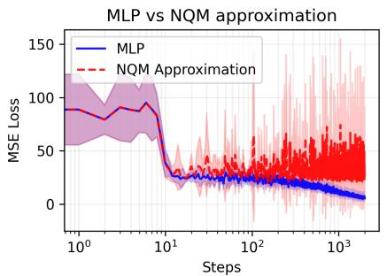

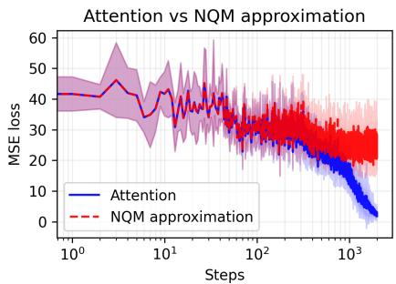  
Figure 6: Left: Comparison between a two-layer MLP and its NQF approximation (Proposition 1) under a teacherstudent setting. Right: Comparison between a query-key-only attention model and its NQF approximation (Proposition 3). Models are trained via online SGD (learning rate 0.05, batch size 64) over 2, 000 iterations. The results are averaged across 5 independent runs, with shaded regions representing ±1 standard deviation.

Consequently,

$$
{ \mathcal K } ( \Pi _ { b } ) \Pi _ { a } + \Pi _ { a } { \mathcal K } ( \Pi _ { b } ) = 2 c _ { a } \delta _ { a b } \Pi _ { a } .\tag{282}
$$

Thus the condition (254) holds with $\kappa _ { a } = c _ { a }$

Under the initialization (269), we have

$$
M ( 0 ) = W ( 0 ) W ( 0 ) ^ { \top } = \sum _ { a = 1 } ^ { r } 2 \rho _ { a } ( 0 ) \Pi _ { a } .\tag{283}
$$

Theorem 16 therefore applies with $z _ { a } ( t ) = 2 \rho _ { a } ( t ) , \gamma _ { a } = 2 \tau _ { a } , \kappa _ { a } = c _ { a } .$ . Substitution into (262) yields

$$
\dot { \rho } _ { a } = 4 \rho _ { a } \big ( \tau _ { a } - c _ { a } \rho _ { a } \big ) .\tag{284}
$$

(271) and (272) follow directly from (256) and (257). Finally, factorizing

$$
M ( t ) = \sum _ { a } 2 \rho _ { a } ( t ) \Pi _ { a }\tag{285}
$$

using the fixed orthonormal directions $\{ r _ { a } \}$ gives (270).

Remark (Recovery of the solution in [62]). Consider the standard two-layer linear network

$$
{ \widehat { y } } ( x ) = U V ^ { \top } x\tag{286}
$$

trained on samples $\{ ( x _ { \mu } , y _ { \mu } ) \} _ { \mu = 1 } ^ { m }$ . Define $\begin{array} { r } { \sum _ { x } = \frac { 1 } { m } \sum _ { \mu = 1 } ^ { m } x _ { \mu } x _ { \mu } ^ { \intercal } } \end{array}$ and $\begin{array} { r } { T = \frac { 1 } { m } \sum _ { \mu = 1 } ^ { m } y _ { \mu } x _ { \mu } ^ { \intercal } } \end{array}$ . The corresponding operator is ${ \mathcal { C } } ( Q ) = Q \Sigma _ { x }$ . Hence the condition (268) holds whenever

$$
\Sigma _ { x } v _ { a } = c _ { a } v _ { a }\tag{287}
$$

for the right singular vectors of T. In particular, for whitened inputs, $\Sigma _ { x } = I ,$ we have $c _ { a } = 1$ for every mode. Then the solution is

$$
\rho _ { a } ( t ) = \frac { \tau _ { a } \rho _ { a } ( 0 ) } { \rho _ { a } ( 0 ) + \left( \tau _ { a } - \rho _ { a } ( 0 ) \right) e ^ { - 4 \tau _ { a } t } } .\tag{288}
$$

Up to a rescaling of time, this is precisely the balanced solution of deep linear networks derived by [62].

## C Experimental Details and Additional Experiments

Figure 2 In Figure 2, all the models use output dimension 8 and the MSE loss. The two-layer MLP has an input dimension 20, hidden dimension 64 and the tanh activation without any biases. The single-layer CNN takes a singlechannel input of dimension $5 \times 7 .$ , employing 64 kernels of dimension $4 \times 5$ (with stride 1 and no padding), followed by global sum-pooling. Both the single-head and the multi-head attention models have an input dimension 20, a hidden dimension of 8 and sequence length 16. The multi-head model further has four heads with $d _ { v } \ = \ 2 0$ . For all the experiments, we do full batch learning with 600 samples. “Momentum” refers to GD with momentum 0.9. Learning rates differ in each setting.

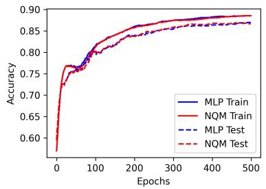

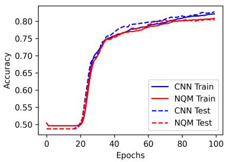

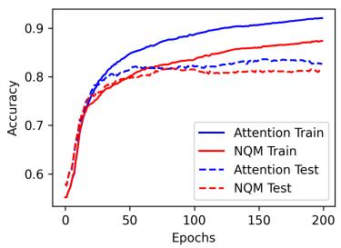

Figure 7: Comparison of training dynamics between a two-layer MLP (Left), a one-layer CNN (Middle), a one-layer self-attention (Right) and their corresponding NQFs on the MNIST odd vs. even classification task. In all cases, the NQFs (in red) achieve similar performance as the original model (in blue).  
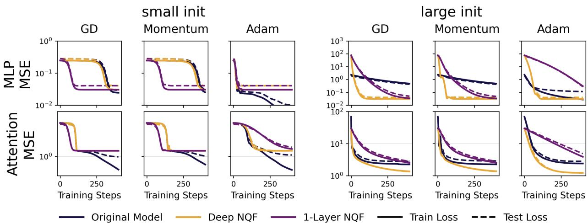  
Figure 8: Training dynamics of 4−layer MLPs and 2−layer attention models compared to their NQF approximations under different optimizers and initialization scales. The black line represents the original model. The orange line shows the 2-layer NQF approximations. The purple line represents an independently trained 1-layer NQF, initialized to match the original model at step zero. Solid lines represent the training loss and dashed lines represent the test loss. Under small initialization, the dynamics overlap, confirming the validity of deep NQF approximations.

Additional Experiments on NQF Approximation On the left side of Figure 6, we train a two-layer bias-free MLP with a tanh activation function in the teacher-student framework. The teacher weights are standard Gaussian, and we train two student models: an MLP of the same structure and its corresponding NQF approximation. Both models are optimized using online SGD with a learning rate of 0.05 and a batch size of 64 over 2, 000 steps. Both the teacher and the student MLP have the input dimension 20, the hidden dimension 100 and the output dimension 1. Figure 6 shows that the trajectories of two student models match for the first 100 steps and then they become different.

For the right side of Figure 6, we compare a query-key-only attention model (Proposition 3) with its NQF approximation and observe similarly that the NQF tracks the attention model accurately for the first 100 steps. The attention model computes a scalar output from a query token x $\epsilon \mathbb { R } ^ { D }$ and a context sequence $X \in \mathbb { R } ^ { D \times N }$ , with a fixed Gaussian readout vector $c \in \mathbb { R } ^ { D }$ . We set $D = 1 6 , N = 1 0 , d _ { k } = 8$ , and use H = 4 attention heads. Both the attention model and the NQF are optimized using online SGD with a learning rate of 0.02 and a batch size of 64 over 2, 000 steps. For both the MLP and the attention model, the teacher has standard Gaussian weights and student networks are initialized with identical Gaussian weights drawn from $\mathcal { N } ( 0 , \epsilon ^ { 2 } )$ where $\epsilon = 1 0 ^ { - 3 }$ . At each step, the input data is sampled i.i.d. from a Gaussian distribution.

In Figure 7, we construct a two-layer bias-free MLP equipped with tanh activations, a one-layer CNN and a onelayer self-attention and their NQF counterparts, where the NQFs are initialized with identical small Gaussian weights $( \mathcal { N } ( 0 , \epsilon ^ { 2 } )$ with ϵ = 0.01) as the original models. All the models are trained with Adam (full batch), MSE loss and learning rate 0.001. We construct a binary classification task: distinguishing odd from even digits on a subset of the

MNIST dataset with 4000 samples. As illustrated in Figure 7, the original models and their corresponding NQFs exhibit indistinguishable trajectories in both training loss and test accuracy. The two-layer MLP uses the hidden dimension 20, tanh activation and no biases. The one-layer CNN uses 50 channels with kernel size $1 5 \times 1 5$ . The attention model uses a fixed readout vector, 10 heads and $d _ { k } = 3 2$ . The input $2 8 \times 2 8$ image is regarded as 28 tokens with embedding dimension 28.

In Figure 8, We formulate a standard teacher-student regression task. We examine two architectures: a 4-layer MLP and a 2-layer single-head attention. The inputs are drawn from a normal distribution, and the targets are generated by a corresponding teacher model with fixed Gaussian weights. According to Propositions 1 and 2, both models can be approximated by 2-layer NQFs. This is validated by Figure 8, where under small initialization, the training dynamics of both models are well approximated by 2-layer NQFs but not 1-layer NQFs. The MLP has the input dimension 8, the hidden dimension 16 and the output dimension 1. The initial weights are Gaussian with variance 0.05 under small initialization and 0.5 under large initialization. The 2-layer attention model has the input and hidden dimension 8, input length 10 and the output dimension 1. The initial weights are Gaussian with variance 0.1 under small initialization and 1 under large initialization. The training set has 200 samples and the test set has 1000 samples. When the initialization scale and the model are fixed, three models (original one, 2-layer NQF and 1-layer NQF) share the same initialization and the same learning rate.

Figure 3 For the left and middle side of Figure 3, we choose $m = 5 , r = \{ 1 . 0 , 0 . 5 , 0 . 2 5 , 0 . 1 2 5 , 0 . 0 6 2 5 \}$ and $C _ { k k } = 1$ for all k. The initialization scale is $\epsilon = 1 0 ^ { - 5 } . \{ A _ { \mu } \} _ { \mu = 1 } ^ { m }$ are chosen to be diagonal matrices of size m × m. To satisfy the condition of Theorem 6, we randomly generate a $m \times m$ orthogonal matrix and use the $\mu { - } \mathrm { t h }$ column as the diagonal elements of $A _ { \mu }$ . We train the model using full-batch GD with learning rate 0.01 to approximate the gradient flow and use the initialization $W ( 0 ) = \sqrt { \epsilon } I$ such that $z _ { k } ( 0 ) = \epsilon$ . Because W remains diagonal, $z _ { k } ( t ) = [ W ( t ) W ^ { \top } ( t ) ] _ { k k }$ represents the eigenvalues of $W W ^ { \top }$

For the right side of Figure 3, we choose $\{ A _ { \mu } \} _ { \mu = 1 } ^ { 1 0 0 0 }$ such that each matrix only has one non-zero element. Specif ically, we first set $r _ { k } ~ = ~ k ^ { - \alpha _ { 2 } } , ~ V _ { k } ~ = ~ k ^ { - \alpha _ { 1 } }$ for $\dot { k } \ = \ 1 , 2 , \cdots , 1 0 0 0$ and $\alpha _ { 1 } ~ = ~ 2 , ~ \alpha _ { 2 } ~ = ~ 0 . 8$ Then we can calculate $C _ { k k } ~ = ~ r _ { k } ^ { 2 } / 8 V _ { k }$ We choose $A _ { k , k k } ~ = ~ \sqrt { C _ { k k } m / 8 }$ and other elements to be 0. The labels are chosen to be $y _ { k } = m r _ { k } / ( 8 A _ { k , k k } )$ . The initialization is chosen to be $z _ { k } ( 0 ) = 1 0 ^ { - 6 } k ^ { - 1 . 2 }$ for $k = 1 , 2 , \cdots , 1 0 0 0$

Figure 4 To validate Theorem $^ { 6 , }$ we construct a synthetic dataset utilizing block-diagonal data matrices. We consider a system with $m = 4$ samples and a parameter dimension of $p = m \times K . ~ \{ A ( x _ { \mu } ) \} _ { \mu = 1 } ^ { m }$ are configured as diagonal matrices with disjoint non-zero supports. Specifically, for any given sample $\mu \in \{ 1 , \ldots , m \}$ , only the diagonal entries within the index block $\left[ \mu K , \mu K + K - 1 \right]$ are non-zero. This ensures that $A ( x _ { \mu } ) A ( x _ { \nu } ) = 0$ for all $\mu \neq \nu ,$ satisfying the condition required by Theorem 5. We choose $K = 3$ and the three non-zero elements to be $1 , 1 . 5 , 2$ . In this case (36) remains irreducible and lacks a closed-form solution. Consequently, the theoretical trajectories presented in Figure 4 are obtained by numerically integrating the associated ODE for $\{ \xi _ { \mu } ( t ) \} _ { \mu = 1 } ^ { 4 }$ using the standard Runge-Kutta method.

Finite-initialization Effect On the right side of Figure 3 and Figure 5, one can notice that there is a slight difference between the empirical slope and the theoretical prediction. This is a finite-initialization effect.

Under the feature-wise descent setting in Section 6, we can approximate the excess loss through

$$
\mathcal { E } ( k ) \approx \int _ { k } ^ { \infty } V _ { x } d x \propto k ^ { - ( \alpha _ { 1 } - 1 ) } ,\tag{289}
$$

where k as a function of t is determined by the characteristic timescale

$$
t ( k ) \approx \frac { 1 } { \zeta _ { k } } \ln { \left( \frac { \zeta _ { k } } { C _ { k } \epsilon } \right) }\tag{290}
$$

with $\zeta _ { k } / C _ { k } \propto k ^ { \alpha _ { 2 } - \alpha _ { 1 } }$ . We can define the effective slope as $k _ { \mathrm { e f f } } = - \frac { d \ln \mathcal { E } / d k } { d \ln t / d k }$ , where the derivatives are $\textstyle { \frac { d \ln { \mathcal { E } } } { d k } } = - { \frac { \alpha _ { 1 } - 1 } { k } }$ and

$$
\frac { d \ln t } { d k } = \frac { \alpha _ { 2 } } { k } + \frac { \alpha _ { 2 } - \alpha _ { 1 } } { k \left[ \ln \left( \frac { \zeta _ { k } } { C _ { k } } \right) + \ln \left( \frac { 1 } { \epsilon } \right) \right] } = \frac { 1 } { k } \left( \alpha _ { 2 } - \frac { \alpha _ { 1 } - \alpha _ { 2 } } { \ln \left( \frac { \zeta _ { k } } { C _ { k } \epsilon } \right) } \right) .\tag{291}
$$

Combining them, we obtain

$$
k _ { \mathrm { e f f } } ( k , \epsilon ) = \frac { \alpha _ { 1 } - 1 } { \alpha _ { 2 } - \frac { \alpha _ { 1 } - \alpha _ { 2 } } { \ln \left( \frac { \zeta _ { k } } { C _ { k } \epsilon } \right) } } .\tag{292}
$$

For the experiments in Figure 3 (right) and Figure $5 ,$ we use $\alpha _ { 2 } < \alpha _ { 1 }$ , and thus the effective slope is larger than the theoretical prediction for finite initialization $( \epsilon > 0 )$

We can also write $k _ { \mathrm { e f f } }$ as a function of t. From (290) we have

$$
\zeta _ { k } ( t ) t = \ln ( 1 / \epsilon ) + \ln \left( \frac { \zeta _ { k } } { C _ { k } } \right) \approx \ln ( 1 / \epsilon ) + \alpha \ln \zeta _ { k } ( t ) + C ,\tag{293}
$$

where we denote $\begin{array} { r } { \alpha : = \frac { \alpha _ { 1 } - \alpha _ { 2 } } { \alpha _ { 2 } } } \end{array}$ and C is a constant independent of $\epsilon , t .$ At the leading order of t this gives

$$
\zeta _ { k } ( t ) \cdot t \approx \ln ( 1 / \epsilon ) + \alpha \ln \ln ( 1 / \epsilon ) - \alpha \ln t + C .\tag{294}
$$

Taking it into (292) we obtain

$$
k _ { \mathrm { e f f } } ( t ) \approx \frac { \alpha _ { 1 } - 1 } { \alpha _ { 2 } } \left[ 1 + \frac { \alpha } { \ln ( 1 / \epsilon ) + \alpha \ln \ln ( 1 / \epsilon ) + C - \alpha \ln t } \right] ,\tag{295}
$$

which increases as t increases, as we observe in Figure 3 (right) and Figure 5.

Figure 5 For Figure $5 ,$ we use $\beta = 1 . 5 , P = 6 4 , M = 2 5 6$ (thus 256 data points) and run full batch GD with learning rate 0.02 for 30000 steps. The standard MLP has 256 hidden units. All models are initialized with $\mathcal { N } ( 0 , \epsilon ^ { 2 } )$ where $\epsilon = 1 0 ^ { - 4 }$

According to Proposition 1, (50) corresponds to an NQF with

$$
A _ { k } ( x ) = \frac { s _ { k } } { 2 \sqrt { P } } \left[ \begin{array} { c c } { 0 } & { \psi _ { k } ( x ) } \\ { \psi _ { k } ( x ) } & { 0 } \end{array} \right]\tag{296}
$$

for the k-th hidden unit. Now we verify that the conditions in Section 6 (feature-wise descent) are satisfied. Since $A ( x )$ is block-diagonal with elements $\{ A _ { k } ( x ) \} _ { k = 1 } ^ { P }$ and $A _ { k , \mu } A _ { k , \nu } = A _ { k , \nu } A _ { k , \mu } ,$ we have $A _ { \mu } A _ { \nu } = A _ { \nu } A _ { \mu }$ and thus Assumption 1 is satisfied.

Given the block-diagonal structure, the eigenvalues associated with the k-th unit for sample µ are $\begin{array} { r } { \lambda _ { \mu , k } = \pm \frac { s _ { k } } { 2 \sqrt { P } } \psi _ { k } \mathopen { } \mathclose \bgroup \left( x _ { \mu } \aftergroup \egroup \right) } \end{array}$ Because $\psi _ { k } ( x )$ are Fourier modes uniformly sampled on the grid, they are orthogonal, leading to $\begin{array} { r } { \sum _ { \mu } \lambda _ { \mu , k } \lambda _ { \mu , j } = 0 } \end{array}$ for $k \neq j ,$ , satisfying the orthogonal condition in Theorem 6.

Finally, we map the experimental variables to that in Section 6:

$$
C _ { k k } = \frac { 8 } { m } \sum _ { \mu } \lambda _ { \mu , k } ^ { 2 } \propto s _ { k } ^ { 2 } = k ^ { - 2 \theta } , r _ { k } = \frac { 8 } { m } \sum _ { \mu } \lambda _ { \mu , k } y _ { \mu } \propto s _ { k } b _ { k } = k ^ { - ( \theta + \beta ) } .\tag{297}
$$

Therefore, the $r _ { k }$ decays with exponent $\alpha _ { 2 } = \theta + \beta . \ V _ { k }$ is given by $\begin{array} { r } { V _ { k } = \frac { r _ { k } ^ { 2 } } { 8 C _ { k k } } \propto \frac { k ^ { - 2 ( \theta + \beta ) } } { k ^ { - 2 \theta } } = k ^ { - 2 \beta } } \end{array}$ , identifying $\alpha _ { 1 } = 2 \beta ^ { 5 }$ Plugging $\alpha _ { 1 }$ and $\alpha _ { 2 }$ into Section $^ { 6 , }$ the excess loss $\mathcal { E } ( t )$ decays asymptotically as:

$$
\mathcal { E } ( t ) = \Theta \left( t ^ { - \frac { \alpha _ { 1 } - 1 } { \alpha _ { 2 } } } \right) = \Theta \left( t ^ { - \frac { 2 \beta - 1 } { \theta + \beta } } \right)\tag{298}
$$

This provides the prediction for the scaling law in Figure 5.

Power Law on One-hot Data We can also observe power laws from one-hot data. We choose each input sample $x _ { \mu } \in \mathbb { R } ^ { p }$ (for $\mu \in \{ 1 , \ldots , m \} )$ to be $x _ { \mu } = \lambda _ { \mu } e _ { \mu }$ , where $e _ { \mu }$ is the basis vector (with 1 at the µ-th coordinate and 0 elsewhere). We choose the scaling to be $\lambda _ { \mu } \overset { \cdot } { \propto } \mu ^ { - \left( \alpha _ { 2 } - \frac { \alpha _ { 1 } } { 2 } \right) }$ and the label to be $y _ { \mu } \propto \mu ^ { - \frac { \alpha _ { 1 } } { 2 } }$ . Then we consider a quadratic network

$$
f ( x ) = x ^ { \top } W W ^ { \top } x = \operatorname { T r } [ W W ^ { \top } A ( x ) ] ,\tag{299}
$$

where $A ( x ) = x x ^ { \top } = \lambda _ { \mu } ^ { 2 } E _ { \mu \mu }$ , where $E _ { \mu \mu }$ is the matrix with 1 at the $( \mu , \mu )$ entry and 0 elsewhere. Then we can find that this is the identical setting of Figure 3 (right).