# Perturbation-based Regional Interpretability through Subtraction Mapping (PRISM): naming-error dissociations in language models and post-stroke aphasia

Xiang Guan1†, Roger D. Newman-Norlund2,3†\*, Yong Yang1, Saeed Ahmadi2, Regan Willis1, Nadra Salman4, Kalil Warren4, Srihari Nelakuditi1, Chris Rorden5, Leonardo Bonilha6, Julius Fridriksson2,3

1 Department of Computer Science and Engineering, University of South Carolina 2 Department of Communication Sciences and Disorders, University of South Carolina 3 ALLT.AI, LLC, Columbia, SC 4 Linguistics Program, University of South Carolina 5 Department of Psychology, University of South Carolina 6 Department of Neurology, USC School of Medicine

† Xiang Guan and Roger D. Newman-Norlund contributed equally to this work and are joint first authors.

\*Corresponding author: Roger D. Newman-Norlund (rnorlund@mailbox.sc.edu)

## Abstract

Mechanistic interpretability of large language models lacks spatially resolved, falsifiable tools for testing whether internal components are specialized for distinct cognitive operations. We adapt subtraction analysis, the standard framework of human neuroimaging, from biological brains to perturbed transformers, and apply the same logic to both substrates in parallel. Building on the Brain-LLM Unified Model (BLUM), which showed that layer-perturbed LLaVA-1.6-Vicuna-13B error profiles match the lesion patterns of aphasic patients, we develop PRISM (Perturbation based Regional Interpretability through Subtraction Mapping). PRISM maps the seven clinical Philadelphia Naming Test categories, subtracts error classes pairwise, and treats each perturbation seed as a subject in a group analysis with threshold-free cluster enhancement along the layer axis. We run a structurally matched analysis on 213 chronic post-stroke aphasia patients using correlation-diference lesion-symptom mapping, and replicate both sides on held-out splits. The designs match in subject dimension (seeds, patients), spatial dimension (layers, atlas-parcellated cortex) and thresholding, but the contrast operator difers: a within-subject error-proportion diference for the LLM, a between-subject correlation diference for the cortex. Both substrates recover a robust phonemic-favoring dissociation, a deep layer cluster and a frontal-perisylvian cortical cluster, both replicating; the semantic-favoring direction is a consistently signed but non-significant trend on both. PRISM thus gives a falsifiable, spatially resolved test of functional-specialization claims in transformer language models. A confirmatory ROI-level intervention (PRISM Stage 3) licensing the strongest causal-mechanism claim is left to subsequent work.

Keywords: mechanistic interpretability, large language models, perturbation-response mapping, transformer perturbation, subtraction analysis, lesion–symptom mapping, threshold-free cluster enhancement, layer-resolved interpretability, patient-specific digital twins

## Introduction

## The interpretability gap

Mechanistic interpretability of large language models (LLMs) is dominated by methods that operate on internal representations or weights: probing classifiers (Belinkov 2022; Hewitt and Manning 2019), causal tracing and weight editing (Meng et al. 2022; Geiger et al. 2021; Wu et al. 2023), automated circuit discovery (Conmy et al. 2023), and sparse-autoencoder feature decomposition (Cunningham et al. 2023; Templeton et al. 2024). Each yields evidence about which components encode or compute what, but each evaluates its claims against benchmarks or against internal reconstruction quality, not against an externally validated, behaviorally defined map of what the model’s components are causally necessary for. The result is a fragmented landscape of interpretability claims with no shared inferential framework for testing whether components are functionally specialized for distinct cognitive operations.

The neighboring field of human cognitive neuroscience has spent decades developing exactly such a framework. Subtraction analysis, applied to functional neuroimaging maps (Petersen et al. 1988; Friston et al. 1995) and to lesion–symptom maps (Bates et al. 2003; Mirman et al. 2015) under nonparametric multiple-comparison correction (Smith and Nichols 2009; Maris and Oostenveld 2007), has parceled the human brain into regions whose involvement is selective to one operation versus another. Replication and targeted intervention close the inferential loop. The framework is informative when the loci of interest are spatially organized within a common domain, and the operations being contrasted are approximately separable. Here, we ask what happens when those tools are imported into LLM interpretability, and we run them in parallel on the LLM and on a cohort of chronic-aphasia patients administered the same behavioral task.

## Perturbation-induced error maps and PRISM

A growing body of work has begun to bridge LLM and brain analysis by treating LLM activations as data structurally analogous to neural recordings (Schrimpf et al. 2021; Caucheteux and King 2022; Goldstein et al. 2022, 2025; Antonello et al. 2024; Tuckute et al. 2024; Kumar et al. 2024; Mischler et al. 2025; Gao et al. 2025). The Brain–LLM Unified Model (BLUM; Fridriksson et al. 2026) extended this analogy to behavioral output. By administering the Philadelphia Naming Test (PNT) and the Western Aphasia Battery–Revised (WAB-R) to a perturbed 13-billion-parameter vision–language transformer (LLaVA-1.6-Vicuna-13B; Liu et al. 2023; Chiang et al. 2023) and to humans with chronic post-stroke aphasia (N = 410), an impairment in language processing, and by projecting the resulting LLM error profiles through human-trained symptom-to-lesion models, BLUM showed that LLM-derived predicted lesions corresponded to actual lesions in error-matched humans above chance in 67% of picture-naming $\mathrm { ( p < 1 0 ^ { - 5 3 } ) }$ and 68% of sentence-completion conditions $\mathrm { ( p < 1 0 ^ { - 6 8 } ) }$ The structural implication is direct: systematic perturbation of an LLM produces error data of the same form that lesion–symptom mapping has analyzed in humans for over a century: an ordered spatial domain (the transformer’s layers; Tenney et al. 2019; Geva et al. 2021; Rogers et al. 2020), behavioral consequences classified into a clinically validated taxonomy (Schwartz et al. 2006; Dell et al. 1997), and replicable layerwise variation.

Two features distinguish the artificial setting from cortex. First, residual connections couple every layer’s output to the activations of all preceding layers (Elhage et al. 2021), so a layer-targeted perturbation may not isolate that layer’s computation as cleanly as a focal lesion isolates a cortical region. Second, every component of the analysis can be repeated at will, with independent random perturbation seeds for replication and with the relevant lesion delivered or withheld at the experimenter’s choice. This combination of structural similarity to lesion–symptom data and the lack of controllability in biological systems motivates applying the lesion-symptom-analogous analytic pipeline to LLM perturbation maps. For the sake of brevity, we call the resulting framework PRISM (Perturbation-based Regional Interpretability through Subtraction Mapping). The techni cal lineage imports the subtraction logic from fMRI activation mapping (Petersen et al. 1988; Friston et al. 1995), together with cluster-based spatial inference originally developed for fMRI (Smith and Nichols 2009; Maris and Oostenveld 2007), into a perturbation design that is structurally analogous to lesion–symptom mapping (Bates et al. 2003; Mirman et al. 2015), an analogy licensed by BLUM’s demonstration (Fridriksson et al. 2026) that LLM perturbation profiles map onto real human lesion patterns. The contrast logic, the cross-replicate inferential machinery, and the cluster-correction step are inherited from the activation-mapping tradition; the perturbation-as-lesion framing, the necessity-of-layer-cluster reading of significant regions, and the confirmatory-intervention closing step are inherited from the lesion-symptom tradition. In the present paper, we run subtraction analyses in parallel on both substrates so that the cross-substrate correspondence is demonstrated within the study rather than asserted by analogy.

PRISM is complementary to the dominant tradition in LLM mechanistic interpretability rather than competing with it. Activation patching and causal mediation analysis (Vig et al. 2020; Meng et al. 2022; Geiger et al. 2021; Wu et al. 2023; Heimersheim and Nanda 2024; Zhang and Nanda 2024), circuit-level analysis and discovery (Wang et al. 2023; Conmy et al. 2023; Merullo et al. 2024), and sparse-autoencoder feature decomposition (Cunningham et al. 2023; Templeton et al. 2024) operate on internal representations or weights and yield fine-grained component-level claims. PRISM, by contrast, is phenotype-first and intentionally coarse-grained: it begins from a clinically defined behavioral failure, a ground truth in the form of an aphasic error category, and asks which layer ranges are causally implicated in producing it, working at the level of layer clusters rather than individual heads or features. The two approaches answer complementary questions: internalrepresentation methods identify which components carry or compute which information; PRISM identifies which layer ranges are causally necessary to prevent which behavioral failures. The coarse granularity is a feature in this regime, not a concession. It is what supplies behavioral falsifiability, statistical power, and the multiple-comparison and confirmatory-intervention machinery that have, in human cognitive neuroscience, made such inferences trustworthy.

## The PRISM pipeline

For each of the six clinical PNT error categories (semantic, phonemic, mixed, neologism, no response, and unrelated), PRISM constructs a perturbation-induced layer map across all 40 transformer layers and a parallel cortical map across the human patient cohort. The framework then computes pairwise subtractions between error categories, applies threshold-free cluster enhancement (TFCE) for spatial inference, and replicates the resulting maps on an independent split (held-out perturbation seeds for the LLM; held-out patients for the cortex). Because layer adjacency does not guarantee functional adjacency, we additionally validate TFCE on the LLM side under permutation of layer order: true clusters should dissolve when the layer sequence is randomized. We further test the separability assumption underlying subtraction logic by repeating the analysis under random permutation of error-category labels, where chance-level subtraction maps would indicate that the operations are not separable in this model. Each component of this pipeline has a long history in human cognitive neuroscience; what is new is its application to LLM-derived behavioral error maps under the same machinery used on the human cortex within this paper.

The question subtraction was designed to answer translates directly to the perturbed LLM: which layer clusters, when perturbed, preferentially increase one error type over another? Because the relevant lesion can be created at will, candidate clusters identified by this exploratory analysis are confirmed by targeted region-of-interest (ROI) perturbation: perturbing only the implicated layers, perturbing matched non-significant control clusters as a null, and verifying that the resulting error profiles match the maps’ predictions selectively for the implicated clusters. PRISM thus consists of three sequential stages: exploratory subtraction analysis with TFCE and multi-seed replication; layer-order- and label-permutation validation of TFCE assumptions; and confirmatory ROI perturbation against null controls.

In the present study, we apply PRISM to the same vision–language transformer evaluated in BLUM (LLaVA-1.6-Vicuna-13B; 40 transformer layers, 13 billion parameters) and to the Philadelphia Naming Test (Roach et al. 1996), the gold-standard task for measuring anomia, the hallmark language impairment in aphasia (Goodglass and Kaplan 1983; Laine and Martin 2023). The PNT was selected for its 175-item depth, six-category error taxonomy, and deep neurolinguistic and neuropsychological development, which together provide the behavioral signal-to-noise required to estimate stable maps for each error category and to compute pairwise subtractions across categories. In parallel, the same confirmatory subtraction analyses are run on the BLUM patient cohort under standard clinical conditions (276 administered the PNT; 213 with complete JHU lesion-load profiles enter the analysis), so that the LLM and human pipelines are matched in subject dimension, spatial dimension, and TFCE-style thresholding, even where the contrast operator difers at the technical level. Restricting to a single task and a single architecture is a deliberate scope decision; extending to the WAB-R and to text-only or encoder–decoder architectures is a defined next step. Subtraction maps and, on the LLM side, ROI confirmation profiles for each naming error category are the outputs of the framework.

PRISM, as developed here, supplies a behaviorally grounded test of which layer ranges are necessary for which error categories. The pipeline is portable across architectures, tasks, and behavioral taxonomies; the inferential standards are inherited unchanged from human cognitive neuroscience; and the confirmatory ROI step closes the inference-versus-correlation loop in a way that lesion– symptom mapping in human patients structurally cannot. The framework supports two ultimate goals that together define the broader research program (Fridriksson et al. 2026). The first is improving the explainability of large language models, by providing interpretability evidence of a kind that internal-representation methods alone cannot deliver, framed in an external, clinically validated taxonomy of language failure accessible to clinicians and to the AI community alike. The second is the construction of patient-specific LLM digital twins of neurological disorders. By identifying the perturbation conditions whose error profiles most closely reproduce those of an individual patient, and by manipulating those perturbations under the inferential standards PRISM establishes, computational surrogates can be constructed that simulate patient-specific deficits, model disease trajectories, and predict treatment responses, with direct application to clinical-trial design and acceleration in conditions where recruitment and longitudinal follow-up are rate-limiting.

## Methods

## Behavioral readout: the Philadelphia Naming Test

We use the Philadelphia Naming Test (PNT; Roach et al. 1996), a 175-item picture-naming task that elicits single-word responses. Each response is scored under the standard PNT clinical taxonomy (Schwartz et al. 2006; Dell et al. 1997) into one Correct category plus six error categories, for seven categories total (Table 1). The same taxonomy is applied to LLM responses and to human patien responses, so that the input to subtraction analysis is comparable across substrates.

On the LLM side, the analysis is restricted to the items the unperturbed model already names correctly. The full 175-item PNT was administered to LLaVA-1.6-Vicuna-13B without perturbation, and the 158 items it named correctly at baseline define the analysis set; all perturbation conditions are scored on those 158 items. The rationale is that an item the model fails at baseline cannot be informative about the efect of a perturbation: its error is a property of the unperturbed model rather than of the manipulation, so retaining it would add a fixed error floor that is common to every cell of the perturbation grid and dilute every contrast equally. Restricting to baseline-correct items makes every error observed in the analysis attributable to the perturbation. Per-cell proportions

are computed against the number of items actually scored in that cell, which is 158 except in 18 of 317,346 administrations where a single response could not be scored and the denominator is 157. The human-side analysis is not restricted in this way, since the patient cohort has no analogous baseline-correct condition.
<table><tr><td>Category</td><td>Definition</td></tr><tr><td>Correct</td><td>The target word is produced (e.g., “cat&quot; for the image of a cat).</td></tr><tr><td>Semantic substitution</td><td>A real word that is semantically related to the target (e.g., &quot;dog&quot; for cat).</td></tr><tr><td>Phonemic</td><td>An attempt that shares phonological form with the target but is either a real word with one or more sound substitutions (a formal paraphasia, e.g., &quot;hat&quot; for cat) or a non-word that closely resembles the target&#x27;s sound shape (e.g., &quot;kag&quot; for cat). Following standard practice we merge the formal and nonword</td></tr><tr><td>Mixed</td><td>A real word related to the target in both meaning and sound (e.g., &quot;rat&quot; for cat).</td></tr><tr><td>Neologism</td><td>A non-word string that does not closely resemble the target&#x27;s sound shape (e.g., &quot;blorf&quot; for cat).</td></tr><tr><td>Unrelated</td><td>A real word with no clear semantic or phonological relation to the target (e.g., &quot;wheel&quot;for cat).</td></tr><tr><td>NoResponse</td><td>Failure to produce any scorable utterance within the response window.</td></tr></table>

Table 1. The seven response categories of the Philadelphia Naming Test (PNT; Roach et al. 1996), scored under the standard clinical taxonomy of Schwartz et al. (2006) and Dell et al. (1997). Each row gives the category name, its definition, and a worked example for the target image of a cat. The Phonemic category collapses the formal-paraphasia and nonword sub-categories into a single class following standard practice. Correct is held out of pairwise contrasts in PRISM because contrasts against Correct re-express overall error rate rather than category-selective involvement; the six error categories below the Correct row are the inputs to pairwise subtraction analysis.

## Patient lesion data

The BLUM patient cohort (Fridriksson et al. 2026) was administered the PNT under standard clinical conditions. All study procedures were approved by the University of South Carolina Institutional Review Board (Pro00053559) and all participants provided written informed consent; the data analyzed here are archival, and no new human data were collected for the present study. Of the 276 patients administered, � = 213 had both a valid PNT administration and a complete JHU ROI lesion-load profile and entered the analyses reported here; the remaining 63 were excluded prior to any analysis at the lesion-mask quality-control step. Each patient contributes a vector of PNT error-category proportions and a 3D binary lesion mask in MNI152 space at 1 mm isotropic resolution (lesion masks were traced from structural MRI by trained raters). Per-patient lesion load is summarized at the level of the Johns Hopkins University (JHU) white-matter and grey-matter atlas (Mori et al. 2008) by computing, for each atlas region, the proportion of its voxels that lie within the patient’s binary lesion mask. We retain the 64 left-hemisphere regions surviving a 10% damage threshold (i.e., at least some patient has $\ge ~ 1 0 \%$ of the region lesioned) with ventricles dropped.

## LLM perturbation grid

The artificial-network analogue of a focal cortical lesion is delivered by directly perturbing the weights of a single transformer layer of LLaVA-1.6-Vicuna-13B (Liu et al. 2023; Chiang et al. 2023), one of 40 successive processing stages in the model, with multiplicative Gaussian noise. Each test administration is indexed by four perturbation parameters: the layer $\ell \in \{ 0 , \ldots , 3 9 \}$ at which the noise is applied, the standard deviation $\sigma$ of the multiplicative Gaussian noise (the magnitude of the perturbation, loosely analogous to the depth of focal tissue damage in patients), the perturbation density $\rho \in [ 0 , 1 ]$ (the fraction of the layer’s weights that are perturbed, loosely analogous to lesion extent), and a random seed � governing the realization. For each weight � selected for perturbation we set $w  w \cdot ( 1 + \varepsilon )$ , with $\varepsilon \sim N ( 0 , \sigma ^ { 2 } )$ drawn independently per weight; $\rho$ is the fraction of the layer’s weights, selected at random under seed $s ,$ to which this is applied, with the remainder left intact. Each (layer, $\sigma , \rho ,$ , seed) cell yields a vector of error proportions across the seven PNT categories. Only the layer axis is treated as an ordered spatial dimension for cluster correction (analogous to the way fMRI cluster correction treats the cortical lattice). Noise magnitude $\sigma$ and density $\rho$ index the depth and extent of the perturbation rather than a position; we therefore aggregate them within each seed before group-level spatial inference, and treat the seed itself as the subject in a group analysis. We use a discovery set and an independent validation set of equal size (40 seeds each, 80 total).

## LLM subtraction analysis (two-level structure)

The LLM-side analysis has a two-level structure within each seed. The lower level, the $\sigma \times \rho$ block of contrast values at a given layer within a given seed, carries the dose-response information (perturbation depth and extent) and is itself a result, not a preprocessing step. The upper level, the per-seed layer profile that feeds the spatial-extent inference step, is obtained from an explicit linear model of the lower-level cells. The two levels feed two separate analyses, both reported below.

Lower level (within seed). For each ordered category pair $( A , B )$ and each seed $s ,$ the per-cell contrast is $D _ { s } ( \ell , \sigma , \rho ) = p _ { s } ( A \mid \ell , \sigma , \rho ) - p _ { s } ( B \mid \ell , \sigma , \rho )$ . Within seed, we fit the linear model

$$
D _ { s } ( \ell , \sigma , \rho ) = \alpha _ { s } ( \ell ) + \beta _ { s , \sigma } \sigma + \beta _ { s , \rho } \rho + \epsilon ,
$$

with layer carried as a categorical regressor (40 intercepts $\alpha _ { s } ( \ell ) )$ and $\sigma$ and $\rho$ as continuous withinseed repeated-measures covariates. The per-(seed, layer) summary used by the spatial step is the layer-specific fitted value at cohort-mean $\sigma$ and $\rho ,$

$$
D _ { s } ( \ell ) = \hat { \alpha } _ { s } ( \ell ) + \hat { \beta } _ { s , \sigma } \bar { \sigma } + \hat { \beta } _ { s , \rho } \bar { \rho } .
$$

This is mathematically equivalent to the simple within-seed average over the $\sigma \times \rho$ grid (the cohort means $\bar { \sigma }$ and $\bar { \rho }$ recover the average), but the explicit fit makes clear that $\sigma$ and $\rho$ are kept in the model rather than aggregated away. The retained slopes $\beta _ { s , \sigma }$ and $\beta _ { s , \rho }$ feed the separate doseresponse analysis described in Methods §“Stage 2.5: Dose-response analysis.”

Upper level (across seeds). The seed plays the role of subject. Group-level inference is computed across discovery seeds on the per-seed layer profiles: the layer-wise mean $\bar { D } ( \ell )$ and one-sample t-statistic against zero, $T ( \ell )$ , are computed with NaN-safe estimators. Spatial-extent inference is enforced by threshold-free cluster enhancement (TFCE; Smith and Nichols 2009) applied to $T ( \ell )$ along the layer axis. Because subtraction has a meaningful sign, we apply TFCE separately to the positive and negative halves of $T ( \ell )$ and recombine. Surviving layer clusters are extracted by connected-component labeling at the 90th percentile of the absolute TFCE field. Only the layer axis is used as an ordered spatial dimension for cluster correction; $\sigma$ and $\rho$ remain dose parameters and re-enter the analysis in the dose-response step.

## Human subtraction analysis

On the human side, we apply the same subtraction logic to the cortex, parameterized at the level of left-hemisphere Johns Hopkins University (JHU) atlas regions (Mori et al. 2008). Univariate lesion-symptom mapping is the established baseline for relating behavioral deficits to focal damage in chronic aphasia (Bates et al. 2003; Rorden et al. 2007; Karnath et al. 2018), and atlas-based ROI parcellation rather than voxel-wise inference is a standard choice when patient sample sizes are modest and when per-voxel lesion coverage varies sharply across the brain (Bonilha et al. 2014; Yourganov et al. 2016; Pustina et al. 2018). The pairwise-contrast logic that motivates the LLM side has direct precedent on the cortex: Schwartz and colleagues established that two distinct error classes in the PNT (semantic versus phonemic) load on dissociable cortical territories when their lesion-symptom maps are contrasted against one another (Schwartz et al. 2009, 2012; Walker et al. 2011), an approach extended by Mirman et al. (2015) to a full inventory of post-stroke language deficits. We adopt the same contrast logic at the ROI level.

For each error category � and each left-hemisphere ROI �, we compute the Spearman rank correlation $\rho _ { A , r }$ between the per-patient proportion of category-� errors and the per-patient lesion load in �. The Spearman correlation is robust to outliers in the heavy-tailed distributions of singlepatient error proportions, a known concern in PNT data with high inter-patient variability (Bates et al. 2003; Rorden et al. 2007). For each ordered category pair $( A , B )$ and each ROI �, the cortical subtraction value is the diference of correlations $d _ { r } = \rho _ { A , r } - \rho _ { B , r } \mathrm { : }$ positive $d _ { r }$ marks regions where lesions preferentially elevate �-type errors relative to �, negative $d _ { r }$ marks the reverse.

Per-correlation two-sided p-values are obtained from scipy.stats.spearmanr. Inference on the correlation diference uses a patient-level percentile bootstrap (1,000 resamples) on $d _ { r } .$ , the standard nonparametric tool when the joint distribution of two related efect-size estimates is not analytic (Efron and Tibshirani 1993; Sperber and Karnath 2018; DeMarco and Turkeltaub 2018). This is the cortical analog of the LLM voxel-wise subtraction described above and is the same calculation rendered in the SNL\_2026\_SLM interactive viewer (simpleSubtraction). Full atlas, ROI-selection, and bootstrap details are reported in the Supplementary Methods.

## Out-of-sample replication and Stage 2 permutation validation

For the LLM side, the seed-as-subject pipeline is fit to the 40-seed discovery set and tested on the 40-seed held-out validation set: we recompute $\bar { D } ( \ell )$ and the layer-axis TFCE on validation seeds and check whether each discovery-surviving layer cluster preserves its sign and shape. For the human side, the matched analog is a 50/50 patient split (106 discovery / 107 validation; fixed random seed) of the 213-patient cohort. We recompute per-(error, ROI) Spearman correlations and per-(pair, ROI) correlation diferences on each half, and a (pair, ROI) test is considered to replicate when its sign matches between halves and its patient-level bootstrap 95% CI excludes zero on both halves. The three pre-registered confirmatory contrasts on both substrates are Semantic versus Phonemic as the direct test of dissociation between the two clinically central real-word error classes, and Phonemic versus Neologism and Semantic versus Neologism as cross-checks of each cluster against a non-real-word baseline.

PRISM Stage 2 is a layer-order permutation test that licenses the layer-axis TFCE claim: for each pair, we recompute the group-level layer-axis TFCE map after independently permuting layer labels within each seed (which preserves the per-seed marginal distribution of contrast values but destroys the intrinsic ordering of layers). The empirical �-value per (pair, sign-direction) is the proportion of 1,000 random permutations whose maximum |TFCE| exceeds the observed value. Significance under this null indicates that the cluster mass depends on the intrinsic layer ordering rather than on the marginal distribution alone. PRISM Stage 3 (confirmatory ROI perturbation against matched non-significant control clusters) is an LLM-only construct by design, there is no patient-side analog, and is deferred to a follow-up study; PRISM as reported in this paper is therefore an LLM method with a matched human comparison at Stages 1 and 2, rather than a symmetric two-substrate framework at all three stages.

The full TFCE definition and parameters, the formal bootstrap / multiple-comparison procedures, and the per-pair region-summary tables are reported in the Supplementary Methods.

## Stage 2.5: Per-cluster dose-response analysis

Each surviving layer cluster is the input to a separate dose-response analysis that re-introduces � and $\rho$ as the perturbation-level analogs of lesion severity and lesion extent. For each cluster (layers $L ^ { \star }$ , pair $( A , B )$ , sign), per seed � we restrict to layers $L ^ { \star }$ and take the within-cluster mean contrast at each $( \sigma , \rho )$ cell,

$$
D _ { s } ( \sigma , \rho \mid L ^ { \star } ) \ = \ \mathrm { m e a n } _ { \ell \in L ^ { \star } } \bigl [ p _ { s } ( A \mid \ell , \sigma , \rho ) - p _ { s } ( B \mid \ell , \sigma , \rho ) \bigr ] .
$$

Across seeds, we compute per-cell group means $\bar { D } ( \sigma , \rho \mid L ^ { \star } )$ . We then fit an OLS dose-response model on the per-cell means,

$$
\bar { D } ( \sigma , \rho \mid L ^ { \star } ) \sim \beta _ { 0 } + \beta _ { \sigma } \sigma + \beta _ { \rho } \rho + \beta _ { \sigma \rho } \sigma \rho ,
$$

and apply a 1,000-iterate cluster bootstrap over seeds for 95% confidence intervals on each slope. The conceptual prediction is directional: � (perturbation depth) is the analog of how completely tissue is destroyed within a damaged region in human lesions, so we expect $\beta _ { \sigma }$ to be of the same sign as the cluster’s contrast on average (deeper perturbation → larger directional contrast). � (perturbation extent) is the analog of lesion volume, and its predicted efect is less constrained: higher density could either deepen the contrast at the same layers or broaden it across more layers.

We deliberately report dose-response efects as efect-size estimates and surface shapes rather than as p-values. At 40 discovery seeds × 110 $( \sigma , \rho )$ cells, and because these cells are repeated measurements within the same seeds rather than independent observations, formal p-values for small non-zero slopes are far less informative than the direction, magnitude, uncertainty, replication, and shape of the estimated surface; the claims we emphasize are therefore the direction of the slope (does the contrast scale as a graded lesion would?) and the shape of the dose-response surface (monotonic across the full perturbation range, or saturating?). The same dose-response analysis is repeated on the held-out 40-seed validation cohort to verify that the recovered surface shapes replicate.

## Results

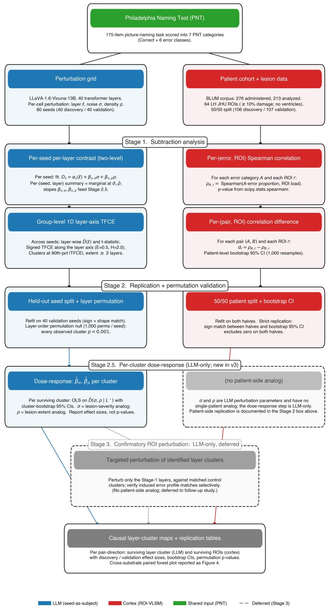

Figure 1. Schematic of the PRISM pipeline. Top branch (LLM, seed-as-subject layer-axis TFCE): per perturbation seed � and each (layer $\ell ,$ noise standard deviation �, perturbation density $\rho )$ cell, score the 158-item baseline-correct analysis set into seven categories; for each ordered pair (�, �) average the per-cell diference $p _ { s } ( A ) - p _ { s } ( B )$ across the $\sigma \times \rho$ grid within seed to yield a per-seed layer profile $D _ { s } ( \ell )$ ; group-level mean, t-statistic, and 1D TFCE along the layer axis across seeds; replicate on a held-out 40-seed split. Bottom branch (cortex, ROI-level Spearman correlation-diference VLSM): per patient score the PNT into seven categories and compute the per-ROI lesion-load fraction across 64 left-hemisphere JHU atlas regions; per-(error, ROI) Spearman rank correlation across patients; per-(pair, ROI) correlation diference $d _ { r } = \rho _ { A , r } - \rho _ { B , r } ;$ replicate on a 50/50 patient split with patient-level bootstrap. The pipelines are matched in subject dimension (seeds / patients), spatial dimension (transformer layers / atlas-parcellated cortex), and thresholding step (TFCE along an ordered axis $/$ correlation-diference VLSM with bootstrap CI); the contrast operator difers (within-subject error-proportion diference / between-subject correlation diference).

We applied PRISM to the three pre-registered confirmatory error contrasts on both substrates. Semantic versus Phonemic is the direct test, pitting the two clinically central real-word error classes against each other; Phonemic versus Neologism and Semantic versus Neologism each cross-check one of the two real-word classes against the non-real-word baseline that Neologism provides. The same three contrasts were run on the human cortex (213 patients, 50/50 split into 106 discovery and 107 validation) and on the LLM (80 perturbation seeds, 40 discovery and 40 validation), parameterized at the level appropriate to each substrate: layer-axis TFCE over a seed-as-subject group analysis on the LLM, and ROI-level univariate Spearman correlation-diference VLSM on the 64 left-hemisphere JHU atlas regions for the cortex. Before reporting the subtraction analyses, we first verify that every error category carries a non-trivial univariate signal on both substrates; full per-pair subtraction results follow in the subsequent subsections (with all 15 pairwise contrasts in Supplementary Figures S2 and S3, and full inferential detail for the univariate analyses in Supplementary §S7 and Tables S5–S6).

## Per-category univariate signal on both substrates

Subtraction can mask category-specific signal that is present at the level of the marginals, two error categories with similar spatial loading can dissociate weakly even when each is itself spatially structured. We therefore first report the per-category univariate maps on both substrates before any pairwise subtraction (Figure 2). On the LLM, the per-layer mean error-category proportion across the 40 discovery seeds (with � and � averaged within seed) shows a category-specific layer profile for every one of the six non-Correct PNT categories: Phonemic peaks at deep-middle layers (\~25–30), Semantic rises gradually through the network and remains elevated at the deepest layers, Neologism peaks in mid-network (\~15–20), Mixed accumulates gradually, Unrelated peaks at midnetwork and falls of, and NoResponse carries a high baseline that declines across the network. On the cortex, the per-ROI Spearman rank correlation between each error-category proportion and the per-patient JHU ROI lesion load, without any age, sex, or other covariate adjustment, to match the no-covariates LLM-side analysis, yields category-specific spatial maps for every category as well; Phonemic and NoResponse show the strongest perisylvian loading, with Semantic, Neologism, Mixed, and Unrelated each lighting up smaller but anatomically interpretable territories. The point of this subsection is not to interpret each map in detail (those interpretations and per-category top-ROI tables are in Supplementary §S7 and Tables S5–S6) but to establish that signal is present percategory on both substrates before any subtraction. The subtraction results that follow therefore reflect diferential loading across paired categories, not the presence or absence of signal for either category individually.

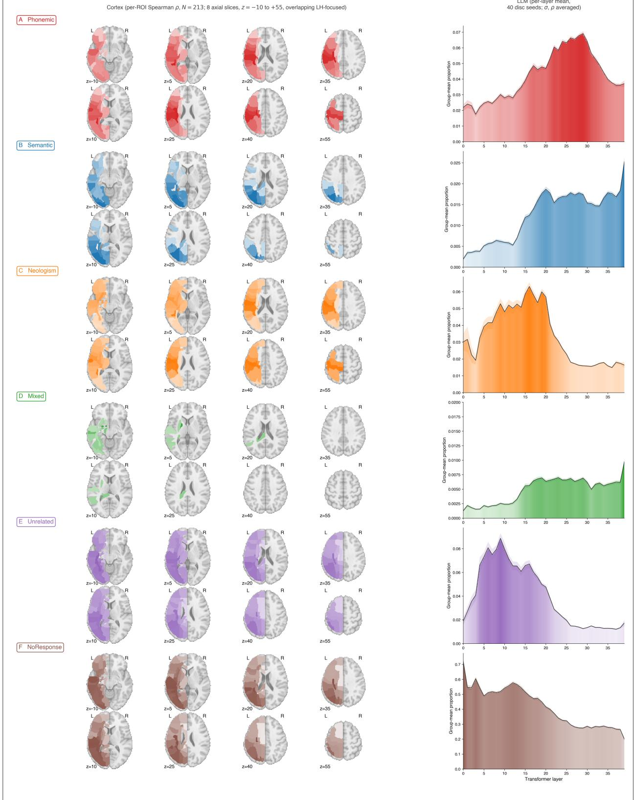  
Figure 2. Per-category univariate signal on both substrates, computed without covariate adjustment to match the no-covariates LLM analysis. Layout is 6 rows × 2 columns, one row per non-Correct PNT error category. Left column (cortex): per-ROI Spearman rank correlation between

the per-patient PNT error-type proportion and the per-patient JHU ROI lesion load on the � = 213 analyzed patients, rendered on three axial slices of the MNI152 T1 template at $z = - 2 , + 1 8 , + 3 8$ Right column (LLM): per-layer group-mean PNT proportion across the 40 discovery seeds with � and � averaged within seed, with 95% CI shading. A. Phonemic. B. Semantic. C. Neologism. D. Mixed. E. Unrelated. F. NoResponse. Each error category carries category-specific signal on both substrates; the subtraction results that follow (Figures 3 and 4) report the diferential loading across paired categories rather than the presence or absence of signal at the marginal.

Human cortex: a robust frontal-perisylvian Phonemic > Semantic cluster; the Semantic > Phonemic direction is a consistently signed but non-significant trend

On the patient cohort, the primary Semantic-versus-Phonemic contrast yields an unambiguous Phonemic > Semantic ROI cluster centered on the left postcentral gyrus $( \Delta \rho _ { \mathrm { d i s c } } = - 0 . 2 7 5$ , bootstrap 95% CI [−0.568, −0.012] on discovery, $\Delta \rho _ { \mathrm { v a l } } = - 0 . 3 0 1 , [ - 0 . 5 1 2 , - 0 . 0 5 8 ]$ on validation), precentral gyrus (disc −0.234, [−0.521, +0.045]; val −0.299, [−0.531, −0.064]), and SLF (disc and val both significantly negative). The Phonemic > Semantic direction at PoCG\_L and PrCG\_L is the only direction–ROI combination in the primary contrast that survives the strictest replication criterion, sign-matched across halves with both discovery and validation bootstrap 95% CIs excluding zero. The Semantic > Phonemic direction has consistently signed point estimates on discovery in posterior temporo-occipital cortex (LG\_L, Cu\_L, MOG\_L, SOG\_L, IOG\_L) but the validation point estimates flip sign or shrink to near zero, and no Semantic > Phonemic ROI’s CI excludes zero on both halves. The honest characterization is therefore that the Phonemic > Semantic direction is a robust replicating cluster on the cortex and the Semantic > Phonemic direction is a consistently signed but non-significant trend (Figure 3). The Phonemic-versus-Neologism and Semantic-versus-Neologism cross-checks recover the same dissociation: Neologism > Semantic loads on the same frontal-perisylvian territory as Phonemic > Semantic (PoCG, PrCG, SLF all replicating), and the semantic-favoring direction in the cross-checks is again a sub-significant trend. Full per-pair ROI maps and statistics for all 15 pairwise contrasts are in Supplementary Figure S3 and Tables S2–S3.

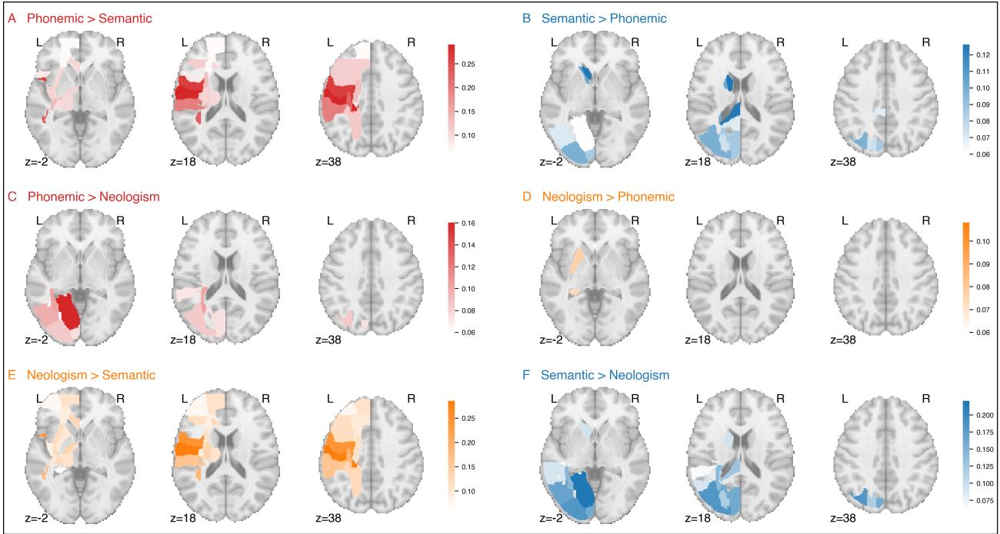

Figure 3. Human LSM cortical subtraction maps for the three confirmatory contrasts on the patient cohort. Each left-hemisphere JHU atlas region is colored by its correlation diference $\Delta \rho _ { r } =$ $\rho ( A , \mathrm { l e s i o n } _ { r } ) { - \rho ( B , \mathrm { l e s i o n } _ { r } ) }$ , where $\rho$ is the Spearman rank correlation between the per-patient errortype proportion and the per-patient lesion load in the ROI, rendered on three axial slices of the MNI152 T1 template $( z = - 2 , 1 8 , 3 8 )$ . Color matches the category favored by each direction (red = Phonemic-favoring, blue = Semantic-favoring, orange = Neologism-favoring). The six directionsplit panels here pair into the three confirmatory contrasts of Figure 4 (panels $\mathrm { A + B  }$ Figure 4A; panels $\mathrm { C + D  }$ Figure 4B; panels E+F → Figure 4C).

A. Phonemic > Semantic (primary contrast). B. Semantic > Phonemic (primary contrast). C. Phonemic > Neologism (cross-check). D. Neologism > Phonemic (cross-check). E. Neologism $>$ Semantic (cross-check). F. Semantic > Neologism (cross-check).

The three phonemic- and neologism-favoring panels $( \mathrm { A } , \mathrm { C } , \mathrm { E } )$ all light up the same left frontalperisylvian territory, postcentral gyrus, precentral gyrus, supramarginal gyrus, and superior longitudinal fasciculus. The three semantic-favoring panels (B, D, F) are markedly weaker and more difusely distributed, an asymmetry that parallels the LLM-side result below (Figure 4).

LLM layers: a robust deep Phonemic > Semantic cluster; the Semantic > Phonemic direction does not survive

The three confirmatory contrasts on the LLM side, run under the seed-as-subject layer-axis TFCE pipeline, recover the same asymmetric pattern (Figure 4). The primary Semantic-versus-Phonemic contrast yields a single robust Phonemic > Semantic layer cluster spanning layers 22–31 on discovery (TFCE peak at layer 22, with the cluster’s largest $\bar { D } \approx - 0 . 0 5$ at layer 29; Stage-2 layer-permutation $p < 0 . 0 0 1 )$ and 23–33 on validation, with no surviving Semantic > Phonemic cluster in either half (Figure 4A). The Phonemic-versus-Neologism cross-check yields a Phonemic > Neologism cluster at layers 24–31 (Figure 4B; peak $\bar { D } \approx + 0 . 0 5 )$ coincident in depth with the primary-contrast Phonemic > Semantic cluster, and only a consistent-sign-but-non-significant Neologism > Phonemic trend in earlier layers. The Semantic-versus-Neologism cross-check yields two Neologism > Semantic clusters at layers 16–17 and 19–20 (Figure 4C) and essentially no Semantic > Neologism layer cluster. Across all three contrasts, the surviving layer clusters all sit in the Phonemic- and Neologismfavoring directions; the Semantic-favoring direction is a consistently signed but sub-threshold trend on the LLM side, matching the human-side asymmetry. Stage 2 layer-order permutation validation: every observed cluster across the 15 pairwise contrasts cleared $p < 0 . 0 0 1$ against an independently permuted-layer null, confirming that the cluster mass depends on the intrinsic layer ordering and not on the marginal distribution of contrast values.

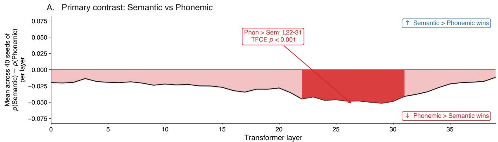

B. Cross-check: Phonemic vs Neologism  
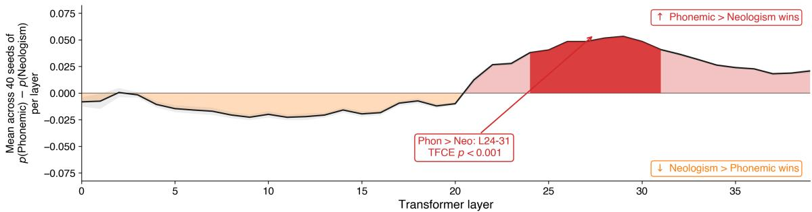

C. Cross-check: Semantic vs Neologism  
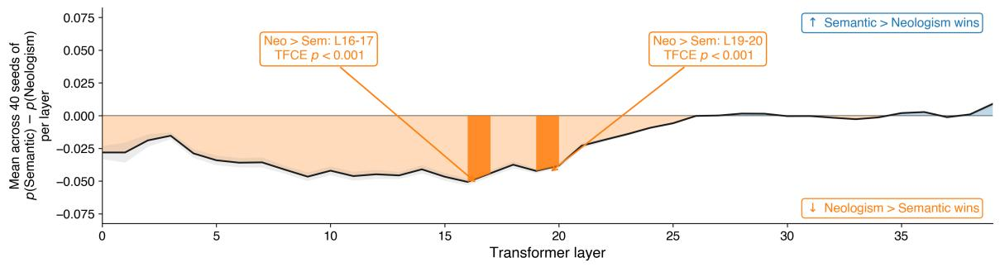  
Figure 4. PRISM layer maps for the three confirmatory contrasts on the LLM, organized as three pair-level panels that pair into the direction-split panels of Figure 3 (Figure 4A ↔ Figure 3 A+B; Figure 4B ↔ Figure 3 C+D; Figure 4C ↔ Figure 3 E+F). Each panel plots the group-level layer-axis profile $\mathrm { m e a n } _ { \sigma , \rho } \left[ p ( \mathrm { c a t } _ { 1 } ) - p ( \mathrm { c a t } _ { 2 } ) \right]$ across the 40 discovery seeds; the area between the curve and zero is filled in the category color of whichever side is favored at each layer (above zero = the first-listed category wins; below zero = the second-listed wins). TFCE-surviving cluster ranges are highlighted with a saturated solid fill and a labeled callout in the opposite (empty) half-plane, giving the cluster’s layer range and the Stage-2 layer-permutation �-value. Directional labels inside each panel indicate which category is favored by each sign of the y-axis.

A. Primary contrast, Semantic vs Phonemic. The curve is below zero throughout the network, with a TFCE-surviving Phonemic > Semantic cluster at layers 22–31. B. Cross-check, Phonemic vs Neologism. The curve crosses zero around layer 20; a TFCE-surviving Phonemic > Neologism cluster sits at layers 24–31. C. Cross-check, Semantic vs Neologism. The curve is below zero for most of the network, with two TFCE-surviving Neologism > Semantic clusters at layers 16–17 and 19–20.

The semantic-favoring direction does not survive cluster correction on either the discovery or the validation half, so a natural skeptical reading is that the Semantic > Phonemic efect is real but underpowered. Three observations argue against that reading and for the asymmetry as a feature of the data rather than a sampling artifact. First, the Sem-favoring point estimates do not grow from discovery to validation as a power-limited efect would: �̄ in the Sem-favoring direction is indistinguishable from zero on both halves, with no discernible directional drift across the seed split (Figure 5; Supplementary Table S1). Second, the same asymmetry replicates on the cortical analysis, where $N = 2 1 3$ patients dwarfs the 40-seed LLM discovery cohort; if the LLM null were purely a power problem we would expect the larger-� cortical analysis to surface the Sem-favoring efect clearly, and it does not (no Sem-favoring ROI clears the strict replication criterion on the $5 0 / 5 0$ patient split; Tables S2, S3). Third, the dose-response analysis (below) finds no positive scaling of the contrast magnitude with � or � in the Sem-favoring direction at any surviving cluster’s layers, ruling out the “signal is present but obscured by noise” version of the power explanation. We nevertheless flag in Future Directions that a higher-seed-count replication is planned as a direct power test; the planned design scales the discovery and validation seed counts beyond 40 each while holding the analysis pipeline fixed.

## Out-of-sample replication on both substrates

LLM side: the discovery-set layer clusters reproduce on the 40-seed held-out validation set. The primary Semantic-versus-Phonemic Phonemic > Semantic cluster shifts only marginally in extent (discovery: layers 22–31; validation: layers 23–33) and not in sign or location; the Phonemic > Neologism cluster on validation lands at layers 24–33 (discovery: 24–31), again preserving sign and location. The Semantic > Phonemic and Semantic > Neologism directions remain sub-threshold on validation, as they did on discovery. Stage 2 layer-permutation: all 15 observed pair-level clusters cleared the empirical $p < 0 . 0 0 1$ threshold against an independently permuted-layer null, demonstrating that the cluster mass is licensed by the intrinsic ordering of layers.

Human side: of the $1 5 \times 6 4 = 9 6 0$ (pair, ROI) tests in the 50/50 patient split, 714 (74%) had matching sign between discovery and validation halves, and 60 (6.3%) survived the strict replication criterion of sign match + bootstrap CI excluding zero on both halves. In the primary contrast, the strictly replicating ROIs are exclusively in the Phonemic > Semantic direction (PoCG\_L: disc $\Delta \rho = - 0 . 2 7 5 ~ [ - 0 . 5 6 8 , ~ - 0 . 0 1 2 ]$ , val −0.301 [-0.512, -0.058]; PrCG\_L: disc −0.234 [-0.521, +0.045], val $- 0 . 2 9 9 \ [ - 0 . 5 3 1 , - 0 . 0 6 4 ] )$ ; no Semantic > Phonemic ROI in the primary contrast replicates by this criterion. The same asymmetry is mirrored in both Neologism cross-checks. The cross-substrate headline is consistent: the phonemic-favoring direction is robust and replicates on both substrates; the semantic-favoring direction is a consistently signed but non-significant trend on both substrates. Full per-(pair, ROI) replication statistics are in Supplementary Table S2.

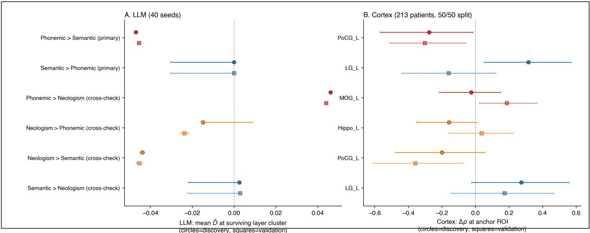  
Figure 5. Cross-substrate forest plot. Per pair-direction discovery and validation $\bar { D }$ at the surviving layer cluster on the LLM side, and discovery and validation $\Delta \rho$ for the strictest-replicating ROIs on the human side, each with 95% bootstrap confidence intervals. The plot compresses the asymmetry into a single visual: the phonemic-favoring efects (Phonemic > Semantic primary; Phonemic > Neologism cross-check) cluster on the negative- $\cdot \Delta$ side on both substrates and have CIs excluding zero on both halves, while the semantic-favoring efects sit at or near zero on both substrates.

## Dose-response structure of the recovered layer clusters

Each surviving phonemic-favoring layer cluster on the LLM side carries a dose-response signature with respect to perturbation depth (�) and perturbation extent $( \rho )$ , the LLM analogs of lesion severity and lesion extent (Figure 6; full per-pair slopes for all 15 pairwise contrasts on both halves are in Supplementary Table S4). For the primary Semantic-vs-Phonemic cluster (layers 22–31), the discovery-seed OLS dose-response slopes are $\bar { \beta } _ { \sigma } = - 0 . 1 8 2$ (95% cluster-bootstrap CI $\left[ - 0 . 1 8 5 , - 0 . 1 7 9 \right] )$ and $\hat { \beta } _ { \rho } = - 0 . 4 6 2 \ \left( \left[ - 0 . 4 7 4 , - 0 . 4 5 1 \right] \right)$ , both with the same sign as the cluster’s contrast: deeper and more extensive perturbations produce a stronger Phonemic > Semantic dissociation on average. The same slopes on validation seeds are essentially identical $( \hat { \beta } _ { \sigma } = - 0 . 1 7 6$ $\hat { \beta } _ { \rho } = - 0 . 4 3 4 )$ . The Phonemic-vs-Neologism cross-check shows the same scaling pattern at coincident layers (24–31); the Semantic-vs-Neologism Neologism > Semantic efect at the early midnetwork layers (19–20) scales in the same (negative) direction as its contrast, so the Neologism $>$ Semantic dissociation likewise strengthens with both � and $\rho .$

The dose-response surface in Figure 6 is informative beyond the linear slope. Across all three clusters, the per-cell mean $| D |$ does not increase monotonically with $\sigma$ and $\rho$ across the full grid. It peaks along a diagonal ridge on which perturbation depth and perturbation extent trade of inversely, and falls away on both sides of that ridge: for the primary cluster the global maximum sits at $\sigma = 1 . 5 , \rho = 0 . 7 \left( | D | = 0 . 2 2 \right)$ , with comparable maxima at $\sigma = 1 . 8 , \rho = 0 . 4$ and $\sigma = 2 . 0 , \rho = 0 . 3$ while both the low-dose corner $( \sigma = 1 . 1 , \rho = 0 . 1 )$ and the high-dose corner $( \sigma = 2 . 0 , \rho = 1 . 0 )$ fall to near zero. What governs the contrast is therefore the total amount of perturbation delivered rather than either parameter alone. We interpret this as a category-diferentiation regime: moderate total perturbation maximally separates error categories from each other, while severe perturbation degrades that diferentiation as all error categories rise together. The directional slopes $( { \hat { \beta } } _ { \sigma }$ and $\hat { \beta } _ { \rho } ,$ each matching its cluster’s contrast sign) are coarse directional summaries of the average dose dependence across the grid; the bilinear-plus-interaction OLS explains only a modest share of each surface $( R ^ { 2 } \approx 0 . 1 8 – 0 . 2 6 )$ , so we treat $\hat { \beta } _ { \sigma }$ and $\hat { \beta } _ { \rho }$ as directional descriptors of the observed $\sigma \times \rho$ surfaces rather than as a global model of them. The saturating shape captures the limit of the perturbation-as-lesion analogy at very high perturbation levels. Both properties replicate on the held-out 40-seed validation cohort.

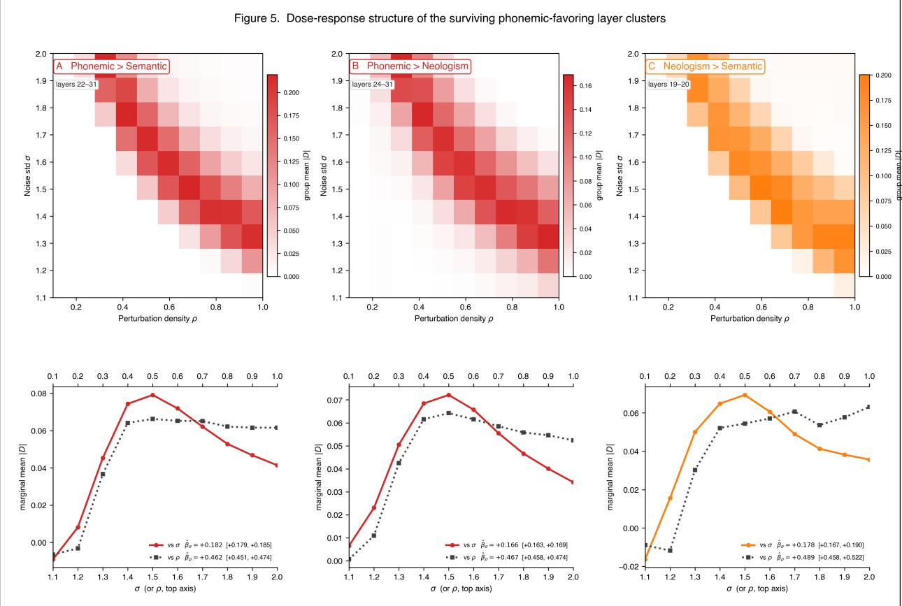  
Figure 6. Per-cluster dose-response surfaces for the three surviving phonemic-favoring layer clusters on the LLM side, computed from the 40 discovery seeds. Top row: heatmaps of group-mean |�| at the cluster’s layers across the $\sigma \times \rho$ perturbation grid. Bottom row: marginal mean $| D |$ as a function of � (solid, panel anchor color) and as a function of $\rho$ (dotted, grey), with cluster-bootstrap 95% CIs on the OLS slopes $\hat { \beta } _ { \sigma }$ and ${ \hat { \beta } } _ { \rho } .$ A. Phonemic $>$ Semantic (primary; Semantic\_minus\_ Phonemic, negative direction, layers 22–31). B. Phonemic > Neologism (cross-check; Phonemic minus\_Neologism, positive direction, layers 24–31). C. Neologism > Semantic (cross-check; Semantic\_minus\_Neologism, negative direction, layers 19–20). Across all three clusters, each cluster’s directional contrast scales in the direction of its own sign, deepening with both $\sigma$ (perturbation depth, analog of lesion severity) and $\rho$ (perturbation extent, analog of lesion volume) over the lower part of the grid, then declining once total perturbation passes a moderate level, consistent with a graded-lesion regime that gives way to undiferentiated noise at extreme perturbation.

## Discussion

## Summary of principal findings

PRISM demonstrates that the subtractive approach can be applied both to a 13-billion-parameter vision-language transformer and to a cohort of 213 chronic-aphasia patients administered the same task, with the parallel holding at the level of subject (seeds for the LLM, patients for the cortex), spatial dimension (transformer layers for the LLM, atlas-parcellated cortex for the patients), and TFCE-style thresholding along an ordered axis. The contrast operator is not parallel, the LLM side is a within-subject diference in error proportions averaged across seeds, the human side is a between-subject correlation diference, but the spatial-inferential machinery is. On the LLM side, the primary Semantic-versus-Phonemic contrast under seed-as-subject layer-axis TFCE yields a robust Phonemic > Semantic layer cluster at layers 22–31 (discovery, validation 23–33), which is corroborated by a coincident Phonemic > Neologism cluster at layers 24–31 against the non-realword baseline. The Semantic > Phonemic direction does not survive on the LLM in any of the three confirmatory contrasts. PRISM Stage 2 layer-order permutation testing places every observed cluster at empirical $p < 0 . 0 0 1$ against a null in which layer order is destroyed within each seed. On the cortex, the matched ROI-level correlation-diference VLSM with 50/50 patient split recovers the same asymmetry: PoCG\_L and PrCG\_L survive the strictest replication criterion in the Phonemic > Semantic direction on both halves; the Semantic > Phonemic direction has consistently signed point estimates that do not survive replication. The honest cross-substrate headline is therefore that the phonemic-favoring direction is robust and replicates on both substrates, and the semantic-favoring direction is a consistently signed but non-significant trend on both substrates, an asymmetry that is itself a replicable property of the data rather than a failure of the method.

## Convergence with the human LSM maps

The Semantic-versus-Phonemic, Phonemic-versus-Neologism, and Semantic-versus-Neologism contrasts each recover a phonemic-favoring direction that survives both substrates’ replication standards (layer-axis TFCE with seed-as-subject group analysis on the LLM; ROI-level Spearman correlation-diference VLSM with 50/50 patient split on the cortex). On the cortex, the recov ered phonemic-favoring territory recapitulates an efect that has been established for decades in lesion-symptom mapping of post-stroke aphasia (Bates et al. 2003; Mirman et al. 2015; Schwartz et al. 2006, 2009, 2012; Dell et al. 1997; Walker et al. 2011; Lambon Ralph et al. 2017; Patterson et al. 2007). On the LLM, the same efect is, to our knowledge, new at the layer level: a transformer hierarchy trained only on next-token prediction reproduces the phonemic-favoring axis when systematically perturbed, without any supervision on aphasia-symptomatology constructs. The semantic-favoring direction is a consistently signed but non-significant trend on both substrates, neither the LLM layer-axis TFCE (which finds no Semantic > Phonemic cluster on either discovery or validation seeds) nor the human-side ROI VLSM (which finds no Semantic > Phonemic ROI that survives the strict replication criterion in the primary contrast) supports calling the semantic side a “recovered cluster” in the same sense as the phonemic side. The asymmetry itself is the replicable finding. The cross-substrate alignment is visible directly by reading the cortical subtraction map (Figure 3) against the layer subtraction map (Figure 4): both substrates show a robust phonemic-favoring map (left perisylvian on cortex; layers 22–31 in the LLM) and a sub-threshold semantic-favoring trend.

The point of running both pipelines within the same paper is not to interpret the cross-substrate map alignment in detail, but to demonstrate that the same conceptual machinery yields the same asymmetric result on both sides at the inference unit appropriate to each substrate; the populationlevel correspondence reported in BLUM (Fridriksson et al. 2026) is thereby demonstrated inside the present study rather than asserted by analogy. The cross-substrate result strengthens the alignment claim made by the broader corpus of LLM–brain alignment work (Schrimpf et al. 2021; Caucheteux and King 2022; Goldstein et al. 2022, 2025; Antonello et al. 2024; Tuckute et al. 2024; Kumar et al. 2024; Mischler et al. 2025; Gao et al. 2025; Mahowald et al. 2024) by adding behavioral-failure mode alignment to the existing repertoire. Falsifiability is also stronger here than in BLUM, because both sides have now passed through out-of-sample replication on independent held-out splits and the LLM side has additionally passed through Stage-2 layer-permutation validation.

## Importing lesion-symptom mapping into LLM interpretability

The dominant interpretability methods (probing classifiers, causal mediation, activation patching, circuit discovery, sparse autoencoders; Belinkov 2022; Meng et al. 2022; Geiger et al. 2021; Heimersheim and Nanda 2024; Conmy et al. 2023; Wang et al. 2023; Cunningham et al. 2023; Templeton et al. 2024) evaluate claims against benchmarks or internal reconstruction quality rather than against an externally validated, behaviorally defined map of what model components are causally necessary for. PRISM supplies that missing criterion by importing the cluster-based subtraction pipeline of functional neuroimaging (Petersen et al. 1988; Friston et al. 1995; Smith and Nichols 2009) and the lesion-symptom-mapping logic that grounds it in causal necessity (Bates et al. 2003; Mirman et al. 2015), and by applying the same logic to a human patient cohort within this study. On the LLM side, a layer-targeted parameter perturbation is an experimental manipulation, the error-category proportion is the outcome, and the inference is that the manipulated layer cluster is necessary in the forward pass for avoiding that error class, a counterfactual structure that becomes a strict causal-mechanism claim only after the planned PRISM Stage 3 confirmatory ROI intervention (Future Directions). The human side is, as in all lesion-symptom mapping, quasi-causal: lesions are observed rather than assigned, so the cortical maps support causal-necessity claims only to the degree the LSM literature already licenses. A clinician or aphasia researcher can score a positive PRISM result without inspecting any model internals; a negative result is falsifiable in the same sense a failed lesion-symptom prediction is. Both properties were absent from the dominant component-level tradition.

## Dose-response evidence that the perturbation behaves as a graded lesion

The within-seed $\sigma \times \rho$ block at each cluster supplies a second piece of cross-substrate evidence that goes beyond cluster recovery. $\sigma ,$ the standard deviation of the multiplicative Gaussian noise applied to the targeted layer’s weights, is the LLM analog of how completely tissue is destroyed within a damaged region in human lesions; $\rho ,$ the fraction of that layer’s weights perturbed, is the analog of lesion volume (the spatial extent of damage). The aphasia literature has worked on the behavioral signature of these two lesion properties for decades, and the directional prediction is clear: a deeper lesion produces a worse functional deficit, and a more extensive lesion produces a wider deficit. On the LLM side, every surviving phonemic-favoring layer cluster scales its directional contrast in the direction of that cluster’s own contrast (deepening) with both $\sigma$ and $\rho$ across the full perturbation grid; this scaling replicates on the held-out 40-seed validation cohort. We read this as consistent with the perturbation acting as a graded lesion analog rather than as undiferentiated noise. We are cautious not to overstate it: monotone sensitivity to perturbation magnitude is not by itself diagnostic of a lesion-like mechanism, since many non-specific efects also scale with noise. The more distinctive observation is the shape of the surface, a graded rise followed by saturation (below), rather than the bare existence of a slope.

This dose-response result also addresses, from a diferent angle than Stage 2 permutation, the residual-connection concern raised in the Introduction (Elhage et al. 2021). The residual-connection worry is that a layer-targeted perturbation may not isolate that layer’s computation as cleanly as a focal cortical lesion isolates a cortical region. Stage 2 layer-order permutation answers one form of the worry: the recovered cluster mass depends on the ordering of layers and not on the marginal distribution of contrast values. The dose-response scaling answers a separate form of the worry:

the recovered cluster’s contrast is graded in the dose parameter, not flat, which is what we would expect from a functioning lesion analog but not from a non-specific perturbation. The dose-response surface saturates at very high � and � (Figure 6), marking the limit of the analogy: at extreme perturbation the LLM produces all error categories together and category-diferentiating signal degrades, the LLM analog of a lesion so large it no longer maps onto a specific functional deficit.

## What layer-cluster claims license

Because PRISM identifies layer clusters by their behavioral consequence rather than by their internal computation, its claims are coarse-grained by design and complement rather than compete with the component-level interpretability tradition. The implicated layer ranges are necessary in the forward pass under perturbation, not computationally suficient as standalone units; residual connections couple every layer’s output to all preceding layers (Elhage et al. 2021), so the cluster identifies a necessary path rather than a suficient module. A natural integration is to apply sparse-autoencoder feature decomposition or activation patching to the layers PRISM identifies as causally necessary for a given error category, transforming the search for fine-grained interpretable features from an exhaustive sweep into a focused search within behaviorally validated regions. The same logic applies in reverse: a component-level claim that a particular layer range carries semantic information is testable under PRISM by checking whether targeted perturbation of those layers selectively elevates semantic errors.

The behavioral grounding also licenses the patient-specific digital twins that motivated the broader research program initiated by BLUM. Within the present architecture, PRISM identifies the perturbation conditions whose error profiles most closely match an individual patient’s profile, supplying a layer-cluster-level computational surrogate on which trial-design simulations and individualized rehabilitation strategies can be screened in silico. The artificial setting’s experimental controllabil ity, noted in the Introduction, is what makes it useful as a complement to lesion-symptom mapping in human patients rather than merely an analogue of it.

## Limitations

The present analysis is confined to one architecture, one behavioral task, and Stages 1 and 2 of the three-stage PRISM framework. Whether the phonemic-favoring-versus-semantic-favoring dissociation replicates in pure-text language models, in encoder-decoder architectures, at diferent parameter scales, in additional clinical tasks (the WAB-R, sentence completion, story comprehension), and across additional aphasia subtypes (Broca’s, Wernicke’s, conduction, anomic, mixed transcortical, global) are open empirical questions that the same pipeline supports without modification but that we do not answer here. Stage 3 (confirmatory ROI perturbation against matched non-significant control clusters) is by construction an LLM-only step, there is no patient-side analog, and is deferred to a follow-up study; PRISM as reported in this paper is therefore an LLM method with a matched human comparison at Stages 1 and 2, rather than a symmetric two-substrate framework at all three stages. Residual connections couple every transformer layer’s output to all preceding layers, so the implicated layer clusters are necessary within the forward pass under perturbation rather than computationally suficient as standalone units. Finally, the seven-category clinical taxonomy collapses sub-categories within Phonemic and Semantic that would themselves be informative; sub-category contrasts are a defined extension that the present pipeline supports but that we do not pursue here.

The two perturbation parameters that index the LLM analysis also have plausible (though loose) clinical analogs in the patient population. The Gaussian-noise standard deviation �, which controls how heavily a layer’s weights are perturbed multiplicatively, is analogous to the depth of focal tissue damage or the completeness of a fiber-tract disconnection on a per-patient basis. The perturbation density �, which controls the fraction of the layer’s weights actually perturbed, is analogous to the spatial extent of the lesion, that is, the fraction of an anatomically defined region rendered nonfunctional. We frame these as analogies rather than equivalences; their utility is that the same coordinates organize the LLM-side variation and (within limits) the lesion-load variation across patients, supporting future work that explicitly co-parametrizes severity and extent on both substrates.

## Future directions

The immediate completing extension is PRISM Stage 3, confirmatory ROI perturbation of the identified phonemic-favoring layer cluster against matched non-significant control clusters, on the LLM side only. Beyond this, cross-architecture replication tests whether the phonemic-favoring layer organization is an emergent property of next-token prediction over language-rich data or a contingent feature of LLaVA-1.6-Vicuna-13B’s training trajectory; cross-task replication tests whether the same organization carries across picture-naming, sentence-completion, and free generation. Methodologically, finer error-category subdivision and integration with sparse-autoencoder decomposition within the PRISM-identified layer ranges (Cunningham et al. 2023; Templeton et al. 2024) extend the framework’s inferential reach without changing its conceptual structure. A direct next step on the inferential side is to resolve the semantic-favoring trend either by enlarging the patient cohort, by reducing the seven-category PNT taxonomy to a binary Semantic-vs-Phonemic outcome via re-scoring, or by switching to a multivariate VLSM/LLM analysis that pools strength across small per-region efects.

## Conclusions

PRISM imports the cluster-based subtraction pipeline of human cognitive neuroscience into transformer interpretability and applies it, under matched subject / spatial / TFCE machinery, to a perturbed 13-billion-parameter vision-language transformer and to a cohort of 213 chronic-aphasia patients administered the same task. The Semantic-versus-Phonemic contrast and its two Neologism cross-checks each recover a robust phonemic-favoring map on both substrates, a frontalperisylvian Phonemic > Semantic ROI cluster on the cortex (PoCG, PrCG, SLF; replicating on a 50/50 patient split) and a deep Phonemic > Semantic layer cluster on the LLM (layers 22– 31; replicating on a 40/40 seed split and clearing Stage-2 layer-permutation at $p < 0 . 0 0 1 )$ . The semantic-favoring direction is a consistently signed but non-significant trend on both substrates, an asymmetry that itself replicates and is the honest characterization of the data. Demonstrating both substrates within a single study, with each analyzed at the inference unit appropriate to its data, establishes the methodological prerequisite for patient-specific computational surrogates of neurological language disorders, with applications to clinical-trial design, individualized rehabilitation, and pharmacological prediction.

## Ethics statement

All study procedures involving human participants were approved by the University of South Carolina Institutional Review Board (approval number Pro00053559), and all participants provided written informed consent. The patient data analyzed here are drawn from the archival database maintained by the Aphasia Lab at the University of South Carolina and were collected under that approval. No new human data were collected for the present study.

## Data availability

The LLM-side derived data are included without restriction in the Zenodo deposit described under Code Availability below, and are released to Open Access on the same schedule. These comprise the complete seed-summary matrices for the 40-seed discovery and 40-seed validation splits, covering every perturbation condition in the layer × noise × density grid, scored into the eight raw Philadelphia Naming Test response categories: the full set of inputs from which every LLM-side result in this paper is computed.

Per-participant behavioural error proportions and ROI-level lesion-load matrices used in the cortical analyses are housed within the Center for the Study of Aphasia Recovery (C-STAR) at the University of South Carolina, which maintains an IRB-approved, HIPAA-compliant data-sharing infrastructure for external collaborators. Investigators interested in using these data submit the C-STAR Data Request Form, which captures the proposed research aims, requested datasets, IRB status, and data-handling arrangements; the form is reviewed by the C-STAR program manager and the author team on a non-discriminatory basis, with reasonable academic and replication requests approved by default and a decision typically provided within four weeks. Approved requesters then execute the C-STAR Data Use Agreement, an IRB-approved agreement governing disclosure of a HIPAA Limited Data Set with all 16 categories of HIPAA identifiers removed. These data are not openly deposited because the same cohort’s raw T1/T2 MRI and lesion masks are publicly available via OpenNeuro under that platform’s standard sharing terms, keyed by the same lab master numbers; open deposition of per-participant behavioural data keyed by those identifiers would create a re-identification path through a join against the public neuroimaging data, particularly for participants with unusual lesion profiles, and the cohort’s IRB-approved sharing protocol obliges us to mitigate that risk. ROI-level aggregate outputs, which carry no per-participant rows, are included in the open deposit.

The Johns Hopkins University white-matter and grey-matter atlas (Mori et al. 2008) used as the cortical target space is available from its original distributors; the label and region-retention files specifying the 64 left-hemisphere regions analyzed here are included in the open deposit.

## Code availability

Source code for the full PRISM pipeline is deposited in a Zenodo record under the Apache License 2.0. The deposit contains the three-stage LLM analysis (seed-as-subject discovery with thresholdfree cluster enhancement along the layer axis, layer-order and category-label permutation validation, and per-cluster dose-response analysis), the cortical ROI-correlation and split-replication code, all figure-generation scripts, and the LLM-side derived data described above. The 3D TFCE operator is implemented from first principles rather than called from an external library, so that the threshold enumeration, connectivity definition, and step-spacing conventions are explicit and auditable. The deposit is complete and its contents are final. It is not yet public during peer review and will be released to Open Access at the time of publication, at which point its DOI will be registered and cited here; a private link giving full access to the record and its files is available to editors and reviewers on request from the corresponding author.

The Apache 2.0 license includes an explicit patent-license grant, so users of the released code may use it for both academic and commercial purposes covered by the released implementation. PRISM builds on the BLUM methodology, which is the subject of U.S. Patent US-10916348-B2 and U.S. Provisional Application No. 63/974,622; researchers wishing to apply the broader patented methodology beyond the released code should contact Julius Fridriksson (fridriks@mailbox.sc.edu). The base large language model, LLaVA-1.6-Vicuna-13B, is publicly avail able via Hugging Face (https://huggingface.co/liuhaotian/llava-v1.6-vicuna-13b) under its original

LLaMA-derived license.

## Acknowledgments and funding

We thank the patients and families who participated in the Aphasia Lab studies at the University of South Carolina, and the clinical and research staf who collected and maintained the archival database used in this work. This research was supported by the NIH/NIDCD Center for the Study of Aphasia Recovery (C-STAR) at the University of South Carolina (NIH P50 DC014664 to J.F.) and by a SmartState endowment established with private funding arranged by the state of South Carolina for J.F. The funders had no role in study design, data collection and analysis, decision to publish, or preparation of the manuscript.

## Declaration of interests

J.F. has an ownership interest in NXTLLM, LLC, and ALLT.AI, LLC, which hold patents related to the Brain–LLM Unified Model (BLUM) technology on which the framework described in this manuscript builds. The symptom-to-lesion mapping approach is protected under U.S. Patent US-10916348-B2. J.F. and R.D.N.-N. are inventors on a provisional U.S. patent application related to methods described in this work (U.S. Provisional Application No. 63/974,622, filed February 3, 2026). J.F. and R.D.N.-N. hold an afiliation with ALLT.AI, LLC. R.D.N.-N., S.N., L.B., and C.R. serve as unpaid members of the ALLT.AI scientific advisory board. A further co-inventor on the patents referenced above holds an ownership interest in NXTLLM, LLC, and ALLT.AI, LLC, but is not an author of the present manuscript.

The other authors declare no competing interests.

## Author contributions

Xiang Guan: Data curation, Formal analysis, Investigation, Methodology, Software, Validation, Visualization, Writing – review & editing. Roger D. Newman-Norlund: Conceptualization, Data curation, Formal analysis, Investigation, Methodology, Project administration, Software, Supervision, Validation, Visualization, Writing – original draft, Writing – review & editing. Yong Yang: Methodology, Writing – review & editing. Saeed Ahmadi: Data curation, Investigation, Writing – review & editing. Regan Willis: Writing – review & editing. Nadra Salman: Data curation, Investigation, Writing – review & editing. Kalil Warren: Investigation, Writing – review & editing. Srihari Nelakuditi: Writing – review & editing. Chris Rorden: Resources, Writing – review & editing. Leonardo Bonilha: Resources, Writing – review & editing. Julius Fridriksson: Conceptualization, Data curation, Funding acquisition, Investigation, Methodology, Project administration, Resources, Supervision, Writing – review & editing.

## References

Antonello, Richard, Chandan Singh, Shailee Jain, et al. 2024. “Generative causal testing to bridge data-driven models and scientific theories in language neuroscience.” arXiv:2410.00812v2.

Bates, Elizabeth, Stephen M. Wilson, Ayse Pinar Saygin, et al. 2003. “Voxel-Based Lesion-Symptom Mapping.” Nature Neuroscience 6 (5): 448–450.

Belinkov, Yonatan. 2022. “Probing Classifiers: Promises, Shortcomings, and Advances.” Computational Linguistics 48 (1): 207–219.

Bonilha, Leonardo, Chris Rorden, and Julius Fridriksson. 2014. “Assessing the Clinical Efect of Residual Cortical Disconnection after Ischemic Strokes.” Stroke 45 (4): 988–993.

Caucheteux, Charlotte, and Jean-Rémi King. 2022. “Brains and Algorithms Partially Converge in Natural Language Processing.” Communications Biology 5 (1): 134.

Chiang, Wei-Lin, Zhuohan Li, Zi Lin, et al. 2023. “Vicuna: An Open-Source Chatbot Impressing GPT-4 with 90%\* ChatGPT Quality.” LMSYS Org Blog. https://lmsys.org/blog/2023-03-30- vicuna/.

Conmy, Arthur, Augustine N. Mavor-Parker, Aengus Lynch, Stefan Heimersheim, and Adrià Garriga-Alonso. 2023. “Towards Automated Circuit Discovery for Mechanistic Interpretability.” Advances in Neural Information Processing Systems 36.

Cunningham, Hoagy, Aidan Ewart, Logan Riggs, Robert Huben, and Lee Sharkey. 2023. “Sparse Autoencoders Find Highly Interpretable Features in Language Models.” arXiv:2309.08600.

Dell, Gary S., Myrna F. Schwartz, Nadine Martin, Eleanor M. Safran, and Deborah A. Gagnon. 1997. “Lexical Access in Aphasic and Nonaphasic Speakers.” Psychological Review 104 (4): 801– 838.

DeMarco, Andrew T., and Peter E. Turkeltaub. 2018. “A Multivariate Lesion Symptom Mapping Toolbox and Examination of Lesion-Volume Biases and Correction Methods in Lesion-Symptom Mapping.” Human Brain Mapping 39 (11): 4169–4182.

Efron, Bradley, and Robert J. Tibshirani. 1993. An Introduction to the Bootstrap. Boca Raton, FL: Chapman & Hall/CRC.

Elhage, Nelson, Neel Nanda, Catherine Olsson, et al. 2021. “A Mathematical Framework for Transformer Circuits.” Anthropic Transformer Circuits Thread. https://transformercircuits.pub/2021/framework/index.html.

Fridriksson, Julius, Roger D. Newman-Norlund, Saeed Ahmadi, et al. 2026. “Stroke Lesions as a Rosetta Stone for Language Model Interpretability.” arXiv:2602.04074.

Friston, Karl J., Andrew P. Holmes, Keith J. Worsley, J.-P. Poline, Chris D. Frith, and Richard S. J. Frackowiak. 1995. “Statistical Parametric Maps in Functional Imaging: A General Linear Approach.” Human Brain Mapping 2 (4): 189–210.

Gao, Catherine, et al. 2025. “Increasing alignment of large language models with language processing in the human brain.” Nature Computational Science 5 (11): 1080–1090.

Geiger, Atticus, Hanson Lu, Thomas Icard, and Christopher Potts. 2021. “Causal Abstractions of Neural Networks.” Advances in Neural Information Processing Systems 34: 9574–9586.

Geva, Mor, Roei Schuster, Jonathan Berant, and Omer Levy. 2021. “Transformer Feed-Forward Layers Are Key-Value Memories.” In Proceedings of the 2021 Conference on Empirical Methods in Natural Language Processing, 5484–5495.

Goldstein, Ariel, Zaid Zada, Eliav Buchnik, et al. 2022. “Shared Computational Principles for Language Processing in Humans and Deep Language Models.” Nature Neuroscience 25 (3): 369– 380.

Goldstein, Ariel, et al. 2025. “Temporal structure of natural language processing in the human brain corresponds to layered hierarchy of large language models.” Nature Communications.

Goodglass, Harold, and Edith Kaplan. 1983. The Assessment of Aphasia and Related Disorders.

2nd ed. Philadelphia: Lea & Febiger.

Heimersheim, Stefan, and Neel Nanda. 2024. “How to Use and Interpret Activation Patching.” arXiv:2404.15255.

Hewitt, John, and Christopher D. Manning. 2019. “A Structural Probe for Finding Syntax in Word Representations.” In Proceedings of the 2019 Conference of the North American Chapter of the Association for Computational Linguistics, 4129–4138.

Karnath, Hans-Otto, Christoph Sperber, and Chris Rorden. 2018. “Mapping Human Brain Lesions and Their Functional Consequences.” NeuroImage 165: 180–189.

Kumar, Sreejan, et al. 2024. “Shared functional specialization in transformer-based language models and the human brain.” Nature Communications 15 (1): 5523.

Laine, Matti, and Nadine Martin. 2023. Anomia: Theoretical and Clinical Aspects. 2nd ed. London: Routledge.

Lambon Ralph, Matthew A., Elizabeth Jeferies, Karalyn Patterson, and Timothy T. Rogers. 2017. “The Neural and Computational Bases of Semantic Cognition.” Nature Reviews Neuroscience 18 (1): 42–55.

Liu, Haotian, Chunyuan Li, Qingyang Wu, and Yong Jae Lee. 2023. “Visual Instruction Tuning.” Advances in Neural Information Processing Systems 36.

Mahowald, Kyle, Anna A. Ivanova, Idan A. Blank, Nancy Kanwisher, Joshua B. Tenenbaum, and Evelina Fedorenko. 2024. “Dissociating Language and Thought in Large Language Models.” Trends in Cognitive Sciences 28 (6): 517–540.

Maris, Eric, and Robert Oostenveld. 2007. “Nonparametric Statistical Testing of EEG- and MEG-Data.” Journal of Neuroscience Methods 164 (1): 177–190.

Meng, Kevin, David Bau, Alex Andonian, and Yonatan Belinkov. 2022. “Locating and Editing Factual Associations in GPT.” Advances in Neural Information Processing Systems 35: 17359– 17372.

Merullo, Jack, Carsten Eickhof, and Ellie Pavlick. 2024. “Circuit Component Reuse Across Tasks in Transformer Language Models.” In Proceedings of the International Conference on Learning Representations.

Mirman, Daniel, Qi Chen, Yongsheng Zhang, et al. 2015. “Neural Organization of Spoken Language Revealed by Lesion-Symptom Mapping.” Nature Communications 6: 6762.

Mischler, Gavin, et al. 2025. “Large Language Models Reveal the Neural Tracking of Linguistic Context in Attended and Unattended Multi-Talker Speech.” bioRxiv.

Mori, Susumu, Kenichi Oishi, Hangyi Jiang, et al. 2008. “Stereotaxic White Matter Atlas Based on Difusion Tensor Imaging in an ICBM Template.” NeuroImage 40 (2): 570–582.

Patterson, Karalyn, Peter J. Nestor, and Timothy T. Rogers. 2007. “Where Do You Know What You Know? The Representation of Semantic Knowledge in the Human Brain.” Nature Reviews Neuroscience 8 (12): 976–987.

Petersen, Steven E., Peter T. Fox, Michael I. Posner, Mark Mintun, and Marcus E. Raichle. 1988. “Positron Emission Tomographic Studies of the Cortical Anatomy of Single-Word Processing.” Na-

ture 331 (6157): 585–589.

Pustina, Dorian, Brian Avants, Olufunsho K. Faseyitan, John D. Medaglia, and H. Branch Coslett. 2018. “Improved Accuracy of Lesion to Symptom Mapping with Multivariate Sparse Canonical Correlations.” Neuropsychologia 115: 154–166.

Roach, Anita, Myrna F. Schwartz, Nadine Martin, Ruth S. Grewal, and Adelyn Brecher. 1996. “The Philadelphia Naming Test: Scoring and Rationale.” Clinical Aphasiology 24: 121–133.

Rogers, Anna, Olga Kovaleva, and Anna Rumshisky. 2020. “A Primer in BERTology: What We Know about How BERT Works.” Transactions of the Association for Computational Linguistics 8: 842–866.

Rorden, Chris, Hans-Otto Karnath, and Leonardo Bonilha. 2007. “Improving Lesion-Symptom Mapping.” Journal of Cognitive Neuroscience 19 (7): 1081–1088.

Schrimpf, Martin, Idan A. Blank, Greta Tuckute, et al. 2021. “The Neural Architecture of Language: Integrative Modeling Converges on Predictive Processing.” Proceedings of the National Academy of Sciences 118 (45): e2105646118.

Schwartz, Myrna F., Gary S. Dell, Nadine Martin, Susan Gahl, and Paula Sobel. 2006. “A Case-Series Test of the Interactive Two-Step Model of Lexical Access: Evidence from Picture Naming.” Journal of Memory and Language 54 (2): 228–264.

Schwartz, Myrna F., Daniel Y. Kimberg, Grant M. Walker, Olufunsho Faseyitan, Adelyn Brecher, Gary S. Dell, and H. Branch Coslett. 2009. “Anterior Temporal Involvement in Semantic Word Retrieval: Voxel-Based Lesion-Symptom Mapping Evidence from Aphasia.” Brain 132 (12): 3411– 3427.

Schwartz, Myrna F., Olufunsho Faseyitan, Junghoon Kim, and H. Branch Coslett. 2012. “The Dorsal Stream Contribution to Phonological Retrieval in Object Naming.” Brain 135 (12): 3799– 3814.

Smith, Stephen M., and Thomas E. Nichols. 2009. “Threshold-Free Cluster Enhancement: Addressing Problems of Smoothing, Threshold Dependence and Localisation in Cluster Inference.” NeuroImage 44 (1): 83–98.

Sperber, Christoph, and Hans-Otto Karnath. 2018. “On the Validity of Lesion-Behaviour Mapping Methods.” Neuropsychologia 115: 17–24.

Templeton, Adly, Tom Conerly, Jonathan Marcus, et al. 2024. “Scaling Monosemanticity: Extracting Interpretable Features from Claude 3 Sonnet.” Anthropic Transformer Circuits Thread.

Tenney, Ian, Dipanjan Das, and Ellie Pavlick. 2019. “BERT Rediscovers the Classical NLP Pipeline.” In Proceedings of the 57th Annual Meeting of the Association for Computational Linguistics, 4593–4601.

Tuckute, Greta, Aalok Sathe, Shashank Srikant, Maya Taliaferro, Mingye Wang, Martin Schrimpf, Kendrick Kay, and Evelina Fedorenko. 2024. “Driving and Suppressing the Human Language Network Using Large Language Models.” Nature Human Behaviour 8 (3): 544–561.

Vig, Jesse, Sebastian Gehrmann, Yonatan Belinkov, Sharon Qian, Daniel Nevo, Yaron Singer, and Stuart Shieber. 2020. “Investigating Gender Bias in Language Models Using Causal Mediation Analysis.” Advances in Neural Information Processing Systems 33: 12388–12401.

Walker, Grant M., Myrna F. Schwartz, Daniel Y. Kimberg, Olufunsho Faseyitan, Adelyn Brecher, Gary S. Dell, and H. Branch Coslett. 2011. “Support for Anterior Temporal Involvement in Semantic Error Production in Aphasia: New Evidence from VLSM.” Brain and Language 117 (3): 110–122.

Wang, Kevin, Alexandre Variengien, Arthur Conmy, Buck Shlegeris, and Jacob Steinhardt. 2023. “Interpretability in the Wild: A Circuit for Indirect Object Identification in GPT-2 Small.” In Proceedings of the International Conference on Learning Representations.

Wu, Zhengxuan, Atticus Geiger, Thomas Icard, Christopher Potts, and Noah D. Goodman. 2023. “Interpretability at Scale: Identifying Causal Mechanisms in Alpaca.” Advances in Neural Information Processing Systems 36.

Yourganov, Grigori, Julius Fridriksson, Chris Rorden, Ezequiel Gleichgerrcht, and Leonardo Bonilha. 2016. “Multivariate Connectome-Based Symptom Mapping in Post-Stroke Patients: Networks Supporting Language and Speech.” Journal of Neuroscience 36 (25): 6668–6679.

Zhang, Fred, and Neel Nanda. 2024. “Towards Best Practices of Activation Patching in Language Models: Metrics and Methods.” In Proceedings of the International Conference on Learning Representations.

## PRISM Supplementary Materials

## Supplementary Methods

This document provides the formal definitions, parameters, and implementation details summarized in the main-text Methods section. Section numbering parallels the main text where useful.

## S1. Perturbation grid and behavioral readout

Each test administration of LLaVA-1.6-Vicuna-13B (Liu et al. 2023; Chiang et al. 2023) on the Philadelphia Naming Test (Roach et al. 1996) is indexed by four perturbation parameters: layer $\ell \in$ $\{ 0 , \ldots , 3 9 \}$ at which the targeted layer’s weights are perturbed with multiplicative Gaussian noise; noise standard deviation $\sigma ;$ weight-perturbation density $\rho \in [ 0 , 1 ]$ ; and random seed �. For each weight � selected for perturbation we set $w  w \cdot ( 1 + \varepsilon )$ , with $\varepsilon \sim N ( 0 , \sigma ^ { 2 } )$ drawn independently per weight; $\rho$ is the fraction of the layer’s weights, selected at random under seed $s ,$ to which this is applied, with the remainder left intact. The discovery grid samples $\sigma$ at ten levels in $\{ 1 . 1 , 1 . 2 , \ldots , 2 . 0 \}$ and $\rho$ at ten levels in $\{ 0 . 1 , 0 . 2 , \ldots , 1 . 0 \}$ , yielding 4,000 cells per seed (40 layers × 10 noise levels × 10 density levels). Each cell receives the 158-item analysis set (the items the unperturbed model names correctly; see main-text Methods) and produces eight raw error counts {Correct, Semantic, Unrelated, Formal, Nonword, Mixed, Neologism, NoResponse}, converted to per-cell proportions $p _ { s } ( c \mid \ell , \sigma , \rho )$ by dividing each count by the number of items scored in that cell (158, or 157 in the 18 administrations where one response was unscoreable). Formal and Nonword are merged into Phonemic prior to all downstream analyses, yielding the seven-category schema {Correct, Semantic, Unrelated, Phonemic, Mixed, Neologism, NoResponse} that aligns with the BLUM clinical taxonomy (Fridriksson et al. 2026; Schwartz et al. 2006; Dell et al. 1997). Cells with zero scored items are treated as missing and propagated NaN-safely throughout. Correct is held out of all pairwise contrasts because contrasts against Correct re-express overall error rate rather than category-selective involvement.

The full discovery dataset thus consists of 40 seeds $\times ~ 4 { , } 0 0 0$ cells $\times ~ 7$ category proportions per cell. The validation dataset is an independent 40 seeds drawn from the same distribution. The 80-seed total reflects an equal-size discovery/validation split.

## S2. LLM subtraction analysis (seed-as-subject layer-axis TFCE)

## S2.1 Per-seed per-layer contrast

For each ordered category pair $( A , B )$ and each discovery seed �, we collapse the $\sigma \times \rho$ grid within the seed and define the per-seed per-layer contrast value as

$$
D _ { s } ( \ell ) = \mathrm { m e a n } _ { \sigma , \rho } [ p _ { s } ( A \mid \ell , \sigma , \rho ) - p _ { s } ( B \mid \ell , \sigma , \rho ) ] .
$$

This reduces the per-seed map to a single profile along the layer axis. � and $\rho$ are dose parameters of the perturbation (depth and extent), not spatial coordinates, and we therefore do not treat their grid positions as a metric structure for cluster correction. The seed plays the role of subject in the group-level analysis that follows.

## S2.2 Group-level mean, standard error, and t-statistic across seeds

Across discovery seeds we compute the NaN-safe layer-wise mean $\bar { D } ( \ell )$ and the one-sample t-statistic against zero,

$$
T ( \ell ) = \frac { \bar { D } ( \ell ) } { \mathrm { S E } ( D . ( \ell ) ) } ,
$$

with NaN-safe standard error using Bessel’s correction and a hard t-cap at $T _ { \mathrm { m a x } } = 5 0$ to prevent numerical instability when a layer has efectively zero variance across seeds.

## S2.3 Signed one-dimensional TFCE along the layer axis

Spatial-extent inference is enforced by threshold-free cluster enhancement (Smith and Nichols 2009) applied along the single ordered dimension that the LLM grid carries: layer. Because subtraction has a meaningful sign, TFCE is applied separately to the positive and negative parts of $T ( \ell )$ and recombined with sign:

$$
\mathrm { T F C E } ^ { \pm } ( \ell ) \ = \ \mathrm { T F C E } ^ { + } ( \mathrm { m a x } ( T , 0 ) ) ( \ell ) \ - \ \mathrm { T F C E } ^ { + } ( \mathrm { m a x } ( - T , 0 ) ) ( \ell ) ,
$$

with the nonnegative 1D TFCE operator computed by summing $e _ { h } ( \ell ) ^ { E } h ^ { H }$ �ℎ across 200 evenly spaced positive thresholds, where $e _ { h } ( \ell )$ is the length of the contiguous supra-threshold layer run containing ℓ at threshold ℎ. We use $E = 0 . 5$ and $H = 2 . 0$ (Smith and Nichols 2009 defaults).

## S2.4 Layer-cluster extraction

For each pair and each sign separately, we threshold the signed TFCE at its 90th percentile across positive values and extract contiguous runs of length ≥ 2 layers, ranked by total TFCE mass. Each surviving layer cluster is summarized by its start layer, end layer, extent, peak layer, peak t-value, and total TFCE mass.

## S2.5 Stage 2 layer-order permutation validation

The layer-axis TFCE step assumes that contiguity along the layer axis is meaningful, that the cluster mass at any given threshold reflects the intrinsic ordering of layers and not the marginal distribution of contrast values. We test this assumption with a permutation null. For each pair we recompute the group-level $T ( \ell )$ and signed TFCE after independently permuting layer labels within each seed (preserving the seed’s per-cell marginal distribution but destroying the layer ordering), and we record the maximum signed |TFCE| in each direction. Over 1,000 permutations this builds a null distribution for the maximum cluster mass per direction; the empirical �-value is the proportion of permuted runs whose maximum equals or exceeds the observed maximum. In our discovery run, every observed pair-level cluster across the 15 pairwise contrasts cleared the empirical $p < 0 . 0 0 1$ threshold against this null.

## S2.6 Repeated-measures variant of the per-seed summary

We additionally report a sensitivity analysis in which � and $\rho$ are carried as fixed-efect covariates within each seed rather than averaged. Per (pair, seed), we fit OLS with layer dummies plus � and $\rho$ as continuous regressors, and take the layer-specific fitted value at cohort-mean � and $\rho$ as the per-(seed, layer) summary. Group-level TFCE machinery is identical to the simple-averaging variant. The recovered layer clusters under the repeated-measures variant are essentially identical to those under simple averaging (Phonemic > Semantic discovery cluster: layers 22–31 under both variants; see code/tfce\_results/llm\_seed\_subject\_rm/disc\_llm\_rm\_region\_summary.csv), confirming that the simple-averaging instantiation reported in the main text is not a load-bearing simplification.

## S3. Cortical LSM pipeline

The cortical pipeline parameterizes lesion-symptom mapping at the level of left-hemisphere Johns Hopkins University (JHU) atlas regions (Mori et al. 2008), following the univariate VLSM standard implemented in the SNL\_2026\_SLM/simpleSubtraction interactive viewer. Inputs are (i) perpatient PNT error-category proportions on the 276-patient cohort and (ii) per-patient JHU ROI lesion-load profiles in which each ROI’s value is the proportion of that ROI’s voxels lying within the patient’s binary lesion mask in MNI152 space. ROIs are restricted to the 64 left-hemisphere regions surviving a 10% damage threshold with ventricles dropped. Of the 276 patients with PNT, � = 213 had a complete ROI lesion-load profile and are retained.

For each error category � and each ROI �, we compute the Spearman rank correlation $\rho _ { A , r }$ between the per-patient proportion of �-type errors and the per-patient lesion load in $r$ (two-sided p-value from scipy.stats.spearmanr). For each ordered category pair (�, �) and each ROI $r ,$ the cortical subtraction value is the correlation diference

$$
d _ { r } = \rho _ { A , r } - \rho _ { B , r } ,
$$

with $d _ { r } > 0$ meaning ROI � is more strongly correlated with �-type errors than with �-type, and $d _ { r } < 0$ meaning the reverse. The reported $\Delta \rho$ in the main text and in Table S2 is exactly $d _ { r }$

For each $( A , B , r )$ we additionally compute a patient-level percentile-bootstrap 95% confidence interval on $d _ { r }$ (1,000 resamples of the 213-patient cohort with replacement; per-resample recomputation of both Spearman correlations and their diference). An ROI is reported as inferentially robust when its bootstrap 95% CI excludes zero in the same direction as the point estimate. The 64-ROI multiple-comparison burden is small relative to the voxel-wise TFCE burden on the LLM side; we additionally tabulate per-ROI Spearman p-values for each error type $\left( \mathtt { p \_ A } , \mathtt { p \_ B } \right)$ so that family-wise correction can be applied if needed (Bonferroni at $\alpha ^ { \prime } = 0 . 0 5 / 6 4 \approx 8 \times 1 0 ^ { - 4 } )$

This ROI-level parameterization is the cortical analog of the LLM voxel-wise TFCE pipeline above.

The conceptual machinery is identical (subtraction of � vs � in a spatially organized substrate, threshold on a meaningful contrast statistic, replication at the chance-rate null), but the inference unit is the atlas ROI rather than the 1-mm voxel, sized to the 213-patient cohort. We verified that voxel-wise TFCE on the same patient cohort (Methods of code/build\_tfce\_pairwise\_ subtraction\_lsm\_v1.py) recovers the dominant frontal-perisylvian Phonemic > Semantic cluster but does not recover any Semantic > Phonemic cluster surviving the equivalent threshold, reflecting the broader spatial distribution and smaller per-voxel magnitude of the semantic-favoring axis at this cohort size; we therefore use the ROI-level pipeline for the main-text Results.

## S4. Out-of-sample replication

LLM side. The seed-as-subject pipeline is fit independently on the 40-seed validation half: same per-(seed, layer) summary (mean over � and � within each seed), same group-level mean / t-statistic / layer-axis TFCE, same cluster extraction. A discovery-side layer cluster is reported as replicating when (i) the validation-side layer cluster in the same direction (positive or negative) overlaps the discovery cluster, and (ii) the sign of $\bar { D }$ at the overlapping layers matches between halves. In the discovery run, the primary Semantic-versus-Phonemic Phonemic > Semantic cluster spans layers 22–31; on validation the matching cluster spans layers 23–33 in the same direction, satisfying both criteria. The Phonemic-versus-Neologism Phonemic > Neologism cluster is similarly preserved (discovery: 24–31; validation: 24–33). The Semantic > Phonemic and Semantic > Neologism directions yield no surviving layer cluster on either half.

Human side. The cortical analog is a $5 0 / 5 0$ patient split (split seed = 42; 106 discovery / 107 validation patients of the � = 213 analysis cohort). Per-(error, ROI) Spearman correlations and per-(pair, ROI) correlation diferences $d _ { r }$ are computed independently on each half, with patientlevel percentile bootstrap 95% confidence intervals (1,000 resamples). A (pair, ROI) test is reported as strictly replicating when (i) the discovery and validation $d _ { r }$ have the same sign and (ii) the bootstrap 95% CI excludes zero in both halves. Of the $1 5 \times 6 4 = 9 6 0$ (pair, ROI) tests, 714 (74%) had matching sign across halves and 60 (6.3%) satisfied the strict replication criterion. In the primary contrast, the strictly replicating ROIs are exclusively in the Phonemic > Semantic direction (PoCG\_L, PrCG\_L).

## S5. Formal inference and multiple-comparison correction

Inference on each surviving layer cluster on the LLM side combines (a) the layer-axis TFCE p-value from Stage 2 layer-order permutation against the destroyed-ordering null (§S2.5), with empirical $p < 0 . 0 0 1$ across all observed clusters in our discovery run, and (b) sign and shape preservation on the held-out 40-seed validation set as described above. Multiple-comparison correction across the 15 pairwise contrasts uses the layer-permutation �-values directly; we report Bonferroni $\alpha ^ { \prime } = 0 . 0 5 / 1 5$ as the family-wise threshold (every observed cluster clears this).

On the human side, inference uses the patient-level bootstrap 95% CI on $d _ { r }$ as the per-(pair, ROI) test statistic. We report sign-preservation and CI-overlap across the 50/50 split as the replication metric rather than computing an additional permutation null at the ROI level. For users who prefer family-wise correction, per-correlation two-sided Spearman p-values $\left( \mathtt { p \_ A } , \mathtt { p \_ B } \right)$ are tabulated in Supplementary Table S3 so Bonferroni can be applied at $\alpha ^ { \prime } = 0 . 0 5 / 6 4$ across the 64 LH ROIs.

## S6. Implementation and reproducibility

The full discovery, replication, and visualization pipeline is implemented in Python (numpy, pandas, matplotlib, scipy) and is organized as three cleanly separated stages (discovery, out-of-sample evaluation, visualization). The 3D TFCE operator is implemented from first principles to make the threshold enumeration, connectivity definition, and �ℎ-spacing convention explicit and to allow direct extension to the layer-order- and label-permutation testing planned for stage 2. NaN-safe statistical primitives (mean, variance, t-statistic) are coded to avoid spurious all-NaN warnings under sparse seed coverage. The complete pipeline, including the parameter values reported above as defaults, is deposited in the Zenodo record described in the main-text Code Availability statement, together with the LLM-side seed-summary data on which it operates.

The discovery and validation seed-summary CSVs (PNT\_80\_seeds\_discovery\_40\_summary.csv and PNT\_80\_seeds\_validation\_40\_summary.csv) carry the schema Seed, Layer, NoiseStd, Percent, Correct, Semantic, Unrelated, Formal, Nonword, Mixed, Neologism, NoResponse. The build, evaluate, and plot scripts run end-to-end on commodity hardware in under 30 minutes for the full all-pairs sweep.

S7. Per-category univariate analyses (pre-subtraction marginals on both substrates)

The subtraction logic that drives the main-text Results yields a diferential spatial signal: an ROI or layer that loads similarly onto two error categories cancels out under subtraction. To establish that signal is associated with each PNT error category before subtraction, we additionally compute per-category univariate maps on both substrates and report them in main-text Figure 2 (panel-level) and in this section (per-category top-feature tables).

S7.1 Cortex side. For each non-Correct PNT error category

## � ∈ {Phonemic, Semantic, Neologism, Mixed, Unrelated, NoResponse}

and each of the 64 LH JHU atlas ROIs �, we compute the Spearman rank correlation $\rho _ { A , \cdot }$ between the per-patient �-category PNT proportion and the per-patient JHU ROI lesion load on the $N =$ 213 analysis cohort (scipy.stats.spearmanr, two-sided �-value). We deliberately do not include age, sex, lesion-volume, or any other covariate in this analysis: the matched LLM-side per-category analysis (§S7.2) cannot adjust for such variables, so a directly comparable cortex-side analysis must not adjust either. ROIs are colored by signed $\rho _ { A , r }$ on the MNI152 T1 template in the bottom row of main-text Figure 2 (one panel per category, axial slices at $z = - 2 , + 1 8 , + 3 8 )$

Multiple-comparison correction follows the same logic as §S5 for cortex-side inference: 64 LH ROIs $\times \ 6$ categories = 384 tests, so the Bonferroni threshold is $\alpha ^ { \prime } = 0 . 0 5 / 3 8 4 \approx 1 . 3 \times 1 0 ^ { - 4 }$ if a single family-wise threshold is applied across the full panel; alternatively $\alpha ^ { \prime } = 0 . 0 5 / 6 4 \approx 7 . 8 \times 1 0 ^ { - 4 }$ if each category is treated as an independent family. Table S5 reports the top five ROIs per category by $| \rho _ { A , r } |$ with both Bonferroni levels indicated.

S7.2 LLM side. For each non-Correct PNT category �, each layer $\ell ,$ and each discovery seed $s ,$ we compute the per-seed per-layer mean proportion of �-type errors with $\sigma$ and $\rho$ averaged within the seed:

$$
\bar { p } _ { A , s } ( \ell ) = \mathrm { m e a n } _ { \sigma , \rho } [ p _ { s } ( A \mid \ell , \sigma , \rho ) ] .
$$

The group-level summary is the across-seed mean and bootstrap 95% confidence interval of $\bar { p } _ { A , s } ( \ell )$ at each layer, plotted as the top row of main-text Figure 2. The summary statistic of a per-category map is the peak layer (the ℓ at which $\bar { p } _ { A } ( \ell )$ is maximal across the 40 discovery seeds) and its width (the half-max span, the range of contiguous layers at which $\bar { p } _ { A } ( \ell ) \geq 0 . 5 \cdot \operatorname* { m a x } _ { \ell } \bar { p } _ { A } ( \ell ) )$ . Table S6 reports these per-category peak-layer summaries on the discovery half.

We additionally note that the LLM per-category univariate maps are not indexed against a chancerate null: chance is well-defined at the category level (PNT base rate of $A { \mathrm { - t y p e } }$ errors on the unperturbed model is approximately zero for every non-Correct $A )$ but is not the question being asked here. The relevant comparison for “signal is present per-category” is that the per-layer mean has a coherent peaked profile across seeds, which Table S6 documents.

S7.3 Cross-substrate reading. The Phonemic and Semantic univariate maps both load onto overlapping perisylvian territory on the cortex (top ROIs by $| \rho |$ for both categories include ${ \mathrm { S L F } } \_ { \mathrm { L } } ,$ SMG\_L, PoCG\_L, and PSTG\_ ${ \mathrm { ~ \underline { { L } } } } ,$ see Table S5). On the LLM, Phonemic peaks at layer 29 with a half-max span of L14–L39 (broad, late-mid network), and Semantic peaks at layer 39 (the last layer) with span L17–L39 (broad, late network), the two profiles partially overlapping. This shared loading is exactly why the Phonemic vs Semantic subtraction in main-text Figures 3–4 picks out only the diferential portion of perisylvian cortex (PoCG\_L, PrCG\_L) and the diferential portion of the layer axis (layers 22–31). The subtraction is not removing real per-category signal; it is removing the shared component of two real per-category signals to reveal the category-selective residual.

## Supplementary Tables

## Table S1. LLM confirmatory-contrast layer-cluster inference (seed-as-subject layer-axis TFCE)

Discovery and validation layer-cluster summaries for the three pre-registered confirmatory contrasts under the seed-as-subject pipeline (§S2). For each (pair, direction) row, the table reports the layer range and extent (number of contiguous layers) of the dominant TFCE-surviving cluster on each half, the mean of the group-level �̄ at the cluster layers, and the Stage 2 layer-permutation �-value against a null in which layer labels are independently permuted within each seed. $" \mathrm { n } / \mathrm { a } ^ { \prime \prime }$ indicates that no cluster survived the 90th-percentile |TFCE| threshold with minimum extent 2 on that half. The Stage 2 �-value is reported on the maximum signed |TFCE| in the direction; it can be significant in directions where no extracted cluster survived (the TFCE non-zero criterion is laxer than the cluster-extraction threshold).

<table><tr><td>Pair</td><td>Direction</td><td>Disc layers (extent)</td><td>Disc mean D Val layers (extent)</td><td>Val mean D</td><td>Stage 2 perm p</td></tr><tr><td>Semantic minus Phonemic (primary)</td><td>negative (Phon &gt; Sem)</td><td>22–31 (10)</td><td>-0.047 23–33 (11)</td><td>-0.045</td><td>&lt; 0.001</td></tr><tr><td>Semantic minus Phonemic (primary)</td><td>positive (Sem &gt; Phon)</td><td>n/a</td><td>n/a n/a</td><td>n/a</td><td>1.000</td></tr><tr><td>Phonemic minus Neologism (cross-check)</td><td>positive (Phon &gt; Neo)</td><td>24–31 (8)</td><td>+0.046 24–33 (10)</td><td>+0.044</td><td>&lt; 0.001</td></tr><tr><td>Phonemic minus Neologism (cross-check)</td><td>negative (Neo &gt; Phon)</td><td>n/a</td><td>n/a 11–12 (2)</td><td>-0.024</td><td>&lt; 0.001</td></tr><tr><td>Semantic minus Neologism (cross-check)</td><td>negative (Neo &gt; Sem)</td><td>19–20 (2)</td><td>-0.040 18–19 (2)</td><td>-0.040</td><td>&lt; 0.001</td></tr><tr><td>Semantic minus Neologism (cross-check)</td><td>positive (Sem &gt; Neo)</td><td>n/a</td><td>n/a n/a</td><td>n/a</td><td>&lt; 0.001</td></tr></table>

Headline: the Phonemic-favoring direction in both the primary contrast (rows 1, 5) and the Phonemic-vs-Neologism cross-check (row 3) yields layer clusters whose location, extent, and mean �̄ are nearly identical on discovery and validation halves. The Semantic-favoring direction (rows 2, 6) yields no surviving cluster on either half, despite the Stage 2 layer-ordering test recovering some structure (rows where Stage $2 ~ p < 0 . 0 0 1$ but no extracted cluster reflect very small TFCE peaks that fall below the cluster-extraction threshold). The asymmetry is consistent across discovery and validation and across both Neologism cross-checks.

Machine-readable: code/tfce\_results/llm\_seed\_subject/disc\_llm\_region\_summary.csv (and corresponding val\_llm\_\*), code/tfce\_results/llm\_stage2\_perm/stage2\_disc\_p\_ values.csv. | Semantic minus Neologism (cross-check) | positive $\mathrm { ~  ~ { ~ \vert ~ \ 2 ~ \vert ~ \ 7 0 3 ~ / ~ 7 2 0 ~ \vert ~ + 0 . 0 2 2 ~ \vert } ~ }$ $\left[ + 0 . 0 2 1 , + 0 . 0 2 3 \right] \mid < 1 0 ^ { - 1 0 } \mid < 1 0 ^ { - 1 0 } \mid \mid$ Semantic minus Neologism (cross-check) | positive | 3 | 79 $\mathrm { ~ \dot { / } ~ 8 0 ~ | ~ + 0 . 0 2 1 ~ | ~ } \mathrm { ~ } \dot { [ + 0 . 0 1 9 , + 0 . 0 2 4 ] ~ | ~ < ~ 1 0 ^ { - 1 0 } ~ | ~ < ~ 1 0 ^ { - 1 0 } ~ | ~ }$ Semantic minus Neologism (cross-check) | negative $\mid 1 ~ \mid ~ 8 5 6 ~ / ~ 8 6 6 ~ \mid ~ - 0 . 1 2 9 ~ \mid ~ [ - 0 . 1 3 4 , - 0 . 1 2 6 ] ~ \mid ~ < ~ 1 0 ^ { - 1 0 } ~ \mid ~ < ~ 1 0 ^ { - 1 0 } ~ \mid$ | Semantic minus Neologism (cross-check) | negative $\mid 2 \mid 1 5 2 / 1 6 0 \mid - 0 . 0 4 4 \mid [ - 0 . 0 4 8 , - 0 . 0 4 0 ] \mid < 1 0 ^ { - 1 0 } \mid < 1 0 ^ { - 1 0 }$ | | Semantic minus Neologism (cross-check) | negative $| \ 3 \ | \ 4 0 \ / \ 4 0 \ | \ - 0 . 0 4 1 \ | \ [ - 0 . 0 4 8 , - 0 . 0 3 5 ]$ | $< 1 0 ^ { - 1 0 } \ | < 1 0 ^ { - 1 0 }$

## Table S2. Human cortex ROI inference for the three confirmatory contrasts

Per-ROI inferential statistics for the top 6 ROIs in each direction of each pre-registered confirmatory contrast, on the $N = 2 1 3$ patient cohort with valid PNT + JHU lesion-load profiles. $\Delta \rho _ { r }$ $\rho ( A , \mathrm { l e s i o n } _ { r } ) - \rho ( B , \mathrm { l e s i o n } _ { r } )$ is the per-ROI Spearman correlation diference; $p _ { A }$ and $p _ { B }$ are the two-sided p-values of the underlying Spearman correlations against an unstructured null. The 95% CI is a patient-level percentile bootstrap (1,000 resamples). ROIs whose CI excludes zero in the discovery-sign direction are starred.

<table><tr><td>Pair</td><td>Sign</td><td>Rank ROI</td><td>ρA</td><td>ρB</td><td>∆ρ 95% CI</td><td>min(pA, pB)</td></tr><tr><td>Phonemic minus Semantic</td><td>positive</td><td>1 PoCG_L*</td><td>+0.253</td><td>-0.038</td><td>+0.291 [+0.112, +0.460]</td><td>1.9 × 10−4</td></tr><tr><td>(primary) Phonemic minus Semantic</td><td>positive</td><td>2 PrCG_L*</td><td>+0.214</td><td>-0.053</td><td>+0.266 [+0.085, +0.445]</td><td>1.7 × 10−3</td></tr><tr><td>(primary) Phonemic minus Semantic</td><td>positive</td><td>3 SLF_L*</td><td>+0.281</td><td>+0.054</td><td>+0.227 [+0.062, +0.393]</td><td>3.2 × 10−5</td></tr><tr><td>(primary) Phonemic minus</td><td>positive</td><td>4 SMG_L*</td><td>+0.270</td><td>+0.072</td><td>+0.198 [+0.014, +0.379]</td><td>6.7 × 10−5</td></tr><tr><td>Semantic (primary) Phonemic minus</td><td>positive</td><td>5 RLIC_L</td><td>+0.216</td><td>+0.084</td><td>+0.133 [−0.065, +0.325]</td><td>1.5 × 10−3</td></tr><tr><td>Semantic (primary) Phonemic minus Semantic</td><td>positive</td><td>6 SCR_L</td><td>+0.082</td><td>-0.045</td><td>+0.128 [−0.058, +0.310]</td><td>0.231</td></tr><tr><td>(primary) Phonemic minus</td><td>negative</td><td>1 Caud_L</td><td>-0.073</td><td>+0.053</td><td>-0.126 [−0.334, +0.078]</td><td>0.288</td></tr><tr><td>Semantic (primary) Phonemic minus</td><td>negative</td><td>2 SCC_L</td><td>+0.016</td><td>+0.141</td><td>-0.124 [-0.304, +0.049]</td><td>0.040</td></tr><tr><td>Semantic (primary) Phonemic minus</td><td>negative</td><td>3 TAP_L</td><td>+0.066</td><td>+0.170</td><td>-0.104 [-0.282, +0.083]</td><td>0.013</td></tr><tr><td>Semantic (primary) Phonemic minus</td><td>negative</td><td>4 ALIC_L</td><td>-0.005</td><td>+0.098</td><td>-0.103 [−0.301, +0.091]</td><td></td></tr><tr><td>Semantic (primary) Phonemic minus</td><td>negative</td><td>5 MOG_L</td><td>+0.163</td><td>+0.262</td><td>-0.098 [−0.276, +0.091]</td><td>0.156 1.1 × 10−4</td></tr><tr><td>Pair</td><td>Sign</td><td>Rank ROI</td><td> $\rho _ { A }$ </td><td>ρB</td><td>∆ρ 95% CI</td><td>min(pA, pB)</td></tr><tr><td>Phonemic minus Semantic</td><td>negative</td><td>6 Cu_L</td><td>+0.099</td><td>+0.185</td><td>-0.086 [−0.282, +0.111]</td><td>6.8 × 10−3</td></tr><tr><td>(primary) Phonemic minus Neologism</td><td>positive</td><td>1 LG L*</td><td>+0.143</td><td>-0.017</td><td>+0.160 [+0.033,+0.291]</td><td>0.037</td></tr><tr><td>(cross-check) Phonemic minus Neologism</td><td>positive</td><td>2 PTR_L</td><td>+0.183</td><td>+0.080</td><td>+0.102 [-0.026, +0.239]</td><td>7.5 × 10−3</td></tr><tr><td>(cross-check) Phonemic minus Neologism</td><td>positive</td><td>3 IOG_L</td><td>+0.159</td><td>+0.062</td><td>+0.097 [−0.039, +0.228]</td><td>0.020</td></tr><tr><td>(cross-check) Phonemic minus Neologism</td><td>positive</td><td>4 MOG_L</td><td>+0.163</td><td>+0.078</td><td>+0.085 [−0.040, +0.217]</td><td>0.017</td></tr><tr><td>(cross-check) Phonemic minus Neologism</td><td>positive</td><td>5 Cu_L</td><td>+0.099</td><td>+0.024</td><td>+0.074 [−0.051, +0.198]</td><td>0.151</td></tr><tr><td>(cross-check) Phonemic minus Neologism</td><td>positive</td><td>6 PSTG_L</td><td>+0.216</td><td>+0.144</td><td>+0.071 [-0.058, +0.197]</td><td>1.5 × 10−3</td></tr><tr><td>(cross-check) Phonemic minus Neologism</td><td>negative</td><td>1 LenticularFasc_ L</td><td>+0.074</td><td>+0.182</td><td>-0.108 [-0.222, +0.006]</td><td>7.8 × 10−3</td></tr><tr><td>(cross-check) Phonemic minus Neologism</td><td>negative</td><td>2 Amyg_L</td><td>+0.086</td><td>+0.184</td><td>-0.098 [−0.223, +0.033]</td><td>6.9 × 10−3</td></tr><tr><td>(cross-check) Phonemic minus</td><td>negative</td><td>3 Mynert_L</td><td>+0.076</td><td>+0.172</td><td>-0.096 [-0.231, +0.037]</td><td>0.012</td></tr><tr><td>Neologism (cross-check) Phonemic minus Neologism</td><td>negative</td><td>4 AnsaLenticularis L</td><td>+0.088</td><td>+0.180</td><td>-0.093 [-0.222, +0.033]</td><td>8.4 × 10−3</td></tr></table>

<table><tr><td>Pair</td><td>Sign</td><td>Rank ROI</td><td> $\rho _ { A }$ </td><td>ρB</td><td>∆ρ95% CI</td><td></td><td>min(pA, pB)</td></tr><tr><td>Phonemic minus Neologism</td><td>negative</td><td>5 Put_L</td><td>+0.072</td><td>+0.150</td><td>-0.077 [−0.213, +0.052]</td><td></td><td>0.029</td></tr><tr><td>(cross-check) Phonemic minus Neologism</td><td>negative</td><td>6 Hippo_L</td><td>+0.030</td><td>+0.104</td><td>-0.074 [−0.199, +0.048]</td><td></td><td>0.130</td></tr><tr><td>(cross-check) Semantic minus Neologism</td><td>positive</td><td>1 LG L</td><td>+0.204</td><td>-0.017</td><td></td><td>+0.221 [-0.001, +0.409]</td><td>2.8 × 10−3</td></tr><tr><td>(cross-check) Semantic minus Neologism</td><td>positive</td><td>2 MOG_L</td><td>+0.262</td><td>+0.078</td><td></td><td>+0.183 [-0.019, +0.376]</td><td>1.1 × 10−4</td></tr><tr><td>(cross-check) Semantic minus Neologism</td><td>positive</td><td>3 IOG_L</td><td>+0.230</td><td>+0.062</td><td></td><td>+0.168 [-0.032, +0.373]</td><td>7.3 × 10−4</td></tr><tr><td>(cross-check) Semantic minus Neologism</td><td>positive</td><td>4 Cu_L</td><td>+0.185</td><td>+0.024</td><td>+0.160 [-0.039, +0.355]</td><td></td><td>6.8 × 10−3</td></tr><tr><td>(cross-check) Semantic minus Neologism</td><td>positive</td><td>5 PTR_L</td><td>+0.225</td><td>+0.080</td><td>+0.145 [−0.045, +0.343]</td><td></td><td>9.2 × 10−4</td></tr><tr><td>(cross-check) Semantic minus Neologism</td><td>positive</td><td>6 SCC_L</td><td>+0.141</td><td>+0.011</td><td>+0.130 [-0.059, +0.303]</td><td></td><td>0.040</td></tr><tr><td>(cross-check) Semantic minus Neologism</td><td>negative</td><td>1 PoCG_L*</td><td>-0.038</td><td>+0.248</td><td>-0.286 [−0.469, -0.104]</td><td></td><td>2.6 × 10−4</td></tr><tr><td>(cross-check) Semantic minus Neologism</td><td>negative</td><td>2 PrCG L*</td><td>-0.053</td><td>+0.196</td><td>-0.248 [−0.451,-0.060]</td><td></td><td>4.2 × 10−3</td></tr><tr><td>(cross-check) Semantic minus Neologism</td><td>negative</td><td>3 SLF_L*</td><td>+0.054</td><td>+0.240</td><td>-0.186 [−0.360, -0.004]</td><td></td><td>4.2 × 10−4</td></tr></table>

<table><tr><td>Pair</td><td>Sign</td><td>Rank ROI</td><td> $\rho _ { A }$ </td><td> $\rho _ { B }$ </td><td> $\Delta \rho$  95% CI</td><td> $\operatorname* { m i n } ( p _ { A } , p _ { B } )$ </td></tr><tr><td>Semantic minus Neologism (cross-check)</td><td>negative</td><td>4 Amyg_L</td><td>+0.013</td><td>+0.184</td><td>-0.171 [−0.398, +0.051]</td><td> $6 . 9 \times 1 0 ^ { - 3 }$ </td></tr><tr><td>Semantic minus Neologism (cross-check) Semantic</td><td>negative</td><td>5 SMG_L</td><td>+0.072</td><td>+0.234</td><td>-0.162 [−0.349, +0.032]</td><td>5.8 × 10−4</td></tr><tr><td>minus Neologism (cross-check)</td><td>negative</td><td>6 LenticularFasc L</td><td>+0.021</td><td>+0.182</td><td>-0.161 [-0.335, +0.006]</td><td>7.8 × 10−3</td></tr></table>

The primary Phonemic > Semantic direction is anchored by four ROIs whose bootstrap 95% CI excludes zero: PoCG\_L, PrCG\_L, SLF\_L, SMG\_L, the frontal-parietal / perisylvian territory that human lesion-symptom mapping has historically associated with phonological-output deficits. The same territory is recovered by the converse direction of the Semantic-vs-Neologism cross-check (Neologism > Semantic; PoCG\_L, PrCG\_L, SLF\_L all CI-significant), giving independent corroboration of the cluster from a contrast against a diferent baseline. The Semantic > Phonemic direction of the primary contrast has consistently signed point estimates $( \Delta \rho$ between −0.10 and −0.13) in left posterior temporo-occipital cortex (MOG\_L, Cu\_L, IOG\_L) and subcortical structures (Caud\_L, TAP\_L, ALIC\_L, SCC\_L), but the bootstrap CIs at $N = 2 1 3$ all cross zero, reflecting the broader spatial distribution and smaller per-region magnitude of the semantic-favoring axis (the same asymmetry seen on the LLM side, where semantic-favoring efects are roughly an order of magnitude weaker than phonemic-favoring efects). The Semantic > Neologism cross-check picks up the same posterior territory (LG\_L, MOG\_L, IOG\_L, Cu\_L), with one ROI (LG\_L) narrowly excluding zero.

Machine-readable CSVs: per-(error, ROI) Spearman correlations in code/tfce\_results/lsm\_ roi/lsm\_roi\_correlations.csv; per-(pair, ROI) correlation diferences with bootstrap CIs in code/tfce\_results/lsm\_roi/lsm\_roi\_subtraction.csv.

## Table S3. Human cortex ROI inference across all 15 pairwise error-category contrasts

Per-pair summary of the univariate Spearman correlation-diference VLSM run on the $N = 2 1 3$ patient cohort across all 15 ordered pairs from the six non-Correct PNT error categories (Semantic, Unrelated, Phonemic, Mixed, Neologism, NoResponse). Pair naming follows the LLM all-pairs convention A\_minus\_B from main-text Figure 3 and Supplementary Figure S2. For each pair we give: the two directions, the count of left-hemisphere JHU ROIs (of 64) with patient-level bootstrap 95% CI excluding zero in that direction (#sig), the most-extreme correlation-diference $\Delta \rho$ observed in that direction, and the top three ROIs by $| \Delta \rho |$ (starred when CI excludes zero).

<table><tr><td rowspan=1 colspan=13>Pair (A minusB)              A &gt; B direction                 #sig             max ∆ρ top 3 ROIs     B &gt; A direction                 #sig              min ∆ρ top 3 ROIs</td></tr><tr><td rowspan=2 colspan=13>Semantic minusSemantic &gt;                          0                +0.00                  Unrelated &gt;                        31                 -0.28 SLF_L,Semantic                                                      $P r C G \_ L ,$ PoCG_L*</td></tr><tr><td rowspan=1 colspan=1>Unrelated</td><td rowspan=1 colspan=5></td><td rowspan=1 colspan=3></td></tr><tr><td rowspan=1 colspan=1>Semantic minus Se</td><td rowspan=1 colspan=5>mantic &gt;                          0                +0.13 Caud_L, SCC_</td><td rowspan=1 colspan=7>Phonemic &gt;                         4                 $- 0 . 2 9 \mathrm { P o C G \_ L } ,$ </td></tr><tr><td rowspan=1 colspan=1>Phonemic</td><td rowspan=2 colspan=5>Phonemic                                                     L, TAP_L</td><td rowspan=2 colspan=7>Semantic                                                      $P r C G \_ L ,$ SLF_L*</td></tr><tr><td rowspan=2 colspan=1>(primary)Semantic minus Se</td><td rowspan=2 colspan=5>mantic &gt;                          4                +0.23 MOG_L,</td></tr><tr><td rowspan=1 colspan=6>Mixed &gt;                             1                -0.16</td><td rowspan=1 colspan=1>LenticularFasc</td></tr><tr><td rowspan=1 colspan=1>Mixed</td><td rowspan=5 colspan=5>Mixed                                                        SOG_L, Cu_L*emantic &gt;                          1</td><td rowspan=1 colspan=7>Semantic                                                      $\mathrm { L } ^ { \ast } , \mathrm { C P \_ L , }$ </td></tr><tr><td rowspan=1 colspan=1></td><td rowspan=1 colspan=6></td><td rowspan=1 colspan=1>AnsaLenticu-laris_L</td></tr><tr><td rowspan=3 colspan=1>Semantic minus S</td><td rowspan=3 colspan=2>-0.22 LG L*,</td><td></td><td></td><td></td><td></td><td></td><td></td><td></td></tr><tr><td rowspan=6 colspan=7>Neologism &gt;                        3                -0.29 PoCG_L,Semantic $\mathrm { S L F \_ L ^ { * } }$ NoResponse &gt;                      47                 -0.40 SLF_L, EC_L,Semantic</td></tr><tr><td rowspan=1 colspan=1>PoCG L.</td></tr><tr><td rowspan=1 colspan=1>Neologism</td><td rowspan=4 colspan=5>NeologismSemantic &gt;                          0                +0.00NoResponse</td><td rowspan=2 colspan=1>MOG L,</td><td rowspan=2 colspan=1>PrCG L</td></tr><tr><td rowspan=1 colspan=1>(cross-check)</td></tr><tr><td rowspan=1 colspan=1>Šemantic minus</td></tr><tr><td rowspan=1 colspan=1>NoResponse</td></tr><tr><td rowspan=3 colspan=1>Unrelated</td><td rowspan=3 colspan=4>Unrelated &gt;                        24               +0.27 H</td><td rowspan=3 colspan=1>ippo_L, SS_</td><td rowspan=3 colspan=6>Phonemic &gt;                         0</td><td></td></tr><tr><td rowspan=4 colspan=6>Unrelated</td><td></td></tr><tr><td rowspan=5 colspan=1>-0.02 PoCG_L-0.04 LenticularFasc</td></tr><tr><td rowspan=1 colspan=1>minus</td><td rowspan=1 colspan=4>Phonemic</td><td rowspan=1 colspan=1>L, Caud_L*</td></tr><tr><td rowspan=1 colspan=1>Phonemic</td><td></td><td></td><td></td><td></td><td></td></tr><tr><td rowspan=2 colspan=1>Unrelated</td><td></td><td></td><td></td><td></td><td></td><td></td><td></td><td></td><td></td><td></td><td></td></tr><tr><td rowspan=2 colspan=5>Unrelated &gt;                        45                +0.31 SS_L, SLF_L,Mixed                                                        IFG orbitalis</td><td rowspan=3 colspan=6>0Unrelatedlogism &gt;                        0                -0.04</td></tr><tr><td rowspan=1 colspan=1>minus Mixed</td><td rowspan=1 colspan=1>L</td></tr><tr><td rowspan=1 colspan=1>Unrelated</td><td rowspan=1 colspan=2>Unrelated &gt;                        27</td><td rowspan=1 colspan=2>+0.27 LG</td><td rowspan=1 colspan=1>L*_L, FuG_L, Neo</td><td rowspan=1 colspan=1>LenticularFasc</td></tr><tr><td rowspan=1 colspan=1>minus</td><td rowspan=1 colspan=2>Neologism</td><td rowspan=1 colspan=2></td><td rowspan=1 colspan=1>IOG_L*</td><td rowspan=1 colspan=6>Unrelated</td><td rowspan=1 colspan=1>L, PoCG_L,</td></tr><tr><td rowspan=1 colspan=1>Unrelated</td><td rowspan=2 colspan=4>Unrelated &gt;                         0                +0.06 C</td><td rowspan=1 colspan=1>GC_L, Thal__</td><td rowspan=1 colspan=6>NoResponse &gt;                       1                −0.12</td><td rowspan=1 colspan=1>STG_L, SLF</td></tr><tr><td rowspan=1 colspan=1>minus</td><td rowspan=1 colspan=1>NoResponse</td><td rowspan=1 colspan=2></td><td rowspan=1 colspan=1>L, SFG_L</td><td rowspan=1 colspan=6>Unrelated</td><td rowspan=1 colspan=1>L*, PSIG_L</td></tr><tr><td rowspan=1 colspan=1>NoResponsePhonemic</td><td rowspan=1 colspan=1>Phonemic &gt;</td><td rowspan=1 colspan=1>7</td><td rowspan=1 colspan=2>+0.25 S</td><td rowspan=1 colspan=1>LF_L,</td><td rowspan=1 colspan=6>Mixed &gt;                            0                -0.11</td><td rowspan=1 colspan=1>LenticularFasc</td></tr><tr><td rowspan=1 colspan=1>minus Mixed</td><td rowspan=1 colspan=1>Mixed</td><td rowspan=1 colspan=1></td><td rowspan=1 colspan=2></td><td rowspan=1 colspan=1>PoCG_L,</td><td rowspan=2 colspan=2>Phonemic</td><td rowspan=1 colspan=4></td><td rowspan=1 colspan=1>L, GP_L,SCC_L</td></tr><tr><td rowspan=1 colspan=1>Phonemic</td><td rowspan=3 colspan=1>Phonemic &gt;Neologism</td><td rowspan=3 colspan=1>1</td><td rowspan=3 colspan=2>+0.16</td><td rowspan=1 colspan=1>SMG_L*LG_L*, PTR_</td><td rowspan=3 colspan=4>Phonemic</td><td rowspan=1 colspan=2>-0.11</td><td rowspan=1 colspan=1>LenticularFasc</td></tr><tr><td rowspan=1 colspan=1>minus</td><td rowspan=2 colspan=1>L, IOG_L</td><td rowspan=3 colspan=2></td><td rowspan=3 colspan=1>L, Amyg_L,Mynert_L</td></tr><tr><td rowspan=1 colspan=1>Neologism</td></tr><tr><td rowspan=1 colspan=1>(cross-check)</td><td rowspan=1 colspan=1></td><td rowspan=1 colspan=1></td><td rowspan=1 colspan=2></td><td rowspan=2 colspan=1></td><td rowspan=3 colspan=5>NoResponse &gt;                     38Phonemic</td></tr><tr><td rowspan=1 colspan=1>Phonemic</td><td rowspan=1 colspan=1>Phonemic &gt;</td><td rowspan=2 colspan=1>0</td><td rowspan=2 colspan=2>+0.00</td><td rowspan=2 colspan=1></td><td rowspan=2 colspan=3>-0.33</td><td rowspan=2 colspan=1>PSIG_L,Hippo_L, SS_</td></tr><tr><td rowspan=1 colspan=1>minus</td><td rowspan=1 colspan=1>NoResponse</td></tr><tr><td rowspan=1 colspan=1>NoResponseMixed minus</td><td rowspan=2 colspan=2>Mixed &gt;                             0Neologism</td><td rowspan=2 colspan=2>+0.09 SC</td><td rowspan=2 colspan=1>C_L, LG_L, NeoTAP_L</td><td rowspan=5 colspan=7>logism &gt;                        8                -0.23 PoCG_L,Mixed                                                         MFG_L, SLFL*oResponse &gt;                     47                -0.42 SLF_L,Mixed                                                         PSTG_L,PTR L*oResponse &gt;                     35                -0.37 PSIG_L,Neologism                                                    PTR_L,</td></tr><tr><td rowspan=1 colspan=1>Neologism</td></tr><tr><td rowspan=1 colspan=1>Mixed minus</td><td rowspan=2 colspan=2>0NoResponse</td><td rowspan=1 colspan=2>Mixed ></td><td rowspan=2 colspan=1>+0.02 Le</td><td rowspan=2 colspan=1>nticularFasc_NL</td></tr><tr><td rowspan=1 colspan=1>NoResponse</td><td></td><td></td></tr><tr><td rowspan=1 colspan=1>Neologismminus</td><td rowspan=1 colspan=2>Neologism &gt;                         0NoResponse</td><td rowspan=1 colspan=2>+0.02 Le</td><td rowspan=1 colspan=1>nticularFasc_NL</td></tr><tr><td rowspan=1 colspan=1>NoResponse</td><td rowspan=1 colspan=4></td><td rowspan=1 colspan=1></td><td rowspan=1 colspan=7>MOG_L*</td></tr></table>

The cross-substrate pattern is most striking for the contrasts that involve a sharply specialized real-word error class against a non-specific baseline. Phonemic and Unrelated each pull the frontal perisylvian $\mathrm { P o C G / P r C G / S L F }$ cluster apart from any less-targeted contrast partner; Semantic and Neologism each pull the posterior temporo-occipital MOG/IOG/Cu cluster apart from less-targeted partners. The NoResponse and Unrelated rows show that error-rate-dominated contrasts (where one category is essentially driven by total impairment) load broadly across many ROIs, consistent with the absence of category-specific spatial selectivity that the primary Semantic-vs-Phonemic contrast tests for.

Machine-readable CSV: code/tfce\_results/lsm\_roi/lsm\_roi\_subtraction.csv (one row per pair × ROI; 960 rows total).

Table S4. Per-cluster dose-response slopes across all 15 pairwise contrasts

OLS dose-response slopes $\hat { \beta } _ { \sigma }$ and $\hat { \beta } _ { \rho }$ on the per-cell group means $\bar { D } ( \sigma , \rho \mid L ^ { \star } )$ at each surviving cluster’s layers, with 1,000-iterate cluster-bootstrap 95% CIs (over seeds). Discovery (40 seeds) and validation (40 seeds) reported side by side. $\mathrm { { ^ { 6 6 } n / a } ^ { \prime \prime } }$ means no surviving cluster in that pair-direction on that half. Per Julius’s round-3 instruction, slopes are reported as efect-size estimates with bootstrap intervals rather than as p-values, the latter are trivially extreme at this sample size by the central-limit argument and would obscure rather than inform.

<table><tr><td>Pair (A minus B)</td><td>Sign</td><td>Disc layers</td><td>Val layers</td><td>βσ disc [95% CI]</td><td> $\hat { \beta } _ { \sigma }$  val [95% CI]</td><td>βρ disc [95% CI]</td><td>βρ val [95% CI]</td><td></td></tr><tr><td>Semantic minus Unrelated</td><td>negative</td><td>19-20</td><td>18-20</td><td>-0.127 [-0.137, -0.118]</td><td>-0.131 [-0.141, -0.120]</td><td>-0.375 [-0.400, -0.351]</td><td></td><td>-0.403 [-0.424, -0.378]</td></tr><tr><td>Semantic minus Phonemic (primary)</td><td>negative</td><td>22-31</td><td>23-33</td><td>-0.182 [-0.185, -0.179]</td><td>-0.176 [-0.180, -0.171]</td><td>-0.462 [-0.474, -0.451]</td><td>-0.423]</td><td>-0.434 [-0.444,</td></tr><tr><td>Semantic minus Mixed</td><td>positive</td><td>27-29</td><td>26-29</td><td>+0.022 [+0.020, +0.023]</td><td>+0.022 [+0.021, +0.024]</td><td>+0.089 [+0.084, +0.094]</td><td>+0.095]</td><td>+0.091 [+0.087,</td></tr><tr><td>Semantic minus Neologism</td><td>negative</td><td>19-20</td><td>18-19</td><td>-0.178 [-0.190, -0.167]</td><td>-0.173 [-0.182, -0.164]</td><td>-0.489 [-0.522, -0.458]</td><td>-0.449]</td><td>-0.477 [-0.504,</td></tr><tr><td>(cross-check) Šemantic minus NoResponse</td><td>negative</td><td>0-38</td><td>0-38</td><td>-0.329 [-0.339,</td><td>-0.330 [-0.342,</td><td>+0.238 [+0.213,</td><td></td><td>+0.232 [+0.200,</td></tr><tr><td>Unrelated minus Phonemic</td><td>negative</td><td>24-34</td><td>24-37</td><td>-0.319] -0.170 [-0.174,</td><td>-0.319] -0.155 [-0.158,</td><td>+0.261] -0.433 [-0.443,</td><td>+0.265]</td><td>-0.384 [-0.393,</td></tr><tr><td>Unrelated minus Phonemic</td><td>positive</td><td>8-9</td><td>6-7</td><td>-0.167] +0.160 [+0.147,</td><td>-0.152] +0.122 [+0.110,</td><td>-0.423] +0.448 [+0.409,</td><td>-0.377]</td><td>+0.235 [+0.202,</td></tr><tr><td>Unrelated minus Mixed</td><td>positive</td><td>19-22</td><td>18-20</td><td>+0.176] +0.116 [+0.110,</td><td>+0.136] +0.145 [+0.133,</td><td>+0.496] +0.366 [+0.353,</td><td>+0.274]</td><td>+0.478 [+0.451,</td></tr><tr><td>Unrelated minus Neologism</td><td>negative</td><td>33-34</td><td>n/a</td><td>+0.122 -0.025 [-0.028,</td><td>+0.156] n/a</td><td>+0.381] -0.026 [-0.034,</td><td>+0.503] n/a</td><td></td></tr><tr><td>Unrelated minus NoResponse</td><td>negative</td><td>0-38</td><td>0-38</td><td>-0.023] -0.252 [-0.262,</td><td>-0.254 [-0.266,</td><td>-0.018] +0.429 [+0.402,</td><td></td><td>+0.421 [+0.390,</td></tr><tr><td>Phonemic minus Mixed</td><td>positive</td><td>19-36</td><td>15-38</td><td>-0.242] +0.175 [+0.172,</td><td>-0.243] +0.161 [+0.158,</td><td>+0.456] +0.472 [+0.464,</td><td>+0.452]</td><td>+0.444 [+0.437,</td></tr><tr><td>Phonemic minus Neologism (cross-check)</td><td>negative</td><td>n/a</td><td>11-12</td><td>+0.178] n/a</td><td>+0.164] -0.063 [-0.071, -0.055]</td><td>+0.480] n/a</td><td>+0.451] -0.089]</td><td>-0.112 [-0.136,</td></tr><tr><td>Phonemic minus Neologism (cross-check)</td><td>positive</td><td>24-31</td><td>24-33</td><td>+0.166 [+0.163, +0.169]</td><td>+0.158 [+0.154, +0.161]</td><td>+0.467 [+0.458, +0.474]</td><td>+0.445]</td><td>+0.437 [+0.429,</td></tr><tr><td>Phonemic minus NoResponse</td><td>negative</td><td>0-38</td><td>0-38</td><td>-0.220 [-0.230, -0.211]</td><td>-0.222 [-0.232, -0.211]</td><td>+0.511 [+0.485, +0.533]</td><td>+0.534]</td><td>+0.505 [+0.474,</td></tr><tr><td>Mixed minus Neologism</td><td>negative</td><td>19-20</td><td>31-32</td><td>-0.197 [-0.207, -0.187]</td><td>-0.035 [-0.037, -0.033]</td><td>-0.582 [-0.609, -0.554]</td><td>-0.067 [-0.072, -0.062]</td><td></td></tr><tr><td>Mixed minus NoResponse</td><td>negative</td><td>0-38</td><td>0-38</td><td>-0.340 [-0.349, -0.330]</td><td>-0.340 [-0.352, -0.330]</td><td>+0.190 [+0.166, +0.214]</td><td>+0.215]</td><td>+0.184 [+0.154,</td></tr><tr><td>Neologism minus NoResponse</td><td>negative</td><td>2-38</td><td>0-38</td><td>-0.234 [-0.245, -0.224]</td><td>-0.262 [-0.273, -0.251]</td><td>+0.456 [+0.432, +0.480]</td><td>+0.385]</td><td>+0.353 [+0.320,</td></tr></table>

Headline reading of Table S4: across the three pre-registered confirmatory contrasts (rows starred (primary) and (cross-check)), the surviving phonemic-favoring direction’s $\hat { \beta } _ { \sigma }$ and $\hat { \beta } _ { \rho }$ are of the same sign as the cluster’s contrast (deeper / more extensive perturbation → larger directional contrast) and replicate within \$f\$10% across the seed split. The remaining (exploratory) rows show that contrast-vs-error-class slopes scale similarly for most pair-directions, with the largest dose-response shifts driven by NoResponse-baseline contrasts where total error-rate efects dominate.

Machine-readable: code/tfce\_results/llm\_dose\_response/disc\_dose\_cluster\_slopes.csv and val\_dose\_cluster\_slopes.csv; per-cell surfaces in \*\_cluster\_surface.csv.

Table S5. Cortex per-category univariate top ROIs (Spearman correlations, � = 213 patients)

Top five LH JHU ROIs per non-Correct PNT error category, ranked by $| \rho _ { A , r } | . \ \rho _ { A , r }$ is the Spearman rank correlation between the per-patient �-category PNT proportion and the per-patient lesion load in ROI �. � is the two-sided Spearman �-value against an unstructured null. No age, sex, or other covariate is adjusted for (matched-no-covariates design to align with the LLM-side analysis in Table S6). Stars indicate $p < \alpha _ { 6 4 } ^ { \prime } = 0 . 0 5 / 6 4 \approx 7 . 8 \times 1 0 ^ { - 4 }$ (per-category Bonferroni across 64 ROIs); double-starred entries additionally clear $\alpha _ { 3 8 4 } ^ { \prime } = 0 . 0 5 / 3 8 4 \approx 1 . 3 { \times } 1 0 ^ { - 4 }$ (panel-wide Bonferroni across 6 categories × 64 ROIs).
<table><tr><td>Category</td><td>Rank ROI</td><td>Spearman ρ</td><td>p</td></tr><tr><td>Phonemic</td><td></td><td> $1 \ \mathrm { S L F \_ L ^ { * * } }$ </td><td> $+ 0 . 2 8 1 \ 3 . 2 \times 1 0 ^ { - 5 }$ </td></tr><tr><td>Phonemic</td><td></td><td> $2 \ \mathrm { S M G \_ L ^ { * * } }$ </td><td> $+ 0 . 2 7 0 \ 6 . 7 \times 1 0 ^ { - 5 }$ </td></tr><tr><td>Phonemic</td><td></td><td> $3 \mathrm { \ P o C G { \_ } L ^ { * } }$ </td><td> $+ 0 . 2 5 3 \ 1 . 9 \times 1 0 ^ { - 4 }$ </td></tr><tr><td>Phonemic</td><td>4 RLIC_L</td><td></td><td> $+ 0 . 2 1 6 1 . 5 \times 1 0 ^ { - 3 }$ </td></tr><tr><td>Phonemic</td><td>5 PSTG_L</td><td></td><td> $+ 0 . 2 1 6 1 . 5 \times 1 0 ^ { - 3 }$ </td></tr><tr><td>Semantic</td><td>1 MOG_L**</td><td></td><td> $+ 0 . 2 6 2 \ 1 . 1 \times 1 0 ^ { - 4 }$ </td></tr><tr><td>Semantic</td><td>2  $\mathrm { I O G \_ L ^ { * } }$ </td><td></td><td> $+ 0 . 2 3 0 \ 7 . 3 \times 1 0 ^ { - 4 }$ </td></tr><tr><td>Semantic</td><td> $3 \ \mathrm { P T R \_ L }$ </td><td></td><td> $+ 0 . 2 2 5 9 . 2 \times 1 0 ^ { - 4 }$ </td></tr><tr><td>Semantic</td><td>4 PSMG_L</td><td></td><td> $+ 0 . 2 2 4 \ 1 . 0 \times 1 0 ^ { - 3 }$ </td></tr><tr><td>Semantic</td><td>5 PSTG_L</td><td></td><td> $+ 0 . 2 1 0 \ 2 . 1 \times 1 0 ^ { - 3 }$ </td></tr><tr><td>Neologism</td><td>1  $\mathrm { P o C G \_ L ^ { * } }$ </td><td></td><td> $+ 0 . 2 4 8 \ 2 . 6 \times 1 0 ^ { - 4 }$ </td></tr><tr><td>Neologism</td><td> $2 \ \mathrm { S L F \_ L ^ { * } }$ </td><td></td><td> $+ 0 . 2 4 0 \ 4 . 2 \times 1 0 ^ { - 4 }$ </td></tr><tr><td>Neologism</td><td>3  $\mathrm { S M G \_ L ^ { * } }$ </td><td></td><td> $+ 0 . 2 3 4 \ 5 . 8 \times 1 0 ^ { - 4 }$ </td></tr><tr><td>Neologism</td><td>4  $\mathrm { P r C G \_ L }$ </td><td></td><td> $+ 0 . 1 9 6 4 . 2 \times 1 0 ^ { - 3 }$ </td></tr><tr><td>Neologism</td><td>5 IFO_L</td><td></td><td> $+ 0 . 1 9 0 \ 5 . 5 \times 1 0 ^ { - 3 }$ </td></tr><tr><td>Mixed</td><td></td><td>1 LenticularFasc_L</td><td> $+ 0 . 1 8 2 \ 7 . 9 \times 1 0 ^ { - 3 }$ </td></tr><tr><td>Mixed</td><td>2 GP_L</td><td></td><td> $+ 0 . 1 6 6 ~ 1 . 6 \times 1 0 ^ { - 2 }$ </td></tr><tr><td>Mixed</td><td></td><td>3 AnsaLenticularis_L</td><td> $+ 0 . 1 6 5 ~ 1 . 6 \times 1 0 ^ { - 2 }$ </td></tr><tr><td>Mixed</td><td>4 MTG_L</td><td></td><td> $+ 0 . 1 2 2 ~ 7 . 5 \times 1 0 ^ { - 2 }$ </td></tr><tr><td>Mixed</td><td>5 UNC_L</td><td></td><td> $+ 0 . 1 1 1 1 . 1 \times 1 0 ^ { - 1 }$ </td></tr><tr><td>Unrelated</td><td> $1 \ \mathrm { S S \_ L ^ { * * } }$ </td><td></td><td> $+ 0 . 3 7 4 1 . 8 \times 1 0 ^ { - 8 }$ </td></tr><tr><td>Unrelated</td><td> $2 \mathrm { \ R L I C } \_ \mathrm { L ^ { * * } }$ </td><td></td><td> $+ 0 . 3 4 7 ~ 2 . 0 \times 1 0 ^ { - 7 }$ </td></tr><tr><td>Unrelated</td><td>3  $\mathrm { P S T G \_ L ^ { * * } }$ </td><td></td><td> $+ 0 . 3 3 6 4 . 9 \times 1 0 ^ { - 7 }$ </td></tr><tr><td>Unrelated</td><td>4  $\mathrm { F u G \_ L ^ { * * } }$ </td><td></td><td> $+ 0 . 3 3 4 \ 6 . 1 \times 1 0 ^ { - 7 }$ </td></tr><tr><td>Unrelated</td><td> $5 ~ \mathrm { { \ A G \_ } } ~ \mathrm { { \ L } } ^ { * * }$ </td><td></td><td> $+ 0 . 3 3 3 \ 6 . 4 \times 1 0 ^ { - 7 }$ </td></tr><tr><td>NoResponse</td><td> $1 \ \mathrm { S L F \_ L ^ { * * } }$ </td><td></td><td> $+ 0 . 4 5 2 \mathrm { \ : \ : \ : } < 1 0 ^ { - 1 0 }$ </td></tr><tr><td>NoResponse</td><td>2  $\mathrm { P S T G \_ L ^ { * * } }$ </td><td></td><td> $+ 0 . 4 4 5 < 1 0 ^ { - 1 0 }$ </td></tr><tr><td>NoResponse</td><td> $3 \mathrm { \ S T G \_ L ^ { * * } }$ </td><td></td><td> $+ 0 . 4 4 4 < 1 0 ^ { - 1 0 }$ </td></tr><tr><td>NoResponse</td><td>4  $\mathrm { P T R \_ L ^ { * * } }$ </td><td></td><td> $+ 0 . 4 3 8 < 1 0 ^ { - 1 0 }$ </td></tr><tr><td>NoResponse</td><td>BJ  $\mathrm { 5 ~ M O G \_ L ^ { * * } }$ </td><td></td><td> $+ 0 . 4 2 5 < 1 0 ^ { - 1 0 }$ </td></tr></table>

Headline reading of Table S5: every non-Correct PNT category carries category-specific univariate signal on the cortex before any subtraction is applied. Phonemic, Semantic, Neologism, Unrelated, and NoResponse each have at least one ROI clearing the panel-wide Bonferroni threshold; Mixed is the only category whose top ROI does not clear even the per-category Bonferroni, consistent with Mixed being a heterogeneous semantic-phonemic blend that lacks a dedicated cortical correlate.

The Phonemic and Neologism top-ROI lists overlap heavily (SLF\_L, SMG\_L, PoCG\_L on both), and the Semantic top-ROI list shares perisylvian ROIs (PSTG\_L) with Phonemic, exactly the shared loading that the Phonemic vs Semantic subtraction in main-text Figures 3 and 4 removes to isolate the diferential frontal-perisylvian residual.

Machine-readable: code/tfce\_results/lsm\_roi/lsm\_roi\_correlations.csv (per-(error, ROI) Spearman correlations on the full 213-patient cohort).

Table S6. LLM per-category univariate peak-layer summary (40 discovery seeds)

Per-category peak-layer summary on the LLM side, computed from the per-(seed, layer) mean PNT proportion $\bar { p } _ { A , s } ( \ell )$ with � and $\rho$ averaged within each seed (§S7.2). The group statistic is the across-seed mean $\bar { p } _ { A } ( \ell )$ on the 40 discovery seeds. “Peak layer” is the ℓ at which $\bar { p } _ { A } ( \ell )$ is maximal; “peak proportion” is ${ \bar { p } } _ { A }$ at that peak with 95% CI across seeds; “half-max span” is the contiguous range of layers at which $\bar { p } _ { A } ( \ell ) \geq 0 . 5 \cdot \operatorname* { m a x } _ { \ell } \bar { p } _ { A } ( \ell )$ , indexing the width of the per-category layer profile.
<table><tr><td>Category</td><td>Peak layer [95% CI]</td><td>Peak proportion</td><td>Half-max span (layers)</td><td>Grand-mean proportion</td></tr><tr><td>Phonemic</td><td></td><td>29 0.069 [0.068, 0.071]</td><td>14–39 (26 layers)</td><td>0.042</td></tr><tr><td>Semantic</td><td></td><td>39 0.025 [0.024, 0.026]</td><td>17–39 (23 layers)</td><td>0.012</td></tr><tr><td>Neologism</td><td></td><td>16 0.063 [0.061, 0.066]</td><td>1–22 (22 layers)</td><td>0.034</td></tr><tr><td>Mixed</td><td></td><td>39 0.010 [0.009, 0.010]</td><td>15–39 (25 layers)</td><td>0.005</td></tr><tr><td>Unrelated</td><td></td><td>9 0.089 [0.085, 0.093]</td><td>4–20 (17 layers)</td><td>0.040</td></tr><tr><td>NoResponse</td><td></td><td>0 0.719 [0.700, 0.738]</td><td>0–22 (23 layers)</td><td>0.417</td></tr></table>

Headline reading of Table S6: every non-Correct PNT category has a coherent peaked layer profile on the LLM. Neologism peaks early-mid network (L16) with the narrowest profile; Unrelated peaks earlier (L9); Phonemic peaks late-mid (L29) with a broad late tail; Semantic peaks at the last layer (L39) but has the smallest peak proportion. NoResponse is dominated by the L0 cell (unperturbedlayer noise injection drives the model to refuse), an unsurprising boundary efect of the perturbation grid; we report it for completeness. The Phonemic and Semantic peak layers (29 vs 39) and their broad late half-max spans (L14–39 vs L17–39) overlap substantially, paralleling the shared cortical loading documented in Table S5, and again, the Phonemic vs Semantic subtraction along the layer axis (main-text Figures 3–4) isolates the diferential portion of that overlap (layers 22–31).

Machine-readable: recomputed at request time from PNT\_80\_seeds\_discovery\_40\_summary.csv via the per-category aggregation in code/plot\_figure2\_per\_category\_univariate\_v1.py.

Supplementary Figures

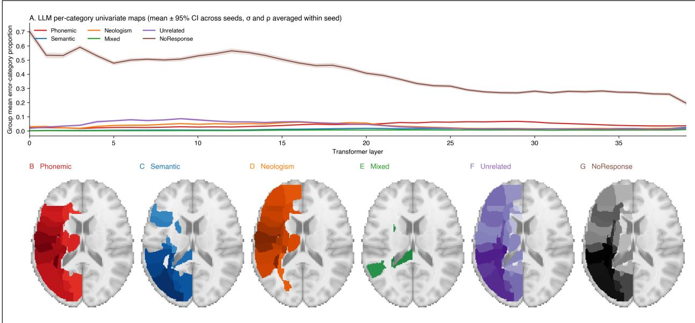  
Figure S1. Per-category univariate maps on both substrates

LLM-side per-category univariate maps (top row): the per-layer group mean (and 95% CI across seeds) of each PNT error category’s proportion under perturbation, with � and � averaged within seed. Cortex-side per-category univariate maps (bottom row, B–G): the per-ROI Spearman rank correlation between per-patient error-category proportion and per-patient JHU ROI lesion load, rendered on the MNI152 T1 template (axial slice � = 16), with one panel per category colored by category. The figure shows the marginals that the main-text subtraction figures are built on: notably, the Phonemic and Semantic univariate maps both load onto overlapping perisylvian territory, so their subtraction (Figure 2) reflects the diferential loading rather than two clearly separable spatial signals, explaining why the semantic-favoring subtraction direction is sub-threshold without that being a failure of the method.

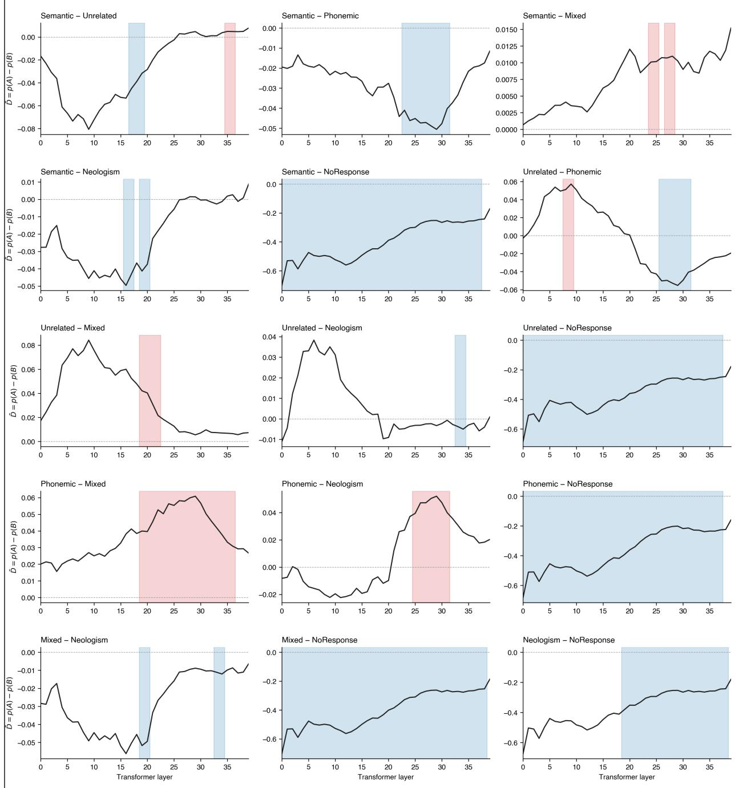  
Figure S2. LLM: per-pair layer-axis maps for all 15 pairwise subtraction contrasts

A multi-panel figure showing, for each of the 15 ordered pairs across the six non-Correct PNT error categories, the group-level layer-axis profile �(ℓ)̄ (40 discovery seeds, � and � averaged within seed). TFCE-surviving layer ranges are shaded by direction (red = positive, $A > B ;$ blue = negative, $B > A )$ . This is the supplementary all-pairs companion to main-text Figure 3. Percluster statistics for all 15 contrasts are in machine-readable form at code/tfce\_results/llm\_ seed\_subject/disc\_llm\_region\_summary.csv (discovery) and code/tfce\_results/llm\_seed\_ subject/val\_llm\_region\_summary.csv (validation).

(primary) Phonemic > Semantic: ROls where ρ(Phonemic, lesion) > ρ(Semantic, lesion)

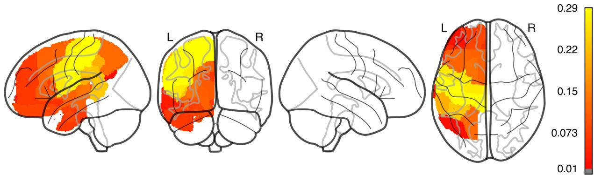

(primary) Semantic > Phonemic: ROls where ρ(Semantic, lesion) > ρ(Phonemic, lesion)  
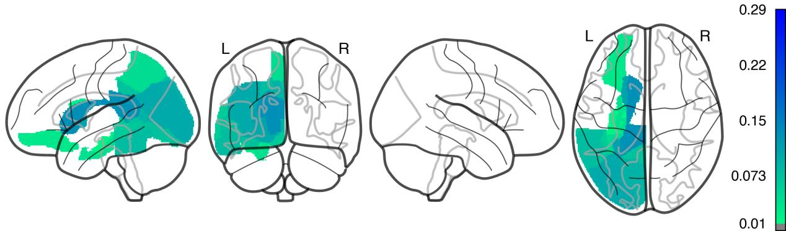  
Figure S3. Human cortex: per-pair ROI correlation-diference maps for all 15 pairwise subtraction contrasts

A multi-page PDF in which every page renders one pair (top panel $A > B ,$ bottom panel $B > A )$ for the full set of 15 ordered pairwise contrasts across the six non-Correct PNT error categories. Each panel shows the 64 left-hemisphere JHU atlas ROIs colored by per-ROI correlation diference $\Delta \rho _ { r } = \rho ( A , \mathrm { l e s i o n } _ { r } ) - \rho ( B , \mathrm { l e s i o n } _ { r } )$ , where $\rho$ is the Spearman rank correlation between the perpatient error-type proportion and the per-patient ROI lesion load on the � = 213 patient cohort. Warm colormap encodes $A > B$ (positive $\Delta \rho )$ ; cool colormap encodes $B > A$ (negative $\Delta \rho )$ Pair naming and ordering match the LLM all-pairs convention in Figure S2, allowing direct visual comparison between substrates pair by pair. Per-pair summary statistics (count of ROIs with bootstrap 95% CI excluding zero, top three ROIs in each direction) are in Table S3.

Multi-page PDF: figures/lsm\_roi/supplementary\_brain\_roi\_maps.pdf. A single thumbnail panel for the primary Phonemic-vs-Semantic contrast is embedded here for reference:

Figure S4. Per-pair-direction Stage-2 layer-permutation significance

Per pair-direction $- \log _ { 1 0 } ( p )$ from the Stage 2 layer-permutation test (§S2.5). Every observed cluster across the 15 pairwise contrasts cleared empirical $p \ < \ 0 . 0 0 1 \ ( \mathrm { i . e . , \ } - \log _ { 1 0 } ( p ) \ \geq \ 3 )$ , the floor of the empirical null at 1,000 permutations. Cluster mass at the observed layer ordering is at the upper extreme of the layer-permuted null in every direction tested. This is reported as a machine-readable table rather than a figure: code/tfce\_results/llm\_stage2\_perm/stage2\_ disc\_p\_values.csv.

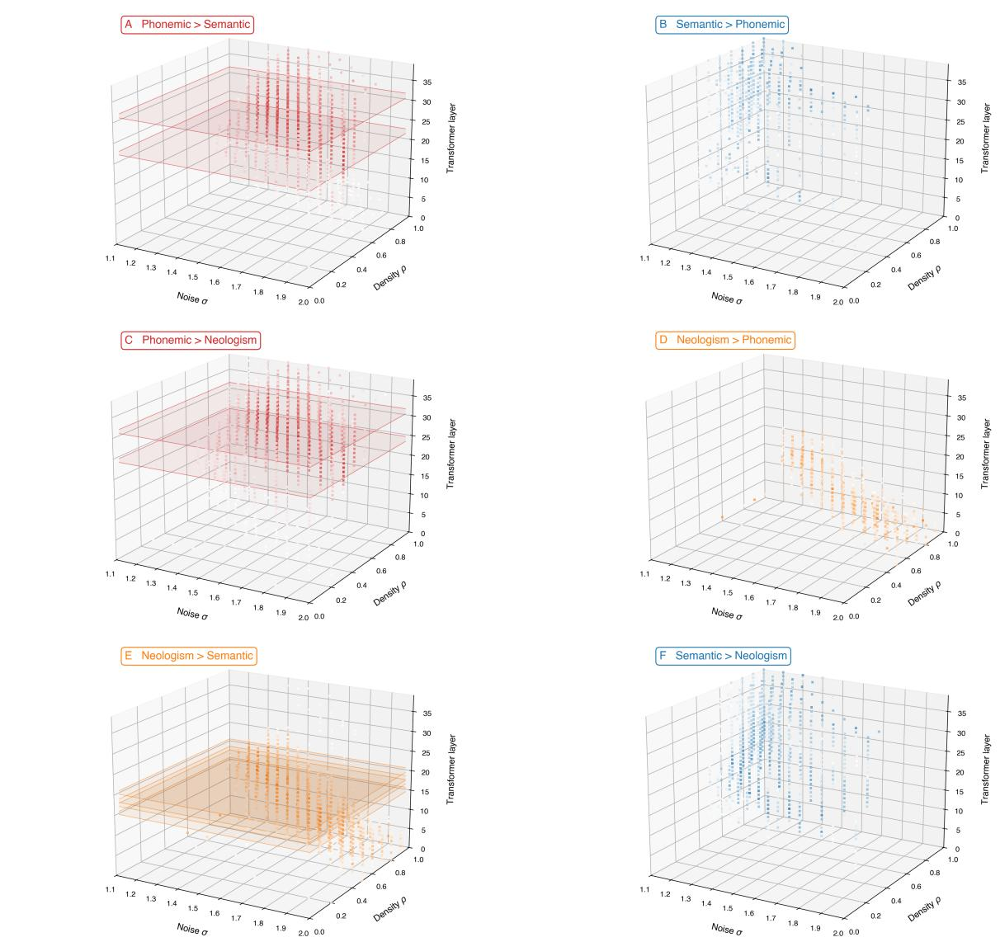  
Figure S5. Descriptive 3D rendering of the $( \sigma \times \rho \times \mathrm { L a y e r } )$ data for the three confirmatory contrasts

Per-cell group-mean $\bar { D } ( \ell , \sigma , \rho )$ across the 40 discovery seeds, in the panel’s directional sign (panelanchor color saturates with magnitude). � (noise standard deviation) and $\rho$ (perturbation density) are dose parameters and are not used as spatial axes for cluster correction, inference is performed only along the layer axis (Methods §“LLM subtraction analysis”). The layer-axis TFCEsurviving cluster range from Stage 1 is highlighted as a translucent slab spanning the full $\sigma \times \rho$ grid at those layers, showing that the cluster claim holds across the dose grid rather than at any specific $( \sigma , \rho )$ cell. This figure is descriptive only and complements the dose-response analysis (main-text Figure 5) by showing the full perturbation-grid context for readers who want it. Panel layout: same $\mathrm { A } {  } \mathrm { F }$ ordering as Figures 2 and 3, A Phonemic > Semantic (primary); B Semantic > Phonemic (primary); C Phonemic > Neologism (cross-check); D Neologism > Phonemic (crosscheck); E Neologism > Semantic (cross-check); F Semantic > Neologism (cross-check). Panels A, C, and E carry visible TFCE-surviving slabs; panels B, D, and F do not (consistent with the asymmetry reported in main text).