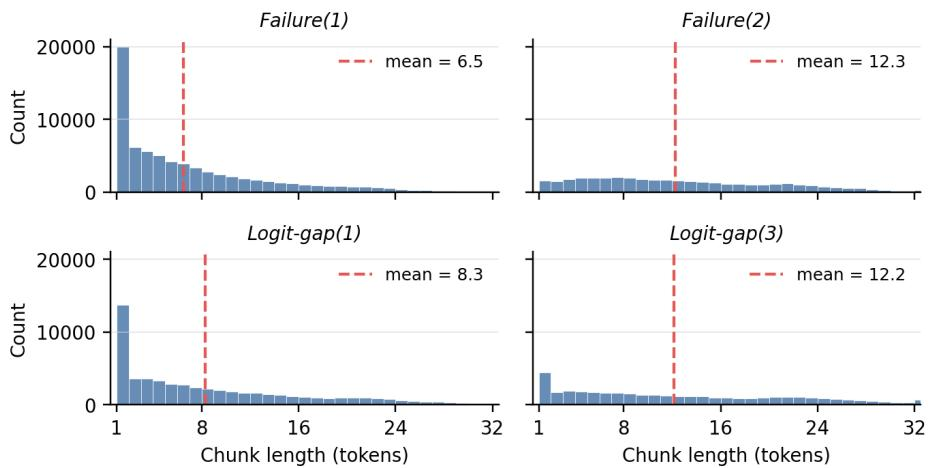
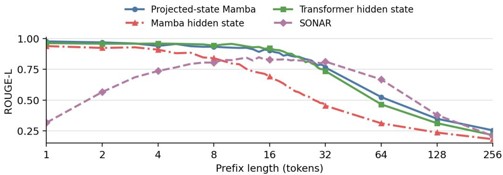
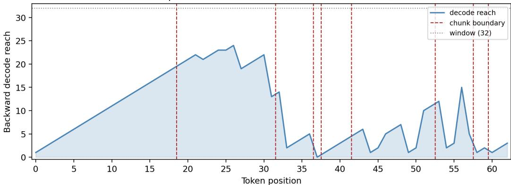

# ReconSpan: Reconstruction-Guided Adaptive Latent Tokenization

Lixing Li   
Cornell University   
Ithaca, NY 14853, USA   
ll963@cornell.edu

## Abstract

Adaptive latent tokenization maps a fine-grained input to a shorter sequence of continuous representations associated with input-dependent spans. We introduce ReconSpan, which divides text into chunks that a backward decoder can reconstruct from a single contextual prefix code and retains one such code as the latent token for each chunk. The reconstruction criterion is applied when chunks are formed, allowing one trained autoencoder to produce average chunk lengths from 6.5 to 12.2. At matched average length, reconstruction-guided boundaries preserve more text than random boundaries. Readers of the resulting latent sequence recover topic information reliably but struggle to extract exact details.

## 1 Introduction

Language models do not operate directly on raw text: tokenization determines the sequence positions to which representation and computation are assigned. Conventional subword tokenizers choose these units before the model runs, largely from corpus-level frequency statistics [Sennrich et al., 2016]. Their granularity is therefore fixed rather than conditioned on the actual input.

Byte- and character-level inputs avoid a fixed subword vocabulary and retain fine-grained information, but they also produce substantially longer sequences [Tay et al., 2022, Pagnoni et al., 2025]. Adaptive latent tokenization instead groups neighboring units into input-dependent spans and represents each span with one continuous latent token. Its chunking rule is central: boundaries determine when new latent positions are created and thus where representation and computation are allocated. Here, a latent token is a contextual representation assigned to a span boundary; unlike a conventional token embedding, it may encode preceding context as well as the associated span. This makes unit formation a model-dependent allocation decision rather than a fixed preprocessing choice.

We propose ReconSpan, an adaptive latent-tokenization method that divides text into chunks a decoder can reconstruct from a single prefix code and retains one such code as the latent token for each chunk. A causal encoder produces a code at every position; starting from the final code, a backward decoder reconstructs until an error criterion is exceeded, accepts the resulting suffix as a chunk, and repeats from the first unreconstructed position. Differences in reconstruction reach give shorter chunks to difficult spans and longer chunks to easier ones. Because the criterion is applied only during chunking, it can also be relaxed to increase average chunk length without retraining, giving ReconSpan input-dependent allocation and post-training control of granularity.

We evaluate both the induced tokenization and the information accessible from its latent tokens. ReconSpan produces average chunk lengths from 6.5 to 12.2 tokens, and at matched average length its reconstruction-guided boundaries preserve more text than random boundaries. Native reconstruction tests the selected spans through the autoencoding route, while a separately trained reader consumes the contextual latent tokens directly and predicts text or task outputs. These readers recover topic information reliably but struggle to extract exact details, exposing a gap between information retained by the autoencoder and information accessible to another model.

Our contributions are:

• We introduce reconstruction fidelity as a chunk-allocation criterion for adaptive latent tokenization over an existing subword sequence.

• We show that one autoencoder supports multiple post-training granularities and that its variable-span boundaries outperform length-matched random boundaries in native reconstruction.

• We characterize the resulting contextual latent tokens through direct readout, separating information retained by the autoencoder from information accessible to readers of different scales and levels of task adaptation.

## 2 Related Work

Learned tokenizers and hierarchical sequence models differ in the signal that determines their sourcetext chunks. We organize the closest work by this allocation rule.

Chunking by fixed position. MEGABYTE divides byte sequences into fixed-size patches and applies separate local and global models within and across patches [Yu et al., 2023]. Extensible Tokenization instead contextualizes existing subword embeddings and retains representations at a regular stride [Shao et al., 2024]. Its stride can be selected at inference, but equal-size allocation does not adapt boundaries to the input. It is especially close to ReconSpan in accepting subword inputs, emitting continuous contextual representations, and allowing granularity to change after training.

Chunking by predictive entropy. The Byte Latent Transformer (BLT) creates variable byte patches at spikes in next-byte entropy, assigning shorter patches where the sequence is less predictable [Pagnoni et al., 2025]. Dynamic Token Pooling also studies an entropy-supervised boundary predictor alongside its other variants [Nawrot et al., 2023]. These methods use forward predictive uncertainty; ReconSpan instead measures backward reconstruction fidelity.

Chunking by semantic similarity. SemToken embeds existing tokens contextually, merges adjacent semantically similar spans, and varies granularity with local semantic density [Liu and Yu, 2026]. This directly targets semantic allocation. ReconSpan does not optimize similarity or claim that its boundaries are semantic; whether reconstruction difficulty aligns with linguistic structure remains an empirical question.

Chunking by learned boundary scores. Dynamic Token Pooling predicts variable character-level segments using end-to-end, tokenizer-supervised, entropy-supervised, or linguistic objectives [Nawrot et al., 2023]. H-Net learns content- and context-dependent routing jointly with a hierarchical bytelevel language model [Hwang et al., 2026]. Charformer is an earlier soft-block precursor: it scores candidate byte blocks from the end-task loss, although its final downsampling is fixed [Tay et al., 2022]. FLEXITOKENS likewise learns variable byte boundaries while relaxing the fixed target-rate objective used by related models [Owodunni et al., 2026]. In these systems, allocation is trained as part of language modeling.

Chunking by reconstruction fidelity. ReconSpan places a boundary according to how far a backward decoder can successfully reconstruct from each contextual encoder state. The signal is measured autoencoder reconstruction rather than a fixed position, learned router, forward entropy, or semantic density. Changing the accepted reconstruction criterion adjusts average span length after training. Our contribution is this allocation criterion and a characterization of the resulting latent representations, not continuous tokens or adaptive segmentation by themselves.

## 3 Method

ReconSpan requires a generic autoencoding model and an inference-time chunking algorithm.

## 3.1 Autoencoding model

Let $x _ { 1 : n }$ be a token sequence. ReconSpan requires two learned components.

• A prefix encoder maps any token sequence to one code,

$$
E : \mathcal { V } ^ { * }  \mathbb { R } ^ { d } , \qquad c _ { t } = E ( x _ { 1 : t } ) .\tag{1}
$$

A causal model such as a Transformer or a Mamba can generate $c _ { 1 } , \ldots , c _ { n }$ in one pass.

• A backward decoder maps $c _ { t }$ to the encoded tokens in reverse order, $x _ { t } , x _ { t - 1 } , \ldots$ . Backward decoding is the point of the design: decoding newest-first, the position where the decoder first fails is a direct measurement of how far back that one code reconstructs. A forward decoder would instead have to be told where to start — the very quantity we want to measure. ReconSpan’s reach-based criterion therefore relies on backward decoding.

The autoencoding path is therefore

$$
( x _ { 1 } , x _ { 2 } , \ldots , x _ { t } ) \stackrel { E } { \longrightarrow } c _ { t } \stackrel { D } { \longrightarrow } ( x _ { t } , x _ { t - 1 } , \ldots , x _ { 1 } ) .\tag{2}
$$

## 3.2 Chunking algorithm

The decoder will not reconstruct arbitrarily long prefixes, so we only ask it to decode within its own capacity; the point at which it fails sets each chunk boundary, giving adaptive-length chunks and their latent tokens. Algorithm 1 states the procedure. Because the text being tokenized is already known, the decoder is teacher-forced against it: at each reverse step it is fed the true previous tokens and we record only whether its own greedy (argmax) prediction matches — nothing is sampled or generated.

Write the resulting chunk endpoints in chronological order as $0 = b _ { 0 } < b _ { 1 } < \cdots < b _ { m } = n .$ so chunk i is $x _ { b _ { i - 1 } + 1 : b _ { i } }$ and its contextual latent token is $c _ { b _ { i } } = E ( \boldsymbol { x } _ { 1 : b _ { i } } )$

```latex
Algorithm 1 ReconSpan chunking.
Input: tokens $x _ { 1 : n } ,$ , encoder E, backward decoder D, stopping rule. Output: contextual latent
token sequence $\mathcal { C } .$
1. Compute all prefix codes $( c _ { 1 } , \ldots , c _ { n } ) \gets E ( x _ { 1 : n } )$ in one causal pass; set $c \gets \langle \rangle$ and
$t \gets n$
2. while $t \geq 1 { : }$
(a) Teacher-force D from $c _ { t }$ against $x _ { t } , x _ { t - 1 } , . . .$ . until the stopping rule fires at $x _ { b } ,$ so that
$x _ { b + 1 } , \ldots , x _ { t }$ are accepted; set $b \gets 0$ if it reaches the beginning without firing. If it
fires on the first step, set $b \gets t - 1$ (a one-token chunk, guaranteeing progress).
(b) Append $c _ { t }$ to $\mathcal { C }$ as the code for chunk $x _ { b + 1 } , \ldots , x _ { t } ;$ set $t  b$ to resume from the first
unreconstructed endpoint.
3. Reverse the collected latent tokens into chronological order and return $\mathcal { C } = ( c _ { b _ { 1 } } , \ldots , c _ { b _ { m } } )$
— only these chunk-boundary prefix codes are retained.
```

We use two stopping families. Failure(m) stops at the mth incorrectly reconstructed token. Failure(1) ends a chunk at the first mistake and larger m tolerates errors. Logit-gap(τ) is the continuous version. Let $y _ { j }$ be the actual token at reverse step $j ;$ the decoder stops at the first k for which

$$
G _ { k } = \sum _ { j = 1 } ^ { k } \left( \operatorname* { m a x } _ { v \in \mathcal { V } } z _ { v } ^ { ( j ) } - z _ { y _ { j } } ^ { ( j ) } \right) > \tau .\tag{3}
$$

Each summand is zero when the model predicts the correct token and otherwise measures by how much it was missed, so $G _ { k }$ accumulates near-misses instead of counting outright errors. Raising m or τ lengthens chunks on a fixed trained model and thus increases the average number of input tokens represented by each latent token.

The number of sequential model invocations, which is architecture-invariant, is $O ( 1 + n )$ . Producing all prefix codes $c _ { 1 } , \ldots , c _ { n }$ takes a single encoder forward pass, whatever the encoder architecture.

The backward reconstruction is autoregressive, so in the worst case — a failure at every step, making every chunk one token — it needs $O ( \bar { n } )$ sequential decoder calls.

In practice, the decoder reads a fixed block of W positions per endpoint for efficient batching, so decoding is $O ( W n )$ work in the worst case with our specific Mamba decoder. Appendix D describes a variant that keeps the same $O ( W n )$ total work but cuts the sequential decode calls to $O ( W )$ , independent of $n ,$ by materializing all endpoint decodes at once, at the cost of more physical computation.

## 3.3 Training

The only training objective is autoencoder reconstruction; the span allocation emerges from the decoder’s capacity rather than from an explicit length target. A training step operates on one window $x _ { 1 : L }$ The encoder produces its final code $c _ { L } = E ( x _ { 1 : L } )$ , a learned projection maps it to the decoder’s initial recurrent state, and the decoder is teacher-forced to reproduce the window in reverse, $y = ( x _ { L } , \dots , x _ { 1 } , \mathrm { E O S } )$ . Each step reconstructs the first $k \leq L + 1$ reversed targets, and the loss is the token cross-entropy over them,

$$
\mathcal { L } _ { \mathrm { A E } } = - \sum _ { j = 1 } ^ { k } \log p _ { D } ( y _ { j } \mid y _ { < j } , c _ { L } ) .\tag{4}
$$

The projection is differentiable and no stop-gradient is placed on the code, so this loss reaches the encoder as well as the decoder. Encoder and decoder can therefore be trained jointly.

Capping the decode length at $k \leq L + 1$ makes most steps reconstruct only a suffix of the window rather than the whole text. This is a deliberate match to how ReconSpan uses the decoder: the design is intended to prioritize recent tokens and thereby extend the successful suffix that determines a chunk boundary.

## 3.4 Implementation overview

Our encoder is a Pythia-410M Transformer [Biderman et al., 2023] whose final 1024-dimensional hidden state is the code; the decoder is a Mamba2-130M backward model [Dao and Gu, 2024]. The code is up-projected to the decoder’s per-layer initial SSM states, and a BOS token begins the rollout. Pythia shares the GPT-NeoX tokenizer with the Mamba2 decoder, so the two never disagree on vocabulary. We also evaluate two auxiliary Mamba2 encoders: a 4096-dimensional projected SSM state and a 1024-dimensional hidden state. The former requires four times the code width to approach the Transformer’s short-span reconstruction, while the latter is weaker at equal width. Appendix A defines these variants and reports their reconstruction comparison.

Each step samples a short-biased encode length L and an independent decode length $k \leq L + 1 ;$ Section 3.3 explains why a partial suffix, not the full window, is the right target. Training runs in two stages on FineWeb [Penedo et al., 2024]: a 7B-token backward-decoder pretrain with the encoder frozen, then 3B tokens of joint encoder–decoder training. Appendix A gives the data pipeline, sampling ranges, schedule, and optimizer.

## 4 Tokenizer properties

We characterize the tokenizer through four measurements: single-code autoencoder reconstruction, semantic structure in the raw code geometry, the span lengths induced by different stopping rules, and how much text survives a native autoencoder round trip under the selected boundaries.

## 4.1 Autoencoder reconstruction quality

We measure how much a single code can give back, comparing our Transformer encoder against SONAR [Duquenne et al., 2023]. For each length ℓ we sample one ℓ-token window from each of 500 held-out Wikipedia documents, encode the whole window into one code, decode it autoregressively in reverse, and score the result against the original using BLEU [Papineni et al., 2002] and ROUGE-L [Lin, 2004], alongside exact-match measures. SONAR is a multilingual text autoencoder that maps a sentence to one 1024-dimensional embedding and decodes it back, so its code width matches ours; as a strong open-source autoencoder it gives an external reference point for our reconstruction quality.

Table 1: Single-code reconstruction on 500 held-out Wikipedia windows, Transformer encoder (left) versus SONAR (right); both use 1024-dimensional codes. Exact is full-window exact match; RL is ROUGE-L; suffix is the mean length of the longest exactly reconstructed suffix — the contiguous run of most-recent tokens the backward decoder emits without an error.
<table><tr><td colspan="4">ReconSpan Transformer</td></tr><tr><td></td><td>l Exact BLEU</td><td>RL</td><td>F1 Suffix</td></tr><tr><td>8</td><td>.700</td><td>.879 .942</td><td>.945 6.47</td></tr><tr><td>16</td><td>.452 .844</td><td>.921 .927</td><td>10.86</td></tr><tr><td>32</td><td>.022 .563</td><td>.735 .777</td><td>9.94</td></tr><tr><td>64</td><td>.000 .281</td><td>.465 .559</td><td>8.15</td></tr><tr><td>128</td><td>.000 .160</td><td>.312 .405</td><td>8.26</td></tr><tr><td>256</td><td>.000 .087</td><td>.215</td><td>.283 7.42</td></tr></table>

<table><tr><td colspan="4">SONAR</td></tr><tr><td></td><td>l Exact BLEU</td><td>RL F1</td><td>Suffix</td></tr><tr><td>8</td><td>.146</td><td>.703 .804 .806</td><td>5.00</td></tr><tr><td>16</td><td>.066 .722</td><td>.829 .832</td><td>7.94</td></tr><tr><td>32</td><td>.008</td><td>.668 3.812 .820</td><td>7.24</td></tr><tr><td>64</td><td>.000</td><td>.454.667 7.699</td><td>1.16</td></tr><tr><td>128</td><td>.000</td><td>.167.378 .480</td><td>0.05</td></tr><tr><td>256</td><td>.000</td><td>.060.209 .311</td><td>0.03</td></tr></table>

Table 1 reports the comparison. The key column is $s u f f i x ,$ the quantity most closely related to the reconstruction reach used to set chunk length. The Transformer recovers an average exact suffix of roughly 8–11 tokens from ℓ = 8 to ℓ = 256, whereas SONAR’s suffix falls sharply beyond ℓ = 32 even when its aggregate overlap remains competitive. This stable short-range reconstruction is the capacity needed by the chunking experiments that follow.

## 4.2 Semantic geometry

Reconstruction asks a code to retain the tokens of its window, but does not directly place semantically similar inputs nearby. We probe this untrained property with four tasks from MTEB [Muennighoff et al., 2023]: STSBenchmark and STS17 [Cer et al., 2017], SICK-R [Marelli et al., 2014], and NFCorpus [Boteva et al., 2016]. Table 2 shows that SONAR, which is trained with a similarity objective, leads on every task, often by a wide margin. Thus the raw code geometry is not strongly organized by semantic similarity. This protocol evaluates one full-input encoder code rather than a sequence of boundary tokens, so it characterizes the code generator rather than the complete tokenizer.

Table 2: MTEB is a standard benchmark that measures how well fixed-size text embeddings capture meaning, through semantic-similarity and retrieval tasks; here we apply it to the raw codes. STS-Benchmark and STS17 (English) score how well code cosine similarity tracks human sentence-pair ratings, and SICK-R does the same on sentence pairs probing compositional meaning. NFCorpus is a biomedical document-retrieval task. Higher is better on all four.
<table><tr><td>Task</td><td>Metric</td><td>Projected Mamba</td><td>Transformer</td><td>Mamba hidden</td><td>SONAR</td></tr><tr><td>STSBenchmark</td><td>Spearman</td><td>.4478</td><td>.4297</td><td>.4495</td><td>.6739</td></tr><tr><td>STS17 (en-en)</td><td>Spearman</td><td>.1631</td><td>.2038</td><td>-.0771</td><td>.6360</td></tr><tr><td>SICK-R</td><td>Spearman</td><td>.4761</td><td>.4845</td><td>.5079</td><td>.6294</td></tr><tr><td>NFCorpus</td><td>NDCG@10</td><td>.0203</td><td>.0448</td><td>.0232</td><td>.0556</td></tr></table>

## 4.3 Adaptive span allocation

We study how the stopping criterion controls span allocation and whether the resulting chunk lengths vary across inputs. Because every chunk contributes one latent position, mean chunk length directly measures the tokenizer’s average granularity. A looser rule — one that permits the decoder to continue further before stopping — increases this mean. Figure 1 shows this across four rules applied post hoc to one trained model on 500 Wikipedia documents, spanning mean lengths of 6.50 to 12.17 input tokens. The behavior carries to larger scale: over 2 million FineWeb documents, Failure(1) gives a mean chunk length of 9.56 tokens. Realized averages also differ across Wikipedia, FineWeb, and the downstream datasets in Section 5.2, reflecting input-dependent variation in reconstruction reach.

The one caveat is the spike at length one, which has a mechanical cause. The backward decoder predicts the newest token first, with no reconstructed context to condition on, so that token is the hardest to get right. Two outcomes then both produce a length-one chunk: the decoder misses this first token, and the forced-progress rule of Section 3.2 retains it anyway; or it reconstructs the first token but misses the second. Failure(1) thus piles both the stop-at-one and stop-at-two cases onto length one. These single-token chunks are common but carry only 4.3% of the text, so they cost latent positions without greatly changing the mean; a looser rule or an explicit minimum chunk length removes most of them.

  
Figure 1: Chunk-length distributions (raw counts) for four stopping rules on the same 500 Wikipedia documents, each capped at 1000 tokens; vertical lines mark the mean. Looser rules (left to right, top to bottom) shift mass toward longer chunks. Teacher-forced decoding evaluates W = 32 positions per endpoint, so the W=32 cap truncates the few windows the decoder could carry further, producing the small pile-up in the length-32 bin (<1% of chunks).

## 4.4 Native reconstruction under selected boundaries

We test whether capacity-based boundaries identify spans that survive a native autoencoder round trip. After ReconSpan selects the boundaries, each resulting chunk is encoded in isolation and decoded autoregressively; Appendix C defines this protocol formally and distinguishes its chunk codes from the prefix codes consumed directly by the reader.

Two conclusions follow. First, at an identical latent-token count and mean length, ReconSpan boundaries recover more of each document than the length-matched random control, so where the boundaries fall, not merely how many there are, decides how much text survives. Second, the stopping rule acts as a granularity dial. The results suggest that mean chunk length largely predicts quality across the two rule families: failure and logit-gap rules at similar mean lengths reach similar reconstruction quality. Thus the same trained model exposes a controllable quality–granularity tradeoff.

Table 3: Native reconstruction under ReconSpan boundaries on held-out WikiText [Merity et al., 2017]. Mean chunk len. is the mean chunk length in tokens. Exact chunk is the fraction of chunks reconstructed perfectly; exact token is the fraction of document tokens that lie inside such perfect chunks; suffix is the fraction of tokens inside each chunk’s correctly reconstructed newest-first run, crediting chunks that are only partly right. PPL is conditional Qwen2.5-1.5B perplexity [Qwen Team, 2024]. The random row places boundaries uniformly while matching Failure(1)’s per-document chunk count; despite similar exact-chunk accuracy, it trails ReconSpan on all token-level measures.
<table><tr><td>Stop rule</td><td>Mean chunk len.</td><td>Exact chunk</td><td>Exact token</td><td>Suffix</td><td>PPL</td></tr><tr><td>Failure(1)</td><td>6.50</td><td>.797</td><td>.907</td><td>.944</td><td>15.95</td></tr><tr><td>random (matched)</td><td>6.50</td><td>.794</td><td>.618</td><td>.767</td><td>20.03</td></tr><tr><td>Failure(2)</td><td>12.28</td><td>.526</td><td>.536</td><td>.740</td><td>18.43</td></tr><tr><td>Logit-gap(1)</td><td>8.31</td><td>.730</td><td>.809</td><td>.890</td><td>16.84</td></tr><tr><td>Logit-gap(3)</td><td>12.17</td><td>.553</td><td>.541</td><td>.715</td><td>20.37</td></tr></table>

## 5 Reading the latent tokens

Can downstream language models be trained to operate directly on ReconSpan’s variable-length latent-token sequence, and what information can they recover? We first define and train readers that predict text directly from the latent tokens, then evaluate their access to semantic, lexical, and retrieval information.

## 5.1 Reader model and training

We train a separate language model, called a reader, to predict text directly from the latent-token sequence rather than from the source text. For the boundaries $0 = b _ { 0 } < \cdots < b _ { m } = n$ from Section 3.2, the latent-token prefix at boundary $b _ { i }$ is

$$
\begin{array} { r } { \mathcal { C } _ { \leq i } : = ( c _ { b _ { 1 } } , \ldots , c _ { b _ { i } } ) , \qquad c _ { b _ { j } } = E ( x _ { 1 : b _ { j } } ) . } \end{array}\tag{5}
$$

The reader R maps this variable-length sequence of continuous codes to a distribution over output token sequences,

$$
R : ( \mathbb { R } ^ { d } ) ^ { * }  \Delta ( \mathcal { V } ^ { * } ) , \qquad p _ { R } ( y \mid \mathcal { C } _ { \leq i } ) = \prod _ { j = 1 } ^ { | y | } p _ { R } ( y _ { j } \mid \mathcal { C } _ { \leq i } , y _ { < j } ) .\tag{6}
$$

Thus the reader predicts a continuation or task output directly from contextual prefix codes, without first decoding them back to text.

Each code is standardized coordinate-wise using corpus-level mean and standard deviation, then mapped to the reader’s embedding dimension by a learned linear adapter and RMSNorm [Zhang and Sennrich, 2019]. The adapted codes are followed by a separator and the text output. During generic training, the reader receives a randomly truncated latent-token prefix formed with Failure(1); next-token loss is masked on the codes and separator and applied only to the continuation. We fully fine-tune Pythia-410M, whereas Llama-3-8B [Grattafiori et al., 2024] updates LoRA weights [Hu et al., 2022], the adapter, and RMSNorm. Training uses generic FineWeb continuations.

Table 4 shows that the latent tokens support fluent generation. Under an external perplexity scorer, continuations from the larger reader are comparable to human text. Fluency does not establish faithfulness, however: qualitative samples preserve topic, register, and local syntax while exact content remains difficult to access. Appendix E gives further implementation details and report unsuccessful code-to-code reader variants.

Table 4: Conditional perplexity of generated continuations on 150 held-out WikiText windows under Qwen2.5-1.5B [Qwen Team, 2024]; lower is better. The Llama reader and human continuations are similar, while the smaller reader and native decode are moderately higher. Learned readers use top-k sampling; repetitive greedy decoding is omitted.

<table><tr><td>Continuation source</td><td>PPL</td></tr><tr><td>Human continuation</td><td>11.95</td></tr><tr><td>Native autoencoder decode</td><td>15.95</td></tr><tr><td>Pythia-410M reader</td><td>13.94</td></tr><tr><td>Llama-3-8B reader</td><td>11.78</td></tr></table>

## 5.2 Information accessible to downstream readers

We test what the reader can recover along a spectrum of information specificity. AG News [Zhang et al., 2015] tests coarse semantic information through four-way topic classification. LAMBADA [Paperno et al., 2016] requires exact lexical information to predict a passage’s final word. HotpotQA [Yang et al., 2018] requires multi-hop retrieval from ten documents followed by open-answer generation. Across these tasks, we vary reader scale, task-specific adaptation, and chunking granularity.

Table 5 measures direct access against two references. The shuffled control replaces each example’s codes with codes from another example, so improvement over it shows that predictions use example specific information. The round trip instead decodes isolated chunk codes back to text before prediction; it measures information retained by the native autoencoder route and provides a routespecific reference. Together, these comparisons separate information retention from reader access.

Table 5: Downstream readout from ReconSpan latent tokens (%). Control substitutes another example’s codes. Text gives raw context to the untouched base model, and roundtrip gives it autoencoder-reconstructed text. Metrics are exact next-word accuracy for LAMBADA, four-way closed-set accuracy for AG News, and answer exact match for HotpotQA. A superscript ∗ marks readout above the shuffled control at 95% confidence, using a normal approximation to the difference of binomial proportions with standard errors computed from the evaluation-set size. Task FT is a supervised direct-readout reference, not a matched-training baseline. Mean len. is the average number of input tokens per latent token; unmarked rows use Failure(1).
<table><tr><td>Task</td><td>Reader / route</td><td>Mean chunk len.</td><td>Readout</td><td>Control</td><td>Text</td><td>Roundtrip</td></tr><tr><td rowspan="4">LAMBADA</td><td>Pythia-410M</td><td>10.2</td><td>5.1*</td><td>1.8</td><td>51.0</td><td>50.2</td></tr><tr><td>Llama-3-8B</td><td>10.2</td><td>10.0*</td><td>5.5</td><td>75.8</td><td>72.5</td></tr><tr><td>Llama-3-8B + task FT</td><td>10.2</td><td>20.1*</td><td>6.2</td><td>75.8</td><td>72.5</td></tr><tr><td>Llama-3-8B, Failure(2)</td><td>17.4</td><td>15.4</td><td>13.5</td><td>75.4</td><td>64.5</td></tr><tr><td rowspan="4">AG News</td><td>Pythia-410M</td><td>7.7</td><td>52.5*</td><td>26.4</td><td>53.0</td><td>52.8</td></tr><tr><td>Llama-3-8B</td><td>7.7</td><td>74.3*</td><td>24.5</td><td>72.6</td><td>73.0</td></tr><tr><td>Llama-3-8B + task FT</td><td>7.7</td><td>82.7*</td><td>24.2</td><td>72.6</td><td>73.0</td></tr><tr><td>Llama-3-8B, Failure(2)</td><td>12.9</td><td>74.6*</td><td>25.6</td><td>72.1</td><td>72.0</td></tr><tr><td rowspan="4">HotpotQA</td><td>Pythia-410M</td><td>7.5</td><td>0.0</td><td>1.0</td><td>7.0</td><td>6.0</td></tr><tr><td>Llama-3-8B</td><td>7.5</td><td>17.0</td><td>18.0</td><td>36.0</td><td>33.0</td></tr><tr><td>Llama-3-8B + task FT</td><td>7.5</td><td>30.0</td><td>23.0</td><td>36.0</td><td>33.0</td></tr><tr><td>Llama-3-8B, Failure(2)</td><td>13.5</td><td>17.0</td><td>18.0</td><td>36.0</td><td>27.0</td></tr></table>

Across the three tasks, readers access coarse semantics more readily than exact details. The Llama reader reaches raw-text-level topic classification on AG News, whereas LAMBADA remains far below the round-trip reference. Generic readout is also weak on HotpotQA and does not improve over the shuffled control. Thus the codes support semantic recognition, but exact lexical access and evidence retrieval remain difficult for a generic reader.

Task adaptation provides a second, supervised reference for direct readout under the training used here. It improves all three tasks and moves HotpotQA toward the round-trip reference, although its advantage over the shuffled control does not reach the marked confidence threshold. These gains show that targeted training can extract task-relevant information left unused by generic FineWeb continuation training.

Although the readers are trained only with Failure(1) codes, they do not collapse when evaluated with the coarser Failure(2) policy. Topic classification remains stable, LAMBADA remains numerically above its shuffled control, and HotpotQA is comparable to its generic Failure(1) result. The learned interface therefore tolerates a substantial change in chunk granularity without retraining.

Overall, the native route retains information that current readers do not fully access. Topic information is readily recoverable by a downstream language model, task supervision narrows the access gap, and exact-detail readout remains the central limitation.

## 6 Limitations and future directions

The experiments expose several limitations of the current tokenizer, autoencoder, and reader.

## 6.1 Limitations

Reader access. Direct-code readers remain weak on exact-content and retrieval tasks, even when scaling the reader or adapting it to the target task improves performance. By contrast, the native round trip answers the same tasks much better, showing that isolated codes for the selected chunks retain information the current reader cannot yet access. It is a reference for the native reconstruction route, while task-adapted direct readout provides a separate, supervised reference for reader access. One hypothesis is that code geometry makes this access difficult: the autoencoder is trained for reconstruction rather than to place semantically similar inputs nearby, and its weak MTEB results (Section 4.2), especially on retrieval, are consistent with this explanation but do not establish it as a cause.

Short chunks. Too much of the latent sequence is spent on very short chunks. Under Failure(1), 28.1% of chunks cover a single token. These chunks carry only 4.3% of the text while consuming 28.1% of the codes, so a disproportionate share of the latent sequence represents very little source text. Relaxing the rule to Failure(2) reduces them to 4.1%, which is part of why that setting nearly doubles the mean chunk length at little measured cost on topic-level tasks; a stopping rule with an explicit minimum chunk length is an obvious remaining improvement.

Backward-decoder pretraining. ReconSpan requires a model that decodes text backward from a code. Such pretrained decoders are not readily available, so our decoder must be trained from scratch before the autoencoder can be jointly optimized. This raises the entry cost relative to methods built entirely from existing pretrained language models.

Boundary-selection cost. The reconstruction scan is computationally expensive at corpus scale. Although it is O(n) for fixed W, constructing the reader corpus took about 12 hours for 2M documents, roughly two to three times the 4–5 hours of reader training it fed. Fewer latent positions also do not by themselves establish lower end-to-end compute: the Transformer encoder has quadratic work in source length, and a one-use setting must pay the boundary-selection cost before any downstream benefit.

Scope of the tokenizer. ReconSpan operates over an existing subword sequence and is therefore a higher-level latent tokenizer, not a replacement for byte-to-text tokenization. Its native reconstruction and direct-reader routes also use different code constructions (Appendix C). Finally, we do not compare downstream language-model quality or efficiency directly with end-to-end byte tokenizers such as BLT or H-Net.

## 6.2 Future directions

Readers trained at larger scale, on better-matched data, or with objectives aimed at exact retrieval may recover more of the information demonstrated by the native round trip.

Training the autoencoder with an additional semantic-clustering objective could make related inputs easier for a reader to recognize. This would also directly test the hypothesis, motivated by Section 4.2, that unstructured code geometry contributes to weak readout.

A different native decoder could replace the backward language model. For example, a Transformer decoder could receive the code through a soft prompt [Lester et al., 2021] or cross-attention [Vaswani et al., 2017].

The linguistic structure of the boundaries placed by ReconSpan remains unexplored. Testing whether they align with syntax, discourse, or information density could explain what the reconstruction criterion treats as difficult and guide better allocation rules. Appendix F visualizes how changes in reconstruction reach produce the boundaries for one example.

A further direction is to evaluate ReconSpan as a context-compression interface, measuring prefill latency, KV-cache memory, boundary-selection cost, and amortization across repeated reads rather than inferring efficiency from sequence reduction alone.

## 7 Conclusion

ReconSpan forms adaptive latent tokens by retaining contextual encoder states at boundaries set by backward reconstruction reach. One autoencoder exposes mean chunk lengths from 6.50 to 12.17 after training, and its boundaries reconstruct better than length-matched random ones. Downstream language models operate directly on these sequences, recovering topics more readily than exact lexical details; task adaptation narrows the native-reconstruction gap. These results establish reconstruction fidelity as a viable allocation criterion and motivate stronger readers and linguistic boundary analysis.

## References

Stella Biderman, Hailey Schoelkopf, Quentin Gregory Anthony, Herbie Bradley, Kyle O’Brien, Eric Hallahan, Mohammad Aflah Khan, Shivanshu Purohit, Usvsn Sai Prashanth, Edward Raff, Aviya Skowron, Lintang Sutawika, and Oskar Van Der Wal. Pythia: A suite for analyzing large language models across training and scaling. In Proceedings of the 40th International Conference on Machine Learning, volume 202 of Proceedings ofMachine Learning Research, pages 2397–2430. PMLR, 2023. URL https://proceedings. mlr.press/v202/biderman23a.html.

Vera Boteva, Demian Gholipour Ghalandari, Artem Sokolov, and Stefan Riezler. A full-text learning to rank dataset for medical information retrieval. In Advances in Information Retrieval: 38th European Conference on IR Research, pages 716–722. Springer, 2016. doi: 10.1007/978-3-319-30671-1\_58.

Daniel Cer, Mona Diab, Eneko Agirre, Iñigo Lopez-Gazpio, and Lucia Specia. SemEval-2017 task 1: Semantic textual similarity multilingual and crosslingual focused evaluation. In Proceedings ofthe 11th International Workshop on Semantic Evaluation (SemEval-2017), pages 1–14. Association for Computational Linguistics, 2017. doi: 10.18653/v1/S17-2001. URL https://aclanthology.org/S17-2001/.

Tianqi Chen, Bing Xu, Chiyuan Zhang, and Carlos Guestrin. Training deep nets with sublinear memory cost. arXiv preprint arXiv:1604.06174, 2016.

Tri Dao and Albert Gu. Transformers are SSMs: Generalized models and efficient algorithms through structured state space duality. In Proceedings of the 41st International Conference on Machine Learning, volume 235 of Proceedings of Machine Learning Research, pages 10041–10071. PMLR, 2024. URL https: //proceedings.mlr.press/v235/dao24a.html.

Paul-Ambroise Duquenne, Holger Schwenk, and Benoît Sagot. Sonar: Sentence-level multimodal and languageagnostic representations. arXiv preprint arXiv:2308.11466, 2023. doi: 10.48550/arXiv.2308.11466. URL https://arxiv.org/abs/2308.11466.

Aaron Grattafiori, Abhimanyu Dubey, Abhinav Jauhri, Abhinav Pandey, Abhishek Kadian, Ahmad Al-Dahle, Aiesha Letman, Akhil Mathur, Alan Schelten, Alex Vaughan, et al. The llama 3 herd of models. arXiv preprint arXiv:2407.21783, 2024.

Edward J. Hu, Yelong Shen, Phillip Wallis, Zeyuan Allen-Zhu, Yuanzhi Li, Shean Wang, Lu Wang, and Weizhu Chen. LoRA: Low-rank adaptation of large language models. In The Tenth International Conference on Learning Representations, 2022. URL https://openreview.net/forum?id=nZeVKeeFYf9.

Sukjun Hwang, Brandon Wang, and Albert Gu. Dynamic chunking for end-to-end hierarchical sequence modeling. In The Fourteenth International Conference on Learning Representations, 2026. URL https: //openreview.net/forum?id=ZbfLR9NbNF.

LCM Team, Loïc Barrault, Paul-Ambroise Duquenne, Maha Elbayad, Artyom Kozhevnikov, Belen Alastruey, Pierre Andrews, Mariano Coria, Guillaume Couairon, Marta R. Costa-jussà, David Dale, Hady Elsahar, Kevin Heffernan, João Maria Janeiro, Tuan Tran, Christophe Ropers, Eduardo Sánchez, Robin San Roman, Alexandre Mourachko, Safiyyah Saleem, and Holger Schwenk. Large concept models: Language modeling in a sentence representation space. arXiv preprint arXiv:2412.08821, 2024. doi: 10.48550/arXiv.2412.08821. URL https://arxiv.org/abs/2412.08821.

Brian Lester, Rami Al-Rfou, and Noah Constant. The power of scale for parameter-efficient prompt tuning. In Proceedings of the 2021 Conference on Empirical Methods in Natural Language Processing, pages 3045–3059. Association for Computational Linguistics, 2021. doi: 10.18653/v1/2021.emnlp-main.243. URL https://aclanthology.org/2021.emnlp-main.243/.

Chin-Yew Lin. ROUGE: A package for automatic evaluation of summaries. In Text Summarization Branches Out, pages 74–81. Association for Computational Linguistics, 2004. URL https://aclanthology.org/ W04-1013/.

Dong Liu and Yanxuan Yu. SemToken: Semantic-aware tokenization for efficient long-context language models. In Proceedings ofthe 15th Joint Conference on Lexical and Computational Semantics (\*SEM 2026), pages 1–12. Association for Computational Linguistics, 2026. doi: 10.18653/v1/2026.starsem-conference.1. URL https://aclanthology.org/2026.starsem-conference.1/.

Ilya Loshchilov and Frank Hutter. Decoupled weight decay regularization. In The Seventh International Confer ence on Learning Representations, 2019. URL https://openreview.net/forum?id=Bkg6RiCqY7.

Marco Marelli, Stefano Menini, Marco Baroni, Luisa Bentivogli, Raffaella Bernardi, and Roberto Zamparelli. A SICK cure for the evaluation of compositional distributional semantic models. In Proceedings ofthe Ninth International Conference on Language Resources and Evaluation (LREC’14), pages 216–223. European Language Resources Association, 2014. URL https://aclanthology.org/L14-1314/.

Stephen Merity, Caiming Xiong, James Bradbury, and Richard Socher. Pointer sentinel mixture models. In The Fifth International Conference on Learning Representations, 2017. URL https://openreview.net/ forum?id=Byj72udxe.

Niklas Muennighoff, Nouamane Tazi, Loïc Magne, and Nils Reimers. MTEB: Massive text embedding benchmark. In Proceedings of the 17th Conference of the European Chapter of the Association for Computational Linguistics, pages 2014–2037. Association for Computational Linguistics, 2023. doi: 10.18653/v1/2023.eacl-main.148. URL https://aclanthology.org/2023.eacl-main.148/.

Piotr Nawrot, Jan Chorowski, Adrian Lancucki, and Edoardo Maria Ponti. Efficient transformers with dynamic token pooling. In Proceedings ofthe 61st Annual Meeting ofthe Associationfor Computational Linguistics (Volume 1: Long Papers), pages 6403–6417. Association for Computational Linguistics, 2023. doi: 10.18653/ v1/2023.acl-long.353. URL https://aclanthology.org/2023.acl-long.353/.

Abraham Toluwase Owodunni, Orevaoghene Ahia, and Sachin Kumar. FLEXITOKENS: Flexible tokenization for evolving language models. In Findings of the Association for Computational Linguistics: ACL 2026, pages 17170–17190. Association for Computational Linguistics, 2026. doi: 10.18653/v1/2026.findings-acl.848. URL https://aclanthology.org/2026.findings-acl.848/.

Artidoro Pagnoni, Ramakanth Pasunuru, Pedro Rodriguez, John Nguyen, Benjamin Muller, Margaret Li, Chunting Zhou, Lili Yu, Jason E. Weston, Luke Zettlemoyer, Gargi Ghosh, Mike Lewis, Ari Holtzman, and Srini Iyer. Byte latent transformer: Patches scale better than tokens. In Proceedings of the 63rd Annual Meeting of the Association for Computational Linguistics (Volume 1: Long Papers), pages 9238– 9258. Association for Computational Linguistics, 2025. doi: 10.18653/v1/2025.acl-long.453. URL https: //aclanthology.org/2025.acl-long.453/.

Denis Paperno, Germán Kruszewski, Angeliki Lazaridou, Ngoc Quan Pham, Raffaella Bernardi, Sandro Pezzelle, Marco Baroni, Gemma Boleda, and Raquel Fernández. The LAMBADA dataset: Word prediction requiring a broad discourse context. In Proceedings ofthe 54th Annual Meeting ofthe Associationfor Computational Linguistics (Volume 1: Long Papers), pages 1525–1534. Association for Computational Linguistics, 2016. doi: 10.18653/v1/P16-1144. URL https://aclanthology.org/P16-1144/.

Kishore Papineni, Salim Roukos, Todd Ward, and Wei-Jing Zhu. BLEU: a method for automatic evaluation of machine translation. In Proceedings ofthe 40th Annual Meeting ofthe Associationfor Computational Linguistics, pages 311–318. Association for Computational Linguistics, 2002. doi: 10.3115/1073083.1073135. URL https://aclanthology.org/P02-1040/.

Guilherme Penedo, Hynek Kydlícek, Loubna Ben Allal, Anton Lozhkov, Margaret Mitchell, Colinˇ Raffel, Leandro Von Werra, and Thomas Wolf. The fineweb datasets: Decanting the web for the finest text data at scale. In Advances in Neural Information Processing Systems, volume 37, 2024. URL https://proceedings.neurips.cc/paper\_files/paper/2024/hash/ 370df50ccfdf8bde18f8f9c2d9151bda-Abstract-Datasets\_and\_Benchmarks\_Track.html.

Qwen Team. Qwen2.5 technical report. arXiv preprint arXiv:2412.15115, 2024.

Rico Sennrich, Barry Haddow, and Alexandra Birch. Neural machine translation of rare words with subword units. In Proceedings ofthe 54th Annual Meeting ofthe Associationfor Computational Linguistics (Volume 1: Long Papers), pages 1715–1725. Association for Computational Linguistics, 2016. doi: 10.18653/v1/P16-1162. URL https://aclanthology.org/P16-1162/.

Ninglu Shao, Shitao Xiao, Zheng Liu, and Peitian Zhang. Flexibly scaling large language models contexts through extensible tokenization. arXiv preprint arXiv:2401.07793, 2024. doi: 10.48550/arXiv.2401.07793. URL https://arxiv.org/abs/2401.07793.

Yi Tay, Vinh Q. Tran, Sebastian Ruder, Jai Prakash Gupta, Hyung Won Chung, Dara Bahri, Zhen Qin, Simon Baumgartner, Cong Yu, and Donald Metzler. Charformer: Fast character transformers via gradient-based subword tokenization. In The Tenth International Conference on Learning Representations, 2022. URL https://openreview.net/forum?id=JtBRnrlOEFN.

Ashish Vaswani, Noam Shazeer, Niki Parmar, Jakob Uszkoreit, Llion Jones, Aidan N. Gomez, Łukasz Kaiser, and Illia Polosukhin. Attention is all you need. In Advances in Neural Information Processing Systems, volume 30, 2017. URL https://proceedings.neurips.cc/paper/2017/hash/ 3f5ee243547dee91fbd053c1c4a845aa-Abstract.html.

Zhilin Yang, Peng Qi, Saizheng Zhang, Yoshua Bengio, William W. Cohen, Ruslan Salakhutdinov, and Christopher D. Manning. HotpotQA: A dataset for diverse, explainable multi-hop question answering. In Proceedings of the 2018 Conference on Empirical Methods in Natural Language Processing, pages 2369–2380. Association for Computational Linguistics, 2018. doi: 10.18653/v1/D18-1259. URL https://aclanthology.org/D18-1259/.

Lili Yu, Daniel Simig, Colin Flaherty, Armen Aghajanyan, Luke Zettlemoyer, and Mike Lewis. MEGABYTE: Predicting million-byte sequences with multiscale transformers. In Advances in Neural Information Processing Systems, volume 36, 2023. URL https://proceedings.neurips.cc/paper\_files/paper/2023/ hash/f8f78f8043f35890181a824e53a57134-Abstract-Conference.html.

Biao Zhang and Rico Sennrich. Root mean square layer normalization. In Advances in Neural Information Processing Systems, volume 32, 2019. URL https://proceedings.neurips.cc/paper/2019/hash/ 1e8a19426224ca89e83cef47f1e7f53b-Abstract.html.

Xiang Zhang, Junbo Zhao, and Yann LeCun. Character-level convolutional networks for text classification. In Advances in Neural Information Processing Systems, volume 28, pages 649–657, 2015. URL https:// proceedings.neurips.cc/paper/2015/hash/250cf8b51c773f3f8dc8b4be867a9a02-Abstract. html.

## A Implementation and training details

Models and tokenizer. All variants share a Mamba2-130M backward decoder (24 layers) and the GPT-NeoX tokenizer. We evaluate three encoders: a projected SSM state (Mamba2-130M, whose SSM state is compressed to a 4096-dimensional code), and two hidden-state encoders whose final 1024-dimensional hidden state is the code directly — Pythia-410M (Transformer) and Mamba2- 370M. Pythia shares the GPT-NeoX tokenizer with the Mamba2 checkpoints, so encoder comparisons introduce no vocabulary change.

Projections. The two families project differently. For the hidden-state encoders the code is the encoder’s final 1024-dimensional hidden state, so there is no down-projection; a single learned linear maps the code to an $n _ { \mathrm { l a y e r } } \times k _ { c } \times k _ { n }$ tensor $( k _ { c } { = } 1 2 8$ channels, $k _ { n } { = } 8$ per layer), which is expanded to each decoder layer’s full SSM initial state $( n _ { \mathrm { h e a d s } }$ , headdim, $N ) = ( 2 4 , 6 4 , 1 2 8 )$ by parameter-free repeat\_interleave along the channel (×12) and state $( \times 1 6 )$ axes; convolution states start cold. For the projected-SSM-state encoder the code is compressedfrom the encoder’s per-layer states by a non-trivial map: each layer’s state (D=1536 channels × N=128 state) is (i) channel-compressed by a learned linear $D \to k _ { c } , ( \mathrm { i i } )$ mean-pooled along the state dimension $N \to k _ { n }$ (16×), and (iii) averaged over layers within four groups [(0, 12), (12, 18), (18, 21), (21, 24)]; the four group codes are concatenated into the 4 $k _ { c } k _ { n } = 4 0 9 6 \mathrm { - d i m e n s i o n a l c o d e }$ . The lossy, parameter-free pooling is placed deliberately on the state and layer axes, while the information-bearing channel dimension keeps a learned map. The up-projection mirrors these steps, and its weights are initialized as the pseudo-inverse of the down-projection so the round trip is near-lossless before training.

Why the widths differ. A hidden state is 1024-dimensional, matched to SONAR’s width for the single-code comparison in Section 4.1. The full Mamba2-130M SSM state is far larger — 24 layers of 1536 × 128 values, about 4.7M in total — and already sparse, so compressing it to 1024 would discard too much; we keep 4096. Even at four times the width, the SSM-state code reconstructs less well than the 1024-dimensional Transformer code (Figure 2).

Encoder choice. We evaluated all three encoders on the single-code protocol of Section 4.1 before committing to the Transformer. Figure 2 plots ROUGE-L against encode length for the three encoders and SONAR. The Transformer hidden-state encoder is strongest at the short lengths $( \ell \leq 3 2 )$ that set almost every chunk boundary; the projected SSM state matches it only by spending the 4× wider 4096-dimensional code, and the Mamba hidden state at equal width falls off fastest. This is why the main paper uses the Transformer encoder throughout and reports the other two only here.

Data and batching. Training text is FineWeb, tokenized into a flat queue and concatenated endto-end with no separator, so a sampled window may cross a document boundary (GPT-style). Each step samples one encode length L from a mixture — 25% uniform on [1, 20] and the remainder log-uniform on [20, 4096] — and an independent decode length k log-uniform on [1, 4096] clipped to $k \leq L + 1$ . All samples in a step share the same L, so each batch is a dense (B, L) block that needs no padding; B is set per step from a throughput target and a length-aware memory cap.

  
Figure 2: Single-code reconstruction ROUGE-L versus encode length, on 500 held-out Wikipedia windows (protocol in Section 4.1). Among the three encoders the Transformer hidden-state variant is strongest at the short lengths that set chunk boundaries; the projected SSM state matches it only at 4× the code width, and the Mamba hidden state is weakest. SONAR is shown for reference; its drop below 16 tokens reflects training on full sentences rather than short fragments.

Two-stage training. Stage 1 freezes the encoder and trains the backward decoder and projection for approximately 7B tokens. Stage 2 initializes each encoder variant from that shared decoder, attaches a fresh projection, and jointly trains encoder, decoder, and projection for a further 3B tokens.

Optimizer. AdamW [Loshchilov and Hutter, 2019] with encoder/decoder/projector learning rates $5 \times 1 0 ^ { - 5 } , 1 0 ^ { - 4 }$ , and $1 0 ^ { - 3 }$ , weight decay 0.1, $\beta = ( 0 . 9 , 0 . 9 5 )$ , 1000 warmup steps, cosine decay to 10% of peak, and gradient clipping at 1.0. The random seed is 42; checkpoints record model step and total tokens processed.

Compute. All runs use a single NVIDIA A100 80GB PCIe with gradient checkpointing [Chen et al., 2016] enabled. Stage 1 (the shared 7B-token decoder pretrain) takes about 28 hours; stage 2 (the 3B-token joint training) takes about 15 hours per encoder variant.

## B Reproducibility and compute accounting

The implementation uses Linux, Python 3.10, CUDA 12.8, PyTorch 2.9.1, and Transformers 4.51.3. Random seeds are 42 for autoencoder training and data sampling, 0 for reader validation splitting and task adaptation, and 0 for the rate-matched random-boundary control. Source datasets and third-party model weights are obtained from the repositories identified in Appendix G. Code and checkpoints are not publicly released.

The downstream evaluations use 512 LAMBADA passages, 995 AG News articles, and the first 100 examples of the HotpotQA validation split. The confidence markers in Table 5 use these sample counts in the binomial standard errors stated in its caption; they do not measure variation across training runs.

Table 6 accounts for the result-producing runs. Reader-corpus construction is listed separately because it is a material boundary-selection cost rather than reader optimization. The short task-adaptation runs took 12 minutes for LAMBADA (including 3.5 minutes of chunking), 5.3 minutes for AG News optimization, and 2.9 minutes for HotpotQA optimization plus about 8 minutes of cached encoding. Other evaluation and plotting jobs range from minutes to roughly two hours each. Including a conservative six GPU-hour allowance for those jobs, the paper pipeline used approximately 94–102 A100 GPU-hours. Retained job logs indicate that preliminary, ablation, debugging, and failed runs kept the full research project below approximately 200 A100-equivalent GPU-hours. CPU-only dataset loading and reporting were negligible relative to GPU work; the exact host CPU model was not recorded. Peak local storage was about 140GB, dominated by cached reader data and evaluation artifacts.

Table 6: Compute for the principal paper pipeline on one NVIDIA A100 80GB PCIe. Ranges reflect measured variation between reader variants; task adaptation is itemized in the text.
<table><tr><td>Component</td><td>Runs</td><td>A100 hours</td></tr><tr><td>Shared backward-decoder pretraining</td><td>1</td><td>28</td></tr><tr><td>Joint autoencoder training</td><td>3</td><td>45</td></tr><tr><td>Two-million-document reader corpus</td><td>1</td><td>12</td></tr><tr><td>Generic Pythia and Llama readers</td><td>2</td><td>8-10</td></tr><tr><td>Task adaptation and task-data encoding</td><td>3</td><td>&lt; 1</td></tr><tr><td>Evaluation and plotting (conservative allowance)</td><td></td><td>≤ 6</td></tr><tr><td>Total for reported pipeline</td><td></td><td>94-102</td></tr></table>

## C Native autoencoder round trip

The direct reader operates on cumulative prefix codes $\mathcal { C } _ { < i }$ as defined in Section 5.1. The reconstruction experiment of Section 4.4 instead uses the same ReconSpan boundaries to test each selected chunk through the native autoencoder. Given $0 = b _ { 0 } < b _ { 1 } < \dots < b _ { m } = n$ , encode every chunk in isolation,

$$
k _ { i } = E ( x _ { b _ { i - 1 } + 1 : b _ { i } } ) , \qquad \ K = ( k _ { 1 } , \ldots , k _ { m } ) .\tag{7}
$$

Let $D ^ { * } ( k _ { i } )$ denote the tokens produced autoregressively by the backward decoder before EOS. Because the decoder generates newest-first, the reconstructed chunk and document are

$$
\hat { x } ^ { ( i ) } = \mathrm { r e v e r s e } ( D ^ { * } ( k _ { i } ) ) , \qquad \hat { x } = \hat { x } ^ { ( 1 ) } \| \cdot \cdot \cdot \| \hat { x } ^ { ( m ) } ,\tag{8}
$$

where ∥ denotes concatenation. Boundary selection is teacher-forced, but this round-trip decode conditions on its own previous outputs. Re-encoding isolated chunks is used only for this nativedecoding diagnostic and for decoded-text controls; the direct reader path is simply $\mathcal { C } _ { \leq i } \mapsto y$ and does not perform this extra work.

## D Parallel boundary selection

Let $r _ { t } \le W$ be the backward reach obtained from the code ending at position t, where W is the decode block size of Section 3.2. Greedy ReconSpan retains the current endpoint, moves to $t - r _ { t }$ , and repeats. Its work is linear for fixed W, but the endpoint chain is serial and can contain n one-token chunks in the worst case.

The dynamic-programming variant evaluates the $W$ reverse positions for every endpoint in parallel, producing all reaches $r _ { 1 } , \ldots , r _ { n }$ . It then solves a minimum-cover recurrence over candidate intervals $[ t - r _ { t } + 1 , t ]$ . Grouping transitions by reverse offset requires $W$ parallel rounds after the prefix codes are available. The total work remains $O ( W n )$ and the sequential decode calls become ${ \cal O } ( 1 + W )$ but all n endpoint decodes are materialized rather than only the greedy boundary chain. This is faster in latency but uses more physical compute and memory.

## E Reader diagnostics and code-to-code reader details

The code-to-code reader predicts the next chunk code from the latent-token prefix, following the Large Concept Model formulation [LCM Team et al., 2024]. Using the boundaries $b _ { 1 } < \cdots < b _ { m }$ found by ReconSpan, define the prefix code $p _ { i } = E ( x _ { 1 : b _ { i } } )$ and the independently re-encoded chunk code $k _ { i } = E ( x _ { b _ { i - 1 } + 1 : b _ { i } } )$ . The model is trained on sequences of these codes to predict $k _ { i + 1 }$ given prefix information through $p _ { i }$ . Generation is a loop through the native decoder: predict a chunk code, decode it to text, re-encode the generated text to update the prefix representation, and predict the next code. The reader therefore depends on the code-to-text bridge as well as on its own predictions.

Two variants were trained. A continuous diffusion head, which should model a multimodal next-code distribution, collapsed toward the conditional mean and produced codes that did not decode to usable text. Quant-LCM replaces the continuous target with residual vector quantization — the code is mapped to per-level codebook indices and predicted by per-level softmax classification — which trains stably and is the version reported here. It uses an eight-layer, 1024-wide causal context tower over the chunk sequence. Its conditional perplexity is 290.43 on the protocol of Table 4, roughly 25 times the code-to-token reader’s, and its generations are locally broken and repetitive. We therefore report it as a negative result and use the code-to-token reader in the main body. The failure is a prediction failure rather than a representation failure: the same codes support fluent generation when the model is asked for tokens instead of the next code.

For reference, the Pythia code-to-token reader fine-tunes all 406M base-model parameters and a 1024-to-1024 adapter. Code positions are standardized and RMS-normalized; loss is applied only to continuation tokens.

## F Boundary observations

Figure 3 shows how per-position reconstruction reach induces unequal chunks in one document. We decode from every prefix code and record how many consecutive tokens are reconstructed before the first error. The gradual increases partly follow mechanically from advancing the endpoint; the abrupt drops show positions from which the decoder fails much earlier, forcing the greedy cover to allocate a new code. Whether such drops align systematically with linguistic structure remains an open question.

Per-position decode reach (63 tokens, 9 chunks)  
  
Figure 3: Per-position backward decode reach for one 63-token passage under Failure(1). Red dashed lines mark the eight interior boundaries of the nine chunks selected by ReconSpan, and the gray dotted line marks the 32-token decoding window. Reach changes sharply across positions, producing unequal chunk lengths and concentrating boundaries near positions where reconstruction fails early. This example motivates studying whether the boundaries align with syntax, discourse, or information density; it does not establish such alignment.

The corresponding text is shown below, with vertical bars at the exact token boundaries used in Figure 3.

Water boils at 100 degrees Celsius, and Genghis Khan founded the Mongol | Empire in 1206. The clarinet has a single-reed | mouthpiece, while photos |ynthesis | converts sunlight into glucose |. Napoleon was exiled to Elba in 1814 |, but the liver performs | over 500 | metabolic functions.

The within-word and punctuation-adjacent splits make clear that this example does not by itself imply that the learned boundaries coincide with linguistic units.

## G Existing assets, licenses, and terms

Tables 7 and 8 report the repository identifiers and license information verified from the official cards and repositories in August 2026. The experiment records pin the cached revisions used. Assets with non-commercial or unclear terms were used only for academic research and evaluation and are not redistributed.

Table 7: Datasets used in the reported experiments. “Not specified” means that the official repository does not publish a named license; it is not an inferred license.
<table><tr><td>Asset / configuration</td><td>Repository</td><td>Published license or terms</td></tr><tr><td>FineWeb sample-10BT English</td><td>HuggingFaceFW/fineweb Wikipedia wikimedia/wikipedia</td><td>ODC-By 1.0; use is also subject to Common Crawl&#x27;s Terms of Use. CC BY-SA 3.0 and GFDL.</td></tr><tr><td>20231101.en WikiText-103 raw v1</td><td>Salesforce/wikitext</td><td>Card metadata lists CC BY-SA 3.0 and GFDL, while its license</td></tr><tr><td>LAMBADA OpenAI, English</td><td>EleutherAI/lambada_</td><td>prose says CC BY-SA 4.0; both notices are retained. Modified MIT license</td></tr><tr><td>AG News</td><td>openai fancyzhx/ag_news</td><td>No named license; the card permits research and other non-</td></tr><tr><td>HotpotQA distractor</td><td>hotpotqa/hotpot_qa</td><td>commercial activity. CC BY-SA 4.0.</td></tr><tr><td>MTEB evaluation package</td><td>embeddings-benchmark/ mteb</td><td>Apache 2.0 code. Its STSBenchmark, STS17, and NFCorpus mirrors do not specify dataset licenses; SICK-R is CC BY-NC-SA 3.0.</td></tr></table>

Table 8: External model and baseline assets. License restrictions apply to the original assets; no third-party weights are redistributed with this preprint.
<table><tr><td>Asset</td><td>Repository</td><td>Published license or terms</td></tr><tr><td>Pythia-410M</td><td>EleutherAI/pythia-410m</td><td>Apache 2.0.</td></tr><tr><td>GPT-NeoX tokenizer</td><td>EleutherAI/gpt-neox-20b</td><td>Apache 2.0.</td></tr><tr><td>Mamba2-130M and Mamba2-370M</td><td>state-spaces/mamba2-*</td><td>Apache 2.0.</td></tr><tr><td>Llama-3-8B</td><td>NousResearch/Meta-Llama-3-8B</td><td>Meta Llama 3 Community License and Acceptable Use</td></tr><tr><td>Qwen2.5-1.5B scorer</td><td>Qwen/Qwen2.5-1.5B</td><td>Policy. Apache 2.0.</td></tr><tr><td>SONAR</td><td>facebook/SONAR</td><td>MIT code; the text encoder and decoder weights are CC BY-NC 4.0.</td></tr></table>

Language-model use. Language models are core experimental components: Pythia and Mamba form the autoencoder, Pythia and Llama are readers, and Qwen is an external perplexity scorer. Their roles and training are described in Sections 3 and 5. An LLM was also used for writing, editing, and formatting assistance; it did not generate measurements or determine the experimental conclusions.