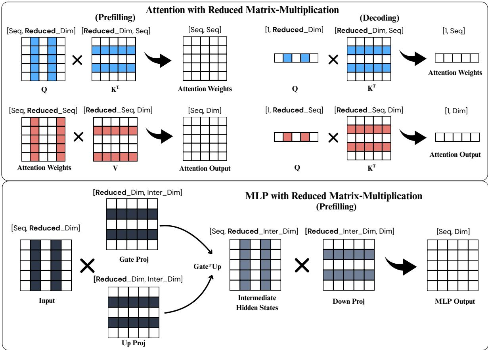
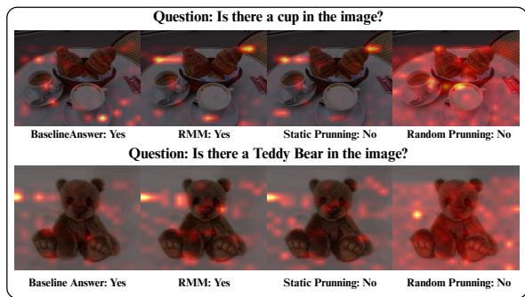
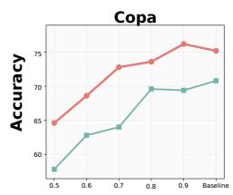
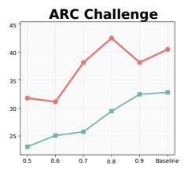
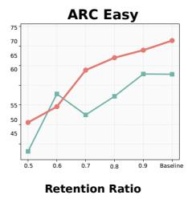
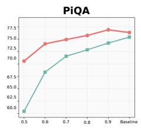
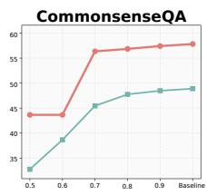

# Reduced Matrix Multiplication: Input-Adaptive Matrix-Product Reduction for LLM Inference

Zixuan Lan University of Chicago zixuanlan@uchicago.edu

Yanhong Li Independent Researcher yanhong.lbh@gmail.com

Jiawei Zhou Stony Brook University jiawei.zhou.1@stonybrook.edu

## Abstract

Transformer-based language models achieve strong performance but incur substantial inference cost due to repeated high-dimensional matrix multiplications. We propose Reduced Matrix Multiplication (RMM), a trainingfree, input-adaptive inference method that reduces Transformer matrix products by select ing informative slices along their contrac tion dimensions, without modifying model weights. Under a simple retention-ratio control, RMM provides a smooth and predictable accuracy–efficiency trade-off.Across language models ranging from 1B to 70B parameters, we find that reduction tolerance depends on the model family, task, component, and retention ratio, although it often improves with model scale. Under moderate reduc tion, RMM remains robust across the evaluated discriminative, autoregressive-generation, and long-context settings. We further show that the same principle extends to multimodal vision–language inference. Mechanistic ab lations reveal a structural asymmetry within Transformers: attention-side computations are substantially more reducible than MLP components. Finally, wall-clock benchmarks with custom kernels on an NVIDIA A100 show that these computational savings can translate into practical runtime gains, especially at longer sequence lengths. Together, these re sults position RMM as a scalable direction for input-adaptive inference-time optimization. Code and project resources will be available at https://github.com/Zesearch/rmm-llm.

## 1 Introduction

Transformer models (Vaswani et al., 2017) continue to improve with scale (Kaplan et al., 2020), but their inference cost also grows rapidly. As model size increases, efficient inference becomes increasingly important in practice. A major source of this cost is the repeated high-dimensional matrix products in attention and feed-forward layers. This raises a basic question: during inference, do all indices along the shared multiplication axes of these matrix products need to be evaluated for every input, or can part of this computation be reduced adaptively while preserving model behavior?

Prior work has explored redundant computation in Transformer inference from several angles (Liu et al., 2021; Peng et al., 2023; Sajjad et al., 2023). One line of work simplifies model computation through structured pruning, low-rank approximation, or dimension reduction (Sun et al., 2024; Ma et al., 2023; Frantar and Alistarh, 2023; Ashkboos et al., 2024; Gao et al., 2024). Another line of work reduces context-level redundancy through token compression, KV-cache management, or decodingtime scheduling (Li et al., 2023b; Pan et al., 2024; Zhang et al., 2023; Xiao et al., 2024; Fu et al., 2025; Shah et al., 2024; Yuan et al., 2025). These methods reduce inference cost by modifying fixed model structures, shortening inputs or caches, or changing execution flow, but they do not directly ask whether the contracted computation inside each Transformer matrix product can be reduced adap tively for the current input. A closely related direction exploits activation sparsity by skipping smallmagnitude activation entries during inference (Liu et al., 2025; Lee et al., 2024). Although such methods also use input-dependent activation information, their primary object is the sparsification of activation tensors or hidden states. Our focus is different: rather than sparsifying hidden states themselves, we reduce the shared multiplication axis of each matrix product. Depending on the operation, this axis may correspond to hidden channels in linear or MLP projections, attention-head feature dimensions in attention-score computation, or token positions in the attention-value product. This framing distinguishes RMM from fixed component pruning, activation-state sparsification, and token pruning: the goal is to reduce the contracted computation performed by each matrix product at

inference time.

In this work, we propose Reduced Matrix Multiplication (RMM), a training-free, input-adaptive method for Transformer inference. Rather than executing the full matrix products in attention and MLP layers, RMM dynamically selects and computes informative indices along the shared multiplication axis of each product, without modifying model weights. Beyond acceleration, RMM pro vides a controllable way to reduce computation through a simple retention ratio, enabling a systematic study of redundancy in Transformer inference. Across models ranging from 1B to 70B parameters and diverse downstream tasks, we observe a general trend that larger models tolerate more aggressive reduction, although reduction robustness remains model- and task-dependent. We further observe a clear structural asymmetry within Transformers: attention-side computations are substantially more reducible, whereas MLP components are much more sensitive to reduction. We also show that RMM extends to multimodal vision–language inference, and implement Triton kernels to verify that the reduced matrix products can translate into practical wall-clock speedups.

## 2 Related Work

Prior work has shown that Transformer inference contains substantial redundancy across neurons, layers, attention heads, and larger structural units: models can often tolerate pruning or reduction while preserving performance (Peng et al., 2023; Sajjad et al., 2023). These findings suggest that not all inference-time computation is equally indispensable.

One major direction reduces computation by modifying or compressing model structure, including structured pruning, unstructured pruning, lowrank approximation, and dimension reduction (Sun et al., 2024; Ma et al., 2023; Frantar and Alistarh, 2023; Ashkboos et al., 2024; Gao et al., 2024). Such methods typically determine the reduction pattern before inference and operate on a fixed model structure, answering which parts of the model can be removed or compressed in advance rather than whether computation should vary with the current input.

Another direction reduces redundancy in the input context, cache, attention pattern, or execution process through token compression, KV-cache management, decoding-time skipping, sparse attention, efficient attention kernels, or scheduling optimization (Li et al., 2023b; Pan et al., 2024; Zhang et al., 2023; Xiao et al., 2024; Shah et al., 2024; Yuan et al., 2025). These methods can reduce latency or memory overhead, especially in long-context settings, but they mainly act on inputs, cached tokens, attention patterns, or execution flow rather than directly reducing the high-dimensional matrix products inside attention and feed-forward layers.

Closely related to our work are training-free activation-sparsity methods, including TEAL (Liu et al., 2025) and CATS (Lee et al., 2024), which skip or mask low-magnitude activation entries during inference. These methods are also inputdependent and often training-free. For linear and MLP projections, RMM shares a related mechanism with activation sparsity, since both use the current activations to retain a subset of input dimensions. The main distinction lies in formulation and scope: activation-sparsity methods define sparsity over activation entries supplied to projection layers, whereas RMM defines reduction over the shared contraction axis of a general matrix product. This matrix-product formulation applies not only to linear and MLP projections, but also to attentioninternal products such as $Q K ^ { \top }$ and $P V$ , where the contracted axes correspond to attention-head feature dimensions and token positions, respectively. Thus, RMM overlaps with activation sparsity in the projection setting while extending the same reduction principle to a broader set of Transformer matrix products.

Our work is also related to classical randomized approximate matrix multiplication (Drineas et al., 2006), which approximates a matrix product by sampling column-row pairs according to importance distributions. Such estimators can in principle be used within a single Transformer forward pass. However, under a fixed reduction budget, stochastic sampling introduces per-instance approximation variance; reducing this variance generally requires more sampled pairs, which weakens the achievable computational savings. RMM adopts the same matrix-product perspective while using deterministic, activation-aware index selection along the shared multiplication axis, yielding predictable reduced products whose effects we evaluate across Transformer components. Overall, RMM takes a direct computational perspective: it reduces matrix products themselves.

## 3 Methodology

## 3.1 Preliminaries

Transformer inference is mainly composed of matrix multiplications in self-attention and feedforward networks (MLPs). Let the input hidden states at layer l be $X ^ { ( l ) } \in \mathbb { R } ^ { L \times d }$ , where $L$ is the sequence length and d is the hidden dimension. In self-attention, the input is linearly projected to queries, keys, and values as $Q \ =$ $\bar { X } ^ { ( i ) } W _ { Q } , \ K \ = \ \bar { X } ^ { ( l ) } \bar { W _ { K } }$ and $V ~ = ~ X ^ { ( l ) } W _ { V }$ where $W _ { Q } , W _ { K } , W _ { V } \in \mathbb { R } ^ { d \times d _ { h } }$ , and $d _ { h }$ is the feature dimension of each attention head. Attention scores are computed by $Q K ^ { \top }$ , and the output is obtained by $\operatorname { s o f t m a x } ( Q K ^ { \top } ) V$ . Similarly, the MLP block consists of large linear transformations between activations and weight matrices. Although these computations arise in different modules, their core can be written in the unified form $Y = A B$ where $A \in \mathbb { R } ^ { n \times d }$ denotes the activation matrix determined by the current input, $B \in \mathbb { R } ^ { d \times m }$ denotes a weight matrix or intermediate representation, and $Y \in \mathbb { R } ^ { n \times m }$ is the output.

## 3.2 Reduced Matrix Multiplication

Classical approximate matrix multiplication establishes that the product AB can be approximated via Monte Carlo sampling: one repeatedly draws column-row pairs from the shared dimension according to a probability distribution derived from both matrices, rescales them, and averages over independent draws to obtain a low-error estimate in expectation (Drineas et al., 2006). However, Transformer inference performs only a single forward pass per input, leaving no opportunity to average over repeated samples, so such randomized estimators cannot be directly applied with reliable perinstance quality. This motivates a deterministic, input-adaptive approach. Based on the unified matrix multiplication form above, we define Reduced Matrix Multiplication(RMM) as follows. For a matrix product $Y = A B$ , where $A \in \mathbb { R } ^ { n \times d }$ and $B \in \mathbb { R } ^ { d \times m }$ , RMM selects an index set $\mathcal { T } \subseteq [ d ]$ with $\begin{array} { r l } { | \mathcal { I } | } & { { } = } & { \lceil \rho d \rceil } \end{array}$ , where $\rho ~ \in ~ ( 0 , 1 ]$ is a usercontrolled retention ratio, and computes

$$
\operatorname { R M M } _ { \rho } ( A , B ) \triangleq A _ { : , \tau } B _ { \mathbb { Z } , : } .
$$

Activation-aware dimension selection. To select I, we assign each feature dimension $j \in [ d ]$ an importance score $s _ { j } ~ \triangleq ~ \| A _ { : , j } \| _ { 2 }$ , which measures the magnitude of feature $j$ under the current input. Given a retention ratio $\rho ,$ we select $\mathcal { T } = \mathrm { T o p K } ( \{ s _ { j } \} _ { j = 1 } ^ { d } , \lceil \rho d \rceil )$ This procedure is fully deterministic. Since the selection depends on the current activations, the resulting subspace may vary across inputs, layers, attention heads, and decoding steps. RMM adapts its computation to each input by selecting dimensions based on current activation magnitudes. This choice is theoretically grounded: we prove in Appendix E.1 that TopK selection by column norm is minimax optimal, minimizing the worst-case approximation error over all possible B at any given retention budget. Our ablation experiments (Section 6) further confirm that both dynamic selection and activation-aware scoring are essential to the effectiveness of RMM.

## 3.3 Applying RMM to Attention and MLPs

We apply RMM to Attention and MLP layers as follows (Figure 1).

Attention. Consider a single attention head with queries $\begin{array} { r l r } { Q } & { { } \in } & { \mathbb { R } ^ { L _ { q } \times d _ { h } } } \end{array}$ , keys $\begin{array} { r } { K \in \mathbb { R } ^ { L _ { k } \times d _ { h } } } \end{array}$ and values $V ~ \in ~ \mathbb { R } ^ { L _ { k } \times d _ { h } }$ We compute feature scores $\begin{array} { r c l } { s _ { j } } & { = } & { \| Q _ { : , j } \| _ { 2 } } \end{array}$ and select $\begin{array} { r l } { \mathcal { Z } } & { { } = } \end{array}$ TopK $( \{ s _ { j } \} _ { j = 1 } ^ { d _ { h } } , \lceil \rho _ { d } d _ { h } \rceil )$ , yielding reduced attention scores $\begin{array} { r } { \widetilde { S } = \frac { 1 } { \sqrt { d _ { h } } } Q _ { : , \mathcal { T } } K _ { : , \mathcal { T } } ^ { \top } } \end{array}$ . Attention weights are then obtained as $P = \mathrm { s o f t m a x } ( \widetilde { S } + M )$ , where M denotes the optional causal or attention mask. For grouped-query attention, dimension selection is performed per head on $Q ,$ with the corresponding dimensions gathered from the shared K and $V$ tensors. We further optionally sparsify the attention– value multiplication $P V$ over the token dimension by computing token scores $a _ { t } = \| P _ { : , t } \| _ { 2 }$ , selecting $\mathcal { T } = \mathrm { T o p K } ( \{ a _ { t } \} _ { t = 1 } ^ { L _ { k } } , \lceil \rho _ { t } L _ { k } \rceil )$ , and evaluating $\widetilde { O } = P _ { : , T } V _ { T , : }$

MLP and linear projections. Given activations $ { \boldsymbol { X } } \in \mathbb { R } ^ { L \times d }$ and weights $\begin{array} { r l r } { W } & { { } \in } & { \mathbb { R } ^ { d \times d ^ { \prime } } } \end{array}$ , we compute feature scores $s _ { j } ~ = ~ \| X _ { : , j } \| _ { 2 }$ , select $\mathcal { T } = \mathrm { T o p K } ( \{ s _ { j } \} _ { j = 1 } ^ { d } , \lceil \rho _ { d } d \rceil )$ , and evaluate $\widetilde { Y } \ =$ $X _ { : , \mathcal { T } } W _ { \mathcal { I } , : }$ . The same rule applies to linear projections as well as to feed-forward layers.

## 3.4 Complexity

For a matrix multiplication $\begin{array} { c c l } { A } & { { } \in } & { \mathbb { R } ^ { n \times d } } \end{array}$ and $B \in \mathbb { R } ^ { d \times m }$ , dense computation costs $O ( n d m )$ With feature retention ratio $\rho _ { d }$ , RMM evaluates $A _ { : , \mathcal { T } } B _ { \mathcal { T } } ,$ with $| \mathcal { I } | = \lceil \rho _ { d } d \rceil$ , reducing the cost to $O ( n \rho _ { d } d m )$ . In attention, reducing $Q K ^ { \top }$ over the head dimension lowers the cost from $O ( L _ { q } L _ { k } d _ { h } )$ to $O ( L _ { q } L _ { k } \rho _ { d } d _ { h } )$ . If token selection is also applied to the attention–value product, the cost of $P V$ is reduced from $O ( L _ { q } L _ { k } d _ { h } )$ to $O ( L _ { q } \rho _ { t } L _ { k } d _ { h } )$ . RMM additionally requires computing feature scores and selecting top-k indices: computing $s _ { j } = \| A _ { : , j } \|$ ∥2 costs O(nd), while top-k selection over d (or $L _ { k } )$ is a lightweight vector-level operation. In practice, these overheads are small relative to the dense matrix multiplications that RMM replaces.

  
Figure 1: Application of RMM in major computations of Transformer language models.

## 4 Experimental Setup

Overview. Our experiments are structured to validate both the effectiveness of dynamic, activationaware pruning and the empirical insights it enables under controlled retention ratios. We first establish the necessity of dynamic selection by comparing RMM against representative weight-level static pruning methods under matched sparsity budgets on LLaMA 3.1 8B. We then sweep retention ratios across model scales from 1B to 70B to examine how performance degrades as computation is reduced and how redundancy varies with scale. Next, we test robustness under more realistic inference settings, including autoregressive generation and long-context reasoning. We further perform component-wise pruning analyses on attention and MLP blocks to identify which computations are more redundant and which are more critical. Finally, we evaluate generalization on a vision– language model and report wall-clock latency on an NVIDIA A100 GPU to verify that the computational savings translate into actual runtime improvements. Additional experiments, including comparisons with TEAL, compute-normalized component analysis, evaluations on additional VLM backbones, INT8 compatibility, and LLaMA-70B latency, are provided in Appendix B.

Models and tasks We evaluate RMM on a wide spectrum of pre-trained LLMs, including Llama 3.1 70B, Llama 3.1 8B, Llama 3.2 3B, Llama 3.2 1.5B (Grattafiori et al., 2024), Qwen3 32B and Qwen 3.1 7B (Yang et al., 2025), and Qwen2.5-VL-7B-Instruct (Bai et al., 2025). The benchmarks span multiple capabilities: (i) general QA and reasoning, including COPA (Gordon et al., 2012), PIQA (Bisk et al., 2020), COMMONSENSEQA (Talmor et al., 2019), ARC-EASY, ARC-CHALLENGE (Clark et al., 2018), and MMLU (Hendrycks et al., 2021); (ii) language modeling evaluation on WIKITEXT (Merity et al.,

2016) and BOOKCORPUS (Zhu et al., 2015); (iii) mathematics and coding tasks, including GSM8K (Cobbe et al., 2021) and HUMANEVAL (Chen et al., 2021); (iv) long-context reasoning, including RULER-CWE and RULER-HOTPOT (Hsieh et al., 2024); (v) summarization on CNN/DAILYMAIL (Nallapati et al., 2016); and (vi) vision–language tasks, including POPE (Li et al., 2023a), Blink Art Style, Blink Forensic Detection, and Blink Counting (Fu et al., 2024). All tasks are evaluated in the zero-shot setting without task-specific fine-tuning. For a more controlled analysis, the main-paper results apply reduction to attention-side matrix multiplications. Full detailed result tables are provided in the appendix.

Baselines. We compare RMM against representative pruning and inference-time optimization baselines. Static pruning methods include SparseGPT (Frantar and Alistarh, 2023), Wanda (Sun et al., 2024), SliceGPT (Ashkboos et al., 2024), and magnitude pruning (Han et al., 2015). For dynamic inference-time baselines, we include H2O (Zhang et al., 2023), which dynamically manages the KV cache during decoding but does not modify the feature dimensions involved in matrix multiplications. As control baselines, we also include a static variant of RMM, which selects a fixed subset of feature dimensions during prefill based on activation statistics and reuses the same subset for all subsequent tokens. And random pruning retains feature dimensions uniformly at random at each decoding step under the same sparsity budget as RMM. Together, these baselines allow us to compare RMM against static pruning, non-adaptive activation-based selection, random selection, and dynamic methods operating at different levels of the inference stack.

## 5 Main Results

## 5.1 Controlled comparison of Pruning behavior

We first compare pruning strategies on a single model under a controlled setting to isolate the effect of different pruning strategies. All experiments in this stage are conducted on LLaMA 3.1 8B with a fixed retention ratio of RR = 0.5. We consider two inference settings:

Discriminative question answering We first evaluate zero-shot QA performance on standard reasoning benchmarks (Table 1). Performance is measured by comparing the log-likelihoods of candidate answers. We compare RMM against representative static pruning baselines, including SparseGPT, Wanda, SliceGPT, and magnitude pruning. RMM achieves the best average accuracy among all pruning methods and shows more consistent degradation across tasks. In contrast, static baselines suffer substantially larger and less uniform drops across benchmarks. These results suggest that fixed, non-adaptive pruning decisions are insufficient to maintain stable performance in practical downstream tasks.

Abstractive summarization We further evaluate pruning strategies on the abstractive summarization task, a token-by-token generation setting (Table 2). In addition to the static baselines, we include two dynamic baselines in this setting: (i) random pruning, which selects retained dimensions uniformly at random at each decoding step, and (ii) H2O, which dynamically manages the KV cache at the token level. All methods are evaluated under identical retention ratios. At RR = 0.8, RMM remains close to the full model while substantially reducing computation. When the retention ratio is reduced to RR = 0.5, RMM continues to outperform all baselines by a clear margin. Static pruning methods degrade rapidly in generation quality, while random pruning, despite being dynamic, fails to maintain coherent and semantically consistent summaries. H2O performs better than static pruning in this setting, but remains consistently weaker than activation-aware matrix-level pruning.

Summary Under a fixed model and retention ratio, the relative behavior of pruning strategies differs markedly between discriminative and generative inference settings. Static and activationagnostic methods exhibit less stable degradation, while RMM maintains a clear advantage across both settings. Additional detailed results are reported in Table 10.

## 5.2 Scaling across models and retention ratios

We next examine how pruning tolerance changes with model scale under different retention ratios. We evaluate RMM on a range of model sizes. For each model, we sweep the retention ratio over $\mathrm { R R } \in \{ 0 . 9 , 0 . 8 , 0 . 7 , 0 . 6 , 0 . 5 \}$ . We use the same zero-shot discriminative evaluation setup, covering commonsense and reasoning benchmarks as well as more structured tasks including GSM8K, MMLU, and HUMANEVAL.

<table><tr><td>Method  $\overline { { ( \mathrm { R R } = 0 . 5 ) } }$ </td><td>ARC-C</td><td>ARC-E</td><td>COPA</td><td>PIQA</td><td>CommQA</td><td>Avg</td></tr><tr><td>Full model  $\overline { { ( \mathrm { R R } = 1 . 0 ) } }$ </td><td>49.5</td><td>76.3</td><td>77.2</td><td>79.9</td><td>66.0</td><td>69.8</td></tr><tr><td>RMM</td><td>36.8</td><td>63.0</td><td>70.6</td><td>76.6</td><td>51.9</td><td>59.8</td></tr><tr><td>SparseGPT</td><td>31.4</td><td>64.2</td><td>70.4</td><td>71.0</td><td>43.4</td><td>56.1</td></tr><tr><td>Wanda</td><td>28.1</td><td>60.7</td><td>67.2</td><td>68.9</td><td>38.4</td><td>52.7</td></tr><tr><td>SliceGPT</td><td>20.7</td><td>31.8</td><td>56.0</td><td>53.4</td><td>23.1</td><td>37.0</td></tr><tr><td>Magnitude</td><td>22.7</td><td>33.7</td><td>57.2</td><td>57.6</td><td>25.0</td><td>39.3</td></tr></table>

Table 1: Zero-shot QA performance on LLaMA 3.1 8B under a fixed retention ratio $( \mathrm { R R } = 0 . 5 )$ . All pruning methods operate at the same retention ratio, while the full model (RR = 1.0) is shown for reference.
<table><tr><td>Model</td><td>Method</td><td>RR ROUGE-1</td><td>ROUGE-2</td><td>ROUGE-L</td><td>ROUGE-Lsum</td><td>BERTScore</td></tr><tr><td rowspan="9">LLaMA 3.1 8B Static</td><td>Full model (RR = 1.0)</td><td>- 37.4</td><td>15.6</td><td>24.3</td><td>31.3</td><td>86.8</td></tr><tr><td>RMM</td><td>0.8 37.5</td><td>15.7</td><td>24.2</td><td>31.4</td><td>86.7</td></tr><tr><td>RMM</td><td>0.5 34.2</td><td>13.6</td><td>22.0</td><td>28.7</td><td>85.8</td></tr><tr><td>Static</td><td>0.8 37.4</td><td>15.6</td><td>24.2</td><td>31.2</td><td>86.7</td></tr><tr><td></td><td>0.5 28.0</td><td>9.9</td><td>19.3</td><td>24.3</td><td>84.0</td></tr><tr><td>Random</td><td>0.8 6.9</td><td>0.6</td><td>6.2</td><td>6.7</td><td>78.0</td></tr><tr><td>Random</td><td>0.5 5.7</td><td>0.2</td><td>5.2</td><td>5.5</td><td>81.4</td></tr><tr><td>H2O</td><td>0.8 24.4</td><td>9.3</td><td>16.3</td><td>21.9</td><td>82.7</td></tr><tr><td>H2O</td><td>0.5 24.4</td><td>9.3</td><td>16.3</td><td>21.9</td><td>82.7</td></tr></table>

Table 2: Abstractive summarization performance on CNN/DailyMail using LLaMA 3.1 8B under different pruning strategies. All pruning methods are evaluated under the same retention ratios. H2O maintains a fixed token budget and therefore yields identical results across retention ratios.

Table 3 summarizes the results across models and retention ratios. At matched retention levels, larger models generally retain stronger performance under moderate reduction, although the trend varies across model families and tasks. For example, at $\mathrm { R R } \ = \ 0 . 8 ,$ , LLaMA 3.1 70B remains close to the full model on most benchmarks, whereas smaller models show more pronounced degradation, especially on challenging tasks such as GSM8K and HUMANEVAL. As the retention ratio decreases further, all models degrade, but smaller models exhibit an earlier performance inflection—with noticeable drops already at RR = 0.7—while larger models degrade more gradually and maintain higher absolute accuracy even under aggressive pruning $( \mathrm { R R } \leq 0 . 6 )$ . Overall, the results suggest a broad scaling trend in which larger models often tolerate stronger reduction, while also showing that robustness remains model- and task-dependent. Additional results and alternative models are provided in Appendix B.

## 5.3 Stability and robustness under generation and long-context settings

While the previous sections focus on discriminative benchmarks, practical inference also requires stable long-form generation and reliable reasoning over extended contexts. We therefore further evaluate RMM under both generative and long-context settings to assess whether dynamic pruning remains stable beyond discriminative task evaluation.

Qualitative generation behavior We next examine how pruning affects autoregressive generation.

Table 5 shows representative outputs from the full model and RMM under different retention ratios. $\mathrm { A t ~ R R } = 0 . 8$ , the outputs of RMM remain largely consistent with those of the full model in both semantic content and overall structure. At $\mathrm { R R } = 0 . 6 $ the generated text begins to show simplification and stylistic drift, but remains coherent and semantically aligned with the prompt. In these examples, stronger reduction introduces simplification and stylistic drift rather than an abrupt loss of coherence.

Long-context reasoning We further evaluate RMM on long context benchmarks to test whether pruning remains reliable over long sequences. As shown in Table 4, RMM achieves performance comparable to the full model across all tested context lengths at both RR = 0.8 and $\mathrm { R R } = 0 . 5$ . We do not observe a systematic increase in degradation as context length grows, suggesting that dynamic pruning does not disproportionately impair longrange dependency modeling within this regime.

Summary Across generative and long-context settings, RMM remains robust across a wide range of retention ratios, with degradation that is smooth rather than abrupt under stronger pruning. These results show that the benefits of dynamic pruning are not limited to discriminative benchmarks, but also extend to more realistic inference scenarios.

## 5.4 Vision-language generalization

We further evaluate whether RMM generalizes beyond text-only models by testing it on the vision– language model. As shown in Table 6, the core trend observed in text-only models also holds in the multimodal setting: RMM remains close to the full model under mild pruning and continues to outperform static and random pruning under more aggressive reduction. $\mathrm { A t } \mathrm { R R } = 0 . 8$ , RMM achieves performance nearly identical to the full model across all benchmarks. At RR = 0.5, it still retains strong performance and substantially outperforms both static and random pruning under the same retention ratio. Figure 2 provides qualitative support by visualizing the attention maps for the first output token. Both the full model and RMM attend to semantically relevant visual regions, whereas static pruning under-attends to these regions and random pruning produces scattered, less focused patterns. These qualitative observations are consistent with the quantitative results in Table 6, showing that RMM better preserves the visual grounding needed for multimodal inference.

<table><tr><td>Model</td><td>Method</td><td>RR</td><td>Copa</td><td>ARC-C</td><td>ARC-E</td><td>PiQA</td><td>CommQA</td><td>GSM8K</td><td>MMLU</td><td>HumanEval</td></tr><tr><td rowspan="7">Qwen3.1 7B</td><td>Baseline</td><td>72.8</td><td></td><td>39.8</td><td>69.8</td><td>72.7</td><td>47.6</td><td>39.9</td><td>55.5</td><td>40.2</td></tr><tr><td>RMM</td><td>0.9 66.0</td><td></td><td>33.8</td><td>64.6</td><td>69.4</td><td>46.7</td><td>24.9</td><td>52.7</td><td>39.6</td></tr><tr><td>RMM</td><td>0.8</td><td>64.0</td><td>29.8</td><td>57.2</td><td>67.2</td><td>47.6</td><td>17.6</td><td>47.3</td><td>38.4</td></tr><tr><td>RMM</td><td>0.7</td><td>60.8</td><td>28.1</td><td>46.8</td><td>63.5</td><td>39.6</td><td></td><td>33.6</td><td>31.1</td></tr><tr><td>RMM</td><td>0.6</td><td>58.4</td><td>25.4</td><td>37.0</td><td>59.6</td><td>29.9</td><td>5.</td><td>26.0</td><td>20.7</td></tr><tr><td>RMM</td><td>0.5</td><td>49.4</td><td>20.7</td><td>32.1</td><td>53.2</td><td>24.5</td><td>1.7</td><td>23.8</td><td>9.8</td></tr><tr><td>Baseline</td><td></td><td>77.2</td><td>49.5</td><td>76.3</td><td>79.9</td><td>66.0</td><td>26.2</td><td>63.5</td><td>35.4</td></tr><tr><td rowspan="7">Llama3.1 8B</td><td>RMM</td><td>0.9</td><td>76.6</td><td>48.2</td><td>75.3</td><td>79.2</td><td>65.4</td><td>24.6</td><td>62.2</td><td>35.4</td></tr><tr><td>RMM</td><td>0.8</td><td>77.2</td><td>47.5</td><td>75.1</td><td>79.1</td><td>64.7</td><td>23.7</td><td>60.3</td><td>34.8</td></tr><tr><td>RMM</td><td>0.7</td><td>77.0</td><td>46.8</td><td>72.8</td><td>77.5</td><td>62.7</td><td>23.2</td><td>55.2</td><td>32.3</td></tr><tr><td>RMM</td><td>0.6</td><td>73.4</td><td>37.5</td><td>68.6</td><td>77.5</td><td>59.4</td><td>14.9</td><td>38.6</td><td>26.2</td></tr><tr><td>RMM</td><td>0.5</td><td>70.6</td><td>36.8</td><td>63.0</td><td>76.7</td><td>51.9</td><td>5.9</td><td>24.8</td><td>23.2</td></tr><tr><td>Baseline</td><td></td><td>81.4</td><td>57.9</td><td>78.3</td><td>80.9</td><td>61.6</td><td>62.6</td><td>80.8</td><td>37.8</td></tr><tr><td rowspan="7">Qwen3 32B</td><td>RMM</td><td>0.9</td><td>83.6</td><td>55.2</td><td>76.1</td><td>80.7</td><td>62.2</td><td>62.7</td><td>80.0</td><td>40.2</td></tr><tr><td>RMM</td><td>0.8</td><td>83.2</td><td>51.8</td><td>72.6</td><td>80.2</td><td>61.0</td><td>58.0</td><td>78.6</td><td>42.1</td></tr><tr><td>RMM</td><td>0.7</td><td>82.6</td><td>48.5</td><td>69.5</td><td>80.6</td><td>60.6</td><td>55.1</td><td>77.5</td><td>42.7</td></tr><tr><td>RMM</td><td>0.6</td><td>82.6</td><td>50.8</td><td>70.5</td><td>80.4</td><td>58.7</td><td>50.9</td><td>73.2</td><td>45.1</td></tr><tr><td>RMM</td><td>0.5</td><td>82.2</td><td>46.2</td><td>67.2</td><td>77.8</td><td>54.9</td><td>39.9</td><td>65.1</td><td>46.1</td></tr><tr><td></td><td></td><td></td><td></td><td></td><td></td><td></td><td></td><td></td><td></td></tr><tr><td rowspan="6">Llama3.1 70B</td><td>Baseline</td><td>0.9</td><td>84.4</td><td>56.2 54.5</td><td>78.3 78.8</td><td>83.2 83.5</td><td>58.0 58.0</td><td>53.7 51.5</td><td>75.3 75.0</td><td>51.2 53.7</td></tr><tr><td>RMM RMM</td><td>0.8</td><td>84.4 84.6</td><td>56.9</td><td>76.8</td><td>82.6</td><td>59.7</td><td>48.1</td><td>72.6</td><td></td></tr><tr><td></td><td>0.7</td><td>81.4</td><td>53.2</td><td>74.7</td><td>82.5</td><td>59.9</td><td>42.8</td><td>67.0</td><td>47.0 39.6</td></tr><tr><td>RMM RMM</td><td>0.6</td><td>76.6</td><td>50.5</td><td>74.9</td><td>77.7</td><td>60.4</td><td>34.5</td><td>53.8</td><td>34.8</td></tr><tr><td>RMM</td><td>0.5</td><td>70.2</td><td>41.5</td><td>64.2</td><td>73.6</td><td>56.8</td><td>19.9</td><td>29.7</td><td></td></tr><tr><td></td><td></td><td></td><td></td><td></td><td></td><td></td><td></td><td></td><td>18.9</td></tr></table>

Table 3: Performance comparison across different models and retention ratios on various benchmarks.

<table><tr><td>Task</td><td>Cond.</td><td>5K</td><td>15K</td><td>30K</td></tr><tr><td rowspan="3">CWE</td><td>Base</td><td>98.2</td><td>94.0</td><td>29.6</td></tr><tr><td>0.8</td><td>98.1</td><td>94.1</td><td>29.3</td></tr><tr><td>0.5</td><td>98.0</td><td>94.0</td><td>28.9</td></tr><tr><td rowspan="3">Hotpot</td><td>Base</td><td>53.6</td><td>56.4</td><td>51.2</td></tr><tr><td>0.8</td><td>53.6</td><td>55.8</td><td>50.8</td></tr><tr><td>0.5</td><td>53.6</td><td>55.6</td><td>50.5</td></tr></table>

Table 4: Long-context results on Ruler.

## 6 Ablation and Mechanistic Analysis

## 6.1 Validating the key design choices of RMM

We validate the two key design choices of RMM: dynamic selection(Table 2) and activation-aware scoring(Table 6). Rather than relying on a singletask ablation, we draw evidence from comparisons across multiple tasks. The importance of dynamic selection is reflected in the consistent gap between RMM and its static variant, which fixes the retained feature subset across tokens. It widens substantially at more aggressive retention ratios, as seen in both summarization and vision–language tasks. This suggests that adapting the retained dimensions to input-dependent activation changes is critical for preserving performance under stronger pruning. The importance of activation-aware scoring is supported by comparisons against random pruning. Although random pruning also changes the retained subset dynamically, it performs much worse under the same retention ratios. This shows that the gains of RMM do not arise merely from changing the retained subset over time, but from selecting informative dimensions according to the current activation pattern. Taken together, these results show that both dynamic selection and activation-aware scoring are essential to the effectiveness of RMM.

  
Figure 2: First-output-token attention maps on Qwen 2.5-VL-7B at RR = 0.5. RMM preserves denselike attention to relevant objects and correct answers, while static and random pruning produce less aligned patterns and incorrect answers.

<table><tr><td></td><td>Prompt</td><td>Base Model</td><td colspan="2">RMM Inference</td></tr><tr><td></td><td>The future of artificial intelligence</td><td>here, and it&#x27;s already changing the</td><td>RR 0.8</td><td>RR 0.6</td></tr><tr><td>Ex.1</td><td>is</td><td>way we live and work. From self-driving cars to virtual assistants.</td><td>here, and it&#x27;s already changing the way we live and work. From self-driving cars to virtual assistants.</td><td>here. It&#x27;s called ChatGPT. This AI chatbot can write essays, poems, and even code.</td></tr><tr><td>Ex.2</td><td>Tell me something about Boston.</td><td>Boston is a city in the state of Massachusetts, in the United States of America.</td><td>Boston is a city in the state of Massachusetts, in the United States of America.</td><td>I&#x27;m a native New Yorker, and I&#x27;ve been here for 10 years.</td></tr></table>

Table 5: Generation comparison between base model (Llama-3.1-8B) and RMM inference under different retention ratios.

<table><tr><td>Method</td><td>RR Pope</td><td>Art.</td><td>Foren.</td><td>Count.</td></tr><tr><td>Baseline</td><td>83.7</td><td>100.0</td><td>100.0</td><td>100.0</td></tr><tr><td>RMM</td><td>0.8 82.0</td><td>100.0</td><td>100.0</td><td>100.0</td></tr><tr><td>Static Random</td><td>0.8 81.0 0.8 10.3</td><td>100.0 43.6</td><td>100.0 58.3</td><td>100.0 54.2</td></tr><tr><td>RMM</td><td>0.5 67.3</td><td>97.4</td><td>97.7</td><td>99.2</td></tr><tr><td>Static Random</td><td>0.5 63.0 0.5 1.3</td><td>91.3 41.9</td><td>43.3 53.0</td><td>79.2 43.3</td></tr></table>

Table 6: Performance on Qwen 2.5-VL-7B.

## 6.2 Different components Mechanistic Analysis

We next examine where pruning can be applied most safely within the Transformer. We analyze the sensitivity of different modules to reduction on LLaMA 3.1 8B by separately pruning attentionside components (Q projection, QKV projection, and attention output), MLP-side components (up, gate, and down projections), and their combinations. Due to space limitations, we report the full pruning matrix in Appendix Table 16. Across all

<table><tr><td>L</td><td>Op.</td><td>Dense</td><td>RMM</td><td>Speedup</td></tr><tr><td>1024 1024</td><td>QKT AV</td><td>0.120 0.065</td><td>0.089 0.039</td><td>1.36× 1.67×</td></tr><tr><td>2048</td><td> $Q K ^ { \top }$ </td><td>0.433</td><td>0.336</td><td>1.29×</td></tr><tr><td>2048</td><td>AV</td><td>0.207</td><td>0.114</td><td>1.81×</td></tr><tr><td>4096 4096</td><td> $Q K ^ { \top }$  AV</td><td>1.675 0.753</td><td>1.071 0.399</td><td>1.56× 1.89×</td></tr></table>

Table 7: GEMM kernel latency (ms).

settings, attention-side computations are substantially more robust to pruning than MLP-side components. When pruning only attention-related operations, performance degrades gradually as the retention ratio decreases and remains close to the baseline even at moderate reduction levels. In contrast, pruning MLP components leads to much sharper performance dropping across tasks. In particular, pruning the entire MLP block leads to severe performance collapse even at relatively high retention ratios, showing the structural importance of MLP layers for preserving representation capacity. By contrast, different attention-side components exhibit greater functional redundancy: pruning their combinations leads to more moderate degradation. These results reveal a clear structural asymmetry within the Transformer: attention-side computations contain higher redundancy, whereas MLP components are more rigid and harder to prune. This suggests that practical deployments should prioritize pruning attention modules and apply more conservative reduction to the MLP.

## 6.3 Practical Viability: Wall-Clock Latency

To evaluate whether the computational savings of RMM translate into practical runtime gains, we measure both kernel-level and end-to-end wallclock latency on LLaMA 3.1 8B using an NVIDIA A100 GPU with a batch size of 1 and a retention ratio of $\rho = 0 . 8 .$ . All latency numbers are averaged

<table><tr><td>Seq. Len.</td><td>Dense</td><td>RMM</td><td>Speedup</td></tr><tr><td>1024</td><td>109.39</td><td>103.91</td><td>1.05×</td></tr><tr><td>2048</td><td>264.67</td><td>208.93</td><td>1.27×</td></tr><tr><td>4096</td><td>661.36</td><td>473.21</td><td>1.40×</td></tr></table>

Table 8: End-to-end latency (ms).

over 10 runs. We follow the latency evaluation protocol of (Sun et al., 2024). For kernel-level benchmarks (Table 7), we measure the full cost of each RMM operation, including norm computation, top-k selection, and the reduced matrix multiplication, to verify that the selection overhead does not offset the computational savings. For end-to-end evaluation (Table 8), the dense baseline uses HuggingFace generate with SDPA as the attention backend, and the RMM variant replaces the attention kernels with custom Triton implementations. Overall, these results show that the computational savings of RMM can translate into tangible runtime benefits, especially when sequence lengths are sufficiently large.

## 7 Conclusion

We introduced Reduced Matrix Multiplication (RMM), a training-free and input-adaptive method that reduces Transformer inference computation by selecting informative indices along the shared multiplication axis of each matrix product. Across model scales and diverse tasks, RMM yields controllable accuracy–efficiency trade-offs, remains stable in generative and long-context settings, and extends to vision–language inference. Our analyses further reveal that attention-side computations are substantially more reducible than MLP components, and wall-clock benchmarks show that these reductions can translate into practical runtime gains. More broadly, these results highlight that redundancy in Transformer inference is not uniformly distributed across components, suggesting that efficient inference methods should account for such structural differences. These findings suggest that matrix-product-level adaptive reduction is a promising direction for efficient Transformer inference.

## Limitations

This work focuses on a training-free formulation of input-adaptive matrix-level reduction for Transformer inference. Our emphasis is on establishing the core algorithmic idea and evaluating it in a controlled setting. We have not explored extensions beyond the training-free setting considered here. Another promising direction concerns multimodal models. While our results suggest that the framework is applicable beyond pure language modeling, we have not conducted a detailed study of how dynamic reduction behaves across the different components of vision–language models. It would be valuable to test whether their components exhibit different redundancy patterns under dynamic pruning.

## References

Saleh Ashkboos, Maximilian L. Croci, Marcelo Gennari do Nascimento, Torsten Hoefler, and James Hensman. 2024. Slicegpt: Compress large language models by deleting rows and columns. Preprint, arXiv:2401.15024.

Shuai Bai, Keqin Chen, Xuejing Liu, Jialin Wang, Wenbin Ge, Sibo Song, Kai Dang, Peng Wang, Shijie Wang, Jun Tang, Humen Zhong, Yuanzhi Zhu, Mingkun Yang, Zhaohai Li, Jianqiang Wan, Pengfei Wang, Wei Ding, Zheren Fu, Yiheng Xu, and 8 others. 2025. Qwen2.5-vl technical report. Preprint, arXiv:2502.13923.

Yonatan Bisk, Rowan Zellers, Jianfeng Gao, Yejin Choi, and 1 others. 2020. Piqa: Reasoning about physical commonsense in natural language. In Proceedings ofthe AAAI conference on artificial intelligence, volume 34, pages 7432–7439.

Mark Chen, Jerry Tworek, Heewoo Jun, Qiming Yuan, Henrique Ponde de Oliveira Pinto, Jared Kaplan, Harri Edwards, Yuri Burda, Nicholas Joseph, Greg Brockman, Alex Ray, Raul Puri, Gretchen Krueger, Michael Petrov, Heidy Khlaaf, Girish Sastry, Pamela Mishkin, Brooke Chan, Scott Gray, and 39 others. 2021. Evaluating large language models trained on code. Preprint, arXiv:2107.03374.

Peter Clark, Isaac Cowhey, Oren Etzioni, Tushar Khot, Ashish Sabharwal, Carissa Schoenick, and Oyvind Tafjord. 2018. Think you have solved question answering? try arc, the ai2 reasoning challenge. Preprint, arXiv:1803.05457.

Karl Cobbe, Vineet Kosaraju, Mohammad Bavarian, Mark Chen, Heewoo Jun, Lukasz Kaiser, Matthias Plappert, Jerry Tworek, Jacob Hilton, Reiichiro Nakano, Christopher Hesse, and John Schulman. 2021. Training verifiers to solve math word problems. Preprint, arXiv:2110.14168.

Petros Drineas, Ravi Kannan, and Michael W Mahoney. 2006. Fast monte carlo algorithms for matrices ii: Computing a low-rank approximation to a matrix. SIAM Journal on computing, 36(1):158–183.

Elias Frantar and Dan Alistarh. 2023. Sparsegpt: Massive language models can be accurately pruned in one-shot. Preprint, arXiv:2301.00774.

Xingyu Fu, Yushi Hu, Bangzheng Li, Yu Feng, Haoyu Wang, Xudong Lin, Dan Roth, Noah A. Smith, Wei-Chiu Ma, and Ranjay Krishna. 2024. Blink: Multimodal large language models can see but not perceive. Preprint, arXiv:2404.12390.

Yichao Fu, Xuewei Wang, Yuandong Tian, and Jiawei Zhao. 2025. Deep think with confidence. Preprint, arXiv:2508.15260.

Shangqian Gao, Chi-Heng Lin, Ting Hua, Tang Zheng, Yilin Shen, Hongxia Jin, and Yen-Chang Hsu. 2024. Disp-llm: Dimension-independent structural pruning for large language models. Preprint, arXiv:2410.11988.

Andrew Gordon, Zornitsa Kozareva, and Melissa Roemmele. 2012. SemEval-2012 task 7: Choice of plausible alternatives: An evaluation of commonsense causal reasoning. In \*SEM 2012: The First Joint Conference on Lexical and Computational Semantics – Volume 1: Proceedings ofthe main conference and the shared task, and Volume 2: Proceedings of the Sixth International Workshop on Semantic Evaluation (SemEval 2012), pages 394–398, Montréal, Canada. Association for Computational Linguistics.

Aaron Grattafiori, Abhimanyu Dubey, Abhinav Jauhri, Abhinav Pandey, Abhishek Kadian, Ahmad Al-Dahle, Aiesha Letman, Akhil Mathur, Alan Schelten, Alex Vaughan, Amy Yang, Angela Fan, Anirudh Goyal, Anthony Hartshorn, Aobo Yang, Archi Mitra, Archie Sravankumar, Artem Korenev, Arthur Hinsvark, and 542 others. 2024. The llama 3 herd of models. Preprint, arXiv:2407.21783.

Song Han, Jeff Pool, John Tran, and William J. Dally. 2015. Learning both weights and connections for efficient neural networks. Preprint, arXiv:1506.02626.

Dan Hendrycks, Collin Burns, Steven Basart, Andy Zou, Mantas Mazeika, Dawn Song, and Jacob Steinhardt. 2021. Measuring massive multitask language understanding. Preprint, arXiv:2009.03300.

Cheng-Ping Hsieh, Simeng Sun, Samuel Kriman, Shantanu Acharya, Dima Rekesh, Fei Jia, Yang Zhang, and Boris Ginsburg. 2024. Ruler: What’s the real context size of your long-context language models? Preprint, arXiv:2404.06654.

Jared Kaplan, Sam McCandlish, Tom Henighan, Tom B. Brown, Benjamin Chess, Rewon Child, Scott Gray, Alec Radford, Jeffrey Wu, and Dario Amodei. 2020. Scaling laws for neural language models. Preprint, arXiv:2001.08361.

Donghyun Lee, Je-Yong Lee, Genghan Zhang, Mo Tiwari, and Azalia Mirhoseini. 2024. Cats: Contextually-aware thresholding for sparsity in large language models. Preprint, arXiv:2404.08763.

Yifan Li, Yifan Du, Kun Zhou, Jinpeng Wang, Wayne Xin Zhao, and Ji-Rong Wen. 2023a. Evaluating object hallucination in large vision-language models. Preprint, arXiv:2305.10355.

Yucheng Li, Bo Dong, Chenghua Lin, and Frank Guerin. 2023b. Compressing context to enhance inference efficiency of large language models. arXiv preprint arXiv:2310.06201.

Andy T. Liu, Shang-Wen Li, and Hung-yi Lee. 2021. Tera: Self-supervised learning of transformer encoder representation for speech. IEEE/ACM Transactions on Audio, Speech, and Language Processing, 29:2351–2366.

James Liu, Pragaash Ponnusamy, Tianle Cai, Han Guo, Yoon Kim, and Ben Athiwaratkun. 2025. Trainingfree activation sparsity in large language models. Preprint, arXiv:2408.14690.

Xinyin Ma, Gongfan Fang, and Xinchao Wang. 2023. Llm-pruner: On the structural pruning of large language models. Preprint, arXiv:2305.11627.

Stephen Merity, Caiming Xiong, James Bradbury, and Richard Socher. 2016. Pointer sentinel mixture models. Preprint, arXiv:1609.07843.

Ramesh Nallapati, Bowen Zhou, Cicero dos Santos, Çaglar Gu ˘ ˙lçehre, and Bing Xiang. 2016. Abstractive text summarization using sequence-to-sequence RNNs and beyond. In Proceedings of the 20th SIGNLL Conference on Computational Natural Language Learning, pages 280–290, Berlin, Germany. Association for Computational Linguistics.

Zhuoshi Pan, Qianhui Wu, Huiqiang Jiang, Menglin Xia, Xufang Luo, Jue Zhang, Qingwei Lin, Victor Rühle, Yuqing Yang, Chin-Yew Lin, H. Vicky Zhao, Lili Qiu, and Dongmei Zhang. 2024. Llmlingua-2: Data distillation for efficient and faithful task-agnostic prompt compression. Preprint, arXiv:2403.12968.

Yifan Peng, Kwangyoun Kim, Felix Wu, Prashant Sridhar, and Shinji Watanabe. 2023. Structured pruning of self-supervised pre-trained models for speech recognition and understanding. Preprint, arXiv:2302.14132.

Hassan Sajjad, Fahim Dalvi, Nadir Durrani, and Preslav Nakov. 2023. On the effect of dropping layers of pre-trained transformer models. Computer Speech & Language, 77:101429.

Jay Shah, Ganesh Bikshandi, Ying Zhang, Vijay Thakkar, Pradeep Ramani, and Tri Dao. 2024. Flashattention-3: Fast and accurate attention with asynchrony and low-precision. Preprint, arXiv:2407.08608.

Mingjie Sun, Zhuang Liu, Anna Bair, and J. Zico Kolter. 2024. A simple and effective pruning approach for large language models. Preprint, arXiv:2306.11695.

Alon Talmor, Jonathan Herzig, Nicholas Lourie, and Jonathan Berant. 2019. Commonsenseqa: A question answering challenge targeting commonsense knowledge. Preprint, arXiv:1811.00937.

Ashish Vaswani, Noam Shazeer, Niki Parmar, Jakob Uszkoreit, Llion Jones, Aidan N Gomez, Łukasz Kaiser, and Illia Polosukhin. 2017. Attention is all you need. Advances in neural information processing systems, 30.

Guangxuan Xiao, Yuandong Tian, Beidi Chen, Song Han, and Mike Lewis. 2024. Efficient streaming language models with attention sinks. In The Twelfth International Conference on Learning Representations.

An Yang, Anfeng Li, Baosong Yang, Beichen Zhang, Binyuan Hui, Bo Zheng, Bowen Yu, Chang Gao, Chengen Huang, Chenxu Lv, Chujie Zheng, Dayiheng Liu, Fan Zhou, Fei Huang, Feng Hu, Hao Ge, Haoran Wei, Huan Lin, Jialong Tang, and 41 others. 2025. Qwen3 technical report. Preprint, arXiv:2505.09388.

Jingyang Yuan, Huazuo Gao, Damai Dai, Junyu Luo, Liang Zhao, Zhengyan Zhang, Zhenda Xie, Y. X. Wei, Lean Wang, Zhiping Xiao, Yuqing Wang, Chong Ruan, Ming Zhang, Wenfeng Liang, and Wangding Zeng. 2025. Native sparse attention:

Hardware-aligned and natively trainable sparse attention. Preprint, arXiv:2502.11089.

Zhenyu Zhang, Ying Sheng, Tianyi Zhou, Tianlong Chen, Lianmin Zheng, Ruisi Cai, Zhao Song, Yuandong Tian, Christopher Ré, Clark Barrett, and 1 others. 2023. H2o: Heavy-hitter oracle for efficient generative inference of large language models. Advances in Neural Information Processing Systems, 36:34661–34710.

Yukun Zhu, Ryan Kiros, Rich Zemel, Ruslan Salakhutdinov, Raquel Urtasun, Antonio Torralba, and Sanja Fidler. 2015. Aligning books and movies: Towards story-like visual explanations by watching movies and reading books. In Proceedings of the IEEE international conference on computer vision, pages 19–27.

# Technical Appendices

## A Implementation Details

Hardware and framework. The experiments were conducted on NVIDIA GPUs, including RTX A6000, RTX 6000 Ada, A100, and L40S devices. Unless otherwise specified, model inference uses PyTorch and Hugging Face Transformers with bfloat16 precision. All experiments use official pretrained checkpoints without task-specific fine-tuning or additional training.

We integrate RMM by replacing the relevant attention and projection operations in the Hugging Face forward pass. The modified operations perform activation-aware index selection and execute the corresponding reduced matrix products without modifying the pretrained model weights.

Inference setup. Unless otherwise specified, we evaluate retention ratios from 0.9 to 0.5, together with the unreduced model at RR = 1.0. When a configuration contains multiple target matrix products, the reported RR is applied to the contraction axis of every included product.

RMM recomputes the retained indices at each affected layer and forward step using the current activations. During prefill, selection is computed from the activation block associated with the current input sequence. During autoregressive decoding, selection is updated using the current decoding state. The number of retained indices is determined by the specified RR and the size of the corresponding contraction dimension.

Batch sizes are selected according to model size and available GPU memory, typically between 8 and 16 for 7B/8B models and between 1 and 2 for 70B models. Unless otherwise stated, comparisons within the same table use the same batch size and inference configuration. For long-context benchmarks such as RULER, we evaluate the context lengths specified by the benchmark, up to 30K tokens.

Evaluation protocols and metrics. For multiple-choice QA benchmarks, including COPA, PIQA, COMMONSENSEQA, ARC-Easy, and ARC-Challenge, we compare the conditional likelihoods of candidate answers and report accuracy. More structured language-model evaluations, including MMLU, GSM8K, HUMANEVAL, and RULER, use their corresponding task configurations through the evaluation harness or benchmark-specific evaluation pipeline. We report the standard metric for each task, including accuracy or exact match for reasoning tasks and pass@1 for HUMANEVAL.

For language modeling, we report perplexity on WIKITEXT and BOOKCORPUS. For summarization on CNN/DAILYMAIL, we report ROUGE-1, ROUGE-2, ROUGE-L, ROUGE-Lsum, and BERTScore. For multimodal evaluation, we use the task-specific accuracy metrics defined by POPE, BLINK Art Style, BLINK Forensic Detection, and BLINK Counting.

The INT8 compatibility experiment uses the same quantized loading and candidate-scoring protocol for all retention ratios within that comparison. All reported evaluations are performed without task-specific adaptation.

## A.1 Why Dynamic Pruning

A natural starting point for reducing inference cost is static pruning: one identifies a fixed subset of weights or feature dimensions by analyzing model behavior on a reference dataset, and then permanently removes the remaining components. This paradigm has inspired many existing methods, and we initially explored similar directions. From a systems perspective, static pruning is particularly attractive: if a fixed low-dimensional subspace can be identified during prefilling, the same subspace could be reused during decoding, allowing a reduced KV cache and significantly lower memory bandwidth and I/O overhead.

However, our empirical investigations revealed that this approach does not generalize. When a static subspace is derived from a specific dataset (e.g., WikiText), the resulting pruned model often performs well on that dataset, but degrades sharply when evaluated on other tasks or distributions. We observed similar behavior when attempting to identify “unimportant” dimensions within attention heads: while certain dimensions appear consistently inactive for a given task, such patterns are not stable across tasks, layers, or inputs.

These findings suggest that high-dimensional representations in Transformers do not admit a single, globally valid low-dimensional subspace. Instead, the semantic information encoded in hidden states appears to migrate across dimensions depending on the input, the layer, and the decoding step. Consequently, any fixed pruning rule implicitly assumes a static allocation of information, and must either sacrifice generalization or incur severe accuracy loss under aggressive pruning.

Even with dynamic selection, we observe that sufficiently aggressive pruning (e.g., 50% retention) can still lead to performance degradation on certain tasks. This highlights a broader limitation of trainingfree acceleration: it is unlikely that one can simultaneously achieve large speedups, no retraining, and negligible accuracy loss in all settings. Nevertheless, our results provide strong evidence that substantial redundancy exists in large language models, and that dynamic, input-adaptive subspace selection is a principled way to exploit this redundancy without assuming task-specific structure.

More broadly, these observations point to a promising research direction: incorporating compressibility and adaptive computation directly into the pretraining objective, rather than relying solely on post-hoc pruning or scaling. RMM represents an initial step toward this goal by demonstrating that dynamic subspace computation can serve as a viable abstraction for inference-time efficiency.

## A.2 A Speculative Theoretical Perspective on Dynamic Subspaces

The results in Section A.1 indicate that no single, fixed low-dimensional subspace can consistently approximate Transformer activations across different inputs, layers, and decoding steps. Here, we offer a speculative theoretical perspective that may help explain this phenomenon. We do not claim formal guarantees; rather, the following discussion is intended as an interpretive framework grounded in existing principles of representation learning and high-dimensional geometry.

Let $h _ { t } ^ { \ell } \in \mathbb { R } ^ { d }$ denote the hidden state at layer ℓ and time step t. Static pruning implicitly assumes the existence of a global subspace $U \subset \mathbb { R } ^ { d }$ such that $h _ { t } ^ { \ell } \approx \Pi _ { U } ( h _ { t } ^ { \ell } )$ for all (t, ℓ) and all inputs. This corresponds to assuming a single low-rank structure shared across all inference contexts.

Our observations suggest that such a global subspace does not exist. Instead, the effective representation subspace appears to vary with the input, the layer, and the decoding step. One possible explanation is that semantic information is not tied to fixed coordinate axes, but is encoded in a distributed manner across dimensions. As a result, the set of dimensions that carry the most information may change from one context to another.

A complementary perspective arises from viewing deep Transformers as nonlinear dynamical systems, where each layer applies an input-dependent transformation, $h ^ { \ell + 1 } = f ^ { \ell } ( h ^ { \ell } )$ . Under this view, imposing a fixed low-dimensional projection at intermediate layers amounts to injecting a structured perturbation into the system. Because the subsequent transformations are nonlinear, small projection errors can be amplified across layers, causing deviations that depend strongly on the input trajectory.

From a geometric viewpoint, one may imagine that the activations for a given input lie near a lowdimensional manifold whose local tangent space changes across inputs and layers. Static pruning corresponds to projecting onto a single global linear subspace, while RMM instead performs a local, input-dependent projection that adapts to the current tangent directions. Although this interpretation is heuristic, it provides an intuitive explanation for why dynamic selection generalizes more robustly than static pruning in our experiments.

Taken together, these perspectives suggest that the effectiveness of RMM may stem from aligning computation with the evolving geometry of high-dimensional representations. We view this as an open direction for future work, including the possibility of incorporating adaptive subspace structure directly into model training.

## B Supplementary Results

## B.1 Additional Results on QA and Language Modeling

To complement the QA and generation analysis in Section 5, we provide full perplexity results on WIKITEXT and BOOKCORPUS for smaller-scale models. In addition to the 7B/8B/32B/70B models reported in the main paper, we include Llama-3.2-1B and Llama-3.2-3B. Figure 3 and Table 9 present the complete results under different retention ratios (RR).

<table><tr><td>RR</td><td>1.0</td><td>0.9</td><td>0.8</td><td>0.7</td><td>0.6</td><td>0.5</td></tr><tr><td colspan="7">WikiText Perplexity ↓</td></tr><tr><td>Llama3.2 1B</td><td>20.04</td><td>20.66</td><td>22.77</td><td>31.29</td><td>68.52</td><td>151.64</td></tr><tr><td>Llama3.2 3B</td><td>15.89</td><td>16.23</td><td>17.01</td><td>18.82</td><td>25.04</td><td>42.54</td></tr><tr><td>Qwen3.1 7B</td><td>28.64</td><td>31.49</td><td>37.80</td><td>54.00</td><td>93.52</td><td>219.31</td></tr><tr><td>Llama3.1 8B</td><td>13.39</td><td>14.34</td><td>15.22</td><td>17.03</td><td>21.35</td><td>32.65</td></tr><tr><td>Qwen3 32B</td><td>13.97</td><td>14.62</td><td>15.41</td><td>15.71</td><td>15.99</td><td>18.53</td></tr><tr><td>Llama3.1 70B</td><td>7.24</td><td>7.46</td><td>8.38</td><td>14.14</td><td>42.62</td><td>167.78</td></tr><tr><td colspan="7">BookCorpus Perplexity ↓</td></tr><tr><td>Llama3.1 1B</td><td>21.18</td><td>22.03</td><td>24.39</td><td>39.63</td><td>96.81</td><td>192.81</td></tr><tr><td>Llama3.2 3B</td><td>17.79</td><td>18.07</td><td>18.86</td><td>21.84</td><td>34.47</td><td>54.53</td></tr><tr><td>Qwen3.1 7B</td><td>31.95</td><td>34.21</td><td>43.64</td><td>62.91</td><td>113.57</td><td>322.63</td></tr><tr><td>Llama3.1 8B</td><td>15.25</td><td>15.59</td><td>16.48</td><td>20.97</td><td>32.63</td><td>53.80</td></tr><tr><td>Qwen3 32B</td><td>17.43</td><td>17.72</td><td>18.12</td><td>18.93</td><td>22.21</td><td>29.68</td></tr><tr><td>Llama3.1 70B</td><td>12.20</td><td>12.29</td><td>13.06</td><td>19.55</td><td>36.55</td><td>126.18</td></tr></table>

Table 9: Perplexity matrix across RR

  
Figure 3: Llama-3.2-3B and Llama-3.2-1B of Different Tasks and RR. Red Line is Llama-3.2-3B

The results show the same trend as larger models: perplexity increases gradually as RR decreases, with a sharp degradation once RR drops below 0.6. Moreover, the 3B model consistently shows greater robustness than the 1B model (Figure 3), reinforcing our claim that representational redundancy grows with scale.

## B.2 Additional Results on Summarization

We also expand the summarization results on CNN/DAILYMAIL beyond those in the main paper. Table 10 includes Llama-3.2-1B and 3B alongside the larger 7B/8B models.

RMM matches the baseline at $\mathrm { R R } = 0 . 8$ across all scales, while static and random pruning degrade severely. At $\mathrm { R R } = 0 . 5 ,$ , smaller models drop more sharply, but RMM remains consistently better than all baselines. This confirms that our method preserves summarization quality even in small-scale models, while redundancy increases with size, enabling more aggressive pruning at larger scales.

## B.3 Comparison with TEAL

TEAL (Liu et al., 2025) is a closely related training-free activation-sparsity method. It applies magnitudebased thresholding to activations supplied to projection layers. In the attention block, for example, TEAL can be applied to the inputs of the query, key, and value projections. However, it does not directly reduce the internal attention matrix products $Q K ^ { \top }$ or $P V$ , where $P$ denotes the attention-weight matrix.

RMM overlaps with activation-sparsity methods when applied to linear or MLP projections, since both approaches use input-dependent activation information to retain a subset of dimensions. The main difference lies in formulation and scope. RMM defines the retained set over the shared contraction axis of a general matrix product. Consequently, the same reduction principle can be applied not only to projection layers, but also to $Q K ^ { \top }$ and $P V$ , whose contracted axes correspond to attention-head feature dimensions

<table><tr><td>Model</td><td>Method</td><td>RR</td><td>Rouge-1</td><td>Rouge-2</td><td>Rouge-L</td><td>Rouge-Lsum</td><td>BERTScore</td></tr><tr><td rowspan="10">Llama3.1 8B</td><td>Baseline RMM</td><td>0.8</td><td>37.44 37.54</td><td>15.56</td><td>24.31</td><td>31.29</td><td>86.76</td></tr><tr><td></td><td></td><td></td><td>15.70</td><td>24.23</td><td>31.35</td><td>86.72</td></tr><tr><td>RMM</td><td>0.5</td><td>34.15</td><td>13.60</td><td>22.03</td><td>28.70</td><td>85.75</td></tr><tr><td>Static</td><td>0.8</td><td>37.36</td><td>15.63</td><td>24.24</td><td>31.24</td><td>86.67</td></tr><tr><td>Static</td><td>0.5 0.8</td><td>28.01</td><td>9.85</td><td>19.28</td><td>24.34</td><td>84.02</td></tr><tr><td>Random</td><td>6.90 0.5</td><td></td><td>0.60</td><td>6.20</td><td>6.69</td><td>77.97</td></tr><tr><td>Random</td><td>5.67</td><td></td><td>0.20</td><td>5.23</td><td>5.54</td><td>81.42</td></tr><tr><td>H2O</td><td>0.8</td><td>24.38</td><td>9.26</td><td>16.28</td><td>21.88</td><td>82.72</td></tr><tr><td>H20</td><td>0.5</td><td>24.38</td><td>9.26</td><td>16.28</td><td>21.88</td><td>82.72</td></tr><tr><td>Baseline RMM</td><td>一</td><td>36.51</td><td>15.24</td><td>23.55</td><td>30.59</td><td>86.41</td></tr><tr><td rowspan="9">Llama3.2 1B</td><td></td><td>0.8</td><td>37.27</td><td>15.71</td><td>23.62</td><td>30.96</td><td>86.35</td></tr><tr><td>RMM</td><td>0.5</td><td>11.90</td><td>2.35</td><td>9.80</td><td>11.15</td><td>79.55</td></tr><tr><td>Static</td><td>0.8</td><td>36.77</td><td>15.36</td><td>23.39</td><td>30.68</td><td>86.35</td></tr><tr><td>Static</td><td>0.5 4.73</td><td></td><td>0.07</td><td>4.26</td><td>4.58</td><td>75.53</td></tr><tr><td>Random</td><td>0.8 7.30</td><td></td><td>0.02</td><td>6.58</td><td>7.08</td><td>79.15</td></tr><tr><td>Random</td><td>0.5 6.26</td><td></td><td>0.40</td><td>5.53</td><td>6.01</td><td>76.85</td></tr><tr><td>H2O</td><td>0.8</td><td>23.22</td><td>8.12</td><td>15.56</td><td>20.30</td><td>83.76</td></tr><tr><td>H20</td><td>0.5</td><td>23.22</td><td>8.12</td><td>15.56</td><td>20.30</td><td>83.76</td></tr><tr><td>Baseline</td><td></td><td>36.72</td><td>15.08</td><td>23.56</td><td>30.63</td><td>86.55</td></tr><tr><td rowspan="9">Llama3.2 3B</td><td>RMM</td><td>0.8</td><td>36.72</td><td>15.16</td><td>23.58</td><td>30.66</td><td>86.54</td></tr><tr><td>RMM</td><td>0.5</td><td>28.31</td><td>9.83</td><td>19.45</td><td>24.60</td><td>84.74</td></tr><tr><td>Static</td><td>0.8</td><td>35.96</td><td>14.81</td><td>23.24</td><td>30.13</td><td>86.31</td></tr><tr><td>Static</td><td>0.5</td><td>19.91</td><td>6.06</td><td>14.69</td><td>17.83</td><td>82.06</td></tr><tr><td>Random</td><td>0.8 6.67</td><td></td><td>0.39</td><td>5.93</td><td>6.44</td><td>79.72</td></tr><tr><td>Random</td><td>0.5 5.85</td><td></td><td>0.04</td><td>5.33</td><td>5.70</td><td>77.09</td></tr><tr><td>H2O</td><td>0.8</td><td>19.49</td><td>6.32</td><td>13.83</td><td>17.03</td><td>82.78</td></tr><tr><td>H20</td><td>0.5</td><td>19.49</td><td>6.32</td><td>13.83</td><td>17.03</td><td></td></tr><tr><td>Baseline</td><td></td><td></td><td></td><td></td><td></td><td>82.78</td></tr><tr><td rowspan="9">Qwen3-1 7B</td><td>RMM</td><td>0.8</td><td>36.56 35.32</td><td>13.05 12.08</td><td>22.86 22.31</td><td>29.75 28.99</td><td>85.91</td></tr><tr><td>RMM</td><td>0.5</td><td></td><td></td><td></td><td></td><td>86.81</td></tr><tr><td>Static</td><td>0.8</td><td>21.91</td><td>5.89</td><td>14.54</td><td>18.60</td><td>83.33</td></tr><tr><td></td><td></td><td>34.43</td><td>11.63</td><td>22.05</td><td>28.47</td><td>86.67</td></tr><tr><td>Static</td><td>0.5</td><td>4.12</td><td>0.05</td><td>3.79</td><td>4.01</td><td>78.09</td></tr><tr><td>Random</td><td>0.8</td><td>10.23</td><td>0.03</td><td>8.04</td><td>9.66</td><td>76.31</td></tr><tr><td>Random</td><td>0.5</td><td>6.75</td><td>0.06</td><td>6.09</td><td>6.54</td><td>76.46</td></tr><tr><td>H2O</td><td>0.8</td><td>4.20</td><td>9.10</td><td>3.68</td><td>3.98</td><td>73.46</td></tr><tr><td>H2O</td><td>0.5</td><td>4.20</td><td>9.10</td><td>3.68</td><td>3.98</td><td>73.46</td></tr></table>

Table 10: Performance comparison of different pruning methods on CNN summarization task. RMM consistently outperforms baseline methods across different models and retention ratios.

and token positions, respectively.

We compare RMM with TEAL on LLaMA 3.1 8B using the same zero-shot evaluation protocol as in the main experiments. RMM uses a retention ratio of $\mathrm { R R } = 0 . 7 $ , and the TEAL threshold is calibrated to provide a matched nominal reduction level. We consider the following configurations. QKV-Pro-TEAL applies TEAL to the inputs of the query, key, and value projection layers. QKV-Pro-RMM applies RMM to the corresponding projection matrix products. QKV-Attention-RMM applies RMM to the QKV projections together with the internal attention products $Q K ^ { \top }$ and P V . MLP-TEAL applies TEAL throughout the MLP block, whereas MLP-Whole-RMM applies RMM to the Up, Gate, and Down projections. Finally, MLP-Attention-RMM applies RMM to both the MLP block and the complete attention-side computation.

RMM does not outperform TEAL in every individual setting. Across the evaluated tasks, however, RMM is competitive with or stronger than TEAL in most comparisons. More importantly, the matrixproduct formulation allows RMM to extend the reduction scope beyond projection inputs to include the internal attention products $Q K ^ { \top }$ and $P V$ . These results therefore demonstrate both the overlap between RMM and activation sparsity in projection layers and the broader operational coverage enabled by RMM.

## B.4 Compute-Normalized Component Analysis

We compare the reducibility of different Transformer components on ARC-Easy using LLaMA 3.1 8B at a matched retention ratio of RR = 0.7. For every targeted matrix product, RMM retains the same fraction of the contraction dimension. Because the theoretical multiplication cost of a matrix product scales linearly with its contraction dimension, this setting corresponds to a matched relative compute budget within each targeted operation.

This normalization is relative to the dense computation of each targeted operation. It does not imply that different components remove the same absolute number of MACs or the same fraction of full-model computation, since the operations differ in shape, frequency, and sequence-length dependence.

<table><tr><td>Method</td><td>COPA</td><td>ARC-C</td><td>ARC-E</td><td>PIQA</td><td>CommonsenseQA</td></tr><tr><td>Baseline</td><td>77.20</td><td>49.50</td><td>76.32</td><td>79.92</td><td>66.01</td></tr><tr><td>QKV-Pro-TEAL</td><td>75.40</td><td>43.81</td><td>75.09</td><td>77.24</td><td>59.46</td></tr><tr><td>QKV-Pro-RMM</td><td>77.00</td><td>46.82</td><td>72.81</td><td>77.48</td><td>62.65</td></tr><tr><td>QKV-Attention-RMM</td><td>77.00</td><td>46.80</td><td>72.80</td><td>78.10</td><td>62.70</td></tr><tr><td>MLP-TEAL</td><td>72.00</td><td>30.48</td><td>59.12</td><td>69.24</td><td>47.13</td></tr><tr><td>MLP-Whole-RMM</td><td>70.00</td><td>31.77</td><td>57.54</td><td>71.44</td><td>48.89</td></tr><tr><td>MLP-Attention-RMM</td><td>68.40</td><td>33.11</td><td>52.28</td><td>67.85</td><td>48.73</td></tr></table>

Table 11: Zero-shot comparison between RMM and TEAL on LLaMA 3.1 8B. RMM uses RR = 0.7, while the TEAL threshold is calibrated to provide a matched nominal reduction level.
<table><tr><td>Pruning target</td><td>Accuracy</td><td>Accuracy drop</td><td>RR</td><td>Retained energy</td></tr><tr><td>Baseline</td><td>76.32</td><td>一</td><td>一</td><td>一</td></tr><tr><td>Attention-side (full)</td><td>72.80</td><td>3.52</td><td>0.7</td><td>89.69%</td></tr><tr><td>MLPUp</td><td>60.00</td><td>16.32</td><td>0.7</td><td>82.24%</td></tr><tr><td>MLP Gate</td><td>69.12</td><td>7.20</td><td>0.7</td><td>84.61%</td></tr><tr><td>MLP Down</td><td>72.81</td><td>3.51</td><td>0.7</td><td>99.02%</td></tr><tr><td>MLP Whole</td><td>57.54</td><td>18.78</td><td>0.7</td><td>87.85%</td></tr></table>

Table 12: Compute-normalized component analysis on ARC-Easy using LLaMA 3.1 8B. All reduction configurations use RR = 0.7, corresponding to the same relative contraction-axis compute budget within each targeted matrix product.

In addition to accuracy, we report Retained Energy, defined as the fraction of activation squared norm preserved by the selected dimensions. This quantity provides a diagnostic of how much activation magnitude is captured by the retained subspace.

Although all configurations use the same relative reduction level, their accuracy and retained-energy behavior differ substantially. The three individual MLP projections provide a particularly controlled comparison because they have the same matrix dimensions. Reducing the Up projection causes a 16.32- point accuracy drop, whereas reducing the Down projection causes only a 3.51-point drop. The Gate projection lies between these two cases, with a 7.20-point drop. These differences show that MLP reducibility is strongly projection-dependent rather than being determined by the retention ratio alone.

Retained activation energy provides a useful diagnostic of this variation. MLP-Down retains 99.02% of the activation energy and exhibits the smallest drop among the individual MLP projections, whereas MLP-Up retains 82.24% and exhibits the largest drop. Attention-side reduction retains 89.69% of the activation energy and causes a 3.52-point accuracy drop, indicating substantial robustness under the tested reduction setting.

Retained energy alone, however, does not fully determine downstream performance. Reducing the complete MLP block retains 87.85% of activation energy but causes a substantially larger accuracy drop than reducing any individual projection. This suggests that reduction errors can accumulate across multiple MLP projections and that the functional role of each projection also affects reducibility. Overall, the results support component-aware retention policies: attention-side computation is robust under the tested setting, while MLP reduction should be applied selectively across the Up, Gate, and Down projections.

## B.5 Evaluation on Additional Vision–Language Models

To examine whether RMM transfers across different multimodal architectures, we additionally evaluate LLaVA-1.5-7B, Gemma 3 12B, and InternVL3-8B on POPE. These models represent different vision– language model families and complement the Qwen 2.5-VL evaluation presented in the main text. Table 13 reports accuracy for the dense models and RMM at retention ratios of 0.8 and 0.5.

At RR = 0.8, all three models remain close to their dense baselines. LLaVA-1.5-7B changes from 85.00 to 86.00, Gemma 3 12B changes from 87.00 to 86.00, and InternVL3-8B retains its baseline accuracy of 92.33. Together with the Qwen 2.5-VL results reported in the main text, these results show that RMM is not tied to a single VLM architecture and can be applied across multiple multimodal model families while preserving dense-level performance under moderate reduction.

<table><tr><td>Model</td><td> $\mathrm { R R } = 1 . 0$ </td><td> $\mathrm { R R } = 0 . 8$ </td><td> $\mathrm { R R } = 0 . 5$ </td></tr><tr><td>LLaVA-1.5-7B</td><td>85.00</td><td>86.00</td><td>57.33</td></tr><tr><td>Gemma 3 12B</td><td>87.00</td><td>86.00</td><td>76.00</td></tr><tr><td>InternVL3-8B</td><td>92.33</td><td>92.33</td><td>92.33</td></tr></table>

Table 13: Accuracy on POPE using three additional vision–language model backbones under different retention ratios.
<table><tr><td>Method</td><td>Retention ratio</td><td>Accuracy</td></tr><tr><td>INT8 baseline</td><td>1.0</td><td>81.40</td></tr><tr><td> $\mathrm { I N T 8 + R M M }$ </td><td>0.8</td><td>77.40</td></tr><tr><td> $\mathrm { I N T 8 + R M M }$ </td><td>0.5</td><td>73.00</td></tr></table>

Table 14: COPA accuracy of attention-side RMM applied to an INT8-quantized LLaMA 3.1 8B model. All configurations use the same quantized loading and evaluation protocol.

Under the more aggressive $\mathrm { R R } = 0 . 5$ setting, the degree of tolerance varies across architectures. LLaVA-1.5-7B exhibits a larger drop, Gemma 3 12B remains moderately robust, and InternVL3-8B remains stable in this evaluation. Overall, these results support the cross-architecture applicability of the RMM matrix-product reduction principle, while indicating that the appropriate retention ratio should be selected according to the target model.

## B.6 Compatibility with INT8 Weight Quantization

To examine whether RMM remains applicable when combined with weight quantization, we evaluate attention-side RMM on LLaMA 3.1 8B loaded using bitsandbytes INT8 weight quantization. All configurations are evaluated on COPA using the same quantized loading and evaluation protocol.

The model weights remain quantized throughout inference, while RMM is applied only to the attentioninternal matrix products $\boldsymbol { Q } \boldsymbol { K } ^ { \bar { \top } }$ and $P V$ . The unreduced configuration serves as the INT8 baseline. This setting directly tests whether RMM can operate on the attention activations produced by an INT8-quantized model without task-specific training or modification of the quantized weights.

As shown in Table 14, attention-side RMM remains applicable when the model weights are quantized to INT8. Under moderate reduction, the quantized model retains most of its baseline performance. As the retention ratio decreases further, accuracy degrades accordingly, preserving the expected accuracy– reduction trade-off. These results show that the behavior of RMM remains controllable in the quantized setting.

Overall, the experiment demonstrates that attention-side RMM can be used alongside INT8 weight quantization. The two methods act on different aspects of inference: weight quantization reduces the numerical precision used to store and process model weights, whereas RMM reduces the active contraction-axis computation in the attention-internal matrix products. This experiment establishes empirical compatibility rather than additional latency gains from a jointly optimized low-bit RMM kernel. Developing such fused quantized kernels is left for future work.

## B.7 End-to-End Latency on LLaMA 3.1 70B

We additionally evaluate the end-to-end latency of RMM on LLaMA 3.1 70B using the same evaluation standard as in the main latency experiment. The evaluation uses a batch size of 1 and a retention ratio of RR = 0.8. The dense and RMM implementations use the same model precision, hardware allocation, device mapping, and parallelization configuration.

The speedup is limited at sequence length 1024, where selection and kernel-launch overheads constitute a larger fraction of the total runtime. The benefit becomes more pronounced at sequence length 2048. At sequence length 4096, the dense implementation runs out of memory under the evaluated configuration, while the RMM implementation completes inference.

<table><tr><td>Sequence length</td><td>Dense</td><td>RMM</td><td>Speedup</td></tr><tr><td>1024</td><td>384.46 ms</td><td>373.29 ms</td><td>1.03×</td></tr><tr><td>2048</td><td>823.06 ms</td><td>584.21 ms</td><td>1.41×</td></tr><tr><td>4096</td><td>OOM</td><td>1001.45 ms</td><td>OOM avoided</td></tr></table>

Table 15: End-to-end latency of dense and RMM inference on LLaMA 3.1 70B. At sequence length 4096, the dense implementation runs out of memory under the evaluated hardware configuration.

The 4096-token result should not be interpreted as model-weight compression. RMM reduces the active computation and may reduce the intermediate or workspace requirements of the affected matrix products, but it does not reduce the number of model parameters or the memory required to store the model weights.

Our current implementation replaces selected attention operations with custom Triton kernels and is not yet fully fused with every Transformer component, inference framework, or quantized backend. Consequently, end-to-end gains depend on sequence length, hardware, backend, and kernel-integration overhead. More complete framework integration and dedicated low-bit kernels remain future work.

## B.8 Selecting the Retention Ratio

RMM is training-free but not hyperparameter-free. The retention ratio specifies the desired accuracy– efficiency trade-off at deployment time, analogous to selecting a sparsity level in pruning or a bit-width in quantization. The appropriate retention ratio is therefore not expected to be universal across models, tasks, or Transformer components.

When labeled downstream validation data are unavailable, the retention ratio can be selected using deployment constraints or unlabeled consistency measurements. If a target compute or latency budget is known, users can select a retention ratio based on the corresponding reduced contraction dimension and then verify whether the resulting model satisfies the deployment requirement.

Alternatively, users can perform a small label-free consistency sweep. Given a collection of unlabeled prompts, the dense model and RMM are run using the same decoding configuration. Their generated outputs or output distributions are then compared, and the smallest retention ratio satisfying a desired agreement threshold is selected.

As a preliminary example, we use 100 unlabeled Wikipedia passages with LLaMA 3.1 8B and generate up to 10 new tokens using greedy decoding. At RR = 0.7, RMM produces exactly the same continuation as the dense model for 87 out of the 100 passages, corresponding to a sequence-level exact agreement of 87%. This provides a simple label-free diagnostic for identifying a retention ratio that preserves the behavior of the dense model under the evaluated generation setting.

The component-wise results further suggest that a single retention ratio need not be shared across the entire model. Attention-side operations can often use a more aggressive reduction, whereas MLP projections may require more conservative and projection-specific ratios. We therefore view $\mathrm { R R } = 0 . 7$ as a useful empirical starting point for attention-side reduction in the evaluated setting, rather than as a universal default. In practical deployment, we recommend a small unlabeled consistency sweep whenever representative unlabeled inputs are available.

## C Ablation Study Details

Sensitivity to different components. We provide comprehensive component-wise ablation results on LLaMA 3.1 8B in Table 16. The experiments apply RMM to different projection and attentioninternal matrix products, both individually and in combination, to examine how reducibility varies across Transformer components.

Definition of pruning targets. We define each pruning target according to the matrix products to which RMM is applied. Q Projection applies RMM only to the query projection $X W _ { Q }$ . QKV Projection applies RMM to all three query, key, and value projections, $X W _ { Q } , X W _ { K }$ , and $X W _ { V }$ . Attention applies RMM to the attention-internal matrix products $Q K ^ { \top }$ and $P V$ , where $P$ denotes the attention-weight matrix.

The hybrid configurations apply RMM to the union of their corresponding targets. Attention&Q combines the query projection with $\overline { { Q { \cal K } ^ { \top } } }$ and $P V$ , while Attention&QKV combines all QKV projections with the two attention-internal matrix products.

For the MLP block, MLP Up, MLP Gate, and MLP Down apply RMM only to the Up, Gate, and Down projection matrix products, respectively. Whole MLP applies RMM to all three MLP projections. Finally, MLP&Attention combines Whole-MLP reduction with reduction of the attention-internal products $Q K ^ { \dagger }$ and PV. In each hybrid configuration, the reported retention ratio is applied to every included matrix product.

Attention-side reduction. Attention-side operations are comparatively robust under the tested retention ratios. Applying RMM only to the query projection produces the most stable behavior, while extending reduction to all QKV projections or directly to the attention-internal products introduces a more noticeable but generally controlled degradation as the retention ratio decreases.

The Attention&Q and Attention&QKV configurations closely follow their corresponding projectiononly variants. This indicates that adding reduction to $Q K ^ { \top }$ and $P V$ introduces limited additional degradation in these settings, providing further evidence that the attention-internal matrix products contain substantial reducibility. Overall, the results support attention-side computation as a comparatively robust target for moderate reduction.

MLP-side reduction. MLP reducibility is strongly projection-dependent. The Up projection is the most sensitive among the individual MLP projections, the Gate projection exhibits intermediate sensitivity, and the Down projection is substantially more robust. This variation shows that the MLP block should not be treated as a uniformly sensitive or uniformly reducible component.

Applying RMM to the complete MLP block produces considerably larger degradation than reducing any individual MLP projection. This suggests that approximation effects accumulate when the $\mathrm { U p } ,$ , Gate, and Down projections are reduced simultaneously. MLP reduction should therefore be applied selectively, with retention ratios chosen according to the specific projection.

Hybrid strategies. Combining attention-side and Whole-MLP reduction produces stronger degradation than reducing either side selectively. This indicates that applying the same aggressive reduction uniformly across the entire Transformer is not an effective deployment strategy. Instead, hybrid configurations should use more aggressive reduction for robust attention-side operations and more conservative, projectionspecific reduction for sensitive MLP components.

Takeaways. The ablations provide three main findings. First, attention-side matrix products exhibit substantial reducibility, particularly under moderate reduction. Second, MLP reducibility varies considerably across the Up, Gate, and Down projections, while simultaneously reducing the complete MLP block is substantially more damaging. Third, effective deployment should use heterogeneous retention policies rather than a single uniformly aggressive ratio across all components. These findings reveal a structural asymmetry in how redundancy is distributed across Transformer matrix products and motivate component-aware application of RMM.

## D Efficiency Analysis

## D.1 Complexity Analysis

We analyze how RMM affects the principal matrix products in attention and MLP computation. Let N denote the sequence length, D the attention-head dimension, $d _ { v }$ the value dimension, d the model hidden dimension, and $m$ the intermediate width of the MLP. For a matrix product whose contraction dimension has size s, we write $\rho = k / s$ for the fraction of contraction-axis indices retained by RMM. The analysis below describes the arithmetic cost of the targeted matrix products; selection operations such as norm computation, TopK, and gather introduce additional overhead.

(i) Attention. Self-attention contains two principal matrix products: the attention-score computation $Q K ^ { \top }$ and the value aggregation $P V ,$ where $P = \operatorname { s o f t m a x } ( Q K ^ { \top } )$ denotes the attention-weight matrix.

For a sequence of length N, computing $Q K ^ { \top }$ over a head dimension of size D has complexity $O ( N ^ { 2 } D )$ If RMM retains $K = \rho _ { \mathrm { f e a t } } D$ feature dimensions along the shared contraction axis, the arithmetic cost of the reduced score product becomes

$$
{ \cal O } ( N ^ { 2 } K ) = { \cal O } ( \rho _ { \mathrm { f e a t } } N ^ { 2 } D ) .\tag{1}
$$

This reduces the theoretical MACs of the score matrix multiplication approximately in proportion to $\rho _ { \mathrm { f e a t } }$ while the output score matrix remains of size $N \times N$

For value aggregation, $P \in \mathbb { R } ^ { N \times N }$ is multiplied by $V \in \mathbb { R } ^ { N \times d _ { v } }$ . The dense multiplication has complexity $O ( N ^ { 2 } d _ { v } )$ . If RMM retains $\ell = \rho _ { \mathrm { t o k } } N$ token positions along the shared token axis, the reduced multiplication has complexity

$$
O ( N \ell d _ { v } ) = O ( \rho _ { \mathrm { t o k } } N ^ { 2 } d _ { v } ) .\tag{2}
$$

Thus, the theoretical MACs of $Q K ^ { \top }$ and $P V$ scale approximately with $\rho _ { \mathrm { f e a t } }$ and $\rho _ { \mathrm { t o k } }$ , respectively. These reductions apply to the targeted matrix products and do not include the cost of selection, softmax, or other attention operations.

During autoregressive decoding at step t, the current query attends to t cached keys and values. The score-product cost decreases from $O ( t D )$ to $O ( \rho _ { \mathrm { f e a t } } t D )$ , while the value-aggregation cost decreases from $O ( t d _ { v } )$ to $O ( \rho _ { \mathrm { t o k } } t d _ { v } )$

With a suitable kernel and data layout, feature selection can reduce the key features used by the score product, and token selection can reduce the value vectors accessed during value aggregation. However, the attention scores must still be computed over the available keys before value-side token selection. Consequently, RMM does not reduce the size of the stored KV cache, and the K-cache access required for attention-score computation is not eliminated. The system-level reduction in cache traffic therefore depends on the specific operation, kernel implementation, and memory layout.

(ii) MLPs. RMM applies contraction-axis selection separately to each MLP projection. Consider a general projection

$$
A _ { p } W _ { p } , \qquad A _ { p } \in \mathbb { R } ^ { N \times d _ { \mathrm { i n } , p } } , \quad W _ { p } \in \mathbb { R } ^ { d _ { \mathrm { i n } , p } \times d _ { \mathrm { o u t } , p } } .\tag{3}
$$

Its dense arithmetic cost is $O ( N d _ { \mathrm { i n } , p } d _ { \mathrm { o u t } , p } )$ . Retaining $k _ { p } = \rho _ { p } d _ { \mathrm { i n } , p }$ indices along the contraction axis reduces the target matrix-product cost to

$$
O ( N k _ { p } d _ { \mathrm { o u t } , p } ) = O ( \rho _ { p } N d _ { \mathrm { i n } , p } d _ { \mathrm { o u t } , p } ) .\tag{4}
$$

For the gated MLP architecture evaluated in this work, the Up and Gate projections map from the model dimension d to the intermediate dimension m, whereas the Down projection maps from m back to d. Accordingly, RMM selects from the model hidden dimension for the $\mathrm { U p }$ and Gate projections and from the intermediate dimension for the Down projection. Each projection uses a retained set determined from its own input activation; the Up, Gate, and Down projections do not share a single common index set.

When the same retention ratio is applied to all three projections, the theoretical MACs of their targeted matrix multiplications are reduced by approximately the same relative fraction. The output dimensions of the projections remain unchanged, and the full model weights remain stored.

Comparison with other reduction strategies. Unlike token-level pruning, RMM does not shorten the input sequence. Unlike weight pruning, it does not permanently remove model parameters or reduce the memory required to store the full model weights. Instead, RMM reduces the active contraction-axis computation of selected matrix products using indices determined from the current activations.

A shared retention ratio provides a simple control over the relative arithmetic cost of each targeted operation. Component-specific ratios can also be used because different Transformer components exhibit different reduction sensitivities. The resulting reduction in total model computation depends on which operations are targeted, their shapes and execution frequencies, and the sequence length.

Practical implications. The theoretical complexity reductions above describe the reduced matrix multiplications themselves. Realizing wall-clock gains also requires efficient implementations of activation scoring, TopK selection, indexing, and the reduced products. Our latency experiments use custom Triton kernels for selected attention operations and show that the theoretical savings can produce practical speedups under the evaluated settings, particularly at longer sequence lengths.

The magnitude of the end-to-end gain depends on sequence length, batch size, hardware, data layout, kernel fusion, and selection overhead. Our current implementation is not fully integrated with all Transformer operations, inference frameworks, or quantized backends. Moreover, RMM reduces active computation but does not reduce model parameter count or stored weight memory.

Summary. For each targeted matrix product, retaining a fraction $\rho$ of the contraction dimension reduces its theoretical arithmetic cost to approximately a fraction $\rho$ of the dense product, excluding selection overhead. In attention, this principle applies to the feature axis of $Q K ^ { \top }$ and the token axis of $P V ;$ in MLP blocks, it applies separately to the contraction axis of each projection. The corresponding full-model and wall-clock benefits depend on the selected components and their system-level implementation. This provides a controllable, input-adaptive accuracy–efficiency trade-off without modifying or permanently removing model weights.

## E Theoretical Analysis of RMM

We provide theoretical justification for the design of RMM. We first establish that TopK selection by column norm is minimax optimal under a natural constraint (Section E.1), then derive the approximation error bound (Section E.2).

## E.1 Minimax Optimality of Activation-Aware Selection

In Transformer inference, the activation matrix A is observed, while the other operand B is not known at selection time. We show that under this information asymmetry, TopK selection by column norm is the optimal dimension selection strategy.

We decompose the matrix product AB as a sum of rank-one terms over the shared dimension:

$$
A B = \sum _ { j = 1 } ^ { d } A _ { : , j } B _ { j , : } .\tag{5}
$$

Each term $A _ { : , j } B _ { j , }$ : contributes independently along dimension $j ,$ with contribution magnitude $\| A _ { : , j } B _ { j , : } \| _ { F } = \| A _ { : , j } \| _ { 2 } \| B _ { j , : } \| _ { 2 }$ . When we discard dimension $j ,$ the error contribution from that dimension is $\| A _ { : , j } \| _ { 2 } \| B _ { j , : } \| _ { 2 }$ . Since we observe A but not B, we formulate the selection problem as a minimax game over independent per-dimension adversaries.

Theorem 1 (Minimax Optimality). Let $A \in \mathbb { R } ^ { n \times d }$ be afixed activation matrix, and let $k \in \{ 1 , \ldots , d \}$ Define

$$
\mathcal { T } ^ { * } = \arg \operatorname* { m i n } _ { | \mathcal { Z } | = k } \operatorname* { m a x } _ { \substack { b _ { j } \geq 0 , j = 1 , \ldots , d } } \sum _ { j \notin \mathcal { T } } \| A _ { : , j } \| _ { 2 } b _ { j } ,\tag{6}
$$

where $b _ { j } = \| B _ { j , : } \| _ { 2 }$ represents the unknown row energy of B. Then $\mathcal { T } ^ { * } = \mathrm { T o p K } \big ( \{ \| A _ { : , j } \| _ { 2 } \} _ { j = 1 } ^ { d } , k \big )$

Proof. By Proposition 1, the approximation error satisfies

$$
\lVert A B - A _ { : , \mathcal { T } } B _ { \mathcal { T } , : } \rVert _ { F } \ \leq \ \sum _ { j \notin \mathcal { T } } \lVert A _ { : , j } \rVert _ { 2 } \lVert B _ { j , : } \rVert _ { 2 } .\tag{7}
$$

This upper bound depends on $B$ only through the row norms $b _ { j } = \| B _ { j , : } \| _ { 2 }$ . We therefore analyze the minimax problem over this upper bound, which yields a tractable upper-bound surrogate for the original approximation problem.

Denote $\alpha _ { j } = \lVert A _ { : , j } \rVert _ { 2 }$ and $\bar { \mathcal { Z } } = [ d ] \setminus \mathcal { T }$ . For fixed $\mathcal { T } ,$ the inner maximization is

$$
\operatorname* { m a x } _ { b _ { j } \geq 0 } \sum _ { \bar { j } \in \bar { \mathcal { I } } } \alpha _ { j } b _ { \bar { j } } .\tag{8}
$$

By the Cauchy–Schwarz inequality, $\begin{array} { r } { \sum _ { j \in \bar { \mathcal { T } } } \alpha _ { j } b _ { j } \ \leq \ \big ( \sum _ { j \in \bar { \mathcal { T } } } \alpha _ { j } ^ { 2 } \big ) ^ { 1 / 2 } \big ( \sum _ { j \in \bar { \mathcal { T } } } b _ { j } ^ { 2 } \big ) ^ { 1 / 2 } } \end{array}$ , with equality when $b _ { j } \ \propto \ \alpha _ { j }$ for $j \in \bar { \mathcal { I } }$ and $b _ { j } = 0$ for $j \in \mathcal { I }$ . Since the adversary can place all energy on $\bar { \mathcal { T } }$ and set $\dot { \Sigma } _ { j \in \bar { \mathcal { I } } } b _ { j } ^ { 2 } = 1$ , the inner maximum equals

$$
\biggl ( \sum _ { j \in \bar { \mathcal { T } } } \Vert A _ { : , j } \Vert _ { 2 } ^ { 2 } \biggr ) ^ { 1 / 2 } = \Vert A _ { : , \bar { \mathcal { T } } } \Vert _ { F } .\tag{9}
$$

The outer minimization then becomes

$$
\operatorname* { m i n } _ { | { \mathcal { T } } | = k } \| A _ { : , { \bar { \mathcal { T } } } } \| _ { F } = \operatorname* { m i n } _ { | { \mathcal { T } } | = k } { \left( \sum _ { j \notin { \mathcal { T } } } \| A _ { : , j } \| _ { 2 } ^ { 2 } \right) } ^ { 1 / 2 } .\tag{10}
$$

Minimizing $\textstyle \sum _ { j \notin \mathbb { Z } } { \| A _ { : , j } \| _ { 2 } ^ { 2 } }$ over all subsets I of size k is equivalent to maximizing $\textstyle \sum _ { j \in \mathbb { Z } } { \| A _ { : , j } \| _ { 2 } ^ { 2 } }$ , which is achieved by selecting the k dimensions with the largest column norms:

$$
\mathcal { T } ^ { * } = \mathrm { T o p K } \big ( \{ \| A _ { : , j } \| _ { 2 } \} _ { j = 1 } ^ { d } , k \big ) .\tag{11}
$$

Remark 1 (Tightness). The inner maximization (9) is achieved by setting $b _ { j } = \alpha _ { j } / \lVert A _ { : , \bar { \boldsymbol { \tau } } } \rVert _ { F }$ for $j \in \bar { \mathcal { I } }$ and $b _ { j } = 0$ otherwise. This corresponds to a matrix B whose row norms are proportional to the activation column norms in the discarded dimensions—precisely the worst case for any fixed selection. TopK selection minimizes the impact of this worst case.

Remark 2 (Interpretation). Theorem 1 states that among all deterministic selection rules that observe only A and retain k dimensions, TopK by column norm minimizes the worst-case error bound. The result holds for any B and does not require assumptions on the structure of B. This provides a principled justification for the design of RMM: the selection rule is minimax optimal for the stated activation-only upper-bound surrogate under the information asymmetry inherent in Transformer inference.

Remark 3 We note that the optimality established here is with respect to selection rules that depend only on A. If B were also observable at selection time, a jointly optimal rule could achieve lower error. However, in Transformer inference, the selection must be made before the matrix multiplication is executed, making the one-sided setting the natural formulation.

## E.2 Approximation Error Bound

Proposition 1 (RMM Approximation Error Bound). Let $A \in \mathbb { R } ^ { n \times d }$ and $B \in \mathbb { R } ^ { d \times m }$ , and let $\mathcal { T } \subseteq [ d ]$ with $| \mathcal { I } | = \lceil \rho d \rceil$ be the index set selected $b y$ RMM. Denote the complement ${ \bar { \mathcal { Z } } } = [ d ] \setminus { \mathcal { T } }$ . Then the approximation error satisfies

$$
\Vert A B - A _ { : , \mathcal { T } } B _ { \mathcal { T } , : } \Vert _ { F } \ \leq \ \sum _ { j \in \bar { \mathcal { T } } } \Vert A _ { : , j } \Vert _ { 2 } \Vert B _ { j , : } \Vert _ { 2 } .\tag{12}
$$

Proof. The full matrix product decomposes as $\begin{array} { r } { A B = \sum _ { j = 1 } ^ { d } A _ { : , j } B _ { j , } } \end{array}$ :. The RMM approximation retains only the terms indexed by I, so the error is

$$
A B - A _ { : , \mathcal { T } } B _ { \mathcal { T } , : } = \sum _ { j \in \bar { \mathcal { T } } } A _ { : , j } B _ { j , : } .\tag{13}
$$

Applying the triangle inequality and $\| u v ^ { \top } \| _ { F } = \| u \| _ { 2 } \| v \| _ { 2 }$ yields the bound.

## E.3 A Factorized Bound via Cauchy–Schwarz

Corollary 1. Under the same notation as Proposition 1,

$$
\lVert A B - A _ { : , \mathcal { T } } B _ { \mathcal { T } , : } \rVert _ { F } \ \leq \ \lVert A _ { : , \bar { \mathcal { T } } } \rVert _ { F } \ \lVert B _ { \bar { \mathcal { T } } , : } \rVert _ { F } .\tag{14}
$$

Proof. Applying the Cauchy–Schwarz inequality to the right-hand side of Eq. (12):

$$
\sum _ { j \in \bar { \cal Z } } \| A _ { : , j } \| _ { 2 } \| B _ { j ; * } \| _ { 2 } \leq \ \left( \sum _ { j \in \bar { \cal Z } } \| A _ { : , j } \| _ { 2 } ^ { 2 } \right) ^ { 1 / 2 } \left( \sum _ { j \in \bar { \cal Z } } \| B _ { j ; * } \| _ { 2 } ^ { 2 } \right) ^ { 1 / 2 } = \| A _ { : , \bar { \cal Z } } \| _ { { \cal F } } \| B _ { \bar { \cal Z } ; } \| _ { { \cal F } } .\tag{15}
$$

## E.4 Interpretation

The bound in Corollary 1 admits a clear interpretation: the approximation error is controlled by the product of the residual energy in the discarded columns of A and the discarded rows of B. Define the discarded energy ratio of A as

$$
\epsilon _ { A } ( \rho ) \triangleq { \frac { \| A _ { : , { \bar { \mathcal { T } } } } \| _ { F } ^ { 2 } } { \| A \| _ { F } ^ { 2 } } } ,\tag{16}
$$

and analogously $\epsilon _ { B } ( \rho )$ for B. Then the relative error satisfies

$$
\frac { \| A B - A _ { : , \mathcal { T } } B _ { \mathcal { T } , : } \| _ { F } } { \| A \| _ { F } \| B \| _ { F } } \le \sqrt { \epsilon _ { A } ( \rho ) \epsilon _ { B } ( \rho ) } .\tag{17}
$$

This bound, combined with Theorem 1, reveals two key properties:

(1) Energy concentration implies small error. When the activation energy of A is concentrated in a small number of dimensions—as is widely observed in Transformer hidden states—the discarded energy ratio $\epsilon _ { A } ( \rho )$ is small even at aggressive retention ratios. For instance, if the top 70% of dimensions capture 95% of the total energy, then $\epsilon _ { A } ( 0 . 7 ) = 0 . 0 5$ , and the relative error is bounded by $\sqrt { 0 . 0 5 \cdot \epsilon _ { B } ( 0 . 7 ) }$

(2) TopK selection minimizes the A-side residual. By Theorem 1, RMM selects the index set that minimizes $\| A _ { : , \bar { \mathcal { T } } } \| _ { F } ^ { 2 }$ among all choices of size $\lceil \rho d \rceil$ . That is, for any alternative selection $\mathcal { T } ^ { \prime }$ with $\left| \mathcal { T } ^ { \prime } \right| = \left| \mathcal { I } \right|$

$$
\lVert A _ { : , \bar { \mathcal { T } } } \rVert _ { F } ^ { 2 } \leq \lVert A _ { : , \bar { \mathcal { T } } ^ { \prime } } \rVert _ { F } ^ { 2 } .\tag{18}
$$

This means that among all activation-only selection rules at the same retention ratio, RMM achieves the tightest possible bound on the approximation error.

<table><tr><td>Method</td><td>Ratio</td><td>Copa</td><td>ARC-C</td><td>ARC-E</td><td>PiQA</td><td>CommQA</td><td>AVG</td></tr><tr><td rowspan="6">Prune Q Projection</td><td>Baseline</td><td>77.2</td><td>49.5</td><td>76.32</td><td>79.92</td><td>66.01</td><td>69.79</td></tr><tr><td>0.9</td><td>77.4</td><td>48.16</td><td>76.67</td><td>79.6</td><td>66.18</td><td>69.60</td></tr><tr><td>0.8</td><td>77.6</td><td>49.83</td><td>76.84</td><td>79.71</td><td>66.42</td><td>70.08</td></tr><tr><td>0.7</td><td>77.6</td><td>50.84</td><td>76.67</td><td>79.82</td><td>65.11</td><td>70.01</td></tr><tr><td>0.6</td><td>77.2</td><td>47.83</td><td>76.14</td><td>78.94</td><td>65.68</td><td>69.16</td></tr><tr><td>0.5</td><td>77.2</td><td>44.15</td><td>73.86</td><td>79.27</td><td>64.54</td><td>67.80</td></tr><tr><td rowspan="7">Prune QKV Projection</td><td>Baseline</td><td>77.2</td><td>49.5</td><td>76.32</td><td>79.92</td><td>66.01</td><td>69.79</td></tr><tr><td>0.9</td><td>76.6</td><td>48.16</td><td>75.26</td><td>79.16</td><td>65.44</td><td>68.92</td></tr><tr><td>0.8</td><td>77.2</td><td>47.49</td><td>75.09</td><td>79.05</td><td>64.70</td><td>68.71</td></tr><tr><td>0.7</td><td>77.0</td><td>46.82</td><td>72.81</td><td>77.48</td><td>62.65</td><td>67.35</td></tr><tr><td>0.6</td><td>73.4</td><td>37.46</td><td>68.60</td><td>77.48</td><td>59.38</td><td>63.26</td></tr><tr><td>0.5</td><td>70.6</td><td>36.79</td><td>62.98</td><td>76.65</td><td>51.92</td><td>59.79</td></tr><tr><td></td><td></td><td></td><td></td><td></td><td></td><td></td></tr><tr><td rowspan="6">Prune Attention</td><td>Baseline 0.9</td><td>77.2</td><td>49.5</td><td>76.32</td><td>79.92</td><td>66.01</td><td>69.79</td></tr><tr><td>0.8</td><td>78.2 74.8</td><td>48.49 47.83</td><td>75.79 75.44</td><td>79.22 79.05</td><td>65.57 64.95</td><td>69.45 68.41</td></tr><tr><td>0.7</td><td>78.0</td><td>44.15</td><td>70.70</td><td>78.89</td><td>63.14</td><td>66.98</td></tr><tr><td>0.6</td><td>76.6</td><td>39.13</td><td>68.42</td><td>78.73</td><td>59.71</td><td>64.52</td></tr><tr><td>0.5</td><td>74.6</td><td>32.11</td><td>62.11</td><td>74.76</td><td>54.22</td><td>59.56</td></tr><tr><td></td><td></td><td></td><td></td><td></td><td></td><td></td></tr><tr><td rowspan="6">Prune Attention&amp;Q</td><td>Baseline</td><td>77.2</td><td>49.5</td><td>76.32</td><td>79.92</td><td>66.01</td><td>69.79</td></tr><tr><td>0.9</td><td>77.4</td><td>48.16</td><td>76.67</td><td>79.60</td><td>66.18</td><td>69.60</td></tr><tr><td>0.8</td><td>77.6</td><td>49.83</td><td>76.84</td><td>79.71</td><td>66.42</td><td>70.08</td></tr><tr><td>0.7</td><td>77.6</td><td>50.84</td><td>76.67</td><td>79.82</td><td>65.11</td><td>70.01</td></tr><tr><td>0.6 0.5</td><td>77.2</td><td>47.83</td><td>76.14</td><td>78.94</td><td>65.68</td><td>69.16</td></tr><tr><td></td><td>77.2</td><td>44.15</td><td>73.86</td><td>79.27</td><td>64.54</td><td>67.80</td></tr><tr><td rowspan="6">Prune Attention&amp;QKV</td><td>Baseline</td><td>77.2</td><td>49.5</td><td>76.32</td><td>79.92</td><td>66.01</td><td>69.79</td></tr><tr><td>0.9</td><td>76.6</td><td>48.20</td><td>75.30</td><td>79.20</td><td>65.40</td><td>68.94</td></tr><tr><td>0.8</td><td>77.2</td><td>47.50</td><td>75.10</td><td>79.10</td><td>64.70</td><td>68.72</td></tr><tr><td>0.7</td><td>77.0</td><td>46.80</td><td>72.80</td><td>78.10</td><td>62.70</td><td>67.48</td></tr><tr><td>0.6</td><td>73.4</td><td>37.50</td><td>68.60</td><td>77.50</td><td>59.40</td><td>63.28</td></tr><tr><td>0.5</td><td>70.6</td><td>36.80</td><td>63.00</td><td>76.60</td><td>51.90</td><td>59.78</td></tr><tr><td rowspan="7">Prune MLP Up</td><td>Baseline</td><td>77.2</td><td>49.5</td><td>76.32</td><td>79.92</td><td>66.01</td><td>69.79</td></tr><tr><td>0.9</td><td>73.0</td><td>46.49</td><td>70.70</td><td>78.07</td><td>60.20</td><td>65.69</td></tr><tr><td>0.8</td><td>73.6</td><td>38.46</td><td>62.98</td><td>76.17</td><td>58.31</td><td>61.90</td></tr><tr><td>0.7</td><td>68.2</td><td>41.47</td><td>60.00</td><td>74.59</td><td>55.12</td><td></td></tr><tr><td>0.6</td><td>69.0</td><td>34.55</td><td>58.07</td><td></td><td>53.15</td><td>59.88</td></tr><tr><td>0.5</td><td>66.8</td><td>28.76</td><td>51.05</td><td>73.72</td><td>46.44</td><td>57.70</td></tr><tr><td></td><td></td><td></td><td></td><td>69.15</td><td></td><td>52.44</td></tr><tr><td rowspan="6">Prune MLP Gate</td><td>Baseline</td><td>77.2</td><td>49.5</td><td>76.32</td><td>79.92</td><td>66.01</td><td>69.79</td></tr><tr><td>0.9</td><td>73.6</td><td>44.82</td><td>74.74</td><td>79.33</td><td>60.69</td><td>66.64</td></tr><tr><td>0.8</td><td>74.2</td><td>47.16</td><td>70.00</td><td>77.42</td><td>60.03</td><td>65.76</td></tr><tr><td>0.7</td><td>74.8</td><td>41.81</td><td>69.12</td><td>75.35</td><td>59.30</td><td>64.08</td></tr><tr><td>0.6 0.5</td><td>74.4</td><td>42.81</td><td>66.49</td><td>74.27</td><td>56.51</td><td>62.90</td></tr><tr><td></td><td>69.4</td><td>34.11</td><td>63.86</td><td>71.49</td><td>50.61</td><td>57.89</td></tr><tr><td rowspan="8">Prune MLP Down</td><td>Baseline</td><td>77.2</td><td>49.5</td><td>76.32</td><td>79.92</td><td>66.01</td><td>69.79</td></tr><tr><td>0.9</td><td>76.8</td><td>47.16</td><td>73.33</td><td>78.84</td><td>61.02</td><td>67.43</td></tr><tr><td>0.8</td><td>76.0</td><td>46.49</td><td>73.51</td><td>78.89</td><td>59.71</td><td>66.92</td></tr><tr><td>0.7</td><td>74.8</td><td>45.48</td><td>72.81</td><td>77.20</td><td>58.48</td><td>65.75</td></tr><tr><td>0.6</td><td>74.0</td><td>42.81</td><td>66.84</td><td>76.71</td><td>53.71</td><td>62.81</td></tr><tr><td>0.5</td><td>72.0</td><td>40.80</td><td>64.04</td><td>76.22</td><td>53.73</td><td>61.36</td></tr><tr><td>Baseline 0.9</td><td>77.2</td><td>49.5</td><td>76.32</td><td>79.92</td><td>66.01</td><td>69.79</td></tr></table>

Table 16: Comprehensive component-wise RMM ablations on LLaMA 3.1 8B across five QA benchmarks. Each group reports RMM applied to the indicated matrix product or combination of products under different retention ratios.