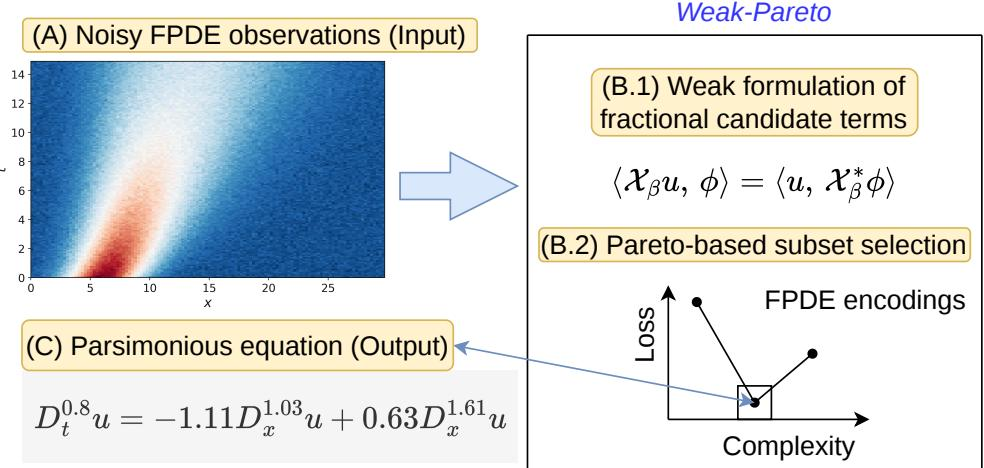
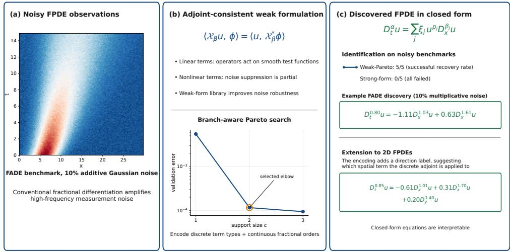
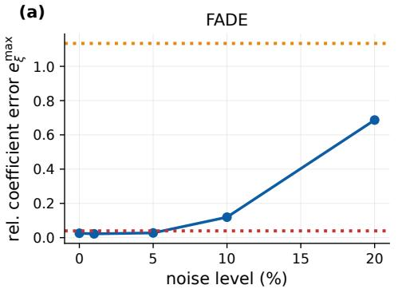
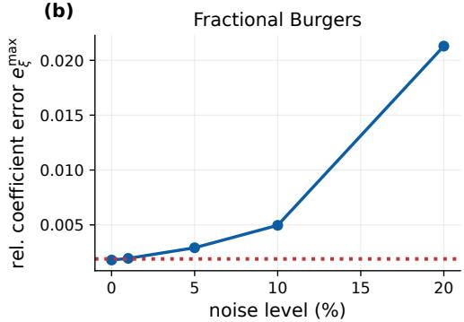
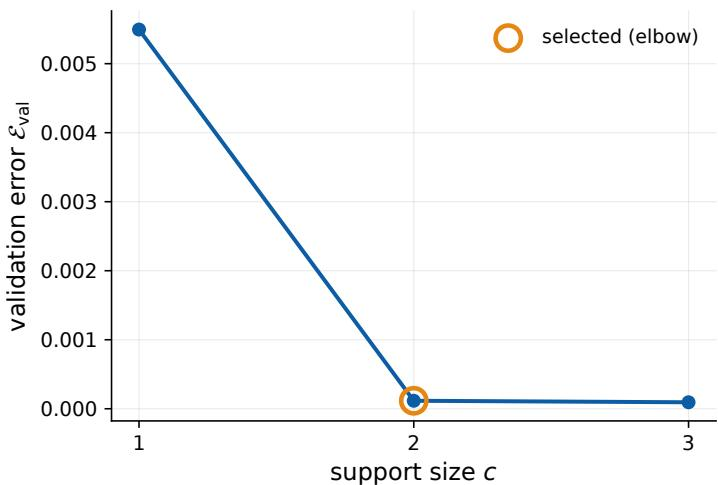
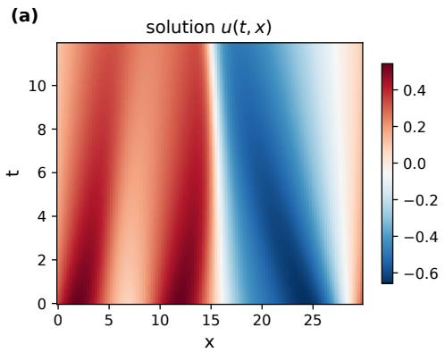
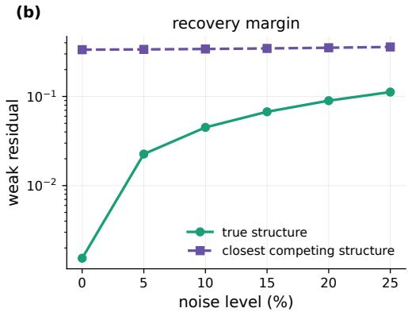

# Robust data-driven discovery of fractional diferential equations via weak formulations and Pareto-based subset selection

Pongpisit Thanasutives1\* and Yoshinobu Kawahara1,2

1\*Center for Advanced Intelligence Project (AIP), RIKEN, Tokyo, Japan.

2Graduate School of Information Science and Technology, The University of Osaka, Osaka, Japan.

\*Corresponding author(s). E-mail(s): pongpisit.thanasutives@riken.jp;

## Abstract

Fractional partial diferential equations describe nonlocal dynamics, but discovering them from noisy data is dificult because fractional diferentiation amplifies high-frequency measurement noise and the derivative orders are unknown. We propose Weak-Pareto, which combines an adjoint-consistent weak formulation of fractional terms with Pareto-based subset selection over discrete term types and continuous fractional orders. For linear right-hand-side terms, the adjoint transfers fractional operators from measured fields to smooth test functions, replacing noise-sensitive pointwise diferentiation with smoothing integration; for nonlinear terms, the noise-suppression efect is partial yet useful. Coeficients are fitted by ridge regression within a branch-aware diferential-evolution search over the orders. The support size is then selected at the validation-error– complexity elbow. We show that the variance of fixed linear right-hand-side weak features vanishes under grid refinement, whereas noise amplification in pointwise fractional features increases with derivative order. Across fractional advection– difusion, reaction–difusion, and Burgers benchmarks, Weak-Pareto recovers parsimonious structures from clean and noisy measurements. In controlled advection–difusion and Burgers comparisons, it retains the correct support at every tested multiplicative-noise level, whereas the unregularised strong-form counterpart largely fails once noise is introduced; this advantage persists under additive Gaussian noise. Ablations show that the weak library drives noise robustness and that continuous-order Pareto search avoids the support-selection failure of a dense fixed dictionary. On the advection–difusion benchmark, Weak-Pareto

yields more consistent operator recovery and substantially lower measured runtime than a neural baseline. A two-dimensional extension of Weak-Pareto can recover distinct coordinate-dependent orders, including a three-term anisotropic model under noisy conditions.

Keywords: fractional diferential equations, data-driven equation discovery, weak formulation, Pareto-based subset selection, diferential evolution, model selection

MSC Classification: 35R11 , 65M32 , 62J07 , 35R30

## Graphical Abstract

## 1 Introduction

Data-driven equation discovery aims to infer an interpretable, closed-form model directly from observations, rather than deriving it purely from first principles. Methods such as sparse identification of nonlinear dynamics $\left( { \mathrm { S I N D y } } \right)$ and PDE functional identification (PDE-FIND) select a small set of active terms from an overcomplete candidate library by combining regression with sparsity-promoting model selection [1– 3]. Their central principle is parsimony: the governing equation should contain only the important terms needed to explain the observed dynamics [4].

Many important real-world systems are nonlocal. Fractional diferential equations, including fractional partial diferential equations (FPDEs), describe anomalous diffusion, viscoelasticity, transport in heterogeneous media, and several biological and financial processes through real-valued derivative orders and nonlocal memory or spatial action [5–7]. Discovering these equations would allow the data to reveal both the governing terms and the degree of nonlocality.

Table 1 Comparison with prior equation-discovery methods. “Cont. order” means real-valued order optimisation rather than selection from a fixed order dictionary. “Search strategy” describes how active terms or a prescribed model are identified; “Frac. adjoint” means that weak features use the adjoint and boundary terms of the represented fractional operator.
<table><tr><td>Method</td><td>Weak</td><td>Fractional</td><td>Cont. order</td><td>Search strategy</td><td>Frac. adjoint</td></tr><tr><td>WSINDy / WeakIdent [10, 13]</td><td>yes</td><td>no</td><td>no</td><td>sparse regression</td><td>no</td></tr><tr><td>Weak-PDE-LEARN [15]</td><td>yes</td><td>no</td><td>no</td><td>sparse regression</td><td>no</td></tr><tr><td>Gulian et al. [17]</td><td>no</td><td>yes</td><td>yes</td><td>prescribed structure</td><td>no</td></tr><tr><td>Yu et al. [19]</td><td>no</td><td>yes</td><td>yes</td><td>sparse regression</td><td>no</td></tr><tr><td>Weak-Pareto (this work)</td><td>yes</td><td>yes</td><td>yes</td><td>best subset</td><td>yes</td></tr></table>

However, fractional equation discovery introduces two dificulties beyond the integer-order setting. First, fractional diferentiation can amplify high-frequency measurement noise. For the periodic spectral operators used in several benchmarks, this mechanism is explicit in the frequency domain: an operator of order β scales a Fourier mode of wavenumber κ by a factor whose magnitude grows as |κ|β. Strong-form methods therefore become increasingly fragile as the order or noise level grows. Second, the unknown orders are continuous. A fixed dictionary must either use a coarse order grid, which creates discretisation bias, or a dense grid, which produces many nearly collinear columns and thus destabilises support selection.

Weak formulations address the first dificulty for integer-order equations. Multiplying by smooth test functions and integrating by parts transfers derivatives from the measurements to the test functions, replacing pointwise derivative estimates with integral measurements. This principle underlies weak SINDy and related integral, Galerkin, and neural weak-form methods, which are substantially more noise-robust than strong-form regression [8–15]. Complementary uncertainty-aware model-selection methods, including the uncertainty-penalised Bayesian information criterion (UBIC), improve robustness by penalising candidate terms whose inferred coeficients exhibit high uncertainty [16].

Existing fractional-discovery methods, however, still evaluate fractional derivatives pointwise, either directly on a mesh or after reconstructing the field with a neural network [17–19]. Extending the weak formulation to fractional operators is not trivial, because Caputo, Riemann–Liouville, Gr¨unwald–Letnikov, Riesz, and periodic spectral derivatives have diferent adjoints and boundary terms. A weak feature is valid only when it uses the adjoint of the operator being identified. To address the aforementioned dificulties, we propose Weak-Pareto, a data-driven discovery framework that couples an adjoint-consistent weak formulation of the fractional candidate library with continuous-order, Pareto-based subset selection. Table 1 characterises the differences between Weak-Pareto and existing equation-discovery methods. Note that notable symbolic-regression discovery frameworks [20, 21] search over algebraic expression trees built from a fixed operator set, and usually do not support a continuously varying diferential order.

To our knowledge, Weak-Pareto is the first equation-discovery framework to achieve all five properties in Table 1. Our core contributions are threefold.

1. An adjoint-consistent weak library for fractional operators (Section 3). Each candidate uses the adjoint and boundary terms of its declared operator. For linear right-hand-side terms, the fractional derivative acts only on smooth test functions; those library columns therefore do not diferentiate the measured field. Proposition 1 shows that the variance of a fixed linear right-hand-side weak feature vanishes under grid refinement, whereas the variance of a pointwise positiveorder feature diverges at a rate that increases with derivative order. For nonlinear terms, we show explicitly that the weak row is an averaged projection of the corresponding strong feature and quantify the resulting noise-induced bias. For a fixed support, Proposition 3 further characterises when a spatial-order perturbation can be absorbed, to first order, by refitting the active coeficients.

2. A branch-aware, continuous-order Pareto search (Section 4). Candidate terms are encoded as integer powers paired with continuous fractional orders. Coefficients are fitted analytically inside a diferential-evolution search over the orders, while subunit, exact-integer, and superunit Caputo modes are treated as distinct branches. The support size is then selected at the validation-error–complexity elbow. This avoids both the discretisation error imposed by coarse fixed dictionaries and the severe collinearity of dense ones. After selecting the support and temporal branch, we evaluate the operators at locally refined orders and refit the coeficients on the full data. This removes interpolation error from the reported coeficients, although the selected model can still depend on the original order grid and search trajectory.

3. Controlled analyses and baseline comparisons (Section 5). Library-only ablations isolate the advantage of weak over pointwise measurements; fixed-dictionary ablations isolate the advantage of continuous-order search; and a controlled comparison assesses an adapted neural fractional-discovery framework on the advection–difusion benchmark. A semi-analytic fixed-support diagnostic tests the previously unreported superunit temporal branch. The experiments also identify the method’s present limits on Riesz reaction–difusion problems, demonstrate weak-form integral fitting on irregular frozen-soil creep data, and use an anisotropic two-dimensional example to showcase direction-labelled continuous-order encoding.

On the fractional advection–difusion (FADE) and fractional Burgers benchmarks, Weak-Pareto recovers the correct support in all five seeds at every tested multiplicative-noise level up to 20%. Under matched selection, the strong-form framework achieves no complete operator recovery in any noisy run. The two-dimensional example recovers the support, coordinate directions, and derivative orders in all 25 runs for each of its two benchmarks.

Fig. 1 connects the main stages of Weak-Pareto to concrete results from the supplied experiments. Panel (a) visualises the FADE benchmark under 10% additive Gaussian noise. Panel (b) combines the adjoint transfer used for linear weak features with the branch-aware Pareto search over support size, discrete term types, and continuous fractional orders. Panel (c) displays the closed-form encoding, the correct-support recovery pattern in the additive-Gaussian comparisons, the representative FADE discovery reported in Appendix I, and an example noisy estimate for the three-term anisotropic two-dimensional benchmark (28). The recovery counts refer specifically to correct-support recovery; complete operator recovery additionally requires the fractional orders to satisfy the declared tolerances.

  
Fig. 1 Overview of Weak-Pareto. (a) Visualisation of the FADE benchmark with 10% additive Gaussian noise, illustrating the high-frequency perturbations amplified by fractional diferentiation. (b) For a linear operator $\mathcal { X } _ { \beta }$ , the adjoint identity transfers diferentiation from the measured field to a smooth test function. The lower schematic shows the branch-aware Pareto search over support size, discrete term types, and continuous fractional orders, with the selected validation-error–complexity elbow highlighted. Nonlinear weak features remain averaged measurements; therefore, their noise suppression is partial. (c) The candidate encoding and its discoveries remain explicit closed-form equations. For both the FADE and fractional Burgers experiments at 10% additive Gaussian noise, Weak-Pareto recovers the correct support in $5 / 5$ runs, whereas the strong-form counterpart fails in all five runs (Appendix G). By augmenting the encoding tuple with a direction label, we extend Weak-Pareto to facilitate data-driven FPDE discovery in two-dimensional settings (28)

The remainder of the paper defines the model class (Section 2), develops the weak library and its noise analysis (Section 3), presents the Pareto search (Section 4), reports the experiments (Section 5), and concludes in Section 6. Proofs, numerical verification, and detailed settings are provided in the appendices.

## 2 Problem formulation

## 2.1 Fractional derivative operators

We first consider a scalar field $u ( t , x )$ on $Q = ( 0 , T ) \times \Omega$ , with $\Omega \subset \mathbb { R }$ , observed on a space–time grid. This notation covers the core method and analysis; Section 5.8 gives an example extension to two spatial coordinates. The temporal operator is denoted by ${ \mathcal T } _ { m _ { \alpha } , \alpha }$ , where $m _ { \alpha }$ identifies the Caputo branch and α its order. We distinguish the subunit branch $m _ { \alpha }$ = sub for $0 < \alpha < 1$ , the exact integer mode $m _ { \alpha }$ = int at $\alpha = 1$ and, when the declared range extends above one, the superunit branch $m _ { \alpha } = \operatorname { s u p }$ for $1 < \alpha < 2$ . Spatial terms use operators $\mathcal { X } _ { \beta }$ of order $\beta .$ . We adopt the following standard definitions [5, 7]. For $\mu > 0$ and noninteger $\gamma > 0$ , let $n = \lceil \gamma \rceil$ . The left and right Riemann–Liouville (RL) integrals and derivatives on $[ a , b ]$ are

$$
\begin{array} { l l l } { \displaystyle \big ( { } _ { a } I _ { z } ^ { \mu } f ) ( z ) = \displaystyle \frac { 1 } { \Gamma ( \mu ) } \int _ { a } ^ { z } ( z - s ) ^ { \mu - 1 } f ( s ) \mathrm { d } s , } & { \displaystyle ( { } _ { z } I _ { b } ^ { \mu } f ) ( z ) = \frac { 1 } { \Gamma ( \mu ) } \int _ { z } ^ { b } ( s - z ) ^ { \mu - 1 } f ( s ) \mathrm { d } s , } \\ { \displaystyle ( { } _ { a } D _ { z } ^ { \gamma } f ) ( z ) = \frac { \mathrm { d } ^ { n } } { \mathrm { d } z ^ { n } } \big ( a I _ { z } ^ { n - \gamma } f ) ( z ) , } & { \displaystyle ( { } _ { z } D _ { b } ^ { \gamma } f ) ( z ) = ( - 1 ) ^ { n } \frac { \mathrm { d } ^ { n } } { \mathrm { d } z ^ { n } } \big ( z I _ { b } ^ { n - \gamma } f \big ) ( z ) . } \end{array}\tag{1}
$$

Here $\begin{array} { r } { \Gamma ( \mu ) = \int _ { 0 } ^ { \infty } y ^ { \mu - 1 } e ^ { - y } \mathrm { d } y } \end{array}$ is Euler’s gamma function; integer-order derivatives have their usual meaning. The Caputo derivative subtracts the initial Taylor polynomial, ${ } _ { a } ^ { C } D _ { z } ^ { \alpha } f = { } _ { a } D _ { z } ^ { \alpha } [ f - P _ { n - 1 , a } f ]$ with $\begin{array} { r } { P _ { n - 1 , a } f ( z ) = \sum _ { q = 0 } ^ { n - 1 } \frac { f ^ { ( q ) } ( a ) } { q ! } ( z - a ) ^ { q } } \end{array}$ and $n = \lceil \alpha \rceil$ Below, $D _ { t } ^ { \alpha }$ abbreviates ${ } _ { 0 } ^ { C } D _ { t } ^ { \alpha }$ for noninteger $\alpha ,$ while $\partial _ { t }$ denotes the exact integer operator. The right RL derivatives in $\mathrm { E q . ~ ( 1 ) }$ arise as the adjoints of the corresponding left-sided operators (Section 3.2). On periodic domains we also use the Riesz operator and the directional spectral derivative, defined through their Fourier multipliers

$$
\mathcal F [ \mathcal { R } _ { \beta } f ] ( \kappa ) = - | \kappa | ^ { \beta } \mathcal F [ f ] ( \kappa ) , \qquad \mathcal F [ D _ { x } ^ { \beta } f ] ( \kappa ) = ( \mathrm { i } \kappa ) ^ { \beta } \mathcal F [ f ] ( \kappa ) .\tag{2}
$$

Here $\mathcal { F }$ denotes the Fourier transform and κ is the spatial wavenumber. The Riesz operator $\mathcal { R } _ { \beta } = - ( - \Delta ) ^ { \beta / 2 }$ has the non-positive multiplier $- | \kappa | ^ { \beta } ;$ thus $\beta = 2$ recovers $\partial _ { x } ^ { 2 }$ , and a positive coeficient produces difusion. The directional multiplier $( \mathrm { i } \kappa ) ^ { \beta }$ uses the principal branch,

$$
( \mathrm { i } \kappa ) ^ { \beta } : = | \kappa | ^ { \beta } \exp \Bigl ( \mathrm { i } \frac { \pi } { 2 } \beta \~ \mathrm { s g n } ( \kappa ) \Bigr ) , \qquad \kappa \neq 0 ,\tag{3}
$$

where sgn is the sign function and the zero mode is annihilated. The multiplier is conjugate-symmetric, ${ \overline { { ( \mathrm { i } \kappa ) ^ { \beta } } } } = ( \mathrm { i } ( - \kappa ) ) ^ { \beta } ;$ consequently, it maps real fields to real fields and models advective fractional transport; $\beta = 1$ recovers $\partial _ { x }$

The searched model class is the parsimonious fractional equation

$$
{ \mathcal { T } } _ { m _ { \alpha } , \alpha } u = \sum _ { j = 1 } ^ { c } \xi _ { j } u ^ { p _ { j } } { \mathcal { X } } _ { \beta _ { j } } u .\tag{4}
$$

The model has c active terms, with integer powers $p _ { j } .$ , spatial orders $\beta _ { j } .$ and coeficients $\xi _ { j }$ . The class includes fractional advection–difusion $( p _ { j } = 0 )$ and nonlinear transport such as the Burgers term u $\partial _ { x } u ~ ( p = 1 , \beta = 1 )$ . We define $\mathcal { X } _ { 0 }$ as the identity; hence $( p , 0 )$ represents the reaction term $u ^ { p + 1 }$ . This is a modelling convention, not the $\beta  0$ limit of the Riesz multiplier, which is $- ( \mathrm { I d } - \Pi _ { 0 } )$ because the zero Fourier mode is annihilated; it reduces to −Id only on mean-zero fields, and any sign is absorbed into $\xi _ { j }$

## 2.2 FPDE encoding

Each candidate is represented by the tuple

$$
\mathcal { M } = ( m _ { \alpha } , \alpha , p , \beta , \xi ) , \qquad p = ( p _ { 1 } , \dots , p _ { c } ) , \quad \beta = ( \beta _ { 1 } , \dots , \beta _ { c } ) , \quad \xi = ( \xi _ { 1 } , \dots , \xi _ { c } ) .\tag{5}
$$

Here $m _ { \alpha }$ records the temporal branch. This label is crucial at an integer: an estimate such as $\alpha = 0 . 9 9 9$ remains a subunit Caputo model and is not identified with $\partial _ { t }$ . The subunit, exact-integer, and superunit branch minima are therefore optimised separately and compared using the same validation objective.

Each right-hand-side term is represented by a discrete power $p _ { j }$ and a continuous order $\beta _ { j }$ . Unlike fixed-library regression, this encoding does not enumerate all possible orders in advance. A finite fixed grid either omits the true order or becomes increasingly collinear as it is refined (Section 5.10); Weak-Pareto instead assembles only the columns proposed by the search. For example, the FADE equation $D _ { t } ^ { 0 . 8 } u = - \partial _ { x } u + 0 . 5 D _ { x } ^ { 1 . 7 } u$ is encoded by $m _ { \alpha } = \mathrm { s u b } , \alpha = 0 . 8 , p = ( 0 , 0 ) , \beta = ( 1 , 1 . 7 )$ 2 and $\pmb { \xi } = ( - 1 , 0 . 5 )$ . At each support size $c ,$ the method searches for the best c-term equation. Within a fractional temporal branch it optimises $( \alpha , \beta _ { 1 } , \ldots , \beta _ { c } )$ ; in the exact integer mode, $\alpha = 1$ is fixed and only $\beta$ is optimised. For fixed modes, powers, and orders, the coeficients follow from linear regression (Section 4). In multiple spatial coordinates, our encoding can be augmented by a direction label $d _ { j }$ for each term. The example in Section 5.8 uses $d _ { j } \in \{ x , y \}$ and searches the direction pattern together with the continuous orders; its reported implementation is restricted to linear terms.

## 3 Weak formulation of fractional candidate terms

This section develops the first core contribution: weak features that are consistent with the adjoint and boundary structure of each fractional operator, together with a featurelevel explanation of their noise-robustness advantage over pointwise diferentiation.

## 3.1 Test functions and weak features

Let $\{ \phi _ { k } \} _ { k = 1 } ^ { K }$ be smooth, separable test functions

$$
\phi _ { k } ( t , x ) = \vartheta _ { \ell _ { t } } ( t ) \psi _ { \ell _ { x } } ( x ) , \qquad \phi _ { k } \in C ^ { s } ( \overline { { Q } } ) .\tag{6}
$$

The index $k$ enumerates temporal–spatial test-function pairs $( \ell _ { t } , \ell _ { x } )$ . For a localised test family, we use the term test window for a test function together with the region on which it has appreciable weight. Here $s \in \mathbb { N } _ { 0 } , \overline { { Q } } = [ 0 , T ] \times \overline { { \Omega } }$ , and $C ^ { s } ( \overline { { Q } } )$ denotes functions whose partial derivatives of total order at most s extend continuously to $\overline { { Q } } ;$ the smoothness order is chosen for the highest derivative in the library. The implementation provides compactly supported bumps, localised Gaussian test windows, and global Fourier modes. Reported experiments use Gaussian test windows and, for periodic high-order Riesz cases, Fourier spatial modes; bumps are not used in the reported results. In this subsection, “compact support” refers only to localisation of a test function. Elsewhere, the support of a candidate model means its active-term set in the subset search. Compact support of a test function or periodicity removes the corresponding continuum boundary terms. Gaussian tests use the exact discrete adjoint of Section 3.3, preserving the discrete identity without a zero-trace assumption. Each test function produces one scalar equation,

$$
\langle \mathcal { T } _ { m _ { \alpha } , \alpha } u , \phi _ { k } \rangle = \sum _ { j = 1 } ^ { c } \xi _ { j } \langle u ^ { p _ { j } } \mathcal { X } _ { \beta _ { j } } u , \phi _ { k } \rangle , \qquad \langle f , g \rangle = \int _ { Q } f g \mathrm { d } x \mathrm { d } t .\tag{7}
$$

The construction rests on the adjoint identity

$$
\langle \mathcal { L } f , \phi _ { k } \rangle = \langle f , \mathcal { L } ^ { * } \phi _ { k } \rangle + B _ { \mathcal { L } } ( f , \phi _ { k } ) ,\tag{8}
$$

where $\mathcal { L } ^ { \ast }$ is the adjoint and $B _ { \mathcal { L } }$ contains boundary and initial contributions. The same $\phi _ { k }$ is used on both sides; the operator L determines its adjoint and boundary contribution. Compact support of a test function or periodicity removes continuum spatial boundary terms. For Gaussian tests, the exact discrete adjoint replaces a zerotrace assumption; the Caputo target retains its initial-condition correction. Linear spatial operators transfer completely from the data to the test function. For $u ^ { p } \mathcal { X } _ { \beta } u$ the discrete adjoint gives an integrated projection of the strong nonlinear feature, averaging it without removing diferentiation from the noisy data path.

## 3.2 Adjoint identities

## Temporal (Caputo) target.

Let $n = \lceil \alpha \rceil$ and $\begin{array} { r } { P _ { n - 1 , 0 } u ( t , x ) = \sum _ { q = 0 } ^ { n - 1 } \partial _ { t } ^ { q } u ( 0 , x ) t ^ { q } / q ! } \end{array}$ . For $0 < \alpha < 2 , \alpha \neq 1$ , and test functions satisfying the terminal conditions required to remove the right-endpoint traces, fractional integration by parts gives

$$
\langle \sp { C } D _ { t } \sp { \alpha } u , \phi _ { k } \rangle = \langle u - P _ { n - 1 , 0 } u , ( \sb t D _ { T } ^ { \alpha } ) \phi _ { k } \rangle .\tag{9}
$$

Thus the subunit branch subtracts $u ( 0 , \cdot )$ , whereas the superunit branch also subtracts $t \partial _ { t } u ( 0 , \cdot )$ . At $\alpha = 1$ , the trace-free continuum identity is $\begin{array} { r } { \int _ { Q } u _ { t } \phi _ { k } \ = \ - \int _ { Q } } \end{array}$ u $\partial _ { t } \phi _ { k }$ reported Gaussian tests instead use the discrete transpose identity of Section 3.3. The domain integral leaves u undiferentiated, although the superunit branch still depends on $\partial _ { t } { u } ( 0 , \cdot )$ . In the reported L1 experiments, $D _ { h } ^ { \alpha } = \mathsf { L } \mathsf { 1 } _ { \alpha - 1 } D _ { 1 }$ and $( D _ { h } ^ { \alpha } ) ^ { \top } = D _ { 1 } ^ { \top } \mathsf { L } \mathsf { 1 } _ { \alpha - 1 } ^ { \top } .$ Its first weights are endpoint-concentrated, implicitly treating the initial rate onesidedly. Hence the target is weak in the interior but not derivative-free at the initial boundary. Remark 2 gives the scaling and noise analysis. The optional Volterra target estimates the initial Taylor polynomial explicitly but is not used here.

## Spatial terms.

For a linear spatial term the weak feature is

$$
\theta _ { k , \beta } = \langle \mathcal { X } _ { \beta } u , \phi _ { k } \rangle = \langle u , \mathcal { X } _ { \beta } ^ { * } \phi _ { k } \rangle ,\tag{10}
$$

where the adjoint depends on the operator definition. For a left Riemann–Liouville derivative in x on $[ a , b ]$ , suppressing the other variables, the continuum identity is

$$
\int _ { a } ^ { b } ( { } _ { a } D _ { x } ^ { \beta } u ) ( x ) \phi ( x ) \mathrm { d } x = \int _ { a } ^ { b } u ( x ) ( { } _ { x } D _ { b } ^ { \beta } \phi ) ( x ) \mathrm { d } x ,
$$

under the endpoint conditions stated in Appendix A; hence $( _ { a } D _ { x } ^ { \beta } ) ^ { * } = { _ x D _ { b } ^ { \beta } }$ on that domain. For the periodic Riesz operator, $\mathcal { R } _ { \beta } ^ { * } = \mathcal { R } _ { \beta }$ because its multiplier $- | \kappa | ^ { \beta }$ is real and even. For the directional periodic operator,

$$
\mathcal { F } [ \mathcal { X } _ { \beta } ^ { \ast } \phi _ { k } ] ( \kappa ) = \overline { { ( \mathrm { i } \kappa ) ^ { \beta } } } \mathcal { F } [ \phi _ { k } ] ( \kappa ) = ( \mathrm { i } ( - \kappa ) ) ^ { \beta } \mathcal { F } [ \phi _ { k } ] ( \kappa ) .
$$

Using an adjoint from a diferent operator family changes the model being identified and can bias the recovered order. Each benchmark therefore uses the adjoint of its declared candidate operator.

## Nonlinear terms.

For the nonlinear term $u ^ { p } \mathcal { X } _ { \beta } u$ in (4),

$$
\langle { u ^ { p } } { \mathcal { X } } _ { \beta } u , \phi _ { k } \rangle = \langle { \mathcal { X } } _ { \beta } u , { u ^ { p } } \phi _ { k } \rangle = \langle u , { \mathcal { X } } _ { \beta } ^ { * } ( { u ^ { p } } \phi _ { k } ) \rangle .\tag{11}
$$

Eq. (11) is the consistent weak form of the nonlinear candidate. At the discrete level, let A represent $\mathcal { X } _ { \beta }$ . Eq. (12) gives the exact chain

$$
\begin{array} { r } { \langle u , A ^ { * , h } ( u ^ { p } \phi _ { k } ) \rangle _ { h } = \langle A u , u ^ { p } \phi _ { k } \rangle _ { h } = \langle u ^ { p } A u , \phi _ { k } \rangle _ { h } . } \end{array}
$$

Thus the discrete weak nonlinear feature on the left is exactly the test-function projection of the corresponding pointwise strong feature $u ^ { p } A u$ . For nonlinear terms, diferentiation still acts on the measured field, while integration provides averaging. The resulting feature may therefore be biased, and the strongest noise guarantee applies to linear terms.

## 3.3 Numerical computation of adjoint identities

The numerical library uses the discrete adjoint of the operator that defines each candidate. Let $A \in \mathbb { R } ^ { n \times n }$ be the real-grid matrix representing a one-dimensional discrete operator, let $W = \mathrm { d i a g } ( w _ { 0 } , \ldots , w _ { n - 1 } ) \in \mathbb { R } ^ { n \times n }$ be the positive quadrature-weight matrix, and let $f , \phi \in \mathbb { R } ^ { n }$ , with $\langle f , g \rangle _ { h } = f ^ { \top } W g$ . The discrete adjoint is

$$
A ^ { * , h } = W ^ { - 1 } A ^ { \top } W , \qquad \langle A f , \phi \rangle _ { h } = \langle f , A ^ { * , h } \phi \rangle _ { h } .\tag{12}
$$

When $A = A _ { \beta , h }$ discretises $\mathcal { X } _ { \beta }$ , we write $\mathcal { X } _ { \beta } ^ { \ast , h } \phi : = A _ { \beta , h } ^ { \ast , h } \phi .$ . For the uniform quadrature used here, W is a scalar multiple of the identity and $A ^ { * , h } \ = \ A ^ { \top }$ . A left Gr¨unwald–Letnikov derivative therefore contributes $( G _ { L } ^ { \gamma } ) ^ { \top } \phi ;$ periodic operators use the conjugate Fourier multiplier; and the Caputo target uses the transpose of its L1 matrix. Because the Caputo family changes definition at integer orders, the subunit branch, exact integer operator, and superunit branch are precomputed and searched separately. Interpolation and local polishing remain within the selected branch. The exact $\alpha = 1$ candidate is compared directly with the fractional-branch minima, rather than approximated by a nearby fractional order. The superunit implementation is included and verified numerically. Appendix B verifies the adjoints, branch separation, and discretisation accuracy.

## 3.4 The noise-robust weak library

Let $u ^ { \star }$ denote the noise-free field and let the measured field be $\boldsymbol { u } = \boldsymbol { u } ^ { \star } + \boldsymbol { \eta } .$ where η is zero-mean measurement noise. For a linear candidate $( p = 0 )$ , define the noise-free weak feature by $\theta _ { k , \beta } ^ { \star } : = \langle u ^ { \star } , \mathcal { X } _ { \beta } ^ { * } \phi _ { k } \rangle$ and the measured feature by $\theta _ { k , \beta } : = \langle u , \mathcal { X } _ { \beta } ^ { * } \phi _ { k } \rangle$ Their diference is

$$
\theta _ { k , \beta } - \theta _ { k , \beta } ^ { \star } = \langle \eta , \mathcal { X } _ { \beta } ^ { \ast } \phi _ { k } \rangle ,\tag{13}
$$

an integral projection of the noise, whereas the strong form applies the fractional operator to the noise pointwise. Here pointwise means that $\mathcal { X } _ { \beta } u$ is evaluated at individual grid nodes before regression, rather than first being integrated or projected against a test function. For the periodic spatial operators used below, write the Fourier action as

$$
\mathcal { F } _ { x } [ \mathcal { X } _ { \beta } f ] ( \kappa ) = s _ { \beta } ( \kappa ) \mathcal { F } _ { x } [ f ] ( \kappa ) , \qquad s _ { \beta } ( \kappa ) = \left\{ - | \kappa | ^ { \beta } , \quad \mathcal { X } _ { \beta } = \mathcal { R } _ { \beta } , \right.
$$

hence both positive-order multipliers satisfy $| s _ { \beta } ( \kappa ) | = | \kappa | ^ { \beta }$ . The weak–strong contrast can therefore be stated precisely for independent grid noise.

## Theoretical properties.

The analysis below separates three properties. First, adjoint consistency ensures that every weak column represents the declared fractional operator and its boundary convention. Second, for linear right-hand-side columns, integration averages independent measurement noise: Proposition 1 shows variance decay under grid refinement, while the corresponding unregularised strong feature becomes increasingly noisy. These results characterise individual features; estimator-level behaviour is assessed empirically. Corollary 2 extends the variance result to the principal multiplicative-noise model, while Remarks 1 and 2 describe the remaining nonlinear bias and Caputo endpoint sensitivity.

Proposition 1 Let $\eta _ { i j } , i = 0 , \ldots , n _ { t } - 1$ and $j = 0 , \ldots , n _ { x } - 1$ , be independent, zero-mean random variables with variance $\sigma ^ { 2 }$ on a sequence of uniform grids over the fixed spatiotemporal domain $Q . \ B y$ grid refinement we mean $n _ { t } , n _ { x }  \infty$ on this fixed domain, with $h _ { t } , h _ { x }  0$ and $h _ { t } = \Theta ( n _ { t } ^ { - 1 } ) , h _ { x } = \Theta ( n _ { x } ^ { - 1 } )$ . Define

$$
\langle f , g \rangle _ { h } = h _ { t } h _ { x } \sum _ { i = 0 } ^ { n _ { t } - 1 } \sum _ { j = 0 } ^ { n _ { x } - 1 } f _ { i j } g _ { i j } , \qquad \| v \| _ { h } ^ { 2 } = h _ { t } h _ { x } \sum _ { i = 0 } ^ { n _ { t } - 1 } \sum _ { j = 0 } ^ { n _ { x } - 1 } v _ { i j } ^ { 2 } .
$$

Thus $\left\| \cdot \right\| _ { h }$ is the quadrature-weighted discrete $L ^ { 2 } ( Q )$ norm on grid samples. Let $\| v \| _ { L ^ { 2 } ( Q ) } ^ { 2 } =$ $\textstyle \int _ { Q } | v | ^ { 2 }$ dx dt. For part ${ ( i ) }$ , hold the test function $\phi _ { k }$ fixed on $Q$ as the grid is refined and assume that it belongs to the adjoint domain, so that $\omega _ { k , \beta } ^ { h } = \mathcal { X } _ { \beta } ^ { \ast , h } \phi _ { k }$ satisfies $\| \omega _ { k , \beta } ^ { h } \| _ { h } $ $\| \mathcal { X } _ { \beta } ^ { \ast } \phi _ { k } \| _ { L ^ { 2 } ( Q ) } < \infty$

(i) The weak-feature perturbation (13) satisfies

$$
\mathrm { V a r } \big ( \langle \eta , \omega _ { k , \beta } ^ { h } \rangle _ { h } \big ) = \sigma ^ { 2 } h _ { t } h _ { x } \| \omega _ { k , \beta } ^ { h } \| _ { h } ^ { 2 } = O ( h _ { t } h _ { x } ) .
$$

Hence, at fixed domain size, its variance is $O ( ( n _ { t } n _ { x } ) ^ { - 1 } )$ as both grid dimensions are refined.

(ii) For a periodic pointwise feature whose multiplier $s _ { \beta }$ is defined above and satisfies $| s _ { \beta } ( \kappa ) \bar { | } = | \kappa | ^ { \beta }$

$$
\mathrm { V a r } \big ( ( \mathcal { X } _ { \beta } \eta ) _ { i j } \big ) = \frac { \sigma ^ { 2 } } { n _ { x } } \sum _ { \ell = - \lfloor n _ { x } / 2 \rfloor } ^ { \lceil n _ { x } / 2 \rceil - 1 } | s _ { \beta } ( \kappa _ { \ell } ) | ^ { 2 } \sim \frac { \pi ^ { 2 \beta } } { 2 \beta + 1 } \sigma ^ { 2 } h _ { x } ^ { - 2 \beta } , \qquad \kappa _ { \ell } = \frac { 2 \pi \ell } { L _ { x } } .
$$

Thus the variance of every unregularised positive-order strong-form feature $( \beta > 0 )$ diverges under spatial refinement, at a rate that increases with $\beta ;$ the separately defined identity candidate at $\beta ~ = ~ 0$ retains variance $\sigma ^ { 2 }$ . For an even grid, a real-valued directional implementation may treat the single unpaired Nyquist mode separately; this changes one summand only and leaves the asymptotic relation unchanged, as noted in the proof.

Proof For (i), independence removes all cross-covariances:

$$
\mathrm { V a r } \left( h _ { t } h _ { x } \sum _ { i = 0 } ^ { n _ { t } - 1 } \sum _ { j = 0 } ^ { n _ { x } - 1 } \eta _ { i j } ( \omega _ { k , \beta } ^ { h } ) _ { i j } \right) = \sigma ^ { 2 } ( h _ { t } h _ { x } ) ^ { 2 } \sum _ { i = 0 } ^ { n _ { t } - 1 } \sum _ { j = 0 } ^ { n _ { x } - 1 } ( \omega _ { k , \beta } ^ { h } ) _ { i j } ^ { 2 } = \sigma ^ { 2 } h _ { t } h _ { x } \| \omega _ { k , \beta } ^ { h } \| _ { h } ^ { 2 } .
$$

The assumed norm convergence makes the final factor bounded. It holds for the fixed smooth Fourier and periodised-Gaussian tests used with the periodic operators; for a one-sided operator, it holds whenever the fixed test function belongs to the corresponding adjoint domain.

For (ii), fix a time index and write $\eta _ { j }$ for the spatial noise samples on that time slice. Let

$$
\mathcal { L } _ { n _ { x } } = \{ - \lfloor n _ { x } / 2 \rfloor , \ldots , \lceil n _ { x } / 2 \rceil - 1 \} , \qquad \kappa _ { \ell } = \frac { 2 \pi \ell } { L _ { x } } .
$$

With the discrete Fourier transform

$$
\widehat { \eta } _ { \ell } = \mathcal { F } _ { x } [ \eta ] ( \kappa _ { \ell } ) = \sum _ { q = 0 } ^ { n _ { x } - 1 } \eta _ { q } e ^ { - \mathrm { i } \kappa _ { \ell } x _ { q } } ,
$$

the multiplier definition gives the inverse representation

$$
( \mathcal { X } _ { \beta } \eta ) ( x _ { j } ) = \frac { 1 } { n _ { x } } \sum _ { \ell \in \mathcal { L } _ { n _ { x } } } s _ { \beta } ( \kappa _ { \ell } ) \widehat { \eta } _ { \ell } e ^ { \mathrm { i } \kappa _ { \ell } x _ { j } } .
$$

Here $\delta _ { q r }$ denotes the Kronecker delta. Since $\mathbb { E } [ \eta _ { q } \eta _ { r } ] = \sigma ^ { 2 } \delta _ { q r }$ , discrete Fourier orthogonality yields

$$
\begin{array} { l } { \displaystyle \mathbb { E } [ \widehat { \eta _ { \ell } } \widehat { \overline { { \eta _ { m } } } } ] = \sum _ { q = 0 } ^ { n _ { x } - 1 } \sum _ { r = 0 } ^ { n _ { x } - 1 } \mathbb { E } [ \eta _ { q } \eta _ { r } ] e ^ { - \mathrm { i } \kappa _ { \ell } x _ { q } } e ^ { \mathrm { i } \kappa _ { m } x _ { r } } } \\ { \displaystyle = \sigma ^ { 2 } \sum _ { q = 0 } ^ { n _ { x } - 1 } e ^ { - \mathrm { i } ( \kappa _ { \ell } - \kappa _ { m } ) x _ { q } } = n _ { x } \sigma ^ { 2 } \delta _ { \ell m } . } \end{array}
$$

The output is real for the conjugate-symmetric multipliers considered here. Its mean is zero, and expanding the squared magnitude therefore gives

$$
\begin{array} { l } { \displaystyle \mathrm { V a r } \big ( ( \mathcal { X } _ { \beta } \eta ) ( x _ { j } ) \big ) = \frac { 1 } { n _ { x } ^ { 2 } } \sum _ { \ell , m \in \mathcal { L } _ { n _ { x } } } s _ { \beta } ( \kappa _ { \ell } ) \overline { { s _ { \beta } ( \kappa _ { m } ) } } e ^ { \mathrm { i } ( \kappa _ { \ell } - \kappa _ { m } ) x _ { j } } \mathbb { E } [ \widehat \eta _ { \ell } \overline { { \widehat { \eta } _ { m } } } ] } \\ { \displaystyle = \frac { \sigma ^ { 2 } } { n _ { x } } \sum _ { \ell = - \lfloor n _ { x } / 2 \rfloor } ^ { \lceil n _ { x } / 2 \rceil - 1 } | s _ { \beta } ( \kappa _ { \ell } ) | ^ { 2 } = \frac { \sigma ^ { 2 } } { n _ { x } } \sum _ { \ell = - \lfloor n _ { x } / 2 \rfloor } ^ { \lceil n _ { x } / 2 \rceil - 1 } | \kappa _ { \ell } | ^ { 2 \beta } . } \end{array}
$$

Because $h _ { x } = L _ { x } / n _ { x }$ , the last sum obeys

$$
\begin{array} { l } { \displaystyle \frac { h _ { x } ^ { 2 \beta } } { n _ { x } } \sum _ { \ell = - \lfloor n _ { x } / 2 \rfloor } ^ { \lceil n _ { x } / 2 \rceil - 1 } | \kappa _ { \ell } | ^ { 2 \beta } = \displaystyle \frac { 1 } { n _ { x } } \sum _ { \ell = - \lfloor n _ { x } / 2 \rfloor } ^ { \lceil n _ { x } / 2 \rceil - 1 } \bigg | \frac { 2 \pi \ell } { n _ { x } } \bigg | ^ { 2 \beta } } \\ { \displaystyle \longrightarrow \int _ { - 1 / 2 } ^ { 1 / 2 } | 2 \pi r | ^ { 2 \beta } \ \mathrm { d } r = \displaystyle \frac { \pi ^ { 2 \beta } } { 2 \beta + 1 } . } \end{array}
$$

Consequently,

$$
\mathrm { V a r } \big ( ( \mathcal { X } _ { \beta } \eta ) ( x _ { j } ) \big ) \sim \frac { \pi ^ { 2 \beta } } { 2 \beta + 1 } \sigma ^ { 2 } h _ { x } ^ { - 2 \beta } ,
$$

which is exactly the asymptotic relation stated in part (ii). For the even-grid directional implementation, the real-valued projection afects only the unpaired Nyquist mode. Its contribution to the variance is $O ( h _ { x } ^ { - ( 2 \bar { \beta } - \bar { 1 } ) } )$ ), one order lower than the $O ( h _ { x } ^ { - 2 \beta } )$ total, and therefore does not change the leading constant or rate. □

Proposition 1 gives a feature-level explanation of why denser observations benefit the linear weak formulation more than the unregularised strong form under its assumptions. With the implementation’s separate discrete $\ell ^ { 2 }$ row normalisation, the variance is $O ( h _ { t } ^ { 2 } h _ { x } ^ { 2 } )$ for fixed separable tests, while signal and noise are rescaled identically. On a fixed domain, each linear weak measurement averages more independent noise samples and becomes more stable, whereas pointwise fractional diferentiation admits progressively higher wavenumbers and amplifies their noise. Nonetheless, correlated noise, the Caputo initial-data terms, nonlinear features, and conditioning of the regression can alter the final estimator. We therefore assess coeficient and structure recovery empirically in Section $5 ,$ and Appendix B verifies the predicted rates numerically.

Corollary 2 (Multiplicative measurement noise) Let the measured field be $u _ { i j } = u _ { i j } ^ { \star } ( 1 +$ $\rho \zeta _ { i j } )$ , where the $\zeta _ { i j }$ are independent, have zero mean and variance $\sigma _ { \zeta } ^ { 2 } { : }$ , and $u ^ { \star }$ is regarded as fixed. For the same fixed test function on $Q$ and discrete weak-feature weights $\omega _ { k , \beta } ^ { h }$ as in Proposition $1 ( i )$ , the conditional perturbation variance is

$$
\begin{array} { r } { \mathrm { V a r } \Big ( \langle u - u ^ { \star } , \omega _ { k , \beta } ^ { h } \rangle _ { h } \Big | u ^ { \star } \Big ) = \rho ^ { 2 } \sigma _ { \zeta } ^ { 2 } ( h _ { t } h _ { x } ) ^ { 2 } \displaystyle \sum _ { i = 0 } ^ { n _ { t } - 1 } \displaystyle \sum _ { j = 0 } ^ { n _ { x } - 1 } \big ( u _ { i j } ^ { \star } ( \omega _ { k , \beta } ^ { h } ) _ { i j } \big ) ^ { 2 } } \\ { \leq \rho ^ { 2 } \sigma _ { \zeta } ^ { 2 } \| u ^ { \star } \| _ { \infty } ^ { 2 } h _ { t } h _ { x } \| \omega _ { k , \beta } ^ { h } \| _ { h } ^ { 2 } = O ( h _ { t } h _ { x } ) . } \end{array}
$$

For the uniform perturbations $\zeta _ { i j } \sim \mathcal { U } [ - 1 , 1 ]$ used in the main experiments, $\sigma _ { \zeta } ^ { 2 } = 1 / 3$

Proof Condition on the noise-free field $u ^ { \star }$ . The perturbation is

$$
\langle \boldsymbol { u } - \boldsymbol { u } ^ { \star } , \boldsymbol { \omega } _ { k , \beta } ^ { h } \rangle _ { h } = \rho h _ { t } h _ { x } \sum _ { i = 0 } ^ { n _ { t } - 1 } \sum _ { j = 0 } ^ { n _ { x } - 1 } \boldsymbol { u } _ { i j } ^ { \star } \zeta _ { i j } ( \boldsymbol { \omega } _ { k , \beta } ^ { h } ) _ { i j } .
$$

Its conditional mean is zero. Independence again removes the cross-terms, giving

$$
\mathrm { V a r } \Big ( \langle u - u ^ { \star } , \omega _ { k , \beta } ^ { h } \rangle _ { h } \Big | u ^ { \star } \Big ) = \rho ^ { 2 } \sigma _ { \zeta } ^ { 2 } ( h _ { t } h _ { x } ) ^ { 2 } \sum _ { i = 0 } ^ { n _ { t } - 1 } \sum _ { j = 0 } ^ { n _ { x } - 1 } ( u _ { i j } ^ { \star } ) ^ { 2 } ( \omega _ { k , \beta } ^ { h } ) _ { i j } ^ { 2 } .
$$

Using $| \boldsymbol { u } _ { i j } ^ { \star } | \leq \| \boldsymbol { u } ^ { \star } \| _ { \infty }$ and the definition of $\left\| \cdot \right\| _ { h }$ gives, explicitly,

$$
\begin{array} { r l } & { \mathrm { V a r } \Big ( \langle u - u ^ { \star } , \omega _ { k , \beta } ^ { h } \rangle _ { h } \Big | u ^ { \star } \Big ) \leq \rho ^ { 2 } \sigma _ { \zeta } ^ { 2 } \| u ^ { \star } \| _ { \infty } ^ { 2 } ( h _ { t } h _ { x } ) ^ { 2 } \displaystyle \sum _ { i = 0 } ^ { n _ { t } - 1 } \displaystyle \sum _ { j = 0 } ^ { n _ { x } - 1 } ( \omega _ { k , \beta } ^ { h } ) _ { i j } ^ { 2 } } \\ & { \qquad = \rho ^ { 2 } \sigma _ { \zeta } ^ { 2 } \| u ^ { \star } \| _ { \infty } ^ { 2 } h _ { t } h _ { x } \| \omega _ { k , \beta } ^ { h } \| _ { h } ^ { 2 } } \\ & { \qquad = O ( h _ { t } h _ { x } ) , } \end{array}
$$

where the final step uses the bounded-weight assumption from Proposition 1(i).

Remark 1 (Bias of nonlinear weak features) For $p = 1$ , let $A _ { h } = I _ { n _ { t } } \otimes A _ { x }$ apply the discrete spatial operator $A _ { x }$ independently at each time level, and let $D _ { \phi _ { k } }$ be the diagonal matrix formed from the vectorised test function. Under additive i.i.d. noise $u = u ^ { \star } + \eta$ with variance $\sigma ^ { 2 }$ , the discrete-adjoint feature has the exact bias

$$
\mathbb { E } \Big [ \langle u , A ^ { * , h } ( u \phi _ { k } ) \rangle _ { h } \Big ] - \langle u ^ { \star } , A ^ { * , h } ( u ^ { \star } \phi _ { k } ) \rangle _ { h } = \sigma ^ { 2 } h _ { t } h _ { x } \operatorname { t r } ( A ^ { * , h } D _ { \phi _ { k } } ) .
$$

Under the multiplicative model of Corollary $^ { 2 , }$ the corresponding conditional bias is

$$
\rho ^ { 2 } \sigma _ { \zeta } ^ { 2 } h _ { t } h _ { x } \operatorname { t r } \Big ( D _ { u ^ { \star } } A ^ { * , h } D _ { \phi _ { k } } D _ { u ^ { \star } } \Big ) .
$$

These formulas apply when powers are formed directly from the measured field. Some positivevalued datasets instead use max $( u , 0 ) ^ { p }$ to prevent a noisy observation from creating an unphysical negative base; this nonlinear clipping changes the expectation and hence the trace formula. Integration therefore provides averaging without, in general, eliminating nonlinearfeature bias. For the periodic first derivative, the diagonal of $A ^ { * , h }$ is zero and so is the leading additive-noise bias. For the periodic directional multiplier of order $\beta ,$ the spatial-adjoint diagonal satisfies

$$
( A _ { x } ^ { \ast , h } ) _ { j j } \sim \cos \left( \frac { \pi \beta } { 2 } \right) \frac { \pi ^ { \beta } } { \beta + 1 } h _ { x } ^ { - \beta } .
$$

Consequently, for a fixed test function with $\textstyle \int _ { Q } \phi _ { k } \neq 0 ,$ the additive-noise bias has the leading behaviour

$$
\sigma ^ { 2 } h _ { t } h _ { x } \mathrm { t r } ( A ^ { * , h } D _ { \phi _ { k } } ) \sim \sigma ^ { 2 } \cos \biggl ( \frac { \pi \beta } { 2 } \biggr ) \frac { \pi ^ { \beta } } { \beta + 1 } h _ { x } ^ { - \beta } \int _ { Q } \phi _ { k } .
$$

It is therefore negative for $1 < \beta < 2$ and grows as $O ( h _ { x } ^ { - \beta } ) ; { \mathrm { i f ~ } } \int _ { Q } \phi _ { k } = 0$ , this leading term vanishes. Appendix B verifies these statements numerically. For additive noise and unclipped quadratic features, the explicit trace formula also suggests a plug-in bias correction when the noise variance can be estimated; extending such corrections to multiplicative noise and clipped features is left for future work.

Remark 2 (Noise in the Caputo target) Proposition 1 concerns linear right-hand-side columns, not the complete Caputo target in Eq. (9). Write one discrete target row as

$$
b _ { k } = h _ { t } h _ { x } \sum _ { i = 0 } ^ { n _ { t } - 1 } \sum _ { j = 0 } ^ { n _ { x } - 1 } \omega _ { i j } u ( t _ { i } , x _ { j } ) ,
$$

where $\omega _ { i j }$ excludes the quadrature factor $h _ { t } h _ { x }$ . Here endpoint sensitivity means that the target can depend much more strongly on noise in the first one or two time samples than on noise at a typical interior time. Two mechanisms below make this concrete. In the subunit branch, the same noisy observation $u ( 0 , x _ { j } )$ enters every temporal contribution through the Caputo initial-value subtraction, therefore adding more time levels does not create independent copies that can average out this noise. In the superunit branch, the transpose of the composed L1–first-diference operator places a large opposite-sign pair of weights on the first two time samples, making perturbations there comparatively influential.

## Subunit branch.

The same noisy initial value $u ( 0 , x _ { j } )$ is reused in every temporal contribution. Its variance term is

$$
\sigma ^ { 2 } h _ { t } ^ { 2 } h _ { x } ^ { 2 } \sum _ { j = 0 } ^ { n _ { x } - 1 } \left( \sum _ { i = 0 } ^ { n _ { t } - 1 } \omega _ { i j } \right) ^ { 2 } .
$$

For samples of a fixed continuum test weight, an ordinary full-field contribution has $\begin{array} { r } { \sum _ { i , j } \omega _ { i j } ^ { 2 } \bar { \mathbf { \Psi } } = \mathbf { \Psi } O ( ( h _ { t } h _ { x } ) ^ { - 1 } ) } \end{array}$ , and multiplication by $h _ { t } ^ { 2 } h _ { x } ^ { 2 }$ gives the $O ( h _ { t } h _ { x } )$ variance in Proposition 1. Reusing the initial sample instead gives

$$
\sum _ { j = 0 } ^ { n _ { x } - 1 } \left( \sum _ { i = 0 } ^ { n _ { t } - 1 } \omega _ { i j } \right) ^ { 2 } = O ( h _ { t } ^ { - 2 } h _ { x } ^ { - 1 } ) ,
$$

and hence a variance of $O ( h _ { x } )$ . The squared quadrature factors are therefore ofset by the growth of the discrete sums. Spatial refinement still averages independent initial-time samples, but temporal refinement does not create new independent copies of the initial datum. This slower rate does not by itself determine the direction of an order-selection bias.

## Superunit branch.

For $1 < \alpha < 2$ , the reported evaluator uses $D _ { h } ^ { \alpha } = \mathsf { L } \mathsf { 1 } _ { \alpha - 1 } D _ { 1 }$ . For the separable row $\phi _ { k } ( t , x ) =$ $\vartheta _ { \ell _ { t } } ( t ) \psi _ { \ell _ { x } } ( x )$ , consider unnormalised samples of the fixed continuum tests and define

$$
\begin{array} { r } { \pmb { w } ^ { ( \alpha ) } = ( D _ { h } ^ { \alpha } ) ^ { \top } \pmb { \vartheta } _ { \ell _ { t } } , \qquad \omega _ { i j } = w _ { i } ^ { ( \alpha ) } ( \psi _ { \ell _ { x } } ) _ { j } , \quad i = 0 , \dots , n _ { t } - 1 , \quad j = 0 , \dots , n _ { x } - 1 . } \end{array}
$$

The factorisation also explains the endpoint weights. Set $\pmb { v } = \mathsf { L } \mathbb { 1 } _ { \alpha - 1 } ^ { \top } \pmb { \vartheta } _ { \ell _ { t } } ;$ then ${ \pmb w } ^ { ( \alpha ) } = D _ { 1 } ^ { \top } { \pmb v }$ For the fixed smooth temporal tests used under refinement, the L1 weights give $v _ { 0 } = O ( h _ { t } ^ { - 1 } )$ ), while the neighbouring entries $v _ { 1 }$ and v remain $O ( 1 )$ . Because the first row of $D _ { 1 }$ is a forward diference and the next rows use centred diferences, the first two transpose weights satisfy $w _ { 0 } ^ { ( \alpha ) } = - v _ { 0 } / h _ { t } - v _ { 1 } / ( 2 h _ { t } )$ and $w _ { 1 } ^ { ( \alpha ) } = v _ { 0 } / h _ { t } - v _ { 2 } / ( 2 h _ { t } )$ . Hence $w _ { 0 } ^ { ( \alpha ) } , \bar { w } _ { 1 } ^ { ( \alpha ) } = \bar { O } ( h _ { t } ^ { - 2 } )$ and $w _ { 0 } ^ { ( \alpha ) } = - w _ { 1 } ^ { ( \alpha ) } + O ( h _ { t } ^ { - 1 } )$ . This opposite-sign initial pair therefore dominates $\begin{array} { r } { \sum _ { i } | w _ { i } ^ { ( \alpha ) } | ^ { 2 } = } \end{array}$ $O ( h _ { t } ^ { - 4 } )$ . Moreover,

$$
h x \sum _ { j = 0 } ^ { n _ { x } - 1 } | ( \psi _ { \ell _ { x } } ) _ { j } | ^ { 2 } \longrightarrow \| \psi _ { \ell _ { x } } \| _ { L ^ { 2 } ( \Omega ) } ^ { 2 } ,
$$

hence $\begin{array} { r } { \sum _ { j } | ( \psi _ { \ell _ { x } } ) _ { j } | ^ { 2 } = O ( h _ { x } ^ { - 1 } ) } \end{array}$ . For independent additive noise, the unnormalised target-row variance is therefore

$$
\sigma ^ { 2 } h _ { t } ^ { 2 } h _ { x } ^ { 2 } \left( \sum _ { i = 0 } ^ { n _ { t } - 1 } | w _ { i } ^ { ( \alpha ) } | ^ { 2 } \right) \left( \sum _ { j = 0 } ^ { n _ { x } - 1 } | ( \psi _ { \ell _ { x } } ) _ { j } | ^ { 2 } \right) = O \left( \sigma ^ { 2 } h _ { x } h _ { t } ^ { - 2 } \right) .
$$

For the multiplicative model of Corollary 2 with bounded $u ^ { \star } ,$ the same argument gives the upper bound $O ( \rho ^ { 2 } \sigma _ { \zeta } ^ { 2 } \| u ^ { \star } \| _ { \infty } ^ { 2 } h _ { x } h _ { t } ^ { - 2 } )$ . Thus the endpoint sensitivity also applies to the noise law used in the superunit diagnostic. Under the implementation’s separate discrete $\ell ^ { 2 }$ normalisation of the temporal and spatial test rows, the corresponding absolute variance is $O ( \sigma ^ { 2 } h _ { x } ^ { 2 } h _ { t } ^ { - 1 } )$ . The clean target is rescaled by the same factors; this normalisation therefore does not remove the relative sensitivity to initial-time noise.

The practical implication is that the discrete transpose removes pointwise interior diferentiation while retaining the initial-boundary dependence intrinsic to the Caputo derivative. Ordinary endpoint vanishing of $\vartheta _ { \ell _ { t } }$ leaves the initial pair coupled through $\mathsf { L } \mathsf { 1 } _ { \alpha - 1 } ^ { \top }$ and the first rows of $D _ { 1 } ^ { \top }$ . This behaviour is consistent with the initial-rate trace in the continuous identity. The complete target also contains the noisy full-field projection and is scored after variance normalisation in Eq. (21).

Appendix B separates these efects with five fixed-active-set cases: fully clean data; noise in every data path; a noisy field with the initial slice restored to its clean value; noise only in the temporal target; and noise only in the right-hand-side library. Comparing these cases identifies which data path drives a selected-order shift.

Corollary 2 covers the principal experimental noise model: although multiplicative noise is heteroscedastic, the variance of a fixed linear weak feature still vanishes under refinement. Appendix G shows the same weak–strong separation under additive Gaussian noise.

The weak formulation reduces noise amplification, but accurate order recovery also requires the fractional order to be distinguishable within the weak regression. The following subsection quantifies this second issue for spatial fractional orders.

## 3.5 Local identifiability of spatial fractional orders

On a fixed active support, we call a spatial order $\beta _ { j }$ locally identifiable when a small change in $\beta _ { j }$ produces a change in the weak regression that cannot be reproduced by refitting the active coeficients. This distinction matters because a weak formulation can suppress measurement noise while nearby orders still generate very similar regression columns. To isolate the order efect, fix the temporal branch, the active support, and all continuous orders except $\beta _ { j }$ . Using exact (non-interpolated) weak features, write

$$
\pmb { b } = \Theta ( \beta _ { j } ) \pmb { \xi } + \pmb { r } , \qquad \Theta = [ \pmb { \theta } _ { 1 } , \ldots , \pmb { \theta } _ { c } ] \in \mathbb { R } ^ { K \times c } .\tag{14}
$$

At the reference order, $\dot { \pmb { \theta } } _ { j } = \partial \pmb { \theta } _ { j } / \partial \beta _ { j }$ measures how the jth weak column changes with $\beta _ { j }$ . Let $P _ { \Theta } = \Theta \Theta ^ { \dagger }$ denote the orthogonal projector onto col(Θ), where $\Theta ^ { \dagger }$ is the Moore–Penrose pseudoinverse.

Proposition 3 (Local order sensitivity after coeficient refitting) Suppose $\theta _ { j } \neq 0$ and $\xi _ { j } \neq 0$ For an infinitesimal perturbation $\beta _ { j } \mapsto \beta _ { j } + \delta \beta _ { j }$ , allow the coeficients to refit as $\pmb { \xi } \mapsto \pmb { \xi } + \delta \beta _ { j } \pmb { \mathrm { \Omega } }$ v. Then the smallest first-order change in the model mean is

$$
\operatorname* { m i n } _ { \pmb { v } \in \mathbb { R } ^ { c } } \left\| \Theta \pmb { v } + \xi _ { j } \dot { \pmb { \theta } } _ { j } \right\| _ { 2 } = | \xi _ { j } | \left\| ( I - P _ { \Theta } ) \dot { \pmb { \theta } } _ { j } \right\| _ { 2 } .\tag{15}
$$

Hence $\beta _ { j }$ is first-order confounded with coeficient changes when $\dot { \theta } _ { j } \in \mathrm { c o l } ( \Theta )$

Proof Taylor expansion gives

$$
\Theta ( \beta _ { j } + \delta \beta _ { j } ) ( { \pmb \xi } + \delta \beta _ { j } { \pmb v } ) - \Theta ( \beta _ { j } ) { \pmb \xi } = \delta \beta _ { j } \big ( \Theta { \pmb v } + \xi _ { j } { \pmb \dot \theta } _ { j } \big ) + o \big ( | \delta \beta _ { j } | \big ) .
$$

The term $\xi _ { j } \dot { \pmb \theta } _ { j }$ is the first-order change caused by perturbing the order. Refitting the coefficients contributes $_ { \Theta v }$ , which can reproduce any vector in col(Θ). Least squares therefore cancels the component of $\xi _ { j } \dot { \pmb \theta } _ { j }$ that lies in this column space. The component that remains is $\xi _ { j } ( I - P _ { \Theta } ) \dot { \theta } _ { j }$ ; taking its norm gives Eq. (15). □

This result motivates the dimensionless, coeficient-independent diagnostic

$$
S _ { \beta _ { j } } = \frac { \left\| ( I - P _ { \Theta } ) \dot { \theta } _ { j } \right\| _ { 2 } } { \| \theta _ { j } \| _ { 2 } } .\tag{16}
$$

The numerator measures the part of the column change that remains after the best first-order coeficient adjustment, and the denominator removes the scale of the column itself. Thus $S _ { \beta _ { j } } ~ = ~ 0$ corresponds to complete first-order confounding on the fixed support, whereas a larger value indicates that the order produces a more distinct regression direction. The diagnostic is local and support-conditioned; in Section 5.2 we compare it with fixed-support order errors under noise.

A simple Fourier calculation explains why this sensitivity depends on both the operator and the spectral content of the observed field. Consider one isolated periodic linear term before weak projection, and let

$$
E ( \boldsymbol { \kappa } ) = \sum _ { i = 0 } ^ { n _ { t } - 1 } | \widehat { u } ( t _ { i } , \boldsymbol { \kappa } ) | ^ { 2 }
$$

be the total energy carried by spatial wavenumber κ over the observed times. This quantity is relevant because an order can only be distinguished through wavenumbers

that are actually present in the data. Both periodic operators satisfy $| s _ { \beta } ( \kappa ) | = | \kappa | ^ { \beta }$ so the fraction of operator-weighted energy carried by each nonzero wavenumber is

$$
q _ { \beta } ( \kappa ) = \frac { | \kappa | ^ { 2 \beta } E ( \kappa ) } { \sum _ { \nu \ne 0 } | \nu | ^ { 2 \beta } E ( \nu ) } , \qquad \kappa \ne 0 .
$$

Applying the same coeficient-refitting argument to the Fourier multipliers gives the isolated-term sensitivity

$$
S _ { \beta , \mathrm { s p e c } } ^ { 2 } = \left\{ { \begin{array} { l l } { \mathrm { V a r } _ { q _ { \beta } } [ \log | \kappa | ] , } & { \mathrm { R i e s z , } } \\ { \mathrm { V a r } _ { q _ { \beta } } [ \log | \kappa | ] + \pi ^ { 2 } / 4 , } & { \mathrm { d i r e c t i o n a l . } } \end{array} } \right.\tag{17}
$$

Here $\operatorname { V a r } _ { q _ { \beta } } \left[ \log \left| \kappa \right| \right]$ measures the spread of the operator-weighted wavenumbers on a logarithmic scale. For a Riesz term, this spread is the entire source of local order sensitivity: if all spectral weight lies at one |κ|, changing $\beta$ only rescales the feature and can be absorbed exactly by the coeficient. With energy at several distinct wavenumbers, changing $\beta$ alters their relative magnitudes and becomes easier to distinguish. A directional derivative has the same magnitude scaling and also changes phase through $\exp ( \mathrm { i } \pi \beta \mathrm { s g n } ( \kappa ) / 2 )$ , which contributes the additional $\pi ^ { 2 } / 4$ term for a real field with conjugate-symmetric spectral energy. Eq. (17) therefore explains the operator-level mechanism. The reported diagnostic uses $S _ { \beta _ { j } }$ in Eq. (16) on the full weak design, so it also incorporates the test functions and the other active columns.

## 4 Pareto-based subset selection

The second core contribution is a search procedure that treats term type and fractional order jointly without constructing a dense fixed dictionary.

Algorithm 1 summarises the mechanism of Weak-Pareto from building the weak feature library to the exact-order refit. This section details its search and selection stages.

## 4.1 The weak regression system

Stacking the K weak equations (7), one row per test function, gives the following system of equations:

$$
\begin{array} { r } { b ( m _ { \alpha } , \alpha ) = \Theta ( p , \beta ) \boldsymbol \xi + \boldsymbol r , \qquad b _ { k } ( m _ { \alpha } , \alpha ) = \langle { \mathcal T } _ { m _ { \alpha } , \alpha } u , \phi _ { k } \rangle , \quad \Theta _ { k , j } = \langle u ^ { p _ { j } } { \mathcal X } _ { \beta _ { j } } u , \phi _ { k } \rangle . } \end{array}\tag{18}
$$

The target b is assembled from $\operatorname { E q } .$ (9). Each design column is constructed from Eq. (10) or (11). For fixed powers and orders, Eq. (18) is linear in $\xi .$ Weak-Pareto therefore solves the coeficients directly and reserves global optimisation for the fractional orders.

## 4.2 Best-subset regression

Section 2.2 represents a candidate as $\mathcal { M } = ( m _ { \alpha } , \alpha , \pmb { p } , \beta , \pmb { \xi } )$ . At a fixed support size $c ,$ choosing the discrete temporal branch $m _ { \alpha }$ and power vector p leaves the temporal and spatial orders as continuous variables, while the coeficients are obtained by linear regression. Because the encoding does not predefine an order dictionary, discovery therefore becomes a sequence of best-subset problems indexed by c. Let $\mathcal { A } = \{ 0 , \ldots , P \}$ be the admitted powers. Its c-fold Cartesian product is ${ \mathcal { A } } ^ { c } = { \mathcal { A } } \times \cdot \cdot \cdot \times { \mathcal { A } } .$ , and we retain only the nondecreasing power patterns

$$
\mathfrak { P } _ { c } = \{ ( p _ { 1 } , \dots , p _ { c } ) \in A ^ { c } : p _ { 1 } \leq \dots \leq p _ { c } \} .
$$

For example, $\begin{array} { r l r l r } { \operatorname { i f } } & { { } \mathcal { A } } & { } & { { } = } & { \{ 0 , 1 , 2 \} } \end{array}$ and $\begin{array} { r l r l } { c } & { { } } & { = } & { { } 2 , } \end{array}$ then $\begin{array} { r l } { \mathfrak { P } _ { 2 } } & { { } = } \end{array}$ $\{ ( 0 , 0 ) , ( 0 , 1 ) , ( 0 , 2 ) , ( 1 , 1 ) , ( 1 , 2 ) , ( 2 , 2 ) \}$ . The ordering removes duplicate permutations of the powers; the associated spatial orders remain continuous and are optimised independently for the terms. For the declared temporal range $[ \alpha _ { \mathrm { m i n } } , \alpha _ { \mathrm { m a x } } ]$ and separator $\epsilon _ { \alpha } .$ define

$$
\begin{array} { r l } & { \mathcal { T } _ { \mathrm { s u b } } = [ \alpha _ { \mathrm { m i n } } , \alpha _ { \mathrm { m a x } } ] \cap ( 0 , 1 - \epsilon _ { \alpha } ] , \quad \mathcal { T } _ { \mathrm { i n t } } = [ \alpha _ { \mathrm { m i n } } , \alpha _ { \mathrm { m a x } } ] \cap \{ 1 \} , } \\ & { \mathcal { T } _ { \mathrm { s u p } } = [ \alpha _ { \mathrm { m i n } } , \alpha _ { \mathrm { m a x } } ] \cap [ 1 + \epsilon _ { \alpha } , 2 ) . } \end{array}
$$

The sets correspond directly to the temporal label in the encoding: $\mathcal { T } _ { \mathrm { s u b } }$ contains admitted fractional orders below one, $\mathcal { T } _ { \mathrm { i n t } }$ contains the exact integer candidate $\alpha = 1$ and $\mathcal { T } _ { \mathrm { s u p } }$ contains admitted fractional orders above one; empty sets are omitted. For each $c = 1 , \ldots , c _ { \mathrm { m a x } }$ , we solve

$$
\mathcal { M } _ { c } ^ { \star } = \operatorname* { a r g m i n } _ { \substack { p \in \mathfrak { P } _ { c } , m _ { \alpha } , \alpha \in \mathcal { I } _ { m _ { \alpha } } , \beta } } J _ { c } ( \pmb { p } , m _ { \alpha } , \alpha , \beta ) , \qquad J _ { c } = \mathrm { l o g } _ { 1 0 } \mathopen { } \mathclose \bgroup \left( \mathcal { E } _ { \mathrm { v a l } } + \varepsilon \aftergroup \egroup \right) + \Pi _ { \mathrm { d u p } } ,\tag{19}
$$

where ${ \mathcal E } _ { \mathrm { v a l } }$ is the variance-normalised held-out score in Eq. (21) below, and $\Pi _ { \mathrm { d u p } }$ penalises nearly duplicate terms with the same power. Each branch is optimised independently and scored by the same normalised criterion; changes in the scale of the branch-specific target therefore do not distort the comparison. Coeficients are fitted only on the training weak rows. With $S = \mathrm { d i a g } ( \| \pmb { \theta } _ { 1 , \mathrm { t r } } \| _ { 2 } , \dots , \| \pmb { \theta } _ { c , \mathrm { t r } } \| _ { 2 } )$ and $\widetilde { \Theta } _ { \mathrm { t r } } = \Theta _ { \mathrm { t r } } S ^ { - 1 }$ , the inner column-normalised ridge fit is

$$
\widehat { \pmb { \xi } } _ { \mathrm { t r } } = S ^ { - 1 } \big ( \widetilde { \Theta } _ { \mathrm { t r } } ^ { \top } \widetilde { \Theta } _ { \mathrm { t r } } + \lambda I \big ) ^ { - 1 } \widetilde { \Theta } _ { \mathrm { t r } } ^ { \top } \pmb { b } _ { \mathrm { t r } } .\tag{20}
$$

Appendix C.1 gives the row split, normalisations, duplicate penalty, and numerical constants. Diferential evolution optimises the continuous orders within each temporal branch [22]; in the integer branch, $\alpha = 1$ is fixed. Powers are enumerated only as nondecreasing patterns $\mathfrak { P } _ { c } ,$ eliminating permutation duplicates. This bi-level design confines the global search to a small order space while solving the linear coeficients at every objective evaluation.

## 4.3 The parsimony-promoting elbow

Solving (19) for increasing c produces a sequence of best models $\mathcal { M } _ { 1 } ^ { \star } , \mathcal { M } _ { 2 } ^ { \star } , . . .$ . and a Pareto front of validation error against support size. Model quality is scored on held-out evaluation rows,

$$
\mathcal { E } _ { \mathrm { v a l } } ( \mathcal { M } ) = \frac { n _ { \mathrm { v a l } } ^ { - 1 } \lVert \boldsymbol { b } _ { \mathrm { v a l } } - \Theta _ { \mathrm { v a l } } \boldsymbol { \widehat { \xi } } \rVert _ { 2 } ^ { 2 } } { \mathrm { V a r } ( \boldsymbol { b } _ { \mathrm { v a l } } ) + \varepsilon } ,\tag{21}
$$

where $\begin{array} { r } { \mathrm { V a r } ( b _ { \mathrm { v a l } } ) = n _ { \mathrm { v a l } } ^ { - 1 } \sum _ { i = 1 } ^ { n _ { \mathrm { v a l } } } ( b _ { i } - \overline { { b } } _ { \mathrm { v a l } } ) ^ { 2 } . } \end{array}$ is the empirical validation-target variance used by the implementation, and $\varepsilon = 1 0 ^ { - 1 4 }$ guards against a zero or numerically negligible denominator. Variance normalisation makes the score dimensionless and comparable across temporal targets whose scale changes with α. Training and validation use disjoint weak rows, although overlapping test-function supports make them correlated measurements of the same noisy field. Thus K counts weak equations and is distinct from an efective number of independent observations. We use ${ \mathcal E } _ { \mathrm { v a l } }$ for internal model selection and multi-seed experiments for across-realisation assessment.

Let $\mathcal { E } _ { c } ^ { \star }$ be the best validation error at support size c. The sweep stops when the relative improvement falls below δ after the earliest admissible stopping size $c _ { \operatorname* { m i n } } = 2$ or when the selected elbow remains unchanged after an additional size. To define the elbow, the implementation uses the benefit coordinate $y _ { c } = - \log _ { 1 0 } ( \mathcal { E } _ { c } ^ { \star } + \varepsilon )$ together with support size c. After min–max normalising both coordinates, the selected interior point maximises its signed vertical excess above the chord joining the first and last points. This chord-based criterion is related to normalised diference-curve knee detection [23]. Thus “above” refers to the normalised benefit–complexity coordinates; when the same front is drawn as raw validation error versus support size, the corresponding knee appears below the endpoint chord. If no interior point has positive signed excess, the smallest model is retained. With only two sizes, the larger model is selected only when it improves $\log _ { 1 0 } \mathcal { E } _ { c } ^ { \star }$ by at least 0.15. The two-point margin is heuristic; Appendix E.1 examines sensitivity over 0.10–0.20.

## 4.4 Inactive-term pruning

A selected model can occasionally contain a term with negligible fitted efect. We remove such terms using a scale-aware, non-oracle rule. For $\begin{array} { r } { \tilde { \Theta } \widehat { \xi } = \sum _ { j } \widehat { \xi } _ { j } \pmb { \theta } _ { j } } \end{array}$ , define $r _ { j } ~ = ~ \| \widehat { \xi } _ { j } \pmb { \theta } _ { j } \| _ { 2 } / ( \| \Theta \widehat { \pmb { \xi } } \| _ { 2 } + \varepsilon )$ . Term $j$ is removed when $r _ { j } ~ \le ~ \tau _ { \mathrm { c o n t r i b } }$ or $| \widehat { \xi } _ { j } | \le \tau _ { \mathrm { a b } }$ s. The ratio is evaluated over all finite weak rows. Unlike raw coeficient magnitude, it accounts for the diferent scales of fractional-library columns. Because partially cancelling terms can make $r _ { j } > 1$ , only small values are interpreted.

## 4.5 Exact-order refitting

During the global search, weak columns are interpolated from features precomputed on an order grid. Here “exact-order” means that the operators are subsequently evaluated directly at continuous order values instead of by interpolation. After elbow selection and pruning, local gradient-free steps refine the selected orders within the temporal branch chosen during the global search. If a fractional branch is selected, α and the non-identity spatial orders are polished within their branch bounds and local trust regions. If the exact-integer branch is selected, α remains fixed at 1 and only the non-identity spatial orders are polished. The temporal-branch comparison is completed during model selection, so this conditional refit operates only within the selected branch. Let $\mathcal { M } ^ { \star }$ denote the selected model and $( \widehat \alpha ^ { \mathcal { M } ^ { \star } } , \widehat \beta ^ { \mathcal { M } ^ { \star } } )$ its polished orders. The final coeficients are then

Algorithm 1 Weak FPDE discovery via Pareto-based subset selection   
Require: Data u on a grid; test functions $\{ \phi _ { k } \}$ ; powers $\overline { { \mathcal { A } = \{ 0 , \dots , P \} } }$ , which define   
$\mathfrak { P } _ { c } ;$ max size $c _ { \mathrm { m a x } } ;$ earliest stopping size $c _ { \operatorname* { m i n } } = 2 ;$ plateau tolerance δ   
1: Build the weak target $\pmb { b } ( m _ { \alpha } , \alpha )$ and weak columns $\Theta _ { k , j }$ via the adjoints (9)–(11)   
2: Split rows into training/validation   
3: for $c = 1 , 2 , \ldots , c _ { \mathrm { m a x } }$ do   
4: for each $\pmb { p } \in \mathfrak { P } _ { c }$ generated from $\mathcal { A }$ do   
5: for each admitted temporal mode $m _ { \alpha }$ do   
6: Optimise α only within $\mathcal { I } _ { m _ { o } }$ (fixed at 1 for $m _ { \alpha } = \mathrm { i n t } )$ and optimise $\beta ,$   
refitting $\widehat { \xi }$ by (20)   
7: end for   
8: Retain the lowest-objective temporal mode for this power pattern   
9: end for   
10: $\mathcal { M } _ { c } ^ { \star } \gets$ best model of size c by the objective $J _ { c }$ in (19); let $\mathcal { E } _ { c } ^ { \star } = \mathcal { E } _ { \mathrm { v a l } } ( \mathcal { M } _ { c } ^ { \star } )$   
11: Recompute the current signed-chord elbow $\widehat { c } _ { \mathrm { e l b o w } }$ from $\{ \mathcal { M } _ { j } ^ { \star } \} _ { j = 1 } ^ { c }$   
12: if $c \geq c _ { \mathrm { m i n } }$ and the validation-improvement plateau condition holds then   
13: break   
14: else if $\widehat { c } _ { \mathrm { e l b o w } } < c$ and the elbow is unchanged for the declared patience then   
15: break ▷ selection stability   
16: end if   
17: end for   
18: Select the elbow model $\mathcal { M } ^ { \star }$ of the Pareto front $\{ \mathcal { M } _ { c } ^ { \star } \}$   
19: Prune numerically inactive terms (Section 4.4) and refit at exact orders   
(Section 4.5)   
20: return $\mathcal { M } ^ { \star }$ ▷ representing the discovered fractional equation

$$
\widehat { \pmb { \xi } } ^ { \mathcal { M } ^ { \star } } = \underset { \pmb { \xi } } { \arg \operatorname* { m i n } } \left\| \pmb { b } ^ { \mathcal { M } ^ { \star } } - \Theta ^ { \mathcal { M } ^ { \star } } \pmb { \xi } \right\| _ { 2 } ^ { 2 } + \lambda \big \| \pmb { S } ^ { \mathcal { M } ^ { \star } } \pmb { \xi } \big \| _ { 2 } ^ { 2 } ,\tag{22}
$$

where the target and design are evaluated directly at the polished orders and $S ^ { \mathcal { M } ^ { \star } }$ column-normalises the design. The same ridge parameter is used during search and refitting. Model selection is completed before this update; the training score, validation score, objective, and heuristic information criteria therefore keep their selection-stage meanings. The final all-row residual is stored separately as ${ \mathcal E } _ { \mathrm { f i t } }$ . Direct evaluation removes order-grid interpolation error from this conditional refit. The selected activeterm set, temporal mode, and optimisation basin can still depend on the order grid, search trajectory, order bounds, test functions, and data resolution.

## 4.6 Computational cost

Two choices control the cost. First, the bi-level formulation restricts global optimisation to the order variables—c + 1 dimensions for a fractional temporal branch and c for the exact integer branch—while the coeficients are solved directly. Second, early stopping usually evaluates support sizes only up to the selected model plus one.

Let $N = n _ { t } n _ { x }$ be the number of field samples, $K = K _ { t } K _ { x }$ the number of weak rows, $G _ { \alpha }$ and $G _ { \beta }$ the numbers of temporal and spatial order nodes, and $P + 1$ the number of powers. Weak-Pareto precomputes the target and candidate features at these order nodes. At support size $c ,$ the number of non-redundant power patterns is $\begin{array} { r } { N _ { p } ( c ) = \binom { P + c } { c } } \end{array}$ . A separable projection $T U X ^ { \top }$ costs $O ( K _ { t } N + K n _ { x } )$ , and a periodic spectral adjoint at one order costs $O ( K _ { x } n _ { x }$ log $n _ { x } )$ . Precomputation is therefore linear in $G _ { \alpha }$ and $G _ { \beta }$ , with memory $O ( K [ G _ { \alpha } + ( P + 1 ) G _ { \beta } ] + N )$

After precomputation, one objective evaluation forms a $K \times c$ design and solves a ridge system in $O ( K c ^ { 2 } + c ^ { 3 } )$ time and $O ( K c )$ memory. If $N _ { \mathrm { D E } } ( c )$ is the number of diferential-evolution evaluations per power pattern and the sweep stops at $c _ { \mathrm { s t o p } }$ , the total search cost is

$$
O \left( \sum _ { c = 1 } ^ { c _ { \mathrm { s t o p } } } N _ { p } ( c ) N _ { \mathrm { D E } } ( c ) \left[ K c ^ { 2 } + c ^ { 3 } \right] \right)
$$

after precomputation. In the reported experiments $c \leq 4 ;$ hence the cubic term is negligible and each objective evaluation is efectively linear in the number of weak rows. Fast Fourier transforms accelerate the dominant periodic-operator calculations.

## 5 Experiments and results

The experiments address three primary questions. First, can Weak-Pareto recover parsimonious FPDEs across linear and nonlinear benchmarks? Second, are weak measurements more robust than pointwise fractional features under matched selection? Third, is continuous-order subset search more reliable than a dense fixed dictionary? Supporting studies examine the superunit temporal branch, a two-dimensional anisotropic example, a contemporary neural fractional-discovery framework, computational cost, and applicability to irregular experimental data.

## 5.1 Empirical benchmarks and evaluation metrics

We use four periodic main benchmarks (Table 2): FADE, two Riesz reaction–difusion (RD) equations with integer or fractional time, and a nonlinear fractional Burgers equation. The Burgers case is the principal nonlinear benchmark because its support contains the genuine quadratic transport term $- u \partial _ { x } u ;$ it also tests discrimination between fractional difusion of order 1.7 and the nearby integer second derivative. Section 5.3 reports a separate fixed-support superunit diagnostic, and Appendix E adds an integer-only equation and a case with two fractional spatial derivatives. Unless stated otherwise, noise is multiplicative, $u \mapsto u ( 1 + \rho \zeta )$ with $\zeta \sim \mathcal { U } [ - 1 , 1 ]$ , and tables report 100ρ percent. Recovery counts are over five seeds, order and coeficient errors are conditioned on support/power recovery, and ${ \mathcal { E } } _ { \mathrm { f i t } }$ is summarised over all seeds. The 10% Riesz cases are deliberately severe identifiability tests at the present resolution.

The time–space reaction–difusion generator and evaluator share the Caputo L1 discretisation; therefore, the clean experiment is a discretisation-consistency test rather than an independent forward-solver validation.

The main experiments use one common, non-oracle configuration: automatic support-size stopping, $c _ { \operatorname* { m a x } } = 4$ , candidate powers $p \in \{ 0 , 1 , 2 \}$ , and elbow selection. Appendix E examines sensitivity to these choices.

## Evaluation protocol.

We separate structural recovery from parameter accuracy. Support/power recovery requires the correct number of terms and matching integer powers after pruning. Operator-structure recovery additionally requires the correct temporal branch, spatial operator modes, and an absolute error no greater than $\tau _ { q } = 0 . 1 5$ for every positive derivative order; identity terms must be identified exactly. A fractional time order near one is not the exact operator $\partial _ { t }$ , and a low-order Riesz term is not the reaction identity.

The tolerance is a predefined operational criterion. For the main-text synthetic benchmarks, the positive true orders range from approximately 0.8 to 2.0; hence $\tau _ { q } = 0 . 1 5$ corresponds to relative deviations of $7 . 5 \% - 1 8 . 7 5 \%$ . An absolute criterion is appropriate because fractional order is dimensionless and temporal and spatial orders are measured on the same scale. Rescoring the 60 noisy runs in the matched weak-versus-strong comparisons gives 45, 47, and $4 7$ recoveries for Weak-Pareto at $\tau _ { q } = 0 . 1 2 5 , 0 . 1 5 .$ , and 0.175, respectively; the strong-form method gives $0 / 6 0$ at all three values. Thus, the main comparison is insensitive to moderate changes around the reported tolerance. We report continuous order errors alongside the binary counts because the cut-of is an interpretation rule, not a measure of uncertainty.

Parameter accuracy is measured by $e _ { \alpha } = | \widehat { \alpha } - \alpha ^ { \star } | .$ . To compare right-hand-side terms, we define a one-to-one matching map π from true-term indices to selected-term indices. Processing the true terms in their stored order, $\pi ( j )$ assigns term $j$ to the nearest unmatched selected order with the same power. With $\widehat { \pmb { \xi } } _ { \pi } = ( \widehat { \xi } _ { \pi ( 1 ) } , \dots , \widehat { \xi } _ { \pi ( c ) } )$ and $\varepsilon _ { \xi } = 1 0 ^ { - 1 2 }$ , we use

$$
e _ { \beta } ^ { \mathrm { m a x } } = \operatorname* { m a x } _ { j } \vert \widehat { \beta } _ { \pi ( j ) } - \beta _ { j } ^ { \star } \vert , \qquad e _ { \xi } ^ { \mathrm { m a x } } = \operatorname* { m a x } _ { j } \frac { \vert \widehat { \xi } _ { \pi ( j ) } - \xi _ { j } ^ { \star } \vert } { \vert \xi _ { j } ^ { \star } \vert + \varepsilon _ { \xi } } , \qquad e _ { \xi , 2 } = \frac { \Vert \widehat { \xi } _ { \pi } - \xi ^ { \star } \Vert _ { 2 } } { \Vert \xi ^ { \star } \Vert _ { 2 } + \varepsilon _ { \xi } } .
$$

These errors are averaged only over runs with correct support and powers; $e _ { \xi , 2 }$ is especially useful when a true coeficient is small. Model selection uses the held-out, variance-normalised score $\mathcal { E } _ { \mathrm { v a l } } . ~ \mathrm { A }$ fter selection, the model is refit on all weak rows and reported with $\mathcal { E } _ { \mathrm { f i t } } = \| \pmb { b } - \Theta \widehat { \pmb { \xi } } \| _ { 2 } / ( \| \pmb { b } \| _ { 2 } + \varepsilon )$ . Because the weak and strong frameworks use diferent regression rows, ${ \mathcal E } _ { \mathrm { f i t } }$ is a within-framework diagnostic; cross-method conclusions rely on recovery rates and parameter errors.

## 5.2 Recovery accuracy of Weak-Pareto

Table 3 reports Weak-Pareto at 10% multiplicative noise, used as a common stress level across the four benchmarks. FADE and fractional Burgers are recovered in all five seeds, including the operator orders, with small spatial-order and coeficient-vector errors. The Riesz reaction–difusion cases are more dificult. Support and powers are recovered in $3 / 5$ space-fractional runs and all five time–space runs, but no run satisfies the full operator criterion at 10% noise. Order identification is the more persistent dificulty, although support recovery also degrades in the space-fractional case at 10% noise; the worst relative coeficient error is amplified further by the small reaction coeficients. Table 4 resolves these efects across lower noise levels.

Table 2 Main benchmark equations in the encoding of $\mathrm { E q . } ~ ( 4 ) ; \mathcal { R } _ { \beta }$ is the Riesz operator and (0, 0) denotes the identity term u. The spatial operator is directional for FADE and fractional Burgers and Riesz for the two reaction–difusion benchmarks. True terms are listed directly as triples $( p , \beta , \xi ) ;$ horizons $( T , L _ { x } )$ are approximately (15, 30), (1, 20), (3, 20), and (12, 30), respectively.
<table><tr><td>Benchmark</td><td>Governing equation</td><td>True terms  $( p , \beta , \xi )$ </td><td> ${ \mathrm { G r i d ~ } } n _ { t } \times n _ { x }$ </td></tr><tr><td>FADE</td><td> $D _ { t } ^ { 0 . 8 } u = - \partial _ { x } u + 0 . 5 D _ { x } ^ { 1 . 7 } u$ </td><td> $( 0 , 1 , - 1 ) , \ ( 0 , 1 . 7 , 0 . 5 )$ </td><td>150×120</td></tr><tr><td>Frac. RD (space)</td><td> $\Breve { \partial _ { t } u } = 0 . 0 4 u + 0 . 1 8 \tilde { \mathcal { R } } _ { 1 . 6 5 } u$ </td><td> $( 0 , 0 , 0 . 0 4 ) , \ ( 0 , 1 . 6 5 , 0 . 1 8 )$ </td><td>90×96</td></tr><tr><td>Frac. RD (time-space)</td><td> $D _ { t } ^ { 0 . 8 2 } u = 0 . 0 3 u + 0 . 1 2 \mathcal { R } _ { 1 . 5 5 } u$ </td><td> $( 0 , 0 , 0 . 0 3 ) , \ ( 0 , 1 . 5 5 , 0 . 1 2 )$ </td><td>80×80</td></tr><tr><td>Frac. Burgers</td><td> $\partial _ { t } \mathbf { \bar { \boldsymbol { u } } } = - u \partial _ { x } u + 0 . 2 5 D _ { x } ^ { 1 . 7 } u$ </td><td> $( 1 , 1 , - 1 ) , \ ( 0 , 1 . 7 , 0 . 2 5 )$ </td><td>150×120</td></tr></table>

Table 3 Weak-Pareto on the four main benchmarks at 10% multiplicative noise. Recovery definitions and reporting conventions follow the evaluation protocol in Section 5.1. The relative $e _ { \xi , 2 }$ is more informative. Temporal-bound concentration is detailed in Table 4.
<table><tr><td>Benchmark</td><td>Support/ power</td><td>Operator structure</td><td> $e _ { \alpha }$ </td><td> $e _ { \beta } ^ { \mathrm { m a x } }$ </td><td> $e _ { \xi } ^ { \mathrm { m a x } }$ </td><td> $e _ { \xi , 2 }$ </td><td> $\mathcal { E } _ { \mathrm { f i t } }$ </td></tr><tr><td>FADE Frac. RD</td><td>5/5</td><td> $5 / 5$ </td><td> $0 . 0 0 2 \pm 0 . 0 0 2$ </td><td> $0 . 0 7 \pm 0 . 0 3$ </td><td> $0 . 1 2 \pm 0 . 0 9$ </td><td> $0 . 0 8 \pm 0 . 0 5$ </td><td> $0 . 0 2 2 \pm 0 . 0 0 1$ </td></tr><tr><td>(space)</td><td>3/5</td><td>0/5</td><td> $0 . 2 0 \pm 0 . 0 0$ </td><td> $0 . 3 7 \pm 0 . 1 5$ </td><td> $2 . 5 6 \pm 1 . 9 7$ </td><td> $0 . 6 0 \pm 0 . 4 3$ </td><td> $0 . 6 7 \pm 0 . 0 9$ </td></tr><tr><td>Frac. RD (time-space)</td><td>5/5</td><td>0/5</td><td> $0 . 1 7 \pm 0 . 0 1$ </td><td> $0 . 5 4 \pm 0 . 3 8$ </td><td> $3 . 0 0 \pm 2 . 4 5$ </td><td> $0 . 9 4 \pm 0 . 7 6$ </td><td> $0 . 3 9 \pm 0 . 0 4$ </td></tr><tr><td>Burgers</td><td>5/5</td><td>5/5</td><td> $0 . 0 0 0 \pm 0 . 0 0 0$ </td><td> $0 . 0 0 3 \pm 0 . 0 0 2$ </td><td> $0 . 0 0 5 \pm 0 . 0 0 4$ </td><td> $0 . 0 0 2 \pm 0 . 0 0 2$ </td><td> $0 . 0 5 1 \pm 0 . 0 0 7$ </td></tr></table>

Table 4 now includes the clean reference for both Riesz reaction–difusion benchmarks. At 0% noise, both recover the complete operator in all five seeds, confirming that the subsequent failures are noise-induced. The clean time–space $e _ { \alpha }$ standard deviation is $1 . 4 \times 1 0 ^ { - 6 }$ before rounding, although it appears as 0.0000 at the precision used in Table 4. Lowering the positive noise level improves the Riesz-order estimates, but complete operator recovery remains dificult because it also requires the correct temporal mode and the reaction identity. The time–space case reaches $2 / 5$ operator recoveries at 2% noise; no positive-noise row for the space-fractional case does. Boundary attainment is clearest for the space-fractional case: all five support/powerrecovered runs at 5% noise and all three runs entering the conditioned 10% summary have $e _ { \alpha } = 0 . 2 0 \pm 0 . 0 0$ . Since the true order is $\alpha = 1 . 0 0$ and $\alpha _ { \mathrm { m i n } } = 0 . 8 0$ , this is the truncation distance; zero dispersion therefore indicates constraint saturation, not precision. In the time–space case, $e _ { \alpha }$ rises from $0 . 0 7 \pm 0 . 0 3$ at 2% noise to $0 . 1 7 \pm 0 . 0 1$ at 10%, indicating increasing concentration near the lower boundary. Order errors are conditioned on support/power recovery. Appendix B identifies the noisy temporal target as the dominant source of the shift in these profiles. The positive-noise rows should therefore be read as support recovery with increasingly accurate spatial order at lower noise.

Table 4 Order identifiability of the two Riesz reaction–difusion benchmarks versus noise. Reporting conventions follow the evaluation protocol in Section 5.1.
<table><tr><td></td><td colspan="3">Support/ Operator</td><td colspan="3"></td><td></td></tr><tr><td>Benchmark Noise (%)</td><td></td><td>power</td><td>structure</td><td> $e _ { \alpha }$ </td><td> $e _ { \beta } ^ { \mathrm { m a x } }$ </td><td> $e _ { \xi } ^ { \mathrm { m a x } }$ </td><td> $\mathcal { E } _ { \mathrm { f i t } }$ </td></tr><tr><td rowspan="4">Frac. RD (space)</td><td>0</td><td>5/5</td><td>5/5</td><td>0.0000 ± 0.0000 0.0006 ± 0.0001 0.0060 ± 0.0001 0.0042 ± 0.0001</td><td></td><td></td><td></td></tr><tr><td>2</td><td>5/5</td><td>0/5</td><td> $0 . 1 9 \pm 0 . 0 1$ </td><td> $0 . 1 9 \pm 0 . 1 2$ </td><td> $1 . 5 8 \pm 1 . 3 6$ </td><td> $0 . 1 8 \pm 0 . 0 2$ </td></tr><tr><td>5 10</td><td>5/5</td><td>0/5</td><td> $0 . 2 0 \pm 0 . 0 0$ </td><td> $0 . 3 0 \pm 0 . 1 5$ </td><td> $2 . 0 3 \pm 1 . 7 9$ </td><td> $0 . 3 7 \pm 0 . 0 4$ </td></tr><tr><td></td><td>3/5</td><td>0/5</td><td> $0 . 2 0 \pm 0 . 0 0$ </td><td> $0 . 3 7 \pm 0 . 1 5$ </td><td> $2 . 5 6 \pm 1 . 9 7$ </td><td> $0 . 6 7 \pm 0 . 0 9$ </td></tr><tr><td rowspan="4">Frac. RD (time-space)</td><td>0</td><td>5/5</td><td>5/5</td><td>0.0008 ± 0.0000 0.0010 ± 0.0001</td><td></td><td> $0 . 0 0 7 7 \pm 0 . 0 0 0 1$ </td><td> $. 0 0 5 2 \pm 0 . 0 0 0 1$ </td></tr><tr><td>2</td><td>5/5</td><td> $2 / 5$ </td><td> $0 . 0 7 \pm 0 . 0 3$ </td><td> $0 . 1 1 \pm 0 . 1 1$ </td><td> $1 . 4 2 \pm 1 . 2 1$ </td><td> $0 . 1 0 \pm 0 . 0 1$ </td></tr><tr><td>5</td><td>5/5</td><td> $0 / 5$ </td><td> $0 . 1 5 \pm 0 . 0 3$ </td><td> $0 . 3 4 \pm 0 . 2 1$ </td><td> $2 . 5 7 \pm 1 . 3 8$ </td><td> $0 . 2 2 \pm 0 . 0 2$ </td></tr><tr><td>10</td><td>5/5</td><td> $0 / 5$ </td><td> $0 . 1 7 \pm 0 . 0 1$ </td><td> $0 . 5 4 \pm 0 . 3 8$ </td><td> $3 . 0 0 \pm 2 . 4 5$ </td><td> $0 . 3 9 \pm 0 . 0 4$ </td></tr></table>

Table 5 Support-conditioned local sensitivity $S _ { \beta }$ and fixed-support absolute error $^ { e } \beta , \mathbf { f i x }$ of the principal noninteger linear spatial order (five seeds). The complete $0 \% .$ , 2%, 5%, and 10% profiles and per-seed estimates are provided in Online Resource 1.
<table><tr><td>Benchmark</td><td>Operator</td><td> $S _ { \beta }$ </td><td> $e _ { \beta , \mathrm { f i x } } ~ ( 0 \% )$ </td><td> $e _ { \beta , \mathrm { f i x } } ~ ( 1 0 \% )$ </td></tr><tr><td>FADE</td><td>directional</td><td>0.502</td><td> $0 . 0 0 2 4 \pm 0 . 0 0 5 4$ </td><td> $0 . 0 2 7 8 \pm 0 . 0 1 7 3$ </td></tr><tr><td>Frac. RD (space)</td><td>Riesz</td><td>0.118</td><td> $0 . 0 0 1 3 \pm 0 . 0 0 0 9$ </td><td> $0 . 2 1 1 7 \pm 0 . 0 9 8 4$ </td></tr><tr><td>Frac. RD (time-space)</td><td>Riesz</td><td>0.096</td><td> $0 . 0 0 1 6 \pm 0 . 0 0 1 0$ </td><td> $0 . 4 2 5 3 \pm 0 . 3 6 4 1$ </td></tr><tr><td>Frac. Burgers</td><td>directional</td><td>1.610</td><td> $( 1 . 3 \pm 2 . 1 ) \times 1 0 ^ { - 5 }$ </td><td> $0 . 0 0 2 7 \pm 0 . 0 0 1 6$ </td></tr></table>

## Support-conditioned spatial-order diagnostic.

We next test whether the local sensitivity in Eq. (16) is consistent with the spatialorder errors above. For each main benchmark, $S _ { \beta }$ is evaluated on the clean field and true support using the exact weak features; the temporal branch and all other orders are fixed at their true values. In a separate fixed-support profile under multiplicative noise, only the principal noninteger linear spatial order is varied, while all coeficients are refitted on the same training rows with the ridge parameter and variancenormalised validation score used by Weak-Pareto. This removes support-selection and temporal-order errors from the diagnostic. Table 5 reports the results.

The sensitivity ordering is the reverse of the noisy fixed-support error ordering: fractional Burgers has the largest $S _ { \beta }$ and smallest 10% error, followed by FADE, whereas the two Riesz benchmarks have much smaller sensitivities and substantially larger errors. The same qualitative ordering appears in the complete-discovery $e _ { \beta } ^ { \mathrm { m a x } }$ values in Tables 3 and 4. All four fixed-support profiles remain accurate without noise. The four-benchmark ordering therefore provides an explanatory consistency check:

Table 6 Fixed-support superunit diagnostic for $\operatorname { E q } .$ . (23) under multiplicative-uniform noise. Complete per-seed estimates and mean ± sample-standard-deviation errors are provided in Online Resource 1.
<table><tr><td>Method</td><td>Noise (%)</td><td>Branch recovery</td><td>Operator recovery</td></tr><tr><td rowspan="3">Weak-Pareto</td><td>0</td><td>5/5</td><td>5/5</td></tr><tr><td>0.5</td><td>5/5</td><td>5/5</td></tr><tr><td>1.0</td><td>5/5</td><td>1/5</td></tr><tr><td rowspan="3">Strong-Pareto</td><td>0</td><td>5/5</td><td>5/5</td></tr><tr><td>0.5</td><td>0/5</td><td>0/5</td></tr><tr><td>1.0</td><td>0/5</td><td>0/5</td></tr></table>

$S _ { \beta }$ characterises local, support-conditioned susceptibility to spatial-order perturbations. Caputo endpoint sensitivity and dense-dictionary collinearity arise from separate mechanisms analysed elsewhere.

## 5.3 Superunit temporal-order diagnostic

The main benchmark suite contains no true temporal order in (1, 2). We therefore test the superunit branch on semi-analytic periodic data satisfying

$$
^ C _ { 0 } D _ { t } ^ { 1 . 6 5 } u = 0 . 1 2 D _ { x } ^ { 2 } u , \qquad \partial _ { t } u ( 0 , x ) = 0 .\tag{23}
$$

For a spatial Fourier mode with wavenumber $\kappa ,$ the mode amplitude evolves as $E _ { 1 . 6 5 , 1 } ( - 0 . 1 2 \kappa ^ { 2 } t ^ { 1 . 6 5 } )$ , where $\begin{array} { r } { E _ { a , b } ( z ) \ = \ \sum _ { m = 0 } ^ { \infty } z ^ { m } / \Gamma ( a m + b ) } \end{array}$ is the two-parameter Mittag–Lefler function. This semi-analytic evolution is independent of the L1 temporal discretisation used by the discovery evaluator. To isolate temporal-branch and order recovery, the support is fixed to one linear term $( c = 1 , p _ { 1 } = 0 )$ , while both methods search the temporal branch, $\alpha ,$ and $\beta$ and fit the coeficient. This is therefore a branch/order diagnostic. We use the same noisy realisation for the weak and strong frameworks at each of five seeds. Operator recovery requires the superunit branch together with $| \widehat { \alpha } - 1 . 6 5 | \le \tau _ { q }$ and $| \widehat { \beta } - 2 | \leq \tau _ { q }$ . Table 6 reports the resulting branch and operator recoveries.

Both methods recover the clean superunit operator in all five runs; for Weak-Pareto, the clean temporal- and spatial-order errors are below $1 0 ^ { - 3 }$ and the mean relative coeficient error is 0.028. At 0.5% noise, Weak-Pareto retains $5 / 5$ branch and operator recovery, with $e _ { \alpha } = 0 . 0 7 4 \pm 0 . 0 3 8 , e _ { \beta } = 0 . 0 3 7 \pm 0 . 0 2 8$ , and $e _ { \xi } = 0 . 0 7 3 \pm$ 0.064, whereas the strong-form comparator selects the wrong temporal branch in every run. At 1%, Weak-Pareto still selects the superunit branch in all five runs, but four estimates reach the upper search bound $\alpha = 1 . 8 5$ , leaving only $1 / 5$ complete operator recoveries and $e _ { \alpha } = 0 . 1 7 2 \pm 0 . 0 6 2$ . The diagnostic therefore verifies that the branchaware weak search extends to $\alpha > 1$ under clean and mild noise. The upper-bound saturation at 1% is consistent with the endpoint sensitivity analysed in Remark 2.

  
Fig. 2 Relative coeficient error $e _ { \xi } ^ { \mathrm { m a x } }$ versus noise on (a) FADE and (b) fractional Burgers for the weak and strong-form libraries under the same selector; lower is better. The solid curve shows Weak-Pareto. Dotted horizontal lines show the strong-form result at $0 \%$ noise in both panels and its additional recovered case on FADE at 5% noise

## 5.4 Robustness relative to a strong-form library

Fig. 2 and Table 7 compare Weak-Pareto with a strong-form fractional library under the same best-subset framework on FADE and fractional Burgers. The methods are comparable without noise. Under multiplicative noise, however, Weak-Pareto recovers the correct support in all five seeds at every tested level up to 20% on both benchmarks. The strong-form framework does not recover the correct Burgers support in any noisy run and in all but the 5% FADE condition, where it recovers $4 / 5$ supports but has order-one coeficient error $( e _ { \xi } ^ { \operatorname* { m a x } } \approx 1 . 1 )$ . Weak-Pareto’s Burgers coeficient error remains below 0.022 throughout; on FADE it remains small through 10% noise and rises only at 20%, when the smaller difusion coeficient becomes dificult to estimate.

The complete-framework comparison includes Weak-Pareto’s exact-order refinement. The library-only contrast in Section 5.10 instead compares Strong-Pareto with Weak-Pareto without polishing under the same selector, isolating pointwise versus weak candidate measurements. Operator recovery then changes from $0 / 5$ to $5 / 5$ at 10% FADE noise, identifying the weak library as the primary source of robustness. Appendix G reaches the same conclusion under additive Gaussian noise: Weak-Pareto recovers the correct support in all five runs and four of five complete operators on both benchmarks, while the strong-form framework achieves no correct-support recovery.

Appendix K provides a complementary comparison with the adapted neural fractional-discovery framework of Yu et al. [19] on the advection–difusion benchmark. We treat it as a method-level comparison because the two methods use diferent fractional-operator realisations; the matched weak–strong experiment provides the operator-controlled ablation.

The matched library-only ablation discussed in Section 5.10 provides the direct evidence for the weak formulation: with the selector held fixed, replacing pointwise fea tures by weak measurements changes FADE operator recovery at 10% noise from $0 / 5$ to $5 / 5$ . The additive-Gaussian experiment in Appendix G confirms that this advantage is not tied to the multiplicative-uniform noise model.

Table 7 Weak-Pareto versus the strong-form pointwise library under the same best-subset selector on FADE. The fit residual is a within-framework diagnostic.
<table><tr><td></td><td colspan="3">Weak (proposed)</td><td colspan="3">Strong-form</td></tr><tr><td>Noise (%)</td><td>Support/power</td><td> $e _ { \xi } ^ { \mathrm { m a x } }$ </td><td> $\mathcal { E } _ { \mathrm { f i t } }$ </td><td>Support/power</td><td> $e _ { \xi } ^ { \mathrm { m a x } }$ </td><td> ${ \mathcal E } _ { \mathrm { f i t } }$ </td></tr><tr><td>0</td><td>5/5</td><td>0.03</td><td> $1 . 5 { \times } 1 0 ^ { - 3 }$ </td><td>5/5</td><td>0.04</td><td> $2 . 7 \times 1 0 ^ { - 3 }$ </td></tr><tr><td>1</td><td>5/5</td><td>0.02</td><td> $2 . 7 { \times } 1 0 ^ { - 3 }$ </td><td>0/5</td><td></td><td> $2 . 7 \times 1 0 ^ { - 1 }$ </td></tr><tr><td>5</td><td>5/5</td><td>0.03</td><td> $1 . 1 \times 1 0 ^ { - 2 }$ </td><td>4/5</td><td>1.13</td><td> $6 . 3 { \times } 1 0 ^ { - 1 }$ </td></tr><tr><td>10</td><td>5/5</td><td>0.12</td><td> $2 . 2 \times 1 0 ^ { - 2 }$ </td><td>0/5</td><td>一</td><td> $8 . 4 \times 1 0 ^ { - 1 }$ </td></tr><tr><td>20</td><td>5/5</td><td>0.69</td><td> $4 . 3 \times 1 0 ^ { - 2 }$ </td><td>0/5</td><td>一</td><td> $8 . 2 \times 1 0 ^ { - 1 }$ </td></tr></table>

  
Fig. 3 Validation error ${ \mathcal E } _ { \mathrm { v a l } }$ versus support size on FADE (5% noise); the marked elbow $( c = 2 )$ is the selected model. The search halts automatically after $c = 3 ;$ larger models up to cmax = 4 are therefore not explored

## 5.5 Model selection via Pareto-based subset selection

Fig. 3 and Table 8 illustrate the support-size search on FADE at 5% noise. Validation error drops by more than an order of magnitude from one to the true two-term support and improves only marginally at three terms. The elbow therefore selects $c = 2 ,$ and selection stability stops the search after evaluating $c = 3 ,$ before the permitted maximum $c _ { \operatorname* { m a x } } = 4$ . The procedure thus expresses parsimony through an explicit, data-driven stopping rule.

## 5.6 A nonlinear fractional benchmark

The fractional Burgers equation $\partial _ { t } u = - u \partial _ { x } u + 0 . 2 5 D _ { x } ^ { 1 . 7 } u$ is the principal test of nonlinear discovery because its support contains the genuine quadratic transport term $- u \partial _ { x } u$ . It also tests whether the framework distinguishes the fractional difusion term $D _ { x } ^ { 1 . 7 } u$ from plausible integer-order and nonlinear alternatives. We compare the true two-term structure with competing two-term structures assembled from $u _ { x } , u ^ { 2 } u _ { x } , u _ { x x } .$ $u D ^ { 1 . 7 } u ,$ and $D ^ { 0 . 5 } u$ . For each structure, coeficients are refit at the exact candidate orders and scored by the relative weak residual. The residual margin is the smallest residual among the structures that do not match the ground truth, divided by the true-structure residual. Weak-Pareto selects the true pair at all six tested noise levels (0%, 5%, 10%, 15%, 20%, and 25%). The margin decreases monotonically from 218× without noise to 3.2× at 25% noise but remains above one, while the coeficient error stays below 0.02. The closest competing structure replaces fractional difusion by uxx at every level, showing that the weak library continues to distinguish both the noninteger difusion order and the nonlinear transport term under substantial noise. Fig. 4 shows the complete six-point residual curve, whereas Table 9 reports the representative 0%, 10%, and 25% rows together with coeficient errors.

Table 8 Support-size progress on FADE (5% noise): training and validation error of the best model at each support size. The signed elbow selects $c = 2$
<table><tr><td>Support size c</td><td>Training error</td><td>Validation error</td><td>Selected</td></tr><tr><td>1</td><td> $5 . 9 4 \times 1 0 ^ { - 3 }$ </td><td> $5 . 4 9 \times 1 0 ^ { - 3 }$ </td><td rowspan="3">√</td></tr><tr><td>2</td><td> $1 . 2 1 \times 1 0 ^ { - 4 }$ </td><td> $1 . 1 6 \times 1 0 ^ { - 4 }$ </td></tr><tr><td>3</td><td> $1 . 0 5 \times 1 0 ^ { - 4 }$ </td><td> $9 . 4 0 \times 1 0 ^ { - 5 }$ </td></tr></table>

Table 9 Representative noise levels for nonlinear fractional Burgers. The residual margin is the smallest residual among the structures that do not match the ground truth, divided by the true-structure residual; $e _ { \xi } ^ { \mathrm { m a x } }$ is the relative coeficient error of the true structure.
<table><tr><td>Noise (%)</td><td>True structure selected</td><td>Residual margin to closest competing structure</td><td> $e _ { \xi } ^ { \mathrm { m a x } }$ </td></tr><tr><td>0</td><td>yes</td><td>218.3×</td><td>0.002</td></tr><tr><td>10</td><td>yes</td><td>7.6×</td><td>0.007</td></tr><tr><td>25</td><td>yes</td><td>3.2×</td><td>0.019</td></tr></table>

## 5.7 Experimental frozen-soil creep

We next test the weak-form principle on naturally noisy, irregularly sampled clay and silt creep measurements from Yu et al. [19]. After averaging one repeated silt timestamp, the records contain 56 and 43 strain observations under constant loads of 1.11 and 1.14 MPa, respectively. We use the fractional Kelvin model

$$
^ C D _ { t } ^ { \alpha } \epsilon ( t ) = \frac { \sigma _ { \mathrm { l o a d } } } { \eta _ { \mathrm { K } } } - \frac { E } { \eta _ { \mathrm { K } } } \epsilon ( t ) , \qquad 0 < \alpha < 1 ,\tag{24}
$$

where ϵ is strain, E is the elastic modulus, $\eta _ { \mathrm { K } }$ is the Kelvin viscosity parameter, and $\sigma _ { \mathrm { l o a d } }$ is the applied constant stress. Applying the fractional integral gives the

  
Fig. 4 (a) Space–time solution field of the nonlinear fractional Burgers benchmark. (b) Weak residual of the true two-term structure and the closest competing structure at 0%, 5%, 10%, 15%, 20%, and 25% noise on a logarithmic scale; the true structure remains separated throughout

Table 10 Integral-form identification of the fractional Kelvin model from naturally noisy frozen-soil creep records. “Reference” denotes the published constitutive fit. Here E is in MPa, ηK has units MPa·timeα, and $t _ { \mathrm { r e t } } = ( \eta _ { \mathrm { K } } / E ) ^ { 1 / \alpha }$ is in the time unit of the source data; therefore raw η values at diferent α should not be compared directly. The final column is the relative residual of Eq. (25).
<table><tr><td>Soil</td><td> $\mathrm { F i t }$ </td><td>α</td><td>ηK</td><td>E (MPa)</td><td> $t _ { \mathrm { r e t } }$ </td><td>Integral residual</td></tr><tr><td rowspan="2">Clay</td><td>reference</td><td>0.371</td><td>0.1030</td><td>0.320</td><td>0.047</td><td></td></tr><tr><td>weak integral</td><td>0.469</td><td>0.1034</td><td>0.331</td><td>0.084</td><td>0.035</td></tr><tr><td rowspan="2">Silt</td><td>reference</td><td>0.562</td><td>0.0778</td><td>0.442</td><td>0.045</td><td></td></tr><tr><td>weak integral</td><td>0.562</td><td>0.0744</td><td>0.430</td><td>0.044</td><td>0.041</td></tr></table>

smoothing representation

$$
\epsilon ( t ) - \epsilon ( 0 ) = a _ { 0 } { \frac { t ^ { \alpha } } { \Gamma ( \alpha + 1 ) } } + a _ { 1 } I _ { t } ^ { \alpha } \epsilon ( t ) , \qquad a _ { 0 } = { \frac { \sigma _ { \mathrm { l o a d } } } { \eta _ { \mathrm { K } } } } , \quad a _ { 1 } = - { \frac { E } { \eta _ { \mathrm { K } } } } .\tag{25}
$$

For each trial order $\alpha ,$ the linear parameters $a _ { 0 }$ and $a _ { 1 }$ are fitted by least squares, and a bounded one-dimensional search selects α. Shape-preserving interpolation is used only for quadrature; no pointwise fractional derivative is evaluated. Because the units of ηK depend on $\alpha ,$ Table 10 also reports the dimensionally comparable retardation time $t _ { \mathrm { r e t } } ~ = ~ ( \eta _ { \mathrm { K } } / E ) ^ { 1 / \alpha }$ . The silt estimate reproduces the reference order and time scale closely. For clay, the order difers by 0.098 and $t _ { \mathrm { r e t } }$ by about 78%, indicating substantial parameter uncertainty despite a small integral residual. This section is parameter identification within the prescribed Kelvin support.

## 5.8 Extension to two spatial dimensions

The preceding discovery benchmarks use one spatial coordinate. To test whether the candidate encoding is tied to that setting, we extend each linear spatial term by a

Table 11 Two-dimensional directional discovery over five seeds and five noise levels (25 runs per benchmark). Support/direction recovery requires the correct support size and direction multiset; complete operator recovery additionally requires all orders to satisfy the protocol of Section 5.1.
<table><tr><td>Benchmark</td><td>Active terms</td><td>Support/direction</td><td>Operator</td></tr><tr><td>A: anisotropic diffusion</td><td>23</td><td> $2 5 / 2 5$ </td><td>25/25</td></tr><tr><td>B: advection-diffusion</td><td></td><td>25/25</td><td>25/25</td></tr></table>

direction label $d _ { j } \in \{ x , y \}$ ,

$$
{ } _ { 0 } ^ { C } D _ { t } ^ { \alpha } u = \sum _ { j = 1 } ^ { c } \xi _ { j } \ : \mathcal { X } _ { \beta _ { j } } ^ { ( d _ { j } ) } u .\tag{26}
$$

The temporal and two spatial test bases remain separable, and the discrete adjoint is applied along the coordinate named by $d _ { j }$ . Mode-wise tensor contractions avoid assembling a dense spatial Kronecker matrix. The Pareto search, elbow rule, and exact-order refit are otherwise unchanged. The present example restricts the admitted powers to $p = 0$ and focuses on directional encoding with linear terms.

We use two doubly periodic benchmarks on $[ 0 , 2 \pi ) ^ { 2 }$ :

$$
^ C _ { 0 } D _ { t } ^ { 0 . 8 5 } u = 0 . 3 0 D _ { x } ^ { 1 . 7 0 } u + 0 . 2 0 D _ { y } ^ { 1 . 4 0 } u ,\tag{27}
$$

$$
^ C _ { 0 } D _ { t } ^ { 0 . 8 5 } u = - 0 . 6 0 \partial _ { x } u + 0 . 3 0 D _ { x } ^ { 1 . 7 0 } u + 0 . 2 0 D _ { y } ^ { 1 . 4 0 } u .\tag{28}
$$

Benchmark (28) requires the selector to separate two orders in the x direction while assigning a third order to y. Each Fourier mode is propagated semi-analytically as $\widehat { u } ( \kappa , t ) = \widehat { u } ( \kappa , 0 ) E _ { \alpha , 1 } ( \lambda ( \kappa ) t ^ { \alpha } )$ , independently of the L1 evaluator used by discovery. On temporal grids with $n _ { t } = 9 0 , 1 7 9$ , and 357, an independent L1 residual is $6 . 0 2 \times 1 0 ^ { - 3 }$ $2 . 6 6 \times 1 0 ^ { - 3 }$ , and $1 . 1 8 \times 1 0 ^ { - 3 }$ , respectively, giving an observed rate 1.18 close to the expected $2 - \alpha = 1 . 1 5$

The reported grid is $9 0 \times 8 0 \times 8 0$ . Applying the paper test-count rule independently to both spatial axes gives $3 0 \times 4 0 \times 4 0 = 4 8 , 0 0 0$ overlapping weak equations from the same dense data tensor. Their tensor-product refinement is computationally tractable because the example reduces repeated objective evaluations to precomputed Gram tables. We use multiplicative-uniform noise at 0%, 1%, 5%, 10%, and 20%, $c _ { \operatorname* { m a x } } = 4 .$ $\alpha \in [ 0 . 5 5 , 1 . 2 5 ] , \beta \in [ 0 . 5 0 , 2 . 5 0 ]$ , and the same optimisation and recovery rules as Section 5.1. Boundary trimming is not used. Table 11 reports recovery across all 25 noise–seed combinations.

Both benchmarks retain complete direction and operator recovery throughout the noise sweep. At 20% noise, $( e _ { \alpha } , e _ { \beta } ^ { \mathrm { m a x } } , e _ { \xi } ^ { \mathrm { m a x } } )$ is $( 0 . 0 0 0 8 1 \pm 0 . 0 0 0 5 4 , 0 . 0 0 2 1 7 \pm$ $0 . 0 0 1 4 0 , 0 . 0 1 1 1 \pm 0 . 0 0 2 3 )$ for Benchmark $( 2 7 )$ and $( 0 . 0 0 2 0 7 \pm 0 . 0 0 1 3 3 , 0 . 0 1 2 2 1 \pm$ $0 . 0 0 2 5 9 , 0 . 0 4 7 9 8 \pm 0 . 0 0 8 9 0 )$ for Benchmark (28). A second spatial resolution, 90 × $1 1 2 \times 1 1 2$ , increases the number of weak rows to 94,080 and again gives 25/25 recoveries for Benchmark (27). At 20% noise, $e _ { \xi } ^ { \mathrm { m a x } }$ decreases from 0.0111 to 0.0084, while the order errors remain of comparable magnitude; we therefore use this result as a grid-stability check. Appendix J reports the resolution and window-width diagnostics. The experiment establishes that the encoding and tensor construction extend to coordinate-dependent orders.

Table 12 Runtime and search budget on three representative benchmarks (uncached serial single-seed runs; K weak rows; diferential-evolution (DE) population multiplier × generations). Times are wall-clock seconds.
<table><tr><td>Benchmark</td><td>Weak time (s)</td><td>Strong time (s)</td><td>Weak rows K</td><td>DE budget</td></tr><tr><td>FADE</td><td>7.4</td><td>5.0</td><td>～2640</td><td> $7 \times 2 4$ </td></tr><tr><td>Frac. RD  $( { \mathrm { s p a c e } } )$ </td><td>1.8</td><td>3.2</td><td>~1440</td><td> $7 \times 2 4$ </td></tr><tr><td>Frac. Burgers</td><td>8.6</td><td>5.5</td><td>～2640</td><td> $7 \times 2 4$ </td></tr></table>

## 5.9 Runtime and computational cost

Table 12 reports uncached, serial runtimes and search budgets. The main one-of cost is precomputing the order-indexed weak features; each subsequent diferentialevolution evaluation solves a small ridge problem on the K weak rows. On the tested benchmarks, both weak and strong frameworks run in a few seconds per seed. Measurements were obtained in CPU-only mode with Python 3.11.15 on an Apple M4 Pro system with 64 GB unified memory. They are descriptive implementation-level timings. Appendix K uses the same CPU environment for the neural fractional-discovery framework, allowing a fair wall-clock comparison for those particular implementations.

## 5.10 Ablation: weak versus strong-form library, and fixed dictionaries

Table 13 separates the three components of Weak-Pareto: weak measurements, continuous-order subset search, and exact-order polishing. The library-only contrast is decisive. With the same continuous-order selector and no polishing, Strong-Pareto achieves no complete FADE operator recovery at 10% noise, whereas Weak-Pareto recovers all five. With the optimiser held fixed, the $0 / 5 – \mathrm { t o } – 5 / 5$ change isolates the weak library as the source of the robustness gain.

A fixed order dictionary is the natural alternative to continuous-order search, but it faces a resolution–conditioning trade-of. A coarse grid introduces order-discretisation error; a fine grid creates many nearly duplicate columns. Table 14 quantifies this efect for FADE. At $\Delta \beta = 0 . 2 5$ , the normalised weak dictionary already has condition number $2 . 6 \times 1 0 ^ { 9 }$ ; at $\Delta \beta = 0 . 1 0$ , its mutual coherence is 0.987 and its condition number reaches $8 . 4 \times 1 0 ^ { 1 5 }$ . Such a large condition number indicates severe numerical ill-conditioning, or near rank deficiency: small perturbations in the data or arithmetic can cause large changes in fitted coeficients. It is therefore a numerical indicator of regression instability. Weak-Pareto avoids this dense design by evaluating at most $c \leq c _ { \mathrm { m a x } }$ proposed columns at a time. The final direct evaluation removes interpolation error conditional on the selected model, while support selection can still depend on the order grid and search trajectory.

Table 13 Component ablation on FADE at 10% noise, toggling the weak library, continuous-order search, and exact-order polishing.
<table><tr><td>Method</td><td>Weak</td><td>Cont.</td><td>Polish</td><td>Supp./ pow.</td><td> $\mathrm { O p e r . } / $  struct.</td><td> $e _ { \beta } ^ { \mathrm { m a x } }$ </td><td> $e _ { \xi } ^ { \mathrm { m a x } }$ </td><td> $\mathcal { E } _ { \mathrm { f i t } }$ </td></tr><tr><td>Strong- Pareto</td><td></td><td></td><td></td><td></td><td></td><td></td><td></td><td> $0 . 8 4 2 \pm 0 . 0 0 2$ </td></tr><tr><td>Weak Grid- STRidge</td><td>no</td><td>yes</td><td>no</td><td>0/5</td><td>0/5</td><td></td><td></td><td></td></tr><tr><td>Weak-Pareto (no polish)</td><td>yes</td><td>no</td><td>no</td><td>0/5</td><td>0/5</td><td></td><td></td><td> $0 . 0 1 4 \pm 0 . 0 0 1$ </td></tr><tr><td>Full</td><td>yes</td><td>yes</td><td>no</td><td>5/5</td><td>5/5</td><td> $0 . 0 8 \pm 0 . 0 3$ </td><td> $0 . 1 3 \pm 0 . 0 6$ </td><td> $0 . 0 2 2 \pm 0 . 0 0 1$ </td></tr><tr><td>Weak-Pareto</td><td>yes</td><td>yes</td><td>yes</td><td> $5 / 5$ </td><td> $5 / 5$ </td><td> $0 . 0 7 \pm 0 . 0 3$ </td><td> $0 . 1 2 \pm 0 . 0 9$ </td><td> $0 . 0 2 2 \pm 0 . 0 0 1$ </td></tr></table>

Table 14 Conditioning of a fixed dense fractional dictionary as the order spacing $\Delta \beta$ shrinks: number of columns, mutual coherence, and condition number of the column-normalised weak library (noiseless FADE, orders over [0.1, 3]).
<table><tr><td>Order spacing  $\Delta \beta$ </td><td>Columns</td><td>Mutual coherence</td><td>Condition number</td></tr><tr><td>0.50</td><td>6</td><td>0.722</td><td> $3 . 2 \times 1 0 ^ { 2 }$ </td></tr><tr><td>0.25</td><td>12</td><td>0.921</td><td> $2 . 6 \times 1 0 ^ { 9 }$ </td></tr><tr><td>0.10</td><td>30</td><td>0.987</td><td> $8 . 4 \times 1 0 ^ { 1 5 }$ </td></tr><tr><td>0.05</td><td>59</td><td>0.997</td><td> $1 . 3 \times 1 0 ^ { 1 6 }$ </td></tr></table>

The empirical ablation confirms the theoretical distinction. Weak Grid-STRidge, which applies sequential threshold ridge regression (STRidge) on a fixed weak dictionary, does not recover the correct FADE support in any of the five runs even though its fixed grid contains nodes within 0.01 of both true orders. Its small residual therefore reflects a coherent overcomplete dictionary that fits the weak equations without identifying the correct structure. Continuous-order Weak-Pareto recovers all five supports and operators. Disabling exact-order polishing leaves recovery unchanged and changes $e _ { \beta } ^ { \mathrm { m a x } }$ only from 0.08 to $0 . 0 7 ;$ polishing is therefore a small refinement on this benchmark. Together, the ablations show that weak measurements provide noise robustness and continuous-order best-subset search provides reliable support selection.

## 5.11 Limitations and future work

Two empirical limits are prominent. In the Riesz reaction–difusion experiments, support and powers are often retained while nearby spatial orders and small reaction coeficients remain dificult to distinguish. Increasing the optimisation budget does not resolve this ambiguity, and Section 3.5 shows that these spatial orders have substantially flatter coeficient-profiled directions than the directional FADE and Burgers terms. Their accurate clean profiles indicate sensitivity to perturbations once noise is present. In the fixed-support superunit diagnostic, the correct branch is retained at 1% noise, but four of five temporal-order estimates reach the upper search bound. Remark 2 links this behaviour to the endpoint-concentrated composed L1 target; alternative treatments of the initial rate are left for future work.

The theoretical guarantees are strongest for linear right-hand-side features. Nonlinear weak features average the corresponding strong features but reuse the noisy field and can therefore be biased. The support-conditioned sensitivity result is local; global identifiability of the joint discrete–continuous model class remains open. The diferential-evolution search and local polishing are heuristic optimisation procedures, and rigorous global-convergence analysis is left for future work.

Several empirical directions remain open. Test-window scale is problem dependent: in the one-dimensional K-sweep, increasing the number of rows narrows the localised Gaussian test-function windows and eventually degrades operator recovery, while substantially broader Gaussian windows cause support under-selection in the two-dimensional diagnostic. The challenging Riesz cases also depend on the admitted powers and selection rule. The two-dimensional study establishes directional extensibility for dense, periodic, uniformly sampled data with 48,000 overlapping weak rows. Sparse observations, nonlinear multidimensional discovery, and matched twodimensional weak–strong comparisons remain future directions. Observation horizon and spectral content were not varied systematically, and overlapping test functions leave the disjoint validation rows statistically correlated.

Accordingly, we report support recovery, operator recovery, order error, coeficient error, and fit residual separately. Operator-specific care also remains essential: finitedomain and periodic fractional derivatives are diferent models, and each weak feature must use the adjoint of the operator it represents.

## 6 Conclusion

Weak-Pareto combines two methodological advances for fractional equation discovery: an adjoint-consistent weak library and a continuous-order Pareto search. For linear right-hand-side terms, the weak formulation removes pointwise fractional diferentiation from the measured field, and the variance analysis explains why this improves robustness as the grid is refined. For nonlinear terms, it provides integrated projections that reduce noise through averaging but may remain biased. The continuous-order encoding avoids the discretisation error and severe collinearity associated with fixed dictionaries, while the elbow search makes the trade-of between fit and complexity explicit. A support-conditioned local sensitivity analysis additionally quantifies when spatial-order changes can be absorbed by coeficient refitting, linking weak regression geometry to the observed hierarchy of noisy spatial-order errors.

The experiments support these advantages. On FADE and fractional Burgers, Weak-Pareto recovers the correct support in every seed at all tested multiplicativenoise levels up to 20%. The matched strong-form framework largely fails once noise is introduced, and the conclusion is unchanged under additive Gaussian noise. Component ablations show that the weak library drives noise robustness and that continuous-order search resolves the support-selection failure of the fixed-grid baseline on FADE. The superunit diagnostic gives 5/5 operator recovery through 0.5% noise but 1/5 at 1%, marking an endpoint-sensitive limit. On the advection–difusion benchmark, Weak-Pareto also yields more consistent operator recovery and lower wallclock runtime than the adapted neural fractional-discovery framework under the same

CPU environment, although the operator realisations are not identical. Together, the Riesz and superunit results show that support or branch selection can remain stable while fractional orders become weakly identifiable. The two-dimensional example further shows that the candidate tuple can absorb coordinate direction as an additional discrete label: both anisotropic benchmarks are recovered in every run through 20% noise. Finally, the frozen-soil example shows that the weak-form representation can fit a fractional Kelvin model to irregular experimental data, with close agreement for silt and greater uncertainty for clay. Future work should address uncertainty-aware selection near identifiability limits, sparse and nonlinear multidimensional discovery, and application to experimental anomalous-transport systems.

## Appendix A Adjoint identities

## Riemann–Liouville integration by parts.

For $0 < \gamma < 1$ and suficiently regular $f , \phi$ , the left RL derivative (1) satisfies

$$
\int _ { a } ^ { b } ( { } _ { a } D _ { z } ^ { \gamma } f ) ( z ) \phi ( z ) \mathrm { d } z = \int _ { a } ^ { b } f ( z ) ( { } _ { z } D _ { b } ^ { \gamma } \phi ) ( z ) \mathrm { d } z ,\tag{A1}
$$

i.e. a left derivative on $f$ becomes a right derivative on ϕ. For $0 < \gamma < 1$ it sufices in the present application that $f$ be bounded and $\phi$ vanish at the right endpoint b. More generally, if $f \in L ^ { q } ( a , b )$ with $q > 1 / ( 1 { - } \gamma )$ , then $( { } _ { a } I _ { z } ^ { 1 - \gamma } f ) ( z ) = O ( ( z - a ) ^ { 1 - \gamma - 1 / q } ) \to 0$ as $z  a ^ { + } ;$ bounded $f$ is a suficient special case and applies here to $f = u - u ( 0 , \cdot )$ With $\phi ( b ) = 0$ , one has $\begin{array} { r } { \frac { \mathrm { d } } { \mathrm { d } z } \left( { } _ { z } I _ { b } ^ { 1 - \gamma } \phi \right) = { } _ { z } I _ { b } ^ { 1 - \gamma } ( \phi ^ { \prime } ) } \end{array}$ , from which (A1) follows by ordinary integration by parts and Fubini.

For higher orders $n - 1 < \gamma < n$ , the analogous identity also requires the relevant left-endpoint traces of ${ } _ { a } I _ { z } ^ { n - \gamma } f$ to vanish and $\phi ^ { ( m ) } ( b ) = 0$ for $m = 0 , \ldots , n - 1$ . In the present superunit Caputo application, $f = u - P _ { 1 , a } u$ satisfies $f ( a ) = f ^ { \prime } ( a ) = 0$ ; for example, $u ( \cdot , x ) \in C ^ { 1 } [ a , b ]$ with locally H¨older-continuous $u _ { t }$ is a suficient regularity condition for these left traces to vanish.

If an endpoint condition fails, its continuum boundary term must be retained. The reported Gaussian tests instead use the exact discrete-adjoint construction of Section 3.3, which preserves the implemented discrete inner-product identity without assuming vanishing Gaussian traces.

## Caputo target.

Writing $^ C _ { 0 } D _ { t } ^ { \alpha } u \ = \ _ { 0 } D _ { t } ^ { \alpha } [ u \ - \ P _ { n - 1 , 0 } u ]$ and applying the higher-order counterpart of Eq. (A1) gives $\operatorname { E q . } \ ( 9 )$ for $0 < \alpha < 2 , \alpha \neq 1$ , provided the test function satisfies the corresponding terminal conditions. For $0 < \alpha < 1$ , the subtracted polynomial is $u ( 0 , \cdot )$ ; for $1 < \alpha < 2$ , it is $u ( 0 , \cdot ) + t \partial _ { t } u ( 0 , \cdot )$ . The discrete target implements the same branch-specific correction through the transpose of the corresponding Caputo matrix.

## Spectral operators.

For periodic fields, Parseval’s identity and the (conjugate) symmetry of the multipliers in (2) give self-adjointness of the Riesz operator and the conjugate-multiplier adjoint of the directional operator stated in Section 3.2.

## Appendix B Discrete operators and numerical verification

The discrete adjoint identity (12) is verified for every operator family: matrix transposes for Gr¨unwald–Letnikov and one-sided finite-domain stencils, the transposed L1 matrix for Caputo time derivatives, and conjugate Fourier multipliers for periodic Riesz and directional operators. Random smooth-field tests satisfy $\langle A f , \phi \rangle _ { h }$ = $\langle f , A ^ { * , h } \phi \rangle _ { h }$ to machine precision. The optional fractional-integral adjoint is verified in the same way.

We also checked the grid-refinement assumptions of Proposition 1 empirically. For $n _ { t } = n _ { x } = n \in \{ 2 4 , 3 2 , 4 8 , 6 4 , 9 6 \}$ , a fixed smooth periodic separable test function, a spectral order $\beta = 1 . 5 .$ , and 2000 independent standard-Gaussian noise fields per grid, least-squares fits of log variance against log n gave slopes −2.01 for the weak feature and 2.97 for the pointwise feature, close to the predicted −2 and $2 \beta = 3$ . An independent deterministic calculation reproduces this check. This verification holds the test function on Q fixed, exactly as assumed in the proposition; the separate Ksensitivity study of Appendix F examines what happens when the number and width of the localised Gaussian test functions are changed.

The exact adjoint check verifies the discrete transpose identities. Continuum consistency is assessed independently using analytic operator–function pairs. For $\mathcal { R } _ { \beta } \sin ( m x ) = - | m | ^ { \beta }$ sin(mx) with $\beta = 1 . 7$ and $m = 3 .$ , the periodic FFT implementation has relative errors between $8 \times 1 0 ^ { - 1 5 }$ and $2 \times 1 0 ^ { - 1 3 }$ on grids of 32–256 points. For $^ C _ { 0 } D _ { t } ^ { 0 . 7 } t ^ { 3 } = \Gamma ( 4 ) t ^ { 2 . 3 } / \Gamma ( 3 . 3 )$ , the Caputo–L1 relative error decreases from $5 . 2 \times 1 0 ^ { - 3 }$ to $3 . 6 \times 1 0 ^ { - 4 }$ over 65–513 points, with observed rates 1.28–1.29, close to the expected $2 - \alpha = 1 . 3$ . For the separately implemented superunit composition, $^ C _ { 0 } D _ { t } ^ { 1 . 3 } t ^ { 3 } = \Gamma ( 4 ) t ^ { 1 . 7 } / \Gamma ( 2 . 7 )$ , the relative error over the non-initial rows decreases from $1 . 2 0 \times 1 0 ^ { - 2 }$ to $9 . 9 9 \times 1 0 ^ { - 4 }$ over the same grids, with observed rates 1.19–1.20. We claim empirical convergence for this composed discretisation; a formal convergence order for the complete composition is not derived here. This verifies convergence of the active superunit code path independently of model selection. The semi-analytic fixedsupport recovery experiment in Section 5.3 provides the complementary branch/order test on clean and noisy fields.

The nonlinear-bias formulas of Remark 1 were also checked numerically. For the periodic first derivative, the predicted leading bias is zero. The observed Monte Carlo means remain close to zero and, unlike the order-1.7 results, show no systematic growth with grid refinement. For a directional derivative of order 1.7, the additive-Gaussian predicted biases at $n _ { x } = 6 4 , 1 2 8 , 2 5 6 { \mathrm { ~ a r e ~ } } - 8 . 3 9 , - 2 7 . 2 5 $ , and −88.52, while the observed means are $- 8 . 3 6 , - 2 7 . 2 3 , \mathrm { a n d } - 8 8 . 6 0$ . Under multiplicative-uniform noise the corresponding predictions are −1.85, −6.02, and −19.55, versus observed means $- 1 . 8 5 , - 6 . 0 3$ , and −19.58. The successive additive-bias ratios are about 3.25, matching the predicted grid-doubling factor $2 ^ { 1 . 7 }$ . The observed growth agrees with the predicted nonlinear-feature bias, confirming an intrinsic limitation of these data-weighted nonlinear features.

Finally, an oracle diagnostic profiles the held-out objective on the correct two-term support and operator modes while minimising over the positive Riesz order. Its five arms use clean data, fully noisy data, the noisy field with only the clean initial slice restored, a noisy target with a clean library, and a clean target with a noisy library. For the space-fractional benchmark the branch-aware clean profile selects the exact integer mode $\alpha = 1 ;$ at $2 \%$ noise the fully noisy and target-only arms minimise at 0.820 and $0 . 8 1 7$ , whereas the library-only arm remains at the exact integer mode. Restoring only the initial slice gives 0.800, the declared lower bound; the constrained profile therefore remains shifted and does not provide an interior minimum. For the time– space benchmark the clean and library-only minima are 0.820, while the fully noisy and target-only minima are both 0.772; restoring the initial slice gives 0.763. This fixed-support diagnostic identifies the noisy temporal target as the dominant source of the observed shift in these examples. The direction of that shift is profile-specific and need not persist for other problems or scoring conventions.

## Appendix C Experimental settings

The one-dimensional benchmark grids are listed in Table $2 ;$ all spatial grids are periodic, and their sizes range from $8 0 \times 8 0$ to $1 5 0 \times 1 2 0$ in time–space samples. The two-dimensional example uses a $9 0 \times 8 0 \times 8 0$ time–space–space grid. The reported weak library uses tensor-product Gaussian test functions for most searches and Fourier spatial modes for the periodic high-order Riesz cases. The main configuration uses powers $p \in \{ 0 , 1 , 2 \} , c _ { \mathrm { m a x } } = 4$ , automatic plateau and selection-stability stopping, a relativeimprovement tolerance $\delta = 0 . 0 3$ , and the signed elbow rule with two-point margin 0.15. Appendix F examines sensitivity to the number of weak rows.

Fractional orders are represented on uniform, branch-confined grids: 47 nominal temporal nodes and 59 spatial nodes over the declared ranges in Table C1. The separator $\epsilon _ { \alpha } = 1 0 ^ { - 3 }$ prevents interpolation across $\alpha = 1$ , which is represented by a distinct exact-integer candidate. No noninteger true order is inserted into the grids or optimiser initialisation. The identity is also a distinct spatial candidate at $\beta = 0$ . After selection, direct operator evaluation at the polished orders removes interpolation error from the conditional refit, but the selected model can still depend on grid resolution and the search trajectory.

Diferential evolution uses a $\operatorname { S c i P y }$ population multiplier of 7 and 24 generations. The ridge parameter is $\lambda = 1 0 ^ { - 3 }$ on column-normalised designs, the validation fraction is 0.25, and pruning uses $\tau _ { \mathrm { c o n t r i b } } = 1 0 ^ { - 4 }$ and $\tau _ { \mathrm { a b s } } = 1 0 ^ { - 1 0 }$ , with a relative-coeficient fallback of $1 0 ^ { - 3 }$ when library columns are unavailable. The residual guards are $1 0 ^ { - 1 4 }$ for validation scoring and $1 0 ^ { - 1 2 }$ for coeficient errors. Temporal boundary trimming is a control for pointwise feature construction only; it is not applied to the weak framework, whose discrete adjoint target retains the endpoint structure of the implemented operator. For the nonnegative FADE and integer advection–difusion (ADE) fields, incorrect nonlinear candidate terms use $( u _ { + } ) ^ { p }$ to avoid amplifying noise-induced sign changes; the sign-changing Burgers field uses $u ^ { p } .$ . The challenging cases in Appendix E use the stated case-specific power set and, for the two-term Riesz case, the heuristic Akaike information criterion $( \mathrm { A I C ) \mathrm { - t y p e } }$ selector.

Table C1 Declared search domains per benchmark: the temporal-order interval $[ \alpha _ { \mathrm { m i n } } , \alpha _ { \mathrm { m a x } } ] ,$ the spatial-order interval $\left[ \beta _ { \mathrm { m i n } } , \beta _ { \mathrm { m a x } } \right] ,$ , the support-size cap $c _ { \mathrm { m a x } } ,$ and the admitted power set A. These are the diferential-evolution bounds (Section 4); they encode coarse prior knowledge of the operator regime. No noninteger benchmark-true fractional order is inserted, whereas exact integer modes are included independently of the benchmark truth. If a temporal interval crosses one, its fractional portions and the exact integer candidate are searched separately. The identity operator is a discrete candidate at $\beta = 0 ;$ derivative orders are searched on the strictly positive part of the interval.
<table><tr><td>Benchmark</td><td> $[ \alpha _ { \mathrm { m i n } } , \alpha _ { \mathrm { m a x } } ]$ </td><td> $[ \beta _ { \mathrm { m i n } } , \beta _ { \mathrm { m a x } } ]$ </td><td> $c _ { \mathrm { m a x } }$ </td><td>A</td></tr><tr><td>FADE</td><td>[0.60, 1.05]</td><td>[0.50, 2.00]</td><td>4</td><td>{0, 1, 2}</td></tr><tr><td>Frac. RD (space)</td><td>[0.80, 1.15]</td><td>[0.00, 2.10]</td><td>4</td><td>{0, 1, 2}</td></tr><tr><td>Frac. RD (time-space)</td><td>[0.65, 1.00]</td><td>[0.00, 1.90]</td><td>4</td><td>{0, 1, 2}</td></tr><tr><td>Frac. Burgers</td><td>[0.85, 1.15]</td><td>[0.50, 2.00]</td><td>4</td><td>{0, 1, 2}</td></tr><tr><td>2-D directional A/B</td><td>[0.55, 1.25]</td><td>[0.50, 2.50]</td><td>4</td><td>{0}</td></tr><tr><td>Superunit diagnostic</td><td>[0.65, 1.85]</td><td>[0.50, 2.50]</td><td>1</td><td>{0}</td></tr><tr><td>ADE (challenging)</td><td>[0.80, 1.20]</td><td>[0.70, 2.00]</td><td>4</td><td>{0}</td></tr><tr><td>Two-term Riesz (chall.)</td><td>[0.80, 1.15]</td><td>[0.30, 3.10]</td><td>4</td><td>{0}</td></tr></table>

For ADE, the classical second derivative $\beta = 2$ is simply the upper integer endpoint of the search range. A supplementary reduced-sampling diagnostic retains every second temporal snapshot without interpolation or imputation and is included only as an implementation check.

## Local spatial-order diagnostic.

Eq. (16) is evaluated with a centred finite diference of step $1 0 ^ { - 4 }$ on exact weak features. The fixed-support profiles use 61 equally spaced trial orders over the benchmark’s positive spatial-order search interval, augmented by the true order, followed by bounded one-dimensional refinement around the best grid point with tolerance $1 0 ^ { - 5 }$ The true temporal branch/order, support, and all other spatial orders are fixed; coeficients, training/validation rows, ridge parameter, and validation score follow the main protocol. The reproduction script and all 0%, 2%, 5%, and 10% per-seed profiles are archived in Online Resource 1.

## C.1 Implementation of the best-subset selection

Eqs. (19)–(20) define the outer objective and inner coeficient fit. Weak rows are split deterministically into training and validation subsets, with validation fraction 0.25. Training columns are normalised before ridge regression and the fitted coeficients are mapped back to the original scale. The principal criterion for diferential evolution, Pareto dominance, elbow selection, and stopping is the variance-normalised validation score in Eq. (21). Training error, validation error, the selection objective, and the post-refit full-data residual remain distinct fields: the objective is normally $\log _ { 1 0 }$ of the normalised validation mean-squared error (MSE) plus any declared search penalty, whereas ${ \mathcal { E } } _ { \mathrm { f i t } }$ is computed only after exact-order refitting. The duplicate-order penalty

is

$$
\Pi _ { \mathrm { d u p } } = \lambda _ { \mathrm { d u p } } \sum _ { \stackrel { i < j } { p _ { i } = p _ { j } } } \left( 1 - \frac { | \beta _ { i } - \beta _ { j } | } { \delta _ { \beta } } \right) _ { + } , \qquad \lambda _ { \mathrm { d u p } } = 0 . 0 2 , \quad \delta _ { \beta } = 0 . 0 4 .\tag{C2}
$$

The branch separator is $\epsilon _ { \alpha } = 1 0 ^ { - 3 }$ . Diferential evolution is run independently on each nonempty temporal mode, using the branch-specific dimensions and bounds stated in Section $4 . 2 ;$ its best candidates are then compared by the same objective. The exact integer mode evaluates $\partial _ { t }$ directly and never interpolates neighbouring fractional features. The selected mode is retained during inactive-term pruning, exact-order polishing, and the final full-row coeficient refit.

## Appendix D Nonlinear fractional Burgers solver

The nonlinear benchmark $\partial _ { t } u = - u \partial _ { x } u + \nu D _ { x } ^ { \beta } u$ is integrated pseudospectrally on 480 periodic spatial points over $[ 0 , 3 0 )$ , using fourth-order Runge–Kutta with internal step $\Delta t _ { \mathrm { f i n e } } = 0 . 0 0 4$ up to $T = 1 2$ . The quadratic flux − $\cdot \frac { 1 } { 2 } \partial _ { x } ( u ^ { 2 } )$ is dealiased by the $2 / 3$ rule. Retaining every fourth spatial point and 150 endpoint-excluded temporal snapshots gives the reported 150 × 120 grid. The conjugate-symmetric multiplier keeps the field real, while $\mathrm { R e } ( \mathrm { i } \kappa ) ^ { \beta } < 0$ for $1 < \beta < 2$ supplies dissipation. The parameters $\nu = 0 . 2 5$ and $\beta = 1 . 7$ keep the solution smooth while maintaining comparable nonlinear and difusive contributions.

## Appendix E Additional experiments: challenging cases and hyperparameter sensitivity

We report two cases that probe the limits of the method under the non-restrictive main-text settings (plateau stopping on, $c _ { \operatorname* { m a x } } \ = \ 4$ , powers $p ~ \in ~ \{ 0 , 1 , 2 \}$ , elbow selection). They are at opposite ends of the model class:

• No fractional derivative (ADE). The integer-order advection–difusion equation $\partial _ { t } u \ = \ - \partial _ { x } u + 0 . 2 5 \partial _ { x } ^ { 2 } u .$ with true terms $( 0 , 1 , - 1 )$ and (0, 2, 0.25) (directional operator).

• More than one fractional spatial derivative (two-term Riesz). The equation $\partial _ { t } u = 0 . 0 5 \mathcal { R } _ { 0 . 5 5 } u + 0 . 0 0 5 \mathcal { R } _ { 2 . 8 } u .$ , with true terms (0, 0.55, 0.05) and (0, 2.8, 0.005).

Under the common main-text settings, both challenging cases fail structurally (Table E2). For ADE, the search selects the correct support size but replaces $\partial _ { x } ^ { 2 } u$ with a nonlinear candidate that is absent from the true equation. For the two-term Riesz equation, the dominant high-order term is identified, but the low-order term contributes less than the noise floor at $1 0 \% ;$ consequently, the elbow selects only one term. Because the support is then incomplete, order and coeficient errors are not reported for the default rows.

Case-specific restrictions improve support recovery but not complete operator identification. Limiting ADE to $p = 0$ recovers the support and powers in $4 / 5$ seeds. For the two-term Riesz case, combining $p = 0$ with a heuristic AIC-type selector recovers the two-term support in all five seeds. This selector uses $n _ { \mathrm { v a l } } \log \mathrm { M S E _ { \mathrm { v a l } } } + 2 k$ on held-out rows. Because changing α changes the response, this score is used only as a case-specific heuristic; the variance-normalised validation score remains the principal selector. Neither adjustment achieves complete operator recovery at 10% noise, confirming sensitivity to the admitted powers, selection rule, and order identifiability.

Table E2 Challenging cases under non-restrictive defaults versus case-specific adjustments at 10% noise. Errors are conditioned on support/power recovery; ${ \mathcal { E } } _ { \mathrm { f i t } }$ is over all seeds.
<table><tr><td>Benchmark</td><td>Setting</td><td>Support/ power</td><td>Operator structure</td><td> $e _ { \beta } ^ { \mathrm { m a x } }$ </td><td> $e _ { \xi } ^ { \mathrm { m a x } }$ </td><td> $\mathcal { E } _ { \mathrm { f i t } }$ </td></tr><tr><td>ADE</td><td>default</td><td>0/5</td><td>0/5</td><td></td><td></td><td> $0 . 0 3 1 \pm 0 . 0 0 8$ </td></tr><tr><td></td><td> $p \in \{ 0 \}$ </td><td>4/5</td><td>0/5</td><td> $0 . 1 7 \pm 0 . 2 1$ </td><td> $0 . 4 6 \pm 0 . 1 9$ </td><td> $0 . 0 3 7 \pm 0 . 0 0 4$ </td></tr><tr><td>Two-term</td><td>default</td><td>0/5</td><td>0/5</td><td></td><td></td><td> $0 . 2 3 8 \pm 0 . 0 1 4$ </td></tr><tr><td>Riesz</td><td> $p \in \{ 0 \}$  , AIC-type</td><td>5/5</td><td>0/5</td><td> $0 . 2 1 \pm 0 . 1 4$ </td><td> $0 . 3 8 \pm 0 . 1 1$ </td><td> $0 . 2 3 6 \pm 0 . 0 1 3$ </td></tr></table>

Table E3 Sensitivity of the two-point elbow decision at 10% multiplicative noise (five seeds). The interval gives the observed range of $\Delta _ { 1 2 }$ across seeds; the final three columns count seeds in which $c = 2$ clears the stated margin. The reported default is $m _ { 2 } = 0 . 1 5$
<table><tr><td>Benchmark</td><td>Range of  $\Delta _ { 1 2 }$ </td><td> $m _ { 2 } = 0 . 1 0$ </td><td> $m _ { 2 } = 0 . 1 5$ </td><td> $m _ { 2 } = 0 . 2 0$ </td></tr><tr><td>FADE</td><td> $0 . 9 7 1 \mathrm { - } 1 . 1 2 4$ </td><td>5/5</td><td>5/5</td><td>5/5</td></tr><tr><td>Frac. Burgers</td><td> $2 . 0 1 9 - 2 . 2 6 9$ </td><td>5/5</td><td>5/5</td><td>5/5</td></tr><tr><td>Frac. RD (space)</td><td> $0 . 1 0 7  – 0 . 2 6 7$ </td><td>5/5</td><td>3/5</td><td>1/5</td></tr><tr><td>Frac. RD (time-space)</td><td> $0 . 3 8 4 \mathrm { - } 0 . 6 6 3$ </td><td>5/5</td><td>5/5</td><td>5/5</td></tr></table>

## E.1 Two-point elbow-margin sensitivity

The special two-point rule in Section 4.3 uses the margin $m _ { 2 } = 0 . 1 5$ only when the available front contains $c = 1$ and $c = 2$ . Define

$$
\Delta _ { 1 2 } = \log _ { 1 0 } \mathcal { E } _ { 1 } ^ { \star } - \log _ { 1 0 } \mathcal { E } _ { 2 } ^ { \star } = \log _ { 1 0 } ( \mathcal { E } _ { 1 } ^ { \star } / \mathcal { E } _ { 2 } ^ { \star } ) ,
$$

so that $c = 2$ clears the two-point rule when $\Delta _ { 1 2 } > m _ { 2 } .$ Table E3 applies $m _ { 2 } \in { }$ $\{ 0 . 1 0 , 0 . 1 5 , 0 . 2 0 \}$ to the same paper-budget $c = 1 , 2$ fronts at 10% noise, so the comparison isolates the margin itself. The $c = 2$ candidates are selection-stage fits from these restricted two-point fronts. Section 5.2 reports the fully searched and refined models, so the corresponding parameter estimates can difer.

The FADE, fractional Burgers, and time–space reaction–difusion two-point decisions are unchanged throughout this neighbourhood of the default margin. The space-fractional Riesz case is selector-sensitive at 10% noise: full-selector reruns give support/power recovery of $5 / 5 , 3 / 5 ,$ , and $1 / 5$ at margins 0.10, 0.15, and 0.20, respectively, while complete operator recovery remains $0 / 5$ throughout. The margin therefore afects support retention in this severe case, while the spatial-order dificulty persists. Online Resource 1 archives the complete $c = 1$ , 2 audit and the full-selector verification.

Table F4 Sensitivity to the number of weak rows $K = n _ { t } ^ { \mathrm { t e s t } } \times n _ { x } ^ { \mathrm { t e s t } }$ on FADE at 10% noise (five seeds). Reported dispersions are sample standard deviations. Under the Gaussian count-to-width rule, the number and width of localised test functions are coupled; larger K therefore means narrower Gaussian test-function windows. The $K = 2 6 4 0$ row is the main setting.
<table><tr><td>Test grid</td><td>K</td><td> $\operatorname { S u p p . } /$  pow.</td><td> $\mathrm { O p e r . } / $  struct.</td><td> $e _ { \alpha }$ </td><td> $e _ { \beta } ^ { \mathrm { m a x } }$ </td><td> $e _ { \xi } ^ { \mathrm { m a x } }$ </td><td> ${ \mathcal { E } } _ { \mathrm { f i t } }$ </td><td> $\mathrm { c o n d } _ { 2 } ( \widetilde { \Theta } )$ </td></tr><tr><td> $1 5 \times 2 1$ </td><td>315</td><td>5/5</td><td>5/5</td><td> $0 . 0 0 2 \pm 0 . 0 0 2$ </td><td> $0 . 0 4 \pm 0 . 0 3$ </td><td> $4 . 7 \times 1 0 ^ { - 2 }$ </td><td> $8 . 6 \times 1 0 ^ { - 3 }$ </td><td>1.60</td></tr><tr><td> $2 2 \times 3 0$ </td><td>660</td><td>5/5</td><td>5/5</td><td> $0 . 0 0 2 \pm 0 . 0 0 2$ </td><td> $0 . 0 4 \pm 0 . 0 3$ </td><td> $5 . 0 \times { { 1 0 } ^ { - 2 } }$ </td><td> $9 . 9 \times { { 1 0 } ^ { - 3 } }$ </td><td>1.60</td></tr><tr><td> $3 1 \times 4 3$ </td><td>1333</td><td>5/5</td><td>5/5</td><td> $0 . 0 0 2 \pm 0 . 0 0 2$ </td><td> $0 . 0 3 \pm 0 . 0 3$ </td><td> $5 . 4 \times { { 1 0 } ^ { - 2 } }$ </td><td> $1 . 4 \times { { 1 0 } ^ { - 2 } }$ </td><td>1.59</td></tr><tr><td> $4 4 \times 6 0$ </td><td>2640</td><td>5/5</td><td>5/5</td><td> $0 . 0 0 2 \pm 0 . 0 0 2$ </td><td> $0 . 0 7 \pm 0 . 0 3$ </td><td> $1 . 2 \times 1 0 ^ { - 1 }$ </td><td> $2 . 2 \times 1 0 ^ { - 2 }$ </td><td>1.59</td></tr><tr><td> $6 2 \times 8 5$ </td><td>5270</td><td>5/5</td><td>1/5</td><td> $0 . 0 0 2 \pm 0 . 0 0 1$ </td><td> $0 . 2 2 \pm 0 . 0 7$ </td><td> $6 . 3 \times 1 0 ^ { - }$  1</td><td> $3 . 4 \times 1 0 ^ { - }$  2</td><td>1.59</td></tr></table>

## Appendix F Sensitivity to the number of weak rows

The number of weak rows $K = n _ { t } ^ { \mathrm { t e s t } } n _ { x } ^ { \mathrm { t e s t } }$ controls measurement resolution, not the candidate class. Table F4 varies K seventeen-fold on FADE at 10% noise. Support and powers are recovered in all five seeds throughout, and complete operator recovery remains $5 / 5$ up to the main setting $K = 2 6 4 0$ . At $K = 5 2 7 0$ , support recovery remains perfect but operator recovery falls to $1 / 5$ , with larger spatial-order and coeficient errors.

At large K, the localised Gaussian test-function windows generated by the paper’s count-to-width rule become narrower in time and space; narrower localisation broadens their spectra, allowing more high-wavenumber noise to enter each weak row. Moderate K therefore improves coeficient precision and reduces construction cost. The few-column continuous-order design remains well conditioned, with condition number $O ( 1 )$ , unlike the dense fixed dictionary in Table 14. The optimal test-function family and bandwidth remain problem dependent; a matched comparison of Gaussian, compact-bump, and Fourier families is left to future work.

## Appendix G Alternative noise law

The main experiments use multiplicative uniform perturbations because they preserve the local signal scale. To test whether the weak-versus-strong gap depends on that particular law, Table G5 repeats the 10% FADE and fractional Burgers comparisons with independent additive Gaussian noise,

$$
\widetilde { u } = u + 0 . 1 0 \mathrm { s t d } ( u ) Z , \qquad Z _ { i j } \sim { \cal N } ( 0 , 1 ) ,
$$

using the same five seeds, search ranges, and optimisation budgets as the main experiments. The same noisy field is supplied to both methods for every seed. Weak-Pareto recovers the correct support in all five runs for both equations and the complete operator in $4 / 5$ seeds for each; the strong-form framework does not recover the correct support in any run for either equation. The result is consistent with Corollary 2: the averaging advantage of the weak library persists under additive Gaussian noise.

Table G5 Additive-Gaussian robustness with noise standard deviation equal to $1 0 \%$ of the clean-field standard deviation (five seeds). Parameter errors are conditioned on support/power recovery; ${ \mathcal { E } } _ { \mathrm { f i t } }$ is over all seeds.
<table><tr><td>Benchmark</td><td>Method</td><td>Supp.</td><td> $\mathrm { { O p . } }$ </td><td> $e _ { \beta } ^ { \mathrm { m a x } }$ </td><td> $e _ { \xi } ^ { \mathrm { m a x } }$ </td><td> $\mathcal { E } _ { \mathrm { f i t } }$ </td></tr><tr><td rowspan="2">FADE</td><td>Weak</td><td>5/5</td><td>4/5</td><td> $0 . 1 3 4 \pm 0 . 0 3 3$ </td><td> $0 . 2 4 5 \pm 0 . 1 2 3$ </td><td> $0 . 0 3 0 \pm 0 . 0 0 3$ </td></tr><tr><td>Strong</td><td>0/5</td><td>0/5</td><td></td><td></td><td> $0 . 8 3 8 \pm 0 . 0 0 1$ </td></tr><tr><td rowspan="2">Frac. Burgers</td><td>Weak</td><td>5/5</td><td>4/5</td><td> $0 . 0 0 4 \pm 0 . 0 0 3$ </td><td> $0 . 0 1 7 \pm 0 . 0 1 1$ </td><td> $0 . 0 8 0 \pm 0 . 0 0 4$ </td></tr><tr><td>Strong</td><td>0/5</td><td>0/5</td><td></td><td></td><td> $0 . 8 3 1 \pm 0 . 0 0 1$ </td></tr></table>

Table H6 Forward-model validation: normalised field error e between the discovered-model simulation and the clean reference, with the true-parameter solver discrepancy for context. This is a same-initial-condition trajectory-reproduction test; held-out prediction is outside its scope.
<table><tr><td>Benchmark</td><td>Noise</td><td>efield</td><td>Solver discrepancy  $e _ { \mathrm { f i e l d } } ^ { \mathrm { t r u e } }$ </td></tr><tr><td rowspan="2">FADE</td><td>0%</td><td> $4 . 7 4 \times 1 0 ^ { - 3 }$ </td><td> $1 . 0 1 \times 1 0 ^ { - 2 }$ </td></tr><tr><td>10%</td><td> $9 . 9 3 \times 1 0 ^ { - 3 }$ </td><td> $1 . 0 1 \times 1 0 ^ { - 2 }$ </td></tr><tr><td rowspan="2">Frac. RD (space)</td><td>0%</td><td> $9 . 1 2 \times 1 0 ^ { - 5 }$ </td><td> $1 . 7 4 \times 1 0 ^ { - 1 6 }$ </td></tr><tr><td>5%</td><td> $2 . 7 3 \times 1 0 ^ { - 3 }$ </td><td> $1 . 7 4 \times 1 0 ^ { - 1 6 }$ </td></tr><tr><td rowspan="2">Frac. RD (time-space)</td><td>0%</td><td> $2 . 0 0 \times 1 0 ^ { - 4 }$ </td><td>1.81×10−16</td></tr><tr><td>5%</td><td> $3 . 1 5 \times 1 0 ^ { - 3 }$ </td><td> $1 . 8 1 \times { 1 0 } ^ { - 1 6 }$ </td></tr><tr><td rowspan="2">Frac. Burgers</td><td>0%</td><td> $6 . 3 4 \times 1 0 ^ { - 4 }$ </td><td>4.98×10−6</td></tr><tr><td>10%</td><td> $2 . 0 5 \times 1 0 ^ { - 3 }$ </td><td>4.98×10−6</td></tr></table>

## Appendix H Forward-model validation

Weak residual and trajectory reproduction measure diferent properties. We therefore integrate each representative discovered FPDE from the benchmark initial condition and report

$$
e _ { \mathrm { f i e l d } } = \frac { \| u _ { \mathrm { d i s c } } - u \| _ { 2 } } { \| u \| _ { 2 } + \varepsilon } .\tag{H3}
$$

The spatial integrator uses the benchmark’s declared periodic Riesz or directional multiplier. Time integration uses the exact exponential propagator for linear integer-time equations, an adaptively substepped and dealiased Runge–Kutta scheme for Burgers, and the Caputo L1 scheme for fractional time. The same solver is also run with the true parameters to quantify numerical discrepancy (Table H6). For time–space reaction–difusion, the generator and evaluator share the L1 discretisation, so this row is a self-consistency check. FADE is generated semi-analytically; both discoveredmodel errors are no larger than the true-parameter solver discrepancy, making those rows inconclusive. All simulations start from the discovery initial condition and cover the same horizon, so the test measures trajectory reproduction. The ADE control is omitted because the generic periodic evaluator uses a diferent operator convention from that finite-domain dataset; even the true-parameter simulation exceeds the self-consistency threshold.

Table I7 Representative discovered equations versus ground truth. The representative seed has the median $e _ { \beta } ^ { \mathrm { m a x } } ; \mathrm { a }$ dagger marks an unrecovered operator structure. Exact integer temporal modes are printed as ∂ . Exact integer orders in the ground-truth equations use derivative shorthand, whereas continuously estimated spatial orders are printed numerically, including estimates that round to 1.00.
<table><tr><td>Benchmark</td><td>Noise</td><td>Discovered equation (representative seed)</td></tr><tr><td colspan="3">FADE — true:  $D _ { t } ^ { 0 . 8 0 } u = - 1 . 0 0 u _ { x } + 0 . 5 0 D _ { x } ^ { 1 . 7 0 } u$ </td></tr><tr><td>FADE</td><td>0% 10%</td><td> $D _ { t } ^ { 0 . 7 9 9 0 } u = - 0 . 9 9 D _ { r } ^ { 1 . 0 0 } u + 0 . 4 9 D _ { r } ^ { 1 . 7 3 } u$   $\boldsymbol { D } _ { t } ^ { \stackrel { \tau } { 0 } . 8 0 3 8 } \boldsymbol { u } = - 1 . 1 1 \boldsymbol { D } _ { x } ^ { 1 . 0 3 } \boldsymbol { u } + 0 . 6 3 \boldsymbol { D } _ { x } ^ { 1 . 6 1 } \boldsymbol { u }$ </td></tr><tr><td> $F r a c . \ R D \ ( s p a c e ) - \mathrm { t r u e : } \ \partial _ { t } u = 0 . 0 4 u + 0 . 1 8 \mathcal { R } _ { 1 . 6 5 } u$ </td><td></td><td></td></tr><tr><td colspan="3">Frac. RD 0%</td></tr><tr><td>(space)</td><td>5%</td><td> $\partial _ { t } u = 0 . 0 4 u + 0 . 1 8 \mathcal { R } _ { 1 . 6 5 } u$   $D _ { t } ^ { 0 . 8 0 0 0 } u = - 0 . 0 6 \mathcal { R } _ { 0 . 2 7 } u + 0 . 2 0 \mathcal { R } _ { 1 . 5 3 } u ^ { \dagger }$ </td></tr><tr><td> $F r a c . \ R D \ ( t i m e - s p a c e ) \_ { \mathrm { t r u e : } \ D _ { t } ^ { 0 . 8 2 } u } = 0 . 0 3 u + 0 . 1 2 \mathcal { R } _ { 1 . 5 5 } u$ </td><td></td><td></td></tr><tr><td colspan="3"></td></tr><tr><td>Frac. RD (time-space)</td><td>0% 5%</td><td> $D _ { t } ^ { 0 . 8 2 0 8 } u = 0 . 0 3 u + 0 . 1 2 \mathcal { R } _ { 1 . 5 5 } u$   $D _ { t } ^ { \stackrel {  } { 0 } . 6 5 0 0 } u = - 0 . 0 6 \mathcal { R } _ { 0 . 2 9 } u + 0 . 1 6 \mathcal { R } _ { 1 . 4 4 } u ^ { \dag }$ </td></tr><tr><td></td><td></td><td></td></tr><tr><td colspan="3">Frac. Burgers — true:  $\begin{array} { r } { \partial _ { t } u = 0 . 2 5 D _ { x } ^ { 1 . 7 0 } u - 1 . 0 0 u u _ { x } } \\ { 0 \% \qquad \mathrm { ~ } } \end{array}$ </td></tr><tr><td>Frac. Burgers</td><td></td><td> $\partial _ { t } u = 0 . 2 5 D _ { x } ^ { 1 . 7 0 } u - 1 . 0 0 u D _ { x } ^ { 1 . 0 0 } u$ </td></tr><tr><td></td><td>10%</td><td> $\partial _ { t } u = 0 . 2 5 D _ { x } ^ { \overline { { 1 } } . 7 0 } u - 1 . 0 0 u D _ { x } ^ { \overline { { 1 } } . 0 0 } u$ </td></tr></table>

## Appendix I Closed-form discovered equations

Table I7 lists representative clean and noisy discoveries, including the selected powers, orders, and post-pruning coeficients. Each representative seed has the median worst spatial-order error, avoiding a best-case presentation; a dagger marks failure of the operator-structure criterion. The noisy reaction–difusion representatives attain their lower temporal bounds $( \widehat { \alpha } = 0 . 8 0 0 0$ and 0.6500); these boundary-attaining estimates are consistent with Appendix B and are not interior optima.

## Appendix J Two-dimensional settings and sensitivity

The two-dimensional results use an example extension distributed in Online Resource 1. It reuses the one-dimensional implementations of the Gaussian test basis and the L1 Caputo adjoint, while its data generator includes a complex-capable evaluator of $E _ { \alpha , 1 }$ because directional Fourier multipliers are complex. The generator and discovery code are independent in time: data use semi-analytic Mittag–Lefler propagation, whereas discovery evaluates the Caputo target through the transposed L1 matrix. The field contains five conjugate Fourier-mode pairs, and the supplied archive records the data hashes, software environment, per-seed estimates, validation curves, and complete summary.

The default spatial width applies the one-dimensional paper rule independently to x and y. Table J8 compares three fixed fractions of the domain length on Benchmark (28) at 5% noise. The inherited rule and 0.10L recover the complete structure in every seed, whereas 0.16L and 0.24L select only two terms. This complements Appendix F, where narrower localised Gaussian test-function windows eventually degrade operator recovery: no two-dimensional tuning was needed here, but test-window scale remains problem dependent.

Table J8 Spatial-window sensitivity for Benchmark (28) at 5% multiplicative noise (five seeds). Errors are conditioned on support and direction recovery.
<table><tr><td>Width rule</td><td>Support/ direction</td><td>Operator</td><td> $e _ { \alpha }$ </td><td> $e _ { \beta } ^ { \mathrm { m a x } }$ </td><td> $e _ { \xi } ^ { \mathrm { m a x } }$ </td></tr><tr><td>Inherited paper rule</td><td>5/5</td><td>5/5</td><td> $0 . 0 0 1 7 7 \pm 0 . 0 0 0 4 1$ </td><td> $0 . 0 0 4 8 3 \pm 0 . 0 0 0 4 5$ </td><td> $0 . 0 1 3 3 6 \pm 0 . 0 0 1 9 7$ </td></tr><tr><td>0.10L</td><td>5/5</td><td>5/5</td><td> $0 . 0 0 1 5 0 \pm 0 . 0 0 0 3 4$ </td><td> $0 . 0 0 8 7 5 \pm 0 . 0 0 0 8 0$ </td><td> $0 . 0 0 6 6 9 \pm 0 . 0 0 1 1 9$ </td></tr><tr><td>0.16L</td><td>0/5</td><td>0/5</td><td></td><td></td><td></td></tr><tr><td>0.24L</td><td>0/5</td><td>0/5</td><td></td><td></td><td></td></tr></table>

Table J9 Spatial-resolution check for Benchmark (27). Recovery counts aggregate 25 runs; errors are at 20% noise.
<table><tr><td>Field grid</td><td>Weak rows</td><td>Operator</td><td> $e _ { \alpha }$ </td><td> $e _ { \beta } ^ { \mathrm { m a x } }$ </td><td> $e _ { \xi } ^ { \mathrm { m a x } }$ </td></tr><tr><td> $9 0 \times 8 0 \times 8 0$ </td><td>48,000</td><td>25/25</td><td> $0 . 0 0 0 8 1 \pm 0 . 0 0 0 5 4$ </td><td> $0 . 0 0 2 1 7 \pm 0 . 0 0 1 4 0$ </td><td> $0 . 0 1 1 1 \pm 0 . 0 0 2 3$ </td></tr><tr><td> $9 0 \times 1 1 2 \times 1 1 2$ </td><td>94,080</td><td>25/25</td><td> $0 . 0 0 0 8 8 \pm 0 . 0 0 0 3 4$ </td><td> $0 . 0 0 2 7 0 \pm 0 . 0 0 0 8 8$ </td><td> $0 . 0 0 8 4 3 \pm 0 . 0 0 2 7 1$ </td></tr></table>

Table J9 compares Benchmark (27) at the reported and refined spatial grids. Both resolutions recover all five noise levels and seeds. The larger tensor-product set of weak rows improves the coeficient error at 20% noise while leaving the order errors of comparable scale; the result serves as a grid-stability check. Sparse observation patterns would require a diferent row-construction and validation analysis and are outside the present scope.

## Appendix K Comparison with a contemporary neural fractional-discovery framework

The Strong-Pareto versus Weak-Pareto (no polishing) ablation isolates the candidatelibrary efect under a common selector. We also compare Weak-Pareto with Yu et al. [19] on the advection–difusion benchmark. The full Yu et al. framework combines neural field reconstruction, automatic diferentiation of integer derivatives, pointwise Gauss–Jacobi fractional derivatives, sparse regression, and global optimisation. An optimiser-only variant replaces the neural reconstruction with a deterministic quintic spline to isolate the downstream derivative and selection stages.

The comparison shares the FADE field, nominal equation, target orders, noise realisations, seeds, recovery tolerances, and CPU environment. It is not operatoridentical: Weak-Pareto uses the periodic directional spectral operator that generated the field, whereas the Yu adaptation retains the one-sided finite-terminal Gauss–Jacobi approximation; the Riesz reaction–difusion cases are outside its declared operator scope. The adapter fixes the training–validation split, estimates coeficients and the STRidge penalty from training rows only, and uses deterministic seeds. Its changes, budgets, and provenance controls are documented in Online Resource 1. Because the upstream snapshot is not redistributed, byte identity remains unverified. Runtime covers each complete fitting framework. Table K10 reports this controlled comparison.

Table K10 Weak-Pareto versus the adapted neural fractional-discovery framework of Yu et al. [19] on the advection–difusion benchmark (five seeds). All rows use the same data, noise realisations, recovery tolerances, scoring convention, and CPU environment. Errors are mean ± standard deviation over runs with correct support and power; runtime is mean ± standard deviation over all five seeds. Table 12 reports a separate uncached single-seed timing.
<table><tr><td>Method</td><td>Noise (%)</td><td> ${ \mathrm { O p . ~ r e c . } }$ </td><td> $e _ { \alpha }$ </td><td> $e _ { \beta } ^ { \mathrm { m a x } }$ </td><td> $e _ { \xi } ^ { \mathrm { m a x } }$ </td><td>Runtime (s)</td></tr><tr><td rowspan="3">Weak-Pareto</td><td>0</td><td>5/5</td><td> $0 . 0 0 1 0 \pm 0 . 0 0 0 0$ </td><td> $0 . 0 2 6 \pm 0 . 0 0 0$ </td><td> $0 . 0 2 6 \pm 0 . 0 0 0$ </td><td> $6 . 6 \pm 0 . 3$ </td></tr><tr><td>1</td><td>5/5</td><td> $0 . 0 0 0 7 \pm 0 . 0 0 0 2$ </td><td> $0 . 0 2 5 \pm 0 . 0 0 5$ </td><td> $0 . 0 2 2 \pm 0 . 0 0 7$ </td><td> $6 . 7 \pm 0 . 3$ </td></tr><tr><td>5</td><td>5/5</td><td> $0 . 0 0 0 8 \pm 0 . 0 0 0 6$ </td><td> $0 . 0 2 0 \pm 0 . 0 1 6$ </td><td> $0 . 0 2 8 \pm 0 . 0 2 4$ </td><td> $6 . 7 \pm 0 . 2$ </td></tr><tr><td rowspan="3">Yu framework</td><td>0</td><td>1/5</td><td> $0 . 0 1 2 \pm 0 . 0 0 2$ </td><td> $0 . 1 6 3 \pm 0 . 0 1 7$ </td><td> $0 . 0 9 7 \pm 0 . 0 1 0$ </td><td> $3 2 3 \pm 5 2$ </td></tr><tr><td>1</td><td>2/5</td><td> $0 . 0 1 1 \pm 0 . 0 0 1$ </td><td> $0 . 1 5 2 \pm 0 . 0 1 8$ </td><td> $0 . 0 9 0 \pm 0 . 0 0 9$ </td><td> $3 3 2 \pm 1 0$ </td></tr><tr><td>5</td><td>4/5</td><td> $0 . 0 0 4 \pm 0 . 0 0 3$ </td><td> $0 . 0 8 1 \pm 0 . 0 5 2$ </td><td> $0 . 0 4 4 \pm 0 . 0 2 7$ </td><td> $2 7 9 \pm 6 2$ </td></tr><tr><td rowspan="3">Yu optimiser-only</td><td>0</td><td>0/5</td><td> $0 . 0 1 7 \pm 0 . 0 0 0$ </td><td> $0 . 2 0 4 \pm 0 . 0 0 3$ </td><td> $0 . 1 2 9 \pm 0 . 0 0 1$ </td><td> $2 5 . 4 \pm 4 . 3$ </td></tr><tr><td>1</td><td>0/5</td><td></td><td></td><td></td><td> $1 0 . 8 \pm 0 . 6$ </td></tr><tr><td>5</td><td>0/5</td><td></td><td></td><td></td><td> $1 1 . 6 \pm 3 . 0$ </td></tr></table>

Weak-Pareto recovers the complete FADE operator in all five seeds at 0%, 1%, and 5% noise, with order and coeficient errors of a few percent. The adapted neural fractional-discovery framework recovers $1 / 5 , 2 / 5$ , and $4 / 5$ operators; the nonmonotone counts reflect run-to-run variability, not evidence that noise improves recovery. The optimiser-only variant never recovers the complete operator: at 0% its spatial-order error is about 0.20, and at positive noise it drops the fractionaldifusion term. On that CPU, Weak-Pareto takes 6.6–6.7 s per run, versus 279–332 s for the adapted framework and 11–25 s for the optimiser-only variant. These are implementation-level timings for the tested configurations.

## Acknowledgements

The authors would like to thank Velmurugan Gandhi for his helpful discussions on fractional diferential equations.

## Supplementary material

Online Resource 1. Source code, benchmark datasets, archived reference outputs, tutorials, tests, and scripts for reproducing the numerical results and figures reported in this article. We will also maintain the code and reproducibility materials at https: //github.com/Pongpisit-Thanasutives/Weak-Pareto.

## References

[1] Brunton, S.L., Proctor, J.L., Kutz, J.N.: Discovering governing equations from data by sparse identification of nonlinear dynamical systems. Proceedings of the National Academy of Sciences 113(15), 3932–3937 (2016) https://doi.org/10. 1073/pnas.1517384113

[2] Rudy, S.H., Brunton, S.L., Proctor, J.L., Kutz, J.N.: Data-driven discovery of partial diferential equations. Science Advances 3(4), 1602614 (2017) https://doi. org/10.1126/sciadv.1602614

[3] Schaefer, H.: Learning partial diferential equations via data discovery and sparse optimization. Proceedings of the Royal Society A 473(2197), 20160446 (2017) https://doi.org/10.1098/rspa.2016.0446

[4] Mangan, N.M., Kutz, J.N., Brunton, S.L., Proctor, J.L.: Model selection for dynamical systems via sparse regression and information criteria. Proceedings of the Royal Society A 473(2204), 20170009 (2017) https://doi.org/10.1098/rspa. 2017.0009

[5] Podlubny, I.: Fractional Diferential Equations. Academic Press, San Diego (1999)

[6] Metzler, R., Klafter, J.: The random walk’s guide to anomalous difusion: a fractional dynamics approach. Physics Reports 339(1), 1–77 (2000) https://doi.org/ 10.1016/S0370-1573(00)00070-3

[7] Kilbas, A.A., Srivastava, H.M., Trujillo, J.J.: Theory and Applications of Fractional Diferential Equations. Elsevier, Amsterdam (2006)

[8] Gurevich, D.R., Reinbold, P.A.K., Grigoriev, R.O.: Robust and optimal sparse regression for nonlinear PDE models. Chaos: An Interdisciplinary Journal of Nonlinear Science 29(10), 103113 (2019) https://doi.org/10.1063/1.5120861

[9] Reinbold, P.A.K., Gurevich, D.R., Grigoriev, R.O.: Using noisy or incomplete data to discover models of spatiotemporal dynamics. Physical Review E 101(1), 010203 (2020) https://doi.org/10.1103/PhysRevE.101.010203

[10] Messenger, D.A., Bortz, D.M.: Weak SINDy for partial diferential equations. Journal of Computational Physics 443, 110525 (2021) https://doi.org/10.1016/ j.jcp.2021.110525

[11] Messenger, D.A., Bortz, D.M.: Weak SINDy: Galerkin-based data-driven model selection. Multiscale Modeling & Simulation 19(3), 1474–1497 (2021) https:// doi.org/10.1137/20M1343166

[12] Schaefer, H., McCalla, S.G.: Sparse model selection via integral terms. Physical Review E 96(2), 023302 (2017) https://doi.org/10.1103/PhysRevE.96.023302

[13] Tang, M., Liao, W., Kuske, R., Kang, S.H.: WeakIdent: Weak formulation for identifying diferential equation using narrow-fit and trimming. Journal of Computational Physics 483, 112069 (2023) https://doi.org/10.1016/j.jcp.2023. 112069

[14] Fasel, U., Kutz, J.N., Brunton, B.W., Brunton, S.L.: Ensemble-SINDy: Robust sparse model discovery in the low-data, high-noise limit, with active learning and control. Proceedings of the Royal Society A 478(2260), 20210904 (2022) https://doi.org/10.1098/rspa.2021.0904

[15] Stephany, R., Earls, C.: Weak-PDE-LEARN: A weak form based approach to discovering PDEs from noisy, limited data. Journal of Computational Physics 506, 112950 (2024) https://doi.org/10.1016/j.jcp.2024.112950

[16] Thanasutives, P., Morita, T., Numao, M., Fukui, K.-I.: Adaptive uncertaintypenalized model selection for data-driven PDE discovery. IEEE Access 12, 13165– 13182 (2024) https://doi.org/10.1109/ACCESS.2024.3354819

[17] Gulian, M., Raissi, M., Perdikaris, P., Karniadakis, G.: Machine learning of spacefractional diferential equations. SIAM Journal on Scientific Computing 41(4), 2485–2509 (2019) https://doi.org/10.1137/18M1204991

[18] Pang, G., Lu, L., Karniadakis, G.E.: fPINNs: Fractional physics-informed neural networks. SIAM Journal on Scientific Computing 41(4), 2603–2626 (2019) https: //doi.org/10.1137/18M1229845

[19] Yu, X., Xu, H., Mao, Z., Sun, H., Zhang, Y., Chen, Z., Zhang, D., Chen, Y.: A data-driven framework for discovering fractional diferential equations in complex systems. Nonlinear Dynamics 113(18), 24557–24577 (2025) https://doi.org/10. 1007/s11071-025-11373-z

[20] Schmidt, M., Lipson, H.: Distilling free-form natural laws from experimental data. Science 324(5923), 81–85 (2009) https://doi.org/10.1126/science.1165893

[21] Cranmer, M., Sanchez Gonzalez, A., Battaglia, P., Xu, R., Cranmer, K., Spergel, D., Ho, S.: Discovering symbolic models from deep learning with inductive biases. In: Advances in Neural Information Processing Systems, vol. 33, pp. 17429–17442 (2020)

[22] Storn, R., Price, K.: Diferential evolution – a simple and eficient heuristic for global optimization over continuous spaces. Journal of Global Optimization 11(4), 341–359 (1997) https://doi.org/10.1023/A:1008202821328

[23] Satopaa, V., Albrecht, J., Irwin, D., Raghavan, B.: Finding a “kneedle” in a haystack: Detecting knee points in system behavior. In: 2011 31st International Conference on Distributed Computing Systems Workshops, pp. 166–171. IEEE, Minneapolis, MN, USA (2011). https://doi.org/10.1109/ICDCSW.2011.20

## Statements and Declarations

Funding. Pongpisit Thanasutives is supported by the research fund from the Special Postdoctoral Researcher (SPDR) program at RIKEN, Japan.

Author contributions. Pongpisit Thanasutives designed the method and software, performed the inves tigation and validation, analysed the results, and wrote the manuscript. Yoshinobu Kawahara supervised the work and revised the manuscript. Both authors reviewed and approved the final manuscript.

Competing interests. The authors have no relevant financial or non-financial interests to disclose.

Use of generative AI. During manuscript preparation, the authors used OpenAI ChatGPT and Anthropic Claude for language revision, manuscript drafting, and code review. The authors reviewed and verified all mathematical arguments, software implementations, results, and final text and take full responsibility for the work.

Data and code availability. Data and source code are provided in the Supplementary Material and will be maintained at https://github.com/Pongpisit-Thanasutives/Weak-Pareto. Third-party frozen-soil data are not redistributed; access instructions and provenance are documented in the cited paper.