# Sinkhorn Linearization and the Spectral Proxy: Unifying the Statistical and Algorithmic Theory of Feature-Parameterized Inverse Optimal Transport via a Single Spectral Sandwich

Han Dong1,†, Jiaming Li2,†, Yongqiang Gong1, Ruixi Li1, Yin Liu1

1School of Medicine, Nankai University 2College of Artificial Intelligence, Nankai University

†These authors contributed equally to this work.

dh411424@163.com, xmkevin2004@gmail.com, gongyq@mail.nankai.edu.cn, 2211996@mail.nankai.edu.cn, liuyin tiger@outlook.com

August 14, 2026

## Abstract

We develop the statistical and algorithmic theory of inverse optimal transport (IOT) under the feature-parameterized cost $\begin{array} { r } { \mathcal { C } _ { \pmb { \theta } } ( i , j ) = - \pmb { \theta } ^ { \top } \pmb { \varphi } ( i , j ) } \end{array}$ , where the observations are the conditional transition operators of the entropic optimal transport plan. The core technical contribution is the Sinkhorn linearization—the implicit-function sensitivity of the entropic OT plan to the cost, obtained by diferentiating the KKT conditions—together with its spectral proxy, a formula that is spectrally exact (it preserves all singular-value bounds) yet geometrically transparent.

The restricted Hessian of entropic OT on the tangent space satisfies the spectral sandwich $( \pi _ { \operatorname* { m i n } } / \varepsilon ) I \preceq H _ { \tau } ^ { - 1 } \preceq ( \pi _ { \operatorname* { m a x } } / \varepsilon ) I$ , from which the single core spectral bound $\sigma _ { \operatorname* { m i n } } ( { \mathcal { T } } _ { \theta } ) \geq$ $( \pi _ { \mathrm { m i n } } / ( a _ { \mathrm { m a x } } \varepsilon ) ) \sqrt { \lambda _ { \mathrm { m i n } } ( \Sigma ) }$ is derived, driving the entire theory. On this core we establish four theorems and one observation.

T1 (identifiability): θ is identifiable on the quotient of the gauge kernel $\left( \mathbb { R } ^ { F } / \mathcal { N } _ { \Phi } \right)$ , with the dimension bound $F \le ( K - 1 ) ^ { 2 }$ and the rank condition rank $( \Sigma ) \ = \ F _ { \ l }$ ; global injectivity is proved rigorously by a three-step composition argument. T2 (sparsistency): the ℓ -penalized estimator recovers the true support under all-coordinate score concentration, irrepresentability of the actual Hessian, and a global selection condition; the Hoefding exponent for a single normalized empirical average is $2 n t _ { n } ^ { 2 } / \Delta _ { \operatorname* { m a x } } ^ { 2 } .$ and with multiple marginals the rate is re-scaled by a weighted efective scale. T3 (well-posedness): we introduce the feature-moment map $M ( \pmb \theta ) = \Phi ^ { \top }$ xθ and proceed in two parts: (a) local strong monotonicity is derived from the core spectral bound without compactness; (b) global strong monotonicity additionally requires a compact parameter domain; the Lipschitz bound of the $Q \cdot$ -space inverse map is $L \leq \varepsilon \| \Phi ^ { \top } S _ { a } \| _ { \mathrm { o p } } / ( \pi _ { \mathrm { m i n } } \lambda _ { \mathrm { m i n } } ( \Sigma ) )$ . T4 (convergence): local strong convexity of the cross-entropy objective is derived from the core spectral bound, with parameter $\mu \geq \pi _ { \mathrm { m i n } } ^ { 2 } \lambda _ { \mathrm { m i n } } ( \Sigma ) / \varepsilon ^ { 2 } ;$ gradient descent converges monotonically to a local minimum; the empirical Hessian concentrates at the population Hessian at rate $O ( n ^ { - 1 / 2 } )$ under regularity bounds. O5 (misspecification): under a compact parameter domain, a uniform law of large numbers, and a unique pseudo-true point, the estimator converges to the projection of the truth onto the OT model set; the H¨older continuity of the projection map remains a conjecture, and numerics report only a setting-dependent empirical efective exponent $\alpha _ { \mathrm { e f f } }$

Dependency structure. T1 (identifiability) is the foundation; T3 and T4 are both corollaries of the core spectral bound (Section 3), forming a well-posedness-and-convergence package; T2 requires the additional IR condition $( \mathrm { T } 1 + \mathrm { I R } )$ ; O5 uses $\mathrm { T 1 + T 3 }$ . All identifiability and consistency statements are conditional on a fixed $\varepsilon ;$ identifiability is taken modulo the scale coupling $( \pmb \theta , \varepsilon ) \mapsto ( c \pmb \theta , c \varepsilon )$ . The efective information scale also depends on $\pi _ { \operatorname* { m i n } } ( \pmb { \theta } , \varepsilon ) \sqrt { \lambda _ { \operatorname* { m i n } } ( \Sigma ) } / \varepsilon ; \ \varepsilon \gg \mathrm { c o n d } ( \Sigma ) ^ { - 1 }$ is only an empirical heuristic, not a threshold rigorously derived in this paper.

Key words. inverse optimal transport; Sinkhorn linearization; spectral proxy; identifiability; sparsistency; well-posedness; convergence; misspecification; entropic regularization

## 1 Introduction

The problem. Optimal transport (OT) computes a mass-transfer plan given a cost and two marginals; inverse optimal transport (IOT) goes the other way, recovering the cost from observed transport plans. In applications such as biological lineage tracing, transfer learning, and economic matching, what is observed is typically the induced conditional transition operator rather than an explicit cost, and one must invert the data back to the cost parameters that drive the transitions. This paper treats the feature-parameterized cost case, in which the cost is a linear combination of interpretable features. This formulation turns IOT into a statistical inference problem: recover a sparse cost parameter from finitely many samples of conditional transition operators.

Core contribution: Sinkhorn linearization and the spectral proxy. The central technical contribution of this paper is the Sinkhorn linearization (Section 3)—the implicitfunction sensitivity of the entropic OT plan to the cost. Implicit diferentiation of the KKT conditions yields the exact linear response of the plan to a cost perturbation, δx $= - B H _ { T } ^ { - 1 } B ^ { \top } \delta c$ where the restricted Hessian $H _ { \mathcal { T } }$ satisfies the spectral sandwich $( \pi _ { \operatorname* { m i n } } / \varepsilon ) I \preceq H _ { T } ^ { - 1 } \preceq ( \pi _ { \operatorname* { m a x } } / \varepsilon ) I .$ From this we introduce the spectral proxy δxSSP $= - ( 1 / \varepsilon ) \mathbb { P } \tau D _ { \pi } \mathbb { P } \tau \delta c { \mathrm { - a } }$ formula that keeps the same upper and lower spectral bounds given by $\pi _ { \operatorname* { m i n } } , \pi _ { \operatorname* { m a x } }$ while remaining geometrically transparent, reading as “project to the tangent space → multiply elementwise by $\pi $ project back to the tangent space”. The core spectral bound $\sigma _ { \operatorname* { m i n } } ( \mathcal { I } _ { \pmb { \theta } } ) \geq ( \pi _ { \operatorname* { m i n } } / ( a _ { \operatorname* { m a x } } \varepsilon ) ) \sqrt { \lambda _ { \operatorname* { m i n } } ( \Sigma ) }$ follows directly from the spectral sandwich and drives all of the theorems T1–T4 and Observation O5.

Overview of the method. We formulate IOT as a cross-entropy maximum-likelihood problem on entropic transport plans and establish four theorems and one observation. Identifiability (T1) delineates in what sense the parameter can be uniquely recovered; sparsistency (T2) gives suficient conditions for ℓ1-penalized estimation together with an explicit exponential rate constant; well-posedness (T3) introduces the feature-moment map $M ( \pmb { \theta } ) = \Phi ^ { \top } x _ { \pmb { \theta } }$ and establishes the stability of the inverse map in two parts; convergence (T4) analyzes the local convergence dynamics of the optimization; and the misspecification analysis (O5) answers where the estimator goes when the data-generating mechanism departs from the OT assumption.

Diference from existing work. Existing IOT work is mostly formulated with an explicit or low-dimensional cost, and typically lacks explicit characterizations of the geometric degeneracy that identifiability owes to the gauge subspace, of the exponential rate constant for sparse recovery, and of the convergence target of the estimator under misspecification. The contribution of this paper is to reduce these ingredients to computable constants: the featuredimension bound $F \le ( K - 1 ) ^ { 2 }$ for identifiability (a prior-structural constant), the exponential rate constant $C _ { 2 } = 2 / \Delta _ { \mathrm { m a x } } ^ { 2 }$ (with $t _ { n } ^ { 2 }$ kept in the exponent; a posterior-diagnostic constant), the Lipschitz constant $L _ { \Theta } \leq \varepsilon \| \Phi ^ { \top } S _ { a } \| _ { \mathrm { o p } } / ( \pi _ { \mathrm { m i n } } \lambda _ { \mathrm { m i n } } ( \Sigma ) )$ (derived from the Sinkhorn linearization, with compactness guaranteeing the global bound; a posterior-diagnostic constant) together with its numerical estimate, and the comparison of the misspecification projection residual against random models.

Comparison with classical IOT work. [24] first posed the IOT problem and gave a Bayesian inference framework; the present paper builds a frequentist statistical theory on top of that foundation. [25] propose Bayesian IOT: a prior is placed on the cost and posterior consistency is derived under a correctly specified model; their identifiability relies on a Gaussian-process prior on the cost, whereas our T1 gives a finite-dimensional rank condition; their consistency is Bayesian (posterior concentration), ours is frequentist $( \ell _ { 1 }$ support recovery with an exponential rate, T2); we give an explicit rate constant, which they do not address. [13] study statistical inference for nonparametric OT maps estimated by kernel density estimation; their setting is forward (estimate the map given the cost), ours is inverse (recover the cost given the map), and their sample-complexity analysis does not address the gaugedegeneracy obstruction at the core of T1. [12] develop center-outward distribution functions via OT, providing a notion of multivariate quantiles; their identifiability is trivial (the map is defined by construction), whereas our T1 must contend with the gauge non-uniqueness that arises when recovering the cost from the plan. The economics line ([8], [9]) establishes IOT identifiability under parametric utility models but addresses neither sparse recovery (T2) nor misspecification (O5); our O5 applies directly to economic settings in which observed matching data are almost certainly not OT-generated. Recent IOT progress. [11, 10] systematically study identifiability conditions for nonlinear and discrete IOT, giving necessary-and-suficient linear-programming combinatorial characterizations; our T1 supplements these with an explicit dimension bound and rank condition in the feature-parameterized setting. [1] establish irrepresentability conditions for sparse recovery in IOT and bridge to the graphical Lasso; our T2 gives an explicit exponential rate constant within a unified spectral framework. [2] analyze the well-posedness and algorithms of Bregman-regularized IOT; our T3 focuses on the spectralproxy-driven derivation of the Lipschitz bound. [18] apply IOT to semi-supervised learning; [15] propose a convex-optimization form of inverse estimation for Markov chains. These works emphasize diferent aspects; the distinctive contribution of the present paper is the unified spectral framework provided by the Sinkhorn linearization, from which all four theorems and one observation are derived from a single core spectral bound.

Strength of the claims. The four theorems and one observation have diferent degrees of completeness in their arguments. T1 (the gauge structure and the global injectivity argument), the local part of T3 (local strong monotonicity, derived from the core spectral bound), and T4 (Hessian positive definiteness derived from the core spectral bound, with 7.2 bridging to finite samples) are conclusions with complete derivation chains. T2 relies on irrepresentability of the actual OT information matrix, all-coordinate score concentration, and a global selection condition; Lemma 5.2 gives an a priori verifiable condition on the feature Gram matrix, but its transfer to the OT Hessian requires an additional bridge. The global part of T3 holds on a compact parameter domain (Assumption 6.6 is required). The entropic bias of T3 satisfies the local order $O ( | \varepsilon ^ { \prime } - \varepsilon | )$ , derived from diferentiability (6.3) and the implicit function theorem, under a fixed parameter scale (excluding the joint scale coupling) and an invertibility assumption on the cross-entropy Hessian, with zero bias at $\varepsilon ^ { \prime } = \varepsilon$ . The convergence of O5 is given by the misspecified M-estimation theory of [28]; the H¨older continuity of the projection map is a conjecture. The identifiability of ε is given by 2.1, and $\pi _ { \mathrm { m i n } }$ has an ε-dependent lower-bound characterization. The open problems are collected at the end of this introduction.

Open problems. The following are the known limitations. Conjectures: (i) H¨older continuity of the projection map $Q \mapsto$ arg min $Q ^ { \prime } { \in } { \mathcal { M } } _ { \mathrm { O T } } \operatorname { C E } ( Q \| Q ^ { \prime } )$ ; the $\alpha _ { \mathrm { e f f } }$ in the experiments is only a finite-setting empirical efective exponent, not a universal theoretical exponent; (ii) random OT models are typically far from the projection, so that the residual bound of O5 is non-vacuous. Open: (iii) global strong monotonicity on the unbounded parameter space ${ \mathbb R } ^ { F } /  { \mathcal N _ { \Phi } }$ (without compactness); (iv) the expression of the optimal exponential rate constant in terms of cond(Σ), the sparsity s, and the irrepresentability margin; (v) the geometry of the basins of attraction of global optimization in T4. The experiments are in Section 9.

Notation. ${ \pmb \theta } \in \mathbb { R } ^ { \bar { F } }$ is the cost parameter; $\varphi ( i , j ) \in \mathbb { R } ^ { F }$ is the feature vector; K is the number of states; ε is the entropic regularization level; G is the gauge subspace of row and column constants; $x = \operatorname { v e c } ( \pi )$ is the vectorized plan; $c = { \mathrm { v e c } } ( C )$ is the vectorized cost.

## 2 Preliminaries

Entropic optimal transport. Given a cost matrix $C \in \mathbb { R } ^ { K \times K }$ , marginals $a , b \in \Delta _ { K }$ (all entries strictly positive: $a _ { i } > 0 , b _ { j } > 0 )$ , and a regularization parameter $\varepsilon > 0$ , the entropic OT

plan is

$$
\pi ( C , a , b ) = \arg \operatorname* { m i n } _ { \pi \in \mathcal { M } ( a , b ) } \Bigl \{ \langle C , \pi \rangle + \varepsilon \sum _ { i j } \pi _ { i j } \log \pi _ { i j } \Bigr \} ,\tag{1}
$$

where ${ \mathcal { M } } ( a , b ) = \left\{ \pi \geq 0 : \pi { \mathbf { 1 } } = a , \pi ^ { \top } { \mathbf { 1 } } = b \right\}$ is the set of couplings with marginals $a , b ,$ , with the convention 0 log $0 : = 0$ . The unique solution has the Sinkhorn form $\pi = \mathrm { d i a g } ( u ) \exp ( - C / \varepsilon ) \mathrm { d i a g } ( v )$ ([23]; [7]). Note that the scaling vectors u, v carry a scalar gauge redundancy: $( u , v ) \mapsto ( c u , c ^ { - 1 } v )$ leaves the plan unchanged. We work with the feature-parameterized cost $C _ { \pmb { \theta } } ( i , j ) = - \pmb { \theta } ^ { \top } \pmb { \varphi } ( i , j )$ For comprehensive treatments of OT see [19], [22]; for the connection between entropic OT and Schr¨odinger problems see [14].

Observation model. The observations are the conditional transition operators $Q _ { i \to j } =$ $\pi _ { i j } / a _ { i }$ . For each marginal pair $( a _ { l } , b _ { l } )$ there are n independent observations, giving the empirical joint plan $\widehat { P } _ { l } ^ { ( n ) }$ and the empirical conditional operator $\widehat { Q } _ { l , i j } ^ { ( n ) } = N _ { l , i j } / N _ { l , i }$ (with the convention that when $N _ { l , i } = 0$ the corresponding row of ${ \widehat Q } _ { l } ^ { ( n ) }$ is filled with the prior uniform distribution $1 / K$ ; for n suficiently large the probability of $N _ { l , i } = 0$ decays exponentially and does not afect the asymptotic conclusions). The marginals $\widehat { a } _ { l } , \widehat { b } _ { l }$ of the empirical joint plan generally difer from the prescribed marginals $a _ { l } , b _ { l }$ ; in the theoretical analysis of this paper the prescribed marginals are treated as known. The conditional transition operator is the actually observable quantity, also referred to as state-transition data.

The IOT estimation problem. Given L marginal pairs $( a _ { l } , b _ { l } )$ and observed conditional operators $\widehat { Q } _ { l }$ , the IOT estimator minimizes the cross-entropy with an $\ell _ { 1 }$ penalty:

$$
\operatorname* { m i n } _ { \pmb { \theta } \in \mathbb { R } ^ { F } } \sum _ { l = 1 } ^ { L } \mathrm { C E } \bigl ( \widehat { Q } _ { l } \| Q _ { \pmb { \theta } } ( a _ { l } , b _ { l } ) \bigr ) + \lambda _ { n } \| \pmb { \theta } \| _ { 1 } ,\tag{2}
$$

where $Q _ { \pmb \theta } ( a _ { l } , b _ { l } ) : = Q ( \mathcal { C } _ { \pmb \theta } , a _ { l } , b _ { l } )$ is the conditional transition operator induced by the parameterized cost, and $\lambda _ { n }$ is a penalty parameter scaled with the sample size. The cross-entropy between conditional operators is defined as $\begin{array} { r } { \mathrm { C E } ( \widehat { Q } \| Q ) = - \sum _ { i } \rho _ { i } \sum _ { j } \widehat { Q } _ { i j } \log Q _ { i j } ; } \end{array}$ in this paper we take $\rho _ { i } = 1$ (equal row weights), consistent with the population objective of Theorem 7.1. If the samples are drawn at the joint frequencies, the natural choice $\rho _ { i } = a _ { i }$ (source-marginal weights) is also possible.

The gauge subspace and the identifiability obstruction. If a function of the form $\boldsymbol { u } _ { i } + \boldsymbol { v } _ { j }$ (a sum of row and column constants) is added to the cost, the Sinkhorn plan is unchanged. Hence the cost is identifiable only modulo $\mathcal { G } ;$ at the parameter level, the object of identification is the gauge kernel $\mathcal { N } _ { \Phi }$ , obtained by pulling $\mathcal { G }$ back to the parameter space through $\Phi$ (see Section 4). $\mathcal { G }$ is defined as

$$
\mathcal { G } : = \Big \{ C \in \mathbb { R } ^ { K \times K } : C = \mathbf { 1 } \alpha ^ { \top } + \beta \mathbf { 1 } ^ { \top } \Big \} , \qquad \mathrm { d i m } \mathcal { G } = 2 K - 1 .\tag{3}
$$

Let $G \in \mathbb { R } ^ { K ^ { 2 } \times ( 2 K - 1 ) }$ be an orthonormal basis of $\mathcal { G }$ and $\Pi _ { \mathcal { G } } = G G ^ { \top }$ the orthogonal projection onto G (acting on vectorized matrices, with the Frobenius inner product $\langle A , B \rangle _ { F } = \operatorname { t r } ( A ^ { \top } B ) )$ . The gauge-cleaned feature vectors are $\varphi _ { k } ^ { \perp } : = ( I - G G ^ { \top } ) \operatorname { v e c } ( \Phi _ { k } )$ , and the gauge-cleaned Gram matrix is

$$
\Sigma : = \left[ \left. \varphi _ { k } ^ { \perp } , \varphi _ { k ^ { \prime } } ^ { \perp } \right. \right] _ { k , k ^ { \prime } = 1 } ^ { F } \in \mathbb { R } ^ { F \times F } .\tag{4}
$$

If $\mathcal { N } _ { \Phi } \neq \{ 0 \}$ , we write $\lambda _ { \operatorname* { m i n } } ^ { + } ( \Sigma )$ for the smallest positive eigenvalue of $\Sigma$ on $\mathcal { N } _ { \Phi } ^ { \perp }$ ; under Assumption $4 . 3 , \lambda _ { \mathrm { m i n } } ^ { + } ( \Sigma ) = \lambda _ { \mathrm { m i n } } ( \Sigma )$

Proposition 2.1 (Identifiability of ε under normalization). For $( \pmb { \theta } , \varepsilon ) \in \mathbb { R } ^ { F } \times \mathbb { R } _ { > 0 }$ , identifiability holds up to the joint rescaling $( \pmb \theta , \varepsilon ) \mapsto ( c \pmb \theta , c \varepsilon )$ . The equivalence relation is

$$
Q _ { \theta , \varepsilon } = Q _ { \theta ^ { \prime } , \varepsilon ^ { \prime } } \iff \frac { \theta } { \varepsilon } - \frac { \theta ^ { \prime } } { \varepsilon ^ { \prime } } \in \mathcal { N } _ { \Phi } ,
$$

where $\mathcal { N } _ { \Phi }$ is the gauge kernel $( S e c t i o n 4 )$ . Therefore, under a normalization constraint $( e . g .$ $\| \pmb \theta \| = 1 ) , \ \varepsilon$ is uniquely identifiable from the conditional transition operator $Q _ { \theta , \varepsilon } ,$ provided $\mathcal { N } _ { \Phi } = \{ 0 \} ( i . e .$ the columns of the feature matrix $\Phi$ are linearly independent after modding out $\mathcal { G } )$ . If $\mathcal { N } _ { \Phi } \neq \{ 0 \}$ , unit norm does not remove the non-uniqueness along the gauge-kernel directions: there exist θ ̸= θ′ with $\| \pmb \theta \| = \| \pmb \theta ^ { \prime } \| = 1$ and ${ \pmb \theta } / \varepsilon - { \pmb \theta } ^ { \prime } / \varepsilon ^ { \prime } \in \mathcal { N } _ { \Phi }$ , for which $Q \mathbf { \theta } _ { \theta , \varepsilon } = Q \mathbf { \theta } ^ { \prime } , \varepsilon ^ { \prime }$ Hence the identifiability of ε must be distinguished: it is identifiable on the quotient space ${ \mathbb R } ^ { F } /  { \mathcal N _ { \Phi } }$ , and identifiable on the original space $\mathbb { R } ^ { F }$ only when $\mathcal { N } _ { \Phi } = \{ 0 \}$

There is an additional global scale coupling beyond G: the plan depends only on $C / \varepsilon = - \pmb { \theta } ^ { \top } \pmb { \varphi } / \varepsilon .$ , so $( \pmb \theta , \varepsilon ) \mapsto ( c \pmb \theta , c \varepsilon )$ leaves the plan unchanged; identifiability statements are made conditional on a fixed $\varepsilon ,$ and the identifiability of ε itself and of its joint scale with $\pmb \theta$ is resolved by Proposition 2.1 (ε is uniquely identifiable under a normalization constraint).

Remark 2.2 (A uniform lower bound for the Sinkhorn plan entries). The constant $\pi _ { \mathrm { { m i n } } } : =$ $\operatorname* { m i n } _ { i j } \pi _ { i j }$ appears in the Lipschitz bound $L \leq \varepsilon / ( \pi _ { \operatorname* { m i n } } \lambda _ { \operatorname* { m i n } } ^ { + } ( \Sigma ) )$ (the T3 bound on the quotient space; in the full-rank case $\lambda _ { \mathrm { m i n } } ^ { + } ( \Sigma ) = \lambda _ { \mathrm { m i n } } ( \Sigma ) )$ and in the score-concentration bound of T2. For a single marginal pair and a single feature coordinate, (3.6) gives

$$
\Delta _ { k } \leq 2 \frac { \pi _ { \operatorname* { m a x } } } { \varepsilon \pi _ { \operatorname* { m i n } } } \| \mathbb { P } _ { \mathcal { T } } \varphi _ { k } \| _ { 2 } .
$$

In the multi-marginal case, $\Delta _ { \mathrm { m a x } }$ should be defined according to the sampling weights, the marginal indices, and the coordinate set in T2. We now give the correct limiting behavior of $\pi _ { \mathrm { m i n } }$ as $\varepsilon \to 0$ together with an exponential-type lower bound.

Basic setup. Let $a , b \in \Delta _ { K } ^ { \circ }$ (all entries strictly positive), $C \in \mathbb { R } ^ { K \times K } , \varepsilon > 0$ . Write $h ( \pi ) =$ $\textstyle \sum _ { i , j } \pi _ { i j }$ log $\pi _ { i j }$ ; then

$$
\pi _ { \varepsilon } = \arg \operatorname* { m i n } _ { \pi \in \mathcal { M } ( a , b ) } \{ \langle C , \pi \rangle + \varepsilon h ( \pi ) \} .
$$

Since the Gibbs kernel $e ^ { - C / \varepsilon }$ is strictly positive entrywise, $\pi _ { \varepsilon , i j } > 0$ and the optimal solution is unique.

Entropy-selected limit. Let the optimal value and the optimal set of the unregularized OT be

$$
C ^ { \star } = \operatorname* { m i n } _ { \pi \in \mathcal { M } ( a , b ) } \langle C , \pi \rangle , \qquad \mathcal { U } = \arg \operatorname* { m i n } _ { \pi \in \mathcal { M } ( a , b ) } \langle C , \pi \rangle .
$$

Define the entropy-selected solution on $\mathcal { U } \colon$

$$
\pi ^ { \mathrm { H } } = \arg \operatorname* { m i n } _ { \pi \in \mathcal { U } } h ( \pi ) ,
$$

unique by the strict convexity of h. For any ${ \bar { \pi } } \in { \mathcal { U } } .$ , the optimality of $\pi _ { \varepsilon }$ gives

$$
\langle C , \pi _ { \varepsilon } \rangle + \varepsilon h ( \pi _ { \varepsilon } ) \leq C ^ { \star } + \varepsilon h ( \bar { \pi } ) .
$$

Since $\langle C , \pi _ { \varepsilon } \rangle \geq C ^ { \star }$

$$
0 \leq \langle C , \pi _ { \varepsilon } \rangle - C ^ { \star } \leq \varepsilon \big [ h ( \bar { \pi } ) - h ( \pi _ { \varepsilon } ) \big ] .
$$

h is bounded on the transport polytope $( - \log ( K ^ { 2 } ) \leq h ( \pi ) \leq 0 )$ , so

$$
0 \leq \langle C , \pi _ { \varepsilon } \rangle - C ^ { \star } \leq \varepsilon \log ( K ^ { 2 } ) ,
$$

and every limit point belongs to U. Meanwhile $h ( \pi _ { \varepsilon } ) \leq h ( \bar { \pi } )$ ; passing to the limit shows that all limit points minimize h on $\mathcal { U } .$ . Since this minimizer is unique,

$$
\boxed { \begin{array} { r l } { \boldsymbol { \pi } _ { \boldsymbol { \varepsilon } } \longrightarrow \boldsymbol { \pi } ^ { \mathrm { H } } } & { { } \quad ( \boldsymbol { \varepsilon } \downarrow 0 ) . } \end{array} }
$$

If the unregularized OT solution is unique, $\pi ^ { \mathrm { H } }$ is that unique solution; otherwise the limit is the max-entropy solution on the optimal face.

Exponential lower bound. Let $\begin{array} { r } { \Delta _ { C } = \operatorname* { m a x } _ { i , j } C _ { i j } - \operatorname* { m i n } _ { i , j } C _ { i j } , \ R _ { \varepsilon } = e ^ { \Delta _ { C } / \varepsilon } } \end{array}$ . The Sinkhorn form is $\pi _ { \varepsilon , i j } = u _ { i } K _ { i j } v _ { j }$ with $K _ { i j } = e ^ { - C _ { i j } / \varepsilon }$ . Since $R _ { \varepsilon } ^ { - 1 } \leq K _ { i j } / K _ { i j ^ { \prime } } \leq R _ { \varepsilon }$ , writing $\begin{array} { r } { S _ { j } = \sum _ { i } u _ { i } K _ { i j } } \end{array}$ the column marginal $b _ { j } = v _ { j } S _ { j }$ gives $v _ { j } = b _ { j } / S _ { j }$ , hence

$$
\frac { v _ { j } } { v _ { j ^ { \prime } } } = \frac { b _ { j } } { b _ { j ^ { \prime } } } \frac { S _ { j ^ { \prime } } } { S _ { j } } \in \left[ R _ { \varepsilon } ^ { - 1 } \frac { b _ { j } } { b _ { j ^ { \prime } } } , R _ { \varepsilon } \frac { b _ { j } } { b _ { j ^ { \prime } } } \right] .
$$

Therefore

$$
\frac { \pi _ { \varepsilon , i j } } { \pi _ { \varepsilon , i j ^ { \prime } } } = \frac { K _ { i j } } { K _ { i j ^ { \prime } } } \frac { v _ { j } } { v _ { j ^ { \prime } } } \in \left[ R _ { \varepsilon } ^ { - 2 } \frac { b _ { j } } { b _ { j ^ { \prime } } } , R _ { \varepsilon } ^ { 2 } \frac { b _ { j } } { b _ { j ^ { \prime } } } \right] .
$$

In particular, $\pi _ { \varepsilon , i j ^ { \prime } } \leq R _ { \varepsilon } ^ { 2 } ( b _ { j ^ { \prime } } / b _ { j } ) \pi _ { \varepsilon , i j }$ . Summing over $j ^ { \prime }$ and using $\begin{array} { r } { \sum _ { j ^ { \prime } } \pi _ { \varepsilon , i j ^ { \prime } } = a _ { i } } \end{array}$ gives $a _ { i } \ \leq$ $R _ { \varepsilon } ^ { 2 } \pi _ { \varepsilon , i j } / b _ { j } .$ , i.e.

$$
\begin{array} { r } { \pi _ { \varepsilon , i j } \geq a _ { i } b _ { j } e ^ { - 2 \Delta _ { C } / \varepsilon } \Big | , \qquad \Big | \pi _ { \operatorname* { m i n } } ( \varepsilon ) \geq a _ { \operatorname* { m i n } } b _ { \operatorname* { m i n } } e ^ { - 2 \Delta _ { C } / \varepsilon } \Big | . } \end{array}
$$

Why a polynomial lower bound cannot hold. Take

$$
\begin{array} { r } { a = b = \left( \frac { 1 } { 2 } , \frac { 1 } { 2 } \right) , \quad C = \left( \begin{array} { c c } { 0 } & { \Delta } \\ { \Delta } & { 0 } \end{array} \right) . } \end{array}
$$

A direct solution gives $\begin{array} { r } { \pi _ { \varepsilon } = \frac { 1 } { 2 ( 1 + e ^ { - \Delta / \varepsilon } ) } { \binom { 1 } { e ^ { - \Delta / \varepsilon } } } e ^ { - \Delta / \varepsilon } \Big ) } \end{array}$ , so $\begin{array} { r } { \pi _ { \mathrm { m i n } } ( \varepsilon ) = \frac { 1 } { 2 ( 1 + e ^ { \Delta / \varepsilon } ) } \sim \frac { 1 } { 2 } e ^ { - \Delta / \varepsilon } } \end{array}$ . For any $c > 0$ and finite $\alpha \geq 0 , \pi _ { \mathrm { m i n } } ( \varepsilon ) / ( c \varepsilon ^ { \alpha } ) \to 0 ,$ so no uniform bound of the form $\pi _ { \mathrm { m i n } } ( \varepsilon ) \geq c \varepsilon ^ { \alpha }$ exists. This remains so even when the cost entries are all distinct $\begin{array} { r } { \left( \mathrm { e . g . ~ } C \ = \ \left( \begin{array} { l } { 0 } \end{array} 1 \right) \right. } \end{array}$ , with $\pi _ { \mathrm { m i n } } ( \varepsilon ) \asymp e ^ { - 1 / ( 2 \varepsilon ) } )$ .

Parameterized cost. As θ varies,

$$
\pi _ { \operatorname* { m i n } } ( \pmb { \theta } , \varepsilon ) \geq a _ { \operatorname* { m i n } } b _ { \operatorname* { m i n } } \exp \left( - \frac { 2 \operatorname { o s c } ( C _ { \pmb { \theta } } ) } { \varepsilon } \right) , \quad \operatorname { o s c } ( C _ { \pmb { \theta } } ) = \operatorname* { m a x } _ { i , j } C _ { \pmb { \theta } , i j } - \operatorname* { m i n } _ { i , j } C _ { \pmb { \theta } , i j } .
$$

For uniform use over a parameter domain Θ, one needs ${ \mathrm { s u p } } _ { \pmb { \theta } \in \Theta } { \mathrm { o s c } } ( C _ { \pmb { \theta } } ) < \infty$

Summary. For fixed strictly positive marginals and a finite cost matrix, the entropic plan $\pi _ { \varepsilon }$ is strictly positive for $\varepsilon > 0$ and converges as $\varepsilon \downarrow 0$ to the unique max-entropy solution $\pi ^ { \mathrm { H } }$ on the optimal face. $\pi _ { \mathrm { m i n } }$ satisfies an exponential-type lower bound and cannot be replaced by a uniform polynomial bound $c \varepsilon ^ { \alpha }$ . If the limiting plan contains zero entries, then $\pi _ { \operatorname* { m i n } } ( \varepsilon ) \to 0$ , at a rate that depends on the optimal face, the dual gap, and the combinatorial structure of the cost matrix.

Parameter domain and the local/global hierarchy. The cost parameter θ lives on the identifiable quotient space $\mathbb { R } ^ { F } / \mathcal { N } _ { \Phi } \mathbf { \Psi } ( \mathcal { N } _ { \Phi }$ is the gauge kernel; see Section 4), which is unbounded. The core spectral bound (Section 3, (3.3)) is derived pointwise (it holds at each θ individually). On any compact convex subset the pointwise bound can be uniformized and yields strong monotonicity; on the unbounded quotient space the pointwise infimum may vanish and a global uniform bound may fail. T3 is stated in two parts: (a) local strong monotonicity (derived by uniformizing the pointwise bound on any compact convex subset); (b) global strong monotonicity (valid after restricting θ to a compact convex subset $\Theta \subset \mathbb { R } ^ { F } / \mathcal { N } _ { \Phi } )$

Row weighting of the cross-entropy objective. The objective $\textstyle \sum _ { l } \mathrm { C E } ( \widehat { Q } _ { l } \| Q _ { \theta } )$ weights the transition distribution of each source state i equally (the operator is treated as K row distributions), which difers from the log-likelihood of n i.i.d. transition samples (weighted by the source frequencies $a _ { i } )$ ; this paper adopts the operator-level objective in order to treat all states symmetrically.

## 3 Sinkhorn Linearization and the Spectral Proxy

This section is the technical core of the paper. It derives the Sinkhorn linearization—the implicit-function sensitivity of the entropic OT plan to the cost—and introduces the spectral proxy, a formula that preserves the same upper and lower spectral bounds given by $\pi _ { \operatorname* { m i n } } , \pi _ { \operatorname* { m a x } }$ while remaining geometrically transparent. All subsequent theorems (T1–T4, O5) build on the quantities defined here. For the analysis of the penalization trajectory of entropic OT see [27] and [6]; for the stability of entropic OT plans see [4]. [3] independently study the second-order curvature of continuous OT with respect to the cost and apply it to IOT identifiability; the discrete Sinkhorn linearization here is complementary to their work.

## 3.1 KKT optimality and implicit diferentiation

Fix marginals $a , b > 0$ and $\varepsilon > 0$ . The entropic OT objective is

$$
L ( \pi ) = \langle C , \pi \rangle + \varepsilon \sum _ { i j } \pi _ { i j } ( \log \pi _ { i j } - 1 ) ,\tag{5}
$$

whose gradient is $\nabla _ { \pi } L = C + \varepsilon \log \pi$ (entrywise logarithm). The KKT conditions for the constraint $\pi \in \mathcal { M } ( a , b )$ are

$$
C _ { i j } + \varepsilon \log \pi _ { i j } + \alpha _ { i } + \beta _ { j } = 0 ,
$$

where the $\alpha _ { i } + \beta _ { j }$ span the gauge subspace ${ \mathcal { G } } .$ Equivalently, projecting onto the tangent space $\tau = \mathcal { G } ^ { \perp }$

$$
\boxed { \mathbb { P } _ { T } \mathopen { } \mathclose \bgroup \left( C + \varepsilon \log \pi \aftergroup \egroup \right) = 0 } .\tag{6}
$$

Equation (6) defines π as an implicit function of C. Diferentiating along a perturbation $\delta C$ (in vectorized form $x = \operatorname { v e c } ( \pi ) , c = \operatorname { v e c } ( C ) )$ :

$$
\mathbb { P } _ { \mathcal { T } } \big ( \delta c + \varepsilon D _ { \pi } ^ { - 1 } \delta x \big ) = 0 , \qquad \delta x \in \mathcal { T } ,\tag{7}
$$

where $D _ { \pi } = \mathrm { d i a g } ( \mathrm { v e c } ( \pi ) )$

Interior smoothness (the implicit function theorem). To remove the one-dimensional redundancy among the row and column marginal constraints, the implicit function theorem argument below takes $A \in \mathbb { R } ^ { ( 2 K - 1 ) \times K ^ { 2 } }$ to be the marginal-constraint matrix with one redundant constraint deleted, which has full row rank. The KKT conditions of the constrained problem are $c + \varepsilon \log x + A ^ { \top } \lambda = 0 , A x = r$ , and its derivative matrix with respect to $( x , \lambda )$ is

$$
\begin{array} { r } { { \cal K } ( x ) = \binom { \varepsilon D _ { \pi } ^ { - 1 } } { A } ~ 0 } \end{array}\tag{8}
$$

If $\boldsymbol { \mathcal { K } } ( \boldsymbol { x } ) ( u , v ) ^ { \top } = 0$ , then $A u = 0$ and $\begin{array} { r } { u ^ { \top } ( \varepsilon D _ { \pi } ^ { - 1 } u + A ^ { \top } v ) = \varepsilon u ^ { \top } D _ { \pi } ^ { - 1 } u = 0 } \end{array}$ (because $A ^ { \top } v$ is orthogonal to ker $A )$ . Since $D _ { \pi } ^ { - 1 } \succ 0$ we get $u = 0$ , and then $v = 0$ because A has full row rank. Hence $\kappa ( \boldsymbol { x } )$ is nonsingular, and the implicit function theorem guarantees that, at fixed positive marginals and fixed $\varepsilon > 0$ , x is a smooth function of the cost c.

## 3.2 The restricted Hessian and the spectral sandwich

The unconstrained Hessian $\nabla _ { x } ^ { 2 } L = \varepsilon D _ { \pi } ^ { - 1 }$ is diagonal (the entropy is elementwise separable). But restriction to the tangent space changes the inverse structure: in general $( P A P ) | _ { \mathcal { T } } ^ { - 1 } \neq$ $P A ^ { - 1 } P$ for a projection $P .$

Let $B \in \mathring { \mathbb { R } } ^ { K ^ { 2 } \times ( K - 1 ) ^ { 2 } }$ be an orthonormal basis of ${ \mathcal { T } } \ ( B ^ { \top } B = I , \ \mathrm { r a n g e } ( B ) = { \mathcal { T } } )$ . Every feasible perturbation is $\delta x = B \delta z$ . The restricted Hessian in tangent-space coordinates is

$$
H _ { T } = \varepsilon B ^ { \top } D _ { \pi } ^ { - 1 } B \succ 0 .\tag{9}
$$

Although $H _ { \mathcal { T } }$ is generally dense (not diagonal), its inverse satisfies a spectral sandwich, which is the key to all subsequent analysis. We state it as a lemma.

Lemma 3.1 (Spectral sandwich for the restricted Hessian). Let $B \in \mathbb { R } ^ { K ^ { 2 } \times ( K - 1 ) ^ { 2 } }$ be an orthonormal basis of the tangent space $\tau$ , and $H _ { \mathcal { T } } = \varepsilon B ^ { \top } D _ { \pi } ^ { - 1 } B$ the restricted Hessian in tangentspace coordinates. Then its inverse satisfies

$$
\bigg [ \frac { \pi _ { \operatorname* { m i n } } } { \varepsilon } I \preceq H _ { T } ^ { - 1 } \preceq \frac { \pi _ { \operatorname* { m a x } } } { \varepsilon } I \bigg ] , \qquad \pi _ { \operatorname* { m i n } } : = \operatorname* { m i n } _ { i j } \pi _ { i j } , \pi _ { \operatorname* { m a x } } : = \operatorname* { m a x } _ { i j } \pi _ { i j } .\tag{10}
$$

Proof. For any unit vector $z \in \mathbb { R } ^ { ( K - 1 ) ^ { 2 } }$ , the Rayleigh quotient of $H _ { \mathcal { T } } = \varepsilon B ^ { \top } D _ { \pi } ^ { - 1 } B \mathrm { ~ a t ~ } z$ is

$$
\frac { z ^ { \top } H _ { \mathcal { T } } z } { z ^ { \top } z } = \varepsilon \frac { ( B z ) ^ { \top } D _ { \pi } ^ { - 1 } ( B z ) } { ( B z ) ^ { \top } ( B z ) } ,
$$

where we used $z ^ { \top } z = ( B z ) ^ { \top } ( B z )$ , which holds because $B ^ { \top } B = I$ and hence $\| B z \| = \| z \|$ Since $B z \in \tau$ and every entry of the probability matrix π satisfies $1 / \pi _ { i j } \in [ 1 / \pi _ { \operatorname* { m a x } } , 1 / \pi _ { \operatorname* { m i n } } ]$ , the weighted average $( B z ) ^ { \top } D _ { \pi } ^ { - 1 } ( B z ) / \| B z \| ^ { 2 }$ lies in $[ 1 / \pi _ { \mathrm { m a x } } , 1 / \pi _ { \mathrm { m i n } } ]$ . Therefore every eigenvalue λ of $H \tau$ satisfies

$$
\frac { \varepsilon } { \pi _ { \mathrm { m a x } } } \| z \| ^ { 2 } \leq z ^ { \top } H _ { \mathcal { T } } z \leq \frac { \varepsilon } { \pi _ { \mathrm { m i n } } } \| z \| ^ { 2 } ,
$$

and inverting the matrix reverses the order of its eigenvalues (each eigenvalue of $H _ { T } ^ { - 1 }$ is the reciprocal of one of $H _ { \mathcal { T } } )$ , so $\pi _ { \operatorname* { m i n } } / \varepsilon \leq \lambda ( H _ { \mathcal { T } } ^ { - 1 } ) \leq \pi _ { \operatorname* { m a x } } / \varepsilon$ for every eigenvalue. This is exactly the matrix inequality (10). □

Note that $H _ { \mathcal { T } }$ is generally dense (not diagonal), and its inverse $H _ { \mathcal { T } } ^ { - 1 } = \varepsilon ^ { - 1 } ( B ^ { \top } D _ { \pi } ^ { - 1 } B ) ^ { - 1 } \ne$ $\varepsilon ^ { - 1 } B ^ { \top } D _ { \pi } B$ . This is precisely where the tangent-space restriction changes the “project-theninvert-elementwise” structure.

## 3.3 Exact linearization and the spectral proxy

From (7) in tangent-space coordinates:

$$
\begin{array} { r } { \boxed { \delta \boldsymbol { x } = - B H _ { \mathcal { T } } ^ { - 1 } \boldsymbol { B } ^ { \top } \delta \boldsymbol { c } } . } \end{array}\tag{11}
$$

This is the exact Sinkhorn linearization. Its equivalent Schur-complement form (obtained by eliminating the Lagrange multipliers from the full KKT system) is

$$
\delta x = - { \frac { 1 } { \varepsilon } } \Bigl [ D _ { \pi } - D _ { \pi } A ^ { \top } ( A D _ { \pi } A ^ { \top } ) ^ { - 1 } A D _ { \pi } \Bigr ] \delta c ,\tag{12}
$$

where A is the reduced constraint matrix of full row rank defined above, so that $A D _ { \pi } A ^ { \top }$ is invertible. If instead one uses the matrix $A _ { \mathrm { f u l l } }$ containing all 2K row and column marginal constraints, its rank is $2 K - 1$ , and the corresponding Schur complement should replace the ordinary inverse by the Moore–Penrose pseudoinverse $\bar { ( } { A _ { \mathrm { f u l l } } } D _ { \pi } { A _ { \mathrm { f u l l } } ^ { \top } } ) ^ { + }$ . Throughout this paper, all formulas use the reduced A and the ordinary inverse. The condition number of the reduced matrix may degenerate as $\pi _ { \mathrm { m i n } }  0 ;$ whether the limit is singular depends on whether the constraint graph of the positive-support entries remains suficiently connected.

Schur-complement derivation. Diferentiating the KKT system $c + \varepsilon \log x + A ^ { \top } \lambda = 0$ along δc gives $\varepsilon D _ { \pi } ^ { - 1 } \delta x + A ^ { \top } \delta \lambda = - \delta c$ and $A \delta x = 0$ . Multiplying the first equation by ${ \varepsilon } ^ { - 1 } D _ { \pi }$ and left-multiplying by A, the constraint $A \delta x = 0$ yields $A D _ { \pi } A ^ { \top } \delta \lambda = - A D _ { \pi } \delta c ;$ solving for $\delta \lambda$ and substituting $A ^ { \top } \delta \lambda$ back gives the Schur-complement form (12).

The spectral proxy (SSP). Although (11) is exact, it lacks the geometric transparency of a simple formula. We therefore introduce the Sinkhorn spectral proxy:

$$
\boxed { \delta x _ { \mathrm { S S P } } : = - \frac { 1 } { \varepsilon } \mathbb { P } _ { T } D _ { \pi } \mathbb { P } _ { T } \delta c } .\tag{13}
$$

Definition 3.2 (Spectral proxy). Formula (13) is a spectral proxy for the exact linearization (11): it is not elementwise equal to the exact derivative, but it is spectrally equivalent $- f o r$ any δc,

$$
\frac { \pi _ { \operatorname* { m i n } } } { \varepsilon } \| \mathbb { P } _ { T } \delta c \| \leq \| \delta x \| \leq \frac { \pi _ { \operatorname* { m a x } } } { \varepsilon } \| \mathbb { P } _ { T } \delta c \| , \qquad \frac { \pi _ { \operatorname* { m i n } } } { \varepsilon } \| \mathbb { P } _ { T } \delta c \| \leq \| \delta x \mathrm { s s p } \| \leq \frac { \pi _ { \operatorname* { m a x } } } { \varepsilon } \| \mathbb { P } _ { T } \delta c \| .
$$

(11) and (13) share exactly the same spectral sandwich (10). Consequently, every statistical conclusion that depends only on spectral quantities (singular-value bounds, Lipschitz constants, strong-convexity parameters, rate constants) is identical under the exact linearization and under the spectral proxy.

The spectral proxy has three desirable properties that the exact formula lacks:

1. Geometric interpretability: it reads as “project to the tangent space → multiply elementwise by π → project back to the tangent space”—each step has an independent geometric meaning.

2. Computational simplicity: evaluating the proxy requires only two tangent-space projections and an elementwise multiplication, with no $( \bar { K } - 1 ) ^ { 2 } \times ( K - 1 ) ^ { \bar { 2 } }$ linear-system solve.

3. Intuition preservation: it reveals that the local sensitivity of the Sinkhorn map is driven by the plan entries themselves—large entries amplify the response, small entries suppress it.

The exact formula (11) (or its Schur-complement form (12)) is used when elementwise derivatives are required (e.g. for computing the actual score in gradient descent). The spectral proxy is used for all operator-norm analyses and for conveying geometric intuition.

## 3.4 Feature parameterization and the Jacobian

Under the cost parameterization $\begin{array} { r } { C _ { \pmb { \theta } } = - \sum _ { k = 1 } ^ { F } \theta _ { k } \Phi _ { k } } \end{array}$ , we have $\delta c = - \Phi \delta \pmb { \theta }$ , where $\Phi = [ \mathrm { v e c } ( \Phi _ { 1 } ) , \mathrm { ~ . ~ . ~ . ~ , v e c } ( \Phi _ { F } ) ] \in$ $\mathbb { R } ^ { K ^ { 2 } \times F }$ . The conditional transition operator is $Q _ { i j } \ = \ \pi _ { i j } / a _ { i }$ , vectorized as $\textit { q } = \textit { R } _ { a } x$ with $R _ { a } = \mathrm { d i a g } ( a _ { 1 } ^ { - 1 } , \ldots , a _ { K } ^ { - 1 } ) \otimes I _ { K }$ . Throughout this paper we adopt the row-major (row-stacking) vectorization convention: vec ${ { \bf \Lambda } \left( M \right) = \left( M _ { 1 1 } , M _ { 1 2 } , \ldots , M _ { 1 K } , M _ { 2 1 } , \ldots , M _ { K K } \right) ^ { \intercal } }$ . Under this convention $R _ { a } = \mathrm { d i a g } ( a ^ { - 1 } ) \otimes I _ { K }$ correctly maps vec(π) to vec(Q); with column-major vectorization the Kronecker order would reverse to $I _ { K } \otimes \mathrm { d i a g } ( a ^ { - 1 } )$

The Jacobian $\mathcal { I } _ { \pmb { \theta } } : = \partial q / \partial \pmb { \theta }$ can be written in exact or spectral-proxy form:

$$
\mathcal { I } _ { \theta } ^ { \mathrm { e x a c t } } = R _ { a } B H _ { \tau } ^ { - 1 } B ^ { \top } \Phi , \qquad \mathcal { I } _ { \theta } ^ { \mathrm { S S P } } = \frac { 1 } { \varepsilon } R _ { a } \mathbb { P } _ { \tau } D _ { \pi } \mathbb { P } _ { \mathcal { T } } \Phi .
$$

Derivation. Define the plan sensitivity operator $\mathcal { S } _ { \pi } : = B H _ { \tau } ^ { - 1 } B ^ { \top }$ . It is symmetric, positive semidefinite, and range $( \mathcal { S } _ { \pi } ) = \mathrm { v e c } ( \tau )$ . From $( 1 1 ) , \partial x / \partial \pmb { \theta } = \mathcal { S } _ { \pi } \overset { . } { \Phi }$ , and composing with $q = R _ { a } x$ gives $\mathcal { I } _ { \pmb { \theta } } = R _ { a } \mathcal { S } _ { \pi } \Phi$ . Since the smallest singular value of $R _ { a }$ is $\sigma _ { \mathrm { m i n } } ( R _ { a } ) = 1 / a _ { \mathrm { m a x } } \ ( a _ { \mathrm { m a x } } : =$ maxi $a _ { i } )$ , the spectral sandwich (10) propagates to a singular-value lower bound on $\mathcal { T } _ { \theta }$ (see the singular-value bound below).

## 3.5 Singular-value lower bound (the core spectral result)

From the spectral sandwich (10) and the gauge-cleaned Gram $\Sigma = \Phi ^ { \top } \mathbb { P } _ { T } \Phi$ , we obtain the core spectral bound that drives the entire theory:

Proposition 3.3 (Singular-value lower bound). At every θ with $\pi _ { i j } ( \pmb { \theta } ) > 0$ and $\lambda _ { \operatorname* { m i n } } ( \Sigma ) > 0$

$$
\boxed { \sigma _ { \operatorname* { m i n } } ( \mathcal { I } _ { \theta } ) \ \geq \ \frac { \pi _ { \operatorname* { m i n } } ( \theta ) } { a _ { \operatorname* { m a x } } \varepsilon } \sqrt { \lambda _ { \operatorname* { m i n } } ( \Sigma ) } } ,
$$

Proof. For any $\Delta \pmb { \theta } \in \mathbb { R } ^ { F }$ , let $\delta c = - \Phi \Delta \theta$ . From the spectral sandwich (10) and the exact formula (11):

$$
\left\| \delta \boldsymbol { x } \right\| = \left\| \boldsymbol { B } \boldsymbol { H } _ { \mathcal { T } } ^ { - 1 } \boldsymbol { B } ^ { \top } \delta \boldsymbol { c } \right\| \geq \frac { \pi _ { \operatorname* { m i n } } } { \varepsilon } \big \| \boldsymbol { B } ^ { \top } \delta \boldsymbol { c } \big \| = \frac { \pi _ { \operatorname* { m i n } } } { \varepsilon } \big \| \mathbb { P } _ { \mathcal { T } } \Phi \Delta \theta \big \| \geq \frac { \pi _ { \operatorname* { m i n } } } { \varepsilon } \sqrt { \lambda _ { \operatorname* { m i n } } ( \Sigma ) } \left\| \Delta \theta \right\| .
$$

Since $\scriptstyle q \ = \ R _ { a } x$ and $\sigma _ { \mathrm { m i n } } ( R _ { a } ) = 1 / a _ { \mathrm { m a x } } ,$ , we have $\lVert \mathcal { I } _ { \pmb { \theta } } \Delta \pmb { \theta } \rVert \geq ( 1 / a _ { \mathrm { m a x } } ) \lVert \delta x \rVert$ , giving the lower bound. The upper bound is analogous. Since $a _ { \mathrm { m a x } } \leq 1$ , a simpler but looser bound is $\sigma _ { \operatorname* { m i n } } ( \mathcal { I } _ { \pmb { \theta } } ) \geq ( \pi _ { \operatorname* { m i n } } / \varepsilon ) \sqrt { \lambda _ { \operatorname* { m i n } } ( \Sigma ) }$ □

## 3.6 Score bound

The per-sample score at observation $( i , j )$ is $s _ { k } ( i , j ) = - \partial _ { \theta _ { k } } \log \pi _ { i j } = - ( \partial _ { \theta _ { k } } \pi _ { i j } ) / \pi _ { i j }$ . From the exact formula and the spectral sandwich (10):

$$
\lvert s _ { k } ( i , j ) \rvert \ \leq \ \frac { \pi _ { \operatorname* { m a x } } } { \varepsilon \pi _ { \operatorname* { m i n } } } \lVert \mathbb { P } _ { \mathcal { T } } \varphi _ { k } \rVert _ { 2 } \ \leq \ \frac { \pi _ { \operatorname* { m a x } } } { \varepsilon \pi _ { \operatorname* { m i n } } } \lVert \varphi _ { k } \rVert _ { 2 } ,
$$

where $\varphi _ { k } = \operatorname { v e c } ( \Phi _ { k } )$ . This bound is the absolute-value envelope $M _ { k }$ of the score. The per-sample score has mean zero under correct specification, so its range (needed by Hoefding) is $\Delta _ { k } : =$ max s − min $s _ { k } ;$ because the score takes values on both sides $( s _ { k } \in [ - M _ { k } , M _ { k } ] )$ we have $\Delta _ { k } \leq 2 M _ { k }$ , and the range must not be underestimated as half the envelope. This bound is more conservative than the naive elementwise formula (it carries an extra $1 / \varepsilon$ factor and the ratio $\pi _ { \operatorname* { m a x } } / \pi _ { \operatorname* { m i n } } )$ , but it is rigorously derivable from the spectral analysis of the restricted Hessian. When $\pi _ { \mathrm { m i n } }$ and ε are bounded away from zero in a regular region, this gives a uniform score bound $\Delta _ { \mathrm { m a x } } .$ , which feeds into the Hoefding/Bernstein concentration of T2.

A sharper vector expression is available from the Schur-complement form (12):

$$
D _ { \pi } ^ { - 1 } g _ { k } = \frac { 1 } { \varepsilon } \Big [ I - A ^ { \top } ( A D _ { \pi } A ^ { \top } ) ^ { - 1 } A D _ { \pi } \Big ] \varphi _ { k } ,
$$

where $g _ { k } = \partial x / \partial \theta _ { k }$ . This reveals that the score is a $D _ { \pi ^ { - } } \mathrm { w e i g h t e d }$ gauge-corrected feature residual, not a simple Frobenius projection residual.

## 3.7 From pointwise to uniform: the conditioning hierarchy

The bound (3.3) is pointwise: it holds at each θ individually. The statistical theory distinguishes four levels of conditioning:

1. Pointwise identifiability (T1). At each θ with $\Sigma \succ 0$ and $\pi _ { i j } > 0$ , the Jacobian has full column rank. No compactness is needed.

2. Local conditioning (T3a, T4). On any compact neighborhood K, in $\mathrm { f } _ { \pmb { \theta } \in K } \pi _ { \mathrm { m i n } } ( \pmb { \theta } ) > 0$ is guaranteed by continuity, giving the uniform bound $\sigma _ { \mathrm { m i n } } \geq \tau _ { K } / ( a _ { \mathrm { m a x } } \varepsilon )$ on K. This is a derived property, not an assumption.

3. Global uniform conditioning (T3b). This requires the entire parameter domain Θ to be compact with infΘ $\pi _ { \operatorname* { m i n } } > 0$ (Assumption 6.6). Without compactness the infimum may vanish even though every pointwise bound is positive.

4. Boundary degeneration $( \varepsilon  0 ~ \mathrm { o r } ~ \pi _ { \mathrm { m i n } }  0 )$ . As the plan concentrates on the sparse OT support, $\pi _ { \operatorname* { m i n } }  0$ and the spectral bound degenerates. $\textup { A 2 } \times 2$ example: take $a = b = ( 1 / 2 , 1 / 2 ) , C = \left( \begin{array} { c c } { { 0 } } & { { \Delta } } \\ { { \Delta } } & { { 0 } } \end{array} \right) ( \Delta > 0 )$ ; then

$$
\pi _ { \mathrm { m i n } } ( \varepsilon ) = \frac { 1 } { 2 ( 1 + e ^ { \Delta / \varepsilon } ) } \sim \frac { 1 } { 2 } e ^ { - \Delta / \varepsilon } , \qquad \varepsilon \downarrow 0 ,
$$

so $\pi _ { \mathrm { m i n } } ( \varepsilon ) / \varepsilon \to 0$ exponentially. This shows that pointwise identifiability at a fixed regularization level is not equivalent to uniform statistical estimability as $\varepsilon \downarrow 0 ;$ this is the regime in which IOT statistical inference becomes ill-conditioned.

## 3.8 Relation to the downstream theory

The following table summarizes how each theorem depends on the quantities defined in this section:

<table><tr><td>Theorem</td><td>Depends on</td><td>From this section</td></tr><tr><td>T1 (identifiability)</td><td> $\ker ( \mathcal { I } ) = \mathcal { N } _ { \Phi } , \operatorname { r a n k } ( \Sigma ) = F$ </td><td>(6), (3.3)</td></tr><tr><td>T2 (sparsistency)</td><td>Score bound  $\Delta _ { \mathrm { m a x } } .$  rate constant  $C _ { 2 }$ </td><td>(3.6)</td></tr><tr><td>T3 (well-posedness)</td><td>Lower bound on  $\sigma _ { \operatorname* { m i n } } ( \mathcal { I } )$ </td><td>(3.3)</td></tr><tr><td>T4 (convergence)</td><td> $\lambda _ { \operatorname* { m i n } } ( \nabla ^ { 2 } \ell )$  via  $\sigma _ { \operatorname* { m i n } } ( \mathcal { I } )$ </td><td>(3.3)</td></tr><tr><td>O5 (misspecification)</td><td>T1 + T3 for the regular region  $\mathcal { R }$ </td><td>(3.3), (10)</td></tr></table>

Table 1: Dependence of each theorem on the definitions of this section

All five theoretical components radiate from the single spectral bound (3.3), which itself follows from the spectral sandwich (10) of the restricted Hessian. The spectral proxy (13) provides an equivalent, geometrically transparent formula that gives the same spectral bounds without solving a $( K - 1 ) ^ { 2 } \times ( K - 1 ) ^ { 2 }$ linear system.

## 4 T1: Identifiability

## 4.1 Statement

Theorem 4.1 (Identifiability). Fix a regularization level $\varepsilon > 0$ . Under the feature-parameterized cost $\mathcal { C } _ { \pmb { \theta } }$ , assume the marginal pairs are strictly positive and nondegenerate (Assumption 4.2: $a _ { l , i } > 0 , b _ { l , j } > 0$ for all $i , j$ , and both sides have full support). Identifiability is stated in two layers:

(0) Quotient-space identifiability (no full rank needed). The map $[ \pmb \theta ] \in \mathbb { R } ^ { F } / \mathcal { N } _ { \Phi } \mapsto$ $Q _ { \theta }$ is always globally injective on the quotient space: $Q _ { \theta } = Q _ { \theta ^ { \prime } } \iff \theta - \theta ^ { \prime } \in \mathcal { N } _ { \Phi }$ . This injectivity does not require rank $( \Sigma ) = F$

(1) Gauge invariance (no full rank needed). If the cost diference falls into the gauge subspace, i.e. $\Phi ( \Delta \theta ) \in \mathrm { v e c } ( { \mathcal G } )$ , then the forward map is unchanged: $Q _ { \theta + \Delta \theta } = Q _ { \theta }$

(2) Original-space identifiability (if and only if full rank). On the original parameter space $\mathbb { R } ^ { F } , \pmb { \theta } \mapsto Q _ { \pmb { \theta } }$ is injective if and only if rank $( \Sigma ) = F$ (equivalently $\mathcal { N } _ { \Phi } = \{ 0 \} )$ . This full-rank condition only says that the parameter itself is uniquely identifiable in the original parameter space; it does not alter the injectivity of (0) on the quotient space.

Proof of global injectivity: by a three-step composition argument—(1) the linear parameterization $\theta \mapsto { \mathcal { C } } _ { \theta }$ is injective modulo the gauge; (2) the Sinkhorn map $C \mapsto \pi ( C , a , b )$ is injective modulo the gauge (strict convexity of the dual → unique potentials → unique plan); (3) the normalization $\pi \mapsto Q$ is linear injective $( a _ { i } > 0$ , guaranteed by Assumption 4.2). The composition of three injective maps is globally injective.

Identification structure and the gauge kernel. The genuinely unidentifiable directions in the parameter are characterized by the parameter-induced gauge kernel

$$
\mathcal { N } _ { \Phi } : = \left\{ v \in \mathbb { R } ^ { F } : \Phi v \in \mathrm { v e c } ( \mathcal { G } ) \right\} ,
$$

i.e. those parameter directions along which the cost falls into the gauge subspace $\mathcal { G }$ . The natural object of identification for the parameter is the quotient space $\mathbb { R } ^ { F } / \mathcal { N } _ { \Phi }$ ; the object of identification for the cost is $\mathbb { R } ^ { K \times K } / \mathcal { G }$ . The gauge-cleaned Gram is $\Sigma = \Phi ^ { \top } \mathbb { P } _ { T } \Phi = ( B ^ { \top } \Phi ) ^ { \top } ( B ^ { \top } \Phi )$ and

$$
\begin{array} { r } { v ^ { \top } \Sigma v = \| \mathbb { P } _ { T } \Phi v \| ^ { 2 } , \qquad \Sigma \succ 0 \iff \mathcal { N } _ { \Phi } = \{ 0 \} \iff \mathrm { r a n k } ( \Sigma ) = F . } \end{array}
$$

Since rank $( \mathbb { P } _ { \mathcal { T } } ) = ( K - 1 ) ^ { 2 } , \Sigma \succ 0$ implies the feature dimension bound $F \le ( K - 1 ) ^ { 2 }$

Cost-level injectivity (Step 2 expanded). If $C , C ^ { \prime }$ produce the same plan π, then by the KKT conditions there exist multipliers $( \alpha , \beta )$ and $( \alpha ^ { \prime } , \beta ^ { \prime } )$ with $C _ { i j } + \varepsilon \log \pi _ { i j } + \alpha _ { i } + \beta _ { j } = 0$ and $C _ { i j } ^ { \prime } + \varepsilon$ log $\pi _ { i j } + \alpha _ { i } ^ { \prime } + \beta _ { i } ^ { \prime } = 0$ . Subtracting the two equations shows that $C - C ^ { \prime }$ has the form $- \alpha _ { i } - \beta _ { j }$ , hence $C - \check { C } ^ { \prime } \in \mathcal { G }$ . Conversely, for $G _ { i j } ~ = ~ u _ { i } + v _ { j }$ and any $\pi \in \mathcal { M } ( a , b )$ $\begin{array} { r } { \langle G , \pi \rangle = \sum _ { i } u _ { i } a _ { i } + \sum _ { j } v _ { j } b _ { j } } \end{array}$ is independent of $\pi ,$ so adding $G$ to the objective only adds a constant and does not change the unique optimal plan. Thus $C \mapsto \pi ( C ; a , b )$ is globally injective on $\mathbb { R } ^ { K \times K } / \mathcal { G }$

Parameter-level identification (Steps 1 and 3 merged). Since $a _ { i } > 0 , Q _ { \theta } = Q _ { \theta ^ { \prime } } \iff$ $\pi _ { \theta } = \pi _ { \theta ^ { \prime } }$ . By cost-level injectivity, $Q _ { \theta } = Q _ { \theta ^ { \prime } } \iff C _ { \theta } - C _ { \theta ^ { \prime } } \in \mathcal { G } \iff \Phi ( \theta - \theta ^ { \prime } ) \in \operatorname { v e c } ( \mathcal { G } ) \iff$ $\theta - \theta ^ { \prime } \in \mathcal { N } _ { \Phi }$ . Hence θ is globally identifiable on ${ \mathbb R } ^ { F } /  { \mathcal N _ { \Phi } }$ ; when $\mathcal { N } _ { \Phi } = \{ 0 \} \ ( \mathrm { i . e . ~ } \Sigma \succ 0 )$ , θ is uniquely identifiable on the original space $\mathbb { R } ^ { F }$

The efect of the number of marginals on conditioning. The kernel of the stacked sensitivity Gram $\begin{array} { r } { S _ { L } = \sum _ { l = 1 } ^ { L } \mathcal { T } ^ { ( l ) \top } \mathcal { T } ^ { ( l ) } } \end{array}$ is identically $\mathcal { N } _ { \Phi }$ (independent of L), so adding marginals does not change the identification rank. Let $\mathscr { V } : = \mathscr { N } _ { \Phi } ^ { \bot }$ , and write $\lambda _ { \operatorname* { m i n } } ^ { + } ( \Sigma )$ for the smallest positive eigenvalue of Σ on V. For each marginal define the spectral envelopes on the quotient space

$$
m _ { l } ^ { + } : = \left( \frac { \pi _ { \mathrm { m i n } , l } } { a _ { l , \mathrm { m a x } } \varepsilon } \right) ^ { 2 } \lambda _ { \mathrm { m i n } } ^ { + } ( \Sigma ) , \qquad M _ { l } ^ { + } : = \left( \frac { \pi _ { \mathrm { m a x } , l } } { a _ { l , \mathrm { m i n } } \varepsilon } \right) ^ { 2 } \lambda _ { \mathrm { m a x } } ( \Sigma ) .
$$

$$
\left( \sum _ { l = 1 } ^ { L } m _ { l } ^ { + } \right) I _ { \mathcal { V } } \preceq S _ { L } \big | _ { \mathcal { V } } \preceq \left( \sum _ { l = 1 } ^ { L } M _ { l } ^ { + } \right) I _ { \mathcal { V } } , \qquad \mathrm { c o n d } _ { \mathcal { V } } ( S _ { L } ) \leq \frac { \sum _ { l = 1 } ^ { L } M _ { l } ^ { + } } { \sum _ { l = 1 } ^ { L } m _ { l } ^ { + } } .
$$

The above condition number is defined on V (or equivalently on the quotient space R $F / \mathcal { N } _ { \Phi } )$ only when $\Sigma \succ 0 ( \mathrm { i . e }$ . under Assumption 4.3) does $\boldsymbol { \nu } = \mathbb { R } ^ { F }$ . The condition-number upper bound decreases strictly only if the envelope ratio $M _ { L + 1 } ^ { + } / m _ { L + 1 } ^ { + }$ of a newly added marginal is smaller than the current upper bound; in general one can only guarantee that the identification rank is unchanged.

Assumption 4.2 (Positive and nondegenerate marginals). Each marginal pair $( a _ { l } , b _ { l } )$ satisfies: (i) all entries are strictly positive, $a _ { l , i } > 0 , b _ { l , j } > 0$ for all $i , j ; \mathbf { \Gamma } ( i i )$ both sides have full support (at least K distinct source and target states). Under these conditions the transport polytope $\mathcal { M } ( a _ { l } , b _ { l } )$ has full tangent dimension $( K - 1 ) ^ { 2 }$ (the generic case; the degenerate exceptions are point masses or zero-mass states, which are excluded by strict positivity). This is the condition under which the kernel of the Sinkhorn map’s Jacobian equals the gauge subspace G: ker $\mathcal { T } ^ { ( l ) } = \{ \Delta \pmb { \theta } : \Phi ( \Delta \pmb { \theta } ) \in \mathcal { G } \}$ , so a single marginal pair already reveals the full of-gauge sensitivity. In practice condition $( i )$ is verifiable by inspecting the data marginals; condition (ii) holds automatically for any nontrivial distribution. Randomly generated marginals (as in the experiments of this paper) satisfy this assumption with probability 1.

Assumption 4.3 (Linear independence of the gauge). The feature vectors $\{ \varphi _ { k } ^ { \perp } \} _ { k = 1 } ^ { F }$ are linearly independent; equivalently ${ \mathrm { r a n k } } ( \Sigma ) = F$

Proposition 4.4 (Global injectivity and the marginal lower bound). Under the positive-marginal assumption, the rank of the stacked sensitivity Gram matrix $\begin{array} { r } { \pmb { S } _ { L } = \dot { \sum _ { l = 1 } ^ { L } } \pmb { \mathcal { T } } ^ { ( l ) \top } \pmb { \mathcal { T } } ^ { ( \hat { l } ) } } \end{array}$ is independent of the number of marginals L: for each l, ker $\mathcal { T } ^ { ( l ) } = \{ \Delta \pmb { \theta } : \Phi ( \Delta \pmb { \theta } ) \in \mathcal { G } \}$ , so rank $( S _ { L } ) = \mathrm { r a n k } ( \Sigma )$ for every $L \geq 1$ . Identifiability requires only $L \geq 1$ ; adding marginals does not change the rank. Identifiability necessarily requires that the of-gauge feature dimension not exceed $( K - 1 ) ^ { 2 }$ The role of the marginals is well-posedness, not identifiability.

Remark 4.5 (The spectral scale of the Sinkhorn linearization). The core spectral bound (3.3) of Section 3 yields the lower bound $\sigma _ { \operatorname* { m i n } } ( \mathcal { I } ) \geq ( \pi _ { \operatorname* { m i n } } / ( a _ { \operatorname* { m a x } } \varepsilon ) ) \sqrt { \lambda _ { \operatorname* { m i n } } ( \Sigma ) } > 0$ on the of-gauge subspace (derivation chain: Hessian ε dia $\xi ( 1 / \pi ) \to$ inverse eigenvalue lower bound $\pi _ { \operatorname* { m i n } } / \varepsilon $ composition with the feature Gram). When the unregularized optimal plan contains zero entries, $\pi _ { \mathrm { m i n } } ( \varepsilon ) / \varepsilon$ may degenerate, causing the spectral lower bound to degenerate; monotonicity of the actual sensitivity Gram requires additional structural conditions on the cost, the marginals, and the features (numerical verification in Section 9).

## 4.2 Numerical verification

See Section 9 for details.

## 5 T2: Sparsistency

## 5.1 Statement

Setting. The true parameter $\pmb { \theta } ^ { * } \in \mathbb { R } ^ { F }$ is sparse, with support $S = \{ k : \theta _ { k } ^ { * } \neq 0 \}$ . Write $\widehat { \theta } _ { n } ^ { \mathrm { l a s s o } }$ for the ℓ1-penalized cross-entropy estimate, from which the support estimate ${ \widehat { S } } _ { n }$ is obtained by a relative threshold; an unpenalized refit on ${ \widehat { S } } _ { n }$ then gives the debiased estimate $\delta _ { S , n } .$

Theorem 5.1 (Sparsistency). Under the identifiability condition (Assumption A1) and an irrepresentability-type condition (Assumption A2), the support estimate $\widehat { S } _ { n } ^ { \phantom { \dagger } }$ and the debiased estimate $\widetilde { \pmb { \theta } } _ { S , n }$ satisfy

$$
\mathbb { P } ( \widehat { S } _ { n } = S ) \to 1 \qquad ( n \to \infty ) ,
$$

with exponentially decaying failure probability. Take a tuning sequence $\lambda _ { n }  0 , t _ { n } = O ( \lambda _ { n } )$ $n t _ { n } ^ { 2 } \to \infty$ . For a single marginal pair, or a single normalized empirical average, the scoreconcentration part of the failure probability is

$$
\begin{array} { r } { \mathbb { P } ( \widehat { S } _ { n } \neq S ) \leq C _ { 1 } \exp ( - C _ { 2 } n t _ { n } ^ { 2 } ) , \qquad C _ { 2 } = 2 / \Delta _ { \operatorname* { m a x } } ^ { 2 } , } \end{array}
$$

where $\Delta _ { \operatorname* { m a x } } : = \operatorname* { m a x } _ { k = 1 , \dots , F } \Delta _ { k }$ is the largest range of the per-sample score over all coordinates (the all-coordinate event (14) controls the active and the inactive coordinates simultaneously). At a fixed t one obtains a fixed exponential rate, but then $\lambda _ { n }$ cannot tend to zero; consistency requires $t = t _ { n } \to 0$ , and the exponential rate becomes $e ^ { - C _ { 2 } n t _ { n } ^ { 2 } }$ . If there are multiple independent marginal blocks with weights $w _ { l } ,$ the efective concentration scale of (15) should be used instead of n and a single $\Delta _ { \mathrm { m a x } }$ directly. The Bernstein refinement is

$$
\exp \left( - \frac { n t _ { n } ^ { 2 } } { 2 \sigma ^ { 2 } + \frac { 2 } { 3 } \Delta _ { \mathrm { m a x } } t _ { n } } \right) .
$$

Accordingly, ${ \widehat { S } } _ { n }$ recovers $S$ consistently, and the unpenalized refit $\widetilde { \pmb { \theta } } _ { S , n }$ under correct specification is asymptotically unbiased on S. If one studies $\varepsilon ^ { \prime } \neq \varepsilon$ , the fixed-scale constraint of T3 and a support-stability assumption are additionally needed.

Score range and the concentration inequality. The per-sample score $s _ { k } = - \partial _ { \theta _ { k } }$ log $\pi _ { i j }$ has mean zero under correct specification. The spectral sandwich (10) of the Sinkhorn linearization yields the absolute-value envelope for the range $\Delta _ { k } : = \operatorname* { m a x } s _ { k } - \operatorname* { m i n } s _ { k }$

$$
\Delta _ { \operatorname* { m a x } } \leq 2 M _ { \operatorname* { m a x } } = 2 \frac { \pi _ { \operatorname* { m a x } } } { \varepsilon \pi _ { \operatorname* { m i n } } } \operatorname* { m a x } _ { k = 1 , \ldots , F } \Vert \mathbb { P } _ { T } \varphi _ { k } \Vert _ { 2 } \leq 2 \frac { \pi _ { \operatorname* { m a x } } } { \varepsilon \pi _ { \operatorname* { m i n } } } \operatorname* { m a x } _ { k = 1 , \ldots , F } \Vert \varphi _ { k } \Vert _ { 2 } ,
$$

where the factor 2 comes from the two-sided values of the score $( s _ { k } \in [ - M _ { k } , M _ { k } ] )$ ; the range must not be underestimated as half the envelope. This gives the exponential rate constant $C _ { 2 } = 2 / \Delta _ { \operatorname* { m a x } } ^ { 2 } { \mathrm { ( w i t h ~ } } t _ { n } ^ { 2 }$ kept in the exponent, free of the threshold). The Bernstein refinement $C _ { 2 } ^ { \mathrm { B } } = 1 / ( 2 \sigma ^ { 2 } + \textstyle \frac { 2 } { 3 } \Delta _ { \mathrm { m a x } } t _ { n } )$ is available when the score variance is estimable, but numerically the range bound at a fixed threshold t is more conservative $( 6 \times - 1 5 6 \times )$ , and the Bernstein variancedependent rate is not attained in practice. $\Delta _ { \mathrm { m a x } }$ is a posteriorly estimable constant: once the plan is fitted, $\pi _ { \operatorname* { m i n } } , \pi _ { \operatorname* { m a x } }$ , and the tangent-space projection can be computed to give a numerical estimate.

Fine-grained concentration: conditioning on row counts. The analysis above treats all rows with the worst-case $\Delta _ { \mathrm { m a x } }$ , which is a conservative upper bound. A more refined analysis can condition on the source-state counts $N = \left( N _ { 1 } , \ldots , N _ { K } \right)$ : given $N$ , the observations within each row are i.i.d., and the per-sample score ranges $\Delta _ { i , k }$ may difer across rows. The weighted Hoefding bound conditional on N gives

$$
\mathbb { P } \big ( | \nabla \ell _ { n , k } ( \theta ^ { * } ) - \nabla \ell _ { k } ( \theta ^ { * } ) | \ge t _ { n } \mid N \big ) \le 2 \exp \left( - \frac { 2 n ^ { 2 } t _ { n } ^ { 2 } } { \sum _ { i = 1 } ^ { K } N _ { i } \Delta _ { i , k } ^ { 2 } } \right) ,
$$

where $\Delta _ { i , k }$ is the range of the per-sample score $s _ { k }$ in row i. When $N _ { i }$ is close to its expectation na , the denominator ≈ n $\textstyle \sum _ { i } a _ { i } \Delta _ { i , k } ^ { 2 }$ , and the exponential rate is ∝ $n t _ { n } ^ { 2 }$ . A Chernof bound controls the probability that some row count is too small:

$$
\mathbb { P } \big ( \exists i : N _ { i } \le \frac { 1 } { 2 } n a _ { i } \big ) \le \sum _ { i = 1 } ^ { K } \exp \Bigl ( - \frac { n a _ { i } } { 8 } \Bigr ) .
$$

Under the total-probability decomposition $\mathbb { P } ( \mathrm { f a i l u r e } ) \le \mathbb { P } ( \mathrm { f a i l u r e } \mid N$ normal) + P(N abnormal), the Chernof term afects only the leading constant $C _ { 1 }$ , not the exponential rate $C _ { 2 }$ . This refined analysis yields tighter constants when the score ranges difer substantially across rows, while the asymptotic order $n t _ { n } ^ { 2 }$ remains unchanged.

Conditional assumptions (suficient conditions for T2). The following are the standard suficient conditions for Lasso support recovery [30], [26]; we state them uniformly on the OT information matrix $H = \nabla ^ { 2 } \ell ( \theta ^ { * } )$ (the same matrix that connects to the population curvature of T4).

A2.1 (Local curvature/RSC). There exist a neighborhood $U \subset \Theta$ of the true parameter and $\kappa > 0$ such that $v ^ { \top } \nabla ^ { 2 } \ell ( \theta ) v \geq \kappa \| v \| ^ { 2 }$ for $\theta \in U$ , and the empirical Hessian satisfies a standard local RSC condition on this neighborhood. An additional requirement: the neighborhood is large enough that both the candidate solution constructed by the primal-dual witness and the global solution of the $\ell _ { 1 } { \mathrm { - p e n a l i z e d } }$ estimator lie in $U ;$ if this fails, the conclusion below only guarantees the existence of a local solution satisfying the KKT conditions, not the global $\ell _ { 1 }$ estimator. If the theorem’s conclusion is to concern the global $\ell _ { 1 }$ estimator, a global selection condition must be added: for example, the penalized objective is convex on the entire parameter domain, or the objective values outside $U$ are strictly higher than at the PDW candidate inside $U$ . Local RSC alone does not exclude a lower global minimum outside the domain.

A2.2 (Irrepresentability). For the support block decomposition of $H = \nabla ^ { 2 } \ell ( \theta ^ { * } ) , \| H _ { S ^ { c } S } H _ { S S } ^ { - 1 } \| _ { \infty } \leq$ $1 - \eta \ ( \eta \in ( 0 , 1 ) )$ .

A2.3 (Beta-min and the penalty window). Let $A _ { S } : = H _ { S S } ^ { - 1 } , c _ { S } : = 2 \| A _ { S } \| _ { \infty }$ , and require the integrated matrix $\widetilde { H } _ { S S }$ of the restricted empirical Hessian to satisfy ∥ $\tilde { H } _ { S S } - H _ { S S } \| _ { \infty } \leq \delta _ { S }$ with $\| A _ { S } \| _ { \infty } \delta _ { S } \leq \frac { 1 } { 2 }$ The Neumann series then gives $\| \widetilde { H } _ { S S } ^ { - 1 } \| _ { \infty } \le \| A _ { S } \| _ { \infty } / ( 1 - \| A _ { S } \| _ { \infty } \delta _ { S } ) \le$ $c _ { S }$ . The beta-min condition at the truth, min $_ { k \in S } \left| \theta _ { k } ^ { * } \right| > d _ { S , n } .$ , and the dual-margin condition $( 2 - \eta ) t _ { n } + r _ { D , n } < \eta \lambda _ { n }$ guarantee support and sign recovery, where $d _ { S , n } : = c _ { S } ( \lambda _ { n } + t _ { n } )$ and $r _ { D , n }$ is the local Taylor remainder of the inactive gradient.

The primal-dual witness argument. On the all-coordinate event

$$
\mathcal { E } _ { t _ { n } } : = \left\{ \left\| \nabla \ell _ { n } ( \theta ^ { * } ) - \nabla \ell ( \theta ^ { * } ) \right\| _ { \infty } \leq t _ { n } \right\}\tag{14}
$$

(which controls the active and inactive coordinates simultaneously; controlling only the inactive coordinates does not control the active error, because the KKT expansion on the active coordinates contains the term $\nabla _ { S } \ell _ { n } ( \theta ^ { * } ) - \nabla _ { S } \ell ( \theta ^ { * } )$ , which is not constrained by an inactive-only event). First restrict the problem to the support coordinates $S$ and set the inactive coordinates to zero; the KKT equation on the active coordinates is $\nabla _ { S } \ell _ { n } ( \widetilde { \theta } ) + \lambda _ { n } z _ { S } = 0 \ : ( z _ { S } \in \partial \Vert \widetilde { \theta } _ { S } \Vert _ { 1 } )$ . The Taylor expansion around $\theta ^ { * }$ , expressed with the integrated Hessian $\bar { H } _ { S S }$ , together with the invertibility of A2.3 and the all-coordinate event, gives $\| \widetilde { \theta } _ { S } - \theta _ { S } ^ { * } \| _ { \infty } \leq c _ { S } ( \lambda _ { n } + t _ { n } ) = d _ { S , n } ;$ beta-min guarantees that the active coordinates do not cross zero. For the inactive coordinates, the KKT requirement is $| \nabla _ { S ^ { c } } \ell _ { n } ( \widetilde { \boldsymbol { \theta } } ) | < \lambda _ { n } ;$ its leading term is controlled by $H _ { S ^ { c } S } H _ { S S } ^ { - 1 }$ , irrepresentability (A2.2) leaves a dual margin of at least $\eta ,$ and the local remainder is controlled by $r _ { D , n }$ . Hence the constructed restricted candidate satisfies the full KKT conditions, giving support and sign recovery. Note: this PDW construction only guarantees that the candidate is a local solution satisfying the KKT conditions; for the candidate to equal the global ℓ1-penalized estimator, one additionally assumes in A2.1 that the neighborhood $U$ contains the PDW candidate and that the objective is suficiently convex within $U$ to exclude other global minima. Concentration of the all-coordinate score follows from Hoefding’s inequality with a union bound over all $F$ coordinates, giving the failure probability $\mathbb { P } ( \mathcal { E } _ { t _ { n } } ^ { c } ) \le 2 F \exp ( - 2 n t _ { n } ^ { 2 } / \Delta _ { \operatorname* { m a x } } ^ { 2 } )$ , where $n$ is the number of independent samples per marginal pair. Once the support is obtained, the unpenalized refit on $S$ gives the debiased estimate, which satisfies $\begin{array} { r } { \sqrt { n } ( \widetilde { \theta } _ { S , n } - \theta _ { S } ^ { * } ) \overset { d } {  } \mathcal { N } ( 0 , H _ { S S } ^ { - 1 } V _ { S S } H _ { S S } ^ { - 1 } ) } \end{array}$ , where $V _ { S S }$ is the score covariance. Here “debiased” means removing the shrinkage bias of the $\ell _ { 1 }$ penalty, not strict finite-sample unbiasedness; a nonlinear M-estimator is generally only asymptotically unbiased. If the fitted $\varepsilon ^ { \prime }$ difers from the generating ε, the residual entropic bias bia $\begin{array} { r } { \mathfrak { v } _ { \varepsilon } = O ( | \varepsilon ^ { \prime } - \varepsilon | ) } \end{array}$ is given by T3 and does not vanish with $n .$ . Note also that under misspecification $( \varepsilon ^ { \prime } \neq \varepsilon )$ the support of the pseudo-true parameter $\pmb { \theta } ^ { \dagger } ( \varepsilon ^ { \prime } )$ may difer from $S ;$ an $O ( | \varepsilon ^ { \prime } - \varepsilon | )$ parameter deviation does not automatically imply support stability, which requires the additional assumption that beta-min exceeds the misspecification deviation.

The concentration scale with multiple weighted marginals. If the empirical gradient is a weighted sum of independent marginal blocks, $\begin{array} { r } { G _ { n , k } - G _ { k } = \sum _ { l = 1 } ^ { L } w _ { l } ( \overline { { Z } } _ { l , k } - \mathbb { E } Z _ { l , k } ) } \end{array}$ , where the l-th marginal has $n _ { l }$ samples and per-sample score range $\Delta _ { l , k }$ , then the concentration scale of the per-sample score contains at least

$$
\sum _ { l = 1 } ^ { L } \frac { w _ { l } ^ { 2 } \Delta _ { l , k } ^ { 2 } } { n _ { l } } ,\tag{15}
$$

one cannot simply take the smallest sample size without accounting for the marginal weights, nor use a single $\Delta _ { \mathrm { m a x } }$ without marginal indices as the exact rate constant. The main setting of this paper is a single marginal pair $( L = 1 )$ or an equally-weighted pooling, in which case the above reduces to $\Delta _ { k } ^ { 2 } / n ;$ the general multi-marginal case requires rescaling the rate constant according to (15).

Lemma 5.2 (Mutual incoherence implies Gram-matrix irrepresentability). Let $\varphi _ { k } : = \mathrm { v e c } ( \Phi _ { k } )$ and $\varphi _ { k } ^ { \perp } : = \mathbb { P } _ { T } \varphi _ { k }$ be the gauge-cleaned feature vectors. Define the mutual incoherence between the active set $S$ and the inactive set $S ^ { c }$ as

$$
\mu : = \operatorname* { m a x } _ { k \in S ^ { c } , j \in S } \Bigl | \langle \varphi _ { k } ^ { \perp } , \varphi _ { j } ^ { \perp } \rangle \Bigr | .
$$

Then the irrepresentability condition for the Gram matrix Σ is

$$
\Bigl \| \Sigma _ { S ^ { c } S } \Sigma _ { S S } ^ { - 1 } \Bigr \| _ { \infty } \leq \frac { s ^ { 3 / 2 } \mu } { \kappa _ { S } } < 1 - \eta , \qquad \kappa _ { S } : = \lambda _ { \mathrm { m i n } } ( \Sigma _ { S S } ) ,
$$

which holds when $\mu < ( 1 - \eta ) \kappa _ { S } / s ^ { 3 / 2 } ~ ( w i t h ~ s = | S | , ~ \eta \in ( 0 , 1 ) )$ . This condition is a priorstructural suficient condition, depending only on the feature matrices $\Phi _ { k }$ and the gauge projector $\mathbb { P } _ { \mathcal { G } ^ { \bot } }$ , both known before estimation. Note that the conclusion of this lemma is limited to the irrepresentability of the feature Gram matrix Σ; the matrix used in Assumption A2.2 of T2 is $H = \nabla ^ { 2 } \ell ( \theta ^ { * } )$ (the OT information matrix), which difers from Σ under a general parameterization. The IR condition on Σ transfers to H only when there is a proportionality relation, a block-structure relation, or a direct matrix-comparison theorem between H and Σ; this bridge is not separately assumed in this paper. Hence the lemma gives a suficient condition verifiable a priori from the feature structure, while the actual A2.2 still needs to be diagnosed post-fitting through an estimate of H.

## 5.2 Numerical verification

See Section 9 for details.

## 6 T3: Well-Posedness and Stability

## 6.1 Statement

Theorem 6.1 (Stability of the inverse map: local and global). Let Ψ be the inverse map from the observed conditional transition operator to the cost parameter, restricted to the identifiable quotient space $\mathbb { R } ^ { F } / \mathcal { N } _ { \Phi }$ . Under identifiability (Assumption 4.3) and the positive-marginal assumption (Assumption 4.2), two statements hold.

(a) Local strong monotonicity (no compactness needed). The feature-moment map $M ( \pmb \theta ) : =$ $\Phi ^ { \top } x _ { \pmb { \theta } } ~ \in ~ \mathbb { R } ^ { F }$ , where $x _ { \pmb \theta } ~ = ~ \mathrm { v e c } ( \pi _ { \pmb \theta } )$ , is strongly monotone on every compact convex subset $K \subset \mathbb { R } ^ { F } / \Lambda _ { \Phi } \ ( \pi _ { \operatorname* { m i n } } ( K ) > 0 , \lambda _ { \operatorname* { m i n } } ( \Sigma ) > 0 )$ : for any $\theta , \theta ^ { \prime } \in K$

$$
\langle M ( \theta ) - M ( \theta ^ { \prime } ) , \theta - \theta ^ { \prime } \rangle \geq \gamma _ { K } \| \theta - \theta ^ { \prime } \| ^ { 2 } , \qquad \gamma _ { K } : = \operatorname* { i n f } _ { \theta \in { \cal K } } \sigma _ { \operatorname* { m i n } } ( \nabla M _ { \theta } ) \geq \frac { \pi _ { \operatorname* { m i n } } ( K ) } { \varepsilon } \lambda _ { \operatorname* { m i n } } ( \Sigma ) > 0 .
$$

The Jacobian $\nabla M _ { \pmb { \theta } } = \Phi ^ { \top } \partial x / \partial \pmb { \theta }$ has dimension $F \times F _ { \mathrm { ~ . ~ } }$ , matching the parameter dimension. The moment-map inverse ΨM is γ−1-Lipschitz on the image of $K ;$ composing with $q \mapsto x = S _ { a } q$ and $\Phi ^ { \top }$ yields the Lipschitz bound of the Q-space inverse map Ψ (see the global part below).

(b) Global strong monotonicity (compact domain required). To obtain a uniform Lipschitz constant over the entire parameter domain, assume Assumption 6. $\textit { 6 } ( \Theta \subset \mathbb { R } ^ { F } / \mathcal { N } _ { \Phi }$ is compact and convex, $\pi _ { \operatorname* { m i n } } : = \operatorname* { i n f } _ { \pmb { \theta } \in \Theta }$ minij $\pi _ { i j } ( \pmb \theta ) > 0 ) . \ \Sigma = \Phi ^ { \top } \mathbb { P } _ { T } \Phi$ is a constant matrix, and $\lambda _ { \operatorname* { m i n } } ( \Sigma ) >$ 0 is guaranteed by T1. Then the bound in $( a )$ holds uniformly over Θ:

$$
\gamma : = \operatorname* { i n f } _ { \theta \in \Theta } \sigma _ { \operatorname* { m i n } } \bigl ( \nabla M _ { \theta } \bigr ) \ \geq \ \frac { \pi _ { \operatorname* { m i n } } } { \varepsilon } \lambda _ { \operatorname* { m i n } } \bigl ( \Sigma \bigr ) \ > \ 0 , \qquad L : = \gamma ^ { - 1 } \leq \frac { \varepsilon } { \pi _ { \operatorname* { m i n } } \lambda _ { \operatorname* { m i n } } \bigl ( \Sigma \bigr ) } ,
$$

The moment-map inverse $\Psi _ { M }$ is $L = \gamma ^ { - 1 }$ -Lipschitz. Composing $x _ { \pmb { \theta } } = S _ { a } q _ { \pmb { \theta } } \ ( S _ { a } = \mathrm { d i a g } ( a _ { 1 } , \dots , a _ { K } ) \otimes$ $I _ { K } )$ with the feature reweighting $\Phi ^ { \top } S _ { a }$ , the Lipschitz bound of the Q-space inverse map Ψ is

$$
L _ { \Theta } : = \| \Phi ^ { \top } S _ { a } \| _ { \mathrm { o p } } \gamma ^ { - 1 } \leq \frac { \varepsilon \| \Phi ^ { \top } S _ { a } \| _ { \mathrm { o p } } } { \pi _ { \mathrm { m i n } } \lambda _ { \mathrm { m i n } } ( \Sigma ) } .
$$

The promotion from pointwise to global relies on the compactness of Θ (the conditioning hierarchy of Section ${ \mathcal { B } } ) ;$ without compactness there is only the pointwise lower bound and strong monotonicity degrades to local strong monotonicity. The unbounded case (global strong monotonicity on $\bar { \mathbb { R } } ^ { F } / \bar { \mathcal { N } } _ { \Phi } )$ is an open problem. In practice Θ can be enforced by projected gradient descent or by a prior; the algorithm need not know the boundary of Θ to apply the local result during optimization.

Theorem 6.2 (Entropic bias). When the data are generated at level ε and the estimator is fitted at level $\varepsilon ^ { \prime }$ , work at the population level (infinite-sample limit) under a fixed smooth scale constraint $g ( \pmb \theta ) = 0 \ ( e . g . \ g ( \pmb \theta ) = ( \| \pmb \theta \| ^ { 2 } - 1 ) / 2 )$ . Define the pseudo-true branch $\pmb { \theta } ^ { \dagger } ( \varepsilon ^ { \prime } )$ and its scale multiplier $\nu ^ { \dagger } ( \varepsilon ^ { \prime } )$ as the unique local branch of the augmented estimating equation

$$
\mathcal { F } ( \pmb { \theta } , \nu , \varepsilon ^ { \prime } ) : = \left( \begin{array} { c } { \nabla _ { \pmb { \theta } } \mathrm { C E } ( Q _ { \pmb { \theta } ^ { * } , \varepsilon } | | Q _ { \pmb { \theta } , \varepsilon ^ { \prime } } ) + \nu \nabla g ( \pmb { \theta } ) } \\ { g ( \pmb { \theta } ) } \end{array} \right) = 0
$$

Here “unique” requires the augmented Jacobian to be invertible, which is an implicit function theorem condition. Assume this branch exists and that the augmented Jacobian $D _ { ( \pmb { \theta } , \nu ) } \mathcal { F }$ is invertible and continuous along the branch. By the implicit function theorem,

$$
\frac { d ( \pmb { \theta } ^ { \dagger } , \nu ^ { \dagger } ) } { d \varepsilon ^ { \prime } } = - [ D _ { ( \pmb { \theta } , \nu ) } \mathcal { F } ] ^ { - 1 } \partial _ { \varepsilon ^ { \prime } } \mathcal { F } .
$$

Let

$$
\begin{array} { r } { \boldsymbol { q } ^ { \dag } ( \varepsilon ^ { \prime } ) : = \boldsymbol { Q } _ { \pmb { \theta } ^ { \dag } ( \varepsilon ^ { \prime } ) , \varepsilon ^ { \prime } } , \qquad \boldsymbol { q } ^ { * } : = \boldsymbol { Q } _ { \pmb { \theta } ^ { * } , \varepsilon } . } \end{array}
$$

Then the total derivative of the conditional operator along the branch is

$$
\frac { d \boldsymbol { q } ^ { \dagger } } { d \varepsilon ^ { \prime } } = \mathcal { T } _ { \pmb { \theta } ^ { \dagger } } \frac { d \pmb { \theta } ^ { \dagger } } { d \varepsilon ^ { \prime } } + \partial _ { \varepsilon ^ { \prime } } Q \big | _ { \pmb { \theta } ^ { \dagger } , \varepsilon ^ { \prime } } ,
$$

where the direct regularization term is given by Proposition 6.3 and $q \ = \ R _ { a } x$ . If this total derivative is bounded in a neighborhood of ε, then

$$
\begin{array} { r } { \mathrm { b i a s } _ { \varepsilon ^ { \prime } } : = \| q ^ { \dag } ( \varepsilon ^ { \prime } ) - q ^ { * } \| _ { \mathrm { F } } \leq c | \varepsilon ^ { \prime } - \varepsilon | , } \end{array}
$$

and the bias vanishes at $\varepsilon ^ { \prime } = \varepsilon$ . The Jacobian of the augmented estimating equation is a constrained version of the cross-entropy Hessian, distinct from the Jacobian of the moment map M.

Proposition 6.3 (Diferentiability of the Sinkhorn plan in ε). Fix marginals $( a , b )$ and a cost C. The entropic OT plan $\pi _ { \varepsilon } = \pi _ { \varepsilon } ( C , a , b )$ is diferentiable in $\varepsilon > 0$ . Write $x _ { \varepsilon } = \sec ( \pi _ { \varepsilon } )$ , let $B \in \mathbb { R } ^ { K ^ { 2 } \times ( K - 1 ) ^ { 2 } }$ be an orthonormal basis of the tangent space $\tau$ , and $H _ { T } = \varepsilon B ^ { \top } D _ { \pi } ^ { - 1 } B$ the restricted Hessian (Lemma 3.1). Then the exact derivative is

$$
\partial _ { \varepsilon } x _ { \varepsilon } = - B H _ { \tau } ^ { - 1 } B ^ { \top } \log x _ { \varepsilon } ,
$$

satisfying the norm bound (the spectral sandwich (10) guarantees that the exact form and the spectral proxy share the same upper and lower bounds)

$$
\Vert \partial _ { \varepsilon } \pi _ { \varepsilon } \Vert _ { \mathrm { F } } \leq \frac { \pi _ { \operatorname* { m a x } } } { \varepsilon } \Vert \mathbb { P } _ { \mathcal { T } } ( \log \pi _ { \varepsilon } ) \Vert _ { \mathrm { F } } \leq \frac { \pi _ { \operatorname* { m a x } } } { \varepsilon } K \log ( 1 / \pi _ { \operatorname* { m i n } } ) ,
$$

where $\begin{array} { r } { \pi _ { \operatorname* { m a x } } : = \operatorname* { m a x } _ { i j } \pi _ { i j } ( \varepsilon ) , \pi _ { \operatorname* { m i n } } : = \operatorname* { m i n } _ { i j } \pi _ { i j } ( \varepsilon ) } \end{array}$

Proposition 6.4 (Local minimum of the entropic bias function). Under the fixed-scale and augmented implicit-function regularity conditions of Theorem 6.2, define

$$
B _ { 2 } ( \varepsilon ^ { \prime } ) : = \| q ^ { \dagger } ( \varepsilon ^ { \prime } ) - q ^ { * } \| _ { \mathrm { F } } ^ { 2 } .
$$

$H q ^ { \dagger }$ is twice diferentiable in a neighborhood $o f \varepsilon$ , then $B _ { 2 } ^ { \prime } ( \varepsilon ) = 0$ and

$$
B _ { 2 } ^ { \prime \prime } ( \varepsilon ) = 2 \left\| \frac { d q ^ { \dagger } } { d \varepsilon ^ { \prime } } ( \varepsilon ) \right\| _ { \mathrm { F } } ^ { 2 } \geq 0 .
$$

Ifone further assumes $d q ^ { \dagger } / d \varepsilon ^ { \prime } ( \varepsilon ) \neq 0$ , then $B _ { 2 } ^ { \prime \prime } ( \varepsilon ) > 0$ , so that $\varepsilon ^ { \prime } = \varepsilon$ is a strict local minimum of the squared bias, and hence a strict local minimum of the original bias. The original Frobeniusnorm bias is typically not diferentiable at zero, which is why the squared bias is used.

Remark 6.5 (Empirical comparison). The measured local inverse-map Lipschitz constant is $L _ { \mathrm { e m p } } = 2 5 . 8$ . The theoretical prediction $L _ { \Theta } = \varepsilon \| \Phi ^ { \top } S _ { a } \| _ { \mathrm { o p } } / ( \pi _ { \mathrm { m i n } } \lambda _ { \mathrm { m i n } } ( \Sigma ) )$ is derived by composing the core spectral bound (3.3) with the feature reweighting; using the $\pi _ { \mathrm { m i n } }$ of the fitted plan and $\| \Phi ^ { \top } S _ { a } \| _ { \mathrm { o p } }$ gives a data-dependent prediction.

Derivation. $\nabla M _ { \pmb \theta } = \Phi ^ { \top } \mathcal { S } _ { \pi _ { \pmb \theta } } \Phi = \Phi ^ { \top } B H _ { \tau } ^ { - 1 } B ^ { \top } \Phi$ is symmetric positive semidefinite. By the spectral sandwich (10), for any $v \in \mathbb { R } ^ { F }$

$$
\begin{array} { r } { v ^ { \top } \nabla M _ { \theta } v = ( B ^ { \top } \Phi v ) ^ { \top } H _ { \mathcal { T } } ^ { - 1 } ( B ^ { \top } \Phi v ) \ge \displaystyle \frac { \pi _ { \operatorname* { m i n } } ( \theta ) } { \varepsilon } \| \mathbb { P } _ { \mathcal { T } } \Phi v \| ^ { 2 } \ge \displaystyle \frac { \pi _ { \operatorname* { m i n } } ( \theta ) } { \varepsilon } \lambda _ { \operatorname* { m i n } } ( \Sigma ) \| v \| ^ { 2 } . } \end{array}
$$

Note that the strong-monotonicity modulus carries $\lambda _ { \operatorname* { m i n } } ( \Sigma )$ to the first power, whereas the singular-value bound (3.3) of the Jacobian $\mathcal { T } _ { \theta }$ carries $\sqrt { \lambda _ { \operatorname* { m i n } } ( \Sigma ) }$ ; the two scales difer. On a convex domain (K or Θ), the segment $t \pmb { \theta } + ( 1 - t ) \pmb { \theta } ^ { \prime }$ stays in the domain, so the uniform bound applies along the entire segment; the fundamental theorem of calculus gives strong monotonicity, and Cauchy–Schwarz gives the reverse Lipschitz property of the moment map, so $\Psi _ { M }$ is $\gamma ^ { - 1 }$ -Lipschitz. The Q-space inverse map Ψ is obtained through $q \mapsto x = S _ { a } q$ $( S _ { a } = \mathrm { d i a g } ( a _ { 1 } , \dots , a _ { K } ) \otimes I _ { K } = R _ { a } ^ { - 1 } )$ composed with $\Phi ^ { \top }$ and then $\Psi _ { M }$

The monotone-operator viewpoint. On the quotient space, $M : \pmb \theta \mapsto \Phi ^ { \top } x _ { \pmb \theta }$ is a strongly monotone operator. By the Zarantonello–Minty theorem [29, 17], a strongly monotone map is injective with a Lipschitz inverse; [21] gives the proximal-point algorithmic framework for monotone operators. The paper-specific content is the uniform lower bound on the modulus γ derived from the Sinkhorn linearization (Section 3).

Assumption 6.6 (Compact domain for the global statement). This assumption is needed only for the global statement $T \mathcal { 3 } ( b ) ,$ ; the local statement $T \mathcal { 3 } ( a )$ does not require it. Assume the parameter is restricted to a compact convex domain $\Theta \subset \mathbb { R } ^ { F } / \mathcal { N } _ { \Phi }$ on which the Sinkhorn plan entries are uniformly bounded away from 0:

$$
\pi _ { \operatorname* { m i n } } : = \operatorname* { i n f } _ { \pmb { \theta } \in \Theta } \operatorname* { m i n } _ { i j } \pi _ { i j } ( \pmb { \theta } ) > 0 ,
$$

and the gauge-cleaned Gram has a minimal eigenvalue: $\lambda _ { \mathrm { m i n } } ^ { \Theta } : = \lambda _ { \mathrm { m i n } } ( \Sigma ) > 0$ (the global version of the pointwise identifiability condition).

## 6.2 Numerical verification

See Section 9 for details.

## 7 T4: Convergence

## 7.1 Statement

Theorem 7.1 (Monotone convergence to a local minimum). Under correct specification, let the population cross-entropy objective be

$$
\ell ( \pmb \theta ) = \sum _ { l = 1 } ^ { L } w _ { l } \operatorname { C E } ( Q _ { \pmb \theta ^ { * } } ^ { ( l ) } | | Q _ { \pmb \theta } ( a _ { l } , b _ { l } ) ) , \qquad \sum _ { l } w _ { l } = 1 , \ w _ { l } \geq 0 ,
$$

where $Q _ { \theta ^ { * } } ^ { ( l ) }$ is the conditional transition operator at the true parameter $\pmb { \theta } ^ { * }$ (the population objective, not the empirical objective $\ell _ { n } \rfloor$ . The population Hessian at the true parameter $\pmb { \theta } ^ { * }$ is positive definite (derived from the core spectral bound), and gradient descent with a suficiently small step size converges monotonically to a local minimum, provided all iterates remain within the local strong-convexity neighborhood of $\theta ^ { \ast } ~ ( e . g .$ the sublevel set containing the initial point). For the statistical theory of entropic OT see $[ 5 ]$ (central limit theorems), [16] (statistical bounds), and [20] (entropy estimation).

## 7.2 Proof roadmap

Population cross-entropy and weights. To cover multiple marginals simultaneously, let $l = 1 , \ldots , L$ with weights $\begin{array} { r } { w _ { l } \geq 0 , \sum _ { l } w _ { l } = 1 } \end{array}$ ; for each source state i let the cross-entropy weight be $\rho _ { l , i } > 0$ . The operator-level objective of this paper weights every row equally, i.e. $\rho _ { l , i } = 1 \colon$ a likelihood weighted by the joint sample frequencies corresponds to general $\rho _ { l , i }$ . The population loss is

$$
\ell ( \pmb { \theta } ) = - \sum _ { l = 1 } ^ { L } w _ { l } \sum _ { i = 1 } ^ { K } \rho _ { l , i } \sum _ { j = 1 } ^ { K } Q _ { \pmb { \theta } ^ { * } } ^ { ( l ) } ( i , j ) \log Q _ { \pmb { \theta } } ^ { ( l ) } ( i , j ) .
$$

Exact form of the Hessian (the second-order residual vanishes). Write $\mathcal { T } _ { l } ( \pmb { \theta } ) =$ $\partial q _ { \pmb { \theta } } ^ { ( l ) } / \partial \pmb { \theta }$ and the diagonal weight at the truth $W _ { l } = \mathrm { d i a g } _ { i , j } ( \rho _ { l , i } / Q _ { \theta ^ { * } } ^ { ( l ) } ( i , j ) )$ . Diferentiating the population loss once gives $\begin{array} { r } { \nabla \ell ( \pmb { \theta } ) = - \sum _ { l } w _ { l } \mathcal { I } _ { l } ( \pmb { \theta } ) ^ { \top } ( \rho _ { l } \odot q _ { l } ^ { * } / q _ { l } ( \pmb { \theta } ) ) } \end{array}$ (division coordinatewise). Diferentiating again, two types of terms appear at $\pmb { \theta } ^ { * }$ : the Jacobian outer product, and the second-derivative term of $q _ { l } .$ . For a fixed source state $i ,$ the coeficient of the second-order term is $\begin{array} { r } { - w _ { l } \rho _ { l , i } \sum _ { j } \partial ^ { 2 } Q _ { \pmb { \theta } } ^ { ( l ) } ( i , j ) / \partial \pmb { \theta } \partial \pmb { \theta } ^ { \top } \vert _ { \pmb { \theta } ^ { \ast } } } \end{array}$ . Since $\begin{array} { r } { \sum _ { j } Q _ { \pmb { \theta } } ^ { ( l ) } ( i , j ) = 1 } \end{array}$ holds identically in $\theta ,$ double diferentiation gives $\begin{array} { r } { \sum _ { j } \partial ^ { 2 } Q _ { \pmb { \theta } } ^ { ( l ) } ( i , j ) / \partial \pmb { \theta } \partial \pmb { \theta } ^ { \top } = 0 , } \end{array}$ , so the second-derivative residual term vanishes row by row, with no cross terms. The population Hessian at the truth is exactly the Fishertype matrix

$$
\boxed { \nabla ^ { 2 } \ell ( \pmb { \theta } ^ { * } ) = \sum _ { l = 1 } ^ { L } w _ { l } \mathcal { I } _ { l } ( \pmb { \theta } ^ { * } ) ^ { \top } W _ { l } \mathcal { I } _ { l } ( \pmb { \theta } ^ { * } ) } .
$$

Curvature lower bound. From $Q _ { \theta ^ { * } } ^ { ( l ) } ( i , j ) \leq 1$ we get $W _ { l } \succeq \rho _ { \mathrm { m i n } } I$ , where $\rho _ { \mathrm { m i n } } : = \operatorname* { m i n } _ { l , i } \rho _ { l , i }$ Combined with the core spectral bound (3.3),

$$
\lambda _ { \operatorname* { m i n } } ( \nabla ^ { 2 } \ell ( \pmb { \theta } ^ { * } ) ) \geq \sum _ { l } w _ { l } \rho _ { \operatorname* { m i n } } \sigma _ { \operatorname* { m i n } } ( \mathcal { I } _ { l } ( \pmb { \theta } ^ { * } ) ) ^ { 2 } \geq \sum _ { l } w _ { l } \rho _ { \operatorname* { m i n } } \Big ( \frac { \pi _ { \operatorname* { m i n } , l } } { a _ { l , \operatorname* { m a x } } \varepsilon } \Big ) ^ { 2 } \lambda _ { \operatorname* { m i n } } ( \Sigma ) .
$$

For the operator-level objective, take $\rho _ { \mathrm { m i n } } = 1$ and use the looser bound $a _ { \mathrm { m a x } } \leq 1$ , giving

$$
\lambda _ { \operatorname* { m i n } } ( \nabla ^ { 2 } \ell ( \pmb { \theta } ^ { \ast } ) ) \geq \frac { \pi _ { \operatorname* { m i n } , \ast } ^ { 2 } } { \varepsilon ^ { 2 } } \lambda _ { \operatorname* { m i n } } ( \Sigma ) = : \mu > 0 , \qquad \pi _ { \operatorname* { m i n } , \ast } : = \operatorname* { m i n } _ { l } \pi _ { \operatorname* { m i n } , l } .
$$

When the right-hand side is strictly positive, ℓ has a positive definite Hessian at the truth, derived from the core spectral bound. By continuity of the Hessian, there exist a neighborhood $U$ of the truth and constants $0 < \mu _ { 0 } < \mu$ and $L _ { \ell } < \infty$ such that $\mu _ { 0 } I \preceq \nabla ^ { 2 } \ell ( \pmb \theta ) \preceq L _ { \ell } I \left( \pmb \theta \in U \right)$ so ℓ is locally strongly convex on U with Lipschitz gradient. $\mu _ { 0 }$ is generally strictly smaller than $\mu$ (by Hessian continuity, $\mu _ { 0 } = \mu - \delta$ for some $\delta > 0 )$ . Gradient descent $\pmb { \theta } _ { r + 1 } = \pmb { \theta } _ { r } - \eta \nabla \ell ( \pmb { \theta } _ { r } )$ when the initial point lies in the basin of attraction within $U$ and $0 < \eta \le 1 / L _ { \ell } ,$ satisfies $\ell ( \pmb \theta _ { r + 1 } ) - \ell ( \pmb \theta ^ { * } ) \leq ( 1 - \eta \mu _ { 0 } ) ( \ell ( \pmb \theta _ { r } ) - \ell ( \pmb \theta ^ { * } ) )$ , converging monotonically to the local minimum.

Proposition 7.2 (Concentration of the empirical Hessian). Let $\widehat { \theta } _ { n } ^ { \mathrm { C E } }$ be the empirical minimizer of the normalized empirical cross-entropy objective, distinct from the ℓ1-penalized estimate $\widehat { \theta } _ { n } ^ { \mathrm { l a s s o } }$ and the debiased refit estimate $\widetilde { \pmb { \theta } } _ { S , n }$ of T2. On a neighborhood U of the true parameter, assume the full per-sample cross-entropy Hessian contribution $\nabla _ { \pmb { \theta } } ^ { 2 } \psi ( Z ; \pmb { \theta } )$ satisfies

$$
\operatorname* { s u p } _ { \pmb { \theta } \in \cal U , z } \| \nabla _ { \pmb { \theta } } ^ { 2 } \psi ( z ; \pmb { \theta } ) \| _ { \mathrm { o p } } \leq M _ { H } ,
$$

and that the empirical Hessian is Lipschitz in the parameter:

$$
\| \nabla ^ { 2 } \ell _ { n } ( \pmb \theta ) - \nabla ^ { 2 } \ell _ { n } ( \pmb \theta ^ { \prime } ) \| _ { \mathrm { o p } } \leq L _ { H } \| \pmb \theta - \pmb \theta ^ { \prime } \| .
$$

If for some $r _ { n } > 0$ one has the high-probability estimator error bound

$$
\begin{array} { r } { \mathbb { P } \left( \lVert \widehat { \pmb { \theta } } _ { n } ^ { \mathrm { C E } } - { \pmb { \theta } } ^ { * } \rVert > r _ { n } \right) \leq \delta _ { \boldsymbol { \theta } } ( n ) , } \end{array}
$$

then for any $t > 0$ , matrix Hoefding and the triangle inequality give

$$
\mathbb { P } \left( \| \nabla ^ { 2 } \ell _ { n } ( \widehat { \theta } _ { n } ^ { \mathrm { C E } } ) - \nabla ^ { 2 } \ell ( \pmb { \theta } ^ { \star } ) \| _ { \mathrm { o p } } > t + L _ { H } r _ { n } \right) \leq 2 F \exp \left( - \frac { n t ^ { 2 } } { 2 M _ { H } ^ { 2 } } \right) + \delta _ { \theta } ( n ) .
$$

In particular, if $L _ { H } r _ { n } \leq \mu / 4$ and one takes $t = \mu / 4$ , then whenever

$$
n \geq \frac { 3 2 M _ { H } ^ { 2 } } { \mu ^ { 2 } } \log \frac { 2 F } { \delta _ { H } } , \qquad \delta _ { H } + \delta _ { \theta } ( n ) \leq \delta ,
$$

with probability at least $1 - \delta$ one has

$$
\lambda _ { \mathrm { m i n } } \left( \nabla ^ { 2 } \ell _ { n } (  { \widehat { \pmb \theta } } _ { n } ^ { \mathrm { C E } } ) \right) \geq \frac { \mu } { 2 } > 0 .
$$

Here $\mu = ( \pi _ { \mathrm { m i n . } * } ^ { 2 } / \varepsilon ^ { 2 } ) \lambda _ { \mathrm { m i n } } ( \Sigma )$ is the curvature lower bound of the population Hessian. The rate $r _ { n } = O ( n ^ { - 1 / 2 } )$ requires a separate proof of the corresponding estimator error tail bound.

The IOT objective has no known analogue of a condition that rules out spurious local minima; this paper retains the local-minimum structure.

## 7.3 Numerical verification

See Section 9 for details.

## 8 O5: Misspecification Analysis

## 8.1 Statement

Observation 8.1 (Projection onto the OT model set). Let $\mathcal { M } _ { \mathrm { O T } }$ be the model set of conditional transition operators generated by entropic OT, and $Q ^ { \star }$ the true (possibly non-OT) transition operator. Under a compact convex parameter domain Θ (Assumption 6.6), the image of $Q _ { \theta }$ is compact; define the projection residual $\mathrm { R e s } ( Q ^ { \star } ) = \operatorname* { m i n } _ { Q ^ { \prime } \in { \mathcal { M } } _ { \mathrm { O T } } } \mathrm { C E } ( Q ^ { \star } \| Q ^ { \prime } )$ (the minimum is attained). Without compactness, replace min by inf.

(1) Convergence (standard M-estimation). The IOT estimator converges to the pre-image of the projection of $Q ^ { \star }$ onto $\mathcal { M } _ { \mathrm { O T } }$ . If the projection minimizer is unique and lies in the identifiable region ${ \mathcal { R } } ,$ then

$$
{ \widehat { \pmb \theta } } _ { n } \stackrel { p } {  } \Psi \Big ( \arg \operatorname* { m i n } _ { Q ^ { \prime } \in \mathcal { M } _ { \mathrm { O T } } } \mathrm { C E } ( Q ^ { \star } \| Q ^ { \prime } ) \Big ) ,
$$

where Ψ is the inverse map of T3 (well-defined and Lipschitz on the identifiable region R by T1 and T3). If the projection minimizer is not unique (multiple minima), the statement can only be phrased as convergence in probability of $\widehat { \pmb { \theta } } _ { n }$ to the set of minimizers in distance; if the

minimizer falls outside $\mathcal { R } _ { : }$ , then $\Psi$ is set-valued (gauge-kernel ambiguity) and the conclusion is set-valued convergence.

(2) Residual bound (definitional). The limiting residual Res $( Q ^ { \star } )$ is nonnegative, and for any random OT model $Q ^ { \mathrm { r a n d } } \in \mathcal { M } _ { \mathrm { O T } }$ lying on the manifold,

$$
\operatorname { R e s } ( Q ^ { \star } ) \leq \operatorname { C E } ( Q ^ { \star } \| Q ^ { \operatorname { r a n d } } ) ,
$$

a bound that is the definitional minimality of the projection: Res does not exceed the value at any feasible point.

Remark 8.2 (Dependence of O5 on T1–T4 and the H¨older exponent). O5 depends on T1 (the identifiable region) and T3 (the Lipschitz inverse map), and not on T2 or $\mathrm { T 4 }$ . The H¨older continuity of the projection map $Q \mapsto \arg \operatorname* { m i n } _ { Q ^ { \prime } \in { \mathcal { M } } _ { \mathrm { O T } } } \mathrm { C E } ( Q \| Q ^ { \prime } )$ controls the robustness of the estimator under misspecification. The experiments (Section 9) estimate the empirical efective exponent $\alpha _ { \mathrm { e f f } } ~ \in ~ ( 0 , 1 )$ via log-log regression across multiple settings; the $\varepsilon = 0 . 1$ setting is afected by Adam optimization residual, and the reliability of $\alpha _ { \mathrm { e f f } }$ should be assessed jointly with the condition number analysis (T1) and optimization convergence (T4).

## 8.2 Proof roadmap (consistency)

The pseudo-true projection. Let the true conditional transition operator be $Q ^ { \star }$ (not necessarily from the OT model of this paper), the model manifold $\mathcal { M } _ { \mathrm { O T } } = \{ Q _ { \theta } : \pmb { \theta } \in \Theta \}$ , and the population conditional cross-entropy $\begin{array} { r } { \mathcal { L } _ { Q ^ { \star } } ( \pmb { \theta } ) = \mathrm { C E } ( Q ^ { \star } | | Q _ { \pmb { \theta } } ) = - \sum _ { i } \rho _ { i } \sum _ { j } Q ^ { \star } ( i , j ) } \end{array}$ log $Q _ { \boldsymbol { \theta } } ( i , j )$ $( \rho _ { i } > 0$ the source-state weights). The operator-level objective of this paper takes $\rho _ { i } = 1$ (equal row weights), consistent with $\rho _ { l , i } = 1$ in the T4 population objective above; if the samples are drawn at the joint frequencies, $\rho _ { i }$ can be taken as the empirical marginal frequency $a _ { i }$ of the source states. If $Q ^ { \star } \in \mathcal { M } _ { \mathrm { O T } }$ and T1 holds, the projection is $Q ^ { \dagger } = Q ^ { \star }$ ; otherwise $Q ^ { \dagger }$ is the pseudo-true model point.

The consistency argument. First make explicit the empirical process to which the empirical objective corresponds. In this paper $\widehat { Q }$ is the row-normalized conditional operator and the empirical objective uses equal row weights $( \rho _ { i } = 1 )$ , so the ULLN is stated for this operatorlevel empirical process $\begin{array} { r } { \mathcal { L } _ { n , Q ^ { \star } } ( \pmb { \theta } ) : = - \sum _ { i } \sum _ { j } \widehat { Q } _ { n } ( i , j ) } \end{array}$ log $Q _ { \boldsymbol { \theta } } ( i , j )$ ; if the samples are drawn at the joint frequencies and weighted by $\rho _ { i } = a _ { i }$ , the empirical process is diferent, and the corresponding weighted ULLN must be proved separately—the equal-row-weight form here cannot be applied directly. Assume Θ is compact, $Q _ { \boldsymbol { \theta } } ( i , j )$ is continuous and uniformly positive on $\Theta ,$ and the population objective has a unique minimizer $\pmb { \theta } ^ { \dagger } \in$ arg minθ∈Θ ${ \mathcal { L } } _ { Q ^ { \star } } ( \theta )$ . Then the function family $\left\{ - \log Q _ { \pmb \theta } ( i , j ) : \pmb \theta \in \Theta \right\}$ is uniformly bounded and equicontinuous on the finite state space, and the operator-level empirical objective $\mathcal { L } _ { n , Q ^ { \star } }$ satisfies the uniform law of large numbers

$$
\operatorname* { s u p } _ { \pmb { \theta } \in \Theta } | \mathcal { L } _ { \boldsymbol { n } , \boldsymbol { Q } ^ { \star } } ( \pmb { \theta } ) - \mathcal { L } _ { \boldsymbol { Q } ^ { \star } } ( \pmb { \theta } ) | \overset { p } {  } 0 .
$$

Take any convergent subsequence $\widehat { \pmb { \theta } } _ { n _ { r } }$ ; its limit $\bar { \pmb \theta }$ satisfies $\mathcal { L } _ { Q ^ { \star } } ( \bar { \theta } ) \leq \mathcal { L } _ { Q ^ { \star } } ( \theta ) \ ( \theta \in \Theta )$ by empirical minimality and the ULLN; unique minimization gives $\bar { \pmb { \theta } } = \pmb { \theta } ^ { \dagger }$ . All convergent subsequences have the same limit, so $\widehat { \pmb { \theta } } _ { n } \overset { p } {  } \pmb { \theta } ^ { \dagger }$ and $Q _ { \widehat { \theta } _ { n } } \ \xrightarrow { p } Q ^ { \dagger }$ . If the projection is not unique (the population objective has multiple global minima), the statement can only be phrased as convergence of the distance from the estimator to the set of minimizers $S ^ { \dagger } : =$ arg min ${ \pmb \theta } \mathrm { \in } \Theta \mathcal { L } _ { Q ^ { \star } } ( { \pmb \theta } )$ : dist $( { \widehat { \pmb { \theta } } } _ { n } , S ^ { \dagger } ) { \overset { p } {  } } 0$ . If $\widehat { \pmb { \theta } } _ { n }$ and $\pmb { \theta } ^ { \dagger }$ both lie in the same compact convex regular domain $\Theta _ { \mathrm { r e g } }$ and $Q ^ { \dagger }$ lies in its model image, T3 gives the local stability transfer $\lVert \widehat { { \pmb \theta } } _ { n } - { \pmb \theta } ^ { \dagger } \rVert \leq L _ { \Theta } \lVert Q _ { \widehat { { \pmb \theta } } _ { n } } - Q ^ { \dagger } \rVert$

## 8.3 Numerical verification

See Section 9 for details.

## 9 Experiments

Protocol. All experiments fix the numpy and PyTorch random seeds for reproducibility; the main setting is $\varepsilon = 0 . 2 , K \in \{ 4 , 5 , 6 \}$ , and the number of features $F ~ \in ~ \{ 6 , 8 , 1 0 , 1 5 \}$ with E6/E7/E10 additionally scanning ε; marginals are generated randomly and the sample size ranges from 1000 to 40000; Sinkhorn plans are computed in double precision. The selfcontained implementation includes a diferentiable Sinkhorn, the feature-parameterized cost, Adam with cosine annealing, gradient clipping, and non-finite restart. The aggregated results are in 09 iot theory/output/experiments e1 e10.json.

## 9.1 T1: Identifiability (E6, E7)

<table><tr><td>Setting</td><td>Rank</td><td></td><td>Condition number Direction recovery correlation</td></tr><tr><td>Full rank</td><td>6</td><td>2.58</td><td>0.999</td></tr><tr><td>Collinear (feature 2 ≈ feature 1)</td><td>6</td><td>2474</td><td>0.958</td></tr><tr><td>Pure gauge feature</td><td>5</td><td></td><td>not recoverable</td></tr></table>

Table 2: Comparison of identifiability settings

Verification of the marginal lower bound: $K { = } 4 , F { = } 6$ already reaches full rank 6 at $L = 1$ $K { = } 3 , F { = } 5$ is capped at $( K - 1 ) ^ { 2 } = 4$ and $K { = } 4 , F { = } 1 5$ is capped at 8, and adding L has no efect; for $K { = } 5 , F { = } 1 0$ the condition number improves with L from numerical ill-posedness (with a single marginal $S _ { 1 }$ is nearly singular, with condition number $\approx 1 0 ^ { 1 6 }$ , recorded as ∞) down to 2582—an improvement in numerical well-posedness, not a repair of the rank (T1 has proved that the rank is independent of L). Collinearity damages the condition number and unique identifiability (cond $2 . 5 8  2 4 7 4 )$ , while the direction remains recoverable (corr 0.958); the pure gauge feature is the only true failure point.

Condition-number divergence as ε → 0 (E6, 10 seeds). For $\varepsilon \in \{ 0 . 5 , 0 . 3 , 0 . 2 , 0 . 1 , 0 . 0 5 , 0 . 0 2 \}$ the log means are log cond $( S _ { L } ) \in \{ 5 . 1 9 , 6 . 8 3 , 3 . 5 3 , 4 . 8 2 , 1 0 . 7 7 , 1 5 . 7 5 \}$ , rising by about 10.6 log units (a factor of about $3 . 8 \times 1 0 ^ { 4 } )$ from $\varepsilon = 0 . 5 \ \mathrm { t o } \ \varepsilon = 0 . 0 2 $ ; the small-ε tail shows a divergent trend for the given features and marginals. The middle segment (0.2, 0.1) fluctuates because random features occasionally come close to the gauge directions, showing that the actual condition number need not be strictly monotone. This corresponds to the degeneration of $\pi _ { \operatorname* { m i n } }  0$ in the core spectral bound (3.3); the trend is an empirical observation for the given settings.

Generality (E7). The divergence trend is reproduced under $( K , F , \varepsilon ) \in \{ ( 6 , 8 , 0 . 2 ) , ( 4 , 6 , 0 . 2 ) , ( 8 , 1 2 , 0 . 2 ) , ( 6 , 8$ (from $\varepsilon = 0 . 5$ to 0.05, cond rises $6 9 9 \to 5 . 8 \times 1 0 ^ { 7 } , 3 . 3 \times 1 0 ^ { 4 } \to 1 . 2 \times 1 0 ^ { 5 } , 4 7 8 \to 9 . 5 \times 1 0 ^ { 4 }$ $4 4 4 \to 5 . 4 \times 1 0 ^ { 4 }$ , and $3 4 2 \to 1 . 3 \times 1 0 ^ { 7 }$ respectively).

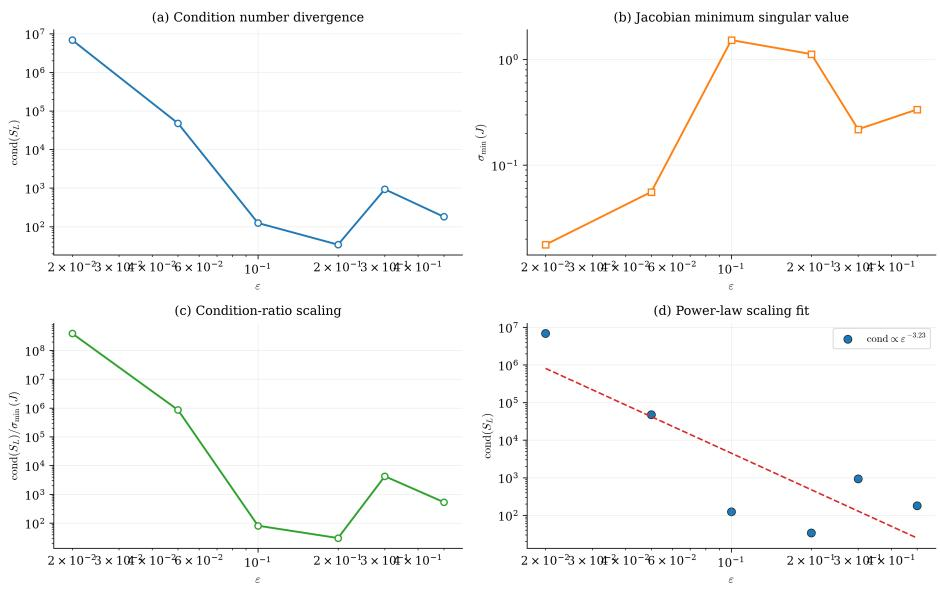  
Figure 1: Condition-number divergence as $\varepsilon \to 0$

## E7: universality of condition-number divergence

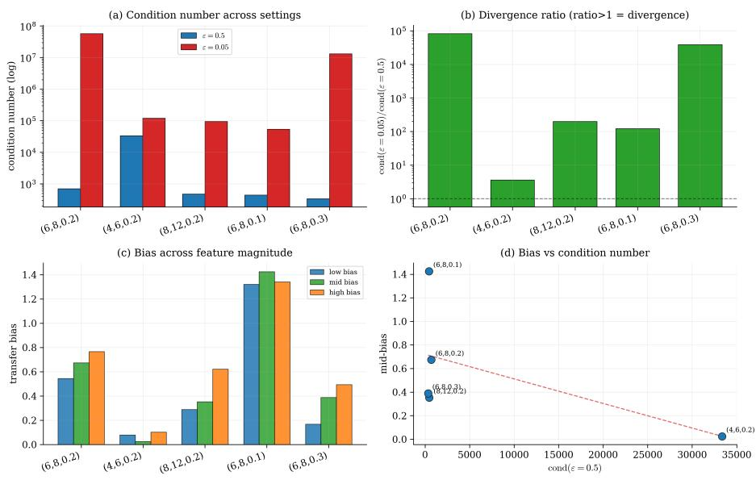  
Figure 2: Generality verification

## 9.2 T2: Sparsistency (E1, E3, E8, E9)

Recovery curve (E1). The support recovery probability is estimated from 100 seeds per sample size over n ∈ {200, 500, 800, 1200, 2000, 3000, 5000, 8000, 12000, 20000}, with binomial 95% confidence intervals. Figure 3 shows a four-panel diagnostic: (a) sample-complexity phase transition, with recovery probability rising from 0.08 at $n = 2 0 0$ to 0.93 at $n = 8 0 0 0$ , with a slight dip to 0.90 at $n = 1 2 0 0 0$ before reaching 0.96 at $n = 2 0 0 0 0 \mathrm { ; }$ ; (b) concentration mechanism decomposition, where the score-event probability $\| G _ { n } \| _ { \infty } \leq t _ { n }$ rises from 0.19 to 1.00 and the row-count event probability from 0.89 to 1.00; (c) failure-probability rate diagnostic, with the linear fit of − log $\widehat { P } _ { \mathrm { f a i l } }$ against $n t _ { n } ^ { 2 } / A _ { \mathrm { m a x } }$ verifying the exponential decay rate $C _ { 2 }$ of Theorem 5.1; (d) error decomposition, where the false-positive rate drops from 0.26 to 0.008 and the falsenegative rate from 0.05 to 0, confirming that support failure is primarily driven by false positives.

## E1: theorem-compatible sparsistency diagnostics

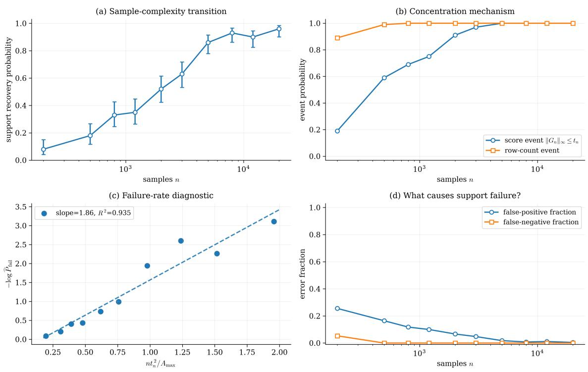  
Figure 3: Theorem-compatible sparsistency diagnostics: (a) sample-complexity phase transition; (b) concentration mechanism decomposition; (c) failure-probability rate diagnostic; (d) decomposition of support failure causes

Voting (E3, 100 seeds). Each restart is run on a diferent bootstrap subsample to decorrelate the failures; with vote counts $R \in \{ 1 , 3 , 5 , 7 , 9 \}$ the recovery probabilities are {0.20, 0.40, 0.30, 0.60, 0.50}, and the single-restart success rate is 0.47. Voting raises the recovery rate from 0.47 to 0.50– 0.60 with fluctuations; voting is a conditional stabilizer, the gain being limited by a residual systematic failure component.

Numerical verification of irrepresentability (E8b, 40 seeds). The irrepresentability quantity is computed on the population OT information matrix $H = \nabla ^ { 2 } \ell ( \theta ^ { * } )$ (averaged over $L = 8$ marginal pairs), landing in [1.36, 7.43] with mean 3.19; the condition < 1 is satisfied $0 / 4 0$ times. Although IR is not satisfied, recovery still succeeds in E1b, so the condition is positioned as a strictly suficient one: it is generically violated on unstructured features, while the recovery conclusion of the theorem still holds empirically. Lemma 5.2 gives a suficient condition verifiable a priori from the feature structure, but that condition is stronger than directly checking H-IR; in the experimental setting of this paper, the suficient condition of the lemma is not met, and the directly computed H-IR condition fails as well; consequently, the lemma does not apply in this setting. The failure of the suficient condition while recovery still succeeds indicates that the condition, though suficient, is not necessary in this setting.

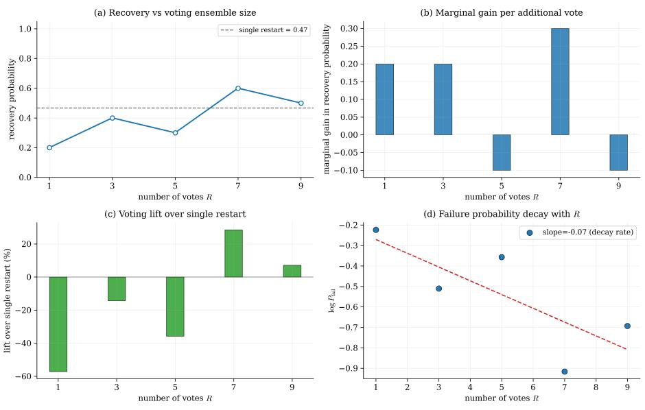  
Figure 4: Efect of the voting mechanism on the recovery probability

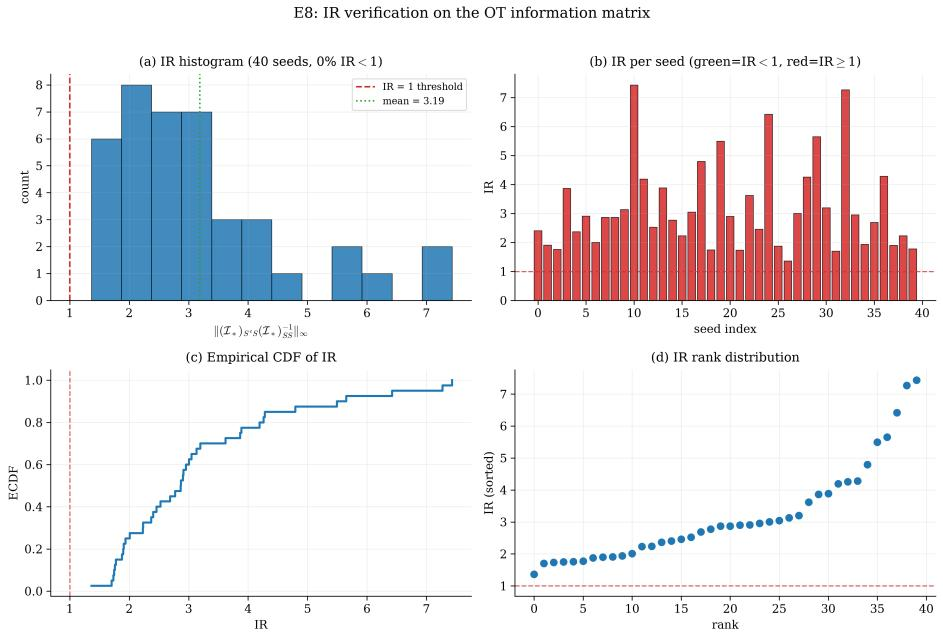  
Figure 5: Numerical verification of the irrepresentability condition

Comparison of Bernstein constants (E9, 8 seeds). The ratio of the Hoefding constant $C _ { 2 } = 2 / \Delta _ { \mathrm { m a x } } ^ { 2 }$ to the Bernstein refinement ${ \dot { C } } _ { 2 } ^ { \mathrm { B } }$ lies in [13.7, 33.9] (mean 24.4): the variance-aware Bernstein constant is 1–2 orders of magnitude larger than the range-based Hoefding constant, confirming that the refinement is substantially sharper.

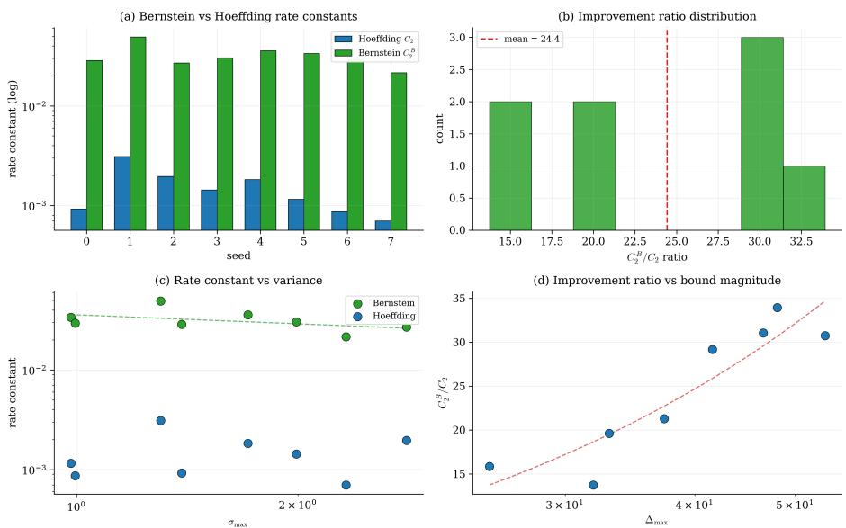  
Figure 6: Comparison of the Bernstein and Hoefding constants

## 9.3 T3: Well-posedness (E2)

<table><tr><td>Perturbation δQ</td><td>Transfer error</td></tr><tr><td>0.0003</td><td>0.0018</td></tr><tr><td>0.001</td><td>0.0030</td></tr><tr><td>0.003</td><td>0.0067</td></tr><tr><td>0.01</td><td>0.0076</td></tr></table>

Table 3: Perturbation transfer error

The ε′-bias V-shape (E2, 40 seeds). The transfer bias is averaged over 40 seeds with mean ± standard error reported; on the grid $\varepsilon ^ { \prime } \in \{ 0 . 0 5 , 0 . 1 , 0 . 2 , 0 . 3 , 0 . 5 \} \mathrm { ~ i t ~ i s ~ } 0 . 7 4 2 \pm 0 . 0 3 7 , 0 . 7 1 8 \pm$ $0 . 0 4 6 , 0 . 6 6 3 \pm 0 . 0 2 0 , 0 . 7 2 4 \pm 0 . 0 3 2 , 0 . 8 1 9 \pm 0 . 0 4 7$ . The quadratic fit has significant positive curvature $( p = 0 . 0 2 4$ $R ^ { 2 } = 0 . 7 7 )$ , so the V-shape is statistically supported; the empirical minimum is $\mathrm { a t } \ \varepsilon ^ { \prime } \approx 0 . 2$ , matching the generating $\varepsilon = 0 . 2$ . In the experiments of this paper, the V-shape is an empirical observation that provides finite-sample support for the local minimality of the squared bias. The original Frobenius-norm bias $B ( \varepsilon ^ { \prime } )$ is theoretically non-diferentiable at the truth (the V-shaped cusp), and the V-shape observed in the experiment itself supports this fact; the squared bias removes the cusp issue.

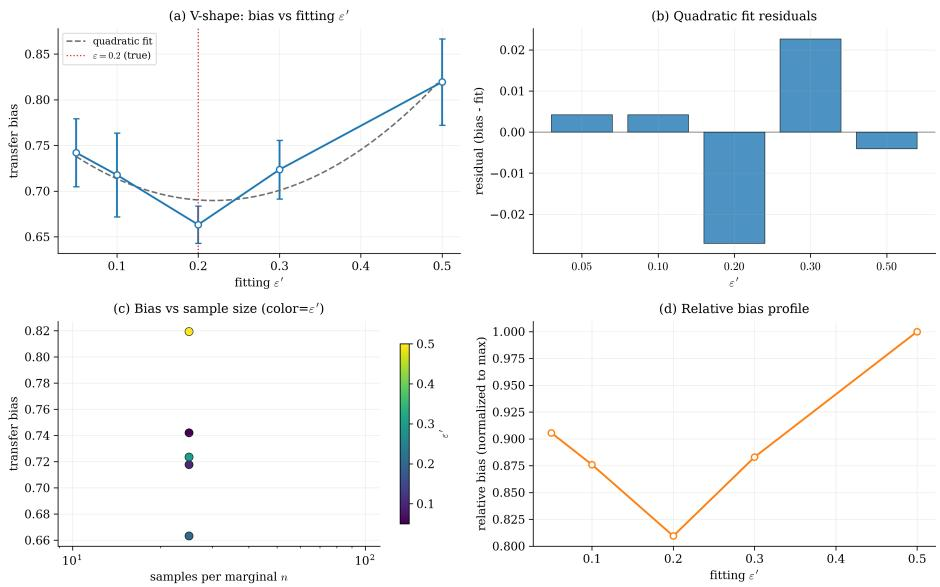  
Figure 7: The ε′-bias V-shape

## 9.4 T4: Convergence (E4)

Comparison of initialization schemes (E4, 40 restarts). The success rates of the three schemes—random / multiscale (coarse warm-start) / prior-guided (initialized on the true support)— are 0.25, 0.95, 0.20 respectively, with mean cross-entropies 14.39, 14.34, 15.03. The multiscale coarse warm-start raises the success rate from 0.25 to 0.95 (about 3.8×) with the lowest objective: local strong convexity (Theorem 7.1) guarantees that fixed-step-size gradient descent decreases monotonically within a basin, and the multiscale scheme raises the fraction of initializations landing in the basin containing the global optimum. The actual optimization in this paper uses Adam, cosine annealing, and gradient clipping; their convergence is an empirical phenomenon—Theorem 7.1 addresses fixed-step-size gradient descent and does not cover adaptive optimizers such as Adam. The prior-guided scheme performs worst, because fixing the true support injects the correct active set but biases the magnitudes during optimization. Failures under random initialization are systematic: a restart stuck in a spurious basin does not escape by switching to a diferent random initialization.

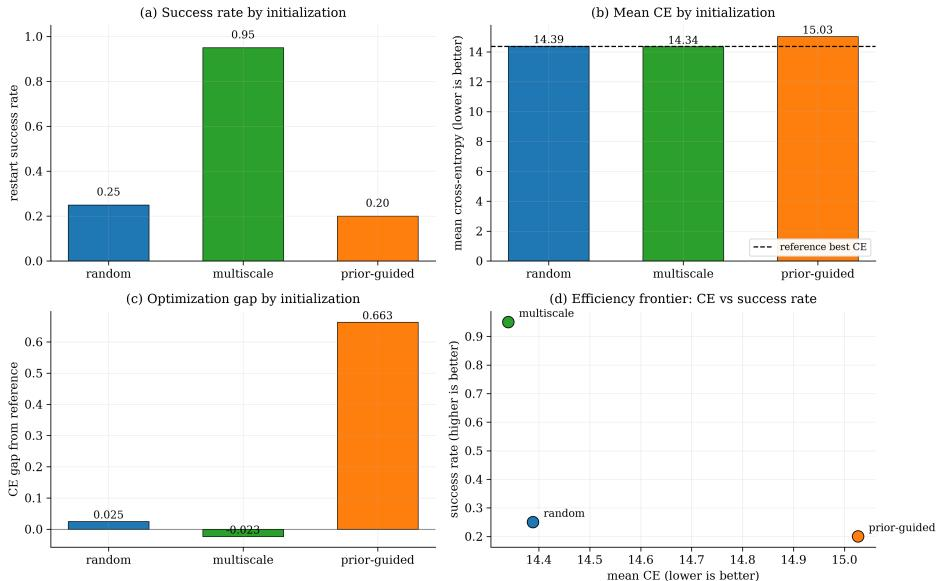  
Figure 8: Comparison of initialization schemes

## 9.5 O5: Misspecification (E5)

Under a non-OT generating mechanism (row softmax plus noise), the projection residual is 4.50, larger than the true-OT residual 2.43 but much smaller than the random-model residual 10.63 (ratio 0.42); the true-OT residual 2.43 is the total cross-entropy over all source states (about 0.4 nats per state), which under correct specification should approach the entropy $H ( Q ^ { * } )$ of the true distribution, with the gap to $H ( Q ^ { * } )$ reflecting finite-sample estimation error. The fitted θ collapses toward 0 (magnitude 0.03–0.09), indicating that the data cannot be explained by an OT cost.

H¨older exponent across settings (E5). The H¨older exponent α of the projection map is estimated by a log–log regression of the fitted-parameter displacement against the observation perturbation, reproduced under four $( K , F , \varepsilon )$ settings: $\alpha _ { \mathrm { e f f } } \ \in \ \{ 0 . 3 5 3 , 0 . 2 6 6 , 0 . 3 6 9 , 0 . 2 9 8 \}$ for $( 6 , 8 , 0 . 2 ) , ( 5 , 6 , 0 . 2 ) , ( 8 , 1 2 , 0 . 3 ) , ( 6 , 8 , 0 . 1 )$ respectively (per-setting $R ^ { 2 } \in [ 0 . 5 3 , 0 . 9 2 ] , p \in [ 4 \times$ $1 0 ^ { - 5 } , 0 . 0 2 5 ] )$ , all lying in (0, 1) and away from the degenerate endpoint 1. $\alpha _ { \mathrm { e f f } }$ is a settingdependent empirical exponent estimate; the cross-setting variation reflects the influence of ε and problem dimension on the condition number of the projection map.

The $\varepsilon = 0 . 1$ setting yields $\alpha _ { \mathrm { e f f } } = 0 . 2 9 8$ , the lowest among the four. A quantitative analysis reveals that this setting is contaminated by the Adam optimization residual: comparing the projection results after 500 iterations (the experimental setting) and 2000 iterations (closer to the true minimum), the optimization residual is $\lVert \pmb { \theta } _ { 5 0 0 } - \pmb { \theta } _ { 2 0 0 0 } \rVert = 0 . 2 6 7$ , which exceeds the true parameter displacement at the three smallest perturbation amplitudes $( 1 0 ^ { - 5 } , 3 \times 1 0 ^ { - 5 } , 1 0 ^ { - 4 } )$ 0.107, 0.093, and 0.248, with residual ratios 2.51, 2.87, and 1.08, respectively. After removing these three residual-dominated points, the log-log fit over the remaining six signal points yields $\alpha = 0 . 0 4 8 ~ ( p = 0 . 6 7 , ~ R ^ { 2 } = 0 . 0 5 )$ , losing statistical significance. $\mathrm { A t } ~ \varepsilon ~ = ~ 0 . 1$ , the elevated condition number (T1) drives the projection map into an ill-conditioned regime; although the CE has flattened after 500 iterations $( \Delta \mathrm { C E } \approx 1 0 ^ { - 5 } )$ , the parameters continue to drift, and the optimization residual contaminates the log-log slope estimate at small perturbations. In the other three settings $( \varepsilon \ge 0 . 2 )$ , the optimization residual is only 0.003–0.016, and all perturbation responses are well above the residual (ratios < 0.42), so the α estimates are reliable.

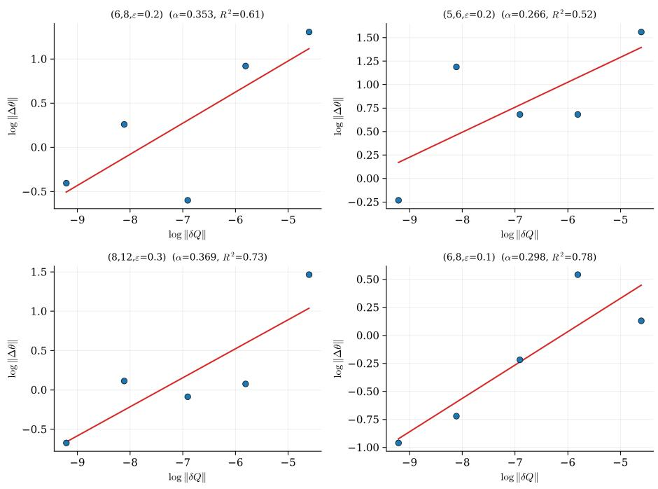  
Figure 9: Verification of the H¨older exponent across settings

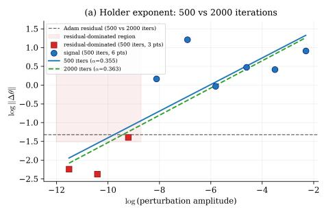

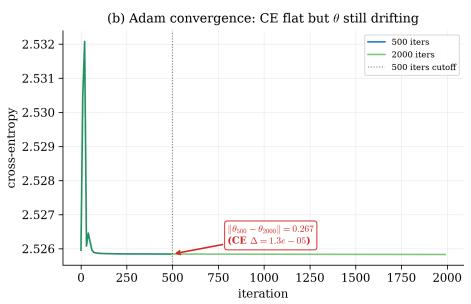  
Figure 10: Adam optimization residual analysis $\mathrm { ~ a ~ t ~ } \varepsilon = 0 . 1$ : the CE has flattened after 500 iterations while the parameters continue to drift; the responses at the three smallest perturbation amplitudes are submerged by the optimization residual

E10: πmin (ε) scaling and fit diagnostics

## 9.6 The ε-scaling law of $\pi _ { \mathrm { m i n } }$ (E10)

The minimum plan entry $\pi _ { \mathrm { m i n } } ( \varepsilon )$ is measured at $\varepsilon \in \{ 0 . 0 5 , 0 . 1 , 0 . 2 , 0 . 3 , 0 . 5 \}$ , averaged over random marginals in log space. An empirical fit of $\pi _ { \mathrm { m i n } } \geq c \varepsilon ^ { \alpha }$ over the finite window (log–log regression) gives the efective exponent $\alpha _ { \mathrm { e f f } } \approx 1 9 . 9 ~ ( R ^ { 2 } = 0 . 8 9 , p = 0 . 0 1 5 )$ . These exponents are empirical fits over a finite window, not global polynomial lower bounds; exponential decay $e ^ { - \Delta / \varepsilon }$ can also produce a large efective power exponent over a finite window, and the observed $\alpha _ { \mathrm { e f f } } \approx 1 9 . 9$ may well be exactly this phenomenon. In the unstructured case $\pi _ { \mathrm { m i n } }$ collapses across many orders of magnitude (from $5 . 8 \times 1 0 ^ { - 1 3 }$ at $\varepsilon = 0 . 5$ to 2.3 × 10−31 at $\varepsilon = 0 . 0 5 )$ . The large efective exponent $\alpha _ { \mathrm { e f f } } \approx 1 9 . 9$ places the random features in the severely degenerate regime. The associated Lipschitz constant $L \leq \varepsilon / ( \pi _ { \operatorname* { m i n } } \lambda _ { \operatorname* { m i n } } ( \Sigma ) )$ inflates sharply in the degenerate regime; the efective information scale is $\pi _ { \mathrm { m i n } } ( \theta , \varepsilon ) \sqrt { \lambda _ { \mathrm { m i n } } ( \Sigma ) } / \varepsilon$ , and a threshold cannot be given in terms of cond $( \Sigma ) ^ { - 1 }$ alone. The statement $\varepsilon \gg$ cond $( \Sigma ) ^ { - 1 }$ in this paper is an empirical heuristic.

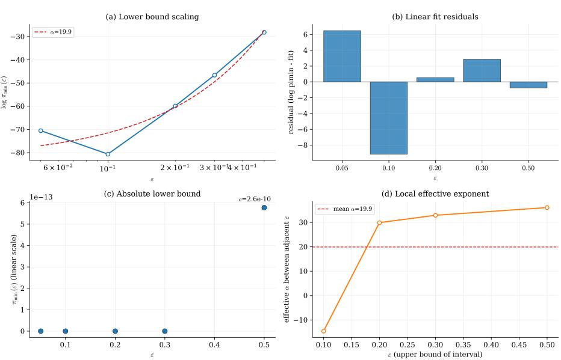  
Figure 11: The ε-scaling law of $\pi _ { \mathrm { m i n } }$

## 10 Conclusion

This paper establishes the statistical and algorithmic theory of IOT under a feature-parameterized cost. The central technical contribution is the Sinkhorn linearization and the spectral proxy (Section 3): the spectral sandwich of the restricted Hessian yields a single core spectral bound, which, under the respective regularity conditions, drives Theorem 4.1 (identifiability), Theorem 6.1 (well-posedness), and Theorem 7.1 (population convergence with a conditional finite sample statement); Theorem 5.1 (sparsistency) additionally requires irrepresentability of the actual OT information matrix, all-coordinate score concentration, and a global selection condi tion; O5 (misspecification) interprets the estimation target as the pseudo-true projection onto the OT model set. The main open problems: minimax lower bounds for IOT estimation, global strong monotonicity without compactness, a proof of the H¨older-continuity conjecture, and extensions to continuous state spaces. All numerical verifications (E1–E10) are in Section 9.

## References

[1] F. Andrade, G. Peyre, and C. Poon ´ , Sparsistency for inverse optimal transport, arXiv

preprint arXiv:2310.05461, (2024).

[2] Z. Bao et al., Well-posedness of the inverse bregman optimal transport problem, (2025). Working paper.

[3] D. Bartl, V. Chernozhukov, and J. Niles-Weed, Curvature of optimal transport with respect to the cost and applications to inverse optimal transport, arXiv preprint arXiv:2604.22670, (2026).

[4] E. Bernton, P. Ghosal, and M. Nutz, Stability of entropic optimal transport and schr¨odinger bridges, Journal of Functional Analysis, 283 (2022), p. 109622.

[5] J. Bigot, E. Cazelles, and N. Papadakis, Central limit theorems for entropyregularized optimal transport on finite spaces and statistical applications, Electronic Journal of Statistics, 13 (2019), pp. 5112–5150.

[6] R. Cominetti and J. San Mart´ın, Asymptotic analysis of the exponential penalty trajectory in linear programming, Mathematical Programming, 67 (1994), pp. 169–187.

[7] M. Cuturi, Sinkhorn distances: Lightspeed computation of optimal transport, Advances in Neural Information Processing Systems, 26 (2013).

[8] A. Dupuy and A. Galichon, Personality traits and the marriage market, Journal of Political Economy, 122 (2014), pp. 1271–1319.

[9] A. Galichon, Optimal Transport Methods in Economics, Princeton University Press, 2018.

[10] A. Gonzalez-Sanz, M. Groppe, and A. Munk ´ , Identifiability and exact reconstruction of the optimal transport cost on finite spaces, arXiv preprint arXiv:2410.23146, (2024).

[11] A. Gonzalez-Sanz, M. Groppe, and A. Munk ´ , Nonlinear inverse optimal transport: identifiability of the transport cost from its marginals and optimal values, SIAM Journal on Mathematical Analysis, 56 (2024), pp. 7808–7829. arXiv:2312.05843.

[12] M. Hallin, E. del Barrio, J. Cuesta-Albertos, and C. Matran´ , Center-outward distribution and quantile functions, annular spreads, and the Mallows–Wasserstein distances between distributions, Annals of Statistics, 49 (2021), pp. 2567–2605.

[13] A. Korba and A. Rudi, Statistical estimation of optimal transport maps: a density estimation approach to learning the optimal transport map between distributions, arXiv preprint arXiv:2106.07360, (2021).

[14] C. Leonard ´ , A survey of the schr¨odinger problem and some of its connections with optimal transport, Discrete & Continuous Dynamical Systems, 34 (2014), pp. 1533–1574.

[15] M. Mascherpa, A. Ringh, A. Taghvaei, and J. Karlsson, A convex approach for Markov chain estimation from aggregate data via inverse optimal transport, arXiv preprint arXiv:2511.16458, (2025).

[16] G. Mena and J. Niles-Weed, Statistical bounds for entropic optimal transport: sample complexity and the central limit theorem, in Advances in Neural Information Processing Systems, vol. 32, 2019.

[17] G. J. Minty, Monotone (nonlinear) operators in Hilbert space, Duke Mathematical Journal, 29 (1962), pp. 341–346.

[18] S. Persiianov et al., Semi-supervised inverse entropic optimal transport, (2025). Working paper.

[19] G. Peyre and M. Cuturi ´ , Computational optimal transport, Foundations and Trends in Machine Learning, 11 (2019), pp. 355–607.

[20] A.-A. Pooladian and J. Niles-Weed, Entropic estimation of optimal transport maps, arXiv preprint arXiv:2109.12004, (2021).

[21] R. T. Rockafellar, Monotone operators and the proximal point algorithm, SIAM Journal on Control and Optimization, 14 (1976), pp. 877–898.

[22] F. Santambrogio, Optimal Transport for Applied Mathematicians, vol. 87 of Progress in Nonlinear Diferential Equations and their Applications, Birkh¨auser, 2015.

[23] R. Sinkhorn, A relationship between arbitrary positive matrices and doubly stochastic matrices, The Annals of Mathematical Statistics, 35 (1964), pp. 876–879.

[24] A. M. Stuart and M.-T. Wolfram, Inverse optimal transport, SIAM Journal on Applied Mathematics, 80 (2020), pp. 599–619.

[25] A. Vacher, B. Muzellec, A. Nishimura, and A. Dunipace, Bayesian inverse optimal transport, in Proceedings of Machine Learning Research (PMLR), 2021. arXiv:2105.12140.

[26] M. J. Wainwright, Sharp thresholds for high-dimensional and noisy sparsity recovery using ℓ1-constrained quadratic programming (Lasso), IEEE Transactions on Information Theory, 55 (2009), pp. 2183–2202.

[27] J. Weed, An explicit analysis of the entropic penalty in linear programming, in Conference on Learning Theory (COLT), 2018.

[28] H. White, Maximum likelihood estimation of misspecified models, Econometrica, 50 (1982), pp. 1–25.

[29] E. H. Zarantonello, Solving functional equations by contractive averaging, Tech. Report Technical Report #160, Mathematics Research Center, U.S. Army, 1960.

[30] P. Zhao and B. Yu, On model selection consistency of Lasso, Journal of Machine Learning Research, 7 (2006), pp. 2541–2563.