# Statistical Properties of Robust Learning under Distributional Shifts

Zhiyi Li National University of Singapore, e1632488@u.nus.edu

Xiaojie Mao

Tsinghua University, maoxj@sem.tsinghua.edu.cn

Yunbei Xu

National University of Singapore, yunbei@nus.edu.sg

Ruohan Zhan University College London, ruohan.zhan@ucl.ac.uk

Distributional shifts arise when the target deployment environment difers from the source environment that generated the training data. Robust learning frameworks such as Distributionally Robust Optimization (DRO) and Robust Satisficing (RS) aim to address this challenge, yet their finite-sample guarantees under such shifts, and their systematic comparison, remain underexplored: existing analyses typically establish guarantees either in the source environment or for adversarial worst-case performance over an ambiguity set. This paper instead studies generalization error in the target environment—the excess loss under the shifted target distribution. Our contributions are threefold. First, we derive finite-sample generalization error bounds in the shifted target environment for both DRO and RS. These bounds explicitly characterize the trade-of between reduced sensitivity to shift and the regularization penalty induced by each method’s robustness hyperparameter, and they avoid the curse of dimensionality associated with Wasserstein empirical concentration. Second, when partial shift information such as shift magnitude or direction is available, we propose information-directed hyperparameter calibrations and compare the two methods given the same information. Under these calibrations, and in the partial-information regimes we study, DRO and RS exhibit complementary theoretical and empirical behavior. Finally, we apply the framework to a network lot-sizing problem, using it to interpret how robust policies respond to positive shifits in the demand distribution. Together, these results fill a gap in understanding the statistical properties of robust learning methods under distributional shifts and provide a principled basis for comparing DRO and RS.

Key words : Distributional Shifts; Distributionally Robust Optimization; Robust Satisficing; Finite-Sample Generalization Error Bounds; Hyperparameter Calibration

## 1. Introduction

Modern machine-learning and data-driven decision systems are often trained in one source environment and deployed in a diferent target environment. When the corresponding distributions difer, the resulting distribution shift may take the form of covariate shift (Qui˜nonero-Candela et al. 2022), label shift (Garg et al. 2020), or temporal and environmental change (Sugiyama and Kawanabe 2012). Standard learning methods that optimize performance under the source distribution, such as Empirical Risk Minimization (ERM), ofers no protection against this mismatch. Distribution shift can substantially degrade target performance (Koh et al. 2021) in critical domains, including medical imaging diagnostics (Zech et al. 2018, Yu et al. 2022) and autonomous-driving perception (Sakaridis et al. 2021, Dong et al. 2023). More broadly, uncertainty about the deployment distribution afects operational decisions in renewable-energy systems (Li et al. 2023, Huang et al. 2023), supply-chain and disaster-relief planning (Chen and Chen 2023, Deng et al. 2023, Wang et al. 2023), and fairness-sensitive learning under changing group representation (Hashimoto et al. 2018, Sagawa et al. 2020).

Robust learning methods seek to protect decisions against such distribution shifts. Distributionally Robust Optimization (DRO) stands out as a widely studied approach (e.g., Hu and Hong 2013, Bayraksan and Love 2015, Long et al. 2023, Gao 2023, Gao and Kleywegt 2023, Mohajerin Esfahani and Kuhn 2018, Blanchet et al. 2019, Lee and Raginsky 2018, An and Gao 2021, Wang et al. 2025, Li et al. 2024, Lam 2019). It minimizes the worst-case expected loss over distributions within a prescribed Wasserstein radius r of the empirical source distribution. Thus, r specifies the largest departure from the source distribution that DRO treats as plausible and protects against: a small r may leave the target distribution outside the set, whereas a large r guards against a broader range of shifts at the cost of greater conservatism. A recently proposed method, Robust Satisficing (RS) (Long et al. 2023), uses a diferent robustness semantic. Rather than specifying a set of plausible shifted distributions, RS fixes a reference expected-loss level τ. It requires the expected loss under any distribution exceeding this baseline to grow at most proportionally with the distribution’s distance from a nominal distribution; the proportionality constant $k _ { \tau }$ , called the fragility measure, captures the resulting sensitivity to distributional shift. Hence, τ sets the baseline performance requirement: increasing τ relaxes this requirement and can reduce fragility, while decreasing τ demands a lower baseline loss but generally entails greater fragility.

To assess robust learning methods, empirical studies often evaluate their performance in the target environment (Wang et al. 2026, Koh et al. 2021, Gulrajani and Lopez-Paz 2021). For example, Wang et al. (2026) benchmark DRO methods in target environments induced by diverse types of distribution shifts. In contrast, established theory has focused less on target-environment guarantees. As summarized by Blanchet et al. (2025), existing DRO bounds control either no-shift generalization in the source environment or adversarial worst-case performance over an ambiguity set. The resulting DRO generalization bounds are monotone in the Wasserstein radius r, so enlarging the ambiguity set only worsens the bound, which obscures the practical robustnessconservatism trade-of induced by setting the radius r. For RS, Li et al. (2024) provide a recent target-environment analysis, but their bound sufers from the curse of dimensionality associated with Wasserstein empirical concentration and likewise cannot show the τ-driven trade-of.

This work addresses the gap by developing finite-sample bounds for target-environment generalization guarantees under distributional shifts. The bounds avoid the curse of dimensionality associated with the Wasserstein empirical concentration. They also explicitly characterize how the hyperparameters of DRO and RS trade of robustness against conservatism. Specifically, we use target-environment generalization error, namely excess loss under the shifted distribution, as the performance metric and derive finite-sample upper bounds for both methods. These bounds show how each hyperparameter balances (i) reduced sensitivity to distribution shift, which improves target-environment performance, against (ii) the regularization cost of enforcing stronger robustness. Moreover, because r and τ control robustness in fundamentally diferent ways, our results reveal the distinct mechanisms through which DRO and RS handle distributional shifts.

As a benchmark for our robustness results, we also analyze the standard ERM method. We derive an upper bound on its generalization error in the target environment, and complement this with a matching example showing that the linear dependence on the source-target shift magnitude cannot be improved. Against this baseline, we show that robust methods do better: for DRO and RS, the shift-induced terms in the target-environment generalization error admit more favorable characterizations than their ERM counterparts, through two distinct mechanisms detailed in Section 1.1. These results difer in scope from Mohajerin Esfahani and Kuhn (2018), Blanchet et al. (2019), Gao (2023), which study the no-shift setting; our bounds instead are explicitly shift-aware and reveal the potential advantage of robust methods in the target environment. This distinction highlights both the novelty of our results and the technical challenges underlying the analysis.

We next compare DRO and RS under distributional shifts. A fair comparison is challenging because the two paradigms encode robustness through diferent hyperparameter semantics: the DRO radius r represents distributional coverage, whereas the RS threshold τ represents a loss tolerance. Moreover, when no shift information is available beyond the training sample, reliable learning under arbitrary unknown shifts is generally impossible (Sutter et al. 2021). We therefore introduce partial shift information, such as its magnitude or direction, and ask how the two methods exploit this information. Specifically, we construct a shift-information-directed calibra tion that maps the same input into the DRO radius r and the RS threshold τ. This difers from the optimization-based hyperparameter correspondence of Wang et al. (2025), which tunes the two hyperparameters so that the resulting optimal solutions coincide. Our results show that the methods play complementary roles: DRO is favored when the shift magnitude is known but its direction is not, whereas RS can be favored when the direction is known and the magnitude is suficiently under-specified. Finally, we instantiate the framework in a network lot-sizing problem under positive demand shifts, a setting in which the shift direction is known but its magnitude may be misspecified. Robust methods then substitute preventive upfront inventory for corrective second-stage transshipment and emergency ordering, and the preferred method depends on the cost structure and the degree of magnitude misspecification.

The remainder of the paper is organized as follows. Section 2 provides the literature review. Section 3 introduces the problem setup. Section 4 presents the main generalization bounds. Section 5 develops a shift-informed calibration for DRO and RS hyperparameters and establishes theoretical comparisons under partial shift information, supported by simulations. Section 6 applies the framework to a network lot-sizing problem. Section 7 concludes.

## 1.1. Our Methods and Contributions

In this paper, we reinterpret DRO and RS in the context of distributional shifts. Our analysis evaluates optimizers trained on the source distribution by their excess loss under the target distribution, which we refer to as the generalization error. This perspective difers from the conventional evaluation, which measures excess loss under the source distribution itself and thus says little about performance once the distribution shifts (Mohajerin Esfahani and Kuhn 2018, Blanchet et al. 2019, Gao 2023). It also difers from adversarial-distribution formulations (Lee and Raginsky 2018, An and Gao 2021), in which performance is measured by the worst-case loss over an ambiguity set rather than by the loss under a specific target distribution. Focusing on this target-based criterion, we derive generalization error bounds for DRO and RS, providing a theoretical basis for understanding their robustness under distributional shifts.

Specifically, for DRO we establish the following bound that quantifies the trade-of in choosing the radius hyperparameter r:

$$
\mathcal { R } _ { \mathrm { D R O } } \leq \underbrace { L \cdot \operatorname* { i n f } _ { P \in \mathcal { B } ( P _ { S } , r ) } d _ { W } ( P , P _ { T } ) } _ { \mathrm { S e n s i t i v i t y ~ t o ~ s h i f t ~ } C _ { 1 } ( r ) } + \underbrace { C _ { 2 } ( r ) } _ { \mathrm { R e g u l a r i z a t i o n ~ p e n a l t y } } + C _ { n , D R O } .
$$

Here $\mathcal { R } _ { \mathrm { D R O } }$ is the generalization error of the DRO optimizer in the target environment, with $P _ { S }$ and $P _ { T }$ being the source and target distributions. The set $B ( P _ { S } , r )$ is the type-I Wasserstein ball of radius r around $P _ { S } , d _ { W } ( \cdot , \cdot )$ is the type-I Wasserstein distance, and L is the Lipschitz constant in Assumption 1(c). This bound decomposes into three components: (i) sensitivity to shift $C _ { 1 } ( r )$ ， which decreases with r and reflects how well the ambiguity set covers the target distribution $P _ { T }$ (ii) regularization penalty $C _ { 2 } ( r )$ , which grows with r and reflects the extra cost incurred when enforcing robustness, and (iii) a residual term $C _ { n , D R O }$ , which is independent of r and contains statistical estimation error and the source-target optimal-value gap (defined in Section 4). The bound highlights the central trade-of in choosing r: larger r reduces $C _ { 1 } ( r )$ by improving coverage for the target distribution but increases the penalty from $C _ { 2 } ( r )$ , while smaller r reduces $C _ { 2 } ( r )$ but risks excluding the target distribution.

For RS we establish a parallel generalization error bound that characterizes the trade-of in choosing the reference value parameter τ:

$$
\mathcal { R } _ { \mathrm { R S } } \leq \underbrace { k _ { \tau } \cdot d _ { W } ( P _ { S } , P _ { T } ) } _ { \mathrm { S e n s i t i v i t y ~ t o ~ s h i f t ~ } C _ { 3 } ( \tau ) } + \underbrace { C _ { 4 } ( \tau ) } _ { \mathrm { R e g u l a r i z a t i o n ~ p e n a l t y } } + C _ { n , R S } .
$$

Here $\mathcal { R } _ { \mathrm { R S } }$ is the generalization error of the RS optimizer in the target environment, and $k _ { \tau }$ is the fragility measure introduced by Long et al. (2023) and is part of the optimized RS solution. The RS bound similarly decomposes into three components: (i) sensitivity to shift $C _ { 3 } ( \tau )$ , which decreases with $\tau$ as the coeficient $k _ { \tau }$ becomes smaller; (ii) regularization penalty $C _ { 4 } ( \tau )$ , which grows with $\tau$ and captures the satisficing cost imposed by the RS formulation; and (iii) a residual term $C _ { n , R S }$ which has the same order as the corresponding term in the DRO bound and is independent of τ. The trade-of is explicit: larger $\tau$ reduces the shift sensitivity but increases the regularization penalty, while smaller τ keeps the regularization penalty low but leaves the model more sensitive to distributional shifts. We also note that the statistical error component in $C _ { n , R S }$ scales as $n ^ { - 1 / 2 }$ under a bounded diameter assumption and avoids the Wasserstein concentration rate that causes the curse of dimensionality in prior work (Li et al. 2024).

To better understand how DRO and RS achieve robustness against distributional shifts, we present the bound for ERM below as a baseline:

$$
\mathcal { R } _ { \mathrm { E R M } } \leq \underbrace { L \cdot d _ { W } ( P _ { S } , P _ { T } ) } _ { \mathrm { S e n s i t i v i t y ~ t o ~ s h i f t } } + C _ { n , E R M } ,
$$

where $\mathcal { R } _ { \mathrm { E R M } }$ denotes the target-environment generalization error of the ERM solution trained on a source sample from $P _ { S }$ and evaluated under $P _ { T }$ . Relative to this baseline, both robust methods reduce the sensitivity-to-shift component of the upper bound. Specifically, DRO attenuates the shift distance by replacing it with the minimum distance between the ambiguity set and the target distribution, while RS reduces the multiplicative factor on the distance from $L$ to $k _ { \tau }$ (which is smaller than L by Lemma 1). However, this robustness comes at a cost, with DRO incurring a regularization penalty $C _ { 2 } ( r )$ that increases with r and RS incurring a satisficing regularization cost $C _ { 4 } ( \tau )$ governed by the threshold τ. Together, these clarify the distinct trade-of mechanisms by which the two methods achieve robustness under distributional shifts.

The above results motivate a closer comparison of DRO and RS under distributional shifts. However, when no shift information is available, it is challenging to calibrate either method’s hyperparameter in a principled way, rendering a direct head-to-head comparison uninformative. We therefore focus on settings with partial shift information (e.g., shift magnitude or shift direction). This information is mapped into each method’s native hyperparameter semantics: the DRO radius r represents distributional coverage, whereas the RS threshold τ specifies a loss tolerance. The resulting information-directed hyperparameter calibration provides a common informational input for comparing the two methods’ generalization bounds. We consider two scenarios: (i) the shift magnitude is known but the direction is unknown, and (ii) the shift direction is known (through a distribution family) but the magnitude is unknown. The first scenario favors DRO because the radius r can directly encode the known shift magnitude. In the second scenario, RS can yield a tighter bound when the shift magnitude is suficiently under-specified. These analyses are further validated through simulations on a two-product newsvendor problem.

We finally apply our analysis to network lot-sizing, a representative operations problem. We consider upward demand shifts, in which target demand is on average higher than source demand. The shift direction is assumed to be known because shortages are costly, whereas its magnitude is uncertain and may be misspecified. We find that the relative performance of DRO and RS depends on both the misspecification of the shift magnitude and the ratio of initial to emergency ordering costs. When initial ordering is relatively cheap, RS attains a lower total cost than DRO when the shift magnitude is largely under-specified. As the initial-ordering cost increases, this advantage narrows and eventually reverses once the magnitude is over-specified. To trace the source of these diferences, we decompose total cost into initial-ordering and operational components. We then compare the shift-information-calibrated hyperparameter pair with the optimization-based correspondence curve, showing how the DRO radius and RS reference value drive the two methods difering sensitivities to distributional shifts.

## 2. Related Work

Our work relates to a broad stream of research in robust optimization (Hu and Hong 2013, Bayraksan and Love 2015, Long et al. 2023, Gao 2023, Gao and Kleywegt 2023, Mohajerin Esfahani and Kuhn 2018, Blanchet et al. 2019, Lam 2019, Lee and Raginsky 2018, An and Gao 2021, Wang et al. 2025, Li et al. 2024). We highlight three particularly relevant lines of work: statistical guarantees for DRO, Robust Satisficing models, and the connection between DRO and RS.

## 2.1. Statistical Guarantees for Distributionally Robust Optimization

A substantial body of work has examined the statistical properties of Distributionally Robust Optimization (DRO). Early studies constructed ambiguity sets using moment conditions, such as requiring distributions to match low-order moments (Delage and Ye 2010, Goh and Sim 2010), though these approaches lacked formal asymptotic consistency guarantees (Shafieezadeh-Abadeh et al. 2019). Subsequent research shifted to ambiguity sets defined through statistical distances. For instance, Duchi et al. (2021) showed that DRO with f-divergence admits an asymptotic expansion as the empirical loss plus a variance regularization term. Relatedly, Lam (2019) studied empirical divergence-based DRO and showed how suitably calibrated divergence balls can recover classical asymptotic statistical guarantees. The Wasserstein metric, however, has become the central tool in statistical analysis on DRO. Mohajerin Esfahani and Kuhn (2018) provided a comprehensive treatment of Wasserstein DRO, proving that setting the radius r on the order of $n ^ { - \frac { 1 } { \operatorname* { m a x } \{ 2 , d \} } }$ yields finite-sample guarantees and asymptotic consistency, where d is the dimension of the random vector over which the Wasserstein distance is defined. Since the rate deteriorates to $n ^ { - 1 / d }$ in dimensions d $> 2$ , these guarantees inherit the curse of dimensionality from the Wasserstein concentration bounds between empirical and true distributions (Fournier and Guillin 2015).

To address this limitation, Shafieezadeh-Abadeh et al. (2019) introduced structure into the model class and showed that for structured settings such as linear models, a radius of $r = O \left( { \frac { 1 } { \sqrt { n } } } \right)$ is suficient for finite-sample guarantees. From a more nonparametric perspective, Blanchet et al. (2019) applied an empirical likelihood reformulation of DRO. Their framework relaxed the requirement that the ambiguity set contains the true distribution $P _ { S }$ , requiring instead only a distribution P that produces the same optimal parameter as $P _ { S }$ . This relaxation enabled asymptotic confidence intervals with order $O \left( { \scriptstyle { \frac { 1 } { \sqrt { n } } } } \right)$ . More recently, Gao (2023) introduced localized Rademacher complexity to obtain dimension-free finite-sample guarantees.

Despite these advances, a critical limitation remains. Most existing generalization bounds require the DRO radius $r _ { n }$ to vanish as the sample size $n \to \infty$ . This vanishing-radius regime efectively positions DRO as a tool for mitigating overfitting, rather than a methodology for handling distribution shifts of non-negligible magnitude. Recent exceptions begin to consider non-vanishing radii; for example, Azizian et al. (2023) developed dual concentration bounds that allow non-vanishing radii and provide robustness to shifts without dimensional dependence. A diferent line of work, including Lee and Raginsky (2018) and An and Gao (2021), studies DRO with non-vanishing radii under an adversarial evaluation framework. Our proof in Section 4 builds on some techniques from Lee and Raginsky (2018). However, those results control the adversarial worst-case loss over an ambiguity set, rather than characterizing the trade-of with respect to a given target distribution. As a result, they do not directly characterize the target-environment performance of source-trained optimizers.

Overall, prior DRO guarantees either focus on vanishing radii for controlling sampling error or study non-vanishing radii through adversarial worst-case loss. These results do not directly characterize target-environment performance for a given distribution shift of interest. Meanwhile, their results do not capture the trade-of that a larger r may better cover the target distribution but also induce greater conservatism.

## 2.2. Robust Satisficing Framework

Robust Satisficing (RS) was first proposed by Long et al. (2023) as a framework to achieve robustness without the excessive conservatism of minimax approaches, by adopting a satisficing principle. The concept has since gained traction (e.g., Ramachandra et al. 2025, Li et al. 2024). Existing research on RS has primarily focused on optimization tractability and applications. Long et al. (2023) and Ramachandra et al. (2025) analyzed the dual formulation of RS in risk-based linear optimization, linear optimization with recourse, and conic optimization. RS has also been integrated into applications across operations research and reinforcement learning, including portfolio optimization (Long et al. 2023), robust Bayesian satisficing models (Saday et al. 2023), and satisficing Markov decision processes (Ruan et al. 2023).

Statistical analysis of RS remains underexplored. Recently, Li et al. (2024) provided the first statistical guarantees for RS, analyzing the performance of optimizers trained on source data when evaluated in shifted target environments. Their results derived a generalization bound in which the generalization error scales linearly with the Wasserstein distance between the source and target distributions. However, this guarantee has two critical limitations. First, the bounds remain subject to the curse of dimensionality, scaling polynomially with data dimension and limiting applicability in high-dimensional settings. Second, similar to existing results for DRO, the analysis does not capture the trade-of induced by the parameter τ . Increasing τ monotonically loosens their resulting bound without providing certifiable robustness gains. Our work addresses both of these challenges.

## 2.3. Connection between DRO and RS

Wang et al. (2025) present early research on connecting DRO and RS, where they establish an optimization-based hyperparameter correspondence between these two robust methods. Specifically, for Wasserstein DRO and RS models built on a convex objective with uncertain quantities, they show that the two formulations share the same solution family: one can choose the DRO hyperparameter r and the RS hyperparameter τ so that the two models yield the same optimal solution. The authors further illustrate this correspondence by plotting the mapping between the two hyperparameters. This correspondence is derived in a post-hoc manner: given the sample, one varies the RS threshold τ, solves the RS optimization problem, and then recovers the corresponding DRO radius $r _ { \tau }$ that leads to the same solution. The correspondence holds at the optimization level and does not reflect the distinct mechanisms of these two methods in robustness control.

In contrast, we study the connection between DRO and RS through the lens of distributional shift. In our framework, partial shift information is used to calibrate the hyperparameters before solving either robust problem. Given the same shift information, we propose model-specific ways to choose the DRO radius r and the RS reference value τ according to their native semantics.

Our analysis therefore yields an a priori shift-information-directed hyperparameter calibration, rather than a post-hoc mapping obtained by solving the optimization problem of the other model. This calibration emphasizes a learning-theoretic perspective and clarifies how incorporating shift information into hyperparameter selection afects the target-environment trade-of bounds of both methods.

## 3. Preliminaries

In this section, we set up the problem by first introducing the key evaluation metric under distributional shifts. We then present the mathematical formulations of the two robust learning methods that serve as our primary objects of analysis: Distributionally Robust Optimization (DRO) and Robust Satisficing (RS), alongside the baseline method of Empirical Risk Minimization (ERM). We conclude this section by formally stating our goal.

## 3.1. Generalization Error under Distributional Shifts

Let $x \in \mathcal { X }$ be the decision variable, where X is a decision constraint set. Samples are represented by a d-dimensional random variable $z \in { \mathcal { Z } }$ , where $\mathcal { Z } \subseteq \mathbb { R } ^ { d }$ denotes the instance space. Let $\mathcal { P } ( \mathcal { Z } )$ denote the set of all probability distributions on the instance set $\mathcal { Z }$ . We use the function $f ( x , z )$ to quantify the cost or loss associated with the decision x at the sample value z. The performance of a decision x under a target distribution $P _ { T }$ is evaluated through the expected target loss $\mathbb { E } _ { P _ { T } } [ f ( x , z ) ]$

We focus on the distribution shift setting. Given n i.i.d. samples $\{ z _ { i } \} _ { i = 1 } ^ { n }$ drawn from a source distribution $P _ { S }$ , an algorithm learns an estimated decision ${ \hat { x } } \in { \mathcal { X } }$ . Then ˆx is evaluated by its generalization error, defined as the excess loss under the target distribution:

$$
\mathcal { R } _ { P _ { T } } ( \hat { x } ) : = \mathbb { E } _ { P _ { T } } [ f ( \hat { x } , z ) ] - J _ { T } ,\tag{1}
$$

where $\begin{array} { r } { J _ { T } : = \operatorname* { i n f } _ { x \in \mathcal { X } } \mathbb { E } _ { P _ { T } } [ f ( x , z ) ] } \end{array}$ is the minimal expected loss under the target distribution. We similarly introduce $\begin{array} { r } { J _ { S } : = \operatorname* { i n f } _ { x \in \mathcal { X } } \mathbb { E } _ { P _ { S } } [ f ( x , z ) ] } \end{array}$ as the minimal expected loss under the source distribution and $\begin{array} { r } { x _ { S } \in \arg \operatorname* { m i n } _ { x \in \mathcal { X } } \mathbb { E } _ { P _ { S } } [ f ( x , z ) ] } \end{array}$ as a corresponding minimizer. The main problem is to learn a decision ˆx from the data generated by the source distribution $P _ { S }$ to achieve a low generalization error $\mathcal { R } _ { P _ { T } } ( \hat { x } )$ on the target distribution $P _ { T }$

## 3.2. Data-Driven Robust Methods

We first present the baseline method for statistical learning and then introduce the two data-driven robust methods that serve as the focus of our analysis throughout the paper.

3.2.1. Baseline: Empirical Risk Minimization (ERM). The standard approach in statistical learning is Empirical Risk Minimization (ERM), defined as

$$
\operatorname* { m i n } _ { x \in \mathcal { X } } \mathbb { E } _ { \hat { P } _ { n } } [ f ( x , z ) ] ,\tag{2}
$$

where the empirical distribution $\begin{array} { r } { \hat { P } _ { n } = \frac { 1 } { n } \sum _ { i = 1 } ^ { n } \delta _ { z _ { i } } } \end{array}$ is constructed from the sample set $\{ z _ { i } \} _ { i = 1 } ^ { n }$ drawn i.i.d. from the source distribution $P _ { S }$ , and $\delta _ { z }$ denotes the Dirac point mass at z. ERM achieves asymptotic consistency when the sample size n is large and no distribution shift is present. However, it is prone to overfitting in small-sample regimes and fragile under distribution shifts $( P _ { S } \neq P _ { T } )$ motivating the need for robust alternatives (Mohajerin Esfahani and Kuhn 2018, Long et al. 2023). In what follows, we use ERM as the baseline for both theoretical and empirical comparisons with the robust methods introduced below.

3.2.2. Distributionally Robust Optimization (DRO). The most widely studied robust method is Distributionally Robust Optimization (DRO). We focus on the formulation based on the type-I Wasserstein distance: for two distributions $Q _ { 1 } , Q _ { 2 } \in \mathcal { P } ( \mathcal { Z } )$ , let $\Pi ( Q _ { 1 } , Q _ { 2 } )$ denote the set of couplings of $Q _ { 1 }$ and $Q _ { 2 }$ , i.e., the set of joint distributions whose marginals agree with $Q _ { 1 } , Q _ { 2 }$ The type-I Wasserstein distance induced by the norm $\| \cdot \|$ on $\mathcal { Z }$ is defined as

$$
d _ { W } ( Q _ { 1 } , Q _ { 2 } ) : = \operatorname* { i n f } _ { \pi \in \Pi ( Q _ { 1 } , Q _ { 2 } ) } \int _ { { \mathcal { Z } } \times { \mathcal { Z } } } \| z - z ^ { \prime } \| \pi ( d z , d z ^ { \prime } ) .
$$

Unlike ERM, which optimizes only over the empirical distribution $\hat { P } _ { n }$ , DRO minimizes the worstcase expected loss over an ambiguity set centered at a nominal distribution $Q ,$ , typically taken to be a Wasserstein ball ${ \mathcal { B } } ( Q , r ) : = \{ P \in { \mathcal { P } } ( { \mathcal { Z } } ) : d _ { W } ( P , Q ) \leq r \}$ . Following convention, we take the empirical distribution $\hat { P } _ { n }$ as the nominal distribution and set $Q = { \hat { P } } _ { n } ,$ so that the ambiguity set is $B ( \hat { P } _ { n } , r )$ . The decision is then obtained by solving:

$$
\operatorname* { m i n } _ { x \in \mathcal { X } } \operatorname* { m a x } _ { P \in \mathcal { B } ( \hat { P } _ { n } , r ) } \mathbb { E } _ { P } [ f ( x , z ) ] .\tag{3}
$$

The hyperparameter $r ,$ referred to as the “radius”, defines the size of this ambiguity set and is central to controlling robustness: larger r values expand the set of candidate distributions and provide stronger robustness, while smaller r values reduce conservatism but risk excluding the true target distribution from the ambiguity set.

The performance of DRO is typically evaluated by two types of performance metrics (see Section 2.2.3 of Blanchet et al. (2025) for a review). One is the generalization error in the source environment (Mohajerin Esfahani and Kuhn 2018, Shafieezadeh-Abadeh et al. 2019, Gao 2023),

$$
\mathbb { E } _ { P _ { S } } [ f ( \hat { x } , z ) ] - J _ { S } ,\tag{4}
$$

which assumes no distributional shift $( \mathrm { i . e . , } P _ { T } = P _ { S } )$ and therefore focus primarily on overfitting to finite-sample data within a single environment. Another is the following performance metric from an adversarial perspective (Lee and Raginsky 2018, An and Gao 2021):

$$
\operatorname* { s u p } _ { P \in \mathcal { B } ( P _ { S } , r ) } \mathbb { E } _ { P } \big [ f ( \hat { x } , z ) \big ] - \operatorname* { i n f } _ { x \in \mathcal { X } } \operatorname* { s u p } _ { P \in \mathcal { B } ( P _ { S } , r ) } \mathbb { E } _ { P } \big [ f ( x , z ) \big ] .\tag{5}
$$

In contrast, this paper focuses on the target-environment generalization error defined in Eq. (1), which measures the suboptimality of a decision learned in the source environment when it is deployed in a potentially diferent target environment. This makes it the more appropriate criterion for studying robustness under distributional shifts. Our theory in Section 4 bounds this generalization error for DRO and characterizes the trade-of induced by the hyperparameter r.

3.2.3. Robust Satisficing (RS). Another increasingly popular robust method is the Robust Satisficing (RS) model, recently proposed by Long et al. (2023). RS has gained increasing attention for its ability to avoid the excessive conservatism of minimax formulations by adopting a satisficing principle. The model is defined as

$$
\begin{array} { r l } & { k _ { \tau } = \operatorname* { m i n } k } \\ & { \mathrm { s . t . } \ \mathbb { E } _ { P } [ f ( x , z ) ] - \tau \leq k d _ { W } ( P , \hat { P } _ { n } ) , \quad \forall P \in \mathcal { P } ( \mathcal { Z } ) , } \\ & { \quad \quad x \in \mathcal { X } , \quad k \geq 0 . } \end{array}\tag{6}
$$

Unlike DRO, RS does not restrict attention to a local ambiguity set and instead imposes a global performance constraint over $\mathcal { P } ( \mathcal { Z } )$ . As pointed out by Long et al. (2023), the optimal value $k _ { \tau }$ measuring the model’s fragility, is the worst-case excess above the threshold τ normalized by the distributional distance from $\hat { P } _ { n }$ . A smaller $k _ { \tau }$ (or fragility) means that threshold violations grow more slowly as the distribution moves away from the nominal distribution, and therefore indicates greater robustness. Increasing τ relaxes the constraint and can reduce the fragility measure $k _ { \tau }$

The RS’s hyperparameter to control robustness is the reference value $\tau ,$ which can be interpreted as an anticipated cost in domain-specific applications. RS enforces robustness by adopting a satisficing strategy: deviations of the expected loss beyond τ scale proportionally with the distributional distance from the empirical distribution $\hat { P } _ { n }$ . Choosing $P = \hat { P } _ { n }$ in (6) shows that any feasible decision x must satisfy $\mathbb { E } _ { \hat { P } _ { n } } [ f ( x , z ) ] \le \tau$ . Therefore, RS feasibility requires in $\dot { \bar { \cdot } } _ { x \in \mathcal { X } } \mathbb { E } _ { \hat { P } _ { n } } [ f ( x , z ) ] \leq \tau$ Motivated by this lower bound, we consider

$$
\tau _ { \epsilon } = \operatorname* { i n f } _ { x \in \mathcal { X } } \mathbb { E } _ { \hat { P } _ { n } } [ f ( x , z ) ] + \epsilon ,\tag{7}
$$

where $\epsilon \geq 0$ serves as a tolerance parameter that quantifies the allowable excess empirical loss. Our theory in Section 4 shows that increasing ϵ (hence τ) lowers the shift-related fragility but enlarges the satisficing regularization penalty, whereas decreasing ϵ (hence τ) keeps the penalty small at the cost of making the RS model more vulnerable to distributional shifts.

## 3.3. Goal

We aim to characterize generalization error bounds for DRO and RS under distributional shifts and to reveal their distinct robustness mechanisms. These bounds elucidate the trade-of in setting each method’s robustness hyperparameter: reducing sensitivity to shift can improve target-environment performance, but it also introduces a regularization or satisficing cost. This analysis forms the theoretical foundation of our paper and is detailed in Section 4. Building on this trade-of structure, Section 5 compares the two methods under partial shift information. We ask how the robustness hyperparameters of DRO and RS can be calibrated from the same partial information, and how such model-specific calibration shapes target-environment performance. We consider two regimes: known shift magnitude with unknown direction, and known shift direction with unknown magnitude. The results are further consolidated by numerical simulations on representative operations problems.

## 4. Generalization Error Bounds under Distributional Shift

This section presents our main results. We characterize the generalization error bounds for the optimizers produced by the two robust methods under distributional shifts, and benchmark these against the corresponding bound for ERM. We begin by outlining the regularity conditions commonly used in the literature (Mohajerin Esfahani and Kuhn 2018, Lee and Raginsky 2018).

Assumption 1 (Regularity). We assume:

(a) Bounded Z. The instance space $\mathcal { Z }$ is bounded: diam $\begin{array} { r } { \left( { \mathcal { Z } } \right) = \operatorname* { s u p } _ { z , z ^ { \prime } \in { \mathcal { Z } } } | | z - z ^ { \prime } | | < \infty } \end{array}$

(b) Bounded functions. The loss function $f ( x , z )$ is lower semicontinuous in $x \in \mathcal { X }$ and is uniformly bounded, i.e., $0 \leq f ( x , z ) \leq M < \infty$ $\forall x \in { \mathcal { X } }$ $z \in { \mathcal { Z } }$

(c) Lipschitz continuity of loss. The loss function is Lipschitz in $z ,$ uniformly over $x \in \mathcal { X }$

$$
\operatorname* { s u p } _ { z \neq z ^ { \prime } } \frac { | f ( x , z ) - f ( x , z ^ { \prime } ) | } { \| z - z ^ { \prime } \| } \leq L , \forall x \in \mathcal { X } .
$$

Assumption 1(a) is imposed mainly to facilitate the analysis and may plausibly be relaxed to sub-Gaussian random variables. Indeed, our numerical experiments do not enforce it, using Gaussian distributions with unbounded support, which suggests that the applicability of the robust methods extends beyond this assumption. Assumption 1(c) is essential for the dual reformulation of the type-I Wasserstein distance (see Fournier and Guillin (2015) for details) and is satisfied by many commonly used loss functions including newsvendor loss, Huber loss, logistic loss, and so on.

## 4.1. Baseline: Empirical Risk Minimization (ERM)

We first characterize the generalization error of the ERM method in (2) to establish a baseline for comparison with the robust methods. The decision space X induces a loss class $\mathcal { A } : = \{ z \mapsto f ( x , z )$ : $x \in \mathcal { X } \}$ , whose complexity is measured by the entropy integral $\begin{array} { r } { \mathcal { C } ( A ) : = \int _ { 0 } ^ { \infty } \sqrt { \log \mathcal { N } ( A , \| \cdot \| _ { \infty } , u ) } d u } \end{array}$ 2 where $\mathcal { N } ( \mathcal { A } , \| \cdot \| _ { \infty } , u )$ denotes the $\ell _ { \infty } { - } \mathrm { n o r m }$ covering number of A at radius u. For many standard decision spaces, $\mathcal { C } ( A )$ is finite. Below we provide the corresponding upper bound for ERM.

Proposition 1 (ERM, Generalization upper bound). If Assumption 1 holds, then with probability at least $1 - \delta$

$$
\mathcal { R } _ { P _ { T } } ( \hat { x } _ { E R M } ) \leq \underbrace { L \cdot d _ { W } ( P _ { S } , P _ { T } ) } _ { S e n s i t i v i t y ~ t o ~ s h i f t } + \underbrace { \left[ J _ { S } - J _ { T } \right] } _ { E n v i r o n m e n t ~ g a p } + \underbrace { \frac { 2 4 } { \sqrt { n } } \mathcal { C } ( A ) + 2 M \sqrt { \frac { \log ( 2 / \delta ) } { 2 n } } } _ { S t a t i s t i c a l ~ l e a r n i n g ~ e r r o r } , \quad \forall P _ { T } .\tag{8}
$$

This bound consists of three components. The first, $L \cdot d _ { W } ( P _ { S } , P _ { T } )$ , is the sensitivity-to-shift term, which quantifies the discrepancy between the source and target distributions. This is the key term that both robust methods will improve upon at the cost of introducing regularization penalty from robustness. The second, $J _ { S } - J _ { T } ,$ , represents the diference between the minimal expected losses under the source and target distributions, which we refer to as the environment gap. This term captures the irreducible gap in the optimal losses between the source and target distributions, independent of any particular learning algorithm, and will also appear in the generalization bounds for DRO and RS. The third is the statistical learning error, a residual term that decreases at the standard $n ^ { - 1 / 2 }$ rate as the sample size grows; similar terms of the same rate will also appear in the generalization bounds for the two robust methods. In what follows, we use Proposition 1 as the baseline to benchmark the generalization bounds of DRO and RS.

## 4.2. Generalization Bound for Distributionally Robust Optimization (DRO)

We now characterize the generalization error bound for DRO. Let $\scriptstyle { \hat { x } } _ { D R O }$ denote the optimizer obtained by solving the DRO problem in Eq. (3). Following Gao (2023), we define the DRO regularizer as:

$$
\Lambda _ { r } ( Q , x ) = \operatorname* { s u p } _ { P \in \mathcal { B } ( Q , r ) } \mathbb { E } _ { P } [ f ( x , z ) ] - \mathbb { E } _ { Q } [ f ( x , z ) ] .\tag{9}
$$

This regularizer measures the deviation between the worst-case loss within the Wasserstein ball centered at Q and the loss under Q itself. By construction, $\Lambda _ { r } ( Q , x )$ is non-decreasing in r.

Theorem 1 (DRO, Generalization upper bound). If Assumption 1 holds, then with probability at least $1 - \delta$

$$
\begin{array} { r l } & { \mathcal { R } _ { P _ { T } } \big ( \hat { x } _ { D R O } \big ) \leq \underbrace { L \cdot \underset { P \in B ( P _ { S } , r ) } { \operatorname* { i n f } } d _ { W } ( P _ { T } , P ) } _ { S e n s t i v i t y \ t o \ s h i f t } + \underbrace { \Lambda _ { r } ( P _ { S } , x _ { S } ) } _ { R e g u l a r i z a t i o n \ p e n a l t y } } \\ & { + \underbrace { \left[ J _ { S } - J _ { T } \right] } _ { E n v i r o n m e n t \ g a p } + \underbrace { \frac { 4 8 } { \sqrt { n } } \mathcal { C } ( A ) + \frac { 7 2 L \cdot d i a m ( \mathcal { Z } ) } { \sqrt { n } } + 2 M \sqrt { \frac { \log ( 4 / \delta ) } { 2 n } } } _ { S t a t i s t i c a l \ l e a r n i n g \ c r v o r } , \quad \forall P _ { T } . } \end{array}\tag{10}
$$

This upper bound consists of four components. The first is the sensitivity-to-shift: L · in $\dot { \cdot } _ { P \in \mathcal { B } ( P _ { S } , r ) } d _ { W } ( P _ { T } , P )$ , which measures the discrepancy between the target distribution and the closest distribution in the Wasserstein ball centered at the source distribution. Setting $r = 0$ recovers the shift term in the ERM bound (8), while $r > 0$ allows DRO to improve upon it. In particular, once $r \geq d _ { W } ( P _ { S } , P _ { T } )$ so that the target distribution $P _ { T }$ lies in the Wasserstein ball $B ( P _ { S } , r )$ , this shift term becomes zero. The second is the regularization penalty: $\Lambda _ { r } ( P _ { S } , x _ { S } )$ , which is defined in (9) and does not appear in the ERM bound. This term reflects the additional cost introduced by robustness; it vanishes when $r = 0$ , aligning DRO with ERM. The third is the common environment gap term, $J _ { S } - J _ { T }$ , which also appears in the ERM bound in (1). The fourth is the statistical learning error, a residual term that decreases at the standard $n ^ { - 1 / 2 }$ rate.

Remark 1 (The First DRO’s Shift-Aware Trade-off Bound on the Radius r).

Theorem 1 provides the first target-environment generalization error bound in the literature that explicitly characterizes the trade-of induced by the DRO radius r. The shift term $L \cdot \operatorname* { i n f } _ { P \in { \mathcal { B } } ( P _ { S } , r ) } d _ { W } ( P _ { T } , P )$ decreases as r increases, because enlarging the Wasserstein ball makes it more likely to cover the target distribution $P _ { T }$ . By optimizing against the worst case over the ambiguity set, DRO protects the decision against all target distributions that lie inside $B ( P _ { S } , r )$ ， so only shifts that fall outside this covered region continue to contribute to the error. In contrast, the regularization term $\Lambda _ { r } ( P _ { S } , x _ { S } )$ grows with $r ,$ since a larger Wasserstein ball amplifies the worst-case loss deviation. This term therefore reflects the cost of robustness: enforcing worst-case performance over a larger ambiguity set makes the decision more conservative. The generalization error bound in Theorem 1 hence highlights the fundamental trade-of in setting r appropriately under distributional shifts.

## 4.3. Generalization Bound for Robust Satisficing (RS)

We now turn to the generalization error bound of RS. Let $\hat { x } _ { R S }$ and $k _ { \tau _ { \epsilon } }$ denote the optimal solution and optimal value obtained from RS in Eq. (6). The following result from Li et al. (2024) characterizes the magnitude of the fragility measure $k _ { \tau _ { \epsilon } }$ relative to the Lipschitz constant L. We restate it here because it is useful in interpreting the RS generalization error bound that we present next.

Lemma 1 (Li et al. (2024)). Under Assumption $1 ( c )$ , we have $k _ { \tau _ { \epsilon } } \leq L$

Next we show the generalization upper bound for RS.

Theorem 2 (RS, Generalization upper bound). If Assumption 1 holds, then with probability at least $1 - \delta$

$$
\begin{array} { r l } & { \mathcal { R } _ { P _ { T } } ( \hat { x } _ { R S } ) \leq \underbrace { k _ { \tau _ { e } } \cdot d _ { W } ( P _ { S } , P _ { T } ) } _ { S e n s i t i v i t y ~ t o ~ s h i f t } + \underbrace { \epsilon } _ { R e g u l a r i z a t i o n ~ p e n a l t y } } \\ & { + \underbrace { \left[ J _ { S } - J _ { T } \right] } _ { E n v i r o n m e n t ~ g a p } + \underbrace { \frac { 4 8 } { \sqrt { n } } \mathcal { C } ( A ) + \frac { 4 8 L \cdot d i a m ( \mathcal { Z } ) } { \sqrt { n } } + 2 M \sqrt { \frac { \log ( 2 / \delta ) } { 2 n } } } _ { S t a t i s t i c a l ~ l e a r n i n g ~ e r r o r } , \quad \forall P _ { T } . } \end{array}\tag{11}
$$

This upper bound consists of four components. The first is the sensitivity-to-shift $k _ { \tau _ { \epsilon } } \cdot d _ { W } ( P _ { S } , P _ { T } )$ , which quantifies the distributional discrepancy. Unlike ERM, the RS framework introduces a hyperparameter-dependent multiplicative factor $k _ { \tau _ { \epsilon } }$ in the shift term. By Lemma 1, this factor $k _ { \tau _ { \epsilon } }$ is no larger than the Lipschitz constant $L ,$ thereby improving on the ERM bound. The second is the regularization penalty, ϵ, which is the tolerance value specified in the RS model (6) and reflects the additional cost of robustness. The third is the environment gap, $J _ { S } - J _ { T }$ , which also appears in the ERM bound (8) and the DRO bound (10). The fourth is the statistical learning error, a residual term that decays at the standard $n ^ { - 1 / 2 }$ rate.

Remark 2 (RS shift-aware trade-off). Theorem 2 highlights the trade-of in setting the RS hyperparameter ϵ. On one hand, enlarging ϵ (and hence τ) reduces the fragility parameter $k _ { \tau _ { \epsilon } }$ thereby decreasing the coeficient of the shift term. On the other hand, the satisficing regularization penalty grows with ϵ. Thus, RS achieves robustness by attenuating the sensitivity coeficient on the source-target distance, whereas DRO achieves robustness by reducing the efective distance from the target distribution to the ambiguity set. The two methods therefore exhibit diferent robustness mechanisms and diferent trade-ofs.

Remark 3 (Breaking the Curse of Dimensionality). We improve upon Li et al. (2024) by avoiding the Wasserstein concentration rate that leads to the curse of dimensionality in their bound. In our result, the statistical error depends on the instance space through diam $( { \mathcal { Z } } ) / { \sqrt { n } }$ instead of a direct concentration bound for $d _ { W } ( P _ { S } , \hat { P } _ { n } )$ . Although diam(Z) may itself depend on the dimension, the sample-size rate remains $O ( n ^ { - 1 / 2 } )$ , improving over the rate $O ( n ^ { - \operatorname* { m i n } \{ 1 / d , 1 / 2 \} } )$ that arises from direct Wasserstein concentration. This improvement is made possible because our analysis controls deviations of expected losses rather than the Wasserstein distance between $P _ { S }$ and $\hat { P } _ { n }$ itself.

Remark 4 (Sharpened RS Bounds in the Absence of Distributional Shifts). Our result in Eq. (11) can be sharpened in the absence of distributional shift. When $P _ { S } = P _ { T } , \hat { x } _ { R S }$ reduces to the ϵ-approximate ERM defined in Equation 3.3 of Zhang (2023). To see that, with the hyperparameter choice in (7), substituting $\hat { P } _ { n }$ into (6) implies that the empirical loss of $\hat { x } _ { R S }$ is at most ϵ larger than the optimal empirical loss. By Proposition 4.20 in Zhang (2023), under Assumption 1(b), with probability at least $1 - \delta ,$ we have:

$$
\mathcal { R } _ { P _ { T } } ( \hat { x } _ { R S } ) \leq \epsilon + \frac { 2 4 } { \sqrt { n } } \mathcal { C } ( A ) + 2 M \sqrt { \frac { \log ( 2 / \delta ) } { 2 n } } .\tag{12}
$$

Comparing (12) with the generic RS bound (11), we see that the term involving the instance diameter diam(Z) disappears without distributional shift and therefore removes the need for the boundedness assumption on diam(Z) (Assumption 1(a)) and the Lipschitz assumption (Assumption 1(c)). The additional term in (11) thus arises as an artifact of handling distributional shifts in our proof, and the regularity conditions (Assumptions 1(a) and 1(c)) help to control how decision performance transfers between the source and target distributions. In cases without shifts, however, the problem reduces to classical ERM analysis (Zhang 2023), where only a uniform bound on the loss is needed.

## 4.4. An Illustrating Example

Now we provide a simple example to contextualize the generalization error bounds presented above, which serves two roles. First, it shows that the ERM sensitivity-to-shift term $L d _ { W } ( P _ { S } , P _ { T } )$ can be attained, up to the common environment gap. Second, it illustrates the two robust trade-of mechanisms: DRO reduces the residual distance from the target distribution to the Wasserstein ball but pays a radius-induced regularization penalty, whereas RS lowers the coeficient multiplying the source-target distance but pays a tolerance penalty.

In this example, let $\mathcal { X } = [ 0 , 1 ]$ and $\mathcal { Z } = [ - B , B ]$ be a suficiently large bounded interval. We consider the loss $f ( x , z ) = | 1 - x z |$ , where $x \in \mathcal { X }$ is the decision variable and $z \in { \mathcal { Z } }$ . The source distribution for the data variable z is the Dirac measure at value $z = 1 , { \mathrm { i . e . , ~ } } P _ { S } = \delta _ { 1 }$ . The loss is Lipschitz in z with constant $L = 1$ , and its minimum is $J _ { S } = 0$ attained by $x _ { S } = 1$ . This example is free from finite-sample uncertainty, so the optimizers in this example have simple closed forms. ERM chooses $\hat { x } _ { \mathrm { E R M } } = x _ { S } = 1$ , because the source mass is located at $z = 1$ . For $r < 1$ , DRO also chooses $\hat { x } _ { \mathrm { D R O } } = 1$ , coinciding with the ERM solution. RS instead chooses $\hat { x } _ { \mathrm { R S } } = 1 - \epsilon$ for $\epsilon < 1$ sacrificing source fit in order to reduce its fragility coeficient to $k _ { \tau _ { \epsilon } } = 1 - \epsilon$ . We note that when $r \geq 1$ and $\epsilon \geq 1$ , DRO and RS have degenerate solutions $\hat { x } _ { \mathrm { D R O } } = \hat { x } _ { \mathrm { R S } } = 0$ , so we omit them subsequently.

The following result first shows the sharpness of the generic ERM bound derived in Proposition 1. This guarantee holds for an arbitrary target distribution $P _ { T }$ supported on ${ \mathcal { Z } } ,$ , and shows that the ERM shift term in (8), including the coeficient $L ,$ is tight up to the common environment gap.

Proposition 2 (Sharpness of the ERM shift term). For the loss example described above, for any target distribution $P _ { T }$ supported on Z, we have

$$
\mathcal { R } _ { P _ { T } } ( \hat { x } _ { \mathrm { E R M } } ) = [ J _ { S } - J _ { T } ] + L d _ { W } ( P _ { S } , P _ { T } ) .
$$

For ease of exposition, we next restrict the target distribution to the Dirac family $P _ { T } = \delta _ { a }$ , where $a \in { \mathcal { Z } }$ indexes the location of the target Dirac mass. Moving a away from 1 therefore represents a distributional shift away from the source environment, yielding $d _ { W } ( P _ { S } , P _ { T } ) = | a - 1 |$ . The target optimum is

$$
J _ { T } = \operatorname* { i n f } _ { x \in [ 0 , 1 ] } | 1 - x a | = { \left\{ \begin{array} { l l } { 1 , } & { a \leq 0 , } \\ { 1 - a , } & { 0 \leq a \leq 1 , } \\ { 0 , } & { a \geq 1 . } \end{array} \right. }
$$

We write the signed environment gap as $\Delta _ { \mathrm { e n v } } ( a ) : = J _ { S } - J _ { T } = - J _ { T }$

<table><tr><td rowspan=1 colspan=1>Quantity</td><td rowspan=1 colspan=1>Formula</td><td rowspan=1 colspan=1>Comment</td></tr><tr><td rowspan=1 colspan=1>ERM actual riskERM bound</td><td rowspan=1 colspan=1> $\overline { { \Delta _ { \mathrm { e n v } } ( a ) + | a - 1 | } }$  $\Delta _ { \mathrm { e n v } } ( a ) + | a - 1 |$ </td><td rowspan=1 colspan=1>Sensitivity |a − 1|; penalty 0</td></tr><tr><td rowspan=1 colspan=1>DRO actual risk $\overline { { ( r < 1 ) } }$ DRO bound $( r < 1 )$ </td><td rowspan=1 colspan=1> $\overline { { \Delta _ { \mathrm { e n v } } ( a ) + | a - 1 | } }$  $\Delta _ { \mathrm { e n v } } ( a ) + ( | a - 1 | - r ) _ { + } + r$ </td><td rowspan=1 colspan=1>Sensitivity $( | a - 1 | - r ) _ { + } ;$ penalty r</td></tr><tr><td rowspan=1 colspan=1>RS actual risk $\overline { { ( \epsilon < 1 ) } }$ RS bound $( \epsilon < 1 )$ </td><td rowspan=1 colspan=1> $\overline { { \Delta _ { \mathrm { e n v } } ( a ) + | 1 - ( 1 - \epsilon ) a | } }$  $\Delta _ { \mathrm { e n v } } ( a ) + ( 1 - \epsilon ) | a - 1 | + \epsilon$ </td><td rowspan=1 colspan=1>Sensitivity (1 − €)|a − 1|; penalty €</td></tr></table>

Table 1 Actual risks and theoretical bounds for diferent methods in the Dirac example.

Table 1 reports, for each method’s optimizer, the actual target-environment risk computed under $P _ { T } = \delta _ { a }$ and the corresponding bound expression by instantiating (8), (10), and (11). The “Comment” column shows the sensitivity-to-shift term and regularization penalty term associated.

The table highlights the two distinct trade-of mechanisms of the two robust methods. For DRO, the shift-dependent part changes from the ERM distance $| a - 1 |$ to the residual distance $( | a - 1 | - r ) _ { + }$ . Increasing r therefore reduces the part of the target shift that remains outside the protected ball $B ( P _ { S } , r )$ , but the same increase raises the regularization penalty r. For RS, increasing ϵ raises the tolerance penalty, but lowers the slope of the shift term from 1 to $1 - \epsilon .$ . Thus, DRO trades residual shift for radius regularization, whereas RS trades source-side tolerance for a smaller shift sensitivity.

Figure 1 further shows that the established generalization error bounds above efectively contro the true losses under the target environment, after accounting for the common environment gap $J _ { S } - J _ { T }$ . Specifically, define the “adjusted risk” as the realized target loss of the optimizer after removing the environment gap, and the “adjusted bound” as the corresponding upper bound given by the sensitivity-to-shift term plus regularization-penalty term. Figure 1 confirms that these adjusted bounds provide valid upper envelopes for the corresponding adjusted risks. The ERM bound is exact in this example; the DRO and RS bounds are conservative but still meaningful, with DRO displaying the residual-shift versus radius-penalty trade-of and RS showing a slower deterioration under distributional shift because its shift coeficient is smaller.

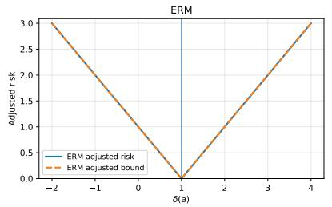

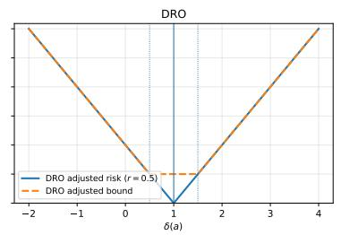

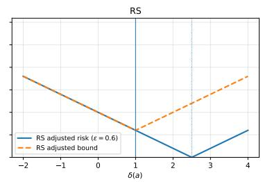  
Figure 1 Adjusted risks and adjusted bounds of diferent methods in the Dirac example with target distribution $P _ { T } = \delta _ { a }$ for $a \in [ - 2 , 4 ]$ . We consider DRO with $r = 0 . 5$ and RS with $\epsilon = 0 . 6$ as examples.

## 5. Comparative Statics under Partial Shift Information

We now compare how DRO and RS respond to distributional shifts. The generalization bounds in Section 4 show that, relative to ERM, DRO improves robustness by enlarging the ambiguity set through the radius r, thereby reducing sensitivity to distribution shift but incurring an additional regularization penalty. RS, in contrast, controls shift-related fragility through the satisficing threshold $\tau ,$ at the cost of allowing a prescribed level of suboptimality. These two methods enforce robustness via distinct mechanisms by setting corresponding hyperparameters, so their relative performance depends critically on how those hyperparameters are chosen.

However, direct comparison between these two methods is dificult without any information about the target shift, since training data alone does not ofer a principled criterion for setting these two robustness hyperparameters in a consistent and comparable manner. We therefore focus on settings in which partial information about the distributional shift is available. This information provides a common input for calibrating hyperparameters for both methods, while still allowing each to use that input according to its own native interpretation. In particular, we consider two regimes: (i) the known shift magnitude, measured by the type-I Wasserstein distance between the source and target distributions, but unknown shift direction; and (ii) the known shift direction within a parametric distribution family, but unknown shift magnitude. These two regimes capture complementary forms of partial shift information and allow us to compare DRO and RS under controlled and mechanism-respecting calibrations.

Specifically, we consider the two terms of the generalization error bounds in Section 4 that capture a robustness trade-of: a sensitivity-to-shift term, which captures the part of the target loss bound driven by the discrepancy between the source distribution $P _ { S }$ and the target distribution $P _ { T }$ and a regularization-penalty term, which captures the additional cost incurred by the robustness mechanism. For DRO, these terms are naturally indexed by the ambiguity radius r. For RS, the sensitivity-to-shift component is indexed by the reference value $\tau ,$ and its regularization penalty is $\begin{array} { r } { \epsilon ( \tau ) : = \tau - \operatorname* { i n f } _ { x \in \mathcal { X } } \mathbb { E } _ { \hat { P } _ { n } } [ f ( x , z ) ] } \end{array}$ , for any feasible threshold $\begin{array} { r } { \tau \geq \operatorname* { i n f } _ { x \in \mathcal { X } } \mathbb { E } _ { \hat { P } _ { n } } [ f ( x , z ) ] . } \end{array}$ 1 Table 2 summarizes the corresponding terms by SenDRO, $\mathrm { R e g } _ { \mathrm { D R O } } , \mathrm { S e n } _ { \mathrm { R S } }$ , and $\mathrm { R e g } _ { \mathrm { R S } }$ , and each method’s trade-of term is defined as:

$$
\mathrm { T O } _ { \mathrm { I R O } } ( r ) = \mathrm { S e n } _ { \mathrm { I D R O } } ( r ) + \mathrm { R e g } _ { \mathrm { D R O } } ( r ) , \qquad \mathrm { T O } _ { \mathrm { R S } } ( \tau ) = \mathrm { S e n } _ { \mathrm { R S } } ( \tau ) + \mathrm { R e g } _ { \mathrm { R S } } ( \tau ) .\tag{13}
$$

Next we compare DRO and RS through these trade-of terms, after calibrating r and $\tau$ using the same available partial shift information. Figure 2 summarizes the main conclusions.

<table><tr><td>Method</td><td>Sensitivity to distribution shift</td><td>Regularization penalty</td></tr><tr><td>DRO</td><td> ${ \mathrm { S e n } } _ { \mathrm { D R O } } ( r ) = L \cdot \operatorname* { i n f } _ { P \in { \mathcal { B } } ( P _ { S } , r ) } d _ { W } ( P _ { T } , P )$ </td><td> $\mathrm { R e g } _ { \mathrm { D R O } } ( r ) = \Lambda _ { r } ( P _ { S } , x _ { S } )$ </td></tr><tr><td>RS</td><td> $\mathrm { S e n } _ { \mathrm { R S } } ( \tau ) = k _ { \tau } \cdot d _ { W } ( P _ { S } , P _ { T } )$ </td><td> $\mathrm { R e g } _ { \mathrm { R S } } ( \tau ) = \epsilon ( \tau )$ </td></tr></table>

Table 2 Sensitivity-to-shift and regularization-penalty components of the trade-of terms.

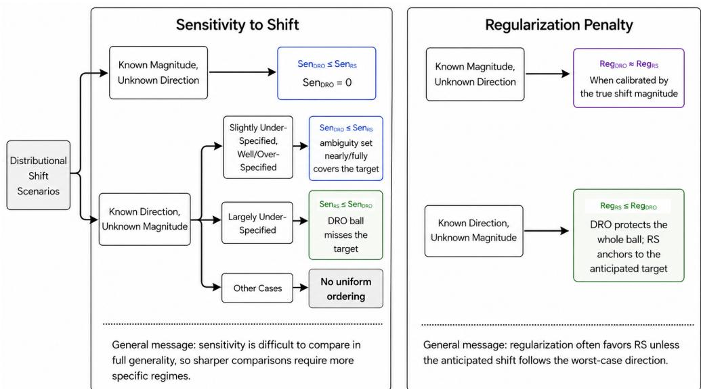  
Figure 2 Comparison between DRO and RS when calibrating the hyperparameters to diferent shift information. The relations $\leq$ and ≈ are understood up to vanishing error terms.

We acknowledge that the hyperparameter calibration rules studied below may not be universally optimal in practice, and a decision maker may not always observe the partial shift information assumed here. However, these calibrations serve as a systematic device for isolating how the distinct robustness mechanisms of DRO and RS afect target-environment performance under the same informational input. Our analyses complements the optimization-based hyperparameter correspondence literature by focusing on a learning-theoretic comparison under controlled information regimes.

## 5.1. Scenario I: Shift with Known Magnitude but Unknown Direction

We begin with the setting where the shift magnitude $r = d _ { W } ( P _ { S } , P _ { T } )$ is known but the shift direction is unknown. Under this information, the natural calibration for the DRO hyperparameter is to set the ambiguity radius equal to that known shift magnitude: $\mathcal { B } ( \hat { P } _ { n } , r ) : = \left\{ P \in \mathcal { P } ( \mathcal { Z } ) : d _ { W } ( P , \hat { P } _ { n } ) \leq r \right\}$ This calibration reflects the native semantics of DRO: it protects against all candidate target distributions consistent with the known magnitude. For RS, the hyperparameter τ has a diferent meaning: it is a reference value of anticipated loss. To set τ’s value, we translate the known shift magnitude into a reference value via the candidate target distribution induced by that magnitude.

Since no directional information is available, we evaluate the ERM solution over all candidate target distributions in the Wasserstein ball and take the worst-case loss as the reference value: $\begin{array} { r } { \tau _ { r } = \operatorname* { s u p } _ { P \in \mathcal { B } ( \hat { P } _ { n } , r ) } \mathbb { E } _ { P } \big [ f \big ( \hat { x } _ { \mathrm { E R M } } , z \big ) \big ] } \end{array}$ , where r is the known shift magnitude (and coincides with the DRO radius). This choice maps the same magnitude information into the RS hyperparameter by asking what loss level the source-trained ERM solution may have to tolerate over the set of target distributions consistent with that information. By doing so, we set the hyperparameters of DRO and RS with the same magnitude information while respecting the distinct semantics of r and $\tau .$

We now provide a quantitative comparison of the trade-of terms of DRO and RS presented in (13). We introduce additional regularity assumptions for the empirical optimizer around the sourcepopulation optimizer. These assumptions are standard regularity and identification conditions and hold for common loss functions such as newsvendor, logistic, and Huber losses under standard boundedness conditions and suitable nondegeneracy conditions on the source distribution $P _ { S }$ (see Appendix D).

Assumption 2. We assume:

(a) Decision-Lipschitz loss: There exists a constant $L ^ { \prime } > 0$ and a norm $\| \cdot \| _ { \mathcal { X } }$ on the decision space such that $| f ( x _ { 1 } , z ) - f ( x _ { 2 } , z ) | ~ \leq ~ L ^ { \prime } \| x _ { 1 } - x _ { 2 } \| _ { \mathcal { X } }$ for any $z \in { \mathcal { Z } }$ and $x _ { 1 } , x _ { 2 } \in \mathcal { X }$

(b) Quadratic growth around the source optimum: Let $\mathcal { E } ( x ) : = \mathbb { E } _ { P _ { S } } [ f ( x , z ) ]$ . There exists $\alpha > 0$ such that for all $x \in \mathcal { X } , \mathcal { E } ( x ) \ \geq \ \mathcal { E } ( x _ { S } ) + \frac { \alpha } { 2 } \left\| x - x _ { S } \right\| _ { \mathcal { X } } ^ { 2 }$

The following proposition compares the sensitivity-to-shift terms and regularization-penalty terms for DRO and RS defined in Table 2 under our hyperparameter calibration scheme above.

Proposition 3. Under Assumptions 1 and ${ \mathit { 2 } } ,$ with probability at least $1 - \delta ,$ we have

$$
0 = \mathrm { S e n } _ { \mathrm { D R O } } ( r ) \leq \mathrm { S e n } _ { \mathrm { R S } } ( \tau _ { r } ) = k _ { \tau _ { r } } r ,
$$

$$
\mathrm { R e g } _ { \mathrm { R S } } ( \tau _ { r } ) - \rho _ { n } ( \delta ) \leq \mathrm { R e g } _ { \mathrm { D R O } } ( r ) \leq \mathrm { R e g } _ { \mathrm { R S } } ( \tau _ { r } ) + \rho _ { n } ( \delta ) ,
$$

where $\tau _ { r }$ denotes the RS threshold calibrated under shift radius $r ,$ SenDRO, $\mathrm { R e g } _ { \mathrm { D R O . } }$ , SenRS, and $\mathrm { R e g } _ { \mathrm { R S } }$ are defined in Table 2, and $\begin{array} { r } { \rho _ { n } ( \delta ) = 4 L ^ { \prime } \sqrt { \frac { \mathfrak { G } _ { n } ( \delta ) } { \alpha } } + \frac { 2 4 L \mathrm { d i a m } ( \mathcal { Z } ) } { \sqrt { n } } + 2 M \sqrt { \frac { \log ( 8 / \delta ) } { 2 n } } } \end{array}$ is the statistical error with $\begin{array} { r } { \mathfrak { G } _ { n } ( \delta ) : = \frac { 2 4 } { \sqrt { n } } \mathcal { C } ( \mathcal { A } ) + M \sqrt { \frac { \log ( 8 / \delta ) } { 2 n } } } \end{array}$ . Therefore, for the trade-of terms defined in (13), we have $\mathrm { T O } _ { \mathrm { D R O } } ( r ) \leq \mathrm { T O } _ { \mathrm { R S } } ( \tau _ { r } ) - k _ { \tau _ { r } } r + \rho _ { n } ( \delta )$

Proposition 3 compares trade-of terms between DRO and RS when their hyperparameters are calibrated with the shift magnitude. The regularization-penalty components of the two methods are asymptotically comparable. In particular, the DRO regularization penalty $\begin{array} { r } { \mathrm { R e g } _ { \mathrm { D R O } } ( r ) = \operatorname* { s u p } _ { P \in \mathcal { B } ( P _ { S } , r ) } \mathbb { E } _ { P } [ f ( x _ { S } , z ) ] - \mathbb { E } _ { P _ { S } } [ f ( x _ { S } , z ) ] } \end{array}$ matches the RS penalty $\mathrm { R e g } _ { \mathrm { R S } } ( \tau _ { r } ) =$ $\begin{array} { r } { \operatorname* { s u p } _ { P \in \mathcal { B } ( \hat { P } _ { n } , r ) } \mathbb { E } _ { P } \big [ f \big ( \hat { x } _ { \mathrm { E R M } } , z \big ) \big ] - \mathbb { E } _ { \hat { P } _ { n } } \big [ f \big ( \hat { x } _ { \mathrm { E R M } } , z \big ) \big ] } \end{array}$ up to the statistical error $\rho _ { n } ( \delta )$ . This is because, as $n  \infty , { \hat { P } } _ { n }$ converges to $P _ { S }$ , and $\hat { x } _ { \mathrm { E R M } }$ converges to $x _ { S }$ in norm under Assumption 2.

The key diference lies in the sensitivity-to-shift components. For DRO, the sensitivity term ${ \mathrm { S e n } } _ { \mathrm { D R O } } ( r ) = L \cdot \operatorname* { i n f } _ { P \in { \mathcal { B } } ( P _ { S } , r ) } d _ { W } ( P _ { T } , P )$ equals zero, since setting $r = d _ { W } ( P _ { S } , P _ { T } )$ to the exact shift magnitude ensures that $P _ { T }$ lies within the set $B ( P _ { S } , r )$ . In contrast, the RS sensitivity term $\mathrm { S e n } _ { \mathrm { R S } } ( \tau _ { r } ) = k _ { \tau _ { r } } \cdot d _ { W } ( P _ { S } , P _ { T } )$ is equal to $k _ { \tau _ { r } } r$ and does not vanish.

Combining these two components, the aggregate trade-of comparison in Proposition 3 shows that DRO is favored by the non-vanishing sensitivity gap $k _ { \tau r } r$ , up to the statistical error $\rho _ { n } ( \delta )$ This stems from DRO’s ability to directly incorporate the shift magnitude into its ambiguity set and absorb the target distribution into its worst-case robustness framework.

## 5.2. Scenario II: Shift with Known Direction but Unknown Magnitude

We now consider the complementary setting in which the direction of the distributional shift is known, while its magnitude remains unspecified. Let $\{ P _ { t } \} _ { t \ge 0 }$ denote the family of distributions induced by the known shift direction, where t indexes the shift magnitude. We introduce the following assumption to regularize the distribution family $\{ P _ { t } \} _ { t \ge 0 }$

Assumption 3 (Monotonicity). For all $0 \le u \le t , \ d _ { W } ( P _ { 0 } , P _ { u } ) \le d _ { W } ( P _ { 0 } , P _ { t } )$ , where $P _ { 0 } \equiv P _ { S }$ denotes the source distribution.

This monotonicity condition ensures that the Wasserstein distance between $P _ { t }$ and the source distribution $P _ { 0 } \equiv P _ { S }$ increases monotonically with the shift magnitude index t. It holds for a variety of distribution families, including the example given below; Appendix B provides further examples satisfying Assumption 3, such as distributions characterized by stochastic diferential equations.

Example 1 (Parameter shift within a distribution family). Consider a parametric family of distributions $\{ P _ { \theta } : \theta \in \Theta \}$ , where θ may be vector- or matrix-valued. A distributional shift of the form $P _ { t } = P _ { \theta _ { t } }$ can then be viewed as a parameter shift. For instance, consider the multivariate Gaussian shift

$$
P _ { 0 } = \mathcal { N } ( \pmb { \mu } _ { 0 } , \pmb { \Sigma } ) , \qquad P _ { t } = \mathcal { N } ( \pmb { \mu } _ { 0 } + t \pmb { v } , \pmb { \Sigma } ) ,
$$

where $\pmb { \mu } _ { 0 } , \pmb { v } \in \mathbb { R } ^ { d }$ and $\pmb { \Sigma } \in \mathbb { S } _ { + } ^ { d }$ remains fixed. In this case, $\theta _ { t } = ( \mu _ { 0 } + t v , \Sigma )$ and $d _ { W } ( P _ { 0 } , P _ { t } ) = t \lVert \pmb { v } \rVert$ 2 so Assumption 3 is satisfied.

We denote the true but unknown distribution shift magnitude by $t _ { T }$ , so that the target distri bution is $P _ { T } \equiv P _ { t _ { T } }$ . However, since the true shift magnitude $t _ { T }$ is unknown, we instead specify a “nominal” magnitude t that may deviate from the truth $t _ { T }$ , which singles out a “nominal” target distribution $P _ { t }$ from the known family. This $P _ { t }$ serves as a natural object for both robust methods to calibrate their hyperparameters: DRO can straightforwardly set $r _ { t } = d _ { W } ( P _ { S } , P _ { t } )$ , suggesting that the ambiguity set should extend exactly far enough to cover the nominal target distribution indexed by t; RS instead calibrates its anticipated loss threshold via $\tau _ { t } = \mathbb { E } _ { P _ { t } } [ f ( \hat { x } _ { \mathrm { E R M } } , z ) ]$ , i.e., the loss of the source-trained ERM under the nominal target $\boldsymbol { P _ { t } } . ^ { 2 }$ Thus, the calibration rules $r _ { t }$ and $\tau _ { t }$ are obtained from the same hypothetical target, but each is expressed in the native language of the corresponding method: distributional coverage for DRO and anticipated reference loss level for RS.

We first compare the regularization-penalty terms of both methods.

Proposition 4. Under Assumptions 1 and 2, with probability at least $1 - \delta$ , we have

$$
\mathrm { R e g } _ { \mathrm { R S } } ( \tau _ { t } ) + \operatorname* { s u p } _ { P \in \mathcal { B } ( P _ { S } , r _ { t } ) } \mathbb { E } _ { P } [ f ( x _ { S } , z ) ] - \mathbb { E } _ { P _ { t } } \big [ f ( x _ { S } , z ) \big ] \leq \mathrm { R e g } _ { \mathrm { D R O } } ( r _ { t } ) + \bar { \rho } _ { n } ( \delta ) ,
$$

where $\mathrm { R e g } _ { \mathrm { D R O } }$ and $\mathrm { R e g } _ { \mathrm { R S } }$ are defined in Table 2, and $\begin{array} { r } { \bar { \rho } _ { n } ( \delta ) = 2 L ^ { \prime } \sqrt { \frac { \bar { \mathfrak { G } } _ { n } ( \delta ) } { \alpha } } + \bar { \mathfrak { G } } _ { n } ( \delta ) } \end{array}$ with $\bar { \mathfrak { G } } _ { n } ( \delta ) =$ ${ \textstyle \frac { 2 4 } { \sqrt { n } } } { \mathcal { C } } ( { \cal A } ) + M { \sqrt { \frac { \log ( 2 / \delta ) } { 2 n } } }$

Proposition 4 shows that the DRO regularization penalty is asymptotically larger than the RS regularization penalty by a nonnegative gap $\begin{array} { r } { \operatorname* { s u p } _ { P \in \mathcal { B } ( P _ { S } , r _ { t } ) } \mathbb { E } _ { P } [ f ( x _ { S } , z ) ] - \mathbb { E } _ { P _ { t } } \big [ f ( x _ { S } , z ) \big ] } \end{array}$ , which captures the diference between the worst-case loss of the source optimizer over the ambiguity set $B ( P _ { S } , r _ { t } )$ and its loss under the nominal target $P _ { t }$ . This gap could be substantial if $P _ { t }$ is far from the worst-case distribution within $B ( P _ { S } , r _ { t } )$ , capturing the potential cost of DRO’s hedging against the worst-case.

The sensitivity-to-shift terms of DRO and RS, however, do not admit a uniform ordering in general. We therefore consider three cases, distinguished by whether the nominal shift magnitude t is “under-specified” $( t < t _ { T } )$ , “well-specified” $( t = t _ { T } )$ , or “over-specified” $( t > t _ { T } )$ , for which a sharper comparison can be made.

Proposition 5. Suppose Assumption 3 holds, $P _ { T } = P _ { t _ { T } } , \ r _ { t } = d _ { W } ( P _ { S } , P _ { t } )$ . The following sensitivity comparisons hold: (i) If $\begin{array} { r } { \frac { d _ { W } ( P _ { t } , P _ { S } ) } { d _ { W } ( P _ { T } , P _ { S } ) } \leq 1 - \frac { k _ { \tau _ { t } } } { L } } \end{array}$ , then Sen $\mathrm { . R s } ( \tau _ { t } ) \leq \mathrm { S e n } _ { \mathrm { D R O } } ( r _ { t } ) ,$ ; (ii) If $t \geq t _ { T }$ , then $0 = \mathrm { S e n } _ { \mathrm { D R O } } ( r _ { t } ) \leq \mathrm { S e n } _ { \mathrm { R S } } ( \tau _ { t } )$

Part (i) corresponds to cases where the distribution shift magnitude is suficiently under-specified $( \mathrm { i . e . , }$ t is suficiently smaller than $t _ { T } )$ , which formally states that $\begin{array} { r } { \frac { d _ { W } ( P _ { t } , P _ { S } ) } { d _ { W } ( P _ { T } , P _ { S } ) } \leq 1 - \frac { k _ { \tau _ { t } } } { L } < 1 . ^ 3 } \end{array}$ Combining it with Proposition 4, the resulting trade-of bound favors RS up to the statistical error $\bar { \rho } _ { n } ( \delta )$

In contrast, part (ii) of Proposition 5 favors DRO for the sensitivity-to-shift term, when the shift magnitude is well-specified or over-specified and thus the ambiguity set already covers the true target distribution. However, Proposition 4 shows that the regularization-penalty term favors RS, since DRO still hedges against the worst-case distribution in the entire ball $B ( P _ { S } , r _ { t } )$ , whereas RS is anchored to the nominal target $P _ { t }$ . Therefore, in the well-specified and over-specified regimes, the comparison of the trade-of terms between $\mathrm { T O } _ { \mathrm { D R O } } ( r _ { t } )$ and $\mathrm { T O } _ { \mathrm { R S } } ( \tau _ { t } )$ is undecided. However, as t becomes increasingly over-specified, the gap between the regularization penalty terms $( \mathrm { R e g } _ { \mathrm { D R O } } ( r _ { t } )$ and $\mathrm { R e g } _ { \mathrm { R S } } ( \tau _ { t } ) )$ likely increases, which explains the deterioration of DRO’s numerical performance in Sections 5.3.3 and 6.

We finally note that when the shift direction aligns with the worst-case distributional direction, referred to as the adversarial scenario, Appendix A shows that DRO may have better trade-of performance because it is designed to handle worst-case distributions.

## 5.3. Simulation Studies

We present a two-product Gaussian newsvendor problem to numerically validate the theoretical findings. With ERM as the baseline, we evaluate the performance of DRO and RS under two partial-information regimes: (i) known shift magnitude with unknown direction, and (ii) known shift direction with unknown magnitude. In both regimes, the hyperparameters of DRO and RS are calibrated from the available shift information following rules in Sections 5.1 and 5.2.

5.3.1. Setup. Consider a two-product Gaussian newsvendor problem. Let the random variable be the demand vector $z = ( z _ { 1 } , z _ { 2 } ) \in \mathbb { R } ^ { 2 }$ . The source distribution of demand z is $P _ { S } = N ( \mu _ { S } , \Sigma )$ , where the covariance matrix Σ is fixed. From the source distribution $P _ { S }$ , we observe n i.i.d. samples $\{ z _ { i } \} _ { i = 1 } ^ { n }$ and estimate the source mean by $\begin{array} { r } { \hat { \mu } = \frac { 1 } { n } \sum _ { i = 1 } ^ { n } z _ { i } } \end{array}$ . We use $P _ { \hat { \mu } } = N ( \hat { \mu } , \Sigma )$ as the distribution used in ERM, the center of the Wasserstein ball in the DRO framework and the fitted nominal distribution in the RS framework. For a decision $x = ( x _ { 1 } , x _ { 2 } )$ , we consider the two-product newsvendor loss

$$
f ( x , z ) = \sum _ { j = 1 } ^ { 2 } h _ { j } ( x _ { j } - z _ { j } ) _ { + } + b _ { j } ( z _ { j } - x _ { j } ) _ { + } ,
$$

where $h _ { j }$ is the overage cost and $b _ { j }$ is the underage cost of product $j .$ Following the standard newsvendor interpretation, we take underage costs to be larger than overage costs, reflecting that unmet demand is typically more costly than leftover inventory. The set of feasible decisions is $\mathcal { X } = \{ x \in \mathbb { R } _ { + } ^ { 2 } : x _ { 1 } + x _ { 2 } \leq C \}$ , where $C$ is the total capacity. For any mean vector $\mu ,$ define the loss

$$
L ( x , \mu ) : = \mathbb { E } _ { z \sim N ( \mu , \Sigma ) } [ f ( x , z ) ] .
$$

In our numerical experiments, we set $\mu _ { S } = ( 5 0 , 5 0 ) ^ { \top } , \Sigma = 2 ^ { 2 } \left( { 1 \atop 0 . 3 1 } \right)$ , and use $h = ( 1 , 1 ) ^ { \top } , b =$ $( 3 , 5 ) ^ { \top } , C = 1 0 5$ unless otherwise specified.

We model distributional shifts through a Gaussian mean-shift family.4 Specifically, any target distribution considered in the numerical study takes the form $P _ { T } = N ( \mu _ { T } , \Sigma )$ , where the covariance matrix $\Sigma$ remains fixed and the discrepancy between the source and target distributions arises only through the mean shift $\mu _ { S }  \mu _ { T }$ , yielding $d _ { W } \big ( N ( \mu _ { S } , \Sigma ) , N ( \mu _ { T } , \Sigma ) \big ) = \| \mu _ { S } - \mu _ { T } \| _ { 2 }$ . This mean-shift representation allows us to separate the magnitude and direction of a distributional shift: given a unit direction u and a magnitude $t \geq 0$ , the corresponding shifted distribution can be written as $P _ { t } = N ( \mu _ { t } , \Sigma )$ for $\mu _ { t } = \mu _ { S } + t u$ , with $P _ { 0 } = P _ { S }$ . In Scenario I below, we fix the known shift magnitude and sample an unknown direction to create distributional shift. In Scenario II, we fix the direction and vary the specified magnitude.

We consider the following three methods:

1. ERM (baseline): $\begin{array} { r } { \hat { x } _ { \mathrm { E R M } } = \arg \operatorname* { m i n } _ { x \in \mathcal { X } } L ( x , \hat { \mu } ) } \end{array}$

2. Gaussian-family $\begin{array} { r } { \mathrm { D R O : ~ } \hat { x } _ { \mathrm { D R O } } ( r ) = \arg \operatorname* { m i n } _ { x \in \mathcal { X } } \operatorname* { s u p } _ { \| \mu - \hat { \mu } \| _ { 2 } \leq r } L ( x , \mu ) } \end{array}$ . That is, the corresponding Wasserstein ball $\boldsymbol { B _ { G } } ( P _ { \hat { \mu } } , r )$ is centered at $P _ { \hat { \mu } }$ and defined as

$$
\mathcal { B } _ { G } ( P _ { \hat { \mu } } , r ) : = \{ P _ { \mu } = N ( \mu , \Sigma ) : \| \mu - \hat { \mu } \| _ { 2 } \leq r \} .
$$

3. Gaussian-family RS: for a satisficing threshold $\tau ,$ we solve

$$
\begin{array} { r l } { \hat { x } _ { \mathrm { R S } } \in \arg \underset { x \in \mathcal { X } , \ k \geq 0 } { \operatorname* { m i n } } } & { k } \\ { \mathrm { s . t . } } & { L ( x , \mu ) \leq \tau + k \| \mu - \hat { \mu } \| _ { 2 } . } \end{array}
$$

We evaluate them by the expected loss of their optimizers in the target environment, $L ( \hat { x } , \mu _ { T } ) =$ $\mathbb { E } _ { P _ { T } } [ f ( \hat { x } , z ) ]$ , under two distributional shift scenarios with separate partial shift information.

5.3.2. Scenario I: known shift magnitude. With a known shift magnitude, measured as the Wasserstein distance between the source and target Gaussian distributions, we set this value as the radius $r$ in the DRO framework. For RS, following the calibration rule discussed in Section 5.1, we choose the satisficing threshold $\tau _ { r }$ to reflect the worst-case performance of the ERM solution over the Gaussian-family ball within radius $r \colon$

$$
\tau _ { r } = \operatorname* { s u p } _ { P \in B _ { G } ( P _ { \hat { \mu } } , r ) } \mathbb { E } _ { P } \big [ f \big ( \hat { x } _ { \mathrm { E R M } } , z \big ) \big ] = \operatorname* { s u p } _ { \| \mu - \hat { \mu } \| _ { 2 } \leq r } L \big ( \hat { x } _ { \mathrm { E R M } } , \mu \big ) ,\tag{14}
$$

where the last equality follows from the definition of $\boldsymbol { B } _ { G } ( P _ { \hat { \mu } } , r )$

We now evaluate the performance of each optimizer on the target distribution. Specifically, given a shift magnitude $r ,$ we conduct Monte Carlo simulations with 500 replications. In each replication, we sample a unit vector $u \in \mathbb { S } ^ { 1 }$ to represent the shift direction and construct the target distribution as $P _ { T } ( u , r ) = N ( \mu _ { S } + r u , \Sigma )$ . By construction, for every sampled direction, $d _ { W } ( P _ { S } , P _ { T } ( u , r ) ) = r .$ We then evaluate ERM, DRO, and RS by their target expected losses under $P _ { T } ( u , r )$

Distribution of Test Loss Across 500 Shift Directions  
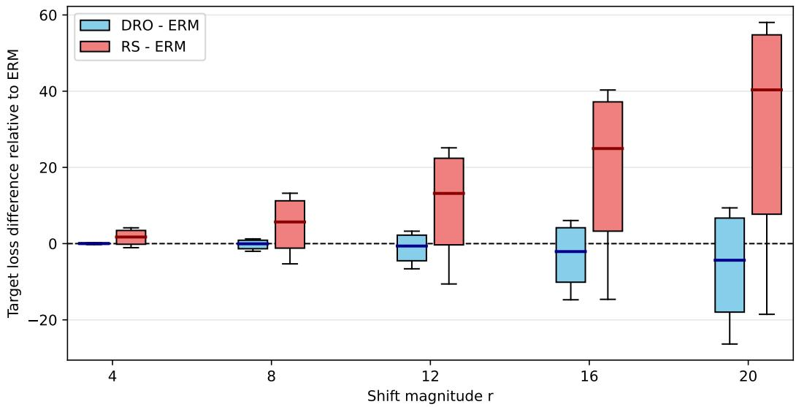  
Figure 3 Distribution of loss diferences relative to ERM across 500 randomly sampled shift directions in the known-magnitude regime. For each shift magnitude r, the boxplots summarize the target-loss diferences of DRO and RS relative to ERM, with both methods calibrated using the known magnitude. Negative values indicate lower target loss than ERM.

Figure 3 reports the target-loss diferences of DRO and RS relative to ERM across 500 simulated shift directions. DRO has overall lower realized target loss than RS across the reported magnitudes, which is consistent with Proposition 3: when only the shift magnitude is available, DRO is favored as it uses the magnitude directly through its ambiguity radius, whereas RS is calibrated through a worst-case ERM-loss threshold over the same Gaussian-family ball.

Moreover, RS with the calibrated hyperparameter performs overall worse than ERM. It also significantly deteriorates as the shift magnitude increases, while DRO remains more competitive. The DRO–ERM comparison reflects the asymmetric cost structure of the newsvendor problem. Since product 2 has a larger underage cost, increasing the DRO radius leads the robust solution to order more of product 2. This adjustment is not beneficial for every possible shift direction. If the target shift mainly increases the demand for product 1, allocating more inventory to product 2 may hurt performance. However, if the target shift increases the demand for product 2, the same adjustment can substantially reduce shortage loss. Because the shortage cost of product 2 is high, the improvement in these directions is larger than the loss incurred in directions where the adjustment is less useful. This explains why the DRO boxplots move downward relative to zero as the shift magnitude increases, even though the improvement is not uniform across all directions.

5.3.3. Scenario II: known shift direction. Let $u \in \mathbb { S } ^ { 1 }$ denote the known mean-shift direction and consider the shifted distribution family $P _ { t } = N ( \mu _ { t } , \Sigma )$ where $\mu _ { t } = \mu _ { S } +$ tu and t quantifies the shift magnitude. We set the true target distribution as $P _ { T } = P _ { t _ { T } }$ , with true shift magnitude $t _ { T } = 1 6$ . Since the actual shift magnitude is unknown, we consider nominal magnitudes $t = \alpha t _ { T }$ with $\alpha \in \left\{ { \textstyle { \frac { 1 } { 3 } } } , { \textstyle { \frac { 2 } { 3 } } } , 1 , 2 , 3 , 4 \right\}$ , which correspond to under-specified $( \alpha < 1 )$ , well-specified $( \alpha = 1 )$ , and over-specified $( \alpha > 1 )$ regimes. For DRO, we use the radius $r _ { t }$ corresponding to the nominal magnitude t, which equals t under the Gaussian mean-shift parameterization. For RS, since the shift direction is known, we calibrate the satisficing threshold by evaluating the ERM solution at the nominal shifted mean $\tau _ { t } = L \big ( \hat { x } _ { \mathrm { E R M } } , \hat { \mu } + t u \big )$

We focus on demand-increasing directions, i.e., directions in the first quadrant, which corresponds to the demand-increasing shift as the main robustness concern in the newsvendor problem.5 Since product 2 has a larger underage cost, robust methods tend to allocate more protection to product 2. Shifts that mainly increase the demand of product 2 are more aligned with the robust adjustment, while shifts that mainly increase the demand of product 1 are less aligned with it. To capture whether the known demand-shift direction is favorable or unfavorable to the inventory protection induced by the robust methods, we consider shift directions falling into the two regimes below:

• High alignment: the demand shift direction is close to $e _ { 2 } = ( 0 , 1 ) ^ { \top }$ , with $\langle u , e _ { 2 } \rangle \geq 0 . 9$ , so the target demand mainly increases for product 2;

• Low alignment: the demand shift direction is close to $e _ { 1 } = ( 1 , 0 ) ^ { \top }$ , with $\langle u , e _ { 1 } \rangle \geq 0 . 9$ , so the target demand mainly increases for product 1.

For each regime, we sample 50 directions and compute the loss diferences of DRO and RS relative to ERM across the nominal values of t (or corresponding α). The target distribution in each replication is $P _ { T } = N ( \mu _ { S } + t _ { T } u , \Sigma )$ ), while the hyperparameters of DRO and RS are calibrated using the pre-specified magnitude $t = \alpha t _ { T }$ and the known direction u.

Figure 4 shows that the performance of robust methods depends strongly on whether the known direction agrees with the protection induced by robustness. In the low-alignment regime, the target demand mainly increases for product 1, while the robust methods tend to protect product 2. As a result, the robust adjustment is directionally mismatched. When the specified magnitude is small, DRO remains close to ERM and can slightly improve upon it. As the nominal magnitude increases, however, this mismatch is amplified: RS deteriorates rapidly, and DRO also becomes increasingly worse under large over-specification.

In the high-alignment regime, the target demand mainly increases for product 2, which is the product that robust methods tend to protect because of its larger underage cost. Hence being robust is directionally favorable. When the shift magnitude is largely under-specified, both robust methods can improve upon ERM in this regime, and RS can be better than DRO. When the magnitude is over-specified, DRO in turn becomes more favorable than RS. These patterns are consistent with Propositions 4 and 5: when the shift magnitude is suficiently under-specified, RS can be favored over DRO; once the specified radius exceeds the true shift magnitude, the DRO ambiguity set covers the target distribution and its sensitivity term vanishes, while RS still retains a non-vanishing sensitivity term of the form $k _ { \tau _ { t } } t _ { T }$ and is outperformed by DRO. However, as the nominal magnitude becomes too large, the trade-of changes. According to the analysis below Proposition 5, increasing the specified magnitude enlarges the ambiguity set used by DRO and may substantially increase its worst-case regularization penalty. In this regime, even though the DRO sensitivity term remains zero after the target is covered, the growing regularization gap becomes dominant. This is reflected in the upward movement of the DRO boxplots under over-specification.

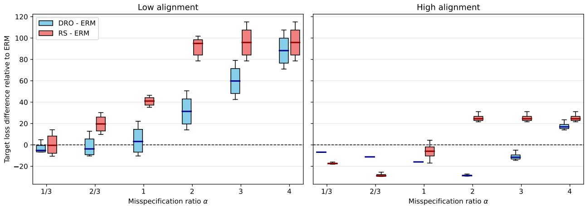  
Figure 4 Loss diferences relative to ERM across 50 randomly sampled shift directions in each alignment regime under the known-direction setting. DRO and RS are calibrated using a specified shift magnitude, while the true magnitude is fixed. Directions are sampled from two demand-increasing regimes: low alignment, where demand mainly increases for product 1, and high alignment, where demand mainly increases fo product 2. The cases α < 1, α = 1, and α > 1 correspond to under-specification, correct specification, and over-specification, respectively.

## 6. Application to Network Lot-sizing

We now apply our analytical framework to a network lot-sizing problem, in which the shift direction is known (demand shifts upward), but its magnitude is not.

## 6.1. Setup

The network lot-sizing problem. Consider N geographically dispersed stores. Before the demand is realized, an initial inventory allocation is made across the stores. After observing the realized demand, the system can either rebalance inventory through transportation between stores or place emergency local orders to satisfy unmet demand. The total system cost consists of three components: the initial-ordering cost, the transportation cost from transshipment, and the emergency ordering cost.

The initial ordering decision is denoted as $x = ( x _ { i } ) _ { i \in [ N ] }$ , where $x _ { i }$ represents the pre-stocked quantity at store i and $[ N ] : = \{ 1 , \dots , N \}$ . Each store has a capacity limit $\delta = ( \delta _ { i } ) _ { i \in [ N ] }$ , satisfying $x _ { i } \leq \delta _ { i }$ for all $i \in [ N ]$ . After the realization of demand, the system makes a recourse decision $( y , w )$ to satisfy demand, where $y = ( y _ { i j } ) _ { i , j \in [ N ] }$ denotes the amount transshipped from store i to store $j .$ and $w = ( w _ { i } ) _ { i \in [ N ] }$ represents the emergency order at store i. The cost parameters are as follows: $c = ( c _ { i } ) _ { i \in [ N ] }$ for per-unit initial orders, $l = ( l _ { i } ) _ { i \in [ N ] }$ for per-unit emergency orders, and $d = ( d _ { i j } ) _ { i , j \in [ N ] }$ for per-unit transportation costs between stores. For brevity, we denote $\begin{array} { r } { d _ { i } ^ { \top } y _ { i } : = \sum _ { j \in [ N ] } d _ { i j } y _ { i j } } \end{array}$

The total system cost given an initial order x and a realized demand vector $\pmb { z } = ( z _ { i } ) _ { i \in [ N ] }$ is determined from the following two-stage linear optimization model:

$$
f ( x , z ) = c ^ { \top } x + \operatorname* { m i n } _ { ( y , w ) \in \mathcal { V } _ { ( x , z ) } } \left\{ \sum _ { i \in [ N ] } d _ { i } ^ { \top } y _ { i } + l ^ { \top } w \right\} ,\tag{15}
$$

where the first-stage decision satisfies $x \in \mathcal { X } : = \{ x \in \mathbb { R } _ { + } ^ { N } \mid x _ { i } \leq \delta _ { i } , \ \forall i \in [ N ] \}$ , and the feasible set of second-stage decisions is $\begin{array} { r } { \mathcal { V } _ { ( x , z ) } = \{ ( y , w ) \in \mathbb { R } _ { + } ^ { N \times N } \times \mathbb { R } _ { + } ^ { N } \mid x _ { i } + w _ { i } + \sum _ { j \in [ N ] } y _ { j i } - \sum _ { j \in [ N ] } y _ { i j } - z _ { i } \ge 1 \} } \end{array}$ $0 , \ \forall i \in [ N ] \}$ . The first-stage decision x specifies the initial ordering for the pre-positioned inventory across stores, while the second-stage decisions $( y , w )$ capture the adaptive replenishment response after demand is realized. The objective is to determine an initial stocking decision x that minimizes the expected total cost (consisting of the initial-ordering cost $c ^ { \top } x$ and the operational cost min $\begin{array} { r } { \cdot ( y , w ) { \in } { \mathscr y } _ { ( x , z ) } \left\{ \sum _ { i \in [ N ] } d _ { i } ^ { \top } y _ { i } + l ^ { \top } w \right\} ) } \end{array}$ under possible distributional shifts in z. The tractable approximate reformulations for solving the DRO and RS optimizers are provided in Appendix C.1.

We instantiate the network lot-sizing problem as follows. Consider $N = 1 0$ stores. For each store $i \in [ N ]$ , the initial ordering quantity $x _ { i } \geq 0$ is constrained by the capacity limit $\delta _ { i } = 4 0$ . We define the source distribution $P _ { S }$ as the joint distribution of the random demand vector ${ \pmb z } = ( z _ { i } ) _ { i \in [ N ] }$ where customer demands $z _ { i } , i \in [ N ]$ , are independently distributed as $\mathcal { N } ( 2 0 , 5 0 )$ . When sampling demand realizations, we truncate negative values to ensure non-negativity.6 We draw M i.i.d. source-demand realizations $\{ \widehat { \pmb { z } } _ { S } ^ { ( m ) } \} _ { m \in [ M ] }$ from $P _ { S }$ , where $\widehat { z } _ { S } ^ { ( m ) } = ( \widehat { z } _ { S , i } ^ { ( m ) } ) _ { i \in [ N ] } \in \mathbb { R } _ { + } ^ { N }$ denotes the m-th joint demand realization across all stores. These source realizations serve as the training samples for computing the initial ordering decisions under ERM, DRO, and RS. We assume a common unit initial-order price $c _ { i }$ for all stores and vary it over $c _ { i } \in \{ 5 , 1 0 , 2 0 \}$ . The emergency-order price is fixed at $l _ { i } = 3 0$ . Store locations are randomly assigned on a $1 0 \times 1 0$ grid. Let $D _ { i j }$ denote the Euclidean distance between stores i and $j ;$ the per-unit transportation cost $d _ { i j }$ is set proportional to this distance, with $d _ { i j } = 2 D _ { i j }$ for all $i , j \in [ N ]$

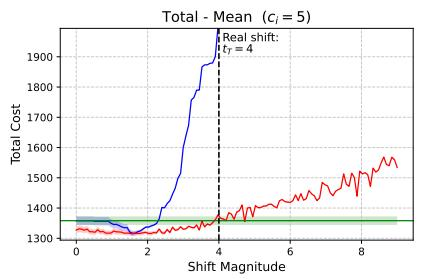

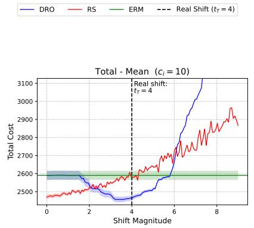

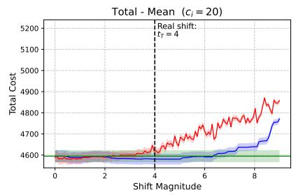  
Figure 5 Mean total costs of diferent methods for the network lot-sizing problem across diferent shift magnitude specifications $( t _ { T } = 4$ corresponds to the truth). The shift direction is known and used to calibrate DRO and RS hyperparameters, while the shift magnitude is unknown and specified along the horizontal axis. We consider three diferent levels of per-unit initial-ordering cost $c _ { i } \in \{ 5 , 1 0 , 2 0 \}$

Positive demand mean shifts. We consider distributional shifts in which the demand distribution shifts along a mean-increasing direction. In this setting, the baseline ERM model is trained on a source distribution with lower average demand than that of the target environment where the demand is realized. It thus tends to underestimate true demand, leading to insuficient initial ordering and a higher likelihood of incurring additional operational costs from lateral transportation and emergency orders. The robust methods DRO and RS are applied to account for such upward demand shifts.

Specifically, the true target demand over all stores follows a multivariate normal distribution $P _ { T } : = \mathcal { N } ( 2 0 \cdot \mathbf { 1 } _ { N } + t _ { T } d , \ 5 0 I _ { N } )$ , where the shift direction $d = ( d _ { 1 } , \ldots , d _ { N } )$ is randomly sampled from the positive orthant such that $d _ { i } \geq 0$ for all i and $\| d \| _ { 2 } = 1$ . The true shift magnitude is fixed at $t _ { T } = 4$ . We assume that the shift direction is known, while the shift magnitude remains unknown.

Both robust models choose their hyperparameters based on a nominal target distribution $P _ { t } : =$ $\mathcal { N } ( 2 0 \cdot { \bf 1 } _ { N } + t d , ~ 5 0 I _ { N } )$ with nominal shift magnitude t as in Section 5.2. The learned decisions are evaluated using an independent test set $\{ \widehat { z } _ { T } ^ { ( k ) } \} _ { k \in [ K ] }$ , where K denotes the number of target-demand realizations used for evaluation and $\widehat { \pmb { z } } _ { T } ^ { ( k ) } , k \in [ K ]$ , are i.i.d. realizations from $P _ { T }$ . We set $K = 1 0 0 0$ For each learned decision ${ \hat { x } } ,$ , we compute the corresponding test costs $\{ f ( \widehat { \boldsymbol { x } } , \widehat { \boldsymbol { z } } _ { T } ^ { ( k ) } ) \} _ { k \in [ K ] }$ . In the experiments, we vary the specified shift magnitude t from values below the true shift magnitude $t _ { T } =$ 4 (representing under-specified shifts) to values above $t _ { T } = 4$ (representing over-specified shifts).

## 6.2. Model Performance

Total cost. Figure 5 reports the mean total cost of ERM, DRO, and RS. In the under-specified regime $( t < t _ { T } )$ , robust methods generally improve upon ERM because the source-trained ERM decision tends to under-order for upward demand shifts. With large under-specification, RS attains a lower total cost than DRO. This pattern is consistent with Proposition 5: when the nominal shift magnitude is small, the DRO ambiguity set does not cover the true target distribution, whereas RS can still reduce the efective sensitivity to the shift through its fragility measure.

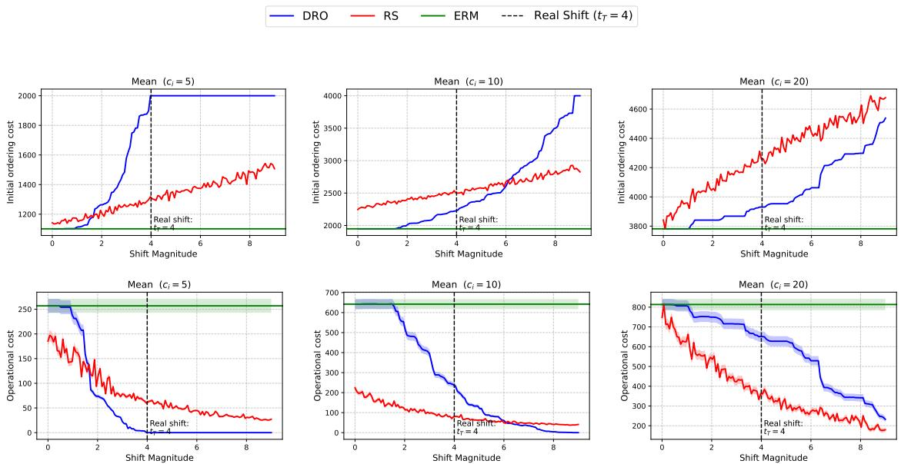  
Figure 6 Mean cost decomposition for the network lot-sizing application. The top row reports initial-ordering costs, and the bottom row reports operational recourse costs (transshipment costs plus emergencyorder costs). Together, they decompose the total costs in Figure 5.

The performance changes in the over-specified regime $( t > t _ { T } )$ . RS gradually orders more inventory as the nominal demand level increases and can eventually become worse than ERM. DRO exhibits a more cost-dependent pattern. When the unit initial-ordering cost $c _ { i }$ is small, DRO becomes highly conservative and performs substantially worse than both RS and ERM. As $c _ { i }$ increases, this disadvantage diminishes, and DRO can eventually outperform RS. We shall further examine this initial-ordering-cost-dependent performance in the subsequent sections.

Appendix C provides additional numerical results on quantile-based metrics. Results show that RS achieves better 95th-percentile performance than DRO for upward demand shifts, consistent with the empirical findings of Long et al. (2023) in settings without distributional shifts.

Cost decomposition: initial ordering vs. operational costs. Figure 6 decomposes the mean total cost in Figure 5 into initial-ordering costs and operational costs after demand is realized.7 Relative to ERM, both DRO and RS typically incur higher initial-ordering costs but lower operational costs, indicating that robust methods substitute preventive upfront inventory for corrective second-stage transshipment and emergency ordering. The two methods difer in how this substitution responds to the nominal shift magnitude t. RS changes almost linearly: as t increases, its initial-ordering cost rises steadily and its operational cost falls steadily. DRO is more sensitive to the unit ordering cost $c _ { i } .$ . When $c _ { i }$ is small, DRO rapidly front-loads inventory; in the $c _ { i } = 5$ panels, the initial-ordering cost quickly reaches a high plateau, whereas the operational cost is already close to zero, so further increases in t mostly reflect over-protection rather than additional recourse-cost savings. When $c _ { i }$ is large, DRO reacts more cautiously because the cost of excess initial inventory becomes more important.

This decomposition explains the total-cost patterns in Figure 5. In the under-specified regime, RS achieves a better balance by moderately increasing initial orders while substantially reducing operational costs. For small or intermediate $c _ { i } .$ , DRO may become too aggressive, especially in the over-specified regime: its initial-ordering cost rises sharply without a proportional operationalcost reduction. As $c _ { i }$ increases, however, DRO’s upfront ordering becomes less aggressive, while RS continues to scale approximately linearly with $t ;$ consequently, DRO can become preferable at higher unit ordering costs.

Optimization correspondence and shift-calibrated hyperparameters. We now compare two ways of relating the DRO radius r and the RS reference value τ. First, following Wang et al. (2025), we derive the optimization-based correspondence between r and $\tau ,$ , where the two methods produce the same solution. Second, we overlay the shift-calibrated hyperparameter pairs generated by the calibration rule in Section 5.2. Figure 7 uses this comparison to help understand how the relative performance of DRO and RS changes with the initial-ordering cost $c .$ Let $\tau ^ { \mathrm { e q } } ( r )$ denote the optimization-equivalent RS threshold on the blue curve, i.e., the RS threshold that would reproduce the DRO solution with diferent radius $r .$ Let $\tau ^ { \mathrm { s h i f t } } ( r )$ denote the shift-calibrated RS threshold on the orange curve, obtained directly from each nominal target distribution $P _ { t }$ that induces the DRO radius $r = P _ { W } ( P _ { S } , P _ { t } )$ , over the same range of $^ r .$ For small $c _ { i } = 5$ , the blue curve rises sharply and quickly saturates, while the orange curve remains much lower over most shift magnitudes. Hence, for the same specified magnitude, the shift-calibrated RS solution is substantially less conservative than the solution-equivalent RS representation of DRO. This explains why DRO overreacts to large specified shifts and incurs high total cost in Figure 5, whereas RS changes more gradually. For large $c _ { i } = 2 0$ , the ordering of the two curves is largely reversed: the shift-calibrated RS threshold is above the solution-equivalent threshold corresponding to DRO. In this case, RS induces a larger increase in initial stocking as the specified magnitude grows, while DRO reacts more moderately. This explains why RS becomes more costly than DRO for large $c _ { i }$ . The case with moderate $c _ { i } = 1 0$ is intermediate, with the two curves crossing, which is consistent with the mixed performance pattern in Figure 5.

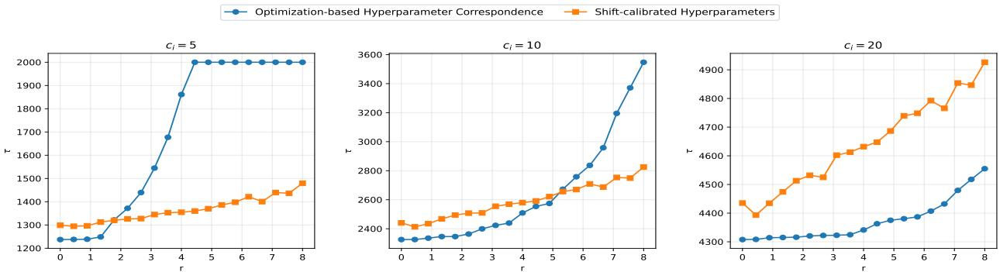  
Figure 7 Optimization correspondence and shift-calibrated hyperparameter pairs for DRO and RS. The blue curve reports the optimization-based correspondence of Wang et al. (2025), where each (r, τ) pair yields identical DRO and RS solutions. The orange curve reports the parameter pairs induced by our shift-information-directed calibration, where r and τ are both chosen from the same specified shift magnitude as in Section 5.2.

## 7. Conclusion

In this paper, we study how Distributionally Robust Optimization (DRO) and Robust Satisficing (RS) address distributional shifts. We derive generalization error bounds for both methods under distributional shifts, explicitly characterizing the trade-of between reduced sensitivity to shift and regularization cost as a function of their respective hyperparameters. Building on these results, we provide shift-information-directed hyperparameter calibration and method comparison under scenarios with partial shift information. Under such hyperparameter calibration, when the shift magnitude is known but the direction is unknown, the resulting trade-of bound favors DRO because the ambiguity radius can directly encode the known magnitude. When the shift direction is known but the magnitude is unknown, RS can be favored when the magnitude is suficiently underspecified. Further simulation studies show target-environment generalization patterns that largely align with these theoretical comparisons, and the network lot-sizing application gives an operational interpretation through the trade-of between preventive initial ordering and corrective operational recourse costs.

We hope that this work contributes to a more refined, shift-explicit characterization of the finitesample behavior of DRO and RS and represents a step toward connecting empirical evaluations of target-environment performance under distribution shifts. A natural future direction is to investigate whether the analysis can be extended to applications such as medical imaging diagnostics, autonomous-driving perception, supply-chain, disaster-response planning, and fairness-sensitive decision-making, where distribution shifts are well documented and robust learning methods are increasingly studied or deployed. Our network lot-sizing application and numerical experiments illustrate how theory can guide target-environment guarantees and hyperparameter selection in a structured setting. Extending such guidance to these more complex environments remains an important open problem.

## References

An Y, Gao R (2021) Generalization bounds for (Wasserstein) robust optimization. Advances in Neural Information Processing Systems, volume 34, 10382–10392, URL https://proceedings.neurips.cc/ paper/2021/hash/55fd1368113e5a675e868c5653a7bb9e-Abstract.html.

Azizian W, Iutzeler F, Malick J (2023) Exact generalization guarantees for (regularized) Wasserstein distributionally robust models. Advances in Neural Information Processing Systems, volume 36, 14584–14596 (Curran Associates, Inc.), URL http://dx.doi.org/10.52202/075280-0641.

Bayraksan G, Love DK (2015) Data-driven stochastic programming using phi-divergences. Aleman DM, Thiele AC, eds., The Operations Research Revolution, 1–19, INFORMS TutORials in Operations Research (Catonsville, MD: INFORMS), URL http://dx.doi.org/10.1287/educ.2015.0134.

Blanchet J, Kang Y, Murthy K (2019) Robust Wasserstein profile inference and applications to machine learning. Journal of Applied Probability 56(3):830–857, URL http://dx.doi.org/10.1017/jpr.2019. 49.

Blanchet J, Li J, Lin S, Zhang X (2025) Distributionally robust optimization and robust statistics. Statistical Science 40(3):351–377, URL http://dx.doi.org/10.1214/24-STS955.

Chen S, Chen Y (2023) Designing a resilient supply chain network under ambiguous information and disruption risk. Computers & Chemical Engineering 179:108428, URL http://dx.doi.org/10.1016/j. compchemeng.2023.108428.

Dai T, Simchi-Levi D, Wu MX, Xie Y (2026) Assured autonomy: How operations research powers and orchestrates generative AI systems. Production and Operations Management URL http://dx.doi. org/10.1177/10591478261455127, published online May 18, 2026.

Delage E, Ye Y (2010) Distributionally robust optimization under moment uncertainty with application to data-driven problems. Operations Research 58(3):595–612, URL http://dx.doi.org/10.1287/opre. 1090.0741.

Deng M, Bian B, Zhou Y, Ding J (2023) Distributionally robust production and replenishment problem for hydrogen supply chains. Transportation Research Part E: Logistics and Transportation Review 179:103293, URL http://dx.doi.org/10.1016/j.tre.2023.103293.

Dong Y, Kang C, Zhang J, Zhu Z, Wang Y, Yang X, Su H, Wei X, Zhu J (2023) Benchmarking robustness of 3D object detection to common corruptions in autonomous driving. 2023 IEEE/CVF Conference on Computer Vision and Pattern Recognition (CVPR), 1022–1032 (IEEE), URL http://dx.doi.org/ 10.1109/CVPR52729.2023.00105.

Duchi JC, Glynn PW, Namkoong H (2021) Statistics of robust optimization: A generalized empirical likelihood approach. Mathematics of Operations Research 46(3):946–969, URL http://dx.doi.org/10. 1287/moor.2020.1085.

Fournier N, Guillin A (2015) On the rate of convergence in Wasserstein distance of the empirical measure. Probability Theory and Related Fields 162(3–4):707–738, URL http://dx.doi.org/10.1007/ s00440-014-0583-7.

Gao R (2023) Finite-sample guarantees for Wasserstein distributionally robust optimization: Breaking the curse of dimensionality. Operations Research 71(6):2291–2306, URL http://dx.doi.org/10.1287/ opre.2022.2326.

Gao R, Kleywegt A (2023) Distributionally robust stochastic optimization with Wasserstein distance. Mathematics of Operations Research 48(2):603–655, URL http://dx.doi.org/10.1287/moor.2022.1275.

Garg S, Wu Y, Balakrishnan S, Lipton ZC (2020) A unified view of label shift estimation. Advances in Neural Information Processing Systems, volume 33, 3290–3300, URL https://proceedings.neurips. cc/paper/2020/hash/219e052492f4008818b8adb6366c7ed6-Abstract.html.

Goh J, Sim M (2010) Distributionally robust optimization and its tractable approximations. Operations Research 58(4, Part 1):902–917, URL http://dx.doi.org/10.1287/opre.1090.0795.

Gulrajani I, Lopez-Paz D (2021) In search of lost domain generalization. International Conference on Learning Representations, URL https://openreview.net/forum?id=lQdXeXDoWtI.

Hashimoto T, Srivastava M, Namkoong H, Liang P (2018) Fairness without demographics in repeated loss minimization. Proceedings of the 35th International Conference on Machine Learning, volume 80 of Proceedings of Machine Learning Research, 1929–1938 (PMLR), URL https://proceedings.mlr. press/v80/hashimoto18a.html.

Hu Z, Hong LJ (2013) Kullback–Leibler divergence constrained distributionally robust optimization. Technical report, The Hong Kong University of Science and Technology, URL https:// optimization-online.org/2012/11/3677/, technical report; first posted on Optimization Online in November 2012.

Huang H, Li Z, Gooi HB, Qiu H, Zhang X, Lv C, Liang R, Gong D (2023) Distributionally robust energytransportation coordination in coal mine integrated energy systems. Applied Energy 333:120577, URL http://dx.doi.org/10.1016/j.apenergy.2022.120577.

Kantorovich LV, Rubinshtein SG (1958) On a space of totally additive functions. Vestnik Leningradskogo Universiteta. Seriya Matematiki, Mekhaniki i Astronomii 13(7):52–59, in Russian.

Koh PW, Sagawa S, Marklund H, Xie SM, Zhang M, Balsubramani A, Hu W, Yasunaga M, Phillips RL, Gao I, Lee T, David E, Stavness I, Guo W, Earnshaw B, Haque I, Beery SM, Leskovec J, Kundaje A, Pierson E, Levine S, Finn C, Liang P (2021) WILDS: A benchmark of in-the-wild distribution shifts. Proceedings of the 38th International Conference on Machine Learning, volume 139 of Proceedings of Machine Learning Research, 5637–5664 (PMLR), URL https://proceedings.mlr.press/v139/koh21a.html.

Lam H (2019) Recovering best statistical guarantees via the empirical divergence-based distributionally robust optimization. Operations Research 67(4):1090–1105, URL http://dx.doi.org/10.1287/opre. 2018.1786.

Lee J, Raginsky M (2018) Minimax statistical learning with Wasserstein distances. Advances in Neural Information Processing Systems, volume 31, 2687–2696 (Curran Associates, Inc.), URL https://proceedings.neurips.cc/paper\_files/paper/2018/hash/ ea8fcd92d59581717e06eb187f10666d-Abstract.html.

Li Y, Han M, Shahidehpour M, Li J, Long C (2023) Data-driven distributionally robust scheduling of community integrated energy systems with uncertain renewable generations considering integrated demand response. Applied Energy 335:120749, URL http://dx.doi.org/10.1016/j.apenergy.2023. 120749.

Li Z, Xu Y, Zhan R (2024) Statistical properties of robust satisficing. Proceedings of the 41st International Conference on Machine Learning, volume 235 of Proceedings of Machine Learning Research, 29112– 29127 (PMLR), URL https://proceedings.mlr.press/v235/li24cc.html.

Long DZ, Sim M, Zhou M (2023) Robust satisficing. Operations Research 71(1):61–82, URL http://dx. doi.org/10.1287/opre.2021.2238.

Mohajerin Esfahani P, Kuhn D (2018) Data-driven distributionally robust optimization using the Wasserstein metric: Performance guarantees and tractable reformulations. Mathematical Programming 171(1– 2):115–166, URL http://dx.doi.org/10.1007/s10107-017-1172-1.

Qui˜nonero-Candela J, Sugiyama M, Schwaighofer A, Lawrence ND, eds. (2022) Dataset Shift in Machine Learning (Cambridge, MA: MIT Press), URL https://mitpress.mit.edu/9780262545877/ dataset-shift-in-machine-learning/, paperback edition.

Ramachandra A, Rujeerapaiboon N, Sim M (2025) Robust conic satisficing. IIMB Working Paper 708, Indian Institute of Management Bangalore, URL https://research.iimb.ac.in/work\_papers/10/.

Ruan H, Zhou S, Chen Z, Ho CP (2023) Robust satisficing MDPs. Proceedings of the 40th International Conference on Machine Learning, volume 202 of Proceedings of Machine Learning Research, 29232– 29258 (PMLR), URL https://proceedings.mlr.press/v202/ruan23a.html.

Saday A, Yıldırım YC, Tekin C (2023) Robust Bayesian satisficing. Advances in Neural Information Processing Systems, volume 36, 69253–69269, URL http://dx.doi.org/10.52202/075280-3032.

Sagawa S, Koh PW, Hashimoto TB, Liang P (2020) Distributionally robust neural networks for group shifts: On the importance of regularization for worst-case generalization. International Conference on Learning Representations, URL https://openreview.net/forum?id=ryxGuJrFvS.

Sakaridis C, Dai D, Van Gool L (2021) ACDC: The adverse conditions dataset with correspondences for semantic driving scene understanding. 2021 IEEE/CVF International Conference on Computer Vision (ICCV), 10745–10755 (IEEE), URL http://dx.doi.org/10.1109/ICCV48922.2021.01059.

Shafieezadeh-Abadeh S, Kuhn D, Mohajerin Esfahani P (2019) Regularization via mass transportation. Journal of Machine Learning Research 20(103):1–68, URL https://jmlr.org/papers/v20/17-633. html.

Sugiyama M, Kawanabe M (2012) Machine Learning in Non-Stationary Environments: Introduction to Covariate Shift Adaptation (Cambridge, MA: MIT Press), URL http://dx.doi.org/10.7551/ mitpress/9780262017091.001.0001.

Sutter T, Krause A, Kuhn D (2021) Robust generalization despite distribution shift via minimum discriminating information. Advances in Neural Information Processing Systems, volume 34, 29754–29767, URL https://proceedings.neurips.cc/paper/2021/hash/ f86890095c957e9b949d11d15f0d0cd5-Abstract.html.

Wang D, Yang K, Yang L (2023) Risk-averse two-stage distributionally robust optimisation for logistics planning in disaster relief management. International Journal of Production Research 61(2):668–691, URL http://dx.doi.org/10.1080/00207543.2021.2013559.

Wang T, Liu J, Cui P, Namkoong H (2026) Rethinking distribution shifts: Empirical analysis and modeling for tabular data. Management Science URL https://arxiv.org/abs/2307.05284.

Wang Z, Ran L, Zhou M, He L (2025) On the equivalence and performance of distributionally robust optimization and robust satisficing models. Manufacturing & Service Operations Management 27(4):1295–1312, URL http://dx.doi.org/10.1287/msom.2023.0531.

Yu AC, Mohajer B, Eng J (2022) External validation of deep learning algorithms for radiologic diagnosis: A systematic review. Radiology: Artificial Intelligence 4(3):e210064, URL http://dx.doi.org/10.1148/ ryai.210064.

Zech JR, Badgeley MA, Liu M, Costa AB, Titano JJ, Oermann EK (2018) Variable generalization performance of a deep learning model to detect pneumonia in chest radiographs: A cross-sectional study. PLOS Medicine 15(11):e1002683, URL http://dx.doi.org/10.1371/journal.pmed.1002683.

Zhang T (2023) Mathematical Analysis of Machine Learning Algorithms (Cambridge, UK: Cambridge University Press), URL http://dx.doi.org/10.1017/9781009093057.

## Appendix A: Supplementary Theoretical Analyses under an Adversarial Setting

We now isolate the case in which the known shift direction coincides with the worst-case direction of the DRO ambiguity set. For each radius $r \geq 0$ , define

$$
\mathcal { A } ( r ) : = \arg \operatorname* { m a x } _ { P \in \mathcal { B } ( P _ { S } , r ) } \mathbb { E } _ { P } \big [ f ( x _ { S } , z ) \big ] ,
$$

the set of distributions in the Wasserstein ball that maximize the loss of the source-population optimizer $x _ { S }$ We call a radius-indexed family $\{ P _ { r } ^ { \mathrm { a d v } } \} _ { r \geq 0 }$ an adversarial direction if

$$
P _ { r } ^ { \mathrm { a d v } } \in \arg \operatorname* { m a x } _ { P \in \mathcal { A } ( r ) } d _ { W } ( P , P _ { S } ) ,
$$

that is, among the maximizers, we choose the distribution farthest from the source distribution $P _ { S }$ in the 1-Wasserstein metric $d _ { W } ( \cdot , \cdot )$ (using a fixed tie-breaking rule whenever the maximizer is non-unique). We say that the known direction is adversarial over the range of magnitudes under consideration if the anticipated distributions satisfy $P _ { t } = P _ { r _ { t } } ^ { \mathrm { a d v } } , \ t \geq 0$ for a nondecreasing map $t \mapsto r _ { t }$ . The true target distribution is then $P _ { T } = P _ { t _ { 7 } }$ for some unknown $t _ { T }$

In this adversarial scenario, the specific anticipated target $P _ { t }$ is also a worst-case distribution in the bal $B ( P _ { S } , r _ { t } )$ , so the regularization gap $\begin{array} { r } { \operatorname* { s u p } _ { P \in \mathcal { B } ( P _ { S } , r _ { t } ) } \mathbb { E } _ { P } \big [ f ( x _ { S } , z ) \big ] - \mathbb { E } _ { P _ { t } } \big [ f ( x _ { S } , z ) \big ] } \end{array}$ in Proposition 4 vanishes. Thus, the RS regularization penalty is asymptotically comparable to the DRO regularization penalty. The remaining diference lies in the sensitivity-to-shift components. As the radius $r _ { t }$ increases along the adversarial path, the Wasserstein ball $B ( P _ { S } , r _ { t } )$ becomes closer to covering the true target distribution $P _ { T } = P _ { t r }$ , and fully contains it when $t \geq t _ { T }$ . Hence, the DRO sensitivity term becomes small or even vanishes, while the RS sensitivity term $k _ { \tau _ { t } } d _ { W } ( P _ { S } , P _ { T } )$ remains non-negligible. This relationship is formalized in the following proposition.

Proposition 6. In the adversarial scenario, under Assumptions 1, 2, and ${ \mathcal { B } } ,$ suppose either: $( i ) \ t < t _ { T }$ and $\begin{array} { r } { \operatorname* { i n f } _ { 0 \le s \le t } d _ { W } ( P _ { T } , P _ { s } ) \le \frac { k _ { \tau _ { t } } } { L } d _ { W } ( P _ { S } , P _ { T } ) } \end{array}$ , or $( i i ) \ t \geq t _ { T }$ . Then, with probability at least $1 - \delta$

$$
\mathrm { R e g } _ { \mathrm { D R O } } ( r _ { t } ) \leq \mathrm { R e g } _ { \mathrm { R S } } ( \tau _ { t } ) + \bar { \rho } _ { n } ( \delta ) , ~ \mathrm { S e n } _ { \mathrm { D R O } } ( r _ { t } ) \leq \mathrm { S e n } _ { \mathrm { R S } } ( \tau _ { t } ) .
$$

where $\bar { \rho } _ { n } ( \delta )$ is the statistical error defined in Proposition $\it 4 .$

Combining the two component-wise inequalities, Proposition 6 implies the aggregate comparison $\mathrm { T O } _ { \mathrm { D R O } } ( r _ { t } ) \leq \mathrm { T O } _ { \mathrm { R S } } ( \tau _ { t } ) + \bar { \rho } _ { n } ( \delta )$ . Thus, in the adversarial scenario, DRO yields a tighter trade-of bound in mildly under-specified, well-specified, and over-specified regimes. Similarly, the condition $\begin{array} { r } { \operatorname* { i n f } _ { 0 \le s \le t } d _ { W } ( P _ { T } , P _ { s } ) \le \frac { k _ { \tau _ { t } } } { L } d _ { W } ( P _ { S } , P _ { T } ) } \end{array}$ for $t < t _ { T }$ involves t on both sides and can be tricky to verify. Still, if $\mathbb { E } _ { P _ { t } } [ f ( \hat { x } _ { \mathrm { E R M } } , z ) ]$ increases monotonically in $t ,$ then a simple suficient condition is $\begin{array} { r } { \operatorname* { i n f } _ { 0 \le s \le t } d _ { W } ( P _ { T } , P _ { s } ) \le } \end{array}$ $\frac { k _ { \tau _ { t _ { T } } } } { L } d _ { W } ( P _ { S } , P _ { T } )$

Nevertheless, this result does not imply that one should always enlarge the DRO radius to intentionally make the well-specified or over-specified cases occur. Although increasing the ambiguity radius may improve DRO’s generalization guarantee relative to RS in adversarial settings, real distributional shifts are often not aligned with the worst-case direction. In non-adversarial scenarios, the gap s $\begin{array} { r } { \operatorname* { u p } _ { P \in \mathcal { B } ( P _ { s } , r _ { t } ) } \mathbb { E } _ { P } [ f ( x _ { S } , z ) ] - } \end{array}$ $\mathbb { E } _ { P _ { t } } \big [ f ( x _ { S } , z ) \big ]$ in Proposition 4 may be non-negligible, meaning that DRO pays for conservative worst-case distributions. This is consistent with prior studies showing that, as the ambiguity set grows, DRO’s focus on worst-case distributions can lead to performance deterioration and diminishing regularization benefits (Mohajerin Esfahani and Kuhn 2018, Long et al. 2023). In such cases, RS may avoid excessive conservatism and achieve a better balance between robustness and performance than DRO, as we shall shortly show in simulations.

## Appendix B: Additional Examples Satisfying the Monotonicity Assumption 3

Example 2 (Interpolation between two distributions). Consider the convex combination of two distributions $P _ { 0 }$ and $P _ { 1 }$ :

$$
P _ { t } = ( 1 - t ) P _ { 0 } + t P _ { 1 } \quad { \mathrm { f o r ~ } } t \in [ 0 , 1 ] .
$$

It follows that $d _ { W } ( P _ { t } , P _ { 0 } ) = t \cdot d _ { W } ( P _ { 0 } , P _ { 1 } )$ , i.e., the type-I Wasserstein distance from $P _ { t }$ to $P _ { 0 }$ grows linearly in t with slope equal to the distance between $P _ { 0 }$ and $P _ { 1 }$ . This example corresponds to the two-domain special case of one empirical benchmark for distribution shifts in Koh et al. (2021). In this sense, our result fills a small theoretical gap by providing an analysis of this two-support setting through the Wasserstein lens, while also helping bridge the ML and OR literatures.

Example 3 (Stochastic Differential Equations). We can also consider certain stochastic diferential equations (SDEs) as generating monotone distributional shifts. This example is related to Dai et al. (2026), who use flow-based generative models to characterize distributional shifts through ordinary diferential equations (without a Wiener process). Consider the SDE

$$
d X _ { t } = g ( t , X _ { t } ) d t + \sigma ( t , X _ { t } ) d W _ { t } ,
$$

where $g ( t , X _ { t } )$ is the drift term, $\sigma ( t , X _ { t } )$ the difusion term, and $W _ { t }$ a Wiener process. An initial distribution $X _ { 0 } \sim P _ { 0 }$ evolves into $X _ { t } \sim P _ { t }$ according to the dynamics of this SDE. In such cases, Assumption 3 reduces to a condition imposed on the drift term $g ( t , X _ { t } )$ and difusion term $\sigma ( t , X _ { t } )$ , which is satisfied for many common stochastic processes. As an illustration, suppose $X _ { 0 } \sim \mathcal { N } ( 1 , \sigma ^ { 2 } )$ and $X _ { t }$ follows the Ornstein–Uhlenbeck-type SDE

$$
d X _ { t } = ( 2 + t - X _ { t } ) d t + \sqrt { 2 } \sigma d W _ { t } .
$$

It can be shown that $X _ { t } \sim \mathcal { N } ( 1 + t , \sigma ^ { 2 } )$ , which describes a distributional shift where the variance remains constant while the mean grows linearly with time t.

## Appendix C: Supplementary Experimental Results

## C.1. Dual Formulation of Robust Methods

We present the tractable approximations used to determine the initial ordering decision under the two robust frameworks. The original adaptive formulations involve recourse decisions that depend on the realized demand and are generally intractable. Following Long et al. (2023) and Wang et al. (2025), we adopt the scenario-wise lifted afine recourse adaptation, under which the recourse policies are afine functions of the lifted uncertainty vector $( z , u )$ . The resulting robust counterparts can be solved eficiently by of-the-shelf optimization solvers. In our experiments, we use Gurobi.

Distributionally robust optimization. For a Wasserstein radius r, the DRO-LDR approximation is given by

$$
\begin{array} { r l r l } { \operatorname* { m i n } } & { \displaystyle \boldsymbol { c } ^ { \top } \boldsymbol { x } + k \boldsymbol { r } + \frac { 1 } { S } \sum _ { s \in [ S ] } v _ { s } } \\ { \mathrm { s . t . } } & { ~ } & { \displaystyle { \mathrm { s t . ~ } } } \\ & { ~ \displaystyle { x } _ { i } = \boldsymbol { u } _ { i } ^ { \top } \boldsymbol { y } _ { i } ^ { ( s ) } ( z , u ) + l ^ { \top } \boldsymbol { w } ^ { ( s ) } ( z , u ) \Big ) - k \boldsymbol { u } - v _ { s } \le 0 , } & & { ~ \forall ( z , u ) \in \bar { Z } _ { s } , ~ \forall s \in [ S ] , } \\ & { ~ } & { \displaystyle x _ { i } + w _ { i } ^ { ( s ) } ( z , u ) + \sum _ { j \in [ N ] } y _ { j i } ^ { ( s ) } ( z , u ) - \sum _ { j \in [ N ] } y _ { i j } ^ { ( s ) } ( z , u ) - z _ { i } \ge 0 , } & & { ~ \forall ( z , u ) \in \bar { Z } _ { s } , ~ \forall s \in [ S ] , ~ \forall i \in [ N ] , } \\ & { ~ } & { \displaystyle y ^ { ( s ) } ( z , u ) \ge 0 , ~ w ^ { ( s ) } ( z , u ) \ge 0 , } & & { ~ \forall ( z , u ) \in \bar { Z } _ { s } , ~ \forall s \in [ S ] , } \\ & { ~ } & { \displaystyle 0 \le x _ { i } \le \delta _ { i } , } & & { ~ \forall i \in [ N ] , } \\ & { ~ } & { \displaystyle y ^ { ( s ) } \in \mathcal { L } ^ { N ^ { 1 } , 1 , N \times N } , ~ w ^ { ( s ) } \in \mathcal { L } ^ { N ^ { 1 } , 1 , N } , } & & { ~ \forall s \in [ S ] . } \end{array}
$$

Here

$$
\bar { \mathcal { Z } } _ { s } : = \left\{ \left( z , u \right) \in \mathcal { Z } \times \mathbb { R } \mid \Vert z - \hat { z } _ { s } \Vert _ { 1 } \leq u \right\} .
$$

Robust satisficing. For a target value τ , the RS-LDR approximation is given by

min k

$$
\begin{array} { r l r l } { \displaystyle \mathfrak { s . t . } } & { ~ \displaystyle \mathfrak { c ^ { T } } \boldsymbol { x } + \frac { 1 } { S } \sum _ { s \in \{ s \} } v _ { s } \leq \tau , } \\ & { } & { ~ \displaystyle \sum _ { i \in [ N ] } \left( d _ { i } ^ { \top } y _ { s } ^ { ( s ) } ( z , u ) + l ^ { \top } w ^ { ( s ) } ( z , u ) \right) - k u - v _ { s } \leq 0 , } & & { ~ \forall ( z , u ) \in \bar { \mathcal { Z } } _ { s } , ~ \forall s \in [ S ] , } \\ & { } & { \displaystyle x _ { i } + w _ { i } ^ { ( s ) } ( z , u ) + \sum _ { j \in [ N ] } y _ { j i } ^ { ( s ) } ( z , u ) - \sum _ { j \in [ N ] } y _ { i j } ^ { ( s ) } ( z , u ) - z _ { i } \geq 0 , } & & { ~ \forall ( z , u ) \in \bar { \mathcal { Z } } _ { s } , ~ \forall s \in [ S ] , ~ \forall i \in [ N ] , } \\ & { } & { \displaystyle y ^ { ( s ) } ( z , u ) \geq 0 , ~ w ^ { ( s ) } ( z , u ) \geq 0 , } & & { ~ \forall ( z , u ) \in \bar { \mathcal { Z } } _ { s } , ~ \forall s \in [ S ] , } \\ & { } & { \displaystyle 0 \leq x _ { i } \leq \delta _ { i } , } & & { ~ \forall i \in [ N ] , } \\ & { } & { \displaystyle y ^ { ( s ) } \in \mathcal { L } ^ { N } ^ { 1 , 1 , N \times N } , ~ w ^ { ( s ) } \in \mathcal { L } ^ { N } ^ { 1 , 1 , N } , } & & { ~ \forall s \in [ S ] . } \end{array}
$$

## C.2. 95% Quantiles of Total Costs

Figure 8 reports the 95% quantile of total costs under the same experimental setting as Figure 5. This tail-risk comparison is not directly covered by the expected-risk generalization bounds developed in Sections 4 and $5 ,$ which do not provide explicit tail bounds. Nevertheless, it provides a useful robustness check. In contrast to the mean-cost comparison, where the relative performance of DRO and RS changes with the specified shift magnitude, the tail-risk comparison is more favorable to RS. Across the three values of $c _ { i } ,$ RS is generally below DRO over most shift-magnitude specifications. This suggests that RS provides more stable upper-tail performance in this lot-sizing experiment, even in regimes where DRO may be competitive in terms of mean cost.

## C.3. 95% Quantiles of Initial Ordering and Operational Costs

In Section 6.2, we decompose the mean total cost into initial-ordering and operational costs. Figure 9 reports the corresponding 95% quantile decomposition and shows a similar high-level pattern: robust methods tend to incur higher initial-ordering costs but lower operational costs, with RS less sensitive to changes in $c _ { i }$

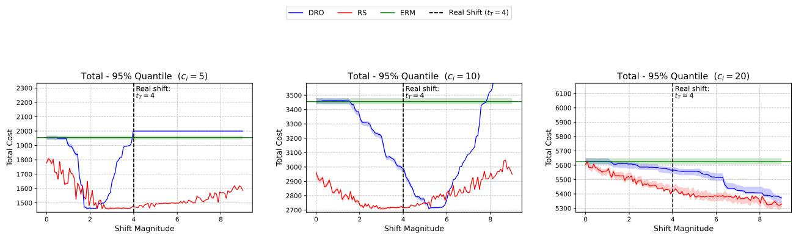  
Figure 8 95% quantile of total costs of diferent methods for the network lot-sizing problem across diferent shift magnitude specifications $( t _ { T } = 4$ corresponds to the truth). The shift direction is known and used to calibrate DRO and RS hyperparameters, while the shift magnitude is unknown and specified along the horizontal axis. We consider three diferent levels of per-unit initial-ordering cost $c _ { i } \in \{ 5 , 1 0 , 2 0 \}$

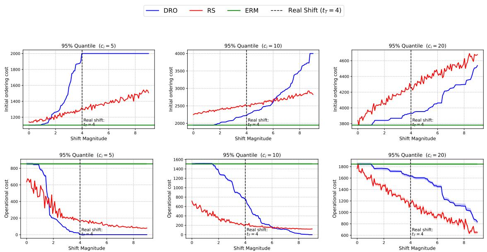  
Figure 9 95% quantile cost decomposition for the network lot-sizing application. The top panel reports initialordering costs, and the bottom panel reports operational costs (transshipment costs plus emergencyorder costs).

## C.4. Dominance of Emergency Order Costs over Transportation Costs

In Section 6.1, for a given initial allocation ˆx and a realized random demand ¯z, we decompose the total cost $f ( \hat { x } , \bar { z } )$ into the initial-ordering cost $c ^ { T } { \hat { x } }$ and the operational cost, which corresponds to the optimal value of the following second-stage problem:

$$
\operatorname* { m i n } _ { ( y , w ) \in \mathcal { V } _ { ( \hat { x } , \bar { z } ) } } \bigg \{ \sum _ { i \in [ N ] } d _ { i } ^ { T } y _ { i } + l ^ { T } w \bigg \} .
$$

Now let $( \bar { y } , \bar { w } )$ denote the optimal solution to this problem. We can further decompose the operational cost into two parts: the transportation cost $\sum _ { i \in [ N ] } d _ { i } ^ { T } \bar { y } _ { i }$ , and the emergency-order cost $l ^ { T } \bar { w }$ . Hence, the total cost

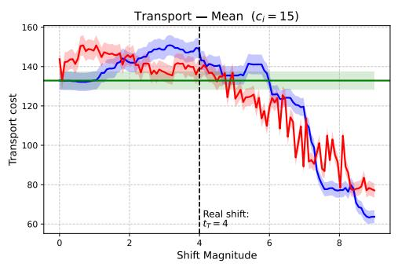

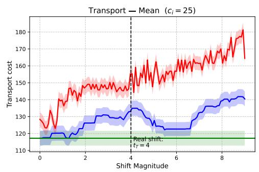

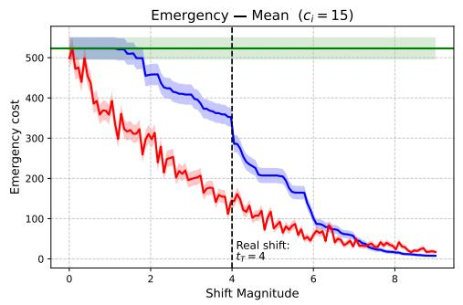

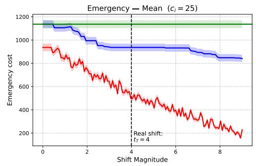  
Figure 10 Mean operational-cost decomposition for the network lot-sizing application. The top panel reports transportation costs, and the bottom panel reports emergency-order costs, under two larger levels of per-unit initial-ordering cost $c _ { i } \in \{ 1 5 , 2 5 \}$ . Together, they further decompose the operational costs.

can be expressed as

$$
f ( \hat { x } , \bar { z } ) = c ^ { T } \hat { x } + \sum _ { i \in [ N ] } d _ { i } ^ { T } \bar { y } _ { i } + l ^ { T } \bar { w } .
$$

Using the cases $c _ { i } = 1 5$ and $c _ { i } = 2 5$ as illustrative examples, we observe the following patterns. First, in these supplementary lot-sizing instances, RS achieves a stronger reduction in emergency-order costs than DRO, indicating better control of this high-cost corrective component. Second, an interesting observation arises when comparing the scales of the two cost components: transportation costs are substantially smaller and thus play a relatively minor role. In fact, variations in emergency-order costs almost entirely account for the overall changes in operational costs, especially when c is large. This phenomenon can be explained by the difering scaling behaviors of the two components. The transportation cost reflects local redistribution and scales with spatial variability, whereas the emergency-order cost scales with the aggregate demand surplus relative to the planned supply. Consequently, under the mean-increasing shift scenario, the emergency-order cost begins dominant and shows significant changes, while the transportation cost remains comparatively small.

## C.5. Replicated Experiments

We further conduct a replicated experiment under the same network lot-sizing setup, but with the true shift magnitude changed to $t _ { T } = 3 .$ . The results reported below show that the main qualitative observations remain broadly consistent.

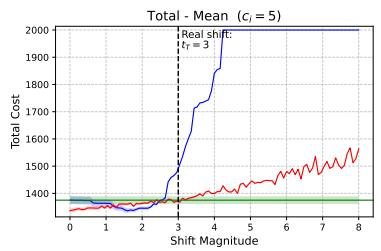

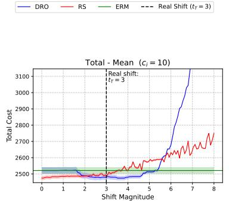  
(a) Mean of total costs across shift magnitude t

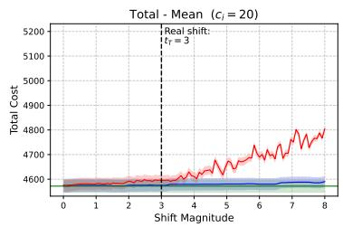

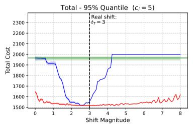

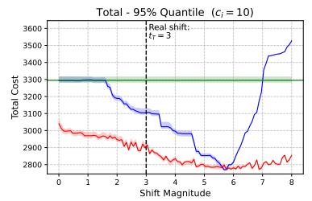

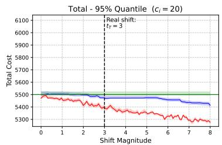  
(b) 95% quantile of total costs across shift magnitude t

Figure 11 Mean and 95% quantile of total costs for the replicated network lot-sizing experiment with true shift magnitude $t _ { T } = 3 .$ . The top panel reports mean total costs, and the bottom panel reports the 95% quantile of total costs, across diferent shift magnitude specifications. The shift direction is known and used to calibrate DRO and RS hyperparameters, while the shift magnitude is unknown and specified along the horizontal axis. We consider three diferent levels of per-unit initial-ordering cost $c _ { i } \in \{ 5 , 1 0 , 2 0 \}$

## Appendix D: Verification of Assumptions for Common Losses

This section gives simple suficient conditions under which Assumptions 1 and 2 hold for several common losses. The goal is not to provide the weakest possible conditions, but rather to show that the assumptions are standard and can be verified for some common loss functions. Throughout this section, we assume that the feasible set $\mathcal { X }$ is compact. When Assumption 1 requires a bounded instance space, we also assume that the instance space $\mathcal { Z }$ is compact, or equivalently that the distribution is supported on a compact subset of the original sample space. For unbounded parametric families such as Gaussian demands, this can be interpreted as working with a truncated Gaussian approximation on a suficiently large compact set. This convention guarantees boundedness of continuous losses; hence the main points to verify are the Lipschitz conditions and the second-order growth condition.

Newsvendor loss. Consider the d-product newsvendor loss

$$
f ( x , z ) = \sum _ { j = 1 } ^ { d } h _ { j } ( x _ { j } - z _ { j } ) _ { + } + b _ { j } ( z _ { j } - x _ { j } ) _ { + } ,
$$

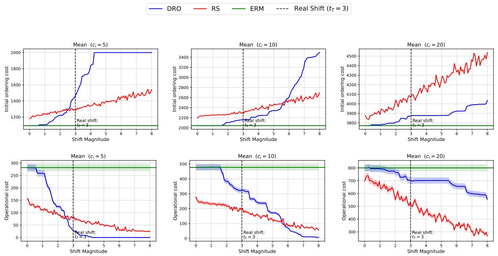  
Figure 12 Mean cost decomposition for the network lot-sizing application. The top panel reports initial-ordering costs, and the bottom panel reports operational recourse costs (transshipment costs plus emergency order costs).

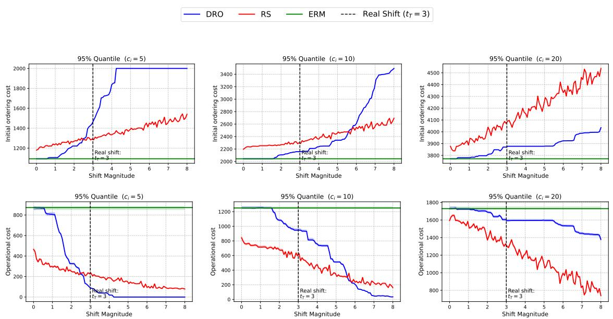  
Figure 13 95% quantile cost decomposition for the network lot-sizing application. The top panel reports initialordering costs, and the bottom panel reports operational costs (transshipment costs plus emergencyorder costs).

where $h _ { j } , b _ { j } > 0$ . This loss is continuous in $( x , z )$ . If X and $\mathcal { Z }$ are compact, then $f$ is uniformly bounded, so Assumption 1(b) holds. Moreover, for any fixed $x _ { i }$

$$
| f ( x , z ) - f ( x , z ^ { \prime } ) | \leq \sum _ { j = 1 } ^ { d } \operatorname* { m a x } \{ h _ { j } , b _ { j } \} | z _ { j } - z _ { j } ^ { \prime } | \leq L _ { z } \| z - z ^ { \prime } \| _ { 2 } ,
$$

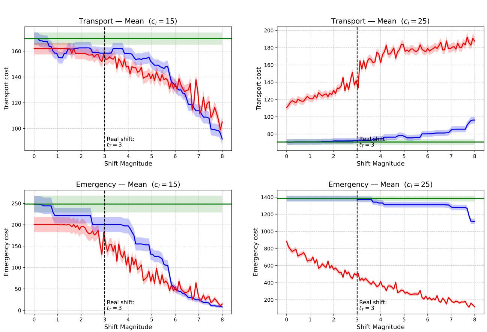  
Figure 14 Mean operational-cost decomposition for the network lot-sizing application. The top panel reports transportation costs, and the bottom panel reports emergency-order costs, under two larger levels of per-unit initial-ordering cost $c _ { i } \in \{ 1 5 , 2 5 \}$ . Together, they further decompose the operational costs.

where $\begin{array} { r } { L _ { z } = ( \sum _ { j = 1 } ^ { d } \operatorname* { m a x } \{ h _ { j } , b _ { j } \} ^ { 2 } ) ^ { 1 / 2 } } \end{array}$ . Hence Assumption 1(c) holds. Similarly, for any fixed $z ,$

$$
| f ( x , z ) - f ( x ^ { \prime } , z ) | \leq \sum _ { j = 1 } ^ { d } \operatorname* { m a x } \{ h _ { j } , b _ { j } \} | x _ { j } - x _ { j } ^ { \prime } | \leq L _ { x } \| x - x ^ { \prime } \| _ { 2 } ,
$$

with the same choice $\begin{array} { r } { L _ { x } = ( \sum _ { j = 1 } ^ { d } \operatorname* { m a x } \{ h _ { j } , b _ { j } \} ^ { 2 } ) ^ { 1 / 2 } } \end{array}$ . Thus the parameter-Lipschitz condition in Assumption $2 ( \mathrm { a } )$ holds.

For the second-order growth condition. For $\mathcal { E } ( x ) = \mathbb { E } _ { P _ { S } } [ f ( x , z ) ]$ . Suppose the marginal distribution of $Z _ { j }$ under $P _ { S }$ has density $p _ { j }$ , and there exists $m _ { j } > 0$ such that

$$
p _ { j } ( t ) \ge m _ { j }
$$

for all t in the projection of X onto coordinate j. Then, wherever the derivative exists,

$$
\frac { \partial ^ { 2 } \mathcal { E } ( x ) } { \partial x _ { j } ^ { 2 } } = ( h _ { j } + b _ { j } ) p _ { j } ( x _ { j } ) .
$$

Hence

$$
\nabla ^ { 2 } { \mathcal { E } } ( x ) \succeq \alpha I , \qquad \alpha : = \operatorname* { m i n } _ { 1 \leq j \leq d } ( h _ { j } + b _ { j } ) m _ { j } > 0 .
$$

Therefore E is strongly convex on $x ,$ and its restriction to any convex feasible set, such as the capacity set

$$
\mathcal { X } = \{ x \in \mathbb { R } _ { + } ^ { d } : \mathbf { 1 } ^ { \top } x \leq C \} ,
$$

satisfies

$$
\mathcal { E } ( x ) \geq \mathcal { E } ( x _ { S } ) + \frac { \alpha } { 2 } \| x - x _ { S } \| _ { 2 } ^ { 2 } , \qquad \forall x \in \mathcal { X } .
$$

This verifies Assumption $2 ( \mathrm { b } )$ . In particular, for the Gaussian mean-shift newsvendor model used in the numerical study, the Gaussian density is strictly positive on every compact interval, so the above density lower bound holds on the bounded feasible region.

Logistic loss. Consider binary logistic loss

$$
f ( x ; ( a , y ) ) = \log ( 1 + \exp ( - y a ^ { \top } x ) ) , \qquad y \in \{ - 1 , 1 \} .
$$

Assume $\mathcal { X }$ is compact and the covariates are bounded, $\| a \| _ { 2 } \le B$ . Then $f$ is continuous and uniformly bounded on the compact set $\mathcal { X } \times \mathcal { Z }$ . Moreover,

$$
\begin{array} { r } { \| \nabla _ { \boldsymbol { x } } f ( \boldsymbol { x } ; ( a , y ) ) \| _ { 2 } \leq \| a \| _ { 2 } \leq B , } \end{array}
$$

so the parameter-Lipschitz condition holds with $L ^ { \prime } = B$ . The loss is also Lipschitz in the instance variable under any metric that combines the Euclidean distance between covariates and the discrete distance between labels; boundedness of X gives a uniform Lipschitz constant.

For the second-order growth condition, suppose the source design is nondegenerate:

$$
\mathbb { E } _ { P _ { S } } [ a a ^ { \top } ] \succeq \lambda I
$$

for some $\lambda > 0$ . Since X and the covariates are bounded, there exists $c > 0$ such that

$$
\sigma ( a ^ { \top } x ) ( 1 - \sigma ( a ^ { \top } x ) ) \geq c , \qquad \forall x \in \mathcal { X } ,
$$

where $\sigma ( t ) = ( 1 + \exp ( - t ) ) ^ { - 1 }$ . Therefore

$$
\nabla ^ { 2 } \mathcal { E } ( x ) = \mathbb { E } _ { P _ { S } } \left[ \sigma ( a ^ { \top } x ) ( 1 - \sigma ( a ^ { \top } x ) ) a a ^ { \top } \right] \succeq c \lambda I .
$$

Thus the source risk satisfies the second-order growth condition on $\mathcal { X } .$ . The condition can fail without such nondegeneracy, for example if the covariates are rank deficient.

Huber loss. Consider the Huber regression loss

$$
\begin{array} { r } { f ( x ; ( a , y ) ) = \rho _ { \delta } ( y - a ^ { \top } x ) , } \end{array}
$$

where $\rho _ { \delta }$ is the Huber loss with threshold $\delta > 0$ . Assume $\mathcal { X }$ is compact and the instance space is bounded, $\mathrm { e . g . } , \Vert a \Vert _ { 2 } \leq B$ and $| y | \le Y$ . Then $f$ is continuous and uniformly bounded. Since $| \rho _ { \delta } ^ { \prime } ( r ) | \leq \delta$ , we have

$$
\begin{array} { r } { \| \nabla _ { x } f ( x ; ( a , y ) ) \| _ { 2 } = | \rho _ { \delta } ^ { \prime } ( y - a ^ { \top } x ) | \| a \| _ { 2 } \leq \delta B , } \end{array}
$$

so the parameter-Lipschitz condition holds. The same boundedness also implies Lipschitz continuity in the instance variable $( a , y )$ , uniformly over $x \in \mathcal { X }$

For the second-order growth condition, it is suficient to assume that the source distribution has enough mass in the quadratic region of the Huber loss and that the corresponding weighted design is nondegenerate. For example, suppose there exists $\kappa > 0$ such that

$$
\mathbb { E } _ { P _ { S } } \big [ \mathbf { 1 } \{ | Y - a ^ { \top } x | \le \delta \} a a ^ { \top } \big ] \succeq \kappa I , \qquad \forall x \in \mathcal { X } .
$$

Then the source risk has curvature at least κ on $\mathcal { X } .$ , and hence satisfies

$$
\mathcal { E } ( x ) \geq \mathcal { E } ( x _ { S } ) + \frac { \kappa } { 2 } \| x - x _ { S } \| _ { 2 } ^ { 2 } , \qquad \forall x \in \mathcal { X } .
$$

Thus Assumption 2(b) holds. Intuitively, this condition rules out flat directions and the degenerate case where almost all residuals lie in the linear tail of the Huber loss.

## Appendix E: Proofs of Main Results

## E.1. Proof of Proposition 1

Proof. Let

$$
\mathcal A : = \{ z \mapsto f ( x , z ) : x \in \mathcal X \} .
$$

Recall that

$$
J _ { S } : = \operatorname* { i n f } _ { x \in \mathcal { X } } E _ { P _ { S } } [ f ( x , z ) ] , \qquad J _ { T } : = \operatorname* { i n f } _ { x \in \mathcal { X } } E _ { P _ { T } } [ f ( x , z ) ] .
$$

Let

$$
x _ { S } \in \arg \operatorname* { m i n } _ { x \in \mathcal { X } } E _ { P _ { S } } [ f ( x , z ) ] .
$$

By the Lipschitz continuity of $z \mapsto f ( x , z )$ uniformly over $x \in \mathcal { X }$ , together with the Kantorovich–Rubinstein duality 7, for any $x \in \mathcal { X }$ we have

$$
| E _ { P _ { T } } [ f ( x , z ) ] - E _ { P _ { S } } [ f ( x , z ) ] | \leq L d _ { W } ( P _ { S } , P _ { T } ) .
$$

Applying this inequality to $x = \hat { x } _ { \mathrm { E R M } }$ gives

$$
E _ { P _ { T } } [ f ( \hat { x } _ { \mathrm { E R M } } , z ) ] \leq E _ { P _ { S } } [ f ( \hat { x } _ { \mathrm { E R M } } , z ) ] + L d _ { W } ( P _ { S } , P _ { T } ) .\tag{16}
$$

We now control the source risk of $\hat { x } _ { \mathrm { E R M } }$ . Adding and subtracting empirical risks gives

$$
\begin{array} { r l } { E _ { P s } [ f ( \hat { x } _ { \mathrm { E R M } } , z ) ] = \big [ E _ { P s } f ( \hat { x } _ { \mathrm { E R M } } , z ) - E _ { \hat { P } _ { n } } f ( \hat { x } _ { \mathrm { E R M } } , z ) \big ] } & { } \\ { + \left[ E _ { \hat { P } _ { n } } f ( \hat { x } _ { \mathrm { E R M } } , z ) - E _ { \hat { P } _ { n } } f ( x _ { S } , z ) \right] } & { } \\ { + \left[ E _ { \hat { P } _ { n } } f ( x _ { S } , z ) - E _ { P s } f ( x _ { S } , z ) \right] + E _ { P s } f ( x _ { S } , z ) . } \end{array}
$$

The middle term is nonpositive by the optimality of $\hat { x } _ { \mathrm { E R M } }$ . Therefore,

$$
\begin{array} { r } { { E } _ { P _ { S } } [ f ( \hat { x } _ { \mathrm { E R M } } , z ) ] \leq { J } _ { S } + { G } _ { n } + \left[ { E } _ { \hat { P } _ { n } } f ( x _ { S } , z ) - { E } _ { P _ { S } } f ( x _ { S } , z ) \right] , } \end{array}\tag{17}
$$

where

$$
G _ { n } : = \operatorname* { s u p } _ { x \in \mathcal { X } } \left\{ E _ { P _ { S } } f ( x , z ) - E _ { \hat { P } _ { n } } f ( x , z ) \right\} .
$$

By symmetrization and bounded-diference concentration, with probability at least $1 - \delta / 2$

$$
G _ { n } \leq 2 \Re _ { n } ( A ) + M \sqrt { \frac { \log ( 2 / \delta ) } { 2 n } } .\tag{18}
$$

For the fixed function $x _ { S } .$ , Hoefding’s inequality gives, with probability at least $1 - \delta / 2$

$$
E _ { \hat { P } _ { n } } f ( x _ { S } , z ) - E _ { P _ { S } } f ( x _ { S } , z ) \leq M \sqrt { \frac { \log ( 2 / \delta ) } { 2 n } } .\tag{19}
$$

Combining (17)–(19) by a union bound, with probability at least $1 - \delta$

$$
E _ { P _ { S } } [ f ( \hat { x } _ { \mathrm { E R M } } , z ) ] \leq J _ { S } + 2 \Re _ { n } ( A ) + 2 M \sqrt { \frac { \log ( 2 / \delta ) } { 2 n } } .
$$

By Dudley’s entropy integral bound,

$$
\mathfrak { R } _ { n } ( \mathcal { A } ) \leq \frac { 1 2 } { \sqrt { n } } \mathcal { C } ( \mathcal { A } ) ,
$$

where

$$
\mathcal { C } ( A ) : = \int _ { 0 } ^ { \infty } \sqrt { \log \mathcal { N } ( A , \| \cdot \| _ { \infty } , u ) } d u .
$$

Thus, with probability at least $1 - \delta .$

$$
E _ { P _ { S } } [ f ( \hat { x } _ { \mathrm { E R M } } , z ) ] \leq J _ { S } + \frac { 2 4 } { \sqrt { n } } \mathcal { C } ( A ) + 2 M \sqrt { \frac { \log ( 2 / \delta ) } { 2 n } } .
$$

Substituting this inequality into (16) and subtracting $J _ { T }$ from both sides yields

$$
\mathcal { R } _ { P _ { T } } ( \hat { x } _ { \mathrm { E R M } } ) \leq J _ { S } - J _ { T } + L d _ { W } ( P _ { S } , P _ { T } ) + \frac { 2 4 } { \sqrt { n } } \mathcal { C } ( A ) + 2 M \sqrt { \frac { \log ( 2 / \delta ) } { 2 n } } .
$$

This completes the proof.

Proposition 7 (Kantorovich and Rubinshtein (1958)). For any distributions $\mathbb { Q } _ { 1 } , \mathbb { Q } _ { 2 } \in \mathcal { M } ( \Xi )$ , we have

$$
d _ { \mathrm { W } } \left( \mathbb { Q } _ { 1 } , \mathbb { Q } _ { 2 } \right) = \operatorname* { s u p } _ { f \in \mathcal { L } } \Big \{ \int _ { \Xi } f ( \boldsymbol { \xi } ) \mathbb { Q } _ { 1 } ( \mathrm { d } \boldsymbol { \xi } ) - \int _ { \Xi } f ( \boldsymbol { \xi } ) \mathbb { Q } _ { 2 } ( \mathrm { d } \boldsymbol { \xi } ) \Big \} ,\tag{20}
$$

where $\mathcal { L }$ denotes the space of all Lipschitz functions with $| f ( \xi ) - f ( \xi ^ { \prime } ) | \le \| \xi - \xi ^ { \prime } \|$ for all $\xi , \xi ^ { \prime } \in \Xi$

## E.2. Proof of Proposition 2

Proof. Consider the $\ell _ { 1 }$ loss

$$
f ( x , z ) = | 1 - z x | , \qquad \chi = [ 0 , 1 ] ,
$$

and the source distribution $P _ { S } = \delta _ { 1 }$ . Since all source samples equal 1, we have $\hat { P } _ { n } = \delta _ { 1 }$ almost surely. The loss is Lipschitz in $z ,$ uniformly over $x \in [ 0 , 1 ]$ , with Lipschitz constant $L = 1$

The ERM solution is

$$
{ \hat { x } } _ { \mathrm { E R M } } \in \arg \operatorname* { m i n } _ { x \in [ 0 , 1 ] } E _ { { \hat { P } } _ { n } } | 1 - Z x | = \arg \operatorname* { m i n } _ { x \in [ 0 , 1 ] } | 1 - x | = \{ 1 \} .
$$

Thus $\hat { x } _ { \mathrm { E R M } } = 1$ . Moreover,

$$
J _ { S } = \operatorname* { i n f } _ { x \in [ 0 , 1 ] } E _ { P _ { S } } | 1 - Z x | = \operatorname* { i n f } _ { x \in [ 0 , 1 ] } | 1 - x | = 0 .
$$

For any target distribution $P _ { T }$ , the target loss of ERM is

$$
E _ { P _ { T } } \big [ | 1 - Z \hat { x } _ { \mathrm { E R M } } | \big ] = E _ { P _ { T } } [ | 1 - Z | ] .
$$

Since $P _ { S } = \delta _ { 1 }$ , every coupling between $P _ { T }$ and $P _ { S }$ must couple $Z \sim P _ { T }$ with the constant random variable 1. Therefore,

$$
d _ { W } ( P _ { T } , P _ { S } ) = d _ { W } ( P _ { T } , \delta _ { 1 } ) = \int | z - 1 | d P _ { T } ( z ) = { \cal E } _ { P _ { T } } [ | Z - 1 | ] .
$$

Hence

$$
E _ { P _ { T } } \big [ | 1 - Z \hat { x } _ { \mathrm { E R M } } | \big ] = d _ { W } ( P _ { T } , P _ { S } ) .
$$

Finally, by definition,

$$
J _ { T } = \operatorname* { i n f } _ { x \in [ 0 , 1 ] } E _ { P _ { T } } | 1 - Z x | ,
$$

and therefore

$$
\mathcal { R } _ { P _ { T } } ( \hat { x } _ { \mathrm { E R M } } ) = E _ { P _ { T } } \left[ | 1 - Z \hat { x } _ { \mathrm { E R M } } | \right] - J _ { T } = d _ { W } ( P _ { T } , P _ { S } ) - J _ { T } .
$$

Since $L = 1$ and $J _ { S } = 0$ , this can be written as

$$
\mathcal { R } _ { P _ { T } } ( \hat { x } _ { \mathrm { E R M } } ) = J _ { S } - J _ { T } + L d _ { W } ( P _ { S } , P _ { T } ) .
$$

This proves the claim.

## E.3. Proof of Theorem 1

Proof. Fix $r \geq 0$ and recall that

$$
\mathcal { B } ( Q , r ) : = \{ P \in \mathcal { P } ( \mathcal { Z } ) : d _ { W } ( P , Q ) \leq r \} .
$$

Let

$$
{ \hat { x } } _ { \mathrm { D R O } } \in \arg \operatorname* { m i n } _ { x \in \mathcal { X } } \operatorname* { s u p } _ { P \in \mathcal { B } ( { \hat { P } } _ { n } , r ) } E _ { P } [ f ( x , z ) ] ,
$$

and let

$$
x _ { S } \in \arg \operatorname* { m i n } _ { x \in \mathcal { X } } E _ { P _ { S } } [ f ( x , z ) ] , \qquad x _ { T } \in \arg \operatorname* { m i n } _ { x \in \mathcal { X } } E _ { P _ { T } } [ f ( x , z ) ] .
$$

For any $Q \in { \mathcal { P } } ( { \mathcal { Z } } )$ , define

$$
R _ { r } ( Q , x ) : = \operatorname* { s u p } _ { P \in { \mathcal { B } } ( Q , r ) } E _ { P } [ f ( x , z ) ] .
$$

Define the finite-sample discrepancy

$$
\begin{array} { r } { \tilde { \Delta } ( x ) : = \left| R _ { r } ( \hat { P } _ { n } , x ) - R _ { r } ( P _ { S } , x ) \right| . } \end{array}
$$

By adding and subtracting the empirical robust risk and using the optimality of $\scriptstyle { \hat { x } } _ { \mathrm { D R O } }$ , we have

$$
\begin{array} { r l } & { R _ { r } ( P _ { S } , \hat { x } _ { \mathrm { D R O } } ) - R _ { r } ( P _ { S } , x _ { S } ) } \\ & { = \Big [ R _ { r } ( P _ { S } , \hat { x } _ { \mathrm { D R O } } ) - R _ { r } ( \hat { P } _ { n } , \hat { x } _ { \mathrm { D R O } } ) \Big ] + \Big [ R _ { r } ( \hat { P } _ { n } , \hat { x } _ { \mathrm { D R O } } ) - R _ { r } ( \hat { P } _ { n } , x _ { S } ) \Big ] } \\ & { \quad + \Big [ R _ { r } ( \hat { P } _ { n } , x _ { S } ) - R _ { r } ( P _ { S } , x _ { S } ) \Big ] } \\ & { \le \underset { x \in \mathcal { X } } { \operatorname* { s u p } } \tilde { \Delta } ( x ) + \tilde { \Delta } ( x _ { S } ) , } \end{array}
$$

because the middle term is nonpositive.

Next, decompose the target-environment excess loss:

$$
\begin{array} { r l } & { R _ { P _ { T } } ( \hat { x } _ { \mathrm { D R O } } ) = E _ { P _ { T } } [ f ( \hat { x } _ { \mathrm { D R O } } , z ) ] - E _ { P _ { T } } [ f ( x _ { T } , z ) ] } \\ & { \quad \quad \quad \quad \quad \quad \quad \quad = [ E _ { P _ { T } } [ f ( \hat { x } _ { \mathrm { D R O } } , z ) ] - R _ { r } ( P _ { S } , \hat { x } _ { \mathrm { D R O } } ) ] } \\ & { \quad \quad \quad \quad \quad + [ R _ { r } ( P _ { S } , \hat { x } _ { \mathrm { D R O } } ) - R _ { r } ( P _ { S } , x _ { S } ) ] } \\ & { \quad \quad \quad \quad \quad + [ R _ { r } ( P _ { S } , x _ { S } ) - E _ { P _ { S } } [ f ( x _ { S } , z ) ] ] } \\ & { \quad \quad \quad \quad \quad + [ E _ { P _ { S } } [ f ( x _ { S } , z ) ] - E _ { P _ { T } } [ f ( x _ { T } , z ) ] ] . } \end{array}\tag{21}
$$

The last term is $J _ { S } - J _ { T }$ , and the third term is

$$
\Lambda _ { r } ( P _ { S } , x _ { S } ) : = R _ { r } ( P _ { S } , x _ { S } ) - E _ { P _ { S } } [ f ( x _ { S } , z ) ] .
$$

For the first term in (21), for any $P \in B ( P _ { S } , r )$

$$
\begin{array} { r } { R _ { r } ( P _ { S } , \hat { x } _ { \mathrm { D R O } } ) \geq E _ { P } [ f ( \hat { x } _ { \mathrm { D R O } } , z ) ] . } \end{array}
$$

Therefore, by the Lipschitz continuity of $z \mapsto f ( x , z )$ uniformly over $x \in \mathcal { X }$

$$
\begin{array} { r } { E _ { P r } [ f ( \hat { x } _ { \mathrm { D R O } } , z ) ] - R _ { r } ( P _ { S } , \hat { x } _ { \mathrm { D R O } } ) \leq E _ { P r } [ f ( \hat { x } _ { \mathrm { D R O } } , z ) ] - E _ { P } [ f ( \hat { x } _ { \mathrm { D R O } } , z ) ] \leq L d _ { W } ( P _ { T } , P ) . } \end{array}
$$

Taking the infimum over $P \in B ( P _ { S } , r )$ gives

$$
E _ { P _ { T } } [ f ( \hat { x } _ { \mathrm { D R O } } , z ) ] - R _ { r } ( P _ { S } , \hat { x } _ { \mathrm { D R O } } ) \leq L \operatorname* { i n f } _ { { P \in \mathcal { B } ( P _ { S } , r ) } } d _ { W } ( P _ { T } , P ) .
$$

Combining the above inequalities yields

$$
\begin{array} { l } { { \displaystyle R _ { P _ { T } } ( \hat { x } _ { \mathrm { D R O } } ) \leq J _ { S } - J _ { T } + L \operatorname* { i n f } _ { P \in \mathcal { B } ( P _ { S } , r ) } d _ { W } ( P _ { T } , P ) + \Lambda _ { r } ( P _ { S } , x _ { S } ) } } \\ { { \displaystyle \qquad + \operatorname* { s u p } _ { x \in \mathcal { X } } \tilde { \Delta } ( x ) + \tilde { \Delta } ( x _ { S } ) . } } \end{array}\tag{22}
$$

It remains to control the two finite-sample terms. For $x \in \mathcal { X }$ and $0 \le k \le L$ , define

$$
\phi _ { x , k } ( z ) : = \operatorname* { s u p } _ { z ^ { \prime } \in { \mathcal Z } } \left\{ f ( x , z ^ { \prime } ) - k \| z - z ^ { \prime } \| \right\} ,
$$

and define the envelope class

$$
\Phi : = \{ \phi _ { x , k } : x \in \mathcal { X } , 0 \leq k \leq L \} .
$$

By the Kantorovich dual formulation of the Wasserstein robust risk,

$$
R _ { r } ( Q , f ) = \operatorname * { i n f } _ { k \geq 0 } \left\{ k r + E _ { Q } [ \phi _ { x , k } ( z ) ] \right\} .
$$

Since $z \mapsto f ( x , z )$ is L-Lipschitz, the infimum over $k \geq 0$ can be restricted to $0 \le k \le L$ . Indeed, for any $k \geq L$

$$
f ( x , z ^ { \prime } ) - k \| z - z ^ { \prime } \| \leq f ( x , z ) + ( L - k ) \| z - z ^ { \prime } \| \leq f ( x , z ) ,
$$

and equality is attained at $z ^ { \prime } = z$ . Hence $\phi _ { x , k } ( z ) = f ( x , z )$ for all $k \geq L .$ , so values $k > L$ cannot improve the dual objective.

Thus, for every $x \in { \mathcal { X } } .$

$$
\tilde { \Delta } ( x ) \leq \operatorname* { s u p } _ { 0 \leq k \leq L } \left| ( E _ { P _ { S } } - E _ { \hat { P } _ { n } } ) \phi _ { x , k } \right| .
$$

Consequently,

$$
\operatorname* { s u p } _ { x \in \mathcal { X } } \tilde { \Delta } ( x ) \leq Z _ { n } ^ { \mathrm { u n i f } } ,
$$

where

$$
Z _ { n } ^ { \mathrm { u n i f } } : = \operatorname* { s u p } _ { \substack { x \in \mathcal { X } , \ 0 \leq k \leq L } } \left| ( E _ { P _ { S } } - E _ { \hat { P } _ { n } } ) \phi _ { x , k } \right| .
$$

Since $0 \leq \phi _ { x , k } \leq M$ , symmetrization and bounded-diference concentration give, with probability at least $1 - \delta / 2$

$$
Z _ { n } ^ { \mathrm { u n i f } } \leq 2 \mathcal { R } _ { n } ( \Phi ) + M \sqrt { \frac { \log ( 4 / \delta ) } { 2 n } } .
$$

By the envelope-class Rademacher complexity bound,

$$
\mathcal { R } _ { n } ( \Phi ) \leq \frac { 2 4 } { \sqrt { n } } \mathcal { C } ( A ) + \frac { 2 4 L \mathrm { d i a m } ( \mathcal { Z } ) } { \sqrt { n } } .
$$

Therefore, with probability at least $1 - \delta / 2$

$$
\operatorname* { s u p } _ { x \in \mathcal { X } } \tilde { \Delta } ( x ) \leq \frac { 4 8 } { \sqrt { n } } \mathcal { C } ( A ) + \frac { 4 8 L \dim ( \mathcal { Z } ) } { \sqrt { n } } + M \sqrt { \frac { \log ( 4 / \delta ) } { 2 n } } .\tag{23}
$$

We now control the fixed term $\tilde { \Delta } ( x _ { S } )$ . Define

$$
\Phi _ { x _ { S } } : = \{ \phi _ { x _ { S } , k } : 0 \leq k \leq L \} .
$$

For any $k , k ^ { \prime } \in [ 0 , L ]$ and $z \in { \mathcal { Z } }$

$$
| \phi _ { x _ { S } , k } ( z ) - \phi _ { x _ { S } , k ^ { \prime } } ( z ) | \leq \mathrm { d i a m } ( \mathcal { Z } ) | k - k ^ { \prime } | .
$$

Also, since $0 \leq f \leq M$ , we have $0 \leq \phi _ { x _ { S } , k } \leq M$ . Hence $\Phi _ { x _ { S } }$ is a one-dimensional class indexed by $k \in [ 0 , L ]$ Dudley’s entropy integral gives

$$
\mathcal { R } _ { n } ( \Phi _ { x _ { S } } ) \leq \frac { 1 2 L \mathrm { d i a m } ( \mathcal { Z } ) } { \sqrt { n } } .
$$

Again by symmetrization and bounded-diference concentration, with probability at least $1 - \delta / 2$

$$
\tilde { \Delta } ( x _ { S } ) \leq \frac { 2 4 L \operatorname { d i a m } ( \mathcal { Z } ) } { \sqrt { n } } + M \sqrt { \frac { \log ( 4 / \delta ) } { 2 n } } .\tag{24}
$$

Combining (23) and (24) by a union bound, with probability at least $1 - \delta ,$

$$
\operatorname* { s u p } _ { x \in \mathcal { X } } \tilde { \Delta } ( x ) + \tilde { \Delta } ( x _ { s } ) \leq \frac { 4 8 } { \sqrt { n } } \mathcal { C } ( A ) + \frac { 7 2 L \mathrm { d i a m } ( \mathcal { Z } ) } { \sqrt { n } } + 2 M \sqrt { \frac { \log ( 4 / \delta ) } { 2 n } } .
$$

Substituting this bound into (22) gives

$$
\mathcal { R } _ { P _ { T } } ( \hat { x } _ { \mathrm { { D R O } } } ) \leq J _ { S } - J _ { T } + L \operatorname* { i n f } _ { P \in \mathrm { B } ( P _ { S } , r ) } d _ { W } ( P _ { T } , P ) + \Lambda _ { r } ( P _ { S } , x _ { S } ) + \frac { 4 8 } { \sqrt { n } } \mathcal { C } ( A ) + \frac { 7 2 L \dim ( \mathcal { Z } ) } { \sqrt { n } } + 2 M \sqrt { \frac { \log ( 4 / \delta ) } { 2 n } } .
$$

This completes the proof.

## E.4. Proof of Theorem 2

Proof. Recall that

$$
\tau _ { \epsilon } : = \operatorname* { i n f } _ { x \in \mathcal { X } } E _ { \hat { P } _ { n } } [ f ( x , z ) ] + \epsilon .
$$

Let $( \hat { x } _ { \mathrm { R S } } , k _ { \tau _ { \epsilon } } )$ be an optimal solution of the RS problem with reference value $\tau _ { \epsilon } . \mathrm { ~ B y ~ }$ feasibility of the RS solution, for all $P \in { \mathcal { P } } ( { \mathcal { Z } } )$ ，

$$
\begin{array} { r } { E _ { P } [ f ( \hat { x } _ { \mathrm { R S } } , z ) ] - \tau _ { \epsilon } \le k _ { \tau _ { \epsilon } } d _ { W } ( P , \hat { P } _ { n } ) . } \end{array}\tag{25}
$$

Moreover, by Lemma 1, we have

$$
0 \leq k _ { \tau _ { \epsilon } } \leq L .
$$

We first rewrite the feasibility condition in a dual form. Equation (25) implies

$$
\operatorname* { s u p } _ { P \in \mathcal { P } ( \mathcal { Z } ) } \Big \{ E _ { P } \big [ f \big ( \hat { x } _ { \mathrm { R S } } , z \big ) \big ] - k _ { \tau _ { \epsilon } } d _ { W } \big ( P , \hat { P } _ { n } \big ) \Big \} \leq \tau _ { \epsilon } .
$$

By the penalized Kantorovich dual representation, this is equivalent to

$$
E _ { \hat { P } _ { n } } \left[ \operatorname* { s u p } _ { y \in \mathcal { Z } } \{ f ( \hat { x } _ { \mathrm { R S } } , y ) - k _ { \tau _ { \epsilon } } \| z - y \| \} \right] \leq \tau _ { \epsilon } .\tag{26}
$$

For $x \in \mathcal { X }$ and $0 \le k \le L$ , define

$$
\phi _ { x , k } ( z ) : = \operatorname* { s u p } _ { y \in { \mathcal { Z } } } \left\{ f ( x , y ) - k \| z - y \| \right\} ,
$$

and define the one-sided uniform deviation

$$
Z _ { n } ^ { \mathrm { R S } } : = \operatorname * { s u p } _ { x \in \mathcal { X } , \ 0 \leq k \leq L } \left\{ E _ { P _ { S } } [ \phi _ { x , k } ( z ) ] - E _ { \hat { P } _ { n } } [ \phi _ { x , k } ( z ) ] \right\} .
$$

Since $\left( \widehat { x } _ { \mathrm { R S } } , k _ { \tau _ { \epsilon } } \right)$ belongs to this index set, (26) gives

$$
\begin{array} { r } { E _ { P _ { S } } [ \phi _ { \hat { x } _ { \mathrm { R S } } , k _ { \tau _ { \epsilon } } } ( z ) ] \leq \tau _ { \epsilon } + Z _ { n } ^ { \mathrm { R S } } . } \end{array}\tag{27}
$$

Applying the same penalized dual representation with nominal distribution $P _ { S }$ , for any $P \in { \mathcal { P } } ( { \mathcal { Z } } )$

$$
\begin{array} { r } { E _ { P } [ f ( \hat { x } _ { \mathrm { R S } } , z ) ] - k _ { \tau _ { \epsilon } } d _ { W } ( P , P _ { S } ) \leq E _ { P _ { S } } [ \phi _ { \hat { x } _ { \mathrm { R S } } , k _ { \tau _ { \epsilon } } } ( z ) ] . } \end{array}
$$

Combining this inequality with (27), we obtain, for all $P \in { \mathcal { P } } ( { \mathcal { Z } } )$ ,

$$
\begin{array} { r } { E _ { P } [ f ( \hat { x } _ { \mathrm { R S } } , z ) ] \leq \tau _ { \epsilon } + k _ { \tau _ { \epsilon } } d _ { W } ( P , P _ { S } ) + Z _ { n } ^ { \mathrm { R S } } . } \end{array}\tag{28}
$$

Taking $P = P _ { T }$ gives

$$
\begin{array} { r } { E _ { P _ { T } } [ f ( \hat { x } _ { \mathrm { R S } } , z ) ] \leq \tau _ { \epsilon } + k _ { \tau _ { \epsilon } } d _ { W } ( P _ { T } , P _ { S } ) + Z _ { n } ^ { \mathrm { R S } } . } \end{array}\tag{29}
$$

Next, we use the definition of $\tau _ { \epsilon }$ . Let

$$
x _ { S } \in \arg \operatorname* { m i n } _ { x \in \mathcal { X } } E _ { P _ { S } } [ f ( x , z ) ] .
$$

Since

$$
\tau _ { \epsilon } = \operatorname* { i n f } _ { x \in \mathcal X } E _ { \hat { P } _ { n } } [ f ( x , z ) ] + \epsilon ,
$$

we have

$$
\tau _ { \epsilon } \le E _ { \hat { P } _ { n } } [ f ( x _ { S } , z ) ] + \epsilon = J _ { S } + \left[ E _ { \hat { P } _ { n } } f ( x _ { S } , z ) - E _ { P _ { S } } f ( x _ { S } , z ) \right] + \epsilon .\tag{30}
$$

Substituting (30) into (29) and subtracting

$$
J _ { T } : = \operatorname* { i n f } _ { x \in \mathcal { X } } E _ { P _ { T } } [ f ( x , z ) ]
$$

from both sides yields

$$
\begin{array} { r l } & { R _ { P _ { T } } ( \hat { x } _ { \mathrm { R S } } ) = E _ { P _ { T } } [ f ( \hat { x } _ { \mathrm { R S } } , z ) ] - J _ { T } } \\ & { \qquad \leq J _ { S } - J _ { T } + k _ { \tau _ { \epsilon } } d _ { W } ( P _ { S } , P _ { T } ) + \epsilon } \\ & { \qquad + \left[ E _ { \hat { P } _ { n } } f ( x _ { S } , z ) - E _ { P _ { S } } f ( x _ { S } , z ) \right] + Z _ { n } ^ { \mathrm { R S } } . } \end{array}\tag{31}
$$

It remains to control the two finite-sample terms in (31). Since $0 \leq f \leq M$ , we have $0 \leq \phi _ { x , k } \leq M$ for all $x \in \mathcal { X }$ and $0 \le k \le L$ . By symmetrization and bounded-diference concentration, with probability at least $1 - \delta / 2$

$$
Z _ { n } ^ { \mathrm { R S } } \leq 2 \mathcal { R } _ { n } ( \Phi ) + M \sqrt { \frac { \log ( 2 / \delta ) } { 2 n } } ,\tag{32}
$$

where

$$
\Phi : = \{ \phi _ { x , k } : x \in \mathcal { X } , 0 \leq k \leq L \} .
$$

By the envelope-class Rademacher complexity bound,

$$
\mathcal { R } _ { n } ( \Phi ) \leq \frac { 2 4 } { \sqrt { n } } \mathcal { C } ( A ) + \frac { 2 4 L \mathrm { d i a m } ( \mathcal { Z } ) } { \sqrt { n } } .
$$

Therefore, with probability at least $1 - \delta / 2$

$$
Z _ { n } ^ { \mathrm { R S } } \leq \frac { 4 8 } { \sqrt { n } } \mathcal { C } ( A ) + \frac { 4 8 L \operatorname { d i a m } ( \mathcal { Z } ) } { \sqrt { n } } + M \sqrt { \frac { \log ( 2 / \delta ) } { 2 n } } .\tag{33}
$$

For the fixed function $x _ { S }$ , Hoefding’s inequality gives, with probability at least $1 - \delta / 2$

$$
E _ { \hat { P } _ { n } } f ( x _ { S } , z ) - E _ { P _ { S } } f ( x _ { S } , z ) \leq M \sqrt { \frac { \log ( 2 / \delta ) } { 2 n } } .\tag{34}
$$

Combining (33) and (34) by a union bound, and substituting them into (31), we obtain, with probability at least $1 - \delta .$

$$
\mathcal { R } _ { P _ { T } } ( \hat { x } _ { \mathrm { R S } } ) \leq J _ { S } - J _ { T } + k _ { \tau _ { c } } d _ { W } ( P _ { S } , P _ { T } ) + \epsilon + \frac { 4 8 } { \sqrt { n } } \mathcal { C } ( \mathcal { A } ) + \frac { 4 8 L \dim ( \mathcal { Z } ) } { \sqrt { n } } + 2 M \sqrt { \frac { \log ( 2 / \delta ) } { 2 n } } .
$$

This completes the proof.

## E.5. Proof of Proposition 3

Proof. Recall that in Scenario I the shift magnitude is known, so the DRO radius is chosen as

$$
r = d _ { W } ( P _ { S } , P _ { T } ) .
$$

Therefore $P _ { T } \in B ( P _ { S } , r )$ , and hence

$$
\mathrm { S e n } _ { \mathrm { D R O } } ( r ) = L \operatorname* { i n f } _ { P \in \mathcal { B } ( P _ { S } , r ) } d _ { W } ( P _ { T } , P ) = 0 .
$$

On the other hand,

$$
\mathrm { S e n } _ { \mathrm { R S } } ( \tau _ { r } ) = k _ { \tau _ { r } } d _ { W } ( P _ { S } , P _ { T } ) = k _ { \tau _ { r } } r .
$$

This proves the sensitivity comparison.

We now compare the regularization terms. For any $Q \in { \mathcal { P } } ( { \mathcal { Z } } ) , x \in { \mathcal { X } }$ , and $r \geq 0$ , define

$$
\Delta _ { r } ( Q , f ) : = \operatorname * { s u p } _ { P \in \mathcal { B } ( Q , r ) } E _ { P } [ f ( x , z ) ] - E _ { Q } [ f ( x , z ) ] .
$$

Then

$$
\mathrm { R e g _ { D R O } } ( r ) = \Delta _ { r } ( P _ { S } , x _ { S } ) .
$$

Moreover, under the calibration

$$
\tau _ { r } : = \operatorname* { s u p } _ { P \in \mathcal { B } ( \hat { P } _ { n } , r ) } E _ { P } [ f ( \hat { x } _ { \mathrm { E R M } } , z ) ] ,
$$

and since $\hat { x } _ { \mathrm { E R M } }$ minimizes the empirical risk,

$$
\mathrm { R e g } _ { \mathrm { R S } } ( \tau _ { r } ) = \tau _ { r } - E _ { \hat { P } _ { n } } [ f ( \hat { x } _ { \mathrm { E R M } } , z ) ] = \Delta _ { r } ( \hat { P } _ { n } , \hat { x } _ { \mathrm { E R M } } ) .
$$

Therefore it sufices to control

$$
\Big | \Delta _ { r } ( P _ { S } , x _ { S } ) - \Delta _ { r } ( \hat { P } _ { n } , \hat { x } _ { \mathrm { E R M } } ) \Big | .
$$

By the triangle inequality,

$$
\begin{array} { r l } & { \Big | \Delta _ { r } ( P _ { S } , x _ { S } ) - \Delta _ { r } ( \hat { P } _ { n } , \hat { x } _ { \mathrm { E R M } } ) \Big | } \\ & { \leq \Big | \Delta _ { r } ( P _ { S } , x _ { S } ) - \Delta _ { r } ( \hat { P } _ { n } , x _ { S } ) \Big | + \Big | \Delta _ { r } ( \hat { P } _ { n } , x _ { S } ) - \Delta _ { r } ( \hat { P } _ { n } , \hat { x } _ { \mathrm { E R M } } ) \Big | . } \end{array}\tag{35}
$$

We first control the first term in (35). Write

$$
R _ { r } ( Q , x ) : = \operatorname* { s u p } _ { P \in { \mathcal { B } } ( Q , r ) } E _ { P } [ f ( x , z ) ] .
$$

Then

$$
\Delta _ { r } ( Q , x ) = R _ { r } ( Q , x ) - E _ { Q } [ f ( x , z ) ] .
$$

Thus

$$
\begin{array} { r l } & { \Big | \Delta _ { r } ( P _ { S } , x _ { S } ) - \Delta _ { r } ( \hat { P } _ { n } , x _ { S } ) \Big | } \\ & { \leq \Big | R _ { r } ( P _ { S } , x _ { S } ) - R _ { r } ( \hat { P } _ { n } , x _ { S } ) \Big | + \big | ( E _ { P _ { S } } - E _ { \hat { P } _ { n } } ) f ( x _ { S } , z ) \big | . } \end{array}\tag{36}
$$

For the robust-risk discrepancy, define

$$
\phi _ { x _ { S } , k } ( z ) : = \operatorname* { s u p } _ { y \in { \mathcal Z } } \left\{ f ( x _ { S } , y ) - k \| z - y \| \right\} , \qquad 0 \leq k \leq L .
$$

By the Kantorovich dual formulation of the Wasserstein robust risk,

$$
\Big | R _ { r } ( P _ { S } , x _ { S } ) - R _ { r } ( \hat { P } _ { n } , x _ { S } ) \Big | \leq \operatorname* { s u p } _ { 0 \leq k \leq L } \big | ( E _ { P _ { S } } - E _ { \hat { P } _ { n } } ) \phi _ { x _ { S } , k } \big | .
$$

Since $0 \leq \phi _ { x _ { S } , k } \leq M$ and

$$
| \phi _ { x _ { S } , k } ( z ) - \phi _ { x _ { S } , k ^ { \prime } } ( z ) | \leq \mathrm { d i a m } ( \mathcal { Z } ) | k - k ^ { \prime } | ,
$$

the same one-dimensional entropy argument as in the proof of Theorem 1 gives, with probability at least $1 - \delta / 4$ ,

$$
\Big | R _ { r } ( P _ { S } , x _ { S } ) - R _ { r } ( \hat { P } _ { n } , x _ { S } ) \Big | \leq \frac { 2 4 L \operatorname { d i a m } ( \mathcal { Z } ) } { \sqrt { n } } + M \sqrt { \frac { \log ( 8 / \delta ) } { 2 n } } .
$$

Also, by Hoefding’s inequality, with probability at least $1 - \delta / 4 .$

$$
\big | ( E _ { P _ { S } } - E _ { \hat { P } _ { n } } ) f ( x _ { S } , z ) \big | \leq M \sqrt { \frac { \log ( 8 / \delta ) } { 2 n } } .
$$

Combining the last two displays, with probability at least $1 - \delta / 2$

$$
\left| \Delta _ { r } ( P _ { S } , x _ { S } ) - \Delta _ { r } ( \hat { P } _ { n } , x _ { S } ) \right| \leq \frac { 2 4 L \operatorname { d i a m } ( \mathcal { Z } ) } { \sqrt { n } } + 2 M \sqrt { \frac { \log ( 8 / \delta ) } { 2 n } } .\tag{37}
$$

We next control the second term in (35). By the parameter-Lipschitz condition,

$$
\Big | R _ { r } \big ( \hat { P } _ { n } , x _ { S } \big ) - R _ { r } \big ( \hat { P } _ { n } , \hat { x } _ { \mathrm { E R M } } \big ) \Big | \leq L ^ { \prime } \big \| x _ { S } - \hat { x } _ { \mathrm { E R M } } \big \| \ b _ { x } ,
$$

and

$$
\big | E _ { \hat { P } _ { n } } f ( x _ { S } , z ) - E _ { \hat { P } _ { n } } f \big ( \hat { x } _ { \mathrm { E R M } } , z \big ) \big | \leq L ^ { \prime } \| x _ { S } - \hat { x } _ { \mathrm { E R M } } \| _ { \mathcal { X } } .
$$

Therefore,

$$
\begin{array} { r } { \Big | \Delta _ { r } ( \hat { P } _ { n } , x _ { S } ) - \Delta _ { r } ( \hat { P } _ { n } , \hat { x } _ { \mathrm { E R M } } ) \Big | \leq 2 L ^ { \prime } \| \hat { x } _ { \mathrm { E R M } } - x _ { S } \| _ { \mathcal { X } } . } \end{array}\tag{38}
$$

It remains to control $\| \hat { x } _ { \mathrm { E R M } } - x _ { S } \| _ { \mathcal { X } }$ . Define

$$
\mathfrak { G } _ { n } ( \delta ) : = \frac { 2 4 } { \sqrt { n } } \mathcal { C } ( \mathcal { A } ) + M \sqrt { \frac { \log ( 8 / \delta ) } { 2 n } } .
$$

By uniform convergence, with probability at least $1 - \delta / 4$

$$
\operatorname* { s u p } _ { x \in \mathcal { X } } \left| E _ { P _ { S } } f ( x , z ) - E _ { \hat { P } _ { n } } f ( x , z ) \right| \leq \mathfrak { G } _ { n } ( \delta ) .
$$

On this event, the optimality of ˆxERM gives

$$
\begin{array} { r } { E _ { P _ { S } } f ( \hat { x } _ { \mathrm { E R M } } , z ) - E _ { P _ { S } } f ( x _ { S } , z ) \leq 2 \mathfrak { G } _ { n } ( \delta ) . } \end{array}
$$

By the strong convexity condition in Assumption $^ { 2 , }$

$$
\frac { \alpha } { 2 } \| \hat { x } _ { \mathrm { E R M } } - x _ { S } \| _ { \mathcal { X } } ^ { 2 } \le E _ { P _ { S } } f ( \hat { x } _ { \mathrm { E R M } } , z ) - E _ { P _ { S } } f ( x _ { S } , z ) .
$$

Hence

$$
\| \hat { x } _ { \mathrm { E R M } } - x _ { S } \| _ { \mathcal { X } } \leq 2 \sqrt { \frac { \mathfrak { G } _ { n } ( \delta ) } { \alpha } } .\tag{39}
$$

Combining (38) and (39), we get

$$
\left| \Delta _ { r } ( \hat { P } _ { n } , x _ { S } ) - \Delta _ { r } ( \hat { P } _ { n } , \hat { x } _ { \mathrm { E R M } } ) \right| \leq 4 L ^ { \prime } \sqrt { \frac { \mathfrak { G } _ { n } ( \delta ) } { \alpha } } .
$$

Finally, combining this inequality with (37) in (35), and applying a union bound over the events above, we obtain, with probability at least $1 - \delta .$ ，

$$
| \mathrm { R e g } _ { \mathrm { D R O } } ( r ) - \mathrm { R e g } _ { \mathrm { R S } } ( \tau _ { r } ) | \leq \rho _ { n } ( \delta ) ,
$$

where

$$
\rho _ { n } ( \delta ) : = 4 L ^ { \prime } \sqrt { \frac { \mathfrak { G } _ { n } ( \delta ) } { \alpha } } + \frac { 2 4 L \dim ( \mathcal { Z } ) } { \sqrt { n } } + 2 M \sqrt { \frac { \log ( 8 / \delta ) } { 2 n } } .
$$

Equivalently,

$$
\mathrm { R e g } _ { \mathrm { R S } } ( \tau _ { r } ) - \rho _ { n } ( \delta ) \leq \mathrm { R e g } _ { \mathrm { D R O } } ( r ) \leq \mathrm { R e g } _ { \mathrm { R S } } ( \tau _ { r } ) + \rho _ { n } ( \delta ) .
$$

This proves the regularization comparison and completes the proof.

## E.6. Proof of Proposition 4

Proof. Recall that in Scenario II the calibrated DRO radius and RS threshold are

$$
r _ { t } = d _ { W } ( P _ { S } , P _ { t } ) , \qquad \tau _ { t } = E _ { P _ { t } } [ f ( \hat { x } _ { \mathrm { E R M } } , z ) ] .
$$

Define

$$
\Gamma _ { t } : = \operatorname* { s u p } _ { P \in { \cal B } ( P _ { S } , r _ { t } ) } E _ { P } [ f ( x _ { S } , z ) ] - E _ { P _ { t } } [ f ( x _ { S } , z ) ] .
$$

Since $P _ { t } \in B ( P _ { S } , r _ { t } )$ , we have $\Gamma _ { t } \geq 0 .$

By definition,

$$
\mathrm { R e g } _ { \mathrm { D R O } } ( r _ { t } ) = \operatorname* { s u p } _ { P \in { \mathcal B } ( P _ { S } , r _ { t } ) } E _ { P } [ f ( x _ { S } , z ) ] - E _ { P _ { S } } [ f ( x _ { S } , z ) ] .
$$

Therefore,

$$
\mathrm { R e g } _ { \mathrm { D R O } } ( r _ { t } ) - \Gamma _ { t } = E _ { P _ { t } } [ f ( x _ { S } , z ) ] - E _ { P _ { S } } [ f ( x _ { S } , z ) ] .\tag{40}
$$

On the other hand, under the calibration $\tau _ { t } = E _ { P _ { t } } [ f ( \hat { x } _ { \mathrm { E R M } } , z ) ]$ , the RS regularization term is

$$
\begin{array} { r } { \mathrm { R e g } _ { \mathrm { R S } } ( \tau _ { t } ) = \tau _ { t } - E _ { \hat { P } _ { n } } [ f ( \hat { x } _ { \mathrm { E R M } } , z ) ] = E _ { P _ { t } } [ f ( \hat { x } _ { \mathrm { E R M } } , z ) ] - E _ { \hat { P } _ { n } } [ f ( \hat { x } _ { \mathrm { E R M } } , z ) ] . } \end{array}\tag{41}
$$

Combining (40) and (41), we have

$$
\begin{array} { r l } & { \mathrm { R e g } _ { \mathrm { R S } } ( \tau _ { t } ) - ( \mathrm { R e g } _ { \mathrm { D R O } } ( r _ { t } ) - \Gamma _ { t } ) } \\ & { = E _ { P _ { t } } [ f ( \hat { x } _ { \mathrm { E R M } } , z ) - f ( x _ { S } , z ) ] + E _ { P _ { S } } [ f ( x _ { S } , z ) ] - E _ { \hat { P } _ { n } } [ f ( \hat { x } _ { \mathrm { E R M } } , z ) ] . } \end{array}\tag{42}
$$

We now upper bound the two terms on the right-hand side. By the parameter-Lipschitz condition in Assumption 2,

$$
\begin{array} { r } { { E } _ { P _ { t } } [ f ( \hat { x } _ { \mathrm { E R M } } , z ) - f ( x _ { S } , z ) ] \leq L ^ { \prime } \| \hat { x } _ { \mathrm { E R M } } - x _ { S } \| _ { \mathcal { X } } . } \end{array}\tag{43}
$$

Next define

$$
U _ { n } : = \operatorname* { s u p } _ { x \in \mathcal { X } } \left| E _ { P _ { S } } [ f ( x , z ) ] - E _ { \hat { P } _ { n } } [ f ( x , z ) ] \right| .
$$

Since $x _ { S }$ minimizes the population risk,

$$
E _ { P _ { S } } [ f ( x _ { S } , z ) ] - E _ { P _ { S } } [ f ( \hat { x } _ { \mathrm { E R M } } , z ) ] \leq 0 .
$$

Thus

$$
\begin{array} { r } { E _ { P _ { S } } [ f ( x _ { S } , z ) ] - E _ { \hat { P } _ { n } } [ f ( \hat { x } _ { \mathrm { E R M } } , z ) ] \leq E _ { P _ { S } } [ f ( \hat { x } _ { \mathrm { E R M } } , z ) ] - E _ { \hat { P } _ { n } } [ f ( \hat { x } _ { \mathrm { E R M } } , z ) ] \leq U _ { n } . } \end{array}\tag{44}
$$

By symmetrization, bounded-diference concentration, and Dudley’s entropy integral bound, with probability at least $1 - \delta .$

$$
U _ { n } \leq \bar { \mathfrak { G } } _ { n } ( \delta ) : = \frac { 2 4 } { \sqrt { n } } \mathcal { C } ( A ) + M \sqrt { \frac { \log ( 2 / \delta ) } { 2 n } } .\tag{45}
$$

On the same event, the empirical optimality of $\hat { x } _ { \mathrm { E R M } }$ implies

$$
\begin{array} { r } { E _ { P _ { S } } [ f ( \hat { x } _ { \mathrm { E R M } } , z ) ] - E _ { P _ { S } } [ f ( x _ { S } , z ) ] \leq 2 \bar { \mathfrak { G } } _ { n } ( \delta ) . } \end{array}
$$

By the strong convexity condition in Assumption 2,

$$
\frac { \alpha } { 2 } \| \hat { x } _ { \mathrm { E R M } } - x _ { S } \| _ { \mathcal { X } } ^ { 2 } \leq E _ { P _ { S } } [ f ( \hat { x } _ { \mathrm { E R M } } , z ) ] - E _ { P _ { S } } [ f ( x _ { S } , z ) ] .
$$

Therefore,

$$
\| \hat { x } _ { \mathrm { E R M } } - x _ { S } \| _ { \mathcal { X } } \leq 2 \sqrt { \frac { \bar { \mathfrak { G } } _ { n } ( \delta ) } { \alpha } } .\tag{46}
$$

Combining (42)–(46), with probability at least $1 - \delta .$

$$
\mathrm { R e g } _ { \mathrm { R S } } ( \tau _ { t } ) - ( \mathrm { R e g } _ { \mathrm { D R O } } ( r _ { t } ) - \Gamma _ { t } ) \leq 2 L ^ { \prime } \sqrt { \frac { \bar { \mathfrak { G } } _ { n } ( \delta ) } { \alpha } } + \bar { \mathfrak { G } } _ { n } ( \delta ) .
$$

Define

$$
\bar { \rho } _ { n } ( \delta ) : = 2 L ^ { \prime } \sqrt { \frac { \bar { \mathfrak { G } } _ { n } ( \delta ) } { \alpha } } + \bar { \mathfrak { G } } _ { n } ( \delta ) .
$$

Then

$$
\mathrm { R e g } _ { \mathrm { R S } } ( \tau _ { t } ) + \Gamma _ { t } \leq \mathrm { R e g } _ { \mathrm { D R O } } ( r _ { t } ) + \bar { \rho } _ { n } ( \delta ) ,
$$

which proves the claim.

## E.7. Proof of Proposition 5

Proof. Recall that

$$
r _ { t } = d _ { W } ( P _ { S } , P _ { t } ) ,
$$

and

$$
\mathrm { S e n } _ { \mathrm { D R O } } ( r _ { t } ) = L \operatorname* { i n f } _ { \substack { P \in \mathcal { B } ( P _ { S } , r _ { t } ) } } d _ { W } ( P _ { T } , P ) , \qquad \mathrm { S e n } _ { \mathrm { R S } } ( \tau _ { t } ) = k _ { \tau _ { t } } d _ { W } ( P _ { S } , P _ { T } ) .
$$

We first prove the under-specified case. For any $P \in B ( P _ { S } , r _ { t } )$ , the triangle inequality gives

$$
d _ { W } ( P _ { T } , P ) \geq d _ { W } ( P _ { T } , P _ { S } ) - d _ { W } ( P , P _ { S } ) \geq d _ { W } ( P _ { T } , P _ { S } ) - r _ { t } .
$$

Therefore,

$$
\mathrm { S e n } _ { \mathrm { D R O } } ( r _ { t } ) \geq L \left( d _ { W } ( P _ { T } , P _ { S } ) - r _ { t } \right) .
$$

Since $r _ { t } = d _ { W } ( P _ { S } , P _ { t } )$ , the condition

$$
\frac { d _ { W } ( P _ { t } , P _ { S } ) } { d _ { W } ( P _ { T } , P _ { S } ) } \leq 1 - \frac { k _ { \tau _ { t } } } { L }
$$

is equivalent to

$$
L \left( d _ { W } ( P _ { T } , P _ { S } ) - r _ { t } \right) \geq k _ { \tau _ { t } } d _ { W } ( P _ { T } , P _ { S } ) .
$$

Hence

$$
\mathrm { S e n } _ { \mathrm { D R O } } ( r _ { t } ) \geq k _ { \tau _ { t } } d _ { W } ( P _ { T } , P _ { S } ) = \mathrm { S e n } _ { \mathrm { R S } } ( \tau _ { t } ) ,
$$

which proves

$$
\mathrm { S e n } _ { \mathrm { R S } } ( \tau _ { t } ) \leq \mathrm { S e n } _ { \mathrm { D R O } } ( r _ { t } ) .
$$

We next prove the well-specified or over-specified case. Suppose $t \geq t _ { T }$ . Since $P _ { T } = P _ { t _ { T } }$ , Assumption 3 gives

$$
d _ { W } ( P _ { S } , P _ { T } ) = d _ { W } ( P _ { S } , P _ { t _ { T } } ) \leq d _ { W } ( P _ { S } , P _ { t } ) = r _ { t } .
$$

Therefore $P _ { T } \in B ( P _ { S } , r _ { t } )$ . Hence

$$
{ \mathrm { S e n } } _ { \mathrm { D R O } } ( r _ { t } ) = L \operatorname* { i n f } _ { \substack { P \in \mathcal { B } ( P _ { S } , r _ { t } ) } } d _ { W } ( P _ { T } , P ) = 0 .
$$

Since $\mathrm { S e n } _ { \mathrm { R S } } ( \tau _ { t } ) \geq 0$ , we have

$$
\mathrm { S e n } _ { \mathrm { D R O } } ( r _ { t } ) \leq \mathrm { S e n } _ { \mathrm { R S } } ( \tau _ { t } ) .
$$

This completes the proof.

## E.8. Proof of Proposition 6

Proof. We first compare the regularization terms. Recall that

$$
r _ { t } = d _ { W } ( P _ { S } , P _ { t } ) , \qquad \tau _ { t } = E _ { P _ { t } } [ f ( \hat { x } _ { \mathrm { E R M } } , z ) ] .
$$

In the adversarial scenario, $P _ { t }$ is a worst-case distribution in $B ( P _ { S } , r _ { t } )$ for the source optimizer $x _ { S }$ . Hence

$$
\operatorname* { s u p } _ { P \in { \mathcal B } ( P _ { S } , r _ { t } ) } E _ { P } [ f ( x _ { S } , z ) ] = E _ { P _ { t } } [ f ( x _ { S } , z ) ] .
$$

Therefore,

$$
\mathrm { R e g } _ { \mathrm { D R O } } ( r _ { t } ) = E _ { P _ { t } } [ f ( x _ { S } , z ) ] - E _ { P _ { S } } [ f ( x _ { S } , z ) ] .
$$

On the other hand,

$$
\begin{array} { r } { \mathrm { R e g } _ { \mathrm { R S } } ( \tau _ { t } ) = \tau _ { t } - E _ { \hat { P } _ { n } } [ f ( \hat { x } _ { \mathrm { E R M } } , z ) ] = E _ { P _ { t } } [ f ( \hat { x } _ { \mathrm { E R M } } , z ) ] - E _ { \hat { P } _ { n } } [ f ( \hat { x } _ { \mathrm { E R M } } , z ) ] . } \end{array}
$$

Thus,

$$
\begin{array} { r l } & { \mathrm { R e g } _ { \mathrm { D R O } } ( r _ { t } ) - \mathrm { R e g } _ { \mathrm { R S } } ( \tau _ { t } ) } \\ & { = E _ { P _ { t } } [ f ( x _ { S } , z ) - f ( \hat { x } _ { \mathrm { E R M } } , z ) ] + E _ { \hat { P } _ { n } } [ f ( \hat { x } _ { \mathrm { E R M } } , z ) ] - E _ { P _ { S } } [ f ( x _ { S } , z ) ] . } \end{array}\tag{47}
$$

By the parameter-Lipschitz condition,

$$
\begin{array} { r } { { E } _ { P _ { t } } [ f ( x _ { S } , z ) - f ( \hat { x } _ { \mathrm { E R M } } , z ) ] \leq { L } ^ { \prime } \| \hat { x } _ { \mathrm { E R M } } - x _ { S } \| _ { \mathcal { X } } . } \end{array}
$$

Moreover, by the empirical optimality of ˆxERM,

$$
\begin{array} { r } { E _ { \hat { P } _ { n } } [ f ( \hat { x } _ { \mathrm { E R M } } , z ) ] \leq E _ { \hat { P } _ { n } } [ f ( x _ { S } , z ) ] . } \end{array}
$$

Hence, with

$$
U _ { n } : = \operatorname* { s u p } _ { x \in \mathcal { X } } \left| E _ { P _ { S } } [ f ( x , z ) ] - E _ { \hat { P } _ { n } } [ f ( x , z ) ] \right| ,
$$

we have

$$
\begin{array} { r } { E _ { \hat { P } _ { n } } \big [ f \big ( \hat { x } _ { \mathrm { E R M } } , z \big ) \big ] - E _ { P _ { S } } \big [ f ( x _ { S } , z ) \big ] \leq E _ { \hat { P } _ { n } } \big [ f ( x _ { S } , z ) \big ] - E _ { P _ { S } } \big [ f ( x _ { S } , z ) \big ] \leq U _ { n } . } \end{array}
$$

Using the uniform convergence and stability bounds from (45) and (46), with probability at least $1 - \delta .$

$$
U _ { n } \leq \bar { \mathfrak { G } } _ { n } ( \delta ) , \qquad \| \hat { x } _ { \mathrm { E R M } } - x _ { S } \| _ { \mathcal { X } } \leq 2 \sqrt { \frac { \bar { \mathfrak { G } } _ { n } ( \delta ) } { \alpha } } .
$$

Substituting these two bounds into (47), we obtain

$$
\mathrm { R e g } _ { \mathrm { D R O } } ( r _ { t } ) - \mathrm { R e g } _ { \mathrm { R S } } ( \tau _ { t } ) \leq 2 L ^ { \prime } \sqrt { \frac { \bar { \mathfrak { G } } _ { n } ( \delta ) } { \alpha } } + \bar { \mathfrak { G } } _ { n } ( \delta ) = \bar { \rho } _ { n } ( \delta ) .
$$

Therefore,

$$
\mathrm { R e g } _ { \mathrm { D R O } } ( r _ { t } ) \le \mathrm { R e g } _ { \mathrm { R S } } ( \tau _ { t } ) + \bar { \rho } _ { n } ( \delta ) .
$$

It remains to compare the sensitivity terms. Recall that

$$
\mathrm { S e n } _ { \mathrm { D R O } } ( r _ { t } ) = L \operatorname* { i n f } _ { \substack { P \in \mathcal { B } ( P _ { S } , r _ { t } ) } } d _ { W } ( P _ { T } , P ) , \qquad \mathrm { S e n } _ { \mathrm { R S } } ( \tau _ { t } ) = k _ { \tau _ { t } } d _ { W } ( P _ { S } , P _ { T } ) .
$$

For case (i), suppose $t < t _ { T }$ and

$$
\operatorname* { i n f } _ { 0 \leq s \leq t } d _ { W } ( P _ { T } , P _ { s } ) \leq \frac { k _ { \tau _ { t } } } { L } d _ { W } ( P _ { S } , P _ { T } ) .
$$

For any $0 \leq s \leq t .$ , Assumption 3 gives

$$
d _ { W } ( P _ { S } , P _ { s } ) \leq d _ { W } ( P _ { S } , P _ { t } ) = r _ { t } ,
$$

so $P _ { s } \in B ( P _ { S } , r _ { t } )$ . Therefore,

$$
\operatorname* { i n f } _ { P \in \mathcal { B } ( P _ { S } , r _ { t } ) } d _ { W } ( P _ { T } , P ) \leq \operatorname* { i n f } _ { 0 \leq s \leq t } d _ { W } ( P _ { T } , P _ { s } ) .
$$

It follows that

$$
\mathrm { S e n } _ { \mathrm { D R O } } ( r _ { t } ) \leq L \operatorname* { i n f } _ { 0 \leq s \leq t } d _ { W } ( P _ { T } , P _ { s } ) \leq k _ { \tau _ { t } } d _ { W } ( P _ { S } , P _ { T } ) = \mathrm { S e n } _ { \mathrm { R S } } ( \tau _ { t } ) .
$$

For case (ii), suppose $t \geq t _ { T }$ . Since $P _ { T } = P _ { t _ { T } }$ , Assumption 3 implies

$$
d _ { W } ( P _ { S } , P _ { T } ) = d _ { W } ( P _ { S } , P _ { t _ { T } } ) \leq d _ { W } ( P _ { S } , P _ { t } ) = r _ { t } .
$$

Thus $P _ { T } \in B ( P _ { S } , r _ { t } )$ , and hence

$$
\mathrm { S e n } _ { \mathrm { D R O } } ( r _ { t } ) = L \operatorname* { i n f } _ { \tiny { P \in \mathcal { B } ( P _ { S } , r _ { t } ) } } d _ { W } ( P _ { T } , P ) = 0 \leq \mathrm { S e n } _ { \mathrm { R S } } ( \tau _ { t } ) .
$$

This proves the sensitivity comparison in both cases.

Combining the regularization and sensitivity comparisons completes the proof.