# Symmetry-Breaking De Novo Crystal Generation via Markovian Jump Diffusion

Van Khoa Nguyen HES-SO Geneva University of Geneva van-khoa.nguyen@etu.unige.ch

Alexandros KalousisHES-SO Genevaalexandros.kalousis@hesge.ch

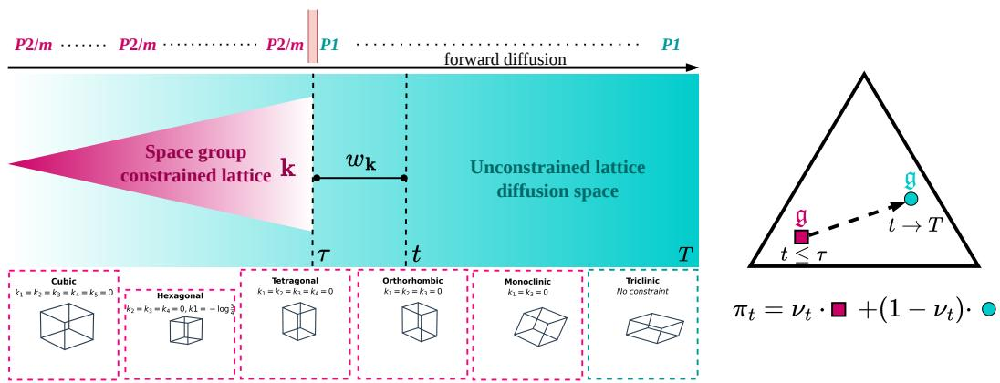  
Figure 1: SbCD Conceptual Framework. (Left, continuous state space) A symmetry-breaking diffusion process that undergoes a reduction in symmetry from a higher space group P2/m to a lower space group P1 at time step τ . The colored regions correspond to specific space-group constraints applied to the lattice component k. The upper panel depicts space-group transitions, while the lower panel visualizes lattice constraints for six crystal families. (Right, discrete state space) For t > τ , the induced site-symmetry prior πt evolves monotonically along the straight line segment connecting g, the marginal site-symmetry prior of P2/m, and g, the marginal site-symmetry prior of P1.

## Abstract

Generating crystals has recently attracted significant interest due to their broad applications in materials science. However, existing generative models struggle to produce complete crystallographic specifications, limiting their ability to capture global symmetry and structural dependencies. In particular, current state-of-the-art approaches generate crystals only up to site symmetries and rely on sampling space groups from empirical distributions during generation. Inspired by spontaneous symmetry breaking in physics, where crystals break symmetries under external conditions, we propose a novel diffusion-based framework that generates full structure specifications by reversing from the lowest-symmetry priors. Our method leverages a Markovian jump-diffusion process to model these symmetry-breaking dynamics, enabling it to traverse different space groups in a physically motivated manner. Our model, dubbed Symmetry-breaking Crystal Diffusion (SbCD), introduces a principled approach to explicitly incorporate inter-space-group transitions into the generative process. In de novo generation experiments on MP20 and MPTS-52, SbCD outperforms its symmetry-preserving counterpart by a substantial margin, offering a promising perspective for generative modeling of crystalline materials.

## 1 Introduction

Crystals play a fundamental role in materials science, underpinning advances across diverse fields including electrochemical energy storage [9], semiconductor hardware design [4], and pharmaceuti cals [11]. Traditionally, discovering a useful crystal with targeted properties has required years or even decades of trial-and-error experimentation [8]. Accelerating this discovery process [36, 25] thus holds immense potential for unlocking superior technologies. Generative models [22, 17, 35, 2, 24] have emerged as a highly effective paradigm for the in silico screening of structured data with desired properties. Pioneering work by Xie et al. [38] introduced latent diffusion models for raw crystal-structure representations. Subsequent approaches [19, 26, 29] operate on more compact unit cells and model fractional coordinates on Riemannian manifolds, better respecting the underlying geometry. More recently, Jiao et al. [20] further constrained the generative process to specific space groups, enabling template-conditioned generation of crystals with desirable properties. Notably, Levy et al. [23] proposed learning crystal site symmetries jointly from asymmetric units, yielding improved generalization to non-trivial symmetry point groups. Table 1 gives a comparison of these approaches.

Despite this progress, many methods rely heavily on space groups and Wyckoff positions derived from empirical distributions during generation, limiting their ability to capture global symmetry and structural dependencies. Specifically, Puny et al. [32] showed that models not explicitly learning Wyckoff positions generalize poorly to unseen configurations. In addition, Chang et al. [6] invoked Neumann’s principle [28], which states that physical properties must be invariant under a crystal’s point group symmetries, underscoring the importance of accurately modeling symmetry through Wyckoff positions and their associated space groups. In this work, we bridge this gap by learning to directly generate complete crystallographic structure specifications, including Wyckoff positions and space groups, rather than sampling from empirical distributions. To achieve this, we draw inspiration from spontaneous symmetry breaking (SSB) in physics, where ordered phases emerge through spontaneous breaking of a higher symmetry. For instance, vanadium dioxide $\mathrm { ( V O _ { 2 } ) }$ undergoes a reduction in crystal symmetry from the high-symmetry rutile phase $\mathrm { ( P 4 _ { 2 } / m n m ) }$ to lower-symmetry monoclinic phases such as M1 $\mathrm { ( P 2 _ { 1 } / c ) }$ or M2 (C2/m) under varying external conditions [27]. We then leverage Markovian jump diffusion [12, 5] to learn space-group transitions, where forward processes correspond to simulating SSB processes that reduce crystal symmetry to lower space groups, while reverse (generative) processes sample crystals directly from lowest-symmetry priors.

Here, we summarize our contributions: (i) We theoretically derive a variational bound objective that unifies the structural dependencies among crystal components, in which (ii) we leverage Markovian jump diffusion to model space-group distributions. We then (iii) derive novel symmetry-breaking diffusion processes on continuous and discrete state spaces, which adaptively enforce space-group constraints and admit analytical forms. To model site symmetries, (iv) we propose a simplified representation that facilitates capturing site-symmetry distributions and yields more stable generated crystal structures. Our model, dubbed Symmetry-breaking Crystal Diffusion (SbCD), represents the first generative framework capable of producing complete crystallographic structure specifications.

The remainder of this paper is organized as follows. Section 2 reviews the background on Markovian jump diffusion. Section 3 revisits existing symmetry-preserving crystal diffusion frameworks under space-group constraints. Building on these foundations, Section 4 develops a novel theoretical symmetry-breaking generative diffusion framework for crystalline materials. Finally, Section 5 presents promising results on de novo crystal generation tasks.

## 2 Markovian jump diffusion

Many natural phenomena can be modeled via discontinuous Markov processes, such as Poisson processes. These contrast with diffusion processes, a class of continuous-time Markov processes where changes occur incrementally over infinitesimal time intervals [1, 30]. Here, we consider processes that evolve via discrete jumps: the system remains in a given state for a random duration before transitioning abruptly to another state. Following Feller [12], we introduce the instantaneous rate matrix $\Lambda _ { t } ( \widetilde { x } , \bar { x } )$ from state xe to state x as follows:

$$
\mathbf { \Delta } \Lambda _ { t } ( \widetilde { x } , x ) \triangleq \operatorname* { l i m } _ { \Delta t  0 } \frac { q _ { t | t - \Delta t } ( x | \widetilde { x } ) - \delta _ { \widetilde { x } x } } { \Delta t } = \lambda _ { t } ( \widetilde { x } ) \pmb { \Pi } _ { t } ( \widetilde { x } , x ) - \delta _ { \widetilde { x } x } \lambda _ { t } ( \widetilde { x } )\tag{1}
$$

Table 1: Comparison of crystallographic structure specifications modeled by existing crystal generative frameworks. ✓denotes the modeling of a crystallographic structure specification, while ✗denotes its absence. Structure elements enclosed in braces {} denote equivalent crystal representations.
<table><tr><td rowspan="2">Method</td><td colspan="4">STRUCTURE SPECIFICATION</td><td rowspan="2">ASYMMETRIC UNIT</td><td rowspan="2">SYMMETRY BREAKING G</td></tr><tr><td>{k, L} {F, X} A</td><td></td><td></td><td>S</td></tr><tr><td>CDVAE [38]</td><td></td><td></td><td></td><td>X</td><td>X</td><td>X</td></tr><tr><td>DiffCSP [19], FlowMM [26]</td><td></td><td></td><td></td><td>X</td><td>x</td><td>X</td></tr><tr><td>DiffCSP++ [20], SGFM [32]</td><td></td><td></td><td>√</td><td>X</td><td>X</td><td>X</td></tr><tr><td>SymmCD [23], SGEquiDiff [7]</td><td></td><td>√</td><td>√</td><td>√</td><td>√</td><td>X</td></tr><tr><td>SbCD (ours)</td><td>1</td><td></td><td></td><td></td><td>1</td><td>1</td></tr></table>

where $q _ { t | t - \Delta t } ( x | \widetilde { x } )$ denotes the infinitesimal transition probability, $\begin{array} { r } { \sum _ { \boldsymbol { x } } q _ { t | t - \Delta t } ( \boldsymbol { x } | \widetilde { \boldsymbol { x } } ) = 1 ; \lambda _ { t } ( \widetilde { \boldsymbol { x } } ) } \end{array}$ is the total jump (exit) rate out of state $\widetilde { x }$ at the time $t ,$ how fast the process leaves the state; $\Pi _ { t } ( \widetilde { x } , x )$ is the probability that, given a jump from state $\widetilde { x }$ occurs at the time t, the process jumps to state x, $\Pi _ { t } ( \widetilde { x } , \widetilde { x } ) = 0$ , denoting where the process goes after jumping; and, $\mathbf { \Lambda } \Lambda _ { t } ( \widetilde { x } , \widetilde { x } ) < 0$ . Then, the forward and backward Kolmogorov equations for a continuous-time Markov chain are given by Feller [12]:

$$
\frac { \partial } { \partial t } q _ { t | \tilde { t } } ( x | \widetilde { x } ) = \sum _ { x ^ { \prime } } \mathbf { A } _ { t } ( x ^ { \prime } , x ) q _ { t | \tilde { t } } ( x ^ { \prime } | \widetilde { x } ) , \quad \frac { \partial } { \partial \tilde { t } } q _ { t | \tilde { t } } ( x | \widetilde { x } ) = - \sum _ { x ^ { \prime } } \mathbf { A } _ { \tilde { t } } ( \widetilde { x } , x ^ { \prime } ) q _ { t | \tilde { t } } ( x | x ^ { \prime } )\tag{2}
$$

We now define the time-reversal of the forward process with reverse transition rate $\hat { \mathbf { A } } _ { t } ( x , \widetilde { x } )$ . Campbell et al. [5] further derive its relation to the forward transition rate by manipulating the forward and backward equations above, yielding:

$$
\hat { \bf A } _ { t } ( x , \widetilde { x } ) = { \bf A } _ { t } ( \widetilde { x } , x ) \frac { q _ { t } ( \widetilde { x } ) } { q _ { t } ( x ) } = { \bf A } _ { t } ( \widetilde { x } , x ) \sum _ { x _ { 0 } } \frac { q _ { t | 0 } ( \widetilde { x } | x _ { 0 } ) } { q _ { t | 0 } ( x | x _ { 0 } ) } q _ { 0 | t } ( x _ { 0 } | x )\tag{3}
$$

However, computing this reverse transition rate involves marginalizing $q _ { 0 \mid t } ( x _ { 0 } | x )$ over $x _ { 0 }$ , which is generally intractable. Campbell et al. [5] proposes estimating this term via a parametric neural network $p _ { 0 | t } ^ { \theta } ( x _ { 0 } | x )$ , and learning the reverse transition rate $\hat { \mathbf { A } } _ { t } ^ { \theta } ( x , \widetilde { x } )$ by optimizing the continuoustime evidence bound, which we formulate in the following lemma:

Lemma 2.1 Following Campbell et al. [5], the negative log-likelihood of a continuous-time jump diffusion process admits the variational upper bound.

$$
\begin{array} { r l } & { \mathbb { E } _ { p _ { \mathrm { d a t a } } ( x _ { 0 } ) } \left[ - \log p _ { 0 } ^ { \theta } ( x _ { 0 } ) \right] \leq { \mathcal { L } } _ { \mathrm { j u m p } } ( \theta ) + \mathrm { C o n s t . } } \\ & { { \mathcal { L } } _ { \mathrm { j u m p } } ( \theta ) \triangleq T \mathbb { E } _ { t \sim \mathcal { U } ( 0 , T ) \widetilde { x } \sim q _ { t \mid 0 } ( \widetilde { x } \vert x _ { 0 } ) x \sim \Pi _ { t } ( \widetilde { x } , x ) } \left[ - \hat { \mathbf { A } } _ { t } ^ { \theta } ( \widetilde { x } , \widetilde { x } ) + \mathbf { A } _ { t } ( \widetilde { x } , \widetilde { x } ) \log ( \hat { \mathbf { A } } _ { t } ^ { \theta } ( x , \widetilde { x } ) ) \right] } \end{array}
$$

where the first term acts as a regularizer that penalizes the total rate of leaving state ${ \widetilde { x } } ,$ thereby preventing the reverse process from excessive jumping, while the second term maximizes the log-rate of the correct reverse transition pair $( x , { \widetilde { x } } )$ , scaled by the total rate of leaving xe. Sampling can then be implemented efficiently using τ-leaping algorithms [14, 37] with the learned reverse rate $\hat { \bf A } _ { t } ^ { \theta } ( \cdot )$

Lemma 2.2 Consider a finite-state continuous-time Markov chain with K ordinal states, $\boldsymbol { x } _ { t } ~ \in$ $\{ 1 , \ldots , K \}$ , and learned reverse transition-rate matrix $\hat { \mathbf { A } } _ { t } ^ { \theta }$ . Assume that for i $\neq j , \hat { \Lambda } _ { t } ^ { \theta } ( i , j ) \geq 0 ,$ , and

$$
\hat { \bf N } _ { t } ^ { \theta } ( i , i ) = - \sum _ { j \neq i } \hat { \bf N } _ { t } ^ { \theta } ( i , j ) .
$$

Then the next state $x _ { t - \Delta t }$ after a τ -leap of size $\Delta t$ is obtained by drawing a vector of independent Poisson random variables ${ \bf P } _ { j } \sim$ Poisson $\left( \hat { \mathbf { A } } _ { t } ^ { \theta } ( x _ { t } , j ) \Delta t \right)$ , $\forall j \neq x _ { t }$ , and updating via:

$$
x _ { t - \Delta t } = x _ { t } + \sum _ { j = 1 } ^ { K } \mathbf { P } _ { j } \left( j - x _ { t } \right)
$$

## 3 Space-group-aware crystal generation

Crystal symmetry and representation. To characterize crystal symmetries, we define a space group $G \triangleq \{ ( \mathbf { O } , \mathbf { t } ) \in \mathbf { E } ( 3 ) \mid \mathbf { x } \mapsto \mathbf { O x } + \mathbf { t } \}$ as a discrete subgroup of the Euclidean group E(3) leaving a crystal invariant, and its point group $P \triangleq \{ \mathbf { O } \mid ( \mathbf { O } , \mathbf { t } ) \in G \}$ by projecting out translations. In total, there are 230 space groups and 32 crystallographic point groups, the complete sets of which we denote by $\mathcal { G }$ and ${ \mathcal { P } } _ { : }$ , respectively. Due to the periodic arrangement of atoms, crystal structures admit multiple equivalent representations. Prior works typically model either the full crystal [38] or its unit cell [19, 20]. Here, we adopt the more compact asymmetric unit [23], the minimal non-redundant subset that generates the full crystal via symmetry operations. Moreover, an asymmetric unit can be mathematically described by the tuple $( \mathbf { \dot { F } } , \mathbf { A } , \mathbf { L } , \mathbf { S } )$ , where $\mathbf { F } \in \mathbb { R } ^ { M \times 3 }$ and $\check { \mathbf { A } } \in \mathbb { R } ^ { M \times Z }$ represent the fractional coordinates and atom types (over Z chemical species) of M representative atoms, respectively; $\mathbf { L } \in \mathbb { R } ^ { 3 \times 3 }$ denotes the crystal lattice, from which the raw Cartesian atomic coordinates can be obtained as $\mathbf { X } = \mathbf { L F }$ ; and $\mathbf { S } \in \mathcal { P } ^ { M }$ specifies the site-symmetry group of each atom. These components are used in prior space-group-aware, symmetry-preserving crystal generation methods.

Space group constraints. The crystal representation can be further constrained depending on its crystal family; the 230 space groups are classified into 6 crystal families. Jiao et al. [20] derive conditions on the lattice using the polar decomposition [16]. Concretely, any invertible matrix L admits a unique decomposition $\mathbf { L } { \dot { = } } \mathbf { T } \exp ( \mathbf { U } ) $ , where $\bar { \mathbf { T } } \in \mathbb { R } ^ { 3 \times 3 }$ is orthogonal, and $\mathbf { U } \in \mathbb { R } ^ { 3 \times 3 }$ is symmetric. This decomposition yields an invariant representation: applying an orthogonal transformation to L affects only T, leaving U unchanged. Furthermore, U can be expanded over a fixed set of symmetric basis matrices $\begin{array} { r } { \{ { \bf B } _ { i } \} _ { i = 1 } ^ { 6 } \mathrm { ~ a s ~ } { \bf U } = \sum _ { i = 1 } ^ { 6 } k _ { i } { \bf B } _ { i } } \end{array}$ . Thus, the coefficient vector ${ \bf k } =$ $( k _ { i } ) _ { i = 1 } ^ { 6 }$ provides a complete, invariant representation of the lattice. Specific space-group constraints then translate into conditions on k. Following Jiao et al. [20], we summarize the construction of $\{ { \bf B } _ { i } \}$ and the associated constraints on k in Appendix D.4. We then introduce constrained diffusion processes [17] that respect these lattice conditions through a space-group-informed masking mechanism, as formalized below.

Lemma 3.1 Let $\mathbf { k } \in \mathbb { R } ^ { 6 }$ denote the invariant crystal-lattice representation, whose values are constrained by a given crystal family. A discrete-time, continuous-state diffusion process [17] satisfies the masking mechanism defined below to remain within the specified crystal family:

$$
{ \bf k } _ { t } = \mathfrak { m } \odot \left( \sqrt { \bar { \alpha } _ { t } } { \bf k } _ { 0 } + \sqrt { 1 - \bar { \alpha } _ { t } } \epsilon \right) + \mathfrak { m } _ { \mathfrak { b } } , \qquad \epsilon \sim \mathcal { N } ( 0 , I ) ,\tag{4}
$$

where $\bar { \alpha } _ { t }$ denotes the noise schedule from Ho et al. [17], ⊙ is the element-wise product, and $( \mathfrak { m } , \mathfrak { m } _ { \mathfrak { b } } ) \overset { \cdot } { \in } \{ 0 , 1 \} ^ { 6 } \times \mathbb { R } ^ { 6 }$ is the space-group-induced mask–bias pair. For example, $\mathfrak { m } = [ \bar { 0 } , 0 , 0 , 0 , 1 , 1 ]$ and $\mathfrak { m } _ { \mathfrak { b } } = [ - \log \frac { 3 } { 4 } , 0 , 0 , 0 , 0 , 0 ]$ correspond to the mask–bias pair for the hexagonal family (Figure 1).

Symmetry preserving. We characterize the local symmetry at each atomic site via its site symmetry, i.e., the set of symmetry operations that leave the site invariant. Sites that are symmetry-equivalent under the action of the space group G form an orbit corresponding to a Wyckoff position. The site-symmetry group is a point group isomorphic to a subgroup of the point group P. Levy et al. [23] encode the site symmetries S using a binary representation of oriented site-symmetry symbols [15], which specify generators of the site-symmetry group along 15 possible crystallographic axes (including body and face diagonals), with up to 13 distinct symmetry operations per axis. To preserve symmetry within a given space group, they employ categorical diffusion [2] with space-group-specific marginal priors over site symmetries during both training and generation.

Lemma 3.2 Let $s \in \{ 1 , \cdots , 1 5 \}$ index the crystallographic axes, and $\mathbf { s } \in \{ 0 , 1 \} ^ { 1 3 } \subset \mathbf { S }$ denote the site-symmetry representation along the s-th axis. Let $\mathfrak { g } \in [ 0 , 1 ] ^ { 1 3 }$ be the marginal prior of site symmetry associated with the space group $G$ over the s-th axis. A discrete-time, discrete-state diffusion process [2] that preserves crystal symmetry is defined via theforward transition:

$$
\mathbf { s _ { t } } \sim \operatorname { C a t } ( \mathbf { s _ { t } } ; \mathbf { s } _ { 0 } { \bar { \mathbf { Q } } } _ { s , t } ) , \qquad { \bar { \mathbf { Q } } } _ { s , t } = ( 1 - { \bar { \beta } } _ { t } ) \mathbf { I } + { \bar { \beta } } _ { t } \mathbf { 1 } \mathbf { g }
$$

where $\bar { \beta } _ { t }$ denotes the categorical noise schedule from Austin et al. [2]. By construction, this spacegroup-conditioned prior ensures that generated site-symmetry states are consistent with the symmetry constraints imposed by G, which consequently restricts the candidate Wyckoff positions of representative atoms. If multiple candidates share the same site-symmetry state, we assign the Wyckoff position whose symmetry-equivalent sites are closest to the generated fractional coordinate.

## 4 SbCD: Symmetry-breaking crystal diffusion

## 4.1 Structure-informed variational bound

Crystals are inherently heterogeneous structures comprising multiple data modalities. This challenge necessitates moving beyond a single generative modeling paradigm or data representation. Here, we unify diffusion-based training objectives across continuous and discrete time and state spaces into a single formulation. We recall the parametrization of an asymmetric unit as $\mathcal { M } = ( \mathbf { F } , \mathbf { A } , \bar { \mathbf { k } } , \mathbf { S } , G )$ . As defined in Section 3, the site symmetries S and the lattice representation k are explicitly constrained by the space group G. Under these structural dependencies, we formulate the variational upper bound.

Proposition 4.1 Let $\mathbb { Q } , \hat { \mathbb { Q } } ,$ and $\mathbb { P } ^ { \theta }$ denote the forward, exact reverse, and learned reverse path measures ofthe continuous-time Markov chain. The negative log-likelihood on crystal structures $\mathcal { M } _ { 0 }$ is bounded above by the expected Kullback–Leibler divergence over the reverse trajectory:

$$
- \log p _ { \theta } ( \mathcal { M } _ { 0 } ) \leq \mathbb { E } _ { q _ { T | 0 } } \Big [ D _ { \mathrm { K L } } \big ( \hat { \mathbb { Q } } ^ { \mathcal { M } _ { T }  \mathcal { M } _ { 0 } } \big \| \mathbb { P } ^ { \theta , \mathcal { M } _ { T } } \big ) \Big ] + \mathrm { C o n s t . }
$$

The divergence decomposes additively into space group, lattice, site symmetry, atom $t y p e ,$ , and fractional coordinate components:

$$
\begin{array} { r l } & { D _ { \mathrm { K L } } \big ( \hat { \mathbb { Q } } ^ { M _ { T }  \mathcal { M } _ { 0 } } \big \| \mathbb { P } ^ { \theta , \mathcal { M } _ { T } } \big ) = \underbrace { D _ { \mathrm { K L } } \big ( \hat { \mathbb { Q } } _ { \mathbf { A } } \big \| \mathbb { P } _ { \mathbf { A } } ^ { \theta } \big ) + D _ { \mathrm { K L } } \big ( \hat { \mathbb { Q } } _ { \mathbf { F } } \big \| \mathbb { P } _ { \mathbf { F } } ^ { \theta } \big ) } _ { \mathrm { I : ~ } A t o m \mathrm { ~ T y } e s \ t r a c t i o n a l ~ C o r d i n a t e s } } \\ & { \qquad + \underbrace { D _ { \mathrm { K L } } \big ( \hat { \mathbb { Q } } _ { G } \big \| \mathbb { P } _ { G } ^ { \theta } \big ) } _ { \mathrm { I I : ~ } S p a c e G r o u p } + \underbrace { \mathbb { E } _ { \hat { \mathbb { Q } } _ { G } } \Big [ D _ { \mathrm { K L } } \big ( \hat { \mathbb { Q } } _ { \mathbf { k } } | G \big \| \mathbb { P } _ { { \mathbf { k } } | G } ^ { \theta } \big ) + D _ { \mathrm { K L } } \big ( \hat { \mathbb { Q } } _ { \mathbf { S } | G } \big \| \mathbb { P } _ { { \mathbf { S } } | G } ^ { \theta } \big ) \Big ] } _ { \mathrm { I I : ~ } L a t i c e \ \& \delta t i c \ S m m e t r y } } \end{array}
$$

Here, the conditioning superscripts have been omitted on the right-hand side for brevity. The notation $\hat { \mathbb { Q } } . ^ { \mathcal { M } _ { T }  \mathcal { M } _ { 0 } }$ denotes a bridge measure pinned at both endpoints $\mathcal { M } _ { T }$ and $\mathcal { M } _ { 0 }$ , and $\mathbf { \widetilde { \mathbb { P } } } _ { . } ^ { \theta , \mathcal { M } _ { T } }$ denotes a path measure conditioned on $\mathcal { M } _ { T }$ . While most existing de novo crystal generation frameworks neglect learning the space-group distribution (term II) and assume it is sampled from data during inference, our method explicitly models $G$ as part of the generative process. Moreover, during the diffusion process, the space group transitions, resulting from term II, directly modify the constraints imposed on the lattice and site symmetry (term III), which we address in the following sections. Finally, the space-group-independent attributes (term I) can be modeled using standard techniques from prior work of Jiao et al. [19], Austin et al. [2], Levy et al. [23].

## 4.2 Physics-inspired space group modeling via jump diffusion

Taking inspiration from spontaneous symmetry breaking, in which physical systems spontaneously break symmetry into lower-symmetry states, we learn the space-group distribution by mirroring this phenomenon via Markovian jump-diffusion. In the forward process, a crystal remains in a given space group $\widetilde { G }$ for a random duration before transitioning to a lower-symmetry space group $G ,$ denoted by $G \prec { \widetilde { G } }$ . The transition dynamics are governed by a time-dependent rate matrix $\Lambda _ { t } ( \widetilde { G } , G )$ The generative process approximates the reverse transitions by learning a parametric rate $\hat { \mathbf { A } } _ { t } ^ { \theta } ( G , \widetilde { G } )$ For simplicity, we fix the terminal state of every jump to $\dot { G } = \mathrm { P 1 }$ , the lowest-symmetry space group (triclinic system) that contains only the identity operation. In the following proposition, we introduce the transition rate matrix such that (i) the forward process mixes rapidly toward a reference distribution and (ii) the Kolmogorov forward equation admits a closed-form solution.

Proposition 4.2 Consider the discrete state space of 230 crystallographic space groups drawn from the six crystalfamilies. Let Π, $\pmb { \Lambda } _ { t } \in \mathbb { R } ^ { 2 3 0 \times 2 3 0 }$ denote the time-invariant transition probability matrix and the instantaneous rate matrix, respectively, defined element-wise asfollows:

$$
\mathbf { T } ( \widetilde { G } , G ) = \left\{ \begin{array} { l l } { 0 } & { \widetilde { G } = \mathrm { P } 1 } \\ { 0 } & { G = \widetilde { G } } \\ { 1 } & { G = \mathrm { P } 1 \neq \widetilde { G } } \\ { 0 } & { o t h e r w i s e . } \end{array} \right. \quad \mathbf { A } _ { t } ( \widetilde { G } , G ) = \lambda ( t ) \mathbf { T } ^ { + } ( \widetilde { G } , G ) = \left\{ \begin{array} { l l } { 0 } & { \widetilde { G } = \mathrm { P } 1 } \\ { - \lambda ( t ) } & { G = \widetilde { G } } \\ { \lambda ( t ) } & { G = \mathrm { P } 1 \neq \widetilde { G } } \\ { 0 } & { o t h e r w i s e . } \end{array} \right.
$$

Then, $\mathbf { \Lambda } _ { \pmb { \Lambda } _ { t } }$ and $\pmb { \Lambda } _ { s }$ commutefor all $t , s .$ . Consequently, theforward transition probability ofbeing in state $G$ at time t, given state $\widetilde { G }$ at time $\widetilde { t } < t , q _ { t | \widetilde { t } } ( G | \widetilde { G } )$ , admits the matrix exponentialform:

$$
q _ { t | \widetilde { t } } ( G | \widetilde { G } ) = \left( \mathbf { D } \exp \Big [ \Sigma \int _ { \widetilde { t } } ^ { t } \lambda ( s ) d s \Big ] \mathbf { D } ^ { - 1 } \right) _ { \widetilde { G } , G } \quad w i t h \quad \Pi ^ { + } = \mathbf { D } \Sigma \mathbf { D } ^ { - 1 }
$$

The proof and explicit diagonalization of $\Pi ^ { + }$ are deferred to the Appendix. Given the analytical forward jump kernel above, we learn the reverse rate $\hat { \pmb { \Lambda } } _ { t } ^ { \theta } ( G , \widetilde { G } )$ by minimizing the variational upper bound component corresponding to $D _ { \mathrm { K L } } ( \hat { \mathbb { Q } } _ { G } ^ { \mathcal { M } _ { T }  \mathcal { M } _ { 0 } } \Vert \mathbf { \bar { P } } _ { G } ^ { \theta , \mathcal { M } _ { T } } )$ in Proposition 4.1.

Posterior holding-time τ and symmetry-breaking time window w. Optimising the jump diffusion loss $\mathcal { L } _ { \mathrm { i u m p } } ( \theta )$ via Lemma 2.1 first requires sampling a diffusion timestep $t \sim \mathcal { U } ( 0 , T )$ , followed by sampling the corresponding space group according to the analytical forward kernel $q _ { t | 0 }$ from Proposition 4.2. For large diffusion times, $t \to T$ , the forward process has already reached the space group P1 and remains there thereafter. In the following corollary, we define the posterior holding time τ as the duration for which the process remains in its initial space group before jumping, and the symmetry-breaking time window w as the elapsed time spent in the space group P1 up to the current diffusion timestep. Figure 1 depicts these induced time variables.

Corollary 4.3 Let a crystal initially reside in a space group $\widetilde { G }$ and be observed in a lower-symmetry space group $G \prec { \widetilde { G } }$ at time t. Consider a constant transition-rate jump diffusion, $\lambda ( t ) = \lambda$ ∀t, then the posterior distribution ofthe holding time $\tau \in [ 0 , t ]$ is a truncated exponential. Consequently, τ can be sampled via inverse transform sampling as

$$
\tau = - \frac { 1 } { \lambda } \log \Bigl ( 1 - u \bigl ( 1 - e ^ { - \lambda t } \bigr ) \Bigr ) , \quad u \sim \mathcal { U } ( 0 , 1 ) ,
$$

and the symmetry-breaking time window can be calculated as $w = t - \tau$

## 4.3 Symmetry-breaking diffusion in continuous-state space

We extend the space-group-constrained diffusion framework of Jiao et al. [20] to learn the crystallattice distribution. In their framework, the space group is fixed during both forward and reverse diffusion, and an element-wise masking mechanism on the lattice representation k (see Lemma 3.1) ensures it remains confined to the space-group-constrained subspace. In contrast, our framework permits the space group to evolve throughout the diffusion process. We therefore introduce a symmetry-breaking diffusion process over the continuous-state lattice space, which adaptively enforces the lattice constraints of the prevailing crystal family whenever the process transitions to a new space group. Below, we provide the analytical forms of the forward and reverse sampling kernels, which correspond to the variational bound term $\mathbb { E } _ { \hat { \mathbb { Q } } _ { G } } [ D _ { \mathrm { K L } } ( \hat { \mathbb { Q } } _ { \mathbf { k } | G } \| \mathbb { P } _ { \mathbf { k } | G } ^ { \theta } ) ]$ in Proposition 4.1.

Proposition 4.4 Consider a forward diffusion process with a symmetry-breaking event at time $\tau ,$ transitioning from space group $\widetilde { G }$ to G. From Lemma 3.1, let $( \mathfrak { m } , \mathfrak { m } _ { 6 } )$ and $( \widetilde { \mathfrak { m } } , \widetilde { \mathfrak { m } } _ { \mathfrak { b } } )$ denote the mask–bias pairs associated with G and ${ \widetilde { G } } ,$ respectively. Then, the continuous-stateforward diffusion kernel applied to the lattice parameters k is given analytically by:

$$
\begin{array} { r l } & { { \mathbf { k } _ { t } } = \widetilde { \mathfrak { m } } \odot \left( \sqrt { \bar { \alpha } _ { t } } { \mathbf { k } _ { 0 } } + \sqrt { 1 - \bar { \alpha } _ { t } } \widetilde { \epsilon } \right) + \widetilde { \mathfrak { m } } _ { \mathfrak { b } } + \mathfrak { m } \odot \widetilde { \mathfrak { m } } _ { \mathfrak { b } } \sqrt { \frac { \bar { \alpha } _ { t } } { \bar { \alpha } _ { t - w _ { \mathbf { k } } } } } } \\ & { \qquad - \left( \widetilde { \mathfrak { m } } \odot \sqrt { 1 - \frac { \bar { \alpha } _ { t } } { \bar { \alpha } _ { t - w _ { \mathbf { k } } } } } \widetilde { \epsilon } + \widetilde { \mathfrak { m } } _ { \mathfrak { b } } \right) + \left( \mathfrak { m } \odot \sqrt { 1 - \frac { \bar { \alpha } _ { t } } { \bar { \alpha } _ { t - w _ { \mathbf { k } } } } } \epsilon + \mathfrak { m } _ { \mathfrak { b } } \right) , } \end{array}
$$

where $w _ { \bf k } = t - \tau$ . The corresponding reverse-time sampling step is simulated as:

$$
\mathbf { k } _ { t - 1 } = \widetilde { \mathfrak { m } } \odot \Big ( \frac { \sqrt { \bar { \alpha } _ { t - 1 } } } { 1 - \bar { \alpha } _ { t } } ( 1 - \alpha _ { t } ) \hat { \mathbf { k } } _ { 0 } ^ { \theta } ( \mathcal { M } _ { t } ) + \mathfrak { m } \odot \frac { \sqrt { \alpha _ { t } } } { 1 - \bar { \alpha } _ { t } } ( 1 - \bar { \alpha } _ { t - 1 } ) \mathbf { k } _ { t } + \mathfrak { m } _ { \mathfrak { b } } + \sigma _ { t } \epsilon \Big ) + \widetilde { \mathfrak { m } } _ { \mathfrak { b } } .
$$

with $\sigma _ { t } = \sqrt { ( 1 - \bar { \alpha } _ { t - 1 } ) ( 1 - \alpha _ { t } ) / ( 1 - \bar { \alpha } _ { t } ) }$ following the parameterization ofSong et al. [35].

This novel masking mechanism respects the lattice constraints both before and after symmetry breaking occurs. Moreover, our formulation directly generalizes the prior work of Jiao et al. [20], which corresponds to the special case of no symmetry breaking in Lemma $3 . 1 , \mathrm { i . e . , } \widetilde { G } = G$ . Figure 1 (left) conceptually illustrates how lattice constraints adaptively change during a space-group transition.

## 4.4 Symmetry-breaking diffusion in discrete-state space

Novel site-symmetry representation learning. Levy et al. [23] proposed learning site symmetries by using a binary matrix of size 15 × 13 (15 canonical symmetry axes and 13 possible symmetry operations per axis; see Lemma 3.2), based on the oriented site-symmetry symbols [15]. However, this encoding scheme does not distinguish Wyckoff positions sharing the same oriented site-symmetry symbol. Due to this ambiguity, the scheme may complicate the learning process and often requires projecting generated site symmetries onto the nearest valid point group [23]. For instance, in space group Immm, the two Wyckoff positions 4i and $4 \mathrm { j }$ both possess the oriented site-symmetry symbol mm2 and are therefore represented by the same $1 5 \times { \bar { 1 } } 3$ binary matrix. Here, we directly use a one-hot vector representation to model the oriented site-symmetry symbols. We identify 81 distinctive oriented site-symmetry symbols, inferred across all 230 space groups (see Appendix B.1 for the list).

In the symmetry-preserving framework of Levy et al. [23], for a fixed space group, site-symmetry states are corrupted via a discrete-state diffusion process [2], with transition dynamics defined by the marginal site-symmetry prior induced by that space group (Lemma 3.2). In contrast, in our symmetry breaking process, the ambient space group itself may transition from one group to another. This change alters the induced marginal prior over site symmetries, and therefore requires an interpolation between site-symmetry priors across space groups. In the following proposition, we introduce such an interpolant to enable learning of site symmetries in the symmetry-breaking diffusion process.

Proposition 4.5 Let $\widetilde { \mathfrak { g } } , \mathfrak { g } \in \Delta ^ { 8 1 - 1 }$ be the marginal site-symmetry priors associated with the space groups $\widetilde { G }$ and $G ,$ respectively. Let $\bar { \alpha } _ { t }$ be a strictly decreasing noise schedule with symmetry-breaking time τ satisfying $0 < \bar { \alpha } _ { t } , \bar { \alpha } _ { \tau } \leq 1$ . For $t > \tau ,$ , define

$$
\pi _ { t } = \nu _ { t } \widetilde { \mathfrak { g } } + ( 1 - \nu _ { t } ) \mathfrak { g } = \frac { \bar { \alpha } _ { t } ( 1 - \bar { \alpha } _ { t - w _ { \mathbf { s } } } ) \widetilde { \mathfrak { g } } + \left( \bar { \alpha } _ { t - w _ { \mathbf { s } } } - \bar { \alpha } _ { t } \right) \mathfrak { g } } { \bar { \alpha } _ { t - w _ { \mathbf { s } } } ( 1 - \bar { \alpha } _ { t } ) } \quad \mathrm { w h e r e ~ } w _ { \mathbf { s } } = t - \tau , \nu _ { t } \in [ 0 , 1 ]
$$

Then, $\pi _ { t }$ lies in the convex hull of the two priors, $\pi _ { \tau } = \widetilde { { \mathfrak { g } } }$ , lim $1 _ { t  T } \pmb { \pi } _ { t } = \pmb { \mathfrak { g } }$ , and the trajectory $\{ \pi _ { t } \} _ { t > \tau }$ moves monotonically along the straight line segment connecting eg to g inside the simplex.

Figure 1 (right) visualizes the interpolated prior trajectory. Below, we derive corresponding forward and reverse discrete-state diffusion kernels and summarize the sampling of SbCD in Algorithm 1.

Corollary 4.6 Let the discrete-state diffusion transition matrices ofAustin et al. [2] be redefined under the symmetry-breakingformulation as:

$$
\mathbf { Q } _ { t } = \alpha _ { t } I + ( 1 - \alpha _ { t } ) \mathbf { 1 } ( \mathfrak { g } ) ^ { T } , \qquad \bar { \mathbf { Q } } _ { t - 1 } = \bar { \alpha } _ { t - 1 } I + ( 1 - \bar { \alpha } _ { t - 1 } ) \mathbf { 1 } ( \widetilde { \mathfrak { g } } ) ^ { T }
$$

$$
\bar { \bf Q } _ { t } ^ { \widetilde G  G } = \bar { \alpha } _ { t } I + ( 1 - \bar { \alpha } _ { t } ) { \bf 1 } ( \pi _ { t } ) ^ { T } \mathrm { w i t h ~ } \mathfrak { g } , \widetilde { \mathfrak { g } } , \pi _ { t } \mathrm { i n ~ P r o p o s i t i o n ~ } 4 . 5
$$

Then, the forward and reverse sampling processes on the site symmetry S can be derived as below:

$$
{ \bf S } _ { t } \sim \mathrm { C a t } ( { \bf S } _ { t } ; { \bf S } _ { 0 } \bar { \bf Q } _ { t } ^ { \tilde { G }  G } ) \qquad { \bf S } _ { t - 1 } \sim \mathrm { C a t } ( { \bf S } _ { t - 1 } ; \frac { { \bf S } _ { t } { \bf Q } _ { t } ^ { T } \odot \hat { \bf S } _ { 0 } ^ { \theta } ( { \mathcal M } _ { t } ) \bar { \bf Q } _ { t - 1 } } { \hat { \bf S } _ { 0 } ^ { \theta } ( { \mathcal M } _ { t } ) \bar { \bf Q } _ { t } ^ { \tilde { G }  G } { \bf S } _ { t } ^ { T } } )
$$

## 5 Experiments

Task and metrics. Following Levy et al. [23], we conduct de novo crystal generation experiments on the MP-20 dataset, a subset of the Materials Project [18], and the more challenging MPTS-52 dataset [3], which contains up to 52 atoms per primitive unit cell. We evaluate our results using standard metrics: (i) Validity, including structure (Struct.), requiring a minimum pairwise atomic distance of 0.5Å, and composition (Comp.), requiring overall charge neutrality; (ii) Coverage, measuring similarity between generated and test materials with respect to structure and composition cutoff distances; and (iii) Property statistics, measuring the Wasserstein-1 distance between property distributions, including density $( \mathrm { d } _ { \rho } ,$ unit $\mathrm { g / c m ^ { 3 } } )$ and the number of unique elements (#elem.), and the Jensen Shannon distance between space group distributions $\mathrm { ( d _ { s g } ) }$ . Finally, we assess the thermodynamic stability (Stable) of generated materials and compute their novelty and uniqueness (S.U.N), following Miller et al. [26]. As in Levy et al. [23], we employ the pretrained CHGNet model [10] to perform structural relaxations before calculating the energy above the hull $( E ^ { \mathrm { { h u l l } } } )$ . We evaluate all methods on 10,000 sampled crystals, except that property statistics are computed on 1,000 valid structures, following prior works [38, 23]. We defer the experimental details to Appendix B.

Table 2: De novo crystal generation on MP-20. Baselines are from Levy et al. [23] and Puny et al. [32]. SbCD♯ uses the site-symmetry prior in Lemma 3.2, SbCD♦ matches the DiffCSP architecture [19], and $\operatorname { S b C D } ^ { \bullet }$ (w/o SB) denotes no symmetry-breaking. Hyphen indicates unreproducible results.
<table><tr><td rowspan="2" colspan="2">Method</td><td colspan="2">Validity (%)(↑)</td><td colspan="2">Coverage (%)(↑)</td><td colspan="2">Property statistics (↓)</td><td colspan="2">CHGNet  $E ^ { \mathrm { { h u l l } } }$  &lt; 0 (%)(↑)</td></tr><tr><td>Struct.</td><td>Comp.</td><td>Recall</td><td>Precision</td><td> ${ \mathrm { d } } _ { \rho }$ </td><td># elem.</td><td>Stable</td><td>S.U.N</td></tr><tr><td colspan="2">R CDVAE</td><td>99.97</td><td>85.61</td><td>99.31</td><td>99.47</td><td>0.70</td><td>1.28</td><td>4.42</td><td>4.26</td></tr><tr><td rowspan="6">Uii.</td><td>DiffCSP</td><td>97.43</td><td>82.50</td><td>99.55</td><td>98.73</td><td>0.18</td><td>0.56</td><td>11.32</td><td>8.92</td></tr><tr><td>FlowMM</td><td>96.67</td><td>83.25</td><td>99.49</td><td>99.58</td><td>0.23</td><td>0.08</td><td>9.05</td><td>6.49</td></tr><tr><td>DiffCSP++ (empirical)</td><td>99.44</td><td>86.50</td><td>99.72</td><td>99.61</td><td>0.12</td><td>0.33</td><td>11.36</td><td>8.62</td></tr><tr><td>DiffCSP++ (Wyformer)</td><td>99.66</td><td>80.34</td><td></td><td></td><td>0.67</td><td>0.10</td><td></td><td></td></tr><tr><td>SGFM (empirical)</td><td>99.87</td><td>86.81</td><td></td><td>1</td><td>0.075</td><td>0.181</td><td>一</td><td></td></tr><tr><td>SGFM (Wyformer)</td><td>99.87</td><td>84.76</td><td>一</td><td>一</td><td>0.24</td><td>0.23</td><td>一</td><td>一</td></tr><tr><td rowspan="6">Asm.</td><td>SymmCD</td><td>90.34</td><td>85.81</td><td>99.58</td><td>97.76</td><td>0.23</td><td>0.40</td><td>9.34</td><td>6.86</td></tr><tr><td>SymmCD‡ (retrain)</td><td>87.37</td><td>86.30</td><td>99.46</td><td>97.21</td><td>0.41</td><td>0.28</td><td>7.40</td><td>6.79</td></tr><tr><td>SbCD</td><td>89.80</td><td>90.32</td><td>99.44</td><td>97.91</td><td>0.18</td><td>0.03</td><td>11.28</td><td>7.15</td></tr><tr><td> ${ \mathrm { S b C D } } ^ { \sharp }$ </td><td>89.81</td><td>88.32</td><td>99.51</td><td>97.31</td><td>0.09</td><td>0.04</td><td>10.74</td><td>7.31</td></tr><tr><td> ${ \mathrm { S b C D } } ^ { \bullet }$ </td><td>88.13</td><td>87.91</td><td>99.25</td><td>97.68</td><td>0.16</td><td>0.07</td><td>11.40</td><td>8.25</td></tr><tr><td> $\mathrm { S b C D ^ { \bullet } ( w / o \ S B ) }$ </td><td>78.22</td><td>84.93</td><td>99.76</td><td>96.33</td><td>0.15</td><td>0.21</td><td>8.90</td><td>6.19</td></tr></table>

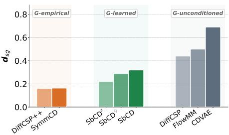

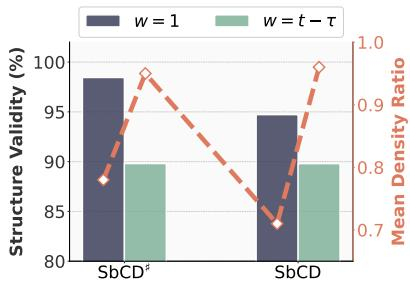  
Figure 2: Results on the Jensen–Shannon distance between space-group distributions on MP20. G-empirical and G-learned denote methods conditioned on empirical and learned distributions, respectively, while G-unconditioned denotes methods without space-group conditioning.  
Figure 3: Results on structural validity and mean density ratio w.r.t. the test set for different symmetrybreaking time window sizes, w. Full results are in Appendix C.

Baselines. We benchmark SbCD against diffusion-based methods, including CDVAE [38], DiffCSP [19], DiffCSP++ [20], and SGEquiDiff [6] as well as flow-based methods, including FlowMM [26] and SGFM [32]. In particular, we compare SbCD with its symmetry-preserving counterpart, SymmCD [23]. We classify the baselines based on whether they utilize raw-crystal (R.), unit-cell (Unit.), or asymmetric-unit (Asym.) representations. In addition, we ablate two SbCD variants: SbCD♯, which learns site symmetries using the 15 × 13 binary matrix (as described in Lemma 3.2), and $\operatorname { S b C D } ^ { \bullet }$ , which has a model architecture similar to that of DiffCSP/++ [19, 20].

## 5.1 De novo crystal generation results

Table 2 demonstrates that $\operatorname { S b C D } ^ { \bullet }$ outperforms the baselines in generating thermodynamically stable crystal structures. In particular, the structures generated by SbCD exhibit a significantly higher proportion of charge-neutral compositions and remain substantially more similar to the test materials in terms of the number of unique elements, indicating a better capture of the underlying compositional distribution. On the S.U.N. metric, SbCD♦ performs competitively with DiffCSP and DiffCSP++, despite the latter additionally employing space-group constraints on fractional coordinates. Notably, SbCD variants demonstrate clear improvements over their symmetry-preserving counterparts, SymmCD and SbCD (w/o SB), across most evaluation criteria, underscoring the effectiveness of incorporating symmetry-breaking transitions into the diffusion process. Moreover, existing methods typically depend on external Wyckoff positions for generating crystalline materials. Table 2 demonstrates that most models suffer performance drops when replacing empirical Wyckoff positions with unseen ones generated by Wyformer [21]. SbCD represents the first framework capable of generating complete crystallographic structure specifications (see Table 1), including space groups and Wyckoff positions. Figure 2 shows that SbCD variants narrow the performance gap with methods directly conditioned on space groups from empirical distributions, while outperforming methods without space-group conditioning. This result highlights SbCD’s ability to effectively capture a wide range of space-group distributions. Eventually, Table 3 demonstrates that SbCD effectively scales to the more challenging MPTS-52 dataset and achieves the best performance on thermodynamic stability metrics.

Table 3: De novo crystal generation on MPTS-52. We scale SbCD at different sizes: -S, -L, -XL.
<table><tr><td rowspan="2">Method</td><td colspan="2">Validity (%)(↑)</td><td colspan="2">Coverage (%)(↑)</td><td colspan="3">Property statistics (↓)</td><td>CHGNet Ehull &lt; 0 (%)(↑)</td></tr><tr><td>Struct.</td><td>Comp.</td><td>Recall</td><td>Precision</td><td># elem.</td><td></td><td> $\mathrm { d } _ { \mathrm { s g } }$  Stable</td><td>S.U.N</td></tr><tr><td>SGEquiDiff (params=5.5M)</td><td>97.93</td><td>80.43</td><td>99.90</td><td>96.15</td><td>0.870</td><td>0.559</td><td>0.306</td><td>3.90</td></tr><tr><td>SymmCD (params=61M)</td><td>90.10</td><td>79.20</td><td>99.60</td><td>96.30</td><td>0.844 0.317</td><td>0.274</td><td>5.79 5.97</td><td>4.62</td></tr><tr><td>SymmCD‡ (params=61M)(retrain)</td><td>85.92</td><td>80.22</td><td>99.74</td><td>95.24</td><td>1.104</td><td>0.381</td><td>0.297 5.26</td><td>4.60</td></tr><tr><td>SbCD-S (params=14.8M)</td><td>90.42</td><td>78.62</td><td>99.57</td><td>99.57</td><td>0.818</td><td>0.585</td><td>0.358</td><td></td></tr><tr><td>SbCD-L (params=47.9M)</td><td>88.02</td><td>81.13</td><td>99.53</td><td>97.02</td><td>0.665 0.567</td><td>0.368</td><td>6.88 8.23</td><td>5.01 5.29</td></tr><tr><td>SbCD-XL (params=62.1M)</td><td>90.55</td><td>80.08</td><td>99.65</td><td>97.10</td><td>0.760</td><td>0.654</td><td>0.343 8.36</td><td>5.68</td></tr></table>

## 5.2 Ablation studies

Symmetry-breaking time window. Figure 3 visualizes the structural validity results under a fixed time window $( w = 1 )$ We observe that SbCD variants significantly generate more structurally valid crystals (∼ 98%). However, their mean density ratio relative to the training data decreases dramatically, indicating that low-density crystals tend to exhibit valid structures more readily. In Table 2, CDVAE [38], while achieving the best performance on structure validity, generates lowdensity crystals ${ \mathrm { ( d } } _ { \rho }$ is high), whose structures are loosely packed. In practice, we would prioritize obtaining more compact crystal structures, which SbCD variants (with the theoretical window size from Corollary 4.3) can straightforwardly satisfy, as demonstrated by their mean density ratio results.

Transition rate λ and NFEs. Rates determine how quickly crystals transition toward the leastconstrained space group P1. Therefore, picking a suitable rate is essential so that the diffusion process has enough time to denoise in the original space groups while still converging to the prior distributions. In Figure 5, SbCD demonstrates greater robustness than SbCD♯, even at high transition rates, underscoring the advantage of our simplified site-symmetry representation in alleviating the challenges of modeling the complex site symmetries from Levy et al. [23]. In terms of inference speed, Figure 4 shows that SbCD significantly outperforms its symmetry-preserving counterpart, particularly in low-NFE regimes, highlighting its potential for few-step de novo crystal generation.

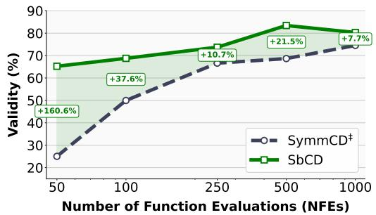  
Figure 4: Validity vs. computational budget on MP-20.

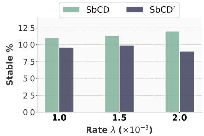  
Figure 5: Stability $( E ^ { \mathrm { { h u l l } } } < 0 )$ across different rate λ: SbCD versus SbCD♯.

## 6 Conclusions

We propose SbCD, a novel symmetry-breaking crystal diffusion model that enables sampling full crystallographic structure specifications from minimal symmetry assumptions. As such, SbCD marks an important step for de novo crystal generation. SbCD takes inspiration from spontaneous symmetry breaking and introduces novel adaptive space group constraints on both continuous and discrete state spaces. SbCD empirically outperforms its symmetry-preserving counterpart, offering a promising proof of concept for the method. Future work could extend SbCD to incorporate space-group constrained fractional coordinates on asymmetric units and to more realistic physical transition paths.

## References

[1] Brian DO Anderson. Reverse-time diffusion equation models. Stochastic Processes and their Applications, 12(3):313–326, 1982.

[2] Jacob Austin, Daniel D Johnson, Jonathan Ho, Daniel Tarlow, and Rianne Van Den Berg. Structured denoising diffusion models in discrete state-spaces. Advances in neural information processing systems, 34:17981–17993, 2021.

[3] Sterling G Baird, Hasan M Sayeed, Joseph Montoya, and Taylor D Sparks. matbench-genmetrics: A python library for benchmarking crystal structure generative models using time-based splits of materials project structures. Journal ofOpen Source Software, 9(97):5618, 2024.

[4] Saidur Rahman Bakaul, Claudy Rayan Serrao, Michelle Lee, Chun Wing Yeung, Asis Sarker, Shang-Lin Hsu, Ajay Kumar Yadav, Liv Dedon, Long You, Asif Islam Khan, et al. Single crystal functional oxides on silicon. Nature communications, 7(1):10547, 2016.

[5] Andrew Campbell, Joe Benton, Valentin De Bortoli, Tom Rainforth, George Deligiannidis, and Arnaud Doucet. A continuous time framework for discrete denoising models. In Alice H. Oh, Alekh Agarwal, Danielle Belgrave, and Kyunghyun Cho, editors, Advances in Neural Information Processing Systems, 2022. URL https://openreview.net/forum?id=DmT862YAieY.

[6] Rees Chang, Angela Pak, Alex Guerra, Ni Zhan, Nick Richardson, Elif Ertekin, and Ryan P Adams. Space group equivariant crystal diffusion. arXiv preprint arXiv:2505.10994, 2025.

[7] Rees Chang, Angela Pak, Alex Guerra, Ni Zhan, Nick Richardson, Elif Ertekin, and Ryan Adams. Space group equivariant crystal diffusion. Advances in Neural Information Processing Systems, 38:72772–72805, 2026.

[8] Anthony K Cheetham, Ram Seshadri, and Fred Wudl. Chemical synthesis and materials discovery. Nature Synthesis, 1(7):514–520, 2022.

[9] Gillian Collins, Eileen Armstrong, David McNulty, Sally O’Hanlon, Hugh Geaney, and Colm O’Dwyer. 2d and 3d photonic crystal materials for photocatalysis and electrochemical energy storage and conversion. Science and Technology ofadvanced MaTerialS, 17(1):563–582, 2016.

[10] Bowen Deng, Peichen Zhong, KyuJung Jun, Janosh Riebesell, Kevin Han, Christopher J Bartel, and Gerbrand Ceder. Chgnet as a pretrained universal neural network potential for charge-informed atomistic modelling. Nature Machine Intelligence, 5(9):1031–1041, 2023.

[11] Vivian R Feig, Sanghyun Park, Pier Giuseppe Rivano, Jinhee Kim, Benjamin Muller, Ashka Patel, Caroline Dial, Sofia Gonzalez, Hannah Carlisle, Flavia Codreanu, et al. Self-aggregating long-acting injectable microcrystals. Nature Chemical Engineering, 2(3):209–219, 2025.

[12] William Feller. On the theory of stochastic processes, with particular reference to applications. 1949. URL https://api.semanticscholar.org/CorpusID:121027442.

[13] Scott Fredericks, Kevin Parrish, Dean Sayre, and Qiang Zhu. Pyxtal: A python library for crystal structure generation and symmetry analysis. Computer Physics Communications, 261: 107810, 2021.

[14] Daniel T Gillespie. Approximate accelerated stochastic simulation of chemically reacting systems. The Journal of chemical physics, 115(4):1716–1733, 2001.

[15] Theo Hahn, Uri Shmueli, and JC Wilson Arthur. International tables for crystallography, volume 1. Reidel Dordrecht, 1983.

[16] Brian C Hall. Lie groups, lie algebras, and representations. In Quantum Theory for Mathematicians, pages 333–366. Springer, 2013.

[17] Jonathan Ho, Ajay Jain, and Pieter Abbeel. Denoising diffusion probabilistic models. Advances in neural information processing systems, 33:6840–6851, 2020.

[18] Anubhav Jain, Shyue Ping Ong, Geoffroy Hautier, Wei Chen, William Davidson Richards, Stephen Dacek, Shreyas Cholia, Dan Gunter, David Skinner, Gerbrand Ceder, and Kristin A. Persson. Commentary: The materials project: A materials genome approach to accelerating materials innovation. APL Materials, 1(1):011002, 07 2013. ISSN 2166-532X. doi: 10.1063/1. 4812323. URL https://doi.org/10.1063/1.4812323.

[19] Rui Jiao, Wenbing Huang, Peijia Lin, Jiaqi Han, Pin Chen, Yutong Lu, and Yang Liu. Crystal structure prediction by joint equivariant diffusion. Advances in Neural Information Processing Systems, 36:17464–17497, 2023.

[20] Rui Jiao, Wenbing Huang, Yu Liu, Deli Zhao, and Yang Liu. Space group constrained crystal generation. arXiv preprint arXiv:2402.03992, 2024.

[21] Nikita Kazeev, Wei Nong, Ignat Romanov, Ruiming Zhu, Andrey E Ustyuzhanin, Shuya Yamazaki, and Kedar Hippalgaonkar. Wyckoff transformer: Generation of symmetric crystals. In Forty-second International Conference on Machine Learning, 2025. URL https://openreview.net/forum?id=eFHfRQRjJo.

[22] Diederik P Kingma and Max Welling. Auto-encoding variational bayes. arXiv preprint arXiv:1312.6114, 2013.

[23] Daniel Levy, Siba Smarak Panigrahi, Sékou-Oumar Kaba, Qiang Zhu, Kin Long Kelvin Lee, Mikhail Galkin, Santiago Miret, and Siamak Ravanbakhsh. SymmCD: Symmetry-preserving crystal generation with diffusion models. In The Thirteenth International Conference on Learning Representations, 2025. URL https://openreview.net/forum?id=xnssGv9rpW.

[24] Yaron Lipman, Ricky TQ Chen, Heli Ben-Hamu, Maximilian Nickel, and Matt Le. Flow matching for generative modeling. arXiv preprint arXiv:2210.02747, 2022.

[25] Amil Merchant, Simon Batzner, Samuel S Schoenholz, Muratahan Aykol, Gowoon Cheon, and Ekin Dogus Cubuk. Scaling deep learning for materials discovery. Nature, 624(7990):80–85, 2023.

[26] Benjamin Kurt Miller, Ricky TQ Chen, Anuroop Sriram, and Brandon M Wood. Flowmm: Generating materials with riemannian flow matching. arXiv preprint arXiv:2406.04713, 2024.

[27] Ulrich Müller. Symmetry relationships between related crystal structures. In Symmetry relations between related crystal structures, pages 156–178. Springer, 2011.

[28] Franz Neumann and Oskar Emil Meyer. Vorlesungen über die Theorie der Elasticität derfesten Körper und des Lichtäthers, volume 5. BG Teubner, 1885.

[29] Andrey Okhotin, Maksim Nakhodnov, Nikita Kazeev, Andrey E Ustyuzhanin, and Dmitry Vetrov. Miad: Mirage atom diffusion for de novo crystal generation. arXiv preprint arXiv:2511.14426, 2025.

[30] Bernt Øksendal. Stochastic differential equations. In Stochastic differential equations: an introduction with applications, pages 38–50. Springer, 2003.

[31] Shyue Ping Ong, William Davidson Richards, Anubhav Jain, Geoffroy Hautier, Michael Kocher, Shreyas Cholia, Dan Gunter, Vincent L Chevrier, Kristin A Persson, and Gerbrand Ceder. Python materials genomics (pymatgen): A robust, open-source python library for materials analysis. Computational Materials Science, 68:314–319, 2013.

[32] Omri Puny, Yaron Lipman, and Benjamin Kurt Miller. Space group conditional flow matching. arXiv preprint arXiv:2509.23822, 2025.

[33] Janosh Riebesell, Rhys EA Goodall, Philipp Benner, Yuan Chiang, Bowen Deng, Alpha A Lee, Anubhav Jain, and Kristin A Persson. Matbench discovery–a framework to evaluate machine learning crystal stability predictions. arXiv preprint arXiv:2308.14920, 2023.

[34] Jascha Sohl-Dickstein, Eric Weiss, Niru Maheswaranathan, and Surya Ganguli. Deep unsupervised learning using nonequilibrium thermodynamics. In International conference on machine learning, pages 2256–2265. pmlr, 2015.

[35] Jiaming Song, Chenlin Meng, and Stefano Ermon. Denoising diffusion implicit models. arXiv preprint arXiv:2010.02502, 2020.

[36] Nathan J Szymanski, Bernardus Rendy, Yuxing Fei, Rishi E Kumar, Tanjin He, David Milsted, Matthew J McDermott, Max Gallant, Ekin Dogus Cubuk, Amil Merchant, et al. An autonomous laboratory for the accelerated synthesis of inorganic materials. Nature, 624(7990):86, 2023.

[38] Tian Xie, Xiang Fu, Octavian-Eugen Ganea, Regina Barzilay, and Tommi Jaakkola. Crystal diffusion variational autoencoder for periodic material generation. arXiv preprint arXiv:2110.06197, 2021.

[37] Darren J Wilkinson. Stochastic modellingfor systems biology. Chapman and Hall/CRC, 2018.

Algorithm 1 Sampling of SbCD   
Require: Trained model $\theta .$   
1: $\mathsf { \bar { G } } _ { T } \gets \mathsf { P 1 }$ ▷ Lowest symmetry space group   
2: $\mathbf S _ { T } \gets \mathbf 1$ ▷ Trivial site symmetry of $\bar { \mathrm { P 1 } }$   
3: $\mathbf { k } _ { T } \sim { \mathcal { N } } ( 0 , I ) , \quad \mathbf { F } _ { T } \sim { \mathcal { U } } ( 0 , I ) , \quad \mathbf { A } _ { T } \sim p _ { \mathrm { m a r g i n a l } } ( \mathrm { A } )$   
4: for $\mathrm { t } = \mathrm { T }$ to 1 do   
5: $\begin{array} { r } { G _ { t - 1 } = G _ { t } + \sum _ { i = 1 } ^ { 2 3 0 } \mathbf { P } _ { i } \Big ( G _ { i } - G _ { t } \Big ) } \end{array}$ with $\mathbf { P } _ { i } = \operatorname { P o i s s o n } \Bigl ( \hat { \Lambda } _ { t } ^ { \theta } \bigl ( G _ { t } , G _ { i } \bigr ) \Bigr )$ ▷ Lemma 2.2   
6: / ∗ Proposition $4 . 4 * /$   
7: $\begin{array} { r } { \mathbf { k } _ { t - 1 } \gets \mathrm { m } \odot \left( \frac { \sqrt { \alpha _ { t - 1 } } } { 1 - \bar { \alpha } _ { t } } \left( 1 - \alpha _ { t } \right) \hat { \mathbf { k } } _ { 0 } ^ { \theta } ( \mathcal { M } _ { t } ) + \mathrm { m } \odot \frac { \sqrt { \alpha _ { t } } } { 1 - \bar { \alpha } _ { t } } \left( 1 - \bar { \alpha } _ { t - 1 } \right) \mathbf { k } _ { t } + \mathrm { m } _ { \mathrm { b } } + \sigma _ { t } \boldsymbol { \epsilon } \right) + \mathrm { m } _ { \mathrm { b } } , } \end{array}$   
8: $\begin{array} { r } { \mathbf { S } _ { t - 1 } \sim \mathrm { C a t } ( \mathbf { S } _ { t - 1 } ; \frac { \mathbf { S } _ { t } \mathbf { Q } _ { t } ^ { T } \odot \hat { \mathbf { S } } _ { 0 } ^ { \theta } ( \mathcal { M } _ { t } ) \bar { \mathbf { Q } } _ { t - 1 } } { \hat { \mathbf { S } } _ { 0 } ^ { \theta } ( \mathcal { M } _ { t } ) \bar { \mathbf { Q } } _ { t } ^ { G _ { t - 1 }  G _ { t } } \mathbf { S } _ { t } ^ { T } } ) } \end{array}$ with $\mathbf { Q } _ { t } , \bar { \mathbf { Q } } _ { t - 1 } , \bar { \mathbf { Q } } _ { t } ^ { G _ { t - 1 } \to G _ { t } }$ in Corollary 4.6   
9: $\mathbf { F } _ { t - 1 } \gets \mathrm { f o l l o \dot { w } }$ Jiao et al. $[ 1 9 ] , \mathbf { A } _ { t - 1 } $ follow Austin et al. [2], Levy et al. [23]   
10: end for   
11: return Generated crystal unit cell: $\mathbf { k } _ { 0 } , G _ { 0 }$ , and replicating $\mathbf { F } _ { 0 } , \mathbf { A } _ { 0 }$ via $\mathbf { S } _ { 0 }$ .

Algorithm 2 Training of SbCD   
Require: Model $\theta ,$ transition-rate function $\lambda ,$ dataset of crystal asymmetric unit $\mathcal { D }$   
1: while not converged do   
2: Sample a clean asymmetric unit and diffusion timestep   
$\begin{array} { r } { \mathcal { M } _ { 0 } = ( { \bf F } _ { 0 } , { \bf A } _ { 0 } , { \bf k } _ { 0 } , { \bf S } _ { 0 } , G _ { 0 } ) \sim \mathcal { D } , \qquad t \sim \mathcal { U } ( 0 , T ) } \end{array}$   
3: Sample $\tau$ and w via Corollary 4.3   
$\tau = - \frac { 1 } { \lambda } \log \left( 1 - u \left( 1 - e ^ { - \lambda t } \right) \right) , \quad u \sim \mathcal { U } ( 0 , 1 )$   
$w _ { \mathbf { S } } = w _ { \mathbf { k } } = t - \tau$   
4: Sample the space-group state at time t via Proposition 4.2   
$G _ { t } \sim q _ { t | 0 } ( G _ { t } | G _ { 0 } )  G _ { t + 1 } \sim \Pi _ { t } ( G _ { t } , G _ { t + 1 } )$   
5: Corrupt $\mathbf { k } _ { 0 }$ using the symmetry-breaking continuous kernel via Proposition 4.4   
$\mathbf { k } _ { t } = \mathfrak { m } \odot \left( \sqrt { \bar { \alpha _ { t } } } \mathbf { k } _ { 0 } + \sqrt { 1 - \bar { \alpha _ { t } } } \epsilon \right) + \mathfrak { m } _ { \mathfrak { b } } + \mathfrak { m } \odot \mathfrak { m } _ { \mathfrak { b } } \sqrt { \frac { \bar { \alpha } _ { t } } { \bar { \alpha } _ { t - w _ { \mathbf { k } } } } }$   
$- \left( \mathfrak { m } \odot \sqrt { 1 - \frac { \bar { \alpha } _ { t } } { \bar { \alpha } _ { t - w _ { \bf k } } } } \epsilon + \mathfrak { m } _ { \mathfrak { b } } \right) + \left( \mathfrak { m } \odot \sqrt { 1 - \frac { \bar { \alpha } _ { t } } { \bar { \alpha } _ { t - w _ { \bf k } } } } \epsilon + \mathfrak { m } _ { \mathfrak { b } } \right)$   
with $\epsilon , \epsilon \sim \mathcal { N } ( 0 , I )$   
6: Corrupt $\mathbf { S } _ { 0 }$ using the symmetry-breaking categorical kernel in Proposition 4.5.   
${ \bf S } _ { t } = \mathrm { C a t } ( { \bf S } _ { t } ; { \bf S } _ { 0 } \bar { \bf Q } _ { t } ^ { G _ { 0 } \to G _ { t } } ) , \quad \bar { \bf Q } _ { t } ^ { G _ { 0 } \to G _ { t } } = \bar { \alpha } _ { t } I + ( 1 - \bar { \alpha } _ { t } ) { \bf 1 } ( \pi _ { t } ) ^ { T }$   
with $\pi _ { t } = \frac { \bar { \alpha } _ { t } ( 1 - \bar { \alpha } _ { t - w \mathbf { s } } ) \mathfrak { g } + ( \bar { \alpha } _ { t - w \mathbf { s } } - \bar { \alpha } _ { t } ) \mathfrak { g } } { \mathfrak { s } }$   
${ \bar { \alpha } } _ { t - w _ { \mathbf { S } } } ( 1 - { \bar { \alpha } } _ { t } )$   
7: Corrupt $\mathbf { F } _ { 0 }$ with wrapped Gaussian noises [19], yielding $\mathbf { F } _ { t }$   
8: Corrupt ${ \bf A } _ { 0 }$ with categorical noises [2, 23], yielding $\mathbf { A } _ { t } .$   
9: Evaluate the training losses on the corrupted samples $\boldsymbol { \mathcal { M } } _ { t } , \boldsymbol { \mathcal { M } } _ { t + 1 }$ , defined as:   
$\mathcal { M } _ { t } = ( \mathbf { F } _ { t } , \mathbf { A } _ { t } , \mathbf { k } _ { t } , \mathbf { S } _ { t } , G _ { t } )$   
$\boldsymbol { \mathcal { M } } _ { t + 1 } = ( \mathbf { F } _ { t + 1 } , \mathbf { A } _ { t + 1 } , \mathbf { k } _ { t + 1 } , \mathbf { S } _ { t + 1 } , G _ { t + 1 } )$ by repeating steps 5, 6, 7, 8   
$\mathcal { L } _ { \mathbf { k } } \gets \mathrm { M S E } ( \widehat { \mathbf { k } } _ { 0 } ^ { \theta } ( \mathcal { M } _ { t } ) , \mathbf { k } _ { 0 } ) , \ \mathcal { L } _ { \mathbf { S } } \gets \mathrm { C E } ( \widehat { \mathbf { S } } _ { 0 } ^ { \theta } ( \mathcal { M } _ { t } ) , \mathbf { S } _ { 0 } ) , \ \mathcal { L } _ { \mathbf { A } } \gets \mathrm { C E } ( \widehat { \mathbf { A } } _ { 0 } ^ { \theta } ( \mathcal { M } _ { t } ) , \mathbf { A } _ { 0 } )$   
$\mathcal { L } _ { G }  \mathrm { C E } ( \hat { G } _ { 0 } ^ { \theta } ( \mathcal { M } _ { t } ) , G _ { 0 } )$   
$\mathcal { L } _ { \mathrm { j u m p } } \gets - \hat { \mathbf { A } } _ { t } ^ { \theta } ( G _ { t } , G _ { t } ) + \mathbf { A } _ { t } ( G _ { t } , G _ { t } ) \log ( \hat { \mathbf { A } } _ { t } ^ { \theta } ( G _ { t + 1 } , G _ { t } ) )$ , Lemma 2.1   
where $\hat { \bf A } _ { t } ^ { \theta } ( G _ { t } , G _ { t } ) = - \sum _ { G \neq G _ { t } } \hat { \bf A } _ { t } ^ { \theta } ( G _ { t } , G )$   
with $\hat { \bf \cal N } _ { t } ^ { \theta } ( G _ { t } , G ) = { \bf \cal N } _ { t } ( G , G _ { t } ) \sum _ { G _ { 0 } } \frac { q _ { t | 0 } ( G | G _ { 0 } ) } { q _ { t | 0 } ( G _ { t } | G _ { 0 } ) } p _ { 0 | t } ^ { \theta } ( G _ { 0 } | M _ { t } )$   
and $\hat { \mathbf { A } } _ { t } ^ { \theta } ( G _ { t + 1 } , G _ { t } ) = \mathbf { A } _ { t } ( G _ { t } , G _ { t + 1 } ) \sum _ { G _ { 0 } } \frac { q _ { t | 0 } ( G _ { t } | G _ { 0 } ) } { q _ { t | 0 } ( G _ { t + 1 } | G _ { 0 } ) } p _ { 0 | t } ^ { \theta } ( G _ { 0 } | M _ { t + 1 } )$   
LF ← follow [19]   
10: Update θ by descending the full objective weighted by $\left\{ l _ { \mathbf { k } } , l _ { \mathbf { S } } , l _ { \mathbf { A } } , l _ { G } , l _ { \mathbf { F } } , l _ { \mathrm { j u m p } } \right\}$   
$\begin{array} { r } { \mathcal { L } = l _ { \bf k } \mathcal { L } _ { \bf k } + l _ { \bf S } \mathcal { L } _ { \bf S } + l _ { \bf A } \mathcal { L } _ { \bf A } + l _ { G } \mathcal { L } _ { G } + l _ { \mathrm { j u m p } } \mathcal { L } _ { \mathrm { j u m p } } + l _ { \bf F } \mathcal { L } _ { \bf F } . } \end{array}$   
11: end while

## A Broader impacts

SbCD holds the potential to accelerate materials discovery by efficiently exploring large chemical and crystallographic design spaces, potentially enabling advances in energy storage, catalysis, semiconductors, and medicine. At the same time, it may also facilitate the discovery of harmful materials, highlighting the need for responsible use, safety screening, and rigorous experimental validation.

## B Experimental details

## B.1 Oriented site-symmetry symbols

We provide the list of oriented site-symmetry symbols used for one-hot encoding of site symmetries.

{-3.: 0, ..m: 1, 6/mm2/m: 2, m.mm: 3, ..2: 4, 4/mm.m: 5, .m.: 6,   
.-3m: 7, 32.: 8, mm2..: 9, -6mm2m: 10, -3..: 11, 2.22: 12, mmm..:   
13, 3..: 14, m.m2: 15, mmm.: 16, -43m: 17, 6/m..: 18, 432: 19, .2.:   
20, m..: 21, 4..: 22, 2mm.: 23, 4/mmm: 24, m2.: 25, 23.: 26, 222: 27,   
m.2m: 28, m-3m: 29, 2m.: 30, 3mm: 31, -3m2/m: 32, .3m: 33, 222.: 34,   
-32/m: 35, 3m.: 36, 222..: 37, 622: 38, -4m2: 39, 22.: 40, -4..: 41,   
2: 42, -4m.2: 43, mmm: 44, 3m: 45, .m: 46, -622m2: 47, 2/m2/m.: 48,   
32: 49, ..2/m: 50, 2mm: 51, -6..: 52, 4m.m: 53, 2.mm: 54, .32: 55,   
6mm: 56, m: 57, 422: 58, mm2: 59, 4mm: 60, 1: 61, -42m: 62, m-3.:   
63, 2/m..: 64, 4/m..: 65, -42.m: 66, 42.2: 67, m2m.: 68, mm.: 69, 6..:   
70, 2/m: 71, -32/m.: 72, .2/m.: 73, .-3.: 74, 322: 75, .3.: 76, 3.:   
77, 2..: 78, m2m: 79, -1: 80}

## B.2 Stable, uniqueness, and novelty (S.U.N) metrics

Generated crystalline materials should ideally be thermodynamically stable. To assess stability, we calculate their energies and compare them against competing phases on a convex hull constructed from the lowest-energy materials at each composition. Following prior work [23, 26], we utilize a pretrained CHGNet model [10] to estimate crystal energies and use the convex hull derived from the Materials Project [33]. Among the stable generated structures, we compute the number of unique stable structures and assess their novelty with respect to the training dataset. For uniqueness and novelty evaluation, we utilize StructureMatcher [31] to determine structural similarity.

## B.3 Wyckoff position retrieval

Since the proposed site-symmetry representation directly maps to a valid point group, we do not need to project the generated site symmetries onto the closest point group, unlike in Levy et al. [23]. However, multiple Wyckoff positions may share the same underlying oriented site-symmetry symbol, even though they correspond to different sets of symmetry-equivalent sites. As a result, the oriented site-symmetry symbol alone is not sufficient to uniquely determine the appropriate Wyckoff position for a generated fractional coordinate. We therefore compare the generated coordinate against all candidate Wyckoff positions of a given space group with the matching oriented site symmetry and select the one whose symmetry-equivalent sites lie closest to the generated coordinate. In practice, this nearest-site search is performed using the search\_closest\_wp function from PyXtal [13], and distances are evaluated under periodic boundary conditions in fractional-coordinate space.

## B.4 Architecture

We adopt the equivariant graph neural network-based denoiser from DiffCSP/++ [19, 20]. For site-symmetry prediction, SbCD♯ follows the approach from Levy et al. [23], which predicts the probabilities of 13 symmetry elements over each of 15 possible axes, since both employ the same site-symmetry representation. In contrast, SbCD and SbCD♦ modify the existing architecture to predict probabilities over 81 possible oriented site-symmetry symbols only. For space groups, we also use a one-hot encoding over 230 discrete space groups instead of the complex space-group encoding scheme proposed by Levy et al. [23].

Table 4: Hyperparameters used in the main experiments of Table 2 on MP-20.
<table><tr><td>Hyperparameter</td><td>SbCD</td><td>SbCD#</td><td>SbCD</td></tr><tr><td>numLayer</td><td>6</td><td>8</td><td>6</td></tr><tr><td>hiddenDim</td><td>1024</td><td>1024</td><td>512</td></tr><tr><td>embedDim</td><td>512</td><td>512</td><td>256</td></tr><tr><td>learnRate</td><td> $1 \times 1 0 ^ { - 3 }$ </td><td> $1 \times 1 0 ^ { - 3 }$ </td><td> $1 \times 1 0 ^ { - 3 }$ </td></tr><tr><td>optim</td><td>Adam</td><td>Adam</td><td>Adam</td></tr><tr><td>scheduler</td><td>ReduceLROnPlateau</td><td>ReduceLROnPlateau</td><td>ReduceLROnPlateau</td></tr><tr><td>batchSize</td><td>256</td><td>256</td><td>256</td></tr><tr><td>numEpoch</td><td>3000</td><td>3000</td><td>3000</td></tr><tr><td>λ</td><td> $2 \times 1 0 ^ { - 3 }$ </td><td> $1 . 5 \times 1 0 ^ { - 3 }$ </td><td> $1 . 5 \times 1 0 ^ { - 3 }$ </td></tr><tr><td> $l _ { \mathbf { F } } , l _ { \mathbf { k } } , l _ { \mathbf { A } } , l _ { \mathbf { S } } , l _ { G } , l _ { \mathrm { j u m p } }$ </td><td> $\{ 3 , 1 0 , 1 , 1 , 4 , 1 \}$ </td><td> $\{ 3 , 1 0 , 1 , 1 2 , 4 , 1 \}$ </td><td> $\{ 3 , 1 0 , 1 , 1 , 4 , 1 \}$ </td></tr></table>

Table 5: Hyperparameters used in the main experiments of Table 3 on MPTS-52.
<table><tr><td>Hyperparameter</td><td>SbCD-S</td><td>SbCD-L</td><td>SbCD-XL</td></tr><tr><td>numLayer</td><td>6</td><td>6</td><td>8</td></tr><tr><td>hiddenDim</td><td>512</td><td>1024</td><td>1024</td></tr><tr><td>embedDim</td><td>256</td><td>512</td><td>512</td></tr><tr><td>learnRate</td><td> $1 \times 1 0 ^ { - 3 }$ </td><td> $1 \times 1 0 ^ { - 3 }$ </td><td> $1 \times 1 0 ^ { - 3 }$ </td></tr><tr><td>optim</td><td>Adam</td><td>Adam</td><td>Adam</td></tr><tr><td>scheduler</td><td>ReduceLROnPlateau</td><td>ReduceLROnPlateau</td><td>ReduceLROnPlateau</td></tr><tr><td>batchSize</td><td>256</td><td>256</td><td>256</td></tr><tr><td>numEpoch</td><td>2000</td><td>2000</td><td>2000</td></tr><tr><td>λ</td><td> $2 \times 1 0 ^ { - 3 }$ </td><td> $1 . 5 \times 1 0 ^ { - 3 }$ </td><td> $1 . 5 \times 1 0 ^ { - 3 }$ </td></tr><tr><td> $l _ { \mathbf { F } } , l _ { \mathbf { k } } , l _ { \mathbf { A } } , l _ { \mathbf { S } } , l _ { G } , l _ { \mathrm { j u m p } }$ </td><td> $\{ 3 , 1 0 , 1 , 1 , 4 , 1 \}$ </td><td> $\{ 3 , 1 0 , 1 , 1 0 , 4 , 1 \}$ </td><td> $\{ 3 , 1 0 , 1 , 1 , 4 , 1 \}$ </td></tr></table>

## B.5 Hyperparameter search

We conduct a hyperparameter search over architectural parameters, including the number of layers, numLayer $\in \ \{ 6 , 8 \}$ , the hidden dimension, hiddenDim $\in \ \{ 5 1 2 , 1 0 2 4 \}$ , and the symmetry embedding dimension (for site symmetry and space groups), embedDim ∈ {256, 512}. Moreover, we ablate the learning rate, learnRate $\in \mathrm { ~ \{ 5 ~ \times ~ 1 0 ^ { - 4 } , 1 ~ \times ~ 1 0 ^ { - 3 } \} ~ }$ , and the transition rate, $\lambda \in \{ 0 . 8 \times 1 0 ^ { - 3 } , 1 \times 1 0 ^ { - 5 } , 1 . 5 \times 1 0 ^ { - 3 } , 2 \times 1 0 ^ { - 3 } \}$ . For a fair comparison, we set the diffusion schedules [2, 17] for k, S, A, and F similarly to Levy et al. [23]. Tables 4 and 5 summarize the configuration used in the main experiments.

For the SymmCD‡ baselines in Tables 2 and 3, we retrained the models with the hyperparameters recommended by Levy et al. [23], as no official model weights were publicly available.

## B.6 Training and sampling algorithms

We provide the training and sampling procedures of SbCD in Algorithms 2 and 1, respectively. Notably, SbCD initiates the sampling process from the minimal symmetry prior, namely the space group P1 with its trivial site symmetry 1.

## B.7 Hardware usage

All experiments can be run on a single NVIDIA GeForce RTX 3060 (12 GB) with 20 CPU cores.

## B.8 Computational analysis

SbCD variants utilize the asymmetric-unit structure as Levy et al. [23], which is notably memory efficient for crystal generation. Moreover, SbCD and SbCD♦ employ a simplified site-symmetry representation, further reducing memory overhead and improving training efficiency. Table 6 compares the computational analysis of these models at a batch size of 256 on an NVIDIA GeForce RTX 3060.

Table 6: Comparison of memory usage, training time per epoch, and architecture size between SbCD variants at a batch size of 256 on an NVIDIA GeForce RTX 3060 with 20 CPU cores.
<table><tr><td>Method</td><td>Memory(MB)(↓)</td><td>Training time per epoch (s)(↓)</td><td>Number of parameters (M)(↓)</td></tr><tr><td>SbCD#</td><td>7731</td><td>81</td><td>61.5</td></tr><tr><td> $\operatorname { S b C D } ^ { \bullet }$ </td><td>4323</td><td>34</td><td>14.8</td></tr><tr><td>SbCD</td><td>6775</td><td>62</td><td>47.9</td></tr></table>

Table 7: Ablation results with symmetry-breaking time window $w = 1$
<table><tr><td rowspan="2">Method</td><td colspan="2">Validity (%)(↑)</td><td colspan="2">Coverage (%)(↑)</td><td colspan="2">Property statistics (↓)</td><td colspan="2">CHGNet Ehull &lt; 0 (%)(↑)</td></tr><tr><td>Struct.</td><td>Comp.</td><td>Recall</td><td>Precision</td><td> ${ \mathrm { d } } _ { \rho }$ </td><td># elem.</td><td>Stable</td><td>S.U.N</td></tr><tr><td>SbCD</td><td>94.27</td><td>81.48</td><td>99.26</td><td>99.01</td><td>1.66</td><td>0.18</td><td>7.38</td><td>5.25</td></tr><tr><td>SbCD#</td><td>98.13</td><td>84.00</td><td>93.38</td><td>98.89</td><td>1.3</td><td>0.21</td><td>7.44</td><td>4.74</td></tr></table>

Table 8: Statistical robustness over three independent runs on the MP-20 dataset.
<table><tr><td rowspan="2">Method</td><td colspan="2">Validity (%)(↑)</td><td colspan="2">Coverage (%)(↑)</td><td colspan="3">Property statistics (↓)</td><td colspan="2">CHGNet Ehull &lt; 0 (%)(↑)</td></tr><tr><td>Struct.</td><td>Comp.</td><td>Recall</td><td>Precision</td><td> ${ \mathrm { d } } _ { \rho }$ </td><td># elem.</td><td> $\mathrm { d } _ { \mathrm { s g } }$ </td><td>Stable</td><td>S.U.N</td></tr><tr><td>SbCD</td><td>89.81 (±0.02)</td><td>90.44 (±0.21)</td><td>99.48 (±0.07)</td><td>98.18 (±0.46)</td><td>0.1910 (±0.0123)</td><td>0.0395 (±0.0086)</td><td>0.3168 (±0.0114)</td><td>11.273(±0.012)</td><td>7.207 (±0.098)</td></tr></table>

## C Additional results

## C.1 Symmetry-breaking time window

Table 7 presents the full results of the ablation study on the symmetry-breaking time window, partially illustrated in Figure 3. As noted, SbCD variants with a fixed time window achieve high structural validity, indicating that such a schedule effectively preserves physically plausible atomic configurations. However, their property statistics and S.U.N. scores are significantly worse than the results in Table 2, obtained using the theoretically derived posterior symmetry-breaking time window. This suggests that while a fixed schedule improves structural validity, the adaptive posterior schedule provides a better trade-off between structural plausibility and overall generation quality.

## C.2 Statistical significance

Due to the high computational cost of validation, particularly for evaluating the stability of sampled crystals, we note that several baselines, including FlowMM, DiffCSP, DiffCSP++, CDVAE, and SGFM, report results from a single evaluation over 10000 samples. Under this sufficiently large sample size, we evaluate SbCD using three independent sampling runs with 10000 samples per run. Across these evaluations in Table 8, we observe that the performance of SbCD remains consistent, and the reported results are robust to sampling variance.

Figure 5 clarification. Due to the high computational cost of structure relaxation and energy-abovehull evaluation, we conduct the ablation study on 3,000 generated crystalline materials.

## C.3 Numbers of function evaluations (NFEs)

We compare SbCD and SymmCD under different numbers of function evaluations (NFEs) during sampling on the MP-20 benchmark. Since pretrained SymmCD weights are not publicly available, we retrain SymmCD using the training and evaluation protocol of Levy et al. [23] to ensure a fair comparison. We evaluate structural validity (Struct.), compositional validity (Comp.), and their product (Validity) over 3,000 generated crystals. The results are summarized in Figure 4, with the corresponding numerical values reported in Tables 9, 10, and 11. We observe that, in the low-NFE regime, SbCD generates significantly more valid crystal structures than its symmetry-preserving counterpart, SymmCD. This demonstrates the benefit of learning space groups as part of crystal generative modeling and suggests the potential of SbCD for efficient few-step crystal generation.

Table 9: Structure Validity
<table><tr><td rowspan="2">Method</td><td colspan="5">NFEs</td></tr><tr><td>50</td><td>100</td><td>250</td><td>500</td><td>1000</td></tr><tr><td>SymmCD‡</td><td>31.83</td><td>63.13</td><td>80.53</td><td>80.93</td><td>87.27</td></tr><tr><td>SbCD</td><td>85.00</td><td>87.17</td><td>89.73</td><td>91.67</td><td>89.63</td></tr></table>

Table 10: Composition Validity
<table><tr><td rowspan="2">Method</td><td colspan="5">NFEs</td></tr><tr><td>50</td><td>100</td><td>250</td><td>500</td><td>1000</td></tr><tr><td>SymmCD‡</td><td>44.93</td><td>70.30</td><td>82.83</td><td>84.70</td><td>85.40</td></tr><tr><td>SbCD</td><td>76.74</td><td>78.33</td><td>81.43</td><td>90.60</td><td>89.73</td></tr></table>

Table 11: Validity
<table><tr><td rowspan="2">Method</td><td colspan="5">NFEs</td></tr><tr><td>50</td><td>100</td><td>250</td><td>500</td><td>1000</td></tr><tr><td>SymmCD‡</td><td>25.03</td><td>49.97</td><td>66.63</td><td>68.67</td><td>74.53</td></tr><tr><td>SbCD</td><td>65.23</td><td>68.77</td><td>73.73</td><td>83.43</td><td>80.30</td></tr></table>

Table 12: De novo generation results averaged across the 10 most representative space groups in crystalline materials generated on the MP-20 dataset.
<table><tr><td rowspan="2">Method</td><td colspan="2">Validity (%)(↑)</td><td colspan="2">Coverage (%)(↑)</td><td colspan="3">Property statistics (↓)</td><td colspan="2">CHGNet Ehull &lt; 0 (%)(↑)</td></tr><tr><td>Struct.</td><td>Comp.</td><td>Recall</td><td>Precision</td><td> ${ \mathrm { d } } _ { \rho }$ </td><td># elem.</td><td> $\mathrm { d } _ { \mathrm { s g } }$ </td><td>Stable</td><td>S.U.N</td></tr><tr><td>SbCD</td><td>89.81</td><td>88.32</td><td>99.51</td><td>97.31</td><td>0.09</td><td>0.04</td><td>0.22</td><td>10.74</td><td>7.31</td></tr><tr><td>SbCD# (10 SGs)</td><td>97.98</td><td>89.46</td><td>96.97</td><td>99.45</td><td>0.13</td><td>0.045</td><td>0.51</td><td>12.84</td><td>9.60</td></tr><tr><td>SbCD</td><td>88.13</td><td>87.91</td><td>99.25</td><td>97.68</td><td>0.16</td><td>0.07</td><td>0.29</td><td>11.40</td><td>8.25</td></tr><tr><td>SbCD• (10 SGs)</td><td>83.78</td><td>88.46</td><td>94.66</td><td>96.63</td><td>0.27</td><td>0.12</td><td>0.55</td><td>11.72</td><td>8.97</td></tr><tr><td>SbCD</td><td>89.80</td><td>90.32</td><td>99.44</td><td>97.91</td><td>0.18</td><td>0.03</td><td>0.32</td><td>11.28</td><td>7.15</td></tr><tr><td>SbCD (10 SGs)</td><td>86.60</td><td>91.02</td><td>97.71</td><td>98.51</td><td>0.23</td><td>0.042</td><td>0.54</td><td>11.76</td><td>7.79</td></tr></table>

## C.4 Analysis of space-group distributions

In Figure 2, we observe that DiffCSP++ and SymmCD directly condition on space groups sampled from the training data distribution, which naturally encourages generated samples to have spacegroup distributions close to the data distribution. SbCD variants achieve comparable values $d _ { s g }$ to DiffCSP++ and SymmCD, while outperforming DiffCSP, FlowMM, and CDVAE, which do not explicitly model or utilize crystal symmetries during inference. Furthermore, Figures 7 and 6 show that SbCD variants generate structures spanning a broad range of space groups observed in the data distribution. We also provide some examples of SbCD-generated crystal structures across different space groups in Figures 8, 9, and 10.

We additionally evaluate SbCD’s performance on the top 10 most common space groups among generated structures in Table 12. Interestingly, SbCD♯, which adopts the site-symmetry representation from Levy et al. [23], achieves higher structural validity on the top 10 most common space groups compared with its average validity across all space groups. In contrast, ${ \tt S b C D } ^ { \bullet }$ and SbCD, which use our proposed site-symmetry representation, generate more valid structures across less frequent space groups, which compensates for their slightly lower structural validity on the most common space groups. Most property metrics worsen for the top 10 most common space groups, due to the limited coverage of these space groups in the data distribution. Nevertheless, we observe that structures generated from the most common space groups tend to exhibit higher stability.

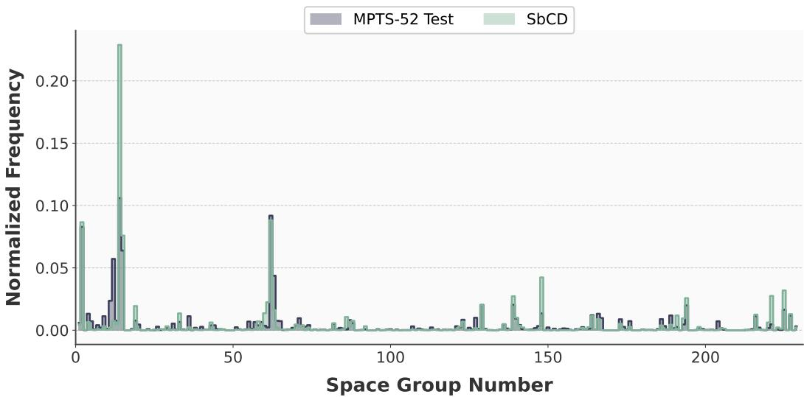  
Figure 6: Space group distributions of the MPTS-52 test set and crystals sampled by SbCD.

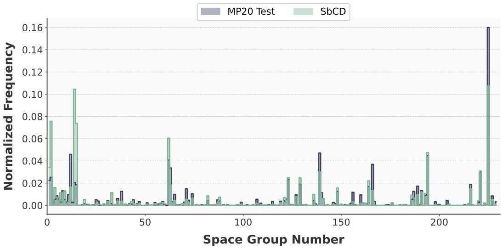  
Figure 7: Space group distributions of the MP-20 test set and crystals sampled by SbCD.

## C.5 Histogram of the energy above the convex hull $E _ { h u l l }$

Figures 11 and 12 visualize the distributions of $E _ { \mathrm { h u l l } }$ computed after relaxation with CHGNET [10] for different methods. As shown, SbCD performs competitively, generating a significantly higher proportion of structures that are thermodynamically stable $( E _ { \mathrm { h u l l } } < 0 )$ or metastable $( E _ { \mathrm { h u l l } } < 0 . 1 )$

## D Theoretical proofs

## D.1 Proof of Proposition 4.1

Let Q denote the forward CTMC path measure, $\hat { \mathbb { Q } }$ the exact reverse path measure, and $\mathbb { P } ^ { \theta }$ the learned reverse path measure. Let $\begin{array} { r l r } { { \mathcal P } } & { { } = } & { C ( [ 0 , T ] , \mathbb { M } ) } \end{array}$ denote the path space on M. For an assymmetric-unit crystal representation $\begin{array} { r l r } { \mathcal { M } } & { { } = } & { \{ G , { \bf A } , { \bf k } , { \bf S } , { \bf F } \} } \end{array}$ , we denote by $\mathcal { M } _ { t }$ the noisy structure at diffusion timestep $t ,$ and $\boldsymbol { \mathsf { b y } } ^ { \mathrm { ~ \tiny ~ { ~ W ~ } ~ } }$ the reverse diffusion path. Following Campbell et al. [5], we derive the negative log-likelihood of the model.

$$
\begin{array} { l } { \displaystyle - \log p \rho ( M _ { 0 } ) = - \log \int _ { \mathbb { M } } p _ { \mathrm { r e f } } ( d M _ { T } ) \int _ { \mathcal { P } } \mathbf { 1 } _ { \{ W _ { T } = M _ { 0 } \} } \mathbb { P } ^ { \beta , M _ { T } } ( d w ) } \\ { \displaystyle \quad \quad = - \log \int _ { \mathbb { M } } q _ { T \mid 0 } ( d M _ { T } \mid M _ { 0 } ) \int _ { \mathcal { P } } \mathbf { 1 } _ { \{ W _ { T } = M _ { 0 } \} } \hat { \Phi } ^ { M _ { T } } ( d w ) \frac { d p _ { \mathrm { r e f } } } { d q _ { T \mid 0 } ( \cdot \vert M _ { 0 } \rangle } ( M _ { T } ) \frac { d \mathbb { P } ^ { \beta , M _ { T } } } { d \hat { \Phi } ^ { M _ { T } } } ( w ) } \\ { \displaystyle \quad \quad = - \log \int _ { \mathbb { M } } q _ { T \mid 0 } ( d M _ { T } \vert M _ { 0 } ) \int _ { \mathcal { P } } \hat { \Phi } ^ { M _ { T } } ( d w \vert W _ { T } = \mathcal { M } _ { 0 } ) \frac { d p _ { \mathrm { r e f } } } { d q _ { T \mid 0 } ( \cdot \vert M _ { 0 } \rangle } ( M _ { T } ) \frac { d \mathbb { P } ^ { \beta , M _ { T } } } { d \hat { \Phi } ^ { M _ { T } } } ( w ) \hat { \Phi } ^ { M _ { T } } ( \{ W _ { T } = \mathcal { M } _ { 0 } \} ) } \end{array}
$$

Where $\hat { \mathbb { Q } } ^ { \mathcal { M } _ { T } } , \mathbb { P } ^ { \theta , \mathcal { M } _ { T } }$ denote the exact and learned reverse path measures starting from $\mathcal { M } _ { T } , \mathrm { r e - }$ spectively. In the second equation, we apply a change of measure, and in the third equation, we apply a bridge decomposition of $\mathbf { 1 } _ { \{ W _ { T } = \mathcal { M } _ { 0 } \} } \hat { \mathbb { Q } } ^ { \mathcal { M } _ { T } } ( d w )$ . Specifically, this term is decomposed into the bridge path measure, $\hat { \mathbb { Q } } ^ { M _ { T } } ( d w | W _ { T } = \mathcal { M } _ { 0 } )$ and the probability $\hat { \mathbb { Q } } ^ { M _ { T } } ( \{ W _ { T } = \mathcal { M } _ { 0 } \} )$ , which represents a probability that a reverse path starting from $\mathcal { M } _ { T }$ terminates at $\mathcal { M } _ { 0 }$ . We then define the joint probability measure $\mu ( d \mathcal { M } _ { T } , d w )$ and the integrand $f ( \mathcal { M } _ { T } , w )$ as follows:

$$
\begin{array} { r } { \mu ( d \mathcal { M } _ { T } , d w ) = q _ { T | 0 } ( d \mathcal { M } _ { t } | \mathcal { M } _ { 0 } ) \hat { \mathbb { Q } } ^ { \mathcal { M } _ { T } } ( d w | W _ { T } = \mathcal { M } _ { 0 } ) } \\ { f ( \mathcal { M } _ { T } , w ) = \frac { d p _ { \mathrm { r e f } } } { d q _ { T | 0 } ( \cdot | \mathcal { M } _ { 0 } ) } ( \mathcal { M } _ { T } ) \frac { d \mathbb { P } ^ { \theta , \mathcal { M } _ { T } } } { d \hat { \mathbb { Q } } ^ { \mathcal { M } _ { T } } } ( w ) \hat { \mathbb { Q } } ^ { \mathcal { M } _ { T } } ( \{ W _ { T } = \mathcal { M } _ { 0 } \} ) } \end{array}\tag{6}
$$

We can rewrite the negative log likelihood:

$$
- \log p _ { \theta } ( \mathcal { M } _ { 0 } ) = - \log \int f \left( \mathcal { M } _ { T } , w \right) \mu ( d \mathcal { M } _ { T } , d w )\tag{7}
$$

By Jensen’s inequality (− log is convex, $\operatorname { s o } - \log \mathbb { E } [ X ] \leq \mathbb { E } [ - \log X ] )$

$$
- \log p _ { \theta } ( \mathcal { M } _ { 0 } ) \leq \int - \log f ( \mathcal { M } _ { T } , w ) \mu ( d \mathcal { M } _ { T } , d w )\tag{8}
$$

$$
\begin{array} { r l } { \mathrm { w h e r e } } & { - \log f ( \mathcal { M } _ { T } , w ) = - \log \frac { d p _ { \mathrm { r e f } } } { d q _ { T | 0 } ( \cdot | \mathcal { M } _ { 0 } ) } ( \mathcal { M } _ { T } ) - \log \frac { d \mathbb { P } ^ { \theta , \mathcal { M } _ { T } } } { d \hat { \mathbb { Q } } ^ { M _ { T } } } ( w ) - \log \hat { \mathbb { Q } } ^ { \mathcal { M } _ { T } } ( \{ W _ { T } = \mathcal { M } _ { 0 } \} ) } \end{array}
$$

The last term is independent of the model parameter $\theta ,$ and the first term does not depend on the path realization w. Therefore, taking the expectation with respect to $\mu \ y i { \mathrm { e l d s } }$

$$
\begin{array} { r l } & { - \log p _ { \theta } ( \mathcal { M } _ { 0 } ) \leq \mathbb { E } _ { \mu } [ - \log \frac { d \mathbb { P } ^ { \theta , \mathcal { M } _ { T } } } { d \widehat { \mathbb { Q } } ^ { \mathcal { M } _ { T } } } ( w ) ] + C _ { 0 } } \\ & { \qquad = \mathbb { E } _ { q _ { T | 0 } ( \cdot | \mathcal { M } _ { 0 } ) } [ D _ { \mathrm { K L } } ( \widehat { \mathbb { Q } } ^ { \mathcal { M } _ { T }  \mathcal { M } _ { 0 } } \Vert \mathbb { P } ^ { \theta , \mathcal { M } _ { T } } ) ] + C , } \end{array}\tag{9}
$$

where

$$
C _ { 0 } = \mathbb { E } _ { q _ { T | 0 } ( \cdot | \mathcal { M } _ { 0 } ) } \left[ - \log \widehat { \mathbb { Q } } ^ { \mathcal { M } _ { T } } ( \{ W _ { T } = \mathcal { M } _ { 0 } \} ) - \log \frac { d p _ { \mathrm { r e f } } } { d q _ { T | 0 } ( \cdot | \mathcal { M } _ { 0 } ) } ( \mathcal { M } _ { T } ) \right] ,
$$

After rewriting the bridge expectation as a $\mathbf { K L }$ divergence, the bridge-normalization term cancels with the corresponding term in $C _ { 0 }$

$$
C = \mathbb { E } _ { q _ { T | 0 } ( \cdot | \mathcal { M } _ { 0 } ) } \left[ - \log \frac { d p _ { \mathrm { r e f } } } { d q _ { T | 0 } ( \cdot | \mathcal { M } _ { 0 } ) } ( \mathcal { M } _ { T } ) \right] .
$$

Finally, $\widehat { \mathbb { Q } } ^ { \mathcal { M } _ { T }  \mathcal { M } _ { 0 } } : = \widehat { \mathbb { Q } } ^ { \mathcal { M } _ { T } } ( \cdot | W _ { T } = \mathcal { M } _ { 0 } )$ denotes the bridge measure connecting $\mathcal { M } _ { T }$ and $\mathcal { M } _ { 0 }$

We assume that the bridge measure factorizes according to the dependency structure of the crystal representation, with G governing k and S, while A and F are modeled independently. Under the same factorization for the learned reverse measure, the KL chain rule yields the following decomposition.

$$
\begin{array} { r } { \hat { \mathbb { Q } } ^ { M _ { T }  M _ { 0 } } ( d G , d \mathbf { A } , d \mathbf { k } , d \mathbf { S } , d \mathbf { F } ) = \hat { \mathbb { Q } } _ { G } ^ { M _ { T }  M _ { 0 } } ( d G ) \hat { \mathbb { Q } } _ { \mathbf { k } | G } ^ { M _ { T }  M _ { 0 } } ( d \mathbf { k } | G ) \cdot \hat { \mathbb { Q } } _ { \mathbf { S } | G } ^ { M _ { T }  M _ { 0 } } ( d \mathbf { S } | G ) \hat { \mathbb { Q } } _ { \mathbf { A } } ^ { M _ { T }  M _ { 0 } } ( d \mathbf { A } ) \hat { \mathbb { Q } } _ { \mathbf { F } } ^ { M _ { T }  M _ { 0 } } ( d \mathbf { F } ) } \\ { \mathbb { P } ^ { \theta , M _ { T } } ( d G , d \mathbf { A } , d \mathbf { k } , d \mathbf { S } , d \mathbf { F } ) = \mathbb { P } _ { G } ^ { \theta , M _ { T } } ( d G ) \cdot \mathbb { P } _ { \mathbf { k } | G } ^ { \beta , M _ { T } } ( d \mathbf { k } | G ) \mathbb { P } _ { \mathbf { S } | G } ^ { \beta , M _ { T } } ( d \mathbf { S } | G ) \mathbb { P } _ { \mathbf { A } } ^ { \theta , M _ { T } } ( d \mathbf { A } ) \mathbb { P } _ { \mathbf { F } } ^ { \beta , M _ { T } } ( d \mathbf { F } ) } \end{array}\tag{10}
$$

We apply the KL chain rule that yields:

$$
\begin{array} { r l } & { D _ { \mathrm { K L } } ( \hat { \mathbb { Q } } ^ { M _ { T }  M _ { 0 } } \Vert \mathbb { P } ^ { \theta , M _ { T } } ) = D _ { \mathrm { K L } } ( \hat { \mathbb { Q } } _ { G } ^ { M _ { T }  M _ { 0 } } \Vert \mathbb { P } _ { G } ^ { \theta , M _ { T } } ) } \\ & { \qquad + \mathbb { E } _ { \hat { \mathbb { Q } } _ { G } ^ { M _ { T }  M _ { 0 } } } [ D _ { \mathrm { K L } } ( \hat { \mathbb { Q } } _ { \mathbf { k } | G } ^ { M _ { T }  M _ { 0 } } \Vert \mathbb { P } _ { \mathbf { k } | G } ^ { \theta , M _ { T } } ) + D _ { \mathrm { K L } } ( \hat { \mathbb { Q } } _ { \mathbf { k } | G } ^ { M _ { T }  M _ { 0 } } \Vert \mathbb { P } _ { \mathbf { S } | G } ^ { \theta , M _ { T } } ) ] } \\ & { \qquad + D _ { \mathrm { K L } } ( \hat { \mathbb { Q } } _ { \mathbf { A } } ^ { M _ { T }  M _ { 0 } } \Vert \mathbb { P } _ { \mathbf { A } } ^ { \theta , M _ { T } } ) + D _ { \mathrm { K L } } ( \hat { \mathbb { Q } } _ { \mathbf { F } } ^ { M _ { T }  M _ { 0 } } \Vert \mathbb { P } _ { \mathbf { F } } ^ { \theta , M _ { T } } ) \qquad ( 1 1 ) } \end{array}
$$

Now, we consider a discretized version of the continuous-time exact reverse bridge path measure on $\mathbf { A } , \mathbf { F } \mathbf { \mathrm { : } }$

$$
\begin{array} { r } { \hat { \mathbb { Q } } _ { \mathbf { A } } ^ { \mathcal { M } _ { T }  \mathcal { M } _ { 0 } } ( d w ) \Rightarrow q ( \mathbf { A } _ { t _ { 1 } } , \mathbf { A } _ { t _ { 2 } } , \dots , \mathbf { A } _ { t _ { N - 1 } } | \mathbf { A } _ { 0 } , \mathbf { A } _ { T } ) } \\ { \hat { \mathbb { Q } } _ { \mathbf { F } } ^ { \mathcal { M } _ { T }  \mathcal { M } _ { 0 } } ( d w ) \Rightarrow q ( \mathbf { F } _ { t _ { 1 } } , \mathbf { F } _ { t _ { 2 } } , \dots , \mathbf { F } _ { t _ { N - 1 } } | \mathbf { F } _ { 0 } , \mathbf { F } _ { T } ) } \end{array}\tag{12}
$$

And, the learned reverse process continuous-time path measure can be discretized as:

$$
\begin{array} { r l } & { \mathbb { P } _ { \mathbf { A } } ^ { \theta , \boldsymbol { M } _ { T } } ( d w ) \Rightarrow p _ { \theta } ( \mathbf { A } _ { t _ { N - 1 } } , \dots , \mathbf { A } _ { t _ { 0 } } | \boldsymbol { M } _ { T } ) = \displaystyle \prod _ { j = 1 } ^ { N } p _ { \theta } ( \mathbf { A } _ { t _ { j - 1 } } | \boldsymbol { M } _ { t _ { j } } ) , \mathrm { ~ w h e r e ~ \boldsymbol { \mathcal { M } } _ { t _ j } ~ c o n t a i n s ~ \mathbf { A } _ { t _ j } ~ } } \\ & { \mathbb { P } _ { \mathbf { F } } ^ { \theta , \boldsymbol { M } _ { T } } ( d w ) \Rightarrow p _ { \theta } ( \mathbf { F } _ { t _ { N - 1 } } , \dots , \mathbf { \boldsymbol { \cdot } } , \mathbf { F } _ { t _ { 0 } } | \boldsymbol { M } _ { T } ) = \displaystyle \prod _ { j = 1 } ^ { N } p _ { \theta } ( \mathbf { F } _ { t _ { j - 1 } } | \boldsymbol { \mathcal { M } } _ { t _ { j } } ) , \mathrm { ~ w h e r e ~ \boldsymbol { \mathcal { M } } _ { t _ j } ~ c o n t a i n s ~ \mathbf { F } _ { t _ j } ~ } ( 1 3 ) } \end{array}
$$

We obtain the discretized Radon–Nikodym derivative

$$
\begin{array} { r l r } & { } & { \log \frac { d \hat { \mathbb { Q } } _ { \mathbf { A } } ^ { \mathcal { M } _ { T }  \mathcal { M } _ { 0 } } } { d \mathbb { P } _ { \mathbf { A } } ^ { \theta , \mathcal { M } _ { T } } } ( w ) \Rightarrow \displaystyle \sum _ { j = 1 } ^ { N } \log \frac { q ( \mathbf { A } _ { t _ { j - 1 } } | \mathbf { A } _ { 0 } , \mathbf { A } _ { t _ { j } } ) } { p _ { \theta } ( \mathbf { A } _ { t _ { j - 1 } } | \mathcal { M } _ { t _ { j } } ) } } \\ & { } & { \log \frac { d \hat { \mathbb { Q } } _ { \mathbf { F } } ^ { \mathcal { M } _ { T }  \mathcal { M } _ { 0 } } } { d \mathbb { P } _ { \mathbf { F } } ^ { \theta , \mathcal { M } _ { T } } } ( w ) \Rightarrow \displaystyle \sum _ { j = 1 } ^ { N } \log \frac { q ( \mathbf { F } _ { t _ { j - 1 } } | \mathbf { F } _ { 0 } , \mathbf { F } _ { t _ { j } } ) } { p _ { \theta } ( \mathbf { F } _ { t _ { j - 1 } } | \mathcal { M } _ { t _ { j } } ) } } \end{array}\tag{14}
$$

These discretized Radon–Nikodym derivatives recover the KL terms appearing in the discrete-time evidence upper bound of Sohl-Dickstein et al. [34], which underlies diffusion models in continuousstate spaces [17] and discrete-state spaces [2]. Similarly, we obtain the discretized Radon–Nikodym derivatives for k and S:

$$
\begin{array} { r l } & { \log \frac { d \hat { \mathbb { Q } } _ { { \bf k } | { \cal G } } ^ { M _ { T }  M _ { 0 } } } { d { \bf f } _ { { \bf k } | { \cal G } } ^ { \beta , M _ { T } } } ( w ) \Rightarrow \displaystyle \sum _ { j = 1 } ^ { N } \log \frac { q ( { \bf k } _ { t _ { j - 1 } } | { \bf k } _ { 0 } , { \bf k } _ { t _ { j } } , G _ { t _ { j } } , G _ { t _ { j - 1 } } ) } { p _ { \theta } ( { \bf k } _ { t _ { j - 1 } } | { \cal M } _ { t _ { j } } , G _ { t _ { j - 1 } } ) } \mathrm { , ~ w h e r e ~ \mathcal { M } _ { t _ j } ~ c o n t a i n s ~ G _ { t _ j } ~ a n d ~ { \bf k } _ { t _ j } ~ } } \\ & { \log \frac { d \hat { \mathbb { Q } } _ { { \bf S } | { \cal G } } ^ { M _ { T }  M _ { 0 } } } { d { \bf f } _ { { \bf S } | { \cal G } } ^ { \beta , M _ { T } } } ( w ) \Rightarrow \displaystyle \sum _ { j = 1 } ^ { N } \log \frac { q ( { \bf S } _ { t _ { j - 1 } } | { \bf S } _ { 0 } , { \bf S } _ { t _ { j } } , G _ { t _ { j } } , G _ { t _ { j - 1 } } ) } { p _ { \theta } ( { \bf S } _ { t _ { j - 1 } } | { \cal M } _ { t _ { j } } , G _ { t _ { j - 1 } } ) } \mathrm { , ~ w h e r e ~ \mathcal { M } _ { t _ j } ~ c o n t a i n s ~ G _ { t _ j } ~ a n d ~ { \bf S } _ { t _ j } ~ } } \end{array}
$$

Finally, the remaining term $D _ { \mathrm { K L } } ( \hat { \mathbb { Q } } _ { G } ^ { \ M _ { T }  \mathcal { M } _ { 0 } } \Vert \mathbb { P } _ { G } ^ { \theta , \mathcal { M } _ { T } } )$ is optimized using CTMC Markov jump diffusion from Feller [12], Campbell et al. [5].

We conclude the proof.

## D.2 Proof of Proposition 4.2

We consider a continuous-time Markov process with time-dependent transition rates. Let $q _ { t | \widetilde { t } } ( G | \widetilde { G } )$ denote the transition probability to be in the space group G at the time t, if the process was in the

space group $\widetilde { G }$ at the earlier time $\widetilde t < t .$ We start from the Kolmogorov forward equation [12] in the jump-rate form:

$$
\frac { \partial } { \partial t } q _ { t | \widetilde { t } } ( G | \widetilde { G } ) = - \lambda _ { t } ( G ) q _ { t | \widetilde { t } } ( G | \widetilde { G } ) + \sum _ { G ^ { \prime } } \lambda _ { t } ( G ^ { \prime } ) \mathbf { 1 } _ { t } ( G ^ { \prime } , G ) q _ { t | \widetilde { t } } ( G ^ { \prime } | \widetilde { G } )\tag{15}
$$

Here,

$\lambda _ { t } ( G ^ { \prime } )$ is the total jump rate out of state $G ^ { \prime }$ at time t.

$\Pi _ { t } ( G ^ { \prime } , G )$ is the probability that, given a jump occurs from the space group $G ^ { \prime }$ at time $t ,$ the process jumps to the space group $G$ (and $\begin{array} { r } { \dot { \Pi _ { t } } ( G ^ { \prime } , G ^ { \prime } ) = 0 ) } \end{array}$

We recall the instantaneous transition rate (generator) matrix $\Lambda _ { t } ( G ^ { \prime } , G )$ with entries:

$$
\begin{array} { r } { \mathbf { A } _ { t } ( G ^ { \prime } , G ) = \lambda _ { t } ( G ^ { \prime } ) \mathbf { { I I } } _ { t } ( G ^ { \prime } , G ) - \delta _ { G ^ { \prime } G } \lambda _ { t } ( G ^ { \prime } ) = \left\{ \begin{array} { l l } { \lambda _ { t } ( G ^ { \prime } ) \mathbf { { I I } } _ { t } ( G ^ { \prime } , G ) } & { G \neq G ^ { \prime } } \\ { \quad - \lambda _ { t } ( G ^ { \prime } ) \quad } & { G = G ^ { \prime } } \end{array} \right. } \end{array}\tag{16}
$$

Apply the generator matrix to the forward equation, we have:

$$
\begin{array} { l } { \displaystyle \frac { \partial } { \partial t } q _ { t | \tilde { t } } ( G | \tilde { G } ) = - \lambda _ { t } ( G ) q _ { t | \tilde { t } } ( G | \tilde { G } ) + \sum _ { G ^ { \prime } } \lambda _ { t } ( G ^ { \prime } ) \Pi _ { t } ( G ^ { \prime } , G ) q _ { t | \tilde { t } } ( G ^ { \prime } | \tilde { G } ) } \\ { = \Lambda _ { t } ( G , G ) q _ { t | \tilde { t } } ( G | \tilde { G } ) + \displaystyle \sum _ { G ^ { \prime } } \lambda _ { t } ( G ^ { \prime } ) \Pi _ { t } ( G ^ { \prime } , G ) q _ { t | \tilde { t } } ( G ^ { \prime } | \tilde { G } ) } \\ { = \Lambda _ { t } ( G , G ) q _ { t | \tilde { t } } ( G | \tilde { G } ) + \displaystyle \sum _ { G ^ { \prime } \neq G } \Lambda _ { t } ( G ^ { \prime } , G ) q _ { t | \tilde { t } } ( G ^ { \prime } | \tilde { G } ) } \\ { = \displaystyle \sum _ { G ^ { \prime } } \Lambda _ { t } ( G ^ { \prime } , G ) q _ { t | \tilde { t } } ( G ^ { \prime } | \tilde { G } ) = \left[ q _ { t | \tilde { t } } \Lambda _ { t } \right] _ { \tilde { G } , G } } \end{array}\tag{17}
$$

In the matrix form, the forward equation is equivalent to the matrix ODE:

$$
\frac { \partial } { \partial t } q _ { t | \widetilde { t } } = q _ { t | \widetilde { t } } \Lambda _ { t }\tag{18}
$$

Integrating both sides gives:

$$
q _ { t | \widetilde { t } } = I + \int _ { \widetilde { t } } ^ { t } q _ { t | \widetilde { t } } \Lambda _ { s } d s\tag{19}
$$

Iterating the integral gives the Dyson series:

$$
\begin{array} { c } { { q _ { t | \widetilde t } = I + \displaystyle \int _ { \widetilde t } ^ { t } \Lambda _ { s _ { 1 } } d s _ { 1 } + \displaystyle \int _ { \widetilde t } ^ { t } \int _ { \widetilde t } ^ { s _ { 1 } } \Lambda _ { s _ { 1 } } \Lambda _ { s _ { 2 } } d s _ { 1 } d s _ { 2 } + . . . } } \\ { { = I + \displaystyle \sum _ { n = 1 } ^ { \infty } \displaystyle \int _ { \widetilde t } ^ { t } \displaystyle \int _ { \widetilde t } ^ { s _ { 1 } } . . . \int _ { \widetilde t } ^ { s _ { n - 1 } } \Lambda _ { s _ { n } } \cdot \cdot \cdot \Lambda _ { s _ { 1 } } d s _ { n } \cdot \cdot \cdot d s _ { 1 } } } \end{array}\tag{20}
$$

with the ordering $\widetilde t \leq s _ { n } \leq \cdot \cdot \cdot \leq s _ { 1 } \leq t$ . Now, assuming that the instantaneous transition rate matrix $\Lambda _ { s , \ }$ commutes with $\pmb { \Lambda } _ { s _ { i } }$ for all $s _ { i } , s _ { j } , \mathrm { i . e . , } \Lambda _ { s _ { i } } \pmb { \Lambda } _ { s _ { j } } = \pmb { \Lambda } _ { s _ { j } } \pmb { \Lambda } _ { s _ { i } }$ . With this assumption, the integrand is symmetric in $( s _ { 1 } , s _ { 2 } , \cdots , s _ { n } )$ . The integration can be further simplified to the matrix exponential form:

$$
\begin{array} { c } { { q _ { t | \widetilde t } = I + \displaystyle \sum _ { n = 1 } ^ { \infty } \displaystyle \frac { 1 } { n ! } \left( \displaystyle \int _ { \widetilde t } ^ { t } \mathbf { \Delta } \mathbf { \Delta } \Lambda _ { s } d s \right) ^ { n } } } \\ { { = \displaystyle \exp \left( \displaystyle \int _ { \widetilde t } ^ { t } \mathbf { \Delta } \mathbf { \Delta } \Lambda _ { s } d s \right) } } \end{array}\tag{21}
$$

We now consider the space-group relative transition probability $\Pi _ { t }$ that is constant over time:

$$
\Pi _ { t } ( { \widetilde { G } } , G ) = \Pi ( { \widetilde { G } } , G ) = { \left\{ \begin{array} { l l } { 0 } & { { \widetilde { G } } = \operatorname { P 1 } } \\ { 0 } & { G = { \widetilde { G } } } \\ { 1 } & { G = \operatorname { P 1 } \neq { \widetilde { G } } } \\ { 0 } & { { \mathrm { o t h e r w i s e } } . } \end{array} \right. }\tag{22}
$$

This design forces every jump to the lowest symmetry space group P1. The instantaneous rate matrix thus can be obtained by applying its definition with $\Pi _ { t }$ above:

$$
\mathbf { A } _ { t } ( \widetilde { G } , G ) = \lambda ( t ) \mathbf { I } ^ { + } ( \widetilde { G } , G ) = \left\{ \begin{array} { l l } { 0 } & { \widetilde { G } = \mathrm { P 1 } } \\ { - \lambda ( t ) } & { G = \widetilde { G } } \\ { \lambda ( t ) } & { G = \mathrm { P 1 } \neq \widetilde { G } } \\ { 0 } & { \mathrm { o t h e r w i s e . } } \end{array} \right. \mathbf { M } ^ { + } ( \widetilde { G } , G ) = \left\{ \begin{array} { l l } { 0 } & { \widetilde { G } = \mathrm { P 1 } } \\ { - 1 } & { G = \widetilde { G } } \\ { 1 } & { G = \mathrm { P 1 } \neq \widetilde { G } } \\ { 0 } & { \mathrm { o t h e r w i s e . } } \end{array} \right.\tag{23}
$$

We can easily verify the commutativity of the instantaneous rate matrix for all $t ,$ s:

$$
\Lambda _ { t } \Lambda _ { s } = \lambda ( t ) \Pi ^ { + } \lambda ( s ) \Pi ^ { + } = \lambda ( t ) \lambda ( s ) \Pi ^ { + } \Pi ^ { + } = \Lambda _ { s } \Lambda _ { t }\tag{24}
$$

Thus, we can apply Equation 21 to get the analytical form of space-group transition probabilities.

$$
\begin{array} { r l } {  { q _ { t | \widetilde { t } } = \exp ( \int _ { \widetilde { t } } ^ { t } \Lambda _ { s } d s ) } } \\ & { = \exp ( \mathbf { { I I } } ^ { + } \int _ { \widetilde { t } } ^ { t } \lambda ( s ) d s ) } \\ & { = \mathbf { D } \exp ( \sum \int _ { \widetilde { t } } ^ { t } \lambda ( s ) d s ) \mathbf { D } ^ { - 1 } } \end{array}\tag{25}
$$

with the eigen-decomposition of $\mathbf { I I ^ { + } } = \mathbf { D } \boldsymbol { \Sigma } \mathbf { D } ^ { - 1 }$

We conclude the proof.

## D.3 Proof of Corollary 4.3

Consider a stochastic system with two states, $\widetilde { G }$ and $G .$ . The system is initialized in state $\widetilde { G }$ and is observed to be in state G at time t. The posterior distribution of the holding time τ (the transition event ${ \widetilde { G } } \to G )$ is derived via Bayes’ theorem as follows:

$$
p ( \tau \mid G , { \widetilde { G } } ) = \frac { P ( G \mid \tau , { \widetilde { G } } ) \cdot P ( \tau \mid { \widetilde { G } } ) } { P ( G \mid { \widetilde { G } } ) } .\tag{26}
$$

The likelihood term equals one if the transition occurred before the observation time t:

$$
P ( G \mid \tau , { \widetilde { G } } ) = \mathbf { 1 } [ \tau < t ] .\tag{27}
$$

The standard survival distribution gives the prior density of the absorption time:

$$
p ( \tau ) = P ( \tau \mid \widetilde { G } ) = \lambda ( \tau ) \exp \left( - \int _ { 0 } ^ { \tau } \lambda ( u ) d u \right) .\tag{28}
$$

The evidence (marginal likelihood) evaluates to:

$$
\begin{array} { l } { P ( G \mid \widetilde { G } ) = \displaystyle \int _ { 0 } ^ { \infty } P ( G \mid \tau ) p ( \tau \mid \widetilde { G } ) d \tau } \\ { \displaystyle \qquad = \displaystyle \int _ { 0 } ^ { t } 1 \cdot p ( \tau ) d \tau } \\ { \displaystyle \qquad = \displaystyle \int _ { 0 } ^ { t } \lambda ( \tau ) \exp \left( - \displaystyle \int _ { 0 } ^ { \tau } \lambda ( u ) d u \right) d \tau } \\ { \displaystyle \qquad = 1 - \exp \left( - \displaystyle \int _ { 0 } ^ { t } \lambda ( u ) d u \right) . } \end{array}\tag{29}
$$

Substituting these components, the posterior density is:

$$
p ( \tau \mid G , \widetilde { G } ) = \frac { \mathbf { 1 } [ \tau < t ] \cdot \lambda ( \tau ) \exp \big ( - \int _ { 0 } ^ { \tau } \lambda ( u ) d u \big ) } { 1 - \exp \Big ( - \int _ { 0 } ^ { t } \lambda ( u ) d u \Big ) } .\tag{30}
$$

In the specific case of a constant transition rate $\lambda ( t ) = \lambda$ , this simplifies to a truncated exponential distribution:

$$
p ( \tau \mid G , \widetilde { G } ) = \frac { \lambda e ^ { - \lambda \tau } } { 1 - e ^ { - \lambda t } } , \quad \tau \in [ 0 , t ] .\tag{31}
$$

The corresponding cumulative distribution function (CDF) is:

$$
F ( \tau ) = \frac { 1 - e ^ { - \lambda \tau } } { 1 - e ^ { - \lambda t } } .\tag{32}
$$

By applying the inverse transform sampling method, samples of τ can be generated using:

$$
\tau = - \frac { 1 } { \lambda } \log \left( { 1 - u ( 1 - e ^ { - \lambda t } ) } \right) , \quad u \sim \mathcal { U } ( 0 , 1 ) .\tag{33}
$$

The symmetry-breaking time window is thus defined as $w = t - \tau$

We conclude the proof.

## D.4 Proof of Proposition 4.4

The set of symmetric basis matrices $\{ \mathbf { B } _ { i } \} _ { i = 1 } ^ { 6 }$ , derived by Jiao et al. [20], is given as follows.

$$
\mathbf { B } _ { 1 } = { \left( \begin{array} { l l l } { 0 } & { 1 } & { 0 } \\ { 1 } & { 0 } & { 0 } \\ { 0 } & { 0 } & { 0 } \end{array} \right) } , \qquad \mathbf { B } _ { 2 } = { \left( \begin{array} { l l l } { 0 } & { 0 } & { 1 } \\ { 0 } & { 0 } & { 0 } \\ { 1 } & { 0 } & { 0 } \end{array} \right) } , \qquad \mathbf { B } _ { 3 } = { \left( \begin{array} { l l l } { 0 } & { 0 } & { 0 } \\ { 0 } & { 0 } & { 1 } \\ { 0 } & { 1 } & { 0 } \end{array} \right) } ,
$$

$$
\mathbf { B } _ { 4 } = { \left( \begin{array} { l l l } { 1 } & { 0 } & { 0 } \\ { 0 } & { - 1 } & { 0 } \\ { 0 } & { 0 } & { 0 } \end{array} \right) } , \quad \mathbf { B } _ { 5 } = { \left( \begin{array} { l l l } { 1 } & { 0 } & { 0 } \\ { 0 } & { 1 } & { 0 } \\ { 0 } & { 0 } & { - 2 } \end{array} \right) } , \quad \mathbf { B } _ { 6 } = { \left( \begin{array} { l l l } { 1 } & { 0 } & { 0 } \\ { 0 } & { 1 } & { 0 } \\ { 0 } & { 0 } & { 1 } \end{array} \right) } .
$$

We can cast the space-group-constrained diffusion process over lattice parameters proposed by Jiao et al. [20] as a masking problem. Below, we describe the lattice masking mechanism applied to the six crystal families, ordered by increasing symmetry.

$$
\mathrm { i ) } \quad \mathrm { T r i c l i n i c : } \quad \mathfrak { m } = [ 1 , 1 , 1 , 1 , 1 , 1 ]
$$

$$
{ \mathfrak { m } } _ { \mathfrak { b } } = [ 0 , 0 , 0 , 0 , 0 , 0 ]
$$

$$
\mathrm { i i ) } \quad \mathrm { M o n o c l i n i c : } \quad \mathfrak { m } = [ 0 , 1 , 0 , 1 , 1 , 1 ]
$$

$$
{ \mathfrak { m } } _ { \mathfrak { b } } = [ 0 , 0 , 0 , 0 , 0 , 0 ]
$$

iii) Orthorhombic : m = [0, 0, 0, 1, 1, 1]

$$
{ \mathfrak { m } } _ { \mathfrak { b } } = [ 0 , 0 , 0 , 0 , 0 , 0 ]
$$

iv) Tetragonal : m = [0, 0, 0, 0, 1, 1]

$$
{ \mathfrak { m } } _ { \mathfrak { b } } = [ 0 , 0 , 0 , 0 , 0 , 0 ]
$$

v) Hexagonal : m = [0, 0, 0, 0, 1, 1]

$$
\mathfrak { m } _ { \mathfrak { b } } = [ - \log \frac { 3 } { 4 } , 0 , 0 , 0 , 0 , 0 ]
$$

$$
\begin{array} { r l } { \mathrm { v i ) } } & { { } \mathrm { C u b i c : } \quad \mathfrak { m } = [ 0 , 0 , 0 , 0 , 0 , 1 ] } \end{array}
$$

$$
{ \mathfrak { m } } _ { \mathfrak { b } } = [ 0 , 0 , 0 , 0 , 0 , 0 ]\tag{34}
$$

Masking operation axioms Let $( { \mathfrak { m } } , { \mathfrak { m } } _ { b } )$ and $( \widetilde { \mathfrak { m } } , \widetilde { \mathfrak { m } } _ { b } )$ denote the mask-bias pairs associated with G and ${ \widetilde { G } } ,$ respectively. Suppose that Ge belongs to a crystal family with higher symmetry than that of $G ,$ denoted by $G \prec { \widetilde { G } }$ . Then the following properties hold:

$$
\mathrm { i ) } \quad \widetilde { \mathfrak { m } } \odot \mathfrak { m } = \mathfrak { m } \odot \widetilde { \mathfrak { m } } = \widetilde { \mathfrak { m } } \qquad \mathrm { i i } ) \quad \mathfrak { m } \odot \mathfrak { m } _ { \mathfrak { b } } = \widetilde { \mathfrak { m } } \odot \widetilde { \mathfrak { m } } _ { \mathfrak { b } } = 0
$$

iii) $C _ { \mathfrak { m } _ { \mathfrak { b } } } = \mathfrak { m } _ { \mathfrak { b } }$ for any scalar value $C \qquad { \mathrm { i v } } ) \quad { \mathfrak { m } } \odot { \mathfrak { m } } _ { \mathfrak { b } } = { \mathfrak { m } } _ { \mathfrak { b } } \odot { \widetilde { \mathfrak { m } } } = 0$

(35)

Inductive proof $\mathbf { A } \mathbf { t } \ : t = \tau$ , the diffusion process is in the space group ${ \widetilde { G } } .$ Applying Lemma 3.1, we have:

$$
\mathbf { k } _ { \tau } = \widetilde { \mathfrak { m } } \odot \left( \sqrt { \bar { \alpha } _ { \tau } } \mathbf { k } _ { 0 } + \sqrt { 1 - \bar { \alpha } _ { \tau } } \pmb { \epsilon } _ { \tau } \right) + \widetilde { \mathfrak { m } } _ { \mathfrak { b } }\tag{36}
$$

From $t > \tau .$ , the diffusion process jumps to the space group G. Considering $t = \tau + 1$ , we have:

$$
\begin{array} { r l } { k _ { \perp } : \ : \ : \ : = \ : \alpha \beta ( \sqrt { \alpha ^ { 3 } + 1 } k _ { \perp } + \sqrt { 1 - \alpha _ { { \mathrm { s c } } } } , ( k _ { \perp } ) ) + \alpha \beta _ { \mathrm { s c } } } \\ & { \ : \ : - \ : \alpha \beta _ { \mathrm { s c } } ( \sqrt { 1 - \alpha _ { { \mathrm { s c } } } } ) ( \sin { ( \alpha k _ { \perp } ) } \cos { ( k _ { \perp } ) } - \sqrt { 1 - \alpha _ { { \mathrm { s c } } } } ) + \frac { 1 } { 4 } \sqrt { 1 - \alpha _ { { \mathrm { s c } } } + 1 } \epsilon _ { \mathrm { s c } } } \\ & { \ : \ : \ : - \alpha ( 2 \sqrt { \alpha _ { \mathrm { s c } } } + 1 6 ( \sqrt { 1 - \alpha _ { { \mathrm { s c } } } } ) \sqrt { 1 - \alpha _ { { \mathrm { s c } } } } ) ( \frac { 1 } { \sqrt { 1 - \alpha _ { { \mathrm { s c } } } } } ) ( \frac { 1 } { \sqrt { 1 - \alpha _ { { \mathrm { s c } } } } } ) ( \frac { 1 } { \sqrt { 1 - \alpha _ { { \mathrm { s c } } } } } ) + \sqrt { 1 - \alpha _ { { \mathrm { s c } } } + 1 } \epsilon _ { \mathrm { s c } } } \\ & { \ : \ : \ : \ : - ( \sqrt { 1 - \alpha _ { { \mathrm { s c } } } } ) ( \sqrt { 1 - \alpha _ { { \mathrm { s c } } } + 1 } ( 1 - \alpha _ { { \mathrm { s c } } } ) \epsilon _ { \mathrm { s c } } ) } \\ & { \ : \ : \ : \ : \ : \ : - \ : \alpha ( 2 \sqrt { \alpha _ { \mathrm { s c } } } + 1 6 ( \sqrt { 1 - \alpha _ { { \mathrm { s c } } } } ) \epsilon _ { \mathrm { s c } } ) } \\ &  \ : \ : \ : \ : \ : \ : ( \sqrt { 1 - \alpha _ { { \mathrm { s c } } } } ) \exp ( \exp ( - 4 \omega _  \mathrm  \end{array}
$$

In $( \star )$ , we use m $\odot \widetilde { \mathfrak { m } } = \widetilde { \mathfrak { m } }$ . In $( \star \star )$ , we use the fact that the sum of two independent Gaussian random variables with variances $\alpha _ { \tau + 1 } ( 1 - \bar { \alpha } _ { \tau } )$ and $1 - \alpha _ { \tau + 1 }$ is Gaussian with variance $1 - \bar { \alpha } _ { \tau + 1 }$ Similarly, for $t = \tau + 2 .$ , we can estimate $\mathbf { k } _ { \tau + 2 }$ as follows:

$$
\begin{array} { r l } { \Phi _ { \mu } = - \lambda _ { \mu } \left( \frac { \zeta _ { \mu } \eta } { \zeta _ { \mu } } \right) , \quad \forall \left( \frac { \zeta _ { \mu } \eta } { \zeta _ { \mu } } \right) = \lambda _ { \mu } , } & { \forall \left( \frac { \zeta _ { \mu } \eta } { \zeta _ { \mu } } \right) , } \\ { \Phi _ { \mu } = \lambda _ { \nu } \left( \frac { \zeta _ { \nu } \eta } { \zeta _ { \nu } } \right) , \quad \forall \left( \frac { \zeta _ { \mu } \eta } { \zeta _ { \nu } } \right) = \lambda _ { \nu } , } & { \forall \left( \frac { \zeta _ { \nu } \eta } { \zeta _ { \nu } } \right) , } \\ { \Phi _ { \mu } = \lambda _ { \nu } \left( \frac { \zeta _ { \nu } \eta } { \zeta _ { \nu } } \right) , \quad \forall \left( \frac { \zeta _ { \nu } \eta } { \zeta _ { \nu } } \right) , } & { \forall \left( \frac { \zeta _ { \nu } \eta } { \zeta _ { \nu } } \right) , } \\ { \Phi _ { \mu } = \lambda _ { \nu } \left( \frac { \zeta _ { \nu } \eta } { \zeta _ { \nu } } \right) , \quad \forall \left( \frac { \zeta _ { \nu } \eta } { \zeta _ { \nu } } \right) , } & { \forall \left( \frac { \zeta _ { \nu } \eta } { \zeta _ { \nu } } \right) , } \\ { \Phi _ { \mu } = \lambda _ { \nu } \left( \frac { \zeta _ { \nu } \eta } { \zeta _ { \nu } } \right) , \quad \forall \left( \frac { \zeta _ { \nu } \eta } { \zeta _ { \nu } } \right) , } & { \forall \left( \frac { \zeta _ { \nu } \eta } { \zeta _ { \nu } } \right) , } \\ { \Phi _ { \mu } = \lambda _ { \nu } \left( \frac { \zeta _ { \nu } \eta } { \zeta _ { \nu } } \right) , } & { \forall \left( \frac { \zeta _ { \nu } \eta } { \zeta _ { \nu } } \right) , } \\  \Phi _ { \mu } = \ \end{array}
$$

In (†), we substitute the expression for $\mathbf { k } _ { \tau + 1 }$ obtained in step $( \star )$ . In (††), we use m $\odot \widetilde { \mathfrak { m } } = \widetilde { \mathfrak { m } }$ and m $\odot { \mathfrak { m } } _ { \mathfrak { b } } = 0$ . In $( \dag \dag \dag )$ , we use the fact that the sum of two independent Gaussian random variables with variances $\alpha _ { \tau + 2 } ( 1 - \bar { \alpha } _ { \tau + 1 } )$ and $1 - \alpha _ { \tau + 2 }$ is Gaussian with variance $1 - \bar { \alpha } _ { \tau + 2 }$ , and that the sum of two independent Gaussian random variables with variances $\alpha _ { \tau + 2 } ( 1 - \alpha _ { \tau + 1 } )$ and $1 - \alpha _ { \tau + 2 }$ is Gaussian with variance $1 - \alpha _ { \tau + 1 } \alpha _ { \tau + 2 }$ . For a general case $t > \tau .$ , and $w = t - \tau$ , we have:

$$
\begin{array} { r l } & { \mathbf { k } _ { t } = \widetilde { \mathfrak { m } } \odot \left( \sqrt { \bar { \alpha } _ { t } } \mathbf { k } _ { 0 } + \sqrt { 1 - \bar { \alpha } _ { t } } \epsilon _ { \tau } \right) + \widetilde { \mathfrak { m } } _ { \mathfrak { b } } - \left( \widetilde { \mathfrak { m } } \odot \sqrt { 1 - \frac { \bar { \alpha } _ { t } } { \bar { \alpha } _ { t - w } } } \epsilon _ { \tau } + \widetilde { \mathfrak { m } } _ { \mathfrak { b } } \right) } \\ & { \qquad + \left( \mathfrak { m } \odot \sqrt { 1 - \frac { \bar { \alpha } _ { t } } { \bar { \alpha } _ { t - w } } } \epsilon _ { t } + \mathfrak { m } _ { b } \right) + \mathfrak { m } \odot \widetilde { \mathfrak { m } } _ { \mathfrak { b } } \sqrt { \frac { \bar { \alpha } _ { t } } { \bar { \alpha } _ { t - w } } } } \end{array}\tag{39}
$$

Sampling is performed using DDIM samplers from Song et al. [35]. The reverse process proceeds toward increasing symmetry levels, from G to $\widetilde { G }$

$$
\begin{array} { r } { \mathbf { k } _ { t - 1 } = \widetilde { \mathfrak { m } } \odot \left( \frac { \sqrt { \overline { { \alpha } } _ { t - 1 } } } { 1 - \overline { { \alpha _ { t } } } } \left( 1 - \alpha _ { t } \right) \widehat { \mathbf { k } } _ { 0 } ^ { \theta } ( \mathcal { M } _ { t } ) + \left( \mathfrak { m } \odot \mathbf { k } _ { t } + \mathfrak { m } _ { \mathfrak { b } } \right) \frac { \sqrt { \alpha _ { t } } } { 1 - \overline { { \alpha } } _ { t } } \left( 1 - \overline { { \alpha } } _ { t - 1 } \right) + \sigma _ { t } \epsilon \right) + \widetilde { \mathfrak { m } } _ { \mathfrak { b } } } \\ { = \widetilde { \mathfrak { m } } \odot \left( \frac { \sqrt { \overline { { \alpha } } _ { t - 1 } } } { 1 - \overline { { \alpha _ { t } } } } \left( 1 - \alpha _ { t } \right) \widehat { \mathbf { k } } _ { 0 } ^ { \theta } ( \mathcal { M } _ { t } ) + \mathfrak { m } \odot \frac { \sqrt { \alpha _ { t } } } { 1 - \overline { { \alpha } } _ { t } } \left( 1 - \overline { { \alpha } } _ { t - 1 } \right) \mathbf { k } _ { t } + \mathfrak { m } _ { \mathfrak { b } } + \sigma _ { t } \epsilon \right) + \widetilde { \mathfrak { m } } _ { \mathfrak { b } } } \end{array}\tag{40}
$$

We apply $C _ { \mathfrak { m } _ { \mathfrak { b } } } = \mathfrak { m } _ { \mathfrak { b } }$ for any scalar value C,i.e., the biases remain constant across crystal families, and $\hat { \mathbf { k } } _ { 0 } ^ { \theta } ( \mathcal { M } _ { t } )$ denotes the data-prediction parameterization of a neural network.

We conclude the proof.

## D.5 Proof of Proposition 4.5

We introduce a non-stationary prior mixture process that defines a forward process which changes its target distribution midway through corruption. Let denote $\widetilde { \mathfrak { g } }$ and g the marginal site symmetry prior of space group $\widetilde { G }$ and $G ,$ respectively. We still assume that $\widetilde { G }$ is a higher-symmetry space group than $G , \mathrm { i . e . , } G \prec \bar { G } ,$ , and recall that τ is the symmetry-breaking event; we rewrite the forward categorical diffusion from Austin et al. [2] as follows.

$$
q ( \mathbf { S } _ { t } | \mathbf { S } _ { 0 } , \tau , G , \widetilde { G } ) = \mathrm { C a t } ( \mathbf { S } _ { t } ; \mathbf { S } _ { 0 } \bar { \mathbf { Q } } _ { t , \tau } ^ { \widetilde { G }  G } )\tag{41}
$$

We have the following transition matrices within a space group.

$$
\bar { Q } _ { \tau  0 } ^ { \tilde { G } } = \bar { \alpha } _ { \tau } I + ( 1 - \bar { \alpha } _ { \tau } ) \mathbf { 1 } ( \widetilde { \mathfrak { g } } ) ^ { T }\tag{42}
$$

$$
\bar { Q } _ { t  \tau } ^ { G } = \frac { \bar { \alpha } _ { t } } { \bar { \alpha } _ { \tau } } I + ( 1 - \frac { \bar { \alpha } _ { t } } { \bar { \alpha } _ { \tau } } ) \mathbf { 1 } ( \mathfrak { g } ) ^ { T }\tag{43}
$$

Then,

$$
\begin{array} { r l } { \bar { Q } _ { t } ^ { \widetilde { G }  G } = \bar { Q } _ { \tau  0 } ^ { \widetilde { G } } \bar { Q } _ { \ t  \tau } ^ { G } = \Big ( \bar { \alpha } _ { \tau } I + ( 1 - \bar { \alpha } _ { \tau } ) \mathbf { 1 } ( \widetilde { \mathbf { g } } ) ^ { T } \Big ) \Big ( \frac { \widetilde { \alpha } _ { t } } { \widetilde { \alpha } _ { \tau } } I + ( 1 - \frac { \bar { \alpha } _ { t } } { \widetilde { \alpha } _ { \tau } } ) \mathbf { 1 } ( \mathbf { g } ) ^ { T } \Big ) } & { } \\ { = \bar { \alpha } _ { t } I + ( \bar { \alpha } _ { \tau } - \bar { \alpha } _ { t } ) \mathbf { 1 } ( \mathbf { g } ) ^ { T } + ( 1 - \bar { \alpha } _ { \tau } ) \frac { \bar { \alpha } _ { t } } { \widetilde { \alpha } _ { \tau } } \mathbf { 1 } ( \widetilde { \mathbf { g } } ) ^ { T } } & { } \\ { + ( 1 - \bar { \alpha } _ { \tau } ) ( 1 - \frac { \bar { \alpha } _ { t } } { \widetilde { \alpha } _ { \tau } } ) \mathbf { 1 } ( \mathbf { g } ) ^ { T } , \qquad \mathrm { a s \ ~ } ( \widetilde { \mathbf { g } } ) ^ { T } \mathbf { 1 } = 1 } & { } \\ { = \bar { \alpha } _ { t } I + \frac { 1 } { \widetilde { \alpha } _ { \tau } } \Big [ \bar { \alpha } _ { t } ( 1 - \bar { \alpha } _ { \tau } ) \mathbf { 1 } ( \widetilde { \mathbf { g } } ) ^ { T } + ( \bar { \alpha } _ { \tau } - \bar { \alpha } _ { t } ) \mathbf { 1 } ( \mathbf { g } ) ^ { T } \Big ] } & { } \\ { = \bar { \alpha } _ { t } I + ( 1 - \bar { \alpha } _ { t } ) \mathbf { 1 } ( \pi _ { t } ) ^ { T } } & { } \\ { \mathrm { w h e r e } \quad } &  \pi _ { t } = \frac { \bar { \alpha } _ { t } }  \widetilde { \alpha } _  \ \end{array}\tag{44}
$$

$\pi _ { t }$ is a symmetry-breaking (SB) prior that smoothly interpolates between two given site-symmetry priors.

Convexity

We rewrite the SB prior as a convex hull of the two priors

$$
\pi _ { t } = \nu _ { t } \widetilde { \mathfrak { g } } + ( 1 - \nu _ { t } ) \mathfrak { g } , \qquad \mathrm { w i t h } \quad 0 \leq \nu _ { t } = \frac { \bar { \alpha } _ { t } ( 1 - \bar { \alpha } _ { \tau } ) } { \bar { \alpha } _ { \tau } ( 1 - \bar { \alpha } _ { t } ) } \leq 1\tag{45}
$$

The convexity property ensures that $\pi _ { t }$ is a valid categorical distribution that lies within the probability simplex. The forward kernel thus remains row-stochastic and requires no renormalization trick.

Boundary consistency

For $t \leq \tau$ , there is no transition between priors, i.e. ${ \mathfrak { g } } = { \widetilde { \mathfrak { g } } } ,$ thus $\pi _ { t \leq \tau } = \widetilde { \mathfrak { g } } .$ And for $t \to T , \bar { \alpha } _ { t } \to$ 0, $\nu _ { t } \to 0$ , which leads to lim $\mathsf { 1 } _ { t  T } \pmb { \pi } _ { t } = \mathfrak { g }$ . And, the path connects two priors continuously.

Monotone geometric path

By differentiating $\pi _ { t }$ w.r.t time t, we have

$$
\frac { d \pmb { \pi } _ { t } } { d t } = \frac { d \pmb { \nu } _ { t } } { d t } ( \widetilde { \pmb { \mathfrak { g } } } - \pmb { \mathfrak { g } } )\tag{46}
$$

Since $\hat { \alpha } _ { t }$ is decreasing, $\nu _ { t }$ is decreasing, thus $\begin{array} { r } { \frac { d \nu _ { t } } { d t } < 0 } \end{array}$ and the path moves monotonically toward g.   
We conclude the proof.

## D.6 Proof of Corollary 4.6

The forward noise kernel follows from the proof in Appendix D.5, which we recall below:

$$
\begin{array} { r l } & { q ( \mathbf { S } _ { t } | \mathbf { S } _ { 0 } , \tau , G , \widetilde { G } ) = \mathrm { C a t } ( \mathbf { S } _ { t } ; \mathbf { S } _ { 0 } \overline { { \widetilde { \mathbf { Q } } _ { t , \tau } ^ { G  G } } } ) } \\ & { \mathrm { w h e r e } \ \overline { { \mathbf { Q } } } _ { t } ^ { \widetilde { G }  G } = \bar { \alpha } _ { t } I + ( 1 - \bar { \alpha } _ { t } ) \mathbf { 1 } ( \pi _ { t } ) ^ { T } } \\ & { \mathrm { a n d } \ \pi _ { t } = \frac { \bar { \alpha } _ { t } ( 1 - \bar { \alpha } _ { \tau } ) \widetilde { \mathbf { g } } + ( \bar { \alpha } _ { \tau } - \bar { \alpha } _ { t } ) \mathbf { g } } { \bar { \alpha } _ { \tau } ( 1 - \bar { \alpha } _ { t } ) } = \nu _ { t } \widetilde { \mathbf { g } } + ( 1 - \nu _ { t } ) \mathfrak { g } , \mathrm { ~ w i t h ~ } 0 \leq \nu _ { t } = \frac { \bar { \alpha } _ { t } ( 1 - \bar { \alpha } _ { \tau } ) } { \bar { \alpha } _ { \tau } ( 1 - \bar { \alpha } _ { t } ) } \leq 1 } \end{array}\tag{47}
$$

We rewrite the reverse sampling kernel of Austin et al. [2] under the symmetry-breaking formulation, in which the process proceeds toward higher symmetry orders in crystals. Specifically, we assume that the process jumps from space group $G _ { t } = G$ to space group $G _ { t - 1 } = \widetilde { G }$ , where $G \prec { \widetilde { G } }$ . The true posterior can be written as

$$
q ( \mathbf { S } _ { t - 1 } \mid \mathbf { S } _ { t } , \mathbf { S } _ { 0 } , G _ { t - 1 } , G _ { t } ) = { \frac { q ( \mathbf { S } _ { t } \mid \mathbf { S } _ { t - 1 } , G _ { t } ) q ( \mathbf { S } _ { t - 1 } \mid \mathbf { S } _ { 0 } , G _ { t - 1 } ) } { q ( \mathbf { S } _ { t } \mid \mathbf { S } _ { 0 } , G _ { t } ) } } .\tag{48}
$$

We then parameterize the model posterior as follows:

$$
p _ { \theta } ( \mathbf { S } _ { t - 1 } \mid \mathcal { M } _ { t } , G _ { t - 1 } ) = \frac { q ( \mathbf { S } _ { t } \mid \mathbf { S } _ { t - 1 } , G _ { t } ) \tilde { p } _ { \theta } ( \mathbf { S } _ { t - 1 } \mid \mathcal { M } _ { t } , G _ { t - 1 } ) } { \sum _ { \mathbf { S } _ { t - 1 } } q ( \mathbf { S } _ { t } \mid \mathbf { S } _ { t - 1 } , G _ { t } ) \tilde { p } _ { \theta } ( \mathbf { S } _ { t - 1 } \mid \mathcal { M } _ { t } , G _ { t - 1 } ) } .\tag{49}
$$

This defines a valid distribution for any non-negative, unnormalized prior p˜θ over $\mathbf { S } _ { t - 1 }$ . The true posterior is recovered by setting

$$
\tilde { p } _ { \boldsymbol { \theta } } ( \cdot \mid \mathcal { M } _ { t } , G _ { t - 1 } ) = q ( \cdot \mid \mathbf { S } _ { 0 } , G _ { t - 1 } ) .\tag{50}
$$

Since $q ( \mathbf { S } _ { t - 1 } \mid \mathbf { S } _ { 0 } , G _ { t - 1 } )$ is a closed-form forward kernel, we parameterize the model to predict $\mathbf { S } _ { 0 }$ denoted by $\hat { \mathbf { S } } _ { 0 } ^ { \theta } ( \mathcal { M } _ { t } )$ . Then,

$$
\tilde { p } _ { \boldsymbol { \theta } } ( \cdot  { \mid } \mathcal { M } _ { t } , G _ { t - 1 } ) = q ( \cdot  { \mid } \hat { \mathbf { S } } _ { 0 } ^ { \boldsymbol { \theta } } ( \mathcal { M } _ { t } ) , G _ { t - 1 } ) .\tag{51}
$$

Thus, we can parameterize the model posterior as:

$$
p _ { \theta } ( \mathbf { S } _ { t - 1 } \mid \mathcal { M } _ { t } , G _ { t - 1 } ) = \frac { q ( \mathbf { S } _ { t } \mid \mathbf { S } _ { t - 1 } , G _ { t } ) q ( \mathbf { S } _ { t - 1 } \mid \hat { \mathbf { S } } _ { 0 } ^ { \theta } ( \mathcal { M } _ { t } ) , G _ { t - 1 } ) } { \sum _ { \mathbf { S } _ { t - 1 } } q ( \mathbf { S } _ { t } \mid \mathbf { S } _ { t - 1 } , G _ { t } ) q ( \mathbf { S } _ { t - 1 } \mid \hat { \mathbf { S } } _ { 0 } ^ { \theta } ( \mathcal { M } _ { t } ) , G _ { t - 1 } ) } .\tag{52}
$$

Alternatively, we can rewrite the model posterior using the corresponding space groups defined above.

$$
p _ { \theta } ( \mathbf { S } _ { t - 1 } \mid \mathcal { M } _ { t } , \widetilde { G } ) = \frac { q ( \mathbf { S } _ { t } \mid \mathbf { S } _ { t - 1 } , G ) q ( \mathbf { S } _ { t - 1 } \mid \hat { \mathbf { S } } _ { 0 } ^ { \theta } ( \mathcal { M } _ { t } ) , \widetilde { G } ) } { \sum _ { \mathbf { S } _ { t - 1 } } q ( \mathbf { S } _ { t } \mid \mathbf { S } _ { t - 1 } , G ) q ( \mathbf { S } _ { t - 1 } \mid \hat { \mathbf { S } } _ { 0 } ^ { \theta } ( \mathcal { M } _ { t } ) , \widetilde { G } ) } .\tag{53}
$$

We now analyze each component:

(i)

$$
\begin{array} { r l } & { q ( \mathbf { S } _ { t } \mid \mathbf { S } _ { t - 1 } , G ) , \mathrm { ~ e q u i v a l e n t ~ t o . ~ } \mathbf { S } _ { t } \sim \mathrm { C a t } ( \mathbf { S } _ { t } ; \mathbf { S } _ { t - 1 } \mathbf { Q } _ { t } ) \Rightarrow \mathbf { S } _ { t - 1 } \sim \mathrm { C a t } ( \mathbf { S } _ { t - 1 } ; \mathbf { S } _ { t } \mathbf { Q } _ { t } ^ { T } ) } \\ & { \mathrm { w h e r e } \quad \mathbf { Q } _ { t } = \alpha _ { t } I + ( 1 - \alpha _ { t } ) \mathbf { 1 } ( \mathfrak { g } ) ^ { T } } \end{array}\tag{54}
$$

(ii)

$$
\begin{array} { r l } & { q ( \mathbf { S } _ { t - 1 } \mid \hat { \mathbf { S } } _ { 0 } ^ { \theta } ( \mathcal { M } _ { t } ) , \widetilde { G } ) \mathrm { ~ e q u i v a l e n t ~ t o . ~ } \mathbf { S } _ { t - 1 } \sim \mathrm { C a t } ( \mathbf { S } _ { t - 1 } ; \hat { \mathbf { S } } _ { 0 } ^ { \theta } ( \mathcal { M } _ { t } ) \bar { \mathbf { Q } } _ { t - 1 } ) } \\ & { \mathrm { w h e r e } \quad \bar { \mathbf { Q } } _ { t - 1 } = \bar { \alpha } _ { t } I + ( 1 - \bar { \alpha } _ { t } ) \mathbf { 1 } ( \tilde { \mathfrak { g } } ) ^ { T } } \end{array}\tag{55}
$$

(iii) The scalar normalization term.

$$
\begin{array} { r l } & { \displaystyle \sum _ { \mathbf { S } _ { t - 1 } } q ( \mathbf { S } _ { t } \mid \mathbf { S } _ { t - 1 } , G ) q ( \mathbf { S } _ { t - 1 } \mid \hat { \mathbf { S } } _ { 0 } ^ { \theta } ( \mathcal { M } _ { t } ) , \widetilde { G } ) } \\ & { \mathrm { w i t h } \quad q ( \mathbf { S } _ { t } \mid \mathbf { S } _ { t - 1 } , G ) \Rightarrow \mathbf { S } _ { t - 1 } \sim \mathrm { C a t } ( \mathbf { S } _ { t - 1 } ; \mathbf { S } _ { t } \mathbf { Q } _ { t } ^ { T } ) } \\ & { \mathrm { a n d } \quad q ( \mathbf { S } _ { t - 1 } \mid \hat { \mathbf { S } } _ { 0 } ^ { \theta } ( \mathcal { M } _ { t } ) , \widetilde { G } ) \Rightarrow \mathbf { S } _ { t - 1 } \sim \mathrm { C a t } ( \mathbf { S } _ { t - 1 } ; \hat { \mathbf { S } } _ { 0 } ^ { \theta } ( \mathcal { M } _ { t } ) \bar { \mathbf { Q } } _ { t - 1 } ) } \\ & { \mathrm { t h e ~ o u t e r ~ s u m ~ o v e r ~ } \mathbf { S } _ { t - 1 } \mathrm { ~ c a n ~ b e ~ w r i t t e n ~ a s ~ a n ~ i n n e r ~ p r o d u c t ~ a s ~ f o l l o w s } . } \end{array}
$$

$$
\hat { \mathbf { S } } _ { 0 } ^ { \theta } ( \mathcal { M } _ { t } ) \bar { \mathbf { Q } } _ { t - 1 } ( \mathbf { S } _ { t } \mathbf { Q } _ { t } ^ { T } ) ^ { T } = \hat { \mathbf { S } } _ { 0 } ^ { \theta } ( \mathcal { M } _ { t } ) \bar { \mathbf { Q } } _ { t - 1 } \mathbf { Q } _ { t } \mathbf { S } _ { t } ^ { T } = \hat { \mathbf { S } } _ { 0 } ^ { \theta } ( \mathcal { M } _ { t } ) \bar { \mathbf { Q } } _ { t } ^ { \widetilde { G } \to G } \mathbf { S } _ { t } ^ { T }\tag{56}
$$

From (i), (ii), (iii), we obtain the reverse sampling process on the site symmetry $\mathbf { S }$ as:

$$
\mathbf { S } _ { t - 1 } \sim \operatorname { C a t } ( \mathbf { S } _ { t - 1 } ; \frac { \mathbf { S } _ { t } \mathbf { Q } _ { t } ^ { T } \odot \hat { \mathbf { S } } _ { 0 } ^ { \theta } ( \mathcal { M } _ { t } ) \bar { \mathbf { Q } } _ { t - 1 } } { \hat { \mathbf { S } } _ { 0 } ^ { \theta } ( \mathcal { M } _ { t } ) \bar { \mathbf { Q } } _ { t } ^ { \widetilde { G }  G } \mathbf { S } _ { t } ^ { T } } )\tag{57}
$$

We conclude the proof.

## E Future work

Space-group constrained fractional coordinates on asymmetric units. To our knowledge, existing approaches that enforce such constraints typically require access to fixed Wyckoff positions throughout training and inference. For example, DiffCSP++[20] and SGFM[32] explicitly utilize empirical Wyckoff positions and project noisy fractional coordinates onto the corresponding Wyckoff subspaces, ensuring that the generated coordinates satisfy the predefined Wyckoff symmetry constraints during training and sampling. More recently, SGEquiDiff from Chang et al. [6] adopts a multi-stage training strategy, where earlier stages first sample Wyckoff positions, which are then fixed to impose symmetry constraints during fractional-coordinate generation in subsequent stages. In contrast, SbCD jointly evolves both fractional coordinates and Wyckoff positions, which presents a more challenging setting since the associated Wyckoff symmetry constraints dynamically change at each diffusion step. We believe that enforcing such dynamically varying symmetry constraints on fractional coordinates remains a non-trivial open problem that we leave for future investigation.

More realistic physical transition paths. SbCD currently considers the direct transitions from high-order space groups to the lowest-symmetry space group P1. Future work will address this limitation by redesigning the instantaneous rate matrix $\mathbf { \Lambda } _ { \pmb { \Lambda } _ { t } }$ (Proposition 4.2), together with adaptive constraints on lattices and site symmetries, such that multiple space-group transitions can gradually evolve structures toward the lowest-symmetry prior, $\mathrm { P 1 }$ , to more faithfully reflect symmetry-breaking dynamics. Nevertheless, our physics-motivated framework enables generative models to learn complete crystal symmetry distributions from data and provides greater flexibility when generating crystals under minimal symmetry assumptions.

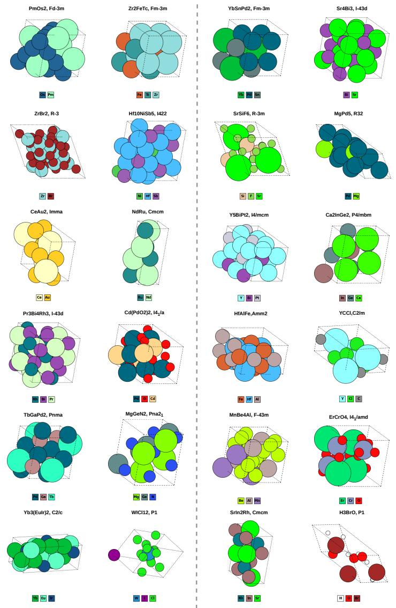  
Figure 8: Visualization of S.U.N. crystalline materials on MP-20, including their chemical formulas and space group symmetries, discovered with SbCD variants: SbCD♦ (left) and SbCD♯ (right).

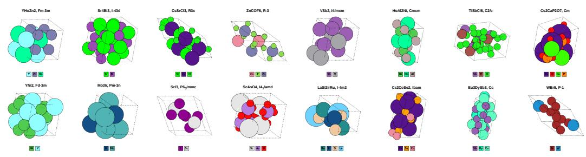  
Figure 9: S.U.N. MP-20 materials discovered by SbCD.

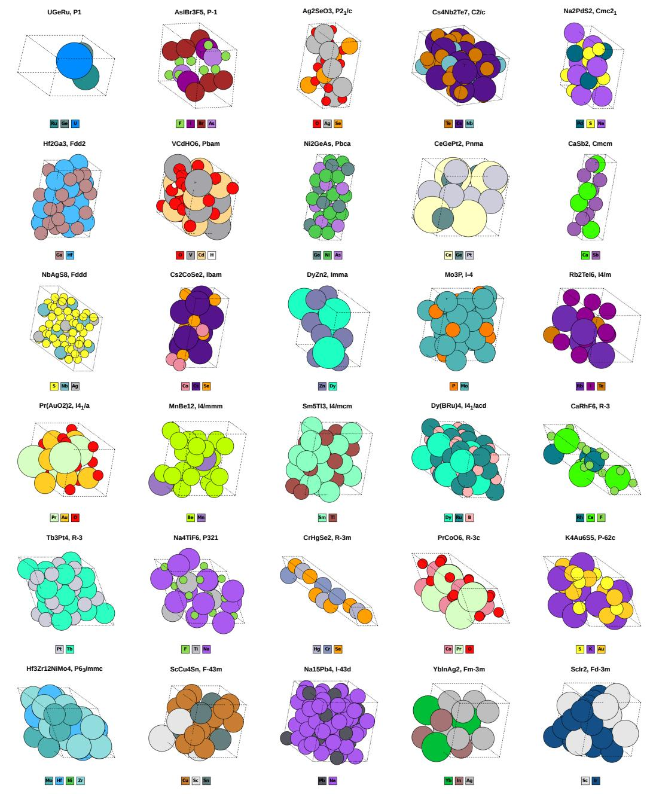  
Figure 10: S.U.N. MPTS-52 materials discovered by SbCD.

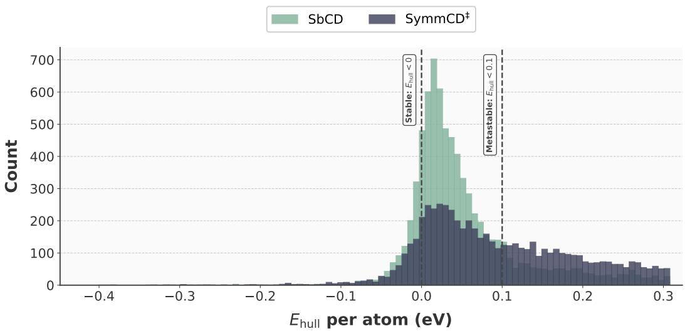  
Figure 11: Comparison of the $E _ { \mathrm { h u l l } }$ distributions on the MP-20 dataset.

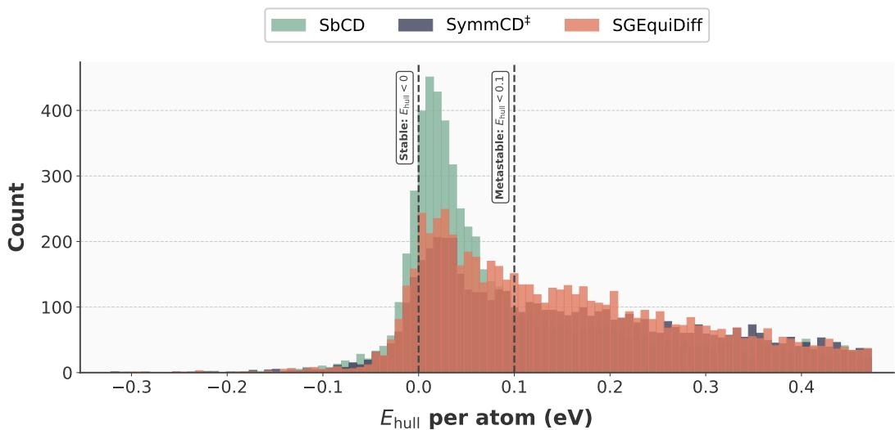  
Figure 12: Comparison of the $E _ { \mathrm { h u l l } }$ distributions on the MPTS-52 dataset.