# TANGCO: Learning Topology-Aware Capacity Allocation for Overload-driven Cascading Failures

Orkun Irsoy Carnegie Mellon University Electrical and Computer Engineering Pittsburgh, Pennsylvania, USA oirsoy@andrew.cmu.edu

Leman Akoglu   
Carnegie Mellon University   
Heinz College   
Pittsburgh, Pennsylvania, USA   
lakoglu@andrew.cmu.edu

Osman Yagan Carnegie Mellon University Electrical and Computer Engineering Pittsburgh, Pennsylvania, USA oyagan@andrew.cmu.edu

## Abstract

Many networked systems, from power grids to trafic networks and cloud clusters, carry loads across nodes with limited capacity. A node whose load exceeds its capacity fails and sheds its load onto its neighbors, which can trigger a system-wide cascade. We study how to allocate a fixed capacity budget across nodes to resist these cascades under local load redistribution. The problem is dificult because no optimal allocation is known, and the fail-or-survive objective is non-diferentiable and piecewise constant, so exact and gradient-based optimization methods do not directly apply. We introduce TANGCO (Topology-Aware Neural Graph-Guided Capacity Optimization), which uses a graph neural network policy trained through the cascade simulator with policy-gradient learning and a heuristic anchor. We evaluate TANGCO on five synthetic graph families and five real networks spanning power, road, air, and Internet topologies. The learned policy improves on the best of four hand-designed heuristics in all 450 synthetic instances and in 40 of 45 real-network conditions, with robustness gains ranging from 1.6% to 246%. The learned policies transfer to unseen graphs within a family and partially across related topologies, and TANGCOpre, pre-trained on synthetic graphs, matches per-network training on unseen real networks. Training scales near-linearly with graph size, and TANGCOpre allocates on a new network with no pertarget training, matching the deployment cost of a hand-designed heuristic. Free-vector variants without the GNN, trained by policy gradient or by CMA-ES, stay close to the heuristics, so the graph representation carries the gain beyond numerical search; the depth analysis shows most of it arises from one-hop information. Finally, analysis of the learned allocations identifies when local risk is sufi cient, leads to an improved closed-form heuristic, and reveals the regimes where a topology-aware learned policy remains necessary.

## CCS Concepts

• Computing methodologies → Machine learning; • Information systems → Network science.

## Keywords

cascading failures, capacity allocation, graph neural networks, reinforcement learning

## 1 Introduction

Modern online services run on clusters of servers that share a request load. When one server becomes overloaded, its share of the load shifts to the remaining servers; if their updated load with the addition exceeds their capacity, they fail in turn, triggering a cascade that can end in a system-wide collapse. Such overloaddriven cascades are a well-documented cause of large-scale outages at major cloud providers [4]. The same pattern is prevalent across many networked systems, including power grids [1], transportation and trafic networks [24, 26], supply chains [16, 49], as well as financial systems where the failure of one institution imposes losses on its counterparties and can push them into failure [13]. In each case a node carries a load and fails when that load exceeds its capacity, and a failed node passes its load to other functioning nodes. The failure of a few components can therefore propagate through the network and bring down the system [5].

Cascading failures are due to network efects, where entities are connected through dependencies in a graph. The interaction between the graph topology and the capacity allocation of nodes therefore becomes critical in the cascade dynamics. Flow-based models of cascading failure originate with Motter and Lai [30], who take each node’s load to be its betweenness centrality and set its capacity to a fixed multiple of that load, � = (1 + �)�. A large literature builds on this model to relate network structure to robustness and to add mechanisms such as dynamical recovery of failed nodes [27] and heterogeneous rules for how a failed node’s load spreads to its neighbors [17]. Almost all work in this line fixes the allocated capacity in advance and studies the robustness that results [6, 25, 30, 44]. The capacity allocation is thus an input to the model rather than a quantity to be designed.

In this work, we treat capacity as a decision variable and address the problem of allocating a limited capacity budget across nodes to maximize robustness against cascading failures, a question that has received far less attention. The few works that study this allocation problem [18, 36, 50] solve it under a global redistribution rule, where a failed node’s load is shared equally among all surviving nodes, irrespective of graph topology. That assumption yields a closedform characterization of the final system size, and its allocations carry optimality guarantees while treating the network as fully connected and discarding topology.

Under local redistribution, where loads pass only to immediate neighbors, cascade outcomes depend jointly on the topology and the initial load and capacity, and the global-redistribution guarantees no longer apply. Existing allocations for local redistribution are handdesigned heuristics rather than optimized methods. Hence, even though prior work has studied robustness extensively by analyzing and modifying network structure, the design question of how to allocate capacities on a given network and load remains far less explored. In contrast, we ask how to allocate a fixed capacity budget over a given network under local redistribution, where no optimal allocation is known.

<table><tr><td>Network</td><td>Heur.*</td><td>TANGCOpre</td><td>TANGCO</td></tr><tr><td>Uniform load</td><td></td><td></td><td></td></tr><tr><td>US grid</td><td>0.022</td><td>0.042</td><td>0.034</td></tr><tr><td>Oregon AS</td><td>0.237</td><td>0.336</td><td>0.319</td></tr><tr><td>Chicago</td><td>0.019</td><td>0.023</td><td>0.020</td></tr><tr><td>OpenFlights</td><td>0.076</td><td>0.261</td><td>0.262</td></tr><tr><td>AS1221</td><td>0.263</td><td>0.239</td><td>0.286</td></tr><tr><td>Pareto load</td><td></td><td></td><td></td></tr><tr><td>US grid</td><td>0.020</td><td>0.060</td><td>0.040</td></tr><tr><td>Oregon AS</td><td>0.243</td><td>0.321</td><td>0.326</td></tr><tr><td>Chicago</td><td>0.012</td><td>0.011</td><td>0.012</td></tr><tr><td>OpenFlights</td><td>0.082</td><td>0.213</td><td>0.240</td></tr><tr><td>AS1221</td><td>0.260</td><td>0.250</td><td>0.282</td></tr></table>

(a) Robustness (AUC)

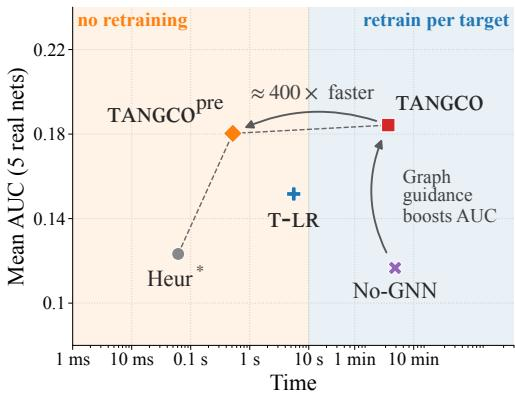

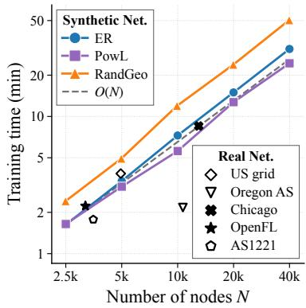  
(b) Robustness vs. deployment cost  
(c) Training time vs. network size  
Figure 1: TANGCOpre matches er-network training and lifts mean robustness about 1.5× over the best heuristic (u to 3× on hub-heav networks) on unseen real networks (a), delivers it at heuristic de lo ment cost (b), and trains in time near-linear in network size (c). (a) Absolute robustness (AUC) on five real networks under uniform and Pareto load at $B { = } 0 . 7 5 ;$ TANGCOpre is re-trained on s nthetic ra hs and a lied with no er-network trainin while TANGCO trains er network. (b) Robustness versus time to first allocation on a new network. (c) Median training time versus number of nodes.

We introduce TANGCO (Topology-Aware Neural Graph-Guided Capacity Optimization), which employs a graph neural network (GNN) to learn capacity allocations directly from cascade dynamics. Given a graph and its initial loads, TANGCO outputs a capacity allocation that satisfies a fixed capacity budget.

Our paper introduces four main contributions:

• Topology-aware capacity optimization: We cast capacity allocation as a topology-aware policy-learning problem and propose TANGCO to maximize robustness against cascading failures. Hard overload thresholds make the cascade objective piecewise-constant; TANGCO trains a GNN allocation policy from simulator AUC rewards with score-function updates, with out diferentiating through the discrete failures.

• Synthetic Pre-training and Transfer: We also introduce TANGCOpre, pretrained on diverse synthetic graph topologies and load distributions, and demonstrate strong transfer to unseen real-world networks (Figure 1).

• Efectiveness, Scalability, Speed: Across five graph families, three load distributions, three capacity budgets, and five real-world networks, TANGCO consistently outperforms four competitive heuristics. Training scales linearly with graph size, while TANGCOpre needs no per-target training, yielding the best latency–performance trade-of (Figure 1).

• Characterizing Gains: We show that message passing contributes consistently beyond direct numerical optimization, develop a one-hop rule that recovers most gains in specific regimes, and find that TANGCO’s gains are largest on heterogeneous topologies at intermediate capacity budgets.

Reproducibility: Code and evaluation artifacts will be released upon acceptance.

## 2 Problem Formulation

We study overload-based cascading failures on an undirected graph $G = ( \mathcal { V } , \mathcal { E } )$ with $N = | \mathcal { V } |$ nodes. Each node $v \in \mathcal { N }$ has an initial

load $\ell _ { v }$ and a capacity $c _ { v }$ . The capacity is the maximum load that the node can carry before it fails. We write $\mathbf { l } = ( \boldsymbol { \ell } _ { \boldsymbol { v } } ) _ { \boldsymbol { v } \in \mathcal { V } }$ and $\mathbf { c } = ( c _ { v } ) _ { v \in \mathcal { V } }$ for the load and capacity vectors.

## 2.1 Cascade Dynamics

Consider a fixed graph �, load vector l, capacity vector c, and initial failure set $\mathcal { F } _ { 0 } \subseteq \mathcal { V }$ . The cascade starts by removing the nodes in $\mathcal { F } _ { 0 }$ The loads of these nodes are then redistributed to the remaining network. After this redistribution, the surviving nodes are checked for overload. The same procedure is repeated in discrete iterations $t = 1 , 2 , \ldots$ . until no new node fails.

Let $\ell _ { v } ^ { ( t ) }$ denote the load carried by node � at iteration �. The capacity $c _ { v }$ is fixed during the cascade. A node remains active at iteration � if its current load does not exceed its capacity, i.e., $\ell _ { v } ^ { ( t ) } \leq$ $c _ { v } .$ . If this condition is violated, the node fails and releases its current load for redistribution.

Let $\mathcal { F } _ { t } , \mathcal { A } _ { t }$ , and $N _ { t } ( v )$ denote the nodes that fail at iteration $t ,$ the nodes still active at that iteration, and the active neighbors of a node �. A failing node $v \in \mathcal { F } _ { t }$ splits its current load $\ell _ { v } ^ { ( \bar { t } ) }$ equally among its active neighbors $N _ { t } ( v ) ;$ if it has none $( N _ { t } ( v ) = \emptyset )$ , the load spreads equally over all active nodes so that the total load is conserved in the system. Failures within an iteration resolve simultaneously, so an active node � accumulates the shares of its failing neighbors along with its part of the global term $g _ { t }$

$$
\ell _ { u } ^ { ( t + 1 ) } = \ell _ { u } ^ { ( t ) } + \sum _ { \substack { v \in \mathcal { F } _ { t } } } \frac { \ell _ { v } ^ { ( t ) } } { | N _ { t } ( v ) | } + g _ { t } , \qquad g _ { t } = \frac { 1 } { | \mathcal { R } _ { t } | } \sum _ { \substack { v \in \mathcal { F } _ { t } } } \ell _ { v } ^ { ( t ) } .\tag{1}
$$

This additional load may cause neighboring nodes to exceed their capacities, which can trigger further failures in later iterations.

The cascade stops when an iteration produces no new failures. Let $t ^ { * }$ denote the stopping iteration. The set of nodes still active at $t ^ { * }$ is the survivor set $s .$ . Then, for fixed $G , 1 , \mathbf { c } ,$ and ${ \mathcal { F } } _ { 0 } ,$ the final

surviving fraction is

$$
\Phi ( G , \mathbf { l } , \mathbf { c } ; \mathcal { F } _ { 0 } ) = \frac { | S | } { N } .\tag{2}
$$

We use this quantity as the robustness measure for a single cascade.

Computational Complexity. Each cascade is cheap: a node fails at most once, so redistribution touches each edge once, and each round tests surviving nodes against their capacities. A cascade halting after �¯ rounds costs $O ( N \bar { t } + E )$ , with $\bar { t } \leq N$ in the worst case but far smaller in practice (Section 4.4).

## 2.2 Capacity Allocation Problem

The cascade model above determines the survival outcome for any fixed capacity assignment. Next, we consider how to allocate a given total capacity budget across the nodes of a given input graph to maximize robustness. This requires defining the feasible set of allocations and aggregating the robustness metric across failure sizes into a single objective.

2.2.1 Capacity Constraint. Because additional capacity is costly in practice, we fix a total capacity budget and treat the node capacities as the decision variables. With an unlimited budget, robustness is trivially maximized.

We parameterize a node $v ' s$ capacity as

$$
\begin{array} { r } { c _ { v } = \ell _ { v } + s _ { v } , } \end{array}\tag{3}
$$

where $s _ { v } \geq 0$ is the excess capacity, or free space, assigned to node � before any initial failures. This parameterization rules out trivial initial failures and simplifies the notation. Rather than optimize over capacities subject to $\ell _ { v } \leq c _ { v } ,$ we optimize over non-negative free space under a fixed budget on the total free space. Let $\mathbf { s } = ( s _ { v } ) _ { v \in \mathcal { V } }$ denote the free-space vector. For a given free-space budget �, the feasible allocations are

$$
\Delta _ { B } = \left\{ \mathbf { s } \in \mathbb { R } _ { + } ^ { N } : \sum _ { v \in \mathcal { V } } s _ { v } = B \right\} .\tag{4}
$$

Thus, optimizing the capacity vector c is equivalent to choosing a free-space allocation $\pmb { \mathscr { s } } \in \Delta _ { B }$ , with capacities given by $\begin{array} { r } { c _ { v } = \ell _ { v } + s _ { v } . } \end{array}$

Given �, l, s, and an initial failure set $\mathcal { F } _ { 0 }$ , we write the final survival fraction as $\Phi ( G , \mathbf { l } , \mathbf { s } ; \mathcal { F } _ { 0 } )$ .

2.2.2 Robustness Objective. The fraction Φ(�, l, s $; { \mathcal { F } } _ { 0 } )$ measures robustness against one fixed initial failure set, ${ \mathcal { F } } _ { 0 } .$ . To evaluate an allocation for failures of a given size, let

$$
\mathbb { F } _ { k } = \left\{ { \mathcal { F } } _ { 0 } \subseteq { \mathcal { V } } : | { \mathcal { F } } _ { 0 } | = k \right\}\tag{5}
$$

be the collection of all initial failure sets containing exactly � nodes. The exact average survival fraction under � initial failures is

$$
J _ { k } ( G , \mathbf { l } , \mathbf { s } ) = \frac { 1 } { { \binom { N } { k } } } \sum _ { \mathcal { F } _ { 0 } \in \mathbb { F } _ { k } } \Phi ( G , \mathbf { l } , \mathbf { s } ; \mathcal { F } _ { 0 } ) .\tag{6}
$$

This is a finite average over the initial failure sets of size �. Weighting the members of $\mathbb { F } _ { k }$ equally evaluates expected survival under uniformly random initial failures; targeted removal calls for a worstcase rather than an average-case objective and lies outside our scope. To obtain a single robustness score across failure sizes, we aggregate the average survival fractions over a set of failure sizes $\mathcal { K } \subseteq \{ 0 , \ldots \ldots , N \}$ }:

$$
\operatorname { A U C } ( G , 1 , \mathbf { s } ) = \sum _ { k \in { \mathcal { K } } } w _ { k } J _ { k } ( G , 1 , \mathbf { s } ) ,\tag{7}
$$

where $w _ { k } \geq 0$ and $\begin{array} { r } { \sum _ { k \in \mathcal { K } } w _ { k } = 1 } \end{array}$ . The weights specify how much emphasis is placed on diferent failure sizes. Plotting �� against the failure fraction $\smash { p = k / N }$ traces the survival curve $J ( p )$ (Figure 3 shows an example), and with uniform weights the objective is the discretized area under that curve, hence the name AUC. In our experiments we place uniform weight on failure fractions � ∈ [0, 0.5] and zero weight outside this range. This range focuses the evaluation on low-to-moderate failure fractions, where robustness depends strongly on how the cascade propagates after the initial failures, while keeping the same evaluation criterion for all methods.

In short, Φ is the basic survival metric for one cascade realization, �� averages this metric over all initial failure sets of a given size, and AUC aggregates these across the evaluated failure sizes.

Then, given an input graph � and budget �, the capacity allocation objective is

$$
\operatorname* { m a x } _ { \pmb { s } \in \Delta _ { B } } \mathrm { A U C } ( G , \mathbf { l } , \pmb { s } ) .\tag{8}
$$

2.2.3 Why the Optimization is Dificult. Although the feasible set $\Delta _ { B }$ is simple, the objective in (8) is not. Each node’s survival is set by a hard overload threshold, so the outcome stays fixed as s varies until a threshold is crossed, then jumps. The objective AUC(�, l, s) is therefore step-like and non-concave: convex methods do not apply, and gradients are uninformative on flat regions and undefined at the jumps.

Exact evaluation is also intractable: �� (�, l, s) sums over $\textstyle { \binom { N } { k } }$ initial failure sets, each requiring a full multi-round cascade. Because the outcome couples topology, load and capacity, and the location and order of failures, no closed-form characterization is available as in prior global-redistribution models [18, 36, 50], which motivates a simulation-based learning approach.

## 3 Proposed TANGCO

TANGCO combines a message-passing GNN policy with simulationbased reinforcement learning. For a fixed instance (�, l) and freespace budget �, the goal is to learn a policy that outputs an allocation s ∈ $\Delta _ { B }$ with high robustness. Figure 2 summarizes the pipeline: node features feed a GNN policy, whose output is projected onto the budget simplex as a feasible free-space allocation.

The allocation can only be evaluated through the cascade simulator, whose hard failure thresholds and discrete redistribution steps make the robustness score non-diferentiable. We therefore train the policy with REINFORCE [46]: at each iteration, the algorithm samples candidate allocations, scores them using empirical AUC rewards, and updates the policy from these rewards. The next subsections describe each component.

## 3.1 Node Features and GNN Policy

The allocation depends on both the load vector and each node’s local topology. We therefore use a message-passing GNN rather than learning � unrelated parameters. The GNN shares parameters across nodes and aggregates multi-hop information, which is useful since failures can propagate beyond one round.

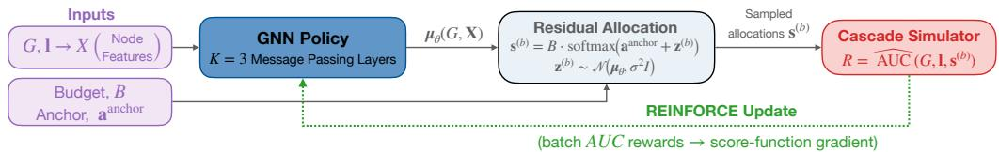  
Figure 2: TANGCO turns a graph and its loads into a budget-feasible capacity allocation, trained end to end through the cascade simulator. Node features feed a message-passing policy whose residual output is projected onto the budget simplex; the simulator scores the resulting allocation, and the AUC reward drives a REINFORCE update.

For each node � we compute a log-transformed feature vector $\mathbf { x } _ { v }$ from its own load, its degree, the mean, maximum, and variance of its one-hop neighborhood loads, and its two-hop degree (Appen dix A.3 gives the formulas). The GNN stacks � message-passing layers; its architecture follows GraphSAGE [14] with mean aggregation, difering in two respects: messages are normalized by the sender’s degree, in parallel with the load-redistribution mechanism where a failing node splits its load among its neighbors, and each layer adds a residual connection to its MLP update to avoid oversmoothing. A final linear map produces one scalar residual logit $\mu _ { \boldsymbol { \theta } , \boldsymbol { v } }$ per node, and we write $\pmb { \mu } _ { \boldsymbol { \theta } } ( G , \mathbf { X } ) = ( \mu _ { \boldsymbol { \theta } , \boldsymbol { v } } ) _ { \boldsymbol { v } \in \mathcal { V } }$ for the vector of outputs (Appendix A.4 gives the full equations). The output layer is zero-initialized, so the initial residual logits are exactly zero and the policy starts at the anchor allocation described next.

## 3.2 Residual Softmax Allocation

Directly searching over all allocations in $\Delta _ { B }$ is high-dimensional and noisy. We therefore learn a residual correction around a fixed anchor allocation: the anchor gives the policy a reasonable starting point, and the GNN shifts capacity from it using the graph and load features.

Let sanchor $\in { \Delta } _ { B }$ be a fixed anchor allocation. We use two anchors in the experiments. The first is the uniform allocation,

$$
s _ { v } ^ { \mathrm { u n i f o r m } } = \frac { B } { N } .\tag{9}
$$

Beyond serving as an intuitive baseline, the uniform allocation is optimal under global redistribution, where the network is treated as fully connected [50], with extensions to partial load loss [36] and max-load targeted attacks [37].

The second anchor is a local-redistribution heuristic. Irsoy and Yağan [19] allocate free space in proportion to a node’s one-hop local-risk, giving the Localized Risk-based Free-Space Allocation (LR-FSA) heuristic,

$$
s _ { v } ^ { \mathrm { l r f s a } } = B \frac { r _ { v } } { \sum _ { u \in \mathcal { V } } r _ { u } } , \quad \quad r _ { v } = \sum _ { u \in N ( v ) } \frac { \ell _ { u } } { d _ { u } } .\tag{10}
$$

The score $r _ { v }$ estimates the load that node � may receive from its neighbors in one round of local redistribution. We train a separate policy for each anchor. Reported TANGCO performance uses the better of the two completed runs (each trained and evaluated independently), a two-start procedure that uses the cascade simulator already required for training.

We encode an anchor allocation as a logit vector aanchor by taking elementwise logs,

$$
\mathbf { a } ^ { \mathrm { a n c h o r } } = \log \left( s ^ { \mathrm { a n c h o r } } + \epsilon \right) .\tag{11}
$$

Since $\begin{array} { r } { \sum _ { v } s _ { v } ^ { \mathrm { a n c h o r } } \ = \ B , } \end{array}$ , the softmax in Eq. (13) maps these logits back to $\pmb { s } ^ { \mathrm { a n c h o r } }$ at initialization; the budget � re-enters through the leading factor in Eq. (13), and the small floor � keeps the log finite where an anchor entry is zero. During training, the GNN output $\pmb { \mu } _ { \boldsymbol { \theta } } ( G , \mathbf { X } )$ is treated as the mean of a Gaussian over residual logits. We sample residual logits as

$$
{ \bf z } ^ { ( b ) } \sim N \left( \pmb { \mu } _ { \boldsymbol { \theta } } ( G , { \bf X } ) , \sigma ^ { 2 } I \right) ,\tag{12}
$$

where $\sigma > 0$ controls exploration and is annealed downward over training, and add the residual to the anchor logits before a softmax that projects onto the budget simplex:

$$
s _ { v } ^ { ( b ) } = B \frac { \exp \Big ( a _ { v } ^ { \mathrm { a n c h o r } } + z _ { v } ^ { ( b ) } \Big ) } { \sum _ { u \in \mathcal { V } } \exp \Big ( a _ { u } ^ { \mathrm { a n c h o r } } + z _ { u } ^ { ( b ) } \Big ) } , \qquad v \in \mathcal { V } .\tag{13}
$$

By construction, $\pmb { \mathsf { s } } ^ { ( b ) } \in \Delta _ { B }$ for every sample. At initialization $\pmb { \mu } _ { \theta } = 0$ (Section 3.1), so the deterministic policy with $\sigma = 0$ exactly recovers the anchor, while stochastic samples are centered around it in logit space; as training progresses the GNN learns residual adjustments that improve robustness.

The residual parameterization gives REINFORCE a warm start and reduces training noise, at the cost of restricting the search to softmax perturbations of the chosen anchor. This is not binding in our experiments, where the best allocation builds on one of the two anchors in every tested case, but it motivates future work on improved anchors and less anchor-tied parameterizations.

## 3.3 Simulator-Based Reward

Each sampled allocation is scored by the cascade model of Section 2.1. Exact AUC evaluation is infeasible, so we use a Monte Carlo estimate: over a finite grid P of failure fractions, we draw � initial failure sets $\mathcal { F } _ { p , 1 } , \ldots , \mathcal { F } _ { p , M }$ of size ⌊��⌋ at each $p \in { \mathcal { P } } ,$ , giving the empirical survival fraction

$$
\widehat { J } _ { \boldsymbol { p } } ( G , \mathbf { l } , \mathbf { s } ) = \frac { 1 } { M } \sum _ { m = 1 } ^ { M } \Phi ( G , \mathbf { l } , \mathbf { s } ; \mathcal { F } _ { \boldsymbol { p } , m } ) ,\tag{14}
$$

and the reward is the empirical AUC over the grid,

$$
R ( \mathbf { s } ) = { \widehat { \mathrm { A U C } } } ( G , \mathbf { l } , \mathbf { s } ) = { \frac { 1 } { | { \mathcal { P } } | } } \sum _ { \substack { p \in { \mathcal { P } } } } { \widehat { J } } _ { p } ( G , \mathbf { l } , \mathbf { s } ) ,\tag{15}
$$

the empirical counterpart of (7) with uniform weights. Appendix A.5 details how the grid $\mathcal { P }$ is chosen and how failure sets are pre-sampled and shared across allocations.

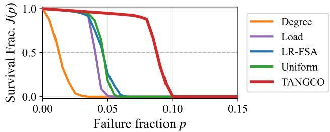  
Figure 3: TANGCO sustains survival to roughly twice the failure fraction of the best heuristic. Each curve plots the survival fraction � (�) against failure fraction � for the four heuristics and TANGCO on ClusPowL under uniform load at $B = 0 . 5$ (single realization); larger area under the curve (AUC) is better.

## 3.4 Non-diferentiable Optimization

The cascade simulator contains threshold failures and discrete rounds, so we cannot diferentiate through it. We instead maximize the expected empirical AUC under the stochastic residual-logit policy,

$$
\mathcal { T } ( \theta ) = \mathbb { E } _ { { \mathbf { z } } \sim p _ { \theta } } \left[ \widehat { \mathrm { A U C } } \left( G , 1 , { \mathbf { s } } ( { \mathbf { z } } ) \right) \right] ,\tag{16}
$$

for a fixed instance (�, l), budget �, and anchor, where �� is the Gaussian in (12) and s(z) the softmax allocation in (13). We opti mize it with REINFORCE: the score-function estimator turns the simulator’s scalar reward into a gradient on the GNN parameters through the log-probability of the sampled logits, and we reduce its variance with a batch-mean baseline over the � samples per iteration and stabilize it with a small L2 penalty on the residual logits (Appendix A.5). We train with Adam [21], periodically evaluate the deterministic policy $( \sigma = 0 )$ on a held-out set of failure samples, and keep the allocation with the best validation AUC as the final output for that instance.

## 4 Experiments

We evaluate TANGCO through the following research questions (RQs):

• RQ1: Efectiveness Does TANGCO improve robustness over the baseline heuristics?

• RQ2: Transferability Does a trained policy transfer to held-out instances within a family, and across families?

• RQ3: Scalability How does TANGCO’s allocation optimization grow with network size?

• RQ4: Gain Attribution Does the gain come from messagepassing inductive bias or black-box numerical optimization?

• RQ5: Gain Characterization Which topologies, load distribu tions, and budgets yield the largest robustness gains?

## 4.1 Experimental Setup

Graphs. We use five synthetic families and five real-world networks spanning power, road, air-transport, and Internet router/AS domains. Each synthetic family has � = 5000 nodes and about 12 edges per node, and captures a distinct structural regime: ER (homogeneous degrees, no hubs), PowL (a heavy-tailed degree dis tribution, exponent $\gamma = 2 . 5 )$ , ClusPowL (the same degrees with local clustering $C _ { c } \approx 0 . 1 5 )$ , CorPer (a dense core with a sparse periphery), and RandGeo (spatial proximity edges with high clustering). The five real networks span few infrastructure domains: the Western US power grid $( N \ : = \ : 4 9 4 1 )$ , the Oregon AS graph $( N = 1 0 , 6 7 0 )$ , the Chicago road network $( N = 1 2 , 9 7 9 )$ , the Open-Flights airport network $( N = 3 1 8 8 )$ , and the Rocketfuel AS1221 topology $( N = 3 5 1 5 )$ . They cover a diverse set of structures, from near-planar (Chicago, maximum degree 7) to hub-heavy (Open-Flights and Oregon, maximum degree 248 and 2312). Appendix A.2 gives generation procedures, citations, and per-graph statistics. For each synthetic family we generate ten independent realizations and report the mean over the ten.

Loads and budgets. We evaluate each graph under three initialload distributions: uniform (bounded variation around the mean), Pareto (a heavy tail, so a few nodes carry much larger loads), and bimodal (a two-group high/low mixture). The budget � is the total free space to allocate; we set $B / \Sigma _ { v } \ell _ { v } \in \{ 0 . 5 , 0 . 7 5 , 1 . 0 \}$ , from tight to loose, giving nine load-budget conditions in all.

Baseline heuristics. We compare TANGCO with four deterministic capacity rules from the cascade literature, all normalized to $\begin{array} { r } { \sum _ { v } s _ { v } = B : } \end{array}$ the two anchors of Section 3.2, Uniform (equal free space) and LR-FSA (one-hop local-risk); Load, proportional to initial load [30]; and Degree, proportional to degree [25].

Architecture, training, and protocol. We use $K \ = \ 3$ messagepassing layers and hidden width 64 throughout, except in the depth ablation of Section 4.5, and train each instance with Adam [21] (Appendix A.5 lists all hyperparameters). We report the robustness score AUC(�, l, s) of Eq. (7), the average survival fraction over $p \in \left[ 0 , 0 . 5 \right]$ . The primary comparison is TANGCO (maximum AUC over the two anchors) against the best heuristic (maximum AUC over Uniform, Degree, Load, LR-FSA) on each configuration. We replicate training over five seeds per configuration and report the mean; training-seed variance is small (Appendix A.5).

## 4.2 Overall Performance (RQ1)

Figure 3 shows a robustness curve for a representative instance and makes the AUC metric concrete: each curve traces the survival fraction as the failure fraction grows, and a more robust allocation keeps the curve higher for longer, enclosing more area. TANGCO pushes its curve well to the right of every heuristic, holding a high survival fraction out to roughly twice the failure fraction that the heuristics withstand.

Figure 4 compares the absolute AUC of the four heuristics and the two anchored policies at a representative configuration, uniform load and $B = 0 . 7 5$ . Table 1 reports the relative improvement of TANGCO over the best heuristic across all nine load-budget conditions. Two observations follow.

• TANGCO improves on the best heuristic in almost every condition. Figure 4 shows the comparison on seven representative networks at uniform load and $B = 0 . 7 5$ , where TANGCO exceeds every heuristic. Table 1 extends it to the full set: the policy improves on the best heuristic in all 450 synthetic cells (5 families × 9 conditions × 10 realizations) and in 40 of the 45 real-world conditions, with gains from +1.6% on ER at a loose budget to +246% on OpenFlights. The five exceptions all sit at the tightest budget on a spatially embedded network (Chicago under all three loads, the US grid under uniform and bimodal loads), where the improvement is ≈ 0 because no allocation survives even � ≈ 0.01 (Section 4.6).

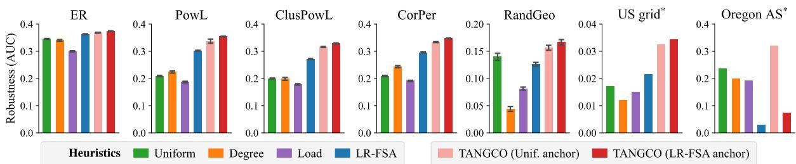  
Fi ure 4: TANGCO out erforms all baselines across s nthetic and real to olo ies. Absolute robustness (AUC) of four heuristics and TANGCO w/ two anchored policies on five synthetic families and two real networks at uniform load and � = 0.75. Error bars s an one standard deviation over 10 realizations; the starred networks (US rid, Ore on AS) are sin le real ra hs and carry no error bars. See Table 1 for all real networks across all nine load-budget conditions.

• Training two anchors guards against anchor failure. We anchor the policy on either Uniform or LR-FSA and keep the better of the two. LR-FSA is the stronger prior in most conditions, but it risks trapping the policy: in Figure 4, the LR-FSA anchor on Oregon AS collapses along with the heuristic it starts from, which concentrates too much free space on a few extremely connected hubs. The Uniform anchor is the more stable prior, supplying the winning policy on both hub-heavy AS topologies, at the risk ofmissing the gain LR-FSA ofers where its prior holds. Keeping the better of the two captures LR-FSA’s upside without its risk; Appendix B.1 reports the per-family anchor win-counts and illustrates the collapse on Oregon AS.

Table 1: TANGCO achieves positive relative AUC improve- ments over the best heuristic across all 450 synthetic cells and 40 of 45 real-world conditions. Synthetic entries are means over ten realizations, each averaged over five seeds; real-world entries are means over five training seeds.
<table><tr><td></td><td></td><td colspan="5">Synthetic families</td></tr><tr><td>Load</td><td>Budget</td><td>ER</td><td></td><td>PowL CLUsPowL CorPER RANDGEO</td><td></td><td></td></tr><tr><td>Uniform</td><td>B=0.5</td><td>+8.0</td><td>+54.9</td><td>+76.7</td><td>+46.1</td><td>+17.3</td></tr><tr><td></td><td>B=0.75</td><td>+3.3</td><td>+17.2</td><td>+21.2</td><td>+17.4</td><td>+19.3</td></tr><tr><td></td><td>B=1.0</td><td>+1.6</td><td>+8.2</td><td>+10.0</td><td>+8.5</td><td>+15.1</td></tr><tr><td>Pareto</td><td>B=0.5</td><td>+18.1</td><td>+64.9</td><td>+85.0</td><td>+61.6</td><td>+19.7</td></tr><tr><td></td><td>B=0.75</td><td>+5.7</td><td>+19.3</td><td>+25.1</td><td>+20.2</td><td>+44.8</td></tr><tr><td></td><td>B=1.0</td><td>+2.7</td><td>+9.2</td><td>+11.3</td><td>+9.4</td><td>+22.0</td></tr><tr><td>Bimodal</td><td>B=0.5</td><td>+13.0</td><td>+60.6</td><td>+89.4</td><td>+50.0</td><td>+23.8</td></tr><tr><td></td><td>B=0.75</td><td>+4.5</td><td>+19.4</td><td>+23.8</td><td>+19.3</td><td>+37.3</td></tr><tr><td></td><td>B=1.0</td><td>+2.1</td><td>+9.2</td><td>+11.0</td><td>+10.0</td><td>+20.0</td></tr><tr><td></td><td></td><td colspan="5">Real-world networks</td></tr><tr><td>Load</td><td>Budget US grid</td><td></td><td>Oregon AS</td><td>Chicago</td><td>OpenFl.</td><td>AS1221</td></tr><tr><td>Uniform</td><td>B=0.5</td><td>≈ 0</td><td>+67.2</td><td>≈ 0</td><td>+245.8</td><td>+22.6</td></tr><tr><td></td><td>B=0.75</td><td>+58.6</td><td>+34.4</td><td>+4.9</td><td>+244.9</td><td>+9.0</td></tr><tr><td></td><td>B=1.0</td><td>+38.4</td><td>+22.9</td><td>+10.2</td><td>+128.1</td><td>+2.5</td></tr><tr><td>Pareto</td><td>B=0.5</td><td>+3.0</td><td>+107.5</td><td>≈ 0</td><td>+231.3</td><td>+20.3</td></tr><tr><td></td><td>B=0.75</td><td>+97.0</td><td>+34.2</td><td>+4.1</td><td>+193.3</td><td>+8.5</td></tr><tr><td></td><td>B=1.0</td><td>+28.3</td><td>+21.6</td><td>+3.9</td><td>+123.1</td><td>+6.2</td></tr><tr><td>Bimodal</td><td>B=0.5</td><td>≈ 0</td><td>+66.6</td><td>≈ 0</td><td>+204.5</td><td>+13.9</td></tr><tr><td></td><td>B=0.75</td><td>+60.4</td><td>+34.1</td><td>+5.1</td><td>+204.2</td><td>+9.3</td></tr><tr><td></td><td>B=1.0</td><td>+20.5</td><td>+18.9</td><td>+10.6</td><td>+142.0</td><td>+5.4</td></tr></table>

## 4.3 Transferability (RQ2)

Every result so far trains one policy per graph instance. We now ask whether a trained policy transfers to unseen graphs: first across held-out instances within and between families, then as a model deployable on any new network.

Per-graph policies transfer within a family and across families that share structure. For within-family transfer we train one policy jointly on eight of a family’s ten realizations and evaluate it on the two held out; for cross-family transfer we apply each such policy to every other family’s held-out graphs. Table 2 reports the 5 × 5 source-to-target matrix of improvement in AUC over the best heuristic (uniform load, � = 0.75), with per-instance training in the bottom row. Within-family transfer is positive on all five families and matches per-instance training within about ±0.002 AUC. Crossfamily, transfer still improves on the target heuristic in 17 of 20 cells, holding among the heavy-tailed families PowL, ClusPowL, and CorPer, and failing only when a RandGeo policy, trained on spatial graphs without hubs, is applied to a hub-dominated target (e.g. RandGeo→PowL, −0.062). Pareto load shows the same pattern, improving in 14 of 20 cross-family cells (Appendix B.2).

TANGCOpre transfers to unseen real networks with no per-target training. The cross-family result suggests that a policy exposed to enough structural variety during training should transfer broadly. We therefore pre-train TANGCOpre on a curated suite of 64 synthetic graphs spanning diferent families and a wide range of sizes, densities, and family-specific parameters (separate checkpoint per anchor; Appendix A.2). Applied with no parameter update on the target (reporting the better of the two anchors), TANGCOpre reaches mean AUC 0.18 on the five real networks under uniform load, matching per-instance training and improving on the best heuristic (0.12) by about 1.5× on average, up to 3× on OpenFlights. It recovers the gain even where family-specific transfer fails, reaching 0.261 on OpenFlights against a heuristic 0.076 and 0.336 on Oregon AS against 0.237 (Figure 1(a)). It improves on the best heuristic on four of the five real networks under uniform load, and delivers this at heuristic deployment cost (Section 4.4).

## 4.4 Scalability (RQ3)

• Training scales near-linearly with network size, and cascade simulator dominates while the GNN stays under 2%. Each run performs ≈ 8.4M cascade simulations, each �(��¯ + �), while the policy adds one forward and one backward pass per

Table 2: A policy trained on one family matches instancespecific TANGCO on held-out graphs from the same family and transfers across structurally similar families. Entries show improvement in AUC over the best heuristic on the target under uniform load and $B = 0 . 7 5 ,$ , reporting the better of the two training anchors (per-anchor values in Appendix B.2). Diagonal cells show within-family transfer from eight training realizations to two held-out realizations; ofdiagonal cells show cross-family transfer. The bottom row reports TANGCO gains on the same targets. Shading marks the PowL, ClusPowL, and CorPer block, where policies transfer with little loss.

<table><tr><td rowspan="2">Source</td><td colspan="5">Target</td></tr><tr><td>ER</td><td>PowL</td><td>CLUsPowL</td><td>CORPER</td><td>RANDGEO</td></tr><tr><td>ER</td><td>+.011</td><td>+.005</td><td>+.015</td><td>+.027</td><td>+.014</td></tr><tr><td>PowL</td><td>+.012</td><td>+.053</td><td>+.057</td><td>+.047</td><td>+.021</td></tr><tr><td>CLUsPowL</td><td>+.011</td><td>+.050</td><td>+.056</td><td>+.045</td><td>+.023</td></tr><tr><td>CORPER</td><td>+.012</td><td>+.043</td><td>+.049</td><td>+.051</td><td>+.023</td></tr><tr><td>RANDGEO</td><td>+.008</td><td>-.062</td><td>-.044</td><td>-.017</td><td>+.036</td></tr><tr><td>TANGCO</td><td>+.011</td><td>+.051</td><td>+.058</td><td>+.050</td><td>+.026</td></tr></table>

iteration at $O ( N + E ) ;$ negligible beside it (Section 2.1). Across three synthetic families up to 40,000 nodes the fitted exponents lie between 0.97 and 1.10, and the five evaluated networks fall on the same trend (Figure 1(c)); RandGeo scales worst, consistent with its deeper cascades.

• Once trained, TANGCOpre needs no per-target training and deploys at heuristic-scale cost, capturing most of the robustness gain. At deployment each pretrained anchor allocates in one forward pass (reported robustness uses the better of the two); wall-clock placement is about half a second per pass, comparable to a heuristic and roughly 400× faster than training from scratch (Figure 1(b)). It reaches mean AUC 0.18 across the five real networks, matching instance-trained TANGCO (0.18) and well above the best heuristic (0.12). T-LR, the tuned localrisk rule we introduce in §4.6, improves on the heuristics for a few seconds of search, while per-network training buys the final increment of robustness for minutes.

Appendix B.3 reports the full wall-clock times, the four-panel deployment comparison across both load distributions, and the size-scaling result against edge count.

## 4.5 Ablations: Optimizer and Depth (RQ4)

A learned policy could beat heuristics by searching the allocation space more thoroughly than any fixed formula, or by encoding graph structure through message passing. We isolate the first with two variants that optimize a free allocation vector directly, No-GNN (same REINFORCE protocol as TANGCO) and a derivative-free CMA-ES optimizer, and the second by varying message-passing depth (Appendix B.4, B.5).

Direct search stays near the best heuristic whether policy- gradient or evolutionary; message passing carries the gain. No-GNN barely clears the best heuristic (mean ΔAUC −0.001 uniform, +0.002 Pareto); CMA-ES gains more (+0.009, +0.012), mostly on hub-heavy graphs, reaching 0.145 on OpenFlights against a heuristic 0.076, but still falls well short of TANGCO (0.262). Both lose on AS1221, where Degree is already strong. TANGCO beats the No-GNN variant in all 10 uniform cells (mean +0.052 AUC; Table 3) and in all 10 Pareto cells, and beats the CMA-ES variant in every cell (Appendix B.4).

One message-passing hop is enough. A per-node MLP with no message passing $( K = 0 )$ already improves on the best heuristic; the first hop adds further gain, after which $K = 2 – 5$ stay flat (Appendix B.5, Table 10). The $K { = } 0 \to 1$ step is small under the LR-FSA anchor, which already injects a one-hop local-risk estimate.

## 4.6 What Drives the Gains (RQ5)

TANGCO’s gains concentrate on heterogeneous topologies at intermediate budgets. Analyzing the learned allocations shows local risk is a strong signal in some regimes but incomplete in others, where TANGCO draws on additional structural and nonlinear signals.

• Gains scale with structural heterogeneity and peak at intermediate budgets. The largest improvements fall on heavytailed and hub-heavy topologies (ClusPowL +89%, PowL +65%, OpenFlights up to +246%, Oregon AS up to +108%), while homogeneous ER stays between +1.6% and +18.1%. Across budgets the gain is largest where the baseline is weak but survivable: it shrinks with budget on the strong-baseline families and grows with budget on the weak-baseline ones. Chicago and the US grid are the extreme, with no gain at �=0.5 until the budget buys enough survival to reallocate (Table 1).

Table 3: TANGCO beats the No-GNN variant in all 10 uniform cells; without message passing, the No-GNN variant adds little over the best heuristic. AUC at uniform load and $B = 0 . 7 5$ single realization per family. Heuristic\* is the best of the four heuristics. The learned search variants (No-GNN and CMA-ES, a derivative-free optimizer; Appendix B.4) are means over five training seeds (best of two anchors). Parenthesised val-ues are each column’s shortfall relative to TANGCO.
<table><tr><td>Graph</td><td>TANGCO</td><td>No-GNN</td><td>CMA-ES</td><td>Heuristic*</td></tr><tr><td>ER</td><td>0.372</td><td> $0 . 3 5 8 \left( - 3 . 6 \% \right)$ </td><td> $0 . 3 5 7 \left( - 3 . 9 \% \right)$ </td><td> $0 . 3 5 7 \ ( - 3 . 9 \% )$ </td></tr><tr><td>PowL</td><td>0.354</td><td> $0 . 3 1 1 \left( - 1 2 . 2 \% \right)$ </td><td> $0 . 3 1 3 \left( - 1 1 . 6 \% \right)$ </td><td> $0 . 3 0 2 \ : ( - 1 4 . 6 \% )$ </td></tr><tr><td>CLUsPowL</td><td>0.327</td><td> $0 . 2 7 9 \left( - 1 4 . 6 \% \right)$ </td><td> $0 . 2 8 2 \left( - 1 3 . 6 \% \right)$ </td><td> $0 . 2 7 0 \ : ( - 1 7 . 4 \% )$ </td></tr><tr><td>CORPER</td><td>0.345</td><td> $0 . 2 9 9 \left( - 1 3 . 4 \% \right)$ </td><td> $0 . 2 9 5 \left( - 1 4 . 5 \% \right)$ </td><td> $0 . 2 9 5 \dot { ( } - 1 4 . 5 \% \dot { ) }$ </td></tr><tr><td>RANDGEO</td><td>0.171</td><td> $0 . 1 4 4 \left( - 1 6 . 0 \% \right)$ </td><td> $0 . 1 4 1 \left( - 1 7 . 4 \% \right)$ </td><td>0.141 (−17.4%)</td></tr><tr><td>US grid</td><td>0.034</td><td> $0 . 0 2 4 \left( - 3 0 . 3 \% \right)$ </td><td> $0 . 0 2 2 \dot { ( - 3 4 . 8 \% ) }$ </td><td> $0 . 0 2 2 \left( - 3 6 . 9 \% \right)$ </td></tr><tr><td>Oregon AS</td><td>0.319</td><td> $0 . 2 4 4 \dot { ( - 2 3 . 4 \% ) }$ </td><td> $0 . 2 5 9 \dot { ( } - 1 8 . 9 \% )$ </td><td> $0 . 2 3 7 \ ( - 2 5 . 6 \% )$ </td></tr><tr><td>Chicago</td><td>0.020</td><td> $0 . 0 1 9 \left( - 3 . 8 \% \right)$ </td><td> $0 . 0 1 9 \left( - 4 . 6 \% \right)$ </td><td> $0 . 0 1 9 \left( - 4 . 7 \% \right)$ </td></tr><tr><td>OpenFlights</td><td>0.262</td><td> $0 . 0 8 3 \left( - 6 8 . 2 \% \right)$ </td><td> $0 . 1 4 5 \left( - 4 4 . 6 \% \right)$ </td><td> $0 . 0 7 6 \left( - 7 1 . 0 \% \right)$ </td></tr><tr><td>AS1221</td><td>0.286</td><td> $0 . 2 1 3 \ : ( - 2 5 . 6 \% )$ </td><td> $0 . 2 3 5 \left( - 1 7 . 9 \% \right)$ </td><td> $0 . 2 6 3 \ : ( - 8 . 3 \% )$ </td></tr></table>

Table 4: T-LR recovers most of the heuristic-to-TANGCO gap where local-risk dominates (regime A), and TANGCO matches or beats it on every network. AUC at uniform load, $B = 0 . 7 5$ (synthetics: mean over ten realizations; cf. Table 3’s one-realization cut). Heuristic∗ is the best of the four heuristics; T-LR is LR-FSA with a per-graph exponent fit on training failures.
<table><tr><td>Synthetic:</td><td>ER</td><td>PowL</td><td>CLUsPowL</td><td>CORPER</td><td>RANDGEO</td></tr><tr><td>Heuristic*</td><td>0.362</td><td>0.303</td><td>0.273</td><td>0.297</td><td>0.132</td></tr><tr><td>T-LR</td><td>0.372</td><td>0.348</td><td>0.322</td><td>0.342</td><td>0.145</td></tr><tr><td>TANGCO</td><td>0.374</td><td>0.355</td><td>0.330</td><td>0.347</td><td>0.158</td></tr><tr><td>Real:</td><td>US grid</td><td>OregAS</td><td>Chicago</td><td>OpenFL</td><td>AS1221</td></tr><tr><td>Heuristic*</td><td>0.022</td><td>0.237</td><td>0.019</td><td>0.076</td><td>0.263</td></tr><tr><td>T-LR</td><td>0.023</td><td>0.214</td><td>0.019</td><td>0.265</td><td>0.238</td></tr><tr><td>TANGCO</td><td>0.034</td><td>0.319</td><td>0.020</td><td>0.262</td><td>0.286</td></tr></table>

• A systematic, nested analysis identifies local risk as the primary signal the policy uses, and where it falls short. We fit the normalized allocation $\log ( s _ { v } / ( B / N ) )$ with a nested model sequence: the one-hop local-risk score $r _ { v }$ (Eq. (10)) alone, then cumulatively adding degree, load, and �-core, then a generalized additive model where the linear fit fails (Appendix B.6). Local risk alone explains the allocation in regime $\begin{array} { r } { \mathrm { ~ A ~ } ( R ^ { 2 } \geq 0 . 9 0 ; } \end{array}$ the moderately heavy-tailed families PowL, ClusPowL, Cor-Per, and several networks under uniform load). The rest need either an additional local feature such as degree (regime B, e.g. RandGeo) or nonlinear efects (regime C), as on the extreme-hub Oregon AS and AS1221, where a nonlinear fit reaches 0.82–0.98 against linear 0.03–0.33. Local risk is thus strong but incomplete: TANGCO rescales capacity-versus-risk where it dominates and draws on higher-order structure elsewhere.

• Tuned Local-Risk (T-LR) recovers most of the heuristic-to-TANGCO gap where local risk dominates. Regime A motivates fitting a per-graph exponent, $s _ { v } \propto r _ { v } ^ { Y }$ , by a bounded search on training failures rather than fixing � = 1. T-LR recovers about 85% of the gap in regime A and matches TANGCO on OpenFlights (0.265 vs. 0.262; Table 4). Outside regime A it falls below the best heuristic on Oregon AS and AS1221, where only TANGCO’s higher-order graph reasoning recovers the gain.

## 5 Related Work

Cascading failures. Cascading failures in flow networks are a long-studied problem. The foundational model of Motter and Lai assigns each node a load equal to its betweenness and a capacity fixed to a multiple of that load; when a node fails its load redistributes to others, which may overload them and trigger a cascade [30]. A large body of work builds on this setup to study how cascades propagate under diferent mechanisms, including interdependent networks where failures couple across systems [5], dynamical recovery of failed nodes [27], and heterogeneous rules for how a failed node’s load spreads to its neighbors [17]. A related line engineers robustness by setting capacity as a fixed function of a local statistic, either a nonlinear function of load [44] or a tuned power of node degree under a fixed budget [25]. These models treat capacity as a closedform rule fit to load or degree, rather than an allocation optimized against the cascade itself.

Fewer works take capacity allocation as a decision variable to optimize. Researchers optimize the capacity of a power system for robustness against cascades [50]; prove that a uniform redundancy allocation maximizes robustness under random failures and extend the analysis to max-load targeted attacks [36, 37]; and derive optimal load-capacity allocations in multiplex networks [18]. These analyses assume global redistribution, where a failed node’s load spreads equally to all surviving nodes. Global redistribution yields clean, often closed-form optima, but it discards the network topology, and the resulting allocations do not transfer to local redistribution, where a node sheds load onto its neighbors and cascade outcomes depend on multi-round structure. Our baselines draw on both lines: the Uniform allocation follows the global-redistribution optimum [18, 36, 50], LR-FSA is a one-hop local-risk heuristic [19], Degree instantiates the degree-weighted rule [25], and Load the fixed-tolerance rule [30].

Learning for graph problems. A separate line learns to solve graph optimization problems. Graph neural networks with reinforcement learning construct combinatorial solutions node by node [9], and learn constrained resource allocations such as wireless power control [11] or resource distribution in observational science [7]. These methods assume a diferentiable objective or a diferentiable relaxation [7, 11]. Our fail-or-survive cascade objective is piecewiseconstant and non-diferentiable, so we train TANGCO with scorefunction gradients (REINFORCE [46]) and keep the budget exact through a residual-softmax output.

Learningfor cascadingfailures. Closest to our setting is work that learns to predict or mitigate cascades. Like TANGCO, Mao et al. train a graph neural network with reinforcement learning against a cascade simulator, here to surface the most vulnerable nodes of interdependent urban infrastructure [28]. Jhun et al. reinforce the highest-ranked nodes under a learned avalanche-centrality measure to suppress nonlocal cascades [20]; others treat defense as an adversarial game over discrete targets [8], steer spreading through node interventions [29], or learn a difusion surrogate [47]. A broader body predicts cascade outcomes and risk [2, 51, 52], identifies vulnerable node sets [48], and benchmarks these tasks [43]. All rank, classify, or discretely reinforce a node set; none outputs a continuous, budget-feasible capacity allocation optimized end-to-end through the overload cascade.

## 6 Conclusion

We introduced TANGCO, a topology-aware learning framework for capacity allocation under local load redistribution. The framework contributes in two ways. First, it provides a viable method for improving robustness when the cascade objective is non-diferentiable and no analytical allocation rule is available. Second, it helps explain the allocation problem itself by identifying when local-risk is suficient and when additional or nonlinear structure matters. This analysis led to Tuned Local-Risk (T-LR), a rule that improves on the original heuristic in the regimes it can represent, while also showing why a GNN remains necessary in regimes that cannot be reduced to a simple rule. TANGCOpre, pre-trained on synthetic graphs, transfers to unseen real networks at the deployment cost of a hand-designed heuristic, extending the method to settings without per-network training. TANGCO therefore serves both as an allocation method and as a tool for extracting simpler principles from cascade dynamics. Future work can extend the framework to domain-specific redistribution models and develop graph-adaptive anchor selection from features alone.

## Acknowledgments

This work was supported in part by the David Barakat and LaVerne Owen-Barakat Fellowship awarded to Orkun Irsoy by the Carnegie Mellon University College ofEngineering. This work was supported in part by the Air Force Ofice of Scientific Research (AFOSR) Grant # FA9550-22-1-0233.

## References

[1] G. Andersson, P. Donalek, R. Farmer, N. Hatziargyriou, I. Kamwa, P. Kundur, N. Martins, J. Paserba, P. Pourbeik, J. Sanchez-Gasca, R. Schulz, A. Stankovic, C. Taylor, and V. Vittal. 2005. Causes of the 2003 Major Grid Blackouts in North America and Europe, and Recommended Means to Improve System Dynamic Performance. IEEE Transactions on Power Systems 20, 4 (2005), 1922–1928. doi:10. 1109/TPWRS.2005.857942

[2] Karuna Bhaila and Xintao Wu. 2024. Cascading Failure Prediction in Power Grid Using Node and Edge Attributed Graph Neural Networks. In Proceedings of... International Joint Conference on Neural Networks. IEEE, Yokohama, Japan, 1–7. doi:10.1109/IJCNN60899.2024.10650986

[3] Stephen P Borgatti and Martin G Everett. 2000. Models of core-periphery struc tures. Social Networks 21, 4 (2000), 375–395. doi:10.1016/S0378-8733(99)00019-2

[4] Nathan Bronson, Abutalib Aghayev, Aleksey Charapko, and Timothy Zhu. 2021. Metastable failures in distributed systems. In Proceedings of the Workshop on Hot Topics in Operating Systems. ACM, New York, NY, USA, 221–227.

[5] Sergey V. Buldyrev, Roni Parshani, Gerald Paul, H. Eugene Stanley, and Shlomo Havlin. 2010. Catastrophic Cascade of Failures in Interdependent Networks. Nature 464, 7291 (2010), 1025–1028. doi:10.1038/nature08932

[6] Chaoyang Chen, Yao Hu, Xiangyi Meng, and Jinzhu Yu. 2024. Cascading Failures in Power Grids: A Load Capacity Model with Node Centrality. Complex System Modeling and Simulation 4, 1 (2024), 1–14. doi:10.23919/CSMS.2023.0020

[7] Miles Cranmer, Peter Melchior, and Brian Nord. 2021. Unsupervised Resource Al location with Graph Neural Networks. Proceedings ofMachine Learning Research (NeurIPS 2020 Preregistration Workshop) 148 (2021), 272–284.

[8] James D. Cunningham and Conrad S. Tucker. 2024. Mitigating adversarial cascades in large graph environments. Expert systems with applications 258 (2024), 125243–.

[9] Hanjun Dai, Elias B. Khalil, Yuyu Zhang, Bistra Dilkina, and Le Song. 2017. Learning combinatorial optimization algorithms over graphs. In Proceedings of the 31st International Conference on Neural Information Processing Systems (Long Beach, California, USA) (NIPS’17). Curran Associates Inc., Red Hook, NY, USA, 6351–6361.

[10] Jesper Dall and Michael Christensen. 2002. Random geometric graphs. Physical review E 66, 1 (2002), 016121.

[11] Mark Eisen and Alejandro Ribeiro. 2020. Optimal Wireless Resource Alloca tion with Random Edge Graph Neural Networks. IEEE Transactions on Signal Processing 68 (2020), 2977–2991. doi:10.1109/TSP.2020.2988255

[12] P. Erdős and A. Rényi. 1960. On the Evolution of Random Graphs. Publications of the Mathematical Institute ofthe Hun arian Academ ofSciences 5 (1960), 17–61.

[13] Prasanna Gai and Sujit Kapadia. 2010. Contagion in Financial Networks. Proceedings ofthe Royal Society A 466, 2120 (2010), 2401–2423. doi:10.1098/rspa.2009.0410

[14] William L. Hamilton, Rex Ying, and Jure Leskovec. 2017. Inductive Representation Learning on Large Graphs. In Advances in Neural Information Processing Systems (NeurIPS). 1024–1034

[15] Nikolaus Hansen. 2016. The CMA Evolution Strategy: A Tutorial. arXiv:1604.00772 [cs.LG] https://arxiv.org/abs/1604.00772

[16] Hongchang Hao, Zhe Ma, Anjian Wang, Wanli Xing, Hao Song, Pei Zhao, Jiangqiao Wei, and Shuxian Zheng. 2023. Modeling and assessing the robustness of the lithium global trade system against cascading failures. Resources Policy 85 (2023), 103822. doi:10.1016/j.resourpol.2023.103822

[17] Yueyi Hou, Xiaoyun Xing, Menghui Li, An Zeng, and Yougui Wang. 2017. Overload Cascading Failure on Complex Networks with Heterogeneous Load Redistribution. Physica A: Statistical Mechanics and its Applications 481 (2017), 160–166. doi:10.1016/j.physa.2017.04.024

[18] Orkun Irsoy and Osman Yagan. 2026. Analysis and Optimization of Robustness in Multiplex Flow Networks Against Cascading Failures. IEEE transactions on network science and engineering 13 (2026), 1705–1722.

[19] Orkun Irsoy and Osman Yagan. 2026. Overload-Based Cascades in Multiplex Flow Networks with Partial Functionality. arXiv:2607.02844 [eess.SY] https: //arxiv.org/abs/2607.02844

[20] Bukyoung Jhun, Hoyun Choi, Yongsun Lee, Jongshin Lee, Cook Hyun Kim, and B. Kahng. 2023. Prediction and Mitigation of Nonlocal Cascading Failures Using Graph Neural Networks. Chaos: An Interdisciplinary Journal ofNonlinear Science 33, 1 (2023), 013115. doi:10.1063/5.0107420

[21] Diederik P. Kingma and Jimmy Ba. 2015. Adam: A Method for Stochastic Optimization. In International Conference on Learning Representations (ICLR).

[22] Thomas N. Kipf and Max Welling. 2017. Semi-Supervised Classification with Graph Convolutional Networks. In International Conference on Learning Representations (ICLR).

[23] Jure Leskovec, Jon Kleinberg, and Christos Faloutsos. 2005. Graphs over time: densification laws, shrinking diameters and possible explanations. In Proceedings ofthe Eleventh ACM SIGKDD International Conference on Knowledge Discovery in Data Mining (Chicago, Illinois, USA) (KDD ’05). Association for Computing Machinery, New York, NY, USA, 177–187. doi:10.1145/1081870.1081893

[24] Daqing Li, Bowen Fu, Yunpeng Wang, Guangquan Lu, Yehiel Berezin, H. Eugene Stanley, and Shlomo Havlin. 2015. Percolation Transition in Dynamical Trafic Network with Evolving Critical Bottlenecks. Proceedings of the National Academy

of Sciences 112, 3 (2015), 669–672. doi:10.1073/pnas.1419185112

[25] Ping Li, Bing-Hong Wang, Hui Sun, Peng Gao, and Tao Zhou. 2008. A Limited Resource Model of Fault-Tolerant Capability Against Cascading Failure of Complex Network. The European Physical Journal B 62, 1 (2008), 101–104. doi:10.1140/epjb/e2008-00114-1

[26] Fei Ma, Wenjing Shi, Kum Fai Yuen, Qipeng Sun, Xiaobo Xu, Yongjie Wang, and Zuohang Wang. 2020. Exploring the robustness of public transportation for sustainable cities: A double-layered network perspective. Journal of Cleaner Production 265 (2020), 121747. doi:10.1016/j.jclepro.2020.121747

[27] Antonio Majdandžić, Boris Podobnik, Sergey V. Buldyrev, Dror Y. Kenett, Shlomo Havlin, and H. Eugene Stanley. 2014. Spontaneous Recovery in Dynamical Networks. Nature Physics 10, 1 (2014), 34–38. doi:10.1038/nphys2819

[28] Jinzhu Mao, Liu Cao, Chen Gao, Huandong Wang, Hangyu Fan, Depeng Jin, and Yong Li. 2023. Detecting Vulnerable Nodes in Urban Infrastructure Interdependent Network. In Proceedings of the 29th ACM SIGKDD Conference on Knowledge Discovery and Data Mining (Long Beach, CA, USA) (KDD ’23). Association for Computing Machinery, New York, NY, USA, 4617–4627. doi:10.1145/3580305.3599804

[29] Eli A. Meirom, Haggai Maron, Shie Mannor, and Gal Chechik. 2021. Controlling Graph Dynamics with Reinforcement Learning and Graph Neural Networks. In Proceedings ofthe 38th International Conference on Machine Learning (ICML), Vol. 139. PMLR, Virtual, 7565–7577.

[30] Adilson E. Motter and Ying-Cheng Lai. 2002. Cascade-Based Attacks on Complex Networks. Ph sical Review E 66, 3 (2002), 036102. doi:10.1103/PhysRevE.66.036102

[31] Mark Newman. 2018. The configuration model. In Networks. Oxford University Press. arXiv:https://academic.oup.com/book/0/chapter/203818517/chapterpdf/43641117/oso-9780198805090-chapter-12.pdf doi:10.1093/oso/9780198805090. 003.0012

[32] Mark Newman. 2018. Random graphs. In Networks (2nd ed.). Oxford University Press. doi:10.1093/oso/9780198805090.003.0011

[33] M. E. J. Newman. 2009. Random Graphs with Clustering. Phys. Rev. Lett. 103 (Jul 2009), 058701. Issue 5. doi:10.1103/PhysRevLett.103.058701

[34] M. E. J. Newman, S. H. Strogatz, and D. J. Watts. 2001. Random graphs with arbitrary degree distributions and their applications. Phys. Rev. E 64 (Jul 2001), 026118. Issue 2. doi:10.1103/PhysRevE.64.026118

[35] Tore Opsahl, Filip Agneessens, and John Skvoretz. 2010. Node centrality in weighted networks: Generalizing degree and shortest paths. Social Networks 32, 3 (2010), 245–251. doi:10.1016/j.socnet.2010.03.006

[36] Omur Ozel, Bruno Sinopoli, and Osman Yağan. 2018. Uniform redundancy allocation maximizes the robustness of flow networks against cascading failures. Physical Review E 98, 4 (2018), 042306.

[37] Omur Ozel, Bruno Sinopoli, and Osman Yagan. 2019. Optimizing Robustness against Cascading Failures under Max-Load Targeted Attack. In 2019 18th European Control Conference (ECC). IEEE, Naples, Italy, 2221–2226. doi:10.23919/ECC. 2019.8795762

[38] Tiago P. Peixoto. 2020. The Netzschleuder network catalogue and repository. https://networks.skewed.de/. Accessed: 2026-07-14.

[39] Raymond Ros and Nikolaus Hansen. 2008. A Simple Modification in CMA-ES Achieving Linear Time and Space Complexity. In Parallel Problem Solving from Nature (PPSN X). 296–305. doi:10.1007/978-3-540-87700-4\_30

[40] Ryan A. Rossi and Nesreen K. Ahmed. 2015. The Network Data Repository with Interactive Graph Analytics and Visualization. In Proceedings ofthe Twenty-Ninth AAAI Conference on Artificial Intelligence. http://networkrepository.com

[41] Neil Spring, Ratul Mahajan, David Wetherall, and Thomas Anderson. 2004. Measuring ISP topologies with Rocketfuel. IEEE/ACM Transactions on Networking 12, 1 (2004), 2–16. doi:10.1109/TNET.2003.822655

[42] Stanford Network Analysis Project. [n. d.]. Autonomous systems: Oregon-1. http://snap.stanford.edu/data/Oregon-1.html. Accessed: 2026-07-06.

[43] Anna Varbella, Kenza Amara, Blazhe Gjorgiev, Mennatallah El-Assady, and Giovanni Sansavini. 2024. PowerGraph: a power grid benchmark dataset for graph neural networks. In Proceedings ofthe 38th International Conference on Neural Information Processing Systems (Vancouver, BC, Canada) (NIPS ’24). Curran Associates Inc., Red Hook, NY, USA, Article 3517, 21 pages.

[44] Bing Wang and Beom Jun Kim. 2007. A High-Robustness and Low-Cost Model for Cascading Failures. Europhysics Letters (EPL) 78, 4 (2007), 48001. doi:10.1209/0295- 5075/78/48001

[45] Duncan J. Watts and Steven H. Strogatz. 1998. Collective Dynamics of ‘Small World’ Networks. Nature 393, 6684 (1998), 440–442. doi:10.1038/30918

[46] Ronald J. Williams. 1992. Simple Statistical Gradient-Following Algorithms for Connectionist Reinforcement Learning. Machine Learning 8, 3–4 (1992), 229–256. doi:10.1007/BF00992696

[47] Bin Xiang, Bogdan Cautis, Xiaokui Xiao, Olga Mula, Dusit Niyato, and Laks V.S. Lakshmanan. 2024. Predicting Cascading Failures with a Hyperparametric Difusion Model. In Proceedings ofthe 30th ACM SIGKDD Conference on Knowledge Discovery and Data Mining (Barcelona, Spain) (KDD ’24). Association for Computing Machinery, New York, NY, USA, 3495–3506. doi:10.1145/3637528.3672048

[48] Xueming Xu, Jichao Li, Tianyang Lei, Changjun Fan, and Jiang Jiang. 2026. Identifying the Weak Set in Interdependent Networks Considering Cascading

[49] Qihui Yang, Caterina M. Scoglio, and Don M. Gruenbacher. 2021. Robustness of supply chain networks against underload cascading failures. Physica A: Statistical Mechanics and its Applications 563 (2021), 125466. doi:10.1016/j.physa. 2020.125466

Failures. IEEE Transactions on Engineering Management 73 (2026). doi:10.1109 TEM.2025.3527515

[50] Yingrui Zhang and Osman Yağan. 2016. Optimizing the robustness of electrical power systems against cascading failures. Scientific reports 6, 1 (2016), 27625.

[51] Yuhong Zhu, Yongzhi Zhou, Wei Wei, and Ningbo Wang. 2023. Cascading Failure Analysis Based on a Physics-Informed Graph Neural Network. IEEE Transactions on Power Systems 38, 4 (2023), 3632–3641. doi:10.1109/TPWRS.2022.3205043

[52] Yuhong Zhu, Yongzhi Zhou, Wei Wei, and Leiqi Zhang. 2023. Real-Time Cascading Failure Risk Evaluation with High Penetration of Renewable Energy Based on a Graph Convolutional Network. IEEE Transactions on Power Systems 38, 5 (2023), 4122–4133. doi:10.1109/TPWRS.2022.3213800

## A Reproducibility

We provide the reproducibility details needed to reproduce the experiments; the implementation, evaluation code, recipe manifests, and verification artifacts will be released upon acceptance.

## A.1 Notation

Scalars are lowercase italic, vectors lowercase bold, matrices uppercase bold, and sets calligraphic. Uppercase italic is reserved for cardinalities and fixed counts, and blackboard bold for a family of sets.

Table 5: Notation used throughout the paper.
<table><tr><td>Symbol</td><td>Meaning</td></tr><tr><td>Graph and sets  $G = ( \mathcal { V } , \mathcal { E } )$   $N ( v ) , N _ { t } ( v )$   $\mathcal { F } _ { 0 } , \mathcal { F } _ { t }$   $\mathcal { A } _ { t } , s$   $\mathbb { F } _ { k }$ </td><td>graph, node set, edge set neighbors of v; those still active at round t initial failure set; nodes failing at round t nodes active at round t; survivor set family of initial failure sets of size k budget simplex of feasible allocations</td></tr><tr><td> $B$   $K$   $Q$ </td><td>number of nodes, edges total free-space budget message-passing layers sampled allocations per iteration</td></tr><tr><td>Vectors and matrices  $1 , \mathbf { c } , \pmb { s }$ </td><td>failure samples per fraction</td></tr><tr><td> $\mathbf { X } , \mathbf { x } _ { v }$   $\mathbf { h } _ { v } ^ { ( i ) }$ </td><td>load, capacity, free-space allocation node feature matrix; feature vector of node v</td></tr><tr><td> $\mu _ { \boldsymbol { \theta } } , \mathbf { z } ^ { ( b ) }$ </td><td>hidden state of node v at layer i</td></tr><tr><td></td><td>GNN output; sampled residual logits</td></tr><tr><td></td><td></td></tr><tr><td> $S c a l a r s$ </td><td></td></tr><tr><td></td><td></td></tr><tr><td></td><td></td></tr><tr><td></td><td></td></tr><tr><td></td><td></td></tr><tr><td> $\ell _ { v } , c _ { v } , s _ { v }$ </td><td></td></tr><tr><td></td><td>load, capacity, free space at node v</td></tr><tr><td> $r _ { v } , d _ { v }$ </td><td></td></tr><tr><td></td><td>one-hop local-risk; degree</td></tr><tr><td> $t , \bar { t }$ </td><td>cascade round; mean rounds to halt</td></tr><tr><td> $k , p$ </td><td></td></tr><tr><td></td><td>failure-set size; failure fraction k/N</td></tr><tr><td> $\gamma , \sigma , \lambda$ </td><td>damping exponent; exploration scale; L2 penalty</td></tr><tr><td></td><td></td></tr><tr><td>Functions</td><td></td></tr><tr><td></td><td></td></tr><tr><td> $\Phi , J _ { k } , J ( p )$ </td><td>survival fraction; its average over  $\mathbb { F } _ { k } ;$  survival curve</td></tr><tr><td></td><td></td></tr><tr><td></td><td></td></tr><tr><td> $\mathrm { A U C }$ </td><td></td></tr><tr><td></td><td>robustness objective, Eq. (7)</td></tr><tr><td></td><td></td></tr><tr><td></td><td></td></tr><tr><td></td><td></td></tr><tr><td></td><td></td></tr><tr><td></td><td></td></tr><tr><td></td><td></td></tr><tr><td></td><td></td></tr><tr><td></td><td></td></tr><tr><td></td><td></td></tr><tr><td></td><td></td></tr><tr><td></td><td></td></tr><tr><td></td><td></td></tr><tr><td></td><td></td></tr><tr><td></td><td></td></tr><tr><td></td><td></td></tr><tr><td></td><td></td></tr><tr><td> $\mathcal { T } ( \theta ) , \mathcal { L } _ { \mathrm { R L } }$ </td><td></td></tr><tr><td></td><td></td></tr><tr><td></td><td></td></tr><tr><td></td><td></td></tr><tr><td></td><td></td></tr><tr><td></td><td></td></tr><tr><td></td><td></td></tr><tr><td></td><td></td></tr><tr><td></td><td></td></tr><tr><td></td><td></td></tr><tr><td></td><td>policy objective; training loss</td></tr><tr><td></td><td></td></tr><tr><td></td><td></td></tr><tr><td></td><td></td></tr><tr><td></td><td></td></tr><tr><td></td><td></td></tr><tr><td></td><td></td></tr><tr><td></td><td></td></tr><tr><td></td><td></td></tr><tr><td></td><td></td></tr><tr><td></td><td></td></tr><tr><td></td><td></td></tr></table>

## A.2 Network Data

We generate synthetic graphs in two settings that serve diferent purposes. The evaluation families fix one canonical setting per topology, so that any diference in results reflects structure alone. The curated training set does the opposite: it varies structure on purpose, so that a single pre-trained policy meets many regimes before it ever sees a test graph. Table 6 summarizes all three groups.

Synthetic evaluation families. All five families share $N = 5 0 0 0$ nodes and mean degree $\langle k \rangle \approx 1 2 ,$ , and each fixes the one parameter that defines it. ER [12, 32] connects each pair ofnodes independently with equal probability, giving even degrees and no pronounced hubs. PowL [31, 34] draws a power-law degree sequence (exponent $\gamma = 2 . 5 )$ and wires it with the configuration model, so a few nodes act as strong hubs, as in communication, social, and information networks. ClusPowL [33] keeps the PowL degree sequence but rewires it to raise the average local clustering to $C \approx 0 . 1 5$ , adding short cycles and redundant local paths; comparing it with PowL isolates the efect of clustering on cascade propagation. CorPer [3] is a degree-corrected core–periphery model with a core fraction of 0.2: a dense core carries the main cascade pathways and a sparse periphery surrounds it. RandGeo [10] places nodes in the unit square and joins those within a fixed radius, giving spatial locality, high clustering, and long paths, as in physically constrained networks such as road and grid systems.

Real-world networks. The five measured networks test whether the synthetic trends carry over to empirical topologies: the Western US power grid [40, 45], the Oregon AS graph [23, 42], the Chicago road network [38], the OpenFlights airport route network [35, 38], and the Rocketfuel AS1221 router topology [41]. Together they span the structural range of the synthetic families, from the low-degree, long-path grid and road networks to the extreme-hub AS and airport graphs (Table 6). OpenFlights carries a domain caveat: equal-split local redistribution is a stylized abstraction for air transport, since a substitutable airport is not always a route neighbor.

Curated training set. The pre-trained policy TANGCOpre never sees the canonical settings above. We train it on a curated suite of 64 synthetic graphs built for structural variety alone: 16 graphs from each of four families (ER, PowL, CorPer, RandGeo), spread across four size bands (roughly 2,000 to 15,000 nodes) and four mean-degree bands (from sparse, $\langle k \rangle \approx 2 ,$ to dense, $\langle k \rangle \ : \approx \ : 1 6 )$ Within each family we also open up the defining parameter instead of pinning it: the power-law exponent ranges over $\gamma \in \left[ 2 . 1 , 3 . 2 \right]$ the core–periphery core fraction over [0.11, 0.45], and the randomgeometric radius over [0.011, 0.034]. ER has no shape parameter, so only its size and density vary. We leave ClusPowL out of training on purpose. It is a clustered cousin of PowL, and the heavy-tailed families already transfer well among themselves (Table 2), so adding it would tilt the four-family balance toward that regime. Holding it out instead tests whether the policy carries over to a related family it never trained on. A second, independently drawn set of 64 graphs serves as validation, and we select the checkpoint by validation AUC.

Load distributions. The uniform loads are drawn from a bounded uniform distribution around the target mean, giving moderate variation without a heavy tail or distinct groups. The Pareto loads are drawn from a heavy-tailed distribution scaled so its expectation equals the target mean, so a small number of nodes carry much larger loads than the rest. The bimodal loads are drawn from a twogroup mixture with a smaller high-load group and a larger low-load group, a structured heterogeneity distinct from the gradual Pareto tail.

## A.3 Node Features

The policy sees each node through a six-dimensional feature vector $\mathbf { x } _ { v }$ that summarizes the node and its one-hop neighborhood, the locality the cascade redistributes over. For a node � with load $\ell _ { v } ,$ degree $d _ { v } = | N ( v ) |$ , and neighborhood $N ( v )$ , the entries are the logtransformed own load log $( \ell _ { v } + \epsilon )$ , degree log(� +1), mean neighbor load log(ℓ¯�+�), maximum neighbor load log $( \ell _ { v } ^ { \mathrm { m a x } } + \epsilon )$ , neighborload variance log $\left( \mathrm { V a r } _ { v } + 1 \right)$ , and two-hop degree log $( d _ { v } ^ { ( 2 ) } + 1 )$ , where

$$
\bar { \ell } _ { v } = \frac { 1 } { d _ { v } } \sum _ { u \in N ( v ) } \ell _ { u } , \quad \ell _ { v } ^ { \operatorname* { m a x } } = \operatorname* { m a x } _ { u \in N ( v ) } \ell _ { u } , \quad \mathrm { V a r } _ { v } = \frac { 1 } { d _ { v } } \sum _ { u \in N ( v ) } ( \ell _ { u } - \bar { \ell } _ { v } ) ^ { 2 } ,
$$

and $\begin{array} { r } { d _ { v } ^ { ( 2 ) } = \sum _ { u \in N ( v ) } d _ { u } } \end{array}$ is the summed degree of �’s neighbors. The log transform compresses the heavy-tailed loads and degrees into a comparable range, with $\epsilon = 1 0 ^ { - 8 }$ keeping it finite at zero; isolated nodes take the four neighborhood features as zero before the log. The mean and maximum neighbor loads capture the two ways a node is stressed under local redistribution, a steady inflow from many neighbors or a spike from one failing hub, and the two-hop degree signals how far a local failure can spread in a second round.

## A.4 GNN Architecture

The policy is a message-passing GNN in the GraphSAGE family [14], with degree-normalized mean aggregation [22] and a residual update at each layer. It first maps each feature vector to a hidden state,

$$
\begin{array} { r } { \mathbf { h } _ { v } ^ { ( 0 ) } = \psi _ { \mathrm { i n } } ( \mathbf { x } _ { v } ) , } \end{array}\tag{17}
$$

with $\psi _ { \mathrm { i n } }$ a linear map into width ℎ. At layer �, each node collects messages from its neighbors, normalized by the sender’s degree so that it parallels the load redistribution logic in the cascade,

$$
\mathbf { m } _ { u  v } ^ { ( i ) } = \frac { \mathbf { h } _ { u } ^ { ( i ) } } { \operatorname* { m a x } \{ d _ { u } , 1 \} } ,\tag{18}
$$

$$
\mathbf { a } _ { v } ^ { ( i ) } = \sum _ { u \in N ( v ) } \mathbf { m } _ { u  v } ^ { ( i ) } ,\tag{19}
$$

and updates its state with an MLP on the concatenation of the current state and the aggregate, wrapped in a residual connection,

$$
\mathbf { h } _ { v } ^ { ( i + 1 ) } = \mathrm { M L P } _ { i } \left( \mathbf { h } _ { v } ^ { ( i ) } \parallel \mathbf { a } _ { v } ^ { ( i ) } \right) + \mathbf { h } _ { v } ^ { ( i ) } ,\tag{20}
$$

where ∥ is concatenation. The residual connection lets the network add depth without the oversmoothing that would otherwise pull neighboring node states together as layers stack. After � layers a linear head reads out one scalar residual logit per node,

$$
\mu _ { \theta , v } = \psi _ { \mathrm { o u t } } \Big ( \mathbf { h } _ { v } ^ { ( K ) } \Big ) ,\tag{21}
$$

collected into $\pmb { \mu } _ { \boldsymbol { \theta } } ( G , \mathbf { X } ) = ( \mu _ { \boldsymbol { \theta } , v } ) _ { v \in \mathcal { V } }$ , where � gathers all layer parameters. The head $\psi _ { \mathrm { o u t } }$ is zero-initialized, so every residual logit starts at zero and the policy begins training exactly at the anchor allocation of Section 3.2.

## A.5 Reward Estimation and Training

Reward grid. The failure-fraction grid $\mathcal { P }$ is chosen during training to span the range over which the anchor allocation’s survival curve falls from intact to collapsed; failure fractions outside this band separate allocations only weakly and add variance without signal. For each $p \in { \mathcal { P } }$ the � initial failure sets $\mathcal { F } _ { p , 1 } , \dots , \mathcal { F } _ { p , M }$ are drawn uniformly among node sets of size $\lfloor p N \rfloor$ and pre-sampled once per training grid, so that every sampled allocation in a batch is compared against the same failure sets and reward diferences reflect the allocation rather than the draw.

Policy gradient. We optimize the objective (16) with REINFOR-CE [46]. The score-function identity gives

$$
\nabla _ { \theta } \mathcal { T } ( \theta ) = \mathbb { E } _ { \mathbf { z } \sim p _ { \theta } } \left[ \widehat { \mathrm { A U C } } \left( G , \mathbf { l } , \mathbf { s } ( \mathbf { z } ) \right) \nabla _ { \theta } \log p _ { \theta } ( \mathbf { z } \mid G , \mathbf { X } ) \right] ,\tag{22}
$$

so the simulator enters only through the scalar reward, and the gradient flows through the log-probability of the sampled residual logits, which is diferentiable in �. At each iteration we sample � residual-logit vectors $\mathbf { z } ^ { ( 1 ) } , \ldots , \mathbf { z } ^ { ( Q ) }$ , each yielding an allocation $\mathbf { s } ^ { ( b ) }$ and reward $R ^ { ( b ) } = \widehat { \mathrm { A U C } } ( G , 1 , s ^ { ( b ) } )$ , and subtract the batch mean as a baseline,

Table 6: The evaluation families fix one canonical setting per topology, the curated suite scatters structure across size, density, and each family’s own parameter, and the real networks span the same range. Summary statistics for every network: � nodes, |�| edges, ⟨�⟩ mean degree, $k _ { \mathrm { m i n } }$ and $k _ { \mathrm { m a x } }$ degree extremes, $\mathrm { C V } _ { k }$ degree coeficient of variation (standard deviation over mean), � average local clustering, and ⟨ℓ⟩ average shortest-path length. Synthetic evaluation rows average five realizations per family; curated rows report the range over the 16 graphs in each family. Clustering and ⟨ℓ⟩ are estimated from random node samples, and real-world statistics use the largest connected component.
<table><tr><td>Network</td><td>Param.</td><td>N</td><td>|E|</td><td>(k)</td><td> $k _ { \mathrm { m i n } }$ </td><td> $k _ { \mathrm { m a x } }$ </td><td> $\mathrm { C V } _ { k }$ </td><td>C</td><td>〈e)</td></tr><tr><td colspan="10">Synthetic evaluation families  $( N = 5 0 0 0$  , one fixed setting each)</td></tr><tr><td>ER</td><td></td><td>5,000</td><td>29,900</td><td>12</td><td>2</td><td>27</td><td>0.29</td><td>0.00</td><td>3.7</td></tr><tr><td>PowL</td><td> $\gamma { = } 2 . 5$ </td><td>5,000</td><td>30,000</td><td>12</td><td>4</td><td>305</td><td>1.50</td><td>0.02</td><td>3.2</td></tr><tr><td>CLUsPowL</td><td>γ=2.5, C≈0.15</td><td>5,000</td><td>29,600</td><td>12</td><td>3</td><td>280</td><td>1.44</td><td>0.15</td><td>3.3</td></tr><tr><td>CORPER</td><td>core frac 0.2</td><td>5,000</td><td>30,000</td><td>12</td><td>1</td><td>119</td><td>0.90</td><td>0.01</td><td>3.5</td></tr><tr><td>RANDGEO</td><td>radius ≈0.028</td><td>5,000</td><td>30,100</td><td>12</td><td>1</td><td>25</td><td>0.30</td><td>0.60</td><td>24.0</td></tr><tr><td colspan="10">Real-world networks (largest connected component)</td></tr><tr><td>US power grid</td><td></td><td>4,941</td><td>6,594</td><td>2.67</td><td>1</td><td>19</td><td>0.67</td><td>0.08</td><td>19.0</td></tr><tr><td>Oregon AS</td><td></td><td>10,670</td><td>22,002</td><td>4.12</td><td>1</td><td>2,312</td><td>7.76</td><td>0.30</td><td>3.6</td></tr><tr><td>Chicago road</td><td></td><td>12,979</td><td>20,627</td><td>3.18</td><td>1</td><td>7</td><td>0.35</td><td>0.04</td><td>42.6</td></tr><tr><td>OpenFlights</td><td></td><td>3,188</td><td>18,833</td><td>11.81</td><td>1</td><td>248</td><td>2.13</td><td>0.49</td><td>3.9</td></tr><tr><td>AS1221</td><td></td><td>3,515</td><td>4,322</td><td>2.46</td><td>1</td><td>103</td><td>2.24</td><td>0.02</td><td>6.4</td></tr><tr><td colspan="10">Curated training suite (ranges over 16 graphs per family; CLusPowL excluded)</td></tr><tr><td>ER</td><td></td><td>2,582-14,714</td><td>4,909-56,604</td><td>2.8-12.5</td><td>1-2</td><td>10-26</td><td>0.28-0.52</td><td>0.00</td><td>3.5-9.7</td></tr><tr><td>PowL</td><td> $\gamma 2 . 1 \substack { - 3 . 2 }$ </td><td>2,538-14,378</td><td>4,637-76,337</td><td>3.0-12.4</td><td>1-2</td><td>71-2,046</td><td>1.10-4.34</td><td>0.00-0.20</td><td>2.9-5.9</td></tr><tr><td>CORPER</td><td>core frac 0.11–0.45</td><td>2,544-13,278</td><td>4,742-100,205</td><td>3.2-15.6</td><td>1</td><td>15-209</td><td>0.67-1.72</td><td>0.00-0.08</td><td>3.1-7.7</td></tr><tr><td>RANDGEO</td><td>radius 0.011-0.034</td><td>2,008-12,606</td><td>5,376-67,823</td><td>4.6-10.8</td><td>1</td><td>13-25</td><td>0.31-0.43</td><td>0.56-0.60</td><td>21.3-162.8</td></tr></table>

$$
A ^ { ( b ) } = R ^ { ( b ) } - \bar { R } , \qquad \bar { R } = \frac { 1 } { Q } \sum _ { b = 1 } ^ { Q } R ^ { ( b ) } .\tag{23}
$$

The training loss combines the baselined policy-gradient term with a small L2 penalty on the residual logits,

$$
\mathcal { L } _ { \mathrm { R L } } ( \boldsymbol { \theta } ) = - \frac { 1 } { Q } \sum _ { b = 1 } ^ { Q } A ^ { ( b ) } \log p _ { \boldsymbol { \theta } } \left( \mathbf { z } ^ { ( b ) } \mid G , \mathbf { X } \right) + \frac { \lambda } { N } \left. \mu _ { \boldsymbol { \theta } } ( G , \mathbf { X } ) \right. _ { 2 } ^ { 2 } ,\tag{24}
$$

where the penalty keeps the residual logits from drifting far from the anchor and stabilizes the policy-gradient updates.

Hyperparameters. The policy uses $K = 3$ message-passing layers of hidden width 64, each update a two-layer ReLU MLP with a residual connection, and a zero-initialized linear readout. We train each instance with Adam [21] at learning rate $1 0 ^ { - 3 }$ for 200 iterations, drawing $Q = 3 2$ sampled allocations per iteration and annealing the exploration scale � linearly from 0.3 to 0.1, with an L2 penalty $\lambda = 1 0 ^ { - 4 }$ on the residual logits. Training rewards use 32 failure samples per failure fraction on a 41-point grid covering the informative band of the anchor’s survival curve; reported AUC uses 100 samples on a fixed 101-point grid over $p \in \left[ 0 , 0 . 5 \right]$ . We draw the evaluation failure sets independently of the training sets and fix them across all methods, so reported AUC scores every allocation on the same unseen failures. We replicate training over five seeds per configuration (realization, load, budget, anchor) and report AUC averaged over the five; the per-cell standard deviation in TANGCO AUC is ≈ 0.001–0.010.

Use ofgenerative AI. We used generative AI assistants (Cursor and Claude) for editing prose, refactoring code, and preparing reproducibility packaging. All scientific claims, experimental design, results, and final wording were reviewed and verified by the authors.

## B Additional Results and Analyses

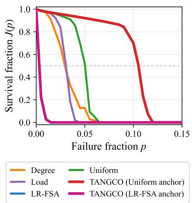  
Figure 5: Keeping both anchors recovers the strongest allo- cation when one collapses. Survival fraction $J ( p )$ vs failure fraction � on Oregon AS under Pareto load at $B = 0 . 5 \colon$ the LR-FSA heuristic collapses while Uniform holds, so the LR-FSA-anchored policy collapses with it, while the Uniformanchored policy recovers the strongest allocation. Keeping the better of the two anchors yields the reported TANGCO.

## B.1 Anchor Selection

Figure 5 illustrates the anchor-failure mode that motivates keeping both anchors: on Oregon AS under Pareto load at $B = 0 . 5$ , the LR-FSA heuristic collapses while Uniform holds, and optimizing over both anchors recovers the strongest allocation. Across the full suite, LR-FSA anchors the winning policy on every synthetic family under uniform and bimodal loads (typically 10/10 realizations).

Table 7: Transfer as a source-to-target matrix (absolute AUC, uniform load, �=0.75). Among synthetics, the diagonal is within family transfer (train on eight realizations, test on two held out); of-diagonal cells are cross-family. TANGCOpre is pre-trained on a curated suite of 64 s nthetic ra hs and a lied to ever tar et without further trainin TANGCO is trained on the tar et itself. Both are shown for each training anchor (Uniform and LR-FSA); the main text reports the better of the two. The bottom row is the best heuristic on each target. Boldface marks the column maximum among learned policies.
<table><tr><td rowspan="2">Source</td><td colspan="5">Synthetic families</td><td colspan="5">Real-world networks</td></tr><tr><td></td><td>ER PowL</td><td>CLUsPowL</td><td>CORPER</td><td>RANDGEO</td><td>| US grid</td><td>Oregon AS</td><td>Chicago</td><td>OpenFl.</td><td>AS1221</td></tr><tr><td>ER</td><td>0.373</td><td>0.309</td><td>0.288</td><td>0.324</td><td>0.146</td><td>0.033</td><td>0.010</td><td>0.023</td><td>0.069</td><td>0.046</td></tr><tr><td>PowL</td><td>0.374</td><td>0.356</td><td>0.329</td><td>0.344</td><td>0.154</td><td>0.030</td><td>0.056</td><td>0.021</td><td>0.199</td><td>0.166</td></tr><tr><td>CLUsPoWL</td><td>0.373</td><td>0.353</td><td>0.329</td><td>0.342</td><td>0.156</td><td>0.027</td><td>0.033</td><td>0.018</td><td>0.215</td><td>0.141</td></tr><tr><td>CORPER</td><td>0.374</td><td>0.346</td><td>0.322</td><td>0.348</td><td>0.155</td><td>0.029</td><td>0.010</td><td>0.022</td><td>0.183</td><td>0.090</td></tr><tr><td>RANDGEO</td><td>0.371</td><td>0.241</td><td>0.229</td><td>0.280</td><td>0.168</td><td>0.030</td><td>0.038</td><td>0.024</td><td>0.030</td><td>0.038</td></tr><tr><td>TANGCOpre (Unif. anchor)</td><td>0.370</td><td>0.341</td><td>0.313</td><td>0.335</td><td>0.143</td><td>0.040</td><td>0.336</td><td>0.016</td><td>0.238</td><td>0.239</td></tr><tr><td>TANGCOpre (LR-FSA anchor)</td><td>0.375</td><td>0.357</td><td>0.331</td><td>0.348</td><td>0.163</td><td>0.042</td><td>0.224</td><td>0.023</td><td>0.261</td><td>0.209</td></tr><tr><td>TANGCO (Unif. anchor)</td><td>0.367</td><td>0.329</td><td>0.317</td><td>0.333</td><td>0.154</td><td>0.033</td><td>0.319</td><td>0.012</td><td>0.262</td><td>0.286</td></tr><tr><td>TANGCO (LR-FSA anchor)</td><td>0.374</td><td>0.355</td><td>0.330</td><td>0.347</td><td>0.158</td><td>0.034</td><td>0.074</td><td>0.020</td><td>0.251</td><td>0.230</td></tr><tr><td>Best heuristic</td><td>0.362</td><td>0.303</td><td>0.273</td><td>0.297</td><td>0.132</td><td>0.022</td><td>0.237</td><td>0.019</td><td>0.076</td><td>0.263</td></tr></table>

Table 8: Same absolute-AUC transfer matrix as Table 7, under Pareto load (�=0.75), with TANGCOpre and TANGCO split by training anchor as in Table 7. Boldface marks the column maximum among learned policies.
<table><tr><td></td><td colspan="5">Synthetic families</td><td colspan="5">Real-world networks</td></tr><tr><td>Source</td><td></td><td>ER PowL</td><td>CLUsPowL</td><td>CORPER</td><td>RANDGEO</td><td>US grid</td><td>Oregon AS</td><td>Chicago</td><td>OpenFl.</td><td>AS1221</td></tr><tr><td>ER</td><td>0.330</td><td>0.245</td><td>0.224</td><td>0.283</td><td>0.061</td><td>0.018</td><td>0.011</td><td>0.011</td><td>0.041</td><td>0.021</td></tr><tr><td>PowL</td><td>0.330</td><td>0.319</td><td>0.292</td><td>0.312</td><td>0.095</td><td>0.020</td><td>0.053</td><td>0.011</td><td>0.216</td><td>0.156</td></tr><tr><td>CLUsPowL</td><td>0.330</td><td>0.318</td><td>0.293</td><td>0.313</td><td>0.092</td><td>0.020</td><td>0.022</td><td>0.011</td><td>0.194</td><td>0.126</td></tr><tr><td>CORPER</td><td>0.330</td><td>0.310</td><td>0.285</td><td>0.312</td><td>0.075</td><td>0.021</td><td>0.010</td><td>0.011</td><td>0.122</td><td>0.021</td></tr><tr><td>RANDGEO</td><td>0.324</td><td>0.235</td><td>0.218</td><td>0.264</td><td>0.113</td><td>0.020</td><td>0.010</td><td>0.012</td><td>0.040</td><td>0.046</td></tr><tr><td>TANGCOPre (Unif. anchor)</td><td>0.328</td><td>0.311</td><td>0.282</td><td>0.311</td><td>0.054</td><td>0.047</td><td>0.321</td><td>0.011</td><td>0.213</td><td>0.250</td></tr><tr><td> $\mathrm { T A N G C O ^ { p r e } }$  (LR-FSA anchor)</td><td>0.332</td><td>0.317</td><td>0.291</td><td>0.314</td><td>0.065</td><td>0.060</td><td>0.120</td><td>0.011</td><td>0.210</td><td>0.219</td></tr><tr><td>TANGCO (Unif. anchor)</td><td>0.329</td><td>0.307</td><td>0.277</td><td>0.307</td><td>0.097</td><td>0.040</td><td>0.326</td><td>0.010</td><td>0.240</td><td>0.282</td></tr><tr><td>TANGCO (LR-FSA anchor)</td><td>0.331</td><td>0.318</td><td>0.295</td><td>0.310</td><td>0.123</td><td>0.032</td><td>0.037</td><td>0.012</td><td>0.182</td><td>0.213</td></tr><tr><td>Best heuristic</td><td>0.320</td><td>0.269</td><td>0.238</td><td>0.262</td><td>0.083</td><td>0.020</td><td>0.243</td><td>0.012</td><td>0.082</td><td>0.260</td></tr></table>

The two anchors are closest under Pareto load, where Uniform becomes competitive at tight budgets, winning entirely on CorPer (10/10 at $B = 0 . 5 )$ and on a majority of ER realizations. On the real networks the Uniform anchor supplies the winning policy on both hub-heavy AS topologies, Oregon and AS1221, in all nine conditions each, while LR-FSA anchors every winning policy on the near-planar Chicago network. The best hand-designed baseline also shifts on the reals: Degree is the strongest heuristic on Rocketfuel AS1221 in all nine conditions, a rule that never wins on any synthetic family, yet TANGCO still improves on it in all nine (by +11% on average).

## B.2 Transferability

This appendix details the two transfer settings of Section 4.3 and reports the full per-target results. In the per-graph setting, each family contributes ten independent realizations. We train one policy jointly on eight of them for 400 iterations and evaluate it on the two held out, which forms the within-family diagonal of Table 2. For the cross-family entries, we take each per-family policy and apply it, without retraining, to the held-out graphs of every other family. Tables 7 and 8 report every policy, including TANGCOpre, as absolute AUC under both loads.

TANGCOpre is pre-trained on the curated suite of 64 synthetic graphs described in Appendix A.2, and sees no real network or test graph during training. The test targets are never seen in training: the held-out realizations of the five evaluation families and the five real networks. Because one policy must fit many graphs at once, pre-training runs longer than per-instance training, 6,400 iterations against 200; all other settings match Appendix A.5.

Under Pareto load the transfer picture matches uniform load. Within-family transfer stays positive on all five families and lands within 0.001 AUC of per-instance training on four of them. Crossfamily transfer improves on the target heuristic in 14 of 20 cells, against 17 under uniform load. The six failures are the pairs whose structure difers most: a random-geometric policy applied to the heavy-tailed families, an ER policy applied to the heavy-tailed and spatial families, and a core-periphery policy applied to RandGeo. RandGeo is the one family whose diagonal moves between loads: a shared within-family policy exceeds per-instance training by 0.010 AUC under uniform load, while per-instance training is ahead by the same margin under Pareto load.

## B.3 Scalability Details

The policy adds one forward and one backward pass per training iteration, each $O \big ( K ( E h + N h ^ { 2 } ) \big )$ for � message-passing layers of width ℎ: message passing contributes �(�ℎ) and the per-node update $O ( N h ^ { 2 } )$ per layer. At the settings of Section 4.1 $( K = 3 , h = 6 4 )$ this is negligible beside the ≈ 8.4M cascade simulations per run, each $O ( N \bar { t } + E )$ , as Figure 1(c) confirms.

At every network size the cascade simulator accounts for over 94% of the training time and the GNN forward and backward passes for under 2%. A full 200-iteration run takes 24 to 50 minutes at

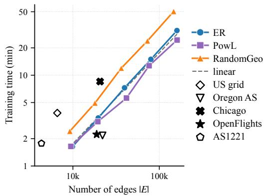  
Figure 6: Sparse networks with long cascades take longer than edge count predicts. Median training time versus number of edges |�| (log–log, 200 iterations), for three synthetic families up to 40,000 nodes and the five evaluated real networks. Fixed mean degree makes |�| ∝ � for the synthetic families, so this view rescales Figure 1(c); US grid and AS1221 sit above the trend because their deeper cascades dominate the �(��¯) cost term.

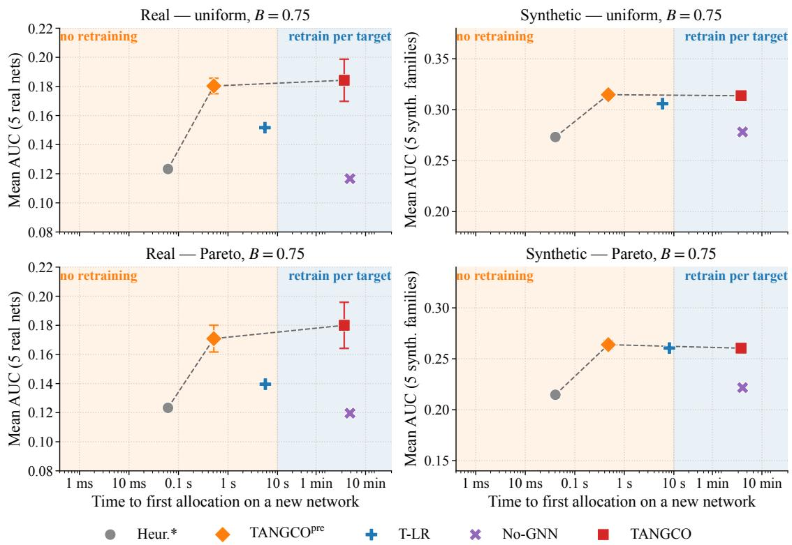  
Figure 7: TANGCOpre reaches near-instance robustness at heuristic deployment cost under both load distributions. Mean AUC versus time to first allocation on a new network (lo �-axis), for the five real networks and five s nthetic families under uniform and Pareto load at � = 0.75. Figure 1(b) shows the uniform-load front. Left band: methods that need no per-target training (best heuristic, T-LR, TANGCOpre); ri ht band: methods retrained er tar et (No-GNN, instance TANGCO). Error bars on TANGCOpre and instance TANGCO are the mean across networks of the within-network seed standard deviation (�=5); on synthetic panels those values are ≲ 0.005 AUC and fall below visual resolution at the lotted -scale.

40,000 nodes on 16 CPU cores, and under nine minutes on every evaluated network.

The cascade simulations are independent, and the implementation exploits this: the � failure sets at a given allocation and failure fraction are simulated in parallel. The � sampled allocations and the |P| failure fractions are likewise independent and are currently evaluated in sequence, so further parallelism is available without changing the method.

Figure 7 extends the deployment comparison to both load distributions. Figure 6 redraws the size-scaling result against edge count. The synthetic families hold mean degree fixed, so their edge count is proportional to node count and the three curves keep their near-linear slopes. The real networks separate by cascade depth. Sparse networks such as US grid and AS1221 sit above the trend: their longer cascades inflate the �(��¯) term that dominates each simulation (Section 2.1). Edge count alone underpredicts their cost, which confirms that the node-sweep term drives runtime.

## B.4 No-GNN Ablation

The No-GNN variant tests whether reward-driven search alone can match TANGCO without message passing. It replaces the GNN by a free residual logit Δ� per node, zero-initialized so that the deterministic allocation matches the training anchor at the start of training, and feeds that residual into the same residual-softmax allocation head as TANGCO (Section 3.2). Training uses the same RE-INFORCE loop, Adam schedule, exploration annealing, L2 penalty on residual logits, failure-sample counts, two anchors (Uniform, LR-FSA), five seeds, and 200 iterations as the instance-TANGCO runs. The ablation covers all ten networks (five synthetic families and five reals); one realization represents each family, and both learned policies are five-seed means. We report the better of the two anchors, taking the best-validation-AUC checkpoint per seed as in the primary protocol (Section 3.4). Table 9 collects the uniform and Pareto results at � = 0.75; the body Table 3 shows the uniform block alone. TANGCO beats the No-GNN variant in all 20 cells (mean +0.052 AUC under uniform load, +0.050 under Pareto). Message passing matters most on the hub-heavy real networks: on OpenFlights the No-GNN variant barely clears the heuristic (0.083 vs. 0.076) while TANGCO more than triples it (0.262). On AS1221 the Degree heuristic (0.263) outranks both search variants, which improve only modestly on the shared Uniform anchor (0.213 and 0.235 from 0.205); TANGCO moves further to 0.286 and alone surpasses it. We test whether this result is specific to the REINFORCE optimizer by optimizing the same residual-softmax head with CMA-ES [15], a derivative-free evolutionary search, using a free per-node logit vector zero-initialized at the anchor, two anchors, five seeds, and the same AUC reward. Full CMA-ES maintains an � ×� covariance that is infeasible for networks of thousands of nodes, so we use the separable (diagonal) variant, whose covariance scales linearly in � [39]. We cap the search at 6,400 reward evaluations, matching the No-GNN REINFORCE budget (200 iterations × 32 samples), with initial step size $\sigma _ { 0 } = 0 . 2 $ , and keep the best-validation-AUC allocation as in the primary protocol. Table 9 shows CMA-ES tracks the No-GNN variant closely on most cells (within 0.015 AUC on 15 of 20) and stays near the best heuristic (mean ΔAUC +0.009 under uniform load, +0.012 under Pareto). TANGCO beats it in all 20 cells (mean +0.042 and +0.039). Reward-driven search, whether policygradient or evolutionary, cannot recover the gain that message passing provides.

Table 9: TANGCO beats the No-GNN variant in all 20 familyload cells; No-GNN alone stays close to the best heuristic. AUC at $B = 0 . 7 5 ,$ , single realization per family, uniform and Pareto loads. Heuristic\* is the best of the four heuristics. The learned search variants (No-GNN and CMA-ES, a derivativefree optimizer) are five-seed means (best of two anchors); TANGCO values are bold.
<table><tr><td>Load</td><td>Graph</td><td>TANGCO</td><td>No-GNN</td><td>CMA-ES</td><td>Heuristic*</td></tr><tr><td>Uniform</td><td>ER</td><td>0.372</td><td>0.358</td><td>0.357</td><td>0.357</td></tr><tr><td></td><td>PowL</td><td>0.354</td><td>0.311</td><td>0.313</td><td>0.302</td></tr><tr><td></td><td>CLUsPowL</td><td>0.327</td><td>0.279</td><td>0.282</td><td>0.270</td></tr><tr><td></td><td>CORPER</td><td>0.345</td><td>0.299</td><td>0.295</td><td>0.295</td></tr><tr><td></td><td>RANDGEO</td><td>0.171</td><td>0.144</td><td>0.141</td><td>0.141</td></tr><tr><td></td><td>US grid</td><td>0.034</td><td>0.024</td><td>0.022</td><td>0.022</td></tr><tr><td></td><td>Oregon AS</td><td>0.319</td><td>0.244</td><td>0.259</td><td>0.237</td></tr><tr><td></td><td>Chicago</td><td>0.020</td><td>0.019</td><td>0.019</td><td>0.019</td></tr><tr><td></td><td>OpenFlights</td><td>0.262</td><td>0.083</td><td>0.145</td><td>0.076</td></tr><tr><td></td><td>AS1221</td><td>0.286</td><td>0.213</td><td>0.235</td><td>0.263</td></tr><tr><td>Pareto</td><td>ER</td><td>0.314</td><td>0.286</td><td>0.283</td><td>0.282</td></tr><tr><td></td><td>PowL</td><td>0.302</td><td>0.259</td><td>0.265</td><td>0.249</td></tr><tr><td></td><td>CLUsPowL</td><td>0.275</td><td>0.229</td><td>0.237</td><td>0.220</td></tr><tr><td></td><td>CORPER</td><td>0.303</td><td>0.251</td><td>0.252</td><td>0.247</td></tr><tr><td></td><td>RANDGEO</td><td>0.109</td><td>0.083</td><td>0.076</td><td>0.075</td></tr><tr><td></td><td>US grid</td><td>0.040</td><td>0.022</td><td>0.027</td><td>0.020</td></tr><tr><td></td><td>Oregon AS</td><td>0.326</td><td>0.251</td><td>0.266</td><td>0.243</td></tr><tr><td></td><td>Chicago</td><td>0.012</td><td>0.012</td><td>0.012</td><td>0.012</td></tr><tr><td></td><td>OpenFlights</td><td>0.240</td><td>0.089</td><td>0.151</td><td>0.082</td></tr><tr><td></td><td>AS1221</td><td>0.282</td><td>0.225</td><td>0.244</td><td>0.260</td></tr></table>

## B.5 Message-Passing Depth

The depth sweep varies the number of message-passing layers over $K \in \{ 0 , \ldots , 5 \}$ on the five synthetic families plus the US grid and Oregon AS, under the same one-realization / five-seed protocol as Appendix B.4. Table 10 reports each anchored policy’s relative improvement over its own anchor, which isolates what message passing must learn from what the anchor already provides. Under the Uniform anchor, which carries no structural signal, the $K { = } 0  K { = } 1$ step is large: one message-passing hop supplies the neighborhood correction, after which $K = 2 \ – 5$ stay flat on the synthetic families. Under the LR-FSA anchor the same step nearly vanishes, because the anchor already injects the one-hop local-risk estimate. We omit Oregon AS under LR-FSA: the prior collapses on its extreme hubs, leaving a near-zero denominator that makes the relative figure uninterpretable. The US grid and Oregon AS keep fluctuating at higher �, though their near-floor AUC inflates the relative figures.

Table 10: The �=0 → �=1 step is large under the Uniform anchor and small under the LR-FSA anchor, which already carries the one-hop signal. Depth split by training anchor (uniform load, $B = 0 . 7 5 )$ : relative improvement in AUC of each anchored policy over its own anchor (%).
<table><tr><td>Network</td><td>K=0</td><td>K=1</td><td>K=2</td><td>K=3</td><td>K=4</td><td>K=5</td></tr><tr><td colspan="7">UNIFORM anchor</td></tr><tr><td>ER</td><td>+3.9</td><td>+6.8</td><td>+7.3</td><td>+7.0</td><td>+7.1</td><td>+7.3</td></tr><tr><td>PowL</td><td>+35.9</td><td>+62.2</td><td>+61.3</td><td>+60.7</td><td>+61.3</td><td>+60.0</td></tr><tr><td>CLUsPowL</td><td>+29.8</td><td>+56.3</td><td>+56.7</td><td>+56.8</td><td>+56.3</td><td>+56.5</td></tr><tr><td>CORPER</td><td>+39.5</td><td>+57.1</td><td>+57.6</td><td>+58.0</td><td>+57.4</td><td>+57.7</td></tr><tr><td>RANDGEO</td><td>+6.5</td><td>+13.8</td><td>+13.2</td><td>+14.0</td><td>+14.6</td><td>+13.5</td></tr><tr><td>US grid</td><td>+63.0</td><td>+88.2</td><td>+74.2</td><td>+89.1</td><td>+77.0</td><td>+92.9</td></tr><tr><td>Oregon AS</td><td>+24.1</td><td>+39.4</td><td>+32.6</td><td>+34.4</td><td>+35.0</td><td>+23.9</td></tr><tr><td colspan="7">LR-FSA anchor</td></tr><tr><td>ER</td><td>+3.3</td><td>+3.7</td><td>+3.8</td><td>+4.0</td><td>+3.9</td><td>+3.8</td></tr><tr><td>PowL</td><td>+14.6</td><td>+17.3</td><td>+17.0</td><td>+17.1</td><td>+16.8</td><td>+16.8</td></tr><tr><td>CLUsPowL</td><td>+18.2</td><td>+21.0</td><td>+21.2</td><td>+21.0</td><td>+20.9</td><td>+20.9</td></tr><tr><td>CORPER</td><td>+15.4</td><td>+17.4</td><td>+17.1</td><td>+17.0</td><td>+17.3</td><td>+17.3</td></tr><tr><td>RANDGEO</td><td>+31.8</td><td>+33.9</td><td>+33.6</td><td>+34.4</td><td>+32.2</td><td>+33.3</td></tr><tr><td>US grid</td><td>+30.1</td><td>+61.4</td><td>+74.3</td><td>+58.6</td><td>+50.6</td><td>+66.8</td></tr><tr><td>Oregon AS</td><td colspan="6">collapsed prior, omitted</td></tr></table>

## B.6 Per-Cell Fits for the Regime Map

Table 11 gives the nested fits behind the three regimes of Section 4.6. Each column adds one local feature to the regression of log $\left( { { s _ { v } } } / { \left( B / N \right) } \right)$ on log $r _ { v } ,$ and a cell is linear once some model on the ladder reaches $R ^ { 2 } \ge 0 . 9 0 $ : regime A if risk alone does, regime B if the full linear model does, and regime C otherwise. On the regime-C cells a nonlinear additive fit in risk and degree recovers far more than any linear model: 0.98 and 0.91 on Oregon AS under uniform and Pareto load, 0.91 and 0.88 on AS1221, and 0.82 on the US grid under Pareto load, against linear fits of 0.03–0.33.

Cells are absent where the policy stays at its anchor and leaves no learned allocation to explain, which at $B = 0 . 5$ is the feasibility floor of Section 4.6.

Table 12 repeats the classification at all three budgets. Eight of the nineteen cells change regime under a change of budget alone, holding the graph and the load fixed, which is why Section 4.6 attributes the regime to topology, load, and budget jointly rather than to topology.

Figure 8 shows one network per regime, fitting log � against log � alone, once as a power rule and once with a free shape. A single feature keeps the two fits comparable, since risk and degree are correlated on these graphs (0.61–0.77) and a model given both cannot attribute between them. The fitted power-rule exponent spans 0.57 to 1.10 across the regime-A networks, so no single value is right everywhere, which is why T-LR (Section 4.6) fits a per-graph exponent rather than a shared one. T-LR selects � on the training failure sets of Appendix A.5 and reports AUC with 50 samples per fraction on the same 101-point evaluation grid (Table 4); the learned policies use 100 samples.

Table 11: Local-risk alone explains the allocation on ten of the nineteen cells; degree closes most of the remaining gap. Nested $R ^ { 2 }$ for the regime map (uniform and Pareto loads, $B = 0 . 7 5 )$ . Columns add features cumulatively to log �. Needs names the feature closing most of the gap for regime-B cells.
<table><tr><td>Network</td><td>Load</td><td>r</td><td>+d</td><td>+l</td><td>+k</td><td> ${ \mathrm { R e g . } }$ </td><td>Needs</td></tr><tr><td>ER</td><td>Uniform</td><td>0.95</td><td>0.97</td><td>0.99</td><td>0.99</td><td>A</td><td></td></tr><tr><td rowspan="3">PowL</td><td>Pareto</td><td>0.78</td><td>0.82</td><td>0.93</td><td>0.94</td><td>B</td><td>load</td></tr><tr><td>Uniform</td><td>0.98</td><td>0.98</td><td>0.98</td><td>0.98</td><td>A</td><td>一</td></tr><tr><td>Pareto</td><td>0.93</td><td>0.96</td><td>0.98</td><td>0.98</td><td>A</td><td>一</td></tr><tr><td>CLUsPowL</td><td>Uniform</td><td>0.97</td><td>0.98</td><td>0.98</td><td>0.98</td><td>A</td><td>一</td></tr><tr><td rowspan="2">CORPER</td><td>Pareto</td><td>0.95</td><td>0.97</td><td>0.98</td><td>0.98</td><td>A</td><td>一</td></tr><tr><td>Uniform</td><td>0.98</td><td>0.99</td><td>0.99</td><td>0.99</td><td>A</td><td>一</td></tr><tr><td rowspan="2">RANDGEO</td><td>Pareto</td><td>0.91</td><td>0.94</td><td>0.95</td><td>0.97</td><td>A</td><td></td></tr><tr><td>Uniform</td><td>0.40</td><td>0.95</td><td>0.96</td><td>0.96</td><td>B</td><td>degree</td></tr><tr><td>US grid</td><td>Pareto</td><td>0.83</td><td>0.96</td><td>0.97</td><td>0.97</td><td>B</td><td>degree</td></tr><tr><td rowspan="2"></td><td>Uniform</td><td>0.95</td><td>0.96</td><td>0.96</td><td>0.97</td><td>A</td><td>一</td></tr><tr><td>Pareto</td><td>0.27</td><td>0.27</td><td>0.27</td><td>0.49</td><td>C</td><td>一</td></tr><tr><td rowspan="2">Oregon AS</td><td>Uniform</td><td>0.00</td><td>0.33</td><td>0.33</td><td>0.34</td><td>C</td><td>一</td></tr><tr><td>Pareto</td><td>0.01</td><td>0.28</td><td>0.28</td><td>0.30</td><td>C</td><td>一</td></tr><tr><td>Chicago OpenFlights</td><td>Uniform</td><td>0.99</td><td>0.99</td><td>0.99</td><td>1.00</td><td>A</td><td>一</td></tr><tr><td></td><td>Uniform</td><td>0.96</td><td>0.98</td><td>0.98</td><td>0.98</td><td>A</td><td></td></tr><tr><td rowspan="3">AS1221</td><td>Pareto</td><td>0.83</td><td>0.88</td><td>0.88</td><td>0.90</td><td>B</td><td>degree</td></tr><tr><td>Uniform</td><td>0.00</td><td>0.03</td><td>0.03</td><td>0.06</td><td>C</td><td>一</td></tr><tr><td>Pareto</td><td>0.09</td><td>0.19</td><td>0.20</td><td>0.21</td><td>C</td><td>一</td></tr></table>

Table 12: Eight of the nineteen cells change regime under a change ofbudget alone, holding graph and load fixed. Regime at each budget; a check marks a changing cell. Dashes are cells where the policy stays at its anchor, leaving no learned allocation to explain.
<table><tr><td>Network</td><td>Load</td><td> $B { = } 0 . 5$ </td><td> $\scriptstyle B = 0 . 7 5$ </td><td> $B { = } 1 . 0$ </td><td>Changes</td></tr><tr><td>ER</td><td>Uniform</td><td>B</td><td>A</td><td>A</td><td>√</td></tr><tr><td></td><td>Pareto</td><td>B</td><td>B</td><td>A</td><td>√</td></tr><tr><td>PowL</td><td>Uniform</td><td>A</td><td>A</td><td>A</td><td></td></tr><tr><td></td><td>Pareto</td><td>B</td><td>A</td><td>A</td><td>√</td></tr><tr><td>CLUsPowL</td><td>Uniform</td><td>A</td><td>A</td><td>A</td><td></td></tr><tr><td></td><td>Pareto</td><td>B</td><td>A</td><td>A</td><td>√</td></tr><tr><td>CORPER</td><td>Uniform</td><td>A</td><td>A</td><td>A</td><td></td></tr><tr><td></td><td>Pareto</td><td>B</td><td>A</td><td>A</td><td>√</td></tr><tr><td>RANDGEO</td><td>Uniform</td><td>B</td><td>B</td><td>B</td><td></td></tr><tr><td></td><td>Pareto</td><td>C</td><td>B</td><td>B</td><td>√</td></tr><tr><td>US grid</td><td>Uniform</td><td>一</td><td>A</td><td>C</td><td>√</td></tr><tr><td></td><td>Pareto</td><td>一</td><td>C</td><td>C</td><td></td></tr><tr><td>Oregon AS</td><td>Uniform</td><td>C</td><td>C</td><td>C</td><td></td></tr><tr><td></td><td>Pareto</td><td>C</td><td>C</td><td>C</td><td></td></tr><tr><td>Chicago</td><td>Uniform</td><td>一</td><td>A</td><td>A</td><td></td></tr><tr><td></td><td>Pareto</td><td>一</td><td>一</td><td>A</td><td></td></tr><tr><td>OpenFlights</td><td>Uniform</td><td>A</td><td>A</td><td>A</td><td></td></tr><tr><td></td><td>Pareto</td><td>C</td><td>B</td><td>B</td><td>√</td></tr><tr><td>AS1221</td><td>Uniform</td><td>C</td><td>C</td><td>C</td><td></td></tr><tr><td></td><td>Pareto</td><td>C</td><td>C</td><td>C</td><td></td></tr></table>

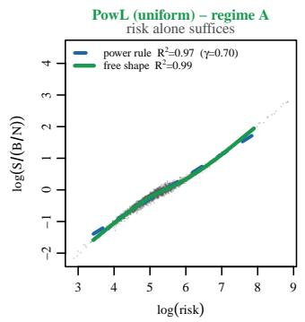

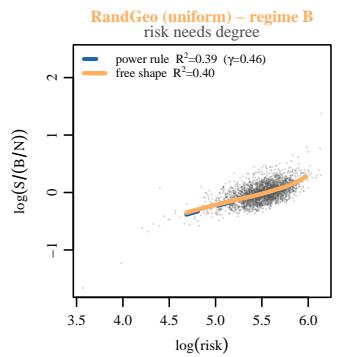

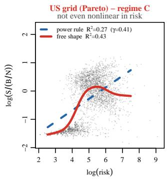  
Figure 8: Local-risk alone explains the learned allocation in regime A and fails in regimes B and C. The learned allocation against local-risk, one network per regime (uniform load unless noted, $B = 0 . 7 5 )$ . Points are nodes; the dashed line is the power rule $s \propto r ^ { \gamma }$ (a straight line in these coordinates, slope $\gamma ) ,$ , the solid curve is the same single feature with a free shape. We fit on every node and draw the curves over the range holding 99% of them. Left: on PowL the power rule already fits, and freeing the shape adds nothing. Middle: on RandGeo neither $\mathbf { f i t s } ,$ because risk is the wrong feature here and degree is what closes the gap. Right: on the US grid under Pareto load the power rule keeps raising capacity with risk while the policy levels of, and a free shape in risk alone still reaches only 0.43.