# The Time Value of Evolution

Matthew Siper Nof1, New York University siper.matthew@gmail.com

Ahmed Khalifa Nof1, University of Malta ahmed.khalifa@um.edu.mt

Julian Togelius Nof1, New York University julian.togelius@gmail.com

## Abstract

In evolutionary search, a weak child can be a valuable ancestor that makes high-fitness regions reachable. Immediate-return control is blind to this delayed utility, penalizing mutations through their immediate ofspring even when they open pro- ductive future lineages. We formalize this hidden dynamic as the time value of evolution within a finite-horizon Markov decision process. To exploit it, we introduce Lineage-Value Policy Gradients (LVPG), a long-horizon actor-critic frame-work for automated trading policy discovery. Our architec- ture decouples search control into specialized policy heads over a shared generative backbone: a bootstrapped critic head estimates the value of finite-horizon lineage potential from multi-step mutation trees, while an actor head dynamically modulates mutation intensity over the remaining search bud- get. We isolate the impact of long-horizon credit assignment against immediate-return optimization across 90 paired runs under matched operators, lineage supervision, folds, seeds, and budgets. Path-based credit assignment substantially accel- erates finite-budget search, increasing validation best-so-far AUC by 0.394 Sharpe units. LVPG also produces fewer tem-porary regressions than immediate-return optimization and recovers from them more often. Finite-horizon lineage value yields more selective non-monotonic search and stronger poli- cies within identical resource constraints.

## 1 Introduction

Evolutionary search often treats the fitness of a newly gener- ated child as the return for the mutation that produced it. This is adequate when useful edits improve fitness immediately, but it undervalues structural changes that first lower fitness and later enable stronger descendants. Semantic program mutation makes this mismatch especially important because one edit can alter indicators, control flow, and decision logic. Its value may also depend on the remaining budget. A wider mutation early in an eight-step lineage can be repaired and extended, while the same move near the horizon may expire before its downstream value appears.

## The Time Value of Evolution

Option pricing separates current exercise value from the value preserved by time to expiry. Evolutionary mutations

have an analogous property. A weak ofspring can retain value by opening a productive region that later descendants can exploit before the search budget expires.

We formalize this delayed utility as the time value ofevolution. Let $h = H - t$ denote the number of search steps remaining, and let

$$
Q _ { h } ^ { \pi } ( s , z ) = \mathbb { E } _ { \pi } \left[ B _ { t + h } - B _ { t } \mid s _ { t } = s , z _ { t } = z \right]\tag{1}
$$

denote the expected best-so-far improvement obtained by selecting mutation intensity z in state s and continuing under policy π for the remaining horizon. Its one-step counterpart is $Q _ { 1 } ^ { \pi } ( s , z )$ . We define

$$
\mathrm { T V E } _ { h } ( s , z ) = Q _ { h } ^ { \pi } ( s , z ) - Q _ { 1 } ^ { \pi } ( s , z ) .\tag{2}
$$

A positive value means that one-step evaluation understates a mutation’s finite-budget utility. Our primary objective uses $\gamma = 1$ , so improvements are not discounted solely because they appear several mutations after the enabling action. The control problem is therefore to select the behavioral displace- ment with the greatest continuation value for the current pro- gram and remaining budget.

## Lineage-Value Policy Gradients

We introduce Lineage-Value Policy Gradients (LVPG), a long-horizon actor-critic framework for automated policy discovery. A frozen, ofline-trained Evolutionary Language Model (ELM) generates and compiles mutations at three behaviorally calibrated radii, Refine, Interpolate, and Ex- plore. Separate actor and critic LoRA adapters control the radius and estimate finite-horizon lineage value from the cur- rent program, evaluation state, and remaining budget.

The primary comparison isolates the temporal scope of policy-gradient credit. PPO-Path and PPO-Immediate share the ELM, state and action spaces, critic initializa- tion, mutation-tree labels, auxiliary first-action supervision, folds, seeds, optimization settings, and evaluation budgets. They difer only in the return supplied to policy optimiza- tion. PPO-Path uses downstream best-so-far progress, while PPO-Immediate uses clipped one-step fitness change with $\gamma = 0$

Contributions.

• Conceptual. We formalize the time value of evolution, distinguishing immediate ofspring value from the finite- horizon value of reachable lineages.

• Methodological. We introduce LVPG, which combines state- and budget-dependent mutation control, a mutation- tree-bootstrapped critic, and policy-gradient credit over realized evolutionary paths.

• Empirical. Across a matched paired protocol, long- horizon credit improves search eficiency and sealed-test performance while producing fewer and more recoverable temporary regressions.

## 2 Related Work

## Adaptive Operator Control

Parameter control and adaptive operator selection study how evolutionary algorithms should choose mutation settings on- line (Eiben, Hinterding, and Michalewicz 1999; Karafotias, Hoogendoorn, and Eiben 2015; Fialho et al. 2010). Self-adaptive step sizes encode control variables within the evolv- ing population, while bandit and reinforcement-learning methods update operator preferences from observed rewards. Delayed rewards, finite-horizon control, and policy gradients are therefore not new in isolation. Our claim is narrower. Most practical credit signals remain dominated by recent ofspring improvement, and prior operator-control results do not estab- lish whether a language-model-generated program mutation should be valued through the executable lineage it opens. We hold lineage supervision fixed and vary only the return used by PPO.

Novelty Search and MAP-Elites preserve stepping stones through behavioral diversity or structured archives (Lehman and Stanley 2011; Mouret and Clune 2015). Our method leaves the task objective, parent sampling, and archive rule unchanged. A lower-fitness child receives useful credit only when later descendants exceed the previous path best.

## Language-Model Variation

Language models now serve as mutation, crossover, and re- finement operators in evaluator-guided search. EvoPrompt- ing applies them to neural architecture evolution, while Fun- Search, Evolution of Heuristics, LLaMEA, and AlphaE- volve improve executable programs or algorithms through repeated evaluation (Chen, Dohan, and So 2023; Romera-Paredes et al. 2024; Liu et al. 2024; van Stein and Bäck 2025; Novikov et al. 2025). These systems establish the value of language models as semantic variation engines. Our ELM is trained ofline as a multitask learner for mutation, compila- tion, and translation, then behaviorally calibrated with Ofset Direct Preference Optimization and frozen during PPO. On- line learning is confined to separate actor and critic LoRA adapters and their output heads.

## Trading Policy Search

Trading-rule evolution provides a dificult executable search setting with nonlinear program behavior, regime variation, transaction costs, and substantial selection risk (Allen and Karjalainen 1999; White 2000). ProFiT evolves source-level trading programs with language-model feedback, while Con- tinuous Program Search learns a geometry for behaviorally local variation (Siper et al. 2026a,b). Those works address semantic competence and spatial locality. The present work addresses temporal credit. Rolling-origin folds, sealed test windows, and complete-run inference are used to separate search progress from financial generalization.

## 3 Evolutionary MDP

## Environment

We define

$$
\mathcal { M } _ { \mathrm { e v o } } = ( \mathcal { S } , \mathcal { Z } , P , R , H ) , \qquad H = 8 .\tag{3}
$$

At step t, the rendered state prompt represents

$$
\boldsymbol { s } _ { t } = \left( p _ { t } ^ { \mathrm { N L } } , p _ { t } ^ { \mathrm { G P T L } } , m _ { t } , B _ { t } , t / H \right) , \quad B _ { t } = \operatorname* { m a x } _ { 0 \leq j \leq t } \boldsymbol { F } ( p _ { j } ) ,\tag{4}
$$

where $m _ { t }$ contains training-window execution metrics and feedback. The discrete action space is

$$
\mathcal { Z } = \left\{ \mathrm { R e F I N E } , \mathrm { I N T E R P O L A T E } , \mathrm { E X P L O R E } \right\} .\tag{5}
$$

The transition uses two ELM tasks and one fixed evalua- tor. The frozen ELM, denoted $M _ { \theta } ,$ samples $p _ { t + 1 } ^ { \mathrm { N L } } \sim M _ { \theta } ( \cdot \ |$ $s _ { t } , z _ { t } )$ and compiles the result into typed GPTL; the back- tester returns $\dot { F ( p _ { t + 1 } ) }$ and the next feedback state. Genera- tion, compilation, execution, and path-best updating together define $\textstyle P ( s _ { t + 1 } \mid s _ { t } , z _ { t } )$

## Path Value

Let $\widetilde { B } _ { t }$ be the best standardized fitness observed through step t. The best-so-far step reward is

$$
r _ { t } = \widetilde { B } _ { t + 1 } - \widetilde { B } _ { t } .\tag{6}
$$

With $\gamma = 1$ , the return telescopes

$$
G _ { t } ^ { \mathrm { p a t h } } = \sum _ { k = t } ^ { H - 1 } r _ { k } = \widetilde { B } _ { H } - \widetilde { B } _ { t } .\tag{7}
$$

An action can therefore receive positive credit after an im- mediate decline if a later descendant establishes a new path best. Invalid children receive an additional penalty of 0.25 standardized units. PPO-Immediate observes the same paths but uses

$$
r _ { t } ^ { \mathrm { i m m } } = \mathrm { c l i p } \Big ( \widetilde { F } ( p _ { t + 1 } ) - \widetilde { F } ( p _ { t } ) , - 3 , 3 \Big ) , \qquad \gamma = 0 .\tag{8}
$$

Equation 2 is the conceptual diference between these action values. PPO-Path directly optimizes the finite-horizon return in Equation 7; it does not separately estimate the residual.

## PPO-Path Algorithm

Algorithm 1 PPO-Path for one asset-fold-seed run   
Require: frozen ELM Mθ; actor LoRA/head πψ; critic LoRA/head   
Lϕ; H = 8   
1: initialize the archive with the pinned policy   
2: for r = 1, . . . , 4 rounds do   
3: collect eight paths in parallel   
4: for each path and t = 0, . . . , H − 1 do   
5: render st and sample zt ∼ πψ(· | st)   
6: generate, compile, evaluate, and record $p _ { t + 1 }$   
7: end for   
8: apply the fixed archive rule to 64 children   
9: expand depth-five trees from two states   
10: compute GAE and update actor and critic   
11: end for   
12: select on validation, tune numeric leaves, test once

$$
S _ { t }  Z _ { t }  p _ { t + 1 }  G _ { t }
$$

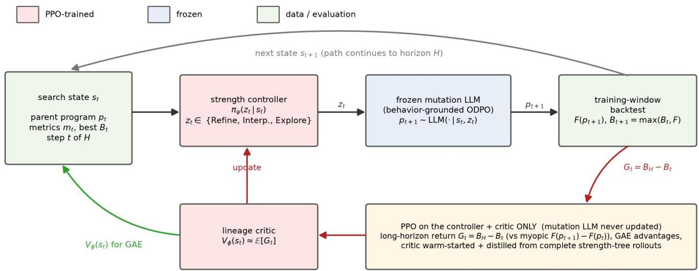  
Figure 1: Lineage-Value Policy Gradients. A trainable actor LoRA and three-way head select a behaviorally calibrated mutation radius from the current program and search state. The frozen ELM mutates and compiles the child, while PPO updates only the actor LoRA and head plus a separate critic LoRA and scalar head. Path return credits downstream best-so-far progress, while depth-five trees initialize and refine the critic and supervise the strongest first branch.

## 4 Architecture and Training

## Evolutionary Language Model

The search representation is a natural-language trading pol- icy. The execution representation is Genetic Programming Trading Language, a typed tree language producing Boolean long-entry, long-exit, short-entry, and short-exit signals. Compilation uses greedy decoding followed by at most two retries at temperature 0.3. A program is invalid after three failed compilations or fewer than ten trades.

The Evolutionary Language Model (ELM) is an oflinetrained Qwen3-8B multitask model (Yang et al. 2025). Its 44,736 examples cover strength-conditioned natural- language mutation, language-to-GPTL compilation, and GPTL-to-language translation. Training examples come from reversed degradation walks at ofsets of one, two, and four steps. Parent and child programs are executed on a training-only probe panel, and equal-frequency tertiles of action-sequence displacement define low, medium, and high targets.

Supervised multitask learning establishes mutation and compilation competence but does not guarantee separated radii. We therefore calibrate ELM with Ofset Direct Pref- erence Optimization (ODPO) (Rafailov et al. 2023; Amini, Vieira, and Cotterell 2024). ODPO uses 14,735 commonparent preference pairs, 775 validation pairs, β = 0.3, margin scale 0.2, and one epoch. The low and medium boundaries are 0.0247 and 0.1594. The resulting Qwen3-8B ELM is frozen during PPO in every search condition. Across 536 held-out mutations from 24 parents, median executed dis- agreement is 0.095, 0.194, and 0.326 for Refine, Interpolate, and Explore. Parent medians have strict order in 91.7% of cases, and validity exceeds 90% at every strength.

## Meta-Controller

The actor and critic are separate LoRA adapters over ELM’s frozen 36-layer backbone (Hu et al. 2022). Each uses $r ~ = ~ 1 5 0 , ~ \alpha ~ = ~ 3 0 0 ~ ( \alpha / r ~ = ~ 2 )$ , dropout 0.05, and all seven projections in every layer: $\mathrm { q / k / v / o \_ p r o j }$ and $\mathsf { g a t e / u p / d o w n \_ p r o j }$ . Each adapter has approxi- mately 409.2M trainable parameters, about 5% of the 8.19B-parameter base. The actor maps the final state-prompt token through a zero-initialized 4096 → 3 head; the critic maps its transition-prompt token through a separate 4096 → 1 scalar head.

PPO and tree distillation update the actor LoRA and head, while Huber loss updates the critic LoRA and head. Online PPO uses clip ratio 0.2, generalized advantage estimation with $\lambda = 0 . 9 5$ , entropy coeficient 0.01, eight actor epochs, and ten critic epochs per round (Schulman et al. 2017, 2016).

## Critic Bootstrapping

For each root program, we force all three first actions and expand every resulting node under all three strengths for four additional levels. A complete depth-five ternary tree has 243 leaves and requires 363 child executions before memoization. For first-action child $C _ { z }$ , the target is

$$
y ( P , z , C _ { z } ) = \mathrm { c l i p } \bigg ( \operatorname* { m a x } _ { u \in { \cal T } _ { 5 } ( C _ { z } ) } { \cal F } ( u ) - { \cal F } ( C _ { z } ) , - 3 , 3 \bigg )\tag{9}
$$

The target is exact for the evaluated deterministic tree and op- timistic with respect to the full stochastic ELM transition ker- nel. Ofline critic training uses 2,109 transitions, complete- run train-validation splits, Huber loss with δ = 1, and three epochs. The warm start reaches held-out $R ^ { 2 } = 0 . 3 7 4$ and mean absolute error 0.564 Sharpe units. During each PPO round, two collected states receive new trees. Their targets update the critic and weight cross-entropy supervision to- ward the highest-valued first action.

## 5 Experimental Protocol

## Data and Statistical Units

We evaluate hourly continuous futures for the S&P 500 E- mini, Silver, and 30-Year Treasury. Their histories contain 23,915, 24,020, and 23,947 bars and end on October 20, 2025. Each market has ten end-anchored rolling-origin folds. A fold contains four months of training, one month of val- idation, a three-day embargo, and one month of sealed test data. The ten test windows do not overlap. Training feedback drives every evolutionary, actor, and critic update. Validation selects one policy after search and tunes only numeric leaves through at most 64 deterministic backtests. Program logic remains fixed. The selected champion is evaluated once on test.

The sampling hierarchy is

asset → fold → seed/run → path → transition. (10) Transitions are never treated as independent observations. The primary unit is the complete paired asset-fold-seed run. Seven primary conditions use three assets, ten folds, and seeds {4, 5, 7}, giving 90 runs per condition. Three mecha-nism ablations use the 30 prespecified Treasury blocks. The complete matrix contains 720 runs and 184,320 archive- facing children.

Primary inference uses five planned paired contrasts of PPO-Path against PPO-Immediate, one-step control, Sched- ule, Uniform, and the strongest fixed radius. Assets are fixed strata. We resample complete paired blocks within strata for 10,000 hierarchical-bootstrap replicates and report mean diferences, 95% intervals, probability of superiority, and Holm-adjusted p-values (Efron and Tibshirani 1994; Holm 1979). A complete-block Friedman test with paired Wilcoxon follow-ups is a secondary sensitivity analysis (Friedman 1937; Wilcoxon 1945; Demšar 2006). Transition analyses resample complete paths within runs.

## Fitness Normalization

Training Sharpe varies across assets and folds. Before search, each task receives a frozen training-only reference set of 64 policies. Every condition uses the same file. Fitness is standardized as

$$
\widetilde { F } _ { a , f } ( p ) = \frac { F _ { a , f } ( p ) - m _ { a , f } } { \operatorname* { m a x } ( 1 . 4 8 2 6 \mathrm { M A D } _ { a , f } , 0 . 1 ) } .\tag{11}
$$

Rewards and critic values use this scale. Validation and test results remain in raw Sharpe units.

## Matched Baseline Matrix

PPO-Path and PPO-Immediate are compute matched. Fixed, Uniform, and Schedule use the same archive-facing candidate budget but do not incur the tree and PPO training costs. Experiments used four NVIDIA RTX PRO 6000 Blackwell Server Edition GPUs, an Intel Xeon 6767P CPU, 1 TB RAM, and Ubuntu 24.04.4.

## 6 Results

## Search Performance

Table 2 reports the five planned complete-run contrasts. Fig- ure 3A shows post-hoc validation best-so-far Sharpe over the 256-child budget. Validation is computed after search and never returned to the controller. PPO-Path separates early and finishes with the highest aggregate curve. Relative to matched PPO-Immediate, validation AUC rises by 0.394 [0.261, 0.526] Sharpe units with probability of superiority 0.822. All five planned AUC contrasts remain significant after Holm correction with adjusted $p < 0 . 0 0 1$

The main inference comes from prespecified paired con- trasts at the complete-run level. The conservative Friedman analysis of test Sharpe on the 30 blocks shared by every method gives $p = 0 . 2 6 5$ . This sensitivity test removes 60 non-Treasury blocks and evaluates a broader omnibus hy- pothesis, so it does not replace the paired three-market com- parison.

## Horizon and State Dependence

Panels A and B of Figure 4 locate the temporal efect. Moving from one to four steps raises validation AUC by 0.399 [0.146, 0.630], adjusted $p \ : = \ : 0 . 0 0 3 6$ . Moving from one to eight steps raises it by 0.599 [0.411, 0.795], adjusted $p \ < \ 0 . 0 0 1$ . The additional eight-step gain over four steps is $0 . 2 0 0 \ [ - 0 . 0 3 8 , 0 . 4 5 1 ]$ with $p =  { \mathrm { ~ 0 . 0 9 5 4 ~ } }$ . The strongest conclusion is therefore one-step versus multistep credit. The longest tested horizon is descriptively best and is not estab- lished as universally optimal.

A temporary regression satisfies $F ( p _ { t + 1 } ) ~ < ~ B _ { t }$ and recovers when a later descendant exceeds $B _ { t }$ . PPO-Path produces fewer regressions than PPO-Immediate, 54.2% [53.5%, 54.8%] versus 59.8% [58.9%, 60.6%], and recovers from more of them, 48.0% [46.5%, 49.7%] versus 39.9% [38.4%, 41.5%]. Its regressions are deeper, 0.94 versus 0.77 Sharpe units, but they recover sooner, 1.93 versus 2.20 later steps, and yield larger post-recovery improvement, 0.535 versus 0.251. Long-horizon control therefore makes non-monotonic search more selective.

The actor also reads more than the clock. A multinomial action model using remaining budget, parent-fitness per- centile, stagnation, recent improvement, and prespecified in- teractions fits sampled actions better than a time-only model. The likelihood-ratio statistic is 544.74 with $p < 1 0 ^ { \dot { - } 1 0 0 }$ , and grouped held-out log loss improves from 0.7465 to 0.7350. Leave-one-asset-out fits preserve the diference. The actor follows a broad exploration-to-refinement tempo, while pro- gram quality and stagnation shift the action mixture within the same remaining budget.

## Interventional Action Values

For 720 held-out states, we force each first action and run four matched stochastic continuations using the same con- troller and paired random seeds. Figure 5F reports these interventional finite-horizon values. The controller selects the highest estimated action in 51.9% [48.2%, 55.8%] of states, above the 33.3% chance rate. Mean regret is 0.157 [0.137, 0.178] Sharpe units. Across all states, Refine and Explore have nearly equal mean continuation value, 0.538 and 0.533, while Interpolate obtains 0.408. Among states already in regression, Refine is strongest at 0.727. The learned rule cannot be reduced to choosing the largest available mutation.

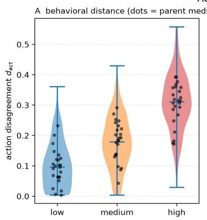

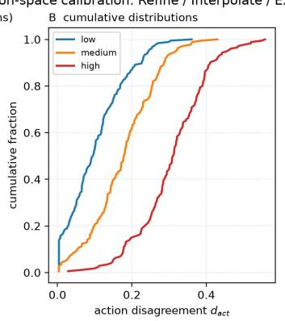

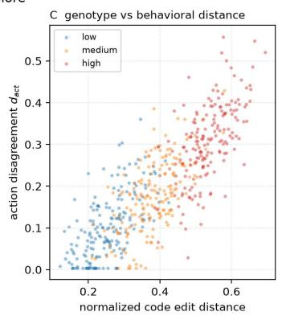  
Figure 2: Behavioral calibration of the Refine, Interpolate, and Explore action space. (A) Realized parent–child action disagreement, with black points showing parent-level medians. (B) Empirical cumulative distributions under each requested strength. (C) Normalized code-edit distance against executed behavioral distance. The ordered distributions verify that the behaviorall calibrated ELM ex oses em iricall distinct semantic radii rather than nominal rom t labels.

Table 1: Controller and baseline matrix. Every run uses 256 archive-facing child evaluations. PPO-Path and PPO-Immediate also share the same online tree budget. The one-step, four-step, and time-only ablations use the 30 Treasury blocks.
<table><tr><td>Condition</td><td>Action rule</td><td>Credit</td><td>Purpose</td><td>Runs</td></tr><tr><td>Fixed L/M/H</td><td>one constant radius</td><td>none</td><td>global-radius control</td><td> $3 \times 9 0$ </td></tr><tr><td>Uniform</td><td>categorical 1/3</td><td>none</td><td>random action control</td><td>90</td></tr><tr><td>Schedule</td><td>Explore→Interpolate→Refine</td><td>time rule</td><td>hand annealing</td><td>90</td></tr><tr><td>One-step</td><td>learned,  $H = 1$ </td><td>one step</td><td>no path structure</td><td>30</td></tr><tr><td>Four-step</td><td>learned,  $H = 4$ </td><td>path</td><td>horizon truncation</td><td>30</td></tr><tr><td>PPO-Immediate</td><td>learned,  $H = 8$  collection</td><td> $\gamma = 0$ </td><td>matched myopic PPO</td><td>90</td></tr><tr><td>Time-only</td><td>learned, masked state</td><td>path</td><td>schedule alternative</td><td>30</td></tr><tr><td>PPO-Path</td><td>learned, full state</td><td> $\mathbf { \hat { H } } = 8 , \gamma = 1$ </td><td>proposed method</td><td>90</td></tr></table>

Table 2: Primary paired results. Efects are PPO-Path minus baseline. Brackets give 95% hierarchical-bootstrap CIs; $p _ { \mathrm { H } }$ is Holm-adjusted across five planned contrasts and PS is probability of superiority.
<table><tr><td>Baseline</td><td>∆ validation AUC</td><td>∆ test Sharpe</td></tr><tr><td>PPO-Immediate</td><td>0.394 [0.261, 0.526]</td><td> $0 . 4 5 9 \ [ 0 . 1 1 3 , 0 . 7 9 5 ]$ </td></tr><tr><td> $n = 9 0$ </td><td> $p _ { \mathrm { H } } < . 0 0 1$ </td><td> $p _ { \mathrm { H } } = . 0 1 8 8 , \mathrm { P S } = . 6 3 3$ </td></tr><tr><td></td><td> $\operatorname { O n e - s t e p } \left( H = 1 \right) 0 . 5 9 9 \left[ 0 . 4 1 1 , 0 . 7 9 5 \right]$ </td><td> $0 . 6 5 7 \left[ - 0 . 0 4 5 , 1 . 3 6 7 \right]$ </td></tr><tr><td> $n = 3 0$ </td><td> $p _ { \mathrm { H } } < . 0 0 1$ </td><td> $p _ { \mathrm { H } } = . 0 6 6 , \mathrm { P S } = . 6 3 3$ </td></tr><tr><td>Schedule  $n = 9 0$ </td><td> $0 . 5 9 7 \left[ 0 . 4 3 3 , 0 . 7 5 8 \right]$ </td><td> $0 . 5 9 0 \ [ 0 . 2 6 1 , 0 . 9 2 4 ]$ </td></tr><tr><td></td><td> $p _ { \mathrm { H } } < . 0 0 1$   $0 . 6 5 4 \ [ 0 . 4 8 6 , 0 . 8 0 7 ]$ </td><td> $p _ { \mathrm { H } } = . 0 0 3 , \mathrm { P S } = . 6 6 7$ </td></tr><tr><td>Uniform  $n = 9 0$ </td><td></td><td> $0 . 7 0 2 \ [ 0 . 3 1 3 , 1 . 0 7 8 ]$ </td></tr><tr><td></td><td> $p _ { \mathrm { H } } < . 0 0 1$ </td><td> $p _ { \mathrm { H } } = . 0 0 2 , \mathrm { P S } = . 6 6 7$ </td></tr><tr><td>Fixed-Medium</td><td> $0 . 6 8 5 \ : [ 0 . 5 5 1 , 0 . 8 2 5 ]$ </td><td> $0 . 5 5 3 \ [ 0 . 1 6 1 , 0 . 9 5 2 ]$ </td></tr><tr><td> $n = 9 0$ </td><td> $p _ { \mathrm { H } } < . 0 0 1$ </td><td> $p _ { \mathrm { H } } = . 0 1 2 , \mathrm { P S } = . 7 0 0$ </td></tr></table>

## Held-Out Critic Validation

On 23,040 states excluded from critic fitting and PPO up- dates, critic predictions have mean run-level Spearman cor- relation 0.597 [0.585, 0.608] with realized path returns, explained variance 19.3%, and mean absolute error 0.509 Sharpe units. Calibration quintiles are monotonically or- dered. The highest quintile overpredicts realized return, so the critic is an informative ranker rather than an exact ora- cle. After controlling for parent fitness, path best, remaining budget, stagnation, and recent improvement, the critic re- tains coeficient 0.361 [0.332, 0.388] and incremental partial $R ^ { 2 } = 0 . 1 1 6 .$ . Full code context therefore contributes future- yield information beyond simple state proxies.

## Financial Generalization

Figure 3B and Table 2 report the one sealed-test cham- pion per run. Mean Sharpe rises from 0.862 under PPO-Immediate to 1.321 under PPO-Path. The paired gain is 0.459 [0.113, 0.795], with probability of superiority 0.633 and Holm-adjusted $p = 0 . 0 1 8 8 .$ . Gains over Schedule, Uni- form, and Fixed-Medium also remain significant; the one- step contrast is positive but uncertain.

Secondary means also favor PPO-Path. Annualized re- turn is 22.8% versus 15.3%, Sortino is 2.462 versus 1.623, maximum drawdown is 3.87% versus 4.29%, and positive test Sharpe occurs in 86.7% versus 81.1% of runs. These endpoints are descriptive. Within each asset-fold-seed block, paired daily returns are additionally evaluated with a Ledoit- Wolf studentized circular-block bootstrap using automatic block length and 2,000 replicates (Ledoit and Wolf 2008). Fold return streams are not concatenated. The evidence sup- ports aggregate policy-discovery gains across rolling origins and does not imply superiority in every one-month test pe- riod.

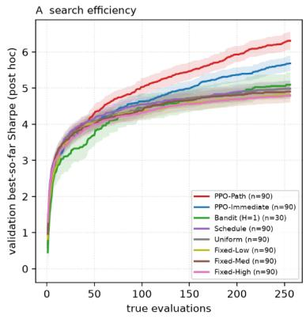

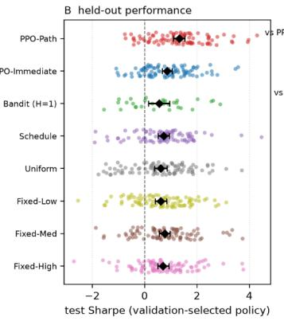

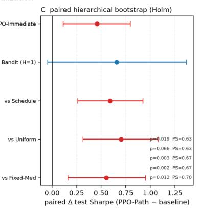  
Figure 3: Primary performance. (A) Post-hoc validation best-so-far Sharpe over archive-facing children with 95% hierarchicalbootstrap intervals. (B) Sealed-test Sharpe for each validation-selected and numerically tuned champion. Black diamonds summarize complete-run outcomes. (C) Paired PPO-Path test diferences with 95% intervals, Holm-adjusted p-values, and probability of superiority.

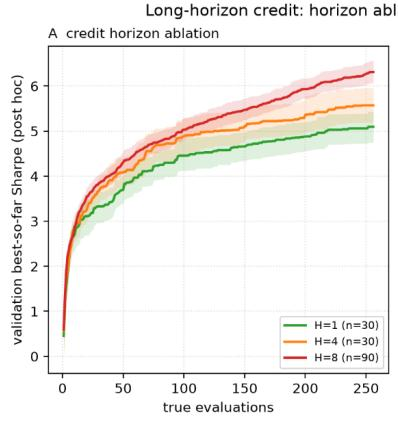

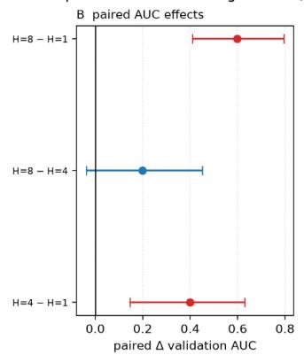

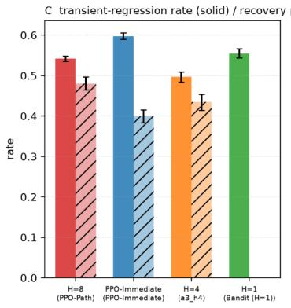  
Figure 4: Credit horizon and recoverability. (A) Validation best-so-far curves for one-step, four-step, and eight-step credit under the same archive-facing budget. (B) Paired AUC diferences with 95% hierarchical-bootstrap intervals. (C) Temporary- regression rate and conditional recovery probability. Recovery requires a later descendant to exceed the path best observed before the regression.

## 7 Discussion and Limitations

LVPG treats mutation value as the combination of immediate fitness and finite-budget continuation value. In the matched PPO comparison, extending the return horizon improves search AUC, held-out Sharpe, and recovery from tempo- rary regressions without changing the mutation operator or lineage supervision. The learned controller follows a broad exploration-to-refinement rhythm while adjusting to program quality and stagnation, and no mutation radius is uniformly best.

## Limitations

ELM fixes the content distribution and the three calibrated mutation radii. This isolates temporal control but prevents online improvement of edits and leaves a coarse, domain- specific action space. LVPG also combines path PPO, critic learning, and first-action distillation. Matching critic and tree supervision between PPO-Path and PPO-Immediate isolates return horizon, not the independent necessity of each compo- nent. The critic learns optimistic maxima from deterministic depth-five trees rather than expected stochastic returns. Its held-out ranking signal is useful but imperfectly calibrated. PPO-Path and PPO-Immediate are compute matched; fixed, uniform, and scheduled arms are matched only in archive- facing children. Finally, the study uses three futures markets, one policy language, horizons through eight steps, and one-

B Policy entropy

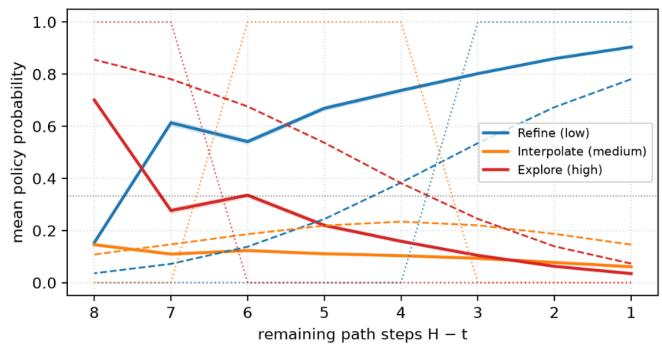

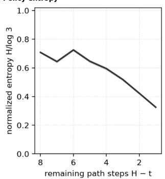

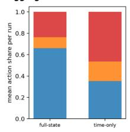

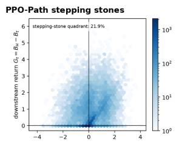

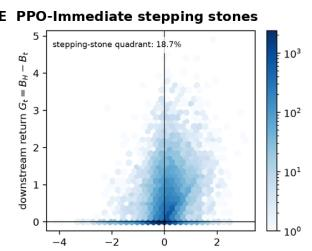

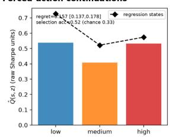  
Figure 5: Structural mechanism diagnostics. (A–C) Budget- and state-dependent control. (D–E) Immediate change versus downstream return. (F) Matched forced-action continuation values. Upper-left points are temporary regressions followed by ositive downstream return.

month test windows. Fixed costs omit market impact, ca- pacity, latency, and order-book efects. The results establish finite-budget search gains under controlled historical evalu- ation, not live profitability or global optimality. Within these limits, the ex eriments show that credit over reachable de- scendants can improve finite-budget evolutionary search be- yond credit assigned only to the immediate child.

## 8 Conclusion

In this work, we identify a central limitation of immediate- return mutation control: a mutation can be a weak child yet a valuable ancestor. When credit is assigned only from ofspring fitness, actions that create recoverable temporary regressions are treated as destructive even when they open productive future lineages. Framing finite-budget search as an investment problem, we formalize this delayed utility as the time value of evolution within a finite-horizon Markov decision process. We introduce Lineage-Value Policy Gradi- ents (LVPG), an actor-critic framework that values mutation decisions through the finite-budget futures they make reach- able.

LVPG pairs an ofline-trained Qwen3-8B mutation operator frozen during PPO with separate LoRA actor and critic adapters. The actor modulates behaviorally calibrated mu- tation intensity, while the critic is bootstrapped from multi- step mutation trees to estimate finite-horizon lineage poten- tial. Across 90 paired runs under matched operators, lineage supervision, folds, seeds, and budgets, path-based credit in- creases validation best-so-far AUC by 0.394 Sharpe units and raises mean sealed-test Sharpe from 0.862 to 1.321. LVPG also produces fewer temporary regressions and recovers from them more often. Long-horizon credit therefore improves the selectivity of non-monotonic search rather than simply en- couraging larger or more frequent exploratory moves. These findings support a broader principle for finite-budget opti- mization. Immediate ofspring fitness is an incomplete mea- sure of an action’s value because it omits the future search opportunities that action creates. LVPG provides a general blueprint for generative program search: preserve a capable variation engine, learn state- and budget-dependent control over its mutation scale, and assign credit over the lineages produced by those decisions. The present evidence estab- lishes stronger polic discover within matched finite bud- gets and motivates evaluation across other program-search domains, longer horizons, and richer action spaces.

Allen, F.; and Karjalainen, R. 1999. Using Genetic Algorithms to Find Technical Trading Rules. Journal of Financial Economics, 51(2): 245–271.

Amini, A.; Vieira, T.; and Cotterell, R. 2024. Direct Prefer- ence Optimization with an Ofset. In Findings ofthe Associationfor Computational Linguistics: ACL 2024, 9954–9972. Association for Computational Linguistics.

Chen, A.; Dohan, D.; and So, D. 2023. EvoPrompting: Lan- guage Models for Code-Level Neural Architecture Search. In Advances in Neural Information Processing Systems, vol-ume 36, 7787–7817.

Demšar, J. 2006. Statistical Comparisons of Classifiers over Multiple Data Sets. Journal ofMachine Learning Research, 7: 1–30.

Efron, B.; and Tibshirani, R. J. 1994. An Introduction to the Bootstrap. CRC Press.

Eiben, A. E.; Hinterding, R.; and Michalewicz, Z. 1999. Parameter Control in Evolutionary Algorithms. IEEE Transactions on Evolutionary Computation, 3(2): 124–141.

Fialho, Á.; Da Costa, L.; Schoenauer, M.; and Sebag, M. 2010. Analyzing Bandit-Based Adaptive Operator Selection Mechanisms. Annals of Mathematics and Artificial Intelligence, 60: 25–64.

Friedman, M. 1937. The Use of Ranks to Avoid the As- sumption of Normality Implicit in the Analysis of Variance. Journal of the American Statistical Association, 32(200): 675–701.

Holm, S. 1979. A Simple Sequentially Rejective Multiple Test Procedure. Scandinavian Journal of Statistics, 6(2): 65–70.

Hu, E. J.; Shen, Y.; Wallis, P.; Allen-Zhu, Z.; Li, Y.; Wang, S.; Wang, L.; and Chen, W. 2022. LoRA: Low-Rank Adaptation of Large Language Models. In International Conference on Learning Representations.

Karafotias, G.; Hoogendoorn, M.; and Eiben, A. E. 2015. Parameter Control in Evolutionary Algorithms: Trends and Challenges. IEEE Transactions on Evolutionary Computation, 19(2): 167–187.

Ledoit, O.; and Wolf, M. 2008. Robust Performance Hy- pothesis Testing with the Sharpe Ratio. Journal of Empirical Finance, 15(5): 850–859.

Lehman, J.; and Stanley, K. O. 2011. Abandoning Objectives: Evolution Through the Search for Novelty Alone. Evolutionary Computation, 19(2): 189–223.

Liu, F.; Tong, X.; Yuan, M.; Lin, X.; Luo, F.; Wang, Z.; Lu, Z.; and Zhang, Q. 2024. Evolution ofHeuristics: Towards Efficient Automatic Algorithm Design Using Large Language Model. In Proceedings of the 41st International Conference on Machine Learning, volume 235 of Proceedings of Machine Learning Research, 32201–32223. PMLR.

Mouret, J.-B.; and Clune, J. 2015. Illuminating Search Spaces by Mapping Elites. arXiv:1504.04909.

Novikov, A.; Vu, N.; Eisenberger, M.; Dupont, E.; Huang,˜ P.-S.; Wagner, A. Z.; Shirobokov, S.; Kozlovskii, B.; Ruiz, F.

J. R.; Mehrabian, A.; Kumar, M. P.; See, A.; Chaudhuri, S.; Holland, G.; Davies, A.; Nowozin, S.; Kohli, P.; and Balog, M. 2025. AlphaEvolve: A Coding Agent for Scientific and Algorithmic Discovery. arXiv:2506.13131.

Rafailov, R.; Sharma, A.; Mitchell, E.; Manning, C. D.; Er- mon, S.; and Finn, C. 2023. Direct Preference Optimiza- tion: Your Language Model Is Secretly a Reward Model. In Advances in Neural Information Processing Systems, vol-ume 36, 53728–53741.

Romera-Paredes, B.; Barekatain, M.; Novikov, A.; Balog, M.; Kumar, M. P.; Dupont, E.; Ruiz, F. J. R.; Ellenberg, J. S.; Wang, P.; Fawzi, O.; Kohli, P.; and Fawzi, A. 2024. Mathematical Discoveries from Program Search with Large Language Models. Nature, 625(7995): 468–475.

Schulman, J.; Moritz, P.; Levine, S.; Jordan, M.; and Abbeel, P. 2016. High-Dimensional Continuous Control Using Gen- eralized Advantage Estimation. In International Conference on Learning Representations.

Schulman, J.; Wolski, F.; Dhariwal, P.; Radford, A.; and Klimov, O. 2017. Proximal Policy Optimization Algorithms. arXiv:1707.06347.

Siper, M.; Khalifa, A.; Soros, L. B.; Nasir, M. U.; Azhang, J.; and Togelius, J. 2026a. ProFiT: Program Search for Fi- nancial Trading. In Proceedings of the Genetic and Evolutionary Computation Conference, 727–734. Association for Computing Machinery.

Siper, M.; Nasir, M. U.; Khalifa, A.; Soros, L.; Azhang, J.; and Togelius, J. 2026b. Continuous Program Search. arXiv:2602.07659.

van Stein, N.; and Bäck, T. 2025. LLaMEA: A Large Language Model Evolutionary Algorithm for Automatically Generating Metaheuristics. IEEE Transactions on Evolutionary Computation, 29(2): 331–345.

White, H. 2000. A Reality Check for Data Snooping. Econometrica, 68(5): 1097–1126.

Wilcoxon, F. 1945. Individual Comparisons by Ranking Methods. Biometrics Bulletin, 1(6): 80–83.

Yang, A.; Li, A.; Yang, B.; Zhang, B.; Hui, B.; Zheng, B.; Yu, B.; Gao, C.; Huang, C.; Lv, C.; et al. 2025. Qwen3 Technical Report. arXiv:2505.09388.