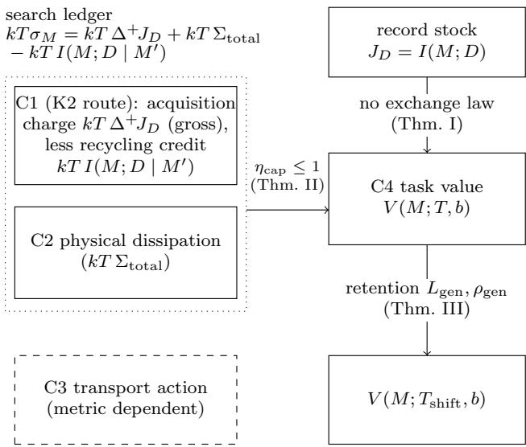
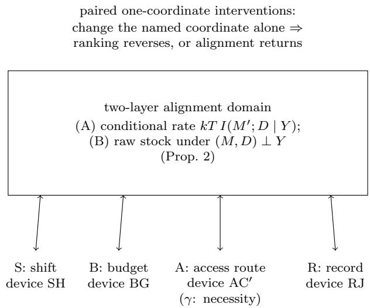
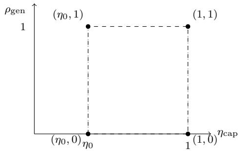

# Thermodynamics of Learning: A Typed Four-Component Accounting of Memory, Fit, and Value

Akihito Sudo1

1ZeroStruct Inc.

sudo.akihito@shizuoka.ac.jp

(Dated: August 14, 2026)

What a finite learning device has recorded and what will hold value for it on future tasks are not the same quantity. We develop a typed accounting for finite-state learning devices that separates four components: a training-side fit functional $\Phi _ { \mathrm { f i t } }$ , the record-correlation stock $J _ { D } = I ( M ; D )$ , an update-side search ledger $\sigma _ { M } ,$ and an operational capital value V(M; T, b). This value is the work gap between an informed protocol class and a blind class obtained by deleting the memory-read port and re-optimizing from scratch. Its explicit arguments are the future task distribution T, the access structure, and a per-run work budget b. Three theorem groups organize the accounting. (I) Separation: V is well posed, invariant under bijective re-labeling of the memory, and reduces to the single-task value of a companion framework. For every n, there is a device family on which record correlation and world correlation grow by n ln 2 while the capital gain is exactly zero. In the flat∗ regime, data-free updates never increase V. (II) Capitalization ledger: an exact flat∗ extraction identity and a universal ledger identity give, for (F5′)-stable M-local updates under a no-discarded-record-correlation condition (f), the bound $\eta _ { \mathrm { c a p } } \leq 1$ for the capitalization eficiency $\eta _ { \mathrm { c a p } } = \Delta V / ( k T \sigma _ { M } )$ , together with necessary and suficient conditions for equality. Outside this regime, the bound fails in identified ways: pure entropy-production denominators, finite-budget gate enablement, and recycling credit. The regime map organizes these failures. A blank-start cumulative bound survives without (f). (III) Value retention: for the retention gap $L _ { \mathrm { g e n } }$ and retention ratio $\rho _ { \mathrm { g e n } }$ (the former carries no sign constraint; the latter is defined for positive training-side value and is not confined to [0, 1]) we give a two-layer alignment domain: an exact exchange rate between value and the side-information-adjusted record fit $I ( M ^ { \prime } ; D \mid Y )$ without any record–side-information independence assumption, and a raw record-stock exchange rate under a joint side-information neutrality condition (M, D) ⊥ Y, whose boundary is marked by an explicit one-time-pad witness. We also give a four-coordinate intervention theorem. Shift, budget, access, and record content each admit a paired setting in which changing that coordinate alone reverses or restores the fit–value ranking. The neutrality coordinate alone carries a genuine one-condition-drop necessity witness. Corollaries include a subject-diference identity for the retention gap and the two-way failure of “overfitting equals low eficiency”: $\eta _ { \mathrm { c a p } }$ and $\rho _ { \mathrm { g e n } }$ admit no functional or monotone relation. Every pair in a full rectangle is realized by an explicit device and shift. These are statements about finite-device value retention under task-distribution shift, not a theory of statistical generalization.

## I. INTRODUCTION

Does what a learning device has memorized coincide with what will hold value for it in the future? For a finite physical device, the two sides of this question belong to diferent accounts. Memorization is a correlation inventory: the information carried by the device’s memory about its training record or the variables of the world. Future value is operational: the additional work that readable memory is worth on a stated distribution of future tasks, under a stated access structure and a stated per-run work budget. Information thermodynamics has developed the execution layer of learning in depth. This layer covers the entropy production of memory updates and its bound on information acquisition, ledger identities for bipartite information flows, the dissipative price of retaining nonpredictive correlation, and work values of stored information [1–8]. This paper develops the complementary account through typed bookkeeping. What was recorded and what will hold value remain quantities of diferent type, connected by theorems rather than merged by definition. Section IX tabulates what each neighboring lineage already provides and what this paper imports from it.

We fix one boundary at the outset. All results below are exact statements about finite-state learning devices in a fixed operational framework: work values on explicit task distributions, under explicit budgets and ac cess structures. They concern finite-device value retention under task-distribution shift (Sec. VI), and they are not a theory of statistical generalization. No samplecomplexity, risk-bound, or i.i.d.-asymptotic content is claimed. The retention quantities defined below neither reduce to nor estimate a generalization error (Sec. X).

The accounting is typed (Table I). It keeps four component currencies separate: acquisition cost (C1), physical dissipation (C2), transport action (C3), and task value (C4). On the training side, we distinguish three quantities that the single word “fit” tends to merge: a training-side fit functional $\Phi _ { \mathrm { f i t } }$ , which ranks candidate updates by training loss, training likelihood, or training work; the record-correlation stock $J _ { D } ( M ) : = I ( M ; D ) { \bar { | } }$ and the gross acquisition $\Delta ^ { + } J _ { D } : = I ( M ^ { \prime } ; D \mid M )$ of a single update. On the update side, the central bookkeeping quantity is the search ledger $\sigma _ { M } = \Delta I ( M ; D ) + \Sigma _ { \mathrm { t o t a l } } ,$ a memory-side subsystem account that is not a puredissipation quantity (Sec. IV); on the future side, it is the capital value $\dot { V } ( \dot { M } ; T , b )$ (Sec. III). The four components are not a table for classifying learning phenomena. They form a type system. The theorems below specify the regimes in which exchange laws between the sub-accounts hold and identify how those laws fail outside those regimes. We do not claim that every theorem requires all four components; each theorem uses an explicitly stated subset.

The central definition uses a deletion counterfactual. The capital value of a memory state M is

$$
V ( M ; T , b ) = W _ { \mathrm { i n f o r m e d } } ( M ; T , b ) - W _ { \mathrm { b l i n d } } ( T , b ) :\tag{1}
$$

the optimal expected work extractable over the future task distribution T when the memory-read port is available, minus the optimum of a blind agent from whom every read port on M has been deleted and who reoptimizes from scratch under the same tasks, the same access structure, and the same per-run budget b. Learning, in this paper, is an admissible memory-local update with $\Delta V \ > \ 0 ;$ the predicate is relative to the stated task distribution, access structure, and evaluation budget, and it difers both from a record-correlation increase, $\Delta I ( M ; D ) > 0$ , and from an improvement of any training-side fit functional. The distinction between these predicates is not merely definitional. It is the subject of the first main theorem.

The results fall into three theorem groups. Individual devices and auxiliary lemmas are subordinate to those groups rather than parallel claims. Main Theorem I (separation; Sec. III): V is well posed, nonnegative, afine in T, invariant under bijective recoding of the finite memory, and reduces at a single task to the informed–blind value of the companion framework [9]. For every n there is a device family on which the record correlation and the world correlation grow by n ln 2 along an admissible update sequence while the capital gain is exactly zero. In the flat regime, data-free updates never increase V. Main Theorem II (capitalization ledger; Secs. IV and V): the central question is which part of the update account is capitalized into future value. This is the capitalization of the search ledger. An exact $\mathrm { \ f a t ^ { * } }$ extraction identity and a universal ledger identity combine, for (F5′)-stable M-local updates under a no-discarded-record-correlation condition (f), into the bound $\eta _ { \mathrm { c a p } } \leq 1$ for the capitalization eficiency $\eta _ { \mathrm { c a p } } = \Delta V / ( k T \sigma _ { M } )$ , with necessary and suficient conditions for equality. Outside this regime, the bound fails in identified ways: pure entropy-production denominators, finite-budget gate enablement, and recycling credit. A regime map organizes these failures, while a blank-start cumulative bound survives without (f). Main Theorem III (value retention; Sec. VI): for the retention gap $L _ { \mathrm { g e n } }$ and retention ratio $\rho _ { \mathrm { g e n } }$ under taskdistribution shift, there is a two-layer alignment domain.

Within this domain, value equals the side-informationadjusted record fit kT $I ( M ^ { \prime } ; \bar { D } \mid Y )$ exactly, with no independence assumption between record and side information. Under a joint side-information neutrality condition $( M , D ) \perp \bar { Y }$ , it also equals the raw record stock $k T I ( \vec { M } ^ { \prime } ; D )$ . An explicit one-time-pad witness exhibits the boundary of this condition. The theorem also gives a four-coordinate intervention theorem: shift, budget, access, and record content each admit a paired setting in which changing that coordinate alone reverses or restores the fit–value ranking. Only the neutrality coordinate carries a genuine one-condition-drop necessity witness. Two corollaries and an application follow (Secs. VII and VIII): a subject-diference identity for the retention gap; the two-way failure of “overfitting equals low eficiency” (ηcap and $\rho _ { \mathrm { g e n } }$ admit no functional or monotone relation); and a gate-family contrast between per-bit linear retention and a threshold transition on a common redraw-depth axis.

The claim level for real learning systems is fixed once. Every theorem concerns explicitly constructed device classes inside a fixed protocol framework. These are isolation results in the sense of device theory. When the phenomena resemble machine learning, as in memoriza tion without value, forgetting, or value enabled by an evaluation budget, we assert only a correspondence of accounting structure. We claim neither a model nor an explanation of any specific biological or artificial system.

On novelty we make one dated and scoped statement: within the fence of prior work surveyed up to 2026-07- 12, we did not find a prior framework simultaneously equipped with the same operational deletion value, evaluation budget, access structure, search ledger, and fouraxis alignment map. Each ingredient separately has close relatives, and several identities used below are imports; the comparison tables and the attribution of every imported piece are in Sec. IX.

Section II fixes the operational setting and the type table. Section III defines the training-side and valueside quantities and proves Main Theorem I. Sections IV and V develop the capitalization ledger and its regime map (Main Theorem II). Section VI develops value retention (Main Theorem III), Sec. VII its accounting corollaries, and Sec. VIII the gate-family application. Section IX locates the framework among its neighbors, and Sec. X records limitations. The appendices collect device definitions and numerical verification, proofs, witness details, self-contained fixed-content statements, and the notation table (Table V, Appendix E). This table fixes the pri mary term for every central quantity of the accounting; the body uses these terms and no synonyms.

## II. OPERATIONAL SETTING AND TYPEDACCOUNTING

## A. Imported framework and conventions

We import the protocol framework unchanged from the companion manuscript [9] and restate the parts used here. Throughout, $k T = \mathrm { { 1 } } { \bar { / } } { \bar { \beta } } .$ , information is measured in nats, and bit values are displayed as explicit multiples of ln 2.

A budgeted protocol class $\mathrm { P r o t } _ { b } ( A , q )$ consists of compositions of at most $K _ { \mathrm { h o r } }$ single-step multipartite maps subject to the following conditions. (a) Under mechanism $l o c a l i t y ,$ each designed mechanism acts only on its declared targets as a function of its declared parents. (b) For the dynamic access structure $A \ = \ ( \operatorname { A c c } _ { 0 } , R )$ , the parent set of every stage-k mechanism is contained in the currently licensed set $\operatorname { A c c } _ { k }$ issued by the rule $R$ on the record history. (c) The protocol carries a model $q ;$ $q = p$ throughout this paper, so the knowledge axis is not exercised. (d) Under the per-run pathwise drawdown cap, on every positive-probability trajectory ω and at every stage $k ,$ the running account satisfies $E _ { k } ( \omega ) \ \leq \ b .$ Auxiliaries are priced one-shot at their $D _ { \mathrm { m a x } }$ value, and an average-budget constraint is not admitted because biased-coin strategies defeat it in the imported framework. (e) No unpriced resources are allowed. (f) Under refinancing, banked balance lowers the running account. (g) An Assumption-U class restriction imposes a conditional-independence property that the imported framework builds into the class definition. Whether it holds without loss of generality is an open question there (Sec. II E).

We fix two bookkeeping conventions of the imported framework once and use them throughout. (α) For memory-reading protocols, clause (g) is imposed conditionally on the memory value. Under this convention, the per-realization and single-protocol forms of the informed branch in Definition 6 agree. An unconditional clause (g) implies the M-conditional form for a frozen M by including M among the quantified registers. Thus, the blind class embeds unchanged into the memory-reading class. (β) The extracted work $W _ { \mathrm { e x t } }$ is the terminal balance of the account. Nonequilibrium resources remaining at the horizon are forfeited. This convention closes the loophole of parking value outside the books. It also makes the net contribution of any imported auxiliary nonpositive because its one-shot $D _ { \mathrm { m a x } }$ price is not recovered.

The imported deletion counterfactual is the comparison object of this paper. Deleting a register from the access structure removes every designable read port from that register to the mechanisms. The deprived agent then re-optimizes from scratch within the reduced class. The fixed wiring of the task remains untouched. Deletion changes the agent, not the physics [9].

## B. Tasks, memory, and the future task distribution

Definition 1 (Task tuple). A task $\tau$ is a specification consisting of world-side data only:

$$
\tau = \big ( W _ { \tau } , ~ p _ { \tau } ( w ) , ~ \{ E _ { i } \} _ { \tau } , ~ G _ { \tau } , ~ \mathrm { M a n } _ { \tau } , ~ K _ { \tau } , ~ A _ { \tau } \big ) ,\tag{2}
$$

where $W _ { \tau }$ is the set of world registers, which does not contain the memory $M ; p _ { \tau } ( w )$ is the distribution of the world registers at the start of a run; $\{ E _ { i } \} _ { \tau }$ are the energy functions; $G _ { \tau }$ is a (possibly empty) set of fixed gate devices; Manτ is the manipulable set, i.e., the registers on which designed mechanisms may act; $K _ { \tau }$ is the horizon (maximal number of composed steps); and $A _ { \tau } = ( \operatorname { A c c } _ { 0 } , R )$ is the access structure, which does not include a read port on M.

Two exclusions in Definition 1 are consequential. M is not a world register. Otherwise, every update would change the task tuple itself, and $^ { 6 6 } \Delta V$ under the same $T ^ { \mathfrak { s } }$ would be a type error. The M-read port is also not part of $A _ { \tau }$ . The informed/blind contrast of Sec. III is introduced by adding or deleting that port. The port is therefore an attribute of the agent, not of the task. We obtain the initial joint distribution of a run by gluing the tuple’s $p _ { \tau } ( w )$ to the learning state of Definition 2. The bank and residual-exergy conventions and the budget semantics are fixed theory-wide, not per task.

Definition 2 (Memory register and learning state). The memory M is a separate finite register, common to all tasks, subject to four clauses: (i) M is energetically decoupled in every task $( E _ { \tau }$ does not depend on $M ) ; { \mathrm { ~ ( i i ) } }$ $M \ \not \in \ \mathrm { M a n } _ { \tau } ; \ ( \mathrm { i i i } )$ no fixed gate in $G _ { \tau }$ reads $M ; { \mathrm { ~ ( i v ) } }$ no fixed gate in $G _ { \tau ^ { - } }$ —and no task-fixed channel of any kind— acts on M. A learning state of M is a family of joint distributions

$$
\pi _ { M } = \left\{ p _ { \tau } ( m , d , w ) : \tau \in \mathrm { s u p p } T \right\}\tag{3}
$$

over $( M , D , W _ { \tau } )$ , with D the external data record of Definition $^ { 8 , }$ subject to $\mathrm { ( a ) }$ world-marginal consistency: the W-marginal of $p _ { \tau } ( m , d , w )$ equals the tuple’s $p _ { \tau } ( w )$ ; and (b) draw exogeneity of the training closure (Definition 3).

Clauses (ii)–(iv) jointly derive that the in-run dynamics of M is the identity (M is frozen). This is not an extra assumption. On their own, clauses (ii) and (iii) would not exclude a fixed gate with a world register as control and $M$ as target. Such a gate could inject value into a blank memory during a run; clause (iv) closes that hole. The clauses have distinct roles. Clauses $( \mathrm { i i } ) { + } ( \mathrm { i v } )$ provide the frozen datum under which the per-realization and singleprotocol forms of the informed branch agree (with convention α). Clause (iii) underlies the M-independence of the blind branch (Remark 2). In the imported framework, a fixed gate that reads the datum deliberately reattributes value. Here, M is the protagonist of the ledger, so the re-attribution channel is removed by definition. The evaluation of $V$ in Sec. III uses only the $( M , W _ { \tau } )$ marginals of $\pi _ { M }$ . The extended family over $( M , D , W _ { \tau } )$

is nevertheless the state proper; without it, the update dynamics does not close. We leave couplings between world variables of diferent tasks unspecified. Because V is a T-expectation of per-task quantities, its value does not depend on these couplings. Global quantities of the type ${ \bar { I ( M ; W ) } }$ are used only when all tasks in the support share one world register set (a shared world, as in the device LB of Sec. III).

Convention (probability space).—Conditional quantities such as $p ( m \mid \tau )$ and $\mathbb { E } [ W _ { \mathrm { e x t } } \mid M = m , \tau ]$ are evaluated on the single probability space obtained by placing $T ( \tau ) p _ { \tau } ( m , d , w )$ on the bundle $\begin{array} { r } { \dot { \bigcup } _ { \tau } \{ \tau \} \times ( M \times D \times W _ { \tau } ) } \end{array}$

Definition 3 (Draw exogeneity). The task draw is jointly independent of the entire training closure:

$$
\tau \ \perp \ \big ( M , \ D , \ \mathrm { a l l \ a n c i l l a s \ u s e d \ b y \ u p d a t e s } \big ) ,\tag{4}
$$

equivalently, the joint marginal of $( M , D )$ together with the update ancillas is common to all τ .

Independence of M alone $( p ( m \mid \tau ) = p ( m ) )$ would not sufice. If the task index is drawn as $M _ { 0 } \oplus D$ , then $\tau \perp M _ { 0 }$ and $\tau \perp D$ hold separately. Yet the single admissible update $M _ { 1 } : = M _ { 0 } \oplus D$ destroys the independence. Joint independence of the closure is what survives updates:

Lemma 1 (Update invariance of exogeneity). Under Definition ${ \mathit { 3 , \tau } } \bot M _ { k }$ holds at every point of every sequence of admissible M-local updates (Definition 8).

Proof. $M _ { k }$ is a function of $( M _ { 0 } , D$ , ancillas): update kernels are functions of $( m , d , a )$ only, and ancillas are independently initialized. Hence $\sigma ( M _ { k } ) \subseteq$ $\sigma ( M _ { 0 } , D , \mathrm { a n c i l l a s } ) \perp \tau$ □

Definition 4 (Future task distribution). T is a probability distribution on a finite support $\mathcal { T } = \{ \tau _ { 1 } , \dots , \tau _ { m } \}$ ; the state space of M is also finite.

Finiteness of the support is a choice of the present paper. Under an extension to countable supports or general measures, the afinity in Main Theorem I(i) survives. Finiteness of the Lipschitz constant additionally requires uniform supply boundedness (sup Gap $< \infty ; \mathrm { e . g . }$ , uniformly bounded prizes, horizons, and initial total correlations). Any such extension would carry this condition explicitly.

Remark 1 (The meaning of “future”). The temporal structure of the separation theorems is: update (training) first, draw and run second. $V ( M ; T , b )$ at a given update step is the counterfactual evaluation “if the draw happened now”, and its soundness at every step of an update sequence is exactly Definition 3 plus Lemma 1. Time order alone does not yield statistical independence (in the example above, $M _ { 1 }$ is fixed before the draw); what the definition encodes is exogeneity—the drawing mechanism does not read the training closure. Self-selection, where the content of M influences which tasks are attempted, is outside the scope of this paper.

## C. Evaluation budget

One draw $\tau \sim T$ is one run. The argument b of V is the per-run pathwise drawdown cap specified in clause (d). On every positive-probability trajectory and at every stage, the running account satisfies $E _ { k } ( \omega ) \leq b _ { \mathrm { : } }$ with auxiliaries priced one-shot at $D _ { \mathrm { m a x } }$ The costs of the update (training) process itself remain in a separate account. They are measured in the acquisition-cost and dissipation currencies (C1, C2) of Table I and never enter $b ,$ which prices only the future run side. This separation distinguishes what was paid to acquire a record from what the record can be cashed for under a future budget. It is the skeleton of the four-currency accounting. In the gate-resolvable subclass appearing in Sec. ${ \mathrm { V } } ,$ paid queries made during a run are charged to the same running account $E _ { k } ( \omega )$

## D. Typed accounting: the four component currencies

Table I fixes the four component currencies of the accounting. The table is a contract on types, not a classification of learning phenomena. For each component, it fixes whether the quantity is actual or counterfactual, its probabilistic and functional $\mathrm { t y p e , }$ its unit, and its composition rule. The contract prevents any argument below from silently converting one component into another. The search ledger $\sigma _ { M } = \Delta I ( M ; D ) + \Sigma _ { \mathrm { t o t a l } }$ of Sec. IV is not C2 itself. It is a memory-side subsystem account; only its $\Sigma _ { \mathrm { t o t a l } }$ entry is pure dissipation. The hypotheses of each theorem name the subset of components the theorem uses. Fig. 1 charts the accounts and the theorems that connect them.

## E. The U-restriction asterisk

All protocol classes in this paper carry the imported Assumption-U restriction of clause $\mathrm { ( g ) }$ , with convention (α) for memory-reading protocols. The imported framework leaves open whether the restriction is without loss of generality. We therefore build it into the class rather than list it among the hypotheses. The result is a standing asterisk on interpretation: V is a restricted-class–relative quantity. While the U-reduction remains open, it may deviate from an unrestricted operational value. Every theorem below is unconditionally valid on the restricted class. The asterisk attaches to interpretation, and we return to it in Sec. X.

TABLE I. The C1–C4 type table: the four component currencies of the accounting. The table is a contract on types, not a classification of learning phenomena; each theorem in this paper uses an explicitly stated subset of the components. The search ledger $\sigma _ { M } = \Delta I ( M ; D ) + \Sigma _ { \mathrm { t o t a l } }$ (Sec. IV) is not C2 itself.
<table><tr><td rowspan=1 colspan=5>Component    Realization       Actual /       Probabilistic Functional     Unit         CompositionCautionscounterfac-    type          typetual</td></tr><tr><td rowspan=1 colspan=5>C1             K1/K2            counterfactualexpected      protocol-      energy      generally      paid-query</td></tr><tr><td rowspan=1 colspan=5>acquisition    replacement      optimum      or             class                          nonaddi-      dissipation can</td></tr><tr><td rowspan=1 colspan=5>cost            cost [10]                            worst-path   optimum                     tive           overlap with C2</td></tr><tr><td rowspan=1 colspan=5>C2 physical   marginal          actual         expected     path           nats;        additive       $\Sigma _ { \mathrm { t o t a l } }$ is the</td></tr><tr><td rowspan=1 colspan=1>dissipation</td><td rowspan=1 colspan=3>entropy                            path          functional     energy       under</td><td rowspan=1 colspan=1>pure-dissipation</td></tr><tr><td rowspan=1 colspan=1></td><td rowspan=1 colspan=3>production                        quantity                       equiva-      stage sums</td><td rowspan=1 colspan=1>entry; every</td></tr><tr><td rowspan=1 colspan=1></td><td rowspan=1 colspan=3>∑total of the                                                         lent</td><td rowspan=1 colspan=1>energy-typed use</td></tr><tr><td rowspan=1 colspan=1></td><td rowspan=1 colspan=3>implementa-                                                          $k T \Sigma _ { \mathrm { t o t a l } }$ </td><td rowspan=1 colspan=1>below carries the</td></tr><tr><td rowspan=1 colspan=1></td><td rowspan=1 colspan=3>tion</td><td rowspan=1 colspan=1>explicit kT; the</td></tr><tr><td rowspan=5 colspan=5> $\Delta ^ { + } J _ { D }$ in generaldoes not</td></tr><tr><td rowspan=1 colspan=1>telescopes</td></tr><tr><td rowspan=1 colspan=1>exactly along</td></tr><tr><td rowspan=1 colspan=1>update</td></tr><tr><td rowspan=1 colspan=1>sequences,</td></tr><tr><td rowspan=1 colspan=2>C3             metric-            actual</td><td rowspan=1 colspan=3>pathwise     path           metric       depends on   connects to a</td></tr><tr><td rowspan=1 colspan=2>transport      dependent</td><td rowspan=1 colspan=1>or             functional     depen-</td><td rowspan=1 colspan=1>path com-</td><td rowspan=1 colspan=1>physical cost</td></tr><tr><td rowspan=4 colspan=4>action         path actionC4 task        informed-         counterfactual expectation   difference      energy       affine in T</td><td rowspan=1 colspan=1>expecteddent</td></tr><tr><td rowspan=1 colspan=1>physical metric</td></tr><tr><td rowspan=1 colspan=1>is specified</td></tr><tr><td rowspan=1 colspan=1>relative to T,</td></tr><tr><td rowspan=1 colspan=4>value          blind              optimum      over T        of protocol-</td><td rowspan=1 colspan=1>access structure,</td></tr><tr><td rowspan=1 colspan=4>optimal-value                                      class</td><td rowspan=1 colspan=1>and evaluation</td></tr><tr><td rowspan=1 colspan=5>difference V                                        optima                                        budget</td></tr></table>

## III. FIT, RECORD CORRELATION, AND CAPITAL VALUE

## A. Training-side quantities

Definition 5 (Training-side fit, record correlation, gross acquisition). A training-side fit functional $\Phi _ { \mathrm { { f i t } } }$ is any functional that ranks candidate updates from the training side—training loss, training likelihood, training work, or value on the training distribution. The recordcorrelation stock of a memory state is

$$
J _ { D } ( M ) : = I ( M ; D ) ,\tag{5}
$$

with D the external data record of Definition 8. The gross acquisition of an update $M \to M ^ { \prime }$ is

$$
\Delta ^ { + } J _ { D } : = I ( M ^ { \prime } ; D \mid M ) ,\tag{6}
$$

distinguished from the signed increment $\begin{array} { r l } { \Delta J _ { D } } & { { } : = } \end{array}$ $I ( M ^ { \prime } ; D ) \ - \ I ( M ; D )$ : the signed increment telescopes along update sequences, the gross acquisition in general does not (under the growth clause of Definition 8 the two coincide).

$J _ { D }$ is memorization, a stock of record correlation, and is not identical to training-side fit. An early working document used the word “fitting” for the predicate $\Delta I ( M ; D ) > 0$ . Throughout this paper, that predicate is called record-correlation increase, whereas $\Phi _ { \mathrm { f i t } }$ always denotes a training-side fit functional (Appendix E).

## B. The informed–blind gap and the capital value

Definition 6 (Per-task informed–blind gap). For a task τ and budget $b \geq 0$

$$
\begin{array} { r l } &  \mathrm { G a p } ( M ; \tau , b ) : = \operatorname { \mathbb { E } } _ { m \sim p ( M ) } \Big [ \displaystyle \operatorname * { \mathbb { E } } _  \mathbf { \theta } \sim \mathbf { \theta } \times \mathbf { \theta } \times \mathbf { \theta } \times \mathbf { \theta } \times \mathbf { \theta } \times \mathbf { \theta } \times \mathbf { \theta } \times \mathbf { \theta } \times \mathbf { \theta } \times \mathbf { \theta } \times \mathbf { \theta } \times \mathbf { \theta } \times \mathbf { \theta } \times \mathbf { \theta } \times \mathbf { \theta } \times \mathbf { \theta } \times \mathbf { \theta } \times \mathbf { \theta } \times \mathbf { \theta } \times \mathbf { \theta } \times \mathbf { \theta } \times \mathbf { \theta } \times \mathbf { \theta } \times \mathbf { \theta } \times \mathbf { \theta } \times \mathbf { \theta } \times \mathbf { \theta } \times \mathbf { \theta } \times \mathbf { \theta } \times \mathbf { \theta } \times \mathbf { \theta } \times \mathbf { \theta } \times \mathbf { \theta } \times \mathbf { \theta } \times \mathbf { \theta } \times \mathbf { \theta } \times \mathbf { \theta } \times \mathbf { \theta } \times \mathbf { \theta } \times \mathbf { \theta } \times \mathbf { \theta } \times \mathbf { \theta } \times \mathbf { \theta } \times \mathbf { \theta } \times \mathbf { \theta } \times \mathbf { \theta } \times \mathbf { \theta } \times \mathbf { \theta } \times \mathbf { \theta } \times \mathbf { \theta } \times \mathbf { \theta } \times \mathbf { \theta } \times \mathbf { \theta } \times \mathbf { \theta } \times \mathbf { \theta } \times \mathbf { \theta } \times \mathbf { \theta } \times \mathbf { \theta } \times \mathbf { \theta } \times \mathbf { \theta } \times \mathbf { \theta } \times \mathbf { \theta } \times \mathbf { \theta } \times \mathbf { \theta } \times \mathbf { \theta } \times \mathbf { \theta } \times \mathbf { \theta } \times \mathbf { \theta } \times \mathbf { \theta } \times \mathbf { \theta } \times \mathbf { \theta } \times \mathbf { \theta } \times \mathbf { \theta } \times \mathbf { \theta } \times \mathbf { \theta } \times \mathbf { \theta } \times \mathbf { \theta } \times \mathbf { \theta } \times \mathbf { \theta } \times \mathbf  \theta  \end{array}\tag{7}
$$

where $A _ { \tau } + M$ is the access structure with a read port on M added, and $A _ { \tau } - M$ is the access structure with every designable read port on M deleted, in the sense of the imported deletion counterfactual (Sec. II A).

The informed branch is per-realization. The protocol may be re-chosen for each memory value m. Because M is frozen during runs (derived from Definition $2 ( \mathrm { i i } ) { + } ( \mathrm { i v } ) ,$ ), the imported calibration lemma, together with convention (α), identifies this branch with the supremum over single protocols carrying an M-read port. The blind branch re-optimizes with full knowledge of the public task tuple. Only the read port on M is removed.

  
FIG. 1. The typed four-component accounting. Boxes are the component currencies (Table I) together with the record stock $J _ { D }$ and the shifted value; arrows denote theorems or routes that hold between the accounts—or, where so labeled, their proven absence—not additions. The ledger frame displays the universal identity in its energy-typed form, $k T \sigma _ { M } + k T I ( M ; D \mid M ^ { \prime } ) = k T \Delta ^ { + } J _ { D } + k T \Sigma _ { \mathrm { t o t a l } }$ [Eq. (21)]: the C1 entry on the K2 route is the gross acquisition charge $k T \Delta ^ { + } J _ { D }$ (distinct from the signed stock change $k T \Delta J _ { D }$ which is not an acquisition charge), the recycling credit vanishes under condition (f), and all information-typed quantities enter with their explicit kT conversion. The capitalization arrow holds in the $\mathrm { { \Omega } f a t ^ { * } + ( f ) }$ regime with the $\sigma _ { M }$ account (Main Theorem $\operatorname { I I } ;$ the absent $J _ { D } \to V$ exchange law is the separation of Main Theorem I; the retention arrow is the alignment schema of Main Theorem III. C3 connects to a physical cost only when a physical metric is specified.

Remark 2 (The blind branch does not depend on M). A blind protocol has no read port on M, and by Definition 2(i)–(iv) the memory enters neither the energetics nor the dynamics; every stage map of a blind protocol therefore factorizes as $\operatorname { i d } _ { M } \otimes \Lambda _ { W }$ , and its $\mathbb { E } [ W _ { \mathrm { e x t } } ]$ is a functional of the non-M marginals alone. The remaining conceivable channel—importing an auxiliary whose initial state is correlated with M—is closed not by pricing but by type: the coupling at $t _ { 0 }$ is task data rather than an object of protocol choice, and mid-run auxiliaries are adjoined as fresh registers in product state; no preparation map acting on M exists in the class. Hence $W _ { \mathrm { b l i n d } }$ carries no M argument. The full argument is reproduced in Appendix B.

Definition 7 (Capital value).

$$
\begin{array} { r l } & { V ( M ; T , b ) : = \mathbb { E } _ { \tau \sim T } \big [ \mathrm { G a p } ( M ; \tau , b ) \big ] } \\ & { ~ = W _ { \mathrm { i n f o r m e d } } ( M ; T , b ) - W _ { \mathrm { b l i n d } } ( T , b ) , } \end{array}\tag{8}
$$

where $W _ { \mathrm { i n f o r m e d } }$ and $W _ { \mathrm { b l i n d } }$ are the T-expectations of the two branches of Eq. (7). The unit is work; bits of value means $V / ( k T \ln { 2 } )$ . V carries the U-restriction asterisk of Sec. II E.

Measuring the value of information by an expected work diference on tasks lies, by itself, in the lineages of the value of information and semantic information. What is specific to V is the counterfactual type (deletion followed by re-optimization from scratch), the budget and access arguments, and the afine structure in T. The theorems below are built on this afine structure. The attributions, and the exact diferences from the scramble-type counterfactual, are tabulated in Sec. IX.

## C. Admissible updates and the learning predicate

Definition 8 (Admissible updates: M-local updates). An update is a physical process whose kernel is a function of $( m , d , a )$ only; in particular it neither reads nor writes any world register (this excludes the weaker reading “does not act on $W ^ { \prime \prime } )$ . Here: (i) D is the external data record (the training record), a register that may carry a coupling $p _ { \tau } ( d , w )$ with the world registers and lies outside $W _ { \tau }$ for every τ ; during updates D is read-only. (ii) Ancillas A are initialized in a product state jointly independent of $( W , M , D )$ (fresh randomness), a condition imposed per update. (iii) After an update the memory may be re-designated as $M ^ { \prime } = ( M$ , absorbed ancilla registers) (growth clause).

The two type restrictions in (i) and (ii) each close a specific hole. Read-only D closes the first hole. Allowing writes to D would let an update copy memory content into empty cells of D and register $\Delta I ( M ; D ) > 0$ without acquiring anything. Allowing erasure of D would hide perfect memorization as $\Delta I \bar { ( { \cal M } ; { \cal D } ) } \le 0 .$ The recordcorrelation predicate would fail in both directions. (The accounting of legitimate record rewriting and forgetting of D is a future slot.) Joint independence of ancillas closes the second hole. Marginal independence would not sufice: $A : = M \oplus W$ is marginally independent of $W .$ , yet the update $M ^ { \prime } : = M \oplus A = W$ would break data processing. Joint independence excludes such key composition. The condition is imposed per update. Along a sequence, earlier stages may create registers correlated through D, which is the designed channel.

Lemma 2 (Two consequences of the update class). For every admissible update and every task τ in the support: (1) ( blind invariance) the joint law of the world registers is unchanged; hence $W _ { \mathrm { b l i n d } } ( T , b )$ is invariant under updates and $\Delta V = \Delta W _ { \mathrm { i n f o r m e d } } . \ ( \not { \mathcal { Q } } )$ ( per-update data processing) $I ( M ^ { \prime } ; W _ { \tau } ) \leq I \big ( ( M , D ) ; W _ { \tau } \big )$ ; on a shared-world support the same bound holds for the full world register set W.

Proof. (1) The kernel acts on $( M , D , A )$ only; in a classical system without post-selection, a local operation leaves the marginal of the untouched registers unchanged. (2) $M ^ { \prime }$ is a function of $( M , D , A )$ with A jointly independent of $( W , M , D )$ , so $W _ { \tau }  ( M , D )  M ^ { \prime }$ is a Markov chain and the data-processing inequality applies. □

Definition 9 (Learning; record-correlation increase). An admissible update is learning (capitalization) if

$$
\Delta V : = V ( M ^ { \prime } ; T , b ) - V ( M ; T , b ) > 0 .\tag{9}
$$

It is a record-correlation increase if $\Delta I ( { \cal M } ; { \cal D } ) \ > 0$ (meaningful because D is read-only, hence identical in content before and after the update).

These are two predicates on the same update, relative to the stated task distribution, access structure, and evaluation budget. They are neither exclusive nor exhaustive. Both can hold, which is the typical intent of honest training, and both can fail. They are a pair of predicates, not a chain-rule decomposition. Main Theorem I(ii)–(iii) shows that they separate at the theorem level.

Remark 3 (Value accounting, not computation accounting). V prices what a readable memory is worth on future tasks; it does not price computation. In the informed branch, run-time protocol design and the functional composition of reads are free. In the fully proved $\mathrm { { f i a t } ^ { * } }$ regime, an update that merely re-encodes existing correlation into a more usable form gains no V (Main Theorem $\operatorname { I } ( \operatorname { i v } ) ) ;$ for general tasks the same statement is a heuristic supported only by the proof sketch of Sec. III E and is not asserted as a theorem. The value of representation learning, compression, distillation, and consolidation—of making the same correlation easier to use—is not what V measures, for a reason independent of that scope limit: V does not price the computation such updates save. That value belongs to an accounting for computation-bounded agents, outside the scope of this paper.

## D. Main Theorem I

Main Theorem I (Operational capital value and separation). Let the setting be that of Sec. II, with $q = p$

(i) ( Basic properties, invariance, correspondence.) V is well posed: each branch of Eq. (7) is a finite supremum of a scalar functional over a fixed class, and the outer expectations are finite sums. Moreover: $( a ) \ V ( M ; T , b ) \ge 0 ; \ ( b ) \ T \mapsto V ( M ; T , b )$ is an afine functional of the distribution, with

$$
\begin{array} { r l } & { | V ( M ; T , b ) - V ( M ; T ^ { \prime } , b ) | \leq \| T - T ^ { \prime } \| _ { \mathrm { T V } } } \\ & { \qquad \quad \times \underset { \tau } { \operatorname* { s u p } } \mathrm { G a p } ( M ; \tau , b ) , } \end{array}\tag{10}
$$

where $\begin{array} { r } { \Vert T - T ^ { \prime } \Vert _ { \mathrm { T V } } : = \frac { 1 } { 2 } \sum _ { \tau } \vert T ( \tau ) - T ^ { \prime } ( \tau ) \vert ; \ ( c } \end{array}$ ) if $A _ { \tau } \preceq A _ { \tau } ^ { \prime }$ for all τ—componentwise: $\begin{array} { r l } { \operatorname { A c c } _ { 0 } } & { { } \subseteq } \end{array}$ $\operatorname { A c c } _ { 0 } ^ { \prime } ,$ and $R ^ { \prime }$ licenses supersets on identical record histories—then both the informed and the blind branch are nondecreasing; no monotonicity is claimed for Gap itself; (d) for every bijection $\varphi$ of the finite state space of M, with learning state $\pi _ { \varphi ( M ) } : = ( \varphi \otimes \mathrm { i d } ) _ { * } \pi _ { M } .$

$$
\begin{array} { r } { V ( \varphi ( M ) ; T , b ) = V ( M ; T , b ) , \qquad } \\ { \mathrm { G a p } ( \varphi ( M ) ; \tau , b ) = \mathrm { G a p } ( M ; \tau , b ) \qquad \forall \tau } \end{array}\tag{11}
$$

(scope: bijective recodings of a finite register; this is an invariance of the C4 account and is not asserted for the C1 or C2 accounts); (e) for $T = \delta _ { \tau }$ ，

$$
V ( M ; \delta _ { \tau } , b ) = k T \ln 2 \cdot M _ { \mathrm { v a l } } ( M ; b , \tau , A _ { \tau } ) ,\tag{12}
$$

the informed–blind datum value of the companion framework [9] in bits, on the common domain of data conforming to Definition 2.

(ii) ( Separation.) For every $n \in \mathbb N$ there exist a task distribution $T _ { n } ,$ , a budget $b \geq 0 _ { : }$ , a data record $D _ { n } ,$ and a sequence $M _ { 0 } \to M _ { 1 } \to \cdots \to M _ { n }$ of admissible M-local updates such that $I ( M _ { k } ; D _ { n } )$ is strictly increasing in k with $I ( M _ { n } ; D _ { n } ) = n \ln 2$ , while

$$
V ( M _ { k } ; T _ { n } , b ) = V ( M _ { 0 } ; T _ { n } , b ) \qquad ( \forall k \le n ) .\tag{13}
$$

(iii) ( Strengthened separation.) The family in $( i i )$ can be chosen with all tasks in the support sharing one world register set W, such that in addition $I ( M _ { k } ; W )$ increases by n ln 2 along the sequence while Eq. (13) still holds.

(iv) ( flat∗ D-free nonincrease.) For updates whose kernel is a function of $( m , a )$ alone (D-free), and for every task τ that is flat relative to the pre-update state (Definition 13, Sec. IV), $\mathrm { { G a p } } ( M ^ { \prime } ; \tau , b ) ~ - ~$ $\begin{array} { r } { \mathrm { G a p } ( M ; \tau , b ) \le 0 ; } \end{array}$ hence $\Delta V \le 0$ whenever T is supported on flat∗ tasks.

Proof of (i). Well-posedness and $( a )$ . Each branch is the supremum of a scalar functional over a fixed protocol class, with the bank, residual-exergy, and budget conventions fixed theory-wide; the suprema are finite because each task has finite supply (finite prizes, finite horizon $K _ { \tau }$ finite total correlation at $t _ { 0 } )$ , as in the imported framework, and the support and the state space of M are finite (Definition 4). For (a): with $q = p$ the blind class embeds into the informed class by ignoring the M port, so $\mathrm { G a p } ( M ; \tau , b ) \ge 0$ for every τ, and $V \geq 0$ follows by averaging.

(b). Afinity is $\begin{array} { r } { V ( M ; T , b ) \ = \ \sum _ { \tau } T ( \tau ) \operatorname { G a p } ( M ; \tau , b ) ; } \end{array}$ the bound is total-variation duality together with $\mathrm { G a p } \geq$ 0 from (a). We record Eq. (10) as a basic property, not as a theorem of independent content: what it is worth on a concrete shift family depends on the inner-product structure between the gap profile $\tau \mapsto \operatorname { G a p } ( M ; \tau , b )$ and the measure movement, which is the subject of Sec. VI.

$( c )$ The record history of a fixed protocol is unchanged under access enlargement, and by induction over stages the qualification of each record (a write from a readable source) is preserved, so every parent-set constraint $\mathrm { P a } \subseteq \mathrm { A c c } _ { k }$ satisfied under A is satisfied under $A ^ { \prime } { \mathrm { ; } }$ each branch’s class only grows, and its supremum is nondecreasing. The two branches may profit unequally— there are enlargements from which only the blind branch profits—which is why no claim is made for Gap.

(d). The blind branch does not depend on $\pi _ { M }$ (Remark 2) and is invariant. For the informed branch, map $P \mapsto P ^ { \varphi }$ by replacing the parent-dependent function $f ( m , \ldots )$ of every mechanism reading M with $f ( \varphi ^ { - 1 } ( \dot { m } ^ { \prime } ) , \dots ) \tilde { \ }$ ; the imported class admits arbitrary parent-dependent functions in a single step and does not charge reads within a stage as adaptivity, so $P ^ { \varphi }$ is admissible with the same depth. Couple the trajectories of $P$ (memory value m) and $P ^ { \varphi }$ (memory value $\varphi ( m ) )$ : if all record values agree up to stage k, the mechanisms of $P ^ { \varphi }$ compute $f ( \varphi ^ { - 1 } ( \varphi ( m ) ) ) = f ( \bar { m } )$ , so the record values remain equal; the access rule R sees identical histories and licenses identical $\operatorname { A c c } _ { k } ;$ the parent-set constraints hold on one side if they hold on the other; and the agreement propagates to stage $k + 1$ . By induction, the trajectory laws of $W _ { \mathrm { e x t } }$ and of the running account $E _ { k } ( \omega )$ —invested work, one-shot $D _ { \mathrm { m a x } }$ prices, withdrawals, banked work— coincide. Class membership is also preserved: the imported U restriction is a family of vanishing conditions on conditional mutual informations, i.e., properties of joint distributions rather than of channels; such conditions are invariant under bijective relabeling of an argument, $\sigma ( \varphi ( M ) ) = \sigma ( M )$ , and the per-realization conditional laws coincide under the coupling. Since $P \mapsto P ^ { \varphi }$ is a bijection between the classes, the suprema agree, and the outer expectation transforms by the change of variables $m ^ { \prime } = \varphi ( m )$

(e). With $\begin{array} { l l l } { T } & { = } & { \delta _ { \tau } } \end{array}$ the expectation collapses to $\mathrm { G a p } ( M ; \tau , b )$ . The informed branch of Definition 6 is the per-realization form and the blind branch is deletion followed by re-optimization from scratch; this is the companion framework’s informed–blind datum value with the datum read as M, normalized there by $\beta /$ ln 2 to bits, so the energy-unit gap equals kT ln $2 \cdot M _ { \mathrm { v a l } }$ . Two design choices carry the identity: the per-realization form of the informed branch (a single-protocol form would agree only through the calibration lemma), and per-task reoptimization in the blind branch (a task-agnostic blind would not reduce to the companion definition). □

Proof of (ii) and $( i i i )$ : the device family LB. The witness is the ledger-blocked correlation device LB, defined in full in Appendix $\operatorname { A } ;$ we summarize the construction and the two blocking conditions. Registers: $X _ { 1 } , X _ { 2 }$ one uniform independent bit each (the working media of two tasks); $\cal { Y } ~ = ~ ( Y _ { 1 } , \ldots , Y _ { n } )$ , i.i.d. fair bits independent of $( X _ { 1 } , X _ { 2 } )$ (world registers outside every manipulable $\mathrm { s e t } ) ;$ and $M _ { \mathrm { c o r e } } ,$ a perfect copy of $X _ { 1 }$ (one bit of genuine capital, so that $\Delta V ~ = ~ 0$ is exhibited in a nondegenerate situation with $V ~ > ~ 0 )$ All energies are degenerate $( E \equiv 0 )$ The support is $\mathcal { T } = \{ \tau _ { 1 } , \tau _ { 2 } \} \colon \tau _ { 1 }$ has the shared world $W = ( X _ { 1 } , X _ { 2 } , Y )$ uniform product p(w), $G = \emptyset$ ， $\mathrm { M a n } = \{ X _ { 1 } \} \cup$ ancillas, $K _ { \tau } ~ = ~ 3 ,$ and static all-read access; τ is identical with Man $\begin{array} { r l } { \mathbf { \lambda } } & { { } = \mathbf { \lambda } \left\{ X _ { 2 } \right\} } \end{array}$ ∪ ancillas; $T _ { n } ~ = ~ ( 1 / 2 , 1 / 2 ) $ ; and $b \geq 0$ is arbitrary—the informed protocols require no upfront investment, so the budget axis is deliberately not exercised (budget-driven devices appear in Sec. V). The data record is $D : =$ the observation record of $\dot { Y }$ $( D _ { j }$ a copy of $Y _ { j } ,$ read-only during updates), and the update sequence is $M _ { k } : = ( M _ { \mathrm { c o r e } } )$ , copies of ${ \dot { Y } } _ { 1 } , \dots , Y _ { k } )$ each step a single controlled-copy from $D _ { k }$ into fresh memory—an admissible M-local growth update.

For each $\tau _ { i }$ the per-task gap is pinned exactly: the informed supremum equals $\mathrm { { } } \tilde { k } \hat { T [ \ln | X _ { i } | } - H ( X _ { i } \mid \bar { M } _ { k } ) ] =$ $k T I ( M _ { k } ; X _ { i } )$ and the blind supremum equals 0. The converse (no admissible protocol exceeds these values) is carried by a three-step argument reproduced in $\mathrm { A p \mathrm { - } }$ pendix A: a conditional chain bound of the imported framework applied to the $M = m$ conditional law; invariance of the non-manipulable marginals (mechanism locality with $G = \varnothing )$ ; and auxiliary netting under the terminal-balance convention (β). Achievability is a conditional permutation $( X _ { 1 }$ conditioned on $M _ { \mathrm { c o r e } } )$ followed by Szilard extraction. Hence

$$
I ( M _ { k } ; D ) = k \ln 2 , \qquad I ( M _ { k } ; W ) = ( k + 1 ) \ln 2 ,\tag{14}
$$

$$
{ \mathrm { G a p } } ( M _ { k } ; \tau _ { 1 } , b ) = k T \ln 2 , \qquad { \mathrm { G a p } } ( M _ { k } ; \tau _ { 2 } , b ) = 0 ,\tag{15}
$$

so $\begin{array} { r } { V ( M _ { k } ; T _ { n } , b ) = \mathrm { ~ \frac { 1 } { 2 } ~ } k T } \end{array}$ ln 2 for every k: along the sequence, $I ( M _ { k } ; D )$ rises strictly to n ln 2 and $I ( M _ { k } ; W )$ rises by n ln 2, while $\Delta V = 0$ . This proves (ii) and (iii).

The blockage is the conjunction of two independent conditions: (i) $X _ { i } \perp Y$ —the acquired correlation targets registers independent of the working media, which closes the laundering route (using M–Y correlation to reset $X _ { i }$ cheaply and re-extract); and (ii) Y /∈ Manτ for every τ in the support—the cashing route is severed. Read through condition (i), LB is a thermodynamic implementation of the classical statement that memorizing environmental noise creates no value; read through condition (ii), the correlation is genuine correlation with world variables of every task in the support, and it is the absence of any manipulation route that blocks its capitalization. A car tridge variant, in which $Y$ is replaced by keys whose gates are absent from the support, realizes the same blockage through gate absence (Appendix A). Numerical verification of the exact gap values, of the achievability transformation, and of saturation within the read family is reported in Appendix A. □

Proof of (iv). By the flat∗ extraction identity (Lemma 3, Sec. IV) the pre-update informed branch equals $k T [ \ln | X _ { \tau } | ~ - ~ H ( X _ { \tau } { \quad } \bar { | } \quad M , Y _ { \tau } ) ]$ while the informedbranch converse—which uses none of the achievability normalization—bounds the post-update informed branch by $k T [ \ln \vert X _ { \tau } \vert - H ( X _ { \tau } \mid \ \bar { M ^ { \prime } } , Y _ { \tau } ) ]$ ; the blind branch is unchanged under updates (Lemma 2(1)) and cancels in the diference, so ${ \mathrm { G a p } } ( M ^ { \prime } ; \tau , b ) - { \mathrm { G a p } } ( M ; \tau , b ) \leq$ $k T [ I ( M ^ { \prime } ; X _ { \tau } \mid Y _ { \tau } ) - I ( \bar { M } ; X _ { \tau } \mid Y _ { \tau } ) ]$ . The chain rule gives $\bar { I } ( M ^ { \prime } ; X \mid Y ) \le \bar { I } ( M ; X \mid Y ) \overset { \cdot } { + } I ( M ^ { \prime } ; X \mid M , Y )$ (writing $X \ : = \ X _ { \tau } , \ Y \ : = \ Y _ { \tau } )$ , and conditionally on (M, Y) the D-free update output $M ^ { \prime } = f ( M , A )$ is independent of X: the ancilla is jointly independent of $( W , M , D )$ , and joint independence is inherited under conditioning (Appendix B). Hence $I ( M ^ { \prime } ; X \mid M , Y ) = 0 ,$ so $\operatorname { G a p } ( M ^ { \prime } ; \tau , b ) - \operatorname { G a p } ( M ; \tau , b ) \leq 0 ;$ averaging over a flat∗-supported T gives $\Delta V \leq 0 .$ □

Remark 4 (Quantifier structure of the separation). Parts (ii)–(iii) are stated in the weak form ∀n $\exists ( T _ { n } , D _ { n } ,$ sequence): the environment register Y has n bits, so the support and the record depend on n (the finiteness required by Definition 4 constrains the number of tasks, not the size of Y ). The strong form—a single $( T , D )$ carrying an infinite update sequence with $I ( M ; D ) \uparrow \infty \mathrm { \Omega }$ —would require countably many registers, an extension of the imported class that we do not make; it is not claimed.

Remark 5 (Scope of the recoding invariance). Part $( \mathrm { i } ) ( \mathrm { d } )$ covers bijective recodings of a finite register. Reparametrizations of a continuous parameter space composed with discretization merge and split cells and induce no bijection; they are outside its scope (a continuous single-step map class is not part of the imported framework). Independently of the lemma-level statement, a structural fact holds: no parameter coordinate appears in the definition of $V$ at all—the objects entering Definition 7 are the task tuple, the learning state, and the budget. The invariance also depends on the design of Definition 2 (M read-only, outside every manipulable set, energetically decoupled, unpriced): extensions that let M be manipulated, or that charge its residual exergy, would make a uniform criterion representation dependent.

Remark 6 (What part $( \mathrm { i } ) ( \mathrm { e } )$ does and does not assert). The companion value $M _ { \mathrm { v a l } }$ is defined for arbitrary identification subsystems, including data read by fixed gates, data carrying energy, manipulable data, and non-frozen data. The single-task slice of V agrees with $M _ { \mathrm { v a l } }$ restricted to data conforming to Definition 2(i)–(iv). V is therefore not a generalization of the companion quantity but an extension along the task axis combined with a restriction along the datum axis; the four restricted directions are deliberate design choices matching the character of a learned memory (the protagonist of the ledger, frozen during runs, energetically decoupled).

Remark 7 (T-relativity of capital; the afine anchor). V is a functional of $T \colon$ no absolute value of a memory exists in this accounting. The device LB exhibits this concretely: append $\tau _ { 3 }$ (extraction from $\mathrm { M a n } = \{ Y \}$ , where $Y = ( Y _ { 1 } , \ldots , Y _ { n } )$ is read as a single bundled register over the alphabet $\{ 0 , 1 \} ^ { n }$ , keeping the flat single-manipulableregister scope) to the support with $T ^ { \prime } = ( 1 / 3 , 1 / 3 , 1 / 3 )$

then $\mathrm { G a p } ( M _ { k } ; \tau _ { 3 } , b ) = k T I ( M _ { k } ; Y ) = k k T$ ln 2, so the same update sequence that capitalizes nothing under $T$ capitalizes every step under $T ^ { \acute { \prime } } \left( \mathrm { A p p e n d i x \ A } \right)$ . Whether an update is learning is not an intrinsic property of the update; it is a relation to the future task distribution. We emphasize that “correlation outside the support of $T$ is not capital” is a theorem-level consequence here, not a restatement of the definition: by part $( \mathrm { i } ) ( \mathrm { e } )$ the singletask values are anchored in an independently motivated operational counterfactual, and by part $( \mathrm { i } ) ( \mathrm { b } )$ together with draw exogeneity the evaluation is the risk-neutral (afine) average of the anchored values, so $V$ is the unique T-afine extension of the anchor. The risk-neutral choice itself is a design decision: a risk-averse functional (a minimum or a conditional value-at-risk over tasks) would assign positive value to insurance-type correlations; such variants are an explicit non-goal of this paper.

## E. Discussion: D-free updates on general tasks

Part $( \mathrm { i v } )$ of Main Theorem I is stated and proved, for the flat∗ regime. For general tasks, we give a proof sketch and deliberately do not promote it to a theorem. In the informed branch, write $\mathbb { E } _ { m } [ g _ { b } ( \rho _ { m } ) ]$ with $g _ { b } ( \rho ) : = \operatorname* { s u p } _ { P \in \operatorname { P r o t } _ { b } } \mathbb { E } _ { \rho } [ W _ { \mathrm { e x t } } ]$ and $\rho _ { m }$ the world distribution conditioned on $M = m$ . The functional $g _ { b }$ is convex in the initial distribution. For each fixed $P ,$ the corresponding functional is linear. The supremum is taken over an admissible class that shrinks under support enlargement through the pathwise cap. Mixing therefore lowers the supremum. A D-free update is a garbling of M with respect to the world. Under a product-state ancilla, the conditional world distributions of $M ^ { \prime }$ are mixtures of those of M. Jensen’s inequality therefore gives $\mathbb { E } _ { m ^ { \prime } } [ g _ { b } ( \rho _ { m ^ { \prime } } ) ] \leq \mathbb { E } _ { m } [ g _ { b } ( \rho _ { m } ) ]$ . The blind branch remains unchanged. Accordingly, the statement “updates that do not touch data are not learning” is asserted as a the orem in this paper only over the fully proved flat scope of part (iv); on general tasks its status is that of this sketch. Active updates, which intervene on the world itself, lie outside the update class of Definition 8 altogether. They correspond to a fourth axis (activity, cf. Ref. [11]) recorded as a future slot.

## IV. CAPITALIZATION LEDGER

## A. Update implementations and the search ledger

The ledger prices implementations of updates.

Definition 10 (Physical implementation of an update). An implementation of an M-local update $M  M ^ { \prime } =$ $f ( M , D , A )$ (Definition 8) is a physical process on the registers $( M , D , A )$ and a single heat bath at temperature T such that: (i) (logical consistency) the total efect of the process on $( { \dot { M } } , D , A )$ equals the update kernel—a conditional law $K ( m ^ { \prime } \mid m , d , a )$ ; the two-time coupling $p _ { \tau } ( m , m ^ { \prime } , x , y , d )$ is the pushforward of the initial learning state $\pi _ { M }$ and $p ( a ) K$ , hence is determined by the logical specification (kernel and $\pi _ { M } )$ and does not depend on the implementation. (ii) D is read-only: its marginal and its content are unchanged, and it participates only as a control. (iii) the ancilla A is initialized fresh (jointly independent, in product state; Definition 8) and has exactly two admissible terminal fates: absorption—re-designation as part of $M ^ { \prime }$ under the growth clause—or erasure, a priced reset to a standard state whose heat enters $\Delta S _ { \mathrm { b a t h } }$ Totality convention: the $M ^ { \prime }$ appearing in the ledger statements below and in $V ( M ^ { \prime } )$ is one and the same register, namely every memory-side register left at the end of the process—M together with all absorbed ancillas—excluding the read-only source $D ,$ the world W, and the bath (D and W also end outside the bath, but as control and spectator respectively, not as parts of $M ^ { \prime } ;$ the terminal system is the disjoint pair $( M ^ { \prime } , D ) )$ ; a split reading (“ledger over the residuals, value over a declared $\mathrm { p a r t } ^ { \prime \prime } )$ is not admitted. (iv) bath contacts follow standard stochastic thermodynamics: the bath is initially equilibrated, initially uncorrelated with all registers (including the world), and memoryless (each elementary process satisfies local detailed balance), with no external feedback controller; where the event-ledger decomposition of the companion framework [12] applies, it is inherited. The entropy production of the implementation is the marginal quantity

$$
\Sigma _ { \mathrm { t o t a l } } : = \Delta S ( M , D , A ) + \Delta S _ { \mathrm { b a t h } } \ \ge \ 0 .\tag{16}
$$

Nonnegativity in Eq. (16) follows from the second law for the marginal process. Neither the kernel nor the implementation reads W. The $( M , D , A )$ -marginal therefore follows the same Markov evolution whatever its initial correlation with the world, so the standard relativeentropy argument applies. The W-correlation remains a spectator subject to data processing. Two cautions attach to the definition. The first concerns the layer structure. The residual subjects of the decomposition below (Lemma 6) and the acquisition $\Delta ^ { + } J _ { D }$ are functionals of the two-time coupling and hence properties of the logical specification. Only the reversibility entry $\Sigma _ { \mathrm { t o t a l } } = 0$ is a property of the implementation. The second is a naming caution. $\Sigma _ { \mathrm { t o t a l } }$ is the marginal entropy production of $( M , D , A )$ plus bath. The global entropy production including the world adds the destroyed world correlation. This term is the time diference of the mutual informations, not their initial total:

$$
\begin{array} { r l } & { \Sigma _ { \mathrm { g l o b a l } } = \Sigma _ { \mathrm { t o t a l } } + \left[ I _ { 0 } ( M D A ; W ) - I _ { 1 } ( M ^ { \prime } D ; W ) \right] } \\ & { \qquad \quad \geq \Sigma _ { \mathrm { t o t a l } } , } \end{array}
$$

with $I _ { 0 }$ evaluated on the initial state and $I _ { 1 }$ on the terminal state. The destroyed world correlation and its initial total coincide only when the correlation is destroyed in full, $I _ { 1 } = 0$ . An identity update, with nothing destroyed, has $\Sigma _ { \mathrm { g l o b a l } } = \Sigma _ { \mathrm { t o t a l } }$ . The theorems below are internally consistent in the marginal version. The global quantity is not used in this ledger. An erasure of memory correlated with the world can have $\Sigma _ { \mathrm { t o t a l } } = 0 ;$ the loss then appears on the value side, as the forgetting subject $g _ { a }$ of Lemma 6.

Definition 11 (Search ledger). The search ledger of an implementation is

$$
\sigma _ { M } : = \left[ S ( M ^ { \prime } ) - S ( M ) - S ( A ) \right] + \Delta S _ { \mathrm { b a t h } } \qquad \mathrm { ( n a t s ) } .\tag{17}
$$

The first bracket is the efective entropy change of the memory-side registers, with the initial entropy $S ( A )$ of the imported ancillas—absorbed or erased—deducted as imported resource $\mathrm { ( a }$ fresh ancilla carrying uniform bits may not inflate $S ( \dot { M } ^ { \prime } )$ for free; for an erased ancilla the deduction cancels against the Landauer heat of its reset, so a borrowed page returned blank is not billed); the second term is the heat discharged to the bath. Along an update sequence $M _ { 0 } \to \cdots \to M _ { n }$ the ledger is read as the stage sum $\begin{array} { r } { \Sigma _ { \mathrm { s e a r c h } } ^ { ( n ) } : = \sum _ { k } \sigma _ { M } ^ { ( k ) } } \end{array}$ , and likewise for $\Delta I$ and $\Sigma _ { \mathrm { t o t a l } } .$

Three facts justify taking $\sigma _ { M }$ , rather than $\Sigma _ { \mathrm { t o t a l } }$ , as the denominator account. (1) It abstracts the memorysubsystem ledger $\Delta S ( \omega ) + \Delta Q$ of Ref. [2]. This makes the eficiencies directly comparable (Table III). (2) In Bennett accounting, a blank, low-entropy register is a thermodynamic resource, and $\sigma _ { M }$ charges its consumption. A reversible controlled-copy with $\Sigma _ { \mathrm { t o t a l } } = 0$ still spends one blank page and is billed $\sigma _ { M } = \ln 2 ~ ( \mathrm { S e c . ~ V } ) . ~ ( 3 )$ The ledger identity below has the energy-typed four-term form $k T \sigma _ { M } + k T I ( M ; D \mid M ^ { \prime } ) = k T \Delta ^ { + } J _ { D } + k T \Sigma _ { \mathrm { t o t a l } }$ . It embeds the search ledger into the type table as the gross Landauer acquisition charge kT $\Delta ^ { + } J _ { D }$ (the K2-route entry of C1) plus the pure dissipation $k T \Sigma _ { \mathrm { t o t a l } }$ (C2), less the recycling credit $\bar { k } T I ( M ; \bar { D \mid M ^ { \prime } } )$ , which vanishes under condition (f). The C1 entry is the gross charge, not the signed increment $\Delta I$ (which can be negative and is not an acquisition charge). Each information-typed term carries its explicit $k T$ . This identity is the form quoted in Secs. I and II and in Appendix E.

Remark 8 (The choice of account decides the theorem). The reading of the denominator is fixed here once, and the theorems of this section are sensitive to it: with the denominator read as $\Sigma _ { \mathrm { t o t a l } } .$ , the capitalization eficiency below admits no upper bound (route B1 of Sec. $\mathrm { V } ) { \mathrm { : } }$ ; read as $\sigma _ { M } .$ , the bound $\eta _ { \mathrm { c a p } } \leq 1$ is a theorem on the $\mathrm { { \ddot { n } a t ^ { * } } + ( f ) }$ regime (Main Theorem II); and without (f) the bound reappears for blank-start cumulative ledgers (Main Theorem $\operatorname { I I } ( \mathrm { v } ) )$ . Recording this sensitivity is part of the content of the operational definition.

## B. Capitalization eficiency

Definition 12 (Capitalization eficiency). For an $M -$ local update (or update sequence) with implementation,

and $\Delta V : = V ( M ^ { \prime } ; T , b ) - V ( M ; T , b )$

$$
\eta _ { \mathrm { c a p } } : = \frac { \Delta V } { k T \sigma _ { M } }\tag{18}
$$

(dimensionless; $\sigma _ { M }$ in nats), defined on updates with $\sigma _ { M } > 0$

The boundary and the outside of the domain are organized according to condition (f) of Lemma 5 below. For updates satisfying (f) (no discarded record correlation; automatic under the growth clause), $\sigma _ { M } = \Delta ^ { + } J _ { D } +$ $\Sigma _ { \mathrm { t o t a l } } \geq 0 . \mathrm { ~ H ~ } \sigma _ { M } = 0$ , then $\Delta ^ { + } J _ { D } = 0$ and $\Sigma _ { \mathrm { t o t a l } } = 0 { \mathrm { . } }$ and the acquisition cap of Lemma 4 gives $\Delta V ~ \leq ~ 0$ This is a harmless boundary on which eficiency is not in question. For updates violating (f) (reversible recycling of stored record correlation), $\sigma _ { M } < 0$ is possible, as is $\sigma _ { M } = 0$ with $\Delta V > 0$ . This is not a defect of the definition; it is the signature of the recycling regime (route B4 of Sec. V). Per-update statements about $\eta _ { \mathrm { c a p } }$ are therefore read within (f). Updates with $\Delta V < 0$ (forgetting, impairment) are assigned $\eta _ { \mathrm { c a p } } < 0$ . The numerator and denominator both have units of energy $\left( k T \times \mathrm { n a t s } \right)$ . For a display in bits, divide both by kT ln 2.

Remark 9 (Management of the reading “eficiency”). The name licenses a ratio $\leq 1$ only inside the regime $\mathrm { { f l a t } } ^ { * } + \sigma _ { M } + ( \mathrm { { f } } )$ (Main Theorem II(iii)). In the other cells of the regime map (gate tasks with finite budget; $\Sigma _ { \mathrm { t o t a l } }$ accounting; recycling) $\eta _ { \mathrm { c a p } }$ can exceed 1 and is read as a conversion multiplier—the same discipline by which Ref. [7] distinguishes a multiplier κ that may exceed one from a ratio $\eta \leq 1$ (Table III). The numerator $\Delta V$ is a restricted-class–relative quantity (Sec. II E), so the interpretation of $\eta _ { \mathrm { c a p } }$ and of its equality conditions (“full capitalization”) carries the same standing asterisk; the validity of the theorems on the restricted class is unconditional.

## C. The flat∗ class and the extraction identity

Definition 13 (flat∗ tasks). A task $\begin{array} { r l r l } { \tau } & { { } } & { = } & { } \end{array}$ $( W _ { \tau } , p _ { \tau } , \{ E _ { i } \} , G _ { \tau } , \mathrm { M a n } _ { \tau } , K _ { \tau } , A _ { \tau } )$ is flat∗ (relative to a learning state $\pi _ { M } )$ if: (F1) degenerate energies: $E _ { i } \equiv 0$ for all variables; (F2) no gates: $G _ { \tau } = \emptyset ; ( \mathrm { F 3 } )$ single manipulable register : Man $_ { \tau } = \{ X _ { \tau } \}$ ∪ancillas with X a single register over a finite alphabet (possibly non-binary), and $\bar { Y _ { \tau } } : = W _ { \tau } \backslash \{ X _ { \tau } \}$ (possibly several units); (F4) static all-read access: $A _ { \tau } = ( \mathrm { A c c } _ { 0 } =$ all variables, R trivial); (F5′) flat-conditional attainability: under $\pi _ { M }$ and $p _ { \tau } ,$ every conditional distribution $p ( \boldsymbol { x } _ { \tau } \mid \boldsymbol { y } , m )$ and $p ( x _ { \tau } \mid y )$ is a point mass or a uniform distribution on a subset of the alphabet, and $K _ { \tau } \geq 3$

Condition $( \mathrm { F 5 ^ { \prime } } )$ is a joint property of $( \pi _ { M } , p _ { \tau } )$ , not of the task tuple alone. It closes achievability exactly, in finitely many stages, at every budget $b \geq 0$ , with pathwise nonnegative work on every trajectory (Appendix B). A general dyadic condition would not sufice. Through the fluctuation-theorem equality constraint on exact blind attainment, a conditional atom deeper than uniform (say $1 / 8$ inside p(x $\mid y ) = ( 1 / 2 , 1 / 4 , 1 / \bar { 8 } , 1 / 8 ) )$ forces a workinjecting branch $w < 0 ,$ which contradicts the pathwise cap at $b = 0$ . The identity below then fails in both directions, depending on which branch holds the deep atom. Thus no one-sided repair exists. Equality restoration for general dyadic states above a budget floor $b ^ { * } ( \tau , \pi _ { M } )$ , and the $K _ { \tau } $ ∞ asymptotics of general distributions, are not claimed in this paper.

Lemma 3 $\mathrm { ( \mathrm { H a t } ^ { * } }$ extraction identity). Let τ be a $\mathrm { \ f a t ^ { * } }$ task, $q = p ,$ and M a memory conforming to Definition 2. Then for every $b \geq 0$ 2

$$
\operatorname { G a p } ( M ; \tau , b ) = k T I ( M ; X _ { \tau } \mid Y _ { \tau } )\tag{19}
$$

an equality, independent of the budget. More precisely, the informed branch equals $k T [ \ln | X _ { \tau } | - H ( X _ { \tau } \ | \ M , Y _ { \tau } ) ]$ and the blind branch equals kT[ln $\vert X _ { \tau } \vert - \dot { H } ( X _ { \tau } \vert Y _ { \tau } ) ]$ The proof is in Appendix B. Its informed-branch converse uses none of the achievability normalization $( F 5 ^ { \prime } )$ and holds for every state—the fact used by Main Theorem $I ( i v ) _ { ; }$ ; combined with blind attainment, carried by the y-clause of $( F ^ { J } )$ (a property of the task tuple alone), it bounds $\mathrm { { G a p } } ( M ; \tau , b ) \leq \bar { k } T I ( M ; X _ { \tau } \mid Y _ { \tau } )$ for every state (Lemma 7 below).

Corollary 1 (Value identity). If the support of T consists of flat∗ tasks, then $\begin{array} { r l } { V ( M ; T , b ) } & { { } = } \end{array}$ $k T \mathbb { E } _ { \tau \sim T } [ I ( M ; X _ { \tau } \mid Y _ { \tau } ) ]$ .

Remark 10 (The separation theorem re-derived; blocked correlation quantified). On the device LB (Sec. III D; Appendix ${ \mathrm { A } } ) , { \bar { X } } _ { i } \perp Y$ and the Y-components of $M _ { k }$ are independent of $X _ { i } .$ so $I ( M _ { k } ; X _ { 1 } \mid Y ) = I ( M _ { \mathrm { c o r e } } ; X _ { 1 } ) = \ln 2$ for every k and $I ( M _ { k } ; X _ { 2 } \mid Y ) = 0 ; \Delta V = 0$ becomes a one-line consequence of Eq. (19). The identity names the “usable” correlation exactly: it is the conditional mutual information $I ( M ; X _ { \tau } \mid Y _ { \tau } )$ , and the diference from $I ( M ; W )$ quantifies the ledger-blocked correlation.

Remark 11 (Scope of the identity). (i) Load distribution: the converse is carried by analysis (the conditional chain bound, stated as a standalone lemma in Appendix B so that the weight-bearing path does not depend on the interior of an imported proof), achievability by (F5′). (ii) Multi-register Man requires handling the internal correlation $T \dot { C } ( X _ { \mathrm { M a n } } )$ (initial correlation becomes a consumable resource) and is outside the scope of this version; tasks whose manipulable registers can be bundled into one (a joint permutation writable as a single mechanism) are covered as stated. (iii) Relaxing (F4) to partial read yields a variant in which only the readable part of Y en ters the conditioning; it is not developed here. (iv) With gates $( G \neq \emptyset )$ both the equality and the $\le \ k T I$ upper bound fail in general—the enablement route of Sec. V; this is a regime boundary, not a defect. (v) Outside $( \mathrm { F 5 ^ { \prime } } )$ the equality fails at small budgets, where the pathwise cap blocks exact blind attainment; a finite budget wounds the blind side asymmetrically through extraction fluctuations—a phenomenon of the same family as enablement, arising inside the gate-free flat world. A general dyadic version above a budget floor $b ^ { * }$ is a recorded future slot (Sec. X).

## D. Update data processing

Lemma 4 (Update data processing). Let $\begin{array} { r l } { M ^ { \prime } } & { { } = } \end{array}$ $f ( M , D , A )$ be an M-local update (Definition 8) and τ a flat task, and suppose the post-update state is again $( F 5 ^ { \prime } ) { \mathrm { - } } ( { \mathrm { F } } 5 ^ { \prime } )$ -stability, an explicit hypothesis, since $( F ^ { \boldsymbol { { \xi } } ^ { \prime } } )$ is a joint property of $( \pi _ { M } , p _ { \tau } )$ and is not automatically preserved by M-local updates (the copy-type updates of the device suite, whose records are exact copies or independent coins, preserve it). Then

$$
\begin{array} { r } { \Delta \mathrm { G a p } _ { \tau } \ \leq \ k T \operatorname* { m i n } \bigr \{ I ( D ; X _ { \tau } \mid M , Y _ { \tau } ) , \ \Delta ^ { + } J _ { D } \ \bigr \} , } \end{array}\tag{20}
$$

where $\Delta ^ { + } J _ { D } = I ( M ^ { \prime } ; D \mid M )$ ; under the growth clause $\Delta ^ { + } J _ { D } ~ = ~ \Delta J _ { D }$ . Averaging over T supported on flat tasks: $\Delta V \ \le \ k T \mathbb { E } _ { \tau } [ \bar { I } ( D ; X _ { \tau } \ | \ M , \bar { Y _ { \tau } } ) ]$ and $\Delta V \ \leq$ $k T \Delta ^ { + } J _ { D }$ (the second bound is τ-uniform, hence survives the average in the same form). Proof in Appendix B.

The two bounds carry independent meanings. The first, the supply cap, is the task-relevant information held by the record; correlation absent from D cannot be learned. The second, the acquisition cap, is the information that the memory actually absorbed from $D ;$ correlation not absorbed does not become capital.

## E. The universal ledger identity

Lemma 5 (Universal ledger identity). For every M-local update and every implementation (Definition 10),

$$
\begin{array} { c } { { \sigma _ { M } = \Delta I ( M ; D ) + \Sigma _ { \mathrm { t o t a l } } , } } \\ { { \Delta I ( M ; D ) : = I ( M ^ { \prime } ; D ) - I ( M ; D ) , } } \end{array}\tag{21}
$$

equivalently, in the four-term form obtained from the chain rule $( \Delta ^ { + } J _ { D } - \Delta I = I ( M ; D \mid M ^ { \prime } ) \ge 0 )$

$$
\sigma _ { M } + I ( M ; D \mid M ^ { \prime } ) = \Delta ^ { + } J _ { D } + \Sigma _ { \mathrm { t o t a l } } .\tag{22}
$$

Under the condition

$$
\begin{array} { r l } { ( \mathrm { f } ) \colon } & { { } I ( M ; D \mid M ^ { \prime } ) = 0 } \end{array}
$$

(no discarded record correlation; automatic under the growth clause $M ^ { \prime } = ( M , R )$ ; unrelated to the refinancing clause (f) of Sec. IIA), and only under it, $\sigma _ { M } =$ $\Delta ^ { + } J _ { D } + \Sigma _ { \mathrm { t o t a l } } .$ , in particular $\Delta ^ { + } J _ { D } \le \sigma _ { M }$ . Side note $\left( \mathrm { a t } - \right.$ tribution): the identity (21) is not new—it is the staticsource degeneration of the bipartite information-flow entropy balances of Refs. [4, 5] (the read-only D has zero own entropy production), plus the ancilla bookkeeping of Definition 11. Proof in Appendix B.

Remark 12 (The role of read-only D). $S ( D ^ { \prime } ) = S ( D )$ in the proof is the direct dividend of the read-only clause. Allowing erasure or rewriting of D would inject a $\Delta S ( D )$ term and open the loophole of lowering the apparent $\sigma _ { M }$ by consuming the record. The stronger content clause (“identical in content”, not merely marginal-preserving) guarantees in addition that the $\Delta ^ { + } J _ { D }$ of Lemma 4 and the $\Delta ^ { + } J _ { D }$ here denote correlation with the same random variable D; an implementation that preserved only the marginal while swapping D for fresh uniform bits would satisfy $S ( D ^ { \prime } ) = S ( D )$ and still break the composition theorem, and is excluded by type.

Along update sequences the universal form telescopes exactly: $\begin{array} { r } { \Sigma _ { \mathrm { s e a r c h } } ^ { ( n ) } = [ I ( M _ { n } ; D ) - I ( M _ { 0 } ; D ) ] + \sum _ { k } \Sigma _ { \mathrm { t o t a l } } ^ { ( k ) } . } \end{array}$ The signed increments $\Delta I$ cancel stage by stage, whereas the gross acquisitions $\Delta ^ { + } J _ { D }$ in general do not. This telescoping underlies the cumulative bound in Main Theorem $\operatorname { I I } ( \mathrm { v } )$ . The credit $I ( M ; D \mid M ^ { \prime } )$ is the record correlation not inherited by $M ^ { \prime }$ . A non-growth update can recover this credit without heat by reversible uncomputation against D (Bennett’s page recovery). This recovery is what makes the per-update bound fail without (f) (route B4 of Sec. V).

## F. Main Theorem II

The remaining result is the per-task residual decomposition.

Lemma 6 (Per-task decomposition of the update gap). Let $M ^ { \prime } = f ( M , D , A )$ be an M-local update and $\tau \ a$ flat∗ task with both states $( F 5 ^ { \prime } )$ . Then the equality

$$
\Delta \mathrm { G a p } _ { \tau } = k T \bigl [ \Delta ^ { + } J _ { D } - g _ { a } ( \tau ) - g _ { b } ( \tau ) - g _ { c } ( \tau ) \bigr ]\tag{23}
$$

holds, with the three nonnegative residual accounting items (hereafter subjects)

$$
\begin{array} { r l r } & { g _ { a } ( \tau ) : = I ( M ; X _ { \tau } \mid Y _ { \tau } , M ^ { \prime } ) } & { \mathrm { ( f o r g e t t i n g ) , } } \\ & { g _ { b } ( \tau ) : = I ( M ^ { \prime } ; D \mid X _ { \tau } , Y _ { \tau } , M ) } & { \mathrm { ( w a s t e ) , } } \\ & { g _ { c } ( \tau ) : = I ( M ^ { \prime } ; Y _ { \tau } \mid M ) } & { \mathrm { ( Y \mathrm { - c o n t a m i n a t i o n } ) . } } \end{array}
$$

Proofin Appendix B. The subjects read: task information of M not inherited by $M ^ { \prime } { } _ { i }$ correlation with D held in excess of $( X _ { \tau } , Y _ { \tau } , M ) _ { : }$ and the re-purchase of readable variables that the blind side holds for free.

Main Theorem II (Capitalization ledger). Let the setting be that of Secs. II and III, with implementations as in Definition 10 and the ledger σM of Definition 11.

(i) ( flat∗ extraction identity.) For every flat∗ task and every $b \geq 0$ $\mathrm { G a p } ( M ; \tau , b ) \ = \ k T \bar { I } ( M ; X _ { \tau } \ | \ Y _ { \tau } )$ (Lemma 3); hence $V = k T \mathbb { E } _ { \tau } [ I ( M ; X _ { \tau } \mid Y _ { \tau } ) ]$ on flat∗-supported T (Corollary 1).

(ii) ( Universal ledger identity.) For every M-local update and every implementation, $\sigma _ { M } = \Delta I ( M ; D ) +$ $\Sigma _ { \mathrm { t o t a l } } ;$ equivalently $\sigma _ { M } + I ( M ; D \mid M ^ { \prime } ) = \Delta ^ { + } J _ { D } +$ Σtotal (Lemma 5).

(iii) ( Upper bound.) If the support of T is $\mathrm { \ f a t ^ { * } }$ , the update is M-local and $( F ^ { J } )$ -stable, the condition (f ) holds, and $\sigma _ { M } > 0$ , then

$$
\eta _ { \mathrm { c a p } } = \frac { \Delta V } { k T \sigma _ { M } } ~ \leq ~ 1 .\tag{25}
$$

(iv) (Equality conditions.) Under the hypotheses of (iii), the following are equivalent:

$$
\eta _ { \mathrm { c a p } } = 1 \iff
$$

(a) no forgetting: $g _ { a } ( \tau ) = 0 \ T \cdot a . s . _ { ; }$

(b) no waste: $g _ { b } ( \tau ) = 0 \ T \ – a . s . ,$

(c) no Y -contamination: $g _ { c } ( \tau ) = 0 ~ T \mathrm { - } a . s .$

(e) reversible implementation $\Sigma _ { \mathrm { t o t a l } } = 0$

Conditions (a)–(c) jointly assert full taskefectiveness of the acquired correlation and are properties of the logical specification; (e) alone is a property of the implementation. (The labeling gap is deliberate: a candidate condition (d)—Tuniformity of the supply—is not independent, being absorbed by the T-almost-sure quantification of $( a ) { - } ( c ) . )$ Without (f) the general equality condition is $\mathbb { E } _ { \tau } [ g _ { a } + g _ { b } + g _ { c } ] + \Sigma _ { \mathrm { t o t a l } } = I ( M ; D ~ | ~ M ^ { \prime } ) - t h e$ total breakage ofsetting the recycling credit; (f ) shuts this ofsetting flow and purifies the equality conditions.

(v) (Blank-start cumulative bound; (f) not needed, (F5′)-stability not needed.) Let $M _ { 0 }$ be blank (deterministic, independent of all registers), let every task in the support of T be a flat task (Definition 18 of Sec. VI, used here by forward reference— the task-level y-clause of Lemma 7; equivalently, flat∗ with respect to the blank $M _ { 0 }$ —no $\bar { ( F ^ { \xi ^ { \prime } } ) }$ is assumed at intermediate or terminal states), and let $M _ { 0 } \to \cdots \to M _ { n }$ be any sequence of M-local updates (growth, non-growth, or (f)-violating) with implementations as in Definition 10 and cumulative ledger $\begin{array} { r } { \Sigma _ { \mathrm { s e a r c h } } = \sum _ { k } \sigma _ { M } ^ { ( k ) } > 0 } \end{array}$ . Then

$$
\eta _ { \mathrm { c u m } } : = \frac { V ( M _ { n } ; T , b ) - V ( M _ { 0 } ; T , b ) } { k T \Sigma _ { \mathrm { s e a r c h } } } \ \leq \ 1 .\tag{26}
$$

(vi) ( Regime map.) Outside the hypotheses of (iii) the bound (25) fails along three identified routes, each realized by an explicit device (Appendix A): substituting the denominator account $\sigma _ { M } ~  ~ \Sigma _ { \mathrm { t o t a l } }$ admits no bound (device E: $\Sigma _ { \mathrm { { t o t a l } } } ~ = ~ 0 , ~ \Delta V ~ = ~$ kT ln 2); gate tasks under a finite budget give η ≫ 1, unboundedly—on device $G , \eta _ { \mathrm { c a p } }  \infty$ as $\overline { { \beta } } F _ { \mathrm { c a r t } } $ ∞ at fixed key length, horizon, and budget within partial suppression $\overline { { ( K _ { \mathrm { h o r } } 2 ^ { - n } e ^ { \beta b } < 1 } }$ Appendix D, B1), using only that premise and the finiteness and uniformity of the imported bookkeeping constant (Sec. V); and violating (f ) gives $\eta _ { \mathrm { c a p } } >$ 1 at $\sigma _ { M } > 0$ and divergent families as the excess tends to zero (device $C X \colon \eta _ { \mathrm { c a p } } = 2 )$ . Together with the uncapitalized-dissipation valley $\eta _ { \mathrm { c a p } } ~ = ~ 0$ (device LB+diss, common to both accounts), these organize into the regime map of Sec. V (Table II).

Proofs are in Appendix B; the devices are in Appendix A. They include the achievement of equality in (iv) (device E) and the systematic non-achievements that ignite the subjects: (b), (c), and (e) each in isolation, and (a) jointly with the conversion entry (c) (devices W, F, Y, LB+diss, E+ex).

Superposing Lemma 6 (T-averaged) on Lemma 5 yields the complete accounting decomposition of the search ledger:

$$
\begin{array} { l } { \displaystyle \sigma _ { M } + I ( M ; D \mid M ^ { \prime } ) = \frac { \Delta V } { k T } } \\ { \displaystyle \qquad + \mathbb { E } _ { \tau } \big [ g _ { a } ( \tau ) + g _ { b } ( \tau ) + g _ { c } ( \tau ) \big ] + \Sigma _ { \mathrm { t o t a l } } . } \end{array}\tag{27}
$$

The five-term equality states that the search ledger plus recycling credit equals the capitalized part, plus the three subjects of acquisition breakage, plus pure dissipation. Under (f), the credit vanishes, and Eq. (27) reduces to the four-term form $\sigma _ { M } = \Delta V / k T + \mathbb { E } _ { \tau } [ g _ { a } + g _ { b } + g _ { c } ] + \Sigma _ { \mathrm { t o t a l } }$ Full capitalization of the search ledger means precisely that, under (f), the second and third terms vanish simul taneously. The equality conditions of part (iv) then close in the language of ledger subjects.

Remark 13 (Honesty box: where the content sits). The inequality (iii) is a composition of two imported moves: a Sagawa–Ueda-type step (value $\le ~ k T \times$ information; Lemma 3 plus Lemma 4, cf. Ref. [1]) and a Goldt–Seiferttype step (information ≤ subsystem ledger; Lemma 5 under (f), cf. Ref. [2]); no novelty is claimed for the inequality itself, and the universal identity is attributed to Refs. [4, 5]. Likewise the algebra of Lemma 6 is three chain-rule identities and two Markov properties. The content of this section sits elsewhere: in the domain of validity of the composition and its boundary (Sec. V); in the operational choice of the denominator account (Re mark 8); in the identification of condition (f) and of the recycling credit; in the equality conditions (iv), whose decomposition applies not to an arbitrary information quantity but to increments of the operationally anchored V , and whose subjects are each ignited by an explicit device—(b), (c), (e) in isolation, (a) jointly with (c), the shared-world conversion efect (Appendix A); and in the cumulative bound (v). Attributions are tabulated in Sec. IX.

## V. REGIME MAP

Main Theorem II(iii) is a regime theorem. Each way of leaving its hypotheses is a signature, not an artifact. We trace this boundary with minimal devices; their full definitions and numerical verification appear in Appendix A. The resulting map is assembled in Table II.

(B1) Breaking the account: with $\Sigma _ { \mathrm { t o t a l } }$ in the denominator, no bound exists.—Device E is a reversible copy. It comprises a single uniform bit $X _ { 1 }$ as world, D as its perfect copy, and blank $M _ { 0 }$ . The update is a controlled-copy of D into fresh memory, implemented as a deterministic permutation on degenerate registers. Thus $\Sigma _ { \mathrm { t o t a l } } = 0 .$ whereas $\Delta V = k T$ ln 2 (Lemma 3) and $\Delta I ( { \cal M } ; { \cal D } ) = \ln 2 .$ Hence for every $C \ > \ 0$ the putative bound $^ { 6 4 } \Delta V \ \leq$ $\begin{array} { r } { C k T \Sigma _ { \mathrm { t o t a l } } { } ^ { \ ' } } \end{array}$ is false, and the excess variant E+ex gives a divergent family $\Delta V / ( k T \Sigma _ { \mathrm { t o t a l } } ) ~ = ~ \ln 2 / s ~ \to ~ \infty$ as $s \to 0 ^ { + }$ . Correlation can be created at zero marginal entropy production. The Landauer fee sits on the erasure side, while the process still consumes one blank-memory unit charged by $\sigma _ { M }$ . A total-entropy-production denominator therefore supports no capitalization bound. Under the $\sigma _ { M }$ account, the same device is billed $\sigma _ { M } = \ln 2$ for its blank page and achieves $\eta _ { \mathrm { c a p } } = 1$ exactly, saturating the equality conditions of Main Theorem $\operatorname { I I } ( \mathrm { i v } )$ . This contrast motivates Definition 11.

(B2) Breaking the task class: gates plus finite budget give $\eta _ { \mathrm { c a p } } \gg 1$ (enablement).—Device G violates (F2). It has a key register B of n uniform bits, a tamper-proof pass/fail gate that releases a prize $F _ { \mathrm { c a r t } }$ when opened, a horizon $K _ { \mathrm { h o r } } .$ and a per-run budget b. Appendix D states the imported bounds self-containedly. With D a perfect copy of $B , ~ M _ { 0 }$ blank, and the update a reversible copy $\left( \sigma _ { M } = n \ln 2 \right)$ , the informed side holds the key and collects $F _ { \mathrm { c a r t } }$ by a zero-work conditional swap. It draws no external work and therefore runs already at $b = 0$ . The blind side is capped by the imported ledger bound $\mathbb { E } [ W _ { \mathrm { e x t } } ] \le F _ { \mathrm { c a r t } } \operatorname* { m i n } ( 1 , K _ { \mathrm { h o r } } 2 ^ { - n } e ^ { \beta b } ) + b + C _ { G } \dot { k } T .$ where $C _ { G }$ denotes the bookkeeping remainder of the imported bounds and is assumed finite and uniform in the device parameters. Its proven numerical upper bound is not available from the companion, so no finite numerical claim below rests on its value. Consider partial suppression, $K _ { \mathrm { h o r } } 2 ^ { - n } e ^ { \beta b } < 1$ , the premise of Appendix D, B1. It turns the ledger cap’s min(1, ·) into a slope strictly below one. Outside it, the blind side also collects the prize’s leading term, and no unboundedness holds. Under this premise, $\beta \Delta V \geq \beta F _ { \mathrm { c a r t } } ( 1 - K _ { \mathrm { h o r } } 2 ^ { - n } e ^ { \beta b } ) - \beta b - C _ { G }$ Moreover, $\eta _ { \mathrm { c a p } }  \infty$ as $\beta F _ { \mathrm { c a r t } }  \infty$ at fixed $( n , K _ { \mathrm { h o r } } , b )$ satisfying that premise. The eficiency is therefore unbounded at fixed information content. This conclusion needs only partial suppression and the finiteness and uniformity of $C _ { G }$ . (As an illustration, not a theorem: at $( n , \beta { \dot { F } } _ { \mathrm { c a r t } } , \beta b , K _ { \mathrm { h o r } } ) = ( 1 0 , 1 0 0 , 0 , 3 )$ the arithmetic reads $\beta \Delta V \geq 9 9 . 7 - C _ { G }$ , which gives $\eta _ { \mathrm { c a p } } \geq 1 4 . 2$ under the script convention $C _ { G } = 1 . 0$ of Appendix A 4. This convention is equivalent to assuming $C _ { G } \leq 1 . 2 8$ nats, not a proven bound.) One nat of acquired information is worth more than one nat of extractable work. This is not a hole in the accounting; it is the eficiency version of the enablement theorem of the companion framework [9] (Appendix D). Under a finite budget, specification information gates a prize that the budget cannot buy. At $b = \infty$ , the premium closes. The blind side purchases the key state by outright erasure, the gap collapses to n kT ln 2, and $\eta _ { \mathrm { c a p } } ~ = ~ 1$ exactly on the cartridge fam-$\mathrm { i l y . }$ . The saturation direction is carried by an exact perrealization cancellation, free of auxiliary hypotheses. A bound $\eta _ { \mathrm { c a p } } \leq 1$ for general gate tasks at $b = \infty$ is not derived in this paper. The exact key length at which the blind side is suppressed all the way to its budget floor is the full-suppression threshold restated in Appendix D (B2), with a transition window of width $\sim \ln ( \beta F _ { \mathrm { c a r t } } )$ between the loss of the premium and full suppression.

The two cashing routes behind this asymmetry deserve names on the subclass where they are well defined.

Definition 14 (K1/K2-resolvable subclass). A task τ is resolvable if its world variables decompose as $W _ { \tau } =$ $( \Theta _ { \tau } , X _ { \tau } )$ , where $\Theta _ { \tau }$ is a specification variable—an opaque keyed target specification in the sense of Ref. [10], indexing the pass state of a tamper-proof, pass/fail-only gate in $G _ { \tau }$ —and $X _ { \tau }$ is a state variable (the working medium). On this subclass the memory’s task correlation decomposes by the chain rule as

$$
I ( M ; \Theta _ { \tau } , X _ { \tau } ) = \underbrace { I ( M ; \Theta _ { \tau } ) } _ { \mathrm { K 1 } } + \underbrace { I ( M ; X _ { \tau } \mid \Theta _ { \tau } ) } _ { \mathrm { K 2 } } .\tag{28}
$$

K2 correlation is acquired by the reversiblepreparation–Landauer route. Work buys it at the kT ln 2 exchange rate, and the Sagawa–Ueda-type commutation holds in this sector [1]. K1 correlation is acquired by the paid-query–guesswork route priced in Ref. [10]. Within the finite-resource, single-shot, K1/K2-delimited regime of these papers, work does not buy it. That route asymmetry is what device G converts into $\eta _ { \mathrm { c a p } } \gg 1$ This statement is always to be read against the asymptotic setting of resource theory [13], where interconversion rates become reversible. The asymmetry is a finite-run, single-shot claim. Beyond its appearance as an imported name in Table I and Fig. 1, the vocabulary K1/K2 is used only on the resolvable subclass. A general task tuple carries no specification/state split. This delimitation is inherited from Ref. [10], which prices only opaque keyed target specifications and asserts nothing about general structural knowledge.

(B3) Dissipation without capitalization: the $\eta _ { \mathrm { c a p } } = 0$ valley.—Device LB+diss re-implements the update of device LB (copying the record of environment bits Y) in overwrite form. Each stage first erases the target cell, releasing heat kT ln 2 to the bath, and then writes the value of $D _ { k }$ reversibly. Thus $\sigma _ { M } = \ln 2 > 0$ per stage (plus any finite-time excess), whereas Main Theorem I(ii) pins $\Delta V = 0$ This is the minimal implementation of “dissipated but not capitalized”. It is invisible to a rawacquisition surrogate: the ratio $\Delta ^ { + } J _ { D } / \sigma _ { M }$ equals 1 on both device E and device LB+diss, while $\eta _ { \mathrm { c a p } }$ separates them as 1 versus 0. A caution on attribution is needed. The numerator of Ref. [2] is the mutual information with the teacher side, a downstream quantity. A faithful transplant of such a numerator can also discriminate through the definitional choice of what counts as the task-relevant numerator. The diference here is that the discrimination arrives as a theorem: $\eta _ { \mathrm { c a p } } = 0$ is a consequence of the extraction identity for the operationally defined V (deletion, re-optimization, $T , \ b )$ , not of a naming decision. The account also comes with a budget slot and with the $\eta _ { \mathrm { c a p } } > 1$ side of the map, which $\mathrm { { n o } \leq 1 \mathrm { { - b y } } }$ -construction ratio carries. The valley $\eta _ { \mathrm { c a p } } = 0$ is common to both denominator accounts. In the $\Sigma _ { \mathrm { t o t a l } }$ account, it is read on the finite-time excess variant; the quasistatic limit there is $0 / 0$

(B4) Breaking $( f ) .$ recycling credit, the drawdown of prepaid capital.—Device CX starts from $M _ { 0 } = \mathrm { a }$ copy of an independent junk coin $D _ { J }$ (a natural state, one controlled-copy away from blank). It then performs a non-growth update. First, it uncomputes the junk against $D _ { J }$ (a matched erasure, heat-free); next, it writes the record bit $D _ { 1 }$ into the freed cell; finally, it absorbs one blank ancilla and writes $D _ { 2 }$ . All stages are deterministic permutations: $\Sigma _ { \mathrm { t o t a l } } = 0 , \sigma _ { M } = \ln 2 , \Delta ^ { + } J _ { D } = 2 \ln 2 .$ and the discarded correlation is $I ( M _ { 0 } ; D \mid M _ { 1 } ) = \ln 2 .$ the recycling credit. By Corollary 1, $\Delta V = 2 k T$ ln 2, so $\eta _ { \mathrm { c a p } } = 2 > 1$ . Meanwhile, Lemmas 4 and 6 hold intact; only the (f)-form of the ledger identity breaks. A one-bit variant with excess s gives $\eta _ { \mathrm { c a p } } = \ln 2 / s \to \infty$ as $s \to 0 ^ { + }$ . Thus, within $\operatorname { f l a t } ^ { * } + \sigma _ { M }$ , the per-update bound is unbounded without (f). The physics is the memoryside reverse of Bennett accounting. $\sigma _ { M }$ charges imported order through the $- S ( A )$ deduction, but order already stored as M–D mutual information is outside the account. An update that draws it down therefore receives a denominator subsidy. This is not an artificial exploit. Uncomputing an old note against the record to reuse the page is replay- or consolidation-type memory management. The per-update excess is the deferred ledger of an earlier stage. Extending device CX to the blank-start two-stage sequence (absorb junk at $\eta _ { \mathrm { c a p } } = 0$ , then recycle at $\eta _ { \mathrm { c a p } } = 2 )$ gives cumulative $\eta _ { \mathrm { c u m } } = \dot { 2 } \ln 2 / 2 \ln 2 = 1$ exactly. The per-update breakage is a drawdown of the opening balance, and the history’s books are honest. This is Main Theorem II(v).

Table II assembles the map. Vertical failures (gate+finite b) are the signature of the K1/budget regime. Horizontal failures $\widehat { ( \sum \mathrm { t o t a l } }$ account) are the signature of an accounting that leaves memory resources of the books. The (f) failures are the signature of drawing down stored record correlation, whereas the $\eta _ { \mathrm { c a p } } = 0$ valley is account-independent. The small-budget failure of the extraction identity outside (F5′) (Remark $1 1 ( \mathrm { v } ) )$ marks one further stretch of the same boundary, inside the gate-free world.

## VI. VALUE RETENTION AND FIT–VALUE ALIGNMENT

## A. Shift topology and the retention quantities

Definition 15 (Task-distribution shift). A shift is a pair $( T _ { \mathrm { t r a i n } } , T _ { \mathrm { s h i f t } } )$ of future task distributions. Its topology is fixed in three tiers: (1) support-fixed shift (default): two distributions on a common finite support $\tau _ { \ast }$ with total-variation distance; the theorems of this section and of Sec. VII live here. (2) support-extending $s h i f t$ : when supp $T _ { \mathrm { s h i f t } } \ \nsubseteq { \tau }$ , the support is re-taken as ${ \mathcal { T } } ^ { \prime } = { \mathcal { T } } { \cup } \mathrm { s u p p } T _ { \mathrm { s h i f t } }$ , and evaluating Gap on a new task requires the $\tau _ { \mathrm { n e w } }$ entry of the learning state $\pi _ { M }$ —declaring the support is declaring coupling data, and the speci fication is a per-device obligation (the key-redraw family of Sec. VIII carries its specification inside the device definition). On this tier total variation is uninformative (it equals 1 on disjoint point masses), and the theorems of Sec. VIII rest on the declared coupling and imported bounds instead. (3) Metric strengthenings (Wassersteintype) are declared possible and not adopted.

Two standing conventions apply. Support convention: π is a learning state over the whole support (T, or $\tau ^ { \prime } )$ , and the consistency clauses of Definition 2, in particular draw exogeneity, are imposed on all of it. Exogeneity over the shifted support is a substantive physical assumption. Specifically, the shifted drawing mechanism does not read the training closure either. Realizationcorrelated adversarial shifts are thereby outside scope. Such a world inspects the realized memory value m and serves the worst task. Distribution-level adversaries remain inside the quantifiers: they choose $T _ { \mathrm { s h i f t } }$ knowing the design of M and $T _ { \mathrm { t r a i n } }$ . No collapse witness below uses a realization-correlated shift. The distribution-level kind is exactly what the shift witness (device SH) ex ercises. Budget convention: both arguments of the retention quantities are evaluated at the same b. Comparisons across budgets are the separate axis of Main Theorem III(iii). The notation $b = \infty$ abbreviates the protocol class without the drawdown-cap clause. Each branch of the gap then equals the supremum of its finiteb values (each branch is nondecreasing in b). The gap itself carries no monotonicity in b. On $\mathrm { \ f a t ^ { * } }$ supports, $V$ is b-independent (Lemma 3), whereas on gate tasks, V at $b = \infty$ can lie strictly below its small-b values (Main Theorem III(iii)).

Definition 16 (Retention gap and retention ratio). For a learning state M, a shift $( T _ { \mathrm { t r a i n } } , T _ { \mathrm { s h i f t } } )$ , and a budget b,

$$
\begin{array} { r l r } & {  { L _ { \mathrm { g e n } } ( M ) : = V ( M ; T _ { \mathrm { t r a i n } } , b ) - V ( M ; T _ { \mathrm { s h i f t } } , b ) , } } \\ & { \rho _ { \mathrm { g e n } } ( M ) : = \frac { V ( M ; T _ { \mathrm { s h i f t } } , b ) } { V ( M ; T _ { \mathrm { t r a i n } } , b ) } , } \end{array}\tag{29}
$$

the gap form (loss under shift counted positive; units of work) and the ratio form (dimensionless retention), the latter defined only when $V ( M ; T _ { \mathrm { t r a i n } } , b ) > 0$

$L _ { \mathrm { g e n } }$ carries no sign constraint. Capital is T-relative (Remark 7), and the shift may raise the value. $\rho _ { \mathrm { g e n } }$ is not confined to [0, 1]. The domain restriction is a convention, not an emptiness claim. $V _ { \mathrm { t r a i n } } = 0$ does not mean “nothing was learned”. Shift-specialized states with $V _ { \mathrm { t r a i n } } = 0$ and $V _ { \mathrm { s h i f t } } > 0$ exist routinely, and the gap form retains their content in full: $L _ { \mathrm { g e n } } = - V _ { \mathrm { s h i f t } } < 0 .$ Only the corner $V _ { \mathrm { t r a i n } } = V _ { \mathrm { s h i f t } } = 0$ is genuinely uninformative. The division of labor is fixed once. The gap form is for accounting. Its unit is work, and the subject-diference identity of Sec. VII is additive in it. The ratio form is for shape. The linear-versus-threshold contrast of Sec. VIII and the orthogonality corollary are stated in it. Neither replaces the other. $L _ { \mathrm { g e n } }$ is insensitive to the scale of $V _ { \mathrm { t r a i n } }$ , and $\rho _ { \mathrm { g e n } }$ has no additive decomposition.

TABLE II. Regime map of the capitalization eficiency $\eta _ { \mathrm { c a p } }$ (Main Theorem II(vi)). Rows move through the task classes, columns through the two readings of the denominator account. The $\eta _ { \mathrm { c a p } } = 0$ valley (device LB+diss: dissipation without capitalization) is common to both columns and account independent (in the $\Sigma _ { \mathrm { t o t a l } }$ column, read on the finite-time excess variant; the quasistatic limit is $0 / 0 )$ . Devices are defined in Appendix A.
<table><tr><td>Task class  account</td><td> $\Sigma _ { \mathrm { s e a r c h } } = \sigma _ { M }$ </td><td> $\Sigma _ { \mathrm { s e a r c h } } = \Sigma _ { \mathrm { t o t a l } }$ </td></tr><tr><td>flat*, (F5′)-stable update, (f) holds</td><td> $\eta _ { \mathrm { c a p } } \leq 1$  [Main Thm. II(iii)]; equality ←  $\mathrm { { ( a ) ( b ) ( c ) ( e ) \left[ \mathrm { { ( i v ) }  } } }\right]$ </td><td>unbounded (device E refutes every linear bound; E+ex diverges as  $s \to 0 ^ { + } )$ </td></tr><tr><td>flat*, (f) broken (recycling)</td><td>unbounded (device CX:  $\eta _ { \mathrm { c a p } } = 2 ;$  one-bit variant diverges). Blank-start cumulative  $\eta _ { \mathrm { c u m } } \leq 1$  recovers [(v)]</td><td>same</td></tr><tr><td>gate (K1), finite b</td><td> $\eta _ { \mathrm { c a p } } \gg 1$  possible (device G: enablement premium)</td><td>same; moreover unbounded (the reversible implementation of device G has  $\Sigma _ { \mathrm { t o t a l } } = 0 )$ </td></tr><tr><td>gate (K1), b = ∞</td><td> $\eta _ { \mathrm { c a p } } = 1$  exactly on the cartridge family (per-realization cancellation); a  $\mathrm { \ g e n e r a l - g a t e \leq 1 }$  statement is not derived here</td><td>unbounded</td></tr></table>

Definition 17 (Task optimum). $V ^ { * } ( T , b ) \qquad : =$ $\operatorname* { s u p } _ { M } V ( M ; T , b )$ , the supremum over memories and learning states conforming to Definition 2; it enters only through Proposition 1.

Main Theorem I(i) gives three basic properties. (G1) For support-fixed shifts, $| L _ { \mathrm { g e n } } ( M ) | ~ \leq ~ \| \bar { T } _ { \mathrm { t r a i n } } ~ -$ $\begin{array} { r } { T _ { \mathrm { s h i f t } } \| _ { \mathrm { T V } } \cdot \operatorname* { s u p } _ { \tau \in \mathcal { T } } \mathrm { G a p } ( M ; \tau , b ) . } \end{array}$ ; the constant depends on M and b and is not uniform over families of states. (G2) no sign constraint holds for $L _ { \mathrm { g e n } }$ (witness: the shift device of Main Theorem III(ii) with the roles of the two tasks exchanged). (G3) composition with updates is measured by $\dot { L } _ { \mathrm { g e n } } ^ { \mathrm { u p d } } : = \dot { \Delta } V _ { \mathrm { t r a i n } } - \mathrm { \bar { \Delta } } V _ { \mathrm { s h i f t } } = L _ { \mathrm { g e n } } ( \mathrm { \bar { \it M } } ^ { \prime } ) -$ $L _ { \mathrm { g e n } } ( M )$ . This is the quantity computed by the subjectdiference identity of Sec. VII.

Terminology defense.—The phrase thermodynamic generalization is occupied by Ref. [14], whose definition is cost-side. It requires that dissipation not diverge on tests drawn from the same source. The quantities of Definition 16 difer in three respects. They are valueside. Their subject is distribution shift, a concept absent from that framework; budget and access are explicit arguments. The primary term in this paper is value retention, and “thermodynamic generalization” appears only as a related-work distinction (Sec. IX). Ref. [15] uses “generalization” for a dissipative-balance steady-state criterion. This is a formal analogy in which work extraction, task value, and shift accounting do not appear. The work itself states, “we lack fundamental bounds relating computational resources to learning capacity”; the present quantities are disjoint from that usage. The work capacity of Ref. [11] prices percept–action loops (active updates). These loops lie outside the update class of Definition 8 (Sec. III E). No bridge from any quantity in this paper to statistical generalization (test risk, sample complexity) is claimed (Sec. X).

## B. Flat tasks: a state-uniform bound and the task optimum

Definition 18 (Flat task). A task τ is a flat task if it satisfies (F1)–(F4) of Definition 13 together with the yclause: the tuple-level conditional distribution $p _ { \tau } ( x _ { \tau } \mid y )$ is, for each y, a point mass or a uniform distribution on a subset, and $K _ { \tau } \geq 3$ . The y-clause is the task-level part of (F5′); (F5′) itself is the joint property that adds the $( y , m )$ -sections.

Lemma 7 (Flat-task upper bound: all states, all budgets). If τ is a flat task, then for every memory M conforming to Definition 2—including states that violate (F5′)—and every $b \geq 0$

$$
\mathrm { G a p } ( M ; \tau , b ) ~ \leq ~ k T I ( M ; X _ { \tau } \mid Y _ { \tau } ) .\tag{30}
$$

Proof in Appendix B: the informed converse of Lemma 3 uses no $( F ^ { J } )$ and holds for all states; blind achievability is carried by the y-clause, which is a task property independent $o f \pi _ { M }$ . The y-clause is essential, not a convenience: without it the blind side cannot attain its ceiling at $b = 0$ while a point-mass-informed state can, and $\mathrm { G { \overset { \cdot } { a p } } } > k T H ( X \mid Y )$ becomes possible.

Proposition 1 (Task optimum of flat-task supports). Let the support of T consist of flat tasks and assume either $( i )$ the manipulable registers of the tasks in the support are pairwise disjoint physical registers (with the $o f f -$ task components of the optimizing state specified independent), or $( i i )$ a shared world in which $p _ { \tau } ( w )$ is common to all τ. Then

$$
V ^ { * } ( T , b ) = k T \mathbb { E } _ { \tau \sim T } \big [ H ( X _ { \tau } \mid Y _ { \tau } ) \big ] ,\tag{31}
$$

independent of b. Proof in Appendix $B ;$ in a shared world with τ-dependent $p _ { \tau } ( w )$ the copy construction violates draw exogeneity and $E q . \ ( 3 1 )$ is not claimed, nor is a closed form on gate-mixed supports.

## C. Fit–value alignment

Definition 19 (Fit–value alignment). Let ${ \cal F } \quad = \quad$ $\{ f _ { 1 } , \ldots , f _ { r } \}$ be a finite family of candidate M-local updates, $\Phi _ { \mathrm { { f i t } } }$ a fit functional, $T _ { \mathrm { e v a l } }$ an evaluation distribution, and b a budget. The pair $( \Phi _ { \mathrm { f i t } } , \Delta V )$ is aligned (weak form) on F if arg max $_ { f \in F } \Phi _ { \mathrm { f i t } } ( f ) \subseteq$ arg $\operatorname* { m a x } _ { f \in F } \Delta V ( f ; T _ { \mathrm { e v a l } } , b )$ ; it exhibits strict misalignment if arg max ${ } _ { f } \Phi _ { \mathrm { f i t } } ( f ) ($ ∩arg maxf $\Delta V ( f ; T _ { \mathrm { e v a l } } , b ) = \emptyset .$ no fit-best candidate is value-best. The collapse statements below are all in the strict form (a silent fit measure, constant on $F ,$ would otherwise be misread as misalignment), and the positive domain is stated as an equality of values, the strongest form. Two eligibility clauses: $\Phi _ { \mathrm { { f i t } } }$ is a functional of the joint law of the training closure $( M , M ^ { \prime } , D )$ (representatives: the acquisition $\bar { \Delta ^ { + } } J _ { D } .$ the world correlation $I ( M ^ { \prime } ; W ) )$ , or a work functional observable in the training run (in Ref. [8] work itself is the training signal); functionals that read the future distribution $T _ { \mathrm { s h i f t } }$ are ineligible as fit measures—they are the value itself. And the family $F$ carries a capacity constraint (writable bits strictly fewer than the record’s bits) in every witness below, so that full copy is excluded by a resource bound rather than by fiat: the content of the collapse theorems is that when capacity forces a choice, the $f i t$ ranking can misguide—the faithful counterpart of training constrained to a bounded memory class in Ref. [8].

Proposition 2 (Correspondence proposition: the degenerate domain, in two layers). Consider the degenerate setting: (α) a single flat∗ task τ, with D the record $o f \tau { } ^ { \prime } s$ own manipulable medium (same source; with $T _ { \mathrm { e v a l } } = \delta _ { \tau }$ there is no separate train/shift slot, and this clause is the type-correct expression of “same source”); (β) $D = X _ { \tau }$ as a perfect copy (the record is a faithful observation of the medium); $( \gamma _ { \mathrm { a c c } } )$ static all-read, no manipulation blockage; (δ) b arbitrary; and let the candidates be Mlocal updates of one and the same initial state M, forming an (F5′)-stable family (all post-update states satisfy $( F 5 ^ { \prime } ) ;$ deterministic copy-type updates qualify).

(A) ( Conditional exchange rate.) For every candidate ${ \dot { f } } ,$

$$
V ( M _ { f } ^ { \prime } ; \delta _ { \tau } , b ) = k T I ( M _ { f } ^ { \prime } ; X _ { \tau } \mid Y _ { \tau } ) = k T I ( M _ { f } ^ { \prime } ; D \mid Y _ { \tau } ) ,\tag{32}
$$

independently of b: the value coincides with the side-information-adjusted record fit $\Phi _ { \mathrm { f i t } } ^ { Y } ( f ) : =$ $I ( M _ { f } ^ { \prime } ; D \mid Y _ { \tau } )$ at the exchange rate $k T _ { \textrm { \scriptsize : } }$ , and alignment holds as an equality of values. No independence between $X _ { \tau }$ and $Y _ { \tau }$ is assumed.

(B) ( Raw record stock, under joint neutrality.) If in addition $( \gamma )$ joint side-information neutrality holds, $( M , D ) \stackrel { ! } { \bot } \stackrel { . } { Y _ { \tau } }$ , then every candidate satisfies $( M _ { f } ^ { \prime } , D ) \perp Y _ { \tau }$ (the fresh ancilla is jointly independent, and $M _ { f } ^ { \prime }$ is a function of $( M , D , A ) )$ , and

$$
V ( M _ { f } ^ { \prime } ; \delta _ { \tau } , b ) = k T I ( M _ { f } ^ { \prime } ; D ) = k T J _ { D } ( M _ { f } ^ { \prime } ) .\tag{33}
$$

Under a blank start (M deterministic), neutrality reduces to $D \perp Y _ { \tau }$ (automatic when $\smash { \dot { X } _ { \tau } \perp Y _ { \tau } }$ or $Y _ { \tau } = \varnothing ) , J _ { D } ( M ) = 0$ , and $\Delta V _ { f } = k T \Delta ^ { + } J _ { D } ( f )$ the raw acquisition ranking is the value ranking.

Proof in Appendix B.

Proposition 3 (Boundary witness: X ⊥ Y does not sufice for the raw layer). Weakening the hypothesis $( \gamma )$ of Proposition 2(B) to $X _ { \tau } \perp Y _ { \tau }$ makes Eq. (33) false. Witness: $\boldsymbol { X } = ( X _ { 1 } , X _ { 2 } )$ two uniform bits (a single manipulable register), Y one readable bit with $X \perp Y , D  { a }$ perfect copy of $X ,$ , and M a content copy $o f Y { \mathrm { - } } a$ worldcorrelated initial memory, which no admissibility clause excludes; candidates $f _ { 1 } ~ = ~ { \bf 1 } \{ X ~ = ~ ( 0 , 0 ) \}$ (reading D only) and $f _ { 2 } = X _ { 1 } \oplus M$ (a one-time pad). All hypotheses of part (A) hold (M-local, (F5′)-stable, $( \alpha ) ( \beta ) ( \gamma _ { \mathrm { a c c } } ) ( \delta ) )$ yet

$$
\begin{array} { l } { { I ( M _ { 2 } ^ { \prime } ; D ) = 0 < \ln 2 = I ( M _ { 2 } ^ { \prime } ; D \mid Y ) , } } \\ { { I ( M _ { 1 } ^ { \prime } ; D ) = I ( M _ { 1 } ^ { \prime } ; D \mid Y ) = h ( \frac { 1 } { 4 } ) , } } \end{array}
$$

with h the binary entropy in nats, $\begin{array} { r } { h ( \frac { 1 } { 4 } ) < \ln 2 : } \end{array}$ the raw record-stock argmax $\{ f _ { 1 } \}$ and the value argmax $\{ f _ { 2 } \}$ are disjoint—strict misalignment strictly inside the domain of part $( A ) _ { : }$ , whose conditional exchange rate remains exact on both candidates. The driving mechanism is externally sourced Y-correlation held by M, which cannot be manufactured from D; joint neutrality is precisely the condition that closes this channel. The witness is kept as a negative control in the numerical suite (Appendix A).

Remark 14 (Limits of the correspondence—to be read with Proposition 2). The setting of Refs. [8, 14] and the present one are diferent formal systems: (i) unipartite ratchet versus multipartite task tuple; (ii) ϵ-machine versus learning state $\pi _ { M } ;$ (iii) sequence asymptotics versus one-shot per draw; (iv) the fit functionals difer in type—their likelihood is a pathwise functional of realized data (an estimator), our mutual information is an ensemble functional (not an estimator), so the specifically maximum-likelihood content of their equivalence has no image under the correspondence; (v) the record/world distinction does not exist in their formalism (the data is the tape), so clause $( \beta )$ is unbreakable there; (vi) their “eficient agent” hypothesis corresponds to (F5′)-stability here—both equivalences hold inside a class of eficiently implementable candidates. Proposition 2 is therefore neither a re-derivation nor a subsumption of their theorem: it is a correspondence that isolates, in the present vocabulary, the structural features under which their equivalence lives.

## D. Main Theorem III

Main Theorem III (Value-retention alignment schema). Let the setting be that of Secs. II and III. Then:

(i) (Alignment in the degenerate domain, two layers.) Under the degenerate conditions $( \alpha ) ( \beta ) ( \gamma _ { \mathrm { a c c } } ) ( \delta )$ and (F5′)-stability, value ranking aligns with the side-information-adjusted record fit $I ( M _ { f } ^ { \prime } ; D \_$ $Y _ { \tau } )$ through the linear exchange rate $k { \dot { T } } .$ , with no record–side-information independence assumed [Proposition ${ \mathcal { Q } } ( A ) ] ;$ under the additional joint neutrality $( \gamma ) \colon ( \dot { M } , \dot { D } ) \perp Y _ { \tau } ,$ , it aligns with the raw acquired record stock $I ( M _ { f } ^ { \prime } ; D )$ (or any strictly increasing transform of it) [Proposition $\mathcal { Q } ( B ) ]$ . The boundary between the two layers is genuine: $\dot { X } \perp Y$ alone does not restore the raw layer (Proposition 3).

(ii) (S: shift collapse—dropping (α).) On the device SH (shared world of two independent uniform bits $\bar { X } _ { A } , X _ { B } ;$ two symmetric flat∗ tasks with $\mathrm { { M a n } ~ = ~ \{ } X _ { \it A } \} $ resp. $\{ X _ { B } \}$ ; D a perfect two-bit record; blank start; capacity one bit; candidates $f _ { A } , f _ { B }$ the two one-bit copies; $T _ { \mathrm { t r a i n } } = ( 1 - \epsilon , \epsilon )$ $T _ { \mathrm { s h i f t } } ~ = ~ ( \epsilon , 1 ~ - ~ \epsilon ) , ~ \epsilon ~ \in ~ ( 0 , \frac { 1 } { 2 } ) ;$ Appendix ${ \dot { C } } ) .$ $\Delta V ( f _ { A } ; T _ { \mathrm { t r a i n } } , b ) ~ = ~ ( 1 - \epsilon ) k T \tilde { \ln } 2 ~ > ~ \epsilon k T \ln 2 ~ =$ $\Delta V ( f _ { B } ; T _ { \mathrm { t r a i n } } , b )$ , while under $T _ { \mathrm { s h i f t } }$ the value ranking strictly reverses (the argmax sets are disjoint); moreover $\rho _ { \mathrm { g e n } } ( M _ { A } ) = \epsilon / ( 1 - \epsilon )$ , arbitrarily small inside the domain $V _ { \mathrm { t r a i n } } ~ > ~ 0$ , and $L _ { \mathrm { g e n } } ( { \bar { M } } _ { A } ) =$ $( 1 - 2 \epsilon )$ kT ln 2 attains the bound (G1) with equality. Here $\Phi _ { \mathrm { f i t } } ~ = ~ \Delta V \big ( \cdot ; T _ { \mathrm { t r a i n } } , b \big )$ is the trainingdistribution value itself (eligible as a work-type fit functional: it reads $T _ { \mathrm { t r a i n } }$ , not $T _ { \mathrm { s h i f t } } )$ , and the acquisition $\Delta ^ { + } J _ { D }$ is tied at ln 2 for both candidates, as is the world correlation: the representative closure measures do not separate the candidates; the evaluation distribution alone does.

(iii) ( B: budget collapse—dropping (δ).) On the device BG (an independent pair: a flat part of n uniform bits and an imported gate part with key length $m <$ n, prize $F _ { \mathrm { c a r t } }$ , horizon $K _ { \mathrm { h o r } }$ , Type I realization; $\begin{array} { r } { T = \left( \frac { 1 } { 2 } , \frac { 1 } { 2 } \right) } \end{array}$ fixed; $D = \left( D _ { X } , D _ { B } \right)$ perfect copies; capacity n bits; candidates $f _ { X } , f _ { B }$ the two full copies; parameters satisfying n ln $2 ~ >$ 2m ln $2 + 2 C _ { G }$ and $\beta F _ { \mathrm { c a r t } } ( 1 - K _ { \mathrm { h o r } } 2 ^ { - m } ) \ : - \ : 2 C _ { G } >$ n ln 2, with $C _ { G }$ the finite uniform bookkeeping constant of Sec. V— whether a given numerical quadruple satisfies these inequalities depends on the unproven value of $C _ { G } ;$

e.g. $( n , m , \beta F _ { \mathrm { c a r t } } , K _ { \mathrm { h o r } } ) = ( 8 0 , 2 0 , 1 0 0 , 3 )$ qualifies $i f f \ C _ { G } \ < \ 1 3 . 9$ nats, which holds under the script convention of Appendix $\textit { A 4 }$ but is not proven, while for every finite $C _ { G }$ admissible quadruples exist (take n large); Appendix C): (1) the fit order is budget-independent, $\Delta ^ { + } J _ { D } ( f _ { X } ) = n \ln 2 > m \ln 2 =$ $\Delta ^ { + } J _ { D } ( f _ { B } ) ; ( \mathcal { Q } )$ at $b = 0$ the value order strictly reverses, $\begin{array} { r } { V ( M _ { B } ; T , 0 ) \ge \frac { 1 } { 2 } k T [ \beta F _ { \mathrm { c a r t } } ( 1 - K _ { \mathrm { h o r } } 2 ^ { - m } ) - } \end{array}$ 2 $2 C _ { G } ] > V ( M _ { X } ; T , 0 ) = \frac { 1 } { 2 }$ n kT ln 2; (3) at large budget the order recovers: $\bar { f } o r \beta b \geq m \ln 2 + C _ { G }$ , the gate-part gap lies in the hypothesis-free sandwich [ m kT ln 2, 2m kT ln $2 + 2 C _ { G } k T ]$ , whose upper end still gives $V ( M _ { B } ) < V ( M _ { X } )$ under the stated parameter condition (for reference: the exact equality $\mathrm { G a p } _ { \mathrm { g a t e } } = m k T$ ln 2 holds conditionally on a calibration hypothesis of the companion framework, which is open in general and constructively satisfied on cartridges; it is not used); (4) hence the success of alignment reverses as a function of the evaluation budget b—established at the two endpoints; no monotonicity in b or uniqueness of the reversal point is claimed.

(iv) (A: access-route collapse—breaking the jointneutrality clause $( \gamma ) . ,$ On the device AC′ (a single task: $X = ( X _ { 1 } [ 2 ~ b i t s ] , X _ { 2 } [ 1 ~ b i t ] )$ a single manipulable register, Y a readable non-manipulable duplicate of the content of $X _ { 1 }$ , so $I ( X ; Y ) = 2 \ln 2 > 0 ;$ D a perfect copy of X, so (β) is held; $T = \delta _ { \tau } ,$ b arbitrary; blank start; capacity two bits; candidates $f _ { 1 } , f _ { 2 }$ copying the $X _ { 1 ^ { - } }$ resp. $X _ { 2 } { \mathrm { - } } p a r t$ of $D ;$ Appendix C): the representative fit measures prefer $f _ { 1 } ~ ( \Delta ^ { + } J _ { D } ( f _ { 1 } ) = 2 \ln 2 > \ln 2 = \Delta ^ { + } J _ { D } ( f _ { 2 } ) ,$ likewise the world correlation), while the value strictly reverses: $\Delta V ( f _ { 2 } ) = k T \ln 2 > 0 = \Delta V ( f _ { 1 } ) - t h e$ larger acquisition is Y-redundant, a re-purchase of what the blind side reads for free. This occurs at the same T and every b; extending the manipulable set to $Z ~ = ~ ( X , Y )$ restores the fit order, $V ^ { \prime } ( f _ { 1 } ) = 2 k T \ln 2 > \dot { V } ^ { \prime } ( f _ { 2 } )$

(v) ( R: record-excess collapse—dropping (β).) On the device RJ (a single flat∗ task with X one uniform bit, $Y = \varnothing ; J$ a junk register of $n \geq 2$ uniform bits independent of X; $\textit { D } = \ ( c o p y \ o f X , J )$ , so the record exceeds the faithful observation of the medium; $T = \delta _ { \tau } , b$ arbitrary; capacity n bits; candidates $f _ { X } , f _ { J } ;$ Appendix C): $\Delta ^ { + } J _ { D } ( f _ { J } ) = n \ln 2 >$ ln $2 = \Delta ^ { + } J _ { D } ( f _ { X } )$ while $\Delta V ( f _ { X } ) = k T \ln 2 > 0 =$ $\Delta V ( f _ { J } ) -$ strict reversal; replacing every component of D by X-content (record faithfulization) restores agreement.

(vi) (Four-coordinate intervention theorem.) For each coordinate $C ~ \in ~ \{ S ~ ( s h i f t ) , ~ B ~ ( b u d g e t )$ , A (access route), R (record content)} there is a paired setting—same device family, same candidate fam-$i l y ,$ same fit functional—in which changing coordinate C alone switches strict misalignment to alignment: parts $( i i ) - ( v )$ supply the pairs, with the restoration operations $T _ { \mathrm { s h i f t } }  T _ { \mathrm { t r a i n } } ;$ $b \ \to \ \infty ;$ manipulable-set extension; record faithfulization. Here the access-route coordinate is the pair $\left( \operatorname { M a n } _ { \tau } , A _ { \tau } \right)$ of manipulability and access structure—in the formal task tuple (Definition 1) these are separate slots, and the AC′ intervention moves only its Man member while the narrow $A _ { \tau } = ( \operatorname { A c c } _ { 0 } , R )$ stays all-read. (Gate removal would also restore the budget pair, but it changes $G _ { \tau } ,$ , not b, and is therefore not part of the singlecoordinate intervention.) The fit–value ranking is thus separately sensitive to each of the four operational coordinates. This part asserts no uniform necessity claim for the four conditions of Proposition 2: the S, B, and R witnesses move the letter of other clauses as a structural necessity of housing several candidates (a multi-candidate record exceeds a single faithful medium copy; the BG support contains a non-flat task), and for the shift coordinate no witness family can repair this (candidates that a shift separates force a multi-medium record, breaking the letter of (β)).

(vii) (Necessity of the neutrality coordinate.) The access witness $A C ^ { \prime }$ of part (iv) satisfies $( \alpha ) , ( \beta ) , ( \delta )$ 2 a blank start, and $( F 5 ^ { \prime } )$ at all reachable states, and uses the same fit functional as Proposition $\mathcal { Q } ( B )$ (the raw record stock, equal to $\Delta ^ { + } J _ { D }$ under the blank start); the only hypothesis of part (B) that fails is joint neutrality (γ)—under a blank start, $( M , D ) \perp Y \iff D \perp Y$ , broken here by the X– Y redundancy. Hence $( \gamma )$ cannot be dropped from the hypothesis set of Proposition 2(B) if the alignment guarantee is to be uniform over all devices and (F5′)-stable candidate families. The necessity is necessity for the uniform guarantee, not for individual instances (on a single-element family the argmax sets coincide trivially).

Device definitions, proofs (arithmetic of Corollary 1, the uninformative-port lemma, and the imported gate bounds), and the restoration numerics appear in Appendix C. The noisy-record variant of (iv), whose reversal claim is deliberately excluded from the theorem, is also recorded there. We emphasize the claim level: the four axes are not asserted to classify all misalignment phenomena; no if-and-only-if is claimed. The theorem is a schema comprising a two-layer positive domain with its boundary witness, four paired one-coordinate interventions, and a genuine one-condition-drop necessity on the neutrality axis alone.

The four axes form the paper’s interpretive backbone. Alignment holds where training-side fit sufices. It collapses where what to $f i t$ to (shift), which part of the record is the medium (record excess), through which route the correlation can be cashed (access), and under what budget it is cashed (budget) become decisive independently of the goodness of fit. The first three axes will reappear as ledger subjects in Sec. VII $( ( \beta )  g _ { b } , ( \gamma )  g _ { c } , ( \alpha ) $ re-posting between books). The budget axis lies outside the subject ledger (Remark 15); Fig. 2 charts the twolayer domain and the four paired interventions.

  
FIG. 2. Fit–value alignment: the two-layer domain in which fit ranking and value ranking coincide (Main Theorem III(i)), whose boundary is marked by the one-time-pad witness (Proposition 3), and the four paired interventions $\mathrm { S / B / A / \bar { R } }$ (parts (ii)–(vi)): each double arrow is a setting pair in which changing that coordinate alone reverses or restores the ranking. The neutrality coordinate $( \gamma ,$ device AC′) alone carries a one-condition-drop necessity witness (part (vii)); no uniform necessity is claimed for the other three. The four axes are not claimed to classify all misalignment phenomena.

## VII. ACCOUNTING CONSEQUENCES

The three subjects of Lemma 6 translate into the language of value retention. Call a subject absolute if it never contributes to $L _ { \mathrm { g e n } } ^ { \mathrm { u p d } }$ (its subject diference vanishes for every shift pair) and relative otherwise. The exact types are as follows. Forgetting $g _ { a } = I ( M ; X _ { \tau } \mid Y _ { \tau } , M ^ { \prime } )$ is a forgetting-type retention failure. It is τ-dependent and can be invisible in the training books. If the support of $T _ { \mathrm { t r a i n } }$ does not contain the old task, $g _ { a } ( \tau _ { \mathrm { t r a i n } } ) = 0 ,$ while the loss surfaces only after the shift. The corresponding device F of Appendix A is the book reversal in which overwriting an old memory costs nothing on the new book and kT ln 2 on the old one. This is the standard continual scenario “train on the new task, the old one returns”. Hence $g _ { a }$ is relative. Waste $g _ { b } = I ( M ^ { \prime } ; D \mid X _ { \tau } , Y _ { \tau } , M )$ is adaptation to record excess (the ledger version of Main Theorem $\operatorname { I I I } ( \mathrm { v } ) )$ . On a shared world it is τ-constant and hence absolute, as the following lemma shows. On non-shared worlds it is τ-dependent and relative. The example is device DJ of Appendix A: an acquisition that is capital on ${ \tau _ { A } } ^ { \prime } \mathrm { s }$ book is booked entirely as $g _ { b }$ on $\tau _ { B } \mathrm { ' s }$ . Junk overfitting is acquisition dead on every book, the component independent of all task variables. It is a sub-event of ${ \mathit { g } } _ { b } ,$ not the subject itself. Y -contamination $g _ { c } = I ( M ^ { \prime } ; Y _ { \tau } \mid M )$ charges the whole Y-redundant component of the acquisition, wider than literal copies of readable variables. It includes supply-side contributions. There are $( X , Y , D )$ with $I ( X ; Y ) > 0$ on which a perfectly hygienic learner cannot achieve $g _ { c } = 0$ together with positive acquisition. The record itself is Y-redundant, and the update kernel, which cannot read Y, cannot filter out the redundant component. It is relative.

Lemma 8 (Shared-world waste is τ-constant). If all tasks in the support share one world register set $W ,$ with $( X _ { \tau } , Y _ { \tau } )$ a partition of W for each $\tau ,$ then $g _ { b } ( \tau ) =$ $I ( M ^ { \prime } ; D \mid W , M )$ does not depend on τ. (Proof in $A p \mathrm { - }$ pendix B: conditioning on $( X _ { \tau } , Y _ { \tau } )$ jointly is conditioning on W.)

The absolute/relative distinction is the content of the translation. The classical word “overfitting” merges (i) acquisition that is dead on every future (junk; represented by shared-world $g _ { b } )$ and (ii) acquisition that is capital on the training distribution and dies under the shift. The typed accounting separates the two as vanishing versus surviving subject diferences in deviceverifiable form. The dividing line depends on the worldsharing structure, not on the subject’s name. Even $g _ { b }$ is relative on non-shared worlds.

Corollary 2 (Subject-diference identity for the retention gap). Assume: $( i ) T _ { \mathrm { t r a i n } }$ and $T _ { \mathrm { s h i f t } }$ are distributions on a common finite support T , every $\tau \in \mathcal { T }$ is a flat task, and both states satisfy (F5′) on every $\tau \in \mathcal { T } ~ ( ( F ^ { 5 ^ { \prime } } ) .$ stability of the update, in the two-state, all-τ quantification); (ii) $M  { \bf \bar { \it M } } ^ { \prime }$ is an M-local update (Definition $\delta ) ;$ (iii) draw exogeneity holds over all of T (Definition $\mathcal { B } ;$ in particular the shifted drawing mechanism does not read the training closure). Then

$$
L _ { \mathrm { g e n } } ^ { \mathrm { u p d } } = k T \Big ( \mathbb { E } _ { \tau \sim T _ { \mathrm { s h i f t } } } \big [ g _ { a } + g _ { b } + g _ { c } \big ] - \mathbb { E } _ { \tau \sim T _ { \mathrm { t r a i n } } } \big [ g _ { a } + g _ { b } + g _ { c } \big ] \Big ) .\tag{34}
$$

Proof in Appendix B. Hypothesis (iii) is load-bearing: without it $\Delta ^ { + } J _ { D }$ becomes τ-dependent and Eq. (34) acquires the extra term $k T ( \Delta ^ { + } J _ { D } ^ { \mathrm { t r a i n } } - \Delta ^ { + } J _ { D } ^ { \mathrm { s h i f t } } ) \dot { - } t h$ e exclusion of realization-correlated shifts (Definition 15) is exactly what removes it. Scope: noisy acquisitions (stochastic kernels, degraded copies) generally violate $( F ^ { J } )$ and lie outside the identity; the general dyadic extension is the same open slot as in Remark 11(v).

The per-update retention gap is thus exactly the increase of breakage subjects on the shifted book. The gross acquisition $\Delta ^ { + } J _ { D }$ is book-independent. Across books, what changes is the subject posting of the acquisition and the re-valuation of already-held capital. The $g _ { a }$ diference re-values existing stock, not the current acquisition. Both enter the identity. On the device SH, the same ln 2 of acquisition is posted as full capital on ${ \boldsymbol { \tau } } _ { A } { \mathrm { \dot { \ s } } }$ book and as full $g _ { c }$ on $\tau _ { B } \mathrm { ' s }$ . One task’s capital is another task’s Y-contamination, the ledger version of the T-relativity of capital (Remark 7).

Remark 15 (Re-posting, and its fence). Within its stated range—flat-task supports, support-fixed shifts (plus coupling-specified extensions)—Corollary 2 says that shift-type overfitting is accounting re-posting: no new breakage subject is needed. Outside that range one may be needed: for the gate-family shifts of Sec. VIII Lemma 6 does not exist, the value collapse of the threshold theorem is not decomposed into any subject, and in the budget-bound domain value is not a linear exchange of information subjects at all (the enablement premium of Sec. $\mathrm { V } ) { ; } \mathrm { a } k T { \times }$ (information subject) currency cannot carry what the shift destroys there. The ledger decomposition of the gate domain—whether an enablement subject exists—is open (Sec. X). This is the precise meaning of $^ { 6 6 } ( \delta )$ lies outside the subjects” in Main Theorem III.

Corollary 3 (Orthogonality of eficiency and retention). Fix the evaluation convention inside the statement: the numerator $\Delta V ~ o f \eta _ { \mathrm { c a p } }$ and the denominator $V _ { \mathrm { t r a i n } } \ o f \rho _ { \mathrm { g e n } }$ are both evaluated on $T _ { \mathrm { t r a i n } } = \delta _ { \tau _ { A } }$ , and only the numerator $V _ { \mathrm { s h i f t } }$ of $\rho _ { \mathrm { g e n } }$ varies with $T _ { \mathrm { s h i f t } } - \eta _ { \mathrm { c a p } }$ is a functional of the training distribution and carries no shift argument. (Dropping this convention and evaluating the $\Delta V ~ o f \eta _ { \mathrm { c a p } }$ on $T _ { \mathrm { s h i f t } }$ changes the truth value: the realized set below then collapses to three points, losing (1, 0) and $( \eta _ { 0 } , 0 ) . )$ Then, for every $\eta _ { 0 } \in ( 0 , 1 ]$ there are a device and shifts— a shared world $( X _ { A } , \dot { X } _ { B } )$ , the update a copy of $D _ { A }$ into blank memory, implemented reversibly $( \sigma _ { M } = \ln 2 )$ or with excess dissipation $s = \ln 2 ( 1 - \eta _ { 0 } ) / \eta _ { 0 } ,$ , the retention ratio evaluated against $T _ { \mathrm { s h i f t } } = \delta _ { \tau _ { A } }$ (no shift) or $\delta _ { \tau _ { B } }$ (orthogonal shift)—realizing all four pairs

$$
( \eta _ { \mathrm { c a p } } , \rho _ { \mathrm { g e n } } ) \in \{ ( 1 , 1 ) , ( 1 , 0 ) , ( \eta _ { 0 } , 1 ) , ( \eta _ { 0 } , 0 ) \} ,
$$

and partial shifts $T _ { \mathrm { s h i f t } } = ( \delta , 1 - \delta )$ realize $\rho _ { \mathrm { g e n } } = \delta$ continuously: the realized set fills the rectangle $( \bar { 0 } , 1 ] \times [ 0 , 1 ]$ Hence no functional and no monotone relation between $\eta _ { \mathrm { c a p } }$ and $\rho _ { \mathrm { g e n } }$ exists on the device class (flat∗ pairs, Mlocal updates, $\sigma _ { M } > 0 ) .$ : “overfitting equals low capitalization eficiency” is false in both directions. Device and numerics in Appendix $A ;$ in the (1, 0) corner the four equality conditions of Main Theorem $I I ( i v )$ hold $T \mathrm { - } a . s .$ on $T _ { \mathrm { t r a i n } } = \delta _ { \tau _ { A } }$

The orthogonality follows from type. $\rho _ { \mathrm { g e n } } ( M ^ { \prime } )$ is a functional of $( \pi _ { M ^ { \prime } } , T _ { \mathrm { t r a i n } } , T _ { \mathrm { s h i f t } } , b )$ alone and never sees the implementation. The denominator of $\eta _ { \mathrm { c a p } }$ contains $\Sigma _ { \mathrm { t o t a l } }$ and never sees the shift. Two quantities with these disjoint blind spots are structurally expected to admit no functional relation. The corollary is the witness, not the source. Its value is operational. A single device refutes, in both directions, a conflation that occurs in the literature. In particular, the (1, 0) corner provides a device that overfits at thermodynamically perfect eficiency: full capitalization on $T _ { \mathrm { t r a i n } }$ coexists with total shift fragility (Fig. 3).

  
FIG. 3. Rectangle witness in the $( \eta _ { \mathrm { c a p } } , \rho _ { \mathrm { g e n } } )$ plane (Corollary $3 ) \colon$ for every $\eta _ { 0 } ~ \in ~ ( 0 , 1 ]$ all four corners are realized by one device family, and partial shifts fill the vertical segments continuously, so the realized set contains the rectangle $( 0 , 1 ] \times [ 0 , 1 ]$ . No functional or monotone relation between efficiency and retention exists on this class; the (1, 0) corner is overfitting at perfect capitalization eficiency.

## VIII. GATE-FAMILY APPLICATION

The dials d (degeneracy) and c (transfer) are control variables of value retention in the gate-learning family of Ref. $[ 1 6 ] .$ . The dial $c _ { 0 }$ (efective identification rate) enters only conjecturally, as a recovery price (Sec. VIII C); none of the three is claimed to be an invariant of general distribution shift. On a common horizontal axis, the main claim contrasts per-bit linear retention in the flat∗ family with a threshold transition in the gate family.

## A. The flat∗ baseline: linear

Proposition 4 (TV-linear control on flat supports). If the support $o f T$ consists of flat tasks (support-fixed shift), then $L _ { \mathrm { g e n } } ( M ) \leq \| T _ { \mathrm { t r a i n } } - T _ { \mathrm { s h i f t } } \| _ { \mathrm { T V } } \cdot \operatorname* { s u p } _ { \tau } \mathrm { G a p } ( M ; \tau , b )$ with equality on the device SH (Main Theorem $I I I ( i i ) ) ;$ and along the mixing path $T _ { t } ~ = ~ ( 1 - t ) T _ { \mathrm { t r a i n } } + t T _ { \mathrm { s h i f t } }$ the value V is an afine function of t—no discontinuous jumps on support-fixed paths. (The bound is Main Theorem $I ( i ) ( b ) ;$ the equality case is Main Theorem $I I I ( i i ) . )$

The bound alone does not exclude threshold shapes in the ratio form. The slope of $\rho _ { \mathrm { g e n } }$ against TV is supτ $\mathrm { G a p } / V _ { \mathrm { t r a i n } } ;$ it is device-dependent and unbounded. $\mathrm { A }$ state whose capital concentrates on light tasks can reach $\rho _ { \mathrm { g e n } } = 0$ under an arbitrarily small TV movement. The same-axis pair carries the shape contrast:

Proposition 5 (flat∗ redraw: exact per-bit linearity). Let τ be a flat task with X a single register of keff $k _ { \mathrm { e f f } }$ uniform bits, M a perfect copy of X, and let the shift redraw $k _ { \mathrm { r e s } } ~ = ~ k _ { \mathrm { e f f } } - c$ bits of X independently and uniformly (support-extending; coupling specification: the persisting part matches, the remainder is independent). Then

$$
\begin{array} { r } { V _ { \mathrm { t r a i n } } = k _ { \mathrm { e f f } } k T \ln 2 , \phantom { x x x x x x x x x x x x x x x x x x x x x x x x x x x x x x x x x x } } \\ { V _ { \mathrm { s h i f t } } = c k T \ln 2 , \phantom { x x x x x x x x x x x x x x x x x x x } } \\ { \rho _ { \mathrm { g e n } } = \displaystyle \frac { c } { k _ { \mathrm { e f f } } } = 1 - \frac { k _ { \mathrm { r e s } } } { k _ { \mathrm { e f f } } } : } \end{array}\tag{35}
$$

retention is exactly per-bit linear in the redraw depth $k _ { \mathrm { r e s } }$ (Arithmetic of Corollary 1 on the copy state; numerics in Appendix $A \ : \angle \cdot \big )$

## B. The gate family: key redraw and the threshold

The gate device is realized in Type II form. This declaration matters and is part of the device definition. In the gate imported from Ref. [9], the key can either sit on the initial value of a manipulable medium register (Type I) or be wired into a frozen, energy-decoupled parameter Θ. The gate passes if the submitted B equals $s ( \Theta )$ , with the medium $B$ starting uniform (Type II). For lower bounds, Type I is safe: the conditional-extraction channel it opens only strengthens the informed side (cf. Main Theorem III(iii)). The upper bounds that carry the present theorem, however, require Type II. Because Θ is frozen and untouchable, the $\bar { M } ^ { } \mathrm { - } \Theta ^ { \prime }$ correlation opens no extraction channel, and the imported caps hold as stated (Appendix C).

Device KR (key-redraw family). This Type II gate has key length $k ,$ prize $F _ { \mathrm { c a r t } } .$ , horizon $K _ { \mathrm { h o r } } .$ , and budget $b .$ The pass map s is uniformly d-fold degenerate. Because the agent never touches the labels of Θ (Type II), the normal-form reduction of Ref. [16] applies, and the device reduces to an efective key of $k _ { \mathrm { e f f } } = k - \log _ { 2 } d$ bits. The shift $\Theta \to \Theta ^ { \prime }$ preserves c bits of the efective coordinates and redraws the remaining

$$
k _ { \mathrm { r e s } } : = k _ { \mathrm { e f f } } - c = k - \log _ { 2 } d - c\tag{36}
$$

independently and uniformly. The memory is $M = s ( \Theta )$ a copy of the pass state. The coupling specification (persisting bits match; remainder and degeneracy coordinates independent) is part of the device. Equation (36) is an import of the composed-exemption synthesis of Ref. [16] in its compatible case: $c _ { \mathrm { e f f } } = c ,$ and the transfer split refines the degeneracy split. Here $c \leq k _ { \mathrm { e f f } }$ by construction, so the truncation min $\{ c , k _ { \mathrm { e f f } } \}$ is inactive. The closed form in general position is open there and is not claimed here.

Theorem 1 (Gate threshold transition, Type II). Write $C _ { G }$ for the bookkeeping remainder of the imported gate bounds (Sec. V): a constant assumed finite and uniform in $( k , k _ { \mathrm { e f f } } , k _ { \mathrm { r e s } } , \beta b , \beta F _ { \mathrm { c a r t } } , K _ { \mathrm { h o r } } )$ , whose proven numerical upper bound is not available from the companion. Assume two hypotheses: (i) full suppression,

$$
k _ { \mathrm { e f f } } \ln 2 \ \geq \ \beta b + \ln \bigl ( \beta F _ { \mathrm { c a r t } } K _ { \mathrm { h o r } } \bigr ) \ \Longleftrightarrow \ \beta F _ { \mathrm { c a r t } } c _ { \mathrm { f u l l } } \leq 1 ,\tag{37}
$$

with $c _ { \mathrm { f u l l } } : = K _ { \mathrm { h o r } } 2 ^ { - k _ { \mathrm { e f f } } } e ^ { \beta b }$ ; and (ii) positivity,

$$
\beta F _ { \mathrm { c a r t } } \left( 1 - c _ { \mathrm { f u l l } } \right) - \beta b - 2 C _ { G } > 0 ,\tag{38}
$$

which certifies $V _ { \mathrm { t r a i n } } > 0$ and hence the domain of ρgen (Definition 16). Hypothesis (i) alone does not: $( \breve { k } _ { \mathrm { e f f } } , \beta b , \beta F _ { \mathrm { c a r t } } , K _ { \mathrm { h o r } } ) = ( 1 0 0 , 5 0 , 1 0 , 3 )$ satisfies Eq. (37) while the lower bound of part (1) reads $- 4 0 - 2 C _ { G } < 0$ Then on the device KR:

(1) $V _ { \mathrm { t r a i n } } \in k T \left[ \beta F _ { \mathrm { c a r t } } ( 1 - c _ { \mathrm { f u l l } } ) - \beta b - 2 C _ { G } , \ \beta F _ { \mathrm { c a r t } } + \right.$ $\beta b + C _ { G } ]$ , with the lower end positive by (ii);

(2) Vshift ≤ kT -βFcart min1, Khor2−kres eβb + βb + CG;

(3) Vshift ≥ kT -βFcart min1, Khor2−kres  − $\beta F _ { \mathrm { c a r t } } \operatorname* { m i n } ( 1 , c _ { \mathrm { f u l l } } ) - \beta b - 2 C _ { G } ] ,$

(4) consequently, as a function of $k _ { \mathrm { r e s } } .$ on the side $k _ { \mathrm { r e s } } \leq \log _ { 2 } K _ { \mathrm { h o r } } $

$$
\begin{array} { r } { \rho _ { \mathrm { g e n } } \geq \frac { \beta F _ { \mathrm { c a r t } } - 1 - \beta b - 2 C _ { G } } { \beta F _ { \mathrm { c a r t } } + \beta b + C _ { G } } } \\ { = 1 - \frac { 1 + 2 \beta b + 3 C _ { G } } { \beta F _ { \mathrm { c a r t } } + \beta b + C _ { G } } ; } \end{array}
$$

$$
f o r k _ { \mathrm { r e s } } \geq \log _ { 2 } ( K _ { \mathrm { h o r } } \beta F _ { \mathrm { c a r t } } e ^ { \beta b } ) + t ,
$$

$$
\rho _ { \mathrm { g e n } } ~ \leq ~ \frac { 2 ^ { - t } + \beta b + C _ { G } } { \beta F _ { \mathrm { c a r t } } ( 1 - c _ { \mathrm { f u l l } } ) - \beta b - 2 C _ { G } } .
$$

The two shoulders are separated by log $_ 2 ( \beta F _ { \mathrm { c a r t } } ) +$ $\beta b / \ln { 2 } + t$ bits on the $k _ { \mathrm { r e s } }$ axis (the diference of the two boundary positions; the log $K _ { \mathrm { h o r } }$ terms cancel, and t is the free right-shoulder margin parameter, not a rounding term)—a threshold transition, on the same axis $k _ { \mathrm { r e s } }$ on which Proposition 5 is exactly linear.

Proof in Appendix C. Two premises carry it $( A p -$ pendix C): the posterior of the redrawn key given the memory is uniform on the persisting fiber (exact, since Θ is uniform and the persisting set is chosen independently $o f \Theta )$ , and the degeneracy is uniformly d-fold with Type II untouchable labels (non-uniform degeneracy is not treated, as in Ref. [16]).

Proposition 6 (The d dial, compatible case). As a comparison of device families with the efective-coordinate persistence c held fixed, $k _ { \mathrm { r e s } } = ( k - \log _ { 2 } d ) - c$ decreases in d, and the bounds of Theorem 1 move toward retention as d grows. Numerically, at $( k , c , \beta F _ { \mathrm { c a r t } } , K _ { \mathrm { h o r } } , b ) =$ (44, 36, 1000, 3, 0) under the script convention $C _ { G } = 5 . 0$ of Appendix A 4 (a convention, not a proven bound on $C _ { G } ;$ the numbers are substitution arithmetic, an illustration): the lower bound on $\rho _ { \mathrm { g e n } }$ at $d = 1 6 \ i s \ 0 . 1 7 6$ , above the upper bound 0.017 at d = 1 (Appendix A). This separation of bounds is a numerical fact at the stated parameters and stated convention, not a general theorem—the crossing of the bounds is parameter dependent. The comparison is well posed only in efective coordinates: fixing the persistence in raw key coordinates is ill-posed under changes of d, and a transferred bit that lands in a null direction of the degeneracy is transferred and worthless (as recorded in Ref. $[ 1 6 ] \div$ the exact form of “degeneracy helps retention” is that for persistence transverse to the degeneracy directions, coarser required precision shortens the efective redraw depth.

Raising the budget dial b shifts the transition window to the right by $\beta b / \ln { 2 }$ bits (Appendix A). The residual guesswork of the partially informed side therefore becomes purchasable.

## C. Outlook: the recovery price

The dial $c _ { 0 }$ of Ref. [16] measures efective identification leakage. It plays no role within the non-leaky gate class used above. Its expected role concerns leaky variants, and we state this role strictly as a conjecture.

Conjecture 1 (c0 as a recovery price). Consider leaky variants of the device KR in which a failed probe discloses more than the membership bit—a family outside the nonleaky gate class of Ref. [9]—and the post-shift recovery problem: probe-charged update sequences returning V from the collapsed right shoulder of Theorem 1 to the training level. Then, in the regime $K _ { \mathrm { h o r } } \ll m _ { \mathrm { i d e n t } } ( k _ { \mathrm { r e s } } )$ where the evaluation run itself cannot progress identification: (i) under membership-only disclosure the recovery requires $\Omega ( 2 ^ { k _ { \mathrm { r e s } } } )$ probes (the channel-level-uninformative exponential invariance of Ref. [16], translated to V through the companion envelope); (ii) under a constant identification rate c0, $O ( k _ { \mathrm { r e s } } / c _ { 0 } )$ probes sufice (upper bound; the matching lower bound is proved in Ref. [16] only for θ-transitive devices, and fails for general devices by explicit counterexample); (iii) hence $c _ { 0 }$ controls the recovery price while leaving the passive retention ratio $\rho _ { \mathrm { g e n } }$ unchanged. The regime restriction in (iii) is essential: when $K _ { \mathrm { h o r } }$ exceeds the identification horizon, leakage feeds back into passive retention itself.

We deliberately state this as a conjecture for two reasons. First, the accounting convention that merges probe charges with the search ledger $\Sigma _ { \mathrm { s e a r c h } }$ is a design shared with the continual-learning framework (a companion in preparation, Sec. X). This convention should be fixed once, not twice. Second, a work-ledger converse for leaky gates poses a genuinely new proof obligation. The imported unlock bound is proved for the non-leaky class. By contrast, the two leakage theorems of Ref. [16] are statements in probe-count and guesswork currency, not work-ledger statements. We also record that the imported oracle theorem is one-directional. An exponential recovery price implies exponentially small $c _ { 0 }$ , but $c _ { 0 }  0$ does not imply exponential cost. A bad-set device with $c _ { 0 }  0$ and cheap recovery is exhibited in Ref. [16]. c is not asserted to be a theorem-level control variable of retention.

## IX. RELATED WORK

Neighboring lineages supply ingredients that this paper imports, while difering from it in identifiable ways. We collect the positive imports and diferences here and in Tables III and IV. We repeat the single dated and scoped novelty statement from Sec. I: within the fence of prior work surveyed up to 2026-07-12, we did not find a prior framework simultaneously equipped with the same operational deletion value, evaluation budget, access structure, search ledger, and four-axis alignment map. Each ingredient separately has close relatives, tabulated below.

Goldt–Seifert.—The stochastic thermodynamics of learning [2, 3] established the memory-side entropyproduction ledger and its bound on information acquisition. Their subsystem account $\Delta S ( \omega ) + \Delta Q$ is the direct ancestor of $\sigma _ { M }$ (Definition 11), and their eficiency $\eta \leq 1$ is the syntactic-bits analogue of Main Theorem II(iii). The numerator difers. That work uses acquired information, whereas ours uses a deletion-based task value with explicit T, budget, and access arguments. Consequently, “acquired but never capitalized” (device LB+diss) is separated by a theorem rather than by the choice of numerator (Sec. V, B3).

Horowitz–Esposito, Hartich–Barato–Seifert.—The universal ledger identity of Lemma 5 is the static-source degeneration of their bipartite information-flow balances [4, 5] plus ancilla bookkeeping. It is imported, not claimed. On that axis, we connect it to the valueside breakage decomposition (Lemma 6) and identify condition (f).

Shettell–Auf\`eves.—Ref. [17] defines a bits-layer inferential eficiency (information gain over cumulative memory erasure cost) and proves $\eta \leq 1$ with an equality condition. It also decomposes the ineficiency into two correlation subjects. At the bits layer, these results provide the closest existing analogue of our ≤ 1-plus-equalityplus-subjects package. Their two subjects are the bitslayer analogues of our (b) waste and (c) Y -contamination. That framework lacks the value layer (informed–blind counterfactual, $T , b )$ , the forgetting subject ${ \mathit { g } } _ { a } ,$ and the separation of implementation reversibility $\left( \Sigma _ { \mathrm { t o t a l } } = 0 \right)$ as an independent equality condition. At the bits layer, information gained but never capitalized cannot be penalized. Our framework includes all three.

Kolchinsky–Wolpert.—Semantic information [7] measures the value of information by a work diference on tasks. This is the lineage in which V itself stands, together with the decision-theoretic value of information. The counterfactual type difers: their scramble-thencontinue versus our deletion followed by re-optimization from scratch. Their formulation has no budget slot. The multiplier/ratio pair also difers. Their “bang-per-bit” $\kappa > 1$ reappears in our regime map as the gate-plusfinite-budget cell and collapses to ≤ 1 in the flat∗ cell (Table III). Their mismatch cost [18] is the static costside neighbor of Sec. VI. In that work, a change in the input distribution of a fixed process changes the process’s dissipation. Here, a movement of the task distribution changes the informed–blind asset value, with the budget as an argument. A distribution moves in both; the kind of distribution and the charged quantity difer.

Boyd–Crutchfield–Gu(–Binder).—Thermodynamic machine learning [8] established the afinity of extracted work and log-likelihood. It also established the equivalence of maximum-work and maximum-likelihood training inside its setting. The sequel on thermodynamic overfitting [14] carries the same-source test analysis. Its exact asymptotic work rate (their Theorem 1) is usable as a training-side baseline in our Proposition 2 settings. Both are positive imports, and Proposition 2 isolates the structural features under which their equivalence holds (Remark 14 lists the six formal diferences). What this paper adds is orthogonal to their axis. Their overfitting is the small-sample failure mode within one source. Ref. [8] states, of the long-term efectiveness of thermodynamic learning, “we leave analyzing the long-term efectiveness of thermodynamic learning to the future”. By contrast, Main Theorem III(ii) exhibits the complementary mode: perfect $\operatorname { f i t } ,$ collapse under shift alone. This mode requires axes for shift, budget, access, and record/world separation. They are not expressible in the unipartite formalism, which carries no access partition and no record/world distinction (Remark 14).

Still and successors; modularity.—The dissipative price of nonpredictive correlation [6], the cost–benefit ledger of memory [19], and partially observable Szilard engines [20, 21] are the nearest access-side rela tives. The modularity theorem of Ref. [22] concerns correlation value destroyed by access structure. Together, these works already exhibit the phenomenon that correlation can fail to convert into work. The precise form of our separation claim therefore concerns the statement, not the phenomenon. Main Theorem I(ii)–(iii) quantifies a deletion-and-re-optimization value, per-task reoptimization, a task distribution, and a budget slot. None of those frameworks contains this combination, so the theorem is not expressible there (Sec. III D).

Value ofdata for bounded agents.—Algorithmic catalysis [23, 24] is the closest system to the capitalization concept: reusable computational structure that lowers future costs. Its value is a cost reduction, not an informed– blind work diference on a task distribution, and bud get, access, and replacement vocabulary are absent. Epiplexity [25] is the machine-learning-side representative of value-of-data for computation-bounded observers. It is the neighbor of the scope remark of Sec. III C. That remark concerns what re-encoding is worth, precisely what V does not price. The bits-per-joule accounting of Ref. [26] shares the degeneracy-of-accounting concern (Sec. X) but has no value currency or exchange laws. Ref. [27] relates Bayes error to entropy production and activity. This relation is an inference-side exchange law adjacent to our C2/C4 axis.

Asymptotics and run-time ledgers.—Universal work extraction [28] shows informed and blind optimal work rates coincide in the asymptotic i.i.d. limit. This result underwrites the placement of V on the finite-run, noni.i.d., budgeted side. The regret–dissipation identity of Ref. [29] is a run-time excess-EP ledger (informed-minusachieved on a single fixed source). It occupies a diferent slot from the update-side $\sigma _ { M }$ and has no informed–blind counterfactual, $T , b ,$ or capital side. The minimax redundancy pricing of Ref. [30] is the static worst-case costside neighbor. The resource-theoretic interconvertibility of Ref. [13] is the standing asymptotic contrast. The finite-run K1/K2 route asymmetry of Sec. V is always to be read against this contrast. Refs. [11, 15] are handled in the terminology defense of Sec. VI A. The activity axis of Ref. [11] is the recorded fourth slot of Sec. III E.

Honesty box.—The inequality of Main Theorem II(iii) is a composition of Sagawa–Ueda-type [1] and Goldt– Seifert-type [2] steps and is not claimed as new. The universal ledger identity is imported [4, 5]. The collapse theorems of Main Theorem III are arithmetically elementary given the extraction identity and the imported gate bounds. The claimed contributions are: the operational quantity V (deletion plus re-optimization, with T, access, and budget as arguments) and its separation theorem at the stated quantifier; the accounting design σM with condition (f), the equality conditions, the regime map, and the blank-start cumulative bound; and the alignment map (problem setting, four axes with device witnesses, and the subject-diference identity connecting them to the ledger).

## X. DISCUSSION AND LIMITATIONS

Not a theory ofstatistical generalization.—Every quantity in this paper is a work value on a stated task distribution, under stated budget and access. The retention quantities of Sec. VI compare two such values. No sample-complexity, risk-bound, or i.i.d.-asymptotic content is claimed. Neither $L _ { \mathrm { g e n } }$ nor $\rho _ { \mathrm { g e n } }$ reduces to or estimates a generalization error. We make no claim that value retention explains or predicts the statistical generalization of any learning system. The correspondence with machine-learning phenomena asserted anywhere in this paper is a correspondence of accounting structure (Sec. I).

The U-restriction, and two self-assessments.—All protocol classes carry the imported Assumption-U restriction (Sec. II E). The reduction question remains open in the companion framework. Thus, V is a restricted-class– relative quantity, and every interpretation-level statement in this paper (“capital”, “full capitalization”) carries that asterisk. The theorems are unconditional on the restricted class. Two further self-assessments delimit what V measures. Budget-latent learning: updates exist with $\Delta V ( b ) = 0$ but $\Delta V ( b ^ { \prime } ) > 0$ for $b ^ { \prime } > b$ . Such an update acquires correlation whose cashing route is closed at the evaluation budget. The learning predicate of Definition 9 is relative to b (Sec. V is built from this fact). Preparedness has value zero: because the blind side knows the public task tuple and re-optimizes per task, and because draws are exogenous, the knowledge of T, of the statistics of the world, and of pre-positioned strategies is constitutively free. V does not measure it. A variant that priced preparedness would change the blind counterfactual. Such variants, like risk-averse (non-afine) functionals of T (Remark 7), are explicit non-goals of this paper.

flat∗ scope.—The exactness package of Sec. IV is proved on the flat class. Its boundary is recorded rather than smoothed over (Remark 11): multi-register manipulable sets with internal correlation are out of scope; partial-read variants of (F4) are undeveloped; outside (F5′) the extraction identity fails at small budgets (a budget-floor restoration for general dyadic states is a recorded open slot); and on gate tasks both the identity and the linear bound fail. The map of Table II charts that enablement regime rather than hiding it.

The gate ledger is open.—Within flat supports, Corollary 2 reduces shift-type overfitting to re-posting of the three ledger subjects. For the gate family, no per-task decomposition exists in this paper. The collapse of Theorem 1 is not attributed to any subject. In the budgetbound domain, value carries an enablement premium that no kT×(information subject) currency can express. Whether an enablement subject can be defined, and thereby yield a ledger decomposition of the gate domain, is open.

Repeated-deployment returns are untreated.—The cumulative bound of Main Theorem II(v) is an acquisitionside ledger over update histories. It is not a returnon-investment statement for repeated deployment of the same capital. A “thermodynamics of deployment revenue”, defined as multi-run evaluation with task and budget sequences that extends the transfer inventory of Ref. [16], is a future extension, contingent on the continual framework below. Here we only mark the slot.

Accounting degeneracy (boundary paragraph).—A companion line of work, kept out of this paper by design, concerns the degeneracy of the accounting itself. On macroscopically implementable device classes, the information accounting admits degeneracies under which the observed learning function or statistical performance does not identify the physical dissipation. Under these conditions, no thermodynamics-specific term appears in the predictive structure of learning theory, and dissipation is non-identifiable from function alone. We assert here neither a new universal energy floor, nor the existence of arbitrarily low-cost implementations, nor any claim about the energy costs of real AI systems. The full treatment, with its own fence, is deferred to a separate short report.

Continual learning.—Sequences of tasks, budgets, and updates (overwriting, replay, transfer, and the reachability of value under sustained operation) are the subject of a companion in preparation. The present V is the singleevaluation functional that that framework iterates.

TABLE III. Correspondence of eficiency-type quantities. GS: Ref. [2]; KW: Ref. $[ 7 ] ;$ SA: Ref. $[ 1 7 ] ;$ the last two rows are the adjacent run-time and asymptotic results, Refs. [28, 29]. Lineages that define no eficiency-type ratio (BCG/BCGB, Perrier) are compared in Sec. IX and Table IV.
<table><tr><td>Quantity</td><td>Numerator</td><td>Denominator</td><td>Direction</td><td>Counterfactual; budget slot</td><td>“Acquired but unusable&quot;</td></tr><tr><td> $\eta _ { \mathrm { { c a p } } } ~ \mathrm { { ( t h i s ) } }$  work)</td><td>∆V: increment of informed-blind optimal work on T</td><td>measured search ledger  $\sigma _ { M }$  (implementation dependent)</td><td> $\leq 1$  is a regime theorem; the failures outside  $\mathrm { { f l a t } } ^ { * } { + } \sigma _ { M } { + } ( \mathrm { { f } } )$ </td><td> ${ \mathrm { d e l e t i o n ~ } } +$  re-optimization from scratch; budget: yes (b an</td><td>separated by a theorem  $( \eta _ { \mathrm { c a p } } = 0$  from the extraction</td></tr><tr><td>GS η</td><td>acquired information weight-side EP  $I ( \sigma _ { T } ; \sigma )$  (syntactic bits)</td><td> $\Delta S ( \omega ) + \Delta Q$  (direct ancestor of  $\sigma _ { M } )$ </td><td> $\leq 1$  (theorem in their setting)</td><td>none (one real process); budget: no</td><td>built into the definitional choice of the</td></tr><tr><td>KW  $\kappa _ { \mathrm { s t o r e d } }$ </td><td>stored-information viability difference</td><td>minimal acquisition work kT ln 2· I</td><td> $> 1$  possible (multiplier,  $\mathrm { \Delta ^ { * } b a n g { - p e r { - b i t } } ^ { \prime } } )$ </td><td>scramble, then the same protocol continues; budget: no</td><td>same</td></tr><tr><td>KW ηstored</td><td>stored semantic information</td><td>acquired information  $I _ { p } ( X _ { 0 } ; Y _ { 0 } )$ </td><td> $\leq 1$ </td><td>same; budget: no</td><td>same</td></tr><tr><td>SA η</td><td>inferential information gain</td><td>cumulative memory erasure cost (nearest to  $\sigma _ { M } )$ </td><td> $\leq 1$  by construction, with equality condition</td><td>none (one real process); budget: no</td><td>same</td></tr><tr><td>regret- dissipation [29]</td><td>cumulative regret</td><td>cumulative run-time dissipation (an identity)</td><td>identity</td><td>informed minus achieved on one fixed source; budget: no</td><td>run-time slot; no capital side</td></tr><tr><td>asymptotic collapse [28]</td><td colspan="3">informed = blind optimal work rates in the i.i.d. limit collapse</td><td>asymptotic; budget: no</td><td>underwrites the finite-run, budgeted</td></tr></table>

## Appendix A: Devices and numerical verification

## 1. Device LB (ledger-blocked correlation)

Registers. $X _ { 1 } , X _ { 2 } \colon$ one uniform bit each, independent (the working media of the two tasks). $Y = ( Y _ { 1 } , \dots , Y _ { n } ) \colon$ i.i.d. fair bits independent of $( X _ { 1 } , \dot { X } _ { 2 } )$ —world registers outside every manipulable set. $M _ { \mathrm { c o r e } } { : }$ a perfect copy of $X _ { 1 }$ (one bit of genuine capital, so that $\Delta V = 0$ is exhibited in a nondegenerate situation with $V > 0 )$ . All energies degenerate $( E \equiv 0 )$

Tasks. $ { \mathcal { T } } ~ = ~  { \left\{ \tau _ { 1 } , \tau _ { 2 } \right\} }$ in the type of Definition 1: $\tau _ { 1 } = ( W = ( X _ { 1 } , X _ { 2 } , Y )$ [shared world], $p ( w ) =$ uniform product, $E \equiv 0 , G = \emptyset , { \dot { \mathrm { M a n } } } = \left\{ X _ { 1 } \right\}$ ∪ ancillas, $K _ { \tau } = 3$ static all-read); τ identical with $\mathrm { { M a n } = \{ X _ { 2 } \} \cup }$ ancillas. $T _ { n } = ( 1 / 2 , 1 / 2 ) ; b \geq 0$ arbitrary (the informed protocols require no upfront investment; the budget axis is deliberately not exercised here). Giving the access structure a Y read port changes nothing: $X _ { 1 } \perp Y$ , so adding $Y$ to the read set does not lower $H ( X _ { 1 } \mid$ read)—the read-family scan of the verification confirms this invariance.

Record and update sequence. D := the observation record of $Y ~ ( D _ { j }$ a copy of $Y _ { j } ;$ read-only during updates; $I ( D ; W ) { \bf \bar { \tau } } =$ n ln $2 \ > \ 0 )$ Updates: $\begin{array} { r l } { M _ { k } } & { { } : = } \end{array}$ $( M _ { \mathrm { c o r e } }$ , copies of $Y _ { 1 } , \dots , Y _ { k } )$ , each step one controlledcopy from $D _ { k }$ into fresh memory (an admissible growth update).

Exact gap values. For each $\tau _ { i } \dot { : }$ informed supremum $= k T [ \ln | X _ { i } | - H ( X _ { i } \mid M _ { k } ) ] = k T I ( M _ { k } ; X _ { i } )$ , blind supremum = 0. The converse (no admissible protocol exceeds these) is the three-step argument: (1) the conditional chain bound (Lemma 9) applied to the $M = m$ conditional law—in this device all variables are independent given m $( X _ { 1 }$ | m deterministic or uniform; $X _ { 2 } , Y$ independent of m), so only the $X _ { 1 }$ component of the conditional total correlation contributes; (2) invariance of non-manipulable marginals: designed mechanisms act on Man ∪ ancillas only (mechanism locality), $G = \emptyset$ , so the Y -joint and the other X are untouched —correlationcreating mechanisms can be written, but their accountcredit is exactly ofset in the ledger, which the chain bound disposes of wholesale; (3) auxiliary netting: imported auxiliaries $\mathrm { n e t } \leq 0$ under the terminal-balance convention (β) (Lemma 10). Achievability: a conditional permutation $( X _ { 1 }$ conditioned on $M _ { \mathrm { c o r e } } )$ followed by Szilard extraction.

TABLE IV. Claims, hypotheses, breaking witnesses, and prior attribution. Devices in Appendices A and C.
<table><tr><td>Claim</td><td>Hypotheses</td><td>Breaking / witness devices</td><td>Prior attribution</td></tr><tr><td>Separation (Main Thm. I(ii)(iii))</td><td>M-local updates; draw exogeneity; ∀n ∃ quantifier</td><td>LB (witness); cartridge variant</td><td>phenomenon-level relatives: Refs. [6, 7, 22]; the statement&#x27;s quantifier is not expressible</td></tr><tr><td>flat* extraction identity (Main Thm. II(i))</td><td> $( { \mathrm { F } } 1 ) { - } ( { \mathrm { F } } 5 ^ { \prime } ) ; q = p$ </td><td>gates break it  $( \mathrm { G } ) ;$  deep dyadic atoms break it at</td><td>there SU lineage [1]; per-task equality, b-independence,</td></tr><tr><td>Ledger identity (Main Thm. II(ii))</td><td>any M-local update + implementation</td><td>small b  $- \ \mathrm { ( i d e n t i t y ) }$ </td><td>pathwise domain here static-source degeneration of Refs. [4, 5]</td></tr><tr><td> $\eta _ { \mathrm { c a p } } \leq 1 ~ \mathrm { ( M a i n }$  Thm. II(iii)</td><td> $\operatorname { f l a t } ^ { * }$  support; (F5&#x27;)-stable M-local update; (f); σM</td><td> $\mathrm { ~ E ~ } ( \Sigma _ { \mathrm { t o t a l ~ a c c o u n t } } ) ; \mathrm { ~ G ~ }$  (gate+finite b); CX ((f) broken)</td><td>composition of Refs. [1, 2]; the regime and its boundary are the content</td></tr><tr><td>Equality conditions (Main Thm. II(iv))</td><td>as above</td><td>E (achievement); W: (b);  $\mathrm { { F } \colon ( a ) \mathrm { { + } ( c ) \mathrm { { ; } \mathrm { { Y } \colon ( c ) \mathrm { { ; } \mathrm { { } \Lambda } } } } } }$  E+ex: (e) divergence</td><td>bits-layer analogue in Ref. [17]; value layer, forgetting subject, reversibility separation here</td></tr><tr><td>Blank-start cumulative (Main Thm. II(v))</td><td>blank start; flat support</td><td>CX two-stage  $( \eta _ { \mathrm { c u m } } = 1 )$ </td><td></td></tr><tr><td>Alignment schema (Main Thm. III)</td><td>two-layer domain:  $( \alpha ) ( \beta ) ( \gamma _ { \mathrm { a c c } } ) ( \delta ) \ : +$   $( \mathrm { F 5 ^ { \prime } } ) \mathrm { - s t a b i l i t y }$  for the conditional rate; joint neutrality  $( M , D ) \perp Y$  for</td><td>one-time-pad boundary witness;  $\mathrm { \bar { S H / B G / A C ^ { \prime } / R J } }$  (paired interventions, one coordinate each;  $\mathrm { A C ^ { \prime } }$  also</td><td>equivalence inside their setting: Ref. [8]; same-source overfitting: Ref. [14]; shift/budget/access/record</td></tr><tr><td>Subject-difference identity (Cor. 2)</td><td>common flat support; two-state  $( \mathrm { F 5 ^ { \prime } } ) ;$  exogeneity over  $\tau$ </td><td>realization-correlated shifts excluded</td><td></td></tr><tr><td>Orthogonality (Cor. 3)</td><td>flat pairs;  $\sigma _ { M } > 0$ </td><td>rectangle device family</td><td>refutes a conflation current in the literature, both ways</td></tr><tr><td>Threshold transition (Thm. 1)</td><td>Type II KR; full suppression + positivity; uniform finite  $C _ { G } ;$  compatible case</td><td>leaky variants (outside scope; Conjecture 1)</td><td>gate bounds imported from Ref. [9] (Appendix D, incl. B3);  $k _ { \mathrm { r e s } }$  imported from Ref. [16]</td></tr></table>

Consequences. $I ( M _ { k } ; D ) = k \ln 2$ strictly increasing; ${ \cal I } ( M _ { k } ; W ) = ( k + 1 ) \ln 2 ; { \mathrm { G a p } } ( M _ { k } ; \tau _ { 1 } , b ) = k T \ln 2 ( k - 1 )$ independent), ${ \mathrm { G a p } } ( M _ { k } ; \tau _ { 2 } , b ) = 0 ;$ hence $V ( M _ { k } ; T _ { n } , b ) =$ $\scriptstyle { \frac { 1 } { 2 } } k T$ ln 2 constant— $\cdot \Delta V = 0$ (Main Theorem $\mathrm { I } ( \mathrm { i i } ) ( \mathrm { i i i } ) )$

The two blocking conditions. (i) $X _ { i } ~ \bot ~ Y \colon$ the acquired correlation targets registers independent of the working media, closing the laundering route (using the M–Y correlation to reset $X _ { i }$ cheaply and re-extract). (ii) $Y \not \in$ Manτ for every τ in the support: the cashing route is severed. Read through (i), LB implements the classical statement that memorizing environmental noise creates no value; read through (ii), the correlation is genuine correlation with world variables of every supported task, blocked purely by the absence of a manipulation route.

T-relativity contrast. Appending τ (extraction from $\mathrm { M a n } = \{ Y \}$ , the bundled single-register reading of Remark 7) with $T ^ { \prime } = ( 1 / 3 , 1 / 3 , \overset { \triangledown } { 1 / 3 } )$ gives ${ \mathrm { G a p } } ( M _ { k } ; \tau _ { 3 } , b ) =$ $k T I ( M _ { k } ; Y ) = k k T$ ln 2, so $V ( M _ { k } ; T ^ { \prime } , b )$ increases at every step: the same update sequence capitalizes nothing under $\bar { T }$ and every step under $\mathbf { \bar { \Sigma } } _ { T ^ { \prime } }$ (Remark 7).

Cartridge variant. Replacing the copies of $Y$ by copies of keys whose gates are absent from the support yields the same conclusions $( I ( M ; B )$ grows; no cartridge task in $T ;$ $\Delta V = 0 )$ : what LB realizes by manipulation blockage, the variant realizes by gate absence—the blockage has multiple physical realizations, and this robustness is what Sec. V (B3) builds on.

## 2. The ledger device suite (equality and its non-achievements)

Device E (reversible copy; equality achievement). W = $\{ X _ { 1 } \}$ (one uniform bit); a single flat∗ task $( E \equiv 0 , G = \emptyset .$ Man = {X1}∪anc, $K = 3$ , static all-read); $T = \delta _ { \tau } ; D =$ perfect copy of $X _ { 1 } ; ~ M _ { 0 }$ blank. Update: controlled-copy of $D$ into fresh memory (growth form) or into a preerased cell (overwrite form); both deterministic permutations on degenerate registers: $\Sigma _ { \mathrm { t o t a l } } = 0 , \sigma _ { M } = \ln 2 ,$ $\Delta V = k T$ ln 2. Under the $\Sigma _ { \mathrm { t o t a l } }$ account this is the B1 witness $( \Delta V > 0 \mathrm { \ a t \ } \Sigma _ { \mathrm { t o t a l } } = 0 ) ;$ under $\sigma _ { M }$ it achieves $\eta _ { \mathrm { c a p } } ~ = ~ 1$ with all four equality conditions: no forgetting (blank start), no waste (D is a perfect copy of $X _ { 1 } { \mathrm { : } }$ $g _ { b } = H ( D \mid X _ { 1 } ) = 0 )$ , no Y-contamination $( Y ~ = ~ \emptyset )$ reversible implementation.

Device E+ex (excess). Device E with the implementation made finite-time: excess dissipation $s > 0 , \sigma _ { M } =$ $\ln 2 + s , \eta _ { \mathrm { c a p } } = \ln 2 / ( \ln 2 + s ) < 1 \mathrm { - t h e ~ ( e ) }$ violation in isolation; as $s \to 0 ^ { + }$ it also provides the divergent family $\Delta V / ( k T \Sigma _ { \mathrm { t o t a l } } ) = \ln 2 / s$ for the $\Sigma _ { \mathrm { t o t a l } }$ account.

Device W (waste). $D = ( X _ { 1 } , J )$ with J an independent junk bit; update copies all of D (two bits, reversible): $g _ { b } = \ln 2$ ignites alone; $\eta _ { \mathrm { c a p } } = \ln 2 / ( 2 \ln 2 ) = 1 / 2$

Device F (forgetting plus conversion). Shared world $( X _ { 1 } , X _ { 2 } )$ ; two symmetric tasks $\tau _ { 1 } , \tau _ { 2 } \ ( \mathrm { M a n } = \{ X _ { 1 } \}$ resp. $\{ X _ { 2 } \} ) , ~ T = ( 1 / 2 , 1 / 2 ) ; ~ M _ { 0 } = \mathrm { c o p y }$ of $X _ { 1 } ; ~ D = \mathrm { c o p y }$ of $X _ { 2 } ;$ update: overwrite (a non-growth M-local update erasing the content of $M _ { 0 }$ and writing $D )$ . Books: on $\tau _ { 1 }$ , forgetting $g _ { a } ( \tau _ { 1 } ) ~ = ~ \ln 2$ and Y-contamination $g _ { c } ( \tau _ { 1 } ) = \ln 2 \ ( \mathrm { f o r } \ \tau _ { 1 } , X _ { 2 }$ is a readable environment variable), averaging to $g _ { a } = g _ { c } = \ln 2 / 2 ;$ on $\tau _ { 2 }$ the same acquisition is capital $( \Delta \mathrm { G a p } _ { \tau _ { 2 } } = + k T \ln 2 )$ . Net: $\Delta V = 0 ;$ , $\sigma _ { M } = \ln 2 , \eta _ { \mathrm { c a p } } = 0 .$ , V unchanged at $\scriptstyle { \frac { 1 } { 2 } } k T \ln 2$ One task’s capital is another task’s Y-contamination: the subjects are task relative, and no cross-subject cancellation occurs in the T-average (all subjects are nonnegative). Under the shift reading, device F is the book reversal of Sec. VII: train book blind to the forgetting, old book charged in full.

Device Y (preparedness). $D = \mathrm { c o p y }$ of $Y _ { 1 }$ , a readable non-manipulable world bit independent of $X ;$ update copies D: $g _ { c } = \ln 2$ ignites alone; $\eta _ { \mathrm { c a p } } = 0 - \mathrm { a }$ copy of a readable variable is what the blind side holds for free (the eficiency version of the preparedness self-assessment of Sec. X).

Device G (gate; enablement). Key B of n uniform bits; tamper-proof pass/fail gate releasing $F _ { \mathrm { c a r t } } ;$ horizon $K _ { \mathrm { h o r } } ;$ budget b; D = perfect copy of $B ; M _ { 0 }$ blank; update a reversible copy of the n bits, $\sigma _ { M } = n$ ln 2. Informed value $= \ F _ { \mathrm { c a r t } }$ by zero-work conditional swap at any $b \ \geq \ 0 ;$ blind value $\leq F _ { \mathrm { c a r t } } \operatorname* { m i n } ( 1 , K _ { \mathrm { h o r } } 2 ^ { - n } e ^ { \beta b } ) \dot { + } b + C _ { G } k T \ : ( \mathrm { A p } \mathbf { - }$ pendix D). Hence $\eta _ { \mathrm { c a p } } $ ∞ as $\beta F _ { \mathrm { c a r t } } \ $ ∞ at fixed $( n , K _ { \mathrm { h o r } } , \dot { b } )$ with $K _ { \mathrm { h o r } } \dot { 2 } ^ { - n } e ^ { \beta b } < 1$ (partial suppression, Appendix D, B1). Illustration at $( n , \beta F _ { \mathrm { c a r t } } , \beta b , K _ { \mathrm { h o r } } ) =$ $( 1 0 , 1 0 0 , 0 , 3 ) \colon \beta \Delta V \geq 9 9 . 7 - C _ { G } , { \mathrm { ~ i . e . ~ } } \eta _ { \mathrm { c a p } } \geq 1 4 . 2$ under the script convention $C _ { G } = 1 . 0$ (Appendix $\mathrm { A 4 ; }$ substitution arithmetic, not a theorem).

Device LB+diss (uncapitalized dissipation). Device LB with the copy re-implemented in overwrite form: each stage first erases the target cell (quasistatic isothermal erasure: heat kT ln 2, $\Sigma _ { \mathrm { t o t a l } } = 0 )$ and then writes $D _ { k }$ reversibly: $\sigma _ { M } = \ln 2$ per stage (plus $\Sigma _ { \mathrm { t o t a l } } > 0$ if finitetime); $\Delta I ( M ; D ) = \ln 2$ per stage; $\Delta V = 0 ~ \mathrm { ( L B }$ block-$\mathrm { a g e } ) ; \eta _ { \mathrm { c a p } } = 0$ . Against device E, the raw-acquisition ratio $\Delta ^ { + } \bar { J } _ { D } / \sigma _ { M }$ equals 1 on both—the surrogate cannot separate them; $\eta _ { \mathrm { c a p } }$ separates them as 1 versus 0 (Sec. V, B3).

Device CX (recycler; (f) violation). A single flat∗ task: $W = \{ X \}$ with $\boldsymbol { X } = ( X _ { 1 } , X _ { 2 } )$ two uniform bits as one manipulable register, $Y = \emptyset . \ D = ( D _ { 1 } , D _ { 2 } , D _ { J } )$ : copies of $X _ { 1 } , X _ { 2 }$ , and an independent fair coin. $M _ { 0 } = \mathrm { c o p y }$ of $\mathit { D } _ { J } \ : \ : \mathrm { ~ ( a ~ }$ junk-loaded state, one controlled-copy from blank). Non-growth update: (i) matched erasure of the M cell against control $D _ { J }$ (un-copy: the cell becomes deterministic), (ii) write $D _ { 1 }$ into the freed cell, (iii) absorb one blank ancilla and write $D _ { 2 }$ . All stages deterministic permutations, $Q _ { \mathrm { b a t h } } = 0 \colon \sigma _ { M } = [ 2 \ln 2 - \ln 2 - 0 ] +$ $0 ~ = ~ \ln 2 , ~ \Sigma _ { \mathrm { t o t a l } } ~ = ~ 0 , ~ \Delta ^ { + } J _ { D } ~ = ~ 2 \ln \mathrm { { 2 } }$ , recycling credit ${ \cal I } ( M _ { 0 } ; D \ | \ M _ { 1 } ) = \ln 2 ; \ \Delta V = 2 k T \ln 2$ and $\eta _ { \mathrm { c a p } } ~ = ~ 2$ Lemmas 4 and 6 hold on CX unimpaired; only the (f)- form of the ledger identity breaks. One-bit variant with excess s: $\sigma _ { M } = s , \Delta V = k T \ln 2 , \eta _ { \mathrm { c a p } } = \ln 2 / s \to \infty$ Two-stage blank-start sequence (absorb junk: $\eta _ { \mathrm { c a p } } = 0$ $\sigma _ { M } = \ln 2 ;$ then recycle: $\eta _ { \mathrm { c a p } } = 2 , \sigma _ { M } = \ln 2 ) ;$ : cumulative $\eta _ { \mathrm { c u m } } = 2 \ln 2 / 2 \ln 2 = \mathrm { i }$ exactly—the books of the history are honest (Main Theorem II(v)).

Supply-side scope of $g _ { c }$ . The subject $g _ { c } = I ( M ^ { \prime } ; Y _ { \tau } \ |$ M) charges the whole Y-redundant component of the acquisition, not only literal copies: on tasks with $I ( X ; Y ) >$ 0 and D a copy of X, a perfectly hygienic learner (no forgetting, no junk, $M ^ { \prime } = \mathrm { c o p y }$ of D) still incurs $g _ { c } = I ( X ; Y ) > 0 .$ , and since the update kernel cannot read Y, no admissible learner achieves $\eta _ { \mathrm { c a p } } = 1$ on such $( X , Y , D )$ —equality achievability is a joint property of the record format and the task correlation structure, not of learner hygiene alone. The devices above sit at the $X \perp Y$ corner where this does not activate.

## 3. The retention device suite

The alignment witnesses SH, BG, AC′, RJ are defined with their proofs in Appendix C. The remaining retention devices:

Device KR (key redraw; Type II). As defined in Sec. VIII B: wired key Θ (frozen, energy-decoupled), pass if $B = s ( \Theta )$ , uniform d-fold degenerate pass map, prize $F _ { \mathrm { c a r t } }$ , horizon $K _ { \mathrm { h o r } } ,$ budget $b ; M = \mathrm { c o p y ~ o f } \ : s ( \Theta )$ ; shift redraws $k _ { \mathrm { r e s } }$ efective bits (persisting bits match; remainder and degeneracy coordinates independent—the supportextension coupling obligation of Definition 15, discharged inside the device definition).

Device DJ (non-shared worlds; relativity of waste). Two tasks with disjoint worlds $W _ { \tau _ { A } } = \{ X _ { A } \} , \ W _ { \tau _ { B } } =$ $\{ X _ { B } \}$ (independent uniform bits); D = copy of $X _ { A }$ (outside the world of $\tau _ { B } ) ;$ update: copy D into blank M. Books: $g _ { b } ( \tau _ { A } ) = 0$ but $g _ { b } ( \tau _ { B } ) = \ln 2 -$ the same acquisition is capital on ${ \tau _ { A } } ^ { \prime } \mathrm { s }$ book and entirely waste on $\tau _ { B } \mathrm { ^ { * } s } ,$ and $L _ { \mathrm { g e n } } ^ { \mathrm { u p d } } = k T$ ln 2 is carried in full by the $g _ { b }$ diference: waste, too, is relative on non-shared worlds (Sec. VII).

Rectangle devices (Corollary 3). Shared world $( X _ { A } , X _ { B } )$ , two symmetric tasks; update = copy of $D _ { A }$ (record of $X _ { A } )$ into blank memory; implementation reversible $( \sigma _ { M } ~ = ~ \ln 2 , ~ \eta _ { \mathrm { c a p } } ~ = ~ 1 )$ or with excess $s =$ ln $2 ( 1 - \eta _ { 0 } ) / \eta _ { 0 } \ ( \eta _ { \mathrm { c a p } } = \eta _ { 0 } ) \mathrm { ; }$ ; evaluation $T _ { \mathrm { t r a i n } } = \delta _ { \tau _ { A } }$ with $T _ { \mathrm { s h i f t } } = \delta _ { \tau _ { A } } ( \rho _ { \mathrm { g e n } } = 1 ) , \delta _ { \tau _ { B } } ( \rho _ { \mathrm { g e n } } = 0 )$ , or $( \delta , 1 - \delta )$ $( \rho _ { \mathrm { g e n } } = \delta )$ . In the $( 1 , 0 )$ corner the four equality conditions of Main Theorem II(iv) hold $T \mathrm { - a . s . }$ on $T _ { \mathrm { t r a i n } }$

Restoration checks. For each alignment witness, restoring the named condition restores argmax agreement: SH: $T _ { \mathrm { s h i f t } }  T _ { \mathrm { t r a i n } } ;$ ; RJ: replace all components of D by Xcontent; $\operatorname { A C ^ { \prime } } \colon$ extend the manipulable set to $Z = ( { \bar { X } } , Y )$ $\operatorname { B G } \colon b  \infty$ (hypothesis-free sandwich) or remove the gate. Together with the positive domain (five (F5′)- stable candidates realizing the equalities of Proposition 2 with argmax agreement), these close the correspondence table numerically.

## 4. Numerical verification

Three pure-Python scripts (standard library only), reexecuted directly in the main verification pass, cover the devices above; all exit with status 0.

Coverage discipline (stated exactly). None of the scripts performs a numerical search over multi-stage adaptive protocols: such suprema are not finitely enumerable, and the converse load is carried entirely by the analysis (the three-step argument of Appendix $\mathrm { ~ A ~ } 1 ;$ the conditional chain bound). What the numerics verify is: (a) the arithmetic of the converse values—the analytic upper bounds re-evaluated independently from the joint distributions; (b) achievability transformations— the copy/permutation state maps simulated explicitly, with the extraction-stage work evaluated by the identity $k T [ \ln \vert X \vert - H ( X \mid \mathrm { r e a d } ) ]$ (a semi-analytic step); and (c) saturation within the read family—for the LB family, all $2 ^ { k + 1 }$ read subsets S evaluated, confirming that the informed value saturates at kT ln 2 on subsets containing $M _ { \mathrm { c o r e } }$ , is 0 without it, and that the blind value is 0 independent of k. Gap evaluations on $\mathrm { \ f a t ^ { * } }$ devices use the right-hand side of Eq. (19); this represents Gap only on (F5′)-conforming states, and the scripts machine-check (F5′) on every reached state (point-mass/uniform-on-subset test); noisy (BSC) states appear only as (F5′)-violation witnesses. Gate-task rows are value-substitution arithmetic in the imported analytic bounds, with the bookkeeping constant $C _ { G }$ fixed inside each script by convention $( C _ { G }$ evaluated at 1.0 in the ledger-suite gate check and conservatively at 5.0 throughout the retention suite) and margins checked as inequalities. These script values are conventions, not proven upper bounds on $C _ { G } ;$ every gate-task numerical display in this paper is substitution arithmetic under them, and no theorem rests on the numbers (Sec. V, Theorem 1).

Script 1 (device LB; $N _ { Y } = 6$ , 256 atoms, deviations $\leq 1 . 1 \overset { - } { \times } 1 0 ^ { - \overset { . } { 1 } 4 } ) ;$ : monotone growth of $I ( M _ { k } ; D )$ to n ln $2 ;$ $I ( M _ { k } ; W ) = ( k + 1 )$ ln 2; pinned gaps (kT ln 2, 0) for all $k ;$ constancy of V under $T$ versus strict growth under $T ^ { \prime } { \mathrm { ; } }$ ; and the single-task anchor (Main Theorem I(i)(e)) by read-set scan.

Script 2 (ledger suite; 14 checks): the universal and four-term ledger identities on all ten devices, with the (f)-form on the nine (f)-conforming devices and $\Sigma _ { \mathrm { t o t a l } } ~ \geq ~ 0$ throughout; equality achievement on device E (both implementations) with all subjects zero; the non-achievement pattern $( \mathrm { W } \to g _ { b } = \ln 2$ only; F $ g _ { a } = g _ { c } = \ln 2 / 2 ; \mathrm { Y }  g _ { c } = \ln 2 \mathrm { o n l y } )$ ; LB+diss versus E under the raw-acquisition surrogate (both 1.0) and under $\eta _ { \mathrm { c a p } } ~ ( 0 ~ \mathrm { v s } ~ 1 )$ ; the B1 contrast; the device-G arithmetic $( \eta _ { \mathrm { c a p } } \ge 1 4 . 2 $ under the script convention $C _ { G } = 1 . 0 ;$ the check condition is the qualitative $\eta _ { \mathrm { c a p } } > 1 \ \mathrm { o n l y } )$ ; the five-term decomposition Eq. (27) on all devices, degenerating to four terms under (f); Lemma 4 on all device–task pairs; the per-task equality of Lemma 6 on all pairs including the (f)-violating CX; device CX as permanent negative control $( \eta _ { \mathrm { c a p } } = 2 ;$ failure of the (f)-form; validity of the universal form) and the two-stage cumulative chain $\eta _ { \mathrm { c u m } } = 1 ;$ ; and the (F5′)-necessity witness: the deep dyadic atom $p = ( 1 / 2 , 1 / 4 , 1 / 8 , 1 / 8 )$ yields blind uniformization trajectory works $( \ln 2 , 0 , - \ln 2 , - \ln 2 ) k T -$ the negative branches violating the $b = 0$ pathwise cap while the expectation matches—against a flat-conditional control with all branches nonnegative; and the partialsuppression boundary of the device-G unboundedness: at $( n , K _ { \mathrm { h o r } } , b ) = ( 1 , 2 , 0 )$ the suppression parameter reaches one, a non-adaptive blind protocol submits both keys within the horizon and collects the prize’s leading term, and the slope (1−c) vanishes—confining the fixed-content divergence to $c < 1$ (the B1 premise).

Script 3 (retention suite; 84 checks in eight sections): (F5′) machine checks on all reached states throughout; the two-layer correspondence equalities and argmax agreement on five candidates, together with the onetime-pad boundary witness of Proposition 3 as a negative control—(F5′)-stability of the world-correlated initial memory and both candidates, survival of the conditional exchange rate on both, disjoint raw-stock and value argmax sets, and the blank-start contrast restoring agreement; the SH gap matrix, strict reversal, $\rho _ { \mathrm { g e n } } = \epsilon / ( 1 - \epsilon )$ the (G1) equality, and restoration; $\mathrm { A C ^ { \prime } }$ and RJ reversals with manipulable-set and record restorations, the legacy environment-record variant, and the BSC (F5′)- violation witness; the BG fit order, parameter conditions, $b = 0$ reversal, hypothesis-free recovery sandwich, reference conditional equality, and gate removal; the rectangle corners, the (1, 0)-corner subject audit, and the partial-shift continuum; the KR certificates for the two separated hypotheses of Theorem 1—full suppression and positivity—plus the witness quadruple (100, 50, 10, 3) on which (i) holds while the training lower bound is negative (hypothesis (i) alone does not certify the domain; the positivity certificate requires (ii)), the closed-form leftshoulder bound of part (4), threshold shoulders, window monotonicity, the $d / b$ dials (including the numerical separation of Proposition 6 under the stated convention), the hypothesis-domain guard (at fixed $( k _ { \mathrm { e f f } } , K _ { \mathrm { h o r } } , b )$ , hypothesis (i) forces $\beta F _ { \mathrm { c a r t } } \le 1 / c _ { \mathrm { f u l l } } )$ , and the shoulderseparation arithmetic $( \log _ { 2 } ( \beta \dot { F } _ { \mathrm { c a r t } } ) + \beta b / \ln 2 + t .$ , the log2 $K _ { \mathrm { h o r } }$ terms cancelling); the subject postings, the subject-diference identity, junk as sub-event, the device-F book reversal, the device-DJ τ -dependence, and the shared-world constancy of Lemma 8; and the per-bit linearity of Proposition 5.

Appendix B: Equality proof and proof infrastructure

## 1. The blind branch does not depend on M: full argument

A blind protocol has no read port on M (deletion), M is energetically decoupled (Definition 2(i)), and by clauses $( \mathrm { i i } ) { - } ( \mathrm { i v } )$ it enters no dynamics: every stage map of a blind protocol factorizes as $\operatorname { i d } _ { M } \otimes \Lambda _ { W }$ , and the non-M variables evolve autonomously. Hence $\mathbb { E } [ W _ { \mathrm { e x t } } ]$ of every $P \in \mathrm { P r o t } _ { b } ( A _ { \tau } - M , p )$ is a functional of the non-M marginals alone, and the blind branch does not depend on the coupling structure $\pi _ { M }$ . The one remaining conceivable channel—importing an auxiliary whose initial state is correlated with M—is closed not by pricing (the nounpriced-resources clause only prices imports, it does not forbid them) but by type: the coupling at $t _ { 0 }$ is task data, not an object of protocol choice, and mid-run auxiliaries are adjoined as fresh registers in product state $( \operatorname { i d } \otimes \rho ) ;$ no preparation map acting on M exists in the class. This is the justification for writing $W _ { \mathrm { b l i n d } } ( T , b )$ without an M argument.

## 2. The conditional chain bound, stated

The converse below rests on a conditional form of the chain bound of the companion framework, with the totalcorrelation term retained. We state it once, so that the weight-bearing path depends on a statement rather than on the interior of an imported proof.

Lemma 9 (Conditional chain bound, retained form). Let τ be a task, M a memory conforming to Definition 2 (hence frozen during runs), and $P \in \mathrm { P r o t } _ { b } ( A _ { \tau } + M , p )$ under convention (α) (Sec. IIA). Then for every memory value m,

$$
\begin{array} { r l r } {  { \beta \mathbb { E } [ W _ { \mathrm { e x t } } \mid M = m ] \le - \beta \sum _ { i } \Delta F _ { \mathrm { l o c } , i } ^ { ( m ) } } } \\ & { } & { + T C ( t _ { 0 } \mid m ) - T C ( t _ { K } \mid m ) , } \end{array}\tag{B1}
$$

where $F _ { \mathrm { l o c } , i }$ are the local free energies, TC is the total correlation of the register set, and both are evaluated on the $M = m$ conditional law. This is the chain bound of the companion framework $[ { \boldsymbol { \mathscr { g } } } ]$ applied to the conditional law, with the telescoping term $\begin{array} { r } { \sum _ { k } ( \mathrm { d e c - i n c } ) = T C ( t _ { 0 } ) - } \end{array}$ $T C ( t _ { K } )$ of its proof retained rather than discarded.

Lemma 10 (Auxiliary netting). On a flat landscape $( E ~ \equiv ~ 0 )$ , the entropy contribution of any imported auxiliary obeys $\Delta S _ { \mathrm { a u x } } ~ \stackrel { \sim } { \ } \ \ln | A | - S ( \bar { \rho _ { \mathrm { a u x } } } ) ~ \stackrel { \sim } { \ } \ \ln | A | -$

$H _ { \operatorname* { m i n } } ( \rho _ { \mathrm { a u x } } ) = D _ { \operatorname* { m a x } } ( \rho _ { \mathrm { a u x } } \| \pi _ { \mathrm { f a t } } )$ : the auxiliary’s $\Delta S$ credit cannot exceed its one-shot $D _ { \mathrm { m a x } }$ charge, so its net contribution under the terminal-balance convention $( \beta )$ is $\leq 0$ . The bound holds for stochastic and per-realization (branch-dependent) preparations $\rho _ { m } ,$ ; and since fresh auxiliaries are adjoined in product state, $\rho _ { m }$ is constant within each branch, so the auxiliary contributes zero to $T C ( t _ { 0 } \mid m )$

## 3. Proof of the extraction identity (Lemma 3)

Converse (branch upper bounds; valid for every state, no use of $( F \dot { 5 } ^ { \prime } ) )$ . Write $X : = X _ { \tau } , Y : = Y _ { \tau }$

Step 1. M is frozen (derived from Definition $2 ( \mathrm { i i } ) { + } ( \mathrm { i v } ) )$ ; under convention (α), apply Lemma 9 to the $M = m$ conditional law.

Step 2 (degenerate local free energies). By (F1), $\begin{array} { r } { F _ { \mathrm { l o c } , i } = - k T S _ { i } , \ \mathrm { s o } \ - \beta \sum _ { i } \Delta F _ { \mathrm { l o c } , i } ^ { ( m ) } = \sum _ { i } \Delta S _ { i } ^ { ( m ) } } \end{array}$ . Split the variables into three groups: for X (manipulable), $\Delta S _ { X } ^ { ( m ) } \leq \ln \vert X \vert - S ( X \mid m )$ (uniformization is the ceil-$\operatorname { i n g } ) ;$ for Y (non-manipulable), designed mechanisms act only on Man ∪ ancillas (mechanism locality) and (F2) removes fixed gates, so the Y-joint distribution is invariant through the run and $\Delta S _ { i } ^ { ( m ) } = 0$ for all $i \in Y ;$ for auxiliaries, Lemma 10 gives a net ≤ 0.

Step 3 (cancellation of the correlation terms). By the chain rule for total correlation, $T C ( t _ { 0 } \mid m ) = T C _ { Y } ( t _ { 0 } \mid$ $m ) + I ( X ; Y ~ \mid ~ m )$ (one register X against the group $Y )$ . By monotonicity of $T \bar { C }$ under taking subsystems, $T C ( t _ { K } \mid m ) \ge T C _ { Y } ( t _ { K } \mid m )$ , and by Step 2 the Y-joint is invariant, so $T C _ { Y } ( t _ { K } \mid m ) = T C _ { Y } ( t _ { 0 } \mid m )$ . Hence $T C ( t _ { 0 } \mid m ) - T C ( t _ { K } \mid m ) \le I ( X ; Y \mid m )$

Step 4 (assembly). β E[Wext | m] ≤ ln|X| − S(X | $m ) + I ( X ; Y \mid m ) = \ln \vert X \vert - S ( X \mid Y , m )$ ; taking $\mathbb { E } _ { m } .$ the informed branch is $\leq k T [ \ln | X | { - } H ( X \mid Y , M ) ]$ . The same argument without the M-conditioning (the blind branch is a functional of the non-M marginals, Appendix B 1) gives blind $\leq k T [ \ln | X | - H ( X \mid Y ) ]$

Achievability under (F5′): all budgets, pathwise nonnegative, exact. Informed: a conditional permutation with parent set $( m , y )$ aligns the support of the conditional distribution of X (one stage, deterministic, zero work on the degenerate landscape), and an isothermal expansion from the uniform support $S _ { m , y }$ to the full alphabet extracts, on every trajectory, $w _ { \mathrm { e x t } } ( \omega ) =$ $k T \ln ( \hat { | } X | / | S _ { m , y } | ) \ge 0$ (one stage; $K _ { \tau } \geq 3$ sufices). By (F5′) each branch distribution is a point mass or uniform, so the branch average attains $k T [ \ln | X | - H ( X \mid M , Y ) ]$ exactly. Blind: the same two stages with parent y only attain $k T [ \ln | X | - H ( X \mid Y ) ]$ . The blind value attains the blind converse, so the gap closes as an equality, each branch pinned separately.

Budget independence. The converse nowhere involves b. But that alone does not give b-independence of the gap: Gap is a diference, and a budget that shrinks only the blind supremum increases the gap. What carries the claim is the pathwise nonnegativity of the achieving protocols: with the running account $E _ { k } ( \omega )$ read as cumulative net drawdown (extraction moves it negative), every positive-probability trajectory of both protocols satisfies $E _ { k } ( \omega ) \leq 0 \leq b$ at every stage, so both branches attain their ceilings at every budget including $b = 0$ . This is precisely where (F5′) enters, and where deep dyadic atoms break the equality (Definition 13). ■

The two halves have unequal scope, and the asymmetry is load-bearing elsewhere: the informed converse holds for every state and underlies Main Theorem $\operatorname { I } ( \operatorname { i v } )$ (the post-update state of a D-free update need not satisfy $( \mathrm { F } 5 ^ { \prime } ) )$ and the flat-task bound below, whose blind side is pinned by the y-clause; achievability of the gap equality is confined to (F5′).

## 4. Conditional inheritance of joint independence

Lemma 11 (Joint independence is inherited under conditioning). $I f A \perp ( W , M , D )$ jointly, then for every partition $o f \left( W , M , D \right)$ into subtuples $( B _ { 1 } , B _ { 2 } ) \colon A \perp B _ { 1 } \ |$ $B _ { 2 }$ Consequently $p ( a \mid x , y , m , d ) \ = \ p ( a )$ , and the kernel marginalized over the ancilla, ${ \tilde { K } } ( m ^ { \prime } \mid m , d ) : =$ $\textstyle \sum _ { a } p ( a ) K ( { \bar { m } } ^ { \prime } \mid m , d , a )$ , does not depend on $( x , y ) -$ yielding simultaneously the Markov chains $X - \dot { D } - \dot { M } ^ { \prime }$ given $( M , Y )$ and $Y - \overset { \cdot } { ( } M , D ) - M ^ { \prime }$

Proof. $\begin{array} { r } { p ( a , b _ { 1 } , b _ { 2 } ) = p ( a ) p ( b _ { 1 } , b _ { 2 } ) } \end{array}$ implies $p ( a , b _ { 1 } \mid b _ { 2 } ) =$ $p ( a ) p ( b _ { 1 } \mid b _ { 2 } )$ directly. Stochastic kernels are covered because bath randomness is already folded into the kernel’s dependence on $( m , d , a )$ (Definition 8). □

## 5. Proof of update data processing (Lemma 4)

By Lemma 3 applied to both states $( ( \mathrm { F 5 ^ { \prime } } ) \mathrm { - s t a b i l i t y } )$ $\Delta \mathrm { G a p } _ { \tau } = k T [ I ( \bar { M ^ { \prime } } ; X \mid Y ) - I ( M ; X \mid Y ) ] .$

Supply cap. Chain rule: $I ( M ^ { \prime } ; X \quad \mid \quad Y ) \quad \leq \quad$ $I ( ( \hat { M ^ { \prime } } , \tilde { M } ) ; \hat { X } \mid Y ) = I ( M ; X \mid Y ) + I ( M ^ { \prime } ; \dot { X } \mid \hat { M } , Y ) ,$ so $\Delta \mathrm { G a p } _ { \tau } / k T \le I ( M ^ { \prime } ; X \mid M , Y ) ;$ the Markov chain $X { - } D { - } \dot { M ^ { \prime } }$ given (M, Y) (Lemma 11) and data processing give $I ( M ^ { \prime } ; X \mid M , Y ) \leq I ( D ; X \mid M , Y )$

Acquisition cap. The same Markov property gives ${ \cal I } ( M ^ { \prime } ; X ~ \vert ~ M , \bar { Y } ) ~ \leq ~ { \cal I } ( M ^ { \prime } ; D ~ \vert ~ M , Y )$ Since also $Y - ( M , D ) - M ^ { \prime }$ is Markov, $I ( M ^ { \prime } ; Y \mid M , D ) = 0$ , and the two expansions of $I ( M ^ { \prime } ; ( D , Y ) \mid \dot { M } )$ give

$$
\begin{array} { r } { I ( M ^ { \prime } ; D \mid M , Y ) = I ( M ^ { \prime } ; D \mid M ) - I ( M ^ { \prime } ; Y \mid M ) } \\ { \leq \Delta ^ { + } J _ { D } . \qquad \quad } \end{array}
$$

## 6. Proof of the ledger identity (Lemma 5)

Let the terminal system be $( M ^ { \prime } , D )$ , with $M ^ { \prime }$ the totality of memory-side registers—M together with all absorbed ancillas, excluding the read-only D, the world, and the bath—so that the disjoint pair $( M ^ { \prime } , D )$ exhausts the terminal system (the totality convention of Definition $1 0 ( \mathrm { i i i } ) )$ . From the definition of the implementation entropy production, $\Sigma _ { \mathrm { t o t a l } } = \left\lceil S ( M ^ { \prime } , D ) - \bar { S ( M , D , A ) } \right\rceil +$ $\Delta S _ { \mathrm { b a t h } } .$ . Initially A is jointly independent of $( M , D )$ , so $S ( M , D , A ) \ = \ S ( M ) + S ( D ) - I ( M ; D ) + S ( A ) ;$ ; terminally $S ( M ^ { \prime } , D ) \ = \ S ( M ^ { \prime } ) + S ( D ^ { \prime } ) - I ( M ^ { \prime } ; D )$ with $S ( D ^ { \prime } ) = \bar { S } ( D )$ (D read-only). Substituting, $\Sigma _ { \mathrm { t o t a l } } =$ $\sigma _ { M } - \Delta I ( M ; D )$ , which is Eq. (21); the four-term form is the chain rule $I ( ( M , M ^ { \prime } ) ; \bar { D } ) = I ( M ; D ) + I ( M ^ { \prime } ; D \mid$ $M ) = I ( M ^ { \prime } ; D ) + I \dot { ( M ; D | M ^ { \prime } ) }$

## 7. Proof of the per-task decomposition (Lemma 6)

Write $X : = X _ { \tau } , Y : = Y _ { \tau }$ . Three chain-rule identities superpose: (1) the two expansions of $I ( ( M ^ { \prime } , M ) ; X \mid Y ) \colon$ $I ( M ^ { \prime } ; X ~ \mid ~ Y ) - I ( M ; X ~ \mid ~ Y ) ~ = ~ I ( \dot { M ^ { \prime } } ; X ~ \mid ~ M , \dot { Y } ) ~ - ~$ $I ( M ; X \mid Y , M ^ { \prime } ) = I ( M ^ { \prime } ; X \mid M , Y ) - g _ { a } ; ( 2 )$ the two expansions of $I ( \dot { M } ^ { \prime } ; ( X , D ) \mid \dot { M } , Y )$ with the Markov property $X { - } D { - } M ^ { \prime }$ given $( M , Y )$ (hence $I ( M ^ { \prime } ; X \mid D , M , Y ) =$ $0 ) \colon I ( M ^ { \prime } ; X \mid \stackrel { } { M } , Y ) = \bar { I } ( M ^ { \prime } ; D \mid M , Y ) \stackrel { \cdot } { - } I ( M ^ { \prime } ; D \mid$ $X , M , Y ) = I ( M ^ { \prime } ; D \mid M , Y ) - g _ { b } ;$ ; (3) the two expansions of $I ( M ^ { \prime } ; ( D , Y ) { \bar { \mid } } M )$ with the Markov property $Y - ( M , D ) { \mathrm { - } } M ^ { \prime }$ (hence $I ( M ^ { \prime } ; Y \mid M , D ) = 0 ) \colon I ( M ^ { \prime } ; D$ $M , \dot { Y } ) = I ( M ^ { \prime } ; D \mid M ) - I ( M ^ { \prime } ; Y \mid M ) = \Delta ^ { + } J _ { D } - g _ { c }$ Substituting into $\Delta \mathrm { G a p } _ { \tau } = k T [ I ( M ^ { \prime } ; X \mid Y ) - I ( M ; X \mid$ $Y ) ]$ (Lemma 3 at both states) assembles Eq. (23). ■

(Lemma 4 is the truncation of this equality: dropping all subjects gives the acquisition cap; the two Markov properties are what turn the inequality chain into an equality with nonnegative residues.)

## 8. Proof of Main Theorem II, parts (iii)–(v)

(iii). By the T-averaged acquisition cap (Lemma 4), $\Delta \dot { V } \le k T \bar { \Delta } ^ { + } J _ { D } ;$ by the (f)-form of Lemma 5, $\Delta ^ { + } J _ { D } =$ $\sigma _ { M } - \Sigma _ { \mathrm { t o t a l } } \leq \sigma _ { M }$ . Compose. ■

(iv). T-average Lemma $6 \colon ~ \Delta ^ { + } J _ { D }$ is τ-independent by draw exogeneity (Definition 3 and Lemma $1 \colon \ \tau \ \perp$ $( \dot { M } , D$ , ancillas) makes the joint law of $( M , M ^ { \prime } , D )$ common to all τ), so $\mathbb { E } _ { \tau } [ \Delta ^ { + } J _ { D } ] = \Delta ^ { + } J _ { D }$ and, substituting the (f)-form,

$$
\begin{array} { r l r } {  { \frac { \Delta V } { k T } = \Delta ^ { + } J _ { D } - \mathbb { E } _ { \tau } [ g _ { a } + g _ { b } + g _ { c } ] } } \\ & { } & { = \sigma _ { M } - \Sigma _ { \mathrm { t o t a l } } - \mathbb { E } _ { \tau } [ g _ { a } + g _ { b } + g _ { c } ] . } \end{array}
$$

Thus $\eta _ { \mathrm { c a p } } = 1 \iff \mathbb { E } _ { \tau } [ g _ { a } + g _ { b } + g _ { c } ] + \Sigma _ { \mathrm { t o t a l } } = 0 ;$ all terms are nonnegative, so the sum vanishes if each term does, $\mathrm { i . e . , i f f a ( b ) ( c ) }$ hold at every τ with $T ( \tau ) > 0$ and (e) holds. Without (f), substituting the four-term form instead gives $\eta _ { \mathrm { c a p } } = 1 \iff \mathbb { E } _ { \tau } [ g _ { a } + g _ { b } + g _ { c } ] + \Sigma _ { \mathrm { t o t a l } } =$ $I ( M ; D \mid M ^ { \prime } )$ . The provenance of the four nonnegativities is asymmetric, and so is the failure mode: the three subjects are conditional mutual informations, nonnegative unconditionally, while $\Sigma _ { \mathrm { t o t a l } } \geq 0$ alone rests on the physical clauses of Definition $1 0 ( \mathrm { i v } )$ (fresh equilibrated bath, local detailed balance, no feedback); in implementation classes with pre-correlated baths only the forward implication breaks. ■

(v). (1) The universal identity telescopes: $\Sigma _ { \mathrm { s e a r c h } } =$ $\begin{array} { r l r } { \sum _ { k } \sigma _ { M } ^ { ( k ) } } & { { } = } & { \left[ { \cal I } ( M _ { n } ; D ) - { \cal I } ( M _ { 0 } ; D ) \right] + \sum _ { k } \Sigma _ { \mathrm { t o t a l } } ^ { ( k ) } \ge } \end{array}$ $I ( M _ { n } ; D )$ , using $I ( M _ { 0 } ; D ) = 0$ (blank start) and $\Sigma _ { \mathrm { t o t a l } } ^ { ( k ) } \geq$ $0 . \ ( 2 ) \ M _ { n }$ is a measurable function of $( M _ { 0 } , D$ , all ancillas) with $M _ { 0 }$ deterministic and the ancillas jointly independent of $( W , M , D )$ (the per-update freshness composes: each ancilla is jointly independent of the entire history at its introduction, so the pooled randomness is independent of W given $D ) ;$ hence $M _ { n } \perp W _ { \tau } \mid D$ for every $\tau ,$ and $I ( M _ { n } ; { \bar { X } } _ { \tau } \mid Y _ { \tau } ) \leq I ( M _ { n } ; W _ { \tau } ) \leq I ( M _ { n } ; ( D , W _ { \tau } ) ) =$ $I ( M _ { n } ; D ) + I ( M _ { n } ; W _ { \tau } \mid D ) = I ( M _ { n } ; D )$ $( 3 ) \ V ( M _ { 0 } ) = 0$ and $V ( \mathcal { M } _ { n } ) \leq k T \mathbb { E } _ { \tau } [ I ( M _ { n } ; X _ { \tau } \mid Y _ { \tau } ) ]$ : since $M _ { 0 }$ is blank, the flat∗ property of the support reduces at the task level to the y-clause, so every supported task is a flat task and the state-uniform bound of Lemma 7 applies to $M _ { n }$ whether or not (F5′) survived the sequence (only the converse half is used). Composing (1)–(3) gives Eq. (26). ■

## 9. Proof of the flat-task bound and the task optimum

Lemma 7. The informed converse of Appendix B 3 uses no $( \mathrm { F 5 ^ { \prime } } )$ and gives, for every M, informed $\leq k T [ \ln | X | -$ $H ( \dot { X } \mid Y , M ) ]$ Blind achievability is carried by the y-clause: the blind conditional distributions $p _ { \tau } ( x \mid  { y } )$ are task properties independent of $\pi _ { M }$ , all point masses or uniform, so the two-stage protocol of Appendix B 3 attains $k T [ \ln | X | - H ( X | \bar { Y } ) ]$ at every budget, pathwise nonnegative. Subtract. Essentiality of the y-clause: without it the blind side cannot attain its ceiling at $b = 0$ while an informed state with point-mass branches can, so ${ \mathrm { G a p } } > k T H ( X \mid Y )$ becomes possible. ■

Proposition 1. (≤) Lemma 7 applies to every M in the supremum, and $I ( M ; X \mid Y ) \leq { \bar { H } } ( X \mid Y ) . \ ( \geq )$ Take $M ^ { * }$ the complete copy of all $X _ { \tau }$ (in a shared world, of the world register list). Its conditional distributions are point masses, so (F5′) holds automatically and Lemma 3 applies as an equality, giving $V ( M ^ { * } ) = k T \mathbb { E } _ { \tau } [ H ( X _ { \tau } \mid Y _ { \tau } ) ]$ Admissibility of $M ^ { * } ;$ under (i), the of-task components are specified independent; under (ii), the common $p _ { \tau } ( w )$ makes the $M ^ { * }$ -marginal τ-independent; in both cases draw exogeneity (Definition 2(b)) holds, with D taken as a trivial register. (In a shared world with τ-dependent $p _ { \tau } ( w )$ , the copy construction violates exogeneity and the closed form is not claimed.) ■

## 10. Proof of the two-layer correspondence (Proposition 2)

(A). By (F5′)-stability, the extraction identity (Lemma 3, via Corollary 1) applies to each candidate state: $V ( M _ { \mathrm { \it f } } ^ { \prime } ; \delta _ { \tau } , b ) = k \dot { T } I ( \tilde { M } _ { \mathrm { \it f } } ^ { \prime } ; \bar { X } _ { \tau } \mid Y _ { \tau } )$ , independently of b. By (β), D and $X _ { \tau }$ have identical content, so

$I ( M _ { t } ^ { \prime } ; X _ { \tau } \mid Y _ { \tau } ) = I ( M _ { t } ^ { \prime } ; D \mid Y _ { \tau } )$ . No further step is taken: in particular, no conditioning is removed. ■

$( B ) . \ M _ { t } ^ { \prime } = f ( M , D , A )$ with A jointly independent of $( W , M , D )$ (Definition 8). From $( M , D ) \perp Y _ { \tau }$ and the joint independence of A, the tuple $( M , D , A )$ is independent of $\bar { Y _ { \tau } } ; \ ( M _ { t } ^ { \prime } , D )$ is a function of that tuple, hence $( M _ { f } ^ { \prime } , D ) \perp Y _ { \tau }$ , and $I ( M _ { t } ^ { \prime } ; D \mid Y _ { \tau } ) = I ( M _ { t } ^ { \prime } ; D )$ . Substitute into $( \mathrm { A } )$ . Under a blank start, $( M , D ) \dot { { \mid } } \perp Y _ { \tau }$ reduces to $D \perp Y _ { \tau }$ and $J _ { D } ( M ) = 0$ , so $\Delta V _ { f } = k T J _ { D } ( M _ { f } ^ { \prime } ) =$ $k T \Delta ^ { + } J _ { D } ( f )$ (The failed route recorded for contrast: from $\textit { D } \perp \textit { Y } _ { \tau }$ alone—e.g. from $X _ { \tau } \perp Y _ { \tau }$ and (β)—the identity $I ( M _ { t } ^ { \prime } ; D \mid Y _ { \tau } ) = I ( M _ { t } ^ { \prime } ; D )$ does not follow when M carries Y-correlation, since conditioning can create mutual information; Proposition 3 makes this failure explicit, with numerical regression in the retention suite.) ■

## 11. Proof of the subject-diference identity (Corollary 2) and Lemma 8

Corollary 2. Under hypothesis (i), Lemma 6 holds at every $\tau \in \dot { \mathcal { T } } ; \Delta \mathrm { G a p } _ { \tau } = \dot { k } \dot { T } [ \Delta ^ { + } J _ { D } - g _ { a } ( \tau ) - g _ { b } ( \tau ) - g _ { c } ( \tau ) ]$ Average against $T _ { \mathrm { t r a i n } }$ and $T _ { \mathrm { s h i f t } }$ and subtract: by hypothesis (iii) the joint law of $( M , M ^ { \prime } , D )$ is common to all $\tau \in \mathcal { T }$ , so $\Delta ^ { + } J _ { D }$ is τ-independent and cancels in the diference, leaving Eq. (34). If (iii) fails—a drawing mechanism that reads the training closure— $\Delta ^ { + } J _ { D }$ becomes τ-dependent and the identity acquires the residual term $k T ( \Delta ^ { + } J _ { D } ^ { \mathrm { t r a i n } } - \Delta ^ { + } J _ { D } ^ { \mathrm { s h i f t } } )$ ; the exclusion of realizationcorrelated shifts (Definition 15) is what removes it. ■

Lemma 8. On a shared world, $( X _ { \tau } , Y _ { \tau } )$ is a partition of the same register set W for each τ , so conditioning on $( X _ { \tau } , Y _ { \tau } )$ jointly is conditioning on $W \colon g _ { b } ( \tau ) = I ( M ^ { \prime } ; D \ |$ | $\dot { X } _ { \tau } , \dot { Y } _ { \tau } , \dot { M } ) = \dot { I } ( M ^ { \prime } ; D \mid W , M )$ , τ -independent. ■

## Appendix C: S/B/A/R witness details

## 1. The uninformative-port lemma

Lemma 12 (Uninformative port). If M is jointly independent of all variables of a task τ (world registers, gate $k e y s ,$ cartridge states), then $\mathrm { G a p } ( M ; \tau , b ) = 0$ for every $b .$

Proof. Under $M \perp$ (all task variables), conditioning on $M = m$ leaves the task-side joint law unchanged; each m-branch protocol of the informed side corresponds oneto-one, by constant substitution, to an element of the blind class with the identical objective functional, so $\mathbb { E } _ { m } [ \mathrm { s u p } ] ~ = ~ \mathrm { s u p }$ at the same value—no convexity gain from the mixture arises. The lemma does not use $\mathrm { \bar { H } a t } ^ { * }$ and applies to gate tasks. □

## 2. Witness S: device SH and the proof of Main Theorem III(ii)

Device SH. Shared world $W \ = \ ( X _ { A } , X _ { B } )$ , one uniform bit each, independent, p common to both tasks. $\mathcal { T } = \{ \tau _ { A } , \tau _ { B } \} \colon \tau _ { A } = ( W _ { : }$ uniform, ${ \cal E } \equiv 0 , { \cal G } = \emptyset$ , Man = $\{ X _ { A } \} \cup$ anc, $K \ = \ 3$ , static all-read), flat∗ with $Y _ { \tau _ { A } } =$ $\{ X _ { B } \} ; ~ \tau _ { B }$ symmetric. $D = ( D _ { A } , \stackrel { \cdot } { D } _ { B } )$ perfect copies; $M _ { 0 }$ blank; capacity one bit; $F = \{ f _ { A } , f _ { B } \}$ with $f _ { i }$ the controlled-copy of $D _ { i }$ . All reached states satisfy (F5′) (machine-checked; Appendix A 4).

Proof. By Corollary 1 ((F5′) holds) and T-afinity, all values are arithmetic: $\Delta V ( f _ { A } ; T _ { \mathrm { t r a i n } } , b ) = ( 1 - \epsilon ) k T$ ln $2 ,$ $\Delta V ( f _ { B } ; T _ { \mathrm { t r a i n } } , b ) = \epsilon T \ln 2$ , and the rankings reverse under $T _ { \mathrm { s h i f t } } = ( \epsilon , 1 - \epsilon ) ;$ the argmax sets are singletons and disjoint. $\rho _ { \mathrm { g e n } } ( M _ { A } ) ~ = ~ \epsilon k T \ln 2 / [ ( 1 - \epsilon ) k T \ln 2 ] ~ =$ $\epsilon / ( 1 - \epsilon )$ . For the (G1) equality: $\lVert T _ { \mathrm { t r a i n } } - T _ { \mathrm { s h i f t } } \rVert _ { \mathrm { T V } } =$ $1 - 2 \epsilon$ and $\operatorname* { s u p } _ { \tau } \mathrm { G a p } ( M _ { A } ; \tau , b ) = k T \ln 2$ , whose product equals $L _ { \mathrm { g e n } } ( M _ { A } ) = ( 1 - 2 \epsilon ) k T \ln 2$ . Both candidates acquire $\Delta ^ { + } J _ { D } ^ { - } = \ln 2 \ ( \mathrm { t i e } )$ , and the world correlation is likewise tied: the representative training-side measures do not separate them. ■

## 3. Witness B: device BG and the proof of Main Theorem III(iii)

Device BG (Type I). Two independent parts. Flat part: $X$ , n uniform bits as a single manipulable register $( K = 3 ,$ static all-read). Gate part: an imported gate of the cartridge type (Appendix D), Type I realization, with key B of $m < n$ uniform bits, prize $F _ { \mathrm { c a r t } } .$ horizon $K _ { \mathrm { h o r } } . \ T = \{ \tau _ { \mathrm { f l a t } } , \tau _ { \mathrm { g a t e } } \} \ ( \tau _ { \mathrm { g a t e } }$ is not flat∗), $T =$ $\left( { \frac { 1 } { 2 } } , { \frac { 1 } { 2 } } \right)$ ; $D = \left( D _ { X } , D _ { B } \right)$ perfect copies; capacity n bits; $\bar { F } \stackrel { - } { = } \{ f _ { X } , f _ { B } \}$ the two full copies. Parameter conditions (with $C _ { G }$ the uniform bookkeeping constant of Sec. $\mathrm { V } ;$ whether a numerical quadruple satisfies them depends on the unproven value of $C _ { G } { \mathrm { - } } \mathrm { M a i n }$ n Theorem III(iii)): n ln $2 > 2 m \ln 2 + 2 C _ { G }$ and $\beta F _ { \mathrm { c a r t } } ( 1 { - } K _ { \mathrm { h o r } } 2 ^ { - m } ) { - } 2 \dot { C } _ { G } >$ n ln 2.

Proof. (1) is copy arithmetic. (2) $V ( M _ { X } ; T , 0 )$ : flat part by Lemma 3 (point-mass state, (F5′) holds), Gap = $n k T$ ln 2; gate part by Lemma 12 $( M _ { X } \perp \dot { ( B , \mathrm { c a r t r i d g e } ) } )$ $\mathrm { G a p } = 0 ;$ total 1 n kT ln 2. $V ( M _ { B } ; T , 0 )$ : flat part zero (Lemma 12); gate part: informed $\geq F _ { \mathrm { c a r t } } - C _ { G } k T$ at $b =$ 0 (statement B1, Appendix D; the Type I conditionalextraction channel can only strengthen this lower bound, so it is conservative), blind $\leq F _ { \mathrm { c a r t } } ^ { \mathrm { ~ ~ } } K _ { \mathrm { h o r } } 2 ^ { - m } + 0 + C _ { G } k T$ (the imported ledger corollary [9]); subtract. The stated parameter condition makes $V ( \bar { M } _ { B } ; T , 0 ) > V ( M _ { X } ; T , 0 )$ strict. (3) Hypothesis-free sandwich for the gate-part gap at $\begin{array} { r } { \beta b \ \geq \ m \ln 2 \ + \ C _ { G } . } \end{array}$ lower end $m k \bar { T } \ln { 2 }$ by the exact per-realization cancellation (the saturation direction of the cartridge tightness result, free of auxiliary hypotheses); upper end by the unconditional chainbound ceiling informed $\leq F _ { \mathrm { c a r t } } + k T T C ( t _ { 0 } ) + C _ { G } k T =$ $F _ { \mathrm { c a r t } } + m k T \ln 2 + C _ { G } k T$ against the blind achievability blind $\geq \ F _ { \mathrm { c a r t } } \ - \ m \ k T$ ln 2 (purchase the key state by erasure at cost m kT ln $2 \ \leq \ b .$ then swap); hence ${ \mathrm { G a p } } _ { \mathrm { g a t e } } \in$ [m kT ln 2, 2m kT ln $2 + 2 C _ { G } k T ]$ , and n ln $2 >$ 2m ln $2 + 2 C _ { G }$ keeps $V ( M _ { B } ) \ < \ V ( M _ { X } )$ (The BAconditional exact equality $\mathrm { G a p } _ { \mathrm { g a t e } } = m k T$ ln 2 is reference only; the hypothesis is open in general and constructively satisfied on cartridges.) (4) is (2) versus (3); only the endpoints are established. ■

## 4. Witness A: device $\mathbf { A C ^ { \prime } } ,$ proof, and the two variants

Device AC′ (shadow design). A single task: $\boldsymbol { X } \ =$ $( X _ { 1 } [ 2 \ \mathrm { b i t s } ] , X _ { 2 } [ \mathrm { { 1 } }$ bit]) one manipulable register (joint permutations available, $K = 3 ) ; Y = \mathrm { a }$ readable, nonmanipulable duplicate of the content of $X _ { 1 } { \mathrm { - s o } } X$ and $Y$ are correlated, $I ( X ; Y ) = 2 \ln 2 > 0 .$ D = perfect copy of X (clause (β) held). $T = \delta _ { \tau }$ , b arbitrary; $M _ { 0 }$ blank; capacity two bits; $F = \{ f _ { 1 } , f _ { 2 } \}$ copying the $X _ { 1 ^ { - } }$ resp. $X _ { 2 ^ { - } }$ part of D. All states (F5′) (machine-checked; no noise is needed).

Proof. Corollary 1 arithmetic: $\Delta V ( f _ { 1 } ) = k T I ( X _ { 1 } ; X$ $Y ) = k T I ( X _ { 1 } ; X \mid X _ { 1 } ) = 0$ and $\Delta V ( f _ { 2 } ) = k T I ( X _ { 2 } ; X$ $Y ) ~ = ~ k T I ( X _ { 2 } ; X _ { 2 } ) ~ = ~ k T \ln 2$ , against $\Delta ^ { + } J _ { D } ( f _ { 1 } ) ~ =$ 2 ln 2 > ln $2 = \Delta ^ { + } J _ { D } ( f _ { 2 } )$ . For the restoration: on $\tau ^ { \prime }$ with Man ${ \bf \xi } = \{ Z \} , Z = ( X , Y )$ a single register and $Y _ { \tau ^ { \prime } } = \emptyset .$ the same arithmetic gives $V ^ { \prime } ( f _ { 1 } ) = 2 \bar { k } T \ln 2 > k T \ln 2 =$ $V ^ { \prime } ( f _ { 2 } )$

Variants. (i) Environment-record variant: $\begin{array} { r l } { D } & { { } = } \end{array}$ (copy of X, copy of $Y )$ with Y independent readable n bits, $F = \{ f _ { X } , f _ { Y } \}$ : fit prefers $f _ { Y }$ (n ln 2 vs ln 2), value prefers $f _ { X } ( k T \ln 2 ~ \mathrm { v s ~ } 0 ) \mathrm { - a }$ compound of record excess $( D \supsetneq$ medium record) and the access axis, and the direct argmax form of the $g _ { c }$ subject. (ii) Noisy record: $D _ { X } =$ a binary-symmetric-channel copy of X with flip probability $\epsilon > 0$ . Copying it violates $( \mathrm { F 5 ^ { \prime } } )$ (the conditional atoms $( 1 - \epsilon , \epsilon )$ are neither point masses nor uniform), so Corollary 1 does not apply; what remains provable is the all-state upper bound $\bar { \Delta { V } } ( f _ { X } ) \leq k T ( \ln 2 - h ( \epsilon ) )$ for every b (Lemma 7), while attainment for $b \geq b ^ { * } ( \epsilon ) =$ $k T \ln \bigl ( 1 / ( 2 \epsilon ) \bigr )$ is a conjecture (the same open slot as the general-dyadic budget floor, Remark $1 1 ( \mathrm { v } ) )$ . The reversal claim for the noisy variant is therefore excluded from Main Theorem III, and only the upper bound and the conjecture are recorded here.

## 5. Witness R: device RJ and proof

Device RJ. A single flat∗ task: X one uniform bit (manipulable), $Y = \emptyset , K = 3 ; J \colon n \geq 2$ uniform bits independent of $X \ ( \mathrm { j u n k } { \ - - } n \geq 2 )$ makes the fit preference strict). $D = { \mathrm { ( c o p y } }$ of $X , J ) -$ clause (β) broken: the record exceeds the faithful observation of the medium. $T = \delta _ { \tau } .$ b arbitrary; capacity n bits; $F = \{ f _ { X } , f _ { J } \}$ . All states (F5′).

$P r o o f . ~ \Delta ^ { + } J _ { D } ( f _ { J } ) ~ = ~ n \ln 2 ~ > ~ \ln 2 ~ = ~ \Delta ^ { + } J _ { D } ( f _ { X } ) ;$ $\Delta V ( f _ { X } ) = k T$ ln 2 (Corollary 1) and $\Delta V ( f _ { J } ) = 0$ (Lemma 12: the $f _ { J } { \mathrm { - s t a t e } }$ is jointly independent of X). Replacing every component of D by X-content restores agreement: the two argmax sets coincide (both candidates then tie at ln 2 on fit and on value—weak alignment is restored; no strict preference exists after the restoration). ■

## 6. Proof of the gate threshold transition (Theorem 1)

(1) Training side. Lower end: the informed branch reads $M = s ( \Theta )$ and drives the known value to the target by a zero-work conditional permutation (it draws no external work, so it runs at $b = 0 ;$ statement B1 of $\mathrm { A p \mathrm { - } }$ pendix D, whose Type II reading is unchanged), giving informed $\geq F _ { \mathrm { c a r t } } - C _ { G } k T$ ; the blind branch is capped by the imported ledger corollary at $F _ { \mathrm { c a r t } } c _ { \mathrm { f u l l } } + b + C _ { G } k T \mathrm { . }$ subtract. Upper end: supply boundedness—prize plus budget plus bookkeeping. Here the Type II declaration is load-bearing: conditioned on $M = m$ the medium B remains uniform $( B \perp M \mathrm { a t } t _ { 0 } )$ , so no conditional nonequilibrium resource exists to extract beyond the prize; in a Type I realization this conditional channel exists and would break the upper end.

(2) Shift side, upper bound. The per-realization informed branch after the shift is the $M = m$ conditional law. The conditional prior of the redrawn key is exact: persisting bits match, the remainder is uniform— the largest atom is $w _ { 0 } = 2 ^ { - k _ { \mathrm { r e s } } }$ (uniform posterior: Θ uniform and the persisting set chosen independently of Θ). Apply statement B3 of Appendix D with view $v = m \colon$ part (a) gives P(unlock $\mathrm { ~ \bar { ~ } { ~ m ~ } ~ } \leq K _ { \mathrm { h o r } } 2 ^ { - k _ { \mathrm { r e s } } } e ^ { \beta b }$ and part (b) (θ-wise ledger conversion) gives $\mathbb { E } [ W \mid m ] \le$ $F _ { \mathrm { c a r t } } \operatorname* { m i n } ( 1 , \cdot ) + b + C _ { G } k T$ ; take $\mathbb { E } _ { m }$ and subtract blind $\geq 0$ (the null protocol is admissible).

(3) Shift side, lower bound (achievability). With the persisting c bits the informed side narrows the candidate space to $2 ^ { k _ { \mathrm { r e s } } }$ and presents, over the $K _ { \mathrm { h o r } }$ opportunities, one distinct candidate per opportunity (the same opportunity semantics as the imported bound; when $K _ { \mathrm { h o r } } ~ > ~ 2 ^ { k _ { \mathrm { r e s } } }$ the list exhausts the space and the min saturates at 1). The tactic is non-adaptive—a fixed candidate list, no flag reads—so failed branches cost exactly zero work and the bookkeeping (a $C _ { G }$ entry) is a single total, not proportional to $K _ { \mathrm { h o r } }$ . The success probability is exactly min(1, $K _ { \mathrm { h o r } } 2 ^ { - k _ { \mathrm { r e s } } } )$ (distinct candidates, uniform posterior, disjoint pass events); the blind side is charged at the ledger-corollary cap.

(4) is the arithmetic of the ratio of (1)–(3): on the left shoulder, min( $, K _ { \mathrm { h o r } } 2 ^ { - k _ { \mathrm { r e s } } } ) = 1$ and full suppression bounds $\beta F _ { \mathrm { c a r t } } c _ { \mathrm { f u l l } } \ \leq \ 1 .$ so parts $( 3 ) / ( 1 )$ give the displayed closed form; on the right shoulder, parts $( 2 ) / ( 1 )$ with $K _ { \mathrm { h o r } } 2 ^ { - k _ { \mathrm { r e s } } } e ^ { \beta b } \leq 2 ^ { - t } / ( \beta \check { F } _ { \mathrm { c a r t } } )$ give the displayed upper bound; positivity (ii) keeps every denominator positive. ■

The two premises, restated (they carry the proof and bound its scope): (i) uniform posterior—exact here since

Θ is uniform and the persisting set is Θ-independent; (ii) uniform d-fold degeneracy with Type II untouchable labels—licensing the normal-form reduction to $k _ { \mathrm { e f f } }$ ; nonuniform degeneracy is not treated, as in Ref. [16].

## Appendix D: Fixed-I statements B1/B2/B3 (self-contained)

This appendix restates, self-containedly, the imported gate statements of the companion framework [9] used in Secs. V, VI, and VIII: the two amplification statements B1/B2 and the partial-information bound B3. The restatement is complete as a set of statements—nothing below relies on any compiled artifact of the companion— and the premises are kept strictly apart: B1 uses a prizeindependent partial-suppression condition and no threshold; B2 uses the exact full-suppression threshold; B3 is the conditional (partial-information) form on the Type II family. Proofs are in the companion.

Setting (cartridge family, Type I realization). A key register B of n uniform bits; a tamper-proof, pass/failonly gate that accepts at most $K _ { \mathrm { h o r } }$ submissions per run, reveals only pass/fail, and on pass releases a prize—a cartridge of free energy $F _ { \mathrm { c a r t } } ;$ a per-run pathwise budget b (Sec. II C); the datum is D, a perfect copy of $B ,$ so the correlation content is $I ( D ; B ) = n$ ln 2, held fixed throughout while $F _ { \mathrm { c a r t } }$ is free. Write

$$
c : = K _ { \mathrm { h o r } } 2 ^ { - n } e ^ { \beta b }\tag{D1}
$$

(the suppression parameter of the companion statements, local to this appendix; unrelated to the transfer dial c of Sec. VIII). The blind side (every read port on D deleted; re-optimization from scratch) obeys the imported ledger bound $\mathbb { E } [ W _ { \mathrm { e x t } } ] \le F _ { \mathrm { c a r t } }$ min $( 1 , c ) + b + C _ { G } k T$ . Every remainder of this appendix is written with the same constant $C _ { G }$ as the body: a per-side bookkeeping remainder (the flag-and-residual accounting of the ledger bound on the blind side, the implementation cost of the conditional permutation on the informed side, each at most $C _ { G } k T )$ , finite and uniform in $F _ { \mathrm { c a r t } }$ and in the device parameters as part of the imported statements (see the side note after B1), while a proven numerical upper bound is not—which is why the body’s finite numerical displays are script-convention illustrations.

Theorem 2 (B1: fixed-content unboundedness under partial suppression). Fix a finite b, a horizon $K _ { \mathrm { h o r } }$ , and a key length n for which

$$
c = K _ { \mathrm { h o r } } 2 ^ { - n } e ^ { \beta b } < 1\tag{D2}
$$

—partial suppression, a condition independent of $F _ { \mathrm { c a r t } }$ On the cartridge family with $I \ = \ n$ ln 2 held fixed and $F _ { \mathrm { c a r t } }$ free: the blind side is capped at c $F _ { \mathrm { c a r t } } + b + C _ { G } k T _ { \perp }$ while the informed side reads D in each realization and drives the known value to the target by a zero-work conditional permutation, so that $\mathbb { E } [ \breve { W } _ { \mathrm { e x t } } ] \stackrel {  } { = } F _ { \mathrm { c a r t } } - C _ { G } k T$ already at $b = 0 { \mathop { - } } C _ { G } < \infty$ the per-side bookkeeping $r e \mathrm { - }$ mainder of the setting above, uniform in $F _ { \mathrm { c a r t } }$ . Hence

$$
\begin{array} { r l } & { \mathrm { G a p } \geq \left( 1 - c \right) F _ { \mathrm { c a r t } } - b - 2 C _ { G } k T , } \\ & { \mathrm { G a p } \xrightarrow [ F _ { \mathrm { c a r t } } \to \infty ] { } \infty } \\ & { \qquad a t f i x e d I = n \ln 2 , } \end{array}\tag{D3}
$$

and consequently the value of data admits no upper bound by any function of its mutual information alone: for every $f : [ 0 , \infty ) \to \mathbb { R }$ there is a task in this family, with $I =$ n ln 2 unchanged, on which $\mathrm { { G a p } } / ( k T \ln 2 ) > f { \bigl ( } I ( D ; B ) { \bigr ) }$ (the correlation content of the setting above, held fixed at n ln 2).

Two side notes carried with the statement. The proof uses no threshold: it consists of the ledger cap with $F _ { \mathrm { c a r t } } \operatorname* { m i n } ( 1 , c ) = c F _ { \mathrm { c a r t } }$ (c independent of $F _ { \mathrm { c a r t } } )$ the budget-independence of the informed swap, and a subtraction. The constant $C _ { G }$ is uniform in $F _ { \mathrm { c a r t } } { \mathrm { : } }$ both bookkeeping contributions—the flag-and-residual accounting of the ledger bound and the informed swap’s implementation cost—are fixed by the device structure at given n and do not grow with the prize. B1 does not silence the blind side: under partial suppression alone, free search wins with probability $K _ { \mathrm { h o r } } 2 ^ { - n }$ at zero work and collects a constant fraction of the prize; suppressing the blind side to its budget floor is a stronger, prizedependent demand—the second statement.

Theorem 3 (B2: exact full-suppression threshold). Fix b and $K _ { \mathrm { h o r } }$ , and take the cartridge family of Theorem 2. Whenever the key length clears the fullsuppression threshold

$$
n \ln 2 ~ \geq ~ \beta b + \ln ( \beta F _ { \mathrm { c a r t } } ) + \ln K _ { \mathrm { h o r } } ~ \Longleftrightarrow ~ \beta c F _ { \mathrm { c a r t } } \leq 1 ,\tag{D4}
$$

the blind side is capped at its budget floor,

$$
\begin{array} { r l r } {  { \mathbb { E } [ W _ { \mathrm { e x t } } ] \le F _ { \mathrm { c a r t } } K _ { \mathrm { h o r } } 2 ^ { - n } e ^ { \beta b } + b + C _ { G } k T } } \\ & { } & { \le b + ( 1 + C _ { G } ) k T \quad } \end{array}
$$

(the threshold makes the first term at most $k T ; C _ { G }$ as in B1), and $\mathrm { G a p } \geq F _ { \mathrm { c a r t } } - \dot { b } - \left( 1 + 2 C _ { G } \right) k T$

The threshold (D4) is exact in the slope-bound sense: one nat of key per nat of budget, per log-nat of prize, per log-count of opportunities—unit exchange rate in each argument, with no Pinsker slack.

[1] T. Sagawa and M. Ueda, Physical Review Letters 104, 090602 (2010), arXiv:0907.4914.

[2] S. Goldt and U. Seifert, Physical Review Letters 118, 010601 (2017), arXiv:1611.09428.

[3] S. Goldt and U. Seifert, New Journal of Physics 19, 113001 (2017), arXiv:1706.09713.

[4] J. M. Horowitz and M. Esposito, Physical Review X 4,

Theorem 4 (B3: partial-information unlock and ledger bound, Type II). Take the gate family in its Type II realization: the key is a frozen, energetically decoupled parameter Θ (labels untouchable by the agent), the gate passes if the submitted medium state matches s(Θ), with at most $K _ { \mathrm { h o r } }$ submissions per run, pass/fail disclosure only, and no leakage beyond the membership bit. Let an agent hold partial information on the pass state: conditioned on its view v at the start of the run, the largest atom of its conditional prior over pass states is $w _ { 0 } ( v ) =$ $2 ^ { - H _ { \mathrm { m i n } } \ ' ( s ( \Theta ) | v ) }$ Then: (a) (unlock bound, conditional) P(unlock $| \ v ) \ \leq K _ { \mathrm { h o r } } \ - \stackrel { \cdot } { w _ { 0 } ( v ) } \ : e ^ { \beta b }$ ; (b) (ledger conversion, θ-wise) $\mathbb { E } [ W _ { \mathrm { e x t } } \mid v ] \le F _ { \mathrm { c a r t } }$ min $( 1 , K _ { \mathrm { h o r } } w _ { 0 } ( v ) e ^ { \beta b } ) + b +$ $C _ { G } k T$ , with the bookkeeping remainder CG finite and uniform in (w0, $F _ { \mathrm { c a r t } } , K _ { \mathrm { h o r } } , \beta b )$ (the flag-and-residual accounting is fixed by the device structure and does not grow with the prize). The fully blind case $w _ { 0 } ~ = ~ 2 ^ { - n }$ recovers the ledger bound of the setting above. In the companion, the device axiom of the unlock bound takes w as the largest atom of the agent’s conditional prior— covering the partially informed side—and the proof of the ledger corollary proceeds θ-wise, hence conditionally on the view; the Type II gate clause supplies $w _ { 0 }$ directly in the min-entropy form above.

Usage in this paper. B1 carries the enablement route of the regime map (the row labeled (B2) in Sec. V; the regime-map row labels are unrelated to the B1/B2 statement names of this appendix) and the $b ~ = ~ 0$ reversal of the budget witness (Appendix C 3); its partialsuppression premise (D2) is carried explicitly wherever the unboundedness is invoked—outside it $( c \geq 1 )$ the blind side, too, can collect the prize. B2, translated to the Type II key-redraw family through the efective key length $k _ { \mathrm { e f f } }$ , is the full-suppression premise of Theorem 1. B3 is the load-bearing import of the shift-side upper bound of Theorem 1 (part (2) of its proof, Appendix C 6), with v the retained memory m and $w _ { 0 } = 2 ^ { - k _ { \mathrm { r e s } } }$ on the uniform persisting fiber. All statements are single-fixeddevice statements; no network or cascade form is used anywhere in this paper. Through the single-task anchor of Main Theorem $\mathrm { I ( i ) ( e ) }$ , the gaps above are the kT ln 2- denominated values of the companion framework on this family.

## Appendix E: Notation table

031015 (2014), arXiv:1402.3276.

[5] D. Hartich, A. C. Barato, and U. Seifert, Journal of Statistical Mechanics: Theory and Experiment , P02016 (2014), arXiv:1402.0419.

[6] S. Still, D. A. Sivak, A. J. Bell, and G. E. Crooks, Physical Review Letters 109, 120604 (2012), arXiv:1203.3271.

[7] A. Kolchinsky and D. H. Wolpert, Interface Focus 8,

TABLE V. Notation contract. Primary terms are fixed here; the body uses these terms and no synonyms. The word “fitting” from an early working document is rendered throughout as record-correlation increase (the predicate $\Delta I ( M ; D ) > 0 )$ ; $\Phi _ { \mathrm { { f i t } } }$ always denotes the training-side fit functional.
<table><tr><td>Symbol</td><td>Primary term</td><td>Definition and scope notes</td></tr><tr><td> $\Phi _ { \mathrm { f i t } } ( f )$ </td><td>training-side fit</td><td>Any functional ranking candidate updates from the training side (training loss, likelihood, training work, value on the training distribution).</td></tr><tr><td> $J _ { D } ( M ) = I ( M ; D )$   $\Delta ^ { + } J _ { D } = I ( M ^ { \prime } ; D \mid M )$ </td><td>record-correlation stock gross acquisition</td><td>Memorization; not identical to training-side fit. Distinguished from the signed increment  $\Delta J _ { D } = I ( M ^ { \prime } ; D ) - I ( M ; D ) ; \Delta J _ { D }$  telescopes along</td></tr><tr><td> $V ( M ; T , b ) =$   $W _ { \mathrm { i n f o r m e d } } ( M ; T , b )$   $- \ W _ { \mathrm { b l i n d } } ( T , b )$ </td><td>capital value</td><td>update sequences,  $\Delta ^ { + } J _ { D }$  in general does not. Blind deletes the M-read port and re-optimizes from scratch under the same tasks, access structure, and</td></tr><tr><td>learning</td><td>learning</td><td>evaluation budget b. An admissible M-local update with  $\Delta V > 0 .$  “Updates that do not touch data are in general not learning&quot; is</td></tr><tr><td> $\sigma _ { M } = \Delta I ( M ; D ) + \Sigma _ { \mathrm { t o t a l } }$ </td><td>(capitalization) search ledger</td><td>stated as a theorem only in the fully proved flat* scope. Memory-side subsystem account; not a pure-dissipation</td></tr><tr><td> $\eta _ { \mathrm { c a p } } = \Delta V / ( k T \sigma _ { M } )$ </td><td>capitalization efficiency</td><td>quantity. Defined for  $\sigma _ { M } > 0 .$  In Corollary 3 its numerator is</td></tr><tr><td> ${ \cal L } _ { \mathrm { g e n } } = V _ { \mathrm { t r a i n } } - V _ { \mathrm { s h i f t } } ,$   $\rho _ { \mathrm { g e n } } = V _ { \mathrm { s h i f t } } / V _ { \mathrm { t r a i n } }$ </td><td>value retention</td><td>evaluated on Ttrain;  $\eta _ { \mathrm { c a p } }$  carries no shift argument. Primary term is value retention; &quot;thermodynamic</td></tr><tr><td> $( M , D ) \perp Y _ { \tau }$ </td><td>joint side-information</td><td>generalization&quot; appears only as a related-work distinction.  $L _ { \mathrm { g e n } }$  carries no sign constraint;  $\rho _ { \mathrm { g e n } }$  is defined only for  $V _ { \mathrm { t r a i n } } > 0$  and is not confined to [0, 1]. The hypothesis of the raw record-stock layer</td></tr><tr><td> $C _ { G }$ </td><td>neutrality gate bookkeeping</td><td>[Proposition  $2 \mathrm { ( B ) } ] \mathrm { ; }$  strictly stronger in effect than  $\bar { X } _ { \tau } \perp Y _ { \tau }$  (Proposition 3). The bookkeeping remainder of the imported gate bounds,</td></tr><tr><td></td><td>constant</td><td>assumed finite and uniform in the device parameters; no proven numerical upper bound is available, so finite numerical gate displays are script-convention illustrations</td></tr></table>

20180041 (2018), arXiv:1806.08053.

[8] A. B. Boyd, J. P. Crutchfield, and M. Gu, New Journal of Physics 24, 083040 (2022), arXiv:2006.15416.

[9] A. Sudo, The thermodynamic value of data: Meaning as enablement under budget constraints (2026), (unpublished).

[10] A. Sudo, Replacement costs of state and structure information in opaque thermodynamic gates (2026), (unpublished).

[11] L. J. Fiderer, P. C. Barth, I. D. Smith, and H. J. Briegel, The work capacity of channels with memory: Maximum extractable work in percept-action loops (2025), arXiv:2504.06209.

[12] A. Sudo, Mechanism-resolved second law for multipartite systems: An entropy-production ledger for correlation loss (2026), arXiv:2108.00738.

[13] F. G. S. L. Brand˜ao, M. Horodecki, J. Oppenheim, J. M. Renes, and R. W. Spekkens, Physical Review Letters 111, 250404 (2013), arXiv:1111.3882.

[14] A. B. Boyd, J. P. Crutchfield, M. Gu, and F. C. Binder, New Journal of Physics 27, 063901 (2025), arXiv:2402.16995.

[15] L. Carafa, Dissipative learning: A framework for viable

adaptive systems (2026), arXiv:2601.17933.

[16] A. Sudo, A robustness spectrum for hidden target specifications: Degeneracy, transfer, and efective leakage in opaque thermodynamic gates (2026), (unpublished).

[17] N. Shettell and A. Auf\`eves, Entropic eficiency of bayesian inference protocols (2026), arXiv:2601.17282.

[18] A. Kolchinsky and D. H. Wolpert, Journal of Statistical Mechanics: Theory and Experiment 2017, 083202 (2017), arXiv:1607.00956.

[19] S. Still, Physical Review Letters 124, 050601 (2020), arXiv:1705.00612.

[20] S. Still and D. Daimer, New Journal of Physics 24, 073031 (2022), arXiv:2103.15803.

[21] D. Daimer and S. Still, The physical observer in a szilard engine with uncertainty (2023), arXiv:2309.10580.

[22] A. B. Boyd, D. Mandal, and J. P. Crutchfield, Physical Review X 8, 031036 (2018), arXiv:1708.03030.

[23] E. Perrier, Watts-per-intelligence: Part i (energy eficiency) (2025), arXiv:2504.05328.

[24] E. Perrier, Watts-per-intelligence part ii: Algorithmic catalysis (2026), arXiv:2604.20897.

[25] M. Finzi, S. Qiu, Y. Jiang, P. Izmailov, J. Z. Kolter, and A. G. Wilson, From entropy to epiplexity: Rethink-

ing information for computationally bounded intelligence (2026), arXiv:2601.03220.

[26] K. Takahashi and Y. Hayashi, Thermodynamic limits of physical intelligence (2026), arXiv:2602.05463.

[27] Y. Hasegawa, Thermodynamics of classifiers (2026), arXiv:2605.24365.

[28] K. Watanabe and R. Takagi, Nature Communications 17, 1857 (2026), arXiv:2504.12373.

[29] J. Lumbreras, R. C. Huang, Y. Hu, M. Fanizza, and M. Gu, Reinforcement learning for quantum processes with memory (2026), arXiv:2603.25138.

[30] L. Touzo, M. Marsili, N. Merhav, and E. Rold´an, Jour-´ nal of Statistical Mechanics: Theory and Experiment , 093403 (2020), arXiv:2006.04544.