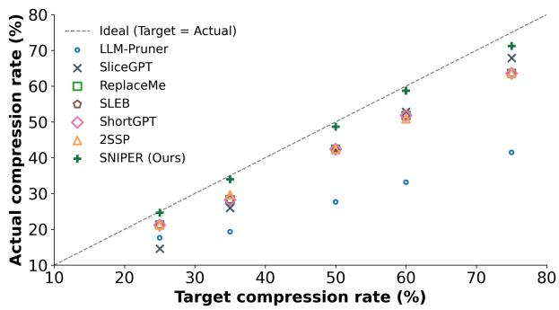
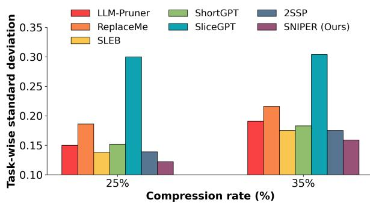
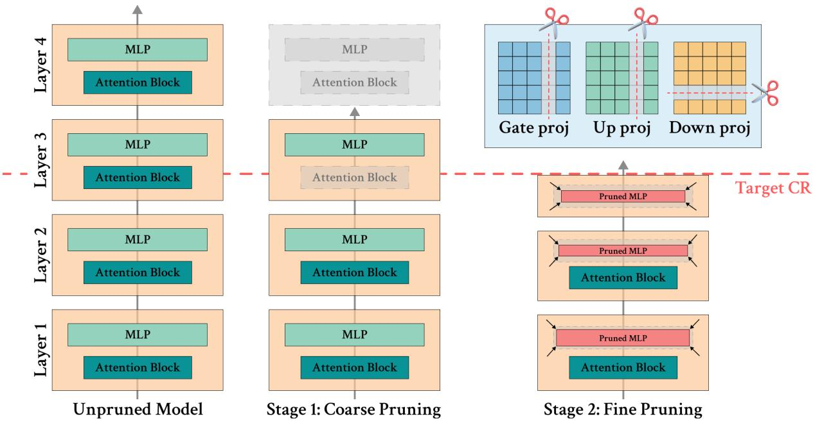
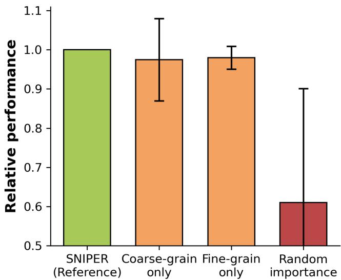
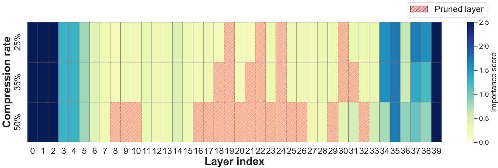
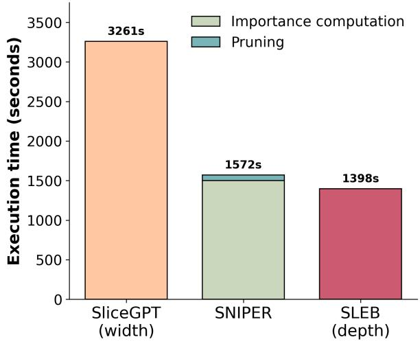
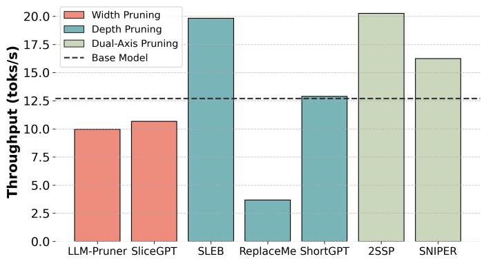

# Unifying Depth and Width Pruning for LLMs via Binary Knapsack Optimization

Palaash Goel 1 Ayan Sengupta 2 Akshay Nambi 3 Tanmoy Chakraborty 1,2

1 Yardi School of Artificial Intelligence, Indian Institute of Technology Delhi 2 Department of Electrical Engineering, Indian Institute of Technology Delhi 3 Microsoft Research (MSR) India

goelpalaash@scai.iitd.ac.in, ayan.sengupta007@gmail.com, akshay.nambi@microsoft.com, tanchak@iitd.ac.in

a github.com/parmanu-lcs2 î parmanu.lcs2.in

Abstract Structured pruning is a promising approach for compressing large language models (LLMs), yet existing methods rely heavily on greedy heuristics that produce myopic decisions, and often fail to precisely meet target compression budgets. We present SNIPER, a two-stage structured pruning framework that solves a knapsack optimization over coarsegranularity components to yield conditionally optimal parameter allocations with respect to fixed importance estimates, followed by a fine-grained pruning stage to meet strict budget constraints. We introduce the Compression Ratio Adherence Factor (CRAFT) to quantify budget fidelity, showing that while existing pruners deviate from target compression ratios by up to 33%, SNIPER achieves near-exact adherence with a CRAFT score of 0.98. Evaluations across four diverse architectures over a set of 18 tasks spanning five domains demonstrate SNIPER’s consistent improvements in average performance retention and task-level stability over six state-of-the-art pruners. Across all pruning configurations, SNIPER achieves an excellent mean rank of 1.25, indicating its robust cross-architectural generalizability and excellent reliability.

Keywords LLM compression, structured pruning, LLM eficiency, knapsack optimization, dual-axis pruning

## 1 Introduction

Large language models (LLMs) have become the foundation of modern natural language processing, driving advances in reasoning, generation, and comprehension across a wide range of tasks [1–4]. These capabilities, however, come at the cost of rapidly increasing parameter counts, posing significant challenges for deployment on resource-constrained hardware such as edge devices and on-device accelerators [5, 6]. While techniques such as quantization [7–9] and knowledge distillation [10, 11] reduce memory footprint or training cost, they largely preserve the original mode architecture and therefore do not yield proportional inference speedups. In contrast, structured model pruning directly removes parameter groups, ofering a principled route to practical acceleration.

Despite their appeal, existing structured pruning methods sufer from fundamental limitations arising from the interplay between pruning granularity and greedy optimization. Depth-based pruners [12–15] operate on coarse atomic units and often fail to adhere to target compression ratios, while width-based methods [16–18] induce sparsity driven irregularities in weight tensor shapes, leading to minimal inference speedup [19, 20]. Additionally, existing methods tend to rely on local and greedy heuristics that ignore inter-component dependencies across layers and may discard components that appear weak individually but are globally important. These design choices lead to three recurring failure modes: (i) calibration-induced distributional bias [21] and high task-wise deviations outside the calibration distribution (Figure 1b shows deviation grows to 30%); (ii) irreversible local pruning decisions that cannot guarantee optimal architectural configurations, even with respect to their own importance estimates; and (iii) unreliable adherence to target compression ratios, undermining deployment on memory-constrained systems (Figure 1a highlights deviations upto 33%).

  
(a) Target v/s actual compression ratio.

  
(b) Comparison of task-wise standard deviation.  
Figure 1. (a) Existing structured pruners exhibit severe “capacity slack”, with the actual compression ratio deviating fromthetargetbyupto33%. SNIPERachievesnear-exactbudgetadherencewithaCRAFTof0.98, comparedtothebaseline average of 0.78. Quantitative results are provided in Table 8 of Appendix C.1. (b) SNIPER reduces task-wise standard deviation by up to 60% relative to prior methods, mitigating the instability induced by existing pruning strategies.

We address these limitations in this work and summarize our contributions as follows:

• We propose SNIPER (Structured Knapsack-optimization-based Pruner), a novel dual-axis structured pruning framework for LLMs. SNIPER first compresses along the depth-axis by solving a 0/1 knapsack problem over coarsegrained components, then applies a width-pruning phase that lets the model hit the target compression ratio nearperfectly.

• Unlike existing systems that rely on greedy and myopic pruning decisions, SNIPER utilizes dynamic programming to guarantee a conditionally optimal selection of coarse-grained components while pruning along the depth-axis.

• We introduce the Compression Ratio Adherence Factor (CRAFT) to quantify budget fidelity, and show that SNIPER achieves near-exact compression targets, whereas existing structured pruners sufer from substantial capacity slack, thereby undermining utility.

• We construct a comprehensive evaluation suite spanning six modern baselines tested across 18 tasks, five domains, and four diverse architectures – including dense, reasoning-specialized, fused-MLP, and mixture-of-experts models. SNIPER consistently achieves state-of-the-art performance retention, and lower task-level variance under multiple compression regimes.

## 2 Related Work

The escalating computational demands of Large Language Models (LLMs) have catalyzed extensive research into eficient deployment strategies. Existing approaches generally fall into the categories of quantization [7, 9, 22–24], knowledge distillation [25–27], and activation sparsity [28–31]. While efective, these methods typically preserve the original model architecture. In contrast, model pruning explicitly removes parameters to achieve tangible inference speedups and memory reductions.

## 2.1 Unstructured Model Pruning

Early research predominantly focused on unstructured or semi-structured sparsity, identifying individual weights for removal based on magnitude [32, 33] or second-order gradient information [34–36]. Although methods like SparseGPT [35] and Wanda [33] achieve high sparsity with minimal perplexity degradation, they typically produce irregular sparse matrices. Consequently, specialized hardware accelerators or N:M sparsity support are often required to translate theoretical FLOPs reductions into actual latency gains [37].

## 2.2 Structured Pruning for LLMs

To circumvent the hardware dependencies of unstructured sparsity, recent work has shifted towards structured pruning, which removes coherent architectural units. We categorize these approaches based on their granularity:

WidthPruning. These methods prune along the channel or embedding dimension, efectively narrowing the model’s matrices. Techniques range from pruning individual attention heads [38–40] to removing entire neurons in MLPs [17]. LLM-Pruner [16] advances this by constructing a dependency graph to ensure structurally coupled parameters are pruned simultaneously. Similarly, SliceGPT [18] projects weight matrices into a lower-dimensional space via PCA, efectively slicing rows and columns. Other decomposition-based methods, such as FWSVD [41], ASVD [42], and SVD-LLM [43], adopt greedy strategies to select and drop redundant neuron blocks from MLP and self-attention modules. While efective for fine-grained compression, width pruning often struggles to fully excise large, redundant computational blocks.

Depth Pruning. Operating at a coarser granularity, depth pruning removes entire transformer layers [15, 44, 45]. Approaches such as ShortGPT [13] and SLEB [14] identify and discard redundant layers using block influence metrics. ReplaceMe [12] mitigates the representation collapse caused by layer removal by substituting contiguous blocks with a learned linear projection. Dynamic schemes, such as PuDDing [46], learn input-conditioned routing policies for selective layer skipping at inference time. Recent hybrid approaches [45, 47] attempt to jointly prune across neurons, heads, and layers, guided by learned or internal importance signals.

## 2.3 Limitations of Prior Work

Most aforementioned structured approaches share a critical limitation: reliance on greedy selection criteria. Decisions are typically made locally (e.g., layer-by-layer) without an optimality-centric view of the parameter-performance tradeof. Furthermore, methods tend to not adhere to the required compression budget, introducing significant “capacity slack”, with deviations of up to 33% from the target budget (Figure 1a). SNIPER addresses these gaps by pruning along two axes: first along the depth wherein component selection is driven by a conditionally optimal knapsack optimization algorithm, followed by a width-pruning stage that ensures that the target compression budget is met with high accuracy.

## 3 Methodology

In this section, we provide a detailed account of the dual-stage pruning mechanism utilized by SNIPER, as illustrated in Figure 2.

## 3.1 Problem Formulation

Consider an LLM M consisting of a sequence of L transformer layers. We decompose the model into a set of discrete, prunable components X . Specifically, we adopt a mixed-granularity decomposition wherein each transformer layer l is decomposed into its constituent sub-blocks: the Multi-Head Attention block $( A _ { l } )$ and the Feed-Forward Network block $( M _ { l } )$ . Thus, the universe of items is defined as: $\textstyle \mathcal { X } = \bigcup _ { l = 1 } ^ { L } \{ A _ { l } , M _ { l } \} \cup \{ T _ { l } \}$ , where $T _ { l }$ represents the atomic retention of the entire layer l. Since retaining $T _ { l }$ efectively implies retaining both $A _ { l }$ and $M _ { l } .$ , it follows that for any layer $l ,$ the choice is mutually exclusive between selecting the composite item $T _ { l }$ or a subset of its components $\{ A _ { l } , M _ { l } \}$ . Each component $x \in \mathcal { X }$ is associated with a weight $w ( x ) \in \mathbb { Z } ^ { + }$ , representing its parameter count, and a value $v ( x ) \in \mathbb { R }$ , representing its contribution to model performance (Section 3.3). Given a target parameter budget $C ,$ our objective is to identify the subset $S ^ { * } \subseteq { \mathcal { X } }$ that maximizes total importance while satisfying the capacity constraint:

  
Figure 2. A schematic overview of SNIPER which performs structured pruning in two stages under a strict target compression ratio (CR). Stage 1: Coarse pruning removes entire redundant components such as full transformer layers or attention blocks, enabling notable eficiency gains while preserving architectural coherence. Stage 2: Fine pruning then operates within the remaining layers, selectively pruning the internal dimensions of the model’s MLPs to precisely meet the target CR. This dual-axis strategy allows SNIPER to combine the eficiency of depth pruning with the precision of width pruning, eliminating capacity slack and avoiding greedy, layer-wise decisions.

$$
S ^ { * } = \underset { S \subseteq \mathcal { X } } { \arg \operatorname* { m a x } } \sum _ { x \in \mathcal { S } } v ( x ) \quad \mathrm { s . t . } \quad \sum _ { x \in \mathcal { S } } w ( x ) \leq C\tag{1}
$$

This formulation maps the coarse-grained pruning stage directly to the 0/1 Knapsack Problem [48].

## 3.2 Stage 1: Coarse-Grained Pruning via Dynamic Programming

To solve the optimization problem in Equation 1, we employ a dynamic programming approach. Let the components be indexed sequentially (due to the inherent hierarchy in a typical transformer model, the components can be deterministically sequenced) $i = 1 , \ldots , N$ , where $N = | { \mathcal { X } } |$ . We define the state function $f ( i , j )$ as the maximum importance value achievable using a subset of the first i items subject to a capacity limit $j .$ The recurrence relation is defined as:

$$
f ( i , j ) = \left\{ \begin{array} { l l } { f ( i - 1 , j ) } & { \mathrm { i f } w ( x _ { i } ) > j } \\ { \operatorname* { m a x } \left( f ( i - 1 , j ) , \Delta \right) } & { \mathrm { i f } w ( x _ { i } ) \le j } \end{array} \right.\tag{2}
$$

where, $\Delta = f ( i - 1 , j - w ( x _ { i } ) ) + v ( x _ { i } )$ . The first case corresponds to excluding item $x _ { i }$ due to capacity violation, while the second case evaluates the trade-of between exclusion and inclusion. To enforce the mutual exclusivity constraint $( \mathrm { i . e . }$ , one cannot select both $T _ { l }$ and $A _ { l } )$ , we group mutually exclusive items and process them as a single decision step with multiple branches.

Notably, while this algorithm originally runs in $\Theta ( N \cdot C )$ time which is intractable when $C$ is in the order of billions, we improve its tractability by discretizing all parameter counts by a discretizing factor, α. This reduces the algorithm’s time complexity to $\Theta \dot { ( } N \lfloor \frac { C } { \alpha } \rfloor )$ . As expected, increasing α makes the algorithm faster at the cost of assigning less precise (more coarsely rounded) parameter-count values to each component, leading to a suboptima knapsack solution or a final compression ratio that deviates further from the target. We provide a detailed analysis of

the same in Appendix 6.5.

Upon computing the terminal state $\textstyle f ( N , \lfloor { \frac { C } { \alpha } } \rfloor )$ , we backtrack to recover the optimal set ${ S ^ { * } }$ . We note that $S ^ { * }$ does not represent a global optimum over all possible pruning configurations but rather a conditional optimum with respect to fixed component-level importance estimates. Despite being a weaker guarantee of optimality, it surpasses what existing greedy methods provide since they do not ofer any optimality guarantee whatsoever, conditional or otherwise.

## 3.3 Iterative Importance Estimation

A critical challenge in Knapsack-based pruning is assigning static importance values $v ( x _ { i } )$ to components that interact non-linearly. To address this, we propose an iterative importance estimation scheme based on marginal contribution. Let $\mathcal { M } ^ { ( i - 1 ) }$ denote the model pruned up to component i − 1. We define the importance of component $x _ { i }$ as the divergence induced by removing it from $\mathcal { M } ^ { ( i - 1 ) }$ . Let $\mathbf { Z } \in \mathbb { R } ^ { B \times V }$ be the logits produced by the full model on a calibration batch X, where $B$ and $V$ are the batch size and vocabulary size of the model, respectively. For the i-th component, we evaluate two scenarios:

1. Retention: The component is kept. Let $\mathbf { Z } _ { \mathrm { r e t a i n } } ^ { ( i ) }$ be the logits of the model where $x _ { i }$ is present.

2. Drop: The component is pruned. Let $\mathbf { Z } _ { \mathrm { d r o p } } ^ { ( i ) }$ be the logits of the model where $x _ { i }$ is removed.

The importance $v ( x _ { i } )$ is quantified as the marginal degradation in prediction fidelity:

$$
v ( x _ { i } ) = \| \mathbf { Z } - \mathbf { Z } _ { \mathrm { d r o p } } ^ { ( i ) } \| _ { 2 } ^ { 2 } - \| \mathbf { Z } - \mathbf { Z } _ { \mathrm { r e t a i n } } ^ { ( i ) } \| _ { 2 } ^ { 2 }\tag{3}
$$

Unlike greedy parameter importance estimation metrics that capture the importance of individual components in isolation, Equation 3 ensures that the importance scores reflect the efect of jointly pruning multiple components, thereby making the scoring function more reliable and representative. We note that SNIPER is similar to existing methods in that it utilizes heuristic proxies for component importance. However, it greatly improves upon these baselines by not making pruning decisions greedily and instead, computing provably optimal compression configurations with respect to these importance scores.

## 3.4 Stage 2: Fine-Grained Residual Pruning

The discrete nature of components in Stage 1 often leaves a residual capacity $\Delta C > 0$ . To fully utilize the budget $C _ { i }$ we introduce a second stage of fine-grained structured pruning targeting the MLPs within the transformer blocks.

Budget Allocation. We distribute the fine-grained pruning budget $N _ { t o t a l }$ (total MLP columns to remove) across layers inversely proportional to their coarse importance. Let $\mathbf { u } \in \mathbb { R } ^ { L }$ be the vector of layer importance scores where $u _ { l } = v ( T _ { l } )$ . We define the layer-wise pruning ratio $\rho _ { l }$ via a softmax over negated importance:

$$
\rho _ { l } = \frac { \exp ( - u _ { l } / \tau ) } { \sum _ { k = 1 } ^ { L } \exp ( - u _ { k } / \tau ) }\tag{4}
$$

where τ (defaulted to 1) is a temperature parameter. The number of columns to prune from layer l is computed as $N _ { l } = \lfloor \rho _ { l } \cdot N _ { t o t a l } \rfloor$

Column Selection. Modern LLMs [1, 49] utilize variants of the Gated Linear Unit (GLU), where the MLP computation is defined as:

$$
\mathbf { M L P } ( \mathbf { X } ) = ( \sigma ( \mathbf { X G } ^ { T } ) \odot ( \mathbf { X U } ^ { T } ) ) \mathbf { D } ^ { T }\tag{5}
$$

where U, $\mathbf { G } \in \mathbb { R } ^ { d _ { m o d e l } \times d _ { f f } }$ are the up- and gate-projections, respectively, and $\mathbf { D } \in \mathbb { R } ^ { d _ { f f } \times d _ { m o d e l } }$ is the down-projection. Here, $d _ { m o d e l }$ refers to the model’s hidden dimension and $d _ { f f }$ is the higher dimension to which embeddings are

projected within its MLPs. To maintain structural consistency, pruning a column index j requires removing the j-th column of U and G, and the j-th row of D. We define the sensitivity of the j-th neuron index as the magnitude of its contribution to the output:

$$
\Omega _ { j } = | \mathbf { D } _ { j , : } \cdot ( \mathbf { G } _ { : , j } \odot \mathbf { U } _ { : , j } ) |\tag{6}
$$

Indices with the lowest $\Omega _ { j }$ scores are pruned until $N _ { l }$ columns are removed. This ensures that the residual capacity is filled with the least salient parameters, maxing out the available budget.

By integrating the conditionally optimal configurations computed by the Knapsack solver with the precision of fine-grained residual pruning, SNIPER demonstrates high retention capabilities with respect to the unpruned model, while also ensuring high-fidelity adherence to the parameter budget, as reflected by its excellent CRAFTs (Appendix C.1).

## 4 Experimental Setup

Pruned models. To evaluate architectural generality, we benchmark SNIPER on a diverse set of modern LLMs1 with diferent architectural paradigms. These include the instruction-tuned LLaMA-3.1-8B-Instruct [1], the reasoningoriented Qwen3-8B [2], Phi-4 [50], which employs fused MLP projections, and the Mixture-of-Experts model GPT OSS-20B [4].

Baselines. We compare SNIPER against six contemporary structured pruning baselines. Width-based methods include SliceGPT [18] and LLM-Pruner [16], while depth-based methods include ReplaceMe [12], SLEB [14], and ShortGPT [13]. We also include 2SSP [51] since it mirrors SNIPER via its dual-axis approach, allowing us to evaluate SNIPER’s efectiveness with respect to analogous pruning approaches. Several baselines are re-engineered to support recent LLM architectures2. We note that vector-space width pruners such as SliceGPT are inherently incompatible with expert routing layers and therefore cannot be applied to GPT-OSS. In order to ensure a fair evaluation, we adjust the compression ratios of all methods to yield pruned models of comparable sizes. We provide all implementation details in Appendix A.

Evaluation task suite. Many pruning evaluations rely on a narrow set of tasks, which can obscure degradation in a model’s linguistic capabilities, reasoning, or alignment. For a more comprehensive assessment, we evaluate all models on a testbed of 18 tasks spanning five domains. Generative performance is measured using log-perplexity on WikiText-2 [52] and LAMBADA [53]. World understanding is evaluated using PIQA [54], PROST [55], and CommonsenseQA [56]. Domain-specific knowledge covers STEM reasoning tasks including ARC-Easy and ARC Challenge [57], mathematical reasoning tasks such as MathQA [58] and OpenBookQA [59], and medical question answering using MedQA [60]. Natural language understanding is evaluated using BLiMP [61], BoolQ [62], Winogrande [63], and CoQA [64]. To assess alignment preservation, we additionally evaluate safety and ethics using TruthfulQA [65], Winogender [66], and Moral Stories [67]. A detailed description of each task is provided in Appendix B.

## 5 Results

Table 1 compares SNIPER against state-of-the-art structured pruning methods on LLaMA-3.1-8B-Instruct and Qwen3- 8B, under two compression ratios (25% and 35%), both with and without recovery fine-tuning (RFT). Across all configurations except one, SNIPER achieves the highest average retention performance (Avg RP) while maintaining strong performance across diferent task groups. While it is marginally outperformed by ReplaceMe and ShortGPT on Llama-3.1-8B-Instruct (25% compression with RFT), SNIPER maintains a near-perfect mean rank of 1.25 across

all pruning configurations, yielding competitive performance even at its worst rank of merely 3 (Tables 1 and 2). In contrast, every baseline has at least one configuration in which its performance deteriorates drastically. Unlike its baselines, SNIPER never disintegrates. This indicates SNIPER’s unparalleled robustness and generalization capabilities across diferent architectures and compression regimes. We provide detailed per-task results in Appendix C.2.
<table><tr><td>Model</td><td>CR</td><td>Method</td><td>Generative (Log-PPL ↓)</td><td>World (Acc ↑)</td><td>Domain (Acc ↑)</td><td>NLU &amp;NLI (Acc ↑)</td><td>Safety (Score ↑)</td><td>Avg RP (%) (↑)</td><td>Std RP (%) (4)</td></tr><tr><td rowspan="12"></td><td rowspan="5"></td><td>Base ReplaceMe</td><td>1.69 4.91 (2.36)</td><td>66.55 59.30 (58.31)</td><td>56.28 40.78 (43.35)</td><td>78.52 54.97(75.80)</td><td>55.56 55.62(54.79)</td><td>74.86 (88.90)</td><td>20.40(10.50)</td></tr><tr><td>SliceGPT</td><td>5.11 (3.60)</td><td>40.78 (49.10)</td><td>26.87 (30.08)</td><td>53.75 (62.49)</td><td>50.23 (49.50)</td><td>62.06 (72.49)</td><td>20.20 (17.30)</td></tr><tr><td>LLM-Pruner</td><td>3.96 (2.54)</td><td>40.56 (44.37)</td><td>32.14 (36.32)</td><td>49.85 (62.43)</td><td>51.87 (50.99)</td><td>64.56 (75.11)</td><td>22.40 (17.70)</td></tr><tr><td>25% SLEB</td><td>3.37 (2.25)</td><td>42.20 (47.52)</td><td>37.06 (38.79)</td><td>50.78 (65.98)</td><td>51.01 (50.74)</td><td>67.91 (78.45)</td><td></td></tr><tr><td>ShortGPT</td><td>13.20 (2.46)</td><td>48.70 (59.22)</td><td>31.68 (42.42)</td><td>34.50 (74.77)</td><td>51.01 (55.34)</td><td>57.50 (88.47)</td><td>20.30 (16.80) 26.10 (11.20)</td></tr><tr><td>2SSP</td><td>2.77 (2.13)</td><td>49.33 (54.23)</td><td>36.67 (39.75)</td><td>68.14 (71.59)</td><td>50.93 (51.42)</td><td>76.65 (83.19)</td><td>14.00 (13.90)</td></tr><tr><td rowspan="6">LLaMA-3.1- 8B-Instruct</td><td>SNIPER</td><td>3.15 (2.29)</td><td>51.81 (57.89)</td><td>39.00 (41.71)</td><td>64.95 (74.41)</td><td>53.02 (53.97)</td><td>77.03 (87.34)</td><td>12.70 (10.00)</td></tr><tr><td>ReplaceMe</td><td>5.86 (3.19)</td><td>38.42 (39.81)</td><td>29.01 (29.62)</td><td>36.09 (50.55)</td><td>51.24(49.58)</td><td>56.25 (65.16)</td><td>27.10(22.60)</td></tr><tr><td>SliceGPT</td><td>6.44 (4.51)</td><td>38.43 (44.77)</td><td>25.68 (28.41)</td><td>42.72 (55.22)</td><td>50.86 (51.23)</td><td>56.74 (68.08)</td><td>22.50 (18.60)</td></tr><tr><td>LLM-Pruner</td><td>4.94 (2.94)</td><td>37.18 (38.49)</td><td>29.61 (33.17)</td><td>44.60 (58.50)</td><td>51.33 (50.28)</td><td>59.66 (69.93)</td><td>23.70 (19.40)</td></tr><tr><td>35% SLEB</td><td>4.47 (2.71)</td><td>39.20 (40.57)</td><td>30.99 (32.95)</td><td>44.13 (57.87)</td><td>50.87 (51.29)</td><td>60.72 (70.58)</td><td>24.10 (20.10)</td></tr><tr><td>ShortGPT</td><td>13.14 (2.94)</td><td>40.77 (43.64)</td><td>28.99 (32.50)</td><td>36.52 (69.91)</td><td>55.03 (54.67)</td><td>56.14 (76.98)</td><td>28.00 (18.70)</td></tr><tr><td rowspan="5"></td><td>2SSP</td><td>3.77 (2.45)</td><td>37.28 (47.62)</td><td>29.39 (35.66)</td><td>55.55 (68.03)</td><td>50.50 (50.19)</td><td>64.21 (77.26)</td><td>19.10 (15.80)</td></tr><tr><td>SNIPER</td><td>4.70 (2.63)</td><td>41.16 (48.52)</td><td>32.18 (34.73)</td><td>53.52 (68.31)</td><td>51.29 (50.95)</td><td>64.96 (77.26)</td><td>19.50 (14.80)</td></tr><tr><td>Base</td><td>2.01</td><td>66.32</td><td>58.60</td><td>76.20</td><td>55.90</td><td></td><td></td></tr><tr><td>ReplaceMe</td><td>4.37 (2.76)</td><td>37.40 (43.98)</td><td>30.21 (36.83)</td><td>41.44 (55.52)</td><td>50.47(50.66)</td><td>59.92 (72.30)</td><td>23.80 (18.60)</td></tr><tr><td>SliceGPT</td><td>15.72 (10.75)</td><td>34.01 (34.48)</td><td>24.64 (25.05)</td><td>29.46 (29.54)</td><td>51.00 (51.35)</td><td>48.68 (50.07)</td><td>27.50 (30.00)</td></tr><tr><td rowspan="11">Qwen3-8B</td><td rowspan="5">25%</td><td>LLM-Pruner</td><td>3.20 (2.46)</td><td>48.73 (53.44)</td><td>31.85 (37.28)</td><td>63.89 (67.05)</td><td>50.99 (52.20)</td><td>72.64 (80.11)</td><td>15.90 (15.00)</td></tr><tr><td>SLEB</td><td>3.75 (2.61)</td><td>43.11 (50.41)</td><td>36.93 (38.38)</td><td>48.84 (64.50)</td><td>51.48 (53.12)</td><td>67.53 (78.89)</td><td>20.20 (13.80)</td></tr><tr><td>ShortGPT</td><td>8.98 (3.14)</td><td>43.76 (55.87)</td><td>33.09 (39.34)</td><td>46.98 (67.98)</td><td>55.02 (54.14)</td><td>63.03 (80.21)</td><td></td></tr><tr><td>2SSP</td><td>6.37 (3.11)</td><td>34.79 (50.10)</td><td>26.31 (33.86)</td><td>39.98 (58.74)</td><td>52.19 (52.44)</td><td>56.09 (72.92)</td><td>22.90 (15.20)</td></tr><tr><td>SNIPER</td><td>3.65 (2.72)</td><td>50.81 (55.93)</td><td>36.21 (41.36)</td><td>61.04 (69.31)</td><td>54.90 (53.70)</td><td>74.41 (82.64)</td><td>23.10 (16.30)</td></tr><tr><td>ReplaceMe</td><td>5.99 (4.20)</td><td>37.63 (38.12)</td><td>32.30 (28.86)</td><td></td><td>51.47 (52.59)</td><td></td><td>15.00 (12.20)</td></tr><tr><td rowspan="6"></td><td>SliceGPT</td><td>16.13 (10.82)</td><td>33.49 (34.39)</td><td></td><td>40.78 (52.27)</td><td></td><td>59.40 (64.00)</td><td>25.90 (21.60)</td></tr><tr><td>LLM-Pruner</td><td>5.25 (3.46)</td><td></td><td>24.78 (24.58)</td><td>29.53 (29.87)</td><td>50.99 (52.44)</td><td>48.67 (50.17)</td><td>27.70 (30.40)</td></tr><tr><td>35% SLEB</td><td>4.94 (3.10)</td><td>39.24 (45.25) 38.46 (45.15)</td><td>26.47 (31.86)</td><td>50.05 (55.02)</td><td>50.75 (51.39)</td><td>60.63 (68.34)</td><td>21.90 (19.10)</td></tr><tr><td>ShortGPT</td><td>10.67 (3.98)</td><td>45.56 (50.25)</td><td>31.95 (34.40) 30.96 (34.82)</td><td>38.99 (53.56)</td><td>51.55 (52.43) 54.02 (53.11)</td><td>59.67 (70.47)</td><td>24.70 (17.50)</td></tr><tr><td>2SSP</td><td></td><td></td><td>25.92 (31.94)</td><td>38.09 (59.54)</td><td>51.57 (51.68)</td><td>58.69 (72.27)</td><td>27.10 (18.30)</td></tr><tr><td>SNIPER</td><td>7.42 (3.56) 5.11 (3.21)</td><td>34.71 (46.37) 44.04 (50.81)</td><td>30.43 (35.45)</td><td>36.63 (56.68) 48.68 (63.35)</td><td>52.76 (52.81)</td><td>54.15 (69.23) 63.71 (75.13)</td><td>24.40 (17.50) 20.10 (15.90)</td></tr></table>

Table 1. Comparison of diferent pruning methods across various compression ratios (CR) without and (with) recovery fine-tuning (RFT). We report the scores for each task group, the average retention performance (RP) (ratio of pruned and base model performances), as well as the standard deviation across tasks for each method. Per-task results are highlighted in Tables 9, 10, 11 and 12 of Appendix C.2.

## 5.1 Consistency and robustness

Beyond average performance, SNIPER exhibits substantially lower task-level standard deviations (Std RP) across all configurations, even including settings where it does not outperform all baselines. For example, at 35% compression on Qwen3-8B with RFT, SNIPER reduces task-wise variance to 15.90%, compared to 17–30% for competing pruners. This behavior highlights SNIPER’s ability to avoid a common failure mode of greedy pruning strategies, which often over-optimize for isolated metrics (e.g., perplexity) at the expense of broader task performance. By combining the benefits of conditional optimality during coarse-grained pruning with that of a budget-filling fine-grained stage, SNIPER is able to maintain superior cross-task consistency across diverse model architectures.

## 5.2 Results on larger and diverse architectures

Table 3 evaluates SNIPER on larger and architecturally distinct models, i.e, Phi-4-14B and GPT-OSS-20B, under a 35% compression regime with RFT. Despite these departures from standard dense transformers, SNIPER consistently attains the highest Avg RP while maintaining the lowest Std RP. On Phi-4-14B, SNIPER attains an Avg RP of 81.58%, substantially outperforming ShortGPT and 2SSP by 4.4% and 11.42%, respectively. SNIPER demonstrates similar superiority on GPT-OSS-20B, achieving an Avg RP of 86.99% - 2.31% higher than 2SSP and 16.48% better than ShortGPT. Notably, on GPT-OSS-20B, 2SSP operates solely via its first stage due to how it distributes the pruning budget between its two stages, efectively turning its second stage into a no-op. In contrast, SNIPER ensures that it leverages both of its stages to yield a superior compressed model.

<table><tr><td rowspan=1 colspan=1>Method</td><td rowspan=1 colspan=1>Mean Rank(4)</td><td rowspan=1 colspan=1>Best Rank(4)</td><td rowspan=1 colspan=1>Worst Rank(↓)</td></tr><tr><td rowspan=2 colspan=1>ReplaceMeSliceGPT</td><td rowspan=1 colspan=1>4.75</td><td rowspan=1 colspan=1>1</td><td rowspan=1 colspan=1>7</td></tr><tr><td rowspan=1 colspan=1>6.50</td><td rowspan=1 colspan=1>5</td><td rowspan=1 colspan=1>7</td></tr><tr><td rowspan=3 colspan=1>LLM-PrunerSLEBShortGPT</td><td rowspan=1 colspan=1>4.00</td><td rowspan=1 colspan=1>2</td><td rowspan=1 colspan=1>6</td></tr><tr><td rowspan=1 colspan=1>3.63</td><td rowspan=1 colspan=1>3</td><td rowspan=1 colspan=1>5</td></tr><tr><td rowspan=1 colspan=1>3.70</td><td rowspan=1 colspan=1>2</td><td rowspan=1 colspan=1>7</td></tr><tr><td rowspan=2 colspan=1>2SSPSNIPER</td><td rowspan=1 colspan=1>3.55</td><td rowspan=1 colspan=1>1</td><td rowspan=2 colspan=1>63</td></tr><tr><td rowspan=1 colspan=1>1.25</td><td rowspan=1 colspan=1>1</td></tr></table>

Table 2. Ranking diferent pruning methods across all available configurations.

<table><tr><td>Model</td><td>CR</td><td>Method</td><td>Generative (Log-PPL ↓)</td><td>World (Acc ↑)</td><td>Domain (Acc ↑)</td><td>NLU &amp;NLI (Acc ↑)</td><td>Safety (Score ↑)</td><td>Avg RP (%) (↑)</td><td>Std RP (%) (4)</td></tr><tr><td rowspan="4">Phi-4-14B</td><td></td><td>Base</td><td>1.65</td><td>70.11</td><td>56.73</td><td>79.89</td><td>59.46</td><td></td><td></td></tr><tr><td></td><td>ShortGPT</td><td>3.35</td><td>54.18</td><td>40.05</td><td>65.39</td><td>57.44</td><td>77.18</td><td>16.60</td></tr><tr><td>35%</td><td>2SSP</td><td>3.07</td><td>47.61</td><td>33.35</td><td>62.66</td><td>51.62</td><td>70.16</td><td>16.20</td></tr><tr><td></td><td>SNIPER</td><td>2.55</td><td>58.07</td><td>44.14</td><td>70.10</td><td>53.70</td><td>81.58</td><td>12.60</td></tr><tr><td rowspan="4">GPT-OSS-20B</td><td></td><td>Base</td><td>2.22</td><td>65.65</td><td>56.07</td><td>75.37</td><td>58.16</td><td></td><td></td></tr><tr><td></td><td>ShortGPT</td><td>3.06</td><td>46.18</td><td>38.03</td><td>45.16</td><td>52.24</td><td>70.51</td><td>22.10</td></tr><tr><td>35%</td><td>2SSP</td><td>2.99</td><td>56.16</td><td>43.19</td><td>68.99</td><td>56.38</td><td>84.68</td><td>11.40</td></tr><tr><td></td><td>SNIPER</td><td>2.71</td><td>55.62</td><td>45.28</td><td>69.94</td><td>55.47</td><td>86.99</td><td>8.80</td></tr></table>

Table 3. Performance analysis on larger and architecturally diverse models – Phi-4 and GPT-OSS-20B with RFT. Detailed results provided in Tables 13 and 14 of Appendix C.2.

## 5.3 Adherence to Compression Ratio

We analyze the efect of fixing the target compression ratio for each method and observing its adherence to the same. We observe that existing methods demonstrate significant deviations of upto 33% from the target ratio, leading to severe under-pruning and an erosion of trust in the pruning process (Figure 1 and Appendix C.1). In contrast, SNIPER exhibits remarkable reliability by adhering strictly to these targets with a near-ideal CRAFT of 0.98 across a wide range of budgets. Unlike its baselines, SNIPER eliminates reliance on hit-and-trial strategies to obtain a model of a specific size, leading to significant practical advantages.

## 5.4 Ablation on SNIPER

We provide additional ablation experiments in Table 4 and Figure 3 and analyze the efectiveness of various components and design choices of SNIPER.

Dual-Axis Pruning. We ablate SNIPER’s coarse- and fine-grained components, measuring Avg RP and Std RP (Figure 3). Coarse pruning alone reaches a strong Avg RP of 97.47%, but its high Std RP (10.50%) reflects a key limitation: operating on entire structural groups rather than individual neurons causes some important neurons to inevitably be pruned, destabilizing downstream performance. Its structured removals, however, preserve weight tensor shapes, making it the primary driver of inference speedup. The fine-grained variant attains a marginally better Avg RP (97.95%) with far lower Std RP (2.90%), confirming that precise, neuron-level interventions better preserve crosstask consistency. However, it produces irregularly-shaped weight tensors, yielding little inference speedup. The two stages are thus complementary: coarse pruning delivers hardware-friendly speedups at the cost of consistency, while fine-grained pruning restores consistency but lacks eficiency gains due to induced irregularities. Additionally, random importance assignment yields a low Avg RP (63.24%) and high Std RP (26.90%), confirming the necessity of principled importance estimation.

Figure 3. Ablation study of SNIPER showing the efect of coarse and fine pruning stages. Combining both stages yields the best performance and stability, while removing either component leads to lower performance retention or instability.
<table><tr><td>Variant</td><td>Generative (Log-PPL ↓)</td><td>World (Acc ↑)</td><td>Domain (Acc ↑)</td><td>NLU &amp;NLI (Acc ↑)</td><td>Safety (Score ↑)</td><td>Avg RP (%) (↑)</td><td>Std RP (%) (4)</td></tr><tr><td>SNIPER-MAG</td><td>3.02</td><td>54.76</td><td>39.61</td><td>64.48</td><td>52.49</td><td>78.87</td><td>13.80</td></tr><tr><td>SNIPER-ACT</td><td>2.74</td><td>53.81</td><td>40.27</td><td>65.90</td><td>54.23</td><td>80.87</td><td>13.80</td></tr><tr><td>SNIPER-LeaveOneOut</td><td>4.08</td><td>37.33</td><td>29.11</td><td>47.93</td><td>51.44</td><td>62.01</td><td>23.30</td></tr><tr><td>SNIPER-Uniform</td><td>2.77</td><td>52.40</td><td>41.19</td><td>68.22</td><td>53.51</td><td>81.26</td><td>13.70</td></tr><tr><td>SNIPER</td><td>2.72</td><td>55.93</td><td>41.36</td><td>69.31</td><td>53.70</td><td>82.64</td><td>12.20</td></tr></table>

Table 4. Additional ablation results for SNIPER obtained after compressing Qwen3-8B by 25% (with RFT).

Column Selection Heuristic. We analyze the eficacy of our column selection heuristic (Equation 6) by replacing it with two popular alternatives: (a) magnitude-based [32] and (b) activation-aware [33] pruning, corresponding to the SNIPER-MAG and SNIPER-ACT variants in Table 4, respectively. Both variants perform approximately 2–4% worse than SNIPER on average and exhibit 13% higher per-task deviation, demonstrating the efectiveness of our strategy at maintaining strong and stable performance.

IterativePruningforImportanceEstimation. To estimate component importance, SNIPER computes the marginal degradation in performance incurred by dropping a component from a partially pruned model, whose pruning configuration is determined by our dynamic programming solver (Section 3.3). We compare this against the leave-one-out strategy employed by baselines such as SLEB [14], denoted SNIPER-LeaveOneOut. This variant incurs a significant drop of 20% in average performance and nearly twice the task-wise standard deviation of SNIPER, demonstrating that estimating component importance on iteratively optimal pruning configurations captures global inter-component dependencies—something leave-one-out strategies fail to model due to their limited scope.

Fine-Grained Pruning Budget Distribution. To determine how many columns to drop from each MLP in Stage 2 (Section 3.4), SNIPER uses the component importance scores from Section 3.3 (Equation 3) to distribute the pruning budget inversely proportional to importance (Equation 4), pruning redundant MLPs more aggressively while compressing salient ones more conservatively. We evaluate the SNIPER-Uniform variant, which distributes the finegrained pruning budget uniformly across all MLPs. As shown in Table 4, this variant not only incurs a 1.5% drop in average performance but, more critically, exhibits 12.3% higher task-wise standard deviation, indicating uneven performance retention across domains.

## 6 Discussion

<table><tr><td># Calibration Samples</td><td>Method</td><td>Generative (Log-PPL ↓)</td><td>World (Acc ↑)</td><td>Domain (Acc ↑)</td><td>NLU &amp;NLI (Acc ↑)</td><td>Safety (Score ↑)</td><td>Avg RP (%) (↑)</td><td>Std RP (%) (4)</td></tr><tr><td rowspan="3">50</td><td>ShortGPT</td><td>3.14</td><td>55.87</td><td>39.34</td><td>67.98</td><td>54.14</td><td>80.21</td><td>15.20</td></tr><tr><td>2SSP</td><td>3.11</td><td>50.10</td><td>33.86</td><td>58.74</td><td>52.44</td><td>72.92</td><td>16.30</td></tr><tr><td>SNIPER</td><td>2.72</td><td>55.93</td><td>41.36</td><td>69.31</td><td>53.70</td><td>82.64</td><td>12.20</td></tr><tr><td></td><td>ShortGPT</td><td>3.10</td><td>58.02</td><td>39.95</td><td>67.66</td><td>53.90</td><td>80.98</td><td>13.30</td></tr><tr><td>250</td><td>2SSP</td><td>3.02</td><td>51.68</td><td>33.62</td><td>63.59</td><td>53.30</td><td>75.31</td><td>15.10</td></tr><tr><td></td><td>SNIPER</td><td>2.76</td><td>54.34</td><td>40.21</td><td>68.25</td><td>53.58</td><td>81.26</td><td>12.40</td></tr><tr><td rowspan="3">1000</td><td>ShortGPT</td><td>3.10</td><td>58.60</td><td>39.96</td><td>67.86</td><td>54.09</td><td>81.21</td><td>14.00</td></tr><tr><td>2SSP</td><td>3.00</td><td>52.98</td><td>33.90</td><td>60.05</td><td>52.20</td><td>74.26</td><td>15.40</td></tr><tr><td>SNIPER</td><td>2.75</td><td>53.79</td><td>40.08</td><td>69.30</td><td>53.93</td><td>81.50</td><td>12.90</td></tr></table>

(a) Calibration data sample size with Slim Orca [68].
<table><tr><td>Calibration Dataset</td><td>Method</td><td>Generative (Log-PPL ↓)</td><td>World (Acc ↑)</td><td>Domain (Acc ↑)</td><td>NLU &amp;NLI (Acc ↑)</td><td>Safety (Score ↑)</td><td>Avg RP (%) (↑)</td><td>Std RP (%) (4)</td></tr><tr><td rowspan="3">Slim Orca [68]</td><td>ShortGPT</td><td>3.14</td><td>55.87</td><td>39.34</td><td>67.98</td><td>54.14</td><td>80.21</td><td>15.20</td></tr><tr><td>2SSP</td><td>3.11</td><td>50.10</td><td>33.86</td><td>58.74</td><td>52.44</td><td>72.92</td><td>16.30</td></tr><tr><td>SNIPER</td><td>2.72</td><td>55.93</td><td>41.36</td><td>69.31</td><td>53.70</td><td>82.64</td><td>12.20</td></tr><tr><td rowspan="3">Alpaca [69]</td><td>ShortGPT</td><td>2.93</td><td>58.48</td><td>41.19</td><td>68.64</td><td>53.73</td><td>82.59</td><td>13.50</td></tr><tr><td>2SSP</td><td>2.71</td><td>53.44</td><td>39.26</td><td>63.75</td><td>52.84</td><td>79.06</td><td>14.30</td></tr><tr><td>SNIPER</td><td>2.75</td><td>54.80</td><td>40.49</td><td>68.67</td><td>53.79</td><td>81.79</td><td>13.10</td></tr><tr><td rowspan="3">C4 [70]</td><td>ŠhortGPT</td><td>3.65</td><td>61.19</td><td>39.28</td><td>66.70</td><td>54.47</td><td>80.63</td><td>15.30</td></tr><tr><td>2SSP</td><td>3.35</td><td>39.65</td><td>31.05</td><td>55.10</td><td>52.19</td><td>67.48</td><td>18.80</td></tr><tr><td>SNIPER</td><td>2.75</td><td>54.77</td><td>40.66</td><td>68.61</td><td>54.11</td><td>81.93</td><td>13.10</td></tr></table>

(b) Impact of calibration dataset with sample size of 50.  
Table 5. Impact of calibration on compressed Qwen3-8B with RFT. Detailed results provided in Tables 15 and 16 of Appendix C.3.

## 6.1 Impact of calibration on pruning robustness.

We analyze the impact of calibration data on structured pruning by varying both calibration set size and calibration distribution using Qwen3-8B with post-pruning RFT (Table 5). As the number of calibration samples increases from 50 to 1000, 2SSP demonstrates a marked increase in its Avg RP (72.92% → 75.31), followed by a decline in the same (75.31% → 74.26%), while its Std RP exhibits the reverse pattern (16.30% → 15.10% → 15.40%), indicating its relative instability and sensitivity to calibration sample count. While ShortGPT remains comparatively stable in average performance, it consistently sufers from higher variance across task groups. In contrast, SNIPER achieves the best trade-of between performance and consistency across all calibration sizes, reducing task-wise standard deviation by an average of 11.45% relative to ShortGPT. A more noticeable trend is observed when varying calibration

distributions: both ShortGPT and 2SSP show large performance fluctuations across Slim Orca [68], Alpaca [69], and C4 [70], whereas SNIPER maintains consistently high Avg RP and low Std RP. These results indicate that SNIPER’s pruning strategy is significantly less sensitive to calibration choices, further reinforcing its robustness with respect to its baselines. Detailed results are provided in Appendix C.3.
<table><tr><td>CR</td><td>Transfer regime</td><td>Generative (Log-PPL ↓)</td><td>World (Acc ↑)</td><td>Domain (Acc ↑)</td><td>NLU &amp;NLI (Acc ↑)</td><td>Safety (Score ↑)</td><td>Avg RP (%) (↑)</td><td>Std RP (%) (4)</td></tr><tr><td rowspan="3">25%</td><td>25% → 25% (No transfer)</td><td>3.65</td><td>50.81</td><td>36.21</td><td>61.04</td><td>54.90</td><td>74.41</td><td>15.00</td></tr><tr><td>35% → 25% (High-to-low)</td><td>3.66</td><td>50.59</td><td>36.12</td><td>60.78</td><td>54.89</td><td>74.24</td><td>17.00</td></tr><tr><td>50% → 25% (High-to-1ow)</td><td>3.63</td><td>49.48</td><td>35.73</td><td>61.58</td><td>54.64</td><td>73.92</td><td>17.40</td></tr><tr><td rowspan="3">35%</td><td>35% → 35% (No transfer)</td><td>5.11</td><td>44.04</td><td>30.43</td><td>48.68</td><td>52.76</td><td>63.71</td><td>20.10</td></tr><tr><td>25% → 35% (Low-to-high)</td><td>5.07</td><td>42.73</td><td>29.29</td><td>49.72</td><td>53.75</td><td>63.48</td><td>22.90</td></tr><tr><td>50% → 35% (High-to-1ow)</td><td>5.08</td><td>44.42</td><td>30.43</td><td>47.44</td><td>54.15</td><td>63.83</td><td>22.90</td></tr><tr><td rowspan="3">50%</td><td>50% → 50% (No transfer)</td><td>11.56</td><td>36.37</td><td>26.80</td><td>33.63</td><td>53.51</td><td>53.30</td><td>28.60</td></tr><tr><td>25% → 50% (Low-to-high)</td><td>9.55</td><td>35.51</td><td>25.86</td><td>30.69</td><td>51.97</td><td>51.46</td><td>30.00</td></tr><tr><td>35% → 50% (Low-to-high)</td><td>11.46</td><td>36.80</td><td>26.23</td><td>31.95</td><td>53.71</td><td>52.45</td><td>30.90</td></tr></table>

Table 6. Transferability of importance scores across compression ratios. We reuse importance scores computed at one compression ratio to prune the model at a diferent target ratio (e.g., 35% → 25%), and compare against recomputing scores from scratch (Table 1). Table 17 of Appendix C.4 displays transferability metrics across each task.

## 6.2 Transferability of importance scores.

Table 6 evaluates the robustness of SNIPER’s importance scores when transferred across compression ratios. Although SNIPER is designed to recompute scores for each target budget, transferring them across ratios (35% → 25% and vice versa) results in only marginal degradation in average retention performance with a modest increase in task-wise variance. For example, the 35% → 25% transfer preserves nearly identical average RP (74.24% vs. 74.41%), with the reverse exhibiting a similarly small drop (63.48% vs. 63.71%). This stability indicates that SNIPER’s importance signals reflect intrinsic structural salience rather than budget-specific artifacts, while the slight variance increase highlights the benefit of recomputing scores for strict optimality. Overall, transferability ofers a favorable eficiency– robustness trade-of, allowing users to bypass SNIPER’s most time-intensive step, i.e, importance computation, with minimal performance sacrifice. We provide task-wise results in Appendix C.4.

## 6.3 Interpretable structural salience across layers.

Figure 4 highlights an important qualitative property of SNIPER: beyond improved performance, it yields an interpretable measure of layer-wise importance. The learned scores exhibit a clear structure — consistently high importance assigned to early and late transformer layers and systematically lower importance in intermediate layers — with pruned layers predominantly drawn from the middle while boundary layers are preserved. Moreover, substantial overlap in evicted layers across compression budgets indicates that importance estimates capture stable architectural salience rather than budget-specific noise. This structured pattern aligns with known functional roles of transformer layers, suggesting that SNIPER provides a principled, human-interpretable signal for understanding redundancy and capacity allocation in LLMs.

## 6.4 Runtime analysis, latency, and practical utility

Figure 5a compares the end-to-end runtime of representative depth-, width-, and mixed-granularity pruning methods on Qwen3-8B. Greedy depth pruners such as SLEB are the fastest (≈ 23 minutes) as importance estimation is performed over a small number of coarse atomic units, whereas width-based methods such as SliceGPT incur substantially higher runtime (≈ 55 minutes) due to computations over large sets of fine-grained elements. SNIPER incurs a total runtime that is only about 4 minutes higher than depth-only methods, with approximately 96% of runtime devoted to importance estimation while the actual pruning step requires only 56 seconds. This separation enables amortization of the dominant cost across multiple pruning runs by reusing importance scores (Appendix 6.2), while requiring GPU acceleration only during importance estimation. We further analyze post-pruning inference speedup at 25% compression in Figure 5b. Width pruners fall below the base model due to hardware-unfriendly irregular tensor shapes whereas pure depth pruners achieve the largest raw speedups by eliminating entire compute blocks. Furthermore, both dual-axis approaches yield notable latency improvements by ofsetting irregular tensor penalties through component elimination. We note that while SNIPER lags behind 2SSP in realized eficiency gains (16.24 vs. 20.26 toks/s), it compensates with consistently strong performance and robustness across architectures and pruning regimes. We hypothesize that 2SSP’s latency gains stem from its treatment of attention blocks as the sole coarse-grained component, whereas SNIPER also considers MLP blocks at this granularity, trading some throughput for more balanced structural coverage.

  
Figure 4. Layer-wise importance scores and pruning decisions for Phi-4-14B across multiple compression ratios. The substantial overlap in pruned layers across compression ratios indicates stable, interpretable importance estimates that reflect intrinsic architectural redundancy rather than budget-specific noise.

  
(a) Comparison of pruning time.

  
(b) Post-pruning inference speed comparison.  
Figure5. Pruningruntime(a)andpost-pruninginferencespeed(b)fordiferentstructuredpruningmethod. Allbenchmarking conducted on Qwen3-8B model at 25% compression.

<table><tr><td>α</td><td>CRAFT</td><td>Run-time of DP Solver (in seconds)</td></tr><tr><td>8</td><td>0.98</td><td>22.18</td></tr><tr><td>32</td><td>0.98</td><td>5.84</td></tr><tr><td>128</td><td>0.98</td><td>1.46</td></tr><tr><td>512</td><td>0.98</td><td>0.28</td></tr><tr><td>8,192</td><td>0.98</td><td>0.02</td></tr><tr><td>32,768</td><td>0.98</td><td>0.01</td></tr><tr><td>100,000</td><td>1.79 (over-pruning)</td><td>&lt;0.01</td></tr></table>

Table 7. Quantitative analysis of the efect of diferent values of the discretizing factor, α, on CRAFT and algorithm runtime. These results were obtained on Qwen3-8B.

## 6.5 Analysis of Diferent Values of Discretizing Factor

As demonstrated in Table 7, SNIPER is robust to a large range of values for α and maintains a near-perfect CRAFT of 0.98 for all values from 8 to 32768. As expected, the runtime decreases as α increases. However, as α reaches exceptionally high values such as 100,000, it causes large components to be discretized into the same bucket as far smaller components, leading to a notable over-shooting of the compression budget. Therefore, to ensure α generalizes well across architectures while keeping runtime low, we select a conservative value of $\alpha = 3 2$ . Notably, for all α in the range 8–32768, the resulting pruned models are identical and therefore yield the same performance.

## 7 Conclusion

We presented SNIPER, a dual-axis structured pruning framework that compresses along the model’s depth via a knapsack-based objective, guaranteeing a conditionally optimal selection of coarse-grained components and follows that with a width-pruning stage. Through its two stage operation, SNIPER achieves precise budget adherence, strong performance retention, and reduced task-level variance across diverse model architectures. Extensive experiments demonstrate consistent improvements over state-of-the-art structured pruners while performing competitively even under aggressive compression. Beyond performance gains, SNIPER ofers a practical deployment advantage by enabling amortized pruning through reusable importance estimates under strict budget constraints. Together, these results underscore the value of non-greedy optimization as a principled foundation for reliable and deployable LLM pruning.

## 8 Limitations

SNIPER currently employs homogeneous pruning signals across all model components. Incorporating non-homogeneous, expert-specific signals for Mixture-of-Experts (MoE) architectures represents a natural extension that could further enhance pruning eficacy in such settings. Additionally, while SNIPER provides conditional optimality guarantees dur ing component removal, extending theoretical analogous guarantees to other stages of the pipeline such as importance estimation, remains a compelling direction for future work.

## 9 Ethical Considerations

This work presents SNIPER, a dual-axis structured pruning framework for compressing LLMs. We reflect on the ethical implications of our research below.

Utilization of Public Artifacts. In this work, we employ several publicly available models such as Qwen3-8B [2], LLaMA-3.1-8B-Instruct [1], Phi-4 [50], and GPT-OSS-20B [4]. We also use the publicly available Slim Orca [68] dataset for pre-compression calibration and post-compression RFT. Furthermore, we utilize the Alpaca [69] and C4 [70] datasets to test the efect of calibration data distribution on the pruning decisions made by each method. We strictly adhere to the terms of use of each of the artifacts used by us.

Intended Use. SNIPER is designed to prune LLMs and make them more accessible to practitioners working in resource-constrained environments. However, we recognize that increasing accessibility also increases the likelihood of a pruned model being misused. Therefore, we implore users of our framework to use compressed models by adhering to the usage policies of the respective base models.

Environmental Impact. As LLMs continue to grow in size, the resources required to run them have reached a concerning point, and will likely continue to grow. However, through model compression, we primarily aim to limit the amount of such required resources, including electricity for powering machines that run LLMs and water for cooling them. We believe that this work will have a positive efect on the environment by making it possible to run more economical variants of resource-intensive LLMs.

## Acknowledgment

T. Chakraborty acknowledges the support of the Microsoft Research India Research Grant and the Rajiv Khemani Young Faculty Chair Professorship in Artificial Intelligence.

## References

[1] A. Grattafiori, A. Dubey, A. Jauhri, A. Pandey, A. Kadian, A. Al-Dahle, A. Letman, A. Mathur, A. Schelten, A. Vaughan, A. Yang, A. Fan, A. Goyal, A. Hartshorn, A. Yang, A. Mitra, A. Sravankumar, A. Korenev, A. Hinsvark, A. Rao, A. Zhang, A. Rodriguez, A. Gregerson, A. Spataru, B. Roziere, B. Biron, B. Tang, B. Chern, C. Caucheteux, C. Nayak, C. Bi, C. Marra, C. McConnell, C. Keller, C. Touret, C. Wu, C. Wong, C. C. Ferrer, C. Nikolaidis, D. Allonsius, D. Song, D. Pintz, D. Livshits, D. Wyatt, D. Esiobu, D. Choudhary, D. Mahajan, D. Garcia-Olano, D. Perino, D. Hupkes, E. Lakomkin, E. AlBadawy, E. Lobanova, E. Dinan, E. M. Smith, F. Radenovic, F. Guzmán, F. Zhang, G. Synnaeve, G. Lee, G. L. Anderson, G. Thattai, G. Nail, G. Mialon, G. Pang, G. Cucurell, H. Nguyen, H. Korevaar, H. Xu, H. Touvron, I. Zarov, I. A. Ibarra, I. Kloumann, I. Misra, I. Evtimov, J. Zhang, J. Copet, J. Lee, J. Gefert, J. Vranes, J. Park, J. Mahadeokar, J. Shah, J. van der Linde, J. Billock, J. Hong, J. Lee, J. Fu, J. Chi, J. Huang, J. Liu, J. Wang, J. Yu, J. Bitton, J. Spisak, J. Park, J. Rocca, J. Johnstun, J. Saxe, J. Jia, K. V. Alwala, K. Prasad, K. Upasani, K. Plawiak, K. Li, K. Heafield, K. Stone, K. El-Arini, K. Iyer, K. Malik, K. Chiu, K. Bhalla, K. Lakhotia, L. Rantala-Yeary, L. van der Maaten, L. Chen, L. Tan, L. Jenkins, L. Martin, L. Madaan, L. Malo, L. Blecher, L. Landzaat, L. de Oliveira, M. Muzzi, M. Pasupuleti, M. Singh, M. Paluri, M. Kardas, M. Tsimpoukelli, M. Oldham, M. Rita, M. Pavlova, M. Kambadur, M. Lewis, M. Si, M. K. Singh, M. Hassan, N. Goyal, N. Torabi, N. Bashlykov, N. Bogoychev, N. Chatterji, N. Zhang, O. Duchenne, O. Çelebi, P. Alrassy, P. Zhang, P. Li, P. Vasic, P. Weng, P. Bhargava, P. Dubal, P. Krishnan, P. S. Koura, P. Xu, Q. He, Q. Dong, R. Srinivasan, R. Ganapathy, R. Calderer, R. S. Cabral, R. Stojnic, R. Raileanu, R. Maheswari, R. Girdhar, R. Patel, R. Sauvestre, R. Polidoro, R. Sumbaly, R. Taylor, R. Silva, R. Hou, R. Wang, S. Hosseini, S. Chennabasappa, S. Singh, S. Bell, S. S. Kim, S. Edunov, S. Nie, S. Narang, S. Raparthy, S. Shen, S. Wan, S. Bhosale, S. Zhang, S. Vandenhende, S. Batra, S. Whitman, S. Sootla, S. Collot, S. Gururangan, S. Borodinsky, T. Herman, T. Fowler, T. Sheasha, T. Georgiou, T. Scialom, T. Speckbacher, T. Mihaylov, T. Xiao, U. Karn, V. Goswami, V. Gupta, V. Ramanathan, V. Kerkez, V. Gonguet, V. Do, V. Vogeti, V. Albiero, V. Petrovic, W. Chu, W. Xiong, W. Fu, W. Meers, X. Martinet, X. Wang, X. Wang, X. E. Tan, X. Xia, X. Xie, X. Jia, X. Wang, Y. Goldschlag, Y. Gaur, Y. Babaei, Y. Wen, Y. Song, Y. Zhang, Y. Li, Y. Mao, Z. D. Coudert, Z. Yan, Z. Chen, Z. Papakipos, A. Singh, A. Srivastava, A. Jain, A. Kelsey, A. Shajnfeld, A. Gangidi, A. Victoria, A. Goldstand, A. Menon, A. Sharma, A. Boesenberg, A. Baevski, A. Feinstein, A. Kallet, A. Sangani, A. Teo, A. Yunus, A. Lupu, A. Alvarado, A. Caples, A. Gu, A. Ho, A. Poulton, A. Ryan, A. Ramchandani, A. Dong, A. Franco, A. Goyal, A. Saraf, A. Chowdhury, A. Gabriel, A. Bharambe, A. Eisenman, A. Yazdan, B. James, B. Maurer, B. Leonhardi, B. Huang, B. Loyd, B. D. Paola, B. Paranjape, B. Liu, B. Wu, B. Ni, B. Hancock, B. Wasti, B. Spence, B. Stojkovic, B. Gamido, B. Montalvo, C. Parker, C. Burton, C. Mejia, C. Liu, C. Wang, C. Kim, C. Zhou, C. Hu, C.-H. Chu, C. Cai, C. Tindal, C. Feichtenhofer, C. Gao, D. Civin, D. Beaty, D. Kreymer, D. Li, D. Adkins, D. Xu, D. Testuggine, D. David, D. Parikh, D. Liskovich, D. Foss, D. Wang, D. Le, D. Holland, E. Dowling, E. Jamil, E. Montgomery, E. Presani, E. Hahn, E. Wood, E.-T. Le, E. Brinkman, E. Arcaute,

E. Dunbar, E. Smothers, F. Sun, F. Kreuk, F. Tian, F. Kokkinos, F. Ozgenel, F. Caggioni, F. Kanayet, F. Seide, G. M. Florez, G. Schwarz, G. Badeer, G. Swee, G. Halpern, G. Herman, G. Sizov, Guangyi, Zhang, G. Lakshminarayanan, H. Inan, H. Shojanazeri, H. Zou, H. Wang, H. Zha, H. Habeeb, H. Rudolph, H. Suk, H. Aspegren, H. Goldman, H. Zhan, I. Damlaj, I. Molybog, I. Tufanov, I. Leontiadis, I.-E. Veliche, I. Gat, J. Weissman, J. Geboski, J. Kohli, J. Lam, J. Asher, J.-B. Gaya, J. Marcus, J. Tang, J. Chan, J. Zhen, J. Reizenstein, J. Teboul, J. Zhong, J. Jin, J. Yang, J. Cummings, J. Carvill, J. Shepard, J. McPhie, J. Torres, J. Ginsburg, J. Wang, K. Wu, K. H. U, K. Saxena, K. Khandelwal, K. Zand, K. Matosich, K. Veeraraghavan, K. Michelena, K. Li, K. Jagadeesh, K. Huang, K. Chawla, K. Huang, L. Chen, L. Garg, L. A, L. Silva, L. Bell, L. Zhang, L. Guo, L. Yu, L. Moshkovich, L. Wehrstedt, M. Khabsa, M. Avalani, M. Bhatt, M. Mankus, M. Hasson, M. Lennie, M. Reso, M. Groshev, M. Naumov, M. Lathi, M. Keneally, M. Liu, M. L. Seltzer, M. Valko, M. Restrepo, M. Patel, M. Vyatskov, M. Samvelyan, M. Clark, M. Macey, M. Wang, M. J. Hermoso, M. Metanat, M. Rastegari, M. Bansal, N. Santhanam, N. Parks, N. White, N. Bawa, N. Singhal, N. Egebo, N. Usunier, N. Mehta, N. P. Laptev, N. Dong, N. Cheng, O. Chernoguz, O. Hart, O. Salpekar, O. Kalinli, P. Kent, P. Parekh, P. Saab, P. Balaji, P. Rittner, P. Bontrager, P. Roux, P. Dollar, P. Zvyagina, P. Ratanchandani, P. Yuvraj, Q. Liang, R. Alao, R. Rodriguez, R. Ayub, R. Murthy, R. Nayani, R. Mitra, R. Parthasarathy, R. Li, R. Hogan, R. Battey, R. Wang, R. Howes, R. Rinott, S. Mehta, S. Siby, S. J. Bondu, S. Datta, S. Chugh, S. Hunt, S. Dhillon, S. Sidorov, S. Pan, S. Mahajan, S. Verma, S. Yamamoto, S. Ramaswamy, S. Lindsay, S. Lindsay, S. Feng, S. Lin, S. C. Zha, S. Patil, S. Shankar, S. Zhang, S. Zhang, S. Wang, S. Agarwal, S. Sajuyigbe, S. Chintala, S. Max, S. Chen, S. Kehoe, S. Satterfield, S. Govindaprasad, S. Gupta, S. Deng, S. Cho, S. Virk, S. Subramanian, S. Choudhury, S. Goldman, T. Remez, T. Glaser, T. Best, T. Koehler, T. Robinson, T. Li, T. Zhang, T. Matthews, T. Chou, T. Shaked, V. Vontimitta, V. Ajayi, V. Montanez, V. Mohan, V. S. Kumar, V. Mangla, V. Ionescu, V. Poenaru, V. T. Mihailescu, V. Ivanov, W. Li, W. Wang, W. Jiang, W. Bouaziz, W. Constable, X. Tang, X. Wu, X. Wang, X. Wu, X. Gao, Y. Kleinman, Y. Chen, Y. Hu, Y. Jia, Y. Qi, Y. Li, Y. Zhang, Y. Zhang, Y. Adi, Y. Nam, Yu, Wang, Y. Zhao, Y. Hao, Y. Qian, Y. Li, Y. He, Z. Rait, Z. DeVito, Z. Rosnbrick, Z. Wen, Z. Yang, Z. Zhao, and Z. Ma, “The llama 3 herd of models,” 2024. [Online]. Available: https://arxiv.org/abs/2407.21783

[2] A. Yang, A. Li, B. Yang, B. Zhang, B. Hui, B. Zheng, B. Yu, C. Gao, C. Huang, C. Lv, C. Zheng, D. Liu, F. Zhou, F. Huang, F. Hu, H. Ge, H. Wei, H. Lin, J. Tang, J. Yang, J. Tu, J. Zhang, J. Yang, J. Yang, J. Zhou, J. Zhou, J. Lin, K. Dang, K. Bao, K. Yang, L. Yu, L. Deng, M. Li, M. Xue, M. Li, P. Zhang, P. Wang, Q. Zhu, R. Men, R. Gao, S. Liu, S. Luo, T. Li, T. Tang, W. Yin, X. Ren, X. Wang, X. Zhang, X. Ren, Y. Fan, Y. Su, Y. Zhang, Y. Zhang, Y. Wan, Y. Liu, Z. Wang, Z. Cui, Z. Zhang, Z. Zhou, and Z. Qiu, “Qwen3 technical report,” 2025. [Online]. Available: https://arxiv.org/abs/2505.09388

[3] DeepSeek-AI, A. Liu, B. Feng, B. Xue, B. Wang, B. Wu, C. Lu, C. Zhao, C. Deng, C. Zhang, C. Ruan, D. Dai, D. Guo, D. Yang, D. Chen, D. Ji, E. Li, F. Lin, F. Dai, F. Luo, G. Hao, G. Chen, G. Li, H. Zhang, H. Bao, H. Xu, H. Wang, H. Zhang, H. Ding, H. Xin, H. Gao, H. Li, H. Qu, J. L. Cai, J. Liang, J. Guo, J. Ni, J. Li, J. Wang, J. Chen, J. Chen, J. Yuan, J. Qiu, J. Li, J. Song, K. Dong, K. Hu, K. Gao, K. Guan, K. Huang, K. Yu, L. Wang, L. Zhang, L. Xu, L. Xia, L. Zhao, L. Wang, L. Zhang, M. Li, M. Wang, M. Zhang, M. Zhang, M. Tang, M. Li, N. Tian, P. Huang, P. Wang, P. Zhang, Q. Wang, Q. Zhu, Q. Chen, Q. Du, R. J. Chen, R. L. Jin, R. Ge, R. Zhang, R. Pan, R. Wang, R. Xu, R. Zhang, R. Chen, S. S. Li, S. Lu, S. Zhou, S. Chen, S. Wu, S. Ye, S. Ye, S. Ma, S. Wang, S. Zhou, S. Yu, S. Zhou, S. Pan, T. Wang, T. Yun, T. Pei, T. Sun, W. L. Xiao, W. Zeng, W. Zhao, W. An, W. Liu, W. Liang, W. Gao, W. Yu, W. Zhang, X. Q. Li, X. Jin, X. Wang, X. Bi, X. Liu, X. Wang, X. Shen, X. Chen, X. Zhang, X. Chen, X. Nie, X. Sun, X. Wang, X. Cheng, X. Liu, X. Xie, X. Liu, X. Yu, X. Song, X. Shan, X. Zhou, X. Yang, X. Li, X. Su, X. Lin, Y. K. Li, Y. Q. Wang, Y. X. Wei, Y. X. Zhu, Y. Zhang, Y. Xu, Y. Xu, Y. Huang, Y. Li, Y. Zhao, Y. Sun, Y. Li, Y. Wang, Y. Yu, Y. Zheng, Y. Zhang, Y. Shi, Y. Xiong, Y. He, Y. Tang, Y. Piao, Y. Wang, Y. Tan, Y. Ma, Y. Liu, Y. Guo, Y. Wu, Y. Ou, Y. Zhu, Y. Wang, Y. Gong, Y. Zou, Y. He, Y. Zha, Y. Xiong, Y. Ma, Y. Yan, Y. Luo, Y. You, Y. Liu, Y. Zhou, Z. F. Wu, Z. Z. Ren, Z. Ren, Z. Sha, Z. Fu, Z. Xu, Z. Huang, Z. Zhang, Z. Xie, Z. Zhang, Z. Hao, Z. Gou, Z. Ma, Z. Yan, Z. Shao, Z. Xu, Z. Wu, Z. Zhang, Z. Li, Z. Gu, Z. Zhu, Z. Liu, Z. Li, Z. Xie, Z. Song, Z. Gao, and Z. Pan, “Deepseek-v3 technical report,” 2024. [Online]. Available: https://arxiv.org/abs/2412.19437

[4] OpenAI, :, S. Agarwal, L. Ahmad, J. Ai, S. Altman, A. Applebaum, E. Arbus, R. K. Arora, Y. Bai, B. Baker, H. Bao, B. Barak, A. Bennett, T. Bertao, N. Brett, E. Brevdo, G. Brockman, S. Bubeck, C. Chang, K. Chen, M. Chen, E. Cheung, A. Clark, D. Cook, M. Dukhan, C. Dvorak, K. Fives, V. Fomenko, T. Garipov, K. Georgiev, M. Glaese, T. Gogineni, A. Goucher, L. Gross, K. G. Guzman, J. Hallman, J. Hehir, J. Heidecke, A. Helyar, H. Hu, R. Huet, J. Huh, S. Jain, Z. Johnson, C. Koch, I. Kofman, D. Kundel, J. Kwon, V. Kyrylov, E. Y. Le, G. Leclerc, J. P. Lennon, S. Lessans, M. Lezcano-Casado, Y. Li, Z. Li, J. Lin, J. Liss, Lily, Liu, J. Liu, K. Lu, C. Lu, Z. Martinovic, L. McCallum, J. McGrath, S. McKinney, A. McLaughlin, S. Mei, S. Mostovoy, T. Mu, G. Myles, A. Neitz, A. Nichol, J. Pachocki, A. Paino, D. Palmie, A. Pantuliano, G. Parascandolo, J. Park, L. Pathak, C. Paz, L. Peran, D. Pimenov, M. Pokrass, E. Proehl, H. Qiu, G. Raila, F. Raso, H. Ren, K. Richardson, D. Robinson, B. Rotsted, H. Salman, S. Sanjeev, M. Schwarzer, D. Sculley, H. Sikchi, K. Simon, K. Singhal, Y. Song, D. Stuckey, Z. Sun, P. Tillet, S. Toizer, F. Tsimpourlas, N. Vyas,

E. Wallace, X. Wang, M. Wang, O. Watkins, K. Weil, A. Wendling, K. Whinnery, C. Whitney, H. Wong, L. Yang, Y. Yang, M. Yasunaga, K. Ying, W. Zaremba, W. Zhan, C. Zhang, B. Zhang, E. Zhang, and S. Zhao, “gpt-oss-120b & gpt-oss-20b model card,” 2025. [Online]. Available: https://arxiv.org/abs/2508.10925

[5] X. Zhu, J. Li, Y. Liu, C. Ma, and W. Wang, “A survey on model compression for large language models,” 2024. [Online]. Available: https://arxiv.org/abs/2308.07633

[6] C. V. Nguyen, X. Shen, R. Aponte, Y. Xia, S. Basu, Z. Hu, J. Chen, M. Parmar, S. Kunapuli, J. Barrow, J. Wu, A. Singh, Y. Wang, J. Gu, F. Dernoncourt, N. K. Ahmed, N. Lipka, R. Zhang, X. Chen, T. Yu, S. Kim, H. Deilamsalehy, N. Park, M. Rimer, Z. Zhang, H. Yang, R. A. Rossi, and T. H. Nguyen, “A survey of small language models,” 2024. [Online]. Available: https://arxiv.org/abs/2410.20011

[7] A. Bhandare, V. Sripathi, D. Karkada, V. Menon, S. Choi, K. Datta, and V. Saletore, “Eficient 8-bit quantization of transformer neural machine language translation model,” 2019. [Online]. Available: https://arxiv.org/abs/1906.00532

[8] T. Dettmers, A. Pagnoni, A. Holtzman, and L. Zettlemoyer, “Qlora: eficient finetuning of quantized llms,” in Proceedings of the 37th International Conference on Neural Information Processing Systems, ser. NIPS ’23. Red Hook, NY, USA: Curran Associates Inc., 2023.

[9] X. Ding, X. Liu, Z. Tu, Y. Zhang, W. Li, J. Hu, H. Chen, Y. Tang, Z. Xiong, B. Yin, and Y. Wang, “CBQ: Cross-block quantization for large language models,” in The Thirteenth International Conference on Learning Representations, 2025. [Online]. Available: https://openreview.net/forum?id=eW4yh6HKz4

[10] Y. Gu, L. Dong, F. Wei, and M. Huang, “Minillm: Knowledge distillation of large language models,” 2025. [Online]. Available: https://arxiv.org/abs/2306.08543

[11] A. Sengupta, S. Dixit, M. S. Akhtar, and T. Chakraborty, “A good learner can teach better: Teacher-student collaborative knowledge distillation,” in Proceedings ofthe The Twelfth International Conference on Learning Representations, Virtua Event, 2023, pp. 25–29.

[12] D. Shopkhoev, A. Ali, M. Zhussip, V. Malykh, S. Lefkimmiatis, N. Komodakis, and S. Zagoruyko, “Replaceme: Network simplification via depth pruning and transformer block linearization,” 2025. [Online]. Available: https: //arxiv.org/abs/2505.02819

[13] X. Men, M. Xu, Q. Zhang, B. Wang, H. Lin, Y. Lu, X. Han, and W. Chen, “Shortgpt: Layers in large language models are more redundant than you expect,” 2024. [Online]. Available: https://arxiv.org/abs/2403.03853

[14] J. Song, K. Oh, T. Kim, H. Kim, Y. Kim, and J.-J. Kim, “SLEB: Streamlining LLMs through redundancy verification and elimination of transformer blocks,” in Proceedings of the 41st International Conference on Machine Learning, ser. Proceedings of Machine Learning Research, R. Salakhutdinov, Z. Kolter, K. Heller, A. Weller, N. Oliver, J. Scarlett, and F. Berkenkamp, Eds., vol. 235. PMLR, 21–27 Jul 2024, pp. 46 136–46 155. [Online]. Available: https://proceedings.mlr.press/v235/song24f.htm

[15] A. Gromov, K. Tirumala, H. Shapourian, P. Glorioso, and D. Roberts, “The unreasonable inefectiveness of the deeper layers,” in The Thirteenth International Conference on Learning Representations, 2025. [Online]. Available: https://openreview.net/forum?id=ngmEcEer8a

[16] X. Ma, G. Fang, and X. Wang, “Llm-pruner: on the structural pruning of large language models,” in Proceedings of the 37th International Conference on Neural Information Processing Systems, ser. NIPS ’23. Red Hook, NY, USA: Curran Associates Inc., 2023.

[17] A. Sengupta, S. Chaudhary, and T. Chakraborty, “You only prune once: Designing calibration-free model compression with policy learning,” in The Thirteenth International Conference on Learning Representations, 2025. [Online]. Available: https://openreview.net/forum?id=5RZoYIT3u6

[18] S. Ashkboos, M. L. Croci, M. G. do Nascimento, T. Hoefler, and J. Hensman, “Slicegpt: Compress large language model by deleting rows and columns,” 2024. [Online]. Available: https://arxiv.org/abs/2401.15024

[19] B.-K. Kim, G. Kim, T.-H. Kim, T. Castells, S. Choi, J. Shin, and H.-K. Song, “Shortened llama: Depth pruning for large language models with comparison of retraining methods,” 2024. [Online]. Available: https://arxiv.org/abs/2402.02834

[20] X. Ding, R. Sun, Y. Zhang, X. Yan, Y. Zhou, K. Huang, S. Fu, A. I. Aviles-Rivero, C. Xie, and Y. Zhu, “Sliding-window merging for compacting patch-redundant layers in llms,” Proceedings of the AAAI Conference on Artificial Intelligence, vol. 40, no. 25, p. 20826–20834, Mar. 2026. [Online]. Available: http://dx.doi.org/10.1609/aaai.v40i25.39222

[21] Y. Ji, Y. Xiang, J. Li, Q. Xia, P. Li, X. Duan, Z. Wang, and M. Zhang, “Beware of calibration data for pruning large language models,” in The Thirteenth International Conference on Learning Representations, 2025. [Online]. Available: https://openreview.net/forum?id=x83w6yGIWb

[22] S. Kim, A. Gholami, Z. Yao, M. W. Mahoney, and K. Keutzer, “I-bert: Integer-only bert quantization,” in Proceedings of the 38th International Conference on Machine Learning, ser. Proceedings of Machine Learning Research, M. Meila and T. Zhang, Eds., vol. 139. PMLR, 18–24 Jul 2021, pp. 5506–5518. [Online]. Available: https://proceedings.mlr.press/v139/kim21d.html

[23] S.-y. Liu, Z. Liu, X. Huang, P. Dong, and K.-T. Cheng, “Llm-fp4: 4-bit floating-point quantized transformers,” in Proceedings ofthe 2023 Conference on Empirical Methods in Natural Language Processing. Association for Computational Linguistics, 2023, p. 592–605. [Online]. Available: http://dx.doi.org/10.18653/v1/2023.emnlp-main.39

[24] Z. Guan, H. Huang, Y. Su, H. Huang, N. Wong, and H. Yu, “Aptq: Attention-aware post-training mixed-precision quantization for large language models,” in Proceedings ofthe 61st ACM/IEEE Design Automation Conference, ser. DAC ’24. ACM, Jun. 2024, p. 1–6. [Online]. Available: http://dx.doi.org/10.1145/3649329.3658498

[25] G. Hinton, O. Vinyals, and J. Dean, “Distilling the knowledge in a neural network,” 2015. [Online]. Available: https://arxiv.org/abs/1503.02531

[26] X. Jiao, Y. Yin, L. Shang, X. Jiang, X. Chen, L. Li, F. Wang, and Q. Liu, “TinyBERT: Distilling BERT for natural language understanding,” in Findings of the Association for Computational Linguistics: EMNLP 2020, T. Cohn, Y. He, and Y. Liu, Eds. Online: Association for Computational Linguistics, Nov. 2020, pp. 4163–4174. [Online]. Available: https://aclanthology.org/2020.findings-emnlp.372

[27] H. Wang, S. Hassan, Y. Liu, C. Ma, Y. Chen, Q. Li, J. Geng, B. Wang, Y. Tian, Y. Xie, J. Avery, L. Hull, I. Reid, M. Yaqub, and G. Carneiro, “Meta-learned modality-weighted knowledge distillation for robust multi-modal learning with missing data,” 2025. [Online]. Available: https://arxiv.org/abs/2405.07155

[28] N. Dhar, B. Deng, M. R. Islam, K. F. Ahmad Nasif, L. Zhao, and K. Suo, “Activation sparsity opportunities for compressing general large language models,” in 2024 IEEE International Performance, Computing, and Communications Conference (IPCCC). IEEE, Nov. 2024, p. 1–9. [Online]. Available: http://dx.doi.org/10.1109/IPCCC59868.2024.10850382

[29] Y. Luo, C. Song, X. Han, Y. Chen, C. Xiao, X. Meng, L. Deng, J. Wei, Z. Liu, and M. Sun, “Sparsing law: Towards large language models with greater activation sparsity,” 2025. [Online]. Available: https://arxiv.org/abs/2411.02335

[30] J. Liu, P. Ponnusamy, T. Cai, H. Guo, Y. Kim, and B. Athiwaratkun, “Training-free activation sparsity in large language models,” 2025. [Online]. Available: https://arxiv.org/abs/2408.14690

[31] Z. Zhang, Z. Liu, Y. Tian, H. Khaitan, Z. Wang, and S. Li, “R-sparse: Rank-aware activation sparsity for eficient llm inference,” 2025. [Online]. Available: https://arxiv.org/abs/2504.19449

[32] S. Han, J. Pool, J. Tran, and W. J. Dally, “Learning both weights and connections for eficient neural networks,” 2015. [Online]. Available: https://arxiv.org/abs/1506.02626

[33] M. Sun, Z. Liu, A. Bair, and J. Z. Kolter, “A simple and efective pruning approach for large language models,” 2024. [Online]. Available: https://arxiv.org/abs/2306.11695

[34] B. Hassibi and D. Stork, “Second order derivatives for network pruning: Optimal brain surgeon,” in Advances in Neural Information Processing Systems, S. Hanson, J. Cowan, and C. Giles, Eds., vol. 5. Morgan-Kaufmann, 1992. [Online]. Available: https://proceedings.neurips.cc/paper\_files/paper/1992/file/303ed4c69846ab36c2904d3ba8573050-Paper.pdf

[35] E. Frantar and D. Alistarh, “Sparsegpt: massive language models can be accurately pruned in one-shot,” in Proceedings ofthe 40th International Conference on Machine Learning, ser. ICML’23. JMLR.org, 2023.

[36] T. F. A. van der Ouderaa, M. Nagel, M. V. Baalen, and T. Blankevoort, “The LLM surgeon,” in The Twelfth International Conference on Learning Representations, 2024. [Online]. Available: https://openreview.net/forum?id=DYIIRgwg2i

[37] A. Mishra, J. A. Latorre, J. Pool, D. Stosic, D. Stosic, G. Venkatesh, C. Yu, and P. Micikevicius, “Accelerating sparse deep neural networks,” 2021. [Online]. Available: https://arxiv.org/abs/2104.08378

[38] E. Voita, D. Talbot, F. Moiseev, R. Sennrich, and I. Titov, “Analyzing multi-head self-attention: Specialized heads do the heavy lifting, the rest can be pruned,” in Proceedings of the 57th Annual Meeting ofthe Association for Computational Linguistics, A. Korhonen, D. Traum, and L. Màrquez, Eds. Florence, Italy: Association for Computational Linguistics, Jul. 2019, pp. 5797–5808. [Online]. Available: https://aclanthology.org/P19-1580/

[39] P. Michel, O. Levy, and G. Neubig, “Are sixteen heads really better than one?” in Advances in Neural Information Processing Systems, H. Wallach, H. Larochelle, A. Beygelzimer, F. d'Alché-Buc, E. Fox, and R. Garnett, Eds., vol. 32. Curran Associates, Inc., 2019. [Online]. Available: https://proceedings.neurips.cc/paper\_files/paper/2019/file 2c601ad9d2ff9bc8b282670cdd54f69f-Paper.pdf

[40] J. Guo, X. Chen, Y. Tang, and Y. Wang, “SlimLLM: Accurate structured pruning for large language models,” in Forty-second International Conference on Machine Learning, 2025. [Online]. Available: https://openreview.net/forum? id=2xjUkU7FDb

[41] Y.-C. Hsu, T. Hua, S. Chang, Q. Lou, Y. Shen, and H. Jin, “Language model compression with weighted low-rank factorization,” 2022. [Online]. Available: https://arxiv.org/abs/2207.00112

[42] Z. Yuan, Y. Shang, Y. Song, D. Yang, Q. Wu, Y. Yan, and G. Sun, “Asvd: Activation-aware singular value decomposition for compressing large language models,” 2025. [Online]. Available: https://arxiv.org/abs/2312.05821

[43] X. Wang, Y. Zheng, Z. Wan, and M. Zhang, “Svd-llm: Truncation-aware singular value decomposition for large language model compression,” 2025. [Online]. Available: https://arxiv.org/abs/2403.07378

[44] X. Chen, Y. Hu, J. Zhang, Y. Wang, C. Li, and H. Chen, “Streamlining redundant layers to compress large language models,” in The Thirteenth International Conference on Learning Representations, 2025. [Online]. Available: https://openreview.net/forum?id=IC5RJvRoMp

[45] Y. Chen, B. Cheng, J. Han, Y. Zhang, Y. Li, and S. Zhang, “DLP: Dynamic layerwise pruning in large language models,” in Forty-second International Conference on Machine Learning, 2025. [Online]. Available: https: //openreview.net/forum?id=11id5ppGZ8

[46] J. Wee, M. Park, and J. Lee, “Prompt-based depth pruning of large language models,” in Forty-second International Conference on Machine Learning, 2025. [Online]. Available: https://openreview.net/forum?id=hRxHF1xPYB

[47] G. Yang, Y. Zhou, X. Zhang, W. Cheng, K. Liu, X. Chen, T. Y. Zhuo, and T. Chen, “Less is more: Towards green code large language models via unified structural pruning,” 2025. [Online]. Available: https://arxiv.org/abs/2412.15921

[48] D. Pisinger and P. Toth, “Knapsack problems,” in Handbook of Combinatorial Optimization: Volume1–3. Springer, 1998, pp. 299–428.

[49] Qwen, :, A. Yang, B. Yang, B. Zhang, B. Hui, B. Zheng, B. Yu, C. Li, D. Liu, F. Huang, H. Wei, H. Lin, J. Yang, J. Tu, J. Zhang, J. Yang, J. Yang, J. Zhou, J. Lin, K. Dang, K. Lu, K. Bao, K. Yang, L. Yu, M. Li, M. Xue, P. Zhang, Q. Zhu, R. Men, R. Lin, T. Li, T. Tang, T. Xia, X. Ren, X. Ren, Y. Fan, Y. Su, Y. Zhang, Y. Wan, Y. Liu, Z. Cui, Z. Zhang, and Z. Qiu, “Qwen2.5 technical report,” 2025. [Online]. Available: https://arxiv.org/abs/2412.15115

[50] M. Abdin, J. Aneja, H. Behl, S. Bubeck, R. Eldan, S. Gunasekar, M. Harrison, R. J. Hewett, M. Javaheripi, P. Kaufmann, J. R. Lee, Y. T. Lee, Y. Li, W. Liu, C. C. T. Mendes, A. Nguyen, E. Price, G. de Rosa, O. Saarikivi, A. Salim, S. Shah, X. Wang, R. Ward, Y. Wu, D. Yu, C. Zhang, and Y. Zhang, “Phi-4 technical report,” 2024. [Online]. Available: https://arxiv.org/abs/2412.08905

[51] F. Sandri, E. Cunegatti, and G. Iacca, “2SSP: A two-stage framework for structured pruning of LLMs,” Transactions on Machine Learning Research, 2025. [Online]. Available: https://openreview.net/forum?id=Qd7LzJBg21

[52] S. Merity, C. Xiong, J. Bradbury, and R. Socher, “Pointer sentinel mixture models,” 2016. [Online]. Available: https://arxiv.org/abs/1609.07843

[53] D. Paperno, G. Kruszewski, A. Lazaridou, N. Q. Pham, R. Bernardi, S. Pezzelle, M. Baroni, G. Boleda, and R. Fernández, “The LAMBADA dataset: Word prediction requiring a broad discourse context,” in Proceedings of the 54th Annual Meeting of the Association for Computational Linguistics (Volume 1: Long Papers), K. Erk and N. A. Smith, Eds. Berlin, Germany: Association for Computational Linguistics, Aug. 2016, pp. 1525–1534. [Online]. Available: https://aclanthology.org/P16-1144

[54] Y. Bisk, R. Zellers, R. L. Bras, J. Gao, and Y. Choi, “Piqa: Reasoning about physical commonsense in natural language,” in Thirty-Fourth AAAI Conference on Artificial Intelligence, 2020.

[55] S. Aroca-Ouellette, C. Paik, A. Roncone, and K. Kann, “PROST: Physical reasoning about objects through space and time,” in Findings of the Association for Computational Linguistics: ACL-IJCNLP 2021, C. Zong, F. Xia, W. Li, and R. Navigli, Eds. Online: Association for Computational Linguistics, Aug. 2021, pp. 4597–4608. [Online]. Available: https://aclanthology.org/2021.findings-acl.404

[56] A. Talmor, J. Herzig, N. Lourie, and J. Berant, “CommonsenseQA: A question answering challenge targeting commonsense knowledge,” in Proceedings ofthe 2019 Conference ofthe North American Chapter ofthe Associationfor Computational Linguistics: Human Language Technologies, Volume 1 (Long and Short Papers). Minneapolis, Minnesota: Association for Computational Linguistics, Jun. 2019, pp. 4149–4158. [Online]. Available: https://aclanthology.org/N19-1421

[57] P. Clark, I. Cowhey, O. Etzioni, T. Khot, A. Sabharwal, C. Schoenick, and O. Tafjord, “Think you have solved question answering? try arc, the ai2 reasoning challenge,” 2018. [Online]. Available: https://arxiv.org/abs/1803.05457

[58] A. Amini, S. Gabriel, S. Lin, R. Koncel-Kedziorski, Y. Choi, and H. Hajishirzi, “MathQA: Towards interpretable math word problem solving with operation-based formalisms,” in Proceedings ofthe 2019 Conference ofthe North American Chapter of the Association for Computational Linguistics: Human Language Technologies, Volume 1 (Long and Short Papers). Minneapolis, Minnesota: Association for Computational Linguistics, Jun. 2019, pp. 2357–2367. [Online]. Available: https://aclanthology.org/N19-1245

[59] T. Mihaylov, P. Clark, T. Khot, and A. Sabharwal, “Can a suit of armor conduct electricity? a new dataset for open book question answering,” in Proceedings of the 2018 Conference on Empirical Methods in Natural Language Processing, E. Rilof, D. Chiang, J. Hockenmaier, and J. Tsujii, Eds. Brussels, Belgium: Association for Computational Linguistics, Oct.-Nov. 2018, pp. 2381–2391. [Online]. Available: https://aclanthology.org/D18-1260/

[60] D. Jin, E. Pan, N. Oufattole, W.-H. Weng, H. Fang, and P. Szolovits, “What disease does this patient have? a large-scale open domain question answering dataset from medical exams,” Applied Sciences, vol. 11, no. 14, 2021. [Online]. Available: https://www.mdpi.com/2076-3417/11/14/6421

[61] A. Warstadt, A. Parrish, H. Liu, A. Mohananey, W. Peng, S.-F. Wang, and S. R. Bowman, “Blimp: The benchmark of linguistic minimal pairs for english,” Transactions of the Association for Computational Linguistics, vol. 8, pp. 377–392 2020. [Online]. Available: https://doi.org/10.1162/tacl\_a\_00321

[62] C. Clark, K. Lee, M.-W. Chang, T. Kwiatkowski, M. Collins, and K. Toutanova, “BoolQ: Exploring the surprising dificulty of natural yes/no questions,” in Proceedings of the 2019 Conference of the No rth American Chapter of the Association for Computational Linguistics: Human Language Technologies, Volume 1 (Long and Short Papers), J. Burstein, C. Doran, and T. Solorio, Eds. Minneapolis, Minnesota: Association for Computational Linguistics, Jun. 2019, pp. 2924–2936. [Online]. Available: https://aclanthology.org/N19-1300/

[63] K. Sakaguchi, R. L. Bras, C. Bhagavatula, and Y. Choi, “Winogrande: An adversarial winograd schema challenge at scale,” Communications ofthe ACM, vol. 64, no. 9, pp. 99–106, 2021.

[64] S. Reddy, D. Chen, and C. D. Manning, “CoQA: A conversational question answering challenge,” Transactions of the Association for Computational Linguistics, vol. 7, pp. 249–266, 2019. [Online]. Available: https://aclanthology.org/ Q19-1016/

[65] S. Lin, J. Hilton, and O. Evans, “TruthfulQA: Measuring how models mimic human falsehoods,” in Proceedings of the 60th Annual Meeting of the Association for Computational Linguistics (Volume 1: Long Papers), S. Muresan, P. Nakov, and A. Villavicencio, Eds. Dublin, Ireland: Association for Computational Linguistics, May 2022, pp. 3214–3252. [Online]. Available: https://aclanthology.org/2022.acl-long.229

[66] R. Rudinger, J. Naradowsky, B. Leonard, and B. Van Durme, “Gender bias in coreference resolution,” in Proceedings of the 2018 Conference of the North American Chapter of the Association for Computational Linguistics: Human Language Technologies, Volume 2 (Short Papers), M. Walker, H. Ji, and A. Stent, Eds. New Orleans, Louisiana: Association fo Computational Linguistics, Jun. 2018, pp. 8–14. [Online]. Available: https://aclanthology.org/N18-2002/

[67] D. Emelin, R. Le Bras, J. D. Hwang, M. Forbes, and Y. Choi, “Moral stories: Situated reasoning about norms, intents, actions, and their consequences,” in Proceedings of the 2021 Conference on Empirical Methods in Natural Language Processing, M.-F. Moens, X. Huang, L. Specia, and S. W.-t. Yih, Eds. Online and Punta Cana, Dominican Republic: Association for Computational Linguistics, Nov. 2021, pp. 698–718. [Online]. Available: https://aclanthology.org/2021.emnlp-main.54

[68] W. Lian, G. Wang, B. Goodson, E. Pentland, A. Cook, C. Vong, and ”Teknium”, “Slimorca: An open dataset of gpt-4 augmented flan reasoning traces, with verification,” 2023. [Online]. Available: https://huggingface.co/datasets/ Open-Orca/SlimOrca

[69] R. Taori, I. Gulrajani, T. Zhang, Y. Dubois, X. Li, C. Guestrin, P. Liang, and T. B. Hashimoto, “Stanford alpaca: An instruction-following llama model,” https://github.com/tatsu-lab/stanford\_alpaca, 2023.

[70] C. Rafel, N. Shazeer, A. Roberts, K. Lee, S. Narang, M. Matena, Y. Zhou, W. Li, and P. J. Liu, “Exploring the limits of transfer learning with a unified text-to-text transformer,” J. Mach. Learn. Res., vol. 21, no. 1, Jan. 2020.

[71] A. Paszke, S. Gross, F. Massa, A. Lerer, J. Bradbury, G. Chanan, T. Killeen, Z. Lin, N. Gimelshein, L. Antiga, A. Desmaison, A. Kopf, E. Yang, Z. DeVito, M. Raison, A. Tejani, S. Chilamkurthy, B. Steiner, L. Fang, J. Bai, and S. Chintala, “Pytorch: An imperative style, high-performance deep learning library,” in Advances in Neural Information Processing Systems, H. Wallach, H. Larochelle, A. Beygelzimer, F. d'Alché- Buc, E. Fox, and R. Garnett, Eds., vol. 32. Curran Associates, Inc., 2019. [Online]. Available: https: //proceedings.neurips.cc/paper\_files/paper/2019/file/bdbca288fee7f92f2bfa9f7012727740-Paper.pdf

[72] T. Wolf, L. Debut, V. Sanh, J. Chaumond, C. Delangue, A. Moi, P. Cistac, T. Rault, R. Louf, M. Funtowicz, J. Davison, S. Shleifer, P. von Platen, C. Ma, Y. Jernite, J. Plu, C. Xu, T. Le Scao, S. Gugger, M. Drame, Q. Lhoest, and A. Rush, “Transformers: State-of-the-art natural language processing,” in Proceedings of the 2020 Conference on Empirical Methods in Natural Language Processing: System Demonstrations, Q. Liu and D. Schlangen, Eds. Online: Association for Computational Linguistics, Oct. 2020, pp. 38–45. [Online]. Available: https://aclanthology.org/2020.emnlp-demos.6/

[73] L. Gao, J. Tow, B. Abbasi, S. Biderman, S. Black, A. DiPofi, C. Foster, L. Golding, J. Hsu, A. Le Noac’h, H. Li, K. McDonell, N. Muennighof, C. Ociepa, J. Phang, L. Reynolds, H. Schoelkopf, A. Skowron, L. Sutawika, E. Tang, A. Thite, B. Wang, K. Wang, and A. Zou, “A framework for few-shot language model evaluation,” 07 2024. [Online]. Available: https://zenodo.org/records/12608602

[74] S. Mukherjee, A. Mitra, G. Jawahar, S. Agarwal, H. Palangi, and A. Awadallah, “Orca: Progressive learning from complex explanation traces of gpt-4,” 2023. [Online]. Available: https://arxiv.org/abs/2306.02707

[75] E. J. Hu, Y. Shen, P. Wallis, Z. Allen-Zhu, Y. Li, S. Wang, L. Wang, and W. Chen, “LoRA: Low-rank adaptation of large language models,” in International Conference on Learning Representations, 2022. [Online]. Available: https://openreview.net/forum?id=nZeVKeeFYf9

## Structure of the Appendix

A Implementation Details   
B Description of Evaluation Tasks   
C Detailed Results   
C.1 Comparison of CRAFT Across Methods   
C.2 Task-Wise Performance   
C.3 Sensitivity to Calibration Data   
C.4 Transferability of Importance Scores

## A Implementation Details

We implement SNIPER using PyTorch [71] and the HuggingFace Transformers library [72]. All experiments are conducted on a single NVIDIA A100 GPU with 80GB of VRAM and evaluated using the Language Model Evaluation Harness [73]. For importance estimation (Section 3.3), we use a calibration set of 50 samples randomly drawn from the SlimOrca dataset [68, 74], with a context length of 512 tokens.

For post-pruning recovery fine-tuning, we train the pruned models on 2,000 SlimOrca samples with a context length of 1,024 tokens. To maintain computational eficiency, we employ Low-Rank Adaptation [75] rather than full fine-tuning. We use a LoRA rank of 64, a scaling factor of 16, and a dropout probability of 0.05. All models are fine-tuned for a single epoch with a batch size of 2 and a learning rate of $2 \times 1 0 ^ { - 4 }$

## B Description of Evaluation Tasks

We devise a suite of 18 diverse tasks to evaluate diferent pruning methodologies comprehensively. We provide a description of each benchmark task in this section.

Generative Performance. We compute log-perplexity on the WikiText-2 [52] and LAMBADA [53] datasets to assess generative performance. These are language modeling datasets consisting of unlabeled English texts requiring models to understand local and global context to predict subsequent words.

World Understanding. In order to assess models’ common sense capabilities and general understanding of the physical world, we utilize the PIQA [54], PROST [55], and CommonsenseQA [56] datasets. PIQA contains multiple-choice questions (MCQs) testing a model’s general understanding of the physical world with questions such as whether the process of boiling eggs requires water or not. PROST specifically focuses on evaluating model’s understanding of each of 10 physical reasoning concepts such as direction, mass and height. CommonsenseQA also contains MCQs but extends its scope of evaluation to include diferent types of commonsense knowledge instead of specifically physical understanding.

Domain-Specific Knowledge. We employ the ARC-Easy and ARC-Challenge [57] tasks which contain grade-school level multiple-choice science questions and are designed to test a model’s knowledge of basic science. As their names suggest, the former is an easier version of the task than the latter. We evaluate mathematical capabilities using the MathQA [58] task which contains multiple-choice mathematical word problems. Additionally, we employ the MedQA [60] task which is a challenging dataset containing multiple-choice medical questions from professional medical exams. Lastly, we evaluate a model’s ability to combine its commonsense, domain knowledge and text comprehension capabilities by testing it on the OpenbookQA benchmark [59] which contains complex reasoning questions that require models to refer to a given corpus of salient facts to answer correctly.

NaturalLanguageUnderstandingandInference. We gauge a model’s semantic understanding on natural understanding with the help of the BLIMP [61], BoolQ [62], LAMBADA [53], Winogrande [63], and CoQA [64] benchmarks. BLIMP gauges grammatical understanding by making models choose between pairs of sentences that difer in morphology, semantics, or syntax. On the other hand, BoolQ contains binary True/False-style questions based on a reference text, thereby testing a model’s comprehension abilities. While we employ LAMBADA to assess generative performance by computing log-perplexity over it, we employ its next word prediction format that ofers provides models with an incomplete passage and assesses the accuracy with which they are able to predict the next word in the passage by understanding long context. Winogrande tests semantic understanding by providing fill-in-the-blanks questions with binary options, requiring models to choose the most appropriate option given the context. CoQA contains questions based on a multi-turn conversation between two actors, thereby evaluating a model’s ability to understand the nuances of long conversations and how they difer from regular text passages.

Safety, Bias & and Ethics. We assess a pruned model’s alignment to safety and ethical principles by evaluating it on the challenging Winogender [66], TruthfulQA [65], and Moral Stories [67] tasks. Winogender assess systemic bias by ofering pairs of highly similar texts that difer only by the gender of a pronoun (e.g., “he” changed to “she”). TruthfulQA poses questions to models which humans may answer incorrectly due to personal biases or misconceptions, assessing the ability of a model to identify and ignore these biases to answer questions truthfully. Lastly, Moral Stories is a dataset containing narratives describing moral and immoral decisions taken by various actors with the goal of assessing whether LLMs are able to discriminate between moral and immoral actions, thereby gauging their alignment with socially acceptable norms.

## C Detailed Results

## C.1 Comparison of CRAFT Across Methods

<table><tr><td>Method</td><td>Target CR  $( \% ) = r _ { t }$ </td><td>Observed CR  $( \% ) = r _ { o }$   $\Delta = r _ { t } - r _ { o }$  (↓)</td><td>Avg.  $\begin{array} { r } { \mathbf { C R A F T } = { \frac { r _ { o } } { r _ { t } } } } \end{array}$  (↑)</td></tr><tr><td rowspan="5">ReplaceMe SLEB ShortGPT</td><td>25</td><td>21.19</td><td>3.81 6.77</td></tr><tr><td>35</td><td>28.23</td><td></td></tr><tr><td>50</td><td>42.38 7.62</td><td>0.84</td></tr><tr><td>60</td><td>51.79</td><td>8.21</td></tr><tr><td>75</td><td>63.57</td><td>11.43</td></tr><tr><td rowspan="5">SliceGPT</td><td>25</td><td>14.60 10.40</td><td></td></tr><tr><td>35</td><td>25.99 9.01</td><td></td></tr><tr><td>50</td><td>42.13 7.87</td><td>0.79</td></tr><tr><td>60</td><td>52.82</td><td>7.18</td></tr><tr><td>75</td><td>67.86</td><td>7.14</td></tr><tr><td rowspan="5">LLM-Pruner</td><td>25</td><td>17.63 7.37</td><td></td></tr><tr><td>35</td><td>19.33 15.67</td><td></td></tr><tr><td>50</td><td>27.66 22.34</td><td>0.58</td></tr><tr><td>60</td><td>33.16</td><td>26.84</td></tr><tr><td>75</td><td>41.49</td><td>33.51</td></tr><tr><td rowspan="5">2SSP</td><td>25</td><td>21.19 3.81</td><td></td></tr><tr><td>35</td><td>29.64 5.36</td><td></td></tr><tr><td>50</td><td>42.38 7.62</td><td>0.85</td></tr><tr><td>60</td><td>50.87 9.13</td><td></td></tr><tr><td>75</td><td>63.57 11.43</td><td></td></tr><tr><td rowspan="5">SNIPER</td><td>25</td><td>24.62 0.38</td><td></td></tr><tr><td>35</td><td>33.97</td><td>1.03</td></tr><tr><td>50</td><td>48.64 1.36</td><td>0.97</td></tr><tr><td>60</td><td>58.71</td><td>1.29</td></tr><tr><td>75</td><td>71.24</td><td>3.76</td></tr></table>

Table 8. Quantitative analysis of the Compression Adherence Factor (CRAFT) for each method over a diverse range of target compression ratios (25%, 35%, 50%, 60%, 75%).

As depicted in Figure 1, we observe significant disparities between the target and achieved compression ratios for the analyzed baselines, serving as the primary motivator for the dual-stage mixed-granularity design of SNIPER. We provide the quantitative results for this key observation in Table 8. As is evident, baselines exhibit poor adherence to the target compression ratio with CRAFTs going as low as 0.58, thereby reducing reliability and trust. On the contrary, we demonstrate that SNIPER adheres tightly to the target CRs, making it much more reliable in practical settings. Note that since ReplaceMe, SLEB, and ShortGPT are depth pruning baselines, they prune a fixed number of layers for a given compression ratio, thereby leading to the same ∆ and CRAFT.

<table><tr><td rowspan="2">CR</td><td rowspan="2">Method</td><td colspan="2">Generative</td><td colspan="2">World Understanding</td><td colspan="5">Domain-Specific</td></tr><tr><td>Wikitext (Log-PPL ↓)</td><td>Lambada (Log-PPL ↓)</td><td>PIQA (Acc ↑)</td><td>PROST (Acc ↑)</td><td>CommonsenseQA (Acc ↑)</td><td>OpenbookQA (Acc ↑)</td><td>MathQA (Acc ↑)</td><td>ARC-Easy (Acc ↑)</td><td>ARC-Challenge (Acc ↑)</td><td>MedQA (Acc ↑)</td></tr><tr><td rowspan="7"></td><td>Base</td><td>2.16</td><td>1.22</td><td>80.96</td><td>41.28</td><td>77.40</td><td>43.60</td><td>39.60</td><td>79.67</td><td>55.03</td><td>63.47</td></tr><tr><td>ReplaceMe</td><td>4.47</td><td>5.36</td><td>68.23</td><td>35.96</td><td>73.71</td><td>33.20</td><td>27.07</td><td>53.45</td><td>37.63</td><td>52.55</td></tr><tr><td>SliceGPT</td><td>4.51</td><td>5.72</td><td>55.39</td><td>29.85</td><td>37.10</td><td>25.80</td><td>23.52</td><td>35.61</td><td>24.83</td><td>24.59</td></tr><tr><td>LLM-Pruner</td><td>3.50</td><td>4.43</td><td>68.44</td><td>31.46</td><td>21.79</td><td>29.60</td><td>24.99</td><td>52.57</td><td>29.18</td><td>24.35</td></tr><tr><td>SLEB</td><td>3.44</td><td>3.17</td><td>70.89</td><td>29.33</td><td>26.37</td><td>34.80</td><td>26.40</td><td>60.35</td><td>33.45</td><td>30.32</td></tr><tr><td>ShortGPT</td><td>10.75</td><td>15.65</td><td>64.36</td><td>33.89</td><td>47.83</td><td>29.20</td><td>25.06</td><td>42.97</td><td>33.36</td><td>27.81</td></tr><tr><td>2SSP</td><td>3.27</td><td>2.27</td><td>68.66</td><td>30.28</td><td>49.06</td><td>33.00</td><td>27.71</td><td>57.74</td><td>35.92</td><td>28.99</td></tr><tr><td rowspan="7">35%</td><td>SNIPER</td><td>3.42</td><td>2.89</td><td>71.22</td><td>31.80</td><td>52.42</td><td>36.40</td><td>26.40</td><td>59.30</td><td>37.37</td><td>35.51</td></tr><tr><td>ReplaceMe</td><td>6.04</td><td>5.68</td><td>60.99</td><td>34.27</td><td>19.98</td><td>29.80</td><td>23.75</td><td>41.84</td><td>23.21</td><td>26.47</td></tr><tr><td>SliceGPT</td><td>5.19</td><td>7.70</td><td>54.08</td><td>30.75</td><td>30.47</td><td>27.00</td><td>21.84</td><td>31.82</td><td>22.44</td><td>25.30</td></tr><tr><td>LLM-Pruner</td><td>4.27</td><td>5.61</td><td>62.02</td><td>28.48</td><td>21.05</td><td>28.00</td><td>25.13</td><td>43.22</td><td>24.83</td><td>26.87</td></tr><tr><td>SLEB</td><td>4.13</td><td>4.81</td><td>67.36</td><td>29.77</td><td>20.48</td><td>29.20</td><td>24.05</td><td>47.39</td><td>27.82</td><td>26.47</td></tr><tr><td>ShortGPT</td><td>11.85</td><td>14.43</td><td>59.58</td><td>31.78</td><td>30.96</td><td>27.00</td><td>22.25</td><td>34.26</td><td>30.12</td><td>31.34</td></tr><tr><td>2SSP</td><td>3.97</td><td>3.57</td><td>60.45</td><td>28.64</td><td>22.77</td><td>26.60</td><td>25.33</td><td>40.99</td><td>25.26</td><td>28.75</td></tr><tr><td></td><td>SNIPER</td><td>4.41</td><td>5.00</td><td>65.83</td><td>29.55</td><td>28.09</td><td>28.60</td><td>24.32</td><td>46.84</td><td>33.11</td><td>28.04</td></tr></table>

(continued)
<table><tr><td rowspan="2">CR</td><td rowspan="2">Method</td><td colspan="5">NLU &amp;NLI</td><td colspan="3">Safety, Bias &amp; Ethics</td><td rowspan="2">Avg RP (%)</td><td rowspan="2">Std RP (%)</td></tr><tr><td>BLIMP (Acc ↑)</td><td>BoolQ (Acc ↑)</td><td>Lambada (Acc ↑)</td><td>Winogrande (Acc ↑)</td><td>CoQA (Acc ↑)</td><td>Winogender (Acc ↑)</td><td>TruthfulQA (Acc ↑)</td><td>Moral Stories (Acc ↑)</td></tr><tr><td></td><td>Base</td><td>83.42</td><td>83.91</td><td>73.08</td><td>73.40</td><td>78.80</td><td>62.50</td><td>54.00</td><td>50.17</td><td>(↑)</td><td>(4)</td></tr><tr><td rowspan="7">25%</td><td>ReplaceMe</td><td>74.97</td><td>79.76</td><td>14.17</td><td>66.14</td><td>39.80</td><td>57.64</td><td>55.20</td><td>54.01</td><td>74.86</td><td>20.40</td></tr><tr><td>SliceGPT</td><td>75.45</td><td>59.45</td><td>18.44</td><td>50.59</td><td>64.80</td><td>49.44</td><td>45.91</td><td>55.33</td><td>62.06</td><td>20.20</td></tr><tr><td>LLM-Pruner</td><td>80.15</td><td>63.95</td><td>21.54</td><td>53.20</td><td>30.40</td><td>53.47</td><td>45.05</td><td>57.09</td><td>64.56</td><td>22.40</td></tr><tr><td>SLEB</td><td>80.26</td><td>57.00</td><td>37.57</td><td>58.48</td><td>20.60</td><td>53.47</td><td>44.60</td><td>54.98</td><td>67.91</td><td>20.30</td></tr><tr><td>ShortGPT</td><td>69.01</td><td>37.83</td><td>2.83</td><td>58.25</td><td>4.60</td><td>49.44</td><td>51.88</td><td>51.71</td><td>57.50</td><td>26.10</td></tr><tr><td>2SSP</td><td>82.92</td><td>68.26</td><td>55.29</td><td>62.12</td><td>72.10</td><td>55.42</td><td>42.08</td><td>55.29</td><td>76.65</td><td>14.00</td></tr><tr><td>SNIPER</td><td>80.30</td><td>65.08</td><td>47.27</td><td>65.51</td><td>66.60</td><td>57.78</td><td>47.19</td><td>54.10</td><td>77.03</td><td>12.70</td></tr><tr><td rowspan="7">35%</td><td>ReplaceMe</td><td>76.94</td><td>37.89</td><td>13.16</td><td>51.86</td><td>0.60</td><td>50.42</td><td>48.76</td><td>54.53</td><td>56.25</td><td>27.10</td></tr><tr><td>SliceGPT</td><td>72.83</td><td>45.38</td><td>8.37</td><td>50.12</td><td>36.90</td><td>50.83</td><td>46.25</td><td>55.50</td><td>56.74</td><td>22.50</td></tr><tr><td>LLM-Pruner</td><td>78.69</td><td>58.75</td><td>13.76</td><td>49.88</td><td>21.90</td><td>50.56</td><td>46.61</td><td>56.83</td><td>59.66</td><td>23.70</td></tr><tr><td>SLEB</td><td>75.99</td><td>61.56</td><td>21.46</td><td>52.72</td><td>8.90</td><td>52.78</td><td>44.54</td><td>55.29</td><td>60.72</td><td>24.10</td></tr><tr><td>ShortGPT</td><td>61.67</td><td>59.30</td><td>1.32</td><td>57.70</td><td>2.60</td><td>55.83</td><td>52.16</td><td>57.10</td><td>56.14</td><td>28.00</td></tr><tr><td>2SSP</td><td>82.54</td><td>56.15</td><td>36.50</td><td>53.99</td><td>48.60</td><td>52.92</td><td>42.79</td><td>55.78</td><td>64.21</td><td>19.10</td></tr><tr><td>SNIPER</td><td>76.98</td><td>62.63</td><td>21.25</td><td>60.46</td><td>46.30</td><td>52.50</td><td>46.69</td><td>54.69</td><td>64.96</td><td>19.50</td></tr></table>

Table 9. Task-specific pruning results for diferent pruning methods on Llama-3.1-8B-Instruct across various compression ratios (CR) without RFT.

## C.2 Task-Wise Performance

Tables 9, 10, 11, and 12 provide the detailed task-wise results for each method on Llama-3.1-8B-Instruct and Qwen3-8B with and without RFT at compression ratios of 25% and 35%. SNIPER demonstrates noteworthy superiority over its baselines across the diferent testing configurations, repeatedly outperforming them on average and exhibiting the highest per-task consistency among them. Even in the instance where SNIPER lags slightly behind a baseline in average performance (Table 10, 25% CR), it still retains the lowest per-task standard deviation of the group, providing a strong testimony to its excellent robustness to distributional bias.

We also provide the task-wise results for Phi-4 and GPT-OSS-20B in Tables 13 and 14, respectively, where SNIPER surpasses ShortGPT and 2SSP on Avg RP by notable margins. In addition to delivering excellent performance, SNIPER also maintains a considerably lower Std RP compared to them, indicating its impressive ability to adapt to unique architectures.

<table><tr><td rowspan="2">CR</td><td rowspan="2">Method</td><td colspan="2">Generative</td><td colspan="3">World Understanding</td><td colspan="5">Domain-Specific</td></tr><tr><td>Wikitext (Log-PPL ↓)</td><td>Lambada (Log-PPL ↓)</td><td>PIQA (Acc ↑)</td><td>PROST (Acc ↑)</td><td>CommonsenseQA (Acc ↑)</td><td>OpenbookQA (Acc ↑)</td><td>MathQA (Acc ↑)</td><td>ARC-Easy (Acc ↑)</td><td>ARC-Challenge (Acc ↑)</td><td>MedQA (Acc ↑)</td></tr><tr><td rowspan="7">25%</td><td>Base</td><td>2.16</td><td>1.22</td><td>80.96</td><td>41.28</td><td>77.40</td><td>43.60</td><td>39.60</td><td>79.67</td><td>55.03</td><td>63.47</td></tr><tr><td>ReplaceMe</td><td>2.92</td><td>1.80</td><td>70.73</td><td>33.61</td><td>70.60</td><td>34.40</td><td>27.94</td><td>59.34</td><td>39.59</td><td>55.46</td></tr><tr><td>SliceGPT</td><td>3.29</td><td>3.91</td><td>61.37</td><td>32.53</td><td>53.40</td><td>26.40</td><td>23.89</td><td>44.66</td><td>30.97</td><td>24.51</td></tr><tr><td>LLM-Pruner</td><td>2.79</td><td>2.29</td><td>72.63</td><td>29.52</td><td>30.96</td><td>34.20</td><td>27.14</td><td>58.92</td><td>36.60</td><td>24.75</td></tr><tr><td>SLEB</td><td>2.72</td><td>1.79</td><td>73.56</td><td>24.79</td><td>44.23</td><td>37.60</td><td>29.62</td><td>60.56</td><td>36.86</td><td>29.30</td></tr><tr><td>ShortGPT</td><td>2.95</td><td>1.98</td><td>70.62</td><td>32.93</td><td>74.12</td><td>37.40</td><td>26.94</td><td>56.65</td><td>38.65</td><td>52.47</td></tr><tr><td>2SSP</td><td>2.64</td><td>1.63</td><td>73.56</td><td>29.18</td><td>59.95</td><td>34.60</td><td>31.36</td><td>62.54</td><td>40.19</td><td>30.09</td></tr><tr><td rowspan="7">35%</td><td>SNIPER</td><td>2.85</td><td>1.72</td><td>70.40</td><td>34.73</td><td>68.55</td><td>35.60</td><td>28.51</td><td>58.17</td><td>40.19</td><td>46.11</td></tr><tr><td>ReplaceMe</td><td>3.40</td><td>2.98</td><td>68.72</td><td>30.39</td><td>20.31</td><td>28.60</td><td>24.29</td><td>45.83</td><td>26.28</td><td>23.10</td></tr><tr><td>SliceGPT</td><td>3.65</td><td>5.37</td><td>58.98</td><td>29.48</td><td>45.86</td><td>27.20</td><td>22.78</td><td>39.94</td><td>27.30</td><td>24.82</td></tr><tr><td>LLM-Pruner</td><td>3.07</td><td>2.81</td><td>67.41</td><td>25.13</td><td>22.93</td><td>32.10</td><td>26.43</td><td>51.05</td><td>31.06</td><td>25.22</td></tr><tr><td>SLEB</td><td>3.05</td><td>2.36</td><td>69.37</td><td>27.21</td><td>25.14</td><td>31.80</td><td>25.93</td><td>52.82</td><td>31.49</td><td>22.70</td></tr><tr><td>ShortGPT</td><td>3.34</td><td>2.54</td><td>66.38</td><td>29.75</td><td>34.81</td><td>29.20</td><td>24.26</td><td>47.77</td><td>32.94</td><td>28.36</td></tr><tr><td>2SSP</td><td>2.90</td><td>2.00</td><td>69.70</td><td>26.48</td><td>46.68</td><td>30.40</td><td>28.88</td><td>55.43</td><td>34.90</td><td>28.67</td></tr><tr><td></td><td>SNIPER</td><td>3.09</td><td>2.16</td><td>68.77</td><td>26.92</td><td>49.88</td><td>29.40</td><td>26.30</td><td>51.31</td><td>32.08</td><td>34.56</td></tr></table>

(continued)
<table><tr><td rowspan="2">CR</td><td rowspan="2">Method</td><td colspan="4">NLU &amp;NLI</td><td colspan="4">Safety, Bias &amp; Ethics</td><td rowspan="2">Avg RP (%)</td><td rowspan="2">Std RP (%)</td></tr><tr><td>BLIMP</td><td>BoolQ (Acc ↑)</td><td>Lambada (Acc ↑)</td><td>Winogrande (Acc ↑)</td><td>CoQA</td><td>Winogender</td><td>TruthfulQA</td><td>Moral Stories</td></tr><tr><td></td><td>Base</td><td>(Acc ↑) 83.42</td><td>83.91</td><td>73.08</td><td>73.40</td><td>(Acc ↑) 78.80</td><td>(Acc ↑) 62.50</td><td>(Acc ↑) 54.00</td><td>(Acc ↑) 50.17</td><td>(↑)</td><td>(↓)</td></tr><tr><td rowspan="7">25%</td><td>ReplaceMe</td><td>82.67</td><td>82.66</td><td>64.93</td><td>70.64</td><td>78.10</td><td>57.64</td><td>53.74</td><td>52.99</td><td>88.90</td><td>10.50</td></tr><tr><td>SliceGPT</td><td>79.84</td><td>71.96</td><td>37.96</td><td>55.88</td><td>66.80</td><td>49.58</td><td>44.43</td><td>54.48</td><td>72.49</td><td>17.30</td></tr><tr><td>LLM-Pruner</td><td>83.66</td><td>55.14</td><td>51.80</td><td>59.67</td><td>61.90</td><td>54.17</td><td>44.14</td><td>54.68</td><td>75.11</td><td>17.70</td></tr><tr><td>SLEB</td><td>84.02</td><td>48.87</td><td>61.32</td><td>63.69</td><td>72.00</td><td>54.86</td><td>41.88</td><td>55.48</td><td>78.45</td><td></td></tr><tr><td>ShortGPT</td><td>81.75</td><td>83.21</td><td>62.49</td><td>70.09</td><td>76.30</td><td>59.86</td><td>52.90</td><td></td><td></td><td>16.80</td></tr><tr><td>2SSP</td><td>85.42</td><td>63.27</td><td>64.68</td><td>65.67</td><td>78.90</td><td>57.50</td><td>43.45</td><td>53.26</td><td>88.47</td><td>11.20</td></tr><tr><td>SNIPER</td><td>81.89</td><td>80.85</td><td>66.16</td><td>67.88</td><td>75.30</td><td>58.89</td><td>50.60</td><td>53.31</td><td>83.19</td><td>13.90</td></tr><tr><td rowspan="7">35%</td><td></td><td>82.47</td><td></td><td></td><td></td><td></td><td></td><td></td><td>52.42</td><td>87.34</td><td>10.00</td></tr><tr><td>ReplaceMe SliceGPT</td><td>78.30</td><td>57.13 64.37</td><td>36.66</td><td>51.70</td><td>24.80</td><td>51.53</td><td>41.93</td><td>55.28</td><td>65.16</td><td>22.60</td></tr><tr><td></td><td>83.53</td><td></td><td>29.05 42.67</td><td>54.78</td><td>49.60 53.00</td><td>51.81 52.78</td><td>48.21 43.38</td><td>53.68</td><td>68.08</td><td>18.60</td></tr><tr><td>LLM-Pruner</td><td>82.75</td><td>55.14 41.96</td><td>51.60</td><td>58.17</td><td>55.60</td><td>55.00</td><td>43.35</td><td>54.69</td><td>69.93</td><td>19.40</td></tr><tr><td>SLEB</td><td>79.03</td><td></td><td></td><td>57.46</td><td></td><td>60.14</td><td>49.75</td><td>55.52</td><td>70.58</td><td>20.10</td></tr><tr><td>ShortGPT</td><td>84.86</td><td>77.46 61.50</td><td>53.66 57.73</td><td>67.72 62.43</td><td>71.70 73.60</td><td>56.11</td><td>39.94</td><td>54.12 54.51</td><td>76.98</td><td>18.70</td></tr><tr><td>2SSP SNIPER</td><td>82.43</td><td>69.33</td><td>57.46</td><td>62.51</td><td>69.80</td><td>55.97</td><td>41.87</td><td>55.01</td><td>77.26 77.26</td><td>15.80 14.80</td></tr></table>

Table 10. Task-specific pruning results for diferent pruning methods on Llama-3.1-8B-Instruct across various compression ratios (CR) with RFT.

## C.3 Sensitivity to Calibration Data

We analyze the efect of varying calibration-related factors, namely, dataset size and data distribution, on each method’s performance. We provide these results in Tables 15 and 16, respectively. In line with the analysis presented in Section 6, SNIPER demonstrates excellent robustness at varying calibration configurations where existing methods tend to deteriorate either in terms of average performance or per-task consistency.

## C.4 Transferability of Importance Scores

SNIPER demonstrates impressive flexibility by maintaining excellent performance even when utilizing heuristics that were not computed for the target compression ratio, as evident by the detailed results in Table 17. This characteristic enhances SNIPER’s practical utility by ofering an avenue for users to compute these heuristics once and re-use them for varying target compression ratios.

<table><tr><td rowspan="2">CR</td><td rowspan="2">Method</td><td colspan="2">Generative</td><td colspan="3">World Understanding</td><td colspan="5">Domain-Specific</td></tr><tr><td>Wikitext (Log-PPL ↓)</td><td>Lambada (Log-PPL ↓)</td><td>PIQA (Acc ↑)</td><td>PROST (Acc ↑)</td><td>CommonsenseQA (Acc ↑)</td><td>OpenbookQA (Acc ↑)</td><td>MathQA (Acc ↑)</td><td>ARC-Easy (Acc ↑)</td><td>ARC-Challenge (Acc ↑)</td><td>MedQA (Acc ↑)</td></tr><tr><td></td><td>Base</td><td>2.50</td><td>1.52</td><td>77.53</td><td>42.90</td><td>78.54</td><td>41.60</td><td>49.75</td><td>81.06</td><td>56.23</td><td>64.34</td></tr><tr><td rowspan="7">25%</td><td>ReplaceMe</td><td>4.11</td><td>4.64</td><td>62.30</td><td>28.13</td><td>21.79</td><td>31.60</td><td>23.15</td><td>42.59</td><td>25.51</td><td>28.20</td></tr><tr><td>SliceGPT</td><td>13.03</td><td>18.41</td><td>51.47</td><td>29.60</td><td>20.97</td><td>25.60</td><td>19.43</td><td>26.31</td><td>26.20</td><td>25.69</td></tr><tr><td>LLM-Pruner</td><td>3.32</td><td>3.09</td><td>64.26</td><td>28.46</td><td>53.48</td><td>28.80</td><td>28.41</td><td>46.59</td><td>25.68</td><td>29.77</td></tr><tr><td>SLEB</td><td>3.84</td><td>3.66</td><td>66.76</td><td>28.72</td><td>33.84</td><td>31.80</td><td>25.80</td><td>59.72</td><td>37.17</td><td>30.17</td></tr><tr><td>ShortGPT</td><td>6.73</td><td>11.23</td><td>62.08</td><td>29.55</td><td>39.64</td><td>29.60</td><td>21.94</td><td>41.92</td><td>31.14</td><td>40.85</td></tr><tr><td>2SSP</td><td>5.12</td><td>7.62</td><td>55.50</td><td>30.68</td><td>18.18</td><td>27.80</td><td>21.11</td><td>32.41</td><td>23.29</td><td>26.94</td></tr><tr><td>SNIPER</td><td>3.55</td><td>3.75</td><td>63.66</td><td>30.04</td><td>58.72</td><td>30.60</td><td>26.57</td><td>52.44</td><td>34.81</td><td>36.61</td></tr><tr><td rowspan="7">35%</td><td>ReplaceMe</td><td>6.12</td><td>5.87</td><td>63.06</td><td>30.67</td><td>19.17</td><td>32.00</td><td>23.05</td><td>48.49</td><td>29.35</td><td>28.59</td></tr><tr><td>SliceGPT</td><td>13.42</td><td>18.85</td><td>51.52</td><td>29.55</td><td>19.41</td><td>26.00</td><td>20.24</td><td>26.52</td><td>24.92</td><td>26.24</td></tr><tr><td>LLM-Pruner</td><td>4.55</td><td>5.95</td><td>56.45</td><td>28.42</td><td>32.84</td><td>28.00</td><td>22.21</td><td>32.41</td><td>23.12</td><td>26.63</td></tr><tr><td>SLEB</td><td>4.90</td><td>4.99</td><td>60.94</td><td>32.75</td><td>21.70</td><td>29.60</td><td>23.75</td><td>49.50</td><td>28.24</td><td>28.67</td></tr><tr><td>ShortGPT</td><td>8.98</td><td>12.36</td><td>58.98</td><td>30.19</td><td>47.50</td><td>32.00</td><td>22.71</td><td>33.33</td><td>29.44</td><td>37.31</td></tr><tr><td>2SSP</td><td>5.63</td><td>9.21</td><td>52.61</td><td>32.42</td><td>19.08</td><td>26.00</td><td>21.94</td><td>30.22</td><td>23.72</td><td>27.73</td></tr><tr><td>SNIPER</td><td>4.45</td><td>5.77</td><td>59.68</td><td>32.15</td><td>40.30</td><td>27.20</td><td>22.88</td><td>42.72</td><td>27.05</td><td>32.29</td></tr></table>

(continued)
<table><tr><td rowspan="2">CR</td><td rowspan="2">Method</td><td colspan="4">NLU &amp;NLI</td><td colspan="4">Safety, Bias &amp; Ethics</td><td rowspan="2">Avg RP (%)</td><td rowspan="2">Std RP (%)</td></tr><tr><td>BLIMP</td><td>BoolQ (Acc ↑)</td><td>Lambada</td><td>Winogrande</td><td>CoQA</td><td>Winogender</td><td>TruthfulQA</td><td>Moral Stories</td></tr><tr><td></td><td>Base</td><td>(Acc ↑) 80.72</td><td>86.54</td><td>(Acc ↑) 64.10</td><td>(Acc ↑) 67.72</td><td>(Acc ↑) 81.90</td><td>(Acc ↑) 62.22</td><td>(Acc ↑) 54.39</td><td>(Acc ↑) 51.08</td><td>(↑)</td><td>(4)</td></tr><tr><td rowspan="8">25%</td><td>ReplaceMe</td><td>78.15</td><td>40.31</td><td>24.65</td><td>51.38</td><td>12.70</td><td>49.44</td><td>45.44</td><td>56.53</td><td>59.92</td><td>23.80</td></tr><tr><td>SliceGPT</td><td>57.66</td><td>40.43</td><td>7.80</td><td>48.15</td><td>1.00</td><td>49.17</td><td>48.50</td><td>55.35</td><td></td><td>27.50</td></tr><tr><td>LLM-Pruner</td><td>79.78</td><td></td><td></td><td></td><td>70.70</td><td></td><td></td><td></td><td>48.68</td><td></td></tr><tr><td>SLEB</td><td>74.04</td><td>72.39</td><td>41.39</td><td>55.17</td><td></td><td>54.72</td><td>44.77</td><td>53.48</td><td>72.64</td><td>15.90</td></tr><tr><td>ShortGPT</td><td></td><td>66.48</td><td>30.04</td><td>54.93</td><td>18.70</td><td>53.06</td><td>45.73</td><td>55.67</td><td>67.53</td><td>20.20</td></tr><tr><td></td><td>70.86</td><td>68.10</td><td>10.77</td><td>57.06</td><td>28.10</td><td>58.75</td><td>49.17</td><td>57.13</td><td>63.03</td><td>22.90</td></tr><tr><td>2SSP</td><td>61.04</td><td>41.44</td><td>11.97</td><td>49.96</td><td>35.50</td><td>50.56</td><td>50.61</td><td>55.41</td><td>56.09</td><td>23.10</td></tr><tr><td>SNIPER</td><td>74.03</td><td>69.57</td><td>33.34</td><td>57.54</td><td>70.70</td><td>59.58</td><td>50.22</td><td>54.90</td><td>74.41</td><td>15.00</td></tr><tr><td rowspan="6">35%</td><td>ReplaceMe</td><td>80.35</td><td>48.23</td><td>17.45</td><td>51.46</td><td>6.40</td><td>49.86</td><td>47.80</td><td>56.76</td><td>59.40</td><td>25.90</td></tr><tr><td>SliceGPT</td><td>55.95</td><td>40.67</td><td>5.80</td><td>49.88</td><td>1.10</td><td>47.50</td><td>49.78</td><td>55.68</td><td>48.67</td><td>27.70</td></tr><tr><td>LLM-Pruner</td><td>76.43</td><td>61.90</td><td>13.12</td><td>52.49</td><td>46.30</td><td>51.67</td><td>44.15</td><td>56.44</td><td>60.63</td><td>21.90</td></tr><tr><td>SLEB</td><td>70.73</td><td>50.25</td><td>19.91</td><td>50.28</td><td>3.80</td><td>50.69</td><td>46.63</td><td>57.33</td><td>59.67</td><td>24.70</td></tr><tr><td>ShortGPT</td><td>67.94 59.32</td><td>62.17 42.69</td><td>13.60 6.60</td><td>53.51 50.36</td><td>6.70 24.20</td><td>55.56 49.03</td><td>49.73 49.35</td><td>56.78</td><td>58.69</td><td>27.10</td></tr><tr><td>2SSP</td><td>70.96</td><td></td><td></td><td>53.59</td><td>45.90</td><td></td><td></td><td>56.35</td><td>54.15</td><td>24.40</td></tr><tr><td></td><td>SNIPER</td><td>58.59</td><td>14.38</td><td></td><td></td><td></td><td>53.19</td><td>48.43</td><td>56.65</td><td>63.71</td><td>20.10</td></tr><tr><td rowspan="2">CR</td><td rowspan="2">Method</td><td colspan="2">Generative</td><td colspan="3">World Understanding</td><td colspan="5">Domain-Specific</td></tr><tr><td>Wikitext (Log-PPL ↓)</td><td>Lambada (Log-PPL ↓)</td><td>PIQA (Acc ↑)</td><td>PROST (Acc ↑)</td><td>CommonsenseQA (Acc ↑)</td><td>OpenbookQA (Acc ↑)</td><td>MathQA (Acc ↑)</td><td>ARC-Easy (Acc ↑)</td><td>ARC-Challenge (Acc ↑)</td><td>MedQA (Acc ↑)</td></tr><tr><td></td><td>Base</td><td>2.50</td><td>1.52</td><td>77.53</td><td>42.90</td><td>78.54</td><td>41.60</td><td>49.75</td><td>81.06</td><td>56.23</td><td>64.34</td></tr><tr><td rowspan="7">25%</td><td>ReplaceMe</td><td>2.93</td><td>2.60</td><td>70.46</td><td>27.00</td><td>34.48</td><td>36.20</td><td>27.77</td><td>57.03</td><td>34.73</td><td>28.44</td></tr><tr><td>SliceGPT</td><td>8.59</td><td>12.92</td><td>51.20</td><td>32.42</td><td>19.82</td><td>25.80</td><td>20.07</td><td>27.65</td><td>25.09</td><td>26.63</td></tr><tr><td>LLM-Pruner</td><td>2.83</td><td>2.09</td><td>70.02</td><td>28.14</td><td>62.16</td><td>34.00</td><td>31.66</td><td>55.81</td><td>33.96</td><td>30.95</td></tr><tr><td>SLEB</td><td>2.98</td><td>2.24</td><td>69.80</td><td>30.39</td><td>51.02</td><td>34.40</td><td>29.08</td><td>55.85</td><td>37.37</td><td>35.19</td></tr><tr><td>ShortGPT</td><td>3.44</td><td>2.85</td><td>67.03</td><td>32.18</td><td>68.39</td><td>30.20</td><td>25.90</td><td>52.36</td><td>33.96</td><td>54.28</td></tr><tr><td>2SSP</td><td>2.82</td><td>2.04</td><td>69.75</td><td>32.21</td><td>68.96</td><td>32.20</td><td>26.73</td><td>61.36</td><td>38.14</td><td>35.98</td></tr><tr><td>SNIPER</td><td>3.04</td><td>2.41</td><td>68.01</td><td>32.29</td><td>67.49</td><td>31.40</td><td>31.09</td><td>62.88</td><td>38.99</td><td>42.42</td></tr><tr><td rowspan="7">35%</td><td>ReplaceMe</td><td>4.15</td><td>4.25</td><td>61.86</td><td>29.81</td><td>22.69</td><td>28.40</td><td>22.14</td><td>39.94</td><td>27.73</td><td>26.08</td></tr><tr><td>SliceGPT</td><td>8.52</td><td>13.13</td><td>51.36</td><td>32.16</td><td>19.66</td><td>24.60</td><td>19.46</td><td>26.98</td><td>24.06</td><td>27.81</td></tr><tr><td>LLM-Pruner</td><td>3.30</td><td>3.63</td><td>63.87</td><td>27.82</td><td>44.06</td><td>29.00</td><td>23.45</td><td>51.85</td><td>28.75</td><td>26.24</td></tr><tr><td>SLEB</td><td>3.38</td><td>2.83</td><td>64.91</td><td>30.82</td><td>39.72</td><td>32.00</td><td>25.93</td><td>52.82</td><td>32.68</td><td>28.59</td></tr><tr><td>ShortGPT</td><td>3.80</td><td>4.17</td><td>64.04</td><td>31.85</td><td>54.87</td><td>31.00</td><td>23.75</td><td>45.96</td><td>29.95</td><td>43.44</td></tr><tr><td>2SSP</td><td>3.52</td><td>3.59</td><td>64.04</td><td>28.23</td><td>46.85</td><td>29.20</td><td>23.45</td><td>47.14</td><td>30.29</td><td>29.62</td></tr><tr><td>SNIPER</td><td>3.36</td><td>3.06</td><td>65.29</td><td>31.45</td><td>55.69</td><td>29.20</td><td>26.20</td><td>53.66</td><td>31.66</td><td>36.53</td></tr></table>

Table 11. Task-specific pruning results for diferent pruning methods on Qwen3-8B across various compression ratios (CR) without RFT.

(continued)
<table><tr><td rowspan="2">CR</td><td rowspan="2">Method</td><td colspan="5">NLU &amp;NLI</td><td colspan="3">Safety, Bias &amp; Ethics</td><td rowspan="2">Avg RP (%)</td><td rowspan="2">Std RP (%)</td></tr><tr><td>BLIMP (Acc ↑)</td><td>BoolQ (Acc ↑)</td><td>Lambada (Acc ↑)</td><td>Winogrande (Acc ↑)</td><td>CoQA (Acc ↑)</td><td>Winogender</td><td>TruthfulQA</td><td>Moral Stories</td></tr><tr><td rowspan="2"></td><td>Base</td><td>80.72</td><td>86.54</td><td>64.10</td><td>67.72</td><td>81.90</td><td>(Acc ↑) 62.22</td><td>(Acc ↑) 54.39</td><td>(Acc ↑) 51.08</td><td>(↑)</td><td>(4)</td></tr><tr><td>ReplaceMe</td><td>82.84</td><td>41.10</td><td>42.81</td><td>56.43</td><td>54.40</td><td>52.36</td><td>44.35</td><td>55.28</td><td>72.30</td><td>18.60</td></tr><tr><td rowspan="7"></td><td>SliceGPT</td><td>57.22</td><td>38.47</td><td>0.00</td><td>50.91</td><td>1.10</td><td>47.22</td><td>49.76</td><td>57.07</td><td>50.07</td><td>30.00</td></tr><tr><td>LLM-Pruner</td><td>82.69</td><td>59.02</td><td>55.02</td><td>62.12</td><td>76.40</td><td>55.28</td><td>47.07</td><td>54.25</td><td>80.11</td><td>15.00</td></tr><tr><td>SLEB</td><td>79.76</td><td>60.40</td><td></td><td></td><td>69.60</td><td>56.25</td><td>48.93</td><td>54.18</td><td></td><td></td></tr><tr><td>ShortGPT</td><td>79.28</td><td></td><td>54.05</td><td>58.71</td><td></td><td></td><td></td><td></td><td>78.89</td><td>13.80</td></tr><tr><td></td><td>82.76</td><td>80.06</td><td>47.70</td><td>63.46</td><td>69.40</td><td>59.31</td><td>48.38</td><td>54.73</td><td>80.21</td><td>15.20</td></tr><tr><td>2SSP SNIPER</td><td>80.85</td><td>63.39 77.19</td><td>57.99</td><td>64.80</td><td>77.80</td><td>57.50</td><td>49.79</td><td>52.11</td><td>82.77</td><td>13.90</td></tr><tr><td></td><td></td><td></td><td>51.12</td><td>63.22</td><td>74.20</td><td>58.61</td><td>47.99</td><td>54.51</td><td>82.64</td><td>12.20</td></tr><tr><td rowspan="7">35%</td><td>ReplaceMe</td><td>76.07</td><td>53.27</td><td>32.82</td><td>54.78</td><td>44.40</td><td>56.67</td><td>44.30</td><td>56.82</td><td>64.00</td><td>21.60</td></tr><tr><td>SliceGPT</td><td>58.83</td><td>38.14</td><td>0.00</td><td>51.38</td><td>1.00</td><td>50.69</td><td>49.18</td><td>57.44</td><td>50.17</td><td>30.40</td></tr><tr><td>LLM-Pruner</td><td>81.68</td><td>48.84</td><td>31.36</td><td>53.51</td><td>59.70</td><td>53.33</td><td>44.85</td><td>55.98</td><td>68.34</td><td>19.10</td></tr><tr><td>SLEB</td><td>79.03</td><td>43.98</td><td>44.17</td><td>54.54</td><td>46.10</td><td>53.61</td><td>48.66</td><td>55.02</td><td>70.47</td><td>17.50</td></tr><tr><td>ShortGPT</td><td>77.52</td><td>68.01</td><td>32.02</td><td>58.96</td><td>61.20</td><td>60.00</td><td>43.61</td><td>55.73</td><td>72.27</td><td>18.30</td></tr><tr><td>2SSP</td><td>73.65</td><td>53.82</td><td>35.15</td><td>56.20</td><td>64.60</td><td>53.33</td><td>46.23</td><td>55.47</td><td>69.23</td><td>17.50</td></tr><tr><td>SNIPER</td><td>81.71</td><td>72.20</td><td>41.51</td><td>57.93</td><td>63.40</td><td>55.00</td><td>47.49</td><td>55.95</td><td>75.13</td><td>15.90</td></tr></table>

Table 12. Task-specific pruning results for diferent pruning methods on Qwen3-8B across various compression ratios (CR) with RFT.

<table><tr><td rowspan="3">CR</td><td rowspan="3">Method</td><td colspan="2">Generative</td><td colspan="3">World Understanding</td><td colspan="5">Domain-Specific</td></tr><tr><td>Wikitext</td><td>Lambada</td><td>PIQA</td><td>PROST</td><td>CommonsenseQA (Acc ↑)</td><td>OpenbookQA (Acc ↑)</td><td>MathQA (Acc ↑)</td><td>ARC-Easy (Acc ↑)</td><td>ARC-Challenge (Acc ↑)</td><td>MedQA</td></tr><tr><td>(Log-PPL ↓)</td><td>(Log-PPL ↓)</td><td>(Acc ↑)</td><td>(Acc ↑)</td><td></td><td></td><td></td><td></td><td></td><td></td><td>(Acc ↑)</td></tr><tr><td></td><td>Base ShortGPT</td><td>2.05 3.38</td><td>1.25</td><td>81.34</td><td>54.46</td><td>74.53</td><td>45.20</td><td>47.07</td><td>72.81</td><td>56.06 41.55</td><td>62.53</td></tr><tr><td>35%</td><td>2SSP</td><td></td><td>3.32</td><td>68.83</td><td>54.65</td><td>39.07</td><td>36.40</td><td>30.55</td><td>60.14</td><td></td><td>31.58</td></tr><tr><td></td><td></td><td>2.77</td><td>3.38</td><td>65.51</td><td>34.81</td><td>42.51</td><td>28.00</td><td>24.99</td><td>50.46</td><td>32.34</td><td>30.95</td></tr><tr><td></td><td>SNIPER</td><td>2.77</td><td>2.33</td><td>73.94</td><td>34.00</td><td>66.26</td><td>37.60</td><td>32.63</td><td>66.08</td><td>42.58</td><td>41.79</td></tr></table>

(continued)
<table><tr><td rowspan="2">CR</td><td rowspan="2">Method</td><td colspan="4">NLU&amp;NLI</td><td colspan="4">Safety, Bias &amp; Ethics</td><td rowspan="2">Avg RP (%)</td><td rowspan="2">Std RP (%)</td></tr><tr><td>BLIMP</td><td>BoolQ</td><td>Lambada</td><td>Winogrande</td><td>CoQA</td><td>Winogender</td><td>TruthfulQA</td><td>Moral Stories</td></tr><tr><td></td><td>Base</td><td>(Acc ↑) 81.69</td><td>(Acc ↑) 86.18</td><td>(Acc ↑) 72.31</td><td>(Acc ↑) 76.56</td><td>(Acc ↑) 82.70</td><td>(Acc ↑) 71.67</td><td>(Acc ↑) 59.34</td><td>(Acc ↑)</td><td>(↑)</td><td>(↓)</td></tr><tr><td rowspan="3">35%</td><td>ShortGPT</td><td>78.28</td><td>65.05</td><td>41.06</td><td>71.67</td><td>70.90</td><td>68.61</td><td>49.89</td><td>47.38 53.83</td><td>77.18</td><td>16.60</td></tr><tr><td>2SSP</td><td>80.41</td><td>60.55</td><td>42.97</td><td>54.85</td><td>74.50</td><td>52.22</td><td>48.24</td><td>54.39</td><td>70.16</td><td>16.20</td></tr><tr><td>SNIPER</td><td>82.45</td><td>75.44</td><td>50.51</td><td>63.38</td><td>78.70</td><td>62.50</td><td>44.65</td><td>53.95</td><td>81.58</td><td>12.60</td></tr><tr><td rowspan="2">CR</td><td rowspan="2">Method</td><td colspan="2">Generative</td><td colspan="3">World Understanding</td><td colspan="5">Domain-Specific</td></tr><tr><td>Wikitext</td><td>Lambada</td><td>PIQA</td><td>PROST</td><td>CommonsenseQA</td><td>OpenbookQA</td><td>MathQA</td><td>ARC-Easy</td><td>ARC-Challenge</td><td>MedQA</td></tr><tr><td></td><td></td><td>(Log-PPL ↓)</td><td>(Log-PPL ↓)</td><td>(Acc ↑)</td><td>(Acc ↑)</td><td>(Acc ↑)</td><td>(Acc ↑)</td><td>(Acc ↑)</td><td>(Acc ↑)</td><td>(Acc ↑)</td><td>(Acc ↑)</td></tr><tr><td rowspan="3"></td><td>Base</td><td>2.59</td><td>1.86</td><td>78.62</td><td>45.28</td><td>73.06</td><td>40.60</td><td>47.84</td><td>77.53</td><td>51.88</td><td>62.53</td></tr><tr><td>ShortGPT</td><td>3.17</td><td>2.95</td><td>69.64</td><td>30.56</td><td>38.33</td><td>32.00</td><td>33.87</td><td>60.40</td><td>33.79</td><td>30.09</td></tr><tr><td>2SSP</td><td>3.26</td><td>2.73</td><td>73.12</td><td>33.43</td><td>61.92</td><td>35.20</td><td>31.99</td><td>65.28</td><td>40.27</td><td>39.91</td></tr><tr><td>35%</td><td>SNIPER</td><td>3.04</td><td>2.38</td><td>72.96</td><td>32.39</td><td>61.51</td><td>37.00</td><td>35.75</td><td>66.16</td><td>42.41</td><td>45.09</td></tr></table>

Table 13. Task-specific pruning results for diferent pruning methods on Phi-4 for a CR of 35% with RFT.

(continued)
<table><tr><td rowspan="2">CR</td><td rowspan="2">Method</td><td colspan="5">NLU &amp;NLI</td><td colspan="3">Safety, Bias &amp; Ethics</td><td rowspan="2">Avg RP (%)</td><td rowspan="2">Std RP (%)</td></tr><tr><td>BLIMP</td><td>BoolQ</td><td>Lambada</td><td>Winogrande</td><td>CoQA</td><td>Winogender</td><td>TruthfulQA</td><td>Moral Stories</td></tr><tr><td></td><td>Base</td><td>(Acc ↑) 81.00</td><td>(Acc ↑)</td><td>(Acc ↑)</td><td>(Acc ↑)</td><td>(Acc ↑)</td><td>(Acc ↑)</td><td>(Acc ↑)</td><td>(Acc ↑)</td><td>(↑)</td><td>(4)</td></tr><tr><td rowspan="3">35%</td><td>ShortGPT</td><td>77.70</td><td>86.42 54.43</td><td>60.76</td><td>67.88</td><td>80.80 0.10</td><td>62.22 53.61</td><td>59.13</td><td>53.13</td><td>70.51</td><td></td></tr><tr><td>2SSP</td><td>80.60</td><td></td><td>40.07</td><td>53.51</td><td>79.10</td><td>61.53</td><td>46.73</td><td>56.38</td><td></td><td>22.10</td></tr><tr><td>SNIPER</td><td>80.44</td><td>75.11 79.82</td><td>46.87 52.05</td><td>63.30 61.72</td><td>75.70</td><td>58.89</td><td>53.83 51.79</td><td>53.79 55.72</td><td>84.68 86.99</td><td>11.40 8.80</td></tr></table>

Table 14. Task-specific pruning results for diferent pruning methods on GPT-OSS-20B for a CR of 35% with RFT.

<table><tr><td rowspan="2"># Calibration Samples</td><td rowspan="2">Method</td><td colspan="2">Generative</td><td rowspan="2">PIQA</td><td colspan="2">World Understanding</td><td colspan="5">Domain-Specific</td></tr><tr><td>Wikitext (Log-PPL ↓)</td><td>Lambada (Log-PPL ↓)</td><td>PROST (Acc ↑)</td><td>CommonsenseQA</td><td>OpenbookQA</td><td>MathQA</td><td>ARC-Easy (Acc ↑)</td><td>ARC-Challenge</td><td>MedQA</td></tr><tr><td rowspan="7">50</td><td>ReplaceMe</td><td>2.93</td><td>2.60</td><td>(Acc ↑) 70.46</td><td>27.00</td><td>(Acc ↑) 34.48</td><td>(Acc ↑) 36.20</td><td>(Acc ↑) 27.77</td><td>57.03</td><td>(Acc ↑) 34.73</td><td>(Acc ↑) 28.44</td></tr><tr><td>SliceGPT</td><td>8.59</td><td>12.92</td><td>51.20</td><td>32.42</td><td>19.82</td><td>25.80</td><td>20.07</td><td>27.65</td><td>25.09</td><td>26.63</td></tr><tr><td>LLM-Pruner</td><td>2.83</td><td>2.09</td><td>70.02</td><td>28.14</td><td>62.16</td><td>34.00</td><td>31.66</td><td>55.81</td><td>33.96</td><td>30.95</td></tr><tr><td>SLEB</td><td>2.98</td><td>2.24</td><td>69.80</td><td>30.39</td><td>51.02</td><td>34.40</td><td>29.08</td><td>55.85</td><td>37.37</td><td>35.19</td></tr><tr><td>ShortGPT</td><td>3.44</td><td>2.85</td><td>67.03</td><td>32.18</td><td>68.39</td><td>30.20</td><td>25.90</td><td>52.36</td><td>33.96</td><td>54.28</td></tr><tr><td>2SSP</td><td>2.82</td><td>2.04</td><td>69.75</td><td>32.21</td><td>68.96</td><td>32.20</td><td>26.73</td><td>61.36</td><td>38.14</td><td>35.98</td></tr><tr><td>SNIPER</td><td>3.04</td><td>2.41</td><td>68.01</td><td>32.29</td><td>67.49</td><td>31.40</td><td>31.09</td><td>62.88</td><td>38.99</td><td>42.42</td></tr><tr><td rowspan="7">250</td><td>ReplaceMe</td><td>2.91</td><td>2.54</td><td>71.00</td><td>27.04</td><td>33.99</td><td>36.00</td><td>27.97</td><td>57.74</td><td>36.52</td><td>28.12</td></tr><tr><td>SliceGPT</td><td>8.39</td><td>13.10</td><td>50.11</td><td>34.69</td><td>19.66</td><td>28.00</td><td>20.30</td><td>27.69</td><td>24.40</td><td>27.34</td></tr><tr><td>LLM-Pruner</td><td>2.86</td><td>2.29</td><td>70.24</td><td>30.17</td><td>60.61</td><td>32.80</td><td>31.66</td><td>63.34</td><td>38.06</td><td>30.09</td></tr><tr><td>SLEB</td><td>3.00</td><td>2.55</td><td>72.04</td><td>28.57</td><td>31.12</td><td>39.00</td><td>29.01</td><td>59.51</td><td>37.12</td><td>29.22</td></tr><tr><td>ShortGPT</td><td>3.41</td><td>2.79</td><td>66.81</td><td>34.26</td><td>72.97</td><td>29.80</td><td>26.16</td><td>52.27</td><td>35.50</td><td>56.01</td></tr><tr><td>2SSP</td><td>3.08</td><td>2.95</td><td>65.83</td><td>32.11</td><td>57.08</td><td>29.80</td><td>24.29</td><td>50.84</td><td>31.91</td><td>31.27</td></tr><tr><td>SNIPER</td><td>3.01</td><td>2.50</td><td>69.59</td><td>32.43</td><td>61.02</td><td>32.80</td><td>28.74</td><td>62.46</td><td>38.48</td><td>38.57</td></tr><tr><td rowspan="7">1000</td><td>ReplaceMe</td><td>2.91</td><td>2.54</td><td>71.00</td><td>27.04</td><td>33.99</td><td>36.00</td><td>27.97</td><td>57.74</td><td>36.52</td><td>28.12</td></tr><tr><td>SliceGPT</td><td>7.92</td><td>11.98</td><td>51.09</td><td>28.98</td><td>18.76</td><td>27.20</td><td>20.34</td><td>27.65</td><td>23.38</td><td>26.24</td></tr><tr><td>LLM-Pruner</td><td>2.94</td><td>2.35</td><td>68.55</td><td>27.78</td><td>59.54</td><td>33.60</td><td>29.05</td><td>60.99</td><td>37.88</td><td>30.56</td></tr><tr><td>SLEB</td><td>2.98</td><td>2.58</td><td>70.89</td><td>29.77</td><td>37.35</td><td>35.20</td><td>29.95</td><td>60.19</td><td>34.73</td><td>31.19</td></tr><tr><td>ShortGPT</td><td>3.41</td><td>2.78</td><td>67.14</td><td>33.22</td><td>75.43</td><td>30.20</td><td>25.60</td><td>51.05</td><td>34.90</td><td>58.05</td></tr><tr><td>2SSP</td><td>2.97</td><td>3.02</td><td>67.57</td><td>30.68</td><td>60.69</td><td>29.00</td><td>24.26</td><td>53.45</td><td>32.85</td><td>29.93</td></tr><tr><td>SNIPER</td><td>3.01</td><td>2.49</td><td>69.70</td><td>31.47</td><td>60.20</td><td>32.80</td><td>28.74</td><td>62.16</td><td>37.71</td><td>38.96</td></tr></table>

(continued)
<table><tr><td rowspan="2"># Calibration Samples</td><td rowspan="2">Method</td><td colspan="4">NLU &amp;NLI</td><td rowspan="2"></td><td colspan="3">Safety, Bias &amp; Ethics</td><td rowspan="2">Avg RP (%)</td><td rowspan="2">Std RP (%)</td></tr><tr><td>BLIMP (Acc ↑)</td><td>BoolQ</td><td>Lambada</td><td>Winogrande (Acc ↑)</td><td>CoQA Winogender</td><td>TruthfulQA</td><td>Moral Stories</td></tr><tr><td rowspan="8">50</td><td>ReplaceMe</td><td>82.84</td><td>(Acc ↑) 41.10</td><td>(Acc ↑) 42.81</td><td>56.43</td><td>(Acc ↑) 54.40</td><td>(Acc ↑) 52.36</td><td>(Acc ↑) 44.35</td><td>(Acc ↑) 55.28</td><td>(↑) 72.30</td><td>(4) 18.60</td></tr><tr><td>SliceGPT</td><td>57.22</td><td>38.47</td><td>0.00</td><td>50.91</td><td>1.10</td><td>47.22</td><td>49.76</td><td>57.07</td><td>50.07</td><td>30.00</td></tr><tr><td></td><td>82.69</td><td></td><td>55.02</td><td>62.12</td><td>76.40</td><td>55.28</td><td>47.07</td><td>54.25</td><td>80.11</td><td></td></tr><tr><td>LLM-Pruner</td><td></td><td>59.02</td><td></td><td></td><td></td><td>56.25</td><td>48.93</td><td></td><td></td><td>15.00</td></tr><tr><td>SLEB</td><td>79.76</td><td>60.40</td><td>54.05</td><td>58.71</td><td>69.60</td><td>59.31</td><td></td><td>54.18</td><td>78.89</td><td>13.80</td></tr><tr><td>ShortGPT</td><td>79.28</td><td>80.06</td><td>47.70</td><td>63.46</td><td>69.40</td><td></td><td>48.38</td><td>54.73</td><td>80.21</td><td>15.20</td></tr><tr><td>2SSP</td><td>82.76</td><td>63.39</td><td>57.99</td><td>64.80</td><td>77.80</td><td>57.50</td><td>49.79</td><td>52.11</td><td>82.77</td><td>13.90</td></tr><tr><td>SNIPER</td><td>80.85</td><td>77.19</td><td>51.12</td><td>63.22</td><td>74.20</td><td>58.61</td><td>47.99</td><td>54.51</td><td>82.64</td><td>12.20</td></tr><tr><td rowspan="7">250 1000</td><td>ReplaceMe</td><td>83.41</td><td>44.04</td><td>44.87</td><td>56.59</td><td>54.20</td><td>52.50</td><td>44.71</td><td>55.03</td><td>73.08</td><td>18.00</td></tr><tr><td>SliceGPT</td><td>58.83</td><td>38.38</td><td>0.00</td><td>50.43</td><td>0.60</td><td>49.31</td><td>49.24</td><td>57.73</td><td>50.91</td><td>28.90</td></tr><tr><td>LLM-Pruner</td><td>82.49</td><td>42.72</td><td>52.20</td><td>62.35</td><td>77.10</td><td>56.11</td><td>45.88</td><td>53.89</td><td>79.26</td><td>15.60</td></tr><tr><td>SLEB</td><td>81.46</td><td>58.87</td><td>45.49</td><td>57.93</td><td>43.10</td><td>53.61</td><td>42.78</td><td>55.74</td><td>73.99</td><td>18.20</td></tr><tr><td>ShortGPT</td><td>78.62</td><td>80.83</td><td>48.61</td><td>62.75</td><td>67.50</td><td>58.06</td><td>48.92</td><td>54.72</td><td>81.00</td><td>13.40</td></tr><tr><td>2SSP</td><td>74.26</td><td>72.17</td><td>45.12</td><td>57.70</td><td>68.70</td><td>58.47</td><td>45.98</td><td>55.44</td><td>75.31</td><td>15.10</td></tr><tr><td>SNIPER</td><td>80.29</td><td>76.70</td><td>47.70</td><td>62.98</td><td>73.60</td><td>59.17</td><td>47.58</td><td>53.98</td><td>81.28</td><td>12.60</td></tr><tr><td rowspan="7"></td><td>ReplaceMe</td><td>83.41</td><td>44.04</td><td>44.87</td><td>56.59</td><td>54.20</td><td>52.50</td><td>44.71</td><td>55.03</td><td>73.08</td><td>18.00</td></tr><tr><td>SliceGPT</td><td>60.30</td><td>41.28</td><td>5.80</td><td>50.28</td><td>0.80</td><td>48.75</td><td>49.49</td><td>56.71</td><td>50.19</td><td>28.20</td></tr><tr><td>LLM-Pruner</td><td>82.16</td><td>46.02</td><td>51.56</td><td>59.91</td><td>75.60</td><td>55.00</td><td>45.54</td><td>54.98</td><td>78.02</td><td>15.50</td></tr><tr><td>SLEB</td><td>81.75</td><td>42.60</td><td>45.08</td><td>55.09</td><td>45.30</td><td>54.44</td><td>43.26</td><td>56.09</td><td>73.08</td><td>17.50</td></tr><tr><td>ShortGPT</td><td>78.95</td><td>80.64</td><td>49.00</td><td>63.22</td><td>67.50</td><td>59.03</td><td>48.45</td><td>54.78</td><td>81.23</td><td>14.10</td></tr><tr><td>2SSP</td><td>74.77</td><td>55.72</td><td>44.15</td><td>58.49</td><td>67.10</td><td>51.94</td><td>47.81</td><td>56.85</td><td>74.26</td><td>15.40</td></tr><tr><td>SNIPER</td><td>80.38</td><td>77.98</td><td>47.99</td><td>63.46</td><td>76.70</td><td>59.44</td><td>48.33</td><td>54.01</td><td>81.52</td><td>13.00</td></tr><tr><td rowspan="2">Calibration Dataset</td><td rowspan="2">Method</td><td colspan="2">Generative</td><td colspan="3">World Understanding</td><td colspan="5">Domain-Specific</td></tr><tr><td>Wikitext (Log-PPL ↓)</td><td>Lambada (Log-PPL ↓)</td><td>PIQA (Acc ↑)</td><td>PROST</td><td>CommonsenseQA (Acc ↑)</td><td>OpenbookQA</td><td>MathQA</td><td>ARC-Easy (Acc ↑)</td><td>ARC-Challenge (Acc ↑)</td><td>MedQA (Acc ↑)</td></tr><tr><td rowspan="7">Slim Orca [68]</td><td>ReplaceMe</td><td>2.93</td><td>2.60</td><td>70.46</td><td>(Acc ↑) 27.00</td><td>34.48</td><td>(Acc ↑) 36.20</td><td>(Acc ↑) 27.77</td><td>57.03</td><td>34.73</td><td>28.44</td></tr><tr><td>SliceGPT</td><td>8.59</td><td>12.92</td><td>51.20</td><td>32.42</td><td>19.82</td><td>25.80</td><td>20.07</td><td>27.65</td><td>25.09</td><td>26.63</td></tr><tr><td>LLM-Pruner</td><td>2.83</td><td>2.09</td><td>70.02</td><td>28.14</td><td>62.16</td><td>34.00</td><td>31.66</td><td>55.81</td><td>33.96</td><td>30.95</td></tr><tr><td>SLEB</td><td>2.98</td><td>2.24</td><td>69.80</td><td>30.39</td><td>51.02</td><td>34.40</td><td>29.08</td><td>55.85</td><td>37.37</td><td>35.19</td></tr><tr><td>ShortGPT</td><td>3.44</td><td>2.85</td><td>67.03</td><td>32.18</td><td>68.39</td><td>30.20</td><td>25.90</td><td>52.36</td><td>33.96</td><td>54.28</td></tr><tr><td>2SSP</td><td>2.82</td><td>2.04</td><td>69.75</td><td>32.21</td><td>68.96</td><td>32.20</td><td>26.73</td><td>61.36</td><td>38.14</td><td>35.98</td></tr><tr><td>SNIPER</td><td>3.04</td><td>2.41</td><td>68.01</td><td>32.29</td><td>67.49</td><td>31.40</td><td>31.09</td><td>62.88</td><td>38.99</td><td>42.42</td></tr><tr><td rowspan="7">Alpaca [69]</td><td>ReplaceMe</td><td>3.78</td><td>4.11</td><td>65.78</td><td>42.47</td><td>40.05</td><td>32.60</td><td>25.96</td><td>52.32</td><td>35.41</td><td>30.32</td></tr><tr><td>SliceGPT</td><td>9.55</td><td>13.84</td><td>50.82</td><td>34.40</td><td>19.57</td><td>26.40</td><td>20.37</td><td>27.95</td><td>25.60</td><td>27.73</td></tr><tr><td>LLM-Pruner</td><td>3.00</td><td>2.73</td><td>68.50</td><td>29.68</td><td>51.84</td><td>32.60</td><td>30.52</td><td>61.62</td><td>36.78</td><td>32.05</td></tr><tr><td>SLEB</td><td>3.51</td><td>3.27</td><td>65.45</td><td>32.86</td><td>41.77</td><td>29.40</td><td>29.08</td><td>52.02</td><td>32.59</td><td>33.46</td></tr><tr><td>ShortGPT</td><td>3.29</td><td>2.56</td><td>67.57</td><td>35.32</td><td>72.56</td><td>33.80</td><td>26.97</td><td>55.43</td><td>37.20</td><td>52.55</td></tr><tr><td>2SSP</td><td>2.94</td><td>2.49</td><td>68.23</td><td>31.08</td><td>61.02</td><td>31.00</td><td>28.91</td><td>61.07</td><td>38.74</td><td>36.61</td></tr><tr><td>SNIPER</td><td>3.01</td><td>2.49</td><td>70.19</td><td>32.86</td><td>61.34</td><td>32.60</td><td>30.32</td><td>61.95</td><td>39.33</td><td>38.26</td></tr><tr><td rowspan="7">C4 [70]</td><td>ReplaceMe</td><td>3.78</td><td>4.11</td><td>65.78</td><td>42.47</td><td>40.05</td><td>32.60</td><td>25.96</td><td>52.32</td><td>35.41</td><td>30.32</td></tr><tr><td>SliceGPT</td><td>9.24</td><td>13.91</td><td>48.37</td><td>34.01</td><td>19.57</td><td>26.20</td><td>20.54</td><td>27.69</td><td>25.00</td><td>27.73</td></tr><tr><td>LLM-Pruner</td><td>3.00</td><td>2.72</td><td>67.41</td><td>28.78</td><td>53.15</td><td>33.80</td><td>30.25</td><td>61.62</td><td>36.35</td><td>30.48</td></tr><tr><td>SLEB</td><td>3.21</td><td>2.57</td><td>69.48</td><td>36.92</td><td>55.61</td><td>34.60</td><td>31.39</td><td>62.00</td><td>39.76</td><td>33.78</td></tr><tr><td>ShortGPT</td><td>3.63</td><td>3.68</td><td>66.05</td><td>43.07</td><td>74.45</td><td>31.20</td><td>26.57</td><td>52.65</td><td>34.04</td><td>51.93</td></tr><tr><td>2SSP</td><td>3.25</td><td>3.44</td><td>62.57</td><td>26.57</td><td>29.81</td><td>28.40</td><td>23.99</td><td>46.17</td><td>29.35</td><td>27.34</td></tr><tr><td>SNIPER</td><td>3.01</td><td>2.49</td><td>69.04</td><td>33.52</td><td>61.75</td><td>32.60</td><td>29.98</td><td>62.46</td><td>39.08</td><td>39.20</td></tr></table>

Table 15. Detailed results for the impact of varying number of calibration samples selected from the Slim Orca dataset to identify model components to prune from Qwen3-8B. All results have been obtained after RFT.

(continued)
<table><tr><td rowspan="2">CR</td><td rowspan="2">Method</td><td colspan="4">NLU &amp;NLI</td><td colspan="4">Safety, Bias &amp; Ethics</td><td rowspan="2">Avg RP (%)</td><td rowspan="2">Std RP (%)</td></tr><tr><td>BLIMP</td><td>BoolQ (Acc ↑)</td><td>Lambada</td><td>Winogrande</td><td>CoQA</td><td>Winogender</td><td>TruthfulQA</td><td>Moral Stories</td></tr><tr><td rowspan="7">Slim Orca [68]</td><td>ReplaceMe</td><td>(Acc ↑) 82.84</td><td>41.10</td><td>(Acc ↑) 42.81</td><td>(Acc ↑) 56.43</td><td>(Acc ↑) 54.40</td><td>(Acc ↑) 52.36</td><td>(Acc ↑) 44.35</td><td>(Acc ↑) 55.28</td><td>(↑) 72.30</td><td>(4) 18.60</td></tr><tr><td>SliceGPT</td><td>57.22</td><td>38.47</td><td>0.00</td><td>50.91</td><td>1.10</td><td>47.22</td><td>49.76</td><td>57.07</td><td>50.07</td><td>30.00</td></tr><tr><td>LLM-Pruner</td><td>82.69</td><td>59.02</td><td>55.02</td><td>62.12</td><td>76.40</td><td>55.28</td><td>47.07</td><td>54.25</td><td>80.11</td><td>15.00</td></tr><tr><td></td><td></td><td>60.40</td><td>54.05</td><td>58.71</td><td>69.60</td><td>56.25</td><td>48.93</td><td></td><td></td><td></td></tr><tr><td>SLEB</td><td>79.76</td><td></td><td></td><td></td><td></td><td></td><td></td><td>54.18</td><td>78.89</td><td>13.80</td></tr><tr><td>ShortGPT</td><td>79.28</td><td>80.06 63.39</td><td>47.70</td><td>63.46 64.80</td><td>69.40</td><td>59.31</td><td>48.38</td><td>54.73</td><td>80.21</td><td>15.20</td></tr><tr><td>2SSP</td><td>82.76 80.85</td><td>77.19</td><td>57.99 51.12</td><td>63.22</td><td>77.80 74.20</td><td>57.50 58.61</td><td>49.79 47.99</td><td>52.11</td><td>82.77</td><td>13.90 12.20</td></tr><tr><td rowspan="7">Alpaca [69]</td><td>SNIPER ReplaceMe</td><td>78.37</td><td>83.39</td><td>34.16</td><td>63.30</td><td>68.80</td><td>59.31</td><td>50.26</td><td>54.51 54.57</td><td>82.64 75.66</td><td>18.70</td></tr><tr><td>SliceGPT</td><td>56.02</td><td>37.92</td><td>0.00</td><td>51.30</td><td>0.40</td><td>49.86</td><td>49.29</td><td>57.03</td><td>50.45</td><td>28.60</td></tr><tr><td>LLM-Pruner</td><td>81.05</td><td>55.72</td><td>42.93</td><td>59.20</td><td>69.40</td><td>54.72</td><td>45.48</td><td>56.65</td><td>76.67</td><td>14.40</td></tr><tr><td>SLEB</td><td>75.80</td><td>71.32</td><td>43.97</td><td>56.99</td><td>59.90</td><td>57.64</td><td>48.01</td><td>55.94</td><td></td><td></td></tr><tr><td>ShortGPT</td><td>79.83</td><td>81.65</td><td>50.69</td><td>62.90</td><td>68.10</td><td>58.75</td><td>47.52</td><td></td><td>73.78</td><td>15.00</td></tr><tr><td>2SSP</td><td>82.84</td><td>52.75</td><td>49.23</td><td>62.12</td><td>71.80</td><td>55.42</td><td>48.19</td><td>54.93</td><td>82.59</td><td>13.50</td></tr><tr><td></td><td>80.61</td><td>77.34</td><td>48.34</td><td>63.38</td><td>73.70</td><td>59.72</td><td>47.54</td><td>54.91</td><td>79.06</td><td>14.30</td></tr><tr><td rowspan="8">C4 [70]</td><td>SNIPER</td><td></td><td></td><td></td><td>63.30</td><td></td><td>59.31</td><td></td><td>54.10</td><td>81.79</td><td>13.10</td></tr><tr><td>ReplaceMe SliceGPT</td><td>78.37 53.69</td><td>83.39</td><td>34.16</td><td></td><td>68.80</td><td></td><td>50.26 54.53</td><td>54.57</td><td>75.66</td><td>18.70</td></tr><tr><td>LLM-Pruner</td><td>80.33</td><td>37.83 57.40</td><td>0.00</td><td>49.49 60.62</td><td>0.80 70.70</td><td>50.83 53.19</td><td>45.26</td><td>57.28</td><td>50.50</td><td>29.10</td></tr><tr><td></td><td>78.83</td><td>74.68</td><td>43.06 49.31</td><td>62.75</td><td>62.20</td><td>55.00</td><td>52.28</td><td>57.37 54.48</td><td>76.73 80.57</td><td>14.80</td></tr><tr><td>SLEB</td><td>78.70</td><td>81.25</td><td>38.31</td><td>65.04</td><td>70.20</td><td>59.58</td><td>49.26</td><td>54.58</td><td>80.63</td><td>12.70 15.30</td></tr><tr><td>ShortGPT</td><td>71.82</td><td>43.52</td><td>37.20</td><td>57.06</td><td>65.90</td><td>51.81</td><td>47.60</td><td>57.18</td><td>67.48</td><td>18.80</td></tr><tr><td>2SSP</td><td>80.50</td><td>77.46</td><td>48.25</td><td>63.14</td><td>73.70</td><td>60.69</td><td>47.61</td><td>54.04</td><td>81.93</td><td></td></tr><tr><td>SNIPER</td><td></td><td></td><td></td><td></td><td></td><td></td><td></td><td></td><td></td><td>13.10</td></tr><tr><td rowspan="2">CR</td><td rowspan="2">Transfer Regime</td><td colspan="2">Generative</td><td colspan="3">World Understanding</td><td colspan="5">Domain-Specific</td></tr><tr><td>Wikitext</td><td>Lambada</td><td>PIQA</td><td>PROST</td><td>CommonsenseQA</td><td>OpenbookQA</td><td>MathQA</td><td>ARC-Easy</td><td>ARC-Challenge</td><td>MedQA</td></tr><tr><td rowspan="3">25%</td><td>25% → 25% (No transfer)</td><td>(Log-PPL ↓) 3.55</td><td>(Log-PPL ↓)</td><td>(Acc ↑)</td><td>(Acc ↑)</td><td>(Acc ↑)</td><td>(Acc ↑)</td><td>(Acc ↑)</td><td>(Acc ↑)</td><td>(Acc ↑)</td><td>(Acc ↑)</td></tr><tr><td></td><td></td><td>3.75</td><td>63.66</td><td>30.04</td><td>58.72</td><td>30.60</td><td>26.57</td><td>52.44</td><td>34.81</td><td>36.61</td></tr><tr><td>35% → 25% (High-to-low)</td><td>3.55</td><td>3.76</td><td>63.44</td><td>29.93</td><td>58.40</td><td>30.60</td><td>26.80</td><td>52.57</td><td>35.07</td><td>35.59</td></tr><tr><td rowspan="4">35%</td><td>50% → 25% (High-to-low)</td><td>3.55</td><td>3.71</td><td>64.31</td><td>29.52</td><td>54.63</td><td>30.80</td><td>26.27</td><td>55.72</td><td>33.28</td><td>32.60</td></tr><tr><td>35% → 35% (No transfer)</td><td>4.41</td><td>5.00</td><td>65.83</td><td>29.55</td><td>28.09</td><td>28.60</td><td>24.32</td><td>46.84</td><td>33.11</td><td>28.04</td></tr><tr><td>25% → 35% (Low-to-high)</td><td>4.38</td><td>5.76</td><td>60.34</td><td>31.49</td><td>36.36</td><td>25.40</td><td>23.18</td><td>40.95</td><td>26.20</td><td>30.72</td></tr><tr><td>50% → 35% (High-to-low)</td><td>4.52</td><td>5.64</td><td>60.12</td><td>32.50</td><td>40.62</td><td>28.80</td><td>22.58</td><td>41.58</td><td>26.45</td><td>32.76</td></tr><tr><td rowspan="3">50%</td><td>50% → 50% (No transfer)</td><td>7.74</td><td>15.39</td><td>55.44</td><td>32.61</td><td>21.05</td><td>28.80</td><td>20.17</td><td>31.52</td><td>25.94</td><td>27.57</td></tr><tr><td>25% → 50% (Low-to-high)</td><td>7.46</td><td>11.65</td><td>55.82</td><td>31.47</td><td>19.25</td><td>27.00</td><td>19.30</td><td>31.86</td><td>23.98</td><td>27.18</td></tr><tr><td>35% → 50% (Low-to-high)</td><td>8.43</td><td>14.50</td><td>55.99</td><td>33.95</td><td>20.48</td><td>25.40</td><td>20.54</td><td>32.96</td><td>23.98</td><td>28.28</td></tr></table>

Table 16. Detailed results for impact of calibration data distribution on post-pruning performance of Qwen3-8B at a compression ratio of 25%. Sample count is kept constant at 50. All results have been obtained after RFT.

(continued)
<table><tr><td rowspan="3">CR</td><td rowspan="3">Transfer Regime</td><td colspan="4">NLU &amp;NLI</td><td colspan="4">Safety, Bias &amp; Ethics</td><td rowspan="3">Std RP (%)</td></tr><tr><td>BLIMP</td><td>BoolQ</td><td>Lambada</td><td>Winogrande</td><td>CoQA</td><td>Winogender TruthfulQA</td><td>Moral Stories</td><td>Avg RP (%)</td></tr><tr><td>(Acc ↑)</td><td>(Acc ↑)</td><td>(Acc ↑)</td><td>(Acc ↑)</td><td>(Acc ↑) (Acc ↑)</td><td>(Acc ↑)</td><td>(Acc ↑)</td><td>(↑)</td></tr><tr><td rowspan="3">25%</td><td>25% → 25% (No transfer)</td><td>74.03</td><td>69.57</td><td>33.34</td><td>57.54</td><td>70.70</td><td>59.58</td><td>50.22</td><td>54.90</td><td>74.41</td><td>15.00</td></tr><tr><td>35% → 25% (High-to-low)</td><td>73.90</td><td>69.76</td><td>33.28</td><td>58.09</td><td>68.90</td><td>59.44</td><td>50.19</td><td>55.03</td><td>74.24</td><td>17.00</td></tr><tr><td>50% → 25% (High-to-low)</td><td>74.19</td><td>74.34</td><td>33.34</td><td>56.51</td><td>69.50</td><td>58.75</td><td>50.56</td><td>54.62</td><td>73.92</td><td>17.40</td></tr><tr><td rowspan="3">35%</td><td>35% → 35% (No transfer)</td><td>70.96</td><td>58.59</td><td>14.38</td><td>53.59</td><td>45.90</td><td>53.19</td><td>48.43</td><td>56.65</td><td>63.71</td><td>20.10</td></tr><tr><td>25% → 35% (Low-to-high)</td><td>71.82</td><td>64.95</td><td>13.91</td><td>53.12</td><td>44.80</td><td>55.83</td><td>48.74</td><td>56.68</td><td>63.48</td><td>22.90</td></tr><tr><td>50% → 35% (High-to-low)</td><td>70.95</td><td>62.97</td><td>15.82</td><td>53.67</td><td>33.80</td><td>58.33</td><td>47.72</td><td>56.38</td><td>63.83</td><td>22.90</td></tr><tr><td rowspan="3">50%</td><td>50% → 50% (No transfer)</td><td>60.02</td><td>54.99</td><td>34.90</td><td>51.30</td><td>1.50</td><td>55.00</td><td>48.34</td><td>57.19</td><td>53.30</td><td>28.60</td></tr><tr><td>25% → 50% (Low-to-high)</td><td>61.88</td><td>38.10</td><td>2.72</td><td>50.43</td><td>0.30</td><td>49.58</td><td>48.42</td><td>57.92</td><td>51.46</td><td>30.00</td></tr><tr><td>35% → 50% (Low-to-high)</td><td>62.77</td><td>46.33</td><td>1.52</td><td>49.01</td><td>0.10</td><td>53.61</td><td>49.78</td><td>57.73</td><td>52.45</td><td>30.90</td></tr></table>

Table 17. Detailed results for SNIPER under various transfer regimes wherein importance scores computed for a particular compression ratio are utilized to prune a model to a diferent capacity.