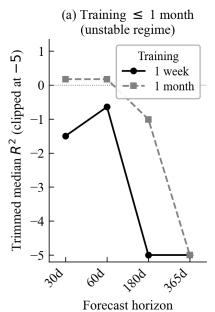
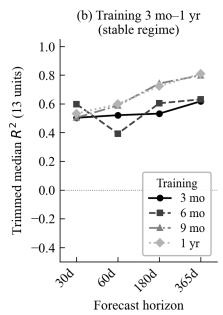
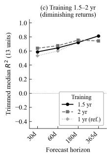
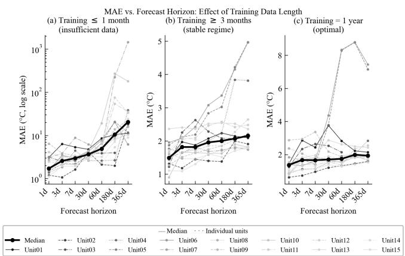
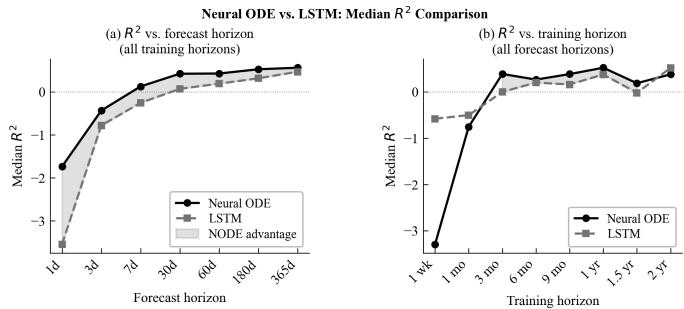
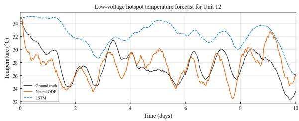
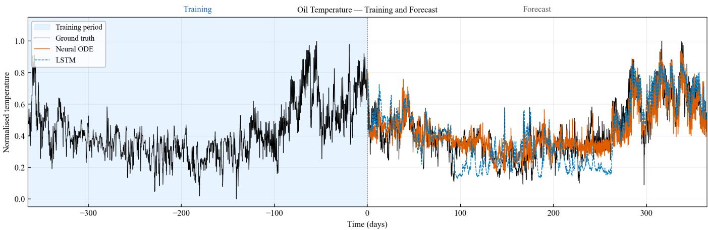

# Virtual Temperature Sensors in Power Transformers Using Neural Ordinary Differential Equations

Berk Hadzhamolla1, Alexander Johannes Stasik2, and Signe Riemer-Sørensen3

1 University of Oslo, Oslo, 0316, Norway

berkh@uio.no

2,3 SINTEF AS, Department of Mathematics and Cybernetics, Oslo, Norway

signe.riemer-sorensen@sintef.no

alexander.stasik@sintef.no

2 Department of Data Science, Norwegian University of Life Sciences, As, Norway˚ alexander.johannes.stasik@nmbu.no

## ABSTRACT

Accurate modeling and forecasting of power transformer thermal behavior are critical for ensuring reliability, extending asset lifetime, and enabling optimized power system operation. Numerical approaches, such as finite element methods (FEM) and computational fluid dynamics (CFD), offer high fidelity but suffer from prohibitive computational costs, complex mesh generation, and limited feasibility in real-time or large-scale applications, as well as often unknown geometries. Lumped-parameter thermal models provide a more practical alternative but depend on transformer-specific thermal constants and often fail to capture dynamic responses under varying operating and environmental conditions. Purely data-driven machine learning (ML) methods, including artificial neural networks (ANNs), convolutional neural networks (CNNs), and recurrent architectures such as long short-term memory (LSTM) networks, have shown success in forecasting transformer oil, winding, and hotspot temperatures; however, they typically require large volumes of high-quality training data and risk producing physically inconsistent or uninterpretable results. To overcome these limitations, hybrid frameworks such as physics-informed neural networks (PINNs) embed physical laws into the learning process, enabling physically consistent solutions while reducing data demands. This paper applies a physics-aware modeling of Neural Ordinary Differential Equations (Neural ODEs) adapted for forecasting transformer thermal behavior using real-world time-series data. Neural ODEs model system dynamics in continuous time, enabling smoother predictions, robustness to irregular sampling, and improved extrapolation capabilities compared to discrete-time models such as LSTMs. A key contribution

of this work is the integration of simplified heat-transfer equations for power transformers directly into the Neural ODE, enabling a physics-aware formulation of the thermal dynamics. The model’s performance and generalization capabilities are evaluated across datasets from fifteen distinct transformers located in different regions of Norway, and characterized by varying designs and cooling mechanisms. The results demonstrate the success of the developed Neural ODEs framework to serve as a standardized, physics-aware, and robust forecasting tool for heterogeneous transformer units.

## 1. INTRODUCTION

Power transformers are essential components of modern electrical grids, enabling efficient transmission and distribution of electrical energy through voltage conversion. Their continuous operation is subjected to fluctuating load demands and varying environmental conditions, which introduce significant thermal stress. Excessive operating temperatures accelerate insulation ageing processes, reduce transformer service life, and increase the risk of costly failures or large-scale outages. Consequently, accurate estimation and forecasting of transformer internal temperatures (virtual sensing) has become a critical requirement for condition monitoring, overload control, reliable grid operation and predictive maintenance strategies (Swift, Molinski, & Lehn, 2001; Lundgaard, Hansen, Linhjell, & Painter, 2004; Susa, Lehtonen, & Nordman, 2005; Piercy, McNutt, Arseneau, & Ouellette, 1994).

Among the most important thermal indicators of transformer health are the top-oil and winding hot-spot temperatures, as these quantities reflect cooling performance and directly influence the ageing rate of cellulose insulation (Lundgaard et al., 2004). Accurate estimation of these thermal states is therefore essential for transformer lifetime assessment and operational reliability. To enable effective online thermal condition monitoring, dynamic thermal models capable of predicting internal transformer temperatures under varying operating and environmental conditions are required (Swift et al., 2001; Susa et al., 2005).

Prevalent methods for estimating transformer internal temperatures rely on physics-based models or empirical approaches Traditionally, detailed three-dimensional (3D) models based on FEM and CFD have been employed to solve coupled heat transfer and fluid flow equations governing transformer thermal behaviour (Yan et al., 2025; Juarez-Balderas et al., 2020).´ Such numerical approaches provide detailed representations of transformer geometry and internal oil circulation and were originally developed as high-fidelity alternatives to semi empirical analytical methods based on experimentally derived thermal constants (Oommen, Claiborne, & Mullen, 2009). These models aim to capture spatial temperature distributions and internal flow dynamics with high physical fidelity. However, their practical application is often limited by high computational cost, sensitivity to boundary conditions, and incomplete knowledge of internal physical parameters.

An alternative involves lumped-parameter thermal circuit models, which approximate heat transfer dynamics using equivalent thermal resistances and capacitances (Bragone, Morshuis, Laneryd, Luvisotto, & Morozovska, 2022). While computationally efficient, these models struggle to accurately capture dynamic thermal behaviour under highly variable loads or environmental conditions. Efforts to improve their accuracy have included incorporating temperature-dependent losses, oil viscosity, and external factors such as solar radiation (Yan et al., 2025).

An important aspect of transformer thermal behaviour is the cooling system, which dissipates heat generated by core and winding losses. Cooling configurations such as ONAN (Oil Natural, Air Natural), ONAF (Oil Natural, Air Forced), OFAF (Oil Forced, Air Forced), and ODAF (Oil Forced, Water Forced) significantly influence thermal performance and loading capability (Williams et al., 2024). This diversity introduces substantial variability, making the development of generalized thermal models particularly challenging.

The increasing deployment of high-resolution sensors in modern transformers has enabled data-driven modelling approaches based on ML. Early studies using ANNs focused on top-oil temperature estimation and later expanded to winding and hot-spot forecasting (Juarez-Balderas et al., 2020; Wei, Wang,´ et al., 2017; Yan et al., 2025; Vilaithong, Tenbohlen, & Stirl, 2007). ANNs demonstrated strong predictive capability and, in several studies, improved accuracy compared to semi-physical models under rapidly changing ambient conditions (Vilaithong et al., 2007; Temboa et al., 2022). Their primary advantage lies in learning nonlinear mappings directly from data without requiring explicit physical formulations (Juarez-Balderas´ et al., 2020) and thereby bypassing a weakness of the physical

## models.

With the rise of deep learning, more advanced architectures such as Long Short-Term Memory (LSTM) networks and Con volutional Neural Networks (CNNs) have been explored, proving effective in capturing sequential dependencies and spatiotemporal features in operational data (Tan et al., 2019; Rubas inghe et al., 2023; Yan et al., 2025). Recently, models such as Time-series Dense Encoder (TiDE) and Temporal Convolutional Networks (TCN) have also been applied to transformer temperature forecasting, demonstrating improvements over IEC 60076-7 benchmark approaches (Temboa et al., 2022). Despite these advances, purely data-driven methods often require large datasets and may lack physical interpretability or robust generalization across different transformer designs and cooling systems (Huang & Wang, 2023; Karniadakis et al., 2021; Bragone et al., 2022).

Hybrid and physics-informed approaches have emerged to address these limitations. Bragone et al. (Bragone et al., 2022) applied Physics-Informed Neural Networks (PINNs) using a one-dimensional heat diffusion equation to model transformer thermal dynamics, achieving high accuracy compared to finite-volume simulations. More broadly, PINNs have been successfully applied in power-system applications including state estimation, dynamic analysis, and optimal power flow (Huang & Wang, 2023; Gao et al., 2023). Through specially designed loss functions, PINNs encourage physically consistent solutions and thereby improve interpretability and improve performance in data-scarce scenarios.

In parallel, Neural Ordinary Differential Equations (Neural ODEs) have emerged as another promising hybrid approach. Neural ODEs were introduced by Chen et al. (Chen, Rubanova, Bettencourt, & Duvenaud, 2018), where neural networks parameterize continuous-time system dynamics integrated throug numerical ODE solvers. As discussed by Kidger (Kidger, 2022), this framework combines the flexibility of deep learning with the structure of numerical integration, providing an effective representation for scientific machine learning tasks. Neural ODEs can be interpreted as continuous-depth generalizations of Residual Networks (ResNets) (He, Zhang, Ren, & Sun, 2016; Chen et al., 2018), often yielding smoother trajectories and improved stability in long-horizon forecasting problems. Continuous-time modeling is attractive for PHM systems because sensor data are often irregular, missing, or asynchronous.

This work applies a physics-aware Neural ODE framework to forecast transformer thermal behaviour using real-world operational data from fifteen transformers across Norway. The remainder of this paper is organized as follows. Section 2 describes the proposed methodology, including the transformer thermal model and the Neural ODE formulation. Section 3 presents the physics-aware Neural ODE framework. Section 4 reports and discusses the results. Section 5 concludes

the paper.

## 2. METHODOLOGY

## 2.1. Transformer Thermal Dynamics

The thermal behavior of power transformers is governed by coupled heat transfer between windings, cooling oil, and the ambient environment (Swift et al., 2001; Susa et al., 2005). Treating the windings as the primary heat source and the oil as an intermediate thermal buffer, the coupled energy balance reads:

$$
C _ { p , w } \frac { d T _ { \mathrm { w } } } { d t } = - h _ { 1 } \big ( T _ { \mathrm { w } } - T _ { \mathrm { o i l } } \big ) + L _ { E } ( { \cal P } ) ,\tag{1}
$$

$$
C _ { p , o } \frac { d T _ { \mathrm { o i l } } } { d t } = h _ { 1 } \big ( T _ { \mathrm { w } } - T _ { \mathrm { o i l } } \big ) - h _ { 2 } \big ( T _ { \mathrm { o i l } } - T _ { \mathrm { a m b } } \big ) ,\tag{2}
$$

where $C _ { p , w }$ and $C _ { p , o }$ are the thermal capacitances of the winding and oil, $h _ { 1 }$ is the winding-to-oil heat transfer coefficient, $h _ { 2 }$ is the oil-to-ambient heat transfer coefficient, and $L _ { E } ( P )$ represents electrical losses as a function of active power load $P .$

In practice, the thermal constants $C _ { p , w } , C _ { p , o } , h _ { 1 }$ , and $h _ { 2 }$ are transformer-specific, often unknown, and vary with cooling configuration and operating conditions. Rather than identifying these parameters explicitly, the internal thermal states are collected into a state vector ${ \bf y } ( t )$ and the external drivers into a control vector ${ \bf x } ( t )$

$$
\mathbf { y } ( t ) = \left[ \begin{array} { l } { T _ { \mathrm { o i l } } ( t ) } \\ { T _ { \mathrm { h w } } ( t ) } \\ { T _ { \mathrm { l w } } ( t ) } \\ { T _ { \mathrm { h h s } } ( t ) } \\ { T _ { \mathrm { l h s } } ( t ) } \end{array} \right] \in \mathbb { R } ^ { 5 } , \qquad \mathbf { x } ( t ) = \left[ \begin{array} { l } { P _ { \mathrm { h v } } ( t ) } \\ { P _ { \mathrm { l v } } ( t ) } \\ { T _ { \mathrm { a m b } } ( t ) } \end{array} \right] \in \mathbb { R } ^ { 3 } .\tag{3}
$$

The state vector ${ \bf y } ( t )$ contains oil temperature, high- and low voltage winding temperatures, and high- and low voltage hotspot temperatures. The control vector ${ \bf x } ( t )$ contains high- and low-voltage active power loads and ambient temperature. For transformers with missing measurements, the corresponding entries are excluded from y or x accordingly.

Equations (1)–(2) reveal two structural properties that directly inform the proposed architecture. First, the rate of change of each thermal state depends only on the current states ${ \bf y } ( t )$ and current external inputs ${ \bf x } ( t )$ , with no explicit dependence on past history, yielding a first-order Markovian state-space structure. Second, ${ \bf y } ( t )$ and ${ \bf x } ( t )$ play fundamentally different physical roles: ${ \bf y } ( t )$ represents the internal thermal states of the system, while ${ \bf x } ( t )$ comprises the external drivers of heat generation and dissipation. The proposed physics-aware

Neural ODE preserves both properties explicitly in its architecture, as described in Section 3.

The thermal dynamics are therefore expressed as the general data-driven formulation:

$$
\frac { d { \bf y } ( t ) } { d t } = F ( { \bf y } ( t ) , { \bf x } ( t ) ; \theta ) ,\tag{4}
$$

where F is a learned function parameterized by θ.

## 3. PHYSICS-AWARE NEURAL ODE FRAMEWORK

## 3.1. Neural ODEs with Exogenous Forcing

Purely data-driven models such as LSTMs predict $\mathbf { y } ( t + 1 )$ directly from a window of past observations, with no structural constraint enforcing the physical relationships in Equations (1)–(2). Over long autoregressive rollouts, this allows trajectories to drift in physically implausible directions. To address this, the proposed physics-aware Neural ODE replaces the right-hand side of Equation (4) with a neural network $\mathcal { N N } _ { \theta } ,$ , so that the state trajectory is obtained by numerical integration of a learned vector field:

$$
\mathbf { y } ( t ) = \mathbf { y } ( t _ { 0 } ) + \int _ { t _ { 0 } } ^ { t } \mathcal { N } \mathcal { N } _ { \theta } \big ( \mathbf { y } ( t ^ { \prime } ) , \mathbf { x } ( t ^ { \prime } ) \big ) d t ^ { \prime } .\tag{5}
$$

The physics-awareness of the framework is embedded into the architecture in two concrete ways, directly mirroring the structure of Equations $( 1 ) ‐ ( 2 )$ . First, the inputs to $\mathcal { N } \bar { \mathcal { N } } _ { \theta }$ at each integration step are exactly $( \mathbf { y } ( t ) , \mathbf { x } ( t ) )$ , preserving the physical decomposition between internal thermal states and external excitations. Second, the network always outputs $d \mathbf { y } / d t$ rather than predicting temperatures directly, enforcing the continuous time heat-transfer structure at every integration step.

The exogenous input $\mathbf { x } ( t ^ { \prime } )$ is required at every integration step. Since x is observed only at discrete times $\{ t _ { 0 } , t _ { 1 } , \ldots , t _ { N } \}$ with interval $\Delta t = 9 0 0 \mathrm { s } .$ continuous-time access is provided by piecewise-linear interpolation, where k denotes the index of the most recent observation such that $t _ { k } \leq t < t _ { k + 1 } :$

$$
{ \bf x } ( t ) = { \bf x } _ { k } + \frac { t - t _ { k } } { \Delta t } \big ( { \bf x } _ { k + 1 } - { \bf x } _ { k } \big ) , \qquad t \in [ t _ { k } , t _ { k + 1 } ) .\tag{6}
$$

This construction of a neural network driven by a continuously interpolated control path is closely related to Neural Controlled Differential Equations (Neural CDEs) (Kidger, Morrill, Foster, & Lyons, 2020), which model the influence of external signals on system dynamics as $d \mathbf { y } ( t ) = f _ { \boldsymbol { \theta } } ( \mathbf { y } ( t ) ) d X ( t )$ where $X ( t )$ is the continuously interpolated control path. In the present formulation, ${ \bf x } ( t )$ enters the network directly as a concatenated input rather than through a channel matrix, yielding a computationally simpler but structurally equivalent

treatment of the exogenous driving signal.

## 3.2. Real life scenario testing

The NeuralODE is implemented and tested on 15 transformers in the Norwegian transmission grid1. Each dataset spans multiple months or years of operational data formatted as a multivariate time series capturing a range of thermal and electrical measurements recorded every 900 seconds (15 minutes) as outlined in Equation 3.Minor gaps, defined as missing intervals shorter than four consecutive samples (1 hour), were filled using linear interpolation, preserving temporal continuity without distorting the underlying time-series patterns. Longer gaps were excluded from the analysis to avoid introducing artificial thermal dynamics and interpolation bias.

## 3.3. Model Architecture and Implementation

The vector field $\mathcal { N N } _ { \theta }$ is modelled with a three-layer fully connected network with hidden dimension $H \ = \ 2 5 6$ and tanh activations. Let $\mathbf { z } = [ \mathbf { y } ; \mathbf { x } ] \in \mathbb { R } ^ { n _ { y } + n _ { x } }$ denote the concatenated input at each integration step. The forward pass is:

$$
\mathbf { h } _ { 1 } = \operatorname { t a n h } ( W _ { 1 } \mathbf { z } + \mathbf { b } _ { 1 } ) ,\tag{7}
$$

$$
{ \bf h } _ { 2 } = \operatorname { t a n h } ( W _ { 2 } { \bf h } _ { 1 } + { \bf b } _ { 2 } ) ,\tag{8}
$$

$$
\mathcal { N N } _ { \theta } ( \mathbf { y } , \mathbf { x } ) = W _ { 3 } \mathbf { h } _ { 2 } + \mathbf { b } _ { 3 } .\tag{9}
$$

where $W _ { 1 } \in \mathbb { R } ^ { H \times ( n _ { y } + n _ { x } ) } , W _ { 2 } \in \mathbb { R } ^ { H \times H } , W _ { 3 } \in \mathbb { R } ^ { n _ { y } \times H } .$ and $\mathbf { b } _ { 1 } , \mathbf { b } _ { 2 } , \mathbf { b } _ { 3 }$ are the corresponding bias vectors forming the trainable parameters θ. Gradients with respect to θ are computed by backpropagation through the adaptive integration steps of the dopri5 solver via standard automatic differentiation, as implemented in torchdiffeq (Chen et al., 2018).

## 3.4. Training Procedure and Hyper Parameters

The network parameters θ are optimized by minimizing a composite loss:

$$
\begin{array} { r } { \mathcal { L } ( \theta ) = \mathcal { L } _ { \mathrm { M S E } } ( \theta ) + \lambda \mathcal { L } _ { \mathrm { s m o o t h } } ( \theta ) , } \end{array}\tag{10}
$$

where

$$
\mathcal { L } _ { \mathrm { M S E } } = \frac { 1 } { N } \sum _ { i = 1 } ^ { N } \lVert \hat { \mathbf { y } } ( t _ { i } ) - \mathbf { y } ( t _ { i } ) \rVert ^ { 2 } ,\tag{11}
$$

$$
\mathcal { L } _ { \mathrm { s m o o t h } } = \frac { 1 } { N - 1 } \sum _ { i = 1 } ^ { N - 1 } \left\| \frac { \hat { \mathbf { y } } ( t _ { i + 1 } ) - \hat { \mathbf { y } } ( t _ { i } ) } { \Delta t } \right\| ^ { 2 } ,\tag{12}
$$

and $\lambda = 1 0 ^ { - 4 } . \mathcal { L } _ { \mathrm { M S E } }$ is the trajectory mean squared error and $\mathcal { L } _ { \mathrm { s m o o t h } }$ is a smoothness penalty that encodes the physical prior that transformer temperatures cannot change rapidly, discouraging high-frequency oscillations in the predicted trajectory inconsistent with known thermal dynamics.The value $\lambda = 1 0 ^ { - 4 }$ was set empirically; the most consequential sensitivity observed during development was to the ODE solver choice, fixed-step solvers such as $\tt r k 4$ produced unstable integration trajectories, whereas the adaptive dopri5 solver yielded stable training across all units.

Gradient stability is maintained through gradient clipping with maximum norm 1.0. The optimizer is Adam with learning rate $\eta = 1 0 ^ { - 4 }$ , weight decay $1 0 ^ { - 5 }$ , and a step learning rate schedule with decay factor $\gamma = 0 . 9$ applied each epoch.

## 3.4.1. Curriculum Learning

Training uses a sliding-window curriculum strategy in which the prediction horizon grows linearly from $W _ { \mathrm { m i n } } = 5$ steps (≈ 1.25 h) at epoch 1 to $W _ { \mathrm { m a x } } = 1 9 2$ steps (= 2 days) at the final epoch. The window bounds reflect known transformer thermal time constants: the minimum of 1.25 h corresponds to the lower end of typical thermal response times, while the maximum of 2 days captures full diurnal load cycles. Starting with short horizons and gradually increasing difficulty accelerates convergence by allowing the network to first learn short-range thermal dynamics before being exposed to the full integration length, following the curriculum learning principle of (Bengio, Louradour, Collobert, & Weston, 2009).

## 3.5. LSTM Baseline

A three-layer stacked LSTM with hidden dimension 256 and dropout 0.1 is used as the baseline. At each step t the network receives $[ \mathbf { y } ( t ) , \mathbf { x } ( t ) ]$ as input and produces a prediction of $\mathbf { y } ( t + 1 )$ , directly mirroring the input–output convention of the Neural ODE vector field. This ensures the comparison is not confounded by differences in the information available at each prediction step.

The training context window is fixed at 192 steps (2 days), equal to the Neural ODE curriculum upper bound (Section 3.4.1), so both models see identical maximum temporal context. Training uses scheduled sampling with teacher-forcing ratio decaying linearly from 1.0 at epoch 1 to 0.0 at epoch $6 0 ,$ producing a fully autoregressive model by the final epoch and closing the train-to-evaluation distribution gap caused by pure teacher forcing. All optimizer and regularization settings $( \mathrm { A d a m } , \eta =$ $1 0 ^ { - 4 }$ , weight decay $1 0 ^ { - 5 }$ , step-LR $\gamma = 0 . 9$ , gradient clip norm 1.0, 60 epochs, batch size 1024) are identical to those in Section 3.4.

At evaluation time the LSTM is initialized with $\mathbf { y } ( t _ { 0 } )$ and a zero hidden state, then rolled out autoregressively over the forecast window using ground-truth exogenous inputs, imposing identical information constraints to the Neural ODE.

## 4. RESULTS AND DISCUSSION

The central motivation of this work is that existing approaches to transformer thermal modelling each carry fundamental limitations: high-fidelity numerical methods such as FEM and CFD are computationally prohibitive and require complete knowledge of internal geometry; lumped-parameter models depend on transformer-specific constants that are rarely known a priori; and purely data-driven models such as LSTMs learn statistical correlations from training data, making them brittle outside the training distribution and prone to physically inconsistent predictions over long horizons. The Neural ODE framework proposed here is designed to occupy the gap between these extremes: it encodes the continuous-time heattransfer structure of Equations (1)–(2) directly into the architecture, the network always outputs $d \mathbf { y } / d t$ and the temperature trajectory is obtained by numerical integration. This structural inductive bias is expected to yield smoother, more physically plausible long-horizon predictions and better generalization across transformers with different cooling configurations.

## 4.1. Neural ODE Performance

Figures 1 and 2 characterize Neural ODE forecast quality as a function of training data length and forecast horizon. Three distinct performance regimes emerge from the data.

In the unstable regime (training $\leq 1$ month), with one week of training data the median $R ^ { 2 }$ across all forecast horizons is $- 3 . 2 9 .$ , and 16 of the 105 evaluated (unit, forecast horizon) combinations produce $R ^ { 2 } < - 1 0 0$ , indicating catastrophic trajectory divergence (Figure 1a). With one week of training data, corresponding to approximately $^ { 6 7 0 }$ samples, the network parameters are far from convergence and the learned derivatives become numerically unstable over long integration horizons, producing catastrophic trajectory divergence. This is not a fundamental limitation of the framework but a minimum data requirement that is straightforward to enforce in deployment. The MAE is likewise unreliable, with median values reaching $4 . 5 5 ^ { \circ } \mathrm { C }$ , more than three times the value achieved under adequate training (Figure 2a). At one month, median performance improves to $R ^ { 2 } = - 0 . 7 5$ , still well below the threshold of useful prediction.

From three months of training onward the Neural ODE enters a stable and useful regime (Figure 1b). Median $R ^ { 2 }$ reaches $+ 0 . 3 8 7$ at three months and improves monotonically to 0.521 at one year, while median MAE drops from $2 . 0 7 ^ { \circ } \mathrm { C }$ to 1. ${ 7 3 ^ { \circ } \mathrm { C } }$ over the same range (Figure $^ { 2 \mathrm { b } , \mathrm { c } ) }$ . To put these numbers in operational context: forecasts are on average within approximately $2 ^ { \circ } \mathrm { C }$ of the true temperature over an entire year of open-loop integration, which is physically meaningful for asset management decisions such as load scheduling and insulation ageing assessment, where temperature thresholds typically carry tolerances of $5 { \mathrm { - } } 1 0 ^ { \circ } \mathrm { C } .$ This threshold has a natural physical interpretation: three months of data at 15-minute resolution amounts to approximately 8,640 samples spanning a full seasonal quarter. Transformer thermal behavior is strongly coupled to ambient temperature, which in Norway varies by up to $3 0 ^ { \circ } \mathrm { C }$ between winter and summer. A model trained on less than a full season cannot have observed the complete range of the ambient-to-oil temperature relationship and will therefore generalize poorly to operating conditions it has never seen.

Figure 1. Neural ODE $R ^ { 2 }$ vs. forecast horizon by training data length, showing the trimmed median across all 15 transformer units.  
  
Figure 2. Neural ODE MAE (°C) vs. forecast horizon for all 15 units (grey) and their median (black). Panel (a): training ≤1 month (log scale), (b): training ≥3 months, (c): training $= 1$ year.

Beyond one year, performance plateaus at approximately $R ^ { 2 } =$ 0.59 for forecast horizons of 30 days and longer, and median MAE stabilizes around $1 . 9 6 \mathrm { - } 1 . 9 9 ^ { \circ } \mathrm { C }$ (Figure 1c). This suggests the Neural ODE has extracted the available thermal dynamics within one year of data, consistent with the model having observed all four seasons, and a one-year training window is therefore sufficient and recommended for deployment.

Across all training regimes, forecast quality degrades with increasing horizon as errors accumulate in open-loop integration (Figure 2). The degradation is slower for the Neural ODE than for the LSTM because the ODE structure produces inherently smooth, physically bounded trajectories. Shorthorizon forecasts (1–7 days) remain challenging for both models with negative median $R ^ { 2 }$ . The Neural ODE is therefore best understood as a medium-to-long horizon virtual sensor (30–365 days).

## 4.2. Comparison with LSTM Baseline

Tables 1– 2 and Figure 3 provide a systematic head-to-head comparison across all 823 evaluated combinations of unit, training horizon, and forecast horizon. Bold entries in the tables indicate the best performing model for that row.

Overall, the $R ^ { 2 }$ indicate that both models struggle to provide useful models for less than 2 months of training data. At one week, LSTM median $R ^ { 2 } = - 0 . 5 8$ , meaning the model explains less variance than a flat mean prediction. Hence we do not discuss best performance for these. At two years, LSTM median $R ^ { 2 } = 0 . 5 2$ , which is marginally higher than NODE, but both models perform comparably in absolute terms.

Overall, across all 823 combinations, the Neural ODE achieves higher $R ^ { 2 }$ in 508 cases (61.7%) and lower MAE in 533 cases $( 6 4 . 8 \% )$ . In the operationally relevant stable regime (training $\geq 3$ months, forecast $\geq 3 0$ days), these figures rise to 65.2% on $R ^ { 2 }$ and 70.1% on MAE, with median $R ^ { 2 } = 0 . 5 9 1$ versus 0.493 for the LSTM and median $\mathbf { M A E } = 2 . 0 4 ^ { \circ } \mathbf { C }$ versus $2 . 4 5 ^ { \circ } \mathrm { C } - \mathrm { a }$ difference of $0 . 4 1 ^ { \circ } \mathrm { C }$ . On MAE, the Neural ODE is the better model at every forecast horizon without exception (Table 2), even at 365 days where the $R ^ { 2 }$ best performance rate is marginally below 50%.

The four training regimes tell a clear story. At one week of training neither model is usable: LSTM median $R ^ { 2 } = - 0 . 5 8$ and Neural ODE median $R ^ { 2 } = - 3 . 2 9$ , both well below zero – neither exceeds a flat mean prediction. From three months onward the Neural ODE clearly separates from the LSTM (Figure 3b): it already achieves median $R ^ { 2 } \ = \ + 0 . 3 9$ and $\mathbf { M A E } = 2 . 0 7 ^ { \circ } \mathbf { C } .$ , while the LSTM median $R ^ { 2 }$ is effectively zero. Three months spans a full seasonal quarter, giving the Neural ODE sufficient exposure to the ambient–thermal coupling that governs transformer behavior; the best performance rate reaches 84% on $R ^ { 2 }$ and 86% on MAE – the highest of any training horizon. At one year NODE median $R ^ { 2 } = 0 . 5 2$ versus $\mathrm { L S T M } = 0 . 3 7$ (Figure 3a), and at two years the LSTM narrowly wins on median $R ^ { 2 } \left( 0 . 5 2 \right.$ vs. 0.38) though the Neural ODE retains lower MAE throughout.

## 4.3. Per-unit Analysis

Table 3 reports per-unit median performance in the stable regime (training horizon $\geq 3$ months; forecast horizon $\geq 3 0$ days) across all fifteen units. The Neural ODE attains higher median $R ^ { 2 }$ on 14 of 15 units and lower median MAE on all

  
Figure 3. Neural ODE vs. LSTM $R ^ { 2 }$ comparison (15 transformers). Panel (a): vs. forecast horizon (training ${ \ge } 3$ months). Panel (b): vs. training horizon at 365-day forecast. Shaded region marks Neural ODE advantage; downward arrows mark divergence (clipped at −3).

15 units, indicating both stronger variance explanation and more accurate absolute predictions in the operationally relevant regime. The highest Neural ODE median $R ^ { 2 }$ values are obtained for U01, U09, and U15.

Table 3. Per-unit performance comparison between NODE and LSTM in the stable regime (training horizon $\geq 3$ months; forecast horizon $\geq 3 0 \mathrm { d a y s ) }$ . Higher $R ^ { \bar { 2 } }$ and lower MAE indicate better performance. The better performance of each pair is shown in bold.
<table><tr><td>Unit</td><td> $R ^ { 2 }$  (NODE)</td><td> $R ^ { 2 }$  (LSTM)</td><td>MAE (NODE)</td><td>MAE (LSTM)</td></tr><tr><td>U01</td><td>0.909</td><td>0.899</td><td>2.09</td><td>2.34</td></tr><tr><td>U02</td><td>0.717</td><td>0.713</td><td>1.54</td><td>1.80</td></tr><tr><td>U03</td><td>0.561</td><td>0.519</td><td>2.13</td><td>2.41</td></tr><tr><td>U04</td><td>0.607</td><td>0.477</td><td>2.40</td><td>3.37</td></tr><tr><td>U05</td><td>0.214</td><td>-0.092</td><td>3.71</td><td>4.92</td></tr><tr><td>U06</td><td>0.159</td><td>-0.148</td><td>4.20</td><td>5.78</td></tr><tr><td>U07</td><td>0.561</td><td>0.433</td><td>1.73</td><td>2.00</td></tr><tr><td>U08</td><td>0.732</td><td>0.668</td><td>1.76</td><td>1.94</td></tr><tr><td>U09</td><td>0.825</td><td>0.692</td><td>1.95</td><td>2.49</td></tr><tr><td>U10</td><td>0.519</td><td>0.397</td><td>1.75</td><td>1.87</td></tr><tr><td>U11</td><td>0.157</td><td>0.101</td><td>2.45</td><td>3.02</td></tr><tr><td>U12</td><td>0.530</td><td>0.504</td><td>2.04</td><td>2.22</td></tr><tr><td>U13</td><td>0.466</td><td>0.004</td><td>2.48</td><td>3.20</td></tr><tr><td>U14</td><td>0.475</td><td>0.699</td><td>1.90</td><td>1.94</td></tr><tr><td>U15</td><td>0.773</td><td>0.694</td><td>1.68</td><td>1.85</td></tr></table>

Units 05 and 06 remain the most challenging cases for both models. Although the Neural ODE still attains positive median $R ^ { 2 }$ on both units, performance is weak relative to the rest of the power transfomers, and the LSTM yields negative median $R ^ { 2 }$ in both units. Aside from U14, where the LSTM achieves higher median $R ^ { 2 }$ (0.699 versus 0.475), the Neural ODE outperforms the LSTM on median $R ^ { 2 }$ for every unit. Even on U14, the Neural ODE retains a slightly lower median MAE $( 1 . 9 0 ^ { \circ } \mathrm { C }$ versus $1 . 9 4 ^ { \circ } \mathrm { C } )$ . These results indicate that the Neural ODE delivers the more consistent per-unit model overall.

Figure 4 provides a zoomed-in qualitative comparison for Unit 12 low-voltage hotspot temperature over a selected 10-day fore-

Table 1. NODE vs. LSTM performance by training horizon (all 15 units, all 7 forecast horizons). Bold: better value. BP = best performance rate. N = NODE. L = LSTM.
<table><tr><td>Training horizon</td><td>BP  $R ^ { 2 }$ </td><td>BP MAE</td><td> $\mathbf { M e d } \ R ^ { 2 } \mathbf { N }$ </td><td> $\mathbf { M e d } \ R ^ { 2 } \mathbf { L }$ </td><td>MAE N  $( ^ { \circ } \mathbf { C } )$ </td><td>MAE L (°C)</td></tr><tr><td>1 week</td><td>34%</td><td>38%</td><td> $- 3 . 2 9$ </td><td>-0.58</td><td>4.55</td><td>4.03</td></tr><tr><td>1 month</td><td>61%</td><td>69%</td><td>-0.75</td><td>-0.50</td><td>2.41</td><td>3.79</td></tr><tr><td>3 months</td><td>84%</td><td>86%</td><td>+0.39</td><td>-0.00</td><td>2.07</td><td>2.92</td></tr><tr><td>6 months</td><td>65%</td><td>71%</td><td>+0.27</td><td>+0.20</td><td>1.92</td><td>2.42</td></tr><tr><td>9 months</td><td>78%</td><td>80%</td><td>+0.38</td><td>+0.16</td><td>1.83</td><td>2.33</td></tr><tr><td>1 year</td><td>64%</td><td>72%</td><td>+0.52</td><td>+0.37</td><td>1.73</td><td>2.03</td></tr><tr><td>1.5 years</td><td>60%</td><td>58%</td><td>+0.19</td><td>-0.02</td><td>1.99</td><td>2.04</td></tr><tr><td>2 years</td><td>49%</td><td>44%</td><td>+0.38</td><td>+0.52</td><td>1.96</td><td>1.81</td></tr></table>

Table 2. NODE vs. LSTM performance by forecast horizon (all 15 units, all 8 training horizons). Bold: better MAE or $R ^ { 2 } .$ . BP = best performance rate. $\mathbf { N } ^ { \bullet } = \mathbf { N O D E . L } = \mathbf { \bar { L } S T M }$
<table><tr><td>Forecast horizon</td><td>BP  $R ^ { 2 }$ </td><td>BP MAE</td><td>Med  $R ^ { 2 } { \bf N }$ </td><td> $\mathbf { M e d } \ R ^ { 2 } \mathbf { L }$ </td><td>MAE N (°C)</td><td>MAE L (°C)</td></tr><tr><td>1 day</td><td>72% 61%</td><td>73% 61%</td><td>-1.74 -0.44</td><td>-3.54 -0.78</td><td>1.52 1.82</td><td>2.25 2.19</td></tr><tr><td>3 days 7 days</td><td>67%</td><td>67%</td><td>+0.13</td><td>-0.26</td><td>1.90</td><td>2.26</td></tr><tr><td></td><td>68%</td><td>73%</td><td>+0.42</td><td>+0.07</td><td>2.09</td><td>2.52</td></tr><tr><td>30 days 60 days</td><td>62%</td><td>68%</td><td>+0.43</td><td>+0.19</td><td>2.10</td><td>2.79</td></tr><tr><td>180 days</td><td>51%</td><td>57%</td><td>+0.52</td><td>+0.31</td><td>2.45</td><td>3.16</td></tr><tr><td>365 days</td><td>49%</td><td>52%</td><td>+0.56</td><td>+0.47</td><td>2.88</td><td>3.46</td></tr></table>

  
Figure 4. Zoomed-in comparison of predicted and measured low-voltage hotspot temperature for Unit 12 over a selected 10-day forecast interval.

cast interval. For the shown interval, the Neural ODE follows the measured trajectory more closely, while the LSTM poorly performing.

Figure 5 illustrates the qualitative difference between the two models for Unit 13, which illustrates the Neural ODE advantage among units with positive $R ^ { 2 }$ for both models $( \Delta R ^ { 2 } =$ +0.211). Over the 365-day forecast, the Neural ODE tracks the thermal trend closely throughout, while the LSTM diverges progressively during the low-temperature period before partially recovering. This is consistent with the broader finding that the Neural ODE’s physical structure produces more stable long-horizon trajectories compared to the purely data-driven LSTM baseline.

## 5. CONCLUSION

This paper presented a physics-aware Neural ODE framework for virtual temperature sensing in power transformers. By encoding the continuous-time heat-transfer structure of the winding, oil, ambient system directly into the model architecture, the framework produces smooth, physically grounded thermal trajectories and generalizes across fifteen heterogeneous transformer units. This enables deployment in transformer condition monitoring systems where direct hotspot sensing is unavailable. By providing reliable virtual temperature estimates, the framework can reduce the need for dense physical sensor deployment, lowering monitoring cost while still supporting early detection of abnormal thermal behaviour. This is particularly relevant for distribution-level assets, where large fleets of transformers must be monitored with limited instrumentation and maintenance resources.

As summarized in Table 2 and Figure 3, the Neural ODE consistently outperforms the LSTM baseline in the operationally relevant regime. Across stable operating conditions (training horizons $\geq 3$ months and forecast horizons of 30–365 days), it achieves median $R ^ { 2 } = 0 . 5 9 1$ and median $\mathbf { M A E } = 2 . 0 4 ^ { \circ } \mathbf { C } .$ with best performance rates of 65.2% on $R ^ { 2 }$ and 70.1% on MAE. The most significant practical advantage is data efficiency: the Neural ODE produces useful forecasts from as little as three months of training data, whereas the LSTM median $R ^ { 2 }$ remains near zero in this regime. This property is particularly valuable for new or recently instrumented units where long historical records are unavailable.

Table 3 further shows that the Neural ODE provides the more consistent per-unit model overall, achieving higher median $R ^ { 2 }$ on 14 of 15 units and lower median MAE on all 15 units. This indicates that the benefit of the physics-aware formulation is not limited to aggregate trends, but extends across a heterogeneous fleet of transformer units.

  
Figure 5. Oil temperature training and forecast for Unit 13 (1-year training, 365-day forecast). Training period shaded $( t < 0 )$ forecast period white $\left( t \geq 0 \right)$ . Temperature normalised to [0, 1].

The main limitation is a minimum data requirement: below roughly three months of training data, the learned dynamics become unstable and long-horizon integration produces unreliable forecasts. Future work will investigate warmup strategies and regularization methods to reduce this threshold, as well as multi-unit transfer learning to further lower per-unit data requirements, as well of investigate probabilistic extensions and online adaptation.

## ACKNOWLEDGMENT

This publication has been funded by the SFI NorwAI, (Centre for Research-based Innovation, 309834). The authors gratefully acknowledge the financial support from the Research Council of Norway and the partners of the SFI NorwAI, in particular Statnett who shared their data.

## NOMENCLATURE

$T$ temperature   
$T _ { \mathrm { o i l } }$ top-oil temperature   
$T _ { \mathrm { w } }$ winding temperature   
$T _ { \mathrm { h w } } , T _ { \mathrm { l w } }$ high-/low-voltage winding temperature   
$T _ { \mathrm { h h s } } , T _ { \mathrm { l h s } }$ high-/low-voltage hotspot temperature   
$T _ { \mathrm { a m b } }$ ambient temperature   
$P$ active power load   
$P _ { \mathrm { h v } } , P _ { \mathrm { l v } }$ high-/low-voltage active power load   
$t$ time   
$\Delta t$ sampling interval, 900 s   
$\mathbf { y } ( t )$ internal thermal state vector   
${ \bf x } ( t )$ exogenous control input vector   
$\dot { C _ { p , w } } , C _ { p , o }$ winding/oil thermal capacitance   
$h _ { 1 } , h _ { 2 }$ heat-transfer coefficients   
$L _ { E } ( P )$ electrical losses as function of load   
$F$ learned thermal dynamics function   
$\theta$ trainable parameters   
$\mathcal { N N } _ { \theta }$ neural network vector field   
$H$ hidden dimension   
$\mathcal { L }$ composite training loss   
$\lambda$ smoothness penalty weight   
$\eta , \gamma$ learning rate and decay factor   
Wmin, Wmax curriculum window bounds   
$R ^ { 2 }$ coefficient of determination   
MAE, MSE mean absolute/squared error

## REFERENCES

Bengio, Y., Louradour, J., Collobert, R., & Weston, J. (2009). Curriculum learning. In Proceedings of the 26th international conference on machine learning (icml) (pp. 41–48). doi: 10.1145/1553374.1553380

Bragone, F., Morshuis, P., Laneryd, T., Luvisotto, M., & Morozovska, K. (2022). Physics-informed neural networks for modelling power transformer thermal dynamics. Electric Power Systems Research, 211, 108194. doi: 10.1016/j.epsr.2022.108194

Chen, R. T. Q., Rubanova, Y., Bettencourt, J., & Duvenaud, D. (2018). Neural ordinary differential equations. In Advances in neural information processing systems

(neurips) (Vol. 31, pp. 6572–6583). Curran Associates, Inc. doi: 10.48550/arXiv.1806.07366

Gao, X., et al. (2023). Physics-informed graph convolutional neural network for power system state estimation and optimal power flow. In Proceedings of the ieee power & energy society general meeting. doi: 10.1109/PESGM52003.2023.10252870

He, K., Zhang, X., Ren, S., & Sun, J. (2016). Deep residual learning for image recognition. In Proceedings of the ieee conference on computer vision and pattern recognition (cvpr) (pp. 770–778). doi: 10.1109/ CVPR.2016.90

Huang, B., & Wang, J. (2023). Applications of physicsinformed neural networks in power systems — a review. IEEE Transactions on Power Systems, 38(1), 572–588. doi: 10.1109/TPWRS.2022.3162473

Juarez-Balderas, E., et al. (2020). Hot-spot temperature´ estimation in power transformers using artificial neural networks. IEEE Access, 8, 195409–195419. doi: 10.1109/ACCESS.2020.3033911

Karniadakis, G. E., Kevrekidis, I. G., Lu, L., Perdikaris, P., Wang, S., & Yang, L. (2021). Physics-informed machine learning. Nature Reviews Physics, 3, 422–440. doi: 10.1038/s42254-021-00314-5

Kidger, P. (2022). On neural differential equations. arXiv preprint. doi: 10.48550/arXiv.2202.02435

Kidger, P., Morrill, J., Foster, J., & Lyons, T. (2020). Neural controlled differential equations for irregular time series. In Advances in neural information processing systems (neurips) (Vol. 33, pp. 6696–6707). Curran Associates, Inc. doi: 10.48550/arXiv.2005.08926

Lundgaard, L. E., Hansen, W., Linhjell, D., & Painter, T. J. (2004). Aging of oil-impregnated paper in power transformers. IEEE Transactions on Power Delivery, 19(1), 230–239. doi: 10.1109/TPWRD.2003.820175

Oommen, T. V., Claiborne, C. C., & Mullen, E. T. (2009). Vegetable oil-based dielectric coolants. IEEE Industry Applications Magazine, 15(5), 16–25. doi: 10.1109/ MIAS.2009.933600

Piercy, R., McNutt, W. J., Arseneau, R., & Ouellette, J. (1994). Application of a new thermal model to transformer loading. IEEE Transactions on Power Delivery, 9(1), 133–140. doi: 10.1109/61.277684

Rubasinghe, G., et al. (2023). A cnn-lstm approach for transformer thermal state prediction. IEEE Transactions on Power Delivery. doi: 10.1109/TPWRD.2023.3250000

Susa, D., Lehtonen, M., & Nordman, H. (2005). Dynamic thermal modelling of power transformers. IEEE Transactions on Power Delivery, 20(1), 197–204. doi: 10.1109/TPWRD.2004.835258

Swift, G., Molinski, T. S., & Lehn, W. (2001). A fundamental approach to transformer thermal modeling. IEEE Transactions on Power Delivery, 16(2), 171–175. doi: 10.1109/61.915490

Tan, M., et al. (2019). Ultra-short-term temperature forecasting of power transformers using deep learning. International Journal of Electrical Power & Energy Systems, 113, 105910. doi: 10.1016/j.ijepes.2019.105910

Temboa, E., et al. (2022). Data-driven thermal models for power transformers: Tide and temporal convolutional networks versus iec 60076-7. Electric Power Systems Research, 209, 107985. doi: 10 .1016/j .epsr .2022 .107985

Vilaithong, R., Tenbohlen, S., & Stirl, T. (2007). Prediction of top-oil temperature and loss of life of power transformers by using neural network. International Journal of Electrical Engineering Education, 44(4), 323–334. doi: 10.7227/IJEEE.44.4.5

Wei, H., Wang, Z., et al. (2017). Hot-spot temperature forecasting of power transformers based on machine learning. IEEE Transactions on Power Delivery. doi: 10.1109/TPWRD.2016.2634002

Williams, J., et al. (2024). Cooling system configurations and thermal performance in power transformers: a review. Electric Power Systems Research, 228, 110050. doi: 10.1016/j.epsr.2024.110050

Yan, C., et al. (2025). Lstm-based transformer hot-spot temperature forecasting incorporating solar radiation and oil viscosity effects. IEEE Transactions on Power Delivery. doi: 10.1109/TPWRD.2024.3510000

## BIOGRAPHIES

Berk Hadzhamolla is a PhD research fellow at the University of Oslo, Norway. His research focuses on physics-informed machine learning for industrial systems, applications in epidemiological modeling, digital twins.

Alexander Johannes Stasik is a Senior Research Scientist for Analytics and AI at SINTEF Digital, Norway, as well as associate professor for data science at the Norwegian University for Life Science NMBU, Norway. His research focuses on physics-informed machine learning, probabilistic modeling and quantum computing for real world problems.

Signe Riemer-Sørensen is a Senior Research Scientist and Research Manager for Analytics and AI at SINTEF Digital, Norway, as well as co-director for the Norwegian Center of AI for Decisions. Her research focuses on physics-informed machine learning for industrial applications.