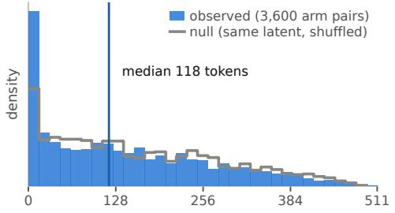
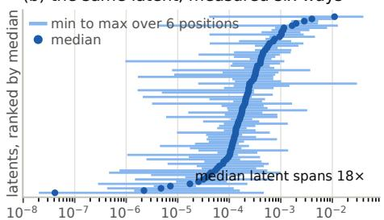
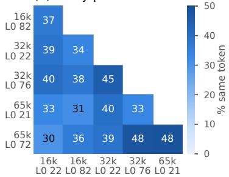
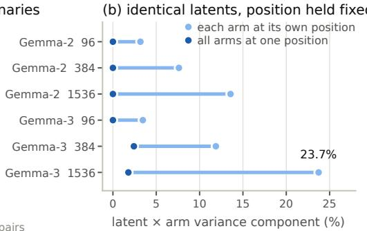
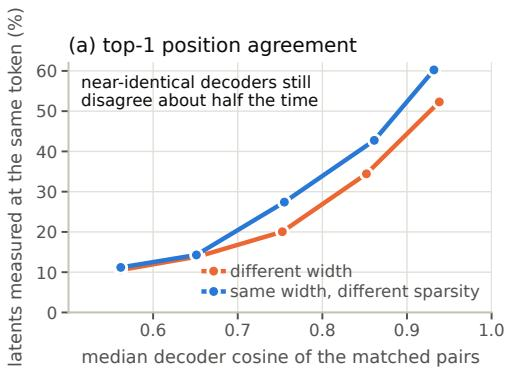
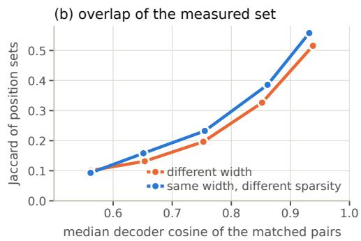

# WHERE YOU MEASURE DECIDES WHAT YOU MEASURE: POSITION SELECTION IN ABLATION-BASED SAE EVALUATION

Valentin Noël

Devoteam

valentin.noel@devoteam.com

## ABSTRACT

Sparse autoencoders are meant to name the things a language model computes, and the usual way to check that a latent matters is to switch it off and see what changes. But a latent fires at many tokens, and the effect has to be measured at one of them. The convention is to measure where the latent fires hardest. That choice is almost never reported, and it is not made by the experimenter: it is made by the dictionary under evaluation. Change the dictionary and the measurement moves to a different token.

We show this is not a detail. Take two sparse autoencoders released by Google for the same model and match their latents by decoder similarity: even among the pairs the two dictionaries encode almost identically, they pick different tokens for a large share of them. Two dictionaries compared under the usual protocol are therefore very often compared at different places. To separate the convention from the dictionaries we train six autoencoders from one initialisation, differing only in fitting choices, so that a latent means the same thing in each. Most of the variance such a comparison reads as these dictionaries disagree about this latent turns out to be the position instead: it falls from 7.6% and 11.9% of variance to near zero once every dictionary is measured at the same token. More evaluation data does not rescue it. Across a sixteenfold range of corpus sizes the dictionaries agree less about where to measure, not more, so the problem grows with scale.

The correction is one line of evaluation code. We give the protocol an ablationbased causal number must report to be comparable across papers, and an audit of five published papers against it. In short: a causal number reported without its position describes the token it was taken at as much as the latent it was taken from. Code and data: https://github.com/vcnoel/sae-artifact.

## 1 INTRODUCTION

Sparse autoencoders (SAEs) are the current tool of choice for turning a language model’s activations into a list of named parts (Bricken et al., 2023; Cunningham et al., 2023; Templeton et al., 2024). Once you have such a list, the obvious next question is which parts matter, and the obvious way to answer it is intervention: switch a latent off, run the model again, and read how much the output changed (Marks et al., 2025; Gao et al., 2024; Cho et al., 2026). The resulting number is written down as a property of the latent, and read as one.

There is a step in the middle that nobody writes down. A latent does not fire once; it fires at many tokens across many sequences, and the intervention has to happen at one of them. Which one? The near-universal answer is the token where the latent fires hardest: a sensible instinct, inherited from single-neuron neuroscience, that the way to characterise a unit is to find what drives it most. The difficulty is that the token where a latent fires hardest is not a fact about the model. It is a fact about the dictionary, computed from the dictionary’s own activations. Fit a second autoencoder on the same data and it will place the same latent’s maximum somewhere else.

That makes the measurement location a downstream consequence of the very thing a comparison is trying to evaluate. When two papers report causal numbers for comparable latents, or when one paper compares two dictionaries, the numbers are not measured at the same place, and nothing in either paper says so, because the convention is invisible enough that it is rarely stated at all.

This paper measures how much that costs. We do it first on dictionaries we had no hand in: two Gemma Scope autoencoders released for the same base model, where we can match latents across dictionaries and ask how often they would be measured at the same token. Then, to separate the convention from the dictionaries themselves, we train six autoencoders from one shared initialisation that differ only in fitting choices, so that a latent denotes the same thing in all six and any disagreement between them is attributable rather than confounded. Measuring each dictionary where it prefers, and then measuring all of them at one common token, isolates what the convention contributes.

The answer is that it contributes most of it. What a conventional comparison reads as these dictionaries disagree about this latent is largely the dictionaries being read at different tokens, and holding the token fixed removes almost all of it. This does not improve with a bigger evaluation corpus; it gets worse, because more text means more places for two dictionaries to disagree about. The correction is a single line of evaluation code.

Two smaller reporting choices behave the same way. Whether special-token positions are dropped, and whether the readout is normalised by the size of the intervention, can each flip the sign of a real comparison on identical data (§6), and neither is usually written down. We surveyed five published papers that zero-ablate a single latent and read a magnitude, and recorded what each states about these conventions. The survey asks what the papers report; it cannot ask what their authors did, and we would expect some of these controls to have been applied and simply not described. That gap is the point rather than a complaint: our own earlier draft used the top-activating convention without reporting it, for the same reason everyone does: it did not look like a choice.

What it would take to falsify this. Take any two sparse autoencoders on the same base model. Record where each would measure a given latent under the top-activating convention: if they agree, our account is wrong. Then decompose the latent×arm variance with each dictionary at its own positions and again at a shared set: if that component does not fall, the repair does not work. Both run on one GPU in an afternoon, need no training beyond dictionaries a reader already has, and are a single flag in our implementation. We report them on two base models, six arms, and three evaluation corpora, and every number below carries the corpus it came from.

## Contributions:

• The measurement position is selected by the dictionary under evaluation, so two dictionaries are compared at different tokens. Released Gemma Scope dictionaries pick different tokens for a large share of the latents they encode almost identically, and in a controlled sixarm design, holding position fixed collapses the latent×arm variance component that a comparison would otherwise attribute to the dictionaries (§4, Appendix B).

• Two further reporting choices, special-token handling and normalisation by intervention magnitude, can flip the sign of a real comparison on identical data (§6, Appendix A).

• A protocol stating what an ablation-based causal number must report to be comparable across papers (§6), and an audit of five published papers against it (Table 2).

## 2 RELATED WORK

Dictionaries. Sparse autoencoders decompose a residual stream into an overcomplete set of sparselyactive directions (Bricken et al., 2023; Cunningham et al., 2023), motivated by superposition: more features than dimensions, stored at non-orthogonal directions (Elhage et al., 2022), with the linearrepresentation view refined since (Park et al., 2023; Engels et al., 2024). The line has since scaled to production models (Templeton et al., 2024), to TopK and JumpReLU objectives (Gao et al., 2024; Rajamanoharan et al., 2024b), to gated and batched variants (Rajamanoharan et al., 2024a; Bussmann et al., 2024), to objectives that select for downstream effect rather than reconstruction (Braun et al., 2024), to other sites and to transcoders (Kissane et al., 2024; Dunefsky et al., 2024), and to public dictionary suites (Lieberum et al., 2024). We take these methods as given: this paper measures a convention applied to such dictionaries, not the dictionaries themselves.

Evaluating dictionaries. SAEBench (Karvonen et al., 2025) consolidated the metrics the field reports, and a run of results has since questioned what they discriminate. Paulo and Belrose (2025) show that seed alone substantially changes which features are learned, TopK more than ReLU (§3); Heap et al. (2025) find automated interpretability scores do not separate trained transformers from random ones; Korznikov et al. (2026) show frozen-random baselines match fully-trained SAEs across reconstruction, interpretability, sparse probing, and causal editing (0.73 vs 0.72); and Chanin (2026) finds SAEBench’s TPP and SCR fail three independent reliability lenses. Two of these sit outside our audit table on scope rather than merit: Korznikov’s causal-editing metric is RAVEL’s interchange match-rate, and TPP/SCR ablate a small set of latents per concept, not one. Their mechanisms, reseed noise, low discriminability across training trajectories, are complementary to the directional confound in a fixed measurement that we document; together the results say this literature currently cannot distinguish a trained dictionary from a matched baseline with the tools on offer. Evaluations that supply external ground truth are the partial exception (Karvonen et al., 2024; Chaudhary and Geiger, 2024; Kantamneni et al., 2025), and a second line reports that the units themselves are unstable under width and sparsity, splitting and absorbing one another (Leask et al., 2025; Chanin et al., 2024): our position confound is orthogonal to both, since it survives holding the latent identity fixed by construction (§5).

Ablation as a causal readout. Zero-ablating a latent and reading a magnitude is the standard single-latent causal probe (Marks et al., 2025; Gao et al., 2024; Cho et al., 2026), and is distinct from interchange interventions scored by match-rate accuracy (Huang et al., 2024; Makelov et al., 2024), which our results do not address (§7). It inherits its logic from activation patching over model components (Meng et al., 2022; Wang et al., 2022), which has been automated (Conmy et al., 2023) and approximated by gradients for scale (Syed et al., 2023; Kramár et al., 2024). That literature has already found that the choice of patching metric and corrupted baseline changes the conclusion (Zhang and Nanda, 2023); the facet we isolate, which position the intervention is applied at, is the same kind of degree of freedom one level down, and it is chosen by the dictionary rather than the experimenter. Downstream uses inherit whatever the measurement selects, since latents chosen this way are what steering and unlearning interventions act on (Turner et al., 2023; Chalnev et al., 2024; Farrell et al., 2024). Cho et al. (2026) is the closest published methodology to ours. Their headline depth correlation $( \rho = 0 . 8 1$ , their Table 21) survives a sensitivity bound on within-layer latent variance with room to spare and we did not find grounds to contest it; separately, our implementation of their single-token detector at their exact specification (layer 12, Gemma-2-2B) yields 0.41–0.44× their reported prevalence at four times their apparent corpus size: an unexplained reproducibility discrepancy we report about the detector, not their causal claim.

Measurement reliability. The question this paper asks, how much of an observed difference is the object and how much is the measurement procedure, is generalizability theory’s (Cronbach et al., 1972; Brennan, 2001; Shavelson and Webb, 1991), and the specific failure we document is the one Clark (1973) named: treating a sampled facet as fixed. Psycholinguistics and social psychology absorbed that correction by moving to crossed random-effects designs (Baayen et al., 2008; Judd et al., 2012). Machine learning has an equivalent literature on variance in benchmark comparisons (Bouthillier et al., 2021; Dodge et al., 2019; Henderson et al., 2017; Card et al., 2020), but it treats seeds and splits as the sampled facets. We add one it has not: the measurement position, which is unusual in being selected by the system under evaluation. The closest precedent is Bolukbasi et al. (2021), who show that reading a unit off its maximally-activating inputs can manufacture an interpretation that does not survive a change of context. Their illusion is about what the selected inputs license one to say; ours is about what the selected position does to a number.

## 3 SETUP

We measure the causal effect of a single SAE latent by ablating its contribution to the residual stream and reading the change in the model’s next-token distribution. For latent f with decoder direction $d _ { f }$ and activation $a _ { f }$ at position t, we replace $h _ { t }  h _ { t } - a _ { f } d _ { f }$ at the SAE’s hook point and record

$$
{ \mathrm { K L } } _ { t } = D _ { \mathrm { K L } } ( p ( \cdot \mid h ) \parallel p ( \cdot \mid h ^ { \prime } ) ) ,\tag{1}
$$

evaluated at position t and, for the propagation analysis, at $t { + } 1$ and t+3. Experiments use gemm $\mathtt { a } - 2 - 2 \mathtt { b }$ and residual-stream Gemma Scope dictionaries, a matched trained/soft-frozen pair, and six SAE arms sharing a single seed (§4).

Why the arms share an initialisation. The crossed design requires that latent i denote the same thing in every arm, and that is not something SAE training provides on its own. Paulo and Belrose (2025) find that autoencoders trained on identical data and differing only in random seed share roughly 30% of their features, and that TopK architectures, ours, are more seed-dependent than ReLU ones. Seeding all six arms identically is therefore not a convenience but the condition under which a latent-wise comparison means anything at all. It also fixes the direction of our scope: arms sharing an initialisation are the most similar dictionaries a practitioner would ever compare, so the instability measured here is a lower bound on what a comparison across seeds would show.

The six-arm design is run on two base models, gemma-2-2b and gemma-3-1b, at the same relative depth (layer 12 of 26 in both) and identical dictionary shape, and at two evaluation corpora (96 and 384 sequences). Every number below states which model and which corpus produced it.

Estimator. Group comparisons use the Hodges–Lehmann estimator, the median of pairwise ratios, reported with a bootstrap interval. HL is the point estimate belonging to the Mann–Whitney test; pairing a Mann–Whitney p-value with a ratio-of-medians interval, as we did initially, produces an apparent contradiction that is an artifact of mixing frameworks.

Reliability. We report the crossed latent×arm design with the statistic generalizability theory defines for it (Cronbach et al., 1972; Brennan, 2001). Writing $v _ { a }$ for the variance between latents, $v _ { a b }$ for the latent×arm interaction, and $v _ { e }$ for residual variance, the generalizability coefficient over n arms is

$$
E \rho ^ { 2 } = \frac { v _ { a } } { v _ { a } + v _ { a b } + v _ { e } / n } ,\tag{2}
$$

the expected squared correlation between a measurement taken on one set of arms and one taken on another. It answers exactly the question a reader of a published causal number needs answered, would this ranking of latents survive a different dictionary?, and the interaction term $v _ { a b }$ sits in its denominator, which is why any convention that inflates $v _ { a b }$ depresses $E \rho ^ { 2 }$ arithmetically rather than as a separate finding. Components are estimated by method of moments and clipped at zero, which biases $v _ { a b }$ upward and therefore $E \rho ^ { 2 }$ downward in the controlled arm; we report absolute components alongside every coefficient so the clipping is visible.

Convention. Ratios of the form $\mathrm { K L } _ { t + k } / \mathrm { K L } _ { t }$ are computed feature-level: a per-latent median first, then the ratio of medians across latents. The observation-level alternative differs by a non-constant factor 0.97–1.35 and is not used.

## 4 THE MEASUREMENT POSITION IS CHOSEN BY THE DICTIONARY

The sign flip of Appendix A shows that how a single fixed dataset is read can flip a conclusion. This section asks a different question: does the same latent, measured on dictionaries that differ only in a fitting choice, keep its rank at all? The answer turns out to depend almost entirely on one convention that no audited paper reports, where the latent is measured, and the rest of this section separates that convention from the dictionaries it is confounded with.

The convention, and why it is not innocuous. A latent is conventionally measured at the token where it fires hardest. That token is a function of the dictionary: a different fit assigns different activations, so it selects a different position. The measurement location is therefore not a constant of the experiment but a downstream consequence of the thing being compared. Across our six arms, the position sets selected for the same latent overlap at Jaccard 0.141 (Gemma-2-2B) and 0.121 (Gemma-3-1B), and only 13.9% and 11.3% of latents have the same single top-activating position in any two arms. These are not stable constants of the method: at a quarter of this evaluation corpus the same two Gemma-2-2B quantities read 0.158 and 18.1%, and they should be expected to fall further as the corpus grows, since more sequences offer more candidate positions for the arms to disagree about. The right statement is that disagreement grows with corpus size, which makes the uncontrolled convention worse at scale rather than better: the opposite of the usual expectation that more evaluation data stabilises a measurement. Comparing a latent’s measured effect across dictionaries under this convention compares it at different tokens, and attributes the difference to the dictionary.

(a) where two dictionaries measure the same latent  
  
distance between the two chosen tokens

(b) the same latent, measured six ways  
  
effect per unit norm (log)  
Figure 1: (a) Distance between the tokens two dictionaries pick for the same latent, over all 15 arm pairs (3600 comparisons, Gemma-2-2B, 384 sequences). The null draws each arm’s choice from the positions that latent actually fires at, since an arm can only pick where the latent fires. Agreement is real but small: 13.9% land on the same token against 3.5% under the null, roughly four times chance. Beyond that the choices are near-independent (median separation 118 tokens against 137). (b) Each line spans a latent’s smallest and largest effect across its six measured positions, dot at the median, latents ranked by that median.

The dictionaries agree more than chance, and far less than a comparison assumes. The convention’s name suggests a handful of clear candidates, and it is worth seeing how far from that the data is: on this corpus a released dictionary’s latents are live at a median of 103 positions each, ranging from 31 to 367 across the six dictionaries. “The token where it fires hardest” is therefore a selection of one ticket from dozens to hundreds, and which ticket was drawn is what no paper reports.

A reader who thinks about that denominator should reach the opposite reading first: with so many live positions, is agreeing even one time in ten not remarkable? It is above chance, and the right comparison is the shuffle null of Figure 1: drawing each arm’s choice at random from the positions that latent actually fires at gives 3.5% against the observed 13.9%, so the arms agree about four times as often as chance. They are not picking arbitrary tokens. That is what makes the residual gap a problem rather than a curiosity: a published causal number is not offered as agreeing with another paper’s number a few times more often than chance, it is offered as measuring the same thing, and the arms disagree about where to measure far too often for that.

What this does to the design. Because each arm selects its own positions, position is nested within (latent, arm) rather than crossed with latent. The latent×arm interaction then mixes two things that cannot be separated after the fact: the latent behaving differently under a different fit, and the arms having chosen different tokens. Only 49 of 5,436 (latent, position) cells were common to all six arms in our first measurement, so the confound could not be resolved by subsetting: it required re-measuring. We therefore report two designs throughout: per-arm, in which each arm uses its own top-activating positions, which is published practice; and shared, in which one arm-symmetric position set is chosen per latent (candidates ranked by the minimum gated activation across arms, so the latent demonstrably fires in every arm at every selected position, and no arm serves as the reference) and every arm is measured there. The contrast between them is the effect of the convention.

An earlier version of this paper reported the per-arm numbers alone. Its conclusion, that causal importance is not a property of the latent, was measured under a protocol in which the dictionary chose the measurement location, and it does not survive controlling that. The retraction and its evidence are in the supplementary record; what follows is the controlled result.

Design. Six TopK SAEs share initialisation seed 0, so latent i denotes the same initial direction in every arm; each is then trained with one different, individually defensible choice: decoder free, soft-frozen at τ = 0.80, soft-frozen at τ = 0.90, learning rate 10× lower, sparsity k = 41 instead of 82, or a reshuffled corpus order. Every arm sees the same 12M tokens. Live latents are intersected across all six arms (240 shared), one uniform sample is drawn from the intersection, and every arm is measured on exactly that sample at up to six positions per latent – giving a crossed latent×arm design with real replication on both factors, the direct six-level analogue of a model×wrapper design.

<table><tr><td>model</td><td>positions</td><td>latents</td><td>latent×arm</td><td> $E \rho ^ { 2 }$ </td></tr><tr><td>Gemma-2-2B</td><td>per-arm</td><td>93</td><td>7.6%</td><td>0.738</td></tr><tr><td>Gemma-2-2B</td><td>shared</td><td>93</td><td>0.0%</td><td>0.869</td></tr><tr><td>Gemma-3-1B</td><td>per-arm</td><td>53</td><td>11.9%</td><td>0.634</td></tr><tr><td>Gemma-3-1B</td><td>shared</td><td>53</td><td>2.4%</td><td>0.767</td></tr></table>

Table 1: The measurement position, not the dictionary, carries the latent×arm variance. Within each model the two rows use identical latents at identical replication and differ only in where the measurement was taken. Evaluation corpus 384 sequences. The paired gain in $\dot { E } \rho ^ { 2 }$ is +0.130 (95% CI [+0.074, +0.208]) on Gemma-2-2B and +0.138 ([+0.024, +0.290]) on Gemma-3-1B, by bootstrap over latents resampling both designs together, so each gain matches the difference of its own two rows only to within bootstrap error. Since the interaction sits in the denominator of $E \rho ^ { 2 }$ the gain column is an arithmetic consequence of the interaction column, not independent evidence. Gemma-3-1B’s 2.4% is the only shared estimate here not clipped at the variance boundary; the zeros mean not distinguishable from zero, not exactly none.

The interaction is the measurement; the coefficient is arithmetic. Under per-arm positions over the full sample, the latent×arm component is 18.4% of variance on Gemma-2-2B and 24.8% on Gemma-3-1B. That comparison is not like-for-like against the shared design, which retains only the latents firing in every arm at a common position, so we restrict both designs to those latents: the component is then 7.6% and 11.9% under per-arm positions and 0.0% and 2.4% under shared positions, on identical latents with only the measurement location differing (Figure 2). That is the result. The generalisability coefficient rises correspondingly, 0.738 → 0.869 and 0.634 → 0.767, with paired gains of +0.130 (95% CI [+0.074, +0.208]) and +0.138 ([+0.024, +0.290]), but since the interaction sits in that coefficient’s denominator, the rise is an arithmetic consequence of the collapse rather than independent evidence for it, and we report it as such.

Two details belong with those numbers. Gemma-3’s 2.4% is the better estimate of a small positive component: at smaller evaluation corpora the method-of-moments estimator returns a negative value and is clipped to zero, so every smaller-corpus run reports exactly 0.0% and cannot distinguish “small” from “absent”. And the two gains are of comparable size rather than equal: the intervals are [+0.074, +0.208] on Gemma-2-2B against [+0.024, +0.290] on Gemma-3-1B, which overlap across most of their range while the smaller model’s runs both lower and higher.

The convention does not become less important with more evaluation data. Across three corpora spanning a sixteenfold range, position agreement between arms falls monotonically on both models, single-top-position agreement 18.1% → 13.9% → 10.0% on Gemma-2-2B and 13.6% → 11.3% → 9.4% on Gemma-3-1B, with Jaccard falling in step, and the latent×arm component the convention produces does not shrink with them. The paired gain from controlling it is +0.082, +0.130 and +0.186 on Gemma-2-2B and +0.046, +0.138 and +0.362 on Gemma-3-1B. Extrapolating the two smaller corpora to a realistic evaluation budget would predict the effect vanishing; the third corpus is what tests that, and it does not. We claim only that the effect does not disappear at larger budgets, which is the question a reader deciding whether this matters at scale is asking. The uncontrolled $E \rho ^ { 2 }$ is non-monotone on both models (0.433, 0.492, 0.469 and 0.320, 0.350, 0.291, the middle point highest in both cases) and we offer no account of that.

The filter cannot manufacture the collapse, and it biases against us. The shared design keeps only latents firing in every arm at a common position, 55% and 35% of those evaluated, which invites the reading that data was discarded until the result appeared. Two things rule that out. The filter is applied to both sides: the per-arm and shared components in Table 1 come from the same retained latents at the same replication, and a filter applied symmetrically cannot create a difference between the two designs. And its bias is measurable, running against the claim. The latents it excludes are the less positionally consistent ones: those first qualifying at 1536 sequences have median consistency 0.084 against 0.155, and carry 32.3% latent×arm against 10.6% (Appendix D). We report on the population where position matters least, so the component is a lower bound rather than a flattering subset.

(a) every pair of six released dictionaries  
  
median decoder cosine 0.78--0.91 across all pairs

  
Figure 2: (a) Position agreement between every pair of 6 released Gemma Scope dictionaries at layer 12, spanning three widths and two sparsity targets. Latents are matched by mutual-nearest-neighbour decoder cosine at a fixed threshold and sample size, and the resulting median cosine stays within 0.78– 0.91 for every pair, so cells are comparable and a low cell is not merely a dissimilar pair. Agreement, averaged over each pair’s whole matched population, runs 30% to 48%: the best-agreeing pair of Google’s own dictionaries still measures a latent somewhere else three times in five. Agreement within that population varies with similarity, from about one in ten at the bottom to 60.2% among near-duplicates (Appendix B). (b) The latent×arm component on identical latents, with each arm at its own top-activating position (light) and all arms at one shared position (dark). Connector length is the size of the artifact. Gemma-3-1B’s two larger corpora are the only cells whose shared estimate is not clipped at the variance boundary; the zeros elsewhere mean not distinguishable from zero, not exactly none.

The repair does not depend on how the common position is picked, mostly. Our shared rule ranks candidates by the minimum activation across arms, which is what makes it arm-symmetric and also what makes it select toward tokens where every arm fires hard, and so away from the tokens the arms most disagree about. That is a way our own rule could be flattering itself, so we tested it, with the prediction and the decision rule, including the outcome in which the repair failed, written down before the run. A second rule was built not to select that way: candidates are the union of every arm’s own top positions, keeping only tokens where all six arms have nonzero activation (Appendix C gives the construction). The collapse is unchanged on Gemma-2-2B (0.0% under either rule) and roughly halved on Gemma-3-1B (2.4% against 6.3%), still well below that model’s per-arm 11.9%. So part of the controlled estimate on the smaller model does depend on the selectivity of the rule, and the objection is partly right. We report the range across two defensible arm-symmetric rules rather than the better half of it.

Part of that growth is the balanced design admitting more, and less positionally consistent, latents as the corpus grows, and part is not; Appendix D separates the two on a latent set held fixed across all three corpora, and reports why Gemma-2’s last two fixed-set values coincide.

The disagreement is itself an instance of the claim rather than a nuisance: if which token a latent “is” about depends on how the dictionary was fitted, that is the measurement moving, not the latent.

## 5 POSITION ACCOUNTS FOR MOST OF WHAT IS LEFT

The within-cell term of Table 1 is position within latent, and it is 67.4% of variance, larger than latent, arm, and their interaction combined. This is a result, not a residue: it says the token a latent is measured at moves the answer more than which dictionary produced the latent, which is the paper’s claim stated as a variance share.

What is not established is which token, and why: regressing this term on relative position, activation magnitude and within-cell activation rank together explains $\mathbf { \bar { \mathit { R } } ^ { 2 } = 0 . 0 0 5 }$ of it, so no obvious covariate substitutes for the choice. That limits explanation, not the repair: holding position fixed removes the latent×arm component whether or not we can say what distinguishes one firing position from another, as randomising any nuisance factor works without a theory of it. It is also worse for a practitioner than a monotone trend, which could at least be adjusted for.

<table><tr><td>paper</td><td>readout</td><td>magnitude</td><td>normalises by reports position</td></tr><tr><td>Bricken et al. 2023</td><td>per-feature ablation, logit change</td><td></td><td></td></tr><tr><td>Marks et al. 2024</td><td>single-latent ablation, KL</td><td></td><td></td></tr><tr><td>Templeton et al. per-feature zero-clamp 2024</td><td></td><td></td><td>one curated token</td></tr><tr><td>Gao et al. 2024</td><td>per-latent ablation, sparsity of different axis effect vector</td><td></td><td></td></tr><tr><td>Cho et al. 2026</td><td>single-latent ablation, KL/logit score</td><td></td><td></td></tr></table>

Table 2: The two conventions this paper measures, across the five papers we could confirm use single-latent zero-ablation with a magnitude readout. Both columns record what is reported, not what was done: “, ” means the sections we reviewed do not state it, and we would expect several of these controls to have been applied without being written up. This describes reporting practice, ours included: an unreported control cannot be checked or reproduced, whoever omitted it. Appendix O gives the six-column version and the four papers excluded as a different readout family.

Of the five audited papers (Table 2), the ones whose methodology we could confirm in detail measure each latent at effectively one position per instance – a single curated token (Templeton et al.’s case-study ablations), the top-activating token (the convention we ourselves used before this decomposition), or an aggregate that is not itself decomposed by position (Gao et al.’s ablationsparsity metric). What fraction of a latent’s own measured effect is attributable to which position was chosen is not something any of them set out to report, and there is no reason they would have: at 67.4% it is the largest term in the decomposition, and it is invisible unless the decomposition is run.

## 6 WHAT A DEFENSIBLE MEASUREMENT NEEDS

Four items, each established above rather than below. A practitioner reporting an ablation-based causal effect should:

1. Report the position, and how many positions per latent were measured. This is the item this paper is about. Measuring at one position per latent, the common convention, lets the dictionary choose where it is evaluated, and cannot distinguish a stable causal effect from the token that happened to be picked (§4, §5).

2. Report effect per unit perturbation norm, not raw. Ablation perturbs the residual stream by $\begin{array} { r } { a _ { f } d _ { f } , } \end{array}$ and activation magnitude covaries with firing frequency, median perturbation norm runs 3.60 in the rarest decile to 14.76 in the most frequent, so raw effect sizes compare interventions of unequal size. This alone reverses the sign of a real comparison: asked whether a dictionary’s rarest activation-frequency decile carries more causal mass than a frequency-matched decile of a tied-random dictionary, raw KL says worse (HL = 0.683, 95% CI [0.459, 0.961], p = 0.039) and KL per unit norm says better (HL = 1.687, $[ 1 . 1 7 1 , 2 . 4 9 8 ] , \dot { p } = 0 . 0 1 1 )$ , on the identical latents and the identical control, both intervals excluding one (Appendix A).

3. Drop special-token positions before any pooled statistic, and assert the expected explained variance rather than trusting it. The BOS residual carries an activation the dictionary does not reconstruct, cosine 0.44 between input and reconstruction at position 0 against ≈0.93 elsewhere, and its norm dominates any pooled statistic: including position 0 moves the explained variance of a released Gemma Scope dictionary from 0.863 to −3.5.

4. Report the range across fitting choices, not a single contrast. Any one trained-versusbaseline number, ours included, is one draw from a range whose width is set by choices the number does not state (Appendix J).

Four further items, on near-duplicate decoder structure, direct-path unembedding alignment, the sampling scheme, and reporting a rate readout alongside the magnitude one, affect the size of a measured effect without deciding its sign. They are stated in Appendices G–I beside the evidence for each, since a protocol item whose support a reader cannot see is advice rather than a requirement.

## 7 LIMITATIONS AND CONCLUSION

Two models, one family. Both base models are Gemma; whether the convention behaves the same in another architecture is untested. Retained subpopulation. §4 shows the filter cannot produce the collapse and that it excludes the latents where position matters most, so the reported component is a lower bound; what it does limit is external validity, since the controlled numbers describe positionally consistent latents. The shared design measures only latents firing in every arm at a common position, 55% and 35% of those evaluated, and those latents have systematically lower measurement error than the ones it excludes, so the controlled numbers are claims about that subpopulation. Ablation only. These results concern metrics that zero a latent’s contribution and read a magnitude; they do not transfer directly to interchange-based scores such as RAVEL, and we make no claim about those (§2). Unexplained. Why the within-latent spread across positions is as large as it is, and why five latents in ninety-three carried an effect that dissolved at four times the corpus.

Training scale, split into the two claims it affects differently. Our arms see 12M tokens against Gemma Scope’s billions, and the natural objection is that the whole effect is an artifact of undertrained dictionaries. That objection lands on our two claims very unevenly, and collapsing them into one limitation would overstate what is at risk.

The premise, that two dictionaries select different measurement positions for the same latent, need no shared initialisation and no training of ours, and Figure 2 checks it directly on released dictionaries: latents matched across a released pair by decoder cosine (Paulo and Belrose, 2025), agreement computed on the matched pairs, across all 15 pairs of the grid. The premise is therefore not in question at production scale; what our own arms add is the controlled comparison, not the phenomenon.

The repair, the crossed decomposition and the $E \rho ^ { 2 }$ gain, cannot be measured this way, and the reason is structural rather than a shortfall of ambition. A latent-wise variance decomposition requires that latent i denote the same thing in every arm, which requires a shared initialisation (§3), and no released dictionary set provides one: every public suite varies width, sparsity and seed together. Establishing the repair therefore requires self-trained arms, and the training budget those arms can reach on one consumer GPU is the binding constraint. We state this as a property of the estimand so that a reader does not read the small budget as carelessness, and so that anyone with more compute knows exactly which experiment would extend the result: the same six-arm design, one shared seed, at a production token budget.

Corpus-size sensitivity. Everything here is sensitive to evaluation corpus size, our own analyses included. Five claims were withdrawn during this project and two further mechanisms falsified before reaching a draft, and the pattern is uniform: every mechanism that survived a 96-sequence corpus died at 384, none of them noise in the usual sense: each was significant, replicated across subsets, and had a mechanism attached. The results in §4 are those that held at every corpus size on both base models, and any single-corpus effect in this literature, ours included, should be read as provisional. In each case the check that caught the effect was imported from an existing standard rather than produced by re-examining our own numbers.

Five audited papers report a single-latent causal effect with a magnitude readout; none report the position at which it was taken. Because the convention selects that position from the dictionary’s own activations, two dictionaries under comparison are measured at different tokens, agreeing on the top-activating position for 13.9% and 11.3% of latents, less as the corpus grows. Most of the latent×arm variance such a comparison attributes to the dictionaries belongs to that instead: on identical latents it falls from 7.6% to 0.0% and from 11.9% to 2.4% once position is fixed. None of this depends on dictionaries we trained: across 15 pairs of released Gemma Scope dictionaries, no pair agrees on the measurement token for more than 48% of its matched latents, and even restricting to the latents a pair encodes almost identically the figure only reaches 60.2%. The correction is one line of evaluation code, checkable in an afternoon. What we cannot say is why one firing position differs from another, and that names the next question: if a latent’s effect varies this much across the tokens where it fires, the quantity to report may be a distribution over those tokens, an activation-weighted expectation, or a context-conditioned estimand rather than a scalar, decidable empirically, by whichever is more stable across dictionaries at equal cost on the crossed design used here.

## ETHICS STATEMENT

This paper makes claims about five published papers’ reporting, not about their conduct. Our method, reading methods sections, can establish what a paper states and cannot establish what its authors did; a control applied and not written up is invisible to us, and we say so wherever the audit is cited. Every pipeline variant we compare was written by us from a published description, so the latitude we document is a property of what a description can specify, not of anyone’s care. Both groups whose results we re-examine released artifacts that made re-examination possible, which most work of this kind does not, and that asymmetry should count in their favour rather than against them. The subject matter is a measurement convention in interpretability tooling; no models were trained beyond small sparse autoencoders on public text, no capability was elicited, and no human subjects or personal data are involved.

## REPRODUCIBILITY STATEMENT

Every quantity in this paper resolves from a results file on disk through one generator script, and a checker verifies that each macro the manuscript references is defined and still equals what the source CSVs produce. Two defects this pipeline had are worth naming, because both changed published numbers: bootstrap intervals were drawn from a single module-level generator, so inserting an unrelated quantity upstream silently moved intervals downstream, and the latent sampler drew from the live-set intersection, so a rerun whose intersection shifted by one latent drew an almost entirely different sample. Intervals now seed from their own inputs and the sampler draws from a fixed identifier space. The second fix took two attempts to land, and the gap is worth naming because an earlier version of this statement did not notice it. The sampler was corrected and the corrected evaluation files were written, but the macro pipeline went on reading the pre-fix files, so a Gemma-2 quantity at one corpus size was compared against a larger corpus sharing 7 of its 240 latents: a between-sample difference reported as a corpus effect. Every number so derived has been regenerated, and src/sampler\_check.py now refuses any comparison between evaluation files sharing under 80% of their latents. Fixing a defect and repointing the analysis at the fixed output are separate actions, and only the first had been done.

Predictions and decision rules were written to a pre-registration log before the corresponding runs wherever possible, and entries reconstructed after the fact are marked as such. The final experiment reported here, whether the smaller model’s null was statistical power or a model difference, had its predictions and decision rule committed to that log before the data were examined, including a branch distinguishing a genuine effect from estimator conditioning.

Reproducing the measurement requires no training beyond twelve SAEs: six per base model, each 12M tokens on one consumer GPU, about four hours per model. Base models and Gemma Scope dictionaries are public. The two corpora are different and both matter: the arms are trained on WikiText-103, which the 12M-token budget requires, and every evaluation in this paper runs on WikiText-2 (raw), whose 11,843 paragraphs passing our length filter yield 3,432 distinct 512-token sequences, about 1.8M tokens. The corpus ladder of 96, 384 and 1536 sequences therefore uses at most 45% of what is available, and no sequence is reused at any rung. Seeds are fixed at 0 throughout, all six arms share one initialisation so that latent i denotes the same initial direction, and both position modes are a single flag on the evaluation script. A seed-0 retrain reproduced the variance components to within 1.8 percentage points but was not bitwise identical, and it drew a different latent sample under the old sampler, so it establishes that the components are stable across an environment change, not that the pipeline is deterministic. We report it as the former.

## ACKNOWLEDGEMENTS

This work was supported by a Goodfire Research Grant, and made use of Silico, Goodfire’s research agent.

## REFERENCES

R. Harald Baayen, Douglas J. Davidson, and Douglas M. Bates. Mixed-effects modeling with crossed random effects for subjects and items. Journal ofMemory and Language, 59(4):390–412, 2008. doi: 10.1016/j.jml.2007.12.005.

Tolga Bolukbasi, Adam Pearce, Ann Yuan, Andy Coenen, Emily Reif, Fernanda Viégas, and Martin Wattenberg. An interpretability illusion for bert. arXiv preprint arXiv:2104.07143, 2021. doi: 10.48550/arXiv.2104.07143. URL https://arxiv.org/abs/2104.07143.

Xavier Bouthillier, Pierre Delaunay, Mirko Bronzi, Assya Trofimov, Brennan Nichyporuk, Justin Szeto, Naz Sepah, Edward Raff, Kanika Madan, Vikram Voleti, Samira Ebrahimi Kahou, Vincent Michalski, Dmitriy Serdyuk, Tal Arbel, Chris Pal, Gaël Varoquaux, and Pascal Vincent. Accounting for variance in machine learning benchmarks. In Proceedings of Machine Learning and Systems (MLSys), 2021. doi: 10.48550/arXiv.2103.03098. URL https://arxiv.org/abs/2103. 03098.

Dan Braun, Jordan Taylor, Nicholas Goldowsky-Dill, and Lee Sharkey. Identifying functionally important features with end-to-end sparse dictionary learning. arXiv preprint arXiv:2405.12241, 2024. doi: 10.48550/arXiv.2405.12241. URL https://arxiv.org/abs/2405.12241.

Robert L. Brennan. Generalizability Theory. Statistics for Social and Behavioral Sciences. Springer, New York, 2001. doi: 10.1007/978-1-4757-3456-0.

Trenton Bricken, Adly Templeton, Joshua Batson, Brian Chen, Adam Jermyn, Tom Conerly, Nicholas L Turner, Cem Anil, Carson Denison, Amanda Askell, Robert Lasenby, Yifan Wu, Shauna Kravec, Nicholas Schiefer, Tim Maxwell, Nicholas Joseph, Alex Tamkin, Karina Nguyen, Brayden McLean, Josiah E Burke, Tristan Hume, Shan Carter, Tom Henighan, and Chris Olah. Towards monosemanticity: Decomposing language models with dictionary learning. Transformer Circuits Thread, Anthropic, October 2023. URL https://transformer-circuits.pub/ 2023/monosemantic-features/index.html.

Bart Bussmann, Patrick Leask, and Neel Nanda. Batchtopk sparse autoencoders. arXiv preprint arXiv:2412.06410, 2024. doi: 10.48550/arXiv.2412.06410. URL https://arxiv.org/abs/ 2412.06410.

Dallas Card, Peter Henderson, Urvashi Khandelwal, Robin Jia, Kyle Mahowald, and Dan Jurafsky. With little power comes great responsibility. arXiv preprint arXiv:2010.06595, 2020. doi: 10. 48550/arXiv.2010.06595. URL https://arxiv.org/abs/2010.06595.

Sviatoslav Chalnev, Matthew Siu, and Arthur Conmy. Improving steering vectors by targeting sparse autoencoder features. arXiv preprint arXiv:2411.02193, 2024. doi: 10.48550/arXiv.2411.02193. URL https://arxiv.org/abs/2411.02193.

David Chanin. Are sparse autoencoder benchmarks reliable? 2026. doi: 10.48550/arXiv.2605.18229. URL https://arxiv.org/abs/2605.18229.

David Chanin, James Wilken-Smith, Tomáš Dulka, Hardik Bhatnagar, Satvik Golechha, and Joseph Bloom. A is for absorption: Studying feature splitting and absorption in sparse autoencoders. arXiv preprint arXiv:2409.14507, 2024. doi: 10.48550/arXiv.2409.14507. URL https://arxiv. org/abs/2409.14507.

Maheep Chaudhary and Atticus Geiger. Evaluating open-source sparse autoencoders on disentangling factual knowledge in gpt-2 small. arXiv preprint arXiv:2409.04478, 2024. doi: 10.48550/arXiv. 2409.04478. URL https://arxiv.org/abs/2409.04478.

Seonglae Cho, Zekun Wu, Kleyton Da Costa, Rishi Kalra, Ilham Wicaksono, and Adriano Koshiyama. Are single-token sparse autoencoder features causally necessary? Layer-depth and SAE-family effects. 2026. doi: 10.48550/arXiv.2607.20596. URL https://arxiv.org/abs/2607. 20596.

Herbert H. Clark. The language-as-fixed-effect fallacy: A critique of language statistics in psychological research. Journal of Verbal Learning and Verbal Behavior, 12(4):335–359, 1973. doi: 10.1016/s0022-5371(73)80014-3.

Arthur Conmy, Augustine N. Mavor-Parker, Aengus Lynch, Stefan Heimersheim, and Adrià Garriga-Alonso. Towards automated circuit discovery for mechanistic interpretability. arXiv preprint arXiv:2304.14997, 2023. doi: 10.48550/arXiv.2304.14997. URL https://arxiv.org/abs/ 2304.14997.

Lee J. Cronbach, Goldine C. Gleser, Harinder Nanda, and Nageswari Rajaratnam. The Dependability ofBehavioral Measurements: Theory ofGeneralizabilityfor Scores and Profiles. John Wiley and Sons, New York, 1972.

Hoagy Cunningham, Aidan Ewart, Logan Riggs, Robert Huben, and Lee Sharkey. Sparse autoencoders find highly interpretable features in language models. 2023. doi: 10.48550/arXiv.2309. 08600. URL https://arxiv.org/abs/2309.08600.

Jesse Dodge, Suchin Gururangan, Dallas Card, Roy Schwartz, and Noah A. Smith. Show your work: Improved reporting of experimental results. In Proceedings ofthe 2019 Conference on Empirical Methods in Natural Language Processing and the 9th International Joint Conference on Natural Language Processing (EMNLP-IJCNLP), pages 2185–2194, 2019. doi: 10.18653/v1/d19-1224. URL https://arxiv.org/abs/1909.03004.

Jacob Dunefsky, Philippe Chlenski, and Neel Nanda. Transcoders find interpretable llm feature circuits. arXiv preprint arXiv:2406.11944, 2024. doi: 10.48550/arXiv.2406.11944. URL https: //arxiv.org/abs/2406.11944.

Nelson Elhage, Tristan Hume, Catherine Olsson, Nicholas Schiefer, Tom Henighan, Shauna Kravec, Zac Hatfield-Dodds, Robert Lasenby, Dawn Drain, Carol Chen, Roger Grosse, Sam McCandlish, Jared Kaplan, Dario Amodei, Martin Wattenberg, and Christopher Olah. Toy models of superposition. arXiv preprint arXiv:2209.10652, 2022. doi: 10.48550/arXiv.2209.10652. URL https://arxiv.org/abs/2209.10652.

Joshua Engels, Eric J. Michaud, Isaac Liao, Wes Gurnee, and Max Tegmark. Not all language model features are one-dimensionally linear. arXiv preprint arXiv:2405.14860, 2024. doi: 10.48550/ arXiv.2405.14860. URL https://arxiv.org/abs/2405.14860.

Eoin Farrell, Yeu-Tong Lau, and Arthur Conmy. Applying sparse autoencoders to unlearn knowledge in language models. arXiv preprint arXiv:2410.19278, 2024. doi: 10.48550/arXiv.2410.19278. URL https://arxiv.org/abs/2410.19278.

Leo Gao, Tom Dupré la Tour, Henk Tillman, Gabriel Goh, Rajan Troll, Alec Radford, Ilya Sutskever, Jan Leike, and Jeffrey Wu. Scaling and evaluating sparse autoencoders. 2024. doi: 10.48550/ arXiv.2406.04093. URL https://arxiv.org/abs/2406.04093.

Thomas Heap, Tim Lawson, Lucy Farnik, and Laurence Aitchison. Automated interpretability metrics do not distinguish trained and random transformers. 2025. doi: 10.48550/arXiv.2501.17727. URL https://arxiv.org/abs/2501.17727.

Peter Henderson, Riashat Islam, Philip Bachman, Joelle Pineau, Doina Precup, and David Meger. Deep reinforcement learning that matters. arXiv preprint arXiv:1709.06560, 2017. doi: 10.48550/ arXiv.1709.06560. URL https://arxiv.org/abs/1709.06560.

Jing Huang, Zhengxuan Wu, Christopher Potts, Mor Geva, and Atticus Geiger. RAVEL: Evaluating interpretability methods on disentangling language model representations. In Proceedings of the 62nd Annual Meeting of the Association for Computational Linguistics (Volume 1: Long Papers), pages 8669–8687, 2024. doi: 10.18653/v1/2024.acl-long.470. URL https://arxiv.org/ abs/2402.17700.

Charles M. Judd, Jacob Westfall, and David A. Kenny. Treating stimuli as a random factor in social psychology: A new and comprehensive solution to a pervasive but largely ignored problem. Journal ofPersonality and Social Psychology, 103(1):54–69, 2012. doi: 10.1037/a0028347.

Subhash Kantamneni, Joshua Engels, Senthooran Rajamanoharan, Max Tegmark, and Neel Nanda. Are sparse autoencoders useful? a case study in sparse probing. arXiv preprint arXiv:2502.16681, 2025. doi: 10.48550/arXiv.2502.16681. URL https://arxiv.org/abs/2502.16681.

Adam Karvonen, Benjamin Wright, Can Rager, Rico Angell, Jannik Brinkmann, Logan Smith, Claudio Mayrink Verdun, David Bau, and Samuel Marks. Measuring progress in dictionary learning for language model interpretability with board game models. arXiv preprint arXiv:2408.00113, 2024. doi: 10.48550/arXiv.2408.00113. URL https://arxiv.org/abs/2408.00113.

Adam Karvonen, Can Rager, Johnny Lin, Curt Tigges, Joseph Bloom, David Chanin, Yeu-Tong Lau, Eoin Farrell, Callum McDougall, Kola Ayonrinde, Demian Till, Matthew Wearden, Arthur Conmy, Samuel Marks, and Neel Nanda. SAEBench: A comprehensive benchmark for sparse autoencoders in language model interpretability. 2025. doi: 10.48550/arXiv.2503.09532. URL https://arxiv.org/abs/2503.09532.

Connor Kissane, Robert Krzyzanowski, Joseph Isaac Bloom, Arthur Conmy, and Neel Nanda. Interpreting attention layer outputs with sparse autoencoders. arXiv preprint arXiv:2406.17759, 2024. doi: 10.48550/arXiv.2406.17759. URL https://arxiv.org/abs/2406.17759.

Anton Korznikov, Andrey Galichin, Alexey Dontsov, Oleg Rogov, Ivan Oseledets, and Elena Tutubalina. Sanity checks for sparse autoencoders: Do SAEs beat random baselines? 2026. doi: 10.48550/arXiv.2602.14111. URL https://arxiv.org/abs/2602.14111.

János Kramár, Tom Lieberum, Rohin Shah, and Neel Nanda. Atp\*: An efficient and scalable method for localizing llm behaviour to components. arXiv preprint arXiv:2403.00745, 2024. doi: 10.48550/arXiv.2403.00745. URL https://arxiv.org/abs/2403.00745.

Patrick Leask, Bart Bussmann, Michael Pearce, Joseph Bloom, Curt Tigges, Noura Al Moubayed, Lee Sharkey, and Neel Nanda. Sparse autoencoders do not find canonical units of analysis. arXiv preprint arXiv:2502.04878, 2025. doi: 10.48550/arXiv.2502.04878. URL https://arxiv. org/abs/2502.04878.

Tom Lieberum, Senthooran Rajamanoharan, Arthur Conmy, Lewis Smith, Nicolas Sonnerat, Vikrant Varma, János Kramár, Anca Dragan, Rohin Shah, and Neel Nanda. Gemma Scope: Open sparse autoencoders everywhere all at once on Gemma 2. In Proceedings of the 7th BlackboxNLP Workshop: Analyzing and Interpreting Neural Networks for NLP, pages 278–300, 2024. doi: 10.18653/v1/2024.blackboxnlp-1.19. URL https://arxiv.org/abs/2408.05147.

Aleksandar Makelov, George Lange, and Neel Nanda. Towards principled evaluations of sparse autoencoders for interpretability and control. 2024. doi: 10.48550/arXiv.2405.08366. URL https://arxiv.org/abs/2405.08366.

Samuel Marks, Can Rager, Eric J. Michaud, Yonatan Belinkov, David Bau, and Aaron Mueller. Sparse feature circuits: Discovering and editing interpretable causal graphs in language models. In International Conference on Learning Representations (ICLR), 2025. doi: 10.48550/arXiv.2403. 19647. URL https://arxiv.org/abs/2403.19647.

Kevin Meng, David Bau, Alex Andonian, and Yonatan Belinkov. Locating and editing factual associations in gpt. arXiv preprint arXiv:2202.05262, 2022. doi: 10.48550/arXiv.2202.05262. URL https://arxiv.org/abs/2202.05262.

Kiho Park, Yo Joong Choe, and Victor Veitch. The linear representation hypothesis and the geometry of large language models. arXiv preprint arXiv:2311.03658, 2023. doi: 10.48550/arXiv.2311. 03658. URL https://arxiv.org/abs/2311.03658.

Gonçalo Paulo and Nora Belrose. Sparse autoencoders trained on the same data learn different features. 2025. doi: 10.48550/arXiv.2501.16615. URL https://arxiv.org/abs/2501.16615.

Senthooran Rajamanoharan, Arthur Conmy, Lewis Smith, Tom Lieberum, Vikrant Varma, János Kramár, Rohin Shah, and Neel Nanda. Improving dictionary learning with gated sparse autoencoders. arXiv preprint arXiv:2404.16014, 2024a. doi: 10.48550/arXiv.2404.16014. URL https://arxiv.org/abs/2404.16014.

Senthooran Rajamanoharan, Tom Lieberum, Nicolas Sonnerat, Arthur Conmy, Vikrant Varma, János Kramár, and Neel Nanda. Jumping ahead: Improving reconstruction fidelity with JumpReLU sparse autoencoders. 2024b. doi: 10.48550/arXiv.2407.14435. URL https://arxiv.org/ abs/2407.14435.

Richard J. Shavelson and Noreen M. Webb. Generalizability Theory: A Primer. Sage Publications, Newbury Park, CA, 1991.

Aaquib Syed, Can Rager, and Arthur Conmy. Attribution patching outperforms automated circuit discovery. arXiv preprint arXiv:2310.10348, 2023. doi: 10.48550/arXiv.2310.10348. URL https://arxiv.org/abs/2310.10348.

Adly Templeton, Tom Conerly, Jonathan Marcus, Jack Lindsey, Trenton Bricken, Brian Chen, Adam Pearce, Craig Citro, Emmanuel Ameisen, Andy Jones, Hoagy Cunningham, Nicholas L Turner, Callum McDougall, Monte MacDiarmid, Alex Tamkin, Esin Durmus, Tristan Hume, Francesco Mosconi, C. Daniel Freeman, Theodore R. Sumers, Edward Rees, Joshua Batson, Adam Jermyn, Shan Carter, Chris Olah, and Tom Henighan. Scaling monosemanticity: Extracting interpretable features from Claude 3 Sonnet. Transformer Circuits Thread, Anthropic, May 2024. URL https://transformer-circuits.pub/2024/ scaling-monosemanticity/index.html.

Alexander Matt Turner, Lisa Thiergart, Gavin Leech, David Udell, Juan J. Vazquez, Ulisse Mini, and Monte MacDiarmid. Steering language models with activation engineering. arXiv preprint arXiv:2308.10248, 2023. doi: 10.48550/arXiv.2308.10248. URL https://arxiv.org/abs/ 2308.10248.

Kevin Wang, Alexandre Variengien, Arthur Conmy, Buck Shlegeris, and Jacob Steinhardt. Interpretability in the wild: a circuit for indirect object identification in gpt-2 small. arXiv preprint arXiv:2211.00593, 2022. doi: 10.48550/arXiv.2211.00593. URL https://arxiv.org/abs/ 2211.00593.

Fred Zhang and Neel Nanda. Towards best practices of activation patching in language models: Metrics and methods. arXiv preprint arXiv:2309.16042, 2023. doi: 10.48550/arXiv.2309.16042. URL https://arxiv.org/abs/2309.16042.

## A THE SIGN FLIP IN FULL

Protocol item 2 states the reversal; this is the comparison it came from. Take the single contrast a practitioner would run first: does this dictionary’s rarest activation-frequency decile carry more or less causal mass than a frequency-matched decile of an untrained, tied-random dictionary? Under raw KL the rare decile is worse than random (HL = 0.683, 95% CI [0.459, 0.961], n = 40 against 35, Mann–Whitney $p = 0 . 0 3 9 )$ . Under KL per unit perturbation norm the identical latents and the identical control are better than random (HL = 1.687, 95% CI [1.171, 2.498], p = 0.011). Both intervals exclude one. Nothing about the sample, the model or the dictionary changed between the two readings; only whether the intervention’s own size was accounted for did.

Corollary. Activation frequency predicts causal mass in neither the trained nor the control arm once magnitude is accounted for. The apparent frequency dependence here is magnitude, not frequency, and it would have shipped as a rarity finding under the more common uncontrolled convention.

## B POSITION AGREEMENT BETWEEN RELEASED PRODUCTION DICTIONARIES

The premise of this paper does not depend on our own training. It says two dictionaries select different measurement positions for the same latent, and that is checkable on dictionaries someone else trained at full scale.

  
Figure 3: Agreement between two released Gemma Scope dictionaries against how alike the matched latents are, sampled inside five disjoint cosine bands so each point sits at a stated similarity rather than behind a threshold. (a) share of latents both measure at the same token; (b) overlap of the six-position sets. Both rise monotonically with decoder similarity, which is what makes the near-duplicate figures an upper bound rather than a typical value. Even above median cosine 0.9, where the two dictionaries encode a latent almost identically, they disagree about where to measure a large fraction of the time.

Method. We take two Gemma Scope dictionaries on the same base model and layer differing in width or sparsity target, and match latents across them by decoder cosine, since released dictionaries share no index correspondence. Matching is mutual nearest neighbour above a stated cosine threshold, and we report how many pairs survive at each of several thresholds rather than choosing one: a permissive threshold admits pairs that are not the same feature, and a strict one selects the most duplicated directions. On the surviving pairs we compute each dictionary’s own top-activating positions under its own gate and report mean Jaccard overlap and single-top-position agreement, the same two quantities as §4.

Result. On pairs matched above cosine 0.70, median cosine 0.90 and 0.87, so near-duplicate directions, the two dictionaries pick the same single top-activating position for 42.7% and 38.8% of latents, at Jaccard 0.404 and 0.361. Both are far below agreement, on dictionaries trained by someone else at production scale.

Agreement is a distribution, not a point. Matched pairs are the latents whose decoder directions already agree most, so they should agree about position more than a typical pair would. Loosening the threshold does not show this, since the eligible pool grows but the sample stays dominated by near-duplicates, so we instead sample within disjoint cosine bands (Figure 3). Agreement rises monotonically with decoder similarity, from 11.2% and 10.5% in 0.50–0.60 to 60.2% and 52.3% above 0.90.

Which band a reader should have in mind. The bands are not equally populated, and reporting the low one alone would describe a tail as though it were the centre. Across the 15 pairs, mutual nearest neighbours have median cosine 0.854; only 3.9% of them fall in 0.50–0.60 while 34.7% sit above 0.90. Weighting each band’s agreement by its share gives 42% and 35% for a randomly drawn matched pair, consistent with the pair-level figures in Figure 2 computed a different way. So the modal matched pair is a near-duplicate, and the honest headline is the one that needs no band at all: even where two released dictionaries encode a latent almost identically, they still measure it at different tokens a large fraction of the time, and agreement never approaches what comparing two published numbers assumes. That is fatal for a published number without depending on which band we chose.

What this cannot show. The repair: the variance decomposition needs a shared initialisation across arms, and no released suite provides one (§7).

## C A SHARED-POSITION RULE THAT DOES NOT SELECT ON AGREEMENT

The rule used throughout ranks each latent’s candidate positions by the minimum gated activation across the six arms. That is what makes it arm-symmetric, no arm serves as the reference, and it is also selective in a direction that matters: a token where five arms fire hard and one barely fires ranks below a token where all six fire moderately, so the rule prefers positions of high inter-arm agreement and avoids the contested ones. Since the contested positions are what this paper is about, some of the reported interaction collapse could be that selection rather than the position control it is attributed to.

The comparator. For each latent, take the union of every arm’s own top-n activating positions, so each arm’s argmax is a candidate however much the other arms dislike it. From that union keep only the tokens at which every arm has nonzero activation, without this the design stops being crossed, and an arm contributing a null effect at a token where it does not fire would sit at the log floor and dominate the decomposition. Rank the survivors by the mean activation across arms: the maximum would privilege whichever arm fires hardest and reintroduce an arm as reference, and the minimum would rebuild the rule under test. The result is arm-symmetric and non-selective with respect to inter-arm agreement, while still guaranteeing that every arm fires where it is measured.

Result. Retention falls, as it must, contested tokens are where some arm is more likely silent: from 131 to 118 latents on Gemma-2-2B and 85 to 66 on Gemma-3-1B, leaving 64 and 36 in the balanced cube. The latent×arm component under the union rule is 0.0% on Gemma-2-2B, identical to the minimum-gated 0.0%, and 6.3% on Gemma-3-1B against 2.4%. Paired gains are +0.085 (95% CI [+0.037, +0.151]) and +0.037 ([−0.046, +0.171]).

Reading it. On Gemma-2-2B the two rules are indistinguishable, so candidate selection is not what removes the interaction there. On Gemma-3-1B roughly half the collapse survives the change of rule; the remainder was selection. Gemma-3-1B’s gain is not distinguishable from zero under the union rule at 36 latents, which we cannot separate from the loss of power that the stricter retention causes. This was pre-registered with its decision rule before the union evaluation ran, including the outcome in which the repair failed entirely; the outcome that occurred was a partial one on one model and a clean survival on the other, and both are reported here rather than the better of them. What it does not establish is that every arm-symmetric rule agrees, two rules agreeing is two data points, and neither is derived from a definition of what the estimand should be.

## D HOW MUCH OF THE CORPUS GROWTH IS COMPOSITION

The paired gain grows with evaluation corpus on both models (§4). Two things could produce that: the effect strengthening with data, or the balanced design admitting different latents at different corpus sizes. The second is real and measurable. On Gemma-3-1B the 38 latents that first qualify at 1536 sequences have median positional consistency 0.084 against 0.155 for those already balanced at 96, and carry 32.3% latent×arm against 10.6%; on Gemma-2-2B the corresponding figures are 0.105 against 0.114 and 18.8% against 8.7%. The newcomers are the sparser, less positionally consistent latents, exactly where position selection has most room to disagree.

Restricting all three corpora to the latents balanced in every one of them holds the sample fixed, so any remaining trend is about data. The gain then reads +0.046, +0.082 and +0.176 on 32 Gemma-3-1B latents, and +0.082, +0.110 and +0.110 on 62 Gemma-2-2B latents. The growth is therefore part composition and part not, in proportions that differ by model, which is why §4 claims only that the effect does not vanish rather than that it strengthens.

The Gemma-2 tie at 384 and 1536. The fixed-latent gain reads +0.110 at both 384 and 1536 sequences on the same 62 latents, which invites reading as a ceiling. It is not one. The components underneath the two rows differ substantially, the per-arm interaction rises 0.0432 → 0.0539 (+25%), the shared design’s between-latent variance falls 0.3383 → 0.2757 (−19%), and residual variance falls in both designs, while the two coefficients they produce happen to land 0.001 apart (0.8879 − 0.7760 = +0.1119 against 0.8738 − 0.7630 = +0.1108). A tie in a difference between two moving quantities is arithmetic, not a plateau, and the bootstrap interval at either corpus is more than a hundred times the gap. We report the fixed-set gain as rising from the smallest corpus and unchanged thereafter, and claim nothing about a ceiling.

## E AI USE STATEMENT

This work was carried out with assistance from AI coding agents: Claude Code, and Silico, Goodfire’s research agent. The agents wrote and ran analysis code, executed the experiments described here on the author’s hardware, drafted prose, and audited the literature by reading source PDFs. All experimental designs, pre-registered predictions and decision rules were fixed before the corresponding runs and recorded in a pre-registration log maintained alongside the analysis. The author is responsible for all claims, verified the numerical results against the generated-macro pipeline, and confirmed each cited paper’s methodology against the primary source.

## F THE PER-ARM DECOMPOSITION THAT PRODUCED THE RETRACTED CLAIM

This paper originally reported the decomposition below and concluded from it that causal importance is not a property of the latent. Every arm was measured at its own top-activating positions, so position was nested within arm; the latent×arm term therefore mixes the latent behaving differently under a different fit with the arms having chosen different tokens, and the two are not separable after the fact. It is reproduced here for completeness, not as a result.

<table><tr><td>component</td><td>2 arms (extrapolated)</td><td>6 arms (direct)</td></tr><tr><td>latent</td><td></td><td>16.9%</td></tr><tr><td>arm</td><td>0.4%</td><td>3.2%</td></tr><tr><td>latent × arm</td><td>9.7%</td><td>12.5%</td></tr><tr><td>within-cell (position)</td><td></td><td>67.4%</td></tr><tr><td> $E \rho ^ { 2 }$  (one-arm design)</td><td>0.455</td><td>0.415</td></tr></table>

Gemma-2-2B, 96-sequence evaluation corpus, 200 latents $\times \ 6$ arms $\times \ 6$ positions per cell. The two-arm column is an earlier trained-versus-soft-frozen design carrying one degree of freedom on the arm factor. Table 1 supersedes both columns.

## G NEAR-DUPLICATE STRUCTURE

Mechanism. Feature splitting produces decoder rows at high mutual cosine; ablating one member of such a pair leaves the concept partly represented. Evidence. Per-latent maximum cosine predicts causal mass in the released Gemma Scope dictionary $( \rho = + 0 . 2 2 0 , p = 0 . 0 0 0 6 )$ and in neither of our trained arms (+0.078, +0.060), which have visibly less splitting (medians 0.207 and 0.122 against 0.272). Control. One-sided adjustment where the relationship is asymmetric. Symmetric residualisation is wrong here: fitting the control arm produces a slope of +2.506 against a predictor with $p = 0 . 8 2 ,$ , i.e. residualising against noise. Matching is infeasible against a random dictionary, which structurally cannot contain near-duplicates.

This artifact is conditional. Near-duplicate structure confounds causal-effect measurement in dictionaries that have it. That is more useful than a universal claim, because it comes with its own diagnostic.

Protocol item. Report the per-latent nearest-neighbour cosine distribution, and adjust or match on it in dictionaries that exhibit near-duplicate structure. Whether yours does is one line of code.

## H DIRECT-PATH ALIGNMENT: A SENSITIVITY, NOT A CONFOUND

Mechanism. A trained decoder direction is aligned with directions the model writes to the residual stream, and those feed the unembedding. Next-token KL therefore rewards latents that short-circui the network. We measure alignment as $\sqrt { d ^ { \top } C d }$ with C the embedding covariance: the spread of the direct logit contribution, since a uniform logit shift leaves the softmax unchanged.

Evidence. Alignment predicts causal mass at $\rho = + 0 . 3 7 5$ in Gemma Scope and $+ 0 . 2 6 4$ in a dictionary we trained ourselves with a different architecture and roughly 40× less data, with the control arm null in both cases $( - 0 . 0 6 3 , + 0 . 0 0 4 )$ . The single most causally powerful latent we found writes the letter k to the logits and carries 12× the causal mass of the runner-up.

Why this is a sensitivity and not a confound. The trivially aligned latents are approximately the top 20 of 16,384, the 99.88th percentile. No sample a paper would realistically draw reaches them: the top twenty by alignment within a 240-latent sample sit near the 92nd dictionary percentile and are 90% word-like, under both stratified and uniform sampling. So at realistic sample sizes highalignment latents are semantic, and adjusting alignment away removes signal rather than triviality. The correct statement is that ablation-based measurements are sensitive to unembedding alignment at $\rho \approx 0 . 3 .$ , and that within realistic samples this alignment reflects semantic content.

Readouts disagree, and the disagreement is ordered. Ablation, interchange and clamping all perturb along the same direction $d _ { f }$ and differ only in the scalar, so “use interchange instead” is not a remedy. The axis that matters is magnitude versus rate: a magnitude readout scales with alignment, whereas a rate is a threshold crossing and saturates once the intervention flips the answer. Computing all of them from identical forward passes across the layer-12 dictionaries $( n = 1 5 0 0 )$ , alignment predicts

<table><tr><td>readout</td><td>ρ with alignment</td></tr><tr><td>KL per unit perturbation norm (unbounded magnitude)</td><td>0.328</td></tr><tr><td>KL, raw (unbounded magnitude)</td><td>0.295</td></tr><tr><td> $| \Delta p |$  of the original top token (bounded magnitude)</td><td>0.232</td></tr><tr><td>argmax changed (rate)</td><td>0.100</td></tr></table>

all significant, and ordered as the saturation account predicts: unbounded magnitude, then bounded magnitude, then rate. The end-to-end factor between the magnitude readout in common use and the rate readout is 3.3.

Why we report this as a disagreement and not yet as a recommendation. Measured flip rates run 0.017–0.110, so the rate readout is a rare event in this design and has genuinely less statistical power than KL. Part of its smaller correlation is therefore attenuation rather than saturation, and these data cannot separate the two: a design with flip rates near 0.5 could. The ordering above is evidence for saturation, since $| \Delta p |$ is not a rare event and still lands between, but it is not decisive. We therefore recommend reporting both readouts (§6) rather than preferring one, and record the choice between them as open (§7).

A caution about the signed readout. The probability change of the original top token is signed, and 46% of our measurements are negative: ablating a latent frequently raises the top token’s probability. A rank correlation computed against the signed quantity measures direction rather than size, and its per-latent median is near zero; read that way it gives $\rho = 0 . 0 2 2$ and appears to refute the ordering above. It does not: it is not a magnitude. The magnitude is $| \Delta p |$

An unexplained depth dependence. The measure is layer-independent by construction, so it should predict best where fewest blocks intervene, deepest. It does the opposite: pooling by Fisher $z ,$ alignment predicts causal mass at $\rho = 0 . 3 4 9$ shallow against 0.088 deep, a contrast of $z = 4 . 7 4$ $( p = 2 . 1 e - 0 6 )$ . We report this as unexplained; it is a violation of the measure’s own construction rather than an observation about the model. Appendix P gives the per-layer estimates, the trend test, and the falsification of the compressed-variance explanation.

Protocol items. Report unembedding alignment alongside the effect, giving both the unadjusted and alignment-adjusted estimates, since this is a sensitivity rather than a confound. State the sampling scheme: the size of the sensitivity depends on it, and no sample of a few hundred latents reaches the extreme tail of the alignment distribution. And report a rate readout alongside the magnitude one, because they disagree by a factor of 3.3 on identical forward passes.

<table><tr><td>comparison</td><td>HL</td><td>95% CI</td><td>n</td></tr><tr><td>Gemma Scope vs untrained tied</td><td>2.269</td><td>[1.933, 2.655]</td><td>240</td></tr><tr><td>ours vs untrained tied</td><td>2.104</td><td>[1.836, 2.415]</td><td>240</td></tr><tr><td>ours vs soft-frozen</td><td>1.192</td><td>[1.023, 1.386]</td><td>240</td></tr></table>

Table 3: Causal effect per unit perturbation norm, Hodges–Lehmann ratios on uniform samples of live latents. The soft-frozen control has a trained encoder and a decoder constrained to cosine 0.8 of its random initialisation.

## I POSITION IN SEQUENCE

Mechanism. Effects are measured at each latent’s top-activating positions, and later positions carry more context and a sharper next-token distribution. Evidence. Pooled $\rho = - 0 . 0 8 7 ( p < 1 0 ^ { - 4 } )$ across 2,700 latents, reaching −0.207 in one dictionary and null in five. The sign is negative: earlier positions carry slightly more causal mass, opposite to the mechanism we proposed. On the endpoint sample the effect is not significant $( \rho = - 0 . 0 8 4 , p = 0 . 1 9 6 )$ . This correlational null does not contradict §5’s variance share: a latent’s effect can vary substantially across its own top positions (67.4% of variance) without that variation trending consistently early-to-late across latents $( \rho \approx 0 )$ Control. Record and report position, and how many positions per latent were sampled; a single position per latent cannot distinguish a stable causal effect from a coincidence of which token was chosen.

## J ENDPOINTS

Table 3 gives the trained-versus-control comparison for three controls. The second and third rows share a dictionary, a feature list and an evaluation, so their ratio is a within-experiment decomposition.

A trained dictionary beats an untrained one by 2.104× and a soft-frozen baseline by $1 . 1 9 2 \times ( p =$ 0.0213). Most of the measured advantage is therefore attributable to the encoder; decoder freedom contributes the smaller factor. This holds despite the two arms differing sharply in decoder geometry, median cosine to initialisation 0.231 for the free decoder against 0.800 for the constrained one, and despite a reconstruction gap that grows monotonically over training (+0.0064 explained variance per million tokens, $p < 1 0 ^ { - 4 } )$

The matched estimand, and the spread around it. Among the six arms, four leave the decoder free (free, lr1e4, order1, k41) and two soft-freeze it (tau080, tau090). Only free shares learning rate, sparsity and data order with the frozen arms, so only free vs tau080 and free vs tau090 isolate decoder freedom. Those are the estimand:

$$
1 . 1 1 4 \times [ 0 . 9 8 2 , 1 . 2 7 0 ] \quad \mathrm { a n d } \quad 1 . 3 5 6 \times [ 1 . 2 4 1 , 1 . 5 8 1 ] ,
$$

paired Hodges–Lehmann on the same latents, against the two freeze strengths. The first interval includes 1; the second does not. Even the matched comparison therefore does not give a single stable answer: it gives an answer that depends on how hard the baseline is frozen.

The remaining six contrasts vary a second factor and are a sensitivity, not the estimand. Across all 8, paired ratios span 1.007× to 2.297× with 6 intervals excluding 1; dropping k41 leaves 1.007– 1.623×, median 1.261×, 4 of 6 excluding 1. The k41 contrasts are the largest in the set for a reason worth stating rather than hiding: at k=41 the same reconstruction is carried by half as many active latents, so ablating one removes more of it. That is a sparsity effect masquerading as a training effect, and it is exactly the kind of uncontrolled comparison this paper is about. One contrast (lr1e4 vs tau080) sits at 1.007×: no advantage at all.

We report the matched pair as the result and the spread as its sensitivity, rather than the most favourable member of either.

Why the soft-frozen baseline is the right comparison even though nobody trains one. A reviewer may object that soft-freezing at cosine 0.8 to initialisation is not a choice any practitioner makes, so beating it is not informative. The construction is deliberate: it is close to the smallest perturbation that still yields a genuinely different dictionary, since the decoder is pinned near its random start while the encoder trains freely. Dictionaries that differ for the reasons real dictionaries differ, seed, corpus, width, sparsity, architecture, differ by more than this. So the instability measured against this baseline is a lower bound on the instability a practitioner faces, and the endpoint range above is correspondingly conservative.

## K THE TAIL IS NOT A POPULATION PHENOMENON

Across 9 Gemma Scope dictionaries spanning two depths, three widths and sparsity from $L _ { 0 }$ 22 to 445, the ratio of maximum to median causal mass within a fixed sample of 300 latents runs from $3 3 \times 1 0 ~ 4 6 4 \times$ , and the top 5% of latents carry between 36% and 73% of total causal mass. Every dictionary shows it.

But within any one dictionary the tail is a handful of latents. Removing the single largest takes the variance ratio from $4 2 . 1 \times \mathrm { t o } 7 . 2 \times$ ; the median ratio is unmoved. A bootstrap resamples those latents in and out while still treating them as population draws, so the jackknife curve is the honest instrument. $\mathbf { A } \mathrm { { t } } n \approx 2 0 0$ the control arm’s 99th percentile has a bootstrap interval spanning 11.3×, and the derived “fraction above the control’s $p 9 9 ^ { , j }$ runs [4.2%, 39.6%]: published aggregate comparisons on a few hundred latents cannot distinguish anything.

Protocol item. Report the jackknife curve, not the mean or the variance ratio. Removing one latent of 240 moves our variance ratio from 42.1× to 7.2×.

## L EFFECT DECAYS WITH REMAINING DEPTH, BUT NOT PROPORTIONALLY

$\mathrm { K L } _ { t + 3 } / \mathrm { K L } _ { t }$ declines across four depths by a factor of 18, which is large and not in doubt. The attribution to propagation limits is much weaker: of three pre-registered predictions, the power law and both thresholds were falsified and only bare monotone ordering survived, worth $p \approx 0 . 0 4 2$ on four points. The decline is solid, the mechanism is not established. Because the gradient is a propagation effect it is not evidence that deeper layers are more direct-path dominated and must not be read as support for Appendix H. Appendix Q gives the per-depth ratios and the pre-registered predictions with their misses.

## M RECONSTRUCTION IMPROVES WITHOUT A MATCHING CAUSAL GAIN

Evaluating the trained and soft-frozen arms at four training budgets gives HL ratios of 1.086, 1.098, 1.392 and 1.257 at 3, 6, 9 and 12 million tokens (slope +0.0270 per million, $p = 0 . 2 8 )$ , while the explained-variance gap over the same range grows from 0.000 to 0.077 at $p < 1 0 ^ { - 4 }$ . The reconstruction gap grows significantly and the causal gap does not. With four budgets, 120 latents each, and non-monotone point estimates, this is consistent with a dissociation but does not establish one.

## N HOW FIGURE 1’S LATENT WAS SELECTED

Of the 131 latents live in both designs on Gemma-2-2B at the 384-sequence corpus, a larger set than the 93 of Table 1, which additionally requires six positions per arm so that the two cubes are balanced, 114 have differing argmaxes across the two arms shown and 111 have an assigned shared position distinct from both. Drawing a single-sequence trace adds three further requirements: both arms must fire on one common sequence, the shared position must lie at least four tokens from each argmax so that the figure does not appear to defer to one arm, and all three tokens must fit in a readable window. Two latents satisfy all of them; Figure 1 shows the first.

Is the latent shown unusually sparse? It fires at 5 and 4 of 511 positions on its sequence. We are not able to give a percentile for that, and say so rather than quoting one: firing density is a property of the latent–sequence pair rather than of the latent, so a reference distribution measured on any single sequence is not the right comparison. One latent we traced fires at 55 and 58 positions on its own sequence and at none at all on another. Since Figure 1’s latent was selected partly because it fires on the sequence shown, comparing it against densities measured on that same sequence would be a selection effect. The honest statement is that sparsity varies by orders of magnitude across latent–sequence pairs and the figure shows one pair.

One caution about the counts above. The evaluation files record each arm’s top-n positions globally, not per sequence, so a within-sequence argmax read off those files is only the highest recorded position on that sequence. The figure’s argmaxes are therefore taken from the full traces, and for the latent shown they agree with the recorded values; for a latent we examined earlier they did not, which is why the counts here are stated for the global comparison rather than the per-sequence one.

## O THE FULL LITERATURE AUDIT

Table 2 in the body gives the two columns corresponding to the two conventions the paper measures. The full audit also recorded near-duplicate structure and unembedding alignment: no paper reports either in a way tied to its causal-effect measurement, though Bricken et al. and Templeton et al. discuss feature splitting broadly across dictionary sizes, and Cho et al. report a per-layer ∆-logit structure whose relation to unembedding alignment as defined here we could not establish. Four further papers were considered and excluded as a different readout family rather than as negative findings: Makelov et al. 2024 (edits 2/4/6 features simultaneously), SAEBench TPP/SCR (set ablation of several latents per concept), Korznikov, Galichin et al. 2026 (RAVEL interchange match-rate), and Rajamanoharan et al. 2024 (whole-dictionary substitution). Exclusions are recorded so that the denominator of “none of $\mathrm { \ f v e ^ { \prime \prime } }$ is visible.

## P DEPTH DEPENDENCE OF THE ALIGNMENT SENSITIVITY

Alignment predicts causal mass with $\rho = 0 . 3 5 8$ at layer 5 and 0.339 at layer 12, against 0.031 at layer 19 and 0.145 at layer 24 $( n = 3 0 0$ per depth).

At $n = 3 0 0 :$ a Spearman correlation of 0.3 carries a 95% interval of about ±0.10, so the two shallow estimates are indistinguishable from each other and so, marginally, are the two deep ones. We therefore test the trend rather than describe the sequence: pooling by Fisher z gives $\rho = 0 . 3 4 9$ for the shallow pair and $\rho = 0 . 0 8 8$ for the deep pair, a contrast of $z = 4 . 7 4 ( p = 2 . 1 e - 0 6 )$ , and a weighted regression of z on layer index has slope $- 0 . 0 1 6 3$ per layer where the measure’s construction predicts a positive slope. The pattern is a decrease with depth, not a mid-network dip with recovery.

The compressed-variance explanation is falsified: alignment spread is equal across depths (CV 0.1175 against 0.1091) and causal-mass spread is greater at layer 19.

## Q EFFECT DECAY WITH REMAINING DEPTH: THE PRE-REGISTERED PREDICTIONS

Measuring (1) at t and t+3 across four depths at matched width and approximately matched sparsity gives $\mathrm { K L } _ { t + 3 } / \mathrm { K L } _ { t }$ of 0.384 (layer 5, 20 blocks remaining), 0.360 (layer 12, 13), 0.078 (layer 19, 6) and 0.021 (layer 24, 1), with $n = 3 0 0$ latents per depth.

We pre-registered three predictions of decreasing strength. A power law in remaining depth, fitted from layers 12 and 19 and tested out of sample with a factor-of-1.5 tolerance, predicts 0.760 at layer 5 and 0.003 at layer 24 against observed 0.384 and 0.021, misses of 0.51× and 8.4×, in opposite directions, so the curve is flatter than proportional at both ends. Two threshold predictions, > 0.5 at layer 5 and $< 0 . 0 2$ at layer 24, also both failed. Only bare monotone ordering survived, worth $p \approx 0 . 0 4 2$ on four points under a random-permutation null.