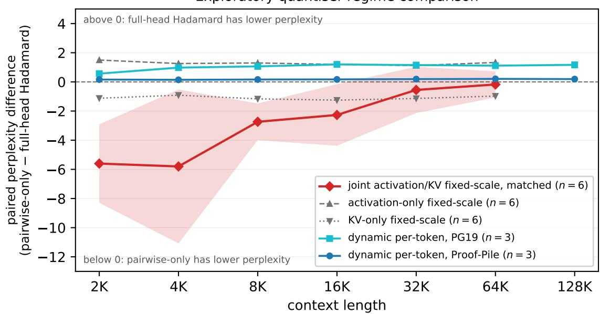
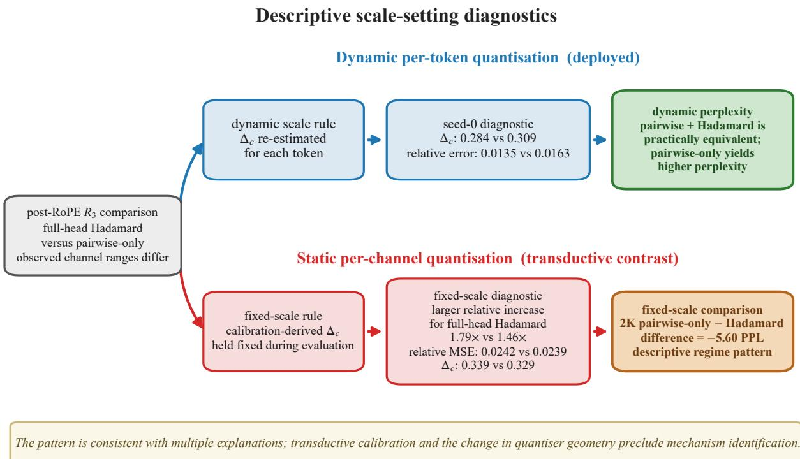

# When Local Variance Optimality Is Not Enough: RoPE-Aligned Q/K Rotations for Dynamic 4-Bit Quantisation

Shuhan Wang shuhan.wang.25@ucl.ac.uk

Nan Xu<sup>†</sup> nan.xu.25@ucl.ac.uk

Yilin Luo yilin.luo.25@ucl.ac.uk

Chi Wang Cheung<sup>†</sup> c.cheung.25@ucl.ac.uk

<sup>†</sup>Equal contribution.

## Abstract

Rotation-based post-training quantisation commonly applies an orthogonal transform across an entire attention head to reduce outlier-induced error. RoPE instead partitions each head into two-dimensional frequency pairs, raising a specific design question: can a transform that respects this decomposition improve on full-head mixing? Prior work has established the per-pair rotations that commute with RoPE. We state the converse result that, for distinct frequencies, no other single-head orthogonal map commutes with RoPE. For the head-shared parameterisation used in our experiments, we then derive the rotation angle that minimises the larger channel variance under a pooled-covariance, position-averaged surrogate and verify that the implementation attains its analytic minimum.

The evaluated head-shared pairwise configuration does not improve accuracy in the tested dynamic W4A4KV4 setting. Across four checkpoints, replacing the full-head Hadamard with this configuration increases perplexity at both short and long context lengths. Composing the pairwise rotation with the Hadamard satisfies the selected ±0.05-PPL interval criterion under the default estimator. Estimating the shared angle from K alone improves pairwise-only on every checkpoint without eliminating its gap relative to full-head mixing. The analytic objective controls a position-averaged second moment of a covariance reconstructed from concatenated calibration observations, whereas the dynamic quantiser determines its step from a tokenwise group range. The pairwise transform also provides only two-channel support for redistributing a peak. Along a controlled interpolation from two-channel to full-head mixing, K range, relative quantisation error, and perplexity degradation decrease as support increases. These results show that optimality for a structured surrogate need not reduce quantisation error when the surrogate and mixing support are misaligned with the quantiser’s scale-setting statistic.

## 1 Introduction

Low-bit post-training quantisation depends strongly on how activation outliers are presented to the quantiser (Dettmers et al., 2022). Rotation-based methods insert orthogonal transforms that redistribute activation energy while preserving the unquantised network function (Ashkboos et al., 2024b; Liu et al., 2025; Shao et al., 2025). These methods build on weight-side incoherence and transformer invariance results (Chee et al., 2023; Tseng et al., 2024; Ashkboos et al., 2024a); §8 reviews this development. For the online transform $R _ { 3 }$ applied to post-RoPE queries and keys, the relevant design choice is the mixing support: should the transform mix all channels in an attention head, or only the two channels in each RoPE frequency pair? We study this question under dynamic W4A4KV4 quantisation.

RoPE (Su et al., 2024) provides a natural motivation for pairwise mixing because it partitions every head into fixed two-dimensional subspaces. A rotation within these subspaces respects the frequency-pair decomposition and can be commuted through RoPE. Applying the same post-RoPE orthogonal map to Q and K already preserves their inner products, so commutativity is a structural constraint rather than a correctness requirement. We test whether imposing this constraint improves quantisation accuracy.

For a single head with distinct RoPE frequencies, the commuting orthogonal maps are exactly the independent planar rotations within the frequency pairs. FPTQuant (van Breugel et al., 2025) previously used this family by folding the transform into $W _ { Q }$ and $W _ { K } ;$ our theoretical contribution is the converse characterisation that excludes other single-head commuting orthogonal maps. The evaluated implementation further restricts the family by sharing one angle for each layer and frequency pair across attention heads. For this head-shared parameterisation, we derive the closed-form angle $\phi _ { k } ^ { * }$ that minimises the larger channe variance under a pooled-covariance, position-averaged surrogate. On Llama-3.2-3B, the implementation uses the checkpoint’s deployed RoPE frequencies and attains the analytic minimum of that surrogate. This construction distinguishes failure to optimise the stated local objective from failure of the optimised surrogate to improve quantisation accuracy.

The experiments exhibit the second outcome. Across the evaluated Llama and Mistral checkpoints, replacing the full-head Hadamard with the head-shared pairwise configuration increases perplexity in every short-context comparison. The same ordering holds at every evaluated long-context point, including 128K where available. Composing the pairwise rotation with the Hadamard satisfies the selected interval criterion under the default estimator. These observations establish that the optimised local surrogate does not provide the range reduction achieved by full-head mixing in the evaluated setting.

We examine two factors associated with this discrepancy. First, the default angle estimator pools Q and K calibration statistics even though K is the only stream quantised after $R _ { 3 }$ . Estimating the shared angle from K alone improves the pairwise-only configuration on all four checkpoints, although its perplexity remains higher than that of the full-head Hadamard. Second, the analytic surrogate and the quantiser operate on diferent statistics: the closed-form rotation minimises a position-averaged second moment within each pair, while the dynamic INT4 quantiser determines its step from a tokenwise range over a larger group. Pairwise rotations also have two-channel mixing support. In an interpolation that expands block-Hadamard support from one pair to a full head, K range, relative quantisation error, and perplexity degradation decrease with support size.

These findings support three contributions.

## Contributions.

• An exact local benchmark. For a single head with distinct RoPE frequencies, the RoPE-commuting orthogonal family consists of independent pairwise rotations. We attribute this family to van Breugel et al. (2025) and establish the converse characterisation. For the head-shared implementation, we derive the minimax-variance member of a pooled-covariance, position-averaged surrogate and verify attainment of its analytic minimum.

• A scoped negative result for head-shared pairwise mixing. Under dynamic W4A4KV4, the evaluated head-shared RoPE-aligned configuration yields higher perplexity than full-head Hadamard mixing across four checkpoints and all evaluated contexts. On Llama-3.2-3B, the same ordering holds for the verified surrogate optimum $\phi _ { k } ^ { * }$ . K-only estimation improves pairwise-only without reversing its ordering relative to full-head mixing.

• Evidence on proxy alignment and mixing support. The theoretical surrogate controls a pairwise, position-averaged second moment, whereas the dynamic quantiser uses a tokenwise group range to determine its scale. Along one controlled support interpolation, broader mixing is associated with lower K range, lower quantisation error, and smaller end-to-end degradation.

## 2 Problem setup: RoPE-aligned versus full-head Q/K mixing

We study the online transform $R _ { 3 }$ applied to queries and keys after RoPE. Using the same orthogonal map for both streams preserves their inner products. We impose commutativity as the structural constraint of interest and compare two support sizes: mixing within each two-dimensional RoPE frequency pair and mixing across an entire attention head.

Frequency pairs and mixing support. Fix one even-dimensional head, $d _ { h } = 2 K$ , with distinct RoPE frequencies $\theta _ { k }$ . Let $G ( \phi ) \in S O ( 2 )$ be a planar rotation and $\mathcal { R } _ { m } = \bigoplus _ { k = 1 } ^ { K } G ( m \theta _ { k } )$ the RoPE map at position m (Su et al., 2024). Implementations use the rotate\_half layout, in which frequency pair k occupies channels $\{ k , k + d _ { h } / 2 \}$ rather than the adjacent coordinates {2k−1, 2k}. The layouts difer by a fixed channel permutation, so the per-pair statements are invariant to this relabelling. The deployed implementation applies the rotation in each checkpoint’s native layout, as documented in Appendix A. We refer to the k-th two-dimensional subspace as a $R o P E$ frequency pair and use band only in equations and formal statements. A full-head Hadamard mixes all $d _ { h }$ channels in a head, while a pairwise transform mixes only the two channels in one frequency pair. Their mixing supports are therefore $d _ { h }$ and 2, respectively.

What the deployed quantiser measures. At this stage of the evaluated quantisation procedure, K is quantised and the post-RoPE $\mathrm { Q }$ stream is not. For each token t and channel group g, dynamic asymmetric INT4 computes the range $\boldsymbol { u } _ { t , g } - \ell _ { t , g }$ and sets $\Delta _ { t , g } = ( u _ { t , g } - \ell _ { t , g } ) / ( 2 ^ { B } - 1 )$ with $B = 4$ . The scale-setting statistic is therefore a tokenwise range over a group that spans multiple frequency pairs. It difers from a per-pair second moment averaged over positions.

The local variance objective is empirically non-trivial. A descriptive calibration pass finds nonnegligible within-pair anisotropy and correlation on every evaluated checkpoint: mean $| \rho |$ is 0.135–0.175, between 72% and 78% of (layer, head, pair) triples have $| \rho | > 0 . 0 5$ , and the mean absolute log variance ratio is 0.36–0.58. The pairwise variance objective therefore has structure to optimise; Table 6 reports the complete diagnostics.

## 3 The single-head RoPE centraliser and a pooled-covariance op-timum

With distinct frequencies, commutativity restricts each head to independent planar rotations within its RoPE frequency pairs. We first characterise this single-head family and then define the exact surrogate optimised by the head-shared implementation. The resulting angle minimises the larger channel variance under a pooled-covariance, position-averaged objective. This result provides a local analytic benchmark for the stated surrogate; it does not characterise the tokenwise range used by the quantiser or end-to-end perplexity.

The calibration collector treats samples, sequence positions, and attention heads as observation rows and accumulates their raw first and second moments. The default estimator adds the Q and K accumulators before applying a single centring operation; the alternative estimators modify only this stream-level aggregation rule. Each estimator therefore produces one covariance matrix for every layer and frequency pair. We write this matrix as $\pmb { \Sigma } ^ { ( k ) }$ , suppressing the layer index. It is the covariance of the concatenated observation rows, rather than an average of separately centred head-wise or stream-wise covariance matrices.

The analysis reuses this matrix at every deployed position. With the finite phase averages

$$
C _ { k } = \frac { 1 } { L } \sum _ { m = 0 } ^ { L - 1 } \cos ( 2 m \theta _ { k } ) , \qquad S _ { k } = \frac { 1 } { L } \sum _ { m = 0 } ^ { L - 1 } \sin ( 2 m \theta _ { k } ) ,\tag{1}
$$

we define the pooled-covariance, position-averaged surrogate

$$
\widetilde { \boldsymbol { \Sigma } } ^ { ( k ) } = \frac { 1 } { L } \sum _ { m = 0 } ^ { L - 1 } \mathcal { R } _ { m } ^ { ( k ) } \boldsymbol { \Sigma } ^ { ( k ) } ( \mathcal { R } _ { m } ^ { ( k ) } ) ^ { \top } .\tag{2}
$$

If $\pmb { \Sigma } _ { m } ^ { ( k ) }$ denotes the actual pre-RoPE covariance conditional on position $m ,$ the corresponding positionconditional quantity would instead be

$$
\frac { 1 } { L } \sum _ { m = 0 } ^ { L - 1 } \mathcal { R } _ { m } ^ { ( k ) } \Sigma _ { m } ^ { ( k ) } ( \mathcal { R } _ { m } ^ { ( k ) } ) ^ { \top } .
$$

The two expressions coincide under the additional condition $\pmb { \Sigma } _ { m } ^ { ( k ) } = \pmb { \Sigma } ^ { ( k ) }$ at every deployed position. We neither assume nor empirically establish this position-stationarity condition. All optimality statements below therefore refer to the pooled-covariance surrogate in Eq. (2).

Write $\sigma _ { 1 } ^ { 2 } , \sigma _ { 2 } ^ { 2 }$ for the diagonal of $\pmb { \Sigma } ^ { ( k ) }$ and ρ for its correlation. Within this surrogate, finite phase averaging can induce in-pair structure: $\widetilde { \pmb { \Sigma } } _ { 1 2 } ^ { ( k ) } = \frac { 1 } { 2 } ( \sigma _ { 1 } ^ { 2 } - \sigma _ { 2 } ^ { 2 } ) S _ { k } + \rho \sigma _ { 1 } \sigma _ { 2 } C _ { k }$ is generally non-zero when the channel variances difer and $S _ { k } \neq 0$ , including when the pooled pre-RoPE covariance is uncorrelated. The surrogate structure can therefore arise from variance asymmetry and finite RoPE phases rather than from the optimiser-related outlier efect documented by Ahmadian et al. (2023).

Definition 1 (Band-aligned subgroup). $\begin{array} { r } { \mathcal { B } _ { d _ { h } } : = \{ \bigoplus _ { k = 1 } ^ { K } G ( \phi _ { k } ) : \phi _ { k } \in ( - \pi , \pi ] \} \cong S O ( 2 ) ^ { d _ { h } / 2 } . } \end{array}$

Lemma 2 (Single-head RoPE centraliser). For pairwise-distinct RoPE angles $\theta _ { k } \in ( 0 , \pi )$ , the centraliser of$\{ \mathcal { R } _ { m } \} _ { m \in \mathbb { Z } }$ in $O ( d _ { h } )$ is $B _ { d _ { h } }$

The lemma characterises one attention head. Excluding cross-head mixing, its H-head direct-product extension permits

$$
R _ { 3 } = \bigoplus _ { h = 1 } ^ { H } \bigoplus _ { k = 1 } ^ { K } G ( \phi _ { h , k } ) ,
$$

with head-dependent angles. The evaluated implementation imposes the additional constraint $\phi _ { h , k } \equiv \phi _ { k }$ within each layer because it aggregates calibration rows across heads and broadcasts the resulting angle to every head. The experiments therefore evaluate a strict head-shared subfamily of the head-dependent direct-product family.

Theorem 3 (Closed-form optimum for the pooled-covariance surrogate). For fixed $\widetilde \Sigma ^ { ( k ) }$ , the following angle equalises the two diagonal entries of $G ( \phi _ { k } ) \widetilde { \Sigma } ^ { ( k ) } G ( \phi _ { k } ) ^ { \top }$ :

$$
\phi _ { k } ^ { * } = \mathrm { w r a p } _ { [ - \pi / 4 , \pi / 4 ) } \left[ { \textstyle { \frac { 1 } { 2 } } } \mathrm { a t a n } 2 \Big ( \widetilde { \pmb { \Sigma } } _ { 1 1 } ^ { ( k ) } - \widetilde { \pmb { \Sigma } } _ { 2 2 } ^ { ( k ) } , 2 \widetilde { \pmb { \Sigma } } _ { 1 2 } ^ { ( k ) } \Big ) \right] .\tag{3}
$$

It satisfies

$$
\operatorname* { m i n } _ { \phi _ { k } } \operatorname* { m a x } _ { j \in \{ 1 , 2 \} } \left[ G ( \phi _ { k } ) \widetilde { \Sigma } ^ { ( k ) } G ( \phi _ { k } ) ^ { \top } \right] _ { j j } = \frac { \sigma _ { 1 } ^ { 2 } + \sigma _ { 2 } ^ { 2 } } { 2 } .
$$

This optimum is defined with respect to the pooled-covariance surrogate; finite phase averaging preserves the trace of $\pmb { \Sigma } ^ { ( k ) }$

Proofs, the $2 \times 2$ Hadamard comparison, and the multi-head scope of Lemma 2 are in Appendix C. When the surrogate objective is recomputed from covariances reconstructed after raw-moment aggregation and from the deployed checkpoint frequencies, every evaluated $\phi _ { k } ^ { * }$ configuration attains its analytic minimum. The maximum excess is $6 . 9 0 \times 1 0 ^ { - 7 }$ under a verification tolerance of $5 \times 1 0 ^ { - 5 }$ (Appendix B, §J). This verification concerns the covariance of concatenated rows; it does not establish simultaneous equalisation of head-specific covariances or optimality over head-dependent angles.

Attention preservation constrains how the angle is applied, but not how it is estimated:

Proposition 4 (Attention preservation requires shared $\mathrm { Q / K }$ band angles). For $R _ { 3 } ^ { Q } , R _ { 3 } ^ { K } \in { \cal B } _ { d _ { h } }$ , the original relative-position attention score is preserved exactly if their angles agree in every band modulo 2π.

The matched per-pair construction of van Breugel et al. (2025) implicitly satisfies this condition. The proposition constrains application of the estimator: Q and K must receive the same angle within a matched head and frequency pair, although that angle may be estimated from either stream. Because only K is quantised at this stage, a K-derived estimator is more directly aligned with the measured quantisation pathway. We therefore test whether K-only estimation changes perplexity (§5). An observed diference establishes sensitivity to the estimator statistic; it does not, by itself, identify K-cache quantisation error as the causal pathway. This Q/K-sharing requirement is distinct from the implementation’s additional choice to share angles across attention heads.

## 4 Evaluation design

To test whether local optimality translates into lower quantisation error, we compare three matched online $\mathrm { Q } / \mathrm { K }$ transforms:

• full-head Hadamard: the baseline $R _ { 3 }$ , which mixes all $d _ { h }$ channels in a head;

• pairwise-only: the head-shared RoPE-commuting rotation used in place of the Hadamard;

• pairwise + Hadamard: the same head-shared pairwise rotation composed with the Hadamard.

In the appendix and artifact code, these transforms are named hadamard, eq\_only, and eq\_layered, re spectively.

We evaluate Llama-3.2-1B (Meta, 2024a), Llama-3.2-3B (Meta, 2024b), Llama-3.1-8B (Grattafiori et al., 2024), and Mistral-7B-v0.3 (Mistral AI, 2024), whose architecture follows Jiang et al. (2023). We use GPTQ weights (Frantar et al., 2023) with dynamic per-token W4A4KV4 activation and KV-cache quantisation. Calibration uses 128 WikiText-2 (Merity et al., 2017) sequences of length 2048 and DartQuant’s whip objective (Shao et al., 2025) for the shared ofline rotations. Within each paired comparison, all configurations use the same ofline rotations, GPTQ Hessian, calibration sample, and random seed; only $R _ { 3 }$ varies. Longcontext evaluation follows a concatenated-stream protocol on Proof-Pile (Azerbayev et al., 2022) and PG19 (Rae et al., 2020). The primary outcomes are perplexity, mean K range after $R _ { 3 }$ , and relative K quantisation error.

We report paired diferences relative to the same-seed full-head Hadamard baseline, with positive values indicating higher perplexity. Pairwise + Hadamard satisfies the manuscript’s selected ±0.05-PPL interval criterion when its complete 90% paired confidence interval lies within $[ - 0 . 0 5 , + 0 . 0 5 ]$ , corresponding to the interval form of the two one-sided tests procedure (Lakens, 2017). This threshold is an explicit reporting criterion, not a task-independent minimum important diference; all equivalence statements are therefore conditional on the selected margin. Appendix B, Table 10, reports sensitivity at ±0.02 and ±0.10 PPL. A cross-checkpoint equivalence statement is made only when every checkpoint satisfies the criterion.

We compare three estimators within the head-shared parameterisation. The default estimator $\hat { \phi } _ { k }$ adds raw $\mathrm { Q }$ and K moment accumulators across attention heads and centres the resulting observation population once before constructing one covariance for each layer and frequency pair; it then applies Eq. 3 with $( C _ { k } , S _ { k } ) =$ (1, 0). Because this aggregation weights streams by physical head count, grouped-query attention (Ainslie et al., 2023) makes 75–80% of the concatenated observations Q-derived even though only K is quantised. The K-only estimator constructs the covariance from K observations alone. On Llama-3.2-3B, the streambalanced estimator assigns Q and K equal stream-level weights to their uncentred moments before the common centring operation. The position-averaged surrogate optimum $\phi _ { k } ^ { * }$ is evaluated only on Llama-3.2- 3B, using the checkpoint’s deployed scaled RoPE frequencies and a branch-matched $\hat { \phi } _ { k }$ control to isolate the finite-phase correction.

Unless otherwise stated, confidence intervals are unadjusted, pointwise paired t intervals. The angleestimator analyses are exploratory efect-estimation analyses and are interpreted through estimated magnitudes and directional consistency across checkpoints. The twelve long-context comparisons between $\phi _ { k } ^ { * }$ and its branch-matched control form a separate multiplicity family and use Holm adjustment of two-sided $p \textmd { - }$ values (Appendix B, §J). Seed counts appear in each table caption; Appendix A documents the environments, inference conventions, and reproduction commands.

The support interpolation uses the same 3B/WikiText-2 dynamic W4A4KV4 setting and pair-interleaved block-Hadamard transforms with block size $b \in \{ 2 , 4 , 8 , 1 6 , 3 2 , 6 4 , 1 2 8 \}$ . It measures K range and relative quantisation error after $R _ { 3 }$ . Only b = 2 belongs to the commuting family; larger blocks vary support along a specific non-commuting transform path. Layout and orientation controls use one seed and are reported in Appendix B.

## 5 The evaluated head-shared configuration does not match fullhead mixing

Four-checkpoint short-context test. Table 1 answers the primary empirical question for the evaluated head-shared parameterisation. Under the default estimator, pairwise-only has higher mean perplexity than the full-head Hadamard on every checkpoint, with diferences ranging from +1.33 PPL on Llama-3.2-1B to +0.05 PPL on Mistral-7B-v0.3. For pairwise + Hadamard, the complete 90% paired confidence interval lies within the selected ±0.05-PPL criterion on every checkpoint. The replacement and composition results therefore support distinct conclusions: pairwise-only does not reproduce the perplexity of full-head mixing, whereas the composed transform satisfies the stated interval criterion. The latter conclusion is conditiona on the selected margin.

Table 1: Short-context paired perplexity diferences relative to each checkpoint’s full-head Hadamard baseline on WikiText-2 under dynamic W4A4KV4 with whip calibration, n = 6. Positive values indicate higher perplexity. Under the default estimator, pairwise + Hadamard satisfies the selected ±0.05-PPL interval criterion on every checkpoint. K-only estimation improves pairwise-only on every checkpoint without reducing its perplexity below the full-head Hadamard baseline.
<table><tr><td rowspan="2">model</td><td colspan="2">pairwise-only</td><td colspan="2">pairwise + Hadamard</td></tr><tr><td>default est.</td><td>K-only est.</td><td>default est.</td><td>K-only est.</td></tr><tr><td>Llama-3.2-1B</td><td>+1.3339</td><td>+0.8053</td><td>-0.0099</td><td>+0.0461</td></tr><tr><td>Llama-3.2-3B</td><td>+0.4835</td><td>+0.3169</td><td>+0.0053</td><td>+0.0326</td></tr><tr><td>Llama-3.1-8B</td><td>+0.1898</td><td>+0.1238</td><td>-0.0002</td><td>+0.0127</td></tr><tr><td>Mistral-7B-v0.3</td><td>+0.0538</td><td>+0.0467</td><td>-0.0015</td><td>+0.0003</td></tr></table>

Table 2: Matched Llama-3.2-3B short-context configurations on WikiText-2 under dynamic W4A4KV4 with whip calibration, $n = 6 ,$ with the angle taken from the default estimator $\hat { \phi } _ { k }$ or from the positionaveraged surrogate optimum $\phi _ { k } ^ { * }$ as indicated. The reported diference is configuration − full-head Hadamard; positive values indicate higher perplexity. The $\phi _ { k } ^ { * }$ configurations use the checkpoint’s deployed scaled RoPE frequencies.
<table><tr><td>configuration</td><td>mean PPL</td><td>gap vs Hadamard</td><td>90% CI</td></tr><tr><td>full-head Hadamard</td><td>10.1121</td><td> $n / a$ </td><td> $n / a$ </td></tr><tr><td>identity (no R3)</td><td>10.5764</td><td>+0.4643</td><td> $\left[ + 0 . 4 2 9 4 , + 0 . 4 9 9 2 \right]$ </td></tr><tr><td>pairwise-only,  $\hat { \phi } _ { k }$ </td><td>10.5956</td><td>+0.4835</td><td> $\left[ + 0 . 4 5 4 2 , + 0 . 5 1 2 8 \right]$ </td></tr><tr><td>pairwise-only,  $\phi _ { k } ^ { * }$ </td><td>10.6499</td><td>+0.5378</td><td> $[ + 0 . 5 0 7 1 , + 0 . 5 6 8 6 ]$ </td></tr><tr><td>pairwise + Hadamard,  $\phi _ { k }$ </td><td>10.1174</td><td>+0.0053</td><td> $[ - 0 . 0 0 2 6 , + 0 . 0 1 3 2 ]$ </td></tr><tr><td>pairwise + Hadamard,  $\phi _ { k } ^ { * }$ </td><td>10.1301</td><td>+0.0180</td><td> $\left[ + 0 . 0 0 5 0 , + 0 . 0 3 1 1 \right]$ </td></tr></table>

Estimator ablation within the head-shared parameterisation. Relative to the default estimator, Konly estimation reduces pairwise-only perplexity on all four checkpoints, including reductions of 0.53 PPL on Llama-3.2-1B and 0.17 PPL on Llama-3.2-3B; all four unadjusted 90% intervals for the K-only-minus-default contrast lie below zero. On Llama-3.2-3B, the stream-balanced pairwise-only estimate lies between the default and K-only estimates. Relative to identity on that checkpoint, the interval for the default pairwise-only estimator includes zero, whereas the K-only and stream-balanced estimates and their unadjusted intervals are negative. For pairwise + Hadamard, the K-only-minus-default estimates are positive on Llama-3.2-1B, Llama-3.2-3B, and Llama-3.1-8B, with intervals above zero, while the Mistral-7B-v0.3 interval includes zero. These exploratory comparisons are not adjusted for family-wise multiplicity; we therefore interpret their magnitudes and directional consistency rather than treating individual intervals as confirmatory decisions. None of the evaluated estimators reduces pairwise-only perplexity below the full-head Hadamard baseline. Complete per-seed results are reported in Appendix B, §L.

The pooled-covariance surrogate optimum on Llama-3.2-3B. The matched Llama-3.2-3B comparison gives the same ordering when the estimated angle is replaced by the verified position-averaged surrogate optimum. Pairwise-only with $\phi _ { k } ^ { * }$ has the highest mean perplexity among the reported pairwise-only configu rations despite attaining the analytic objective value, and its unadjusted paired interval relative to identity lies entirely above zero. When composed with the Hadamard, both $\phi _ { k } ^ { * }$ and $\hat { \phi } _ { k }$ satisfy the selected $\pm 0 . 0 5 \mathrm { - }$ PPL interval criterion relative to full-head Hadamard. Branch-matched, alternative-objective, and identity comparisons are reported in Appendix B.

These results motivate an examination of why the exact surrogate optimum does not transfer to the deployed quantiser.

# 6 Evidence on the discrepancy between local optimality and quantised performance

## 6.1 Empirical discrepancy

The discrepancy involves three distinct quantities: the pooled-covariance surrogate optimised in theory, the tokenwise group range used by the quantiser, and measured perplexity. The evaluated head-shared configuration attains the first objective but remains less accurate than full-head mixing. We therefore examine how the surrogate difers from the scale-setting statistic and how both relate to mixing support.

## 6.2 Objective mismatch

Theorem 3 concerns the pooled-covariance surrogate. Dynamic INT4 instead uses a tokenwise max − min range over groups that span multiple frequency pairs (§2). A quadratic moment averaged over RoPE phases can decrease while $\Delta _ { t , g }$ remains unchanged because the two statistics apply diferent operations over diferent supports. In the matched 3B comparison, $\phi _ { k } ^ { * }$ attains the surrogate minimum and has the largest pairwise only perplexity gap. This observation bounds the analytic certificate: it does not extend to the scale-setting statistic of the deployed quantiser. Recent methods address related objective mismatches directly. Hu et al. (2025) measure utilisation of the quantisation space, and Wang et al. (2025) constrain key-quantisation error relative to a query subspace. Our result provides a negative instance in which exact optimisation of a pooled, position-averaged second moment does not control the quantiser’s tokenwise group range.

Finite phase averaging also afects the interpretation of exact surrogate optimality. For high-frequency pairs, both sums $( C _ { k } , S _ { k } )$ in Eq. 1 are close to zero, so the surrogate covariance approaches isotropy and many angles are nearly optimal. The selected angular representative can then depend on a small finite-sum remainder. At $L = 2 0 4 8 .$ , 17 of the 64 deployed 3B pairs satisfy $| ( C _ { k } , S _ { k } ) | < 0 . 0 1$ , and the corresponding mean ofset $\mid \frac { 1 } { 2 }$ atan2 $\because ( S _ { k } , C _ { k } ) |$ is 0.75 radians. This conditioning issue limits the deployment interpretation of the surrogate optimum while leaving the numerical attainment check unchanged (Appendix B, §J).

## 6.3 Mixing support

Mixing support imposes a complementary structural constraint. If an orthogonal transform distributes one peak with equal magnitude across b channels, norm preservation gives the lower bound $| x | / { \sqrt { b } }$ on the resulting peak magnitude. A pairwise rotation has $b = 2 .$ , whereas a full-head Hadamard has $b = d _ { h } ;$ at $d _ { h } = 1 2 8$ , the corresponding bounds difer by approximately 8×. This statement concerns an outlier-range proxy and does not imply a bound on perplexity.

To examine mixing support along a controlled transformation path, we vary b within a pair-interleaved block-Hadamard family while retaining the calibration and evaluation protocol (Table 3). The point estimates for K range, relative K quantisation error, and perplexity diference decrease monotonically as b increases. The $b \leq 3 2$ perplexity intervals lie above the full-head Hadamard baseline, whereas the $b = 6 4$ and $b = 1 2 8$ intervals include zero. At $b = 1 2 8$ , all three outcomes approach the full-head endpoint, and the paired perplexity interval includes zero. More specifically, relative K quantisation error matches at the reported precision, while mean K range difers by 0.0011. This pattern documents a joint progression of support size and the three measured outcomes along one transformation family; it does not isolate support independently of the accompanying change in block structure.

The dependence of outlier suppression on block size is established elsewhere and is not claimed here. DuQuant (Lin et al., 2024a) rotates within blocks and then permutes channels to balance outliers across them; PeRQ (Sanjeet et al., 2026) gives a non-asymptotic analysis in which the suppression a block-Hadamard transform achieves is governed by how $\ell _ { 1 }$ mass is distributed over blocks, and recovers part of the lost suppression using the same permutation device; Jia et al. (2026) select block-diagonal rotation with tokenwise INT4 as the preferred KV-cache configuration under serving constraints. What Table 3 contributes is the post-RoPE $\mathrm { Q / K }$ instance of that axis under a dynamic per-token quantiser, with K range, relative K quantisation error and perplexity measured together along one interpolation path.

Table 3: Mixing-support interpolation for Llama-3.2-3B on WikiText-2 under dynamic W4A4KV4, using three paired seeds. The perplexity diference is the block-Hadamard configuration minus the same-seed fullhead Hadamard baseline; K diagnostics are measured after $R _ { 3 }$ . Only $b = 2$ commutes with RoPE.
<table><tr><td></td><td>b  $1 / \sqrt { b }$ </td><td>mean K range</td><td>rel. K quant. error</td><td>PPL gap [90% CI]</td><td></td></tr><tr><td></td><td>2 0.7071</td><td>14.8156</td><td>0.02306</td><td></td><td>+0.4158 [+0.3720, +0.4596]</td></tr><tr><td></td><td>4 0.5000</td><td>13.1189</td><td>0.01805</td><td>+0.2262</td><td>[+0.2069, +0.2456]</td></tr><tr><td>8</td><td>0.3536</td><td>11.5768</td><td>0.01386</td><td>+0.1373</td><td>[+0.1242, +0.1503]</td></tr><tr><td>16</td><td>0.2500</td><td>10.7337</td><td>0.01183</td><td>+0.0751</td><td>[+0.0505, +0.0996]</td></tr><tr><td>32</td><td>0.1768</td><td>10.4475</td><td>0.01123</td><td>+0.0544</td><td>[+0.0266, +0.0822]</td></tr><tr><td>64</td><td>0.1250</td><td>10.1357</td><td>0.01054</td><td>+0.0153</td><td>[-0.0286, +0.0592]</td></tr><tr><td>128</td><td>0.0884</td><td>9.6431</td><td>0.00954</td><td>+0.0039</td><td>[-0.0236, +0.0313]</td></tr><tr><td>full-head Hadamard</td><td> $n / a$ </td><td>9.6420</td><td>0.00954</td><td>0</td><td></td></tr></table>

## 6.4 What the evidence supports

Together, these analyses support a bounded interpretation. K-only estimation shows that the result is sensitive to the statistic from which the shared angle is estimated. Along the block-Hadamard interpolation, larger mixing support is accompanied by lower K range, lower relative quantisation error, and a smaller perplexity diference. This interpolation covers one checkpoint, one corpus, one context length, and one transformation path, and it leaves the RoPE-commuting family for $b > 2 .$ . It therefore supports an association within the evaluated intervention rather than a general causal attribution. The evidence identifies two relevant mismatches, namely the estimator’s second-moment proxy and the transform’s limited support, without assigning exclusive causality to either.

## 7 Robustness across models, contexts, and tasks

The preceding analysis uses a short-context Llama-3.2-3B setting. We next assess whether the pairwisereplacement ordering is stable across context lengths, corpora, checkpoints, and evaluation formats. These evaluations test robustness of the ordering and provide no additional identification of its cause.

Consistent with the short-context ordering in §5, pairwise-only has higher mean perplexity than full-head Hadamard at every evaluated long-context point under the default estimator. Table 4 includes all evaluated checkpoint–corpus combinations: Llama-3.2-3B and Llama-3.2-1B are evaluated on Proof-Pile and PG19 through 128K, and Llama-3.1-8B and Mistral-7B-v0.3 are evaluated on both corpora through 64K. Because the scored token set depends on context length, the table summarises within-length diferences and does not model perplexity as a function of length. Complete perplexities and the position-averaged contrasts are reported in Appendix B; exact per-length window counts are specified in Appendix A, §A.4.

Table 4: Ranges of evaluated within-length pairwise-only perplexity diferences relative to full-head Hadamard under the default estimator and dynamic W4A4KV4, $n = 3$ . Positive values indicate higher perplexity for pairwise-only. Each range summarises point estimates across context lengths and is not a confidence interval.
<table><tr><td>checkpoint / corpus</td><td>tested lengths</td><td>gap range</td><td>longest endpoint</td></tr><tr><td>3B / Proof-Pile</td><td>2K-128K</td><td> $+ 0 . 1 4 3 \ \mathrm { t o \ + 0 . 2 0 7 }$ </td><td>+0.193 at 128K</td></tr><tr><td>3B / PG19</td><td>2K-128K</td><td> $+ 0 . 5 6 6 ~ \mathrm { t o } ~ + 1 . 1 9 9$ </td><td>+1.169 at 128K</td></tr><tr><td>1B / Proof-Pile</td><td>2K-128K</td><td> $+ 0 . 4 1 6 ~ \mathrm { t o } ~ + 0 . 5 7 4$ </td><td>+0.513 at 128K</td></tr><tr><td>1B / PG19</td><td>2K-128K</td><td> $+ 1 . 8 1 9 \ \mathrm { t o \ + 3 . 8 6 1 }$ </td><td>+3.585 at 128K</td></tr><tr><td>8B / Proof-Pile</td><td>2K-64K</td><td> $+ 0 . 0 5 6 ~ \mathrm { t o } ~ + 0 . 0 7 6$ </td><td>+0.074 at 64K</td></tr><tr><td>8B / PG19</td><td>2K-64K</td><td> $+ 0 . 2 0 6 ~ \mathrm { t o } ~ + 0 . 4 8 0$ </td><td>+0.394 at 64K</td></tr><tr><td>Mistral / Proof-Pile</td><td>2K-64K</td><td> $+ 0 . 0 3 4 ~ \mathrm { t o } ~ + 0 . 0 5 6$ </td><td>+0.056 at 64K†</td></tr><tr><td>Mistral / PG19</td><td>2K-64K</td><td> $+ 0 . 1 1 3 \mathrm { ~ t o ~ } + 0 . 2 3 8$ </td><td> $+ 0 . 2 3 8 \mathrm { a t } 6 4 \mathrm { K } ^ { \dag }$ </td></tr></table>

<sup>†</sup> Exploratory 64K evaluation beyond the 32K context documented for Mistral-7B-v0.3 (Mistral AI, 2024).

Generation-based evaluations provide limited corroboration. In the synthetic retrieval evaluation following the NIAH format used by RULER (Hsieh et al., 2024), full-head Hadamard has higher retrieval accuracy than pairwise-only at context lengths with appreciable separation from the FP16 result; shorter-context results and the Llama-3.1-8B evaluation do not distinguish the configurations. LongBench-v2 (Bai et al., 2025) scores are at or below the four-choice random baseline and therefore provide no evidence for diferences among the transformations at this quantisation setting. Appendix B reports the complete task results.

An exploratory static per-channel control produces lower short-context perplexity for pairwise-only than for full-head Hadamard. The control estimates fixed scales from target-corpus windows that overlap the scored text and changes scale granularity from grouped per-token to per-channel quantisation. It therefore demonstrates that the observed ordering depends on the evaluated quantiser protocol, but it neither identifies the source of that dependence nor estimates out-of-sample deployment performance. Related evidence that static and dynamic quantisers can respond diferently to the same modification is reported by Chen et al. (2026b). No generation-based task evaluation was conducted for the static control, so this result is limited to perplexity under the stated protocol; complete curves and scale diagnostics are in Appendix B.

## 8 Related work

From incoherence processing to online rotations. Rotation-based post-training quantisation originates on the weight side: QuIP (Chee et al., 2023) makes weights and Hessians incoherent with random orthogonal transforms, and QuIP# (Tseng et al., 2024) replaces those transforms with the randomised Hadamard transform. The online setting studied here inherits that construction. The ofline rotations rest on the computational invariance of RMSNorm transformers established by Ashkboos et al. (2024a), which permits an orthogonal map to be folded into the weights; the online transforms are instead inserted together with their inverses. QuaRot (Ashkboos et al., 2024b) inserts Hadamard transforms into the activation path under W4A4KV4, SpinQuant (Liu et al., 2025) learns the ofline rotations, and DartQuant (Shao et al., 2025) calibrates them eficiently; we reproduce its released calibration defaults exactly, with the consequences recorded in Appendix A. Later learned and closed-form transforms retain full-head support (Sun et al., 2025; Xiang & Zhang, 2025; Akhondzadeh et al., 2025; Chen et al., 2026a), including structured factorisations whose composition still spans the head (Xu et al., 2025).

Mixing support and block rotations. Confining a transform to blocks reduces cost at the expense of mixing support, and the resulting dependence on block size has been studied directly. DuQuant (Lin et al., 2024a) rotates within blocks and permutes channels so that outlier mass is balanced across them; GSR (Cho et al., 2025) uses a training-free block-diagonal Walsh–Hadamard rotation, applied to the ofline residualstream transform rather than to the online Q/K path, at W2A16 and W2A4; PeRQ (Sanjeet et al., 2026) analyses block-Hadamard suppression non-asymptotically through the distribution of $\ell _ { 1 }$ mass over blocks; and Jia et al. (2026) adopt block-diagonal rotation with tokenwise INT4 for KV-cache serving. §6 places the RoPE frequency pair at the low-support end of that axis for post-RoPE $\mathrm { Q } / \mathrm { K }$ . Table 5 summarises the design axes of the nearest families.

Transform objectives. Many rotation designs optimise a variance or outlier proxy. OSTQuant (Hu et al., 2025) measures utilisation of the quantisation space and permits scaling alongside the orthogonal transform, while SQuat (Wang et al., 2025) constrains key-quantisation error relative to a query subspace. Closest to the present construction in analytic form, Xiao et al. (2025) derive closed-form Givens angles for W4A4 outlier smoothing under alignment and uniformity criteria, without a RoPE-pair or commutativity constraint. The present study instead derives and numerically verifies the optimum of a pooled-covariance surrogate for the implemented head-shared parameterisation, then evaluates the corresponding configurations under dynamic W4A4KV4 quantisation.

RoPE-structured transforms and concurrent work. The per-pair RoPE-commuting structure predates this work. FPTQuant (van Breugel et al., 2025) folds a scaled per-pair map into $W _ { Q }$ and $W _ { K }$ ParoQuant (Liang et al., 2026) optimises Givens rotations with channel scaling over selected channel pairs in a weight-only quantisation procedure. Pavlov (2026) propose spectral-energy rescaling and describe the per-pair RoPE-commuting form as a secondary extension, folded into $W _ { Q } , W _ { K }$ and evaluated at 1024 tokens. Yu et al. (2025) study trainable commuting angle matrices as a positional-encoding design. Lemma 2 supplies the converse result: with distinct frequencies, every single-head orthogonal map that commutes with RoPE has the per-pair form. The empirical comparison evaluates the stricter head-shared subfamily rather than the complete head-dependent direct-product family. Appendix B also reports a restricted probe of a trained and scaled FPTQuant-style component within our evaluation procedure; this probe does not constitute a reproduction of FPTQuant.

Table 5: Design axes of the nearest transform families. Mixing support is the number of channels b over which a single peak can be redistributed. FPTQuant and ParoQuant compose the pairwise rotation with channel scaling, and DuQuant and PeRQ compose the block rotation with a permutation; the present work varies block size and mixing support without introducing channel scaling or permutation.
<table><tr><td>method</td><td>placement</td><td>mixing support</td><td>fitting</td><td>quantiser</td></tr><tr><td>FPTQuant (van Breugel et al., 2025)</td><td>offline  $W _ { Q } , W _ { K }$ </td><td>RoPE pair, b=2</td><td>trained</td><td>static INT4</td></tr><tr><td>ParoQuant (Liang et al., 2026)</td><td>weight-only</td><td>channel pair, b=2</td><td>trained</td><td>weight-only</td></tr><tr><td>ART / URT (Xiao et al., 2025)</td><td>offline, activation</td><td>Givens pairs</td><td>untrained</td><td>W4A4</td></tr><tr><td>IIS-R (Pavlov, 2026)</td><td>offline, weight side</td><td>full head; per-pair</td><td>calibrated</td><td>low bit width</td></tr><tr><td>DuQuant (Lin et al., 2024a)</td><td>activation</td><td>block, permuted</td><td>calibrated</td><td>W4A4</td></tr><tr><td>PeRQ (Sanjeet et al., 2026)</td><td>activation</td><td>block, permuted</td><td>calibrated</td><td>INT4</td></tr><tr><td>GSR (Choi et al., 2025)</td><td>offline  $R _ { 1 }$ </td><td>block, b= group</td><td>untrained</td><td>W2A16/W2A4</td></tr><tr><td>RotateKV (Su et al., 2025)</td><td>pre-RoPE cache</td><td>grouped heads</td><td>calibrated</td><td>2-bit KV</td></tr><tr><td>This work</td><td>online post-RoPE</td><td>b=2 to  $b { = } d _ { h }$ </td><td>untrained</td><td>dynamic W4A4KV4</td></tr></table>

Scaling and cache-side methods. Scaling reduces a peak without redistributing it across channels and is therefore complementary: SmoothQuant (Xiao et al., 2023) and Outlier Suppression+ (Wei et al., 2023) on the activation path, AWQ (Lin et al., 2024b) on the weight side, and OmniQuant (Shao et al., 2024) on both. Closest in motivation to this work is Q-ROAR (Qiao & Huang, 2026; Qiao et al., 2025), which analyses RoPE channel bands under position interpolation and reports gains from per-band weight rescaling in quantised long-context models; it varies the scaling axis under interpolated positions, whereas we vary the rotation axis under native RoPE, so the null reported here does not bear on that result (§9). On the cache side, KVQuant (Hooper et al., 2024) introduced pre-RoPE key quantisation, establishing that the post-RoPE stream is the harder one to quantise, and with KIVI (Liu et al., 2024) sets the low-bit baselines; RotateKV (Su et al., 2025) is the nearest rotation-based method, applying a pre-RoPE grouped-head rotation with channel reordering to a 2-bit cache; PolarQuant (Wu et al., 2025) and CommVQ (Li et al., 2025) act on the stored cache in a RoPE-pair-aware form, and TurboQuant (Zandieh et al., 2026) is a data-oblivious online vector quantiser.

## 9 Limitations and conclusion

## Limitations.

1. Quantiser and method scope. The result concerns native-RoPE dynamic W4A4KV4 with the evaluated calibration procedure. Learned rotations, channel scaling, other bit widths, static deployment, and positional scaling (Peng et al., 2024) remain outside this scope. Q-ROAR (Qiao & Huang, 2026; Qiao et al., 2025) studies per-band weight rescaling under position interpolation, whereas our evaluation varies rotations under native RoPE; the present result therefore does not evaluate the Q-ROAR setting. The evaluated pairwise parameterisation shares each layer–pair angle across attention heads. Head-dependent angles $\phi _ { h , k }$ and transforms that mix across heads are untested. Among the evaluated head-shared estimators, K-only estimation yields lower perplexity than the default estimator but is not established as optimal. The surrogate optimum $\phi _ { k } ^ { * }$ is evaluated only on Llama-3.2-3B.

2. Evaluation and statistical scope. Perplexity is the primary outcome. Several NIAH comparisons are saturated near the FP16 result, and LongBench-v2 is non-discriminative at the evaluated quantisation setting. Most long-context evaluation points use three seeds. Every equivalence statement is conditional on the evaluated corpora, seeds, and selected ±0.05-PPL interval criterion.

3. Explanatory scope. The support interpolation covers Llama-3.2-3B on WikiText-2 at short context, three seeds, and one block-Hadamard transformation path; it leaves the commuting family for b > 2, and its layout and orientation controls use one seed. The static comparison is exploratory and does not identify a causal mechanism.

Conclusion. RoPE defines a precise pairwise structure for online Q/K rotations. For a single head with distinct frequencies, the commuting orthogonal family consists of independent rotations within the RoPE frequency pairs, a structure established by prior work (van Breugel et al., 2025); our converse result completes this single-head characterisation. For the implemented head-shared parameterisation, the pooled-covariance, position-averaged surrogate has a closed-form minimiser, and the implementation attains the associated surrogate minimum.

This objective-specific guarantee does not improve accuracy under dynamic W4A4KV4 quantisation in the evaluated setting. Across the tested checkpoints and context lengths, replacing the full-head Hadamard with the evaluated head-shared pairwise configuration yields higher perplexity. K-only estimation reduces this gap without eliminating it. Along the evaluated support-interpolation path, K range, relative quantisation error, and perplexity degradation decrease as mixing support approaches the full-head endpoint. This pattern is consistent with mixing support contributing to the observed diference, but it does not identify a mechanism beyond that path. The evidence separates optimality for a pooled-covariance surrogate, improvement in the quantiser’s tokenwise range statistic, and end-to-end model quality.

The broader implication is that structural alignment alone does not determine whether a rotation reduces quantisation error. A structured transform should be judged by whether its optimisation objective and its mixing support match the scale-setting rule of the quantiser in which it will be deployed.

## References

Arash Ahmadian, Saurabh Dash, Hongyu Chen, Bharat Venkitesh, Zhen Stephen Gou, Phil Blunsom, Ahmet Üstün, and Sara Hooker. Intriguing properties of quantization at scale. In Advances in Neural Information Processing Systems 36 (NeurIPS 2023), 2023. arXiv:2305.19268.

Joshua Ainslie, James Lee-Thorp, Michiel de Jong, Yury Zemlyanskiy, Federico Lebrón, and Sumit Sanghai. GQA: Training generalized multi-query transformer models from multi-head checkpoints. In Proceedings of the 2023 Conference on Empirical Methods in Natural Language Processing (EMNLP), 2023. arXiv:2305.13245.

Mohammad Sadegh Akhondzadeh, Aleksandar Bojchevski, Evangelos Eleftheriou, and Martino Dazzi. Kur-Tail: Kurtosis-based LLM quantization. In Findings of the Association for Computational Linguistics: EMNLP 2025, 2025. arXiv:2503.01483.

Saleh Ashkboos, Maximilian L. Croci, Marcelo Gennari do Nascimento, Torsten Hoefler, and James Hensman. SliceGPT: Compress large language models by deleting rows and columns. In International Conference on Learning Representations (ICLR), 2024a. arXiv:2401.15024.

Saleh Ashkboos, Amirkeivan Mohtashami, Maximilian L. Croci, Bo Li, Pashmina Cameron, Martin Jaggi, Dan Alistarh, Torsten Hoefler, and James Hensman. QuaRot: Outlier-free 4-bit inference in rotated LLMs. In Advances in Neural Information Processing Systems (NeurIPS), 2024b. arXiv:2404.00456.

Zhangir Azerbayev, Edward Ayers, and Bartosz Piotrowski. Proof-Pile: A pre-training dataset of mathematical texts. Hoskinson Center for Formal Mathematics / EleutherAI, 2022. URL https://github. com/zhangir-azerbayev/proof-pile.

Yushi Bai, Shangqing Tu, Jiajie Zhang, Hao Peng, Xiaozhi Wang, Xin Lv, Shulin Cao, Jiazheng Xu, Lei Hou, Yuxiao Dong, Jie Tang, and Juanzi Li. LongBench v2: Towards deeper understanding and reasoning on

realistic long-context multitasks. In Proceedings of the 63rd Annual Meeting of the Association for Computational Linguistics (Volume 1: Long Papers), pp. 3639–3664, 2025. doi: 10.18653/v1/2025.acl-long.183. arXiv:2412.15204.

Jerry Chee, Yaohui Cai, Volodymyr Kuleshov, and Christopher De Sa. QuIP: 2-bit quantization of large language models with guarantees. In Advances in Neural Information Processing Systems (NeurIPS), 2023. arXiv:2307.13304.

Jiale Chen, Vage Egiazarian, Roberto L. Castro, Torsten Hoefler, and Dan Alistarh. WUSH: Near-optimal adaptive transforms for LLM quantization. In International Conference on Machine Learning (ICML), 2026a. arXiv:2512.00956.

Mengzhao Chen, Yi Liu, Jiahao Wang, Yi Bin, Wenqi Shao, and Ping Luo. PrefixQuant: Eliminating outliers by prefixed tokens for large language models quantization. IEEE Transactions on Pattern Analysis and Machine Intelligence, 2026b. arXiv:2410.05265.

Euntae Choi, Sumin Song, Woosang Lim, and Sungjoo Yoo. Grouped sequency-arranged rotation: Optimizing rotation transformation for quantization for free. In Proceedings of the 63rd Annual Meeting of the Association for Computational Linguistics (ACL), Student Research Workshop, 2025. arXiv:2505.03810.

Tim Dettmers, Mike Lewis, Younes Belkada, and Luke Zettlemoyer. LLM.int8(): 8-bit matrix multiplication for transformers at scale. In Advances in Neural Information Processing Systems (NeurIPS), volume 35, pp. 30318–30332. Curran Associates, Inc., 2022. doi: 10.52202/068431-2198. arXiv:2208.07339.

Elias Frantar, Saleh Ashkboos, Torsten Hoefler, and Dan Alistarh. GPTQ: Accurate post-training quantization for generative pre-trained transformers. In International Conference on Learning Representations (ICLR), 2023. arXiv:2210.17323.

Aaron Grattafiori, Abhimanyu Dubey, Abhinav Jauhri, Abhinav Pandey, Abhishek Kadian, Ahmad Al-Dahle, Aiesha Letman, Akhil Mathur, Alan Schelten, Amy Yang, Angela Fan, et al. The Llama 3 herd of models. arXiv preprint arXiv:2407.21783, 2024.

Coleman Hooper, Sehoon Kim, Hiva Mohammadzadeh, Michael W. Mahoney, Yakun Sophia Shao, Kurt Keutzer, and Amir Gholami. KVQuant: Towards 10 million context length LLM inference with KV cache quantization. In Advances in Neural Information Processing Systems 37 (NeurIPS 2024), 2024. arXiv:2401.18079.

Cheng-Ping Hsieh, Simeng Sun, Samuel Kriman, Shantanu Acharya, Dima Rekesh, Fei Jia, Yang Zhang, and Boris Ginsburg. RULER: What’s the real context size of your long-context language models? In Conference on Language Modeling (COLM), 2024. arXiv:2404.06654.

Xing Hu, Yuan Cheng, Dawei Yang, Zhixuan Chen, Zukang Xu, Jiangyong Yu, Chen Xu, Zhihang Yuan, Zhe Jiang, and Sifan Zhou. OSTQuant: Refining large language model quantization with orthogonal and scaling transformations for better distribution fitting. In International Conference on Learning Representations (ICLR), 2025. arXiv:2501.13987.

Luyang Huang, Shuyang Cao, Nikolaus Parulian, Heng Ji, and Lu Wang. Eficient attentions for long document summarization. In Proceedings of the 2021 Conference of the North American Chapter of the Association for Computational Linguistics: Human Language Technologies (NAACL-HLT), 2021. arXiv:2104.02112.

Jinda Jia, Jisen Li, Zhongzhu Zhou, Jung Hwan Heo, Jue Wang, Tri Dao, Shuaiwen Leon Song, Ben Athiwaratkun, Chenfeng Xu, Tianyi Zhang, and Xiaoxia Wu. SAW-INT4: System-aware 4-bit KV-cache quantization for real-world LLM serving. arXiv preprint arXiv:2604.19157, 2026.

Albert Q. Jiang, Alexandre Sablayrolles, Arthur Mensch, Chris Bamford, Devendra Singh Chaplot, Diego de las Casas, Florian Bressand, Gianna Lengyel, Guillaume Lample, Lucile Saulnier, Lélio Renard Lavaud, Marie-Anne Lachaux, Pierre Stock, Teven Le Scao, Thibaut Lavril, Thomas Wang, Timothée Lacroix, and William El Sayed. Mistral 7B. arXiv preprint arXiv:2310.06825, 2023.

Daniël Lakens. Equivalence tests: A practical primer for t tests, correlations, and meta-analyses. Social Psychological and Personality Science, 8(4):355–362, 2017. doi: 10.1177/1948550617697177.

Junyan Li, Yang Zhang, Muhammad Yusuf Hassan, Talha Chafekar, Tianle Cai, Zhile Ren, Pengsheng Guo, Foroozan Karimzadeh, Colorado Reed, Chong Wang, and Chuang Gan. CommVQ: Commutative vector quantization for KV cache compression. In International Conference on Machine Learning (ICML), 2025. arXiv:2506.18879.

Yesheng Liang, Haisheng Chen, Zihan Zhang, Song Han, and Zhijian Liu. ParoQuant: Pairwise rotation quantization for eficient reasoning LLM inference. In International Conference on Learning Representations (ICLR), 2026. arXiv:2511.10645.

Haokun Lin, Haobo Xu, Yichen Wu, Jingzhi Cui, Yingtao Zhang, Linzhan Mou, Linqi Song, Zhenan Sun, and Ying Wei. DuQuant: Distributing outliers via dual transformation makes stronger quantized LLMs. In Advances in Neural Information Processing Systems (NeurIPS), 2024a. Oral; arXiv:2406.01721.

Ji Lin, Jiaming Tang, Haotian Tang, Shang Yang, Wei-Ming Chen, Wei-Chen Wang, Guangxuan Xiao, Xingyu Dang, Chuang Gan, and Song Han. AWQ: Activation-aware weight quantization for LLM compression and acceleration. In Proceedings of Machine Learning and Systems (MLSys), 2024b. arXiv:2306.00978.

Zechun Liu, Changsheng Zhao, Igor Fedorov, Bilge Soran, Dhruv Choudhary, Raghuraman Krishnamoorthi, Vikas Chandra, Yuandong Tian, and Tijmen Blankevoort. SpinQuant: LLM quantization with learned rotations. In International Conference on Learning Representations (ICLR), 2025. arXiv:2405.16406; OpenReview: ogO6DGE6FZ.

Zirui Liu, Jiayi Yuan, Hongye Jin, Shaochen Zhong, Zhaozhuo Xu, Vladimir Braverman, Beidi Chen, and Xia Hu. KIVI: A tuning-free asymmetric 2bit quantization for KV cache. In Proceedings of the 41st International Conference on Machine Learning (ICML), pp. 32332–32344, 2024. arXiv:2402.02750.

Stephen Merity, Caiming Xiong, James Bradbury, and Richard Socher. Pointer sentinel mixture models. In International Conference on Learning Representations (ICLR), 2017. arXiv:1609.07843.

Meta. Llama 3.2 1B model card. Hugging Face model card, 2024a. URL https://huggingface.co/ meta-llama/Llama-3.2-1B.

Meta. Llama 3.2 3B model card. Hugging Face model card, 2024b. URL https://huggingface.co/ meta-llama/Llama-3.2-3B.

Mistral AI. Mistral-7B-v0.3 model card. Hugging Face model card, 2024. URL https://huggingface.co/ mistralai/Mistral-7B-v0.3.

Gorgi Pavlov. Influence-inspired spectral rotations for extreme low-bit LLM quantization. arXiv preprint arXiv:2605.25203, 2026.

Bowen Peng, Jefrey Quesnelle, Honglu Fan, and Enrico Shippole. YaRN: Eficient context window extension of large language models. In International Conference on Learning Representations (ICLR), 2024. arXiv:2309.00071.

Ye Qiao and Sitao Huang. Q-ROAR: Outlier-aware rescaling for RoPE position interpolation in quantized long-context LLMs. In AAAI Conference on Artificial Intelligence (AAAI), Student Abstract Track, 2026. arXiv:2509.14391.

Ye Qiao, Haocheng Xu, Xiaofan Zhang, and Sitao Huang. Rethinking RoPE scaling in quantized LLM: Theory, outlier, and channel-band analysis with weight rescaling. arXiv preprint arXiv:2510.00028, 2025.

Jack W. Rae, Anna Potapenko, Siddhant M. Jayakumar, Chloe Hillier, and Timothy P. Lillicrap. Compressive transformers for long-range sequence modelling. In International Conference on Learning Representations (ICLR), 2020. arXiv:1911.05507; introduces the PG-19 long-range language-modelling benchmark.

Sai Sanjeet, Ian Colbert, Pablo Monteagudo-Lago, Giuseppe Franco, Yaman Umuroglu, and Nicholas J. Fraser. Pushing the limits of block rotations in post-training quantization. arXiv preprint arXiv:2601.22347, 2026.

Wenqi Shao, Mengzhao Chen, Zhaoyang Zhang, Peng Xu, Lirui Zhao, Zhiqian Li, Kaipeng Zhang, Peng Gao, Yu Qiao, and Ping Luo. OmniQuant: Omnidirectionally calibrated quantization for large language models. In International Conference on Learning Representations (ICLR), 2024. arXiv:2308.13137.

Yuantian Shao, Yuanteng Chen, Peisong Wang, Jianlin Yu, Jing Lin, Yiwu Yao, Zhihui Wei, and Jian Cheng. DartQuant: Eficient rotational distribution calibration for LLM quantization. In Advances in Neural Information Processing Systems (NeurIPS), 2025. arXiv:2511.04063.

Jianlin Su, Murtadha Ahmed, Yu Lu, Shengfeng Pan, Bo Wen, and Yunfeng Liu. RoFormer: Enhanced transformer with rotary position embedding. Neurocomputing, 568:127063, 2024. doi: 10.1016/j.neucom. 2023.127063. arXiv:2104.09864.

Zunhai Su, Zhe Chen, Wang Shen, Hanyu Wei, Linge Li, Huangqi Yu, and Kehong Yuan. RotateKV: Accurate and robust 2-bit KV cache quantization for LLMs via outlier-aware adaptive rotations. In Proceedings of the International Joint Conference on Artificial Intelligence (IJCAI), 2025. arXiv:2501.16383.

Yuxuan Sun, Ruikang Liu, Haoli Bai, Han Bao, Kang Zhao, Yuening Li, Jiaxin Hu, Xianzhi Yu, Lu Hou, Chun Yuan, Xin Jiang, Wulong Liu, and Jun Yao. FlatQuant: Flatness matters for LLM quantization. In International Conference on Machine Learning (ICML), 2025. arXiv:2410.09426.

Albert Tseng, Jerry Chee, Qingyao Sun, Volodymyr Kuleshov, and Christopher De Sa. QuIP#: Even better LLM quantization with Hadamard incoherence and lattice codebooks. In International Conference on Machine Learning (ICML), 2024. arXiv:2402.04396.

Boris van Breugel, Yelysei Bondarenko, Paul Whatmough, and Markus Nagel. FPTQuant: Functionpreserving transforms for LLM quantization. In ICML 2025 Workshop on Eficient Systems for Foundation Models (ES-FoMo-III), 2025. Oral; arXiv:2506.04985. Subsequently published at ICML 2026 (main conference).

Hao Wang, Ligong Han, Kai Xu, and Akash Srivastava. SQuat: Subspace-orthogonal KV cache quantization. In Conference on Language Modeling (COLM), 2025. arXiv:2503.24358.

Xiuying Wei, Yunchen Zhang, Yuhang Li, Xiangguo Zhang, Ruihao Gong, Jinyang Guo, and Xianglong Liu. Outlier suppression+: Accurate quantization of large language models by equivalent and efective shifting and scaling. In Proceedings of the 2023 Conference on Empirical Methods in Natural Language Processing (EMNLP), pp. 1648–1665, 2023. arXiv:2304.09145.

Songhao Wu, Ang Lv, Xiao Feng, Yufei Zhang, Xun Zhang, Guojun Yin, Wei Lin, and Rui Yan. PolarQuant: Leveraging polar transformation for eficient key cache quantization and decoding acceleration. In Advances in Neural Information Processing Systems (NeurIPS), 2025. arXiv:2502.00527.

Jingyang Xiang and Sai Qian Zhang. DFRot: Achieving outlier-free and massive activation-free for rotated LLMs with refined rotation. In Conference on Language Modeling (COLM), 2025. arXiv:2412.00648.

Guangxuan Xiao, Ji Lin, Mickael Seznec, Hao Wu, Julien Demouth, and Song Han. SmoothQuant: Accurate and eficient post-training quantization for large language models. In Proceedings of the 40th International Conference on Machine Learning (ICML), pp. 38087–38099, 2023. arXiv:2211.10438.

Jinying Xiao, Bin Ji, Shasha Li, Xiaodong Liu, Jun Ma, Chao Wang, Wei Li, Ye Zhong, Xuan Xie, Nyima Tashi, and Jie Yu. Outlier smoothing with closed-form rotations for W4A4 large language model quantization. arXiv preprint arXiv:2511.22316, 2025.

Bingxin Xu, Zhen Dong, Oussama Elachqar, and Yuzhang Shang. ButterflyQuant: Ultra-low-bit LLM quantization through learnable orthogonal butterfly transforms. arXiv preprint arXiv:2509.09679, 2025.

Hao Yu, Tangyu Jiang, Shuning Jia, Shannan Yan, Shunning Liu, Haolong Qian, Guanghao Li, Shuting Dong, and Chun Yuan. ComRoPE: Scalable and robust rotary position embedding parameterized by trainable commuting angle matrices. In Proceedings of the IEEE/CVF Conference on Computer Vision and Pattern Recognition (CVPR), pp. 4508–4517, 2025. arXiv:2506.03737.

Amir Zandieh, Majid Daliri, Majid Hadian, and Vahab Mirrokni. TurboQuant: Online vector quantization with near-optimal distortion rate. In International Conference on Learning Representations (ICLR), 2026. arXiv:2504.19874.

## A Reproducibility

The commands, paths, and identifiers below describe the companion code artifact. Records retained only in the execution environment are identified explicitly; reproducing from raw outputs requires those records in addition to the compact artifact.

## A.1 Common implementation and quantisation configuration

All results are produced with a DartQuant-style W4A4KV4 post-training quantisation procedure (Shao et al., 2025). The procedure applies four rotations, following the $R _ { 1 } { - } R _ { 4 }$ taxonomy of Ashkboos et al. (2024b) and Liu et al. (2025): an ofline residual-stream rotation $R _ { 1 }$ , an ofline value/output-projection rotation $R _ { 2 }$ , an online post-RoPE $Q / K$ rotation $R _ { 3 } ,$ , and an online down-projection Hadamard transform $R _ { 4 }$ . Weights are quantised with GPTQ (Frantar et al., 2023). Unless a static-scale control is explicitly specified, activations and the KV cache use asymmetric per-token dynamic quantisation, with scales recomputed on every forward pass.

The RoPE-aligned $R _ { 3 }$ transformation is integrated at the calibration-statistics stage and at the online $Q / K$ transformation stage. In all reported comparisons, $R _ { 4 }$ remains a Hadamard transform. The default configuration is Llama-3.2-3B with head dimension $d _ { h } = 1 2 8$ , corresponding to 64 RoPE frequency pairs. Calibration uses 128 WikiText-2 sequences of length 2048. Unless otherwise stated, the reference seed is 0 (–seed 0). All quantised evaluations use –quantizer\_type int4 –w\_bits 4 –a\_bits $4 \ : \mathtt { - k _ { - } }$ bits 4 –v\_bits 4.

RoPE channel layout. The evaluated checkpoints use the Hugging Face rotate\_half layout, in which RoPE frequency pair k occupies channels $\{ k , k + d _ { h } / 2 \}$ , not the adjacent pair {2k−1, 2k} used in the statements of §3. The two layouts difer by a fixed permutation of channels, and all per-pair statements are invariant under it, but the implementation must apply the rotation in the layout the checkpoint actually uses. It does so throughout: the band rotation is applied across the two halves of the channel axis in dartquant\_v2/equalising\_r3.py, and the runtime collector (dartquant\_v2/equalising\_r3\_runtime.py) forms its covariances under the same $\left( k , k + d _ { h } / 2 \right)$ pairing. The submitted head-resolved calibration summary is docs/data\_db/paper/table1\_rho.csv; the artifact verifier checks its complete three-decimal paper values but does not reconstruct it from omitted raw activations. For the mixing-support interpolation $( \ S \mathrm { A } . 7 ) $ dartquant\_v2/block\_hadamard\_r3.py applies an explicit permutation $2 k + s \mapsto k + s d _ { h } / 2$ before forming blocks, so that the $b = 2$ block spans the two channels of one frequency pair. Cutting blocks directly on raw half-half channel indices would instead pair channels belonging to two diferent bands, which would silently break the b = 2 endpoint’s membership in the commuting family; the permutation exists to prevent that.

The reader-facing transformation names correspond to the following code identifiers:

• full-head Hadamard: hadamard, with no equalising- $R _ { 3 }$ flags;

• pairwise-only: eq\_only, using –equalising\_r3 –equalising\_r3\_no\_hadamard;

• pairwise + Hadamard: eq\_layered or eq\_r3, using –equalising\_r3 without –equalising\_r3\_no\_hadamard.

The variance objective is always selected explicitly with –equalising\_r3\_objective variance in the corresponding configurations, because the implementation otherwise defaults to linf.

The primary Llama-3.2-3B evaluations use NVIDIA A100 nodes with 40 or 80 GB of memory. The crossmodel evaluations and the separate six-seed Llama-3.2-3B evaluation use H100/H200-class nodes with A100 fallback. Both hardware pools use torch $2 . 6 . 0 \mathrm { + c u l 2 4 }$ and transformers 4.49.0. The A100 evaluations verify fast-hadamard-transform $1 . 1 . 0 ;$ the second pool uses a source build whose version tag is not confirmed. Each result directory records the source revision, software versions, and GPU model in env.json.

## A.2 Implementation of the RoPE-aligned $Q / K$ rotation

A.2.1 Calibration statistics and angle estimation. With $R _ { 1 }$ and $R _ { 2 }$ folded into the weights, one calibration forward pass records the outputs of $q _ { \mathrm { p r o j } }$ and $k _ { \mathrm { p r o j } }$ in every layer. For each stream and frequency pair, the collector folds the calibration-sample, sequence-position, and attention-head axes into one observation axis and accumulates $n , \textstyle \sum a , \textstyle \sum b , \textstyle \sum a ^ { 2 } , \textstyle \sum b ^ { 2 }$ , and $\sum a b$ in CPU float64. Under the default rule, the $\mathrm { Q }$ and K totals are added elementwise and the covariance is then formed once as

$$
{ \widehat { \boldsymbol { \Sigma } } } _ { k } = { \frac { 1 } { n } } \sum _ { i = 1 } ^ { n } x _ { i } x _ { i } ^ { \top } - { \bar { x } } { \bar { x } } ^ { \top } , \qquad x _ { i } = ( a _ { i } , b _ { i } ) ^ { \top } .
$$

This operation computes the covariance of the concatenated $\mathrm { Q } / \mathrm { K }$ observation rows. It is not an arithmetic average of separately centred head-wise or stream-wise covariance matrices; when group means difer, the common centring operation retains the corresponding between-group contribution. Because each physical head contributes the same number of calibration positions, the default Q:K observation ratios are 3:1 for Llama-3.2-3B and 4:1 for the other evaluated checkpoints. The procedure produces one covariance matrix for every layer and frequency pair.

The pooling rule is selected by –equalising\_r3\_pool:

• rows adds the raw Q and K suficient statistics and then centres once, equivalently computing the covariance of their concatenated observation rows;

• ${ \tt k } _ { - }$ only constructs the covariance from K observations alone;

• balanced averages the per-stream first and uncentred second moments with equal stream weights and then centres once. It is therefore not, in general, the arithmetic mean of the two centred stream covariances. This option changes only the statistic used to estimate the angle. Every configuration still applies one shared angle to Q and K and therefore satisfies Proposition $4 ;$ the estimator is compared in App. B, $\ S \mathrm { L }$

For the default variance objective, the implementation uses the closed-form Jacobi equalising angle $\hat { \phi } _ { k } =$ $\begin{array} { r } { \frac { 1 } { 2 } \operatorname { a t a n 2 } \Bigl ( \sigma _ { 1 , k } ^ { 2 } - \sigma _ { 2 , k } ^ { 2 } , 2 \rho _ { k } \sigma _ { 1 , k } \sigma _ { 2 , k } \Bigr ) } \end{array}$ , which is Eq. 3 evaluated at $( C _ { k } , S _ { k } ) = ( 1 , 0 )$ . The alternative objectives linf (max-channel $L _ { \infty } )$ , l2max (sum of per-channel max-squared), and quantile do not have a closed form in the implementation and are evaluated over a 200-point discretisation of $( - \pi / 4 , \pi / 4 ]$ . Candidate observations are drawn from a per-pair top-k set ranked by $| a | + | b |$

The stored angle array has shape $( \mathrm { n \_ l a y e r s } , d _ { h } / 2 ) = ( \mathrm { n \_ l a y e r s } , 6 4 )$ and is broadcast across attention heads and sequence positions. Thus $\phi _ { \ell , h , k } = \phi _ { \ell , k }$ for every head h. The implementation therefore evaluates a head-shared subset of the within-head commuting family and does not estimate head-dependent angles.

A.2.2 Online application. The implementation applies the pairwise $2 \times 2$ rotation $G ( \hat { \phi } _ { k } )$ immediately after RoPE produces $( q , k )$ . This is implemented through a runtime modification of the $Q / K$ processing module. The same per-pair angle is applied to both streams. Distinct angles $\phi _ { k } ^ { Q } \not \equiv \phi _ { k } ^ { K }$ (mod 2π) would leave attention with a non-cancelling $G ( \phi _ { k } ^ { Q } - \phi _ { k } ^ { K } )$ factor (Proposition 4) and therefore would not preserve the original attention geometry.

The online application occurs after the KV-cache quantiser has been configured. This placement is identical across all compared configurations except for the choice of $R _ { 3 }$ . The ofline rotations, GPTQ Hessian, calibration sample, and random seed are held fixed within every paired comparison.

## A.3 Short-context evaluation protocol

Short-context perplexity is evaluated on WikiText-2 under dynamic W4A4KV4 quantisation. Within each model and seed, the compared transformations use the same ofline rotations, GPTQ Hessian, calibration sequences, and random seed. Reported diferences are therefore paired within seed and isolate the online $R _ { 3 }$ transformation.

The reference invocation below compares the full-head Hadamard and pairwise + Hadamard configurations for seeds 0–2.

```shell
for SEED in 0 1 2; do
# Full-head Hadamard baseline
python dartquant_v2/run_quantize.py \
--model /path/to/meta-Llama-3.2-3B \
--loss whip --quantizer_type int4 --cal_dataset wikitext2 \
--w_bits 4 --a_bits 4 --k_bits 4 --v_bits 4 \
--seed $SEED --ppl_eval --ppl_eval_dataset wikitext2 \
--output_dir out/multiseed/whip/hadamard_seed$SEED
# Pairwise + Hadamard
python dartquant_v2/run_quantize.py \
--model /path/to/meta-Llama-3.2-3B \
--loss whip --quantizer_type int4 --cal_dataset wikitext2 \
--w_bits 4 --a_bits 4 --k_bits 4 --v_bits 4 \
--seed $SEED --ppl_eval --ppl_eval_dataset wikitext2 \
--equalising_r3 --equalising_r3_objective variance \
--output_dir out/multiseed/whip/eq_r3_seed$SEED
done
```

The scheduler-neutral script scripts/reproduction/run\_extended\_short\_context.sh records this protocol and prints its commands by default. Paired diferences are computed as ∆(eq\_r3 − hadamard) within seed, and the reported standard deviations use the sample (n−1) convention. The full-head Hadamard baseline varies by approximately 0.1 PPL across seeds in representative long-context evaluations (the 2K cross-seed sample standard deviation is 0.082–0.289 across the reported corpora, Table 11), which motivates the use of within-seed comparisons for diferences of a few hundredths of a perplexity point (the largest per-seed 3B whip diference in Table 7 is +0.0168).

The cross-model short-context evaluation applies the same protocol to Llama-3.2-1B, Llama-3.1-8B, and Mistral-7B-v0.3 by changing –model. The submitted compact view docs/data\_db/paper/table2\_null\_ short.csv records the seed-specific diferences and an explicitly named sample-standard-deviation field. The verifier recomputes that field from the three displayed seeds. Sample standard deviations use the n−1 convention throughout the manuscript.

The additional nine-seed Llama-3.2-1B comparison uses scripts/reproduction/run\_extended\_short\_ context.sh and evaluates the full-head Hadamard and pairwise + Hadamard configurations for seeds 0– 8. The angle-objective comparison uses scripts/reproduction/run\_angle\_objectives.sh. Comparisons that use references produced under a diferent source state are identified explicitly as such in Table 9 and are not used for equivalence conclusions.

## A.4 Long-context evaluation protocol

Long-context perplexity is evaluated with the concatenated-stream protocol on Proof-Pile and PG19. The compared transformations are full-head Hadamard, pairwise-only, and pairwise + Hadamard. Within each model, seed, corpus, and context length, all three configurations score identical token sequences, permitting paired perplexity comparisons.

The standard context-length set is 2048, 4096, 8192, 16384, 32768, and 65536 tokens. Llama-3.2-3B and Llama-3.2-1B are additionally evaluated at 131072 tokens. Native RoPE is used without YaRN or position interpolation. Mistral results beyond its documented 32K context window are labelled exploratory.

SEEDS="0 1 2" \   
LENGTHS=2048,4096,8192,16384,32768,65536 \   
DATASETS=proof\_pile,pg19 \   
CONFIGURATIONS="hadamard pairwise\_only pairwise\_plus\_hadamard" \

```shell
MODEL=/path/to/meta-Llama-3.2-3B \
bash scripts/reproduction/run_long_context.sh
```

The portable driver prints commands unless EXECUTE=1; no workload-manager commands are embedded. It invokes the following evaluation command for each specified configuration:

```shell
python dartquant_v2/run_quantize.py \
--model /path/to/meta-Llama-3.2-3B \
--loss whip --quantizer_type int4 --cal_dataset wikitext2 \
--w_bits 4 --a_bits 4 --k_bits 4 --v_bits 4 --seed $SEED \
--ppl_eval --ppl_eval_dataset wikitext2 \
--eval_long_context \
--long_context_datasets proof_pile \
--long_context_lengths 2048,4096,8192,16384,32768,65536 \
--long_context_stride 256 --long_context_max_docs 64 \
--long_context_output <out_dir>/long_context_eval.json \
<configuration flags>
```

The configuration-specific flags are empty for full-head Hadamard; –equalising\_r3 –equalising\_r3\_no\_hadamard –equalising\_r3\_objective variance for pairwise-only; and –equalising\_r3 –equalising\_r3\_objective variance for pairwise + Hadamard.

For memory eficiency, the language-model head is applied to hidden states in blocks of 1024 tokens. Each requested context length is evaluated independently; if a context length exceeds available memory, the output records an explicit error for that length and evaluation proceeds for the remaining lengths. The reported Llama-3.2-3B and Llama-3.2-1B 128K evaluations fit on a 40 GB A100. Llama-3.1-8B and Mistral-7B-v0.3 are reported through 64K.

The concatenated-stream evaluator scores the first min(24, ⌊N/L⌋) non-overlapping windows from the tokenised 64-document stream at each context length L. Both compared configurations therefore score byteidentical tokens at a given length. The scored token set changes with context length: Proof-Pile contributes $2 4 / 2 4 / 2 4 / 1 4 / 7 / 3 / 1$ windows at 2K–128K, whereas PG19 contributes 24 windows at every reported length through 128K (a prefix growing from 49K to 3.15M tokens). Consequently, absolute perplexities should not be compared across context lengths; the analysis uses within-length paired diferences.

## A.5 Pooled-covariance surrogate optimum: evaluation and verification

The position-averaged configurations add –equalising\_r3\_position\_averaged and specify the averaging length with –equalising\_r3\_position\_length L. In long-context evaluations, L is set to the context length being scored (2048, 32768, or 131072 in the reported comparisons), so no evaluation uses an angle averaged for a diferent deployment length.

The branch-matched controls phi\_hat\_canon\_only and phi\_hat\_canon\_layered apply the same branch reduction to $\hat { \phi } _ { k }$ . Comparisons between $\phi _ { k } ^ { * }$ and these controls therefore isolate the finite-position-averaging correction rather than the branch convention.

RoPE frequencies are obtained from the instantiated checkpoint rather than reconstructed from a base parameter. At runtime, the implementation searches the rotary-embedding modules for a materialised inv\_freq bufer of length $d _ { h } / 2$ . Execution terminates with an explicit error if no compatible bufer is found or if more than one distinct compatible bufer is present. This procedure includes checkpoint-specific frequency scaling, including the Llama-3 rope\_type rule.

Each position-averaged evaluation records the applied angles, per-pair covariances reconstructed after raw-moment aggregation, and deployed frequency vector. A separate verification procedure iterates over the registered configuration list rather than a filesystem glob, recomputes the pooled-covariance, positionaveraged surrogate objective from these stored quantities, and compares the achieved per-pair minimax variance with the analytic minimum $\bar { \lambda } _ { k }$ of Theorem 3. It writes a per-pair CSV and a summary carrying phi\_star\_verified, the worst-case excess, the tolerance, and the frequency source. Missing required verification artifacts cause the procedure to terminate with an error; configurations that do not use $\phi _ { k } ^ { * }$ are excluded by construction.

All 30 position-averaged verification records satisfy the surrogate-optimality criterion. The largest excess over the analytic minimum is $6 . 9 0 \times 1 0 ^ { - 7 }$ , compared with a tolerance of $5 \times 1 0 ^ { - 5 }$ , and every record identifies the live rotary module as the frequency source. Completeness of the evaluation set is determined by the same predicate the evaluation harness uses to decide whether a configuration must still be evaluated, so the criterion is identical for the harness and for the verification procedure. The registered primary evaluation set contains 81 manifest-defined configurations, all of which produced valid completion artifacts. A further 14 supplementary configurations (nine long-context controls and five component evaluations) also completed successfully.

Results obtained in an earlier evaluation that reconstructed frequencies from the base parameter are excluded. That construction omitted checkpoint-specific RoPE scaling and therefore implemented a diferent transformation. No reported value is derived from that evaluation.

## A.6 Static-quantisation control

The static per-channel control is enabled with DARTQUANT\_STATIC\_ACT=1, DARTQUANT\_STATIC\_CALIB=64, and DARTQUANT\_STATIC\_MATCH\_EVAL\_LEN=1. Under this condition, ActQuantizer.find\_params uses one scale per channel, estimated across the token dimension. The calibration-derived scales are then held fixed during evaluation.

For each corpus–context-length combination, the static state is reset and the scales are re-estimated from up to 64 non-overlapping windows of the target length drawn from the evaluation corpus. Calibration and scoring text therefore overlap. This protocol also changes the quantiser geometry from the default grouped per-token rule to a static per-channel rule. The comparison is consequently interpreted as a quantiser-regime contrast rather than as an identification of a causal mechanism.

```shell
SEEDS="0 1 2 3 4 5" \
DARTQUANT_STATIC_MATCH_EVAL_LEN=1 \
DARTQUANT_STATIC_ACT=1 DARTQUANT_STATIC_CALIB=64 \
DARTQUANT_STATIC_SCOPE=both \
LENGTHS=2048,4096,8192,16384,32768,65536 \
DATASETS=proof_pile \
CONFIGURATIONS="hadamard pairwise_only" \
MODEL=/path/to/meta-Llama-3.2-3B \
bash scripts/reproduction/run_long_context.sh
```

This expands to the same run\_quantize.py invocation as §A.4, with the environment variables exported and the two configuration flag sets given there. The environment variable DARTQUANT\_STATIC\_SCOPE selects which quantiser uses calibration-derived fixed scales: both holds the activation and KV-cache scales fixed; act holds the activation scales fixed while the KV-cache scales remain per-token dynamic; and kv holds the KV-cache scales fixed while the activation scales remain dynamic. The both setting reproduces the original joint static modification. The runtime modification is inactive unless the corresponding environment variable is set and does not alter the upstream DartQuant source files.

## A.7 Mixing-support interpolation

The mixing-support evaluation uses pair-interleaved block-Hadamard transformations with block sizes b ∈ {2, 4, 8, 16, 32, 64, 128}. The primary comparison includes three paired perplexity seeds and three Kdiagnostic seeds for each block size. Three reference configurations are evaluated at the same source state for each seed, and single-seed channel-layout and orientation controls are reported descriptively.

Only b = 2 belongs to the RoPE-commuting family. Larger block sizes deliberately relax commutativity to vary the number of channels over which a peak can be redistributed. Each evaluation records WikiText-2 perplexity, mean and maximum K range after $R _ { 3 }$ , the quantiser step diagnostic, and relative K quantisation error.

The complete command set is generated without an execution-system dependency by scripts/ reproduction/generate\_mixing\_support\_manifest.py:

python scripts/reproduction/generate\_mixing\_support\_manifest.py \

--output mixing\_support\_manifest.csv

The manifest contains exactly 33 unique cells: seven block sizes at three seeds, three reference transformations at three seeds, and three single-seed layout/orientation controls. Each row records the model, seed, layout, orientation, and complete method arguments and may be executed using the same run\_quantize.py prefix as $\ S \mathrm { A . 4 }$

The submitted compact aggregate and its paper values are verified entirely from files in the companion code artifact with

## python scripts/verify\_artifact.py

The verifier requires all three seeds for the primary interpolation and the corresponding references, checks the published intervals and both support endpoints, and verifies the reported monotone point-estimate trend. The single-seed layout and orientation controls are excluded from the primary intervals. Table 28 is generated directly from docs/data\_db/clean/mixing\_support.csv.

## A.8 Implementation constraints and reproducibility notes

• Model-path requirement. The DartQuant evaluation path selects model-specific handling using the substring meta in –model. A local checkpoint path must therefore contain meta (for example, .../meta-Llama-3.2-3B) for the intended evaluation branch to be used.

• Behaviour of the released $R _ { 2 }$ calibration defaults. The released DartQuant $R _ { 2 }$ calibrator (Shao et al., 2025) (calibrater/r2\_base\_qr.py, as of the public release used here; later revisions may difer) defaults to –nsamples 128 –bsz 128 –accumulation\_steps 2. The complete calibration set therefore forms one batch per epoch, and the condition (batch\_idx+1) % accumulation\_steps is never satisfied. No optimiser update is applied, and $R _ { 2 }$ remains at its random-Hadamard initialisation. The present implementation reproduces this behaviour intentionally (the $R _ { 2 }$ batch size is set to the dataset size, with a comment recording why) so that the experimental substrate matches the released method. The $R _ { 2 }$ loss trace is therefore expected to remain constant, and the saved $R _ { 2 }$ equals its initial value. Because $R _ { 2 }$ is identical across transformations within a seed, it cancels in all paired comparisons.

• Empty per-document sliding-window evaluations. Under the per-document sliding-window protocol (concat=False), a requested window longer than every document yields no scored window, and the average NLL is vacuous. Earlier code reported the value ppl = 1.0 in this case, which produced a spurious GovReport (Huang et al., 2021) ≥32K crossover. The current output records n\_docs\_scored and $\mathtt { n \_ }$ short\_skipped, and the reported long-context results use the concatenated-stream protocol, which always supplies scored tokens at the requested lengths. The earlier GovReport values at 32K and above obtained from the empty-window case are excluded.

• Concatenated-stream window cap. At each context length L, the evaluator scores the first min $( 2 4 , \lfloor N / L \rfloor )$ non-overlapping windows from the 64-document token stream. This cap limits evaluation time and is fixed by the implementation. It does not afect within-length pairing, because compared transformations score identical tokens, but it changes the scored token set across lengths (§A.4) and therefore precludes interpreting absolute perplexity as a length trend, as disclosed in $\ S 7$

• 128K memory requirement. The 131072-token evaluation is the most memory-intensive condition. Llama-3.2-3B and Llama-3.2-1B fit on a 40 GB A100 when the language-model head is applied in 1024- token blocks; no 80 GB card is required. The principal memory requirement arises from the forward pass and KV cache rather than from the language-model head. If a requested length exceeds available memory, the result file records an error for that length while preserving results for the remaining lengths. The Llama-3.1-8B and Mistral-7B-v0.3 evaluations are reported through 64K.

• Non-additivity of the fixed-scale conditions. The joint activation-and-KV fixed-scale result is not the sum of the activation-only and KV-only results. At 2K, the activation-only diference is +1.73 PPL and the KV-only diference is −1.02 PPL (sum +0.71), whereas the joint diference is −4.69 PPL in the preliminary unmatched three-seed analysis (App. B, §D). This non-additivity is descriptive. Because the protocol is transductive and changes quantiser geometry, it does not isolate an interaction mechanism or attribute the result to either stage. The preliminary 2K joint result also has substantia seed variability (sample standard deviation 3.67 at n=3); the matched six-seed estimate in Table 18 (−5.60 PPL at 2K) is the reported reference.

## A.9 Artifact and source-state provenance

The companion code artifact is a compact release rather than a copy of the execution environment. It contains the implementation, portable command drivers and manifest generators, final compact summaries, selected seed-level tables, a selective paper-number verifier, and content digests. It does not contain raw-output aggregation utilities and does not claim to rebuild every table from raw logs. It excludes machine names, scheduler identifiers, private development revisions, model weights, evaluation corpora, and superseded execution notes. Consequently, the supplied tables can be inspected and the documented configurations can be re-executed, but the ZIP alone does not reconstruct the original scheduler history.

A.9.1 Position-averaged and component evaluations. The evaluated set comprises 81 primary configurations, 23 repeated evaluations, nine additional long-context controls, and five component or precheck configurations. The companion package represents these experiments through the configuration generators and portable drivers. Their relation to the reported tables is documented in REPRODUCIBILITY.md.

• Configuration generation. scripts/reproduction/generate\_primary\_configuration\_manifest. py emits the 81 primary rows without invoking a scheduler. It records the model, configuration, seed, corpus, context-length, and method arguments used by the evaluation harness.

• Scheduler-neutral commands. scripts/reproduction/run\_extended\_short\_context.sh records the additional short-context and position-averaged configurations, while scripts/reproduction/run\_ angle\_objectives.sh records the angle-objective comparison, and scripts/reproduction/run\_long\_ context.sh records the context-length and fixed-scale commands. These scripts print commands by default and require an explicit execution setting before launching experiments.

• Verification. Position-averaged runs request the per-band objective dump, which records the achieved objective, the analytic minimum, the numerical tolerance, and the checkpoint frequency source.

• Compact data. The compact CSVs under docs/data\_db/paper/ preserve the fields documented for each mapped table in REPRODUCIBILITY.md. Coverage is table-specific: some files contain displayed per-seed values, while others contain only final summaries.

A.9.2 Angle-estimator evaluation. The angle-estimator analysis (App. B, §L) contains 77 Llama-3.2-3B configurations and 103 cross-model configurations; all listed processes terminated successfully. The companion package contains compact final views for this analysis; it does not include the raw-output aggregator. Three details govern their interpretation.

• Calibration-row budget. The activation-bank row budget is derived from an explicit byte budget rather than from available host memory, because the realised row count afects the subsampling used to derive $R _ { 1 }$ and $R _ { 2 }$ . Each evaluated configuration validates and records the model-specific row counts, ensuring that a change in the resulting rotations cannot occur without being recorded.

• Combination of forward and reverse work lists. The cross-model manifest is the union of forward and reverse evaluations over the same fixed list, producing 103 unique configurations with no conflicting duplicates. When a configuration appears in both sets, the result fields are identical and the longer execution record is retained. One result reuses a previously validated evaluation produced under the same source state, byte budget, and realised row counts; the aggregation script records this reuse explicitly.

• Source-state separation. The retained execution records distinguish the revision captured when a work list was emitted from the source state that executed it. Those development identifiers are omitted from the compact package because they are not required to use the released source. The release instead fixes the supplied implementation by file-level SHA-256 digests.

A.9.3 Package integrity. The archive-generation procedure excludes Git metadata, local outputs, scheduler-specific development launchers, and private denylist material. It writes MANIFEST.sha256 over the included files. The included archive builder can additionally emit an optional sidecar SHA-256 digest next to the ZIP. The preparation scanner and its release-specific denylist are not included in the companion package. These digests verify the supplied contents; they do not claim identity with private scheduler records that are intentionally absent.

A.9.4 Scope limitation. The companion package does not contain the raw scheduler logs or superseded status files. In the retained execution archive, twelve unsuccessful status records coexist with later schemavalid outputs; all afected configurations were subsequently evaluated successfully, and all 81 registered primary configurations are complete under the valid-output criterion. The private records are retained outside the distributed ZIP and can be consulted separately if provenance verification requires them.

## B Complete experimental data

This appendix reports the complete numerical results supporting the main text. Sections §A–§H present the detailed Llama-3.2-3B evaluations; §I presents the cross-model results for Llama-3.2-1B, Llama-3.1-8B, and Mistral-7B-v0.3; and §J–§M report the position-averaged, component, estimator, and mixing-support analyses. App. A specifies the corresponding implementation and evaluation protocols. Throughout this appendix, paired diferences are computed within seed against the full-head Hadamard configuration unless another comparator is stated explicitly.

## Common environment and experimental configuration

• Hardware and software. The primary Llama-3.2-3B evaluations use NVIDIA A100 nodes with 40 or 80 GB of memory. The cross-model evaluations and the separate six-seed Llama-3.2-3B evaluation use H100/H200-class nodes with A100 fallback. Both environments use torch 2.6.0+cu124 and transformers 4.49.0. The A100 environment verifies fast-hadamard-transform 1.1.0; the second environment uses a source build whose version tag is not confirmed. Each result directory records the source revision, software versions, and GPU model in env.json.

• Quantisation. Unless otherwise stated, all evaluations use W4A4KV4 INT4 (–quantizer\_type int4 –w\_bits 4 –a\_bits 4 –k\_bits 4 –v\_bits 4), GPTQ weight quantisation, and DartQuant asym metric per-token dynamic quantisation for activations and the KV cache. §D reports the static perchannel control.

• Calibration. The standard calibration set contains 128 WikiText-2 sequences of length 2048. The closed-form $R _ { 3 }$ angle is estimated once from this calibration pass (§4).

• Statistical reporting. Seed-level variability is reported with the sample (n−1) standard deviation. Population standard deviations emitted by the evaluation procedure are converted by multiplying by $\sqrt { n / ( n - 1 ) }$ . Unless stated otherwise, confidence intervals are 90% paired t-intervals computed within seed. The twelve position-averaged long-context contrasts in $\ S \mathrm { J }$ constitute one comparison family; their two-sided p-values use Holm adjustment. The estimator comparisons in $\ S \mathrm { L }$ are exploratory and report unadjusted 90% paired intervals. Equivalence conclusions are stated relative to the selected margin and do not imply a task-independent minimum important diference.

• Transformations. The reader-facing names are full-head Hadamard, pairwise-only, and pairwise + Hadamard. Their literal code identifiers are hadamard (no R<sub>3</sub> flags), eq\_only (–equalising\_r3 –equalising\_r3\_no\_hadamard –equalising\_r3\_objective variance), and eq\_layered ≡ eq\_r3 (–equalising\_r3 –equalising\_r3\_objective variance; the closed form composed before Hadamard), respectively. The variance objective is selected explicitly in all corresponding evaluations, because the flag otherwise defaults to linf.

• Long-context evaluation. Long-context perplexity uses the concatenated-stream protocol described in App. A, with min(24, ⌊N/L⌋) non-overlapping windows at each context length (the window cap is fixed by the implementation, not a tunable flag). Proof-Pile and PG19 are evaluated with native RoPE and no YaRN. Mistral-7B-v0.3 results beyond its documented 32K context window are labelled exploratory.

• Models. The evaluated checkpoints are Llama-3.2-1B $( d _ { h } { = } 6 4 )$ , Llama-3.2-3B $( d _ { h } = 1 2 8 $ , the primary checkpoint), Llama-3.1-8B $\left( d _ { h } = 1 2 8 \right)$ , and Mistral-7B-v0.3 $( d _ { h } = 1 2 8 $ , a second pretraining family). The local Mistral path contains the substring meta, as required by the DartQuant evaluation branch.

• Evaluation coverage. The default-estimator comparisons are complete for all reported checkpoints and contexts. The position-averaged surrogate optimum $\phi _ { k } ^ { * }$ (§J) is evaluated only on Llama-3.2-3B and uses the checkpoint’s deployed scaled RoPE frequencies. The pooling analysis (§L) evaluates the default Q/K-weighted and K-only estimators on all four checkpoints, the stream-balanced estimator on Llama-3.2-3B, and $\phi _ { k } ^ { * }$ pooling variants on Llama-3.2-3B; non-default pooling is evaluated only at short context, so no long-context claim is made about it. The $L _ { \infty }$ and high-quantile objectives are likewise restricted to 2K short-context evaluation. The matched static-scale comparison is reported through 64K (§H). LongBench-v2 results are reported only for the aggregated Llama-3.2-3B evaluation of §G: the corresponding cross-model evaluations were run at three seeds and produced the same nondiscriminative value, but were never aggregated, so no cross-model LongBench-v2 value is reported and no conclusion is drawn from it.

• Position-averaged configurations. The code identifiers eq\_only\_star and eq\_layered\_star denote pairwise-only and pairwise + Hadamard with $\phi _ { k } ^ { * }$ , frequencies read from the checkpoint’s live rotary module. phi\_hat\_canon\_only and phi\_hat\_canon\_layered denote the branch-matched $\hat { \phi } _ { k }$ controls, which apply the same branch reduction so that the diference between $\phi _ { k } ^ { * }$ and the control isolates the position-averaging correction.

## A. Intra-band calibration statistics

A descriptive calibration analysis retains the attention-head dimension and estimates one covariance matrix for every (layer, head, frequency-pair) combination. For each stream, Table 6 reports the mean absolute correlation |ρ|, the proportion of combinations with $| \rho | > 0 . 0 5$ , and the mean absolute log variance ratio $\overline { { | \log ( \sigma _ { 1 } ^ { 2 } / \sigma _ { 2 } ^ { 2 } ) | } }$ |. This analysis is distinct from the deployed angle estimator (App. A, §A.2.1), which aggregates raw moments across attention-head observation rows before constructing one covariance matrix and one angle for each (layer, frequency-pair) combination. Results are reported for all four checkpoints.

<table><tr><td>model</td><td>stream</td><td> $\overline { { | \rho | } }$ </td><td>frac  $| \rho | { > } 0 . 0 5$ </td><td>|log var-ratio|</td></tr><tr><td rowspan="2">Llama-3.2-1B</td><td>Q</td><td>0.165</td><td>0.780</td><td>0.466</td></tr><tr><td>K</td><td>0.169</td><td>0.769</td><td>0.577</td></tr><tr><td rowspan="2">Llama-3.2-3B</td><td>Q</td><td>0.141</td><td>0.734</td><td>0.402</td></tr><tr><td>K</td><td>0.159</td><td>0.748</td><td>0.534</td></tr><tr><td rowspan="2">Llama-3.1-8B</td><td>Q</td><td>0.135</td><td>0.723</td><td>0.367</td></tr><tr><td>K</td><td>0.154</td><td>0.738</td><td>0.504</td></tr><tr><td rowspan="2">Mistral-7B-v0.3</td><td>Q</td><td>0.148</td><td>0.735</td><td>0.356</td></tr><tr><td>K</td><td>0.175</td><td>0.755</td><td>0.479</td></tr></table>

Table 6: Intra-band calibration statistics by checkpoint and stream. The table reports the mean absolute correlation, the proportion of (layer, head, frequency-pair) combinations with $| \rho | > 0 . 0 5$ , and the mean absolute log variance ratio. These statistics describe the head-resolved calibration distribution and are distinct from the concatenated-row angle estimator used in the evaluated transformations.

## B. Short-context paired comparisons

Table 7 reports the three-seed Llama-3.2-3B comparison between pairwise + Hadamard and full-head Hadamard on WikiText-2 under dynamic W4A4KV4. The paired diference is $\Delta \mathrm { P P L } = \mathrm { P P L }$ (pairwise +

Hadamard) − PPL(full-head Hadamard). The corresponding Llama-3.2-1B, Llama-3.1-8B, and Mistral-7Bv0.3 results appear in §I.
<table><tr><td colspan="2">mean PPL</td><td colspan="2">paired PPL difference</td></tr><tr><td>full-head Hadamard pairwise + Hadamard</td><td></td><td>by seed  $0 / 1 / 2$ </td><td>mean ± sample sd</td></tr><tr><td>10.0823</td><td>10.0864</td><td> $- 0 . 0 0 7 8 / + 0 . 0 0 3 4 / + 0 . 0 1 6 8$ </td><td> $+ 0 . 0 0 4 1 \pm 0 . 0 1 2 3$ </td></tr></table>

Table 7: Llama-3.2-3B short-context paired comparison on WikiText-2 under dynamic W4A4KV4 with whip calibration, $n = 3 ; \pm$ is sample sd. The diference is pairwise + Hadamard minus full-head Hadamard; positive values indicate higher perplexity for pairwise + Hadamard. The 90% confidence interval lies within the selected ±0.05-PPL interval criterion.

Additional seed counts. An independent six-seed evaluation of $\hat { \phi } _ { k }$ , conducted in the cross-model software environment and paired within that environment, yields a corrected 90% confidence interval of [−0.005, +0.023] PPL under whip calibration. These values are not pooled with the three-seed results because the software environments difer. An additional nine-seed Llama-3.2-1B evaluation yields a mean paired diference of +0.0002 PPL, sample standard deviation 0.0283, and 90% confidence interval [−0.0173, +0.0178].
<table><tr><td>comparison</td><td>n</td><td>mean difference</td><td>sample sd</td><td>90% CI</td></tr><tr><td>Llama-3.2-1B, pairwise + Hadamard with</td><td>9</td><td>+0.0002</td><td>0.0283</td><td>[-0.0173, +0.0178]</td></tr></table>

Table 8: Additional nine-seed short-context interval-criterion evaluation for Llama-3.2-1B on WikiText-2 under dynamic W4A4KV4 with whip calibration. The paired diference is pairwise + Hadamard minus fullhead Hadamard. The 90% confidence interval lies within the selected ±0.05-PPL margin under the TOST interval formulation.

Angle-objective comparison. Table 9 compares the variance, $L _ { \infty } .$ , and high-quantile angle objectives. Comparisons labelled matched use configurations evaluated from the same source revision and execution state. Comparisons labelled diferent use a previously recorded full-head Hadamard or pairwise + Hadamard reference; a validation evaluation measured a 0.110-PPL diference attributable to source-state drift, so diferent-source-state comparisons are interpreted directionally and are not used to establish equivalence.
<table><tr><td>configuration</td><td>objective</td><td>comparator</td><td>source state</td><td>mean difference</td><td>sample sd</td><td>90% CI</td></tr><tr><td>pairwise-only</td><td>variance</td><td>full-head Hadamard</td><td>different</td><td>+0.4945</td><td>0.0476</td><td>[+0.4143, +0.5747]</td></tr><tr><td>pairwise-only</td><td> $L _ { \infty }$ </td><td>full-head Hadamard</td><td>different</td><td>+0.4108</td><td>0.0257</td><td>[+0.3676, +0.4541]</td></tr><tr><td>pairwise-only</td><td> $L _ { \infty }$ </td><td>pairwise-only, variance</td><td>matched</td><td>-0.0837</td><td>0.0717</td><td>[−0.2045, +0.0372]</td></tr><tr><td>pairwise-only</td><td>high-quantile</td><td>full-head Hadamard</td><td>different</td><td>+0.4264</td><td>0.0344</td><td>[+0.3684, +0.4845]</td></tr><tr><td>pairwise-only</td><td>high-quantile</td><td>pairwise-only, variance</td><td>matched</td><td>-0.0681</td><td>0.0600</td><td>[−0.1692, +0.0331]</td></tr><tr><td>pairwise + Hadamard</td><td> $L _ { \infty }$ </td><td>full-head Hadamard</td><td>different</td><td>+0.0110</td><td>0.0225</td><td>[-0.0269, +0.0489]</td></tr><tr><td>pairwise + Hadamard</td><td> $L _ { \infty }$ </td><td>pairwise + Hadamard, variance</td><td>different</td><td>+0.0005</td><td>0.0058</td><td>[-0.0093, +0.0102]</td></tr><tr><td>pairwise + Hadamard</td><td>high-quantile</td><td>full-head Hadamard</td><td>different</td><td>-0.0066</td><td>0.0232</td><td>[−0.0457, +0.0324]</td></tr><tr><td>pairwise + Hadamard</td><td>high-quantile</td><td>pairwise + Hadamard, variance</td><td>different</td><td>-0.0172</td><td>0.0032</td><td>[−0.0226, -0.0118]</td></tr></table>

Table 9: Llama-3.2-3B short-context comparison of angle objectives under dynamic W4A4KV4 with whip calibration, n = 3. Matched-source-state rows compare pairwise-only objectives within the same execution state. Rows using a diferent-source-state reference are reported as directional checks and are not used for equivalence inference.

Equivalence-margin sensitivity. Table 10 evaluates the criterion-relative conclusion at margins of ±0.02, ±0.05, and ±0.10 PPL. Equivalence at margin m is established when the complete sample-sd 90% paired confidence interval lies within $[ - m , + m ]$ . The manuscript uses m = 0.05 PPL as its primary reporting

criterion. This value is not presented as an externally validated minimum important diference; conclusions are conditional on the selected margin, and the additional columns show their sensitivity to alternative thresholds.
<table><tr><td>model</td><td>mean ∆</td><td>90% CI</td><td>±0.02</td><td>±0.05</td><td>±0.10</td></tr><tr><td> $\mathrm { L l a m a } { - 3 . 2 { - } 1 \mathrm { B } \ ( n = 9 ) }$ </td><td>+0.0002</td><td> $[ - 0 . 0 1 7 , + 0 . 0 1 8 ]$ </td><td>equivalent</td><td>equivalent</td><td>equivalent</td></tr><tr><td>Llama-3.2-3B</td><td>+0.0041</td><td> $[ - 0 . 0 1 7 , + 0 . 0 2 5 ]$ </td><td>not established</td><td>equivalent</td><td>equivalent</td></tr><tr><td> $\mathrm { L l a m a { - } 3 . 1 { - } 8 B }$ </td><td>+0.0063</td><td> $[ - 0 . 0 0 2 , + 0 . 0 1 5 ]$ </td><td>equivalent</td><td>equivalent</td><td>equivalent</td></tr><tr><td> $\mathrm { M i s t r a l { - } 7 B { - } v 0 . 3 }$ </td><td>-0.0012</td><td> $\left[ - 0 . 0 0 6 , + 0 . 0 0 4 \right]$ </td><td>equivalent</td><td>equivalent</td><td>equivalent</td></tr></table>

Table 10: Sensitivity of the TOST conclusion for pairwise + Hadamard versus full-head Hadamard under whip calibration. The Llama-3.2-1B row uses the additional $n = 9$ evaluation; the other rows use $n = 3 .$ Equivalence at margin m is established when the full 90% confidence interval lies within $[ - m , + m ]$ . All four checkpoints satisfy the selected $\pm 0 . 0 5 \mathrm { - P P L }$ criterion; the table shows that this conclusion is margindependent for Llama-3.2-3B.

## C. Long-context evaluation under dynamic quantisation

Table 11 reports concatenated-stream perplexity for Llama-3.2-3B on Proof-Pile and PG19 under dynamic per-token W4A4KV4, with three paired seeds. The compared transformations are full-head Hadamard, pairwise-only, and pairwise + Hadamard. Results are complete from 2K through 128K on both corpora; the 128K evaluations fit on the 40 GB A100 environment, so no 80 GB hardware is needed. Within every corpus and context length, the compared transformations score identical tokens.
<table><tr><td rowspan="2"></td><td colspan="3">mean PPL</td><td colspan="2">PPL difference vs Hadamard</td></tr><tr><td>full-head Hadamard pairwise-only pairwise + Hadamard</td><td></td><td></td><td></td><td>1 pairwise-only pairwise + Hadamard</td></tr><tr><td> $P r o o f  – P i l e$ </td><td></td><td></td><td></td><td></td><td></td></tr><tr><td>2K</td><td> $4 . 5 3 6 { \scriptstyle \pm . 0 8 2 }$ </td><td> $4 . 6 9 6 { \scriptstyle \pm . 0 9 5 }$ </td><td> $4 . 5 3 6 { \scriptstyle \pm . 0 7 3 }$ </td><td> $+ 0 . 1 6 1 { \scriptstyle \pm . 0 1 8 }$ </td><td> $+ 0 . 0 0 0 { \scriptstyle \pm . 0 1 5 }$ </td></tr><tr><td>4K</td><td> $3 . 5 1 6 { \scriptstyle \pm . 0 5 2 }$ </td><td> $3 . 6 5 9 { \scriptstyle \pm . 0 6 2 }$ </td><td> $3 . 5 1 4 { \scriptstyle \pm . 0 4 4 }$ </td><td> $+ 0 . 1 4 3 { \pm } . 0 1 4$ </td><td> $- 0 . 0 0 2 { \scriptstyle \pm . 0 0 8 }$ </td></tr><tr><td>8K</td><td> $3 . 6 0 6 { \scriptstyle \pm . 0 4 7 }$ </td><td>3.770±.065</td><td> $3 . 6 0 5 { \scriptstyle \pm . 0 4 6 }$ </td><td> $+ 0 . 1 6 4 { \pm } . 0 2 0$ </td><td> $- 0 . 0 0 1 { \scriptstyle \pm . 0 0 5 }$ </td></tr><tr><td>16K</td><td> $3 . 4 1 1 { \scriptstyle \pm . 0 3 9 }$ </td><td> $3 . 5 8 2 { \scriptstyle \pm . 0 4 7 }$ </td><td> $3 . 4 1 4 { \scriptstyle \pm . 0 3 6 }$ </td><td> $+ 0 . 1 7 1 { \scriptstyle \pm . 0 0 9 }$ </td><td> $+ 0 . 0 0 3 { \scriptstyle \pm . 0 0 4 }$ </td></tr><tr><td>32K</td><td> $3 . 2 9 0 { \scriptstyle \pm . 0 3 7 }$ </td><td> $3 . 4 8 1 { \scriptstyle \pm . 0 4 6 }$ </td><td> $3 . 2 9 4 { \scriptstyle \pm . 0 3 6 }$ </td><td> $+ 0 . 1 9 1 { \scriptstyle \pm . 0 1 0 }$ </td><td> $+ 0 . 0 0 4 { \scriptstyle \pm . 0 0 2 }$ </td></tr><tr><td>64K</td><td> $3 . 2 3 3 { \scriptstyle \pm . 0 2 8 }$ </td><td> $3 . 4 3 9 { \scriptstyle \pm . 0 3 6 }$ </td><td> $3 . 2 3 4 { \scriptstyle \pm . 0 2 7 }$ </td><td> $+ 0 . 2 0 7 { \scriptstyle \pm . 0 1 1 }$ </td><td> $+ 0 . 0 0 1 { \scriptstyle \pm . 0 0 1 }$ </td></tr><tr><td>128K</td><td> $2 . 9 3 3 { \scriptstyle \pm . 0 2 1 }$ </td><td> $3 . 1 2 6 { \scriptstyle \pm . 0 3 2 }$ </td><td> $2 . 9 3 7 { \scriptstyle \pm . 0 2 0 }$ </td><td> $+ 0 . 1 9 3 { \scriptstyle \pm . 0 1 6 }$ </td><td> $+ 0 . 0 0 4 { \scriptstyle \pm . 0 0 2 }$ </td></tr><tr><td>PG19</td><td></td><td></td><td></td><td></td><td></td></tr><tr><td>2K</td><td> $1 0 . 9 5 3 { \scriptstyle \pm . 2 8 9 }$ </td><td> $1 1 . 5 1 8 { \scriptstyle \pm . 3 2 4 }$ </td><td> $1 0 . 9 3 7 { \scriptstyle \pm . 2 8 2 }$ </td><td> $+ 0 . 5 6 6 { \scriptstyle \pm . 0 6 0 }$ </td><td> $- 0 . 0 1 5 { \scriptstyle \pm . 0 4 1 }$ </td></tr><tr><td>4K</td><td> $1 5 . 9 8 6 { \scriptstyle \pm . 4 1 4 }$ </td><td> $1 6 . 9 6 4 { \scriptstyle \pm . 4 9 1 }$ </td><td> $1 5 . 9 7 4 { \scriptstyle \pm . 3 9 9 }$ </td><td> $+ 0 . 9 7 9 { \scriptstyle \pm . 0 8 0 }$ </td><td> $- 0 . 0 1 2 { \scriptstyle \pm . 0 1 6 }$ </td></tr><tr><td>8K</td><td> $1 7 . 1 4 8 { \scriptstyle \pm . 4 4 2 }$ </td><td> $1 8 . 2 1 3 { \scriptstyle \pm . 4 7 6 }$ </td><td> $1 7 . 1 6 3 { \pm } . 4 2 4$ </td><td> $+ 1 . 0 6 5 { \scriptstyle \pm . 0 3 5 }$ </td><td> $+ 0 . 0 1 5 { \pm } . 0 1 9$ </td></tr><tr><td>16K</td><td> $1 6 . 5 2 7 { \scriptstyle \pm . 4 0 7 }$ </td><td> $1 7 . 7 2 6 { \scriptstyle \pm . 4 4 8 }$ </td><td> $1 6 . 5 6 0 { \scriptstyle \pm . 4 2 6 }$ </td><td> $+ 1 . 1 9 9 { \scriptstyle \pm . 0 4 2 }$ </td><td> $+ 0 . 0 3 3 { \scriptstyle \pm . 0 2 6 }$ </td></tr><tr><td>32K</td><td> $1 4 . 7 3 5 { \scriptstyle \pm . 3 5 2 }$ </td><td> $1 5 . 8 8 8 { \scriptstyle \pm . 4 0 5 }$ </td><td> $1 4 . 7 5 1 { \scriptstyle \pm . 3 8 0 }$ </td><td> $+ 1 . 1 5 3 { \scriptstyle \pm . 0 5 4 }$ </td><td> $+ 0 . 0 1 6 { \scriptstyle \pm . 0 2 9 }$ </td></tr><tr><td>64K</td><td> $1 3 . 0 5 4 { \pm } . 2 7 2$ </td><td> $1 4 . 1 6 9 { \scriptstyle \pm . 3 2 6 }$ </td><td> $1 3 . 0 5 9 { \scriptstyle \pm . 2 9 0 }$ </td><td> $+ 1 . 1 1 5 { \pm } . 0 5 6$ </td><td> $+ 0 . 0 0 5 { \scriptstyle \pm . 0 1 8 }$ </td></tr><tr><td>128K</td><td> $1 2 . 4 8 4 { \scriptstyle \pm . 3 2 4 }$ </td><td> $1 3 . 6 5 3 { \scriptstyle \pm . 4 1 0 }$ </td><td> $1 2 . 4 8 8 { \pm } . 3 4 1$ </td><td> $+ 1 . 1 6 9 { \scriptstyle \pm . 0 8 5 }$ </td><td> $+ 0 . 0 0 4 { \scriptstyle \pm . 0 1 6 }$ </td></tr></table>

Table 11: Llama-3.2-3B concatenated-stream perplexity on Proof-Pile and PG19 under dynamic W4A4KV4 with whip calibration, $n = 3 ; \pm { \mathrm { ~ i s } }$ sample sd. Diferences are computed relative to the same-seed fullhead Hadamard configuration; positive values indicate higher perplexity. Absolute perplexity should not be compared across context lengths because the scored token set changes with length; exact per-length window counts are reported in Appendix A, §A.4. Pairwise-only yields higher perplexity at every reported evaluation point through 128K.

Frequency source for the position-averaged configurations. Only position-averaged evaluations that obtain RoPE frequencies from the checkpoint’s live rotary module are included. Reconstructing frequencies

from the base parameter omits checkpoint-specific scaling and defines a diferent transformation; values obtained from that construction are excluded from all reported results, and every $\phi _ { k } ^ { * }$ value reported here comes from the deployed-frequency evaluations of §J.

## D. Static per-channel control and fixed-scale component comparison

The preliminary three-seed analysis in Table 12 uses a static per-channel quantiser in which activation and KV scales are estimated from 64 calibration forwards and retained during evaluation (DARTQUANT\_STATIC\_SCOPE $\in \{ \mathtt { b o t h } , \mathtt { a c t } , \mathtt { k v } \} ,$ ), on the same Llama-3.2-3B / Proof-Pile concatenated-stream setting as §C. Calibration length is not matched to evaluation length in this analysis. The matched six-seed comparison in Table 18 removes that length mismatch, but it continues to estimate scales from windows that are subsequently scored and changes the scale geometry from grouped per-token to per-channel quantisation. The static comparisons are consequently treated as descriptive contrasts between evaluation protocols. They do not identify the process responsible for the dynamic-quantisation result or quantify out-of-sample performance under static quantisation.

<table><tr><td rowspan="2"> $L$ </td><td colspan="3">mean PPL</td><td colspan="2">PPL difference vs Hadamard</td></tr><tr><td></td><td></td><td></td><td></td><td>full-head Hadamard pairwise-only pairwise + Hadamard pairwise-only pairwise + Hadamard</td></tr><tr><td colspan="6">joint activation-and-KV ixed-scale configuration</td></tr><tr><td>2K</td><td> $2 2 . 4 3 0 { \scriptstyle \pm 3 . 4 7 }$ </td><td> $1 7 . 7 3 8 { \pm } 1 . 2 1$ </td><td> $2 1 . 0 7 7 { \scriptstyle \pm 2 . 6 5 }$ </td><td> $\mathbf { - 4 . 6 9 2 { \scriptstyle \pm 3 . 6 7 } }$ </td><td> $- 1 . 3 5 3 { \pm } . 8 7$ </td></tr><tr><td>4K</td><td> $1 4 . 9 2 2 { \scriptstyle \pm 1 . 3 7 }$ </td><td> $1 2 . 6 5 7 { \scriptstyle \pm 0 . 3 2 }$ </td><td> $1 4 . 6 8 1 { \scriptstyle \pm 1 . 9 1 }$ </td><td> $- 2 . 2 6 5 { \pm } 1 . 4 1$ </td><td> $- 0 . 2 4 1 { \scriptstyle \pm . 5 8 }$ </td></tr><tr><td>8K</td><td> $1 4 . 8 0 8 { \scriptstyle \pm 1 . 3 0 }$ </td><td> $1 3 . 1 2 9 { \scriptstyle \pm 0 . 1 5 }$ </td><td> $1 5 . 1 0 5 { \scriptstyle \pm 1 . 7 1 }$ </td><td> $- 1 . 6 7 9 { \scriptstyle \pm 1 . 3 8 }$ </td><td> $+ 0 . 2 9 7 { \scriptstyle \pm . 4 2 }$ </td></tr><tr><td>16K</td><td> $1 2 . 7 9 1 { \scriptstyle \pm 1 . 1 5 }$ </td><td> $1 2 . 3 0 5 { \scriptstyle \pm 0 . 4 5 }$ </td><td> $1 3 . 5 4 7 { \scriptstyle \pm 1 . 4 2 }$ </td><td> $- 0 . 4 8 5 { \pm } 1 . 4 7$ </td><td> $+ 0 . 7 5 7 { \scriptstyle \pm . 3 2 }$ </td></tr><tr><td>32K</td><td> $1 1 . 7 1 4 { \pm } 1 . 1 9$ </td><td> $1 2 . 9 6 0 { \scriptstyle \pm 0 . 7 3 }$ </td><td> $1 2 . 3 2 4 { \pm } 1 . 1 5$ </td><td> $+ 1 . 2 4 6 { \scriptstyle \pm 1 . 7 4 }$ </td><td> $+ 0 . 6 1 0 { \scriptstyle \pm . 0 5 }$ </td></tr><tr><td>64K</td><td> $1 1 . 4 1 3 { \pm } 1 . 1 8$ </td><td> $1 5 . 1 7 9 { \scriptstyle \pm 2 . 4 6 }$ </td><td> $1 1 . 6 8 1 { \scriptstyle \pm 0 . 9 3 }$ </td><td> $\mathbf { + 3 . 7 6 6 { \scriptstyle \pm 2 . 7 9 } }$ </td><td> $+ 0 . 2 6 8 { \pm } . 4 2$ </td></tr></table>

Table 12: Preliminary unmatched static per-channel comparison on Llama-3.2-3B with whip calibration, $n = 3 ;$ ± is sample sd. Activation and KV scales are estimated during calibration and held fixed during evaluation. Calibration length is confounded with evaluation length; the apparent 64K reversal is therefore not used for inference.

Table 13 compares activation-only and KV-only fixed-scale conditions under the same preliminary threeseed protocol. Neither condition reproduces the joint activation-and-KV result, and the three diferences are not additive.
<table><tr><td rowspan="2"></td><td colspan="6">pairwise-only – full-head Hadamard PPL difference</td></tr><tr><td>2K</td><td>4K</td><td>8K</td><td>16K</td><td>32K</td><td>64K</td></tr><tr><td>activation-only</td><td> $+ 1 . 7 3 3 { \pm } . 3 3$ </td><td> $+ 1 . 2 9 2 { \scriptstyle \pm . 2 8 }$ </td><td> $+ 1 . 0 2 8 { \pm } . 2 6$ </td><td> $+ 0 . 9 3 5 { \pm } . 2 7$ </td><td> $+ 0 . 9 6 4 { \pm } . 2 7$ </td><td> $+ 1 . 0 3 8 { \pm } . 2 7$ </td></tr><tr><td>KV-only</td><td> $- 1 . 0 1 9 { \pm } . 0 6$ </td><td> $- 0 . 7 2 9 { \scriptstyle \pm . 1 2 }$ </td><td> $- 0 . 7 9 5 { \pm } . 1 2$ </td><td> $- 0 . 7 1 0 { \scriptstyle \pm . 1 0 }$ </td><td> $- 0 . 3 2 1 { \scriptstyle \pm . 0 9 }$ </td><td> $+ 0 . 2 7 8 { \pm } . 1 2$ </td></tr></table>

Table 13: Preliminary comparison of activation-only and KV-only fixed-scale conditions on Llama-3.2-3B with whip calibration, $n = 3 ; \pm$ is sample sd. Values are pairwise-only minus full-head Hadamard. Neither single-component condition reproduces the joint activation-and-KV fixed-scale diference.

## E. Quantiser-step and post-quantisation-error diagnostic

The quantiser diagnostic instruments ActQuantizer.find\_params without changing its numerical output. For each transformation, it records the selected per-channel step $\Delta _ { c }$ and the relative post-quantisation error $\| y - \hat { y } \| ^ { 2 } / \| y \| ^ { 2 }$ for the tensors whose scales are being determined. Each reported condition contains 39,480 quantiser evaluations.

Under dynamic per-token quantisation, the values are reported for seed 0 and the call-level observations are dependent; they therefore provide a descriptive readout rather than independent statistical replication. Under the joint static per-channel condition, values are aggregated across three seeds. The static condition

increases error for both transformations and substantially reduces the diagnostic advantage of the full-head Hadamard.  
Table 14 reports the corresponding step-size and error diagnostics for the dynamic and joint static conditions.
<table><tr><td>configuration</td><td> $\overline { { \Delta _ { c } } }$ </td><td>sd  $\Delta _ { c }$ </td><td>max  $\Delta _ { c }$ </td><td>post-quant rel-MSE</td><td>quantiser evaluations</td></tr><tr><td colspan="6">dynamic per-token rule (seed 0)</td></tr><tr><td>full-head Hadamard</td><td>0.2843</td><td>0.2188</td><td>1.800</td><td>0.01348</td><td>39,480</td></tr><tr><td>pairwise-only</td><td>0.3093</td><td>0.2774</td><td>2.329</td><td>0.01634</td><td>39,480</td></tr><tr><td colspan="6">joint activation-and-KV fixed-scale rule (3 seeds)</td></tr><tr><td>full-head Hadamard</td><td>0.3393</td><td>0.281</td><td>1.647</td><td>0.02418</td><td>39,480</td></tr><tr><td>pairwise-only</td><td>0.3288</td><td>0.265</td><td>2.875</td><td>0.02391</td><td>39,480</td></tr></table>

Table 14: Quantiser-step and relative-error diagnostic for Llama-3.2-3B with whip calibration. Dynamic values are from seed 0 and call-level observations are dependent; fixed-scale values aggregate three seeds. The diagnostic is consistent with partial absorption of the transformation-dependent range diference by dynamic scale estimation, but it is not an independent statistical test

## F. Lower-bit evaluation

Table 15 reports WikiText-2 perplexity for Llama-3.2-3B at W4A3KV4 and W3A3KV3 using three paired seeds. Absolute perplexity is highly variable at these bit widths, although within-seed diferences remove part of the shared variation. The models are substantially degraded, so the results are descriptive and do not support a general claim across bit widths (§9).
<table><tr><td>configuration</td><td>seed 0</td><td>seed 1</td><td>seed 2</td><td>mean</td><td>PPL difference vs Hadamard</td></tr><tr><td>W4A3KV4</td><td></td><td></td><td></td><td></td><td></td></tr><tr><td>full-head Hadamard</td><td>85.373</td><td>56.406</td><td>55.569</td><td>65.783</td><td> $n / a$ </td></tr><tr><td>pairwise + Hadamard</td><td>83.947</td><td>56.776</td><td>55.133</td><td>65.286</td><td>-0.497</td></tr><tr><td>pairwise-only</td><td>93.287</td><td>64.522</td><td>62.502</td><td>73.437</td><td>+7.654</td></tr><tr><td>W3A3KV3</td><td></td><td></td><td></td><td></td><td></td></tr><tr><td>full-head Hadamard</td><td>155.760</td><td>146.080</td><td>165.384</td><td>155.741</td><td> $n / a$ </td></tr><tr><td>pairwise + Hadamard</td><td>159.480</td><td>152.329</td><td>164.379</td><td>158.729</td><td>+2.988</td></tr><tr><td>pairwise-only</td><td>205.163</td><td>191.455</td><td>213.939</td><td>203.519</td><td>+47.778</td></tr></table>

Table 15: Llama-3.2-3B lower-bit evaluation on WikiText-2 with whip calibration, n = 3. The quantised models are substantially degraded; the paired diferences are reported descriptively and do not establish a general bit-width trend.

## G. Long-context task evaluations

NIAH. Table 16 reports depth-averaged NIAH retrieval accuracy for Llama-3.2-3B under dynamic quantisation. Each value averages five needle depths and 20 probes per depth. Quantised results are averaged over seeds {0, 1, 2}; the FP16 reference uses seed 0. A context length is described as discriminative when the quantised configurations are suficiently separated from the near-saturation FP16 value to permit an informative comparison; this designation is a descriptive diagnostic rather than a preregistered statistica rule. The depth-averaged values used in this table are available in docs/data\_db/paper/appG\_niah\_3b.csv; individual probe records are not included in the companion code artifact.

LongBench-v2. The same Llama-3.2-3B quantised model instances are evaluated on the 384 LongBenchv2 examples within the 64K evaluation window. Answers are scored by option log probability. The random baseline for four-choice questions is 0.25. All reported means are at or below this baseline, so the benchmark

<table><tr><td>L</td><td>FP16</td><td>full-head Hadamard</td><td>pairwise-only</td><td>pairwise + Hadamard</td><td>diagnostic status</td></tr><tr><td>4K</td><td>0.990</td><td>0.973</td><td>0.967</td><td>0.980</td><td>near FP16 saturation</td></tr><tr><td>8K</td><td>0.980</td><td>0.983</td><td>0.970</td><td>0.977</td><td>near FP16 saturation</td></tr><tr><td>16K</td><td>0.990</td><td>0.957</td><td>0.953</td><td>0.953</td><td>near FP16 saturation</td></tr><tr><td>32K</td><td>1.000</td><td>0.973</td><td>0.923</td><td>0.950</td><td>discriminative</td></tr><tr><td>64K</td><td>0.990</td><td>0.983</td><td>0.923</td><td>0.933</td><td>discriminative</td></tr></table>

Table 16: Llama-3.2-3B NIAH depth-averaged retrieval accuracy with whip calibration. The 32K and 64K evaluations provide suficient separation from the FP16 result to distinguish the quantised configurations; shorter contexts are near saturation and are therefore non-discriminative.

does not discriminate among the transformations at this quantisation point. Table 17 reports the complete per-seed results.
<table><tr><td>configuration</td><td>overall accuracy</td><td>full-head Hadamard – configuration</td><td>per-seed accuracy</td></tr><tr><td>full-head Hadamard</td><td>0.207±.011</td><td> $n / a$ </td><td>.195/.214/.214</td></tr><tr><td>pairwise-only</td><td>0.224±.021</td><td>−0.016±.030</td><td>.245/.203/.224</td></tr><tr><td>pairwise + Hadamard</td><td>0.239±.049</td><td>−0.031±.043</td><td>.203/.219/.294</td></tr></table>

Table 17: Llama-3.2-3B LongBench-v2 accuracy with whip calibration, $n = 3 ; \pm$ is sample sd. Scores are at or below the 0.25 four-choice random baseline; the evaluation is therefore non-discriminative for the compared transformations.

## H. Interpretation of the matched static-scale comparison

The matched-length six-seed analysis removes the calibration-length mismatch in Table 12. At 64K, the mean pairwise-only-minus-Hadamard diference is −0.18 PPL with sample standard deviation 0.89; this comparison does not satisfy the selected ±0.05-PPL criterion. A matched 128K result is not reported because the concatenated stream contains only one 128K window, which would further increase the overlap between scale estimation and scoring. Such overlap is present at every reported length.

For each target length in Table 18, scales are estimated from windows of that length and retained during scoring. The protocol also replaces the deployed grouped dynamic geometry with static per-channel quantisation, and the number of calibration tokens varies with context length. The results are therefore used only to assess sensitivity to quantiser protocol. They are not used as evidence of deployment performance or as identification of a causal mechanism.

Table 18: Matched static per-channel comparison on Llama-3.2-3B/Proof-Pile with whip calibration, $n = 6 ;$ ± is sample sd. Positive diferences indicate higher perplexity for pairwise-only. Scales are estimated during target-length calibration and held fixed during evaluation. Calibration overlaps the scored windows, and the per-channel geometry difers from the deployed grouped dynamic quantiser.
<table><tr><td rowspan="2">length</td><td colspan="2">joint activation-and-KV fixed scale</td><td colspan="2">pairwise-only — full-head Hadamard</td><td rowspan="2"></td></tr><tr><td>full-head Hadamard PPL</td><td>pairwise-only PPL</td><td>joint</td><td>activation-only</td></tr><tr><td>2K</td><td>19.76</td><td>14.16</td><td>-5.60±2.69</td><td>+1.50±.23</td><td>KV-only -1.12±.22</td></tr><tr><td>4K</td><td>17.48</td><td>11.68</td><td>-5.80±5.28</td><td>+1.26±.26</td><td>−0.91±.14</td></tr><tr><td>8K</td><td>15.98</td><td>13.25</td><td>-2.74±1.26</td><td>+1.30±.53</td><td>-1.16±.14</td></tr><tr><td>16K</td><td>14.63</td><td>12.36</td><td>-2.27±2.11</td><td>+1.20±.34</td><td>-1.25±.17</td></tr><tr><td>32K</td><td>13.32</td><td>12.76</td><td>-0.55±1.59</td><td>+1.12±.24</td><td>-1.14±.18</td></tr><tr><td>64K</td><td>12.56</td><td>12.38</td><td>−0.18±.89</td><td>+1.33±.14</td><td>−0.97±.28</td></tr></table>

Figure 1 compares the dynamic and matched static pairwise-only diferences across context lengths. It visualises sensitivity to quantiser protocol and does not support a direct performance comparison between the two regimes.

Exploratory quantiser-regime comparison  
  
Figure 1: Exploratory comparison across quantiser regimes. Dynamic curves use the deployed per-token rule with three paired seeds; fixed-scale curves use matched, transductive per-channel calibration with six paired seeds. Positive values indicate higher perplexity for pairwise-only than for full-head Hadamard.

Figure 2 summarises the associated scale-setting diagnostics. The measurements are descriptive because the dynamic values use one seed and the static protocol is transductive.

## I. Cross-model evaluation

The cross-model evaluation applies the same W4A4KV4 INT4 protocol to Llama-3.2-1B, Llama-3.1-8B, and Mistral-7B-v0.3, using GPTQ weights, dynamic per-token activation/KV quantisation, 128 WikiText-2 calibration sequences of length 2048, and seeds {0, 1, 2}.

Table 19 reports the short-context comparison between pairwise + Hadamard and full-head Hadamard. The Llama-3.1-8B and Mistral-7B-v0.3 confidence intervals lie within the selected ±0.05-PPL interval criterion. The original three-seed Llama-3.2-1B result is inconclusive and is superseded for equivalence inference by the independent nine-seed result in Table 8.
<table><tr><td></td><td colspan="2">mean PPL</td><td colspan="2">paired PPL difference</td></tr><tr><td>model</td><td>full-head Hadamard</td><td>pairwise + Hadamard</td><td>mean ± sample sd by seed</td><td> $0 / 1 / 2$ </td></tr><tr><td>Llama-3.2-1B</td><td>14.4268</td><td>14.4163</td><td> $- 0 . 0 1 0 5 \pm 0 . 0 3 5 9$ </td><td> $- 0 . 0 4 9 0 / - 0 . 0 0 4 8 / + 0 . 0 2 2 2$ </td></tr><tr><td>Llama-3.1-8B</td><td>7.8251</td><td>7.8314</td><td> $+ 0 . 0 0 6 3 \pm 0 . 0 0 4 9$ </td><td> $+ 0 . 0 0 4 0 / + 0 . 0 0 3 0 / + 0 . 0 1 2 0$ </td></tr><tr><td>Mistral-7B-v0.3</td><td>5.8921</td><td>5.8909</td><td> $- 0 . 0 0 1 2 \pm 0 . 0 0 3 1$ </td><td> $- 0 . 0 0 3 4 / + 0 . 0 0 2 3 / - 0 . 0 0 2 5$ </td></tr></table>

Table 19: Cross-model short-context paired diferences on WikiText-2 under dynamic W4A4KV4 with whip calibration, $n = 3 ; \pm$ is sample sd. The diference is pairwise + Hadamard minus full-head Hadamard. The Llama-3.1-8B and Mistral-7B-v0.3 intervals satisfy the selected ±0.05-PPL interval criterion; the three-seed Llama-3.2-1B result is superseded for inference by Table 8.

Table 20 reports the long-context pairwise-only diference relative to full-head Hadamard. Every withinlength mean is positive. The Mistral diferences are small and are included as cross-model context rather than as individually decisive results. Absolute perplexity and slopes are not compared across lengths.

  
Figure 2: Descriptive scale-setting diagnostic. The dynamic $\Delta _ { c }$ values are from seed 0, and individual quantiser evaluations are not independent replicates. The fixed-scale comparison is transductive and changes quantiser geometry. The figure therefore illustrates a quantiser-regime pattern rather than identifying a mechanism.

Cross-model NIAH. Depth-averaged NIAH retrieval accuracy is also evaluated on the corresponding quantised model instances (seed 0; accuracy, so higher is better). Llama-3.2-1B provides suficient separation at long context and follows the perplexity ordering: at 16K/32K/64K, full-head Hadamard obtains 0.68/0.59/0.51, pairwise-only obtains 0.53/0.47/0.36, and pairwise + Hadamard obtains 0.69/0.62/0.54. The FP16 value is approximately 1.0 at 16K. Llama-3.1-8B remains near FP16 saturation at all evaluated lengths, with all transformations between approximately 0.95 and 0.99, and therefore does not distinguish them. This is the saturation counterpart of §G. The complete model-by-length-by-depth results, including Mistral-7Bv0.3, are recorded in docs/data\_db/paper/appI\_breadth\_niah.csv.

## J. Pooled-covariance surrogate optimum with deployed RoPE frequencies (Llama-3.2-3B)

This section reports the only $\phi _ { k } ^ { * }$ evaluations used in the manuscript. All configurations use Llama-3.2- 3B, dynamic W4A4KV4, whip calibration, a single recorded software environment, and one source state. Inverse frequencies are read from the checkpoint’s live rotary module, including llama3 frequency scaling. Reconstructing frequencies from the base parameter would misstate 63 of the 64 frequency pairs, with errors of up to 32× in the lowest-frequency pairs.

Verification of the analytic optimum. For every position-averaged configuration, the verification procedure reconstructs the surrogate objective from covariances formed after raw-moment aggregation and from the deployed frequency vector, then compares the achieved per-pair minimax variance with the analytic minimum $\bar { \lambda } _ { k }$ of Theorem 3. All 30 verification records satisfy the criterion. The maximum excess over the analytic minimum, across all layers, frequency pairs, and evaluated configurations, is $6 . 9 0 \times 1 0 ^ { - 7 }$ , compared with a tolerance of $5 \times 1 0 ^ { - 5 }$

<table><tr><td rowspan="2">model / corpus</td><td colspan="6">pairwise-only – full-head Hadamard PPL difference</td></tr><tr><td>2K</td><td>4K</td><td>8K</td><td>16K</td><td>32K</td><td>64K 128K</td></tr><tr><td>1B / Proof-Pile</td><td>+0.525</td><td>+0.416</td><td>+0.456</td><td>+0.515</td><td>+0.539</td><td>+0.574 +0.513</td></tr><tr><td>1B /PG19</td><td>+1.819</td><td>+3.102</td><td>+3.401</td><td>+3.861 +3.636</td><td>+3.455</td><td>+3.585</td></tr><tr><td>8B /Proof-Pile</td><td>+0.057</td><td>+0.056</td><td>+0.072</td><td>+0.075 +0.076</td><td>+0.074</td><td> $n / a$ </td></tr><tr><td>8B / PG19</td><td>+0.206</td><td>+0.371</td><td>+0.421</td><td>+0.480</td><td>+0.459 +0.394</td><td> $n / a$ </td></tr><tr><td>Mistral / Proof-Pile</td><td>+0.043</td><td>+0.035</td><td>+0.035</td><td>+0.034</td><td>+0.038 +0.056</td><td> $n / a$ </td></tr><tr><td>Mistral / PG19</td><td>+0.113</td><td>+0.159</td><td>+0.196</td><td>+0.223</td><td>+0.189 +0.238</td><td> $n / a$ </td></tr></table>

Table 20: Cross-model concatenated-stream perplexity diferences under dynamic W4A4KV4 with whip calibration, $n = 3$ . Positive values indicate higher perplexity for pairwise-only than for full-head Hadamard. Every reported within-length mean is positive. Mistral-7B-v0.3 diferences are small and are interpreted as cross-model context rather than as individually decisive comparisons.

Applying the same verification procedure to alternative transformations yields mean minimax excesses of 0.433 for identity, 0.375 for the per-pair $\mathbf { H } _ { 2 } ,$ and 0.0246 for $\hat { \phi } _ { k }$ (raw or branch-matched alike, the branch shift being objective-preserving). The corresponding value for $\phi _ { k } ^ { * }$ is $1 . 2 6 \times 1 0 ^ { - 8 }$ . The implementation therefore reproduces the analytic ordering. End-to-end perplexity does not follow the same ordering: the positionaveraged surrogate optimum attains the analytic minimum but yields the largest short-context pairwise-only perplexity diference. §6 gives the conditioning reason why the position-averaging correction is largest, and least meaningful, on precisely the frequency pairs where $| ( C _ { k } , S _ { k } ) | \approx 0$

Conditioning of the finite-position correction. At $L = 2 0 4 8$ , 17 of the 64 deployed frequency pairs satisfy $| ( C _ { k } , S _ { k } ) | ~ < ~ 0 . 0 1$ For these pairs, | $\textstyle \frac { 1 } { 2 } \operatorname { a t a n 2 } ( S _ { k } , C _ { k } ) |$ has mean 0.75 radians and maximum 1.51 radians. At L = 8192, 25 of 64 pairs satisfy the same threshold. When both finite sums are close to zero, the position-averaged covariance is close to isotropic and many angles are nearly optimal for the variance objective. The selected branch can therefore depend strongly on the small finite-sum remainder while the objective remains nearly flat over angle. This qualifies the deployment interpretation of $\phi _ { k } ^ { * }$ without afecting the analytic verification.

Short-context comparison (2K WikiText-2). Table 21 reports per-seed WikiText-2 perplexity for the full-head Hadamard, identity, per-pair $\mathbf { H } _ { 2 } ,$ pairwise-only, and pairwise + Hadamard configurations. Table 22 reports the corresponding paired diferences, which back Table 2 of the body. The branch-matched controls are evaluated for seeds $0 \mathrm { - } 2 ;$ comparisons involving those controls therefore use the shared three-seed subset rather than the six-seed means.
<table><tr><td>configuration</td><td> $_ { \mathrm { s 0 } }$ </td><td>s1</td><td> $\mathrm { s 2 }$ </td><td> $\mathrm { s 3 }$ </td><td> $^ { \mathrm { s 4 } }$ </td><td> $\mathrm { s 5 }$ </td><td>mean</td><td> $\mathrm { s d }$ </td></tr><tr><td>full-head Hadamard</td><td>10.3690</td><td>9.7748</td><td>10.1030</td><td>10.5908</td><td>9.9134</td><td>9.9216</td><td>10.1121</td><td>0.3114</td></tr><tr><td>identity (no  $R _ { 3 } )$ </td><td>10.8305</td><td>10.2184</td><td>10.5697</td><td>11.1342</td><td>10.3311</td><td>10.3747</td><td>10.5764</td><td>0.3478</td></tr><tr><td>per-pair  $\mathbf { H } _ { 2 }$ </td><td>10.8245</td><td>10.2020</td><td>10.5264</td><td>11.0978</td><td>10.3243</td><td>10.3443</td><td>10.5532</td><td>0.3436</td></tr><tr><td>pairwise-only,  $\hat { \phi } _ { k }$ </td><td>10.8570</td><td>10.2054</td><td>10.5943</td><td>11.1317</td><td>10.3851</td><td>10.4001</td><td>10.5956</td><td>0.3437</td></tr><tr><td>pairwise-only,  $\phi _ { k } ^ { * }$ </td><td>10.9367</td><td>10.2610</td><td>10.6261</td><td>11.1793</td><td>10.4607</td><td>10.4358</td><td>10.6499</td><td>0.3452</td></tr><tr><td>pairwise + Hadamard,  $\hat { \phi } _ { k }$ </td><td>10.3724</td><td>9.7916</td><td>10.0952</td><td>10.6043</td><td>9.9101</td><td>9.9309</td><td>10.1174</td><td>0.3119</td></tr><tr><td>pairwise + Hadamard,  $\phi _ { k } ^ { * }$ </td><td>10.3690</td><td>9.8161</td><td>10.1120</td><td>10.6202</td><td>9.9188</td><td>9.9447</td><td>10.1301</td><td>0.3083</td></tr><tr><td>branch-matched controls (seeds 0−2)</td><td></td><td></td><td></td><td></td><td></td><td></td><td></td><td></td></tr><tr><td>branch-matched pairwise-only,  $\hat { \phi } _ { k }$ </td><td>10.9052</td><td>10.2581</td><td>10.6349</td><td> $n / a$ </td><td> $n / a$ </td><td> $n / a$ </td><td>10.5994</td><td>0.3250</td></tr><tr><td>branch-matched pairwise + Hadamard,  $\hat { \phi } _ { k }$ </td><td>10.3747</td><td>9.7889</td><td>10.1170</td><td> $n / a$ </td><td> $n / a$ </td><td> $n / a$ </td><td>10.0935</td><td>0.2936</td></tr></table>

Table 21: Per-seed WikiText-2 perplexity for Llama-3.2-3B under dynamic W4A4KV4 with whip calibration. The primary transformations use six seeds; branch-matched controls use seeds 0–2. The table supports the short-context comparison in Table 2.

<table><tr><td>configuration</td><td>comparator</td><td>n</td><td>mean difference</td><td>sample sd</td><td>90%CI</td></tr><tr><td>identity (no  $R _ { 3 } )$ </td><td>full-head Hadamard</td><td>6</td><td>+0.4643</td><td>0.0424</td><td>[+0.4294, +0.4992]</td></tr><tr><td>per-pair H2</td><td>full-head Hadamard</td><td>6</td><td>+0.4411</td><td>0.0355</td><td>[+0.4119,+0.4703]</td></tr><tr><td>pairwise-only,  $\hat { \phi } _ { k }$ </td><td>full-head Hadamard</td><td>6</td><td>+0.4835</td><td>0.0356</td><td>[+0.4542, +0.5128]</td></tr><tr><td>pairwise-only,  $\phi _ { k } ^ { * }$ </td><td>full-head Hadamard</td><td>6</td><td>+0.5378</td><td>0.0374</td><td>[+0.5071, +0.5686]</td></tr><tr><td>pairwise + Hadamard,  $\hat { \phi } _ { k }$ </td><td>full-head Hadamard</td><td>6</td><td>+0.0053</td><td>0.0096</td><td>[−0.0026, +0.0132]</td></tr><tr><td>pairwise + Hadamard,  $\phi _ { k } ^ { * }$ </td><td>full-head Hadamard</td><td>6</td><td>+0.0180</td><td>0.0159</td><td>[+0.0050, +0.0311]</td></tr><tr><td>branch-matched pairwise-only  $\hat { \phi } _ { k }$ </td><td>pairwise-only,  $\hat { \phi } _ { k }$ </td><td>3</td><td>+0.0472</td><td>0.0061</td><td>[+0.0369, +0.0575]</td></tr><tr><td> $\phi _ { k } ^ { * }$  pairwise-only,</td><td>branch-matched pairwise-only,  $\hat { \phi } _ { k }$ </td><td>3</td><td>+0.0085</td><td>0.0207</td><td>[−0.0264, +0.0435]</td></tr><tr><td>branch-matched pairwise + Hadamard,  $\hat { \phi } _ { k }$ </td><td>pairwise + Hadamard, φk</td><td>3</td><td>+0.0071</td><td>0.0129</td><td>[-0.0147, +0.0290]</td></tr><tr><td>pairwise + Hadamard, φk</td><td>branch-matched pairwise + Hadamard,</td><td>3</td><td>+0.0055</td><td>0.0188</td><td>[−0.0262, +0.0372]</td></tr></table>

Table 22: Paired short-context perplexity diferences for the position-averaged analysis. Standard deviations use the sample convention, and intervals are 90% paired t-intervals. Both pairwise + Hadamard comparisons against full-head Hadamard lie within the selected ±0.05-PPL interval criterion. Three of the four branchcontrol comparisons also satisfy this criterion; the interval for branch-matched minus raw pairwise-only $\hat { \phi } _ { k }$ extends to +0.0575 PPL.

Long-context comparison. Table 23 reports mean concatenated-stream perplexity at 2K, 32K, and 128K. Each $\phi _ { k } ^ { * }$ configuration uses the averaging length at which it is evaluated. Independent evaluations of the full-head Hadamard, pairwise-only $\hat { \phi } _ { k }$ , and pairwise + Hadamard $\hat { \phi } _ { k }$ configurations agree with the corresponding Table 11 values to all printed digits across all 18 model-seed-corpus-length combinations. The two result sets are therefore directly comparable at the reported precision. Table 24 reports the paired $\phi _ { k } ^ { * }$ comparisons and the Holm adjustment of their two-sided p-values.
<table><tr><td></td><td></td><td colspan="3">pairwise-only</td><td colspan="3">pairwise + Hadamard</td></tr><tr><td>L</td><td>full-head Hadamard</td><td> $\hat { \phi } _ { k }$ </td><td>branch-matched  $\hat { \phi } _ { k }$ </td><td> $\phi _ { k } ^ { * }$ </td><td> $\hat { \phi } _ { k }$ </td><td>branch-matched  $\hat { \phi } _ { k }$ </td><td> $\phi _ { k } ^ { * }$ </td></tr><tr><td>Proof-Pile</td><td></td><td></td><td></td><td></td><td></td><td></td><td></td></tr><tr><td>2K</td><td>4.5357</td><td>4.6963</td><td>4.7358</td><td>4.7342</td><td>4.5358</td><td>4.5347</td><td>4.5381</td></tr><tr><td>32K</td><td>3.2902</td><td>3.4812</td><td>3.4887</td><td>3.4931</td><td>3.2938</td><td>3.2972</td><td>3.2944</td></tr><tr><td>128K</td><td>2.9331</td><td>3.1257</td><td>3.1207</td><td>3.1093</td><td>2.9370</td><td>2.9356</td><td>2.9388</td></tr><tr><td>PG19</td><td></td><td></td><td></td><td></td><td></td><td></td><td></td></tr><tr><td>2K</td><td>10.9528</td><td>11.5183</td><td>11.5813</td><td>11.5683</td><td>10.9373</td><td>10.9760</td><td>10.9546</td></tr><tr><td>32K</td><td>14.7352</td><td>15.8883</td><td>15.9415</td><td>15.8977</td><td>14.7511</td><td>14.7505</td><td>14.7574</td></tr><tr><td>128K</td><td>12.4838</td><td>13.6527</td><td>13.5616</td><td>13.5370</td><td>12.4875</td><td>12.4933</td><td>12.4912</td></tr></table>

Table 23: Mean concatenated-stream perplexity for Llama-3.2-3B under dynamic W4A4KV4 with whip calibration, $n = 3$ . Position-averaged surrogate configurations use the context length at which they are evaluated. Absolute perplexity should not be compared across lengths. These values support the longcontext comparisons in $\ S 7$

## K. Local FPTQuant-style Q/K component (Llama-3.2-3B)

Table 25 reports a local FPTQuant-style (van Breugel et al., 2025) per-pair Q/K component implemented within the dynamic W4A4KV4 evaluation procedure used in this paper. All compared components use 128 optimisation steps, learning rate 0.02, and 128 calibration sequences divided into 112 optimisation and 16 held-out sequences. Q and K use the same fake-quantisation settings. The table reports the objective at the first and final optimisation steps together with held-out final-token logit MSE.

Scope. This component is an independent reimplementation of an FPTQuant-style local map and is not a reproduction of FPTQuant. It therefore does not bear on the results reported for that method. A single-seed comparison at 32, 128, and 512 optimisation steps yields perplexities 10.9755/11.0653/12.0509. Repeating the 128-step condition at the same seed changes both the optimisation trace and perplexity by more than 0.12 PPL, which exceeds the observed 32 → 128 step diference. The deterministic portions of the procedure reproduce exactly, localising this variability to the component optimisation. For this reason, the manuscript does not interpret these values as an optimisation-budget trend.

<table><tr><td>corpus</td><td>L</td><td>mean difference</td><td>sample sd</td><td>90% CI</td><td>p</td></tr><tr><td>pairwise-only:</td><td> $\phi _ { k } ^ { * }$  一</td><td>branch-matched  $\hat { \phi } _ { k }$ </td><td></td><td></td><td></td></tr><tr><td>Proof-Pile</td><td>2K</td><td>-0.0016</td><td>0.0177</td><td> $\left[ - 0 . 0 3 1 5 , + 0 . 0 2 8 3 \right]$ </td><td>.8906</td></tr><tr><td>Proof-Pile</td><td>32K</td><td>+0.0044</td><td>0.0133</td><td> $\left[ - 0 . 0 1 8 0 , + 0 . 0 2 6 8 \right]$ </td><td>.6225</td></tr><tr><td>Proof-Pile</td><td>128K</td><td>-0.0114</td><td>0.0083</td><td> $[ - 0 . 0 2 5 3 , + 0 . 0 0 2 5 ]$ </td><td>.1395</td></tr><tr><td>PG19</td><td>2K</td><td>-0.0130</td><td>0.0154</td><td> $\left[ - 0 . 0 3 8 9 , + 0 . 0 1 2 9 \right]$ </td><td>.2805</td></tr><tr><td>PG19</td><td>32K</td><td>-0.0438</td><td>0.0342</td><td> $\left[ - 0 . 1 0 1 5 , + 0 . 0 1 3 9 \right]$ </td><td>.1568</td></tr><tr><td>PG19</td><td>128K</td><td>-0.0246</td><td>0.0088</td><td>[-0.0395, -0.0097]</td><td>.0404</td></tr><tr><td>pairwise + Hadamard:</td><td> $\phi _ { k } ^ { * }$ </td><td>— branch-matched</td><td> $\hat { \phi } _ { k }$ </td><td></td><td></td></tr><tr><td>Proof-Pile</td><td>2K</td><td>+0.0034</td><td>0.0153</td><td>[-0.0223, +0.0292]</td><td>.7335</td></tr><tr><td>Proof-Pile</td><td>32K</td><td>-0.0028</td><td>0.0036</td><td> $\left[ - 0 . 0 0 8 9 , + 0 . 0 0 3 3 \right]$ </td><td>.3095</td></tr><tr><td>Proof-Pile</td><td>128K</td><td>+0.0032</td><td>0.0028</td><td> $\left[ - 0 . 0 0 1 6 , + 0 . 0 0 8 0 \right]$ </td><td>.1888</td></tr><tr><td>PG19</td><td>2K</td><td>-0.0214</td><td>0.0043</td><td> $\left[ - 0 . 0 2 8 6 , - 0 . 0 1 4 1 \right]$ </td><td>.0132</td></tr><tr><td>PG19</td><td>32K</td><td>+0.0070</td><td>0.0066</td><td> $[ - 0 . 0 0 4 2 , + 0 . 0 1 8 1 ]$ </td><td>.2102</td></tr><tr><td>PG19</td><td>128K</td><td>-0.0021</td><td>0.0050</td><td> $\left[ - 0 . 0 1 0 6 , + 0 . 0 0 6 3 \right]$ </td><td>.5387</td></tr></table>

Table 24: Paired comparisons between $\phi _ { k } ^ { * }$ and branch-matched $\hat { \phi } _ { k } , n = 3 .$ Standard deviations use the sample convention and intervals are 90% paired t-intervals. Eleven of twelve intervals lie within the selected ±0.05-PPL criterion; the PG19 32K pairwise-only comparison is inconclusive under that criterion. The twelve two-sided comparisons form one multiplicity family. Neither of the two smallest unadjusted p-values (.0132, .0404) passes the first Holm threshold $0 . 0 5 / 1 2 = . 0 0 4 2$ , so no adjusted comparison rejects its corresponding null hypothesis of zero mean diference.

## L. Angle-estimator comparison

This section reports the full angle-estimator analysis underlying the four-checkpoint summary in the main text. The only varied quantity is the aggregation rule used to estimate the shared (layer, frequency-pair) angle from calibration statistics, selected by –equalising\_r3\_pool:

• default Q/K-weighted estimator (rows): raw Q and K suficient statistics are summed and centred once, weighting the streams by physical head count;

• K-only estimator $\left( \mathtt { k \_ o n l y } \right)$ : the angle is estimated from K statistics alone;

• stream-balanced estimator (balanced): per-stream first and uncentred second moments are averaged so that Q and K receive equal stream-level weight, followed by one centring operation.

Every configuration applies one shared angle to Q and K. Proposition 4 therefore applies within every head. The angle is also shared across heads, so the evaluated transformations occupy the head-shared subset of the head-dependent direct-product family. The implementation path for the default Q/K-weighted estimator is unchanged.

The comparisons in this section are exploratory. All reported intervals are unadjusted 90% paired t-intervals, and no family-wise error adjustment is applied. We therefore report efect estimates and cross-checkpoint consistency without assigning confirmatory significance to individual estimator contrasts. Multiplicity-adjusted testing is restricted to the twelve two-sided contrasts in $\ S \mathrm { J }$

Comparability with the reported short-context values. Six configurations from Table 2 were evaluated again within this source state. Across all six, the largest absolute diference from the previously reported value is $3 . 3 \times 1 0 ^ { - 5 } \ \mathrm { P P L }$ , equal to the efect of four-decimal rounding. The estimator comparisons are therefore made within a common source state and are directly comparable with the reported values at the stated precision. Table 26 reports the per-seed perplexities, and Table 27 reports the paired estimator contrasts.

<table><tr><td>component</td><td>seed</td><td>PPL</td><td>first loss</td><td>last loss</td><td>held-out MSE</td></tr><tr><td>rotation</td><td>0</td><td>11.0218</td><td>1.3816</td><td>0.7670</td><td>1.9030</td></tr><tr><td rowspan="4">scaling</td><td>1</td><td>10.3707</td><td>2.4586</td><td>0.8684</td><td>1.7253</td></tr><tr><td>2</td><td>10.6160</td><td>1.7880</td><td>1.4216</td><td>1.6383</td></tr><tr><td>0</td><td>11.2190</td><td>1.3816</td><td>3.5531</td><td>2.2056</td></tr><tr><td>1</td><td>10.4694</td><td>2.4586</td><td>1.1914</td><td>2.5308</td></tr><tr><td rowspan="4">rotation + scaling</td><td>2</td><td>10.8642</td><td>1.7880</td><td>1.5660</td><td>3.8017</td></tr><tr><td>0</td><td>10.9445</td><td>1.3816</td><td>1.7670</td><td>2.0365</td></tr><tr><td>1</td><td>10.5346</td><td>2.4586</td><td>0.6165</td><td>1.9659</td></tr><tr><td>2</td><td>10.8299</td><td>1.7880</td><td>1.2372</td><td>2.5088</td></tr></table>

Table 25: Per-seed results for the local FPTQuant-style Q/K component on WikiText-2 under dynamic W4A4KV4 with whip calibration. Comparisons use the full-head Hadamard seeds from Table 21. The reported optimisation objective is not monotone and does not track perplexity across seeds; no optimisationbudget conclusion is drawn.
<table><tr><td>configuration</td><td>s0</td><td>s1</td><td>s2</td><td>s3</td><td>s4</td><td>s5</td><td>mean</td><td>sd</td></tr><tr><td>pairwise-only</td><td></td><td></td><td></td><td></td><td></td><td></td><td></td><td></td></tr><tr><td> $\hat { \phi } _ { k } ,$  default Q/K-weighted</td><td>10.8570</td><td>10.2054</td><td>10.5943</td><td>11.1317</td><td>10.3851</td><td>10.4001</td><td>10.5956</td><td>0.3437</td></tr><tr><td> $\hat { \phi } _ { k } ,$  stream-balanced</td><td>10.8137</td><td>10.2037</td><td>10.5043</td><td>11.0659</td><td>10.3208</td><td>10.3420</td><td>10.5417</td><td>0.3326</td></tr><tr><td> $\ddot { \phi } _ { k }$  , K-only</td><td>10.7260</td><td>10.0706</td><td>10.4145</td><td>10.9185</td><td>10.2224</td><td>10.2218</td><td>10.4290</td><td>0.3293</td></tr><tr><td> $\phi _ { k } ^ { * }$  , default Q/K-weighted</td><td>10.9367</td><td>10.2610</td><td>10.6261</td><td>11.1793</td><td>10.4607</td><td>10.4358</td><td>10.6499</td><td>0.3452</td></tr><tr><td>φk, K-only</td><td>10.8161</td><td>10.1952</td><td>10.5095</td><td>11.0157</td><td>10.3437</td><td>10.3334</td><td>10.5356</td><td>0.3173</td></tr><tr><td>pairwise + Hadamard</td><td></td><td></td><td></td><td></td><td></td><td></td><td></td><td></td></tr><tr><td> $\hat { \phi } _ { k }$  , default Q/K-weighted</td><td>10.3724</td><td>9.7916</td><td>10.0952</td><td>10.6043</td><td>9.9101</td><td>9.9309</td><td>10.1174</td><td>0.3119</td></tr><tr><td>stream-balanced  $\phi _ { k } ,$ </td><td>10.3753</td><td>9.8046</td><td>10.0980</td><td>10.6096</td><td>9.9359</td><td>9.9579</td><td>10.1302</td><td>0.3048</td></tr><tr><td> $\ddot { \phi } _ { k }$  , K-only</td><td>10.3811</td><td>9.8188</td><td>10.1310</td><td>10.6337</td><td>9.9387</td><td>9.9646</td><td>10.1447</td><td>0.3086</td></tr><tr><td> $\phi _ { k } ^ { * }$  , default  $Q / K \mathrm { - w e i g h t e d }$ </td><td>10.3690</td><td>9.8161</td><td>10.1120</td><td>10.6202</td><td>9.9188</td><td>9.9447</td><td>10.1301</td><td>0.3083</td></tr><tr><td>φk, K-only</td><td>10.3747</td><td>9.7992</td><td>10.0952</td><td>10.5902</td><td>9.9287</td><td>9.9442</td><td>10.1220</td><td>0.3023</td></tr></table>

Table 26: Per-seed WikiText-2 perplexity for the Llama-3.2-3B angle-estimator comparison under dynamic W4A4KV4 with whip calibration. Full-head Hadamard and identity are evaluated in the same source state and agree with the corresponding Table 21 values to the stated tolerance.

Cross-model estimator efects. Table 1 of the body reports the four-checkpoint comparison with six paired seeds. For pairwise-only, all four K-only-minus-default estimates are negative, and their unadjusted 90% intervals exclude zero: −0.5286 [−0.5747, −0.4825] on Llama-3.2-1B, −0.1666 [−0.1921, −0.1412] on Llama-3.2-3B, −0.0661 [−0.0797, −0.0525] on Llama-3.1-8B, and −0.0071 [−0.0091, −0.0051] on Mistral-7B-v0.3. For pairwise + Hadamard, the corresponding estimates are +0.0559 [+0.0348, +0.0771], +0.0272 [+0.0193, +0.0352], +0.0129 [+0.0027, +0.0231], and +0.0018 [−0.0013, +0.0050]. The first three intervals lie above zero, whereas the Mistral-7B-v0.3 interval includes zero. The repeated direction across checkpoints supports estimator sensitivity within the evaluated configurations, but these exploratory comparisons do not constitute separately multiplicity-controlled advantage claims.

Software-environment separation. The estimator analysis, including its cross-model evaluations, uses the A100 environment employed for the primary Llama-3.2-3B results. §I uses the second hardware environment. Absolute full-head Hadamard perplexity therefore difers between the two result sets: 14.482 versus 14.427 for Llama-3.2-1B, 7.919 versus 7.825 for Llama-3.1-8B, and 5.847 versus 5.892 for Mistral-7B-v0.3. Results from the two environments are not pooled. Within the estimator-analysis environment, the default $Q / K \mathrm { . }$ -weighted pairwise + Hadamard diferences independently reproduce the magnitudes reported in §I at n = 6 and lead to the same conclusion under the selected ±0.05-PPL interval criterion. The signs agree on Llama-3.2-1B and Mistral-7B-v0.3 but not on Llama-3.1-8B (−0.0002 here versus +0.0063 in §I); both values

<table><tr><td>configuration</td><td>comparator</td><td>n</td><td>mean difference</td><td>sample sd</td><td>90% CI</td></tr><tr><td colspan="6">pooling-rule comparisons, Llama-3.2-3B</td></tr><tr><td>pairwise-only,  $\hat { \phi } _ { k } ,$  K-only</td><td>pairwise-only,  $\hat { \phi } _ { k } ,$  default</td><td>6</td><td>-0.1666</td><td>0.0309</td><td>[-0.1921, -0.1412]</td></tr><tr><td>pairwise-only,  $\hat { \phi } _ { k } ,$  stream-balanced</td><td>pairwise-only,  $\hat { \phi } _ { k } ,$  default</td><td>6</td><td>-0.0539</td><td>0.0297</td><td>[−0.0783, -0.0294]</td></tr><tr><td>pairwise-only,  $\phi _ { k } ^ { * } ,$  K-only</td><td>pairwise-only,  $\phi _ { k } ^ { * } ,$  default</td><td>6</td><td>-0.1143</td><td>0.0316</td><td>[-0.1403, -0.0884]</td></tr><tr><td>pairwise + Hadamard,  $\ddot { \phi } _ { k } ,$  K-only</td><td>pairwise + Hadamard,  $\hat { \phi } _ { k } ,$  default</td><td>6</td><td>+0.0272</td><td>0.0097</td><td>[+0.0193, +0.0352]</td></tr><tr><td>pairwise + Hadamard,  $\hat { \phi } _ { k } ,$  stream-balanced</td><td>pairwise + Hadamard,  $\hat { \phi } _ { k } ,$  default</td><td>6</td><td>+0.0128</td><td>0.0112</td><td>[+0.0036, +0.0220]</td></tr><tr><td>pairwise + Hadamard,  $\phi _ { k } ^ { * } ,$  K-only</td><td>pairwise + Hadamard,  $\phi _ { k } ^ { * } ,$  default</td><td>6</td><td>-0.0081</td><td>0.0156</td><td>[−0.0209,+0.0047]</td></tr><tr><td colspan="6">comparisons with identity (no  $R _ { 3 } )$ </td></tr><tr><td>pairwise-only,  $\hat { \phi } _ { k } ,$  default</td><td>identity</td><td>6</td><td>+0.0192</td><td>0.0238</td><td>[−0.0004, +0.0388]</td></tr><tr><td>pairwise-only,  $\hat { \phi } _ { k } , \ : \mathrm { K - o n l y }$ </td><td>identity</td><td>6</td><td>-0.1475</td><td>0.0403</td><td>[-0.1806,-0.1144]</td></tr><tr><td>pairwise-only,  $\phi _ { k } ,$  stream-balanced</td><td>identity</td><td>6</td><td>-0.0347</td><td>0.0260</td><td> $[ - 0 . 0 5 6 1 , - 0 . 0 1 3 3 ]$ </td></tr><tr><td>pairwise-only,  $\phi _ { k } ^ { * } ,$  default</td><td>identity</td><td>6</td><td>+0.0735</td><td>0.0359</td><td> $[ + 0 . 0 4 4 0 , + 0 . 1 0 3 0 ]$ </td></tr><tr><td>pairwise-only,  $\phi _ { k } ^ { * } ,$  K-only</td><td>identity</td><td>6</td><td>-0.0408</td><td>0.0454</td><td> $[ - 0 . 0 7 8 1 , - 0 . 0 0 3 5 ]$ </td></tr></table>

Table 27: Exploratory paired comparisons within the Llama-3.2-3B angle-estimator analysis, using six shared seeds, sample standard deviations, and unadjusted 90% paired t-intervals. The first block compares aggregation rules at fixed transformation structure; the second compares each pairwise-only configuration with identity. Under the default estimator, the interval for pairwise-only $\hat { \phi } _ { k }$ minus identity includes zero. The K-only and stream-balanced estimates and their intervals are negative. These intervals are reported for efect estimation and are not multiplicity-adjusted.  
lie far inside the ±0.05-PPL margin, and at this magnitude the sign is not resolvable across environments.

## M. Mixing-support interpolation (Llama-3.2-3B)

The mixing-support analysis varies the block size of a pair-interleaved block-Hadamard transformation in the same Llama-3.2-3B, WikiText-2, dynamic W4A4KV4 setting as the primary short-context comparison. The transformation orientation is normalised to the SO(2) convention. Block sizes b ∈ {2, 4, 8, 16, 32, 64, 128} each use three paired perplexity seeds and three K-diagnostic seeds. Channel-contiguous layout and raworientation controls use one seed and are reported descriptively. Complete machine-readable values are in docs/data\_db/clean/mixing\_support.csv.

Mean K range, relative K quantisation error, and the paired perplexity diference relative to full-head Hadamard decrease monotonically as block size increases. The b = 2 diagnostic agrees with the per-pair $H _ { 2 }$ endpoint to the reported precision. At b = 128, relative K quantisation error matches the full-head endpoint at the reported precision, mean K range difers by 0.0011, and the paired perplexity interval includes zero. Only b = 2 commutes with the RoPE frequency-pair blocks; larger blocks deliberately leave the centraliser to test the efect of broader mixing support. The interpolation therefore evaluates the support hypothesis rather than proposing an additional member of the commuting family.

<table><tr><td>configuration</td><td>channel layout / orientation</td><td>RoPE-commuting</td><td></td><td>PPL mean (sd)</td><td>PPL difference vs full-head Hadamard [90% CI]</td><td>mean K range</td><td></td><td>max K range</td><td>∆</td><td>relative K quantisation error</td></tr><tr><td>b = 2</td><td>pair/SO(2)</td><td>yes</td><td></td><td>10.4981 (.3234)</td><td></td><td>[+.3720, +.4596]</td><td>14.815614</td><td>36.458333</td><td>.987708</td><td>.02305523</td></tr><tr><td>b = 4</td><td>pair/SO(2)</td><td></td><td></td><td>10.3085 (.3087)</td><td></td><td>+.4158 +.2262 +.2069, +.2456]</td><td>13.118872</td><td>38.479167</td><td>.874591</td><td>.01805045</td></tr><tr><td>b = 8</td><td>pair/SO(2)</td><td>no</td><td></td><td>10.2195 (.3026)</td><td></td><td>+.1373 [+.1242, +.1503]</td><td>11.576764</td><td>35.875000</td><td>.771784</td><td>.01385570</td></tr><tr><td>b = 16</td><td>pair/SO(2)</td><td>no no</td><td></td><td>10.1573 (.2877)</td><td></td><td>+.0751 +.0505, +.0996]</td><td>10.733735</td><td>31.791667</td><td>.715582</td><td>.01183181</td></tr><tr><td>b = 32</td><td>pair/SO(2)</td><td>no</td><td></td><td>10.1367 (.2833)</td><td></td><td>+.0544 [+.0266, +.0822]</td><td>10.447527</td><td>33.645833</td><td>.696502</td><td>.01122667</td></tr><tr><td>b = 64</td><td>pair/SO(2)</td><td>no</td><td></td><td>10.0976 (.2913)</td><td></td><td>+.0153 -.0286, +.0592]</td><td>10.135678</td><td>30.375000</td><td>.675712</td><td>.01053918</td></tr><tr><td>b = 128</td><td>pair/SO(2)</td><td>no</td><td></td><td>10.0861 (.2847)</td><td></td><td>+.0039 -.0236, +.0313]</td><td>9.643106</td><td>27.062500</td><td>.642874</td><td>.00953660</td></tr><tr><td>b = 2, raw orientation</td><td>pair/raw</td><td>yes</td><td></td><td>10.8119</td><td></td><td>+.4429</td><td>14.748907</td><td>34.125000</td><td>.983260</td><td>.02307303</td></tr><tr><td>b = 8, channel-contiguous layout control</td><td>channel/SO(2)</td><td>no</td><td></td><td>10.4793</td><td></td><td>+.1103</td><td>11.125169</td><td>33.000000</td><td>.741678</td><td>.01284636</td></tr><tr><td>b = 32, channel-contiguous layout control</td><td>channel/SO(2)</td><td>no</td><td></td><td>10.3926</td><td></td><td>+.0236</td><td>10.207206</td><td>28.875000</td><td>.680480</td><td>.01080546</td></tr><tr><td>full-head Hadamard</td><td>full head</td><td>no</td><td></td><td>10.0823 (.2976)</td><td></td><td></td><td>9.641980</td><td>27.145833</td><td>.642799</td><td>.00953662</td></tr><tr><td>identity per-pair H2</td><td>n/a RoPE pair</td><td>no yes</td><td></td><td>10.5395 (.3072) 10.5176 (.3113)</td><td></td><td>+.4573 [+.4368, +.4777] +.4354 [+.4058, +.4649]</td><td>15.851159 14.815659</td><td>36.145833 36.375000</td><td>1.056744 .987711</td><td>.02634069 .02305625</td></tr></table>

Table 28: Complete mixing-support comparison. The primary interpolation uses three paired seeds at each block size; the orientation and channel-layout controls use one seed and therefore have no confidence interval. K diagnostics are measured after $R _ { 3 }$ with the same procedure for every configuration.

## C Proofs

Throughout this appendix $G ( \phi ) : = \left( \frac { \cos \phi - \sin \phi } { \sin \phi \quad \cos \phi } \right) \in S O ( 2 )$ denotes the Givens rotation in the orientation fixed by Definition 1 (so that $\mathbf { H } _ { 2 } = G ( \pi / 4 ) \mathop { \mathrm { d i a g } } ( 1 , - 1 )$ , as used in the body), $\mathcal { R } _ { m } ^ { ( k ) } ~ = ~ G ( m \theta _ { k } )$ is the band-k RoPE block, and $\mathcal { R } _ { m } = \bigoplus _ { k = 1 } ^ { K } \mathcal { R } _ { m } ^ { ( k ) }$ with $K = d _ { h } / 2$ . We write the band-k pre-RoPE block as $\Sigma ^ { ( k ) } = \binom { \sigma _ { 1 } ^ { 2 } \rho \sigma _ { 1 } \sigma _ { 2 } } { \rho \sigma _ { 1 } \sigma _ { 2 } \sigma _ { 2 } ^ { 2 } }$ and reserve $\widetilde \Sigma ^ { ( k ) }$ for the pooled-covariance, position-averaged surrogate of Eq. (2). In the empirical application, $\pmb { \Sigma } ^ { ( k ) }$ is reconstructed after raw calibration moments have been aggregated across observation rows. The analysis treats this fixed matrix as the pre-RoPE covariance at every position; it does not estimate position-conditional matrices $\pmb { \Sigma } _ { m } ^ { ( k ) }$ . The algebra below is exact for this fixed-matrix surrogate.

Proof of Lemma 2. We prove both inclusions.

(a) Band-aligned ⇒ commutes. Let $R _ { 3 } \ = \ \oplus _ { k = 1 } ^ { K } G ( \phi _ { k } ) \ \in \ B _ { d _ { h } }$ . Both $R _ { 3 }$ and $\mathcal { R } _ { m } ~ = ~ \oplus _ { k } \mathcal { R } _ { m } ^ { ( k ) }$ are block-diagonal under the same partition of $\{ 1 , \ldots , d _ { h } \}$ into the K RoPE coordinate pairs $( 2 k - 1 , 2 k )$ . The product of two block-diagonal matrices sharing a block partition is the block-diagonal matrix of the blockwise products, so it sufices to commute within each $2 \times 2$ block. There both factors lie in $S O ( 2 ) \colon { \cal G } ( \phi _ { k } )$ by definition and $\mathcal { R } _ { m } ^ { ( k ) } = G ( m \theta _ { k } )$ . Since $S O ( 2 )$ is abelian with $G ( \alpha ) G ( \beta ) = G ( \alpha + \beta ) = G ( \beta ) G ( \alpha )$

$$
G ( \phi _ { k } ) \mathcal { R } _ { m } ^ { ( k ) } = G ( \phi _ { k } + m \theta _ { k } ) = \mathcal { R } _ { m } ^ { ( k ) } G ( \phi _ { k } ) \qquad ( k = 1 , \ldots , K ) ,
$$

and assembling the blocks gives $R _ { 3 } \mathcal { R } _ { m } = \mathcal { R } _ { m } R _ { 3 }$ for every $m \in \mathbb { Z }$ . Hence $B _ { d _ { h } }$ lies in the centraliser of $\{ \mathcal { R } _ { m } \} _ { m \in \mathbb { Z } }$ inside $O ( d _ { h } )$

(b) Commutes with all $m \Rightarrow$ band-diagonal, under distinct frequencies. Let $A \in O ( d _ { h } )$ satisfy $A \mathcal { R } _ { m } =$ $\mathcal { R } _ { m } A$ for all $m \in \mathbb { Z }$ . It sufices to use $m = 1$ . Work over the complexification $\mathbb { C } ^ { d _ { h } } = \mathbb { R } ^ { d _ { h } } \otimes \mathbb { C }$ . The block $\mathcal { R } _ { 1 } ^ { ( k ) } =$ $G ( \theta _ { k } )$ has characteristic polynomial $\lambda ^ { 2 } - 2 \cos \theta _ { k } \lambda + 1$ , hence eigenvalues $e ^ { \pm i \theta _ { k } }$ with conjugate eigenvectors $v _ { k } ^ { \pm } = e _ { 2 k - 1 } \mp i e _ { 2 k }$ spanning the complexification of the band-k real 2-plane $P _ { k } : = \mathrm { s p a n } _ { \mathbb { R } } \{ e _ { 2 k - 1 } , e _ { 2 k } \}$ . Under the lemma’s assumptions, $\theta _ { k } \in ( 0 , \pi )$ and the $\theta _ { k }$ are pairwise distinct, so the $2 K = d _ { h }$ numbers $\{ e ^ { \pm i \theta _ { k } } \} _ { k = 1 } ^ { K }$ are all distinct: $e ^ { i \theta _ { k } } = e ^ { i \theta _ { k ^ { \prime } } }$ forces $\theta _ { k } = \theta _ { k ^ { \prime } }$ , while $e ^ { i \bar { \theta _ { k } } } = e ^ { - i \theta _ { k ^ { \prime } } }$ forces $\theta _ { k } + \theta _ { k ^ { \prime } } \in 2 \pi \mathbb { Z }$ , impossible on $( 0 , \pi )$ Thus $\mathcal { R } _ { 1 }$ has $d _ { h }$ distinct eigenvalues and each eigenspace is one-dimensional. Any A commuting with $\mathcal { R } _ { 1 }$ preserves each eigenspace; being real, A maps the conjugate pair $\{ v _ { k } ^ { + } , v _ { k } ^ { - } \}$ to itself (a real matrix sends v to $\overline { { A v } } )$ , hence preserves its real span $P _ { k }$ . Therefore A leaves each band 2-plane $P _ { k }$ invariant and is blockdiagonal under the band partition, $A = \bigoplus _ { k } A _ { k }$ with $A _ { k } \in O ( 2 )$ (orthogonality of A restricts to the invariant 2-plane).

It remains to place each $A _ { k }$ inside $S O ( 2 )$ . Restricted to $P _ { k }$ the commutation reads $A _ { k } G ( \theta _ { k } ) = G ( \theta _ { k } ) A _ { k }$ with $\theta _ { k } \notin \pi \mathbb { Z } .$ , so $G ( \theta _ { k } )$ is a non-trivial rotation. If det $A _ { k } = + 1$ then $A _ { k } = G ( \psi _ { k } ) \in S O ( 2 )$ , which commutes with $G ( \theta _ { k } )$ automatically. If det $A _ { k } = - 1$ then $A _ { k }$ is a reflection, and a reflection conjugates any rotation to its inverse: $A _ { k } G ( \theta ) A _ { k } ^ { - 1 } = G ( - \theta )$ , equivalently $A _ { k } G ( \theta ) = G ( - \theta ) A _ { k }$ . Combined with the commutation hypothesis this yields $G ( \theta _ { k } ) A _ { k } = G ( - \theta _ { k } ) A _ { k }$ , so $G ( 2 \theta _ { k } ) = I$ and $\theta _ { k } \in \pi \mathbb { Z }$ , contradicting $\theta _ { k } \in ( 0 , \pi )$ . Hence the reflection case cannot occur and $A _ { k } \in S O ( 2 )$ for every $k ,$ giving $A = \oplus _ { k } G ( \psi _ { k } ) \in B _ { d _ { h } }$ . This proves the reverse inclusion, so the centraliser equals $B _ { d _ { h } }$ □

Multi-head scope. Lemma 2 is a single-head statement. If cross-head mixing is excluded, its H-head direct-product extension is

$$
\left\{ \bigoplus _ { h = 1 } ^ { H } \bigoplus _ { k = 1 } ^ { K } G ( \phi _ { h , k } ) \right\} ,
$$

which permits head-dependent angles. The implementation evaluates the strict subset satisfying $\phi _ { h , k } \equiv \phi _ { k }$ within each layer. If mixing among the H repeated copies of a frequency were permitted, the corresponding real 2H-dimensional centraliser would contain a $U ( H )$ factor. Thus the lemma identifies the commuting factor for one head, whereas the empirical conclusions apply only to the implemented head-shared subset.

Proof of Theorem 3. We verify the entries of $\widetilde \Sigma ^ { ( k ) }$ , reduce the problem to a $2 \times 2$ Jacobi rotation, solve for the equalising angle, identify the minimax branch, and establish the analytic minimum.

(0) Entries of $\widetilde \Sigma ^ { ( k ) }$ . Fix band $k ,$ drop the superscript, and write $c = \cos { m \theta _ { k } } , \ s = \sin { m \theta _ { k } }$ , so $\mathcal { R } _ { m } ^ { ( k ) } =$ $\left( \begin{array} { l l } { c } & { - s } \\ { s } & { c } \end{array} \right)$ . Direct multiplication of $\mathcal { R } _ { m } ^ { ( k ) } \Sigma ^ { ( k ) } ( \mathcal { R } _ { m } ^ { ( k ) } ) ^ { \top }$ gives

$$
\begin{array} { r l } & { [ \cdot ] _ { 1 1 } = c ^ { 2 } \sigma _ { 1 } ^ { 2 } - 2 c s \rho \sigma _ { 1 } \sigma _ { 2 } + s ^ { 2 } \sigma _ { 2 } ^ { 2 } , } \\ & { [ \cdot ] _ { 2 2 } = s ^ { 2 } \sigma _ { 1 } ^ { 2 } + 2 c s \rho \sigma _ { 1 } \sigma _ { 2 } + c ^ { 2 } \sigma _ { 2 } ^ { 2 } , } \\ & { [ \cdot ] _ { 1 2 } = c s ( \sigma _ { 1 } ^ { 2 } - \sigma _ { 2 } ^ { 2 } ) + ( c ^ { 2 } - s ^ { 2 } ) \rho \sigma _ { 1 } \sigma _ { 2 } . } \end{array}
$$

With $\begin{array} { r } { c ^ { 2 } = \frac { 1 } { 2 } ( 1 + \cos 2 m \theta _ { k } ) , s ^ { 2 } = \frac { 1 } { 2 } ( 1 - \cos 2 m \theta _ { k } ) , 2 c s = \sin 2 m \theta _ { k } , c ^ { 2 } - s ^ { 2 } = \cos 2 m \theta _ { k } , \mathrm { t h e s e ~ b e c o m } } \end{array}$ e

$$
\begin{array} { r l } & { [ \cdot ] _ { 1 1 } = \frac { \sigma _ { 1 } ^ { 2 } + \sigma _ { 2 } ^ { 2 } } { 2 } + \frac { \sigma _ { 1 } ^ { 2 } - \sigma _ { 2 } ^ { 2 } } { 2 } \cos 2 m \theta _ { k } - \rho \sigma _ { 1 } \sigma _ { 2 } \sin 2 m \theta _ { k } , } \\ & { [ \cdot ] _ { 2 2 } = \frac { \sigma _ { 1 } ^ { 2 } + \sigma _ { 2 } ^ { 2 } } { 2 } - \frac { \sigma _ { 1 } ^ { 2 } - \sigma _ { 2 } ^ { 2 } } { 2 } \cos 2 m \theta _ { k } + \rho \sigma _ { 1 } \sigma _ { 2 } \sin 2 m \theta _ { k } , } \\ & { [ \cdot ] _ { 1 2 } = \frac { \sigma _ { 1 } ^ { 2 } - \sigma _ { 2 } ^ { 2 } } { 2 } \sin 2 m \theta _ { k } + \rho \sigma _ { 1 } \sigma _ { 2 } \cos 2 m \theta _ { k } . } \end{array}
$$

For the fixed-matrix surrogate, averaging over $m = 0 , \ldots , L - 1$ passes the constants through unchanged and replaces cos $2 m \theta _ { k } \mapsto C _ { k }$ , sin $2 m \theta _ { k } \mapsto S _ { k }$ (definitions $( 1 ) )$ , reproducing the displayed entries of $\widetilde \Sigma ^ { ( k ) }$

(i) Reduction to a single Jacobi problem. By Lemma $2 , R _ { 3 } = \oplus _ { k } G ( \phi _ { k } ) \in \mathcal { B } _ { d _ { h } }$ commutes with each $\mathcal { R } _ { m }$ and so does $R _ { 3 } ^ { \top }$ . Hence

$$
\frac { 1 } { L } \sum _ { m = 0 } ^ { L - 1 } { \mathcal R } _ { m } R _ { 3 } \boldsymbol \Sigma R _ { 3 } ^ { \top } { \mathcal R } _ { m } ^ { \top } = R _ { 3 } \Big ( \frac { 1 } { L } \sum _ { m = 0 } ^ { L - 1 } { \mathcal R } _ { m } \boldsymbol \Sigma { \mathcal R } _ { m } ^ { \top } \Big ) R _ { 3 } ^ { \top } = R _ { 3 } \widetilde \boldsymbol \Sigma R _ { 3 } ^ { \top } ,
$$

the first equality moving $R _ { 3 } , R _ { 3 } ^ { \top }$ out through the average by commutativity, the second by the definition of $\widetilde { \pmb { \Sigma } }$ . We do not assume that the full covariance Σ is band-block-diagonal: cross-band covariance blocks may be nonzero. However, because every $\mathcal { R } _ { m }$ and $R _ { 3 }$ is block-diagonal under the band partition, the kth principal $2 \times 2$ block of $R _ { 3 } \widetilde { \pmb { \Sigma } } R _ { 3 } ^ { \top }$ is exactly $G ( \phi _ { k } ) \widetilde { \Sigma } ^ { ( k ) } G ( \phi _ { k } ) ^ { \top }$ . Thus the objective, which uses only these channel variances, decouples band by band. This reduction applies to the fixed pooled-covariance surrogate; it does not replace Σ with position-conditional matrices.

(ii) Equalising condition and closed form. Write $\widetilde \Sigma ^ { ( k ) } = \big ( \begin{array} { c c } { { \lambda _ { 1 } } } & { { \beta } } \\ { { \beta } } & { { \lambda _ { 2 } } } \end{array} \big )$ with $\lambda _ { 1 } = \widetilde { \Sigma } _ { 1 1 } ^ { ( k ) } , \lambda _ { 2 } = \widetilde { \Sigma } _ { 2 2 } ^ { ( k ) } , \beta = \widetilde { \Sigma } _ { 1 2 } ^ { ( k ) }$ With $G ( \phi )$ in the orientation above, the post-rotation diagonal entries are

$$
\begin{array} { r } { d _ { + } ( \phi ) = \lambda _ { 1 } \cos ^ { 2 } \phi + \lambda _ { 2 } \sin ^ { 2 } \phi - 2 \beta \cos \phi \sin \phi , } \\ { d _ { - } ( \phi ) = \lambda _ { 1 } \sin ^ { 2 } \phi + \lambda _ { 2 } \cos ^ { 2 } \phi + 2 \beta \cos \phi \sin \phi , } \end{array}
$$

and, via co $\begin{array} { r } { \mathrm { s } ^ { 2 } \phi - \sin ^ { 2 } \phi = \cos 2 \phi } \end{array}$ , 2 sin ϕ cos ϕ = sin $2 \phi$

$$
f ( \phi ) : = d _ { + } ( \phi ) - d _ { - } ( \phi ) = ( \lambda _ { 1 } - \lambda _ { 2 } ) \cos 2 \phi - 2 \beta \sin 2 \phi .\tag{4}
$$

Equalisation $d _ { + } = d _ { - }$ is therefore

$$
( \lambda _ { 1 } - \lambda _ { 2 } ) \cos 2 \phi - 2 \beta \sin 2 \phi = 0 \quad \Longleftrightarrow \quad \tan 2 \phi = { \frac { \lambda _ { 1 } - \lambda _ { 2 } } { 2 \beta } } .\tag{5}
$$

The two-argument inverse tangent solves (5) over a full half-period and resolves the $\beta = 0$ degeneracy by quadrant:

$$
\begin{array} { r } { \phi _ { k } ^ { * } = \frac { 1 } { 2 } \operatorname { a t a n 2 } \bigl ( \lambda _ { 1 } - \lambda _ { 2 } , ~ 2 \beta \bigr ) = \frac { 1 } { 2 } \operatorname { a t a n 2 } \bigl ( \widetilde { \Sigma } _ { 1 1 } ^ { ( k ) } - \widetilde { \Sigma } _ { 2 2 } ^ { ( k ) } , ~ 2 \widetilde { \Sigma } _ { 1 2 } ^ { ( k ) } \bigr ) . } \end{array}\tag{6}
$$

Indeed atan $2 ( y , x )$ returns the angle 2ϕ with cos $2 \phi \propto x = 2 \beta$ and sin 2ϕ $\propto \ y = \lambda _ { 1 } - \lambda _ { 2 }$ (a common positive factor), so $\left( \lambda _ { 1 } - \lambda _ { 2 } \right)$ cos $2 \phi - 2 \beta$ sin $2 \phi \propto ( \lambda _ { 1 } - \lambda _ { 2 } ) ( 2 \beta ) - 2 \beta ( \lambda _ { 1 } - \lambda _ { 2 } ) = 0$ , verifying (5). After reduction modulo $\pi / 2 .$ , this is the body’s Eq. (3) under the standard Givens orientation of Definition 1. The reference implementation computes the same Jacobi formula on the pooled calibration covariance before applying the finite-phase correction, $\begin{array} { r } { \hat { \phi } _ { k } = \frac { 1 } { 2 } \operatorname { a t a n 2 } ( \sigma _ { 1 } ^ { 2 } - \sigma _ { 2 } ^ { 2 } , 2 \rho \sigma _ { 1 } \sigma _ { 2 } ) } \end{array}$ , i.e. (6) evaluated at $( C _ { k } , S _ { k } ) = ( 1 , 0 )$ The two are related exactly, $\begin{array} { r } { \phi _ { k } ^ { * } = \hat { \phi } _ { k } - \frac { 1 } { 2 } \mathrm { a t a n 2 } ( S _ { k } , C _ { k } ) } \end{array}$ (mod $\pi / 2 )$ (coinciding on bands with $S _ { k } = 0 )$ and the excess of $\hat { \phi } _ { k }$ over the minimum $\bar { \lambda } _ { k }$ in the position-averaged minimax metric of the statement is $\begin{array} { r } { \frac { 1 } { 2 } | S _ { k } | \sqrt { ( \sigma _ { 1 } ^ { 2 } - \sigma _ { 2 } ^ { 2 } ) ^ { 2 } + ( 2 \rho \sigma _ { 1 } \sigma _ { 2 } ) ^ { 2 } } } \end{array}$ , vanishing on isotropic bands and potentially largest in the low-frequency tail. Its numerical value must be computed from the checkpoint’s deployed inverse frequencies, including any RoPE scaling. When $( \lambda _ { 1 } - \lambda _ { 2 } , \beta ) = ( 0 , 0 )$ the band is already isotropic, every $\phi$ equalises, and the convention atan $2 ( 0 , 0 ) = 0$ returns the identity.

(iii) Minimax vs. maximin branch. Since orthogonal conjugation preserves the trace, $d _ { + } ( \phi ) + d _ { - } ( \phi ) =$ $\lambda _ { 1 } + \lambda _ { 2 }$ is constant in $\phi ,$ so

$$
\begin{array} { r } { \operatorname* { m a x } \bigl ( d _ { + } ( \phi ) , d _ { - } ( \phi ) \bigr ) = \frac { \lambda _ { 1 } + \lambda _ { 2 } } { 2 } + \frac { 1 } { 2 } | f ( \phi ) | , } \end{array}
$$

with f the amplitude-r sinusoid $( 4 ) , r = \sqrt { ( \lambda _ { 1 } - \lambda _ { 2 } ) ^ { 2 } + 4 \beta ^ { 2 } } > 0$ in the non-degenerate case $( \lambda _ { 1 } - \lambda _ { 2 } , \beta ) \neq$ $( 0 , 0 )$ . Thus minimising the maximum band variance is equivalent to minimising $| f |$ . Its zeros occur at $2 \phi = \mathrm { a t a n 2 } ( \lambda _ { 1 } - \lambda _ { 2 } , 2 \beta ) + n \pi$ , i.e. at $\phi = \phi _ { k } ^ { * } + n \pi / 2$ . The two equalizing representatives difer by $\pi / 2$ in $\phi$ and merely swap the two channel labels. Reducing modulo $\pi / 2$ into $[ - \pi / 4 , \pi / 4 )$ selects one representative. By contrast the branch with $2 \phi = \operatorname { a t a n 2 } ( 2 \beta , \lambda _ { 2 } - \lambda _ { 1 } ) .$ +nπ maximises $| f |$ and gives max $\begin{array} { r } { ( d _ { + } , d _ { - } ) = \frac { 1 } { 2 } ( \lambda _ { 1 } { + } \lambda _ { 2 } ) + \frac { 1 } { 2 } r . } \end{array}$

(iv) Minimum maximal variance and $O ( 2 )$ optimality. Summing the diagonal entries of $( 0 ) , \ \mathrm { t r } \widetilde { \Sigma } ^ { ( k ) } =$ $\lambda _ { 1 } + \lambda _ { 2 } = \sigma _ { 1 } ^ { 2 } + \sigma _ { 2 } ^ { 2 }$ (the $C _ { k } , S _ { k }$ terms cancel between $\widetilde { \pmb { \Sigma } } _ { 1 1 } ^ { ( k ) }$ and $\widetilde { \Sigma } _ { 2 2 } ^ { ( k ) } )$ . Hence for any $\phi ,$

$$
\operatorname* { m a x } \big ( d _ { + } ( \phi ) , d _ { - } ( \phi ) \big ) \geq \frac { d _ { + } ( \phi ) + d _ { - } ( \phi ) } { 2 } = \frac { \sigma _ { 1 } ^ { 2 } + \sigma _ { 2 } ^ { 2 } } { 2 } = \bar { \lambda } _ { k } ,
$$

with equality if $d _ { + } ( \phi ) = d _ { - } ( \phi ) ;$ the minimax $\phi _ { k } ^ { * }$ attains it. This used only that the transform is a $2 \times 2$ rotation, but the bound extends to all of $O ( 2 )$ by trace invariance alone: for any $U \in O ( 2 )$ the conjugation $U \widetilde { \pmb { \Sigma } } ^ { ( k ) } U ^ { \top }$ preserves the trace, $\mathrm { t r } ( U \widetilde { \Sigma } ^ { ( k ) } U ^ { \top } ) = \mathrm { t r } \widetilde { \Sigma } ^ { ( k ) } = \lambda _ { 1 } + \lambda _ { 2 }$ , so the larger of its two diagonal entries is at least $\begin{array} { r } { \frac { 1 } { 2 } \mathrm { t r } ( U \widetilde { \Sigma } ^ { ( k ) } U ^ { \top } ) = \bar { \lambda } _ { k } . } \end{array}$ , a bound attained inside $S O ( 2 )$ by $G ( \phi _ { k } ^ { * } )$ ). Therefore $\bar { \lambda } _ { k }$ is the minimum of max $\cdot ( \mathrm { V a r } ( \tilde { y } _ { 2 k - 1 } ^ { - } ) , \mathrm { V a r } ( \tilde { y } _ { 2 k } ) )$ over all of $O ( 2 )$ , and the $S O ( 2 )$ optimum equals the $O ( 2 )$ optimum. □

Proposition 5 (Calibration-only and deterministic). The $d _ { h } / 2$ angles $\{ \phi _ { k } ^ { * } \}$ are computable in $O ( N d _ { h } )$ time and $O ( d _ { h } )$ memory from one calibration pass over N tokens. For fixed inputs, accumulation order, and numerical implementation, no optimisation randomness is involved.

Proof of Proposition 5. For each band k the data-dependent quantities are the entries of the pre-RoPE covariance $\bar { \Sigma } ^ { ( k ) }$ . Five streaming sums, $\sum { a _ { 2 k - 1 } } , \sum { a _ { 2 k } } , \sum { a _ { 2 k - 1 } ^ { 2 } } , \sum { a _ { 2 k } ^ { 2 } }$ , and $\sum a _ { 2 k - 1 } a _ { 2 k }$ , recover the two variances and covariance after centering. This requires $O ( 1 )$ work per token and band, hence $O ( N d _ { h } )$ time and $O ( d _ { h } )$ auxiliary memory overall. The constants $C _ { k } , S _ { k }$ depend only on the model frequencies and calibration length and can be precomputed. Constructing $\widetilde { \Sigma } ^ { ( k ) }$ and evaluating one atan2 per band then costs $O ( d _ { h } )$ . There is no iterative optimiser, learning-rate schedule, momentum, or per-iteration sampling. For fixed calibration tensors, reduction order, and numerical implementation, the computation is deterministic; this statement does not assert bitwise identity across hardware or numerical libraries. □

Proposition 6 (Hadamard comparison under the surrogate band metric). For the pooled-covariance, position-averaged per-band variance metric, $G ( \phi _ { k } ^ { * } )$ weakly dominates the $2 \times 2$ Hadamard proxy and strictly dominates it whenever $\widetilde { \pmb { \Sigma } } _ { 1 2 } ^ { ( k ) } \neq 0$

Proof of Proposition 6. For the per-channel minimax metric, $\mathbf { H } _ { 2 }$ and $G ( \pi / 4 )$ yield the same unordered pair of output variances, although the channel order is reversed. Direct multiplication with $\begin{array} { r } { \mathbf { H } _ { 2 } = \frac { 1 } { \sqrt { 2 } } \binom { 1 } { 1 } \stackrel { \mathbf { \tilde { 1 } } } { - 1 } \Big ) } \end{array}$ $\lambda _ { 1 } = \widetilde { \Sigma } _ { 1 1 } ^ { ( k ) } , \lambda _ { 2 } = \widetilde { \Sigma } _ { 2 2 } ^ { ( k ) }$ , and $\beta = \widetilde { \Sigma } _ { 1 2 } ^ { ( k ) } = \widetilde { \rho } \sqrt { \lambda _ { 1 } \lambda _ { 2 } }$ gives

$$
\mathbf { H } _ { 2 } \widetilde \Sigma ^ { ( k ) } \mathbf { H } _ { 2 } ^ { \top } = \frac { 1 } { 2 } \left( \begin{array} { c c } { \lambda _ { 1 } + \lambda _ { 2 } + 2 \beta } & { \lambda _ { 1 } - \lambda _ { 2 } } \\ { \lambda _ { 1 } - \lambda _ { 2 } } & { \lambda _ { 1 } + \lambda _ { 2 } - 2 \beta } \end{array} \right) ,
$$

so the two output band-channel variances are

$$
\lambda _ { 1 } ^ { \prime } ( \pi / 4 ) = \frac { \lambda _ { 1 } + \lambda _ { 2 } } { 2 } + \widetilde { \rho } \sqrt { \lambda _ { 1 } \lambda _ { 2 } } , \qquad \lambda _ { 2 } ^ { \prime } ( \pi / 4 ) = \frac { \lambda _ { 1 } + \lambda _ { 2 } } { 2 } - \widetilde { \rho } \sqrt { \lambda _ { 1 } \lambda _ { 2 } } ,
$$

the displayed formulas, with diference

$$
\lambda _ { 1 } ^ { \prime } ( \pi / 4 ) - \lambda _ { 2 } ^ { \prime } ( \pi / 4 ) = 2 \beta = 2 \widetilde { \rho } \sqrt { \lambda _ { 1 } \lambda _ { 2 } } .
$$

As $\lambda _ { 1 } , \lambda _ { 2 } > 0$ , this vanishes if $\widetilde { \rho } = 0 ;$ ; whenever $\widetilde { \rho } \neq 0 , { \bf H } _ { 2 }$ fails to equalise and yields max $( \lambda _ { 1 } ^ { \prime } , \lambda _ { 2 } ^ { \prime } ) =$ $\begin{array} { r } { \frac { 1 } { 2 } ( \lambda _ { 1 } + \lambda _ { 2 } ) + | \widetilde { \rho } | \sqrt { \lambda _ { 1 } \lambda _ { 2 } } > \bar { \lambda } _ { k } } \end{array}$

For strict domination, recall from the proof of Theorem 3(iii)–(iv) that any $2 \times 2$ orthogonal U scores max $\begin{array} { r } { ( d _ { + } ( U ) , d _ { - } ( U ) ) = \bar { \lambda } _ { k } + \frac { 1 } { 2 } | f _ { U } | } \end{array}$ in the minimax band metric, where $f _ { U } = d _ { + } ( U ) - d _ { - } ( U )$ and $d _ { + } + d _ { - } =$ $\lambda _ { 1 } + \lambda _ { 2 }$ is fixed. The closed-form $G ( \phi _ { k } ^ { * } )$ achieves $f = 0$ and therefore reaches $\bar { \lambda } _ { k }$ , whereas $f _ { \mathbf { H } _ { 2 } } = 2 \widetilde { \rho } \sqrt { \lambda _ { 1 } \lambda _ { 2 } } =$ $2 \widetilde { \Sigma } _ { 1 2 } ^ { ( k ) }$ . Thus $G ( \phi _ { k } ^ { * } )$ strictly dominates $\mathbf { H } _ { 2 }$ exactly when $\widetilde { \Sigma } _ { 1 2 } ^ { ( k ) } \neq 0 . \mathrm { I f } \widetilde { \Sigma } _ { 1 2 } ^ { ( k ) } = 0$ and $\widetilde \Sigma _ { 1 1 } ^ { ( k ) } \neq \widetilde \Sigma _ { 2 2 } ^ { ( k ) }$ , Eq. (6) yields $\phi _ { k } ^ { * } = \pm \pi / 4$ , so the two transforms attain the same diagonal variances. Consequently, $G ( \phi _ { k } ^ { * } )$ weakly dominates $\mathbf { H } _ { 2 }$ on every band under the surrogate metric and strictly dominates it whenever $\widetilde { \Sigma } _ { 1 2 } ^ { ( k ) } \neq 0$ □

Proof of Proposition 4. Both $R _ { 3 } ^ { Q } , R _ { 3 } ^ { K } \in { \cal B } _ { d _ { h } }$ , so by Lemma 2 each commutes with every $\mathcal { R } _ { m }$ . Using $\mathcal { R } _ { m } ^ { \top } =$ $\mathcal { R } _ { - m }$ and $M ^ { Q K } : = ( R _ { 3 } ^ { Q } ) ^ { \top } R _ { 3 } ^ { K }$ 2

$$
\begin{array} { r } { \big ( R _ { 3 } ^ { Q } \mathcal { R } _ { m } \mathbf { q } \big ) ^ { \top } \big ( R _ { 3 } ^ { K } \mathcal { R } _ { n } \mathbf { k } \big ) = \mathbf { q } ^ { \top } \mathcal { R } _ { m } ^ { \top } \big ( R _ { 3 } ^ { Q } \big ) ^ { \top } R _ { 3 } ^ { K } \mathcal { R } _ { n } \mathbf { k } = \mathbf { q } ^ { \top } \mathcal { R } _ { m } ^ { \top } M ^ { Q K } \mathcal { R } _ { n } \mathbf { k } . } \end{array}
$$

Now $M ^ { Q K } = \bigoplus _ { k } G ( \phi _ { k } ^ { Q } ) ^ { \top } G ( \phi _ { k } ^ { K } ) = \bigoplus _ { k } G ( \phi _ { k } ^ { K } - \phi _ { k } ^ { Q } )$ , using $G ( \alpha ) ^ { \top } = G ( - \alpha )$ and $S O ( 2 )$ additivity. Since $M ^ { Q K } , \mathcal { R } _ { m } ^ { \top } , \mathcal { R } _ { n }$ are all band-diagonal under the same partition, the bilinear form splits over bands:

$$
{ \bf q } ^ { \top } \mathcal { R } _ { m } ^ { \top } M ^ { Q K } \mathcal { R } _ { n } { \bf k } = \sum _ { k = 1 } ^ { K } { \bf q } ^ { ( k ) \top } ( \mathcal { R } _ { m } ^ { ( k ) } ) ^ { \top } G ( \phi _ { k } ^ { K } - \phi _ { k } ^ { Q } ) \mathcal { R } _ { n } ^ { ( k ) } { \bf k } ^ { ( k ) } ,
$$

with $\mathbf { q } ^ { ( k ) } , \mathbf { k } ^ { ( k ) } \in \mathbb { R } ^ { 2 }$ the band-k components. Within band k every factor lies in the abelian group $S O ( 2 )$ ， so the rotations compose by adding angles:

$$
( { \mathcal R } _ { m } ^ { ( k ) } ) ^ { \top } G ( \phi _ { k } ^ { K } - \phi _ { k } ^ { Q } ) { \mathcal R } _ { n } ^ { ( k ) } = G ( - m \theta _ { k } ) G ( \phi _ { k } ^ { K } - \phi _ { k } ^ { Q } ) G ( n \theta _ { k } ) = G ( ( n - m ) \theta _ { k } ) G ( \phi _ { k } ^ { K } - \phi _ { k } ^ { Q } ) = { \mathcal R } _ { n - m } ^ { ( k ) } G ( \phi _ { k } ^ { K } - \phi _ { k } ^ { Q } ) .
$$

Substituting back yields the displayed identity

$$
( R _ { 3 } ^ { Q } \mathcal { R } _ { m } \mathbf { q } ) ^ { \top } ( R _ { 3 } ^ { K } \mathcal { R } _ { n } \mathbf { k } ) = \sum _ { k = 1 } ^ { K } \mathbf { q } ^ { ( k ) \top } \mathcal { R } _ { n - m } ^ { ( k ) } G ( \phi _ { k } ^ { K } - \phi _ { k } ^ { Q } ) \mathbf { k } ^ { ( k ) } .
$$

If $\phi _ { k } ^ { Q } = \phi _ { k } ^ { K }$ (mod $2 \pi )$ for all k, then $G ( \phi _ { k } ^ { K } - \phi _ { k } ^ { Q } ) = G ( 0 ) = I$ on every band and the sum collapses to $\begin{array} { r } { \sum _ { k } \mathbf { q } ^ { ( k ) \top } \mathcal { R } _ { n - m } ^ { ( k ) } \mathbf { k } ^ { ( k ) } = \mathbf { q } ^ { \top } \mathcal { R } _ { n - m } \mathbf { k } } \end{array}$ , the original RoPE relative-position score, which depends on $( m , n )$ only through $n - m$ . If $\phi _ { k } ^ { Q } \not \equiv \phi _ { k } ^ { K }$ (mod $2 \pi )$ for some k, the band-k term carries the extra factor $G ( \phi _ { k } ^ { K } - \phi _ { k } ^ { Q } )$ a fixed nonidentity rotation. Being position-independent, it cannot be absorbed into the relative rotation $\mathscr { R } _ { n - m } ^ { ( k ) } = G ( ( n - m ) \theta _ { k } )$ for all $( m , n )$ simultaneously (that would require $\phi _ { k } ^ { K } - \phi _ { k } ^ { Q } \equiv 0 \ \mathrm { ( m o d \ 2 \pi ) } )$ ; it does not cancel against RoPE and perturbs the band-k $\mathrm { Q } / \mathrm { K }$ inner product on which attention relies. Hence a single shared online $R _ { 3 } \ ( \phi _ { k } ^ { Q } = \phi _ { k } ^ { K }$ (mod 2π) for all k) is required to preserve the attention geometry.