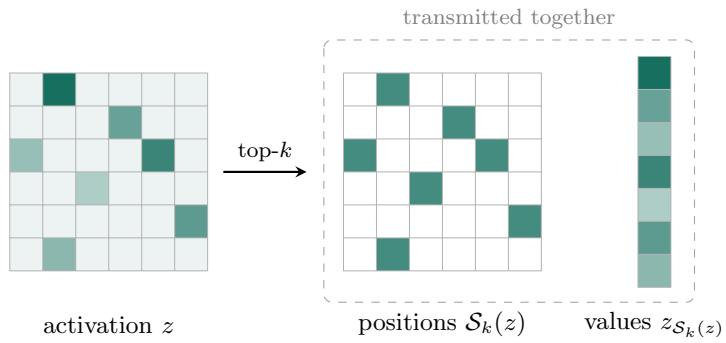
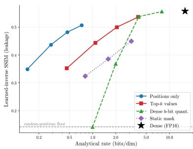
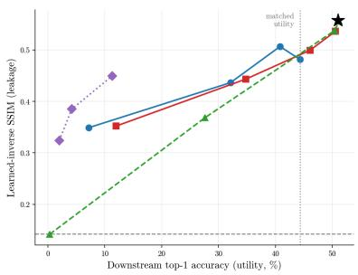
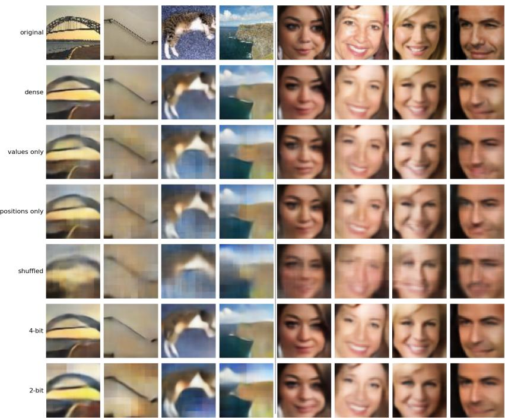
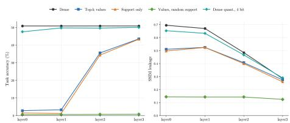
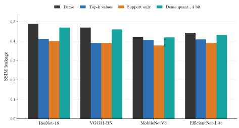

# A Privacy Study of Sparse Collaborative Inference

Maximilian Andreas Hoefler1 ⋆ Karsten Mueller1 Wojciech Samek1,2,3

1 Fraunhofer Heinrich Hertz Institute, Germany

2 Technical University of Berlin, Germany

Berlin Institute for the Foundations of Learning and Data (BIFOLD)

Abstract. Collaborative inference (CI) splits a model between an edge device and a server, whereby the client computes an intermediate activation, transmits it, and the server completes the computation. This raises two concerns, the communication cost of the transmission and the risk that it reveals private information about the input. Recent work reduces this cost by sparsifying activations and entropy-coding the result. Sparsity has also been argued to improve privacy, on the intuition that transmitting fewer values reveals less about the input. We test this claim by decomposing the sparse activation into the retained values and the set of positions they occupy, and by reconstructing inputs from each component in isolation. We find that sparsification reduces the leakage far less than it reduces the transmission cost, and that the remaining risk shifts to the positions, which prior analyses treat as side information for decoding. Across natural-image and face datasets, the positions alone constitute a serious privacy risk, enabling high-fidelity reconstructions and re-identification of individuals. The leakage from the positions persists even when both the transmission cost and the task utility are low. We conclude that the positions of sparse activations should be treated as sensitive transmitted data and audited carefully in the context of collaborative inference. Code is available at https://github.com/an7123/Privacy-Study-Sparse-CI.

Keywords: Collaborative inference · Activation sparsity · Feature inversion · Visual privacy · Re-identification · Compression

## 1 Introduction

Collaborative inference (CI) splits a model between a compute-constrained edge device and a server. The client computes an intermediate activation and sends it to the server, which completes inference [14, 22]. This framework reduces the computational burden on the client, but it can introduce a substantial communication cost, as intermediate activations are often larger than the input itself. Much of the CI literature is therefore concerned with reducing the transmitted payload through feature compression, learned bottlenecks, quantization, or sparsification [4, 7, 21].

A second concern in collaborative inference is privacy. Because the raw input never leaves the device, CI is often described as privacy preserving [14], yet intermediate activations are not private by construction, and prior work has repeatedly shown that inputs can be recovered from transmitted features [6]. A considerable literature on CI defenses accordingly seeks to reduce this leakage by perturbing, pruning, or adversarially training the transmitted representation [5, 13, 23–25]. Within this literature, sparsity has been suggested as a mechanism that addresses communication and privacy simultaneously, since transmitting fewer entries reduces bandwidth and exposes a smaller attack surface [3,12,13,18]. The suggestion is attractive because sparsity additionally aligns with standard codecs, which exploit zeros and structured masks for eficient compression [1].

Beyond qualitative arguments, however, the privacy consequences of sparsification itself have received little direct study. In this work we show that sparsification does more than reduce the size of the transmitted message, it restructures the object that an adversary observes and thus changes the privacy risk. A sparse representation consists of two components, both of which an adversary can exploit: the retained values and the positions at which those values occur. Existing privacy analyses of collaborative inference concentrate on the values, which are the natural target of compression [5,25], perturbation, and quantization, whereas the positions are usually treated as side information for decoding. The positions, however, are also input-dependent and can therefore reveal information about the client’s data even after every value has been erased. The objective of this work is to determine not only how much information survives sparsification, but which component of the sparse activation carries the information that privacy attacks require.

We structure our work around four central questions. The first (RQ1) is whether the leakage resides in the values or the positions. To separate them we reconstruct the input from each component in isolation (Fig. 1): one probe sends only the binary mask of retained positions, the other sends the retained values on random positions. Because the two exchange exactly one component, their comparison identifies the one responsible for the leakage.

A second question (RQ2) is whether the privacy risk decreases as fast as the transmission cost when the activation is made sparser. Answering this question requires a common measure of that cost, for which we use the rate, defined as the number of bits needed to transmit the sparsified activation per activation dimension. This rate consists of two parts, the bits that encode which positions are retained and the bits that encode the values placed at those positions. We find that the positions remain a serious privacy risk even at low bit rates.

A third question (RQ3) is whether sparsification reduces the re-identification risk specifically, since identity is often assumed to reside in the fine detail that sparsification removes. We score visual and biometric leakage separately (SSIM, and FaceNet similarity with rank-1/rank-5 retrieval) and find the positions alone re-identify individuals far above chance even when fine visual detail is lost, which, because such reconstructions can fall within the scope of regulation such as the GDPR, is a compliance concern as well as a technical one.

Finally, we study the strength of the threat model and ask which attacker poses the strongest risk (RQ4). We invert every probe under two adversaries, namely a white-box audit that optimizes for an input whose activation matches the observation using the model alone, and an auxiliary-data attacker that trains a decoder on images from a related distribution, modeling a server that holds data similar to the client’s. Across datasets, architectures, and settings, the auxiliary-data attacker proves the more consequential of the two, whereas the white-box audit is efective mainly against representations that transmit continuous values.

## We ofer the following contributions:

– We introduce a probing framework that attributes reconstruction leakage to a single component of a sparse activation. The framework decomposes the activation into values and positions, transmits each component in isolation, and adds corruption controls that measure how much of the positional structure an adversary requires.

We provide a systematic measurement of sparse-representation privacy leakage across sparsity levels, datasets, split layers, and backbones, under both an optimization audit and a learned inverse, with visual and biometric leakage scored separately; the positions account for most of the measured leakage, including identity, while the values add only a small increment on the correct support and nothing without it.

– We show that the privacy risk persists at operating points where both the transmitted rate and the task utility are low. Rate and leakage are decoupled, in that sparsification reduces the rate far faster than the leakage at matched sparsity and at matched utility alike.

– We derive consequences for privacy auditing. The standard white-box audit underreports the leakage from the positions relative to an attacker with auxiliary data. Audits of sparse collaborative inference should therefore include learned inversion attacks, and the input-dependent positions should be treated as sensitive transmitted data rather than as harmless side information.

## 2 Related Work

Compression for collaborative inference. Because split-layer tensors can exceed the input in payload, CI systems compress the transmitted features, e.g. via intermediate reduction [20], learned end-to-end features [8], or sparsification such as relevance-guided static masking with entropy coding [1, 12].

Feature inversion. Feature inversion measures what a representation reveals, by optimizing a matching image [16] or learning an inverse from features to images [6]; in CI, model-inversion attacks train such an inverse on auxiliary data [10,11]. Our two attackers instantiate these families component-wise on the sparse activation. That a support alone can sufice for recovery has precedent in one-bit compressed sensing [2]; we measure how much trained CI representations leak through this channel in practice.

Privacy defenses for CI. Defenses against reconstruction include noise injection into intermediate features [23], attacker-aware training that penalizes a simulated adversary [5, 15], and sparsity-based obfuscation [13, 26]. Some methods also rely on information-theoretic tools such as [25], which give a lower bound on the privacy leakage. Closest to our study, [13] formulates sparse activations as separate index and value channels and proposes protecting each with an information-theoretic budget. Our goal is complementary: we directly measure what an adversary can recover from each channel in isolation. By transmitting only the input-dependent support, or retaining the values while randomizing their positions, we show that the support accounts for most reconstruction and re-identification leakage. We test this finding across attackers, sparsity levels, datasets, split layers, and backbones.

## 3 Study Design

The design follows the research questions of Sec. 1. We split the transmitted sparse activation into values and positions, and construct probes that isolate which component is responsible for the leakage and how the leakage changes as the activation is made sparser (RQ1 and RQ2, Sec. 3.2). We then invert every probe under two attackers, a white-box audit available to a defender and a server that holds auxiliary data (RQ4, Sec. 3.3).

## 3.1 Setup and Notation

We study a split-inference system in which a network $f = f _ { \mathrm { s } } \circ f _ { \mathrm { c } }$ is partitioned at a chosen layer, where $f _ { \mathrm { s } }$ is the server model and $f _ { \mathrm { c } }$ the client model. On input x the client evaluates

$$
z = f _ { \mathrm { c } } ( x ) \in \mathbb { R } ^ { d } ,\tag{1}
$$

transmits $z ,$ and the server completes the prediction $\hat { y } = f _ { \mathrm { s } } ( z )$ . All splits in this work are taken after a ReLU, so $z \geq 0 ;$ the retained values are therefore nonnegative, and values and magnitudes coincide. Our goal is to determine how an attacker can invert each component to reconstruct x.

## 3.2 Separating Values and Positions of Sparse Activations

Let $S _ { k } ( z ) \subseteq \{ 1 , \dots , d \}$ index the k entries of $z$ with largest magnitude, equivalently the super-level set $\{ i : | z _ { i } | \geq \tau _ { k } \}$ for the rank-k threshold $\tau _ { k }$ . We write

  
Fig. 1: Decomposition of a sparse activation. Top-k selection splits the activation z into the transmitted positions, a binary mask over the k largest-magnitude coordinates, and the transmitted values at those coordinates. The two components are normally transmitted together, but they can be inverted separately, which is the basis of our probing framework.

$\rho = k / d$ for the fraction of retained units, so the sparsity level is $1 - \rho .$ A top-k sparse activation is the pair

$$
\mathcal { T } _ { k } ( z ) = \big ( \underbrace { \mathcal { S } _ { k } ( z ) } _ { \mathrm { p o s i t i o n s } } , \underbrace { z _ { S _ { k } ( z ) } } _ { \mathrm { v a l u e s } } \big ) ,\tag{2}
$$

the discrete set of positions $\boldsymbol { S } _ { k } ( z )$ , in the literature also called the support, together with the continuous values at those coordinates $\left( \mathrm { F i g . \ 1 } \right)$ . We treat the two parts as separately transmittable objects and use them as the basis of a probing framework that measures the privacy leakage of each.

Rate accounting. Having split the sparse activation into values and positions, we assign each component a bit cost, so that in Sec. 4 the leakage of a component (SSIM, re-identification) can be compared against the rate it consumes. Because the transmitted activation is a deterministic function of the input, a component’s bit cost also bounds the information it can carry about it.

The two components cost diferent amounts. The d position sets need at most $\log _ { 2 } { \binom { d } { k } }$ bits (correlated masks compress further, Sec. 6), while the values add b bits per retained coordinate, where b is the value precision. Normalizing by d with $\begin{array} { r } { \bar { \log _ { 2 } \binom { d } { k } } \approx d H _ { 2 } ( \rho ) } \end{array}$ and $H _ { 2 }$ the binary entropy, the rate per activation dimension is

$$
R = \underbrace { H _ { 2 } ( \rho ) } _ { \mathrm { p o s i t i o n s } } + \underbrace { \rho b } _ { \mathrm { v a l u e s } } \qquad \mathrm { b i t s / d i m } .\tag{3}
$$

Table 1 lists the resulting rate for each diferent representation (detailed in the next section). Positions-only sets $b = 0$ meaning the mask is transmitted, but no bits describe the values placed on it. Top-k uses an FP16 encoding of the values $( b = 1 6 )$ , and the dense references have $\rho = 1$

Table 1: Transmitted representations as a two-factor design (source of the positions whether values are sent, at precision b); rates in bits/dim from Eq. (3). “–” cells are unused (see Sec. 3.2).
<table><tr><td>positions↓/ values →</td><td>No values (mask, b=0)</td><td>Real values (precision b)</td></tr><tr><td>All positions (no sparsity)</td><td></td><td>Dense (b=16, rate 16); b-bit quant. (b∈{1, 2, 4, 8}, rate b)</td></tr><tr><td>True top-k (input-dep.)</td><td>Positions only (rate  $H _ { 2 } ( \rho ) )$ </td><td>Top-k activation (FP16, rate  $H _ { 2 } ( \rho ) { + } 1 6 \rho )$ </td></tr><tr><td> $( 4 \times 4 )$ </td><td>Block-shuffled Block-shuffled positions</td><td></td></tr><tr><td>Random (input-indep.)</td><td>Random positions</td><td>Values on random positions</td></tr></table>

Probes. Having split the activation into values and positions, we now define the probes that transmit them in isolation. Table 1 organizes them by two factors: the source of the positions, and whether the values are sent.

Two probes carry the central contrast for RQ1. Positions-only transmits the binary mask $m \in \{ 0 , 1 \} ^ { d }$ with $m _ { i } = \mathcal { H } [ i \in S _ { k } ( z ) ]$ , i.e., the input-dependent positions, no values. Values-on-random-positions is its complement: the retained values are placed on a freshly drawn index set of the same size, redrawn per sample, so the values are preserved while the positions carry no information about the input. Comparing the two identifies the privacy risk of each component. If the values were responsible, relocating them to random positions would preserve the leakage and positions-only would collapse; if the positions were responsible, the reverse would hold.

The reference points (dense activation, top-k activation, and dense b-bit quantization, $b \in \{ 1 , 2 , 4 , 8 \} )$ bound the leakage of the full layer and the full sparse activation. The corruption controls measure how much positional structure the leakage needs: the block-shufled control applies a per-sample 4 × 4 block permutation to the mask, and the random control is a matched-density input-independent mask.

## 3.3 Threat Models

We consider two attackers. The first has access only to the model. The second additionally holds auxiliary data drawn from the same or a similar distribution as the client data. Both observe $o = \mathcal { O } ( f _ { \mathrm { c } } ( x ) )$ , where O is the transmittedprobe operator from Table 1, for example top-k selection, the position mask, or the identity map for dense activations. The two attackers difer only in the availability of auxiliary data.

Adaptive white-box inversion. Without auxiliary data, the attacker reconstructs the input by optimization,

$$
\hat { x } = \arg \operatorname* { m i n } _ { x ^ { \prime } } \ell \big ( \mathcal { O } ( f _ { \mathrm { c } } ( x ^ { \prime } ) ) , o \big ) \ : + \ : \lambda \ : \Omega ( x ^ { \prime } ) ,\tag{4}
$$

where $\varOmega$ is an image prior and ℓ is a fidelity term matched to the observation. For continuous channels, ℓ matches the retained values at the transmitted positions, $\| f _ { \mathrm { c } } ( x ^ { \prime } ) _ { \mathcal { S } } - z _ { \mathcal { S } } \| ^ { 2 }$ . For a positions-only mask, ℓ matches the induced positions.

Auxiliary-data inversion. The second attacker holds samples $\{ x _ { j } \}$ from the same or a related distribution, possibly the training data of the model, and learns the inverse mapping. From pairs $( \mathcal { O } ( f _ { \mathrm { c } } ( x _ { j } ) ) , x _ { j } )$ it trains a convolutional decoder $g _ { \phi }$ by minimizing

$$
\operatorname* { m i n } _ { \phi } \sum _ { j } \bigl \| g _ { \phi } \bigl ( \mathcal { O } ( f _ { \mathrm { c } } ( x _ { j } ) ) \bigr ) - x _ { j } \bigr \| ^ { 2 } ,\tag{5}
$$

and reconstructs a held-out observation as $\hat { x } = g _ { \phi } ( o )$ with $o = \mathcal { O } ( f _ { \mathrm { c } } ( x ) )$ . This attacker represents the realistic server threat when related data is available. It is the relevant model for discrete positions, because a learned inverse can capture the distributional regularities that map a binary mask to an image, whereas a hand-designed objective cannot represent them. The auxiliary set need not be large or class-matched: with as few as 100 images the learned inverse already surpasses the white-box audit, and it transfers across disjoint classes.

A values-matched attacker. Because a convolutional inverse suits a mask but not an unordered set of values, a collapse on values-on-random-positions might reflect an architecture mismatch rather than an absence of information. As a control (Sec. 4.2) we additionally invert the raw values with two permutationinvariant attackers (a sorted-value MLP and DeepSets), so that a failure to reconstruct cannot be blamed on capacity; construction details are in Sec. A.6.

## 4 Results

## 4.1 Experimental Setup

Our default network is ResNet-18 [9] which we split at layer2 and evaluate on three datasets. TinyImageNet provides natural images, Imagenette is a 10-class ImageNet subset at higher resolution, included to test whether the results depend on the pixel resolution. FaceScrub [17] is a face dataset, for which reconstruction corresponds to an identity risk.

We report task utility, rate, and two families of leakage metrics. We separate visual from biometric leakage because pixel fidelity and identity are not equivalent and need not vary together (RQ3). Utility is the downstream top-1 accuracy of the server on the transmitted representation. Visual leakage is the

SSIM between x and xˆ. For FaceScrub, biometric leakage is the FaceNet [19] cosine similarity cos(φ(ˆx), φ(x)) between embeddings, together with rank-1 and rank-5 re-identification against an external gallery that holds one held-out image per identity, so that retrieval cannot succeed by matching the query image itself. Rate is the analytical estimate from Eq. (3), in bits per activation dimension.

Implementation details. The Aux attacker is a convolutional decoder whose input head adapts to the transmitted object and whose generative trunk is identical across probes (1.78 M parameters), trained with Adam for 12 epochs on TinyImageNet and 20 on FaceScrub. The WB audit minimizes Eq. (4) with a total-variation prior, using Adam on the image for 1500 to 2000 steps. Architecture, capacity, and optimization budget are identical across all probes, so no representation is favored by attacker capacity. Full configurations, dataset partitions, and parameter counts are given in Sec. A.

Throughout this work, WB denotes the white-box audit attacker and Aux the auxiliary-data attacker of Sec. 3.3; probe names follow Table 1. Unless stated otherwise, results are at the main operating point of 95% sparsity. Unless stated otherwise, reported values are the mean over five independent runs, and ± denotes the standard deviation across those runs.

## 4.2 The Positions Carry the Leakage

We first study whether the privacy leakage stems from positions or values to determine which component of the sparse activation carries the leakage (RQ1). Table 2 reports the comparison under both white-box (WB) and auxiliary (Aux) attackers. On TinyImageNet under the Aux attacker, positions-only transmission recovers almost as much of the input as the full top-k activation (0.428 versus 0.435 SSIM). The complementary probe, values on random positions, falls to the random-positions floor in both reconstruction (0.145 versus 0.142 SSIM) and utility (16.2% versus 15.5%). This pattern identifies the positions as the component that accounts for most of the measured leakage, since removing the values barely changes it, whereas deleting the input-dependence of the positions removes it. The values are not strictly uninformative given the positions, but their contribution is small and conditional on the correct support, and vanishes without it (Sec. A.10). We find the positions are suficient for most of the leakage, not the sole possible source of it. The collapse of the values probe is moreover not an artifact of the attacker architecture, since the values-matched attackers of Sec. 3.3 likewise recover no more than the unconditional mean image (0.144 versus 0.145 SSIM). Sparsification does reduce leakage relative to the dense activation (0.559 to 0.428 SSIM under Aux), but by far less than it reduces the rate (Sec. 4.3 quantifies this gap).

The comparison transfers across datasets and resolution. On Imagenette, a higher-resolution setting, positions-only again nearly matches the full top-k activation (0.400 versus 0.420 SSIM, Table 2), and replacing the input-dependent positions with random ones drops downstream accuracy from 82.3% to near chance, so the positions are task-relevant beyond 64-pixel inputs. On faces, the same positions-only reconstructions carry identity, which we examine in Sec. 4.4. Qualitative reconstructions (Fig. 3) show the same ordering: positions-only tracks the full top-k activation across datasets, while values on random positions reduce to a dataset prior.

Table 2: Reconstruction leakage at 95% sparsity on TinyImageNet and Imagenette. For each dataset we report downstream accuracy (Acc., attack-independent) and reconstruction SSIM under the WB audit and the Aux inverse (Sec. 3.3).
<table><tr><td rowspan="3">Representation</td><td colspan="3">TinyImageNet</td><td colspan="3">Imagenette</td></tr><tr><td>Acc.</td><td>SSIM (WB)</td><td>SSIM (Aux)</td><td>Acc.</td><td>SSIM (WB)</td><td>SSIM (Aux)</td></tr><tr><td>Dense activations</td><td>53.1±0.8</td><td>0.436±0.001</td><td>0.559±0.002</td><td>88.9±0.4</td><td>0.496±0.003</td><td>0.561±0.003</td></tr><tr><td>Top-k activation</td><td>52.2±0.6</td><td>0.213±0.008</td><td>0.435±0.005</td><td>86.0±0.6</td><td>0.127±0.008</td><td>0.420±0.005</td></tr><tr><td>Positions only</td><td>49.8±0.5</td><td>0.059±0.006</td><td>0.428±0.006</td><td>82.3±0.3</td><td>0.013±0.009</td><td>0.400±0.005</td></tr><tr><td>Values on rand. positions</td><td>16.2±0.4</td><td>0.038±0.003</td><td>0.145±0.003</td><td>13.0±0.4</td><td>0.041±0.004</td><td>0.216±0.007</td></tr><tr><td>Block-shuffled positions</td><td>18.6±0.9</td><td>0.061±0.003</td><td>0.295±0.004</td><td>64.7±0.4</td><td>0.052±0.003</td><td>0.300±0.004</td></tr><tr><td>Random positions</td><td>15.5±0.3</td><td>0.036±0.003</td><td>0.142±0.001</td><td>12.4±0.4</td><td>0.038±0.003</td><td>0.214±0.002</td></tr></table>

## 4.3 Rate and Privacy Risk

We next ask whether privacy risk, measured in terms of reconstruction, decreases as fast as the rate (RQ2). Figure 2 sweeps positions-only and the top-k activation over keep-fractions, together with dense {1, 2, 4, 8}-bit quantization and a static relevance mask [12], and plots the accuracy of the frozen server against reconstruction SSIM under the Aux inverse, at the analytical rate of Eq. (3). Three comparisons structure the figure. Increasing sparsity reduces the rate and eventually the utility, but the leakage decreases only gradually. Positions-only at 98% sparsity costs 0.141 bits per dimension yet still yields 0.349 SSIM. The reconstruction is not photorealistic (Fig. 3), but the privacy-sensitive structure does not decrease in proportion to the bandwidth. At matched utility (approximately 44 to 46% accuracy), positions-only leaks almost as much as the full top-k activation (0.481 versus 0.499 SSIM) and only slightly less than dense 4-bit quantization (0.538), at reduced rate. Sparsity therefore reduces the rate far more than it reduces the leakage, at matched utility as well as at matched sparsity. This implies that an activation can retain sensitive information even when both its task utility and its transmission cost are low. Finally, the inputindependent static mask still transmits real values on its fixed support and therefore still leaks (Fig. 2). Input-independence removes the position channel, not the value channel, and the mask never reaches usable frozen-server accuracy (Sec. A.11). Wherever dynamic top-k is chosen for its compression and utility, its input-dependent positions belong within the privacy threat model.

## 4.4 The Positions Retain Biometric Information

RQ3 asks whether the positions leak identity in addition to pixel appearance, since the two need not vary together. We reconstruct FaceScrub images from each probe under the Aux inverse, embed the reconstruction with FaceNet, and retrieve against a gallery that holds one held-out image for each of the 211 evaluation identities. Each query is the reconstruction of a diferent image of the same identity, so a query image never appears in the gallery and retrieval cannot succeed by matching a query to itself. Chance rank-1 is therefore $1 / 2 1 1 = 0 . 4 7 \%$ In this main protocol the inverse may have been trained on other images of the evaluation identities, so identities can overlap between decoder training and the gallery even though images never do. We report the embedding cosine and rank-1/rank-5 retrieval (Table 3) and remove the identity overlap in the control below. The full identity partition is given in Sec. A.7. One might expect identity to be lost with sparsification, as positions-only reconstructions on TinyImageNet lose the high-frequency texture of the dense activation (Sec. 4.3), and identity is also carried by fine facial detail. However, we find that re-identification is still possible. For example, positions-only reconstructions retrieve the correct identity at 24.5% rank-1 and 49.5% rank-5, close to the 24.9% and 51.3% of the full top-k activation, whereas the values on random positions retrieve near the randompositions floor at rank-1 (1.1% versus 0.6%, chance 0.47%) and retain only a small residual signal at rank-5 (11.6%, against a chance level of approximately 2.4%). One may argue that the decoder could retrieve a memorized prototype of a known identity rather than reconstruct the subject. We therefore repeat the experiment with an identity-disjoint partition. The inverse is trained only on the 60% of identities that never appear at evaluation, and both the queries and the gallery are drawn from the disjoint 40%, the 211 held-out identities, with a fresh partition per seed and results averaged over five seeds. The decoder has therefore never seen any evaluated identity, and chance rank-1 stays at about 0.47%. This costs about 3.7 rank-1 points. Positions-only still re-identifies unseen subjects at 20.8% rank-1, approximately 44 times chance, and 45.3% rank-5, well above the random-positions floor.

  
Fig. 2: Trade-of between rate, utility, and leakage on TinyImageNet.

Figure 3 shows the efect on faces. Reconstructions from the correct positions remain identity-specific and closely follow those from the full top-k activation, whereas block-shufling the positions degrades them toward a generic face. RQ4 asks whether the privacy conclusion depends on the attacker. We find that it does, and that the white-box audit, as commonly instantiated, is not the strongest inversion attack for a discrete representation. The WB and Aux columns of Tables 2 and 3 compare the two attackers of Sec. 3.3 on identical observations. For positions-only masks on FaceScrub, the WB audit reaches only 0.076 SSIM, whereas the Aux decoder reaches 0.751 SSIM and a FaceNet cosine of 0.510; the WB audit has no identity entry in Table 3, as its positions-only reconstructions are too degraded to embed meaningfully. The gap is representation-specific rather than uniform: the same optimizer recovers the full top-k activation well (0.436 SSIM on FaceScrub, 0.213 on TinyImageNet) but not the positions (0.076 and 0.059). The learned inverse exploits distributional regularities of the sparse mask that a hand-designed matching objective cannot represent, so the WB audit is poorly matched to the discrete mask observation. The corruption controls make the mismatch visible: under WB, the block-shufled mask even scores above the true positions (0.161 versus 0.076 SSIM on FaceScrub), inverting the Aux ordering, which further indicates that the audit’s objective, not the representation’s information content, limits WB performance. The Aux attack is also data-eficient and robust to distribution shift. At a fixed training budget, positions-only SSIM increases monotonically with the size of the auxiliary set, from 0.173 at 100 images, already well above the WB value of 0.059, to 0.414 at 100,000 images. A decoder trained on a disjoint set of TinyImageNet classes transfers without loss (0.405 in-distribution versus 0.423 on held-out classes). Stronger white-box variants, such as relaxed top-k objectives, deeper image priors, or optimization within a trained generator’s latent space, may narrow the gap and are left to future work.

Table 3: FaceScrub leakage at 95% sparsity. Acc. is downstream accuracy, SSIM is reconstruction fidelity under the WB audit and the Aux inverse (Sec. 3.3); ID cos. is FaceNet embedding cosine and R@1/R@5 are rank-1/rank-5 re-identification against an held-out evaluation gallery (one held-out image per identity), both under the Aux inverse.
<table><tr><td rowspan="2">Representation</td><td rowspan="2">Acc.</td><td colspan="2">SSIM</td><td rowspan="2">ID cos. (Aux)</td><td rowspan="2">R@1/R@5 (Aux)</td></tr><tr><td>WB</td><td>Aux</td></tr><tr><td>Dense activations</td><td>75.0±0.8</td><td>0.516±0.003</td><td>0.840±0.001</td><td>0.623±0.004</td><td>38.4±0.5 /63.5±0.6</td></tr><tr><td>Top-k activation</td><td>74.0±0.6</td><td>0.436±0.003</td><td>0.754±0.008</td><td>0.514±0.009</td><td>24.9±0.6 51.3±0.6</td></tr><tr><td>Positions only</td><td>63.0±0.6</td><td>0.076±0.007</td><td>0.751±0.002</td><td>0.510±0.002</td><td>24.5±0.9 49.5±0.7</td></tr><tr><td>Values on rand. positions</td><td>20.0±0.7</td><td>0.154±0.004</td><td>0.290±0.003</td><td>0.039±0.008</td><td>1.1±0.8/11.6±0.9</td></tr><tr><td>Block-shuffled positions</td><td>50.8±0.6</td><td>0.161±0.004</td><td>0.501±0.002</td><td>0.021±0.003</td><td>1.1±0.8 /12.0±0.4</td></tr><tr><td>Random positions</td><td>18.0±0.8</td><td>0.143±0.004</td><td>0.276±0.001</td><td>0.012±0.002</td><td>0.6±0.1/2.6±0.8</td></tr></table>

## 4.5 Robustness: Layers, Backbones, and Sparsity Structure

Finally, we test whether the values-versus-positions result is specific to the split layer or the backbone. Across ResNet-18 layers 0 to 3 (Fig. 4a), positions-only closely follows the full top-k activation in both task accuracy and SSIM leakage at every layer, and values on random positions remain at the floor throughout, confirming that the recovered structure rides on the input-dependent positions rather than on the retained values. Leakage is present at all depths, but usable utility appears only at deeper splits, so the practical risk concentrates where high leakage and usable utility coincide. The same ordering holds across ResNet-18, VGG11-BN, MobileNetV3, and EficientNet-Lite at layer2 (Fig. 4b); absolute leakage levels difer between backbones, so values and positions are compared within each backbone, and in every backbone positions-only sits just below the full top-k activation.

  
Fig. 3: Reconstructions under the Aux inverse for TinyImageNet (left four columns) and FaceScrub (right four). Rows, top to bottom: original, dense activation, the topk activation (the retained values at their true positions, labeled “values only” in the figure), positions only, block-shufled positions, dense 4-bit, dense 2-bit.

Structured sparsity. Throughout we have been discussing isolating positions from values in sparse activations. We established that positions are the source of privacy leakage. However, global top-k has a doubly informative support: it reveals both which channels are active and where within each. We therefore repeat the values-versus-positions contrast under per-channel top-k, which keeps a fixed number of units in every channel and so reveals nothing about channel selection, only the spatial layout inside each channel. Even with this less informative support the attribution holds: at 95% sparsity, positions-only reaches 0.368 SSIM, 94% of the 0.392 from the full per-channel activation (the global case gives 97%), while values on random positions stay at the floor (0.122). Stripping the channel-selection axis thus leaves the ordering intact, i.e., the positions still carry the leakage.

  
(a) Layer ablation (ResNet-18). Task accuracy (left) and SSIM leakage (right) across split layers 0 to 3. Positions-only follows the top-k activation at every layer, and values on random positions remain at the floor.

  
(b) Architecture ablation at layer2. Reconstruction SSIM leakage across four backbones. Positions-only is just below the top-k activation and follows dense 4-bit in every backbone.  
Fig. 4: Robustness of the values-versus-positions result (TinyImageNet, Aux inverse): (a) across split layers and (b) across backbones.

## 5 Discussion

The positions are privacy sensitive. Which coordinates a top-k activation keeps is fixed by the input, so the set of kept positions is itself a compact code for the input. Across datasets this code lets an attacker reconstruct almost as well as the full sparse activation, and on faces it preserves identity. A collaborativeinference system that protects only the transmitted values, while still exposing the positions, therefore keeps a large visual and biometric attack surface. The index stream is not harmless side information for decoding, and it belongs inside the privacy threat model.

Identification persists at low rate and low utility. We showed that reidentification from positions only is feasible under learned attackers. A positionsonly mask at 95% sparsity sends under a third of a bit per dimension and loses fine facial detail, yet it still re-identifies unseen subjects at 44× chance, and the leakage falls only slowly as rate and utility drop further. Low measured utility is not the same as low information content. The frozen server simply stops using information that the learned inverse still recovers. Because reconstructions that re-identify a person can fall within data-protection regulation such as the GDPR, a compliance assessment should rest on measured re-identification risk rather than on transmitted volume or pixel fidelity alone.

Privacy needs multiple metrics and attackers. A single metric or a single attacker can make a representation look safe when it is not. Pixel similarity is one such metric. For example, SSIM rates the positions-only reconstructions as poor, yet FaceNet retrieval recovers the subject’s identity from those same reconstructions, so SSIM alone understates the risk. The choice of attacker matters in the same way. On the discrete mask the white-box audit recovers little, while the learned inverse recovers faces, so the audit alone also understates the risk. A privacy claim should therefore be made using both visual and biometric metrics and under the strongest available attack, which is the learned inverse whenever the server could plausibly hold auxiliary data.

Implications for defenses. The same probes also point to where a defense has to act. If the positions are randomized fresh for every input, they stop leaking, but the server can no longer read them and its accuracy collapses (Table 2). If instead the positions are fixed and input-independent, as in a static mask, the server keeps working, but the real values sent on that fixed support still leak (Fig. 2). Randomized sparsification [13,26] sits between these two cases and trades one efect of against the other. The conclusion is that a defense for sparse CI has to be judged on how much its positions leak and not only on how well it hides its values, and the component-isolated audit we introduce is the tool for measuring exactly that.

## 6 Scope and Limitations

Our experiments use ResNet-18 split at layer2, and Sec. 4.5 shows the result is robust across split layers and backbones. Several settings remain open. These include other structured schemes such as channel pruning and block and N:M sparsity, transformer token pruning, which is itself a positions-only transmission, and deployed entropy codecs. Our rates are also analytical upper bounds from Eq. (3) rather than on-the-wire measurements. Because correlated positions compress further than the bound, this can only understate the positions’ leakage per transmitted bit, and measured codec and end-to-end wire rates are left to future work. An ethics and data-governance statement is given in Sec. A.12.

## 7 Conclusion

We examined the assumption that sparsifying intermediate activations improves the privacy of collaborative inference, and found it holds only in limited scenarios. By transmitting the retained values and their positions in isolation, we showed that sparsification reduces leakage far less than it reduces the rate, and that the remaining leakage is carried almost entirely by the positions, which act as a low-rate representation of the input. On face data the positions alone preserve most of the reconstruction quality and re-identification performance of the full sparse activation, at operating points where both the rate and the task utility are low. Because the standard white-box audit underestimates this leakage while a learned inverse trained on modest auxiliary data recovers identity-bearing reconstructions, sparse collaborative inference should be audited under learned inversion, and the input-dependent positions treated as sensitive transmitted data throughout the pipeline.

## Acknowledgements

This work was supported by the European Union’s Horizon Europe research and innovation programme (EU Horizon Europe) as grant ACHILLES (101189689).

## References

1. Becking, D., Haase, P., Kirchhofer, H., Müller, K., Samek, W., Marpe, D.: NNCodec: An open source software implementation of the neural network coding ISO/IEC standard. In: ICML Workshop on Neural Compression: From Information Theory to Applications (2023) 2, 3

2. Boufounos, P.T., Baraniuk, R.G.: 1-bit compressive sensing. In: 2008 42nd Annual Conference on Information Sciences and Systems. pp. 16–21 (2008). https://doi. org/10.1109/CISS.2008.4558487 4

3. Chang, W., Zhu, T.: Gradient-based defense methods for data leakage in vertical federated learning. Computers & Security 139, 103744 (2024) 2

4. Choi, I., Kim, S., Hwang, S.: Deep feature compression: A new paradigm for eficient feature transmission in collaborative intelligence. In: Proceedings of the IEEE International Conference on Multimedia and Expo Workshops (ICMEW). pp. 1–6 (2018). https://doi.org/10.1109/ICMEW.2018.8486737 1

5. Ding, S., Zhang, L., Pan, M., Yuan, X.: PATROL: Privacy-oriented pruning for collaborative inference against model inversion attacks. In: Proceedings of the IEEE/CVF Winter Conference on Applications of Computer Vision (WACV). pp. 4716–4725 (2024) 2, 4

6. Dosovitskiy, A., Brox, T.: Inverting visual representations with convolutional networks. In: Proceedings of the IEEE Conference on Computer Vision and Pattern Recognition (CVPR). pp. 4829–4837 (2016) 2, 3

7. Eshratifar, A.E., Abrishami, M.S., Pedram, M.: Jointdnn: An eficient training and inference engine for intelligent mobile cloud computing services. IEEE Transactions on Mobile Computing 20(2), 565–576 (2021). https://doi.org/10.1109/TMC. 2019.2947893 1

8. Hao, Z., Xu, G., Luo, Y., Hu, H., An, J., Mao, S.: Multi-agent collaborative inference via DNN decoupling: Intermediate feature compression and edge learning. arXiv preprint arXiv:2205.11854 (2022) 3

9. He, K., Zhang, X., Ren, S., Sun, J.: Deep residual learning for image recognition. In: Proceedings of the IEEE Conference on Computer Vision and Pattern Recognition (CVPR). pp. 770–778 (2016) 7

10. He, Z., Zhang, T., Lee, R.: Model inversion attacks against collaborative inference. In: Proceedings of the 35th Annual Computer Security Applications Conference (ACSAC). pp. 148–162 (2019). https://doi.org/10.1145/3359789.3359824 4

11. He, Z., Zhang, T., Lee, R.: Attacking and protecting data privacy in edge–cloud collaborative inference systems. IEEE Internet of Things Journal 8(12), 9706–9716 (2020) 4

12. Hoefler, M., Becking, D., Müller, K., Marpe, D., Samek, W.: Relevance-guided activation sparsification for bandwidth-eficient collaborative inference. In: IEEE/CVF International Conference on Computer Vision Workshops (ICCVW) (2025). https: //doi.org/10.1109/ICCVW69036.2025.00798 2, 3, 9, 18, 21

13. Hoefler, M., Müller, K., Samek, W.: Leveraging sparsity for privacy in collaborative inference. In: Proceedings of the IEEE/CVF Winter Conference on Applications of Computer Vision (WACV) (2026) 2, 4, 14

14. Kang, Y., Hauswald, J., Gao, C., Rovinski, A., Mudge, T., Mars, J., Tang, L.: Neurosurgeon: Collaborative intelligence between the cloud and mobile edge. In: Proceedings of the 22nd International Conference on Architectural Support for Programming Languages and Operating Systems (ASPLOS). pp. 615–629 (2017) 1, 2

15. Li, J., Rakin, A., Chen, X., He, Z., Fan, D., Chakrabarti, C.: ResSFL: A resistance transfer framework for defending model inversion attack in split federated learning. In: Proceedings of the IEEE/CVF Conference on Computer Vision and Pattern Recognition (CVPR). pp. 10194–10202 (2022) 4

16. Mahendran, A., Vedaldi, A.: Understanding deep image representations by inverting them. In: Proceedings of the IEEE Conference on Computer Vision and Pattern Recognition (CVPR). pp. 5188–5196 (2015) 3

17. Ng, H., Winkler, S.: A data-driven approach to cleaning large face datasets. In: IEEE International Conference on Image Processing (ICIP). pp. 343–347 (2014). https://doi.org/10.1109/ICIP.2014.7025068 7

18. Scheliga, D., Mäder, P., Seeland, M.: PRECODE – a generic model extension to prevent deep gradient leakage. In: IEEE/CVF Winter Conference on Applications of Computer Vision (2022) 2

19. Schrof, F., Kalenichenko, D., Philbin, J.: FaceNet: A unified embedding for face recognition and clustering. In: Proceedings of the IEEE Conference on Computer Vision and Pattern Recognition (CVPR). pp. 815–823 (2015) 8

20. Shao, J., Zhang, J.: BottleNet++: An end-to-end approach for feature compression in device-edge co-inference systems. In: IEEE International Conference on Communications Workshops (ICC Workshops). pp. 1–6 (2020) 3

21. Singh, S., Abu-El-Haija, S., Johnston, N., Ballé, J., Shrivastava, A., Toderici, G.: End-to-end learning of compressible features (2020), https://arxiv.org/abs/ 2007.11797 1

22. Teerapittayanon, S., McDanel, B., Kung, H.T.: Distributed deep neural networks over the cloud, the edge and end devices. In: 2017 IEEE 37th International Conference on Distributed Computing Systems (ICDCS). pp. 328–339 (2017). https://doi.org/10.1109/ICDCS.2017.48 1

23. Titcombe, T., Hall, A., Papadopoulos, P., Romanini, D.: Practical defences against model inversion attacks for split neural networks. arXiv preprint arXiv:2104.05743 (2021) 2, 4

24. Vepakomma, P., Singh, A., Gupta, O., Raskar, R.: Nopeek: Information leakage reduction to share activations in distributed deep learning. In: 2020 International Conference on Data Mining Workshops (ICDMW). pp. 933–942. IEEE (2020) 2

25. Xia, S., Yu, Y., Yang, W., Ding, M., Chen, Z., Duan, L.Y., Kot, A.C., Jiang, X.: Theoretical insights in model inversion robustness and conditional entropy maximization for collaborative inference systems. In: Proceedings of the Computer Vision and Pattern Recognition Conference. pp. 8753–8763 (2025) 2, 4

26. Zheng, F., Chen, C., Lyu, L., Yao, B.: Reducing communication for split learning by randomized top-k sparsification. In: Proceedings of the 32nd International Joint Conference on Artificial Intelligence (IJCAI) (2023) 4, 14

This appendix provides the full implementation and evaluation details referenced from the main text. Complete per-sparsity tables and additional qualitative reconstructions are provided with the released code at https $: / / \mathrm { g } \mathrm { i }$ thub.com/ an7123/Privacy-Study-Sparse-CI.

Numbering. Appendix sections are lettered $( e . g . , \mathrm { { S e c . \ A . 1 } ) }$ , and figures and tables in the appendix are prefixed with the section letter (Table A1, and so on). Plain numbered references (Sec. 4.3, Table 2, Fig. 2) point to the main text.

## A Implementation and Evaluation Details

## A.1 Split Model and Threat Model

We split a standard torchvision ResNet-18 at the output of layer2, so the client computes $f _ { \mathrm { c } } = \{ \mathrm { s t e m } , 1 \mathrm { a y e r } 1 , 1 \mathrm { a y e r } 2 \}$ and the server computes $f _ { \mathrm { s } } ~ =$ $\{ 1 \mathsf { a y e r 3 } , 1 \mathsf { a y e r 4 } , \mathrm { a v g p o o l } , \mathrm { f c } \}$ . The transmitted activation is taken after the layer2 ReLU and is therefore non-negative, which is what allows the values and their magnitudes to coincide.

The activation dimension at the split is $d = C \times H \times W$ with $C = 1 2 8$ in all cases, giving $d = 8 1 9 2$ for TinyImageNet $( 1 2 8 \times 8 \times 8 ) , d = 4 6 0 8$ for FaceScrub at $4 8 ^ { 2 } \ : \left( 1 2 8 \times 6 \times 6 \right)$ , and $d = 5 1 2 0 0$ for Imagenette-160 $( 1 2 8 \times 2 0 \times 2 0 )$ . Top-k selection is global over the entire $C \times H \times W$ tensor rather than per channel or per location, with ties broken by the deterministic order of torch.topk. The keep fraction is $\rho = k / d$ , so the headline operating point $\rho = 0 . 0 5$ corresponds to $k = 4 0 9$ retained coordinates on TinyImageNet.

Both attackers are white-box with respect to the client. The honest-butcurious server knows the architecture, the split point, the sparsification rule, and the transmitted object $o = \mathcal { O } ( z )$ . The learned inverse additionally queries $f _ { \mathrm { c } }$ to generate training pairs $( \mathcal { O } ( f _ { \mathrm { c } } ( x _ { j } ) ) , x _ { j } )$ from auxiliary data, and the whitebox optimizer backpropagates through $f _ { \mathrm { c } }$ . At test time the decoder observes only the transmitted object $^ { O , }$ never x or z.

## A.2 Probes and Server Input

Each probe maps the activation z to a transmitted object. For the utility measurement this object is fed to the frozen server $f _ { \mathrm { s } } ,$ , where $m \in \{ 0 , 1 \} ^ { d }$ denotes the top-k mask and ⊙ is elementwise product. Table A1 gives the exact transmitted object and analytical rate for each probe, organized by the two-factor design of Table 1.

The binary mask is passed to the server without any magnitude rescaling, as literal $0 / 1$ floats. This models the deployment in which the client transmits the index set and the server runs unchanged, and it is the reason positions-only transmission loses accuracy relative to the top-k activation (2.4, 3.7, and 11.0 points on TinyImageNet, Imagenette, and FaceScrub, respectively) rather than none. Rescaling the mask to the per-channel mean activation magnitude is a straightforward variant that afects only the utility axis; the leakage measurements do not involve the server.

Table A1: Transmitted object and analytical rate for each probe. The binary mask is fed to the server as literal 0/1 floats occupying the activation tensor, without magnitude rescaling.
<table><tr><td>Probe</td><td>Transmitted object</td><td>Rate (bits/dim)</td></tr><tr><td>Dense</td><td>z</td><td> $b = 1 6$ </td></tr><tr><td>Top-k activation</td><td> $z \odot m$ </td><td> $H _ { 2 } ( \rho ) + \rho b$ </td></tr><tr><td>Positions only</td><td> $m \in \{ 0 , 1 \} ^ { d }$ </td><td> $H _ { 2 } ( \rho )$ </td></tr><tr><td></td><td>Values on random pos. values scattered to fresh random positions</td><td> $H _ { 2 } ( \rho ) + \rho b$ </td></tr><tr><td>Dense b-bit quant.</td><td>symmetric b-bit quantization of z</td><td>b</td></tr><tr><td>Static mask [12]</td><td> $z \odot m _ { \mathrm { f i x e d } }$ </td><td> $\rho b$ </td></tr></table>

## A.3 Server Classifier

The server is the original frozen $f _ { \mathrm { s } }$ . It is not retrained, fine-tuned, calibrated, or re-normalized for any representation; the transmitted object is fed to it directly, and downstream top-1 accuracy is measured on this frozen head. The frozen server is a deliberate design choice, not a limitation: it measures the utility that an unmodified deployment actually obtains from each transmitted object, and a central claim of this work is that the privacy leakage persists even where this measured utility is low (Secs. 4.3 and 4.4). Low frozen-server accuracy signals that the unmodified server no longer exploits the transmitted information, not that the information is absent; the inversions recover precisely this latent content, and a server retrained per representation, a diferent deployment, could likewise recover part of it. The leakage measurements themselves do not involve the server.

## A.4 Learned Inverse

The learned inverse $g _ { \phi }$ adapts an input head to the transmitted object and then applies an identical generative trunk that maps a [256, 8, 8] latent to the output image. For a spatial input [B, C, H, W] the head is Conv2d $( C , 2 5 6 , 3 )  \mathrm { B N } $ ReLU; for a vector input such as per-channel counts [B, C] it is a linear map to 256·8·8 followed by a reshape. The shared trunk is three blocks of [Upsample × $2  \mathrm { C o n v ( 2 5 6 , 2 5 6 , 3 )  B N  R e L U }$ followed by Conv(256, 3, 3) → Sigmoid, producing an output in [0, 1]. The output size is eight times the split spatial size, which is exact for all three datasets $( 8 \to 6 4 , 6 \to 4 8 , 2 0 \to 1 6 0 )$

The inverse is trained with Adam at a learning rate of $2 \times 1 0 ^ { - 3 }$ , no learningrate schedule, an MSE pixel loss, and batch size 256. The main TinyImageNet models train for 12 epochs (with 6 for sanity runs and 12 to 18 for the qualitative figures) and the FaceScrub models for 20 epochs. The architecture, capacity, and optimization budget are identical across all probes, and only the channel count of the input head changes. By default the inverse is trained on the full training split (TinyImageNet 100k; FaceScrub, the decoder’s identity subset). The auxiliaryset sweep covers sizes {100, 500, 2000, 10000, 100000} at a constant budget of approximately 4000 gradient steps, with small sets repeating their data, so that the sweep isolates the amount of data rather than the length of training.

Table A2: Parameter counts, so that attacker capacity is explicit and comparable across input layouts. The generative trunk is identical in every inverse; only the input head changes.
<table><tr><td>Inverse</td><td>Params</td></tr><tr><td>Shared generative trunk</td><td>1.78M</td></tr><tr><td>ConvDecoder, spatial input (C=128)</td><td>2.07M</td></tr><tr><td>ConvDecoder, occupancy map (C=1)</td><td>1.78M</td></tr><tr><td>ConvDecoder, per-channel counts (vector, C=128)</td><td>3.89 M</td></tr><tr><td>Values MLP-on-sorted (Sec. A.6)</td><td>40.4M</td></tr><tr><td>Values DeepSets (Sec. A.6)</td><td>19.4M</td></tr></table>

## A.5 White-Box Inversion

The white-box attacker minimizes

$$
\begin{array} { r } { \hat { x } \ = \ \arg \operatorname* { m i n } _ { \nu ^ { \prime } } \ \ell \big ( { \mathcal O } ( f _ { \mathrm { c } } ( x ^ { \prime } ) ) , o \big ) \ + \ \lambda _ { \mathrm { t v } } \mathrm { T V } ( x ^ { \prime } ) \ + \ \lambda _ { \ell _ { 2 } } \| x ^ { \prime } - \frac { 1 } { 2 } { \bf 1 } \| _ { 2 } ^ { 2 } . } \end{array}\tag{6}
$$

Write $a ^ { \prime } = f _ { \mathrm { c } } ( x ^ { \prime } )$ for the activation of the candidate image and $\begin{array} { r } { \langle v \rangle _ { \mathcal { T } } = \frac { 1 } { | \mathcal { T } | } \sum _ { i \in \mathcal { T } } } \end{array}$ vi for the mean of a vector v over an index set I. For continuous payloads and for dense activations, the fidelity term is the masked mean-squared error on the transmitted positions,

$$
\ell _ { \mathrm { c o n t } } ( a ^ { \prime } , o ) = \frac { \| ( a ^ { \prime } - o ) \odot m \| _ { 2 } ^ { 2 } } { \| m \| _ { 1 } } .\tag{7}
$$

For a binary positions-only observation the values are unavailable, so ℓ is instead a ranking margin that drives the k largest coordinates of $a ^ { \prime }$ onto the observed mask,

$$
\ell _ { \mathrm { p o s } } ( a ^ { \prime } , m ) = - \langle a ^ { \prime } \rangle _ { S } + \langle a ^ { \prime } \rangle _ { \mathcal { T } _ { k } ( a ^ { \prime } \odot ( 1 - m ) ) } ,\tag{8}
$$

where $S \ = \ \{ i \ : \ m _ { i } \ = \ 1 \}$ is the observed set of positions and $\mathcal { T } _ { k } ( \cdot )$ returns the indices of the k largest-magnitude entries of its argument, here the largest of-support activations. Minimizing $\ell _ { \mathrm { p o s } }$ raises the on-support activations and suppresses the strongest of-support ones, without penalizing the unobserved values. The image prior combines total variation with an $\ell _ { 2 }$ pull toward the gray image ${ \textstyle \frac { 1 } { 2 } } \mathbf { 1 }$ . We optimize the image directly with Adam at learning rate 0.05 and $\beta = ( 0 \bar { . } 9 , 0 . 9 9 9 )$ for 1500 to 2000 steps, from the initialization $\mathbf { \Delta } x = 0 . 1 \varepsilon + { \bf \omega } _ { 2 } ^ { 1 } \mathbf { 1 }$ with $\varepsilon \sim \mathcal { N } ( 0 , I )$ clamped to [0, 1], and with $\lambda _ { \mathrm { t v } } = 5 \times 1 0 ^ { - 2 }$ and $\lambda _ { \ell _ { 2 } } = 5 \times 1 0 ^ { - 4 }$ returning the best-loss iterate.

## A.6 Values-Only Attackers

To rule out an attacker-architecture mismatch, the values-only attackers share the identical 1.78 M generative trunk and difer only in an input encoder suited to an unordered set of values. The MLP-on-sorted-values encoder is BatchNorm1d(k) → $\mathrm { M L P } ( k \to 2 0 4 8 \to 2 0 4 8 \to 2 5 6 { \cdot } 8 { \cdot } 8 ) \to$ trunk. Because the split is post-ReLU, the retained values are non-negative and their sorted vector is a suficient statistic for the multiset of values, so this encoder has access to all information available to any permutation-invariant attacker on the values. The DeepSets encoder applies a per-element map $\phi ( v _ { i } )$ , a permutation-invariant pooling (mean, max, and sum), and a projection to the latent. Both encoders have at least nine times the parameter count of the positions attacker (40.4 M and 19.4 M against 2.07 M), so a failure to reconstruct cannot be attributed to insuficient capacity. We report the unconditional mean-image SSIM as the zero-information floor.

## A.7 Datasets: Partitions, Preprocessing, Provenance

TinyImageNet-200. 100k training images (500 per class) and 10k validation images at $6 4 \times 6 4$ . Preprocessing is Resize(64) → CenterCrop(64) → ToTensor into [0, 1], followed by ImageNet normalization (mean [.485, .456, .406], std [.229, .224, .225]) before $f _ { \mathrm { c } }$ . Reconstruction metrics are computed in the [0, 1] space. The evaluation set is a fixed 1000 validation images (global seed 12345), identical across all probes and attackers.

FaceScrub. A public 48-pixel crop mirror (faces aligned and cropped offline; 526 identities, 41,425 training images and a held-out validation split), resized to $4 8 \times 4 8 .$ , converted to a tensor, and ImageNet-normalized. The split classifier is trained on all identities (SGD, learning rate 0.1, cosine schedule, 30 epochs, weight decay $5 \times 1 0 ^ { - 4 } )$ , reaching 76.5% validation top-1 over 526 identities (chance 0.19%). For the main re-identification results (Table 3) the inverse is trained on the FaceScrub training split, and retrieval uses a gallery of one held-out image for each of the 211 evaluation identities, with each query being the reconstruction of a diferent held-out image of the same identity. Query and gallery images are therefore always distinct, while identities may overlap between decoder training and the gallery. The identity-disjoint protocol of Sec. 4.4 instead partitions identities into a decoder-training set (60%) and a disjoint evaluation pool (40%) that supplies both the queries and the one-image-per-identity gallery, with a fresh partition per seed, so no evaluated identity is ever seen in training. An earlier processed copy of FaceScrub became unavailable and the dataset was re-acquired from a public crop mirror; this lowers the absolute FaceNet cosine (from 0.569 to 0.508) but leaves SSIM, rank-1, and every relative conclusion unchanged.

Imagenette-160. Images at $1 6 0 \times 1 6 0 ~ ( d = 5 1 2 0 0 )$ , used as the higherresolution check.

## A.8 Matched Attacker Capacity Across Input Layouts

Capacity is matched at the generative trunk, which has an identical 1.78 M parameters in every inverse. The input head adapts to the transmitted object, a 1 × 1 or 3 × 3 convolution for spatial masks and a linear map for vectors or sets, and for the values-only set attackers the input encoder is sized at or above the positions attacker’s total (Sec. A.6). No representation is therefore handicapped by decoder capacity; where the input layouts difer, the attacker suited to that layout is given more parameters, not fewer.

## A.9 Positional Structure Ablation

We degrade one axis of the support at a time at fixed density. Destroying channel identity while preserving each spatial plane (a channel shufle) drops the leakage to the random-positions floor (0.136 versus 0.428 SSIM for the intact support), as does preserving channel identity while permuting locations within each plane (a spatial shufle, 0.132); reducing the support to per-channel active counts, with all locations discarded, is likewise near the floor (0.158). The leakage therefore requires the joint channel-and-spatial arrangement of the retained units, and in particular the spatial layout alone does not carry it, so the positional leakage is not a two-dimensional saliency map.

## A.10 Conditional Contribution of the Values

Given the correct support, the retained values add only a small increment over positions-only: 0.007 SSIM on TinyImageNet and 0.020 on Imagenette (Table 2), and 0.4 rank-1 points on FaceScrub (Table 3). Placed on random positions the same values fall to the dataset floor (0.145 SSIM), so what they lack is unconditional information about the input rather than all information; the positions are suficient for most of the leakage, not the sole possible source of it.

## A.11 The Static Mask in Detail

The static mask of [12] is the input-independent endpoint of this design space, and it is instructive about what input-independence does and does not buy. Its fixed support carries no positional information, yet it still transmits real values on that support and therefore still leaks (Fig. 2): input-independence removes the position channel, not the value channel. Only values on a per-sample random support collapse to the floor (Table 2), because there no fixed value-to-pixel mapping can be learned. What the static mask lacks is frozen-server utility: at rate 3.2 it reaches only 11% accuracy (against 44% for dynamic positions at rate 0.47), since a fixed support discards the input-specific information the unmodified server requires. Adapting the server is a diferent deployment that may recover utility; wherever dynamic top-k is chosen for its compression and utility, its input-dependent positions belong within the privacy threat model.

## A.12 Ethics and Data Governance

This study applies established feature-inversion methods to quantify a previously under-measured leakage channel. FaceScrub is used only within the closed re-identification benchmark, and the trained inverses and reconstructions are retained solely for evaluation, not released as an identification tool. We consider the measurement protective on balance, since it allows system builders to treat the index stream as sensitive rather than as harmless side information.