# NICE: Scale-Stable Perturbations for Graph Neural Network Explanations via Noise Corruption

Ziluowen Luo 1, Jun Yin2, Ruochen Liu1, Ming Cheng1, Shirui Pan3, Chengqi Zhang2, Senzhang Wang1,∗

1Central South University, 2Hong Kong Polytechnic University, 3Grifith University {lzlwddl, szwang∗, haoyan, ruochen, shuchang, anqi}@csu.edu.cn, {junmay.yin, chengqi.zhang}@polyu.edu.hk, s.pan@griffith.edu.au

## Abstract

Post-hoc Graph Neural Network (GNN) explainers commonly follow a Perturb-Query paradigm, inferring the importance of graph elements based on queried predictions to perturbed in- puts. However, such perturbations often introduce substantial distribution shift, undermining the reliability of the queried predictions used to derive explanations. While existing ef forts mainly improve perturbed graphs or stabilize model pre- dictions on them, we revisit the perturbation mechanism it- self. We show that the widely used Element-wise Masking (EM) suppresses edge-induced messages toward zero, causing deterministic scale contraction that accumulates across message-passing layers, a phenomenon we term Scale Drift. Consequently, prediction changes under EM may conflate in- formation corruption with deviations in propagation scale. As a scale-stable alternative to EM, we introduce Noise Corrup- tion (NC), which perturbs each message through matched-norm random-direction corruption while preserving the ex- pected squared message norm. Building on NC, we propose NICE, a Noise Corruption-based explanation framework, which learns a Stochastic Restoration Boundary (SRB) under NC-induced uncertainty, balancing target-prediction restora- tion against compactness. Furthermore, Boundary-Integrated Gradient (BIG) converts this boundary into edge attributions by accumulating each edge’s contribution to reducing restoration risk along the restoration path. Experiments across multiple benchmarks demonstrate stronger explanation per- formance and model faithfulness while confirming that NC substantially reduces the Scale Drift induced by masking.

## Introduction

Graph Neural Networks (GNNs) have achieved remarkable success across a wide range of graph learning tasks (Kipf 2016; Shi et al. 2022). However, the decision logic of GNNs remains dificult to understand due to the highly entan- gled message-passing process over graph structures. Post-hoc GNN explainers therefore aim to identify the graph elements or structures most responsible for a target prediction (Ying et al. 2019a; Luo et al. 2020; Wang et al. 2021; Yuan et al. 2021; Wu et al. 2021). A broad family of post-hoc explainers follow a Perturb-Query paradigm. As illustrated by Figure 1, an explainer (i) generates element-wise scores, (ii) uses them to perturb edge-induced messages during propagation and (iii) updates them using the queried predictions (Tan et al. 2022; Yuan et al. 2023). The reliability of the resulting explanations thus relys on whether the prediction changes faithfully reflect the message afected by perturbation.

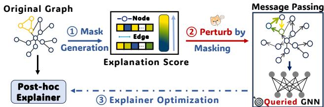  
Figure 1: Rethinking where the distribution shift enters the Perturb-Query pipeline. Existing eforts focus on ① or ③ (e.g. ProxyExplainer (Chen et al. 2024)), while this work focuses on ② the perturbation mechanism itself.

This assumption is fragile because perturbed graphs can introduce substantial distribution shift, moving the queried predictions away from the model’s original operating regime and making the resulting prediction changes ambiguous (Zheng et al. 2024; Fang et al. 2023a,b). To alleviate this issue, existing methods mainly focus on improving explana- tion quality through better generation of explanation scores and explainer optimization. For example, they aim to make explanation subgraphs structurally more natural (Chen et al. 2023), closer to the original graph distribution (Chen et al. 2024), or equipped with confidence-aware correction mechanisms (Zhang et al. 2025). However, a crucial factor remains underexplored: whether the observed distribution shift is al- ready introduced by the perturbation mechanism itself, be- fore the resulting signals are used to optimize the explainer.

To isolate whether the perturbation mechanism itself con- tributes to this shift, we design an experiment using ground- truth explanations as oracle baseline and compare the result- ing graph representations with those of the original graph. The discrepancy persists under oracle scores, suggesting that score quality alone does not explain the observed shift. We identify this efect to Element-wise Masking (EM), the default mechanism used to instantiate explanation scores dur- ing message passing. As show on the left of Figure 2, EM suppresses edge-induced messages toward zero, coupling in- formation corruption with deterministic scale contraction. As this contraction accumulates across layers, the perturbed computation progressively departs from the clean message- scale regime, a phenomenon we term Scale Drift. Hence, these findings motivate us to explore an alternative perturbation mechanism that corrupts the information carried by messages without explicitly reducing their scale.

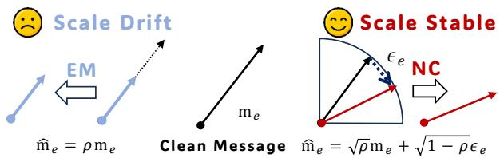  
Figure 2: Comparison NC with EM in the message passing.

To this end, we introduce Noise Corruption (NC), a message-level perturbation mechanism that replaces zero- directed masking with matched-norm stochastic corruption. As show on the right of Figure 2, NC combines each clean message with a scale-matched corrupted counterpart through a restoration gate, perturbing the information it carries while preserving its expected squared norm. It therefore defines a scale-stable corruption and restoration space that avoids the deterministic scale collapse of EM. However, since the corrupted counterparts are sampled stochastically, a fixed restoration configuration can produce diferent queried pre- dictions across forward passes. NC thus provides the pertur- bation space, but not yet a stable explanation.

Building on NC, we propose NICE, a Noise Corrup- tion based explanation framework to address two remain- ing questions separately: how much messages should be jointly restored under stochastic corruption and how their restoration should be attributed to individual edges. First, Stochastic Restoration Boundary Learning (SRB) learns a compact boundary by balancing the degradation and varia- tion of the original target prediction against restoration com- pactness. Since the learned gates record restoration degrees rather than their prediction-level contributions, Boundary- Integrated Gradient (BIG) integrates the reduction in stochastic restoration risk along the path from the fully corrupted state to the learned boundary. NICE thus first locates a com- pact stochastic boundary and then converts the restoration process into attributions. Our main contributions as follows:

1. We identify Scale Drift as a previously overlooked con- founding factor in Perturb-Query paradigm, showing that it arises from the widely used masking mechanism.

2. We propose Noise Corruption (NC), a scale-stable alternative which replaces zero-directed masking with matched-norm random-direction corruption, thereby defining a scale-stable corruption and restoration space.

3. Building on NC, we propose NICE, a noise corruption based explanation paradigm that first learns Stochastic Restoration Boundary and then generates explanation scores through Boundary Integrated Gradient.

4. Across eight benchmarks, NICE improves average Recall and AUC-ROC over the best baseline by 8.67% and 7.57% respectively and obtains higher retention fidelity.

## Preliminaries

Notation. Let $G \ = \ ( \nu , { \mathcal { E } } )$ be an input graph where $\mathcal { V } = \{ v _ { 1 } , v _ { 2 } , . . . , v _ { n } \}$ denotes the node set and $\mathcal { E } \subseteq \mathcal { V } \times \mathcal { V }$ represents the edge set. In this work, we focus on explain- ing for graph classification tasks that GNN $f ( G ) \in \mathbb { R } ^ { \dot { C } }$ was trained to output its prediction $y ^ { * } =$ arg maxc $f _ { c } ( G )$ . At layer $l ,$ the GNN computes edge-induced messages and ag- gregates them to update node representations. For an edge $e _ { i j } = ( v _ { i } , v _ { j } ) \in \mathcal { E }$ , we denote the message between them as

$$
\begin{array} { r } { \mathbf { m } _ { i  j } ^ { ( l ) } = \phi ^ { ( l ) } ( \mathbf { h } _ { i } ^ { ( l ) } , \mathbf { h } _ { j } ^ { ( l ) } , e _ { i j } ) , } \end{array}\tag{1}
$$

where $\mathbf { h } ^ { ( l ) }$ denotes layer-l node representations and $\phi ^ { ( l ) }$ is the message function. We use the mean squared norm of edge-induced messages as a layer-wise proxy for message scale.

$$
\mathcal { S } ^ { ( l ) } ( G ) = \mathbb { E } _ { ( u , v ) \in \mathcal { E } } [ \| \mathbf { m } _ { u  v } ^ { ( l ) } \| _ { 2 } ^ { 2 } ] .\tag{2}
$$

Perturb-and-Query Explanation. Without lossing generality (Abrate and Bonchi 2021; He et al. 2022), we focus on edge-level explanation that the goal is to assigns each edge $e \in { \mathcal { E } }$ an attribution score $s _ { e } \in [ \bar { 0 } , 1 ]$ to indicate its contribu- tion to the target prediction $y ^ { * }$ . A broad family of explainers follows the perturb-and-query paradigm that estimate edge importance by perturbing graph components and querying the response of the fixed target GNN. Since GNN predic- tions are produced through message passing, we formulate perturbation at the message level. For simplicity, we regard each edge $e = ( v _ { i } , v _ { j } ) \in \mathcal { E }$ as a message-passing edge and write $\mathbf { m } _ { e } ^ { ( l ) } : = \mathbf { m } _ { i  j } ^ { ( l ) } . \mathrm { ~ A ~ }$ generic perturbation mechanism operating at the message-passing level can be written as

$$
\widetilde { \mathbf { m } } _ { e } ^ { ( l ) } = \Psi _ { \rho _ { e } } ^ { ( l ) } \left( \mathbf { m } _ { e } ^ { ( l ) } \right) ,\tag{3}
$$

where $\rho _ { e } \in [ 0 , 1 ]$ is an intervention variable controlling how much the message induced by edge e is perturbed and $\Psi _ { \rho _ { e } } ^ { ( l ) }$ denotes the corresponding perturbation mechanism.

Element-wise Masking. In conventional perturb-query explainers, the intervention variable is commonly imple- mented as a multiplicative mask on the induced message:

$$
\Psi _ { \mathrm { E M } , \rho _ { e } } ^ { ( l ) } \left( \mathbf { m } _ { e } ^ { ( l ) } \right) = \rho _ { e } \mathbf { m } _ { e } ^ { ( l ) } .\tag{4}
$$

The learned mask coeficient is directly used as the attribution score, i.e., $s _ { e } = \rho _ { e }$ . This coupling makes edge attribution operationally tied to multiplicative message suppression. In this work, we show that this perturbation mechanism can systematically alter the propagation scale of the target GNN.

## Rethinking the Perturbation Mechanism

In this section, we revisit the distribution shift in perturb- query explanation from the perspective of the perturbation mechanism itself. We first show that shift persists even when perturbations are instantiated from oracle explanations, sug- gesting that the issue can’t be attributed solely to poor quality. We then trace this shift to element-wise masking which de- terministically contracts message scale during propagation. This phenomenon which we call Scale $D r i f t$ , motivates the need for a scale-stable message perturbation mechanism.

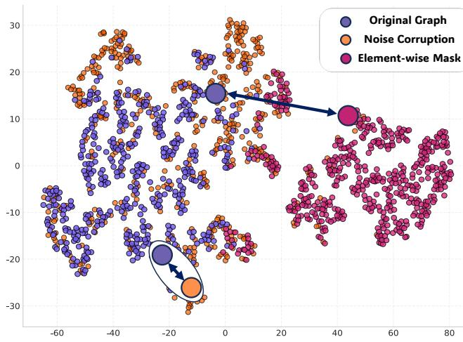  
(a) Representation Shift in GNN Explanations

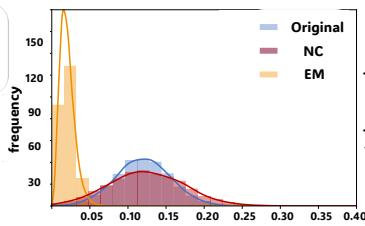  
(b) Message Scale Distribution on GCN

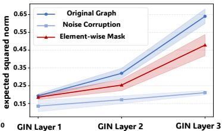  
(d) Depth-Amplified Scale Drift

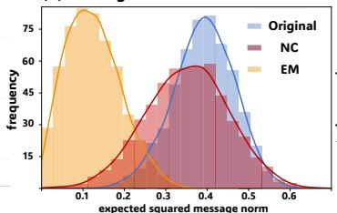  
(c) Message Scale Distribution on GIN

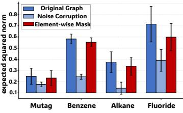  
(e) Cross-Dataset Scale Drift  
Figure 3: Preliminary experimental results. (a) t-SNE visualization of graph embeddings from the original graph and the same ground-truth explanation instantiated with EM and NC. (b)-(c) Message scale distribution shift across GCN and GIN. (d) Layer-wise mean scale under diferent perturbation mechanisms. (e) Cross-dataset summary of message-scale statistics.

## Distribution Shift Persists under Oracle Settings

Existing eforts mainly attribute unreliable model responses on perturbed graphs to the quality of generated explanations or to the naturalness of perturbed graphs. Accordingly, prior eforts mainly improve the learned explanation scores, make perturbed graphs closer to the data distribution or stabilize the queried model responses after perturbation (Wu et al. 2022; Chen et al. 2023). However, these treatments don’t isolate whether the observed shift is caused by imperfect explanation or by the perturbation mechanism itself.

Oracle Experiments. To disentangle these two possibil- ities, we remove the uncertainty from explanation learning by using ground-truth explanations as oracle explanations. Specifically, we instantiate perturbation directly from the ground-truth explanation and compare the resulting graph representations with those of the original graph. As shown in Figure 3(a), a clear representation shift still appears even under this oracle setting. This observation suggests that the discrepancy is not merely a byproduct of imperfect explana- tion learning. Even when the selected explanatory structure is correct, the way it is instantiated as a perturbation can still move the target GNN away from its original representation regime. We therefore turn to the perturbation mechanism shared by existing perturb-query explainers.

## Element-wise Masking Induces Scale Drift

Under deletion-oriented perturbations as defined in Eq. 4, re- ducing message scale is a natural consequence of suppressing an edge. The ambiguity arises when the resulting prediction change is interpreted directly as the information contribution of that edge, because EM jointly removes the edge-specific message signal and its contribution to propagation scale.

Scale Drift. This efect is visible in Figure 3 (b,c). Under the same explanation, EM systematically shifts the mes- sage scale distribution toward smaller values compared with the original graph. As the contracted messages are repeat- edly transformed and propagated across layers, the perturbed computation gradually departs from the original propagation regime. We term this progressive mismatch as Scale Drift.

Let $\widetilde { S } _ { \mathrm { E M } } ^ { ( l ) } ( G )$ denotes the layer-l message scale of the EM-perturbed computations. We denote $\eta _ { e } ^ { ( l ) }$ as the fraction of layer-l scale carried by the message induced by edge e:

$$
\eta _ { e } ^ { ( l ) } : = \| m _ { e } ^ { ( l ) } \| _ { 2 } ^ { 2 } / \sum _ { a \in \mathcal { E } } \| m _ { a } ^ { ( l ) } \| _ { 2 } ^ { 2 } .\tag{5}
$$

The following theorem formalizes EM-induced Scale Drift. Theorem 1 (Layer-wise Scale Contraction under EM). For any layer l, applying EM with coeficients $\{ \rho _ { e } \in$ [0, 1]} ∈E yields

$$
\frac { S _ { \mathrm { E M } } ^ { ( l ) } ( G ) } { S ^ { ( l ) } ( G ) } \le 1 - \sum _ { e \in \mathcal { E } } ( 1 - \rho _ { e } ^ { 2 } ) \eta _ { e } ^ { ( l ) }\tag{6}
$$

The contraction is strict whenever there exists an edge e such that $\eta _ { e } ^ { ( l ) } > 0$ and $\rho _ { e } < 1$

Proof. See Appendix B. Theorem 1 shows that EM introduces a deterministic scale contraction whenever a message with nonzero scale is suppressed. Repeated contractions across layers lead to the following depth-dependent result.

Corollary 2 (Depth-amplified Scale Drift under EM). Under the conditions of Theorem 1, suppose an edge e satisfies $\rho _ { e } \in ( 0 , 1 )$ and $\eta _ { e } ^ { ( l ) } \geq \underline { { { \eta } } } > 0 .$ for all l = 1, . . . , L. Then,

$$
- \sum _ { l = 1 } ^ { L } \log \frac { S _ { \mathrm { E M } } ^ { ( l ) } ( G ) } { S ^ { ( l ) } ( G ) } \geq - L \log \left[ 1 - ( 1 - \rho _ { e } ^ { 2 } ) \underline { { \eta } } \right] .\tag{7}
$$

Hence, the drift grows at least linearly with deeper layers. Proof. See Appendix B. Corollary 2 shows how repeated layer-wise contractions accumulate with depth, providing a mechanism-level explanation for the depth-amplified scale discrepancy observed in Figure 3(d).

Empirical Evidence. We empirically examine the above mechanism in Figure 3. Under the same oracle explanation, EM consistently shifts the message-norm distribution toward smaller values than the original graph as shown in (b) and (c). This local contraction further develops into a layer-wise scale gap. As shown in (d), the discrepancy between EM and the original graph becomes more pronounced across GNN layers which is consistent with the depth-amplified behavior. The same pattern also appears across datasets and backbones in (e), suggesting that Scale Drift is not an isolated artifact but a recurring consequence observed across the datasets.

Taken together, the oracle analysis, theoretical result, and empirical evidence show that EM introduces a confounding factor into perturb-query explanation. A prediction change under EM may not only reflect the removal of explana- tory information, but also arise from the collapse of prop- agation scale. This ambiguity weakens the reliability of queried model responses, motivating a scale-stable perturba- tion mechanism that perturbs edge-induced message content without deterministically shrinking message scale.

## Methodology

In this section, We present NICE, a Noise Corruption-based framework that reformulates edge explanation as a stochastic restoration process. Rather than suppressing edge-induced messages toward zero, NICE starts from matched-norm cor- rupted counterparts and examines how clean-message direc- tions should be restored to recover the original target pre- diction. Procedurally, NICE consists of three components. First, it defines a scale-stable perturbation space through Noise Corruption (NC), which replaces multiplicative sup-pression with matched-norm stochastic corruption. Second, Stochastic Restoration Boundary Learning (SRB) interprets the NC coeficient as a restoration gate and learns a com- pact boundary that preserves the target prediction under stochastic corruption. Third, since this boundary specifies a restoration configuration, Boundary-Integrated Gradients (BIG) decodes it into importance scores by measuring the element-wise contribution along the restoration path.

## Scale-Stable Noise Corruption

The diagnosis above suggests that a desirable alternative should perturb the information carried by edge-induced mes- sages without deterministically shrinking their scale defined in Eq. (2). To this end, NICE introduces Noise Corruption (NC), which replaces zero-directed suppression with matched-norm random-direction corruption. For the mes- sage $\mathbf { m } _ { e } ^ { ( l ) } \in \mathbb { R } ^ { d _ { l } }$ induced by edge e at layer $l ,$ we sample a corrupted counterpart from the sphere with the same norm:

$$
\epsilon _ { e } ^ { ( l ) } \sim \mathcal { P } _ { e } ^ { ( l ) } : = \mathrm { U n i f } \left( \left\{ \mathbf { z } \in \mathbb { R } ^ { d _ { l } } : \| \mathbf { z } \| _ { 2 } = \| \mathbf { m } _ { e } ^ { ( l ) } \| _ { 2 } \right\} \right)\tag{8}
$$

We use $\mathcal { P } _ { \mathrm { N C } }$ to denote the joint distribution of all corrupted counterparts sampled across edges and message-passing layers in one NC forward pass. Given a restoration gate $\rho _ { e } \in [ 0 , 1 ]$ ], NC corrupts the message with the noise:

$$
\Psi _ { \mathrm { N C } , \rho _ { e } } ^ { ( l ) } \left( \mathbf { m } _ { e } ^ { ( l ) } \right) = \sqrt { \rho _ { e } } \mathbf { m } _ { e } ^ { ( l ) } + \sqrt { 1 - \rho _ { e } } \pmb { \epsilon } _ { e } ^ { ( l ) } .\tag{9}
$$

Here, $\rho _ { e }$ controls how far the message is restored toward its clean direction: $\rho _ { e } = 0$ gives a fully corrupted counter- part, whereas $\rho _ { e } = 1$ recovers the clean message. Therefore, Varying $\rho _ { e }$ defines a continuous restoration path within the matched-norm corruption space. The proposition shows that the restoration path satisfies the scale-stability requirement.

Proposition 3 (Scale-Stable Restoration Path under NC). For any fixed message $\mathbf { m } _ { e } ^ { ( l ) }$ and restoration gate $\rho _ { e } \in [ 0 , 1 ]$

$$
\mathbb { E } _ { \epsilon _ { e } ^ { ( l ) } } \left[ \left\| \Psi _ { \mathrm { N C } , \rho _ { e } } ^ { ( l ) } \left( \mathbf { m } _ { e } ^ { ( l ) } \right) \right\| _ { 2 } ^ { 2 } \right] = \left\| \mathbf { m } _ { e } ^ { ( l ) } \right\| _ { 2 } ^ { 2 } .\tag{10}
$$

Proof. The result follows by expanding Eq. (9) and the full proof is provided in Appendix B. By preserving mes- sage scale in expectation, NC excludes the systematic scale- shrinkage factor introduced by EM, allowing queried pre- diction changes to be more directly attributed to the pertur- bation of edge-induced message information. However, NC alone does not specify an explanation. What remains is to identify a compact configuration of restoration gates whose queried behavior remains suficiently close to the original target decision under stochastic noise corruption.

## Stochastic Restoration Boundary Learning

Building on the NC restoration path, we formulate the above problem as Stochastic Restoration Boundary Learning (SRB). For the input graph $G \ : = \ : ( \nu , \mathcal { E } )$ and its tar- get prediction $y ^ { * }$ , we seeks a joint restoration configuration $\rho = \{ \rho _ { e } \} _ { e \in E }$ . As defined in Eq. (9), each $\rho _ { e }$ controls how far the corresponding edge-induced message is restored from its corrupted counterpart toward its clean direction. The objective is to restore only the clean-message directions necessary for maintaining the original target prediction.

Restoration Suficiency under NC. For a fixed restoration configuration $\rho ,$ the queried prediction remains stochastic due to each NC forward pass draws corrupted counterparts from $\mathcal { P } _ { \mathrm { N C } }$ . For one NC samples $\epsilon \sim \mathcal { P } _ { \mathrm { N C } }$ , let $f ( G ; \rho , \epsilon )$ de- note the corresponding target-class probability. We measure how well $\rho$ restores the target predictions through We the one-sided target-prediction degradation:

$$
d _ { y ^ { * } } ( \pmb { \rho } , \pmb { \epsilon } ) = \left[ \log f _ { y ^ { * } } ( G ) - \log f _ { y ^ { * } } ( \pmb { \rho } , \pmb { \epsilon } ) \right] _ { + } .\tag{11}
$$

The deviation is zero when the corrupted computation pre- serves or strengthens the target-class probability, and in- creases only when support for the original prediction de- grades. It therefore evaluates restoration suficiency with re- spect to the target decision without requiring the complete queried output to reproduce the clean prediction.

The same restoration configuration may induce diferent deviations across noise realizations. We account for both their average magnitude and sampling-induced variation through the stochastic restoration error

$$
\mathscr { R } _ { y ^ { * } } ( \rho ) = \mathbb { E } _ { \epsilon } \left[ d _ { y ^ { * } } ( \rho , \epsilon ) \right] + \beta \ \mathrm { S t d } _ { \epsilon } \left[ d _ { y ^ { * } } ( \rho , \epsilon ) \right] ,\tag{12}
$$

where $\beta \geq 0$ controls the penalty on corruption-induced variation. A small $\mathcal { R } ( \rho )$ indicates that the target behavior is restored both accurately and consistently under NC.

<table><tr><td rowspan=1 colspan=1>Metric     Method</td><td rowspan=1 colspan=8>Mutag   Benzene    Alkane   Fluoride    Indole     PAINS   R-Count   R-Max</td><td rowspan=1 colspan=1>Rank</td></tr><tr><td rowspan=2 colspan=1>RandomSaliency</td><td rowspan=1 colspan=8>20.06±0.55 30.80±0.40   $8 . 9 0 { \scriptstyle \pm 1 . 0 9 }$    $2 4 . 5 2 { \scriptstyle \pm 0 . 4 3 }$    $2 9 . 4 9 { \scriptstyle \pm 0 . 1 0 }$  29.00±0.23 41.23±0.08  34.95±0.47</td><td rowspan=1 colspan=1>10</td></tr><tr><td rowspan=1 colspan=1>49.00±0.07</td><td rowspan=1 colspan=2>47.29±0.01  0.00±0.00</td><td rowspan=1 colspan=1>48.09±0.00</td><td rowspan=1 colspan=1>50.03±0.00</td><td rowspan=1 colspan=2>49.97±0.01 37.97±0.01</td><td rowspan=1 colspan=1>46.97±0.00</td><td rowspan=1 colspan=1>6</td></tr><tr><td rowspan=1 colspan=1>GuidedBP</td><td rowspan=1 colspan=1>37.50±0.00</td><td rowspan=1 colspan=2>45.31±0.01   $1 5 . 1 7 { \scriptstyle \pm 0 . 0 0 }$ </td><td rowspan=1 colspan=1>41.68±0.00</td><td rowspan=1 colspan=1>42.67±0.00</td><td rowspan=1 colspan=2>51.66±0.01  38.77±0.01</td><td rowspan=1 colspan=1>47.03±0.00</td><td rowspan=1 colspan=1>5</td></tr><tr><td rowspan=1 colspan=1>GNNExplainer</td><td rowspan=1 colspan=1>31.79±1.90</td><td rowspan=1 colspan=2> $2 5 . 8 8 \pm 1 . 0 0$    $3 2 . 1 6 { \scriptstyle \pm 2 . 2 1 }$ </td><td rowspan=1 colspan=1> $3 0 . 9 5 { \scriptstyle \pm 0 . 4 9 }$ </td><td rowspan=1 colspan=1>42.22±0.50</td><td rowspan=1 colspan=1>38.97±0.04</td><td rowspan=1 colspan=1>51.50±0.09</td><td rowspan=1 colspan=1>45.80±1.01</td><td rowspan=1 colspan=1>8</td></tr><tr><td rowspan=3 colspan=1>PGExplainerF1RefineD4Explainer</td><td rowspan=1 colspan=1>51.67±0.24</td><td rowspan=1 colspan=2>64.96±0.18   $2 6 . 3 9 { \scriptstyle \pm 0 . 0 0 }$ </td><td rowspan=1 colspan=1>61.79±0.40</td><td rowspan=1 colspan=1>46.65±0.03</td><td rowspan=1 colspan=1>45.98±0.00</td><td rowspan=1 colspan=1>52.65±0.00</td><td rowspan=1 colspan=1>53.17±0.00</td><td rowspan=1 colspan=1>3</td></tr><tr><td rowspan=1 colspan=1>43.60±0.82</td><td rowspan=1 colspan=1> $4 2 . 8 8 { \scriptstyle \pm 0 . 3 1 }$ </td><td rowspan=1 colspan=1> $1 1 . 4 8 { \scriptstyle \pm 0 . 0 0 }$ </td><td rowspan=1 colspan=1> $3 0 . 3 6 { \scriptstyle \pm 2 . 4 2 }$ </td><td rowspan=1 colspan=1> $3 7 . 3 9 { \scriptstyle \pm 0 . 0 6 }$ </td><td rowspan=1 colspan=1>54.18±0.07</td><td rowspan=1 colspan=1>53.73±0.00</td><td rowspan=1 colspan=1>51.67±0.00</td><td rowspan=1 colspan=1>4</td></tr><tr><td rowspan=1 colspan=1> $3 0 . 6 8 \pm 0 . 5 7$ </td><td rowspan=1 colspan=1> $6 1 . 9 1 { \scriptstyle \pm 0 . 2 2 }$ </td><td rowspan=1 colspan=1> $2 6 . 5 8 \pm 0 . 7 7$ </td><td rowspan=1 colspan=1> $2 8 . 2 5 { \scriptstyle \pm 1 . 0 2 }$ </td><td rowspan=1 colspan=1> $3 6 . 2 9 { \scriptstyle \pm 0 . 4 3 }$ </td><td rowspan=1 colspan=1>40.50±0.10</td><td rowspan=1 colspan=1>50.96±0.18</td><td rowspan=1 colspan=1>46.80±1.38</td><td rowspan=1 colspan=1>9</td></tr><tr><td rowspan=1 colspan=1>ProxyExplainer</td><td rowspan=1 colspan=1> $3 6 . 3 3 { \scriptstyle \pm 0 . 0 0 }$ </td><td rowspan=1 colspan=1> $4 9 . 5 2 \pm 0 . 0 1$ </td><td rowspan=1 colspan=1> $1 4 . 2 8 { \scriptstyle \pm 0 . 0 0 }$ </td><td rowspan=1 colspan=1> $3 8 . 2 2 { \scriptstyle \pm 0 . 0 0 }$ </td><td rowspan=1 colspan=1> $3 8 . 5 3 { \scriptstyle \pm 0 . 1 2 }$ </td><td rowspan=1 colspan=1>37.18±0.02</td><td rowspan=1 colspan=1>50.83±0.00</td><td rowspan=1 colspan=1>51.29±0.02</td><td rowspan=1 colspan=1>7</td></tr><tr><td rowspan=1 colspan=1>ConfExplainer</td><td rowspan=1 colspan=1> $5 2 . 1 9 { \scriptstyle \pm 0 . 0 0 }$ </td><td rowspan=1 colspan=1> $\underline { { 7 3 . 4 5 \pm 0 . 0 1 } }$ </td><td rowspan=1 colspan=1> $2 4 . 9 9 { \scriptstyle \pm 0 . 0 0 }$ </td><td rowspan=1 colspan=1> $4 9 . 9 7 { \scriptstyle \pm 0 . 0 6 }$ </td><td rowspan=1 colspan=1> $5 7 . 8 2 { \scriptstyle \pm 0 . 0 0 }$ </td><td rowspan=1 colspan=1>56.04±0.00</td><td rowspan=1 colspan=1>53.27±0.00</td><td rowspan=1 colspan=1>51.97±0.00</td><td rowspan=1 colspan=1>2</td></tr><tr><td rowspan=1 colspan=1>NICE (Ours)</td><td rowspan=1 colspan=1> $\overline { { 5 3 . 9 0 \pm 0 . 1 5 } }$ </td><td rowspan=1 colspan=1> $\overline { { 7 8 . 4 9 \pm 0 . 0 4 } }$ </td><td rowspan=1 colspan=1> $2 7 . 3 1 { \pm } 0 . 1 2 $ </td><td rowspan=1 colspan=1> ${ \bf 6 5 . 4 9 } \pm 0 . 0 5$ </td><td rowspan=1 colspan=1> ${ \bf 6 8 . 6 6 } \pm 0 . 0 0$ </td><td rowspan=1 colspan=1>59.38±0.01</td><td rowspan=1 colspan=1>59.47±0.00</td><td rowspan=1 colspan=1>58.37±0.00</td><td rowspan=1 colspan=1>1</td></tr><tr><td rowspan=2 colspan=1>RandomSaliency</td><td rowspan=1 colspan=1> $3 9 . 5 2 { \scriptstyle \pm 1 . 3 3 }$ </td><td rowspan=1 colspan=1> $3 2 . 7 1 { \scriptstyle \pm 0 . 3 1 }$ </td><td rowspan=1 colspan=1> $3 3 . 8 9 \pm 4 . 2 9$ </td><td rowspan=1 colspan=1> $3 5 . 5 5 { \scriptstyle \pm 0 . 7 3 }$ </td><td rowspan=1 colspan=1> $2 9 . 9 3 { \scriptstyle \pm 0 . 1 3 }$ </td><td rowspan=1 colspan=1> $2 9 . 8 8 \pm 0 . 3 4$ </td><td rowspan=1 colspan=1> $3 0 . 0 0 { \scriptstyle \pm 0 . 0 6 }$ </td><td rowspan=1 colspan=1> $4 0 . 1 1 { \scriptstyle \pm 0 . 3 2 }$ </td><td rowspan=1 colspan=1>10</td></tr><tr><td rowspan=1 colspan=1>90.13±0.12</td><td rowspan=1 colspan=1>50.85±0.02</td><td rowspan=1 colspan=1> $0 . 0 0 { \scriptstyle \pm 0 . 0 0 }$ </td><td rowspan=1 colspan=1> $6 9 . 2 1 { \scriptstyle \pm 0 . 0 0 }$ </td><td rowspan=1 colspan=1> $5 3 . 3 4 { \scriptstyle \pm 0 . 0 0 }$ </td><td rowspan=1 colspan=1>54.70±0.01</td><td rowspan=1 colspan=1>27.67±0.00</td><td rowspan=1 colspan=1>57.19±0.00</td><td rowspan=1 colspan=1>5</td></tr><tr><td rowspan=2 colspan=1>GuidedBPGNNExplainer</td><td rowspan=1 colspan=1>70.89±0.00</td><td rowspan=1 colspan=1> $4 8 . 5 2 { \scriptstyle \pm 0 . 0 1 }$ </td><td rowspan=1 colspan=1> $5 6 . 1 9 { \scriptstyle \pm 0 . 0 0 }$ </td><td rowspan=1 colspan=1> $5 7 . 8 9 { \scriptstyle \pm 0 . 0 0 }$ </td><td rowspan=1 colspan=1> $4 4 . 1 7 { \scriptstyle \pm 0 . 0 0 }$ </td><td rowspan=1 colspan=1>53.26±0.00</td><td rowspan=1 colspan=1> $2 8 . 2 6 { \scriptstyle \pm 0 . 0 0 }$ </td><td rowspan=1 colspan=1>56.94±0.00</td><td rowspan=1 colspan=1>7</td></tr><tr><td rowspan=1 colspan=1> $5 9 . 3 7 { \scriptstyle \pm 3 . 6 7 }$ </td><td rowspan=1 colspan=1>50.71±2.01</td><td rowspan=1 colspan=1> $5 9 . 9 9 { \scriptstyle \pm 4 . 2 0 }$ </td><td rowspan=1 colspan=1> $5 9 . 6 5 { \scriptstyle \pm 1 . 6 8 }$ </td><td rowspan=1 colspan=1> $4 5 . 6 8 \pm 0 . 3 7$ </td><td rowspan=1 colspan=1>41.29±0.14</td><td rowspan=1 colspan=1> $3 7 . 9 9 { \scriptstyle \pm 0 . 4 0 }$ </td><td rowspan=1 colspan=1>53.24±1.44</td><td rowspan=1 colspan=1>6</td></tr><tr><td rowspan=3 colspan=1>PGExplainerRecallRefineD4Explainer</td><td rowspan=1 colspan=1> $9 1 . 5 2 { \scriptstyle \pm 0 . 2 9 } $ </td><td rowspan=1 colspan=1> $6 6 . 7 7 { \scriptstyle \pm 0 . 2 4 }$ </td><td rowspan=1 colspan=1> $9 4 . 6 9 { \scriptstyle \pm 0 . 0 0 }$ </td><td rowspan=1 colspan=1> $8 4 . 9 7 { \scriptstyle \pm 0 . 5 8 }$ </td><td rowspan=1 colspan=1> $4 9 . 4 3 { \scriptstyle \pm 0 . 0 5 }$ </td><td rowspan=1 colspan=1>49.43±0.05</td><td rowspan=1 colspan=1> $3 7 . 8 9 { \scriptstyle \pm 0 . 0 0 }$ </td><td rowspan=1 colspan=1>57.87±0.00</td><td rowspan=1 colspan=1>4</td></tr><tr><td rowspan=1 colspan=1>40.24±0.19</td><td rowspan=1 colspan=1>44.72±0.28</td><td rowspan=1 colspan=1> $8 9 . 3 8 { \scriptstyle \pm 0 . 0 0 }$ </td><td rowspan=1 colspan=1> $6 7 . 0 7 { \scriptstyle \pm 1 . 8 0 }$ </td><td rowspan=1 colspan=1> $3 5 . 9 1 { \scriptstyle \pm 0 . 0 5 }$ </td><td rowspan=1 colspan=1>55.58±0.08</td><td rowspan=1 colspan=1> $\underline { { 4 0 . 6 2 \pm 0 . 0 1 } }$ </td><td rowspan=1 colspan=1>60.03±0.00</td><td rowspan=1 colspan=1>3</td></tr><tr><td rowspan=1 colspan=1> $5 7 . 1 5 { \pm } 1 . 1 8$ </td><td rowspan=1 colspan=1> $\mathbf { 9 6 . 8 3 } \pm 0 . 0 8$ </td><td rowspan=1 colspan=1> $9 3 . 9 5 \pm 1 . 1 1 $ </td><td rowspan=1 colspan=1> $4 3 . 1 5 { \scriptstyle \pm 1 . 4 9 }$ </td><td rowspan=1 colspan=1> $3 5 . 3 0 { \scriptstyle \pm 0 . 3 3 }$ </td><td rowspan=1 colspan=1>39.79±0.16</td><td rowspan=1 colspan=1> $3 5 . 4 0 { \scriptstyle \pm 0 . 5 2 }$ </td><td rowspan=1 colspan=1> $5 2 . 2 6 { \scriptstyle \pm 0 . 9 2 }$ </td><td rowspan=1 colspan=1>8</td></tr><tr><td rowspan=1 colspan=1>ProxyExplainer</td><td rowspan=1 colspan=1>56.82±0.00</td><td rowspan=1 colspan=1> $5 2 . 2 4 { \scriptstyle \pm 0 . 0 1 }$ </td><td rowspan=1 colspan=1> $5 0 . 0 0 { \scriptstyle \pm 0 . 0 0 }$ </td><td rowspan=1 colspan=1> $5 6 . 4 2 \pm 0 . 0 0$ </td><td rowspan=1 colspan=1> $3 8 . 6 3 { \scriptstyle \pm 0 . 0 7 }$ </td><td rowspan=1 colspan=1>40.36±0.01</td><td rowspan=1 colspan=1> $3 5 . 9 8 \pm 0 . 0 0$ </td><td rowspan=1 colspan=1>57.06±0.03</td><td rowspan=1 colspan=1>9</td></tr><tr><td rowspan=2 colspan=1>ConfExplainerNICE (Ours)</td><td rowspan=1 colspan=1> $8 7 . 9 9 { \scriptstyle \pm 0 . 0 0 }$ </td><td rowspan=1 colspan=1> $7 6 . 3 8 { \scriptstyle \pm 0 . 0 1 }$ </td><td rowspan=1 colspan=1> $9 3 . 3 6 { \scriptstyle \pm 0 . 0 0 }$ </td><td rowspan=1 colspan=1> $6 7 . 9 1 { \scriptstyle \pm 0 . 0 1 }$ </td><td rowspan=1 colspan=1> $5 9 . 8 7 { \scriptstyle \pm 0 . 0 0 }$ </td><td rowspan=1 colspan=1> $5 7 . 5 6 { \scriptstyle \pm 0 . 0 1 }$ </td><td rowspan=1 colspan=1> $4 0 . 2 6 { \scriptstyle \pm 0 . 0 0 }$ </td><td rowspan=1 colspan=1> $6 1 . 1 7 { \scriptstyle \pm 0 . 0 0 }$ </td><td rowspan=1 colspan=1>2</td></tr><tr><td rowspan=1 colspan=1> $\mathbf { 9 3 . 9 2 } \substack { \pm 0 . 1 2 }$ </td><td rowspan=1 colspan=1> $\underline { { 8 2 . 6 0 \pm 0 . 0 8 } }$ </td><td rowspan=1 colspan=1> $\mathbf { 9 7 . 6 4 } \pm 0 . 5 1 $ </td><td rowspan=1 colspan=1>88.50±0.05</td><td rowspan=1 colspan=1> $7 6 . 5 6 { \scriptstyle \pm 0 . 0 0 }$ </td><td rowspan=1 colspan=1> $\overline { { 6 1 . 9 3 \pm 0 . 0 0 } }$ </td><td rowspan=1 colspan=1> $\mathbf { 4 4 . 2 6 } \pm 0 . 0 1$ </td><td rowspan=1 colspan=1> $\overline { { 6 8 . 4 2 \pm 0 . 0 0 } }$ </td><td rowspan=1 colspan=1>1</td></tr><tr><td rowspan=2 colspan=1>RandomSaliency</td><td rowspan=1 colspan=1> $5 5 . 4 7 { \scriptstyle \pm 0 . 7 2 }$ </td><td rowspan=1 colspan=1> $5 1 . 9 4 { \scriptstyle \pm 0 . 2 4 }$ </td><td rowspan=1 colspan=1> $5 2 . 0 5 { \scriptstyle \pm 2 . 2 4 }$ </td><td rowspan=1 colspan=1> $5 3 . 3 3 { \scriptstyle \pm 0 . 4 0 }$ </td><td rowspan=1 colspan=1> $4 9 . 9 4 { \scriptstyle \pm 0 . 0 8 }$ </td><td rowspan=1 colspan=1> $4 9 . 9 7 { \scriptstyle \pm 0 . 2 1 }$ </td><td rowspan=1 colspan=1> $5 0 . 0 1 { \scriptstyle \pm 0 . 1 1 }$ </td><td rowspan=1 colspan=1> $5 0 . 4 7 { \scriptstyle \pm 0 . 1 9 }$ </td><td rowspan=1 colspan=1>10</td></tr><tr><td rowspan=1 colspan=1> $8 4 . 8 6 { \scriptstyle \pm 0 . 0 2 }$ </td><td rowspan=1 colspan=1> $6 4 . 1 7 { \scriptstyle \pm 0 . 0 1 }$ </td><td rowspan=1 colspan=1> $3 4 . 3 2 { \scriptstyle \pm 0 . 0 0 }$ </td><td rowspan=1 colspan=1>73.46±0.00</td><td rowspan=1 colspan=1> $6 6 . 3 2 \pm 0 . 0 0$ </td><td rowspan=1 colspan=1>67.33±0.01</td><td rowspan=1 colspan=1>45.95±0.00</td><td rowspan=1 colspan=1>67.37±0.00</td><td rowspan=1 colspan=1>4</td></tr><tr><td rowspan=2 colspan=1>GuidedBPGNNExplainer</td><td rowspan=1 colspan=1> $7 3 . 8 5 { \scriptstyle \pm 0 . 0 0 }$ </td><td rowspan=1 colspan=1> $6 2 . 5 9 { \scriptstyle \pm 0 . 0 1 }$ </td><td rowspan=1 colspan=1> $6 3 . 7 6 { \scriptstyle \pm 0 . 0 0 }$ </td><td rowspan=1 colspan=1> $6 6 . 9 9 { \scriptstyle \pm 0 . 0 0 }$ </td><td rowspan=1 colspan=1> $6 0 . 3 3 { \scriptstyle \pm 0 . 0 0 }$ </td><td rowspan=1 colspan=1> $6 6 . 9 3 { \scriptstyle \pm 0 . 0 0 }$ </td><td rowspan=1 colspan=1> $4 6 . 8 5 { \scriptstyle \pm 0 . 0 1 }$ </td><td rowspan=1 colspan=1>67.17±0.00</td><td rowspan=1 colspan=1>8</td></tr><tr><td rowspan=1 colspan=1> $6 6 . 8 4 { \scriptstyle \pm 2 . 0 7 }$ </td><td rowspan=1 colspan=1> $6 1 . 6 8 { \scriptstyle \pm 1 . 1 0 }$ </td><td rowspan=1 colspan=1> $6 7 . 2 2 { \scriptstyle \pm 2 . 3 7 }$ </td><td rowspan=1 colspan=1> $6 6 . 7 8 { \scriptstyle \pm 1 . 0 0 }$ </td><td rowspan=1 colspan=1> $6 0 . 9 2 { \scriptstyle \pm 0 . 2 7 }$ </td><td rowspan=1 colspan=1> $5 8 . 1 2 { \scriptstyle \pm 0 . 0 8 }$ </td><td rowspan=1 colspan=1>62.97±0.17</td><td rowspan=1 colspan=1>65.33±0.83</td><td rowspan=1 colspan=1>9</td></tr><tr><td rowspan=2 colspan=1>AUC   PGExplainerRefine</td><td rowspan=1 colspan=1> $\underline { { 8 5 . 5 5 \pm 0 . 1 7 } }$ </td><td rowspan=1 colspan=1> $7 6 . 4 0 { \scriptstyle \pm 0 . 1 4 }$ </td><td rowspan=1 colspan=1> $8 4 . 0 3 { \scriptstyle \pm 0 . 0 0 }$ </td><td rowspan=1 colspan=1> $8 3 . 5 0 { \scriptstyle \pm 0 . 3 5 }$ </td><td rowspan=1 colspan=1> $6 3 . 8 4 \pm 0 . 0 3$ </td><td rowspan=1 colspan=1> $6 4 . 4 4 { \scriptstyle \pm 0 . 0 0 }$ </td><td rowspan=1 colspan=1> $6 3 . 5 3 { \scriptstyle \pm 0 . 0 0 }$ </td><td rowspan=1 colspan=1>69.15±0.00</td><td rowspan=1 colspan=1>3</td></tr><tr><td rowspan=1 colspan=1> $5 6 . 3 8 { \scriptstyle \pm 0 . 1 3 }$ </td><td rowspan=1 colspan=1> $6 0 . 4 4 { \scriptstyle \pm 0 . 1 9 }$ </td><td rowspan=1 colspan=1> $6 0 . 1 8 { \scriptstyle \pm 0 . 0 0 }$ </td><td rowspan=1 colspan=1> $6 9 . 9 9 { \scriptstyle \pm 1 . 0 4 }$ </td><td rowspan=1 colspan=1> $5 4 . 7 9 { \scriptstyle \pm 0 . 0 4 }$ </td><td rowspan=1 colspan=1> $6 8 . 9 0 { \scriptstyle \pm 0 . 0 5 }$ </td><td rowspan=1 colspan=1> $6 5 . 6 5 { \scriptstyle \pm 0 . 0 3 }$ </td><td rowspan=1 colspan=1> $6 9 . 9 1 \pm 0 . 0 0$ </td><td rowspan=1 colspan=1>6</td></tr><tr><td rowspan=1 colspan=1>D4Explainer</td><td rowspan=1 colspan=1> $6 5 . 4 0 { \scriptstyle \pm 0 . 6 6 }$ </td><td rowspan=1 colspan=1> $7 1 . 3 6 { \scriptstyle \pm 0 . 0 8 }$ </td><td rowspan=1 colspan=1> $8 3 . 6 8 \pm 0 . 6 2$ </td><td rowspan=1 colspan=1> $5 7 . 7 4 { \scriptstyle \pm 0 . 8 5 }$ </td><td rowspan=1 colspan=1> $6 4 . 0 8 { \scriptstyle \pm 0 . 2 4 }$ </td><td rowspan=1 colspan=1> $5 7 . 3 6 { \scriptstyle \pm 0 . 1 0 }$ </td><td rowspan=1 colspan=1> $6 3 . 2 5 { \scriptstyle \pm 0 . 6 6 }$ </td><td rowspan=1 colspan=1>65.09±0.69</td><td rowspan=1 colspan=1>7</td></tr><tr><td rowspan=1 colspan=1>ProxyExplainer</td><td rowspan=1 colspan=1>66.44±0.00</td><td rowspan=1 colspan=1> $6 5 . 3 8 { \scriptstyle \pm 0 . 0 0 }$ </td><td rowspan=1 colspan=1> $6 0 . 5 4 { \scriptstyle \pm 0 . 0 0 }$ </td><td rowspan=1 colspan=1> $6 5 . 6 4 \pm 0 . 0 0$ </td><td rowspan=1 colspan=1> $7 6 . 4 3 { \scriptstyle \pm 0 . 0 6 }$ </td><td rowspan=1 colspan=1> $5 7 . 2 6 { \scriptstyle \pm 0 . 0 1 }$ </td><td rowspan=1 colspan=1> $6 3 . 3 8 { \scriptstyle \pm 0 . 0 0 }$ </td><td rowspan=1 colspan=1> $6 8 . 1 8 { \scriptstyle \pm 0 . 0 2 }$ </td><td rowspan=1 colspan=1>5</td></tr><tr><td rowspan=1 colspan=1>ConfExplainer</td><td rowspan=1 colspan=1> $8 4 . 2 4 { \scriptstyle \pm 0 . 0 0 }$ </td><td rowspan=1 colspan=1> $8 2 . 7 4 { \scriptstyle \pm 0 . 0 1 }$ </td><td rowspan=1 colspan=1> $8 3 . 2 5 { \scriptstyle \pm 0 . 0 0 }$ </td><td rowspan=1 colspan=1> $7 3 . 3 4 { \scriptstyle \pm 0 . 0 1 }$ </td><td rowspan=1 colspan=1> $7 1 . 6 6 \pm 0 . 0 0$ </td><td rowspan=1 colspan=1> $6 9 . 9 3 { \scriptstyle \pm 0 . 0 1 }$ </td><td rowspan=1 colspan=1> $7 5 . 4 9 { \scriptstyle \pm 0 . 0 1 }$ </td><td rowspan=1 colspan=1> $7 0 . 7 1 { \scriptstyle \pm 0 . 0 0 }$ </td><td rowspan=2 colspan=1>21</td></tr><tr><td rowspan=1 colspan=1>NICE (Ours)</td><td rowspan=1 colspan=3> $\mathbf { 8 7 . 0 8 } \pm 0 . 1 1$    $\mathbf { 8 6 . 6 2 } \pm 0 . 0 4$    $\mathbf { 8 5 . 5 9 } \pm 0 . 2 7$ </td><td rowspan=1 colspan=2> $\mathbf { 8 5 . 8 6 } \pm 0 . 0 3$    $\mathbf { 8 } 2 . 9 4 \mathrm { \pm 0 . 0 0 }$ </td><td rowspan=1 colspan=3> $\overline { { 7 6 . 4 9 \pm 0 . 0 1 } }$    $\overline { { 8 3 . 1 7 \pm 0 . 0 1 } }$    $\overline { { 8 4 . 1 5 \pm 0 . 0 0 } }$ </td></tr></table>

Table 1: Explanation performance of NICE. We retain the Top30% edges and compare them against ground-truth edges. Results are reported as Mean ± Standard Deviation. The best is bold, and the second-best is underlined.

Restoration boundary learning. SRB balances stochastic restoration risk against restoration compactness by:

$$
\mathcal { L } _ { \mathrm { S R B } } ( \boldsymbol { \rho } ) = \mathcal { R } _ { y ^ { * } } ( \boldsymbol { \rho } ) + \lambda _ { \mathrm { r e s t } } \| \boldsymbol { \rho } \| _ { 1 } ,\tag{13}
$$

where $\lambda _ { \mathrm { { r e s t } } } \geq 0$ controls the trade-of between restoring the target prediction and retaining a compact restoration config- uration. The resulting stochastic restoration boundary is

To bridge this gap, we propose Boundary-Integrated Gradient (BIG), which integrates this contribution from the fully corrupted state to the learned boundary along:

$$
\pmb { \rho } ^ { \star } = \arg \operatorname* { m i n } _ { \pmb { \rho } \in [ 0 , 1 ] ^ { | \varepsilon | } } \mathcal { L } _ { \mathrm { S R B } } ( \pmb { \rho } ) .\tag{16}
$$

$$
\rho ( t ) = t \rho ^ { \star } , \qquad t \in [ 0 , 1 ] .\tag{14}
$$

The attribution score of edge e is then computed as

In practice, we estimate $\mathcal { R } _ { y ^ { \ast } } ( \rho )$ using N independent NC samples. Let $\epsilon ^ { ( n ) } \sim \mathcal { P } _ { \mathrm { N C } }$ and $d _ { n } = d _ { y ^ { * } } ( \pmb { \rho } , \pmb { \epsilon } ^ { ( n ) } )$ for $n = 1 , \ldots , N$ . The empirical restoration risk is

$$
s _ { e } ^ { \mathrm { B I G } } = - \rho _ { e } ^ { \star } \int _ { 0 } ^ { 1 } \left. \frac { \partial \mathcal { R } _ { y ^ { \ast } } ( \pmb { \rho } ) } { \partial \rho _ { e } } \right| _ { \pmb { \rho = \rho } ( t ) } \mathrm { d } t .\tag{17}
$$

$$
\widehat { \mathcal { R } } _ { y ^ { * } } ^ { ( N ) } ( \pmb { \rho } ) = \bar { d } _ { N } + \beta \sqrt { \frac { 1 } { N } \sum _ { n = 1 } ^ { N } ( d _ { n } - \bar { d } _ { N } ) ^ { 2 } } , \bar { d } _ { N } = \frac { 1 } { N } \sum _ { n = 1 } ^ { N } d _ { n } .\tag{15}
$$

At each optimization step, we resample the N noise realizations and optimize the empirical counterpart of Eq. 13 by backpropagating through $\hat { \mathcal { R } } _ { y ^ { * } } ^ { ( N ) } ( \rho )$

## Boundary-Integrated Gradient

Although SRB yields a compact restoration boundary $\rho ^ { \star }$ each $\rho _ { e } ^ { \star }$ only records how much the clean-message direction of edge e is restored under the global restoration objective.

The gradient measures how restoring edge e changes the stochastic restoration risk, while the integration accumulates this efect along the restoration path. In practice, we approx- imate the integral in Eq. 17 using a Riemann sum over T uniformly spaced points along the restoration path, where T denotes the number of integration steps.

## Experimental Study

We design our experiments to answer following questions. RQ1: How efective is NICE in terms of agreement with ground-truth and model faithfulness? RQ2: How do EM and NC difer in their efects on message scale and the resulting explanations? RQ3: Under stochastic NC, can SRB learn a compact restoration boundary that restores the target be- havior consistently across noise realizations? RQ4: Is BIG necessary for decoding the learned restoration boundary?

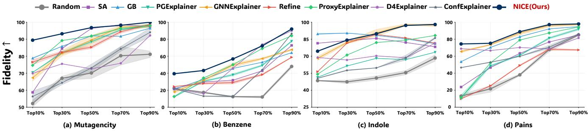  
Figure 4: Fidelity under diferent sparsity budgets. We vary the explanation sparsity from Top10% to Top90% and measure the resulting Fidelity. Higher values indicate that the explanation better preserves the target model prediction.

## Experimental Setup

Datasets. Following prior work (Wang et al. 2023), we We evaluate on eight graph-classification benchmarks with annotated explanatory substructures, including four widely used molecular datasets namely Mutagenicity (Mg), Benzene (Bz), Alkane-Carbonyl (AC) and Fluoride-Carbonyl (FC) (Agarwal et al. 2023). Additionally include seven tasks from the more challenging B-XAIC benchmark, namely Indole, PAINS, Rings-Count and Rings-Max (Proszewska, Danel, and Rymarczyk 2025). Details are provided in Appendix C. Baselines. Three types of baselines are adopted. (1) Reference explainers: GTExplainer which returns the groundtruth explanations as an oracle reference and Random ex- plains randomly as a weak reference. (2) White-box explainers: gradient-based methods including Saliency (Simonyan, Vedaldi, and Zisserman 2014) and GuidedBackprop (Springenberg et al. 2015). (3) Black-box explainers: methods follow the Perturb-Query paradigm, including GN-NExplainer (Guo et al. 2023), PGExplainer (Burkart and Huber 2021), ReFine (Wang et al. 2021), D4Explainer (Chen et al. 2023), ProxyExplainer (Chen et al. 2024), ConfEx-plainer (Zhang et al. 2025). More details see Appendix D.

Evaluation Protocol. We train a GIN classifier as the target model for graph-classification tasks and explain its predic- tions. We implement explanation evaluation align with IDEA (Yin et al. 2026) and reporting Precision, Recall, F1 and AUC-ROC. To assess whether explanations remain faithful to the target model, we further report the widely used Fidelity (Zheng et al. 2024; Magister et al. 2021).

Implementation Details. Following PGExplainer (Luo et al. 2020), we parameterize each restoration gate with an MLP over its edge representation and obtain $\rho _ { e } \in [ 0 , 1 ]$ . The pa- rameters are optimized using Adam with a learning rate of 0.001. By default, we use 16 NC samples to estimate the restoration risk, set $\beta = 0 . 1$ and $\lambda _ { \mathrm { r e s t } } = 1 . 0$ and approx- imate BIG with 16 integration steps. Results are averaged over 5 random seeds. Details are provided in Appendix E.

## Overall Explanation Efectiveness (RQ1)

We evaluate NICE from two complementary perspectives. Agreement with Ground-Truth Explanations. Table 1 shows that NICE ranks first on F1, Recall, and AUC-ROC, outperforming the strongest baseline by an average of 6.42%, 8.67%, and 7.57% respectively. Consistent gains are ob-served regardless of whether tasks are easy or challenging. In particular, the higher Recall and AUC indicate that NICE im- proves both the coverage and ranking of ground-truth edges, rather than relying on a favorable selection threshold.

<table><tr><td rowspan="2">Dataset</td><td rowspan="2">Method</td><td colspan="2">Drepr ↓</td><td colspan="2"> $D _ { \mathrm { p r e d } }$  →</td></tr><tr><td>GT</td><td>Rand</td><td>GT</td><td>Rand</td></tr><tr><td rowspan="3">R-Count</td><td>EM</td><td>0.31±0.09</td><td> $0 . 6 3 { \scriptstyle \pm 0 . 2 2 }$ </td><td> $0 . 5 7 { \scriptstyle \pm 0 . 1 5 }$ </td><td> $0 . 5 9 { \scriptstyle \pm 0 . 1 2 }$ </td></tr><tr><td>NC</td><td>0.07±0.02</td><td>0.08±0.02</td><td>0.02±0.01</td><td>0.04±0.04</td></tr><tr><td>Imp.</td><td>77.42%</td><td>87.30%</td><td>96.49%</td><td>93.22%</td></tr><tr><td rowspan="3">R-Max</td><td>EM</td><td>0.45±0.10</td><td> $0 . 6 1 \pm 0 . 1 1$ </td><td> $0 . 3 6 { \scriptstyle \pm 0 . 1 6 }$ </td><td>0.48±0.18</td></tr><tr><td>NC</td><td>0.16±0.03</td><td>0.16±0.04</td><td>0.14±0.05</td><td>0.13±0.06</td></tr><tr><td>Imp.</td><td>64.44%</td><td>73.77%</td><td>61.11%</td><td>72.92%</td></tr></table>

Table 2: Controlled comparison of EM and NC under GTExplainer and Random. $D _ { \mathrm { r e p r } }$ and $D _ { \mathrm { p r e d } }$ measure rep- resentation distance and target-prediction normalized degra- dation. Imp. denotes the relative reduction ratio.

Faithfulness under Varying Sparsity. Figure 4 shows that NICE is particularly advantageous under small explanation budgets. This indicates that its highest-ranked edges preserve most of the target prediction with only a compact subgraph. As more edges are retained, the performance gap narrows because large budgets reduce the influence of ranking quality.

## Diagnosing Scale Drift and Evaluating NC (RQ2)

We use the same explanations to examine the efects on mes- sage scale, graph representations and queried predictions. Depth-amplified Scale Drift under EM. As shown in Fig- ure 5, EM contracts message scale from the first layer and this discrepancy persists or widens through subsequent message- passing layers. This pattern appears across representative datasets and both GCN and GIN backbones, confirming that Scale Drift is a systematic consequence of multiplica- tive masking rather than an isolated perturbation at a single layer. In contrast, NC remains substantially closer to the clean message-scale trajectory, validating its scale-stable ability.

Representation and prediction efects. Table 2 further com- pares EM and NC under ground-truth and sparsity-matched random scores. NC reduces the normalized representation distance by 70.9% and the target-prediction degradation by 78.8%. Importantly, these improvements persist under random scores, indicating that they arise from the perturbation mechanism instead of explanation quality alone. Together, the results show that EM-induced scale drift is accompanied by larger representation and prediction deviations, while NC keeps the perturbed computation closer to the clean regime.

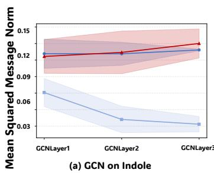

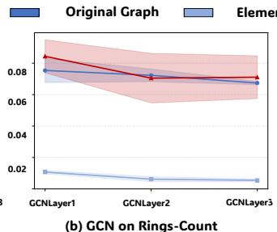

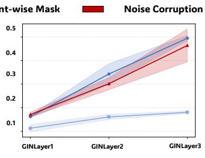

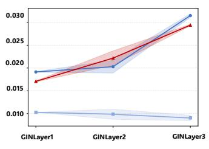

Figure 5: Layer-wise message scale under the same GTExplainer configuration. EM causes persistent message-scale contraction, whereas NC remains closer to the clean computation across datasets and GNN backbones.  
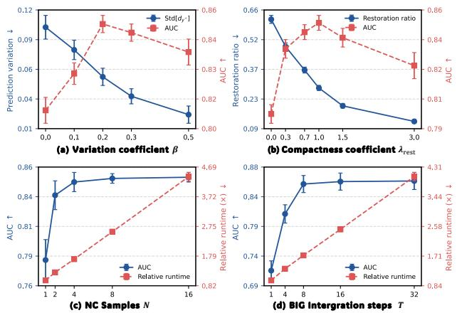  
Figure 6: Hyperparameter sensitivity ofSRB and BIG. We study the efects of the variation coeficient β, compactness coeficient $\lambda _ { \mathrm { { r e s t } } }$ , NC sample number N, and BIG integration steps $T$ on performance, stability, compactness, and runtime.

## Ablation Study (RQ3 & RQ4)

We examine whether SRB learns compact restoration bound- ary and how BIG converts them into attribution scores.

Why SRB is necessary. Table 3 verifies the dual objectives of SRB. Removing the variation penalty increases the mean prediction degradation by 61% and its standard deviation by 217%, showing that variation aware optimization boosts restoration quality and stability across NC samples. Without compactness regularization, the restoration ratio increases by 211%, while AUC decreases by 6.9%. Thus, restoring more messages can not yield superior explanations; compactness is essential for preventing over-restored boundary.

From SRB to BIG. Figure 7 compares the learned restora- tion boundary $\rho ^ { \star }$ with $\mathbf { \Pi } _ { s } ^ { - } \mathrm { B I G }$ on the same graph. While each $\rho ^ { \star }$ records how far edge e is restored at the learned boundary. BIG instead accumulates the contribution of the edge to re- ducing stochastic restoration risk along the restoration path, yielding a sharper ranking over the ground-truth explanatory edges. This comparison illustrating how it converts the joint restoration boundary into edge-level attributions.

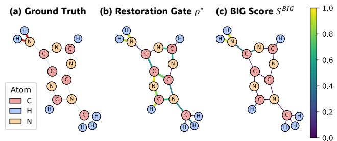

Figure 7: Case study. Gate scores indicate restoration de- grees, whereas BIG more clearly highlights edges.
<table><tr><td>Method</td><td>Mean↓</td><td>Std. ↓</td><td>Rest.↓</td><td>AUC ↑</td></tr><tr><td>Full SRB</td><td> $\mathbf { 0 . 2 3 \bot 0 . 0 6 }$ </td><td> $\mathbf { 0 . 0 6 } \pm 0 . 0 2$ </td><td> $\mathbf { 0 . 2 7 \pm 0 . 1 1 }$ </td><td> ${ \bf 0 . 8 7 \pm 0 . 0 0 }$ </td></tr><tr><td>w/o Var.</td><td> $0 . 3 7 { \scriptstyle \pm 0 . 0 8 }$ </td><td> $0 . 1 9 { \scriptstyle \pm 0 . 0 7 }$ </td><td> $0 . 4 1 { \scriptstyle \pm 0 . 1 3 }$ </td><td> $0 . 8 3 { \scriptstyle \pm 0 . 0 6 }$ </td></tr><tr><td>w/o Comp.</td><td> $\underline { { 0 . 2 5 \pm 0 . 1 1 } }$ </td><td> $\underline { { 0 . 0 9 \pm 0 . 0 4 } }$ </td><td> $0 . 8 4 \pm 0 . 4 2$ </td><td> $0 . 8 1 \pm 0 . 0 2$ </td></tr></table>

Table 3: Analysis of SRB. Results are averaged over Benzene.

Sensitivity and Eficiency. Figure 6(a–b) shows clear tradeofs in SRB. Increasing β improves stability across NC sam-ples, whereas an excessively large value reduces attribu- tion quality. Similarly, increasing $\lambda _ { \mathrm { { r e s t } } }$ yields a more com- pact boundary but eventually compromises target-prediction restoration. Figure 6(c–d) shows that performance quickly saturates as the numbers of NC samples and BIG integration steps increase, whereas runtime continues to grow, supporting the default settings as a favorable trade-of.

## Conclusion

This work revisits distribution shift in Perturb-Query GNN explanation from the perspective of the perturbation mech- anism. We identify Scale Drift, showing that Element-wise Masking couples information corruption with deterministic scale contraction that accumulates across message-passing layers. To avoid this confounding efect, we introduce Noise Corruption, which defines a scale-stable restoration space through matched-norm random-direction corruption. Build- ing on this space, NICE first learns a compact stochastic restoration boundary through SRB and then converts the restoration process into explanation scores through BIG. Ex- periments demonstrate stronger performance while validat- ing the Scale Drift diagnosis and the scale-stability of NC.

## References

Abrate, C.; and Bonchi, F. 2021. Counterfactual graphs for explainable classification of brain networks. In ACM SIGKDD Conference on Knowledge Discovery & Data Mining, 2495–2504.

Agarwal, C.; Queen, O.; Lakkaraju, H.; and Zitnik, M. 2023. Evaluating Explainability for Graph neural Networks. Scientific Data, 10.

Bajaj, M.; Chu, L.; Xue, Z. Y.; Pei, J.; Wang, L.; Lam, P. C.- H.; and Zhang, Y. 2021. Robust counterfactual explanations on graph neural networks. Advances in Neural Information Processing Systems, 34: 5644–5655.

Baldassarre, F.; and Azizpour, H. 2019. Explainability tech- niques for graph convolutional networks. arXiv preprint arXiv:1905.13686.

Burkart, N.; and Huber, M. F. 2021. A survey on the explain- ability of supervised machine learning. Journal of Artificial Intelligence Research, 70: 245–317.

Chen, J.; Wu, S.; Gupta, A.; and Ying, R. 2023. D4Explainer: In-distribution Explanations of Graph Neural Network via Discrete Denoising Difusion. In Proceedings of the International Conference on Neural Information Processing Systems.

Chen, Z.; Zhang, J.; Ni, J.; Li, X.; Bian, Y.; Islam, M. M.; Mondal, A.; Wei, H.; and Luo, D. 2024. Generating In- Distribution Proxy Graphs for Explaining Graph Neural Net- works. In Proceedings of the International Conference on Machine Learning.

Fang, J.; Liu, W.; Gao, Y.; Liu, Z.; Zhang, A.; Wang, X.; and He, X. 2023a. Evaluating Post-hoc Explanations for Graph Neural Networks via Robustness Analysis. In Oh, A.; Naumann, T.; Globerson, A.; Saenko, K.; Hardt, M.; and Levine, S., eds., Advances in Neural Information Processing Systems, volume 36, 72446–72463. Curran Associates, Inc.

Fang, J.; Wang, X.; Zhang, A.; Liu, Z.; He, X.; and Chua, T.-S. 2023b. Cooperative Explanations of Graph Neural Net- works. In Proceedings of the Sixteenth ACM International Conference on Web Search and Data Mining, 616–624.

Ghorbani, A.; Wexler, J.; Zou, J. Y.; and Kim, B. 2019. Towards automatic concept-based explanations. Advances in Neural Information Processing Systems, 32.

Guo, Z.; Xiao, T.; Aggarwal, C.; Liu, H.; and Wang, S. 2023. Counterfactual Learning on Graphs: A Survey. arXiv preprint arXiv:2304.01391.

He, W.; Vu, M. N.; Jiang, Z.; and Thai, M. T. 2022. An Explainer for Temporal Graph Neural Networks. In GLOBE-COM 2022-2022 IEEE Global Communications Conference, 6384–6389. IEEE.

Kazius, J.; McGuire, R.; and Bursi, R. 2005. Derivation and Validation of Toxicophores for Mutagenicity Prediction. Journal ofMedicinal Chemistry, 48(1).

Kipf, T. 2016. Semi-supervised classification with graph convolutional networks. arXiv preprint arXiv:1609.02907.

Luo, D.; Cheng, W.; Xu, D.; Yu, W.; Zong, B.; Chen, H.; and Zhang, X. 2020. Parameterized Explainer for Graph Neural

Network. In Proceedings of the International Conference on Neural Information Processing Systems.

Magister, L. C.; Kazhdan, D.; Singh, V.; and Liò, P. 2021. Gc- explainer: Human-in-the-loop concept-based explanations for graph neural networks. arXivpreprint arXiv:2107.11889.

Proszewska, M.; Danel, T.; and Rymarczyk, D. 2025. B- XAIC Dataset: Benchmarking Explainable AI for Graph Neural Networks Using Chemical Data. arXiv:2505.22252.

Schlichtkrull, M.; Cao, N. D.; and Titov, I. 2021. Interpreting Graph Neural Networks for NLP With Diferentiable Edge Masking. In International Conference on Learning Representations.

Shi, F.; Cao, Y.; Shang, Y.; Zhou, Y.; Zhou, C.; and Wu, J. 2022. H2-fdetector: A gnn-based fraud detector with ho- mophilic and heterophilic connections. In Proceedings of the ACM web conference 2022, 1486–1494.

Simonyan, K.; Vedaldi, A.; and Zisserman, A. 2014. Deep Inside Convolutional Networks: Visualisin Ima e Classifi- cation Models and Saliency Maps. arXiv:1312.6034.

Springenberg, J. T.; Dosovitskiy, A.; Brox, T.; and Ried- miller, M. 2015. Striving for Simplicity: The All Convolu- tional Net. arXiv:1412.6806.

Sundararajan, M.; Taly, A.; and Yan, Q. 2017. Axiomatic attribution for deep networks. In International Conference on Machine Learning, 3319–3328. PMLR.

Tan, J.; Geng, S.; Fu, Z.; Ge, Y.; Xu, S.; Li, Y.; and Zhang, Y. 2022. Learning and evaluating graph neural network ex- planations based on counterfactual and factual reasoning. In Proceedings ofthe ACM Web Conference 2022, 1018–1027.

Wang, S.; Yin, J.; Li, C.; Xie, X.; and Wang, J. 2023. V-InFoR: A Robust Graph Neural Networks Explainer for Structurally Corrupted Graphs. In Proceedings of the International Conference on Neural Information Processing Systems.

Wang, X.; Wu, Y.-X.; Zhang, A.; He, X.; and Chua, T.-S. 2021. Towards Multi-Grained Explainability for Graph Neu- ral Networks. In Proceedings ofthe International Conference on Neural Information Processing Systems.

Wu, H.; Chen, W.; Xu, S.; and Xu, B. 2021. Counterfactual supporting facts extraction for explainable medical record based diagnosis with graph network. In Proceedings of the 2021 Conference of the North American Chapter of the Association for Computational Linguistics: Human Language Technologies, 1942–1955.

Wu, Y.-X.; Wang, X.; Zhang, A.; He, X.; and Chua, T.-S. 2022. Discovering Invariant Rationales for Graph Neural Networks. In International Conference on Learning Representations.

Yin, J.; Wang, S.; Luo, Z.; Huo, P.; Yan, H.; Miao, H.; Li, C.; Pan, S.; and Zhang, C. 2026. Paradigm Shift of GNN Explainer from Label Space to Prototypical Represen- tation Space. In The Fourteenth International Conference on Learning Representations.

Ying, Z.; Bourgeois, D.; You, J.; Zitnik, M.; and Leskovec, J. 2019a. GNNExplainer: Generating Explanations for Graph Neural Networks. In Proceedings of the International Conference on Neural Information Processing Systems.

Ying, Z.; Bourgeois, D.; You, J.; Zitnik, M.; and Leskovec, J. 2019b. Gnnexplainer: Generating explanations for graph neural networks. Advances in neural information processing systems, 32.

Yuan, H.; Yu, H.; Gui, S.; and Ji, S. 2023. Explainability in Graph Neural Networks: A Taxonomic Survey. IEEE Trans. Pattern Anal. Mach. Intell., 45(5): 5782–5799.

Yuan, H.; Yu, H.; Wang, J.; Li, K.; and Ji, S. 2021. On explainability of graph neural networks via subgraph explo- rations. In International Conference on Machine Learning, 12241–12252. PMLR.

Zhang, J.; Liu, X.; Luo, D.; and Wei, H. 2025. Is Your Ex- planation Reliable: Confidence-Aware Explanation on Graph Neural Networks. Proceedings of the 31st ACM SIGKDD Conference on Knowledge Discovery and Data Mining V.2.

Zhang, J.; Luo, D.; and Wei, H. 2023. MixupExplainer: Generalizing Explanations for Graph Neural Networks with Data Augmentation. In Proceedings of the ACM SIGKDD Conference on Knowledge Discovery and Data Mining.

Zheng, X.; Shirani, F.; Wang, T.; Cheng, W.; Chen, Z.; Chen, H.; Wei, H.; and Luo, D. 2024. Towards Robust Fidelity for Evaluating Explainability of Graph Neural Networks. In International Conference on Learning Representations.

## A. Notation

The main notation is summarized in Table 4 and Table 5.
<table><tr><td>Symbol</td><td>Description</td></tr><tr><td>Graph and target GNN  $\hat { G } = ( \nu , \mathcal { E } )$   $\mathcal { V } = \{ v _ { 1 } , \ldots , v _ { n } \}$ </td><td>Input graph with node set V and edge set  $\varepsilon .$  Set of nodes in graph G.</td></tr><tr><td></td><td></td></tr><tr><td> $\mathcal { E } \subseteq \mathcal { V } \times \mathcal { V }$ </td><td>Set of edges in graph G.</td></tr><tr><td> $v _ { i }$   $e _ { i j } = ( v _ { i } , v _ { j } )$   $C$ </td><td>The i-th node in graph  $G .$ </td></tr><tr><td></td><td>Edge between nodes vi and  $v _ { j } .$ </td></tr><tr><td></td><td>Number of prediction classes.</td></tr><tr><td> $L$ </td><td>Number of message-passing layers in GNN.</td></tr><tr><td> $l$ </td><td>Index of a layer,  $l \in \bar { \{ 1 , \ldots , L \} }$ </td></tr><tr><td> $d _ { l }$   $\mathbf { h } _ { i } ^ { ( l ) }$ </td><td>Dimension of a message at layer l.</td></tr><tr><td> $\phi ^ { ( l ) }$ </td><td></td></tr><tr><td></td><td>Representation of node  $v _ { i }$  at layer l.</td></tr><tr><td> $\mathbf { m } _ { i  i } ^ { ( l ) }$ </td><td>Message function at layer l.</td></tr><tr><td> $\mathbf { m } _ { e } ^ { ( l ) }$ </td><td>Message between nodes  $v _ { i }$  and  $v _ { j }$  at layer l.</td></tr><tr><td> $f$ </td><td>Clean message induced by edge e at layer l.</td></tr><tr><td></td><td>Fixed target GNN being explained.</td></tr><tr><td> $f ( G ) \in \mathbb { R } ^ { C }$ </td><td>Prediction of the target GNN on graph  $G .$ </td></tr><tr><td> $f _ { c } ( G )$   $y ^ { \star }$ </td><td>Predicted score or probability for class c.</td></tr><tr><td>Explanation and perturbation</td><td>Target class explained by explainer.</td></tr><tr><td> $s _ { e } \in [ 0 , 1 ]$ </td><td></td></tr><tr><td></td><td></td></tr><tr><td> $\mathbf { s } = \{ s _ { e } \} _ { e \in E }$ </td><td>Attribution score assigned to edge e.</td></tr><tr><td> $\rho _ { e } \in [ 0 , 1 ]$ </td><td>Collection of edge-attribution scores.</td></tr><tr><td></td><td>Intervention coefficient over edge e.</td></tr><tr><td> $\rho = \{ \rho _ { e } \} _ { e \in E }$ </td><td>Joint intervention/restoration configuration.</td></tr><tr><td> $\Psi _ { \rho _ { e } } ^ { ( l ) }$ </td><td></td></tr><tr><td> $\widetilde { \mathbf { m } } _ { e } ^ { ( l ) }$ </td><td>Generic perturbation operator at layer l.</td></tr><tr><td> $\Psi _ { \mathrm { E M } , \rho _ { e } } ^ { ( l ) }$ </td><td>Perturbed message induced by e at layer l.</td></tr><tr><td></td><td>Element-wise Masking controlled by  $\rho _ { e } .$ </td></tr><tr><td> $\Psi _ { \mathrm { N C } , \rho _ { e } } ^ { ( l ) }$ </td><td>Noise Corruption operator controlled by  $\rho _ { e } .$ </td></tr><tr><td>Message scale and Scale Drift  ${ \check { S } } ^ { ( l ) } ( G )$ </td><td></td></tr><tr><td></td><td>Layer-wise message scale at layer l.</td></tr><tr><td> ${ \mathcal { S } } _ { \mathrm { E M } } ^ { ( l ) } ( G )$ </td><td>Layer-wise message scale under EM.</td></tr><tr><td> $\mathcal { S } _ { \mathrm { N C } } ^ { ( l ) } ( G )$ </td><td></td></tr><tr><td></td><td>Layer-wise message scale under NC.</td></tr><tr><td> $\eta _ { e } ^ { ( \iota ) } ,$   ${ \cal S } _ { \mathrm { E M } } ^ { ( l ) } ( G ) / { \cal S } ^ { ( l ) } ( G )$ </td><td>Fraction of message scale carried by edge e. Relative scale retained under EM.</td></tr></table>

Table 4: Summary of notation (Part 1).

## B. Proofs

## Proof of Theorem 1

Recall that the layer-wise message scale is defined as

$$
\mathbf { \mathcal { S } } ^ { ( l ) } ( G ) = \frac { 1 } { | \mathcal { E } | } \sum _ { a \in \mathcal { E } } \left\| \mathbf { m } _ { a } ^ { ( l ) } \right\| _ { 2 } ^ { 2 } .\tag{18}
$$

To isolate the direct efect of EM at layer l, we hold the incoming layer representations fixed and apply the mask co- eficients $\{ \rho _ { a } \} _ { a \in \mathcal { E } }$ to the resulting messages. By Eq. (4), the masked message induced by edge a is

$$
\widetilde { \mathbf { m } } _ { a } ^ { ( l ) } = \rho _ { a } \mathbf { m } _ { a } ^ { ( l ) } .\tag{19}
$$

<table><tr><td>Symbol</td><td>Description</td></tr><tr><td colspan="2">Noise Corruption</td></tr><tr><td> $\epsilon _ { e } ^ { ( l ) }$ </td><td> $\mathbf { m } _ { e } ^ { ( l ) }$  Matched-norm random corruption of  $\epsilon _ { e } ^ { ( l ) }$ </td></tr><tr><td> $\mathcal { P } _ { e } ^ { ( l ) }$ </td><td>Distribution of the corrupted message</td></tr><tr><td> $\epsilon$ </td><td>Collection of corruption variables sampled.</td></tr><tr><td> $\mathcal { P } _ { \mathrm { N C } }$   $f ( G ; \rho , \epsilon )$ </td><td>Joint distribution of corruption variables. GNN prediction under restoration configuration and NC realization €.</td></tr><tr><td> $[ x ] _ { + }$   $d _ { y ^ { \star } } ( \rho , \epsilon )$ </td><td> $\rho$  Stochastic Restoration Boundary Learning Positive-part operator defined as max(x, 0). Target-prediction degradation under NC.</td></tr><tr><td colspan="2"> $\mathcal { R } _ { y ^ { \star } } ( \rho )$ </td></tr><tr><td> $\beta$   $\lambda _ { \mathrm { { r e s t } } }$   $\rho ^ { \star }$ </td><td>Stochastic restoration risk of  $\rho .$  Coefficient of the variation penalty. Coefficient of the compactness penalty.</td></tr><tr><td> $\rho _ { e } ^ { \star }$ </td><td>Learned stochastic restoration boundary.</td></tr><tr><td> $N$ </td><td>Restoration degree at the learned boundary.</td></tr><tr><td></td><td>Number of NC samples.</td></tr><tr><td> $\epsilon ^ { ( n ) }$ </td><td></td></tr><tr><td></td><td>The n-th independently sampled noise.</td></tr><tr><td> $d _ { n }$ </td><td></td></tr><tr><td> $d _ { N }$ </td><td>The n-th target-prediction degradation.</td></tr><tr><td></td><td>Mean target-prediction degradation.</td></tr><tr><td> $\mathcal { \widehat { R } } _ { y ^ { \star } } ^ { ( N ) } ( \rho )$ </td><td>Estimated empirical restoration risk.</td></tr><tr><td> $\| \rho \| _ { 1 }$ </td><td>Regularization boundary compactness.</td></tr><tr><td></td><td></td></tr><tr><td> $t \in [ 0 , 1 ]$ </td><td>Boundary-Integrated Gradient</td></tr><tr><td></td><td>The continuous restoration path.</td></tr><tr><td> $\rho ( t )$   $T$ </td><td>Restoration configuration at position t.</td></tr><tr><td></td><td>Number of numerical integration steps.</td></tr><tr><td> $s _ { e } ^ { \mathrm { B I G } }$ </td><td>BIG attribution of edge e.</td></tr><tr><td></td><td>Operators and diagnostic metrics</td></tr><tr><td> $\| \cdot \| _ { 2 }$ </td><td>Euclidean norm.</td></tr><tr><td> $\| \cdot \| _ { 1 }$ </td><td> $\ell _ { 1 }$  norm.</td></tr><tr><td> $\mathbb { E } _ { \epsilon } [ \cdot ]$ </td><td>Expectation over NC realizations.</td></tr><tr><td> $\mathrm { S t d } _ { \epsilon } [ \cdot ]$ </td><td></td></tr><tr><td></td><td>Standard deviation over NC realizations.</td></tr><tr><td> $D _ { \mathrm { r e p r } }$ </td><td>Graph representations distance.</td></tr><tr><td> $D _ { \mathrm { p r e d } }$ </td><td>Degradation of the target prediction.</td></tr><tr><td></td><td></td></tr><tr><td> $\mathrm { R e s t . }$ </td><td>Average restoration boundary.</td></tr></table>

Table 5: Summary of notation (Part 2).

Therefore, the corresponding message scale is

$$
\begin{array} { r l } & { { \cal S } _ { \mathrm { E M } } ^ { ( l ) } ( G ) = \displaystyle \frac { 1 } { \vert { \cal \mathcal { E } } \vert } \sum _ { a \in { \cal \mathcal { E } } } \left. \widetilde { \mathbf { m } } _ { a } ^ { ( l ) } \right. _ { 2 } ^ { 2 } } \\ & { \quad \quad \quad = \displaystyle \frac { 1 } { \vert { \cal \mathcal { E } } \vert } \sum _ { a \in { \cal \mathcal { E } } } \rho _ { a } ^ { 2 } \left. \mathbf { m } _ { a } ^ { ( l ) } \right. _ { 2 } ^ { 2 } . } \end{array}\tag{20}
$$

Dividing Eq. (20) by Eq. (18) gives

$$
\begin{array} { r l r } {  { \frac { S _ { \mathrm { E M } } ^ { ( l ) } ( G ) } { S ^ { ( l ) } ( G ) } = \frac { \sum _ { a \in \mathcal { E } } \rho _ { a } ^ { 2 } \| \mathbf { m } _ { a } ^ { ( l ) } \| _ { 2 } ^ { 2 } } { \sum _ { a \in \mathcal { E } } \| \mathbf { m } _ { a } ^ { ( l ) } \| _ { 2 } ^ { 2 } } } } \\ & { } & { = \sum _ { a \in \mathcal { E } } \rho _ { a } ^ { 2 } \eta _ { a } ^ { ( l ) } , ~ } \end{array}\tag{21}
$$

where

$$
\eta _ { a } ^ { ( l ) } = \frac { \| \mathbf { m } _ { a } ^ { ( l ) } \| _ { 2 } ^ { 2 } } { \sum _ { b \in \mathcal { E } } \| \mathbf { m } _ { b } ^ { ( l ) } \| _ { 2 } ^ { 2 } } .\tag{22}
$$

<table><tr><td>Statistic</td><td>Graphs</td><td>Average Nodes</td><td>Average Edges</td><td>Node Features</td><td>Classes</td><td>Train/Test</td></tr><tr><td>Mutag</td><td>1,768</td><td>~29.15</td><td>~60.83</td><td>14</td><td>2</td><td>1597/177</td></tr><tr><td>Benzene</td><td>12,000</td><td>~20.58</td><td>~43.64</td><td>14</td><td>2</td><td>10800/1200</td></tr><tr><td>Alkane</td><td>1,125</td><td>~21.39</td><td>~45.38</td><td>14</td><td>2</td><td>1012/113</td></tr><tr><td>Fluoride</td><td>8,671</td><td>~21.36</td><td>~45.37</td><td>14</td><td>2</td><td>7803/868</td></tr><tr><td>B-XAIC</td><td>5,000</td><td>~34.60</td><td>~75.19</td><td>11</td><td>2</td><td>45000/5000</td></tr></table>

Table 6: The statistics of the evaluated datasets and the split.

Since $\textstyle \sum _ { a \in { \mathcal { E } } } \eta _ { a } ^ { ( l ) } = 1$ , we have

$$
\begin{array} { r l r } & { } & { \displaystyle \sum _ { a \in \mathcal { E } } \rho _ { a } ^ { 2 } \eta _ { a } ^ { ( l ) } = \sum _ { a \in \mathcal { E } } \left[ 1 - \left( 1 - \rho _ { a } ^ { 2 } \right) \right] \eta _ { a } ^ { ( l ) } } \\ & { } & { \quad = 1 - \displaystyle \sum _ { a \in \mathcal { E } } ( 1 - \rho _ { a } ^ { 2 } ) \eta _ { a } ^ { ( l ) } . } \end{array}\tag{23}
$$

Because $\rho _ { a } \in [ 0 , 1 ]$ and $\eta _ { a } ^ { ( l ) } \geq 0$ , every term $( 1 - \rho _ { a } ^ { 2 } ) \eta _ { a } ^ { ( l ) }$ is non-negative. Hence,

$$
\frac { S _ { \mathrm { E M } } ^ { ( l ) } ( G ) } { S ^ { ( l ) } ( G ) } = 1 - \sum _ { a \in \mathcal { E } } ( 1 - \rho _ { a } ^ { 2 } ) \eta _ { a } ^ { ( l ) } \le 1 .\tag{24}
$$

Moreover, the inequality is strict whenever there exists an edge a such that $\eta _ { a } ^ { ( l ) } > 0$ and $\rho _ { a } ~ < ~ 1$ , because the cor- responding term $( 1 - \rho _ { a } ^ { 2 } ) \eta _ { a } ^ { ( l ) }$ is then strictly positive. This completes the proof. □

## Proof of Corollary 2

Suppose that an edge e is masked with a fixed coeficient $\rho _ { e } \in ( 0 , 1 )$ and satisfies

$$
\eta _ { e } ^ { ( l ) } \ge \underline { { \eta } } > 0 , \qquad l = 1 , \ldots , L .\tag{25}
$$

Theorem 1 gives, for every layer l,

$$
\begin{array} { r l r } {  { \frac { S _ { \mathrm { E M } } ^ { ( l ) } ( G ) } { S ^ { ( l ) } ( G ) } = 1 - \sum _ { a \in \mathcal { E } } ( 1 - \rho _ { a } ^ { 2 } ) \eta _ { a } ^ { ( l ) } } } \\ & { } & \\ & { } & { \leq 1 - ( 1 - \rho _ { e } ^ { 2 } ) \eta _ { e } ^ { ( l ) } } \\ & { } & { \leq 1 - ( 1 - \rho _ { e } ^ { 2 } ) \eta . } \end{array}\tag{26}
$$

The first inequality follows because all omitted terms are non-negative. Define

$$
q = 1 - ( 1 - \rho _ { e } ^ { 2 } ) \underline { { \eta } } .\tag{27}
$$

Since $\rho _ { e } \in ( 0 , 1 )$ and $\eta > 0 .$ , we have $0 < q < 1$ . Because the function − log x is monotonically decreasing on $( 0 , \infty )$ Eq. (26) implies

$$
- \log \frac { \mathcal { S } _ { \mathrm { E M } } ^ { ( l ) } ( G ) } { \mathcal { S } ^ { ( l ) } ( G ) } \geq - \log q .\tag{28}
$$

Summing the above inequality over $l = 1 , \ldots , L$ yields

$$
\begin{array} { r l } & { \mathcal { D } _ { \mathrm { E M } } ^ { ( L ) } = - \displaystyle \sum _ { l = 1 } ^ { L } \log \frac { S _ { \mathrm { E M } } ^ { ( l ) } ( G ) } { S ^ { ( l ) } ( G ) } } \\ & { ~ \geq - L \log q } \\ & { ~ = - L \log \left[ 1 - ( 1 - \rho _ { e } ^ { 2 } ) \eta \right] . } \end{array}\tag{29}
$$

The right-hand side is linear in L with a strictly positive coeficient because $q ~ \in ~ ( 0 , 1 )$ . Therefore, the cumulative log-scale drift grows at least linearly with the number of message-passing layers. □

## Proof of Proposition 3

For brevity, let $\mathbf { m } = \mathbf { m } _ { e } ^ { ( l ) } , \epsilon = \epsilon _ { e } ^ { ( l ) }$ , and $\rho = \rho _ { e }$ . By the definition of NC,

$$
\Psi _ { \mathrm { N C } , \rho } ^ { ( l ) } ( \mathbf { m } ) = \sqrt { \rho } \mathbf { m } + \sqrt { 1 - \rho } \epsilon .\tag{30}
$$

Expanding its squared norm gives

$$
\begin{array} { r } { \left\| \Psi _ { \mathrm { N C } , \rho } ^ { ( l ) } ( \mathbf { m } ) \right\| _ { 2 } ^ { 2 } = \rho \| \mathbf { m } \| _ { 2 } ^ { 2 } + ( 1 - \rho ) \| \pmb { \epsilon } \| _ { 2 } ^ { 2 } } \\ { + 2 \sqrt { \rho ( 1 - \rho ) } \mathbf { m } ^ { \top } \pmb { \epsilon } . } \end{array}\tag{31}
$$

The corrupted counterpart is sampled uniformly from the sphere

$$
\left\{ \mathbf { z } : \| \mathbf { z } \| _ { 2 } = \| \mathbf { m } \| _ { 2 } \right\} .\tag{32}
$$

Therefore,

$$
\| \epsilon \| _ { 2 } ^ { 2 } = \| \mathbf { m } \| _ { 2 } ^ { 2 }\tag{33}
$$

almost surely. Moreover, the uniform distribution on a sphere is symmetric around the origin, and hence

$$
\mathbb { E } _ { \epsilon } [ \epsilon ] = \mathbf { 0 } .\tag{34}
$$

Consequently,

$$
\begin{array} { r } { \mathbb { E } _ { \epsilon } [ \mathbf { m } ^ { \top } \epsilon ] = \mathbf { m } ^ { \top } \mathbb { E } _ { \epsilon } [ \epsilon ] = 0 . } \end{array}\tag{35}
$$

Taking expectation on both sides of Eq. (31), we obtain

$$
\begin{array} { r l r } & { } & { \mathbb { E } _ { \epsilon } \left[ \left\| \Psi _ { \mathrm { N C } , \rho } ^ { ( l ) } ( \mathbf { m } ) \right\| _ { 2 } ^ { 2 } \right] = \rho \| \mathbf { m } \| _ { 2 } ^ { 2 } + ( 1 - \rho ) \| \mathbf { m } \| _ { 2 } ^ { 2 } } \\ & { } & { = \| \mathbf { m } \| _ { 2 } ^ { 2 } . } \end{array}\tag{36}
$$

Thus, NC preserves the squared message norm in expectation for every restoration gate $\rho \in [ 0 , 1 ]$ □

## C. Datasets and Target GNNs

We evaluate NICE on eight molecular graph-classification benchmarks with ground-truth explanatory structures. The first four are widely used molecular explanation benchmarks, while the remaining four are selected tasks from the B-XAIC benchmark. In all datasets, atoms are represented as graph nodes and chemical bonds as graph edges. Since NICE pro- duces edge-level attributions, we use the annotated bonds belonging to the corresponding chemical patterns as ground- truth explanatory edges. The dataset details are introduced as follows and the dataset statistics are summarized in Table 6.

<table><tr><td>Dataset</td><td>Target Acc. (%)</td><td>Positive Ratio (%)</td><td>Ground-Truth Explanation</td><td>GT Edge Ratio (%)  $\mathbf { M e a n } \pm \mathbf { S t d } .$ </td></tr><tr><td>Mutagencity</td><td>100.00</td><td>36.20</td><td> $\mathrm { N O _ { 2 } \ a n d \ N H _ { 2 } \ g r o u p s }$ </td><td> $3 . 7 8 \pm 6 . 8 5$ </td></tr><tr><td>Benzene</td><td>93.17</td><td>50.00</td><td>Benzene ring</td><td> $1 3 . 1 7 \pm 1 3 . 6 0$ </td></tr><tr><td>Alkane</td><td>100.00</td><td>33.33</td><td>Alkane chain and C=O group</td><td> $1 . 4 6 \pm 2 . 1 0$ </td></tr><tr><td>Fluoride</td><td>96.31</td><td>17.61</td><td>Fluorine atom and C=O group</td><td> $2 . 6 9 \pm 6 . 0 4$ </td></tr><tr><td>Indole</td><td>98.68</td><td>36.70</td><td>Fused benzene-pyrrole structure</td><td> $1 1 . 5 4 \pm 1 6 . 8 5$ </td></tr><tr><td>PAINS</td><td>91.84</td><td>32.94</td><td>Detected PAINS alert substructure</td><td> $1 0 . 3 4 \pm 1 7 . 0 1$ </td></tr><tr><td>Rings-Count</td><td>94.10</td><td>30.20</td><td>Annotated ring structures</td><td> $6 1 . 0 0 \pm 1 6 . 3 8$ </td></tr><tr><td>Rings-Max</td><td>96.16</td><td>5.65</td><td>Ring containing more than six atoms</td><td> $4 6 . 4 8 \pm 1 7 . 1 5$ </td></tr></table>

Table 7: Predictive performance of the target GINs and statistics of the ground-truth explanations. The GT edge ratio is the proportion of ground-truth explanatory edges among all edges, averaged over the graphs included in explanation evaluation.

For each dataset, we train an inde endent GIN classifier as the target model to be explained. Each model uses a hidden dimension of 32 and is optimized with Adam for at most 1,000 epochs using a learning rate of 0.01 and a batch size of 2,048. We employ cross-entropy loss and reduce the learning rate by a factor of 0.5 when the validation loss does not improve for 100 consecutive epochs. The checkpoint with the highest validation accuracy is selected, after which its performance is evaluated once on the held-out test set.

Table 7 reports the predictive accuracy of the resulting target GINs together with the positive-label ratio and ground- truth explanation statistics. For each evaluated graph G, we define the ground-truth edge ratio as

$$
r _ { \mathrm { G T } } ( G ) = \frac { | \mathcal { E } _ { \mathrm { G T } } ( G ) | } { | \mathcal { E } ( G ) | } ,\tag{37}
$$

where $\mathcal { E } _ { \mathrm { G T } } ( G )$ denotes its ground-truth explanatory edges. We report the mean and standard deviation of r (G) over the graphs included in explanation evaluation. The target GINs attain high predictive accuracy across the eight tasks, ensuring that the subsequent experiments evaluate explana- tion quality rather than classifier failure.

## Molecular Explanation Benchmarks

Mutagenicity. Mutagenicity (Kazius, McGuire, and Bursi 2005) contains 4,337 molecular graphs labeled according to whether the corresponding compound exhibits mutagenic activity. The annotated nitro and amino functional groups $\mathrm { ( N O _ { 2 } }$ and NH2) serve as the ground-truth explanations. The dataset contains on average 30.32 nodes and 30.77 edges per graph.

Benzene. Benzene (Agarwal et al. 2023) is a binary classification dataset containing 12,000 molecular graphs sampled from ZINC15. The task is to determine whether a molecule contains at least one benzene ring. The atoms and bonds forming each detected benzene ring are annotated as the ground-truth explanation. When a molecule contains multi- ple disjoint benzene rings, each ring is regarded as a valid explanatory structure. The graphs contain on average 20.58 nodes and 43.65 edges.

Alkane-Carbonyl. Alkane-Carbonyl (Agarwal et al. 2023) contains 4,326 molecular graphs. A molecule receives a positive label when it simultaneously contains an unbranched alkane chain and a carbonyl (C=O) group. The ground-truth explanation is defined as the union of the annotated alkane chain and carbonyl group. The average graph contains 21.13 nodes and 44.95 edges.

Fluoride-Carbonyl. Fluoride-Carbonyl (Agarwal et al. 2023) consists of 8,671 molecular graphs. A positive molecule must contain both a fluorine atom and a carbonyl (C=O) group. The fluorine atom, the carbonyl group, and their corresponding annotated bondsjointly form the groundtruth explanation. The graphs contain on average 21.36 nodes and 45.37 edges.

## B-XAIC Tasks

B-XAIC (Proszewska, Danel, and Rymarczyk 2025) is con-structed from ChEMBL 35, which contains approximately 2.5 million drug-like molecules. Invalid and duplicated SMILES strings are removed, and solvents and counteri- ons are discarded to retain one molecular graph per ex- ample. Weighted sampling is then used to obtain 50,000 molecules, which are divided into training, validation, and test sets of 40,000, 5,000, and 5,000 graphs, respectively. The resulting molecular graphs contain 34.56 atoms on aver-age. Each molecule is associated with binary task labels and with atom- and bond-level annotations for the detected chem- ical patterns. The four tasks below therefore share the same molecular collection but difer in their prediction targets and ground-truth explanations.

Indole. The Indole task predicts whether a molecule con- tains an indole group, i.e., a bicyclic structure consisting of a benzene ring fused with a pyrrole ring. Detecting this rel- atively large pattern requires information to be propagated across multiple atoms. For positive molecules, the atoms and bonds forming the indole structure constitute the ground- truth explanation. Approximately 36.94% of the B-XAIC molecules receive a positive label for this task.

PAINS. The PAINS task detects pan-assay interference compounds, whose characteristic substructures are known to produce false-positive outcomes in high-throughput screen- ing. Unlike tasks defined by a single motif, PAINS involves a diverse collection of chemically distinct alert patterns. A molecule is labeled positive when it contains at least one of these patterns, and the atoms and bonds belonging to the detected PAINS substructure form the ground-truth explana- tion. The positive-label ratio is approximately 32.88%.

Rings-Count. The Rings-Count task predicts whether a molecule contains more than four rings. It therefore requires not only detecting ring structures but also counting their oc- currences within the molecular graph. The atoms and bonds participating in the ring structures relevant to the count are provided as ground-truth explanation annotations. Approxi- mately 30.06% of the molecules are positive for this task.

Rings-Max. The Rings-Max task predicts whether a molecule contains a ring with more than six atoms. In con- trast to Rings-Count, which concerns the number of rings, this task requires determining the size of individual ring structures. For positive instances, the atoms and bonds form- ing the qualifying large ring constitute the ground-truth ex- planation. This is the most imbalanced of the four selected B-XAIC tasks, with a positive-label ratio of approximately 5.54%.

## D. Related Work

Post-hoc GNN Explanation Post-hoc GNN explainers aim to identify the nodes, edges, or subgraphs responsible for a prediction of a trained GNN. Gradient-based methods directly measure prediction sensitivity with respect to graph features or structures (Baldassarre and Azizpour 2019; Simonyan, Vedaldi, and Zisserman 2014), whereas search- and decomposition-based methods construct explanatory sub- graphs or decompose predictions into structural contribu- tions (Yuan et al. 2021; Schlichtkrull, Cao, and Titov 2021). A prominent line follows the Perturb-Query paradigm, in which graph elements are perturbed and their importance is inferred from the response of the target GNN. GNNEx- plainer learns an instance-specific soft mask by maximiz- ing mutual information (Ying et al. 2019b), while PGEx-plainer amortizes mask generation across graph instances (Luo et al. 2020). ReFine further introduces class-aware ex-planation generation to capture contrastive structures (Wang et al. 2021). Despite their diferent score-generation and op- timization strategies, many Perturb-Query explainers instantiate continuous scores through multiplicative suppression of edges or their induced messages. NICE belongs to this general paradigm but revisits the message-level perturbation mechanism used to query the target GNN.

Distribution Shift in Perturb-Query Explanation Perturbing a graph may move the queried input or its internal representation away from the operating regime of the tar- get GNN, making prediction changes dificult to interpret (Fang et al. 2023a; Zheng et al. 2024). Existing methods address this issue at diferent stages of the explanation pipeline. D4Explainer formulates explanation generation as a discrete denoising process to improve the in-distribution property of generated graphs (Chen et al. 2023). Mixup-based methods combine explanatory structures with base graphs to reduce the discrepancy between explanation subgraphs and the orig- inal data distribution (Zhan , Luo, and Wei 2023). V-InFoR learns robust graph representations under structural corrup- tion (Wang et al. 2023), while ProxyExplainer constructs in-distribution proxy graphs for querying the target model (Chen et al. 2024). More recently, IDEA aligns input graphs and explanations in a prototypical representation space (Yin et al. 2026), and ConfExplainer corrects unreliable query signals through confidence-aware optimization (Zhang et al. 2025). Related studies also revisit how faithfulness should be evaluated when graph perturbations themselves introduce distribution shift (Bajaj et al. 2021).

These approaches primarily improve the generated expla- nations, their representations, or the optimization and eval- uation of queried predictions. This work examines a com- plementary source of ambiguity: multiplicative masking si- multaneously suppresses edge-specific message signals and contracts propagation scale. We therefore do not regard NC as a smoother approximation to edge deletion. Instead, NICE defines a scale-controlled restoration intervention that mea- sures how restoring clean-message directions contributes to the original target prediction under matched expected mes- sage scale.

Path-Based Attribution Path-based attribution methods accumulate gradients along a continuous path from a ref- erence state to the input, with Integrated Gradients being a representative approach (Sundararajan, Taly, and Yan 2017). In graph explanation, gradients with respect to edge weights have also been connected theoretically to perturbation-based and occlusion-based explanations under specific model as- sumptions (Ghorbani et al. 2019). BIG adopts the pathintegration principle but difers in both its path and attribu- tion objective. It integrates gradients of stochastic restoration risk in the restoration-gate space, from the fully direction- corrupted state to the boundary learned by SRB. Conse- quently, BIG attributes each edge’s contribution to target- prediction restoration rather than its input sensitivity or dele- tion efect.

## E. Implement Details

This section provides the optimization procedure of Stochas- tic Restoration Boundary Learning (SRB), the explanation-generation procedure based on Boundary-Integrated Gradi- ent (BIG), and the configurations used in our experiments.

## SRB Training Stage

Explainer parameterization. The target GNN is pre- trained and remains frozen throughout explainer optimiza- tion. For each edge e, we obtain an edge representation ze from the hidden representations produced by the target GNN and parameterize its restoration gate as

$$
\rho _ { e } = \sigma \left( g _ { \pmb { \theta } } ( \mathbf { z } _ { e } ) \right) ,\tag{38}
$$

where $g _ { \pmb { \theta } }$ is a multilayer perceptron and $\sigma ( \cdot )$ is the sigmoid function. The same edge-level restoration gate is used across all message-passing layers. Only the parameters $\pmb { \theta }$ of the explainer are updated during SRB training.

Algorithm 1: BIG-Based Explanation Generation   
Require: Graph G, frozen target GNN $f ,$ trained explainer   
gθ⋆ , NC sample number M, and integration steps $T$   
Ensure: Ed e-level attribution $\mathbf { s } ^ { \mathrm { B I G } }$   
1: Perform a clean forward pass and obtain $\begin{array} { r l } { y ^ { * } } & { { } = } \end{array}$   
arg ma $\mathrm { x } _ { c } f _ { c } ( G )$   
2: Compute edge representations $\{ \mathbf { z } _ { e } \} _ { e \in \mathcal { E } }$   
3: Compute the restoration boundary $\rho _ { e } ^ { \star } = \sigma ( g _ { \theta ^ { \star } } ( \mathbf { z } _ { e } ) )$   
4: for $\dot { k } = 1 , \dots , T$ do   
5: Set $\begin{array} { r } { \rho ^ { ( k ) } = \frac { k } { T } \rho ^ { \star } } \end{array}$   
6: Estimate $\widehat { \mathcal { R } } _ { y ^ { * } } ( \rho ^ { ( k ) } )$ using M independent NC sam-  
ples   
7: Compute $\nabla _ { \rho } \widehat { \mathcal { R } } _ { y ^ { * } } ( \rho ^ { ( k ) } )$   
8: end for   
9: Compute   
$\mathbf { s } ^ { \mathrm { B I G } } = - \pmb { \rho } ^ { \star } \odot \frac { 1 } { T } \sum _ { k = 1 } ^ { T } \nabla _ { \rho } \widehat { \mathcal { R } } _ { y ^ { \ast } } ( \pmb { \rho } ^ { ( k ) } )$   
10: Map message-level scores to graph edges and rank them   
in descending order   
11: return $\mathbf { s } ^ { \mathrm { B I G } ^ { \mathrm { \Sigma } } }$

Stochastic restoration risk estimation. For each graph $G ,$ we first perform a clean forward pass to obtain its original target prediction

$$
y ^ { * } = \arg \operatorname* { m a x } _ { c } f _ { c } ( G )\tag{39}
$$

and the corresponding target-class probability $p _ { y ^ { * } } ( G )$ . Given the restoration configuration $\rho = \{ \rho _ { e } \} _ { e \in \mathcal { E } }$ , we sample N independent collections of matched-norm corrupted messages:

$$
\begin{array} { r } { \epsilon ^ { ( n ) } \sim \mathcal { P } _ { \mathrm { N C } } , \qquad n = 1 , \dots , N . } \end{array}\tag{40}
$$

Each collection defines one independent NC forward pass. For the n-th NC sample, the one-sided target-prediction degradation is

$$
d _ { n } = \Big [ \log p _ { y ^ { * } } ( G ) - \log p _ { y ^ { * } } \Big ( \pmb { \rho } , \pmb { \epsilon } ^ { ( n ) } \Big ) \Big ] _ { + } .\tag{41}
$$

The empirical stochastic restoration risk is computed as

$$
\widehat { \mathcal { R } } _ { y ^ { * } } ^ { ( N ) } ( \pmb { \rho } ) = \overline { { d } } _ { N } + \beta \sqrt { \frac { 1 } { N } \sum _ { n = 1 } ^ { N } \left( d _ { n } - \overline { { d } } _ { N } \right) ^ { 2 } } ,\tag{42}
$$

where

$$
\overline { { d } } _ { N } = \frac { 1 } { N } \sum _ { n = 1 } ^ { N } d _ { n } .\tag{43}
$$

The NC samples are resampled at every optimization step. Consequently, the explainer is optimized over the distribution of matched-norm corruptions rather than a fixed set of noise samples.

Batch-level optimization. For a mini-batch $B ,$ we optimize

$$
\mathcal { L } _ { B } = \frac { 1 } { \vert \mathcal { B } \vert } \sum _ { G \in \mathcal { B } } \left[ \widehat { \mathcal { R } } _ { y ^ { \ast } } ^ { ( N ) } ( \pmb { \rho } _ { G } ) + \lambda _ { \mathrm { r e s t } } \frac { \Vert \pmb { \rho } _ { G } \Vert _ { 1 } } { \vert \mathcal { E } _ { G } \vert } \right] .\tag{44}
$$

The first term encourages accurate and stable target- prediction restoration across NC samples, whereas the sec- ond term penalizes unnecessary restoration. Normalizing the compactness term by the number of edges prevents graph size from changing its efective strength.

The explainer parameters are optimized using Adam. After training, the learned restoration configuration for a graph is

$$
{ \pmb \rho } _ { G } ^ { \star } = \{ \sigma \left( g _ { \pmb { \theta } ^ { \star } } ( { \bf z } _ { e } ) \right) \} _ { e \in { \mathcal E } _ { G } } .\tag{45}
$$

Each $\rho _ { e } ^ { \star }$ represents the restoration degree of edge e at the learned stochastic restoration boundary; it is not directly used as the final edge attribution.

## BIG-Based Explanation Generation

Once SRB training is complete, the explainer parameters and the target GNN are both fixed. For each graph, we first com- pute its restoration boundary $\rho ^ { \star }$ and then use BIG to convert the joint restoration process into edge-level attributions.

Restoration path. We construct a linear path in the restoration-gate space:

$$
\rho ( t ) = t \rho ^ { \star } , \qquad t \in [ 0 , 1 ] .\tag{46}
$$

The starting point $\pmb { \rho } ( 0 ) = \mathbf { 0 }$ corresponds to fully direction- corrupted messages, whereas $\pmb { \rho } ( 1 ) = \pmb { \rho } ^ { \star }$ reaches the learned restoration boundary. The path is linear in the gate space; because NC uses $\sqrt { \rho _ { e } }$ in the message transformation, it is not a linear interpolation in the message-vector space.

Numerical integration. We approximate the BIG inte- gral using a right-endpoint Riemann sum with $T$ uniformly spaced path points:

$$
t _ { k } = \frac { k } { T } , \qquad \pmb { \rho } ^ { ( k ) } = t _ { k } \pmb { \rho } ^ { \star } , \qquad k = 1 , \dots , T .\tag{47}
$$

At every path point, we estimate the gradient of stochastic restoration risk with respect to the restoration gates. The resulting attribution is

$$
\widehat { s } _ { e } ^ { \mathrm { B I G } } = - \frac { \rho _ { e } ^ { \star } } { T } \sum _ { k = 1 } ^ { T } \frac { \partial \widehat { \mathcal { R } } _ { y ^ { \ast } } ( \rho ) } { \partial \rho _ { e } } \Bigg \vert _ { \rho = \rho ^ { ( k ) } } .\tag{48}
$$

The factor $\rho _ { e } ^ { \star }$ accounts for the total displacement of edge e from the fully corrupted state to the learned boundary. The negative sign assigns a positive contribution when restoring the edge reduces stochastic restoration risk.

Edge ranking. The BIG scores are computed for all can- didate edges and ranked in descending order to obtain the final explanation. For undirected molecular graphs, the two directed message-passing entries corresponding to the same chemical bond share one restoration gate and are mapped back to one bond-level attribution. The resulting scores are used directly for ranking-based metrics, while the Top-k edges are retained for threshold-dependent metrics such as F1, Recall, Precision and Fidelity.

<table><tr><td>Metric</td><td>Method</td><td>Mutag</td><td>Benzene</td><td> $\mathbf { A l k a n e }$ </td><td>Fluoride</td><td>Indole</td><td>PAINS</td><td> $\mathbf { R - C o u n t }$ </td><td>R-Max</td></tr><tr><td rowspan="9">Prec</td><td>Random</td><td> $1 5 . 5 8 { \scriptstyle \pm 0 . 6 8 }$ </td><td> $2 9 . 9 0 { \scriptstyle \pm 0 . 5 7 }$ </td><td> $5 . 1 7 { \scriptstyle \pm 0 . 6 3 }$ </td><td> $1 9 . 2 3 { \scriptstyle \pm 0 . 3 4 }$ </td><td> $3 1 . 4 6 { \scriptstyle \pm 0 . 0 8 }$ </td><td> $3 1 . 7 4 { \scriptstyle \pm 0 . 1 9 }$ </td><td> $6 8 . 5 2 { \scriptstyle \pm 0 . 1 5 }$ </td><td> $3 0 . 9 6 { \scriptstyle \pm 1 . 0 3 }$ </td></tr><tr><td>Saliency</td><td> $3 8 . 7 0 { \scriptstyle \pm 0 . 2 4 }$ </td><td> $4 4 . 9 8 \pm 0 . 0 2$ </td><td> $\underline { { 0 . 0 0 \pm 0 . 0 0 } }$ </td><td> $3 7 . 7 9 \pm 0 . 0 0$ </td><td> $5 1 . 5 2 { \scriptstyle \pm 0 . 0 0 }$ </td><td> $5 2 . 3 9 { \scriptstyle \pm 0 . 0 2 }$ </td><td> $6 3 . 1 8 { \pm } 0 . 0 1$ </td><td> $4 1 . 1 4 \pm 0 . 0 0$ </td></tr><tr><td>GuidedBP</td><td> $3 0 . 7 4 { \scriptstyle \pm 0 . 0 0 }$ </td><td> $4 3 . 3 5 { \scriptstyle \pm 0 . 0 2 }$ </td><td> $8 . 8 6 \pm 0 . 0 0$ </td><td> $3 3 . 7 3 { \scriptstyle \pm 0 . 0 0 }$ </td><td> $4 4 . 8 5 { \scriptstyle \pm 0 . 0 0 }$ </td><td> $5 4 . 7 4 { \scriptstyle \pm 0 . 0 1 }$ </td><td> $6 4 . 4 3 { \scriptstyle \pm 0 . 0 1 }$ </td><td> $4 1 . 6 7 { \scriptstyle \pm 0 . 0 0 }$ </td></tr><tr><td>GNNExplainer</td><td> $2 4 . 4 7 { \scriptstyle \pm 1 . 5 1 }$ </td><td> $1 9 . 6 8 { \scriptstyle \pm 0 . 4 4 }$ </td><td> $2 4 . 8 4 { \scriptstyle \pm 1 . 8 7 }$ </td><td> $2 3 . 2 0 { \scriptstyle \pm 0 . 6 8 }$ </td><td> $4 3 . 4 1 { \scriptstyle \pm 0 . 5 5 }$ </td><td> $4 2 . 3 1 { \pm } 0 . 1 0$ </td><td> $8 5 . 0 3 { \scriptstyle \pm 1 . 0 8 }$ </td><td> $4 2 . 5 9 { \scriptstyle \pm 1 . 3 3 }$ </td></tr><tr><td>PGExplainer</td><td> $\underline { { 3 9 . 7 4 \pm 0 . 2 2 } }$ </td><td> $6 6 . 2 0 { \scriptstyle \pm 0 . 1 3 }$ </td><td> $1 5 . 5 3 { \scriptstyle \pm 0 . 0 0 }$ </td><td> $4 9 . 9 6 { \scriptstyle \pm 0 . 3 3 }$ </td><td> $4 8 . 7 6 { \scriptstyle \pm 0 . 0 3 }$ </td><td> $4 9 . 0 0 { \scriptstyle \pm 0 . 0 0 }$ </td><td> $8 8 . 0 2 { \scriptstyle \pm 0 . 0 0 }$ </td><td> $\mathbf { 5 1 . 1 5 } \pm \mathrm { 0 . 0 0 }$ </td></tr><tr><td>Refine</td><td> $3 4 . 4 3 { \scriptstyle \pm 0 . 7 5 }$ </td><td> $4 2 . 7 7 { \scriptstyle \pm 0 . 4 7 }$ </td><td> $6 . 1 7 { \scriptstyle \pm 0 . 0 0 }$ </td><td> $1 9 . 8 4 \pm 2 . 1 1$ </td><td> $4 0 . 8 9 { \scriptstyle \pm 0 . 0 8 }$ </td><td> ${ \bf 5 8 . 0 1 } { \scriptstyle \pm 0 . 0 5 }$ </td><td> $8 6 . 4 0 { \scriptstyle \pm 0 . 0 8 }$ </td><td> $4 8 . 6 5 { \scriptstyle \pm 0 . 0 0 }$ </td></tr><tr><td>D4Explainer</td><td> $2 3 . 2 9 { \scriptstyle \pm 0 . 7 6 }$ </td><td> $4 7 . 4 8 \pm 0 . 2 0$ </td><td> $\underline { { 1 5 . 7 3 \pm 0 . 5 4 } }$ </td><td> $2 1 . 5 4 { \scriptstyle \pm 0 . 9 1 }$ </td><td> $3 9 . 1 1 { \scriptstyle \pm 0 . 6 9 }$ </td><td> $4 3 . 8 6 \pm 0 . 2 1$ </td><td> $\mathbf { 9 } 2 . 4 3 \pm 2 . 1 3$ </td><td> $4 4 . 4 0 { \scriptstyle \pm 1 . 6 0 }$ </td></tr><tr><td>ProxyExplainer</td><td> $3 0 . 7 9 { \scriptstyle \pm 0 . 0 0 }$ </td><td> $4 8 . 5 4 { \scriptstyle \pm 0 . 0 4 }$ </td><td> $8 . 4 5 { \scriptstyle \pm 0 . 0 0 }$ </td><td> $2 9 . 7 7 { \scriptstyle \pm 0 . 0 0 }$ </td><td> $4 0 . 9 1 { \scriptstyle \pm 0 . 1 9 }$ </td><td> $3 8 . 6 2 { \scriptstyle \pm 0 . 0 3 }$ </td><td> $8 9 . 4 0 { \scriptstyle \pm 0 . 0 0 } $ </td><td> $4 8 . 0 4 { \scriptstyle \pm 0 . 0 2 }$ </td></tr><tr><td>ConfExplainer</td><td> $\pm 2 . 5 7 \pm 0 . 0 0$ </td><td> $7 3 . 4 6 { \scriptstyle \pm 0 . 0 1 }$ </td><td> $1 4 . 5 6 { \scriptstyle \pm 0 . 0 0 }$ </td><td> $4 0 . 8 1 \pm 0 . 0 6$ </td><td> $6 0 . 3 8 { \scriptstyle \pm 0 . 0 0 }$ </td><td> $5 9 . 0 8 { \scriptstyle \pm 0 . 0 1 }$ </td><td> $8 6 . 4 2 \substack { \pm 0 . 0 0 }$ </td><td> $4 8 . 9 9 { \scriptstyle \pm 0 . 0 0 }$ </td></tr><tr><td></td><td>NICE(Ours)</td><td> $4 1 . 7 0 { \scriptstyle \pm 0 . 1 9 }$ </td><td> ${ \bf 7 7 . 1 0 { \scriptstyle \pm 0 . 0 5 } }$ </td><td> $\mathbf { 1 6 . 1 0 { \scriptstyle \pm 0 . 0 7 } }$ </td><td> ${ \pm 3 . 6 4 } \mathrm { { \scriptstyle \pm 0 . 0 4 } }$ </td><td> $7 2 . 2 9 { \scriptstyle \pm 0 . 0 0 }$ </td><td> $5 7 . 0 4 { \scriptstyle \pm 0 . 0 0 }$ </td><td> $9 0 . 6 1 \pm 0 . 0 0$ </td><td> $5 0 . 9 0 { \scriptstyle \pm 0 . 0 0 }$ </td></tr></table>

Table 8: Precision of NICE and the compared baselines. The best result is highlighted in bold, and the second-best result is underlined.

## Experimental Configuration

Target GNNs. We train an independent GIN classifier for each dataset. The target GNN uses a hidden dimension of 32 and is optimized with Adam using cross-entropy loss. The initial learning rate is 0.01, the batch size is 2,048, and the maximum number of training epochs is 1,000. A ReduceLROnPlateau scheduler reduces the learning rate by a factor of 0.5 when the validation loss does not improve for 100 consecutive epochs. The checkpoint with the highest validation accuracy is used as the target model and remains frozen during explanation.

NICE configuration. The restoration-gate predictor is op- timized using Adam with a learning rate of 0.001. Unless otherwise stated, we use N = 16 independent NC samples to estimate the stochastic restoration risk, set the variation coeficient to $\beta = 0 . 1$ , and set the compactness coeficient to $\lambda _ { \mathrm { r e s t } } = 1 . 0$ . BIG is approximated using $T = 1 6$ uniformly spaced integration steps. All reported explanation results are averaged over five random seeds. All experiments are fin- ished on a machine with 4 NVIDIA GEFORCE RTX 3090 24GIB GPUs.

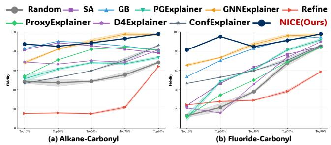  
Figure 8: Fidelity under varying edge-retention ratios on Alkane-Carbonyl and Fluoride-Carbonyl. NICE preserves the target prediction particularly well under compact explana- tion budgets, while the performance gap gradually narrows as more edges are retained. Higher values indicate better model faithfulness.

## F. Additional Experimental Results

Explanation Performance (Precision). Table 8 reports the Precision results. NICE achieves the highest macro- average Precision of 57.42%, outperforming the strongest baseline, ConfExplainer, by 4.14 percentage points. It ranks first on Benzene, Fluoride, and Indole, and second on Mutag, Alkane, Rings-Count, and Rings-Max, achieving a top-two result on seven of the eight datasets. The improvement is par- ticularly pronounced on Indole, where NICE increases Pre- cision from 60.38% to 72.29%. Although NICE is slightly behind ConfExplainer and ReFine on PAINS, it remains com- petitive. Together with the Recall and F1 results in Table 1, these results indicate that the improved coverage of ground- truth explanatory edges does not come at the cost of substan- tially reduced explanatory selectivity.

Additional fidelity results. Figure 8 extends the fidelity analysis to Alkane-Carbonyl and Fluoride-Carbonyl. On Alkane-Carbonyl, NICE achieves the highest Fidelity un- der the most compact Top-10% budget and remains among the strongest methods across all retention ratios. The advan- tage is more pronounced on Fluoride-Carbonyl, where NICE substantially outperforms the baselines at Top-10% and Top-30%. These results indicate that the highest-ranked edges identified by NICE preserve most of the target prediction even when only a small part of the graph is retained. As the retention ratio increases, several baselines gradually catch up because preserving most of the graph reduces the influence of edge-ranking quality. Together with the results in the main text, these curves show that NICE is particularly efective at producing compact and faithful explanations.

## G. Further Analysis of Perturbation Mechanism

This experiment further compares the computation induced by Element-wise Masking (EM) and Noise Corruption (NC). Unlike the explanation-performance evaluation, the purpose here is not to determine whether a selected edge configuration is correct. Instead, we hold the edge configuration fixed and examine how the two perturbation primitives afect the graph representation and the original target prediction.

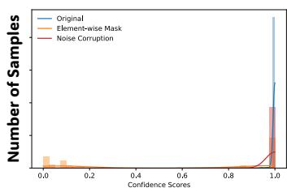  
(a) Mutagencity

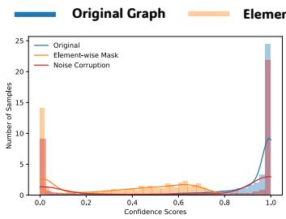  
(b) Benzene

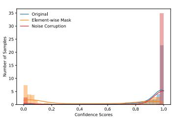  
(c) Fluoride-Carbony

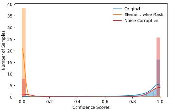  
(d) Rings-count  
Figure 9: Distribution of target-class prediction confidence under the original graph, Element-wise Mask (EM), and Noise Corruption (NC) on four representative datasets. For each graph, we instantiate the same ground-truth explanation with EM and NC and record the resulting target-class confidence. Compared with EM, NC generally preserves a confidence distribution that remains closer to the clean computation, while EM more often shifts samples toward low-confidence predictions.

Controlled configurations. We evaluate test graphs that are correctly classified by the target GNN, belong to the pos- itive class, and contain a non-empty ground-truth explana- tion. For each graph, the ground-truth configuration assigns a gate of one to the annotated explanatory edges and zero to the remaining edges. We denote this setting by GT.

To distinguish the efect of the perturbation primitive from that of edge selection, we additionally construct sparsity- matched random configurations, denoted by Rand. For each ground-truth configuration, we randomly sample the same number of undirected chemical bonds. The two directed message-passing entries corresponding to the same bond are treated as one edge group. Importantly, the exact same ground-truth or random configuration is instantiated using both EM and NC.

EM is deterministic and is evaluated with one forward pass. For NC, we average the results over 50 independent matched-norm corruption samples for each fixed configu- ration. We generate $\mathrm { \bar { 2 0 } }$ sparsity-matched random configu- rations for each ground-truth explanation. When multiple ground-truth explanations are available for one graph, their results are first averaged within the graph. The reported mean and standard deviation are then computed across all eligible test graphs.

Representation distance. Let h(G) denote the clean graph representation, obtained by applying the target GNN’s readout function to the final-layer node representations. Let $\widetilde { \mathbf { h } } _ { \Psi } ( G ; \rho , \epsilon )$ denote the corresponding representation under perturbation primitive $\Psi \in \{ \mathrm { E } \mathrm { \bar { M } } , \mathrm { N C } \}$ . We measure the nor- malized representation distance by

$$
D _ { \mathrm { r e p r } } = \frac { \left\| \widetilde { \mathbf { h } } _ { \Psi } - \mathbf { h } ( G ) \right\| _ { 2 } } { \left\| \mathbf { h } ( G ) \right\| _ { 2 } + \varepsilon } ,\tag{49}
$$

where ε is a small constant for numerical stability. For $\mathrm { N C } ,$ Eq. (49) is averaged over the independent corruption samples. $\mathbf { A }$ smaller value indicates that the perturbed computation remains closer to the clean graph representation.

Target-prediction degradation. Let

$$
y ^ { * } = \arg \operatorname* { m a x } _ { c } p _ { c } ( G )\tag{50}
$$

be the original target prediction. We measure the one-sided degradation of its log-probability as

$$
D _ { \mathrm { p r e d } } = \left[ \log p _ { y ^ { \ast } } ( G ) - \log p _ { y ^ { \ast } } \left( \pmb { \rho } , \pmb { \epsilon } \right) \right] _ { + } .\tag{51}
$$

The metric is zero when the perturbation preserves or strengthens the target-class probability, and increases only when support for the original prediction decreases. For $\mathrm { N } \dot { \mathrm { C } }$ the reported value is averaged over the independent corrup- tion samples. Lower values are better for both metrics.

For each metric $D ,$ the relative improvement of NC over EM is computed as

$$
\mathrm { I m p . } = \frac { D _ { \mathrm { E M } } - D _ { \mathrm { N C } } } { D _ { \mathrm { E M } } } \times 1 0 0 \% .\tag{52}
$$

A positive value indicates that NC yields a smaller distance, whereas a negative value indicates that NC produces a larger distance than EM.

<table><tr><td rowspan="2">Dataset</td><td rowspan="2">Method</td><td colspan="2"> $D _ { \mathrm { r e p r } } \downarrow$ </td><td colspan="2"> $D _ { \mathrm { p r e d } }$  →</td></tr><tr><td>GT</td><td>Rand</td><td>GT</td><td>Rand</td></tr><tr><td rowspan="3">Mutag</td><td>EM</td><td>0.77±0.12</td><td>0.46±0.19</td><td>0.53±0.17</td><td>0.29±0.02</td></tr><tr><td>NC</td><td>0.45±0.14</td><td>0.38±0.12</td><td>0.52±0.11</td><td>0.44±0.11</td></tr><tr><td>Imp.</td><td>41.56%</td><td>17.39%</td><td>1.89%</td><td>-51.72%</td></tr><tr><td rowspan="3">Benzene</td><td>EM</td><td>0.03±0.07</td><td>0.11±0.09</td><td>0.77±0.26</td><td>0.38±0.18</td></tr><tr><td>NC</td><td>0.03±0.03</td><td>0.06±0.04</td><td>0.74±0.15</td><td>0.43±0.26</td></tr><tr><td>Imp.</td><td>00.00%</td><td>45.45%</td><td>3.90 %</td><td>-13.16%</td></tr><tr><td rowspan="3">Alkane</td><td>EM</td><td>0.92±0.33</td><td>0.61±0.12</td><td>0.39±0.26</td><td>0.42±0.08</td></tr><tr><td>NC</td><td>0.88±0.13</td><td>0.56±0.04</td><td>0.44±0.25</td><td>0.53±0.06</td></tr><tr><td>Imp.</td><td>4.35%</td><td>8.20%</td><td>-12.82%</td><td>-26.19%</td></tr><tr><td rowspan="3">Fluoride</td><td>EM</td><td>0.61±0.17</td><td>0.83±0.21</td><td>0.16±0.16</td><td>0.11±0.12</td></tr><tr><td>NC</td><td>0.59±0.11</td><td>0.76±0.24</td><td>0.17±0.15</td><td>0.19±0.16</td></tr><tr><td>Imp.</td><td>3.28%</td><td>8.43%</td><td>-6.25 %</td><td>-72.73%</td></tr></table>

Table 9: Controlled comparison of EM and NC under GTExplainer and Random. $D _ { \mathrm { r e p r } }$ and $D _ { \mathrm { p r e d } }$ measure rep- resentation distance and target-prediction normalized degra- dation. Imp. denotes the relative reduction ratio.

Results. Table 9 shows a clear diference between the representation- and prediction-level efects of NC. For $D _ { \mathrm { r e p r } } ,$ NC yields a lower distance in seven of the eight evaluated configurations and ties EM under the ground-truth configu- ration on Benzene. The largest reductions occur on Mutag under the ground-truth configuration (41.56%) and on Benzene under the random configuration (45.45%). Although the gains are smaller on Alkane-Carbonyl and Fluoride- Carbonyl, NC remains consistently closer to the clean rep- resentation in both ground-truth and random settings. These results support the intended primitive-level efect of NC: avoiding deterministic scale contraction generally keeps the internal representation closer to the clean computation.

The efect on $D _ { \mathrm { p r e d } }$ is less uniform. Under ground-truth configurations, NC slightly reduces the degradation on Mu- tag and Benzene, but produces moderately larger degradation on Alkane-Carbonyl and Fluoride-Carbonyl. Under random configurations, NC yields larger target-prediction degrada- tion on all four datasets. This result is not inconsistent with the scale-stability property of NC. Preserving the expected squared message norm controls one source of computation shift, but NC still replaces clean message directions with stochastic corrupted directions. The prediction-level efect therefore also depends on the target GNN’s local decision boundary and its sensitivity to the corrupted message infor- mation.

Together with the results reported in the main text, these findings indicate that the representation-level advantage of NC is substantially more consistent than its unoptimized prediction-level efect. NC should therefore be viewed as defining a scale-controlled corruption and restoration space, rather than as guaranteeing that every fixed corruption con- figuration preserves the target prediction. This observation further motivates SRB, which explicitly learns a restoration boundary that minimizes target-prediction degradation under NC-induced uncertainty.

Prediction Confidence Results. As shown in Figure 9, EM and NC exhibit clearly diferent confidence profiles. Across all four datasets, the clean computation concentrates a large fraction of samples near high target-class confidence. NC largely preserves this high-confidence regime, although its distribution is slightly broader due to stochastic random- direction corruption. In contrast, EM more frequently shifts samples toward substantially lower confidence, and in Ben- zene and Rings-Count even produces a pronounced low- confidence mode near zero. This pattern is particularly in- formative because EM and NC are instantiated on the same ground-truth explanation; hence, the diference cannot be attributed to edge-selection quality. Instead, it reflects the distinct perturbation primitives. Overall, the confidence dis- tributions provide an intuitive behavior-level complement to the distance-based results: NC tends to keep the queried computation closer to the clean prediction regime, whereas EM more readily drives the model into low-confidence re- sponses.