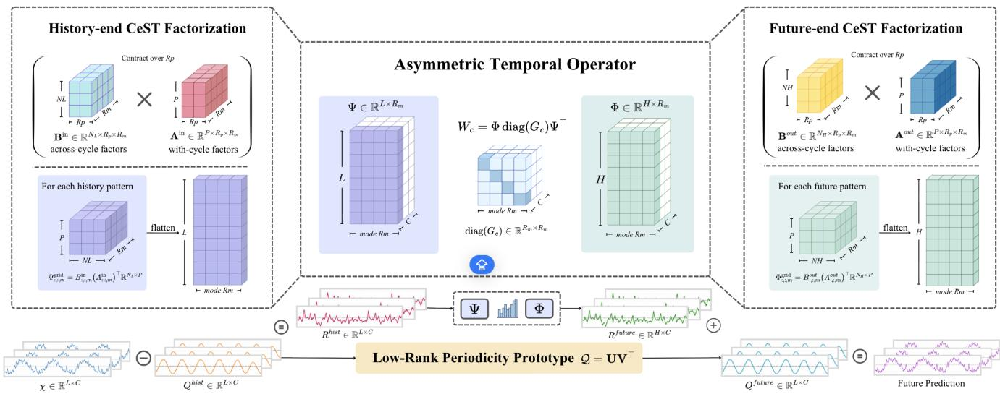
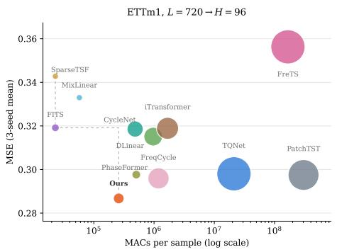
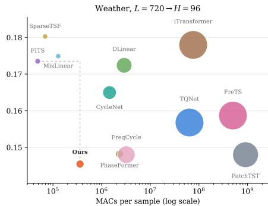
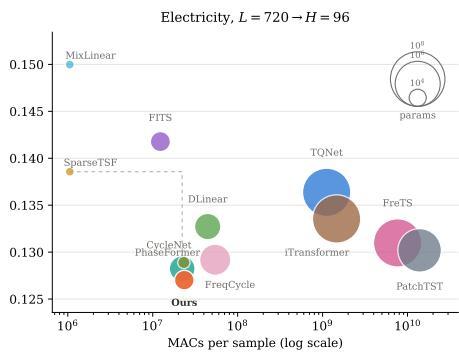
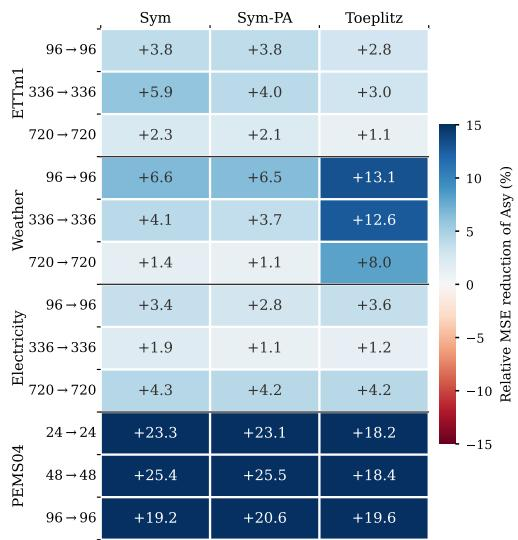
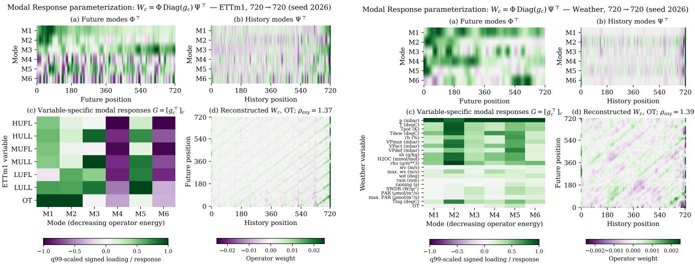

# AsyTO: Asymmetric Temporal Operator for Parameter-Efficient Multivariate Time Series Forecasting

Xiachong Lin1, Du Yin1, Hao Xue2, Wen Hu1, Imran Razzak³, Arian Prabowo1, Matthew Amos4, Flora D. Salim1

1University of New South Wales

2 Hong Kong University of Science and Technology (Guangzhou) 3 Mohamed bin Zayed University of Artificial Intelligence 4 CSIRO Energy Centre

## Abstract

Multivariate time-series forecasting faces a structural dilemma: sharing one temporal predictor across variables is parameter-efficient but forces heterogeneous variables through an identical history-to-future map, whereas learning an independent predictor per variable restores flexibility at a cost that grows with the product of variable count, context length, and horizon. We argue that this dilemma dissolves once the object being compressed is the forecasting operator rather than the observed series. Auditing per-variable linear history-to-future maps across standard benchmarks, we find that a phase-locked seasonal component paired with a compact residual operator outperforms a dense phase-blind reference in most audited settings. The residual transport is also directional: lag-invariant alternatives consistently underperform asymmetric history-to-future maps. Guided by this structure, we propose AsyTO, an Asymmetric Temporal Operator that factorizes the tensor of per-variable operators into shared but distinct history-reading and future-writing temporal modes with per-variable mode-wise gains, complemented by a low-rank periodic prototype and a cycle-separable factorization of the temporal modes. Each forecast reads only its own variable's history, so parameters and compute grow linearly in the number of variables. Across eleven benchmarks and multiple forecast horizons, AsyTO attains the best lightweight error in 30 of 44 dataset-horizon settings, locating at the accuracycompute Pareto frontier.

## Introduction

Long-horizon multivariate time series forecasting has recently been reshaped by lightweight models. Linear and frequency-domain predictors with modest parameter counts (Zeng et al. 2023; Xu, Zeng, and Xu 2024; Lin et al. 2024b) match or outperform Transformer-based forecasters (Zhou et al. 2021; Wu et al. 2021; Nie et al. 2023) on standard benchmarks. The central question has therefore shifted from whether a forecaster can be small to how its limited parameter budget should be allocated. Compact forecasters spend this budget along both variable and temporal dimensions. Sharing one map across variables is efficient but imposes a common temporal response, whereas learning a dense map for each variable preserves heterogeneity but scales poorly with the panel size. Temporal compression reduces this cost, yet common constructions describe both ends of the forecasting map with the same object, such as basis, kernel, or pattern set. Their efficiency is therefore obtained by tying how historical evidence is read to how the future trajectory is written. We argue that these roles should remain distinct. Reading the history is an evidence-extraction problem that may concentrate on a few informative lags, whereas writing the forecast requires coordinating the entire horizon. We call this functional distinction history–future asymmetry. Preserving it ordinarily requires separate temporal parameters, creating a tension between role specialization and model size. The key question is whether asymmetry can be retained without surrendering compactness.

Our model resolves this tension through periodic structure. A low-rank periodic prototype first estimates the recurring component and produces a residual series. The Asymmetric Temporal Operator (AsyTO) acts exclusively on this residual, using separate history-reading and future-writing factors shared across variables. Variable-specific gains are generated from coordinates learned by the periodic prototype, while cycle-separable factorization compresses both temporal factors. The final forecast combines the periodic component with the predicted residual, and each variable is predicted solely from its own history. Main contributions of this work are organized as below:

• We formulate parameter-efficient multivariate time series forecasting as structured compression of the pervariable history-to-future operator tensor, and formalize history-future asymmetry as a distinct budget-aware inductive bias.

• We propose AsyTO, which factorizes each variablespecific operator and combines it with a low-rank, phasealigned periodic prototype and cycle-separable temporal factors. Prototype-conditioned gains encode heterogeneous temporal responses in a shared low-dimensional space.

• Extensive structural controls and benchmark evaluations validate the proposed design across several real-world time-series datasets. Our AsyTO improves forecasting accuracy across most datasets while requiring substantially fewer parameters. The proposed modules further improve several popular lightweight backbones in most cases, respectively.

## Related Works

Compact Forecasting and Temporal Compression. Lightweight temporal models range from linear predictors such as DLinear (Zeng et al. 2023), MixLinear (Ma, Sha, and Luo 2024), and LightTS (Zhang et al. 2022) to sparse or spectral designs including FITS (Xu, Zeng, and Xu 2024), SparseTSF (Lin et al. 2024b), FreTS (Yi et al. 2023), and FilterNet (Yi et al. 2024). An orthogonal distinction concerns variable interaction: iTransformer (Liu et al. 2024) and querybased models (Lin et al. 2025) mix information across the panel, whereas PatchTST (Nie et al. 2023) enforces channel independence; this trade-off is studied in (Han, Ye, and Zhan 2024). Existing approaches also compress the history-toforecast map through fixed-basis spectral interpolation (Xu, Zeng, and Xu 2024), relative-lag convolutions (Liu et al. 2022), or learned temporal modes (Ni et al. 2023). AsyTO follows channel-independent data flow while sharing its temporal factors across variables, but differs from these compression schemes by assigning separate learned factors to history reading and forecast generation under the same parameter budget.

Explicit Periodic Modeling. CycleNet (Lin et al. 2024a) removes a learned cycle before forecasting the residual, while SparseTSF (Lin et al. 2024b), PhaseFormer (Niu, Deng, and Tong 2025), and FreqCycle (Zhang et al. 2026) exploit periodicity through downsampling, phase tokenization, and cycle-aligned spectra. AsyTO shares CycleNet's decomposition step and makes no novelty claim for periodic removal. Its distinction is to reuse the periodic prototype to parameterize residual forecasting: prototype coordinates generate variable responses, while cycle-phase structure compresses the asymmetric temporal factors.

## Methodology

## Problem Formulation

Denote a batch of historical time-series observations $\mathcal { X } \in$ $\mathbb { R } ^ { B \times L \times C }$ , the objective is to predict the subsequent H observations $\mathcal { V } \in \check { \mathbb { R } } ^ { B \times H \times C }$ , where B, L, and $\dot { H }$ denote the batch size, context length, and forecast horizon. For sample b and variable $c , \mathcal { X } _ { b , : , c } \in \mathbb { R } ^ { L }$ and $\mathcal { V } _ { b , : , c } \in \mathbb { R } ^ { H }$ are its historical context and future trajectory. The forecasting problem for the given variable is defined as

$$
\widehat { \mathscr { V } } _ { b , : , c } = f _ { \theta } ( \mathscr { X } _ { b , : , c } ; c ) , \qquad c \in \{ 1 , \ldots , C \} .\tag{1}
$$

where $f _ { \theta } \in \mathbb { R } ^ { L \times H }$ is the forecaster operator bridging the information transport from history to future.

## Low-Rank Periodic Prototype

Let P be the dataset period and $s _ { b } \in \{ 0 , \ldots , P { - } 1 \}$ the phase of the first historical observation of sample b, so position $\tau$ carries phase $\pi _ { b } ( \tau ) = ( s _ { b } + \tau - 1 )$ mod $P .$ Instead of a dense phase-variable table in $\mathbb { R } ^ { P \times \vec { C } }$ , we learn a low-rank prototype

$$
\begin{array} { r } { \mathscr { Q } = \mathbf { U } \mathbf { V } ^ { \top } , \quad \mathbf { U } \in \mathbb { R } ^ { P \times R _ { p } } , \ \mathbf { V } \in \mathbb { R } ^ { C \times R _ { p } } , } \end{array}\tag{2}
$$

where U holds within-cycle patterns shared by all variables and ${ \mathbf V } _  c , $ places variable c in that subspace, reducing the cost

from $P C$ to $R _ { p } ( P { + } C )$ . The assumption is low rank of the periodic template, not of the observations themselves.

History and future components are read off the same prototype by phase, $\mathcal { Q } _ { b , t , c } ^ { \mathrm { h i s t } } = \dot { \mathcal { Q } } _ { \pi _ { b } ( t ) , c }$ and $\mathcal { Q } _ { b , h , c } ^ { \mathrm { f u t u r e } } = \mathcal { Q } _ { \pi _ { b } ( L + h ) , c } .$ Subtracting the first leaves the periodicity-exclusive residual

$$
\mathcal { R } _ { b } ^ { \mathrm { h i s t } } = \widetilde { \mathcal { X } } _ { b } - \mathcal { Q } _ { b } ^ { \mathrm { h i s t } } \in \mathbb { R } ^ { L \times C } ,\tag{3}
$$

which the operator transports, while $\mathcal { Q } ^ { \mathrm { f u t u r e } }$ supplies the phase-aligned future component and will be added back eventually. We initialize U orthogonally and V to zero, so training starts from a neutral template while V still receives gradient.

## Asymmetric Temporal Operator

The residual $\mathcal { R } ^ { \mathrm { h i s t } }$ must now be transported to the future axis. Giving every variable its own dense map means an operator $\mathbf { \varPsi } ^ { \mathbf { \varPsi } } \in \mathbf { \varTheta } ^ { \mathbf { \bar { C } } \times H \times L }$ with CHL parameters; sharing one map across variables is far smaller but forces identical temporal responses. We interpolate between the two with a CP factorization into three semantically distinct factors: history-side factors $\Psi \in \mathbb { R } ^ { L \times R _ { m } }$ , future-side factors $\Phi \in$ $\mathbb { R } ^ { H \times \check { R } _ { m } }$ , and a variable-mode response $\mathbf { G } \in \mathbb { R } ^ { C \times R _ { m } }$ whose c-th row is $G _ { c } .$ For variable $c ,$

$$
\mathcal { W } _ { c } = \Phi \mathrm { d i a g } ( G _ { c } ) \boldsymbol { \Psi } ^ { \top } = \sum _ { m = 1 } ^ { R _ { m } } G _ { c , m } \phi _ { m } \boldsymbol { \psi } _ { m } ^ { \top } ,\tag{4}
$$

and $\mathcal { R } _ { b , : , c } ^ { \mathrm { f u t u r e } } ~ = ~ \mathcal { W } _ { c } \mathcal { R } _ { b , : , c } ^ { \mathrm { h i s t } }$ . Here $\psi _ { m } = \Psi _ { : , m }$ reads a pattern out of the historical residual and $\phi _ { m } = \Phi _ { : , m }$ writes the corresponding future trajectory; both are shared across variables, and $G _ { c , m }$ sets how strongly variable c responds to mode m.

The operator never has to be materialized. Contracting in mode space,

$$
Z _ { b , m , c } = \sum _ { t = 1 } ^ { L } \Psi _ { t , m } \mathcal { R } _ { b , t , c } ^ { \mathrm { h i s t } } , \qquad \mathcal { R } _ { b , h , c } ^ { \mathrm { f u t u r e } } = \sum _ { m = 1 } ^ { R _ { m } } \Phi _ { h , m } G _ { c , m } Z _ { b , m , c } ,\tag{5}
$$

costs $ { R _ { m } } ( L + H + C )$ parameters and $\mathcal { O } ( B C ( L + H ) R _ { m } )$ arithmetic. It also makes the target-only property explicit: the forecast for variable c reads $\mathcal { R } _ { b , : , c } ^ { \mathrm { h i s t } }$ and never another variable's observations.

Crucially, Ψ and $\Phi$ are parameterized separately. Even when $L = H$ , reading evidence from a past position and generating a future one are different operations, and tying $\mathbf { \bar { \Psi } } \Psi = \mathbf { \Psi } \Phi$ would force a symmetric temporal map. The ordered pair (Ψ, Φ) is what makes the transport directional, and this asymmetry is the property the operator cannot give up (Figure 3).

## Cycle-Separable Temporal Factorization

Equation (5) already shares Ψ and Φ across variables, so they now dominate the budget: $R _ { m } ( L + H )$ against only $R _ { m } C$ for the response. Both factors are indexed by absolute time, yet the signal is periodic, so a position matters mainly through the cycle it falls in and its phase within that cycle. Writing $t - \dot { 1 } = ( k - 1 ) P + p$ for cycle index k and phase $p ,$ we give each temporal factor a rank- $R _ { k }$ Cycle-Separable Temporal (CeST) form,

  
Figure 1: AsyTO. A low-rank periodic prototype $\boldsymbol { \mathcal { Q } } = \mathbf { U } \mathbf { V } ^ { \top }$ is removed from the history and restored on the future axis by phase lookup; the periodicity-exclusive residual is transported by an asymmetric operator whose history and future factors $( { \bar { \Psi } } , \Phi )$ are separate and shared across variables, with a per-variable modal response G. Both temporal factors are further compressed into a cycle-index and a within-cycle phase factor (CeST), and G reuses the prototype's variable coordinates, so each additional variable costs only $R _ { p }$ parameters.

$$
\Psi _ { t , m } = \sum _ { r = 1 } ^ { R _ { k } } A _ { k , r , m } ^ { \Psi } B _ { p , r , m } ^ { \Psi } ,\tag{6}
$$

a Kronecker product of a cycle-index factor $A ^ { \Psi } \in \mathsf { \Gamma }$ $\mathbb { R } ^ { K \times R _ { k } \times R _ { m } }$ and a within-cycle phase factor $B ^ { \Psi } \in \rvert _ { B }$ $\mathbb { R } ^ { P \times R _ { k } \times R _ { m } }$ , with $K = \lceil L / P \rceil$ . The cost falls from $L R _ { m }$ to $R _ { k } R _ { m } ( K + P )$ , and the two factors separate how far back evidence lies from where in the cycle it sits.

History-End CeST. Applying Eq. (6) to Ψ gives the mode coefficients $Z _ { b , m , c }$ of Eq. (5) without materializing Ψ. A strictly periodic basis cannot express a transient in the last few observations, so we add a short dense correction over the final M steps,

$$
Z _ { b , m , c } = \sum _ { t = 1 } ^ { L } \Psi _ { t , m } \mathcal { R } _ { b , t , c } ^ { \mathrm { h i s t } } + \sum _ { j = 1 } ^ { M } E _ { j , m } \mathcal { R } _ { b , L - M + j , c } ^ { \mathrm { h i s t } } ,\tag{7}
$$

with $E \in \mathbb { R } ^ { M \times R _ { m } }$ initialized to zero, so the model starts from the purely periodic basis and departs from it only if the data demand it. History-side cost is $R _ { k } R _ { m } ( K + P ) + M R _ { m } .$

Future-End CeST. The same factorization applies to Φ with $K ^ { \prime } = \lceil H / P \rceil$ output cycles. It is only used when the horizon spans at least one full cycle: if $H \leq P$ there is no cycle index to separate, and Φ stays dense. This condition, rather than any property of the data, is what makes the futureside term inactive on the short-horizon PEMS settings.

Cycle-Shared Variable Response. The response ${ \textbf { G } } \in$ $\mathbb { R } ^ { \mathsf { \tilde { C } } \times R _ { m } }$ is the last term that still grows with C. The prototype already assigns every variable a coordinate $\mathbf { V } _ { c , : } \in \mathbb { R } ^ { R _ { p } }$ , SO we reuse it,

$$
\begin{array} { r } { \mathbf { G } = \mathbf { 1 } + \gamma \operatorname { t a n h } ( \mathbf { V } \mathbf { M } _ { G } ) , \qquad \mathbf { M } _ { G } \in \mathbb { R } ^ { R _ { p } \times R _ { m } } , } \end{array}\tag{8}
$$

where γ bounds the modulation. This replaces $C R _ { m }$ parameters by $R _ { p } R _ { m }$ . Since $R _ { p } \leq C$ by construction, the factorization is never more expensive, and each additional variable then costs only the $R _ { p }$ entries of its prototype coordinate. The phase coordinates U supply an analogous modulation of Φ across future phases.

Residual Echo. The observation at the same phase one cycle earlier is a direct local cue that the mode basis need not carry. For future step h we read $s ( h ) = L - P + ( ( h -$ 1) mod $\mathsf { \Pi } ^ { \circ } ( P ) + 1$ and add a phase-conditioned, cycle-decayed copy of $\mathcal { R } _ { b , s ( h ) , c } ^ { \mathrm { h i s t } } ,$ gated to zero whenever $s ( h ) < 1$ . The term is therefore identically zero when the window is shorter than one cycle.

## Experimental Results

Datasets We evaluate AsyTO on datasets including: the ETT family (Zhou et al. 2021), Electricity and Traffic (Lai et al. 2018), Weather (Wu et al. 2021), and 4 PEMS datasets (Liu et al. 2022). The appendix summarizes the statistics, including the period $\dot { P }$ each dataset is assumed to have. For the 7 non-PEMS datasets, we use a context length of L = 720 and forecasting horizons of $H \in \{ 9 6 , 1 9 \bar { 2 } , 3 3 6 , 7 2 0 \}$ . ETT follows the standard calendar split, while Electricity, Traffic, and Weather use chrono-1ogical 70%/10%/20% splits. Following the standard shorthorizon traffic forecasting protocol, we evaluate the PEMS datasets using $L = 9 6 , \bar { H } ^ { \cdot } \in \{ 1 2 , 2 4 , 4 8 , 9 6 \}$ , and chrono-1ogical splits of 60%/20%/20%.

Baselines and Metrics We compare against 12 published forecasters, including lightweight group: SparseTSF (Lin et al. 2024b), MixLinear (Ma, Sha, and Luo 2024), Phase-Former (Niu, Deng, and Tong 2025), FITS (Xu, Zeng, and Xu 2024), CycleNet (Lin et al. 2024a), DLinear (Zeng et al. 2023) and FreqCycle (Zhang et al. 2026). The conventional group: FilterNet (Yi et al. 2024), PatchTST (Nie et al. 2023), TQNet (Lin et al. 2025), iTransformer (Liu et al. 2024) and FreTS (Yi et al. 2023). Mean squared error (MSE) and mean absolute error (MAE) on the standardized series are reported for evaluation, averaged over seeds {2024, 2025, 2026}.

Implementation Details All models in this work are implemented with PyTorch (Paszke et al. 2019), training uses the Adam optimizer with MSE loss. All the experiments are conducted on NVIDIA H100 GPUs.

## Main Results

Table 1 reports MSE and MAE across all 11 benchmarks. Within the lightweight group, AsyTO attains the lowest MSE in 30 of the 44 cells and the lowest MAE in 21, and its mean rank among the eight lightweight models is 1.96 on the 7 standard benchmarks and 1.06 on PEMS. The advantage is concentrated where the periodic structure the model assumes is actually present, and it holds across horizons rather than only short ones. AsyTO is best across all four horizons on ETTm1, Weather, and Electricity, and in 15 of the 16 PEMS cells (where the regime with the shortest look-back relative to the period is least identifiable from the data). On ETTh2 the lightweight methods are separated by less than the seedto-seed spread, and the leader changes with the horizon, so no method can be said to win there.

Traffic is the one benchmark where AsyTO loses at every horizon, trailing PhaseFormer by 4.5%, 4.5%, 2.9% and 1.3% as the horizon grows. This is the expected cost of the target-only design: Traffic has 862 sensors whose predictive information is largely shared, and a model that forecasts each variable from its own history alone cannot recover it The gap narrows as the horizon lengthens, consistent with cross-sensor information being most useful at short range. We treat this as a scope boundary rather than a tuning failure, and return to it in the discussion.

Against the conventional group AsyTO remains competitive without matching their budget: it attains the lowest MSE of all thirteen models in 13 of the 44 cells while using two to three orders of magnitude fewer parameters, which is the trade-off Figure 2 makes explicit.

## Efficiency Analysis

Figure 2 places AsyTO and baselines on the accuracycompute plane at L=720 → H=96, using multiply accumulate operations (MACs) per forward sample as a hardwareagnostic measure of compute and trainable parameters as bubble area. AsyTO sits on the Pareto frontier, and it does so at a compute scale set by the cheap end of the field rather than the expensive one: on Electricity, it uses 47.5×, 62.2×, and 590.4× fewer MACs than TQNet, iTransformer, and PatchTST, and on Weather the gap to PatchTST reaches 2527×. The parameter gap is wider: 92.5× against TQNet and 155× against iTransformer on Electricity, indicating the conventional models carry per-variable or per-token machinery that AsyTO replaces with shared factors.

The frontier is crowded at its cheap end, and AsyTO does not dominate on every axis. PhaseFormer matches our compute on Electricity (1.0 × MACs) with a tenth of the parameters, and CycleNet is marginally cheaper (0.9× MACs); both trail in error by 1.5% and 1.0%. The claim supported by the figure is therefore specific: among models at this compute scale AsyTO is the most accurate, not the smallest.

What does scale favourably is the cost of an additional variable. Instantiating the shipped configuration at C and C+1 variables shows the parameter count growing by exactly $R _ { p }$ per variable: 2 on Weather, 4 on ETTm1, 8 on Traffic and 16 on Electricity. This is because the temporal factors are shared and the variable response is expressed in the prototype's coordinates rather than stored per variable. A dense per-variable temporal map would instead add H L coefficients per variable, or 69,120 at 720 → 96.

## Validating the Structural Priors

To validate the sources of AsyTO's performance gain, we design two complementary experiments: module ablations in Table 2 and controlled operator constraints in Figure 3. Table 2 replaces each stage with a simpler alternative while retaining the training protocol. w/o Q applies the operator to the raw series instead of the periodicity-exclusive residual, w/o ATO replaces the factorized operator by an independent dense H × L map per variable, w/o G forces every variable to share one response, and w/o recent removes the dense correction over the latest observations. Entries are raw test MSE, 3-seed means over 4 horizons. The three interventions reveal different roles. Periodic removal changes MSE only marginally on the seven long-context datasets, but improves it by 20–34% on PEMS, where the look-back is shorter than the dominant cycle. The periodic prototype is therefore a regime-specific necessity rather than a universal source of improvement. In contrast, the dense replacement is worse on ten of eleven datasets despite using 26–19,509× more parameters, showing that unstructured per-variable capacity cannot replace shared residual structure. Recent correction has improved the displayed averages in most cases, but its effect is at most 2.3%, identifying it as a secondary refinement.

The dense ablation replaces the entire residual operator and therefore cannot isolate history-future asymmetry. Figure 3 provides this control using the same operator family at L=H. Asym learns separate history and future factors. Sym ties them by setting Φ = Ψ, testing the common-basis constraint but using fewer parameters. Sym-PA reallocates the saved capacity to match the parameter count of Asym, separating directionality from model size. Toeplitz instead makes the map depend only on relative lag, testing whether a shift-invariant rule is sufficient. Every displayed comparison favors separate factors, by 1.1–25.5%. After averaging the tested window lengths, Asym wins 29 of 33 controlled setting comparisons across all datasets (see Appendix for more details), the 4 reversals occur only on ETTh1/2 and are within 1.4%. The persistence of the gap against Sym-

Table 1: The main forecasting results, averaged over 3 seeds. Left: lightweight models; right: conventional models. The best and second-best results within each model group are shown in bold red and underlined blue, respectively.
<table><tr><td rowspan=2 colspan=1></td><td rowspan=1 colspan=13></td><td rowspan=1 colspan=10></td></tr><tr><td rowspan=1 colspan=13>O SaTSE MixLar PhaFm ETSE CycNet DLi  FCycle</td><td rowspan=1 colspan=10></td></tr><tr><td rowspan=4 colspan=1>验</td><td rowspan=2 colspan=13></td><td rowspan=1 colspan=10></td></tr><tr><td rowspan=1 colspan=2>0.412 0.396</td><td rowspan=1 colspan=2>0.419 0.407</td><td rowspan=1 colspan=1>0.414</td><td rowspan=1 colspan=2>0.413 0.423</td><td rowspan=1 colspan=1>0.418</td><td rowspan=1 colspan=1>0.427</td><td rowspan=1 colspan=2>0.439 0.450</td><td rowspan=1 colspan=1>0.404 0.427</td><td rowspan=1 colspan=2>0.443 0.453 0.417</td><td rowspan=1 colspan=7>0.435 0.426 0.437 0.429 0.449</td><td rowspan=1 colspan=1>0.500 0.495</td></tr><tr><td rowspan=1 colspan=1>0.418 0.434 0.432</td><td rowspan=1 colspan=1>0.427</td><td rowspan=1 colspan=1>0.412</td><td rowspan=1 colspan=2>0.436 0.439</td><td rowspan=1 colspan=1>0.435</td><td rowspan=1 colspan=2>0.433 0.439</td><td rowspan=1 colspan=1>0.449</td><td rowspan=1 colspan=1>0.447</td><td rowspan=1 colspan=2>0.467 0.470</td><td rowspan=1 colspan=1>0.428 0.441</td><td rowspan=1 colspan=2>0.454 0.466 0.444</td><td rowspan=1 colspan=7>0.455 0.457 0.457 0.493 0.493</td><td rowspan=1 colspan=1>0.527 0.510</td></tr><tr><td rowspan=1 colspan=1>0.449 0.469 0.427</td><td rowspan=1 colspan=1>0.450</td><td rowspan=1 colspan=1>0.423</td><td rowspan=1 colspan=2>0.4530.425</td><td rowspan=1 colspan=1>0.444</td><td rowspan=1 colspan=4>0.431 0.457 0.475 0.482</td><td rowspan=1 colspan=2>0.512 0.524</td><td rowspan=1 colspan=1>0.484 0.493</td><td rowspan=1 colspan=2>0.500 0.502 0.468</td><td rowspan=1 colspan=7>0.484 0.503 0.507 0.674 0.598</td><td rowspan=1 colspan=1>0.606 0.562</td></tr><tr><td rowspan=2 colspan=1>2 1962</td><td rowspan=1 colspan=13></td><td rowspan=1 colspan=9></td><td rowspan=1 colspan=1>0.366,0.408</td></tr><tr><td rowspan=1 colspan=6></td><td rowspan=1 colspan=4>0.332 0.376,0.333 0.380</td><td rowspan=1 colspan=2>0.408 0.432</td><td rowspan=1 colspan=1>0.345 0.391</td><td rowspan=1 colspan=9></td><td rowspan=1 colspan=1>0.442, 0.454</td></tr><tr><td rowspan=2 colspan=1>3360</td><td rowspan=1 colspan=1>0.375 0.409 0.358</td><td rowspan=1 colspan=1>0.397</td><td rowspan=1 colspan=1>0.359</td><td rowspan=1 colspan=2>0.397 0.375</td><td rowspan=1 colspan=1>0.408</td><td rowspan=1 colspan=3>0.355 0.397 0.365</td><td rowspan=1 colspan=1>0.410</td><td rowspan=1 colspan=2>0.495 0.488</td><td rowspan=1 colspan=1>0.387, 0.427</td><td rowspan=1 colspan=2>0.400 0.432 0.370</td><td rowspan=1 colspan=7>0.407 0.395 0.422, 0.460 0.458</td><td rowspan=1 colspan=1>0.608 0.538</td></tr><tr><td rowspan=1 colspan=1>0.399 0.437 0.381</td><td rowspan=1 colspan=1>0.423</td><td rowspan=1 colspan=1>0.382</td><td rowspan=1 colspan=2>0.424 0.421</td><td rowspan=1 colspan=1>0.453</td><td rowspan=1 colspan=3>0.3780.424 0.416</td><td rowspan=1 colspan=1>0.450</td><td rowspan=1 colspan=2>0.833 0.646</td><td rowspan=1 colspan=1>0.441 0.468</td><td rowspan=1 colspan=2>0.422 0.451 0.403</td><td rowspan=1 colspan=7>0.4400.4200.4520.4330.463</td><td rowspan=1 colspan=1>1.202 0.765</td></tr><tr><td rowspan=4 colspan=1>ETmml192336720</td><td rowspan=1 colspan=3>0.287 0.340 0.343 0.374 0.333</td><td rowspan=1 colspan=2>0.374.0.298</td><td rowspan=1 colspan=1>0.346</td><td rowspan=1 colspan=4>0.319 0.360 0.319 0.362</td><td rowspan=1 colspan=2>0.315.0.359</td><td rowspan=1 colspan=1>0.296.0.351</td><td rowspan=1 colspan=9></td><td rowspan=1 colspan=1>0.3560.392</td></tr><tr><td rowspan=1 colspan=2>0.3240.3640.3550.379</td><td rowspan=1 colspan=1>0.353</td><td rowspan=1 colspan=2>0.3830.331</td><td rowspan=1 colspan=1>0.365</td><td rowspan=1 colspan=1>0.345</td><td rowspan=1 colspan=2>0.3740.339</td><td rowspan=1 colspan=1>0.373</td><td rowspan=1 colspan=2>0.3470.381</td><td rowspan=1 colspan=1>0.3340.372</td><td rowspan=1 colspan=9>0.3560.3890.3370.3760.3390.3770.3490.389</td><td rowspan=1 colspan=1>0.3880.410</td></tr><tr><td rowspan=1 colspan=1>0.3530.3830.381</td><td rowspan=1 colspan=1>0.393</td><td rowspan=1 colspan=1>0.391</td><td rowspan=1 colspan=2>0.4080.360</td><td rowspan=1 colspan=1>0.382</td><td rowspan=1 colspan=1>0.372</td><td rowspan=1 colspan=1>0.390</td><td rowspan=1 colspan=1>0.363</td><td rowspan=1 colspan=1>0.386</td><td rowspan=1 colspan=2>0.3730.394</td><td rowspan=1 colspan=1>0.3640.389</td><td rowspan=1 colspan=2>0.3830.4000.366</td><td rowspan=1 colspan=7>0.3960.3730.3970.3820.410</td><td rowspan=1 colspan=1>0.4160.427</td></tr><tr><td rowspan=1 colspan=1>0.4050.4110.425</td><td rowspan=1 colspan=1>0.416</td><td rowspan=1 colspan=1>0.432</td><td rowspan=1 colspan=2>0.4290.414</td><td rowspan=1 colspan=1>0.412</td><td rowspan=1 colspan=1>0.420</td><td rowspan=1 colspan=1>0.416</td><td rowspan=1 colspan=1>0.412</td><td rowspan=1 colspan=1>0.413</td><td rowspan=1 colspan=2>0.4240.425</td><td rowspan=1 colspan=1>0.4160.415</td><td rowspan=1 colspan=2>0.4320.4240.422</td><td rowspan=1 colspan=7>0.4220.4390.4310.4480.448</td><td rowspan=1 colspan=1>0.4680.460</td></tr><tr><td rowspan=1 colspan=1>96</td><td rowspan=1 colspan=1>0.1610.2520.176</td><td rowspan=1 colspan=1>0.264</td><td rowspan=1 colspan=1>0.167</td><td rowspan=1 colspan=2>0.2570.174</td><td rowspan=1 colspan=1>0.264</td><td rowspan=1 colspan=3>0.1670.2580.160</td><td rowspan=1 colspan=1>0.250</td><td rowspan=1 colspan=2>0.1780.273</td><td rowspan=1 colspan=1>0.1680.260</td><td rowspan=1 colspan=2>0.1840.2760.165</td><td rowspan=1 colspan=7>0.2560.1740.2620.1820.276</td><td rowspan=1 colspan=1>0.1800.268</td></tr><tr><td rowspan=2 colspan=1>ETm2192336</td><td rowspan=1 colspan=1>0.2140.2900.226</td><td rowspan=1 colspan=1>0.298</td><td rowspan=1 colspan=1>0.221</td><td rowspan=1 colspan=2>0.2950.227</td><td rowspan=1 colspan=1>0.299</td><td rowspan=1 colspan=1>0.221</td><td rowspan=1 colspan=2>0.2950.215</td><td rowspan=1 colspan=1>0.289</td><td rowspan=1 colspan=2>0.2820.359</td><td></td><td></td><td></td><td></td><td></td><td></td><td></td><td></td><td></td><td></td><td></td></tr><tr><td rowspan=1 colspan=1>0.2690.3280.277</td><td rowspan=1 colspan=1>0.331</td><td rowspan=1 colspan=1>0.271</td><td rowspan=1 colspan=2>0.3280.274</td><td rowspan=1 colspan=1>0.329</td><td rowspan=1 colspan=1>0.272</td><td rowspan=1 colspan=1>0.329</td><td rowspan=1 colspan=1>0.267</td><td rowspan=1 colspan=1>0.326</td><td rowspan=1 colspan=2>0.2960.359</td><td rowspan=1 colspan=1>0.2750.333</td><td rowspan=1 colspan=2>0.2860.3410.270</td><td rowspan=1 colspan=6>0.3290.2850.3430.303</td><td rowspan=1 colspan=1>0.355</td><td rowspan=1 colspan=1>0.3080.354</td></tr><tr><td rowspan=1 colspan=1>720</td><td rowspan=1 colspan=1>0.3530.3830.356</td><td rowspan=1 colspan=1>0.381</td><td rowspan=1 colspan=1>0.353</td><td rowspan=1 colspan=2>0.3810.353</td><td rowspan=1 colspan=1>0.379</td><td rowspan=1 colspan=1>0.351</td><td rowspan=1 colspan=1>0.380</td><td rowspan=1 colspan=1>0.354</td><td rowspan=1 colspan=1>0.384</td><td rowspan=1 colspan=2>0.4140.433</td><td rowspan=1 colspan=1>0.3500.384</td><td rowspan=1 colspan=2>0.3700.3990.352</td><td rowspan=1 colspan=6>0.3810.3730.3950.376</td><td rowspan=1 colspan=1>0.402</td><td rowspan=1 colspan=1>0.3800.409</td></tr><tr><td rowspan=3 colspan=1>Wweather96192336</td><td rowspan=1 colspan=1>0.1450.1980.180</td><td rowspan=1 colspan=1>0.236</td><td rowspan=1 colspan=1>0.175</td><td rowspan=1 colspan=2>0.2310.148</td><td rowspan=1 colspan=1>0.193</td><td rowspan=1 colspan=4>0.1740.2290.1650.221</td><td rowspan=1 colspan=2>0.1720.234</td><td rowspan=1 colspan=1>0.1480.203</td><td rowspan=2 colspan=9>0.1570.2130.1480.1990.1570.2100.1780.2290.2070.2570.1920.2420.2080.2570.2260.268</td><td rowspan=1 colspan=1>0.1590.223</td></tr><tr><td rowspan=1 colspan=1>0.1930.2430.221</td><td rowspan=1 colspan=1>0.269</td><td rowspan=1 colspan=1>0.218</td><td rowspan=1 colspan=2>0.2680.194</td><td rowspan=1 colspan=1>0.238</td><td rowspan=1 colspan=4>0.2150.2630.2110.259</td><td rowspan=1 colspan=2>0.2150.272</td><td rowspan=1 colspan=1>0.1930.245</td><td rowspan=1 colspan=1>0.2010.263</td></tr><tr><td rowspan=1 colspan=1>0.2410.2810.263</td><td rowspan=1 colspan=1>0.300</td><td rowspan=1 colspan=1>0.264</td><td rowspan=1 colspan=2>0.3030.245</td><td rowspan=1 colspan=1>0.280</td><td rowspan=1 colspan=3>0.2600.2960.255</td><td rowspan=1 colspan=1>0.292</td><td rowspan=1 colspan=2>0.2580.305</td><td rowspan=1 colspan=1>0.2470.287</td><td rowspan=1 colspan=9>0.2620.2970.2460.2850.2580.2950.2910.313</td><td rowspan=1 colspan=1>0.2510.302</td></tr><tr><td rowspan=1 colspan=1>720</td><td rowspan=1 colspan=1>0.3110.3320.324</td><td rowspan=1 colspan=1>0.343</td><td rowspan=1 colspan=1>0.327</td><td rowspan=1 colspan=2>0.3470.316</td><td rowspan=1 colspan=1>0.331</td><td rowspan=1 colspan=3>0.3210.3400.321</td><td rowspan=1 colspan=1>0.339</td><td rowspan=1 colspan=2>0.3190.357</td><td rowspan=1 colspan=1>0.3210.338</td><td rowspan=1 colspan=9>0.3140.3340.3110.3320.3350.3480.3580.362</td><td rowspan=1 colspan=1>0.3150.347</td></tr><tr><td rowspan=3 colspan=1>96ECIL192336</td><td rowspan=1 colspan=1>0.1270.2220.139</td><td rowspan=1 colspan=1>0.233</td><td rowspan=1 colspan=1>0.150</td><td rowspan=2 colspan=3>0.2450.1290.2210.2570.1460.236</td><td rowspan=2 colspan=4>0.1420.2430.1280.2230.1560.2560.1430.237</td><td rowspan=1 colspan=2>0.1330.230</td><td rowspan=1 colspan=1>0.1290.225</td><td rowspan=1 colspan=9>0.1420.2400.1300.2240.1360.2350.1340.229</td><td rowspan=1 colspan=1>0.1310.229</td></tr><tr><td></td><td></td><td></td><td rowspan=1 colspan=2>0.1470.244</td><td rowspan=1 colspan=1>0.1480.242</td><td rowspan=1 colspan=1>0.170</td><td rowspan=1 colspan=1>0.2650.147</td><td rowspan=1 colspan=5>0.2410.1520.247</td><td rowspan=1 colspan=2>0.1530.247</td><td rowspan=1 colspan=1>0.1470.243</td></tr><tr><td rowspan=1 colspan=1>0.1590.2540.166</td><td rowspan=1 colspan=1>0.260</td><td rowspan=1 colspan=1>0.178</td><td rowspan=1 colspan=2>0.2730.167</td><td rowspan=1 colspan=1>0.258</td><td rowspan=1 colspan=3>0.1720.2710.159</td><td rowspan=1 colspan=1>0.254</td><td rowspan=1 colspan=2>0.1620.261</td><td rowspan=1 colspan=1>0.1620.259</td><td rowspan=1 colspan=1>0.187</td><td rowspan=1 colspan=1>0.2830.162</td><td rowspan=1 colspan=5>0.2570.1710.267</td><td rowspan=1 colspan=2>0.1670.263</td><td rowspan=1 colspan=1>0.1640.263</td></tr><tr><td rowspan=1 colspan=1>720</td><td rowspan=1 colspan=1>0.1960.2870.205</td><td rowspan=1 colspan=1>0.294</td><td rowspan=1 colspan=1>0.217</td><td rowspan=1 colspan=2>0.3050.200</td><td rowspan=1 colspan=1>0.286</td><td rowspan=1 colspan=3>0.2100.3030.197</td><td rowspan=1 colspan=1>0.287</td><td rowspan=1 colspan=2>0.1970.294</td><td rowspan=1 colspan=1>0.1980.292</td><td rowspan=1 colspan=1>0.221</td><td rowspan=1 colspan=1>0.3110.197</td><td rowspan=1 colspan=5>0.2880.1980.294</td><td rowspan=1 colspan=2>0.1880.284</td><td rowspan=1 colspan=1>0.2000.299</td></tr><tr><td rowspan=4 colspan=1>96Trahc192336720</td><td rowspan=2 colspan=1>0.3790.2630.3890.3950.2700.399</td><td rowspan=1 colspan=1>0.266</td><td rowspan=1 colspan=1>0.406</td><td rowspan=1 colspan=2>0.2810.363</td><td rowspan=1 colspan=1>0.233</td><td rowspan=2 colspan=3>0.3930.2790.3810.4040.2830.394</td><td rowspan=2 colspan=1>0.2650.272</td><td rowspan=1 colspan=2>0.4220.327</td><td rowspan=1 colspan=1>0.3930.272</td><td rowspan=2 colspan=1>0.3550.371</td><td rowspan=2 colspan=1>0.2600.3690.2680.383</td><td rowspan=1 colspan=5>0.2550.3970.296</td><td rowspan=1 colspan=1>0.345</td><td rowspan=1 colspan=1>0.250</td><td rowspan=1 colspan=1>0.3780.269</td></tr><tr><td rowspan=1 colspan=1>0.270</td><td rowspan=1 colspan=1>0.419</td><td rowspan=1 colspan=2>0.2860.378</td><td rowspan=1 colspan=1>0.242</td><td rowspan=1 colspan=2>0.4340.332</td><td rowspan=1 colspan=1>0.4100.275</td><td rowspan=1 colspan=2>0.261</td><td rowspan=1 colspan=2>0.395</td><td rowspan=1 colspan=1>0.274</td><td rowspan=1 colspan=1>0.360</td><td rowspan=1 colspan=1>0.259</td><td rowspan=1 colspan=1>0.3980.279</td></tr><tr><td rowspan=1 colspan=1>0.4090.2770.411</td><td rowspan=1 colspan=1>0.276</td><td rowspan=1 colspan=1>0.429</td><td rowspan=1 colspan=2>0.2920.397</td><td rowspan=1 colspan=1>0.251</td><td rowspan=1 colspan=2>0.4170.288</td><td rowspan=1 colspan=1>0.406</td><td rowspan=1 colspan=1>0.279</td><td rowspan=1 colspan=2>0.4490.338</td><td rowspan=1 colspan=1>0.4210.281</td><td rowspan=1 colspan=1>0.386</td><td rowspan=1 colspan=1>0.2750.397</td><td rowspan=1 colspan=2>0.268</td><td rowspan=1 colspan=2>0.418</td><td rowspan=1 colspan=1>0.295</td><td rowspan=1 colspan=1>0.369</td><td rowspan=1 colspan=1>0.266</td><td rowspan=1 colspan=1>0.4170.287</td></tr><tr><td rowspan=1 colspan=1>0.4400.2960.448</td><td rowspan=1 colspan=1>0.296</td><td rowspan=1 colspan=1>0.469</td><td rowspan=1 colspan=2>0.3130.434</td><td rowspan=1 colspan=1>0.271</td><td rowspan=1 colspan=2>0.4540.308</td><td rowspan=1 colspan=1>0.442</td><td rowspan=1 colspan=1>0.301</td><td rowspan=1 colspan=2>0.4910.359</td><td rowspan=1 colspan=1>0.4580.304</td><td rowspan=1 colspan=1>0.437</td><td rowspan=1 colspan=1>0.2980.434</td><td rowspan=1 colspan=4>0.2890.440</td><td rowspan=1 colspan=1>0.297</td><td rowspan=1 colspan=1>0.394</td><td rowspan=1 colspan=1>0.280</td><td rowspan=1 colspan=1>0.4700.312</td></tr><tr><td rowspan=4 colspan=1>PEMS0312244896</td><td rowspan=2 colspan=1>0.0620.1670.1850.0810.1880.324</td><td rowspan=2 colspan=1>0.2960.395</td><td rowspan=2 colspan=1>0.1970.429</td><td rowspan=2 colspan=2>0.3060.0950.4740.156</td><td rowspan=2 colspan=1>0.2050.265</td><td rowspan=2 colspan=2>0.1160.2260.2340.323</td><td rowspan=2 colspan=1>0.0790.121</td><td rowspan=2 colspan=1>0.1910.238</td><td rowspan=1 colspan=2>0.1030.218</td><td rowspan=1 colspan=1>0.0690.175</td><td rowspan=1 colspan=1>0.068</td><td rowspan=1 colspan=1>0.1730.080</td><td rowspan=1 colspan=4>0.1900.061</td><td rowspan=1 colspan=1>0.161</td><td rowspan=1 colspan=1>0.067</td><td rowspan=1 colspan=1>0.171</td><td rowspan=1 colspan=1>0.0800.190</td></tr><tr><td rowspan=1 colspan=2>0.1800.293</td><td rowspan=1 colspan=1>0.1000.212</td><td rowspan=1 colspan=1>0.096</td><td rowspan=1 colspan=1>0.2040.131</td><td rowspan=1 colspan=2>0.244</td><td rowspan=1 colspan=2>0.078</td><td rowspan=1 colspan=1>0.183</td><td rowspan=1 colspan=1>0.093</td><td rowspan=1 colspan=1>0.202</td><td rowspan=1 colspan=1>0.1230.236</td></tr><tr><td rowspan=1 colspan=1>0.1150.2190.650</td><td rowspan=1 colspan=1>0.586</td><td rowspan=1 colspan=1>0.776</td><td rowspan=1 colspan=2>0.6610.292</td><td rowspan=1 colspan=1>0.368</td><td rowspan=2 colspan=7>0.5420.5220.1560.2570.3170.4070.1670.2761.0630.7910.1990.2920.4510.5070.2560.351</td><td rowspan=1 colspan=1>0.542.0.522</td><td rowspan=1 colspan=1>0.156</td><td rowspan=1 colspan=1>0.257</td><td rowspan=1 colspan=4>0.317.0.407</td><td rowspan=2 colspan=3>0.1490.2580.2320.2280.3260.385</td><td rowspan=1 colspan=1>0.330</td></tr><tr><td rowspan=1 colspan=5>0.1560.2491.1860.8461.3520.9270.513</td><td rowspan=1 colspan=1>0.502</td><td></td><td></td><td rowspan=1 colspan=8>0.4440.1490.2540.3190.3920.2620.362</td></tr><tr><td rowspan=3 colspan=1>PEMS0412244896</td><td rowspan=1 colspan=13>0.0750.1800.1970.3120.2090.3220.1130.2260.1300.2410.0890.2000.1140.2280.0810.1880.0900.2000.3360.4120.4400.4920.1950.3010.2490.3410.1270.2440.188</td><td rowspan=1 colspan=2>0.0780.1830.102</td><td rowspan=1 colspan=8>0.2150.0660.1650.0850.1880.0960.2070.2720.0770.1800.1160.2230.1420.257</td></tr><tr><td></td><td></td><td></td><td></td><td></td><td></td><td></td><td></td><td></td><td></td><td></td><td rowspan=1 colspan=2>8,0.300. 0.113.0.225</td><td rowspan=1 colspan=2>0.0970.2090.159</td><td></td><td></td><td></td><td></td><td></td><td></td><td></td><td></td></tr><tr><td rowspan=1 colspan=5>0.1430.2521.2690.8871.4290.9590.659</td><td rowspan=1 colspan=5>0.5851.1660.8380.1900.294</td><td rowspan=1 colspan=3>0.4240.4810.2700.367</td><td rowspan=1 colspan=2>0.2010.3160.446</td><td rowspan=1 colspan=2>0.489</td><td rowspan=1 colspan=3>0.124</td><td rowspan=1 colspan=4>0.2320.2710.3570.2880.382</td></tr><tr><td rowspan=3 colspan=1>PEMMSO712244896</td><td rowspan=3 colspan=13>0.0910.2030.1090.2210.0730.1800.1000.2140.0640.1650.0770.1770.3280.4070.4370.4890.1600.2700.2290.3260.1020.2070.1920.3040.0940.2020.1190.2080.6750.6060.8060.6820.3290.3930.5460.5290.1540.2530.3810.4400.1520.2630.1820.2381.2520.8811.3880.9430.6070.5521.0940.7970.2040.2910.5800.5420.2480.343</td><td rowspan=2 colspan=8>0.058 0.155 0.179 0.300 0.190 0.308 0.09</td><td rowspan=1 colspan=2>0.100.0.214.0.064-0.165</td></tr><tr><td rowspan=1 colspan=2>0.0850.1880.120</td><td></td><td></td></tr><tr><td rowspan=1 colspan=10>0.1250.2320.2120.3100.0840.1840.1370.2390.2240.3200.1800.2870.3440.4030.1060.2060.2790.3620.3230.392</td></tr><tr><td rowspan=3 colspan=1>PEM0812244896</td><td rowspan=2 colspan=13>0.0800.1830.1880.3040.2010.3130.1050.2140.1270.2410.0910.2010.1130.2260.0810.1870.1170.2220.3230.4040.4260.4850.1800.2820.2520.3480.1430.2530.1970.3010.1190.2270.1900.2860.6780.6090.8170.6890.3530.4040.6040.5680.2640.3400.3890.4310.2020.296</td><td rowspan=1 colspan=2>0.226-0.081 0.187</td><td rowspan=1 colspan=8>0.0780.1790.0990.2070.0700.1690.0780.1780.0950.2020.1080.2130.1670.2720.0940.1950.1110.2110.1500.255</td></tr><tr><td rowspan=1 colspan=10>0.1700.2640.3140.3840.1520.2470.1790.2660.2470.334</td></tr><tr><td rowspan=2 colspan=23>0.3360.3791.3460.9001.5090.9740.7030.5691.3220.8930.2810.3350.6670.5420.3710.394 0.2850.3290.5610.5210.2600.3100.3260.3610.3560.399</td></tr><tr><td rowspan=1 colspan=1>1stCnt*1⁸tCnt†</td><td rowspan=1 colspan=23></td></tr></table>

Best and Second-best within each model group. For the lightweight group, the original source annotations retain tie-breaking based on unrounded values. ${ 1 } ^ { s t } { \mathrm { C n t } } ^ { * }$ within the lightweight group, counted per metric over all settings, ties are broken on unrounded values. $1 ^ { s t } { \mathrm { C n t } } ^ { \dagger }$ among all compared models.

Table 2: Module ablation for structure prior validation.
<table><tr><td>Dataset</td><td>w/o Q</td><td>w/o ATO</td><td>w/o Rct.</td><td> $_ \mathrm { A s y T O }$ </td></tr><tr><td>ETTh1</td><td>0.406</td><td>0.468</td><td>0.407</td><td>0.402</td></tr><tr><td>ETTh2</td><td>0.348</td><td>0.397</td><td>0.354</td><td>0.346</td></tr><tr><td>ETTm1</td><td>0.347</td><td>0.352</td><td>0.344</td><td>0.342</td></tr><tr><td>ETTm2 Weather</td><td>0.251</td><td>0.253</td><td>0.249</td><td>0.249</td></tr><tr><td>ECL</td><td>0.221</td><td>0.218</td><td>0.223</td><td>0.223</td></tr><tr><td>Traffic</td><td>0.159 0.406</td><td>0.161 0.428</td><td>0.157 0.410</td><td>0.156 0.406</td></tr><tr><td>PEMS03</td><td></td><td></td><td></td><td></td></tr><tr><td></td><td>0.130 0.142</td><td>0.134</td><td>0.105</td><td>0.104</td></tr><tr><td>PEMS04</td><td></td><td>0.133</td><td>0.107</td><td>0.106</td></tr><tr><td>PEMS07</td><td>0.131</td><td>0.128</td><td>0.109</td><td>0.109</td></tr><tr><td>PEMS08</td><td>0.219</td><td>0.232</td><td>0.182</td><td>0.181</td></tr></table>

PA rules out parameter count as its explanation, while the Toeplitz comparison shows that relative lag alone cannot replace distinct history-reading and future-writing structure. Figure 4 shows the asymmetry mechanism, where the history modes are localized in time while future modes spread across the horizon, indicating the two temporal bases are specialized rather than converge. Panel (d) puts a number on the gap: for each dataset's target variable $\rho _ { \mathrm { a s y } }$ is 1.37 on ETTm1 and 1.39 on Weather, placing $4 6 . 9 \%$ and 48.3% of the operator's energy in its antisymmetric part. Panel (c) illustrates the responses grouping thermo-dynamically related variables, showing that shared modes are adapted across the panel rather than duplicated.

  
Figure 2: Visualization of accuracy vs. compute Pareto on ETTm1, Weather, Electricity under the setting of $L = 7 2 0 \to H = 9 6$ The bubble size indicates the scale of the trainable parameters, where the dashed step in grey indicates the Pareto frontier.

  
Figure 3: Directionality control. Each cell is the 3-seed averaged relative MSE reduction of Asym $( \Psi \neq \Phi )$ in percentage, against 3 constrained alternatives: Sym sets $\Phi = \Psi$ with a parameter aligned version $S y m – P A$ , and shift-invariant Toeplitz. Blue means Asym is better.

## Cost of Factorization

The preceding experiments establish which structures are needed, this section answers whether their compressed parameterizations discard useful capacity. Table 3 changes one storage choice at a time at $L = H = 7 2 0$ . Shared variants remove variable specificity, Independent variants store a separate prototype or response for every variable, and Dense variants replace one cycle-separable temporal factor with its unrestricted counterpart.

Variable-side Storage. The benefit of amortization increases with panel width. Relative to AsyTO, storing an independent prototype $Q _ { c }$ increases the total parameter count by 1.06×, 1.45×, 2.41×, and 7.32× on ETTm1, Weather, ECL, and Traffic, respectively, without improving the reported MSE. Independent responses $G _ { c }$ follow the same scaling trend (1.01–2.19×) and match or underperform AsyTO except on Weather, where they reduce MSE from .311 to .307 for a 4.5% increase in parameters. Full sharing is not a uniform substitute either: it helps on Weather but degrades ETTm1 and ECL. The coordinate-generated form therefore provides the useful middle ground between a channelhomogeneous model and costly per-variable storage, with Weather marking a possible capacity boundary when independent responses are inexpensive.

Temporal Storage. Replacing either temporal factor with a dense one raises the total model size by 1.63–2.90 ×, while changing MSE by at most .003 and with no consistent direction. Dense factors slightly improve ECL and Traffic, but match or underperform AsyTO on ETTm1 and Weather. The cycle-separable form therefore removes 39–65% of the parameters required by its dense counterpart while retaining nearly all of its accuracy. The two factorizations address complementary scaling terms: variable-side compression prevents per-variable storage from dominating wide panels, whereas temporal compression controls the shared history-future cost and is most visible on narrow panels. Both are therefore required for efficiency across panel widths.

Table 3: Cost of factorization at $L { = } 7 2 0 \ {  } \ H { = } 7 2 0$ , the one horizon at which every arm exists. Each row stores one component differently; Par. is its trainable-parameter count. All eleven datasets and horizons are in the appendix.
<table><tr><td rowspan="2">Parameterization</td><td colspan="2">ETTm1</td><td colspan="2">Weather</td><td colspan="2">Electricity</td><td colspan="2">Traffic</td></tr><tr><td>MSE</td><td>Par.</td><td>MSE</td><td>Par.</td><td>MSE</td><td>Par.</td><td>MSE</td><td>Par.</td></tr><tr><td colspan="9">Low-Rank Periodic Prototype  $\boldsymbol { \mathcal { Q } } _ { s } = \mathbf { U } \mathbf { V } ^ { \intercal }$  0.20038,3460.440</td></tr><tr><td>Shared Q</td><td colspan="9">0.411 10,498 0.309</td></tr><tr><td>Indep. Qc</td><td colspan="9">6,846 0.41011,074 0.311 9,726</td></tr><tr><td colspan="9">0.19692,1060.446167,722 Cycle-Shared Variable Response G 0.19737,4750.440 23,512</td></tr><tr><td colspan="2">Shared Gs Indep. Gc</td><td colspan="9">0.406 10,281 0.310 6,691 0.40510,4980.307 7,006</td></tr><tr><td colspan="9">0.196 57,6980.441 50,234 History-CeST Factorization Ψ</td></tr><tr><td colspan="9">Dense  $\Psi _ { d e n s e }$  0.407 27,042 0.312 14,302 0.195 67,042 0.439 37,338</td></tr><tr><td colspan="9">Future-CeST Factorization Φ</td></tr><tr><td colspan="9">0.40730,114 0.311 15,838 0.19573,1860.437 40,410</td></tr><tr><td colspan="9"> $\mathrm { D e n s e } ~ \Phi _ { d e n s e }$   $_ \mathrm { A s y T O }$  0.405 10,402 0.311 6,702 0.19638,1780.440</td></tr></table>

  
Figure 4: The learned factorization on ETTm1 and Weather at 720 → 720. (a, b) The six highest-energy future-writing and historyreading modes, (c) the variable mode responses, (d) the operator reconstructed for variables, with $\begin{array} { r } { \bar { \rho _ { \mathrm { a s y } } } = \Vert \mathcal { W } - \mathcal { W } ^ { \top } \Vert _ { F } / \Vert \mathcal { W } \Vert _ { F } . } \end{array}$

Table 4: Transferability analysis on frozen PhaseFormer and MixLinear. T0 is the backbone MSE, $T 1 \Delta$ and $T 2 \Delta$ are relative MSE changes after adding Q and Q + CeST. Negative is better, performance gains exceeding 5% are bold.
<table><tr><td rowspan="2">Dataset</td><td colspan="3">PhaseFormer</td><td colspan="3">MixLinear</td></tr><tr><td>TO</td><td>T1∆</td><td>T2∆</td><td>TO</td><td>T1∆</td><td>T2∆</td></tr><tr><td>ETTh1</td><td>0.419</td><td>-0.8%</td><td>-0.2%</td><td>0.400</td><td>+3.0%</td><td>+2.7%</td></tr><tr><td>ETTh2</td><td>0.354</td><td>-0.0%</td><td>-0.2%</td><td>0.342</td><td>+0.2%</td><td>+0.1%</td></tr><tr><td>ETTm1</td><td>0.350</td><td>-0.2%</td><td>-0.9%</td><td>0.377</td><td>-0.4%</td><td>-8.1%</td></tr><tr><td>ETTm2</td><td>0.257</td><td>-0.7%</td><td>-2.6%</td><td>0.253</td><td>-1.6%</td><td>-1.8%</td></tr><tr><td>Weather</td><td>0.225</td><td>+0.1%</td><td>-1.7%</td><td>0.249</td><td>-0.4%</td><td>-13.4%</td></tr><tr><td>ECL</td><td>0.160</td><td>-1.8%</td><td>-3.0%</td><td>0.174</td><td>-4.8%</td><td>-9.4%</td></tr><tr><td>Traffic</td><td>0.393</td><td>-0.6%</td><td>-0.7%</td><td>0.417</td><td>-1.7%</td><td>-2.5%</td></tr><tr><td>PEMS03</td><td>0.176</td><td>-12.1%</td><td>-24.7%</td><td>0.587</td><td>-43.1%</td><td>-70.7%</td></tr><tr><td>PEMS04</td><td>0.192</td><td>-16.9%</td><td>-30.0%</td><td>0.619</td><td>-30.7%</td><td>-66.2%</td></tr><tr><td>PEMS07</td><td>0.208</td><td>-14.9%</td><td>-31.8%</td><td>0.609</td><td>-45.1%</td><td>-72.6%</td></tr><tr><td>PEMS08</td><td>0.363</td><td>-16.7%</td><td>-35.6%</td><td>0.634</td><td>-30.9%</td><td>-64.3%</td></tr></table>

## Transferability Analysis

Ablations establish that the proposed components are useful within AsyTO, but not whether they remain effective outside the architecture for which they were designed. We therefore attach them to two independently trained lightweight forecasters, PhaseFormer (Niu, Deng, and Tong 2025) and MixLinear (Ma, Sha, and Luo 2024), while keeping all backbone weights frozen. T0 is the frozen backbone, T1 trains only the periodic prototype Q, and T2 trains Q together with CeST.

T2 reduces MSE in 39 of 44 PhaseFormer cells and 40 of 44 MixLinear cells. Across the seven standard benchmarks, the mean reductions are 1.3% and 4.6%, respectively; on PEMS, where the look-back is shorter than one cycle $( L = 9 6 < P = 2 8 8 )$ , they increase to 30.5% and 68.4%. This contrast is consistent with the periodic path being most useful when the backbone cannot observe a complete cycle, although the ratio $L / P$ is not the only factor that differs between these datasets.

CeST also contributes beyond periodic removal: T2 outperforms T1 on 21 of the 22 displayed backbone-dataset pairs. On PEMS, it raises the mean reduction from 15.2% to 30.5% for PhaseFormer and from 37.5% to 68.4% for MixLinear. The only material regression relative to T0 is MixLinear on ETTh1 (+2.7%), where the long input already spans many cycles. Because these gains are obtained without updating any backbone weight, they demonstrate that the modules provide a transferable correction rather than relying on co-adaptation with the AsyTO architecture.

## Discussion and Conclusion

This work presented AsyTO, a compact forecasting operator that assigns distinct parameterizations to history-side evidence extraction and future-side trajectory generation. After estimating and removing a low-rank periodic component, AsyTO maps the residual through separate history and future factors. Cycle-separable factorization controls the temporal cost, while prototype-derived coordinates generate variable-specific responses. Matched-budget controls substantiate the asymmetric design, and AsyTO achieves the lowest error among lightweight forecasters in 30 of 44 settings. Rather than using either one temporal map for all variables or an independent dense map for each, AsyTO shares temporal factors across the panel and specializes their effects through variable-specific responses. Each forecast, however, uses only the history of its target variable. This intermediate design preserves variable specificity with modest parameter growth, but cannot exploit predictive signals available exclusively from other variables. Selective cross-variable interaction is therefore a natural direction for future work.

## References

Han, L.; Ye, H.-J.; and Zhan, D.-C. 2024. The capacity and robustness trade-off: Revisiting the channel independent strategy for multivariate time series forecasting. IEEE Transactions on Knowledge and Data Engineering, 36(11): 7129–7142.

Lai, G.; Chang, W.-C.; Yang, Y.; and Liu, H. 2018. Modeling long-and short-term temporal patterns with deep neural networks. In The 41st International ACM SIGIR Conference on Research & Development in Information Retrieval, 95–104.

Lin, S.; Chen, H.; Wu, H.; Qiu, C.; and Lin, W. 2025. Temporal Query Network for Efficient Multivariate Time Series Forecasting. In International Conference on Machine Learning, 37797–37814. PMLR.

Lin, S.; Lin, W.; Hu, X.; Wu, W.; Mo, R.; and Zhong, H. 2024a. Cyclenet: Enhancing time series forecasting through modeling periodic patterns. Advances in Neural Information Processing Systems, 37: 106315–106345.

Lin, S.; Lin, W.; Wu, W.; Chen, H.; and Yang, J. 2024b. SparseTSF: Modeling Long-term Time Series Forecasting with\* 1k\* Parameters. In International Conference on Machine Learning, 30211–30226. PMLR.

Liu, M.; Zeng, A.; Chen, M.; Xu, Z.; Lai, Q.; Ma, L.; and Xu, Q. 2022. SCINet: Time series modeling and forecasting with sample convolution and interaction. In Advances in Neural Information Processing Systems, volume 35, 5816–5828.

Liu, Y.; Hu, T.; Zhang, H.; Wu, H.; Wang, S.; Ma, L.; and Long, M. 2024. itransformer: Inverted transformers are effective for time series forecasting. In International conference on learning representations, volume 2024, 11116–11140.

Ma, A.; Sha, M.; and Luo, D. 2024. MixLinear: Extreme Low Resource Multivariate Time Series Forecasting with 0.1k Parameters. arXiv preprint.

Ni, Z.; Yu, H.; Liu, S.; Li, J.; and Lin, W. 2023. BasisFormer: Attention-based time series forecasting with learnable and interpretable basis. In Advances in Neural Information Processing Systems, volume 36.

Nie, Y.; Nguyen, N. H.; Sinthong, P.; and Kalagnanam, J. 2023. A Time Series is Worth 64 Words: Long-term Forecasting with Transformers. In The Eleventh International Conference on Learning Representations.

Niu, Y.; Deng, J.; and Tong, Y. 2025. PhaseFormer: From Patches to Phases for Efficient and Effective Time Series Forecasting. arXiv preprint arXiv:2510.04134.

Paszke, A.; Gross, S.; Massa, F.; Lerer, A.; Bradbury, J.; Chanan, G.; Killeen, T.; Lin, Z.; Gimelshein, N.; Antiga, L.; et al. 2019. Pytorch: An imperative style, high-performance deep learning library. Advances in neural information processing systems, 32.

Wu, H.; Xu, J.; Wang, J.; and Long, M. 2021. Autoformer: Decomposition transformers with auto-correlation for longterm series forecasting. In Advances in Neural Information Processing Systems, volume 34, 22419–22430.

Xu, Z.; Zeng, A.; and Xu, Q. 2024. FITS: Modeling time series with 10k parameters. In International Conference on Learning Representations, volume 2024, 26295–26318.

Yi, K.; Fei, J.; Zhang, Q.; He, H.; Hao, S.; Lian, D.; and Fan, W. 2024. FilterNet: Harnessing frequency filters for time series forecasting. In Advances in Neural Information Processing Systems, volume 37.

Yi, K.; Zhang, Q.; Fan, W.; Wang, S.; Wang, P.; He, H.; An, N.; Lian, D.; Cao, L.; and Niu, Z. 2023. Frequencydomain mlps are more effective learners in time series forecasting. Advances in Neural Information Processing Systems, 36: 76656–76679.

Zeng, A.; Chen, M.; Zhang, L.; and Xu, Q. 2023. Are transformers effective for time series forecasting? In Proceedings of the AAAI conference on artificial intelligence, volume 37, 11121-11128.

Zhang, B.; Yin, S.; Zhu, H.; and He, X. 2026. FreqCycle: A Multi-Scale Time-Frequency Analysis Method for Time Series Forecasting. In Proceedings of the AAAI Conference on Artificial Intelligence.

Zhang, T.; Zhang, Y.; Cao, W.; Bian, J.; Yi, X.; Zheng, S.; and Li, J. 2022. Less Is More: Fast Multivariate Time Series Forecasting with Light Sampling-oriented MLP Structures. arXiv preprint arXiv:2207.01186.

Zhou, H.; Zhang, S.; Peng, J.; Zhang, S.; Li, J.; Xiong, H.; and Zhang, W. 2021. Informer: Beyond efficient transformer for long sequence time-series forecasting. In Proceedings of the AAAI conference on artificial intelligence, volume 35, 11106-11115.